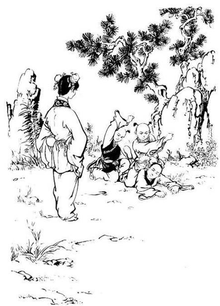
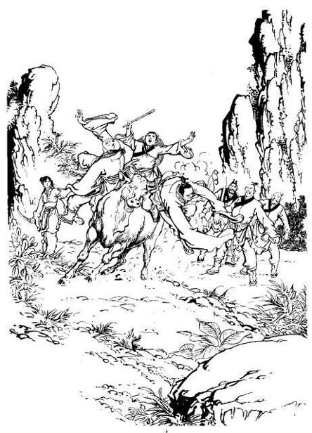

# Chapter 1 – No Love under the Wind and Moon

Translated by Noodles

> Within the boat were five girls picking lotuses … a lonely heart like
> a string struggling to be untangled … there are no lovers meeting
> under the wind and moon, the past is like a dream cut short

The fog has lightened due to the strong winds, but as time approaches,
solitude lies by the stream. A mysterious song is heard from afar,
seemingly from the Jiangnan province. A soft and graceful tune was
played which carried across the lake’s surface under the cover of the
mist. Once the song had finished, a small boat appeared. Within the boat
were five girls who were singing and laughing, picking lotuses into the
boat. The lyrics the girls sang were from the poem The Butterfly Loves
the Flower, written by the Song poet Ouyang Xiu, the words sung matched
what the girl was feeling inside; though only sixty words were sung, the
season, time of day, place, scenery and the girl’s face, clothes, hair
adornments, emotions were all described meticulously. The next part of
the song is as if someone is narrating a scene, a love story, which is
close at heart yet far away, but a love which isn’t yet exhausted.

Ouyang Xiu was in Jiangnan as a court official where he lived a
leisurely lifestyle, doing as he pleased, absorbed in what he was doing
(reading, writing etc.,). People of Song shouldn’t use their position to
abuse the town’s people, but it is not forbidden to use poetry for
leisure. As long as a line of poetry came out, as long as there is well
water to accompany a song, as the Jiangnan spring comes and the willow
buds, as lotuses are on the autumn lake, everything that follows is an
Ou poem.

It was during the year when Southern Song was established, and when the
South Lake became popular. It was near mid autumn, as lotus leaves began
to decay, and when lotus pods were at their best. A song spread across
the lake to a Taoist priestess’s ear. As she sat alone underneath a
willow tree quietly, the night winds forced her to place an apricot
yellow robe on. The winds managed to brush a piece of dirt on her neck.
She hid her feelings, as ‘a lonely heart like a string struggling to be
untangled’. The song gradually moves away, the song is a verse of Ouyang
Xiu’s Butterfly Loves a Flower. A light breeze carried two sentences;
“there are no lovers meeting under the wind and moon, the past is like a
dream cut short”. The song comes to a rest. A smile came upon her lips.

She let out a sigh and raised a left hand revealing a bloody palm. “What
do you find so funny?” she mumbled to herself. She sang to herself,
without understanding the regret and sorrow within the poem.

Standing about one hundred feet away from the priestess, a plainly
dressed bearded old man was standing silently unmoved but as he heard
the two sentences he let out an extremely quiet sigh.

A little boat gently glides across the blue jade lake. The girls on the
boat were young; three of them about fifteen or sixteen, the other two
were around nine. Two of the girls were cousins. The older of the two
was called Cheng Ying; the younger was called Lu Wushuang. The
difference in age was about six months. The other three girls were
singing songs constantly, the boat emerging from a pile of lotus leaves.

Cheng Ying said, "Cousin, can you guess who that old man is?" pointing
to the man underneath the willow tree.

The hair on that man is all messed up, his beard loose, the colour of
his beard was black like a crow's, indicating that he is not very old,
although his face has traces of wrinkles like those of a seventy or
eighty year old. He is wearing blue, around his neck is hung a bright
satin bib. On it was embroidery of cat jumping at a butterfly, though
the picture is now old and fading away.

Lu Wushuang said, "That strange man has sat there for half a day now,
why doesn’t he move?"

Cheng Ying said, "If you want to call him something, call him old
grandpa. If you call him strange, surely he would get angry.”

Lu Wushuang laughed, "Is he not strange? He’s old yet he is still
wearing a bib. If the bearded man gets up and becomes angry, that is
surely something to be watched."

From within the boat a disheveled lotus was lifted up and is thrown
towards the man. The boat is about ten feet from the man. Lu Wushuang is
young but the strength in her arms is not feeble, the one stroke was
very accurate.

Cheng Ying shouted out,” Cousin!"

It was meant to delay her but she saw the lotus was in front of her face
and flew past.

As the man looked up, he saw the lotus flying towards him, but he didn’t
put his hand up to catch it and let it hit him in the face. He started
to eat the petals from his face and clothes even though the petals were
bitter, and smiled as the boat is rowed closer and eventually came
ashore.

Cheng Ying ran towards the man and tugged his clothes saying, "Old
grandpa, those are not nice to eat."

She reached into a pocket and pulled out a lotus flower, split it open,
peeled off eighteen petals, then split open the blue green skin of the
lotus and removed the bitter core, and then passed it onto the man’s
hand. The man put it into his mouth and started to chew, and felt an
extremely sweet taste, completely different to what he had eaten before.
He cracked a smile at Cheng Ying and nodded his head. Cheng Ying did
this again and gave another lotus to the man. The man put it in his
mouth and chewed for a while and then looked up at the sky and said,
"Follow me?" While he said this he was striding in a westerly direction.

Lu Wushuang grabbed hold of Cheng Ying’s hand and said, "Cousin lets
follow him."

The one of the other three girls spoke up and said, "Let’s go home, if
you go now, Lady will scold at us."

Lu Wushuang put on a naughty face after she saw the strange man had run
away extremely quickly and said, "If you don’t come, fine", then
released her cousin’s hand and chased after the man. Cheng Ying had come
out to play with her cousin and couldn’t leave her alone and so
followed. The other three girls were older than them, but they didn’t
have the same courage and just called out a few times, as they watched
the old man disappear into the mulberry forest followed by the two
cousins.

The old man ran very fast, but saw that the two cousins couldn’t keep up
so stopped and waited. However, in the end he would not wait any longer
and turned around towards them, grabbed the girls, put one underneath
each of his armpits, and flew towards his destination. The two girls
could only hear the sound of the wind in their ear, the stones and grass
on the ground flew past their eyes. Lu Wushuang became frightened and
shouted, "Let me go! Let me go!" The strange man ignored her, and
instead moved even quicker. Lu Wushuang looked up, and bit fiercely on
the man’s hand. Teeth marks were left on the man’s palm but he hid the
pain. Lu Wushuang loosened her teeth. She shouted and screamed with all
her life. Cheng Ying stayed quiet.

The old man hurried for a while and then put the two girls down onto the
ground. They had arrived at a cemetery. Cheng Ying’s face was pale
white, while Lu Wushuang’s face was swollen and red. Cheng Ying said,
"Old grandpa, we need to go home, we don’t want to play anymore!"

The strange man stared at her without flinching. Cheng Ying saw that his
eyes revealed a sorrow, a lonely aura, and filled her with pity. She
gently said, "If you’ve got no one to play with; then wait by the lake
again tomorrow and I’ll peel lotus for you to eat again."

The strange man sighed and said, "Yes, it has been ten years, I’ve had
no one for company within these last ten years." His eyes were still
exuding an ominous light. He then fiercely said, "Where’s Yuanjun? Where
do you live?"

Cheng Ying heard his serious voice, and became frightened. Quietly she
said, "I, I? I don’t know."

The man grabbed her arm, shook her a few times. His voice sunk, "Where’s
Yuanjun?" Cheng Ying was scared and wanted to cry, tears rolled from her
eyes. Yet she didn’t cry.

The old man clenched his teeth. "Cry, cry. You won’t cry? Hmm, you were
like this ten years ago. I won’t let you marry him. You said you
couldn’t bear to leave me, so why did you leave with him. You said you
were touched by my kindness, leaving me would leave you heartbroken. Ha!
Those are all deceiving words! If you are really hurt, why don’t you
cry?"

He held onto Cheng Ying fiercely. Cheng Ying had been pale due to fright
but still the tears wouldn’t come. The man shook her again. Cheng Ying
clenched her teeth and said to herself “I won’t cry, I won’t cry!”

The strange man said, "You won’t even cry one tear for me, not even one.
What use is my life now?" He suddenly let go of Cheng Ying, bent his
legs, crouched, and thrust himself into a tombstone causing a crashing
sound. He lay on the ground unconscious.

Lu Wushuang said, "Cousin, quickly escape" and grabbed hold of Cheng
Ying’s hand, turned and ran. Cheng Ying hurried a few steps, but as she
saw the strange man lying with blood on his head, her heart couldn’t
stand it and said, "Old grandpa is dead". Lu Wushuang said, "Now he’s
dead, won’t he turn into a ghost?"

Cheng Ying gulped, scared that he would turn into a ghost, scared that
he would suddenly wake up, and remembered the mad words he was saying.
She saw his head covered in blood and felt pity, she comforted herself,
by saying, "Old grandpa is not a ghost, I’m not scared, he won’t blame
me". She slowly walked towards the old man. "Grandpa, are you hurt?"

The man let out a groan. Cheng Ying got a bit braver, and tended to his
wounds with a handkerchief. But the force of the collision was great, so
the wound on his head was very severe. The handkerchief was soaked in
blood. She used her left hand to press hard on the wound and after a
while the bleeding stopped. The man began to open his eyes, and saw
Cheng Ying by his side. "Why did you save me? Why don’t you let me die?"
As Cheng Ying saw he had awakened, her spirits raised and said softly
"Does your head hurt?" The strange man shook his head. "My head doesn’t
hurt, my heart hurts." Cheng Ying thought this was strange thinking,
"There is a large wound on his head, yet while his head doesn’t hurt,
his heart does." She thought no more of this as she untied her waistband
and gave it to the man to tie his wound.

The man took a breath and sat up. "You agreed not to see me ever again;
we are going to part now. You won’t shed a single tear for me?"

Cheng Ying heard his words were full of sorrow; saw his head full of
blood, eyes earnest, and couldn’t help but be filled with sorrow and two
drops of tears emerged. As the man saw the tears, his face changed to a
more joyful expression, but at the same time a mournful sound came out.
Cheng Ying saw his sobs, her own tears like drops of pearls, rolled down
her cheeks, then reached out and hugged his neck. Lu Wushuang saw how
these two strangers are sobbing together, and wanted to laugh. She
couldn’t hold it in any longer and burst out in a laugh.

The strange man heard this, and said to the sky, "The words that came
out of your mouth said you won’t leave me, but as you grow older you
will forget the things you’ve said; just remember the little white face.
You laugh with real joy!" He looked down at Cheng Ying. "Yes, yes, you
are Yuan, my little Yuan. I won’t let you leave, I won’t let you leave
with the little white face", as he held tightly onto Cheng Ying. Lu
Wushuang saw he had become deeply disturbed and didn’t dare to laugh
again.

"Yuan, I’ve finally found you. Let’s go home, from now on you will
follow father." Cheng Ying said, "Old grandpa, my father died a long
time ago." The strange man said, "I know, I know. I’m your stepfather,
you don’t recognize me?" Ying shook her head. "I don’t have a
stepfather."

The strange man gave a howl, and pushed Ying away. "Yuan, you don’t even
recognize step father?" Ying said, "Old grandpa, my name is Cheng Ying,
not your Yuan."

"You’re not Ah Yuan? You are not Ah Yuan?" he was expressionless for
half an hour. "Hmm, around twenty years ago Ah Yuan was your age. Now
Yuan has grown up and doesn’t need father anymore. The only thing in
your heart is Lu Zhanyuan, that swine."

Wushuang sighed knowingly; "Lu Zhanyuan?"

The man asked, "You know him, don’t you?? She shook her head smiling, "I
just recognized that man is my uncle." The man’s complexion changed to a
vengeful colour. He grabbed hold of Wushuang and asked, "Where is that
swine? Lead me to him."

Though Wushuang is scared inside, she put on a smile and said, "My uncle
lives close by. You really want to find him?"

"Yes, yes. I’ve been searching for him for three days, so I could settle
my debt with that swine. Little girl lead me to him and old grandpa
won’t trouble you." As he said this, his voice changed tone from angry
to gentle and released his grasp. She used her right hand to touch her
sore left arm.

"You really hurt me. I don’t know where he lives anymore." The man’s
eyebrows rose, as if he was about to go mad again, but thought it is not
right to force the little girl, and put on a clown like smile. He put
his hand in his sleeve and said, "It was grandpa’s fault. You don’t have
to follow me. Grandpa has some sweets for you.” He reached around his
sleeve but couldn’t find any sweets. Wushuang smiled and clapped.

"You don’t have any sweets, aren’t you ashamed to lie? Alright, my uncle
lives near here." She pointed to two faraway giant trees. "It's near
there."

The man reached out his long arm and carried the girls underneath his
armpits again, and hurriedly flew towards the two trees. He followed the
path in front, until there is a small obstruction but cleared it in a
leap. In a flash, the three of them were by the two trees. The strange
man dropped the two girls, and saw two grand tombs below the trees. On
the tombstone was written: “Here lies the grave of Lu Zhanyuan.” On
another was written” “Here lies the wife of Lu.” The grass around the
path to the tombs was knee deep, indicating that the tombs had been here
a long time.

The man just stared at the tombstone and said, "Lu Zhanyuan is dead… how
long ago?" Wushuang laughed as she replied, "Three years ago."

"He deserved to die, good. What a pity that he didn’t die beneath my
hands!" he said as he laughed at the sky. The laugh could be heard from
faraway, but the laugh was a regretful, a lamenting laugh, not one of
joy.

It was deep within the night, the field of grass covered by fog.
Wushuang tugged at her cousin’s sleeve. "Let’s go now." The strange man
said, "The little white face is dead. Ah Yuan, where can you go now?
I’ll take you back to Dali. Hey little girl, take me to your dead
uncle’s wife."

Wushuang pointed to the tombstone, "Can’t you see? My aunt also died.”
The man picked himself up and his voice like thunder, shouted, "Are
those words real or a lie? She… she really is dead?" Wushuang’s face
turned pale, and in a quivering voice said "Father said not long after
uncle died, my aunt followed. I don’t know anymore, I don’t know. Don’t
shout at me, I’m scared!"

The man beat his chest and shouted, "She’s dead… she’s dead? No, you
can’t die before seeing me again. I followed your instructions; ten
years later, we’ll meet again. You didn’t wait for me?" He shouted
wildly and jumped around madly, his cries like a wild tiger. He swept
his leg across the right tree, which shook the branches of the tree. Lu
Wushuang and Cheng Ying held each other tightly and retreated a few
steps not daring to be closer. The man suddenly grabbed hold of one of
the trees, and shook it violently, and tried to pull it out. The tree is
around a thousand pounds so how could he pick it up? "You promised, but
now you break it? You said we would meet again. Does the promise not
count?" After a shout, the noise became quieter. He crouched down, and
moved his chi through his two arms, his head gradually heated up and
steam arose, the muscles in his arm clenched, and his back straightened.
He shouted “Rise!” As the tree was being pulled, a strange noise
occurred. Amidst the noise, there were now two pieces of the tree. He
picked up of one part of the tree and stood still before saying quietly,
"Die! Die!" He exerted some strength and flung the piece of tree away
far away. Like the handle of an umbrella it was flying through the air.
He stood in front of the tomb and mumbled, "You are right, the wife of
Lu is indeed Ah Yuan.” His eye blurred, the two tombs had become the
image of two people. One of them a smiling young girl with the pupils in
the eyes full of hope; the other is well dressed, collected young man.
The couple was sitting together.

The strange man opened his eyes and said, "You seduced my daughter, I’ll
kill you with my finger." He stretched out his right hand and finger
(the shi finger), stood up straight, blocking the path of the young man.
A severe pain went through his shi finger and he released the pain. It
hit the tombstone. However the image of the young man remained. The
strange man shouted: “Where can you escape to now?” He struck out twice
with his left palm, making two sounds, aimed at the same tombstone. He
kept on hitting out, with each palm getting more severe each time. After
ten palms, blood began to seep through. Cheng Ying could no longer hold
back and shouted, "Old grandpa, stop fighting, you are going to hurt
yourself."

He laughed and shouted back, "I’m not hurt, I’m going to kill the swine
Lu Zhanyuan." He then laughed heartily, stopped and then said: “I must
see your face, I must.” With ferocious strength in his two hands he
plunged ten fingers into the ground of Mrs. Lu's tomb. He pulled back
with two arms, and two lumps of the ground came with him. His two palms
like an iron spade, he dug lump after lump out of the ground.

The two cousin’s faces had become colourless, and they had the chance to
escape. While the man was busy digging, they could leave unnoticed. The
two girls hurried around a few bends, and as they saw the man didn’t
follow, they relaxed a bit. The two girls were unfamiliar with the
place, so they looked for locals to help them along the road. They
walked deep into the night when they eventually found their way back to
the Lu house.

Wushuang shouted, "Something terrible is happening, something bad! A
madman is digging up the graves of uncle and aunt!" She ran into the
hall, only to see her father Lu Liding raise his head and stare at the
wall. Ying followed into the hall, and their eyes followed Lu Liding’s,
and saw three sets of palm prints, two at the top, two in the middle,
below five, in total there were nine. Each one was printed with blood.
Lu Liding saw his daughter and asked, "What are you talking about?"

"There is a madman digging up the graves of uncle and aunt," said
Wushuang. Her father stood up: "Nonsense!"

"Uncle, it's true!" Cheng Ying replied. Lu Liding knew what her daughter
was like, mischievous and naughty but Cheng Ying never tells lies. "What
has happened?"

Wushuang told her father what happened. Her father was troubled, and
before she finished, had picked up a blade and hurriedly headed for the
graves. When he got there, not only did he see the graves had been
disturbed, but the coffins had been opened. When he heard that someone
was digging up the graves, he had known what to expect, but when he saw
it with his own eyes, his heart skipped a beat. There was no sign of the
bodies, the ash in the coffins, paper money, cotton cushions were all in
a mess. It must be a god, and then saw on the lids of the coffins were
traces of what looks like an iron tool. He looked in despair at the
state of the graves. He didn’t ask his daughter who did this, but
wondered who could have such debts with his brother and sister-in-law
that even after their deaths, their graves and corpses wouldn’t be left
alone. He held tightly to his knife.

He knew his brother had taught the martial arts. He was a careful,
generous, dependable man, who didn’t dabble in Jianghu affairs. He was a
learned man. After he circled the area, and couldn’t find any traces of
the suspect, he waited for half an hour before finally returning to his
home.

He approached the main hall. He sat down on a chair and placed his knife
by his side, and stared at the nine blood prints on the wall. He
thought, "Before brother died, he said he had an enemy, a Taoist
priestess, named Li Mochou, with the nickname “Scarlet Serpent Deity”,
whose kung fu was extremely high. She was cruel and vindictive person.
He anticipated that after ten years of marriage, she would come and seek
revenge on the couple. At the time Lu had said: “My illness is not
getting better; I guess the ‘Scarlet Serpent Deity’ cannot take her
revenge. In three years, it will be the time. You must persuade my wife
to go into hiding.” I had promised him, but who could have guessed that
on the night he had passed away, sister-in-law would cut her throat?
Brother had passed away three years ago, and the time approaches. The
couple had passed away so why does she still come? Brother also said
that before the priestess kills, she would place bloody handprints on
the wall on the target's home, with one print meaning one life. My home
only has seven people in total so why nine prints? The two prints are
for my brother and sister-in-law, but now they are dead she must have
dispatched people to ravage their grave. I’ve been at home all day, so
how did that evil witch manage to place the prints? Could she get in
here without disturbing even gods and ghosts? He shivered.

Soft footsteps can be heard behind him, a small soft pair of hands
covered his eyes. He recognized it was his daughter’s voice when she
spoke. "Father, who am I?"

Lu Wushuang had always been close to her father. When she was three
years old, she played this game with him. This made her parents laugh.
He was sad, so now his daughter is trying to cheer him up. Under normal
circumstances this would have worked. But today it would be no use as he
pulled his daughter’s hands away. "Father has no time to play, let’s go
inside and play!"

Lu Wushuang stood there. She always had the love of her father and now
he had no time for her. She let out a sigh and wanted to share in her
father’s misery only to see the male servant Ah Gen hastily arriving.

"There’s a guest outside master."

"You tell them I’m not at home."

"Master, she doesn’t want to see you. She just wants to spend the night
here."

Lu Liding said, "Who? Are they women?"

"No, it’s a mother with two small boys. They’ve been waiting a long
time."

When Lu Liding heard it was a mother with her two sons, he was able to
relax a bit. "It’s not a Taoist priestess?"

Ah Gen shook his head, "No. It’s a plainly dressed woman, she looks like
a mother of a respectable family."

"Alright, take them to the guest room and treat them well. Give them
something to eat." Ah Gen hurriedly went out. Lu Wushuang said, "I’m
going as well" as she hastily exited. Lu Liding stood up, he wanted to
go inside to discuss how to face this enemy with his wife. He made his
way into the hall. He showed her the prints, and told her about the
missing corpses. Mistress Lu pondered and said, "We are going to have to
hide the two girls?"

Master Lu pointed at the wall. "The girls are inside, but I fear that
the monster that did this won’t let them escape so easily. We have
practiced kung fu for several years now, when the person enters our
home; remember not to show any emotion."

Mistress Lu stared at the wall, "There are nine prints? We only have
seven people within the household." As soon as Lu Liding heard this, his
limbs went numb and looked at his wife startled, and cried. He reached
out and held her arms.

"Dear, when the time comes, there is no need to be afraid. The top two
palm prints are for Brother and his wife, the middle two are ours. In
the last group, two are Ying and Wushuang, there are three are for Ah
Gen and our two maids. Blood will fill this house tonight."

Mistress Lu quivered and said, "Brother and sister-in-law?"

"I don’t know what deep debt the witch is after, but brother and his
wife are dead. She has sent people to dig up the grave and disturb the
corpses."

"You are saying that madman was sent by her?"

"Correct."

Mistress Lu saw that her husband’s head was covered with sweat. "Why
don’t you go into your room, clean yourself up, and rest a while before
we discuss this again."

Lu and his wife went into their room. "Wife, today it will be hard for
the Lu family to avoid death, but if we survive we will honour Brother
and sister-in-law’s name." "You are correct," replied mistress Lu.

The two of them thought, Lu Liding is not a famous name, but the name Lu
Zhanyuan is. The He Yuanjun couple was famous throughout the Jianghu
world. The Lu name was famous and no one in the Jianghu dared make fun
of the name.

The two of them went to the back garden after they heard a sudden sound
from the east wall. Near the top of the wall was a person. Lu stepped in
front to shield his wife. He looked up and saw a young boy sitting on
the wall, trying to pick a ling flower. By his leg, someone shouted out,
"Careful, don’t fall." It was Cheng Ying, Lu Wushuang and a boy picking
flowers by the wall.

Lu thought, "The girls are naughty, getting someone else to do their
errands."

The boy on the wall managed to pick a flower. Wushuang shouted, "Give it
to me-give it to me!" The boy smiled, and threw it to Cheng Ying. Cheng
Ying caught it and gave it to her cousin. Lu Wushuang was angry, and
threw the flower onto the ground. She took a few steps, and angrily
shouted, "Who cares? I don’t want it anymore."

Lu and his wife saw how the kids were playing and arguing, and sighed.
They withdrew to their room. Cheng Ying saw Wushuang crush the flower
and asked, "Cousin, why are you angry?"

"I don’t want his. I’ll pick one myself." As she said this, she moved
her right foot a little, and leapt. She hung onto a purple cane hanging
from the tree. She used her strength and managed to leap up higher a few
times, and landed on a silver branch of the Cinnamonum cassia tree (one
of the group of aromatic trees like camphor and cinnamon) The boy on the
wall clapped. "So you are joining me!"

Wushuang swung on the branch a few times and released her grip, throwing
herself towards the wall. Although she has learned a little lightness
kung fu, this leap was very dangerous. But since she was angry with the
boy giving the flower to Ying and not her, she wanted to keep her pride
in front of the boy. She wasn’t used to jumping such a distance. The boy
gulped and said, "Stretch your hand out" as he reached out. If the boy
hadn’t reached out, Wushuang would have made it, but when she saw his
hand in midair she shouted, "Move!" and leaned to the side to avoid his
hands. The ability to twist in the air is part of a higher level of kung
fu; she had seen her dad perform this once before, but without the
supervision of her parents how could she try it? As she turned, her hand
wasn’t able to reach the top of the wall. She shouted, "Oh no!" before
falling to the ground. Another boy near the foot of the wall reached out
to catch her. The wall was about ten feet tall. Though Wushuang was
light, the force of her hitting the ground would still be high. The boy
managed to grab her waist, the both of them falling onto the ground.
Only to hear two “ka ka” noises, as the bone in Lu Wushuang’s left leg
snapped. The boy changed colour to that of the flowers on the stone
altar, as blood spouted out. Cheng Ying wanted to help the boy who tried
stopping the disaster up. The boy got up, and pressed hard on the heavy
wound. Wushuang had already fainted. Cheng Ying picked up her cousin and
shouted, "Uncle, aunt, hurry!"

The couple rushed out of their rooms to see to injured children, as well
as a middle-aged woman who also rushed out from her room. It was the
woman who had come to ask for shelter for the night. They saw her pick
up the injured children and rush into the hall. Ignoring her own child’s
injuries, she tended to Lu Wushuang’s leg, intending to put the snapped
bone back in place. Mistress Lu fetched a piece of cloth and tied it
around the boy’s head before going to see her daughter. The woman then
pressed down on the “bai hai” (white sea) pressure point and the “wei
zhong” (middle gathering) pressure point on Lu Wushuang’s leg to ease
the pain, as she place one hand each on the broken pieces of bone, then
put the bone into place. Lu Liding saw her movements were swift, her
pressure point “dim yue” kung fu was at a respectable level, and his
curiosity was raised. "Who are you? Why did you come here?" The woman
was busy tending to Wushuang’s leg and didn’t reply to the questions.

At the same time, a laugh was heard on the roof. "I’m here to take the
nine lives of the Lu family, come out."

The woman heard the chilling laugh from the rooftop, swallowed, and
continued to tend to Wushuang’s injuries. As she twisted her hands,
Wushuang let out a scream in sheer pain and she fainted again.

Everyone went outside, only to see a young priestess standing by the
overhang of the roof, the moonlight lit up her face. She was about
fifteen or sixteen years of age, and a long sword with a blood red sash
hung on her back, the sash moving in the wind.

Lu Liding said calmly, "I’m Lu Liding. Are you under the command of
priestess Li?"

The priestess’s lips were skewed when she replied, "It’s good that you
know. Go collect your wife and daughter, kill them and then kill
yourself to spare me the trouble."

The words were said with coldness, at a speed neither too slow nor fast,
and with disregard for the audience. When Lu Liding heard these words,
his body quivered. "You…you" He wanted to jump on to the roof and fight
the girl, but she was young and was just a girl, how could he fight her?
As he hesitated, suddenly something swept passed his body; it was the
woman who had come to ask for shelter, in her hand was a long sword,
ready to fight that young priestess.

The woman wore a grey traditional dress, the priestess an apricot yellow
robe. Under the moonlight, the images of grey and yellow resembled some
sort of flying dance; three flashes of light were produced as three
sword-clashing sounds were made. Lu Liding’s skills were taught by his
brother, and though he has never fought an enemy before, his eyes
weren’t poor, and saw every stance of the two fighters. He saw the sword
held in the priestess’s hand turned from defense into attack, attack
into defense, her sword stances were without mercy. The woman’s sword
matched hers. The sounds of clashing blades were heard, both swords
turned over, suddenly the little priestess’s sword flew into midair. The
little priestess chased after her sword, her face losing its calmness
and she shouted out, "I’m under the orders of my master to take the
lives of the Lu family. Who are you, and why are you meddling in these
affairs?"

The woman gave out a cold laugh and said, "It seems like your master has
great ability, she went out to find Lu Zhanyuan to settle her debts, but
she knew that he was dead, so she’s taking out her anger on his loved
ones, isn’t that correct?"

The little priestess wielded three small silver needles with her right
hand and threw them ferociously, two at the woman, one at Lu Liding who
was standing in the middle of the courtyard. It was such an unexpected
movement. As the woman fended off two needles with her sword, Lu Liding
managed to catch the other needle with two fingers. The little priestess
laughed out coldly and jumped down from the building, and quickly flew
away hearing the chasing footsteps.

The woman jumped down to the courtyard, and saw Lu Liding was still
holding the silver needles. She shouted, "Drop it!" Lu Liding hesitated
before doing so. She cut off a piece of her belt and wrapped it firmly
around the wound on his right hand.

Lu Liding jumped. "The needles have poison on them?"

The woman replied, "Nothing can compare to this poison." She gave him a
granule of medicine to take. Lu Liding felt his arms swelling and
numbing. The woman used her sword tip to cut deeply into the two
infected fingers of Lu, and saw drops of black blood seeping out.

Lu Liding jumped and thought to himself, "My finger wasn’t cut, I only
touched the silver needles and the effects are so severe. If the needles
actually cut me then my life would surely have been gone." He then
looked in the direction of the woman and said, "I have eyes but I fail
to see TiaShan Mountain\*, please, can madam tell me her name?" (\*This
phrase basically means he didn’t see his benefactors even though they
were in front of him.)

The woman replied, "My husband is named Wu, Wu Santong." Lu got up in
awe and said, "So it is Madam Wu. I’ve heard the Wu’s are under the
order of Reverend Yideng in the south in Dali, is that right?"

"You are right. Reverend Yideng is indeed my husband’s teacher. I have
learned a little in terms of martial arts from my husband, who is
nothing more than a farmer. I hope master Lu won’t laugh."

Lu thanked her for the helping hand. He had heard from his brother, out
of all the martial artists he had seen, those under the teachings of
Reverend Yideng were the best. After Yideng had abdicated as the ruler
of Dali, he became a monk and had four students, “Fisherman, Woodsman,
Farmer and Scholar”. The farmer was called Wu Santong. Wu disliked his
brother, but at the time his brother had not told him how the feud
between them started. Why did Madam Wu not treat them as enemies but
instead help them by fighting off the Scarlet Serpent Deity’s disciple?
The reasons are hard to fathom.

Everyone went back to the main hall. Lu Liding carried his daughter
inside, and saw she had regained her consciousness, her face now white.
She’s holding in the pain and refraining from crying, not particularly
aware.

Madam Wu said, "Now that witch’s disciple had escaped, she herself will
come here. Master Lu, I’m not looking down on you but even if you and
your wife joined forces with me, we are never going to be able to
compete with her. But even if we run it will be no use. We might as well
wait for her and let fate decide."

Mistress Lu then asked, "Who exactly is the witch waiting for? And what
feud has our family with her?" Madam Wu looked Lu Liding in the eye and
said, "Master Lu never mentioned this before?"

Mistress Lu replied, "He only mentioned that it was something to do with
brother and sister-in-law, something to do with love affairs, he isn’t
exactly sure himself."

Madam Wu sighed, "It must be something to do with that. I’m an outsider
so it is not my place to speak. Master Lu’s brother went to Dali ten
years ago. Li Mochou, the Scarlet Serpent Deity is now infamous
throughout the Jianghu world, but ten years ago she was a gentle beauty,
and wasn’t yet a priestess. This was before she sinned, after she saw
your brother and fell under the enchantment of love. After many twists
and turns, your brother eventually married Ah Yuanjun. However this
wasn’t any fault of Yuanjun. This kind of business is best kept under
wraps; it’s just today’s events have forced me to retell these events.
Yuanjun was my stepdaughter."

The Lu couple simultaneously gave out an understanding sigh. Madam Wu
touched her injured son’s shoulder in comfort. She stared into the flame
of a candle and carried on.

"Your sister-in-law He Yuanjun was an orphan. We took her in and she
became our stepdaughter. We loved her dearly. Eventually she met your
brother, and they fell in love with each other, and wanted to get
married. Firstly, my husband didn’t want her to leave the family;
secondly, he was too strict saying Jiangnan people were crafty and
cunning; they can’t be relied upon and forbade the wedding. Ah Yuan
secretly ran away with your brother. On the wedding day, both my husband
and Li Mochou went to find the couple and cause them trouble. Luckily, a
high monk from the Dali Sky Dragon temple passed by and took the matter
in his own hands. He requested, on his behalf, that they would grant the
couple ten years of peace. Li Mochou and my husband agreed to this. My
husband was angry, and after this event he became confused and
disturbed; his teacher, fellow students and even I were unable to
persuade him, or understand him. He just counted down the ten-year
deadline. According to my calculations, today ten years exactly has
passed. It was hard to predict that the couple would not enjoy the ten
years of bliss that they had been granted." She dropped her head after
she finished, her whole face changed to a mournful look.

Lu Liding said, "So according to what you have said, the person who dug
up brother and sister-in-law’s grave was your husband."

Madam Wu replied in shame, "After hearing what the two misses have said,
it is indeed my husband."

Lu shaking his head said, "Your husband’s actions are not trivial. There
wasn’t a feud in the first place. Even if there was, now that my brother
and sister are dead, things should be bygones. But now he’s stolen the
corpses, is that the action of a hero?"

When it comes to status, the Wu couple is higher than that of Lu’s. But
now that his heart is full of fury, his words did not carry the proper
tone of respect.

Madam Wu sighed, "Master Lu is right to blame my husband. He is confused
and has stopped talking; he doesn’t deserve any pity. I’ve brought my
two children along here, to try and stop the wrong doings of my husband.
Right now, I’m the only person who he takes any notice of." She looked
at her two children and said, "Go and kowtow (kneel down) in front of
Master and Mistress Lu to apologize for your father." The boys did as
they were told.

Mistress Lu gave a hand to help the boys up and asked what their names
were. The one who threw himself down and cut his forehead was called Wu
Dunru, the older brother; the younger was called Wu Xiuwen. The
difference in age was one year, one of them twelve, the other eleven.
The two had been taught martial arts and were relatively learned. Madam
Wu and her husband were getting old, and hoped that they could reach a
good level of kung fu and schooling, so they could withhold the Wu name
in Wuxia, and not just rely on it.

Madam Wu did not divulge the darker reason for her husband’s behavior.
She sighed and thought, "Those lies are only good for now. I mustn’t
tell anyone about the truth." In reality, when Yuanjun had grown to
eighteen or nineteen she had become a beautiful woman. The feelings that
Wu Santong had for her did not limit itself to the father daughter
relationship. He was considered a hero in the Jianghu world so he could
do nothing and he was relatively content. But when he saw that she had
fallen in love with a Jiangnan youngster, he was angry that it wasn’t
him. That’s why he said Jiangnan people are untrustworthy and
unreliable, to get rid of his love rival. The reason he said this was
that he had suffered the craftiness of Huang Rong. She tricked him into
replacing Guo Jing in pushing down an ox and large stone, and couldn’t
escape afterward. Although this matter was cleared up later, the words
“Jiangnan people are untrustworthy” were etched into his head.

Madam Wu then said, "To think that before my husband had arrived, Li
Mochou is already here seeking revenge." As she said this, a voice was
heard from the roof.

"Ru’er, Wen’er, come with me!"

The words were unexpected, as no footsteps had been heard on the
rooftop, yet someone was up there calling. The Lu couple gulped as they
realized it was Wu Santong. Cheng Ying and Wushuang also recognized it
was the weird lotus eating man. They saw a blur, as Wu Santong flew down
and grabbed his sons, one in each hand before returning to the roof.
Madam Wu shouted, "Hey, why don’t you come and see master and mistress
Lu, and return the corpses that you took from them? Hurry." Wu Santong
did not reply as he had already long gone.

He ran wildly for a while, and hurriedly entered a forest. He put down
Xiuwen but still held on to Dunru, as his trace disappeared and his son
was left alone in the forest. As Xiuwen saw that his father had gone
over hundred feet away, he shouted, "Father, father!" He heard a voice
far away.

"Wait there. I’ll come back for you." Wu Xiuwen knew his father was
always acting strange, and doesn’t plan anything. Although he was
frightened alone in the black forest, he thought his father won’t be
long and sat down on a log. After a long while, his father still hadn’t
come. He said to himself, "I’ll go and find mother!" as he headed back
to the Lu home.

Jiangnan is a place where roads lead in all directions, where paths are
twisty and windy; it is hard to travel by day so what about traveling at
night? As he ran, the paths got narrower, and on numerous times he
stepped into the middle of muddy fields. Eventually he came across a
forest, and realized he had gone in circles. He wanted to cry, and
shouted, "Father, father! Mother… mother!" Who would hear him in the
middle of the night? He heard a few noises, and recognized it was the
call of a falcon. He once heard that falcons love to count the brows on
people and if they counted clearly, it would be an ominous sign for the
person. Immediately he spat out some saliva to wet his fingers, and then
moistened his brow, so that it would be difficult for the falcon to
count. But the falcon did not stop calling, He hid behind the trunk of a
tree, keeping his brows covered with his finger, his heart jumping, not
daring to move. After a while he closed his eyes and fell asleep.

In the morning, in a sleepy haze, he heard few clear screeches. He
opened his eyes and looked above, and saw two extremely big white eagles
hovering, wings spread out, looking magnificent. He had never seen this
type of eagle before, his interest was raised and shouted, "Brother,
come look at the big eagle," not realizing he was alone, as he was
always by his brother’s side.

Suddenly he heard two whistles behind him; the sound was gentle and
soft, coming from the mouth of a little girl. The two eagles circled
twice before descending. Wu Xiuwen turned around and saw a young girl,
who was raising her arm to the sky. The eagles came down by her side.
The girl gave one look to Wu Xiuwen and then stroked her two eagles
saying, "Good eagle…clever eagle." Wu Xiuwen thought, "So the two eagles
are her eagles. He looked at the eagles, which were exuding an air of
superiority, standing taller than the girl. He walked up to the girl and
asked, "Are those eagles yours?"

The girl pouted, and her face changed color. "I don’t recognize you. I’m
not going to play with you.”

Wu Xiuwen touched the backs of the eagles without any intentions. The
girl whistled, and the eagles raised their left wing. There was a high
force behind the wings, and Xiuwen didn’t guard against it; he ended up
on the ground. He rolled around on the ground, eyes fixed on the eagles,
and said admiringly, "Those eagles are great and they really listen to
you. I’ll get father to catch me one so I can train it."

"Huh, you think your father can catch one?"

Wu Xiuwen was just curious, but each time she caused embarrassment. He
looked at her closely; she was wearing an elegant green dress, a pearl
necklace hung around her neck, her face was white, almost like butter,
her eyes moving and face delicate. Wu Xiuwen thought she was extremely
beautiful, and wanted to approach her but saw she was cold, and stayed
back in fear. The girl stroked the eagles back with her right hand, and
examined Wu Xiuwen. "What’s your name? Why are you alone?"

"My name is Wu Xiuwen. I’m waiting here for my father. What about you,
what’s your name?"

"I don’t play with naughty boys," said the girl as she turned her back
and walked away.

Xiuwen stood there before saying, "I’m not a naughty boy", and trying to
chase the girl at the same time. He saw that the girl was younger than
him by two, three years; her steps aren’t very large and he should catch
up with her very soon. Though he used his lightness kung fu, the girl’s
steps were very fast, and in a flash a distance of ten feet was between
them. The girl hurried a few steps and then shouted back, "Hey, can you
catch me?" "Of course", replied Xiuwen and immediately stepped up his
efforts. The girl turned and ran, and then hid behind a tree. Wu Xiuwen
followed. As soon as he was near, she suddenly stretched out her left
foot, and tripped him up. He didn’t anticipate this and fell forward. He
wanted to use the “Iron Tree Stump Stance” but the girl stuck out her
right foot and kicked him fiercely in the behind. Wu Xiuwen fell down,
his nose hitting a stone as he fell, causing a nose bleed and blood
poured over his clothes. When she saw the blood, she stopped, and wanted
to run away and leave the boy there. Suddenly, a voice from behind said,
"Fu’er, you are bullying again, aren’t you?"

"Who says? He just tripped by himself, what does it have to do with me?
Don’t listen to what father says." she replied without turning back. Wu
Xiuwen stood up and held his nose. Although it didn’t really hurt, the
blood made him nervous. As he heard the voice talking to the girl, he
turned around and saw an old man holding a metal walking staff. The hair
on the man’s temple was like frost, his appearance was strange, his eyes
where white, he was a blind man. He heard the man laugh and say, "Just
because I’m blind doesn’t mean you can lie to me, I can hear everything.
You act terribly now, so what’s going to happen when you get older?"

She walked over to the man and held his hand, and gently said, "Grandpa,
don’t listen to what father says, okay. He tripped and he’s got a nose
bleed. Can you stop the bleeding?"

The old man walked forward and grabbed Wu Xiuwen’s arm, then stretched
out his right hand and used his finger to press on the “Wen Xiang Xue”
(Smell Fragrant) pressure point by the nose. Wu Xiuwen’s nosebleed was
beginning to slowly stop, and as he touched his nose a few times, it
did. He felt the man’s fingers were like iron pliers, long and stiff,
holding his arm tightly. He was scared, and didn’t move; as soon as his
hand was released, he used the grabbing hand kung fu taught by his
mother, he pushed out a palm in a semi circle to repel the man. The old
man wasn’t anticipating this kid would strike out, and was hit by a
sweetly timed palm. The man didn’t react and gave out an approving sigh,
while holding to his wrist. Wu Xiuwen tried to distribute his chi in
case he can’t escape and has to fight.

The old man said, "Little fella, don’t be scared. What’s your name?"

"My name is Wu."

"Your accent is not local. Where are you from? Where are your parents?"
As the man said this he released his wrist. When he mentioned parents,
Wu Xiuwen remembered that he has been away from his parents for a night
and didn’t know how they were. He wanted to cry. When the girl saw his
expression she sang, "Ashamed dog, eyes are red, ready to cry!"

Wu angrily replied, "I’m not going to cry again!"

The family was waiting at the Lu home for the enemy, when his father
came and took him and his brother away; he spent a night alone in the
forest. He was getting aggravated, his words were jumbled but the old
man managed to make out seventy or eighty percent of it. They were from
Dali, his father’s name is Wu Santong; his most refined kung fu was the
“Solitary Yang Finger”.

"Your father is a disciple of Reverend Yideng, correct?"

"Yes, you know our emperor? You’ve seen him? I’ve never seen him," said
Wu Xiuwen.

Wu Santong was the head of the Imperial Wood Transport, when the Emperor
was Duan Zhi. The emperor became a monk, with the new name “Yideng”. But
Wu Santong couldn’t let the past go and still called him Emperor. That’s
why his sons also refer to him as Emperor.

"I haven’t yet had the luck to meet the legendary “Southern Emperor”.
This girl’s parents were the receivers of great kindness from him. That
means we are not really strangers. Do you know who your mother’s enemy
is?"

"I heard from mother and master Lu that it’s Scarlet something,
something Chou.

The old man raised his head and mumbled, "Scarlet something?" He slammed
his staff and said loudly, "Could it be the Scarlet Serpent Deity, Li
Mochou?"

"Yes! It’s the Scarlet Serpent Deity!" The old man’s complexion changed
completely. He said, "You two play here. Don’t leave. I’ll go and take a
look."

The little girl said, "Grandpa, I want to come."

"Me too," added the boy.

The old man said, "No! Never! That witch is really powerful; I can’t
beat her. But when there are friends in need, one must go. You must
listen." He walked away, his staff digging into the ground as he took
each step.

Wu Xiuwen said respectfully, "Old Grandpa is blind and lame, yet he
moves so fast."

The girl bent her lips and said, "What’s so strange? If you saw my
father’s and mother’s lightness kung fu you would be even more shocked."

"Your father and mother are also blind and lame?"

The girl angrily replied, "Your parents are blind and lame!"

It was now deep into the day, the farmers are in their fields; every man
and woman was singing folk songs. He was originally from these parts.
Though he was blind, he walked and asked for help at the same time, and
in not too long he had reached the home of the Lu’s. From afar he heard
the exchange of blades, the “ping ping pang pang” clashing indicating
some ferocious stances. The Lu Zhanyuan family is a famous family in
this area and he’s just commoner. Although he is now a fairly famous
martial artist he didn’t approach and he also knew that he wasn’t the
Scarlet Serpent Deity’s match. He knew that rushing in would just
produce another corpse. But the matter involved a disciple of the
Reverend Yideng and his debts to him were too many to measure (not
exactly his debts, but what the girl’s parents owed Yideng), he couldn’t
just stand by. He used more energy, and hurried to the village.

He heard fierce fighting on the roof involving four people. He turned
his ear to one side to listen more carefully. From the breathing and
sword clashing sounds, he could tell it was one versus three, though the
three couldn’t fend off the enemy and were losing.

Last night Wu Santong had carried off his sons, and the Lu couple
wondered what he was up to now.

Madam Wu’s spirits raised and said, "Though my husband acts wildly, when
in danger he thinks clearly." Mistress Lu asked what she meant by this.
Madam Wu replied, "I don’t know if I’ve guessed correctly. Let’s just
wait and see."

As the night went on, Lu Wushuang fell asleep in her father’s arms.
Cheng Ying also eventually fell asleep. Mistress Lu wanted to take the
children into their rooms.

Madam Wu said, "Leave them for a little longer." At that moment, someone
shouted from the rooftop, "Throw them up here!" It was Wu Santong. His
lightness kung fu was superb, mistress Lu didn’t even notice he was on
the roof. Madam Wu took Cheng Ying outside and threw her up to Wu
Santong who caught her. The Lu couple swallowed, as Madam Wu threw Lu
Wushuang up to Wu Santong as well, who then took them away.

Lu Liding was concerned and said, "Where are you taking them?" as he
leapt onto the roof. But it was pitch black; there wasn’t a trace of Wu
Santong and the girls. Master Lu wanted to give chase, but Madam Wu
shouted out, "There’s no need to chase them, he’s trying to do good."

Lu jumped down back into the hall and quivering asked, "What good deed?"

Mistress Lu said, "Wu Santong is scared that the witch is going to harm
the children, so he has delivered them to a safe place." After he heard
his wife say this he said, "Yes, it must be this." But as he thought
about how Wu Santong took the corpse of his brother and sister-in-law
away, he started to worry.

Madam Wu said, "Ever since Ah Yuan got married, every little girl he
looked at reminded him of his troubles. I predicted that he would come
back to carry the girls away and try to protect them. The first time he
came here and took Ru’er and Wen’er away, I caught him glancing at the
girls a few times; his face had an affectionate look, with no evil
intent. He’s pretending that they are Ah Yuan. Indeed he did come back
for them. I hope this time he’s not going to do anything stupid." She
sighed twice, "You two better get some rest, we don’t know when the
witch will come, there’s no need to wait anxiously."

The Lu couple was extremely worried about their daughter and niece, but
decided to rest a little. Their fear and hate for the enemy filled them
as they waited for her in the main hall, the both of them carrying
swords and concealed weapons. They did not rest anymore. The couple has
been married for eighteen years; through that time, the everyday
business of running the home had its fair share of problems. But now
when they think about the enemy, and what Brother and Madam Wu said
about the enemy’s strength, her cruel and vindictive ways; they knew
time was running out and held each other.

After a long while, in the midst of the solitude, a soft song was heard
from afar, seemingly a long distance away but the lyrics were crystal
clear, “O mortals, what is love, that binds beyond life on earth, to all
corners, in pairs we fly” .

Each word seems to be getting closer and closer, the person singing the
song seems to be approaching extremely fast. By the beginning of the
third line, the person had arrived at the door.

The three of them were startled, as suddenly a crashing sound was heard;
the bolt on the main door had broken, the door flew in two different
directions. An attractive priestess, with an evil smile gently stepped
in; she was dressed in an apricot yellow gown. It was the Scarlet
Serpent Deity Li Mochou.

Ah Gen at the time was cleaning the courtyard; he spoke first. "Who are
you?"

Lu Liding quickly said, "Ah Gen… runaway!" Could he escape?

Li Mochou moved her hand in a sweeping motion; Ah Gen’s head was split
open, dying without a sound. Lu Liding drew his sword. Li Mochou leaned
to the side and brushed past him, and with another sweeping motion with
her fly whisk, caused the two maids to die. She laughed evilly, "Where
are your girls?"

The Lu couple had just seen three lives taken in the blink of an eye.
They knew they would have no luck today; with swords in their hands they
rushed to attack her from the left and right. Li Mochou was about to
attack again when she saw Madam Wu at the side holding a sword and
cackled, "So an outsider wants to interfere, fine, you can join the dead
in this house today!" Her voice was soft and graceful, her form exuding
a delicate air. She had a pair of bright eyes, her skin white, and was a
real beauty. They didn’t see her leg movements as she floated to the
rooftop. The Lu couple and Madam Wu leaped up to follow. Li Mochou swept
her whisk and the weapons flew out of their hands. She gracefully said,
“Master Lu, if your brother was still alive and told me he would divorce
He Yuanjun, that slut, then I could have spared your whole family. But
now, your luck is bad; you can’t blame me, blame your short lived
brother."

Lu Liding said, "Who asked you to spare us?" as he waved and chopped his
knife blade at her. Madam Wu and mistress Lu both attacked from the
front. Li Mochou saw Lu Liding’s skills were very average, but the way
he used his knife, his kicks and palms, reminded her of her loved one.
Her heart ached, and she wanted to see this type of kung fu as long as
she could. If she killed him, the “Jiangnan Lu Family Blade” kung fu
would be lost forever, so she flung her whisk without any real intent,
and allowed her three enemies to circle her, her heart in a tangle,
unable to use her normal array of ruthless moves. Suddenly Li Mochou
gently whistled, she moved from the house, and headed towards the river
bank, and to a lame old man holding an iron walking staff, and swept her
fly whisk at him trying to wrap it around his staff. Before her legs had
touched the ground, she had already unleashed an attack on her enemy.
Unleashing it when he wasn’t prepared, her moves ruthless; she could
teach the enemy how she could kill at all costs.

The old man heard the incoming attacks clearly; he lifted his staff
across his body, getting ready to fight. He was aiming to pierce her
right wrist. The iron staff is a heavy and clumsy weapon, only being
able to sweep and smash. The old man is using a “piercing” type of kung
fu, using the staff as a sword, and the moves he will unleash will be
light and leisurely. Li Mochou waved her fly whisk, the silver threaded
end up, wrapping it around the old man’s weapon. She shouted, "Let go!"

They struggled, borrowing strength to use strength, the fly whisk using
the force in the iron staff to pull and drag the enemy towards it. The
old man’s arms were shaking severely, and struggling to hold on, he
jumped up, his body slanting in midair to escape, and managed to fend
off a skilful stroke of hers. He thought, "This tyrant does live up to
her name." Li Mochou used the stance “Great Granddad Goes Fishing” (tai
gong diao yu) followed by “Luring the Old Man” (yuan zhe shang diao) to
snatch away the enemy’s weapon. Usually this is a great move and would
guarantee success, but before she could snatch away the iron staff, the
man had anticipated this move. She thought, "Who is this lame old man?
Why has he the ability to last this long?" On closer inspection, she
could see that he was blind and immediately called out, "You are Ke
Zhen’E!" The blind lame man was the head of the Jiangnan Seven Freaks
“Flying Bat” Ke Zhen’E.

After Guo Jing and Huang Rong had participated in the Hua Mountain
martial arts tournament, Huang Yaoshi organized their wedding on Peach
Blossom Island. Huang Yaoshi had always been eccentric and disliked
company, so after a few months of living with his daughter and
son-in-law, he left the island in search of a more peaceful place to
reside and left a letter. Huang Rong knew her father’s temperament, but
couldn’t think of a solution so she reluctantly did nothing. At first
her father would send news every few months, but after a year, news of
him disappeared. Huang Rong missed her father and her teacher Hong
Qigong, so along with Guo Jing, they went out in search of them,
wandering Jianghu for months, but something made them return to the
island. Huang Rong had become pregnant during this time. Huang Rong’s
body and health wasn’t like normal people and she didn’t have a moment’s
peace. Since she was pregnant, traveling was not convenient, her mind
was troubled, and she blamed her problems on Guo Jing.

A pregnancy reduces the body’s ability to handle stress, although she
loved Guo Jing deeply, she always found a reason to quarrel with him as
he didn’t care about searching. Guo Jing knew his wife’s temper, so
ignored what she said and treated it as a joke. She had a great deal on
her mind and eventually stopped smiling; this troubled Guo Jing. Ten
months passed and Huang Rong gave birth to a baby girl, and she was
named Guo Fu. Huang Rong was unhappy during the pregnancy but after she
gave birth, she spoiled her daughter. When she was just one, she
exhibited the signs of disobedience and of being spoiled. Sometimes Guo
Jing would not let things stand and scolded his daughter, but every time
Huang Rong would protect her. The result was that the daughter became
even more of a spoilt brat. When Guo Fu was five, Huang Rong began to
teach her martial arts. Once, Guo Fu turned her room into her own animal
playground when she cut and plucked every single insect, bird and beasts
on the island. Their feathers and fur were gone, not even leaving any on
their heads. Firstly, Guo Jing loved his wife dearly; secondly, he also
loved his mischievous daughter very much. Whenever he tried to punish
her, she would put on a pitiful face and say she was sorry; he would
just sigh, and slowly put down his raised hand.

As time went on, there was still no news of Huang Yaoshi and Hong
Qigong. The couple missed them terribly whenever they thought about
them. Guo Jing also tried a few times to invite his Great Master Ke
Zhen’E to the island to enjoy his old age. But Ke Zhen’E was a city
dweller at heart, drinking and gambling was a hobby to him and so
declined the invitation. One day he went to the island by himself, not
being picked up by Guo Jing. What had happened was that he was having no
luck, the more he gambled the more he lost, and he ended up with great
debts. He had nowhere to go, and had to escape his debts. Guo Jing and
Huang Rong were delighted to see him, and kept him on the island not
permitting him to leave. Huang Rong eventually found about the debts,
and secretly sent out someone to pay them. Ke Zhen’E didn’t know about
this, so he dare not return to Jiaxing, and resided on the island with
nothing to do. As a result he had become a playmate for Guo Fu.

A couple of years passed and Guo Fu had become nine. Huang Rong still
missed her father and with Guo Jing was going to leave the island in
search of him. When Ke Zhen’E knew about this, he insisted that he would
come along. That meant that Guo Fu had to come along with him. When they
left the island, Ke Zhen’E said, "We can go anywhere, anywhere but
Jiaxing."

Huang Rong smiled and said, "Great Master, you don’t know, I already
paid your debts a long time ago." Ke Zhen’E laughed and insisted they go
to Jiaxing first.

Once the four had arrived in Jiaxing, they stayed at an inn. Ke Zhen’E
heard from his sources that a few days ago, an old man dressed in a blue
green gown was drinking alone in the Smoke Rain inn. From the
description it sounded like it was Huang Yaoshi. Guo Jing and Huang Rong
were delighted by this news, and searched the town and villages of
Jiaxing. It was a beautiful day, so Ke Zhen’E took Guo Fu along with the
eagles to the forest to play, and by a coincidence bumped into Wu
Xiuwen.

After Ke Zhen’E exchanged a few moves with Li Mochou, he knew that he
wasn’t her match and thought, "That witch’s skills are high, not below
the once alive Mei Chao Feng. He used the “Ambush Evil Cane” moves,
guarding the door. Li Mochou thought, "I’ve heard from brother Lu that
in Jiaxing the more famous of the martial artists was the Jiangnan Seven
Freaks. Their kung fu not at all simple and they had a famous disciple,
Guo Jing. He is the head of the Seven Freaks and he indeed lives up to
his name. He is blind and lame, and now very old, yet he can still
manage to last ten or so moves with me." Suddenly she heard the shouts
from the Lu couple and Madam Wu heading up attack at her. "Hurting that
old Ke Zhen’E is not a hard thing to do, but if I have the Guo couple
tracking me, then that would make things hard. Today I’ll just let him
go."

The fly whisk extended, the silver threads stiffened, the whisk now like
a spear heading towards Ke Zhen’E’s chest. The whisk’s threads are soft
but behind a skilled force, the whisk is able to harm the major pressure
points, any hits it lands will be lethal. Ke Zhen’E had planted the iron
walking staff in the ground, relying on it to jump backwards. Li Mochou
jumped ahead, advancing to attack from behind. Her waist extremely
flexible, she turned and jumped behind him, with Madam Wu not further
than two meters from her shoulder. Madam Wu gulped, and hurried a left
palm aimed at her forehead. Li Mochou gently moved her waist, like a
flower floating in the wind, and escaped while unleashing a palm,
hitting mistress Lu in the abdomen.

Mistress Lu walked forward three steps, and fell to the ground. Master
Lu saw his wife on the ground and waved his blade with his right hand,
using his lone blade to drive Li Mochou back. Then he used his two hands
and rushed at her, wanting to perish together with his wife. Li Mochou,
after she failed in love, she detested signs of love, and when she saw
Lu Liding rushing at her, she was filled with immense hatred, and used
her whisk to hit the lone blade. She swept her fly whisk, and after a
“shua” noise, he was hit on the crown of his head.

Li Mochou had seriously wounded the couple in just a wink, even though
they had the help of Ke Zhen’E and Madam Wu. She laughed and asked,
"Where are the two girls?" Before Madam Wu could reply, a flash of
yellow went into the house. Li Mochou searched high and low but there
was no trace of the girls. She got a torch from the kitchen, and set the
firewood alight in the room. She came out and laughed, "I don’t have any
past feuds with Peach Blossom Island, or Reverend Yideng. You two can
leave."

Ke Zhen’E and Madam Wu knew how ruthless and malicious she was and with
hatred on their faces, they attacked her. Li Mochou dodged the sword and
staff, and waved her whisk; Madam Wu’s weapon was tangled. The two
pulled their weapons, but the force behind the whisk was greater and
after a sound, the sword had been broken into two pieces, the sword tip
heading towards Madam Wu, and the handle towards Ke Zhen’E.

Madam Wu had lost her weapon, swallowed, and couldn’t believe that she
could use her fly whisk to break a sword in half, and immediately
deflect the two pieces of sword towards the two. The blade was coming at
her extremely fast; she quickly lowered her head, and felt the blade
brush past her, cutting a segment of her hair.

Ke Zhen’E heard the sound of a sword breaking, and used his staff to
dodge the flying handle. He heard Madam Wu shout. He moved his staff
like wind, attacking with every movement. His left hand holding three
small poisonous projectiles, poised, but thought about Li Mochou’s
deadly “Soul Freezing Silver Needles” If he used his projectiles, she
would certainly use hers; since he’s blind, he would not be able to see
them so he refrained from using his.

Li Mochou still went soft on him, thinking, "The blind old man’s not
resorting to concealed weapons; he must be scared of me returning the
favour." She lightly twisted her waist, and used her whisk to wrap
around the old man’s iron staff. Ke Zhen’E just felt a strong force
pulling him, wanting to take his weapon out of his grasp. He circulated
his internal energy, channeling it through his iron walking staff, and
contested internal energy with his opponent. But didn’t know exactly
where she was. In a flash, his bones started to shake, his strength
draining out of him. Li Mochou had used her left hand to push away the
staff to one side; a left palm had already gently pushed Ke Zhen’E in
the chest. She laughed, "Old Man Ke, the “Divine Scarlet Palm” has hit
you in your chest!"

Ke Zhen’E had no ability to defend himself now, and thought, "Lowlife,
you can finish me, what more do you want now?"

Madam Wu saw this, and felt deeply responsible. Li Mochou leapt up from
the iron staff, and in midair stretched her hand out towards Madam Wu,
gently touching her on the face. She laughed and said, "You chased away
my disciple, you sure have guts." After a few graceful laughs she fled.
Madam Wu had felt her soft and gentle palm, the place where she had
touched had become relaxed. She saw her heading towards the thick growth
of willow trees, and in a flash had disappeared. She thought about the
few moves she exchanged with Li Mochou, her moves seemed designed to let
her live and weren’t at full strength. Suddenly she felt she had no
strength and fell to the ground paralyzed. Ke Zhen’E was touched in the
chest and he too was struggling by a rock, He breathed in quickly, then
slowed his breaths.

After a long while, Madam Wu exerted some strength to get up, and saw
black smoke rising, the Lu home in flames. At the time, Ke Zhen’E tried
to carry the Lu couple out but saw they were short of breath and thought
to himself; "If I move them now, they are just going to die quicker, but
I can’t leave them here. What should I do?"

In the middle of this problem, a loud voice suddenly called out, "Wife,
are you alright?" It was Wu Santong’s voice.

# Chapter 2 – A Friend's Son

Translated by Noodles

> Suddenly a flash of yellow went over to Wu San Tong, Li Mo Chou had
> landed on the tree branch that Wu San Tong was holding, and swept her
> fly whisk at him forcing him to drop it. Wu San Tong jumped, and
> hurriedly picked up the branch from the ground. After ten moves or so,
> when Wu San Tong tried to sweep her with the branch, she flew onto the
> top of a willow tree. She let him attack with the tree trunk.  

 

These past ten years he has never shown a touch of concern towards her,
so she was delighted when she heard this, and replied, "I'm over here."

Wu Santong leapt in front of her, the Lu couple carried in each hand. He
said, "Quickly follow me," and went on his way. Ke Zhen’E and Madam Wu
followed behind him.

Wu Santong swerved east and twisted west for a few miles, and led the
two to an old, broken kiln. It was a large old kiln used for making wine
bottles. Madam Wu entered, and saw her two sons, Xiuwen and Dunru were
safe and sound. She let out a sigh of relief. The Wu brothers were
sitting on the ground playing with stones with Cheng Ying and Lu
Wushuang. When Cheng Ying and Lu Wushuang saw the Lu couple, they threw
themselves onto them, shouting and crying.

Ke Zhen’E heard Lu Wushuang cry out mother and father he immediately
said, "Oh no, we've lured the ghost out, that witch is going to be here
soon!"

Madam Wu's heart was afraid. She asked, "How?"

Ke Zhen’E replied, "That witch wants the Lu girls, but doesn't know
where they are."

Madam Wu suddenly realized what he meant and swallowed. "Yes, she
purposely let us go so she could secretly follow us."

Wu Santong shouted out, "If the Scarlet Witch is following, then I'll go
and face her." He turned around and stood at the opening of the kiln.

Lu Liding's skull had been severely injured but he had one last wish so
he strained out a breath and called out to Cheng Ying.

"Ah Ying, take out the handkerchief that I've got on my chest."

Cheng Ying, her eyes full of tears, stretched out her hand and took out
the handkerchief. It was a white satin handkerchief, in the four corners
were sewn a red flower. The red flower looked withered and by it was a
jade green leaf. The white satin was old and had become yellow, the
embroidery of the flower and leaf were beautiful, almost like the real
thing. Lu Liding said, "Ah Ying, tie the handkerchief around your neck,
you mustn't untie it, you understand?" Cheng Ying didn't know what her
uncle meant, but did as she was told and nodded.

Mistress Lu was severely hurt but when she heard her husband's words,
she forced her eyes open and said, "Why aren't you giving it to
Shuang’er? Give it to Shuang’er” Mistress Lu quickly added, "You haven't
got a heart. Are you not worried about your own daughter's safety?" As
she said this her eyes went white, her voice faded. Lu Wushuang didn't
know what her parents were arguing about and she cried out,
"Father…Mother!" Lu Liding softly said, "Dear wife, you love Shuang’er
very much, so why don't we let her follow us?"

Originally, the red flower and green leaf handkerchief was a lover’s
gift from Li Mochou to Lu Zhenyuan. The red flower was the famous Man
Tuo Luo flower from Dali. Li Mochou figured that Lu sounds like green,
the green leaf representing her beloved, and thought "Red Flower Green
Leaf, will always be together." Before He Yuanjun died, she knew that on
the ten-year deadline, Mo Chou and Wu Santong would come and cause
trouble. She had a plan to deal with the two, but didn't expect the
sudden illness of Lu Zhenyuan. She knew Lu Liding's kung fu was average,
and wouldn't be able to escape when the time came, so she gave him the
handkerchief, and made him understand, if it was Wu Santong who came to
seek revenge, to act normal and restrain from attacking as he does not
intend to take any lives. But Li Mochou had become infamous in Jianghu
in recent years with her cruel and vindictive methods, meeting her would
be your bad luck. If it was her, then tie the handkerchief around your
neck, this will stir up any old memories that witch would have of your
brother and hopefully she will let you go. But Lu Liding was a proud
man, and would not beg Li Mochou for his life.

Cheng Ying was the daughter of his brother. Before he died, he requested
that Lu Liding bring up his daughter like his own. He was obligated by
the request of a good friend, but in the danger that they are now in, he
would not be able to fulfill this request and so gave the life saving
handkerchief to Cheng Ying. Mistress Lu had realized what he was doing
and saw that he was sacrificing his own daughter. Under the strain she
suffered severe pain and left the world.

Cheng Ying saw that the handkerchief was the cause of her aunt's
troubles, took off the handkerchief, and gave it to her cousin saying,
"Aunt said to give this to you, take it!"

Lu Liding said, "Shuang’er, it's your cousin's, don't take it."

Madam Wu was standing to the side when she heard all this and said, "I
am going to tear the handkerchief in half, half to each, is that a good
idea?"

Lu Liding had not the strength to reply anymore, and just nodded. Madam
Wu tore the handkerchief in half, and gave each half to the cousins.

Wu Santong was standing by the entrance when he heard all the commotion,
and went inside to see what all the fuss was about. He saw his wife's
face and on the left cheek was a black patch. Startled, he pointed to
his wife's face and asked, "Why is your face like that?"

Madam Wu reached out and touched her face and said, "Like what?" only to
feel no sensation in her left cheek, her heart jumped and realized it
was where Li Mochou had touched her. Can it be that when she touched her
face gently she used the chance to emit poison?

Wu Santong was inside asking questions when a voice from the entrance
said, "The two little girls are inside, aren't they? They can't live so
just give them to me. If you don't, I'll burn you all in this kiln. The
voice was clear and gentle.

Wu Santong jumped out of the kiln, and saw Li Mochou standing at the
entrance, and thought in wonder, "It has been ten years, yet she still
looks like she did then."

He had recognized that she had now become a priestess, but he couldn't
change his way of greeting her, and greeted her as he had before as Miss
Li. Within these past ten years, no had called her “Miss Li”; now when
she heard those words, her heart moved, her memories and feelings as a
young girl rushed to her chest. But then she remembered she could have
spent her life with the person she loved, but there existed a He Yuanjun
who caused her to lose her loved one. She was resigned to being alone
forever. As she thought about this her emotions came over her again and
she was unable to resist the pain.

Wu Santong is another one who had his love rejected; even though their
love was a different sort, it is still love. When he was searching for
Lu Zhanyuan, he saw with his own eyes Li Mochou kill He Lao Quanshi's
family, a total of twenty men, women, old and young without remorse or
feeling. To think about it made him shiver. He Lao Quanshi and she had
never met; they had no feuds and no relations to He Yuanjun. But because
they shared the same surname, it provoked her hate and fury and she
killed every last member of the He family. Even before he died, he
didn't know the reason for his death. At the time Wu Santong didn't
intervene, as he didn't know the background to the matter. Only after he
heard that it was for this simple reason, he swore to himself that he
would treat her with the utmost hate and disgust. He saw that she had a
gentle, kindly smile but she could change that to a cold and evil smile
immediately. He was extremely worried about the safety of the two girls.

Li Mochou said, "I only printed nine palms on the Lu's wall, I must kill
those two girls. Wu Santong, please step aside."

Wu Santong replied, "Lu Zhenyuan and his wife are dead now, his brother
and wife died under your hands, its only two girls, you can just leave
them."

Li Mochou grinned and shook her head, gently saying "Wu Santong, please
step aside."

Wu Santong gripped tighter to his chestnut tree and said, "Miss Li, the
reason for your hatred is Ah Yuan."

When the two words ‘Ah Yuan' was said, Li Mochou's face changed and she
said, "I once swore that whoever mentioned that slut's name in front of
me will be killed by me or I would perish trying. I once destroyed
sixty-three families in their boats on the river Yuan simply because
they shared the name of that slut. Surely you've heard of this? Master
Wu, it is your fault, so don't blame me." While she said this she swung
her weapon at Wu Santong's neck.

Though she seemed to have swung her fly whisk lightly, the stroke was
fierce and quick, causing Wu Santong to fly right and left above her to
avoid the strokes. She knew that Wu Santong is a high disciple of
Reverend Yideng, although he is in a state of confusion, his kung fu was
still solid; when the need arose he could still kill. Wu Santong’s left
hand straightened, the tree trunk came out with great force, and swept
across. Li Mochou saw the power in this, and immediately floated away,
avoiding getting struck by the trunk. She didn't wait for him to use the
trunk again and flew in front attacking, trying to break inside. Wu
Santong saw that she was heading into the kiln, and raised his right
hand, and pointed a finger at one of her pressure points, and unleashed
“Solitary Yang Finger” at her.

Though his “Solitary Yang Finger” wasn't fast enough to hit a pressure
point, the move had many changes, and had to be avoided. Li Mochou used
“Strike the Golden Clock” and immediately jumped back ten feet. Wu
Santong saw her moving forwards and backwards, in a flash she had
advanced and retreated so many times, his heart secretly quivered. When
she was retreating he used his strength and used the tree trunk again to
force her back. But as soon as he did this, she advanced right in front
of him, if it wasn't for the “Solitary Yang Finger”, he would have been
out matched long ago. The tree trunk was heavy, and every time he moved
it, he would exert a lot of strength, Li Mochou had noticed this, and
tried to wear him out using this method.

Suddenly a flash of yellow went over to Wu Santong, Li Mochou had landed
on the tree branch that Wu Santong was holding, and swept her fly whisk
at him forcing him to drop it. Wu Santong jumped, and hurriedly picked
up the branch from the ground. Li Mochou laughed, as she hurriedly went
over to the tree trunk and stepped on it. Wu Santong turned around and
extended a finger. She moved again, heading back towards the tree
branch. After ten moves or so, when Wu Santong tried to sweep her with
the branch, she flew onto the top of a willow tree. She let him attack
with the tree trunk. This way, Wu Santong would use even more strength.
Although she was fairly light she added to the weight of the tree that
she was standing on, the trunk would not be able to knock her off. This
position also allowed her to attack the kiln. She was in a position
where she could not lose. Wu Santong glanced at her, and knew he must be
patient; he wasn't too concerned about his own life, but if the kiln
full of old and young fell into her hands it would be terrible. At that
time the tree trunk was flying wilder and quicker, fiercely colliding
with the tree trying to shake Li Mochou out of it.

After a moment he heard Ke Zhen’E shout, "Fu’er, you have arrived,
quickly, get the eagles to get rid of that evil woman." Following this a
girl's whistle could be heard, in the sky were two white images in
formation descending. It was the two large eagles, attacking Li Mochou
from the left and right. Guo Fu had arrived with the eagles. Li Mochou
saw the two eagles coming at her so she held on to the tree tightly with
her left foot. The eagles' attack wasn't successful and they headed back
to the sky. The girl whistled again a few times. The two eagles came in
for a second attack, and aimed at the underside of the tree.

Li Mochou had heard Peach Blossom Island's Guo Jing and Huang Rong had a
pair of giant eagles, who were almost telepathic with each other. At the
time the eagles were coming together for an attack. She wasn't worried
about the eagles, but the fact they belonged to the Guo couple meant
that the Guo couple must be nearby. This would complicate matters. Li
Mochou dodged a few times, and then launched her own attack on the
eagles, injuring one of the eagles' left wing; the eagle screeched and
fell to the ground. When Guo Fu saw that her eagle was hurt, she shouted
out, "Eagle don't be scared, keep attacking that evil woman." Li Mochou
looked at the girl who said this, and saw a little girl that seemed to
have come from a beautiful painting and thought, "I've heard that
heroine Huang was one of the most beautiful women in the world. I wonder
how she compares with me? Is this girl her daughter?"

While she was being distracted, her moves slowed. Wu Santong saw that
although the eagles were helping, they could still not force Li Mochou
from the tree. Amid the chirping and screeching he fiercely hit the
ground with his two hands, and caused Li Mochou to fly off the tree. Li
Mochou could not predict that he would unleash such an unusual move, and
was forced tens of feet into the air. When the eagles saw that she was
in the air, they went in for another attack from above. When she had a
secure grip, the eagles could not really harm her but now that she is in
the air, how could she compete with them? In this desperate situation,
she waved her fly whisk in front of her face to protect her head, and
withdrew three “Soul Freezing Silver Needles”, and shot them out
hurriedly. Two were aimed at the eagles, the other one at Wu Santong's
chest. The eagles saw the needles coming and quickly flew higher to
evade them, but the needles were traveling at such a high speed, and
after a second, the male eagle was hit in a claw. Wu Santong was looking
up when he saw the incoming needle, and leapt out of the way in a rush,
but was still hit in his left leg. Wu Santong got up after a roll. He
knew he had been hit in his left leg but didn't call out. Left kneeling,
he circulated his inner strength to allow him to support himself. His
leg was now swollen and numb. He stooped down, and used his hands to try
to support himself; but he could not and eventually fell down on to the
ground motionless.

Guo Fu shouted, "Eagles, eagles come here quickly." But the two eagles
had flown far away, and didn't turn back.

Li Mochou said, "Little girl, is your name Guo?"

Guo Fu saw that the woman standing in front of her was beautiful, she
had a friendly disposition and did not look like an ‘evil woman' and
replied, "Yes, my name is Guo. What is yours?" Li Mochou laughed and
said, "Come, I'll take you to play," while slowly walking towards her,
with the intention to grab her.

Ke Zhen’E, supporting himself with his iron staff, rushed out of the
kiln and shouted, "Fu’er, run quickly!" Li Mochou laughed and said,
"Scared I'm going to eat her up?"

At that time, a young boy in ragged garments holding a chicken in his
left hand, and singing a folk song, rushed over and saw the people in
the kiln and said, "Hey, what are you people doing in my home?" He went
over to where Li Mochou and Guo Fu were and laughed and said, "He-he,
old beauty you're pretty, little beauty you are cute, are you two here
to find me? However this person named Yang hasn't got any beauties for
friends." His face carried a smirk and his attitude was sly.

Guo Fu sneered and said, "Who wants to look for you?"

The boy replied, "If you are not looking for me, why are you at my
home?" and pointed to the kiln, indicating it was his home.

"Huh, who wants to go to that unsightly place?"

Madam Wu saw that her husband was on the ground, and didn't know whether
he was dead or alive. She came rushing out of the kiln to his side and
said, "Brother San, are you okay?" Wu Santong gave out a moan and
struggled to get up, but in the end he could not stand up. Gou Fu gazed
afar but still couldn't see the two eagles, and shouted, "Eagles,
eagles, come back here!"

Li Mochou thought, "If I wait for the Guo couple to arrive, it’ll be
hard for me to escape." She laughed evilly and headed for the kiln.
Madam Wu rushed to cut her off, and waved her sword saying, "You can't
enter!"

Li Mochou smiled and replied, "This is the little brother's home, how
can you be in charge here?" Her left palm was facing the sword's tip,
and headed straight for it, wanting to touch the blade, her palm
twisted; her three fingers now holding the sword's sides, she flipped
the sword tip towards Madam Wu. It was pointing towards Madam Wu's
forehead, there was a sound and her forehead had been cut. Li Mochou
laughed and said, "Sorry for the offence!" She placed her fly whisk in
her belt, and headed into the kiln. She grabbed Lu Wushuang and Cheng
Ying in each hand, and without turning her back, she flipped herself
over and headed out of the kiln, avoiding Ke Zhen’E's iron staff.

The ragged young boy saw Li Mochou had hurt Madam Wu and snatch the two
girls so didn't dare to step out of line again. But when he heard the
cousin's cries, he jumped onto Li Mochou shouting, "Hey old beauty,
you've hurt and snatched people, you haven't even greeted the owner, you
are too rude, let the girls go."

Li Mochou was carrying the girls in both her arms, and had no way to
stop the young boy from grabbing onto her. Her heart shivered, as there
was a pair of arms holding onto the side of her body, her whole body
softened involuntary. At the time she charged her palms, and flung the
two girls away, and immediately grabbed the boy. Within these last ten
years a man has never touched her, and though she had lived for thirty
years she is still a virgin. In the past when Lu Zhanyuan was infatuated
with her, he still treated her with respect. A lot of young heroes in
Jianghu had seen her beauty but dare not show their feelings as they
knew that they will die a violent death from the “Scarlet Serpent
Deity's” palm. But today, a young boy is holding onto her; she grabbed
him and intended to charge her palm and shatter the boy's heart, but
then thought about how he praised her beauty sincerely, in her heart she
was pleased. When those words came from the mouths of men, she loathed
it but from the mouth of a thirteen or fourteen year old, the words felt
different. In a moment of weakness she did not lower her palm onto him.

Suddenly she heard the cries of the eagles; they had come back for
another raid. Li Mochou gathered two “Soul Freezing Silver Needles” and
immediately shot them out. The pair of eagles had previously suffered
from this concealed weapon, and rushed to fly higher, but the silver
needles were coming at them at a fast pace. The eagles could fly fast,
but the needles were faster and eagles cried out in fright. Li Mochou
saw that the eagles had retreated once again, and was extremely pleased.
Suddenly she heard two shouts, two small objects rapidly appeared in the
sky and after a loud noise the two small objects knocked the needles out
of the air in a flash. Whoever threw the objects, their power must be
extremely high. She gulped and dropped the young man, and went over to
see. It was two small stones. She thought, "The person who shot out the
stones must be extremely skilled, I'm not his match, I better evade him
first and think about this later."

She turned around and stretched out her palm, facing Cheng Ying. She
wanted to hurt the two cousins first and then escape. As her palm was
about to reach her chest, Li Mochou saw there was a satin handkerchief
tied around her neck, the embroidery on it was of a red flower and green
leaf, it was the handkerchief that she had personally sewn and had given
it to her lover. She didn't move and lowered her palm, her heart was
turning over with memories of before, and thought, "Although he married
the He slut, he could not forget me and kept this handkerchief. He wants
me to spare his heirs, should I spare them or not?" She could not
decide, and decided to kill Lu Wushuang and discuss this later. She took
out her fly whisk, the silver thread end facing Lu Wushuang, and as she
headed for her chest, she saw another handkerchief tied around Lu
Wushuang's neck. She thought, "How come there are two handkerchiefs? One
of them must be a fake." She curled up her whisk, and held Lu Wushuang's
neck as she shook and moved her around.

At this time, a sound cutting through the air was heard; a small stone
was flying towards her chest. Li Mochou took out her fly whisk and
immediately struck out, knocking the stone out of the air. She shouted
out in pain as her palm heated up, her body shaking. Just a small stone
with so much power, whoever threw must be extremely skilled. She
couldn't stay here anymore, and grabbed Lu Wushuang, and used her
lightness kung fu. She swept over the ground like a gust of wind and in
a flash there was no trace of her.

Cheng Ying saw that her cousin had been taken away and shouted, "Cousin!
Cousin!" and tried to follow. Li Mochou's steps were extremely rapid,
how could she catch them?

Jiangnan is a wet area and full of rivers, and after a while Cheng Ying
had come upon a river blocking her way, with no way to proceed. She
followed along the bank, and suddenly saw a yellow image on the left
side, a person crossing the bridge alone. Cheng Ying waited a while and
saw that Li Mochou was on her own, Lu Wushuang wasn't to be seen
anywhere. Cheng Ying saw her turn around and though extremely
frightened, dared to ask, "Where's my cousin?" Li Mochou saw her white
skin and handsome smile and coldly laughed, "You two look the same, she
has many days in front of her, don't worry about her. You should worry
about yourself. Why didn't you die early, the world would have less
trouble." She raised her fly whisk, and hit out. She saw that the stroke
she was going to use to strike the chest had become slow and light. With
the fly whisk behind her back, she was going to attack in front of her
but as she sped up, something was holding onto the whisk's tail and she
was unable to fling it. She swallowed and turned around to look, and saw
the ground was raised over her about ten feet in the air and collapsing.
It was an extraordinary situation. She protected her chest with her left
palm and channeled energy through her fly whisk and pierced through the
dirt. How can it be that there was no one behind it, just empty space?
She had fought hundreds of battles throughout her life, but had never
encountered a situation like this, her brain flicking through many
scenarios, "A monster… a demon?" She used a stance of “First Mixing
Form”, the fly whisk forming a circular boundary shielding her before
she turned around again.

She saw, standing by Cheng Ying, a tall, lean strange man dressed in a
blue jade gown, with no expression on his face. Who was he, and as she
looked at him she couldn't think of anything to say. She took two steps
back and in this short space of time she could not think who in Jianghu
this powerful person might be. As she was about to inquire who he was,
she heard the man speak to Cheng Ying.

"Little girl, that woman is really evil, and you went to fight her."
Cheng Ying raised her hand and head and replied, "I wouldn't dare." The
man said, "What are you afraid of? Go ahead." Cheng Ying didn't dare to.
The man grabbed her and pushed her towards Li Mochou.

In this situation, Li Mochou didn't know how to react. She planned to
use her fly whisk; she stretched out her left hand to reach it, aiming
to hit Cheng Ying on the waist. Suddenly a chi sound was produced; her
arm was numb and sore, and she was unable to pick up her weapon. Cheng
Ying approached her with her palm out, and after a clashing sound, Li
Mochou was struck in the chest with a palm. Li Mochou had never suffered
such an insult in her life, and in a rage, forgot her worries and
reached out for her weapon and struck out in fury. Her whisk flew out of
her hand, causing her to shake; the man had shot out another pebble,
knocking her weapon to the ground. Cheng Ying was standing there
steadily.

Li Mochou knew that she had met trouble today; if she didn't escape now
her life would be in danger. She laughed lightly and turned around and
hurried away. After she was many steps away she waved her hands behind
her. A glimmer of silver appeared, ten plus “Soul Freezing Silver
Needles” were shot out towards the man in light green. She shot her
concealed weapons without turning back, but every single needle was
heading towards the man. The man was caught off guard, not knowing that
her needle throwing skill was so deadly. He immediately flew backwards
to evade the needles. The needles were coming at him at a fast pace, but
his leaps were quicker. Only after he had heard all the needles hit
something did he stop and return to ground. Li Mochou knew that she
wouldn't be able to hit him, the ten or so needles were meant to
distract him, when she heard the wind sounds caused by him retreating
backwards, her hand waved again, a lone needle was shot out at Cheng
Ying. She knew that the needle must hit the target; afraid of exchanging
blows with the man she didn't look back and increased her efforts in
escaping, her body disappearing into the mulberry forest. The man in the
blue green gown said, "Ah!" and picked up Cheng Ying and saw a needle
had hit her shoulder, her face had changed colour and she gave out a
quiet moan. Carrying her he hurriedly headed west.

The kidnapping of Lu Wushuang had startled Ke Zhen’E. The ragged young
man said, "I'll take a look."

Guo Fu replied, "What is there to look at? That evil woman is going to
kick you to death."

The young man smiled and replied, "You kick me to death? I wouldn’t want
to see that." As he said this he headed in the direction of Li Mochou.

Guo Fu said, "Idiot! I didn't say I was going to kick you." Guo Fu
didn't realize that boy made a play on the words and said she was the
evil woman.

The boy hurried as fast as he could for a while when he suddenly heard
the calls of Cheng Ying shouting out, "Cousin, cousin!" He followed the
sound of the calls. He ran over a great distance following the calls and
he eventually arrived at where the calls seemingly came from. But when
he got there was no trace of the two girls in any direction. He turned
his head and on the ground glimmering were ten or so silver needles, the
needles forming a pattern. He stooped down and picked up a needle,
holding it in his left hand. By the needles there was a large centipede
with its underside facing up, dead. He thought this was strange, and
took a close look and saw a large number of ants were dead, but a few
steps away were many ants rushing and moving. He picked up a needle and
poked at them a few times, and some of the ants rolled over a few times
before facing up. The same happened with a few other insects.

The young boy was happy, thinking this would be great to use on
mosquitoes and flies, but suddenly felt that his left hand was not
responding as normal. A fierce voice from behind said, "The needles have
poison on them! You are holding it in your left hand how can it not be
dangerous?" He opened his left palm and abandoned the needle. There is a
black mark already forming in the place where the needle was held, and
his two fingers were also turning black. He was extremely frightened,
and stretched out his hand and rubbed it on his leg fiercely. The
numbness on his left hand slowly increased, and within minutes the
numbness had reached his joints. He was once bitten by a poisonous
snake, and almost lost his life; at the time, the place where he was
bitten became numb. He was in danger and he eventually cried out due to
the pain. A voice from behind said, "Little baby, you know how powerful
it is now huh?" The sound was like the clanging of metals piercing his
ear, as if it was coming from the ground. He turned around and gulped as
he saw a man standing upside down. The boy retreated a few steps and
asked, "Who…who...who are you?"

The man's hands were on the ground supporting himself, his body upright
and with a jump; he traveled thirty feet to face the boy.

"Who am I? It would be great to know who I am."

The boy was startled and started to run away, only to hear a ‘du' ‘du'
‘du' noise behind him. He turned around and was so scared that his soul
jumped out of his body. The man is using his hands as his feet, each
hand held a stone, and although he was walking upside down his speed was
faster than walking on two feet, and was just a few meters behind him.
He ran even faster scared for his life only to hear a sound as the man
jumped over his head and landed in front of him. The boy shouted out,
"Mother!" and turned around to escape but wherever he went the strange
man would jump in front of him. He had two feet, but he wasn't a match
for a person using his hands to walk. He turned around a few times but
the man was getting closer so he stretched out his palm wanting to push
him; his hand was numb and he had lost control over it long ago. His
head was covered with sweat and now didn't know what to do, his legs
went limp and he sat down on the ground.

The strange man said, "The more you run and move about, the quicker the
poison will spread." The boy worried for his life, got down on his knees
and said, "I beg old grandpa to save my life."

The strange man shook his head and said, "It's difficult, it's
difficult."

The boy replied, "Your have so much skill, you can save me."

After the old man heard these words of praise, he was pleased and
grinned, "How do you know that I'm so skilled?" The young boy heard his
tone had become friendly and replied, "You run so fast while upside
down. No one on earth can compete with you." The boy had added the
phrase “No one on earth can compete with you” knowing that words of
praise would please the old man. The old man laughed loudly, his laugh
shaking the trees in the forest and said, "Flip upside down, let me take
a look."

The boy was bright, and immediately flipped upside down by himself, he
couldn't tell if the man was sincere but he did as he was told and
flipped his body upside down so that his head was on the ground. His
right hand still had feeling in it and managed to support himself
firmly. The strange man glanced at him a few times, his brows lowered
and wrinkled. The boy was upside down but still managed to take a clear
look at the man; he had a tall nose and deep set eyes, his face covered
in a short white beard, his limbs like metal, he talked to himself in
strange phrases which was hard on the ear. The young boy was scared that
the man wasn't going to save him and said, "Good Grandpa, please save
me." The man saw he was a strapping boy and was pleased by his flip and
replied, "Fine, saving you is not hard, but you got to promise one
thing."

"Whatever you say, I'll listen. What do you want me to promise you?"

The strange man smiled and said, "I only want you to promise me one
thing. Whatever I say, you must obey."

The boy thought, "I must obey everything you say? I've got to listen
even when you tell me to be a dog or eat feces?"

The man saw that he was hesitant and slow to reply said, "Fine, you can
die!" As he said this he got onto his hands and leapt away several
meters.

The boy was afraid that the man had gone too far, and wanted to chase
him to ask for help but he forgot that he could not walk upside down
like the man, so he got back upright and chased a few steps and called
out, "Grandpa, I agree. Whatever you say, I will obey."

The man turned around and said, "Fine, you've to swear it." The boy's
left hand was becoming increasingly number, and he was becoming
increasingly concerned about his life so he could do nothing but swear
an oath.

"If grandpa saves me by ridding my body of the poison, I will listen to
whatever he says. If I don't, then let the poison return to my body." He
thought, "If I never pick up any more silver needles then how will the
poison return? I wonder if the strange man will accept this oath?"

He looked at the old man, and saw his expression had changed and he
seemed pleased, and he in turn became pleased as well as he thought,
"The old man believes me."

The old man nodded and went upright. He grabbed hold of the boy's arm,
and pushed it a few times and said, "Good, good, you are a good boy."
When the boy was pushed in the arm, he felt the numbness had lightened,
and shouted out, "Grandpa, push me a few more times!" The strange man
frowned and said, "Don't call me grandpa; call me father!"

The little boy replied, "My father's dead, I don't have a father."

The man shouted at him, "The first thing I ask and you don't even
listen, what use have I with a son like you."

The boy thought, "Oh, the man wants me to be his son." He had never seen
his father before, and heard from his mother that his father had died
before he was born. Whenever he saw other children with their father he
would envy them. Now he sees this strange man in front of him, acting
weird and crazy. He didn't want to accept this old man as his
stepfather.

The strange man shouted at him, "You don't agree to call me father,
fine. There are other people who are willing, I won't agree to my
promise." The boy tried to think of another way to deceive him into
saving him. The man suddenly bellowed out a strange noise, and said a
curse and started to walk away. The boy quickly said, "Father, father
where are you going?" The man gave out a great laugh and said, "Good
boy, come, I'll teach you a method to rid your body of poison." The boy
walked over to him. The strange man said, "You have contracted Li
Mochou's “Soul Freezing Silver Needles” poison, it is quite difficult to
cure this poison."

He then passed on the words of circulating air and the method to
practice it, the head must be below the legs, so the blood will flow the
opposite direction, the poison will eventually flow out from within the
body. Since he is a beginner, he can only remove a few drops of poison
every day, but within a month, all the poison would be removed from his
body. The boy was extremely clever, and he absorbed everything and
memorized it. He then followed the method and indeed, the numbness
decreased. After a little while, small drops of black blood seeped from
his fingers. The strange man was pleased and said, "Good! You don't have
to practice anymore today, I'll teach you something new tomorrow. Follow
me." The boy was startled, and said, "Go where?" The strange man
replied, "I am your father, wherever a father goes, the son of course
follows."

As he said this, the air was filled with the sound of eagle calls; the
two large eagles were approaching. The strange man looked at the eagles,
and hit his head as he frowned, searching for something in his mind.
Suddenly, he seemed to have found what he was looking for, his face
changed and shouted out, "I won't see them, I won't see them!" As he
said this he took a stride; the stride was extremely large, and by the
second stride he had moved over ten feet. After a few more strides he
disappeared into the mulberry forest. The boy shouted out, "Father,
father!" and tried to follow.

He eventually wound up at a willow tree and suddenly he felt a gust of
wind behind him, as the eagles flew over from behind him and started to
descend. From behind the willow tree out came two people, a male and
female, the eagles stopped behind the two. The male had dense brows and
large eyes, a broad chest and waist, he was about thirty years of age,
and his top lip had the beginnings of a moustache. The woman was about
twenty six or twenty seven years of age, she had a beautiful face, her
eyes sparkled, and looked at the boy a few times and said to the man,
"Who do you think that boy looks like?" The man turned around to the boy
and replied, "You say he looks like somebody?" as he said these words he
stopped.

The two people were Guo Jing and Huang Rong. That day they were at a
restaurant searching for news of Huang Yaoshi, when they suddenly saw
flames far away and after a while, a person in the street hurriedly
said, "The Lu's mansion is on fire!" Huang Rong shivered as she
remembered that Jiaxing's Lu's mansion belonged to Lu Zhanyuan, a fairly
famous person in the wuxia world, and although they had never met, she
had admired the name. In Jianghu many people had mentioned that Jiangnan
has two Lu mansions. There are countless Lu mansions in Jiangnan, the
two that the Wuxia members mentioned were the Lu mansion by the Tai Lake
and Jiaxing's Lu mansion. For Lu Zhanyuan to be mentioned in the same
breath as Lu Chengfeng, he was surely not an ordinary person. After
asking a few questions, it turned out it was Lu Zhanyuan's mansion that
was being burned. The two hurried for the site but once they got there,
the fire had died down, the mansion had been burnt down to the ground, a
few bodies where found at the scene but they were burned beyond
recognition.

Huang Rong said, "Something strange may have occurred."

Guo Jing asked, "What?"

Huang Rong replied, "Lu Zhanyuan is a fairly famous name in Jianghu, his
wife Yuanjun is also a heroine of this generation. If the mansion caught
fire, how come no one managed to escape? The only explanation is that an
enemy of theirs had come to take their revenge."

Guo Jing thought this must be the reason and replied, "Yes, let us
think, who the suspect can be?"

The two examined the site but found no traces of any evidence. Huang
Rong suddenly saw something on one of the remaining walls and shouted,
"Look, what's that?"

Guo Jing looked up and saw a few blood handprints on the wall; after
being burned, the blood prints became more prominent. The wall collapsed
and on the lower section were two prints. Guo Jing gathered himself and
suddenly spurted out,” The Scarlet Serpent Deity!"

Huang Rong replied, "It must be her."

They had long heard of Li Mochou, the “Scarlet Serpent Deity”. Her kung
fu was high, and no one can compare with her poisonous ways. She was
comparable to the one called ‘Western Poison”. She was in Jiangnan and
it was a chance to track her down.

Guo Jing nodded his head, "People in Wulin have said she is extremely
difficult to deal with, if we can find your father it would be good."

Huang Rong laughed and said, "The older they get, the less we have to
worry."

Guo Jing said, "You're right. The more someone practices martial arts,
the less work they have to do."

Huang Rong laughed and said, "You are modest Master Guo! I find the more
I practice the worse I get."

The two laughed and joked, but secretly they were on the guard as well.
They looked around, and by a pond they saw two “Soul Freezing Silver
Needles”. One of the needles was half submerged in the pond, the ponds
eighty or so gold fishes' white bellies were facing up. It was the deed
of the poison of the needle. Huang Rong stuck out her tongue and broke
off two pieces of twig from a tree and used it to fish the needle out,
and then placed it in her gown sack. The two searched everywhere, and
then saw the two eagles and eventually met the boy.

Guo Jing thought that the boy looked familiar, but at the time could not
think of who he looks like. His nose suddenly picked up a strange scent,
and sniffed a few more times and felt his brain start to smother. Huang
Rong had already noticed this, and knew the origin was nearby. She
turned around to search for the source and saw the male eagle had a
wound on its left claw, and after a closer examination, the source of
the scent was indeed from the wound. The two gulped, and carefully
examined the wound, the skin was broken only slightly yet the leg had
swollen to more than twice its size, the skin and flesh had started to
rot. Guo Jing thought, "What caused this wound, why is it so severe?" He
suddenly saw the boy's hand was black and asked, "You've been poisoned
as well?"

Huang Rong went over and took his hand and looked at this palm; she
pulled up his sleeve and took out a knife and slit the boy's wrist to
draw out the poison blood. Only to see that the blood flowing out was
red. She thought this was strange and thought, "His palm's black and
definitely has poison so why doesn't his blood have it? She didn't know
that when the strange man had bestowed his skills to the boy, the
poisoned blood had already flowed out of his fingertips, and the poison
did not rise back. From her bag, she took out a “Nine Flower Jade Dew”
pill, and said, "Swallow this." The boy took the pill, smelt it first
and noticed a nice scent, and put it into his mouth. He felt a fragrance
fill his mouth, the sweetness was incomparable. A cool clear air filled
his “dan tian”. Huang Rong took out another two pills and fed it to the
two eagles.

Guo Jing was immersed in thought, but he still managed to whistle a
tune. The boy heard his high tune and knew it wasn't easy; this gave him
a surprise. Suddenly, a whistling sound came from afar, flocks of birds
in the forest flew in all directions, and the branches of a nearby
willow tree were shaking incessantly. As soon as the first song was
finished, a second one followed, the sound of the two combined resonated
and folded, herd of horses galloped hurriedly far away. Huang Rong knew
that it was her father sending an invitation to Li Mochou for a battle.
As the third whistle came, she filled her “dan tian” line, and followed
the whistle with her own, Guo Jing's whistle was loud and spacious, and
Huang Rong's was high and soaring. The two's whistles combined together
was like a large fabulous bird and a small bird in a competition to see
who can fly higher, as they flew the higher they got, the little bird
not settling for being behind the large bird. When the two were on Peach
Blossom Island they refined and cultivated their internal strength,
their internal energy had reached new levels. Right now, their sounds
soared and resonated for many miles.

When the whistles reached the strange man, he quickened his steps, as he
hurried to escape. When it reached the blue green-gowned man who was
carrying Cheng Ying, he laughed and said, "You've finally arrived, this
old man had better run to avoid getting caught."

Li Mochou was carrying Lu Wushuang by her side, hurrying in her escape
when she suddenly heard the whistles; she halted in her tracks, and
waved her fly whisk. She turned around and laughed coldly, "Hero Guo's
name shakes through Wulin, and I must take a look to see if he lives up
to his name." She then heard a clear, crisp whistle follow the last one,
the two sounds superimposed on each other produced a sharp yet soft
sound, the power of it was increased further. Li Mochou's heart
shivered, she knew she had met a formidable foe; she thought about how
the Guo couple swept Wulin, supporting each other, yet she was alone,
her thoughts became grey, and sighed as she carried Lu Wushuang across
her chest and ran away.

At that moment, Madam Wu supported her husband, taking her two children
with her preparing to leave along with Ke Zhen’E. After the battle with
Li Mochou, Ke Zhen’E was afraid that she would come back and harm Guo
Fu; he wanted to take her to a safe place and hide for a while. When he
heard the calls by the Guo couple he was glad and relieved. Guo Fu
shouted out, "Father, mother!" and ran out. One old, one young followed
the sounds of the whistles and hurriedly rushed to the Guo couple. Guo
Fu threw herself onto Huang Rong and smiled as she said, "Mother,
grandpa fought off an evil woman, his skills were unbelievable." Huang
Rong knew she was lying but could only smile. Guo Jing reprimanded her
"Young children should always tell the truth." Guo Fu stuck out her
tongue as she said, "Grandpa's skills are not good? How can he be your
master?" Afraid that her father will scold her again, she ran on ahead
and pointed to the boy saying, "You go pick some flowers for me and
arrange it into a crown for me to wear!" The boy followed her. Guo Fu
saw that his palm was black and said, "Your hand is disgusting, take the
flowers you pick and cover your smell with it."

The boy calmly said, "Who wants to play with you?" and took large steps
as he walked away.

Guo Jing said, "Little brother, don't run. The poison in your body has
not fully been removed; when it reacts again it will be painful."

The little boy wished that he would mind his own business, and after
being spoken to like that by Guo Fu, he carried on walking ahead,
ignoring the man's words. Guo Jing walked in front of him and said, "Why
have you contracted poison? Let me cure it for you first, it won't be
long."

The boy replied, "I don't recognize you, what had this got to do with
you." He increased his speed and wanted to walk past Guo Jing. Guo Jing
saw that the boy's face seemed to carry a noble air, his face looking
like someone he has met before, his feelings were aroused and asked the
boy, "What's your surname?" The boy gave him a glance and walked around
him, still wanting to get away. Guo Jing caught his wrist. The boy
couldn't shake himself free, and formed a fist with his left hand
punching Guo Jing in the stomach. Guo Jing just smiled, and took no
notice of the punch. The boy wanted pull back his fist, but his fist
seemed to be held within the man's stomach, unable to move. His face
became red, and pulled back with all his strength until his arm ached,
but he couldn't over come the pull of the man's stomach. The man smiled
and said, "If you tell me what your name is, then I'll let you go."

The boy replied, "My surname is Ni, first names Laozi, now let me go."
Guo Jing was disappointed with the answer and relaxed his abdomen, he
didn't realize that the boy had tricked him and called himself, "I'm
your father". The boy's hand was now free and thought, "You've got great
ability, your father can't compare to his good son." Huang Rong saw the
boy had a devious expression on his face, and still felt that he looked
like someone from the past so tested him again.

She smiled and said, "Little brother, if you are my husband's father
that means you are mine too." She stretched out her hand and held the
boy's neck from behind. The boy felt the hold came from an extremely
strong force, and tried desperately to pull away. Huang Rong loosened
her grip, the boy got a glimpse of the sky before falling over. Guo Fu
clapped and laughed. The boy hid his embarrassment and got up, and took
a few steps back, and swore at her. Huang Rong was already standing in
front of him, she held his shoulder and looked him in the eye and gently
said, "Your surname is Yang, first name Guo. Your mother's surname is
Mu, isn't that correct?" The boy was indeed named Yang Guo, and somehow
Huang Rong had called it out, the shock was too much for him, he felt
pain in his chest, the poison in his hand had returned, his brain
started to get blurry and he fainted.

Huang Rong managed to hold onto him. Guo Jing pushed him a few times
using his internal energy, but his eyes did not open, his teeth had
bitten his tongue, his mouth full of red blood, and he didn't wake up.
Guo Jing was happy and worried at the same time and said, "He, he is
brother Yang Kang's son." Huang Rong saw that Yang Guo's poison was
serious and gently said, "Let's first get to an inn, then we'll mix up
some medicine for him."

Huang Rong had seen that the boy looked extremely like Yang Kang, and
remembered that she had met Mu Nianci in an inn. When she held the back
of Mu's neck, instead of pushing forward, Mu pushed backward. This was a
secret skill of Hong Qigong's. It was part of his circulating air and
practicing energy method. If the boy was Mu Nianci's son, then their
kung fu would be the same. Huang Rong was a disciple of Hong Qigong's
and knew the arts of her master well, so she tested him, and indeed he
was who she thought he was.

Guo Jing carried the boy, and along with Ke Zhen’E, Huang Rong, Guo Fu
and the pair of eagles returned to the inn. Huang Rong wrote out an herb
lit, and gave it to the inn's waiter to go to the medicine shop and pick
them out. However the herbs she picked out were all rare, even in a
place like Jiaxing the shops did not have them. Guo Jing saw that Yang
Guo was still unconscious and was extremely worried about him. Huang
Rong knew that after Yang Kang had died, her husband had felt
responsible, and now he had found his son, he would be ecstatic. But now
the boy had contracted a lethal poison, his life in the balance, and
said, "We will go and gather the herbs ourselves."

Guo Jing knew that if there is a glimmer of hope to cure the poison, she
would try to reassure him but he saw her expression was one of worry. He
ordered Guo Fu that she mustn't run around as she pleased, and the
couple went off to gather the herbs and grasses.

Yang Guo slept quietly without waking until it was night. Ke Zhen’E
checked up on him a few times, using his hands to feel him. The poison
on his darts could not compare to that of the “Soul Freezing Silver
Needles” and so could not use the antidote that he had. He was afraid
that Guo Fu would slip away, so he made sure she was asleep.

Yang Guo was unconscious for a long time when suddenly someone placed a
palm on his chest and used their internal strength to wake him up. He
slowly woke up, and opened his eyes. He saw a flash of black, as someone
escaped out of the window. His strength slowly returned as he supported
himself on a table by the window so he could have a look. He saw a man
on the roof overhang of the room and the man was upside down. It was the
strange man who earlier wanted him to call him father. He was moving
about, and could drop down to the room when he pleased.

Yang Guo was surprised and said, "It's you."

The strange man replied, "Why aren't you calling me father?"

Yang Guo said, "Father!" but thought, "You are my son, I'll just turn
the roles around and call you father for now."

The man was very pleased and said, "Come up here." Yang Guo climbed out
of the window and leapt onto the roof. But his body was weak due to the
poison, he wasn't at full strength and his fingers weren't able to grab
the roof edge. As he was falling he called out, "Ah!"

The man stretched out his hand and grabbed the boy's back and gently
placed him on the rooftop. He turned upright, and was about to say
something when he heard someone from a room to the west blow out a
candle. He felt that someone had discovered him and so he carried Yang
Guo and hurriedly escaped. Ke Zhen’E had leapt on the roof, but there
wasn't a trace of anyone.

The strange man carried Yang Guo outside the small town and reached a
piece of uncultivated land and put him down. He said, "Use the method I
taught you to force some of the poison out." Yang Guo got into position,
and after a short while, a few drops of poisoned blood came out, his
chest became relaxed and more comfortable.

The strange man said, "You are a clever boy, and can use it straight
away just after one lesson. You are even better than my real son.”
“Ai…Son…ah!" He thought about his deceased son, his eyes became watery
as he stroked Yang Guo's head, and let out a sigh.

Yang Guo had never had a father in his life and his mother passed away
due to illness when he was eleven years old. Before she died, she told
him that his father died in Jiaxing's Iron Spear monastery, and
instructed him to cremate her and bury her outside the monastery. After
he had taken care of his mother's burial, he wandered around Jiaxing and
lived in the old kiln, in poverty. Mu Nianci had taught Yang Guo some of
her family's kung fu but her skills weren't great, and Yang Guo at the
time was young and so couldn't learn much. Within these few years, Yang
Guo had made trouble and enemies, and although he had never met the
strange man before, the man had treated him well and the feelings were
real. He was touched and leapt up and grabbed the man around his neck
and called out, "Father, father!" Ever since he was three years old, he
always wished he had a loving father. Sometimes in his dreams he would
see a heroic and loving father but when he woke up his father was gone
and because of this he would cry for a while. His wish for many years
had come true, and buried within the calls of ‘father' were real
feelings of joy and respect, not the calls of lies and deceit.

Yang Guo was very emotional right now; the strange man was even more
happy and emotional inside. When they first met, Yang Guo was forced to
call him father to save his life, and didn't want him as a father, now
both of them had the same feelings, they were like a real father and
son, but he felt that the man had something on his mind. His feelings
were so strong that he was willing to die for him if need be. The
strange man was laughing and crying at the same time and said, "Good
son, good son, obedient son. Call me father again." Yang Guo called him
twice, and then leaned on his body.

The man smiled and said, "Good son, come here, I will teach you all the
martial arts I know." As he said this he dropped down and made three
strange noises and then pushed his hands out. The sound of an explosion
was produced, the earth in front of him rose up like a violent grey
mudflow and then the dirt scattered. Yang Guo looked on with his mouth
open, his tongue out, shocked and asked, "What is that skill called, can
I learn it?"

The strange man replied, "Its called “Ge Ma” stance (Toad Stance), if
you work hard, you will be able to learn it."

Yang Guo said, "If I learn it then no one can bully me again?"

The man's eyebrows raised and said, "If anyone bullies my son then I'll
rip their skin and tear their muscles."

The strange man was the “Western Poison” Ouyang Feng.

Ever since Huang Rong had made him go mad at the second Mount Hua
tournament, he has traveled, for these last ten years, to the edge of
the world and always asked one question, "Who am I?" Whenever he is near
a lush land, he would always linger on trying to find the answer to his
question; these past months he has been staying in Jiaxing. These few
years he has been practicing the “Contrary Nine Yin Manual”. His
internal energy has been increasing to new levels, his mind had become
clearer, but he was still mad. His memories were slowly coming back but
he still could not remember who he was.

Right now, Ouyang Feng was passing on the formula to practice “Toad
Stance” to Yang Guo. The “Toad Stance” is one of the top skills in the
martial arts world, the changes refined, mysterious and clever, and its
internal energy aspect hard to beat; but if it is practiced wrong, not
only will the body be harmed, but the practitioner will expel blood and
die. Because of this, he didn't even pass it on to his son when he was
alive. At this moment in time, he was touched and added to the fact he
wasn't mentally clear, he couldn't differentiate between important and
dangerous things. He didn't take this into consideration and taught the
skill to his stepson.

Yang Guo does not have a good martial arts foundation, though he learnt
the formula to the skill and memorized it, would he be able to
understand the meanings behind the words?

Though he was extremely clever, there were phrases which he didn't
understand. Ouyang Feng had taught him for half a day now, and when he
listened to Yang Guo's explanation and it wasn't making sense, he had
another mental attack and wanted to hit him. But when he saw his
handsome and cute face in the moonlight, it reminded him of his own son
when he was younger, and so he lowered his hand.

"You're struggling. Go and rest, I'll carry on tomorrow."

After Guo Fu had ridiculed him because of his hand, he had a dislike for
her family and said, "I want to follow you, I don't want to return."

Ouyang Feng didn't understand his own problems but he was aware of the
world's problems and said, "I have some trouble with my mind, I'm afraid
I can't take care of you if you follow me. You return first and when
I've solved one problem I will come and collect you, we won't part,
okay?"

After the death of his mother he has never talked to someone as if they
were family and grabbed his hand and said, "Collect me soon."

Ouyang Feng nodded and said, "I will secretly follow you, wherever you
go I'll be there. If someone bullies you, I'll break their ribs into
seventy or eighty pieces." He then picked up Yang Guo and returned him
to the inn.

Ke Zhen’E had gone to check on Yang Guo and found he wasn't there. He
searched the entire inn but still couldn't find him; he became extremely
concerned. He checked on Yang Guo's room again; Yang Guo had returned.
He was about to ask where Yang Guo had been when he heard the wind
generated by someone passing along the rooftop. He knew two people had
passed along on the roof, their skills extremely high, he picked up Guo
Fu and then placed her by his side. He went over to the window with his
iron walking staff, afraid that the two people were enemies; he listened
carefully and heard that the wind created by the two people was coming
closer and eventually had arrived on the roof above them.

"Did you see who he was?"

"Strange, strange, was it him?" replied the other person.

It was Guo Jing and Huang Rong.

Ke Zhen’E was relieved and opened the door to let them in. Huang Rong
said, "Senior master, did anything happen?"

"Nothing," replied Ke Zhen’E.

Huang Rong turned to Guo Jing and said, "Did we recognize the wrong
person?"

Guo Jing replied shaking his head, "No, I'm ninety percent certain it
was him."

"Who was it?" asked Ke Zhen’E.

Huang Rong tugged on Guo Jing, trying to tell him not to say. But Guo
Jing didn't dare to lie to his master and said, "Ouyang Feng."

Ke Zhen’E despised this man, as soon as he heard his name his complexion
changed and quietly said, "Ouyang Feng? Isn't he dead?"

Guo Jing said, "When we came back from picking the medicine, we saw
someone on the roof, the person's movements were quick and strange, when
we went to take a look, the person had already gone. It looked like
Ouyang Feng."

From the description, Ke Zhen’E knew it must be Ouyang Feng and no one
else. Guo Jing was concerned about Yang Guo so grabbed a candle and went
over to the bed. He saw that Yang Guo's face was red, his breathing
relaxed and sleeping peacefully. He was pleasantly surprised and called
out, "Rong’er, he's better!" Yang Guo was really awake and he was just
pretending to be asleep, he had secretly listened in and now knew his
stepfather was called Ouyang Feng. The three of them were extremely
concerned about him, and now they were all relieved and pleased.

Huang Rong took a closer look, and was surprised, before his arm's
poison had returned but now after just a few hours, the black colour of
the poison had faded; the poison seems to have disappeared. She was
greatly surprised by this. She and Guo Jing had searched for medicine
all day, but could not gather everything they wanted, so they decided to
return with what they had and give it to him for the time being.

The next day, Guo Jing, Huang Rong and Ke Zhen’E with the two small ones
headed west from Jiaxing, intending to return to Peach Blossom Island,
and firstly cure Yang Guo's poison before deciding to do anything else.
That night they were in another inn, Ke Zhen’E and Yang Guo were in one
room, the Guo family in another. The Guo couple slept into the middle of
the night when suddenly they heard a noise on the rooftop. They heard Ke
Zhen’E call out through the wall, and jumped out of the window. The
couple quickly jumped out of the window only to see on the rooftop Ke
Zhen’E was fighting barehanded with someone, the enemy was tall and had
long hands, it was Ouyang Feng. Guo Jing swallowed, frightened that
Ouyang Feng would take his master's life in one move and he jumped up
onto the roof to help. Only to hear Ke Zhen’E shout and fall off the
roof. Guo Jing flew over to him, and before Ke Zhen’E head had met the
ground, he lightly caught him from behind and gently placed him gently
down on the ground.

He asked, "Senior Master, are you okay?"

"I'm not dead yet. Go and fight Ouyang Feng." Ke Zhen’E replied.

"Yes," replied Guo Jing and he jumped onto the roof.

At the time, Huang Rong was fighting with her palms, the palms like a
flying dance. It has been ten years since she has seen her old enemy,
and right now they were fighting ferociously. Her internal energy has
improved tremendously over the last few years, her internal energy is
now very forceful, the palms she were using were changing mysteriously
and cleverly; after ten moves, Ouyang Feng didn't gain any advantage.

Guo Jing called out, "Mr. Ouyang, how have you been."

Ouyang Feng replied, "What did you say? What did you call me?" His face
changed, in the fight with Huang Rong he did not attack, he had a
feeling that the two words ‘Ouyang' was significant to him. Guo Jing was
about to say something when Huang Rong interrupted as she saw that he
wasn't clear about who he was and said, "You are called Zhao Qiansunli,
Zhou Wuchenwang!"

Ouyang Feng listened, "I'm called Zhao Qiansunli, Zhou Wuchenwang?"

Huang Rong replied, "Correct, your nickname is Zuo Fengchengchuwei,
Jiang Shenhanyang." Huang Rong had randomly picked out some surnames.
Ouyang Feng was originally confused but after hearing her call him many
names, he scratched his head and asked, "Who are you? Who am I?"

Suddenly someone behind shouted out, "You are the old animal that killed
my five brothers." Before the sentence was finished, an iron walking
staff came out, it was Ke Zhen’E. When Ouyang Feng knocked him off the
roof, he wasn't hurt and went into his room to get his iron walking
staff to battle him again. Guo Jing shouted out, "Careful master!" Ke
Zhen’E smashed down his iron walking staff on Ouyang Feng's back but he
didn't move, he made a strange noise and the walking staff fiercely came
back out at Ke Zhen’E. Ke Zhen’E couldn't hold on, and let go of his
walking staff and fell into the courtyard. Although Guo Jing knew that
his master was falling, it wasn't going to be serious but Ouyang Feng
had used his back to launch a lethal attack so he shouted, "Watch out!"
His left leg bent, his right palm circled, and then pushed out; it was
the “Eighteen Dragon Subduing Palms” ‘Overcoming the Dragon with Regret'
(Kang Long You Hui). He had practiced this particular stance night and
day without a break, when he first learned the stance its power was
obvious, but after ten years of practicing, it was now at a flawless
level. When he first unleashed it, it looked light and fragile but when
it meets an obstruction, it will be able to unleash its force in
thirteen levels, each level stronger than the last one. It will move the
unyielding, there is no force it can't overcome. He had incorporated
ideas in the “Nine Yin Manual” into the palms and modified them, like
Hong Qigong had modified the palms years ago, although it was only the
stances and not the mysterious energy behind it.

Ouyang Feng had just knocked Ke Zhen’E off the roof when he suddenly
felt a gust of wind throwing itself at him, although the wind wasn't
strong, it caused his breathing to be uneven, and knew it wasn't
something ordinary so quickly crouched down and pushed out his two
palms, it was his most refined skill the “Toad Stance”. They exchanged
three palms; both of them were hit once. Guo Jing's palm strength
increased; the next level higher than the last, like a torrent of waves
throwing it self forwards. Ouyang Feng made two ‘Ka Ka' noises, his body
getting lower, as if he was going to fall down any minute. Guo Jing's
palms were getting stronger, his counteracting strength also increased.

The two haven't exchanged moves for over ten years, now they meet again
in Jiangnan, they must test each other to see how they have advanced
over the years. Long ago at the Mount Hua tournament, Guo Jing couldn't
match Ouyang Feng, but since then he has refined his internal energy,
his skills have vastly improved. Ouyang Feng has been practicing the
“Contrary Nine Yin Manual” and got what he deserved. However, one phrase
real and one phrase fake, eventually he produced a learnable copy from
the fake and up until now, Guo Jing was fighting him to a draw, unable
to distinguish who has the upper hand. Huang Rong wanted her husband to
win by himself so stood to one side and didn't interfere.

The roofs in south were very different to the roofs in the north. The
roofs in the north had to support the amassed snow in winter, the roofs
were solid. In the south it was wet weather that had to be addressed,
the roofs were covered in tiles, with removing rain in mind. Guo Jing
and Ouyang Feng were matching internal energy through their palms, and
braced their legs, and after a moment, the sound of something creaking
was heard below their feet, with one sound followed by another, the
beams of the roof snapped, a hole was made in the roof as the two of
them fell in. Huang Rong gulped and jumped down the hole and followed
them, only to see the two still competing, their feet supported by some
more beams, but they were above one of the inn's guests. The guest was
sleeping, how would he know the roof was falling in, at that moment his
legs broke and he was screaming out in pain. Guo Jing didn't want to
hurt any innocent bystanders and so didn't use his legs for support, but
Ouyang Feng didn't care if anyone dies because of them. The two of them
were equally matched but because Guo Jing didn't use the beams as
support, his palms had no foundation to rely on. He was on his way to
losing. He used one hand to push against Ouyang Feng's two palms, he
channeled all his strength in his right hand, his left hand was empty,
there was no strength for it to use. Huang Rong saw her husband was
being pushed backwards, although it was only half an inch or so, he was
losing.

She shouted, "Hey, Zhang Sanlisi, Hu Tuwangba, watch out," and aimed a
light palm on Ouyang Feng's shoulder. Though this palm was light, it was
from the “Descending Brave Divine Sword Palm” (Luo Ying Shen Jian Zhang)
skill, when it lands, the internal energy will spread through the
internal organs. Though Ouyang Feng is one of the most powerful martial
artists of his time, he would still suffer from this blow. Ouyang Feng
heard her call out weird surnames at him and was distracted for a
second. As he saw the palm come in, he pushed his two palms, forcing Guo
Jing back another inch, and in a flash he held onto Huang Rong's
shoulder, his five fingers like a hook, trying to tear a piece of her
flesh off. When this move came out, the three of them swallowed
simultaneously. Ouyang Feng felt severe pain in his fingers; she was
wearing soft armour with needles, he couldn't loosen his hand. At this
time, Guo Jing's palm's power increased again, and Ouyang Feng pushed
out a palm to counteract this, in the midst of this danger he used all
his strength. After a clashing sound, both of them moved back, the room
was full of dust and dirt as the walls collapsed.

When the two clashed palms, it was under the shroud of night and the
both of them could not see each other clearly, the large force of the
“Eighteen Dragon Subduing Palms” and the “Toad Stance” hit each other on
the shoulder. The two of them were sent through opposite walls; half of
the roof fell in. Huang Rong had suffered a blow but she wasn't hurt
although she had a fright and made her flush. In the midst of all this
she flew out of the room before the roof collapsed. She saw Guo Jing and
Ouyang Feng five feet apart motionless; the both of them had suffered
internal injuries. Huang Rong didn't attack the enemy and instead just
walked over by her husband's side to guard him. The both of them shut
their eyes to try to control their chi, but after two stuttering noises
both of them spat out a mouthful of blood.

Ouyang Feng said, "The “Eighteen Dragon Subduing Palms”, good stuff,
good stuff!" A mad laugh followed as he ran away, in a blink of an eye
he was nowhere to be seen.

Presently, the inn was in the midst of chaos. Huang Rong knew that they
couldn't stay here any longer, and from the hand of Ke Zhen’E grabbed
her daughter and said, "Master, you carry brother Jing and follow us."
Ke Zhen’E put Guo Jing on his shoulder and step by step slowly headed
north. After a while, Huang Rong suddenly remembered Yang Guo, she
didn't know where he had gone to, but she was more concerned about her
husband's injuries so left this matter until later on. Guo Jing
understood, but because of the injury caused by Ouyang Feng, he couldn't
speak. He breathed evenly while on Ke Zhen’E's back, circulating his
energy to unravel his veins, after they had travel about seven, eight
miles, his veins had all been cleared and said, "Master, I'm okay." He
put Guo Jing down and said, "You've recovered?"

Guo Jing shook his head and said, “The “Toad Stance” is a great skill!"
He saw his daughter supporting herself on her mother's shoulder sleeping
peacefully, and said, "Where's Guo’er?" Ke Zhen’E had forgotten about
Yang Guo, and struggled for words.

Huang Rong said, "Don't worry, first we'll find a place to rest. Then
I'll go back and look for him."

The sky was beginning to brighten, and under the moon they recognized a
house by the forest. Guo Jing said, "My injury is not serious, we'll go
find him together."

Huang Rong frowned and said, "That boy is extremely clever, you don't
have to be too concerned." As they said this they arrived at the house,
suddenly they saw someone come out from behind the white wall and then
was about to return again. Huang Rong went over there and grabbed the
person, it was Yang Guo.

He laughed and said, "Auntie," and carried on saying, "You guys arrived?
I've been waiting for a long time now."

Huang Rong couldn't explain but she suspected something and replied,
"Fine, follow us."

Yang Guo laughed, and followed. Guo Fu opened her eyes, and asked,
"Where have you been?"

Yang Guo replied, "I went to catch some crickets to see them fight. It
was great fun."

"What's so much fun about that?" Guo Fu said.

"Huh, what's not fun about that? A large cricket was fighting with an
old cricket. When the old one lost, two little crickets came to help
out, three versus one. The large cricket jumped around, kicked out a
foot there, and bit one over there, it was extremely powerful." When he
reached this point, he didn't add anything else. Guo Fu had listened
carefully and asked, "Then what happened?"

Yang Guo said, "You said it's not fun, so why are you interested?"

Guo Fu touched her nail, and angrily turned her head away, ignoring him.
Huang Rong could tell that his words were praising Ouyang Feng and
ridiculing the couple and Ke Zhen’E. She said, "Tell Auntie, who won in
the end?"

Yang Guo laughed and said, "Just when things were getting interesting,
you came along, the cricket jumped away."

Huang Rong thought: "Like father like son," but kept her suspicions of
him to herself.

After a while, they arrived at a village. Huang Rong went to a large
residence to look for the owner. The owner was very hospitable, when
they heard someone was hurt, they quickly prepared two rooms for the
guests. Guo Jing ate three bowls of rice, and then sat on the couch,
closed his eyes and meditated. Huang Rong saw that her husband was
resting, and managed to relax, sitting next to her husband guarding him.
She thought about Yang Guo in all the situations they have been in, and
felt although he was young, there are a lot of strange things that
couldn't be explained, and when he was asked for detailed explanations,
half of it was a lie. She made a mental note to herself to pay extra
attention to Yang Guo and be wary of him. She’d had a tiresome day, and
after a meal, she went to bed.

Yang Guo and Ke Zhen’E were sharing the same room, and in the middle of
the night he quietly got up. When he heard Ke Zhen’E snoring in his deep
sleep, he quietly opened the door, he slipped out of the room and went
over to the wall, and to a Cinnamonum Cassia tree, climbed it, and leapt
over the wall slipping away. The dogs outside the wall picked up a human
scent, and started to bark. Yang Guo was prepared; he took out a piece
of bone out of his bag, and threw it to them. The dogs bit onto the
bone, and stopped their barking.

Yang Guo checked his bearings, and headed southwest, and in seven, eight
li, he had reached the Iron Spear Monastery. He pushed open the doors
and called out, "Father, I'm here!" He heard a noise coming in from
within. It was Ouyang Feng. Yang Guo was happy, he went inside and felt
out a table, and found candle. He lit it and saw Ouyang Feng reclining
on top of some statues, his body unwell, and his breathing weak. He and
Guo Jing have suffered similar injuries, but because Guo Jing has
amassed an abundant amount of rich internal energy over the years, he is
able to recover very rapidly; Ouyang Feng is closer to old age, his
energy isn't as good.

What had happened on the previous night was that Ouyang Feng had come
again for Yang Guo, but Ke Zhen’E was awake in the room, so they started
to fight. Afterwards when Huang Rong and Guo Jing came and joined in the
battle, Yang Guo was watching. Eventually both Ouyang Feng and Guo Jing
had suffered injuries, and so Ouyang Feng escaped. In the chaos,
everyone forgot about Yang Guo, and he sneaked away after Ouyang Feng.
At first Ouyang Feng was moving at a fast pace, Yang Guo could not catch
up, but Ouyang Feng's injury was agitated, moving was hard. Yang Guo
eventually caught up and took him aside to rest. Yang Guo knew that if
he didn't return Huang Rong and Ke Zhen’E would come and look for him,
and feared his stepfather's life would be in danger. So he arranged with
Ouyang Feng to meet in the Iron Spear Monastery. Both were familiar with
the monastery so knew where it was. When Yang Guo was guarding the road,
Guo Jing and the others had come up behind them. Only now, in the middle
of the night, was he able to come and check. Yang Guo took seven or
eight buns out of his bag and handed them over to Ouyang Feng, "Father,
eat something." Ouyang Feng had nothing to eat for the whole day, he was
frightened he would meet one of his enemies, and was stuck in the
monastery all day. He ate a few of the buns and was conscious for a
while and asked, "Where are you and the others at?" Yang Guo told him
everything.

Ouyang Feng said, "The one named Guo suffered from one of my palms, it
would be difficult for him to recover within seven days. His wife will
have to look after him, she won't leave his side, and I’m worried about
that Ke old man. If he doesn't come tonight, he will be here tomorrow.
It's a pity I don't have an ounce of energy in me. Hmm…I think I did
kill his brothers but I don't know whether is it four or five." As he
said this he let out a cough.

Yang Guo sat on the floor, his hand on his cheeks, many thoughts going
through his little mind and suddenly thought to himself, "I've got it,
I'll put some sharp objects on the floor first, so when the old man
comes he'll suffer some injuries."

He then went over to the table with the candles on it, and tipped out
the candles and collected the holders, and placed them by the entrance,
and then closed the entrance, and emptied an old incense holder and
placed it on top of the door. He looked around, trying to think of more
traps for any enemies, and saw a large bell hung in the room. Three
people could not move the bell; it weighed about a thousand kilos. On
the bell's neck were an extremely thick metal hook and a large wooden
trestle system. The Iron Spear monastery was old and hasn't been
maintained for a long time, but the large bell and system was undamaged.
He thought, "If that old man comes, I will climb into the bell, he won't
find me." He held the candle holders and was looking for sharp objects
in the hall, when he suddenly heard a ‘du du du' sound from the road,
caused by a metal staff, and knew it was Ke Zhen’E and was going to blow
out the candles when he thought, "That old man is blind, I don't need to
blow it out." The sounds came closer, Ouyang Feng sat up and wanted to
transfer all of his body's strength into his right hand, wanting to
attack first and cause a violent death. Yang Guo turned the metal
carvings on the candle holder up, and guarded Ouyang Feng and thought,
although my martial arts skills are low, I will do my best to help
stepfather to rid of the old man.

Ke Zhen’E knew that Ouyang Feng had a serious injury and would not be
able to travel far; the Iron Spear Monastery was close by and an old
hangout of his. He won't stay at an inn or at a family's shelter; he
would hide in the monastery. He thought about his five brothers dying at
his hands and today he has a chance to get revenge, would he be able to
say no? In the midst of the night he woke up and called out, "Guo’er,
Guo’er!" and when he heard no reply, he thought he was sound asleep. He
didn't check and hurriedly went out. The two dogs outside the house were
busy gnawing on the bone that Yang Guo threw at them and didn't bark
when they saw him. He slowly made his way to the monastery, and listened
carefully. Indeed there was the sound of breathing within the monastery.
He shouted out, "Old animal, old man Ke is here, if you've got balls,
come out now." As he said this he slammed his walking staff onto the
ground. Ouyang Feng was afraid that he will lose the chi in his “dan
tian” and didn't move.

Ke Zhen’E called out a few times, and stabbed his walking staff outside
the monastery doors. He entered only to hear a clattering noise from
above as the incense holder fell, his left foot stepped onto the
candleholders metal protrusions and pierced his boots. Ke Zhen’E didn't
understand and waved his metal walking stick about, when suddenly there
was an extremely loud noise deafening him, he knocked away the incense
holder and it rolled onto the floor, luckily the metal protrusions
didn't pierce his foot. By his side were some more of those
candleholders, one of them was piercing his shoulder. He pulled it out
with his left hand and blood poured. He didn't dare to be careless
anymore and listened for Ouyang Feng's breathing. His foot sliding
across the ground, getting closer step by step, until he was three
meters away. He held out his iron walking staff and said, "Old animal,
what have you got to say today?" Ouyang Feng had already transferred all
his energy into his right hand, when the opposition raises his weapon he
would send out a palm, and take Ke Zhen’E with him. Ke Zhen’E knew that
his enemy had suffered a serious injury, but didn't know how serious, he
held his ground waiting for the opponent to move first; then he would
know how much strength he has. The two of them stood there silently,
motionless. Ke Zhen’E could hear his breathing was heavy, his mind
suddenly filled with the voices of his stepbrothers Zhu Cong, Han Bao
Ju, Nan Xi Ren and others. The voices urged him to act, he couldn't
resist and with a loud shout, unleashed “King Qin's Whipping Stone” (qin
wang bian shi), sending the iron walking staff smashing downwards.

Ouyang Feng moved liked lightning, wanting to strike out his palm, but
as he moved his arm half an inch he couldn't hold on and fell down to
the floor. He heard the a loud noise, sparks flying everywhere, the iron
walking staff smashing down on the bricks of the floor. Ke Zhen’E missed
with his first move, and raised his weapon again, and struck out in the
direction of Ouyang Feng. The other day, Ouyang Feng just lightly pushed
back and managed to force the iron walking staff out of his hand, and
forced him to leap over the roof. But today Ouyang Feng's body was weak.
He couldn't even use an ounce of his strength; he could only roll on the
floor, trying to avoid the strikes. Ke Zhen’E used the “Dropping the
Demon” set of strokes, with each stance faster than the last. Ouyang
Feng was struggling to avoid the strokes, and eventually was hit by the
“Concealed Medicine Poke” (Chu Fu Yao Cha) on the left shoulder.

Yang Guo was listening from the side, and couldn't hide his anguish, he
wanted to help his stepfather, but with his level of martial arts, he
would just be sending himself to his death. Ke Zhen’E managed to strike
Ouyang Feng again; this time on the body. Ouyang Feng deserved what he
was getting today, but his internal energy was deep. Though he had no
power to attack, he could still avoid and parry some attacks. Only
superficial injuries were apparent on him, his joints and his internal
organs were still unharmed. Ke Zhen’E was slightly surprised, and
thought to himself, that old animal's ability is certainly not simple,
every time when it seems like I'm about to hit him, he manages to slip
away. He manages to dissipate ninety percent of the power in my hits. If
I utilize a soft type of attack, he won't be able to dodge. He then
transferred his energy into his staff, and attacked his head. Ouyang
Feng moved his head and managed to avoid the attacks for a few times but
all of a sudden, he was trapped by the walking staff's wind, and he
suffered a blow on the head. He managed to keep a hold of his life.

By luck he found himself within grasping range of Ke Zhen’E and grabbed
his chest. Ke Zhen’E moved his walking staff out of reach of the enemy.
He could only retaliate with his hands. The both of them rolled down on
the floor together. Ouyang Feng didn't dare release his hands, and held
on tighter. His left hand reached for his waist, he felt something solid
and reached out to grab it. It was a knife. It was Zhang Ah Sheng (One
of Ke Zhen’E's stepbrothers) weapon, the slaughtering cow blade, however
contrary to its name; it can't actually be used to slaughter cows. The
knife can chop gold and break jade; its sharpness cannot be compared.
After Cheng Ahsheng was killed by Chen Xuanfeng in the plains of
Mongolia, Ke Zhen’E has kept the knife by his side to remind himself of
him, and it never left him. Ouyang Feng went closer in to his body and
snatched the knife out; he twisted his left arm, and aimed to pierce his
enemy's side. As the knife was about to enter, Ke Zhen’E released his
staff, and punched Ouyang Feng with his right hand a few times. Ouyang
Feng was dazed, and waved the knife in the direction of the enemy. Ke
Zhen’E heard the wind of the knife, and dodged away, only to hear a
‘dang' sound, the sound didn't die down; the knife had struck the hall's
large bell. Although this thrust by Ouyang Feng didn't carry much force,
the knife's blade was extremely sharp, and caused it to quiver.

Yang Guo was standing next to the bell, the tip of the knife was heading
for his cheeks. Yang Guo was frightened, his heart jumping to his
throat, and quickly scrambled on top of the bell. After this move,
Ouyang Feng went behind the bell. The bell's ringing had not diminished
so Ke Zhen’E could not hear the breathing sounds. He went to the side
and tried to pick up the sounds. The moonlight shone on the hall in the
monastery; his hair was a mess, and he was leaning on the staff
listening, his appearance frightening. Yang Guo saw what had happened
and reached out for the knife, and then thrust it at the bell, causing a
loud ‘dang' sound, covering their breathing. Ke Zhen’E heard where the
sound came from and headed in that direction. Ouyang Feng was still
behind the bell. Ke Zhen’E stuck out his walking staff, Ouyang Feng
evaded it.

The staff struck the bell and caused another loud deafening noise. Yang
Guo felt his eardrums starting to hurt. Ke Zhen’E understood, and didn't
aim for the bell. The ringing sound had not disappeared when another
noise came from behind, getting clearer. Ouyang Feng was concerned,
although Guo Jing is hurt, if the ringing continues, Huang Rong would
eventually come and help. While the sound of the bell was deafening, he
would take the chance to lightly step away and escape from the back of
the hall. But Ke Zhen’E had very sensitive hearing, even with the loud
ringing noise; he could still distinguish between light sounds, and
heard the steps of Ouyang Feng. He knocked the bell with his staff, to
lure out Ouyang Feng; when he is out in the open, he would attack his
upper body with his walking staff. Although Ouyang Feng strength is weak
at the moment, he has experienced a lifetime of storms and squalls
(troubles and battles), how would he not know the tactics and tricks
used in battle? When he saw Ke Zhen’E's right shoulder was raised, he
knew what was going on, before the iron walking staff was raised, he
moved back behind the bell. After he had suffered the serious injury,
Ouyang Feng had already found it hard to move; though he has developed a
profound level of internal energy in the last ten years, in this
life-threatening situation he was unable to call upon it.

Ke Zhen’E called out, "Even if I don't kill you, you are going to die,"
and went over to the bell. Yang Guo saw the two circling around the
bell, if this is kept up, his stepfather will definitely weaken. He
suddenly thought of something, and climbed up on top of the bell and
waved his hands about, trying to signal with his hands. Ouyang Feng was
preoccupied with his enemy and didn't see this. Only after two more
circles did he see Yang Guo, his hands pointing to the floor and telling
him to move away. He didn't understand what he meant, but if he wanted
him to move away, he must have a plan so he hurried move out the way. Ke
Zhen’E didn't move, he first needed to hear which direction his enemy
moved in. Yang Guo took off his shoes and threw them to the back of the
hall, making two thud sounds. Ke Zhen’E was baffled; he had heard Ouyang
Feng was moving towards the doors so how come there was a noise at the
back of the hall? When Ke Zhen’E was distracted, Yang Guo grasped the
‘Slaughter Cow' knife, and with all his strength chopped at the wooden
beam holding the large bell up. The beam was thick, Yang Guo was weak,
the precious blade sharp; could he chop the beam in half? However the
metal bell was extremely heavy, and after a few chops by the blade, the
beam could not support the bell any longer. A creaking sound followed
and the beam snapped, the large bell generated a wind as it fell,
heading straight down on the Ke Zhen’E's head.

Ke Zhen’E had already heard the wind generated above him, thinking it
was strange. The large bell fell down, he couldn't escape but the bell
landed straight down on the iron walking staff, the staff held up the
bell. As the bell was hindered he took this chance and slipped out of
the way. He then heard a metallic snapping noise, and the metal walking
staff snapped in half. The bell tipped over and rolled along the ground,
hitting Ke Zhen’E in the shoulder, and flinging him out of the hall. He
rolled around a few times and eventually landed on his nose, causing a
nosebleed, his forehead also had a cut. Ke Zhen’E was blind and couldn't
see anything, and didn't know what caused this. He was afraid that there
was some strange being in the hall, and got up and escaped.

Ouyang Feng was by the side watching this, his heart able to relax and
said, "What a pity, what a pity. Good son, very clever!"

Yang Guo climbed down, pleased with himself, and said, "That old man
won't dare to come back."

Ouyang Feng shook his head saying, "He has a profound hatred for me,
after a while, he will come back.

Yang Guo said, "We must go quickly."

Ouyang Feng shook his head again and said, "My injury is very serious, I
won't be able to get far." He had escaped temporarily, but now he felt
his bones were coming loose, he couldn't even move one step.

"What should we do?"

Ouyang Feng thought for a while and said, "There is a way. Break another
bell's beam, and put me underneath it."

"How would you get out?" asked Yang Guo.

"I'll be meditating under the bell for seven days. After my strength has
returned, I will be able to escape. If the old man returns within these
seven days, he doesn't have the ability to lift the bell up. If Huang
Rong doesn't come, I doubt if there is anyone that can break through. If
Huang Rong does come, then the plan may fail."

Yang Guo thought carefully, and knew apart from this plan, nothing else
will work. So he asked carefully again will he be able to escape from
the bell without anyone's help and then said, "You won't have anything
to eat within these seven days, right?"

Ouyang Feng said, "Go and find a basin, and fill it with clean water and
place it beside me. There are still a few buns left. This will last for
seven days if I eat them slowly."

Yang Guo went to the kitchen and found a large basin, and then filled it
with clean water. He then placed it underneath another hung bell, and
supported his stepfather directly underneath it, and sat him down.

Ouyang Feng said, "Son, follow the one called Guo. I will come and find
you later on." Yang Guo agreed and climbed up to the bell, and broke the
beam, sending the bell down, covering Ouyang Feng.

Yang Guo shouted out ‘Father'. When he didn't hear a reply, he knew that
he couldn't hear from within. As he was about to leave, he couldn't let
go and went back to find another basin and filled it with water and
placed it next to the bell. He then flipped over and placed his left
hand in the bowl, and followed the method to reverse blood flow taught
by Ouyang Feng to force some poison out. As he had just begun practicing
this skill, he could only force out ten or so drops of blood before his
head was full of sweat. Afterwards he ripped off some of the cloth from
the statues, and then wrapped it around a rod, dipped it into the blood
and water mixture, and covered the bell with it. He thought that if Ke
Zhen’E does return, if he tries to move the bell, he would definitely be
poisoned for sure.

Another thing that came to his attention was that his stepfather would
definitely suffocate to death under the bell in seven days, so he would
use the knife to dig out a brick tile beside the bell, and dig out a
hole the size of a fist to allow the circulation of air. As he was
digging the hole, the blade struck at another slab of stone underneath
the tile and snapped. The blade was sharp, but it was very thin, and as
he was digging the precious blade snapped. He didn't know the blade was
precious, it wasn't his and he didn't feel it was a pity and threw the
knife away. He knelt down on the ground and spoke through the opening,
"Father, I'm going now. Come and collect me soon. Be careful when you
come out, there is poison on the bell." Yang Guo bent his ear to the
opening and hear Ouyang Feng replied weakly, "Good son, I'm not scared
of poison; the poison should be scared of me. You be careful. I will
definitely come back for you."

Yang Guo sat there for a while not willing to leave yet, but then
started to hurry back; worried that Ke Zhen’E will notice that he has
gone. When he got back to the room, he saw that Ke Zhen’E had not
returned to the room, neither was he outside.

When morning came, he heard someone using a branch knocking on his door.
He leapt out of his bed and opened the door. He saw it was Ke Zhen’E
supporting himself on a wooden branch, his face grey and pale; he leant
over into the room and fell onto the floor. Yang Guo noticed that his
hands were black, he indeed did return to find Ouyang Feng. He was
pleased that he had fallen into the trap that was left for him and
pretended to be concerned, and shouted, "Grandpa Ke, what's the matter?"

Huang Rong and Guo Jing heard the shout, and hurried to see what the
matter was; when they saw Ke Zhen’E on the floor they gasped. Guo Jing
was still injured and struggled to walk, and so it was Huang Rong who
supported Ke Zhen’E onto the bed. She asked, "First master, what did you
do?"

Ke Zhen’E shook his head, and didn't reply. Huang Rong saw his hands
were black and said angrily, "It was that Li bitch again. Brother Jing,
I'll go and battle her." She tied her belt and walked out.

"It wasn't her," said Ke Zhen’E.

Huang Rong returned and asked, "Who was it then?"

Ke Zhen’E couldn't defeat a man who hasn't even got the strength to kill
a chicken and it was he in return that was injured. It reflected badly
on him. Ke Zhen’E was a stiff-necked man, it was what was called, ‘tired
of the ginger being old and not spicy', and didn't say a word about his
wound. The two knew his behavior, if he wants to say, he will say it.
The more they ask the angrier he'll get. It was lucky that the poison
only got on his skin; the potency wasn't that strong. He'll feel a bit
light headed, after taking a “Nine Flower Jade Dew” pill, he'll be
alright.

Huang Rong already planned what they should do; at the moment Guo Jing
and Ke Zhen’E are hurt, Li Mochou's poison is trouble, so the children
and two wounded must be sent to Peach Blossom Island. Later on she will
find Li Mochou and settle this score. They spent the morning resting in
the inn, in the afternoon they got on a boat and headed east.

Yang Guo was happy with the fact that Huang Rong did not attempt to find
Ouyang Feng and thought, "Father was scared that Auntie Guo will come
and search for him. Auntie Guo is such a beautiful lady, could it be
that she is more powerful than Ke Zhen’E?"

The boat had traveled for half a day, the sky now getting dark. The boat
anchored by the shore, the owners of the boat preparing the rice for
supper. Guo Fu saw that Yang Guo had ignored her when she wanted to talk
and argue with him. She sat by the window, and looked out. Under the
shade of willow trees were two boys sobbing, it looked like the two Wu
brothers. Guo Fu shouted out, "Hey, what are you doing there?"

Wu Xiuwen replied, "We are crying, can't you see?"

Guo Fu said, "What's the matter, did your mother beat you?"

Wu Xiuwen said, "My mum's dead!"

Huang Rong gasped when she heard this and leapt onto the shore. She saw
the boys sobbing over their mother. Madam Wu's face was completely
black, she had died a long time ago. Huang Rong asked for news of Wu
Santong and Wu Dunru replied, "We don't know where he went."

Wu Xiuwen said, "Mother sucked the poison out of father, a lot of black
blood came out. Father got better, while mother died. When father saw
that mother had died, he went mad again. We called after him, but he
ignored us and went away." They cried as they said this.

Huang Rong thought, "Madam Wu sacrificed herself for her husband, she is
a great woman." She asked, "Are you hungry?" The boys nodded their
heads. Huang Rong sighed and ordered the boat keeper to take the boys on
board and feed them. When they reached a town, she bought a wooden
coffin for Madam Wu, and prepared her body for it. She bought a piece of
land and buried her at dawn. The brothers sobbed in front of the grave.

Guo Jing said, "Rong’er, the two boys have lost their parents, why don't
we take them back to Peach Blossom Island and we'll care for them."
Huang Rong agreed, and took the boys under her wing. They traveled on
the boat until they reached the sea, and then hired a large boat and
headed east, towards Peach Blossom Island.

 

# Chapter 3 – Seeking Tutelage at Mount Zhongnan

Translated by Noodles

> Wu Xiu Wen jumped on Yang Guo’s body. Held down by the two brothers,
> four fists rained down fiercely on him. Yang Guo bit his teeth and
> didn’t make a sound. Guo Fu saw the beating was severe and was a
> little bit scared. But when she felt the red mark left by Yang Guo on
> her, she felt pleased and shouted out, “Hit him harder, harder!”

Guo Jing meditated on the boat, and after a few days, his energy has
recovered by more than half. Huang Rong and Guo Jing raised the topic of
Ouyang Feng, saying they hadn’t seen him in ten years. Not only does it
seem he hasn’t aged much but his kung fu has improved. That palm he
struck in Guo Jing’s chest was lethal; it will take at least ten days to
half a month to fully recover. The two moved on to Hong Qigong, they
didn’t know where he was and missed him very much. Huang Rong lived on
the Peach Blossom Island, but she held the position of the Beggar Clan
leader so all the clan’s affairs had to be cleared through her. One of
the reasons she returned to Jiangnan was to meet with elder Zhu and
discuss what was happening with the clan, and to search for news of Hong
Qigong. But Guo Jing had suffered an injury, so they had to return to
the island first. Then they talked about Yang Guo, and Huang Rong called
him into the boat and told him to explain everything. Yang Guo told them
that his mother had died due to an illness, and how he had wandered
around in Jiaxing afterwards. The Guo couple reminisced about their
friendship with Mu Nianci and couldn’t help but feel depressed. After
Yang Guo had returned to the deck, Guo Jing said, “I’ve always had one
wish and you know this. Today, heaven has given me this chance to see
Guo’er, my wish can be completed.”

Years ago, Guo Jing’s father Guo Xiaotian and Yang Guo’s grandfather
Yang Tiexin became brothers, and both their wives were pregnant. The two
agreed that if their wives gave births to boys, they will became
brothers; if they were girls they would be sisters; if it was one girl
and one boy then it would be arranged for them be married. Eventually
they had two boys, Guo Jing and Yang Guo’s father Yang Kang became
brothers. However Yang Kang recognized an enemy as his father, his deeds
were unchivalrous and eventually he died tragically near Jiaxing’s Iron
Spear Temple. Guo Jing still felt responsible for this. When he
mentioned this, Huang Rong understood his intentions and said, “I won’t
agree.”

Guo Jing asked, with light surprise, “Agree what?”

Huang Rong said, “Fu’er won’t be married to that boy.”

Guo Jing said, “His father didn’t do any good, but our families
friendship is a long one. Yang Guo has a handsome face, he’s extremely
clever, and under our teaching he will achieve great things in the
future.”

Huang Rong said, “I’m afraid that he is too clever for his own good.”

Guo Jing replied, “Weren’t you clever? What is wrong with that?”

Huang Rong laughed and said, “I eventually fell for a dumb boy.”

Guo Jing chuckled and said, “When Fu’er grows up, she may not find a
dumb boy to love. Anyway, another boy as dumb as me, I doubt there’ll be
another one.”

Huang Rong put on a shy face and said, “Are they rare?” The two joked
around for a few more words before Guo Jing turned serious and said, “My
father only had one wish, Uncle Yang Tie Xin also relied on me before he
died. I didn’t do my best with brother Yang and sister Mu. If I don’t
treat Guo’er as my own, how can I face father and uncle Yang?” He
sighed, and looked disappointed.

Huang Rong gently said, “The two of them are young, there is no need to
rush. If in the future Guo’er doesn’t develop any bad points, then you
can do what you like.”

Guo Jing got up and clapped his hands, his spirits raised and said,
“Thank you for your permission; I can’t say how thankful I am.”

Huang Rong replied, “I didn’t agree to anything. All I said was watch
what becomes of Guo’er in the future.”

Guo Jing stood up and his waist straightened. He knew what Huang Rong
meant and said, “Brother Yang Kang was raised in the palace of the Jin,
and learned his ways from them. Guo’er will be on our island and he
won’t turn bad. It was I who named him all those years ago. His name is
Yang Guo, “to correct past mistakes”; if he does do wrong he will be
able to change and right it. You can relax.”

Huang Rong laughed and said, “How can a name decide things? You are
called Guo Jing, are you peaceful and quiet? Ever since you were young,
you would jump around like a big monkey.” Guo Jing thought about what
she said, and wasn’t able to respond. Huang Rong smiled, and changed the
subject, and didn’t mention the affair again.

The boat was quiet as they reached the island. Guo Fu was ecstatic that
she had gained two little friends who were about the same age as her.
Yang Guo had taken Huang Rong’s antidote, and now his poison had
dissipated completely. He and Guo Fu had their arguments when they first
met, but they were still kids. After a few days they had forgotten about
it. However in a few days, the four would argue again in game of
catching crickets.

One day, Yang Guo came out of the house, looking for crickets again. He
was relaxing, enjoying the scenery and whistling to himself when he
suddenly heard laughing and joking behind the hills. He rushed to have a
look, and saw Guo Fu and the Wu brothers lifting rocks and pushing aside
grass; they were looking for crickets. Wu Dunru was holding a bamboo
tube, Guo Fu was holding a basin. Wu Xiuwen moved a rock and gave a
laugh, a large cricket jumped out. Wu Xiuwen jumped on it, and held it
with his two hands and laughed joyfully. Guo Fu said, “Give it to me,
gimme.”

Wu Xiuwen picked the cricket up and said, “Fine, I’ll give it to you.”
He opened the lid of the basin and put the cricket in. The cricket’s
head and legs looked healthy, it had a thick waist and abdomen, and it
looked like a spirited cricket. Wu Xiuwen said, “This cricket is going
to be an invincible general, brother Yang, all the crickets that you
have caught won’t be a match.” Yang Guo was unconvinced and took out a
few bamboo tubes containing crickets. He picked out his liveliest one to
fight. After a few rounds, the large cricket bit the waist of Yang Guo’s
cricket, causing it to slip out of the basin, fluttering its wings,
looking weird.

Guo Fu laughed, “I won!”

Yang Guo said, “Wait, I’ve got more.” He took out three but they lost
too, the third one bitten in half by the large cricket. Yang Guo’s faced
turned and said, “I’m not playing.” and turned around and walked away.
Suddenly he heard three “ji” noises behind him in the grass, it was the
call of a cricket, but it sounded different than normal.

Wu Dunru said, “Another one.” He parted the grass and suddenly jumped
back, gasping, “Snake, snake!” Yang Guo turned around and saw a striped
poisonous snake, flicking its tongue out of the grass. Yang Guo picked
up a stone, and aimed it at the snake. It struck it on the head, the
snake twisted and turned a few times and died. He saw beside the dead
snake was a black cricket, its appearance strange, spreading out its
wings to call out. Guo Fu laughed and said, “Brother Yang, catch the
black one.”

Yang Guo heard that there was a ridiculing tone behind her words. Yang
Guo’s proud character rose and said, “Fine.” He then went and caught it.

Guo Fu chuckled and said, “That thing, what do you want it for? You want
to battle with my invincible general?”

Yang Guo said, “If you want to battle fine, this little one won’t let
others bully it.” He placed the black cricket into Guo Fu’s basin. What
was strange was that when the large cricket saw the small black one, it
looked startled and seemed to shrink away from it. Guo Fu and the Wu
brothers shouted and called out to encourage it. The little black
cricket raised its head and jumped in front of the big one. The big
cricket, not daring to face it in battle, wanted to jump out of the
basin. The black cricket jumped up and, high in midair, bit the end of
the large cricket, and both of them fell out of the air. The large
cricket shook a few times, and then turned on its abdomen and died.
Amongst crickets, there are types, which liked to live with poisonous
worms or with poisonous centipedes. This type is called the “Centipede
Cricket” and those which live with poisonous snakes are called “Snake
Crickets”. Because of the poison on it, the normal types of cricket
aren’t their match. Yang Guo’s cricket was a “Snake Cricket”.

Guo Fu was very displeased with the fact that her invincible general had
died, and after thinking for a while said to Yang Guo, “Brother Yang,
give the black one to me.”

Yang Guo replied, “Giving it to you originally wasn’t a problem, but why
did you ridicule the little black one?”

Guo Fu replied, “If you don’t give it to me fine, who wants it?” She
picked up her basin and turned it over, the little black cricket fell
onto the ground, and she squashed it with her right foot. Yang Guo
gasped, his blood began to boil, his face went red, he couldn’t control
himself and he hit her hard by the side of the ear.

Guo Fu didn’t know whether to stay quiet or cry. Wu Xiuwen shouted at
him, “The little boy hits people!” and threw a fist towards Yang Guo’s
chest. His family’s skills are deep. Ever since he was little his
parents had taught him martial arts, so his martial arts roots are good,
the fist that was coming towards Yang Guo’s chest was not light. Yang
Guo flared up, and threw a fist back but Wu Xiuwen dodged it. Yang Guo
leapt up to attack, but Wu Dunru stuck out his leg to hook Yang Guo’s
leg, Yang Guo fell on the ground. Wu Xiuwen turned around and jumped on
Yang Guo’s body. Held down by the two brothers, four fists rained down
fiercely on him.

Though Yang Guo was two years older, it was difficult for two fists to
defend against four. The Wu brothers had been taught some higher martial
arts, and Yang Guo had only learnt very basic martial arts from Mu
Nianci. He wasn’t their match. He bit his teeth and didn’t make a sound.

Wu Dunru said, “If you apologize and beg we’ll let you go.”

Yang Guo shouted, “Never!”

Wu Xiuwen threw out another two fists. Guo Fu was watching aside pleased
that the Wu brothers were helping her to get revenge.

The Wu brothers knew that if they attacked the head, it would leave
wounds, and if Guo Jing and Huang Rong found out, they would be blamed.
So they treated Yang Guo’s body with fists and kicks. Guo Fu saw the
beating was severe and was a little bit scared. But when she felt the
red mark left by Yang Guo by her ear, she felt pleased and shouted out,
“Hit him harder, harder!” The Wu brothers listened, and hit harder.

Yang Guo was on the ground, and when he heard Guo Fu’s instructions he
thought, “Guo Fu you evil little bitch, I’m going to get you for this.”
He felt extreme pain all over his back and it looked as if he would
endure more. The Wu brothers had practiced martial arts since they were
young, so their punches and kicks were strong. A normal adult wouldn’t
withstand it. If Yang Guo had not practiced a bit of internal energy, he
would have long ago fainted. He bit his teeth harder and waved his hands
wildly. Then he suddenly felt a cold and slippery object; it was the
dead poisonous snake. He picked it up and threw it back at the Wu
brothers.

When the Wu brothers saw the stripped poisonous snake, they gasped. Yang
Guo turned his body around, and threw a fierce fist, hitting Wu Dunru in
the nose causing a nosebleed. Yang Guo scampered up and quickly ran
away. The Wu brothers were indignant, and chased after him. Guo Fu
shouted out, “Catch him, catch him!” and followed.

Yang Guo ran on for a while and then turned around to see Wu Dunru’s
face full of blood, the expression on his face was furious, and knew if
he was caught by the two brothers he would suffer an even more severe
beating than before. So he ran and hurried to the foot of “Practicing
Sword Peak”, and climbed up.

Though Wu Dunru’s face was full of blood, the wound didn’t really hurt.
It was just that feeling his face full of blood that made him angry, and
he hurried after Yang Guo. Yang Guo climbed up the peak with the Wu
brothers close behind unrelenting. Guo Fu was at the foot of the peak,
hearing the footsteps she looked up and was pleased to see what was
happening. Yang Guo hurried for a while, only to see a cliff, with
nowhere else to go. Years ago, whenever Huang Yaoshi invented a new
stance, he would jump across the chasm and then go to the peak top and
practice it. Could Yang Guo jump across? He thought, “I’d rather jump
and die, than get caught by those two and get beaten up again.” He
turned around and shouted, “If you come one step closer I’ll jump!” Wu
Dunru stopped, while Wu Xiuwen shouted back, “Jump if you want, who
cares about you? You don’t have the guts anyway!” As he said this he
crept closer.

Yang Guo’s blood rose again, and was about to jump when he saw a large
loose rock from the corner of his eye. In a rush of blood and not
thinking about the consequences, he stretched out his hand to move the
smaller stones, the large stone did indeed began to move. He moved
behind the large stone, and pushed with all his strength, the stone
bounced twice and after a crashing sound, the stone began to roll down
the hill. The Wu brothers were shocked when they saw him push the stone,
the colour of their faces changed, and they hurriedly moved out of the
way. The large stone carried numerous pieces of dirt and sand, and after
moving past the Wu brothers, turned over many flowers and plants before
heading into the sea. Wu Dunru panicked, his foot slipped, and he
started to roll down. Wu Xiuwen caught him a rush. The two of them
couldn’t stand up on the slope and the both of them rolled down for
about sixty or seventy feet; luckily a tree managed to block their path.

Huang Rong was in the house when she heard a sound far away, and
followed the sound quickly to “Practicing Sword Peak”, only to see a
field of dirt and sand, her daughter hidden in the grass, so frightened
that she couldn’t cry, and the Wu brothers’ heads and faces full of
blood. Huang Rong picked up her daughter and asked, “What happened?” Guo
Fu buried herself into her mother and cried. After she finished crying
she explained that Yang Guo had hit her for no reason, and when the Wu
brothers helped her, Yang Guo wanted to roll a stone on them to kill
them. She pushed all the blame onto Yang Guo. She didn’t say anything
about her squashing his cricket, or the Wu brothers beating Yang Guo.
Huang Rong listened, and saw the red mark left on Guo Fu’s face, the
slap must have been strong, and she sympathized with her and comforted
her.

Guo Jing also hurried to the scene, and saw the Wu brothers hurt and
asked what happened. He was angry but also concerned about Yang Guo, and
hurried up to the peak; he searched around but couldn’t see a trace of
him. He raised his voice and called out, “Guo’er, Guo’er.” The loud
voice resonated out for miles, but he did not see Yang Guo, nor did he
hear a reply. Guo Jing waited a while becoming increasingly concerned
and eventually descended down from the peak. He rowed around the island
in a boat, searching for him until it was dark but still he couldn’t see
a trace of Yang Guo.

When Yang Guo pushed the stone and saw the Wu brothers roll down the
peak, he had seen Huang Rong coming, and knew he would face a heavy
punishment and so hid himself among the rocks in the cliff. He heard Guo
Jing’s call but did not reply. Yang Guo was hungry but he did not move
from his hiding place among the rocks. He saw it was approaching dusk,
the sea beginning to darken, and there was no sound of people anywhere
nearby. After a while, the sky was lit up with stars, a cool wind was
blowing; he felt cold and came out of his hiding place and gazed down
the mountain. He saw clearly a light coming out from the window, and
imagined the Guo couple, Ke Zhen’E, Guo Fu and the Wu brothers, eating a
meal around the table; chicken, duck, fish and meat filling the table,
and couldn’t stop by drooling. But he thought of how they were talking
about his punishment behind his back, and couldn’t help but be furious.
He stood there at the foot of the mountain, in the sea breeze he thought
about how he had been bullied all his life, everyone looking at him
coldly; he was filled with a feeling of indignity.

In reality, when Guo Jing could not find Yang Guo, how could he eat?
When Huang Rong saw that her husband was troubled, she knew he wouldn’t
listen to her so she did the same as him, and accompanied him in his
torment. Before the next day was bright the two went out searching
again. Yang Guo had endured hunger for a day and a half now, and on the
second morning he gave in, descended the peak, and went to a stream and
caught some frogs. He peeled off their skin and picked up some dry
leaves, wanting to roast them on a fire. He was by the streamside and
wanted to cook the frogs immediately to cure his hunger but thought that
Guo Jing and Huang Rong might see the smoke, so he went into a cave and
prepared the fire. As soon as the frog’s legs were golden, he ate
straight away, eating a leg in one big bite. He suddenly heard Guo
Jing’s voice calling out, “Guo’er, Guo’er!? He thought, “You want me to
come out so you can beat me, I’m not going to come out.”

That night he slept in the cave and after he had slept for a while, he
awoke suddenly and saw Ouyang Feng come into the cave. He said, “Son,
I’ve come to teach you kung fu in order for you to avoid getting beat up
by the two little Wus.” Yang Guo was happily surprised and followed him
out of the cave, only to see him crouch on the ground, and gave out a
few “gu” sounds before pushing out two palms. Yang Guo tried to follow,
but his palms and kicks weren’t the same. Ouyang Feng curled is hand
into a fist and threw it out, Yang Guo couldn’t avoid it and it landed
on top of his head, the pain was severe and he got up.

After being hit on the head, he woke up; it seemed it was all just a
dream. He felt his head, and came across a bump. It ached severely and
he sighed repeatedly, thinking, “It looks like father has recovered and
has escaped from the bell. When is he going to come and collect me, and
teach me kung fu so I can avoid being bullied by others?”

He went out of the cave, and looked up at the sky, and saw many stars
hanging within the branches of the trees, and remembered that Ouyang
Feng had taught him kung fu. He had forgotten about this; he crouched
down, gave out a few “gu” calls; he wanted to use the formula of the
“Toad Stance” that Ouyang Feng had taught him in Jiaxing. He tried to
use his fists and legs, but whatever he did, he couldn’t do this stance.
He searched his mind, and threw out two palms, like he did in his dream,
but that was a completely different thing. He was alone at the foot of
the peak, and stared out at the sea, the lonely feeling in his heart was
stronger than ever. Suddenly he heard a gentle voice from the sea
calling, “Guo’er, Guo’er.” He immediately replied, “I’m here. I’m here.”
He ran down onto the beach where Guo Jing could see him from faraway. In
high spirits Guo Jing rowed quickly to the shore, and jumped onto the
beach. The stars shone on the two as they rushed to each other. He
picked up Yang Guo into his chest and just said, “Come back and have
supper.” He was emotional, his voice almost cracking. When they reached
the house, Huang Rong had prepared supper for them. They never mentioned
what had happened again.

At dawn the next day, he called Yang Guo, the Wu brothers and Guo Fu out
the hall, and invited Ke Zhen’E as well. He instructed the four
disciples to kowtow to the six Jiangnan Freaks headstone, and then said
to Ke Zhen’E, “Senior Master, I request your permission to take in four
grand apprentices.”

Ke Zhen’E was delighted and said, “That will be for the best, I
congratulate you.” Guo Jing then instructed Yang Guo, the Wu brothers to
first kowtow to Ke Zhen’E and then underwent the ritual of a new
disciple to a master towards the Guo couple.

Guo Fu smiled and asked, “Mother, I need to do this as well?”

Huang Rong replied, “Of course.”

Guo Fu gleefully kowtowed to the three.

Guo Jing said seriously, “From today onwards, you four are apprentice
brothers.”

Guo Fu interrupted, “Wrong, its apprentice brother and sister.”

Guo Jing gave his daughter a look and said, “When father has not
finished speaking, don’t open your mouth.” He waited and then said,
“From now on you four must treat each other with love and respect, share
in good fortune and suffer in misery together. If there are any
disturbances or conflicts, I won’t look lightly upon it.” He looked at
Yang Guo when he said this. Yang Guo thought, “As long as you treat your
daughter the same, then I won’t push her around.”

Ke Zhen’E took over, and passed on the rules and regulations of their
school, it was the usual don’t bully the weak, don’t harm the innocents.
The Seven Freaks had numerous rules but Ke Zhen’E couldn’t remember all
of them so just said the main ones. Guo Jing said, “I have learned a
variety of skills, apart from the skills of the Jiangnan Seven Heroes
(this is what Guo Jing called them.). The Quanzhen Sect’s internal
energy, the Peach Blossom Island and Beggars Clan’s skills; I have
learned a bit of all of them. You mustn’t forget your roots so today I
will teach you Grand Master’s skills first.

As he was about to pass on the formula, Huang Rong saw that Yang Guo’s
head was down and his body was sticking out, his face had an
indescribable aura, like Yang Kang’s. Her heart was troubled, and
thought, “Although his father didn’t die directly by my hands, it could
be said that I caused his death. If I don’t watch over him, he will
become trouble in the future.” She smiled as she thought of a plan,
“Teaching four of them will be hard work. I’ll teach Guo’er.” Before Guo
Jing could agree, Ke Zhen’E clapped his hand and said, “What an
excellent idea! Your intelligence is incomparable; you can definitely
make something out of this disciple.” Guo Jing was pleased in his heart,
he knew his wife was infinitely cleverer than him, her methods must
exceed his. He didn’t open his mouth to object.

Guo Fu was afraid of her father’s strictness and said, “Mother, I want
you to teach me.”

Huang Rong smiled, “You want me because you can cause trouble and you
won’t be able to learn any kung fu. It will be better if your father
teaches you.” Guo Fu sneaked a glance at her father, and saw him staring
at her; she turned around and didn’t dare speak out again.

Huang Rong spoke to her husband and said, “We will set a rule: you
mustn’t teach Guo’er and I won’t teach your three. The four of them
can’t pass on skills to each other, just in case they practice
incorrectly, there is no need to get hurt for no reason.”

Guo Jing replied, “Of course.”

Huang Rong said, “Guo’er, follow me.”

Yang Guo loathed Guo Fu and the Wu brothers, when he heard what Huang
Rong had said, about not mixing with the other students, it was what he
wanted, and followed her into the inner hall. Huang Rong led him to the
study, and picked up a book saying, “Your teacher had seven teachers,
their names were the Jiangnan Seven Freaks, first master is Grandpa Ke,
second master was the Swift Hand Scholar Zhu Cong, now I will teach his
skills to you.”

As she said this she opened the book and read clearly, “Zi Yue: When
practicing what you are taught, can you change? If you’ve got friends
all over, is it extreme?” (N.B. Sorry about this translation, it’s
supposedly from “The Analects of Confucius”, my Chinese is not at the
level where I can decipher old sayings and writings.) The book that she
picked was “The Analects of Confucius”. Yang Guo thought this was
strange but didn’t dare to question her, and just repeated what she read
and wrote down what she said. Throughout the day, all Huang Rong taught
him was reading and writing, and refused to mention teaching kung fu.

One day after Yang Guo finished studying, he went to the back of the
mountain to take a walk, and remembered Ouyang Feng. He didn’t know
where he was, he thought of fond memories, and at that moment flipped
his body upside down, and copied the movements of Ouyang Feng. After a
while, following the formula for contrary blood flow, he felt the more
he stayed upside down the smoother it felt. He flipped upright and after
a loud “gu” call, pushed out his two palms. He felt his body was smooth
and relaxed, the gracefulness incomparable, and his body was covered
with sweat. He didn’t know that after a session of practicing, his
internal energy had increased a level. All Ouyang Feng’s kung fu was
dangerous; the most lethal types of the higher set of skills. Yang Guo’s
intelligence and comprehension was high. Although he had learned very
little in the past few days, now that he had begun to practice, his
internal energy improved.

From now on, he would study and recite books and manuscripts with Huang
Rong everyday, and whenever he had spare time in the evenings he would
go to the secluded mountainside and practice his martial arts. He didn’t
intend to practice in order to learn the frightening skill; it was
because every time he practiced, his body would be filled with a relaxed
feeling. After he has achieved this then he would stop.

He secretly practiced and Guo Jing and Huang Rong didn’t know. Huang
Rong taught him literature, and within three months she had taught him
the whole of “The Analects of Confucius”. Yang Guo was able to memorize
the texts quickly. Yang Guo was able to memorize the texts quickly.
Though he disliked learning texts and manuscripts, he didn't raise any
objections.

In reality, Huang Rong was not happy just teaching him how to read and
study, but thought, “His intelligence is not below mine and if his
character is like his father’s and he learns kung fu he could definitely
cause a lot of trouble in the future. Why not teach him to study, and
shape him into a worthy and honest person. That had its good points.”
That’s why she picked “The Analects of Confucius” and now she would
follow it with “Meng Zi”.

A few months past and Huang Rong had still not passed on any martial
arts, nor had Yang Guo asked about it. Ever since the fight with the
other children, he had not tried to mingle with them, and kept himself
to himself, becoming even more of a loner. He thought that although Guo
Jing had taken him in as a student, he didn’t have the intention of
passing any skills to him. He already wasn’t a match for the Wu
brothers. If he had a fight with them after a year or so under Guo
Jing’s teachings, it would be difficult for him not to die at their
hands. He made a decision, when there was a chance to leave the island,
he would take it.

One afternoon when Yang Guo was supposed to study a few passages of
“Meng Zi”, he slipped out of the library and went out for a walk on the
beach. He looked out at the sea, at the white waves and foam, and
thought, “When will I be able to leave this place, and happily leave the
others where they are.” As he was gazing, he suddenly heard some wind
sounds from the Peach Blossom forest. Curious, he went over to have a
look, and eventually found his way. From a distance could see it was Guo
Jing in the forest teaching the Wu brothers some fists and kicks. He was
teaching them a stance of the “Trapping Hand”, “Holding the Bridge”,
“Changing the Pillar” (tuo liang huan zhu). Guo Jing gave them pointers,
and then demonstrated it, instructing the Wu brothers to copy him. Yang
Guo just took a glance, and recognized the essence of the stance
immediately, but the Wu brothers practiced and practiced but couldn’t
quite get it. Guo Jing himself wasn’t the best at picking things up
immediately, and knew how hard things could be, so did not lose his
temper with them and repeated this move again.

Yang Guo sighed and thought, “If Uncle Guo was willing to teach me, I
wouldn’t be as stupid as them.” Feeling unhappy, he returned to his room
and slept. After supper he read a few more books, but thought this was a
waste of his time and so he went to the beach again. He practiced the
punch and kicks that Guo Jing taught, and went over it a few times
before he started to feel troubled and thought, “If I secretly practice
their skills to a much better standard than the Wu brothers, I won’t
have to be scared of them.” This idea initially was good but as he
thought about it he changed his mind. “Uncle Guo doesn’t want to teach
me so why should I learn it in secret? Hmm… even if he decides to teach
me, I won’t learn it. I may get beaten to death but who cares?” As he
thought about this, he felt pride but also sadness. He sat and leaned on
the cliff face; the soothing sound of the waves of the sea eventually
sending him to sleep.

In the morning, Yang Guo did not go for breakfast, nor did he go to the
library to study, he was by the sea and managed to gather several large
clams which he roasted on a fire and ate. He thought, “Even if I don’t
eat Guo food, I won’t starve to death.” He saw a large boat and a small
boat by the shore. “I won’t be able to operate that large boat, and I
can’t row far in that small boat, how can I escape from this island?” He
thought about this for half a day, having nothing to do, he went beside
a large cliff face and flipped his body, and practiced the internal
energy that Ouyang Feng taught.

At the point where his blood was beginning to flow quickly, where his
body felt lucid and smooth, he suddenly heard a shout from behind. He
was caught unawares and fell down, his legs and arms numb, he couldn’t
get back up. It was Guo Fu and the Wu brothers arriving on the scene.
Behind the cliff face was an extremely quiet and peaceful area, with no
one around. Because the paths of the island were designed to follow the
five changes, Guo Fu and the brothers didn’t dare to run about blindly.
They were looking for a place to play and followed a path, eventually
winding up here where Yang Guo was practicing. It was fortunate that
Yang Guo’s internal strength was shallow; otherwise the interruption by
the three would have scrambled his veins and meridians, causing him to
suffer paralysis.

Guo Fu clapped her hand and said, “What are you doing here?” Yang Guo
supported himself on the cliff face and slowly pulled himself up, gave
Guo Fu a stare, turned around and walked away.

Wu Xiuwen called out, “Hey, apprentice sister asked a question; are you
pretending to not care or are you ignoring us?”

Yang Guo coldly said, “How can you take charge in this matter?”

Wu Xiuwen was offended and said, “We only care about having a good time,
not greeting mad dogs.”

Yang Guo replied, “You are right, mad dogs will bite when they see
people, three mad dogs have just come, barking and howling madly.”

Wu Dunru angrily said, “You said three mad dogs? You abuse people?”

Yang Guo laughed and replied, “No, I only scold dogs, not people.”

Wu Dunru could not take anymore and curled a fist and threw it out at
Yang Guo, who managed to avoid it. Wu Xiuwen remembered what their
teacher had said about not fighting amongst each other. If news of this
ever got to teacher, they would be punished, so he grabbed hold of his
brother’s arm and laughed coldly at Yang Guo saying, “Big brother Yang,
you’ve been under the care of master wife learning martial arts, we
three from master. A few months have passed but we don’t know who has
advanced the most. How about sparring with each other, comparing skills,
do you dare?”

Yang Guo was aggravated and originally wanted to say, “I don’t have your
luck. Master wife has not taught me any kind of martial arts.” But when
he heard the four words “do you dare to”, he extinguished his angry
feelings and prevented himself from saying what he intended to. He gave
out a grunt and stared coldly at him.

Wu Xiuwen said, “We are here to test each others skill, no matter who
wins and who loses, no one is allowed to tell master or master wife.
Even if your head is cracked open, you must say you fell. If the loser
complains about the winner, then they are born of dogs, a bastard; big
brother Yang, do you dare?” As he said the words “do you dare” his eyes
went blank, as Yang Guo threw a heavy fist into Wu Xiuwen’s left eye. Wu
Xiuwen jumped back to prevent himself falling over.

Wu Dunru said, “You don’t care about face do you with a punch like
that.” He then used the punches and kicks that Guo Jing taught him, and
attacked Yang Guo in the abdomen. Yang Guo could not avoid this punch
and got hit. Then he saw Wu Dunru throw out a kick at him, and then he
suddenly thought of something and he remembered the moves that Guo Jing
taught to the Wu brothers yesterday. He bent his right leg, and with his
left hand pushed the incoming right leg, it was the “Secret Hero in the
Noisy City” Quan Jinfa’s “Trapping Hand”, the stance of “Holding the
Bridge, Changing the Pillar” (tuo liang huan zhu), though it wasn’t a
very special move, it is useful when facing an enemy. Yesterday when Guo
Jing repeated the move, the Wu brothers learned it, but when it was put
in use for real, it didn’t compare with the Yang Guo’s, who only had a
glance at it and just went over it once. Wu Dunru fell over after this
move by Yang Guo.

Wu Xiuwen was already aggravated with the punch he received in his eye,
but when he saw his brother fall he picked himself up and threw out a
left punch. Yang Guo dodged to the left, but he only knew very little of
the stances of the punches, so he couldn’t compete as a right fist of Wu
Xiuwen hit him squarely on the right side. Wu Dunru picked himself up
and the brothers attacked from both sides. The brothers’ martial arts
foundation was already stronger than Yang Guo’s, and he wasn’t a match.
Added to the fact that the Wu brothers had been training under Guo Jing
for a few months, how would he be able to stand up against them? After a
while, seven, eight punches had landed on Yang Guo’s head, back and
waist. Yang Guo flared up and thought, “Even if I get beaten to death by
you, I won’t try to escape.” He wildly threw some punches out; they
weren’t at all from any set of orthodox skills.

Wu Xiuwen saw the state that Yang Guo was in and was slightly afraid.
They had already taught him a lesson and didn’t want to carry on. He
said, “You’ve already lost, we’ll let you go, there’s no need to fight
more.”

Yang Guo shouted, “Who wants you to ease off?” and dashed at him,
attacking fiercely. Wu Xiuwen stretched out his left hand and with his
right hand grabbed hold of his chest, trying to pull him forward in a
rush. At this time, Wu Dunru threw two punches at Yang Guo’s back. Yang
Guo couldn’t stand steadily, and fell forwards. Wu Dunru held his head
with two hands and said, “You ready to give up?”

“Who wants to give up to you mad dogs?”

Wu Dunru was offended and pushed Yang Guo’s face in the sand and said,
“If you don’t give up then suffocate to death.”

Yang Guo’s eyes, nose, and face were full of sand and dirt; he couldn’t
breathe, after a while, his body felt like cracking. Wu Dunru was
holding his head with two hands, Wu Xiuwen was on his back, Yang Guo
could not escape and as he was finding it difficult to breathe, the
internal energy of the “Toad Stance” that he has been practicing over
the last few days suddenly became fluent; a warm chi was flowing through
his “dan tian”. All of a sudden, his body was full of energy as he leapt
up fiercely, his eyes closed when he threw out two palms. It hit Wu
Xiuwen in the lower abdomen; Wu Xiuwen gave out a cry before falling to
the ground unconscious. The palm’s power came from Ouyang Feng’s “Toad
Stance”, the power of it of course could not compare to Ouyang Feng’s,
and Yang Guo had not intentionally used it. But since he was in danger
he involuntarily used it, and Wu Xiuwen could not withstand it.

Wu Dunru jumped back but when he saw his brother didn’t move and his
eyes were rolled back, he knew that Yang Guo had killed his brother. He
was startled but shouted out, “Master, master, brother has died!” He
sobbed as ran to take the news to Guo Jing. Guo Fu was scared, and
followed.

Yang Guo spat out the sand and dirt, and rubbed the sand off his face,
but felt he didn’t have an ounce of strength left in his body; it was
extremely difficult for him to even move one step. He saw Wu Xiuwen in
front of him, not moving, and heard Wu Dunru cry out, “My brother is
dead!” and knew something was wrong but he didn’t have the strength to
run away.

Some time passed before he saw Guo Jing and Huang Rong hurriedly leaping
to the scene. Guo Jing picked up Wu Xiuwen and placed his palm on Wu
Xiuwen’s chest. Huang Rong ran to Yang Guo’s side and asked, “Where’s
Ouyang Feng? Where is he?” Yang Guo did not reply. Huang Rong asked,
“When did he teach you the “Toad Stance”?” It looked like Yang Guo was
listening, but it also seemed that he wasn’t, his eyes losing their
focus, just staring in front, his mouth tightly closed, scared of
letting one word slip out. Huang Rong saw that he didn’t care, so held
his two arms and said, “Tell me! Where’s Ouyang Feng?” Yang Guo still
did not move.

After a while, Wu Xiuwen regained consciousness after Guo Jing had
channeled his internal energy into him. Guo Jing then brought Ke Zhen’E
and Guo Fu to the scene. When Ke Zhen’E heard from Guo Fu that Yang Guo
flipped his body, and heard that he had killed Wu Xiuwen, he knew that
Yang Guo was Ouyang Feng’s heir. Full of hate and revenge, he rushed to
Yang Guo’s side, hearing Huang Rong ask, “Where is Ouyang Feng.” But
Yang Guo still didn’t care. He walked up to Yang Guo and held his iron
staff high, and shouted out, “Where is Ouyang Feng that scoundrel? If
you don’t tell me, I’ll kill you with one strike!”

Without care for his life he shouted back, “He’s not a scoundrel, he’s a
good person. You can kill me if you want, but I won’t say a word.”

Ke Zhen’E was angry and raised his weapon, ready to strike down. Guo
Jing shouted out, “Senior Master, don’t! Only to hear a thudding sound,
as the staff evaded Yang Guo’s body and struck into the sand. Ke Zhen’E
had wanted to scare him into saying something but as the weapon reached
his head, there was still no reply so he let his weapon slip.

Ke Zhe E shouted out, “You refuse to speak?”

Yang Guo shouted back, “If you’ve got guts go ahead and kill me, I’m not
scared of you blind man.” Guo Jing rushed over, and slapped Yang Guo
across the face fiercely. “You dare to be disrespectful towards your
Grand Master!”

Yang Guo did not cry, and calmly said, “You people won’t raise your
hands to kill me, fine. I’ll do it myself!” He turned around and rushed
towards the sea.

Guo Jing shouted, “Guo’er, come back!” Yang Guo walked even faster. Guo
Jing went over to stop him but Huang Rong said, “Stop.” Guo Jing stopped
only to see Yang Guo enter the sea, heading into the waves.

Guo Jing gasped and said, “He can’t swim well, Rong’er, we need to save
him.” and went to rescue Yang Guo.

Huang Rong said, “He’s not dead yet, there’s no need to rush.” After a
while, Yang Guo had not returned. She admitted defeat to Yang Guo’s
pride, and went into the sea. She was a good swimmer, rescuing someone
close to the shore was easy for her, she dived into the water and pulled
up Yang Guo and carried him back to the beach. She put him on the cliff
side rocks, letting him spit out the sea water by himself and slowly
regain consciousness.

Guo Jing looked at his master, and then his wife and asked, “So?”

Huang Rong replied, “He learned his kung fu before arriving on the
island; even if Ouyang Feng did come, we would know about it.” Guo Jing
nodded. She asked, “How’s little Wu’s injury?”

Guo Jing replied, “It looks like he’ll need at least two months rest.”

Ke Zhen’E said, “Tomorrow I’ll leave for Jiaxing.”

Huang Rong and Guo Jing looked at each other, understanding his
intentions; he would never live with someone who was related to Ouyang
Feng in any way. Huang Rong said, “Senior Master, this is your home, why
do you give in to the child?”

That night Guo Jing summoned Yang Guo to his room and said, “Guo’er, all
that has happened is in the past, we won’t mention it. You were
disrespectful to Senior Master, I cannot allow you to stay with my
school, from now on, call me Uncle Guo. I’m afraid that Uncle Guo’s
inability to teach you will lead to your future failures. In a few days,
I’ll take you to Mount Zhongnan to Chongyang Palace and request Quanzhen
sect’s elder Changchun Zi (Eternal Spring) to accept you into their
sect. Quanzhen sect is famous for its martial arts, I hope you take this
opportunity in Chongyang Garden to hone your skills and reflect on your
character, and so, hopefully, you will become a gentleman.”

Yang Guo replied, “Yes, Uncle Guo.” He changed his greeting, and didn’t
regard Guo Jing as his teacher anymore.

Guo Jing got up early in the morning and prepared money and luggage; he
said goodbyes to his wife, his master, his daughter and the Wu brothers.
He left with Yang Guo by boat. They arrived at Zheijang’s Red Sea. Guo
Jing bought two horses, and he and Yang Guo traveled north. Yang Guo had
never ridden a horse before, but now his internal energy has some
foundation, and after a few days of adjusting, he could freely control
the reins. He was young and eager, always riding ahead of Guo Jing.

The next day, the two passed the Yellow River (Yangtze) and arrived at
Xiaxi. Ever since the Jin lost to the Mongols, everywhere north of the
Yangtze was under the influence of the Mongols. In Guo Jing’s younger
days, he once was a general in the Mongol army. If he met any one who
knew him, he knew there would be trouble so he changed his two horses
for two rough looking mules and changed into old torn clothing; he
disguised himself as a troubled villager. Yang Guo also changed his
clothing and wore a blue green hat, and then got on the mule. The mule
was bad tempered, and it was slow, Yang Guo spent the next few days
trying to break its temper.

One day they arrived at Cage Village (Fanchuan); it was in the area of
Mount Zhongnan. The village got its name from the Kai General Fan who
had successfully captured a city. Along the way they passed winding
mountain ranges, pine forests, fields of vegetables and cotton; its
scenery not unlike that of Jiangnan.

After Yang Guo left Peach Blossom Island, his feelings towards the
events on the island were still there but he would not mention them. He
couldn’t hold onto this stance, and it slipped out, “Uncle Guo, this
place is quite similar to our island.”

When Guo Jing heard him say “our island” he was pleased to no end and
said, “Guo’er, we are not far from Mount Zhongnan, remember to take this
opportunity at Quanzhen and learn from their teachings. A few years
later on, I will come back for you and take you back to the island.”

Yang Guo shook his head and said, “I will never go back to the island.”
Guo Jing forgot about Yang Guo’s young age, the words that he said came
straight from his heart. Guo Jing had no reply to this. After a while he
said, “You are angry with Uncle and Auntie Guo?”

Yang Guo replied, “How can I dare to? It’s you that should be angry with
me.” Guo Jing gave up, and didn’t open his mouth again.

The two of them went up a hill, and in the afternoon, they arrived at a
temple on the hill’s peak. Guo Jing saw three words were written on top
of the doors, “Light Everywhere Temple”. He tied the mules to a pine
tree outside the temple and went inside for a meal. Inside the temple
were seven or eight monks, when they saw he was plainly dressed, the
monks calmly gave them two bowls of noodles and seven or eight buns for
them to eat. Yang Guo and Guo Jing sat on a rock underneath a pine tree
to eat their noodles; they glanced around and saw there was a large
stone slab behind the pine tree. Tall grass was concealing what was on
the slab, only two words could be seen, “Changchun”. Guo Jing was moved,
and went over to take a closer look. It was Changchun Zi Qiu Chuji’s
writing, and on it was a poem left by him; “The gloomy sky has come to
earth, why doesn’t it teach ten thousand souls to be bitter? The ten
thousand souls want to be delayed; the cries of the dead have no sound.
Shouting up to the sky but it won’t reply, their fragmented slender
forms toil. The thousands are confused in peace, teaching the living to
live their soul.”

When Guo Jing saw this poem, it reminded him of the events ten years ago
when he was on the plains of Mongolia, touching the stone slab without
saying a word, reminiscing about the time when he first met Qiu Chuji.

Yang Guo asked, “What is written on the stone slab?”

Guo Jing replied, “It is a poem written by your Grand Master Qiu. He has
seen the troubles of the world and was extremely sad.” He then explained
the poem to Yang Guo and said, “Elder Qiu’s martial arts are
outstanding; he cares about the common people and is a respected
teacher. Your father was an able student of elder Qiu. I’m sure that on
your father’s behalf, he will treat you especially well. Do your best at
studying the martial arts there and you will definitely become something
in the future.”

Yang Guo asked, “Uncle Guo, I have one question I want to ask you.”

“What is it?”

“How did my father die?”

Guo Jing’s face lost its colour, as he remembered the events of the Iron
Spear Temple, his body trembled, unable to speak.

“Who caused my father’s death?” Gu Jing did not reply.

Yang Guo remembered when he asked his mother the same question, she
responded the same way. Although Guo Jing treated him like his own son,
Huang Rong was neglectful of him. Although he was young, he felt that
there was a hidden secret to this matter. He couldn’t hold back and
shouted, “My father’s death was caused by you and Auntie Guo wasn’t it?”

Guo Jing was shocked, and slammed down his hand on the stone, and
bellowed angrily, “Who told you these lies?” The power in his palm was
great; because of his angry reaction the stone slab continually shook.
Yang Guo saw his anger and said, “I’m sorry, I won’t ever say these
sorts of things again, don’t be angry Uncle Guo.”

Guo Jing loved him very much, and when he heard Yang Guo’s apology, his
feelings dissipated and he was about to comfort him when he heard a
“hey” shout from behind, the voices behind it were startling. He turned
around, and saw that it was two middle aged Taoists standing at the
entrance to the mount; their eyes fixed on him, their faces with a
furious expression. They were taking great interest in the stone slab
and wanted to take a closer look at the two. The Taoists took a glance
and then moved. Guo Jing saw that their steps were light; they possessed
martial arts. He thought that since Mount Zhongnan is not far; the
places around here should be filled with people from the Chongyang
Palace. The two Taoists were about forty, and were the students of the
Quanzhen Seven Masters. For as long as Guo Jing had lived on Peach
Blossom Island in seclusion, he hadn’t sent news to Ma Yu. He wasn’t
familiar with the students of Quanzhen, and only knew that Quanzhen had
become famous so that Ma Yu, Qiu Chuji, Wang Chu must have accepted many
students. Their name in Wulin had become increasingly famous; they had
done heroic deeds, solved troubles and disasters, done countless good
deeds. Whenever someone hears the name Quanzhen in Wulin, they could
only admire it. He wanted to ascend the mount and greet Qiu Chuji, and
it was luck that he could be accompanied by two of their students.

He stepped up his pace to the entrance of the mountain, only to see the
two Taoists step up their pace to about one hundred feet in front of
him, not turning back. Guo Jing called out, “Please wait Taoist
brothers, I have a request.” His voice was clear and strong, his voice
could be heard near and far but the two Taoists did not stop but sped up
again. Guo Jing thought, “Could those two be deaf?” He increased his
efforts and within a few steps his was in front of them. He turned
around and said, “Greetings.” He said this while carrying the luggage.

The two saw how swift his movements were and their faces changed. They
saw he was carrying luggage, and thought he was going to circulate his
chi and ambush them so they took a few steps and one evaded right, the
other left then turned around and asked, “Who are you?”

Guo Jing said, “Are you two the students of Mount Zhongnan’s Chongyang
Palace?”

The leaner of the Taoist replied, “Why are you here?”

Guo Jing said, “I’m an old friend of elder Qiu, I’ve come to see him,
sorry for the trouble.”

The other shorter Taoist replied, “If you’ve the nerve go, why don’t you
move!” As he said this he struck out a palm quickly. Guo Jing had to
move right to avoid it. The two Taoists moved into position immediately
after the palm moving left and right, wanting to attack together. Guo
Jing was cut off in the middle. The two moves were called “Cutting off
the Door”. It was the refined skills of the Quanzhen sect, how would Guo
Jing not know it? He saw that the two Taoists did not ask for an
explanation and had already used force to try to harm him. He was
slightly startled, wondering whether there was a misunderstanding, he
didn’t try to clear it up, nor did he try to evade as he heard two
sounds, as two palms landed on the side of his body from the two
Taoists.

From the two palms, Guo Jing already knew how strong they were. Guo Jin
felt that the two Taoists internal energy was able, confirming that they
were the students of Seven Masters of Quanzhen, and thought that he
could be classed in the same generation as them. When the two palms were
coming at him, Guo Jing had already circulated his chi for defense so
all he needed to do was bring his internal strength up to the right
level and he wouldn’t be hurt. But he also didn’t return the power in
the palms, causing the Taoists palms to hurt and swell. It wasn’t
serious; after some initial pain the feeling dissipated.

The Taoists had practiced that move for ten years, but the move didn’t
even seem to affect him one bit, and they were astonished. They both
gave a whistle; they leapt up and ferociously kicked out at Guo Jing’s
chest. Guo Jing thought this was odd, “The students of Quanzhen have
been taught the values of Taoism, and they treat people with great
respect, why have these students started to use violence for no reason?”

He saw that the two used “The Mandarin Duck’s Looping Kick” (yuan yang
lian huan tui) set of stances, but still his face did not change and he
ignored the attack. He heard numerous crashing sounds as several
footprints were left on his chest. The Taoists kicked out six times in
all, as if they were kicking a sand bag. They relaxed only to see the
enemy motionless, not even being harmed one bit. They were astonished
since they had attacked harder than last time by several levels. They
thought, “How come this crook is so powerful? Even our teacher and his
apprentice brothers do not have this amount of skill.” They carefully
studied Guo Jing; he had dense eyebrows and large eyes, a sturdy body,
clothed in rough clothes, like a villager, he had no intention of
leaving and stood there, without making a sound.

Yang Guo saw that the Taoists were punching and kicking Uncle Guo but
Guo Jing did not retaliate. He couldn’t stand it and shouted out, “You
two smelly Taoists, why are you hitting Uncle Guo?”

Guo Jing quickly said, “Guo’er, keep your mouth shut. Come over here and
greet the two Taoist brothers.”

Yang Guo walked forwards and thought, “What’s the matter with you Uncle
Guo, why are you protecting them?”

The two Taoists gave each other a glance, and after two “sha” noises,
they withdrew their swords from their waists. The short Taoist used the
stance “Scour the Ocean to Slaughter the Dragon” (tan hai tu long) and
aimed for Guo Jing’s lower body, the other used “Starry Wind Sweeping
Leaves” (gang feng sao ye) and aimed to cut down Yang Guo’s right leg.

Guo Jing did not pay attention to the sword that was coming in at him,
but instead looked at the skinny Taoist who was unleashing a lethal move
and thought, “The child has not done anything to you, so why such a
lethal move? How can it be that the sword is aiming to cut his leg in
half?” He then moved his body, his left hand placed on the short
Taoist’s sword handle, “Smoothly Pushing the Boat”, and lightly pushed
to the left. The short Taoist turned his sword around involuntarily, and
after a clashing sound, the skinny Taoist’s sword was intercepted,
stopping his stance. Guo Jing used the enemy to fight the enemy, the
move coming from the “Empty Hands Entering A Hundred Blades” set of kung
fu, right now there are only two enemies, even if there was eight or ten
people attacking at once, he could still used the enemy’s knife to
attack the enemy’s sword, the enemy’s spear against the enemy’s whip,
utilizing the enemy to attack the enemy, one beating many.

The two Taoist felt their wrists were getting numb, and starting to feel
pain; they slanted their bodies and jumped away, turning their bodies.
They stared at Guo Jing, frightened but also admiring him at the same
time, they whistled out again and their swords were thrust out, once
again.

Guo Jing thought, “You two have just learned the “Big Dipper Formation”.
Though it is a higher set of sword skills, there are only two of you,
your foundation for sword skills is not yet good enough, what use is
it?”

Afraid that their swords would strike Yang Guo, he moved his body and
evaded the two swords, and picked up Yang Guo with his right hand. He
shouted out,” I am elder Qiu’s old friend; there is no need for this.”

The skinny Taoist said, “Even if you are elder Mao Chongma’s old friend
it wouldn’t matter.”

Guo Jing said, “Indeed; Elder Ma has taught me kung fu as well.”

The short Taoist angrily replied, “You lying crook; the next thing you
are going to tell me is that ancestor Yang has taught you kung fu.” They
straightened their swords and aimed for Guo Jing’s chest.

Guo Jing saw that the two did belong to Quanzhen sect, but he could not
believe that they are treating him as an enemy. His relationship with
the Seven Masters of Quanzhen wasn’t anything ordinary, and he wanted
Yang Guo to learn martial arts at Chongyang Palace; he couldn’t be rude
to the Palace’s Taoists so he just evaded and did not attack.

The two Taoist were frightened. They had known long ago that their
opponent was superior to them, and they wouldn’t be able to hit him, so
they made a hand signal, and changed their sword style. They sent out
many strokes, now all aimed at Yang Guo’s chest, sides and back. Every
stance they used was intended to kill.

Guo Jing saw that Taoists did not hold anything back with their sword
strokes towards a child; he couldn’t hold back his anger for any longer.
The short Taoist came in with a ferocious stroke, Guo Jing suddenly shot
out his right hand; the first and second fingers opened, and held the
blade of the sword. He twisted his wrist inwards, his elbow now facing
the short Taoist’s nose. The short Taoist used his strength to pull
free, but couldn’t move his long sword, he saw that Guo Jing’s elbow
coming towards him, and knew that if he didn’t die from it he would be
seriously hurt so he let go and jumped back.

Guo Jing’s martial arts were at a level where he could do what he
wanted. It didn’t matter if he lifted his hand or raised his foot; the
result would be the same. He moved the fingers of his right hand, the
sword now stood erect, the handle flicking upwards. The skinny Taoist
was aiming for Yang Guo’s neck, his sword tip was struck but the sword
handle moved, and a after a clashing sound, his right arm grew hot, his
body was shaking and he could do nothing but let go.

The two said together, “The perverted scoundrel is too powerful, let’s
get away!” They turned around as they said this.

Guo Jing had been insulted many times in his life, he has been called,
“fool”, “idiot”, even a “crook”, but this is the first time that someone
has called a perverted scoundrel. He didn’t put Yang Guo down, carrying
him he hurried after the two, after one step with his right foot, he
leapt over the two Taoists then he turned around and shouted, “What did
you call me?”

The short Taoist was frightened, but managed to say, “If you don’t want
to marry the one named Long, then why have you come to Mount Zhongnan?”
As he was speaking, he was afraid that Guo Jing would attack and
retreated three steps at the same time.

Guo Jing stopped and thought, “I want to marry the one named Long, who
is this girl named Long? Why do I want to marry her? I’ve already have
Rong’er, why would I want to marry someone else?” He stood there as he
thought about what was going on. The two Taoists saw that he was
standing still, he seemed to be distracted; they glanced at each other
and quickly ran past him, hurrying up the mountain.

Yang Guo saw that Guo Jing was not fully aware; he lightly came down to
the ground and said, “Uncle Guo, the two smelly Taoists have escaped.”

Guo Jing woke from his daydream and grunted, before saying, “They said I
wanted to marry the girl named Long, who is she?”

Yang Guo said, “I don’t know, the two didn’t even try to clear things up
before using force, they must thought you were another person.”

Guo Jing smiled, “It must be, how come I didn’t think of that? Let’s go
up the mountain!”

Yang Guo picked up the two swords that the two Taoists abandoned. Guo
Jing looked at the sword handle; “Chongyang Palace” was imprinted on the
handle. The two went on their way. After about an hour they came to the
Golden Lotus Chamber and without stopping carried on through the rugged
terrain. They stepped on some loose rocks as they reached Mao Yuan Cliff
(Hanging Brave Cliff), then the two ascended up it. As they passed the
Sun and Moon Cliff (ri yue), the sky was getting dark; when they got to
Holding Son Cliff (bao zi), the new moon came out. The appearance of the
Holding Son Cliff was peculiar, like a mother holding her son. The two
traveled for a while, before Guo Jing said, “Guo’er, are you tired?”

Yang Guo shook his head and said, “No.”

Guo Jing said, “Okay, we’ll continue on our way.”

They walked on, only to see a large rock formation blocking their way.
The impression of the rocks was like being in a haunted forest, with one
looking like an old woman bending over them. Yang Guo was slightly
frightened, and then heard a sound from behind the rock, and four
Taoists leapt out, blocking the way and standing motionless.

Guo Jing placed the luggage in front of him and said, “I am Peach
Blossom Island’s Guo Jing, and I am here to see elder Qiu.”

A tall Taoist stepped forward and chuckled, “Hero Guo is known by
everyone, he is also senior Huang’s son in law; how can you be so
shameless and pretend to be him? Leave quickly!”

Guo Jing thought, “How am I shameless?” He held his temper and said, “I
am indeed Guo Jing, could you request elder Qiu to sort this matter
out.”

The tall Taoist retorted, “You’ve come to Mount Zhongnan with force, you
must be tired of your life. I don’t care how powerful you are, you are
incapable of reaching Chongyang Palace.” As he was speaking the short
and skinny Taoist thrust out a sword, and as soon as he finished his
sentence he stepped up, ran along the peak of the rock and used the
“Separating the Flower, Brushing Away the Willow” (fen hua fu liu)
aiming at Guo Jing’s waist.

Guo Jing thought, “I haven’t been in Jianghu for ten years, have the
rules changed?”

He moved his body to evade the strike, and as he was about to speak, the
other three Taoists extended their swords, surrounding Guo Jing and Yang
Guo.

Guo Jing said, “What can I do to convince you four that I am Guo Jing?”

The tall Taoist snorted, “If you could remove my sword from my grasp.”
As he said this, he performed another move, this time the sword heading
straight for the chest. The sword that was coming at him was light, the
tip of the sword swaying. It wasn’t like an ordinary sword hacking
downward and he wasn’t showing any respect to Guo Jing; he performed
this move casually.

Guo Jing chuckled and thought, “How hard will it be to remove your
sword?” As he saw the tip coming towards him, he held his second finger
with his thumb and flicked out at the sword tip, after a “weng” noise,
the Taoist couldn’t hold on to the sword, and sword was released in
midair. Guo Jing didn’t wait for the sword to come down, three more
flicks followed by three “weng” noises, and the handles of the other
three long swords were up in the air, the blades brightly shining in the
moonlight.

Yang Guo shouted out, “Are you convinced now?” Normally Guo Jing would
aim to keep the opponent standing, but he was offended by the tall
Taoist’s lack of respect in his stance so he used the “Divine Flicking
Finger” skill. This was Huang Yaoshi’s most refined skill; Guo Jing had
lived on Peach Blossom Island for a few years and was taught it by him.
His internal energy is profound and when he used the skill; it was
something out of the ordinary.

The four Taoist’s swords were forced from their hands, and they didn’t
know what move the enemy used to do this. The tall Taoist shouted, “The
scoundrel uses witchcraft, let’s leave.” As he said this he jumped
behind the Old Woman Cliff, and hurriedly escaped. The other three
followed and disappeared into the night.

Today, Guo Jing heard someone call him a “scoundrel” for the first time,
and now someone said he uses witchcraft; he didn’t know whether to be
angry or to laugh. He said, “Guo’er, place the swords neatly on a rock
near the path.”

Yang Guo said, “Yes.” He picked up the swords, and along with the two he
was holding, placed them on a green rock. He was in awe of Guo Jing’s
skills, his mouth wanted to open up and say the words, “Uncle Guo, I
don’t want to learn from the smelly Taoists, I want to learn from you.”
Then he remembered all the events of Peach Blossom Island and he
swallowed the words.

The two turned around two bends and eventually wound up at what seemed
to be a large area of wilderness. Suddenly, the sound of weapons
unsheathing could be heard; seven Taoists leapt out from the pine
forest, each one holding a long sword.

Guo Jing saw that they had leapt into a formation, four to the left of
him, three to the right; it was the “Big Dipper Formation”. His heart
shivered, and thought, “There will be some difficulty in facing this
formation.” He didn’t dare to be over confident, and quietly whispered
to Yang Guo, “Go back to the rock behind us and wait for me there, go as
far as possible so I won’t be hindered by looking out for you.”

Yang Guo nodded. He didn’t want them to look weak in front of Taoists,
so he loosened his pants and called out, “Uncle Guo, I’m going to the
toilet.” After he said this, he turned around and hurried to the rock.
Guo Jing was pleased, “The child is very clever, catching up to Rong’er,
but I hope he goes on the righteous path and learns well.”

Guo Jing turned around to face the seven Taoists. The seven had their
backs facing the moon, he couldn’t see their faces that clearly, but he
saw that the first six had long beards, they were not young, the seventh
was smaller, and his age must be lower compared to the others. He
thought, “The most important thing is to go up the mountain and explain
any misunderstanding to elder Qiu, why should I tangle with these
people?” He shifted his body, and shimmied to the left, assuming the
“Northern Star Position”.

The seven didn’t hear him say anything, only seeing him hurriedly moving
to the left, and didn’t know what he was up to. The Taoist in the “Tian
Quan” position whistled, ordering the six others to the left, wanting to
encircle Guo Jing. Guo Jing knew they would move together so he moved
right two steps to force the enemy to move again, still assuming the
“Northern Star Position”. The Taoist in the “Tian Quan” position wanted
three of them to attack, but saw Guo Jing’s position was strange; the
three of them weren’t able to attack him. Instead, the seven of them
were open to attack; the seven weren’t able to defend each other and
each of them suffered a sudden attack. Their left hands waved, and then
they turned their formation around. As they were moving their feet, Gou
Jing moved two steps forward maintaining the “Northern Star Position”,
spreading the position of the “Big Dipper Formation”. The seven were in
an ineffective position; it was hard for them to attack and hard for
them to defend.

The “Big Dipper Formation” was the Quanzhen sect’s highest kung fu. At
its most refined state, when seven people of extremely high martial arts
combined together, it could be said that it has no match under heaven.
Guo Jing knew the essence of the formation; only by assuming the
“Northern Star Position” was he able to drive the position, and control
its movements, not allowing it freedom. However, because the seven of
them weren’t fluent with the formation it allowed him to do this. If it
was Ma Yu, Qiu Chui Ji who was controlling the formation, the enemy
would not be allowed to so easily to assume the “Northern Star
Position”. The seven of them changed positions a few times, Guo Jing
dominated the formation and he didn’t make a sound, just concentrating
on maintaining the important position.

The Taoist in the “Tian Shu” (Hanging Sky) position was experienced and
noticed that something wasn’t right and called, “Change formation!” The
seven Taoists scattered, heading right and swerving left, hurrying from
east to west, wanting to jumble up the formation, trying to confuse the
enemy. After a short while, the seven Taoists were in formation again.
The Taoists had changed positions amongst themselves, and now they had
moved from a western position to a southeast position where they
arranged the formation. Once they were in position, the Taoists in the
“Tian Xuan” (Jade Sky) and “Yu Heng” (Weighing Jade) positions pointed
their swords and rushed forward, seeing the enemy in a northern position
from their rearrangement, his feet motionless and his palms uneven, a
smile crept upon their faces. However they suddenly realized, “If us two
go and rush forward, the positions “Kai Yang” (Opening Sun) and the
“Tian Xuan” (Jade Sky) will be in great danger.” As they stopped, the
Taoist in the “Tian Shu” shouted out, “Don’t attack, quickly retreat!”
After a motionless while, the startled Taoist in the “Tian Quan”
position ordered the other six to change formation.

Yang Guo didn’t understand, only seeing the Taoists moving around
wildly. Guo Jing would either move east, west, south or north a few
steps, the seven Taoists still could not unleash even half a move. The
more he watched, the more interested he became, and suddenly Guo Jing
clapped his palms together shouting, “Apologies!” and moved left two
steps.

The “Big Dipper Formation” was now in Guo Jing’s control, and he rushed
to the left. If the seven Taoists didn’t follow, their backs will be
exposed with no way to defend. In martial art terms this was extremely
serious and ominous so the seven Taoists had no choice but to follow to
the left. After a while, the seven Taoists fell into Guo Jing’s trap,
unable to hold the formation. When Guo Jing ran fast, the seven Taoists
ran fast, when Guo Jing slowed down, the seven Taoists slowed down. The
young Taoist had the weakest internal energy and after being forced to
circle around over ten times in an urgent manner by Guo Jing, his head
spun and his breathing was ragged. He felt like he could collapse at any
minute but he knew that if the “Big Dipper Formation” had one less
person, the whole formation would break down; he could only grind his
teeth and exert all his energy to hold on.

Guo Jing wasn’t young, but since he had lived on the island with Huang
Rong and he had little contact with the outside world, he had lost
little of the young Guo Jing. When he saw the seven Taoists were rushing
around amusingly he thought, “Today I have suffered insults for no
reason at all; not only did they call me a perverted scoundrel, they
said I used witchcraft. I didn’t use any witchcraft for you to see; then
doesn’t that mean I’ve been insulted in vain?” He then loudly called
out, “Guo’er, watch me use some witchcraft!” He suddenly leapt up to the
tall rocks. The seven Taoists were under Guo Jing’s control, they of
course had to follow; if they didn’t follow, the weakness of the
formation will be revealed. As a few of them hesitated, the Taoist in
the “Tian Quan” position quickly ordered everyone to leap up, bringing
the formation onto the cliff. Before their legs had steadied themselves,
Guo Jing swiftly moved onto the top of a pine tree. Although they were
at a distance from each other, it was neither too far nor too close; he
was still maintaining the “Northern Star Position” and it would be
convenient for him to attack from above.

The seven Taoists all secretly feared the worst and thought, “Where on
earth did this tyrant appear from; today our sect will lose face.” With
these thoughts in their minds, they couldn’t afford to stop and each one
leaped up to a tree branch.

Guo Jing laughed, “Come down!” He leapt down from the tree and stretched
out his hand towards the Taoist in the “Kai Yang” position and grabbed
his leg.

The strongest aspect of the “Big Dipper Formation” is being able to
respond from the left and right, mutually aiding each other. As Guo Jing
attacked the “Kai Yang” position, the “Yao Guang” (moving light) and “Yu
Heng” position could not come down and help. If the two did come down,
the “Tian Shu” and “Tian Quan” positions would have to come down with
them; the whole formation will be pulled down. Yang Guo was watching
closely from the side, being surprised endlessly, thinking, “If I could
reach the level of Uncle Guo in the future, I wouldn’t mind suffering a
lifetime of hardships.” But then he changed his thoughts, “How can I
ever achieve the level that he is at? Only Guo Fu and the Wu brothers
have that sort of luck. Uncle Guo knew that the rotten Taoist’s kung fu
couldn’t compare with his and that is why he sent me here to learn
martial arts.” The more he thought, the more troubled he became, he
almost cried. He turned his head away from Guo Jing battling the seven
Taoists. He was still a child, and eventually could not resist turning
his head back to the fight.

Guo Jing thought, “By now, you should believe that I am Guo Jing. One
mustn’t overdo things; it wouldn’t look good for elder Qiu.” He saw that
the Taoists were turning around quickly but he stood still and folded
his arms in salute and said, “Taoist brothers, I have offended you many
times and apologize, please give way.”

The Taoist in the “Tian Quan” position was hot tempered, he saw that the
opposition was highly skilled, knew the “Big Dipper Formation” and
assumed he had nothing but evil intent towards his sect. He clearly
shouted, “Scoundrel, you’ve carefully studied our sect’s formation, your
intent is ruthless. You’ve come to Mount Zhongnan to cause trouble, our
Quanzhen sect regards all evil as our enemy, and we can’t wait around
and do nothing.”

Guo Jing was startled, and asked, “How have we caused trouble?”

The “Tian Shu” Taoist added, “Judging from your kung fu, you do not
belong with the dirty scoundrels. I can give you some advice; you better
leave the mountain quickly.” His tone reflected his respect of Guo
Jing’s skills.

Guo Jing said, “I have come from thousand of miles to the south up here
to the north; I have a matter which I want to discuss with elder Qiu. If
I can’t see the elder, then how can I leave?”

The “Tian Quan” Taoist said, “You persist on seeing elder Qiu, what do
you want?”

Guo Jing said, “I am in the debt of elder Ma and elder Qiu. I haven’t
seen them in ten years and long to see them. Apart from paying my
respects, I also have another matter to request of them.”

The “Tian Quan” Taoists hate for the enemy increased when he heard this;
his face changed colour as if he had something on say. In the world of
Jianghu, the words debt and revenge are not looked upon lightly.
Sometimes when one has made enemies and they say they have come to pay
their debts, in reality they have come for revenge. The Taoist said,
“Twenty years ago I chopped off someone’s upper arm, the debts that I
have to pay cannot be forgotten? Today I am going to receive what I am
owed.”

A request in these cases seems to have evil intent, and after being
beaten by someone stronger, they would normally reply, “We brothers are
short of food and clothing, and want the old man to help, to spare us
some money.” But today, Quanzhen sect is facing enemies and the “Tian
Quan” Taoist knew this. Guo Jing’s polite words were turned around and
interpreted the other way by the Taoist, and he calmly said, “I’m afraid
that my defeated teacher elder Yu Yang is also indebted to you.”

As Guo Jing heard this, he remembered the events years ago at King
Zhao’s palace, Yuyang Zi Wang Chu wasn’t concerned about danger, and
faced a number of enemies and helped to save his life, his debts to him
were not trivial. He said, “So Taoist brother is under the teaching of
elder Yuyang. Elder Wang has also been kind to me, if he is at the
palace, then that will be good.”

The seven Taoists were all disciples of elder Wang and after hearing
this they extended their swords. The seven swords were all moving at the
same time towards Guo Jing’s body. Guo Jing raised his eyebrows; the
more respectful he was, the fiercer the enemy’s reaction, he didn’t know
what the reasons were for this. It is a pity that Huang Rong was not
here; if she was she could sort out the misunderstanding in the blink of
an eye. He slanted his body and moved forwards, and stood in the
“Northern Star Position”. In a clear voice he said, “I am Jiangnan’s Guo
Jing, I have no evil intent on this sacred mountain, how can I make you
believe me?”

The “Tian Quan” Taoist said, “You have already removed six swords from
Quanzhen sect’s students, can you take our seven swords?” The Taoist in
the “Tian Xuan” position had not said anything so far, he broke his
silence and said, “Scoundrel, you have come here for the girl called
Long, does that mean you think its good for you to provoke our sect?”

Guo Jing said, “Who is this girl named Long, I have never seen her
before.”

The “Tian Xuan” Taoist laughed and said, “Of course you have not seen
her. What man under heaven knows her? If you’ve got guts, loudly insult
her and call her a little bitch.”

Guo Jing was startled, he didn’t know who this Long girl is so how can
he, for no reason, slander her? He said, “Why should I insult her?”

Three or four Taoists said at the same time, “Why don’t you confess?”

The Taoists had accused Guo Jing innocently, the more he heard, the
stranger it sounded. He thought that if he breaks into Chongyang Palace
and sees elder Ma, elder Qiu and Wang Chu, everything would become
clear. He calmly said, “I must go up to the mountain, if everyone here
tries to stop me, don’t blame me for offending you.”

The seven Taoists extended their swords, and leapt forward two steps.
The “Tian Xuan” Taoist loudly said, “Don’t use your witchcraft, we will
just use our kung fu to compete.”

Guo Jing smiled, he had already thought of something, and said, “I want
to use some witchcraft. You watch, my hands will not touch your weapons,
but I will still be able to take your long swords out of your hands.”

The seven Taoists all looked at each other; their faces had a look of
disbelief, and thought, “Although your skills are high, can it be that
without using your hands you can rid us of our weapons? Even if you’ve
reached the peak of “Empty Hand Entering a Hundred Blades” kung fu, you
still need your hands.”

The “Tian Shu” Taoist said, “Fine, we will see how good your kicking
kung fu is.”

Guo Jing said, “I will also not use my legs. If I touch your weapons
with my hands or legs, then I admit defeat. I will turn around and
immediately leave, never entering your sacred mountain again.”

The Taoists heard his wild claims, and they mulled over it. The”Tian
Quan” Taoist waved his sword, and led the formation.

Guo Jing slanted his body and rushed forward, again assuming the
“Northern Star Position”, ready to move to the left of the “Big Dipper
Formation”. The “Tian Quan” Taoist knew they would be in danger and led
the formation quickly to the right. Whenever two enemies fight each
other, they must face the opposition, if the opponent moves behind you,
turning around to face your enemy is something that shouldn’t be done.
Right now, Guo Jing was heading for this position, wanting to aim for
the back of the formation; he didn’t need to attack. The seven Taoists
would have to move the formation and attack, so that they could face
each other. But Guo Jing just kept on heading left, and didn’t turn
back. Sometimes he would move fast, sometimes slow, sometimes straight
and sometimes in a crisscross, but he kept on hurrying to the left. He
was in the “Northern Star Position”; the seven Taoists could do nothing
but follow him to the left.

The more he hurried, the quicker he became; eventually his speed
surpassing that of a horse, his form a blur, he had ran for tens of
feet. The seven Taoist’s kung fu was not ordinary; although they were
facing adversity they managed to stay in formation. The “Tian Shu”,
“Tian Xuan”, “Tian Ji” (Sky Pearl), “Tian Quan”, “Yu Heng”, ‘Kai Yang”,
and “Yao Guang” Taoists held their positions, but they were being forced
to hurry around not of their own accord.

Guo Jing could not help but think, “Sure enough, the students of
Quanzhen are not ordinary.” He took a deep breath, and increased his
speed; it appeared that his legs were not even touching the ground.

At first the Taoists could just about manage to keep up by exerting all
their strength, but as time passed, the difference in each one’s
lightness kung fu could be seen. The “Tian Shu”, “Tian Quan” and “Yu
Heng” Taoist’s lightness kung fu was the highest, and they moved
quickly, the others slowly fell behind and the “Big Dipper Formation”
cracked. They were all afraid and thought, “If the enemy attacks the
formation now, I’m afraid we will not be able to defend.” They couldn’t
keep up with him, and could only use their internal energy to try to go
around and hit him.

One game that children play is sling throwing. A rock is threaded onto a
string, spun around and then at its fastest point, the sling is
released, the stone taking the string with it faraway. At the moment,
the formation was winding around hurriedly, it was similar to a sling
spinning around, the seven Taoists were scurrying around Guo Jing, their
swords held above their heads, the faster they went, the harder it was
for them keep the sword still. It was as if a strong force was pulling
the swords outwards, wanting to pull the swords out of their grasp.

Suddenly, Guo Jing shouted out, “Let go!” as he flew away to the left.
The seven Taoists were caught unaware, and could only follow him
quickly. They didn’t know what happened as the seven swords flew out of
their hands, like seven silver snakes, and flew into the surrounding
pine forest. Guo Jing stopped, and laughed as he returned.

The seven Taoist’s faces were grey, and stood there without moving, but
each one was still holding their position, the formation still held. Guo
Jing saw that after being forced to hurry and rush around madly, they
still kept the formation and didn’t allow it to get out of shape and he
knew they spent a lot of time practicing their skills. The “Tian Quan”
Taoist gave a sigh of resignation and the seven Taoists escaped behind a
cliff.

Guo Jing called out, “Guo’er, let’s go up the mountain.” He called out
twice, but there was no reply. He searched around, but he couldn’t see
him anywhere but behind a tree he saw a small shoe. Guo Jing swallowed,
“Besides the seven Taoists there was another one hiding nearby, he must
have taken him away.” But then he thought that the group of Taoists had
just mistaken him for someone else, and though they had a
misunderstanding, the Quanzhen sect has always been righteous and done
good. They would never dare to harm a small child; there was no need to
be alarmed. He then took a breath, and hurried up the mountain. He had
resided on Peach Blossom Island for ten years, though he practiced
martial arts every day, he has not faced an enemy for a very long time,
and sometimes he felt lonely. Today, having fought with a crowd of
people and being able to respond to every move, he could not help but be
satisfied.

The mountain was now rugged and steep. Sometimes he had to lean his body
over to pass an obstruction, and after traveling for less than half an
hour, the moon was covered and the mountain became dark. Guo Jing
thought, “I don’t know these paths well and these Taoists are sneaky, I
must be on my guard.” He then eased up and slowly made his way.

Another while passed and the moon came out again, the mountain lit up,
he had only one thing on his mind. Suddenly he heard the breathing
sounds of a crowd of people coming from nearby. Though the sounds were
quiet, there were many people; Guo Jing had already noticed this. Guo
Jing tightened his belt, and turned to the path. In front of him was a
large plain, the four sides surrounded by the mountain, at the foot of
the mountain was a large pond, and the surface of the water reflected
the moon, the silver light shimmering. In front of the pond were about
one hundred Taoists, wearing yellow hats and dressed in grey gowns, a
long sword in their hands, the swords shone brightly to the eye.

Guo Jing looked on, the crowd was made up of groups of seven, and formed
fourteen sets of the “Big Dipper Formation”. Each group of seven sets of
the “Big Dipper Formation” formed one single large “Big Dipper
Formation”. From the “Tian Shu” to the “Yao Guang”, the force of them
was extraordinary. The two large “Big Dipper Formations” were different
from each other, one normal, one odd, opposing each other, forming the
angle of a wing. Guo Jing gasped, “I have never heard of this type of
“Big Dipper Formation” from elder Qiu, presumably this formation has
been created within the last few years. Compared to the original one
that ancestor Yang created, this is another level.” He slowly made his
way forward.

He heard a whistle from a person within the formations, ninety-eight
Taoists scattered, moving forwards and backwards, the formations changed
irregularly, and circled Guo Jing. Each one pointed their swords to the
ground; their eyes fixed on Guo Jing and didn’t make a noise.

Guo Jing folded his hands in salute and turned around once and said, “I
have sincerely entered this sacred mountain to meet elder Ma, elder Qiu
and elder Wang, I plead with you please do not block my way.”

A long bearded Taoist from the formations said, “Our guest here has
excellent martial arts, so why do you not use it for good, instead of
causing trouble with the evil ones? I offer you some good advice: a
woman can cloud someone’s mind and your skills that you have trained
hard for over the last ten years could be threatened and lost in a
single day. Our Quanzhen sect has never met you, and we have no
quarrels, so why have you come to our mountain and caused so much
trouble over this witch? If you leave immediately now, we could still
meet again another day.” He spoke with a deep voice, but every word was
crystal clear, it was clear that his internal energy was profound, his
advice was sincere.

Guo Jing was angry but was also laughing, he thought, “I don’t know whom
the Taoists have mistaken me for, if Rong’er was by my side, then there
wouldn’t be any of this misunderstanding. He said, “I know nothing of
being clouded by women or witches, if you allow me to see elder Ma,
elder Qiu and elder Wang, then everything will become clear.”

The long bearded Taoist coldly said, “You still do not heed the advice
and persist on wanting to see elder Ma and elder Qiu and try out your
skills on them, well first you are going to have to break our large ‘Big
Dipper Formation’.”

Guo Jing replied, “I am only one person, my skills are of a low level,
how could I dare come up against your sect’s greatest skill? Please
release the child that came with me, and allow me to see your sect’s
master and elder Qiu.”

The long bearded Taoist shouted out, “You have come here, caused
trouble, and put on a show in front of Mount Zhongnan’s Chongyang
Palace; how can we let such a scoundrel be so rude.” As he said this, he
waved his sword in the air, the blade pierced the wind, the sound of the
blade lingered. The crowd of Taoists waved their long swords,
ninety-eight blades swept across, a wind was created, and the swords
resembled a shiny net.

Guo Jing was secretly worried, “The two large formations are the
opposite of each other; how can I maintain the “Northern Star Position”
by myself? Today’s matter is really troublesome.”

Before Guo Jing made up his mind, the ninety-eight Taoists merged
together from the left and right, the light from the swords weaved
about, he was trapped like a fly and it would be difficult to escape.
The long bearded Taoist said, “Pick up a weapon! Quanzhen sect will not
harm an empty handed person.”

Guo Jing thought, “This formation may be hard to break, but you may
still not be able to harm me. The formation has many people, its power
great, but each one’s skill varies. There will definitely be a weakness;
I’ll study this formation first before I decide on anything.” He slowly
turned around, and then quickly moved in a northwest direction and used
the “Eighteen Subduing Dragon Palms”, the stance “Hidden Dragon Has No
Use” (qian long wu yong), one palm out and one in, as he pushed off
against the ground. Seven young Taoists swapped their swords into their
left hand, each one joining together and stretched out their right palm,
using their strength to repel his palm. The palm skill that Guo Jing
used had been practiced and refined, and has now reached its peak; the
force he generated was extremely strong, and he had more powerful moves
hidden. Each one of them used all their strength to block this fierce
attack but they didn’t expect a strong force pulling them forward. The
seven could not stand still, and all of them fell onto the ground;
though they got up straight away, each one of them had dirt on their
face, and was slightly embarrassed.

The long bearded Taoist saw that Guo Jing had unleashed a powerful
stance; in just one move he had caused seven Taoists to fall onto the
ground, he was slightly frightened. He gave a whistle and led the
fourteen “Big Dipper Formations” and merged them. Even if the enemy’s
palm strength was ten times stronger, it would be difficult for him to
push away ninety-eight people.

Guo Jing remembered the battle that he had on Jun Mountain (Lord
Mountain); he and Huang Rong were battling the beggar clan, although
individually they were weak, but once they united they were hard to
defend against. He didn’t dare to use force to overcome them; he could
only use his lightness kung fu and escape from the formation, and try to
find its weakness.

He hurried to the east and leapt to the west, and drew the formation
with him, in just a short while he realized that if he wanted to break
the formation by himself, it would be a difficult task made harder. One,
he didn’t want to hurt anyone; two, the formation’s defense was second
to none. There wasn’t a single weakness; thirdly, Guo Jing is not the
most astute person; the formation changed quickly so even if there was a
weakness, he would not pick it up in such a short period of time.

Under the light of the full moon, the light from the swords resembled
water, the scene like a wave, there was no point in trying to run away
again.

They fought for a period of time, the formation was getting tighter, and
it was becoming increasingly difficult to dodge within the gaps. Guo
Jing thought, “Why don’t I rush through the formation and make a dash
for Chongyang Palace and see elder Ma and elder Qiu?” He raised his head
and faced west; he saw there were twenty or thirty buildings and a few
of them had large open spaces. He thought that Chongyang Palace must be
one of them; he then hurried rapidly to the east, and after a few leaps,
he turned and ran towards the west.

The multitude of Taoists saw that he was increasing in speed; a grey
blur was within the formation like a falling star rushing through the
sky. It was almost impossible to see where he was, they were dazzled or
dazed, and they slowed down. The long bearded Taoist called out,
“Everyone be careful, don’t fall into the scoundrel’s trap.”

Guo Jing was angry, he thought, “They still call me a scoundrel. If this
spreads out throughout Jianghu, how would I be respected again?” He had
another thought, “The formation is led by him and if I aim for him, I
then could set up a way to break the formation. He separated his palms,
and headed straight for the long bearded Taoist. One thing the formation
tries to do is to lure the enemy to attack the one leading the
formation, each small formation will use this and come from the east and
west, the south attacking the north, the enemy would then fall into
their trap. Guo Jing rushed seven, eight steps, before he felt something
was wrong, the force pressing him from behind suddenly increased, the
two sides were flooding in and coming to attack. He turned around and
dodged to the right, the two small formations in front of him all
attacked with their swords. The fourteen swords were placed so that the
enemy will be forced into a harmful position; there was no place to run,
no place to hide. Guo Jing was faced with danger all around him, but he
did not panic, only his anger began to rise, he thought, “You still
mistake me for some scoundrel, some evil person. Taoists are supposed to
be enlightened and merciful, so why is every stance that is used aiming
to kill the opponent? Unless you must have my life at all costs? And
what is this about? Quanzhen sect never harms an opponent without a
weapon?” He slanted his body and escaped, his right leg came out, his
left hand came in search of something, he kicked a young Taoist and took
his weapon, he saw seven swords came in to his waist from the right, he
waved his left hand out, the eight swords clattered, after a sound, each
one of the seven swords broke into two pieces, the sword in his hand was
still in perfect condition. The sword that Guo Jing took wasn’t an
especially sharp blade, but because he distributed his chi throughout
the sword, he was able to use it to shatter the seven swords.

The seven Taoists gasped, the expression on their faces darkened and
they stood still for a while. The two formations at one side came in
immediately and raised their swords protecting each other. Guo Jing saw
that the fourteen Taoists were using their left hands to hold on to the
right shoulder of the Taoist next to them, the fourteen united the
energy into one. He thought, “You want to see how strong my internal
energy is exactly?” He waved his long sword, and placed the sword onto
the fourteenth Taoist’s sword.

The Taoist tried to pull away quickly, but the sword in his hand felt as
if it were welded to a copper anvil, and was unable to pull it free. The
remaining thirteen Taoists circulated their chi, wanting to use the
combined force of the fourteen to repel the enemy. Guo Jing wanted them
to do this. As soon as he felt the force trying to pull free increase,
he shouted out, “Take care!” His right arm rose, after an interlude of
sound, twelve swords broke as a result of seemingly pushing against a
large object. The remaining two swords flew into the air. The fourteen
Taoists gasped and were frightened; they quickly jumped away. Guo Jing
secretly sighed, “My internal energy has yet to reach its peak, but
there were still two swords that I was unable to break.”

After this, the Taoists became even more wary of him and they were more
careful in unleashing their moves. Although twenty-one Taoists had lost
their weapons, they resorted to using their palms; they were able to
generate a wind force with their palms, and their power was not weak.
While Guo Jing was shattering swords, he wasn’t able to do what he
wanted and now he felt the formation’s defense becoming increasingly
tighter. He didn’t know what new techniques and formations for the “Big
Dipper Formation” that elder Ma and elder Qiu had devised. If the enemy
had more advanced formations, it would be difficult for him to deal
with. He was afraid that he would not be able to escape the clutches of
the Taoists, so he decided to act right away and shouted out, “My Taoist
brothers, if you still won’t give way, then forgive me if I don’t hold
back.”

The long bearded Taoist looked on, he knew that Guo Jing was skilled,
and thought that even if Guo Jing was able to shatter all ninety-eight
swords, he still wouldn’t be able to escape from our formation. When he
heard what Guo Jing said, he laughed coldly and did not reply, and made
the formation even tighter.

Guo Jing crouched his body against the ground and leaped to the
northeast, but he saw the two small formations from the southwest coming
towards him. He then pointed his sword towards them. In the blink of eye
he had unleashed fourteen moves; all fourteen moves made at the same
time and each stance pierced a Taoist’s right wrist on the “Positive
Valley Point” (yang gu yue). At the highest levels of swordsmanship, the
sword is able to move like wind and flash like lightning, every move
accurate to the millimeter. It would be no different than fourteen
different concealed weapons thrown at the same time. He unleashed the
moves lightly, each Taoist had a numb feeling in their wrist, there were
no strength in their fingers; the fourteen swords fell onto the ground.
With this shock, the Taoists jumped back quickly, and examined the
wounds on their wrists. Each saw the wound on the “Yang Gu Yue” was
slightly red but there wasn’t a drop of blood. They knew their
opposition had used the sword tip to touch this pressure point only,
their skin was not pierced. The Taoists gasped, and thought that
although the scoundrel was offensive, he was not ruthless; if he hadn’t
held back, he could have harmed our palms without using the slightest
effort.

During this time, thirty-five swords had been forced out of their hands.
The long bearded Taoist was very angry; Guo Jing had not even used his
best kung fu, yet he had already made their sect lose so much face. If
he managed to break into the palace, the effects would be disastrous. He
then gave out an order, “Defend the formation closely.” He wanted the
ninety eight Taoists to surround him, and slowly crowd him to death.

Guo Jing thought, “That Taoist does not know how to repay kindness; it’s
unspeakable. I can only teach them a severe lesson.” He hid his left
palm, and pushed his right palm to the left. A formation came and faced
the palm.

Guo Jing quickly went into the “Northern Star Position”, but another
formation came to attack. There were fourteen “Big Dipper Formations”,
there were also fourteen “Northern Star Positions”, and Guo Jing had no
way to separate himself, and could not stand in all of the fourteen
important positions at once. He used his lightness kung fu, as soon as
he had stepped in the “Northern Star Position” of one formation, he
immediately leapt to another “Northern Star Position”; he did it a
number of times and the formations became disorganized.

The long bearded Taoist knew something was wrong and gave out an order
quickly; he ordered everyone to scatter and reorganize the formations
and keep calm. He knew that if everyone went and chased Guo Jing wildly,
the way he was moving, he would definitely create worse disturbances in
the formations. But if they didn’t move and just held their position,
the fourteen “Northern Star Positions” would be far away from each
other. Even if Guo Jing was faster, he would not be able to assume every
position.

Guo Jing gathered himself and thought, “That Taoist knows the important
aspects of the formation and sure enough he saw the danger quickly. Now
that they are standing still, I could head for the palace.” He then
changed his mind, “Actually, better not, elder Ma and elder Qiu are not
usually in the palace, otherwise how can it be that I have fought these
Taoists for so long and they haven’t noticed? He lifted his head towards
the palace, and saw sparks flying around in the corner of the building.
Someone was fighting with weapons, but because he was far away, he could
not see clearly who was fighting and the sounds of the weapons clashing
was also too far to hear.

Guo Jing suddenly became alarmed, “Who would have the guts to raise
their hands in Chongyang Palace? There must be some reason behind
tonight’s events.” He wanted to rush over there to take a close look,
but the fourteen “Big Dipper Formation” came in closer and closer. He
was in a rush, and with his left palm he unleashed “Seeing the Dragon in
the Field” (jian long zai tian) and with his right he used “Overcoming
the Dragon with Regret”. He used the “Mutual Left Hand Right Hand
Combat” technique to do this, and used two separate attacks to the left
and right. He saw that the forty-nine people in the “Big Dipper
Formation” on the left were blocking this attack; the other forty-nine
people in the other “Big Dipper Formation” on the right also blocked his
attack. Before he has finished unleashing the two moves, he changed them
around, the left hand had changed from “Seeing the Dragon in the Field”
to “Overcoming the Dragon with Regret”, his right hand changing from
“Seeing the Dragon in the Field” to “Overcoming the Dragon with Regret”.

With the “Mutual Left Hand Right Hand Combat Technique”, he was able to
do the hard task of using two different stances at the same time, and
then to interchange them in the middle of it. This was something that
the Taoists have never seen nor heard of. Originally the formation on
the left side was able to resist the “Overcoming the Dragon with
Regret”, the right was able to resist “Seeing the Dragon in the Field”,
when the two stances were swapped around, the Taoists on both sides were
resisting, they didn’t know that Guo Jing could swap his stances around
so easily. They then saw a flash of movement as Guo Jing escaped from
the formation. The forty-nine people on the left and the forty nine
people on the right were pushing forward with all their might, and at
this moment how could they keep their legs in check? There came a loud
noise as the two formations collided with each other, swords wounded
some from behind, some knocked their noses against those in front and
thirty of them fell onto the ground.

The long bearded Taoist who was leading the formation managed to dodge
quickly and evade harm from the other Taoists. He couldn’t bear what had
happened and quickly whistled again, rapidly setting up the formation
again. He saw that Guo Jing was heading rapidly for the pond at the foot
of the mountain, the Yu Qing Pond (Pure Jade). He led the fourteen
formations and chased after him. The Quanzhen sect’s kung fu was based
on calmness and tranquility, using softness to overcome hardness,
letting anger control your actions is breaking one of the major rules of
the sect; with his anger and fury, it could be said that he was not
considering the enemy carefully, he was just reacting to their actions.

Guo Jing quickly reached the Jade Pond, in front of him the water
glistened, as he lifted his sword up with his right hand, and chopped a
coarse branch off a willow tree that was by the pond. He threw away the
sword and picked up the branch with both arms, and flung it faraway into
the pond. He increased the strength in his legs and his body soared into
the air, his right foot touched the branch once and it sank, he used it
to reach the shore on the other side. The crowd of Taoists rushed to the
pond but they couldn’t stop in time. A splash followed another, as forty
or fifty people fell into the pond. The last ten either stepped onto the
back of those who had fallen in or managed to stop themselves. A few of
the Taoists couldn’t swim, and began to struggle in the pond. Those who
could swim hurried over to rescue them. At the Pure Jade Pond, the
Taoists made a commotion, as they were drenched with water and mud.

# Chapter 4 – Under the Teaching of Quanzhen Sect

Translated by Noodles

> The Jade Bees were like smoke, and were flying onto Guo Jing and Qiu
> Chu Ji. Qiu Chu Ji circulated chi through his “dan tian”, and blew out
> through his mouth at the bees that were coming towards him. Guo Jing
> had learnt this type of skill, and then he created a gust of wind. The
> swarm of bees could not resist and flew past the two.

 

After Guo Jing escaped from the Taoists, he headed swiftly for Chongyang
Palace, when he suddenly heard the ringing of a bell; it was coming from
Chongyang Palace. The sound was urgent; it was the alerting signal. Guo
Jing turned his head to see what was happening, he saw sparks flying in
the air coming from the large courtyard in the back. He thought, “Sure
enough, today Quanzhen sect’s enemies have arrived, I’d better rush over
there to help.”

He suddenly heard a crowd behind him rushing up, he then understood,
“The Taoists must have mistaken him as a confederate of their enemy.
With this danger, no wonder they wanted to fight to the death.” He
ignored those behind him, and made his way up the mountain.

He used his lightness kung fu, in a flash he had moved over one hundred
feet, in less than the time to make a cup of tea; he was already at
Chongyang Palace. He saw flames and smoke, the dense smoke was
unrestrained, the blaze was fierce, but what was strange was that in
Chongyang Palace there were countless Taoists, yet no one had come out
and tried to put out the flames.

Guo Jing was afraid. He saw ten Taoist residences empty and untidy about
the mountain. The flame in the back courtyard was large, but it had yet
to breach into the main courtyard. However, insults could be heard from
there, as well as the clashing of weapons. He leapt up onto a roof, and
saw a large group of people battling. He stood still and looked on, he
saw that forty-nine Taoists dressed in yellow gowns had formed seven
“Big Dipper Formations” and were resisting about one hundred enemies.
The enemies were all shape and sizes, tall and short, fat and skinny.
According to the way they were dressed and the skills they used, it
seems that they are from different sects. Some used weapons, some used
their palms, and they all were attacking the “Big Dipper Formation” from
all sides. The attackers’ skills weren’t weak, and they were large in
number. Eventually the Taoists began to lose. But because the enemy was
fighting them separately, the “Big Dipper Formation” allowed them to
help each other and were able to defend tightly. Though the opponents
were strong, they could still resist them. Guo Jing listened carefully,
and heard breathing sounds in the hall; there were people battling there
as well. From the sounds of the wind generated by the fists in the hall,
the skills of the people battling there were superior to those who were
fighting outside. He jumped down from the roof, twisted his body and
then made a dash forward. He dodged east and then darted west, and was
able to go through the cracks of three “Big Dipper Formations”. The
Taoists were alarmed, and tried to follow, but because of the onslaught
they were facing, they couldn’t separate and chase him.

Normally the hall would be lit with ten large candles, but because of
the flames in the back courtyard, its light overpowered the light from
the candles. He saw that there were seven mats lined up on the floor,
seven Taoists were sitting on them, the left palm of each joined to the
next person, their right palms out, resisting the attacks of ten people
around them.

Guo Jing ignored the attackers and first studied the Taoists. He saw
that there were three old and four young, the old were Ma Yu, Qiu Chuji
and Wang Chuyi, he could only recognize one of the four young Taoists
and that was Yin Zhiping. The seven were sitting in the positions of
“Tian Shu” to “Yao Guang” to form the “Big Dipper Formation”; they sat
there and didn’t move. In front of the seven was a Taoist lying on the
floor, he didn’t know whether he was alive or dead. He saw his hair was
white but could not see his face. Guo Jing saw that Ma Yu and the others
were in danger, his blood began to boil, he didn’t care who the enemy
was and came out in a flash, and shouted , “How dare you scoundrels come
and cause trouble in Chongyang Palace?” He stretched out his hands, and
grabbed the backs of two attackers, and wanted to throw the attackers
out, but he didn’t know that the two were good fighters. Their feet
stood firm to the ground, and couldn’t be pulled from the floor. Guo
Jing thought, “Where did all these good fighters come from? No wonder
the Quanzhen sect feels that today will end in ruin for them.” He let go
and swept his legs out. The two were using the “Thousand Kilogram Fall”
(qian jin zhui) skill to resist the attacker, but they didn’t predict
that he would suddenly change stance, and in a flash, the two soared in
midair and crashed through the door.

The attackers saw that powerful help had come for the Taoists and were
alarmed; but they were curious and wanted to know his name. Two of them
came out and shouted out, “Who are you?” Guo Jing ignored them, two “fu”
sounds were heard, as two palms came out. The two were not near Guo
Jing’s body, but they were hit by the palm’s power and couldn’t stand
still. Two sounds were heard as the men crashed against the wall, blood
came out of their mouths. The remaining attackers saw that Guo Jing had
wounded four of them in one go, they were frightened, and no one dared
to confront him.

Ma Yu, Qiu Chuji and Wang Chuyi recognized who he was and were
delighted, and thought, “Now he’s here, our sect will escape danger!”

Guo Jing did not even consider the attackers as he knelt down and
kowtowed to Ma Yu and said, “Disciple Guo Jing greets you.” Ma Yu, Qiu
Chuji and Wang Chuyi nodded and greeted him in return. Yin Zhiping
suddenly called out, “Brother Guo, careful!” Guo Jing heard a noise from
behind, and knew someone wanted to ambush him from behind. He pushed
against the floor with his arm and elbow, his body in the air, and
pushed out his knees and hit the two attackers on their “Soul Entrance”
(hun men) pressure points. The two of them fell immediately to the
floor. Guo Jing remained kneeling down with two mats beneath his knee.

Ma Yu smiled, and said, “Jing’er rise, I haven’t seen you in ten years;
your skills have improved tremendously!”

Guo Jing got up and said, “I’ll let the elder decide on how I should get
rid of the others.” Before Ma Yu replied, Guo Jing heard two laughs from
behind; the laughs were very strange. He turned around, and saw two
people standing there. One was wearing a red gown, his head was shiny,
his body lanky, and he was a monk. The other wore a light yellow
embroidered gown, his hand holding a folded fan. He was dressed like a
wealthy man, and was about thirty, his face carrying an arrogant
expression. Guo Jing saw that their breathing was measured and deep, and
were completely different to the others. He didn’t dare to be rash. He
asked, “Who are you? Why have you come here?”

The nobleman said, “And who are you? Why have you come here?” His
pronunciations weren’t exactly correct; he wasn’t from the central
plains.

Guo Jing said, “I am the disciple of these elders.”

The man chuckled, “Who would have thought that there resided a man like
this in the Quanzhen sect.” He was younger than Guo Jing by a few years,
but he spoke with the air of an old man, and with arrogance.

Guo Jing did not regard himself as a true disciple of the Quanzhen sect,
but when he heard him speak, he could tell they had a hidden agenda. He
didn’t want to talk but under these circumstances he had to say
something. “What is the story behind your intrusion into the Quanzhen
sect? Why have you brought so many people and set the place on fire?”

The man chuckled again, “Since you belong to the lower generation of the
Quanzhen sect, how can you speak out.”

Guo Jing said, “You have come here and have caused trouble, you have
been too reckless.” The flames were getting closer, and it wouldn’t be
long before the main courtyard was set on fire.

The man opened his fan and took a step forward; he laughed and said, “I
brought those people along! If you can receive thirty stances of mine,
I’ll let the old Taoists go, how about that?”

Gou Jing saw that they were in an urgent situation, he couldn’t
hesitate. He stretched out his right hand, and grabbed the man’s fan and
pulled it, the man did not let go of the fan, and tried to pull him
closer.

With this pull, the man wobbled slightly but he held onto his fan. Guo
Jing thought, “This man isn’t old; he could actually fend off my pull.
The way he circulated his chi was similar to the monk Lingzhi Shangren
but compared to Lingzhi Shangren his was more fluid. It appears that he
must belong to a sect in the west. The frame of his fan is made of
metal, it’s actually a weapon.” He increased the power in his hands and
said, “Let go!” The nobleman’s face suddenly turned a shade of purple,
but in a second it had disappeared. Guo Jing knew that he had urgently
raised his chi to try to resist him; he too increased his strength at
the same time. He knew that if the man’s face turned purple three times,
he would suffer serious internal injuries, but thought that learning
this type of kung fu wasn’t an easy task. He didn’t want to harm him
seriously so he gave a sly smile.

With the fan in his hand, the man’s strength began to decrease. Guo Jing
had transferred all the power in his palm into the fan and into the
opponent’s hand, wanting to neutralize the man’s energy. The man used
all the strength he had accumulated during his life but he couldn’t
transfer any of it into the fan, and was about to lose hold of it. The
man realized that his opponent’s skills exceeded his so he kept a calm
face, let go of the fan and jumped back. His face was red, and said,
“Please allow me to know your famous name.”

Guo Jing said, “My name is not worth knowing, just know that elders Ma,
Qiu and Wang are my teachers.”

The man questioned this, and thought that he had just fought with a
bunch of old Quanzhen Taoists. “If they fought one on one and didn’t
rely on the power of the “Big Dipper Formation”, they wouldn’t be a
match for him, so how could a student of theirs be so good,” he took
another look at Guo Jing to get the measure of him. His face looked
ordinary, his clothes were coarse, he looked just like a villager, but
he possessed great skills, he said, “Your skills are alarmingly good, I
am in awe, I will come again in ten years time and test myself again. I
have some unfinished business so I must leave now.” He folded his arms
in salute as he said this. Guo Jing held his fist in salute and
acknowledged, “We will meet again in ten years time.”

The man turned around and started out of the palace. As he reached the
door, he said, “This affair between me and the Quanzhen sect, I have
decided to resolve at a later date. I hope the members of the Quanzhen
sect do not take this personally and come searching for me to settle
their own private affairs.”

According to the rules of Jianghu, if a person stops pursuing a matter
and sets a date later on to resolve it, and the persons involved meet
during the time period, they must not settle their issues there and
then, they must wait for the agreed date.

Guo Jing heard what he said and replied, “Of course.”

The man chuckled and he spoke a few words in Tibetan to the Tibetan
monk. As he was about to leave, Qiu Chuji shouted out, “There is no need
for a ten year wait, I, Qiu Chuji will come in search for you.” His
voice shook the tiles of the roof, demonstrating his profound internal
energy. When the man heard this, he shivered, and thought, “That old
Taoist’s internal energy is not weak, when I was fighting them a while
back, he wasn’t at full strength.” He didn’t dare linger and quickly
dashed through the doors. The Tibetan monk in red stared at Guo Jing
with fury, as he and the others left. Guo Jing looked at the men, they
were all strange looking, they had high noses and deep eyes, they
weren’t from the central plains, his suspicions were raised, but he
heard the sounds of weapons clashing outside had died down, and knew the
enemy was leaving.

The group of seven including Ma Yu stood up, but the old Taoist who was
lying on the floor did not get up. Guo Jing took a look, it was Guangzhu
Zi Hao Datong. He knew that though the seven were being affected by the
fire, but they remained and sat there without moving. They wanted to
protect their own people. He saw that his face was golden; his breathing
shallow, his eyes were closed and knew that he had suffered a serious
internal injury. Guo Jing opened his gown, he gasped as he saw a hand
print on his chest, five fingers were spread out, the print was deep
purple, it had penetrated inside. He thought, “The enemy’s kung fu is
indeed from western Tibet, it’s the “Great Handprint” skill. Although
there is no poison on the palm, the power of it is much stronger than
that of Lingzhi Shangren.” He examined Hao Datong and he was pleased to
find that there was still a strong pulse. Hao Datong had practiced
martial arts for many years and had built up a high level of internal
energy; his life would not be in danger.

The fire from the back courtyard was coming closer. Qiu Chuji picked up
Hao Datong and said, “Let’s go!”

Guo Jing said, “Where’s the child that I brought with me? Who took him
away? I don’t want him to get harmed by the fire.”

Qiu Chuji and the others were all occupied with fighting the enemy; they
didn’t know anything about it. When they heard this they asked, “Whose
child is it? Where are they?”

Before Guo Jing could reply, a small dark figure suddenly appeared and
jumped down from a beam of the roof. The person laughed and said, “I’m
here.” It was Yang Guo.

Guo Jing was delighted, he quickly asked, “Why were you hiding up
there?”

Yang Guo chuckled and said, “You are with the seven rotten Taoists.”

Guo Jing scolded, “Shut up! Come here quickly and greet the Grand
Masters.”

Yang Guo stuck his tongue in and out of his mouth and kowtowed to Ma Yu,
Qiu Chuji and Wang Chuyi, when he reached Yin Zhiping and saw that he
was young, he turned his head around and asked, “He’s not a Grand Master
is he? I think I don’t have to kowtow anymore.”

Guo Jing said, “That is Martial Uncle Yin, quickly kowtow.” Yang Guo
didn’t want to but he still did it. Guo Jing saw him stand up and didn’t
kowtow to the other three, he scolded, “Guo’er, how come you don’t
kowtow, have you no manners?”

Yang Guo chuckled and said, “By the time I’ve finished kowtowing, it’ll
be too late, don’t blame me.”

Guo Jing asked, “Too late for what?”

Yang Guo replied, “There is a Taoist who is tied up in a room; if we
don’t go and save him, I’m afraid he’ll be burned to death.”

Guo Jing urgently asked, “Which room? Quickly tell us!”

Yang Guo pointed to the east and said, “I think it’s over there, I don’t
know who tied him up.” He laughed after he said this.

Yin Zhiping gave him a glance, and rushed to the eastern double room, he
kicked open the door but saw no one. He then ran to the room where the
third generation students cultivate their internal energy and opened the
door. The room was full of smoke but he saw a Taoist tied to a column
crying out, he was in danger. Yin Zhiping picked up a sword, cut the
rope, and rescued the Taoist.

Ma Yu, Qiu Chuji, Wang Chuyi, Guo Jing, Yang Guo and the rest of them
left the hall and went up the mountain to a building where they watched
the fire. They saw the back courtyard was in flames, the fire lighting
up half the sky. There were few sources of water around, only a small
spring that was used for everyday purposes; it would be useless to use
it to try to put out the fire. They could only look on as the back
courtyard was burnt down to ashes. The Quanzhen students worked together
to stop the fire from spreading, the other halls and buildings were not
harmed. Qiu Chuji was originally blithe and didn’t have a care. But he
was also rash and bad tempered, as he saw the fierce flames, he ground
his teeth and cursed.

Guo Jing was about to ask who the enemy were, and why did they respond
in this way when he saw Yin Zhiping’s right hand was around a large
Taoist’s waist. He had come out from the smoke and flames. The large
Taoist was overcome by smoke and continuously coughed. Tears were in his
eyes but when he saw Yang Guo he was furious, and jumped towards him.
Yang Guo chuckled and hid behind Guo Jing. The Taoist did not know who
Guo Jing was, he stretched out his hand and pushed his chest, wanting to
move him out of the way and grab Yang Guo. But it was like pushing a
brick wall; he didn’t move an inch. The Taoist stopped and pointed to
Yang Guo and loudly shouted, “You little bastard, you wanted to kill
me!”

Wang Chuyi sternly said, “Jingguang, what are you talking about?”

The Taoist Lu Qingdu was an apprentice grandson of Wang Chuyi; he had
barely escaped with his life and he was furious when he saw Yang Guo. He
wanted to jump forward and grab him. He ignored the fact the elders were
there and only when he heard Wang Chuyi call out once more did he
realize he was out of order. He broke out in a cold sweat, he bowed his
head and dropped his hands and said, “Disciple deserves to die.”

Wang Chuyi said, “What exactly happened?”

Lu Qingdu said, “It’s my fault for being useless, I request the elders
to punish me.”

Wang Chuyi frowned and said, “Who said you were useless? I asked you,
what is this about?”

Lu Qingdu replied, “Yes, yes. I was ordered by Master Zhao to guard the
back courtyard. After a while, he came back with the little, little…” He
wanted to say “Little bastard”, but he knew he couldn’t act out of order
in front of the elders again so he changed his words and said, “little
boy and gave him to me, and said he was brought here by a formidable
enemy of our sect. Martial Uncle Zhao had captured him and told me to
guard him and don’t let him escape. So I took him to the eastern
meditation room; after a while, he tricked me and said he needed the
toilet and wanted me to untie him. I thought that he was just a small
kid and wasn’t concerned that he would be able to get away so I untied
him. I didn’t think that he was just sitting on the toilet and
pretending to go; when he suddenly got up, picked up the bucket and
threw the waste contents at me.” When Lu Qingdu got to this point, Yang
Guo burst out laughing. Lu Qingdu angrily shouted, “What are you
laughing at?”

Yang Guo lifted his head, his eyes towards the sky and said, “I want to
laugh; what can you do about it?”

Lu Qingdu wanted to curse back when Wang Chuyi said, “Don’t quarrel with
the child; continue.”

Lu Qingdu said, “Yes, yes. Elder you don’t know, but that little boy is
very sly and crafty. When I saw the waste coming at me, I quickly dodged
out of the way, but he laughed and said “Ah, Mr. Taoist, you’ve got some
on your clothes!”

When the crowd heard him impersonate Yang Guo, his voice sounded funny,
the others secretly wanted to laugh. Wang Chuyi frowned; he secretly
cursed him for acting this way in front of others.

Lu Qingdu continued, “I was angry, and wanted to go over and beat him,
but he raised the bucket and threw it at me. I shouted out “Little
bastard” and quickly used “Rapid Flowing Retreat” (ji liu yong tui) and
moved out of the way. One of my feet stepped into the waste but after
two wobbles I managed to stay on my feet. I wasn’t prepared when the boy
took advantage of me while I was unsteady and took my sword from my
waist and pointed it at my chest and said if I moved, he would pierce
through my chest. I didn’t want anything to happen to me so I stood
still. The boy held the sword with his left hand and with his right hand
tied me up to a column, and then stuffed my mouth with a piece of cloth.
Eventually the room caught fire and I couldn’t move I couldn’t call out;
if it wasn’t for Martial Uncle Yin, would I not have been burnt to death
by that boy?” After he said this, he stared furiously at Yang Guo.

After everyone heard this, they looked at Yang Guo and then looked at
the Taoist, one was a small boy, the other a large fat man, they
couldn’t help but burst out laughing. When Lu Qingdu heard them laugh
out loud, he touched his ear and cheek; he didn’t know what to do with
his hands and feet.

Ma Yu chuckled and said, “Jing’er is he your son? He takes after your
wife, very quick and clever.”

Guo Jing said, “No, he is my brother Yang Kang’s son.

Qiu Chuji shivered when he heard this; he gave Yang Guo two glances and
saw that he did indeed look like Yang Kang. Yang Kang was his first
official student; he wasn’t obedient, yearned for wealth and riches, and
acknowledged a scoundrel as his father. Every time Qiu Chuji went over
this in his mind, he felt that he was to blame for Yang Kang’s behavior.
He didn’t teach him properly and caused him to turn out like that. When
he heard that Yang Kang had an heir, he was sad and delighted at the
same time, he quickly asked for the details.

Guo Jing glossed over Yang Guo’s situation, and told them he wanted Yang
Guo to study under the Quanzhen sect. Qiu Chuji said, “Jing’er, your
martial arts have long exceeded ours, why don’t you teach him yourself?”

Guo Jing said, “I will tell you everything later. I have offended a lot
of Taoist brothers today on the way here, I’m very sorry, I apologize to
all the elders, and I hope you can forgive me. He held his hands
together to those Taoists who he had fought.

Ma Yu said, “If you hadn’t arrived just in time, our sect would have
been destroyed. We are not strangers; there is no need to apologize.”

Qiu Chuji’s brows rose, and after Ma Yu had finished he said to him,
“Zhijing led the formation outside; he couldn’t tell the difference
between friend and foe. I thought it was strange that there was a strong
formation placed outside, but when I looked away for a second the enemy
managed to break through and attacked us. Huh, so it was him who led the
formation away to try to catch you.” His eyes squinted, he was livid; he
summoned two disciples to him, and asked how they could mistake Guo Jing
for the enemy.

The two disciples were frightened and changed colour, the older of the
two said, “Apprentice brothers Feng and Wei ran up to us, and said hero
Guo had smashed the stone slab at the “Everywhere Light Temple”, and
knew that he must have been with the enemy.”

Guo Jing remembered the events, and couldn’t believe all the
misunderstanding arose from that, he said, “You can’t blame these Taoist
brothers. When I was at the Light Everywhere Temple, I inadvertently
slammed down a heavy palm on the stone slab that had your poem on it; it
was because of this that the misunderstanding was created.”

Qiu Chuji said, “So it was because of this, what a coincidence. We
already knew that the enemy would come today, and they would use the
slamming of the rock as a signal.”

Guo Jing said, “Who were they? How come they were so daring?”

Qiu Chuji sighed and said, “It is a long story, Jing’er, come, I am
going to show you something.” He then nodded to Ma Yu and Wang Chuyi; he
turned around and headed for the back side of the mountain. Guo Jing
turned around to Yang Guo and said, “Guo’er, stay here.” He followed Qiu
Chuji. He saw him heading around mountain, his steps rapid, like those
of a young man.

The two arrived at the peak of the mountain; Qiu Chuji went up to a
large stone slab and said, “There are some words written here.”

It was dark; on the back of the large stone were some words. Guo Jing
reached out to the back of the stone, and felt that there were some
words written on it, he tried to recognize the words, it was a poem:
“His will flows under the bridge. Assisting the Han to gain influence, a
winding pillar under the sky, wanting to be free to roam, he walked away
after succeeding. Raising people and raising books, the price is heavy.
Chongyang raised Quanzhen, his wish had been done, the hero’s
disposition had gone, clearly marking his separation. Enduring this, the
heart lives in a tomb. A person becomes a man of religion, two immortals
will meet. Forever on Mount Zhongnan, a mist will linger.” Guo Jing
touched the rock and traced the writing with his fingers at the same
time, he was startled, the writing matched the strokes of writing with
his fingers, it was as if the writing on the rock was carved on using a
finger, he exclaimed, “It was written using a finger?”

Qiu Chuji said, “It startles people when they hear this, indeed it was
written using a finger!”

Guo Jing said, “There is such a thing as a god on earth?”

Qiu Chuji said, “The poem was written by two people. The two of them are
both famous people in the world of Wulin. The person who wrote the first
part of the poem is a very special person, eloquent in both kung fu and
the arts; they had reached that stage with ease. It’s not a god, but a
once in a hundred years outstanding personality.”

Guo Jing was full of admiration, and asked, “Who was this senior? Could
elder introduce me to them so I could meet them.”

Qiu Chuji said, “I have never seen that person. Sit down; I will explain
the reasons for today’s events.”

Guo Jing sat down on the rock and looked on at the fire dying down at
the foot of the peak, and said, “It is a pity that Rong’er is not with
me, wouldn’t it be great if we could hear this interesting story
together.”

Qiu Chuji said, “Do you understand the poem?” Guo Jing is now middle
aged, but the tone that Qiu Chuji spoke in was the same as if he were
talking to the young Guo Jing of ten years ago, it wasn’t deliberate.

Guo Jing understood the meaning and said, “The first part of the poem is
talking about Zhang Liang, I have heard his story from Rong’er so I
understand a little. He met an old man underneath a bridge and picked up
his shoe; the man treated him like his son and taught him the arts.
Later he helped to regain the land of the Han and became one of the
three heroes; he eventually retired and lived free from care. The latter
part is about ancestor Chongyang, so I don’t know much about that.”

Qiu Chuji said, “Do you know what type of person Founder Chongyang was?”

Guo Jing thought for a while and said, “Founder Chongyang was your
teacher, he was the one who built the Quanzhen sect, and at the first
Mount Hua tournament he was the victor.”

Qiu Chuji said, “You are correct, what about when he was younger?”

Guo Jing shook his head and replied, “I don’t know.”

Qiu Chuji said, “The hero’s disposition had gone, clearly marking his
separation. My teacher hadn’t always been a Taoist. When he was young,
he first learned the arts; then studied martial arts, and was a
respected hero in Jianghu. But because of his hate for the Jin soldiers
entering his homeland, ruining his homeland and killing his people, he
carried the flag and fought the Jin. He set up a boundary, and managed
to do great things in the central plains, but eventually the Jin army
broke through, my teacher lost the battles. Many soldiers died. He
eventually became a Taoist. He became “the living dead”, and for a few
years he lived in the tomb in our mountain. He didn’t take a step out of
the tomb; his meaning was that he was alive but dead. He didn’t want to
live under the same sky as the Jin scoundrels. What was called “bu gong
dai tian” (will not live under the same sky as one’s enemy) and that was
his intention.”

Guo Jing said, “I understand now.”

Qiu Chuji said, “After a few years, an old friend of my teacher came and
tried to persuade him to leave the tomb and do great things with him
again. My teacher was still downhearted, and felt that he couldn’t face
his old Jianghu friends anymore; and so didn’t leave the tomb. Eight
years later, a lifelong rival of my teacher arrived outside the tomb and
cursed and insulted him for seven days and for seven nights; my teacher
couldn’t stand it anymore and came out of the cave to confront him. Who
would have thought that the person would give a laugh and say, “You’ve
come out now, there is no need to return!” My teacher was startled at
his words, and realized that the enemy had good intentions. He felt it
was a pity that someone of his ability would hide themselves in the tomb
and tricked him into coming out. The two changed the relationship, from
enemies into friends, and both re-entered the world of Jianghu.”

When Guo Jing heard about this senior’s actions, he was curious and
asked, “Who are these persons? Are they in the same class as the four
greats Eastern Heretic, Western Poison, Southern Emperor and Northern
Beggar?”

Qiu Chuji said, “No. When it comes to martial arts, she is above the
four greats, but because she is a woman, she didn’t like to attract the
attention of other people and so outsiders did not know much about her;
even her name was unknown.

Guo Jing said, “Oh, so it was a girl.”

Qiu Chuji sighed, “That senior was actually in love with my teacher, and
wanted to marry to him. That year they kept on arguing and fighting, but
it was because the girl wanted to get closer to my teacher. But she was
a very proud woman and didn’t want to be the one to show her feelings
first. Eventually my teacher understood, but my teacher could not forget
that he had to help his country to drive out the enemy, and said, “I
have not completed my wishes, how could I settle down now?” My teacher
rejected her love and didn’t know what to do. That senior thought that
my teacher didn’t respect her feelings and the feud between them
restarted. They had been enemies who turned friends but became enemies
again because of love, and agreed to a date to duel on Mount Zhongnan.”

Guo Jing said, “There was no need for it.”

Qiu Chuji replied, “Yes! My teacher knew her feelings and had to let her
win. Who would have thought the senior’s character was strange, she
said, “If you let me win, then that means you have even less respect for
me?” My teacher could do nothing else but to duel with her. The two then
fought each other, a few thousand moves passed, my teacher did not use
any powerful moves, and eventually it was hard to pick a winner. The
woman said, “You are not using all your ability to fight, who do you
think I am?” My teacher said, “It is hard to pick out a winner from
dueling, how about we test our literature skills?? The woman said,
“Fine. If I lose, I won’t ever see you again so you can be in peace.” My
teacher then said, “What do you want if you win?? The woman’s face
turned red, and she couldn’t reply; she eventually clenched her teeth
and said, “You’ve got to give up your Living Dead Tomb for me to live
in.” The woman had a hidden meaning behind her demand, if she won, she
would live with my teacher and be together. My teacher felt awkward, he
knew his martial arts skills were slightly higher than hers; he would be
forced to beat her otherwise he wouldn’t have any more quiet days. So he
asked her, “How are we going to compete.”

She said, “Today we are both tired, we’ll meet again tomorrow night.”
When it was approaching dusk, the two met again. She said, “Before we
compete, we need to set a rule.” My teacher said, “What rule do you want
to set?” The woman said, “If you win, I’ll immediately kill myself; I
won’t see you ever again. If I win you have to give the Tomb of the
Living Dead to me, obey me forever and mustn’t question anything. If you
don’t, you have to become a man of religion; I don’t care if you become
a monk or a Taoist. Whether you become a Taoist or a monk, you will need
to build a temple and accompany me for ten years.”

My teacher understood, “obey her forever” means that she wants me to
marry her. If I don’t and become a monk or a Taoist, I won’t be able to
marry another. But how can I win and watch you kill yourself? It is also
hard for me to accompany you for ten years here.” My teacher hesitated
on his decision. The senior excelled in terms of looks and martial arts;
my teacher was touched by her love, but when it came to getting married,
they just weren’t destined to. My teacher thought for a while, and
eventually made his decision, and knew she would do what she had said.
If she lost she would definitely kill herself, and decided no matter
what they competed at he would let her win. He said, “Fine, as you
said.”

The woman said, “If we just competed in literature it would be too easy.
We’ll write some words on that stone using our fingers, whoever writes
the best will be the winner.”

My teacher shook his head and said, “I’m not a god, how can I use my
finger to write on that stone?”

The woman said, “If I can then, you’ll admit defeat?”

My teacher was forced to agree with no other option. He knew that no one
on earth could do this and so exploited it and thought of a way that
there will be no winner or loser, and the competition would end. He
said, “If you’ve got the ability then I’ll admit defeat. If you can’t do
it, there is no difference between us and we will not compete anymore.”

The woman gave a laugh and said, “Fine, get ready to be a Taoist.” As
she said this, her left hand stroked the rock for a while, and after a
while she said, “What should I write? Ah, the first hero who became a
man of religion was Zhang Zhifang. He gave up his name and wealth, he’s
your ancestor.” She then stretched out her right hand and extended her
index finger, and wrote on the stone. My teacher saw her finger touch
the rock, and dust flowed from the rock, she had carved a word, he had
never been so startled in his life. She wrote the first part of the
poem.

My teacher had lost and had nothing to say, he immediately moved out of
the tomb and let her move in, and near the tomb he built a small Taoist
temple; it was the predecessor of the Chongyang Palace.”

Guo Jing also couldn’t believe it, he extended his finger and traced the
writing on the rock, the carvings were indeed written with a finger and
said, “That senior’s finger kung fu would indeed frighten people when
they hear about it.”

Qiu Chuji raised his head and laughed out to the sky, “Jing’er, this
event could fool my teacher, me and now even you. But if your wife was
here, she would not be fooled.”

Guo Jing opened his eyes wide and said, “Is there some kind of trick
involved?”

Qiu Chuji said, “Could it be? Who on earth has the best finger kung fu?”

Guo Jing said, “Of course it’s Reverend Yideng and his “Solitary Yang
Finger”.”

Qiu Chuji replied, “Yes! But even with Reverend Yideng’s finger kung fu,
it would be hard for him to accomplish this feat on a piece of wood, how
would he be able to do it on a piece of rock? And could someone else
achieve this? My teacher became a Taoist and still could not figure out
what happened. Later, your father in law Island Master Huang came and
visited my teacher. He knew that he was a very intelligent man and so
told him the events, and asked him to help. Island master Huang thought
for a while and then gave a chuckle, “I understand. I have yet to
complete this type of kung fu; I’ll come back in one month’s time.” He
laughed as he left the mountain.

After a month, Island Master Huang came back and went with my teacher to
look at the rock again. When that senior wrote her poem, she ended it
with “Raising people and raising books, the price is heavy?” Her meaning
was that she wanted my teacher to have the same fate as Zhang Liang,
leave the world and enter religion. Island Master Huang stroked the rock
slab with his left hand for a while, his right hand stretched out and
extended his finger and wrote a few words, he wrote everything from
“Chongyang raised Quanzhen” to “Forever on Mount Zhongnan, a mist will
linger”; he wrote to praise my teacher.

My teacher saw that the words were deep, and were exactly the same as
what happened last time, and was even more startled and thought, “Huang
Yaoshi’s kung fu is definitely below me, how on earth did he managed to
obtain such a powerful finger skill?” He was suspicious and extended his
finger on to the rock and he managed to make a hole in it.

He then led Guo Jing’s hand to where his teacher had made the hole. Guo
Jing felt the mark, and put his finger in it, true enough, it was as if
someone had made it with their finger. He thought, “Could it be that the
rock is especially soft, and not like any other rock?” He generated chi
in his finger and pressed into the rock, but he felt his fingertip start
to ache, the rock did not move.

Qiu Chuji laughed, “Even the foolish little boy can’t figure it out.
Before the woman wrote on the stone slab, her left hand had stroked the
rock for a while. She was actually holding a piece of small rock, and
made the rock surface soft, within the time it takes to burn an incense
stick, the stone slab would remain soft. Island Master Huang saw through
the trick, and went away to find a suitable stone to do this and then
came back to demonstrate this.”

Guo Jing didn’t say anything and thought, “My father in law’s
intelligence is not below that of that senior, but where is he now?” He
missed him a lot.

Qiu Chuji didn’t know what he was thinking and carried on, “When my
teacher first became a Taoist, he was still vehement, but as he read
more Taoist books, he knew it was meant to be, he became enlightened and
decided to spread our sect’s name. When you think about it, if it
weren’t for that senior’s plan, the Quanzhen sect would not exist; I
would not be here today, and we wouldn’t know where you, Guo Jing, would
be.”

Guo Jing nodded, and asked, “So what is that senior’s name, and is she
still alive?”

Qiu Chuji sighed and replied, “When that senior was in the world of
Wulin, she was always discreet, very few people actually saw her. Apart
from my teacher, I don’t think anyone else knows her name, and my
teacher never actually mentioned her name. That senior had passed away
before the time of the first Mount Hua tournament, otherwise with her
martial arts and character, how can it be that she did not appear?”

Guo Jing nodded his head and said, “It must be. Does she have any
descendants?”

Qiu Chuji sighed and said, “All of today’s trouble comes from this
point. That senior didn’t take in a disciple during her life; she only
had a maid with her. That maid did not enter the world of Jianghu, so no
one knew about her, but she took in two disciples. The eldest disciple
is called Li, you must know about this, in Jianghu they call her the
“Scarlet Serpent Deity” Li Mochou.”

Guo Jing gave an “ah” sound and said, “That Li Mochou is vindictive and
ruthless, so those are her origins.”

Qiu Chuji said, “You’ve seen her?”

Guo Jing replied, “A few months ago, I came across her in Jiang Nan. Her
kung fu is at a very high level.”

Qiu Chuji said, “You hurt her?”

Guo Jing shook his head, “No, we didn’t actually meet each other, I only
saw how she killed countless women, her ruthlessness has no comparisons,
like Mei Chaofeng was when she was alive.”

Qiu Chuji said, “It was fortunate you didn’t hurt her, otherwise there’d
be trouble. Her apprentice sister is named “Long”.”

Guo Jing shivered and said, “She is the girl called Long?”

Qiu Chuji’s face changed colour slightly, and said, “What? You’ve seen
her? How did this happen?”

Guo Jing said, “Disciple has not seen her before. When I was coming up
the mountain, the Taoist brothers insulted me and called me a perverted
scoundrel, and said I came for the one called Long, this made me
confused.”

Qiu Chuji laughed out loud, and sighed at the same time, “Chongyang
Palace took the matter into its own hands. If we hadn’t made this error,
and created the misunderstanding, not only would the large “Big Dipper
Formation” have repelled the attackers, you would have arrived here
earlier, and apprentice brother Hao would not have been hurt.”

He saw that Guo Jing’s face was fascinated and continued, “Today is the
one named Long’s eighteenth birthday.”

Guo Jing opened his mouth and said, “Ah, it’s her eighteenth birthday!”
However he did not understand how a girl’s eighteenth birthday could
cause so much trouble.

Qiu Chuji said, “Outsiders do not know her first name so all of those
troublemakers call her Xiao Longnu, we’ll call her that as well. One
night eighteen years ago, there was the cry of a little baby girl
outside Chongyang Palace, a palace disciple came out to take a look, and
saw the little baby girl wrapped in a bundle on the ground. It was
inconvenient for the palace to take in a baby girl, but Taoists are
supposed to be merciful so we couldn’t leave her there. At the time my
apprentice brother who was the master of the sect, and I were not on the
mountain, and before any of the disciples of the palace could do
anything, a middle aged woman suddenly came out from behind the mountain
and said, “The little baby is unfortunate and pitiful, I’ll take her
in!” The disciples couldn’t have asked for more, and so gave the baby
girl to her. Later, apprentice brother Ma and I returned to the palace,
when they told us about this event, from the description of the woman,
we knew she was the maid from the Tomb of the Living Dead. She had met
the seven of us a few times before, but we had never spoken. Although we
are neighbors and because of our seniors’ relationship, it is difficult
for us to talk to her about it. When I heard that the matter was
resolved, I didn’t keep it in my mind. Later, her disciple the “Scarlet
Serpent Deity” Li Mochou, left the mountain. She was ruthless and
vindictive, her martial arts were very high, and caused trouble around
the world of Jianghu. Our Quanzhen sect requested to talk to the maid
about this many times, to get her to do something about it. Eventually,
we didn’t act out of respect for her. We wrote a letter and sent it to
the tomb. It was extremely respectful and polite. After we sent the
letter, it was like a stone sinking into the sea, she still did not
reply, and she tolerated Li Mochou’s actions, and didn’t govern her.

One day, after a few years, outside the tomb we saw a white banner hung
on a pine thorn thicket and we knew that the woman had passed away, so
the six of us went to the tomb to pay our respects. As we were going
through the ceremony, a thirteen or fourteen year old girl emerged from
the pine thorn thickets, greeted us and thanked us for the ceremony, and
said, “Master has left the world, and has ordered me to tell all you
elders that if that person still causes trouble, my master has a plan to
punish her, please don’t worry.” When she finished, she turned around
and went back inside. We wanted to ask her some questions about this but
she had already gone back into the tomb. Our master had made a rule;
everyone under the order of the Quanzhen sect must not take one step
into the tomb. When she left, we pondered and wondered, our Taoist
friend is dead, so how could she punish her student? We felt sorry for
the little girl and so we sent her food and supplies, but each time she
did not touch them, and ordered a servant to return them. She was
strange. She was just like her teacher, and her ancestor. But she had a
servant to look after her, so we didn’t worry about her. Eventually we
all had business to attend to, and were rarely present in the palace. We
didn’t hear anything from the girl. For some reason, news of Li Mochou
disappeared and she didn’t cause any more trouble. We knew that our
Taoist friend had come up with an ingenious plan, and we all were in
awe.

Spring came, me and apprentice brother Wang had to go away to Shanxi for
some business. We were at a hero’s home in Guangzhou when we heard
startling news. We heard that one year later, all types of crooks,
scoundrels and evildoers would descend on Mount Zhongnan and cause
havoc. Mount Zhongnan is the root of our sect and the reason they’ve
come to Mount Zhongnan is to fight our sect, how could we not take
precautions? Apprentice brother Wang and I were afraid that the news was
unreliable, so we sent out people to investigate; true enough, the news
was real. But it wasn’t because they wanted to duel with our sect, but
it was to do with Xiao Longnu of the Tomb of the Living Dead.

Guo Jing asked, “She is just a young girl, and has never left the tomb,
how did she make enemies with all those people?”

Qiu Chuji replied, “The reasons for all this wasn’t related to us and
originally we didn’t care. One day when the evildoers started to descend
on Mount Zhongnan, we decided we couldn’t just stand by, so we listened
for more news, and discovered that Xiao Longnu’s apprentice sister Li
Mochou started all this business.”

Guo Jing said, “Li Mochou?”

Qiu Chuji said, “Yes. Her master had taught her martial arts for a few
years and had discovered her character was ill, and so said she had
completed her training, and ordered her to leave the mountain. When Li
Mochou’s master was still alive, although she did evil deeds, she was
still slightly worried. But when her teacher died, she used the excuse
of paying her respects to enter the Tomb of the Living Dead, and tried
to expel her apprentice sister. She knew that she had not learned
everything from her master or her sect’s founder, and wanted to come to
see if there were any kung fu manuals or manuscripts hidden in the tomb.
She knew that there were many booby traps in the tomb, and remembered
them. She entered through two sets of doors of the tomb, and by the
third one she saw a letter left by her teacher. Her teacher had
predicted that she would come back, and left this letter for her and
part of the letter said: “On a certain year, month, date, it will be
your apprentice sister’s eighteenth birthday. If you do not stop your
evil ways and repent, then your apprentice sister will assume leadership
and seek you out and rid the sect of so treacherous a disciple.

Li Mochou was furious, and burst through the third set of doors, and
fell into the poisonous trap left by her teacher; if it wasn’t for Xiao
Longnu curing her poison, she would have died. She knew that it was
lethal and so left the tomb. But she had failed, would she let it go?
Eventually she came back a few times but each time she suffered. In her
last attempt, she actually fought with her apprentice sister. Xiao
Longnu was only fifteen or sixteen years of age at that time, but her
skills exceeded that of her apprentice sister. If she hadn’t let her
off, it would not have been a hard task to take her life.”

Guo Jing interrupted, “I’m afraid that could be just a rumour of the
Jianghu world.”

Qiu Chuji asked, “Why?”

Guo Jing replied, “My master hero Ke has fought with Li Mochou twice,
and said that her skills had their fine points. Even Reverend Yideng’s
high disciple Wu Santong lost to her. Xiao Longnu has not even reached
twenty yet, even if her skills were higher, it would be hard for her to
beat Li Mochou.”

Qiu Chuji said, “That piece of news was heard by apprentice brother Wang
from a friend of his from the Beggar Clan. Whether Xiao Longnu did or
did not defeat her apprentice sister, there wasn’t a witness so no one
knows apart from them. I only know that this was what people of Jianghu
said. Li Mochou was upset and jealous that her teacher was biased, and
passed on the higher set of skills to her apprentice sister. So she
created a rumour, and said that on a certain year, month and date, the
one called Xiao Longnu who lives in the tomb will have a martial arts
competition to decide her marriage.” Guo Jing heard about this, he
immediately thought about when Yang Kang and Mu Nianci met in Yanjing,
and let out a quiet sigh.

Qiu Chuji knew what he was thinking and he too gave a sigh, and said,
“She revealed: whoever beats Xiao Longnu, not only will they get to
marry her, all the riches and kung fu manuals of the sect will be
theirs. The evildoers did not know who Xiao Longnu was, but Li Mochou
widely spread the fact that her apprentice sister’s beauty exceeded
hers. The “Scarlet Serpent Deity” is said to be a very beautiful woman,
her beauty is very rare within the world of Wulin, and even women from
brothels can’t compare with her.”

Guo Jing thought, “What is so special about that? My Rong’er exceeds her
beauty over one hundred times.”

Qiu Chuji continued, “Many evildoers of the Wulin world lusted after Li
Mochou. But those who give a prolonged glance, or did not treat her with
respect she would immediately punish them. Now they hear she has an
apprentice sister whose beauty exceeded hers, and who had publicly
announced that she will have a competition to decide her marriage, so
they all thought why not and try their luck?”

Guo Jing was startled and said, “So all those people that were here were
in search of marriage. Its no wonder the students of the palace called
me a perverted scoundrel.”

Qiu Chuji said, “I also heard that these people did not even care about
the Quanzhen sect. When a large crowd of people descended on Mount
Zhongnan, we wanted to intervene and become a needle in their eyes.
Apprentice brother Wang and I had received the news, and decided to
repel the evildoers. We had gathered all the students of our sect ten
days earlier. Apprentice brother Liu and apprentice sister Sun were in
Shanxi and couldn’t return. We arranged to practice the “Big Dipper
Formations” and we also sent a letter to the tomb to invite Xiao Longnu
to the palace. The letter was sent, but there was no reply, Xiao Longnu
had ignored us.”

Guo Jing said, “So she left the tomb.”

Qiu Chuji said, “No. From the top of the mountain and looking downwards,
you could see smoke coming out from the tomb everyday. Take a look, it’s
over there.” He pointed to the west. Guo Jing followed his finger and
looked to the west, but all he could see for ten miles was forest, he
did not know where the Tomb of the Living Dead was. He thought about the
young eighteen-year-old girl, living in the tomb all the time; if it was
Rong’er, she would be bored to death.

Qiu Chuji said, “All our apprentice brothers were set to meet the enemy.
Five days ago, the scouts who were sent out came back and discovered who
the two most powerful people were from the crowd of evildoers. They had
agreed to first meet at the foot of the mountain at the Everywhere Light
Temple, and used the smashing of the stone slab as the signal. You
inadvertently smashed the stone slab, and frightened people with your
strength; it was no wonder my grand disciples made such a commotion.

The two tyrants’ names are quite famous; they have entered the central
plains this year to shake the world of Wulin. You have resided on Peach
Blossom Island so you wouldn’t know about the affairs of the outside
world. That nobleman is a Mongolian prince, it was said that he is
Genghis Khan’s close nephew. Other people call him Prince Huo Dou.
You’ve lived on the plains of Mongolia for a long time, and you were
familiar with the royalty, can you remember meeting anyone like him?”

Guo Jing quietly repeated “Prince Huo Dou”, he recalled his face, but
couldn’t remember whose son he could be, but he felt that his face was
handsome, proud but also carried a devious air. Genghis Khan had four
sons, the eldest Shu Chi \[Jochi\] was violent and brave, the second son
Cha He Tai \[Chagatai\] was a clever planner, the third prince Wo Kuo
Tai \[Ogedai\] is the khan of the Mongols at this moment in time, he was
easy going, the fourth prince Tuo Lei \[Tolui\] was the most humane,
when he thought about it, Huo Dou did not resemble any of the four
princes.

Qiu Chuji said, “I’m afraid that a man of his stature coming to create
havoc here has an ulterior motive. His kung fu originates from Western
Tibet; he arrived in the central plains at the beginning of the year. He
wounded the three heroes of Henan, and later on he single-handedly
killed the seven Lords of Lanzhou. His name was spread widely throughout
the land, we didn’t predict that he would have the nerve to come to our
sect and cause trouble. The other Tibetan monk is called Da’erba; he has
supernatural strength, and his kung fu is from the same school as Huo
Dou. It appears that he is the senior apprentice brother. He is a monk,
of course he hasn’t come here to get married; he’s here to aid Huo Dou.

When the rest of the evil men heard the two were coming, they remembered
the matter of dueling for marriage. Years ago, in front of a crowd of
people, Li Mochou had said the tomb contained mountains of treasures,
and had countless kung fu manuscripts and manuals; saying there was the
formulae to the “Eighteen Subduing Dragon Palms”, the “Solitary Yang
Finger” and numerous others. Although the crooks and scoundrels were
unsure, they thought that if they went up to the mountain and opened up
the tomb, they would be able to get a share of the spoils. About one
hundred or so of them came up the mountain. Originally our “Big Dipper
Formation” could have easily repelled them away from the foot of our
mountain, not allowing them to come through and teach them not to take
one step into Chongyang Palace. We were resisting them when the
misunderstanding occurred; there is no need to say anymore.”

Guo Jing felt very guilty and apologetic, and wanted to say a few words
of apology. Qiu Chuji waved his hand and laughed, “Letting a laugh out
rids your worries and the moon is still in the sky above the western
lake. The halls and buildings are just objects; human possessions mean
nothing, so why worry about them? You have honed your martial arts for
the last ten years, could it be that you do not understand the meaning
of this?”

Guo Jing laughed and said, “Yes!”

Qiu Chuji laughed and said, “Actually when I saw the back courtyard
being burned down to the ground, I was very angry and furious, but after
a while I calmed down. Compared to how calm apprentice brother Ma was, I
am nowhere as enlightened as he is.”

Guo Jing said, “You can’t blame yourself for getting angry at all those
crooks and scoundrels.”

Qiu Chuji said, “As you fought with the main “Big Dipper Formation”, the
two tyrants led a pack of scoundrels and took advantage of the situation
and led them to Chongyang Palace. As soon as they arrived, they set fire
to the buildings; apprentice brother Hao led a formation out against
Prince Huo Dou. He was wary of Huo Duo’s skills as they were very
strange. Apprentice brother Hao was careless and rash when he was
fighting him, and ended up being struck in the chest. We set up a
formation to protect him. Without apprentice brother Hao in the
formation we had to replace him with students whose skills were much
inferior, thus the power of the formation was reduced and limited. If
you hadn’t arrived just in time, today would be the day where the
Quanzhen sect would have been destroyed. When I think about it, even if
the other students didn’t mistake you for the enemy, though they would
be able to stop all the scoundrels and crooks from entering the
mountain, they would not be able to stop Da’erba and Huo Dou. If the two
combined together and attacked our formation, we would not have lost,
but we definitely would not have defeated them as quickly and as
spectacularly as you did.”

As he said this, they heard a sound from the west; someone was blowing a
horn. The horn sound was pleasant and relaxing, as Guo Jing listened, he
imagined himself back in the Mongolian plains, looking out at the yellow
sands of Mongolia, giving off a beautiful glow.

After a while, he heard “an intent to kill” was beginning to emerge from
the sounds of the horn, as if it was trying to invite someone for a
duel. Qiu Chuji’s face turned angry and shouted, “Beasts, beasts!”

He looked at the forest to the west and said, “Jing’er, you and that
scoundrel have set a ten year date; you are going to meet again in these
ten years, I advise to you not to intervene. Is there such a sincere and
honorable thing under heaven? Let’s go!”

Guo Jing said, “It is Prince Huo Dou?”

Qiu Chuji replied, “It is him. He is trying to get Xiao Longnu to duel
with him.” While saying this, he was already flying down the mountain.
Guo Jing followed.

The two traveled for about a mile, when they heard the horn sound was
getting closer, but within the sound of the horn, they could make out
the sound of a weapon was being used; it was Da’erba.

Qiu Chuji was angry and said, “How can two martial artists gang up and
bully a young girl; they really don’t care about face.” He increased his
efforts and sped up. In a flash, the two were at the foot of the hill,
passing a stone slab. All Guo Jing could see in front of him was a black
forest. Outside the forest stood one hundred short and tall scoundrels
and crooks, it was the same people who had just attacked Chongyang
Palace. The two of them hid behind the stone slab, surveying their
actions. They saw Prince Huo Dou and Da’erba get up. Prince Huo Dou
raised his horn and blew. Da’erba raised a large golden pestle (rod
shaped object used for crushing) with his left hand. He tapped the
golden bracelet on his right wrist with the pestle, and created a noise,
the two noises combined, trying to draw out Xiao Longnu. The two did
this for a while, but no sounds came from the forest.

Huo Dou put down his horn, and clearly said, “I am Mongolia’s Prince Huo
Dou; I have come to congratulate Xiao Longnu on your birthday.”

As he finished, three chords from a zither was heard, it was Xiao Longnu
replying. Hu Dou was happy and said, “It is known far and wide that Miss
Long will have a duel to find a husband. I have dared to come forward,
and meet this challenge, I ask Miss Long to make her move. A resounding
sound was suddenly heard from the zither, clearly showing signs of
anger. The rest of the crowd didn’t move, they could hear from the
zither notes the intent of the player, wanting them to leave. Huo Dou
chuckled and said, “I am from an affluent family, handsome, sincere and
willing, I wouldn’t dare to offend you. Miss Long is a heroine in the
world, please don’t be shy.”

When he finished, the sound of the zither soared, a note of reproving
could be heard from within the sound. Huo Dou glanced at Da’erba, the
monk nodded. Huo Dou said, “If Miss does not show herself, then I will
have to enter.” He then picked up his horn, waved his right hand and
leapt into the forest. The crowd of people also went forward, and all
thought, “Even the famous Quanzhen sect could not stop us, Xiao Longnu
is alone and is just a young girl, aren’t we overdoing things?” But they
were all thinking about getting to the treasure first and ignored this,
pushing and shoving they entered the forest.

Qiu Chuji shouted out, “This place is Quanzhen sect’s Founder
Chongyang’s old residence, leave quickly.”

When the crowd heard this, they were all startled, but their feet didn’t
stop moving forwards.

Qiu Chuji was angry and said, “Jing’er, let’s use force!” The two
emerged from behind the stone slab and were about to enter the forest;
then they suddenly heard cries from the crowd of people, and they were
dashing back out of the forest.

Qiu Chuji and Guo Jing stopped, they saw tens of people flying out of
the forest, even Huo Dou and Da’erba came flying out, they were rushing
out much quicker than they did when they were forced away from Chongyang
Palace. Qiu Chuji and Guo Jing wondered, “What method did Xiao Longnu
used to drive these people away?” As they wondered, they suddenly heard
the sounds of something approaching quickly, under the moonlight they
saw a collection of white and grey blurs emerging from the forest, and
were diving onto the crowds of evildoers.

Guo Jing asked, “What is that?” Qiu Chuji shook his head and did not
reply, and looked closer, some of the people who were running slower
were being dived on by the things and they immediately dropped down onto
the ground, holding their heads and screaming.

Guo Jing was startled and said, “It’s a swarm of bees, why are they
white?” As he said this, a swarm of jade colored bees stung five or six
people. In front of the forest were ten people who were rolling about on
the ground, crying and screaming. It would have sent shivers down the
backs to those who could hear them. Guo Jing thought, “It does hurt if
you get stung by a bee, but there is no need to cry out like that; could
it be that the Jade Bee’s poison is very potent?” He saw a grey image
flying towards him, the Jade Bees were like smoke, and were flying onto
Guo Jing and Qiu Chuji. The bees were ferocious and it was hard to repel
them, Guo Jing wanted to turn around and escape, Qiu Chuji circulated
chi through his “dan tian”, and blew out through his mouth at the bees
that were coming towards him. The swarm of bees was flying forwards
fiercely, but when they met the fierce gust of wind they were pushed
back. As Qiu Chuji’s first breath finished he sent out a second one. Guo
Jing had learned this type of skill, and then did the same; he and Qiu
Chuji created a gust of wind. The skills they used were advanced
orthodox skills, the swarm of bees could not resist and flew past the
two and chased after Huo Dou and Da’erba. The people who were rolling
along on the ground were crying out for mercy, calling out for their
fathers and mothers, and sobbing uncontrollably. Someone said, “I’m
sorry, I beg goddess Xiao Longnu to save my life!”

Guo Jing was startled; “He is a member of the Jianghu world, even if his
arm or leg was chopped off, he may not call out in pain. How can just a
little sting by a bee be so lethal?” Suddenly the sound of the zither
was heard from the forest, accompanying it was a white mist. Guo Jing
and Qiu Chuji could smell the scent of an extremely sweet and fragrant
flower. After a while, the sounds of the bees came closer, the bees
sensed the aroma and returned to the forest, it was Xiao Longnu who had
created the scent to order the bees back.

Qiu Chuji and Xiao Longnu had been neighbors for eighteen years but he
didn’t know that she had such skills; he was in awe but also felt
amused, and said, “If we knew our fragrant neighbor was so prepared, the
Quanzhen sect should not have been so nosy.” Although he was talking to
Guo Jing, he had said it with his chi and wanted Xiao Longnu to hear it.
The music from the forest changed, gentle and peaceful, the sense of
appreciation was hidden within the music. Qiu Chuji laughed out loud,
and said clearly, “Miss, there is no need for all this. This Old Taoist
and disciple Guo Jing wish you well on your birthday.” Two notes were
heard from the zither and then nothing more.

Guo Jing sensed that within the notes there was a feeling of sorrow and
pity. He said to Qiu Chuji, “Elder, why did she let them go?”

Qiu Chuji replied, “Miss Long makes her own decisions, let’s go.” The
two turned around and headed east, on the way, Guo Jing once again
requested Qiu Chuji to accept Yang Guo into Quanzhen.

Qiu Chuji sighed, “Your godfather Yang Tiexin was a great hero, why did
he have no descendants? I played a part in the downfall of Yang Kang.
Don’t worry, I will do my best and teach the boy how to be a good
person.”

Guo Jing was pleased, and got down on his knees to say thanks. The two
chatted away as they reached Chongyang Palace; the sky had now begun to
get bright. Many Taoists were clearing up the back courtyard and tending
to the damage.

Qiu Chuji summoned a group of Taoists to meet Guo Jing, and pointed out
to the bearded Taoist who had led the “Big Dipper Formation” against him
and said, “That is apprentice brother Wang’s first disciple, his name is
Zhao Zhijing. Out of all the third generation disciples, his kung fu is
the highest, we’ll let him teach Guo’er kung fu.”

Guo Jing had exchanged hands with that person, and knew his kung fu was
high, and he was pleased, and ordered Yang Guo to undergo the custom of
greeting a new master to Zhao Zhijing, and he himself apologized to Zhao
Zhijing. Guo Jing remained on Mount Zhongnan for a few days, and
repeatedly gave advice to Yang Guo, then, after saying goodbyes to him
and the Taoists, he returned to Peach Blossom Island.

Qiu Chuji remembered years ago when he taught Yang Kang kung fu, and let
him do as he pleased in the palace. Eventually this led Yang Kang to
make wrong choices and thought, “Being strict will create a good
student, and being harsh will bring a filial son. I must be strict and
keep a close eye on Guo’er; otherwise he will follow the same road as
his father.” He then summoned Yang Guo, and then gave him a stern
talking to, and told him he will have hardships ahead, he must listen to
every word that his master says, and must not be lazy.

Yang Guo did not even want to be on Mount Zhongnan, and for no reason he
was given a strict scolding, he was angry, he held in his tears and
didn’t reply, when Qiu Chuji left he let out a cry and sobbed.

Suddenly a voice from behind coldly said, “What’s the matter? Has
Martial Grand Master wronged you?”

Yang Guo was startled; he stopped crying and turned around only to see
his master Zhao Zhijing, he quickly dropped his hands and said, “No.”

Zhao Zhijing said, “Why did you cry?”

Yang Guo said, “I was thinking about Uncle Guo and became sad.”

He had just heard Qiu Chuji giving a stern scolding to him, now Yang Guo
is saying it is because he misses Guo Jing, he wasn’t convinced and
thought, “He is so crafty already at such a young age; if I don’t punish
him now, how could he change?” He then shouted, “You dare to lie to your
master?”

Yang Guo had seen how Guo Jing had beaten the Taoists so spectacularly
and convincingly, and had seen Qiu Chuji and the others being forced
back onto their hands and feet by Huo Dou and the evildoers. They
depended on Guo Jing to save them, so he had already made up his mind on
the Quanzhen kung fu being nothing but ordinary. He didn’t respect Qiu
Chuji, what about Zhao Zhijing? Guo Jing had neglected to explain to him
that the Quanzhen sect’s kung fu was orthodox and profound, years ago
Wang Chongyang’s kung fu was the best in the world, other family’s’ and
other sects’ best fighters could not compare. The reasons for what he
saw was not because of the Quanzhen sect’s kung fu was useless, but
because the group of Taoists who he had seen fighting had not practiced
enough. Yang Guo then believed that it must be because that the Guo
couple did not want him as a disciple, and just gave him to anyone to
learn martial arts. He had seen with his own two eyes that the Taoists’
swords had been forced out of their hands, even if Guo Jing had
explained, Yang Guo would not have believed it. He saw that his master’s
expression wasn’t pleasant, and thought, “I only became your disciple
because I had no choice; even if I learned everything you know, what use
would it be? Why are you acting like you are in charge?” He didn’t
reply.

Zhao Zhijing was angry; his voice became even louder and said, “I asked
you a question, you dare to not reply?”

Yang Guo said, “Whatever master wants me to say, I’ll say it.”

Zhao Zhijing heard that he was disrespectful, he could not hold his
temper anymore, he hit him across the face and left a deep red mark.
Yang Guo cried out, and began to cry and ran away. Zhao Zhijing quickly
followed and caught him, and asked, “Where are you going?”

Yang Guo said, “Let go of me, I don’t want to learn from you.”

Zhao Zhijing was irate and shouted, “Bastard, what did you say?”

Yang Guo immediately became bold, and shouted, “Rotten Taoist, you dog,
you can kill me!”

A disciple master relationship was looked upon as very significant, in
the world of Wulin; a disciple master relationship was the same as a
father son relationship. If the master wanted to kill the student, the
disciple would not dare to resist. Yang Guo had dared to insult his
teacher, it was a rarely seen and rarely heard event; it was treason and
heresy. Zhao Zhijing’s face turned yellow, he raised his hand and wanted
to give him another slap. Yang Guo suddenly jumped up, and grabbed his
arm, and bit on his right index finger. After Yang Guo had received Ou
Yangfeng’s method of practicing internal energy, he practiced it
occasionally; he now had a decent foundation. Zhao Zhijing was angry,
and didn’t have his guard up against a small child. Being grabbed and
fiercely bitten, he couldn’t move and his finger was in pain; he
couldn’t endure it. Zhao Zhijing raised his left fist and heavily hit
Yang Guo on the shoulder, and shouted, “Do you want to die? Let go!?
Yang Guo was furious, even if he were threatened by swords and spears he
would not let go, but he felt pain in his shoulder. His teeth bit even
harder, a “ka” sound was heard, he had bitten through the bone. He
shouted, “Ah!” and fiercely threw a left fist at Yang Guo’s head, and
made him faint. He opened his jaw and took out his right index finger.
He saw his hand was full of fresh blood, though he managed to fix his
finger back into place, his finger would not have the strength that it
used to have. This will affect his kung fu, he became furious and kicked
Yang Guo a few times.

He ripped some cloth of Yang Guo’s sleeve, and wrapped it around his
wound. He took a look around, it was lucky that no one was about. He
thought that if someone saw this, it would be spread throughout the
Jianghu world that Quanzhen’s Zhao Zhijing’s finger was bitten off by
his little disciple; he would lose all his respect. He then went and
filled a basin with cold water and splashed it over Yang Guo to wake him
up. When Yang Guo woke, he was like a madman and wanted to fight again.
Zhao Zhijing grabbed his chest and shouted, “Animal, you really don’t
want to live do you?”

Yang Guo shouted, “Scoundrel, rotten Taoist, calling me an animal, after
being beaten to the ground by my Uncle Guo and eating faeces off the
floor, begging for mercy won’t help your descendants; you’re the
animal!”

Zhao Zhijing extended his right palm and hit him again. He kept his
guard up, if Yang Guo wanted to attack him, how could he get near? In
the wink of an eye he kicked him a few times. If Zhao Zhijing wanted to
hurt him, it would be too easy, but he remembered that Yang Guo was his
disciple. If he hurt him badly, how would he answer if my master or
martial uncles asked about it? Yang Guo ferociously attacked, as if Zhao
Zhijing was his most hated person in the world; although he was punched
and kicked, and couldn’t bear the pain, he did not intend to back down.

Zhao Zhijing punched and kicked him, though in his heart there was some
feelings of regret. He saw that although he was bruised all over, he
became bolder as he fought. In the end he had no other choice but to
stretch out his left finger and touched the side of his body, sealing
his pressure point. Yang Guo lay down on the ground and wasn’t able to
move, but his eyes were full of hate and fury.

Zhao Zhijing said, “You ingrate, do you submit now?” Yang Guo stared at
him, with no intent to submit. Zhao Zhijing sat on a rock and recovered
his breath. It was as if he had just dueled with a highly skilled
opponent, fighting until he was out of breath. At the moment it wasn’t
because his arms and legs were tired, it was because he was troubled.

One disciple, one master; both looked at each other angrily, Zhao
Zhijing tried to think of a good punishment for the rebel child, in the
middle of his thoughts, he suddenly heard the bell ringing; it was the
leader calling to gather the students. Zhao Zhijing was startled; he
turned to Yang Guo and said, “If you don’t cause anymore trouble, then
I’ll let you go.” He extended his finger and unsealed his pressure
point. Yang Guo immediately jumped up and leaped at him. Zhao Zhijing
stepped aside two steps, and said, “I won’t hit you, how about that?”

Yang Guo said, “You won’t ever hit me again?”

Zhao Zhijing heard the bell ringing was becoming urgent, and didn’t dare
to procrastinate and said, “If you are obedient, why should I hit you?”

Yang Guo said, “Fine, if you won’t hit me, I’ll call you master. If you
hit me again, I won’t ever acknowledge you are my master.”

Zhao Zhijing was angry, but he put on a smile and nodded his head, and
said, “The leader is summoning everyone, quickly follow me.” He saw that
Yang Guo’s sleeve was ripped, his face swollen, he was afraid that
someone will ask what happened so he cleaned him up, took his hand, and
quickly went to the assembly at the front of the palace.

Zhao Zhijing and Yang Guo arrived, and both went into their respective
groups. Ma Yu, Qiu Chuji and Wang Chuyi were sitting in front of them.
Ma Yu clapped his hand three times, and the clearly said, “Elder Chang
and the Sage of Tranquility have sent news from Shanxi, and said the
business they are attending to has become really troublesome. My two
apprentice brothers and I have decided that elder Eternal Spring (Qiu
Chuji) and elder Shining Jade (Wang Chuyi) will take along ten disciples
and immediately set off to rendezvous with them.” The rest of the
Taoists all looked at each other, some were startled, and others were
excited. Qiu Chuji then called out the names of ten disciples, and then
said, “Everyone get prepared, you will leave with elder Shining Jade and
I first thing tomorrow. The rest of you are dismissed.” The Taoists were
dismissed; they quietly discussed the news amongst themselves. “That Li
Mochou is just a woman, how powerful can she be? Even elder Eternal Life
Martial Uncle Liu can’t handle her.” Another said, “Isn’t the Sage of
Tranquility Martial Uncle Sun a woman? There are capable women, don’t be
surprised.” Another Taoist said, “Now that Elder Qiu and Elder Wang are
going, that Li Mochou won’t be able to do anything.”

Qiu Chuji went over to Zhao Zhijing and said to him, “Originally I
wanted to take you along, but I’m worried that Guo’er’s progress in
martial arts will suffer, so you will stay here.” He then saw the wounds
on Yang Guo’s face, and was startled, and said, “What’s this? Who have
you been fighting with?”

Zhao Zhijing was afraid, he knew that if Martial Uncle Qiu found out
what happened, he would be severely scolded; he looked at Yang Guo and
signaled to him with his eyes. Yang Guo had already decided what to do,
when he saw the worried expression on Zhao Zhijing, he didn’t let him
know what he was doing and didn’t respond to his pleas.

Qiu Chuji sternly said, “Who hit you like this? Who did this? Quickly
tell me.”

Zhao Zhijing heard Martial Uncle Qiu’s voice was becoming sterner, and
became even more scared.

Yang Guo said, “I wasn’t in a fight, disciple tripped and fell down a
ditch.”

Qiu Chuji didn’t believe him, and said, “You are lying; how could you
trip for no reason? The wounds on your face aren’t from falling over.”

Yang Guo said, “Earlier, Grand Master told me to learn martial arts
diligently.”

Qiu Chuji said, “Yes, what about it?”

Yang Guo said, “After Grand Master left, the disciple thought that what
you said was right, the disciple must work harder than ever before, and
must not disappoint the hopes that Grand Master has for me.” His
pleasant words pleased and calmed down Qiu Chuji and he gave out a
grunt. Yang Guo continued, “A mad dog came suddenly out of nowhere, and
for no reason leapt at me trying to bite, the disciple tried to kick him
away but he became more and more fierce. The disciple tried to turn
around and run, but I was careless and fell down in a ditch. It was
lucky that my teacher arrived, and rescued me.”

Qiu Chuji listened, and then looked at Zhao Zhijing, signaling to him,
asking if it was the truth. Zhao Zhijing was startled and thought, “How
dare he, how dare the little bastard call me a mad dog.” But in this
situation he had no choice but to help him lie, he nodded his head and
said, “It was I who saved him.”

Qiu Chuji believed him, and said, “After I’ve left, teach him our sect’s
kung fu well, every ten days, your Martial Uncle, our leader will test
him.” Zhao Zhijing did not want to do this at all, but he couldn’t
refuse an order from his Martial Uncle, and could only agree. Right now,
Yang Guo was busy being pleased with himself for making Zhao Zhijing
call himself a mad dog, and didn’t really digest what his Grand Master
was saying. After Qiu Chuji had walked away about twenty paces, Zhao
Zhijing’s blood rose to the surface, he couldn’t resist and raised his
hand; he wanted to hit Yang Guo across the face again.

Yang Guo shouted out, “Grand Master Qiu!”

Qiu Chuji was startled and turned around, asking, “What’s the matter?”

Zhao Zhijing’s hand was in midair, he did not dare to hit out, he was
caught in an embarrassing situation and he reluctantly pulled his arm
back and scratched the hair by his temples.

Yang Guo ran towards Qiu Chuji, and said, “Grand Master, after you’ve
left, there will be no one to look after me, there are many Martial
Uncles who want to hit me.”

Qiu Chuji’s faced changed and shouted, “Rubbish! Is there such a thing?”
On the outside he appeared strict, but he was worried inside, he thought
about how hard it is for an child to be on his own and clearly said,
“Zhijing, you take good care of him, if anything happens, I’ll be asking
after you.” Zhao Zhijing could only accept.

After supper, Yang Guo slowly walked towards the room where his master
was residing, and shouted out, “Master!”

It was the time of day when they were refining the kung fu; Zhao Zhijing
had already sat on his couch for half a day thinking, “That child is
very mischievous, if I don’t tame him quickly, when his martial arts are
high, who else could restrain him? But Martial Uncle Qiu and Master
ordered me to teach him kung fu; if I don’t teach him then I am not
following orders.” He kept searching in his mind but couldn’t think of
anything, he saw Yang Guo entering the room slowly, his eyes lit up, he
gave a laugh in an ostentatious manner as he thought of a plan, “I’ve
got it, he doesn’t know anything about our sect’s martial arts, I’ll
just teach him the formula to our sect’s skills, but I won’t teach how
to practice it. Even if he remembers the few hundred sentences of the
formulae what use is it to him? If Master or the Martial Uncles ask
about this, I’ll push the blame away and say it was his fault for not
working hard enough.” Now his mind was made up, with a kind and pleasant
expression he said to Yang Guo, “Guo’er, come here.”

Yang Guo said, “Are you going to hit me?”

Zhao Zhijing said, “I’m going to teach you kung fu, why should I hit
you?”

Yang Guo saw that he was lively, and had come out with a surprise, he
slowly entered, but he was on his guard, afraid that he has some evil
scheme. Zhao Zhijing pretended nothing was going on and said, “Our
Quanzhen sect’s kung fu is learned from within to the outside, it is
very different to other types of kung fu. I am now going to pass on to
you the formula of our sect’s internal energy, you must remember it
clearly.” He then passed on the formulae to the sect’s internal energy
theories, and recited a segment.

Yang Guo just listened to it once, and had already memorized it, and
thought, “That old goat hates me, why would he teach me real kung fu?
He’s probably trying to make a fool out of me and teach me some useless
fake formulae.”

After a while, he pretended to forget, and asked Zhao Zhijing to repeat
it again. Zhao Zhijing repeated it again.

The next day, Yang Guo asked his teacher again, and heard that it was
exactly the same as it was the day before, he then believed they were
real, if the formulae were made up, then it would be impossible that
every single word was the same when repeated three times.

Ten days passed this way, Zhao Zhijing only taught him the formulae, and
did not say one word on how to practice them. On the tenth day, Zhao
Zhijing took him to Ma Yu, and said that he has taught him their sect’s
formulae for practicing internal energy, and told Yang Guo to recite it
to Grand Master. Yang Guo recited the whole thing; he didn’t say one
word wrong. Ma Yu was pleased, and praised him for being so clever. He
was a kind and generous Taoist, a gentleman; he would never have thought
that Zhao Zhijing had such a scheme.

Summer went and autumn arrived, autumn passed and winter came, a few
months passed in the wink of an eye. Yang Guo had memorized a stack of
formulae, but he had not learned an ounce of kung fu, he had not
improved his martial arts or his internal energy since he had been on
the mountain. A few days after he first began to remember and recite the
formulae, he knew that his teacher was making a fool out of him, but he
didn’t dare to complain. But he had no other ideas; the headmaster of
the sect was peaceful and soft hearted, if he told him, he would only
reproach Zhao Zhijing with a few words. He was scared that the old goat
would conjure up some other plan to torture him; he could only wait for
his Grand Master to come back before he could do anything. But after
many months, Qiu Chuji still had not returned. It was fortunate that
Yang Guo did not respect the martial arts of the Quanzhen sect, he
didn’t care if he learned them or not, but because Zhao Zhijing had used
such a plan, he hated him even more. Yang Guo didn’t want to suffer for
no reason so he pretended to be even more respectful to him.

Zhao Zhijing felt pleased with himself and thought, “You caused offence
to your master, in the end who suffers?”

Time passed and it was soon the last month of the lunar year, a custom
that had been passed down by Wang Chongyang requests that in the three
days before the eve of the new year, all the sect’s students will spar
with each other, testing how much each student has advanced in the last
year. Every student knew the date was approaching, and each one of them
trained non-stop.

On the day of the celebration, the students of the Seven Masters of
Quanzhen had their own competitions, forming several small competitions.
The students formed seven groups, the disciples and grand disciples of
Ma Yu forming one group, Qiu Chuji, Wang Chuyi and the others disciples
and grand disciples formed the others. Although Tan Chuduan was dead,
his disciples and grand disciples still flourished and formed a group.
Ma Yu, Qiu Chuji and the others often thought about his early death, and
so would pay special attention to his students. Because of this, at each
year’s duel, the students of Tan Chuduan would not lose to the other
students.

After this year’s incident at Chongyang Palace, where the Quanzhen sect
was almost overthrown, all of the students thought that although the
sect’s kung fu is famous throughout the world for its orthodox style,
they became a good challenge for many schools and sects. The title they
had is highly dangerous, so everyone trained harder than ever before.

Wang Chongyang founded the Quanzhen sect and he was the sect’s first
generation. May Yu and the other seven of them were his disciples, and
they made up the second generation. Zhao Zhijing, Yin Zhiping, Cheng
Yaojia are the students of the seven, and they formed the third
generation. Yang Guo was therefore in the fourth generation of the sect.

After the morning meal, the Shining Jade elder’s students who included
Zhao Zhijing and Cui Chifang and others assembled in the southeastern
plain, where they dueled with each other. Wang Chuyi was not present, so
his eldest student Zhao Zhijing was in charge of the proceedings. The
fourth generation students demonstrated their punches and kicks, then
with swords and spears, after that they performed with projectiles and
finally showed off their internal energy, with Zhao Zhijing and the
other third generation students in the group as the judges.

Yang Guo was the last one to enter the sect out of all of them; he sat
aside and watched. He saw Taoists who were older than him, some who were
about the same age as him and others who weren’t Taoists demonstrate
impressive skills, but he wasn’t envious, instead he was full of hate.
Zhao Zhijing saw that something was up with him, and wanted to make a
fool out of him again, and so waited for two Taoists to finish competing
with projectiles and then called out, “Come here Yang Guo!”

Yang Guo stopped for a second and thought, “You haven’t taught me an
ounce of martial arts, why are you calling me out?” Zhao Zhijing called
out again, “Yang Guo, come here now!”

Yang Guo had no choice but to walk to where they were sitting, and then
made a bow and said, “Disciple Yang Guo hereby greets teacher.” Quanzhen
sect was made up mostly of Taoists, but there were some members who were
like Yang Guo and not Taoists, and so he performed the greeting for
these members.

Zhao Zhijing pointed out to the Taoist in the arena who had just won and
said, “He’s only a few years older than you; you go and compete with
him.”

Yang Guo said, “Disciple does not know any martial arts, how can I
compete with apprentice brother?”

Zhao Zhijing scolded, “I’ve taught you for half a year, how can you say
you don’t know any martial arts? What have you been doing for the last
few months?”

Yang Guo had nothing to say and hung his head.

Zhao Zhijing said, “You are lazy and mischievous, you don’t practice, of
course your punches and kicks will become rusty. I ask you “What use is
there to study the scheme of life? The heart dies, and passion with it.”
What are the next two lines?”

Yang Guo replied, “The pure air fills the tools of movement; The light
of the soul shines brilliantly on the body.”

Zhao Zhijing said, “Correct, I ask you again, “The teacher passes on the
secret and comprehended at first; eventually there is no me.” What are
the next two lines?”

Yang Guo replied, “Every year the dust is ground to the end; One side of
the soul dazzles to emptiness.”

Zhao Zhijing gave a wry smile, and said, “Very good, not one word wrong.
Go and use those formulae, enter the arena and compete with your
apprentice brother.”

Yang Guo was startled once again, and said. “I won’t.”

Zhao Zhijing was pleased with himself, his face was furious and he
shouted, “You’ve learned the formulae but don’t practice and only make
up excuses, go down to the arena now.”

Within those few lines are the most important ideas in cultivating
internal energy, teaching that the heart must be calm, refining the chi,
but each line needs a fist or kick to accompany it, only then will a set
of Quanzhen sect’s fist be formed. The rest of the Taoists heard Yang
Guo reciting the formulae with their own ears, and not one word out of
place, and knew that he was scared of competing, and tried to encourage
him by ridiculing and laughing mockingly. The students of the Quanzhen
sect are all good people, but after their battle with Guo Jing where the
Taoists were beaten to the ground, he had offended many people. Many of
them shifted their anger onto Yang Guo, and wished misfortune on him,
although they might not have really meant it, they just wanted a way to
vent their anger.

Yang Guo saw many people were urging him on, some were saying harsh
words to get at him, he couldn’t control his anger and made a decision
and thought, “Today, I’m not going to care what happens to me.” He then
jumped into the arena, and moved his arms, running straight into the
young Taoist. The Taoist saw that he wasn’t showing respect for the
opponent, and was not following the sect’s rules by politely requesting
a duel; he was shocked. He saw that Yang Guo was running around and
fighting like a madman, he was surprised and moved back a few steps.
Yang Guo had already decided to disregard his own life and ferociously
attacked, every step going forward. The young Taoist moved back a few
steps and saw that Yang Guo’s lower body was unstable, he slanted his
body and threw a kick, the stance “Sweeping Wind Descending Leaves”
(feng sao luo ye), and swept his leg. Yang Guo didn’t know how to dodge,
he couldn’t stay upright and fell down on the ground, hitting his nose
and blood flowed.

The Taoists saw how he fell, and some laughed. Yang Guo flipped around
and picked himself up, he didn’t wipe the blood away; he dropped his
head and jumped at the Taoist. The Taoist saw Yang Guo jumping at him
and dodged to the side. Yang Guo did not use any orthodox kung fu, he
reached with his two arms, and grabbed the opponent’s left leg. The
young Taoist’s right palm came down, the stance “Wiping the Dust” (kai
mo chen gou), it was a way to rid obstructions on your lower body. Yang
Guo had not learned any martial arts when he was on Peach Blossom
Island, and had not received any useful skills while at Chongyang
palace, and didn’t have a clue as to what stance the opponent would use.
He only heard a thudding noise, he felt a sharp pain in his shoulder; he
had been struck fiercely by a punch. The more he suffered, the more
ferocious he became, he head butted the opponent’s right leg; the
Taoist’s leg became unsteady and he was forced onto the ground by him.
Yang Guo whirled his fist, and ferociously struck out at his head.

The young Taoist gained victory from the jaws of defeat, his elbow
struck Yang Guo’s chest fiercely, causing him severe pain, and used the
chance to escape. He pushed and swung his hand, and caused Yang Guo to
drop again; he had used the stance “No Debts No Dues” (wu qian wu yu).
The young Taoist checked and said, “Apprentice brother Yang, thank you!”

Originally when dueling amongst each other from the same sect, once
there was a clear winner the duel would stop, but he didn’t know Yang
Guo was not finished. He came rushing forwards again. After two or three
moves, Yang Guo was once again on the ground, but he became bolder as he
went on, his punches and kicks coming out faster and faster.

Zhao Zhijing shouted, “Yang Guo, you’ve already lost, why are you still
carrying on?”

Yang Guo ignored him, and kicked out; he had no plans to back down. The
rest of the Taoists first thought it was funny but then thought, “When
did our sect have such a reckless and rough kung fu?” After, they saw
that he was fighting for his life and were afraid that something might
happen. Many people called out, “Forget it…forget it. Its only sparring
amongst apprentice brothers, there is no need to be so serious.”

They fought for another while; the young Taoist became frightened; all
he did now was dodge and block, not daring to come close to him. There’s
a saying: One man fighting for his life cannot be stopped by ten
thousand men. Yang Guo had suffered for half a year on Mount Zhongnan,
and he let it all out. The young Taoist’s skills were higher than Yang
Guo’s, but how could he cope? He saw that he couldn’t block anymore, he
could only hurry around the arena avoiding him.

Yang Guo chased after him, and shouted, “Rotten Taoist, you’ve had fun
hitting me, now you want to run?”

The ten people who were watching from the side at that time, eight or
nine of them were Taoists, when they heard him say rotten Taoist,
scoundrel Taoist and other insults, they were angry but also thought it
was funny. They all said, “That kid needs a good lesson.”

The young Taoist was chased and harried, he was scared and shouted,
“Master, master!” and hoped the Zhao Zhijing would come out and stop
Yang Guo. Zhao Zhijing shouted, but Yang Guo did not take any notice.

When Yang Guo didn’t stop, a shout came out from the crowd, and out came
a large Taoist, he stepped in and grabbed Yang Guo’s neck, picked him
up, and struck three times across the face, the slaps were fierce, half
of Yang Guo’s face immediately swelled up. Yang Guo was dazed by the
three slaps, when he looked up, it was the Taoist whom he had a run in
with, Lu Qingdu. When Yang Guo first came to Mount Zhongnan, he was
almost burned to death by Yang Guo, after that, his apprentice brothers
ridiculed him saying he got outsmarted by a little kid. He had always
kept this in his mind, now he saw Yang Guo was being rebellious; he
couldn’t resist and reacted.

When Yang Guo saw that it was Lu Qingdu, he knew that he was out of
luck, and since he was being held up, he couldn’t fight. Lu Qingdu
smiled wryly, and struck him across the face three more times, and
shouted, “You don’t listen to master’s orders, you are our sect’s
traitor, and anyone can hit you.” He raised his hand again, wanting to
hit out once more.

Zhao Zhijing’s apprentice brother Cui Zhifang had seen Yang Guo fight
and he had not used any of their sect’s kung fu. He knew what kind of
character Zhao Zhijing was, so he was afraid that there was another
reason for all of this; he feared someone was going to get hurt so he
called out, “Qingdu, stop!”

Lu Qingdu heard his Martial Uncle’s shout, although he didn’t want to,
he had to put Yang Guo down and said, “Martial Uncle don’t you know,
that child is extremely mischievous and crafty, if we don’t punish him
heavily, how can there be order within our sect?”

Cui Zhifang ignored him, and went over to Yang Guo, he saw that both
sides of Yang Guo’s face were heavily swollen, there were blue and
purple marks, his noise and mouth were bloody; he looked a very sorry
sight. He softly said, “Yang Guo, your master taught you martial arts,
why didn’t you work hard and practice, and instead causing fights among
your apprentice brothers?”

Yang Guo angrily said, “What master? He hasn’t taught me anything.”

Cui Zhifang said, “I heard with my own ears you reciting the formulae,
not one word was wrong.”

Yang Guo remembered how on Peach Blossom Island Huang Rong had made him
read books and recite manuscripts, and knew that Zhao Zhijing had taught
him something that was not related to practicing martial arts. He said,
“I don’t know how to incorporate them, what use is being able to recite
a few words?”

Cui Zhifang pretended to be angry, and wanted to test that he really did
not know any of their sect’s kung fu; he then put on a face, and said,
“You are talking to a senior, how can you have no manners?” He stretched
out his arm and pushed his shoulder. Cui Zhifang is one of most skilled
students of the third generation, although he can’t be compared with
Zhao Zhijing and Yin Zhiping, he was skilled, his internal energy high.
His push was gentle yet it’s strength was judged just right, but he felt
Yang Guo’s shoulder lean to the side, his internal energy emerged, and
had already dispersed with just under half the force in his push.
Although he stumbled back a few steps, he did not fall down.

Cui Zhifang was startled, he became suspicious and thought, “He is
young, and has only entered our sect for just over half a year, how can
he have such strong internal energy? He has good internal energy, just
now when he was dueling; he was fighting madly, could there be something
wrong here?” He didn’t know that Yang Guo had practiced Ouyang Feng’s
formulae for internal energy cultivation; unwittingly his internal
energy has gone up another level. The White Camel Mountain’s sect’s
internal energy is easy to learn, progress can be made very quickly, but
it cannot compare with the Quanzhen sect’s kung fu foundations. Within
the first ten years of practicing, the students of White Camel
Mountain’s internal energy will have increased very quickly until ten
years pass, then the students of Quanzhen sect will have slowly caught
up and start to overtake it. The two sect’s internal energies are very
different, but because Cui Zhifang had just given a push without any
real intent, it was hard for him to tell the difference.

Yang Guo had been pushed by him, and was winded, and knew that he wanted
to fight him. Right now, he feared neither heaven nor earth, even if Qiu
Chuji was here in person, he would still fight him, why would he care
about Cui Zhifang? He then lowered his head and rushed forward, aiming
for his lower abdomen. How could Cui Zhifang mess around with a child,
he smiled and stepped aside, he wanted to see his real kung fu, so he
said, “Qingdu, come and duel with apprentice brother Yang, watch
yourself and don’t be too severe!”

Lu Qingdu could not believe those words, he immediately jumped in front
of Yang Guo, his left palm came down, Yang Guo escaped to the right, Lu
Qingdu hit out his right palm, this palm was the “Tiger’s Way Hand”, the
strength behind it was not weak, a thudding sound, as Yang Guo was
struck in the chest. If Yang Guo had not been practicing the White Camel
Mountain’s internal energy, he would have definitely thrown up a pool of
blood. He felt a severe pain in his chest; his face was as white as a
sheet of paper. Lu Qingdu saw that he had not felled Yang Guo with this
palm, and secretly felt that he was careless, his right fist now came
down at Yang Guo. Yang Guo stretched out his arms to attack; he didn’t
understand the finer points of fist skills; so he didn’t know the best
way to repel this incoming attack. Lu Qingdu moved his right fist and
came out with his left fist, another thudding sound as he hit Yang Guo
in the stomach. Yang Guo bent down with pain. Lu Qingdu didn’t hold
back, a right palm came crashing down on Yang Guo’s neck. He wanted to
hurt him, wanting him to fall over now, wanting to avenge what he did to
him. His life was on the line now but he still did not fall down, but
now Yang Guo was dazed and didn’t have the strength to retaliate.

Cui Zhijing knew then that he didn’t know any martial arts skills and
said, “Qingdu, hold!”

Lu Qingdu said to Yang Guo, “Do you respect me now?”

Yang Guo shouted, “You damn Taoist, I’m going to kill you one day!”

Lu Qingdu was furious, and punched him twice in the nose.

Yang Guo was beaten badly, he was wobbling and was about to fall down.
He didn’t know where he was when suddenly a flow of warm chi surged
through his “dan tian”, and he saw that Lu Qingdu was about to throw a
third punch at him. There was no way to dodge, no where to escape, he
spontaneously bent both legs and gave out a loud shout, his palm pushed
out, hitting Lu Qingdu in the stomach. He saw a large body fly through
the air, a thudding sound as dust flew everywhere in the arena, falling
about ten feet away. The body was lying on the ground, and didn’t move.

The crowd of Taoists at the side watched Lu Qingdu taking advantage of
his size and bullying someone smaller than him, and hitting Yang Guo
venomously. It wasn’t right, the older generation apart from Zhao
Zhijing came over to stop him, but they didn’t know there had been a
sudden reversal of fortune. Lu Qingdu had been sent flying by Yang Guo’s
palm, his body lying there like a corpse not moving, everyone was
astounded and rushed over to take a closer look.

Normally Yang Guo would not have been able to use the “Toad Stance”, but
in a life threatening situation, it could be used automatically. The
first time this happened was on Peach Blossom Island where he knocked
out Wu Xiuwen. After many months, his internal energy had increased;
that, plus the fact that he hated Lu Qingdu, and it was comparable to
the hate he felt for the Wu brothers, with this in mind, he was able to
knock him flying across the arena. He heard the other Taoists say, “Oh
no, it’s terrible, he’s dead! He’s not breathing; his internal organs
have been hurt! Quickly go and tell the leader and bring him here.”

Yang Guo knew he had caused a major incident, no one was thinking in the
midst of this chaos, he picked himself up and ran away. The Taoists were
too busy with Lu Qingdu’s life and didn’t notice that Yang Guo had
slipped away. Zhao Zhijing saw that Lu Qingdu’s eyes were rolled back,
and didn’t know whether he was dead or alive. He was startled and angry,
and shouted out, “Yang Guo, Yang Guo, where did you learn this
witchcraft?” His skills were high, but he had remained at Chongyang
Palace for most of the time, he didn’t know much, of course he would not
recognize the techniques of the “Toad Stance”.

The Taoists turned around, but didn’t see Yang Guo. Zhao Zhijing then
gave out an order, and told them to go and capture Yang Guo; they
thought how far could a small child like him get to in a short space of
time?

Yang Guo didn’t know the roads, and just ran, he eventually chose to
dive into a forest. After a while, he heard shouts behind him, everyone
was calling out from all directions, “Yang Guo, Yang Guo, come out
quickly!” He was nervous, and ran away again; he felt someone was in
front of him, a Taoist had seen him, and came after him. Yang Guo
quickly turned around; in the west was another Taoist, who called out,
“Here! Over here.” Yang Guo crouched down and crawled underneath a bush.
The Taoists were too big to crawl through; they had to go around it to
find him. Yang Guo managed to escape but didn’t know where to go. After
Yang Guo went through the bush, he headed straight and after running for
a while, he heard the voices become quieter but he still didn’t dare
stop. He avoided the paths, and ran through the long grass and rocks; he
became bruised and cut up all over. When he couldn’t move any more he
sat down on a rock to catch his breath. He sat for a little while, but
then he thought; “Escape quickly, escape quickly.” But his legs felt
like they weighed a ton, he almost couldn’t stand up straight. He heard
someone laugh coldly from behind, Yang Guo was startled and turned
around, his heart jumped out of his mouth, as he saw a man with deep
brows and flared eyes, a beard hanging to his chest, it was Zhao
Zhijing.

The two stared at each other for several minutes; during this time they
did not move an inch. Yang Guo suddenly shouted and turned around to run
away. Zhao Zhijing went forward and stretched out his arm and grabbed
his chest. Yang Guo jumped forward and it was lucky he gained a few
inches and managed to escape his clutches. He then picked up a rock, and
flung it backwards with all his strength. Zhao Zhijing swerved to the
side, he increased his speed and the distance between the two closed.
Yang Guo ran madly for about twenty steps, and saw a deep ditch in front
of him but he had run out places to run to; he didn’t know whether below
was a deep valley or a mountain gorge but he didn’t give it a thought
and threw his body forward.

Zhao Zhijing ran to the steep ditch and looked on, he saw Yang Guo
rolling through the grass down the slope, and eventually into a cluster
of trees. From where he was standing to the bottom was about sixty or
seventy feet, he didn’t dare jump down; he quickly ran down the grassy
slope. He saw the trail of flattened grass left heading into the forest,
but he didn’t see a trace of Yang Guo. As he went deeper it became
tighter, eventually so dense that light was shut out. He went forward
for about one hundred feet, and then suddenly stopped; he was now on the
land of the Tomb of the Living Dead where the sect’s ancestor had spent
his younger years. Their sect had a strict rule: no one is allowed to
take one step into the place. “Had Yang Guo escaped into here?” He
wasn’t pleased, he shouted, “Yang Guo, Yang Guo come out quickly!”

He shouted a few times, the forest became silent, he became bold and
took a few steps forward and saw a large stone slab. He took a closer
look. Some words were engraved on it, “Outsiders stop now”. Zhao Zhijing
paced back and forth for an hour, he then loudly called out, “Yang Guo
you little scoundrel, if you don’t come out I’ll catch you and beat you
to death.” After he said this, he suddenly heard a sound coming from the
forest, he saw a grey mist moving, and a swarm of white bees came out
from the leaves and flew towards him.

Zhao Zhijing was startled, he waved his sleeve trying to push away the
bees, his internal strength was deep, there was considerable power in
his sweeps, but after waving many times, the swarm of bees became two,
one coming from the front, the other coming from behind. Zhao Zhijing
became even more frightened; he didn’t dare to be slow and waved his
arms frantically, protecting his body. The swarms dispersed, but then
came back to attack from all directions from top to bottom, east to
west, north and south. Zhao Zhijing didn’t dare to defend anymore, he
protected his face and turned around and ran out of the forest.

The swarm of Jade Bees followed, although they weren’t very quick there
wasn’t anywhere to hide. Zhao Zhijing headed east, the Jade Bees
followed and headed east, he headed west, the Jade Bees followed and
headed west. His arm movements became slower; two bees flew through the
gap and stung his right cheek. In a short while, Zhao Zhijing felt numb
and it was hard to move, his internal organs began to itch, he thought,
“My time is up today!”

Eventually he couldn’t keep his legs still, and rolled in the grass by
the forest, crying out loudly. The swarm of bees flew around his body
for a while, and then returned to the forest.

# Chapter 5 – Tomb of the Living Dead

Translated by Noodles

 

> Yang Guo climbed onto the bed; his body shivered and his teeth
> chattered noisily. He saw Xiao Long Nu take out a rope, and tied one
> end to a hook on the eastern side of the room, and tied the other end
> to a hook on the western side of the room, the rope was off the floor
> at a height similar to that of a person. She lightly jumped up and lay
> across the rope, using it as a bed.

Yang Guo had fallen down the hill, and rolled into the forest’s long
grass, he passed out, he didn’t know how much time had passed when he
suddenly felt his body being pierced, he opened his eyes and saw
countless white bees flying around his body, he heard the buzzing
sounds, then he felt his whole body itch to the bone, a white blur was
all he saw, he didn’t know whether it was real or an illusion, and he
fainted again.

Some time passed when he suddenly felt a cold and fragrant liquid in his
mouth, slowly flowing into his throat and then into his stomach but felt
that he couldn’t speak; he opened his eyes and suddenly saw just two
inches in front of him an ugly face full of warts and pimples, the eyes
were fixed on him. Yang Guo was startled, and fainted again. The ugly
person stretched out the left hand and held his jaw, the right hand held
a container, and then poured some more of the sweet liquid down his
throat.

Yang Guo felt that the strange itching pain he had slowly diminish, and
noticed that he was now sleeping on a bed, and knew that the ugly person
had rescued him, he smiled, trying to say thank you. The ugly person
also smiled, she finished feeding him the liquid and then put the
container down on a table. Yang Guo saw that her smile was also
extremely ugly, but within the ugliness was a soft and gentle look, he
was touched and there was a warm feeling in his heart, he pleaded,
“Grandma, don’t let my master catch me!”

The ugly old maid softly said, “Child, who is your master?” Yang Guo had
not heard such a soft and caring voice for such a long while, he became
hot and started to cry. The old maid’s left hand held his hand, she
didn’t say anything to console him, she just smiled and looked at him,
her eyes were full of love and care; she waited for him to finish crying
and then said, “Do you feel better?”

Yang Guo heard her tender voice; he couldn’t help it and cried again.
She wiped away his tears and comforted him, “Good child, good child,
don’t cry, don’t cry, the pain will go away in a little while.” The more
caring she was, the harder Yang Guo cried.

Suddenly a soft voice from outside a hanging curtain said, “Grandma Sun,
the child doesn’t stop crying, what is wrong?”

Yang Guo raised his head; he saw a white jade hand lift the hanging
curtain, a girl entered. The girl wore an old fashioned delicate white
dress, it was as if her body was covered with smoke and mist, she looked
like she was about sixteen or seventeen years of age. Apart from her
black hair, her body was as white as snow, her face was extremely
beautiful, with just a hint of redness on her cheeks, and her face was
pale and white. Yang Guo blushed, he immediately stopped crying; he
lowered his head and felt slightly embarrassed. From the corner of his
eyes he took a quick peek, and saw that she was looking at him; he
quickly lowered his head.

Grandma Sun laughed and said, “I don’t have any ideas, you better take a
look.” The young girl came by to the bedside, she looked at the wounds
that were caused by the bee stings; she stretched out her hand and
touched his forehead and felt that he wasn’t feverish. When her hand
touched Yang Guo’s forehead, he felt that it was extremely cold; he
couldn’t help but shiver a little. The young girl said, “It is nothing.
You’ve already drunk the Jade Bee honey; you’ll recover in half a day.
Why did you enter the forest?”

Yang Guo raised his head, and looked into her eyes, he thought that she
was beautiful, without comparison, but she exuded an icy and emotionless
aura. She was as hard and as cold as ice and it was difficult to tell
whether she was pleased or angry, a friend or foe. He thought, “Is that
girl made out of crystal or made out of snow? Is she a person, a ghost,
or an angel?” Although he heard her voice was soft there was no warmth
in it, he didn’t dare to reply.

Grandma Sun laughed and said, “Sister Long is the owner of this place,
if she asks you something, you’d better reply!”

The beautiful girl in white was the owner of the Tomb of the Living
Dead, Xiao Longnu. In reality her eighteenth birthday had passed, but
because she had lived in the tomb since she was little and hadn’t seen
the light of day, the internal energy skill she has practiced restricted
her emotions. That is why she looked younger than she really was.
Grandma Sun was her teacher’s maid, but since her teacher left the
world, the two looked after each other. She heard the bees, and knew
someone had entered the forest near the tomb, so Grandma Sun had come
out to see who it was. She saw Yang Guo poisoned and unconscious on the
ground; she rescued him and brought him back here. According to their
sect’s rules, no outsiders can enter the tomb even one step; a man
entering the tomb was even worse. But Yang Guo was young, and she saw
that his whole body was covered with wounds, so Grandma Sun could not
ignore him and broke the rules to save him. Yang Guo got up from the
stone bed and got onto the floor. He kowtowed to Grandma Sun and Xiao
Longnu and said; “Disciple Yang Guo greets Grandma Sun, and greets Gu Gu
(Auntie) Long.”

Grandma Sun laughed then quickly went over to pick him up and said, “Ah,
your name is Yang Guo, there is no need for such formalities.” She has
lived in the tomb for a few years, and had never interacted with
outsiders, she saw that Yang Guo was handsome and polite; she was
pleased. Xiao Longnu only nodded her head, and sat on a stone chair next
to the bed.

Grandma Sun said, “How did you get here? How come you are wounded? Who
beat you like this?” After she asked her questions she didn’t wait for
him to reply and went out to get some dim sum and cakes, and insisted on
him having some.

Yang Guo ate a few delicacies, and told her his life story from start to
finish. He was good with words, his story was already engaging, he added
his emotions to it and it became even more touching. Grandma Sun kept on
sighing, sometimes she would add her own comments, and her words all
favored Yang Guo. She said that Huang Rong was a biased woman and unjust
in her actions, and commented that Zhao Zhijing was narrow minded,
bullying a child. Xiao Longnu didn’t make a sound and sat still on the
chair, but when Yang Guo mentioned Li Mochou, she and Grandma Sun looked
at each other. When Grandma Sun heard Yang Guo finish, she stretched out
her arms and hugged him, and said, “My poor child.”

Xiao Longnu slowly got up, and said, “His wounds are not serious,
Grandma, send him out!” Both Grandma Sun and Yang Guo were startled.
Yang Guo loudly said, “I won’t return, I’d rather die.”

Grandma Sun said, “Miss, if he returns to Chongyang Palace, his master
will punish him.”

Xiao Longnu said, “You return with him, find his master and tell him
there is no need to punish the child.”

Grandma Sun said, “Ah, it’s another sect’s business, we can’t do
anything about it.”

Xiao Longnu said, “Take a bottle of Jade Bee honey with you, and then
tell them, the old Taoist will listen.”

Her words seemed to be suggestions, but there was strictness within her
tone, it was hard for a sect member to disobey. Grandma Sun sighed, she
knew she always spoke her mind, and there was no use to try to argue.
When she looked at Yang Guo; her eyes had a different intent.

Yang Guo got up and made a bow, and said, “Thank you Grandma and Gu Gu
for tending to my wounds, I’ll leave now!”

Grandma Sun said, “Where are you going to go?”

Yang Guo stood still for a while and then said, “The world is a big
place, and there are many places for me to go.” But he didn’t really
know where he would go, his face revealed a mournful expression.

Grandma Sun said, “Child, it’s because Miss doesn’t dare to let you
stay, it’s a rule of our sect not to allow outsiders, don’t be sad.”

Yang Guo raised his head and said, “Grandma why do you say this? We’ll
meet again some day.”

He spoke like an adult, but his voice was young, when Grandma Sun heard
him she thought it was funny, but also felt sorry for him. She saw that
his eyes were watery, and he was holding back the tears. She said to
Xiao Longnu, “Miss, it’s the middle of the night, why don’t we let him
stay until morning and let him leave then?”

Xiao Longnu shook her head and said, “Grandma, have you forgotten the
rules set by Master?”

Grandma Sun sighed and got up, she quietly said to Yang Guo, “Come,
child, I’ll give you an object to play with.”

Yang Guo stretched out his hand and wiped his eyes, he lowered his head
and rushed out of the door and said, “I don’t want it, I’d rather die
than return to the Taoists.”

Grandma Sun shook her head and said, “You don’t know the way, I’ll lead
you out.” She held his hand. Outside the room, all Yang Guo saw was
darkness, he was led by Grandma Sun, he felt them going around one
corner and then another, he didn’t know how Grandma Sun recognized her
way in these dark and twisty paths.

Although the Tomb of the Living Dead was called a tomb, in actual fact
it was a large spacious underground storeroom. Before Wang Chongyang had
started to fight the Jin, he had used thousands of man-hours and many
years to construct the tomb. He secretly stored some supplies there, and
it became an important base in the area. From the outside it looked like
a tomb, but this was to disguise the building from the ears and eyes of
the Jin, and even if they did enter, the tomb had countless traps to
repel the invaders.

If Wang Chongyang’s soldiers failed in battle, they would retreat into
the tomb. There were many rooms within the tomb, there were complicated
tunnels, if outsiders entered, in the dark or even with bright torches
and candles they would get lost easily.

The two exited the tomb, and in the middle of the forest they suddenly
heard someone from the outside clearly shouting out, “It’s Quanzhen’s
disciple Yin Zhiping, master has ordered me to greet Miss Long.” The
voice was spaced out; it came from a distance.

Grandma Sun said, “There are people outside looking for you, don’t go
out.”

Yang Guo was angry and alarmed, his body shivered and said, “Grandma,
don’t worry about me. A person should be responsible for their actions,
I accidentally killed someone, let them kill me.” When he finished he
ran out.

Grandma Sun said, “I’ll follow you.”

Grandma Sun held Yang Guo’s hand and exited the forest, arriving in the
open land in front of the forest. Under moonlight they saw six or seven
Taoists standing together, another four of them were holding torches,
and they carried the heavily wounded Zhao Zhijing and Lu Qingdu. The
Taoists saw Yang Guo, they said a few quiet words amongst themselves and
all took a few steps forward.

Yang Guo escaped from Grandma Sun’s grasp and ran forward and said, “I’m
here, if you want to kill or torture me, it’s up to you.”

The Taoists could not believe that such a small child was so bold; it
was completely unexpected. A Taoist came forward and grabbed Yang Guo’s
neck and dragged him. Yang Guo chuckled and said, “I’m not going to
escape, what’s the hurry?” That Taoist was Zhao Zhijing’s eldest
student; he knew that his teacher suffered the pain of the Jade Bee’s
sting because of Yang Guo. He was in extreme pain and didn’t know
whether his life could be saved. He had always respected his teacher,
and felt that the worst offence anyone can do is to rebel against their
teacher. When he saw Yang Guo coming, he threw a punch at Yang Guo’s
head.

Grandma Sun and the Taoists had always been on relatively good terms,
but when she saw Yang Guo being dragged; she wasn’t pleased at all. Now
he is being beaten, how could she control her temper? She immediately
took a large step forward; she swept her sleeve and brushed away the
Taoist’s hand. The Taoist felt a severe pain in his wrist, and
automatically loosened his hand. He was about to shout when Grandma Sun
picked up Yang Guo, turned around, and walked away.

When they first saw her, they thought that she was just an old and
feeble maid, but she was rapid in her movements in taking Yang Guo. The
Taoists stood still for a while; she had already taken Yang Guo about
ten feet away. Three Taoists angrily shouted, “Let him go!” and rushed
forward.

Grandma Sun stopped and turned around; she chuckled and said, “You men
want to stop us?”

Yin Zhiping knew that the people of the Tomb of the Living Dead and his
sect had a deep affiliation, and didn’t dare to offend them, he quickly
stopped everyone and said, “Everyone spread out, and show manners in
front of Senior.”

He then walked up, and greeted Grandma Sun and said, “Disciple Yin
Zhiping greets Senior.”

Grandma Sun said, “What do you want?”

Yin Zhiping said, “That child is a disciple of the Quanzhen, can Senior
please return him.”

Grandma Sun’s brows rose, she yelled, “You beat him when you were still
in front of me. When you take him back to your palace, you are going to
find ways to torture him. You want me to release him; not in a million
years!”

Yin Zhiping kept his temper and said, “That child is extremely
disobedient and mischievous, he showed no respect for his seniors, and
broke the rules of our sect. In the Wulin world, one of the most
important rules is to respect your master and seniors, it is right to
blame him for his troubles.”

Grandma Sun shouted, “Not respecting seniors; its just words.” She
pointed to the Taoist lying on the stretcher, Lu Qingdu, and said, “The
child dueled with that fat Taoist, it was your Quanzhen sect’s rules. To
start with, he didn’t want to compete, but you lot forced him into the
arena. If you are going to fight, of course there is going to be a
winner and a loser, if that fat Taoist is useless, who else can you
blame?” She was already ugly, but now she was angry and swelled up, she
was even more frightening. In the middle of her words, another ten
Taoists came and stood behind Yin Zhiping, discussing the situation;
they didn’t know who the loud ugly old woman was.

Yin Zhiping thought to himself, hurting Lu Qingdu wasn’t Yang Guo’s
fault, but he couldn’t admit they were wrong in front of outsiders and
said, “This matter is complicated, we will inform our leader, and let
him be the judge of this. Can senior please return the child?"

Grandma Sun chuckled, “How could your leader be a fair judge? The
Quanzhen sect from Wang Chongyang to now, there hasn’t been one good
person. Otherwise, how could you live so close and yet you don’t
associate with us?”

Yin Zhiping thought, “It’s your sect who don’t associate with us, how
can you blame our Quanzhen sect? You’ve insulted our sect leader with
your words and that may be a bit too disrespectful.” But he didn’t want
to say anything to harm the relationship between the two sects, and
said, “Senior please forgive us, if our sect has offended you, then our
sect leader will apologize to you publicly.”

Yang Guo held Grandma Sun’s neck and whispered into her ear, “That
Taoist is sly, grandma don’t fall into his trap.”

Grandma Sun had brought up Xiao Longnu for the last eighteen years, and
she had a desire to bring up a boy. Yang Guo was warm towards her like
she was towards him; she was extremely pleased. She made up her mind and
thought, “Whatever they say, they are not going to take the child away.”

She then called out. “You insist on taking the child, how exactly are
you going to torture him?”

Yin Zhiping was startled, and said, “This disciple here and his father
are from the same sect, I wouldn’t dare to harm a friend’s son, senior
you can relax.”

Grandma Sun shook her head, “This old woman never listens to outsider’s
words, leave me.” As she said this she continued on her way into the
forest.

Zhao Zhijing was lying on the stretcher, the wounds from the Jade Bees
were unbearable but he knew what was going on. He heard that Yin Zhiping
couldn’t argue with Grandma Sun and the more he heard the angrier he
got, he suddenly leapt off the stretcher, chased after Grandma Sun and
shouted, “He is my disciple, if I want to beat him and insult him, it’s
my choice. Not letting the master order his disciple, where is there
such a rule in Wulin?”

Grandma Sun saw his face had swollen so much that he looked like a pig.
When she heard these words, she knew that he was Yang Guo’s master, she
didn’t have anything to say at the moment and could only make her way
forward thinking, “I won’t let you order him, what can you do?”

Zhao Zhijing shouted, “What relation is that child to you? How can you
stick your nose into this matter?”

Grandma Sun was startled, and shouted, “He isn’t a member of the
Quanzhen sect anymore. He is now a member of our sect and has elected my
master Xiao Longnu as his master; under heaven only Xiao Longnu can
command him. There’s no need for you to meddle.”

When she said this, the Taoists were shocked. According to the rules of
Jianghu, without the consent of your teacher, one must not have another
teacher, even if that other teacher is ten times more skilled than their
teacher. You are not allowed to do as you please and spread your wings
whenever you want; to do so, they will have committed one of the worst
offences there is. They will be despised by their peers in the Jianghu
world.

When Guo Jing took the Jiangnan Seven Freaks as his masters, and later
learned from Hong Qigong, he didn’t call him master. Only later did Ke
Zhen’E and the others allow this and he and Hong Qigong had a master
disciple relationship.

Because Zhao Zhijing had made Grandma Sun speechless, and because she
had never associated with people of Wulin she didn’t know any rules.
When she said what she said she didn’t know she had broken a major rule.

Most of the Taoists originally felt sorry for Yang Guo, and felt that
Zhao Zhijing had not done the right things. But when they heard that
Yang Guo had openly expelled himself from the sect…well, there hadn’t
been such a thing since the founding of the Quanzhen sect and they were
incensed.

Zhao Zhijing’s wounds reacted to his anger and he was in pain; it was
difficult for him to bear and he felt like dying, but he suddenly said,
“Yang Guo, is this the truth?”

Yang Guo did not know how high the sky was or how deep the earth was, he
only knew that Grandma Sun was arguing with Zhao Zhijing to protect him.
Even if she said he did thousands or millions of wrong things, he would
have said he did them. Now it’s just a matter of changing sects and it
was what he had wanted. She said he had made Xiao Longnu his master.
Even if he was going to take a pig or a dog his master he wouldn’t
delay, he said, “Rotten Taoist, scoundrel face, dog brain, bull nose old
goat, you hit me; why should I acknowledge you as my master? It’s
correct, I have already kowtowed and accepted Grandma Sun and Miss Long
as my masters.” Zhao Zhijing’s temper flared up, he flew over, his hands
aiming to grab his shoulders.

Grandma Sun insulted, “Scoundrel, you want to die?” Her right arm came
out, aiming for Zhao Zhijing’s wrist. Zhao Zhijing was Quanzhen’s third
generation’s highest skilled fighter, when it came to martial arts he
was above Yin Zhiping; although he had a serious injury, he was still
able to produce a fierce attack. The two clashed, and both took two
steps back.

Grandma Sun gave a ‘humph’ sigh, and said, “Scoundrel, you’re not weak
either.”

Zhao Zhijing’s first attack failed, and so launched a second. Grandma
Sun didn’t dare to clash with him and stepped aside, her leg came out of
nowhere from under her skirt. Zhao Zhijing heard the wind sound, and
tried to dodge but his wounds from the Jade Bee stings started to itch,
he called ‘ai’, held his head and crouched down. Before he finished his
shout he was kicked by Grandma Sun in the side of his body. Zhao Zhijing
flew into the air; whilst in the air he called out ‘ai’ again because of
the itching pain.

Yin Zhiping rushed forward two steps, stretched out his arms, caught
Zhao Zhijing and passed him on to the other disciples. He saw that the
ugly old woman’s skills were extremely strange, he was up against a
strong opponent, he made a signal, and six disciples came up and circled
them, and formed a “Big Dipper Formation”, with Grandma Sun and Yang Guo
in the middle.

Yin Zhiping called out, “Apologies!” As the ‘Tian Shu’ and ‘Yao Guang’
Taoists on either side of him attacked. Grandma Sun didn’t know the
formation, after just a few stances she knew she was dealing with
something powerful. She could only fight with one hand; the danger
became evident after twelve or thirteen moves. Every attack she made was
neutralized by Yin Zhiping’s command of the formation, and the attack of
the formation was relentless. Ten moves passed then Grandma Sun’s right
palm was trapped by two Taoists; from her left another two Taoists
attacked, she had to drop Yang Guo and fend them off with her left hand.
A whistle came from within the formation; two Taoists burst forward and
grabbed Yang Guo.

Grandma Sun was alarmed and thought, “Those rotten Taoists do have some
skill, and this old woman here can’t handle it.” She kicked away two of
them, and a low ‘weng’ moaning noise was produced from her mouth. That
moaning noise was initially quiet, and the Taoists did not take any
notice of it, but after this noise, she made an opposite sound, high and
low, the sound became louder.

Yin Zhiping raised his hands against Grandma Sun to guard himself. He
knew the senior that used to live in the tomb had great skills and had
competed with his sect’s founder to see whose were greater; he knew that
her descendants must not be ordinary. When he heard the noise, he knew
that this was a type of resonating sound skill, he quickly prepared
himself in case the enemy tried anything; he listened for a while and
her sounds were getting louder, he didn’t feel anything was wrong with
himself and thought that this was strange. He suddenly thought of
something and immediately became pale with fright. He was about to order
the Taoists to leave, when he heard a ‘weng’ noise from far away,
similar to the noise coming out of Grandma Sun’s mouth, and then
immediately called out, “Run quickly!”

The other Taoists all stopped, and thought, “We have the upper hand
here, we have captured the young and old in a short time, the old woman
is just calling out madly, what is there to be afraid of?”

Suddenly a grey blur emerged from the forest, out came a swarm of Jade
Bees, all aiming to land on the Taoists’ upper body. The Taoists had all
seen the suffering of Zhao Zhijing, they all were frightened out of
their wits, and immediately scattered and ran away. The swarm of bees
chased after them.

When Grandma Sun saw that the Taoists could not escape, she laughed
loudly. She suddenly saw an old Taoist dashing out of the forest, his
hands holding two torches; thick smoke came out of the flames and he
waved them at the swarm of bees. The black smoke smothered the bees,
their formation became disorganized, and they couldn’t hold together and
flew away.

Grandma Sun was alarmed, she looked at the old Taoist, and she saw that
he had white hair and eyebrows, his face was long and he looked like one
of the highly skilled fighters of the Quanzhen sect. She shouted, “Hey,
who are you old Taoist? You scattered away my bees.”

The old Taoist laughed and said, “This old Taoist is Hao Datong,
greetings Grandma.”

Grandma Sun did not associate with any people of the Wulin world. But
because she lived a stone throw away from Chongyang Palace, she knew
that Hao Datong was one of the seven disciples of Wang Chongyang. She
thought how Yin Zhiping, Zhao Zhijing and the other Taoists’ abilities
were not below hers, but now that old Taoist came and it would be
troublesome. She smelled the thick smoke from the torches, it stank and
almost made her vomit, and she then realized it was made from herbs that
are used to kill insects. She saw that there were no bees around so she
had to leave while she could, she shouted, “You’ve harmed my Mistress’s
bees, you’ll pay for the damage, I’ll resolve this with you later.” She
picked up Yang Guo and entered the forest.

Yin Zhiping said, “Martial Uncle, shall we follow or not?”

Hao Datong shook his head and said, “Our founder had set a strict rule,
no one can enter the forest, we’ll return to our palace and discuss
what’s to be done there.”

Grandma Sun held Yang Guo’s hand and took him back inside the tomb. The
two had just shared a difficult situation and had become closer. Yang
Guo was worried that Xiao Longnu will not allow him to stay. Grandma Sun
said, “Don’t worry; I’ll be able to convince her to let you stay.” She
then ordered him to rest in a chamber, and then went to look for Xiao
Longnu to inform her of the situation.

Yang Guo waited a long time, but still did not see her return, he became
anxious and thought, “Long Gu Gu most probably decided not to accept me,
even if Grandma Sun forced her to accept, there would be no point in me
staying here.” He thought for a long while and eventually made up his
mind, he quietly went outside.

As soon as he left the room, Grandma Sun came over and asked, “Where are
you going?”

Yang Guo said, “Grandma, I’m going now, when I get a bit older, I’ll
come and see you again.”

Grandma Sun said, “No, I’ll take you to a place, and tell people not to
bully you.”

When Yang Guo heard those words, he knew Xiao Longnu had not allowed him
to stay, he was disappointed and sad, he lowered his head and said,
“There’s no use. I’m a mischievous child, where ever I go, no one will
want me. There’s no need for Grandma to waste your energy.”

Grandma Sun had argued with Xiao Longnu for half a day, she saw that she
will not be moved, she was troubled and didn’t know what to do. She felt
sorry for Yang Guo, her blood rose and said, “Child, if no one wants
you, Granny wants you. You follow me, where ever you go, Grandma will
follow you.”

Yang Guo was delighted, he extended his hand and grabbed her’s, the two
of them exited the tomb. Grandma Sun was still angry and did not turn
back to collect some luggage, she scoured around in her pockets and
touched a container, and remembered she had to give Zhao Zhijing the
antidote for the bee stings. She thought that the Taoist was detestable
but death was maybe a bit too extreme and she didn’t want to leave the
trouble behind in case it caught up with them. So she took Yang Guo, and
headed for Chongyang Palace.

Yang Guo saw that they were hurriedly heading for Chongyang Palace, he
was frightened, he quietly said, “Grandma, why are you going there?”

Grandma Sun said, “I have to give your rotten master the antidote.”
After a few paths, they had arrived. She leapt onto the roof, and was
about to go for the courtyard, when suddenly the bell started to ring in
the darkness, and she heard whistle sounds near and far. In a second
noises came from everywhere, and knew that she was heavily surrounded;
she became alarmed.

The Quanzhen sect is Wulin’s number one orthodox sect, they were
normally well guarded, but things had happened recently and so they were
more alert. There were lookouts everywhere and when they saw someone
enter the palace, they sounded the alarm. The palace’s disciples all
came to repel the foe. Another group of Taoists scattered around, one,
so they surrounded the enemy, and secondly, so they can repel any
reinforcements that the enemy might have brought along.

Grandma Sun quietly cursed, “This old woman here has not come to fight;
who are you trying to scare?” She loudly called out, “Zhao Zhijing,
quickly come out, I have something to say to you.”

Someone called out from the main hall, “Coming here in the middle of the
night, what do you want?”

Grandma Sun said, “This is the antidote for the bee stings, take it!”
She threw over the container.

A Taoist caught it, and believed her but then thought, “Does she have
good intentions in coming back to give us the antidote.” He called out
clearly, “What medicine is this?”

Grandma Sun said, “Don’t ask so many questions, just give it to him to
drink, and you’ll see the results.”

The Taoist called out, “How do I know whether you’ve come with good or
bad intentions, and how do I know if this is actually medicine not
poison. Apprentice brother Zhao has been tortured enough by you, when
did you gain the heart of Buddha?”

Grandma Sun heard his words, her good intentions had turned into some
evil intent, she was furious and put Yang Guo down on the roof, then
quickly jumped in front of the Taoist and snatched the bottle back. She
opened the bottle, and said to Yang Guo, “Open your mouth!”

Yang Guo didn’t understand but did as he was told. She tipped the bottle
and poured the bee honey into his mouth and said, “Fine, just in case
you think its poison. Guo’Er lets go!” She held Yang Guo’s hand and ran
to the edge of the roof and jumped down.

That Taoist was called Zhang Zhiguang, and was Hao Datong’s second
disciple, he was cursing himself. He regretted his words when he
realized that she had bought along the real antidote, Zhao Zhijing now
had no antidote and it would be difficult for him to survive, he quickly
followed and blocked them with his hands. He smiled and said, “Old
Senior, why are you so furious? I was just joking, there’s no need to
take it seriously. We are neighbors, and have seen each other a few
times, ha-ha, please bestow the medicine to us.”

Grandma Sun did not like his smooth talk, she stopped, and chuckled,
“There is only one bottle of medicine, if you want some more, there
isn’t any. You can find your own way to cure Zhao Zhijing’s wounds!” As
she said this she sent out her hand and said, “Since you don’t greet a
senior, I’ll teach you a lesson.” The palm was extremely quick, Zhang
Zhiguang couldn’t avoid it, a clashing sound was heard, he was struck on
the cheek, and his face was stinging.

By the door the two Taoists’ faces changed and both of them said, “Even
if you are a senior, how can we let you do what you want in Chongyang
Palace?” One sent out his left palm, the other his right, the two of
them attacking together from two sides. Grandma Sun had fought the “Big
Dipper Formation” before and knew it was powerful; she knew it would be
best to avoid it. If she went to attack them, how could she fight them
all in their formation? She dodged past the two palms, and picked up
Yang Guo and headed for the rooftops. She saw that there was no one on
the roof; she wanted to escape via this route when suddenly someone
jumped up on the roof and shouted, “Drop down!” sending two palms out.
Grandma Sun was in midair, she had nothing to lean against, and could
only fight with her right hand, one palm clashed with two, both of them
were forced back, each of them on either side of the wall. Six or seven
Taoists whistled, and crowded her into the corner.

These Taoists were the best fighters of Quanzhen’s third generation, and
had come out to protect the main hall. In a flash, they moved back, and
then rushed forward; the Taoists used a storming tactic and attacked
many times. Grandma Sun was forced into the corner, and tried to break
out with Yang Guo in her hand, but the Taoists formed a human wall and
kept her back, she tried to break through many times but was forced back
each time.

Ten moves passed. The one in charge of guarding the main hall Zhang
Zhiguang knew that the enemy could not do anything and immediately lit a
torch. Ten large candles were lit up all around the main hall, and shone
on Grandma Sun’s pale face, an ugly face of a frightful person who hides
in the forest.

Zhang Zhiguang called out, “Retreat.”

The seven Taoists who were attacking Grandma Sun took a step back, their
hands across their chests, each holding their position. Grandma Sun
caught her breath and then chuckled, “The Quanzhen sect is famous
throughout the world, indeed they live up to their name. Over ten young
and athletic men teamed up together to bully an old woman and a child.
Ha-ha, so powerful, so powerful!”

Zhang Zhiguang’s faced turned a shade of red and said, “We are only
trying to catch an intruder in the palace. We don’t care if it’s an old
woman or a young man, if they were tall when they enter, they’ll be
short when they leave.”

Grandma Sun chuckled and said, “What do you mean ‘short when they
leave’? You want me to crawl out of here, is that it!”

Zhang Zhiguang had just been slapped painfully by Grandma Sun, he wasn’t
going to let her off lightly, and said, “If you want me to let you go,
its not hard, just agree to three things. One, you called your bees to
hurt brother Zhao; you have to leave the antidote. Two, that child is a
student of the Quanzhen sect, how can he expel himself from the school
without the permission of our leader? You’ve got to leave him here.
Three, you broke into Chongyang Palace, you have to kowtow in front of
ancestor Chongyang to apologize.”

Grandma Sun laughed loudly and said, “I have long said to Mistress Long
that none of the Taoists here have a good future, aren’t the old woman’s
words true? Come, come I’ll go and kowtow.”

Grandma Sun lowered herself and began to kneel down. For Zhang Zhiguang
this was unexpected, he was stunned, he saw Grandma Sun lowering her
head, when suddenly he saw a flash, a projectile was thrown straight at
him. Zhang Zhiguang cried out ‘ai ya’, he had tried to move out of the
way quickly but the projectile was extremely quick and hit the corner of
his left eye, his forehead was full of blood.

Grandma Sun had scoured her pocket and had grabbed the empty bee honey
bottle, and calmly used her sect’s projectile throwing technique to send
the projectile out. Her sect’s kung fu was designed for females, the
techniques were all soft and of a ying nature, the changes mysterious,
this stance “First Bow Greet After” (qian ju hou gong) was unexpected.
Though it was just an empty bottle, but because of the short distance it
was shot out from, Zhang Zhiguang did not expect it and could not avoid
it.

The Taoists saw that Zhang Zhiguang’s head was covered with blood, they
all shouted at the same time, and took out a weapon. Quanzhen’s Taoists
all used swords, the courtyard lit up with the blades light. Grandma Sun
got up and chuckled, she knew that it would be hard for her to complete
this day. But she was strong and stubborn, she wouldn’t surrender, she
turned her head and asked Yang Guo, “Child, are you afraid?”

When Yang Guo saw the long swords brandished, he had already thought to
himself, “If Uncle Guo was here, even if there were more Taoists I
wouldn’t be scared. But with Grandma Sun’s skills, we will not be able
to break out.” When he heard Grandma Sun ask him the question, he
clearly replied, “Grandma, just let them kill me. This business has
nothing to do with you, leave quickly.”

Grandma Sun heard the child’s proud resilient air, and his concern for
her, and loved him even more, she loudly said, “Grandma will die with
you to grant the rotten Taoists their wish.” She suddenly shouted out
“Now!” and dashed forward, she stretched out her arms, and caught hold
of two Taoists’ wrists; she twisted them and snatched their swords. Her
“Empty Hands Entering a Hundred Blades” kung fu was extremely strange;
it was reckless yet it was mystifying and not ordinary. The two Taoists
could not defend against this, and all of a sudden they had lost their
weapons.

Grandma Sun gave one of the swords to Yang Guo and said, “Child, do you
dare to fight against the rotten Taoists?”

Yang Guo said, “Of course I’m not afraid. It’s a pity that there are no
other people here.”

Grandma Sun said, “What other people?”

Yang Guo loudly said, “The Quanzhen sect is world renowned, such a
heroic deed as bullying an orphan and an old woman, isn’t it a pity that
there’s no one to spread this story?” He had heard how Grandma Sun and
Zhang Zhiguang argued, and understood one of the points raised. His
words were clear and simple, his voice was bright and loud.

When the Taoists heard his words, half of them felt ashamed, they
thought that ganging up on a small child and an old woman was a shameful
thing to do. Someone quietly said, “I’ll go and tell our leader, and
hear his decision.”

Right now Ma Yu was ten miles away at the far side of the mountain
meditating in a small room; the sect’s affairs were handed to Hao
Datong. The Taoist who said this was a disciple of Tan Chuduan, he felt
that the situation has got out of hand and now the sect’s reputation was
on the line. This matter had to be dealt by their sect’s leader
personally.

Zhang Zhiguang’s face was struck by the empty jar and his left eye was
covered in blood; he was furious and acted out on impulse. He knew that
their sect leader was peaceful and he would order them to release Yang
Guo and Grandma Sun. He will have suffered for no reason. He called out
loudly; “First we’ll catch that evil witch, then we’ll let leader decide
what to do. Everyone, catch them.”

The “Big Dipper Formation” gradually shrank back; they saw that she only
had one hand to fight with but who would guess that when the seven of
them rushed to within three paces of her, her sword swirled, and
defended tightly; they couldn’t advance another step. The formation was
led by Zhang Zhiguang, and needed a change of direction, but he was
afraid that the projectile that struck him had poison on it. If he
fought then the poison would spread faster, he closed his left eye and
stood to the side controlling the formation. Since he had decided not to
fight, the formation’s power weakened. The Taoists fought for a long
time but couldn’t make any progress and began to get impatient. Suddenly
Grandma Sun gave a shout and flung her long sword away, she dashed
forward three steps and dodged pass the Taoists’ swords, and grabbed a
young Taoist’s chest and picked him up, she shouted, “Scoundrels, will
or will you not let us pass?” The Taoists stopped, but suddenly a body
flew out from behind them, stretched out their arm and attacked Grandma
Sun’s wrist. Grandma Sun did not see that person’s face clearly; she
felt a numbing sensation in her wrist and the young Taoist she had in
her hands was taken by him. She felt a strong wind coming towards her,
the person was sending out a palm to attack her. Grandma Sun thought,
“That person’s palm is extremely fast.” She quickly pushed out her own
palms to repel the attack. The two palms met and made a clashing sound,
and Grandma Sun took a step back. The person also took a slight step
back, about an inch or so, then immediately followed with a second palm
without a pause. Grandma Sun also sent out her palms to attack, and was
forced back another step. The person took half a step forward and sent
out a third palm. The three palms sent out were faster than the last,
and forced Grandma Sun back three steps, she didn’t have a chance to see
who her opponent was, by the fourth palm, Grandma Sun’s back was forced
up against the wall; she had nowhere to retreat. The person sent out a
right palm, and locked palms with Grandma Sun, and he calmly said,
“Grandma, leave the antidote and the child here!”

Grandma Sun raised her head, and saw that the person had a head full of
white hair and white eyebrows, his face was purple, it was the man who
had earlier used poison smoke to fend off her bees, Hao Datong. After
the first three palms, she knew that his internal energy was profound,
and above hers, if he increased his palm’s power, she would not be able
to hold on, but she was strong and stubborn, she would rather die than
give in, she shouted, “If you want me to leave the child, first you have
to kill me.”

Hao Datong knew their sect and his teacher had a deep history and didn’t
wish to harm her, he held back on his palm, and said, “We have been
neighbors for over ten years, why risk our friendship over a small
child.”

Grandma Sun chuckled, and said, “I originally came here to give you the
antidote, so ask your disciples, what this is all about.”

Hao Datong turned his head around to ask his disciples when suddenly
Grandma Sun sent out a kick, aiming for his legs. That kick came out of
nowhere, her body or skirt didn’t move, the opponent’s leg was coming
into his stomach, there wasn’t time to move back, under this threat he
reacted, and channeled more strength into his palm, a ‘hey’ sound was
heard as Grandma Sun was pushed backwards. His push contained all the
internal energy he has cultivated over the years using Quanzhen’s
advanced internal energy cultivation techniques. He heard a thudding
sound as dust from the upper part of the wall fell down. Grandma Sun
spat out a pool of blood, and slowly dropped down onto the floor.

Yang Guo was shocked, and hugged her body and said, “If you want to kill
someone, kill me. There is no need to harm Grandma.”

Grandma Sun opened her eyes and chuckled and said, “Child, looks like we
are going to die in the same place.”

Yang Guo loosened his arms, and guarded her, his back to Hao Datong and
the others, he ignored his own safety. Hao Datong’s palm was serious, he
saw that his opponent was injured and was very regretful about his
attack. He wanted to go over and take a closer look at Grandma Sun’s
injury, and give her medicine to heal the wound, but Yang Guo blocked
his way and he couldn’t get close. He softly said, “Yang Guo, move out
of the way, let me take a closer look at Grandma.”

Yang Guo didn’t believe him and held Grandma Sun tightly. Hao Datong
tried to persuade him a few times but saw that Yang Guo was ignoring
him; he became impatient and stretched out his arm to pull him away.
Yang Guo loudly shouted, “Rotten Taoists, scoundrels, you can kill me, I
won’t let you harm Grandma.”

Just as he was saying he won’t surrender Grandma Sun, a cold voice from
behind suddenly said, “Bullying a child and an old woman, how heroic is
that?”

Hao Datong heard the cold and icy voice, his heart shivered. He turned
around to take a look and saw an extremely beautiful young girl standing
at the entrance to the main hall. Her clothes were as white as snow, and
her eyes froze those who looked at her. Once the palace’s bell rang,
within ten li, the area would be tightly guarded. Yet the girl managed
to enter without alerting anyone. No one knew how she managed to enter
without making a sound.

Hao Datong asked, “Miss, who are you? What do you want?”

The young girl glanced at him and didn’t reply, and went over to Grandma
Sun. Yang Guo raised his head and mournfully said. “Long Gu Gu this evil
Taoists killed Grandma!” The girl in white was Xiao Longnu. She had
witnessed everything clearly from Grandma Sun leaving the tomb with Yang
Guo, going to the palace, and Grandma Sun fighting. If Hao Datong had
not used such a lethal move, she would not have shown herself, but now
Grandma Sun had suffered a serious injury. Had she wanted to come and
help it was now too late. She had seen with her own eyes how Yang Guo
had disregarded his life to protect Grandma Sun; his eyes were full of
tears. She nodded and said, “Everyone dies, there is nothing special
about death.”

Grandma Sun had brought her up by herself and treated her like a
daughter; but Xiao Longnu had lived in a detached state for these
eighteen years, and cultivated the sect’s internal energy; she didn’t
have a touch of grief or anger in her. She saw that Grandma Sun was
beyond help and so there was no need to feel sorrow. However, for a
split second, she felt grief for a loved one, but no emotion was shown
on her face. Hao Datong heard Yang Guo had called her ‘Long Gu Gu’, and
knew that it was the Xiao Longnu who had chased Prince Huo Dou away, and
he was surprised. The news of how Huo Dou had been forced to run away
had spread throughout the world of Jianghu. Though Xiao Longnu had never
taken a step away from Mount Zhongnan, her name was now known throughout
the Wulin world.

Xiao Longnu turned her head around slowly, and looked at the Taoists.
Hao Datong’s internal energy was deep and he was able to keep a still
body and mind. When the other Taoists saw her clearly, and looked into
her frosty and captivating eyes, they could not stop their hearts from
trembling.

Xiao Longnu stooped down to take a closer look at Grandma Sun and asked,
“Grandma Sun, how are you?”

Grandma Sun sighed and said, “Miss, I have never requested anything from
you in my entire life, I beg you, will you allow me a request or won’t
you.”

Xiao Longnu wrinkled her elegant brows slightly and said, “What do you
want me to do?”

Grandma Sun nodded her head, and pointed to Yang Guo, she wasn’t able to
speak for the time being.

Xiao Longnu said, “You want me to take care of him?”

Grandma Sun forced a deep breath and said, “I beg you to look after him
forever, don’t let others harm him, can you promise me that?

Xiao Longnu hesitantly said, “Look after him forever?”

Grandma Sun sternly said, “Miss, if this old woman doesn’t die, I will
look after you forever. Who clothed you, fed you and changed you when
you were little, wasn’t it all done by this old woman? How…how...how
have you repaid me?”

Xiao Longnu bit her lip and said, “Alright, I promise.”

A smile crept upon Grandma Sun’s face. Her eyes looked at Yang Guo; she
wanted to say something but couldn’t catch her breath. Yang Guo knew
what she wanted and lowered his ear to her mouth and quietly said,
“Grandma, you want to say something to me?”

Grandma Sun said, “Lower your head a bit more.”

Yang Guo lowered himself further, and placed his ear right by her mouth.

Grandma Sun whispered, “Your Auntie Long has no one to depend on,
you…you…” when she got up to this point she couldn’t say anything more.
She suddenly spat out a mouthful of blood, Yang Guo’s face and clothes
were speckled with blood, her eyes closed and she passed away.

Yang Guo shouted, “Grandma, Grandma!” He was grief stricken; he held her
body and sobbed.

The Taoists who saw this felt a touch of sorrow, and Hao Datong was even
more regretful, he went up to Grandma Sun and paid his respects and
said, “Grandma, I didn’t mean to hurt you. This sin that has come upon
me is ruled by your fate. Grandma, go peacefully!”

Xiao Longnu stood up, but didn’t say anything and waited for him to
finish. The two of them stared at each other. Half an hour passed then
Xiao Longnu frowned again and said, “What? You are not going to kill
yourself to repay your debt; you want me to do it for you?”

Hao Datong was startled and said, “What?”

Xiao Longnu said, “You killed someone so you need to pay the life back,
kill yourself and finish this and I’ll spare the lives of all the
Taoists here.”

Before Hao Datong could reply, the Taoists that were around him spoke
out. There were about thirty or forty Taoists here in the main hall, all
saying; “Little girl, leave quickly now and we won’t make it hard for
you.”

“What crap! Kill yourself and finish this, and you’ll spare our lives”
“This young girl does not know how high the sky is or how deep the earth
is.” When Hao Datong heard the Taoists clamor he quickly waved his hand
to tell them to be quiet.

Xiao Longnu ignored all the Taoists’ comments, and slowly took out a
silk object from her pocket, the object was a glove and she slipped it
on her right hand. She separated her hands, with her right she placed a
silk belt into her left hand and she quietly said, “Old Taoist, you are
a coward, you are afraid of killing yourself, take out a weapon and get
ready to fight!”

Hao Datong smiled and said, “This old man hurt Grandma Sun by accident,
I don’t want to fight with you, take Yang Guo and leave this place.” He
thought that although she has become famous for forcing Huo Dou to run
away, she just relied on the threat of her Jade Bees. She is of a young
age, even if her skills have their fine points, she would not be any
better than Grandma Sun. So he decided to let her leave; firstly because
of their sect’s first generation’s relationship, secondly he was
troubled by accidentally killing Grandma Sun; it was for the best.

He didn’t guess that Xiao Longnu would not take any notice of his words,
her left arm raised, a strip of silk suddenly flew out from the floor,
heading straight for Hao Datong’s face. That move came without making a
noise and out of nowhere, there was no warning. Under the candlelight,
he saw a gold coloured sphere tied to the silk belt. Hao Datong saw that
she unleashed her move extremely quickly, and the weapon she used was
extremely strange, and was uncertain on how to react. He was old and the
years had made him more prudent; although he had faced many skilled
fighters before, he didn’t dare to receive the attack head on and moved
to the left.

He didn’t know that Xiao Longnu’s belt could change direction in midair.
Hao Datong leaped to the left, the belt followed him to the left, three
sounds were heard as the gold sphere shook three times, and hit his
face’s ‘Meeting Fragrance’ (Ying Xiang), ‘Receiving Tears’ (Cheng Qi)
and ‘Central’ (Ren Zhong) three pressure points. The moves used to hit
the pressure points were extremely fast, nothing more could be done
during this time. It was one of the best skills in the Wulin world. He
heard the gold sphere rattle two times, and although it wasn’t loud it
was extremely strange. As it entered the ear it moved the heart and
shook the soul. Hao Datong was alarmed and quickly used the “Metal Board
Bridge” (tie ban qiao), his body moved backwards; the silk belt swept
swiftly inches away from his face. He was afraid of the gold sphere
pursuing and attacking him. His kung fu was refined, and as he was
stepping back he suddenly leaped up three meters. Xiao Longnu didn’t
predict this; a ‘zheng’ sound was made as the sphere hit the floor. Her
pressure point hitting technique with the sphere was all linked and
continuous, but in the midst of danger, Hao Datong managed to luckily
escape. Hao Datong straightened his body, his face changed colour. The
surrounding Taoists were either his disciples or were his martial
nephews and they all respected his skills. Though he wasn’t harmed, they
were astonished at the way he scampered out of the last attack. Four
Taoists raised their swords and aimed for Xiao Longnu.

Xiao Longnu said, “Yes, you should have used your weapons long ago!”

She waved her hands, two silk belts moved out like snakes, two ‘ting’
sounds were heard, the ‘Spirit Channel’ (ling dao) pressure points on
their wrists were struck, and the four swords struck the floor. The
Taoists’ faces changed color, none of them dared to attack again after
that move.

Hao Datong had initially thought Xiao Longnu’s skills were ordinary, but
didn’t think that he would almost lose to her. His dislike for the enemy
increased and he took a long sword out of the hands of one of the
disciples, and said, “Miss Long’s skills are excellent, this old Taoist
applauds, come, come, let the old Taoist test some of Miss Long’s
advanced skills.”

Xiao Longnu nodded her head, two ‘ting’ sounds were heard, the two belts
swept in from the left and right.

According to seniority, Hao Datong was one level above Xiao Longnu and
out of respect for dueling with a senior, Xiao Longnu should hold back
on the first three moves. But her stances were full of killer intent
immediately, and ignored any rules of the Wulin world.

Hao Datong thought, “Although the girl’s skills are not weak, she
doesn’t seem to understand rules. She hasn’t had much battle experience;
I doubt that she can show much more ability in this battle.” His left
hand followed the sword as his right hand held it, and he fought against
the white silk belts.

The Taoists all circled around and watched the battle closely. Under the
flickering candlelight, one could only see a girl dressed in white, an
old Taoist in grey. The belts looked like rainbows and the sword moved
like lightning as they engaged in battle.

Hao Datong had put sweat and blood into training his sword skills. When
it came to sword skills, his were ranked third or fourth. But Xiao
Longnu flipped and rolled and avoided many of his stances, he wasn’t
able to gain any advantage. Xiao Longnu’s silk belts were like sinuous
snakes circling around, and the two gold spheres continuously sent out
‘ting’ sounds which was even more disturbing for the opponent.

Hao Datong had fought for a long while without gaining the upper hand.
Although he wasn’t losing, it was slightly embarrassing. He thought
about how he was well known as a skilled fighter in the world of Wulin,
yet he had fought over one hundred stances with the young girl but still
was unable to gain any advantage. He became impatient and changed his
sword style, fast became slow, though his stances became much slower
than before, the force behind the sword increased many times over. At
first he was only able to avoid his sword tip being trapped by the silk
belts; now the sword strength increased, he was able to cut and chop the
belts.

More stances passed when suddenly a clashing sound was heard as the
sword tip clashed with a golden sphere. Hao Datong’s internal energy was
profound and he knocked the golden sphere out of the way, hitting it
towards Xiao Longnu. He then attacked forward. The Taoists saw the sword
pass the advance of a silk belt, heading for Xiao Longnu’s wrist. They
thought that she had to let go of the silk belt otherwise her wrist
would be pierced.

Who would have guessed that Xiao Longnu’s right hand turned over and
caught the blade of the sword; a ‘ka’ sound was heard as the sword
snapped in half.

The Taoists all gasped in surprise. Hao Datong quickly jumped backwards,
his hand holding the snapped sword, and was left standing in shock. He
didn’t know that the opponent’s glove was made out of an extremely fine
and extremely tough white gold thread; it was a unique weapon that was
passed down by her ancestors. Although it was fine and light, no blade
or spear could pierce it; not even precious knives or sharp swords could
damage it. She had held the sword’s blade and used her strength to break
it.

Hao Datong was pale; he had just suffered a great defeat. He didn’t
realize that there was something special about her glove and thought
that she had mastered the advanced skills of being impenetrable by
swords and spears. His voice quavered as he said, “Good, good, good,
this old Taoist admits defeat. Miss Long, take the child and leave.”

Xiao Longnu said, “You’ve killed Grandma Sun; now just a word admitting
defeat and that’s it?”

Hao Datong laughed out at the sky and said, “I’m really stupid!” He
raised his broken sword and aimed for his neck.

A sudden noise was heard, his hand shook severely; a coin had come from
beyond the walls, and knocked the sword out of his hand onto the floor.
His energy was profound, how easy could it be for someone to knock the
sword out of his hand?

Hao Datong shivered, from the ability to use a coin to knock the sword
out of his hand, he knew his martial brother Qiu Chuji had arrived. He
raised his head and said, “Martial Brother Qiu, little brother is
useless.” He heard a long laugh coming from outside the walls, followed
by, “Winning and losing are normal; if those who lost cut their throats
then even if your Martial Brother had eighteen necks they all would have
been cut long ago.”

Qiu Chuji leaped over the wall and into the scene, his hand holding a
long sword. He was a very straightforward man, he hated unnecessary
talk, and stretched out his sword, pointing it at Xiao Longnu’s arm and
said, “Quanzhen’s Qiu Chuji wishes to test our neighbor’s great skill.”

Xiao Longnu said, “You are very straightforward.” She stretched out her
left palm and held Qiu Chuji’s sword.

Hao Datong quickly warned, “Apprentice brother, careful!” But he was too
late, Xiao Longnu exerted her energy, and Qiu Chuji channeled his energy
into his sword. The two of them competed; a ‘ka’ sound and the sword
broke in half. But Xiao Longnu’s arm was shaken and was slightly numb;
she felt a pain in her chest. Within this stance, she knew that Qiu
Chuji’s ability was well above Hao Datong’s. She herself has not
finished studying the “Jade Heart Manual”, and she would not be able to
beat him. She threw the broken blade onto the floor. Her left hand
lifted the body of Grandma Sun, her right hand Yang Guo; then she leapt
up and soared into the air, flying away gracefully from the top of the
wall.

Qiu Chuji, Hao Datong and the others saw her demonstrate her lightness
kung fu and they looked on in astonishment. Qiu Chuji and Hao Datong had
fought with her; they knew that she was blessed with refined skills. But
her martial arts level was still significantly weaker than theirs;
however they had never seen such an admirable display of lightness kung
fu.

Hao Datong sighed, and said, “It’s finished, it’s finished!”

Qiu Chuji said, “Apprentice brother, you have studied Taoism for many
years, how could it be that you are not able to see past a small
mistake? Our brothers and sister in Shanxi, didn’t we have another set
of problems?”

Hao Datong was alarmed and said, “What? Was anyone hurt?”

Qiu Chuji said, “It’s a long story, we’ll go and see apprentice brother
Ma first.”

After Li Mochou killed the Lu family she traveled to Shanxi, in Jinbei
she killed a few more heroes of the Wulin world. She eventually provoked
public indignation; the leaders of the Wulin world in that area sent our
heroes invitations, inviting them to attack her. The Quanzhen sect was
the receiver of one of these hero invitations. At that time, Ma Yu and
Qiu Chuji discussed how Li Mochou has done many evil deeds, and though
her sect and theirs had a long history, it would be best if they solved
it and give her a chance to turn over a new leaf. Liu Chuxuan and Sun
Bu’Er were at Meibei. However Li Mochou hid her tracks, and traveled
around discreetly, Liu Chuxuan and Sun Bu’Er couldn’t stop her and she
hurt some more good men of Jinnan and Jinbei. Eventually Qiu Chuji and
Wang Chuyi brought with them ten disciples, and rendezvoused with Liu
Chuxuan and Sun Bu’Er. Li Mochou knew that it would be difficult for one
person to fight off so many good fighters, and so she agreed with Qiu
and Wang to a duel. The first day’s duel was with Sun Bu’Er. Li Mochou
secretly used her ‘Soul Freezing Silver Needles’ and pierced her. She
immediately went up to them and gave them the antidote, and told Qiu
Chuji they must accept it. This meant that they accepted a favour from
her. According to the rules of Jianghu; they wouldn’t be able to chase
after and fight her. The Taoists could only laugh bitterly as they made
their way back. It was lucky that Qiu Chuji hurried back by himself, not
traveling with the group, and managed to arrive in time to save Hao
Datong’s life.

After Xiao Longnu left Chongyang Palace, she put Yang Guo down and
carried Grandma Sun’s body back to the Tomb of the Living Dead. She put
her body on the bed that she normally slept on, and sat down on the
chair in front of the bed and didn’t speak a single word. Yang Guo threw
himself on Grandma Sun’s body and cried incessantly. After a while Xiao
Longnu said, “She’s already dead, why are you crying? Even if you cried
some more, she wouldn’t know about it.”

Yang Guo was startled, and felt that her words were cold and
emotionless, but when he thought about it her words made sense; then he
was struck with grief once more and burst out crying again.

Xiao Longnu looked at him coldly, her expression remained the same,
after another while she said, “We are going to bury her, follow me.”

She picked up the body and exited the room. Yang Guo wiped away his
tears with his sleeve and followed her. The tomb’s passageways were
pitch black, he opened his eyes wide but could only see the ghostly
white image of Xiao Longnu, he could only follow closely, he didn’t dare
to lose track of her.

She twisted east and winded west, after half an hour, she pushed open a
heavy stone door and from her pockets she took a match and lit two oil
lamps on a stone table. Yang Guo took a look around and shivered, he saw
a large empty room with five stone coffins. He took a closer look and
saw that two of them were tightly closed, the other three were half
open, and he didn’t know if there were corpses inside.

Xiao Longnu pointed to the first coffin on the right and said, “Ancestor
Grandma lies there.” She pointed to the second one and said, “Master
lies there.”

Yang Guo saw her pointing to a third coffin, his heart jumped, he didn’t
know who she was going to say lies in that one. The lid was not closed;
if there was a corpse inside wouldn’t it be extremely putrid? He heard
her say, “Grandma Sun will lie in that one.”

Yang Guo knew it was an empty coffin, and let out his breath. He saw the
other two coffins and became curious, he asked, “What about those two
coffins?”

Xiao Longnu said, “One is for my apprentice sister Li Mochou, the other
is for me.”

Yang Guo froze and said, “Li Mochou! Miss Li is going to return?”

Xiao Longnu replied, “My teacher planned it all, she will return. There
is one coffin short because my master didn’t plan for you.”

Yang Guo was shocked and quickly said, “I don’t want one...I don’t want
one!”

Xiao Longnu said, “I promised Grandma Sun that I was going to look after
you forever. Since I won’t leave, then that means you won’t either.”

Yang Guo heard her talk about his life and death; he lost any sense of
concern and said, “Even if you don’t let me go, when you die, I’ll be
able to leave.”

Xiao Longnu said, “I promised to look after you forever, I won’t die
before you.”

Yang Guo said, “Why not? You are older than me!”

Xiao Longnu calmly said, “Before I die, I will kill you.”

Yang Guo’s heart jumped into his throat, and thought, “Maybe not. People
have got legs, won’t I run away?”

Xiao Longnu went up to the third coffin and opened the lid, she then
picked up Grandma Sun and placed her inside. Yang Guo didn’t want to
abandon her just yet and said, “Let me take another look at Grandma.”
Xiao Longnu knew they had just known each other for a over a day yet
they managed to become so closely bonded, she agreed to his request. She
frowned and picked up the corpse of Grandma Sun unmoved. Yang Guo looked
at Grandma Sun under the dim light, and wanted to cry again. Xiao Longnu
looked at him, then placed Grandma Sun’s body into the coffin; she
pulled the lid over, a click sound, and the lid locked into place
tightly sealing the coffin.

Xiao Longnu was afraid that Yang Guo would cry again and said, “Let’s
leave!” She waved her left sleeve, the two oil lamps in the room were
put out, and the room was plunged into darkness. Yang Guo was afraid
that she would trap him in there and quickly ran out.

In the tomb, there is no difference between night and day. The two of
them had a long day and were tired. Xiao Longnu ordered Yang Guo to
sleep in Grandma Sun’s room. Yang Guo had wandered around Jianghu by
himself since he was very young; he would normally sleep rough or in old
temples, and was brave. But now, sleeping by himself in this room, he
began to think about the dead people in the coffins and was frightened
out of his wits. Xiao Longnu said a few words but he did not reply.

Xiao Longnu said, “Did you not hear me?”

Yang Guo said, “I’m scared”

Xia Long Nu asked, “Scared of what?”

Yang Guo replied, “I don’t know. I’m afraid to sleep by myself.”

Xia Long Nu frowned and said, “You can sleep with me in my room.” She
then led him to her room. She was used to the darkness and would not
usually light a candle, but because of Yang Guo she lit a wax candle.
Yang Guo saw that she was beautiful, the clothes she wore were as white
as snow, with not a speck of dust, and he thought that her room must be
very elegant and refined. When he entered however, he was disappointed;
he saw that her room was empty and was like the room with the coffins.
There was a blue green stone bed with a cover of long grass, a white
cloth for use as a blanket, and apart from these objects there were
nothing else in the room.

Yang Guo thought, “Where am I going to sleep? I’m afraid that she wants
me to sleep on the floor.” Then Xiao Longnu said, “Sleep on my bed!”

Yang Guo said, “That’s not right. I’ll sleep on the floor.”

Xiao Longnu’s face changed and said, “If you want to stay here then you
have got to do as I say. If you want to fight with the Taoists of
Quanzhen, it’s up to you. If you argue with me, I’ll immediately punish
you with death.”

Yang Guo said, “If you say you won’t use that terrible punishment, then
I’ll listen to you.”

Xiao Longnu said, “You dare to talk back?”

Yang Guo saw that she was young and beautiful, but she was strict and
domineering, he stuck out his tongue and didn’t say a word.

Xiao Longnu saw and said, “Why are you sticking out your tongue? You
refuse to obey is that it?”

Yang Guo didn’t say anything, he took off his shoes and climbed onto the
bed and went to sleep. He slept on the bed a while and then awoke as he
felt his bones chilled, he was alarmed and quickly jumped off the bed.
Xiao Longnu saw that he was frightened out of his wits and sympathized
with him, but there was a slight smile on her face as she said, “What is
it?”

Yang Guo saw that smile on her face, he smiled and said, “There’s
something strange with that bed; you wanted to make a fool out of me.”

Xiao Longnu became serious again and said, “Who’s making a fool out of
you? The bed is like that, quickly, go to sleep.” As she said this she
took out a broom from behind the door and said, “If you get off the bed
again, you will get ten whacks with this broom.”

Yang Guo saw that she was serious, and could only climb onto the bed
again, but this time he was prepared and wasn’t shocked. It was as if
there was a block of ice underneath the layer of long grass; the longer
he slept the colder he became, his body shivered and his teeth chattered
noisily. After a while, the coldness went into his bones, he couldn’t
endure anymore and got off the bed again.

He turned around and saw Xiao Longnu looking at him; her face seemed to
smile but didn’t smile. She had a punishment in mind for him, he
secretly cursed himself in his heart and he clenched his teeth tightly
and used all his strength to resist the coldness of the bed. He saw Xiao
Longnu take out a rope, and tie one end to a hook on the eastern side of
the room, and tied the other end to a hook on the western side of the
room. The rope was off the floor at a height similar to that of a
person. She lightly jumped up and lay along the rope, using it as a bed.
She waved her left palm and the wind of the palm blew out the candle.

Yang Guo was in awe and said, “Gu Gu, could you teach me this skill
tomorrow?”

Xiao Longnu said, “This skill is nothing. Practice hard, I have many
great skills to teach you.”

When Yang Guo heard that Xiao Longnu was going to sincerely teach him
martial arts, he then immediately wiped away his initial feelings about
her. He was grateful and tears were forming in his eyes, and said, “Gu
Gu, you treat me very well, before I hated you.”

Xiao Longnu said, “I forced you out of the tomb, of course you would
hate me, what is so strange about that?”

Yang Guo said, “I thought you were going to be like my previous master,
teaching me useless kung fu.”

Xiao Longnu heard him shiver as he talked and said, “Are you cold?”

Yang Guo said, “Yes, there’s something strange underneath this bed, why
is it so cold?”

Xiao Longnu said, “Do you like it or don’t you?”

Yang Guo said, “I…I don’t.”

Xiao Longnu chuckled and said, “You don’t like it, yet there are many
skilled fighters on this earth who wish they could have the chance to
sleep on this bed.”

Yang Guo asked, “You aren’t punishing me?”

Xiao Longnu said, “I treat you well, and you think I’m punishing you,
you really don’t know what’s good for you.”

From her tone, it seemed as she was saying that sleeping on this bed was
a blessing, so he softly asked, “Gu Gu, what is so good about this cold
bed, can you explain it to me?”

Xiao Longnu said, “If you sleep on this bed for the rest of your life,
you’ll find out the benefits for yourself. Close your eyes, don’t speak
anymore.”

In the darkness he heard her clothes rustle lightly, it seemed like she
was turning over; she was sleeping on a rope in midair, yet was able to
turn over when she wanted to. It was uncanny.

Her last two sentences were said with a strict tone, Yang Guo didn’t
dare to question any further. He closed his eyes to sleep, but the
coldness from below advanced on him; then he thought about Grandma Sun
and he was depressed again, how could he sleep? After a while he quietly
called out, “Gu Gu, I can’t stand it.” He heard Xiao Longnu’s slow
breathing; she was asleep. He quietly called out twice, but there was no
reply and he thought, “If I get off the bed and sleep on the floor, she
wouldn’t know.” He then quietly sneaked down from the bed, and stood on
the floor, not daring to breathe out.

As soon as his feet touched the floor, a ‘se’ sound was made as Xiao
Longnu leapt down from the rope, and bent his left arm behind his back,
and forced him onto the floor. Yang Guo shouted in shock. Xiao Longnu
grabbed the broom, and hit his backside with force. Yang Guo knew there
was no use in pleading so he clenched his teeth and took the blows. The
first five were very painful, but by the sixth hit Xiao Longnu held back
a little, and by the last two hits she was afraid that he won’t be able
to endure it anymore and they were even lighter. After the ten blows,
she put Yang Guo on the bed and said, “If you get off the bed again,
I’ll hit you again.”

Yang Guo lay on the bed, and didn’t make a noise; he heard her place the
broom in the corner and then leaped back onto the rope. Xiao Longnu
thought that he would definitely cry, but didn’t think that he wouldn’t
make a sound. She was surprised and asked, “Why aren’t you making any
noise?”

Yang Guo said, “What is there to cry about, you said you were going to
beat me, you beat me, even if I begged it wouldn’t be of any use.”

Xiao Longnu said, “Humph, you are cursing me secretly in your heart.”

Yang Guo said, “I am not cursing you secretly in my heart, you are much
better than my previous master.”

Xiao Longnu asked, “Why?”

Yang Guo said, “Although you hit me, you cared for my well being. The
hits became lighter, you were afraid that I would be in pain.”

Xiao Longnu blushed slightly when she heard those words, it was lucky
that it was dark and Yang Guo didn’t see her, she scolded, “Humph, who
cares for you, the next time you are disobedient I’ll beat you even
harder.”

Yang Guo heard her gentle tone and smiled and said, “If you beat me
harder, I’ll like it even more.”

Xiao Longnu spat out, “Little rascal, I’m afraid you won’t be able to
sleep each day without a beating.”

Yang Guo said, “It depends on who beats me. If it was someone who cared
about me, then I won’t be angry, I’ll be pleased instead. If it were
someone who hates me, insults me one word, when I grow up, I’ll take my
revenge on them.”

Xiao Longnu said, “Listen to your words; who’s going to hate you and
who’s going to love you.”

Yang Guo said, “This is all clear in my mind. There is no need to
mention those who hate me; there are countless people. The people who
love me are my deceased mother, Uncle Guo, my Godfather, Grandma Sun and
you.”

Xiao Longnu chuckled and said, “Humph, I won’t love you. Grandma Sun
told me to take care of you; I will take care of you. There is no point
in hoping that I will treat you well.”

Yang Guo was feeling cold already, but when he heard those words it was
like someone had poured a bucket of cold water over him. He asked,
“What’s wrong with me? Why do you hate me?”

Xiao Longnu said, “Whether you are feeling good or bad, what is that to
do with me? And I don’t hate you. I have lived in this tomb all my life,
I don’t love anything, and I don’t hate anything.”

Yang Guo said, “Is there anything fun around here? Gu Gu, have you ever
been outside?”

Xiao Longnu said, “I have never left Mount Zhongnan, there’s just trees
and mountains, the sun and moon outside, what is so good about that?”

Yang Guo clapped his hand and said, “Ah, then you haven’t lived
properly. There are many colorful and interesting objects in the city,
you should see them.” Then he described all the things he had seen in
his life. He was a good speaker, he added his own colorful descriptions
and the objects he was describing sounded even more interesting and
strange, he described hundreds of things. It was fortunate that Xiao
Longnu had lived in the tomb for the past eighteen years; she didn’t
question his descriptions and believed them all, after he had finished,
and she gave out a sigh.

Yang Guo said, “Gu Gu, I’ll take you out to play, how about that?”

Xiao Longnu said, “Don’t say such things! Ancestor Grandma passed down a
rule; those who have lived in the Tomb of the Living Dead must not leave
Mount Zhongnan one step.”

Yang Guo was shocked, and thought, “Peach Blossom Island is an island in
the middle of the sea, I went there and was able to leave, how can this
large tomb keep me here?” and he asked, “Miss Li Mochou is your
apprentice sister, she lived in the Tomb of the Living Dead, how did she
leave Mount Zhongnan?

Xiao Longnu said, “She didn’t obey my Master, it was my Master who sent
her out of the tomb.”

Yang Guo was pleased and thought, “If there is such a rule, when I want
to leave all I’ve got to do is disobey you and you will send me out of
the tomb.” He thought how he mustn’t let this slip otherwise his plan
wouldn’t work.

The two of them talked, just for a moment, Yang Guo forgot all about the
cold, but after a while his body started to shiver and shake. he then
pleaded with Xiao Longnu, “Gu Gu, spare me please. I don’t want to sleep
on this bed.”

Xiao Longnu said, “When you were fighting with your master in the
Quanzhen sect, you didn’t say a word about mercy, why are you like this
now?”

Yang Guo laughed and said, “Those who ill treat me, even if they beat me
I won’t say a word. Those who treat me well, I’ll be willing to die for
them, what’s a word of mercy compared to that?”

Xiao Longnu gave a ‘humph’ and said, “Little rogue, who’s going to treat
you well?”

Xiao Longnu was brought up by her teacher and Grandma Sun, and for these
last eighteen years they were her only company. The two of them treated
her well but because her Master wanted her to learn the “Jade Heart
Manual” so, ever since she was small, she was told to purge her
emotions. When she cried or smiled she would be punished heavily.
Grandma Sun was a warm person but she didn’t dare to disturb her
refinement of the skill, and so Xiao Longnu became a cold, unfeeling,
lonely girl. Now Yang Guo came. He was a young hot-blooded, emotional
person, and the way he spoke was completely the opposite of Grandma Sun
and her Master. Xiao Longnu heard him speak; she was aware that
something was strange but she listened to him talking and forgot about
their tiredness. When she first agreed to take in Yang Guo, it was at
the request of Grandma Sun. Later on when she heard Yang Guo say that
she treats him well, she felt that she indeed did treat him well.

Yang Guo heard her tone had no more strictness within it, he said
loudly, “Its cold…its cold, Gu Gu, I can’t endure it anymore.” Indeed he
was cold, but it wasn’t anything too serious.

Xiao Longnu said, “There’s no need to be noisy, I’ll tell you about the
bed.”

Yang Guo was pleased and said, “Great, I won’t call out anymore, please
tell Gu Gu.”

Xiao Longnu said, “I said that there are many fighters who wished that
they had the chance to sleep on this bed, that wasn’t a lie. The bed is
made out of an ancient Chilled Jade; it aids those who practice advanced
types of internal energy.”

Yang Guo asked, “Isn’t it just a stone?”

Xiao Longnu chuckled and said, “You’ve said that you have seen countless
strange and wondrous objects, haven’t you ever seen an icy cold piece of
rock before? It was Ancestor Grandma who spent seven years of blood and
sweat in the extreme cold of the northern plains to dig out the Chilled
Jade from under thousands of feet of ice and snow. If you practice your
internal energy on this bed, one year is equivalent of ten years of
normal practicing.”

Yang Guo was surprised and said, “Oh, so it has such benefits.”

Xiao Longnu said, “When you first sleep on it, it is extremely cold and
hard to endure. Only by circulating your chi to oppose it and slowly
getting used to it, you’ll be able to practice your internal energy in
your sleep. A normal person who practices internal energy, even the most
energetic, will have to spend a few hours each day in sleep. You have to
be aware that practicing internal energy is opposing the natural flow of
things, chi and blood intermix; it is completely different to what
happens normally. But each night when you sleep, the chi that is
produced in your sleep does not waste the energy you have accumulated in
the day, it enhances your internal energy.”

Yang Guo understood and said, “If you sleep on ice and snow at night,
then you will have the same effect.”

Xiao Longnu said, “Not so. Firstly, when you sleep on ice or snow, your
body’s heat will eventually melt the snow and ice into water; secondly,
the Chilled Jade is much colder than ice and snow. When you are refining
internal energy, the most important thing to avoid is fire deviation;
when you are practicing normally, half of your refined energy clashes
with the fire in your heart. The Chilled Jade Bed is the world’s most
yin and cold object. When sitting on the bed and refining your internal
energy, the fire in your heart is cooled and neutralized. That means you
will be able to press on further when cultivating your internal energy;
how can that not be faster than practicing internal energy normally?”

Yang Guo was delighted, and said, “Gu Gu, you treat me very well, you
lend the bed for me to sleep on, that means I won’t be scared of the Wu
brothers and Guo Fu. Although Zhao Zhijing and the rest of the Taoists
have practiced martial arts for so long, I still will be able to catch
up with them.”

Xiao Longnu calmly said, “One of the decrees that Ancestor Grandma
passed down was that once you have lived in the tomb, you must forget
your struggles with other people.”

Yang Guo quickly said, “Even though they bullied me and killed Grandma
Sun, we will just leave it just like that.”

Xiao Longnu said, “Everyone will die. Even if Grandma Sun did not die at
the hands of Hao Datong, in a few years she would die of old age. Live a
few more years or live a few less years, what difference does it make?
Don’t mention anything about revenge to me again.”

Yang Guo felt that, although her words made sense, he could not let go;
but he wasn’t able to think of a reply to what she said. Then, the
coolness of the bed entered his body again, he shook continuously.

Xiao Longnu said, “I’ll teach you a method to oppose the coolness of the
bed.”

She then passed on the formulae and the way to practice internal energy
to him; it was their sect’s foundation kung fu. Yang Guo practiced
according to the instructions. He had only practiced it for a while when
he felt the coolness retreating; by the third repetition, his body felt
like it was on fire. He didn’t feel the bed’s coolness, and instead felt
that sitting on the bed was extremely comfortable, his eyes closed, and
slowly he fell asleep. He slept for half an hour; his hot chi
disappeared, and was wakened by the bed’s coolness. He then repeated the
method again. He spent the night this way, falling asleep and waking up
again, but when he suddenly woke up he didn’t feel any tiredness. In
just a night, his internal energy level increased further.

The two of them ate breakfast, and then Yang Guo took the bowls and
chopsticks into the kitchen and washed them, before returning to the
main hall.

Xiao Longnu said, “There is one thing you must understand. If you really
want me to be your master, you must obey me for eternity. If you don’t
want me to be your master, I will still teach you martial arts. If in
the future you become better than me, then you can leave the tomb
because of your skills.”

Yang Guo replied without considering, “I am willing to take you as my
master. Even if you don’t teach me a drop of martial arts, I will still
do as you say.”

Xiao Longnu asked, “Why?”

Yang Guo said, “Gu Gu, don’t you think I know that you care for me?”

Xiao Longnu made a face and said, “Whether I treat you well or not,
don’t talk about it. Since you’ve decided to enter my sect, then follow
me and you will undergo the ritual.”

Yang Guo followed her into the back hall, only to see it was sparse and
empty, apart from two paintings on the eastern and western wall. On the
western wall was a picture of two girls. One of them was around twenty
five or six years of age, facing a mirror combing and adorning her hair.
The other was a fourteen or fifteen years of age maiden, her hand
holding a bucket, standing to the side. The tall girl looking in the
mirror was extremely beautiful, her eyebrows tidy, yet in her eyes there
was an air of death. Yang Guo took a few glances at the painting, and
felt fear and respect towards the girl.

Xiao Longnu pointed to the tall girl in the painting and said, “That is
our Ancestor, kowtow to her.”

Yang Guo strangely asked, “That’s our Ancestor, why is she so young?”

Xiao Longnu said, “She was young in the picture, later she wasn’t as
young anymore.” Yang Guo focused on the two sentences, ‘She was young in
the picture, later she wasn’t as young anymore’, he felt sorrow and
regret in his heart and tears came to his eyes.

Xiao Longnu didn’t notice that he was thinking and pointed to the young
girl and said, “That is my Master, quickly kowtow.” Yang Guo looked at
the painting, and saw the young girl, who could believe that she would
become Xiao Longnu’s Master; he didn’t hesitate and immediately
kowtowed.

Xiao Longnu waited for him to stand up and then pointed to the painting
hung on the eastern wall and said, “Spit on that Taoist.” Yang Guo took
a look at the painting and saw the Taoist was quite tall, a long sword
by his side, the index finger on his right hand pointing to the north
eastern corner, his back facing out, his face could not be seen.

He was curious and asked, “Who’s that? Why should I spit on him?”

Xiao Longnu said, “That is the Quanzhen sect’s founder Wang Chongyang,
our sect has a rule, after kowtowing to our Ancestor we need to spit on
him.”

Yang Guo was pleased, he hated the Quanzhen sect, he felt this rule of
the sect was a suiting finish; he spat out at the painting, and felt
that this was not enough and spat out twice. He was about to do it again
when Xiao Longnu said, “Enough!”

Yang Guo asked, “Did our Ancestor really hate Wang Chongyang?”

Xiao Longnu said, “Yes.”

Yang Guo said, “I hate him as well. How come the painting is hung on the
wall but not destroyed?”

Xiao Longnu said, “I don’t know, I only heard from Grandma Sun and my
Master that there isn’t one good man on earth.”

Her voice suddenly became strict and she said, “When you become older
and do bad things, shall I spare you or not?”

Yang Guo said, “Of course you’ll spare me.”

Xiao Longnu originally meant this as a warning, she didn’t know he would
answer, she was startled and didn’t know what to do with him and said,
“Quickly greet your Master.”

Yang Guo said, “Of course, I must kowtow to my Master. But first you
have to got to promise me one thing otherwise I won’t kowtow.”

Xiao Longnu thought, “According to Grandma Sun, before accepting a
disciple, only the Master can request things from the disciple, how can
it be turned around and the disciple requests something from the
Master?”

She was an emotionless person and didn’t get angry, she said, “What is
it? Let me hear what you’ve got to say.”

Yang Guo said, “I regard you as my Master, I respect you and obey you,
but I don’t want to call you Master, I want to call you Gu Gu.”

Xiao Longnu was bemused again and asked, “Why?”

Yang Guo said, “I had taken that rotten Taoist from the Quanzhen sect as
my Master, he didn’t treat me well at all, in my dreams I curse my
Master. That’s why I want to call you Gu Gu, in case I mistakenly insult
you when I insult my Master.”

Xiao Longnu smiled slightly and felt that the way in which this child
thinks was amusing, and said, “Fine, I agree to this.”

Yang Guo then knelt down grandly, and kowtowed loudly eight times in
front of Xiao Longnu and said, “Disciple Yang Guo hereby pays respect
and acknowledges Xiao Longnu Gu Gu as my Master. Yang Guo will obey her
words forever, if Gu Gu is in any sort of danger, I will give up my life
to protect her, if someone insults Gu Gu, then I will kill them.” In
reality Xiao Longnu’s skills were better than his by ten fold, but he
saw that she was a beautiful, gentle and fragile girl, a feeling of duty
to protect weak girls stirred, and he came out with those words.

Xiao Longnu heard his sincere words, although he spoke with a childish
tone, she was touched nonetheless.

Yang Guo finished kowtowing and picked himself up, his face full of
glee.

Xiao Longnu said, “Why are you so pleased? My skills can’t compare with
Quanzhen’s Qiu Chuji or your Uncle Guo.”

Yang Guo said, “I don’t care if they were even more skilled, you are
really going to teach me kung fu.”

Xiao Longnu said, “Actually there isn’t much use in learning kung fu.
It’s just that there isn’t much to do in the tomb, that’s why I’m
teaching you.”

Yang Guo said, “Gu Gu, what’s our sect called?”

Xiao Longnu said, “When our Ancestor came and lived in the tomb, she
didn’t have any contact with the Wulin world, our sect didn’t have a
name. Later my apprentice sister Li Mochou left and wandered around the
world of Jianghu, others said she was a disciple from ‘Gu Mu Pai’
(Ancient Tomb sect), so let’s call our sect the Ancient Tomb sect!”

Yang Guo shook his head, and said, “Ancient Tomb sect isn’t a good
name.”

He had just entered the sect and found fault with the name, but Xiao
Longnu wasn’t too concerned and said, “Does it matter if the name is
good or not? Wait here for me; I’m going outside for a while.”

Yang Guo remembered that he would be on his own in the tomb and became
scared and said, “Gu Gu, I’ll go with you.”

Xiao Longnu looked at him and said, “You said you’ll obey for eternity,
my first order and you don’t listen?”

Yang Guo said, “I’m scared.”

Xiao Longnu said, “You are a man, what is there to be afraid of? You
said you were going to help me get rid of bad people.”

Yang Guo thought for a while and said, “Fine, come back quickly.”

Xiao Longnu calmly said, “I can’t be certain how long I’ll be; I don’t
know if I can catch them so quickly.”

Yang Guo said, “Catch what?” Xiao Longnu didn’t reply and walked away.

As soon as she left, there wasn’t a sound in the tomb. Yang Guo wondered
what on earth she’s going to catch. She said she will never leave Mount
Zhongnan, which means she was going to catch a Quanzhen Taoist, but who
could it be. After capturing him I’ll torture him for a while, that’ll
be fun; but Gu Gu is by herself, she might be in danger. He thought
wildly for a while, and then exited the hall and headed west in the
passageways. After ten or so steps, it was pitch black in front of his
eyes. He was afraid that he was going to get lost, he touched the wall
and made his way back but after twenty steps or so he lost the light of
the main hall. He was afraid, and walked forward faster. He had
originally been on the wrong path, but as he carried on, he became even
more lost. He ran faster and faster, he crashed into the east and bumped
into the west, but felt that there were paths everywhere; he was never
going to reach the main hall again. He then loudly called out, “Gu Gu,
Gu Gu, save me quickly.” The echo resonated for a while before
disappearing.

He ran around again for a while, but then felt the ground was damp, his
foot had stepped into some mud. He wasn’t on the level of the tomb but
had run into one of the passageways underground; he was scared and
thought, “If I got lost in the tomb, Gu Gu will be able to find me. Now
that I’m running around, she won’t be able to find me, and when she
finds out I escaped she will be very upset.” He didn’t dare run around
anymore; he felt out a stone and sat down, he wanted to cry out but he
couldn’t.

He sat there for over an hour when he suddenly heard the faint calls of
“Guo’er, Guo’er!” Yang Guo was delighted and quickly got up and shouted,
“Gu Gu, I’m over here!” The calls of “Guo’er, Guo’er” became fainter.
Yang Guo was in a rush and shouted at the top of his voice, “I’m over
here!” After a while, he didn’t hear anything, when suddenly he felt his
ear being tugged, someone was pulling on his ear.

At first he was alarmed but now he was pleased and shouted out, “Gu Gu,
you’ve come, how come I didn’t notice anything?”

Xiao Longnu said, “Why are you here?”

Yang Guo said, “I took a wrong turn.”

Xiao Longnu sighed and took his hand and walked, though it was pitch
black, it was as if she was under the sun, she went around corners and
changed paths, she walked extremely fast.

Yang Guo said, “Gu Gu, how can you see in here?”

Xiao Longnu said, “I grew up here in the darkness, so I don’t need any
light.”

Yang Guo had sat there for over an hour and was frightened and
regretful, now that he was rescued, he was delighted but he didn’t know
what to say.

After a while, Xiao Longnu took him to the main hall again. Yang Guo
sighed and said, “Gu Gu, just now I was really worried.”

Xiao Longnu said, “Worried about what? I’d eventually find you.”

Yang Guo said, “I’m not worried about that, I was afraid that you might
have thought that I had escaped and become sad.”

Xiao Longnu said, “If you did escape, I wouldn’t be able to keep the
promise I made to Grandma Sun, what is so sad about that?”

Yang Guo heard this and knew there was no use, and said, “Gu Gu, you’ve
caught it then?”

Xiao Longnu said, “I’ve caught them.”

Yang Guo said, “Why did you go and catch them?”

Xiao Longnu said, “I caught them so you can start learning kung fu.
Follow me!”

Yang Guo thought, “So she has caught a Taoist to fight with me; that
will be interesting. It will be best if she caught that Zhao Zhijing;
after being taken care of by Gu Gu, he will have to endure my punches
and kicks without being able to retaliate, that’ll be great fun.” As he
followed Xiao Longnu, the more he thought about it, the happier he was.

Xiao Longnu turned a few bends, pushed open a door, and entered a
chamber lit with candles. The room was small; it was difficult to turn
around with the two of them in there. The ceiling was low, and if Xiao
Longnu stretched out her arm she would be able to touch the ceiling.
Yang Guo didn’t see any Taoists; he was slightly disappointed and asked,
“Where is the Taoist you caught?”

Xiao Longnu said, “What Taoist?”

Yang Guo said, “Didn’t you say you were going to catch some people to
help me practice kung fu?”

Xiao Longnu said, “Who said anything about people? It’s in there.” She
went over the corner of the room and picked up a bag; she untied the bag
and tipped it upside down, three sparrows flew out.

Yang Guo thought, “Oh, so Gu Gu went out to catch some sparrows.”

Xiao Longnu said, “Catch the three sparrows and give them to me. You
mustn’t harm their wings or claws.”

Yang Guo said, “Fine!” He threw himself forward to catch them. But the
sparrows were swift and quick; they flew to the west and darted to east.
Yang Guo was out of breath, his head covered with sweat, yet he couldn’t
even touch a feather of theirs.

Xiao Longnu said, “You won’t catch them like that, I’ll teach you a
way.” She then taught him the technique to jump high and dart low, and
the ability to catch things quickly. Yang Guo had realized that she
caught the sparrows to teach him kung fu; he made sure he remembered
this. Although he understood the formulae and method, it wasn’t easy to
use it straight away. Xiao Longnu let him practice, and left the room.

On the first day Yang Guo wasn’t able to catch one. After supper he
practiced on the Chilled Jade Bed. On the second day, he could jump
higher than before, and his arm movements were much quicker. On the
fifth day he eventually managed to catch one. Yang Guo was excited and
quickly told Xiao Longnu. He couldn’t guess that she wouldn’t have any
words of praise or encouragement. She calmly said, “What use is catching
one; you must catch all three.”

Yang Guo said, “I’ve already caught one, how hard could it be to catch
all three?” He was mistaken; he tried for two days but wasn’t able to
catch them. Xiao Longnu saw that the sparrows were tired, so she fed
them and then let them fly off. She then caught another three for him to
practice with. By the eighth day, Yang Guo managed to catch all the
sparrows in one go.

Xiao Longnu said, “It’s time to go up to Chongyang Palace.”

Yang Guo was alarmed and said, “Why?”

Xiao Longnu didn’t reply and took him out of the tomb. Yang Guo had not
seen daylight in seven days, when he was in the daylight again, he
struggled to open his eyes. The two of them arrived at Chongyang Palace.
Yang Guo was worried, he kept on glancing at Xiao Longnu but she was
expressionless, he couldn’t tell what she was thinking. Then he heard
her call out in a clear voice, “Zhao Zhijing, come out quickly.”

When they arrived at Chongyang Palace, there were people who had gone in
and gave the message of their arrival. After she finished speaking, out
came tens of Taoists. Two young Taoists supported Zhao Zhijing, his face
was haggard, his eyes deep, he had no way of standing up by himself.
When the Taoists saw the two of them, they all held their weapons
tightly and angrily glared at them.

# Chapter 6 – The Jade Heart Manual

Translated by Noodles

> Xiao Long Nu’s pair of delicate hands flew out, checking and tapping;
> the eighty-one sparrows were all kept within a meter of her. Her arms
> were as if there were engaged in a flying dance, her palms formed a
> thousand hands and a thousand palms, no matter how hard the sparrows
> tried to fly away, they couldn’t escape from the boundary of her
> palms.

 

Xiao Longnu took out a container from her pocket and placed it in your
Yang Guo’s hand and loudly said, “This is the antidote to the Jade Bee
stings, give it to Zhao Zhijing.”

When Yang Guo saw Zhao Zhijing, he ground his teeth in fury, but he
didn’t want to disobey Xiao Longnu so he quickly walked up to Zhao
Zhijing and placed the bottle down heavily in front of him. When the
Taoists heard that Xiao Longnu had returned to the palace, they thought
that she had come back to avenge Grandma Sun, they put up their guard
and quickly told Ma Yu, Qiu Chuji and the other elders the news, but
they didn’t guess that she had come back to bring the antidote, they
were startled and could not think of anything to say.

After Yang Guo put down the bottle, he looked at Zhao Zhijing, a vicious
expression was on his face; he turned around and walked away.

When Lu Qingdu saw Yang Guo, his blood began to boil, and shouted out,
“Little punk, you’ve been kicked out of our sect, why have you come
back?”

The day the “Toad Stance” struck him, he lost his breath, but because
Yang Guo’s internal energy was shallow, he wasn’t seriously hurt. After
a few restoring palms by Qiu Chuji and a few days rest, he recovered.
Now, he immediately dashed out, wanting to avenge that day’s push.

Xiao Longnu said, “Guo’Er, if you want, fight back.”

Yang Guo heard footsteps behind him, and heard the wind of a palm,
someone was aiming for his neck. In the Tomb of the Living Dead he had
slept on the Chilled Jade bed for eight days, and practiced eight days
of sparrow catching techniques. Although Xiao Longnu only taught him how
to catch sparrows, the Ancient Tomb’s lightness kung fu is outstanding,
his skills today and that day in the arena were completely different. He
didn’t move backwards or forwards, and waited for Lu Qingdu’s hand to
arrive; he crouched down and darted out of the way, and tugged on the
sleeve of that hand. Lu Qingdu could not believe that in just a few
days, his lightness kung fu had increased dramatically. Influenced by
anger he had acted without thinking about the enemy. He had quickly
dashed out, his body inclined, his legs unsteady and after being tugged
by Yang Guo, he fell down heavily onto the ground.

By the time he picked himself back up, Yang Guo had already hurried to
Xiao Longnu’s side. Lu Qingdu shouted and cursed, and wanted to go after
him. Suddenly a Taoist hurried out from the crowd, grabbed his arm, and
pulled him back. When Lu Qingdu was grabbed, he froze, he looked up to
see Martial Uncle Yin Zhiping; he cursed under his breath and retreated.

Yin Zhiping called out clearly; “Thank you Miss Long for the antidote.”
He bowed down and greeted her.

Xiao Longnu didn’t take any notice and held Yang Guo’s hand and said,
“Let’s go.”

Yin Zhiping said, “Miss Long, Yang Guo is a disciple of the Quanzhen and
you insist on taking him away. How can we resolve this?”

Xiao Longnu was startled and said, “I don’t want to hear annoying
words.” She held Yang Guo’s arm and went back into the forest. Yin
Zhiping, Zhao Zhijing and the other Taoist stood there startled.

The two went back into the tomb. Xiao Longnu said, “Guo’Er, your kung fu
has improved, but you tripping the fat Taoist was wrong.”

Yang Guo said, “That fat Taoist beat me up badly last time, it’s a pity
that I wasn’t able to get some punches in. Gu Gu, why shouldn’t I trip
him?”

Xiao Longnu said, “It’s not that you shouldn’t trip him, it’s the way
you did it that was wrong. You shouldn’t have pulled him to the ground,
you shouldn’t have raised your hands to make him fall, but let him fall
by himself.”

Yang Guo was pleased, and said, “That’s a fun method, Gu Gu, teach me.”

Xiao Longnu said, “I’ll be Guo’Er, you’ll be the fat Taoist, come and
catch me.” She then walked forward slowly.

Yang Guo laughed as he went to catch her. It was as if Xiao Longnu had
eyes in the back of her head, when Yang Guo ran fast, her steps were
fast, when he slowed down, she slowed down, the distance between she and
Yang Guo stayed at around a meter.

Yang Guo said, “I’m going to catch you now!” He threw himself forward,
Xiao Longnu didn’t move. Yang Guo saw that his hands were going to grab
her shoulders, but his hands grasped thin air as Xiao Longnu darted
backwards, escaping his clutches. Yang Guo quickly turned around to try
to catch her, but this move was rushed, he used a force opposite to his
momentum, his legs became unsteady, he looked at the ceiling as he fell
to the floor and his back ached.

Xiao Longnu took him by the right hand and pulled him up. Yang Guo said,
“How come you are so fast?”

Xiao Longnu said, “If you catch sparrows for a year, then you can do
this as well.”

Yang Guo said, “I’ve caught them already.”

Xiao Longnu chuckled and said, “That counts as catching sparrows? How
can our sect’s kung fu be learned so easily? Follow me.” She then led
him to another room. This room was larger than the room where Yang Guo
first practiced catching sparrows, at least twice the size. There were
six sparrows in this room. This room was larger than before; catching
the sparrows will be more difficult. Xiao Longnu passed on some more
lightness kung fu and catching techniques to him, eight or nine days
later Yang Guo was able to catch the six sparrows in one go.

After that, the stone chambers became larger and larger, the number of
sparrows also increased, eventually he moved to the main hall, with
eighty-one sparrows.

The Ancient Tomb sect’s formulae for internal energy were wondrous, the
Chilled Jade Bed’s ability to enhance internal energy cultivation was
incredible, in just three months, Yang Guo could catch all eighty-one
sparrows in one go. Xiao Longnu was pleased with his rapid progress, and
said, “We will now go outside and catch sparrows.”

Yang Guo had lived in the tomb for three months, and was becoming
slightly restless, when he heard that he was going outside to practice,
his expression changed to one of delight.

Xiao Longnu said, “What is there to be pleased about? This kung fu is
hard to master. There are eighty-one sparrows, you must not let one go.”

The two arrived outside. It was March, on the eve of spring. In front of
them was a deep green forest, Yang Guo breathed in deeply, and the
fragrance of flowers and grasses flowed into his lungs, it was extremely
relaxing.

Xiao Longnu opened the bag, the sparrows flew out, then, her pair of
delicate hands flew out, checking to the west, and tapping in the east,
and forced the sparrows that had flew out to return. The flock of
sparrows suddenly got their freedom back, how come they didn’t all
scatter everywhere? It was strange but Xiao Longnu was checking and
tapping, the eighty-one sparrows were all kept within a meter of her.
Her arms were as if they were engaged in a flying dance, her palms
formed a thousand hands and a thousand palms, no matter how hard the
sparrows tried to fly away, they couldn’t escape from the boundary of
her palms.

Yang Guo looked on with his mouth open. He was startled and pleasantly
surprised; he pulled himself together and thought, “Gu Gu is teaching me
a wondrous palm technique. Quickly concentrate.” He studied her hand
movements, how she attacked and how she took her palms back. Her palm
technique was extremely quick, but each and every palm was clear,
forming the different stances. Yang Guo studied them for over half an
hour, although he didn’t understand completely the essence of the palms,
he understood a bit more than he did at the start.

Xiao Longnu demonstrated the palms again, then she separated her palms
and placed them behind her back, the sparrows suddenly flew up towards
the sky. Xiao Longnu waved her long sleeves, the two gust of wind from
the sleeve pushed out, the sparrows were all pushed back, after much
screeching, they beat their wings again to fly away.

Yang Guo was delighted; he tugged her sleeve and said, “Gu Gu, I don’t
think even Uncle Guo could do that.”

Xiao Longnu said, “This set of palms is called the “Force of Nets Above
and Snares Below” (tian luo di wang shi), it is one of the Ancient Tomb
sect’s foundation skills. Work hard and learn it!” She then taught him
the stances of the palms; Yang Guo remembered all of them. Within ten
days, Yang Guo learned all eighty-one stances of the “Force of Nets
Above and Snares Below”, and made more progress in his skills.

Xiao Longnu caught a sparrow, and told Yang Guo to prevent its’ escape
with his palms. At first he could only repel the escape two or three
times before the sparrow escaped through the spaces in his hands. Xiao
Longnu was standing to the side, she stretched out her hand and sent the
sparrow back. Yang Guo continued with his palms, but because his palms
weren’t fast enough, in just two or three stances again the sparrow flew
away. Xiao Longnu again forced the sparrow back so Yang Guo could
practice again.

He continued practicing, spring turned to summer, and he advanced his
skills a little further. Yang Guo was naturally gifted, and he worked
tirelessly, his palm skills kept on improving, by mid autumn, he had
mastered this set of “Force of Nets Above and Snares Below”. When he
used the palm skills he was now able to keep the eight-one sparrows
under his control. However, because his internal energy wasn’t refined
enough, there were times where there were gaps in his stances and he
allowed the birds to escape and so he wasn’t able to do it all in one
go.

That day Xiao Longnu said, “Now that you’ve completed this set of palms,
when you meet that fat Taoist you’ll be able to trip him up a few times
without using any effort.”

Yang Guo said, “What if I fight with Zhao Zhijing?”

Xiao Longnu didn’t reply and thought, “When Zhao Zhijing fought Grandma
Sun, if he wasn’t poisoned, Grandma Sun may not have won. At the moment,
your skills can not compare with his.”

Yang Guo knew what she was thinking when she didn’t reply and said, “It
doesn’t matter if I can’t beat him now, in a few years I’ll be able to
beat him. Gu Gu, our Ancient Tomb sect’s skills are better that
Quanzhen’s, aren’t they?”

Xiao Longnu looked up at the ceiling and said, “On this earth, only you
and I believe that. When I fought with that Quanzhen Taoist named Qiu, I
couldn’t beat him, but this isn’t because our Ancient Tomb’s skills
cannot compete with Quanzhen’s, it’s because I have yet to complete our
sect’s most refined kung fu.”

Yang Guo had believed all along that Xiao Longnu’s skills exceeded Qiu
Chuji’s, when he heard about this he was curious and said, “Gu Gu, what
is this skill? Is it hard to learn? Why don’t you practice it again?”

Xiao Longnu said, “I’ll tell you a story, then you’ll understand our
sect’s origins. Before you kowtowed to me as your Master, you also
kowtowed to our Ancestor. Her surname was Lin, her first names Chaoying,
years ago; the two most skilled fighters were our Ancestor and Wang
Chongyang. Originally, it was hard to decide who was better, later on
Wang Chongyang was busy fighting the Jin, he was occupied night and day;
our Ancestor concentrated on her martial arts and eventually became a
level higher than him. But our Ancestor did not meddle in the affairs of
Wulin, she didn’t like showing off, and so hardly anyone in the world of
Jianghu knew who she was. Eventually, Wang Chongyang failed in his quest
to repel the Jin and resided in the Tomb of the Living Dead; he had
nothing to do and refined his martial arts. Our Ancestor wasn’t feeling
well, and had two serious illnesses, so by the time Wang Chongyang left
the tomb our Ancestor was below him again. Eventually the two dueled and
made a bet, Wang Chongyang admitted defeat to our Ancestor, and gave the
tomb to her. Come, I’ll show the things that the two left behind.”

Yang Guo clapped and said, “So this stone tomb was taken out of Wang
Chongyang’s hands by our Ancestor Grandma. If I had known earlier, I
would have been even more pleased with living in the tomb.”

Xiao Longnu smiled slightly, and took him to another chamber. Yang Guo
saw that the room was extremely strange, it was narrow at the front and
wide at the back, the east side was a semi circle, the west side was
triangular, and he asked, “Gu Gu, why is this room so strange looking?”

Xiao Longnu said, “This is the room where Wang Chongyang refined his
skills, at the front he practiced his palms, at the back he practiced
his fists, at the east side he practiced with swords and the west side
he practiced projectiles.”

Yang Guo looked around the room but didn’t find anything special about
it.

Xiao Longnu stretched out her hand and pointed upwards and said, “The
essence and core of Wang Chongyang’s skills is up here.”

Yang Guo looked up, but all he saw were some markings and scribbles,
they were made by projectiles, some were deep and some were shallow, how
could you pick up the essence from that?

Xiao Longnu went over to the east side and pushed an arc a few times, a
large stone slowly moved across, revealing a door. She held a wax candle
and told Yang Guo to enter. It was another room. It looked like the
previous room but it was the complete opposite. The front was wide and
the back was narrow, the west side was round and the east triangular.
Yang Guo looked up, and again the ceiling was marked in carvings and
symbols.

Xiao Longnu said, “Those are the kung fu left by our Ancestor. She used
her intelligence to win the tomb, had she used her martial arts, she
would have lost to Wang Chongyang. After she moved into the tomb, she
discovered the martial arts skills left by Wang Chongyang. Then she
painstakingly developed a set of skills to counter all the skills left
by Wang Chongyang. It’s all marked down here.”

Yang Guo was delighted and said, “That’s great. Even if Qiu Chuji, Hao
Datong and the rest of them have high skills, they could not be better
than Wang Chongyang. All you’ve got to do is practice the skills left by
our Ancestor and you’ll be able to beat all the Taoists.”

Xiao Longnu said, “You are correct, but it’s a pity that there isn’t
anyone to help me.”

Yang Guo said, “I’ll help you.”

Xiao Longnu glanced at him and said, “It’s a pity that your skills
aren’t good enough.” Yang Guo blushed and was embarrassed.

Xiao Longnu said, “The skill that Ancestor Grandma left is called the
“Jade Heart Manual”, it requires two people to practice it, mutually
helping each other. Back then, Ancestor Grandma practiced it with my
teacher. Ancestor Grandma had not practiced for long before she passed
away, my master did not complete it.”

Yang Guo suddenly became delighted again and said, “I’m your disciple,
we could learn it together.”

Xiao Longnu said, “Yes! Let’s take a look. The first step, you have to
learn our sect’s skills. The second step is to learn the skills of
Quanzhen sect. The third step is to learn the skill that counters
Quanzhen sect’s skills, the “Jade Heart Manual”. When my master passed
away, I was fourteen years old. I have learned all our sect’s skills,
and had just started to practice Quanzhen’s martial arts; there is no
need to talk about the “Jade Heart Manual”. The first step I can teach
you, the second and third steps we’ll study and practice together.”

From that day on, Xiao Longnu passed on all the martial arts of the
Ancient Tomb sect to him; palm skills, fist techniques, projectile
throwing and weapon stances. After two years, Yang Guo learned it all,
plus with the help of the Chilled Jade Bed, his progress was amazing,
but his internal energy was not developed as much. A woman developed the
Ancient Tomb sect’s skills, and the three generations have been women,
it was unavoidable that the skills were of a soft nature, the hardness
was inadequate. Yang Guo was impatient and rash; the way his skills
developed reflected this.

Xiao Longnu had grown slightly older, and became even more beautiful.
That year, Yang Guo was sixteen, he became taller, his voice broke, and
was now a teenager. He was completely different from boy that first
entered the tomb, but Xiao Longnu still looked upon him as the child
that first came here. Yang Guo was becoming more and more respectful of
his master. In these two years he had curbed his rebellious nature.
Before Xiao Longnu opened her mouth to tell him what to do, he had
already completed it. But Xiao Longnu’s cold and emotionless persona did
not change, she didn’t casually smile at him, she was detached, she did
not show any sign of caring for a loved one. Yang Guo did not mind
though. Sometimes Xiao Longnu would play the zither, the music from it
was peaceful and serene. Yang Guo would listen quietly by her side.

One day Xiao Longnu said, “You have already learned all of the Ancient
Tomb’s kung fu, tomorrow we’ll learn Quanzhen’s kung fu. It will not be
easy, back then, even my master did not understand it all, and I of
course understood even less. We’ll learn from the beginning again, feel
free to comment whenever you like.”

The next day, the two of them went to the strange shaped room, and
practiced according to the markings and symbols that Wang Chongyang
left. Because Yang Guo’s foundation was now strong, he was able to
understand most of the points, and made rapid progress. But after the
first ten days, though he practiced for many days instead of making
progress he felt that he was going backwards, the more he practiced the
worse it got. Xiao Longnu and he discussed this, and both felt there
were some difficulties. Yang Guo was impatient and got in a blue mood.

Xiao Longnu said, “When my master and I learned Quanzhen’s kung fu,
after practicing for a while, we found it was difficult to make any sort
of progress, and because Ancestor Grandma had passed away, we could not
ask anyone. We didn’t know the formulae to accompany it, and so we
couldn’t solve this problem. I once wanted to go and steal the formula
from Quanzhen, and give it to master to study. This is all there is of
this skill, it’s only Quanzhen’s skills, it’s not too important if we
can’t learn it now. There is no need to be angry, there is a solution,
all we got to do is go and capture a Quanzhen Taoist and force the
formulae out of him, and then our problems will be solved. Let’s leave.”

These words suddenly awakened something in Yang Guo, and he remembered
that Zhao Zhijing had taught him ‘The Quanzhen Taoist Song’. ‘When first
practicing one must open the nine openings. The first originating from
the back (wei luu) pressure point. First the spring flows from the
bottom of the feet to the knee. Past the knee up to the back, the back’s
intent quickly reaching the peak. The Gold Lock passes under the Magpie
Bridge, twelve palaces topple as it goes.” He then recited those words
out loud.

Xiao Longnu listened to the meaning of the song and said, “It does sound
like the important aspects of practicing Quanzhen’s kung fu. If you know
more, that’ll be good.” So Yang Guo recited all the formulae that Zhao
Zhijing had taught him. The formulae that Zhao Zhijing had taught him
was the basics of Quanzhen’s advanced internal energy cultivation, but
because he wasn’t taught how to use it, the ‘spring flows’, ‘twelve
palaces’ and ‘backs intent’ were all words to him and he didn’t
understand, so he just remembered it and didn’t use it.

Xiao Longnu was more experienced and pointed out the key points, and
then Yang Guo understood immediately. Within a few months, the two
managed to understand and grasp the essence of the skills that Wang
Chongyang left on the ceiling.

One day, the two were in the room sparring with swords when Xiao Longnu
sighed and said, “At first when I heard that Quanzhen’s martial arts
were the most orthodox in the world, I didn’t think too much of it, but
today, I know now Quanzhen’s kung fu is actually very profound. Although
we have grasped the essence of these skills, if we wanted to learn it to
a state where body and mind becomes one, I don’t know how many years and
months it is going to take.”

Yang Guo said, “Although the skills of Quanzhen sect are refined,
Ancestor Grandma did leave a way to counter their skills, the ability to
beat them. That’s called each mountain has its own peak.”

Xiao Longnu said, “From tomorrow onwards, we will learn the “Jade Heart
Manual”.

The next day, the two went to the second strange room, and practiced
according to the markings left on the ceiling. It was much easier to
learn than Quanzhen’s skills, since the techniques were used to counter
Wang Chongyang’s and originated from her own kung fu. A few months
passed, and the two had learned the external skills of the “Jade Heart
Manual”. Sometimes, Yang Guo would use Quanzhen Sword skills; Xiao
Longnu would then use the Jade Sword skills to counter it. When Xiao
Longnu used Quanzhen Sword techniques, he would use the Jade Sword
techniques to neutralize it. The Jade Sword technique was indeed the
Black Star (the neutralizing opposite) to Quanzhen’s Sword techniques,
every stance was designed to stop the attack of Quanzhen’s Sword
techniques, every step matched the other, every move restricted the
opponent and predicted their next move, no matter what the user of
Quanzhen Sword skills did, it could not break the confinement of the
Jade Sword technique.

The external skills had now been learned; it was time to advance into
learning the internal techniques. Quanzhen’s internal energies were deep
and profound, to invent a method to defeat Quanzhen’s internal energies,
how easy could that be?

Lin Chaoying’s intelligence was unbeatable; she actually did find a way
using unorthodox techniques. Xiao Longnu raised her head and looked at
the symbols on the ceilings, she was deep in thought and didn’t speak;
she looked at it for days on end without saying a single word.

Yang Guo said, “Gu Gu, is it hard to learn?”

Xiao Longnu said, “I heard from master that the manual’s internal energy
requires two people to practice at the same time, but I know I will not
be able to practice it with you.”

Yang Guo was shocked and quickly said, “Why not?”

Xiao Longnu said, “If you were a girl, then we could.”

Yang Guo said, “What is the difference? Aren’t a boy and girl the same?”

Xiao Longnu shook her head and said, “No, not the same; look up at the
ceiling, what kind of shapes are they?”

Yang Guo looked in the direction she pointed, and saw the ceiling was
marked with countless forms of body shapes, there were about seventy or
eighty of them, a closer look revealed that they were the shape of
women, the bodies had lines going away from them. Yang Guo didn’t
understand and turned around to look at Xiao Longnu.

Xiao Longnu said, “The manual states, when practicing the whole body
will emit heat, a spacious and deserted place is required; the body will
need to be free of clothes to practice, this will enable the heat to
disperse immediately. There mustn’t be any obstructions, otherwise it
will return to the body; a small consequence will be a serious illness,
at worst the body will be destroyed.”

Yang Guo said, “We’ll take off our clothes to practice.”

Xiao Long said, “Eventually, the two people will need to use their
internal energy to protect the other, you are a boy and I am a girl, how
can we do that with decency?”

Yang Guo had concentrated on practicing his kung fu for the last two
years, and didn’t take any notice of the difference in sex between him
and his master. He felt there was nothing wrong with taking off their
clothes and facing each other to practice the manual; he couldn’t see
what exactly was wrong with this. Xiao Longnu was now twenty years old
and has lived in the tomb ever since she was small; she didn’t know
anything about the outside world. One of the important points of her
sect’s kung fu is to purge your emotions. Although the two were of
different sexes and faced each other night and day, one was cold and
emotionless, the other was honest and respectful, so there weren’t any
formalities between them. But now when they were talking about taking
their clothes off to practice, she felt awkward and didn’t agree with
his viewpoint.

Yang Guo suddenly said, “I’ve got it! We could practice on the Chilled
Jade Bed.”

Xiao Longnu said, “We mustn’t. The heat will be drawn back by the
coolness of the bed, after practicing for a few days, we both would be
dead.”

Yang Guo thought for half an hour and asked, “Why do you need two people
to practice it? We could practice it by ourselves, if I don’t understand
anything, can’t I ask you later?”

Xiao Longnu shook her head and said, “It won’t work. With this type of
internal energy, every step is extremely dangerous and you will go wrong
at certain points. If there isn’t anyone to help you, you will fire
deviate; only if we mutually aid each other can we pass the dangerous
phases.”

Yang Guo said, “Learning this type of internal energy is indeed
troublesome.”

Xiao Longnu said, “If we master the external techniques, we will be able
to beat the Taoists. We aren’t really going to fight with the Taoists,
so even if we can’t beat them, so what?”

Yang Guo heard his master’s words and agreed, and didn’t keep the matter
to heart.

One day after finishing practicing his kung fu, he went out of the tomb
to forage for food. After a while, he chased after a grey rabbit; the
rabbit dodged west and darted east, its agility was not like a normal
rabbit’s. Yang Guo’s lightness kung fu was proficient, but he couldn’t
catch it. He was surprised but he didn’t want to use a projectile to hit
it; he wanted to chase after it with his lightness kung fu until the
rabbit couldn’t run anymore. The boy and rabbit ran faster and further
away. As they went on, the rabbit turned into a treed enclosure in the
mountain, and suddenly darted into a thicket of red flowers. The
thickets were tens of feet wide, the layers close together; a fragrant
scent was produced from them. He went around the thickets, but the
rabbit had long disappeared. Yang Guo had chased the rabbit for half a
day; but he liked living things, if he had caught up with it he would
have let it go, so if he didn’t catch it, it didn’t matter. Yang Guo
looked at the thickets; they had red flowers and green branches, and
were beautiful to look at. Surrounding them were low hanging branches
that hid them, forming a natural room made of flowers and a house made
of trees. Yang Guo thought for while, and quickly hurried back and got
Xiao Longnu to take a look.

Xiao Longnu calmly said, “I don’t like flowers, if you like it, you can
play here.”

Yang Guo said, “No, Gu Gu this is a good place to practice martial arts,
you go on one side, I’ll be on the other. When we take off our clothes,
we won’t be able to see each other. Isn’t that a good idea?”

Xiao Longnu heard this and thought it made sense. She leaped up onto a
tree and looked around, all she could hear was the sound of a spring
flowing and birds chirping; it was peaceful and serene all around, and
there wasn’t any trace of human activity. It was a good place to
practice martial arts, and so she said, “It was lucky that you found
this place, we’ll come here tonight and practice.”

That night, the two of them delved deep into the enclosure. In the still
of the night, the flowers were even more fragrant. Xiao Longnu then
recited the formulae to practice the internal energy of the “Jade Heart
Manual”. Yang Guo made sure he understood the intricacies of the manual,
and the two went either side of the thickets and took their clothes off,
and started practicing. Yang Guo’s left arm went through the thicket,
and met with Xiao Longnu’s right palm, if either came up with
difficulties during the practice; the other will notice and immediately
circulate their chi to help them.

The two then used the night for work, and the day for rest. It was
summer; the night was cool when they practiced; after two months of
practicing there were no problems. The “Jade Heart Manual” was divided
into nine sections, one night, Xiao long Nu had reached the seventh
level, and Yang Guo the sixth. That night, the two were practicing their
own levels, their body emitted great heat, and the scent of the flowers
was carried in the heat, and was even more aromatic. Gradually the moon
moved into the middle of the sky, another half an hour and the two will
have finished completing their respective levels. Suddenly the sound of
footsteps and people talking came from some distance away; two people
were talking and coming closer.

On the odd levels of the “Jade Heart Manual” the practitioner has to
‘Yin Jin’ (forcing yin to the limit), the person on the even levels has
to ‘Yang Tui’ (Drawing back the yang). Yang Guo was practicing the ‘Yang
Tui’ techniques, and could rest at any time, but Xiao Longnu was
practicing the ‘Yin Jin’ technique, which had to be completed in one go
without the slightest pause. Right now she was at the most important
phase of the technique, and ignored the sounds of speaking and
footsteps.

Yang Guo heard this clearly, he was alarmed, and forced the chi that was
in his ‘dan tian’ out of his body, and breathed in three times and
stopped practicing. He heard the two people gradually getting closer,
their voices seemed familiar; one of them was his previous master Zhao
Zhijing, the other Yin Zhiping. The voices became louder as they went
on, the two were arguing.

He heard Zhao Zhijing say, “Apprentice brother Yin, there is no point in
denying it. I’ll go and tell Martial Uncle Qiu, and let him judge.”

Yin Zhiping said, “You keep on pressing me, what do you want? You think
I don’t know? You want to become the head of the third generation
students, so in the future you can become the sect’s leader.”

Zhao Zhijing chuckled and said, “You don’t keep to the rules. Now that
you’ve broken one of sect’s rules, how can you be the head of the third
generation disciples?”

Yin Zhiping said, “What have I done wrong?”

Zhao Zhijing scolded, “The fourth rule of Quanzhen sect, wanton!”

Yang Guo hid in the thicket and peeped out, and saw the two Taoists
standing facing each other. Yin Zhiping’s face was pale, under the
moonlight it was colorless, and he said deeply, “What wanton crime?” As
he said these words he reached for the handle of his sword.

Zhao Zhijing said, “Ever since you saw that Xiao Longnu from the Tomb of
the Living Dead, you daydream all the time. You have thought about
taking Xiao Longnu many, many times and doing unspeakable things to her.
Our sect aims to bring enlightenment, but with these thoughts, how have
you not broken the ‘wanton’ rule?”

Yang Guo respected his master very much, when he heard those words from
Zhao Zhijing, he was furious, and hated the two Taoists even more.

He heard Yin Zhiping tremulously saying, “What rubbish; just how could
you know what I think?”

Zhao Zhijing chuckled and said, “The thoughts in your heart, of course I
don’t know them, but when you mumble in your sleep, is there anyone to
hear it? When you write Xiao Longnu’s name repeatedly, is there anyone
to see it?”

Yin Zhiping shuddered twice, and didn’t say anything.

Zhao Zhijing looked smug, and took out a piece of paper from his sleeve
and waved it around and said, “Isn’t this your handwriting? I’ll show
this to our leader Martial Uncle Ma and your master Martial Uncle Qiu.”

Yin Zhiping couldn’t endure this anymore, and drew out his sword with a
shout and thrust out. Zhao Zhijing leaned to the side to avoid it, and
put the piece of paper in his sleeve and laughed, “You want to kill me
and shut my mouth? I’m afraid it won’t be easy.”

Yin Zhiping didn’t say a word and thrust out his sword three times, but
each thrust was avoided. By the fourth thrust, a sound was made as Zhao
Zhijing drew out his own sword, and fought with him by the thicket of
red flowers. The two of them were the highest skilled fighters of
Quanzhen’s third generation, one, Yin Zhiping, was Qiu Chuji’s finest
disciple, and the other, Zhao Zhijing, was the head disciple of Wang
Chuyi. Yin Zhiping clenched his teeth and fought with his life, within
the exchange of moves, Zhao Zhijing would say a few sarcastic words,
angering his opponent into making mistakes. Yin Zhiping had the highest
martial arts amongst Qiu Chuji's disciples, however in the recent years
Yin Zhiping has placed Taoist cultivation above martial arts. Hence, his
younger martial arts brother Yin Zhiping and Wang Chuyi's head disciple,
Zhao Zhijing, have surpassed Yin Zhiping in the field of martial arts.
Yin Zhiping often retreated to contemplate Taoist philosophies and
meditation and had expressed no interest in leadership. Zhao Zhijing had
the highest martial arts of the entire third generation disciples. The
Six Masters of Quanzhen intended to appoint him as the leading disciple
of the third generation. However, he made two enormous errors; one was
leading the Big Dipper Formation against Guo Jing instead of Huo Du and
his men. As result a portion of the Chongyang Palace was burnt down. His
second error was mistreating Yang Guo, which angered the six masters. As
result they felt that Zhao Zhijing's martial arts may be good, but he
does not have the talent to lead. So after much deliberating the Six
Masters agreed to appoint Yin Zhiping as the leading disciple of the
third generation.

Yang Guo had learned all the stances of Quanzhen’s Sword skills, and saw
them fight, attacking and defending, though the stances were quick and
changes numerous, he saw through all of it and thought how his Gu Gu had
indeed taught him correctly. He saw them struggle for tens of stances;
Yin Zhiping had used all his attacking stances as Zhao Zhijing kept on
moving. He chuckled, “I have learned all that you have learned, and you
have learned all that I have learned. You want to kill me? You’re
dreaming.” He defended smoothly, Yin Zhiping had used all his strength
but each stance was blocked. After a while, he saw that the two was
getting closer to Xiao Longnu, Yang Guo was alarmed and thought, “If
they two fight until they get to Gu Gu, it would be terrible!”

Suddenly Zhao Zhijing counterattacked, and forced Yin Zhiping back. He
quickly sent out three stances, Yin Zhiping moved back three steps. When
Yang Guo saw the two getting further away from his master, he was
pleased, but suddenly Yin Zhiping handed his sword over to his left hand
and sent out a palm, aiming for the chest.

Zhao Zhijing laughed and said, “Even if you’ve got three hands, you’ve
only got the ability to be a petty thief, you can’t kill me.” He then
sent out his left palm to meet it. The two exchanged sword stances and
palms, and the struggle became fiercer.

Xiao Longnu was concentrating, and ignored everything that was around
her. When the two took a few steps closer, Yang Guo became worried; when
they took a few steps further away he relaxed a bit.

After a while, Yin Zhiping suddenly called out and attacked, he ignored
the opponent’s sword and just rushed forward. Zhao Zhijing thought about
it, and knew that he had nothing to lose, if he killed him, then he
wouldn’t be able to blackmail him. Although the two weren’t on friendly
terms, he had no intent in killing him, and after a while, he was on the
way to losing. After a number of moves, Yin Zhiping then thrust out his
sword, threw out a palm and his left leg swept out, it was Quanzhen’s
“Three Circulations”. Zhao Zhijing leapt up ten feet, and swung his
sword down. Yin Zhiping threw his sword away, and threw himself at his
opponent, a ‘hei’ sound was made by him as he threw out his two palms.
Yang Guo saw that the last few stances were ruthless, it wasn’t how he
knew them to be, he broke out in a cold sweat, he saw Zhao Zhijing’s
body in midair, one was yielding, one was firm, it looked like the two
palms were aiming to break his bones. How it could be that in this
urgent and dangerous situation, Zhao Zhijing managed to flip himself in
midair, fly back a few meters and lightly land.

From the way he was going to land, it looked like he was going to land
right in front of Xiao Longnu, Yang Guo was alarmed and had not time to
think, he stood up, his left palm shot out from below his right palm,
and pushed the back of Zhao Zhijing, a stance of “Bright Building
Flinging the Ball” (cai lou pao qiu), he pushed out with strength, and
hit him away about seven meters. Right now his internal energy wasn’t
developed enough, he had used an enormous amount of strength in this
attack, all concentrated in his left arm, his lower body was weak, he
could not stand up properly and his left foot stepped on a branch. The
branch quickly rebounded back to its original position, and touched Xiao
Longnu in the face. It was only a slight touch, but Xiao Longnu was
greatly disturbed, she broke out in a sweat, at that time she was in the
middle of rapidly circulating her chi and holding it in her ‘dan tian’,
it didn’t disperse and she fainted.

All of a sudden Yin Zhiping saw Yang Guo jump out, and saw the woman he
has been thinking about hiding in the thicket, he froze, and didn’t know
whether this was real or an illusion. Zhao Zhijing had steadied himself
by this time, and under the moonlight he was able to recognize Xiao
Longnu’s face. He said, “Ah, so she’s here; and with a man!”

Yang Guo was alarmed and shouted out, “Don’t go anywhere you two rotten
Taoists, I’ll come back and finish this.” He saw Xiao Longnu had fallen
onto the ground and was not moving. He remembered that he was told that
when they were practicing they must stay together to help each other, if
there where any disturbances a disaster would happen. Now Xiao Longnu
had experienced a shock, she would have serious injuries; he was
extremely frightened and touched her forehead. It was cold as ice; he
quickly grabbed her clothes and covered her up. He picked her up and
said, “Gu Gu, are you alright?” Xiao Longnu moaned but didn’t say
anything.

Yang Guo was slightly more relaxed and said, “Gu Gu, we’ll go back to
the tomb first, then I’ll come back and kill the two Taoists.” Xiao
Longnu had no strength and lay limp in his arms. Yang Guo advanced in
large steps, and went past the two Taoists. Yin Zhiping stood there like
a statue.

Zhao Zhijing laughed and said, “Apprentice brother Yin, your dream lover
and that man over there have just done dirty things; you want to kill
me, you should kill him!” Yin Zhiping didn’t take any notice and didn’t
reply.

Yang Guo heard the words ‘done dirty things’, although he didn’t know
exactly what he meant, he knew it was an insult and he was furious. He
lightly put Xiao Longnu down and rested her against a tree and took a
branch in his hand, and pointed to Zhao Zhijing and shouted, “What
rubbish are you talking about?”

Two years had passed, Yang Guo had changed from a small child to a tall
young man, at first Zhao Zhijing didn’t know who he was, when he heard
him a second time and saw his face under the moonlight, he recognized it
was his disciple. He had been made to fall by him and was angry, he saw
his body was exposed and shouted, “Yang Guo, so it’s you, you little
bastard!”

Yang Guo said, “You can insult me, but why are you insulting my Gu Gu?”

Zhao Zhijing laughed and said, “Everyone knows the Ancient Tomb sect is
a female sect, skills are only passed on to women and not men, all of
them are pure and untouched virgins, but it’s a filthy sect, secretly
hiding a man, doing these things in the open!”

Xiao Longnu had just wakened up and heard what he said, and was alarmed.
Her chi had begun to flow normally but now it flowed the opposite way,
her chi and air were both stimulated and she knew that she was suffering
from internal injuries. She could only shout “You talk rubbish, we have
not…” before she spat out blood violently from her mouth.

Yin Zhiping and Yang Guo were worried when they saw this, and both of
them rushed closer.

Yin Zhiping said, “How are you?” and bent down to take a closer look at
her injuries.

Yang Guo knew that he wanted to harm her and pushed him in the chest
with his left hand. Yin Zhiping moved his palm to block it. Yang Guo was
familiar with every stance of Quanzhen’s kung fu, he turned his palm
over and grabbed his wrist, he first pulled and then let go, and tossed
him away.

At present, Yang Guo’s kung fu could not actually compare with that of
Yin Zhiping, and if Yang Guo fought with other sect’s fighters who were
of the same ability as Yin Zhiping he would definitely have lost. But
years ago Lin Chaoying had invented techniques to counter Quanzhen’s,
every stance matched every stance. Since she invented these techniques
they had never been used in practice, so Quanzhen’s disciples do not
know that there is a kung fu which is the ‘Black Star’ of theirs. Yang
Guo now used it. Yin Zhiping was not prepared and wasn’t concentrating,
and didn’t have any way to respond; although he didn’t fall, he was
flung over six meters and was standing next to Zhao Zhijing.

Yang Guo said, “Gu Gu, ignore them, I’ll take you back to the tomb
first.”

Xiao Longnu struggled for air as she said, “No; kill those two so they
can’t...can’t talk about me outside.”

Yang Guo said, “Fine.” He leapt out at them, his branch pointing at Zhao
Zhijing’s chest. Zhao Zhijing didn’t care about Yang Guo and waved his
sword, cutting down at his branch. He didn’t know that Yang Guo was
using the ‘Black Star’ of Quanzhen’s sword skills; the branch swiveled
past and struck the pressure point on Zhao Zhijing’s wrist. Zhao
Zhijing’s wrist went numb, and he secretly cursed. Yang Guo’s left hand
chopped across, aiming for his left cheek, this was an extremely strange
move, and it was the most unexpected. If Zhao Zhijing wanted to keep his
sword, he would have to straighten his head and suffer the chop, if he
wanted to avoid the chop, the sword will definitely be lost.

Zhao Zhijing was skilled, although he was in a precarious situation he
kept calm, he let go of his sword and ducked his head, if he followed it
with a left palm, he will be able to get his sword back in the blink of
an eye. He could not have guessed that years ago Lin Chaoying had
thought of how the enemy would react, and developed techniques to
counter any changes, no matter how good, clever or lethal, any of highly
skilled Quanzhen fighters were. Zhao Zhijing felt that he made the best
decision possible, and would allow him to definitely gain victory from
the jaws of defeat. But he didn’t know that Xiao Longnu and Yang Guo had
learned all the techniques that would counter their changes.

Yang Guo removed the enemy’s weapon and saw his left palm move, and knew
what he was going to do; he pushed the sword forward, aiming to pierce
the opponent’s wrist. Zhao Zhijing was alarmed and quickly moved his arm
back. Yang Guo pointed the sword tip at his chest and shouted, “Get
down!” as his left leg hooked out. Zhao Zhijing was afraid of being
pierced and had to move, he was hooked and fell backwards. Yang Guo
raised the sword, wanting to thrust at his stomach.

Suddenly, a wind came from behind him, a sword was approaching and
someone shouted out, “You dare to kill your master?” That stance was to
attack first and then allow him to rescue Zhao Zhijing, Yang Guo was in
the middle of an angry attack but could still see what was happening,
and he immediately parried it with his sword, the two swords clashed.
Yin Zhiping saw that the sword was extremely fast and couldn’t help from
secretly praising it, and suddenly felt his sword going out of his
control, sticking to the opponent’s sword. Alarmed, he quickly
circulated his chi to get it back. His internal energy was profound, the
two competed, and Yang Guo’s sword was lead along. He didn’t know that
Yang Guo lured him into doing this, he held the sword for a split second
before letting go, his arms straightened and he attacked the enemy’s
chest. At that point the sword handle rebounded up, two palms and a
sword, the three of them with the same intent, even if Yin Zhiping’s
skills were higher, he would not be able to block this extremely strange
attack.

At this time, Yin Zhiping could only throw away his sword and send out
his own palms, he quickly put his hands across his chest to block this
move, but because his arms were too bent, he could not put any strength
in them. Yang Guo’s internal energy wasn’t high enough and wasn’t able
to break his arms with this move, but was still able to strike his chest
painfully. Yin Zhiping’s arms became numb; he moved back three steps and
circulated his chi to protect the important pressure points in his
chest. Zhao Zhijing got up. The two swords were in Yang Guo’s hand, and
he attacked both of them.

In just a few moves, the two of them were made to hurry around and
scamper by a teenager; they were both afraid and angry and didn’t dare
be careless. The two of them stood up, and used their palms skills; they
only defended and didn’t attack. They wanted to find out more about
their opponent’s techniques before doing anything. Although Yang Guo had
weapons to fight against his empty handed opponents, the two defended
tightly, and weren’t being beaten as badly as they were at the start.
The “Jade Heart Manual’s” sword techniques did not have any stances that
countered Quanzhen’s fists and kicks. Lin Chaoying wanted to defeat Wang
Chongyang’s techniques completely, she felt that using weapons to defeat
his hand to hand combat techniques was unfair and below her so she did
not give it any thought. That, plus the fact that the Taoists internal
energy was well above Yang Guo’s, and since all they cared about was to
remain undefeated, Yang Guo’s swipes and chops did not have much effect,
and eventually he began to lose.

Zhao Zhijing’s internal energy was profound; he kept incessantly
producing palm winds that aimed at Yang Guo’s sword.

Yin Zhiping stopped, and secretly thought that here they were, two
seniors attacking a young boy, how ridiculous did they look? He saw that
victory was in sight but worried about the safety of Xiao Longnu so he
shouted, “Yang Guo, quickly take your Gu Gu away, what are you doing
tangling with the two of us?”

Yang Guo said, “Gu Gu hates you for talking rubbish, and told me that I
must kill you.”

Yin Zhiping sent out a palm that shook Yang Guo’s sword in his left hand
and then jumped left three steps and said, “Leave!”

Yang Guo said, “You want to escape?”

Yin Zhiping said, “Yang Guo, you want to kill us but that will not be
possible; but your Gu Gu can relax, if the one named Yin reveals a
single word about what happened today, I will immediately kill myself to
apologize. If I don’t do this” as he said this, he suddenly leapt
towards Yang Guo and took the sword in his left hand and said, “then
I’ll be like these fingers!” He spread his left hand and cut down with
his right, and cut the last two fingers off his hand.

Those few moves happened extremely quickly and Yang Guo wasn’t prepared.
He stopped and knew that he was sincere and thought, “It is indeed
difficult to kill them both; why don’t I first kill the one named Zhao
and then come back and kill him.”

He then shouted, “The one called Yin, what use is cutting off your
fingers? If you cut off your head, then I’ll believe you.”

Yin Zhiping smiled and said, “If you want my life, all I need is a word
from your Gu Gu, then why not?”

Yang Guo said, “Go!” He leapt forward two steps and suddenly thrust out
behind him, straight at Zhao Zhijing’s chest.

The move “Orchid Shoots Back” (mu lan hui she) was extremely ruthless,
Zhao Zhijing was listening to what they were saying and never thought
that he would suddenly ambush him, he was frightened. The tip of the
sword pierced his stomach. Zhao Zhijing felt a slight pain, and
immediately circulated his chi throughout his ‘dan tian’, and his
stomach pulled back half an inch, he raised his right leg and kicked
Yang Guo’s sword out of his hand. Yang Guo didn’t wait for his leg to
come and down, and extended his finger and pointed at the pressure point
on his knee. Although Zhao Zhijing had escaped with his life, he
couldn’t stand up, his right knee kneeling down in front of Yang Guo.

Yang Guo caught the descending sword and pointed at Zhao Zhijing and
said, “I once kowtowed eight times to you as you were my master, now you
are not my master anymore, give the eight kowtows back.”

Zhao Zhijing had completed circulating his chi, his face became purple,
almost becoming black. Yang Guo pressed the sword tip into his throat.

Zhao Zhijing shouted, “If you want to kill me, kill me, why are you
talking so much?”

Yang Guo was about to thrust the sword forward when suddenly he heard
Xiao Longnu say, “Guo’Er, killing your master is not auspicious, tell
him to swear that he won’t reveal today’s events and let him go!” Yang
Guo regarded Xiao Longnu’s commands above all else, and after hearing
what she said, he said, “Swear it.”

Zhao Zhijing was angry, but his life was more important and said, “I
won’t say anything, what need is there to swear it?”

Yang Guo said, “That won’t do. You must swear a venomous oath.”

Zhao Zhijing said, “Fine, today’s events will be kept between the four
of us, if I reveal it to a fifth person, then let my name be in ruins,
be expelled from my sect, everyone in Wulin will be against me, and I’ll
have a terrible death.”

Xiao Longnu and Yang Guo did not know much about the world’s matters and
thought that he was really swearing a venomous oath.”

Yin Zhiping heard that there was a hidden meaning in his oath and wanted
to warn Yang Guo but felt that it wasn’t right to help outsiders; he
watched Yang Guo carrying Xiao Longnu, his steps extremely quick, and
they disappeared around a bend in the mountain. His fingers hadn’t
stopped bleeding; he stood up bemused without stopping it.

Yang Guo carried Xiao Longnu back to the tomb and placed her on the
Chilled Jade Bed.

Xiao Longnu sighed and said, “I’m seriously injured, how can I oppose
the Chilled Jade Bed?”

Yang Guo said ‘ah’ and was alarmed, he secretly thought, “So Gu Gu’s
injury is very serious.” He then carried her to her room. When she first
let Yang Guo sleep on the Chilled Jade Bed, she slept in the same room
as him; after about a year she moved into the next room. As soon as she
arrived in her room, she spat out another pool of blood, and covered
Yang Guo’s exposed body. Yang Guo was so frightened that he couldn’t
move his arms and legs, and started to cry.

Xiao Longnu calmly laughed and said, “Now that I’ve spat out this blood,
I won’t throw up anymore, what is there to be sad about?”

Yang Guo said, “Gu Gu, don’t die.”

Xiao Longnu said, “You are afraid of dying aren’t you?”

Yang Guo was startled and said, “Me?”

Xiao Longnu said, “Before I die, I will kill you first.”

These same words were spoken two years ago, Yang Guo had forgotten them
long ago, and didn’t expect that she would bring it up again now.

Xiao Longnu saw that Yang Guo was astounded and said, “If I don’t kill
you, how will I be able to see Grandma Sun? Who will look after you if
you are alone in the world?”

Yang Guo’s mind was scrambled, and didn’t know what to say.

Xiao Longnu had thrown up blood, but she looked fine as if nothing was
wrong. Yang Guo thought of something, he quickly went to find a jar of
Jade Bee honey and gave it to her to drink. The honey did have healing
properties; after a while she slept on her bed. Yang Guo was able to
relax, but he was worn down with worry, and wasn’t able to endure
anymore, he sat down and slept against the wall.

After some time, he felt someone cold against his throat, and was
awakened. He has lived for a long time in the tomb, although he wasn’t
able to see things in the dark as clearly as Xiao Longnu could, he could
still see things without the aid of candlelight. He opened his eyes, and
saw Xiao Longnu sitting forward on the bed holding a sword, pointing at
his throat. He was alarmed and said, “Gu Gu! You...”

Xiao Longnu calmly said, “Guo’Er, my injury won’t get better, after I
kill you we’ll both see Grandma Sun together!”

Yang Guo quickly replied, “Gu Gu!”

Xiao Longnu said, “You are afraid, aren’t you? It will be quick, one
slash and that’s it.”

Yang Guo saw Xiao Longnu’s eyes light up, and knew that she wanted to
kill him immediately. He wanted to live, and didn’t consider what will
happen later, he rolled around and kicked out at Xiao Longnu’s sword.
Though Xiao Longnu’s internal injuries were serious, she was still very
swift, not slower than normal; she avoided his kick and pointed the
sword at his throat again. Yang Guo used many different stances, but
each one of them had been taught by Xiao Longnu so how would she not
know what he would do? The sword moved swiftly, not leaving him by more
than three inches.

Yang Guo was frightened; his body was covered with sweat. He thought,
“If I don’t want to die today, then I must kill Gu Gu.”

In this urgent situation he pushed out his two palms, he took advantage
of her not having any strength after her injury, her stances were
refined but she did not have the internal energy to clash palms with
him. Xiao Longnu knew what he was thinking, she slanted her body
slightly and let his palms’ power skim over her shoulders and called
out, “Guo’Er, don’t fight anymore!” Her sword extended out, the tip
quivered a little, an incomparable stance in terms of mastery and
exquisiteness was used, “Separating Flower Splitting Willow”, shimmering
to the left but moving to the right, and the sword pointed at Yang Guo’s
throat. She then circulated her remaining energy wanting to pierce his
throat; but she saw his pleading eyes, and felt pain in her heart. At
that instant, her eyes went blank, her body went limp, a ‘dang lang’
sound was made as the sword dropped to the floor, as Xiao Longnu
fainted.

Had the sword been thrust forwards, Yang Guo would have died; he didn’t
know that she would faint at the most vital point. He stopped, wondering
if he’d really escaped death, and quickly ran out of the tomb. The sun
dazzled in his eyes, the light breeze blew his clothes, the scent of
flowers was around him, birds sang in the trees, isn’t this better than
living in the tomb?

Yang Guo made his decision; he utilized his lightness kung fu and ran
down the mountain, he became quicker as he ran, and by midday he was at
the foot of the mountain. When he knew Xiao Longnu had not chased after
him, he relaxed, and slowed his pace. After a while, his stomach
growled. He had wandered the world of Jianghu ever since he was little;
his ability to search for food was brilliant. He looked all around, and
on the western slope, he saw a large field of corn, went over, and then
picked five stalks. The corn wasn’t ripe but it was still edible. He had
a match and was about to light a fire to smoke the corn, when he
suddenly heard footsteps behind him, someone was approaching.

Yang Guo first hid the corn in case a farmer had caught him in the act
of stealing, and then peaked out. It was a Taoist priestess, dressed in
apricot yellow, her steps were light and she was slowly advancing. A
pair of swords hung on her back, a blood red tassel was tied to the
handles, floating in the breeze. Yang Guo thought that this person must
be a member of the Quanzhen sect, and was likely to be a disciple of Sun
Bu’Er. Yang Guo was still slightly afraid and didn’t want to cause any
trouble so he looked down at a branch.

The Taoist priestess went up to him and asked, “Hey, point the way to
Chongyang Palace?”

Yang Guo secretly thought, “If this girl is a disciple of Quanzhen, then
how come she does not know the way up there? Something was wrong here.”
He then pointed to the mountain without looking around and said, “Just
follow that main road.”

The Taoist priestess saw that Yang Guo’s upper body was uncovered, he
was wearing a pair of old and worn trousers, and was here picking up
firewood, and assumed that he was just a villager. She regarded herself
as an attractive woman; any man that looked at her would stare at her
without blinking for half an hour. This young boy just took a glance at
her and didn’t look back again, like if he was blind. She couldn’t
refrain from getting angry and suddenly thought, “What does a stupid
villager like him know?” She then said, “Stand up; I have something to
ask you.”

Yang Guo hated everyone in the Quanzhen sect, so he pretended to be
blind and dumb, and pretended not to hear.

The Taoist priestess said, “Foolish boy, you didn’t hear what I said?”

Yang Guo said, “I heard, it’s just that I don’t want to stand.”

When the Taoist priestess heard him she laughed and said, “Look at me, I
told you to stand up!” Her voice in the last two sentences was soft,
enchanting and sweet. Yang Guo shivered and thought, “Why does she speak
so strangely.” He looked up and saw her skin was smooth and white, her
cheeks were red, her eyes were like staring into a pool of water, there
didn’t seem to be any evil intent; after looking at her again, he
lowered his head.

The Taoist priestess saw that his expression had a childish air, though
he did look at her for a second time, he wasn’t moved. Instead of being
angry she laughed, and thought, “It’s just a kid who doesn’t know
anything.” She took out two silver ingots \[small boat/shoe shaped
silver castings of a few ounces known as Yinzi\] from her pockets, two
‘ting’ noises were heard as they collided with each other, she said,
“Little brother, if you follow my instructions then I’ll give these
ingots to you.”

Yang Guo originally didn’t want to have anything do with her, but he
heard that her words were suspicious and wanted to find out what she
wanted so he pretended to be stupid, and looked at the ingots and said,
“What use do those shiny rocks have?”

The Taoist priestess smiled and said, “It’s money. If you want new
clothes, chickens, rice, you could buy them with this.”

Yang Guo put on a baffled expression and said, “You want to lie to me, I
don’t believe you.”

The Taoist priestess laughed and said, “When have I lied to you? Hey,
little kid, what is your name?”

Yang Guo said, “Everyone calls me ‘Sha Dan’ (Dumb Egg), don’t you know
that? What’s your name?”

The Taoist priestess laughed and said, “Sha Dan, you can call me Angelic
Priestess, where’s your mother?”

Yang Guo said, “My mum just scolded me, and went over to the other side
of the mountain to chop firewood.”

The Taoist priestess said, “I need a hatchet, go to your home and get
one, and then lend it to me.”

Yang Guo was curious, he opened his eyes wide, drooled and made himself
look even more like a stupid person, he shook his head incessantly and
said, “I can’t; I can’t lend my family’s hatchet. If dad finds out I’ll
be punished.”

The Taoist priestess smiled and said, “When your parents see the money,
they’ll be too pleased to punish you.” As she said this she passed an
ingot in his direction. Yang Guo extended his hand to catch it, and then
pretended to miss it, and let the ingot hit his shoulder and when it
came down it hit his right foot, he held his right foot with his hands
and hopped on his left foot and called out, “Ah, ah, you hit me! I’m
going to tell mother!” He called and shouted; he ignored the ingot and
ran forward.

The Taoist priestess thought that he was interesting, and smiled. She
took off her belt, and waved it at his right foot. Yang Guo heard the
wind sound and turned his head around, he was alarmed, and thought,
“That’s our Ancient Tomb sect’s kung fu! Isn’t she a disciple of
Quanzhen?” He didn’t dodge and let her belt wrap around his right leg,
he fell on the ground and relaxed his body, letting her pull him towards
her, and secretly feared, “Is she going up the mountain to attack Gu
Gu?”

He thought about Xiao Longnu, he didn’t know whether she was dead or
alive, he was extremely worried about her. He made up his mind, even if
he was going to die by her hand he needed to see her. As he was thinking
he was pulled up to the Taoist priestess, she saw that although his face
was covered with dirt, he was handsome, and thought, “This country hick
is handsome, it’s a pity that although the top is like a beautiful
flower, the lower part is a pile of grass.” She heard him shouting and
calling out, making a commotion; she smiled and said, “Sha Dan, do you
want to die or do you want to live?” She took out her sword and pointed
at his chest.

Yang Guo saw that she used the stance “Flower from the Embroidery Pen”
(jin bi sheng hua), it was a sword stance of the Ancient Tomb sect, he
was perplexed, “This person is probably a disciple of Martial Uncle Li
Mochou, and has come to find Gu Gu, she must have ill intentions, from
her belt and sword stances her kung fu is good, I’ll keep on pretending
to be dumb so she’ll be off guard.”

He put on a frightened expression and begged, “Xian Gu (Angelic
Priestess), don’t…don’t kill me, I’ll listen to you.”

The Taoist priestess laughed and said, “Good, if you don’t listen to me
I’ll kill you with one sword stroke.”

Yang Guo called out, “I’ll listen…I’ll listen.” The Taoist priestess
waved her belt, and it returned to her waist, her expression was
leisurely. Yang Guo quietly said, “Great!” but his face still had a
blank expression. The Taoist priestess thought, “How could the stupid
boy appreciate this skill? I might as well show it off in front of a
blind man.” She said, “Quickly go home and get the hatchet.”

Yang Guo hurried to a nearby farmer’s house, he pretended to limp; his
footsteps were heavy, strutting and staggering, appearing clumsy. The
Taoist priestess saw he wasn’t a pleasant sight and shouted, “Don’t tell
anyone, hurry.”

Yang Guo replied, “Okay!”

He quietly opened the door to the farmer’s house, and saw no one was
inside, and assumed that they were working in the fields; from the wall
he picked up a short hatchet that was used to chop firewood. He also
took an old shirt from a rack and wore it, and then returned still
carrying the dumb expression.

Although he was trying making a fool out of the Taoist priestess, he was
worried about the safety of Xiao Longnu, and couldn’t stop from having a
burdened look on his face.

The Taoist priestess angrily said, “What’s with the crying face? Quickly
smile for me.”

Yang Guo opened his mouth and laughed foolishly.

The Taoist priestess wrinkled her brows and said, “Follow me up the
mountain.”

Yang Guo quickly said, “I can’t…I can’t, mother told me not to run
around.”

The Taoist priestess shouted, “If you don’t listen then I’ll kill you
immediately.” She stretched out her left hand and held his ear, while
her right hand raised her sword, as if she was about to slash down.

Yang Guo quickly blurted out, “I’ll go…I’ll go!”

The Taoist priestess thought, “That person is as stupid as a pig, just
what I need.” She then pulled on his sleeve and started up the mountain.
Her lightness kung fu was not weak so naturally her steps were quick.
Yang Guo kept on stumbling about, his left foot high, right foot low, he
was far behind her and after a while he sat on a rock by the roadside,
incessantly wiping away his sweat and was out of breath. The Taoist
priestess ran on ahead.

Yang Guo said, “You run like a rabbit, how can I keep up?”

The Taoist priestess saw that the sun was in the west, she was troubled
and impatient, she returned and grabbed his arm, and hurriedly went up
the mountain.

Yang Guo couldn’t keep up, his arms and legs were everywhere, and soon
kicked her in the back of the leg.

The Taoist priestess shouted “Ai ya!” and angrily said, “Do you want to
die?” But she saw that he was out of breath and extremely tired, so she
stretched out her left hand and grabbed his waist and said, “Let’s go!”
She seized his body and headed up the mountain, she utilized her
lightness kung fu, and in a few moments she had passed over many li.

As Yang Guo was being carried by her, he felt her soft body and smelled
her feminine scent, he didn’t waste an ounce of energy and let her carry
him up the mountain. She hurried for a while and then looked down and
saw a smile creep upon his face. He was looking very comfortable; she
couldn’t stop from being angry, loosened her arm, and tossed him on the
ground and angrily shouted, “Are you feeling happy?”

Yang Guo rubbed his backside and called out, “Ai yo, ai yo, the Xian Gu
hurt Sha Dan’s backside.”

The Taoist priestess was angry but was amused at the same time and said,
“Why is your surname Sha (Foolish/Dumb)?”

Yang Guo said, “Yes, I’m called Sha Dan. Xian Gu, mother said my surname
is not Sha; it’s Zhang. Why is your surname Xian (Angel/Immortal)?”

The Taoist priestess said, “Just call me Xian Gu, and don’t worry about
my surname.” She was the ‘Scarlet Serpent Deity’ Li Mochou’s disciple
Hong Lingbo. She was the young Taoist priestess who was sent to kill the
Lu couple and Madam Wu. Yang Guo wanted to know her surname but she
didn’t reveal it. The Taoist priestess sat on a rock, the wind scattered
her hair. Yang Guo secretly glanced at her and thought, “That priestess
is quite pretty, but can’t compare with Peach Blossom Island’s Auntie
Guo, and of course cannot compare with my Gu Gu.”

Hong Lingbo glanced at Yang Guo, smiled and said; “Sha Dan, why are you
staring at me?”

Yang Guo said, “I’m just looking what reason is there? If you don’t let
me look, I won’t look, what’s so special?”

Hong Lingbo said, “Look then! Hey, am I nice to look at?” She then took
out a comb from her pocket, and slowly combed her hair.

Yang Guo said, “You are nice to look at, but…but…”

Hong Lingbo said, “But what?”

Yang Guo said, “But you are not white enough.”

She had always regarded her skin as white and smooth as gems, when she
heard him say this; she couldn’t refrain from getting angry, she stood
up and shouted, “Sha Dan, do you want to die? Saying I’m not white
enough…humph!”

Yang Guo shook his head and said, “Not white enough.”

Hong Lingbo said, “Who’s whiter than me?”

Yang Guo said, “The one that slept by my side last night is much whiter
than you.”

Hong Lingbo said, “Who? Is it one of your family members?” The thought
of killing the woman who had whiter skin than her crossed her mind.

Yang Guo said, “Nope, it’s my family’s white lamb.”

Hong Lingbo turned her anger into laughter and said, “You really are
stupid, how can you compare a person with an animal? Let’s go!” She took
his upper arm and hurried up the mountain. Straight ahead was the road
to Chongyang Palace, but Hong Lingbo headed west, in the direction of
the Tomb of the Living Dead.

Yang Guo thought, “Indeed she is trying to find my Gu Gu.”

Hong Lingbo ran for a while and then took out a map from her pocket,
looking for her destination.

Yang Guo said, “Xian Gu, we can’t go ahead, there are ghosts in the
forest.”

Hong Lingbo said, “How do you know this?”

Yang Guo said, “The forest has a large tomb, the tomb has evil spirits,
no one dares to go near it.”

Hong Lingbo was delighted and thought, “True enough, the Tomb of the
Living Dead is around here.”

In the past few years, she has been under the tutelage of Li Mochou, and
her martial arts had made good progress. In Shanxi, she helped her
master to defeat many people of the Wulin world, and pleased her master.
She heard her master mention the matter of dueling with the Quanzhen
Elders, and said if she’d mastered the “Jade Heart Manual”, she wouldn’t
have feared the Quanzhen Taoists. She said that there was a pile of
manuals and scriptures of their sect’s skills in the tomb. Hong Lingbo
asked why she didn’t go to the tomb and study their sect’s skills. Li
Mochou ambiguously replied, saying that she had conceded the place to
her younger apprentice sister, there wasn’t much friendly feeling
between the two, and were not in contact with each other. Li Mochou was
extremely proud, the many times she tried to enter the tomb, being found
out and being sent scurrying away were not mentioned to her disciple.
Instead she said that her apprentice sister was young, her martial arts
were ordinary, and being the elder apprentice sister it wasn’t right to
bully the younger one. She then encouraged her master to enter the tomb
and take the manuals. In reality, there wasn’t a day that Li Mochou
didn’t think about this, but she wasn’t familiar with the booby traps in
the tomb, and so did not dare to do anything. When she heard her
disciple talking about this she just smiled and did not reply.

Hong Lingbo mentioned this many times, but when she saw that her master
did not care one way or another, she secretly decided to be more
attentive, and asked her about the way to Mount Zhongnan’s tomb. She
managed to draw a map, but she didn’t know that Li Mochou had not
revealed everything to her. At this time, Li Mochou had sent her on a
mission to kill one of their enemies; after she finished, she went to
Mount Zhongnan by herself, and by coincidence met Yang Guo; she now
ordered Yang Guo to chop down the pine trees that were blocking the way
to the tomb.

Yang Guo thought that even with a year and a half of pine chopping, they
would not be anywhere near the tomb; but he pretended to be dumb and
followed her orders. More than half an hour later, the sky became dark,
they had not even traveled a few li, and they were still very far from
the tomb. He was becoming more and more anxious about Xiao Longnu. He
thought, why not lead her forward to the tomb and see what she has
planned; so he raised his hatchet and hacked down a few times, and then
hacked a rock, sparks flew and the edge of the hatchet rolled up.

He loudly shouted, “Ai ya, ai yo, there’s a rock here. The hatchet is
ruined; father is going to beat me. I…I need to go back home.”

Hong Lingbo was extremely anxious, she looked for the way to the tomb,
she must enter the tomb tonight, and shouted out, “Sha Dan, stay here!”

Yang Guo said, “Xian Gu, aren’t you scared of ghosts?”

Hong Lingbo said, “If ghosts try to scare me then I’ll chop them in half
with my sword.”

Yang Guo was happy and said, “You aren’t lying to me?”

Hong Lingbo said, “Why should I lie to you?”

Yang Guo said, “Since ghosts are scared of you, I’ll take you to the
large tomb. If ghosts come out, you must scare them away!”

Hong Lingbo delightedly said, “You know the way to the tomb? Quickly
take me there.” Yang Guo was afraid that she was going to become
suspicious and so made her promise three times that she must kill the
evil ghosts. Hong Lingbo comforted him, and told him to relax, and
promised him that even if ten ghosts come out she will kill them all.

Yang Guo said, “A few years ago, I was grazing my lambs near the tomb
and fell asleep, when I woke up it was the middle of the night. I saw a
female ghost dressed in white exiting the tomb, it scared me to death,
and I tripped while I was trying to run away and cracked my head, look
there’s a scar here.” He then walked up to her, wanting her to feel his
forehead. She had carried him all along the way, and he felt that she
had the scent of orchids around her, leaning against her was quite
relaxing. He continued with his plan, and put his forehead in front of
her face.

Hong Lingbo laughed and said, “Sha Dan!” and just felt his forehead, she
didn’t feel any scars but didn’t really notice and said, “Take me there
quickly.”

Yang Guo took her hand and lead her out of the forest, and took her to
the secret path leading to the tomb. It was nearing the middle of the
night; there was no light from the stars or moon. Yang Guo took her
hand, and felt a warm and soft hand and wondered, “Gu Gu and her are
girls, why is it Gu Gu’s hands are as cold as ice and hers are warm.” He
took her hand and pulled it. If anyone from the Wulin world treated Hong
Lingbo with any disrespect, she would have killed them, but she knew
that Yang Guo was just a simple fool, and she wanted his help. She
thought that he was handsome, she was secretly quite pleased and quietly
said, “That Sha Dan is not completely stupid; he knows that I’m good
looking.”

Very soon, Yang Guo had led Hong Lingbo to the tomb. When he’d left the
tomb he was confused and flustered, he didn’t close the tomb’s door; now
he saw the large stone slab that was used as the door was still to the
side. His heart jumped around and he prayed, “I hope Gu Gu is not dead
so I’ll be able to see her again.” He decided that he couldn’t mess
around with Hong Lingbo, and said, “Xian Gu, I’ll lead you forward, if a
ghost eats me up and I become a ghost, I’ll haunt you forever.” They
then entered.

Hong Lingbo thought, “That Sha Dan is strangely brave.” She didn’t give
it any more thought, and followed closely in the dark, she had heard
from her master that the paths in the Tomb of the Living Dead were
complicated, all you need to do is take one wrong step and you’ll be
lost. She watched Yang Guo moving without delaying for the slightest
second, turning to the east and then twisting to the west, opening a
door there, and pushing a stone over here, like he knew the way.

Hong Lingbo thought, “What’s so hard about the paths in the tomb? Could
it be that master lied to me, in case I entered alone?” In just a few
moments, Yang Guo had led her deep into the tomb, outside Xiao Longnu’s
room.

He opened the door lightly, and listened carefully, he couldn’t hear
anything and wanted to call out “Gu Gu!” but remembered that Hong Lingbo
was right behind him so he quietly said, “We’re here!”

Hong Lingbo was now deep within the tomb, although she was skilled in
martial arts and daring, she felt uneasy. When she heard Yang Guo say
this, she quickly entered and took out a match, and lit the candle on
the table. She saw a girl in white lying on a bed. She knew she would
meet her Martial Uncle in the tomb, but she didn’t know that she would
find her lying down peacefully, not knowing whether she was sleeping or
ignoring her. She held her sword across her chest and said, “Disciple
Hong Lingbo greets Martial Uncle.”

Yang Guo opened his mouth, it felt as if his heart jumped out of it, he
concentrated on the Xiao Longnu’s movements, but she didn’t move an
inch. After a while, she gave out a quiet ‘en’ sound. From when Hong
Lingbo first said something to Xiao Longnu up to Xiao long Nu’s reply,
Yang Guo was extremely anxious and worried, he wanted to throw himself
on Xiao Longnu to hold her and cry. When he heard her reply he was very
relieved; he was also extremely delighted and wasn’t able to hold in his
tears and cried loudly.

Hong Lingbo asked, “Sha Dan, what’s wrong with you?”

Yang Guo said, “I’m…I’m scared.”

Xiao Longnu slowly turned around and quietly said, “Don’t be afraid,
I’ve just died once, it wasn’t painful at all.”

Hong Lingbo saw that she had an extremely beautiful face, and was
startled. She thought, “Such a beautiful girl living on this earth!” She
couldn’t but feel inferior, and said, “Disciple Hong Lingbo greets
Martial Uncle.”

Xiao Longnu quietly said, “My apprentice sister? Is she here?”

Hong Lingbo said, “My master told me to come here first, and asked about
Martial Uncle’s well being.”

Xiao Longnu said, “Just leave, this place is not for you, even your
master can’t come here.”

Hong Lingbo saw that her face looked unwell, there were bloodstains on
her chest, she was short of breath when talking, it looked like she had
a serious injury. She then let down her guard slightly and asked,
“Where’s Grandma Sun?”

Xiao Longnu said, “She died a long time ago…just leave now.”

Hong Lingbo became even more relaxed and thought; “It’s fate; who would
have thought that I, Hong Lingbo, would become the heir to the tomb.”
She saw that Xiao Longnu seemed to be on death’s doorsteps, and was
afraid that if she died, no one would know the whereabouts of the “Jade
Heart Manual”. She quickly said, “Martial Uncle, Master ordered me to
obtain the “Jade Heart manual”. If you give it to me, then I’ll
immediately help you cure your injury.”

Xiao Longnu had practiced the tomb’s martial arts for a long time, she
didn’t have any emotions, nothing was able to affect her; but now she
was suffering a serious internal injury and lost her self control. When
she heard what she said, she was alarmed, and fainted again. Hong Lingbo
dashed over and searched her body, Xiao Longnu woke up and said,
“Where’s my apprentice sister? Get her here; I have something to say to
her.”

Hong Lingbo saw that their sect’s highest arts were within her grasp,
she couldn’t wait, she chuckled and took out silver needles from her
pocket, and said, “Martial Uncle, you recognize these needles, if you
don’t give the “Jade Heart Manual” to me then don’t blame me for being
impolite.”

Yang Guo had experienced the poison of the “Soul Freezing Silver
Needles” before; he had only held one in his hand and he felt the
effects. If one pierced the body, what’s going to happen then? He saw
the danger and quickly called out, “Xian Gu, there’s a ghost, I’m
scared.” He threw himself over her, hugging her back, and used his
finger to press down on the ‘Chaste Shoulder’ (jian zhen) and ‘Main
Entrance’ (jing men) pressure points. Hong Lingbo could not have dreamed
that ‘Sha Dan’ would possess such advanced martial art skills, her whole
body became numb and she stood there paralyzed. Yang Guo was afraid she
had the ability to unblock her pressure points so he heavily pressed
down on ‘Large Bone’ (ju gu) pressure point, and said, “Gu Gu, this girl
is really evil, should I prick her a few times with these needles?” He
wrapped his hand with his garment and picked up the needles.

Hong Lingbo wasn’t able to move an inch and she heard what he said
clearly. He saw him pick up the needles and laughing ‘ha-ha’ towards
her, she was frightened out of her wits. She wanted to plead but
couldn’t open her mouth, her eyes revealed the state of mind she was in.

Xiao Longnu said, “Guo’Er, close the door to the tomb in case my
apprentice sister arrives.”

Yang Guo said, “Yes!”

He was about to turn around when he heard an enchanting female voice
from behind saying, “Apprentice sister, how are you? I arrived a long
time ago.”

Yang Guo turned around alarmed, under the candlelight, he saw a
beautiful Taoist priestess standing at the door, her cheeks peach, her
mouth seemed to form a smile but it did not, it was the ‘Scarlet Serpent
Deity’ Li Mochou.

When Hong Lingbo first started to ask about the whereabouts of the Tomb
of the Living Dead, she knew that Hong Lingbo would go to the tomb
herself to steal the “Jade Heart Manual”. When she sent Hong Lingbo to
Changnan to kill, she had really planned it all. She secretly followed
all along; she saw how Hong Lingbo met Yang Guo, how they entered the
tomb, how she tried to force Xiao Longnu to hand over the manual and how
she lost. Because she was extremely quick and her steps extremely light,
Hong Lingbo and Yang Guo did not notice her. Now she revealed herself.

Xiao Longnu got up and called out, “Apprentice sister!” then coughed
incessantly.

Li Mochou coldly pointed at Yang Guo and said, “Who is he? Ancestor
Grandma’s rule, no man is allowed to take one step into the tomb, and
you allow him here?” Xiao Longnu was coughing violently, and had no way
to reply. Yang Guo stood in front of Xiao Longnu protecting her and
clearly said, “She’s my Gu Gu, this is none of your business.”

Li Mochou chuckled and said, “Good Sha Dan, you’re very brave!” She
waved her fly whisk three times, making three ‘fu’ sounds. Although the
three moves were done one after the other, they arrived at the same
time. It was one of the lethal stances of the Ancient Tomb sect; other
sect’s fighters do not know the essence of the stance and would have
their bones broken as soon as she used it. Yang Guo was familiar with
all the skills of the Ancient Tomb sect, though his internal energy
wasn’t as profound as Li Mochou’s he was still able to dodge the three
moves in one “Three Swallows in the Forest”. Li Mochou’s fly whisk
returned, she was secretly alarmed, she saw that his dodging techniques
were from their sect, she sternly said, “Apprentice sister, who is this
little scoundrel?”

Xiao Longnu was afraid that she was going to throw up blood again and
didn’t dare raise her voice, and quietly said, “Guo’Er, greet your
Martial Uncle.”

Yang Guo gave a ‘humph’ sound and said, “She counts as my Martial
Uncle?”

Xiao Longnu said, “Bend your ear over, I’ve got something to say to
you.”

Yang Guo knew that she wanted him to kowtow to Li Mochou, but he didn’t
want to, so he still lowered his ear.

Xiao Longnu quietly said, “On the corner of the bed by my leg, there is
a stone panel, turn it to the right and quickly leap up onto the bed.”

Li Mochou thought that she was ordering her disciple to apologize to
her; in front of her was a seriously injured person, the other was a
youngster, why would she care about them? She was thinking of a way to
torture them and force her apprentice sister to hand over the “Jade
Heart Manual”.

Yang Guo nodded his head, and clearly said, “Disciple greets Martial
Uncle!” He slowly stretched out his hand towards the part of the bed
near Xiao Longnu’s leg, indeed there was a stone panel, so he turned it
with all his strength and quickly leaped onto the bed.

Li Mochou was shocked, and remembered there were booby traps everywhere
in the tomb. Her master was biased; she concealed them from her and
taught her apprentice sister where they were and how to use them; she
immediately dashed over to grab Xiao Longnu.

Xiao Longnu had no strength to retaliate at present. The bed was heavy,
Li Mochou had spotted this earlier, and she was extremely quick in her
movements and was about to grab Xiao Longnu off the bed. Yang Guo was
alarmed, and with all his strength pushed out a palm to repel her hand
away. He suddenly saw darkness in front of him, two thudding sounds, and
the bed had dropped into a lower level. The stone slab on the ceiling
automatically pushed back up; Xiao Longnu and Yang Guo were separated
from Li Mochou and her disciple.

Yang Guo could make out that there was a table and some chairs in the
room, he made his way to the table and took out a match and lit a half
burned candle.

Xiao Longnu sighed and said, “There isn’t enough blood in my body, I am
unable to circulate my internal energy to heal myself. Even if I wasn’t
hurt, the two of us would not be able to beat my apprentice sister”.
When Yang Guo heard her say there wasn’t enough blood in her body, he
raised his left arm, and singled out his vein on his wrist and bit down
on it as hard as he could; blood came flowing out. He placed his wound
by Xiao Longnu’s mouth, and his blood dripped in.

Xiao Longnu’s body was ice cold, when the warm blood entered her, her
body started to warm up, she knew this wasn’t right and wanted to
struggle, but Yang Guo knew what she was thinking and pressed down on a
pressure point on her waist, stopping her from moving. After a while,
the wound started to dry up, Yang Guo bit on it again, and then bit his
right wrist. After donating blood several times, Yang Guo felt faint and
dizzy, he sat up straight and unsealed her pressure point. Xiao Longnu
looked at him for a while and didn’t say anything then started to heal
herself. Yang Guo saw that the candle was about to burn out, and
replaced it.

That night the two of them meditated together. Yang Guo was recovering
from his lost of blood. After taking in Yang Guo’s blood, Xiao Longnu
strengthened, and knew that her life was saved. She opened her eyes and
smiled slightly towards Yang Guo. Her cheeks were normally white, but
Yang Guo now saw that they were red, like rouge on white jade; he was
delighted and said, “Gu Gu, you’ve recovered.” Xiao Longnu nodded her
head. Yang Guo was happy but didn’t know what to say.

Xiao Longnu said, “We’ll go to Grandma Sun’s room, I have something to
say to you.”

Yang Guo said, “Aren’t you tired?”

Xiao Longnu said, “I’m fine.” She stretched out her hand and pulled on a
bracket on the wall, a stone slab moved and revealed a path. Yang Guo
had never seen this path before. Xiao Longnu led him in the darkness and
eventually arrived at Grandma Sun’s room.

She lit a candle, and turned Yang Guo’s garment into a bag, and placed
her gold silk gloves in it. Yang Guo stood there looking at her and
asked, “Gu Gu, what are you doing?”

Xiao Longnu didn’t reply, and placed two jars of Jade Bee honey into the
bag.

Yang Guo delightedly said, “Gu Gu, we are leaving, aren’t we? That will
be great.”

Xiao Longnu said, “You go by yourself, I know you are a good boy, you
treat me very well.”

Yang Guo was shocked and said, “What about you?”

Xiao Longnu said, “I made an oath to my master, I must stay in the tomb
and never leave. Unless…unless…I won’t leave.” She shook her head as she
said this.

He saw that her face was stern, her voice still, she wasn’t going to
allow any back chat from him so he didn’t say anything. But this was an
important matter; he eventually plucked up the courage and said, “Gu Gu,
if you don’t go, I won’t go. I want to stay with you.”

Xiao Longnu said, “Right now, my apprentice sister is probably guarding
the paths out of the tomb, she wants to force me to hand over the “Jade
Heart Manual”. My kung fu is not near hers, and I’m hurt, I won’t be
able to beat her, will I?”

Yang Guo said, “No.”

Xiao Longnu said, “The food we’ve got left will only last twenty days if
we stretch it, if we also eat the Jade Bee honey, we’ll last a month.
After the month passes, then what?”

Yang Guo stood there for a while and said, “We’ll rush out, although we
won’t beat Martial Uncle, it may be possible to escape with our lives.”

Xiao Longnu shook her head and said, “You know your Martial Uncle’s
martial arts and temper, and should know that we won’t be able to
escape. Not only will she torture us, but our deaths will be
unbearable.”

Yang Guo said, “If this is the case, it will be even harder for me to
escape by myself.”

Xiao Longnu shook her head and said, “No! I’ll fight with her and lure
her deep within the tomb; this will give you a chance to escape. When
you get to the entrance, shift the large stone on the left, and pull on
the brackets, two large stones weighing ten tonnes will drop down,
sealing off the tomb forever.”

Yang Guo became even more startled as he heard this, and said, “Gu Gu,
you’ll be able to open the stones, won’t you?”

Xiao Longnu shook her head and said, “No. Years ago when Wang Chongyang
was rebelling against the Jin, he made a plan; this stone tomb was his
storage place for money, supplies and weapons. It is heavily booby
trapped, the layout a secret, and he set up two large ten tonne stone
slabs at the entrance, called the “Dragon Snapping Stones” (duan long
shi). In case they failed against the Jin and the Jin found out about
this place and came to attack, it would be a few against many. In that
case he would lower the stone, sealing off the tomb; the attackers of
the tomb would not be able to leave with their lives. Once the stone
drops, it will not open again. You know how narrow the path leading into
the tomb is; it only allows for one person at a time to pass. Even if
there were thousands of the enemy that entered the tomb, they could only
form a long line; only one person could touch the large stone and that
one person will not be able to lift the stone. With this plan, that old
Taoist was saying that even in death he will not give in, and he wanted
to perish with the enemy. After he failed against the Jin, he lived by
himself in the tomb. The Jin emperor knew where he was, and sent tens of
martial artists to kill him; in the end they were all captured or killed
by Wang Chongyang. Not one returned. Later, that Jin emperor died
suddenly, a new emperor was appointed, and left him alone, and so the
two ‘Dragon Snapping Stones’ were never used. When Wang Chongyang left
the tomb, he told Ancestor Grandma about all of the tomb’s booby traps.

The more Yang Guo listened the more startled he became, with tears in
his eyes he said, “Gu Gu, I’ll follow you in life and death.”

Xiao Longnu said, “What use is there in following me? You said the
outside world was a great place to play, just go and play. With your
standard of martial arts, the Quanzhen Taoists will not be able to do
much to you. You managed to trick Hong Lingbo, you are much cleverer
than me; there is no need for me to look after you.”

Yang Guo rushed up to her and hugged her, crying, “Gu Gu, if I’m not
able to leave with you, I won’t be able to enjoy my life.”

Xiao Longnu was cold and loveless, her words were cold and harsh, but
right now for some reason she felt a rush of warm blood to her chest,
her eyes ached, she wanted to cry. She was startled and remembered what
her master had told her before she died, “The kung fu you are practicing
is an emotionless type of advanced martial arts, if, later on, you cry
and reveal your true feelings, not will only your martial arts suffer,
your life will be in danger. Remember this.” Then she pushed Yang Guo
away and coldly said, “Whatever I say, you have to listen.”

Yang Guo saw that she was still strict and stern, and didn’t dare to say
another word. Xiao Longnu put the bag on his back and took a long sword
off the wall, and gave it to him and then sternly said, “When I tell you
to go, you must immediately go, once you are outside, immediately lower
the stone to close off the tomb. Your Martial Uncle is extremely
ruthless, the chance will be gone very quick, are you going to obey me?”

Yang Guo choked, “Yes.”

Xiao Longnu said, “If you don’t do as I have told you, when I’m dead in
hell, I’ll hate you forever. Go!” She took hold of his hand, opened the
door and left. Whenever Yang Guo touched her hand, it always felt like
ice, but now in her grasp, he felt her palm was sometimes cold,
sometimes warm, and completely different from normal. But right now he
was too emotional; he had no time to think about such trivial things,
and followed her out. After traveling for a while, Xiao Longnu touched a
stone slab and quietly said, “They are just in front. I’ll lure my
apprentice sister away, and you’ll leave by rushing to the exit in the
northwest corner. If Hong Lingbo chases you, attack her with ‘Jade Bee
Needles’.” Yang Guo’s heart was fluttering all over the place, and just
nodded.

The “Jade Bee Needles” are a skill of the Ancient Tomb sect; years ago
Lin Chaoying had two lethal projectiles, one was the “Soul Freezing
Needles”, the other was the “Jade Bee Needles”. The “Jade Bee Needle”
was a gold needle that was as thin as a hair, sixty percent was made of
gold, the other forty percent consists of steel, and had a drop of
poison from the Jade Bees on it. Although it was small, the gold was
heavy and allowed it to be thrown over a long distance. This projectile
was too venomous, Lin Chaoying rarely used it; after her middle age, her
kung fu had reached the acme of perfection, and so there wasn’t a need
to use them at all. Because Li Mochou had not agreed to swear an oath
that she would remain in the tomb forever, when her master passed on the
skill of the “Soul Freezing Needles” she did not teach her the “Jade Bee
Needles”.

Xiao Longnu waited, and then rotated the brackets on the wall, two ‘zha’
‘zha’ sounds were made as the wall slowly opened to the left. Her pair
of silk belts immediately flew out, the left heading for Li Mochou, the
right heading for Hong Lingbo, her body flying extremely swiftly
forwards. Li Mochou had long ago unblocked Hong Lingbo’s pressure points
and she had shouted at her for a little while. They were in the room
trying to figure out where they were and looking for a way out when
suddenly they saw Xiao Longnu attacking, the both of them were startled.

Li Mochou’s fly whisk flew out to block Xiao Longnu’s belt. The fly
whisk and the silk belt were soft objects, soft against soft, but Li
Mochou’s internal energy was superior to that of Xiao Longnu’s, the two
weapons clashed, and Xiao Longnu’s weapon was sent back. The belt in her
left hand returned, the right was sent out, in just a short while many
stances were exchanged, the two silk belts were gentle and swift. Li
Mochou was startled and angry, thinking, “So master was biased, she did
not teach me these skills!” But she was able to defend against it, but
didn’t want to try to kill her, firstly the “Jade Heart Manual” wasn’t
yet in her hands, if she killed her it would be difficult to find the
manual in this large stone tomb, and secondly, she wanted to see what
other great skills that her master had bestowed on Xiao Longnu.

Hong Lingbo had always regarded herself as intelligent, but today she
was tricked by a boy, she was fooled into thinking he was dumb for over
half a day and wasn’t able to see through it. She was furious with him,
she saw that her master and Xiao Longnu were fighting heatedly, and
said, “Sha Dan, your little scoundrel’s trickery isn’t bad.” She took
out her swords, and took half a step and called out, “See if I can cut
your nose off.” Her swords chopped and slashed, ‘chi’ ‘chi’ ‘chi’ as
several stances were unleashed. Yang Guo saw that she was advancing
fiercely and could only raise his sword to block. In normal
circumstances, Yang Guo would make some sarcastic comments and joke
around with her, but now he was thinking about having to part with Xiao
Longnu, warm tears were in his eyes, everything was blurry in front of
him, he made a few stances, but there wasn’t any intention of attacking.

Hong Lingbo had used many stances; although she wasn’t able to hurt him,
she saw that there was no strength in his stances. She thought that he
must possess average skills. She became even more careless, and didn’t
even consider the fact that he had sealed her pressure points before.

Li Mochou and Xiao Longnu fought for another ten moves, Li Mochou’s fly
whisk flipped up wrapping around her left silk belt and said,
“Apprentice sister, take a look at my skills.” She dispersed her chi
into her weapon and the belt was cut into two pieces. In normal duels
with weapons, it was difficult for one person’s weapon to shatter the
enemy’s weapon. The fly whisk and the silk belts were extremely soft
objects, she had just used her fly whisk to split the belt in half, and
this was ten times more difficult than using a sword to shatter another
sword. Li Mochou demonstrated her skills and her face swelled with
pride.

Xiao Longnu didn’t react, and said, “How good are your skills?” Her half
belt shot out and wrapped itself around the thread end of the fly whisk,
the belt in her right hand shot out and tangled the handle, one pulled
to the left and one to the right, and the fly whisk snapped in half. In
terms of power, this move was lower than when Li Mochou had snapped the
belt in half, but it was extremely fast and the technique of dispersing
her chi into the belts was exquisite, Li Mochou’s move cannot compare
with Xiao Longnu in this department. She was slightly alarmed and threw
down her weapon; she snatched the belts, gradually forcing Xiao Longnu
back. Another ten moves passed and Xiao Longnu was forced to the eastern
wall, and saw that she had nowhere else to go. She suddenly touched the
wall and called out, “Guo’Er, escape quickly!” A ‘ka’ sound was heard as
an exit appeared in the northwest corner.

Li Mochou was shocked and quickly turned around, wanting to stop Yang
Guo. Xiao Longnu threw down her belts and threw out two palms with the
intent to kill. Li Mochou had to turn around to block it.

Xiao Longnu shouted, “Guo’Er, why aren’t you leaving?”

Yang Guo looked at Xiao Longnu and saw that there was no over turning of
this decision and shouted, “Gu Gu, I’m going now!” He quickly threw out
three stances, the sword tip pointing towards Hong Lingbo.

Hong Lingbo had seen Yang Guo’s sword stances were weak, but of a sudden
it had strengthened so much, she could only jump back from the danger.
Yang Guo darted out of the door, he turned around, wanting to look at
Xiao Longnu for one last time.

Xiao Longnu and her apprentice sister were fighting bare handed, after
practicing the “Jade Heart Manual” her variation of stances had greatly
increased, although she was seriously wounded, she managed to hold her
own after tens of moves. She saw the image of Yang Guo’s back at the
door, and thought how they would never meet each other again, her chest
heated up, her eyes ached, wanting to cry. She has never shown her true
emotions before; today she wanted to cry twice. She was frightened.

When clashing palms with a highly skilled fighter, how can one allow
oneself to be slow? Li Mochou saw Xiao Longnu standing there and took
the opportunity to advance; she grabbed her wrist and sealed the
‘Returning Orthodox’ (hui zong) pressure point, and hooked out a leg.
Xiao Longnu wasn’t able to stand upright and fell onto the floor.

Yang Guo turned his head around, only to see Xiao Longnu hooked onto the
floor by her apprentice sister. He then saw Li Mochou was about to harm
his master, blood rushed through his chest and he called out, “Don’t
harm my master!” He darted back into the room, then leapt over to her
and grabbed Li Mochou by the waist. This move didn’t belong to the
stances of any school or sect; it was just an urgent reaction from Yang
Guo in this dangerous situation.

Li Mochou was preoccupied with wanting to pick up Xiao Longnu, and
wasn’t prepared for Yang Guo coming back and grabbing her, for the time
being she wasn’t able to escape. She was ruthless and violent, not
restrained by the practice of religion like she should be, but she
guarded her body like a treasure. After spending many years wandering
the world of Jianghu, she was still a virgin, and now suddenly she was
held tightly by Yang Guo. All she felt now was the warmth of a man
spreading from her back into her heart, her heart stirred, her whole
body softened, her face was red, and there was no strength in her hands.
Xiao Longnu took the chance to unblock her pressure point, but Hong
Lingbo was now pointing her sword towards Yang Guo’s back. Xiao Longnu
was looking up from the ground, when she saw the sword coming she rolled
to the left, and moved Yang Guo and Li Mochou at the same time, Hong
Lingbo’s sword pierced thin air.

Xiao Longnu leapt up and shouted, “Guo’Er, get out quickly!”

Yang Guo held tightly onto Li Mochou’s waist and called out, “Gu Gu, get
out quickly, I’m holding her down, she won’t be able to move.” During
this time, Li Mochou’s head was filled with thoughts, she knew that this
was a urgent situation where there is only a hair separating life and
death, but being held by Yang Guo caused her heart to be enchanted, and
didn’t think of escaping.

Xiao Longnu was curious and wondered, “With my apprentice sister’s
martial arts, how could she be held down by Guo’Er, not moving an inch?
Could it be that her pressure points have been blocked?”

She saw that Hong Lingbo’s left hand was about to try to pierce Yang Guo
again, so she stretched out two fingers and pushed the flat side of the
sword in her right hand, the sword leaped up, heading for the sword in
Hong Lingbo’s left hand. A clashing sound, Hong Lingbo’s hands became
numb, the handles of the swords dropped on the floor. She jumped back in
shock.

When the swords clashed, sparks flew, it was during this time when Li
Mochou noticed that Xiao Longnu had looked at her strangely; she
couldn’t stop from being furious and shouted, “Little punk, do you want
to die?” She generated chi into her arms and escaped from Yang Guo’s
hold, she leapt up and was about to throw out a palm towards Xiao
Longnu.

Xiao Longnu was busy concentrating on Yang Guo’s movements when she
suddenly felt Li Mochou’s palm arriving, there was no time to use
stances to neutralize the palm, she could only return a palm to block,
but she felt her apprentice sister’s profound internal energy, she felt
pain in her chest. She saw Yang Guo had picked himself up, and was
coming to help her, she shouted, “Guo’Er, you aren’t going to listen to
me, are you?”

Yang Guo said, “I’ll listen to whatever you say, but I won’t listen to
what you are saying now. Gu Gu, I’ll follow you in life and death.”

Xiao Longnu heard his sincerity in his words, and was touched again, she
saw that Li Mochou was about to throw out another palm, she knew right
now that with her serious internal injuries, she would not be able to
take this palm, so she ducked and darted to the side and picked up Yang
Guo, and hurried out of the room through the stone door. Li Mochou
followed the blur, and stretched out her hand to grab her back and
shouted, “Don’t go!”

Xiao Longnu waved her hand back, ten or so “Jade Bee Needles” were shot
back. Li Mochou suddenly smelled the sweet scent of honey, and knew that
this projectile was lethal. She was startled and quickly bent back, she
knocked into Hong Lingbo and both of them dropped onto the floor.

They heard extremely quiet ‘ding’ ‘ding’ ‘ding’ sounds, as the needles
struck the wall, then they heard two ‘zha’ ‘zha’ sounds, it was Xiao
Longnu who had taken Yang Guo out of the room, turned the switch, and
closed the door.

 

# Chapter 7 – Chongyang’s Markings

Translated by Noodles

> Yang Guo pushed open one of the stone lids, gently placed her inside
> the coffin, and then leaped inside, lying together face to face with
> her. The two of them together in the coffin didn’t allow much space to
> move. Xiao Long Nu was happy and also puzzled.

 

Yang Guo and Xiao Longnu rushed through the passages of the tomb, and
hurriedly exited the tomb; Yang Guo was delighted and took some deep
breaths under the starlight. He said, “Gu Gu, I’ll lower the ‘Dragon
Snapping Stone’ and trap the two evil women in the tomb.” As he said
this he searched around for the switch to the booby trap.

Xiao Longnu shook her head and said, “Wait, let me return inside first.
My master instructed me to guard the tomb, and mustn’t allow it to fall
into other people hands.”

Yang Guo said, “If we block the door, they won’t be able to live.”

Xiao Longnu said, “If that happens, I won’t be able to return to the
tomb. I will never dare to disobey my master. Not like you!” She stared
at him.

Yang Guo’s blood rose through his chest, he held her arm and said, “Gu
Gu, I’ll listen to you orders.”

Xiao Longnu resisted her feelings, she was afraid of getting emotional,
she didn’t dare to say another word and pulled his hand off, she entered
the tomb and said, “Lower the stone!” She kept her back to him, she was
afraid she was going to change her mind so she didn’t look at him again.

Yang Guo made up his mind, he breathed in deeply, his chest was filled
with the fragrance of flowers and grasses, he looked up and saw the sky
filled with stars, glittering continuously, and thought, “This is the
last time I’ll be able to look at stars.” He quickly went to the left of
the tomb’s monument, and followed the instructions of Xiao Longnu, he
used his internal energy to shift a stone, behind it was a round stone,
he held the round stone and pulled out. The stone revealed a hole, sand
started to pour out, and the two large stones above the tomb’s door
descended slowly down.

The two stones weighed over ten tonnes, years ago when Wang Chongyang
was designing the tomb; he had used the combined strength of hundreds to
complete it. Now the tomb was being sealed, even if Li Mochou, Xiao
Longnu and Hong Lingbo’s skills were higher, they will not be able to
escape from the tomb. Xiao Longnu heard the sound of the stones
descending; she couldn’t hold back her tears and turned around. Yang Guo
waited for the stone to be two feet away from the ground and then
suddenly used a stance “The Jade Girl’s Dive” (yu nuu tou suo), his body
like an arrow darting through the space.

Xiao Longnu gave out an alarmed call, Yang Guo got up, smiled and said,
“Gu Gu, you can’t send me out anymore.” As he finished, heavy loud
sounds were heard, the two large stones had reached the ground.

Xiao Longnu’s tears and emotions reached their peak, her face looked as
if she was going to faint again, she leaned against the stone wall out
of breath, after a while she said, “Fine, we’ll die together.” She held
Yang Guo’s hand and went back into the heart of the tomb.

Li Mochou and her disciple were searching around for the switch
everywhere; they didn’t have the slightest clue and were getting
anxious, when the two suddenly appeared. They couldn’t help from being
pleased. Li Mochou’s body immediately darted behind the two, blocking
their path of escape.

Xiao Longnu coldly said, “Apprentice sister, I’ll take you to a place.”

Li Mochou didn’t reply and thought, “There are traps everywhere in the
tomb, don’t listen to her. If she’s up to something then I won’t be able
to guard against it.”

Xiao Longnu said, “I’m taking you to see Master’s tomb, if you don’t
want to, fine.”

Li Mochou said, “There is no need to use Master’s name to lie to me.”
Xiao Longnu chuckled and didn’t reply, and walked out of the door. Li
Mochou felt that her words seemed like an order, it sounded like no one
can disobey, and so the two of them followed, taking care in every step,
not daring to be careless. Xiao Longnu held Yang Guo’s hand and led the
way, she wasn’t afraid of being ambushed by Li Mochou, and led the two
to the coffin room.

Li Mochou had never been here; she remembered the teachings of her
master and felt slightly touched; but then she thought of how her Master
was biased and her emotions immediately changed to anger. She didn’t
kowtow to her Master’s coffin and said, “Our master disciple
relationship has long been cut; why have you brought me here?”

Xiao Longnu calmly said, “There are two empty coffins, one for me and
one for you. I’ll let you pick, which one do you want?” She pointed to
the two coffins.

Li Mochou was alarmed and shouted, “You dare to make fun of me?” As she
finished she threw out a palm towards Xiao Longnu’s chest. She didn’t
know that Xiao Longnu would ignore the palm when she saw it coming. Li
Mochou was alarmed and thought, “This palm will kill you.” The palm was
inches away from Xiao Longnu’s chest, when she took the palm back.

Xiao Longnu said calmly, “Apprentice sister, the tomb’s ‘Dragon Snapping
Stones’ have been activated!”

Li Mochou’s face immediately turned white, although she didn’t know much
about the tomb’s booby traps, she knew that the ‘Dragon Snapping Stones’
were the tomb’s most powerful and last line of defense. Years ago her
master had come up against a strong enemy, she almost activated the
‘Dragon Snapping Stones’, blocking the enemy outside, but eventually she
was able to hurt the enemy with the “Soul Freezing Silver Needles” and
“Jade Bee Needles”. She would never have guessed that her apprentice
sister would trap herself in the tomb, alarmed and frightened, her voice
quavered, “You have another way out, don’t you?”

Xiao Longnu calmly said, “When the ‘Dragon Snapping Stones’ are set,
there is no other way out of the tomb, don’t you know this?”

Li Mochou clutched Xiao Longnu’s dress and said, “You lie!”

Xiao Longnu didn’t move and said, “The “Jade Heart Manual” that master
left is over there, if you want to take a look, go ahead. Guo’er and I
are here; if you want to kill us, go ahead. But if you want to leave the
tomb alive, then I’m afraid it won’t be possible!”

Li Mochou’s hand gradually loosened, and she stood still. She saw that
Xiao Longnu had a carefree air, and knew that she wasn’t lying and said,
“Fine, I’ll kill you two first!” She threw out a palm at Xiao Longnu.
Yang Guo quickly moved in front of Xiao Longnu’s body, shielding her and
called out, “Kill me first!”

Li Mochou’s palm became heavy, when the palm reached Xiao Longnu she
wasn’t able to exert its power, she looked at Yang Guo with hate and
said, “The way you are protecting her, you are willing to die for her,
aren’t you?”

Yang Guo calmly said, “That’s correct!”

Li Mochou’s left hand darted out and took the sword from his waist, and
pointed it at his throat and said, “I am only going to kill one person.
Tell me, is it going to be you or her?” Yang Guo didn’t reply, he only
looked at Xiao Longnu and smiled. The two of them had already forgotten
about life and death; they didn’t care who Li Mochou was going to kill.

Li Mochou sighed and said, “Apprentice sister, your oath has been
released, and you can leave the mountain now.”

Years ago, the ancient Tomb’s founder Lin Chaoying recollected her
feelings for Wang Chongyang, and was unable to forget him in the end. A
broken hearted Lin Chaoying made a rule, those who wanted to be her heir
will first have to swear an oath that they will live in the tomb
forever, never to leave Mount Zhongnan; but if there was a man who was
willing to die for them, then the oath will be released. But the man
must not know this oath. Lin Chaoying was positive that there wasn’t a
man on earth who treated love above all else. The hero Wang Chongyang
had become a Taoist, for her there wouldn’t be a man who would die
willingly for their loved one. If there was such a man, her descendants
will not leave the mountain in vain. Li Mochou entered the sect before
Xiao Longnu, but because she didn’t take the oath, Xiao Longnu became
the heir.

Li Mochou saw that Yang Guo was sincere towards Xiao Longnu, and
couldn’t help becoming envious. She became angry again as she remembered
how Lu Zhanyuan rejected her, she frowned as she called out, “Apprentice
sister, you are very lucky.” She thrust the sword towards Yang Guo’s
throat. Xiao Longnu saw that she was really going to kill him, now that
the time had come, she wasn’t able to stop herself from saving him. She
waved her left hand; more than ten “Jade Bee Needles” were thrown out.

Li Mochou quickly leapt back to avoid the poisonous needles. Xiao Longnu
took Yang Guo’s hand and darted to the door, she turned around and said,
“Apprentice sister, it doesn’t matter whether my oath has been released
or not, our four lives will perish in the tomb. I don’t want to see your
faces, just go and die on your own.” She extended her hand to a switch
and activated it, the stone door descended, separating the four again.

Xiao Longnu was emotional; it was hard for her to walk. Yang Guo took
her to Grandma Sun’s room to rest, and took out two jars of Jade Bee
honey; he fed her a bottle and drank one himself.

Xiao Longnu quietly sighed and said, “Guo’er, why were you willing to
die for me?”

Yang Guo said, “On this earth, only you treat me well, why should I be
afraid to die for you?”

Xiao Longnu didn’t say anything. Half an hour later she said, “If I’d
known earlier, then there was no need for us to return to the tomb and
die with them. But if we didn’t return, I wouldn’t have known that you
were willingly to die for me; my oath would not have been released.”

Yang Guo said, “Why don’t we try to find a way to get out of here?”

Xiao Longnu said, “You know about the tomb, so you should know that that
there is no way out for us.” Yang Guo sighed.

Xiao Longnu said, “You regret it, don’t you?”

Yang Guo said, “No, now I’m with you, outside, there’s no one that loves
me.”

Xiao Longnu had not allowed him to say ‘you care about me’ in the past,
and Yang Guo never mentioned it again; but now she’s had a change of
heart, when she heard this she couldn’t help but feel touched, and
asked, “So why did you sigh?”

Yang Guo said, “I was thinking that if we left the mountain, there are
countless fun things to do, and with you by my side, life would be
immensely enjoyable.”

Xiao Longnu had grown up in the tomb, her heart has always been as cold
as ice, her master and Grandma Sun never mentioned the matters of the
outside world, so of course she never thought about it. Now Yang Guo
mentioned it, she felt her emotions soar, but felt blood rising up into
her chest, and tried to circulate her chi to counter it, however she
wasn’t able to make herself calm, and was frightened. She has never
experienced this in her life, and knew that after recovering from her
injury, she will not be able to recover her internal energy. She didn’t
know that this method of suppressing her emotions was against the
natural flow of things, being loveless doesn’t mean you will be able to
do this, only by applying chi strictly can one succeed. She was now past
twenty, in her time of danger, a young man was willing to die for her,
and she didn’t want to reveal her true feelings and wanted to guard
against injuring herself further. She tried to suppress her thoughts.
She sat on the bed and meditated for a while, but became impatient, and
got off the bed and walked around, she was becoming bored. Her steps
became quicker and she was dashing around the room. Yang Guo saw that
her cheeks were red, and she seemed emotional, he had never seen her
like this before, and he was startled. After walking around for a while
she sat down heavily on the bed, and looked at Yang Guo, and saw a
concerned expression on his face and thought, “Right now I am about to
die, so is he. Why should we distinguish ourselves as master and
disciple, auntie and nephew? If he comes and hugs me, I won’t push him
away, and will allow him to hold me tightly.”

Yang Guo saw that she had tears in her eyes, she was gasping for breath
and assumed that she was having a reaction to her injury again and
quickly said, “Gu Gu, are you okay?”

Xiao Longnu softly said, “Guo’er, come here.”

Yang Guo went over to the bedside and Xiao Longnu grasped his hand and
lightly brushed her face with it and quietly said, “Guo’er, do you love
me?”

Yang Guo felt her face was as hot as a fire; he was frightened and
quivered, “Does your chest hurt?”

Xiao Longnu smiled and said, “No, my heart feels extremely comfortable.
Guo’er, I’m going to die soon, tell me, do you love me very much?”

Yang Guo said, “Of course, on this earth, you are my only loved one.”

Xiao Longnu said, “If another girl treats you the way I treat you, would
you treat them like you treat me?”

Yang Guo said, “Whoever treats me well, I’ll treat them well back.” When
he said this he felt the hand that Xiao Longnu held him with quivered,
and immediately turned cold as ice, he raised his head and saw that her
red face had now turned pale and white, as she was normally.

Yang Guo was alarmed and said, “What did I say wrong?”

Xiao Longnu said, “If you are going to love other girls then its better
that you don’t love me.”

Yang Guo smiled and said, “We’ll die in a few days, when will I be able
to love other girls? Could it be that I’m going to treat Li Mochou and
her disciple well?”

Xiao Longnu smiled captivatingly and said, “I’m really stupid. But I
want to hear you swear an oath with you own mouth.”

Yang Guo said, “Swear what?”

Xiao Longnu said, “I want you to say, from now on you will only have me
in your heart, if there is another girl, I will be allowed to kill you.”

Yang Guo smiled and said, “It goes without saying, I will never do this,
if I actually did something wrong and don’t listen to you, then I
deserve to die.” He then swore, “Disciple Yang Guo, I will only have Gu
Gu in my heart in my lifetime, if my heart changes, there will be no
need for Gu Gu to kill me, when I see her face I will kill myself.”

Xiao Longnu was delighted and said, “Very good, I can relax now.” She
held his hand tightly, not letting go. Yang Guo felt warmth returning to
her hands.

Xiao Longnu said, “Guo’er, I haven’t been kind.”

Yang Guo quickly said, “No, you have always been kind.”

Xiao Longnu shook her head and said, “I treated you terribly before, at
first I kicked you out of the tomb, it was lucky that Grandma Sun made
me promise to take care of you. If I didn’t turn you away, Grandma Sun
would not have died!” When she said this, she couldn’t stop tears
flowing from her eyes. She had begun to practice martial arts at the age
of five, and had never cried since; now she cried heavily, she was in a
disturbed state of mind, her bones and joints made cracking noises, and
she felt her internal energy draining away from her.

Yang Guo was alarmed and said, “Gu Gu, what’s happening? How are you
feeling?”

Just as he said this, two ‘zha’ ‘zha’ noises were heard from behind and
the stone door opened, Li Mochou and Hong Lingbo entered. Once the
‘Dragon Snapping Stone’ had been set, Li Mochou thought they were going
to die anyway so there wasn’t any need to be wary of the tomb’s booby
traps, and boldly dashed throughout the tomb. She managed to go through
some rooms before finally arriving at Grandma Sun’s room. She knew she
must have had extraordinary luck, she managed to avoid the booby traps
but she didn’t know that the tomb’s booby traps were actually designed
to repel Jin soldiers, once the large heavy stones had been set, someone
must activate the traps to ambush the enemy. Xiao Longnu didn’t do this,
and so the tomb’s booby traps were not armed.

Yang Guo immediately darted across, and blocked Xiao Longnu.

Li Mochou said, “Move out of the way, I have something to say to your
master.”

Yang Guo was afraid that she was going to harm his master and didn’t
dare to move and said, “Just say it there.”

Li Mochou stared at him for a while and sighed, and said, “There are
very few men like you left in this world.”

Xiao Longnu got up and asked, “Apprentice sister, is it good or bad that
you have described him this way?”

Li Mochou said, “Apprentice sister, you have never left the mountain,
you don’t know how evil people’s hearts can be. Someone who views love
and passion as deeply as him, it would be difficult to find another
under heaven’s skies.” She has been hurt by love, her anger and fury was
great, and she killed many men in the world who were loving and
passionate.

Xiao Longnu was extremely pleased and quietly said, “If that is true,
then having him die with me won’t make my life be without purpose.”

Li Mochou said, “Apprentice sister, who exactly is that person to you?
You want to marry him?”

Xiao Longnu said, “No, he is my disciple. He said I treat him extremely
well. But whether I have been kind or not, I don’t know.”

Li Mochou was puzzled, she shook her head and said, “Apprentice sister;
let me see your arm.” She stretched out her left hand and grasped Xiao
Longnu’s arm, she lifted her right arm’s sleeve and saw on her white
skin a red dot, it was the ‘shou gong sha’ (virginity dot) left by her
master. Li Mochou was secretly respectful, “The two of them having a
relationship like this in the tomb yet they’ve kept respect, she is
still a pure and untouched virgin.” She then rolled up her sleeve, a
‘shou gong sha’ was on her arm, the sight of two white arms next two
each other was captivating. She had no alternative but to be chaste;
however her apprentice sister has a lover who was willing to die for
her, fortunate and unfortunate. The two women were very different, she
couldn’t stop herself from sighing, and let go of Xiao Longnu’s hand.

Xiao Longnu said, “What have you got to say to me?”

Li Mochou had originally wanted to insult her, saying that she seduced
men and had brought the sect to shame, and thereby anger her into
revealing the way out of the tomb. But right now she had nothing to say.
After a while, she had another idea, and said, “Apprentice sister, I
have come to apologize to you.”

Xiao Longnu was shocked by this, she knew that her apprentice sister was
a very proud woman, never has she lowered her head to anyone, she didn’t
know what she wanted. So she calmly replied, “You live your life, and I
live mine, we go our own ways, there is no need to apologize for
anything.”

Li Mochou said, “Apprentice sister listen to me, in my entire life, the
happiest time was when I had a lover. There’s an old saying ‘It’s easy
to get money and treasures, but it’s difficult to find a lover’. There
is no need to talk about sister’s bitter life. That young man treats you
well, you do not lack anything.”

Xiao Longnu smiled and said, “Yes, I am very happy. I know that he will
never forget about me.”

Li Mochou’s heart ached and said, “You should leave the mountain and
enjoy life. It’s a beautiful world; the two of you together will have
boundless pleasures.”

Xiao Longnu raised her head and quietly said, “Yes, it’s just a pity
that it is too late now.”

Li Mochou said, “Why?”

Xiao Longnu said, “The ‘Dragon Snapping Stones’ has been set, even if
our Master was resurrected, will we not be able to get out of here.”

Li Mochou quietly breathed out, blowing through her lips and thought,
“you had hoped to take advantage of Xiao Longnu’s will to live, and rely
on her familiarity with the tomb to find a way out; but in the end it
was useless”, she became angry and her urge to kill suddenly emerged,
her hand twisted slightly and she raised a palm towards Xiao Longnu’s
head.

Yang Guo was at the side listening to the two of them talking when he
suddenly saw Li Mochou attack, alarmed, he automatically lowered his
body and threw out two palms, called out, and unleashed the “Toad
Stance” that Ouyang Feng had taught him. This was the kung fu he learned
when he was younger, but since he lived in the tomb he did not practice
it. But it was etched in his mind, at the most dangerous times he would
use it without thinking. Li Mochou’s palm had yet to be unleashed, when
she suddenly felt an extremely powerful wind pushing her from the side,
she quickly sent the palm out to block the attack. Yang Guo had
practiced martial arts in the tomb for two years, his internal energy
had improved, though it was different to the internal energy of the
“Toad Stance”, the power behind the push was still great, a thudding
sound was made as he sent Li Mochou across the room, and she crashed
into the wall causing pain in her back.

Li Mochou was angry and she wiped her palms, in the middle of a battle
she fell into someone’s trap.

Xiao Longnu knew that Yang Guo’s last attack was a lucky hit, if her
apprentice sister used her most refined “Divine Serpent Palm”, Yang Guo
and she would not be able to hold her off. She grabbed Yang Guo’s arm
and dashed towards the door.

Li Mochou sent out a palm, she didn’t guess that while her palm was in
midair she would be struck across the left cheek. Although it didn’t
hurt the sound was crisp, she heard Xiao Longnu call out, “You want to
learn the skills of the “Jade Heart Manual”; well here it is!” Li Mochou
was struck on the right cheek and she was also startled by what she
said. She knew that the “Jade Heart Manual” was extremely powerful, and
now she saw Xiao Longnu’s palm was extremely swift and quick, the
variations mysterious, it was undoubtedly from their sect’s skills. But
she couldn’t see through it or understand the essence of the palm, but
knew that the skills just used belonged to the “Jade Heart Manual”. She
immediately became frightened, and stared as her apprentice sister took
Yang Guo’s hand and exited the room, shutting the door. She felt her
cheek and thought, “At least she held back, if she used all her strength
behind the palms, wouldn’t I have died?” She didn’t know that Xiao
Longnu had yet to complete this kung fu, although the palm stances were
refined, the power in them would not hurt anyone.

Yang Guo saw his master strike Li Mochou’s cheek and was delighted and
said, “Gu Gu, Li Mochou would definitely not be able to beat the
manual’s skills” before he finished he saw Xiao Longnu shaking and she
wasn’t able to control it, alarmed, he called out, “Gu Gu, how are
you…you” and Xiao Longnu shivered and said, “I’m… I’m cold.”

Although the attacks she used were light, she still had to use her
internal energy. She had yet to recover her internal energy; this injury
was serious. She has always practiced on the Chilled Jade Bed, her
foundation was of this nature, now the strength to oppose was gone; an
extreme cold penetrated her and her teeth chattered incessantly.

Yang Guo was alarmed and called out, “What should I do?” In this urgent
situation he held Xiao Longnu tightly, using his body heat to counter
the cold, but after a while he felt she was becoming colder, he himself
gradually could not endure it for much longer.

Xiao Longnu felt her internal energy dripping away, and said, “Guo’er, I
won’t make it, take me to the room with the stone coffins.”

Yang Guo was distressed and couldn’t say anything, but he thought about
how they only had a few days to live anyway, it would be just the same
if he died with her now so he quickly replied, “Fine.” He carried her to
the room and then placed her on one of the lids and lit a candle. In
candlelight, and with the backdrop of the stone coffins, Xiao Longnu
appeared even weaker.

Xiao Longnu said, “Push one of the lids open and place me in the
coffin.”

Yang Guo said, “Alright!”

Xiao Longnu couldn’t hear any sadness in his voice and was slightly
surprised. Yang Guo pushed open one of the stone lids and placed her
inside the coffin, and then leaped inside, lying together face to face
with her. The two of them together in the coffin didn’t allow much space
to move.

Xiao Longnu was happy and also puzzled, she asked, “What are you doing?”

Yang Guo said, “Of course I’m going to follow you. I’ll let the other
two sleep in the other coffin.”

Xiao Longnu gave a deep sigh, she was feeling calm and relaxed, her
body’s coldness wasn’t as severe as before. She turned her eyes on Yang
Guo and saw his eyes looking at her. Her dress was on top of Yang Guo,
she wished that Yang Guo would put his arms around her, but she saw his
arms were straight; they were placed in his lap as they should be,
afraid that he was going to touch her.

Xiao Longnu was slightly embarrassed, her face turned red, she turned
her face away not daring to look at Yang Guo; her mind was enchanted for
half an hour when she suddenly saw that something was written on the
coffin lid. She looked closely and indeed there were some words:

“The art of the Jade Heart Manual wants to overcome Quanzhen’s. But
Chongyang, in his life, was inferior no one.”

The words were written in heavy ink, the words refined and their form
large. The lid was only half open yet it was very clear.

Xiao Longnu gave an ‘hmm’ sound and said, “What does this mean?”

Yang Guo followed her eyes and saw the words; he pondered and said,
“It’s written by Wang Chongyang?”

Xiao Longnu said, “It looks like it was written by him. He is saying
that our “Jade Heart Manual” is superior to Quanzhen’s kung fu, but he
is saying that he is not weaker than our Ancestor Grandma, isn’t that
it?”

Yang Guo laughed and said, “That old Taoist is bullshitting.”

Xiao Longnu looked at the words again, and saw that after them, there
were many small words, because the words were small and they were lower
down on the lid, Xiao Longnu couldn’t make it out and said, “Guo’er, get
out.”

Yang Guo shook his head and said, “I won’t leave.”

Xiao Longnu smiled and said, “Just get out for a second and you can come
back to be with me later.” Yang Guo climbed out of the coffin.

Xiao Longnu sat up, and got Yang Guo to lower the candle, and then
turned her body around to read the small words. She looked at the words
and read each one, after she finished two passages she felt that she had
no strength left and the candle fell onto her chest. Yang Guo’s hand
quickly darted in and pulled her out of the stone coffin and asked,
“What is it? What does the writing say?”

Xiao Longnu regained her composure and then sighed again, and said,
“After Ancestor Grandma died, Wang Chongyang returned to the tomb.”

Yang Guo asked, “Why did he come back?”

Xiao Longnu said, “He came back to pay his respects to our ancestor. He
saw that the “Jade Heart Manual” martial art skills left on the ceiling
of the training room had defeated all the skills of the Quanzhen sect.
The writing left on the lid says that the martial arts that our ancestor
defeated were Quanzhen’s basic and coarse skills, but compared with the
most advanced skills of Quanzhen, the skills of the “Jade Heart Manual”
could not defeat them?

Yang Guo gave an ‘humph’ sound and said, “Ancestor Grandma is dead, he
could say whatever he wants.”

Xiao Longnu said, “He also said that in another room he has the
techniques to defeat the “Jade Heart Manual”, if her descendants were
fated to, they will know it when they see it.”

Yang Guo was curious and said, “Gu Gu. Let’s go take a look.”

Xiao Longnu said, “Wang Chongyang stated that the room is below this
one. I have lived here for a lifetime and didn’t know that such a room
exists.”

Yang Guo begged, “Gu Gu, let’s think of a way to get there.”

Xiao Longnu wasn’t strict with him anymore, although she was tired, she
let him have his way and smiled, and said, “OK!”

They looked all around the room, and in the end they came back to the
coffin they had just rested in and she said, “This stone coffin was left
by Wang Chongyang. The base opens.”

Yang Guo was delighted and said, “Ah, I know, it’s the way to that
room.” He leapt into the coffin and searched around; true enough, he
found a hollow for a hand, he pulled up strongly, but nothing happened.

Xiao Longnu said, “First turn to the left and then pull up.”

Yang Guo followed the instructions, a ‘ka’ sound was heard as a stone
panel on the base of the coffin responded to the switch; he was
delighted and called out, “Let’s go!”

Xiao Longnu said, “There’s no need to rush, let the old air rush out
first and then we can go.”

Yang Guo was sitting restlessly, after a while he said, “Gu Gu, can we
go now?”

Xiao Longnu sighed and said, “With your impatient character, it must
have been hard for you living with me for the last few years.” She
slowly got up, and picked up a candle, and went down into the coffin
with Yang Guo, below it was a series of stone steps that formed a short
passageway, after a few turns they did indeed arrived at a stone
chamber.

The room was empty, and both of them looked up at the ceiling, it was
covered with carvings and symbols; on the far right were written the
words “Nine Yin Manual”.

The two of them didn’t know the “Nine Yin Manual” was martial arts at
its highest level; they looked at it for a while and felt that it was
hard to explain.

Xiao Longnu said, “Even if that kung fu is unbeatable, it is of no use
to us.”

Yang Guo sighed and was about to lower his head when something got his
eye in the southwestern corner, a picture, it had nothing to do with
martial arts, he looked closer and saw it looked like a map and asked,
“What’s that?”

Xiao Longnu followed his finger and stared at it for a while, her body
was like a corpse, not moving an inch. After a long while, she was still
like statue, lost in thought as she examined the map closely. Yang Guo
was frightened and tugged her sleeve, and asked, “Gu Gu, what is it?”

Xiao Longnu gave a moan, and suddenly fell into his chest and started
crying.

Yang Guo softly said, “Your body hurts again, isn’t it?”

Xiao Longnu said, “No, it’s not that.” After half an hour she said, “We
can escape from here.”

Yang Guo was delighted and leapt up, and called out, “Really?”

Xiao Longnu nodded her head and quietly said, “That map reveals the
secret passage out of here.” She was familiar with the layout of the
tomb, one look and she understood the map.

Yang Guo was ecstatic and said, “That’s great! Why are you crying?”

Xiao Longnu contained her tears and smiled, and said, “I never used to
fear death, I was going to live in the tomb forever, die early, die
late, what difference would it make? However in the last few days I’ve
felt the urge to go and see the outside world. Guo’er, I’m afraid and
happy.”

Yang Guo tugged her hand and said, “Gu Gu, when we go outside together,
I’ll pick flowers for you to wear, and I’ll catch crickets for you to
play with, okay?”

Although he has grown up, all his thoughts were either amusing or about
things that children play and do. Xiao Longnu had never played with
anyone, she listened quietly to what he said, and thought, “It’ll be
better if we leave as soon as possible.” But her body was sore, and had
no strength, she wasn’t able to endure anymore and slowly rested on Yang
Guo’s shoulder. Yang Guo talked for a while and didn’t hear her reply so
he turned his head around to take a look, her eyes were closed, her
breathing slow, she had fallen into a deep sleep. He was feeling
tranquil; he was tired as well and eventually also fell asleep.

After a long while, he felt his back ached; someone had sealed the
‘Centre’ (zhong shu) pressure point on his back. He woke up alarmed, and
wanted to jump up but someone was holding his neck down and preventing
him from moving. He turned his head and saw Li Mochou and her disciple
standing there laughing; his master also had her pressure points sealed.
Yang Guo and Xiao Longnu didn’t have the Jianghu experience of guarding
yourself; in their delight, they had forgotten to go back up and close
the coffin lid. Li Mochou had discovered that there was a room below the
coffin and succeeded in her ambush.

Li Mochou chuckled and said, “Good, this is such a comfortable place
here, and the two of you escaped to enjoy such comfort. Apprentice
sister; think long and hard, you might be able to think of a way out of
here.”

Xiao Longnu said, “Even if I knew, I wouldn’t tell you.”

Li Mochou had believed what she said before, once the ‘Dragon Snapping
Stones’ were set, there was no way out; but judging from the tone in her
last two sentences, it sounded like she did know the way out of here.
When Li Mochou heard this she was delighted, and said, “Kind apprentice
sister, if you take us out of here, I will never bother you again.”

Xiao Longnu said, “You came here by yourself, you can find a way out by
yourself, why do you need me to lead you out.”

Li Mochou knew that her apprentice sister was tough to break, even in
the days when master was still here, she still had to be wary of her,
using force would be of no use. But right now it is a matter of life and
death; she still needed to try to force it out of her some way so she
sealed their ‘Charging Sky’ (tian tu) pressure points on their necks,
and sealed their ‘Fifth Centre’ (wu shu) pressure point on the abdomen.
The ‘Charging Sky’ pressure point was where the body holds together its
yin, the main blood vessels return here, the ‘Fifth Centre’ pressure
point is where the ‘little yin’ vessels return. Li Mochou used the
pressure point skills of the Ancient Tomb sect. She knew that in not too
long, their body would start to become numb and the pain hard to endure,
they would have to reveal the secret.

Xiao Longnu closed her eyes and ignored it. Yang Guo called out, “If we
knew the way out, then why didn’t we escape instead of staying here?”

Li Mochou laughed and said, “You have just revealed that you know the
way out, don’t deny it. Of course she would know that the tomb has to
have a secret passage out, when you two had rested fully, you would have
got out. Apprentice sister, are you going to tell me?”

Xiao Longnu quietly said, “When you get out, all you are going to think
about is how to kill people, what good is having you leaving this
place?”

Li Mochou folded her arms and sat to one side, she chuckled and did not
reply.

Yang Guo couldn’t endure anymore and said, “Hey, Li Mochou, the pressure
point sealing techniques that Ancestor Grandma passed down was supposed
to be used on the enemy, why are you using it against us? You are using
it to harm your apprentice sister, how can you face Ancestor Grandma?”

Li Mochou laughed and said, “You are calling me Li Mochou, we are not
old friends.”

Yang Guo whispered into Xiao Longnu’s ear and said, “Don’t reveal the
secret path out, if she doesn’t find out, she won’t kill us; once she
finds out she will kill us immediately.”

Xiao Longnu said, “Ah, you are correct, I didn’t think of that. I wasn’t
planning on telling her anyway.” She was lying on the floor, she opened
her eyes and saw the map and thought, “It would be awful if apprentice
sister finds out about the map. I mustn’t look at it in case I draw her
attention.”

Years ago, Wang Chongyang had known that Lin Chaoying had left the
earth, and reminisced about her; his debts to her were immeasurable, but
people and ghosts are worlds apart. He wasn’t able to console the pain
he had in his heart so he secretly entered the tomb. He avoided her
maid, and stared at the things that his old friend left, and cried, and
then took a look around the tomb he designed. He saw the painting that
Lin Chaoying drew, and saw the markings left by her in the two training
rooms. He saw the skills of the “Jade Heart Manual” were refined and
ingenious, every stance was the “Black Star” to Quanzhen’s martial arts,
he couldn’t stop his face from turning grey and he left the tomb.

He retreated deep into the mountains and built a thatched hut. He didn’t
leave it for three years, studying a way to break the skills of the
“Jade Heart Manual”; although there were a few successes, he wasn’t able
to develop a complete set of skills to counter it. He was down
heartened, and respected Lin Chaoying’s intelligence even more, he
admitted defeat and stopped researching. 

Ten or so years later, he managed to get his hands on the extraordinary
“Nine Yin Manual” after the Mount Hua tournament. He made his mind up,
he wasn’t going to learn the skills within the manual, but curiosity
defeated him, and he couldn’t refrain from taking a look.

His martial arts at that time was the world’s greatest, the skills in
the “Nine Yin Manual” were all profound and refined, after a glance and
pondering for ten days, he understood, he laughed out loud to the sky,
and returned to the tomb, and left the main aspects of the “Nine Yin
Manual” on the ceiling in the most hidden room in the tomb, and the
stances that would defeat the “Jade Heart Manual”. He studied the tomb’s
circumstances, and assumed that the heirs of Lin Chaoying would use the
empty coffin. They would only use it when they were about to die and
waiting for death, and at that time then they would know that the
founder of the Quanzhen sect had never lost to anyone in his life. He
left words on the lid of the coffin, telling the descendants of Lin
Chaoying before they died, that the martial arts of the founder of the
Quanzhen sect would not be defeated by the skills of the “Jade Heart
Manual”.

At that time, he was just impulsive and proud, he didn’t mean to leave
the “Nine Yin Manual” behind in the world, and assumed that when the
descendants of Lin Chaoying saw the “Nine Yin Manual”, they would be at
their last breath and could only take the secret to the grave with them.

Wang Chongyang and Lin Chaoying were both gifted in martial arts, and
formed a heavenly pair. Between the two, there wasn’t a third person
that interfered with the relationship; also they didn’t have any matters
to resolve with relatives, apprentice brother, sister or enemies. Before
Wang Chongyang entered the priesthood, he concentrated on fighting the
Jin, and had no time for relationships. When he lost the war and
retreated to the tomb, it was Lin Chaoying who came and comforted him,
she was kind and touching, there wasn’t any reason for them not to be
together. But from love it turned to hate, one became a Taoist; the
other lived until death in the stone tomb. The actual reasons behind
this, Qiu Chuji and the others did not know, it was difficult for Wang
and Lin to explain themselves, they could only use the words ‘not meant
to be’ to label what happened. ‘Not meant to be’ was the result and not
the reason for their falling out.

Both of them were highly skilled and very proud; each assumed they were
the higher. Every time the seeds of love were about to sprout, they
struggled over their martial arts, neither backing down, even until
death. Lin Chaoying invented the “Jade Heart Manual” to defeat the skill
of the Quanzhen. Wang Chongyang didn’t admit defeat and so left the
“Nine Yin Manual” in the tomb. Wang Chongyang thought about how Lin
Chaoying invented the “Jade Heart Manual” by herself, and he himself
relied on a book written by someone else, after their exchange, he
yielded. After that he always warned his students to allow for times
when they will be subdued, and to learn the Taoist ways well.

The map on the ceiling was left there when the tomb was first created,
just in case the Jin surrounded the tomb, they would still have a way to
escape. Even Lin Chaoying did not know about this passageway. Lin
Chaoying only knew that once the ‘Dragon Snapping Stones’ have been set,
they will perish with the enemy, she didn’t know that when Wang
Chongyang designed the tomb, he had a strong will to retake the central
plains, how could he allow one defeat to stop him? Later on when Wang
Chongyang gave up the tomb to Lin Chaoying, he was afraid that Lin
Chaoying would look down on him for leaving a way to save his life if he
had to use the ‘Dragon Snapping Stones’. He would lose his manly air, so
he didn’t tell her about it out of pride.

Xiao Longnu didn’t dare to look at the map, her eyes looked at another
corner, and the words “Unsealing Pressure Points Technique” caught her
eye. She shivered, and looked at the words and was delighted, almost too
delighted in fact as she almost forgot to hide her joy by calling out.
The technique shows how to unseal one’s pressure points, if one fire
deviates when refining their kung fu, and the pressure points are
sealed, they could use this technique to unseal it themselves. Those who
practiced the “Nine Yin Manual” would have reached an extremely high
standard of martial arts, it will be very rare for them to have their
pressure points sealed by someone else; this technique was devised to
quell one’s inner demons. When one cultivates highly advanced skill,
one’s thoughts should be pure and clear. If your concentration is
suddenly disturbed by random thoughts or anxiety (inner demons) the
chances are high that you’ll die. In Xiao Longnu’s present situation, it
was a life saving technique.

She thought, “If I’m able to unseal my vessels, but can’t defeat my
apprentice sister, then it will of no use.” She then searched the
writings on the ceilings, trying to search for a skill that she can use
immediately, one that will, as soon as she uses it, allow her to subdue
Li Mochou. After a quick glance she could see that each skill was hard
and complicated, even the easiest one will take ten of days to learn.
She didn’t dare to any more; she was afraid that Li Mochou will follow
her eyes, look above, and discover the ceiling’s map and “Nine Yin
Manual”.

She heard Yang Guo calling and shouting, arguing with Li Mochou. It was
fortunate, her careful apprentice sister was now not taking any notice
of her, she suddenly thought of a plan. She turned her head and
memorized the “Nine Yin Manual’s Unsealing Pressure Point Technique” and
“Air Closure Technique” (bi qi mi jue) sections, she moved her lips over
Yang Guo’s ear and quietly taught him. Yang Guo immediately understood.

Xiao Longnu whispered, “First unseal your pressure points.”

Yang Guo was afraid that Li Mochou and her disciple would find out, so
he loudly called out and talked rubbish, “Ai ya, Martial Uncle Li, you
are too ruthless, you are not respecting Ancestor Grandma, you further
do not respect Ancestor Grandma’s grandma, grandma’s great grandma.”

The two followed the instructions of the “Unsealing Pressure Point
Technique” left by Wang Chongyang. The two have a good foundation, and
in just a short while they managed to unseal their two pressure points.
On the outside the two appeared still, but Li Mochou felt something was
wrong and shouted, “What are you doing?” and walked up to them. Xiao
Longnu quickly got up and threw out a palm, lightly striking her
shoulder, it was the more advanced skills of the “Jade Heart Manual”. Li
Mochou could never have guessed in a million years that she had the
ability to unseal her pressure points and was alarmed, and quickly
jumped back.

Xiao Longnu said, “Apprentice sister, do you want to leave?”

Li Mochou was happy when she heard this, her kung fu seemed high, her
intelligence rarely seen, right now she had been made a fool of and had
been struck by the palms of a girl who has never seen the outside world.
She couldn’t prevent herself from getting furious, but she thought that
she must hold her temper for the time being, first leave the tomb and
then it still wouldn’t be too late to finish them off. Although her
stances were strange, there was no power behind them. It wasn’t that she
held back but because she didn’t have internal energy; this meant that
she wasn’t anything special. Li Mochou laughed and said, “That’s a good
apprentice sister, I’ve already apologized, take us out of here.”

Yang Guo thought this would be a good chance to get in between the
relationship of Li Mochou and Hong Lingbo and said, “Gu Gu said that she
is only able to take one of you out, is it going to be you or your
disciple?”

Li Mochou said, “You little scum, shut your mouth.”

Xiao Longnu didn’t know what Yang Guo meant but protected him and said,
“That’s right, I can only take one person, I can’t take anymore.”

Yang Guo laughed and said, “Martial Uncle, why don’t you let apprentice
sister Hong leave, you are older than her, you’ve lived enough. She’s
also prettier than you.”

Though Li Mochou was older than Hong Lingbo, she was more beautiful.
When she heard this she became angrier, but didn’t make a sound.

Yang Guo said, “Fine! We’re going! Gu Gu leads the way, I’m second, the
last one will not be able to get out.”

Xiao Longnu now knew what he meant and smiled; she held Yang Guo’s hand
and left the stone chamber. Li Mochou and Hong Lingbo moved forward at
the same time and both reached the door; they were afraid that Xiao
Longnu was going to switch on a trap and leave the last person there in
the tomb.

Li Mochou angrily said, “Trying to take the place from me?” Her left
hand shot out, wanting to strike Hong Lingbo on the shoulders. Hong
Lingbo knew that her master was ruthless; if she didn’t stop she would
die violently at the hands of her master. She knew she had to let her
master go first; she was both angry and frightened.

Li Mochou followed the back of Yang Guo tightly, making sure she was
always within one step of him; she felt Xiao Longnu turning west and
winding east, the path was heading lower. At the same time she felt her
feet getting damp, she knew that they would leave the tomb soon but she
glanced up and saw there were branches in the path everywhere. After a
while, the path suddenly became steep, almost like a straight drop, if
the four of them didn’t have such good martial arts, they would have
slipped long ago.

Li Mochou thought, “Mount Zhongnan is not high, if we keep going like
this we’ll be at the foot of the mountain, could it be that we are in
the depths of the mountain?”

After dropping for an hour the path became level, the dampness in the
air became stronger, and eventually they could hear running water. Soon
they were in water up to their ankles. As they went further, the water
grew deeper, from the legs to the stomach, and gradually to the chest.

Xiao Longnu quietly asked Yang Guo, “Do you remember and understand the
“Air Closure Technique”?

Yang Guo quietly replied, “I remember.”

Xiao Longnu said, “In a minute remember to lock your air, and don’t take
in any water.”

Yang Guo said, “Yes, Gu Gu, you have to be careful yourself.” Xiao
Longnu nodded.

While they were speaking the water had reached their throats. Li Mochou
was secretly alarmed, and called out, “Apprentice sister, do you know
how to swim under water?”

Xiao Longnu said, “I’ve lived in the tomb for all my life; how would I
know how to swim underwater?”

Li Mochou became slightly more relaxed, she took another step, and felt
nothing was there, water seeped into her mouth. She was alarmed and
quickly leapt back, but she saw Xiao Longnu and Yang Guo dive
underwater. At this stage, even if it was a mountain of knives or an
ocean of swords she would still have to enter. She felt her clothes
tighten, her dress was grasped by Hong Lingbo; she quickly attacked
behind her, the attack wasn’t light but she wasn’t able to push her
away. Right now the water was making a terrific noise, as though it was
flowing down into the ground, the sound was frightening. Li Mochou and
Hong Lingbo didn’t know how to swim, they couldn’t stand and floated up.
Li Mochou was a skilled fighter, but right now she was alarmed and
flustered, she extended her arms and legs and madly thrashed. In the
midst of this she felt something so she used her strength to hold on; it
was Yang Guo’s left arm. Yang Guo was sealing his air, and was following
Xiao Longnu on the floor of the water passage walking forward step by
step. He was grabbed suddenly by Li Mochou and quickly tried to free
himself; but Li Mochou was holding on tightly, how could she let go?
Water rushed into her mouth and nose, but even when she passed out she
was still holding on. Yang Guo tried a few times but was unable to pry
her off; he was afraid that he was exerting too much energy and will
start swallowing water, so he left her alone.

The four of them moved on for a while, then Xiao Longnu and Yang Guo
couldn’t hold their breath any longer and swallowed some water. Luckily
the water slowed and the ground began to rise; not long after, they
managed to get their heads above the water. After the time it takes for
an incense stick to be burned, the path became brighter, and they exited
through a cave. The two were exhausted and first circulated their chi to
get rid of the water they swallowed, and then lay on the ground,
recovering their breath.

Li Mochou was still holding onto Yang Guo tightly and Hong Lingbo onto
her. Yang Guo loosened her fingers and took her hands off him. Xiao
Longnu first sealed the pressure points on their shoulders, and then
placed them on a rock, and let the water seep out of them slowly. After
a while, Li Mochou spluttered and gave a few ‘ah’ sounds, she’d regained
consciousness first and she saw the sun in her eyes. She was actually
seeing daylight again. She remembered being trapped in the tomb and the
danger and fear of diving under the water. Though her body was aching
and numb, she felt much better than before. Not too long later, Hong
Lingbo slowly woke up.

Xiao Longnu said, “Apprentice sister, you can go now!”

The arms of Li Mochou and her disciple were both paralyzed but the lower
body could move freely; they got up, looked at each other and walked
away.

Yang Guo took a look around, and saw they were in a shaded area, flowers
were everywhere, he was delighted and said, “Gu Gu, isn’t this nice?”
Xiao Longnu nodded and smiled. The two remembered the events of the past
few days; it really was the complete opposite. There wasn’t anyone
around; the cave was at the foot of Mount Zhongnan in a rare piece of
uncultivated land. That night, the two slept under the shelter of a tree
on the grass.

They woke up in the morning, Yang Guo said they could now go out and
play, but Xiao Longnu has never seen the outside world before, and
didn’t know what it was like, she was frightened and said, “No, we’ll
first recover and then we’ll finish learning the “Jade Heart Manual”.”

Yang Guo slapped his head and said, “I’m so dumb! I forgot about your
injuries.” He thought again about how it would be inconvenient to take
off their clothes here and practice, so he first helped Xiao Longnu to
cure her injuries. Within two weeks, Xiao Longnu had recovered.

Under a large pine tree, they built two thatch huts for shelter. The
roof was filled with purple rattan. Yang Guo liked the scent of flowers,
so in front of his hut he planted roses, jasmine and the like. Xiao
Longnu however liked simple decorations, and said the scent of the pine
needles was better than a flower’s, and so there wasn’t anything in her
hut, and surrounding it was just open space and grass.

The two of them slept in the day and practiced at night. In a few
months, Xiao Longnu had completed learning the “Jade Heart Manual”. A
month or so later, Yang Guo also finished. The two had completed
everything and had nothing to do, and so Yang Guo mentioned going out
into the world again.

Xiao Longnu felt the way of life now was great, nothing in the world
could compare to it. But then she thought about how difficult it would
be for Yang Guo’s character to stay here, and so said, “Guo’er, our kung
fu is now much better than before, but how are they compared to your
Auntie and Uncle Guo?”

Yang Guo said, “We are still no where near them.”

Xiao Longnu said, “Your Uncle Guo passes on his skills to his daughter,
and the Wu brothers, if we meet them, then we’ll have to suffer them.”

When he heard this Yang Guo leaped up and angrily said, “If they bully
me again, how will I be able to just let them?”

Xiao Longnu calmly said, “You can’t beat them, it’ll just be pointless.”

Yang Guo said, “You can help me.”

Xiao Longnu said, “If I can’t beat your Uncle Guo, then it’s no use.”

Yang Guo lowered his head and tried to think of a plan. After a while he
said, “Out of respect for Uncle Guo, I won’t start trouble with them.”

Xiao Longnu thought, “He has lived in the tomb for two years and
practiced the Ancient Tomb’s kung fu, his temper has mellowed.”

Actually, when Yang Guo became older, he understood a lot of things; he
knew that the way Guo Jing treated him was out of love and caring, he
was touched. Now he was willing to back down, and besides, he didn’t
really have any serious feuds with Guo Fu and the Wu brothers. All they
had was a little argument over crickets when they were younger, as time
passed his feelings about this went away.

Xiao Longnu said, “It’s good that you won’t have fights and arguments
with them. But according to you, even if you concede to others, others
will still come and bully you; if we don’t learn the kung fu that Wang
Chongyang left, when we meet skilled enemies, we won’t be able to fight
them off.”

Yang Guo knew that she didn’t want leave this peaceful place, and he
couldn’t bear to go against her wishes and said, “Gu Gu, I’ll listen to
you, from tomorrow onwards, we’ll begin practicing the “Nine Yin
Manual”.

As a result of this conversation, the two lived in the valley for
another year. The two went back into the tomb via the secret passage,
and learned the text of the “Nine Yin Manual”. When they were sure they
remembered every single word, they left and practiced outside. Within
the year, their internal and external skills improved in every aspect.
But the markings that were left in the tomb by Wang Chongyang were only
the parts which could defeat the “Jade Heart Manual” and consisted only
a small part of the “Nine Yin Manual”, compared with what they know and
what Guo Jing and Huang Rong knew, it was much inferior, but now, they
weren’t the only two that knew it.

One day after finishing practicing their martial arts, both of them felt
that they had made great improvements. Yang Guo jumped up and down in
delight, while Xiao Longnu was worried and unhappy. Yang Guo kept on
telling jokes to help break her boredom. Yang Guo knew that they now
have learned all the kung fu that Wang Chongyang left in the tomb. If
they wanted to learn it to its highest level, one didn’t know how many
years it would take, but they grasped the essence and ideas behind the
skills. All they needed to do now is to keep practicing and the skills
will become more refined. He knew that Xiao Longnu did not want to leave
the mountain, but there wasn’t anything to stop them now, he was
troubled and said, “Gu Gu, if you don’t want to leave, then we’ll stay
here forever.”

Xiao Longnu delightedly said, “Good” but as she said this she stopped,
she knew that Yang Guo didn’t want to stay, she wouldn’t live happily,
she quietly said, “We’ll talk about this tomorrow.” She didn’t eat
supper, and returned to her hut and slept.

Yang Guo sat down on the grass and stared, up until there were stars in
the sky, and then retired to his hut. He slept until the middle of the
night, when he heard wind sounds, the sounds were urgent, something was
wrong. He woke up alarmed, and listened; it was the sound of fists and
palms. He quickly darted out of his hut, and went outside of his
master’s hut and quietly said, “Gu Gu, can you hear?”

Right then, the sounds of the winds were louder, Xiao Longnu would
definitely hear it but there was no reply from the hut. Yang Guo called
out twice, and then entered, the room was empty; his master was not
here. He became even more alarmed, and searched for the origins of the
wind sounds. He ran for about a hundred feet, he didn’t see anyone but
from the wind sounds, he knew one of them was his master, but the
opponent’s wind from their palms were heavy and severe, their kung fu
level would be above his master’s.

Yang Guo dashed over, in the moonlight he saw Xiao Longnu and a strongly
built person hovering around, fighting frantically. Although Xiao Longnu
was swift and quick, the opponent’s skills were powerful and strong;
under the force of those palms, Xiao Longnu had to use all her strength
to avoid them.

Yang Guo was startled and said, “Master, I’m here!”

The two of them came down, and Yang Guo was at their sides and faced
that person, he was happily surprised, the person had a beard, his limbs
like lances, his long face like a thorn, it was his Godfather Ouyang
Feng.

But he saw him standing there like a mountain, throwing out palms at
Xiao Longnu, she could only dodge them, she didn’t dare to meet their
power.

Yang Guo called out, “We all know each other, there’s no need to fight.”

Xiao Longnu was startled and thought how could this madman be a friend
of theirs, while she was thinking she slowed down. Ouyang Feng threw out
a palm, a strong force threw itself at her, it was extremely powerful.
Yang Guo was startled and quickly leapt in front of them only to see
Xiao Longnu’s left palm meeting Ouyang Feng’s right, he knew that his
Master’s internal energy couldn’t compare with his Godfather, she will
suffer a serious internal energy in a short while, so he stretched out
his five fingers and stroked Ouyang Feng’s elbow lightly, it was the
newly learnt skill from the “Nine Yin Manual” “Hand Waves Five Strings”
(shou hui wu xian). Though he wasn’t too familiar with this skill, he
knew the aspects of this attack, Ouyang Feng’s arm became numb, his
body’s strength dispersed.

Xiao Longnu saw a chance to gain victory, she felt the enemy had become
weak and immediately attacked, in a flash Ouyang Feng had become
completely defenseless, just a light attack would have seriously hurt
him.

Yang Guo intercepted his Master’s palm, and sandwiched himself between
the two, he smiled and said, “Watch it you two, we’re friends.” Ouyang
Feng had not recognized him, he just saw that this young man was
extremely skilled and angrily said, “Who are you? What friends?”

Yang Guo knew he was mad and disturbed and was afraid he would forget
who Yang Guo was so he loudly called out, “Father…it’s me, I’m your
son.” His words were filled with emotion. Ouyang Feng stood still, he
took his head and studied his face under the moonlight, it was the son
he has been searching for the past few years, but because he had grown
tall, and his martial arts were high, it was hard for him to recognize
him. He held Yang Guo and called out, “Son, I’ve endured many hardships
searching for you!” The two held each other tightly, both of them
producing tears.

Xiao Longnu has always been cold and detached, she knew that the only
person in the world whose emotions towards her were as hot as fire was
Yang Guo, but right now, when he saw Ouyang Feng, he was also like this.
She feared leaving the mountain and sat aside pondering.

After Ouyang Feng and Yang Guo separated at the Iron Spear Temple, he
hid under the large bell; Ke Zhen’E couldn’t get at him. He meditated
with his divine skills to cure his internal injuries, after seven days
and nights his internal energy had recovered. But the external injuries
that he received from Ke Zhen’E were not minor; he wasn’t able to
recover from them in such a short time. When he left the large bell, he
went to an inn and rested his wounds for twenty days. When his wounds
were healed, he went and looked for Yang Guo. But a month had passed,
the world is a large place, how could he find him? He thought, “The
child is most probably on Peach Blossom Island.” He got a small boat and
sailed to the island. He didn’t dare to approach during the day, so at
night he anchored in a bay behind a mountain. He knew he wasn’t a match
for Guo Jing and Huang Rong, plus he didn’t know that Huang Yaoshi
wasn’t on the island. Even if his skills were twice as good, he wouldn’t
be able to fight all three of them. During the day he hid in a cave on a
wild piece of land, and patrolled at night. The layout of the island was
ingenious; he didn’t dare run around where ever he pleased. Over the
year, he was extremely cautious, in the light of day he didn’t dare to
take one step out of the cave, no one discovered him. One night, after
his one meeting with Yang Guo, he heard the Wu brothers chatting and
then he knew that Guo Jing had sent Yang Guo to the Quanzhen sect to
learn martial arts. Ouyang Feng was pleased, he stole a boat and left
the island, and rushed to Chongyang Palace. But he didn’t know about the
incident between Yang Guo and the Quanzhen sect, or that he was now in
the Tomb of the Living Dead. Quanzhen was ashamed of what happened, no
one talked about this matter, Ouyang Feng couldn’t get any news from
them. He searched for miles and miles around Mount Zhongnan, but he
didn’t know that Yang Guo was below ground so of course he couldn’t find
him.

Tonight by chance, he was walking by the valley when he saw a girl
dressed in white with folded arms, sighing and looking at the moon.

Ouyang Feng asked madly, “Hey, where’s my son? Have you seen him?”

Xiao Longnu glanced at him, then ignored him. Ouyang Feng went over to
her and grabbed her arm, and shouted, “Where’s my son?”

Xiao Longnu felt that his hands were extremely powerful, she had never
met someone with such high skills, even the skilled fighters of Quanzhen
could not compare. She was startled and used her a little capturing hand
kung fu to escape. Ouyang Feng’s grab was a certainty but he could not
have guessed the opponent could just lightly brush him off; he didn’t
ask who she was and attacked. That’s how the two started their fight.

The two of them told each other what had happened to them. Ouyang Feng
was half clear and half confused, he wasn’t able to explain clearly what
had happened in the past, and didn’t understand much of what Yang Guo
said. But when he mentioned that in the past few years he has been
learning martial arts from Xiao Longnu, Ouyang Feng loudly said, “Her
kung fu is not as good as mine. Why are you learning from her? Let me
teach you.” Xiao Longnu didn’t want to argue with him, she smiled calmly
and went off to the side by herself.

Yang Guo felt this wasn’t polite and said, “Father, Master has treated
me extremely well.”

Ouyang Feng was jealous and said, “So she’s good and I’m not?”

Yang Guo smiled and said, “You are good as well. On this earth, only you
two treat me well.”

Ouyang Feng’s words didn’t make sense, but Yang Guo knew that he had
suffered many hardships in the past few years searching for him.

Ouyang Feng held his hand, he laughed foolishly and after a while he
said, “Your kung fu is not bad, it’s a pity that you don’t know the
world’s two most powerful martial arts.”

Yang Guo said, “What are they?”

Ouyang Feng’s eyebrows rose and he shouted, “You are a martial artist
yet you don’t know the world’s two most powerful skills. What’s the
point of having her for a master?”

Yang Guo saw that he was pleased and angry; he was concerned about him
and thought, “Father’s illness is serious, when will he able to recover
from it?”

Ouyang Feng laughed loudly and said, “Hmm, let father teach you. The two
most powerful skills are, one, the “Toad Stance”, two, “Nine Yin
Manual”. I’ll first teach you the foundation of the “Toad Stance”. He
then recited the formulae for it.”

Yang Guo smiled and said, “You’ve taught me before, don’t you remember?”

Ouyang Feng scratched his head and said, “So you’ve already learned it,
that’s great. Show it to me.”

Since Yang Guo entered the Ancient Tomb sect, he hasn’t practiced the
strange skill that Ouyang Feng taught him; when he heard what he said,
he immediately did as he was told. He had practiced it when he was on
Peach Blossom Island, now with the advanced internal energy he has
developed; he was able to demonstrate it spectacularly.

Ouyang Feng laughed and said, “Good! Good! Even though the stances don’t
match, it’s better than nothing. I’ll teach you the rest of it now.” He
waved his hands and bent his legs, and started reciting non stop, he
didn’t care if Yang Guo remembered it or not, he taught a section of
“Toad Stance”, and then taught him a section of the “Contrary Nine Yin
Manual” (the deliberately flawed version of the Nine Yin Manual). Yang
Guo listened for half an hour, and felt that the formulae’s ingenuity
was boundless, but it was complicated and strange, how would he able to
understand in just a short while of time?

Ouyang Feng continued for a while when he caught a glimpse of Xiao
Longnu from the corner of his eye, and called out, “Ah, it’s no good, I
don’t want your baby Master to secretly listening in on us.” He went
over to Xiao Longnu and said, “Hey, little girl, I’m teaching my son
kung fu, don’t secretly listen in.”

Xiao Longnu said, “What’s so good about your kung fu? Who wants to steal
it?”

Ouyang Feng thought for a while, and said, “Fine, just go far away.”

Xiao Longnu was leaning against a tree and calmly said, “Why do I want
to listen? If I want to go, I’ll go, if I don’t want to go, I won’t.”

Ouyang Feng was angry, his eyebrows raised and he stretched out his hand
to grab her face, but Xiao Longnu pretended she didn’t see and ignored
him.

Yang Guo called out, “Father, don’t disrespect my Master.”

Ouyang Feng took his hand back and said, “Fine, fine, we are going to a
far away place, are you going to follow us and listen in?”

Xiao Longnu thought that Guo’er’s Godfather was extremely impolite; she
didn’t want anything to do with him and turned around without a reply.
She didn’t guess that her back would suddenly become numb, Ouyang Feng
had stretched out his arm and sealed a pressure point on her back, he
was uncannily fast, plus Xiao Longnu wasn’t aware, by the time she felt
something was wrong and put her guard up, it was too late, her whole
body was paralyzed. Ouyang Feng then sealed another pressure point on
her waist, he smiled and said, “Little girl, don’t be anxious, after
I’ve completely taught my son kung fu, I’ll come back and release you.”
He then laughed loudly and walked away.

Yang Guo was memorizing the formulae of the “Toad Stance” and the “Nine
Yin Manual”, and felt that some of it was unclear and some a complete
mess, but there were many ingenious points within it so he didn’t
suspect anything was wrong. He pondered deeply; he didn’t know what was
happening to Xiao Longnu.

Ouyang Feng came over and took his hand, and said, “We’ll go to another
place so your Master can’t hear.”

Yang Guo wondered why Xiao Longnu would try to listen; even if you were
trying to teach it to her she wouldn’t learn it. But his godfather’s
mind was confused and disturbed, there wasn’t a need to argue with him
and so he let him have his way and went with him.

Xiao Longnu was laying paralyzed on the ground, she was angry but also
wanted to laugh, thinking that although her skills were refined, she has
little experience in fighting real enemies. She was ambushed by Li
Mochou and now her pressure points had been sealed by a crazy man; so
she utilized her “Nine Yin Manual” skills, and tried to unseal the
pressure points herself, she breathed in deeply to clear her pressure
points. How could it be that the two pressure points did not show any
sign of unsealing, but instead they became even more sore and numb, she
couldn’t stop herself from being startled. Ouyang Feng’s pressure point
skill was from the “Contrary Nine Yin Manual”, and she used the “Nine
Yin” skills that Wang Chongyang had left in the tomb. Instead of
unsealing them it became worse. She tried a few more times, but the pain
just got worse so she didn’t dare to try it again and thought that after
that madman has taught his kung fu, he will come back and unseal the
pressure points. She thought there was no need to rush, she looked up at
the sky and looked at the stars, and soon closed her eyes and fell
asleep.

After a while she felt something brushing against her eyes, she could
see things as clearly at night as if it were in the day, but now she
couldn’t see a thing. Someone had blindfolded her eyes, and at the same
time she felt someone’s arm holding her. When that person first held
her, they were extremely afraid, but afterwards they gradually became
more daring and didn’t show any restraint.

Xiao Longnu was extremely frightened; she wanted to open her mouth and
call out, but her mouth and tongue wouldn’t move. She felt that person’s
mouth was coming close and kissed her on the cheek. She first thought
that it was Ouyang Feng who was trying to rape her, but she felt this
person’s face was smooth; it was not Ouyang Feng’s face which was
bearded. Her heart shook, and her fear gradually disappeared, a
passionate desire began to appear; she thought that it was Yang Guo who
had came back to her. She felt his hands were beginning to become more
and more improper, slowly taking her clothes off. Xiao Longnu had no way
to move, and could only let him do as he pleased, she couldn’t help
herself from being embarrassed and surprised.

Ouyang Feng saw that Yang Guo was extremely clever, although he wasn’t
able to understand the formulae he passed on completely, he memorized it
all. He was pleased and he spoke until the sky became bright before he
had explained all the main aspects of the two skills. Yang Guo memorized
it all and after a while said, “I have also learned “Nine Yin” kung fu,
but it is very different to your version. But what is the reason?”

Ouyang Feng said, “Rubbish, apart from this one, what other “Nine Yin
Manual” is there?”

Yang Guo said, “Take for example the method to learning the “Changing
Muscle Forging Bone” technique, you said the third step was air and
blood must flow contrarily, surging through ‘Sky Pillar’ (tian zhu)
point. My Master said, first protect the ‘dan tian’ and then surge
through the ‘Sealing Door’ (zhang men) point.”

Ouyang Feng said, “No, it’s not correct, wait” he did what Yang Guo told
him, and felt the way his internal energy was circulating was completely
different. He didn’t know that the manual that Guo Jing wrote out for
him had been changed; he couldn’t help but go mad. He murmured to
himself, “Why? Am I wrong or is your baby Master wrong? How is there
such a thing?”

Yang Guo saw that his eyes stared straight, he looked like he was in a
trance, he called him several times but there was no reply. He was
afraid that Ouyang Feng was going to go mad again and was deeply
concerned. He suddenly heard a noise from a tree behind him, an image
appeared; within the thickets of flowers he saw the corner of an apricot
yellow Taoist gown. This place was secluded, why would someone be here?
The person was sneaking around, showing they weren’t up to any good; he
couldn’t help but get suspicious, and chased after him. The person’s
steps were fast; from behind it appeared to be a Taoist.

Yang Guo called out, “Hey, who are you? What are you doing here?” He
utilized his lightness kung fu and chased the person down.

When the Taoist heard the shouts he increased his speed; Yang Guo also
increased his slightly, his was body like an arrow shooting forward and
he grabbed the Taoist’s shoulder. He turned him around and saw that it
was Quanzhen’s Yin Zhiping. Yang Guo saw that his gown was untidy, his
face was red for a while and then white for a while, he called out,
“What are you doing here?”

Yin Zhiping was the head of the third generation students of Quanzhen,
his martial arts were high. Usually he has an air about him, but for
whatever reason now, his face was flustered and he couldn’t speak a
word. Yang Guo saw that he was extremely frightened, and remembered that
day when he cut off his fingers and swore an oath. He wasn’t a bad
person and so he loosened his hand and let him go. He said, “Since it’s
nothing, go!” Yin Zhiping turned around and took a few glances back and
hurried away.

Yang Guo laughed, “That Taoist looks like he’s lost his soul, very
amusing.”

He returned towards the thatch huts and saw Xiao Longnu’s legs appearing
out of a thicket of flowers not moving at all, it looked as if she was
asleep.

Yang Guo called out twice, “Gu Gu!” But there was no reply. He went over
to her only to see Xiao Longnu lying on the ground; a blue green cloth
was covering her eyes.

Yang Guo was slightly alarmed. He took off the blindfold; her eyes and
cheek seemed to be different, seemingly showing a limitless delicate
shyness.

Yang Guo asked, “Gu Gu, who tied this blindfold?”

Xiao Longnu didn’t reply, her eyes hinted at his responsibility. Yang
Guo noticed that her body was paralyzed, it appeared that her pressure
points had been sealed, he stretched out his hand to pull her up,
indeed, she couldn’t move. Yang Guo thought for a while and assumed, “It
must be Godfather who used his contrary pressure point sealing skill,
otherwise no matter how high one’s pressure point sealing skill is, Gu
Gu would be able to unseal it herself.” He then used the technique that
Ouyang Feng had just taught him and unsealed her pressure points.
Before, when Xiao Longnu’s pressure points were sealed, she wasn’t able
to move, but he didn’t predict that when he unsealed them, she would
still lay softly in his arms, as if all her muscles and bones had melted
away. Yang Guo stretched out his arm and supported her shoulders and
softly said, “Gu Gu, my Godfather does things without any thought, don’t
take much notice of him.”

Xiao Longnu placed her head on his chest and softly said, “You do things
without thinking, you should be ashamed talking about other people like
that!”

Yang Guo saw that she was completely different than she normally was, he
was confused and said, “Gu Gu, I…I”

Xiao Longnu raised her head and irately said, “You still call me Gu Gu?”

Yang Guo became even more confused and said, “If I don’t call you Gu Gu,
what should I call you? You want me to call you Master?”

Xiao Longnu smiled and said, “The way you treated me, how can I be your
master any more?”

Yang Guo asked, “How…how did I treat you?”

Xiao Longnu rolled up her sleeve and revealed an arm that was as white
as jade with no flaws; where there was a red ‘Shou Gong Sha’ before, now
it had disappeared, embarrassed she said, “Take a look.”

Yang Guo touched his head and stroked his ear and said, “Gu Gu, I don’t
understand.”

Xiao Longnu, irritated, said, “I told you, don’t call me Gu Gu anymore.”
She saw Yang Guo was frightened, and unable to speak his feelings so
quietly said, “The disciples of the Ancient Tomb sect have always been
virgins. Every generation has been virgins. My master gave me the ‘shou
gong sha’, last night…last night what you did to me, how would my arm
still have the ‘shou gong sha’?”

Yang Guo said, “What did I do to you last night?”

Xiao Longnu turned red and said, “There’s no need to talk about it.”

After a while she softly said, “Before, I was afraid to leave the
mountain, it’s different now, where ever you go, I’m willing to follow
you.”

Yang Guo was delighted and called out, “Gu Gu, you’re great.”

Xiao Longnu’s face changed and said, “Why are you still calling me Gu
Gu? Could it be that you’ve not treated me genuinely with all your
heart?” She saw that Yang Guo did not reply, her heart was anxious, she
shivered, “What exactly am I to you?”

Yang Guo earnestly said, “You are my Master, you took care of me, you
taught me, I swore that I will respect and revere you for the rest of my
life, and listen to all you say.”

Xiao Longnu said loudly, “Could it be that you don’t regard me as your
wife?”

Yang Guo had never ever thought about this; after being asked this he
didn’t know how to reply, he mumbled, “No, no! You can’t be my wife, how
could I be worthy to be your husband? You are my Master, you are my Gu
Gu.”

The chi in Xiao Longnu’s body was aggravated; she spat out a pool of
blood.

Yang Guo’s arms and legs were flailing, and called out, “Gu Gu, Gu Gu!”

Xiao Longnu heard that he was still calling her this way and stared at
him with hate, she raised her left palm, wanting to strike down on his
head, but the palm did not come. Her eyes turned from fury to blame, and
then turned from blame to pity, she sighed and quietly said, “Since it’s
like this, then there’s no need to see me ever again.” She waved her
sleeve, got up and hurried down the mountain.

Yang Guo called out loudly, “Gu Gu, where are you going? I’ll come with
you.”

Xiao Longnu turned around, beads of tears were swirling in her eyes, she
said, “If you see me again, then I’m afraid…I’m afraid I won’t be able
to control myself, I won’t be able to spare your life.”

Yang Guo said, “You are angry at me for learning martial arts with my
Godfather, is that it?”

Xiao Longnu coldly said, “Why would I blame you for learning martial
arts from other people?” She turned around and flew away.

Yang Guo was startled by all this and didn’t know what to do, he saw her
white image gradually getting further away, and eventually disappeared
around the mountain side. He was filled with sorrow; he fell onto the
ground and cried. He thought and thought, he didn’t know what he did to
disrespect his Master. What made her behave so strangely, she was gentle
and tender one minute, the next she was furious? Why did she say she
wanted to be his ‘wife’, why wasn’t he allowed to call her Gu Gu
anymore, he thought for half a day. “This must have something to do with
my Godfather; he must have disrespected master somehow.” So he ran to
Ouyang Feng, but Ouyang Feng’s eyes still blankly stared into space, he
didn’t move an inch.

Yang Guo said, “Father, what did you do to disrespect my Master?”

Ouyang Feng said, “Nine Yin Manual”, “Nine Yin Manual”.

Yang Guo said, “Why did you seal her pressure points and make her so
angry?”

Ouyang Feng said, “Is it surge through ‘Sky Pillar’ contrarily, or is it
surge through ‘Sealing Door’?”

Yang Guo desperately said, “Father, why did my Master run away? Tell me,
what did you do to her?”

Ouyang Feng said, “Who is your Master? Who am I? Who is Ouyang Feng?”

Yang Guo saw that his illness was acting up again, he was frightened and
sad, he softly said, “Father, you are tired, we’ll go and rest in the
huts.”

Ouyang Feng flipped upside down, his head on the ground and called out,
“Who am I? Who am I? Where is Ouyang Feng?” He waved his palms wildly,
his body flipping around, he used his hands to walk, and like the wind,
he flew down the mountain.

Yang Guo called out, “Father!” He wanted to grab him but was kicked on
the chin by his flailing leg. It was a heavy kick; Yang Guo couldn’t
keep upright and fell backwards. By the time he got back up, Ouyang Feng
was over a hundred feet away. Yang Guo chased after him for a few steps,
then stopped; he stood there for half an hour, and by that time there
wasn’t a trace of Ouyang Feng. He looked around, and saw the valley was
empty, he could only hear the quiet sound of birds.

He became frightened and called out, “Gu Gu, Gu Gu! Father…Father!”
After a while, the valley echoed back, “Gu Gu, Gu Gu! Father…Father!”

Within the past few years he had never been away from Xiao Longnu one
step, like a mother and son, a sister and brother; now she suddenly went
away without an explanation. How could anyone tell him not to be sad? In
his grief he thought about crashing his head into a rock and killing
himself. But there was optimism in his heart; if his Master could
suddenly leave, she could suddenly come back. His Godfather may have
disrespected her, but when she considers that I haven’t done anything,
she will come back and search for me.

How could he sleep well that night, as soon as he heard the wind blow,
or the cry of birds, he would think that Xiao Longnu had returned. He
would laboriously get up and call out, “Gu Gu!” and go out to meet her;
but each time he was disappointed. Eventually he decided against
sleeping, he hurried to the summit of the mountain, and strained his
eyes and looked around, he looked until the sky got bright. The peak was
covered in mist, and on this large earth, there was only Yang Guo left.

Yang Guo suddenly thought, “Master isn’t coming back, I’ll find her
myself. As long as I can see her, I don’t care if she shouts at me or
beats me, I won’t ever leave her. If she wants to beat me to death, then
I’ll let her.” He made up his mind and he felt rejuvenated. He went back
to the huts and put his and Xiao Longnu’s belongings into a bag,
strapped it across his back, and headed away from the mountain.

As soon as he arrived at a place where there were people, he would ask
if they have seen a beautiful girl dressed in white. In half a day, he
asked tens of villagers, they all shook their head and said no. Yang Guo
was anxious and asked again, but he lacked any manners in the way he
asked. The villagers saw this young man boldly asking about the
whereabouts of a beautiful girl, they couldn’t help but get angry;
someone asked him who the girl was. Yang Guo said, “That doesn’t concern
you. I ask you have you seen a girl like that pass here.” The person
wanted to question him instead.

An old man to one side tugged at his sleeve, pointed and said he saw a
beautiful angel heading east, “I thought that the Goddess of Mercy had
appeared but it was your woman.” Yang Guo did not wait for him to finish
and quickly thanked him and headed in the direction he pointed, he heard
a laugh behind him as he hurried, but he didn’t take any notice. He
didn’t know that the old man had seen that he was young and impolite so
deliberately lied to him.

After a while, a fork appeared in the road, he didn’t know which one to
pick. He thought, “Gu Gu doesn’t like crowds, it’s more likely she will
pick a quiet and secluded road.” He picked the small twisty path on the
left. How would he know that the path became wider as he walked, after a
few turns, the path joined up with a large road. He hadn’t had anything
to drink or eat for one whole day, his stomach growled, and then he saw
a few buildings in front of him. It was a town, he hurried to the inn
and called, “Bring me some rice and vegetable dishes.”

The inn owner bought him some everyday vegetable dishes and rice, he
took a few gulps before he started to feel sad, he was beginning to
choke up, he couldn’t eat anymore. He thought, “Although it is dark, I
still need to find Gu Gu. If I miss this chance to tonight, I’m afraid
that I will never be able to see her again.” He pushed away the dishes
and called out, “Inn owner, I have something to ask you.”

The inn owner smiled and walked over, “What orders has Master got for
me? Aren’t the dishes to your taste? I’ll go and make something else,
what does master like to eat?”

Yang Guo waved his hand and said, “It’s nothing to do with the food. I
ask you, have you seen a beautiful girl dressed in white pass by here?”

The inn owner pondered and said, “In a white dress, hmm, why is the girl
dressed like that? Has someone from her family died?”

Yang Guo was getting impatient and asked, “Have you seen her?”

The inn owner said, “A girl yes, and she was wearing white.”

Yang Guo was pleased and said, “Which way did she go?”

The inn owner said, “She’s been gone for half a day! Master, it’s best
not to provoke that girl,” he suddenly lowered his voice and said; “I
offer you advice! Don’t go and try to find her.”

Yang Guo was alarmed and pleased, he’s finally found the whereabouts of
his Gu Gu, he quickly asked, “Where is she?” His voice quivered as he
said this.

The inn owner said, “I’ll ask you first, do you know that girl knows
martial arts?”

Yang Guo thought, “How wouldn’t I know?” He quickly said, “I know she
knows kung fu.”

The inn owner said, “Why are you still looking for her? It’s dangerous.”

Yang Guo said, “What exactly happened?”

The inn owner said, “First tell me, who exactly is that beautiful girl
dressed in white to you?”

Yang Guo had no other ideas, it seemed like if he didn’t answer his
question the inn owner would not tell him the whereabouts of Xiao Longnu
so he said, “She is…she is my older sister, I need to find her.”

When the man heard him he immediately became even more respectful but
shook his head and said, “It doesn’t look like it, it doesn’t look like
it.”

Yang Guo was impatient and grabbed him by the throat, then shouted, “Are
you going to tell me or not!”

The inn owner’s tongue hung out and said, “Yes, yes, it looks like it!”

Yang Guo shouted, “What doesn’t look like and what does?”

The inn owner said, “Master, first let go, my throat is being choked by
you, ‘hei’ ‘hei’, I can’t talk. I can of course force myself to talk
but…”

Yang Guo thought about this person and decided that using force on him
would be in vain so he let go.

The inn owner coughed a few times and said, “Master, I said it doesn’t
look like it because that girl, ‘hei’ ‘hei’, your bigger sister looks
younger than you, it looks more like your younger sister, not older.
When I said it looks like it, I was talking about your fiery temper was
the same as hers, both of you like using your fists.”

When Yang Guo heard this he became slightly more relaxed and a smile
appeared, and said, “My…my sister fought someone?”

The inn owner said, “Is that bad news? Not only did she fight, she hurt
some people as well, look, look.” He pointed to some weapon marks on a
table. He said, “It was extremely dangerous, your sister’s skills are
great, one chop and she cut off two Taoists’ ears.”

Yang Guo laughed and asked, “What Taoists?” thinking that it must have
been the Quanzhen Taoists who were causing trouble for his Gu Gu.

The inn owner said, “They are…” as he said this, his face suddenly
changed, his head shrunk back and he turned around and walked away.

Yang Guo knew something was wrong and didn’t chase after him; he picked
up his bowl of rice and chopsticks, and scooped rice into his mouth. He
glanced over, and saw two Taoists entering the inn. They were about
twenty-six or seven years of age, there was a bandage across their
cheeks and they sat at the table next to Yang Guo. A thick browed Taoist
gave an order to quickly bring out some dishes and wine. The inn owner
smiled and came over; he winked at Yang Guo and twisted his lips in
their direction. Yang Guo pretended he didn’t see and buried his head
and started eating. When he heard news of Xiao Longnu his appetite was
better, after one bowl there came another. His clothes were Xiao
Longnu’s work, they were rough and simple; traveling for one day and
night covered his body with mud and dirt; he looked like a young
villager. The two Taoists didn’t look at him; they talked to each other
quietly.

Yang Guo deliberately ate noisily, and twisted his body over to listen
to what they were saying.

He heard the thick browed Taoist say, “Apprentice brother Pi, do you
think Han and Chen will come tonight?”

The other Taoist had a large jaw, he replied deeply, “Those two are good
and honest men of the Beggar Clan, and have a friendship with our
Martial Uncle Shen. At Martial Uncle Shen’s request, they will
definitely be here.”

Yang Guo took a closer look at them, and surveyed their faces; he didn’t
know them and thought, “The Quanzhen have over a thousand Taoists, I
can’t recognize them but they could recognize that I’m the little punk
that was expelled from the sect, I better not face them. Huh, they
couldn’t beat my Gu Gu, now they are meeting some Beggar Clan members to
get help.”

The thick browed Taoist said, “You really can’t be sure, it’s a long
journey…” The Taoist named Pi said, “Hmm, apprentice brother Ji, there’s
no use in worrying about it now, forget the fact that she is a girl, she
has…”

The Taoist name Ji quickly said, “Drink the wine, don’t talk about it.”
They talked to the inn owner, and ordered an upper class room; they were
going to rest in the inn that night.”

Yang Guo heard their words, and thought that if he followed them
quietly, he would be able to see his master. As he thought about this,
there was no limit to his happiness. After the two went to their room,
he ordered the inn owner to prepare a small room for him next to theirs.
The inn owner took a lamp and quietly whispered into Yang Guo’s ear,
“Master, you need to be careful, they want to take revenge on your
sister for cutting their ears off.”

Yang Guo quietly said, “My sister’s temper is extremely good, why would
she cut off their ear?”

The inn owner revealed a smile and quietly said, “Of course your sister
treats you well, but not to others. Your sister was having a meal here…
‘Hei’ ‘hei’, is she really your sister? I don’t really believe it, even
if it was your sister, all the Taoists did was sit by her and stare at
her leg a few times. Your sister got into a rage; she took her sword and
started to attack the Taoists…” he wanted to carry on. Yang Guo saw that
the light next door had been extinguished, he waved his hand to tell him
to keep quiet, he was angry and thought, “The Taoists must have seen
that my Gu Gu was beautiful and stared at her, making her angry. Huh,
why would there be any good people in the Quanzhen sect?” He then
thought, “Gu Gu once had a fight with Chongyang Palace, the two Taoists
would recognize her, why were they staring at her face?”

He waited for the inn owner to leave, and then extinguished his light
and got into bed. He decided he wouldn’t sleep that night, he went over
the two skills that Ouyang Feng had taught him, but the two skill’s
formulae were very complex, Ouyang Feng had recited it confusingly, he
could only remember at most twenty or thirty percent, he didn’t dare to
give it much thought just in case he became lost in thought and become
unaware of what happened next door.

He quietly kept guard up until the middle of the night, then suddenly he
heard two noises; someone was jumping over the wall from outside. The
window next door opened.

The Taoist named Ji asked, “Is it Han and Chen?”

Someone replied, “It’s us.”

The Taoist named Ji said, “Please enter!” He lightly opened the door and
lit the oil lamp. Yang Guo concentrated and listened in.

He heard the Taoist named Ji say, “We Ji Qingxu and Pi Qingxuan greet
the heroes Han and Chen.”

Yang Guo thought, “The Quanzhen follow the motto ‘Aim for Tranquility’,
these two Taoists belong to the fourth generation disciples, I don’t
know whether they follow the teachings of Hao Datong or Liu Chuxuan.”

He heard a person with a high voice say, “We received the message from
your Martial Uncle Shen, we didn’t even stop our horses once and rushed
straight here. Is that little bitch so powerful?”

Ji Qingxu said, “It’s embarrassing, the two of us fought for a while but
we weren’t her match.”

That person said, “What kind of martial arts does she have.”

Ji Qingxu said, “Martial Uncle Shen suspects that she is a disciple of
the Ancient Tomb sect, though she is young she has very good martial
arts.”

When Yang Guo heard the three words ‘Ancient Tomb sect’ he couldn’t
refrain from making two quiet grunts.

He heard Ji Qingxu add, “When Martial Uncle Shen mentioned the Ancient
Tomb sect, the little bitch cursed and insulted the ‘Scarlet Serpent
Deity’ Li Mochou, but we don’t know what it was about.”

That person said, “So it looks like she doesn’t have any powerful
connections. You are going to meet tomorrow? How many people has the
opposition got?”

Ji Qingxu said, “Martial Uncle Shen and that girl agreed to meet
tomorrow at high noon, at ‘Chailang’ (wolf) valley forty li southwest
from here, and having a duel to decide the matter. We don’t know how
many people the opposition has. With the help of the skilled Beggar Clan
fighters Han and Chen, we won’t be afraid that the opposition has too
many people.”

The other older voice said, “Fine, we’ll be at that place at high noon
tomorrow, brother Han, let’s go.”

Ji Qingxu showed them to the door and quietly said, “We are not far from
Chongyang Palace, this duel must not be known to the Grand Masters Ma,
Qiu, Wang, Liu, otherwise we’ll be punished severely.”

The one named Han laughed and said, “Your Martial Uncle Shen had already
said this in his letter, and otherwise, why would you need the help of
us two when Chongyang Palace has so many skilled fighters?”

The one named Chen said, “Relax, we won’t leak anything. It goes without
saying that Elder Ma, Liu, Qiu, Wang, Hao, Sun mustn’t know about this;
if your Martial Uncles find out about this I’m afraid that it’ll be the
same result for you.” The two Taoists agreed at the same time.

Yang Guo thought, “They are ganging up together to bully my Gu Gu, but
are afraid that others will find out, huh, sneaking around like this,
they know they are scoundrels.”

He heard the four speak a few more words, and then Ji Qingxu and Pi
Qingxuan escorted them to the wall where Han and Chen departed.

# Chapter 8 – Girl in White

Translated by Noodles

> Yang Guo saw Lu Wushuang was now staring danger in the face; he had no
> time to delay; he poked the bull in the buttocks. The bull started to
> dash at the six. The six of them were absorbed in battle when they
> suddenly saw a mad bull rushing forward; they were all alarmed and
> leaped out of the way.

 

Yang Guo quietly opened the window and slipped inside the room of the
two Taoists. He saw two bags on the bed, he lifted one up and felt its
weight, there were about twenty taels of silver and thought, “Just what
I need for traveling expenses.” He took it and placed it into his
pocket. The other bag was around four feet long; it held two long
swords. He took each one out separately and easily snapped the two
swords; then placed each back into their sheath. He then wrapped the
swords up. He was about to leave the room when another thought crossed
his mind, he took off his trousers and urinated all over the Taoists'
quilts and blankets.

He heard the sounds of someone climbing up a wall, and knew that the
Taoists’ lightness kung fu was very ordinary; they weren’t able to clear
the wall in a single leap. They had to first climb up on top of the wall
and then leap down. He quickly darted back into his room, quietly
closing the window. The Taoists did not notice anything. Yang Guo placed
his ear against the wall to hear what was happening. He heard the
Taoists quietly talking; they seemed to think that victory in tomorrow’s
duel was in their grasp. They were undressing when suddenly Pi Qingxuan
called out, “Hey, why are the blankets damp and wet? Ah, it stinks,
apprentice brother Ji, why are you so lazy; wetting yourself on the
blankets?"

Ji Qingxu spat out, “What wetting yourself?” He picked up the blanket
and called out, “When did a stinking cat urinate here?”

Pi Qingxuan said, “How can a cat urinate so much?”

Ji Qingxu said, “Hmm, that’s strange; where’s our money?” Suddenly the
room was turned upside down as the two searched for their money. Yang
Guo sniggered.

He heard Pi Qingxuan call out loudly, “Inn owner, inn owner, this is an
evil inn, isn’t it? Stealing money from guests in the middle of the
night?”

They called out a few times; the inn owner woke up from his sleep and
came to ask what they wanted. Pi Qingxuan grabbed his chest and said
that he was running an evil inn. The inn owner made a clamor, and
alerted the inn’s waiters, kitchen staff and the attendants. The guests
of the inn also all came out to see what it was all about. Yang Guo hid
himself amongst the crowd, and saw the inn owner having his way in the
argument, his mouth and tongue couldn’t stop moving, refuting so much
that the two Taoists couldn’t get a word in edgeways. That inn owner
loved to argue; normally he would stir up trouble with others even when
nothing had happened. Now someone had started to provoke him first, in
spite of the fact was that justice was completely on his side. He spoke
until his mouth started to foam up, and his spirits were becoming more
and more intense. The two Taoists were angry and embarrassed; they
wanted to use force but they remembered the rules of their sect. They
were now at the foot of Mount Zhongnan, how would they dare start
trouble? They could only swallow their anger, close their door, and
sleep for the night. The inn owner continued to chatter and grumble
outside non-stop.

The next morning Yang Guo got up and ate a bowl of noodles. The chatty
inn owner came over to greet him and he kept on mumbling curses and
insults under his breath. Yang Guo smiled and asked, “How are those two
villainous Taoists?”

The inn owner brashly said, “Real bastards. Those Taoists wanted to eat
and live here free and so in respect for the Chongyang Palace I was
going to allow it. But they dare to say that I am running an evil inn.
Huh, I’m definitely going to tell the Chongyang Palace. The Taoists of
Quanzhen are thousands and thousands in number, which one of them
doesn’t adhere to the strict rules and regulations? I can clearly
remember the two villainous scoundrel Taoists’ faces; I’m definitely
going to point them out…” Yang Guo was amused and stirred in a few words
of his own; he gave him the money for the room and food, and then made
sure he knew the way to ‘Wolf Valley’ and he left.

In the wink of an eye he had already traveled over thirty li and wasn’t
far from the ‘Wolf Valley’. He looked up at the sky and saw that it was
still early. He thought, “I’ll first hide off to the side and watch how
Gu Gu copes with the enemy. It’s best if Gu Gu does not recognize me at
first.”

 

Yang Guo thought about the day when he fooled Hong Lingbo, and felt
pleased with himself, and decided to do the same once more. He went to a
nearby farmer’s house, and looked around in the back garden, he saw a
large bad tempered bull, its horns knocking into the bull pen and making
loud noises. Yang Guo’s brain lit up and thought, “I’ll pretend to be a
farmer, and Gu Gu will definitely not be able to recognize me.”

He quietly sneaked into the house. In the house he saw two babies
playing on the floor so he didn’t dare make any sort of noise. He found
a set of farmer’s clothes and changed into them and then put on a pair
of grass shoes. He got some dirt and rubbed it onto his face. On the
wall was a bamboo rain hat, which he took and wore. He picked up a grass
rope and tied it around his waist, and then inserted a short flute in
it. He went out and opened the gate to the bull pen. When the bull saw
him coming, it began to get angry and when it saw the gate was open, it
charged forward aiming to ram into his body. Yang Guo’s left palm pushed
down on the bull’s head, and he flipped onto its back. The bull was tall
and bulky; each leg weighed nearly one hundred kilos, its tail long and
horns sharp. It was extremely large. In the blink of an eye it had
already charged onto the main road. It was angry, violent and
hot-tempered at this moment in time; it used all its strength to jump
upwards, wanting to buck Yang Guo off its back. Yang Guo rode on it’s
back steadily, and was extremely pleased with himself. He laughed and
said, “If you don’t obey you are going to suffer.” He raised his palm,
and chopped down on the bull’s head. He only used twenty percent of his
strength, and the bull could not endure it and bellowed. It wanted to
jump again but Yang Guo sent down another chop. He chopped it on the
head about ten or so times and the bull eventually did not dare to
retaliate. Yang Guo then poked the bull’s neck with his finger on the
left side and it turned right; when he poked it on the right side of the
neck, it turned left, when he poked it on the back it moved forward, and
when poked at the front it moved back. He was able to control its
movements with his finger. Yang Guo then used his strength to poke its
behind and the bull headed forward fiercely. It dashed ahead as if it
were a horse. In a short while they passed a forest, and came to a
valley surrounded by mountains. It was how the inn owner described it.
He leapt down from the bull’s back, and allowed it to graze on the grass
on the mountain slopes. His hand held the rope as he lay down on the
ground.

He looked at the sun and saw it gradually approaching the middle of the
sky. He was becoming more and more nervous; he was afraid that Xiao
Longnu would ignore the meeting and wouldn’t show up. It was quiet and
peaceful all around, with only the bull making a few snorting noises.
Suddenly, at the entrance to the valley were the sounds of palms
clashing, followed by more sounds of palms clashing from the south side.
Yang Guo was lying on the slope, one muddy leg crossed over his knee,
his bamboo hat was covering his face, only his right eye was revealed.  
After a while, three Taoists appeared at the entrance to the valley. Two
of them were the Taoists from last night at the inn, Ji Qingxu and Pi
Qingxuan, the other was about forty years old, he was quite short. He
was probably Martial Uncle Shen. Yang Guo studied his face and
remembered that he saw him at Chongyang Palace before. Two men followed.
One was a rugged looking man; the other was an old man with a head full
of white hair. They were the Beggar Clan members Chen and Han. The five
walked closer and saluted each other. Then they formed a line, all
looked around.

At that time, a quiet trotting sound was heard from outside the mouth of
the valley. The five men all looked at each other and stared at the
entrance to the valley. They heard the sound getting closer and closer;
then there was a black and white object at the entrance of the valley.
It was a girl in white riding on top of a black donkey coming forward.

When Yang Guo saw this his heart quivered, “It’s not Gu Gu! Could it be
another one of their team?” He saw the girl rein in the donkey a few
feet away from the five. She glanced at them coldly; her face was filled
with contempt and it looked like she didn’t want to speak to them.  
Ji Qingxu called out, “Little Bitch, well, well, well, you do have guts;
you might as well call your help out.”

The girl chuckled, a ‘shua’ sound was heard as she pulled out a small
thin saber from her waist; it looked like the curved moon, the silver
glittering in one’s eye.

Ji Qingxu said, “There are five of us, we can’t wait patiently for your
help to arrive.”

The girl waved her saber and said, “This is my help.” The saber
producing a ‘weng’ noise as it was waved in the air.” When she said
this, the six of them were shocked. The five were shocked at the fact
that a girl, by herself, would have the guts to fight five skilled
fighters without any help. Yang Guo was extremely disappointed and hurt,
he was sure that he would see Xiao Longnu. How could he know that the
so-called ‘beautiful girl in white’ was another person? The air in his
chest surged up; he wasn’t able to control it anymore and called out.
When he called out, the other six were alarmed; but all they saw was a
farmer letting his bull graze on the slope and they didn’t take any
notice of him. They thought that is was just a young country bumpkin who
had suffered some problem and was crying out.

Ji Qingxu pointed at the one named Han and said, “This is the Beggar
Clan’s hero Han.” He pointed to the one named Chen and said, “This is
the Beggar Clan’s hero Chen.” He then pointed to ‘Martial Uncle Shen’
and said, “Our Martial Uncle Shen Zhifan, you’ve seen him before.”

The girl ignored him, her eyes cold, she glanced at them a few times,
treating them as nothing.

Shen Zhifan said, “You came on your own; so we can’t fight with you.
We’ll give you a deadline of ten days. In ten days you need to bring
four helpers to meet us.”

The girl answered, “I’ve said I’ve already got my help; against you
bunch of nobodies why do I need to get more people?”

Shen Zhifan angrily said, “Little girl, you really are bold.” His words
were meant to be insults and he managed to force himself to ask, “Are
you from the Ancient Tomb sect?”

The girl said, “So what if I am? So what if I’m not? You stupid old
Taoist, do you have the guts to fight with me or don’t you?”

Shen Zhifan saw that she was alone but was sure that she had strong
back-up and had them nearby. He was also afraid that he would invite
trouble from the Ancient Tomb’s Li Mochou so he said, “Miss, I have a
question; why did you hurt members of my sect for no reason? If it was
our fault, then I will publicly apologize to your master, but if Miss
can’t give a good reason then forgive us for being impolite.”

The girl chuckled and said, “Of course it was those two bullish Taoists’
fault and I just taught them a lesson. If there weren’t so many
scoundrels in the world, why would I cut off their ears?”

Shen Zhifan saw that she was extremely brash and couldn’t help being
startled. The beggar named Chen was old but he still had a temper; he
took a step forward and shouted, “Little girl, you are talking to
Seniors here, how come you haven’t got off your donkey?” As he said this
he shot forward towards the black donkey and stretched out a hand to
grab her right arm. His hand came out extremely quick. The girl wasn’t
able to dodge it and she was grabbed immediately. Her right hand was
also the hand that was holding her blade, so she wasn’t able to use it
to repel the attack. Unexpectedly, the cold light of the saber moved,
the girl’s arm twisted and the curved blade sliced down. Beggar Chen was
startled and quickly let go. At least he was alert, and quickly changed
his stance but the blade had cut two fingers. He quickly leapt back and
drew out a saber and called out, “Bitch, you must be bored with your
life.” The beggar named Han drew out a lead hammer, and Shen Zhifan drew
out his sword. Ji Qingxu and Pi Qingxuan took hold of their swords’
handles and pulled them out. But they felt that something was wrong with
the sword’s weight. Both of them called out ‘Ai!’ in shock, the swords
in their hands were broken.

When the girl saw the two Taoists’ expressions she couldn’t stop herself
from laughing. Yang Guo was lamenting at this time, when he heard the
girl laugh he looked at the two Taoists’ embarrassed expression. He
couldn’t stop himself from turning his tears into laughter. He saw the
girl bend her waist and hack down with her saber at Pi Qingxuan’s head.
Pi Qingxuan quickly pulled back his head but he didn’t know the move
wasn’t finished, a slight turn of the wrist and the saber turned in the
air and eventually cut Pi Qingxuan’s right cheek; blood started to flow
from it. The other four were alarmed and angry, they quickly surrounded
her. The Taoists Pi and Ji retreated to the rear, their hands holding
onto the broken swords. They didn’t want to throw them away but they
weren’t much use. They didn’t know what to do.

The girl called out clearly, her left hand pulled on the reins and the
donkey dashed forward. Beggar Chen and Han were the closest, the blade
and the hammer both attacked. Shen Zhifan followed and used Quanzhen’s
sword techniques, every stance aiming for the important points of the
enemy. Yang Guo saw that although his sword skills were vicious,
compared with Zhao Zhijing and Yin Zhiping, their skills were far apart.
Out of the Taoists with the name Zhi, he was the lesser skilled. Yang
Guo was now calm, he studied the girl’s face carefully; he saw that she
had a pretty oval face and she was younger than him by a year or so.
It’s no wonder the inn owner didn’t believe that the ‘beautiful girl in
white’ was his older sister. Though she wore white, her skin was
slightly dark; it was very different from the brilliant snow white of
Xiao Longnu. He saw that her saber stances were light and swift and
seemed to be derived from the Ancient Tomb sword stances; there were
more stabs and thrusts and rather less chops and hacks.

Yang Guo watched for a few stances and thought, “Indeed she is using our
sect’s kung fu, could it be that she is a student of Li Mochou?” Yang
Guo thought that both sides weren’t good people and he didn’t care less
who won or lost; but then another thought entered his mind. “How could
you be the ‘beautiful girl in white’? You're not even worthy to be my Gu
Gu’s maid.” He folded his arms behind his head and lay down facing the
sky, watching the battle.

For the first ten moves or so, the girl was able to hold her own; she
was on the donkey’s back, attacking from above with the saber. The five
of them had no choice but to jump back and dodge. Another ten moves
passed, Ji Qingxu saw that the broken sword in his hand was useless,
then thought suddenly entered him and he called out, “Apprentice brother
Pi, follow me.” He quickly headed to the nearby woods and picked a fine
small tree; he chopped its roots and branches with his broken swords and
made a large club. Pi Qingxuan did the same. The two attacked from the
left and right, thrusting toward the donkey.

The girl quietly said, “Shameless!” She waved her saber at them to fend
them off and became distracted. Beggar Han’s hammer and Shen Zhifan’s
sword arrived. The girl quickly used a risky technique; she lowered her
head and slanted her body, the hammer’s wind swept over her face. A
clashing sound was heard as the saber met with the sword and at that
moment the black donkey cried out in pain and reared. Ji Qingxu had
struck it with the club. Beggar Chen did a roll and used his saber
techniques. The flat side of his saber struck heavily down on the
donkey’s leg; the donkey immediately rolled over. The young girl was now
unable to fight them from the donkey’s back. She saw a sword coming
straight at her and immediately flew away; she grabbed Pi Qingxuan’s
stick and snapped it in half. Her legs landed on the ground and she
slashed across with her saber, repelling beggar Chen’s chop.

Yang Guo was startled, “What? Is she hurt?”

The girl was actually slightly lame in her left leg, from the leap, one
could see her restricted movements, and this is why she had refused to
come down from her donkey. Yang Guo’s heroic nature was moved and he
wanted to intervene and help her. But a thought entered his mind, “Gu Gu
and I were fine living in the tomb; it was that evil woman Li Mochou who
caused us to be in this situation. That girl pretends to be my Gu Gu,
wanting people to call her the ‘beautiful girl in white’, she’s
shameless!” He turned away and stopped watching.

But he kept on hearing the continuous sounds of clashing weapons and
wasn’t able to curb his curiosity, he turned his head again. He saw that
the situation had now changed, the girl was now dodging east and evading
west, and she was defending more than attacking. Suddenly the Han
beggar’s metal hammer came flying in, the girl moved her head and dodged
it, at the same time, Shen Zhifan’s sword slashed across. A ‘ding’ sound
was heard, her silver hair loop was cut; half her hair swept down. The
girl’s brows raised, her mouth opened, a frosty look came upon her face
as she turned her hand and slashed across.

Yang Guo saw her angry expression and his heart shook, “When Gu Gu was
angry, she looked exactly like this.” Because the girl became angry Yang
Guo decided to help her. He picked up seven or eight stones and placed
them in his pocket. He glanced at her again and saw that she was in a
frantic situation.

Shen Zhifan called out, “What exactly is your relationship to the
‘Scarlet Serpent Deity’ Li Mochou? If you don’t tell us truthfully,
don’t blame us for our actions!”

The girl’s saber slashed across, hooking across the back of his head.
Shen Zhifan couldn’t predict that she would do this and wasn’t able to
block. Beggar Chen quickly called out, “Careful!”

Ji Qingxu fiercely struck the curved saber with his large stick and
managed to save the life of Shen Zhifan. The five saw that her stances
were all ruthless, not leaving anything to chance. In a short while, the
girl continuously unleashed a series of dangerous stances. Shen Zhifan
was sure that she was connected to Li Mochou somehow; if news of this
ever got to that evil woman, he would have boundless troubles. He saw
that she indeed did not have any back up, now was a good chance to kill
her and seal her mouth. Every stance he used was aiming to wound the
girl.

Yang Guo saw that the girl was now staring danger in the face; he had no
time to delay so he flipped up and got on the bull’s back. He hung his
legs from its back and dangled down underneath and then poked the bull
in the buttocks. The bull started to dash at the six.

The six of them were absorbed in battle when they suddenly saw a mad
bull rushing forward; they were all alarmed and leaped out of the way.
Yang Guo was dangling below the bull and saw the pressure points on the
backs of the five men, the pebbles shot out, they were struck in the
‘Soul Entrance’ and the ‘Spirit Hall’ pressure points. He heard calls of
‘Ai Ya!’ and the five felt their arms become numb; their weapons dropped
from their hands. Yang Guo then sent the bull up the slope. He dropped
down from the bull’s stomach onto the ground and called out, “Oh no, the
bull’s gone mad!”

Shen Zhifan’s pressure points were sealed and his weapon escaped from
his hand; but he didn’t see the enemy do this and thought that this was
the deed of the girl’s backup. That person was highly skilled, how did
he dare to fight anymore? Luckily his legs were still able to move, he
quickly ran away but he still remembered his friends and called out,
“Brother Chen, Brother Han, let’s go!” The others didn’t think about it
and followed. Pi Qingxuan lost his bearings and was actually running
towards the girl. Ji Qingxu called out, “Apprentice brother Pi, over
here!” Pi Qingxuan was about to turn around when the girl took a step
forward and chopped down with her saber. Pi Qingxuan was alarmed, he
didn’t have a weapon and quickly dodged to the side, but how would he
know that the girl’s saber wasn’t chopping down in a fixed direction, it
went east and then west, the light of the blade glimmered as it was
about to slash down across his face. Pi Qingxuan raised his arm; a ‘ca’
sound was made as the saber hacked off four fingers. He had yet to feel
the pain as he quickly turned around and ran away.

Beggar Han ran ten or so steps and saw that the girl did not follow and
thought, “That Bitch is lame, how can she chase us?” When he considered
that she was lame, he glanced at her left leg, then turned around and
hurried away. How would he know that look angered the girl, she couldn’t
contain her fury and shouted out, “Scoundrel, don’t you think I can’t
catch up with you?” She lifted her saber and swung it around a few
times; a ‘fu’ sound was made as she threw it. She saw the saber glimmer
in midair, a ‘pu’ sound was heard as the saber plunged itself in the
left shoulder of beggar Han. That person kept on running with the saber
in his back. In a short while, the five of them had escaped into the
forest.

The girl chuckled but was suspicious, “Could there be someone nearby?
Why did they help me?” The beggar named Han had taken the saber that she
normally used away; she felt that it was such a pity. She picked up the
saber that Beggar Chen had left and quickly went over to the forest to
take a look but there wasn’t a trace of anyone around and returned to
the valley. She saw Yang Guo sobbing miserably on the ground, calling
and shouting out that woe is me.

The girl asked, “Hey, little farmer, what woe are you talking about?”

Yang Guo said, “The bull’s gone mad, it’s skin and body is ripped and
bruised, when I get back to Master’s house he's definitely going to kill
me.”

The young girl took a look at the bull, but saw nothing was wrong with
it and said, “Fine, your bull did help me out, I’ll give you some
money.” As she said this she took out some money and threw it down to
the ground. She thought that Yang Guo was going to thank her, but she
didn’t predict that Yang Guo would still have the same expression on his
face, shaking his head not picking up the money.

The young girl said, “What’s wrong with you fool, its money.”

Yang Guo said, “One ingot is not enough.” The girl took another ingot
and threw it down to the ground. Yang Guo wanted to tease her some more
and shook his head.

The young girl got angry and raised her eyebrows, and shouted, “I’ve no
more fool!” She turned around and walked away. When Yang Guo saw her
angry expression, he couldn’t stop the blood in his chest and head
rushing. His eyes ached, he remembered the expression that Xiao Longnu
had when she scolded him, he made a decision, “If I can’t find Gu Gu for
the time being, I might as well look at that girl’s angry look.” He
stretched out and grabbed her right leg and called out, “You can’t go!”

The girl tried to pull away but he held her so tightly that she wasn’t
able to escape; she became even angrier and shouted, “Let go! Why are
you holding onto me?”

Yang Guo saw that her anger was growing and he became happier. He called
out, “I’m not going to return home, save me.” He then loudly called out,
“Save me, save me!”

The young girl was angry but was amused at the same time, she raised her
saber and called out, “If you don’t let go I’ll chop you to death in one
go.”

Yang Guo held on even tighter and pretended to cry, he said, “Chop me to
death, I’ll be dead anyway if I return home.”

The girl said, “Where do you want to go?”

Yang Guo said, “I don’t know, I’ll follow you.”

The young girl thought, “There’s no reason to have a little idiot
following me around.” She raised her saber and hacked down. Yang Guo
thought that she wasn’t really going to do it so he held tightly to her
leg. He couldn’t have guessed that the girl was ruthless; her chop was
really heading for his head. Although she didn’t want to kill him she
did want to cut down on his head and let him suffer a little so he won’t
dare to bother her again. Yang Guo saw the saber coming down on him,
when there was just a few inches between his head and the blade he
rolled away and called out, “Murderer, murderer!”

The girl became angrier and dashed forward wanting to slash down again.
Yang Guo was lying on the ground, his legs flying everywhere, he called
out, “I’m dead…I’m dead!” His muddy legs and hands were scrambling about
everywhere; he made himself look as dreadful as possible. But when the
girl came hacking down with her saber, his leg would kick her wrist and
in the end she wasn’t able to hack down again. Yang Guo saw her angry
expression; it was what he wanted to see and he stared at her. The girl
saw that he was looking weird and shouted, “Get up!”

Yang Guo said, “Are you going to kill me?”

The girl said, “Fine, I won’t kill you.” Yang Guo picked himself up and
gasped deeply, he secretly restricted his blood flow, and his face
became pale, as if he was scared to death.

The young girl was pleased with herself and gave an ‘humph’ sound, and
said, “Let’s see if you'll still dare to trouble me.” She raised her
saber and pointed to the slope where Pi Qingxuan’s fingers were hacked
off and said, “I’m fierce and violent; I slashed off his fingers.” Yang
Guo pretended to be frightened and worried, he kept on shuffling
backwards. The girl placed the saber in her belt and turned around to
search for her black donkey, but the donkey had long disappeared. She
could only travel by foot.

Yang Guo picked up the money and placed it in his pocket. He held the
bull’s rope and followed her and said, “Gu Gu, take me away.”

The girl ignored him and sped up, in a short while she had left him
without a trace. Who could have guessed that while she was taking a
little break, he was hurrying towards her with the bull calling out,
“Take me away…take me away.”

The girl eyebrows raised and then utilized her lightness kung fu, in one
breath she had gone a few li, and knew that he wouldn’t be able to catch
up. But in a short while she could hear a quiet call of "Take me away!”

 

The girl became furious; she turned around and took out her saber,
raising it in the air.

Yang Guo called out, “Oh no!” He held his head and ran away. The girl
just wanted him to stop following and that was it, she then turned
around and walked away. Soon, she heard the snort of a bull; she turned
around and saw Yang Guo about forty steps away, holding on to the bull
following behind her. She stopped and waited for him. When Yang Guo saw
her stop, he stopped moving as well, when she walked, he followed and
when she chased after him with the saber he ran away. This stopping and
following continued until it started to get dark; the young girl was
still unable to escape from Yang Guo’s pursuit. The girl saw that
although he looked dumb, his pace was not ordinary and she thought that
he must be used to running around in the mountains. She wanted him to
catch up to her so she could knock him out or hurt his legs but each
time he was able to roll out of the danger and escape.

After a few while, the girl was becoming tired; her left leg was lame
and moving was troublesome. She had an idea and called out, “Fine, I’ll
take you away, you have to listen to what I say.”

Yang Guo said delightedly, “You really are going to take me away?”

The girl said, “Yes, why would I lie to you? I’m tired; you ride on the
bull and then let me ride with you.”

Yang Guo lead the bull forward and caught up, under the cloudy skies, he
saw her eye glistened and knew that she was up to something. He climbed
onto the back of the bull. The girl’s right leg pushed up and she
lightly flew up onto the bull’s back, sitting in front of Yang Guo. She
thought, “My donkey is gone, riding on this bull won’t be bad.” She
kicked the bull hard in the side. The bull felt pain and dashed forward
quickly. The girl chuckled and suddenly elbowed backward with strength,
hitting Yang Guo in the chest. Yang Guo called out ‘Ai Ya!’ and rolled
off the back of the bull.

The young girl was extremely pleased and thought, “You little scoundrel,
you suffered at my hands in the end.” She poked the bull in the side and
the bull hurried forward even faster. She suddenly heard the calls and
shouts from Yang Guo, and the voice was just behind her, she turned her
head to look around and saw him holding tightly onto the bull’s tail,
his legs in midair. He was towed in the air by the bull and his face was
full of dirt and mud. Tears flowed from his eyes; he was extremely
frantic but he still held onto the bull’s tail tightly. The young girl
had no other ideas and so raised her saber aiming to slash down at his
arm. She suddenly heard a clamor; the bull had reached a little town.

In the crowd of people the bull had nowhere to go and stopped. Yang Guo
wanted to tease the young girl and see her angry face; he lay on the
ground and called out, “My chest hurts, you’re beating me to death!” The
town’s people all gathered around and asked why.

The girl was going to take this chance of being surrounded by people and
slip into the crowd and escape; but she didn’t foresee that Yang Guo
would pick himself up and hold onto her right leg. He called out, “Don’t
go… don’t go!” Yang Guo called out, “She’s my wife; she doesn’t want me
and beats me.”

A person said, “A wife beating her husband, what is the world coming
to?” The girl’s eyebrows raised and she kicked out with her left leg.
Yang Guo clambered up to the side of a burly man and gave him a push;
the kick landed on his waist. The burly man shouted, “Little Bitch,
kicking people?” He raised his massive fist. The young girl held the
man’s elbow and used his strength to fling him away. The hundred kilo
body flew into the crowd, causing the people in the crowd to scream and
shout, making quite a scene. The girl used all her strength to pull free
but how could she when Yang Guo was holding on with all his life? She
saw that another five or six people were coming up towards her, adding
to her problems. She could only lower hear head and say, “I’ll take you
away, quickly let go.”

Yang Guo said, “Are you still going to beat me?”

The young girl said, “Fine, I won’t!” Yang Guo loosened his hand and
stood up. The two of them rushed out of the crowd and headed out of the
town. They heard shouting from behind. Yang Guo had managed to hold on
to the bull.

Yang Guo laughed, and said, “People say that the wife cannot beat the
husband.”

The young girl angrily said, “Stupid Sha Dan \[Dumb Egg\]! If you keep
on talking this rubbish, saying I’m your wife and what not, just watch
me cut your head off.” She raised her saber as she said this.

Yang Guo held his head and jumped to the side and pleaded, “Miss, I
won’t say it anymore.”

The girl said, “Look at you, even an ugly old hag wouldn’t marry you.”
Yang Guo laughed foolishly and didn’t reply.

Now, the sky was dark, the two stood in the unkempt land; they turned
around, and saw smoke from cooking rising up from the town and both felt
hungry.

The young girl said, “Sha Dan, go to the market and buy ten buns.”

Yang Guo shook his head and said, “I won’t go.” The young girl’s face
turned angry and she said, “Why not?” Yang Guo said, “I won’t go! You
are tricking me to go buy some buns so you could sneak off.” The young
girl said, “I said I won’t slip away so I won’t.” Yang Guo shook his
head. The girl curled up her fist wanting to hit him but he quickly
jumped to the side. The two of them ran around the bull like they were
playing hide and seek. The girl was lame and it wasn’t easy for her to
move. She saw the boy tripping up in front of her crying and shouting
out, yet, although she possessed lightness kung fu, she was still unable
to catch up with him.

The girl was furious, she thought about her martial arts, yet for some
reason, she had allowed an ugly and smelly country bumpkin Sha Dan to
stay on her tail. She had no way to escape, it might be said that she
was incompetent. Yang Guo had made himself so much like the character he
was supposed to be that when the girl failed three or four times to kill
the Sha Dan, she was not suspicious. She followed the main road south
and she saw that Yang Guo was holding onto the bull and catching up. She
thought that she must find a way to kill him unexpectedly. In the short
time it takes to cook rice, the sky had become even darker. She saw an
old and run down stone house; it looked abandoned and thought, “Tonight
I’ll sleep here and when that idiot is sleeping in the middle of the
night, I’ll kill him with one slash.” She walked towards the house and
entered, dust entered her nose, the chairs and tables were broken and it
appeared that this house was deserted long ago. She cut some grass and
wiped a long table clean; she lay on the table, closed her eyes and
rested. She saw that Yang Guo hadn’t followed her, and called out, “Sha
Dan! Sha Dan!” She didn’t hear a reply and thought, “Could it be that
the fool knows that I was going to kill him and left!” She wasn’t
concerned with it, and after a while she fell asleep. Suddenly the smell
of cooking meat entered her nose. She got up and went outside. She saw
Yang Guo sitting in the moonlight holding a piece of meat and opening
his mouth to bite into it. Before him was a fire, on top of the fire was
an array of branches, meat was roasting on it, the smell of it floating
towards her.

Yang Guo saw her come out and laughed, and said, “You want some?” He
picked up a roasted piece of the meat and threw it towards her. She
caught it with her hand and looked at it, it was a shank of meat, and
she was hungry and started to eat it. Although it had no salt, it was
still tasty. She sat by the fire and politely ate the meat. She first
tore the meat off the shank, and then placed it into her mouth slowly,
but she saw Yang Guo munching noisily, annoying her. She was hungry so
she turned around and looked away from him. When she finished her meat,
Yang Guo gave her another piece.

The young girl said, “Sha Dan, what’s your name?”

Yang Guo said, “Are you an angel? How do you know I’m called Sha Dan?”

The young girl laughed and said, “Ha, so your name is Sha Dan. Where are
your parents?”

Yang Guo said, “They’ve been dead a long time. What’s your name?”

The young girl said, “I don’t know. Why are you asking?”

Yang Guo thought, “Since you won’t say then I’ll anger you.” He said
brashly, “I know, you are called Sha Dan too, that’s why you won’t say.”

The young girl got angry. She got up and punched him in the head and
scolded, “Who said I’m called Sha Dan? You are the Sha Dan.”

Yang Guo cried out and covered his head and said, “When someone asks me
what I’m called, I say I don’t know so other people call me Sha Dan;
since you don’t know, that means you are a Sha Dan as well.”

The young girl said, “Who says I don’t know? I just don’t want to tell
you. Do you know that my surname is Lu?”

This young girl was the little girl who was picking lotuses in Jiaxing’s
South Lake, Lu Wushuang. When she was plucking flowers with her cousin
Cheng Ying and the Wu brothers, she broke her leg. While Madam Wu was
helping to set her leg bones back together, Hong Lingbo arrived to take
their lives, so her leg bones weren’t set properly. When it healed, her
left leg was shorter by an inch or so. Because of this she walks like a
lame person. Although her skin was not white, she was still beautiful.
When she was grown up she was even more so, but because her leg was
lame, she was hateful.

When Li Mochou killed her parents and took her away, she was going to
kill her but when she saw the handkerchief on her neck she remembered Lu
Zhanyuan, and so she did not kill her. Lu Wushuang was clever; she knew
that her life was hanging on a thread now that she was in Li Mochou’s
grasp. That witch goes and comes like the wind; she would not be able to
run away, so she pretended to be obedient and tried to please her.
Eventually the urge to kill the ‘Scarlet Serpent Deity’, who kills
without blinking, calmed down. Sometimes Li Mochou remembered the
hurtful events of the past and would summon Lu Wushuang and shout at her
for a while. Lu Wushuang would put on a pitiful face and limp along.
When Li Mochou saw her sorry look and after shouting at her and getting
rid of her anger that would be it. Lu Wushuang pleaded to stay with her,
and because she was just a little girl, Li Mochou did eventually allow
her to stay. She buried her thoughts of revenge for her parents in her
heart. If Li Mochou asked her about it, she pretended that she had
forgotten all about them. When Li Mochou and Hong Lingbo were practicing
kung fu, she would stand to the side and pass over swords and towels,
tea and fruits, concentrating on the practice. She already had a decent
foundation, when she watched them practice she noted everything, and
when Li Mochou and Hong Lingbo went out, she would secretly practice.
She would normally try to get in Hong Lingbo’s favour. Later Hong Lingbo
took advantage of the mood that Li Mochou was in and pleaded on behalf
of Lu Wushuang. Eventually she became her disciple. A few years passed,
Lu Wushuang’s kung fu improved every day, but Li Mochou was still
suspicious of her so did not teach her the most advanced skills. Even
the intermediate skills were not passed on. Hong Lingbo took pity on her
and would give her some pointers in secret. Although it couldn’t be said
that Lu Wushuang’s skills were high, her skills were not low either.
That day when Li Mochou and Hong Lingbo went to the tomb to search for
the “Jade Heart Manual”, Lu Wushuang noticed that they did not return
for a long time, so she decided to escape and go to Jiaxing in search of
news of her parents. Although she saw with her own eyes Li Mochou
seriously wounding her parents, she had not seen them die; there was
still a glimmer of hope. She held onto this glimmer of hope and went to
find out the truth. Before she left, she thought she might as well go
all the way, and took Li Mochou’s book, the ‘Five Poison Codex’; it was
a copy of a list of poisons and their antidotes.

Her left leg was lame, and she hated those who looked at it. One day in
an inn, two Taoists looked at her leg and she immediately shouted at
them. The two Taoists did not have good tempers, so after a few words
they used force and they started to fight. With her curved saber, she
cut off their ears and agreed to meet them at Wolf Valley the next day.

That day when Li Mochou took her away and headed north, she and Yang Guo
met each other at the entrance to the cave. They were both young, their
faces had now changed; they weren’t able to remember their encounter of
years ago.

Lu Wushuang was full after she finished the second piece of roasted
meat. Yang Guo used the light of the fire to look at her face, “Where on
earth is my Gu Gu? If the girl in front of me was Gu Gu, and I was
roasting meet for her, wouldn’t that be wonderful?” He was deep in
thought, and stared at her as if he was mad.

Lu Wushuang thought, “I’ll endure your disrespectful stare for now; I’ll
kill you later in the middle of the night.” She then returned to the
stone house and slept.

In the middle of the night, she quietly got up; she went outside and saw
Yang Guo by the fire not moving. The fire had gone out long ago. She
went over to him and slashed him with her blade across his back. Her
wrist suddenly shook, it started to ache; she couldn’t hold onto the
saber and let it go. She felt that the place she slashed across was like
metal or stone. She became extremely frightened and leapt away, and
thought, “Could it be that Sha Dan has reached the state of being
impenetrable by blades and spears?” She moved away tens of feet, but
Yang Guo had not chased after her. She turned around; he was still by
the fire, not moving an inch.

Lu Wushuang was suspicious and she called out, “Sha Dan…Sha Dan, I have
something to say to you.” Yang Guo did not reply. She took a careful
look, and saw Yang Guo’s body had formed a circle, it looked extremely
strange, she boldly went over and saw that it did not look like the body
of a person, she stretched out her hand and touched him, it felt like
the clothes were placed on top of a rock. She grabbed the clothes and
lifted up; indeed there was a large rock below. Where was Yang Guo?

She stood there for a while and called out, “Sha Dan, Sha Dan!” She
didn’t hear a reply so she listened carefully; there seemed to be a
snoring noise coming from the house. She went over there quietly and saw
Yang Guo sleeping on the table that she had just slept on. His back
towards her and he was snoring loudly in a deep sleep.

Lu Wushuang was angry, and didn’t even think about how he ended up
sleeping on the table. She immediately leapt forward raising her saber,
and pierced into his back.

The saber’s tip had plunged into flesh but she didn’t feel any
resistance in her hands. She heard Yang Guo snore a few times and then
said in his sleep, “Who’s scratching my back, don’t, don’t, I’m scared.”

Lu Wushuang turned pale, her arms quivered, thinking, “Is this person a
demon?” She turned around to run but her legs didn’t listen. She then
heard him say, “There must be a mouse on my back trying to steal my
meat.” He stretched out his hand to his back and took out a lump of
meat, and threw it onto the ground.

Lu Wushuang finally breathed out and understood, “So that Sha Dan put
the meat on his back and just now I stabbed into that, I’ve just
suffered a fright for no reason.”

She had failed twice to stab him and she hated him even more, she
clenched her teeth and quietly said, “Rotten Sha Dan, see if I’m able to
kill you this time.” She dashed forward and raised her saber, then
slashed down across his back. In the midst of the snoring, Yang Guo
turned his body, the saber slashed down deeply into the wood. Lu
Wushuang circulated her chi around her hands trying to remove the saber.
Yang Guo pretended he was having a nightmare, “Mum, mum, the little
mouse is biting me.” His muddy legs shot out, the left leg striking Lu
Wushuang’s ‘Crooked Reservoir’ (qu chi) pressure point on the side of
her body, his right leg landing on her shoulder sealing the ‘Shoulder
Well’ (jian jing) pressure point. Those two points are two of two of the
body's important pressure points. When those legs came out, of all the
places to hit, they hit precisely those two places. Lu Wushuang wasn’t
able to move, she stood there, becoming a support for his legs.

Lu Wushuang was furious, although her body wasn’t able to move, her
mouth still could, she shouted out, “Hey Sha Dan, quickly move your
stinky feet away.” She just heard his snoring becoming louder. She
didn’t know what to do, in anger she opened her mouth and spat at him.
Yang Guo moved his body; his right foot brushed across and struck her
‘Large Bone’ pressure point. Lu Wushuang’s body immediately became numb
all over, even her mouth wasn’t able to open, the stench from his feet
flowed into her nose.

In a short while, Lu Wushuang's anger stirred up again, and she swore to
herself, “Tomorrow when my pressure points are unsealed, I’m going to
chop up Sha Dan into seventeen or eighteen pieces.”

After a while, Yang Guo felt that he’d had enough fun, he released his
legs and turned around, although it was dark, he was still able to look
at her angry expression clearly. The angrier she got, the more she
looked like Xiao Longnu. Yang Guo stared at her in a daze, how would he
be able to close his eyes? In actual fact, Lu Wushuang and Xiao Longnu
did not look like each other. It’s just that when girls get angry they
all have a similar look. Yang Guo missed his master and looking at Lu
Wushuang’s angry expression reminded him of Xiao Longnu. It was like
looking at a picture of her.

After a while, the moon was in the west, its light shooting into the
room. Lu Wushuang saw Yang Guo’s eyes were open, staring at her in a
daze and shivered, “Could that Sha Dan be pretending to be mad? He
sealed my pressure points, could it be that it wasn’t an accident?” When
she thought about this, she couldn’t stop herself from breaking out in a
cold sweat. At this moment in time, she saw Yang Guo’s eyes looking at
the floor; she followed his eyes and saw three shadows. There were three
people standing at the entrance. She looked carefully and saw that the
three shadows were holding weapons, she secretly cursed herself, “Crap,
the enemy has to come now when Sha Dan has sealed my pressure points.”
Although she was suspicious, she couldn’t believe that this dirty and
humble farmer possessed a set of good martial arts.

Yang Guo closed his eyes and snored loudly. He heard someone call out
from the door, “Little Bitch, come out, do you think this Taoist Master
will let you off by standing still?”

Yang Guo thought, “Oh, it’s him again.”

Another person said, “We don’t want your life, we just want to cut off
your two ears and three fingers.” The third person said, “This Old man
is waiting for you outside; just get it over and done with.” As they
said this they moved outside. The three of them stood in a semi circle.

Yang Guo stretched up and slowly sat up and said, “Why are you calling
outside, Miss Lu, you are here? Why are you standing there without
moving?” He pushed her in the back a few times. Lu Wushuang felt a surge
of strong chi running into her body, her body shook and the three
pressure points in her body unsealed. She didn’t bother thinking about
what had happened and immediately got up and took up her saber. She
leaped out of the house and saw three men with their backs facing the
moon. She didn’t say anything and flipped her wrist and thrust out at
the person on the left. That person was holding a chain and saw the
saber slashing towards him. His chain was heavy, its power was great and
so was its accuracy. A clashing sound was heard as Lu Wushuang’s saber
flew out of her hand. Yang Guo was lying across the table and saw Lu
Wushuang leap to the side, her left hand stretched out and thought,
“Good, that Taoist will not be able to hold on to his sword.” Indeed
when her wrist turned up, she used the Ancient Tomb sect’s kung fu, and
she had taken the Taoist’s sword. She chopped down, a ‘pu’ sound; the
Taoist's shoulder had been struck by the sword.

Lu Wushuang used the sword and fought with the man who used the chain.
The other short man held a spear; he pierced east and west, but was out
of the order and stayed back. The man using the chain had good martial
arts, after ten moves or so, Lu Wushuang gradually felt that she
wouldn’t be able to stand still. That person’s steps seemed to be
measured, he honored his status, Lu Wushuang had failed to get at him
many times yet he didn’t force the issue.

The Taoist wrapped up his wound, pointed at Lu Wushuang and cursed,
“Ancient Tomb Bitch, such evil attacks!” He ran towards her attacking
with his fists and legs. A white light glimmered; the Taoist’s back was
pierced by the sword. At that time, the short man thrust his spear at Lu
Wushuang’s back, and the man using the chain smashed down on her
shoulders.

Yang Guo thought, “Oh no!” His picked up two stones and flicked them
out, one at the spear, the other at the man’s right wrist. He didn’t
know that the man was skilled, once the stone struck his wrist, he
wasn’t able to smash down with his chain, but his left palm came out
like lightning and struck Lu Wushuang on the chest. Yang Guo was
alarmed, he was young and inexperienced and wasn’t able to tell that the
man’s fists and palms were good. He quickly dashed out and grabbed onto
the man’s neck, the man’s body suddenly flew up and was flung away tens
of feet. The Taoist and the short man saw that Yang Guo was powerful;
they picked up the man and ran away without turning back.

Yang Guo lowered his head and took a look at Lu Wushuang, he saw that
her face was golden and she was breathing weakly, her injury was
serious. He put his arm around her back and slowly sat her up. He heard
‘ge la’ ‘ge la’, two light sounds, it was the sound of bones grinding.
Two of her ribs had been broken by that man. She had passed out but once
the bones moved, the pain was intense and woke her up; she gave out a
quiet groan. Yang Guo said, “What is it? Does it hurt?”

Lu Wushuang was in extreme pain, she clenched her teeth and scolded,
“Why are you asking? Of course it hurts. Carry me into the house.”

When Yang Guo picked her up, it was unavoidable that there was going to
be some movements. Lu Wushuang’s ribs touched each other and the pain
ignited again, she scolded, “Fine, bastard Sha Dan, you…you want to
torture me. Where have the three scoundrels gone?” When Yang Guo used
his skills, she had already fainted and didn’t know that it was him that
saved her life.

Yang Guo laughed, and said, “They thought you were dead, they clapped
and left.”

Lu Wushuang scolded, “Why are you laughing? Bastard Sha Dan, the more
pain I’m in the happier you are, is that it?” Every time she shouted at
him, Yang Guo would remember how Xiao Longnu would scold him. He lived
in the Tomb of the Living Dead for a few years with Xiao Longnu and it
was the happiest time in his life. Each time Xiao Longnu scolded him; he
couldn’t help but be moved as he knew that his Master was treating him
with her heart. At present he wasn’t able to find his Master, but at
this time when he was alone, he had at least bumped into another girl in
white. In actual fact, Xiao Longnu was cold and detached; when she
scolded him it was just a few calm words. How was she like Lu Wushuang
who screamed and shouted out insults and curses? In Yang Guo’s present
state, having a young girl scolding him was better than having no one,
he ignored her insults and curses and just smiled, he placed her on the
table. When Lu Wushuang lay on the table, her broken ribs moved again,
she couldn’t endure the pain and called out. When she called out in pain
her lungs breathed out and this disturbed the ribs again causing further
pain. She clenched her teeth as cold sweat poured off her head.

Yang Guo said, “Shall I fix your ribs back in place for you?”

Lu Wushuang scolded, “Rotten Sha Dan, what bones do you know how to
fix?”

Yang Guo said, “My dog at home fought with the neighbor’s dog. Its bone
was bitten in half and it was me who fixed his bone back in place. Also,
when Uncle Wang’s sow had its rib broken, it was me who fixed it back
into place.”

Lu Wushuang was angry, but she didn’t dare to shout out loudly, she
huskily said, “You’re calling me a sow, a dog. You’re the dog, the sow.”

Yang Guo laughed and said, “Even if I was a pig, I’d be a boar.
Furthermore, that dog was a bitch; a male dog won’t be like that.”

Although Lu Wushuang was clever and quick with words, every time she
spoke a word her chest would hurt, she wanted to argue with him but she
had no strength left, she closed her eyes and endured the pain and
ignored Yang Guo.

Yang Guo said, “Once I fixed that dog’s bone it recovered after a few
days. When it fought again, it was as if its bone had never been
broken.”

Lu Wushuang thought, “It could be that Sha Dan really knows how to
connect bones. If no one heals me I’ll be dead. But if he helps to fix
my ribs, he’s going to touch my chest, how can I let him? Hmm, if he
doesn’t cure me, then we’ll die together, if he does cure me, I won’t
let one who’s seen my body live.”

She’d had a tragic life since she was young. She endured it and fought
for her life. Her character was different to others; she had been with
Li Mochou a long time, her ears and eyes had endured many things. She
had learned Li Mochou’s ruthless and vindictive streak and at such a
young age she was already filled with many evil thoughts. She quietly
said, “Fine! If you lie to me Sha Dan, your death will be painful.”

Yang Guo thought, “If I don’t make it hard for her now, I’m not going to
have a chance again.” He calmly said, “When Uncle Wang’s sow broke its
ribs, his daughter begged and pleaded with me for help, she called me
‘Big Brother’ one hundred times, and then I helped her”

Lu Wushuang said, “Bull, bull, bull, rotten Sha Dan… rotten Sha Dan, ai
ya” her chest was filled with severe pain again.

Yang Guo laughed and said, “If you won’t call me that then fine. I’m
going home now, have a nice rest.” He got up and turned towards the
door.

Lu Wushuang thought, “If that person goes, then I’m definitely going to
die.” She had to hold down her temper and said, “What do you want?”

Yang Guo said, “Originally, all I wanted was for you to call me ‘Good
Brother’ one hundred times, but all along you have scolded and insulted
me. I’ll help you if you call me that one thousand times.”

Lu Wushuang planned it in her heart, “I’ll promise him now, once I get
better, it won’t be too late to get rid of him.” So she said, “I’ll call
good brother, good brother, good brother ai ya ai ya”

Yang Guo said, “Fine, there are still nine hundred and ninety seven
times left, remember that, you can finish it when you are better.” He
walked over to her, and stretched out his hand to take off her clothes.

Lu Wushuang automatically cringed back, she was alarmed and said, “Go
away, just what are you doing?”

Yang Guo took a step back and said, “I don’t know how to put your bone
back in place with your clothes in the way, the dog and sow didn’t have
clothes when I fixed their bones.”

Lu Wushuang thought this was funny but she would be embarrassed if she
allowed him to take her clothes off. After a while she lowered her head
and quietly said, “Fine, I won’t trouble you.”

Yang Guo said, “If you don’t want to be healed, then don’t. I don’t
care…”

As he said this, he heard someone suddenly say from outside, “That
little Bitch must be within twenty miles of here, we’ll quickly search
around here…” when Lu Wushuang heard this voice she immediately turned
pale with fright, she didn’t care about her pain and covered Yang Guo’s
mouth, the person who was talking outside was Li Mochou.

When Yang Guo heard this voice he too was alarmed. He heard the voice of
another girl say, “The saber that was planted in that man’s shoulder
looked like the silver saber of apprentice sister, and it’s a pity that
we couldn’t get it for a closer look.” That person was Hong Lingbo.

After the two left the tomb, they returned to Scarlet Cloud Manor, and
discovered that Lu Wushuang had escaped, Li Mochou wasn’t too bothered,
but they didn’t expect that she had also stolen the ‘Five Poison Codex’.
When Li Mochou roamed Jianghu, what the martial artists of the Jianghu
world were afraid of was not her kung fu, but her ‘Divine Five Poison
Palm’ and her ‘Soul Freezing Silver Needles’. In the ‘Five Poison
Codex’, it had the types of poison, its concentration, the antidote and
the processing technique of the ‘Divine Five Poison Palm’ and ‘Soul
Freezing Silver Needles’. If the secrets were leaked, the ‘Scarlet
Serpent Deity’ would be like a poisonous snake without its fangs. She
had long ago memorized the contents of the codex; there was no need to
take it with her, and she hid the codex in a secret place in the Scarlet
Cloud Manor. But she didn’t know that Lu Wushuang was especially aware
and noticed every detail, and knew her master’s hiding place. When she
decided to escape, she took the book with her.

Li Mochou was furious; she took Hong Lingbo and chased after her night
and day. But Lu Wushuang had left long ago, and she kept to the small
roads. Li Mochou and her disciple went north and then south, she
searched east to west, and then she went over the places again several
times but still couldn’t find any trace of her.

One night, by coincidence, the two of them were near Tongguan, and heard
members of the Beggar Clan spreading news that there was going to be a
meet for the members along the western roads. Li Mochou considered the
fact that there are numerous Beggar Clan members everywhere, their ears
and eyes see and hear everything; there must be someone who had seen Lu
Wushuang. The two rushed to the meeting place to scout for news. On the
way there they saw a fifth band disciple being carried by another Beggar
Clan member, around them was seventeen or eighteen Beggar Clan members
escorting them. Li Mochou saw the person had a saber in his back; it was
Lu Wushuang’s silver saber. She slipped to the side to listen in, and
heard a few angry Beggar Clan members talking, saying that it was a lame
little Bitch who did this. Li Mochou was delighted when she heard this,
she knew that this person was recently wounded so she quickly left and
scouted around, eventually coming up to the stone house. When she got
there, she saw the remains of the fire and smell of fresh blood and
under the moonlight she saw drops of blood on the floor, they were new
stains. It displayed the signs of a recent battle. Li Mochou tugged her
disciple’s sleeve and pointed to the house. Hong Lingbo nodded; she took
out her sword and charged in.

When Lu Wushuang heard the voices of her Master and apprentice sister
she knew that she had ran out of luck, she decided to lay there and wait
for her death. She heard the sound of the door, a person in yellow
dashed in, it was her apprentice sister Hong Lingbo. Hong Lingbo had
friendly sentiments towards her apprentice sister, but she knew that
this time her master would use every method that she knew to torture her
and then slowly kill her. She saw that Lu Wushuang was lying on the
table and thrust a sword at her chest to spare her the pain. As the
sword tip was about to pierce her chest, Li Mochou stretched out her
hand and patted Hong Lingbo’s shoulder; her hand lost all her strength
immediately and lowered.

Li Mochou chuckled, “Do you think I won’t kill her? Why do I need you to
rush into it?” She faced Lu Wushuang and said, “You see your Master in
front of you and you don’t greet her?” Although she was furious, her
tone was normal.

Lu Wushuang thought, “Now that I’m in her clutches, even if I beg or
plead, I’m going to suffer.” She calmly said, “You and my family had
deep feuds over the years, there is no need to say anything.” Li Mochou
stared at her; one couldn’t tell if her eyes were filled with joy or
hate. There was an expression of pity on Hong Lingbo’s face. Lu
Wushuang’s lips curled up, her expression was one of pride.

The three of them stared at each other and after a while Li Mochou said,
“Where’s the book? Give it to me.”

Lu Wushuang said, “An evil Taoist and a beggar took it!” Li Mochou was
startled inside. Although she hasn’t done anything to offend the Beggar
Clan, she’s had run ins with the Quanzhen. She knew that the Beggar Clan
and the Quanzhen sect had a deep history; what’s going to happen now
that her book has fallen into outsiders hands? Lu Wushuang saw a wry
smile on the face of her Master and knew that she was thinking up ideas
of how to torture her. All along during her escape, the only thing she
was afraid of was that her Master was going to catch up with her and now
she has. Instead of first feeling fear she thought, “Where’s Sha Dan?
Where did he go?” She is facing death and when she thought about the
ugly and dumb farmer, unwittingly she felt a warm feeling inside her.
Suddenly a light from a fire appeared, a rumbling sound was heard.

Li Mochou and Hong Lingbo turned around to see a large bull heading
inside. On the bull’s right horn there was a saber attached to it, on
the left horn was a torch; the force it was approaching at was
frightening. Li Mochou immediately leapt to the side but saw the bull
turn around in the house and rush out. When the bull first entered it
was dashing ferociously, when it left it rushed away with the same
speed. In the wink of eye it had traveled tens of feet. Li Mochou looked
at the image of the bull running away and at first wondered, “Who
attached the saber and torch to the bull’s horn?” She turned around and
both she and Hong Lingbo called out in shock, the body of Lu Wushuang
that was lying on the table had disappeared.

Hong Lingbo searched the house and leaped up onto the roof. Li Mochou
thought that it must have something to do with the bull so she chased
after it. In the darkness she saw the light of the torch on the bull’s
horn entering the forest. By the light of the torch she saw that no one
was on the bull’s back, Lu Wushuang had not escaped on the bull. She
then thought, “It must be, someone outside sent the strange bull in to
divert my attention and then rescued her.” She didn’t know which
direction to chase after, she then sped up and in a flash she had caught
up with the bull. She leaped up onto the bull and saw that there wasn’t
anything strange so she leapt down again. Then she kicked the bull in
the behind. She whistled and signaled Hong Lingbo, one was going to
scout north to south, the other west to east.

Of course it was Yang Guo who sent the bull into the house. When he
heard the voices of Li Mochou and her disciple, he slipped out through
the backdoor and listened in through the window, after just one sentence
he knew that Li Mochou had come to take Lu Wushuang’s life. He
immediately thought of a plan, he went over to the bull and attached the
saber that Lu Wushuang had earlier dropped to the bull’s horn, he then
gathered some twigs and attached it to the other horn and lit them. He
then hung below the bull and forced the bull to rush into the house;
quickly he grabbed Lu Wushuang and hid underneath the bull, exiting the
house. His movements were quick and the bull looked weird, Li Mochou had
good eyesight but was caught unaware and didn’t notice anything wrong.
By the time Li Mochou had caught up with bull, Yang Guo had carried Lu
Wushuang into the long grass and hid. When she moved, she was in severe
pain, so all of the things that had happened; how Yang Guo rescued her,
how they hid underneath the bull and how they dived into the grass was
all unclear to her. After a while she regained her awareness and called
out an ‘ah’ sound. Yang Guo quickly covered her mouth and whispered into
her ear, “Don’t make a noise!” They heard footsteps and Hong Lingbo’s
voice saying, “How can someone disappear in the flash of an eye?”
Further away Li Mochou said, “Let’s go. That little Bitch must have gone
far away.” They heard the footsteps of Hong Lingbo gradually moving
away. Lu Wushuang was being smothered and was in pain. Yang Guo still
held his hand over her mouth without loosening. Lu Wushuang struggled
for a little. When she felt that she was being held in his arms she was
embarrassed and anxious, she wanted to hit him.

Yang Guo whispered in her ear, “Don’t move, your Master is lying.” As
soon as his words were said, they heard Li Mochou saying, “She really
isn’t here.” Her voice was extremely close by; it seemed that they were
right next to them.

Lu Wushuang was startled and thought, “If it weren’t for Sha Dan, I
would be dead!”

Li Mochou had suspected that she was hiding nearby. While she was
talking far away, she immediately used her lightness kung fu without
making a sound and arrived close by. Lu Wushuang almost fell into the
trap.

Yang Guo carefully listened, when the two had really gone he removed his
hand and laughed, “There’s no need to be scared now.”

Lu Wushuang said, “Let me go.”

Yang Guo lightly placed her flat onto the grass and said, “I’ll
immediately push your bones back into place and then we’ll leave this
place. If we wait until tomorrow we won’t be able to escape.” Lu
Wushuang nodded.

Yang Guo was afraid that she would call out in pain when he pushes the
bone back into place and alert Li Mochou and her disciple. He sealed her
numbing pressure points and stretched out his hand to take off her
clothes, and said, “Don’t make a noise whatever you do.”

After taking off her outer garment, a white undergarment was revealed,
removing this revealed an apricot yellow brassiere. Yang Guo didn’t dare
to take it off and looked up, and saw Lu Wushuang’s eyebrows wrinkled,
her eyes closed tightly, she was embarrassed and scared. Yang Guo had
his first awakening of lust; when he smelled the fragrant scent of a
virgin girl, his heart pounded wildly.

Lu Wushuang opened her eyes and quietly said, “Just cure me!” After she
said this, she closed her eyes again and turned away. Yang Guo’s hand
shook as he unbuttoned her underwear; when he saw her breasts, he didn’t
dare to touch her chest. Lu Wushuang waited a while but felt a cool
breeze brushing across her naked chest, she felt cold and turned around
opening her eyes, and saw Yang Guo looking at her in a daze, she angrily
said, “What…What are you looking at?”

Yang Guo was startled; he stretched out his hand and touched her ribs,
when his hand touched her skin he shivered, like as if his hand was
touching a fire, he immediately pulled back.

Lu Wushuang said, “Quickly close your eyes, if you look at me again
I’ll… I’ll…” When she said this, tears flowed from her eyes.

Yang Guo quickly said, “Yes, yes, I won’t look anymore, don’t cry.” He
closed his eyes and felt out the broken ribs and pushed them back into
place, he quickly covered up her chest with her underwear and calmed
down. He gathered four sticks and placed two across the front of her and
two behind. He then got some vines and tied the sticks tightly into
place so the bones won’t move out of place. He then buttoned up her
garments and unsealed her pressure points.

Lu Wushuang opened her eyes and saw the moonlight on Yang Guo’s face.
His cheeks were red, he was blushing, he looked at her face and their
eyes met, he quickly turned away. Her bones were now fixed into place,
although they still hurt, it wasn’t as painful as before. She thought,
“That Sha Dan does know how to seal pressure points.” She now could see
that Yang Guo isn’t an ordinary person, he is definitely not a ‘Sha
Dan’, but ever since she met him she had insulted him and looked down on
him. Now she had seen him save her yet she didn’t change the way she
talked to him.

She asked, “Sha Dan, what do you think we should do now? Shall we wait
here or run away and hide.”

Yang Guo said, “What do you think?”

She replied, “Of course we should run. Are we going to wait here for our
death?”

Yang Guo said, “Where?”

Lu Wushuang said, “I want to go Jiangnan. Can you accompany me there?”

Yang Guo said, “I need to find my Gu Gu, I can’t go far.”

When Lu Wushuang heard this, her face dropped and said, “Fine, leave!
Let me die here.”

If Lu Wushuang had kindly asked him Yang Guo would of course reject her
request, but when he saw her angry face, it reminded him of Xiao Longnu.
It was hard for him to reject her and he thought, “Maybe Gu Gu headed
south, if I escort Miss Lu there, maybe good deeds will be repaid, and
the heavens might pity me and let me see Gu Gu again.” He knew that this
was a remote possibility but he had no way to reject Lu Wushuang’s
request, so he convinced himself, sighed, and then picked her up.

Lu Wushuang angrily said, “Why are you picking me up?”

Yang Guo laughed, “I’m carrying you to Jiangnan.”

Lu Wushuang gave a smile and was delighted, she said, “Sha Dan, Jiangnan
is far from here, can you carry me all the way there?” Though she said
this, she was leaning on Yang Guo peacefully without moving.

The large bull had disappeared. Yang Guo was afraid that they might bump
into Li Mochou and her disciple so he kept to the small paths. Although
his legs were quick, his upper body did not move and did not disturb Lu
Wushuang’s wound. Lu Wushuang saw the trees by her recede, he was
hurrying along the path like a dashing horse. He was much faster than
she would be without carrying anything. His lightness kung fu was not
below her Master’s; she was curious and thought, “So this Sha Dan is
highly skilled, how could he learn to such a level at such a young age?”

Not long after, the east began to lighten, she lifted her head and saw
that although his face was dirty, he was handsome, his eyes captivating,
and her heart was moved. She gradually forgot about the pain and after a
while she fell into a deep sleep.

When the sky became bright, Yang Guo felt a little tired, he dashed over
to a large tree and placed her gently down, and then rested next to her.
Lu Wushuang opened her eyes and smiled, she said, “I’m hungry, aren’t
you hungry?”

Yang Guo said, “Of course I’m hungry, let’s find a restaurant and get
something to eat.” He got up and picked her up again, but because he had
carried her for half the night his arms felt numb so he lifted her onto
his shoulders and slowly walked.

Lu Wushuang’s legs were bouncing off lightly off Yang Guo’s chest, she
laughed and said, “Sha Dan, what exactly is your name? If you don’t tell
me I’ll call you Sha Dan in front of others.”

Yang Guo said, “I don’t have a name, everyone calls me Sha Dan.”

Lu Wushuang hurtfully said, “If you don’t want to say, fine! Who’s your
Master?”

When Yang Guo heard the word ‘Master’, he didn’t dare mess around
because he respected Xiao Longnu so much, he turned serious and said,
“My Master is my Gu Gu.”

Lu Wushuang believed him and thought, “So his skills are passed on from
his family.” She asked again, “What family or sect is your Gu Gu from?”

Yang Guo dumbly said, “I don’t know whether she is at home or what rank
she is.” (Yang Guo is playing on her words, the word for family can also
mean home, the word for sect can also mean order.)

Lu Wushuang angrily said, “You idiot! I ask you, from whose school of
martial arts have you learned?”

Yang Guo said, “Are you asking about my family’s main door? It’s made
out of wood.” (Again, a play on words)

Lu Wushuang’s heart sank and thought, “Could this person really be a Sha
Dan (Dumb Egg / idiot)? His martial arts are good but he’s dumb?” So she
softly said, “Sha Dan, tell me honestly, why did you save my life.”

Yang Guo couldn’t think of a reply, after a while he said, “My Gu Gu
told me to save you so I saved you.”

Lu Wushuang said, “Who is your Gu Gu?”

Yang Guo said, “Gu Gu is Gu Gu. Whatever she tells me to do I’ll do it.”

Lu Wushuang sighed, and thought, “This person really is dumb.” She had
some warm feelings for him but now they turned into loathing.

Yang Guo didn’t hear her say anything and said, “Why aren’t you
speaking?”  
Lu Wushuang gave a grunt. Yang Guo asked again.

Lu Wushuang angrily said, “If I don’t want to speak, I won’t speak! Sha
Dan, shut your mouth!”

Yang Guo knew that her face right now was a nice sight, but since she is
sitting on his shoulders he wasn’t able to see, he couldn’t help but
think, ‘What a pity.”

Not long after, they reached a little town. Yang Guo found a restaurant
and ordered rice and dishes, and the two sat down together. Lu Wushuang
smelled the stench of cow shit on him and wrinkled her eyebrows, and
said, “Sha Dan, sit over there, don’t sit at my table.”

Yang Guo laughed and sat at another table. Lu Wushuang saw that he was
still looking at her, she was vexed, the more she looked at him the more
loathsome he was, she hid her face and said, “Don’t look at me.” She
pointed at a faraway table and said, “Sit over there.”

Yang Guo gave a laugh and grabbed his bowl and sat at the entrance of
the inn, and ate his rice.

Lu Wushuang said, “That’s better.” Although she was hungry, her chest
hurt, it was hard to swallow. She felt an urge to take her anger out on
Yang Guo but he sat faraway, she wasn’t able to shout at him. Just as
she was feeling troubled some people were outside singing, “Little Miss
do good deeds.” Another person followed, “Give the beggar a bowl of
rice!”

Lu Wushuang raised her head and saw four beggars outside lined up all
looking at her, she could tell from their eyes that they had come with
ill intentions; she was secretly alarmed. She heard the third beggar
singing, “The path of heaven is not for you!” The fourth one sang, “Hell
has no doors yet you’ve entered through!” The four beggars were singing
the ‘Lotus Falling’ begging tune, each one holding a bowl in their right
hand and a stick in their left. There were four coarse pockets on their
shoulders. Lu Wushuang once heard her apprentice sister say that the
Beggar Clan members use the coarse pockets to differentiate between rank
within the clan, fourth band members will have four pockets, these
beggars were fourth band members. She remembered how she fought beggars
Han and Chen yesterday at Wolf Valley, they had five pockets; it seems
they were a level higher than these people in front of her. If she
wasn’t injured, she wouldn’t fear the beggars; now she hardly had the
strength to pick up chopsticks. How could she fight the enemy? Sha Dan’s
lightness kung fu maybe excellent, but he acts mad. Even if he knows
martial arts it won’t be too high a level. She couldn’t help but be at a
wits end.

Yang Guo was worrying about his stomach; it was as if he hasn’t seen the
beggars yet. After he finished his bowl he went over to the rice bucket
and filled another, he stretched out his hand and picked a fish up from
the plates in front of Lu Wushuang, the soup and juices of the fish
spilled all over the table, he laughed foolishly and said, “Ha-ha, I’m
going to eat a fish.”  
Lu Wushuang frowned slightly; she had no time to scold him. She heard
the four beggars sing again, singing ‘Little Miss’ again. The four
beggars repeated this three times, the eight eyes all fixed on her. Lu
Wushuang didn’t know how to deal with them, she slowly spooned the rice,
pretending that she didn’t hear but she was extremely worried inside.

One of the beggars loudly called out, “Little Miss, if you won’t spare a
bowl of rice, then how about sparing a curved saber.” Another one said,
“Come with us and we won’t make it hard for you. We just want to clear a
few things up and come to a fair conclusion.” After a while someone
said, “Just quickly come, do you really want us to use force?” Lu
Wushuang thought that it would be no use whether she replied or kept
quiet; she didn’t know what to do. The fourth beggar said, “We won’t use
force against you, the heroes of Jianghu would laugh at the four of us
for bullying a little girl, we just want you to come along and talk.”
From their tone, Lu Wushuang knew that they were about to attack, she
knew that it would be hard for her to fight them off, yet she couldn’t
wait for defeat. Her left hand held the bench, when the enemy came she
would use the bench to fight them off.

Yang Guo thought, “Time for me to do my stuff!” He ran over to Lu
Wushuang’s table and picked up the bowl of soup, his mouth was biting
down on the fish, he mumbled, “I’m…I’m going to spill the soup!” The
bowl tipped and half the hot soup spilled on the Lu Wushuang’s right
arm. She was facing east, her arm was slightly inwards, and when the
soup came she immediately pulled back and turned around to take a look.

Yang Guo called out, “Ai Ya!” He used his right arm and wiped her arm
and leg and at the same time, his left hand waved, four bamboo
chopsticks flew out, each one shooting out at the beggars. The four
chopsticks were extremely fast; before the beggars could see it their
arms were in pain, a crashing sound was heard as four bowls crashed onto
the floor. Yang Guo used his garment and wiped Lu Wushuang’s sleeve
continuously and said, “Don’t…don’t get angry…I’ll…I’ll…I’ll wipe it
clean.”

Lu Wushuang scolded, “Don’t mess around!” She turned around to look at
the beggars and was alarmed. She saw the backs of the beggars going
around the street corner and disappearing, the floor covered with the
remains of broken bowls.

Lu Wushuang questioned, “Those four beggars are strange; why did they
leave all of a sudden?” She saw Yang Guo’s hands was filled with fish
soup and vegetable sauce, and was wiping frantically on the table, she
scolded, “Go away, aren’t you embarrassed?”

Yang Guo said, “Yes, yes!” He wiped his hands on his clothes.

Lu Wushuang frowned and asked, “Why did the four beggars go?”

Yang Guo said, “They saw you were short tempered and wouldn’t spare
anything, there wasn’t any use in begging anymore so they left.” Lu
Wushuang pondered for a while and didn’t understand, she took out some
money and told Yang Guo to buy a donkey with it. After she paid her
bills she got on the donkey. As soon as she got on the donkey, her ribs
moved and she shouted out in pain.

Yang Guo said, “It’s a pity that I’m dirty and smelly, otherwise I could
support you.”

Lu Wushuang said, “Humph, still talking crap.” She pulled on the rope,
the donkey was extremely stubborn, and it leaned against the wall and
forced her against the wall as well. Lu Wushuang had no strength in her
arms and legs, she called out and fell off the donkey. Her right leg
landed on the ground and slowly stood up, her wound was disturbed again
and she was in pain. She angrily shouted, “You saw me fall yet you
didn’t help me.”

Yang Guo said, “I’m dirty.”

Lu Wushuang said, “Can’t you wash first?” Yang Guo gave a stupid laugh
and didn’t say anything.

Lu Wushuang said, “Help me get on the donkey.” Yang Guo did as he was
told and helped her onto the donkey. As soon as the donkey felt someone
on its back it immediately started to buck. Lu Wushuang said, “Quickly
lead the donkey.”

Yang Guo said, “No, I’m scared that the donkey is going to kick me. It
would be better if it was my bull.”

Lu Wushuang was exasperated and thought, “He’s not completely stupid.
Obviously he wants to hold on to me.” She had no alternative and could
only say, “Fine, you can ride on the donkey as well.”

Yang Guo said, “Remember you told me, don’t shout at me for being dirty
and smelly.”

Lu Wushuang said, “Yes, why are you wasting time?”

Yang Guo laughed and climbed onto the back of the donkey, his arms
gathered around her, he kicked with a bit of strength in his legs, the
donkey felt pain and didn’t dare to cause trouble anymore and obediently
walked forward. Yang Guo said, “Which way are we going?”

Lu Wushuang had already planned out her route, she wanted to go east
through Tongguan and then through Zhongzhou and then go south following
the main road. But after seeing the four beggars, she knew that she
would encounter more Beggar Clan members along the way so she thought
about going along the small paths. Go through the bamboo forest and
towards Colt Dragon Stockade and then south via Purple Meadow. Although
this would make the journey longer, it was a lot safer and it would be
harder for her Master to catch up with her. After pondering for a while
she pointed southeast and said, “That way.”

The donkey trotted along slowly, as soon as they left the town, a small
child rushed up to them and called out, “Miss Lu, I have something for
you.” As she said this she flung a flower to them, and then turned
around and ran away. Lu Wushuang stretched out her hand and caught it,
and saw a letter wrapped around it, she quickly opened the envelope and
saw a yellow piece of paper, it read; “Your Master will be here shortly,
quickly hide!” The yellow paper was coarse but the writing on it was
elegant. Lu Wushuang gave out an alarmed shout, she pondered, “Who is
that little kid? How does he know my name is Lu? And how do they know
that my Master is going to be here shortly?” She asked Yang Guo, “You
know that child don’t you? It was your Gu Gu who sent him isn’t it?”

Yang Guo had already read the letter from behind her and thought, “That
kid was just a normal country kid, he must have been ordered to take the
letter to us by someone. But who wrote the letter? It looks like it has
good intentions. If Li Mochou really caught up, what should I do?”
Although he had learned the “Jade Heart Manual” and “Nine Yin Manual”,
and possessed two of the greatest skills in the world of Wulin, he had
only practiced them for a short time. Though he understood the essence
behind them his internal energy wasn’t deep enough. If Li Mochou caught
up he would not be a match for her and in broad daylight there wasn’t
anywhere to hide. He was pondering but had no idea. When Lu Wushuang
asked him he replied, “I don’t know that little Sha Dan, but my Gu Gu
did not send that kid.”

As soon as he said this, he heard a noise; ahead was a carriage. Tens of
people were crowding and pushing around; there was a wedding taking
place. Although it was the countryside, the event was done with an
extravagant air; it was done with much enthusiasm and energy.  
A thought suddenly popped up in Yang Guo’s mind, he asked, “Do you want
to be a bride?”

# Chapter 9 – A Hundred Ideas to Avoid the Enemy

Translated by Noodles

> Lu Wushuang seemed to still feel the pain of her broken ribs in her
> dreams. When Yang Guo saw her face like this he immediately remembered
> Xiao Long Nu and then remembered the oath he swore. He broke out in a
> cold sweat and two slapping sounds were heard, he had slapped himself
> heavily across his cheeks.

 

Lu Wushuang was frightened at this moment in time, when she heard him
ask such a stupid question she angrily said, “Sha Dan! What the hell are
you talking about?”

Yang Guo laughed and said, “Let’s play bride and groom. Why don’t you
pretend to be a bride? Won’t that be beautiful? With a red veil covering
your face, when people look they won’t see your face.”

Lu Wushuang was startled and said, “You’re instructing me to pretend to
be a bride to avoid my master?”

Yang Guo laughed and said, “I don’t know, you pretend to be a bride and
I’ll be the groom.”

This was an urgent matter, Lu Wushuang had no time to scold him, she
thought, “Sha Dan’s idea is a strange one, but apart from this idea,
there’s nothing else.” She asked, “How should we do it?”

Yang Guo didn’t want to waste time, he lashed the donkey and it hurried
forward. The small roads of the countryside were tight and narrow, with
eight people carrying the sedan chair lining up along the road; the two
groups had nowhere to pass. When the people saw the donkey charging
forward they all shouted, telling the riders to rein it in and slow
down. Yang Guo squeezed his legs, and urged the donkey to go even
faster, in a flash it had come up to the crowd. Two strong men had
earlier stepped up wanting to pull the donkey back so that it won’t
knock into the sedan chair. Yang Guo’s rope lashed out and wrapped
around the two men’s arms, he raised his arm and let go, the two men
fell onto the ground. He turned around to Lu Wushuang and said, “I want
to be a groom.” He leaned forward and stretched out his hand to grab the
groom who was riding on a white horse. The groom was about seventeen or
eighteen years of age, he was fitted out with new clothes and with gold
flowers on his head; the sudden grab by Yang Guo frightened him. Yang
Guo lifted his body and flung him up, his body flew up over a distance
of ten feet, when he was about to land, the people shouted and called
out, stretching out their arms to catch him. There were about thirty
people who were helping to celebrate, half of them were tall strong men
of Guanxi but when they saw his skills and the groom in his hands, how
did they dare attack? An experienced old man dashed up; thinking it was
bandits, he said, “Please spare the groom Da Wang (king). The amount of
money that Da Wang wants, we can discuss it.”

Yang Guo turned around to Lu Wushuang and said, “Wifey, why are they
calling me Da Wang? My surname is Da? I think he’s even more stupid than
me.”

Lu Wushuang said, “Don’t waste time, I think I can hear the bell of my
master’s donkey.”

Yang Guo was startled, he listened carefully, and indeed he could hear a
faint ringing sound. He thought, “She’s quick.” He then said, “Ling Zi
(Bell) What Ling Zi? It’s a sweets seller? Great, let’s buy some sweets
to eat.” He turned around to the old man and said, “If you listen to my
instructions then I’ll let you go, otherwise” he lifted up the groom and
threw him up in the air. The groom was so frightened that he began to
cry. The old man made a bow and said, “We’ll do as Da Wang instructs.”

Yang Guo pointed to Lu Wushuang and said, “That’s my little Wifey, when
she saw that someone was getting married she thought that it was
amusing, she herself wants to take part too.”

Lu Wushuang scolded, “Sha Dan, what did you say?”

Yang Guo ignored her and said, “Quickly take the bride’s clothes and put
them on her, I’ll be the groom.”

It’s not unusual for kids to pretend to be a bride and groom. But who
would think that a bandit on a narrow road would suddenly want to play
this game? The people all looked at each other in dismay, and refused.
Looking at the two, one was a young man, the other was a young girl, and
one could describe them as a married couple. But the crowd of people
didn’t care. Yang Guo heard the ringing of the bell getting closer so he
leapt off the donkey and placed the groom on the saddle letting Lu
Wushuang guard him and went over to the sedan chair, he pushed aside the
curtain and pulled the bride out. The bride screeched out in fright, her
face was covered with a red veil and didn’t know what was happening
outside. Yang Guo brushed aside her red veil and saw a face like the
moon, a face full of joy. He laughed and said, “The bride is beautiful.”
He lightly touched her cheek. The bride froze in fright and didn’t make
a sound.

Yang Guo’s left hand held up the bride and called out, “If you want me
to spare her, quickly take her clothes and give them to my Wifey to
wear.”

Lu Wushuang heard the ringing of her master’s donkey getting closer, she
gave him a stare and thought, “That Sha Dan doesn’t know how high the
sky is or how deep the earth is and his mouth is still joking at this
time?” She heard the old man following his instructions, “Quick, quick!
Quickly change the bride’s clothes.” The nanny accompanying the bride
quickly took off her phoenix headdress and her bridal costume and
dressed Lu Wushuang with them. Taking off the groom’s costume, Yang Guo
changed himself. He turned around to Lu Wushuang and said, “Good Wifey,
enter the sedan chair.” Lu Wushuang told the bride to enter the sedan
chair first and then she entered, lowering the curtain afterwards.

Yang Guo took a look at his grass shoes and wanted to change them when
he heard the ringing sound from just around the bend in the road, he
called out, “Turn around and head in a southeast direction, quickly! If
someone comes and asks about us don’t say you’ve seen us.” He leapt onto
the white horse and rode along with the groom on the donkey. When the
crowd saw the couple had fallen into their hands, they didn’t dare to
disobey; they raised their gongs and cymbals and started their tune.

The sedan chair was picked up and turned around but after about a
hundred feet, the ringing sound was becoming quicker, two donkeys
trotted after them. Lu Wushuang was thinking about whether she would be
able to escape from this danger and heard the now much closer ringing
sound; her heart jumped and she carefully listened to the activities of
outside.

Yang Guo pretended to be embarrassed and lowered his head looking at the
horse’s neck. He heard Hong Lingbo call out, “Hey, have you seen a lame
girl walking past here?”

The old man from the crowd called out, “No…no…”

Hong Lingbo asked again, “Have you seen a girl on an animal pass by?”

The old man said, “No.” The two passed the crowd and rushed on by. After
a short while the two pulled the donkeys around and returned. Li
Mochou’s fly whisk flew out and wrapped around the sedan chair curtain,
she pulled back and after a ‘chi’ sound, the curtain ripped in half.
Yang Guo was alarmed and rushed forward, as soon as the fly whisk comes
out a second time he will make his move and rescue her. He didn’t know
that after one look in the sedan chair, Li Mochou would smile and say,
“The bride is handsome.” She raised her head and said to Yang Guo,
“Little punk, your luck isn’t bad.” Yang Guo lowered his head not daring
to face her, but heard them trotting away.

Yang Guo wondered, “Why did she spare Miss Lu?” He opened the sedan
chair curtain only to see the bride scared out of her wits, and Lu
Wushuang had disappeared. Yang Guo was even more baffled and called out,
“Ai Ya, where’s my Wifey gone?”

Lu Wushuang laughed and said, “I’ve disappeared.” He saw the bride’s
dress move and Lu Wushuang darted out; she had hidden underneath the
bride’s gown. She knew that her master was very meticulous and careful,
she would examine all possibilities; she knew that her master would come
back so she hid.

Yang Guo said, “You can relax and be the bride from now on, sitting in
the sedan chair is much more comfortable than riding on the donkey.”

Lu Wushuang nodded and said to the bride, “You are suffocating me,
quickly get out.” The bride could do nothing and exited the sedan chair
and rode on the donkey that was previously ridden by Lu Wushuang. The
bride and the groom had never met before, the groom saw that the bride
was healthy and attractive, the bride saw the groom and she too was
pleased. The two were delighted even with their fear, and soon forgot
that they were being held hostage by a bandit.

They walked on for about twenty li (10 km/6.2 miles) and the sky
gradually became dark. The old man kept on pleading with Yang Guo to let
them go in case they missed the wedding’s lucky period.

Yang Guo scolded, “Why are you so annoying?” As soon as he said this,
something flashed by the roadside and two people hurried into the
forest. Yang Guo was suspicious and chased after them. Indeed he saw the
backs of two people, their clothes were old and torn, and they looked
like beggars. Yang Guo reigned in his horse and thought, “Could the
Beggar Clan have seen through us and set up a trap ahead? But at this
moment in time, all we can do is head forward.”

Not long after, the sedan chair caught up with him. Lu Wushuang poked
her head out and asked, “What did you see?”

Yang Guo said, “Your curtain is torn and your face is not covered by the
red veil. To be a proper bride one must cry and sob, even if the bride
wants to get married, tears should flow and noses should run, calling
out for your father and mother but not daring to leave. Where can you
find such an unabashed bride as you under heaven’s skies?” Lu Wushuang
heard his words and understood the meaning behind it, their movements
seemed to have been discovered. She lightly called out ‘Sha Dan’ and
didn’t say anymore. After a while the mountain path in front of them
became steep, narrow and rugged, the people leading the procession were
extremely tired long ago but didn’t say anything in case they incurred
Yang Guo’s wrath.

In the wink of the eye the sun was now above the mountain, crows
screeched as they flew in the sky. Suddenly, voices were heard around
the mountain, they were singing, “Little Miss do a good deed, please
spare us a silver saber.”

Lu Wushuang’s face turned pale, and she thought, “So the four beggars
are hiding around here.”

After the sedan chair turned a corner, three men could be seen in front
of them, they were beggars. They were tall and strongly built; they were
completely different to the four beggars they previously encountered.

Yang Guo saw that there were five pockets on their shoulders and
thought, “These three five pocket beggars must be better than the other
four, it looks like I’m going have to use my real skills.”

The crowd carrying the couple had waited impatiently, one of them had
taken a whip and lashed out at one of the beggars calling out, “Move out
of the way… move out of the way!” The beggar did not move, he held the
tip of the whip and pulled, the person holding the whip fell down. If
this happened normally the crowd of people would have rushed up, but
they had been frightened by Yang Guo previously and all thought, “So the
three beggars are with him.” No one dared to move forward and instead
took a few steps back.

One of the beggars clearly said, “Congratulations Miss, little beggar
here just want to beg for some money.”

Lu Wushuang quietly said, “Sha Dan, I’m injured at the moment and can’t
fight, get rid of them for me.”

Yang Guo said, “Fine.”

He galloped forward on his horse and said, “Today is my wife’s special
day, she doesn’t want any beggars to spoil it, now move.” One of the
beggars took a few glances at Yang Guo but couldn’t recognize him from
anywhere. The four beggars who had been struck in the wrist by the
chopsticks all thought it was Lu Wushuang who did this and so did not
tell their Martial Uncles about Yang Guo.

One of the beggars waved out his right hand. Yang Guo’s horse was
frightened and reared up. Yang Guo pretended to wobble and fell off the
back of the horse and didn’t pick himself up for a long time. The three
beggars all thought, “So that person really is the groom.”

The Beggar Clan is a righteous and chivalrous clan; they have always
helped the weak against the strong and aided those who were in danger.
They had only decided to go after Lu Wushuang because she hurt a member
of their clan. When they saw Yang Guo falling onto the ground and didn’t
seem to know ANY martial arts they all felt apologetic, one of the
beggars stretched out a hand to pull him up and said, “Sorry.”

Yang Guo mumbled, “What’s wrong with you people, if you want to beg for
money then beg for money, why are you scaring my horse.” He took out
some change and handed it out. The three beggars thanked him according
to the clan’s rules.

Yang Guo laughed and said to Lu Wushuang, “You told me to give them
money, I’ve already done it.”

Lu Wushuang angrily said, “What use is there of pretending to be stupid
to me?”

Yang Guo said, “Yes, yes!” He stepped to the side and brushed off the
dirt off his body.

Lu Wushuang saw the three beggars were still blocking the way, she
calmly said, “What do you want?”

One of the beggars said, “Miss is a skilled fighter of the Ancient Tomb
sect, the three of us admire your skills and want a few pointers.”

Lu Wushuang said, “I have a serious wound, how can I fight with you? If
you don’t like it, then we can arrange a later date and test out each
other’s skills after my injury has healed. You are skilled fighters of
the Beggar Clan, today you are ganging up on an injured young girl; can
you still call yourself a hero?”

After hearing her words, the three beggars felt that they were indeed in
the wrong. Two of them said, “Fine! We’ll come back for you after your
wound has recovered.”

The other beggar said, “Wait, where exactly are you injured? You have to
let me take a look to see whether it’s real or fake. If it is a real
wound then I’ll spare you today.”

He didn’t know that she was hurt in the chest; his words had no harmful
intentions. But Lu Wushuang’s cheeks immediately turned red, and
couldn’t stop herself from being angry. Feeling this anger she wasn’t
able to think of anything to say, after half a minute she scolded, “In
Jianghu the Beggar Clan is known to be heroic and chivalrous, this is a
lie, you people are in fact shameless scoundrels.”

When the three heard her denigrate the Beggar Clan’s name their faces
immediately changed, one of them was rash and impatient; he dashed
forward, stretching out his hand wanting to grab her out of the sedan
chair. Yang Guo saw that the situation had become urgent, he called out,
“Wait… wait. You lot asked for money, I gave you money, why are you
still arguing with my wife?” He dashed forward in front of the sedan
chair and said, “Although you three are beggars now, according to your
faces you will became rich and become officials in the future, how can
you do such disgraceful things and treat my new wife with such
disrespect?”

The three beggars were startled and had no reply. The impulsive beggar
said, “Move out of the way, we just want to test out the Ancient Tomb’s
kung fu, who’s bullying who?” He lightly pushed out his hand. Yang Guo
called out loudly and dropped to the side. The Beggar Clan has a rule,
one must not hit out at someone who doesn’t know martial arts. The
beggar didn’t know that this groom was so useless, just a light push and
he fell onto the ground. If he was seriously hurt he would be punished
within the clan and the other two would not be able to escape punishment
as well. The three of them were startled and went over to pick him up.

Yang Guo shouted and called out, “Ai Ya, Ai Yo, mum!” The three beggars
could not see clearly if he was hurt or not.

Yang Guo called out in pain and said, “You three are stupid, my wife is
shy; how can she speak to strangers? And about this, what do you want to
test out? First tell me. I’ll then go and ask my wife and then come back
to speak with you, is that alright?” The three of them saw that he was
dumb but not stupid, they had had enough of this but it wasn’t suitable
to attack him. The oldest of the beggars thought, “That Lu girl is
pretending to be a bride; if that young man really is the groom then he
should help her. But if he is pretending to be a groom then he shouldn’t
be so useless.” He carefully studied him but couldn’t find anything
wrong. The impulsive beggar waved out his hand and shouted, “Are you
going to move?”

Yang Guo spread out his two hands and loudly said, “You can’t harm my
wife.”

Another beggar said, “Miss Lu, are you ordering this Sha Dan to block
for you, could it be that you think we won’t be able to get to you with
this obstruction? Just get it over with and come out here.”

Yang Guo said, “Oh, you know that I’m called Sha Dan, how strange.”

The impulsive beggar faced Lu Wushuang and said, “We don’t have to
fight, we just want to see how you used your saber to hack into
someone’s shoulder, what is this move called?”

Lu Wushuang knew that Yang Guo was trying to annoy them but without
results, she was thinking about how to escape when she heard the
beggar’s question and replied without thinking, “It’s called “The Mink
greets the Moon”, what about it?”

Yang Guo interrupted and said, “Correct, once my wife’s saber comes out,
with a ‘fu’ sound, it will be in your shoulder.” His right hand extended
out and found its way to the beggar’s shoulder. He pushed downwards and
the palm of his hand lightly touched the shoulder. When the three
beggars saw this move they were all startled, and all thought, “He
pretended to be a fake groom all along to trick us.”

Although Yang Guo had not put any strength into his palm, the impulsive
beggar who was struck felt embarrassed, and called out, “Fine, you
scoundrel, pretending to be dumb, come, let me first test out your
skills.”

Yang Guo said, “You said you wanted to fight with my wife first, why do
you want to fight with me now?”

The beggar angrily said, “It’s all the same if I fight with you.”

Yang Guo said, “Oh no, I don’t know what to do.” He turned around to Lu
Wushuang and said, “My darling wife, my little Wifey, tell me what
should I do to them?”

Lu Wushuang was beyond doubt now, she knew that he must be highly
skilled, the palm he had just demonstrated was crisp and clean, she
couldn’t manage something like that but she didn’t know what his martial
arts origins were so she just said, “Do another stance of “The Mink
greets the Moon” (diao chan bai yue).”

Yang Guo said, “Fine!” He bent his waist and extended his hand, a
clapping sound was heard as he struck down on the beggar’s shoulder
again. The three beggars were astonished with that last attack. Yang Guo
was definitely facing away from them and he didn’t take a step to turn
around, all he did was stretch out his hand and the chop came down on
the Beggar’s shoulder; that palm technique was extremely strange.

Lu Wushuang’s heart shook, “That’s definitely my Ancient Tomb sect’s
kung fu, how does he know it?” She then said, “A stance of “The West
Offers the Heart” (Xi Shi Peng Xin).”

Yang Guo said, “Alright!” His left fist came out, and landed on his
opponent’s chest. The beggar who was struck in the chest felt a strong
force pushing him forward; he couldn’t stop himself from flying away
about a ten feet. He struggled to stay on his feet but the area of his
chest where he was struck was not in pain, it was if someone had carried
him and placed him further away. The other two beggars dashed up.

Yang Guo called out urgently, “Wifey, I don’t know how to deal with
them, teach me.”

Lu Wushuang said, “The Illustrious Gentlemen Pushes Out” (zhao jun chu
sai), “The Numb Nun Offers Life” (ma gu xian shou).”

Yang Guo’s left hand rose and slanted, the fingers on his right hand
stretched out, his form was in the position of strumming a zither, his
five fingers flicked out at the beggar on the right, this was “The
Illustrious Gentlemen Pushes Out”. He immediately moved across and
kicked the beggar on the left, his fists came together and pushed
upwards, a clashing sound was heard as his fists struck the opponent’s
jaw. He then called out, “This is “The Numb Nun Offers Life”, isn’t it?”
He didn’t want to hurt anyone so he didn’t put any strength behind his
attacks.

The four stances he used were all exquisite stances of the Ancient
Tomb’s “Beauty Fist Techniques”. Ever since Lin Chaoying founded the
Ancient Tomb sect, all the arts were passed on to females, never males.
Lin Chaoying’s “Beauty Fist Technique” took the names of famous beauties
for the name of its stances. When it is used it is elegant, graceful and
enchanting, yet it was deadly at the same time. Yang Guo learned martial
arts from Xiao Longnu so of course he learned this set of fist
techniques. He felt that although it was a refined set of skills, its
nature meant that when a man practiced it, it wasn’t appealing. When he
was practicing he inadvertently changed its soft nature to hard and
yang; its changes became swift and stylish, though the nature of it was
slightly different, the technique of this set of fists remained intact.

The three beggars were all struck by the stances without knowing what
happened but they didn’t feel any pain from the stances. They weren’t in
awe of Yang Guo’s skills; they whistled and attacked all at once. Yang
Guo dodged to the east and darted to the west, he called out, “Wifey, it
looks like it’s becoming desperately serious; you are going to be a
widow today!”

Lu Wushuang scoffed and said, “Heaven’s Grandson Weaves Cotton”! (tian
sun zhi mian).

Yang Guo’s right hand wiped his left, his left pushed the right, and his
stance resembled a loom weaving cloth, one scatter one push; his hands
struck the beggars on the shoulders again.

Lu Wushuang called out again, “”The Civil Gentlemen as a Stove” (wen jun
dang lu), “The Concubine is Drunk” (gui fei zui jiu)!”

Yang Guo raised his hand as if he was pouring wine and cut down on the
impulsive beggar’s forehead and caught his body; he twisted him around
and flung him out to the right, his shoulder hitting another beggar
squarely in the chest. The three beggars were alarmed and angry, the
three of them used the kung fu they had obtained throughout their lives,
yet now they couldn’t even touch this kid’s clothes. The boy looked and
his hand waved out, whoever he wanted to hit he struck; although it
wasn’t painful when they were hit, it was extremely weird.

Lu Wushuang called out three stances in a row, “‘Foolish Jade Blows the
Flute’ (nong yu chui xiao), ‘The Descending Goddess Encroaches the Wave’
(luo shen ling bo), ‘Enticing Shoot Holding Fist’ (gou yi wo quan).”
Yang Guo did as he was told. Lu Wushuang was in awe, she deliberately
gave him a hard stance, as Yang Guo was throwing out his fist, she
immediately called out, “‘Ruling Sky Hangs’ (ze tian chui).” According
to his form at the moment, it was impossible to use this stance, but
because Yang Guo’s internal energy was much higher than the enemy’s, he
actually managed it; his body went forward, his palms hanging down. The
three beggars saw that his chest was exposed and there was a weakness,
they were delighted and dashed forward, but they didn’t know that his
internal energy would hold them back and force them to retreat a few
steps.

Lu Wushuang was pleasantly surprised and called out, “‘One Laugh
Overturns the Country’ (yi xiao qing guo)!” This was a stance that she
had just invented. A captivating beauty could overturn cities and
countries with a smile, but how could this be used to fight with others?

Yang Guo was startled; he immediately laughed out loud, “Ha-ha-ha-ha,
hei-hei-hei-hei, hu-hu-he-he”, and circulated the profound internal
energy of the “Nine Yin Manual”. Although he hadn’t refined this
internal energy to a good level that could be used to fight off skilled
fighters, the three band five beggars were just run of the mill
fighters. When they heard this strange laugh, they couldn’t stop their
heads from shaking and eyes from being dazzled; their bodies shook a few
times and they fell down onto the ground. Every person has a moon shaped
small object in their ear which controls the person’s balance, if this
object is forced to shake, headaches and feeling light headed will be
unavoidable. Eventually they won’t be able to stand upright. Yang Guo’s
laugh was created by his strong internal energy, everyone’s eardrums
were being shaken continuously, and it was like the earth and sky were
flipping over. Lu Wushuang felt faint and urgently grabbed onto the
carriage to support herself. Calls of ‘ai ya’ and thudding noises all
sounded together, the well wishers of the wedding, the bride and groom
all fell onto the ground.

Yang Guo’s laughter stopped, the three beggars got up, their faces grey
and they ran away without turning their heads back. The rest of the
party rested for half an hour and then carried the sedan chair on, now
they treated Yang Guo’s order as words from the gods, they didn’t dare
to revolt.

At ‘er geng shi fen’ (I assume its nine o’clock in the evening) they
reached a town and Yang Guo let the people go. The people knew that they
would be detained after being captured by this bandit, and would most
likely suffer his wrath. How were they to know that this bandit really
wanted to have a laugh and pretend to be a newly wed? They were
surprised and all thanked and expressed gratitude to Yang Guo. The nanny
was much more vocal and said, “Da Wang and his wife would stay together
for hundred of years until both of you are old with white hair. You are
going to have many little ‘Da Wangs’.” This made Yang Guo laugh; Lu
Wushuang was embarrassed and angry with this.

Yang Guo and Lu Wushuang found an inn and called for some rice and other
dishes. They were about to eat when they saw someone enter and after
seeing the two of them, immediately turned around and walked away. Yang
Guo knew something was wrong and went over to the entrance and saw two
people standing in a pavilion. It was the two Taoists who fought with Lu
Wushuang at Wolf Valley, Shen Zhifan and Ji Qingxu. The two of them took
out their long swords and darted forward.

Yang Guo thought, “Why are you two trying to make trouble for me? Are
you looking for pain?”

The two approached but slanted their body and brushed past him; they
hurried into the hall and headed for Lu Wushuang. At this time, the
ringing of a bell was suddenly heard, ‘ding ling’ ‘ding ling’.

By the time the ringing sounds were in their ears, the source had
arrived. The two Taoists’ faces changed and they glanced at each other.
They darted to the first room of the western wing and closed the door,
and didn’t come out again.

Yang Guo thought, “Rotten Taoists, you’ve probably tasted Li Mochou’s
pain before, that’s why you’re acting like this.”

Lu Wushuang quietly said, “My master is near, Sha Dan, what should we
do?”

Yang Guo said, “What shall we do? Let’s run!” As soon as he stretched
out his hand to help her up, the ringing sound had arrived at the
entrance of the inn. They heard Li Mochou say, “Guard the roof.”

They then heard the waiter say, “Angelic priestess, old senior’s room,
ai ya, I …” A thudding sound was heard as he landed on the floor, there
wasn’t another sound. He didn’t know that Li Mochou hated people who
mentioned the word ‘old’. What about when someone called her ‘old
senior’? The fly whisk was waved and robbed the old waiter of his life.
She asked another waiter, “There’s a lame girl here, where is she?” That
waiter was already scared out of his wits, he couldn’t reply and just
said, “I…I…” Li Mochou kicked him away with her left foot; her right
foot kicked open the door of the first room of the western wing. She
went in and took a look; it was where the Taoists Shen and Ji were
staying.

Yang Guo thought, “It’s best if we leave by the backdoor, although Hong
Lingbo will see us, it won’t be too much trouble.” He quietly said,
“Wifey, escape with me.”

Lu Wushuang looked at him and got up, thinking that if she was able to
escape this time then heaven must be looking out for her. As soon as the
two got up, a guest from the table in the eastern corner came up to them
and quietly said, “I’ll lure the enemy away, quickly think of a way to
escape.” That person sat in an out of sight place, Lu Wushuang and Yang
Guo couldn’t see his face. When the person was speaking his face was
turned away, as soon as they finished speaking, he immediately left
through the main door. They could only see the person’s back. That
person wasn’t tall; he wore a flowing blue green gown. Yang Guo and Lu
Wushuang looked at each other and then heard the bell ringing, going
towards the north.

Hong Lingbo called out; “Master, someone’s escaping.” A yellow blur came
out of the room; Li Mochou dashed out of the inn and chased after the
escapee.

Lu Wushuang quickly said, “Quickly run!”

Yang Guo thought, “Li Mochou’s lightness kung fu is extremely quick, she
will be able to catch up with that person in just a second, and then she
will return here. I won’t be able to go that fast with Miss Lu on my
back; we won’t be able to run away.” An idea dawned on him; he dashed
into the first room of the western wing. He saw the Taoists Shen and Ji
sitting by the bed, their faces’ were still carrying the shocked look
from before. There was no time to delay, Yang Guo didn’t allow for the
two to get up and ask questions as he dashed forward and moved his
finger, sealing the two’s pressure points, keeping them still. He called
out, “Wifey, enter.” Lu Wushuang entered the room. Yang Guo closed the
doors and said, “Quickly take off your clothes!”

Lu Wushuang’s face blushed and hissed, “Sha Dan, what are you saying
now?”

Yang Guo said, “It’s up to you whether you want to take off your clothes
or not, I’m going to.” He took off his outer garment and put on Shen
Zhifan’s Taoist gown and hat.

Lu Wushuang then understood, and said, “Fine, we’ll pretend to be
Taoists to fool my master.” She stretched out her hand and undid her
buttons. Her face turned red and she kicked Ji Qingxu. She said, “Close
your eyes you filthy Taoist!” The two Taoists could not move but still
had control of their five senses. They closed their eyes immediately;
how would they dare to look at her?

Lu Wushuang said, “Sha Dan, turn around, don’t watch me change.”

Yang Guo laughed and said, “What are you worried about, I helped you fix
your ribs back into place, haven’t I already seen you?” As soon as he
said this he felt that he was impolite and had offended her, he couldn’t
stop himself from feeling a bit embarrassed. All Yang Guo had to do was
to lower his head and move away but he was in a trance, a slap came and
he was heavily struck on the left cheek. Lu Wushuang thought that she
could never have hit him in a million years, still she didn’t hold back.
She felt apologetic; she laughed and said, “Sha Dan, does it hurt? Who
told you to speak such crap?”

Yang Guo touched his cheek and laughed, he turned around.

Lu Wushuang changed into the Taoist gown and laughed, “Take a look!
Don’t I look like a young Taoist?”

Yang Guo said, “I can’t see so I don’t know.”

Lu Wushuang said, “Sha Dan, turn around.”

Yang Guo turned around and saw her Taoist gown was flowing, it showed
off her figure even better, he was about to say something when Lu
Wushuang gave a grunt and pointed to the bed, and saw a Taoist’s head
sticking out of the covers, it was the Taoist whose fingers had been cut
off by her, Pi Quanxuan. All along he had been lying on the bed resting,
when he saw Lu Wushuang enter, he immediately hid his head under the
covers. The two of them were preoccupied with changing and didn’t notice
him.

Lu Wushuang said, “He…he…” She wanted to say ‘he saw me changing’ but
couldn’t say the words. At this time, the donkey’s bell was heard. Yang
Guo listened and knew that Li Mochou had taken the donkey back. When the
guest in blue green rode the donkey, the bell’s ringing was scattered,
when Li Mochou rode her donkey, though she rode it fast the bell’s
ringing was ordered. An idea came; he picked up Pi Quanxuan and sealed
his pressure point at the same time. He opened the compartment
underneath the bed and placed him in there. It’s cold in the north, on
winter nights the bed will be warmed by a fire underneath it, it was now
summer, there was no need to light a fire but there was ash and coal
beneath, Pi Quanxuan’s face was covered with grey ash. The ringing sound
of the bell stopped, Li Mochou had come back to the inn.

Yang Guo said to Lu Wushuang, “Sleep in the bed.”

Lu Wushuang’s brows raised and said, “A smelly Taoist has slept there,
its dirty, how can I sleep in it?”

Yang Guo said, “It’s up to you!” As he said this he stuck Shen Zhifan
underneath the bed as well and unsealed Ji Qingxu’s pressure point at
the same time. Though Lu Wushuang felt that the bed and covers were
dirty, she thought about how venomous her Master was so she got into the
bed, facing the wall. As soon as she pretended to sleep, Li Mochou
kicked open the door and come to search the room for a second time. Yang
Guo took a tea cup and lowered his head, drinking tea, his left hand
covering the fatal pressure point on Ji Qingxu’s back. Li Mochou saw
that there were still three Taoists, Ji Qingxu’s face was grey and was
shaking; Li Mochou laughed and searched the second room.

When she searched the room for the first time, she had studied the faces
of the three Taoists carefully afraid that Lu Wushuang had disguised
herself as one of them; she didn’t take a closer look the second time.

That night Li Mochou and her disciple searched the town’s inns,
disturbing everyone. Yang Guo and Lu Wushuang lay on the bed with their
heads together; he smelt her womanly scent and was happy. Lu Wushuang
had many thoughts, she felt that Yang Guo was an extremely strange
person, if one said he was a ‘Sha Dan’, he was extremely clever, if one
said he was intelligent, he would act mad and crazy. She lay on the bed
not daring to move, thinking that Sha Dan would definitely try to hug
her, what would she do then? A while passed but there was no movement
from Yang Guo, she was actually disappointed. She smelt the manly scent
of Yang Guo and was captivated by it; time passed as she slowly fell
asleep.

When Yang Guo woke up the sky was bright, he saw Ji Qingxu in deep sleep
across the table; Lu Wushuang was quiet, her cheeks were rosy, her red
lips slightly apart, he couldn’t stop himself from being moved and
thought, “If I lightly kiss her, she won’t know.”

He’s a young man who is experiencing his first awakenings of desire
(qing dou chu kai). He had never been close to a girl before and right
now he was at his most emotional state. He thought about the time when
he was fixing her ribs and saw her naked breasts, it was even harder for
him to resist. Yang Guo moved his head forward, wanting to kiss her on
the lips. Before the lips met he smelt a fragrant scent, his heart
stirred, his blood rushed, then her brows crinkled; she seemed to still
feel the pain of her broken ribs in her dreams. When Yang Guo saw her
face like this he immediately remembered Xiao Longnu and then remembered
the oath he swore, “I will only have Gu Gu in my heart in my lifetime,
if my heart changes, there will be no need for Gu Gu to kill me, when I
see her face I will kill myself.” He broke out in a cold sweat and two
slapping sounds were heard, he had slapped himself heavily across his
cheeks and leapt off the bed.

This woke up Lu Wushuang; she opened her eyes and asked, “Sha Dan, what
are you doing?”

Yang Guo was feeling embarrassed and guilty, he mumbled, “Nothing, it’s
just a mosquito biting my face.”

Lu Wushuang remembered how she slept with him last night, her face
suddenly turned red, she lowered her head and gently said, “Sha Dan, Sha
Dan!” Her voice carried a soft and caring tone. After a while she raised
her head and asked, “Sha Dan, how come you know the Ancient Tomb’s
“Beauty Fist Technique”?”

Yang Guo said, “When I dream at night many beautiful women and minks
came and taught me a stance, that’s how I know.”

Lu Wushuang gave a ‘humph’ sound; she knew that he wouldn’t answer
anything about it if she asked again. Just as she was about to change
the subject, she suddenly heard the ringing sound of Li Mochou’s donkey.
They headed in a northwest direction and then returned. Li Mochou
thought about how the ‘Five Poison Codex’ was in Lu Wushuang’s hands;
another day without the book meant another day of danger, she didn’t
dare to waste any time. Before the sky became bright she rode her donkey
and searched everywhere nearby.

Yang Guo said, “When she can’t find us she will leave. It’s a pity that
you’re hurt and can’t move much, otherwise we would steal a pair of
horses and gallop for one day and one night, how would she be able to
catch up then?”

Lu Wushuang angrily said, “You’re not hurt, why don’t you go and steal a
horse and gallop for a day and night?”

Yang Guo thought, “This girl takes everything to heart, I just said
something without thinking and she got angry.” But he wanted to see her
angry expression and wanted to anger her further and said, “If it
weren’t for you begging me to take you to Jiangnan, I would have long
gone.”

Lu Wushuang was furious and said, “Just go, go! Sha Dan, just looking at
you makes me angry, just go and die by yourself.”

Yang Guo laughed and said, “Huh, I’ll miss you if you die.” He was
afraid that Lu Wushuang was going to get angry for real and aggravate
her injury so he laughed and exited the room. He found an ink block and
returned to the room. He placed the ink block in a basin of water and
rubbed it about, and then suddenly he touched Lu Wushuang’s face. Lu
Wushuang wasn’t prepared for this hand coming towards her and touching
her face, she scolded, “Rotten Sha Dan, bastard Sha Dan.” She then saw
him take out a pile of ash from underneath the bed, he smeared the ash
and brushed the water on his face, his face was dirty and unsightly, as
if his face was full of pimples and boils.

She then understood, “Although I’ve changed into Taoist clothes my face
hasn’t changed, if my master catches up with me, how could she not
recognize me?” She then smeared the ink water over her face. Girls
naturally love to make themselves as beautiful as possible, although she
was smearing ink water, she applied it as if she was applying make up.

The two finished with their disguises. Yang Guo stretched out his leg
underneath the bed and unsealed the two Taoist’s pressure points. Lu
Wushuang saw that Yang Guo didn’t even take a look and after some kicks
the two Taoists made a relieved grunt. She was secretly in awe of him
and thought, “That Sha Dan’s kung fu is ten times better than mine.” But
she didn’t show any sign of this and instead kept on scolding him, as if
she thought nothing of him. Yang Guo went to the market to look for a
cart but the market was too small, there were no carts for rent, he
could only buy two horses. That day, Lu Wushuang’s injury had eased;
both of them rode on the horses and slowly went southeast.

They rode for a few hours; Yang Guo was afraid that she was tired so he
helped her down off the horse and sat on a rock and rested. He
remembered how he almost treated Lu Wushuang with disrespect; although
he felt that treating Lu Wushuang with disrespect wasn’t anything
serious, he would have done something disrespectful to his Gu Gu. He was
a bastard. He was insulting and cursing himself when Lu Wushuang
suddenly asked, “Sha Dan, why aren’t you talking to me.”

Yang Guo smiled and didn’t reply. He suddenly thought of something and
asked, “Ai ya, crap, I’m so dumb.”

Lu Wushuang said, “You are dumb!”

Yang Guo said, “When we disguised ourselves, the three Taoists saw us.
If they tell your master, won’t that be a disaster?”

Lu Wushuang pursed her lips and smiled, then said, “Those three Taoists
rode past us long ago and my master is still behind us. What’s wrong
with you Sha Dan, what were you in a daze about, you didn’t even see
them ride past us.”

Yang Guo gave an ‘ah’ sound and laughed. Lu Wushuang felt that his laugh
had a hidden meaning behind it, she remembered the words she just said,
“What’s wrong with you Sha Dan, what were you in a daze about”, she
couldn’t stop her face from turning red. At this time, they suddenly
heard the neigh of a horse.

Lu Wushuang turned around and saw two beggars approaching from around
the corner. Yang Guo took a look and saw a head peep out and withdraw
back behind the edge of the mountain, it was Shen Zhifan and Ji Qingxu.
He thought, “So the three Taoists told the Beggar Clan that we’ve
dressed up as Taoists.”

He held up his hand and said, “Beggar masters, if you want to ask for
food or money, old Taoist here has already given as much as he could
today, you’ll have to leave empty handed.”

One of the beggars had a voice like an overwhelming bell, he said, “Even
if you shaved your head and disguised yourselves as a monk or a nun, you
won’t be able to get past my eyes and ears. Don’t play dumb anymore,
just get it over with and come with us to see the elder and sort this
matter out.”

Yang Guo thought, “Those two old beggars have eight pockets on their
back, I’m afraid that they might be very skilled.”

The two beggars were eight band members, they saw that the two of them
were at most twenty years old yet they managed to defeat four band four
members and three band five members. They thought that there must
something strange going on here.

Both sides were suspicious of each other. In the northwest the ringing
of a gold bell could be heard, ‘ding ling’ ‘ding ling’, it was light and
swift, it was pleasant to the ear.

Lu Wushuang thought, “Crap… crap. Although I have disguised my face, I
had to bump into those two old beggars at this time, if they’ve
uncovered my identity, how will I be able to escape from my master? Oh
crap, I’m really out of luck this time. There had to be someone with
nothing better to do with themselves once they’ve been fed, they just
had to come and find me.”

In a short while, the bell’s ringing became closer. Yang Guo thought, “I
won’t be able to beat her, the only thing I can do is to quickly find a
path to escape on.” He said, “You two aren’t begging for alms, and you
won’t come close, just let us pass.” As he said this he took large steps
forward. The two beggars saw that his steps weren’t solid; it seems that
he didn’t know any martial arts; each one stretched out their arm and
grabbed him.

Yang Guo chopped out his right hand and clashed with the two palms, the
three palms pulled back and each one took three steps back. The two
eight band Beggar Clan members have practiced martial arts for tens of
years, their internal energy was profound, in the world of Jianghu there
were few who could match them. In terms of kung fu foundation they were
ahead of Yang Guo but when it comes to the mastery of exquisite stances,
they weren’t a match for him. Yang Guo borrowed strength to use strength
and dispersed the two’s palms but if he wanted to dash pass them, it
would be impossible. The three of them were secretly startled. At this
time Li Mochou and her disciple had arrived at the scene.

Hong Lingbo called out, “Hey, Beggar, Taoist, have you seen a lame girl
pass by here?”

The two beggars had a high status in the world of Wulin, when they heard
Hong Lingbo question them like this they became angry but the Beggar
Clan had strict rules, the members mustn’t get into feuds with others as
they pleased so the two just replied, “No!”

Li Mochou’s eyes were sharp and saw the back of Lu Wushuang, she was
suspicious and thought, “I think I’ve seen those two before?” She saw
the four facing each other, their weapons braced as if they were about
to fight, she thought she should stand aside and see what happens.

Yang Guo glanced over and saw that she had a wry smile on her face,
standing by watching the battle, he had a thought, “I’ve got it, and if
I do this I’ll erase her suspicions.” He turned around and went over to
Hong Lingbo to ask her something, he disguised his voice and said,
“Greetings Taoist friend.” Hong Lingbo returned the greeting.

He said, “This Taoist was just passing by when these two evil beggars
started to cause trouble, wanting to fight me. This Taoist has not got
weapon, I hope you will lend me a weapon in respect of Lao Jun.” As he
said this he made another bow.

Hong Lingbo saw that his face was black and ugly, but he was respectful
and modest, he referred to the Taoist’s Tai Shang Lao Jun. It didn’t
seem right to reject his request so she held out her sword and glanced
at her master. She saw that she was nodding her head and so handed the
sword to him. Yang Guo bowed as he received the long sword, the tip
pointing to the ground, he said, “If this Taoist can’t fight off the
enemy, I hope that Taoist friend here will look upon the fact that we
are people of religion and will assist me.”

Hong Lingbo raised her eyebrows and gave a ‘humph’ sound without
replying.

Yang Guo turned around and loudly said to Lu Wushuang, “Apprentice
brother, sit by the side and watch and don’t move, I’m going to teach
the Beggar Clan beggars the skills of our Quanzhen sect.”

Li Mochou shivered, “So the two Taoists are from the Quanzhen sect. But
Quanzhen sect and the Beggar Clan have always been good friends, why are
they arguing?”

Yang Guo was afraid that the two beggars would speak and reveal who Lu
Wushuang was so he raised his sword and dashed forward, calling out,
“Come, come, come, I’ll fight two by myself.”

But Lu Wushuang was concerned, “Sha Dan doesn’t know that my master has
fought Quanzhen sect on many occasions, how would she not be able to
recognize the stances of the Quanzhen sect? There are many Taoist sects
in the world, Zhengyi, Dadao, Taiyi, they are all good choices for our
cover why the hell did he pick Quanzhen?”

The two beggars heard him say ‘From the Quanzhen sect’ and were alarmed,
the both called out, “Are you really from Quanzhen sect? You and…”

Yang Guo didn’t allow them to mention Lu Wushuang and thrust his sword
forward, separately attacking the stomachs of the two; it was Quanzhen’s
“Di Chuan” sword skills. The two beggar’s status was high, they could
gang up and fight a young boy like him but Yang Guo’s stance came out
extremely quick. They had to attack together with their sticks. As the
metal rods were raised, Yang Guo’s sword darted through the gap and
aimed for their chests. The two beggars could never have predicted that
his sword skills were extremely quick; they quickly retreated. Yang Guo
didn’t hold back, he kept on applying the pressure, in a flash he had
unleashed eighteen swords, every stance had two intentions, when the
sword comes out it was one stance, but within it was artifice, the sword
stance separated into two. This was Quanzhen’s “One Sword into Three
Distinctions” (yi jian hua san qing) technique; every stance can be made
into three. Every stance that Yang Guo threw out, the beggars moved back
three steps, after the eighteen stances had been unleashed, the beggars
had not even attacked back once, and they had retreated back a total of
fifty-four steps. The kung fu of the “Jade Heart Manual” was designed to
counter Quanzhen’s kung fu. Before Yang Guo practiced the “Jade Heart
Manual” he practiced the kung fu of the Quanzhen sect. But because he
had not practiced enough and it wasn’t refined enough, he wasn’t able to
do “One Sword into Three Distinctions”, but he was good enough to turn
it into two distinctions.

Li Mochou saw that the young Taoist’s sword skills were refined, she
couldn’t help being shocked and thought, “No wonder Quanzhen’s name is
so famous, there are able people from the sect, in ten years time how
will I be able to beat him? It looks the mantel of the Quanzhen sect is
going to fall into his hands in the future.”

If she fought with Yang Guo, she would know that although the stances
were real on the outside, underneath it was the Ancient Tomb’s kung fu,
but from its appearance, it was hard to distinguish between the two.
Yang Guo had learned the Quanzhen song from Zhao Zhijing, and practiced
it afterwards, and so his Quanzhen kung fu wasn’t completely a fake. Lu
Wushuang and Hong Lingbo looked on, dazzled.

Yang Guo thought, “If I slow down and allow the two beggars to talk,
we’ll be finished.” Once the eighteen stances had passed, the long sword
quickly turned around and attacked the two beggars backs, another set of
two distinctions. The two beggars quickly turned around to attack. Yang
Guo didn’t allow the metal rods and the sword to collide, he quickly
darted behind the two’s backs. The beggars turned around, Yang Guo
darted behind the beggars again. He knew that if it came to a real kung
fu contest, he would not be able to handle one beggar let alone two; he
utilized his lightness kung fu and circled around the two beggars. In
the Quanzhen sect, as soon as one has refined their kung fu to a high
level, they will practice lightness kung fu so later on they will be
able to use it when practicing the “Big Dipper Formation”. Although Yang
Guo is now using the steps of Quanzhen’s kung fu, but his breathing and
circulation are from the formulae of the ”Jade Heart Manual”. The
Ancient Tomb’s lightness kung fu was second to none in the world, as
soon as he used it, the two skilled Beggar Clan fighters were not able
to catch up, they saw him moving like lightning, a white blur, the sword
piercing forwards. If he wanted to kill them, even if twenty beggars
were here he would be able to kill them. The two beggars quickly turned
around and waved their rods in defense, right now they weren’t able to
defend against the incoming stances; they used all their strength in
defense and hoped that heaven was on their side. They ran around like
this for around ten loops, the two beggars were dizzy and dazed, their
feet rapid, they felt that they were about to faint.

Li Mochou chuckled and said, “Hey, my Beggar Clan friends, I’ll teach
you a method, stand back to back so you won’t have to keep on turning
around.” With this pointer, the two beggars were filled with joy, they
were about to follow this method when Yang Guo thought, “Crap! If this
happen I’m going to lose.” He stopped circling them, two stances in one,
as the sword was thrust forwards aiming for their backs. The two beggars
heard the wind sound from the sword; they weren’t able to use their rods
to block it so advanced forward. As soon as they took a step the stance
arrived, they were shocked and quickly hurried out of the way. How could
they have predicted that Yang Guo’s sword was like a shadow, no matter
how fast they ran away, the sword remained behind their backs? The two’s
steps slowed, their backs were pierced by the sword. The two beggars
knew that Yang Guo didn’t want to kill them; otherwise all he had to do
was just add an ounce more strength. The sword would have moved an inch
further; wouldn’t the sword have gone through their chests? But they
still didn’t dare to slow their steps. The three used their energy and
in a flash they had moved over two miles, leaving Li Mochou and the
others behind. Yang Guo suddenly sped up and dashed in front of the two.
He laughed and said, “Walk slowly, be careful of tripping!” The two
threw out their rods at the same time. Yang Guo stretched out his left
hand and held onto one of the rods, at the same time he extended the
flat side of his sword and hit the metal rod to the left. His left palm
opened and held the two rods. The two beggars felt something was wrong
and quickly distributed their chi. Yang Guo’s internal energy wasn’t a
match for theirs, he didn’t dare to try and match them, and swept the
long sword across. If the two beggars didn’t let go, their eight fingers
would be slashed off immediately, they could only let go and jump back.
Their faces had an expression of embarrassment. Not being able to win
and using such a way to escape may have been going too far.

Yang Guo said, “My sect and your clan have always been friends, please
don’t believe what others say my friends. Every event has its source,
the Ancient Tomb’s ‘Scarlet Serpent Deity’ Li Mochou is over there, why
aren’t you questioning her?”

The two beggars did not know Li Mochou but knew that she was ruthless
and vindictive, when they heard Yang Guo say this they both shivered and
said at the same time, “Is this true?”

Yang Guo said, “Why should I lie? That witch chased this Taoist until I
had nowhere else to run, that’s why I had to fight with you two.” As he
said this, he raised the metal rods and politely gave them back to the
beggars. He said, “It is well known what objects the ‘Scarlet Serpent
Deity’ always carries with her, haven’t you two heard about this?”

One of the beggars understood and said, “Yes, she holds a fly whisk, her
donkey has a golden bell. The woman is in yellow isn’t she?”

Yang Guo smiled and said, “Correct, correct. The girl who used the
silver saber to hurt your clan member is her disciple.” He then made his
voice slightly deeper and said, “I’m afraid that it’s ominous, it
ominous.”

The beggar with the voice like an overwhelming bell was impatient and
asked, “What are you afraid of?”

Yang Guo said, “Ominous, ominous.”

The beggar urgently asked, “What’s ominous?”

Yang Guo replied, “Li Mochou is notorious in Wulin, everyone is afraid
of her. Your clan may be powerful but no one is her match. Since it was
a disciple of hers who injured one of your members, it would be best to
leave it.”

He angered that beggar; the beggar raised his metal rod and said, “Huh,
I don’t care if she’s the ‘Scarlet Serpent Deity’ or ‘Lizard Deity’, I
must fight her today.” As he said this he headed back towards the path.
The other beggar was more cautious, thinking how they could not overcome
a young man, if they incurred the wrath of the ‘Scarlet Serpent Deity’
are they not signing their death warrants? He held the other beggar’s
arm and said, “There’s no need to rush, let’s go back and plan this
first.” He made a salute to Yang Guo with one hand and said, “Please can
we have the pleasure of knowing your name.”

Yang Guo smiled and said, “My surname is Sa, first names Huazi. Hope
we’ll meet again.” He made a bow and turned around hurrying back to the
others.

The two beggars mumbled, “Sa Huazi, Sa Huazi? I have never heard this
name; this person’s skills are excellent at such a young age…” One of
the beggars suddenly leaped up and cursed, “Scoundrel, animal!”

The other beggar asked, “What?”

The beggar replied, “He’s called Sa Huazi, it means kill beggars (Kill a
beggar has the same Pinyin as Sa Huazi), we’ve been insulted without
knowing it.” Though the two cursed, they didn’t dare to return to finish
this matter with him.

Yang Guo laughed on the inside, he quickly returned and saw Lu Wushuang
on top of the horse looking to the side, revealing how anxious she was.
As soon as she saw Yang Guo her spirits immediately raised, she quickly
met him on the horse and quietly said, “Sha Dan, leaving behind me, that
was so thoughtful!”

Yang Guo smiled and offered the long sword back to Hong Lingbo with the
handle end facing towards her. He bowed and said, “Thank you for the
sword.” Hong Lingbo stretched out her hand to receive it. Yang Guo was
about to turn around when Li Mochou suddenly said, “Wait.” She saw that
the young Taoist was skilled; she thought that if she let him go now he
would become a problem in the future. While his kung fu was still lower
than hers, she would get rid of the potential problem now.

As soon as Yang Guo heard the word ‘wait’ he knew something was wrong,
he lowered the sword a few inches into Hong Lingbo’s hand and
immediately took his hand away. Hong Lingbo could only take the handle
of the sword and smiled, she said, “The young Taoist has some fierce
skills.”

Li Mochou originally wanted to anger him into attacking and kill him in
one stroke with her fly whisk. But now he did not have a weapon. She was
of a high status and so could not use her weapon to harm him. She
flashed her fly whisk to one side and asked, “Which of the Quanzhen
seven masters is your master?”

Yang Guo smiled and said, “I’m Wang Chongyang’s disciple.” He had no
good feelings towards the Quanzhen sect; he had no respect for them.
Although Qiu Chuji treated him fairly well, he was only with him for a
short while, but before he left he was strictly scolded by him. He knew
he didn’t mean any harm but in his heart he was still angry. When he
remembered Hao Datong and Zhao Zhijing, he became even angrier. In the
Ancient Tomb he had practiced the important aspects of the “Nine Yin
Manual” left by Wang Chongyang, so technically he could say that he was
his disciple. But according to his age, he could only be the disciple of
Taoists in Zhao Zhijing’s and Yin Zhiping’s generation. When Li Mochou
saw that his skills weren’t weak and asked him which one of the Quanzhen
seven masters was his master, it was holding him in a lofty light. If
Yang Guo replied Qiu Chuji or one of the others, Li Mochou would have
believed him. But he didn’t want be a generation lower than the Taoist
who killed Grandma Sun, Hao Datong, so he said Wang Chongyang. Wang
Chongyang was the person who founded the Quanzhen sect. In his lifetime
he had only taken in seven disciples; everyone knew this in the Wulin
world. When this young Taoist was born Wang Chongyang had left the world
long ago.

Li Mochou thought, “This ugly freak doesn’t know how high the sky is or
how deep the earth is, and he doesn’t know who I am, how dare he talk
such nonsense in front of me.” She then thought, “How could a Quanzhen
Taoist use their founder for a joke? And how could they dare to say the
words ‘Wang Chongyang’? But if he isn’t a disciple of Quanzhen, then how
come each of his stances were from Quanzhen?”

Yang Guo saw that although she had a smile on her face, she was frowning
and she was in deep thought. He thought about the day when he pretended
to be a farmer to trick Hong Lingbo, and in the tomb they had exchanged
blows. He couldn’t let them find out who he really was through his words
so without delay he carried on; he raised his hands in respect. He
turned around and leapt onto the horse, and was about to gallop away.

Li Mochou floated over in front of his horse and said, “Come down, I
have something to say to you.”

Yang Guo said, “I know what you want to ask me. You want to ask me have
I seen a pretty girl, who is lame in her left foot, isn’t that it. And
where has she taken your book?”

Li Mochou was shocked and calmly said, “Yes, you are clever. Where is
the book?”

Yang Guo said, “Just now, my apprentice brother and I were resting by
the side of the road, we saw that girl fighting with three beggars. One
of the beggars suffered a slash from the girl but when the other two
beggars joined in, she wasn’t a match for them. Eventually she was
captured by them.”

Li Mochou was always calm no matter what, but when she thought about Lu
Wushuang being caught by the beggars and her ‘Five Poison Codex’ falling
into their hands, she couldn’t stop herself from showing signs of being
alarmed.

Yang Guo saw that the lie worked and continued, “One of the beggars
fished out a book from the girl’s pockets, she wouldn’t give it to them
and suffered disrespect from him.”

Lu Wushuang glanced at him and thought, “Fine Sha Dan, talking rubbish
about me, you think I won’t do anything to you?”

Yang Guo knew that she was frightened but deliberately asked her,
“Apprentice brother, doesn’t it get people mad? That girl was touched
all over the place by the beggars and suffered great insults didn’t
she?”  
Lu Wushuang hung her head down and gave a grunt. As he said this, there
were the sounds of horse hoofs around the hill, a crowd of horses and
people came up. It was a group of Mongolian soldiers. Once the Jin were
overthrown, everything north of the Mie River was under the control of
the Mongolians. Li Mochou didn’t care about the soldiers, but she was in
a rush to find out the whereabouts of Lu Wushuang. She didn’t want
anything to delay her so she stood aside feeling the ground shaking as
over a hundred Mongolian soldiers escorting an official passed by. The
Mongolian official wore a bright garment, a bow hung from his waist, his
horse riding technique was excellent and he exuded an air of calmness as
he rode past. Once the soldiers passed, Li Mochou wiped the dust away
from her body using her fly whisk. Every time the fly whisk waved, Lu
Wushuang’s heart missed a beat, she knew if the fly whisk was waved at
her and not the dust, her head would have split open immediately.

After she finished cleaning herself up she asked, “And then?”

Yang Guo said, “The beggars took the girl and headed north. This young
Taoist couldn’t just stand by and tried to interfere, and two of the
beggars stayed behind to fight with me.”

Li Mochou nodded her head and smiled, she said, “Good, thank you. My
name is Li Mochou, people in Jianghu call me the ‘Scarlet Serpent
Deity’, and some call me the ‘Serpent Demon’. Have you heard my name
before?”

Yang Guo shook his head and said, “I have never heard of you. Miss, with
your beauty you are like a deity, how can you be a demon?”

Li Mochou was thirty, but she had profound internal strength, her skin
was soft and tender, her face had no wrinkles and one could mistake her
for a twenty year old. She had always regarded herself as beautiful and
when she heard him praising her like that she was pleased, she fluttered
her fly whisk and said, “You joked with me. Saying that you are the
disciple of Wang Chongyang, I should make you suffer and then kill you.
Since you’ve said this, I’m going to teach you a lesson with my fly
whisk.”

Yang Guo shook his head and said, “That won’t do, that won’t do, this
young Taoist cannot fight with someone in a lower generation than he
is.”

Li Mochou said, “You are about to die and you still joke. How am I in a
lower generation than you?”

Yang Guo said, “My master is elder Chongyang, he is in the same
generation as your ancestor; how am I not in an older generation than
you? You are just a pretty young girl; an old man can’t bully you.”

Li Mochou gave a wry smile and said to Hong Lingbo “Let him borrow the
sword again.”

Yang Guo waved his hand and said, “That won’t do, that won’t do, I…”
Before he finished his words Hong Lingbo pulled out the sword from its
sheath, a ‘ting’ sound was heard; her hand holding only the handle, the
blade remained in the sheath. She was startled but then understood, when
Yang Guo returned the sword he had done something to it; he broke the
sword but kept the handle intact. As soon as someone applied some force
to the sword, it immediately broke. Li Mochou’s face changed colour.

Yang Guo said, “Originally I didn’t want to fight pretty girls who are
beneath me, but since you are forcing me to fight, then so be it! I’ll
face three stances of your fly whisk empty handed. Let’s make it clear
first, as long as you can receive my three stances then I’ll let you go,
but once the three stances are over, you can’t trouble me anymore.” In
this present situation he knew that he must use force otherwise he won’t
be able to get out of this situation. But if they really fight, he won’t
be a match for her. So he acted like a senior and made her promise that
she will only use three stances and not more. He was not her match
anyway so it didn’t matter if he had a weapon or not; hopefully she
would not use her most lethal fly whisk stances.

How could Li Mochou not understand his intentions, she thought, “You
think you can receive three of my stances?” She said, “Fine, senior, let
junior experience your skills.”

Yang Guo said, “You’re too kind” but suddenly he saw a yellow blur;
there were traces of the fly whisk everywhere. This stance of Li
Mochou’s is called “No Holes that can’t be Penetrated” (wu kong bu ru),
attacking the enemy’s bones all over their body. Although this is one
stance, the threads were all over the place, so in one stance it
included tens of stances, attacking all the body’s main pressure points.
She had seen him fight with the beggars and saw that his sword skills
were refined, he wasn’t a weak opponent. Hurting him in three stances
was not going to be easy so she used the techniques that she was most
proud of, “Three Without Three Without Hands” (san wu san bu shou). She
had invented these three stances; even Xiao Longnu had never seen these
stances before. When Yang Guo saw this he jumped back in shock. There
was actually no defense to this stance. Moving to the left and right
would result in one’s pressure points to be sealed; moving forward would
result in the pressure points on the back being harmed. Only fighters
who were much more skilful than she was could force her back. Attacking
her front ruthlessly would force her to use her fly whisk to defend.
Yang Guo did not have this ability. In this urgent situation he flipped
around, his head below his legs and used the skill that Ouyang Feng
taught him, “Reversal of the Veins”. His pressure points were all
closed; he felt all his pressure points ache a little and then nothing
more. He quickly flipped over and gave out a flying kick. Li Mochou had
seen that she had hit many of his pressure points but he still had the
ability to counter attack. She was shocked and followed with a stance of
“Penetrate Everywhere” (wu suo bu zhi). This stance attacked all the
pressure points on his sides. Yang Guo’s head was on the ground, he
stretched out his left hand to seal her right knee’s ‘Central’ pressure
point. Li Mochou was even more shocked and leapt away. The “Three
Without Three Without Hand” technique’s third stance “Stop At Nothing”
was immediately used.

This stance does not aim to seal pressure points; instead it attacked
the eyes, throat, stomach, the groin and all the places that are soft
and delicate. That’s why it’s called “Stop at Nothing”, it was ruthless
and showed no respect towards the opponent. When she refined this skill
she did not know that there were people who knew how to fight upside
down. When she rushed out in this stance, she used it as she normally
would, but there was no way the attack hit the eyes, it struck the leg,
where it attacked the throat it struck the lower thigh, where it
attacked the stomach it struck the upper thigh, where it attacked the
groin it struck the chest, it aimed for the soft points but struck the
hard and the stance was not effective at all.

This shocked Li Mochou to the extreme. She had seen many battles in her
life, she had met those who were better fighters than her so she knew
what the enemy would do, how they attacked, defended, dodged, she knew
it all; but she couldn’t have guessed this young Taoist had such
unimaginable kung fu. As she stood there in a daze, Yang Guo opened his
mouth and bit down on the fly whisk; he flipped his body and stood up.
Li Mochou’s hand shook; her fly whisk was taken away.

At the second Mount Hua competition, Ouyang Feng reversed his veins and
bit down on Huang Yaoshi’s finger. When one reverses their veins, chi is
distributed through their lips, the mouth will open and close, the
intent to bite someone is automatically created. In the body, nothing
can compare with the strength of teeth biting down; the teeth can
shatter and tear things that hands can’t. Because of this, although Yang
Guo’s internal strength was weaker than Li Mochou’s, once his teeth bit
down on the fly whisk; he was able to pull it from her hands.

This move shocked Lu Wushuang and Hong Lingbo, both of them called out
in surprise at the same time. Li Mochou was also shocked but she didn’t
show any fear, her palms lightly came out, she was using her “Diving
Serpent Palm” and jumping forward to snatch back her fly whisk. She was
about to hit out with her palms when she suddenly called out, “What!
It’s you! Where’s your master?”

Yang Guo’s face had been covered in dirt but after a series of quick
flips, some of the dirt was brushed off, revealing half of his face. At
the same time Hong Lingbo recognized Lu Wushuang and called out,
“Master, it’s apprentice sister.” Before, Lu Wushuang had dared not to
face Li Mochou and Hong Lingbo. When Yang Guo and Li Mochou were
fighting, she was concentrating on watching the fight and forgot about
hiding her face from Hong Lingbo.

Yang Guo’s left foot touched the ground lightly and flew onto Li
Mochou’s donkey, at the same time his left hand flicked out, a ‘Jade Bee
Needle’ was shot at the head of Hong Lingbo’s donkey. Li Mochou was
furious and flew over to Yang Guo who flew away from the saddle and
flipped the fly whisk around, a ‘pu’ sound was heard as he struck the
donkey on the head and called out, “Wifey, quickly take your husband
away.” He leapt on the back of the horse and he waved the fly whisk
madly behind him. Lu Wushuang immediately spurred the horse on. Once Li
Mochou utilized her lightness kung fu, she could catch up to four legged
animals that were within half li or so. But after being shocked by Yang
Guo’s strange stances she didn’t dare to chase too closely, she just
used her trapping hand kung fu to snatch back her fly whisk. On her
fourth stance three of the fingers on her left hand managed to grab hold
of the threads of the fly whisk; she turned her hand and pulled. Yang
Guo couldn’t hold on and the fly whisk flew out of his hand.

Hong Lingbo’s donkey had been struck with the ‘Jade Bee Needle’, it
suddenly went mad, and it rushed up to Li Mochou and started to bite.

Li Mochou shouted, “Lingbo, what are you doing.” Hong Lingbo said, “The
donkey is resisting.” She pulled the reigns with all her strength
causing the donkey to have a mouthful of blood. Suddenly the donkey’s
legs became soft and it fell over, Hong Lingbo leapt up and called out,
“Master, let’s chase after them!” But by then Yang Guo and Lu Wushuang
were half a li away, they weren’t able to catch up.

Lu Wushuang and Yang Guo rode hurriedly for a while. She turned around
and didn’t see her master chasing after them and said, “Sha Dan, my
chest really hurts, I can’t stand it anymore!”

Yang Guo leapt off the horse and placed his ear against the ground,
there weren’t any sound of footsteps behind and he said, “There’s no
need to be afraid, let’s go slowly.” The two then carried on normally.
Lu Wushuang sighed and said, “Sha Dan, how did you manage to take my
Master’s fly whisk?”

Yang Guo said, “I threw out some words of praise which pleased her and
so she gave the fly whisk to me. Old man didn’t feel right taking the
young girl’s things so I gave it back to her.”

Lu Wushuang said, “Huh, why was she pleased, she thought you were
handsome?” As she said this she blushed.

Yang Guo laughed and said, “She saw that I was an interesting fool,
that’s why.”

Lu Wushuang said, “Crap! What’s so interesting about you?”

The two traveled slowly for a while but they were afraid that Li Mochou
would catch up so they rode fast. They did this slowing down and
speeding up until it was dusk.

Yang Guo said, “Wifey, if you want to save your little life, you’ll have
to endure the pain in your chest and ride throughout the night.”

Lu Wushuang said, “If you talk crap again, just see if I continue to pay
attention to you.”

Yang Guo stuck out his tongue and said, “It’s a pity that our horse is
tired, another night of riding and we could escape.”

It was now getting dark but suddenly, the sound of horses could be heard
ahead, Yang Guo was delighted and said, “Let’s change horses.”

The two hurried on for about a mile and saw over a hundred horses
outside a village. It was the group of Mongolian soldiers that they had
seen earlier. Yang Guo said, “Wait here, I’ll go and take a look.” He
leapt down from the horse and headed towards the village. He saw a light
coming from the window of a large house. Yang Guo darted forward and
looked inside; he saw a Mongolian official sitting in the room with his
back facing the window.

Yang Guo’s mind suddenly lit up, “If we’re going to change horses why
not change people.” He waited for a while and saw the Mongolian official
stand up, walking up and down across the room. That man was about thirty
years old; it was the official in bright clothing he had seen earlier in
the day. He had an air about him; it appeared that his post wasn’t low.
Yang Guo waited until he turned his back and quietly opened the window
and slipped in. The official heard a wind sound behind him, he took a
step forward and raised his left hand for protection and turned around,
and his ten fingers like an eagle’s claws came out ferociously. It was
the lethal technique of the “Vigorous Eagle Claw Stance”. Yang Guo was
slightly surprised by this, he didn’t know that a Mongolian official
would know some kung fu; he slanted his body and dodged past his hands.
The official clawed out many times but each time they were calmly
dodged. That official had been under the tutelage of the Eagle Claw sect
when he was younger, his kung fu was quite good, but after exchanging
many stances with Yang Guo, he had no way of using his moves. Yang Guo
saw that his hands were coming in ferociously once again, he suddenly
leapt up, his left hand grabbed the man’s left shoulder, his right hand
grabbed the man’s right, he circulated his chi through his arms and
shouted, “Sit down!” The official’s knees became weak and he sat down on
the floor. His chest felt like he was being smothered, it seemed like a
surge of blood was rushing up to his head. Yang Guo stretched out his
hand and rubbed the pressure points on his chest. The official
immediately felt his chest loosen, a breath of air was released and he
slowly got up. He stared at Yang Guo, startled. After a few minutes he
asked, “Who are you? Why are you here?” Those two phrases in Han were
spoken quite clearly.

Yang Guo laughed and asked him some questions instead, “What is your
name? What post do you hold?” The official’s eyes lit up in anger, he
was about to jump out at him again. Yang Guo ignored him and sat down on
the seat that the official had previously sat on. The official’s arms
came out waving up and down, attacking ferociously; Yang Guo just waved
out his hands without trying and didn’t use any strength to neutralize
his attacks. He said, “Hey, you’ve got a wound on your shoulder, its
better if you don’t use any energy.”

The official was startled and said, “What wound?” His left hand rubbed
his right shoulder, there was a slight pain there, he quickly stretched
out his right hand and checked his left shoulder, and there was an
identical pain. He had not moved his shoulders so didn’t notice the
wounds; when he used his fingers to touch his shoulder, there was a
small area that ached to the bone. The official was shocked, he quickly
took off his garment and looked over his shoulder; he saw a red dot on
his left shoulder and there was a similar dot on his right. He
understood, just know when Yang Guo held his shoulders, he had a
concealed weapon in his hands and now had fallen into his scheme. He was
startled and shocked, he shouted, “What weapon did you use? Does it have
poison or not?”

Yang Guo gave a wry smile and said, “You’ve learned martial arts, how
come you don’t know the rules? Large concealed weapons have no poison,
small ones of course have.” The official believed him but hoped that he
made it up to scare him. His face’s expression seems to be convinced but
also seemed to be suspicious.

Yang Guo smiled and said, “Your shoulder has fallen victim to my divine
needle, its poison deepens an inch every day, by the sixth day the
poison will have reached the heart, then you’ll be dead.”

The official wanted him to cure the poison yet he didn’t dare ask. In
anger he shouted, “Since it has ended up like this then this Master is
going to take you with me.” He threw himself forward again. Yang Guo
slipped past him.

He took out two ‘Jade Bee Needles’ and waited until his claws came out
again, the hands came out, he sent the needles into his palms. The
official felt a pain in his palms and stopped, he raised his hands to
take a look and saw a fine needle in his palms. He immediately felt his
palms go numb; he was shocked and didn’t dare to attack again. Another
half hour passed before he said, “Fine, I admit defeat!”

Yang Guo laughed out loud and asked, “What’s you name?”

The official replied, “My name is Yelu Jin, can I have the honour of
knowing the hero’s name?”

Yang Guo replied, “My name is Yang Guo. What post do you hold within the
Mongolian government?”

Yelu Jin told him everything. He was the Mongolians Prime Minister Yelu
Chucai’s son. Yelu Chucai aided Genghis Khan and Wo Kuo Tai (Ogedai) to
take over many lands. His achievements were outstanding, that is why
although Yelu Jin was of a relatively young age, he held the high
position of ‘Bianliang Jinglue Emissary’ (Military Governor of Bianliang
city), he had come south to Henan to complete a mission.

Yang Guo didn’t know what kind of position this was, he just nodded his
head and said, “Fine, fine.”

Yelu Jin said, “I don’t know what I have done to disrespect the hero,
please forgive my ignorance. If the hero has an order please say it.”

Yang Guo laughed and said, “You haven’t done anything.” He suddenly
darted out of the window.

Yelu Jin was shocked and called out, “Hero Yang” and ran to the window,
but there was no trace of Yang Guo. Yelu Jin was troubled, “This person
comes and goes as he pleases. I’ve fallen victim to his poison needles,
what should I do?” He quickly took out the needles from his palm and
felt the numbness in his palms and shoulders to begin to feel
unbearable. In the midst of all this the window opened, Yang Guo
suddenly returned and the room had another person, it was Lu Wushuang.

Yelu Jin said, “Ah, you’ve come back.”

Yang Guo pointed to Lu Wushuang and said, “She is my Wifey, kowtow to
her!”

Lu Wushuang shouted, “What did you say?” She turned her hand and gave
him a slap. If Yang Guo wanted to avoid it how would she be able to hit
him? For an inexplicable reason, when he was slapped and scolded by her
he felt good. He didn’t move and a slapping sound was heard as his cheek
was hit. Yelu Jin didn’t know that these two always argued like this. He
assumed that Lu Wushuang’s kung fu was stronger than Yang Guo’s; he
stared in a daze at the two.

Yang Guo rubbed his cheek and laughed at Yelu Jin. He said, “You’ve
suffered the poison of my divine needles, but you won’t die straight
away. All you’ve got do is listen to my orders and then I’ll heal you.”

Yelu Jin said, “I’ve always admired heroes and good men, but I have
never seen people with such abilities. Today I have finally met someone
worthy of this title, it is an honour. If hero Yang doesn’t tell me to
live, I could still die with my eyes closed.” These words maintained his
high status but praised the other at the same time. Yang Guo had never
spoken with officials before and he didn’t know that they’ve all learned
how to praise their superiors; the higher the official, the better they
are at flattery without being obvious. The officials from Mongolia were
rough and coarse people but after they entered the central plains, they
learned the ways of the officials of China. After some words of praise,
Yang Guo was pleased, he raised his finger and said, “Well, I didn’t
guess that you are a man of honour as well. Come, I’ll immediately cure
your poison.” He then used a sucking metal stone to remove the needles
from his shoulder and then applied the antidote to the wounds.

Lu Wushuang had never seen the ‘Jade Bee Needles’ before; she saw that
the needles were as fine as hair and it looked as though if one placed
the needles on water, they will float. She thought, “A gust of wind can
blow that away, how can you use it as a concealed weapon?” She was even
more in awe of Yang Guo but the words from her mouth said, “That type of
evil weapon isn’t honorable, aren’t you afraid of others laughing at
you?”

Yang Guo laughed and ignored her, he said to Yelu Jin, “The two of us
want to rely on you, your honour and be your attendants.”

Yelu Jin was startled and quickly said, “Hero Yang jokes with me,
whatever you want just tell me.”

Yang Guo said, “I’m not joking, I really want to be your attendant your
honour.”

Yelu Jin thought, “So the two want work for the government and gain
something for themselves.” He couldn’t stop himself from being pleased,
he gave a cough and returned to a serious face and said, “Hmm, you’ve
learned great martial arts, working for our king will lead to great
prospects.”

Yang Guo laughed and said, “You’ve got it all wrong. We are being chased
by an extremely powerful foe. We can’t beat her and want to disguise
ourselves as your attendants to evade her.”

Yelu Jin was disappointed, his serious face loosened then he chucked and
said, “With your martial arts, who gives a care about enemies. If there
are too many of them I’ll gather my troops and catch them and let you
decide on what to do.”

Yang Guo said, “Even I can’t beat them, there is no need for you worry
about it your Honour. Quickly order your attendants to give us some
clothes to change into.” He said this casually but there was a stern
tone within his voice.

Yelu Jin ordered his attendants to bring some clothes for them to change
into. Yang Guo and Lu Wushuang went to another room to change. Lu
Wushuang got a mirror and examined herself, the person in the mirror was
dressed in bright clothes, their eyes sparkled; it looked like a
handsome Mongolian general. She felt that this was going to be
interesting. They left early next morning. Lu Wushuang and Yang Guo were
in a sedan chair lifted by attendants, Yelu Jin was still on horseback,
before noon they heard the faint sounds of a ringing bell, from afar it
came near, and it brushed past the crowd of people.

Lu Wushuang was delighted and thought, “Comfortably sitting here in the
sedan chair resting my wound is an ideal situation. Sha Dan’s mad idea
has its good points. I’ll let them carry me to Jiangnan.”

They traveled like this for two days and didn’t hear the bell sounds of
Li Mochou again. Li Mochou must have gone straight ahead without turning
back. There were also no traces of the beggars and Taoists that were
looking for Lu Wushuang. By the third day they arrived at the Colt
Dragon Stockade. This was an important trafficking point, many towns and
cities flourished around here. After supper, Yelu Jin entered Yang Guo’s
room and asked for martial arts advice. Words of flattery were said to
Yang Guo, praising him highly. Yang Guo gave one or two pointers to him.
Just as Yelu Jin was about to listen intently an attendant rushed in and
said, “Your honour, our master has sent a letter here.”

Yelu Jin was delighted and said, “Fine, I’ll come now.” He was about to
stand up and say goodbye to Yang Guo when he had a thought, “If I open
the letter in front of him and show that I don’t treat him as an
outsider, he’ll definitely teach me with all his efforts.” He then said
to the attendant, “Send the messenger in.”

The attendant had a look of surprise on his face and said, “That …that…”

Yelu Jin waved his hand and said, “Don’t delay, and tell him to enter.”

The attendant said, “It’s the master himself.”

Yelu Jin’s face fell and he said, “Why are you still wasting time,
quickly go” before he finished someone laughed from outside and entered,
and said, “Jin’er, you couldn’t have guessed that it was me.”

Yelu Jin was shocked and pleased, he quickly dashed forward. He said,
“Father, why are you…” That man laughed and said, “Yes! I’ve come here
in person.” That person was Yelu Jin's father, the Mongolian Prime
Minister Yelu Chucai.

Yang Guo heard Yelu Jin call that man father, but didn’t know how
powerful that person was. He was under one person but above millions;
the person with the most power in court, the Prime Minister. He saw that
he wasn’t very old, his face elegant, within his air of authority was an
air of peace; he couldn’t stop himself from respecting this person.

As soon as that person sat down on a chair, two other people entered,
they greeted Yelu Jin and called him ‘Big Brother’. It was one male and
one female. The male was around twenty-three or four years of age, the
female was about the same age as Yang Guo. Yelu Jin was pleased and
said, “Brother, sister, you are here as well.” He said to his father,
“Father, I didn’t have a clue that you had left the court.”

Yelu Chucai nodded and said, “Yes, there is some important business that
must be attended to; if I didn’t do it myself I wouldn’t be able to
relax.” He looked at Yang Guo and the rest of the attendants, indicating
that he wants them to leave.

Yelu Jin was in a dilemma, he should tell his attendants to leave but
Yang Guo was a person you couldn’t mess around with, his face had an
expression of being unsure of what to do. Yang Guo knew what he was
thinking; he laughed and exited the room by himself. Yelu Chucai was
aware of Yang Guo, when he entered by himself all the other attendants
greeted and bowed to him except for one, the person did as he pleased
and had a proud air, he couldn’t stop himself from being wary and asked,
“Who is that?”

Yelu Jin was a high official, if he said who Yang Guo was in front of
his brother and sister he will have lost face, he answered ambiguously,
“He is a friend that I made along the way. Father has made the trip to
Henan personally, what is this about?”

Yelu Chucai sighed; his face looked troubled and slowly explained
everything. When Genghis Khan died, his third son Wo Kuo Tai (Ogedai)
succeeded him. Wo Kuo Tai was the Khan for about thirty years before he
too died, his son Gui You (Guyuk) succeeded. Gui You lost himself in
drink and died just after three years of being the Khan, his queen
(Oghul Ghamish) took over the affairs of state. The queen trusted very
few, the first generals and ministers caused chaos in the court. Yelu
Chucai was a senior member of the court, and was one of the people who
founded the state; whenever the queen made a wrong decision he would
speak up truthfully. The queen saw that he opposed her orders, and of
course was angry, but because he was a powerful minister and what he
said was right, the queen could not take action lightly. Yelu Chucai
knew that once he offended the queen the hundred or so lives of his
family would be in danger and so he thought of a plan. He said that
Henan in the south was not under control; a minister was needed to go
down there and sort it out and he nominated himself. The queen was
delighted, thinking the further this person goes the better and she can
avoid getting angry everyday. So she agreed to the order. So Yelu Chucai
took his second son Yelu Qi and daughter Yelu Yan to Henan. Officially
he was down here to dissipate the unrest, but unofficially he was down
here to avoid a disaster.

Yang Guo went into another room and chatted and joked with Lu Wushuang
but Lu Wushuang turned away and ignored him. After getting no reply,
Yang Guo crossed his knees, sat down and meditated. Lu Wushuang wasn’t
interested. She saw that he closed his eyes and didn’t move for half a
day and said, “Hey, Sha Dan, why are you meditating now?” Yang Guo
didn’t reply. Lu Wushuang angrily said, “There is no need to rush your
kung fu, are you going to chat with me?” As she was about to move him
with her hand, Yang Guo suddenly leapt up and quietly said, “There’s
someone on the roof!”

Lu Wushuang didn’t hear anything, she raised her head and look up at the
roof, she said, “Are you lying again?”

Yang Gu said, “No, they’re on the roof two buildings over.”

Lu Wushuang didn’t believe him. She laughed and quietly scolded him,
“Sha Dan.” She assumed that he was playing dumb.

Yang Guo tugged her sleeve and quietly said, “Let’s hide before your
Master finds us.”

When Lu Wushuang heard the word ‘Master’ and her back broke out in a
cold sweat and she followed him to the window. Yang Guo lifted his head
to the west, Lu Wushuang also lifted her head, and indeed, she saw
someone in black on the roof of the building two rooms over. It was now
the middle of the night, there was no light from the moon and stars; if
one didn’t carefully examine the roof, it would be hard to spot
anything. She admired him secretly, “How did Sha Dan detect this?” She
knew that her Master held herself very highly, when she moved at night
she would still wear her apricot yellow gown, she would never wear
black. She bent over to Yang Guo’s ear and whispered, “It’s not Master.”

As soon as the words were spoken, the person in black suddenly got up
and flew across the roofs arrived outside the window of the room that
Yelu Chucai was in. She kicked open the window, and leapt in holding a
saber, she called out, “Yelu Chucai, I’m going to take you to hell along
with me.” It was a girl’s voice.

Yang Guo’s heart shook, “That girl’s movements are extremely fast, her
skills are above Yelu Jin. His father is afraid that his life will be in
danger.”

Lu Wushuang called out, “Let’s go.” The two hurried to the scene and
witnessed what was happening through the window. He saw that Yelu Jin
was holding up a bench moving back and forth, battling with the girl in
black. The girl was young but her saber techniques were vicious, the
Willow Leaf Saber in her hand was extremely sharp, a series of slashes
hacked off the four legs of the bench. Yelu Jin saw he that wasn’t going
to hold her off and called out; “Father, run away!” He then shouted,
“Men, men!” The girl threw out a kick; Yelu Jin was not prepared for it
and was kicked in the waist, his body flipped as he fell onto the floor.
The girl dashed forward and raised her saber above Yelu Chucai’s head
and slashed down.

Yang Guo thought, “Oh no!” Thinking that he should rescue that person
first and then talk about it later, he held a ‘Jade Bee Needle’ and was
about to shoot it out at the girl’s wrist when he heard Yelu Chucai’s
daughter Yelu Yan called out, “This one mustn’t have any manners!” She
chopped out at the girl’s face with her right palm; her left hand used
“Empty Hands Entering a Hundred Blades” kung fu to take her saber. Those
two moves suited each other exquisitely, the girl moved her head to
avoid the palm and her wrist was held by Yelu Yan, she quickly threw out
a kick, Yelu Yan had to move back, her blade wasn’t taken away. Yang Guo
saw that the two girls’ attacks were swift and quick and was slightly
surprised. In a flash the two had hacked and slashed and seven or eight
moves had passed.

At that time, ten guards burst into the room; when they saw the two
girls fighting, they dashed forward. Yelu Jin said, “Wait! Sister
doesn’t need your help.”

Yang Guo quietly said to Lu Wushuang, “Wifey, those two girls’ skills
are better than yours.”

Lu Wushuang was angered and threw out a palm. Yang Guo slipped away and
laughed, he said, “Don’t get angry, it’s better to watch them fight.”

Lu Wushuang said, “Tell me the truth, am I better or are those girls
better.”

Yang Guo quietly said, “One on one, the two girls’ have nothing on you.
Two on one, based on kung fu only, you will lose. But they are too
honest in their attacks. They can’t compare with your tricks,
ruthlessness and viciousness, and so you would win.”

Lu Wushuang was pleased, and whispered, “What ‘tricks, ruthlessness and
viciousness’, that doesn’t sound too nice! When it comes to trickery, no
one can compare with Mister Sha Dan.”

Yang Guo smiled and said, “Doesn’t that mean you are Mrs. Sha Dan?” Lu
Wushuang gave a quiet grunt.

They watched the two girls battle. Yelu Yan did not have a weapon and
after many tries still could not take the girl’s saber away, and now she
was forced to defend and evade with no way to attack. Yelu Qi said,
“Sister, let me try.” He slanted his body and moved forward, his right
hand threw out three palms in succession. Yelu Yan stood by the wall
said, “Fine, let’s watch you.”

After Yang Guo saw Yelu Qi’s three stances, he couldn’t stop himself
from being slightly surprised. His left hand was planted on his waist
not moving, his right hand extended and pulled back, his feet didn’t
move. He was able to fend off the girl’s saber, his stances were
refined, and positioning accurate, he wasn’t ordinary. Yang Guo thought,
“That person is exceedingly good, his skills looks like Quanzhen yet
there are some things different.”

Lu Wushuang said, “Sha Dan, his skills are much better than yours.” Yang
Guo was in a trance as he watched and he didn’t even hear what she had
said.

 

# Chapter 10 - The Young Hero

Translated by Noodles

> Li Mochou felt Yang Guo’s sword skills were extremely refined and
> ingenious. Every stance and every move of hers was predicted by the
> opponent and was intercepted by him. She thought her Master was really
> biased. She changed her stance and suddenly moved forward, leaping
> onto a table, her right leg kicked out, her left leg supporting
> herself on the top of the table. Her body moved back and forth without
> effort, like a leaf floating in the breeze.

Yelu Qi said, “Sister, watch carefully. I’ll hit her ‘Scholarly Arm’
(bei ru) pressure point and she will move her body and retreat, I’ll
follow this by hitting her ‘Big Bone’ pressure point, she must raise her
saber to attack. At this time the attack must be fast and then you’ll be
able to snatch her saber.”

The girl in black said, “Huh, it won’t be that easy.”

Yelu Qi said, “It will be like that.” As he said this he used his right
hand to attack her ‘Scholarly Arm’ pressure point. This palm was sent
out in a crisscross, blocking all her paths to the front, back and
right, leaving only a space to the left. If the girl wants to avoid his
palm she must retreat two steps. Yelu Qi nodded his head and indeed, he
did strike her ‘Big Bone’ pressure point.

The girl had always remembered, “I mustn’t raise my saber to
counterattack.” But in this situation the only way to get any sort of
advantage is to raise the saber and slash down; at that time she didn’t
think for long, she raised her saber and slashed down.

Yelu Qi said, “Just like that!” Everyone thought he was going to snatch
the saber away but who would have thought that he would take his right
arm back and put his hands together in his sleeve. The girl had not
slashed down with her saber yet, when she saw his arms in his sleeves
she stopped momentarily. Yelu Qi suddenly stretched out his right arm,
his two fingers held the saber’s blade and he lifted up; the girl could
not hold on, her saber was snatched away.

After the crowd of people saw this great skill they stood there for a
while, the room quiet as though empty. The girl in black stood there
without moving, her face looked dejected. Everyone thought, “Second
Master hasn’t made another move, he’s giving her a chance to run away.
If she doesn’t escape, what does she want?”

Yelu Qi slowly moved away and said to Yelu Yan, “She hasn’t got a weapon
now, fight with her again, be a bit braver and be more aware of her
palms and kicks.”

Yelu Yan stepped forward two steps and said, “Wanyan Ping, we are giving
you a chance to run, but you still remain here and keep forcing us to
fight, will you not give up today?”

Wanyan Ping did not reply, her head lowered in deep thought. Yelu Yan
said, “If you want to fight with me then quickly get it over with!”
After she said this she dashed forward and threw two fists towards her
front. Wanyan Ping leapt back and said coldly, “Give back my saber.”

Yelu Yan was startled and said, “My brother took away your weapon so we
could have a fair fight, why are you asking for your weapon?” She said,
“Fine!” She took the Willow Leaf Saber from her brother’s hand and flung
it towards her.

A guard offered out his saber and said, “Third mistress, you use a
weapon as well.” Yelu Yan said “No.” But then she thought, “I can’t beat
her empty handed, we’ll compete with sabers.” She took the saber and
tried out two slashes, the sword was a bit on the heavy side but she
could use it if she had to.

Wanyan Ping’s face was pale white, her left hand raised her saber, her
right hand pointed at Yelu Chucai and said, “Yelu Chucai, you helped the
Mongols kill my parents; I won’t be able to take my revenge in this
life. We’ll sort this out in hell!” After she finished her words her
left hand raised the saber and moved it towards her neck.

Yang Guo heard her words and saw that her eyes and expression was cold
and mournful. His heart jumped, his chest was in pain, his voice cracked
as he said, “Gu Gu!”

At this time, Wanyan Ping had raised her saber to kill herself. Yelu Qi
dashed forward two steps, his right arm came out and stretched out his
two fingers and snatched the saber back again, and sealed her arm’s
pressure points. He said, “You’re fine at the moment, why must you be so
short sighted?” The time it took the saber to rise and its being
snatched away happened in a flash. By the time the crowd of people saw
what had happened, the saber was in Yelu Qi’s hand. Everyone in the room
let out a call of surprise, no one noticed Yang Guo’s shout of ‘Gu Gu’,
but Lu Wushuang was by his side and heard what he had said, she quietly
whispered, “Who are you calling? Is she your Gu Gu?”

Yang Guo quickly replied, “No! No.” When he saw Wanyan Ping’s eyes
showing a feeling of hurt and grief, her expression was bleak; it was
just the way Xiao Longnu had looked like when she left him. After he saw
this he was sentimental and mad; he didn’t know where he was.

Yelu Chucai slowly said, “Miss Wanyan, you have tried to kill me three
times. I am the Prime Minister of Mongolia; I overturned your country
and killed your parents. But do you know who killed my ancestors?”

Wanyan Ping shook her head and said, “I don’t know.”

Yelu Chucai said, “My ancestor were Da Liao’s (Khitan) royals; Da Liao
was conquered by the Jin. The Wanyans didn’t leave many of us behind.
When I was young I made an oath; I will help the Khan of Mongolia to rid
the world of you Jin. Ah… When will this cycle of revenge end?” When he
said these two last sentences, he looked out of the window and thought
about how helping these countries to fight for power had resulted in the
loss of many lives; mountains of bodies and rivers of blood were a
result.

Wanyan Ping had no reply, she revealed a few of her white teeth as she
bit down on her lip; she gave a grunt and said to Yelu Qi, “I failed
three times because my abilities aren’t good enough; I want to leave it
at that. I want to kill myself, what does that have to do with you?”

Yelu Qi said, “If Miss promises that she won’t come back to seek revenge
again then you can go!”

Wanyan Ping gave another ‘huh’ sound and stared angrily. Yelu Qi used
the handle of the Willow Leaf Saber and touched her waist lightly,
unsealing her pressure points. He then threw the saber back towards her.
Wanyan Ping struggled to catch it but eventually did, she said, “Master
Yelu, you have let me go many times and have held back each time, do you
think I don’t know this? It’s just that the debts between the Wanyans
and Yelu’s are as deep as the sea, I must avenge my parents.”

Yelu Qi thought, “That girl insists on following us, and she’s not weak;
if I leave father’s side just a few steps what will happen then? Ah, why
don’t I force her into coming after me only?” He clearly said, “Miss
Wanyan, you are seeking revenge on behalf of your parents, I admire your
will. It’s just that the older generation’s matters should be dealt with
by the older generations. We juniors have our own debts. The matter
between our families should be dealt with between us; if you want to
take revenge, find me. If you go after my father again, then next time
we meet I will not make it easy for you.”

Wanyan Ping said, “Huh, my martial arts aren’t as good as yours, how can
I avenge my parents? Just leave it, leave it.” She turned around to
exit. Yelu Qi knew that as soon as she leaves she plans to end her life.
He wanted to save her and chuckled, “Huh, the Wanyan girl has no will.”

Wanyan Ping stopped and turned around and said, “How do I have no will?”

Yelu Qi chuckled and said, “You are correct when you said my skills are
higher than yours, but what’s so good about that? It’s only because I
have been taught by a great Master, and not because I have some kind of
great ability. Your “Iron Palm” kung fu is one of the best palm
techniques; it’s just that the person who taught you has not reached a
refined stage. You have only begun to practice it recently; of course it
will be hard for you to defeat enemies with it. You are young, all
you’ve got do is to find a better Master, can’t you do this?” Wanyan
Ping was angry originally but after hearing these words she nodded.

Yelu Qi continued, “Every time I fight with you I only use my right hand
it’s not because I’m arrogant. It’s just that my left hand is strong,
every attack aims to hurt someone. How about this, after you’ve studied
under a better Master, you can come and find me at anytime. All you’ve
got to do is to force me to use my left hand and my life will be in your
hands.” He knew that the difference between their skills was great. Even
after getting advice from a skilled teacher, it will be hard for her to
beat his one hand. When someone wants to kill themselves its just an
impulsive decision; once she searches for a Master, her priorities will
change and eventually the thought of killing herself will have gone.

Wanyan Ping thought, “You’re not a god! I’ll practice hard; do you think
I won’t be able use my two hands to beat your one hand?” She raised her
saber in the air and slashed down and she said, “The words of a
gentlemen”

Yelu Qi finished, “A whip on a fast horse!” Wanyan Ping did not look at
the crowd and held her head high as she left, but her face could not
hide her anguish. When the guards saw that second Master had let her go,
they didn’t dare to block her. They all paid their respects to Yelu
Chucai and exited. Yelu Jin saw that this event was like heaven and
earth turning upside down. Yang Guo did not show himself, he was
surprised.

Yelu Yan said, “Second Brother, why did you let her go again?”

Yelu Qi said, “What?”

Yelu Yan smiled and said, “If you want her to be my sister in law then
you shouldn’t have let her go.”

Yelu Qi’s face turned serious and said “Don’t talk rubbish!”

Yelu Yan saw that he was serious, she was afraid that he would get angry
so didn’t tease again.

When Yang Guo heard Yelu Yan say ‘want her to be my sister in law’, for
no reason at all his heart ached slightly. He saw that Wanyan Ping was
heading in a south easterly direction and said to Lu Wushuang, “I’ll go
and take a look.”

Lu Wushuang said, “Look at what?” Yang Guo didn’t reply and utilized his
lightness kung fu and chased after her.

Wanyan Ping’s martial arts skills weren’t strong but her lightness kung
fu was good, Yang Guo chased after her but only saw her again after they
were outside the Colt Dragon Stockade town. He saw her arriving at a
manor; she opened the door and entered. Yang Guo followed and hid by the
wall. After half an hour, a light could be seen from the double room in
the western wing, followed by a long sigh. That long sigh contained much
anguish, hate and worry. Yang Guo heard this from outside the window; he
was startled and was moved. Unconsciously he too gave out a long sigh.
Wanyan Ping heard that someone was sighing outside her window so she
quickly blew out the light and went over to the wall and quietly asked,
“Who is it?”

Yang Guo said, “Someone like you, someone whose heart is in pain.”

Wanyan Ping was startled; she heard that his voice did not seem to carry
any evil intent so she asked, “Who exactly are you?”

Yang Guo said, “There’s a saying; ‘When a gentleman wants revenge, ten
years is not long’. You failed a few times and then wanted to kill
yourself; are you viewing your life with disregard? What about your
revenge, aren’t you disregarding that matter even more?”

A creaking sound was heard as the doors were opened; Wanyan Ping lit a
candle and said, “Please enter.” Yang Guo made a bow outside the door
and entered. Wanyan Ping saw that he was dressed in the clothes of a
Mongolian General and was very young. She was astounded and said, “Your
advice makes sense, could I have pleasure of knowing your name?”

Yang Guo didn’t reply, he placed his arms in his sleeves and said, “That
Yelu Qi talks big, thinking that only using his right arm makes him
highly skilled. Sealing pressure points and snatching a saber away, how
hard can it be if it’s done with no hands?”

Wanyan Ping objected to this but because she didn’t know he was teasing
she didn’t rebuke him.

Yang Guo said, “I’ll teach you three stances and you’ll be able to force
Yelu Qi to use both hands. I’ll fight with you now, I won’t use my arms
and legs, how about that?”

Wanyan Ping was shocked, she thought, “Could it be that you know some
kind of witchcraft, you could blow me down in one breath?”

Yang Guo saw that she was hesitating and said, “Use your saber; if I
can’t avoid it then I’ll die without complaining.”

Wanyan Ping said, “Fine, I won’t use my saber, I’ll only use my fists
and palms.”

Yang Guo shook his head and said, “No, you’ll only believe me if I can
snatch away your saber without using my arms and legs.”

Wanyan Ping saw that he seemed to be joking but serious at the same
time. She was slightly angry and said, “I have never heard or seen
someone who has your abilities.” As she finished she waved her saber and
slashed down at his shoulder. She saw that Yang Guo’s hands were in his
sleeves as if nothing was happening. She was afraid that she would hurt
him so moved her saber slightly to the side. Yang Guo understood, he
didn’t move and said, “Don’t hold back, and hack down for real!” The
Willow Leaf Saber hacked down; there were only a few inches between the
saber and his shoulder. Wanyan Ping saw that he didn’t make body
movements and respected his courage, she thought, “Is he a demon?” The
Willow Leaf Saber slanted and hacked down, she wasn’t holding back with
this slash. Yang Guo lowered his body and the saber brushed past him;
there were only a few inches in between. Wanyan Ping concentrated; she
raised her saber and slashed down again. Yang Guo dodged past the slash
and said, “You can add your palm attacks as well.”

Wanyan Ping said, “Fine.” The saber slashed across, followed by a palm.

Yang Guo slanted his body and evaded these attacks and said, “There’s no
harm in going faster.”

Wanyan Ping started to use her saber techniques, she used her palms in
between, and it became faster as she used them. Yang Guo said, “Your
palms are swift, it’s better than your saber techniques. Yelu Qi said
this was the “Iron Palm” technique, is it?”

Wanyan Ping nodded; her attacks became even more lethal. Yang Guo’s
hands were still in his sleeves, it floated around in between the saber
and palms. Wanyan Ping used a saber and her “Iron Palm” but didn’t even
manage to touch his clothes. She had used over half her saber techniques
and Yang Guo said, “Careful, within three moves I’ll take your saber.”

Wanyan Ping respected him but still did not believe him. Would he be
able to take her saber in three moves? She couldn’t stop herself from
holding the handle of the saber even tighter and said, “Come and get
it!” She slashed her saber across using the stance “Qin’s Crossing” (yun
heng qin ling) and slashed across his throat. Yang Guo lowered his head
and darted below the blade; he slanted his head and his forehead struck
her elbow’s ‘Crooked Pond’ pressure point. Wanyan Ping’s arm went numb,
her fingers lost their strength. Yang Guo moved his head up and opened
his mouth; he lightly and skillfully snatched the saber away. His head
moved, the handle of the saber struck her side, hitting a pressure
point. Yang Guo raised his head and loosened his teeth, he flung the
saber upwards a ways so he could speak clearly, he said, “How about it,
are you in awe?” As he finished the saber dropped back down, he opened
his mouth and caught it. He laughed as he looked at her. Wanyan Ping was
startled but pleased, she nodded her head.

Yang Guo saw that her eyes were sparkling, her beauty was enchanting and
moving, he couldn’t stop himself from wanting to hold her, kiss her. But
this was too daring, he bit down on the saber as his face blushed.

How could Wanyan Ping know what he was thinking, she saw that he had a
strange expression and was slightly surprised. She felt her whole body
going soft, her legs were about to give way and she would fall over.
Yang Guo stepped forward, he was just about an inch away, he wanted to
fling the saber away and kiss her on her eyelids when he suddenly
thought, “She’s touched by the respect that Yelu Qi treats her with,
could it be that I’m inferior to him? Huh, I want to beat him in every
department.” He lowered his head and swung it; the handle of the saber
touched her waist and unsealed her pressure points. He offered the
handle to her.

Wanyan Ping did not take the saber; her knees bent down onto the floor
and said, “I beg Master to teach me, I’ll be forever indebted to you if
I can avenge my parents.”

Yang Guo quickly picked her up and took the saber from his mouth, he
said, “How can I be your Master? However, I can still teach you a method
to take Yelu Qi’s life.”

Wanyan Ping was pleased and said, “As long as I can kill him. I’m not
afraid of his brother and sister and then I’ll be able to kill his
father.” She suddenly thought of someone and sadly said, “Ai… by the
time I’ve achieved the ability to kill him, will Master Yelu still be
alive? I still won’t be able to avenge my parents’ death.”

Yang Guo laughed and said, “That Yelu Chucai’s life will still be there
for you to take.”

Wanyan Ping wondered, “How?”

Yang Guo said, “How hard is it to take Yelu Qi’s life? I’ll teach you
three stances, you’ll be able to kill him tonight.”

Wanyan Ping had tried to kill Yelu Chucai three times, but each time
Yelu Qi stopped her. She knew that Yelu Qi’s skills were ten times
better than her’s, she thought that although the young Mongolian general
in front of her was skilled, he may not be able to beat Yelu Qi. Even if
he could beat him, there is no way that teaching her three moves will
allow her to kill Yelu Qi. And to kill him tonight was even more
difficult. She was afraid that Yang Guo would get angry so she didn’t
say anything to rebuke him. She just shook her head slightly, and her
eyes showed that she was thinking that he was mad.

Yang Guo knew what she was thinking and said, “Correct, my kung fu may
not be better than his. If we really fought, it could be that I would
have more losses than wins. But teaching you three moves to take his
life is not a difficult task. I’m only afraid that because he spared you
three times you won’t kill him.”

Wanyan Ping’s heart shook, and immediately said without any feelings,
“Though he has been kind to me, I must avenge my parents.”

Yang Guo said, “Fine, I’ll teach you the three stances. If you have the
chance to kill him and you spare him, what then?”

Wanyan Ping said, “I’ll do whatever you say. With your ability, you can
beat me or kill me, how can I escape?”

Yang Guo thought, “How can I kill you? If you kill him or not, what has
that got to do with me?” So he chuckled and said, “Actually doing the
three stances isn’t anything special. Watch carefully.” He picked up the
saber and slowly slashed from the left to the right, and said, “The
first stance, it’s “Qin’s Crossing”.”

Wanyan Ping thought, “I already know that move, who needs you to teach
it to me?” She saw the saber coming towards her and slanted her body to
avoid it. Yang Guo suddenly stretched out his hand and grabbed her right
hand and said, “The second stance is the stance that you’ve used twice
before, “The Rattan around the Tree”.”

Wanyan Ping nodded and said, “Yes, it’s my “Iron Palm’s” trapping hand
stance.”

Yang Guo held her soft and smooth hand, his heart stirred and he smiled
and said, “You should have learned the Jade Flesh Palm kung fu, why did
you learn the “Iron Palm’s” capturing hand kung fu?”

Wanyan Ping didn’t know he was joking and said, “Is there a “Jade Flesh
Palm”? The name sounds beautiful.” She felt him holding her palm, tight
and then loose, the force behind it was extremely light, she felt that
this palm technique wasn’t as lethal as her “Iron Palm’s” capturing hand
techniques and thought, “I know the first two stances that you are
teaching me, could it be that just with the third stance, Yelu Qi could
be killed?”

Yang Guo stared at her eyes and said, “Watch closely!” Suddenly he
flipped his wrist and slashed the sword towards his neck.

Wanyan Ping was startled and called out, “What are you doing?” Her right
hand was held tightly by Yang Guo, she quickly stretched out her left
hand to snatch away his saber. Even though it was an urgent situation,
her “Iron Palm’s” capturing hand came out with great accuracy, she
grabbed his wrist and pulled backwards, the saber was pulled away from
his neck. Yang Guo loosened his hand and took two steps back. He laughed
and said, “Do you understand?”

Wanyan Ping wasn’t settled yet; her heart was jumping all over the
place, and didn’t understand what he meant.

Yang Guo laughed and said, “First use “Qin’s Crossing” and then use “The
Rattan around the Tree” holding tightly to his right hand, the third
stance is to kill yourself; he will definitely rescue you with his left
hand. He swore an oath to you, all you’ve got to do is to force him to
use his left hand and he’ll let you kill him without objecting. Won’t
that do?”

Wanyan Ping thought this would happen, she stared at him, startled.

Yang Guo said, “Those three stances will not fail; if it doesn’t work
I’ll kowtow to you.”

Wanyan Ping shook her head and said, “He said he won’t use his left
hand, he definitely won’t. What then?”

Yang Guo said, “What about it? Since you’ll never be able to avenge your
parents then won’t dying be a clean solution?”

Wanyan Ping nodded her head mournfully and said, “You are right. Thank
you for the advice. Who exactly are you?”

Before Yang Guo replied, a girl’s voice from outside the window called
out, “He’s called Sha Dan; don’t listen to what he says.”

When Yang Guo heard Lu Wushuang’s voice he laughed and didn’t reply.
Wanyan Ping went over to the window and saw a black image, a person
leapt over the wall.

Wanyan Ping wanted to chase after them but Yang Guo pulled her hand and
laughed, he said, “There’s no need to chase after her, it’s my
companion. She loves to make trouble for me.”

She looked at him and thought deeply for a while, and said, “Since you
don’t want to tell me then I won’t force you. I believe that your have
good intentions.”

Yang Guo saw her eyes sparkled, her expression was crystal clear, he
couldn’t stop himself from being filled with pity and sympathy, and he
pulled her hand and sat shoulder to shoulder on the bed. He softly said,
“My surname is Yang, first name Guo, I’m a Han, not a Mongol. I’m like
you, my parents are also dead.”

When Wanyan Ping heard his words her heart felt sad, two tear drops
escaped from her eyes. Yang Guo was emotional and suddenly cried out.
Wanyan Ping took out a handkerchief from her pocket and gave it to him.
Yang Guo took it and wiped his face, he remembered his past and more
tears rained down. Wanyan Ping smiled and said, “Master Yang, you’re
making me cry now.”

Yang Guo said, “Don’t call me Master Yang. How old are you?”

Wanyan Ping said, “I’m eighteen, what about you?”

Yang Guo said, “I’m eighteen as well.” He thought, “If I’m born later
than her and she calls me little brother, it won’t seem right.” I was
born in the first month; you can call me big brother Yang. I won’t be
formal with you; I’ll call you sister Wanyan.”

Wanyan Ping blushed, she felt that he was straightforward and extremely
strange but it seemed that he had no ill intentions towards her so she
nodded her head. When Yang Guo saw that she nodded her head he was
pleased. Wanyan Ping’s face was elegant, she was slim but she’s had
tragic experiences, it seemed that she was born to attract sympathy and
pity. But what was most important was that her eyes and Xiao Longnu’s
were extremely alike. He didn’t consider the fact that when someone’s
heart is full of grief, their eyes will be filled with sorrow and
anguish. Everyone is different in this world, when he thought that her
eyes looked like Xiao Longnu’s he was just consoling himself. As he
stared into her eyes, he imagined her black clothes were white; he
turned her slim and oval face into Xiao Longnu’s beautiful face. He was
in a daze as he stared at her, his face revealed an expression of
beseeching, of being sentimental, of affection, of love. Wanyan Ping was
slightly afraid and lightly pulled her hand away, she quietly said,
“What are you doing?”

Yang Guo woke up from his dream and sighed. He said, “Nothing. Are you
going to kill him?”

Wanyan Ping said, “I’m going now. Brother Yang, are you coming with me?”

Yang Guo was about to say “Of course” but then he thought, “If I’m
there, she will know that she has strong backup. She won’t really commit
herself to suicide; Yelu Qi will not fall into the trap.” He said, “I’m
not going with you.”

Wanyan Ping’s eyes showed some signs of disappointment. Yang Guo’s heart
softened, he was about to agree when Wanyan Ping suddenly said quietly,
“Fine brother Yang, I’m afraid I won’t see you again.”

Yang Guo quickly said, “Why…why…I…”

Wanyan Ping shook her head she exited the manor and in a flash had
arrived at the Yelu’s residence. At that time, Yelu Chucai and the
others were about to go to bed. Wanyan Ping knocked twice at the front
door and clearly said, “Wanyan Ping wants to see Master Yelu Qi.”

Some guards were about to go up to her and block her way when Yelu Qi
opened the door and asked, “What can I do for Miss Wanyan.”

Wanyan Ping said, “I want to test your skills.”

Yelu Qi wondered, “How come you don’t admit your limits?” He slanted his
body and stretched out his right hand and said, “Please enter.”

Wanyan Ping entered the room with her saber and unleashed three strokes
with it, sandwiched between the slashes were six “Iron Palms”, this “One
Slash with Two Palms” attacked together from the left and right. Yelu
Qi’s left hand hung down, his right hand chopped and grabbed as he
neutralized the three slashes and six palms. He thought, “How can I
force her to go away and stop her from bothering our family ever again?”
The two fought for a while and Wanyan Ping was about to use the three
stances that Yang Guo taught her, when a girl’s voice from outside
called out, “Yelu Qi, she wants to trick you into using your left hand,
careful.” It was Lu Wushuang.

Yelu Qi was startled, Wanyan Ping didn’t give him time to think and
immediately used a stance of Qin’s Crossing” and waited for him to slant
his body to dodge it. She stretched out her left arm and used “The
Rattan around the Tree”, she grabbed his right arm, and her right arm
turned over and slashed the saber towards her throat. In that short
period of time many thoughts ran through Yelu Qi’s mind, “Must I save
her? But she’s tricking me into using my left hand, once I use it my
life will be in her hands. How can a gentleman stand by and do nothing?”

Yang Guo had seen through Yelu Qi’s thoughts, once the three stances
were out, he would definitely try to rescue her, but he couldn’t have
predicted that Lu Wushuang will have popped up and messed with the plan,
informing Yelu Qi of the danger.

The plan wouldn’t have worked, but Yelu Qi was heroic and generous, he
knew that if he saved her his life would be hers. In this danger he
still stretched out his left hand and blocked Wanyan Ping’s right wrist,
his wrist turned and took her Willow Leaf Saber. After these three
stances, each one of them took two steps back. Yelu Qi didn’t wait for
her to open her mouth and threw the saber back and said, “You have
forced me to use my left hand, you can kill me but I have one request.”

Wanyan Ping’s face was pale and said, “What is it?”

Yelu Qi said, “I beg you not to harm my father.” Wanyan Ping gave a
‘humph’ grunt and walked forward, she raised the saber; under the
candlelight she could see that he was still calm, and saw his manly air.
She thought about how he used his left hand to save her, how could she
hack him down? The intent to kill in her eyes slowly turned to peace,
she threw down her saber and left.

She ran without thinking and someone followed her steps until she
arrived at a stream outside the town. She stared at the reflection of
the stars in the stream, her mind and heart in a mess. After a while,
she sighed.

Suddenly, a sighing noise could be heard from behind. Wanyan Ping was
startled, she turned around and saw someone standing behind her; it was
Yang Guo. She called out ‘Brother Yang’ and didn’t say anything else.

Yang Guo went forwards and held her hands; he consoled her, “Avenging
your parents isn’t an easy thing to do. There is no rush.”

Wanyan Ping said, “You saw everything?” Yang Guo nodded. Wanyan Ping
said, “Of course it will be hard for one as useless as me to avenge
their parents. All I need is half your ability and I wouldn’t be in this
situation.”

Yang Guo took her hand and led her to under a tree where they sat next
to each other and said, “Even if you learned everything I know, what use
is it? Although you can’t avenge your parents now, at least you know who
to take revenge against; won’t you have chances again in the future?
What about me? I don’t even know how my father died, let alone who
killed him, I can’t even talk about revenge.”

Wanyan Ping froze and said, “Your parents were killed by someone too?”

Yang Guo sighed and said, “My mother died from an illness, my father
died without reason. I never saw my father.”

Wanyan Ping said, “How do you know?”

Yang Guo said, “By the time I was born, my father had died. I ask my
mother how did my father die, who is our enemy? Every time I asked
mother she would always end up in tears and wouldn’t reply. After a
while I stopped asking. At that time I thought it wouldn’t be too late
if I asked her when I get a bit older; but I didn’t think that mother
would die suddenly. Before she died I asked her again. Mother just shook
her head and said, “Your father… your father… ai… son, don’t ever, ever
think about revenge. Promise mother that you’ll never think about
avenging your father.” I was sad and grief stricken, I called out, “I
won’t promise, I won’t promise!” Mother didn’t breathe again and died.
Ai…tell me what should I do?” He wanted to say these words to console
Wanyan Ping but after he finished he himself was sad. There’s a saying,
‘One mustn’t live under the same sky as the person who killed your
father”. If someone didn’t avenge their father, that is the most
unfilial thing to do; they would suffer disgrace and humiliation and be
despised by other people. Yang Guo didn’t even know the name of his
father’s killer; he had hidden this matter in his heart for a long time,
now that he got it off his chest, his voice was filled with sadness and
anger.

Wanyan Ping said, “Who brought you up?”

Yang Guo said, “Who else? It was me of course. Once my mother died I
wandered around the world of Jianghu, I asked for a meal here and
pleaded for shelter there, sometimes I couldn’t endure hunger any longer
and would steal a melon or a potato from a family. I always got caught
and got beaten for a while. Look, I have many scars, my bones stick out,
and these are all from when I got beaten when I was younger.” He smiled
and rolled up his leg for her to see. The stars and moonlight was
indistinct, Wanyan Ping could not see clearly, Yang Guo took her hand
and rubbed it over the scars on his lower leg. Wanyan Ping could make
out the bumps of the scars and couldn’t stop her heart from aching. She
thought about herself, how although she has lost her family, her father
had many old friends and acquaintances, and had left money and
treasures; compared to him, she was a lot more fortunate.

The two were silent for a while, Wanyan Ping pulled her hand lightly
away from his leg but her hand was still held by him, she quietly asked,
“How did you learn your great martial arts? And how did you become a
Mongolian official?”

Yang Guo smiled and said, “I’m not a Mongolian official. I’m wearing
Mongolian clothes so I can hide from my enemy.”

Wanyan Ping was pleased and said, “That’s good.”

Yang Guo asked, “What’s good?”

Wanyan Ping’s face turned slightly red and said, “The Mongols are the
mortal enemies of the Jin, of course I hoped that you weren’t a
Mongolian official.”

Yang Guo held onto her soft and smooth hand, his mind wasn’t settled,
and said, “If I was a Jin official, how would you treat me?”

When Wanyan Ping saw that he was handsome and skilled in martial arts,
she had liked him a bit, and now in her troubled times she had his help.
She heard about his past and sympathized with him even more. Right now,
she heard his voice had some ill intent but she was not angry and
sighed, saying, “If my father was alive, whatever you wanted, my father
could have given it to you. Now my parents are gone, what use is there
in talking about it?”

Yang Guo heard her voice was gentle and peaceful, he stretched out his
hand and placed it on her shoulder and whispered into her ear, “Sister,
I have one request.”

Wanyan Ping’s heart jumped, she had an idea as to what he wanted to ask
and quietly asked, “What?”

Yang Guo said, “I want to kiss your eyes, relax! I just want to kiss
your eyes; I won’t do anything to violate you.”

Wanyan Ping had thought that he wanted to ask for her hand in marriage,
and was afraid that he wanted to get intimate, if she refused and he
used a little force, how would she be a match for him?

She was a girl touched by young love, her hand was tightly held by his
strong, coarse hand; she was enchanted by the tangles of love. Without
saying he would use force and even if he didn’t use force, it was hard
for her to refuse. Who would think that all he wanted was to kiss her
eyes; she couldn’t stop herself from letting out a sigh of relief, but
there was a touch of disappointment in her heart. She felt surprise and
her heart was tangled up like thread. Her eyes sparkled as she stared at
him, startled, her eyes revealed a touch of shyness. Yang Guo stared at
her eyes and remembered the time Xiao Longnu left him. Her shy and
loving eyes stared at him; he couldn’t help groaning and he jumped up.

Wanyan Ping flinched in fright; she wanted to ask what it was but
couldn’t open her mouth.

Yang Guo’s heart was in a mess, all he saw in front of him were Xiao
Longnu’s eyes. That last day when he saw her eyes, he was a young boy
who wasn’t yet clear about things; he respected Xiao Longnu but didn’t
understand what her words meant. After leaving the mountain, he had now
spent a few days with Lu Wushuang; and now he was brushing Wanyan Ping’s
face by the side of her ear. Suddenly his heart came alive, he
understood now, he now understood the affection and love of Xiao Longnu.
He couldn’t refrain from feeling thousands of regrets and grief. He
wanted to run into a tree and kill himself. He thought, “Gu Gu loves me
deeply and said she wanted to be my wife. I unexpectedly rejected her
good intentions; where on earth do I start searching for her?” He
suddenly cried out and threw himself forward, holding Wanyan Ping, and
kissed her eyes forcefully.

When Wanyan Ping saw his forceful and mad actions she was frightened and
pleased; she felt his arms were like metal, holding tightly to her
waist, she closed her eyes and let him do what he wanted. She felt his
lips kiss her eyes only and didn’t move from them. She thought how
although his action is forceful, he kept his word, but she didn’t know
why he kissed her eyes only.

Abruptly Yang Guo called out, “Gu Gu, Gu Gu!” The voice carried the
warmth of love, yet it carried extreme sorrow. Wanyan Ping was about to
ask him who is he calling out when suddenly a girl’s voice from behind
said, “May I trouble you two!”

Yang Guo and Wanyan Ping were both startled; they both jumped away from
each other and saw someone standing by the tree. That person wore a blue
green gown.

Wanyan Ping’s heart was still jumping; her face red, she lowered her
head and tugged at the corner of her clothes, and didn’t dare look at
the person.

Yang Guo recognized this person, it was the one who had lured Li Mochou
away from the inn a few days ago; he and Lu Wushuang had their lives
saved thanks to that person. She had two knots of hair on her head, it
was a girl; he bowed deeply and said, “I won’t forget Miss’s help that
day.”

The girl returned the greeting and said, “Master Yang, at this moment in
time do you still remember your companion?”

Yang Guo said, “You are talking about…”

The girl clearly said, “Li Mochou and her disciple have just captured
her!”

Yang Guo was shocked; his voice quivered and said, “Really? Is she …she
in danger?”

The girl clearly said, “She will be alright for the time being. Miss Lu
said that the beggars took the codex, the ‘Scarlet Serpent Deity’ is
holding her and chasing after them. Her life will be safe for the moment
but she won’t avoid torture.”

Yang Guo called out, “We’ll quickly go and rescue her.”

The girl shook her head and said, “Master Yang’s kung fu is high but I’m
afraid you are still not a match for the ‘Scarlet Serpent Deity’. There
is no use in us losing our lives in vain.”

Under the flat starlight he saw that the girl’s face was unspeakably
ugly, the flesh on the face did not move, like the face of a dead
person. When one sees it, they can’t refrain from being terrified. Yang
Guo looked at her a few times and then didn’t dare to look at her again,
but thought, “That girl is a kind and considerate person, but she has
such an odd face, what a pity. If I look at her again, I’ll show some
signs of being shocked; I’ll offend her then.” He asked, “Can I have the
name of Miss?”

The girl said, “There is no need to remember such a lowly name, Master
Yang will know it in the near future; what’s most important now is to
think of a way to rescue Miss Lu.” When she talked, the flesh on her
face didn’t move, if one didn’t hear words coming from her mouth, they
would think that she was a walking corpse. But it’s strange, her voice
was simple, soft, and gentle, it could revitalize a tired person and
make one forget their worries.

Yang Guo said, “Since it is so, we’ll rely on Miss’s advice to rescue
Miss Lu. I will listen to your orders.”

The girl was courteous and said, “Master Yang please don’t be so formal,
your skills are better than mine ten times over. When it comes to
intelligence, I’m even further behind. You are older than me, and you
are a man; whatever you say we’ll do; this young girl will follow your
decisions.”

Yang Guo heard that these words were polite and gracious, his heart had
an incredibly comfortable feeling, he thought that although the girl’s
face was frightening, her words were gentle and soothing; one should not
judge someone by their looks. He pondered and then said, “How about we
follow them in secret and make the rescue when the chance comes.”

The girl said, “That’s a good idea; but what about Miss Wanyan?” As she
said this she moved away and let the two discuss the matter.

Yang Guo said, “Sister, I need to go and rescue a friend, we’ll meet
again some day.”

Wanyan Ping lowered her head and said, “Although my abilities are low, I
can still be of help. Brother Yang, I’ll follow and help you in your
rescue.”

Yang Guo was pleased and said, “Good, good!” He raised his voice and
said to the blue green girl, “Miss, Miss Wanyan is willing to come along
with us for the rescue.”

The girl came closer and said to Wanyan Ping, “Miss Wanyan, you are of
an important status, you must think about this. Our enemy is extremely
ruthless and vindictive; people in Jianghu call her the ‘Scarlet Serpent
Deity’. It’s really is in one’s best interests to avoid her.” Her tone
was still courteous and polite.

Wanyan Ping said, “Without mentioning the fact that I’m indebted to
brother Yang, his business is my business. A friend like sister is
definitely worth making. I’ll follow sister and we’ll be cautious.”

The girl came over and held her hand and softly said, “Nothing could be
better than that. You are older than me, call me younger sister.”

In the dark, Wanyan Ping could not see her ugly face, but she heard her
soft and gentle voice, a soft and tender hand held onto hers, she
assumed that she was a beautiful girl. She was happy and asked, “How old
are you?”

The girl laughed lightly and said, “Let’s not compare our ages. Master
Yang, what’s most important now is to rescue your friend, is it not?”

Yang Guo said, “Yes. Can Miss please show us the way?”

The girl said, “I saw them heading in a southeast direction, they must
be heading for Wuguan.”

The three then utilized their lightness kung fu and hurried to the
southeast. The Ancient Tomb sect’s kung fu’s forte is lightness kung fu;
it could be classed as the world’s number one. Wanyan Ping’s martial
arts may not be anything special but her lightness kung fu was not weak.
How was it that the girl in blue green followed behind her without
breaking speed? When Wanyan Ping was going fast, she went fast, when she
slowed down, the girl slowed down, the gap between them remained
constant at one or two paces. Yang Guo was secretly surprised, “What
sect is that girl from? From her lightness kung fu, her skills are
higher than sister Wanyan's.” He didn’t want to lead the two girls and
so slipped to the rear.

They traveled until the sky became bright; the girl took out some food
from her bag and gave it to the two. Yang Guo saw that although her blue
green gown was plain and natural, its design was exquisite, it fitted
perfectly to her body. On her, the gown showed off her slim, graceful
and elegant disposition, it was superior to embroidered clothing. Water,
food and all other supplies were prepared by her, showing off how
meticulous and careful she was.

Wanyan Ping saw her face and was startled; she didn’t dare to take any
more glances and thought, “Is there such an ugly girl on this earth?”

The girl waited for the two to finish their food and said, “Master Yang,
Li Mochou knows you, yes?”

Yang Guo said, “She’s seen me a few times.”

The girl took out a thin towel like object from her bag and said, “This
is a human skin mask, when you wear it she won’t be able to recognize
you.”

Yang Guo took it in his hand and saw that the mask had four holes for
the eyes, mouth and nose, when he placed it on his face it matched the
shape of his face, like as if he was born with it, he thanked her with
joy.

Wanyan Ping saw Yang Guo put on the mask, his face was now extremely
ugly and then she understood, “Sister, so you’re wearing a human skin
mask as well; I’m really foolish, I thought you really were born with
that weird face. I’m really sorry.”

The girl gave a quiet laugh and said, “With Master Yang’s handsome face,
wearing this mask is asking a lot from him. With my face, it’s the same
whether I wear it or not.”

Wanyan Ping said, “I don’t believe that! Sister, could you take off your
mask and let me see your face?”

Yang Guo also was curious and he too was anxious to see her face, but
the girl took two steps back and laughed, and said, “Don’t look, don’t
look, my face will scare you guys.” Wanyan Ping saw that she won’t take
it off and so didn’t ask her again.

By midday the three arrived at Wuguan. They found a restaurant in the
town and had something to eat. The waiters saw Yang Guo was wearing
Mongolian clothes and didn’t dare to be slow; they made sure they tended
to his needs first. The three were halfway through their food when they
saw three females enter the restaurant; it was Li Mochou and her
disciple along with Lu Wushuang as their captive.

Yang Guo thought that although Li Mochou could not possibly recognize
him at this moment in time, his strange face would attract her
suspicions. It wouldn’t be convenient for him to act so he turned around
and ate his rice, shifting his body to hear their conservation. Who
would think that Lu Wushuang would not make a sound? After Li Mochou and
Hong Lingbo ordered, they too didn’t speak.

Wanyan Ping had heard Yang Guo describe Li Mochou and her disciples
before. She was anxious and dipped her chopstick into a bowl of soup and
wrote on the table, “Time to move?”

Yang Guo thought, “Even with the three us and ‘Wifey’ it’ll be hard for
us to beat the two of them. We can only win by using our brains, we
can’t use force.” He waved his chopstick.

There were footsteps from the stairs and two people emerged. Wanyan Ping
glanced over; it was Yelu Qi and Yelu Yan. The two people also noticed
that Wanyan Ping was there and both were surprised; they nodded and then
found a table to sit down. The two knew that Wanyan Ping had left and
wasn’t going to try to assassinate their father again so they left their
father and brother and went traveling. They were even more relaxed when
they saw Wanyan Ping was here.

Li Mochou was troubled by the fact that the ‘Five Poison Codex’ had
fallen into the hands of the Beggar Clan. These past few days she had no
appetite for food; she just ate half a bowl of noodles and then placed
her chopsticks on the table. She raised her head and looked out of the
restaurant; on the corner of the street she saw two beggars, on their
backs their were five pockets, they were five band beggar clan members.
She had a thought and went over to the window, she signaled to the
beggars and said, “Beggar Clan members, please come here, This Taoist
priestess has a message for your clan’s chief.” She knew that if she
asked them to come up for no reason, they might not come, but if she
said she had a message for their chief, they would definitely come. Lu
Wushuang heard her Master calling the beggars and knew that she wanted
to inquire about the whereabouts of the ‘Five Poison Codex’; her face
couldn’t refrain from turning white. Yelu Qi knew that the Beggar Clan
was a powerful force up here in the north, yet this beautiful priestess
actually had something to say to them; he didn’t know who she was, his
curiosity was roused, he stopped drinking and watched them.

In a short while, the sound of footsteps could be heard outside, two
Beggar Clan members entered and greeted Li Mochou and said, “What does
the Angelic Priestess want, we’ll honor the request.” After they greeted
her they stood up. One of the beggars saw that Lu Wushuang was present
and his face immediately changed, he had tangled with her before, he
pulled his friend and leapt to the stairs entrance.

Li Mochou gave a wry smile and said, “Please take a look at the back of
your hands.” The beggars looked on their back of their hands only to see
three red prints, they didn’t know how on earth she managed to do this;
she had used her “Divine Five Poison Palm” without ‘disturbing ghosts or
gods’ (roughly ‘completely un-seen’). The beggars didn’t even know she
had done anything, even Yang Guo and Yelu Qi couldn’t see clearly what
had happened.

The beggars were startled and both called out, “You’re… you’re the
‘Scarlet Serpent Deity’?”

Li Mochou softly said, “Go and tell your chief, ‘your clan and the one
named Li have always kept away from each other’, say ‘the river water
does not mix with the well water’. I have always admired the heroes of
the Beggar Clan, it’s just that I’ve never had the chance to acquaint
myself with the clan, I really regret that.”

The beggars looked at her and thought, “It sounds nice but why did you
use your poisonous techniques on us for no reason?”

Li Mochou took a break and then carried on, “The two of you have fallen
victim to the “Divine Five Poison Palm”, don’t worry, all you’ve got to
do is return the book you stole and I will help you cure it.”

One of the beggars said, “What book?”

Li Mochou laughed and said, “That old book isn’t worth much, if your
clan won’t return it, its not too important. I’ll just take the thousand
Beggar Clan member’s lives as compensation.”

The two beggars’ arms didn’t feel anything strange but each time they
listened to a sentence, they would look down at their hands. They have
heard about how evil and poisonous the ‘Scarlet Serpent Deity’ was;
after falling victim to her, you will suffer extreme pain as you die.
Their hearts were now imagining things, the three red marks on their
hands seemed to be getting bigger and they heard the ruthlessness and
evil way she spoke. They wanted to go and tell their elders and plan
what to do. They looked at each other and hurried down the stairs.

Li Mochou thought, “If your chief wants you to live, she will definitely
hand over the ‘Five Poison Codex’ obediently... crap! If they copy the
book and return the original to me what then?” She had another thought,
“My divine palm’s and concealed weapons’ antidotes are all written in
the book, they’ve got the book, why will they beg me?” When she thought
about this her face changed, she flew over to them and blocked their
path. Two palm clashes were heard as she pushed them up the stairs. She
was a yellow blur as she moved up and down the stairs. When she returned
upstairs she held one of the beggar’s arms and twisted it, a ‘ka la’
sound and the bone was broken. The other beggar was alarmed but he was
loyal to his friend, he didn’t run away and dashed forward to protect
his friend. He saw Li Mochou coming forward and threw out a fist. Li
Mochou grabbed his wrist without effort and twisted it; the arm was
broken. The two beggars knew that they had suffered serious injuries in
just one stance and they knew that they were out of luck today; the two
stood back to back and raised their good arm, deciding to fight to the
end.

Li Mochou said courteously, “You two better stay here and wait for your
chief to bring the book here as ransom.”

The two beggars saw her return to her table and drink wine, her back to
them; they slowly edged towards the stairs and waited for a chance to
escape.

Li Mochou turned around and laughed and said, “It seems that the two of
you are going to remain here only if your legs are broken.” She stood
up.

Hong Lingbo couldn’t bear it anymore and said, “Master, just let me
guard them, I won’t let them escape.”

Li Mochou chuckled and said, “Huh, you’ve got a good conscience.” She
slowly walked towards the two beggars.

Yelu Qi and his sister had been watching from aside, they couldn’t bear
it any longer and both of them stood up. Yelu Qi whispered, “Sister, run
away, this woman is very powerful.”

Yelu Yan whispered, “What about you?”

Yelu Qi said, “As soon as I’ve saved the two beggars, I’ll immediately
run as well.”

Yelu Yan knew that there weren’t many people that her brother couldn’t
beat; when he said that he needs to run to escape with his life, she
couldn’t believe it.

At this time, Yang Guo slapped the table with force, and went over to
Yelu Qi and said, “Brother Yelu, how about we save them together?” He
knew that if he wanted to save Lu Wushuang, he would eventually have to
fight. With a skilled person who was willing to save someone like Yelu
Qi, how could he avoid dragging him down with him?

Yelu Qi saw that he was dressed in the clothes of a Mongolian general,
his face was extremely ugly, and he had never seen this person in his
life. He thought that if this person was actually sitting with Wanyan
Ping then he knew who he was; but with Li Mochou’s kung fu, it would be
hard for him to win. If a normal person intervened they would definitely
lose their life in vain. He couldn’t reply for the time being. Li Mochou
heard Yang Guo talk and examined him, his voice seemed familiar but no
one can forget a face like his, and decided that she didn’t know him.

Yang Guo said, “I don’t have a weapon, I need to borrow one.” As he said
this he flew past Hong Lingbo’s body and picked up the sword from her
belt; he smelled her scent and said, “Very fragrant!” Hong Lingbo threw
out a palm, he ducked and darted underneath it, then stood between Li
Mochou and the beggars. The essence of his movements were remarkable, it
was the advanced kung fu he learned while catching sparrows in the
ancient tomb. Li Mochou was secretly alarmed.

Yelu Qi was delighted and said, “What is this brother’s name?”

Yang Guo swung his left arm and said, “Little brother is called Yang.”
He raised the sword sheath and said, “I stole a broken sword.” He took
the sword out of its sheath, the sword was indeed broken.

Hong Lingbo realized who he was and called out, “Little punk! Master,
it’s him!”

Yang Guo took off his mask and said, “Martial Aunt, apprentice sister,
Yang Guo greets you.”

When he said ‘Martial Aunt, apprentice sister’, Yelu Qi was mystified;
Lu Wushuang was even more surprised, “Why on earth is Sha Dan calling
them Martial Aunt and apprentice sister?”

Li Mochou chuckled and said, “Hmm, how’s your Master?”

Yang Guo’s heart ached a little, his eyes went red.

Li Mochou then coldly said, “Your Master has taught a good disciple.”

Days ago, Yang Guo had used unorthodox techniques to neutralize her most
lethal stances the “Three Without Three Without Hands” technique, and
after he took away her fly whisk with his teeth. His skills were
strange, in fact they were unimaginably strange; although she managed to
take her fly whisk back and knew that her skills were much higher than
his, she pondered, “This little punk is making very rapid progress, and
apprentice sister is even more extraordinary. So the “Jade Heart Manual”
is this good. It was lucky that apprentice sister did not team up with
him to fight me, otherwise, otherwise…” Now he’s appeared again, she was
secretly afraid as she looked around, checking to see whether Xiao
Longnu was here or not.

Yang Guo knew what she was thinking; he laughed and said, “My Master
asks after Martial Aunt’s health.”

Li Mochou said, “Where is she? We sisters haven’t seen each other for a
long time.”

Yang Guo said, “Master is nearby. You will see her shortly.” He knew
that he wasn’t a match for her, even with Yelu Qi’s help it would still
be difficult, so he used an ‘Empty City Idea’, frightening her by
mentioning his Master.

Li Mochou said, “I’m disciplining my disciple, what has that got to do
with your Master?”

Yang Guo laughed and said, “My Master pleads with Martial Aunt to let
apprentice sister Lu go.”

Li Mochou chuckled and said, “You had relations with your senior, you
and your Master have done such disgusting things, in front of others,
yet you say Master this and Master that, aren’t you ashamed?”

Yang Guo knew that she was insulting his Master, his blood boiled up in
his chest; he picked up the sword sheath and unleashed his sword skills,
and fiercely attacked.

Li Mochou laughed and said, “You can do such unspeakable things, yet you
are afraid of others talking about it?”

Yang Guo used the sword sheath and attacked continuously; it was severe
and pressed forward without restraint. It was the sword skills left by
Wang Chongyang to counter Lin Chaoying’s Jade Sword techniques. Li
Mochou didn’t dare to be careless; she used her fly whisk and
concentrated on the incoming stances. The techniques of Li Mochou’s
whisk originated from the Jade Sword techniques; many stances passed and
she felt the opponent’s sword skills were extremely refined and
ingenious. Every stance and every move of hers was predicted by the
opponent and was intercepted by him. If were not for the fact that she
was much more powerful than he, she would have begun to lose. She
thought with anger, “Master was really biased; only teaching apprentice
sister this set of sword techniques. Huh, she probably wanted apprentice
sister to use this to neutralize me. Although this sword technique is
extraordinary, does that mean I’m going to be afraid of it?”

She changed her stance and suddenly moved forward, leaping onto a table,
her right leg kicked out, her left leg supporting herself on the top of
the table. Her body moved back and forth without effort, like a leaf
floating in the breeze. She laughed and said, “Did your lover teach you
this move? I don’t think even she will know this one.”

Yang Guo was alarmed and angrily said, “What lover?”

Li Mochou laughed, “My apprentice sister had sworn a serious oath, if
there wasn’t a man who was willing to die for her, she would spend
eternity in the tomb and never set foot off the mountain. She has
followed you down from the mountain; you two aren’t husband and wife, if
she isn’t your lover then who is?”

Yang Guo was extremely angry and didn’t reply; he rushed forward with
the sword sheath and leaped onto the table. His lightness kung fu
couldn’t compare with his opponents’ so he didn’t step on the top of the
table, he stepped on some bowls but he remained steady and chopped
across fiercely with the sheath.

Li Mochou raised her fly whisk and repelled the sheath. She laughed and
said, “Your lightness kung fu is not bad! Your lover has treated you
well, it could be said that she loved you very much.”

Yang Guo was furious and couldn’t restrain himself, he shouted, “The one
called Li, are you a human? Are you speaking a human language?” He
raised his sheath and quickly attacked again.

Li Mochou calmly said, “If you don’t want others to know then don’t give
them anything to know about. My Ancient Tomb sect has come up with these
two scum; we have lost all face.” As she was attacking, she incessantly
came out with sarcastic comments. She may be ruthless but when she spoke
she was normally polite and courteous; what she was saying now was
against her character. It was because she was worried about Xiao Longnu
watching from the side, if she suddenly came out and attacked it would
be difficult for her to fight them off, so she kept up the insults,
wanting to make Xiao Longnu so ashamed that she wouldn’t appear.

Yang Guo could not bear it, if she was insulting him, he wouldn’t care
but Xiao Longnu was the one being insulted. With such anger, his arms
and legs shivered, his head felt faint, his eyes suddenly went blank and
he couldn’t stand up and fell from the table. Li Mochou raised her fly
whisk and attacked down onto the crown of his head.

Yelu Qi saw that this was an urgent situation; he picked up some wine
cups and threw them at Li Mochou. Li Mochou heard the wind sounds and
took a glance; it was some wine cups, she breathed deeply and protected
the pressure points on her back. She had to kill Yang Guo now and worry
about this later, thinking, why should she be worried about two little
wine cups. Who would have thought that before the cups arrived the wine
splashed out, she felt her ‘Two Yang’, and ‘Central’ pressure points go
numb after being hit by the wine, she secretly thought, “Crap!
Apprentice sister is here. If the effects of the wine are like this,
what about the wine cups?” She quickly turned her fly whisk around and
knocked the two wine cups away just in time. She felt her arms shake,
and was even more worried, “How did she get so strong?”

When she turned around, she saw that it wasn’t Xiao Longnu who shot the
cups out, it was a tall young man dressed in Mongolian clothes, and she
was extremely surprised. “Are there so many good fighters in the younger
generation?” She saw him take out his long sword and clearly say, “The
Angelic Priestess’s attacks are ruthless; I want to experience a few
stances.” Li Mochou saw him slowly advancing, his foot steps solid. He
was about twenty or so, but judging from how he shot out the cups and
how he was moving with his sword, his internal energy exceeded his age.
She examined him and laughed, “Who are you? Who is your Master?”

Yelu Qi bowed and said, “I am Yelu Qi, I’m under the tutelage of the
Quanzhen sect.”

Yang Guo had leapt to the side, when he heard that Yelu Qi was from the
Quanzhen sect he thought, “He indeed is from Quanzhen; could he be Liu
Chuxuan’s disciple? Hao Datong can’t teach something to such a
standard.”

Li Mochou asked, “Is your Master Ma Yu or Qiu Chuji?”

Yelu Qi said, “No.”

Li Mochou asked, “Is it Liu, Wang or Hao?”

Yelu Qi said, “Wrong as well.”

Li Mochou chuckled and pointed to Yang Guo, “He said he was the disciple
of Wang Chongyang that makes you two apprentice brothers.”

Yelu Qi was surprised and said, “It’s not true is it? Elder Chongyang
died a long time ago, how can that brother over there be his disciple?”

Li Mochou’s brows wrinkled and said, “Hei, hei, Quanzhen has many
disciples who can lie without blinking, I’m going to change Quanzhen’s
name into ‘Quanjia’, prepare!” (Quanzhen could be translated as Whole
Truth, Quanjia is translated as Whole Fake.) Her fly whisk moved and
attacked his head.

Yelu Qi’s left hand raised his sword, his left foot stepped forward, a
stance of “Fixed Yang Needle”, the sword was thrust upwards, it was the
orthodox sword skills of Quanzhen. This stance’s air and chi were
absolute, the strength, power and movement all has its fine points. At
first appearance it looks very ordinary, but to reach a state where
there was no weakness is incredible. People whose talent is just
slightly lacking may not be able to reach such a state with a lifetime
of practice. Yang Guo had learned the Quanzhen sword techniques in the
Ancient Tomb so of course he knew the essence of the sword skills; but
he just learned it without really practicing it. No matter what, he
would not be able to demonstrate this stance with such profoundness.

When Li Mochou saw him unleashing this stance she knew that he was a
strong enemy, she strode across and lashed her fly whisk. Yelu Qi saw a
grey blur move, the fly whisk’s threads were to the left and back of
him, sweeping in from all directions, his battle experience was shallow
and this is the first time he has met a strong enemy; he concentrated
and used all his strength to fight her. In a flash forty stances were
exchanged, Yelu Qi coiled his sword back slightly, he saw defeat in
front of him but if Li Mochou wanted to win right now, she would not
succeed.

She secretly praised him, “This little punk is indeed using the refined
skills of Quanzhen; although he can’t compare with Qiu, Liu and Wang, he
wouldn’t lose to Sun Bu’Er. There are indeed many able people in
Quanzhen.

A few more stances passed when Li Mochou made a dummy move. Yelu Qi
didn’t know it was trap, he raised his sword and thrust forward, Li
Mochou suddenly threw out her left leg and struck his wrist. Yelu Qi’s
arm was in pain, the sword escaped from his hands. Though he was being
defeated he didn’t panic, his left hand slashed across, his right hand
used the “Trapping Hand Techniques” to try to steal her fly whisk.

Li Mochou smiled and praised him, “Very handsome kung fu!”

After many moves, she felt that his techniques had extreme softness, Liu
Chuxuan and Sun Bu’Er and the others did not have this; she was secretly
surprised.

Yang Guo interrupted with an insult, “Bitch, I’ll never acknowledge you
as my Martial Aunt ever again.” He raised the sword sheath and attacked.

Li Mochou saw Yelu Qi’s sword had fallen, she wrapped the sword with her
fly whisk and shot it out at Yang Guo’s face and laughed, saying, “You
are your Master’s man; you could call me apprentice sister.”

Yang Guo saw the incoming sword and raised his sword sheath forward. Lu
Wushuang and Wanyan Ping both called out in alarm, but there was a
‘shua’ noise as the sword was shot into the sword sheath exactly. The
placement of the sheath to catch the sword was extremely difficult. If
the sheath was just a millimeter or so out and with the force that Li
Mochou shot the sword with, the sword would have pierced his chest.
However, he had learned the art of projectile throwing in the Ancient
Tomb, the timing, weight and accuracy of his skills had reached a stage
where there weren’t any errors. The hair like ‘Jade Bee Needle’ would
hit its target as soon as he shoots it out, so catching the sword with
the sheath wasn’t a difficult skill for him. He took the sword out of
the sheath and attacked with Yelu Qi.

The tables and benches were all overturned, bowls were broken, and all
the guests had long gone. In all the time that Hong Lingbo had been with
her Master, she has never seen her losing in battle. She lost out to
Xiao Longnu in the Ancient Tomb because she couldn’t swim. Her fly whisk
was snatched away by Yang Guo but was taken back immediately and she
forced Yang Guo to back away. Watching the two teaming up and attacking
her Master, she was slightly worried about her but she stood to the side
and watched. The three of them fought engagingly in battle; Li Mochou
changed her stances, her fly whisk producing strong winds, forcing the
two to wobble. In a flash, Yang Guo and Yelu Qi faced some dangerous
stances.

Yelu Yan and Wanyan Ping both called out; “Oh no.” They both stepped up
to help. After using just three stances, Yelu Yan was struck on the left
leg with the fly whisk; she was flung to the side and knocked into a
table. Yelu Qi saw that his sister was hurt and became flustered, under
the fierce attack of Li Mochou he kept retreating backwards.

The girl in blue green saw the situation was urgent, she dashed forward
to take Yelu Yan out of the danger. Li Mochou’s eyes saw everything and
ears heard everything. She saw that the girl’s movements were light,
displaying signs that she was a disciple of a famous name; she swung her
fly whisk across her face and asked, “What is Miss’s name? Who is your
Master?” There was a distance of over ten feet between them, in a flash
the fly whisk was swung in front of her face. The girl in blue green was
startled, her right hand waved out; from her sleeve she took out a
weapon, and blocked the fly whisk. Li Mochou saw that this weapon was
extremely strange, it glittered like a gem, it was about one meter long
and it looked like a jade flute, she searched her mind, “Which sect or
family uses such a weapon?” She quickly attacked wanting her to display
her skills. The girl could not hold on, Yang Guo and Yelu Qi dashed
forward to help. But it was hard to defend against Li Mochou’s swift and
fluent style. Stances from the east and palms from the west, in a flash
danger came again.

Yang Guo thought, “All we’ve got to do is make one little mistake and
our lives would be hard to protect.”

He opened his mouth and called out, “My good Wifey, sister, my sister in
blue green, sister Yelu, let’s all leave the restaurant and take a
break! This Bitch is very lethal.”

The four girls saw him calling out madly; no one could say a word, they
frowned and saw it was now a very urgent and desperate situation. Lu
Wushuang first went downstairs followed by the girl in blue green who
was supporting Yelu Yan. The two beggars saw the young heroes fighting
Li Mochou because of them, they wanted to go forward and help but their
arms were broken and they couldn’t fight. The two were very loyal,
although Li Mochou was not watching them; they didn’t dare to leave
before Yang Guo and the others.

Yang Guo and Yelu Qi fought together against Li Mochou’s stances, which
were becoming more and more lethal; they carried Wanyan Ping and
retreated downstairs.

Yang Guo said, “Brother Yelu, our movements are restricted, let’s go
downstairs and fight.” He thought that once they were in a crowded
place, they would be able to escape.

Yelu Qi said, “Fine!”

The two stood shoulder to shoulder and retreated down the stairs. Li
Mochou kept on attacking, although she was winning she was angry, “In my
life, whoever I wanted to kill I killed; today two young punks are
blocking my way, if that little Bitch Lu Wushuang escapes, where will
the great name of the ‘Scarlet Serpent Deity’ go?” She wanted to snatch
back Lu Wushuang and so attacked down the stairs.

Everyone fought with all their strength; they battled from the
restaurant into the street, from the street they battled into the
suburbs.

Yang Guo kept on calling out, “Good Wifey, my dear sister the further
you run the better. Sister Yelu and my sister in blue green, you’d
better leave, the two of us won’t die.”

Yelu Qi didn’t say a word; he was older than Yang Guo by only a few
years, but he had a serious and stern air, completely different to Yang
Guo’s easy going, rash and hot-tempered personality. The two of them
fought together against the enemy, Yelu Qi dealt with the ruthless
attacks of the enemy, Yang Guo darted around to divert the enemy’s
attention.

Li Mochou saw that Xiao Longnu had not appeared and was now at ease, she
concentrated on the battle. The internal energy that Yang Guo and Yelu
Qi had accumulated could not compare with Li Mochou’s. As they battled
to this point, the two of them were red faced and out of breath.

When Li Mochou saw this she was pleased, “In under an hour I’ll be able
to take their lives.”

At this moment, the air was suddenly filled with the calls of birds, the
calls were clear, two large eagles attacked her head, four wings created
gusts of wind, dirt and dust filled the area, the force of the calls was
tremendous.

Yang Guo knew that it was the pair of eagles that belonged to the Guo
couple. When he was younger, he had played with the eagles on Peach
Blossom Island; since the eagles were here, the Guo couple would be
nearby. He had expelled himself from Chongyang Palace and didn’t want to
see Guo Jing again; he quickly leapt back many steps and put on the
human skin mask.

The eagles flew left and right, up and down, their wings attacking Li
Mochou incessantly. The two eagles had a very good memory; they kept in
their hearts what had happened years ago when they suffered the pain of
the ‘Soul Freezing Needles’. When they saw her from faraway they
immediately came and attacked, but they were still afraid of her
needles, every time she waved her hands, they quickly circled around.

Yelu Qi was watching carefully and knew that it would be hard for the
two eagles to win, he called out, “Brother Yang, let’s go again, how
would she cope with the four of us?” He was about to dash forward when
he heard the sounds of horse hoofs from the southeast; a horse was
galloping straight for this place.

The horse was extremely fast, by the time the sounds of hoof beats
reached him, the horse was in front of him, it was long and tall,
covered in red fur, its spirit was amazing.

Li Mochou and Yelu Qi were both startled, “How can this horse gallop so
fast?” There was a girl in red on the horse’s back; the girl and horse
looked like an oncoming flame, the only thing that wasn’t red was the
girl’s white face. Yang Guo saw the eagles and red horse and knew that
it was the daughter of Guo Jing and Huang Rong, Guo Fu. He saw her reign
in the horse, the horse immediately held its ground. The horse stopped
after being ordered to, it didn’t make a sound and was composed. Yelu Qi
grew up in Mongolia, he has seen countless spirited horses; but one with
such a magnificent air he had never seen, he couldn’t stop himself from
being surprised. He didn’t know that this horse was a blood sweating
precious horse that Guo Jing obtained from the plains of Mongolia. Then
it was just a foal, now it was grown up and could be said to be in its
senior years; but this extraordinary horse was different from other
horses in old age, its bones and muscles were extremely strong, it
hadn’t lost any of its strength in its transition to old age.

Yang Guo hadn’t seen Guo Fu for a long time. He remembered she was an
arrogant and bullying little girl; now she had grown into a young girl
who was as pleasant as a spring flower. After riding urgently for a
time, sweat had formed on her forehead; her cheeks reflected her red
dress and looked even more glamorous. She looked at the eagles for a
while and then glanced at Yelu Qi and the others. She saw Yang Guo
dressed in the Mongolian uniform wearing the human skin mask; his face
was extremely strange, she frowned, showing signs of disrespect.

Yang Guo and she had never got along since they were young. He saw her
looking at him with disgust and his feelings of hate and humility were
strengthened. He thought, “You don’t respect me but does that mean that
I want you to look upon me with respect? Your father is a living hero,
your mother is the chief of the Beggar Clan, your grandfather is one of
the prominent martial artists in the world; there is no one who doesn’t
look at the Guo family with respect. What about my father and mother? My
mother was a country girl and I don’t know who my father was. He died
without reason. I don’t want to compare myself with you; I was born into
hardship, and suffered the abuse of others. If you try to insult me
again I won’t care.”

He stood aside, feeling hurt and wretched; he felt that no one in the
world looked upon him highly; there was no good reason to live on in
this world. Only his Master Xiao Longnu treated him with love, but where
is she now? Is there going to be a day in this lifetime when they will
see each other again? His heart was filled with sorrow; he heard the
sound of horse hoofs and two more horses rode arrived. One of the horses
was grey, the other yellow, they both were good quality animals but
there was a big gap when compared to Guo Fu’s red horse. On the horses
were two young men, both of them wearing yellow.

Guo Fu called out, “Wu Brothers, it’s the evil woman again.”

The young men on the horse were the Wu brothers, Wu Dunru and Wu Xiuwen.
Both of them saw Li Mochou; she was the person who killed their mother.
In these past few years there wasn’t a day when they didn’t remember
this. Who could have thought that they would meet again here; they
quickly leapt off the horses, each drew out a long sword and attacked
from the left and right.

Guo Fu called out, “I’m going as well.” She took out a precious sword by
the horse’s reigns and leapt off the horse to help.

Li Mochou saw that the longer the battle went on the more enemies there
were; even though they were young. As soon as the two young men came
forward, their faces and eyes red, they fought fiercely with their
lives; the sword techniques refined showing that they were under the
tutelage of a famous Master. The young girl in red joined in as well; as
soon as she attacked the tip of her sword quivered slightly, sparkling
in the eye, the sword thrust forward. Buried within the stance was an
extremely lethal secondary aim, though the internal energy was weak, the
sword technique was profound and ingenious. Her heart shivered and she
called out, “You are Peach Blossom’s Island Miss Guo?”

Guo Fu chuckled and said, “So you know me.” She unleashed two stances
aiming to harm her chest.

Li Mochou raised her fly whisk and blocked the stances, thinking, “This
little girl is very arrogant; attacking me without respect with your
lowly skills. If I wasn’t afraid of incurring your parent’s wrath, even
if there were ten of you, I’d kill you all.” The fly whisk flipped
around, she wanted to take away her long sword, when suddenly the sounds
of wind came from each side; the Wu brothers thrust forward at the same
time. Guo Jing taught the Wu brothers and Guo Fu martial arts
personally; the three lived and played together on the island, their
sword skills were the same. The three sword skills were tightly matched,
the advance and retreat complimented each other, although it wasn’t some
kind of formation. As the swords came forward, the force of it wasn’t
weak. The three and the pair of eagles continuously attacked, placing Li
Mochou in their confinement. With the ability of the three, in a little
while longer Li Mochou could definitely hurt one of them and the other
two would not be able to protect themselves. But in front of her were
many enemies, if she attacked forward it still wouldn’t be easy for her.
And if she forced the Guo couple to come out and attack, she wouldn’t be
able to escape; she took back her fly whisk and chuckled, “Little
babies, watch how the ‘Scarlet Serpent Deity’ fights monkeys.”

She unleashed six stances in a row, every stance aimed to harm, forcing
Guo Fu and the Wu Brothers to scurry, leaping and jumping around to
avoid the stances, they did look a bit like monkeys jumping around.

Li Mochou stood on her left leg and laughed, she turned around and
called out, “Lingbo, let’s go!” The two of them hurried away in a
northwest direction.

Guo Fu called out, “She’s scared of us, go after them!” She ran after
them. The Wu brothers utilized their lightness kung fu and followed.

Li Mochou waved and brandished her fly whisk behind her, carefree and
smoothly. Not an ounce of dust rose from beneath her feet and she
lightly floated away as though walking slowly. Hong Lingbo ran
hurriedly.

Guo Fu and the Wu brothers increased the energy in their legs but the
distance between them and the Li Mochou Master and disciple was getting
greater and further away. Only the pair of eagles were faster; they
repeatedly attacked. Wu Dunru saw that they would not be able to take
their revenge today so he whistled and called the eagles back.

Yelu Qi and the others were afraid that the three of them would lose the
battle and hurried to meet up with them; only to see Guo Fu and the
others returning. They went forward and greeted them. All of them were
young, and in just a few words they spoke with great joviality. Yelu Qi
suddenly thought of something and called out, “Where’s brother Yang?”

Wanyan Ping said, “He left by himself. I asked him where he was going
but he ignored me.” She hung her head after she said this.

Yelu Qi hurried to a hill and took a look all around, only to see the
girl in blue green walking shoulder to shoulder with Lu Wushuang
faraway. There wasn’t a trace of Yang Guo. Yelu Qi felt at a sense of
loss; the first time they met they fought together to repel an enemy,
though it was for just a short time; but their lives were on the line so
many times and both shared a bitter hate for the enemy. Now he had
suddenly disappeared without a trace, it was as if he had lost an old
friend.

When Yang Guo saw the Wu brothers arrive with Guo Fu, they attacked Li
Mochou; the three of them were very close, the sword skills they used
were refined and in a few moves they had driven Li Mochou back. But he
didn’t know that Li Mochou left because she was worried about the Guo
couple. It was not because buried within the sword stances were
extremely strong internal energies that forced her to flee. That day
when Guo Jing took him to Mount Zhongnan to learn martial arts, he had
seen him show his might, defeating countless Quanzhen Taoists. His
martial arts were extremely high. This was etched into Yang Guo’s young
mind, and he thought that disciples of Guo Jing would be ten times
better than him. He thought of worrying about himself first. When he saw
Guo Fu and the Wu’s unleash their superb stances, he assumed that there
must be some kind of ingenuity and mastery behind it. He was getting
angrier as he watched. He remembered how he had fought with the Wu
brothers when they were younger, with Guo Fu by the side calling out,
“Hit him harder, harder!” And remembered how Huang Rong deliberately
chose not to teach him martial arts and Guo Jing with his great skills
did not dare to pass on any martial arts to him. Instead he sent him to
Chongyang Palace to suffer torture and abuse. He felt anger and hatred
in his chest, he couldn’t stop himself; then he saw Wanyan Ping, Lu
Wushuang, the girl in blue green, Yelu Yan all looking at him. They
looked surprised and he thought, “You believe the insults that Li Mochou
called out at my Gu Gu. It doesn’t matter if you look down on me but how
can you dare to look down on my Gu Gu? My face is angry because I’m
angry at Guo Fu, the Wu brothers, Uncle Guo and Auntie Guo. You think
that I’ve done unspeakable things with my Gu Gu and that’s why I look
like this, is that it?” He suddenly ran away; he didn’t follow the main
roads and just ran without thinking into the wild lands. Right now he
couldn’t pull himself together; he thought that everyone in the world
was against him. He didn’t remember that he was wearing the human skin
mask, although there was jealousy, hate and anger on his face, how could
Wanyan Ping and the others see this? Why would others laugh at him for
no reason at all? Li Mochou’s infamy is well known throughout the Wulin
world, who could believe what she says?

He originally was heading from northwest to southeast, but he wanted to
get away from these people as far as possible so turned and headed
northwest instead. His heart was in a mess, he loathed the world; he
took off his mask and ran madly in the wild hills and mountains. When he
was hungry, he plucked some wild fruits and vegetables to ease his
hunger. He traveled further and further; within a month, his hair was
wild and unkempt, his clothes old and torn, and reached a tall mountain.
He didn’t know that this was one of the most famous five mountains in
the world, Mount Hua. He saw the mountain was dangerous and rugged; he
became mad and climbed up the mountain furiously. Though his lightness
kung fu was good, Mount Hua is a dangerous place, one could not climb it
on a whim. By the time he was halfway up the mountain, the weather
suddenly became cold, the ground became hard, and the north wind
gradually blew stronger and flakes of snow began falling from the sky.
He was angry; he wanted to torture himself and did not try to find a
place to avoid the snow. The stronger the wind and snow, the further he
traveled. He carried on until it became night, the snow was heavy, the
ground was slippery, and it became harder to recognize the paths. If he
stepped into an empty space, he would definitely fall down to his death
in the deep valley. He didn’t care and took his life lightly; he looked
up and walked forward.

After a while, he suddenly heard a light ‘chi’ ‘chi’ sound, it sounded
like some kind of beast was traveling in the snow; he immediately turned
around and saw the image of a person flash past, darting into a valley.
Yang Guo was startled and quickly went over to take a look in the
valley. He saw someone hooking his three fingers into the rock, hanging
in midair. Yang Guo saw that the three fingers supported the whole body
above the valley; this person’s martial arts were extremely high and had
reached an unimaginable level. So he politely said, “Old senior please
come up!”

The person laughed, his voice shaking the valley, his fingers pulled up
and he leapt up from the side of the mountain. The person suddenly
shouted, “You are with the Five Clowns of the Tibetan Border aren’t you?
What are you doing sneaking around here in the middle of the night
during a snowstorm?”

Yang Guo was scolded for no reason and thought, “What am I doing
sneaking around here in the middle of the night during a snowstorm?”
This disturbed his thoughts and he suddenly let out a cry; remembering
how unlucky he was, suffering the abuse of others, and his most
respected and loved one Xiao Longnu blamed him for not understanding and
had disappeared. They would probably never meet again in this lifetime.
As he cried about this, all his life’s worries and all the resentment
and abuse he had suffered surfaced in his mind.

When that person saw him cry he was shocked; he heard him getting more
pitiful as he cried, and was even more surprised. When the person saw
that his cries weren’t going to end he suddenly laughed, the laughter
and crying joined together and shook the snow down from the
mountaintops.

When Yang Guo heard the laugh, his crying stopped and he angrily said,
“What are you laughing at?”

The person laughed and said, “What are you crying about?”

Yang Guo was about to reply hatefully when he remembered this person’s
martial arts were extraordinary; he calmed down his anger and politely
bowed and said, “Junior is Yang Guo, I hereby greet Senior.”

The person held a bamboo rod in his hand, and he lightly pushed him on
the arm. Yang Guo did not feel any greet force yet his body couldn’t
stop from falling backwards. With the force of that push, one would fall
down and have to struggle to get up. But he had learned the “Toad
Stance” where one’s legs are above their head; he flipped over in the
air and remained upright.

Neither of them could have guessed what had just happened. With Yang
Guo’s present abilities, making him fall in one push wasn’t easy, even
Li Mochou or Qiu Chuji and the like couldn’t do this to him. The other
person saw him standing up steadily after flipping over in midair, he
widened his eyes and looked at him and asked, “Why are you crying?”

When Yang Guo examined him, he was a white haired and bearded old man;
the clothes on him were old and torn. It appeared that he was a beggar.
Although it was dark, the white snow reflected off him, there was a red
glow to his face, yet he looked graceful. Yang Guo’s respect for him
became evident and he replied, “I’m a person with a life full of
despair, there is no point in living, I should just die.”

The old beggar heard that his voice was full of resignation and
resentment; the beggar nodded his head and asked, “Who’s bullying you?
Quickly tell Grandpa.”

Yang Guo said, “My father was killed by someone, but I don’t know who.
My mother died from illness, there is no one left in the world who loves
or cares for me.”

The old beggar gave an ‘en’ grunt and said, “That is sad. Who is the
Master who taught you kung fu?”

Yang Guo thought, “Auntie Guo technically was my Master but she didn’t
teach me any martial arts. Mentioning the Quanzhen Taoists fills me with
hate. Ouyang Feng is my godfather, not my Master. My kung fu was taught
by Gu Gu, but she said she wants to be my wife. If I said she is my
Master she will be angry. Wang Chongyang and Lin Chaoying ancestors left
their martial arts in the stone rooms, how can I say they are my Master?
I have many Masters but I can’t mention any of them.”

This question disturbed his feelings again and he let out a cry again,
calling out, “I don’t have a Master, I don’t have a Master!”

The old beggar said, “Fine, fine! If you don’t want to say, that’s
fine.”

Yang Guo sobbed, “It’s not that I don’t want to say, it’s just that I
don’t have one.”

The old beggar said, “If you haven’t got one, you haven’t got one, what
need is there for crying? Do you know the Five Clowns of the Tibetan
Border?”

Yang Guo said, “I don’t know them.”

The old beggar said, “I saw you alone in the dark and thought that you
were the friend of the Five Clowns of the Tibetan Border, since you
aren’t then that’s good.”

This person was the “Nine-Fingered Wondrous Beggar”, Hong Qigong. After
he passed on the position of the Chief of the Beggar Clan to Huang Rong,
he traveled alone, savoring the world’s finest foods. The weather in
Guangdong was pleasant and the amount of exquisite foods endless.
Afterwards he went to Lingnan and he had all the food he wanted; for the
last ten years he had not returned to the central plains.

In the lands of Guangdong, poisonous snakes were used in soups, tough
cats were used in stews, fishes were like mice, the prawns were like
dragons, fat snails were fried, dragon lice were steamed, the roast
piglets had crisp skin and the flesh of simmered fruit was red. Hong
Qigong was in heaven, his pleasure boundless. Whenever he saw injustice,
he would secretly help; he killed evil doers and punished traitors with
his abilities. No one knew where he was or where he went. Sometimes he
would listen in on some Beggar Clan members talking; he knew that under
the orders of Huang Rong and Lu Youjiao, the Beggar Clan was calm. The
internal fight between the ‘dirty’ clothed and ‘clean’ clothed factions
was subsiding; so had the outside force of the Jin and the Iron Palm
Clan. He had no worries; everyday he would just open his mouth, chew and
swallow.

This year, the second clown of the Five Clowns of the Tibetan Border
killed some innocents in cold blood, killing numerous people. Hong
Qigong wanted to take revenge; he was going to kill that clown, but
thought killing one person is easy, finding the other four would be
hard. So he secretly followed the second clown, waiting for him to meet
up with the other four and then he would kill them all at once. But he
didn’t predict that he would have to follow him north for thousands of
li, eventually winding up at Mount Hua. Right now, four clowns were
present, only the first one had yet to arrive. In the middle of the
night, Hong Qigong bumped into Yang Guo in the snow.

Hong Qigong said, “Let’s stop chatting, I can see you are hungry, let’s
cure our hunger first and then we’ll talk some more.” He cleared the
snow, found some firewood and made a fire. Yang Guo helped him pick up
some firewood and said, “What are you going to cook?”

Hong Qigong said, “Centipedes!”

Yang Guo knew he was joking and he gave a chuckle and didn’t ask again.

Hong Qigong laughed and said, “I’ve chased the Five Tibetan Border
Clowns from Lingnan to Mount Hua, if I don’t have something good to eat,
how can I say I’m sorry to this?” He patted his stomach. Yang Guo saw
that his bones and muscles were distinguished; only his stomach was a
bit paunchy.

Hong Qigong continued, “Mount Hua is the world’s most cold and shady
place; centipedes that are born here are soft and tender. Guangdong is a
warm place, living things grow quickly, the centipedes there have tough
and coarse flesh.

Yang Guo heard that he was serious; it seems that he wasn’t joking, Yang
Guo was confused.

Hong Qigong surrounded the fire with four stones, he took a pan from his
back and placed it on the stones, he took two lumps of snow and placed
them in the pan and said, “Follow me to catch some centipedes.”

After some ups and downs, they came across a twenty foot tall cliff.
Yang Guo saw the cliff was extremely steep and didn’t dare to leap up.

Hong Qigong called out, “Useless boy, come up quickly!”

Yang Guo hated people who looked down on him, when he heard this he
clenched his teeth, his spirit rose and thought, “What’s there to be
scared of? If I fall to my death then so be it.” His courage grew and
there was more intent in his lightness kung fu when he used it. He
followed close to Hong Qigong, in an extremely dangerous and slippery
place; he actually managed to pull himself up.

In a short while, the pair climbed up to a peak where there were traces
of human activity. Hong Qigong saw that he possessed much courage and
lightness kung fu and was very pleased. With his experience he couldn’t
tell the boy’s martial arts origins, he wanted to ask but remembered
about his food so he went over to a rock and dug the soil with his
hands. Not long after a dead chicken was revealed.

Yang Guo was curious and asked, “Hey, how come there’s a chicken here.”
He immediately understood and said, “Ah, Senior must have buried it
here.”

Hong Qigong gave a chuckle and picked up the chicken. Yang Guo could see
clearly in the reflection of the snow; he saw over a hundred centipedes,
each about seven or eight inches long, biting into the chicken. The
centipedes were large, had red and black stripes and were wiggling
about. He had wandered around the world of Jianghu since he was young,
he wasn’t afraid of poison but when he suddenly saw the large centipedes
he couldn’t refrain from being afraid.

Hong Qigong was pleased with himself and said, “Centipedes and chickens
are of an opposite nature; I buried this chicken yesterday and indeed it
has lured centipedes from all over.” He took out a bundle of cloth and
wrapped it around the chicken and centipedes, he descended the peak
delightedly.

Yang Guo followed behind wondering, “Could it be that you can actually
eat centipedes? But judging from his actions, it doesn’t seem like he’s
trying to scare me.”

The lumps of snow in the pan had now turned to boiling water; Hong
Qigong opened his bundle and picked up the centipedes by the tail, and
threw them into the pan. The centipedes struggled for a second or two
but were soon boiled to death.

Hong Qigong said, “Before it dies, the centipede excretes all of its
poison, the poison in that pan is incomparable.” Yang Guo threw the pan
of poisonous water down the valley. Hong Qigong took out a small knife
and chopped off the heads and tails of the centipedes. He took the shell
off to reveal the flesh; it was white as snow and was like a large
shrimp, quite an attractive sight.

Yang Guo thought, “Using this method, I’m afraid that you really can eat
them.”

Hong Qigong melted another two lumps of snow and cleaned the flesh of
the centipede so there would be no traces of poison, and then he took
out seven or eight small and large boxes from his back pack. In the
boxes were ingredients such as oil, salt, jams, vinegar and the like. He
placed some oil in the pan and fried the centipedes, immediately an
appetizing scent flowed into the nose. Yang Guo saw that he was
drooling, revealing his glutton side, he couldn’t stop himself from
being startled and laughed at the same time. Hong Qigong fried the
centipedes until they were slightly golden, and then mixed in some other
ingredients. He stretched out his hand and placed a centipede in his
mouth, he lightly chewed it a few times and closed his eyes and sighed.
He felt that none of the pleasures in the world can be compared with
this. He took a wine gourd from his back and placed it to the side and
said, “When eating centipedes don’t drink wine, otherwise the taste of
the centipedes will be ruined.” He ate ten or so centipedes in one go
and then said to Yang Guo, “Just eat; why are you being so polite?”

Yang Guo shook his head and said, “I don’t want to eat.”

Hong Qigong was startled and then laughed, he said, “That’s right,
that’s right, I’ve seen many heroes and good men who can kill without
blinking but none of them dare to eat centipedes with this old beggar,
hei-hei, so you are just a cowardly punk.”

Yang Guo angered by him and thought, “I’ll close my eyes and swallow
without chewing, this’ll stop him from looking down on me.”

He picked up two small twigs and used them as chopsticks and picked up a
centipede. Hong Qigong knew what he was thinking and said, “You are
going to close your eyes and swallow without chewing; that’s called
being a scoundrel, not a hero.”

Yang Guo said, “What’s so heroic about eating poison?”

Hong Qigong said, “There are many people who talk big and class
themselves as heroes, but those who dare to eat centipedes are few and
far between.”

Yang Guo thought, “Nothing is bigger than death.” He placed the
centipede in his mouth and bit down. As soon as he bit down, he felt his
mouth fill with a sweet taste, it was crisp and fragrant and extremely
sweet. He had never tasted anything like it in his life, he chewed a few
more times and swallowed; he then picked up a second centipede and said,
“Extraordinary, extraordinary.”

Hong Qigong saw that he was eating with pleasure and was delighted. The
two of them grabbed and snacked, soon the hundred or so centipedes were
all gone. Hong Qigong licked the juices around his lips and wished that
there could be another hundred centipedes for his stomach.

Yang Guo said, “I’ll go and bury the chicken again, and lure some more
centipedes.”

Hong Qigong said, “It’s no use, one, the chicken has lost its
attraction, secondly, there aren’t anymore fat and large centipedes
around here anymore.” Hong Qigong stretched and yawned, he got down onto
snowy ground and said, “I have rushed here without sleeping for five
days and five nights; now that I’ve had a great meal, I’m going to sleep
for three days. Don’t wake me even if the sky falls down. Look after me,
don’t let any monsters bite my head off in one go while I’m not aware.”

Yang Guo laughed, “Yes sir.” Hong Qigong closed his eyes and in a short
while, he fell into a deep sleep.

Yang Guo thought, “This Senior is really an extraordinary person. Is he
really going to sleep for three days? It doesn’t matter if he’s lying or
telling the truth, I have nowhere to go anyway, I’ll just wait for three
days.”

The Mount Hua centipedes are one of the coolest objects in the world,
after Yang Guo ate them, he felt a chill in his stomach so he found a
rock to sit on and after a while of meditating, his body became more
comfortable. Right now the sky was filled with falling snow that was
like the feathers of swans; it snowed without stopping. Hong Qigong’s
head and body was covered with snow, he was like a lump of cotton wool.
A person breathes warm air, as soon as a snowflake meets it, it will
immediately melt; how did the snow remain intact on his face? Yang Guo
did not understand at first but then it was clear to him, “That’s it;
when he is sleeping he is circulating his incredible internal energy,
keeping the warm air within his body. He is a living person, but when he
is sleeping he looks like a corpse, this level of internal energy is
frightening. Gu Gu let me sleep on the “Chilled Jade Bed” in hopes that
I would be able to refine my internal energy to a such profound state.
Ai… ‘Chilled Jade Bed, Chilled Jade Bed’.”

Dawn came. Hong Qigong’s body was buried within the snow, nothing could
be seen where he was except for the fact that the snow on the ground was
higher there. Everywhere was deep with snow, but Yang Guo was not tired.
He suddenly heard footsteps in the snow towards the mountains in the
northeast, he looked carefully and saw five black shadows approaching;
their movements were rapid, the sabers on their backs glittered.

Yang Guo thought, “They are probably the Five Clowns of the Tibetan
Border that senior mentioned.” He hid behind a large rock.

In a short while, the five people arrived in front of the rock. One of
them said ‘ah’, and called out, “It’s the old beggar’s gourd!”

Another one’s voice quivered as he said, “He’s…he’s on Mount Hua?” The
five of them were frightened; they came together and quietly consulted
with each other. Suddenly, the five of them separated, and descended
down the peak. The paths of the peak were narrow; one of them dashed
forward a few steps and stepped onto Hong Qigong, and felt something
soft below his feet. The person called out ‘ai’. The other four stopped
and drew near; they wiped away the layers of snow and saw Hong Qigong
lying on the ground, appearing as if he had died a long time ago.

The five of them were delighted, they stretched out their finger across
his nose, there was no breathing, and his body was as cold as ice. The
five of them shouted out in joy and leapt about, they were a hundred
times happier than the joy they would feel if they found a precious
treasure.

One of them said, “The old beggar has been following all along, he made
things hard for me and he died here.”

Another person said, “That scoundrel Hong Qigong has extraordinary
martial arts, why would he die all of a sudden?”

Another one said, “Even if one’s martial arts are high, does that mean
they don’t have to die? Just think, that old scoundrel it pretty old.”

The other four called out together, “It’s lucky that the devil has come
and taken him, otherwise he’d be difficult to handle.”

The one ranked first said, “Come, let’s vent our anger on the old beggar
by chopping him a few times. No matter if he is the ‘Nine Fingered
Wondrous Beggar’ Hong Qigong, hero of the world; in the end, he’s going
to end up being chopped into seventeen or twenty eight pieces by the
Five Heroes of the Tibetan Border.”

Yang Guo thought, “So that old Senior is Hong Qigong, no wonder his
martial arts are so good.”

He had heard Hong Qigong’s name and of his famous “Eighteen Subduing
Dragon Palms” from Xiao Longnu before when they were talking. But Hong
Qigong’s appearance and behavior weren’t known to Lin Chaoying let alone
Xiao Longnu. His hand held some ‘Jade Bee Needles’, thinking fighting
the five of them together would be hard, he could only ambush them with
his projectiles. After hurting two or three of them, he could deal with
the remaining ones. As he heard them say that they would chop up Hong
Qigong to vent their anger; he was afraid that they would harm him. He
didn’t shoot out the needles and immediately shouted and leapt out from
behind the rock. He didn’t have a weapon so he picked up two twigs; he
quickly unleashed his swift stances diverting the five. The five stances
were extremely fast, it was a pity that he called out first and gave the
five clowns some time to prepare, otherwise one or two of them would
have been hit. The five clowns were worried about themselves first and
darted and dodged away to avoid the attacks.

The five turned around and saw it was a young kid with old and torn
garments, his hands holding two branches, their fright now dissipated.

The big clown shouted, “Little punk, you’re a little beggar of the
Beggar Clan aren’t you? Your old beggar ancestor has gone to heaven,
quickly kneel and kowtow to us five Masters.”

Yang Guo saw how they moved; their movements revealed their kung fu. The
five of them had a large saber on their backs, their kung fu came from
the same Master; there were some difference between their abilities but
they all had the same type of stances. If it was one on one, he would
definitely win, but if the five of them attacked all at once he would
not be able to fight them off. He heard the big clown telling him to
kowtow and replied, “Yes, junior here will kowtow to the five Masters.”
He took a step forward and bowed down. He kneeled and bowed according to
the stance “First Greet Bow After”, this move was used by Grandma Sun on
the Quanzhen Taoist Zhang Zhi Guang when he wasn’t expecting it. An
empty container shot out and almost took his eye. After Yang Guo used
the stance “First Greet Bow After”, he followed with a stance of ”Push
the Window to see the Moon”, his arms swept across and the two branches
came out from the left and right. On his left was the fifth clown; on
his right was the third clown. This stance of “Push the Window to see
the Moon” was extremely evil; the third clown’s kung fu was quite high,
he quickly bought down his saber to block it. The back of his saber had
been struck and his hand heated up, he almost lost his saber. The fifth
clown was struck on the leg, a ‘ka la’ sound was heard, although the leg
wasn’t broken it was still painful, he couldn’t stand up. The other four
clowns were angry, four sabers chopped down, ‘fu fu fu fu’. Yang Guo was
swift and nimble, he darted east and dodged west, the four clowns
couldn’t do anything to him for the time being. After fighting for a
while, the fifth clown joined in, he was extremely angry and fought with
his life.

Yang Guo’s lightness kung fu was much higher than the five clowns, if he
wanted to escape it wasn’t hard, but he remembered Hong Qigong. He was
afraid that if he left then the clowns will kill Hong Qigong. But he
couldn’t beat the five of them fighting together; he unleashed some
dangerous stances and in the middle of it he bent down and picked up
Hong Qigong. His right hand fought with the branch as he found a path to
escape. He took a deep breath and hurried over a hundred feet. The Five
Clowns of the Tibetan Border chased after him.

Yang Guo felt that Hong Qigong was icy cold, he couldn’t stop himself
from being alarmed. He thought that if Hong Qigong was going to get
deeper into his sleep he won’t be able to wake up. Could it be that he
really was dead? He called out, “Senior…Senior!”

Hong Qigong didn’t move an inch, it appeared that he was dead but he
wasn’t stiff like a corpse. Yang Guo stretched out his hand and felt his
chest, there seemed to be a faint heartbeat but there were no indication
of breathing from the nose.

In this pause, the first clown caught up with them, but because he saw
that Yang Guo’s skills were excellent, he was worried and didn’t dare to
fight alone. By the time the second clown and fourth clown arrived, Yang
Guo had gone another hundred feet. The Five Clowns of the Tibetan Border
saw him ascending the peak and saw that there was only one trail up
there. They thought, “Could it be that you know how to fly?” There was
no need to rush, they followed step by step.

The mountain path was getting more and more treacherous as he went on;
when Yang Guo turned around a corner he saw an extremely narrow path
before him. It wasn’t easy for one person to pass. By the narrow path
was a two thousand foot deep abyss; the mists obscured the bottom, he
thought, “This is the best place, I’ll fend them off here.” He quickened
his pace and got over the narrow path. He placed Hong Qigong down by a
large rock and turned around; the first clown had reached the entrance
to the narrow path.

Yang Guo dashed over and shouted, “Ugly freak! Do you dare to come
over?”

The first clown was really scared of being knocked over into the abyss
by Yang Guo and hurriedly leapt back. Yang Guo stood at the entrance of
the path, the morning sun was now in the sky. The eye could see a fine
jade mountain, gems circled the floor of the abyss, and the sunlight
reflected off the white snow; the scene was magnificent.

Yang Guo placed the human skin mask on his face and shouted, “Are you
ugly or am I ugly?”

The Five Clowns of the Tibetan Border were ugly, but they weren’t that
ugly. The ‘Clown’ comes from their actions and the amount of bullshit
they talk about on the road. They saw Yang Guo touch his face and his
face changed. His face was yellow, looked wooden, like a corpse out of a
cemetery; the five clowns looked at each other and all without exception
were startled.

Yang Guo retreated to the narrowest point of the path, he used “The
Kicking Force of the Leading Star”; his left leg stood on the ground,
his right leg kicked out at the sky, his body moving lightly like the
wind in midair. In the blink of an eye, his heroic air emerged, even if
the enemy was thousands of soldiers and ten thousand horses, I could
still block them one on one.

The five clowns muttered to themselves, “Where from the Beggar Clan did
this strange young kid come from?” They saw that in front of them was
dangerous ground, they didn’t dare to rush through and they consulted
each other, “We’ll wait here and take turns to leave the mountain for
food, within two days, he will definitely have no strength due to
hunger.” Four of the clowns lined up at the mouth of the narrow path and
let the second clown descend the mountain to look for food.

The sides were deadlocked, Yang Guo didn’t dare go over, and the four
clowns didn’t dare go over either.

By the second day, the second clown had come back with food; the five
clowns took big bites and ate noisily. Yang Guo was already burning up
with hunger, he turned around and looked at Hong Qigong and saw him
looking the same as the day before and thought, “If he is sleeping, then
he would toss and turn in his dreams, but he hasn’t moved an inch, I’m
afraid that he really is dead. If I endure another day, I will have no
strength, it will be even harder for me to defend, why don’t I leave now
and I may have a chance of escaping.” He slowly stood up and thought,
“He told me that he is going to sleep for three days and told me to look
after him, I promised him with my own mouth; how can I leave him now?”
He fought off the hunger and closed his eyes to rest.

By the third day, Hong Qigong was still motionless like he was on the
first day, Yang Guo looked on and began to question himself, “He’s
already dead, and I’m still guarding him, that’s too dumb. If I endure
another half a day of hunger, there will be no need for the five clowns
to kill me; I will have already died of starvation.” He picked up some
snow from the rocks and swallowed some, his empty stomach gradually felt
a bit better. He thought, “I haven’t been filial to my parents, I have
hurt Gu Gu, I have no brothers or sisters, I haven’t even got a best
friend, I should stop mentioning the words ‘personal loyalty’. The words
trust, good and bad echoed in his mind; I still need to guard him.” He
continued, “When Auntie Guo and I were talking about literature, we
talked about the meeting of a boy and girl underneath the bridge. The
girl was stopped by a flood but the boy didn’t dare to miss the meeting,
he held onto the bridge and died in vain. Later, that person was famous
for hundreds of years. I, Yang Guo have suffered the world’s
mistreatment, if I don’t keep to this promise then I’ll be even more
despised by the world, even if it means death, I must guard him for
three days.”

A day and night passed by in the wink of an eye, early on in the fourth
day, Yang Guo went over to Hong Qigong and checked his breathing; still
there was no sign of life. He sighed and saluted him saying, “Senior
Hong, I have kept to my promise of guarding you for three days, it’s too
bad that Senior has passed away tragically. This disciple has not got
the power to protect your corpse; it would be best if I throw you into
the deep valley and avoid the insults and disrespect of the scoundrels.”
He picked up his body and went over to the narrow path.

The five clowns knew that he couldn’t endure the hunger and now wanted
to escape; they all called out and flew over. Yang Guo gave a shout and
flung Hong Qigong down the deep valley, and dashed forward to the first
clown.

 
