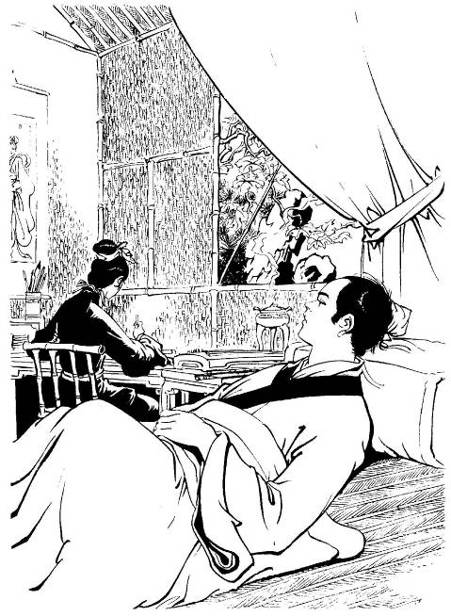

# Chapter 11 – A Pause from Roaming

Translated by Noodles

> Northern Beggar and Western Poison have been adversaries for many years,
> they hated each other, how could it be that they ended up dead together
> on Mount Hua. The two of them were enemies when they were alive, just
> before they died they were hugging each other and laughing. All the
> feuds and arguments that they have had over the years were finished with
> a laugh!

 

Yang Guo had dashed forward only two steps when suddenly a gust of wind
brushed over his head, a person darted past and stood between him and
the five clowns and laughed, “That was a great slumber!” It was the
‘Nine-Fingered Wondrous Beggar’ Hong Qigong. Yang Guo was delighted
while the five clowns were startled and shocked. When Hong Qigong first
lay down on the snow he really was sleeping, but woke up when the fifth
clown stepped on him. He wanted to test the young man and see whether he
could keep his promise of guarding him for three days. Every time Yang
Guo checked his breathing, he would stop breathing and pretended to be
dead. Now he was standing at the mouth of the path with an awe-inspiring
air. His left hand made a semi-circle, his right hand pushed out a palm;
it was his life’s proudest work, the stance of “Overcoming the Dragon
with Regret” from the “Eighteen Dragon Subduing Palms”. The first clown
couldn’t avoid it; he knew he couldn’t meet this stance head on but all
he could do was to push his palms out and use his strength to fend off
the attack.

Hong Qigong was keeping his palm’s power in check; he only used ten
percent of his internal energy but the first clown felt his arms go numb
and his chest ache. The second clown saw that he was in danger; he was
afraid that Hong Qigong’s palms will force him into the deep valley so
he quickly stretched out his hand and pushed the first clown’s back.
Hong Qigong’s palm power increased; the second clown moved back, almost
slipping down into the deep valley. The fourth clown was standing behind
them and stretched out his arm to support them. Hong Qigong’s palms
power spread through them, it spread towards the fourth clown who in
turn passed it onto the third clown and the third clown spread it
towards the final one in the line, the fifth clown. The clowns had
nowhere to hide and nowhere to run; in the blink of an eye, they were
defeated by Hong Qigong’s single palm.

Hong Qigong laughed, “You five scoundrels are evil and wicked you should
be able to die without complaint under the single palm of the Old
Beggar.”

The five of them positioned themselves into the mount posture; they
flared up their chi and united their internal energy to resist the
single palm but they felt the force of the palm getting heavier. Their
chests felt tighter and gradually it was becoming more difficult to
breathe. Hong Qigong suddenly gave out a ‘yi’ call showing his surprise.
He took back eighty percent of his palm’s power and said, “Your internal
energy has its good points, who is your master?”

The first clown still had his two palms pushing out against him; he
struggled for breath as he said, “We are… are under the tutelage of
Master Da’erba.”

Hong Qigong shook his head and said, “Da’erba? I haven’t heard of him.
Hmm, your internal energy can be spread mutually to each other, this
kung fu is terrific.”

Yang Guo thought, “To get Hong Qigong to say ‘terrific’, then it really
must be terrific. Yet when I looked at their skills I thought they were
very ordinary and none of them can beat me.”

Hong Qigong asked, “What’s your sect?”

The first clown said, “Our master is… is the second… second disciple of
Western Tibet’s Holy … Holy Monk Jinlun Fawang.”

Hong Qigong shook his head again, and said, “Western Tibet’s Holy Monk,
Jinlun Fawang? I’ve never heard of him. Western Tibet has a monk, his
name is Reverend Lingzhi, he I have seen; his kung fu is stronger than
yours but his skills aren’t advanced. Your kung fu is good; hmm, it
makes sense. Go and get your Grand Master here to fight with me.”

The first monk replied, “Our Grand Master is a holy monk, the living
Buddha, Mongolia’s number one martial artist, all knowing and all
powerful. How…how…”

The second clown noticed from Hong Qigong’s tone that he was going to
spare them, but with the way that the first clown was replying they were
cutting off their escape route so he quickly interrupted and said, “Yes,
yes. We’ll quickly go and get our Grand Master here to duel with Hong
Qigong. Only our Grand Master can fight with senior Hong. We juniors
will raise our wine gourds and… and…”

As he said this, there came a ‘duo’ ‘duo’ ‘duo’ sound; a person appeared
from around the corner of the mountain. His body was upside down, each
hand holding a piece of rock, walking with his palms, it was Western
Poison Ouyang Feng. Yang Guo’s voice cracked as he called out, “Father!”

Ouyang Feng did not bother to find out what was happening and leapt
behind the five clowns and stretched out his right foot and placed it on
their backs; a strong energy rushed through the five clowns. Hong Qigong
was shocked with the sudden appearance of Ouyang Feng; he heard Yang Guo
call him ‘Father’ and understood that he was his son; no wonder he was
so good. He felt his arm sink as the opponent’s internal energy reached
him; he quickly increased his strength and returned the attack.

Since the second Mount Hua competition, Hong Qigong had not seen Ouyang
Feng for over ten years. Although Ouyang Feng’s mind was unclear, he
practiced the Contrary Nine Yin Manual”; the more he practiced the
stranger his kung fu became, and the stranger it became the more
powerful he became. Guo Jing and Huang Rong had recited a small portion
of the manual to Hong Qigong; it made an impression on his kung fu and
great progress in his martial arts. The final stage of the “Nine Yin
Manual” is superior to the “Contrary Nine Yin Manual”, although Hong
Qigong only knew a little; he wasn’t inferior to Ouyang Feng.

Tens of years ago it was difficult to separate the two, since then they
had both met new boundaries. Today they came across each other on Mount
Hua for the third time, once internal energy went out; it was indeed
hard to differentiate between the two. The ones that were to be pitied
are the Five Clowns of the Tibetan Border; being sandwiched between two
of the world’s most powerful fighters, they became the apparatus for
kung fu practice. A sandbag for punches and kicks, they were cold for a
while, then hot for a while, their breathing was tight and then slow,
the bones all over their body made ‘ka la’ noises; it was a hundred
times more excruciating than the most severe punishments. Ouyang Feng
suddenly asked, “The five’s internal energy is very good. What sect are
you from?”

Yang Guo thought, “Even Godfather says their internal energy is very
good; the five clowns indeed are not run-of-the-mill fighters.”

He heard Hong Qigong say, “They said they are the grand disciples of
Western Tibet’s Holy Monk Jinlun Fawang.”

Ouyang Feng said, “Jinlun Fawang compared to you, who’s better?”

Hong Qigong said, “Don’t know, I don’t think there’s much difference.”

Ouyang Feng said, “How about compared with me?”

Hong Qigong said, “He’s better than you a bit.”

Ouyang Feng was shocked and called out, “I don’t believe it!”

In between the exchange of words, the energy in the hand and foot
increased. Hong Qigong sent out different levels of palm energy but they
were all dispersed by Ouyang Feng’s foot energy; the power in the foot
increased but it was difficult to move Hong Qigong back even half an
inch. After this exchange both admired each other, they laughed and
jumped back.

The strong force within the Five Clowns of the Tibetan Border suddenly
disappeared; they couldn’t stop themselves wobbling about as if they
were drunk on wine. The five had the internal energies of two great
fighters circulated to and fro between them, their internal organs had
been seriously injured, the muscles weakened and bones softened; they
had become invalids. They wouldn’t be able to fight off even a small
child of seven or eight years of age.

Hong Qigong shouted, “You five scoundrels, your lifelines haven’t
reached their end today; it doesn’t matter anyway since you can't do
anymore harm, just crawl away. Remember to go and tell your Grand Master
Jinlun Fawang to come to the central plains and find me so we can do a
little sparring.”

Ouyang Feng said, “With me too.” The Five Clowns of the Tibetan Border
all agreed and limped away, supporting each other as they descended down
from the peak.

Ouyang Feng flipped upright and stared at Hong Qi Gong and then shouted,
“Hey, your kung fu is very good, what’s your name.”

After hearing this and seeing the confused look on his face, Hong Qigong
knew that since he went mad over ten years ago, he hadn’t recovered and
so said, “I’m called Ouyang Feng, what’s your name?”

Ouyang Feng’s heart shook, he felt that the words ‘Ouyang Feng’ were
very familiar but he couldn’t remember what he was called, and he shook
his head and said, “I don’t know. Hey, what am I called?”

Hong Qigong laughed and said, “You don’t even know your own name. Go
home and think about it.”

Ouyang Feng angrily said, “You must know, tell me.”

Hong Qigong said, “Fine, you’re called Smelly Toad.” The word ‘Toad’ was
very familiar to Ouyang Feng, when he heard this it felt right, but
there was also a feeling that it was wrong. He and Hong Qigong had been
adversaries for tens of years; the hate had been etched deeply into his
mind, although he didn’t understand right now. Yet when he looked at
him, Ouyang Feng felt aggravated.

Hong Qigong saw him standing there in a daze, a fierce glow was in his
eyes. Hong Qigong secretly put his guard up, indeed he heard Ouyang Feng
shout out and ruthlessly throw himself forward. He didn’t dare hesitate
and immediately used his “Eighteen Dragon Subduing Palms”. The two
fought in the wind and the slippery snow on a narrow path that was only
about a foot wide; using their greatest skills with great effort in the
battle. On one side was a two thousand foot deep chasm, just one little
mistake and they would fall to their deaths; this was much more
dangerous than fighting on flat, even ground. The two of them were now
fairly old, though their vigor has lessened; their study of martial arts
had reached an extremely pure level. The stances were pure and profound,
so profound that everything was ingenious and masterly, only ten or so
moves were exchanged. The two couldn’t stop themselves from admiring
each other.

Ouyang Feng said, “The Old Beggar is very lethal.”

Hong Qigong laughed and said, “Smelly Toad is also terrific.”

Yang Guo knew that the terrain was extremely dangerous, he was afraid
that Ouyang Feng would fall down into the valley; but then he could see
that Hong Qigong was in distress and hoped that he too would be safe.
Ouyang Feng was his Godfather, he had deep feelings for him;
nevertheless, Hong Qigong was gallant, he had the air of a great hero
around him. As soon as he met him an impression was left in his heart.
He had endured hunger, cold, extreme dangers in guarding Hong Qigong for
three days and three nights. Although they didn’t say a word to each
other in the three days, in Yang Guo’s mind, it was as if they both
endured hundreds and hundreds of life threatening dangers together.

Tens of stances later, Yang Guo saw that the two’s incomparably swift
and powerful attacks had changed from dangerous to safe. He soon forgot
about the safety of the two and concentrated on watching the masterly
kung fu that was on display. The “Nine Yin Manual” is the peak of the
world’s martial arts, he only knew odd fragments of it; now he saw the
two use the theories of the manual within their stances. He couldn’t
help himself from being shocked and surprised, he thought, “So even an
ordinary sentence from the manual has so many ways to express its
meaning.”

Over a thousand stances passed, although the two had yet to use all
their skills, their age was catching up with them. They felt they were
getting out of breath and their hearts were beating faster, it was
unavoidable that their arms and legs would get slower.”

Yang Guo called out, “You two have been fighting for over half a day,
you must be hungry, how about eating first and then carry on later?”

As soon as Hong Qigong heard the word ‘eat’ he immediately jumped back
and said, “Great idea, great idea!”

Yang Guo had seen the fifth clown bring up cold food in a bamboo basket
and had placed off to the side. He went to it and brought it over and
opened the lid, he saw cold chicken and meat, white wine and cold rice;
everything that was needed was there. Hong Qigong was delighted, he
picked up a cold chicken and bit down with large bites hurriedly, eating
noisily.

Yang Guo picked up some cold meat and passed it to Ouyang Feng and
softly said, “Father, where have you been all this time?”

Ouyang Feng stared at him and said, “I’ve been searching for you.”

Yang Guo’s heart ached and thought, “There is someone on this world that
actually loves me like this.” He held his arm and said, “Father, you are
Ouyang Feng. Senior Hong is a good person, don’t fight him.”

Ouyang Feng pointed to Hong Qigong and said, “He’s Ouyang Feng, Ouyang
Feng is a bad person.” Yang Guo saw that his mind was confused and felt
sad.

Hong Qigong laughed and said, “You’re right, Ouyang Feng is a bad
person, Ouyang Feng deserves to die.”

Ouyang Feng looked at Hong Qigong and then at Yang Guo. He exhausted his
strength trying to remember but his mind and memories were still
scrambled. Yang Guo fed Ouyang Feng some food and then stood up, he said
to Hong Qigong, “Senior Hong, he is my Godfather. He has a severe mental
illness, his mind is confused, please pity him and don’t make it hard
for him.”

Hong Qigong heard this and nodded a few times, and said, “Young man, so
he’s your Godfather.”

Who could have expected that Ouyang Feng would suddenly leap up and
called out, “Ouyang Feng, we can’t find a winner using our fists and
kicks, we’ll compete again using weapons.”

Hong Qigong shook his head and said, “There’s no need to compete, let’s
just say you win.”

Ouyang Feng said, “What win or lose? I must kill you.” He stretched out
his hand and broke off a branch; he took off the twigs and leaves from
the branch forming a staff. He attacked downwards at Hong Qigong’s head.
His snake staff was famous years ago, it was extremely lethal, although
there wasn’t a snake at the head of this staff, before the attack
arrived, the wind produced was so strong that it made if difficult for
Yang Guo to breathe. Yang Guo quickly dived out of the way. When he
looked up at Hong Qigong, he saw him pick up a branch and used it as a
short rod, the two battled again. Hong Qigong’s “Dog Beating Stick
Technique” has nothing like it in the world, but he doesn’t use it
casually; apart from this technique, he has many refined and ingenious
rod stances and right now he was using them.

This heated battle was another spectacular fight like the last one with
fists and kicks; the stick was like an elusive dragon, the staff like an
efficacious dancing snake. It was like watching a rainbow traveling
across the sky or a shooting star chasing after the moon, the fight held
Yang Guo entranced as he watched. The staff and stick went to and fro,
they fought until dusk, and again it was difficult to separate the two.
Yang Guo saw that the ground was extremely dangerous; the mountain was
covered with ice and snow and was extremely slippery. The two of them
were old, if they fought for much longer they would definitely loose
their footing so he loudly called out, telling them to stop. But Hong
Qigong and Ouyang Feng were fighting with great pleasure, why would they
stop? Yang Guo knew that mentioning food to Hong Qigong made him stop,
so he thought that luring him with good food would be effective. So he
went to the wild mountainside and dug up some mountain herbs and yams,
started a fire and roasted them.

Hong Qigong smelt the fragrant scent and called out, “Smelly Toad, I
don’t want to fight with you, eating is more important.” He ran to Yang
Guo’s side and picked up two clumps of mountain herbs and ate them.
Although they burnt his mouth he kept on chewing. Ouyang Feng rushed
over and raised his staff over Hong Qigong’s head chopping down. Hong
Qigong ignored him and threw him a clump of the mountain herbs and
called out, “Just eat!” Ouyang Feng stopped. He caught it and started to
eat it, forgetting about the heated battle they were just in.

That night the three of them slept in a cave. Yang Guo wanted to help
his Godfather regain his memories and mentioned past events to him.
Ouyang Feng stood there in a daze not replying, sometimes he would hit
his head with his fist, showing that he’s trying extremely hard to
remember but he could not, it was extremely hard for him. Yang Guo
worried that he would get even crazier so made him go to sleep, he
himself was tossing and turning and couldn’t sleep. He was thinking
about the fist and palm stances that the two used, the more he thought
about it the more excited he got. He couldn’t stop himself and got up
quietly. Studying them, he felt that the ingenuity and mastery of the
stances was boundless; he practiced into the middle of the night until
he was extremely tired and went to sleep.

The next morning, Yang Guo had not yet wakened up from his sleep when he
heard gusts of wind from outside the cave, in between them were the
sounds of leaping and jumping. He quickly hurried outside to see Hong
Qigong and Ouyang Feng battling each other heatedly again. He sighed and
thought, “These two old seniors aren’t acting their age, what’s the
point of fighting like this?” He could only sit aside and watch. He saw
Hong Qigong’s stances and understood every stance and every move but it
was difficult for him to grasp Ouyang Feng’s strange stances, every time
Hong Qigong seemed to gain the upper hand, Ouyang Feng’s strange stances
would bring them to a level pegging again.

The two of them battled in the day and slept at night, they fought for
four days running, both of them were exhausted but neither of them dared
to let slip even half a stance. Yang Guo pondered, “Whatever happens
tomorrow I mustn’t allow them to fight again.” That night he waited for
Ouyang Feng to go to sleep and then quietly said to Hong Qigong,
“Senior, please come outside, I have something to say.” Hong Qigong
followed him outside. About a hundred feet away from the cave, Yang Guo
suddenly got down on his knees, and kept on kowtowing, yet he didn’t say
a word. Hong Qigong was startled but understood; he knew that Yang Guo
wanted him to have pity on Ouyang Feng and his illness and leave. He
laughed at the sky and said, “So be it.”

After only walking away for a few tens of feet, his garments were held
in a gust of wind, Ouyang Feng darted out of the cave and swept out his
staff angrily shouting, “Old Beggar, trying to escape?”

Hong Qigong conceded three stances to him as he tried to find a path of
escape but he was held up by the gusts of wind created by the staff.
When skilled fighters are dueling, one mustn’t concede even half a move,
Hong Qigong had the intention of conceding to him and immediately fell
into danger. It was a desperate situation; many times he almost lost his
life to the staff. He saw the staff heading straight for him, attacking
his lower abdomen; he knew that this stance must have a lethal move to
follow it. He couldn’t avoid it and let him have this stance. He raised
his stick to block it. He suddenly felt a powerful internal energy
surging through the staff, he couldn’t stop himself from being shocked,
“You want to compete internal energy with me?” He thought, “The enemy’s
internal energy is arriving, there is no other way to defend apart from
using my own internal energy to block it.” He quickly circulated his
internal energy and prepared to defend. If they lose concentration for a
split second and get struck by the opponent’s weapon or palm, their
internal energy will be all over their body and will defend against the
attack. Although they would be injured, it won’t be anything serious.
Now that they are competing with internal energy, they couldn’t concede
to the other one iota; they had reached a stage where it wouldn’t finish
unless one died. The two of them had fought each other many times in the
past, and each time both were worried about their own safety and how
strong the other was. Normally they wouldn’t use such a dangerous way to
attack each other since they were afraid that in their quest to seek
glory, they would be disgraced instead and lose their lives for no
purpose. But Ouyang Feng wasn’t thinking properly; he hadn’t managed to
gain victory in the last few days so suddenly circulated his internal
energy to attack.

Decades ago, Hong Qigong hated Ouyang Feng to the bone, but now he was
old and had mellowed. Now Ouyang Feng was mad and Yang Guo had pleaded
for his life; Hong Qigong had no intentions of killing him, so he
circulated his chi throughout his ‘dan tian’. He just defended and
didn’t attack, waiting for Ouyang Feng to exert all his energy. He
didn’t know that his opponent’s internal energy was like the waves of a
large river, the source of it incessantly sending out waves of internal
energy. After one wave, came another, there was no sign of it weakening
but instead it was getting fiercer and fiercer. Hong Qigong always
believed that his internal energy was profound. In these past years he
had refined his fierce internal energy to new levels; even if he
couldn’t beat Western Poison, if he used all his energy to defend, he
would not lose. But who could have guessed that after all these
exchanges of internal energy, Ouyang Feng was getting stronger and
stronger.

Hong Qigong remembered the time when he was competing internal energy
with Ouyang Feng with the Five Clowns of the Tibetan Border sandwiched
in between them; Ouyang Feng had sent out his internal energy with his
foot three times, each time stronger than the last. He noticed, at that
time, that before the first wave of internal energy had dissipated the
second wave had arrived, after the second wave arrived, the third
followed. If he just defended and let him keep on pressing, it would
definitely be hard to defend against. Only by returning his own energy
between the gaps and forcing him to defend will he stop Ouyang Feng from
amassing a great force. Once he thought about this he immediately
circulated his internal energy and attacked. The two’s bodies shook as
the energies collided.

When Yang Guo saw the two competing internal energy he was extremely
worried; if he attacked Hong Qigong’s back, he would help his Godfather
gain victory. He looked at Hong Qigong and saw a head full of white
hair, and within his commanding air there was a compassionate and
merciful part. In the spaces between his heroic natures there was
peacefulness to go with it. He couldn’t stop himself from bowing down to
him, not to mention that he had responded to his plea and was willing to
leave. How could he harm him?

The two of them froze for a while, white smoke came out from Ouyang
Feng’s head, and gradually it became denser and denser, like steam
coming from a steamer. Hong Qigong had also used all his strength to
defend; right now he had no way to control whether or not he would harm
his opponent’s life. If he could just protect himself that would be
fortunate enough.

They competed from dawn until morning, from morning until midday until
Hong Qigong gradually felt his internal energy draining away. However,
his opponent’s internal energy kept on surging towards him like a
violent storm. He quietly said, “So the madder the old poisonous animal
gets, the more powerful he becomes; the Old Beggar’s life is going to
end today.” He knew that his battle would have an ending; he now had no
way to avoid this and could only use all his strength to resist. But he
didn’t know that Ouyang Feng’s internal energy was also declining due to
exhaustion, it was hard for him to maintain his palm’s power. They
continued for another four hours until it got dark. Yang Guo saw that
their faces had changed; he thought that if they battled any longer,
they would definitely perish together. The difference in internal energy
between him and the two was vast. If he wanted to break them up himself,
most probably he would not be able to separate them. Instead he would
lose his life in the attempt. He delayed for a while and saw Ouyang
Feng’s face looked worried and Hong Qigong was out of breath, he
thought, “Even if it is dangerous I need to save their lives.” So he
went and broke off a tree branch and got down on his knees between the
two; he circulated his chi around his body to protect himself and
stretched out his branch placing it in between the staff and stick.

Who could have known that this separation would not waste any energy?
The two’s internal energy rushed into the branch and after meeting his
circulated chi, the energies were dispersed. A strong bow cannot pierce
a silk cloth; although the Northern Beggar and Western Poison are two of
the most renowned men in the world of Wulin, they had spent many days
consuming and exhausting their energy. After being disturbed by his
interference, the two of them fell onto the ground, their faces grey as
ash and it was hard for them to move.

Yang Guo was alarmed and called out, “Father, Senior Hong, are you
okay?”

The two of them struggled to breath and didn’t reply. Yang Guo wanted to
move them into the cave to rest but Hong Qigong lightly shook his head.
Yang Guo knew that the two were severely injured and could not be moved.
That night he slept between the two, afraid that they would get up in
the middle of the night and fight again. The two of them couldn’t even
circulate their chi to recuperate, how could they fight each other? The
next morning, Yang Guo saw that they looked like they were on the point
of death, they looked worse than yesterday. He was alarmed and
flustered; he dug up some more mountain herbs and roasted and fed it to
them. On the third day, the two of them showed signs of being a little
better. Yang Guo moved them into the cave, placing them on either side
with him in the middle.

They rested like this for several days. Once Hong Qigong regained his
appetite he started to recover. Ouyang Feng didn’t say anything but his
expression was calm, Yang Guo tried to get him to talk but he wouldn’t
say anything.

That day, the two of them were lying on the ground facing each other
when Hong Qigong suddenly called out, “Smelly Toad”, do you revere me
now?”

Ouyang Feng said, “Revere what? I still have many stances that I haven’t
used, once I use them all, you’ll be beaten into dust.”

Hong Qigong laughed and said, “What a coincidence, I too have many kung
fu that I haven’t used yet. Have you heard of the Beggar Clan’s “Dog
Beating Stick Technique”?”

Ouyang Feng trembled, and thought, “The “Dog Beating Stick Technique”
sounds familiar, it seems to be extremely potent, could it be that the
Old Beggar knows it? But how come he hasn’t used it when we’ve been
fighting for our lives? He’s probably used it already. Or, he doesn’t
know it.” So he said, “What’s so special about the “Dog Beating Stick
Technique”?”

Hong Qigong was regretful; during the days when he was fighting with
him, all he had to do was just use a few stances of the “Dog Beating
Stick Technique” and he would definitely be able to subdue him. But he
felt that Ouyang Feng was mentally unstable so he already has an
advantage over him. Using the Beggar Clan’s treasured “Dog Beating Stick
Technique” against him wouldn’t be fair. It was not the actions of a
hero. But who knew that although his mind was unstable, his kung fu did
not decline one bit. In the end, both of them ended up seriously
injured. He wanted to use this set of skills but he had no energy to do
so. When he heard Ouyang Feng ask this question he couldn’t take it and
had a thought, he signaled to Yang Guo telling him to lower his ear and
said, “I am the Beggar Clan’s previous chief, do you know that?”

Yang Guo nodded, in Chongyang Palace he heard the Taoists talk about the
famous people of the world. They said that the Beggar Clan’s previous
chief the “Nine Fingered Wondrous Beggar” Hong Qigong had supreme
martial arts and was courageous, a real hero.

Hong Qigong said, “I have a set of techniques that I’m going to teach
you. This set of techniques is passed onto the Beggar Clan’s chief only
and never to outsiders. Because your Godfather is belittling me with his
words, I want you to perform it for him to see.”

Yang Guo said, “Since this skill of Senior’s is never passed on to
outsiders, this junior will not learn it. My Godfather’s mind hasn’t
recovered yet, there is no need for Senior to torment him.”

Hong Qigong shook his head and said, “If you learn the stances but don’t
know the formulae to accompany it, should you face an enemy, it would be
useless. And so, you can’t really say that I’m teaching you kung fu. I
don’t want you to attack your Godfather, just demonstrate it to him and
once he sees it, he will understand.”

Yang Guo thought, “Since that this set of kung fu is a treasure of the
Beggar Clan, my Godfather may not be able to beat it; why should I help
you to defeat my Godfather?” He rejected the offer, saying that he can’t
learn the secret skill of the Beggar Clan.

Hong Qigong saw through him and loudly said, “Smelly Toad”, your Godson
knows that you can’t beat my “Dog Beating Stick Technique”, he doesn’t
dare to demonstrate it to you.”

Ouyang Feng was angry and called out, “Son, I have many great skills
that I haven’t used yet, why should I be afraid of him? Quickly
demonstrate it for me.”

The two were forcing him, he had no other response but to go over to
Hong Qigong’s side. Hong Qigong told him to take a branch and taught him
a stance of the “Dog Beating Stick Technique”, “The Stick Beats Two
Dogs”, carefully describing it to him. Yang Guo understood immediately
and demonstrated it. Ouyang Feng saw that the stick technique was indeed
wondrous and powerful, it would be difficult for him to overcome it
straight away, he thought for a while and taught a staff technique
stance to Yang Guo.

Hong Qigong gave a slight smile and said, “Fine, here’s another stance.”

The two of them then compared martial arts with their mouths and
tongues. They continued until night fell, only ten or so moves were
exchanged yet Yang Guo was exhausted and sweating all over. The next
morning they continued, and they carried on for three days, by then, the
thirty six stances of the “Dog Beating Stick Technique” were described.
Though there were only thirty six stances, the changes in between them
had boundless ingenuity, in the end, Ouyang Feng took longer and longer
to come up with a solution. But the stances that he came up with
attacked and defended at the same time, the strength and power of them
was excellent; when Hong Qigong saw this he let out a sigh of respect.

By the night of that day, Hong Qigong described the thirty-sixth stance
“No Dogs Under Heaven” sixth change. This was the “Dog Beating Stick
Technique’s” final stance and final change; once this stance was used,
there would be a stick everywhere and when the internal energy arrived,
had there been eighty evil dogs, all of them would be killed at the same
time. It was called “No Dogs Under Heaven” because of this, the
ingenuity and mastery of the rod technique had reached the highest
echelons of martial arts. Ouyang Feng couldn’t think of a reply. He
spent that night tossing and turning as he pondered that stance.

Before Yang Guo woke up the next morning, Ouyang Feng suddenly called
out, “I’ve got it… I’ve got it. Son, use this staff stance to break
his.” His voice was excited and urgent at the same time. Yang Guo could
hear that there was something wrong with him, he took a look and was
shocked. Though Ouyang Feng was old, his internal energy was profound,
so the hair on his face and head was grey white in colour; but he had
exerted himself too much that night thinking. In just a night his hair
became completely white, as if he’d suddenly aged ten years.

Yang Guo was sad, he wanted to ask Hong Qigong to stop the competition,
but Ouyang Feng repeatedly forced him to do as he said, in the end he
could only comply. This stance was extremely complicated, Ouyang Feng
repeated it and explained it until Yang Guo understood and did as he was
instructed. When Hong Qigong saw this stance his face changed. He was
lying on the floor, unable to move; suddenly he somehow gained divine
strength and leapt up calling out, “Old poisonous animal, Ouyang Feng!
Today, Old Beggar is in awe of you.” He jumped forward and hugged him
tightly. Yang Guo was startled, he assumed that he was trying to harm
his Godfather. He tried to pull him away but Hong Qigong was holding on
tightly, he was unable to pull him away. He heard Hong Qigong laugh and
called out, “Old poisonous animal, Ouyang Feng, you actually thought of
a stance to break mine, you really are something! Good Ouyang Feng, good
Ouyang Feng.”

After many days of fighting and a whole night of thinking, Ouyang Feng
had exhausted all his strength. When he heard Hong Qigong call him
‘Ouyang Feng’ three times, suddenly something lit up in him. His mind
was like a mirror, all the events of the past came before his very eyes;
he also laughed and called out, “I’m Ouyang Feng! I’m Ouyang Feng! I’m
Ouyang Feng! You’re the Old Beggar Hong Qigong!”

The two white haired men hugged each other and laughed. After a bout of
laughter, the voices became quieter, then suddenly stopped, and the two
of them lay motionless.

Yang Guo was shocked and kept on calling out, “Father, Senior!” neither
replied. Yang Guo pulled Hong Qigong’s arm, but as soon as he did so the
arm hung limp, he was dead. Yang Guo was startled and bent over to take
a look at Ouyang Feng; he too had all lost signs of being alive. Though
the two’s laughter has ended, their faces still held a smile, and the
valley quietly echoed back the sounds of two people laughing. Northern
Beggar and Western Poison had been adversaries for many years and they
hated each other. And now they ended up dead together on Mount Hua. The
two of them were enemies when they were alive, but just before they died
they were hugging each other and laughing. All the feuds and arguments
that they have had over the years were ended with a laugh!

Yang Guo was shocked and sad at the same time; he had no idea what to
do. He remembered that Hong Qigong pretended to be dead for three days
and three nights, could it be that the two of them were pretending to be
dead? But judging from how they looked, it didn’t appear that they were
pretending. He thought, “Maybe after dying for a while they’ll come back
to life. Their martial arts are extremely good; they wouldn’t die just
like that. Maybe they are competing again, seeing who can fake death the
longest.”

He guarded the two for seven days and nights and every time a day
passed, a bit of his hope drained away. He saw that the two’s faces had
changed colour and knew then that they had really passed away. He sobbed
for a while, and then, in the side of the cave, he dug two holes and
buried the two extraordinary figures of the Wulin world. The weapons
they used and Hong Qigong’s wine gourd were buried with them. He saw
that the footprints that the two had left when they were fighting had
turned to ice, the prints were still here yet their bodies have now been
placed in the ground. Yang Guo stepped into the footprints and
reminisced, he couldn’t stop himself from being depressed again. He then
thought about how even with their frightening abilities, in the end they
were buried by someone the world despised. What is fame, what is
reputation; it’s just a dream that’s finished.

He kowtowed eight times in front of their tombs, thinking, “Though
Godfather was brilliant, in the end he was a level below Hong Qigong."
When the “Dog Beating Stick Techniques” were demonstrated, Godfather had
to think for quite a while before he overcame them, if he really faced
this in battle, who would allow him to carefully study it and then think
of a way to counter it?”

After many sighs, he found a path down the mountain and left it behind.
This time when he was leaving the mountain, he was trusting in his
footsteps again, he didn’t distinguish between east, south, west or
north. He thought that since the world is a large place, he was alone,
he would wander around and when his time comes, he’ll lie on the ground
somewhere and die. He hadn’t been on Mount Hua for a month, yet to him
it was like many years had passed. When he was ascending the mountain,
he was thinking about how everyone looked down on him, he was full of
hate and anger. As he descended, he felt life was like a passing cloud,
if others respect him or look down on him it’s all the same. What’s it
have to do with him anyway? At such a young age, he was resentful of the
world’s customs, he won’t rise in respect for the world.

Within a day’s time he arrived at a wild place in Xianan; he took a look
around and saw withered trees and wilted grass everywhere. The grass was
fluttering in the wind. The sound of quiet hoofs could be heard in the
west, dust and smoke rose, after a short while, tens of wild horses
galloped past about a mile or so in front of him. He saw the herd of
horses galloping wildly, freely, Yang Guo also felt carefree and joyous.
With wild lands in front of his eyes and horses galloping afar, the
world was vast and had no obstructions. Just as he was feeling satisfied
he suddenly heard a horse hissing out for mercy from behind.

Yang Guo turned around and saw a yellow haired skinny horse pulling a
cart of firewood slowly along the main road. He thought that the horse
must have seen the other horses galloping freely in the wild lands. It
was toiling with hard work and it hissed out as it lamented for itself.
The horse was so skinny that its breast bone was sticking out, its four
legs had no muscle and they were as thin as branches. Its fur was
patchy, its skin was covered in scabies, and there were numerous traces
of blood from wounds caused by whipping. A rude man was sitting on the
cart, he disliked that the horse was going slow and whipped it
incessantly. Yang Guo has suffered by others many times before; when he
saw the horse suffering such punishment, it felt like he himself was
suffering the whippings. His chest ached and tears almost escaped from
his eyes. He stood in the road and angrily shouted, “Hey you, why are
you whipping the horse?”

The rude man saw a kid in torn and old garments looking like a beggar
blocking the road, he raised his whip and shouted, “Move out of the way
now, don’t you want your life?” As he said this he slapped his whip on
the horse’s back again. Yang Guo was furious and called out, “If you hit
the horse again, I’ll kill you.” The man laughed and lashed out at Yang
Guo’s head. Yang Guo stretched out his hand to take the whip and turned
it around. He swung the whip and it made a tangling loop around the
man’s neck and pulled him down, beating him on the head and face.
Although the skinny horse was ugly, it was very lively, when it saw the
man getting beaten; it neighed with delight and stretched out its head
rubbing Yang Guo on the leg, displaying signs of affection. Yang Guo
pulled apart the cart’s collar and harness then patted the horse on the
back. He pointed in the direction of the other horse’s trail and said,
“Go, no one’s going to harm you anymore.”

The horse reared and neighed, and galloped forward. But the horse’s body
was weak; he wasn’t able to continue this sudden burst. It galloped for
around a hundred feet then its front legs weakened and it fell onto the
ground. Yang Guo couldn’t bear it, he ran over and picked up the horse
by its stomach and shouted, “Up”, pulling the horse back onto its feet.
The man saw Yang Guo’s unbelievable strength and was frightened, so
frightened that he didn’t want his cart of firewood. He picked himself
up and ran. About half a mile away, he shouted, “There’s someone strong
stealing horses and firewood!”

Yang Guo thought this was funny. He pulled up some green grass for the
horse. He saw that the horse had such an unfortunate life and couldn’t
help but feel linked with it. He stroked the horse’s neck and said,
“Horse, horse, follow me from now on.” He held its rope and walked
slowly to a town. He bought some barley for the horse to eat. On the
second day the horse seemed to regain its spirit and so he rode it
slowly. At first the horse struggled along and limped, when wasn’t
losing its footing it would stumble, but the further it walked the
better it got. After seven or eight days of having enough to eat, it
regained its strength; its steps as light as if it were flying. Yang Guo
couldn’t speak his delight and took even more care of it.

One day Yang Guo was in an outdoor restaurant awaiting an order when the
horse walked over to a table and kept neighing at a bowl of wine on the
table, as if he wanted to drink the wine. Yang Guo was curious and
ordered a large bowl of wine and placed it on the table, and then
stroked the horse’s head. The horse drank it all in one go; its tail
raised its legs stepped, it was feeling very pleased. Yang Guo felt that
this was interesting and called some more wine; the horse drank over ten
bowls one after the other, and wasn’t finished. Yang Guo wanted to call
for more wine but the waiter saw he was dressed in ragged garments and
afraid that he had no money to pay so said that they didn’t have any
more wine. Afterwards he got on the horse. The horse was under the
influence of the wine and took large steps, galloping like crazy; the
trees by the side of the road receded, it was extremely fast. When a
normal spirited horse galloped, it would gallop steadily. Though this
horse was fast, its body would be high and then low, jolting about very
uncoordinated, if it weren’t for the fact that Yang Guo possessed
excellent lightness kung fu, he would not have been able to ride it. The
horse also had another strange characteristic, whenever there was
another animal on the road, it would speed up and overtake it, no matter
if it was a cow, horse, pony or donkey, it would gallop past them before
slowing. This proud and competitive air seems to have come about because
of the suffering it has had in its life.

Yang Guo thought that this thousand-mile colt has been trapped in the
hands of the villager, wasting half its life; now that its spirit is
free, it wants to gallop and fly over the lands. This behavior was
similar to Yang Guo’s; the man and horse were like good friends. He was
bored sometimes and would play with the horse, in a few days he was
happy again. He has been heading south and had arrived at the banks of
Han Shui. As he rode the horse he thought about how he teased Lu
Wushuang and tricked the Li Mochou Master and disciple team, he couldn’t
stop laughing. He then remembered he didn’t know where Xiao Longnu was
or when they were going to meet again, he became sad and despondent.

That day he traveled until noon and on the road he kept on seeing
beggars. From their appearances, most of them knew kung fu, he thought,
“Could it be that the matter between Wifey and the beggars hasn’t
finished yet? Or could it be that the Beggar Clan has summoned all these
people to fight with Li Mochou? I must take a look.” He didn’t like the
Beggar Clan much, but because he admired Hong Qigong, he couldn’t stop
himself from feeling close to the Beggar Clan. He thought as long as the
beggars don’t trouble Lu Wushuang he will give them the news that Hong
Qigong had passed away. He carried on for a while and saw the road was
filling up with more and more beggars. When the beggars saw Yang Guo
they were surprised, there was no difference in the way they were
dressed but if there wasn’t an urgent matter, members of the clan would
not travel by horseback. Yang Guo ignored them and slowly carried on.

He continued until afternoon when suddenly he heard the cries of eagles
in the air; two white eagles flew past, and descended ahead of him. He
heard a beggar say, “Chief Huang is here, there’s probably going to be
an assembly tonight.”

Another beggar said, “Will Hero Guo come?”

The first beggar replied, “The two are never apart.” he saw Yang Guo
reign in his horse listening to their words; he gave him a glance and
closed his mouth.

When Yang Guo heard the names Guo Jing and Huang Rong he was slightly
alarmed, and then in his heart laughed coldly. “Earlier I lived in your
home, ate your food and you made a fool out of me; then I was young and
useless and I suffered a lot. Right now I’m relying on the world, who
needs your support?” He had another thought, “Why don’t I pretend I have
nowhere to go and have come to them for help and then see how they treat
me.”

He then found a quiet place and messed up his hair. Then he punched
himself in the left eye, he scratched his cheek a few times; there was
now a blue green bruise on his left eye and there were some red marks on
his face. His clothes were already torn and old but he tore them even
more making them look even more ragged. He rolled in the mud and dust a
few times and then got up on the horse that was covered in scars and
skin ulcers. Indeed, he now looked like he was a person with nowhere to
go and on his last legs. As soon as he finished he limped back to the
main road, he didn’t ride on the horse and walked amongst the beggars.
He didn’t lead the horse along, the horse just followed on its own.
Someone from the Beggar Clan asked whether he was on his way to attend
the great feast, Yang Guo stared and didn’t reply and slipped back into
the crowd, walking back and forth. The group of people wound along the
road and eventually came up to a large, old and ruined temple. He saw
the two white eagles roosting on top of a pine tree in front of the
temple.

One of the Wu brothers was holding a dish, while the other took a slab
of meat from the dish and flung it towards the eagles. Yang Guo had seen
the two before when they teamed up with Guo Fu to fight Li Mochou, but
at that time he was too busy thinking about Guo Fu. He didn’t take the
two to mind, but now he took a closer look at the two. He saw Wu Dunru
looked intense, he was concentrating one hundred percent, on the other
hand Wu Xiuwen was active and lively; he ran to east and darted to the
west, not taking a moment’s respite. Wu Dunru was wearing a purple
coloured Chong silk gown, Wu Xiuwen was wearing a large blue coloured
Shandong silk gown, and around their waists were tied an embroidered
satin ‘hero’ sash. They were indeed young heroes, standing out from the
crowd. Yang Guo went up to them and made a bow, and stammered,
“Greetings… greetings brothers Wu, I hope you’ve been…been well.”

At this time there were beggars everywhere around the temple, all their
clothes were ragged, so although Yang Guo was covered in dirt, he did
not look out of place in the crowd of beggars. Wu Dunru returned the
favour and glanced up and down at Yang Guo, he couldn’t recognize him
and said, “Forgive my inexperienced eyes, what is brother’s name?”

Yang Guo said, “There is no need to worry about such a lowly name,
little brother… little brother wants to meet with Chief Huang.”

Wu Dunru thought his voice sounded slightly familiar, he was about to
question him when a voice like a silver bell came from the entrance of
the temple, “Big brother Wu, I asked you to buy me a soft horse whip,
have you bought it?”

Wu Dunru quickly moved Yang Guo aside and walked forward saying, “I
bought it ages ago, give it a test, does it feel right?” He fished out a
horse whip from his pocket as he said this.

Yang Guo turned his head and saw a girl in a light green dress hurrying
from the temple’s doors; her brows were curved, her little nose slightly
raised, her face like white jade, her smile like a flower, it was Guo
Fu. The adornments in her hair weren’t extravagant, only a pearl was
worn in her hair, the light make her look as if she was adorned with
jade gem make up. Yang Guo only gave her a glance but he couldn’t stop
himself from having a feeling of inferiority; he turned his head and
didn’t look back. Wu Xiuwen also dashed forward and the two brothers
spent all their effort talking to her. After speaking with Guo Fu for a
while, Wu Dunru remembered Yang Guo and turned around saying, “You’ve
come because of the ‘Heroes Feast’?”

Yang Guo did not know what the ‘Heroes Feast’ was and just answered
agreeably. Wu Dunru summoned one of the beggars with his hand and said,
“Take care of this friend, tomorrow take him to Da Xingguan.” After he
said this he turned his attention back to Guo Fu and ignored him. The
beggar agreed and after greeting each other, asked for his name. Yang
Guo told him truthfully. He was a nobody. Of course the beggar won’t
have heard of his name before and wouldn’t think anything of it. The
beggar called himself Wang Shisan; he was a second band Beggar Clan
member. He asked, “Where has brother Yang come from?”

Yang Guo said, “From Xiaxi.”

Wang Shisan said, “Ah, Brother Yang is from Quanzhen sect?”

As soon as he heard the words ‘Quanzhen sect’ Yang Guo’s head ached, he
shook his head and said, “No.”

Wang Shisan, “Brother Yang you’ve got the ‘Heroes’ invitation with
you?”  
Yang Guo was startled and said, “I’ve just wandered around Jianghu, how
can I call myself a hero? I have met your clan’s chief Huang once
before, I only want to see her and ask for some money to return to my
home.”

Wang Shisan’s eyebrows wrinkled and he thought for a while and then
said, “Chief Huang is receiving the heroes at the moment, I’m afraid
that she won’t have time to see you.” Yang Guo had deliberately made
himself such a sorry sight, the lower the regard the other person had
for him, the prouder he’ll get, he made himself more pitiful and pleaded
earnestly.

The members of the Beggar Clan are all people from poor environments,
they have always helped those in need and distress; they would never
look down on other poor people. Wang Shisan heard him speak with such
grief and woe, and so said, “Little brother Yang, have a meal first,
tomorrow we’ll go to Da Xingguan together. I’m your big brother, I’ll go
and tell the elders, who in turn will inform our chief. We’ll wait and
see what orders she gives, how about that?”

Wang Shisan had called him brother Yang, but now he heard that he wasn’t
one of the guests for the ‘heroes’ feast. He was a fair few years older
than him so he changed his greeting to little brother Yang. Yang Guo
thanked him repeatedly. Wang Shisan invited him into the derelict temple
and bought out some rice and dishes for the guest. One of the rules of
the Beggar Clan is when a Beggar Clan member arrives to celebrate a
ceremony, they’ll first need to get chicken, fish, beef and lamb and
leave it until it starts to rot, and gets like a soup of spoiled meat.
The meaning was that they shouldn’t forget their origins; but when
treating guests, proper wine and dishes are bought out.

As Yang Guo was eating, a flash of light shone in his eyes, he saw Guo
Fu enter the hall, her face with a smile, the Wu Brothers followed
behind on her left and right. He heard Wu Xiuwen say, “Fine, we’ll leave
tonight and travel through the night to rush to Da Xingguan. I’ll go and
get your red horse.” The three of them were too busy talking to notice
Yang Guo who was sitting on the floor eating. The three of them went to
the back garden to get their bags and weapons and exited the temple.
Many hoof beats could be heard as the horses galloped away. Yang Guo
planted his chopsticks into his bowl, and heard the hoof beats of the
horses become distant; a hundred emotions went through his mind, but was
it worry or hate, anger or sorrow?

The next day, Wang Shisan looked after him as they went back to the
road. On the road, apart from the crowds of Beggar Clan members, there
were many eminent names of Wulin, some traveled by horseback, some
traveled on foot, all heading for the ‘Heroes Feast’. Yang Guo didn’t
know what the 'Heroes Feast’ was or what the 'Heroes’ invitation was
about; he knew that Wang Shisan wouldn’t dare to reveal it to him so he
pretended to be stupid and miserable. They arrived at Da Xingguan at
around seven o’clock that night. Da Xingguan is an important strategic
point in the Henan province, the topography of the area was divine yet
there weren’t many towns and cities around. This was because the
Mongolian soldiers were situated north of here. Wang Shisan led Yang Guo
past a town and traveled for another seven or eight miles. In front of
them were hundred of Japanese Scholar trees surrounding a large manor;
all the heroes were heading for this manor. Building followed building
inside the manor, all folding over each other and it was hard to see how
many rooms there really were; but it appeared that the manor could
easily hold thousands of guests and have room to spare.

Wang Shisan was just a lowly member of the Beggar Clan, he knew that
their Chief was occupied right now; how could he go disturb her over
such a trivial matter such as borrowing traveling money? He arranged
quarters for Yang Guo and then went away with his friends.

Yang Guo saw that this was a very grand manor, there were many servants
busy with serving the guests; he was curious and wondered who the master
of the manor was and how come they had so much respect? He suddenly
heard the three blasts from a trumpet and a musical ensemble started
their music. Someone said, “The master and mistress of the manor are
meeting the guests now, let’s go take a look and see who the hero is
that just arrived?” He saw the guest and servant move to one side. The
crowd of guests also stood to either side of the hall.

A man and a woman entered the hall shoulder to shoulder, they were both
around forty years of age. The male wore an embroidered gown, he had a
slight moustache, exuding an air of authority and prosperity; the woman
had white skin, she was courteous and gracious like an affluent
mistress. The guests quietly discussed amongst themselves, “Master Lu
and Mistress Lu are greeting this important guest personally.”

Behind them was another couple, when Yang Guo saw them his heart
trembled, he became flustered; it was Guo Jing and Huang Rong. He hadn’t
seen them for many years, Guo Jing seems to be more serious, there was a
slight smile of Huang Rong’s face; her beauty had not diminished
slightly.

Yang Guo thought, “So Auntie Guo is this beautiful, I never noticed it
when I was younger.”

Guo Jing wore a coarse long gown, Huang Rong was wearing a light purple
silk gown, but because she was the Chief of the Beggar Clan, she could
only tie the gown with pins in the places where it doesn’t catch the eye
and that was it. Behind Guo Jing and Huang Rong followed Guo Fu and the
Wu brothers. Right then, the hall was lit up with countless red candles,
under the candle light the crowd could see that the males were noble and
the girl was lovable and glamorous.

The crowd pointed, “That is hero Guo, and that is Madam Huang, Chief
Huang.”

“Who’s that girl who’s cute as a flower?”

“It is the Guo couple’s daughter.”

“Are those young men their sons?”

“No, they’re their disciples.”

Yang Guo didn’t want to meet the Guo couple in the crowd so he hid
behind a tall man and watched; four Taoists appeared from the direction
of the music. When Yang Guo saw them, he couldn’t refrain from feeling
angry. The first one that entered was an old Taoist with a head of white
hair, his face was purple, it was the Blithe Elder Hao Datong; behind
him was a grey haired old Taoist priestess, Yang Guo has never seen her
before. Behind them entered two middle-aged Taoists standing shoulder to
shoulder, one was Yin Zhiping, and the other was Zhao Zhijing. Master
and Mistress Lu greeted them; they greeted the old Taoist priestess
Master; they received the Guo couple, Guo Fu and the Wu brothers and led
them forward.

Yang Guo heard from the crowd, “That old Taoist priestess is Quanzhen’s
sword heroine; her name is Sun Bu’Er.”

“Ah, she’s the Sage of Tranquility, famous throughout the northern and
southern sides of the Changjian River.”

“Yes. She is Mistress Lu’s master. However, Master Lu’s kung fu was not
taught by her.”

Master Lu’s first names are Guanying, his father Lu Chengfeng was a
disciple of Huang Rong’s father Huang Yaoshi, and so, they could be
regarded a generation lower than Guo Jing and Huang Rong. Lu Guanying’s
wife Cheng Yaojia is Sun Bu’Er’s disciple. The couple originally resided
in Lake Tai’s Returning Echo Manor. The manor was burned down by Ouyang
Feng. Lu Chengfeng was furious and influenced by his anger, he told his
son that he didn’t want to be on the minds of Lake Tai’s bandits again;
so he took his family north and resided in Da Xingguan. Lu Chengfeng had
now passed away. Years ago, Cheng Yaojia was in trouble, she was rescued
by Guo Jing, Huang Rong and the Beggar Clan; she had always remembered
this. When the Beggar Clan sent out the ‘Heroes’ invitation, the Lu
couple took on the task themselves and arranged the ‘Heroes Feast’ here
at their manor.

Guo Jing waited for the greetings to be over and led Hao Datong and Sun
Bu’Er towards the hall to meet the gathering of heroes. Hao Datong
stroked his beard as he said, “When Ma, Qiu, Liu and Wang received Chief
Huang’s invitation, they wanted to come here in person but apprentice
brother Ma has not been feeling well, apprentice brother Liu and the
others are helping him to recuperate and can’t leave him, they can only
apologize to Chief Huang.”

Huang Rong said, “Well said, well said. Those seniors are too polite.”

Though she was young, she was the leader of the world’s greatest clan,
Hao Datong and the others treated her with great respect. Guo Jing and
Yin Zhiping knew each other when they were young and had met when Qiu
Chuji took Yin Zhiping and 18 or 20 others to meet Genghis Khan. When
they saw each other both of them were delighted; the two of them entered
together. Guo Jing asked about Ma Yu’s illness and missed him very much.
The main hall was arranged for the feast, the noise of people and the
reflection of the red candles created a great atmosphere.

Yin Zhiping looked to the east and then west, it was as if he was
searching for someone in the crowd of people.

Zhao Zhijing chuckled and quietly said, “Apprentice brother Yin; will
the one named Long make an appearance here?” Yin Zhiping’s face became
red and didn’t reply.

Guo Jing did not know they were talking about Xiao Longnu and
interrupted, “There’s a hero named Long? Are they your friend?”

Zhao Zhijing said, “It’s apprentice brother Yin’s friend, I dare not to
make such a friend.” Guo Jing saw they looked strange; there was
something else going on and he didn’t inquire any further.

Suddenly, Yin Zhiping spotted Yang Guo in the crowd; his whole body
trembled like he was struck by lightning. He knew that if he’s here,
Xiao Longnu would also be here. Zhao Zhijing followed his gaze and his
face suddenly changed, he angrily shouted, “Yang Guo! It’s Yang Guo!
That … That Xiao Longnu is here as well!”

When Guo Jing heard the two words ‘Yang Guo’ he immediately turned
around. The two haven’t seen each other for years; Yang Guo has now
grown up, Guo Jing would have not been able to recognize him straight
away. But when he heard Zhao Zhijing’s shout, he immediately recognized
who he was. He was shocked and delighted, he dashed over and took his
hand and said with joy, “Guo’er, you’re here as well? I was afraid that
I was going to disturb your training so I did not request your presence.
It’s great that your master has bought you here.”

Everyone in Quanzhen was ashamed about the incident of Yang Guo
expelling himself from Chongyang Palace; no one had leaked a word about
this to outsiders. Guo Jing did not know about it; at the time he was on
Peach Blossom Island. The reason that Zhao Zhijing came to the ‘Heroes
Feast’ was to tell Guo Jing about this event, he couldn’t predict that
he would encounter Yang Guo here. He was afraid that he had heard Yang
Guo’s account of the events and would take his side, but judging from
his reaction he knew that the two had just met again. His face became
clear and faced the sky saying, “How could this Taoist dream of being
Master Yang’s Master?”

Guo Jing was shocked and asked, “Why does brother Zhao say this? The
child does not listen to your teachings?”

Zhao Zhijing saw that the hall was filled with heroes, if he talked
about this he would definitely get into an argument with Yang Guo.
Quanzhen sect would lose face; he just chuckled coldly and didn’t say a
word. Guo Jing was worried about Yang Guo, he saw his eye was bruised
and nose blue, his garments were torn and ragged, his body covered in
mud. It showed that he had suffered a lot and he held him to his chest.
As soon as Yang Guo was held, he secretly circulated his chi to protect
his body from harm. This hug was out of love, why would Guo Jing have
any intentions to harm him? He called out to Huang Rong, “Rong’ Er, look
who’s here.”

When Huang Rong saw Yang Guo she was shocked. She did not feel Guo
Jing’s delight and calmly said, “Great, you’re here as well.”

Yang Guo lightly struggled free and said, “My body is filthy, there is
no need to dirty your clothes.” His sentence was said coldly and he had
a scornful tone in his voice. Guo Jing felt slightly sad and thought,
“This child doesn’t have a father or mother; it looks like even his
Master doesn’t care for him.” He held his hand, wanting him to sit at
the same table as he. Yang Guo arranged to sit in the corner table. He
didn’t want to sit with such people and said coldly, “I’ll sit over
there. Uncle Guo, take care of your important guests.” Guo Jing felt
that since there were many guests here, it wasn’t convenient to leave
the guests alone so he lightly patted his shoulder and made a toast at
the main guest’s table.

After three rounds of wine, Huang Rong stood up and said clearly,
“Tomorrow is the day for the ‘Heroes Feast’. There are still many heroes
and good men who have yet to arrive. Tonight I ask you to enjoy your
appetite and don’t stop drinking until you are drunk; we’ll talk about
the serious matters tomorrow.”

Meat piled up like mountains on the tables, wine flowed like rivers; the
guests either played drinking games or told stories. That day, the
amount of pigs and sheep that were prepared and the amount of wine that
was poured in the Lu manor were beyond measure.

After the meal, the servants led the guests to their rooms to rest. Zhao
Zhijing said a few quiet words to Hao Datong, Hao Datong nodded. Zhao
Zhijing stood up and saluted with his hands towards Guo Jing and said,
“Hero Guo, the Taoist has a heavy burden to reveal. It is extremely
shameful, and today I have come to apologize because of this.”

Guo Jing quickly returned the greeting and said, “You are too modest
apprentice brother Zhao. We’ll go and speak in the study. Whatever the
child has done to offend apprentice brother Zhao, I will heavily punish
him to ease apprentice brother Zhao’s anger.” He said these words
clearly, though Yang Guo was a couple of tables away, Yang Guo heard it
and decided, “If he shouts at me just once, I will get up and leave and
never see him again. Though my kung fu cannot compare to his, if he
beats me I will fight him with my life.” Once he made this decision he
felt slightly more comfortable, he wasn’t as fearful as he was when he
first saw Zhao Zhijing. He saw Guo Jing signaling to him with his hand
and went over to him and followed behind him.

Guo Fu and the Wu brothers were drinking wine at another table, she
didn’t know who Yang Guo was, but after being told the news by Guo Jing
and Huang Rong, she remembered that it was the boy who they played with
when they were younger on Peach Blossom Island. They had been separated
for a long time; young people change their appearances the most, and
after a few months great changes can be seen, let alone a few years. The
fact that Yang Guo had made himself look in such a sorry state, and then
hiding himself in the crowd, of course Guo Fu would not know who he was.

When she saw Yang Guo had returned, she couldn’t help herself from
thinking: she remembered how they had a little argument when they were
small on the island, would he still be angry at this event? She saw him
in such a weary state, compared with the graceful and the distinguished
look of the Wu brothers; they were poles apart. She couldn’t help but
feel some pity for him and said to the Wu Dunru, “Father sent him to
Quanzhen to learn martial arts; I wonder how his skills are compared to
ours?”

Before Wu Dunru could reply, Wu Xiuwen interrupted, “Master’s skills are
unequalled; how could he compete with us?”

Guo Fu nodded, “His foundation was bad before, it would be difficult for
him to make any progress, how did he end up in such a state?”

Wu Xiuwen said, “Those old Taoists stared at him as if they wanted to
swallow him whole. That kid has such a bad temper; he must have caused a
major incident.”

The three of them talked quietly for a while, and then they heard Guo
Jing inviting Hao Datong and the others to the study. He said he was
going to punish Yang Guo heavily; she was curious and said, “Quick,
we’ll go and hide ourselves in the study first and listen to what they
are talking about.”

Wu Dunru was worried about being punished by their master if they found
out and didn’t reply. Wu Xiuwen agreed and went ahead. Guo Fu’s right
leg stopped; a slightly angry expression came across her face and she
said to Wu Dunru, “Don’t listen to me then.”

Wu Du Run saw her face showed signs of anger but her brows, eyes and
smile were still exuding their beauty, his heart jumped and he couldn’t
disobey and followed her quickly. As soon as they hid behind the
bookshelf, Guo Jing and Huang Rong led Hao Datong and the others to the
study, and they sat down. Yang Guo followed and stood to one side.

Guo Jing said, “Guo’er, just sit!”

Yang Guo shook his head and said, “I won’t sit.” Even in the presence of
six great fighters of the Wulin world he was still bold, but he couldn’t
help but feel a little bit restless.

Guo Jing had always treated Yang Guo as his own son, he was also
extremely respectful of the Quanzhen seven masters. He thought that it
wasn’t necessary to ask about the rights and wrongs of what happened; it
must be the junior’s fault, he put on a face and said to Yang Guo, “You
are very bold, how dare you not greet your master. Quick, kowtow to your
Martial Grandmasters, your Master and your Martial Uncle to apologize.”

The relationship between an emperor and his subjects, a father and son,
a master and disciple were all very significant. When a subject is
called upon by an emperor to die, they dare not stay alive; if the
father wants the son to perish, the son must do so; the same can be said
for the Wulin relationship between Master and disciple, a hint of
disobedience is not allowed. Guo Jing reprimanded him this way because
he pitied him for the suffering he has had alone, his tone was very
gentle and soft. Had it been someone else, he would have shouted
‘bastard, animal’ long ago, and struck him with his fists on the head
and face.

Zhao Zhijing stood up and chuckled, “How can I be Master Yang’s Master?
Hero Guo, there is no need for you to ridicule me. Our Quanzhen sect has
done nothing to offend hero Guo, why is it necessary to insult me in
public? Master Yang, this little Taoist will kowtow to apologize to the
Senior; it was my fault for being blind, I didn’t recognize such a hero
and good man.”

The Guo couple saw that his expression had changed completely, the more
he said the angrier he became, both of them were shocked. If a disciple
did something wrong, the Master punishing them would be normal, why is
it necessary for such a reaction? Huang Rong knew that whatever Yang Guo
did, it was very serious. After this bout of anger by Zhao Zhijing, Guo
Jing couldn’t speak so she slowly said, “I am extremely sorry for giving
apprentice brother Zhao such trouble. Please don’t get angry apprentice
brother Zhao, sit down and discuss what the child has done to offend his
Master.”

Zhao Zhijing said loudly, “How can I, Zhao Zhijing dare to be someone’s
Master with my lowly skills? Won’t that just make the heroes and good
men of the world laugh their heads off? How does that make me look?”

Huang Rong’s eyebrows wrinkled, she was resentful. She and the Quanzhen
sect weren’t the greatest of friends; years ago they used the “Big
Dipper Formation” against her father. Qiu Chuji also tried to arrange
for Mu Nianci to be Guo Jing’s bride; though these events happened long
ago, the animosity had disappeared; but this outburst by Zhao Zhijing in
front of her may have been a bit too impolite. Though both Hao Datong
and Sun Bu’Er felt that it was hard to blame Zhao Zhijing for getting so
angry, but the way he was acting was not how a Taoist should act.

Sun Bu’Er said, “Zhao Zhijing, explain everything to hero Guo and Chief
Huang. Look at the way you’re acting and think how it looks! We are
Taoists, what kind of Taoism have we been studying?” Though Sun Bu’Er
was a woman, she was very stern, her juniors all feared her; when Zhao
Zhijing heard her speak slowly he didn’t dare to make any more outbursts
and said, “Yes, yes.” He returned to his seat.

Guo Jing said, “Guo’er, look how your Master treats his Seniors with
such respect, why don’t you follow his example.”

Zhao Zhijing wanted to say, “I’m not his Master”, but he took a look at
Sun Bu’Er and managed to restrain himself. But who knew that Yang Guo
would say loudly, “He’s not my Master!” When he said this, Guo Jing and
Huang Rong were both extremely shocked; Guo Fu and the Wu brothers who
were hiding behind the bookshelf were also extremely surprised. The
master disciple relationship was very significant in the world of Wulin,
there’s a saying, “A Master for one day, a Father for life.”

Guo Jing was brought up the Jiangnan Seven Freaks and was taught martial
arts by Hong Qigong; he was very grateful to his Masters. Ever since he
was young he believed that the ways of his Masters were right and
proper. How would he know that Yang Guo would dismiss his Master in
public, and say such treasonous and heretical things? He got up and
pointed at Yang Guo; his voice trembled as he said, “What…what… what did
you say?” He wouldn’t scold anyone but his face went green, he was very
angry. Huang Rong had very rarely seen him get so angry; she whispered
to him, “Brother Jing, that child has always been bad; there is no need
to get angry over him.”

Yang Guo was actually afraid but when he saw his loving Uncle Guo change
his face to such an angry expression, he made a decision and thought,
“Nothing is greater than death, and the worst that will happen is that
you people will kill me.” So he said clearly, “My character has always
been bad, but I have never begged you to teach me martial arts. You two
are eminent people of the Wulin world, why was it necessary for you to
use such a crafty plan to harm a child who doesn’t have a mother or
father?” When he said ‘who doesn’t have a mother or father’, he pitied
himself, his eyes became slightly red but he bit down on his lips and
thought, “Even I die today, I won’t shed a single tear.”

Guo Jing angrily said, “Your Auntie Guo and Master taught you martial
arts sincerely because of the friendship between me and your deceased
father, who… who used a crafty plan? Who…who wants to harm you?” He
wasn’t the most articulate; he stuttered even more now that he is angry.

Yang Guo saw how impatient he was and spoke even slower, “Uncle Guo has
treated me very well, I will never forget this.”

Huang Rong slowly said, “Auntie Guo has wronged you; if you want to
remember this for the rest of your life that's up to you.”

At this stage, he might as well boldly go on, he said, “Auntie Guo has
not treated me badly, nor has she wronged me. You said you were going to
teach me martial arts, in reality, you taught me to study. You didn’t
teach me an ounce of kung fu. Studying is a good thing; this nephew has
learned a few more words and heard you speak about the stories of the
past. But those old Taoists” He pointed to Hao Datong and Zhao Zhijing
and said furiously, “There will be a day when I will take my revenge.”

Guo Jing was shocked and quickly asked, “Whaa…What? What revenge… what
happened?”

Yang Guo said, “The one named Zhao calls himself my Master, he didn’t
teach me any martial arts, fine, but he ordered many young Taoists to
beat me up. Auntie Guo didn’t teach me martial arts and the Quanzhen
sect didn’t teach me martial arts, I could only take the beatings. The
one named Hao saw that there was a Grandma that loved me, and he killed
her. The rotten Taoist named Hao, speak, isn’t this the truth?” When he
remembered how Grandma Sun died for him, he ground his teeth and wanted
to leap over to Hao Datong and kill him.

Hao Datong was an eminent Taoist of Quanzhen, he had learned martial
arts, and he had reached a deep level in both areas. He accidentally
killed Grandma Sun and in all these years he hadn’t had a moment’s
peace. This was the most hateful thing he had done in his life. The
Seven Masters of Quanzhen had killed countless people in their lives,
but all the people they had killed were scoundrels, traitors and crooks;
they had never harmed an innocent. Now, he heard Yang Guo blaming him in
front of everyone, he couldn’t stop his face from turning grey. The
events of that day when he made Grandma Sun throw up blood with his palm
flashed in front of his eyes. He didn’t have a weapon so he stretched
out his left hand and took a long sword from Zhao Zhijing’s waist.

Everyone thought that he wanted to stab Yang Guo with the sword, Guo
Jing took a step forward to protect Yang Guo but who could have known
that he would turn the long sword around with the handle facing Yang Guo
and say, “Correct. I killed the wrong person. Take revenge for Grandma
Sun, I won’t retaliate.”

When everyone saw him do this, they were surprised. Guo Jing was afraid
that Yang Guo would take the sword and harm him so he called out,
“Guo’er, don’t be impolite.”

Yang Guo knew that he wouldn’t be able to avenge Grandma Sun in front of
Guo Jing and Huang Rong; he said coldly, “You know that Uncle Guo won’t
let me attack, so why are you pretending to be so gracious? If you
really want me to kill you, then why don’t you hand me over the sword in
a place where there isn’t anyone about?”

Hao Datong was a Senior of Wulin, he was made speechless by the words of
this young man. He couldn’t hand over the long sword or take it back; he
circulated his chi through his hands and forced the sword to snap in
half. He flung the sword on the floor and gave a long sigh, he said,
“It’s finished, it’s finished!” He exited the study. Guo Jing wanted to
persuade him to remain behind but his head did not turn back.

Guo Jing looked at Yang Guo and then at Sun Bu’Er and the others, he
thought that from what had happened, the child has not lied. He thought
for a while and said, “Why didn’t Quanzhen teach you any martial arts?
What have you been doing for the past few years?” As he said this, his
words had slowed down a lot more.

Yang Guo said, “When Uncle Guo went up Mount Zhongnan, he defeated
hundreds of Taoist without reply, even if Ma, Qiu, Liu, Wang and the
others didn’t mind, would the others just forget about it? They couldn’t
do anything to Uncle Guo but could it be that they wouldn’t vent their
anger on a child like me? They wished they could kill me; why would they
teach me martial arts? These few years I have experienced days where
there was no light, the fact that today I have the chance to see Uncle
Guo again is all down to heaven opening its eyes.” Those words did not
mention the fact that he expelled himself from Quanzhen and pushed all
the blame on Guo Jing. He said he had endured ‘days where there was no
light’, this wasn’t a lie exactly, when he was living in the tomb, he
didn’t see much light or day. When Guo Jing heard these words, he
couldn’t stop his pity and compassion from rising.

Zhao Zhijing saw that Guo Jing more or less believed him and became
anxious, he said, “You… you bastard talking such crap, the name of
Quanzhen has been tarnished by... by”

Guo Jing believed that what Yang Guo said was the truth. Huang Rong’s
face was not moved, she saw Yang Guo’s eyes sparkled and he had a clever
expression on his face; she thought, “This child is extremely crafty,
there must be a lie somewhere.” She said, “From what you said, you don’t
know any martial arts? All these years in Quanzhen were wasted?” As she
asked these questions she slowly got up, she suddenly stretched out her
left hand and sent put a palm towards the crown of his head. The fingers
of the palm was aiming for the head’s ‘Hundred Meetings’ pressure point,
the base of the palm was heading for the ‘Rising Star’ pressure point
that was an inch from the hairline, these two main pressure points were
fatal. If there was a heavy blow to these places the person would die,
there would be no saving them.

Guo Jing was shocked and he called out; “Rong’er!” But Huang Rong was
extremely fast, this palm was her family’s “Descending Brave Divine
Sword Palm”, there was no warning, as soon as the hand moved the palm
arrived; if Guo Jing wanted to save him, it was too late.

Yang Guo moved back slightly and wanted to avoid it, but with Huang
Rong’s kung fu, now that she had attacked, just how would he dodge it;
he saw the palm going towards his head. Yang Guo was shocked, he quickly
stretched out his arm to react but his mind had a quick thought, his
right arm moved slightly and then hung down. Someone such as Guo Jing
who was greatly skilled but slow in thought would not understand what
was happening; they would quickly repel this attack. But Yang Guo was
extremely quick, he immediately understood, “Auntie Guo is trying to
test my kung fu, if I avoid this palm, then it will show that I’ve been
lying.” He saw Huang Rong’s attack was fatal, if she wasn’t testing out
his kung fu and he himself didn’t react, wouldn’t that mean he will have
lost his life in vain? In a flash he fired up his stubborn nature and
thought, “Fine, if I die then I die!” Though his kung fu may not be as
good as Huang Rong’s, if he wanted to stretch out his hand and repel her
palm, it wouldn’t be hard, but now he risked his life and didn’t move
his arms.

Indeed Huang Rong was testing his kung fu with this stance, as soon as
the palm reached his head she didn’t increase her strength, she saw a
frightened and shocked expression on his face. He didn’t stretch out his
hand to repel this attack and he didn’t secretly circulate his chi to
protect his vital pressure points, showing he didn’t know an ounce of
martial arts. She smiled and said, “I didn’t teach you kung fu because I
wanted what was best for you. It looks like the Taoists of Quanzhen had
the same thought as me.” She returned to her seat and quietly said to
Guo Jing, “He really hasn’t learned any of the Quanzhen’s martial arts.”
As soon as she said this, her mind secretly called out, “Ai yo,
something’s wrong! I almost fell for his lie.” She remembered how when
he was little he used the “Toad Stance” to attack Wu Dunru; he had some
kung fu foundation. Even if he hasn’t made an inch of progress but knew
she was about to strike with her palm, he would definitely block the
attack. She thought, “Young man, young man, you’re too clever, if you
scrambled and waved your hands in a frantic state to block my attack, I
might have believed your lie. But there is one point that doesn’t make
sense in your charade, you’ve left a flaw.” She didn’t reveal this and
thought that she would watch him and see what other schemes he’ll come
up with. She looked at Zhao Zhijing and then at Yang Guo, and she just
smiled slightly.

Zhao Zhijing saw Huang Rong test out a stance on Yang Guo who didn’t
fight back, he knew that Yang Guo had managed to conceal his kung fu
from her, displaying even more signs that he was in the wrong. His anger
erupted and said loudly, “That bastard is very crafty; if Chief Huang
couldn’t find anything then let me try.” He went over to Yang Guo and
pointed to his nose and said, “Little bastard, you really don’t know any
martial arts? If you don’t defend, I will not hold back, if you want to
live or die, it’s up to you.” He knew that Yang Guo’s kung fu was above
his, but under his fatal attacks, there would be no other option for him
but to reveal the truth. If he still kept up this charade, he might as
well take his life. The worst that would happen is he will lose the
Guo’s couple’s friendship and be heavily punished by his sect’s leader.
Fury filled his chest, hate filled his guts, he thought, “You knew that
Chief Huang wouldn’t harm your life that’s why you were so bold; you
acted very well. Let’s see if you still have the guts to keep up the
charade?” His sleeve waved, he was about to attack.

Guo Jing called out, “Please wait!” He was afraid that he would harm
Yang Guo’s life and wanted to intervene.

Huang Rong tugged his sleeve and quietly said, “Don’t do anything.” She
knew that Zhao Zhijing was extremely angry, his attacks would not be
light, and Yang Guo had no way to avoid his attacks by mere luck. When
he defends, the truth will come out. How would Guo Jing know that there
are so many other things going on here; he was worried but knew that his
wife’s plans had never failed before. He didn’t say anything else and
just took one step forward, if there was a real danger he would still be
able to make a rescue.

Zhao Zhijing said to Sun Bu’Er and Yin Zhiping, “Martial Uncle Sun,
apprentice brother Yin, that bastard is pretending that he doesn’t know
martial arts, I am forced with no other option but to test him myself.
If he keeps it up to the end and I kill him, please be a witness for me
in front of our leader, Martial Uncle Qiu and my Master.”

Sun Bu’Er knew what had happened with the incident of Yang Guo expelling
himself from the Quanzhen sect. She saw him using his wits and craft to
make sure Zhao Zhijing could not back down and make sure it was Quanzhen
sect who was in the wrong. She hoped Zhao Zhijing would force him to use
his martial arts and chuckled, “That disobedient disciple and traitor to
our Quanzhen sect. Killing him wouldn’t be anything serious.” She is an
eminent Taoist, how could she tell someone to kill? Those words were
actually meant to scare Yang Guo, wanting him to stop pretending.

Zhao Zhijing had his Martial Uncle’s support and was even more daring;
he raised his right foot and aimed for Yang Guo’s abdomen. The stance
Flying Past Heaven’s Mountains” had softness within its hardness; in the
yang there was yin, it was a really lethal stance. Though this kick was
very powerful, it wasn’t very profound; it was a stance that is taught
when one first enters the Quanzhen sect. It was a very ordinary stance
when it is used, and as long as someone knows a little kung fu, they
would be able to neutralize it. On the first day of practicing martial
arts, the disciples of Quanzhen would first learn the stance of “Flying
Past Heaven’s Mountains” and then “Force of the Retreating Horse”; this
was the stance to avoid the stance of “Flying Past Heaven’s Mountains”.
One attack one defense, this was the most basic set of kung fu. By using
this stance, he wanted Guo Jing and Huang Rong to understand one thing,
“Even if I did not teach him advanced martial arts, could it be that I
didn’t even teach him the basic kung fu of our sect’s very first
lesson?”

When Yang Guo saw the kick come, he did not use the “Force of the
Retreating Horse”; his left hand hung down protecting his abdomen. Zhao
Zhijing saw that he was so bold that he didn’t even move or dodge, he
didn’t hold back on his kick and kicked straight across, when the tip of
his foot was about three inches away from Yang Guo’s abdomen, he saw in
the moonlight Yang Guo’s left thumb slightly sticking out, aiming for
his right foot’s ankle ‘Large Opening’ pressure point. If he kicked out
with power, before the tip of the foot had reached the abdomen, his
pressure point will be sealed first; the opponent wouldn’t actually seal
the pressure point themselves. As the foot strikes his finger, it will
be struck on the pressure point, sealing it in the process.

He was the best fighter of Quanzhen’s third generation; in the midst of
danger he quickly changed his stance, he turned and changed the
direction of the kick, his right leg passing Yang Guo’s side. At least
he was able to avoid the trap but his body was off balance, and his face
turned red.

Guo Jing and Huang Rong were behind Yang Guo and didn’t see his thumb,
they thought it was because Zhao Zhijing was holding back, at the very
last second he changed his stance. But Sun Bu’Er and Yin Zhiping could
see this clearly. Yin Zhiping didn’t say a word.

Sun Bu’Er stood up and shouted, “Little punk, very crafty!”

Zhao Zhijing’s left palm hung in the air, his right palm aimed to chop
across Yang Guo’s left cheek; this stance of “Purple Lightning Striking
through Words” was a refined stance of advanced martial arts. As the
palm arrives halfway, the direction suddenly changes, originally aimed
to the left cheek it now was aiming to chop down on his neck on the
right side. How could he know that Yang Guo has learned the “Jade Heart
Manual” to a very fluent state, the manual was the Black Star of
Quanzhen’s kung fu. Every lethal fist techniques and palm stances that
Wang Chongyang invented were all defeated ingeniously by Lin Chaoying
years ago. When Yang Guo saw his left palm hanging in the air, he
quickly covered his head with his arms as if he was scared, his left
index finger hid itself by his neck on the right side but because he
covered it with his right palm, Zhao Zhijing had no way to see it. As
soon as the palm arrives, Yang Guo’s right hand slanted slightly, a ‘bo’
sound was heard as the finger sealed the ‘Back Stream’ pressure point on
Zhao Zhijing’s palm.

Once again, it was Zhao Zhijing himself who forced his own pressure
point to be sealed by hitting it on his finger; Yang Guo knew what the
opponent would do and prepared his finger in place. Once Zhao Zhijing’s
pressure point on his palm was sealed, his arm immediately went numb; he
knew he had fallen into his trap. He was furious and his left leg came
sweeping out.

Yang Guo called out, “Oh no!” He bent his left arm and placed his elbow
two and a half inches above his waist. When Zhao Zhijing’s left leg
came, the elbow struck his ankle’s ‘Reflecting Sea’ and ‘Great River’
pressure points. This kick came out of fury; it was kicked with great
strength. The pressure points were severely struck, his left leg went
numb and he kneeled down on the floor.

Sun Bu’Er saw that her martial nephew was being embarrassed, she
stretched out her left arm and pulled him up with her hand and then
pushed his back a few times, unsealing his pressure points. Yang Guo
quickly backed away. He saw that she unsealed Zhao Zhijing’s pressure
points with ease. He knew that her martial arts were far superior Zhao
Zhijing’s. Yang Guo was afraid of her and kept a distance between
himself and Sun Bu’Er. Though she had been practicing Taoism for many
years, she was still very stubborn and strong. She saw that his kung fu
was extremely crafty, it looked like that it was their sect’s Black
Star; if she fought herself she might not be able to win, so she called
out, “Let’s go!” She then said goodbye to Guo Jing and Huang Rong. Her
sleeve swept out and she leapt out of the study through the window, and
then jumped up onto the roof.

Yin Zhiping had seemed to be out of it all this time; he wanted to tell
Guo Jing and Huang Rong what happened when Zhao Zhijing angrily shouted,
“What more is there to talk about?” He pulled on his sleeve and the two
of them leapt out of the window and then followed Sun Bu’Er.

With Guo Jing’s and Huang Rong’s awareness, of course they knew that
Zhao Zhijing’s pressure points had been sealed, but Yang Guo had not
stretched out his finger, could it be that a eminent person was secretly
helping him?

Guo Jing immediately went over to the window to take a look, where was
the person? Guo Jing thought that as Zhao Zhijing was about to kill him,
he couldn’t bear to and so pretended to have his pressure points sealed
and left in the confusion. However, Huang Rong could see this was the
doing of Yang Guo, firstly because she was behind him and couldn’t see
his elbow and secondly, she was not aware of the existence of a martial
art skill such as the “Jade Heart Manual”. This enabled the prediction
of the enemy’s reaction and countered the skills of Quanzhen without
reply; she wasn’t able to understand exactly what had happened. She
wouldn’t act like Guo Jing and view others with the heart of a
gentleman. When she saw the four Quanzhen Taoists sweeping their sleeves
and leaving, it was very impolite, secretly, she was furious. She
pondered and turned around to see Guo Fu’s dark green shoes sticking out
from under the bookshelf, she immediately called out, “Fu’er, what are
you doing here?”

Guo Fu laughed and came out with a silly look on her face and said, “Me
and the Wu brothers are looking for a book to read.”

Huang Rong knows that the three of them have never been interested in
books, why would they have suddenly taken an interest today? One look at
her daughter’s face and she knew that they must sneaked in earlier to
hide so they can eavesdrop on what was happening. As she was about to
tell them off, a Beggar Clan member came with news of a guest arriving,
she took a look at Yang Guo and then she and Guo Jing went out to meet
the guest.

Guo Jing said to the Wu brothers, “Brother Yang is a childhood friend of
yours, take good care of him.”

The Wu brothers had never been friendly with Yang Guo; right now they
looked at the state that he was in. They knew that he hadn’t learned any
martial arts at the Quanzhen sect and was called ‘bastard, animal’ by
his Master. They looked down on him even more; they summoned a servant
and told him to take care of Yang Guo.

However, Guo Fu was very curious about Yang Guo, she asked, “Brother
Yang, why doesn’t your Master want you?”

Yang Guo said, “There are many reasons. I’m dumb and lazy, I have a bad
temper and I don’t know how to treat the relatives of my Master well.
‘Buying horse whips and donkey whips and what nots’.”

When the Wu brothers heard this their faces changed, Wu Xiuwen was the
first who couldn’t control himself anymore and shouted, “What did you
say?”

Yang Guo said, “I said I’m useless, I don’t know how to please my
Master.”

Guo Fu smiled captivatingly, and said, “Your Master is a Taoist, how
would he have a daughter?” Yang Guo saw her smile, it was as if a flower
suddenly blossomed, bright, beautiful and glamorous, unconsciously his
heart jumped, his face went red and he turned his head away. Guo Fu had
managed to control the Wu brothers and could mess them around long ago,
now she saw Yang Guo turn his head away and knew that he was moved by
her beauty, she was very proud of herself.

Yang Guo looked to the west and saw a couplet on the wall, the first
line said: ‘The image of peach blossoms descending with the divine
flying sword’, the second line was ‘The jade sea brings new waves
according the jade flute’. Yang Guo has seen this couplet in the
practicing sword pavilion on Peach Blossom Island. He knew that it was
Huang Yaoshi who wrote it but underneath this couplet was signed ‘The
five useless people who were ill fated’. Compared to the three people in
front of him, he was only a few years older but as he read and studied
the writing it was as if he was ten years older. When he saw the words
‘the five useless people’, he remembered about himself, how all those
close to him had either died or have gone away; he wandered the world
alone, there was no difference between himself and a useless person. The
pride he felt just now forcing Zhao Zhijing to scamper away disappeared;
a sad, lamenting feeling filled his heart, he couldn’t stop himself from
dropping his head and pitying himself.

Guo Fu softly said, “Brother Yang, go and rest, I’ll come and speak with
you tomorrow.”

Yang Guo calmly replied, “Fine!” He followed the servant out of the
study and heard Guo Fu flare up at the Wu brothers, “I want to speak
with him; can you two stop me? His kung fu is not good, I’ll ask father
to teach him.”

 

# Chapter 12 – The Heroes’ Feast

Translated by Noodles

> Yang Guo said, “Miss Guo, please tell your parents that I’ve gone.” Guo
> Fu was shocked and said, “You’re fine, so why are you leaving?” Yang Guo
> gave a dull laugh and said, “There’s no reason, originally I came here
> for no real reason, and now that I’ve been here I feel I should go.”

 

The next morning, while Yang Guo was eating breakfast in the hall, Guo
Fu signaled him to the courtyard. The Wu brothers were at the side
looking a bit troubled. Yang Guo was amused and went over to Guo Fu and
asked, “You’re looking for me?”

Guo Fu laughed and said, “Yes, come with me outside, I want to ask what
you’ve done in the last few years.” Yang Guo exhaled deeply, thinking
that it wasn’t easy to explain, even if he spoke for three days and
nights he would not have finished, and how could he reveal these things
to her?

The two of them walked shoulder to shoulder to the main door, Yang Guo
slightly turned his head and saw the two Wu brothers following. Guo Fu
had noticed a long time ago and pretended that she didn’t see them and
talked to Yang Guo. Yang Guo picked some insignificant events to talk
about, he pushed and pulled making Guo Fu laugh. She knew that Yang Guo
was keeping things from her but she still felt amused by his words. The
two slowly walked to a Willow tree. Suddenly they heard a neigh; a
skinny and scabby horse came hurrying over to Yang Guo, rubbing against
him in an affectionate manner.

When the Wu brothers saw such an ugly horse, they couldn’t hold
themselves back and burst out laughing. They went over to the two. Wu
Xiuwen laughed and said, “That precious horse is very special, only
someone with your ability could one find a horse like that. When are you
going to find me one like that?”

Wu Dunru said seriously, “That is a Da Shi Guo’s (Great Master Guo’s)
priceless treasure, how could you buy it?”

Guo Fu looked at Yang Guo and then at the ugly horse, when she saw the
two had the same dirty and pitiful appearance, she couldn’t resist
laughing. Yang Guo laughed and said, “I’m ugly, my horse is ugly, we’re
a match. The horses that the Wu brothers ride must be very spirited
horses.”

Wu Xiuwen said, “The horses that we ride are only a bit better than
yours. Sister Fu’s red horse, now that is a precious horse. You’ve seen
it before when you were on Peach Blossom Island.”

Yang Guo said, “So Uncle Guo gave the red horse to a girl.”

The four of them chatted as they walked. Guo Fu suddenly pointed to the
west and said, “Look, mother’s teaching stick techniques again.” Yang
Guo turned his head and saw Huang Rong with an old beggar walking
towards the mountainside, the two of them holding a stick in their
hands.

Wu Xiuwen said, “Elder Lu is so dumb, he’s been practicing the “Dog
Beating Stick Technique” for so long but he still hasn’t managed to
learn it.”

When Yang Guo heard the words “Dog Beating Stick Technique” his heart
trembled but he didn’t show any signs of it, he turned around and looked
away, pretending to appreciate the scenery. He heard Guo Fu say, “The
“Dog Beating Stick Technique” is the treasure of the Beggar Clan; my
mother said that the mastery and ingenuity of the stances are
unbeatable. It has the most powerful stances in the world of weapons;
you can’t just learn it in ten days or a fortnight. You said he’s dumb,
are you very clever?”

Wu Dunru sighed and said, “It’s a pity that apart from the Chief of the
Beggar Clan, no one is allowed to learn it.”

Guo Fu said, “If you become the Chief of the Beggar Clan in the future,
Chief Lu will impart it to you. Even my father does not know this skill,
there’s no need to cry.”

Wu Dunru said, “How can I be the Chief of the Beggar Clan? Sister Fu,
why did Master’s wife select Elder Lu to replace her?”

Guo Fu said, “Over the last few years, my mother just held the title.
The running of the clan is all done by Elder Lu Youjiao. All the many
bothersome things that go on in the clan give my mother a headache. She
said why is it necessary to have the name and not do anything; so why
not pass the position on to Elder Lu and make it official. Once Elder Lu
learns the “Dog Beating Stick Technique”, my mother will pass on the
position to him officially.”

Wu Xiuwen said, “Sister Fu, how exactly do you use the “Dog Beating
Stick Technique”? Have you seen it before?”

Guo Fu said, “I haven’t seen it. Ah, I have seen it!” She picked up a
branch off the ground and lightly attacked his shoulder and laughed,
“It’s like this.”

Wu Xiuwen called out, “Fine, just see if I’ll let you go now you’ve
called me a dog.” He stretched out his hand to grab her. Guo Fu laughed
and jumped away. Wu Xiuwen chased after her. The two ran around a few
times and returned to their original places.

Guo Fu laughed and said, “Little Brother Wu, don’t get angry. I’ve got
an idea.”

Wu Xiuwen said, “Fine, tell me.”

Guo Fu said, “We’ll watch in secret, we can see exactly how special the
“Dog Beating Technique” is.” Wu Xiuwen clapped his hand in agreement.

But Wu Dunru shook his head and said, “If Master’s wife finds out we are
secretly trying to learn the skill she will lecture us severely.”

Guo Fu said, “We are just going to watch, we’re not trying to learn it
in secret. Anyway, an ingenious and masterly kung fu such as this, how
could you learn it after just a few glances? Big brother Wu, so do you
count as someone who’s amazing?” After this put down, he just smiled
slightly. Guo Fu continued, “Last night when we were in the study
eavesdropping, did my mother shout at anyone? You’re just a little
chicken. Little Brother Wu, let’s go.”

Wu Dunru said, “Fine, fine, your reasoning does make some sense; I’ll go
with you.”

Guo Fu said, “Is it possible that you don’t want to watch one of the
world’s best skills? It doesn’t matter if you don’t go, once I’ve
learned it I’ll come back and beat you with it.” As she said this she
raised her stick and waved it at him.

The three of them had heard about the “Dog Beating Stick Technique” a
long time ago and were fascinated by it but they had never seen what it
looked like. Guo Jing once discussed martial arts with them; he told
them how years ago on Mount Jun Huang Rong used the technique at the
Beggar Clan’s gathering to beat everyone there and claimed the position
of the Chief of the Beggar Clan. The three of them listened enchanted.
Right now Guo Fu was encouraging them to take a look, though Wu Dunru
spoke out against it, in his heart there wasn’t anything he wanted to do
more. He pretended to be coerced into it and all he’s doing is listening
to Guo Fu’s suggestion; if they are found out then his Master’s wife
can’t blame him.

Guo Fu said, “Brother Yang, you come as well.” Yang Guo was gazing at
the faraway mountains as if he was absorbed in thought and didn’t hear
what they said. Guo Fu called out again and Yang Guo turned his head
around, his face looked lost, he asked, “Fine, fine, follow you where?”

Guo Fu said, “Don’t ask; just follow me.”

Wu Dunru said, “Sister Fu, why do you want him to come, he won’t
understand; his dumb brain is going to make some noise, how can Master’s
wife not notice?”

Guo Fu said, “Relax, I’ll take care of him. You two go first; brother
Yang and I will follow. The four of us will make too much noise with our
footsteps.” The Wu brothers didn’t want to but they knew they couldn’t
defy Guo Fu’s orders. The two of them walked ahead discontentedly.

Guo Fu called out, “We’ll hide in a large tree nearby first; my mother
will not notice if we are careful and don’t make any noise.” The Wu
brothers nodded in reply and quickened their steps.

Guo Fu glanced at Yang Guo and saw his clothes were extremely ragged and
torn, she said, “When we get back I’ll get mother to buy you some new
clothes; once you’ve changed, you won’t be as ugly.”

Yang Guo shook his head and said, “I was born ugly; even if I change
clothes and tidy myself up I’ll still be ugly.” Guo Fu said fine and
didn’t take it to mind; she glanced at the backs of the Wu brothers and
gave out a light sigh.

Yang Guo said, “Why are you sighing?”

Guo Fu said, “My mind is really troubled, you wouldn’t understand.”

Yang Guo saw a delicate redness on her face, her eyebrows slightly
wrinkled, she really was an extremely beautiful girl. Compared to Lu
Wushuang, Wanyan Ping and Yelu Yan, she was more beautiful than they.
His heart was moved slightly and said, “I know why you are so troubled.”

Guo Fu said, “That’s strange, how would you know? You really are talking
rubbish.”

Yang Guo said, “Fine, if I guess correctly, you can’t deny it.”

Guo Fu placed her little white and tender finger against her right
cheek, her pupils glimmered, a smile was on her lips and said, “Fine,
take a guess.”

Yang Guo said, “It’s not simple. The Wu brothers both like you, they
both try to please you, and it’s hard for you to give up one of them.”

After hearing this, Guo Fu’s heart raced. He knows about this, the Wu
brothers know about this, her parents know about this and even Ke Zhen’E
knows about this. But it was hard for anyone to mention it; everyone
knew in their hearts but no one mentioned a word about it. Now, Yang Guo
suddenly mentioned this matter, she couldn’t stop her face from going
red; she was happy but sad, she wanted to laugh but also wanted to cry,
droplets of tears rolled from her eyes.

Yang Guo said, “You’re thinking ‘Big Brother Wu is courteous and
reliable, Little Brother Wu can keep me entertained. The two of them are
both handsome, their martial arts are excellent and they treat me with
respect and listen to me. The elder has his good points, the younger has
his strong points; I’m just one person, how can I marry two men?”

Guo Fu listened to him startled, after she heard his last sentence, she
said, “Your mouth is full of rubbish, who wants to pay attention to what
you say?”

From her reaction, Yang Guo knew he had guessed correctly, he quietly
repeated, “I’m just one person, how can I marry two men?” After
repeating it a few times, Guo Fu still seemed to have something on her
mind; it was as if she didn’t hear him.

After a while she said, “Brother Yang, tell me, who do you think the
better of the brothers?” She asked this quite suddenly. Though she and
Yang Guo were childhood friends, there was still some animosity between
the two even though they not seen each other for a long time. Now that
they’re grown up, how can she reveal such things to him? Yang Guo is a
lively person, as long as you don’t get on the wrong side of him, he
will joke with you, laugh with you, in a flash he will make you feel as
if you were in a spring breeze, as if you were drinking a beautiful
wine. Anyway, Guo Fu had gone over this hundreds and thousands of times
in her mind. She felt that both of them had their good points; when it
came to playing around and joking, she got on with Wu Xiuwen very well,
but when it came to doing something serious Wu Dunru was much better.
She was a girl going through puberty; she would alternate from being
angry with them, or be pleased with them. She made the brothers fall in
love with her; in her heart she was really troubled, she didn’t know who
to treat better. As she and Yang Guo raised this point she couldn’t help
herself but ask this question.

Yang Guo laughed and said, “I don’t think either of them is good.”

Guo Fu was startled and asked, “Why?”

Yang Guo laughed and said, “If those two are good then what chance have
I, Yang Guo, got?” He had been used to joking around with Lu Wushuang on
the road and he didn’t mean what he just said, he was just teasing her
when he said it.

Guo Fu was stunned, she was a girl who was used to being pampered and
treated well, no one has ever said half an offensive word to her. Right
now she didn’t know whether or not to be angry; she put on serious face
and said, “If you don’t want to say, fine, who wants to joke with you?
Let’s go.” As she said this she utilized her lightness kung fu and
hurried along the small path to the mountainside.

Yang Guo felt there was no point to this and thought, “Why am I mixing
with these three? I’d rather be far away and be on my own!” He turned
around and slowly walked away, thinking, “The Wu brothers think that
girl is a goddess, they’re afraid that she won’t marry them. If they
really marry her, and spend everyday with such a pretty yet bullying
girl, they will definitely experience more pain than joy, huh; crazy
people like them are very funny.”

Guo Fu hurried for a while and assumed that Yang Guo would go after her
and apologize; but after stopping for a while there was no trace of Yang
Guo. She had a thought and said, “That person does not know martial
arts, of course he won’t be able to catch up. She turned around and
returned to see that he had actually gone in the opposite direction. She
thought this was strange and went over to Yang Guo. She asked, “Why
aren’t you coming?”

Yang Guo said, “Miss Guo, please tell your parents that I’ve gone.”

Guo Fu was shocked and said, “You’re fine, so why are you leaving?”

Yang Guo gave a dull laugh and said, “There’s no reason, originally I
came here for no real reason, and now that I’ve been here I feel I
should go.”

Guo Fu has always like crowded atmospheres; although she didn’t think
very highly of Yang Guo, listening to him joking felt fresher and newer
than listening to the Wu brothers. She really didn’t want him to leave,
she said, “Brother Yang, we haven’t seen each other a long time, I have
many things to say to you. Anyway, tonight is the ‘Heroes Feast, all the
heroes from all over the world will be gathering here, why don’t you
want to experience this?”

Yang Guo said, “I’m not a hero, if I’m actually there, won’t I just
become an object of ridicule in front of all the heroes?”

Guo Fu said, “That makes sense.” She pondered for a while and said,
“There are many people in the Lu Manor who don’t know martial arts, just
eat and drink with the servants.”

When Yang heard this he was very angry, he thought, “Little Bitch, you
class me with nobodies.” His face didn’t show any signs of anger; he
laughed and said, “That’s a pretty good idea.” He had wanted to leave
but now had a change of heart, he decided he was going to do something
that would embarrass and disgrace her. Guo Fu was used to being pampered
and cared for. She wasn’t wise and didn’t understand worldly matters;
she didn’t have any ill intent in her words and didn’t know that she had
deeply offended someone.

She saw that Yang Guo had changed his mind, she laughed and said, “Let’s
go, if we’re late and mother gets there first, we won’t be able to
peek.” She hurried ahead with Yang Guo following behind, he appeared out
of breath and his footsteps seemed heavy showing that he was extremely
clumsy and inept. They easily arrived in time at the place where Huang
Rong normally taught Lu Youjiao the stick techniques. They saw the Wu
brothers in a tree looking out. Guo Fu leapt up on the branch and then
reached out her hand to Yang Guo pulling him up. When Yang Guo held her
soft and warm hand, he couldn’t stop his heart from stirring but
immediately thought, “Even if you were ten times as beautiful, you can’t
compare with my Gu Gu.”

Guo Fu quietly asked, “My mother hasn’t arrived yet?”

Wu Xiuwen pointed to the west and quietly replied, “Elder Lu is
practicing over there, Master and Master’s wife went away to talk about
something.”

The only person that Guo Fu is afraid of is her father, when she heard
that he was here she felt slightly uneasy. But when she saw Lu Youjiao
holding a bamboo stick pointing to the east and stirring to the west,
she forgot her fear and quietly said, “That’s the “Dog Beating Stick
Technique”?”

Wu Dunru said, “Most likely. Master’s wife was teaching him when Master
came over and said he had something to discuss with her, he led her to
the side while Elder Lu practiced by himself.”

Guo Fu watched a few stances and felt that it was sluggish and didn’t
see anything special about it, she said, “Elder Lu hasn’t learned it
yet, and it isn’t nice to watch, let’s go.”

Yang Guo saw that the stances that Elder Lu was using were identical to
the ones that Hong Qigong taught him on top of Mount Hua, he chuckled in
his heart, “That girl doesn’t know anything.”

The Wu brothers always followed Guo Fu’s orders, they were about to jump
down when they heard footsteps below; the Guo couple were walking over.
They heard Guo Jing say, “Of course a decision about Fu’er’s future
can’t be decided so lightly and suddenly. But Guo’er is young; it is
unavoidable that young people will get into trouble. That business with
the Quanzhen sect doesn’t seem to be all his fault.”

Huang Rong said, “I don’t care about him causing trouble at Quanzhen.
You are respecting the long friendship between the families of Yang and
Guo, as you should. But Yang Guo is very crafty, the more I look at him
the more he looks like his father, how can I relax and allow Fu’er to
get married to him?” When Yang Guo, Guo Fu and the Wu brothers heard
this, they all were shocked. The four of them knew that the Guo and Yang
families had some ties but they didn’t know that the previous
generations had such deep ties. They could never have guessed that Guo
Jing wanted to betroth his daughter to Yang Guo. That sentence affects
all four of them, they all listened carefully, their hearts all racing.

Guo Jing said, “Brother Yang Kang was unfortunate that he ended up in
the Jin palace and fell in with the wrong crowd. That’s how he ended up
like he did, in the end he died without a full corpse. (a soul?) Had he
been in the care of Uncle Yang Tiexin, he would never have ended up like
that.”

Huang Rong sighed as she remembered the frightening events of that night
at Jiaxing’s Iron Spear Temple, her heart froze and she quietly said,
“You could say that.”

Yang Guo does not fully understand his background, he knew that his
father died earlier by someone’s hand but his own mother never revealed
how he died or who killed him. Now he heard Guo Jing talking about his
father and mentioned ‘ended up in the Jin palace and fell in with the
wrong crowd’ and ‘died without a full corpse’, his body quivered as if
he was struck by lighting, his face turned grey. Guo Fu glanced at him
and saw that he was looking like he was in a trance; she was frightened
and worried that he would suddenly fall and drop to his death.

Guo Jing and Huang Rong sat down on a rock with their backs to the tree.
Guo Jing lightly stroked Huang Rong’s arm and warmly said, “Since you’ve
been carrying our second child, your body has not been feeling well;
quickly pass on all the responsibilities of the Beggar Clan to Lu
Youjiao so you can rest properly.”

Guo Fu was delighted, “So mother’s having a baby, it’ll be great to have
a little brother. How come mother never told me about this?”

Huang Rong said, “I don’t worry about the matters of the Beggar Clan
that much. What I’m worried about is Fu’er’s future.”

Guo Jing said, “Since the Quanzhen won’t take in Guo’er, I’ll teach him
myself. He’s a very clever boy, once he’s learned all my skills in the
future, the brotherly vow between his father and I won’t have been in
vain.” Yang Guo now knew that Guo Jing was his father’s sworn brother,
the words ‘Uncle Guo’ had a real meaning behind it, when he heard Guo
Jing treating him with love in his words he was touched, tears almost
rolled from of his eyes.

Huang Rong said, “That’s what I’m afraid of, in case he’s too clever for
his own good. That’s why I taught him to study and didn’t teach him any
martial arts. I hoped that he would become a deep, understanding and
righteous man, even if he didn’t know any martial arts. I would have
happily betrothed Fu’er to him in that case.”

Guo Jing said, “You have always planned everything to the last detail.
This idea would have been good but with Fu’er’s temper and martial arts,
wouldn’t having her to marry a weak scholar be a bit harsh for her? Tell
me, how could she respect him? In my opinion such a couple would not get
on well with each other.”

Huang Rong laughed and said, “You’re shameless! So the reason why we are
such a good couple is because you have better martial arts than me. Hero
Guo, come, come, come, let’s have a duel.”

Guo Jing laughed and said, “Fine, Chief Huang, give me your best.” A
light sound was heard as Huang Rong lightly patted on Guo Jing’s
shoulder.

After a while Huang Rong sighed and said, “Ah… this matter is
complicated, even with Guo’er to one side, how can you separate the two
Wu brothers? In your opinion, who is better?” Guo Fu and the Wu
brother’s hearts naturally jumped. This wasn’t related to Yang Guo but
he wanted to hear Guo Jing’s opinion of the two.

He heard Guo Jing go ‘hmm’ and didn’t say anything for a while, in the
end he said, “I can’t give my opinions on them on small matters. Only
when a person is faced with an important matter will they show their
real character.” His voice became soft and said, “Fu’er is still young,
we can still wait a few years. It could be that by then everything will
have sorted itself out and we won’t have to worry about it. There’s no
need to exert your self too much when teaching Lu Youjiao the stick
techniques. In the last few days I’ve noticed that you don’t seem to
look well, I’m worried. I’ll go and find Guo’er and talk to him.” After
he said this he got up and walked to the road.

Huang Rong sat on the rock and evened her breathing for a while before
she instructed Lu Youjiao to come over and perform the techniques. Lu
Youjiao displayed all thirty-six strokes of the technique, but Lu
Youjiao had yet to understand the formulae. Huang Rong kept her patience
and explained everything more clearly to him. The stances of the “Dog
Beating Stick Techniques” are of course ingenious and masterly, and the
formulae behind it extremely clever and ingenious, otherwise how could a
little bamboo stick become the treasure of the Beggar Clan? Even with
Ouyang Feng’s great skills he had to think deep and hard for a long
while; how could the opponent overcome a stance or half a move? Huang
Rong had used a month’s time to teach Lu Youjiao the stances. Now she
recited the formulae and the principles behind the changes a few times,
and told him to remember this. When it comes to understanding and being
able to use the skill, it depends on the person’s ability and
intelligence. The Master cannot teach the disciple this.

Guo Fu and the Wu brothers did not understand the stick techniques, they
didn’t have a clue as to what was going on. What the ‘seal’ point was
like, how the ‘coil’ aim was meant to be, how the eighteenth change
transforms into the nineteenth change and how the nineteenth change can
be altered into the twentieth change. The three of them wanted to leap
down from the tree but were afraid that Huang Rong would discover them;
they hoped that she would go through it quickly and then leave with Lu
Youjiao. But who could have guessed that Huang Rong had decided to hand
over the position of Chief to Lu Youjiao today before the ‘Heroes
Feast’. She decided she would impart all the formulae to him now, if he
didn’t understand it she would slowly go over it with him later on.
According to the rules of the clan, when he takes over the position he
must have learned the “Dog Beating Stick Technique”; this is why that
she spoke almost non-stop for around two hours. However, Lu Youjiao
wasn’t the most gifted and he was now old, his memory is fading, how
could he remember all this in just a short time? Huang Rong kept on
going, passage after passage; it was hard for him to remember
everything. Huang Rong had met Guo Jing when she was fifteen and was
used to being around someone who was slow and not the most gifted. She
was angry about Lu Youjiao’s poor memory. The rules of the clan states
that the formulae to the technique must be passed on down orally and
must not be written down. Otherwise writing it down and letting him
slowly memorize it would have saved a lot of effort and energy.

That day on the peak of Mount Hua after both Hong Qigong and Ouyang Feng
had suffered internal injuries in their duel, Hong Qigong had taught
Yang Guo every stance and every change so that he could perform it for
Ouyang Feng. But he didn’t teach him a single word of the formulae that
are needed when fighting an enemy. Hong Qigong thought that without the
formulae, the techniques would be useless to him. This doesn’t really go
against the rules of the clan and at the time he wasn’t fighting Ouyang
Feng for real, so there was no need to pass on the formulae to the
technique. Who could have guessed that Yang Guo would now hear the whole
thing in its entirety? He was over a hundred times more gifted than Lu
Youjiao; after just three recitations he was able to remember the whole
thing without forgetting a word, but Lu Youjiao still wasn’t able to
remember as he recited it ambiguously.

When Huang Rong became pregnant for the second time, she became careless
one day while meditating and disturbed the chi of the fetus; because of
this she has become very weak. Today she had taught for over half a day
and had become very tired, she sat on the rock and rested, she closed
her eyes for a while and then called out, “Fu’er, Ru’er, Wen’er, Guo’er,
come down at once!”

The four of them were shocked and thought, “So she knew we were here
long ago!”

Guo Fu said, “Mother, you really are great, nothing can be kept from
you.” As she said this she used a stance of “The Forest Sends a Sparrow”
and lightly leapt down in front of her. The Wu brothers followed while
Yang Guo climbed down slowly.

Huang Rong gave a ‘heng’ sound and said, “You wanted to steal a look
with your kung fu? If I couldn’t even notice you little rascals, I’m
afraid that when that I’m traveling around Jianghu I’d be ambushed in
half a day.”

Guo Fu felt embarrassed by her mother’s comments but knew that her
mother was lenient and wasn’t afraid of being scolded by her. She
laughed and said, “Mother, I brought these three along to take a look at
the world famous “Dog Beating Stick Technique”, but who knew that when
Elder Lu uses it, the skill doesn’t look good at all. Mother, perform
the skill for us.”

Huang Rong laughed and took the bamboo stick from Lu Youjiao’s hand, she
said, “Fine, watch out, I’m going to trip a little puppy.”

Guo Fu concentrated on her lower body, as soon as the bamboo stick comes
towards her, she will immediately jump and avoid the trip. Huang Rong’s
bamboo stick flashed across, Guo Fu quickly leapt up, her legs were half
way away from the ground when the bamboo stick came across and
skillfully and lightly tripped her up. Guo Fu got up and called out,
“I’m not taking about that! It was my fault.”

Huang Rong laughed and said, “Fine, you chose what you want to do.”

Guo Fu steadied herself in the Mount Posture and stood solidly, she had
another thought and then said, “Big brother Wu and little brother Wu,
come to my side and get into the Mount Posture as well.” The Wu brothers
did as they were told and stood solidly. Guo Fu stretched out her arm
and hooked it around the Wu brothers’ arms combining the strength of the
three, as solid as Mount Tai. She said, “Mother, I’m not afraid of you,
only father’s “Eighteen Dragon Subduing Palms” can push us.”

Huang Rong gave a slight smile and waved the stick across the three’s
faces, a strong gust of wind rushed upon them. The three of them all
moved backwards to avoid it, the Mount Posture of the lower body
loosened as a result. Huang Rong’s bamboo stick returned and used the
‘turn’ formulae, the stick brushed across the three’s legs, the three of
them could not stand steady and all fell down at the same time. At least
the three’s kung fu had a good foundation, their bodies had just touched
the ground slightly and they up immediately. Guo Fu called out, “Mother,
that’s just trickery; I’m not taking about that either.”

Huang Rong laughed and said, “Just now I passed on the eight formulae to
Lu Youjiao, ‘trip’, ‘chop’, ‘coil’, ‘poke’, ‘stir’, ‘lead’, ‘seal’ and
‘turn’; which one uses reckless strength? You said this is trickery,
that’s correct, in the martial arts, ninety percent of it is used to
trick someone, as long as you’ve tricked a skilled fighter, you’ve won.
Only your father’s “Eighteen Dragon Subduing Palms” type of martial arts
uses real kung fu to battle and doesn’t use any sort of trickery. But
how many people in the world can reach such a stage?”

These words made Yang Guo nod in secret, he remembered the formulae that
Huang Rong had recited and combined it with the stances that Hong Qigong
taught him, the ingenuity and mastery behind it really was boundless.
Though Guo Fu and the others understood what Huang Rong said, they
didn’t appreciate the meaning behind it. Huang Rong continued, “The “Dog
Beating Stick Technique” is Wulin’s most unique kung fu, it forms a
branch on its own, and does not involve any other sect’s kung fu. If you
just learn the stances but don’t know the formulae to accompany it, it
is useless. Even if you are extremely clever it will be very difficult
to come up with formulae to accompany the stances. But if you just know
the formulae without me personally teaching you the stances, and only
know the eight words ‘trip’, ‘chop’, ‘coil’, ‘poke’, ‘stir’, ‘lead’,
‘seal’ and ‘turn’, the result is the same. Because of this I’m not
afraid of letting you four rascals eavesdrop. If I teach any sort of
kung fu, without my permission, you must not eavesdrop or practice in
secret ever, understand?”

Guo Fu agreed and laughed, “Mother, why should I try to practice your
kung fu in secret? Could it be that you have other skills that you dare
not teach me?”

Huang Rong used the bamboo stick to lightly hit Guo Fu’s behind, she
laughed, “Go and play with your two Wu brothers. Guo’er, I want to speak
with you. Elder Lu, take your time, if you can’t remember it all I’ll
teach you again tomorrow.” Lu Youjiao, Guo Fu and the Wu brothers went
on their way back to the Lu Manor, only Yang Guo remained.

Yang Guo’s heart raced, he was afraid that Huang Rong knew that he had
secretly learned the “Dog Beating Stick Technique” and know wanted to
take his life. Huang Rong saw the frightened expression on Yang Guo’s
face; she took his hand and told him to sit down on the rock. She softly
said, “Guo’er, there are many things that I don’t understand about you,
if I ask you, I know you won’t tell me. But I can’t blame you. When I
was young I was extremely eccentric, your Uncle Guo had to tolerate me
in everything I did.” As she got up to this point, she lightly sighed
and then a smile came across her face as she remembered the times when
she vented her anger when she was younger. She continued, “I didn’t
teach you martial arts because I wanted what’s best for you, who
could’ve known that this caused you to suffer many hardships instead.
Your Uncle Guo loves and adores me; of course I will do my best to repay
his love. He has great faith in you and hopes that you will become a
great man. I will do my best to help you so his wish can be granted.
Guo’er, don’t ever disappoint him, please!”

Yang Guo has never heard Huang Rong speak to him like this before, soft,
gentle and sincere, he saw her eyes were filled with love and he
couldn’t stop himself from being moved, hot blood rose to his chest and
he groaned. Huang Rong stroked his hair and softly said, “Guo’er, I
won’t keep anything from you anymore. In the past I didn’t like your
father, which is why I have always disliked you. But from now on, I will
treat you well; once my body has recovered I will teach you all the
martial arts I know. Uncle Guo said he will do the same thing as well.”

Yang Guo was feeling sadder, he cried even louder and choked, “Auntie
Guo, there are many things that I’ve kept from you, I’ll…I’ll… I’ll tell
you everything.”

Huang Rong stroked his hair and said, “Today I’m very tired, it won’t be
too late if you tell me in a few days, all you’ve got to do is be a good
child and I’ll be happy. When the Beggar Clan’s meeting is on, come and
take a look.”

Yang Guo thought that important news such as the passing away of Hong
Qigong needed to be revealed at the meeting, he wiped his tears and kept
on nodding.

The two of them spoke with their true feelings under the tree and
managed to scatter away the mutual dislike that they used to have for
each other. As they finished, Yang Guo’s tears turned into a smile, he
remembered the faith and love that Guo Jing had in his words to him,
this is the first time he had felt so warm and affectionate since he and
Xiao Longnu split up.

After speaking for a while, Huang Rong felt a slight pain in her
stomach; she slowly got up and said, “Let’s go.” She held his hand and
they slowly walked.

Yang Guo thought that he should tell her the news of the Hong Qigong’s
death and said, “Auntie Guo, I have something very important I have to
tell you.”

Huang Rong just felt the chi in her ‘dan tian’ was uncomfortable and not
fluent; she frowned and said, “Tell me tomorrow, I’m… I’m not feeling
well.”

Yang Guo saw that she was pale and couldn’t help from worrying, he felt
her hand was slightly cold, he became bold and secretly circulated his
chi and sent a warm energy from his hand into her. When he and Xiao
Longnu were practicing the “Jade Heart Manual” on Mount Zhongnan, he had
become very fluent in this technique of passing energy through the
palms. But he was afraid that his and Huang Rong’s internal energy would
clash with each other so at the start he only sent a little; afterwards
when he felt no resistance, he started to increase the energy. Huang
Rong felt the internal energy that he was passing on was soft and
concentrated; it was very different to the internal energies of the
Quanzhen sect. It was soft and fluid, it wasn’t below the skilled
fighters of Quanzhen, her body had a use for it and in a short while she
felt the opposing chi and her blood flow became more fluid and
comfortable, her cheeks glowed, she was surprised, “Where did the child
learn this advanced internal energy?” She smiled at him.

Just as she was about to ask him, Guo Fu called out from afar, “Mother,
mother, guess who’s here?”

Huang Rong laughed and said, “Today all the heroes of the world are
gathered here, how do I know who’s here?” She suddenly had a thought and
said happily, “Ah, it’s the Wu’s Martial Uncles; I haven’t seen them for
many years.”

Guo Fu said, “Mother, you are really clever, how did you get it in one
guess?”

Huang Rong smiled and said, “What’s hard about that? The Wu brothers
never leave your side, since they’re not following, it must be because
their relatives have arrived.” Yang Guo has always been assured of his
intelligence but when he saw that Huang Rong predicted things like a
god, he couldn’t stop himself from being startled and in awe of her.

Huang Rong continued, “Fu’er, congratulations, you can learn another
advanced martial art but I’m afraid that you might not be able to learn
it.”

Guo Fu asked, “What kung fu?”

Yang Guo blurted out, “The “Solitary Yang Finger”!”

Guo Fu ignored him and said, “What do you know? Mother, what kung fu is
it?”

Huang Rong laughed and said, “Hasn’t brother Yang mentioned it?”

Guo Fu said, “Ai… so mother told you.” Yang Guo and Huang Rong both
smiled and didn’t say anything. Huang Rong thought, “Guo’er is very
intelligent, he’s ten times cleverer than the Wu brothers. And there’s
no need to mention Fu’er. He knows that the “Solitary Yang Finger” is
Reverend Yideng’s skill, the Wu brothers’ Martial Uncles are here, and
they will pity the Wu brothers because of their parents and will
definitely teach them the “Solitary Yang Finger”. The brothers are
always trying to please Fu’er, whatever they learn will be passed onto
her.”

Guo Fu was surprised, “Why did mother tell Yang Guo first, could it be
that she wants to betroth me to that little beggar?” When she thought
about this, she gave Yang Guo a look and put on a silly face.

Reverend Yideng of Dali has four disciples: ‘Fisherman, Woodsman,
Farmer, and Scholar’. The Wu brothers’ father Wu Santong is the third
disciple, Farmer. Ever since the battle with Li Mochou where he was
wounded, he hadn’t been seen since. The ones that have arrived for the
‘Heroes Feast’ today are the Fisherman, Si Shuiyuyin and the Scholar,
Zhu Ziliu. Whenever Huang Rong and Zhu Ziliu meet, they start to battle
with their wits. They haven’t seen each other for over ten years and as
soon as they saw each other, they were at it again. After the greetings,
Si Shuiyuyin and Zhu Ziliu found a room and they indeed did start to
teach the “Solitary Yang Finger” to the Wu brothers.

That morning, the Lu Manor was filled with countless heroes and good
men; though the Lu Manor was large, there were people everywhere. After
lunch, the members of the Beggar Clan assembled in the forest outside
the Lu Manor. The ceremony of the old Chief passing the position to a
new one is the grandest ceremony in the Beggar Clan. All the members
from the east, south, west and north no matter what rank gathered here.
The heroes that were invited to the Lu Manor were also invited to watch
the ceremony.

Over the last ten years or so, Lu Youjiao had helped Huang Rong in
running all the matters of the clan; he was just, he did things boldly
and accepted the consequences, the members from the ‘dirty’ clothed and
‘clean’ clothed factions all respected him. Elder Jian of the ‘clean’
clothed faction had passed away, Elder Liang has been incapacitated by
illness and Elder Peng had revolted and left. There wasn’t anyone that
could challenge for the position of chief; this is why this year’s
ceremony proceeded smoothly. Huang Rong acted accordingly to the clan’s
rules, after passing on the clan’s historic treasure, the Dog Beating
Stick, to Lu Youjiao, she and the rest of the members spat on him to
complete the procession. His face and body was covered in spittle.

Yang Guo saw that this procession was extremely strange. He was just
about to go and tell them the news of Hong Qigong’s death when suddenly
an old beggar leapt up onto a rock and said loudly, “Chief Hong Lao has
an order, he told me to tell everyone.” When the clan members heard this
they all gave a cheer. They hadn’t had any news from Hong Qigong for
over ten years, they all missed him, now they heard that he had news,
they all called out in joy. An old beggar in the crowd called out,
“Blessings to Elder Hong Lao!” The crowd all cheered, their voices
really shook the earth. Cheer followed after cheer, and only after a
while did it cease.

Yang Guo saw that everyone was moved, some even had tears on their
faces, he thought, “If a man can achieve respect like this, his life
will not be in vain. Look at all these people’s joy, how can I tell them
that Hong Qigong has passed away? Never mind the fact that I’m a nobody;
if I tell them such news they might not believe me. Once they hear this
there’ll be chaos, this isn’t good news anyway, why spoil things for
them?” He continued his thought, “If they asked ‘how did Hong Qigong
die’, I can’t keep the fact that he was dueling with Godfather from
them. The Wu brothers know that I’ve learned the “Toad Stance” from
Godfather, what reason have they got not to tell everyone this? There
are many beggars here and it would be unavoidable for some of them to be
suspicious that I might have helped my Godfather kill Chief Hong Lao.
I’ll have no way to argue against hundreds of mouths. After the meeting
I will explain everything carefully to Auntie Guo and allow her to tell
them the news.” He thought that it was fortunate for him that the old
beggar dashed out and allowed him time to think, if he blurted it out,
he would have caused himself a lot of trouble. He heard the old Beggar
say, “Half a year ago, I was on the Guangnandong road in the Shao
province and met Elder Hong Lao in Xingjun, and drank wine with him.
He’s very healthy and his appetite is great; his drinking ability is the
same as before and it’s still the only one of its kind.”

The crowd of beggars all cheered with delight again; within the cheers
were sounds of laughter. That old beggar interrupted and continued,
“Over the last few years, Chief Hong Lao has killed many unscrupulous
officials and evil scoundrels who have terrorized our citizens. He said
he had heard news that there are five evil bastards called the ‘Five
Clowns of the Tibetan Border’ who are following the orders of the
Mongols. They have done many evil things in places like Chuandong and
Huguang, he said that he was going to take a look himself and if it is
true, of course he’s going to take their lives.”

A middle-aged beggar got up and said, “The ‘Five Clowns of the Tibetan
Border’, they caused trouble a while back, but they move without a
trace, our brothers in Chuandong were not able to find them. Recently,
there has been no news of them; Chief Hong Lao must have sorted out this
problem.” The beggars and heroes who watched the ceremony all applauded.

Yang Guo was gloomy, “How would you people know that after Chief Hong
Lao and my Godfather made the ‘Five Clowns of the Tibetan Border’ into
invalids, the two of them left the world not long after.”

The old beggar continued, “Chief Hong Lao said, ‘Right now the world is
in a mess, the Mongols are slowly invading southwards, eating into our
Song land. Those in our clan must have loyalty in our hearts, swear to
kill our enemies and defend against aggressors with all our might.” All
the beggars agreed and their spirits soared. The beggar said, “The
government is in a mess, corrupt ministers hold the power, and we can’t
expect some rotten officials to protect the people and defend the land.
They’ll never be able to do this. The foreign aggressors are getting
closer, everyone must have the will to protect our country, and Chief
Hong Lao ordered me to tell all of our brothers to remember the word
‘loyalty’.”

All the beggar clan members responded; they all called out, “We swear to
follow Chief Hong Lao’s orders.”

Yang Guo had never been taught much since he was young and didn’t know
how important the word ‘loyalty’ is; he saw the beggars all trembling
with justice and righteousness, and he couldn’t stop himself from being
touched. He felt that his making fools out of the Beggar Clan members
before was wrong.

After the meeting, the clan’s matters were discussed; there was no need
for the outsiders to listen and they took their leave.

When evening came, the Lu Manor was filled with lanterns and candles,
all glowing brilliantly. There were over two hundred tables all together
in the main hall, side halls, back and front halls, and the courtyard;
over half of the world’s heroes attended this feast. This ‘Heroes Feast’
is an exceptional event, a once in a lifetime event; if the host didn’t
have so many acquaintances who all respected him, it would be difficult
for anyone to invite so many heroes of the Wulin world. Guo Jing and
Huang Rong accompanied the main guests and sat in the main hall. Huang
Rong arranged a place for Yang Guo and he sat at the table next to hers.
Guo Fu and the Wu brothers sat quite a distance away.

Guo Fu was surprised at first and thought, “That person doesn’t know
martial arts, why did mother give him such a good seat?” She had a
sudden thought, and couldn’t stop herself from being alarmed, “Oh no,
crap! Father said he was going to betroth me to him, could it be that
mother is listening to father?” The more she thought about it the more
frightened she became; she remembered how she saw her mother holding
Yang Guo’s hand while walking, looking very close. She also thought
about how her father and mother respected each other, if her father
wants to do this, mother would not disagree. She was worried and angry,
she thought, “How can I get married to that little beggar?” She wanted
to cry.

Wu Xiuwen happened to speak at this time, “Sister Fu, look at where that
punk named Yang is sitting. He counts as a hero?”

Guo Fu forced out, “If you’ve any skill then drive him away!”

The Wu brothers had originally just looked down on him but after hearing
Guo Jing saying that he wanted to betroth Guo Fu to him, they made him
their enemy.

Wu Xiuwen heard what Guo Fu said and thought, “Why don’t I insult and
embarrass him? He’ll be humiliated in front of all these heroes.
Master’s wife has always favored those with a strong character, when the
one named Yang trips up in public, Master’s wife will not want him to be
her son-in-law.” He had just learned the “Solitary Yang Finger” from his
Martial Uncle, now was a good time to test it, he said, “Since he wants
to pretend that he is a hero, I’ll let him show off and then make him
lose face.” He stood up and poured two cups of wine; he went over to
Yang Guo and said, “Brother Yang, you must be proud of yourself
regarding these last few years. I give you a toast.”

When Yang Guo saw Wu Xiuwen coming towards him, he had seen him glancing
over at Guo Fu incessantly and his face had a sly look, showing that he
didn’t have any good intentions. He thought, “He’s come over here to
give a toast, he must be up to something. But he wouldn’t dare put
poison in the wine.” So he stood up and received the wine, he said,
“Thank you.” He drank the wine in one gulp.

Just at this moment, Wu Xiuwen stretched out his index finger and
touched Yang Guo’s waist. He turned his body to block the view of
others, he had sealed Yang Guo’s ‘Laughing Waist’ pressure point,
according to his Marshal Uncle, if you use the “Solitary Yang Finger” to
seal an enemy’s ‘Laughing Waist’ pressure point, the opponent will laugh
and call out. If the pressure point is unsealed, the opponent will keep
on laughing without stopping.

Yang Guo had already put his body on guard, how could he fall for the
surprise attack? With Yang Guo’s present skills, he would never be
ambushed by his opponent’s surprise attack. With Yang Guo’s temper,
normally he would not take this ill intent and would definitely
counterattack fiercely. If he hadn’t caught Wu Xiuwen out then he would
have sealed Wu Xiuwen’s ‘Laughing Waist’ pressure point instead. But
after having that conversation with Huang Rong, he was feeling happy and
relaxed, he thought, “Although there is some animosity between us, you
are still Uncle and Auntie Guo’s disciple, I won’t mess around with
you.” He secretly circulated the internal energy that Ouyang Feng had
taught him, in a flash all his bodies’ veins circulated the opposite
way, all his pressure points changed places, but because he wasn’t
upside down and he didn’t have much experience with this type of kung
fu. After one inhalation and one exhalation, his body reverted back to
normal; he needed to circulate his internal energy again to reverse his
veins. But this short period of time it was enough to render Wu Xiuwen’s
attack useless.

Wu Xiuwen saw that after touching his pressure point, Yang Guo had a
little smile on his face, he was still sitting in his original position
and there was no reaction from him. He was surprised and returned to his
table. He quietly said, “Brother, how come the kung fu that Martial
Uncle taught us doesn’t work?” Wu Xiuwen told him what had just
happened.

Wu Dunru chuckled and said, “Your stance must have been wrong or you’ve
pointed to the wrong place.”

Wu Xiuwen quickly said, “What’s wrong? Take a look.” He raised his
finger and then pointed to his brother’s waist; the appearance, stance
and strength were exactly the same as the method that his Martial Uncle
taught him.

Guo Fu’s lips pursed and she said, “I thought that the “Solitary Yang
Finger” was something amazing, huh! It doesn’t look like its much use.”
She knew that the Wu brothers had learned the “Solitary Yang Finger” but
she herself didn’t know it. She knows that they will definitely teach
her eventually, she still had a feeling of unhappiness in her.

Wu Dunru stood up and poured two cups of wine, he went over to Yang Guo
and said, “Brother Yang, me and my brother haven’t seen you for many
years, now we meet again, junior also presents a toast to you.”

Yang Guo laughed in his heart and thought, “Your little brother has
already shown his skills, let’s see what other great skills you have as
the elder brother.” He was holding up a piece of beef with his chopstick
and didn’t put it down; he stretched out his left arm to take the cup
and laughed, “Thank you.”

Wu Dunru didn’t try to hide it, he stretched out his right arm, his
sleeve carried a gust of wind, he stretched out his finger to seal the
pressure point on Yang Guo’s waist. Yang Guo saw that the finger was
coming in fiercely, his kung fu of reversing his veins was limited and
he was afraid that he would not be able to block this attack. He dropped
his arm and used the slab of beef to protect his ‘Laughing Waist’
pressure point. This move started second but arrived first, Wu Dunru did
not notice this, and his finger went forward and pierced the slab of
beef. Yang Guo placed his chopsticks down and said, “After drinking
wine, it would be best to follow it with a slab of beef.” Wu Dunru
raised his hand and saw his five fingers holding onto a large piece of
beef, its juice dripping everywhere, he couldn’t hold onto it but
couldn’t fling it away, he gave a furious stare at Yang Guo and scurried
back to his seat. Guo Fu saw that he was holding a piece of beef, it was
very strange and she asked, “What’s that?”

Wu Dunru’s face turned red, he couldn’t reply. Just at this time, the
Beggar Clan’s new chief Lu Youjiao raised a cup and stood up. He gave a
toast to all the heroes and then clearly said, “Our clan’s Chief Hong
Lao has passed on an order, and he said that the Mongols are invading
south and commanded all our clan members to defend our country against
them with our lives. All the heroes of the world are gathered here
today, everyone here has loyalty in their hearts, we need to discuss the
situation and come up with a plan that will drive the Mongols away,
never to come back to the land of the Song.”

After he finished, all the heroes stood up, a word here and there,
everyone had the same thought. Most of the heroes that attended this
feast are patriots, when they saw that their country was close to
danger, they all were worried, and now someone has raised this issue,
all the loyal and patriotic heroes responded.

A silver bearded old man stood up, his voice was like a bell as he said,
“There’s a saying, ‘A snake without a head will not move’, we have
loyalty in our hearts but without a leader we will not be able to
accomplish our goals. Today, most of the world’s heroes are here; we
need to elect a worthy, revered and respected hero who will take charge
and lead us.”

A lot of them shouted out, someone called out, “Let the Senior take
charge!” “There is no need to elect someone else!”

The old man laughed and said, “What sort of class does a rotten old man
such as I belong to? The great fighters of Wulin have always been
Eastern Heretic, Western Poison, Southern Emperor, Northern Beggar and
Central Divinity. Central Divinity Elder Chongyang had passed away long
ago, Eastern Heretic Island Master Huang does as he pleases by himself,
Western Poison does not belong to our group; Southern Emperor is far
away in Dali and is not a Song citizen. Only Northern Beggar senior Hong
Lao can be the Chancellor of all the heroes here.” Hong Qigong is one of
Wulin’s most eminent men, everyone agreed to this and stared to clap, no
one had any other suggestions.

A voice from the crowd said, “Of course Chief Hong Lao can be the
Chancellor of the heroes here. Apart from him, is there another who is
as skilled, as revered and has the ability to take on such an important
position?”

The voice was clear; everyone looked in the direction of the voice but
didn’t see anyone. Actually, it was a very short person who had spoke
out and was covered by the others around him. Someone asked, “Who said
that?” The short man leaped on the table. He was about three feet tall,
over forty years of age; his face exuded a serious air. A few of the
crowd knew that he was a good man of Jiangxi, ‘Short Lion’ Lei Meng. The
crowd wanted to laugh but when they saw his fierce eyes, they swallowed
their laughter.

They heard him continue, “But Chief Hong Lao goes and comes as he
pleases; over the last ten years he has only shown himself once. But
when we discuss the important matter of defending against the enemy, but
have no way to call on him, what should we do then?”

Everyone thought, “What he said does make sense.”

Lei Meng said, “Everything we are doing today is for protecting our
country, not for ourselves. We will elect a Vice Chancellor; since
Chancellor Hong Lao is roaming around the lands, we will follow the Vice
Chancellor’s orders.”

In the midst of shouts and applause, someone called out, “Guo Jing Hero
Guo!” Someone else called out, “Chief Lu is the best candidate.” Another
person said, “The previous Beggar Clan chief is wise and clever, and she
is the disciple of Chief Hong Lao, I elect Chief Huang.” Someone called
out, “Let the present Master Lu...” Another one called out, “The
Quanzhen sect leader Ma Yu. The “Eternal Spring” Elder Qiu...” Everyone
discussed this. In this chaos, four people quickly entered the main
hall; it was Hao Datong, Sun Bu’Er, Zhao Zhijing and Yin Zhiping.

When Yang Guo saw they had returned he thought, “Huh, you want to go
another round with me?” Guo Jing and Lu Guanying were delighted; they
left their table to meet them. The Quanzhen sect is famous for its
orthodox martial arts, if there were not any skilled fighters from
Quanzhen attending today’s ‘Heroes Feast’, of course their reputation
will be tarnished. Hao Datong whispered into Guo Jing’s ear, “There is
an enemy coming to cause trouble, be careful. We have come back
especially to bring this news.”

Guo Jing pondered, the “Blithe Elder” Hao Datong is one of the skilled
fighters of Quanzhen, there aren’t many people in the world of Jianghu
with better skills than him; he trembled slightly as he said these
words, the enemy must be extremely powerful, he quietly asked, “Ouyang
Feng?”

Hao Datong said, “No, it is the Mongol that I’ve suffered from before.”

Guo Jing searched his mind and nodded, “Its Prince Huo Dou?” Before Hao
Datong could reply, the sound of a horn blowing was heard outside.

Lu Guanying called out, “Greet the guest!” As soon as he finished, tens
of people short and tall stood at the front of the hall.

There many heroes that were eating and drinking happily in the hall and
all were slightly surprised when they saw these people suddenly enter,
but they assumed that these people had come to attend the ‘Heroes
Feast’. They didn’t see anyone they knew and didn’t take much notice.

Guo Jing passed on this news to Huang Rong, the both of them stood up
and along with the Lu couple, they went out to meet the visitors. Guo
Jing knew the elegant and prosperous looking Mongolian Prince Huo Dou;
the sharp faced and skinny Tibetan monk was Huo Dou’s apprentice brother
Da’erba. Guo Jing had met the two before; though the two were extremely
good fighters, their skills were below his, there was no need for him to
be alarmed. He the saw the two standing away from each other, a person
in a red gown walked forward; the person was extremely tall and skinny.
It was a Tibetan monk who looked like a bamboo tree; there was a groove
on his head, like a plate. Guo Jing and Huang Rong glanced at each
other. Huang Yaoshi had told them about the martial arts of the secret
school of western Tibet before. When one has reached an extremely high
level, the person’s head will have a groove. This person has a very deep
groove; could it be that this person’s skills are extremely high? How
come they had never heard about such a highly skilled fighter from the
Western Tibet Jianghu world? The both of them were on guard. They bowed
to greet the visitors at the same time.

Guo Jing said, “Everyone has come from afar, come in and have a few
drinks.” He knew that they were the enemy and didn’t use any fake
pleasantries. Lu Guanying ordered his servants to set up another table.
The Wu brothers have always helped their Master and Master’s wife in
general affairs. They directed the servants and arranged for a table to
be placed at the best position. They kept on apologizing to the guests
as they did this and asked them to move their seats.

Guo Fu saw Yang Guo was sitting there comfortably without moving; she
didn’t like this one bit and thought, “You count as a hero? When all the
world’s heroes die, it still won’t be your turn.” She made a signal to
Wu Xiuwen with her eyes and then mouthed in the direction of Yang Guo.
Wu Xiuwen understood, he went over to Yang Guo and said, “Brother Yang,
you need to move your seat a little.” He didn’t wait for his reaction
and instructed the servants to move his cup and chopsticks to the table
in the furthest corner in the room. Yang Guo’s temper started to flare
up, but he didn’t say anything and just chuckled to himself.

Prince Huo Dou said to the tall Tibetan monk, “Master, I’ll introduce
you to the two most famous heroes in the central plains.”

Guo Jing was alarmed, “So he’s the Mongolian Prince’s master.”

The monk nodded, his eyes seemed to be open but also appeared to be
closed. Prince Huo Dou said, “That person has been Mongolia’s Western
Levy Right General Guo Jing…Hero Guo, and that is Mrs. Guo, she is the
Beggar Clan’s Chief Huang.”

When the monk heard the words ‘Mongolia’s Western Levy Right General’ he
suddenly opened his eyes and looked around, He took a look at Guo Jing’s
face and then his eyes half closed again, he didn’t take the Beggar
Clan’s Chief to heart.

Prince Huo Dou said clearly, “This is my mentor, the holy monk of
Western Tibet; everyone calls him Jinlun Fawang. The reigning Mongolian
Queen has assigned him the title of the First Protector of Mongolia.”
Those words were said very clearly; all the heroes that were present
heard everything he said. The crowd was stunned and looked at each other
thinking, “We are here discussing the Mongols invading the South, where
on earth did this Protector of Mongolia come from?”

Yang Guo was even more alarmed, he remembered how Hong Qigong and his
Godfather praised the kung fu the ‘Five Clowns of the Tibetan Border’,
calling it terrific. They told them to tell their Grandmaster to come
down and have a duel. Right now both Jinlun Fawang and the master of the
‘Five Clowns of the Tibetan Border’ Da’erba are here, while his
Godfather and Hong Qigong have both passed away, he was sad. He knew
that this tall and skinny Tibetan monk must be extraordinary.

Guo Jing didn’t know how to confront these people, he just said calmly,
“You have come from afar, please have a few drinks.”

After three rounds of wine, Prince Huo Dou stood up and opened his fan,
revealing a delicate and beautiful peony flower; he said with a clear
voice, “We have not received a ‘Heroes’ invitation but we have come here
to attend the ‘Heroes Feast’. We are uninvited guests, but when I
considered all the worthy and admirable people that would be gathered
here, I had to take the risk. The gathering of the world’s heroes is a
rare event. In my opinion, a chancellor needs to be elected who will
organize the Wulin world in the interests of the worlds’ heroes, what
does everyone think?”

‘Short Lion’ Lei Meng said loudly, “What you said is not wrong. We have
already elected the Beggar Clan’s Chief Hong Lao as our chancellor, now
we are in the middle of the electing a vice chancellor, what are your
views?”

Huo Dou chuckled, “Hong Qigong had passed away a long time ago. By
electing a spirit as a chancellor, do you treat us all as dead people?”
As he said this, all the heroes made a clamor, the Beggar Clan members
were especially angry, all were shouting.

Huo Dou said, “Fine, if Hong Qigong isn’t dead, then please invite him
here.”

Lu Youjiao raised the Dog Beating Stick twice and said, “Chief Hong Lao
is roaming the world; he never stays in one place. How can you see him
so easily?”

Huo Dou chuckled, “Without mentioning the fact that it isn’t clear
whether Hong Qigong is alive or dead, and even if he was alive and were
sitting here, with his martial arts and virtue, how could he compare
with my master Jinlun Fawang?” All the heroes of the world listened.
“Apart from my master Jinlun Fawang; there isn’t a second person who can
take the position of the Chancellor of Wulin.”

When the crowd heard these words, they all knew the reason these people
had come here. They knew that the ‘Heroes Feast’ would not be in the
best interests of Mongolia and so came here to compete for the place of
Wulin’s Chancellor. If Jinlun Fawang manages to take the place of
Chancellor by virtue of his kung fu, the heroes of the central plains
will of course ignore his orders. But the Han defensive force against
the Mongols would have been severely weakened.

Everyone knew that Huang Rong was wise and ingenious; they all turned
their heads and looked at her, thinking, “Even if these people’s kung fu
was a lot stronger, they will never be a match for the few thousands of
us that are here. Whether it is one on one or a mass brawl, we won’t
lose. Everyone just listen to Chief Huang’s instructions.”

Huang Rong knew that today’s matters would not be settled unless martial
arts were used. A mass brawl will of course result in victory but the
opposition will not be convinced. She said clearly, “Right now, all the
heroes here have elected Hong Qigong to be the Chancellor of Wulin. This
Mongolian gentleman has another suggestion and wants to elect a person
that no one here has heard of or seen; someone called Jinlun Fawang. If
Hong Qigong were here, then they both could show their divine skills and
duel to a result, but senior is roaming the world and enjoying life.
Killing Mongols and getting rid of our country’s traitors, he didn’t
predict that today you would come here by your own choice. He isn’t here
to greet you; when he hears of this news later on, he would definitely
regret his absence. Luckily, Hong Qigong and Jinlun Fawang both have
disciples, why don’t we let the disciples represent their masters in
this exchange?”

Most of the heroes of the central plains knew that Guo Jing’s skills
were terrifyingly good and now in the prime of his life, he could be
said to be the world’s number one fighter. Even if Hong Qigong came out
right now, he might not be stronger than him. If he fights with the
disciple of Jinlun Fawang, victory is certain, there is no way for him
lose. Everyone called out and shouted loudly, shaking the tiles of the
roof. When those in the side halls and back hall heard this news, they
all rushed over. The front and back courtyard, the entrances to the room
were full of people, everyone calling out to help enforce this
suggestion. The numbers on Jinlun Fawang’s side were small, their voices
could not compete.

Years ago, Huo Dou had been defeated by Guo Jing in one stance. He
thought that Guo Jing was a disciple of Quanzhen’s sect; after that he
looked into who he was and found out about his background. His
apprentice brother Da’erba and he were afraid that even if the two of
them went up at once, they would most probably lose to this disciple of
Hong Qigong, Hero Guo. But if they didn’t follow Huang Rong’s
suggestion, they would not be able to challenge for the position of
Wulin’s Chancellor. This change of events really was unexpected and they
couldn’t think of a way to respond.

Jinlun Fawang said, “Fine, Huo Dou, go ahead and compete with the
disciple of Hong Qigong.” Those words were extremely heavy, he said this
all in one breath without a need to breathe in again. He had always
lived in Western Tibet and thought that with Huo Dou’s martial arts, he
would have little competition in the central plains. The only people
that he wouldn’t be able to beat are the likes of seniors such as
Northern Beggar, Eastern Heretic, and Western Poison. He didn’t know
that he had lost to Guo Jing before.

Huo Dou agreed but then quietly said, “Master, that disciple of Hong
Qigong is amazing, this disciple is afraid that he will not be able to
achieve victory. I do not want to tarnish Master’s name.”

Jinlun Fawang’s face sank, and said, “Could it be that you can’t beat
someone else’s disciple? Go now.”

Hou Dou was in a very embarrassing situation; he had kept the matter of
losing to Guo Jing away from his master. Right now he didn’t dare to
tell him about it in this final moment. He knew that his master has the
ability to go through heaven and penetrate earth; he had no match under
heaven. He thought that all that they had to do was to hurry to the
‘Heroes Feast’ and the position of Wulin’s Chancellor will be in their
hands. How could he have guessed that he would have to fight with Guo
Jing? In this urgent situation, a fat man dressed in the clothes of a
Mongolian official went over to him and whispered a few words into his
ear. As soon as Huo Dou heard this he was delighted, he stood up and
opened his fan, fluttering it a few times before he said clearly, “I
have heard that the Beggar Clan has a treasured martial art, its called
the “Dog Beating Stick Technique” or something; it is Chief Hong Lao’s
most powerful skill. Little Prince is brazen; I’ll rely on my fan to
break this skill. If I break this skill, then it appears the martial
arts of Hong Qigong are merely mediocre!”

At first, when Huang Rong saw someone whispering into Huo Dou’s ear, she
didn’t take it to heart; suddenly she heard him mentioning the “Dog
Beating Stick Technique”. In just a few words he had placed their most
powerful fighter Guo Jing to one side; who exactly came up with this
plan? She took a look at that Mongolian and then it became clear; she
recognized that it was one of four elders of the Beggar Clan Elder Peng.
So he has gone over to the Mongols; he is now wearing Mongolian clothes
and has grown a beard. His hat hung down, covering his eyes and if she
hadn’t studied him carefully, she would not have been able to recognize
him. Only he would know that the “Dog Beating Stick Technique” is passed
on from chief to chief only; though Guo Jing’s skills are high, he
doesn’t know this set of kung fu. These words were deliberately aimed to
challenge Huang Rong and Lu Youjiao.

Lu Youjiao had just started to learn the “Dog Beating Stick Technique”,
his understanding is limited and may not be able to use it; she herself
will have to fight.

Guo Jing knew that his wife’s “Dog Beating Stick Technique” is
ingenious; it would be able to beat Huo Dou. But in the past few months,
her baby’s chi had moved, her body was not in tune, she cannot fight
with someone else; so he got out of his seat and stood between the
tables and said, “Chief Hong Lao has never used his “Dog Beating Stick
Technique”, come and experience his “Eighteen Dragon Subduing Palms”.”

Jinlun Fawang’s eyes half opened and half closed, he saw Guo Jing moving
out of his seat and standing up, he had an extraordinary air about him.
He couldn’t stop himself from being secretly alarmed, “This person
really is extraordinary.”

Huo Dou laughed and said, “At Chongyang Palace in Mount Zhongnan, we met
once before; that day, you said that you are under the tutelage of Ma
Yu, Qiu Chu Ji and the other Taoists; why are you now calling yourself a
disciple of Hong Qigong’s?”

Guo Jing was about to reply when Huo Dou continued, “A person having
many masters is a common thing. Today, it is an exchange of kung fu
between Jinlun Fawang and Hong Qigong; though your kung fu is great,
your skills come from a variety of schools, you cannot show Hong
Qigong’s real abilities.”

His argument made some sense; Guo Jing was clumsy with words and had no
way to rebuke.

The crowd all called out, “If you’ve got guts, then fight with hero Guo,
if you haven’t scurry away with your tail hanging behind you.” “Hero Guo
is Hong Qigong’s disciple, if he doesn’t qualify, then who can represent
Hong Qigong?” “First suffer under the “Eighteen Dragon Subduing Palms”,
you’ll still have time to experience the “Dog Beating Stick Technique”.”

Hou Dou laughed towards the sky, as he laughed he circulated his
internal energy, ‘ha’ ‘ha’ ‘ha’ ‘ha’, ‘he’ ‘he’ ‘he’ ‘he’; he drowned
out the clamor made by the heroes; his voice shaking the flames of the
candles in the hall. The heroes looked at each other, their faces losing
color, they thought, “Who would have thought that such a young man, who
looks like a well to do person, have such strong internal energy.” In a
flash, it had become quiet.

Huo Dou said to Jinlun Fawang, “Master, we have allowed ourselves to be
wronged by these people. At first, when we heard that today is the
‘Heroes Feast’, we rushed to attend from thousands of li away, but who
knew that these people are cowards. Let’s go quickly, if you unluckily
become the Chancellor of these people, it’ll make our people say that
you are in the same league as these people, won’t that tarnish your
great name?”

The heroes all knew that he was trying to anger them, wanting to force
Huang Rong to come out and battle; but his words were extremely
infuriating, it really was difficult for anyone to endure them.

In the midst of these shouts and calls from the crowd, Lu Youjiao showed
his bamboo stick and walked forward, standing between the tables. He
said, “I am the newly appointed Beggar Clan Chief Lu Youjiao, I have
only learnt less than ten percent of the “Dog Beating Stick Technique”,
I actually shouldn’t use it. But if you insist on tasting the pain of
the “Dog Beating Stick Technique”, I’ll beat you with a few stances.”

Lu Youjiao’s martial arts was already profound, though he hadn’t learned
all of the “Dog Beating Stick Technique”, it had improved his martial
arts a significant level. He saw that Huo Dou was around thirty years of
age; he thought that even with a great teacher, his internal energy will
not be profound. He saw that Huang Rong wasn’t well, whether he wins or
loses, he couldn’t let her take the risk.

Huo Dou just wanted to ensure that he would not have to fight Guo Jing;
he wasn’t afraid of anyone else and immediately held his hand and bowed,
he said, “Chief Lu, nice to meet you. There’s no one better to exchange
moves with than you.”

Huang Rong was secretly anxious, but she remembered that Lu Youjiao was
the newly appointed chief; since he had made the challenge she couldn’t
stop him. Otherwise she will question Lu Youjiao’s clout and show that
her power is above the chief’s; she had to allow him to fight for a
while and then decide what to do afterwards.

The managers of the Lu Manor instructed the servants to move the tables,
creating seven or eight tables’ worth of space and added more red
candles, lighting up the centre of the hall as if it were daytime.

Hou Dou called out, “Ready!” As he said this his fan swept across, a
gust of wind threw itself towards Lu Youjiao, carrying a slight
fragrance. Lu Youjiao was afraid that the wind carried poison and
quickly darted out of the way of the wind. Huo Dou’s fan waved out, a
‘ca’ sound was heard; the fan folded and formed an eight-inch long
pressure point sealing stick, and was thrust towards the enemy’s side.
Lu Youjiao’s bamboo stick went forward, he ignored the threat of having
his pressure point sealed and used the ‘coil’ formulae to trip and lift.
The “Dog Beating Stick Technique” really was extremely ingenious, its
direction is extremely difficult to predict; Huo Dou lightly leapt up to
avoid this but he couldn’t have guessed that the stick would suddenly
flip up fiercely and would hit his lower leg. He stumbled, leaped
forward three steps and stopped himself from falling down.

The watching heroes all cheered and called out, “The dog’s been hit!”
“This will teach you the power of the “Dog Beating Stick Technique”!”

Huo Dou’s face turned red immediately after this, he gracefully turned
around and threw out a left palm. Lu Youjiao kicked out his left leg and
swept with bamboo stick, the stick was in a flying dance, it kept on
changing without stop.

Huo Dou was secretly alarmed, “The “Dog Beating Stick Technique” does
live up to its name!” He concentrated and used all his strength with the
fan in his right hand and palm with his left. Lu Youjiao has yet to
complete the final stage of the stick technique, he had victory in his
grasp many times but in the end it was a waste of his efforts. Guo Jing
and Huang Rong watched from the side and kept on saying to themselves,
“What a pity!”

After another ten stances or so, the weaknesses in Lu Youjiao’s “Dog
Beating Stick Technique” began to show themselves. Yang Guo saw every
stance clearly and couldn’t stop himself from frowning. Luckily the “Dog
Beating Stick Technique” name is famous, and as soon as it was used, Huo
Dou was struck in the lower leg. Huo Dou was worried and didn’t dare get
too close, otherwise Lu Youjiao would have lost long ago. Huang Rong saw
that something was wrong and was about to call out and tell Lu Youjiao
to come back when Lu Youjiao suddenly used a stance of “Hitting the
Dog’s Back from the Side”, the bamboo stick flashed across and struck
Huo Dou’s left cheek. But his stance was too heavy; the lightness of the
skill was lost. Huo Dou suddenly stretched out his hand and held the
bamboo stick in his hand, he had no more worries and suddenly threw out
a palm that struck Lu Youjiao in the chest and then followed it by a
sweep, a ‘ka la’ sound was heard as Lu Youjiao’s leg was broken. He spat
out a pool of blood as he fell forwards. Two seven band members dashed
forward to support him. When everyone saw how ruthless Huo Dou was, they
were extremely angry and they all shouted and cursed.

Hou Dou displayed the gem green jade bamboo stick; he was proud of
himself and said, “The Beggar Clan’s treasure is the Dog Beating Stick,
so it’s nothing more than this.” He wanted to insult the central plain’s
largest heroic clan. He held the Dog Beating Stick in his two hands and
wanted to snap it in half.

Suddenly a green image flashed, an elegant and beautiful young woman
stood in front of him, she said, “Wait!” It was Huang Rong.

Huo Dou saw that her movements were extremely fast and was in shock, all
he could say was, “You… ” Her left hand swept across and her right hand
scoured across his eyes. Huo Dou quickly stretched his arm out but by
that time, Huang Rong had already snatched the Dog Beating Stick back.
This stance of snatching the stick back is called, “Snatching the Stick
from the Dog’s Mouth” and is one of the extremely advanced stances of
the “Dog Beating Stick Technique”. Years ago at the Mount Jun Beggar
Clan gathering, Huang Rong used this technique to snatch the Dog Beating
Stick away from Yang Kang three times. The changes of this stance are
extremely mysterious; when snatching the stick in a hundred ways there
would be one hundred successes, even a stronger opponent cannot avoid
this.

All the heroes cheered. Huang Rong returned to her seat with the Dog
Beating Stick by her side, leaving Huo Dou in the middle of the room in
an embarrassing situation. Though his martial arts were profound, he
couldn’t explain how Huang Rong snatched the stick away, he thought,
“Could it be that this woman knows how to perform illusions?” He heard
the onlookers ridiculing him; he glanced at his master and saw his face
was not pleased. He thought that such a beautiful woman must have
limited abilities so he called out, “Chief Huang, I have handed the Dog
Beating Stick back to you, please come and exchange a few moves. You
won’t dare turn this invitation down will you?” As soon as he said this,
indeed there were people who thought that it wasn’t Huang Rong who had
snatched back the Dog Beating Stick, but it was Huo Dou who handed it
back to her so they can duel. Only people with high martial arts could
see that it was Huang Rong who had used force to take the Dog Beating
Stick back.

When Guo Fu heard these words she was extremely angry, in her life she
had never seen anyone who dared treat her mother with such disrespect. A
‘shua’ sound was heard as she took out her precious sword. Wu Xiuwen
said, “Sister Fu, I’ll help you vent your anger.” Wu Dunru also had the
same thought, the two of them leapt into the heart of the main hall at
the same time.

One of them said, “My Master’s wife’s body is very precious.”

The other one said, “How can she fight with a ruffian like you.”

The other said, “First experience little Master’s kung fu first before
doing anything else.”

Huo Dou saw that the two were young but their movements were steady,
they have been taught by famous masters, he thought, “We have come here
today to show off our martial arts and break the spirits of the Han
martial artists, fighting a few more rounds will be great. But there are
many of them and few of us, if we induce a brawl, things would be hard
to handle.” So he said, “All the world’s heroes listen, these two little
punks want to duel with me, if I do fight then I’m afraid that people
will say I’m bullying them. If I don’t I’m afraid that people will think
that I’m afraid of them. Let’s do it this way, we will agree to compete
for three rounds, whichever side wins two rounds, then the place of
Chancellor goes to them. The fight between Elder Lu and me does not
count, we will start again. Does everyone agree?” Those words were said
with his status in mind, displaying his great generosity.

Guo Jing, Huang Rong and all the special guests discussed this quietly;
they felt that it would be difficult to reject this suggestion. Today,
apart from Huang Rong who cannot come out and fight, the strongest
people here are Guo Jing, Hao Datong and Reverend Yideng’s fourth
disciple Zhu Ziliu. Zhu Ziliu is a citizen of Dali but he still had ties
to this matter. Dali and Song depended on each other, and in the recent
years Dali has suffered the oppression of Mongols; it could be said that
they shared the same enemy. Never mind the fact that he had a very good
friendship with the Guo couple, he was duty bound to help. They decided
that Zhu Ziliu would battle with Huo Dou in the first round, Hao Datong
with Da’erba in the second, Guo Jing and Jinlun Fawang in the final
round. Whether or not this plan would assure victory was uncertain;
suppose Jinlun Fawang’s martial arts are so high that even Guo Jing
can’t withstand him. It wouldn’t be inconceivable that they would lose
all three rounds, and if that happens they would really have suffered a
crushing defeat. Before the decision was definite, Huang Rong suddenly
said, “I have a way to guarantee victory.”

Guo Jing was delighted and was just about to ask her when suddenly wind
sounds created by weapons could be heard, everyone turned their heads
and saw the Wu brothers using their long swords fighting with Huo Dou
and his fan. The Guo couple and the disciples of Reverend Yideng
Diancang Yuyin and Zhu Ziliu were worried about their safety so all of
them concentrated on the battle.

The Wu brothers heard Huo Dou was rude towards them in his words,
calling them little punks, these words were heard by everyone, how could
they live this down? Never mind the fact that they just saw their
Master’s wife snatch the bamboo stick back from him. They thought that
although he beat Lu Youjiao, it was because Lu Youjiao’s kung fu wasn’t
up to scratch, not because that this person is terrific. They also
thought that since they both had been taught great martial arts by Guo
Jing, if one of them can’t beat him the two of them will definitely be
able to overcome him. They didn’t care about competing over three or
four rounds, they really were like newborn calves that were not afraid
of tigers, the brothers signaled with their eyes and thrust out their
swords together.

However, though Guo Jing’s martial arts were high, he had yet to pass on
most of his skills to his disciples. He himself understood the theories
of advanced martial arts but when he was passing it on, he wasn’t able
to express clearly its meanings. The Wu brother’s natural endowments
were just average to normal, how much could they learn in just a few
years? In just a few moves, their long swords were controlled by Hou
Dou; they were unable to use them fully. Hou Dou wanted to show off in
front of these people, he saw Wu Xiuwen’s sword coming in and threw up
his left index finger holding up the sword on the flat side, the fan
waved across and the base struck the top of the blade, a ‘zheng’ sound
was heard as the sword snapped in two. The Wu brothers were shocked, Wu
Xiuwen quickly leapt out of the way, Wu Dunru was afraid that his
brother would be hurt so he extended his sword towards Huo Dou’s back
forcing him to stop his attack. Huo Dou had predicted this move, he
didn’t turn back and folded his fan sending it backwards. The two
weapons met, the fan hitting against the flat side of the sword, Huo Dou
twisted his fingers around twice. Only his fingers moved but the Wu
Dunru’s sword followed the fan in turning around, his joints would
definitely twist out of place if he didn’t let go. He could only loosen
his hand and let go of the sword. He leapt back and saw the sword flying
upwards, the sword glimmered in the candlelight before it fell down to
the floor.

The Wu brothers were shocked and angry, although they were empty handed
they were not afraid. Wu Dunru’s left hand hung horizontally in the air,
holding the position of a stance of “Eighteen Dragon Subduing Palms”. Wu
Xiuwen’s right hand hung down, his left index finger slightly crooked;
as soon as the enemy attacks he would use the “Solitary Yang Finger”.

Hou Dou saw that these stances looked serious, he was wary and didn’t
dare to look lightly upon them, he thought, “Winning up to this point is
enough, there is no need to refuse something good, asking for more is
not in my interests.” The “Eighteen Dragon Subduing Palms” and “Solitary
Yang Finger” are first class skills in the world of martial arts, though
the Wu brothers’ internal energy was weak, the stances they put out were
perfect. When normal people saw it they didn’t think much of it, but in
the trained eyes of Huo Dou, he knew that it wasn’t that simple, he
laughed and then bowed with his hands, he said, “Please sit down, we are
just trying to find a winner, not fighting to the death.” His tone
sounded a lot more polite.

The Wu brothers’ faces showed signs of embarrassment; they knew that
fighting empty handed with him will most probably result in an even more
embarrassing defeat. The two of them hung their heads with a gloomy
expression and retreated to the side, but not going back to where Guo Fu
was. Guo Fu dashed forward and called out, “Wu Brothers, the three of us
will go up and fight him again.” The crowd looked on. Guo Fu’s right
hand held her sword and her left hand waved out, she said, “We three,
apprentice brother and sister, will go up together.”

Guo Jing shouted, “Fu’er, stop making trouble!” Guo Jing was the person
that Guo Fu most feared; she could only retreat a few steps and stare
angrily at Huo Dou. Huo Dou saw that she was beautiful and desirable, he
laughed as he nodded his head. Guo Fu gave him a glance and turned her
head away, ignoring him. The Wu brothers were really frightened that Guo
Fu would ridicule them, now they saw her shielding them, showing care
for them, they felt great comfort in their hearts.

Huo Dou opened his fan and fluttered it a few times and then said, “Of
course that last battle does not count. Hero Guo, the three people from
our side will be my master, my apprentice brother and I. My kung fu is
the weakest; I’ll be in the first round. Who have you elected to fight?
Whoever wins or loses, it is now not a game.”

Guo Jing heard that his wife had a plan for a guaranteed victory; he
knew that she was cunning and intelligent and had hundreds of ideas.
Though he didn’t know what ingenious plan she had in mind he had great
confidence in her and said loudly, “Fine, we will decide this over three
rounds.”

Huo Dou knew that the strongest person on the opposite side was Guo
Jing, his master has no match on earth, he will definitely beat him.
Though Huang Rong used a strange move to take the stick back, judging
from her delicate and apprehensive appearance if she really fought she
may not be that strong. The others don’t even need any consideration,
his eyes swept across the crowd and then said, “If anyone has another
suggestion then please express it now. Once victory is decided, then the
orders of the Wulin Chancellor must be followed.”

The heroes wanted to agree but they had seen him defeat Lu Youjiao and
the Wu brothers one after the other sparingly; they didn’t know what
other abilities he hadn’t shown yet, none of them dared to interrupt and
all turned their heads towards the Guo couple. Huang Rong said, “You are
competing in the first round, your apprentice brother in the second,
your master in the third, that’s decided and won’t change right?”

Huo Dou said, “That is correct.”

Huang Rong said quietly to those around her, “Our victory is assured.”

Guo Jing said, “How?”

Huang Rong said quietly, “Now, the king wins when the third class ‘si’
(team of four horses) competes against his first class ‘si’.” After she
said this she looked at Zhu Ziliu. Zhu Ziliu laughed as he continued
quietly, “Beat the king by using first class ‘si’ against his second
class ‘si’; beat the king by using middle class ‘si’ against his third
class ‘si’. The result of these races was that Tain Ji lost the first
one but won the last two and received a thousand gold bars from the
king.” Guo Jing looked blank; he didn’t understand what they were
talking about. Huang Rong whispered into his ear and said, “You’re well
versed in military techniques, have you forgotten the ingenious plan of
the ancestor of military strategies Sun Bin?”

Guo Jing immediately remembered the times when he read ‘Wu Mu Yi Shu’ (a
book containing military strategies) when he was younger; Huang Rong had
told him a story; Qi’s general Tain Ji and the King of Qi had a horse
race, the stake was a thousand gold bars. Sun Bin taught Tian Ji a
method that would guarantee victory; use his third class horses to
compete against the King of Qi’s first class horses, use his first class
horses against King of Qi’s second class horses, use his second class
horses against the king of Qi’s third class horses. The result was two
wins and a loss, winning the thousand gold bars. Now, Huang Rong was
using this idea.

Huang Rong said, “Apprentice brother Zhu, with your “Solitary Yang
Finger”, beating that Mongolian Prince is not a hard thing to do.”

Years ago, Zhu Ziliu had been a lawyer and a governor in Dali; he was an
educated and intelligent man. The martial arts of the school of the Mu
Li Duan’s rely on one’s understanding. When Zhu Ziliu first entered the
tutelage of the Southern Emperor, his kung fu was the worst out of the
four disciples ‘Fisherman, Woodsman, Farmer, Scholar’; ten years later
he moved up to second place, now his martial arts were much higher than
his three older apprentice brothers. Reverend Yideng treated his four
disciples equally, he taught them all the same kung fu; in the end it
was Zhu Ziliu who had understood the most, especially the “Solitary Yang
Finger”, he had refined it to a superb state. Right now his kung fu
could not compare with Guo Jing, Ma Yu and Qiu Chu Ji but he was better
than Wang Chuyi, Hao Datong and the others.

When Guo Jing heard his wife say this he interrupted, “Asking Taoist Hao
to fight Jinlun Fawang may be a bit too risky. If the victory or loss
won’t affect the overall result, then I’m afraid during that round the
enemy might too be ruthless, it would be difficult to defend against
him.” He spoke frankly and didn’t care that he counted as the first
class ‘si’, regarding Hao Datong as the third class ‘si’ may be a bit
too impolite.

Hao Datong knew that this duel will affect the fate of the country; this
was not the normal duels for fame that occurs frequently in the world of
Wulin. If the position of the Chancellor of Wulin is taken by the
Mongolian Protector, not only will the Han martial artists lose face,
they will also lose their spirit. The goal of uniting together and
fighting against the invaders will be unachievable, he said, “There is
no need to worry about that, as long as it’ll help my country, losing my
life to that Tibetan monk is not important.”

Huang Rong said, “All we need to do is to win the first two matches,
then there will be no need for the third match.” Guo Jing was delighted
and agreed.

Zhu Ziliu laughed and said, “I have an important mission; if I lost to
that Mongolian Prince then I’d suffer a lifetime of insults from the
world’s heroes.”

Huang Rong said, “There’s no need to be modest, please go ahead.”

Zhu Ziliu went to the middle of the hall and saluted Huo Dou with his
hands and said, “In the first match, it will be me who’ll be asking for
some advice. My surname is Zhu first names Ziliu; the things that I love
most in life are poetry and literature, my kung fu is very coarse. I
have come to request some pointers from you.” As he said this he
searched himself, from his sleeve he took out a pen, he circled it a few
times in the air, looking completely like a scholar.

Huo Dou thought, “These types of people will have profound skills, I
cannot take it easy.” He held his fists and returned the greeting and
said, “Little Prince requests pointers from senior, please show your
weapon.”

Zhu Ziliu said, “Mongolians are a barbaric nation, they have yet to be
enlightened, since you want some pointers, then I will point you in the
right direction.”

Huo Dou was furious, “You insult my country; then I can’t spare you.” He
opened his fan and said, “This is my weapon, are you going to use a
saber or a sword?”

Zhu Ziliu wrote the word ‘pen’ in the air and laughed as he said, “In my
life I have always been associated with a pen; how would I know how to
use other weapons?”

Huo Dou concentrated on his pen, he saw the bamboo tube and the brush
head, at the tip of the pen was half an inch of black ink, there was
nothing special about it. It was completely different to the ‘chun gang’
pen that people in Wulin used for sealing pressure points, he was about
to ask about it when a girl in white entered from outside.

She stood at the entrance of the hall, her eyes slowly scoured across
the crowd; it was as if she was looking for someone. Everyone in the
hall was concentrating on Zhu Ziliu and Huo Dou when the girl in white
entered; they turned their heads involuntarily and looked at her. They
saw her face was pale white as if she was ill; though the light of the
candles was like red clouds, her face had no hint of blood in it,
showing off her elegance even further, her beauty was incomparable.
People use the phrase ‘as beautiful as a goddess’ to describe a girl’s
beauty but no one knew how beautiful a goddess was. As soon as these
people saw this girl, they couldn’t stop the words ‘as beautiful as a
goddess’ from running though their minds. It was as if a light fog, a
thin mist, surrounded her body; she appeared real but also looked like
an illusion; she was not from this world.

As soon as Yang Guo saw this young girl, he was overjoyed, his chest
felt like it had been struck by a metal hammer; he leapt from the corner
of the room and hugged her, he called out, “Gu Gu, Gu Gu!” That young
girl was Xiao Longnu.

After she left Yang Guo, she circled around the land a few times and
then returned to the ancient tomb. Before she was eighteen, living in
the ancient tomb was not hard for her, but after she met Yang Guo and
experienced many twists and turns, she could never return to the way she
was before, not caring about anything.

Every time she sat on the chilled jade bed to practice her martial arts
she remembered that Yang Guo had slept on this bed; when she sat at the
table eating she remembered the times when she ate with Yang Guo. After
practicing kung fu for a little while she would become troubled and
impatient, it was difficult to carry on. She spent over a month like
this before she could endure it no longer; she decided to look for Yang
Guo. She didn’t know how she would treat him once she had found him. She
didn’t know anything about worldly matters, similar to a person from the
mountains or wild lands, now something had suddenly changed and was
unfamiliar, she was completely at a loss. After she left the mountain,
everything that she saw was new to her; how would she know the roads,
whenever she saw someone passing by she would ask, “Have you seen Yang
Guo?” When she was hungry she would take other people’s food because she
didn’t know that money was needed. She created a lot of trouble along
the way. But when people saw that she was innocent and beautiful, they
couldn’t refrain from making her allowances; no one caused trouble for
her. One day she heard two men talking in a restaurant, they said that
the famous heroes of the world will be going to Da Xingguan’s ‘Heroes
Feast’ at the Lu Manor. She thought that Yang Guo might be there so she
found out how to get there and headed for the Lu manor.

Apart from Hao Datong, Yin Zhiping and Zhao Zhijing, no one amongst the
two thousand present knew a thing about her; all they saw was that she
was extremely beautiful, everyone’s heart felt touched. Sun Bu’Er knew
about this person but had never seen her before. Yin Zhiping’s face was
pale, his body trembled. Zhao Zhijing looked at him and chuckled. Guo
Jing and Huang Rong were greatly surprised with how Yang Guo reacted to
her. Xiao Longnu said, “Guo’er, indeed you are here, I’ve finally found
you.”

Tears flowed from Yang Guo’s eyes as he choked, “You… you won’t abandon
me again will you?”

Xiao Longnu shook her head and said, “I don’t know.”

Yang Guo said, “Where ever you go I will follow.” There were over a
thousand people here in the main hall but the two acted as if no one
else was there, talking naturally. Xiao Longnu held Yang Guo’s hand, she
didn’t know whether she was happy or sad.

Though Huo Dou’s heart was moved when he saw Xiao Longnu, he didn’t know
that this was the girl whose hand in marriage he was trying to get years
ago at Mount Zhongnan. He saw that Yang Guo’s garments were ragged and
torn but the two of them looked very close, his heart was disgusted and
he said, “We are dueling, go and find another place for this!”

Yang Guo was not in the mood to talk to him, he held Xiao Longnu’s hand
and went over to the side and they sat down shoulder to shoulder on the
rock base of a pillar. His heart was bursting with joy. Huo Dou turned
around and said to Zhu Ziliu, “Since you are not using a weapon, we’ll
fight with our fists.”

Zhu Ziliu said, “Not so. We Chinese are a polite nation, not like the
barbaric Mongols. In a treaty, one uses a pen to communicate; the enemy
has a pen but no saber, so who needs a weapon?”

Huo Dou said, “Since it is like this, prepare!” He opened his fan and
swept it across. Zhu Ziliu slanted his body, a step to the side and
swung his head. His left hand swept lightly across himself, the pen in
his right hand went towards Huo Dou’s face. Huo Dou moved his head to
avoid it; he saw the opponent’s movements were light and his stances
strange. He didn’t dare to attack, waiting to see through his kung fu
clearly before making a decision.

Zhu Ziliu said, “The enemy’s pen can sweep away a thousand soldiers, you
need to be careful.” As he said this the tip of the pen went forward.
Huo Dou learned martial arts in Western Tibet, Jinlun Fawang was very
knowledgeable, there was nothing he didn’t know about the central
plains’ martial arts. When Huo Dou’s training was drawing to a close, he
decided to go to the central plains to make his name, and so Jinlun
Fawang taught him how to defeat the proudest kung fu of the central
plain’s most famous sects. How could he know that he would meet up with
Zhu Ziliu, the weapon he used was strange, his stances were unimaginably
strange, he had never heard of such things. He saw the pen tip stroking
across and hooking down; it was as if he was writing but the places
where the pen was pointing were the places of the body’s main pressure
points.

Zhu Ziliu is the number one calligrapher of the northern sky, though he
practices martial arts he hadn’t stopped studying literature, in the
end, the more he practiced his kung fu the further refined it became and
eventually the two arts became connected to each other. The “Solitary
Yang Finger” and calligraphy became one. This kung fu was his own
invention; if the opponent was stronger but didn’t have a background in
literature, it would be extremely difficult for them to defend against
this martial art. From literature and literature on martial arts came a
kung fu where both literature and martial arts have reached an extremely
advanced state. Luckily, Huo Dou has studied under a Han scholar when he
was young, he had read books and recited poems, and was able to defend
against this attack. He saw the tip of the pen flashing across, in the
calligraphy was the aim of sealing pressure points, in the pressure
point sealing was the aim of calligraphy. It was like a silver hook and
metal scull, the strokes were swift and powerful and in the midst of
this there was a leisurely and elegant air.

Guo Jing wasn’t versed in literature, as he watched he thought this kung
fu was extraordinary. Huang Rong’s father taught her both martial arts
and literature, when she saw this excellent kung fu, she couldn’t stop
herself from admiring and enjoying it. Guo Fu went over to her mother’s
side and asked, “Mother, he’s holding that pen, stroking it here and
there, what kind of game is that?”

Huang Rong was concentrating on the battle and just replied, “The Fang
Xuan Ling Inscription.”

Guo Fu didn’t understand and asked, “What Fang Xuan Ling Inscription?”
Huang Rong was absorbed in the battle and didn’t reply.

The ‘Fan Xuan Ling Inscription’ is a work written by the Tang minister
Chu Sui Liang, and it is also a refined calligraphy style. The people
before them have judged Chu’s book and likened it to ‘a girl from heaven
scattering flowers’; the calligraphy style was firm, graceful and
elegant, concentrating on creating beauty, every stroke was airy,
completely focusing on this aspect. Zhu Ziliu’s “Solitary Yang Book
Finger” uses a pen as the finger; every stance was measured and
cautious, like a pen writing a book.

Though Huo Duo did not understand the intricacies of the “Solitary Yang
Finger”, at least he had read the ‘Fang Xuan Ling Inscription’ before,
he knew that the horizontal stroke will be followed by a vertical
stroke, he defended well, and he didn’t show signs of losing. Zhu Ziliu
saw that he knew this style of calligraphy; he called out and shouted,
“Careful! A cursive calligraphy style is coming.” Suddenly he took off
his hat and shot it at him, his sleeve flew across the air, and he
dashed forward madly, his stances not following the style. He looked as
if he were mad, crazy, drunk, as if a spell was put on him, the pen’s
aim raining down, the finger moving like a dragon and snake. Guo Fu was
startled and laughed as she asked, “Mother, has he gone mad?”

Huang Rong said, “If he drank three cups of wine then the pen would be
even better.” She picked up a wine pot and poured three cups, she called
out, “Brother Zhu, drink three cups to further you enjoyment.” The cup
was in her left hand, the middle finger of her right hand flicked it,
and the wine cup flew steadily across to him.

Zhu Ziliu raised his pen and brushed down, forcing Huo Dou to the side
as he caught the cup, drinking it in one go. Huang Rong flicked the
second and third cup over in the same way. Huo Dou saw the two of them
offering wine in the battle, not even noticing that he was there, he
wanted to wave his fan and knock the cups out of the air but Huang Rong
followed Zhu Ziliu’s pen’s intent, she flicked out the cups in the gaps.
Huo Dou was unable to knock them out of the air. Zhu Ziliu drank the
three cups dry and called out, “Thank you. That is very handsome “Divine
Flicking Finger” kung fu!”

Huang Rong laughed and said, “Very spirited ‘Zi Yan Tie’!”

Zhu Ziliu gave a laugh and thought, “I have always thought that I am
clever, but I am still a level below that girl. I have studied this
skill diligently for over ten years; just one look and she saw through
it.”

The work that he was using now was Zhang Xu’s ‘Tie Yin Tie’ of the Tang
dynasty. Zhang Xu has been given the title of ‘Cao Sheng’, the saint of
cursive calligraphy. Du Fu’s poem ‘The Song of the eight drinking
Immortals’ says; “Zhang Xu’s three cups passes onto Cao Sheng, the hat
is removed showing his head in front of the king, the pen descending on
the paper like a fog.”

Huang Rong offered him three cups firstly to acknowledge the class of
kung fu he was using, secondly, once the influence of wine increases,
the calligraphy will be even better, and lastly she wanted to dampen Huo
Dou’s spirits. She then saw Zhu Ziliu write ‘The Bold Man Fights for the
Road’, on the ‘road’ word, the pen hooked up and brushed across Huo
Dou’s clothes. The heroes all laughed as Huo Dou retreated backwards.

# Chapter 13 – The Chancellor of Wulin

Translated by Noodles

> Yang Guo’s five fingers then gently waved out, a slight smile on his
> face; it was a stance of “Dressing of Li Hua” from the Jade Maiden. Yang
> Guo’s smile infected Da Er Ba, he followed and smiled. Yang Guo’s face
> was handsome and striking, when he smiled, he was even more so, Da Er
> Ba’s cheekbones were high and his cheeks deep, when the crowd saw him
> follow Yang Guo and smile, all of them shivered.

 

Jinlun Fawang’s eyes sometimes opened and sometimes closed, it was as if
he didn’t care about what happened in the battle but in actual fact, he
saw everything clearly. When he saw Huo Dou was losing he suddenly
called out, “A gu si jin de er, mi ma ha si deng, qi er qi er hu!” The
crowd didn’t know what these Tibetan sentences were but Huo Dou knew,
his master was reminding him not to defend so tightly, he needs to start
using the “Ferocious Wind Rapid Thunder Skill” against the enemy, Huo
Dou started to whistle, the fan on the right and his sleeve on the left
created a strong gust of wind, rushing forwards to Zhu Ziliu.

The force of the wind was very strong, the crowd who were watching
couldn’t help but move backwards slowly, they heard him making
thunderbolt like noises with his mouth, they all thought that apart from
using weapons, fists and kicks, this “Ferocious Wind Rapid Thunder
Skill” also uses the surprising calls of thunder to subdue and control
the opponent; it is a very powerful technique. Zhu Ziliu’s sleeve took
flight, he carried himself proudly and matched him.

The two of them went back and forth for over a hundred moves, Zhu Ziliu
had finished writing the ‘Zi Yan Tie’, the intention of his pen changed,
his moves were slow and delayed, the pen strokes were fine and stiff,
overflowing with ancient intent.

Huang Rong soliloquized, “There’s an ancient saying: ‘The fine and
obstinate direction leads to the soul’, this “Stone Carving of
Commending the Wrong Path”, never has there been such a display.”

Huo Dou continued to use the “Ferocious Wind Rapid Thunder Skill” but
because the opponent’s strength was strong, the power in his fan
increased as did the volume of his shouts and calls. The people who were
watching the fight in the main hall cold not stand still; step by step
they retreated to the courtyard.

Huang Rong saw Yang Guo and Xiao Longnu were sitting shoulder to
shoulder by the pillar, they were only about ten feet away from the
battle, deep in conversation, completely ignoring the battle. The wind
that Huo Dou generated had completely no effect on them. She saw Xiao
Longnu’s belt floating in the wind but Xiao Longnu was unmoved, she just
stared lovingly at Yang Guo. The longer that Huang Rong looked, the more
curious she became, in the end, she was concentrating on these two more
than the battle between Huo Dou and Zhu Ziliu, she thought, “That little
girl looks like she possess advanced martial arts, Guo’er and she are so
close, I wonder which eminent master is she a disciple of?”

Xiao Longnu was now twenty years old, she had lived in the ancient tomb
all her life, avoiding the sunlight, her skin was especially soft and
delicate, her internal energy was high, from her appearance, she looked
like a sixteen or seventeen year old. Before Xiao Longnu met Yang Guo,
experiencing happiness, anger, grief and joy was a rare thing for her.
Emotions have the greatest harmful affect on the body and its
appearance; and she had spent the last two years like a normal person.
If she actually followed her master’s teachings and practiced with a
clear mind, not only could she meet her hundredth birthday, but when she
reaches that age, her appearances would be the same as a normal fifty
year old. Because of this, in Huang Rong’s eyes, Xiao Longnu looked
younger than Yang Guo, her childlike and innocent air was even more
obvious than Guo Fu, no wonder Huang Rong thought that she was a little
girl.

Now, Zhu Ziliu’s pen was becoming unsightly, but its power was becoming
stronger, the delivery of the pen was like a spider web, strong yet
soft. Huo Dou was secretly alarmed; it was gradually becoming harder for
him to grasp his kung fu.

Jinlun Fawang shouted, “Ma mi ba mi, gu si hei si.” No one knew what
those eight words meant but the words shook everyone’s ears, leaving a
ringing sound in them.

Zhu Ziliu was getting impatient, he thought, “If he changes his
technique again, I don’t know when this battle will end. I am fighting
in Dali’s name for the Song in this first round, I must not lose.
Otherwise shame will be bought onto our nation and school.” He suddenly
changed his calligraphy style again, the pen didn’t appear to be writing
words, it now resembled a hatchet hacking into rocks.

Guo Fu managed to see what was happening and asked her mother, “Uncle
Zhu is carving words?”

Huang Rong smiled and said, “My daughter is not stupid, the finger
technique he’s now following is the ‘shi gu’ script. This is the
scriptwriting that one uses in the spring and autumn period; it’s the
characters that can be seen when one uses a hatchet to carve words on a
stone drum. See whether you can recognize the words that Uncle Zhu is
writing.”

Guo Fu followed the pen but saw that every word he wrote was windy and
twisty, all looking like a small painting, she didn’t know one word.
Huang Rong smiled and said, “That’s an ancient style of calligraphy
(used in Zhou dynasty c11 to 256BC), no wonder you wouldn’t know any of
them; even I can’t recognize all of them.”

Guo Fu clapped and said, “Naturally, it’ll be even harder for that
Mongolian idiot to recognize them. Mother, take a look at him, his head
is full of sweat and his legs and arms are all over the place.”

Indeed, Huo Dou could only recognize a word or two of this ancient style
of calligraphy. Since he doesn’t know what the opponent is writing, of
course he will not be able predict where the pen will attack. It was now
difficult for him to respond.

Zhu Ziliu kept on producing word after word of this ancient calligraphy,
the characters were profound with an ancient air, and the power of the
“Solitary Yang Finger” which the calligraphy style uses as a base also
increased.

Huo Dou’s fan waved out but he was a bit too slow to take it back, Zhu
Ziliu’s pen moved and scripted an ancient character on his fan. Huo Dou
took a look and asked uncertainly, “Is that ‘net’?”

Zhu Ziliu laughed and said, “Wrong, that is ‘you’.” He then wrote
another character on his fan.

Huo Dou said, “Most probably that’s ‘moon’ isn’t it?”

Zhu Ziliu shook his head and said, “Wrong, that’s ‘hence’.”

Huo Dou was discouraged, he shook his fan to shake off the pen tip and
stop Zhu Ziliu from writing on his fan but he didn’t predict that Zhu
Ziliu would suddenly sent out a left palm to attack. Huo Dou sent out a
palm to block this but this allowed Zhu Ziliu in and he wrote another
two characters on his fan but because there wasn’t much time, the
characters were not written in the ancient calligraphy style but cursive
calligraphy. Huo Dou recognized these characters and called out;
“Barbarian!”

Zhu Ziliu laughed and said, “Correct, it is ‘You are hence a
barbarian’.”

Everyone hated the Mongols for invading their country and killing their
citizens, hate and anger was in their hearts; when they heard Zhu Ziliu
insulting Huo Dou by saying ‘You are hence a barbarian’, they all
cheered and shouted.

Huo Dou could not handle Zhu Ziliu’s “Solitary Yang Book Finger” with
the cursive and ancient calligraphy, he was already afraid. When he
heard the cheers and calls, he was even more disturbed. He saw Zhu
Ziliu’s pen shaking and waving, writing three ancient characters in a
row in midair, how could he think about trying to recognize these
characters?

He could only force himself to fight on; he raised his fan to try to
protect his vital points on his chest when suddenly he felt his knee go
numb. His pressure point had been sealed by the opponent’s pen as it
turned. Huo Dou’s knee felt numb and wanted to collapse, but he thought
if he kneels, he would have no face. He took a deep breath and surged a
current of chi towards the pressure point in his knee. He wanted to leap
away and admit defeat when Zhu Ziliu’s pen came in like lightning,
sealing his pressure point again. Zhu Ziliu used his pen to replace the
finger, using the tip of the pen to make use of the “Solitary Yang
Finger” technique, continuously attacking. Could Huo Dou defend against
this? His knee became numb and he eventually knelt down onto the floor,
his face was devoid of colour.

All the heroes cheered with thunderous noise. Guo Jing said to Huang
Rong, “Your ingenious plan worked.” Huang Rong gave a slight smile.

The Wu brothers were watching from the side, when they saw the boundless
changes of their Martial Uncle Zhu’s “Solitary Yang Finger”, they were
both in awe, and were thinking, “Martial Uncle Zhu’s internal energy is
profound and strong, embedding itself into calligraphy, there are many
ingenious and masterly aspects within it. I don’t know when I will be
able to reach such a stage.”

One called out, “Brother!”

The other called, “Little brother!”

The both of them were thinking of the same thing and were about to say
something in praise of their Martial Uncle’s martial arts. Suddenly Zhu
Ziliu called out, ‘ah’, they quickly turned their heads and saw that he
had fallen.

Everyone was shocked at this sudden change of events. After Huo Dou had
admitted defeat, Zhu Ziliu had come over to unseal his pressure point.
The technique of sealing pressure points using the “Solitary Yang
Finger” is completely different than conventional pressure point
sealing; it is extremely difficult for others to unseal it so Zhu Ziliu
went over to him and tapped his sides a few times, circulating his chi
to unseal his pressure point. He couldn’t have known that as soon as Huo
Dou’s pressure point was unsealed, there was an opportunity for Huo Dou
to take advantage of him. He gave a grunt and before he stood up, he
activated a booby trap in his fan; four poison nails flew out from the
fan’s spine, all of them hitting Zhu Ziliu in the body.

When skilled fighters duel, when a win or loss is declared, they cannot
act again. Never mind that everyone was watching, who could have guessed
that that he would suddenly launch an ambush? If Huo Dou had launched
his projectiles in the middle of the duel, even though the booby trap
was ingenious, he would not have succeeded in harming his opponent. When
Zhu Ziliu was unsealing his pressure point, he was only an inch away
from him. The weapon was activated close to the body, even if one’s
skills were higher, it would have been difficult to avoid this attack.
The poison on the nails was produced from the snowy mountains of Western
Tibet and is very lethal. As soon as Zhu Ziliu was struck with the
nails, his body broke out in unbearable pain; it was difficult for him
to stand up properly.

Everyone was shocked and angry, they were all pointing at Huo Dou,
insulting and cursing him, saying that he was a brazen scoundrel and
despicable.

Huo Dou laughed and said, “The ‘Little Prince’ has turned defeat into
victory, what shame is there in that? Before we started, we did not
forbid the use of projectiles. If that brother Zhu succeeded in using a
projectile against me, I would have admitted defeat.”

Though not everyone agreed with what he said, they did not have a reply
to his words, but the insults and curses kept on coming.

Guo Jing dashed over and picked up Zhu Ziliu, he saw the four nails
sticking out of his chest, his face looked strange. Guo Jing knew that
the poison on the nails was extremely exotic, he quickly sealed three
main pressure points to slow down the blood flow, the veins were
completely sealed stopping the poison from reaching his heart. He asked
Huang Rong, “What should we do?”

Huang Rong frowned without replying, she knew that if she wanted to cure
this poison, the antidote must come personally from Jinlun Fawang or Huo
Dou. For the time being, she paced back and forth without an idea.

When Diancang Yuyin saw that his apprentice brother was poisoned, he was
worried and angry; he tucked in his gown, wanting to dash forward and
fight Huo Dou.

Huang Rong was still thinking about the plan, she thought, “The opponent
has already won a match, if Brother Fisherman goes, Da’erba will be the
one who will be sent out to meet him, and we won’t have a way to win.”
She quickly said, “Brother, please wait!”

Diancang Yuyin asked, “What for?”

Though Huang Rong was wise and clever, she couldn’t give a reply, they
had already lost the first match, and there will be some difficulty in
the last two matches.

Huo Dou used a trick to beat Zhu Ziliu and he stood at the front of the
hall pleased with himself, he took a look all around and felt that he
was on top of the world. In the corner of his eye he saw Xiao Longnu and
Yang Guo sitting shoulder to shoulder on a stone base, holding each
other hands, engaged in conversation. They completely ignored his
victory as if nothing had happened; he couldn’t stop himself from
getting angry and pointed his fan at Yang Guo, shouting out, “Bastard;
get up!”

All of Yang Guo’s attention was on Xiao Longnu, though the world is a
big place, there was nothing that would distract him. Because of this,
the heated battle between Huo Dou and Zhu Ziliu was nothing to him; he
didn’t see or hear it.

In the years he lived with Xiao Longnu in the tomb, he didn’t know that
he had etched Xiao Longnu deep into his heart and soul, in life or
death. That day when Xiao Longnu said she wanted to be his wife, it was
such a sudden event, he had never thought about this before and,
startled, he could not think of a reply. After Xiao Longnu had
disappeared, he repeated in his heart hundreds of times, “I want her, I
want her. Even if I die immediately, I want Gu Gu to be my wife.”

The love between he and Xiao Longnu bloomed unconsciously, after they
departed, the love kept on flourishing without stop. Yang Guo wasn’t
afraid of anything, Xiao Longnu was blind to the world and its ways,
they just knew that if they desired to love, they loved, if they desired
happiness, then they’d get happiness, what had it to do with other
people? One didn’t care and the other didn’t understand, in the midst of
a thousand people in the middle of a heated battle, the two of them were
holding hands talking to each other, wrapped in love.

When Huo Dou cursed him, Yang Guo was still oblivious of him. Huo Dou
wanted to curse him further when Jinlun Fawang ordered, “Our side has
won the first round, and we can now proceed onto the second round.”

Huo Dou glanced at Yang Guo with hate and then returned to his table and
said clearly, “We have won the first round, my apprentice brother
Da’erba will fight in the second round, which hero from the other side
will come out to meet him?”

Da’erba took out a weapon from his Buddhist robe and went to the middle
of the hall. When everyone saw his weapon, they were all shocked; it was
a long coarse golden rod. The “Golden Demon Subduing Rod” was around
four feet long, the ends of the rod were thick and rough, and the body
of the rod glittered with a golden light. It appeared that the weapon
was made out of pure gold; it was a lot heavier than an identical rod
made out of steel.  
He went to the middle of the hall and bowed to the heroes, and then
threw his metal rod up in the air. The golden rod fell down and with a
crash sound; two of the large jade flower bowls on the floor were
smashed. The rod buried itself one foot into the floor. This was meant
as a warning; he was a shriveled and skinny monk but he had the ability
to use such a weapon, indicating the level of martial arts he had.

Huang Rong thought, “Brother Jing can subdue this rude monk but Fawang
will fight in the third round, then our side will have no one to fight
him, the match will be over. This is unspeakable; I’ll go and force
myself to fight using masterly kung fu to battle him.” She raised the
Dog Beating Stick and said, “I’ll go!”

Guo Jing was extremely shocked and quickly said, “You can’t…you can’t.
Your body is not well, how can you fight?”

Huang Rong felt that there was no other way to achieve victory, if they
lost this round then there will be no need for the third round. Just as
she was hesitating, Diancang Yuyin called out, “Chief Huang, allow me to
fight that evil monk.” When he saw the condition that his apprentice
brother was in after contracting the poison, his heart was burning and
he wanted to take revenge. Huang Rong had no other good ideas, she
thought, “We can only struggle on, if he beats the monk, brother Jing
will fight Jinlun Fawang to settle this.” So she said, “Please be
careful apprentice brother.”

The Wu brothers took the pair of metal oars that their Marshal Uncle
used to him. Diancang Yuyin held them under his arms and went to the
middle of the hall. His eyes were red with fury as he circled Da’erba.
Da’erba didn’t know what it was about, when he saw him walking around
him, he turned with to him. Diancang Yuyin suddenly called out, his oars
waved out as he hacked down towards his head. Da’erba’s movements were
extremely fast; he quickly picked up his Golden Subduing Rod and raised
it up in response. The rod and oars met, the clashing sound rang in
everyone’s ears. Both of them felt a slight pain and both knew their
opponent’s power was strong, and then they both leapt backwards. Da’erba
said a sentence in Tibetan while Diancang Yuyin insulted him in a Dali
dialect. Though the two didn’t understand the other, they suddenly came
close to each other again, the oars and rod came out at the same time,
another clashing sound of gold and metal colliding was heard.

This battle was completely different to the graceful and civil fight
between Huo Dou and Zhu Ziliu. The two of them fought like copper versus
iron, brute force against brute force, the two of them fought with
advanced external hard kung fu. The oars and rod created gusts of wind;
the onlookers were shocked and astonished.

Diancang Yuyin’s natural strength was already high; when he was serving
Reverend Yideng he lived in secret in Xiangxi, he used his irons oars to
row upstream against the current everyday, his arms became like steel.
He is the first disciple of Reverend Yideng and was under his teaching
for the longest time. Because he was simple and crass, Reverend Yideng
had always treated him with care and love. His natural ability was
lacking, his internal energy couldn’t compare with Zhu Ziliu’s. However,
his external hard skills were extremely powerful. Right now, the two
were competing with their external hard skills, his strong point; his
oars flew up and down as he attacked. Each metal oar was about fifty
kilos (110+lbs) but he lifted them up as if they were light, he was as
fluid as normal people with sabers or swords that weighed a few kilos.

Da’erba has always thought shi natural strength was unbeatable; he
couldn’t have guessed that he would meet a man with such divine strength
in the central plains. Not only was the opponent’s strength high, his
stances were also profound, he needed all his efforts to use his golden
rod. The rod attacked the oars, the oars attacked the rod; the two of
them attacking more than defending.

When Zhu Ziliu and Huo Dou were fighting, the people who were watching
were forced backwards because of the great gusts of the winds they
generated. Now, three extremely heavy weapons were clashing; along with
resisting the wind generated by the weapons, the loud noises created by
the clashing of the weapons was also extremely hard to endure. Most of
them covered their ears as they watched.

Under the candlelight, the golden rod glittered, the two steel oars were
like two streaks of black, the weapons swirled and tangled with each
other; the fight was becoming more and more spectacular.

The crowd had never seen such a battle in their lives. Of course there
had been even more dangerous and perilous situations, but when skilled
fighters compete with internal energy one with another; the effects are
on the inside. From the outside, it looks very ordinary. When it came to
the stances and the countering techniques of weapons and fists, it had
ingenious and refined aspects but it couldn’t compare with the ferocious
aspects of the stances. It is extremely rare to see someone with
Diancang Yuyin’s kind of divine strength, but it is even rarer to see
two people with the same kind of divine strength engaged in such a
heated battle as this one.

Guo Jing and Huang Rong watched with sweating palms. Guo Jing said,
“Rong’er, do you think our side will win?”

Huang Rong said, “I can’t make it out right now.”

In reality, how would Guo Jing not know what was happening in the
battle, but he hoped that his wife would say ‘Yuyin can win’ so his
heart could be comforted.

Tens of moves passed but their energy didn’t decrease; instead it became
even more vigorous. Diancang Yuyin called out as he attacked with his
oars to increase his clout.

Da’erba asked, “What did you say?” He spoke in Tibetan, how would
Diancang Yuyin understand?

He too called out, “What did you say?” Da’erba didn’t understand either.

The two of them assumed that they were insulting each other, they fought
fiercely, the chairs and tables in the hall flew up. The crowd was
worried that the one of them would lose concentration and hit one of the
pillars in the hall, causing the hall to collapse.

Jinlun Fawang and Huo Duo were both secretly alarmed, if this battle
continued on for much longer, even if Da’erba gains victory, he will be
severely injured. But how could the fight stop with the two battling so
heatedly?

The two of them leapt and jumped around, calling out as they fought
violently, the yellow glow and dark trail forced the candlelight to
darken; suddenly, a ferocious heaven shattering noise was heard, the two
of them called out and leapt away at the same time.

When the oar in Yuyin’s right hand collided with the golden rod, the two
of them were using all their strength, the handle of the oar was narrow
and not as firm as the golden rod, hence, the oar snapped in half. The
blade part flew away and a ‘dang’ sound was heard as it dropped in front
of Xiao Longnu.

Xiao Longnu was completely absorbed in conversation with Yang Guo, she
was unaware and the oar blade part struck her on the toes of the left
foot. She gave out a cry of ‘ai ya’ and leapt up. When she called out in
pain, Yang Guo was alarmed and quickly asked, “Are you hurt?” Xiao
Longnu rubbed her toes, the wincing at the pain that could be seen on
her face.  
Yang Guo was furious; he turned around to look for the person who used
the metal slab to hurt his Gu Gu. He saw Diancang Yuyin holding the
handle of the broken oar in his right hand and was disagreeing with
Da’erba; he wanted to use his single oar to fight him. Da’erba shook his
head; he knew that the enemy’s strength and stamina compared to his was
six of one and half a dozen to the other. If they continued, it would be
difficult to get a result, since now he has the advantage in weaponry;
the winner of this round is himself.

Huo Dou stood up tall and said clearly, “We have won two rounds out of
the three; the position of the Chancellor belongs to my master,
everyone…”

Before he finished, Yang Guo said to Yuyin, “How did your steel oar
break, how did it fly over and hit my Gu Gu?”

Yuyin said, “I… I…”

Yang Guo said, “Your steel oar is poorly made, quickly go and apologize
to my Gu Gu.” Diancang Yuyin saw that he was a little boy and didn’t pay
him any attention. Yang Guo suddenly stretched out his arm and snatched
the broken handle out of his hand and called out, “Quickly go and say
sorry to my Gu Gu.”

Huo Dou was interrupted by him and was furious, he shouted, “Little
bastard! Get out of the way!”

Yang Guo called out, “Little bastard is insulting who?”

When Huo Dou heard him say ‘Little bastard is insulting who” he replied
without much thought, “Little bastard is insulting you!” How would he
know that boys from the south had always talked in this manner to argue,
he wasn’t concentrating and fell into the trap.

Yang Guo laughed out loud and said, “Correct, it is a little bastard
who’s insulting me!”

Everyone in the main hall was very worried and anxious, but after
hearing this young man’s sudden comment, everyone broke out in laughter.
Huo Dou was furious; he took out his folded fan and attacked Yang Guo’s
head.

Everyone had just seen Huo Dou in action and knew that his martial arts
were terrific, if the fan lands on Yang Guo’s head, if he didn’t die, he
would be severely injured, they all called out, “Hold it!” “You can’t
bully someone younger.”

Guo Jing darted out and was about to snatch the fan away when Yang Guo
ducked down and darted underneath Huo Dou’s arm. The handle of the oar
swirled round; Yang Guo used the “Dog Beating Stick Technique’s” ‘coil’
formulae and tripped up Huo Dou’s legs. Huo Dou could not stand up
properly; he stumbled and almost fell onto the floor. Huo Dou was highly
skilled, he changed the stumbling force into a leaping force, he leapt
into the air and came down steady.

Guo Jing was startled, he asked, “Guo’er, what’s the matter?”

Yang Guo laughed and said, “Nothing. He doesn’t respect Hong Qigong’s
“Dog Beating Stick Technique”. I wanted to use the “Dog Beating Stick
Technique” to trip him up; it’s a pity that he managed to jump away.”

Guo Jing was surprised and asked, “How do you know this technique?”

Yang Guo lied and said, “Just now when Chief Lu fought him; I learned a
few stances after watching him.”

Guo Jing knew that he wasn’t the sharpest tool in the box, he knew that
there are a lot of people who were cleverer than him, and he believed
what Yang Guo said without any doubts.

Huo Dou assumed that it was his fault for being careless and this
allowed Yang Guo to make him stumble; how would he know that a teenager
like Yang Guo would possess such great martial arts? The most serious
matter now is fighting for the position of the Chancellor of Wulin, it
won’t be too late if he first completes the serious task and then
punishes the punk. So he took a large step towards Guo Jing and said,
“Hero Guo, it is we who are the victors in today’s duel, my master
Jinlun Fawang is the Chancellor of Wulin. If there is anyone who doesn’t
agree with this…”

Before he finished, Yang Guo sneaked up behind him, he sent the oar
handle forward and used the “Dog Beating Stick Technique’s” fourth
stance of the ‘poke’ formulae, suddenly poking Huo Dou’s backside. With
Huo Dou’s abilities, how would he not know when someone was sneaking up
behind to ambush him? However, the “Dog Beating Stick Technique” is
extremely ingenious and masterly; though he realized what was happening,
his sudden dodge was not perfect and there was still a chance to hit
him. A ‘pu’ sound was heard as he was hit in the backside. Even though
his internal energy was profound, the buttocks are an area of the body
with a lot of flesh, the attack was very painful, and was coupled with
the shock of getting hit. He thought that he would definitely avoid this
attack but the attack managed to get him, and he couldn’t stop himself
from giving out a ‘ah’ call.

Yang Guo shouted, “What was that? I don’t agree to this!”

In a flash the hall was filled with laughter. The heroes all thought not
only is this teenager naughty, he was extremely bold, the Mongolian
Prince was twice undone by him.

Now that it has reached this point, how could Huo Dou not be angry? He
turned his hand and wanted to smack him across the face to vent his
anger before doing anything else. This was a casual palm but the force
behind the palm is derived from the main theories from the school of
Tibet. This palm was meant to knock the young man unconscious.

Guo Jing knew that this palm was powerful, he stretched out his left arm
and hooked it up, grabbing Huo Dou’s palm. Guo Jing said, “How can you
mess around with a little kid?”

When Huo Dou’s arm was grabbed, he felt half his body going numb, he
couldn’t stop his shock and anger from rising.

Yang Guo took the opportunity and swept the oar handle across, striking
him heavily across the backside, he called out, “Disobedient bastard,
father’s going to spank you!”

Guo Jing shouted, “Guo’er, get back, don’t make trouble.” But the crowd
all laughed.

The Mongolian warriors on the other side were all calling out, “Two
versus one?” “You don’t want face!” “Does that count as dueling?”

Guo Jing was startled, and released Huo Dou’s hand.

Huang Rong saw Yang Guo’s trip and poke that he just used were
definitely the stances of the “Dog Beating Stick Technique”; she was
very suspicious. “Where did he steal this technique from? Could it be
that in the past few months that I’ve been teaching Lu Youjiao, he has
been spying on us? But each time I start teaching, I’ve searched around,
how could he hide from me?” She called out, “Brother Jing, come back.”

Guo Jing returned to this wife’s side but he was worried that Yang Guo
would suffer, his eyes did not leave the two people in the middle of the
hall. He saw Huo Dou sending out palms and kicks, attacking Yang Guo.

Yang Guo was dodging and calling out at the same time, “I’m going to
spank you, spank you!” The oar handle kept on attacking Huo Duo’s
backside, but Huo Dou’s movements were quick, each hit met thin air. Huo
Dou wanted to use his folded fan to hit Yang Guo on his head, but Yang
Guo kept on using the oar handle to hit his backside. The two were
chasing and rushing around; the two of them circled the hall very
rapidly but neither of them could hit each other. At first, the
onlookers just felt something weird was going on, but when they saw the
two of them circling around the hall, they were extremely shocked.
Though Yang Guo is of a young age, his footsteps were light and his
movements were swift and nimble, there was no difference between him and
Huo Dou. Huo Dou attacked him a few times but each time, Yang Guo
managed to escape cleverly.

Diancang Yuyin and Da’erba were originally arguing about their weapons
and staring angrily at each other. One would want to dash forward and
fight again; the other was completely prepared in case the opponent
suddenly attacked. When they saw that Huo Dou couldn’t handle such a
young man, they both were extremely surprised; one of them opened his
mouth and laughed loudly, the other shouted out insults in Tibetan.

In the blink of an eye, Huo Dou and Yang Guo had circled around the hall
three times; Huo Dou could see that his opponent’s lightness kung fu was
terrific, if he continued to follow and chase him like this, he might
lose. He suddenly turned around, his left palm came out in front of him
to grab the oar handle, the fan in his right hand came out to seal the
‘Looping Jump’ pressure point of the side of his leg.

However Yang Guo did not want to meet him face on, he swerved his body
around the fan and kept on hitting out with the oar handle, calling out,
“Father wants to spank you! A day doesn’t go past without three spanks,
I have spanked you twice, there’s one more!” To use such a method to
ridicule your opponent in battle without danger, your kung fu must be a
lot better than the opponent’s in all areas. Although Yang Guo had
learned many advanced martial arts, his kung fu still could not compare
with Huo Dou’s; acting like this would definitely result in trouble.
However, the crowd was watching with passion, they all cheered, called
out, and they applauded to urge him on.

When Huo Dou heard this, his mind was disturbed; if his backside is
struck once more by this child in front of these people, even if he
killed this boy, he still will have lost a lot of face. Because of this
he concentrated on dodging and evading and forgot about attacking; Yang
Guo was able to avoid danger for now.

By now, Huang Rong could tell that an eminent master had instructed Yang
Guo, his kung fu really was terrific. She also remembered the day when
he passed on his internal energy to her to help her recuperate; the
internal energy he had developed was not ordinary. She thought that by
allowing him to stir up trouble for a while, attention had actually been
drawn away from the two defeats, so she called out, “Guo’er, go and
fight him, I don’t think he’s your match.”

Yang Guo stuck his tongue out at Huo Dou and said, “Do you dare?” He
stood still and pointed to his nose.

Although Huo Dou was furious, he couldn’t allow a little thing like this
get in the way of the mission. Their side had now won two rounds; they
have taken the position of Chancellor of Wulin. Why should he get
involved with a little kid? He said, “Little bastard, I’ll take my time
in teaching you a lesson. Right now, the Chancellor of Wulin Jinlun
Fawang will say a few words, everyone listen to his orders.”

All the heroes made a hue and cry, disagreeing, clamoring and shouting.

Huo Dou said loudly, “We agreed before hand, two wins out of three.
Doesn’t your word count?”

All these heroes are famous people of the Jianghu world, they all knew
what his words meant, he wanted them to go back on their words, this
would never happen; but they had lost the last two rounds in a unjust
way. The first round they lost due to an ambush, in the second, only the
weapon was broken, they haven’t really lost that round yet, and it was
difficult for them to accept that justice was done. When Huo Dou asked
them this question, they didn’t have a reply.

Yang Guo said, “Look at that old monk, look how tall and skinny he is,
he looks weird, how can he be the Chancellor of Wulin? I don’t think
he’s worthy.”

Huo Dou angrily said, “Who’s the Master of this child? Take a control of
him. If he continues to cause trouble, I won’t hold back.”

Yang Guo said, “My Master is worthy to take the position of the
Chancellor of Wulin, what skill does your master have?”

Huo Dou said, “Who is your Master? Please invite them out.” He saw Yang
Guo’s martial arts weren’t ordinary; he assumed that his master must be
a skilled fighter so he used the word ‘please’ in his sentence.”

Yang Guo said, “Today, the disciples are representing their masters to
fight for the position of Chancellor of Wulin, isn’t that it?”

Huo Dou said, “Correct, our side has won two of the three rounds,
because of this, my Master is the Chancellor of Wulin.”

Yang Guo said, “Fine, even if you beat them all, so what? You won’t be
able to beat my Master’s disciple.”

Huo Dou asked, “Who is you Master’s disciple?”

Yang Guo laughed and said, “Donkey! My Master’s disciple is of course
me.” The crowd listened to his words with amusement and broke out in
laughter. Yang Guo said, “We’ll compete for another three rounds, if you
can win two rounds out of the three, I’ll recognize that monk as the
Chancellor of Wulin. If I win two rounds, then sorry, the position of
the Chancellor of Wulin goes to my Master.”

When the crowd heard him say this, they all thought, “Could it be that
this boy’s master is some eminent master, and has come here to challenge
the position of Chancellor of Wulin with Hong Qigong and Jinlun Fawang?
They didn’t care who the master of this boy was; at least they are Han.
The young man cannot beat Huo Dou; however victory to the Mongols will
allow them to take the position of Chancellor. Our side has already been
defeated, a new complication might bring about a reversal of fortunes so
they all said, “Correct, I agree, only if you Mongols gain another two
victories.” “That young brother is correct.” “The central plains have
many great fighters, you were lucky in gaining those two rounds. Who
cares about that?”

Huo Dou pondered, “The opponent’s two strongest fighters have already
lost, what’s there to be afraid of in fighting two more rounds? I’m only
afraid that after two comes another two.” He said to Yang Guo, “Your
Master has a right to challenge for the position of the Chancellor of
Wulin, however, there are thousands and thousands of heroes in this
world, after one round comes another, when will it stop?”

Yang Guo raised his head and said, “My Master doesn’t care about who
takes the place of the Chancellor of Wulin, but when she saw your
Master, her anger flared up.”

Huo Dou said, “Who is your Master? Where is Senior?”

Yang Guo laughed and said, “Senior is in front of your eyes. Hey, Gu Gu,
he asks how Senior is.” Xiao Longnu gave an ‘en’ sound and nodded to Huo
Dou.

Everyone was startled at first but then burst out in laughter. They saw
that Xiao Longnu was beautiful, she was younger than Yang Guo; how could
she be his master? The young man must be joking, trying to make a fool
out of Huo Dou. Only Hao Datong, Sun Bu’Er, Zhao Zhijing and Yin Zhiping
knew that he was telling the truth.

Though Huang Rong was intelligent and wise, she could not believe such a
pretty, delicate, young girl could be his master.

Huo Duo was furious, he shouted, “Little bastard is talking crap! There
are many important matters to be resolved today at this heroes
gathering, how can I allow you to make trouble here? Crawl away.”

Yang Guo said, “Your Master is ugly and dark, his words are gibberish,
it is extremely hard on the ears. Look at how beautiful my master is,
graceful and elegant; if she is the Chancellor of Wulin, won’t that be a
lot better than your ugly monk Master?” When Xiao Longnu heard Yang Guo
praising her beauty, she was delighted, she revealed a smile, it really
was like a flower blooming, a halo of beautiful jade, unparalleled
elegance.

The crowd saw that Yang Guo was becoming more and more daring in his
attempt to make a fool of his opponent, they felt great delight; a few
experienced people were secretly worried that Huo Dou would take his
life.

Indeed, Huo Dou could no longer take it and called out, “All the world’s
heroes, please can I have your attention; when the young Prince kills
this little punk, he will only have himself to blame, it is not my
fault.” His folded fan moved, he was about to attack Yang Guo’s head.

Yang Guo impersonated his voice and stuck out his chest, he called out,
“All the world’s heroes, please can I have your attention, when the
little punk kills this Prince, he will only have himself to blame, it is
not the fault of the little punk!” In the midst of the laughter, he
suddenly swept the oar handle towards Huo Dou’s backside.

Huo Dou moved out of the way and sent his fan out along with a lightning
left palm, straight towards his head. The fan was a decoy, the palm was
not; all his strength was behind that palm, his intention was to split
open Yang Guo’s head in one stroke. Yang Guo slanted his body and moved
away, along the way, he pushed out a table towards him, a ‘ge’ sound was
heard as Huo Dou’s palm landed on the table; splinters flew everywhere
as the table was split in half.

The onlookers gulped as they saw Huo Dou’s frightening strength.

Huo Dou kicked the table out of the way and immediately afterward
followed it up with another attack. Yang Guo saw that his palm was
ruthless and didn’t dare to take it easy anymore; he used the “Dog
Beating Stick Technique” with the oar handle to fight him. Hong Qigong
personally taught him the stances of the “Dog Beating Stick Technique”
that day on the peak of Mount Hua. He had performed the technique’s most
ingenious and masterly aspects for Ouyang Feng; he had now also heard
the formulae and changes of the technique from Huang Rong when she was
teaching Lu Youjiao. When the two aspects were combined, he was able to
use the technique properly. But the oar handle was too heavy and too
short, it wasn’t very convenient, after another ten moves, the oar
handle was trapped to one side by Huo Dou’s fan.

Huang Rong saw that he really was using the “Dog Beating Stick
Technique”, though the stances weren’t smooth and not fully utilized.
When he used it, the techniques he used looked proper and like the real
thing, she knew that his weapon wasn’t convenient for him so she went
into the middle of the hall and stuck the stick in between the two and
said, “Guo’er, to beat dogs you need the Dog Beating Stick. You can
borrow Chief Lu’s Dog Beating Stick. After you’ve finished beating the
evil dog, return the stick.”

The Dog Beating Stick is the property of the Beggar Clan’s Chief; it had
to be clear that it was being borrowed.

Yang Guo was delighted and received the stick. Huang Rong whispered into
his ear, “Force him to give up the antidote.” As soon as she said this
she returned to her place.

Yang Guo had not paid any attention to Zhu Ziliu falling victim to a
concealed weapon; he didn’t know what antidote she was talking about and
was slightly startled; Huo Dou’s palm chopped down. Yang Guo raised the
Dog Beating Stick and pointed towards Huo Dou’s belly. The bamboo stick
was strong and sturdy, the length and weight was perfect; using the Dog
Beating Stick to perform the “Dog Beating Stick Technique” can only
result in an increase of power. Huo Dou had sent out a palm that was
chopping across his neck when he saw the bamboo stick come out, it was
aiming for the ‘Sealed First’ pressure point three inches below his
navel. This was an important pressure point to the movement of the
veins; this little punk’s ability in recognizing pressure points was so
precise that Huo Dou couldn’t help being shocked.

As he had tangled with Yang Guo, he thought that Yang Guo was just a
nimble young man who had been advised by a great master; after he saw
this stance of piercing towards his pressure point, he began to treat
him as a an opponent who could match him. He didn’t dare to take it
easy; he returned his palm and used his fan to protect his chest. The
onlookers saw that he had changed his stance into defense showing that
he was worried about Yang Guo, they were even more surprised.

Yang Guo said, “Wait, this little punk does not fight for no reason,
there has to be a wager.”

Huo Dou said, “Fine, if you lose, kowtow to me three times and call me
Grandfather three times.”

Yang Guo again used a trick that children from Jiang Nan used to take
advantage of others, he pretended he didn’t hear and asked, “Call what?”

Using this trick makes it very easy for the other person to fall into
the trap. Huo Duo had grown up in Mongolia and Tibet and had always been
surrounded by honest people, how would he understand the craftiness of
Jiang Nan kids, so he casually replied, “Call grandfather!”

Yang Guo responded, “En, good Grandson; say it one more time.”

The crowd broke out into laughter again and Huo Dou knew that he had
again fallen for a trick; he clenched his teeth, with the fan in his
right hand and his left palm, he attacked like a violent storm.

Yang Guo used all his strength to repel him and said, “If you lose, you
need to give the antidote to me.”

Huo Dou angrily said, “I’ll lose to you? Stop daydreaming bastard!”

Yang Guo raised the bamboo stick and shouted, “Little bastard is
scolding who?”

Huo Dou said, “Little bastard is scolding…” As he got up to this part,
he suddenly became aware; at least he managed to rein back the horse
from the cliff, the last word ‘you’ was held back.

Yang Guo laughed and said, “Little Prince, I’ve taught you a few things,
remember it.” Though his words were said easily, it was becoming more
and more difficult for his hands to cope.

Huo Dou is Jinlun Fawang’s proudest disciple, he had received the
important aspects of the Tibetan school, and he was able to exchange
almost a thousand stances with Reverend Yideng’s strongest disciple. His
internal energy was profound; he and Yang Guo should not be mentioned in
the same breath.

At first, Yang Guo was able to get an advantage by making him angry; Huo
Dou had not fought with his full strength, now he really was fighting.
After twenty moves or so, the comparison between he and Yang Guo was
clear; Yang Guo was definitely inferior. The crowd saw that he was of a
young age yet he managed to last so long against Huo Dou, they all
praised him and said, “This child is amazing.” They all asked each other
whose tutelage is this young man under.

Huo Dou saw that his opponent was weaker than him and sent out stronger
and stronger palms. The “Dog Beating Stick Technique” that Yang Guo was
using is ingenious and inspired, Huo Dou’s fan and palm techniques could
not match it; but all Hong Qigong taught him was the stances, he had
heard the formulae and principles from Huang Rong. He was clever and
managed to force himself to combine the two and use it, but it was
impossible for him to understand and comprehend everything immediately,
so of course the power of the technique cannot be fully utilized. After
a while, Yang Guo was dodging and flashing around, but it was difficult
for him to attack.

Ever since the first fight started, Guo Fu and the Wu brothers had been
watching intently, quietly talking to each other. When Yang Guo came out
and started to fight, they were shocked and surprised. The Wu brothers
said that he was rash and impudent, he’s just asking for trouble, Guo Fu
was on the opposite side, she praised Yang Guo, saying that he was
daring and ardent. When the Wu brothers heard this, their hearts ached
with an uncomfortable feeling. When the two brothers first saw the
closeness between Xiao Longnu and Yang Guo when she first arrived, the
two of them glanced at each other and were able to relax. When they
heard Yang Guo say that she was his master, though they didn’t know
whether this was true or not, their hearts sank. Now, they saw that Yang
Guo was forced onto his back foot (as sign that he is losing) by Huo
Dou, the two brothers knew that they shouldn’t wish that the enemy would
win, but deep in their hearts, they hoped that the more he suffers the
better. Because of the trouble in their hearts, the two experienced many
different emotions in the blink of eye.

Guo Fu didn’t have any good feelings towards Yang Guo but she didn’t
loathe him either; she just treated him as a down on his luck, incapable
person. He was insignificant, but when she heard her father wanted to
betroth her to him, she was angry. But she still thought that this would
never happen so she didn’t take it to mind. Later on, she saw that his
martial arts were anything but ordinary, she was just surprised and
nothing more; yet when she saw that he was in danger, she couldn’t stop
herself from worrying about him.

Yang Guo knew that if this continued, within ten moves he would succumb
to his opponent. He had glanced over and saw that although Xiao Longnu
was still sitting on the stone base, her back was no longer leaning
against the pillar. She was paying close attention, at any moment she
would leap out and help him. He had an idea; he suddenly waved the stick
and flew across, leaping over Xiao Longnu’s legs.

Huo Dou shouted, “Where are you going?” He followed after him.

Xiao Longnu’s legs raised slightly, the tip of her left foot aimed
towards Huo Dou’s ‘Descendant’s Arrangement’ pressure point on his right
ankle, the tip of her right foot kicked towards his left foot’s ‘Surging
Spring’ pressure point.

At least Huo Duo’s skills were profound and refined, he saw what was
happening, there was a nimble change, Xiao Longnu’s legs had risen a
little, and the bystanders didn’t think anything of it. He himself knew
that Xiao Longnu had used a lethal attack, in the midst of this he used
a stance of “The Mandarin Duck’s Looping Kick”; his legs kicked thin air
in a loop and avoided the motionless pressure point kick by Xiao Longnu.

When Yang Guo went by Xiao Longnu’s legs, he knew what was going to
happen; he didn’t wait for his opponent to fall to the ground and
attacked with his Dog Beating Stick.

Huo Dou stretched out his fan and supported it against the stick and
used the force to move faraway from Xiao Longnu. He couldn’t stop
himself from glancing over at her, thinking, “Indeed there are many able
people in the central plains, that boy and girl are still in their
teens, how come they are so good?”

With the advantage of an extra stance, Yang Guo kept on attacking with
the stick technique, he used three critical stances in a row, and Huo
Dou was scrambling about, using all his strength to repel the attack.
However, Yang Guo did not have an ingenious fourth attack to continue
the chain, he slowed down momentarily and allowed Huo Dou to
counterattack, and was on the receiving end again.

The onlookers did not understand the stick technique and it went by
them, Huang Rong however kept on calling out “What a pity” in secret,
she couldn’t hold in her thoughts and said, “The stick returns across
the ground under the clever hand, striking the twin dogs without
return.” This was one of the formulae of the “Dog Beating Stick
Technique”, though Yang Guo knew the stances and formulae, he didn’t
know when to use them; when he heard Huang Rong recite this, he
immediately brushed the stick across the ground and attacked forward
without returning.

The direction and force of this stick was weird, though he used it, he
didn’t know what use it had. How could it be that as soon as the stick
attacked forward, it happened just at the same time as the opponent
raised his fan? Huo Dou had not finished using this stance but knew
something was wrong, he hurriedly jumped up and moved away.

Huang Rong continued, “When the dog leaps over the wall how can it be
beaten? Quickly hit its backside and chop its tail.” This stick
technique had been passed from generation to generation in the Beggar
Clan. Beggars aren’t the most elegant and cultured, the words of course
would be vulgar.

The bystanders thought that Huang Rong was ridiculing him by calling him
a dog; they didn’t know that she was giving martial arts advice to Yang
Guo. Though the “Dog Beating Stick Technique” wasn’t taught to anyone
other than the chief; but firstly, Yang Guo had already learned it, and
secondly, this match was extremely important, victory was needed. Huang
Rong couldn’t care about the clan’s rules anymore, when she saw the two
of them advancing and retreating, attacking and defending, she kept on
calling out pieces of advice.

Every phrase she called out was ingenious and what was needed, and along
with Yang Guo’s intelligence, he was able to unleash the stances power.
After he gained the upper hand many times, he didn’t wait for Huang Rong
to finish the line before he continued, he just needed the first few
words and was immediately able to use right technique. The power of the
“Dog Beating Stick Technique” was indeed strong, even with Huo Dou’s
level of martial arts, a bamboo stick was able to run circles around
him, and he had no chance to attack. Everyone saw that after a few more
moves, the skilled Prince of the other nation would lose. The heroes’
surprise and delight rose. The hall was filled with cheers.

Huo Dou quickly unleashed two stances with his fan forcing Yang Guo away
a few steps and then called out, “Hold it!”

Yang Guo laughed and said, “What? My Grandson admits defeat?”

Huo Dou’s face was angry and said firmly; “You said you are challenging
for the position of Chancellor for your master, why are you using the
martial arts of Hong Qigong? If you say you are representing Hong
Qigong, we’ve just had two rounds. Are you people trying to cause
confusion, deny it or not?”

Huang Rong didn’t think wrongly, these words were difficult to refute,
she was about to argue with him when Yang Guo interrupted, “This time
you are speaking like a person, indeed this stick technique is not my
Master’s, even if I beat you, you won’t take it. If you want to test out
my skills, it’s not hard. Just know I used another sect’s kung fu
because I was afraid that when I unleash my own sect’s kung fu, you’d
lose even more tragically.” When he heard Huo Dou’s words, he looked
over towards Xiao Longnu and realized something, “Luckily that Prince
woke me up. If I use the “Dog Beating Stick Technique” to beat him, how
will I be able to show off Gu Gu’s abilities? How could Gu Gu not be
offended if I’ve forgotten her great kindness in teaching me martial
arts?” In reality, Xiao Longnu was really innocent and naïve, her heart
was filled with love and passion for Yang Guo. As long as she could see
him, she was fulfilled; she didn’t care about anything else. If he wins
that’s great, if he loses there’s no harm, it doesn’t matter. And when
it comes to whether he uses their sect’s kung fu or not, or whether he’d
listen to Huang Rong’s advice, she didn’t take any of that to heart.

Huo Dou thought, “If you don’t use the “Dog Beating Stick Technique”,
how hard will it be to take your life?” So he chuckled and said, “Fine,
I’ll experience your Master’s great stances.”

The most refined techniques that Yang Guo had learned under Xiao Longnu
were swordplay, so he faced the crowd and said, “Please can I borrow one
of you Senior’s sword.” Within the two thousand or so people in the
hall, three hundred of them carried a sword, when they heard Yang Guo’s
request, they all agreed and offered their swords.

Before Hao Datong and Sun Bu’Er entered the tutelage of Wang Chongyang,
they were patriotic people; after they were nurtured by Wang Chongyang;
their desire to repel the barbarian invaders was even stronger.

They were of course angry with Yang Guo, who expelled himself from the
Quanzhen sect, but now when they saw that he was helping China to fend
off the enemy, they flung their sect’s feud with him to one side.

Sun Bu’Er was the weakest of the Quanzhen Seven Masters, before Wang
Chongyang died, he gave her Quanzhen’s sharpest and most precious sword
to help compensate for her weak kung fu. She saw that Yang Guo was
requesting a sword to fight off the enemy so she dashed forward to the
front, her hands holding a glittering, precious sword and said, “Use
this sword!”

Yang Guo saw that the sword was like a clear autumn river, he knew that
it was a weapon which could cut through gold and jade, if he used it to
fight Huo Dou, he would definitely be able to gain some advantage. But
as soon as he saw the Taoist gown that Sun Bu’Er was wearing, he
immediately thought about the suffering that he had in Quanzhen, and
also remembered how Grandma Sun died under the palm of Hao Datong. He
rolled his eyes and didn’t take the sword, he instead turned around and
borrowed a dark and rusted iron sword from a Beggar Clan member and
said, “I’ll borrow this brother’s sword.” He left Sun Bu’Er standing
there like a corpse; she couldn’t advance forward or go back. Though she
practiced Taoism, it is hard to cleanse the fiery nature of martial
artist; this young man dared to throw back her good intentions of
lending her sword, she couldn’t stop herself from getting angry. She
wanted to scold and curse him but the enemy was here, it wasn’t
convenient to start another argument, she forced herself to endure her
anger and returned to the crowd.

Yang Guo’s character was too determined and stubborn, he loved and hated
in the extreme; originally he would have taken this opportunity to
repair some of the damage between him and Quanzhen, but his reaction
deepened the hatred between the two sides.

When Huo Dou saw that Yang Guo didn’t take the precious sword but chose
a rusty iron sword instead, he was worried. When one reaches an
extremely high level in martial arts, flowers and leaves can be used to
harm people, not needing the sharpness of weaponry. He pondered about
the opponent taking such a blunt sword, was he really that strong? He
opened his fan and fluttered it twice; he was about to open his mouth to
signal the start of the battle.

Yang Guo’s sword pointed to the four words written by Zhu Ziliu on his
fan, he laughed and said, “You are hence a barbarian, everyone knows
that, there’s no need to spread it everywhere.”

Huo Dou’s face went red, a ‘pai’ sound was heard as the fan close and
became a short stick, he pointed the fan towards Yang Guo’s ‘Shoulder
Well’ pressure point, his left palm came chopping out with the force of
a strong wind, ruthless and swift. Yang Guo’s iron sword moved as he
used the “Jade Maiden Sword Technique” in response.

Years ago when Lin Chaoying studied bitterly in the stone tomb, she
didn’t leave the tomb again after she developed the “Jade Heart Manual”
kung fu. She passed this skill onto her maid, who imparted it to Xiao
Longnu who in turn passed it onto Yang Guo. Not only did the maid not
take a step into the world of Wulin, she never took a step off Mount
Zhongnan. Though Li Mochou is Xiao Longnu’s senior apprentice sister,
she was not taught the advanced and profound sword techniques of her
master. She gained fame throughout the Jianghu world through the use of
her projectiles, fly whisk and palm techniques. Right now, he used the
Ancient Tomb sect’s sword techniques, many skilled fighters from various
schools and sects were amassed in the hall today, but apart from Xiao
Longnu, no one knew this sword technique.

The martial arts of the Ancient Tomb sect was developed by a woman, the
next two generations were also women, it was unavoidable that the
martial arts developed too much lightness and softness, and there wasn’t
enough power and fierceness. When Xiao Longnu taught him these stances,
the stances carried thirty percent of this gracefulness and elegance.
After he understood it completely, automatically he removed the
femininity from the stances and turned its nature into a swift, at ease
and airy style. The Ancient Tomb’s lightness kung fu is unparalleled;
Yang Guo was now moving around the main hall, before a stance was
finished, a second stance arrived.

When the sword stances were first unleashed, the body was on the left,
when the stances were repelling the enemy the body had turned to the
right, it was as if the sword and user were completely separated. The
two of them had nothing to do with each other; he only used around ten
stances of this sword technique. Everyone was startled and watched in
admiration. Huo Dou’s fan techniques were also a great skill; it had
swipes, strikes, thrusts and pierces, and this too relied on swiftness,
lightness and softness to overcome the enemy. But now it had met up with
the Ancient Tomb’s matchless lightness kung fu and he was unable to
unleash his moves. Plus, he was ridiculed by Yang Guo because of the
four words written by Zhu Ziliu, he didn’t want to open his fan again
and so the ‘swiping’ aspect of his fan technique could not be used.

When Guo Fu and the Wu brothers saw how excellent Yang Guo’s sword
techniques were, their six eyes were opened widely and they didn’t have
anything more to say.

The happiest person in the crowd was Guo Jing, he saw that the son of
Yang Kang had learned such a good level of martial arts; even he
couldn’t see what the origins of these techniques were. When he
remembered the deep ties between the Guo and Yang families, he couldn’t
stop sadness and joy from stirring in his heart. Huang Rong glanced over
at her husband, she saw that his eyes were red, a smile was on his lips;
she knew what he was thinking and stretched out her hand and took his
right hand.

When Huo Dou saw that he couldn’t handle his enemy, he began to get
impatient; he thought that if he loses to this young punk today, his
name will be in ruins, how could he make his name in the central plains?
He saw Yang Guo’s sword pointed at an angle, the sword tip dispersed and
he attacked three places in quick succession; if he only was able to
dodge them, he would be on his way to losing, so he opened his fan and
blocked these three attacks. He called out again and used the “Ferocious
Wind Rapid Thunder Skill” again to counterattack. With his status as a
skilled fighter of Wulin, he should not use all his abilities and effort
in fighting a young man. He’ll lose all face if he wins in such a
manner. But all he cared about right now was winning, how could he care
about such things? He kept on calling out; a ruthless stance followed by
an even more ruthless stance.

Yang Guo’s sword was light and lively, the stances kept on coming
without stopping, and it really was graceful, elegant and leisurely.
This set of “Beautiful Maiden Sword” overcomes the opponent through
grace and subtlety, and in contrast with the opponent’s calls and
shouts, Yang Guo’s gracefulness and exquisiteness was even more
emphasized. Though Yang Guo was wearing a torn and ragged garment, the
sword technique’s elegance and grace became clear in the eyes of the
crowd; they felt that he was handsome and striking, and must be a fine
son of a well to do family.

However, as Yang Guo prioritized in achieving the elegance and
gracefulness of the stances, the power of the sword technique became
difficult to unleash. Huo Dou fought without care for his life, he
fought more and more fiercely; Yang Guo’s strength gradually started to
drain away.

Guo Jing and Huang Rong saw that he was on his way to losing and their
eyebrows creased. They then saw the gusts of wind created by Huo Dou’s
sleeve and fan becoming stronger and stronger, they couldn’t stop
themselves from calling out in their hearts, “Oh no!”

Suddenly Yang Guo held his sword up and called out, “Careful! I’m going
to use a projectile!”

Huo Dou had used his fan’s poison nails to injure Zhu Ziliu; when he
heard Yang Guo say this, he knew that the iron sword was like his fan,
there is a secret weapon hidden within. No wonder he didn’t pick the
sharp sword and instead chose the rusty one. Since he used such a method
to gain victory, the opponent could do so too. When he saw Yang Guo’s
sword pointing to his front, he quickly leapt away. But all he saw was
Yang Guo’s left hand leading the sword, thrusting forward; what
projectile?

Huo Dou knew he had fallen into Yang Guo’s trap and cursed him; “Little
bastard!”

Yang Guo asked, “Little bastard curses who?” Huo Dou didn’t reply and
pressed forward with his palm.

Yang Guo’s left hand rose up and he called out, “The projectile is
coming!” Huo Dou quickly dodged to the right, the opponent’s sword was
coming in exactly from the right; Huo Dou quickly pulled back and turned
his waist, the sword tip brushed past his ribs from the right. This
sword was extremely vicious, when it missed; the crowd all called out,
“What a pity!”

The Mongolian warriors secretly thought, “Shameful!”

Though Huo Dou managed to escape from death, his back had broken out in
a cold sweat due to fright; he saw Yang Guo’s left hand rise up again
and call out, “Projectile!” He didn’t take notice of him anymore and
advanced forwards with his palms, indeed, the opponent was using a trick
again.

Yang Guo’s sword pierced thin air as he attacked forwards, his left hand
rose up a fourth time and loudly called out, “Projectile!”

Huo Dou scolded, “Little….”

Before the second word was said, a flash of gold suddenly appeared in
his eyes; he was now close to his opponent and after all the false calls
by his opponent, he was completely off guard. He quickly leapt up but
felt his leg pricked by a very small and fine projectile. Although a
projectile hit him, he thought it was small and wouldn’t do much;
furiously, his fan slashed forward and his palm chopped out, he wanted
to kill that crafty kid right there and then.

Yang Guo had now achieved his aim, why should he continue to fight so
hard; he just used his sword to defend, he laughed as he said, “I warned
you on many occasions about launching a projectile, and you didn’t
believe me. I didn’t lie, did I?”

Huo Duo was about to attack with his palm when he suddenly felt his leg
go numb and itchy as if a large mosquito had bitten him. He tried to
endure it and finish attacking but the numbness and itchiness became
stronger and stronger. He was alarmed, “Damn, that little bastard’s
projectile has poison on it!” After this quick thought, the numbness and
itchiness became unbearable, he didn’t care about the situation he was
in and stretched out his arm to scratch it. But after only one scratch,
he felt his heart starting to feel itchy and irritated, he couldn’t’
stop himself from calling out and falling down onto the floor.

The potency of the poison on the Ancient Tomb’s Jade Bee Needles was
rarely seen in the world, just one little needle would cause unbearable
pain. Never mind the fact that in the middle of battle, his blood was
flowing around quickly and he was struck by several needles.

Da’erba took a large step forward and picked up his apprentice brother
and placed him in his master’s arms. He turned around to Yang Guo and
said, “Little kid, I’ve come to fight you!”

The golden rod swept forwards, aiming towards Yang Guo’s waist.

A golden light was carried forward with this sweeping rod. The golden
rod was extremely heavy, as soon he used it, the golden light could be
seen; his natural strength was great, his movements were quick. Yang
Guo’s legs didn’t move, he bent his waist in a few inches and the golden
rod brushed past him. Who could have known that Da’erba wouldn’t wait
for the golden rod to finish the sweep, his wrist used some force, and
the sweeping force of the golden rod turned into a thrusting one, moving
towards Yang Guo’s waist. With such a heavy weapon and such heavy and
fierce stances, the ability to suddenly change direction midway was
completely unexpected by everyone, Yang Guo too was shocked, he quickly
pushed his sword against the rod and used its force to fly away.

Da’erba didn’t wait for him to land, he followed up with another attack;
Yang Guo’s sword landed on the rod again and he flew away for a second
time. Da’erba called out, “Where can you run?” The golden rod attacked
again. Yang Guo’s body was in midair, it was not convenient for him to
do anything; he saw that he was in an extremely dangerous situation and
decided to test his luck and take a risk. He stretched out his arm and
grabbed the golden rod, hacking down with his sword at the same time. If
he had the strength of Diancang Yuyin, then the opponent would have
definitely let go. The reality was that Da’erba was much stronger than
him; he pulled back and quickly retreated. Yang Guo took a chance and
landed lightly on the ground. He was forced into the air three times in
succession; his life really was within a space of a breath, though he
didn’t manage to take away the opponent’s weapon, he had escaped the
danger. The crowd all breathed out a sigh of relief.

Da’erba saw that his lightness kung fu was excellent and his stances
lively, he said, “This kid’s kung fu is not bad at all, who taught you?”
He said this in Tibetan, of course Yang Guo would not understand. He had
assumed that the monk was insulting him, and so copied what he said. The
tone was perfect, there wasn’t a mistake in the order of the words, in
the ears of Da’erba, he heard, “This kid’s kung fu is not bad at all,
who taught you?” So he replied, “My Master is Jinlun Fawang. I am not a
little kid; you should call me big monk.”

Yang Guo didn’t want to suffer or be the receiving end of anything, he
thought, “I don’t care how you insult me, all I’ve got to do is give
back what I get and I won’t lose out to him. You call me a bastard, a
pig, a pig in another language; I’ll do the same to you.” He
concentrated on what he said and when he finished, he repeated in
Tibetan, “My Master is Jinlun Fawang. I am not a little kid; you should
call me big monk.”

Da’erba was surprised, he looked up and down at him, he’s definitely a
little kid; how could he be a big monk? And how could your Master be
Jinlun Fawang? So he said, “I am Fawang’s first generation disciple.
What generation are you?”

Yang Guo repeated, “I am Fawang’s first generation disciple. What
generation are you?”

In the Lama schools of Tibet, they had always talked about
reincarnation, especially the reincarnation of the Da Lai and Ban Chan
(religious figures of the lama Buddhists) back into this world; the
disciples of the lama schools all believed in reincarnation without any
doubts.

When Jinlun Fawang was young, he had taken in a disciple; that disciple
died before he was twenty. Da’erba and Huo Dou had never seen him, they
just knew about this matter. Da’erba is Fawang’s second disciple, and
Huo Dou the third, that was it. When Da’erba heard these words, he knew
that it was his apprentice brother reincarnated, and he thought that if
it wasn’t him reincarnated, then how could this young kid have such high
martial arts? Anyway, how would a young central plains kid know such
good Tibetan? He slanted his head and studied him for a while; the more
he thought, the more likely it seemed to be true. He suddenly flung his
golden rod away; he lowered his head and bowed to Yang Guo, he said,
“Senior apprentice brother, junior apprentice brother Da’erba greets
you.”

Yang Guo was surprised with what just had happened, he thought that the
monk couldn’t beat him verbally so lowered his head in defeat. He saw
that the monk was extremely respectful to him and his words were
definitely not insults. They were words of respect, there was no need to
copy him and so he nodded and smiled, showing that he accepted Da’erba’s
words.

The crowd was even more surprised, they didn’t understand Tibetan; they
didn’t know what Yang Guo and the monk were jabbering on about. After
talking for a while, he actually managed to tame this monk of
terrifyingly divine strength.

Only Jinlun Fawang understood what was happening, he knew that his
disciple, always straight and simple, had fallen into Yang Guo’s trap;
so he loudly said, “Da’erba, he’s not your reincarnated apprentice
brother, go and fight him.”

Da’erba leapt up in shock and said, “Master, I think he must be
apprentice brother, otherwise, at such a young age, how could he have
such a high level of martial arts?”

Jinlun Fawang said, “Your apprentice brother’s martial arts were much
better than yours; that kid is not a match for you.”

Da’erba shook his head, not believing him. Jinlun Fawang knew that he
was very simple, he wouldn’t understand straight away so he said, “If
you don’t believe it, go and test him out.”

Da’erba has always treated his Master’s orders as orders from above;
since he said that Yang Guo was not his apprentice brother reincarnated
then most probably he was not. But he had such high martial arts at such
a young age, and said that he was his apprentice brother; it was
difficult for him to not believe, but he followed his Master’s orders to
go and test out the kid’s kung fu. The truth would be revealed by
whoever wins or loses so he raised his hand to Yang Guo and said, “I’m
going to duel with you, victory will decide whether this is the truth or
not.”

Yang Guo saw him stand up and say a few words, he looked very
respectful. The words must be of a polite nature so he repeated what he
said flawlessly, Da’erba heard, “I’m going to duel with you, victory
will decide whether this is the truth or not.” When he heard those words
he felt very frightened, “Master said senior apprentice brother’s
martial arts were much better than mine, I definitely won’t be able to
compete with him.”

Yang Guo saw that there were signs of fear on his face, he thought,
“I’ll give him another scare and send him away.” So he said, “You have
five disciples, they are called the ‘Five Clowns of the Tibetan Border’;
a few days ago they were rude towards me on the top of Mount Hua, and I
crippled their kung fu. Are those punks still alive?” He spoke in
Chinese, of course Da’erba would not understand, so he got one of the
Mongolian warriors to translate for him. When Da’erba heard this, he was
even more frightened. After the ‘Five Clowns of the Tibetan Border’ had
their bodies’ crippled by Ouyang Feng and Hong Qigong, when they
returned to him, they weren’t even able to speak. When Da’erba examined
their injuries, he thought that even his master Jinlun Fawang didn’t
have such high internal energy to destroy the five’s veins yet still
keep them alive. The thing that did this must have the ability to move
heaven and earth; it could only be a god or a demon. How would he know
that Ouyang Feng and Hong Qigong’s internal energy was not below his
master’s; with the two combined, the internal energy would be twice as
strong as Jinlun Fawang’s. When he heard this, his fear flourished even
more, he turned around and looked at Jinlun Fawang. He saw that there
was an angry expression on his face, he didn’t dare to not exchange
blows with Yang Guo, he could only say, “Please hold back.”

Yang Guo copied his Tibetan and said, “Please hold back.”

Guo Fu saw the two of them speaking in Tibetan without pause, she went
over to Huang Rong and said, “Mother, what are they saying?”

Huang Rong knew that Yang Guo was just copying what Da’erba had said,
doing what children do to annoy other people, but she didn’t understand
why Da’erba had bowed to him. When she heard her daughter ask about
this, she just gave an ‘en’ sound and said “Brother Yang is joking with
him!”

Just at this point, Da’erba suddenly swept his golden rod out towards
Yang Guo; he thought that since he’s made it clear, the opponent would
have been prepared. But Yang Guo had seen that he had a respectful
expression on him, he didn’t predict that he would suddenly lash out;
this attack almost hit him, he leapt back urgently to avoid it.

He quickly retreated and hurried forward, immediately unleashing three
strokes with the sword. Fear was in Da’erba’s heart, he was afraid that
his apprentice brother had learnt frightening martial arts from his
master, and now that he’s reincarnated, he would have even greater
abilities. He just defended with his golden rod, not daring to make a
single mistake. Many moves passed and Yang Guo could see that he was
just defending and not attacking. Though he didn’t understand what was
meant by this, he launched himself forward; he floated and darted
around, a thrust from the east, an attack from the west, the “Jade
Maiden Sword Techniques” were used with a clear gallant air and a
flourishing beauty.

Over a hundred stances were exchanged, Jinlun Fawang was becoming
impatient with the events and shouted, “Da’erba, quickly counterattack,
he’s not your senior apprentice brother!”

Da’erba’s martial arts were well above Yang Guo’s but because there was
fear in his heart, he only used half of his abilities, whereas Yang Guo
took the chance and fought with everything he had. One of them wanted to
take the upper hand, the other kept on retreating and allowing the
opponent to attack. Though Yang Guo had the advantage, he was unable to
harm him; this convinced Da’erba further and he thought that his
apprentice brother was holding back.

Jinlun Fawang was furious and loudly shouted, “Counterattack now!” This
line was said with a surprising ferociousness, it caused ringing in the
ears of the people watching. Da’erba didn’t dare to defy his Master’s
orders; he straightened his golden rod and immediately attacked
ferociously.

This ferocious attack forced Yang Guo to go on the defensive; he kept on
dodging and darted around, the weaknesses in his stances were gradually
beginning to show up. Da’erba saw that his sword stances were slightly
loose and flung his rod towards it, Yang Guo couldn’t pull back in time
and the two collided. In a duel, weapons clashing were a regular event,
but the rod was too heavy, Yang Guo’s sword had kept its distance, not
daring to collide with the golden rod. Now when the weapons collided, he
felt a sudden surge of a great force, shaking and causing him pain, a
‘pai’ sound was heard and the iron sword was snapped in two.

Da’erba called out, “I’m the victor!” He pulled back his rod and placed
it on the ground vertically, his arms folded and bowed to him. Though he
won, he didn’t dare to lose his manners in front of his senior
apprentice brother.

Yang Guo also used Tibetan to say, “I’m the victor!” He shot the broken
sword towards him.

Da’erba moved his body to avoid it, he was alarmed, “How did senior
apprentice brother win? Could it be that stance was a decoy, a trap? He
saw Yang Guo dashing forward empty handed moving his hands; Da’erba
didn’t dare to hesitate and quickly used his golden rod to protect his
body.

In the ancient tomb, Yang Guo learned palm techniques from Xiao Longnu;
he reached a state where his two palms could keep eighty one sparrows
within his control, not letting one fly away. This “Force of Nets Above
and Snares Below” is a secret skill of Lin Chaoying’s; it had never left
Mount Zhongnan one-step. Now as it was used, indeed it was extremely
soft, continuous and unyielding, though he was empty handed, the power
of it was not inferior to the power he had when he was equipped with a
sword. Da’erba’s golden rod created gusts of winds as he used it, but
Yang Guo used extremely high lightness kung fu to move around within the
spaces of the rod. Though danger was always within a hair’s breadth, the
golden rod was not able to touch him at all. He clawed, hacked, slashed
and chopped, within his little trapping hand stances as he used the
“Force of Nets Above and Snares Below” for attack after attack.

After another while, Da’erba’s strength increased, Yang Guo too got
quicker and nimbler. During his time in the ancient tomb, he had refined
his internal energy on the chilled jade bed, now in the middle of
battle, the internal energy he spent years refining surged forward and
showed itself.

Xiao Longnu sat on the stone rock next to the pillar with a slight smile
on her face as she watched the two fight. She saw that Yang Guo had
fought for a long time without losing, from her pockets, she took out a
pair of snow white gloves and called out, “Guo Er, catch them!” Her
right hand waved out and shot the gloves towards Yang Guo.

The pair of white gloves was made from very fine and very strong white
gold silk, though it was thin, no type of precious blades or sharp
swords could harm it.

When Hao Datong saw the white gloves in the air, his face changed
slightly. Years ago at Chongyang Palace, Xiao Longnu wore these gloves
to break his sword, forcing him to almost commit suicide. When he saw
them again, he couldn’t stop himself from being disturbed.

Yang Guo caught the gloves, retreated a step, and he quickly put them
on. He used the Ancient Tomb’s sect most ingenious and exquisite kung fu
the “Beautiful Maiden Fist”. He had used a few stances from this fist
technique before to help Lu Wushuang against her enemies; forcing the
Beggar Clan members to retreat. Every stance of this technique is meant
to take on the aura and impression of a famous beautiful woman of the
past. Originally, when a male uses it, the stances do not look elegant
at all. But when Yang Guo was studying this technique he had changed
some of the appearance of the stances; the names and fist techniques
were the same, but in the interval between palms and kicks, he changed
its delicate and enchanting air into something graceful and stylish.

The heroes who were watching became even more perplexed; they saw him
suddenly move and then suddenly stop; his expression and aura changing,
it was extremely mystifying.

A woman’s state of mind goes through many things, many changes. Along
with the different extraordinary characters of each of the famous
historic woman, came laughter, as brows were knitted, joy with worry; it
was even more difficult to understand and surmise. Incorporating the
hundreds and thousand year old feelings of these beautiful woman into
martial arts, and then adding stances that reflect the beauty of
goddesses, the mystery surrounding angels; how could ordinary people
understand it?

Yang Guo used a stance of “Hong Yu Beats the Drum” his two arms
attacking one after the other; Da’erba raised his rod and attacked. Yang
Guo changed into “Hong Fu Hurries in the Night”, unexpectedly he charged
forward. Da’erba pushed his rod down vertically to block it. Yang Guo
suddenly used “Luu Zhu’s Falling Building”; he threw himself onto the
ground and attacked his lower body.

Da’erba was shocked and thought, “How come senior apprentice brother’s
stances are so hard to comprehend?” He quickly leapt up and avoided his
left palm’s hack. Yang Guo’s palms kept on attacking downwards without
stop; it was the stance of “Wen Ji Returns to Her Man”, in total there
were eighteen palms.

Every stance of his had a background to it; Da’erba is a Tibetan monk,
so how could he know about these histories of the central plains? In a
flash he was forced to suddenly go high and then low, east and then
west, his arms and legs were all over the place. With the Golden Silk
Gloves, whenever Yang Guo had the chance he would use the stances “Hong
Xian Steals the Box”, “Mu Lan Curved Bow”, “Ban Ji’s Poem” and “Chang E
Steals Medicine” to snatch away Da’erba’s golden rod, forcing him to
roar incessantly, looking embarrassed. The heroes were delighted and
called out and cheered to support him.

Jinlun Fawang saw that his disciple’s martial arts were definitely
better than this young man’s, but because he was afraid, he kept on
allowing the opponent to attack and was forced back embarrassingly. He
shouted with a stern tone, “Quickly use the “Supreme Strength Rod
Technique”!”

Da’erba replied, “Yes!” He held the rod’s handle with one hand and
started to move it around. Using one hand to move the rod was already
frightening, now he used the strength in his two hands and the strength
in his waist at the same time; the gusts of winds created by the rod
were even louder.

The “Supreme Strength Rod Technique” does not have many variations;
there are only eight sweeping stances, and eight thrusting stances,
sixteen stances in total, but when the sixteen stances were used
repeatedly, sweeping and thrusting, it forced Yang Guo farther away as
he avoided it. He didn’t dare to meet the gusts of wind created by the
rod let alone meeting the rod itself.

After Diancang Yuyin’s oar broke, he had refused to accept his defeat,
but when he saw the power of the “Supreme Strength Rod Technique”, he
pondered on the fact that his oar stances did not contain anything as
fierce and wild as this, he couldn’t help but give his respect to him.

After another period of fighting, several candles in the main hall were
extinguished by the wind created by Da’erba’s rod. Yang Guo just used
his lightness kung fu to leap and jump around all over the place, just
dodging and evading, but now that he was concentrating on avoiding the
rod attacks, how could he attack? All of the heroes of the central
plains were afraid and didn’t make a sound, the Mongolian warriors all
cheered thunderously.

Yang Guo was faced with no other choice but to keep on retreating, in a
short time he was forced into the corner of the hall. He wanted to
change his stances but there was no way for him to do so.

This “Supreme Strength Rod Technique” causes one to carry some degree of
blind fury, once this became evident in Da’erba, he forgot that he was
fighting his reincarnated senior apprentice brother. He saw that Yang
Guo had nowhere else to retreat, and then shouted out, “Die!” The golden
rod swept across, a ferocious explosion noise was heard, smoke and dust
filled the air, and a large hole was made in the wall of hall.

In this extremely perilous situation, Yang Guo managed to leap over his
head and even in this extreme situation he did not forget to repeat what
he said in Tibetan, “Die!” That leap was a technique from the “Nine Yin
Manual”. He and Xiao Longnu had studied the markings of the manual left
by Wang Chongyang on the ceiling of the stone chamber in the ancient
tomb. They had learned some of the fist, kick and sword techniques but
there was no one to advise them on practicing the internal aspect. They
practiced it but they did not know if they practiced properly, right now
he was facing a formidable enemy, how could he dare use it? He would
never have thought that in the face of such a danger, he would use it
naturally, saving his life in the process.

The crowd all thought that Da’erba would definitely hit his target with
this stance; Guo Jing did not wait for the sweep to hit its target and
dashed out, wanting to grab his back. He saw a red flash in front of his
eyes; Jinlun Fawang’s palm was coming towards him. Guo Jing saw that the
palm was coming in extremely fast so he quickly used a stance of “Seeing
the Dragon in the Field”. The two of them did not make a sound as the
palms clashed; two flashes were seen as the two separated.

Guo Jing took three steps back while Jinlun Fawang stood his ground
steadily. His strength was much stronger than Guo Jing’s and his
internal energy was profound, but the proficiency of his palms could not
compare with Guo Jing’s. Guo Jing took the steps back to disperse the
enemy’s force and avoid injury. But Jinlun Fawang was too proud; he
forced himself to meet this palm solidly, enduring the pain in his
chest, as he stood there without moving. Even great fighters such as Guo
Jing and Jinlun Fawang thought that Yang Guo would definitely meet
danger, so one of them flew out to save him; one of them came out to
hinder the help. Who would have known that Yang Guo would use such an
extraordinary stance, escaping in the space where the golden rod was
sweeping next to his body. When the two of them saw that he avoided
danger, both were surprised, one was comforted, the other lamented, and
both of them retreated.

Da’erba didn’t turn around after this failed attack; he swept the golden
rod backwards fiercely. Yang Guo saw that this stance was coming in
extremely quickly and automatically, he brushed across the floor like a
sparrow gliding, he was a foot or so off the floor, going across it
evenly, avoiding the golden rod with a few inches to spare. Again, this
was kung fu from the “Nine Yin Manual”.

Huang Rong was surprised and said, “Brother Jing, how come Guo’er knows
the “Nine Yin Manual”? Did you teach him?” She thought that Guo Jing had
taught Yang Guo the “Nine Yin Manual” on the way to Mount Zhongnan out
of his feelings and memories of the past.

Guo Jing said, “No, if I did teach him, why would I keep it from you?”

Huang Rong gave an ‘en’ sound; she knew that her husband had always told
the truth to other people, towards her he was even more truthful. She
saw Yang Guo shifting and moving, every time he was in danger he would
rely on the martial arts of the “Nine Yin Manual” to protect himself.
But he showed that he had yet to completely master it, he didn’t know
how to counterattack according to the manual to achieve victory. Though
he was able to protect his life, as the battle continues, he would still
end up losing.

Huang Rong sighed to herself, “Guo’er is really an extraordinary talent,
if he followed me for a year or so and learns the “Dog Beating Stick
Technique” and “Nine Yin Manual” completely, how on earth would this
Tibetan monk be a match for him?”

At this troubled time, she glanced over at a space and saw the Beggar
Clan traitor Elder Peng in the midst of the Mongolian warriors, his face
full of joy. She suddenly had an idea and called out, “Guo’er, “Soul
Altering Spell”, “Soul Altering Spell”!”

The “Nine Yin Manual” has a technique called the “Soul Altering Spell”,
using the power of the heart and soul to subdue the enemy and achieve
victory. Years ago at the Beggar Clan meeting on Mount Jun, Huang Rong
had used this technique to subdue Elder Peng’s hypnotizing “Fearful
Heart Art”; because of this, when she saw this person she thought of it.

Yang Guo remembered the method of using the “Soul Altering Spell”; he
didn’t have the confidence to completely focus on the enemy and subdue
them to gain victory so he had never practiced it. But he was conscious
of Huang Rong’s abilities, he thought, “Since Auntie Guo mentions this,
there must be a reason, anyway, defeat is already definite so I might as
well give it a try.”

So his body continued avoiding the attacks, in his mind however he was
purging his thoughts, following the method stated in the manual, from
‘controlling the limits of the mind’ to ‘the limits of the real body’;
everything became one, there weren’t any other thoughts in his mind. At
this time, he relied on his natural reactions, when he heard anything he
leapt and darted, when he felt the gust of wind he hurriedly dodged it,
his eyes fixed on the opponent.

More stances passed, Da’erba suddenly felt something was wrong with Yang
Guo’s movements; he glanced at him and then sent his golden rod forward
fiercely.

Yang Guo used another stance of the “Beautiful Maiden Fist”, “Man’s Fine
Waist”, his waist swung lightly to avoid the attack. As he’s using the
“Soul Altering Spell”, his body and mind have become one, whatever
stances his hands and feet are using, then the face will reflect
whatever feeling and aura the stances exude.

Da’erba saw that his face suddenly seemed to look like a scroll of
literature, how on earth could he know that Yang Guo was copying the
posture of the Tang’s dynasty poet Zhu Letian’s concubine Xiao Man’ He
couldn’t stop himself from being taken aback, the golden rod attacked
forward towards his head. Yang Guo moved his head to avoid it, he spread
his five fingers and brushed it through his hair, his five fingers then
gently waved out, a slight smile on his face; it was a stance of
“Dressing of Li Hua”. Zhang Lihua was Li Hou’s favorite imperial
concubine, her hair was seven feet long, its light could reflect people,
because of her, Li Hou abandoned his political duty and let the country
go to ruin; her beauty was immensely enchanting.

Yang Guo’s smile infected Da’erba, he followed and smiled. Yang Guo’s
face was handsome and striking, when he smiled, he was even more so,
Da’erba’s cheekbones were high and his cheeks deep, when the crowd saw
him follow Yang Guo and smile, all of them shivered.

Yang Guo saw that he was taken aback and stretched out his finger,
jabbing out; it was the stance “The Divine Needle Ping Ji”. Da’erba
slanted his body and moved away, his face copied Yang Guo’s in making an
expression that one has when concentrating on sewing.

Huang Rong saw that Yang Guo understood her and managed to affect the
opponent using the “Soul Altering Spell”, she was delighted; she
whispered to Guo Jing, “Guo’er is extraordinary; when you were his age
you didn’t have such a level of kung fu.”

Guo Jing expressed his joy, he nodded his head and concentrated on the
two people in the middle of the hall without blinking.

The “Soul Altering Spell” uses the power of the heart and soul to affect
the opponent; if the opponent’s mind and will was strong and still, it
would not be effective. If the opponent’s internal energy was higher as
well, the attack would be reflected back towards the user and they,
instead, would fall under the control of the other person. When two
people are dueling, if the user’s martial arts were better than the
other person’s, then they could defeat them through weaponry, fists and
kicks. There would be no need to resort to this technique. If on the
other hand the user’s internal energy was weaker, they wouldn’t dare use
this technique hastily. Though this technique is deep and profound, it
didn’t have much use when facing a superior enemy.

Da’erba had heard Yang Guo speak a whole lot of Tibetan and had believed
with some certainty that he was the reincarnation of his senior
apprentice brother, but because there was fear in his heart, he was
affected very quickly by this technique. Yang Guo was able to succeed in
one go; if the target was Huo Dou, Yang Guo would definitely be in
danger because he had never practiced this technique before and his
internal energy could not match Huo Dou’s.

Yang Guo performed the “Beautiful Maiden Fist”, whatever he did, whether
his steps made lotuses or he moved like a willow, Da’erba copied. The
watching crowd was startled and amused.

Guo Fu had felt this was extremely amusing, she said to her mother,
“Mother, this technique of brother Yang is really something, why don’t
you teach me?”

Huang Rong said, “If you learned the “Soul Altering Spell”, heaven and
earth would definitely be turned upside down; it would be trouble, you
would suffer and so would others.” She held her hand and said seriously,
“Don’t think this is fun, brother Yang and that monk are fighting with
their lives; this is much more dangerous than fighting with sabers and
swords!”

Guo Fu stuck her tongue out and watched Yang Guo, she still felt this
was fun, when Yang Guo smiled, so did Da’erba, when Yang Guo was angry
Da’erba was angry, so she copied him. How would she know how powerful
the “Soul Affecting Spell” was, she copied just two movements when her
heart and mind became unclear and blurred, and she started to take steps
towards the centre of the hall.

Huang Rong was shocked and quickly pulled her hand. At this time, Guo Fu
was being controlled and used her strength to fling her mother away.
Huang Rong twisted her hand and Guo Fu’s wrist, turning her face around,
stopping her from facing Yang Guo. Guo Fu struggled for a bit, the hold
restricted her vein’s movements, she fainted and fell unconscious into
her mother’s arms.

Right now, Da’erba was completely controlled by Yang Guo, when he saw
Yang Guo use a stance of “Xi Zi Offers the Heart” immediately followed
by “Dong Shi Knits her Brows”, then another stance of “Descending
Goddess’ Subtle Step”, he copied the steps and scurries, “Gliding like a
frightened Crow, Slithering like a slippery Snake”.

Jinlun Fawang had noticed something was wrong long ago, he had called
out many times but Da’erba acted like he didn’t hear. Yang Guo saw that
time had come, he suddenly used a stance of “Cao Ling Slices her Nose”,
and he waved his hand and cut a palm across his face, a left palm cut
across followed by a right without stop.

In ancient times, a man called Cao Wenshu had a wife whose last name was
Ling, after her husband died; she cut off her nose, showing that she
will never marry again.

This stance originally uses the cut across the face to repel an enemy’s
attack, however, Yang Guo had made the cuts closer to his face by a few
inches, cutting across his cheeks, it looked like it was a very heavy
blow but in reality he just lightly brushed across his face. But how
would Da’erba know this, his palms attacked his own face with the great
force. He possessed frightening strength, every palm had a force of over
a hundred kilos (220lbs), over ten palms later, he couldn’t stand it,
and he knocked himself dizzily to the floor.

Yang Guo quietly retreated a few steps and sat next to Xiao Longnu, his
right hand supported his cheek, his left waved out lightly; he gave a
long sigh, a lonely feeling on his face. This was the last stance of the
“Beautiful Maiden Fist”, it’s called “Secluded in the Ancient Tomb” but
this stance was invented by Yang Guo himself, Lin Chaoying did not know
about this and Xiao Longnu too, did not know it. When Yang Guo completed
learning the “Beautiful Maiden Fist”, he thought about how Ancestor
Grandma excelled in beauty and grace, she did not lose compared to
beauties of the ancient times, she was not in this fist technique, the
beauty aspect is not really complete, so he devised his own stance.
Though he said he invented this stance because of Lin Chaoying, the aura
and feeling of this stance was that of his master Xiao Longnu. When Xiao
Longnu first saw this, she just gave a little smile and let him be.

The heroes all cheered out in delight and called out, “We’ve won the
second round as well!” “The position of Chancellor of Wulin belongs to
the skilled fighters of the Song!” “You Mongols better crawl out of here
and don’t show your face again in the central plains!”

The Mongolian warriors dashed out during this commotion and carried
Da’erba back.

Jinlun Fawang saw that his two disciples had lost but not because their
kung fu wasn’t good enough, they lost in some stupid way. He was furious
but his face showed no signs of emotion, he sat on the chair and called
out, “Young man, who is your Master?” Apart from excelling in martial
arts, he was also knowledgeable in many things; he even knew how to
speak Chinese.

Yang Guo pointed to Xiao Longnu and laughed as he said, “This is my
Master, come and bow down to the Chancellor of Wulin!”

Jinlun Fawang saw that Xiao Longnu was beautiful and delicate, she was
younger than Yang Guo, he did not believe that she was his master and
thought, “The Han of the central plains are very sly and crafty but can
you trick me?” He suddenly stood up; a clanking sound was heard as he
took out a gold wheel from his compartment. The golden wheel was a foot
and a half in diameter, cast out of solid gold, the Tibetan scriptures
were inscribed on the wheel, in the middle were nine little spheres, a
shake of the hands and a prolonged noise was heard.

Jinlun Fawang pointed to Xiao Longnu and said, “Huh, how is that this
little girl is worthy of being the Chancellor of Wulin? If you can
withstand ten stances of my golden wheel I’ll acknowledge you as the
Chancellor of Wulin.”

Yang Guo laughed and said, “I’ve already won two rounds, two out of
three, and your side said that at the start, so why are you trying to
deny it?”

Jinlun Fawang said, “I want to test out her kung fu and see if she has
the ability to take this task on.”

Xiao Longnu did not know that Jinlun Fawang’s abilities are shockingly
brilliant, neither did she know what the Chancellor of Wulin was, the
thought of whether to take this on had never crossed her mind. When she
heard him say that he wanted to test whether she can withstand ten
stances of his golden wheel, she stood up and said, “In that case I’ll
have a try.”

Jinlun Fawang said, “If you can’t withstand ten stances, what then?”

Xiao Longnu said, “If I can’t, I can’t, what about it?” Though she
treated Yang Guo with love and compassion, when it comes to other things
she didn’t have a care.

The heroes of the central plains and the Mongolian warriors did not know
that this was her character, and they saw that she didn’t give Jinlun
Fawang any consideration; they thought that she really must possess deep
and profound martial arts. After seeing Yang Guo use the “Soul Altering
Spell”, others thought that she knew witchcraft and was a young witch.
At that time, they all burst into conversation.

Jinlun Fawang really was afraid that she knew witchcraft, he started to
chant a mantra, “ji li gu lu, ji li gu lu”, he recited the “Devil
Subduing Mantra” from the Tibetan scriptures. Yang Guo heard this and
thought that the monk was insulting his master in Tibetan so he quickly
concentrated and remembered every single word clearly. Once Jinlun
Fawang finished reciting the mantra, from the golden wheel a period of
‘lang lang’ noises was heard, he shouted, “Young man, I’m about to
start!” He said these two words in Chinese.

Yang Guo shook his hand, he didn’t want to speak a word, he was afraid
that once his concentration was disturbed, he would forget the passage
of Tibetan he had just remembered, he then began to recite every word
and tone of the passage.

Da’erba regained consciousness at this time, he saw that his master was
holding a golden wheel and was about to fight someone. Then he heard
Yang Guo recite the ‘Devil Subduing Mantra’ from the Tibetan scriptures,
this was something that was kept within the school, and it was never
passed on to outsiders. If Yang Guo wasn’t the reincarnation of senior
apprentice brother, how would he know this mantra? He quickly jumped up
in urgency and knelt down in front of his master, he called out,
“Master, he really is the reincarnation of senior apprentice brother,
take him back into the school!”

Jinlun Fawang angrily said, “Rubbish! You don’t even know that you’ve
fallen into his trap.”

Da’erba said, “It really is, this is the truth, it’s definitely not a
lie.”

Fawang saw that he was confused; he picked him up by the back and flung
him away. Da’erba weighed about a hundred kilos (220lbs); the way he was
tossed lightly aside was as if he weighed nothing.

The heroes had seen the frightening strength of Da’erba when he fought
Diancang Yuyin and Yang Guo, but the toss by Jinlun Fawang showed that
his strength was even stronger. They looked at the delicate appearance
of Xiao Longnu, without even mentioning the ten stances, if he just used
force to blow at her, she would be blown over, and they couldn’t stop
themselves from worrying about her.

Many of the Mongolian warriors have seen Jinlun Fawang display his
abilities, his skill could hold back ten thousand men, and his strength
exceeded that of nine bulls. Though Xiao Longnu was the enemy, they saw
that she was childlike, frail and beautiful. Even if she did know
witchcraft, she may not be able to defend against the mysterious divine
abilities of Jinlun Fawang. They couldn’t stop themselves from secretly
hoping that Fawang would not be too ruthless.

After Yang Guo finished reciting the mantra, he whispered to Xiao
Longnu, “Gu Gu, be careful of that monk.”

When Jinlun Fawang heard that Yang Guo had not recited one word wrong,
he had respect for him, he praised him, “Young man, only you.”

Yang Guo said, “Monk, only you.”

Jinlun Fawang looked at him and said, “Only I what?”

Yang Guo said, “Only you’ve got the courage to fight with my Master, she
is the reincarnation of the Goddess of Mercy; she has the ability to
move heaven and earth, the power to subdue dragons and tigers, you
better take care.” He saw that this monk was very powerful, he wanted to
make him worry so he won’t fight with his full abilities, then it would
be easier for his Master to defend against him.

But Jinlun Fawang is a hero that Tibet had never seen before; he
excelled in both martial arts and the arts, how would he fall into the
trap; he called out, “The first stance is coming, little miss, show your
weapon!”

Yang Guo took off the golden silk gloves and put them on his Master
before stepping back. Xiao Longnu took out a white silk belt from her
pockets, the belt flew out and met the wind, a golden sphere was tied to
the white belt. Something was inside the golden sphere, as the belt
moved, the sphere rang like a bell, ‘ding ling, ding ling’, it was crisp
and clear.

Everyone saw that the two’s weapons were extremely strange, they thought
that today they would really experience something, one weapon was
extremely short, the other was extremely long, one extremely hard, the
other extremely soft, and by coincidence, both weapons made ‘ding dang’
noises.

The golden wheel that Jinlun Fawang uses traps the opponent’s weapon; no
matter if it’s a saber, sword, spear, lance, pike, whip or stick. When
the weapon meets the wheel, they would be tangled up; when a normal
person sends a stance over, the weapon in their hand will be lost. If he
didn’t see how impressive Yang Guo’s martial arts were, he would never
have said ten stances. In his life, very few people have managed to take
three stances of his golden wheel.

Xiao Longnu’s belt flew out, she was attacking first.

Jinlun Fawang said, “What is this?” He sent out his left hand to grab
the belt, he saw that the silk belt moving gently and swiftly, he knew
that there would be many variations. That grab he sent out covered all
directions, up, down, left, right and middle, wherever the belt goes, it
would not escape his clutches. He couldn’t have known that the golden
sphere would counterattack, ringing as it moved, it was heading for his
‘Central Islet’ pressure point on the back of his hand. Jinlun Fawang
was extremely swift in changing his stance, his palm turned around and
went for the sphere again. Xiao Longnu’s wrist moved slightly, the
sphere turned around, moving up and down, aiming to strike his arm’s
‘Combined Valley’ pressure point. Jinlun Fawang’s palm turned again,
this time he stretched out his two fingers to catch the sphere. Xiao
Longnu understood what he was doing, the belt rushed forward slightly,
the sphere went for the ‘Crooked Marsh’ pressure point around the elbow
area.

Those few variations were done within just the turn of a hand, Jinlun
Fawang turned his palm twice, Xiao Longnu twisted her wrist three times;
the two had exchanged five stances.

Yang Guo understood what was happening and loudly counted, “One, two,
three, four, five… that’s five stances!” There are five stances left.”

Jinlun Fawang wanted Xiao Longnu to take ten of his stances, wanting her
to defend against ten of his attacks. Yang Guo tried to be clever and
counted the stances exchanged by both sides. Jinlun Fawang is a leading
master of martial arts, why would he allow himself to get into an
argument over numbers with this crafty young man? His left arm went to
the side and avoided the sphere, and then sent his golden wheel forward.

Xiao Longnu heard the urgent ‘lang lang’ noise and saw a gold flash in
front of her eyes, the enemy’s golden wheel was now only a foot or so in
front of her. This move was sudden, she couldn’t even think about
repelling this move, evading this attack was impossible. In this danger
she flicked her wrist again, the silk belt went straight forward, the
sphere attacked Fawang’s ‘Wind Pond’ pressure point on the front of his
head. This is a fatal pressure point, even if you’re martial arts were
higher, once this point has been struck, your life would be at risk. She
had no other choice but to use this risky stance of making both sides
suffer great losses and to force the opponent to take back his wheel.

Indeed, Jinlun Fawang did not want to risk his life with her, he lowered
his head to avoid the attack, but once his head was lowered, the wheel
in his hand became slower. Xiao Longnu took this opportunity and
summoned back her silk belt and a ‘ding ding dang dang’ sound was heard
as the sphere collided with the golden wheel, neutralizing Jinlun
Fawang’s attack. All that happened in the blink of an eye, Xiao Longnu
went from facing death to staying alive in a matter of seconds, she
urgently utilized her lightness kung fu and retreated to the side, her
face had a fearful expression.

Jinlun Fawang had just used one stance to attack but Yang Guo called out
loudly, “Six, seven, eight, nine, ten… great, my master has received ten
stances of yours, what more have you got to say?”

After that exchange, Jinlun Fawang knew that although Xiao Longnu’s
martial arts were high, it was no where near his level. If they
exchanged moves properly, he would definitely defeat her within ten
stances. He did not like Yang Guo stirring the situation from the side,
talking rubbish, and disturbing his concentration. He thought, “I’ll
ignore the young man’s rubbish, I’ll intensify my attacks and beat the
little girl first and then reason with them.” His sleeve carried forward
and the golden wheel flashed, it was another extremely lethal fatal
attack.

Yang Guo called out loudly, “You don’t want face! Ten moves have passed
and you’re continuing, eleven, twelve, thirteen, and fourteen…” He
didn’t care how many stances were exchanged in defense and attack by the
two, his mouth kept on counting up.

After receiving one of his stances, Xiao Longnu was extremely afraid;
she didn’t dare to receive another attack head on. She utilized her
lightness kung fu and flew around the hall, the belt in her hand
floating in the air, the golden sphere quickly turning, forming a streak
of fog, a path of yellow light. The sounds that the golden sphere was
producing sped up suddenly, slowed suddenly, lightened suddenly and loud
suddenly, it was like a song. When she lived in the tomb, she studied
the zither manuscripts left by Lin Chaoying and played the zither
accordingly; she became rather wonderful with it. Later on, she started
to practice with the silk belt and gold sphere, she noticed that the
tones made by the sphere possessed a rhythm and tone, her character was
still childlike then, and she managed to integrate music into this set
of kung fu techniques.

Everything possesses a rhythm, from the way the world passes on, how
trees and grass grow, to a person’s heartbeat and pulse. Music is
created by the natural manipulation of the sounds of nature by people;
music pleases the ear whereas noise creates trouble in the heart. When
kung fu and music is combined, it is performed even more smoothly and
softly, the body following whatever the mind wants.

The lightness kung fu of the Ancient Tomb sect belongs to its own class,
other sects’ lightness kung fu cannot compare with it. When using it in
the open plains, it is difficult to identify the strong points of the
technique, right now, it was being used in the hall, the grace and ease
of it was unparalleled, moving in thousands of different directions. She
has practiced her martial arts in the rooms of the ancient tomb, within
a radius of over ten feet, she really did move like a goddess.

Though Jinlun Fawang’s martial arts were much superior to hers, as she
hurriedly leaped and suddenly shifted, there wasn’t anything he could do
about it. He heard the ‘ding ling ding ling’ sounds of the sphere was
like a song, after listening to it a while, he found himself fighting
along with the music. He quickly swung his golden wheel to create a
noise, mixing up the ‘ling’ sounds. In a flash the room was filled with
the clashing of the two sounds, suddenly it was soft then loud, high
then low. The sounds from the bell was crisp and clear, when one hears
them they felt carefree and joyous, the sounds that Jinlun Fawang
produced were like metal being forged, like a scraping of a cauldron,
like killing a pig, beating a dog, many indescribable noises.

Guo Jing and Huang Rong were watching from the side and remembered how
years ago they heard Hong Qigong, Ouyang Feng and Huang Yaoshi use the
sounds of music to battle with each other on Peach Blossom Island. As
they reminisced about it, it felt like it was lifetime ago. Though the
martial arts of the two were masterly, when it comes to using music to
fight, they could not compare with Hong, Huang and Ouyang.

Yang Guo had already counted up to, “One thousand and five, one thousand
and six, one thousand and seven…” But Xiao Longnu had kept away from
facing her opponent; Jinlun Fawang had yet to use ten stances. Guo Fu
was unconscious in her mother’s arms but she was awakened by the sounds
of the golden wheel, she raised her head, her face as dazed and she did
not know what was going on.

Jinlun Fawang felt very impatient, he felt that with the status of a
leading martial artist, if he was unable to beat this young girl after
so long, and if the battle went on, he would eventually win but he would
have lost all face. He suddenly stretched out his left arm, the golden
wheel slanted across; his left palm pushed out low towards the left, the
golden wheel went upwards towards the right. The two of them had fought
for a long time, now Jinlun Fawang had grasped half of Xiao Longnu’s
lightness kung fu; those two attacks were meant to block her escape
routes, only allowing her to move forward, escaping backwards was not an
option.

In this danger, Xiao Longnu waved her silk belt and wrapped it around a
group of white flowers, her body quickly flew up.

Fawang’s golden wheel turned around, binding the silk belt. If it were a
normal weapon, he would have taken it away long ago, but the silk belt
did not have any stiffness, it just lightly slipped away from the hole
of the golden wheel. Jinlun Fawang shouted, “That is the second stance,
the third stance is coming!” He took a step forward; the golden wheel
suddenly escaped from his hands, and was sent flying towards Xiao
Longnu.

No one predicted that stance, the golden wheel spun urgently as it
slashed towards Xiao Longnu. Xiao Longnu was extremely startled, she
lowered her body and darted backwards, she suddenly heard a ‘chi chi’
sound, a yellow light passed her face within an inch, the gusts of wind
created by the wheel hurt her tender face.

In the startled calls of the crowd, Fawang dashed forward and stretched
out his arm, his palm gave a push on the wheel’s rim, turning it in
midair, heading towards Xiao Longnu again. Xiao Longnu saw that the
force the wheel was spinning with was extraordinary, how could she dare
to use the silk belt to trap it? She could only use her matchless
lightness kung fu to jump to the side to avoid it.

Jinlun Fawang had missed twice and called out, “Great lightness kung
fu!” He dashed forwards and stretched out his left fist, a ‘dang’ sound
was heard as he struck the wheel, at the same time he sent out both
palms, blocking Xiao Longnu’s path forward, while the golden wheel flew
with a ‘lang lang’ sound towards the back of her head.

The golden wheel wasn’t extremely quick, but before the wheel arrived,
the gusts of wind created by the wheel moved towards Xiao Longnu, it was
an extremely ferocious force. When Fawang punched the wheel, he had
already calculated where the opponent could escape to, that is why the
wheel seemed to have grown an eye; after making half a circle in midair,
the wheel returned and headed for Xiao Longnu’s back. Xiao Longnu jumped
and used all the skills that she had learnt in her life, but she still
saw the Tibetan monk’s palms opened in front of her, blocking her way.
The heroes’ ears were filled with calls, their eyes were dazzled, and
all of them had fear in their hearts.

Yang Guo saw that Xiao Longnu was in danger; he was extremely concerned
and picked up Da’erba’s golden rod. He used all his strength and flung
it upwards towards the wheel, a loud ‘dang’ sound was heard, the rod
managed to go through the wheel’s opening in the middle, but the force
of the wheel was really ferocious, it shook his arms so much that his
wrists split open, blood poured out, as he brought the wheel and rod
crashing to the floor.

Xiao Longnu glanced over and saw that the wheel was on the floor, the
threat from behind was taken away but her body was in midair, how could
she avoid the enemy that was in front of her? She urgently waved out her
silk belt, wrapping it around the pillar in the west and then pulled
with all her strength, her body used this force to fly away towards the
pillar, she smoothly and lightly slipped down behind the pillar, in the
space of a hair’s breadth, she managed to avoid Fawang’s mountain
shattering palm.

Jinlun Fawang had victory in his grasp but was again stopped by Yang
Guo. Not only did the enemy get away, even his unbeatable weapon was
knocked on to the floor by him; he has never experienced such a
frustrating setback in his life. He originally was meticulous, wise and
intelligent, yet right now he couldn’t stop himself from reacting
without thinking. He didn’t wait for Yang Guo to get up and sent a palm
chopping down on him.

According to his status as head of a school, what he was doing did not
match how he had always thought of himself; Yang Guo was a junior, and
he was on the floor when he sent out this palm, but in his great anger
he couldn’t care less.

Guo Jing saw him staring angrily at Yang Guo, his shoulder was raised
and arm taken back, Guo Jing knew that he was about to kill him, he
called out in quietly, “Oh no!” If he took a step forward, he would
still be able to block this attack but Yang Guo would still suffer a
serious injury. In this urgent situation there was no time to think
carefully, he used a stance of “Flying Dragon in the Sky”, his whole
body leapt into the air, and attacked Jinlun Fawang’s head. If Jinlun
Fawang didn’t take back this palm, though he would be able to kill Yang
Guo, his life would be taken away under the matchless lethal and swift
Dragon Subduing Palm. The force of his palm quickly turned around, he
gave a ‘hei’ shout, and exchanged palms with Guo Jing.

This was the second time that two great masters of the present time
exchanged palms. Guo Jing was in midair and had nothing to brace
against, he used the opponent’s force and made a half somersault,
landing backwards. Yet, Jinlun Fawang stood his ground steadily, his
body didn’t sway and his legs didn’t shift, it was as if nothing had
happened.

Hao Datong, Sun Bu’Er, Diancang Yuyin and the others knew about Guo
Jing’s kung fu; after they saw this they all were shocked, that monk’s
kung fu really is extraordinary.

In reality, Guo Jing was just following the orthodox rules of martial
arts by retreating backwards, naturally dispersing the enemy’s force.

After Yang Guo had interfered many times, Jinlun Fawang had lost face,
he wanted to regain it back and so took Guo Jing’s palm; he actually
consumed a lot of his chi and internal energy, though he looked like he
was superior, he was suffering on the inside. The two of them are
outstanding men of the world; it would be difficult to separate the two
in tens of moves. Jinlun Fawang forced himself to take this stance
without moving, his chest throbbed with pain again, luckily the aim of
the opponent was just to stop him and he did not continue to attack. He
closed his lips and eyes and circulated his internal energy, unblocking
the motionless chi in his chest.

Yang Guo escaped death and picked himself up, he hurried to Xiao
Longnu’s side, just as Xiao Longnu was about to come over and take a
look at him. Both of them asked at the same time, “Are you okay?” The
two nodded at the same time, a smile was on their faces, their hands
held each other’s with joy in their hearts.

Yang Guo picked up the golden rod and placed the golden wheel on top, he
rotated the wheel and it made ‘lang lang’ noises; he loudly called out,
“All you Mongolian warriors listen; I’ve manage to take the weapon of
your country’s great protector, how can you still talk about being the
Chancellor of Wulin? Go and crawl back to Mongolia you Mongolian asses!”

None of the Mongolian warriors accepted what had happened, they saw that
Jinlun Fawang was about to win in the duel between him and Xiao Longnu,
the opponents came up with not only Yang Guo, but Guo Jing as well, they
all called out, “It was Fawang who flung the wheel away himself, how
could a little punk like you take it?” “One versus one” and “without the
help of others!” “Correct, fight again,” They all made a clamor but it
was all in Mongolian, apart from Guo Jing, no one understood what they
were saying.

The heroes of the central plains were all reasonable and understanding
people; they felt that when it comes to martial arts, Jinlun Fawang was
indeed superior to Xiao Longnu. But they cannot allow a Mongolian to
take the position of the Chancellor of Wulin; otherwise, the central
plain’s Wulin would have lost all its face. Before it actually began,
the spirits of the amassed heroes who planned to defend against the
foreign invaders had been dampened. The younger members of the crowd
also began to argue and shout. When they heard the clamor of the
Mongolian warriors, they began to quarrel with them. Both sides raised
their weapons; the situation was developing into a mass brawl.

Yang Guo raised the golden rod and golden wheel; he said to Jinlun
Fawang, “You still won’t admit defeat? You have lost your weapons, what
face have you got left? How can the world have a Wulin Chancellor whose
weapon can be taken away by someone else?”

Jinlun Fawang was secretly circulating his internal energy right now, he
heard every single word that Yang Guo said but he didn’t dare to open
his mouth and speak.

Yang Guo looked at the situation and knew what was happening, quickly,
he loudly said, “All the heroes please can I have your attention: I’m
going to ask him three times, if he doesn’t reply then that means he
admits defeat.”

He was afraid that as time passes, Fawang will have finished circulating
his internal energy, he didn’t waste any time, he asked in one breath,
“Did you or did you not lose? Are you still thinking about the position
of the Chancellor of Wulin or not? If you don’t say anything then that
means you admit defeat, right?”

Fawang had just finished ridding the motionless chi, the pain in his
chest had cleared up, he was about to reply when Yang Guo saw his lips
move, he quickly got in ahead and said, “Fine, since you’ve admitted
defeat we won’t give you any trouble, you had better leave.” He then
raised the golden rod and golden wheel and handed them over to Guo Jing.
He actually wanted to hand them over to his Master but was afraid that
Jinlun Fawang’s fury will erupt again; Xiao Longnu would not be able to
block the attack.

Jinlun Fawang was so angry that his face swelled and turned purple. He
was worried about how excellent Guo Jing’s martial arts were; his weapon
has also fallen into the enemy’s hands. If he fights empty handed, it
would be difficult for him to win. He also saw that there were many
martial artists of the central plains here, if it became a mass brawl,
their side would definitely lose. A good man doesn’t endure the
suffering that’s in front of him, he could only retreat first and come
up with another plan. He loudly said, “The barbarians of the central
plains are crafty and sly, they win due to numbers, they are not heroes
and good men, let’s go.” His left hand waved and the Mongolian warriors
all headed towards the exit. He made a departing motion towards Guo Jing
from faraway, he said, “Hero Guo, Chief Huang, today I have experienced
your great skills. The mountains will remain green, the rivers will
flow, and we will meet again.”

Guo Jing returned the gesture and bowed, he said, “Reverend’s martial
arts are deep and profound, I respect your abilities deeply. Please take
back the weapons.” As he said this, he offered the golden rod and wheel
back.

Yang Guo loudly called out, “Jinlun Fawang, you are thinking about
taking them back, do you want face?”

Guo Jing shouted, “Guo’er, stop talking rubbish.” Jinlun Fawang had
already turned around with his sleeve floating behind, he didn’t look
back as he exited the hall.

Yang Guo suddenly remembered something, he called out, “Hey, your
disciple Huo Dou has contracted my poison, quickly bring the antidote to
his poison and swap it with mine.”

Jinlun Fawang had always thought very highly of his own abilities;
mysterious and divine martial arts, profound medical knowledge, he can
cure any poison. He had an extreme dislike for Yang Guo because of his
slyness and craftiness, he ignored what he said and left.

Huang Rong saw that Zhu Ziliu had his eyes closed and was asleep, she
considered that many of the people here are experts in using poison
projectiles, there would be someone who has the ability to cure this
poison, and she wasn’t too concerned with Jinlun Fawang’s refusal.

Now, the Lu manor was filled with thunderous cheers and calls; all of it
was for Yang Guo and Xiao Longnu defeating Jinlun Fawang. Hundreds of
people were around the two, one word here and another word there. Some
said that Yang Guo defeated Huo Dou in the way he deserved, dealing with
a man as he deals with you. Others said that the speed and ease of Xiao
Longnu’s lightness kung fu was in a class of its own, actually managing
to avoid the fierce and dangerous attacks of Jinlun Fawang. When it came
to Yang Guo using the “Soul Altering Spell” to make Da’erba knock
himself out, many of them did not understand what had happened. When
someone asked about it, Yang Guo just made up a reply.

# Chapter 14 – Defending against Custom and Tradition

Translated by Noodles

> The upstairs of the restaurant became covered by a layer of broken wood.
> The three of them battled on the debris without any obstructions. Jin
> Lun Fa Wang moved around in large steps, the iron wheel flashing around,
> ‘lang lang’ sounds were heard, his arms in motion as he attacked Yang
> Guo and Xiao Longnu two people ferociously.

 

The banquet opened again at the Lu manor, wine and many dishes were once
again prepared. Yang Guo had suffered a lifetime of wrongs, mistreatment
and being looked down upon, and today he had displayed himself well. He
got rid of his anger, everyone’s eyes were opened as he achieved great
merit for the central plain’s Wulin, he was extremely proud of himself.

Xiao Longnu did not understand the ways of the world, though she didn’t
understand the reason for Yang Guo’s delight, she too was extremely
happy. Huang Rong liked her very much, she held her hand as she asked
short and long questions, wanting Xiao Longnu to sit next to her.

Xiao Longnu saw that Yang Guo was sitting in between Guo Jing and
Diancang Yuyin, faraway from her, she quickly motioned her hand and
said, “Guo’er, sit next to me.”

But Yang Guo knew that girls and boys have their differences, at first
when he saw her, he forgot about this and showed his true feelings, now
in front of the glare of all these heroes, it would be improper to show
this closeness again. When he heard her call out like this, he couldn’t
stop himself from blushing and smiled slightly but he didn’t go over.

Xiao Longnu called out again; “Guo’er, why aren’t you coming?”

Yang Guo said, “I’m fine over here, Uncle Guo is talking to me.”

Xiao Longnu’s elegant brows frowned and said, “I want you to sit next to
me.”

When Yang Guo saw her angry expression, his heart shook, that slightly
angry look made him feel if he were to die, he would die willingly.

That day when he met Lu Wushuang, he used all his might to defend her
against her enemies and protected her for thousands of miles because of
the resemblance of her angry expression to Xiao Longnu’s. Now the real
person is here, how could he defy her? He immediately stood up and went
over to her place.

The way the two acted made Huang Rong slightly suspicious. She ordered
another chair and asked Yang Guo; “Guo’er, who taught you kung fu?”

Yang Guo pointed to Xiao Longnu and said, “She is my Master. Auntie Guo,
why don’t you believe me?”

Huang Rong knew that he was crafty and sly, she saw that Xiao Longnu was
innocent and naïve, she thought that she wouldn’t lie so she turned her
head and asked her, “Sister, his kung fu was taught by you?”

Xiao Longnu was very proud and said, “Yes. Tell me, did I teach him
well?”

Huang Rong now believed it and said, “Extremely well! Sister, who was
your Master?”

Xiao Longnu said, “My Master is dead.” As she said this, her eyes went
red, she was feeling rather sad. Her Master had taught her to curb her
emotions but now her love for Yang Guo had surfaced, the emotions buried
deeply within her heart also started to slowly show.

Huang Rong asked, “What is your Master’s name?”

Xiao Longnu shook her head and said, “I don’t know, Master is Master.”

Huang Rong thought that she didn’t want to say, refusing to mention the
matters involving their sect’s Master was common within the Wulin
community so she didn’t ask further.

In reality, her Master was just Lin Chaoying’s maid, she only had the
name that Lin Chaoying gave her, and even she herself did not know what
her surname was.

At this time, all the heroes gave a toast towards Guo Jing, Huang Rong,
Yang Guo and Xiao Longnu, celebrating the fact that they defeated such a
strong opponent as Jinlun Fawang.

Because Guo Fu was always by her parent’s side, she had the respect of
others, right now she was being overshadowed, and she couldn’t stop from
feeling depressed. Apart from the Wu brothers by her side who revered
her, no one took any notice of her. She felt annoyed, she said, “Big
brother Wu, little Brother Wu, let’s go outside and play instead of
drinking wine.”

Wu Dunru and Wu Xiuwen both agreed. The three of them stood up and were
about to leave the hall when Guo Jing suddenly called out, “Fu’er, come
over here.” She turned her head and saw that her father had changed
places and was now sitting at the same table as her mother, smiling and
signaling her over so she went and called out, “Father, mother!” and
leaned on Huang Rong.

Guo Jing smiled and said to Huang Rong, “At first you were worried about
Guo’er’s character and were afraid that his martial arts weren’t up to
scratch, you can’t say anything now, can you? He has achieved a great
merit for the heroes of Wulin, without saying that he hasn’t done
anything wrong. Even if he had, it cannot compare to what he has done
today.”

Huang Rong nodded, she smiled and said, “It was my mistake, Guo’er’s
character and martial arts both are good, I am very pleased as well.”

Guo Jing heard that his wife had now agreed about their daughter’s
marriage and was delighted, he said to Xiao Longnu, “Miss Long, your
disciple’s father and I are sworn brothers. The Yang’s and Guo’s have
had a great relationship for generations, I have a daughter, her beauty
and martial arts are both passable…” He had always been straight
forward, whatever is in his heart will be said.

Huang Rong interrupted, she smiled and said, “Ai ya, who praises their
own child like that, you’re not afraid of making sister Long laugh.”

Guo Jing laughed and followed on, “I wish to betroth my daughter to your
disciple. Both his parents have passed away, the responsibility of
making the decision is now passed onto Miss Long. I want to take the
opportunity with all these heroes here, to add another celebration on
top of the last one. Let’s ask two heroes of a venerable age and eminent
virtue to be the matchmakers, and arrange the marriage, how about that?”

Marriage is decided by the orders of the parents and the words of the
matchmakers, the boy and girl don’t actually have a say. This is why,
years ago, there was the matter of an arranged marriage decided by Guo
Jing’s father Guo Xiaotian and Yang Guo’s grandfather Yang Tiexin for
their children. When Guo Jing said this, he laughed out loud and looked
at Yang Guo and his daughter, thinking that Xiao Longnu will definitely
agree to this. Guo Fu was already embarrassed, her face was red and she
hid in her mother’s arms, she felt this was inappropriate but she didn’t
dare to say anything.

Xiao Longnu’s face changed slightly and before she replied, Yang Guo
stood up and gave a prolonged bow to Guo Jing and Huang Rong and he
said, “The gratitude that I have for Uncle Guo’s and Auntie Guo’s love
and care would be impossible to repay. But nephew is from an ordinary
family, my character is lowly, I am not worthy for your precious
daughter.”

Guo Jing thought that because he and his wife are famous throughout the
Wulin world, and his daughter’s character, beauty and kung fu are first
class, now that he’s personally saying that he wants to betroth her to
him, he thought he would definitely be ecstatic. He couldn’t have known
that he would reject this, he couldn’t help being startled. Then had
another thought; it must be because he is young, it was unexpected and
he wanted to postpone it. Guo Jing gave a laugh and said, “Guo’er, the
two of us aren’t exactly strangers, this matter involves your future,
there is no need to be embarrassed.”

Yang Guo gave another deep bow to him and said, “If Uncle Guo has any
other requests, nephew here will oblige without delay. But I dare not
comply with this request of marriage.”

Guo Jing saw that his face was serious and he was surprised, he looked
at his wife in hope that she would explain it.

Inside, Huang Rong blamed Guo Jing for being so straightforward. Without
checking beforehand, he openly raised this matter in front of all these
people, making a big mistake. She saw that the way Xiao Longnu and Yang
Guo treated each other was like a couple in love, but they said they
were Master and disciple, could it be that the two act in a manner
contrary to the norm and have actually intermixed the relationships?

This was something that was extremely hard to believe, she thought that
although Yang Guo may not be a man of honour, he would not do such a
thing as this. The Song respect tradition above all; the relationship
between Master and disciple were like that of an emperor and his
minister, a father and son, they can never intermix. Though Huang Rong
suspected it, this matter was so serious that she didn’t dare to believe
it so she asked Yang Guo, “Guo’er, Miss Long really is your Master?”

Yang Guo said, “Yes!”

Huang Rong asked again, “You’ve kowtowed and gone through the ceremony
of entering a Master’s tutelage?”

Yang Guo said, “Yes.” His mouth was replying to Huang Rong but his eyes
were fixed on Xiao Longnu, his face filled with joy, tenderness, love
and affection. Without mentioning how clever and wise Huang Rong was,
even an ordinary person could tell that the two’s relationship was not a
normal Master and disciple relationship.

Guo Jing did not understand what Huang Rong was doing, thinking, “He has
already said that Miss Long is his Master, their kung fu is from the
same school, what’s untrue about that? I was talking about our
daughter’s marriage, why did Rong’er ask them whether they were Master
and disciple again? Ah, he first entered Quanzhen sect and then entered
another sect later on, though it’s not according to the rules of Wulin,
it’s not that difficult a thing to clear up.

Huang Rong was secretly alarmed at Yang Guo’s and Xiao Longnu’s
expressions, she signaled with her eyes towards her husband and said,
“Fu’er is still young; why is there a need to rush things? Today the
heroes of the world are amassed here, it’s more important to discuss how
to protect the country. Let’s put aside our personal matters.”

Guo Jing thought this was correct so he quickly said, “Yes, yes. I
almost put my personal affairs over public matters. Miss Long, we’ll
carry on discussing Guo’er’s and my daughter’s marriage at a later
date.”

Xiao Longnu shook her head, "I myself will be Guo'er’s wife," she said,
"He cannot take your daughter as his wife."

Those two sentences were crisp and clear, hundreds of people in the hall
heard this. Guo Jing was startled, he stood up and didn’t believe his
eyes, he saw her holding Yang Guo’s hand, looking affectionate towards
him, he had to believe it, he stuttered, “He’s… he’s your disc… disc…
disciple, could it be that he’s not?”

Xiao Longnu had lived in the ancient tomb for a long time; she was not
exposed to the sunlight, because of this there were no traces of color
in her cheeks and her was skin permanently white. But right now her
heart was filled with joy and delight; her face looked tender and
enchanting, just like when a flower first blooms. She smiled and said,
“Yes! I taught him kung fu but now his kung fu is as strong as mine. He
loves me in his heart and I love him. Before…” As she reached this point
she lowered her voice, though she was very innocent, the embarrassment
and shyness of girls began to show, she said gently, “Before… I thought
that he didn’t love me, he didn’t want me to be his wife, my… my heart
was in unbearable pain and I thought death would be better. But today, I
know that he really loves me, I… I…”

Hundreds of people in the hall were silent, listening to her revealing
her feelings. Even if a girl is filled with love, how could she tell it
all in public? And how could she tell it to Guo Jing who had nothing to
do with it? But she does not know anything about customs, tradition and
the conduct of others, she just felt that these words needed to be said
and immediately came out with them.

Yang Guo was extremely moved by her words of love but he looked at the
crowd, some were startled and surprised, some looked awkward and some
did not approve. He thought that Xiao Longnu was too unknowing, she
shouldn’t have said this in this place, he pulled her hand and stood up,
he softly said, “Gu Gu, let’s leave!”

Xiao Longnu said, “Yes!”

The two of them headed towards the exit shoulder to shoulder, though the
hall was filled with people, in Xiao Longnu’s eyes there was only Yang
Guo.

Guo Jing and Huang Rong looked at each other startled, the couple had
been through countless strange events, endured many dangers, but they
could never have predicted what was happening right now. For the time
being, they didn’t know what to do.

Xiao Longnu and Yang Guo were about to leave the hall when Huang Rong
called out, “Miss Long, you’re the Chancellor of Wulin, everyone is
under your command, you need to think this over.”

Xiao Longnu turned her head and showed a smile, she said, “I don’t know
how to be whatever Chancellor, sister if you want it, then you take the
position.”

Huang Rong said, “No, if you want to elect someone else, then you ought
to elect senior Chief Hong.”

The Chancellor of Wulin is the most revered position in the view of
martial artists, but Xiao Longnu couldn’t have cared less and just
replied, “Just do whatever you want, I don’t understand it anyway.” She
pulled Yang Guo’s hand and headed for the exit again.

Suddenly there was a gust of wind, the candlelight swayed, and a person
darted out. The person was dressed in a Taoist gown, a long sword in his
hand; it was the Quanzhen Taoist Zhao Zhijing. He blocked the exit with
his sword and said loudly, “Yang Guo, you disobeyed your Master and
showed disrespect for Quanzhen’s founder, and today you have done such a
monstrous thing, how can you still have the nerve to stand on this
earth? As long as Zhao has one breath in him, I will not allow it.”

Yang Guo did not want to argue with this person in front of everyone, he
deepened his voice and said, “Move!”

Zhao Zhijing said, “Apprentice brother Yin, come over, you have a say as
well, that night on Mount Zhongnan we saw with our eyes two people
naked, what’s all that about?”

Yin Zhiping stood up shakily, his left arm rose. People could see that
the last two fingers on his hand were missing; though they didn’t know
the intricacies of the situation, but judging from the way his body
froze and the strange expression on his face, they knew that there must
be something more to this.

That night, Yang Guo and Xiao Longnu were practicing the “Jade Heart
Manual” in the flower thicket when Zhao and Yin saw them. Yang Guo had
forced Zhao Zhijing to take up a venomous oath, he couldn’t tell this
matter to a fifth person, how could he have known that today, Zhao
Zhijing would belittle and accuse them without restraint in front of
everyone, Yang Guo was extremely furious, he shouted, “You swore an
oath, you are forbidden to reveal this to a fifth person, why are you
now… why…”

Zhao Zhijing laughed and said loudly, “Correct, I swore I won’t reveal
this to a fifth person but in front of me there is a sixth, a seventh.
It’s not a fifth person when there’s hundreds and thousands present.
Naturally, I can tell everyone about this immoral thing that you two
did.”

Zhao Zhijing had seen the two naked, in the middle of the night in a
flower thicket, how could he think that they were practicing advanced
martial arts? It came out now due to anger, and he didn’t care if he was
falsely accusing them or not.

That night, Xiao Longnu was so angry that she threw up a pool of blood,
almost losing her life. Now she heard him twisting his words and arguing
his way, she couldn’t stand it any longer, she stretched out her hand
and lightly grabbed his chest, she said, “You’d better stop talking
rubbish.” She had completed the “Jade Heart Manual” and now the palm
came out of nowhere, that, plus the fact that the “Jade Heart Manual” is
the Black Star (the matching opposite) of Quanzhen’s kung fu made the
move extraordinary. Xiao Longnu’s hand had gone through Zhao Zhijing’s
urgent attempt to repel it, grabbing his chest.

Zhao Zhijing blocked thin air and was startled, but the opponent’s palm
just touched his chest briefly and then immediately departed, he didn’t
feel anything and didn’t take it to heart, he chuckled and said, “Why
are you touching me? I’m not…” Before he finished, he’s eyes suddenly
went blank, a ‘peng’ sound was heard as he fell onto the ground, he had
suffered a severe injury.

When Sun Bu’Er and Hao Datong saw their martial nephew hurt, they dashed
forward to see his chi and blood had been forced upwards, his face was
completely red as if he was drunk. Sun Bu’Er chuckled and said, “Fine,
your Ancient Tomb sect really wants to start something with my Quanzhen
sect.” She held out a long sword, about to start a fight with Xiao
Longnu.

Guo Jing urgently got out of his seat and stood between the two, he
said, “We’re on the same side, stop this fighting.” He said to Yang Guo,
“Guo’er, both sides are your Master and elders. Advise them to return to
their seats, and then we can quietly clear things up.”

Xiao Longnu had never thought that such a thing as not keeping to your
word and breaking a promise existed, she was really troubled, she pulled
Yang Guo’s hand with a frown, saying, “Guo’er, let’s leave, we won’t see
these people ever again!” Yang Guo followed her lead and took two steps
forward.

Sun Bu’Er’s sword moved and she shouted, “You’ve hurt someone and now
you want to leave?”

Guo Jing saw that both sides were about to fight, he said seriously,
“Guo’er, you must stop your feet, you must be a good person, don’t
destroy yourself and your name. I was the one who named you; do you know
what the word ‘Guo’ means?”

When Yang Guo heard this, his heart trembled, he suddenly remembered all
the events from when he was a child, thinking about all the sad and
painful events he’s been through, and then he thought, “How come it was
Uncle Guo who named me?”

Guo Jing loved Yang Guo very much, it was unavoidable that he would want
to plead and scold him deeply and severely. Today he saw Yang Guo show
himself in front of all these heroes, he was feeling delight and content
when he suddenly found out that Yang Guo had done something he should
never have done. His heart was anxious and urgent, his tone was
especially strict, he continued, “Your deceased mother must have told
you this before, your name is ‘Guo’, what are the words that accompanies
it?”

Yang Guo remembered that his mother had told him this before, but then
he was young, no one had used these words in regards him, he himself
almost forgot it. Yang Guo replied, “They’re ‘Gai Zhi’.”

Guo Jing said with a severe tone, “Correct, and what does it mean?”

Yang Guo thought for a while and remembered the literature that Huang
Rong had taught him when he was younger, he said, “Uncle Guo is saying
that ‘if I have made mistakes then I must correct them’.”

Guo Jing’s tone now became gentler, he said, “Guo’er, people make
mistakes, mistakes can be changed; this is the greatest advice. They are
the words of the first virtuous men and sages. You’ve been disrespectful
towards your seniors; this is a big mistake, think well about it.”

Yang Guo said, “If I was wrong, of course I would change. But he…” He
pointed to Zhao Zhijing and said, “He beat me, insulted me, lied to me
and hated me, how can he still be my Master? Gu Gu and I are clean and
innocent, the day can be our witness. I respect her, and love her, could
it be that’s wrong?” He said this boldly, with justice on his side.

Guo Jing’s intelligence and verbal ability couldn’t compare with his,
how could he argue with him? But he knew that his actions were very
wrong yet he didn’t know how to tell him clearly, he could only say,
“This… this… you’re wrong…”

Huang Rong walked forward slowly and softly said, “Guo’er, Uncle Guo is
looking out for your well being, you must understand this.”

Yang Guo was moved by her soft and gentle words; he lowered his voice
and said, “I know that Uncle Guo has always treated me extremely well.”
His eyes became red, he almost cried.

Huang Rong said, “He’s giving you sincere advice, don’t take this the
wrong way.”

Yang Guo said, “I don’t understand, what, exactly, have I done wrong?”

Huang Rong’s face sank and said, “You really don’t understand, or are
you deliberately stirring things up?”

Yang Guo was angry in his heart, he thought, “You have treated me well,
I have paid you back well, what more do you want from me?” He bit down
on his lips and didn’t reply.

Huang Rong said, “Fine, since you want me to tell you the truth, I won’t
go around in circles. Since Miss Long is your Master, she is your
senior, you cannot be lovers.”

This rule was not unheard of by Yang Guo as it was by Xiao Longnu, but
he couldn’t accept it; why couldn’t Gu Gu be his wife just because she
taught him some kung fu? Why even Uncle Guo doesn’t believe that he and
Gu Gu have done anything immoral? When he thought about this, his anger
erupted. He was already someone who wasn’t afraid of neither heaven nor
earth; now that he’s being accused, he was even bolder and loudly said,
“What have I done that has hindered you people? Who have I hurt? Gu Gu
has taught me kung fu but I still want her to be my wife. Even if you
chop me up into a thousand pieces I will still want her to be my wife.”

These words shocked and startled those who heard it. The Song at that
time adhered to customs and traditions strictly; where on earth have
they heard such fearless, wanton and rebellious logic? The person that
Guo Jing respected the most was his Master, when he heard this, his
anger erupted and he dashed forward, stretching out his arm, grabbing
his chest.

Xiao Longnu was shocked and stretched out her hand to block this grab.
Guo Jing’s martial arts were much stronger than Xiao Longnu’s and now he
was furious; he used all his strength, a lead and a wave and he had
flung her over ten feet away. He stretched out his arm and grabbed Yang
Guo’s ‘Celestial Charge’ pressure point; with his left hand raised he
shouted, “You animal, you dare to say such heresy?”

Yang Guo’s lost all his strength by this grab, but there wasn’t a shred
of fear in his heart, he said, “Gu Gu loves me with all her heart; I
treat her the same way. Uncle Guo, if you want to kill me then do it.
But I will never change my mind.”

Guo Jing said, “I treat you like my own son, I cannot allow you to do
wrong and not change.”

Yang Guo said proudly and boldly, “I haven’t done anything wrong! I
haven’t done anything bad! I haven’t harmed anyone!” Those words were
like the sounds of metal clanging.

Everyone’s heart shook when they heard this; his words really did have
some reason in them. If a Master and disciple didn’t say anything and
they got married on some remote island or deserted location then no one
would know about it, it would not affect anyone. But publicly announcing
such a wrong really contradicts the mentality of the people of this
time, and means becoming the scum of Wulin.

Guo Jing raised his palm and mournfully said, “Guo’er, my heart is in
great pain, do you understand? I’d rather you die than let you do bad
things, do you understand?” As he reached this point, his voice choked.

When Yang Guo heard him say this, he knew that if he didn’t change what
he said, Uncle Guo would kill him with one palm. Though he was crafty
and sly at times, at this point, nothing could compare with his
stubbornness, he said clearly, “I know I haven’t done anything wrong, if
you don’t believe it then kill me.”

Guo Jing raised his palm; what chance has he of living if the palm
landed on his head? Everyone watched without making a sound, hundreds of
eyes stared at his palm.

Guo Jing’s palm stopped in midair for a second and he looked at Yang Guo
again. He was biting down on his lips, his brows wrinkled. What Guo Jing
saw was the picture of his father, Yang Kang, from years ago. His heart
ached and he let out a long sigh, he loosened his right hand and said,
“Think well about what you’re doing.” He turned around and went back to
his place; he didn’t take another glance at Yang Guo, his face was full
of hurt and grief. He was extremely disheartened.

Xiao Longnu signaled to him with her hand and said, “Guo’er, these
people are extremely unreasonable, let’s go.” She didn’t know that just
now, Yang Guo’s life was hanging by a thread.

Yang Guo thought that the word ‘unreasonable’ was extremely apt, he
stepped towards the exit, holding Xiao Longnu’s hand as they went out.
Outside the manor, they lead the skinny horse along as they made their
way.

Everyone watched their backs as they left, a few were shocked, others
despised them, some were regretful and a number of them were angry.

Yang Guo and Xiao Longnu walked shoulder to shoulder; it was deep into
the night now. The two of them had finally reunited with each other; all
the things that had happened today, the heated battle, the arguments,
they were all clearly forgotten. They felt as though they were in heaven
right now; all those wasted days they had lived apart before were in
vain. Now there was no need to worry about the days that were to come.
The two of them were linked to each other by thought; they didn’t
exchange a word as they walked on silently. The two arrived at a willow
tree and sat down by the tree trunk. They gradually grew tired and fell
asleep. The skinny horse was grazing on grass faraway, making quiet
neighing noises.

The sky was bright when they woke up; the two looked at each other and
smiled. Yang Guo said, “Gu Gu, where are we going?”

Xiao Longnu pondered for a while and said, “Let’s go back to the tomb.”
Ever since she’d left the tomb she felt that, although outside was
bustling and flourishing, it wasn’t as carefree and comfortable as the
tomb. Yang Guo was deep in thought, “If I could spend the rest of my
life with Gu Gu in the tomb, I would have no other desires.” Before, he
longed for the outside world, hoping that she would let him leave the
tomb but after going outside, he too longed for the quite life in the
tomb. The two of them slowly started to head north. One still called the
other ‘Guo’er’, the other one still called the other ‘Gu Gu’, and they
both felt that being together and calling each other this way felt the
most natural.

By midday, the two started to talk about Jinlun Fawang’s martial arts,
they both said that his martial arts were excellent; it would be
extremely hard to defend against it.

Xiao Longnu suddenly said, “Guo’er, we haven’t completed the final stage
of the “Jade Heart Manual”, can you remember it?”

Yang Guo said, “I can remember it but we spent a lot of time pondering
about it and still were unable to succeed; it seems like there’s
something wrong somewhere.”

Xiao Longnu said, “Originally, I didn’t understand it but last night
when the Taoist nun took her precious sword out, it allowed me to
remember something.”

Yang Guo recalled the stance that Sun Bu’Er used last night and
immediately understood, he called out, “Ah yes, yes, it requires the
kung fu of the Ancient Tomb to be used simultaneously with the kung fu
of Quanzhen, no wonder we’ve been going wrong.”

When Lin Chaoying developed the “Jade Heart Manual” alone in the ancient
tomb, she wanted to defeat the techniques of the Quanzhen sect; but her
love for Wang Chongyang still had not been extinguished. When she
devised the final stage, she imagined that one day she would be fighting
shoulder to shoulder with her lover. Because of this, the stage requires
one person to use the techniques of the “Jade Heart Manual”, the other
Quanzhen martial arts, mutually aiding each other and attacking
together. That day, Lin Chaoying was filled with thoughts of love and
affection, she was wrapped up in them; all those feelings were placed
into this stage.

The pair of swords being horizontal and vertical is not the main aim;
the most important aspect lies in fighting the enemy together hand in
hand. But it wasn’t appropriate to mark this matter of the heart down
clearly on the rooms ceiling. When Xiao Longnu and Yang Guo first
practiced, their love had yet to blossom; they had no way to understand
what their Ancestor Grandma sought. When they studied, both of them
practiced the formulae of their own sect so of course they could not
grasp the intricacies within.

Both of them now understood; they went and broke off a willow branch
each, and began to study the stances. Xiao Longnu slowly used the “Jade
Maiden Sword”, Yang Guo used the sword techniques of Quanzhen. After
many stances, they felt that it was difficult to use them together
harmoniously. The two of them did not envisage that when Lin Chaoying
developed this particular swordplay, she was imagining herself fighting
shoulder to shoulder with Wang Chongyang against an enemy. Every stance
and move was designed to mutually protect the other. Right now, when
Xiao Longnu and Yang Guo were studying it, they were treating each other
as the enemy, thrusting and attacking each other. Killing the opposition
was not what was intended. In reality, Lin Chaoying and Wang Chongyang
were the first class fighters of the world at that time; there wasn’t
anyone that was a match for just one of them. This particular set of
unity kung fu didn’t have much use; it was just the unrestrained
imagination of Lin Chaoying, showing her heart’s feelings. When she
developed this swordplay her martial arts had already reached their
pinnacle; the stances, postures and power were pressing, tight and
continuous, not allowing a hair to be out of place. Yang Guo and Xiao
Longnu did not understand the workings within and so, of course, it
would be difficult for them to achieve this final level.

The two practiced for a while but still felt that something was wrong.

Xiao Longnu said, “It could be that we’ve remembered it wrong, let’s go
back to the tomb and clarify things and then practice it again.”

Yang Guo was about to reply when suddenly the sounds of horse hoofs
could be heard, and then a horse galloped past. The horse had red hair,
the person on it was wearing purple, and they galloped past like the
wind; it was Huang Rong who was riding on the little red horse.

Yang Guo didn’t want to be troubled by the Guo family so he discussed
with Xiao Longnu about changing paths and followed a small path instead
so they won’t bump into them again. Xiao Longnu was the Master; but
aside from martial arts, she didn’t understand anything else, she had no
opinions. That night the two lodged in a small inn. Yang Guo slept on
the bed, Xiao Longnu hung a rope across the room and slept on the rope.
The two had decided to marry each other, but naturally they still
followed the sleeping arrangements that they’d had in the tomb for
years. After meeting again and practicing martial arts as they used to,
when they thought about their loved one being by their side, both felt
limitless delight.

By midday the next day, the two arrived at a large town. People were
everywhere, horses came, carts went; it was a great atmosphere. Yang Guo
took Xiao Longnu to a restaurant for something to eat; as soon as they
went upstairs he was surprised as he saw Huang Rong and Wu brothers at a
table eating.

Yang Guo thought that since they’ve met, it wasn’t inappropriate for him
to pretend that he didn’t see them so he greeted them and called out,
“Auntie Guo.”

Huang Rong frowned, her face looked anxious and worried, she asked,
“Have you seen my daughter?”

Yang Guo said, “No. Isn’t sister Fu with you?”

Before Huang Rong could reply, the stairs rattled, and a group of people
came up. The first person was tall and slender; it was Jinlun Fawang.
Yang Guo quickly turned around and didn’t carry on speaking with Huang
Rong, he quietly went over to Xiao Longnu and whispered, “Turn your
back, don’t look at them.”

But Jinlun Fawang’s eyes were very sharp, all the people upstairs
entered his eyes, he gave a chuckle and sat down at a table. Yang Guo
was about to turn his head around when suddenly Huang Rong called out,
“Fu’er!” He couldn’t stop himself from turning his head, and saw Guo Fu
sitting at the same table as Jinlun Fawang. Her eyes were staring at her
mother but she didn’t dare go over.

After Jinlun Fawang failed in his plan at the Lu Manor, he was angry and
couldn’t accept what had happened. He was trying to formulate a plan to
turn defeat into victory; also Huo Dou had fallen victim to the Jade Bee
needles. The poison was showing its effects; he tried many methods to
cure this poison but none of them were effective. He had to find a way
to get the antidote and so they didn’t go far and stayed in the area
around the Lu Manor. It was Guo Fu who happened to meet danger; in the
early morning she took the red horse out for a ride, meeting this great
enemy at this time. He took her off the horse in one swipe. The little
red horse was quick witted; it dashed back to the manor and hissed out
in distress incessantly. Guo Jing and the others knew that Guo Fu had
met with danger; they were alarmed and immediately went out to look for
her separately.

Though Huang Rong was pregnant, she still went and took the Wu brothers
along to search for her. They saw Yang Guo and his Master. They didn’t
guess that it was Jinlun Fawang who was detaining Guo Fu; and then they
too arrived at this particular restaurant.

When Huang Rong saw her daughter, she was happy but alarmed at seeing
her in the hands of the enemy. After giving one call, she didn’t say
another word. Holding a pair of chopsticks in her hand and waving them
about on the table, and trying to come up with a plan to save her
daughter. Just as she was pondering, Jinlun Fawang suddenly said, “Chief
Huang, is this your lovely daughter? Yesterday I saw her in your arms,
relaxing; it was really charming.”

Huang Rong gave a ‘heng’ sound, not replying.

Wu Xiuwen stood up and shouted, “And you’re supposed to be a leader of
martial artists! You lost in the duel so you went to bully someone’s
young daughter, aren’t you ashamed?”

Jinlun Fawang ignored his words and continued, “Chief Huang, when we
dueled yesterday, we were clearly the winner yet you people made up a
lot of excuses and complications; that is not the action of good men.
First give me the antidote and then we’ll set a date for a duel; we’ll
compete fairly and properly for the place of the Chancellor of Wulin.”

Huang Rong gave another ‘heng’ sound, not saying a word.

Wu Xiuwen said loudly, “First release Miss Guo; we’ll deliver the
antidote immediately and there’ll still be time to discuss the matter of
dueling again later on.”

Huang Rong glanced over at Yang Guo and Xiao Longnu thinking, “The
antidote is on them, yet you hastily promised them the antidote without
knowing whether or not they’ll give it to us.”

Jinlun Fawang said, “Could it be that only you know how to use poisonous
projectiles? You people used a poisonous needle to injure my disciple. I
can also prick your daughter with a few poisonous needles. If you give
me the antidote, then I’ll cure her here. When it comes to releasing
her, I’m afraid it won’t be easy.”

Huang Rong saw that her daughter looked normal, it looks like she wasn’t
hurt, but the love between a mother and daughter is deep, she didn’t
know what to do. There’s a saying; ‘worry then panic’; though she was
matchless in terms of coming up with ideas and plans, right now, she was
at her wit’s end.

She saw the waiter bringing dishes and wine to Jinlun Fawang’s table.
Jinlun Fawang and the others ate heartily, talking and laughing. Guo Fu
sat there frozen, just staring at her mother, not picking up her
chopsticks. Huang Rong felt as if her heart was being cut open; she
disturbed her internal chi and air and suddenly her lower abdomen ached.

After Jinlun Fawang finished eating and drinking, he stood up and said,
“Chief Huang, follow us.”

Huang Rong was startled and understood, not only is he going to take her
daughter but he wanted to take her away as well. Right now everything
was in place; she only had the Wu brothers at her side and they were not
his match; she couldn’t stop her face from completely changing.

Jinlun Fawang continued, “Chief Huang, there’s no need for you to be
frightened, you are an eminent person of Wulin, we will treat you with
respect. Once a decision has been made about the position of Chancellor
of Wulin, we will immediately return you to the south.”

When he saw Huang Rong upstairs, he knew he had a great opportunity; all
he had to do was capture her and the martial artists of the central
plains would have no choice but to submit. This was a hundred times
better than capturing Guo Fu; this really was the deal of a lifetime
that had landed on his lap. Huang Rong was worrying about her daughter
and didn’t think about this possible situation.

The Wu brothers saw that their Master’s wife was distressed; they knew
they weren’t a match but they couldn’t just sit there doing nothing. A
pair of long swords was drawn out to protect their Master’s wife.

Huang Rong whispered, “Quickly jump out of the window, then go and find
your Master for help.”

The Wu brothers glanced at her and glanced at Guo Fu, then hurried to
the window.

Huang Rong secretly cursed, “Idiot, how could you allow such a delay?”

Indeed, just a little delay and it was too late. Jinlun Fawang’s long
arms came sweeping out, each arm grabbing the back of a brother, like an
eagle catching two little chicks. The Wu brothers urgently thrust their
swords back but Jinlun Fawang didn’t move out of the way; his arms swung
a little, Wu Dunru’s sword was now heading towards his little brother,
Wu Xiuwen’s sword was heading towards his big brother. They were
startled; they quickly stopped the thrusts and flung their swords away.
A ‘dang lang’ sound was heard as the swords landed on the floor with the
Wu brothers avoiding injury.

Jinlun Fawang’s arms shook as he flung the two over ten feet away and
said, “Just be obedient and follow me.” He turned his head towards Yang
Guo and Xiao Longnu and said, “If you aren’t with Chief Huang then leave
at your convenience, but don’t hinder my plans again. Your kung fu is
excellent; take care and practice for another ten or twenty years, by
then, you won’t have a match under heaven.”

He wasn’t actually praising them; he knew that although Huang Rong, Yang
Guo and Xiao Longnu’s martial arts could not compare to his, if they
fought together it would be difficult to handle them. Although he’ll
win, he may not be able to capture Huang Rong. Because of this he
deliberately tried to divide them, concentrating on the trunk and
ignoring the branches.  
He didn’t know that Huang Rong was pregnant and inconvenienced; he
calculated that her extremely ingenious “Dog Beating Stick Technique”
would make her a strong opponent.

Xiao Longnu said, “Guo’er, let’s leave! That old monk is really
powerful, we can’t beat him.” All that she hoped for was to return to
the ancient tomb and spend the rest of her life with Yang Guo. She did
not care about the world’s blood affairs. When she saw Jinlun Fawang she
was afraid and so immediately said what she was feeling. Yang Guo
agreed; he stood up and went to the top of the stairs, thinking that,
now that they’re returning to the ancient tomb, most probably he won’t
ever see Huang Rong again. He couldn’t stop himself from turning his
head around and giving her another glance.

He saw her face looked bleak, her left arm holding her lower abdomen,
showing that she was secretly in pain. Yang Guo thought, “Uncle and
Auntie Guo were rather meddlesome in not allowing me and Gu Gu to be
together, but they did not have any ill intentions. Today Auntie Guo‘s
in trouble, how can I just leave like this? But the enemy is too strong;
me and Gu Gu fighting together won’t be a match for that Tibetan monk. I
can’t save Auntie Guo, so why should I throw away mine and Gu Gu’s
lives? It would be better for me to go and tell Uncle Guo and let him
lead the rescue.”

Yang Guo took Xiao Longnu’s hand and moved his foot to walk down the
stairs when he saw a Mongolian warrior going over to Huang Rong,
coarsely saying, “Come quickly! Why are you delaying?” He stretched out
his arm and grabbed her upper arm, treating her as a prisoner.

Huang Rong had been the Beggar Clan’s Chief for over ten years, her
position and status was respected by all in Wulin. Although she is in a
distressing situation today, how could she allow herself to be disgraced
by this ruffian? She saw a pair of hairy hands reaching out towards her
and immediately swept her sleeve. The sleeve covered his wrist as she
flung out and a ‘hu’ sound was heard as the fat body of the Mongolian
warrior flew out of the window, landing in the street, barely alive.
Huang Rong didn’t want her hand to touch his wrist so she first covered
his arm with her sleeve and then separated the sleeve throwing him away.

At first when they spoke politely, the people in the restaurant didn’t
take much notice of them; when they suddenly saw a fight had broken out,
the restaurant was in chaos.

Jinlun Fawang chuckled and said, “Indeed Chief Huang has great kung fu.”
He copied the actions of the Mongolian warrior, stepping up to her and
stretching out his hand to grab her arm. Huang Rong knew that he wanted
to show off his martial arts; though he was using the same method, she
could never do the same thing to him, she could only take a step back.

Yang Guo had taken a few steps down the stairs when he saw a struggle
suddenly arising with Huang Rong about to suffer an insult; it stirred
his heroic nature, he didn’t care about the dangers to himself, he flew
over and picked up the sword that Wu Dunru dropped. He used a stance of
“The Green Dragon Exits the Sea”, urgently thrusting towards Jinlun
Fawang’s back. He shouted, “Chief Huang is carrying a child and you’re
taking this opportunity to make your move, aren’t you ashamed?

Jinlun Fawang heard the noise of a blade cutting through air behind him,
he didn’t turn around and turned his finger towards the dull side of the
blade, striking it. A ‘dang’ sound was heard; Yang Guo’s arm trembled
with numbness as the sword tip went downwards. Yang Guo quickly flew out
of the way.

Jinlun Fawang turned around and said, “Young man, leave quickly! You’re
young yet your martial arts are not weak, in the future you will be able
to far exceed me. But you are not a match for me now, why come forward
to die by my hands?”

Those sentences both praised and warned Yang Guo. Jinlun Fawang hated
the two of them for knocking his golden wheel out of the air and
interfering with this plans to take the position of the Chancellor of
Wulin. Right now, he weighed up what was more important; capturing Huang
Rong was the number one objective, he didn’t want to be distracted by
other people. He hoped that Yang Guo and Xiao Longnu would leave this
dispute and there’ll still be time for him to vent his anger on the two
juniors later on. He calls himself a Hero of Tibet; not only are his
martial arts frightening, his scheming ability was rather good.

Those words were neither haughty nor humble, yet were not deceiving
either. Yang Guo was young and when he heard that in the future his
martial arts would be much better than Jinlun Fawang, he was secretly
pleased. He laughed and said, “There’s no need to be polite big monk,
it’s not easy to reach a level as high as yours. Chief Huang raised me,
so don’t give her any trouble. If she didn’t have an illness, your
martial arts might not be able to defeat hers. If you don’t believe it,
why don’t you wait until she recovers and then have a duel with her?”

He knew that Jinlun Fawang thought very highly of his martial arts;
goading him like this might actually change his mind and he’d let Huang
Rong go. How would he know that Jinlun Fawang was worried about Huang
Rong, Yang Guo and Xiao Longnu joining together to fight him. That was
why he was polite towards Yang Guo. When he heard these words he glanced
at Huang Rong’s face; indeed her face did looked distressed, her illness
was not light. He thought, “Why should he be worried about the threat of
Yang Guo and Xiao Longnu?” He then gave a chuckle and went over to the
stairs, he said, “You stay as well!”

Xiao Longnu stood on the stairs with Jinlun Fawang between her and Yang
Guo; she didn’t like this and said, “Get out of the way monk, let him
come down.”

Jinlun Fawang frowned, he sent a stance of “Opening the Tablet with a
Single Palm”, his natural strength was already high, and attacking from
above made this force even stronger. How could Xiao Longnu dare receive
this stance head on? She was waiting for Yang Guo at the top of the
stairs, she didn’t leap backwards; her legs lightly lifted, she used her
amazing lightness kung fu to pass the opponent’s body to reach Yang Guo,
standing shoulder to shoulder next to him.

When she was passing Jinlun Fawang’s side, he stuck out his elbow but it
missed; he was in awe of the swiftness and agility of her movements.
Yang Guo picked up Wu Xiuwen’s sword and passed it into her hand, he
said, “Gu Gu, that monk is so rude, let’s give him a beating.”

A ‘qiang lang’ sound was heard as Jinlun Fawang took out a wheel from
his gown; this wheel was the same size as his golden wheel but was dark
green and was made out of iron. This wheel also had the Tibetan
scriptures marked on it. He has a total of five wheels; golden, silver,
bronze, iron and lead; when he met a strong enemy he really could send
out all five wheels at once, but he had always used the golden wheel
only. With it he had defeated countless strong enemies and because of
this he received the nickname of ‘Jinlun Fawang’ (King of the Golden
Wheel or Golden Wheel Monk). He had never used the other four wheels
before so really, according to martial arts level he has reached, it
should be ‘Wu Lun Fawang’ (King of the Five Wheels or The Five Wheeled
Monk). In the Lu Manor, his golden wheel was taken out of the air by
Yang Guo using the golden rod; now he took out his iron wheel and said,
“Chief Huang, are you joining them as well?”

Though he saw that Huang Rong’s looked ill, he was still worried about
her martial arts, he called her ‘Chief Huang’ to remind her of her
status as the chief of a clan, joining up with others to fight one
person would lower her.

Yang Guo called out, “Chief Huang is going home now; she hasn’t any time
for you.” He turned around to Huang Rong and said, “Auntie Guo, take
sister Fu and go.” He had made his decision; though he and Xiao Longnu
would not be able to beat the enemy, they could force themselves to last
a while. If it came to escaping, they would probably still be able to
get away; luckily they weren’t fighting for victory but trying to escape
from the devil’s grasp. So what if they had to run away pathetically?

He raised his sword and thrust towards Jinlun Fawang. Xiao Longnu saw
that he was using the techniques of the “Jade Heart Manual” so she
followed and attacked from the side; she hadn’t given any thought to it,
when she saw Yang Guo attacking the monk, she too started to fight him
to aid Yang Guo.

Jinlun Fawang used his wheel to block the two swords, but he didn’t like
how cluttered the restaurant was, it hindered his movements. On one
occasion he was fighting using his wheel, on another he kicked away the
chairs and tables.

Yang Guo was thinking, “If we meet you head on, we’ll definitely lose;
only by obstructing you will we last a little longer.” He saw that
Jinlun Fawang was kicking away the tables and chairs, he did the
opposite and pushed the tables and chairs in between them. His and Xiao
Longnu’s lightness kung fu was superb, they darted around, not fighting
the enemy properly; they would suddenly throw a jug of wine over,
suddenly tip the dishes over causing the restaurant to be covered in
wine and juices from the dishes.

Huang Rong took this opportunity to snatch Guo Fu back. After Da’erba
fell under Yang Guo’s “Soul Altering Spell” he was out of it; sometimes
he would be awake, sometimes in a daze. Huo Dou was seriously injured
with the poison and the rest of the Mongolian warriors weren’t very
skillful; how could they fend off Huang Rong?

Yang Guo called out, “Auntie Guo, leave quickly!”

But Huang Rong saw that the stances of Jinlun Fawang were lethal; even
if Yang Guo and Xiao Longnu used all their strength it would be
difficult for them to defend against the attacks. As of now they were
able to fend him off by fighting like this, but once Jinlun Fawang finds
a weakness and then makes his lethal move, how could their lives remain
intact? Huang Rong thought, “He’s risking his life for me, how can I
look out for myself only and leave?” She stood at the entrance of the
stairs, quietly watching the battle.

But the Wu brothers kept on urging Huang Rong, “Master wife, let’s go,
you’re not feeling well, you need to take care.”

At first Huang Rong ignored them but when they kept on pressing her she
said angrily, “What use is it to learn martial arts if you don’t behave
with ‘heroic’ values? What use have you got living in this world? The
one named Yang is a hundred times better than you. Huh, you brothers
better think well about this.”

The brothers felt embarrassed, their good intentions dismissed just like
that by their Master’s wife.

Guo Fu picked up the broken leg of a table off the floor and called out,
“Brother Wu’s, let’s all fight him.”

Huang Rong held her back and said, “Going up there with your lowly kung
fu, do you want to die?”

Guo Fu pouted, not believing her mother. She saw that the stances that
Yang Guo and Xiao Longnu weren’t anything special, sometimes their form
looked Masterly but the sword stances weren’t at all lethal.

Every time Jinlun Fawang went to attack, the chairs and tables would
impede him while Yang Guo and Xiao Longnu moved around vibrantly, flying
here and suddenly darting there, fighting as they floated around.

He had a thought, he suddenly used the force in his legs, non-stop
sounds of ‘ka la ka la’ were heard as the overturned tables and chairs
were crushed and broken. He used the iron wheel in his hands to attack
while his legs used the “Thousand Kilogram Fall”; the chairs and tables
all broke wherever his legs were. After a while, the upstairs of the
restaurant became covered by a layer of broken wood. The three of them
battled on the debris without any obstructions.

Jinlun Fawang moved around in large steps, the iron wheel flashing
around, ‘lang lang’ sounds were heard, his arms in motion as he attacked
the two ferociously. There were now fewer tables and chairs in the way,
so Yang Guo and Xiao Longnu had to use real martial arts to defend
against him. Jinlun Fawang did not give an inch, on the fourth stance he
smashed forward fiercely, a ferocious gust of wind rushed forward before
the iron wheel even arrived.

Xiao Longnu and Yang Guo both thrust forwards, the sword tips striking
the wheel, they were able to block this wheel with their combined
strength but the swords were bent by the force.

The two used all their strength to repel the wheel, Yang Guo then thrust
forward attacking the enemy’s upper body, Xiao Longnu cut urgently
across the enemy’s left leg. Jinlun Fawang kicked out towards Xiao
Longnu’s wrist, the iron wheel swerved and attacked Yang Guo’s neck.
Yang Guo ducked and crouched to avoid the iron wheel. At that time,
Jinlun Fawang suddenly let go with his right hand, the iron wheel
dropped downwards towards Yang Guo’s head, at the same time Jinlun
Fawang tried to grab Xiao Longnu’s shoulders with his free hand.

In just a flash of an eye, the two had fallen into great danger. Huang
Rong gave an ‘ah’ cry and was about to go forward to save them when she
saw Yang Guo swerve and fly just above the floor, before he touched
down, the sword went towards Jinlun Fawang’s back. That stance achieved
two aims at once, attacking and defending at the same time, solving the
crisis he was in. He used the idea of ‘surrounding Wei to save Zhao’,
and stopped Jinlun Fawang from attacking Xiao Longnu. This stance was
called “The Wild Goose Attacks from the Side”, a technique from Quanzhen
swordplay.

Jinlun Fawang gave a ‘yi’ call, before the iron wheel fell on the floor,
the back of his right leg knocked against the wheel sending the wheel
flying up with ‘lang lang’ noises, smashing towards Yang Guo’s head. In
the midst of danger, Yang Guo had used a stance of Quanzhen swordplay
which was surprisingly effective, so he used another Quanzhen stance,
“The White Rainbow Traveling Across the Sky”, the flat side of the sword
struck the wheel.

The sword was light, the wheel heavy, that attack originally had no
chance, but the strike was just at the right place, fulfilling the
martial art theory of ‘Four Liang Moving a Thousand Jin’, and the iron
wheel changed directions, flying towards Jinlun Fawang’s head. Guo Fu
clapped her hands as she watched with delight.

Jinlun Fawang dared to release his weapon because he thought that his
enemies had no way to receive the wheel; if the opponent used their
weapon to strike out against the wheel, even if it was a heavy whip or
saber, once it meets the wheel the weapon will be knocked from the
opponent’s hand. He could not have predicted that Yang Guo had the
ability to redirect the wheel! Jinlun Fawang was furious, he caught the
wheel and secretly used his spin technique and sent the wheel flying out
again. This time his internal energy was more pressing, the wheel made
no sounds because the iron wheel was spinning too fast and the spheres
in the wheel could not collide with each other. When Yang Guo struck the
wheel for the first time, he used the techniques of the “Nine Yin
Manual” unwittingly, this time when he stretched out his sword to strike
the wheel; a ‘dang’ noise was heard as the sword shook out of his hands.
Jinlun Fawang immediately used “The Falling Obelisk Hand”, heavily
smashing towards him. Yang Guo wasn’t completely familiar with the
techniques of the “Nine Yin Manual”; this time the force he put behind
his strike was incorrect.

When Xiao Longnu saw Yang Guo was in danger, she twisted her trim waist
and urgently thrust her sword forward. The force of this stance had an
assured lethalness, the appearance attractive and extremely graceful;
she was actually using the martial arts of the final stage of the “Jade
Heart Manual”.

Huang Rong and her daughter watched with joy and both called out;
“Wonderful!”

Jinlun Fawang took back his palm and leapt away, he used his wheel to
fend off the sword. Yang Guo took this opportunity to recover his sword.
Yang Guo really had escaped from the death’s clutches just now, but when
one is at death’s door they are especially alert. He suddenly had a
thought, “When Gu Gu and I both use the “Jade Maiden Swordplay”, it was
difficult for us to defend against him. But when I used the “Quanzhen
Swordplay” and Gu Gu the “Jade Maiden Swordplay” we actually managed to
turn danger into safety. Could it be that the final stage of the “Jade
Heart Manual” is used this way?”

He immediately called out, “Gu Gu, “The Traces of Waves at Heaven’s
Cliffs”!” As he said this he slanted his sword and thrust forward.

Xiao Longnu didn’t give it much thought and followed his instructions
and used the “The Traces of Waves at Heaven’s Cliffs” as stated in the
manual, she waved her sword and chopped forward. The names of the
stances are the same but they had a difference, one of them was a lethal
sword stance from the “Quanzhen Swordplay”, the other a dangerous stance
from the “Jade Maiden Swordplay”. When the two were used in unison, the
power of it immediately increased to a frightening level.

Jinlun Fawang had no way to block both of the swords so he quickly moved
back; two ‘chi’ sounds were heard as the swords thrust at his body.
Luckily, he dodged appropriately, the two sword tips brushed past him
and just made some holes in his clothes. He broke out in a cold sweat
from the shock.

Jinlun Fawang urgently moved back another two steps to avoid the tip of
the swords. He then heard Yang Guo call out, “‘Flowers under the Moon’!”
The attack came downwards, like an icy wheel hanging in the air; a light
glimmering crossed the floor. Xiao Longnu’s sword quivered, like a
flower fluttering in the wind, cutting across to and fro, dazzling
Jinlun Fawang’s eyes, he didn’t know where the attacks were coming from,
he could only leap back to avoid it.

Yang Guo called out, “‘Drinking Wine Purely’!” The sword handle was
raised, the sword tip aimed downwards, like raising a wine jug and
pouring the wine. Xiao Longnu’s sword was the opposite, the tip aiming
upwards towards her cherry lips, like raising a cup of wine and drinking
it.

Jinlun Fawang saw that the sword stances of the two were becoming
stranger and stranger, but they were matching each other; all the
weaknesses of one were covered by the strengths of the other, and the
lethal aspects of the stances were increasing without end. He was
becoming more and more frightened, thinking, “The world is a large
place, indeed there are many able people; how could I ever dream of such
unimaginable swordplay in Tibet? Ai! I’m just a frog at the bottom of
the well; I have seen little of the world’s heroes.” He was disheartened
and looked even more like a defeated man.

Yang Guo and Xiao Longnu had studied this final level of swordplay many
times without reward, now they were in extreme danger, the two of them
concerned for each other. Both put the other’s life above theirs as they
rescued their lover first, fulfilling the main aim of this swordplay.
Every stance of this swordplay displays actions done by two, perhaps
“Stroking the Zither and Playing the Flute”, or maybe “Sweeping Snow and
Preparing Tea”, or perhaps “Playing Chess under the Pine” or “Exchange
of the Cranes by the Pond”, all of them show a male and female together.
The gracefulness and exquisiteness of the stances really was
indescribable.

Lin Chaoying, lost in the game of love, spent the rest of her life in
the tomb. She was versed in all the martial arts and literature, music
and other arts; in the end she incorporated all the things she had
learned in her life into this set of martial arts. When she was
developing this set of martial arts, she was trying to comfort herself;
how would she know that tens of years later, a pair of lovers would use
this set of martial arts to fight off a strong enemy. This was something
that she could never have predicted.

At first Yang Guo and Xiao Longnu did not completely understand the
swordplay’s ingenuity but eventually as they kept on using it, their
proficiency in the swordplay kept on getting better. If the male and
female who used this set of sword plays weren’t lovers, there would be
many aspects of the swordplay they would not be able to comprehend. The
two would not have a feeling of being linked with each other. If it were
friends who were teaming up they would be too polite, if it were a
senior and junior it wouldn’t be suitable to rely on each other.
However, if it were a husband and wife, they would be able to use some
of the Masterly aspects of this swordplay, but without the feelings of
being drowned in love, the shyness, the feeling of being close yet far,
the pain of gains and losses, they would be a level lower. Now Yang Guo
and Xiao Longnu were deeply in love but they had yet to marry, their
hearts were concerned about the hardships of the future, they were
joyous and sad, sweet and bitter, this feeling of gradually being linked
with each other was what Lin Chaoying had intended to create when she
developed the “Pure Heart of the Jade Maiden Sword”.

Huang Rong watched from the side and she saw Xiao Longnu’s cheeks going
red, looking shy; Yang Guo would glance over at her all the time,
returning her affection. Though they were fighting a strong enemy, they
displayed their delights and joys, and the appearance of being deeply in
love. Huang Rong couldn’t stop from being startled, but at the same time
she was infected by the two and she began to remember feelings and
events when she fell in love with Guo Jing.

The restaurant was filled with the noise of a life and death battle, but
in the midst of this, unexpectedly, there were the boundless feelings of
love showing.

Yang Guo and Xiao Longnu were now in tune with each other, it was even
harder for Jinlun Fawang to defend. He regretted the fact that he had
smashed up the chairs and tables earlier on, otherwise, with the table
and chairs as obstructions, the enemies’ attacks would not be as lethal
and swift. He saw that if he continued, he would definitely lose his
life. He retreated down the stairs, step by step. Yang Guo and Xiao
Longnu attacked from above and they saw that they were about to drive
him away.

Huang Rong called out, “Rid the evil completely, Guo’er, don’t let him
go.”

She saw that the reason why Yang Guo and Xiao Longnu could beat Jinlun
Fawang was because of this ingenious swordplay. It was somewhat
fortunate that they had come up with this. If they spared Jinlun Fawang
today and let a person with such abilities in martial arts go back and
study for a way to defeat this swordplay, when the need to take his life
arises again in the future, the task would be extremely difficult.

Yang Guo agreed and launched a fatal attack, “Cultivating the
Chrysanthemum in the Little Garden”, “Speaking at Night at the Western
Window”, “The Couplet in the Willow’s Shade”, “Bamboo Falling into the
Pond”, when these stances came out, Jinlun Fawang nearly wasn’t able to
evade these attacks let alone trying to counterattack.

Yang Guo had originally listened to Huang Rong’s instructions to take
his life, but what he didn’t know was that when Lin Chaoying developed
this particular swordplay, she was doing this to comfort herself, there
was no intention to wound or kill the enemy especially with a heart
filled with love. Though this swordplay was powerful, it did not aim to
take the opponent’s life. Though Yang Guo and Xiao Longnu managed to
force Jinlun Fawang to scramble around in a pathetic manner, taking his
life was not an easy task.

Jinlun Fawang did not know about the background of this swordplay, he
just saw that the opponent’s extraordinary stances folded in on each
other, he knew that the enemy had yet to unleash their most powerful
move. If the two attack, his old life would be lost. In this danger, a
plan came into his mind; he used strength in his legs and snapped a
stair step. He knew that with the obstruction of the hole in the stairs
between him and the two, they would have no way to advance. By the time
that a third step was snapped, the long swords could not reach his body.

Jinlun Fawang raised his iron wheel and said, “Today, I have seen the
martial arts of the central plains, I am completely in awe. What is the
name of your swordplay?”

Yang Guo said seriously, “The martial arts of the central plains are led
by the “Dog Beating Stick Technique” and the “Donkey Piercing Sword”,
our swordplay is the “Donkey Piercing Sword”.”

Jinlun Fawang was startled and said, ““Donkey Piercing Sword”?”

Yang Guo said, “Yep, a swordplay that pierces bald donkeys.”

Jinlun Fawang then knew that Yang Guo was insulting him, he was furious
and shouted, “Rude punk, you’ll get to know the power of Jinlun Fawang.”
The iron wheel rang out with ‘lang lang’ noises as he left taking large
steps.

All they saw was his body floating away quickly like a flash,
disappearing in the shadows by the corner. Yang Guo knew it would be
difficult to catch up; he turned around and saw Da’erba stand up holding
up Huo Dou, his face pale. He said, “Senior apprentice brother, are you
going to kill me?”

Yang Guo saw that the two looked pitiful; he said to Huang Rong, “Auntie
Guo, should we let them go?” Huang Rong nodded. Yang Guo saw that Huo
Dou looked like he was in unbearable distress; he took out a bottle of
Jade Bee honey from his pockets and pointed to Huo Dou. He took medicine
to Da’erba and gave the jar to him. Da’erba was delighted and he chatted
with Huo Dou for a while.

Huo Dou took out a packet of medicine and gave it to Yang Guo, he said,
“The Senior who used the pen fell under my poison nails; this is the
antidote.”

Da’erba saluted Yang Guo and said, “Thank you Senior apprentice
brother.”

Yang Guo copied his actions and smiled as he imitated his Tibetan,
“Thank you senior apprentice brother.”

Da’erba was surprised, “Why did Senior apprentice brother call me Senior
apprentice brother?” A thought went through his mind and then he
understood, “He’s reincarnated as another person and is allowing me to
be the senior apprentice brother; he doesn’t want to fight for this
position with me.” He was even more touched and bowed deeply, he
stretched out his arms and picked up Huo Dou and then left with the rest
of the Mongolian warriors.

Yang Guo gave the antidote to Huang Rong and made a salute, he said,
“Auntie Guo, nephew will leave now. Auntie and Uncle Guo take care.” He
felt sad as he thought about how this would be the last time he would
see her.

Huang Rong asked, “Where are you going?”

Yang Guo said, “Gu Gu and I are going to live in seclusion in a place
where there will be no people, never leaving again to avoid bringing
shame to your and Uncle Guo’s name.”

Huang Rong thought, “Today he has risked his life saving me and Fu’er,
this is not a small deed; now I’m watching him going down this dark
path, how can I not save him?” So she said, “There’s no need to rush,
we’re all tired; we’ll rent some rooms and rest for the night, we could
part tomorrow.” Yang Guo saw that she was earnest and sincere, it would
be inappropriate to reject her offer so he agreed.

Huang Rong took out some money and gave it to the restaurant owner for
the damages done, and then they went to an inn to rest. That night after
supper, Huang Rong got rid of Guo Fu by telling her to go and talk with
the Wu brothers; she called Xiao Longnu into her room and said, “Sister,
I have something to give to you.”

Xiao Longnu said, “What?”

Huang Rong pulled her in front of herself and took out a comb and
brushed her hair, seeing her black silk hair hanging down across her
shoulders, soft and shiny, extremely cute. She carefully rolled up her
hair and removed a golden hair clasp from her own head and said,
“Sister, I’m giving you this to wear.”

The gold hair clasp was exquisitely produced; the body of it resembled
the stem of a rose, the stem and flower looped around; the place where
it connected formed an unfolding rose. Huang Yaoshi collected countless
treasures, out of them she had picked out this golden hair clasp of
masterly artisanship.

Xiao Longnu had never worn any type of jewelry, to tie her hair she used
a pine hairpin; though she saw the hair clasp was striking, she did not
think anything of it, she just thanked her casually. Huang Rong fitted
the hair clasp on her hair and then immediately chatted with her in a
leisurely manner.

After talking to her for a while, she found that Xiao Longnu was very
innocent and naïve, she didn’t know a thing about the ways of the world.
Under the candlelight she saw her elegant and beautiful face, an
extraordinary beauty; if she and Yang Guo weren’t Master and disciple,
the two really were a great match. She asked, “Sister, you really love
Guo’er, don’t you?”

Xiao Longnu beamed and said, “Yes, why won’t you people allow him to be
with me?”

Huang Rong was startled, she remembered the times when she was young,
her father wouldn’t allow her to marry Guo Jing, the Jiang Nan Seven
Freaks called her a ‘little witch’, only after many trials and
tribulations did she and Guo Jing finally marry. She saw that Yang Guo
and Xiao Longnu really loved each other; could she make herself stop
them?

But the fact is that they are a Master and disciple, if they become
lovers it would be greatly unethical, what face would they have left
with the heroes of the world? She gave a sigh and said, “Sister, there
are many things that you don’t understand about the world. If you and
Guo’er become husband and wife, others will look down on you for a
generation.”

Xiao Longnu gave a slight smile and said, “What’s so important about
others looking down on me?”

Huang Rong was startled again, she felt that her words had the same
attitude as that of she and her father, a real feeling of ‘I do whatever
I want’; not caring about the views of the world. When she thought about
this, she nodded, such a character would not confine herself to the
views of the world, but she then thought about the deep love and
affection of her husband for Yang Guo. It wouldn’t matter whether Yang
Guo was going to become her son in law or not, she just hoped that his
character and morals would be perfect, so she said, “What about Guo’er?
Others will look down on him as well.”

Xiao Longnu said, “He and I will live in a place where no one can see us
for rest of our lives, happy for ever, why should we care about others?”

Huang Rong asked, “What place where no one can see you?”

Xiao Longnu said, “It is a large ancient tomb, I have always lived
there.”

Huang Rong was stunned and said, “Could it be that you would live in
there forever and never come out?”

Xiao Longnu was very happy, she stood up and paced back and forth across
the room and then said, “Yes, why go outside? The people outside are so
bad.”

Huang Rong said, “Guo’er has always roamed about since he was young,
won’t he be bored staying in an ancient tomb forever?”

Xiao Longnu smiled and said, “With me by his side, why would he get
bored?”

Huang Rong sighed and said, “At first of course he won’t be bored. But
after a few years he would start to remember the beautiful outside
world, if he can’t come out when he gets older, he would be greatly
troubled.”

Xiao Longnu was originally very happy and delighted; when she heard
these words her heart sank and said, “I’m going to ask Guo’er, I don’t
want to speak with you anymore.” She left the room.

Huang Rong saw that her beautiful face suddenly showed signs of being
disturbed, her words just now had really hurt the heart of this innocent
and naïve girl. She immediately felt rather regretful but she had
another thought, she had seen many things but this pair of young lovers
were deeply in love, even if these words aren’t nice to the ear, it’s
the heart that matters. She thought, “What would Guo’er say?” So she
quietly went over to Yang Guo’s window to listen to their conversation.

She heard Xiao Longnu ask, “Guo’er, would you be troubled if your spent
the rest of your life with me? Would you get tired of it?”

Yang Guo said, “Why are you asking me again? You know that there isn’t
anything more I want in this world. We’ll be together until we’re old,
our hair white and our teeth falling out, we would still love each other
as we do now, not ever parting.” His words were said earnestly and with
real sincerity.

When Xiao Longnu heard this, her heart was moved, she couldn’t stop
herself from being overwhelmed, after a while she said, “Yes, my
feelings are the same.” She took out a rope from her bag and hung it
across the room, she said, “Go to bed!”

Yang Guo said, “Auntie Guo said, tonight you should go and sleep in the
same room as she and her daughter, I with the Wu brothers in another
room.”

Xiao Longnu said, “No! Why does she want two boys to be with you? I want
to be with you and sleep with you.” She waved her hand out and
extinguished the oil lamp.

When Huang Rong heard these words outside, she was extremely startled,
“Those two really are doing such things! Then the words of that old
Taoist Zhao Zhijing weren’t a lie!”

When she thought about the two of them sleeping together on the same
bed, she felt that it would be inappropriate to eavesdrop on them and
was about to leave when she suddenly saw a white flash going across the
room. Someone was lying in midair, after moving for a bit, they stopped.
Huang Rong was surprised and used the moonlight in the room to see what
was going on. She saw Xiao Longnu lying on a rope in midair while Yang
Guo slept on the bed. Though the two slept in the same room, they kept
their respect. Huang Rong stood in the courtyard, she felt that the
actions of these two were greatly different to others, it really was
difficult to discuss their rights and wrongs.

She stood there for a while and was about to enter her room to rest when
she heard footsteps, Guo Fu and the Wu brothers had returned. Huang Rong
said, “Dun’er, Xiu’er, you brothers go and get another room to rest in,
don’t stay with brother Yang.” The Wu brothers agreed.

Guo Fu asked, “Mother, why?”

Huang Rong said, “It’s none of your business.”

Wu Xiuwen laughed and said, “I know why. Those two are a Master and
disciple yet they aren’t; that dirty couple is sleeping in the same
room.”

Huang Rong reprimanded him; “Xiu’er, what dirty things are you saying?”

Wu Dunru said, “Master wife, you are too kind, why should you care about
those sorts of people? I won’t speak to him.”

Guo Fu said, “Those two saved us; that was a great deed.”

Wu Xiuwen said, “Huh, I rather die by the hands of Jinlun Fawang than
suffer a favour from animals.”

Huang Rong didn’t look happy, she said, “Stop talking, go and rest.”

Yang Guo and Xiao Longnu heard all this. Yang Guo had never gotten on
with the Wu brothers ever since they were kids; he just snickered and
didn’t take it to heart.

But Xiao Longnu was carefully thinking, “Why is it that if Guo’er and I
are together, he becomes an animal and us a dirty couple?” She couldn’t
grasp this and in the middle of the night she woke Yang Guo up and
asked, “Guo’er, there is one thing that you must answer truthfully.
After living with me in the ancient tomb for a few years, would you
start to think about the outside world?”

Yang Guo was startled and didn’t reply for a while. Xiao Longnu
continued to ask, “If you don’t go out, would you become troubled?
Though your love for me will never change, would you get bored living in
the tomb for such a long time?”

Yang Guo felt that it was difficult to answer these questions, as he
thought about it, living with Xiao Longnu forever really would be better
than living as a god; but in a cold and dark tomb, even if he didn’t get
tired of the tomb in ten or twenty years, what about in thirty years?
What about forty years? Replying casually, “I would never get bored”
would be easy but he has always been frank and true towards Xiao Longnu,
he had never said half a lie to her. He pondered for a while and said,
“Gu Gu, if we get bored and tired of living in the tomb, we’ll go out
together.”

Xiao Longnu gave an ‘en’ sound, not saying anymore. She thought, “Mrs.
Guo’s words weren’t a lie. In the future he will get bored and will
leave the tomb, and then everyone will be looking down on him, how can
he live like that? Why do people look down on him if he and I get
together? It looks like I’m an ominous person. I love him, I care for
him; I would give my life for him. But these feelings will lead him to
have an unhappy life; it looks like it would be better for him not to
marry me. It must be for that reason that he refused to agree to marry
me that night on Mount Zhongnan.”

She kept on going over this in her mind for a long while. Yang Guo’s
breathing slowed; he was in deep sleep. Xiao Longnu leapt down lightly
and went to his bedside, she stared at his handsome face, her heart was
in a mess, her emotions kept on turning over, she couldn’t stop tears
from flowing.

Yang Guo woke up the next morning and felt his shoulder and head was
wet; he was slightly surprised and saw that Xiao Longnu wasn’t in the
room. He sat up and saw some words carefully carved on the table with a
golden needle.

‘Take care, forget about me.'

Yang Guo’s mind immediately became a confused; he stood there stunned
and was at his wit’s end. He saw that the tears on the table had yet to
dry, the dampness on his shoulder and head were also caused by her
tears. He wasn’t thinking straight, he opened the window and leapt out,
calling out, “Gu Gu, Gu Gu!”

The waiter of the inn came over to serve him. Yang Guo asked him when
the girl in white left and which direction she headed in. The waiter
stared at him; he didn’t know how to reply. Yang Guo knew that the
opportunity to find her was ever diminishing, if he can’t find her
today; then there may not be a chance to see her ever again. He went to
the stables and leapt onto the skinny horse. At this time, Guo Fu came
out of her room and asked, “Where are you going?”

Yang Guo heard but didn’t reply, he hurried to the main road and
galloped north, in a short while he had gone over tens of li. He kept on
calling out, “Gu Gu, Gu Gu!” on the way but where was Xiao Longnu?

After a little while, he saw Jinlun Fawang and his followers on
horseback heading west. They all felt shocked when they saw him riding
by himself. Jinlun Fawang pulled his reigns and galloped towards him.

Yang Guo had not brought a weapon with him, meeting the enemy like this
was extremely dangerous but the only thing on his mind right now was
Xiao Longnu, he didn’t even consider his own safety. When he saw Jinlun
Fawang coming towards him, he actually turned his horse towards him and
went forward to meet him, he asked, “Have you seen my Master?”

Jinlun Fawang was surprised that he didn’t run away, he was even more
startled when he heard him ask this, he casually replied, “No, isn’t she
with you?”

At first both of them didn’t really think too deeply as they asked and
replied, but shortly after, both of them thought about how Yang Guo,
being by himself, was not a match for Jinlun Fawang. The two of them
looked each other in the eye and both knew. Yang Guo kicked his legs as
Jinlun Fawang sent out a hand to grab him. But the skinny horse was
exceptionally spirited; it galloped like the wind past him. Jinlun
Fawang tried to catch up but Yang Guo and the horse had galloped afar,
it would be difficult to catch up with him. Jinlun Fawang had a thought
and reigned in his horse, “Since he and his Master has separated, what
more have I got to be afraid of? If Chief Huang hasn’t gotten far…
ha-ha...!” He then gathered his men and led them back.

Yang Guo searched for another while and still there was no trace of Xiao
Longnu within tens of li. Emotions stirred in his heart, he felt dizzy
and shaky and almost fainted on the back of the horse. He thought with
sadness and lamented, “Why did Gu Gu leave me again? How have I offended
her again? She cried many tears before she left, she’s not angry with
me.” He suddenly thought of something, “Ah, yes, it must be because of
what I said about getting tired of the ancient tomb, she thought that I
didn’t want to spend the rest of my life with her.” His eyes glistened
as it became clear as to what he should do, “She’s returning to the
tomb. I’ll just go back and be with her.” Yang Guo’s tears turned into
smiles and he flipped over a few times on the horse’s back.

Now, as the horse dashed and galloped, he wasn’t thinking straight and
didn’t clarify which direction he was heading in. Then he settled down,
he determined where north was and turned the horse around and headed for
Mount Zhongnan. The more he thought about it the more he believed this
was most likely as to where she would be. Most of the pain and despair
had now disappeared. He opened his mouth and sang a mountain song.

After midday, he arrived at a small roadside eating place. He finished
eating some buns but remembered that when he left in a rush, he forgot
to bring money with him. When the owner of the shop was off guard, he
quickly leapt onto the horse and galloped away. He heard the insults of
the owner from faraway, but what could he do to Yang Guo? He couldn’t
stop himself from laughing inside.

He continued traveling until ‘shen pai shi fen’ (evening), all he saw in
front of him now was a dense, dark and deep forest, shouts and insults
could be heard from within the forest. He was slightly alarmed and
listened closely; it was the voices of Jinlun Fawang and Guo Fu.

He knew something was wrong and leapt off the horse. He placed the
reigns on the saddle and hid behind trees. He slowly followed the voices
and after about a hundred feet or so, he saw Huang Rong and her daughter
with the Wu brothers fending off Jinlun Fawang in a pile of jumbled
rocks deep in the forest. He saw bloodstains on the faces and clothes of
the Wu brothers, Huang Rong’s and Guo Fu’s hair was in a mess, and they
looked wretched. It appeared that if it wasn’t for the fact that Jinlun
Fawang wanted to keep them alive, they would have long ago died by his
iron wheel.

Yang Guo watched for a while and thought, “Gu Gu is not here, if I go up
and help them I could lose my life for no reason. What should I do? How
can I save Auntie Guo? He suddenly saw Jinlun Fawang send his wheel
smashing out; Huang Rong had no way to receive this attack and retreated
backwards behind the pile of rocks. Jinlun Fawang hovered around the
outside of the rocks, he actually couldn’t attack her.

Yang Guo was surprised, he took a closer look and saw that Guo Fu and
the Wu brothers also relied on the rocks to avoid danger, in the midst
of this danger all they had to do was hide behind the rocks. Da’erba and
the others circled from afar, they could close in from any direction; at
that time, Guo Fu and the others would hide behind another pile of
disorderly rocks.

Yang Guo was extremely surprised, those normal looking pile of rocks
actually had such an ingenious use; it really was uncanny. It looked
like Huang Rong and the others would be safe from danger but there was
no way for them to leave the rock formation.

Jinlun Fawang kept on attacking without stop, though he managed to
injure the Wu brothers, it wasn’t life threatening, and on their side,
one of the Mongolians died by Guo Fu’s sword. He saw that there was
something strange with this pile of rocks formed by Huang Rong; he first
had to grasp and see through the theories behind it before he could get
to the four.

He had always thought highly of his intelligence, it’s not too urgent at
the moment since they can’t escape his clutches. Once he’s seen through
this formation he’ll break into it and capture them, showing his power.
So he waved out his left hand and ordered his men back, he also
retreated back ten feet or so, staring at and studying the rock
formation. Most formation uses variations of the ‘Wu Xing Ba Gua’
trigram; Jinlun Fawang was well versed with these types of tactics, he
thought that although the formation was strange, it won’t be too far off
from the theories of the five elements.

He studied it for a long while, when it looked like he saw through an
aspect of the formation, he pondered on it further and it then didn’t
make sense. The left wing was correct but the right wing changed, when
he seemingly saw through the front of the formation, it was difficult to
understand the back of it. He was taken aback by this, he was startled
and in awe. He excelled in everything, a real outstanding person of the
world; with this difficult problem in front of him, he wanted to rely on
his own intellect to solve it.

Yang Guo watched as Jinlun Fawang stood there without moving, his
eyebrows raised; suddenly his eyes glistened and he flashed over,
breaking into the formation, grabbing Guo Fu’s arm and quickly
retreated. Huang Rong and the brothers were extremely shocked with this
sudden change of events. They were at their wit’s end, if they left the
formation to rescue Guo Fu, they would definitely suffer under his
hands.

What had happened was that Guo Fu became careless when she saw the enemy
frozen like that; she didn’t follow her mother’s instructions as to
where to stand and was out of the formation’s protection. When Jinlun
Fawang saw this opportunity he immediately went over and captured her;
he then sealed a pressure point on the side of her body and placed her
down on the ground. He deliberately kept her mute pressure point
unsealed, letting her call out and plead, wanting her to agitate Huang
Rong into exiting the formation.

Guo Fu felt her body ache unbearably and she couldn’t stop herself from
calling out. How could Huang Rong not know what the enemy was planning,
but when she heard the calls of her daughter, her heart ached
unbearably, she could only bite down on her lips and endure it.

From behind a tree Yang Guo understood what was happening. He saw Huang
Rong raising her stick, about to come out from the rock formation and
rescue her daughter; this was extremely dangerous, he didn’t give it
much thought and suddenly leapt out and grabbed Guo Fu from behind,
throwing himself forward into the rock formation.

Jinlun Fawang’s iron wheel flew out towards Yang Guo’s back. Yang Guo
was in midair, it would be difficult to dodge this attack; he pushed Guo
Fu towards Huang Rong and used the “Thousand Kilogram Fall”. His body
dropped straight down and fell down solidly onto the pile of rocks, he
heard the ‘qiang lang lang’ sound of the iron wheel brushing past his
head, the wheel circled around and came back into Jinlun Fawang’s hand.

Huang Rong hugged her daughter lovingly. She saw Yang Guo pick himself
up from the rocks, his eyes were green and nose bruised, she quickly
stretched out her stick and led him into the formation.

Jinlun Fawang’s plan had failed and again it was due to Yang Guo, but
instead of being angry he was actually pleased, he gave a chuckle and
said, “Fine, coming here now saves me the trouble of finding you later
on.”

Yang Guo risked his life for this rescue out of righteous indignation;
only after entering the formation did he see that by doing this, his
life would most probably end soon. He would never have the opportunity
to see Xiao Longnu ever again. He couldn’t stop himself from feeling
regret.

Huang Rong asked, “Where’s your Master?”

Yang Guo gloomily said, “She suddenly left in the middle of the night, I
was in the middle of searching for her.”

Huang Rong sighed and said, “Guo’er, why did you have to risk your life
again?”

Yang Guo gave a bitter laugh and shook his head, he said, “Auntie Guo,
I’m not too bright, once my emotions get the better of me I can’t
control myself.”

Huang Rong said, “Good child, you have a great heart, your father…” She
stopped mid sentence.

Yang Guo’s voice trembled, “Auntie Guo, my father was a bad person,
wasn’t he?”

Huang Rong’s head hung down and said, “You want to know about it?” She
suddenly called out, “Careful, come over here!” She pulled him over two
piles of rock and avoided Jinlun Fawang’s sneak attack.

Yang Guo took a look at the rock formation in awe, he said, “Auntie Guo,
there isn’t anyone one else in the world who has your intelligence and
wisdom.”

Huang Rong unsealed her daughter’s pressure point and massaged her; she
gave a slight smile but didn’t reply.

Guo Fu said, “What do you know? My grandfather taught my mother’s
skills. My grandfather is as intelligent.”

Yang Guo had seen the handwriting and articles of Huang Yaoshi before
when he was on Peach Blossom Island but then he was young, he didn’t
understand the intricacies within it. When Guo Fu reminded him, he
nodded and drifted away, he sighed and said, “When will I be able to
greet this Senior? If I do my life won’t be all in vain.”

Suddenly Jinlun Fawang charged past two rock formations and attacked.
Yang Guo didn’t have a weapon and quickly picked up the stick that Huang
Rong had flung on the ground and dashed out to stop him, he sent out two
strokes with the stick, using the “Dog Beating Stick Technique”. Jinlun
Fawang saw that his stick technique was profound, he concentrated and
fought with him, after a few stances, both of them suddenly tripped up
on the jumbled rocks, both stumbled. Fawang was afraid that he would be
ambushed and leapt out of the formation.

Huang Rong led Yang Guo back and ordered Guo Fu and the Wu brothers to
move the stones and change the formation. She asked Yang Guo, “Where
exactly did you learn this stick technique from?”

Yang Guo told her the truth about how he met Hong Qigong on Mount Hua,
how the Northern Beggar dueled with Western Poison, how Hong Qigong
taught him the “Dog Beating Stick Techniques”. He then told her of the
passing of both Hong Qigong and Ouyang Feng.

Huang Rong felt deep sorrow at this news, but then sighed and said,
“You’ve come upon such extraordinary meetings; it really is rare to come
across such events.” She suddenly had a thought, and said, “Guo’er, you
are very clever, think of a way to escape today’s dangers.”

Yang Guo looked at her, judging from her expression she had already
thought of a plan, he pretended he didn’t know and said, “If you were
feeling well, me and you could beat Fawang; or if we could get my Master
to come here, then that would be a way as well.”

Huang Rong said, “How can my health recover over such a short period of
time? We don’t know where your Master has gone. I have another plan; it
involves the rock formation. This formation was devised by my father,
there are hundred of variations; we haven’t used even twenty percent of
them yet.” Yang Guo was shocked and pleased, he sighed in awe as he
thought about the knowledge that Huang Yaoshi possessed.

Huang Rong said, “My Master only taught you the stances of the “Dog
Beating Stick Technique”, and you’ve only heard the main points of the
formulae while you hid in the tree. I’m now going to teach you all the
profound and subtle variations and changes of this technique.”

Yang Guo was delighted but he pretended to dismiss this, he said, “I’m
afraid that won’t do, the “Dog Beating Stick Technique” is passed onto
the Beggar Clan’s Chief only, it has never been passed onto an
outsider.”

Huang Rong rolled her eyes, she said, “What are you trying in front of
me now? My Master has taught you thirty percent of this technique, you
learnt another twenty percent when you eavesdropped, today I’ll teach
you another twenty percent. The final thirty percent relies on your
intelligence and how you grasp and understand the technique; no one can
teach you this. One, no one is teaching you the whole thing, two,
today’s situation is desperate, just follow the order.”

Yang Guo knelt down on the ground and bowed to her, he smiled and said,
“Auntie Guo, when I was young you said you were going to teach me
martial arts, today you are teaching me.”

Huang Rong gave a subtle smile and said, “You’ve always bitterly kept
this in your heart, haven’t you?”

Yang Guo said, “How would I dare?”

Huang Rong then quietly imparted all the aspects of the “Dog Beating
Stick Technique” to him.

From outside the rock formation, Jinlun Fawang saw Yang Guo kowtowing to
Huang Rong, the two of them laughed as they talked, he didn’t know what
on earth they were trying now. It appeared that they were confident
about the situation, and it looked like they weren’t even giving him a
second thought. Though he was angry, he had always been careful and
meticulous; though he knew that their martial arts could not compare
with his, the two of them are extremely crafty. Why should he be
careless and fall into their traps? He wanted to see through what they
had in mind and then make his decision.

Luckily, he slowed his attacks; without the distraction of the enemy,
Huang Rong passed on everything to Yang Guo in under an hour’s time.

Yang Guo’s intelligence and perception was a hundred times better than
Lu Youjiao; if you asked him one thing he knew ten, if you ask him to
raise one point he raised three. He had spent a great deal of effort in
learning this technique and had pondered hundreds of times on the things
he didn’t understand. Because of this fact, when Huang Rong advised and
pointed him in the right direction, he immediately understood and
grasped everything about the technique.

From afar, Jinlun Fawang saw that Huang Rong looked at ease, her lips
moving slightly yet Yang Guo was scratching his ear and touching his
cheeks; he didn’t know what the two were conjuring up, most probably it
wasn’t to his best interests, he should break up their conversation.

After listening to the important aspects, Yang Guo asked ten or so
difficult questions. Huang Rong explained it all to him. She said,
“Good, since you can ask these questions then that means you understand
a great deal. The second stage is to trap the monk in the formation.”

Yang Guo was startled and said, “Capture him?”

Huang Rong said, “What’s so hard about that? With you and I teamed up,
we’ve got more intelligence and strength than needed. Right now, I’m
going to explain the key points of this rock formation to you. You most
probable won’t be able to understand it in such a short time but luckily
you have a great memory, all you’ve got to do is remember thirty six
different types of changes.” She then started to list them: how the
green dragon appears as the white tiger, how the black forces transforms
into the vermillion sparrow.

The rock formation was derived from Zhuge Liang’s ‘Central Map of the
Eight Formations’. Years ago, Zhuge Liang had set up a formation on the
shores of the Changjiang River using stone slabs. After Dong Wu’s
general Lu Xun entered the formation, it was difficult for him to
escape.

Now, Huang Rong had set up one of Zhuge’s methods, but because time was
pressing, Huang Rong did not set up the formation completely, however
only a few things were missing. Even so, the formation disturbed Jinlun
Fawang, he stared at the five of them but he didn’t dare make a move.

The thirty-six variations of this formation were very complicated, even
with Yang Guo’s intelligence he could only remember ten or so changes.

It was now evening, Jinlun Fawang slowly waited to make his move.

Huang Rong said, “With these ten or so changes; it’s enough to trap him.
Go out and lure him into the formation, I’ll then change it and trap him
in there.

Yang Guo was delighted and said, “Auntie Guo, if I visit Peach Blossom
Island again, would you be willing to teach me this type of skill?”

Huang Rong gave a smile, and said, “If you are willing to visit the
island, why wouldn’t I be willing to teach you this? You risked your
life and saved Fu’er and I twice now, could I still treat you the same
way as before?”

When Yang Guo heard this, he was filled with an extremely relaxed and
comfortable feeling throughout his chest; what does it matter whether
Huang Rong teaches him or not? He felt that even if he had a hundred
deaths he would not have any regrets. He raised his bamboo stick and
exited the formation calling out, “Rusty old Jinlun Fawang if you’ve got
guts then come over and go through three hundred stances with me!”

Jinlun Fawang was worried that they had planned something in the
formation to ambush him; he couldn’t have asked for more when he saw
Yang Guo coming out of the formation. The iron wheel rang ‘qiang lang
lang’ as he chopped out. He was afraid that Yang Guo would escape back
into the formation if he started to lose; after the first two stances,
he had already blocked his path back, forcing him as far away from the
formation as possible.

How could he know that after Yang Guo learned the important aspects of
the “Dog Beating Stick Technique” his technique was superb? When he used
the eight key formulae of ‘trip’, ‘chop’, ‘coil’, ‘poke’, ‘stir’,
‘seal’, ‘lead’ and ‘turn’, the variations and changes were indeed subtle
and ingenious. When he made a careless attack, Yang Guo poked him in the
leg, though he managed to shut his pressure point to the danger and stop
injury, the pain lasted a long time.

He didn’t dare be careless after he suffered that attack, he spun his
wheel and concentrated on the battle; though his opponent was just a
young man in his teens, he treated him as formidable enemy. He attacked
with respect and defended tightly, looking upon him as a great Master.

When he did this, Yang Guo immediately felt he couldn’t hold on; though
the “Dog Beating Stick” was ingenious, it is difficult to perform
straight after learning it. Yang Guo used the ‘seal’ formulae to block
the attack of the iron wheel and then shifted his legs, suddenly going
east and then surging west.

Jinlun Fawang followed the changes of his bamboo stick, he felt that it
was about time to act. When he saw Yang Guo surging and attacking away
from the formation Fawang kept on moving backwards to lure him as
faraway from the formation as possible. He didn’t predicted that after
moving back over ten or so steps, his right leg suddenly tripped over a
large rock; he had unwittingly been lured into the formation.

He knew something was wrong. He then heard Huang Rong call out, “The
Vermillion Sparrow Displaces the Green Dragon, the ‘Xun’ position
changes to the ‘Li’, wood into water.”

Guo Fu and the Wu brothers shifted the rocks and changed the formation.
Jinlun Fawang’s face lost it’s colour from shock, he stopped his wheel
to inspect the surroundings, while Yang Guo’s bamboo stick coiled its
way around towards him. Though Yang Guo’s “Dog Beating Stick Technique”
wasn’t good enough to meet him head on, it was more than enough to
confuse and distract him. Fawang’s legs were tripped up a few times and
he almost couldn’t stand up. He knew that this formation was powerful,
the longer he was in it the more confusing it became. In this danger he
shouted and leaped up on top of a pile of rocks. Normally, being on top
of the rocks keeps one from being trapped and confused by the formation
and allows them to regain their sense of direction. He thought that if
he went forward in a straight line he will be able to get out of the
formation. But he didn’t know that he just went from east to west, north
to south, and had circled around a couple of times over an area of a
hundred feet. Eventually his vigor was depleted and he stopped on the
rocks. As soon as he landed on top of the pile of rocks, Yang Guo waved
out the bamboo stick to his leg. Fawang’s weapon was short and couldn’t
be used to protect all of his body; he could only drop down back to the
ground and sweep out his wheel to counterattack.

After another ten or so moves, the sky had darkened, he was surrounded
by rocks everywhere; the formation seemed to give off an eerie air. Even
someone as bold as he couldn’t stop himself from being slightly
frightened, suddenly his mind lit up; he had a plan.

His left leg lifted up, a twenty plus kilo (44lb) stone was lifted in
the air and sent flying. His right leg came out and another large stone
went flying. He darted around, his legs kept on kicking out, the rocks
collided with each other and sparks flew. In a flash, the formation had
been broken. Huang Rong, Yang Guo and the others were extremely shocked
by this and they had to keep on moving to avoid the rocks falling from
the sky.

If Jinlun Fawang just wanted to leave the formation it couldn’t be
easier, but he turned defense into attack and his left palm came
searching out to capture Huang Rong. Yang Guo sent the tip of the stick
towards his back, Fawang swerved his iron wheel and repelled it;
however, his left palm had hung onto Huang Rong’s shoulder. If she leapt
back she could have avoided this but she heard a urgent gust of wind
coming down, a large rock was smashing down behind her at that time, she
could only use the “Great Trapping Hand” to reverse his grab and hooked
onto his left wrist.

Jinlun Fawang said, “Good!” He let her hook his left wrist and waited
for her to use force to fling him away; he suddenly circulated his
strength and pulled her towards him.

If it was any other time, Huang Rong could have circulated her internal
energy and escaped from this pull, but right now she didn’t have
sufficient internal energy, she called out, “Ai ya!” and fell.

Yang Guo was extremely alarmed; he threw away any care for his life and
threw himself forward, grabbing Jinlun Fawang’s legs. The two of them
started to fall.

Jinlun Fawang’s martial arts were much higher than his, before they hit
the ground, his right palm had come waving out towards Yang Guo’s chest.
Yang Guo quickly stretched out his left arm to block it; a ‘pai’ sound
was heard as their palms struck. Yang Guo felt blood surging upwards
from his chest; his body flew away like a rock.

Just at this time, the last remaining rock fell down fiercely from the
sky; a ‘peng’ sound was heard as it struck Jinlun Fawang on the back.

It was an extremely heavy collision, even if Jinlun Fawang’s internal
energy were higher, he would not be able to take it, though he
circulated his internal energy to divert the rock away, his body wobbled
a few times and he eventually fell forward onto the ground.

In a short period of time, the formation had been broken and stones had
rained down. Huang Rong, Jinlun Fawang and Yang Guo were all on the
ground injured.

# Chapter 15 – The Disciples of Eastern Heretic

Translated by Noodles

> Yang Guo saw a girl in blue green by the window, her left hand was
> holding down a piece of paper, her right holding a pen, she was in the
> middle of doing calligraphy. Her back was towards the couch and he
> couldn’t see her face, her back was slender with a fine waist, extremely
> elegant and beautiful.

  

Inside the formation were the extremely shocked Wu brothers and Guo Fu;
outside the formation were Da’erba and the Mongolian warriors. They
dashed forward to rescue Fawang. Da’erba had terrifying strength, there
were many skilled fighters within the crowd of Mongolian warriors; how
could Guo Fu and the Wu brothers fight them off? Suddenly a swaying
Jinlun Fawang stood up and waved his iron wheel, the ‘qiang lang lang’
sounds were soul disturbing, his face was pale. He laughed out at the
sky yet his laugh was filled with a cold and mournful feeling; the band
of people all looked at each other startled and stopped their advance.

Jinlun Fawang hissed, “I have never suffered even half an injury whilst
in battle in my entire life; today I actually injured myself.” He
stretched out his hand and grabbed Huang Rong’s back.

Yang Guo’s chest was severely injured by Jinlun Fawang’s palm, he didn’t
have any strength to stand up and crawled across the ground; when he saw
Huang Rong in danger he again swept out his stick to repel this grab.
But as soon as he used any strength, he spat out a pool of blood.

Huang Rong said mournfully, “Guo’er, we give in, don’t fight on, take
care of yourself.”

Guo Fu raised her long sword and protected her mother.

Yang Guo quietly said, “Sister Fu, run away quickly, it’s important to
tell your father about this.”

Guo Fu’s mind was in a mess, she knew her martial arts were poor but how
could she leave her mother?

Jinlun Fawang swung his iron wheel slightly and the wheel collided with
Guo Fu’s sword, a ‘dang’ sound was heard and a white light glimmered,
the sword flew up into the air and landed in the forest.

Jinlun Fawang was about to push her out of the way and grab Huang Rong
when suddenly a girl’s voice from behind said, “Wait!”

A blue green flash leapt out of the forest. She stretched out her hand
to catch the sword and hurried to the middle of the pile of rocks.

Jinlun Fawang saw that her face was extremely terrifying; it looked
three parts human and seven parts ghost, he has never seen such a
strange face before in his life. He couldn’t stop himself from being
startled and said, “Who are you?”

The young girl didn’t answer and pushed a rock in between Jinlun Fawang
and Huang Rong. She said, “You’re the famous Jinlun Fawang?” Her face
was ugly but her voice was gentle and tender.

Fawang said, “Correct, what is your name?”

The girl replied, “I’m a nameless young girl, you won’t know me.” As she
said this, she moved another slab of stone three inches.

The sun had gone down long ago; the forest was full of darkness. Jinlun
Fawang’s mind lit up and shouted, “What are you doing?” He was about to
stop the girl from moving the stones when she suddenly called out, “The
Horned Wooden Dragon Changes into the Overbearing Golden Dragon!”

Guo Fu and the Wu brothers were startled and they all pondered, “How
does she know the changes of the formation?” But they heard her voice
had a commanding tone and immediately started to move the rocks
according to her instructions. Four, fives stones were moved, the
scattered formation changed again.

Jinlun Fawang was alarmed and angry, he shouted, “Little girl, you dare
to come and mess things around!”

He just heard her say, “The Moon Fox Turns into the Day Rabbit, the Crow
of the Final Moon Shifts into the Wooden Wolf of ‘Kui’, Bat of the Earth
Enters the Room of the Fire Pig.” All the things that she called out
were the twenty-eight positions of ‘su’. Guo Fu and the Wu brothers felt
that the way she led the formation was exactly the way that Huang Rong
did while she led formations. They were delighted and used all their
efforts in moving the rocks; they saw that they were about to trap
Jinlun Fawang in the formation again.

Jinlun Fawang had circulated his internal energy with force to protect
himself from the wound from the collision with the rock; though the
injury didn’t react for now, he actually had a serious internal injury.
He had no way to start kicking the stones again. He knew that in just a
little while he would be trapped in the stone formation again; his
disciple Da’erba was brave but he doesn’t understand the formation and
so it would be difficult for him to help. He saw that Huang Rong was
picking herself up, struggling to stand upright; all he needed to do was
take a few steps forward and he would be able to capture her. But saving
himself was more important right now; he picked up his iron wheel and
sent an attack towards Wu Xiuwen’s head.

After he suffered the injury his arms had no strength; he was forcing
himself to move the iron wheel. If Wu Xiuwen had a sword, he would be
able to knock the wheel out of his hands. But Fawang was surrounded by a
powerful air; though the stance had no force behind it, it still looked
like the real thing. How could Wu Xiuwen dare to take this attack; he
immediately withdrew back into the formation.

Jinlun Fawang slowly walked out of the formation and stood there in a
daze for a while thinking, “I’m afraid that I’ll never get an
opportunity as good as this again. Could it be that heaven is protecting
the Song and stopping me from succeeding? The Wulin of the central plain
have many able people; these few youngsters are already versed in both
the arts and martial arts. Just they alone make strong opponents; our
Mongolian and Tibetan warriors pale by comparison.” He held his chest
and sighed. He turned around and walked away. Ten or so steps later, a
‘qiang lang lang’ sound was heard; the wheel had fallen to the ground as
he struggled to stay up.

Da’erba was alarmed and called out, “Master!” He dashed over and held
him up and said, “Master, are you alright?” Fawang frowned and didn’t
reply, he stretched out his arm and leaned on his shoulder and quietly
said, “What a pity! What a pity! Let’s go!” A Mongolian warrior led a
horse over. Due to his injury, Jinlun Fawang had no strength to pull
himself up on the horse. Da’erba used his left palm and pushed his
master’s waist and helped him up on the horse. They left heading east.

The girl in blue green slowly walked towards Yang Guo. She stopped and
bent down to examine his face, wanting to see how seriously injured he
was. It was now deep into the night; things couldn’t be seen clearly
even if it was just a distance of one inch away from your face. She went
up to Yang Guo’s face and saw that his eyes were open wide, seemingly in
a trance; his cheeks were red and his breathing rapid, it appeared that
his injury was not light.

In this blurry state, all he saw was a pair of soft and gentle eyes in
front of his face, like the way Xiao Longnu’s eyes appeared when she
looked at him. It was soft and gentle, understanding and caring, he
opened his arms and grabbed the girl and called out, “Gu Gu, Guo’er is
hurt, don’t leave me.”

The girl in blue green was embarrassed and flustered, she struggled
slightly. Yang Guo’s chest immediately suffered a flash of pain and he
couldn’t stop himself from calling out ‘ai ya!”

The girl didn’t dare to struggle and quietly said, “I’m not your Gu Gu;
let me go.”

Yang Guo stared at her eyes and pleaded, “Gu Gu, don’t leave me… I’m…
I’m… I’m your Guo’er.”

The girl’s heart softened and said gently, “I’m not your Gu Gu.”

The sky was even darker now; the girl’s terrifying face was hidden,
showing only a pair of bright pupils.

Yang Guo pulled her hand and pleaded, “You are, you are! Don’t… don’t
leave me again.”

The young girl was held by him. Her body burnt up with embarrassment;
she didn’t know what to do.

Suddenly Yang Guo’s mind became clear; he saw that the girl in front of
him was not Xiao Longnu. He was extremely disappointed, his mind turned
upside down and he fainted.

The young girl was shocked. She saw Guo Fu and the Wu brothers
surrounding Huang Rong, showing concern and serving her yet Yang Guo had
no one. She knew that his injury was serious, if he doesn’t take her
Master’s medicine, his life will be in danger. She supported his waist
and pushed and pulled him out of the formation and then slowly walked
out of the forest. The skinny horse was very sharp; it recognized its
master and rushed towards him. The girl put him on the horse’s back but
she didn’t get on, she held the horse’s reigns and walked on.

Yang Guo was conscious one moment and in a daze the next; sometimes he
thought that the person next to him was Xiao Longnu and he called out in
delight; other times he found out that she wasn’t and his whole body
felt as if it was in an ice cellar.

After sometime, he felt a clear fragrance enter the places where his
chest was injured, it was extremely comfortable. He was startled and
discovered that he was now lying on a couch, a thin blanket covered his
body; he wanted to sit up but suddenly felt a severe pain going through
his chest, he couldn’t move. He turned his head and saw a girl in blue
green by the window; her left hand was holding down a piece of paper,
her right holding a brush, she was in the middle of doing calligraphy.
Her back was towards the couch and he couldn’t see her face; her back
was slender with a fine waist, extremely elegant and beautiful. He took
a look around and found out that he was in the room of a thatch house;
the benches, chairs, table and bed were all simple and crude, the four
walls were gloomy, yet it felt peaceful and serene. Beside the bed were
a long zither and a jade flute. All he remembered was how he fought with
Jinlun Fawang in the forest but his mind was a blank as to how he got to
this place. He concentrated harder and recalled that he was on his
horse’s back; someone was leading them, a girl. Now he remembered, the
girl in front of him was that girl.

She was now concentrating on her calligraphy; he saw her arm moved
lightly, her form graceful and elegant. There wasn’t a sound in the
room; it felt like he had arrived in a completely different world to the
heated battle he had just been in. He didn’t dare to make a noise and
disturb the young girl, he just lay down on the couch peacefully; it was
like settling down again after a dream, he really didn’t know what world
he was in.

His mind suddenly lit up, the girl in blue green in front of him was the
girl who gave him the warning on the Changan road, and later on she
helped him save Lu Wushuang. There were no ties between him and her, why
was she treating him so well? He couldn’t stop his mouth from opening,
“Sister, so it’s you who has saved me again.”

The girl stopped her brush but she didn’t turn around, she said softly,
“You can’t really say I saved you. I happened to be passing by and saw
how unreasonable that Tibetan monk was, and you were injured as well…”
She lowered her head slightly after she said this.

Yang Guo said, “Sister, I… I…” He was touched but his throat choked up
and he couldn’t make a sound.

The young girl said, “You have a good heart; you save other people
without regard for your life. I just gave a little help; it’s nothing.”

Yang Guo said, “Auntie Guo raised me, of course I had to use all my
efforts in saving her when she was in danger, but sister and I…”

The young girl said, “I’m not talking about your Auntie Guo, I’m talking
about Lu Wushuang sister Lu.”

Yang Guo hadn’t heard the name Lu Wushuang for a long time, when he
heard her mention this name he quickly asked, “Is Miss Lu safe? Has she
recovered from her injury?”

The young girl replied, “Thank you for your concern, she has recovered
from her injury. You haven’t forgotten her.”

From her tone, Yang Guo could tell that she and Lu Wushuang are very
close. He asked, “I wonder how sister greets Miss Lu?”

The young girl didn’t reply, she gave a subtle smile and said, “Don’t
call me elder sister this, elder sister that, I’m not older than you.”
After a while, she laughed and said, “I’m afraid that it’s a bit too
late now to change your greeting after calling me ‘Gu Gu’ a few times.”

Yang Guo’s face went red; he knew that when he was dazed and unclear
after the injury, he must have wrongly recognized her as Xiao Longnu,
incessantly calling out, ‘Gu Gu’. It could be that he also said some
tender and affectionate things, the more he thought about it, the more
uneasy he got, he stuttered, “You… you… you’re not offended are you?”

The young girl laughed and said, “Of course I’m not offended; just rest
here peacefully. You can search for your Gu Gu when you’ve recovered
from your injury.” She continued, “Don’t be too worried, you’ll
eventually find her.”

Those few words were affectionate and considerate and within the
softness there was respect; it made a person feel at ease and happy.
This was completely different to all the other girls he knew. She wasn’t
like Lu Wushuang who was vivacious and wily, and even further away from
the unrestrained pride of Guo Fu. Yelu Yan was straight to the point and
Wanyan Ping was long-suffering and piteous. When it came to Xiao Longnu:
at first she was cold as frost and unfeeling, but eventually she fell in
love and all her emotions were stirred and brought forward. This girl in
blue green was cultured and refined, warm and attentive. She knew that
he missed his ‘Gu Gu’ so she advised him to rest peacefully first, and
once he had recovered he could go and find her. He felt that being with
her made him feel relaxed and calm. After she said these words she
picked up her brush again.

Yang Guo said, “Sister, what is your surname?”

The girl said, “Don’t ask questions, just rest peacefully on the bed and
stop thinking so much, your injury will recover quicker.”

Yang Guo said, “Fine. Actually, I knew that I was asking in vain, you
wouldn’t even let me see your face let alone know your name.”

The young girl sighed and said, “My face is ugly, you’ve seen it
before.”

Yang Guo said, “No…no! That’s when you had the human skin mask on.”

The young girl said, “If I’m as beautiful as your Gu Gu, why do I need
to wear this mask?”

Yang Guo was pleased when she praised Xiao Longnu’s beauty, he asked,
“How do you know my Gu Gu is beautiful? You’ve seen her before?”

The young girl said, “I haven’t seen her before. But the way you think
about her, spell bound and completely enchanted, she must be the number
one beauty in the world.”

Yang Guo sighed and said, “I long for her not because of her beauty,
even if she was the ugliest woman in the world, I would still long for
her like this. But… but if you see her yourself you will definitely
praise her beauty even more.”

If Guo Fu or Lu Wushuang heard these words, they would definitely answer
back with some chiding comment; but this young girl replied, “It must be
true. Not only is she beautiful, she treats you extremely well.” After
she said this, she continued on with her calligraphy.

Yang Guo looked up at the ceiling for a while, but he couldn’t stop
himself from turning around and facing the slender back of the young
girl. He asked, “Sister, what are you writing?”

The young girl replied, “I’m practicing calligraphy.”

Yang Guo said, “What ‘bei tie’ (beautiful calligraphy written on
silk/beautifully presented calligraphy) are you copying?”

The young girl replied, “My writing is ugly, how can one describe it as
a copy of a ‘bei tie’.”

Yang Guo said, “You’re too modest, I can tell it’s definitely great.”

The young girl laughed and said, “Strange, how can you tell?”

Yang Guo said, “Someone as elegant and refined as you must have
calligraphy that is also elegant and refined. Sister, how about letting
me look at what you’ve written?”

The young girl gave another light laugh and said, “My writing can’t see
the light of day; I’ll need to ask you for lessons when you’ve
recovered.”

Yang Guo secretly said, “Shameful.” He couldn’t stop himself from
appreciating the lessons of literature and calligraphy that Huang Rong
taught him on Peach Blossom Island. If he didn’t have that experience,
he wouldn’t be able to tell what someone was writing let alone
distinguish the difference between beautiful and ugly calligraphy.

As he was lost in thought, he felt a throbbing pain in his chest.
Immediately he circulated his internal energy, chi flowing through his
pressure points. He gradually felt comfortable and at ease and soon he
fell into a deep sleep.

By the time he woke up, the sky had already gone dark. The girl had
prepared a few dishes and had put them on a short table next to the bed
he was on. She helped him to eat. Though the bamboo chopsticks and clay
bowl were coarse implements, they were all new and specially prepared
for him.

The dishes were nothing special, just ordinary vegetables, tofu, eggs
and fish, but they were all cooked deliciously. Yang Guo ate three bowls
of rice in one go and kept on praising her cooking. Though her face was
hidden by the mask and covered her expression, her bright eyes showed
signs of delight.

Yang Guo’s injury had recovered a little more by the next day. The young
girl had moved a chair next to the end of the bed. She sat there and
mended his long gown. She lifted up the gown and said, “How can a person
like you wear something like this?” After she said this she left the
room and returned will a roll of blue green fabric and started to
prepare a gown according to the fitting of his old one.

From her voice and figure, she was no older than seventeen or eighteen;
but not only was she like an older sister to Yang Guo, she was tender
and loving to him like a mother. His mother had passed away a long time
ago but today he experienced the feeling of being that child once again;
he was touched and surprised and asked, “Sister, why are you treating me
so well? I really can’t accept it.”

The young girl replied, “What’s so difficult about making a gown? You
risked your life to save someone; that was a much harder task.”

The morning of that day passed peacefully. After midday, the girl once
again sat at the table and practiced calligraphy. Yang Guo really wanted
to see what she was writing but after pleading a few times she still
said no. She practiced for about two hours; she wrote one piece and then
thought for a while before she ripped it up and started another piece.
It appeared that she couldn’t get what she wanted; she wrote a piece and
then ripped it up. It seemed like she was writing some sort of martial
arts manual. Eventually she gave a sigh and asked, “What do you want to
eat, I’ll make something for you.”

Yang Guo had an idea and said, “I’m afraid that it might be too time
consuming.”

The young girl said, “What? Tell me.”

Yang Guo said, “I want to eat zong zi (glutinous rice dumplings wrapped
in leaves).”

The young girl was startled and said, “What’s so hard about wrapping a
few zong? I’d like to eat some myself. Do you like sweet or savory
ones?”

Yang Guo said, “Whichever is fine. As long as I can eat some I’ll be
satisfied, how can I be picky?”

Indeed, that night the young girl did wrap up a few zong zi for him. The
sweet ones were filled with soy beans, the savory filled with ham; they
were both delicious. Yang Guo ate and praised her incessantly at the
same time.

The young girl sighed and said, “You really are clever, you’ve finally
guessed who I am.”

Yang Guo was surprised and thought, “I haven’t guessed! How have I
guessed who you are?” But his reply was, “How did you know?”

The young girl replied, “Jiangnan, my home, is famous for its zong zi;
there were many things for you to pick from but you had to pick zong
zi.”

Yang Guo recalled the events of years ago in Zhexi where he met the Guo
couple, the fight with Li Mochou, how he became Ouyang Feng’s godson but
he could not remember who this girl was.

He wanted to eat zong zi for another reason. When he finished eating, he
waited for the moment when the young girl was not looking and placed a
piece in his palm. When the girl collected up the chopsticks and bowls,
he quickly took a piece of fabric that the girl had left behind when she
was making the gown for him and attached some zong to one end and then
shot it out towards the pieces of torn paper on the table. When he
pulled a piece back and took a look, he couldn’t stop himself from being
startled. The words that were on the paper were: ‘since a gentleman has
passed my eyes, the clouds are not pleasant.” That phrase was from the
‘Shi Jing’. Years ago Huang Rong had taught him the meaning of this
phrase: ‘since I’ve seen such a man, how come I am not pleased?” He shot
out the piece of cloth again for another piece. The same thing was
written on it but the ‘since’ word was torn in half. Yang Guo’s heart
ran, he had collected ten pieces of paper but the same thing was written
on all of them. He carefully thought about the meaning and went off into
a daydream.

Suddenly, he heard footsteps, the young girl was returning to the room.
Yang Guo quickly hid the pieces of paper underneath his blanket. The
young girl gathered up the rest of the pieces of paper and burned them
outside.

Yang Guo thought, “She wrote ‘since a gentleman has passed my eyes’,
could that gentleman be me? I’ve only spoken a few words with her, what
could she see in me that she likes? Anyway, how can someone describe me
as a gentleman? But if it isn’t me, who else can it be since there’s no
one else around.”

Just as he was in deep thought, the girl returned to the room. She stood
quietly by the window for a while and then blew out the candle. The pale
light of the moon shone through the window, covering the floor.

Yang Guo called out, “Sister.”

But the young girl did not reply and slowly left the room.

After a while, he heard the sound of a flute coming through the window.
Yang Guo had seen her use a jade flute to fight with Li Mochou, her
martial arts weren’t weak; her musical skills with the flute were great
as well.

During his time in the Ancient Tomb, Xiao Longnu would occasionally play
the zither and he would sit by the side and listen to her explain the
meaning of songs; thus he was coarsely learned in music. He could tell
that she was playing a tune of ‘Wu She Shang’, the song of ‘qi ao’. This
song was peaceful and serene; Yang Guo had heard it a few times but he
didn’t love it. He heard that she kept on repeating the first five
phrases, ‘Looking into the distance of the mysterious Qi, the green
bamboo aplenty, there’s a gentleman, like a clean cut, polished and
carved jade.’ Whether it’s high or low, whether there are sudden drops
and rises, the tunes are variations of these five phrases, winding and
drowning in its meanings. Yang Guo knew that these five phrases also
came from the ‘Shi Jing’, it praises the elegance of a male, cut and
polished elegantly like the smoothness of beautiful jade.

Yang Guo listened for a while and couldn’t stop himself from quietly
reciting, “Looking into the distance of the mysterious Qi, the green
bamboo aplenty…” The flute suddenly stopped after these two phrases.
Yang Guo was startled and lamented his actions, “She was playing the
flute to comfort herself; by quietly reciting those lines I showed that
I understood what she was thinking, that is a bit too impolite.”

When the young girl brought breakfast in the next morning, she saw that
Yang Guo was wearing the human skin mask, she was taken aback, and then
laughed and she said, “Why are you wearing that?”

Yang Guo said, “You gave this to me; you don’t want to show your true
face so I’m wearing this.”

The young girl said calmly, “That’s fine.” After she said this she
placed the breakfast down and left the room; she didn’t say anything
else to him that day.

Yang Guo was feeling uneasy; he was afraid that he had offended her and
wanted to say a few apologetic words. She didn’t stop in the room for
the rest of the day. Later on during the evening, she waited for Yang
Guo to finish eating supper before returning to collect the bowls and
chopsticks; as she was about to leave, Yang Guo said, “Sister, you play
the flute really well, can you play a tune for me?”

The young girl gave a subtle moan and then said, “Fine.” She left the
room and collected her jade flute. She returned and sat by Yang Guo’s
bed, playing a tune on the flute. This time she played the song ‘Ying
Xian Ke’ (Meeting the Divine Guest), it was a graceful and joyous tune,
a song that greets a guest.

Yang Guo thought, “So your flute also wear’s a mask, not willing to show
the song that is in your heart.”

Suddenly, the sound of footsteps could be heard in the midst of the
flute’s music; someone was hurrying towards this place. The young girl
placed the flute down and went to the door, calling out, “Cousin!”

Someone rushed to the house and was panting as they said, “Cousin, that
witch has picked up our traces and she’s on her way now; let’s go!”

Yang Guo was pleased when he heard Lu Wushuang’s voice, but he was
alarmed when he heard that witch Li Mochou was on the way. He then
thought, “So that girl is Wifey’s cousin.”

He heard the young girl say, “Someone’s injured and is recuperating
inside.”

Lu Wushuang said, “Who?”

The young girl replied, “The person that saved your life.”

Lu Wushuang replied, “Sha Dan! He’s… he’s in there!! She dashed into the
room as she said this.

The joy and delight on her face could be seen in the moonlight; she
called out, “Sha Dan, Sha Dan! How come you’re here? This time, it seems
like it’s your turn to be the injured one.”

Yang Guo said, “Wifey…” He could only say one word before he thought
about the elegant and refined young girl in blue green standing aside,
he stopped joking and took back his words, he asked, “How did Li Mochou
find you again?”

Lu Wushuang said, “After that battle at the restaurant, you suddenly
left and my cousin took me to this place to recuperate. Actually, I
recovered from my wound a long time ago; I was feeling bored so I went
to Xianguang for a little while. That day, I bumped into two beggars, I
eavesdropped on them and heard that there was a ‘Heroes’ gathering at Da
Xingguan. I hurried to Da Xingguan to take a look but by the time I got
there, it had finished. I was afraid that my cousin was worrying about
me so I hurried back. Outside a teashop at the town ahead, I saw that
witch’s donkey, her donkey has changed but the ringing of the golden
bell hasn’t…” As she got to this point, her voice trembled as she
continued, “At least my time wasn’t up yet, if I had bumped into her
head on, I wouldn’t have been able to see you two.”

Yang Guo said, “This girl is your cousin? She saved me but I still don’t
know her name.”

The young girl replied, “I…”

Lu Wushuang suddenly stretched out her hand and pulled their masks off
at the same time and said, “That witch is going to get here soon; why
are you two still mucking around with these masks at a time like this?”

A bright light shone in Yang Guo’s eyes; the young girl had an oval face
that sparkled, her skin glimmered like snow; though her beauty couldn’t
match Xiao Longnu’s, she was still an extremely beautiful girl.

Lu Wushuang said, “She’s my cousin Cheng Ying, a disciple of the Master
of Peach Blossom Island, Master Huang.”

Yang Guo bowed and greeted her, “Miss Cheng.”

Cheng Ying returned the greeting and said, “Young Hero Yang.”

Yang Guo thought, “She’s of such a young age, yet she’s actually a
disciple of Island Master Huang? Counting back from Auntie Guo’s status,
doesn’t that mean I’m a generation lower than her?”

Years ago when she was captured by Li Mochou and almost lost her life by
the Scarlet Serpent Deity’s hand, it was Peach Blossom Island’s Island
Master Huang Yaoshi who rescued her while passing by. After his daughter
married, Huang Yaoshi roamed Jianghu making the world his home. He was
old and by himself, so it was unavoidable that he would get lonely. When
he saw that Cheng Ying was weak and had no where else to go, he couldn’t
stop himself from pitying her. After he cured her poison, he took her
with him. Cheng Ying served him carefully and meticulously. This was
much better than the naughty, restless and unruly Huang Rong. Huang
Yaoshi grew from his pity to love her and took her in as his disciple.
Though Cheng Ying’s intelligence could not compare to Huang Rong’s, she
was extremely careful and paid attention to everything. She studied the
lesser points but she still managed to learn a considerable number of
skills from Huang Yaoshi.

This year, her martial arts became able and she told her Master that she
was going north to search for her cousin. On the Guanxia road, she
bumped into Yang Guo and Lu Wushuang; it was she who gave the warnings
along the way and she who gave news of Lu Wushuang’s capture. After the
battle with Li Mochou in the restaurant with all the other youngsters,
she took Lu Wushuang to a secluded place and built a hut to allow her to
recuperate.

The day before, Lu Wushuang had left by herself and had not returned
after a long period of time. Cheng Ying worried about her and went out
in search of her. Instead of finding her, she saw Huang Rong using the
stone formations to fend off Jinlun Fawang. She had learned the
formations from Huang Yaoshi; although she didn’t know much, the things
that she did know were learned thoroughly. And so, by coincidence, she
managed to rescue Yang Guo.

Lu Wushuang said, “In a situation like this, why are you two still so
formal?”

Yang Guo said, “Did Li Mochou see you eventually.”

Lu Wushuang said, “You really are naïve! If she saw me and you weren’t
there to rescue me, how would I be able to escape from her? As soon as I
heard the donkey’s bell, I hid behind the teahouse; I didn’t even dare
to breath. I heard her ask the manager of the teahouse if he had seen
two girls, one was a little lame and the other one was an extremely ugly
girl. Cousin, she said you were an ugly girl, but she didn’t know that
you are the exact opposite, a beautiful girl…”

Cheng Ying’s face went slightly red and said, “Don’t talk rubbish, Young
Hero Yang will laugh.”

Yang Guo said, “I can’t take a title such as Young Hero Yang; just call
me Yang Guo.”

Lu Wushuang angrily said, “As soon as you saw my cousin, you’re all nice
and polite; you even told her your name, yet with me you lied and messed
me around.”

Yang Guo gave a light laugh and said, “You called me ‘Sha Dan’, I
listened to your orders and pretended to be a ‘Sha Dan’, isn’t that
obedient enough?”

Lu Wushuang pouted and said, “I’ll deal with you later on.” She turned
around to Cheng Ying and said, “Cousin, whenever you went into town to
buy things, you would wear your mask, the townspeople recognized you.
The manager of the teahouse could never have dreamed that a courteous
and polite Taoist priestess would have ill intentions, so of course he
would tell her where we are. The witch thanked him and asked him where
she can seek lodgings and then she took apprentice sister Hong to
search. She has always killed people at the first light of day; it looks
like we’ve got six hours.”

Cheng Ying said, “Yes. That day when she attacked cousin’s home, it was
‘yin mo mao chu fen’ (I think it’s the fourth hour).” The three of them
talked about how Li Mochou killed Lu Wushuang’s parents and then
realized that they had met before in Jiaxing when they were kids. The
cousins recalled staying in the old kiln that Yang Guo lived in, and
then remembered that they have indeed met before; they all felt a close
and intimate feeling.

Yang Guo said, “That witch’s martial arts are extremely high; even if I
wasn’t injured, the three of us would not be able to beat her. Let’s
just leave everything as it is, leave the lamps lit and escape.”

Cheng Ying nodded and said, “We’ve got six hours left. Brother Yang’s
horse has great speed and stamina, if we leave now the witch might not
be able to catch up.”

Lu Wushuang said, “Sha Dan, you’re injured, can you still ride?”

Yang Guo sighed and said, “I can’t but I’ll force myself; at least it’s
better than falling into the hands of that witch.”

Lu Wushuang said, “We’ve only got one horse. Cousin, take Sha Dan and
head west, I’ll head east and lure her away.”

Cheng Ying’s face went slightly red. She said, “No, you go with brother
Yang. I don’t have any ties or debts with Li Mochou, even if I do fall
into her hands, she might not harm me; if you fall into her hands,
you’ll suffer.”

Lu Wushuang said, “She came for me, if she sees me with him, won’t his
life be lost in vain because of me?” The cousins reasoned with each
other, trying to push the other into accompanying Yang Guo in escaping.

Yang Guo was extremely touched by this, these two girls were filled with
loyalty, yet in this danger they were both willing to risk their lives
for him; even if I die at the hands of this witch, my life wouldn’t
exactly have been lived for no purpose.

He then heard Lu Wushuang ask, “Sha Dan, say something, do you want my
cousin to go with you or me?”

Before Yang Guo replied, Cheng Ying said, “Why do you keep on calling
him Sha Dan this, Sha Dan that, are you not afraid of making brother
Yang angry at all?”

Lu Wushuang stuck out her tongue, she laughed and said, “Look at how
courteous and considerate you are to him; brother Sha would definitely
want you to go with him.” Changing her greeting from ‘Sha Dan’ to
‘Brother Sha’ was her way of showing her sincerity.

Cheng Ying’s face was distinctly white and it was very easy to make her
blush, so when Lu Wushuang said this, Cheng Ying’s face immediately
turned red as a rose. She gave a slight laugh and said, “He calls you
‘Wifey’, doesn’t he? How can the wife not go along with him?”

This time it was Lu Wushuang’s turn to blush. She stretched out her hand
and tried to tickle Cheng Ying; Cheng Ying turned around and leapt away.
In a short while, the room felt as if a gentle relaxing breeze was
blowing through the room, the three of them didn’t appear to be as
worried and frightened as they were at the start.

Yang Guo thought, “If Miss Cheng escapes with me, then Wifey’s life
would be in danger. If Wifey goes with me, then Miss Cheng would be in
extreme danger.” He said, “I am extremely touched by the way you two
treat me. I say that you two should escape and let me handle the witch.
My master and she are apprentice sisters; she would still have some
respect towards that relationship. Not only that, she’s afraid of my
master, she wouldn’t dare to do anything to me…”

Before he finished, Lu Wushuang interrupted, “That won’t do…that won’t
do.”

Yang Guo knew that the two would not abandon the other so he said
clearly, “The three of us will escape together. If we do encounter that
witch then we’ll fight for our lives; whether we live or die, let the
heavens decide.”

Lu Wushuang clapped her hands and said, “Fine, let’s do that.”

Cheng Ying said grimly, “That witch comes and goes like the wind, if the
three of us travel together, she will definitely catch up with us. We’re
going to fight with her on the way so why don’t we remain here and wait
for her to come when she’s exhausted.”

Yang Guo said, “That’s right. Sister knows how to use formations, she
could even trap that monk Jinlun Fawang, the Scarlet Serpent Deity may
not be able to break through it.”

Once he said this, the three’s eyes lit up softly.

Cheng Ying said, “That formation was set up by Mrs. Guo, I just added a
few variations to it, I can never set something up like that. We’ll do
our best and let fate decide. Cousin, come and help me.”

Yang Guo thought, “When Auntie Guo taught me the formation, I could only
remember ten or so different types and it could only be used to lure the
rusty Jinlun Fawang into the formation; it would have no use in blocking
that heaven hating and world resenting Li Mochou. This type of art is
extremely complicated; to be well versed in it requires at least one
year’s worth of work. Miss Cheng is young so of course the things that
she has learned cannot compare with Auntie Guo, she wasn’t trying to be
modest. But no matter how simple and crude her formation is, it’s better
than nothing.”

The two girls picked up an iron shovel and a hoe, they went outside and
started to dig up earth and move stones as they started to set up the
formation. They had worked urgently for two hours when the faint calls
of cockerels could be heard from faraway. Cheng Ying’s head was covered
with sweat as she looked at her efforts. She saw that her formation was
miles apart from the rock formation that Huang Rong had set up; she was
slightly depressed as she thought, “Mrs. Guo’s talents exceeds mine by a
hundred times over. It really would be extremely difficult to try to
fend off the Scarlet Serpent Deity with such a coarse earth formation.”
She was afraid that her cousin and Yang Guo would get depressed about it
so she did not tell them her thoughts.

Under the moonlight, Lu Wushuang saw something was wrong with her cousin
and knew that her cousin wasn’t completely confident. She took out a
book from her pockets and returned to the hut and handed the book over
to Yang Guo. She said, “Sha Dan, this is my master’s ‘Five Poison
Codex’.”

Yang Guo shivered slightly at the sight of the blood covered book.

Lu Wushuang said, “I lied to her about the book falling into the Beggar
Clan’s hands; if she catches me she will definitely search me and
discover the book. Take a good look and once you’ve memorized it, burn
it.” She had never talked in a serious manner with Yang Guo before, but
she had no interest in joking around in this time of danger. Yang Guo
saw her expression was bleak and just nodded and accepted the book.

Lu Wushuang also took out a handkerchief and quietly said to him, “If
you’re unlucky and fall into the hands of that witch, when she wants to
take your life give this handkerchief to her.”

Yang Guo saw that one side of the handkerchief looked that it was torn
from somewhere, the embroidered red flower on the handkerchief was torn
in half, he didn’t know what she meant by this and was startled, he did
not take it and asked, “What is this?”

Lu Wushuang, “I’m asking you to give this to her, are you going to
promise me?”

Yang Guo nodded and placed it by the side of the pillow. Lu Wushuang
picked it up and put it in his pockets and whispered, “Don’t let my
cousin know.” She suddenly smelt the manly scent on him and remembered
how he undressed her and helped her fix her broken rib in place on the
Guanxia road. And how they slept on the same bed; her heart stirred and
she stared at him in a trance before turning around and leaving the
room.

Yang Guo saw that her eyes were filled with boundless love, his heart
raced. He opened the ‘Five Poison Codex’ and flipped through a few pages
and remembered the antidote to the “Five Poison Palm” and the “Soul
Freezing Silver Needles”. He thought, “These two antidotes are both
extremely hard to create but if I don’t die today, these two antidotes
will eventually have a use later.”

He heard the hut’s door creak as someone pushed opened the door. He
raised his head and saw Cheng Ying with red cheeks, she came over to the
bed and he could see pearls of sweat on her forehead. Her breathing was
slightly fast. She said, “Brother Yang, the earth formation that I have
set outside is not good enough to hold back the Scarlet Serpent Deity.”
She then took out a handkerchief from her pockets and offered it to him.
She continued, “If she breaks through and enters the house, give this to
her.”

Yang Guo saw that it was only half a handkerchief, the decoration and
quality was the same as the one that Lu Wushuang gave him. He was
surprised and raised his head, his eyes met hers and he saw eyes that
glistened with tears, she was embarrassed and pleased at the same time.
He was about to ask further when Cheng Ying suddenly blushed and
whispered, “Whatever you do, don’t let my cousin know about this.” When
she finished, she swiftly exited.

Yang Guo took out the handkerchief that Lu Wushuang gave him and lifted
it up. Indeed, the two pieces of handkerchief came from the same one;
the handkerchief was old, the white silk was now a pale yellow colour,
but the embroidered red flowers were still as beautiful as before. He
looked at the handkerchiefs and knew that there was something behind
this. Why did the two of them each give half the handkerchief to me? Why
did they want me to give it to Li Mochou? Why did they want to keep the
fact they gave the handkerchief to me away from each other? Why was it
that when they handed the handkerchief over to me, their faces were
filled with awkwardness and embarrassment?

He sat on the bed, thinking to himself in a trance. He heard the faraway
faint calls of a cockerel followed by music from a flute, he knew that
Cheng Ying had finished setting up the formation and was now playing the
flute to comfort herself. She was playing the song ‘Liu Bo’ (Flowing
Waves). The flute was soft and gentle, there was no sorrow within the
music, and instead there was a soothing feeling, like the feeling of
being carefree. Yang Guo listened for a little while and quietly
followed along with it.

Lu Wushuang sat behind the pile of earth and listened to her cousin’s
flute and Yang Guo following along to it. Dawn was gradually approaching
in the east. She thought, “My master will be here very shortly, my life
won’t be able to pass this hour. I hope that when master sees the
handkerchief pieces, she will spare cousin and him, the two of them…”

Lu Wushuang had always been sharp and astute; her cousin had always
given her some degree of leeway ever since they were kids. But in the
face of danger, she truly hoped that Yang Guo would be able to avoid
harm. She loved him in her heart and secretly wished that he would be
able to escape, even if he married her cousin, she would have no regrets
in death.

Just as she was thinking about this, she raised her head suddenly and
saw a Taoist priestess dressed in apricot yellow standing outside the
earth formation. Her right hand held a fly whisk, her gown fluttering in
the wind; it was her master Li Mochou.

Lu Wushuang trembled. She picked up her sword and stood up. Li Mochou
stood there without moving, just listening with her ears.

When she heard the flute and song, she recalled events of years ago when
she was playing music along with Lu Zhanyuan. One played a flute, the
other a panpipe, this song ‘Liu Bo’ was the song that they used to play.

This was twenty years ago; now the music was of old yet for her there
was ‘no secret exchange of the lover under the moon and wind’. When she
heard the soft and tender tune of the flute and song, she felt pain and
sorrow and eventually couldn’t stop herself from crying.

Lu Wushuang could not have expected this sorrowful crying by her master;
she had always known her to be a ruthless killer, where did this gentle
and tender side come from? She has come here to kill, how come she’s
crying? But her cries were extremely sorrowful and somber; she couldn’t
stop her heart from suffering the sadness.

Yang Guo and Cheng Ying were startled when they heard the crying of Li
Mochou and the song became disorganized.

Li Mochou had a thought and suddenly started to sing, her voice graceful
and mournful, she sang:

“O mortals, what is love? That binds beyond life on earth?  
To all corners, as pair we fly... braving summer and winter, by and
by...  
Union is bliss, parting is woe, agony is boundless, for a lovelorn soul,
sweetheart...  
Give me word, a trail of clouds drifting forward...  
And mountains capped with snow, whither shall my lonesome shadow go?”

The flute was originally joyous, but Li Mochou’s song was filled with
sorrow, her tone mournful, it was completely different from the tune of
‘Liu Bo’. The voice became quieter, but the quieter it got, the higher
it got.

Cheng Ying was slightly disturbed, she actually began to follow the song
from ‘union is bliss’ and by ‘parting is woe’, she could no longer stop
herself from following her. She was alarmed and quickly changed the
tune, but the music from a flute is peaceful and serene but her internal
energy was shallow, she could not produce a high tune to subdue the song
of Li Mochou. She stumbled slightly and headed into the hut. She placed
the jade flute down and sat aside. She began to play the zither. Yang
Guo also started to sing to help.

Li Mochou’s song was becoming more and more mournful; Cheng Ying’s
strings were producing higher and higher notes, a ‘zheng’ sound was
heard as the first ‘zheng’ string on the zither suddenly snapped.

Cheng Ying was startled and her fingers became slightly disorganized,
the zither’s second ‘yu’ string snapped. Li Mochou’s prolonged song was
filled with tears, the third ‘gong’ string also snapped. Huang Yaoshi
taught Cheng Ying the flute and zither; though she learned from a great
master she was still young, her abilities with them were not profound.

Li Mochou had originally wanted to take the chance, when the opponent
was disturbed and distracted with the broken strings, to break straight
through. But she thought that, although the earth formation outside the
hut seemed to be in a mess, yet hidden within were the changes of the
five elements. She didn’t understand this particular art and she had
suffered many times in the ancient tomb, there were some worries in her
mind. She suddenly had an idea; she wound around to the right and
crashed through the wall in the midst of the music and song.

Cheng Ying’s earth formation was placed to protect the front of the
house and it slipped her mind that the sides of the house weren’t
guarded. Li Mochou slipped around the house and with her two palms
crashed through the earth walls. Lu Wushuang was alarmed; she raised her
sword and rushed into the house.

Yang Guo was injured and had no strength to stand up and fight, he could
only lie there, not moving. Cheng Ying knew that if she fought Li Mochou
she would lose her life in vain. She made a decision and forgot about
life and death; she started to play the zither, a song of ‘tao yao’. It
was a beautiful tune, flowing with joy. In her heart she was thinking,
“I have had a life of hardships, dieing here by brother Yang’s side
means at least my life hasn’t been in vain.” She looked towards Yang
Guo. Yang Guo gave a subtle smile towards her, Cheng Ying was filled
with joy and bliss, she sang:

“The beauty of the blossom burns brightly,  
The zither flows the ocean spray,  
The music carries the fragrance of flowers, the soothing spring breeze.”

The bitterness on Li Mochou’s face gradually disappeared, she asked Lu
Wushuang, “Where’s the book? Was it the Beggar Clan who took it?”

Yang Guo took out the ‘Five Poison Codex’ and threw it over to her. He
said, “The Beggar Clan’s Chief Huang and Chief Lu are righteous and
virtuous people, what do they want with this evil book? They long ago
passed down an order to Beggar Clan members to not to open even one page
of this book.”

Li Mochou saw that this book was in its original condition; she knew the
Beggar Clan was a righteous clan and had strict regulations; most
probably they did not take a look at her book.

Yang Guo also took out the two half pieces of handkerchief from his
pockets and placed it down on the end of the bed and said, “Take these
handkerchiefs away!”

Li Mochou’s face changed completely, she waved her fly whisk and wrapped
it around the handkerchiefs bringing them towards her. She held them in
her hand, startled, her thoughts stirred, and her state of mind
unstable.

Lu Wushuang and Cheng Ying looked at each other and both were red faced;
they didn’t guess that the other would give a handkerchief half to Yang
Guo, who now had brought them out into the open.

As one looked at the other, their hearts were filled with many thoughts
and their eyes glistened. The air of death that was in the hut had now
changed into an air of love. Cheng Ying’s song ‘Tao Yao’ was played with
even more happiness.

Suddenly, Li Mochou tore the handkerchief in four and said, “The past is
the past, why is there a need to return there?” Her hands ripped
urgently for a while and then flung the pieces into the air; the pieces
of the torn handkerchief fell like descending petals.

Cheng Ying was startled and after a ‘zheng’ sound, another string of the
zither snapped.

Li Mochou angrily shouted, “Break another string!”

In the midst of the mournful song, the fifth ‘gen’ string did indeed
snap. Li Mochou chuckled and said, “Now I’m going to make you suffer,
you won’t be able to beg for your life nor death, quickly wail for me.”

The zither had two strings remaining, Cheng Ying’s abilities with a
zither were ordinary and it was difficult for her to form a tune.

Li Mochou said, “Quickly play mournful notes! There is too much
suffering in the world, what joy is there in living?”

Cheng Ying played two notes, although it didn’t form a tune, it was
still following the music of the ‘Tao Yao’.

Li Mochou said, “Fine, I’ll first kill one of you, will you be mournful
then?”

That severely toned shout caused another string of the zither to snap,
she raised her fly whisk, about to strike down on Lu Wushuang’s head.

Yang Guo smiled and said, “The three of us dying together today is a
much happier experience than you will have living alone in the world.
Sister Ying, Sister Shuang, come over here.” Lu Wushuang and Cheng Ying
went over to the bed. Yang Guo’s right hand held Lu Wushuang, his left
held Cheng Ying, he smiled and said, “The three of us dying together
will allow us to chat and joke on the Huang Guan path (road to
underworld), isn’t that ten times better than being that evil woman?”

Lu Wushuang smiled and said, “Yes, good Sha Dan, you’re right.” Cheng
Ying gave a warm smile. The two cousins were both enchanted as Yang Guo
held onto their hands.

Yet Yang Guo was thinking, “It’s a pity that it isn’t Gu Gu who is by my
side.” But he forced a joyful smile, he lightly pulled the two closer
against his body.

Li Mochou thought, “He’s right, those three dying like this is better
than living like me.” She pondered, “How can you have things that are to
your advantage on this earth? I’ll make sure that you’re filled with
sorrow and grief before you die.” So she lightly swung her fly whisk and
with a face resembling bitter frost, she started to quietly sing. She
was singing the ‘O mortals, what is love? That binds beyond life on
earth?’ song; the song and tone was filled with sorrow and grief, like
an abandoned woman crying, like a night ghost wailing.

The three of them held hands together as they listened, after a while,
they couldn’t stop themselves from feeling hurt in their hearts. Yang
Guo’s internal energy was relatively profound and wasn’t moved, his face
still carried a subtle smile; Lu Wushuang was strong, she would not be
easily moved; Cheng Ying however could endure no longer and tears
flowed. The longer Li Mochou sang, the quieter it became, eventually, it
was as if there was no song.

As soon as the three cried, the Scarlet Serpent Deity will wave out her
fly whisk and kill them all. Just as soon as the song was becoming
extremely sad and depressing, someone from outside the hut suddenly
laughed out loud and clapped as they made their way towards the hut.

It was a woman’s voice, it appeared that the voice was not young but
what she was singing was a naïve and innocent song: “Sway, sway, sway,
sway until granny’s bridge falls, granny calls me my precious, sweets in
one bag, fruit in the other, once I’ve finished I’ll take another.”

The song was filled with joy and happiness, Li Mochou’s sadness and the
sorrow in her song was disturbed. The song was getting closer and
closer. After a while someone entered the hut from the front door, it
was a middle-aged woman with disheveled hair and clothes, her eyes round
and wide open, she laughed foolishly and her hand held a fire fork
(fireplace fork).

Li Mochou was startled, “How did she get past those piles of earth and
enter through the main door so easily? If she isn’t with them then she
must be versed in art of formations and changes.” As she concentrated on
this, the power of her song immediately decreased.

When Cheng Ying saw this woman she was delighted and called out, “Senior
Apprentice Sister, that woman wants to hurt me, help me.”

That disheveled hair woman was Sha Gu. She was actually a generation
lower than Cheng Ying but she was a lot older, that’s the reason why
Cheng Ying called her senior apprentice sister.

Sha Gu clapped her hands and laughed, she started to sing some songs at
the top of her voice, she would sing songs like ‘Sparkling star in the
sky, nothing on the ground my oh my’, ‘Precious Pagoda tip, surging up,
the sky it rips’. Sometimes she would remember the wrong lyrics and
replace them with whatever she thought of.

Li Mochou wanted to use the sorrowful and mournful song to subdue her
but how would she know that it wouldn’t affect her. Love comes from the
heart, but since her heart was full of confusion and disorder, even if
the outside influence was stronger there will be no way to create and
stir up these feelings. Instead, Sha Gu’s muddled up songs disturbed Li
Mochou’s sorrowful tones, it ended her control over Yang Guo and the
others.

Li Mochou was furious and thought, “I need to get rid of this person
first.” Before the song finished, she waved her fly whisk and attacked
her head.

Years ago, Huang Yaoshi punished his innocent disciples out of anger and
as a result caused his disciple Qu Lingfeng to die at the hands of his
enemies. He regretted this and so took in Qu Lingfeng’s daughter Sha Gu
under his care and decided to teach everything he knew to her. However,
when Sha Gu saw her father being harmed, she suffered a severe shock and
it remained in her mind, no matter how many times Huang Yaoshi tried to
make her better. A man cannot turn time back, without mentioning the
futility of trying to teach her all the arts and martial arts he knew.
Even trying to get her to recognize a few words and learn a few coarse
martial arts was something that he couldn’t do. But over the last ten
years, under the instruction of a great master, Sha Gu had learned a set
of palm techniques and a fork technique. It’s called a set but really
there were only three stances of palm and fork techniques.

Huang Yaoshi knew she would not remember any sort of variations or
extraordinary stances so he thought deeply and came up with three palm
stances and three fork stances. Those six stances were ordinary and
didn’t have any variation behind them; the power of these techniques all
comes from practice. When normal people practice martial arts, a little
practice will lead to only tens of stances being learned, a lot will
lead to variations surpassing a thousand. Sha Gu only practiced the six
stances so as time went by, naturally these stances will be refined and
precise; though there are few stances, it was not anything ordinary.

As to how she went through the formation, it was because she had lived
on Peach Blossom Island for a long time, the formation that Cheng Ying
had set up was a coarse and basic skill of Peach Blossom Island. Sha Gu
didn’t even need to take a look and just naturally followed her steps
forward to the hut.

Now, she saw Li Mochou’s fly whisk coming towards her; she thrust out
the fork towards her chest. Li Mochou heard that the sound of air being
sliced through and was furious, she couldn’t stop herself from being
alarmed, “Hard to predict that this woman possesses such profound
internal strength.” She quickly stepped to the left and sent the fly
whisk towards her head. Sha Gu didn’t care what the opponent’s stance
was and just thrust her fork forward. Li Mochou’s fly whisk twisted and
wrapped around the head of the fork. It was as if Sha Gu didn’t see what
had happened, the fork kept on going forward. Li Mochou circulated her
internal energy to fling the weapon away but the fire fork didn’t move
an inch, in a flash it was now in between her breasts. Li Mochou’s
martial arts were high and she managed to use “Steps of the Turning
Seven Stars” in this danger, and leapt out of the hole in the wall,
avoiding this lightning like attack but, because of the fright, she
broke out in a cold sweat.

She concentrated and leapt back into the hut and attacked with her fly
whisk in midair. Sha Gu didn’t change her stance with the enemy’s and
just thrust forwards again but because the enemy was in the air, the
fork was now aiming for her opponent’s abdomen.

Li Mochou saw the incoming attack was fast and powerful; she turned her
fly whisk around and used the handle to block the attack and used its
force to dart away. She looked at her stunned, thinking, “Just know, my
three attacks contained nine different variations and twelve different
follow ups; a skilled fighter of Wulin would not be able to see through
them just like that. This woman just uses one fork and neutralized my
sixty-three variations in these stances. This person’s martial arts are
excellent, I’d better leave!”

She didn’t know that Sha Gu’s fork technique only had three stances; if
Li Mochou fought for a little while longer she would be able to see
through her martial arts and win easily. Sha Gu had three fork stances,
just by using one fork stance she scared away an extremely powerful
enemy, the master of Peach Blossom Island should be very proud.

Li Mochou turned around and was about to leap out of the hut through the
hole in the wall when she saw someone sitting down by the hole. The
person was in a blue green gown and had a long beard; it was the person
who saved Cheng Ying from her clutches all those years ago, Huang
Yaoshi. Island Master Huang. He was sitting down and had placed Cheng
Ying’s zither on a stool.

When Li Mochou was in battle, her eyes and ears were extremely alert;
how had Huang Yaoshi entered, how had he taken the zither and when had
he sat down on the floor? She failed to notice all those things; if he
had ambushed her from behind, wouldn’t taking her life be as easy as
turning his palm?

When Li Mochou was exchanging stances with Sha Gu, she was worried about
Cheng Ying and the others joining in to help so she did not stop her
song, keeping their state of mind unbalanced. As she saw Huang Yaoshi
sitting there quietly strumming the zither, she trembled and her song
stopped.

Huang Yaoshi played one note on the zither and sang; “O mortals, what is
love? That binds beyond life on earth?” He sang Li Mochou’s song. The
zither only had the ‘yu’ string remaining but he still managed to play
the notes of the ‘gong’, ‘shang’, ‘jiao’, ‘zheng’ and ‘yu’. With the
mournful tone of the zither, Huang Yaoshi overwhelmed Li Mochou’s song.

Li Mochou was extremely familiar with this song; as soon as Huang Yaoshi
added the tune, she was affected ten times deeper than when Yang Guo and
the others were affected by her song. Huang Yaoshi had known long ago
about her evil ways, today he wanted to take the opportunity to get rid
of her.

Years ago he had used his jade flute to compete against Ouyang Feng’s
iron zither and Hong Qi Gong’s whistling and fought to a draw. That was
many years ago; because of his age, his vigor wasn’t what it used to be
but his internal energy became more and more profound as he practiced.
How could Li Mochou resist? In just a short while she felt her mind
slipping out of her control.

Huang Yaoshi’s song and tune would suddenly turn joyous, then anger,
resounding and overbearing, then suddenly lowly and humble, many changes
in the wink of an eye. He was forcing Li Mochou to suddenly feel delight
and then sorrow, suddenly anger then worry; when this song finishes, Li
Mochou would have been forced to go mad.

Just at this time, Sha Gu turned her head around and suddenly saw Yang
Guo, under the candlelight; he was an image of his father Yang Kang. The
thing that Sha Gu is most afraid of are ghosts; the images of what had
happened when Yang Kang died due to poison were deeply etched into her
mind. She would never forget it. When she saw Yang Guo sitting there,
she knew that it was Yang Kang’s ghost coming back to haunt her. She
quickly leapt up and pointed to him, saying, “Brother… brother Yang,
don’t… don’t hurt me… it… it wasn’t me who killed you… go… go and find
someone else.”

Huang Yaoshi wasn’t prepared for her disturbance and a ‘zheng’ sound was
heard as the final string on the zither snapped.

Sha Gu hid behind him and called out, “Ghost… ghost… grandpa, it’s
brother Yang’s ghost.”

With this pause, Li Mochou quickly used her fly whisk and extinguished
all the candles in the room and leapt out through the hole in the wall.

Huang Yaoshi had yet to take her life and eventually she managed to
escape; he had to uphold his status and so he could not go and chase
after her.

Sha Gu was even more afraid in the dark and called out even louder,
“It’s an evil ghost, grandpa, beat that ghost, beat that ghost!”

Huang Yaoshi kept Sha Gu in check. Cheng Ying lit the candles and then
knelt on the floor and bowed to her master. She stood up and then told
him the simple background of Yang Guo and Lu Wushuang.

Huang Yaoshi laughed and said, “My martial grand daughter has always
been simple like this. She knew your father. You indeed do look a lot
like him.”

Yang Guo bent his waist and bowed to him from the bed and said, “Forgive
junior, I have an injury and cannot bow properly.”

Huang Yaoshi’s face was very friendly and said, “You didn’t give a care
about your life and saved my daughter and granddaughter, you really are
a good child.” Huang Yaoshi had seen Huang Rong and knew what had
happened, he heard that Cheng Ying had rescued him so he took Sha Gu
with him and searched for them.

Huang Yaoshi took out some effective recuperative medicine and gave it
to Yang Guo to take. He then circulated his internal energy and passed
it into Yang Guo through his palm to help him recover. Yang Guo felt as
if his arms were on fire, his body started to create a force to repel
this. Huang Yaoshi felt him tremble and noticed that his veins and chi
were circulating, there was a resisting internal energy that was being
created so he increased the strength in his hands. After a while, Yang
Guo felt his limbs and bones were at ease and soothed, and gradually he
fell into a deep sleep.

When Yang Guo woke up the next day, he opened his eyes and saw Huang
Yaoshi sitting at the end of the bed. He quickly sat up and greeted him.

Huang Yaoshi said, “Do you know what title I go by in Jianghu?”

Yang Guo said, “Senior is Island Master Huang?”

Huang Yaoshi said, “And?”

Yang Guo felt that it was inappropriate to say the words ‘Eastern
Heretic’ but he had a thought, since his nickname is ‘Eastern Heretic’,
his character will be different to normal people so he boldly said, “You
are the ‘Eastern Heretic’!”

Huang Yaoshi laughed and said, “Correct. I’ve heard that your martial
arts are not bad, your heart is good but you do things in heretical
ways. I also heard that you want to marry your Master, is that right?”

Yang Guo said, “Correct, senior, no one will allow me to do this, but
even if I’ll die I still want to marry her.”

Those words were like a nail striking metal; Huang Yaoshi stared at him
for a while and then suddenly raised his head and laughed towards the
sky, shaking the grass on the roof.

Yang Guo said angrily, “What’s so funny about that? I thought that
because you are called ‘Eastern Heretic’, you would have some
extraordinary opinion, but who would have thought that you are just like
the others.”

Huang Yaoshi loudly said, “Good, good, good!” After he said this, he
turned around and left.

Yang Guo sat on the bed startled, he thought, “My words really offended
that senior. But how come he didn’t show any signs of anger on his
face?”

He didn’t know that as Huang Yaoshi roamed the world and the one thing
he hated most were the present custom and traditions of the world. His
actions and words did not match with the normal and because of this he
was given the name ‘Heretic’. He had met many people, but in his life,
he did not have an understanding friend. Though he had a daughter and
son-in-law as loved ones, they did not understand him. He didn’t know
that in his later years he would come upon Yang Guo.

The events of the heroes meet had already spread to his ears and Huang
Rong told him about this young man’s actions and behavior. After
speaking to him a few times he found that Yang Guo matched his
expectations even more.

That night, Huang Yaoshi returned to the room and said, “Yang Guo, I
heard you expelled yourself from the Quanzhen sect and beat up your
Master, you are rather heretical. Why don’t you leave the Ancient Tomb
sect, and then enter my tutelage.”

Yang Guo was startled and said, “Why?”

Huang Yaoshi laughed and said, “First you’ll acknowledge that Xiao
Longnu is not your Master and then marry her, won’t that be proper?”

Yang Guo said, “That’s a good idea. But who set the rule that you can’t
marry your Master? I want her to be my Master and my wife.”

Huang Yaoshi clapped and laughed, he said, “Good! The way you think is a
level higher than me.” He stretched out his hand to help him recuperate
through his palms and said, “I originally wanted you to enter my
tutelage so I could let the world know that after Senior Heretic Huang,
there’s a young Heretic Yang. You don’t want to be my disciple; I can’t
do anything about that.”

Yang Guo said, “I don’t have to be your disciple to spread your
‘Heretic’ name. If you don’t mind me being of a young age and have poor
martial arts, we could be friends or else we could become brothers.”

Huang Yaoshi angrily said, “You sure are bold for a little kid. I’m not
the Old Urchin Zhou Botong, how can there be no order between us?”

Yang Guo said, “Who’s the Old Urchin Zhou Botong?”

Huang Yaoshi then told him a few things about Zhou Botong’s character
and how he became sworn brothers with Guo Jing.

The two of them chatted and hit it off perfectly, there’s a saying: ‘A
thousand cups is too little for understanding friends who meet through
wine, half a word is too much for those whose words don’t get along’.

Yang Guo was good with words and they got along because of the closeness
of his character to Huang Yaoshi’s. Whenever he spoke, Huang Yaoshi
would sigh as someone who understood him. For Huang Yaoshi, it really
was like the first meeting of an old friend, a meeting that has come
extremely late in life. Though he didn’t admit it through his words, in
his heart he treated him as a friend of old. That night he told Cheng
Ying to prepare another bed for him in the same room and the two
continued their exchange.

Days passed and Yang Guo recovered from his injury. He and Huang Yaoshi
were like glue, like paint, it was difficult to separate the two. Huang
Yaoshi had originally wanted to take Sha Gu south but now he didn’t
mention one word about leaving. Cheng Ying and Lu Wushuang watched the
old and young with amusement; in the day they would drink wine together
and at night, they would talk in the candlelight without end. They felt
that the old man didn’t maintain the status of a Senior and the young
man was too unrestrained and fearless.

When it came to discussions of knowledge, Yang Guo wasn’t anywhere as
knowledgeable as Huang Yaoshi. But whatever Huang Yaoshi said, Yang Guo
would concentrate on understanding. When he made a comment he would just
add a single word yet his comment had its fine points. Huang Yaoshi
couldn’t stop himself from treating him as the closest friend in his
life.

In these past few days, apart from spending time with Huang Yaoshi
talking, he would always think about how Sha Gu mistakenly recognized
him as his father and the words that she said, “It wasn’t me who killed
you, go and find someone else!” He knew that Sha Gu must know who had
killed his father; other people might not say, but Sha Gu is mad and
crazy and maybe he could get the truth from her.

After midday, Yang Guo said, “Sha Gu, come, I have something to say to
you.”

Sha Gu felt that he looked too much like Yang Kang and was still afraid;
she shook her head and said, “I don’t want to play with you.”

Yang Guo said, “I know circus tricks, are you going to watch?”

Sha Gu shook her head and said, “You’re lying, I don’t want to watch.”
She closed her eyes after she said this. Yang Guo suddenly flipped
upside down with his legs above his head and called out, “Quickly look!”
He used the martial arts that Ouyang Feng taught him of walking upside
down and leaping forward. Sha Gu opened her eyes and was delighted as
soon as she saw this, she clapped and cheered and followed behind him.

Yang Guo kept on leaping forward and arrived at a hidden and covered
wood faraway from the hut, he turned upright and said, “Let’s play hide
and seek, you want to? But the loser has to be punished.”

Sha Gu has been following Huang Yaoshi for the past few years; nobody
played with her. When she heard Yang Guo say this, she was ecstatic and
clapped her hands, most of the fear she had for him disappeared and she
said, “Yes, yes. Good brother, what is the punishment?” She called his
father brother, and she also called him brother.

Yang Guo took out a handkerchief and blindfolded her and said, “Come and
catch me. If you catch me, then whatever question you ask I’ll have to
answer it truthfully. If you can’t catch me then I get to ask you a
question, you have to answer it truthfully as well.”

Sha Gu replied, “Good, good!”

Yang Guo called out, “I’m over here, come and catch me!”

Sha Gu opened her arms and followed the calls. Yang Guo possessed the
lightness kung fu of the Ancient Tomb sect, even if Sha Gu wasn’t
blindfolded she would not be able to catch him, after chasing for a
while, she crashed into a tree and bruised her forehead as a result; she
started to cry out in pain.

Yang Guo was afraid that Sha Gu would not want to play anymore so he
deliberately slowed down and made light noise. Sha Gu rushed forward and
grabbed his back and called out, “I’ve caught you, I’ve caught you!” Her
face was full of delight as she took off her blindfold.

Yang Guo said, “Fine, I’ve lost, ask me ask a question.”

She stared at him, startled, her mind was uncertain; she didn’t know
what to ask. After a long while, she asked, “Good brother, have you
eaten yet?”

She thought for so long but came up with such a simple question, Yang
Guo almost laughed. He didn’t make a sound and seriously replied, “I’ve
eaten already.”

Sha Gu nodded and didn’t say anything else.

Yang Guo said, “What else do you want to ask?”

Sha Gu shook her head and said, “I don’t want to ask anymore, let’s play
again.”

Yang Guo said, “Fine, come and catch me.”

Sha Gu touched the bruise on her forehead and said, “This time it’s your
turn to catch me.” This time, she didn’t act crazy, Yang Guo didn’t
predict this but since this was what he wanted he took the handkerchief
and blindfolded himself. Though Sha Gu was mad, her lightness kung fu
was pretty good; Yang Guo couldn’t see, how could he catch her? He leapt
forward a few times and then secretly he tore an opening in the
blindfold and saw her hiding on the right behind a large tree. He
deliberately faced the left, pretending to think, he said, “Where are
you? Where are you?” He suddenly flipped over and caught her wrist. He
quickly put the handkerchief in his pockets with his left hand in case
she saw the ripped handkerchief. He laughed and said, “This time it’s my
turn to ask you a question.”

Sha Gu said, “I’ve eaten already.”

Yang Guo laughed and said, “I’m not asking about that. This is my
question, you know my father, right?” His face was extremely serious as
he said this.

Sha Gu said, “Who’s your father?”

Yang Guo said, “There’s a person who looks just like me, who is that?”

Sha Gu said, “Ah, that’s brother Yang.”

Yang Guo asked, “You saw that brother Yang being killed by someone
didn’t you?”

Sha Gu said, “Yeah, it was in the middle of the night in a temple, there
were lots of crows calling out ‘wu ai’, ‘wu ai’, ‘wu ai’!” The forest
was covered and hidden and was already dark; the calls made the forest
seem even more eerie.

Yang Guo trembled and asked, “How did brother Yang die?”

Sha Gu said, “Auntie wanted me to say something but brother Yang didn’t
allow me to say it; he struck Auntie with a palm and laughed out loud,
ha-ha! Ha-ha! Ha-ha!” She used all her efforts in copying Yang Kang’s
laugh before he died, her laugh even scared herself and her face was
filled with fear.

Yang Guo listened puzzled, he asked, “Who is Auntie?”

Sha Gu said, “Auntie is Auntie.”

Yang Guo knew that the puzzle to his father’s death was about to be
solved, he was full of emotions and was about to ask another question
when suddenly someone from behind said, “What are you two playing here?”
It was Huang Yaoshi’s voice.

Sha Gu said, “Good brother is playing hide and seek with me. It was he
who wanted me to play, not me wanting him to play. Don’t scold me.”

Huang Yaoshi smiled a little and then looked at Yang Guo, he looked as
if he has seen through what Yang Guo was thinking about.

Yang Guo’s heart raced, he was about to say a few words to cover it up.
Suddenly, footsteps could be heard from outside the forest, Cheng Ying
was holding Lu Wushuang as they hurried towards them and she said to
Huang Yaoshi, “Master is right, she is still around.” She then pointed
to the hill in the west.

Yang Guo asked, “Who?”

Cheng Ying said, “Li Mochou!”

Yang Guo was extremely shocked; he was thinking why on earth was she so
bold, he looked at Huang Yaoshi, hoping that he will be able to explain.

Huang Yaoshi gave laugh and said, “Let’s go over there and take a look.”
None of them had any fear with him around, so they headed towards that
hill in the west.

Cheng Ying knew that Yang Guo had questions in his heart and quietly
said, “Master said that Li Mochou knows that he has the status of a
great Master. That night he wanted to take her life but he was unable to
at the first attempt, a second attempt on her life would be shameful.”

Yang Guo understood. Alarmed he said, “Because of this she could guard
this place confidently and wait for the chance to take our lives. If
Island Master Huang hadn’t seen through this, we would have thought that
she had long gone and let our guard down and eventually suffered by her
hands.”

Cheng Ying smiled warmly and nodded. Lu Wushuang interrupted, “You think
you are cleverer than most people; but compared with Island Master
Huang, there’s a long way to go.”

Yang Guo laughed and said, “I’m Sha Dan, I’m dumber than most people;
I’m Sha Gu’s good brother.”

The five of them soon arrived on the hill. There was a small hut beside
a large tree, it was broken and dilapidated; there was a piece of paper
nailed onto the door. On it were four lines:

The master of Peach Blossom Island,  
Disciples he has many,  
Five against one,  
It’s the laughing stock of Jianghu!

Huang Yaoshi laughed and casually picked up two pebbles and placed them
in between his middle finger and thumb, after a ‘chi’ ‘chi’ sound, the
pebbles shot forward forcefully. A ‘pai’ sound was heard as the two
small pebbles, from over ten paces away, knocked the doors open.

When Yang Guo was on Peach Blossom Island, he heard from Guo Fu that her
grandfather had a skill called the “Divine Flicking Finger”; today, he
saw it with his own eyes and it far exceeded the tales about it; he was
in awe.

Once the doors opened, they saw Li Mochou sitting on a mat on the floor,
her hands holding her fly whisk, her eyes closed; she looked collected
and was meditating just like a Taoist. She was in the hut by herself;
Hong Lingbo was nowhere to be seen. A thought went through Yang Guo’s
mind and he understood, “She’s laughing at Island Master Huang for
having many disciples and winning through numbers, that’s why she sent
Hong Lingbo away to make it even more apparent. She’s confident not
because she can defend against Island Master Huang, it’s because since
she’s by herself. With Island Master Huang’s status, it would not be
appropriate to attack her.”

The memories of her parents death and the torment she’s had through the
years stirred in Lu Wushuang; she suddenly drew out her sword and called
out, “Cousin, Sha Dan, we don’t have the same restraints as Island
Master Huang about fighting her, let’s all attack her.”

Sha Gu rubbed her knuckles and palms and said, “And me!”

Li Mochou opened her eyes and glanced across at the five; a look of
contempt was on her face and she closed her eyes again; it was as if she
was ignoring the enemies in front of her. Cheng Ying looked at her
master, waiting for his orders.

Huang Yaoshi sighed and said, “Indeed, old Heretic Huang has many
disciples, if any of my four senior disciples Qu, Chen, Mei, Lu were
here, how would she be allowed to say a word?” He then waved his hand
and said, “Let’s leave.”

The four of them did not understand what he was thinking and followed
him back to the hut. They saw that he was unhappy; he went to bed and
didn’t even eat supper.

Yang Guo slept on the bed next to his and recalled the things he said
with Sha Gu; he then pondered about Li Mochou, and he thought, “She’s
laughing at us because its five against one. I’ve recovered from my
injury now, with my strength alone I might not lose to her; why don’t I
sneak away and fight a round with her. This way I can clear her insults
about me and Gu Gu and help Island Master Huang vent his anger.”

He made his decision and dressed himself quietly. Though he was
impulsive, he did things rather carefully; he knew Li Mochou was a very
strong foe, if he made just one wrong move he would die by her hands. So
he sat on his bed circulating his chi and prepared himself, once he was
at his peak, he would go and fight the duel to the death.

He had sat there for around an hour when suddenly his eyes lit up, chi
was everywhere in his body and he couldn’t stop himself from calling
out. The call was like the roar of a dragon, like a tiger bellowing in a
deep valley, the sound spreading far and wide.

Huang Yaoshi had noticed that he was awake when he had got up to dress
himself; when he heard this extraordinary call, he was shocked and
delighted. He hadn’t predicted that Yang Guo’s internal energy would
make a break through right at this time.

When someone’s internal energy reaches a certain stage, they would
unconsciously call out.

Later on in the Ming Dynasty, the Da Ru King Yang Ming was practicing
his chi in the middle in the night in his encampment when he suddenly
made a prolonged call, shocking his entire camp.

Yang Guo’s chi was abundant and it was hard for him to control, the
bellow spread for many li.

Cheng Ying and Lu Wushuang were extremely startled; even Li Mochou was
frightened when she heard it. But she thought that it was Huang Yaoshi
who was exercising his chi, there was no need to be afraid since he
wasn’t going to do anything.

Yang Guo had the help of the ‘Chilled Jade Bed’ and had practiced the
important aspects of the “Jade Heart Manual” and “Nine Yin Manual”; his
accumulated internal energy had become profound. A few days before,
Huang Yaoshi had helped him to recuperate, but Island Master Huang’s
internal energy was of a different nature to his. It was provoked by
this extremely profound internal energy, now he couldn’t control himself
and released a long bellow.

The bellow continued for a while before gradually it quieted and then
stilled.

Huang Yaoshi thought, “I have always thought that my talents were not of
this earth, yet I had to wait until I was thirty before reaching such a
stage. This young man has reached this stage at least ten years before
me; I wonder what events he has encountered?” He waited for Yang Guo to
finish and stand up before asking, “Tell me, what do you think is Li
Mochou’s most powerful skill?”

When Yang Guo heard this, he knew that his intentions had been seen
through and replied, “It is the “Divine Five Poison Palm” and her fly
whisk techniques.”

Huang Yaoshi said, “Correct, since your internal energy has some
foundation it shouldn’t be difficult to neutralize her most proficient
skill.” Yang Guo was delighted and bowed down to him. Yang Guo was very
proud; though he recognized Huang Yaoshi was a senior and his abilities
were superb, he wouldn’t lower his head to him. Now that he heard that
the martial arts Li Mochou used to roam the realm could be neutralized,
how could he not be in awe?”

Huang Yaoshi then taught him the skill of the “Divine Flicking Finger”
to neutralize Li Mochou’s “Divine Five Poison Palms” and a sword
technique derived from his “Jade Flute Swordplay” to neutralize the fly
whisk techniques.

Yang Guo listened to him point out the important aspects of these
techniques and then asked him to explain some of the difficulties; he
concentrated and committed them to memory. But he felt that although
these two types of martial arts are profound and masterly, to make some
progress, one will need to practice for at least a year. If he wanted to
reach a stage where he would be able to beat her, it would take three
years and no less. He said, “Island Master Huang, there is no way to
beat her right now.”

Huang Yaoshi said, “Three years will pass in the blink of an eye. Then
you’ll be twenty one or twenty two years of age, and will have learned
these two types of martial arts. Isn’t that enough?”

Yang Guo said, “I’m… I’m not doing it for me…”

Huang Yaoshi patted his shoulder and said warmly, “When you kill her for
me three years from now, I will be extremely touched. Years ago I
destroyed my disciples, shouldn’t I get some kind of payback today?” He
gave a long sigh after he said this.

Yang Guo knelt down and kowtowed eight times to him and then called out,
“Master!” He knew that Huang Yaoshi had passed on martial arts to him so
that he will be able to cleanse the four lines of Li Mochou’s insult. To
do this, they will have to be recognized as master and disciple. But
Huang Yaoshi knew that his ties with the Ancient Tomb were extremely
deep, he would be unwillingly to accept another master so he helped him
up and said, “When you fight that witch, you are my disciple, at all
other times, you are my friend. Little brother Yang, do you understand?”

Yang Guo laughed and said, “To be able to make a friend like you really
is a glorious event.”

Huang Yaoshi said, “The two of us meeting is the luck of three
generations.” The two of them laughed, their sounds moving the four
walls.

Huang Yaoshi once again explained in detail the secrets and ideas of the
“Divine Flicking Finger” and the “Jade Flute Swordplay” to him. Yang Guo
noted that he was explaining them thoroughly and knew that he was about
to leave.

He said gloomily, “We’ve just met and now we are about to part; when
will we be able to meet again?”

Huang Yaoshi laughed and said, “The two of us are linked; even if we are
at the opposite ends of the world, we’ll still be like neighbors. If in
the future I find out that someone is blocking your marriage, even if
I’m ten thousand li away, I will rush back and help you.”

Yang Guo was comforted by this promise and laughed, “I’m afraid that the
first person who will come out and stop this marriage will be your loved
one.”

Huang Yaoshi said, “She marries her ideal man and forgets about the
suffering and bitterness of others? My precious daughter only listens to
her husband, ha-ha, ‘obey the husband when married’, that really is
something!” He laughed loudly after he said this and turned around and
left the room, in a flash his laughter could be heard tens of feet away,
he really moved like a divine dragon leaving no trace.

Yang Guo stood there for a while stunned and then sat down and went over
the two martial arts that he had just learned. Not long after, the sky
became bright. He saw the door open, Cheng Ying had entered with blue
green cloth and a blue green gown in her hands; she gave a little smile
and said, “Try this on, see whether it fits you.”

Yang Guo was extremely touched; his hands trembled slightly as he
received it.

Their eyes met and he saw that Cheng Ying’s eyes were full of love and
boundless tenderness. He went over to the side of the bed and tried the
new gown. He felt that the gown fitted perfectly and said, “I’m… I’m…
I’m really grateful.”

Cheng Ying showed another smile but immediately a depressed expression
was on her face, she sighed and said, “Master has gone, I don’t know
when I’ll be able to see him again.” She was about to sit down and say
something when she saw a yellow image at the door that immediately
disappeared. She knew it was her cousin outside and thought, “That girl
has too many thoughts, it’s not appropriate for me to stay in his room
for too long.” She stood up and slowly walked out.

He carefully studied the gown and noticed that the stitching was careful
and tight, he thought, “She and Wifey treat me the same but my heart
belongs to someone else, I can’t love any others. If I don’t leave soon,
I’ll be giving those two a lot of grief.” He thought about this for half
a day. He was also afraid that when he leaves, Li Mochou would come and
attack them. He went to her hut to take a look and saw that in its place
was a pile of ash, Li Mochou had burned the hut and left.

The enemy had left and so that night, he wrote a parting letter by
candlelight; he thought about the two girls’ love and felt depressed. He
saw that his letter wasn’t worded with great aptitude and his
handwriting was poor; he was afraid that Cheng Ying would laugh and so
ripped the letter up. That night he tossed and turned in his bed as he
tried to sleep.

In his blurry state, he suddenly heard Lu Wushuang tapping his door and
calling out, “Sha Dan, Sha Dan! Quickly come and take a look.” Her voice
sounded rather anxious and afraid.

Yang Guo got up, dressed himself, and opened the door; he felt a
slightly chilly breeze and the sky wasn’t bright yet.

Lu Wushuang’s face was filled with fear and pointed at the outside of
the door. Yang Guo followed her hand and was shocked; there were four
blood red handprints on the door. Li Mochou must have come over to
survey the group and found that Huang Yaoshi had left; the four prints
were left to tell them that she was going to kill the four of them.

Cheng Ying came out after them and asked, “When did you see this?”

Lu Wushuang said, “Before the sky started to get bright.” Once she said
this, her face went red. She was longing for Yang Guo and had paced back
and forth below his window.

Cheng Ying pretended that she didn’t know and said, “Luckily you didn’t
bump into her. The sun has begun to rise, that witch won’t come again
today. We’ve still got time to plan.” The three of them returned to Yang
Guo’s room and discussed what to do about the situation.

Lu Wushuang said, “She had a taste of Sha Gu’s kung fu the other day,
how come she’s not afraid of her?”

Cheng Ying said, “Apprentice sister’s fork technique only has a few
stances. She went away and thought about it carefully and must have come
up with a way to neutralize it.”

Lu Wushuang said, “However, Sha Dan has recovered from his injury; with
the two Sha people together, won’t their power be great?”

Yang Guo laughed and said, “With Sha Dan plus a Sha Gu, you’ve got dumb
and dumber, what power?”

The three of them continued their discussion for a while but couldn’t
come up with any great plan. They thought about the four of them
fighting together; they won’t be able to beat her but could protect
themselves. They decided on fighting her with all their might when she
came again the next day.

Yang Guo said, “The two Sha people will join up and fight her from the
front, you two attack from the sides. Let’s go find Sha Gu and practice
our plan.”

The three of them called for Sha Gu but there was no reply. They didn’t
know where she was and the three of them began to worry. The three of
them split up to search for her.

Cheng Ying searched for a little while and suddenly saw Sha Gu lying on
a pile of rocks, her breathing was weak. Cheng Ying was alarmed and
quickly took off her clothes to take a look; she saw that there was a
red palm print on her back; she had fallen victim to Li Mochou’s “Divine
Five Poison Palm”. Cheng Ying quickly called for Yang Guo and Lu
Wushuang and then fed a ‘Nine Flower Jade Dew’ pill to her.

Yang Guo remembered the method to cure this palm from the ‘Five Poison
Codex’ and quickly circulated his internal energy and controlled her
pressure points.

Sha Gu laughed foolishly and said, “Evil woman, behind, hit me. Sha Gu,
hit back, hit her.” The counterattack that Sha Gu used was one of the
three palms techniques that Huang Yaoshi taught her. Though Li Mochou
succeeded in her ambush, she was struck on the arm and her arm was
almost broken; she was frightened and in pain so she left swiftly, not
daring to continue her stances and take Sha Gu’s life.

The three took Sha Gu back to the hut and sat anxiously; with one of the
good fighters hurt, in tomorrow’s battle it would be even harder to
defend against her. Sha Gu had a serious injury; if they escaped with
her in tow, they would definitely be caught by Li Mochou.

Yang Guo looked at Cheng Ying and then at Lu Wushuang. Then he then
picked up a piece of string from the needle basket that was at hand and
then grabbed a pair of scissors and started to cut.

Sha Gu was lying on the bed and suddenly called out “Cut it; cut that
evil woman’s broom! Cut that broom!” She didn’t know it was called a
‘fly whisk’ and called it a ‘broom’.

Yang Guo had an idea, “That witch’s fly whisk is a soft weapon and she
uses it superbly; precious sabers and sharp swords can’t harm her. If
there really was a large pair of scissors that could be used as a weapon
and cut her fly whisk, that would be great.” As he thought about this,
the string in his left hand started to move like a fly whisk, the
scissors in his right hand came forward and cut the string in two. He
then pondered about the fly whisk’s movements and how to control the
scissors to attack; dreaming up a set of techniques.

Cheng Ying and Lu Wushuang watched for a while and then understood,
delight was on their faces.

Cheng Ying said, “There’s a blacksmith seven or eight li north of
here...”

Lu Wushuang interrupted and said, “Good, we’ll go and get that
blacksmith to forge a large pair of scissors.”

Yang Guo thought, “It would be difficult to forge this weapon in such a
rush and I’ll have to adjust to the change of battle. This is a lot
easier than learning the “Jade Flute Swordplay”, and anyway, we don’t
have another plan so we’ve got to give it a try.”

If one of them leaves and takes the order to the blacksmith, it will be
extremely dangerous if Li Mochou were to suddenly ambush that person.
Right now the four of them could not be separated. So Cheng Ying and Lu
Wushuang set up some bedding on the horse and placed Sha Gu on the back
of the horse. They made their way to the blacksmith.

After the Mongols conquered the Jin, they entered the boundaries of the
Song land. This place was the northern frontier of the Song borders, the
Mongols had ransacked cities and towns and the whole place was in ruins.

The blacksmith shop was very simple; in the middle was a large anvil, on
the floor were pieces of coal and fragments of metals and there were a
few plows and sickles hung on the wall. There was no one in the shop.

Yang Guo looked at the shop and thought, “How can weapons be made here!”
But since they’ve made their way here, he might as well ask so he called
out loudly, “Is the blacksmith home?”

After a while, an old man entered from a side room; his beard and hair
was grey, he was about fifty years old. The man had a hump, most
probably from bending down to forge metal over a long time; his eyes
were red and small because of smoke from the fires. His left leg was
crippled and he had a crutch under his arm. He said, “How can I help
you?”

Yang Guo was about to reply when suddenly the noise of galloping horses
could be heard; two horses rushed towards the shop. On one of the horses
was a Mongolian captain, on the other was a Han, Yang Guo didn’t know
whether he was a translator or a guide.

The Han loudly said, “Blacksmith Feng? Come over here and listen to the
orders.”

The old man greeted them and said, “I am he.”

The Han said, “The captain has the following orders: all the blacksmiths
of this town have three days to gather together at Xian city to aid the
army. You have to be there tomorrow, you hear?”

Blacksmith Feng said, “I am old…”

The Mongolian captain raised his whip and said a few words.

The Han said, “If you’re not there tomorrow, you’ll watch your head get
cut off.” After he said this, the two left.

Blacksmith Feng stood there and was lost in thought. Cheng Ying saw that
he was old and pitiful; she took out some money and placed it on the
table. She said, “Master Feng, you’re old and can’t move well, won’t
working in the Mongolian camp lead to losing your life for no reason?
Take this money and run away!”

Blacksmith Feng sighed and said, “Thank you for Miss’s kindness. This
old blacksmith has lived for so long, living and dying isn’t much to me.
But the thousands and thousands of lives of Jiangnan will be in danger.”

The three of them were startled and asked, “Why?”

Blacksmith Feng said, “The Mongolian army is gathering blacksmiths to
forge weapons. Once they have enough, they will definitely invade south
into the land of the Song.”

The three of them heard that his words were carefully thought and were
very reasonable; they wanted to ask further when Blacksmith Feng said,
“What do you three want to order?”

Yang Guo said, “Since Master Feng has other matters to attend to, I
shouldn’t disturb you but I need it urgently so I have to trouble you.”
Yang Guo then described the form and size of the scissors to him. The
scissors were a special object but no one would have thought that as
soon as Blacksmith Feng heard it, there were not any signs of surprise
on his face. He nodded and pushed and pulled the air bellows and started
the furnace up. He then placed two pieces of iron into the furnace.

Yang Guo said, “Will it be forged by tonight?”

Blacksmith Feng said, “I will do my best and go as fast as possible.” He
pulled and pushed the air bellows furiously, the coals turned a blood
red color.

Sha Gu was on a table; half lying down and half sitting up. Yang Guo and
the others whose homeland was Jiangnan, though young, when they heard
their homeland was in danger, they were worried. The three of them
looked at the furnace and thought about the trouble and strife of the
world. Human lives weren’t regarded as important and there was worry,
hardships and danger everywhere. Though they were facing difficulties
the next day, the fear in their hearts diminished a little.

In a little over two hours, blacksmith Feng had heated the iron. He used
tongs in his left hand and placed the softened metal on the anvil, with
his right, he used an iron hammer to forge the metal. Though he was old,
he was still strong; it seemed as if he didn’t use any effort in using
the hammer. After a while, the two pieces of metal started to take the
rough shape of a large pairs of scissors, forming gradually.

Lu Wushuang said happily, “Sha Dan, it’s going to be made in time.”

Suddenly a voice from behind said coldly, “Making a pair of scissors to
cut my fly whisk?” The three of them were startled and turned their
heads around, only to see Li Mochou standing at the entrance, lightly
waving her fly whisk about.

The weapon had yet to be finished but the enemy had arrived. Cheng Ying
and Lu Wushuang both drew their swords. Yang Guo looked at an iron rod
by the furnace, as soon as the enemy makes her move, he will grab the
rod and use it.

Li Mochou chuckled, “Forging a pair of large scissors to cut my fly
whisk; only you kids would think of that. I’ll sit here and wait for you
to finish, there’s still time.” She then sat on a bench, and looked upon
the three as nothing to worry about.

Yang Guo said, “That’s good. I say that your fly whisk will definitely
be cut by the scissors.”

Li Mochou saw Sha Gu sitting up on the table and thought, “That woman
took a palm of mine and is still able to sit up, she’s quite good.” She
asked coldly, “Where’s Huang Yaoshi?”

When Blacksmith Feng heard the three words ‘Huang Yaoshi’ he shivered
and looked up at her and then immediately lowered his head, continuing
with the forging.

Cheng Ying said, “You know that my master is not here, so why ask? If
you knew he was still here, even if you’ve got the greatest gall of
anyone, you wouldn’t dare come.”

Li Mochou gave a ‘humph’ sound and took out a piece of paper from her
pockets and said, “Huang Yaoshi got his fame by taking in many disciples
and relying on numbers to win. Huh! Out of all his disciples, which one
was really able?” She waved out her left hand and the paper flew away,
her arm moved slightly and a silver needle shot out, pinning the piece
of paper on a pillar. She said, “I’ll leave this as evidence. When that
old ‘Heretic’ Huang comes back, he’ll know who killed his two precious
disciples.” She turned her head around to Blacksmith Feng and said,
“Work quicker, I’m getting impatient.”

Blacksmith Feng squinted his red eyes and looked at the piece of paper,
he saw the words:

The Master of Peach Blossom Island,  
Disciples he has many,  
Five against one,  
It’s the laughing stock of Jianghu!

He looked up at the roof and was lost in thought.

Li Mochou said, “Why aren’t you working quickly?”

Blacksmith Feng lowered his head and said, “Yes, quicker, quicker.” His
left hand stretched out the iron tongs and held the needle and paper, he
placed them into the flaming fire of the furnace; in a flash the paper
burned to ash.

Everyone was extremely surprised by this event. Li Mochou was furious;
she raised her fly whisk and wanted to strike down on his head but
thought, “This small town blacksmith is extremely bold, could it be that
he is an extraordinary person?” She was now standing, she then slowly
sat down asked, “Who are you?”

Blacksmith Feng said, “Can’t you see? I’m an old blacksmith.”

Li Mochou said, “Why did you burn my piece of paper?”

Blacksmith Feng said, “The words on the paper are wrong; it’s best not
to hang it in this shop.”

Li Mochou said sternly, “What’s wrong with the words?”

Blacksmith Feng said, “The Master of Peach Blossom Island has the
ability to move heaven and earth, all his disciples need to do is to
learn one art of his and they will be able to roam the realm. His first
disciple is called Qu Lingfeng, his lightness kung fu is divine, and he
is specialized in the art of the Iron Eight Trigram Palms, the
variations in his martial arts are incredible. His second disciple is
Chen Xuanfeng, he has trained his body to the point of that his bones
and muscles are as strong as bronze and iron, impenetrable by sabers and
spears. Have you heard about this?” When he was talking, he was still
forging at the same time; the hammering sounds increased the force of
his words.

Li Mochou was surprised when she heard him mention Qu Lingfeng; Yang Guo
and others were also surprised. They would never have thought that an
old blacksmith in a place like this would know about the people of
Jianghu.

Li Mochou said, "Humph, there’s a tale around Jianghu, that someone
snuck into the imperial palace to steal treasures and he was killed by
the imperial guards. That was the Qu Lingfeng with his
incredible variations in martial arts. As for the Bronze Corpse Chen
Xuanfeng, I heard that a little child stabbed him to death, what is so
powerful about him? Impenetrable by sabers and spears, bah, such
nonsense!"

Blacksmith Feng said: "Hmm, hmmm....The Master of the Peach Blossom
Island's third disciple is called Mei Chaofeng, although she is a woman.
Her claw and whip techniques are very fierce."

Li Mochou laughed and said, “Yes, that woman's claw and whip techniques
were just too fierce, because of this the Seven Freaks of Jiangnan
blinded her and later on, Western Poison Ouyang Feng shattered her
lungs.”

Blacksmith Feng was stunned for a while and then said bleakly, “That
happened? I didn’t know about it. The Master of Peach Blossom Island’s
fourth disciple is Lu Chengfeng, his lightness kung fu is divine, the
“Slashing Air Palm” extraordinarily powerful.”

Li Mochou said, “Someone with two broken legs and who can't walk, that
must be Lu Chengfeng with his divine lightness kung fu. Without working
legs, he should rely on the wind (Chengfeng means ‘ride on the wind’) to
fly, Ha-ha! Powerful “Slashing Air Palm”… every palm that comes out
meets thin air; that is the “Slashing Air Palm” of the Master of Peach
Blossom Island.”

Blacksmith Feng lowered his head, two ‘chi’ sounds were heard as two
tear drops landed on the heated iron and turned into steam.

Lu Wushuang was sitting the closest to him and saw his tears clearly;
she secretly wondered what it was about. She just saw him raised his
hammer even higher, the striking sounds of the metal now even louder.

After a while, Blacksmith Feng continued, “Peach Blossom Island has four
senior disciples; Qu, Chen, Mei, Lu. The fourth disciple Lu Chengfeng
had not only great martial arts; he was also well versed in the arts of
formations and changes. If you meet him, you definitely won’t be able to
escape.”

Li Mochou chuckled and said, “What use is the art of formations and
changes? He built the Returning Cloud Manor by Lake Tai, the men of
Jianghu said that is was extremely ingenious, but someone burned it to
the ground. From then onwards there was no news of him; most probably he
got burned to death along with his manor.”

Feng Mofeng continued: "The beloved daughter of the Master of the Peach
Blossom Island is also the leader of the Beggars' Clan. Chief Huang's
intelligence is unsurpassed and she is famous throughout the realm. If
she wanted to deal with you, you would never be able to see it coming."

Li Mochou scoffed: "Young Huang Rong, I dare to say that she doesn't
really have any true martial arts. She just relies on her husband's fame
and great martial arts. The reason why she could become the leader of
the Beggars' Association is due to the fact that her teacher was Hong
Qigong and he supported her in becoming the leader."

Blacksmith Feng raised his head and said sternly, “You talk rubbish
priestess, all the disciples of the Master of Peach Blossom Island are
highly skilled in martial arts, how could they all fall at the hands of
others? Are you trying to take advantage of this country bumpkin not
knowing the matters of the world?”

Li Mochou chuckled and said, “Ask those three kids and you’ll know.”

Blacksmith Feng turned his head towards Cheng Ying, his eyes inquiring.

Cheng Ying stood up and said gloomily, “My apprentice brothers and
sisters have been unfortunate, they have all passed away. I haven’t been
in the school for long, my martial arts are low and I can’t help Master
fight. I really am ashamed. Do you have ties with my Master?”

Blacksmith Feng didn’t reply and examined her; he looked suspicious and
said, “The Master of Peach Blossom Island took in another disciple in
his later years?”

Cheng Ying saw that Blacksmith Feng’s left leg was crippled, she
suddenly had a thought and said, “Master was lonely in his later years,
he ordered me to serve him at his side. With my age and study, I really
wouldn’t dare to say that I’m a disciple of Peach Blossom Island, I
haven’t even taken a single step onto Peach Blossom Island.” The way she
phrased her words, she admitted that she was a disciple of Peach Blossom
Island.

Blacksmith Feng nodded, his eyes were very gentle, there was a feeling
of being close to someone, he lowered his head and continued to forge
metal, it was as if he was in deep thought about something.

Cheng Ying saw that when his hammer was in the air, it made half a
circle, when it descended onto the anvil, it was tilted and dragged, the
hand movements were extremely similar to her school’s “Divine Descending
Sword Palm Technique”, she understood further and said, “When Master had
spare time, he would talk to me; he talked about how years ago he sent
his disciples away from the island, Chen and Mei were the ones who did
wrong. Qu, Lu, Wu and Feng were innocent but because of those two they
were punished. What was especially tragic was apprentice brother Feng,
Feng Mofeng. He was young and had a harsh background; when Master
thought about this, he would feel uncomfortable and extremely
regretful.”

In reality, Huang Yaoshi’s character is eccentric, though his heart had
these thoughts, he would never say them. Cheng Ying was warm, kind and
understanding, when her Master was lonely and chatted with her, he would
reveal a little of his thoughts through his words. She herself guessed
what he wanted to say, though what she said right now was not exactly
from her Master’s mouth, it wasn’t against his intentions.

From the way the two talked, Li Mochou had guessed who he was; then she
heard Blacksmith Feng sigh and his tears fell like rain, ‘chi’ ‘chi’
‘chi’. As the tears struck the hot metal and turned into steam, she
couldn’t stop her heart from softening, but after thinking, she became
strong again. She thought, “Even if they got another fighter, the old
blacksmith is crippled, how could he help?” She chuckled and said, “Feng
Mofeng, congratulations on your reunion with your apprentice sister.”

That blacksmith was Huang Yaoshi’s junior disciple Feng Mofeng. Years
ago when Chen Xuanfeng and Mei Chaofeng stole the “Nine Yin Manual” and
escaped from the island, Huang Yaoshi broke the legs of all the
remaining disciples before expelling them from the island. Qu Lingfeng,
Lu Chengfeng and Wu Tianfeng had both their legs broken, but when he
came to Feng Mofeng, because he was young and his martial arts low, pity
stirred in his mind and he just broke his left leg. Feng Mofeng was
extremely hurt inside; he eventually came to this place and made a
living as a blacksmith. He didn’t keep any contacts with the Jianghu
world and had silently lived here for the past thirty years. He couldn’t
have predicted that today he would have news of his Master and
apprentices again. Huang Yaoshi saved his life from his enemies. Huang
Yaoshi brought him up, his debts to him were great; no matter how Huang
Yaoshi had treated him, there was no hate in his heart. When he heard
the words of Cheng Ying, his emotions were stirred and his grief and
sorrow came out.

# Chapter 16 – Avenging a Father’s Death

Translated by Noodles

> A cool breeze blew and pieces of Li Mochou’s clothing flew away, her
> arms, shoulders, chest and legs were revealed. She wasn’t able to
> control her embarrassment; she wanted to turn around and run away when
> suddenly her back felt cool, a large piece of cloth flew away from her
> back.

 

Yang Guo and Lu Wushuang were both shocked and pleased to hear that
blacksmith Feng was actually Cheng Ying’s apprentice brother. Being
Huang Yaoshi’s disciple, his martial arts can’t be that bad,
unexpectedly they suddenly had another strong helper in this danger.

Li Mochou chuckled, “You’ve been expelled by your Master yet you still
can’t let go, isn’t that extremely stupid? Today I’m going to kill three
kids and a mad woman; you better just stand aside and take in the
atmosphere.”

Feng Mofeng said slowly, “Though I’ve learned martial arts, I have never
fought anyone before in my life and my left leg is crippled, I can’t
really fight.”

Li Mochou said, “Yes, that’s the best thing for you, you can’t afford to
throw your life away.”

Feng Mofeng shook his head and said, “I cannot allow you to harm a
single hair of my apprentice sister’s head, since these people are
friends of hers you better find somewhere else to do evil.”

Li Mochou’s murderous intent was stirred and she laughed, “The four of
you fighting me at once, that’s great.” She stood up.

Feng Mofeng was unmoved and kept on striking the metal with his hammer,
he was like a character from an opera following prompts from a gong, he
struck the metal and then followed it with a few words. He said, “I left
my school over thirty years ago, my martial arts have gone rusty long
ago, I need to think hard about them.”

Li Mochou laughed and said, “Half my life I’ve roamed Jianghu but I’ve
never seen a person like you who grabs the feet of Buddha and prepares
for battle at the last minute. Today my eyes have been opened. Feng
Mofeng, have you really never fought anyone before in your life?”

Feng Mofeng said, “I never offend others, when others beat me and insult
me I don’t do anything, so of course my hands have never been raised
against anyone.”

Li Mochou chuckled and said, “Ha-ha, old ‘Heretic’ Huang actually picked
a bunch of face losing crap to be his disciples.”

Feng Mofeng said, “Please don’t speak ill of my merciful Master like
that.”

Li Mochou gave a wry laugh and said, “He abandoned you as a Master long
ago yet you still merciful Master this, merciful that, you’re not afraid
of making people laugh.”

Feng Mofeng continued to strike down with his hammer and said, “I have
no one in this world, the only loved one I have is my merciful Master,
if I don’t respect him, love him, who should I think about? Little
apprentice sister, is Master well?”

Cheng Ying said, “Master is very well.” Feng Mofeng’s face lit up with
joy. When Li Mochou saw his feelings, she thought, “Old ‘Heretic’ Huang
is a good Master, and indeed there is something great about him. He beat
his disciple into this state yet this person still remains loyal to
him.”

The metal that was being forged was now gradually getting colder, Feng
Mofeng again used his tongs to place the metal into the furnace but he
was preoccupied and actually sent the hammer in his right hand into the
furnace instead. Li Mochou laughed and said, “Blacksmith Feng, just
slowly think about your Master’s martial arts, there’s no need to lose
your mind as well.” Feng Mofeng didn’t reply and stared at the flaming
furnace in deep thought, after a while, he sent the crutch under his
left arm into the furnace.

Yang Guo and Lu Wushuang both said, “That’s your crutch!”

Cheng Ying also called out, “Apprentice brother!”

Feng Mofeng still did not reply and gazed into the furnace. The crutch
didn’t burn in the furnace, instead it gradually became red; the crutch
was actually made of metal. After another while, the hammer also became
red but his hands weren’t burned as he held onto the handle of the
hammer and crutch. Li Mochou’s disdain turned into precaution, she knew
that this rough looking man must have qualities that excel. She was
afraid that he would suddenly attack and she would fall victim to him so
she urgently waved her fly whisk about to protect her front’s fatal
areas and leapt outside, calling out, “Blacksmith Feng, let’s just get
it over with!”

Feng Mofeng responded and exited the shop, his movements were swift and
light, it didn’t look like he was crippled. He placed his red crutch
into the ground and said, “Angelic Priestess”, please don’t insult my
Master and please stop troubling my apprentice sister. And spare the
bitter life of this old blacksmith!”

Li Mochou was again greatly surprised and thought “Why is he begging
just before he’s about to fight?” She said, “I will spare you only; if
you are afraid then don’t intervene.”

Feng Mofeng clenched his teeth and said, “Fine, then kill me first!” As
he said this, he trembled; he was afraid but was also emotional.

Li Mochou raised her fly whisk and struck down towards his head. Feng
Mofeng quickly leapt away, his dodging was very sharp but his arms
trembled, he actually was afraid to counterattack. Li Mochou attacked
three times in a row but each time, Feng Mofeng avoided the attacks with
great movements yet he still did not counterattack. Yang Guo and the
others were standing to the side watching; when the time came they will
go and help. They saw that Li Mochou’s attacks were gradually
intensifying and Feng Mofeng really looked like someone who has never
fought before. In accordance with his peaceful nature, he didn’t make an
attack with his red hammer.

Yang Guo thought that this isn’t good, though this person’s martial arts
are strong, he didn’t have any intent to fight, and he must be stirred
so he said loudly, “Li Mochou, why did you insult Island Master Huang by
calling him heartless, unrighteous and wicked?”

Li Mochou thought, “When did I insult him?” She sped up her attacks and
did not reply.

Yang Guo continued, “You said that Island Master Huang seduced other’s
daughters and wives, captured other’s sons and brothers, did you see
that with your own eyes? You said he lied to friends, betrayed his
benefactors, did those things really happen? Why did you spread all
these things over the world of Jianghu and tarnish Island Master Huang’s
name?”

Cheng Ying was startled and didn’t understand, Feng Mofeng’s fury
erupted when he heard this, his valor stirred and he attacked with his
hammer and crutch at the same time. His left leg was on the ground,
assuming the form “Golden Cockerel Standing Alone”, it was like he was
nailed to the ground, sturdy and still; the hammer and crutch produced a
fierce gust of blazing air, heading straight towards Li Mochou. Li
Mochou saw that the incoming force was ferocious, she didn’t dare to
meet it front on and leapt out of the way, looking for a gap to attack
him.

Yang Guo carried on, “Li Mochou, you said that Island Master Huang is a
liar and a shameless scoundrel. I say that you’re the shameless one!”

Feng Mofeng was becoming angrier and angrier as he heard this, the
hammer and crutch swept and lunged forward with unstoppable force, at
first his stances looked rather rusty but as he fought on, they became
more and more fluid. The two’s internal energy weren’t that far apart
but Li Mochou had roamed Jianghu for many years and had been in hundreds
of battles; her experience was far greater than his. After about twenty
or thirty stances, Li Mochou knew that Feng Mofeng’s internal energy
wasn’t weak but he lacked experience and had one good leg only. After a
while, she knew that he would lose so she decided to wait until his
anger disperses and then counterattack. Indeed, after another ten or so
moves Feng Mofeng’s anger gradually disappeared, his will faded and he
began to slip away. Li Mochou was thrilled and attacked with her fly
whisk towards his chest.

Feng Mofeng swept his hammer across to block. The fly whisk curved its
way around and wrapped around the hammer’s head; this was the special
stance that Li Mochou used to take the opponent’s weapon. All she needed
to do was trap the weapon and pull; the hammer would then leave Feng
Mofeng’s hand. But as she did this, ‘chi’ ‘chi’ ‘chi’ sounds were heard,
smoke rose, everyone smelt an unpleasant smell; the hairs of the fly
whisk were burned off.

Instead of taking the opponent’s weapon, Li Mochou had lost her own, she
remained calm and threw the handle of the fly whisk away and changed her
attack to her “Divine Five Poison Palm”. Though this palm technique was
powerful, one has to be very close to the opponent to use it. Feng
Mofeng had a hammer in his right hand and a crutch in his left, he was
using it swiftly and forcefully with gusts of wind generated, he was now
able to do as he wished. However in between the two images, smoke kept
on rising up; Li Mochou’s gown was being burned by the hot hammer and
crutch, piece by piece her gown was getting burned. She was furious, she
was definitely going to gain victory but the old blacksmith had an
advantage in his weaponry. She could not take it at all and wanted to
strike him with a palm to vent her anger.

This was the first time that Feng Mofeng fought somebody, if he had been
held back and on the receiving end of a beating, he would have
retreated; but now he had the upper hand, the stances of the hammer and
crutch were coming out with extreme mastery. Li Mochou was almost struck
by the hammer and crutch a few times in her quest to land a palm on him,
if it wasn’t for her speed, her palm would have been burned. Suddenly
Feng Mofeng called out, “I don’t want to fight; I don’t want to fight,
look at you, what decency have you left?” With his single good leg he
leapt back five feet.

Li Mochou was stunned, a cool breeze blew and pieces of her clothing
flew away, her arms, shoulders, chest and legs were revealed. She was a
virgin, she wasn’t able to control her embarrassment; she wanted to turn
around and run away when suddenly her back felt cool, a large piece of
cloth flew away from her back.

Yang Guo saw that she was in a wretched state, he tore off his belt and
took off his gown; he circulated his internal energy and shot it over to
her. The gown was like a person hugging her. Li Mochou quickly put her
arms in the sleeves of the gown and buttoned it up. She has seen
countless battles in her life but right now she was frightened and
embarrassed. Her face was red one moment, white the next, she didn’t
know whether or not to keep on fighting. She thought, “If I fight him
again, this gown will be burned off again, I can only swallow my anger
and do something about it later.”

She nodded at Yang Guo, thanking him for giving her the gown. She then
turned her head towards Feng Mofeng and said, “These crafty weapons are
indeed the evil skills of old ‘Heretic’ Huang. To tell the truth, if it
was a battle with proper martial arts alone, could you beat me? If old
‘Heretic’ Huang’s disciples fought fairly and squarely one on one with
me, could they beat me?”

Feng Mofeng said with ease, “If you didn’t lose your weapon, after a
while, you’d be able to beat me.”

Li Mochou said arrogantly, “It’s good that you know it. My words on that
piece of paper about the disciples of Peach Blossom Island winning by
numbers aren’t wrong.”

Feng Mofeng lowered his head and pondered, after a while he said, “That
is not correct! If my apprentice brothers and sister Qu, Chen, Mei, and
Lu were here, any one of them would be stronger than you. I don’t even
need to mention my highly skilled apprentice brothers Qu and Chen; you
wouldn’t be able to beat my apprentice sister Mei Chaofeng who’s also a
woman like you.”

Li Mochou chuckled and said, “All those people are dead and can’t prove
anything, why are you talking about them? Old ‘Heretic’ Huang’s martial
arts aren’t all that good. I wanted to test out his daughter Mrs. Guo’s
martial arts but I don’t think there’s a need to now.” She turned around
and was about to leave.

Yang Guo had a thought in his mind and said, “Wait!”

Li Mochou’s brows raised and she said, “What?”

Yang Guo said, “You’re wrong about Island Master Huang’s martial arts
being so-so. I heard of swordplay from him, called the “Jade Flute
Swordplay”, it can neutralize your fly whisk techniques.” He picked up
an iron rod and drew on the ground. He explained, “Your attacks from the
front are indeed swift and powerful but if his sword cuts down from this
direction, you will not be able to take back your attack. If you
counterattack, the sword will attack quickly from this direction. If you
sweep the fly whisk and attack the pressure points, then he’ll use a
tiger claw form and grab your whisk’s tips, turn his sword around and
use the handle to strike the ‘virtuous’ pressure point on your shoulder.
Can you imagine that?”

That stance was indeed unimaginably strange but it was also ingenious.
Brushing the pressure points in front of her were one of Li Mochou’s fly
whisk technique’s lethal stances, the stance that Yang Guo described
left her with no reply, in such a case she could only throw down her fly
whisk and admit defeat. Yang Guo made another comparison and said, “When
it comes to your “Divine Five Poison Palm”, Island Master Huang will use
his fingernail to neutralize your palm. When your palm arrives, he will
use the “Divine Release of the Flicking Finger”, his fingernail flicking
against your palm; how can your palm not be crippled as a result? All he
needs to do is to immediately cut off his fingernail and the palm’s
poison won’t spread to his body.” He continued and described over ten
other different stances that could neutralize her martial arts.

These words turned Li Mochou’s face grey, every word of his was
reasonable and logical, the stances that he described were ingenious;
she wouldn’t be able to fend them off.

Yang Guo said, “Island Master Huang was angry at your words; he has the
status of being a great Master and cannot fight you personally so he
passed these techniques to me so I could take care of you. But I thought
about how my Master and you are still apprentice sisters. Today I give
you a warning about the power of Island Master Huang, next time you see
his disciples, you better run as far away as possible.”

Li Mochou was silent for a while and then said, “I give up…I give up!”
She turned around and ran away; in a flash her image disappeared behind
the hills, her speed was really something rarely seen in the world of
Jianghu.

In reality, although Huang Yaoshi did pass these techniques to Yang Guo,
to be able to reach a state where he could use it to neutralize and
defeat an enemy requires years of practice. Yang Guo’s description of
these techniques was enough to intimidate and overawe her and from now
on she would never dare to say one derisive word about Huang Yaoshi.

In the vicinity of Li Mochou, Lu Wushuang’s heart would jump at the
sound of her voice; when she saw that Li Mochou had gone, it was like a
heavy load had been removed from her. She clapped and laughed, saying,
“Sha Dan! You’re pretty good with words; you could even scare away my
Master.”

Cheng Ying had seen Yang Guo throw away the gown she had personally made
to Li Mochou. It was a pressing situation then and that was that; but
she saw that underneath the new gown, he was still wearing the torn and
ragged old one. She knew that Xiao Longnu must have made it; he was
attached to familiar things and would never forget about things of old.
Her heart ached a little but she pretended she didn’t care. Then, the
four of them returned to the shop to take a look at Sha Gu. Just as they
entered the sudden clamor of men and neighing of horses could be heard
from beyond the hills; the four of them turned around.

Yang Guo said, “I’ll go take a look.” He leapt on his horse and galloped
around the hill and arrived at the main road. He saw dust and dirt
flying up everywhere; it was a division of Mongolian soldiers heading
south, they had iron bows and long sabers, their force like a crashing
wave. Yang Guo has never seen an army marching before, he watched with a
thumping heart, stunned.

Two soldiers raised their long sabers and shouted, “Barbarian, what are
you looking at?” They rushed over. Yang Guo turned his horse around and
galloped away, the two Mongolian soldiers raised their bows and shot an
arrow towards his back. Yang Guo turned his head back and caught them
but felt the great force behind the arrows. If he didn’t know martial
arts, these arrows would have pierced his chest. The two soldiers were
frightened when they saw his abilities and reined in their horses, not
daring to continue pursuing him. Yang Guo returned to the blacksmiths
and told them what he saw.

Feng Mofeng sighed, “The Mongolian army are indeed heading south. The
Chinese citizens are going to suffer!”

Yang Guo said, “The Song army will not be able to defend against the
archery techniques of the Mongolian army; this is going to be a great
disaster.”

Feng Mofeng said, “This is just the time for a brave and heroic young
man like Master Yang; why don’t you return south and join the army and
help fight off the invaders?”

Yang Guo was taken aback, he said, “No, I have to go north to find my Gu
Gu. The Mongolian army’s power is vast; I’m just one person, what use
would I be?”

Feng Mofeng shook his head and said, “Though the force of one person is
small, the force of many is strong. If everyone thought like you, who’d
come out to defend the country against invaders?”

Yang Guo knew that his words were right, but now, there was nothing more
important to him than finding his Gu Gu. He had wandered around Jianghu
ever since he was small; he had suffered the abuse of officials. He saw
that the Mongolians were indeed violent and ruthless, but the Song
Emperor may not be a good person himself. There was no need for him to
help the emperor. He just gave a wry smile and didn’t reply. Feng Mofeng
gathered his hammer, tongs and air bellows and hung them across his
back; he turned to Cheng Ying and said, “Apprentice Sister, when you see
Master please tell him that disciple Feng Mofeng will never forget his
teachings. Today I’m going to join the Mongolian army and I’m going to
kill one or two of these generals who are invading my land. Apprentice
sister, take care. I’m extremely delighted at seeing a disciple of
Master’s.” He supported himself on his crutch and left, not even turning
his head again; he didn’t take another look at Yang Guo.

Yang Guo looked at Cheng Ying and Lu Wushuang, he said, “It was
unexpected that we would meet such a person like him here.”

Lu Wushuang favored Yang Guo in her heart and said, “Cousin, apart from
you, the people under the tutelage of your Master are either mad or
crazy.”

Cheng Ying smiled and said mildly, “Everyone has their own will, you
can’t force them. You said he was mad and crazy; he in turn might be
calling us heartless. Anyway, don’t I possess a touch of madness and
craziness myself?”

Yang Guo’s heart jumped when he heard this, she looked different and he
couldn’t tell whether her words were meant to be ambiguous. Suddenly a
thumping sound was heard as Sha Gu fell from her bench. The three of
them were alarmed and quickly put her up on a bed; her face was red and
her eyes stared ahead blankly, the poison from the “Divine Five Poison
Palm” was flaring up again.

Cheng Ying fed her some medicine while Yang Guo helped her sooth her
pressure points. Sha Gu looked at him startled, her face was full of
fear as she called out, “Brother Yang, don’t look for me for revenge, it
wasn’t me who killed you.”

Cheng Ying said softly, “Sister, don’t be scared, he isn’t…”

Yang Guo suddenly thought, “She’s not fully conscious at the moment, I
can force her to reveal the truth.” He turned his hands and grabbed onto
her wrists and said with a severe tone, “Who killed me? If you don’t
tell me then I’ll take my revenge on you.”

Sha Gu begged, “Brother Yang, it’s not me.”

Yang Guo said angrily, “You’re not telling me! Fine, I’ll strangle you
to death!” He stretched his hands around her throat. Sha Gu gave out a
piercing scream. How would Cheng Ying and Lu Wushuang know what Yang Guo
was doing, they both called out to stop him, one called out, “Brother
Yang”, the other called out, “Sha Dan!” One said, “Don’t frighten her
further”, the other said, “Why are you mucking around at a time like
this?”

Yang Guo didn’t take any notice; he closed his hands slightly tighter,
the expression of an evil spirit was on his face; he clenched his teeth
and said, “I’m brother Yang’s evil ghost. I died a horrible death, do
you know that?”

Sha Gu said, “I know, after you died, crows ate your flesh.”

Yang Guo’s heart felt as if a knife was plunged into his heart, he knew
that his father had died under someone else’s hands but he didn’t know
that after he died, his body was actually eaten by crows and wasn’t
buried, he called out, “Who killed me? Tell me, tell me.”

Sha Gu strained out, “It was you who hit Auntie, Auntie had poison
needles on her body, you died.”

Yang Guo yelled loudly, “Who is this Auntie?”

Sha Gu couldn’t breathe with Yang Guo holding her throat and wanted to
faint, she said quietly, “Auntie is auntie.”

Yang Guo said, “What’s Auntie’s surname? What’s her name?”

Sha Gu said, “I… I… don’t know, let me go!”

Lu Wushuang saw that the situation was becoming urgent; she went over to
pull away Yang Guo’s hands. Right now, Yang Guo was like a madman, he
waved out with all his strength, how could Lu Wushuang defend herself?
She was thrown away and crashed into a wall painfully. Cheng Ying saw
that the usually peaceful, warm and graceful Yang Guo was now like a mad
tiger, she was so frightened that her limbs went limp.

Yang Guo thought, “If today I can’t get the name of the person who
killed my father, I’ll immediately throw up blood and die.” He asked,
“Is Auntie’s surname Qu? Is Auntie’s name Mei?” He thought that since
Sha Gu’s surname was Qu, her auntie’s surname would most probably be Qu,
or perhaps it could have been Mei Chaofeng.

Sha Gu struggled with all her strength, though she has practiced martial
arts for a longer time than Yang Guo, her martial arts couldn’t compare
to his. The pressure points on her wrist were being held and she
couldn’t break free, she could only say urgently, “Go and find Auntie
for revenge, don’t… don’t look for me!”

Yang Guo said, “Where’s your Auntie?”

Sha Gu said, “Me and Grandpa left! She’s with a man on the island.”

Yang Guo’s spine chilled when he heard these words, he quivered, “What
does your Auntie call your Grandpa?”

Sha Gu said, “Father, what else?”

Yang Guo’s face went grey but he was afraid he was wrong and asked,
“Your Auntie’s man is called Guo Jing, isn’t he?”

Sha Gu said, “I don’t know. Auntie just calls him ‘brother Jing, brother
Jing (Jing ge ge)!” She copied the way Huang Rong called Guo Jing;
suddenly her legs flailed about and squealed, “Help, help! Ghost…
ghost…”

What doubts did Yang Guo have now? All the suffering and bitterness of
the past rushed to the surface and he thought, “If father wasn’t killed,
my mother wouldn’t have been in pain all the time and die so early like
that. I wouldn’t have endured all the pain and suffering I’ve been
through.” He continued, “When I was on Peach Blossom Island, the Guo
couple were not at ease with me, they were a bit too polite, they seemed
to be covering up something and didn’t treat me like the Wu brothers.
Telling them how things are, shouting at them when needed. I felt
something then but how would I know that it was because they carried the
guilt of killing my father. It’s because of this that they didn’t want
to teach me martial arts and sent me to the Quanzhen sect to suffer.”
His anger and fear stirred throughout him, his limbs became limp. Sha Gu
called out loudly and leapt up from the bed.

Cheng Ying went over to Yang Guo and said softly, “Sister Sha has always
been a bit crazy, you know about this. She’s even worse after suffering
this injury, don’t believe her whatever you do.” But in her heart she
believed that the words of Sha Gu were true, and she knew that consoling
him like this would be no use. But her heart couldn’t endure seeing his
face full of anger, despair, bitterness and sorrow.

Yang Guo did not take in any of these words; he stood there stunned for
a while before calling out. He got on his horse, kicked with his legs
and the horse galloped forward, in a flash it had gone over a hundred
feet. Faint calls of ‘Sha Dan!’ and ‘Brother Yang!’ were heard behind
him but he ignored them. The only thought in his mind was, “I need to
take revenge, I need to take revenge!”

He galloped in a single stretch for two hours and had gone tens of li.
Suddenly he felt a pain on his lips; he lifted his hand and felt them.
His hand was covered in blood; in his anger and pain, he had bitten down
and actually pierced his lower lip. He thought, “Auntie Guo has always
treated me badly, but recently she suddenly began to treat me well, but
it was all fake. I don’t care about this but Uncle Guo… Uncle Guo…” He
had always revered Guo Jing; he felt that his actions and martial arts
were one of a kind, and he had always treated him exceedingly well. Now
he knew that this was one big lie; he felt that this person was even
more cunning than Huang Rong. Anger and resentment filled him, almost
bursting out of his chest.

When he thought about the pain he was in; he got off the horse, covered
his head and began to cry. This release of sorrow was extremely
distressing; it was like all of the world’s pain and troubles had all
amassed in him. He had never seen his father and had never heard anyone
talk about him; not even his own mother. But ever since he was little,
he had the image of the perfect father in his mind; there wasn’t another
who was as kind as him. Yet this hero was killed by a devious trick of
Guo Jing and Huang Rong.

He cried for a while before hearing the sounds of horses; four horses
galloped from the north, the riders all Mongolian warriors. The first
rider was holding a long spear; on the spear was a child that was two or
three years of age. He was laughing as he galloped along. The baby was
still alive; it was giving out a weak cry. The four warriors were a
little surprised when they saw Yang Guo in the middle of the road but a
ragged clothed young Han like him could be found everywhere so they
didn’t take any notice. One of them called out, “Move out of the way,
move out of the way.” As he said this, he thrust his spear forward.

Yang Guo was deep in the middle of his troubles right now; without
thinking he pulled the spearhead forward and dragged the warrior down.
He turned his hand and swept the spear; the warrior went flying over ten
feet away, his skull was crushed and he died. When the remaining three
warriors saw his valor, they called out, turned around and galloped
away. A ‘pai’ sound was heard as the baby fell onto the ground.

Yang Guo ran up to it and saw that it was a Han child; it was healthy,
chubby, and very cute. The pierce to its stomach wouldn’t kill it right
away but it would be difficult for it to recover and live. It was
calling out ‘a’ ‘a’ ‘a’, as if it was calling out for its mother. Yang
Guo was overwhelmed with sorrow and grief and sympathy stirred in his
heart. He picked up the barely alive baby and tears flowed again; he saw
that its pain was unbearable so he lightly gave it a palm and stopped
its pain. He used the Mongolian warrior’s spear to dig a hole so he
could bury the baby.

He dug ten or so times before he heard the thunderous noise of horses
and horns; a group of Mongolian soldiers were rushing towards him. Yang
Guo’s left hand held the dead baby; his right extended the spear as he
got on the horse. The skinny horse was actually an experienced battle
horse; when it saw it was about to go into battle, its spirits soared;
it neighed and charged towards the Mongolian soldiers. Yang Guo’s hand
raised, the spear descended, he turned over three or four soldiers in
one go, but he saw that countless soldiers were coming; he turned the
horse around, went onto the wild lands and rode away. Arrows rained down
behind him like locusts; he swung the spear and deflected the arrows
away. The skinny horse was extremely fast; in a short while it had left
the Mongolian soldiers behind but it didn’t stop; it continued galloping
away like the wind into the wild lands.

After another while, Yang Guo saw that the sky was beginning to get
dark; he looked around and saw that long grass and strange rocks were
everywhere. Dusk was covering the area; it was quiet without any sounds
of people, and there wasn’t even a crow or sparrow about. He got off the
horse with the baby still held in his hands. The face still looked alive
but covered in extreme suffering; pain filled his heart, he thought,
“The parents of this child must have loved it very much; now that he’s
dead, his parents must be feeling great pain. I don’t know how many
people have died by the hands of these vicious and violent Mongolian
soldiers as they head south.”

The more he thought about it, the more difficult he found to endure; he
dug a hole by a large tree and buried the child. He then thought about
the words of Sha Gu again, “When this child died, it had me to bury it,
but my father’s body was eaten by crows. You killed him, what harm is
there in burying him? You really are evil! If I don’t take revenge, Yang
Guo isn’t a human!”

That night he slept in a tree. The next morning he rode the horse and
let the horse go as it pleased; sometimes he thought about going back to
the tomb to see Xiao Longnu, and at others he would think about how he
must kill Guo Jing and Huang Rong first, no matter what, to avenge his
father. When he felt hungry, he would pluck wild fruits to eat.

On the fourth day, he saw someone faraway, leaping up to a tree to pick
some wild fruits. Yang Guo rode closer and saw that it was the disciple
of Jinlun Fawang, Da’erba. Every time he jumped, he could only pick one
fruit; eventually he became impatient and attacked the tree a few times.
The tree gave a ‘craack’ as it broke; he then plucked the wild fruits
from the tree and placed them in his pockets.

Yang Guo thought, “Could it be that Jinlun Fawang is nearby?”

He and Jinlun Fawang originally didn’t have any ties; but now he had
recognized Guo Jing and Huang Rong as his father’s killers. He regretted
helping Guo Jing and Huang Rong in opposing Fawang; he quietly followed
Da’erba to see where he was going. He saw him moving like he was flying,
straight towards the mountains. Yang Guo got off the horse and followed
from a distance behind. Da’erba headed into a forest; the further he
went, the higher he got. Yang Guo followed him up to the peak of a
mountain.

At the top of the mountain was a small exposed hut. Jinlun Fawang was
sitting in the middle of the hut, meditating with his eyes closed and
eyebrows drooping down. Da’erba put the wild fruits down on the floor
and turned around; his face changed as he suddenly saw Yang Guo
approaching. He called out, “Senior apprentice brother, you’ve come to
cause further harm to Master?” He dashed forward to Yang Guo and
stretched out his arm to twist the front of his garment. His martial
arts are better than Yang Guo’s, but he was affected by the perilous
situation that his Master was in and in his fear he lost control of his
state of mind. This stance was a mess and broke one of the rules of
martial arts; Yang Guo grabbed his arm in return and tossed him away.

Da’erba had always thought that Yang Guo was the reincarnation of his
senior apprentice brother and now he was thrown on the ground by him; he
rolled over a few times, picked himself up and then leapt in front of
Yang Guo.

Yang Guo thought that he was going to raise his hands again so he took a
step backwards, he didn’t know that Da’erba would suddenly fall down to
his knees and kowtow, “Senior apprentice brother, please remember your
relationship with Master in your previous life. Master has a serious
injury and is now trying to recuperate, if you disturb him, then… then…”
His voice croaked as he reached this point and tears flowed.

Though Yang Guo did not understand his Tibetan, from his emotional state
and Jinlun Fawang’s distressed look, he more or less understood. He
quickly helped him up and said, “Relax, I’m not going to harm your
Master.”

Da’erba saw that his face was gentle and peaceful; he was pleased.
Although he didn’t understand his words, his wariness started to go
away.

Right at this time, Jinlun Fawang opened his eyes; he was shocked when
he saw Yang Guo. He was concentrating on circulating his chi and didn’t
hear the words of Da’erba and Yang Guo. Suddenly he saw the enemy in
front of him; he gave a sigh and said slowly, “I have practiced martial
arts for many years but I still have yet to find a way to break through
the echelon barrier, I didn’t know that today I would die in the central
plains.” When he suffered that blow from the rock, he had suffered
serious internal injuries; in the past few days he had built a hut on
the top of the mountain so he could recuperate. It was unexpected that
Yang Guo would actually find his way here. He wasn’t able to use even
one ounce of strength at the moment; he immediately ordered Da’erba to
force Yang Guo away. But in the middle of their battle his state of mind
would be disturbed and it would be difficult to recover from this
serious injury.

How would he know that Yang Guo would bow; then say, “I have not come
here to do any harm to the Reverend, please don’t be wary.”

Jinlun Fawang shook his head and was about to say something when he felt
a severe pain in his chest; he quickly closed his eyes and circulated
his chi. Yang Guo went inside the hut and stretched out his right hand,
placing it on the ‘To Yang’ pressure point. This pressure point is just
below the seventh vertebrae and is one of the major pressure point that
regulates the veins and arteries.

Da’erba was shocked when he saw this; he sent out a fist towards Yang
Guo. Yang Guo shook his left hand and made a signal with his eyes.

Da’erba saw that nothing was wrong with his Master, a slight smile was
forming on his face and he took back his fist.

Yang Guo’s internal energy was not deep and he didn’t know anything
about Tibetan internal energy; when he felt a Fawang’s internal chi
stirring, he circulated his internal energy and sent chi to him to help
him clear upwards the ‘Spirit Stage’, ‘Divine Route’, ‘Body Pillar’ and
‘Chest Route’; then clearing the downwards ‘Withdrawing Muscle’,
‘Central Hinge’, ‘Central Spine’ and the ‘Suspending Hinge’ pressure
points. These were up to Fawang; he could only help him protect his
veins and arteries.

Though Da’erba’s martial arts were strong, all he’d learned were
external martial arts and couldn’t help his Master to recuperate. In the
past few days he could only worry anxiously.

Since Jinlun Fawang now had no worries, his chi ran through his body and
he used all his strength to heal the injuries in his chest and lower
abdomen; after two hours the pain had lessened and his face was red. He
opened his eyes and nodded to thank Yang Guo; he joined his palms and
said, “Master Yang, why are you suddenly helping me?”

Yang Guo did not hide anything from him; he told him how he recently
found out that Guo Jing and Huang Rong killed his father, and how he
decided to go and take revenge. He explained how he accidentally bumped
into Da’erba and followed him here.

Jinlun Fawang knew that this young man was crafty; in ten words it was
difficult for him to believe one of them. But today, killing him would
have been as easy as turning his palm, but instead of killing him, Yang
Guo actually helped him to recuperate. He really did not have any ill
intent towards him and he said, “So Master Yang has such heavy matters
on him. But the Guo couple’s martial arts are extremely high, I’m afraid
that it would be difficult for Master Yang to take revenge.”

Yang Guo was silent, after a while he said, “Fine, then both father and
son will die at their hands!”

Fawang said, “At first, I thought I was invincible and just by my power
alone, I could hold down the heroes of the central plains and take the
position of the Chancellor of Wulin. But the warriors of the central
plains do not follow the rules of fighting one on one, and they all came
at once; I can only make another plan. When I’ve recovered, I’m going to
need to invite many skilled fighters to assist me. Once my forces are
large, the central plains martial artists can’t use numbers to overcome
me and everyone can compete fairly. Have you got intentions of joining
my side?”

Yang Guo was about to agree but he thought about the killings by the
Mongolian soldiers and said, “I cannot help Mongolia.”

Fawang shook his head and said, “If you want to kill the Guo couple by
yourself, it would be almost impossible.”

Yang Guo thought for a while and said, “Fine, I’ll help you get the
position of the Chancellor of Wulin, you help me to take my revenge.”

Jinlun Fawang stretched out his palm and said, “That’s settled, we’ll
exchange palms to seal this deal.”

The two of them exchanged three palms to set this deal.

Yang Guo said, “I’m just going to help you to take the position of the
Chancellor of Wulin, I cannot help you in your quest to help the Mongols
attack Jiangnan and kill its citizens.”

Jinlun Fawang laughed and said, “Everyone has their will, one cannot
force them. Brother Yang, don’t mind me commenting, but your martial
arts have many styles; learning martial arts from many schools is of
course good, but it would be unavoidable that your martial arts won’t be
refined. What is your most proficient skill? What martial arts are you
planning to use against the Guo couple?”

Those words froze Yang Guo’s tongue; it was hard for him to reply. Yang
Guo has had extraordinary encounters in his life and his character was
also covetous; Quanzhen, Ouyang Feng, Ancient Tomb, the Nine Yin, Hong
Qigong and Huang Yaoshi, he had learned numerous martial arts from these
schools. All the martial arts of these schools are ingenious and
Masterly, but they all need a lifetime of difficult work to reach the
upper level of these skills. He took a bit here and a bit there, but
none of his martial arts had actually reached a great level.

When he meets second rate fighters, the martial arts he uses are all
flowery and fancy, causing confusion to opponents; but when he meets a
first rate martial artist, he will eventually be proved inferior. He
can’t even compare to Jinlun Fawang’s disciples Da’erba and Huo Dou. He
lowered his head and pondered about it; these words by Jinlun Fawang
were a real warning to him and showed up the weakness in the foundations
of his martial arts.

He had another thought, “Since I’ve decided to stay with Gu Gu forever,
how can I have relationships everywhere? Cheng Ying, Wifey and there’s
also Wanyan Ping. I don’t have any real feelings for them, how can I
treat them improperly like this? Being greedy is really not a good
thing.” He continued thinking, “No matter if it’s Hong Qigong, Huang
Yaoshi, Ouyang Feng or even the Quanzhen Seven Masters and Jinlun
Fawang, every one of them is a famous Master. They just practiced the
martial arts of their own school; they understand other sect’s and
school’s martial arts but they don’t practice them. They just make
themselves aware of them. In that case, what school of martial arts
should I concentrate on?”

Based on his background, he should concentrate on the “Jade Heart
Manual” of the Ancient Tomb sect; but then he thinks about the Mastery
and ingenuity of Hong Qigong’s “Dog Beating Stick Technique”, the
subtlety of Huang Yaoshi’s “Jade Flute Swordplay”; if he ignores all of
them, isn’t that a pity? There’s godfather’s “Toad Stance” and “Reversal
of the Veins”. There are the martial arts of the “Nine Yin Manual” as
well. Any one of them is enough to make your name in the world. It was
difficult to learn them, how can I just give them up like that?”

He left the hut and walked around the peak, thinking bitterly; it was
extremely troubling. He thought for half a day when suddenly his mind
lit up, “Why don’t I take the best of all these schools and form my own?
The martial arts of the world were all formed by someone; if others can
do this, could it be that I can’t?” His eyes lit up as he thought about
it. He thought from morning to midday, from midday to night and didn’t
eat or drink. All the martial arts he had seen in his life were floating
around in his mind, clashing with each other. He had seen Ouyang Feng
and Hong Qigong compete martial arts verbally and he himself frightened
away Li Mochou by using words from his mouth; but right now, the martial
arts competing in his mind were even more rapid and spectacular than
describing them verbally. Eventually he involuntarily started to wave
out fists and kicks. At first, it could be distinguished that this
stance was from Hong Qigong, the other was Ouyang Feng but eventually
everything became muddled up, he couldn’t hold on any longer and
fainted.

Da’erba watched from afar, he saw that he was acting crazy, pointing out
his hand and sweeping his legs, he didn’t understand what it was all
about. Suddenly he saw him falling onto the ground, he wanted to go over
there and help him but Jinlun Fawang laughed and said; “Don’t disturb
his thoughts. It’s a pity that your intelligence is mediocre and you
can’t grasp the meanings within.”

Yang Guo slept for half a night and continued with his thoughts the next
morning. In seven days, he fell unconscious five times. He thought he
wanted to invent his own school of martial arts, but how easy is that?
With his present abilities it would be almost impossible to succeed.
This isn’t something that can be achieved in ten days or two weeks. But
after studying for several days, he suddenly understood. Since he
couldn’t combine all these martial arts together, there was no need to
force the issue. He realized that all martial arts were at his
fingertips; later on when he meets an enemy, he’ll use whichever is
needed. There was no need to think about the source of the martial art
and this wasn’t far off from his intentions of forming his own school.
Once he understood this point, he was immediately filled with comfort.

In the past few days, Jinlun Fawang has been self-recuperating; his
injury was now almost fully recovered and he can move as freely as
usual. Today, he saw Yang Guo’s expression was now at ease and calm, and
knew that he had advanced another level in his martial arts. He said,
“Little brother Yang, I’ll take you to see someone. This person is a
great hero, an extremely open minded person, once you see him you’ll
definitely be in awe.”

Yang Guo said, “Who?”

Jinlun Fawang said, “The Mongolian Prince Khubilai. He is the grandson
of Genghis Khan and the fourth son of Prince Tolui.”

After seeing the unrestrained violence of the Mongolian soldiers, Yang
Guo hated Mongolians; he frowned and said, “I’m anxious to avenge my
father, I don’t need to see that Mongolian prince.”

Jinlun Fawang laughed and said, “I agreed to help you, how can I break
my word? But I was summoned here by Khubilai; I need to go and see him.
His camp is not far from here; it’s within one day’s travel.”

Yang Guo had no choice but to agree; he alone was not a match for Guo
Jing and Huang Rong whether it came to a battle of wits or strength.
Without Jinlun Fawang’s help, it would be difficult for him to take
revenge; he could only go along with him.

Jinlun Fawang was the First Protector of Mongolia and the Mongolian
soldiers revered him. When they saw him, they immediately went and told
the news to their prince. Mongolians have always lived in tents; though
they’ve entered a city, they weren’t used to living in palaces. Because
of this, Khubilai stayed in the tents of the encampment.

Fawang took him along to the royal tent. Yang Guo saw that this tent was
twice as large as a normal Mongolian tent but the arrangement within was
very simple and crude. A twenty-five or six year old man was sitting
down reading. When this person saw the two enter, he quickly got up to
meet them and laughed, “I haven’t seen the Protector for many days, I
have been thinking about you.”

Jinlun Fawang said, “Your highness, I’ll introduce you to a young hero.
Though this brother Yang is young, he is an extraordinary personality.”

Yang Guo knew that this Khubilai is Genghis Khan’s grandson; if he
didn’t have a noble appearance then at least he should have a powerful
air around him. How would he know that this person was just a Han
speaking, modest and mild young man; he was rather surprised.

Khubilai studied Yang Guo. He pulled on Fawang with his left hand and
then said to his servant, “Quickly bring some wine, I want to have a
drink with this brother.”

The servant brought in three bowls of Mongolian milk wine. Khubilai took
a bowl and drank it all in one go. Fawang did the same. Yang Guo rarely
drank wine, but now that the host has shown his hospitality, it wouldn’t
be appropriate to reject it; so he took the wine and drank it all in one
go. He felt the wine was extremely harsh and rather sour.

Khubilai laughed, “Little brother, how beautiful is this wine?”

Yang Guo said, “This wine is harsh and sour, it’s like a knife going
into your mouth; the taste isn’t great but this is something that a true
man drinks.”

Khubilai was pleased and called for more wine; each of them drank three
bowls. Yang Guo’s internal energy was profound enough; he maintained his
composure as he drank.

Khubilai said with joy; “Protector, where did you find this talented
young man? My Mongolia is really fortunate.”

Jinlun Fawang then revealed Yang Guo’s history to him; he played up Yang
Guo with his words, describing him as if he was one of the eminent
figures of the central plains. When Yang Guo heard how Jinlun Fawang
described him, he couldn’t help but feel a little proud.

Khubilai was ordered to take the Song land and has stayed in the central
plains for a while now. He liked Han culture, his companion was
Confucius; he read books and studied scriptures. He employed skilled
martial artists, made acquaintances with them, planning to go south and
attack the Song.

If it were another person who saw such a young man like Yang Guo, it
would be difficult for them to accept Fawang’s words. But Khubilai was a
wise and supremely magnanimous and he also had believed Jinlun Fawang
without question; he was delighted and ordered a feast.

In a short while a feast was set up, wine and food which included both
Han and Mongolian dishes, the bowls overflowed.

Khubilai said to his servant, “Invite the heroes from the Virtuous
Guesthouse.” The servant complied and exited the tent.

Khubilai said, “Some able people have been made guests here in the past
few days; it really is my country’s luck to have these people. But the
thing is, that they cannot compare with Fawang and gentleman Yang.”

In the middle of this, the servant returned with the guests; the tent
door opened and in came four people.

The first one that came in was tall and skinny, his face was pale, and
he looked like a corpse. Khubilai introduced him to Fawang and Yang Guo,
he was Xiangxi’s Xiaoxiang Zi.

The second person was extremely short and dark; he was a skilled fighter
from Tian Zhu (India), Nimoxing.

One of the last two was a strongly built eight foot tall person with a
foolish laugh on his face and blank eyes. The other was high nosed deep
eyed with crooked hair and a yellow beard; he was a Hu (from northern
and western China) but he was wearing Han clothes. He wore pearls around
his neck and jade bracelets on his wrists, a rich air surrounded him.
Khubilai introduced them separately. The Han was from Huijiang; his name
is Ma Guangzuo. The Hu was a merchant, his family traded treasures in
Kaifeng, Cheung An Tai Yuan, his Chinese name was Yin Kexi.

When Nimoxing and Xiaoxiang Zi heard that Jinlun Fawang was the ‘First
Protector of Mongolia’ they examined him coldly, their faces showed
disrespect. When they saw the young Yang Guo, they thought that he was
Fawang’s disciple or grand disciple and didn’t even give him another
look.

After three rounds of wine, Nimoxing could endure it no longer and said,
“Your highness, the lands of Mongolia are vast, this monk is the ‘First
Protector of Mongolia’, his martial arts must be extremely good. I want
to experience his skills.”

Khubilai gave a subtle smile and didn’t reply.

Xiaoxiang Zi followed on, “Brother Nimoxing is from India, Tibetan
martial arts originates from India, could there such a thing as getting
green from blue in this world? I don’t really believe it.”

Jinlun Fawang saw Nimoxing’s eyes light up; Xiaoxiang Zi’s face was
exuding a green air; Fawang knew that these two people’s internal energy
was profound. Yin Kexi was laughing, using all his strength to produce
an extremely uncultured and plain air; the more this person tries to
show that he is unable, the greater the ability this person is likely to
have. Fawang could not take him lightly; but he had no worries about the
Han, Ma Guangzuo. He gave a wry laugh and said, “I was given the
position of Protector because of the kindness of the Khan and the Fourth
Prince. Originally I did not dare to accept this position.”

Xiaoxiang Zi said, “Then you should give it up for a person more
worthy.” He glanced over at Nimoxing as he chuckled wryly.

Jinlun Fawang stretched out his chopsticks and picked up a piece of
beef, he laughed, “This is the fattest piece of beef on the plate. I
originally didn’t want to eat it but I just happened to stretch out my
chopsticks and happened to pick this piece; I just accept it as fate. If
you are interested, you can pick it yourself.” He hung the piece of beef
over the plate, waiting for each one of them to come and take it.

Ma Guangzuo did not understand the meaning behind Jinlun Fawang’s words;
he was talking about a piece of beef, but in reality he was referring to
the position of the ‘First Protector of Mongolia’. When Ma Guangzuo saw
him offering the piece of beef, he stretched out his chopsticks to catch
it. His chopsticks were about to touch the beef when Fawang suddenly
swept out one of his chopsticks and lightly touched his chopsticks. Ma
Guangzuo felt his arm tremble with great intensity; he couldn’t hold on
to them and the pair of chopsticks fell onto the table. Fawang’s
chopstick returned in time to keep hold of the piece of beef. The others
looked at each other startled.

Ma Guangzuo still did not understand, he picked up the chopsticks and
held onto them tightly with his five fingers, he thought, “This time you
won’t be able to knock it away...” He stretched his chopsticks towards
the piece of beef.

Fawang did the same thing again, sweeping out one chopstick. This time,
Ma Guangzuo was holding them tightly, indeed Fawang could not knock them
out of his hands but a ‘ka la’ sound was heard, the chopsticks broke
into four pieces as if a knife had sliced through them and two pieces of
chopsticks dropped onto the table.

Ma Guangzuo was furious; he called out and threw himself forward to
battle Fawang.

Khubilai laughed, “There’s no need to get angry warrior Ma, if you want
to duel, there’s time to do this after we’ve eaten.”

Ma Guangzuo was afraid of his highness; he returned to his seat and
pointed to Fawang, shouting, “What witchcraft did you use to break my
chopsticks?”

Jinlun Fawang laughed, still holding out the piece of beef in front of
him.

At first, Nimoxing did not have any respect for Jinlun Fawang, but after
seeing how profound his internal energy was, he did not dare to continue
looking down on him. He was an Indian; when he ate he did not use
chopsticks, he just stretched out his hand and said, “I want to eat this
piece of beef that the big Han couldn’t take.” His five fingers came out
suddenly like a metal claw towards the beef. Fawang swept out his right
chopstick, it moved like lightning as he attacked the pressure points on
his palm, arm, wrist and the tip of his middle finger.

Nimoxing’s palm quickly turned and chopped down at Fawang’s wrist.
Fawang’s arm didn’t move, he turned his chopstick around and struck out
swiftly again, Nimoxing felt the chopstick striking him on the hand and
quickly took his arm back. Fawang’s chopstick twisted back into its
original position, still holding onto the piece of beef.

His attack of the pressure points were extremely swift; he made many
attacks and returned the chopstick into position before the piece of
beef slipped away. Yang Guo and the others could see what had happened.
The two had exchange many stances in just a short period of time.
Fawang’s attacks with the chopstick were indeed fast but Nimoxing’s
martial arts were also excellent, he was able to take back his hand in
an extremely critical situation.

Xiaoxiang Zi called out, “Good skill!”

Khubilai knew that the two were using advanced martial arts to test each
other but he couldn’t see what type of martial arts they were using. Ma
Guangzuo’s eyes were wide open; he looked at them, puzzled.

Yin Kexi laughed and said, “Everyone’s too polite! You’re offering it to
the others, but don’t want to eat it yourself, nor do you want anybody
else to. Everything will be cold by the time you’ve finished.” He then
slowly stretched out his chopsticks, the emerald and jade bracelets
collided with each other noisily. Before his chopsticks touched the
beef, Fawang’s chopsticks were forced to tremble slightly by his
internal energy; he was getting in the first attack, keeping Fawang’s
chopsticks in check. Fawang moved his chopsticks forward and allowed him
to take the piece of beef. When his internal energy reaches his
chopstick, he attacked his arm.  
Yin Kexi urgently circulated his internal energy and counterattacked.
How would he know that Fawang’s internal energy would suddenly withdraw?
The beef was initially held by him but his internal energy moved it
forward and Fawang once again got hold of the piece of beef.

Fawang laughed, “Brother Yin is too polite by offering it to me.” This
time he used cleverness to win. Yin Kexi fell into the trap and at the
same time found out that the opponent’s internal energy far exceeded his
own. Luckily he hadn’t embarrassed himself yet; he gave a wry laugh and
picked up a small piece of beef from the plate. He said, “The only
things I love in life are treasures and precious objects, I don’t really
like fatty meat; I better just eat a small piece.” He placed the small
piece of beef in his mouth and then slowly chewed.

Jinlun Fawang thought, “This Hu merchant is broad-minded.” He turned to
Xiaoxiang Zi and said, “Since you offered it to me so modestly, I will
accept.” He slowly took the chopsticks back half a foot. He guessed that
Xiaoxiang Zi’s internal energy wasn’t weak and so didn’t dare to be
careless, by taking it back half a foot, if he needed to circulate his
internal energy it will be half a foot closer and half a foot further
away from his enemy.

Xiaoxiang Zi chuckled and slowly raised his chopsticks; suddenly he sent
them forward and caught the piece of beef. He used the force to take it
back and he managed to pull it back half a foot.

Jinlun Fawang did not predict that the opponent’s movements would be so
quick; he quickly circulated his internal energy and pulled back. The
piece of beef moved back towards him inch by inch.

Xiaoxiang Zi stood up and placed his left hand on the table. The table
made ‘ka la’ noises under this force but he still could not stop the
force that Fawang produced in taking back the piece of beef.

Fawang looked at ease whereas drops of sweat poured from the forehead of
Xiaoxiang Zi, the result was clear.

Suddenly a loud call by someone faraway could be heard, “Guo Jing,
brother Guo, where are you? Quickly come out Guo Jing, the punk named
Guo!”

At first the call came from the east but then it came from the west.
There was a distance of a couple of li between the calls from the east
and west and it appeared as if there were two people calling out from
the east and west. But the voice was the same and there was no pause
between the calls from the east and west. This person’s movements were
extremely fast and the internal energy behind the calls was profound;
this was something that was little seen in the world.

Everyone looked at each other startled. Xiaoxiang Zi loosened his
chopsticks and sat back down in his seat.

Jinlun Fawang laughed and said, “Thank you, thank you!” He was about to
place the piece of beef in his mouth when suddenly the tent door opened,
someone flashed across and stretched out their hand and snatched
Fawang’s beef and then took a large bite out of it.

This shocked everyone; they all stood up and looked to see who this
person was. It was an old man with white hair, a white beard and a
smiling red face. He sat down on the rug and started chewing the beef
noisily. Jinlun Fawang thought back on the movements of this man when he
took his piece of beef; the more he thought about, the more shocked he
was.

The guards outside the tent who failed to stop this man all called out,
“Stop the assassin!” Four spears were thrust towards the man’s chest.
The old man stretched out his left hand and grabbed all the spearheads
at once; he turned to Yang Guo and said, “Little brother, I’m really
hungry, pass over some more beef to me.”

The four Mongolian soldiers pushed forward with all their strength but
they couldn’t move an inch; the four then tried to pull back but again
it was to no avail. As they strained with red faces, the spearheads
seemed as if they were trapped under an iron mountain, they were not
even able to pull them back half an inch.

Yang Guo thought this guy was entertaining and picked up the plate of
beef, he threw it easily to him and said, “Help your self!”

The old man caught it with his right hand and placed it against his
chest; suddenly a piece of meat from the plate jumped up and flew into
his mouth as if it were alive. This entertained Khubilai, he thought the
old man was performing magic and gave out a cheer. But Jinlun Fawang and
the others knew that the old man had circulated internal energy through
his palm into the plate, forcing the piece of meat upwards.

An ordinary person could force a piece of meat to jump if they tap the
plate, but they would definitely knock everything up at once sending the
juices everywhere. It would be impossible for them to knock them up
piece by piece; the palm power of this old man had reached a stage where
he could do as he pleased. Everyone else at the feast knew that they
would not be able to do it themselves; fear and respect sprang up in
their hearts.

The old man chewed and swallowed; as soon as one piece went down another
piece jumped up. In a short while he had completely cleared the plate.
His right hand waved out and sent the plate flying out in an arc towards
Yang Guo and Yin Kexi. The two of them had already seen how good this
man’s martial arts were; they were afraid that he had used some kind of
strange move in throwing the plate and didn’t dare to stretch out their
hand to catch it. The two quickly moved out of the way. The plate flew
steadily through the air and landed on the table, knocking into a plate
of roast lamb. The plate of roast lamb flew towards the old man while
the empty plate stopped dead after a couple of turns.

He had used a stream of “Tai Chi Energy”, according to the continuous
intent of Tai Chi. Uninterrupted, if it were shot outwards towards an
open space, the plate would circle around. It is not difficult to use
this force. There were a fair number of people who were skilled in using
the variations of this force, but what was difficult was using the right
amount of energy to get the most benefit. Skillfully sending the plate
onto the table, stopping the empty plate dead and sending a plateful of
food to his hand was such a skill.

The old man laughed out loud extremely proud of himself; he circulated
internal energy into his hands and a piece of roast lamb jumped from the
plate into his mouth. He finished the plate shortly. The four soldiers
that were still in his hands were looking pitiful, they could not take
back their spears but they didn’t dare to let go. The rules of the
Mongolian army were strict; abandoning a weapon in battle was an offence
that led to execution. There was that, and the fact that they were
responsible for the safety of Khubilai; they could only use all their
strength and try to struggle free.

The old man saw that they were at a loss and was becoming more and more
pleased. He suddenly shouted, “Change, change, change, two of you
kowtow, two of you face the sky! One…two…three!” On three, their arms
shook and the spears snapped. The forces from his fingers were directed
in two directions, on two of the spears he circulated energy to push
away, on the other two he circulated energy to pull. An ‘ai yo’ sound
was heard as two soldiers fell and kowtowed and the other two fell
backwards facing the sky.

The old man clapped and sang, “Little precious, the harder you fall, the
taller you grow!” This was a song that adults sing to console children
after they’ve fallen.

Yin Kexi suddenly got up and asked, “Senior is named Zhou?”

The old man laughed, “Yep, ha-ha, do you know me?”

Yin Kexi folded his fists and said, “So it’s the Old Urchin Zhou Botong,
Senior Zhou Lao.”

Xiaoxiang Zi had heard of him before but Jinlun Fawang and Nimoxing had
not heard of Zhou Botong before. They saw his martial arts were profound
but his actions were rather mischievous and childish; indeed, the title
‘Old Urchin’ is not in vain. Everyone’s wariness disappeared slightly as
their faces showed a smile.

Jinlun Fawang said, “Forgive me for not knowing this Senior of Wulin.
How about a seat? Our highness is eager to meet great people, he will be
extremely happy at meeting such an eminent person today.”

Khubilai saluted with his hands and said, “That is correct; please have
a seat Mr. Zhou.”

Zhou Botong shook his head and said, “I’m full, I don’t need to eat
anymore. Where’s Guo Jing, is he around?”

Huang Yaoshi had told Yang Guo about how Zhou Botong and Guo Jing became
sworn brothers, immediately he replied coldly, “Why are you looking for
him?”

Zhou Botong had always been childlike and loved making acquaintances
with young people; he was pleased when he saw that Yang Guo was young
and he was even more pleased when he heard him say ‘you’ and not
something like ‘Mr. Zhou’ or ‘old Senior’. He said, “Guo Jing is my
sworn brother, do you know him? He loved being around Mongols ever since
he was young; because of this, when I saw this camp I came over to see
whether he’s here or not.”

Yang Guo frowned and said, “Why are you looking for Guo Jing?”

Zhou Botong had no worries, how would he know to conceal his thoughts,
he just casually replied, “He sent a letter to me, telling me to attend
the ‘Heroes Feast’. I had a few games on the road as I rushed from
faraway; when I got there I was a couple of days late, the feast had
finished, I was damn disappointed.”

Yang Guo said, “Didn’t he leave a letter for you?”

Zhou Botong eyes rolled over and said, “Why are you asking all the
questions? Do you know Guo Jing or not?”

Yang Guo said, “How wouldn’t I know them? Mrs. Guo is called Huang Rong,
isn’t she? Their daughter is called Guo Fu, isn’t that right?”

Zhou Botong clapped his hands and said, “Wrong, wrong! That Huang Rong
is a little girl herself, what daughter?”

Yang Guo was startled but then immediately understood, he asked, “When
was the last time you saw them?”

Zhou Botong counted with his fingers, each finger was counted twice, he
said, “At least twenty years.”

Yang Guo laughed, “Is she still a little girl after twenty years?
Wouldn’t she have a child in these twenty years?”

Zhou Botong laughed, his beard fluttering about, he said, “You’re right!
You’re right! Is their daughter pretty?”

Yang Guo said, “Their daughter looks a lot like Mrs. Guo, a little like
Guo Jing, just what you’d think.”

Zhou Botong laughed, “That’s great, if a girl has dense brows and big
eyes with a dark oval face like my brother Guo, of course that girl
won’t be pretty.”

Yang Guo knew that he wasn’t wary anymore and continued, “Huang Rong’s
father is Island Master Huang Yaoshi, he and I are great friends, do you
know him?”

Zhou Botong was shocked and said, “You little kid, how can you call old
‘Heretic’ Huang as brother? Who’s your Master?”

Yang Guo said, “My Master’s abilities are extraordinary, I’m afraid if I
tell you that I’ll scare you silly.”

Zhou Botong laughed, “I can’t be scared silly any more.” He waved out
his right hand and sent the empty plate flying towards him with a
tremendous force.

Yang Guo knew that Zhou Botong was the Martial Uncle of Ma Yu and Qiu
Chuji and the others. He saw that his arm didn’t bend as he threw the
plate, he was using his fingers alone; this was a technique of the
Quanzhen. He had no fear of Quanzhen martial arts; he stretched out his
left index finger and pushed against the bottom of the plate, the plate
spun around on his finger. This delighted Zhou Botong whereas Xiaoxiang
Zi, Yin Kexi, Nimoxing and the others looked at each other startled.

When Xiaoxiang Zi first saw the young Yang Guo in his ragged clothes, he
didn’t give him another look but right now he was thinking, “With the
force that plate was coming in with, I wouldn’t dare to stretch out my
hand to catch it never mind just relying on a single finger. If the
force used to catch it were just slightly out of place, the plate would
snap a wrist. Who exactly is this young man?”

Zhou Botong called out; “Great!” He could see that he was using a
Quanzhen technique and asked, “Do you know Ma Yu and Qiu Chuji?”

Yang Guo said, “How wouldn’t I know those two old goats?”

Zhou Botong was delighted. Though he didn’t have any grudges with Qiu
Chuji and the others, he felt that their rules were annoying, they were
too prudent; there was some feeling of looking down on them. The person
he respects most in his life, apart from his apprentice brother Wang
Chongyang, is the carefree Nine Fingered Wondrous Beggar Hong Qigong. He
didn’t think too much of Huang Yaoshi’s heretical nature and Huang
Rong’s cleverness. When he heard Yang Guo calling Ma Yu and Qiu Chuji
‘old goats’, it was music to his ears, he asked, “How are Hao Datong and
the others?”

Yang Guo’s anger erupted as soon as he heard the name ‘Hao Datong’, he
insulted, “That old goat is a damn fool, and one day I’ll make him
suffer.”

Zhou Botong was getting more and more happy as he listened, he asked,
“How are you going to make him suffer?”

Yang Guo said, “I’ll catch him, tie him up and them let him lie in a
cesspit for half a day.”

Zhou Botong was delighted and quietly said, “Once you’ve caught him,
don’t throw him in the cesspit straight away, first let me know and
allow me to take a peek from aside.”

He had no ill intent towards Hao Datong, it was just that he loved evil
shows; when others are causing trouble and being mischievous; of course
he had to join in.

Yang Guo laughed, “Fine, I’ll remember to tell you. But why peek? You’re
afraid of the Quanzhen goats?”

Zhou Botong sighed and said, “I’m Hao Datong’s Martial Uncle! If he sees
me, he’ll naturally call to me for help. It’ll be a bit embarrassing if
I don’t save him but if I do, I won’t be able to watch a good show.”

Yang Guo thought to himself, “This person’s martial arts are excellent
and his character is pretty interesting but he’s still from Quanzhen and
he is the sworn brother of Guo Jing. A man must be ruthless; I need to
think of a way to get rid of him.”

How would Zhou Botong know that Yang Guo was starting to have ill
thoughts about him? He asked, “When are you going to catch Hao Datong?”

Yang Guo said, “I’m about to go. If you want to take in the atmosphere
then come along.”

Zhou Botong was delighted, he clapped his hands and stood up but
suddenly he became depressed and said, “I can’t, I need to go to
Xiangyang.”

Yang Guo said, “What’s so much fun in Xiangyang? Just don’t go.”

Zhou Botong said, “Brother Guo left a letter for me at the Lu Manor; it
said that the Mongolian army is invading south and will definitely
attack Xiangyang. He’s leading the heroes of the central plains to
Xiangyang to help, he told me to give a hand as well. I haven’t seen him
on my travels so I better go to Xiangyang.”

Khubilai and Jinlun Fawang looked at each other and both thought, “So
the warriors of the central plains have rushed to Xiangyang to protect
the city.”

Just at this point, the tent opened and in came a monk. He was about
forty years old and looked elegant; his expression looked like that of a
scholar. He went to Khubilai and the two exchanged whispers. The monk
was a Han, his given name Zicong, and was a counsel of Khubilai’s. His
original name was Liu Kang and he was an official in Xianya and became a
monk later on. He was very knowledgeable and did things very thoroughly;
Khubilai had a great deal of trust in him. He had received some news
from a guard that an important person has arrived in the camp and needs
to be received immediately.

Zhou Botong stroked his stomach and said, “Hey monk, move over a little,
I’m talking to that little brother. Hey, little brother, what’s your
name?”

Yang Guo said, “My surname is Yang, first name Guo.”

Zhou Botong said, “Who’s your Master?”

Yang Guo said, “My Master is a girl, her beauty is unparalleled and her
martial arts are excellent, she doesn’t allow others to mention her
name.”

Zhou Botong shivered and remembered his old lover Yinggu; he didn’t dare
to ask anymore and stood up. He waved his sleeves around to get rid of
the dust on his clothes; the tent was filled with dust and dirt as a
result.

Zicong could hold on no longer and sneezed twice. Zhou Botong was joyous
and waved out with even more strength; suddenly he laughed out loud and
said, “I’m going now!” His left hand waved out and the four broken
spearheads shot towards Xiaoxiang Zi, Nimoxing, Yin Kexi and Ma
Guangzuo. As the spearheads flew through the air, ‘wu’ ‘wu’ sounds were
made; they were moving extremely quickly and the targets were close; in
a flash the spearheads were right before the very eyes of the four.

Xiaoxiang Zi and the others were shocked; they could not dodge out of
the way in time and could only circulate their internal energy to catch
them. However, when they stretched out their hands to catch them, they
caught thin air; a ‘pu’ sound was heard as the four spearheads flew into
the floor.

The spearheads were shot out extremely ingeniously, immediate dispatch
and withdrawal, as soon as the spearheads were in front of their eyes,
and they suddenly twisted around and shot into the floor.

Ma Guangzuo was a simple minded person and just felt that this was
amusing, he laughed out loud and said, “You really have got lots of
tricks old man.”

But Xiaoxiang Zi and the other two were extremely startled, their faces
had changed colour. They all thought about how they missed the
spearheads; if the spearhead hadn’t changed direction, they would have
shot into their stomachs. With the amount of force behind the
spearheads, what chance would they have of surviving?” Zhou Botong was
extremely proud of himself for making the four of them looking like a
fools, he turned around and was about to leave.

Zicong said, “Mr. Zhou, your amazing abilities are rarely seen in this
world; I give you a toast on behalf of his highness,” He handed a cup of
wine to him. Zhou Botong drank it in one go. Zicong sent another cup to
him and said, “This one is from me!” Again, Zhou Botong drank it down.

Zicong was about to give another cup to him when suddenly Zhou Botong
called out, “Oh no, my stomach hurts, I need to crap.” Zhou Botong
squatted down and undid his pants, and was about to crap in the tent.

Fawang and the others were amused and all called out for him to stop.
Zhou Botong was startled, he called out, “Something’s wrong with this
stomach ache; I don’t need to crap!”

Yang Guo glanced over at Zicong and understood, there was poison in the
wine. At the beginning he had some ill intent towards Zhou Botong,
wanting to prevent Guo Jing from having a strong ally; but the ill
intent he had disappeared immediately. He had no debts and dues with the
Old Urchin; he saw that he was childlike and uncomplicated and felt good
sentiments towards him. He couldn’t endure it when he saw him fall for
the dirty trick. He was about to suggest to him to hold Khubilai as a
hostage and force Zicong to hand over the antidote when he suddenly
heard Zhou Botong call out, “Strange, strange, so its because I drank
too little poisonous wine, that’s why my stomach ached. Monk, quickly
pour me another three cups, the more poisonous the better!”

Everyone looked at each other startled. Zicong was afraid that he would
lash out before he died, he didn’t dare to go over to him.

Zhou Botong took a large step forward towards the table. Jinlun Fawang
stepped in front of Khubilai to protect him; but all he saw was Zhou
Botong pulling up his pants with his left hand and reaching for the jug
of poisoned wine with his right hand. He then tipped his head backwards
and poured all the wine down his throat.

Everyone’s face lost its color.

But Zhou Botong laughed and said, “That’s better. Now my stomach has got
too much poison, won’t the Old Urchin turn into the Old Poisonous
Animal? I need to fight poison with poison.” Suddenly he opened his
mouth and shot out a stream of wine towards Zicong. Jinlun Fawang saw
that it was a dangerous situation and quickly picked up a table to block
it; an arrow of wine splashed across the table.

Zhou Botong laughed non-stop; he ran to the exit of the tent and
suddenly his mischievousness stirred; he grabbed the tent’s support
pillar and shook a few times. A ‘kra ak’ sound was heard as the pillar
snapped. The tent fell down and covered Khubilai, Jinlun Fawang, Yang
Guo and the others inside. Zhou Botong was delighted and got on top of
the tent, running back and forth, stepping on everyone inside the tent.
Jinlun Fawang sent out a palm and struck the sole of his foot. Zhou
Botong felt a great surge of internal energy through his foot and
couldn’t suppress it, he did a somersault and landed back down, calling
out loudly, “Interesting, interesting!” He then left.

Soon, Jinlun Fawang and the others climbed out with Khubilai, and all
the guards clamored around to fix the pillar and erect the tent again.
Zhou Botong had long gone. Fawang, Xiaoxiang Zi and the others
apologized to Khubilai for not protecting him properly and letting him
experience this shock. Khubilai didn’t punish them one bit and instead
praised the abilities of Zhou Botong, saying that it is a great pity
that he couldn’t make him stay. Fawang and the others had an ashamed
expression on their faces.

All the cups and plates were set up once again. Khubilai said, “The
Mongolian army has attacked Xiangyang many times before but with no
success. This time, the heroes of the central plains have gone there to
protect the city; that Zhou Botong has also gone there to help. This is
an extremely troublesome situation. I wonder, what great plans do you
have?”

Yin Kexi said, “Zhou Botong may have great martial arts but we may not
be weaker than him. When your highness attacks the city, it will be
soldier against soldier, general against general; the central plains
have their heroes but so does the west.”

Khubilai said, “Though your words aren’t wrong, there’s a saying,
‘Before a battle, one must plan for victory in the temple; greater
planning will lead to victory whereas little planning will not.’ Before
I attack, I must have a plan to gain victory.”

Zicong said, “Your highness’s foresight is magnificent…”

Before he finished, a shout could be heard from outside, someone was
calling out, “I said that I don’t want to go and I mean it; it’s of no
use if you beg me or anger me.” It was Zhou Botong.

What was he doing back here and who was he talking to? Everyone’s
curiosity was roused and they wanted to go out to take a look.

Khubilai laughed and said, “Everyone, let’s take a look, I wonder who
the Old Urchin is arguing with.”

Everyone took a step outside the tent and saw four people in an arc far
away surrounding Zhou Botong. The four people were standing south, west,
northwest and north of him, surrounding him but leaving a way out to the
east. Zhou Botong stretched out his arm and threw a fist, he called out,
“I’m not going, I’m not going.”

Yang Guo was surprised, “If he doesn’t want to go, who can force him?
Why is there a need for arguing?” He saw that the four people were all
wearing a green gown; the colors and clothing looked ancient and wasn’t
the clothing of the present time. There were three middle-aged men
wearing tall hats; standing in the north western position was a girl,
her green belt could be seen fluttering in the wind.

The man standing in the northern position said, “We didn’t have any
intentions in troubling you but you kicked over our pill furnace, ripped
our spirit fungus, tore our books, and burned our sword room. You must
come back with us and explain everything to our Master; otherwise, when
our Master blames someone, none of us disciples will face the
punishment.”

Zhou Botong put on a smile and said, “Just tell your Master that an old
man passed by and accidentally caused all this trouble; won’t that be
the end of it?”

The man said, “You insist on refusing to come with us?”

Zhou Botong nodded his head. The man pointed to the east and said,
“Good, he’s here.”

Zhou Botong turned around to take a look but didn’t see anyone. The man
made a sign with his hands and the four of them suddenly pulled opened a
large net and covered Zhou Botong from his head downwards. The four’s
hand movements were extremely drilled, and extremely strange; even with
Zhou Botong’s great abilities he was trapped by the net and had no
response, he just bellowed and hollered. The four people swerved around
him and tied him up tightly. One of the men put him over his shoulders,
the other three held onto their swords, protecting him as they flew to
the east.

Yang Guo was worried about Zhou Botong’s safety and thought, “I must
save him.” He then followed after them, calling out, “Hey, hey! Where
are you taking him?”

How could Jinlun Fawang and the others not want to know what exactly
this strange event is all about? They told Khubilai and followed. After
a few li, they arrived at a stream. The four people lifted Zhou Botong
onto a boat and two of them started to row. The rest of them followed
along the shore; after a while they saw a boat in the stream and all
immediately leapt in. Ma Guangzuo had great strength and he rowed the
boat, soon they were just a few tens of feet behind. But the stream was
windy and after a few turns, the boat disappeared. Nimoxing leapt from
the boat onto a cliff side and climbed up over a hundred feet in a flash
like an ape. He saw the boat in the west rowing along an extremely
narrow brook. A thicket of trees covered the entrance to this brook, if
one didn’t look from on high, they would not know that the deep valley
would have such a passageway. He leapt back onto the boat and pointed
out the directions to them. They quickly turned the boat around and
rowed towards the thicket of trees. The entrance was a cave; the ceiling
of the cave was only three feet away from the water, and everyone had to
lie down before they could row on. After leaving the cave they saw the
mountains on either side soared; the sky now looked like a string.

The mountains were green, the water blue, the scenery extremely serene;
but it was silent everywhere, exuding a feeling of danger. After another
three or four li, the brook suddenly had nine large slabs of stone
arising from it, like a shield, blocking the way of the boat.

Ma Guangzuo was the first one to call out, “Damn, there’s no way to row
past.”

Xiaoxiang Zi said in a creepy way, “You’ve got the strength of a bull,
just throw the boat over.”

Ma Guangzuo angrily said, “I don’t have that kind of strength unless you
zombies perform some kind of witchcraft.”

Before the two started arguing, Jinlun Fawang was thinking about the
situation, “How did the small boat pass this stone shield?” When he
heard the words of the two, he said, “No one can pick up the boat on
their own but the six of us together can. Brother Yang, brother Yin and
I will be on one side, brother Ni, brother Xiao Xiang and brother Ma
will be on the other side, the six of us working together, how about
it?”

Everyone agreed and followed his instructions; the six of them stood on
two sides and each one found a steady place to stand on the rocks.
Luckily the brook was extremely narrow; the boat’s width was at arm’s
length.

Fawang called out, “Lift!” Everyone lifted. Yang Guo’s and Yin Kexi’s
strength was the weakest out of the six but the other four had the
strength of many, especially Ma Guangzuo who had divine strength. The
boat left the water and passed over the rocks.

Everyone leapt back into the boat; they wiped their palms and laughed.
The six of them originally were wary of each other but after working
together, naturally they became a bit friendlier.

Xiaoxiang Zi said, “Although the martial arts among us aren’t anything
spectacular, we could be classed as first rate fighters of Wulin. The
six of us lifting a boat isn’t really a difficult task but…”

Nimoxing followed on, “The four green people’s martial arts are all over
the place, could they lift the boat over the rocks?”

Out of the six, five of them were already secretly surprised. Ma
Guangzuo was still thinking about what the words ‘their martial arts are
all over the place’ meant.

Nimoxing said, “Their boat is smaller… their numbers are smaller also…
The four of them being able to do this… their strength must be… must be
incredible.”

Yin Kexi said, “There’s no need to talk about the three men, that girl
was a fragile seventeen or eighteen year old teenager, there is no way
she could have such skill, there must be something about those rocks.
It’s just that we can’t see through just yet.”

Fawang gave a wry laugh and said, “People cannot be judged on
appearances alone. Take a look at our brother Yang, he is of a young age
but possesses great martial arts, if I hadn’t seen it with my own eyes,
who would have believed it?”

Yang Guo said modestly, “The skills I’ve learned aren’t much, what’s
good about my martial arts? But the four people in green were able to
catch Zhou Botong; they must have some aspect that they excel at.” His
words were modest but he was now talking to these first rate fighters as
brother this and brother that.

Everyone had seen with their own eyes Yang Guo catching a plate thrown
by Zhou Botong with a single finger; they did not look lightly on him.
They all felt his words were reasonable and all started to make their
own guesses about this matter.

Out of the six, Yang Guo was the youngest, Jinlun Fawang, Ma Guangzuo
and Nimoxing spent most of their lives in the west; Xiaoxiang Zi spent
his time along in the mountains and didn’t make acquaintances with
anyone. Yin Kexi was the only one who was familiar with the sects,
personalities and affairs of the central plains yet he had no clue about
who these four people in green were. As they talked, they eventually
rowed to the end of the brook. The six of them went ashore and followed
the path deep into the valley.

There was only one mountain path so there was no way to go wrong;
however the path got steeper and steeper as it went on and became more
and more treacherous. The sky darkened and there wasn’t a trace of the
people in green.

Just as they were getting anxious, there was firelight from faraway;
everyone was pleased and thought, “In a wild valley like this, firelight
must mean people; apart from those people in green; no one would live in
a place with such dangerous terrain as this.”

They then increased their speed. They all knew that they were in a
dangerous place and each one heightened their defenses. Each one of them
had roamed the world of Jianghu by themselves before and had experienced
many dangers; now six great fighters were entering the mountain, who on
earth could stop them? Though they were wary, they had no fear.

After a while, they reached a wide level open space at the peak of the
mountain. They saw an extremely large flaming bonfire. They walked
closer a few hundred feet and by the firelight, they saw a large stone
building.

Nimoxing called out loudly, “Hey, hey, some guests have arrived! Come
out quickly.”

The door of the stone house slowly opened and out came three men and a
girl. It was the people in green who had captured Zhou Botong earlier
on. The four of them bowed and the leading person asked, “What are our
guests’ names?”

The one thing that Yin Kexi excels most at is speaking; he laughed and
then told them who the other five were. He then said, “My name is Yin
Kexi, I am a Hu merchant. Apart from eating, the only thing I know are
treasures, I am not like the others who are all highly skilled with
martial arts.”

The person in green said, “Our residence is in an extremely secluded
place, we’ve never had visitors before, it is our luck that some guests
have arrived. But what brought our guests here?”

Yin Kexi laughed, “We saw the four of you catch the Old Urchin Zhou
Botong, we were curious so we came along to take a look. Your residence
is an extremely elegant and beautiful place, it has opened our eyes;
this really wasn’t a trip in vain.”

The first person in green said, “That old man who messed up our place is
named Zhou? He certainly lives up to the name Old Urchin.”

The second person in green said, “Are you with him?”

Fawang replied, “We’ve just met him today, one cannot say that we are
friends of his.”

The first person in green said, “That Old Urchin charged into our valley
and ran riot.”

Fawang asked, “What did he do? Did he really rip up your books and set
the place on fire?”

The person in green replied, “Only that? I was ordered by my Master to
guard the pill furnace; I don’t know how the Old Urchin broke into the
pill room. He started to talk rubbish with me, saying he was going to
tell a story and then telling me to follow him in doing somersaults; he
was mad and crazy. The furnace was burning at a critical stage; I
couldn’t leave and kick him out so I pretended that I didn’t hear him.
He suddenly kicked out and knocked the furnace and the herbs in it over.
I don’t know how long it will take to collect all these herbs and
medicines again.” He looked angry as he said this.

Yang Guo laughed, “He must have blamed you for ignoring him and that it
was your fault, right?”

The girl in green said, “Correct. I was in the fungi room when I heard
the clamor in the pill room. I knew something was wrong and was about to
leave the room to take a look when the old man dashed in. As soon as he
stretched out his hand, he snapped the four hundred year old spirit
fungus in two.”

Yang Guo saw that the young girl was about seventeen or eighteen years
of age, her skin was extremely white, very soft and delicate, her eyes
bright and clear and there was a very small mole by her mouth. She said,
“That Old Urchin is an extremely bothersome troublemaker; that spirit
fungus had been grown for over four hundred years, it is an extremely
valuable object.”  
The girl sighed, “My father was going to share it on his wedding day
with my step mother but who could have known that it would be ruined by
the Old Urchin. My father will of course fly into a rage. After the Old
Urchin broke the spirit fungus, he placed it in his pockets and said
something about not giving it back to me and laughed. I haven’t done
anything to offend him. Why on earth did he come here and cause trouble
for me?” As she said this, her eyes became red, feeling that she has
been wronged.

Yang Guo thought, “The Old Urchin had no reason to bully this girl, this
is wrong.”

Yin Kexi said, “Please can I have your father’s name. We inadvertently
came here without permission and don’t even know the owner’s name; our
manners are lacking.”

The young girl delayed and didn’t reply.

One of the men in green said, “Without our Master’s permission, we can
not reveal it, please forgive us.”

Yang Guo thought, “These people are very secretive; they live here in
this secluded place and aren’t willing to reveal their identity to
others.” He then asked, “What happened after the Old Urchin stole the
spirit fungus?”

The third person in green said, “The one named Zhou wasn’t finished;
after wrecking the pill and fungi room, he burst into the library, took
a book and started to read. I was assigned to the library and so of
course I had to stop him. But he said, ‘these are just lies that they
tell to children, what’s so great about this?’ and ripped three books in
one go. At that time, senior and second apprentice brother came along
with apprentice sister. The four of us together were still unable to
stop him.”

Fawang gave a wry laugh and said, “That Old Urchin has an eccentric
character but his martial arts are really spectacular; of course it
would not be easy to stop him.”

The second man in green said, “After causing trouble in the pill room,
fungi room and library, he went for the sword room. He burst into the
room and broke out in a temper, saying that there were… there were too
many weapons. They’re all over the place and almost cut him. He then set
the room alight and burnt all the paintings on the wall. While we
urgently tried to put out the fire, he escaped. We all thought that this
was a serious matter so we chased after him, caught him and bought him
back so our Master can deal with him.”

Yang Guo said, “I don’t know what punishment the Master of this valley
will have for him but I hope that he won’t kill him.”

The third man in green said, “My Master’s wedding is not far away, he
won’t kill that easily. But if that Old Urchin says something to offend
my Master, then it would be his fault if trouble comes to him.”

Yin Kexi laughed, “Why would the Old Urchin deliberately stir up trouble
for your Master? He may be mischievous but he doesn’t seem to have a bad
temper.”

The girl in green said, “He said that my father is old and he’s still
marrying…” The senior apprentice brother suddenly cut her off and said,
“That Old Urchin is mad, how believable are his words? Everyone has come
from afar and must be hungry; I will serve some food to our guests.”

Ma Guangzuo said loudly, “Great, great!” His face lit up.

The four people in green entered the kitchen and brought out some rice
and vegetables and then set up a table. There were four basins, one had
plain green vegetables, another had white tofu, one of the others was
filled with yellow bean sprouts and the last one was filled with black
mushrooms. There wasn’t any meat.

Just three months after he was born, Ma Guangzuo would not eat anything
without meat. He saw four trays of vegetables in front of him that
didn’t even have a drop of oil on them, he was extremely disappointed.

The first person in green said, “We do not eat meat here in the valley,
forgive us. Please eat.” He then bought out a jug and poured out a clear
and clean liquid in the bowls in front of them.

Ma Guangzuo thought, “Since there’s no meat, I better drink a few bowls
of wine.” He picked up the bowl and drank, he noticed that it had no
taste and it was actually water, he roared, “This Master is damn stingy;
there isn’t even a drop of wine for us.”

The first person in green said, “Our valley forbids alcohol; this is a
rule passed down by our ancestors; please forgive us.”

The girl in green said, “We have seen the words ‘beautiful wine’ in
books, but we’ve never experienced what this beautiful wine is. The
books say that wine harms the mind, it appears that it isn’t anything
good.”

Fawang, Yin Kexi and the others saw that these four people weren’t old
but their actions and words were reserved and trite. Ever since they’ve
spoken with these people, they haven’t showed a single smile; though
their faces weren’t hateful, it wasn’t interesting to talk to them. In
other words, they didn’t speak more than half a word to each other; they
stopped talking and lowered their heads as they ate. The four people
retreated and didn’t come forward again.

After they ate, Ma Guangzuo said that they should leave in the night.
But the other five saw that there was something about this place, they
were curious and wanted to understand it more clearly.

Yin Kexi said, “Brother Ma, since we’re here, we need to meet the Master
of this valley tomorrow; how could we just leave?”

Ma Guangzuo roared, “There’s no meat or wine, isn’t he trying to torture
us? I can’t live half a day like this.”

Xiaoxiang Zi said, “The majority of us are staying; why are you trying
to start something?”

Ma Guangzuo has been secretly afraid of his zombie appearance; when he
heard him say this, he didn’t dare to speak another word.

That night the six of them slept in the stone building on some straw
mats on the floor. They felt that this valley was passionless; even
stupidly stricter and more prudish than a Buddhist temple. Though the
monks of Buddhist temples are vegetarians, they wouldn’t treat people so
coldly; these people didn’t even show half a smile. Yang Guo was used to
living in the Ancient Tomb and used to living with the icy cold Xiao
Longnu. He was the only one who didn’t think anything of this.

Nimoxing said enraged, “The Old Urchin wrecked and set the building
alight, that is something!” When he said this, Ma Guangzuo felt the same
way and called out loudly in response.

Nimoxing said, “Brother Jinlun, you’re our brains, what kind of person
do you think the Master of this valley is? Is he a bad guy or a good
guy? Are we going to be polite to him or are we going to beat the… beat
the crap out of him.”

Fawang said, “I’m like all you people here when it comes to trying to
fathom what type of person this Valley Master is, it is difficult for us
to guess. Tomorrow, we’ll just act accordingly.”

Yin Kexi said quietly, “The martial arts of the four green disciples of
this valley aren’t weak, so naturally there will be even better martial
artists in this valley. Everyone needs to be careful, just one little
slip up and the six of us might die here, that wouldn’t be so good.”

Ma Guangzuo was still complaining about the food and didn’t listen to
what Yin Kexi was saying.

Yang Guo said, “If you’re not careful tomorrow, you’ll be caught and
trapped here for the rest of your life; you’ll be fed water and rice,
vegetables and tofu everyday. When that happens, I’m afraid that even
the tapeworm in your stomach would want to die.”

Ma Guangzuo was frightened and quickly said, “Good brother, I’ll
listen…I’ll listen.”

That night they didn’t sleep too peacefully as they thought about the
danger they were in; only Ma Guangzuo slept well, snoring thunderously
and calling out in his dreams, “Come, come! Cheers! This slab of beef is
massive!”

# Chapter 17 – The Secluded Passionless Valley

Translated by Noodles

> Fan Yi Weng quickly moved his head to the left. The opponent’s attack
> was fast, his reaction was also very swift and his beard followed him
> and flung upwards. Yang Guo’s scissors had been opened and was guarding
> the right; a ‘ka’ sound was heard as the scissors cut down. He cut off
> over two feet of the beard.

 

After Yang Guo woke up the next morning, he left the stone house and
went outside. Last night it was dark and he couldn’t see the
surroundings clearly but now he could; he was surrounded by emerald
green grass, the flowers like a brocade, the scenery of this place was
already magnificent but the beauty of this place was even more rarely
seen.

He followed where his feet took him and along the path he saw cranes,
herds of white deer, squirrels and rabbits but none of them were alarmed
by his presence.

He passed two bends and saw the girl in green plucking flowers off to
one side. She saw him approaching and greeted, “You wake up really
early, have some breakfast.” She plucked two flowers from the tree and
offered them to him.

Yang Guo accepted them and thought, “Is it possible that flowers can be
eaten?” But then he saw the girl tearing the flower petal by petal and
placing them in her mouth, he did the same. When he placed the petals in
his mouth, he noticed a sweet fragrance, a fragrance like that of honey
and there was a subtle air of wine, he felt a feeling of comfort but
after a few chews the taste became bitter and sour. He wanted to spit it
out but felt that he couldn’t give it up; he wanted to swallow but had a
little difficulty in getting it go down his throat.

He carefully looked at the plant and saw that the branches were covered
in thorns but the flowers were extremely beautiful, and even more
fragrant than lotuses, he asked, “What is this flower? I’ve never seen
it before.”

The girl said, “This is the Passion Flower, I’ve heard that it is a very
rare plant. Tell me, what do you think of the taste?”

Yang Guo said, “At first, it is extremely sweet but afterwards it is
extremely bitter. This is called the Passion Flower? There’s a meaning
behind this name.” He stretched out his hand to pluck a flower.

The girl said, “Careful! There’s thorns on the plant, don’t touch it!”

Yang Guo avoided the thorns and was very careful but he didn’t notice
that behind the flower was hidden another and it pricked his hand.

The girl said, “This valley is called the ‘Passionless Valley’ yet there
are so many Passion Flowers growing here.”

Yang Guo said, “Why is it called the Passionless Valley? This name
really is… really is special.”

The girl shook her head and said, “I don’t know why. This is the name
our ancestors gave it, maybe my father knows.”

The two then started to walk down the path, shoulder to shoulder. The
scent of flowers filled Yang Guo’s nose, by the side of the path were
rabbits and young deer were darting about, it was very adorable sight.
He had a feeling of being carefree and joyous, and naturally he started
to think about Xiao Longnu, “If the person walking with me was Gu Gu, I
really would love to live in this place forever with her and not ever
leave.” Just as he thought about this, the wound on his finger suddenly
became painful, the wound was very small yet the pain was so great, it
was like someone smashing a hammer across his chest, he couldn’t hold it
in and gave an ‘ai’ call, placed the finger in his mouth and sucked it.

The girl blandly said, “You’re thinking about your lover, is that it?”

Yang Guo’s thoughts were guessed; his face went red and asked, “How do
you know?”

The girl said, “If you’ve been pricked by the thorns of the Passion
Flower, you cannot think about love for the next twenty four hours
otherwise the suffering will be unbearable.”

Yang Guo was surprised and said, “There’s actually such a strange thing
as this in the world?”

The girl said, “My father said: love is like this, when it enters the
mouth it is sweet but afterwards it becomes bitter and sour,
furthermore, it is covered by thorns, even if you are extremely careful,
pain from it would be unavoidable. The flower was given its name most
probably because it has this special characteristic.”

Yang Guo asked, “How come that within twenty four hours, one cannot…
cannot… think about love?”

The girl said, “Father said: there’s poison on the thorns of the plant.
When people think about love, not only does their blood flow quicker,
some unknown thing is created in the blood. The poison of the thorns of
the Passion Flower is not harmful normally, but once it meets this
something in the blood, it will create unbearable pain in the person.”

When Yang Guo heard this, he felt that it was fairly reasonable and
believed her with few doubts.

The two slowly walked to the unsheltered mountainside. The light of the
sun lighted up this place, the ground and air were gentle and warm; the
Passion Flowers have bloomed early here and there were fruits on the
plant.

Yang Guo saw that the fruits were either red or green, but some were red
and green and there were hair on the fruits, like a caterpillar.

Yang Guo said, “The Passion Flower is so beautiful yet its fruits are so
ugly.”

The girl said, “The fruits of the flower can’t be eaten, some are sour,
some are hot and some stink so much that it makes people want to vomit.”

Yang Guo gave a laugh and said, “Is it possible that there aren’t any
that are sweet as honey?”

The girl glanced at him and said, “Sometimes there are but you cannot
tell by its appearance. Some that are extremely ugly are sweet but an
ugly fruit doesn’t necessarily mean it will be a sweet one. Only by
tasting it directly will you know for sure. Out of ten fruits, nine are
bitter; because of this we never eat them.”

Yang Guo thought, “Though she is talking about the Passion Flower, it is
like an analogy for love. Could it be that although the love between
lovers is at first sweet, it will eventually turn sour? Can it be that a
pair of lovers who are deeply in love with each other will eventually
experience more bitterness than sweetness? Could it be that the yearning
love I have for Gu Gu will eventually…”

As soon as he thought about Xiao Longnu, his finger suddenly broke out
with a piercing pain again and he swung his arm around a few times. He
now knew that the words of the girl were indeed true.

When the girl saw him like this, her lip moved a little, as if she
wanted to laugh but was refraining from doing so. Sunlight lit up her
face and showed a pair of elegant eyes and brows, her skin was white
with redness floating on top of it, she looked very beautiful.

Yang Guo laughed, “I once heard a story; there was once an emperor, he
set up a fire display and burned all things, throwing away most of his
kingdom as a result, and the only reason for this was that he was trying
to get a legendary beauty to smile. To be able to see a smile is a
fortunate thing, so, the same applies whether it’s in the past or in the
present.”

After being teased by Yang Guo, the girl could no longer hold it in and
eventually gave a giggle.

Yang Guo noticed that she had been cold as ice throughout this time and
there were some feelings of anxiety in his heart, but after this smile,
most of the divide between the two went away. Yang Guo continued,
“Everyone knows that a beauty’s smile is rare to come by, they say
something like a smile can overturn a city, another can overturn a
country, actually there’s something of a beauty’s that is even rarer
than a smile.”

The girl’s eyes opened wide and asked, “What?”

Yang Guo said, “A beautiful girl’s name. To have the opportunity to come
across a beautiful woman is an extremely lucky event, to be able to see
the smile of a beautiful girl would be because of the good deeds of
their ancestors and one must go through three lifetimes…” Before he
finished the girl giggled again.

Yang Guo continued looking serious and said, “To be able to hear a
beautiful girl reveal her name that really requires eighteen generations
of great deeds.”

The girl said, “I’m not some beautiful girl; no one in the valley has
ever called me beautiful, why must you joke?”

Yang Guo sighed and said, “No wonder this place is called the
Passionless Valley. But in my opinion, the name should be changed to
something else.”

The girl said, “Change to what?”

Yang Guo said, “It should be called Blind Man’s Valley.”

The girl asked surprised, “Why?”

Yang Guo said, “Look at how beautiful you are but none of them praise
you; aren’t the people who live in this valley blind?”

The girl laughed again. Her beauty could be classed as first class but
compared to Xiao Longnu’s; there were still many li between them.
Compared to the gentleness of Cheng Ying and the prettiness of Lu
Wushuang, she appeared to be slightly inferior. But she was elegant,
graceful and there was a wholesome air about her. No one had praised her
beauty before, and this was because the martial arts her valley
practiced revolved around abdication. When her fellow apprentices see
each other they are always cold and remain unmoved. In the hearts of her
fellow apprentices though, they did think that she was very beautiful
but none of them dared to say it out loud.

Today she suddenly met Yang Guo. This person’s character was dynamic and
spirited, the stricter and more restrained she acts, the greater the
urge he has to make her get rid of this unfeeling appearance. The girl
was pleased with these words and laughed, “I’m afraid that you’re the
blind man, calling this ugly girl a beautiful girl.”

Yang Guo put on a serious face and said, “You never know, my eyes could
be wrong. However if you want this valley to remain peaceful and quiet
then you can’t smile.”

The girl asked surprised, “Why?”

Yang Guo said, “There’s an old saying: ‘a smile can overturn a city,
another can overturn a country’, that saying really ought to be changed.
It shouldn’t be country; it should be changed to valley.”

The girl bowed subtlety and laughed, “Thank you, can you stop teasing me
please?”

Yang Guo saw her fine, elegant waist and trembled slightly, his heart
was moved. Although it wasn’t an intense feeling, his finger suddenly
broke out in a severe pain again.

When the girl saw him waving his finger about, she felt slightly
displeased and said angrily, “I’m talking to you right now yet you’re
thinking about your lover.”

Yang Guo said, “I’m innocent, I’m innocent, it’s because of you that my
finger hurts and here you are blaming me.” The girl blushed and suddenly
ran away.

Yang Guo immediately regretted his words as soon as he said them,
thinking, “My heart belongs to Gu Gu yet why haven’t I changed this type
of behavior? Yang Guo ah Yang Guo you little bastard, don’t talk such
rubbish again.” He inherited some of his father’s scoundrel’s attitude
and ungentlemanly behavior. Every time he met a girl he would tease and
flirt with them, causing them to fall for him as a result. Although he
didn’t have any ill intentions, it was something that made him feel joy
in his heart.

The girl ran for a few tens of feet and suddenly stopped below a Passion
Flower tree and hung her head deep in thought, after a little while she
turned to him and said, “If an ugly girl tells you her name, it must be
because your ancestors have done bad deeds for eighteen generations and
the bad karma has passed down onto you.”

Yang Guo went over to her and laughed, “Of all the things to be born
with, you were born with the love of saying negative things. My
ancestors for the last eighteen generations have done many good deeds;
some of the good karma should be reaped by me.” His words were again
praising her beauty.

Her face went slightly red and quietly said, “I’ll tell you but you
cannot tell another and I forbid you to call my name in front of
others.”

Yang Guo stuck out his tongue and said, “Oh sweet beauty, aren’t I
afraid of not having any descendants?”

The girl showed another smile and said, “My father’s surname is
Gongsun…” She still did not want to reveal her name and wanted to go
around in circles.

Yang Guo interrupted, “But what is Miss’s name?”

The girl smiled and said, “My father gave his only daughter the name
Lu’E.”

Yang Guo praised her, “The name is as beautiful as the owner.”

After Gongsun Lu’E told Yang Guo her name, she felt closer to him and
said, “When father invites you to see him, you mustn’t smile at me.”

Yang Guo said, “What happens if I smile.”

The girl sighed and said, “If father knows that I smiled at you and told
you my name, I really don’t know how father would punish me.”

Yang Guo said, “I’ve never heard of such a strict father, not even
allowing his daughter to smile at someone. He has a beautiful daughter,
could it be that he doesn’t love you?”

When Gongsun Lu’E heard these words her eyes went red and said, “My
father used to love me very much but after my mother died when I was
six, he treated me stricter and stricter. After he marries again, I
wonder how he will treat me?” Two drops of tears rolled down her cheeks
as she said this.

Yang Guo comforted her, “After your father marries he will be happy,
he’ll definitely treat you better then.”

Gongsun Lu’E shook her head and said, “I rather he treats me even
stricter than marry another wife again.”

Yang Guo’s parents died when he was young so he didn’t know much about
these types of feelings; he wanted to make her happy and said, “Your new
mother’s definitely not as half as beautiful as you.”

Gongsun Lu’E quickly said, “You’re wrong, my new mother is a true
beauty. Because of her my father… my father… Yesterday we caught that
old man named Zhou but my father was busy with organizing the wedding,
otherwise he would never have allowed that Old Urchin to escape again.”

Yang Guo was shocked and pleased, he asked, “That Old Urchin escaped
again?”

Lu’E frowned slightly and said, “Didn’t you hear me?”

The two spoke for a while and the sun gradually rose up in the sky. Lu’E
suddenly realized something and said, “Quickly go back, don’t let my
fellow apprentices see us together talking, they’ll tell my father.”

Yang Guo pitied her situation and stretched out his left hand to hold
her hand and patted her on the back with his right, consoling her.

Gongsun Lu’E’s eyes showed that this touched her, she lowered her head
and suddenly her face went red.

Yang Guo was afraid that his thoughts would lead to Xiao Longnu again
and cause his finger to break out in a severe pain again, he quickly
rushed back to the stone house that he was staying in.

Before he even got back to the stone house he could hear the bellows of
Ma Guangzou, complaining how his stomach can’t survive on water and
vegetables and how could these sweet and bitter flower petals be eaten.
Are they trying to kill me?

Yin Kexi laughed, “Brother Ma, you better hide all the valuables that
you have; I think the Master of the valley has ill intent.”

Ma Guangzou didn’t know he was being ridiculed and nodded his head in
agreement.

Yang Guo returned to the room and saw a few dishes filled with the
petals of the Passion Flower on the table. He watched them eat the
petals with squinting faces and he was amused as he thought about how
even Jinlun Fawang the monk was affected by effects of the passion
flower.

He picked a cup of water and took two sips when he heard footsteps
approaching, a man in green came in, bowed to them and said, “Our Master
will now see his guests.”

Fawang, Nimoxing and the others were all great Masters, no matter where
they went, the Master of that place would come out and personally greet
them; even Mongolia’s Fourth Prince Khubilai showed great respect to
them. They could never have thought that the Master of this secluded
valley would be so impudent, they all were angry and thought, “When I
see that rude Valley Master I’m going to show him a thing or two.”

The six of them followed the man in green for a li or so and suddenly
came across a swaying green bamboo forest. Bamboo was rare in the north
and such a large piece of bamboo forest was even rarer. In the middle of
the forest, the light fragrant relaxing scent of flowers could be
noticed. As soon as they passed through the forest, the scent suddenly
became overwhelming; everywhere in front of them were Chinese narcissi.
A shallow pond with a depth that was less than a foot was filled with
the flowers. These flowers were also something that was usually seen in
the south, why could they be found here in this mountain valley?

Fawang thought, “There must be some hot springs below the mountain that
keeps the ground and air warm.”

Every five feet or so was a Mu Chun plant, the man in green darted
across the pond over them. The six followed but Ma Guangzou was heavy
and had poor lightness kung fu; though his footsteps were large they
weren’t large enough to takes steps of five feet or so. After stepping
on a few plants, he decided to drop into the pond and follow them by
wading instead.

They followed a green stone path and from afar, they saw a large stone
building built under the cover of the mountains. The seven advanced
towards it. Outside the building were two young attendants who were
holding a fly whisk in their hands. One of the attendants went inside
the house to tell the Master of their arrival while the other opened the
door to receive them.

Yang Guo thought, “I wonder whether the Valley Master will come and
receive us in person?” Before his thoughts were settled, a bearded old
man in green came out of the house.

This old man was extremely short, no more than four feet tall, his
appearance was strange but the strangest thing about him was his
exceedingly long thick beard that hung down to the ground. He was
wearing a dark green gown and had a green rope tied across his waist.

Yang Guo thought, “This Valley Master looks so weird yet his daughter is
so beautiful.”

The old man bowed deeply to him and said, “It is our luck to have such
prestigious guests, please come in for tea.”

When Ma Guangzou heard the word ‘tea’, he frowned deeply and said
loudly, “Drink tea! What place doesn’t have tea? Why must I come to this
place for it?”

The long bearded old man did not know what he meant; he glanced at him
and then bowed again receiving the guests.

Nimoxing thought, “I’m a short man but the Master of this valley is even
shorter. You win on shortness but let’s see who wins on martial arts.”
He barged forward to the front, stretched out his hand and said, “Nice
to meet you.” He took the old man’s hand and immediately used the
strength in his hands.

The others took a couple of steps back when they saw the two stretching
out their hands to receive each other, they knew that when two great
Martial artists exchange forces, it will be something out of the
ordinary.

Nimoxing first used twenty percent of his power in his hands but he
found that the opponent did not counterattack nor block; he was slightly
surprised and increased another twenty percent. He felt that is was like
holding a slab of solid wood. He increased another twenty percent of the
force in his hands. A faint green air glimmered across the old man’s
face and his hand was still like a rigid piece of wood.

Nimoxing was extremely surprised and didn’t dare to use the rest of his
strength just in case the enemy counterattacked when he was at full
strength, then, he would not be able to defend against the attack. He
laughed and released his hand.

Jinlun Fawang was second in line. He saw what had happened and knew that
Nimoxing was unable to ascertain the short man’s abilities. There was no
need for him to make a rash move while the opponent’s abilities were
still unclear, Fawang folded his arms and gracefully walked past.
Xiaoxiang Zi and Yin Kexi followed together with Ma Guangzou behind. Ma
Guangzou had seen the short man’s beard and thought that it was
extremely weird. He hadn’t eaten anything except the Passion Flowers and
that made him even hungrier; at this moment in time he was hungry and
angry. When he entered he suddenly stuck out his foot and stepped on the
tip of the man’s beard.

The old man was unmoved and said, “Please be careful.”

Ma Guangzou put his other foot on the beard and said, “What?”

The old man moved his head slightly and Ma Guangzou suddenly flipped
over. Such a large person falling to the floor is no ordinary matter.

Yang Guo was the last one to enter; he quickly dashed forward two steps
and struck Ma Guangzou on the backside moving his gigantic body
forwards. Ma Guangzou stood firmly on the ground and rubbed his
backside.

The old man acted as if he didn’t see anything; he invited them into
hall and sat them on the west side before saying clearly, “The guests
have arrived, call for the Valley Master.”

Yang Guo and the others were shocked, “So that old man is not the Valley
Master.”

From the back of the hall, ten or so green clothed disciples came in and
stood to the left, Gongsun Lu’E was amongst them. After a while, a
person entered the hall and bowed to the six and casually sat down on a
chair on the east side. The long bearded old man stood by his chair.
From the man’s presence, this person will be none other but the Valley
Master.

This man was about forty five or six years of age, he had a handsome
face and appeared graceful; from the way he greeted them and sat down,
he also seems to possess a lofty air. His face was yellow and dried, not
looking like someone who possessed great martial arts. As soon as he sat
down; some of the disciples in green brought tea forward. The hall was
decorated in green, but the Valley Master was wearing a precious satin
blue gown, he was extremely eye catching in the deluge of green.

The Valley Master picked up a tea bowl and said, “Please have some tea.”

Ma Guangzou took a look at the bowl of tea, he saw that it was cold and
had a few tea leaves floating on top; it was extremely bland to him and
he snapped, “Valley Master, you don’t eat meat and you don’t even drink
tea, no wonder you look ill.”

The Valley Master did not move a muscle. He took a sip of his tea and
said, “The people of our valley have been vegetarians for hundreds of
years.”

Ma Guangzou said, “What’s so good about being vegetarian. Does it make
you live longer without aging?”

The Valley Master said, “My ancestors have lived here since the Tang
dynasty; since then, none of the descendants has ever dared to break the
vegetarian code.”

Jinlun Fawang folded his arms and said, “So this place was set up in the
Tang dynasty and has lasted until now, that really is something.”

The Valley Master folded his arms and said, “You’re too kind.”

Xiaoxiang Zi suddenly spoke in a strange way, “Did your ancestors ever
see Royal Concubine Yang?” His tone was extremely peculiar.

Nimoxing, Yin Kexi and the others were familiar with his voice after
spending time with him, they were surprised when they heard this voice
and all turned towards him. They were even more shocked when they saw
his face, it had somehow has completely changed, his face had the
appearance of a zombie before but now it looked even odder.

Fawang, Nimoxing and the others were slightly worried, “So this person
possesses such great internal energy, even his face changes. He’s
circulating his internal energy so he can immediately strike out; does
he want to show the Valley Master a thing or two?” They all put their
guards up when they thought about this.

The Valley Master replied, “My ancestors did work in the Tang court as
officials, when they saw what state the court had falling into under
Yang Guozhong, they were furious and left to reside in a secluded
place.”

Xiaoxiang Zi laughed, “Your ancestors must have drunk the water that
Royal Concubine Yang had washed her feet with.”

Everyone’s face in the hall changed as soon as these words came out. It
was a challenge to the Valley Master and he was going to make his move
very soon.

Fawang and the others were surprised, thinking, “This Xiaoxiang Zi is
extremely crafty, he always lets other people go first in all matters,
why has he volunteered to go first suddenly?”

The Valley Master ignored him and signaled to the old long bearded man.
The old bearded man said clearly, “Our Master has treated you with
respect as guests, how can you say such things?”

Xiaoxiang Zi laughed and said in his strange manner, “Your ancestor has
definitely drunk the foot water of Royal Concubine Yang; if they haven’t
drunk it, I’ll cut off my head for you.”

Ma Guangzou was surprised and asked, “Brother Xiaoxiang, how do you
know? Could it be that you drank some that day as well?”

Xiaoxiang Zi laughed, his voice changed again as he said, “If they
didn’t drink the foot water and upset their stomachs, what other reason
is there for them not to eat meat?”

Ma Guangzou clapped and laughed, he called out, “Yes, yes, it must be
for this reason.”

But Fawang and the others frowned, they all felt that Xiaoxiang Zi’s
words were going a bit too far; everyone has their own eating habits,
how can you use it as a joke? Not mentioning the fact that the six of
them were deep in this valley, the people of this valley were definitely
not kind people; even if fists had to be raised, a backup plan should be
made first.

The old bearded man could endure this no longer; he went to the middle
of the hall and said, “Mr. Xiaoxiang Zi, our valley has not offended
you. If you’re looking for a fight then please come forward.”

Xiaoxiang Zi said, “Good!” He remained in his chair and leapt over the
table in front of him; after a ‘deng’ sound, he landed in the middle of
the hall in his chair. He called out, “Long bearded old man, what’s you
name? It’ll be unfair if we fight with me not knowing your name but you
knowing mine. I cannot afford to be in this predicament.”

His words seemed sound but unsound at the same time; the old man became
even angrier but his wariness also deepened after seeing how graceful
Xiaoxiang Zi was in moving the chair into the centre of the room, he
wasn’t anything ordinary.

The Valley Master said, “Tell him, it’s not important.”

The old man said, “Fine, my surname is Fan, first names Yiweng, please
stand up and start.”

Xiaoxiang Zi said, “What weapon are you going to use? Go get it and let
me take a look.”

Fan Yiweng said, “You want to compete with weapons? That’s good.” His
right foot stamped on the floor and he called out, “Bring it!”

Two attendants rushed inside and when they came out, they had an eleven
foot long steel Dragon Head Staff on their shoulders.

Yang Guo and the others were shocked when they saw this, “How can this
short man use such a long and heavy weapon.”

Xiaoxiang Zi didn’t take any notice and took out an extremely large pair
of scissors from underneath his gown. He said, “Do you know what this
pair of scissors is used for?”

When the others saw this weapon, they just felt that it was a strange
weapon, but Yang Guo was shocked. He didn’t stretch out his hand towards
his bag, but instead he just straightened his back a little and noticed
that his pair of scissors was missing. He thought, “Blacksmith Feng made
that large pair of scissors for me that I had intended to use against Li
Mochou. How did that zombie steal it off me in the middle of the night
without me noticing?”

Fan Yiweng took his staff and placed it on the floor. The hall was
extremely spacious; as soon as the staff landed, it produced ‘weng’
‘weng’ noises and along with the echoes from the room, the noise was
tremendous.

Xiaoxiang Zi lifted up the scissors with his right hand and opened them.
He held the scissors with all the strength in his fingers. He called
out, “Hey, shortie, you don’t know the name of my precious scissors, do
you want me to tell you?”

Fan Yiweng angrily said, “Such an unorthodox weapon won’t have an
elegant name.”

Xiaoxiang Zi laughed and said, “Correct, the name is not elegant, it is
called the Dog Fur Scissors.”

Yang Guo was not pleased, “Who wants you to give my pair of scissors
such an ugly name.”

He heard Xiaoxiang Zi continue, “I knew long ago that there was a long
bearded creature around here; because of this I prepared this pair of
Dog Fur Scissors so I can cut off your beard!”

Nimoxing and Ma Guangzou burst out laughing, Yin Kexi and Yang Guo too
couldn’t hold in their laughter and laughed; only Jinlun Fawang kept his
self-control and along with the Valley Master, the two appeared as if
nothing had happened.

Fan Yiweng swung his staff a little and created a gust of wind, he said,
“I was thinking my beard is too long, since you want to be a barber and
help me trim it, nothing could be better, let’s fight!”

Xiaoxiang Zi lifted his head and looked up at the beam of the hall in
thought, it appeared that he didn’t hear his words. Suddenly, his right
arm came out like lightning and the scissors cut towards the man’s
beard.

Fan Yiweng would never have dreamed he would actually attack while
sitting in the chair; he had no time to dodge and urgently dropped his
staff down. His body lifted up and somersaulted through the air about
ten feet off the floor with the staff still on the floor.

Xiaoxiang Zi’s attack was extremely quick and Fan Yiweng’s dodge was
also very swift; in that cut and dodge, the two skilled martial artists
had displayed their advanced martial arts. But Fan Yiweng still suffered
by that attack; though he managed to avoid that cut, three strands of
his beard were cut off by the tip of the scissors.

Xiaoxiang Zi was extremely proud of himself. He picked up the three
strands of beard with his left hand and blew the strands of hair which
flew towards his bowl of tea on the table. A ‘ping pang’ sound was heard
as the bowl fell onto the floor and shattered.

Yang Guo and the others knew that he was putting on a show and that it
was his breath that forced the bowl to drop on the floor. But Ma
Guangzou did not know this and thought that the strands of beard had
great power after being blown by Xiaoxiang Zi. He called out loudly,
“Xiaoxiang Zi, your strands of beard are really something!”

Xiaoxiang Zi laughed, he opened and closed the scissors then called out,
“Short beard, do you want to test out my Dog Fur Scissors again?”

Though everyone could see that he was laughing, his face remained
unmoved; they were becoming more and more shocked by him. They were
thinking, “When someone reaches an advanced state in their internal
energy, they can be angry and delighted without showing it on their
faces, even to the point where the face looked emotionless. But it is
unheard of that someone can laugh so heartily but keep that fearful
face.” His face was too unsightly for the eyes; everyone just took one
look and immediately turned away again.

Fan Yiweng was now furious after being ridiculed again and again; he
bowed to the Valley Master and said, “Master, today this disciple cannot
continue treating the guests with respect.”

Yang Guo was extremely surprised, “That short man is a lot older than
the Valley Master; how can he call him Master?”

The Valley Master nodded his head slightly and gently waved out his left
hand.

Fan Yiweng swept out his staff towards the chair that Xiaoxiang Zi was
sitting on; though he was a short man he possessed incredible strength,
the hundred kilo (220 lb) staff swept out and created a great gust of
wind.

Though Yang Guo and the others were on the same side as Xiaoxiang Zi,
they did not know exactly how skilled he was. They all watched the men
battle with great concentration.

The staff was now half a foot away from the leg of the chair. Xiaoxiang
Zi lowered his left hand and actually stretched it out to grab the head
of the staff and at the same time, he cut forward towards his opponent’s
beard with the scissors.

Fan Yiweng was extremely angry, he thought, “You actually dare to look
down on me like this!” He swung his head to the side and his beard moved
to the side while the staff continued its sweep and struck Xiaoxiang
Zi’s palm.

The others called out and stood up; they all thought that Xiaoxiang Zi’s
palm would have suffered a serious injury.

But Fan Yiweng felt as if his staff had struck water, soft as if nothing
was there; he knew something was wrong and quickly pulled back. However,
Xiaoxiang Zi’s twisted his wrist and kept his hold on the staff.

Fan Yiweng felt his opponent immediately pushing outward so he
immediately sent the staff forward. The force he applied was ferocious;
he assumed that Xiaoxiang Zi would have to leave his seat but he didn’t
predict that the opponent would again leap away with his chair, this
time to the left as the staff thrust towards thin air. He had no choice
but to release his grip on the head of the staff.

Fan Yiweng’s left hand twisted above his head and the staff made a
circle and was sent towards his opponent’s head.

Xiaoxiang Zi wanted to ridicule him and leapt up about ten feet with the
chair and actually passed over the staff.

The others saw that his hands techniques were extraordinary and swift;
though he was in the chair, he moved as if he was not, they all called
out in appreciation.

Fan Yiweng saw that his opponent was highly skilled; he poured all his
concentration into this battle, the staff created gusts of wind as he
moved it around. He knew that hitting him would not be easy but if he
smashes his chair, he will be able to get the initiative.

But Xiaoxiang Zi’s martial arts were extraordinary; his right hand
continued to open and close the scissors and suddenly cut towards his
beard while Xiaoxiang Zi’s left hand used the “Trapping Hand Technique”
to snatch his staff.

In the blink of an eye the two had tens of exchanges; though they
appeared to be equal, Xiaoxiang Zi had not left his chair, not giving an
ounce of respect towards his opponent.

Jinlun Fawang was shocked inside, “Who would have thought that zombie
would actually possess such great abilities?”

More exchanges passed between the two; Fan Yiweng kept on using sweeping
stances across the floor, while Xiaoxiang Zi kept on leaping up in the
chair, getting quicker and quicker.

The Valley Master suddenly called out, “Don’t hit the chair, otherwise
you can’t handle him.”

Fan Yiweng was startled but then immediately understood, “While he’s
sitting in the chair, I can only fight him to a draw. If his legs were
on the ground, then my beard will be cut off in just a few stances.” He
suddenly changed his stances and urgently waved and twisted the staff
around. A circle of silver light covered the short man in green while on
the outside there was a zombie like person leaping up and down without
stopping. This was a strange rarely seen spectacle.

The Valley Master knew that Xiaoxiang Zi was deliberately trying to make
a fool out of Fan Yiweng; if it continued he would definitely suffer.
The Valley Master then stood up and slowly left the table. He said,
“Yiweng, you are not a match for that Master, come back.”

Fan Yiweng obeyed his Master and said loudly, “Yes!” He straightened his
staff and was about to take it back when Xiaoxiang Zi called out, “That
won’t do, that won’t do!” He flew up from the chair and threw himself
down onto the staff. A ‘ka la’ sound was heard as the staff smashed the
chair into pieces; but the staff was held onto by Xiaoxiang Zi with his
left hand. Xiaoxiang Zi steadied his left leg and opened the scissors.
Fan Yiweng’s beard was hanging between the blades, a cut now and his
beard would be gone.

Who knew that the long beard that Fan Yiweng grew was an extremely soft
lethal weapon; the technique for using it is along the same lines as a
whip, a chain and a whisk. His head moved slightly and the beard whipped
around escaping from the blade of the scissors and wrapped up the
scissors instead; he moved his head backwards and a great force pulled
the scissors forward.

Xiaoxiang Zi called out loudly, “Ai yo, old shortie, your beard is
pretty powerful; Xiaoxiang Zi is in awe of you.” One had his beard
wrapped around the scissors whereas the other had his hand holding onto
the staff, there was no result for the time being.

Xiaoxiang Zi laughed out loud and said, “Interesting, interesting!”

Suddenly a grey blur flashed in from the front door; this person was
extremely quick and was pushing both his palms forward towards the back
of Xiaoxiang Zi.

The Valley Master shouted, “Who is it?”

This attack was quick and vicious and it was certain to hit its target.
Xiaoxiang Zi released his grasp of the staff and turned his left palm
around and pushed out at the opponent below the elbow, immediately
dispersing the power of his palms.

The person angrily said, “You bastard, I’m going to kill you!”

Yang Guo and the others were incredibly surprised when they saw this
person; they all called out, “Xiaoxiang Zi!” The person who had dashed
forward and attacked was Xiaoxiang Zi. Can he divide into two? And why
was he attacking his own double? They were all puzzled by this.

Once they had settled down, they saw that the person who was tangling
with Fan Yiweng was dressed in the clothes of Xiaoxiang Zi; everything
was correct from the shoes to the hat. Though his face looked like a
zombie, it was not the face of Xiaoxiang Zi. The person who had entered
had the face of Xiaoxiang Zi but he was dressed in green. The man in
green sent his claw like hands out towards the back of the Xiaoxiang Zi
who was holding the scissors and called out, “What kind of hero attacks
from an ambush?”

Fan Yiweng was slightly surprised when he saw help had come; this person
was dressed in the valley’s uniform but he did not know him. He placed
his staff to the side and saw the two zombie-like people battle each
other.

It was now clear to Yang Guo, the person who was holding the scissors
must have stolen his mask as well. He put it on, changed into Xiaoxiang
Zi’s clothes and then came here to the hall to stir up trouble. Because
Xiaoxiang Zi’s face normally was like that of a corpse, no one was able
to tell. Though Yang Guo had worn the mask himself, but he did not know
what he looked like when wearing the mask. When Cheng Ying had her’s on,
he didn’t dare to look at her too often. He was actually deceived by
this person.

He concentrated for a while and recognized the martial arts of the
person holding the pair of scissors, he called out, “Zhou Botong, give
back my mask and scissors.” He then leapt into the middle of the hall
and stretched out his hand to snatch the pair of scissors back.

This person was Zhou Botong. He’d had a lapse in concentration and was
captured by the fish net of the four disciples of the valley. But Zhou
Botong possesses amazing abilities; just a slight lapse in concentration
by the four disciples and he immediately broke out of the fish net.
Afterwards he hid behind some rocks. He had planned to turn the valley
over but then he saw Yang Guo and the other five. In the middle of the
night, he ambushed Xiaoxiang Zi; he sealed his pressure points and moved
him outside of the house. Then he changed into his clothes. Zhou Botong
had great lightness kung fu and he comes and goes without a trace;
Xiaoxiang Zi was still asleep when this happened and even Jinlun Fawang
didn’t notice anything. After he changed clothes, Zhou Botong returned
to the stone house and lay down by Yang Guo, and then stole the scissors
and mask from his bag. When they woke up the next morning, no one
actually noticed anything amiss.

Xiaoxiang Zi tried to unblock his pressure points after they were sealed
but Zhou Botong’s pressure point sealing skills were powerful; it was
six hours before he was able to move his limbs again. At that time, he
had only his undergarments on. He was extremely angry and when a valley
disciple passed by, he immediately took his clothes and hurried to the
stone building. When he got there, he saw a person dressed in his
clothes in a heated battle with Fan Yiweng; his anger was uncontrollable
and he threw his palms forward viciously.

Zhou Botong saw Yang Guo coming forward and began to use his skill of
left right mutual combat; his left hand came out and in as he fought
Yang Guo while his right hand used the scissors and forced Xiaoxiang Zi
to stay back. When the scissors opened, the distance between the blades
was two feet; if his head were in between the blades when it closed, his
head would separate from his neck. Though Xiaoxiang Zi was furious, he
did not dare to get close.

When the Valley Master first saw Zhou Botong fight Fan Yiweng, he was
already secretly in awe. Now he saw him using two hands to fight two
people separately, it was as if he were divided into two. The “Yin Yang
Twin Blades” that he practices has some similarities to the technique
that Zhou Botong was using; but how could he do two things at the same
time like Zhou Botong was doing? He also saw Xiaoxiang Zi’s claws were
like steel, his stances vicious, and he saw that Yang Guo was graceful
and elegant, his form and posture exquisite, he pondered, “There are
many able people in this world. The two old men are indeed terrific;
though this young man’s internal energy is shallow, his form, fists and
kicks are filled with elegance.” He then said clearly, “Please hold your
fists.”

Yang Guo and Xiaoxiang Zi leapt back at the same time. Zhou Botong took
off his mask and threw the mask along with the scissors towards Yang Guo
and then called out, “I’ve had enough fun, I’m going!” His legs lightly
touched the ground and he leapt up onto a beam up in the ceiling.

The valley’s disciples gasped when Zhou Botong showed his face. Gongsun
Lu’E called out, “Father, it’s that old man.”

Zhou Botong laughed as he sat on the beam. The beam was thirty feet off
the floor; though there were many good fighters in the hall, to follow
him and leap up in one go was something that none of them could do.

Fan Yiweng was the Master of the passionless valley’s senior disciple
and was older than his Master. Apart from his Master, he was the most
skilled fighter of the valley; after being ridiculed by Zhou Botong many
times, how could he not be angry? He was short and skilled at climbing;
his body leapt up and grabbed a pillar, climbing up it like an ape. Zhou
Botong loved it when someone tangles with him, he saw him climbing up
but couldn’t wait for him to reach the beam so he stretched out his hand
to receive him.

How would Fan Yiweng know that that it was a kind gesture? When he saw
his right hand stretching out towards him, he stretched out his finger
and poked the ‘Great tomb’ pressure point on Zhou Botong’s wrist. Zhou
Botong felt a slight sensation in his hand and immediately sealed off
his pressure point and loosened his muscles. Fan Yiweng felt that his
finger was poking something like cotton wool; he quickly pulled his
finger back. Zhou Botong’s palm turned and struck the back of his arm
with a very crisp sound, he called out, “One basket of barley, two
baskets of barley, you and me slap the great barley!”

Fan Yiweng was extremely angry, he swung his head and his long beard
swept towards Zhou Botong. Zhou Botong heard that urgent gust of wind
and propped his left foot against the beam and moved his body, his left
hand then held onto the beam and hung his body in the air.

Xiaoxiang Zi knew that Fan Yiweng was not a match for Zhou Botong; even
if he went up there to join in as well he would not be able to beat him.
He turned around to Nimoxing and Ma Guangzou and said, “Brother Ni and
Ma, that old man doesn’t give any respect to the six of us; he really
has gone too far.”

Nimoxing was a rash person and could be offended, Ma Guangzou was slow
witted and wasn’t clear on what was happening, when they heard him say,
‘doesn’t give any respect to the six of us’, they were angered and both
of them shouted. They then leapt towards the beam to grab Zhou Botong’s
leg. Zhou Botong kicked away their palms with his legs.

Xiaoxiang Zi turned to Yin Kexi and said coldly, “Brother Yin, are you
really just going to watch?”

Yin Kexi gave a wry smile and said, “Brother Xiaoxiang, you go first and
I’ll be right behind you.”

Xiaoxiang Zi made a strange whistle, the walls trembled and he suddenly
leaped up. His knees were not bent; his whole body and arms were
straight as a ruler as he went for Zhou Botong’s abdomen.

Zhou Botong saw the incoming attack and pulled in his body and became
almost sphere like; his right hand swapped with his left hand in holding
the beam. Xiaoxiang Zi clutched thin air and dropped back down. His body
was straight as a stick, his feet touched the ground and he jumped up
once again. Fan Yiweng was holding onto the pillar and sweeping his
beard while Xiaoxiang Zi, Nimoxing and Ma Guangzou kept on going up and
down trying to attack him.

Yin Kexi laughed, “This old man’s martial arts really are incredible;
I’ll join in as well.” He searched his pockets and took out a weapon.
The hall was lit up with the reflection of pearls and the glimmering of
gold; there was a whip in his hand. This whip was made out of gold and
silver silk and was embedded with pearls and gems. In the world of
Jianghu, one would not be able to find such a precious and lavish weapon
as this. There were glimmers of gold and glistening of pearls as the
whip was swept towards Zhou Botong’s leg.

Yang Guo was amused with what was happening and thought, “These five are
showing off their abilities in attacking the Old Urchin; if I don’t do
something out of the ordinary, I can’t claim to be capable.” He had an
idea; he put on the human skin mask and copied the strange call of
Xiaoxiang Zi. He then picked up Fan Yiweng’s staff, stood it up against
the floor and used the force to throw himself up into midair. The staff
was already over ten feet long, so using it as a lever he was able to
face Zhou Botong face to face. He called out, “Old Urchin, watch out for
the scissors!” The large scissors cut forwards towards his white beard.

Zhou Botong was delighted, he moved his head and called out, “Little
brother, your move is pretty amusing.”

Yang Guo said, “Old Urchin, I haven’t done anything to offend you, why
did you make fun of me?”

Zhou Botong, “Things come and go and you haven’t suffered one bit;
instead you’ve gained something.”

Yang Guo was startled and said, “What came and went?”

Zhou Botong laughed, “Right now I need to be excused, and I can’t speak
with you.” He saw the incoming Golden Dragon whip of Yin Kexi and
stretched out his hand to seize it. Yin Kexi’s whip twisted and he was
about to counterattack his opponent’s back when he fell back to the
floor.

The Old Urchin said, “Your colorful dead snake is pretty funny.” At this
moment, Fan Yiweng’s beard came sweeping across; his hands were holding
onto the pillar and he was relying on his beard to attack his enemy.

Zhou Botong laughed, “So a beard can be used like that?” He copied him
and swung his beard towards him, but his beard was a lot shorter that
Fan Yiweng’s and he had never practiced with it before; the move he made
with his beard was useless. A ‘shua’ sound was heard as he was struck by
Fa Yiweng’s beard across the cheek leaving a red mark; if he didn’t have
such profound internal energy, he would have been knocked out. After
receiving this attack, Zhou Botong wasn’t angry, instead he had great
respect towards Fan Yiweng and said, “My beard can’t compare to yours, I
admit defeat, we don’t need to continue.”

Fan Yiweng had just had a successful strike and was not going to hold
back; his beard came out again. Zhou Botong did not dare to use his
beard to meet it again, so his left hand used the techniques of the
“Vacant Light Fist”, throwing out soft fists. The wind created by the
fists forced Fan Yiweng’s beard to the right and just at this time, Ma
Guangzou had leaped up to make an attack, the beard brushed against his
face.

Ma Guangzou’s eyes were covered so he grabbed the beard with his two
hands. Fan Yiweng’s beard had originally been under his control but
after being forced away by the wind from Zhou Botong’s fists, he lost
control of it and it was now in Ma Guangzou’s hands. He was startled and
did not use force to pull it back. Ma Guangzou was holding it tightly
and as he descended, he dragged Fan Yiweng down to the floor.

Ma Guangzou was thick skinned and the fall didn’t hurt much. However,
Fan Yiweng had fallen on top of him.

Fan Yiweng said angrily, “What are you doing, you still haven’t let go?”

Though Ma Guangzou didn’t feel much pain from the fall, Fan Yiweng’s
feet had landed on his stomach and it was quite painful; his anger also
erupted and he shouted, “I don’t want to let go; what are you going to
do about it?” After he said this, he quickly wrapped the beard around
his arm.

Fan Yiweng chopped out a right palm and Ma Guangzou moved his head to
dodge, however, this was a dummy move and a fist came out from his left
hand, landing squarely on Ma Guangzou’s nose.

Ma Guangzou called out and returned a punch. When it came to martial
arts, Fan Yiweng was much better than Ma Guangzou; but his beard was
trapped and he couldn’t move his head, so the punch landed on his
cheekbone. One tall and one short, the two of them began to fight.
Though Fan Yiweng was on top, he could not escape from his opponent.

Jinlun Fawang saw that the hall had fallen into chaos; five people from
his side had come out and yet still they were unable to take care of the
Old Urchin. This was a bit too shameful. Sounds of ‘qiang lang’ ‘qiang
lang’ were heard as he took out two wheels, one silver and one bronze.
One swept from left to right and the other from right to left forming
two arcs of light as they flew towards Zhou Botong. The ringing sounds
were urgent and frightening.

Zhou Botong did not know how powerful they were and said, “What are
these?” He stretched out his hand to grab them.

Yang Guo called out, “You can’t catch them!”

Yang Guo threw the steel staff upwards. A ‘dang’ sound was heard and the
thick, long staff was sent flying towards the corner of the room as
sparks flew and dust rose up from the wall. The bronze wheel came back
to Fawang and he once again sent it with his left hand. The wheel flew
swiftly towards the beam.

After this, Zhou Botong knew that it wasn’t good to annoy this monk. He
knew that he wouldn’t be able to fight off all of them so he flipped
downwards and called out, “Excuse me everyone, the Old Urchin has to
leave, we’ll play again another day.” He then ran towards the door.
However, four disciples in green had blocked the exit with a large fish
net.

Zhou Botong had experienced the fish net before and called out, “Oh no!”
He wanted to escape through the window on the eastern side. He saw a
green blur and the window was covered by a fish net as well.

Zhou Botong leapt back into the middle of the room and saw that in all
four directions there were four disciples in green holding a fish net,
blocking his path. Zhou Botong then leapt up onto the beam and used the
stance “Surging Sky Palm” to break a large hole in the ceiling. He was
about to leap out through the hole when he raised his head and saw that
there was also another fish net above. He had nowhere to go and leapt
back to the floor. He pointed to the Valley Master and laughed, “Old
yellow face, why do you want to keep me here? Do you need a playmate?”

Valley Master Gongsun said dryly, “All you’ve got to do is return the
four things that you took and I’ll immediately let you go.”

Zhou Botong said surprisingly, “What use have I got with your smelly
things? Even if a person could learn martial arts to a state equal to
yours, who cares?”

Valley Master Gongsun slowly walked to the middle of the hall. He
brushed the dust off his clothes and said, “If today wasn’t my wedding
day, I would definitely exchange a few stances with you. Just leave the
items of the valley here and leave.”

Zhou Botong was furious and called out, “So, you say that I’ve
definitely stolen something from you? That’s crap, what have you got
here in this valley?” He then started to take off his clothes and very
soon, he was stark naked. The Valley Master called out to him to stop
but was ignored. Zhou Botong then showed his garments inside out,
indeed, there was nothing there. The female disciples in the hall were
distressed and turned their heads away.

This turn of events was something that the Valley Master had not
predicted. The missing objects from the library, pill room, fungi room
and sword room were very important and had to be recovered; could it
really be that the missing objects were not stolen by the Old Urchin?

Just as he was in deep thought, Zhou Botong clapped his hands and said,
“Look at you, you’re old but why do you not act your age? You speak
without thinking and you act mad and crazy, you do such an embarrassing
thing in public, aren’t people going to laugh their teeth out?”

These words should have been said to him but he got it in first. The
Valley Master didn’t know whether to laugh or cry and did not have a
reply. He saw that Fan Yiweng was still battling Ma Guangzou so he
shouted, “Get up Yiweng, stop tangling with the guest.”

Zhou Botong laughed, “Long beard, I like your temper, the two of us can
be friends.”

In actual fact, Fan Yiweng has been strict and disciplined all his life;
he only fought Ma Guangzou because he had no choice. He wanted to stand
up many times but his beard was wrapped around Ma Guangzou’s arm and he
had no way to escape.

Valley Master Gongsun frowned slightly and pointed to Zhou Botong
saying, “I’m afraid that it is you who is embarrassing himself in public
and it is you whose actions are laughable.”

Zhou Botong said, “I came out of my mother’s womb naked and I’m pure and
innocent as I stand naked now, what’s wrong with that? Look at how old
you are yet you still want to marry a beautiful young girl, ha-ha,
laughable, laughable!” Those words were like a hammer that smashed into
the chest of the Valley Master; his yellow face became red and he
couldn’t say anything.

Zhou Botong called out, “Oh no, I’m afraid I might catch a cold without
wearing any clothes.” Suddenly he dashed towards the exit.

As soon as the four disciples in green saw the blur, they immediately
moved positions and threw the net over him, trapping him in the net.
They felt him struggling fiercely and they tied the corners of the net
then carried him over to the Valley Master. The fish net was made out of
extremely pliable and soft golden silk; even a precious sword or saber
would not find it easy to cut through it. The hand movements of the four
disciples were unusual and swift, the net covered heaven and earth as it
was brought forward. Even an extremely skilled martial artist would find
it difficult to deal with. The only disadvantage was that it required
four people to work it; one person alone will not be able to use it. The
four of them were extremely proud of themselves after they caught him in
one swoop; but when they saw the Valley Master examine the net, he had
an expression of displeasure. They quickly looked down; they were
shocked and broke out in a cold sweat. They quickly opened the net up
and let two people out; it was Ma Guangzou and Fan Yiweng.

No one could predict that Zhou Botong would suddenly dash out stark
naked without his clothes. His hand movements were extraordinarily
quick; he had picked up Ma Guangzou and Fan Yiweng and threw them in the
net. When the four disciples took in the net, he quickly dashed out. The
deception was unnoticeable.

The Valley Master’s face was full of humiliation because of what Zhou
Botong had done; and even Fawang and the others felt shame in their
hearts. They were all thinking, “I class myself as a first rate fighter
of Wulin and yet all of us together were unable to capture that mad old
man, that is shameful.” Only Yang Guo was pleased; he had great respect
for Zhou Botong and thought that if he was captured, I would definitely
think of a way to rescue him. Since he’s managed to escape by himself,
then it couldn’t be better.

Fawang had originally wanted to learn the background of this Valley
Master, but after all this trouble with the Old Urchin, he wasn’t in the
mood to carry on. He spoke a few words with Xiaoxiang Zi and Yin Kexi
then stood up and folded his arms, saying, “Thank you for your
hospitality, we ought to stay longer and make acquaintances but we all
have other pressing matters to attend to and so we say goodbye.”

The Valley Master had originally suspected that Fawang and the others
were friends of the Old Urchin, but he had later seen Xiaoxiang Zi fight
for his life and Fawang, Yang Guo, Yin Kexi, Ma Guangzou and Nimoxing
attacking Zhou Botong. They all had showed signs of helping him so he
folded his hands and said, “I have a request; I wonder will our six
guests grant me my wish?”

Fawang said, “If it’s in our ability then we’ll do our best.”

The Valley Master said, “After noon, there will be my wedding
procession, I request your presence. This valley is very secluded and
remote; there have been very few guests over the last hundreds of years.
It is the luck of three generations that today six esteemed guests have
arrived.”

Ma Guangzou said, “Will there be wine?”

The Valley Master was about to reply when he saw Yang Guo’s eyes were
fixed on something outside, his face was extremely strange; he seemed to
be extremely happy but also appeared to be full of anguish. Everyone was
surprised and followed his gaze.

They saw a girl in white passing along a corridor outside. The sunlight
shone on her white, cold face and it seemed that the sunlight had turned
into moonlight. There was a sparkle under her eyelashes and after she
walked a couple of steps, a teardrop rolled down her cheek. Her steps
were light; it was as if she was gliding on water as she made her way
down the corridor. She did not glance over at the people in the middle
of the hall.

It was as if Yang Guo’s pressure points had been sealed and he didn’t
move a muscle. Suddenly he called out, “Gu Gu!”

The girl in white was at the head of the corridor when she heard the
call, as soon as she did her body trembled and said faintly, “Guo’er,
Guo’er, you’re here? Is it you that’s calling me?” She turned her head
around and appeared as if she was looking for something, but her eyes
were uncertain as if she was in a dream.

Yang Guo quickly leapt out of the hall and held her hand, saying, “Gu
Gu, you’re here, I’ve searched for you continuously!” He then suddenly
called out; there was unbearable pain in the place where his finger had
been pricked by the passion flower.

The girl in white called out, her body trembled and she sat down on the
floor with her eyes closed, it was as if she had fainted.

Yang Guo called out, “Gu Gu, how are you feeling?”

After a while, the girl slowly opened her eyes and stood up. She said,
“Who are you? What did you call me?”

Yang Guo was greatly shocked, he stared at her, if it wasn’t Xiao Longnu
then who else could it be? He quickly asked, “Gu Gu, It’s’ Guo’er, how…
how come you don’t recognize me? Are you hurt? Where are you feeling
discomfort?”

The girl looked at him and said coldly, “I do not know you.” She then
walked into the hall and sat down by Valley Master Gongsun. Yang Guo was
flabbergasted; he returned to the hall in a daze and leaned on the back
of a chair.

Valley Master Gongsun’s face had been unmoved all along but now his face
was filled with joy, he raised his hand towards Fawang and the others,
saying, “This is my bride; the wedding has been set for today after
midday.” He then glanced over at Yang Guo wryly, offended by his
rudeness just now in recognizing someone wrongly and scaring his new
bride.

Yang Guo’s shock was indescribable; he said loudly, “Gu Gu, could it be…
could it be that you’re not Xiao Longnu? Could it be that you’re not my
Master?”

The girl said, “No! What Xiao Longnu?”

Yang Guo clenched his fists, his mind filled with thoughts, “Is Gu Gu
angry with me and doesn’t want to recognize me? Is it because we’re in
danger and she’s deliberately pretending? Is she like Godfather and has
lost her memories? But Godfather was still able to recognize me. Could
it be that there really is someone else in the world that looks exactly
like her?” He just said, “Gu Gu, you… you… I’m… I’m Guo’er!”

Valley Master Gongsun frowned slightly as he watched him lose his
composure, he quietly said to the girl, “Sister Liu, there are many
weird people here today.”

The girl ignored him and poured a cup of water. She slowly drank it and
glanced over at Jinlun Fawang and the others but she avoided Yang Guo,
not looking at him again. Everyone saw her sleeve tremble slightly and
water splashed from the cup onto her clothes but she did not notice
anything.

Yang Guo’s mind was turning upside down and didn’t know what to do; he
turned around to Jinlun Fawang and asked, “My Master and I have dueled
with you before, you remember. Tell me… have I recognized the wrong
person?”

When the girl entered the hall, Fawang had recognized her as Xiao Longnu
but she completely ignored Yang Guo, he thought that the two must have
had a lovers quarrel so he smiled wryly and said, “I don’t remember.”

He had endured a great defeat by them when Xiao Longnu and Yang Guo used
the “Simple Heart of the Jade Maiden” swordplay against him; something
which had never happened before. He thought that if the two had
quarreled, it really was something that was beneficial to him, why
should he help them get back together?

Yang Guo was startled again but immediately understood, in his mind, he
was furious, “You really are evil. That day on the mountain top, I
helped you to recuperate and now you’re doing this to me.” He wanted to
kill him right there and then.

Jinlun Fawang saw that he had fallen to pieces but his eyes revealed
hatred, he pondered, “There’s hate towards me in his heart now; if I let
him live he will be a problem in the future. Today he’s making a
spectacle of himself; this really is a good chance to get rid of him.”
He folded his arms to Valley Master Gongsun and laughed, “Since today is
Valley Master’s day of celebration, of course we’ll attend but it is a
bit embarrassing that my friends and I have not brought any gifts.”

Valley Master Gongsun was delighted when he heard that they would stay
for his wedding, he said to the girl, “These people are great Masters of
Wulin; just being able to have one present is a great honour never mind
being able to…” He wanted to say six of them but he felt Yang Guo was
young. Just now when he fought Zhou Botong, though his form and position
were exquisite, his internal energy was ordinary. He felt that his
martial arts practice aimed for style over substance and couldn’t rank
him as one of the ‘great Masters of Wulin’. But if he leaves him out and
says five, it would a bit too discourteous, he hesitated a little and
said, “…invite these heroes.”

Fawang thought to himself, “This Valley Master has a majestic air, and
from the formation he set to catch the Old Urchin, his martial arts and
intelligence are excellent; but he hasn’t got the ability to do great
things. Yang Guo and Xiao Longnu just said a few words and he’s
agitated.”

Valley Master Gongsun said, “Sister Liu, this is Jinlun Fawang…” He then
told her who they were and said Yang Guo’s name last. When the girl
heard their names, she just nodded slightly, her face unmoved as if she
did not care but to Yang Guo’s name, she stared outside and didn’t even
nod.

Yang Guo’s face was red, his mind was turning upside like an ocean
storm, whatever Valley Master Gongsun said, he didn’t hear. Nimoxing,
Yin Kexi and the others did not know his background, they thought that
he was embarrassed because he had recognized the wrong person.

Gongsun Lu’E was standing behind her father and heard every single word
that Yang Guo had said, she thought to herself, “This morning his finger
was pierced by the passion flower, and he immediately suffered pain from
yearning for his lover. Right now he’s filled with these thoughts, could
it be that my new mother is his lover? What are the chances of that?
Could it be that these people have come to the valley because of my new
mother?” She examined her ‘new mother’ and saw that her face was
expressionless, there was no joy or happiness on her face, neither was
there any shyness; she did not look like a new bride at all and her
suspicions deepened.

Yang Guo’s chest felt as if it wanted to burst, he then thought, “Gu Gu
must have a reason for being like this, I better stop running away with
these thoughts and find out the truth.”

He then stood up and bowed to the Valley Master. He said clearly, “I
have a close one, that… that looks extremely like that Miss, I apologize
for my mistake just now.”

When the Valley Master heard these polite words, his face immediately
changed and returned the bow. He then said, “It’s not unusual to mistake
someone for someone else, who can be blamed? But…” He stopped for a
while and laughed, “To have someone else who looks exactly like her is
not only a great coincidence; it is also an extremely odd thing.” He was
saying how could there be another equally as beautiful girl under
heaven’s skies?

Yang Guo said, “Yes, it is extremely odd. Can I take the liberty to ask
this Miss’ surname?”

Valley Master Gongsun had a faint smile and said, “Her surname is Liu.
Is your close one also named Liu?”

Yang Guo said, “No.” He pondered, “Why did Gu Gu change her name to
Liu?” He then had a thought, “Ah, it’s because I’m named \*Yang.”
\[\*Yangliu is the combined name for a willow tree. It symbolically
indicates the link between them.\] After another thought like this, his
finger broke out in unbearable pain again.

Gongsun Lu’E saw his suffering and pitied him, her eyes never left his
face.

Valley Master Gongsun examined Yang Guo for a while and then looked at
the girl in white, her head was lowered and she didn’t make a single
sound. He was becoming suspicious and thought, “Just now when she heard
this punk call out, I heard her call out quietly ‘Guo’er, Guo’er, you’re
here? Is it you that’s calling me?’ Could it be that she really is that
little punk’s Auntie? But why is she not recognizing him?” He wanted to
ask her but there were many people present; he thought this matter could
be explained later after the wedding, so he took back his words.

Yang Guo said, “This Miss has not lived in this valley for long; I
wonder how, did you and her meet?”

In ancient times, ordinarily girls would not meet outsiders easily, and
they were even stricter about seeing guests on their wedding day; but
Jinlun Fawang and the others didn’t take much notice. Some of them were
from the west and the others roamed Jianghu; they weren’t restrained by
customs and traditions. They just felt that wearing plain white silk on
her wedding day was a bit too dull. When they heard Yang Guo inquire
about someone else’s business when he asked the Valley Master how he met
the girl, they felt that he had gone too far.

But Valley Master Gongsun also wanted to know about the background of
his bride to be, he thought, “It could be that little punk really knows
sister Liu.” He said, “Brother Yang is correct. Half a month ago, I was
picking herbs by the mountain side when I saw her lying at the foot of
the mountain; she had a serious injury and was on the point of death. I
examined her and knew that she had suffered a fire deviation while
practicing internal energy, so I took her back to the valley and used my
family’s medicine to help her recover. We met by chance.”

Jinlun Fawang interrupted, “This is the so called thousand li fate of
marriage led by a string. Miss Liu must have wanted to repay this
kindness so she agreed to marry. This really is a match that was made in
heaven.” His words seemed to be praising Valley Master Gongsun but in
reality, he wanted to spite Yang Guo.

When Yang Guo heard this, his face did indeed change dramatically; his
body trembled and there was a faint sweet taste at the back of his
throat, he threw up a mouthful of blood.

When the girl in white saw this she quivered, “You… you…” She quickly
stood up and wanted to stretch out her hand to help him up, but she
forced herself to stop. Then she too spat out a mouthful of blood; her
white dress was stained by it.

This Miss Liu was a name that Xiao Longnu had made up. That night after
hearing the words of Huang Rong, she thought to herself that if she
married Yang Guo, she will have caused him to be looked down on by
everyone in the world. She felt uneasy about this; but if she were to
stay with him in the ancient tomb forever, after a while he would get
bored and would not be happy. She thought long and hard, eventually she
hardened her heart and quietly left. Her love for Yang Guo was immense;
to suddenly leave him like this was extremely difficult. She thought
that if she returned to the ancient tomb, he would definitely come back
and find her so she wandered alone in a wild, vast valley. One day, she
sat down to practice when suddenly her thoughts of love surged forward;
it was difficult to control and her inner chi suddenly surged through
her veins and meridians and caused her old injury to react again. If
Valley Master Gongsun hadn’t passed by, she would have died there in the
wild mountainside.

Valley Master Gongsun had lost his wife a long time ago; when he saw
her, he couldn’t imagine that someone could be as beautiful as she; his
intent to rescue her had salacious thoughts added onto them.

Xiao Longnu was disheartened; she also thought that if she lived
somewhere in seclusion by herself, she would not be able to stop herself
and would follow the same disastrous path again. Going out again in
search of Yang Guo and cause him grief. She saw the love that Valley
Master Gongsun had for her and he asked for her hand. She blocked out
her heart and agreed; she thought that after she becomes someone else’s
wife, she will sever her ties with Yang Guo completely. Along with
living in such a secluded place, she assumed that she would never see
him again. Who could have thought that Zhou Botong would suddenly appear
to cause trouble in the valley? The results would lead him here.

Xiao Longnu was filled with emotional turmoil at this sudden reunion
with Yang Guo. She thought, “I’ve already agreed to marry someone else;
I’ll just keep up this act and let him leave in anger and hate me
forever. With his talents and appearance, what need is there to worry
that he won’t be able to find someone else? Though my heart will be in
pain for the rest of my life, he will be able to avoid the suffering of
the future.” Because of this, although she saw Yang Guo suffering, she
ignored him; but her heart was mournful and it was becoming more and
more difficult to endure. When she saw him throw up blood, she was
filled with pity and sorrow; she couldn’t help herself and she too threw
up a mouthful of blood.

Her face was extremely white, she was staggering and wanted to return
inside when Valley Master Gongsun said quickly, “Quickly sit down and
don’t move, don’t disturb your veins and meridians.” He turned around
and said to Yang Guo, “Just leave; don’t ever come back.”

Hot tears filled Yang Guo’s eyes, he said to Xiao Longnu, “Gu Gu, if
I’ve done something wrong, you can beat me, scold me; even kill me with
one thrust of a sword. I’m willing to accept all that. But why are you
pretending that you don’t know who I am?”

Xiao Longnu lowered her head and didn’t reply, just lightly coughing
twice.

Valley Master Gongsun was furious with Yang Guo when he angered her into
throwing up blood. However, his self-control training was extremely
good; he didn’t break out in a rage. He lowered his voice and said, “If
you don’t leave then don’t blame me for being merciless.”

Yang Guo did not take any notice, his eyes were fixed on Xiao Longnu, he
begged, “Gu Gu, I promise you that I will stay in the tomb with you
forever; I won’t regret it, let’s leave together.”

Xiao Longnu raised her head and her gaze met his; she saw his face was
filled with boundless love along with thousands of pieces of pain and
worry. Her heart was moved and thought, “I’ll leave with him now!” But
she immediately had another thought, “I didn’t leave him on a whim. I
have thought about all the good and bad points in detail. If I give in,
I will bring him trouble in the future.” So she turned her head to the
side and gave a long sigh before saying, “I don’t recognize you, I don’t
understand what you are saying. Just leave!”

There was no force behind the words but it was filled with love and
passion; apart from Ma Guangzou who was a slow person and had no
perception, everyone in the hall could tell that she loved Yang Guo and
these words were against her heart’s feelings.

Valley Master Gongsun was jealous, he thought, “Though you have agreed
to marry me, you have never said half a word with such feeling.” He
looked at Yang Guo and saw a handsome face, his valiant air exuding
everywhere; he and Xiao Longnu did indeed make a perfect couple. He
pondered, “It looks like these two must be lovers. Because they had an
argument, sister Liu agreed to marry me out of anger, she still has
feelings for this punk. ‘Gu Gu’, ‘Master’, these must be pet names that
they use when they are flirting with each other. This punk is older than
sister Liu, how can he really call her ‘Auntie’, ‘Master’.” As he
thought about this, his eyes revealed anger and hatred.

Fan Yiweng was very loyal to his Master. He knew that his Master was
lonely and was always thinking of a way that would be able to solve his
Master’s loneliness. A few days ago, he saw his Master had rescued a
beautiful young girl and the girl had agreed to marry him; he was almost
happier than his Master. Now he saw Yang Guo had suddenly come to cause
trouble and had made his Master’s new wife throw up blood; but his
Master was still enduring this. So he came forward and shouted, “The
punk named Yang, if you know what’s best for you you’ll leave! We don’t
welcome rude guests such as the likes of you.”

Yang Guo heard but didn’t listen; he said softly to Xiao Longnu, “Gu Gu,
have you really forgotten me?”

Fan Yiweng was furious; he stretched out his hand to grab his back,
intending to throw him out of the hall.

Yang Guo was concentrating on speaking to Xiao Longnu; he had completely
ignored everything that was going on around him. He only noticed
something when he felt Fan Yiweng’s fingers on his back. He quickly
moved out of the way and his opponent clutched thin air, but he heard a
‘chi’ sound, his opponent had made a hole in the back of his garment.

Yang Guo was becoming more and more anxious after his pleading once
again was ignored by Xiao Longnu. If it were in the tomb where there’s
no one else, he could slowly plead with her; but here in the hall there
were many people. Now Fan Yiweng had come out with insults and threats;
he felt his whole body was filled with pain and suffering, and he turned
all his anger and emotions onto Fan Yiweng. He shouted back, “I’m
talking to my Gu Gu, what has it got to do with you Shortie?”

Fan Yiweng shouted loudly, “My Master told you to leave and never come
back; if you don’t listen then don’t blame me for being merciless.”

Yang Guo said angrily, “I choose not to leave; if my Gu Gu doesn’t leave
then I’ll stay here for the rest of my life. Even if I die and my bones
turn to ash, I’ll still follow her.” These words were meant for Xiao
Longnu.

Valley Master Gongsun looked at Xiao Longnu and saw tears rolling from
her eyes and eventually they splashed down on her blood stained dress.
He felt sad and worried; he glanced over to Fan Yiweng and made a signal
with his hands, telling him to kill Yang Guo and rid the longing that
Xiao Longnu had once and for all.

Fan Yiweng was surprised with the signal that his Master had made, he
had wanted to send him away from the valley and stop all this trouble
and that was it. He didn’t think that his Master would actually give him
the signal to kill. He said loudly, “Just because it’s my Master’s day
of celebration you think I won’t kill you?” He then looked at his
Master.

Valley Master Gongsun once again signaled with his hands, telling him to
forget about what kind of day it was and just kill him. Fan Yiweng
picked up his large staff and slammed it down on the floor, filling the
room with vibrations. He shouted, “Little punk, are you really not
afraid of losing your life?”

Yang Guo had just thrown up blood and the blood in his chest was rolling
about, wanting to be thrown up. The internal energy of the Ancient Tomb
sect is all about controlling your emotions, when Xiao Longnu’s Master
imparted her the formulae, she repeatedly told her to purge her
emotions. In the end, Xiao Longnu was not able to control them and as a
result, she threw up blood on many occasions.

Yang Guo was taught by Xiao Longnu; his internal energy was of the same
nature as hers and now his arms and legs were as cold as ice. He
thought, “I’ll throw up blood violently right here and now and die here
in front of her; will she still ignore me?” But then he had another
thought, “Gu Gu normally loves me very much, there must a reason behind
all this; most probably she’s being blackmailed by that Valley Master.
She has no alternative and that’s why she’s ignoring me. If I cripple
myself, it would be difficult for me to oppose him.”

He made up his mind; his heart was stirred and he decided to fight his
way out of this problem and rescue Xiao Longnu from this place. He
steadied himself and submerged his chi into his dan tian, forcing the
blood in his chest to flow back down. He gave a wry laugh and pointed to
Fan Yiweng, saying, “This valley feels like it’s filled with an air of
death. When I want to come, you can’t stop me, when I want to leave,
don’t dream of trying to make me stay.”

Everyone saw the emotional state that he was in. He was like a madman
but all of a sudden, he had steadied himself; they were all surprised to
see this.

When Fan Yiweng saw Yang Guo throwing up blood just now; he felt sorry
for him and had no desire to threaten his life. He swept his staff and a
fierce gust of wind brushed over Yang Guo’s clothes. He shouted, “Are
you going to leave?”

Valley Master Gongsun frowned and said, “Yiweng, why are you still going
on about leaving?” Fan Yiweng had just received a strict order from his
Master; he had no choice but to sweep out his staff towards Yang Guo’s
shins.

Gongsun Lu’E knew her senior apprentice brother had great martial arts;
though he wasn’t tall, he possessed great strength and he had learned
about seventy to eighty percent of her father’s skills. His steel staff
had killed countless wild beasts. She thought that with Yang Guo being
of a young age, he would definitely not be able to beat her apprentice
brother’s eighty one stances of the “Spilling Water Staff”. If she
waited for them to fight it would be difficult for her to save him.
Though she saw her father’s face was harsh as frost and filled with
anger, she plucked up her courage and stood towards Yang Guo, saying,
“Master Yang, staying here will do you no good, why do you want to give
your life away for no reason?” Her tone was gentle, filled with
compassion.

Fawang and the others looked at her, secretly surprised, thinking, “Yang
Guo came to the valley with us; when did he become friends with this
girl?”

Yang Guo nodded and laughed, he said, “Thank you for Miss’ kindness. Do
you want a beard to play with?”

Gongsun Lu’E was startled and asked, “What?”

Yang Guo said, “I’ll rid him of his beard and give it to you to mess
around with, how about it?”

Gongsun Lu’E lost her color in shock. She thought that he must be bored
with his life; actually daring to make a joke like this. The rules of
the Passionless Valley were very strict; these few words of advice to
Yang Guo would result in a heavy punishment. How could she know that he
would reply jokingly? Her face went red; she didn’t dare to say anything
else and stepped back into the line of disciples.

Fan Yiweng was a short man and was immensely proud of his beard; when he
heard these mocking words from Yang Guo, he threw away his staff and
rushed forward, shouting, “Little punk, I’ll let you experience pain
from my beard first.” In the middle of his cry, his long beard swept
forward.

Yang Guo laughed, “The Old Urchin didn’t cut off your beard; let me have
a try.” He took out his scissors from his bag and cut forward towards
the beard. Fan Yiweng’s beard was flung forward towards his neck; it had
great force behind it. Yang Guo had already moved out of the way; the
opened blades of the scissors came forward, a ‘ka’ sound was heard as
they closed.

Fan Yiweng was shocked and he quickly did a somersault to get out of the
way; just one slight delay and his beard would have been cut off. This
wasn’t an ordinary kind of shock. The people who were watching called
out quietly.

The reason Yang Guo had asked Blacksmith Feng to make this pair of
scissors was so that he could use it against Li Mochou’s fly whisk. Li
Mochou uses her “Divine Five Poison Palm” and her fly whisk to sweep
through Jianghu; her fly whisk techniques were superb. Before Yang Guo
could use the scissors to neutralize her fly whisk techniques, he had to
first think carefully about how to use it; how he’d need to thrust
forward when the fly whisk swayed around; how he’d cut when the fly
whisk came forward to attack him. How could he know that before he had
the chance to use it against Li Mochou, he would actually came across a
person in the Passionless Valley who uses his beard as a weapon? Yang
Guo thought, “No matter how good your beard is; it can’t be better than
Li Mochou’s fly whisk.” He had no fear and pressed forward with the
scissors.

Fan Yiweng had spent over ten years in training his beard technique;
because he had his hands for protection, his beard was more lethal than
the conventional whip or fly whisk. His head swung around and bought his
beard forward; at the same time he threw out two palms towards Yang Guo.

A while go, Zhou Botong had tried to use the scissors to cut off his
beard; but instead of cutting it off, the beard wrapped around the
scissors, and he could only admit defeat. Everyone had seen the martial
arts of Zhou Botong; everyone knew that Yang Guo could not compare to
him. Who knew that in the hands of Yang Guo, the scissors swept, cut and
threatened; going to and fro like it was in a dance? It was actually
better than the way Zhou Botong had handled the scissors and everyone
marveled. In the proficiency of martial arts and internal energy level,
of course Yang Guo was miles behind Zhou Botong; but he had carefully
studied the stances of Li Mochou’s fly whisk and had devised scissors
stances to counter them. Because the way the beard was used was similar
to that of the fly whisk, the scissors were indeed effective against the
beard and Yang Guo got the upper hand. Of course this was different to
the unplanned and unstructured scissor techniques of Zhou Botong. But
Fawang and the others did not know the reason behind it; they saw with
their own eyes Zhou Botong thrusting the scissors towards him. In
accordance with his character, this would be something that he would
devise to cause trouble. Yang Guo was most proficient with a sword and
Fawang knew this.

On many occasions, Fan Yiweng was almost injured by the scissors and as
a result, he stopped looking down on Yang Guo. He changed his stance and
swung his beard wildly around, striking out in all directions, attacking
forward and sweeping across. This actually formed another set of
stances. Yang Guo cut downwards many times but each time he caught thin
air, he also felt the wind from his opponent’s palms was fierce.
Sometimes the beard was a decoy while the palm was real, at other times
the palms lured the opponent and the beard attacked; this was a set of
ingenious martial arts that the world of Wulin had never seen before.

In a short while, tens of moves were exchanged. Yang Guo thought, “The
Valley Master is vicious and cruel; his martial arts would definitely be
much better than this shortie; if I can’t beat the disciple, how can I
beat the Master?” He became slightly impatient. But Fan Yiweng’s beard
was thicker and longer than Li Mochou’s fly whisk; as the beard spread
out, there really were no weaknesses.

After a few more stances, Yang Guo concentrated on his opponent. He saw
his opponent’s head swinging around; he had a ludicrous appearance and
his beard was getting faster and faster. His head was swinging around
especially fast and suddenly he had a thought; he had found a way to
break this martial art of his. Yang Guo leapt back five feet and called
out, “Hold off!”

Fan Yiweng stopped his attack and said, “Since you’ve admitted defeat
little brother, just leave!”

Yang Guo shook his head as he laughed and said, “After your beard’s been
cut, how long will it take to grow back?”

Fan Yiweng said, “What’s it got to do with you? I’ve never cut my beard
before.”

Yang Guo shook his head and said, “Pity, pity!”

Fan Yiweng said, “Pity what?”

Yang Guo said, “In three stances I’m going to cut off your beard.”

Fan Yiweng thought, “You and I have already fought for tens of stances
and we’re at a draw; you must be dreaming if you think you can win in
just three more stances.” Fan Yiweng shouted, “Watch this stance!” His
right palm came chopping out.

Yang Guo slanted his left palm and smashed down with the scissors in his
right hand, attacking the opponent’s forehead on the left side. He was
tall, when the scissors attacked his opponent’s head it cut downwards.
Fan Yiweng slanted his head to avoid the attack but then, Yang Guo’s
left palm came downwards across his forehead on the right side. There
was a vicious force behind the chop; Fan Yiweng quickly moved his head
to the left. The opponent’s attack was fast, his reaction was also very
swift and his beard followed him and swung upwards. Yang Guo’s scissors
had been opened and was guarding the right; a ‘ka’ sound was heard as
the scissors cut down. He cut off over two feet of the beard.

Everyone called out and all felt shocked; they saw that he did indeed
succeed in cutting off Fan Yiweng’s beard in three stances.

After fighting for a long time, Yang Guo eventually found out that when
Fan Yiweng’s beard was flung to the left, his head would first move
right; when the beard was swung upwards, his head would first hang down;
he cursed himself for being so stupid, “His beard is on his head, if the
beard moves, he will of course first move his head. I didn’t attack the
source and tangled with his beard, what an idiot.” He planned his three
attacks and then told him that he would cut off Fan Yiweng’s beard in
three stances.

Fan Yiweng was stunned as he watched the beard that he has grown for
half his life floating to the floor; he felt anger and sorrow at the
same time. He went up and down as he picked up his staff and then
shouted angrily, “If you don’t kill me, then don’t dream of leaving the
valley.”

Yang Guo laughed, “I wasn’t planning on leaving in the first place!”

Fan Yiweng swept his staff towards his waist.

Ma Guangzou had fought with Fen Yiweng previously and had been on the
receiving end; right now he was feeling rather pleased and said loudly,
“Old Shortie, you face wasn’t the best sight in the first place; but
after losing your beard, you look even weirder.”

When Fan Yiweng heard this, he clenched his teeth and fought even
harder.

Yang Guo only knew what his soft beard techniques were like and didn’t
know how strong he was; he saw the incoming staff and stuck out his
scissors; a ‘dang’ sound was heard and his arms felt numb, the scissors
had been bent out of shape.

Just one stance and the scissors were out of commission. The onlookers
had seen Yang Guo gain victory but they didn’t predict that the weapons
would change and the battle would continue. The difference between the
two could be clearly seen, one was holding an extremely long and heavy
weapon while the other was holding a piece of scrap metal.

Gongsun Lu’E could not hold back anymore and called out, “Master Yang,
you’re not as strong as my senior apprentice brother; why continue?”

Valley Master Gongsun was beginning to get angry when he saw his
daughter protecting an outsider; he glanced at her and saw her face was
filled with concern. He then looked at Xiao Longnu and saw that her
expression was calm, appearing like she had no concern for Yang Guo’s
safety whatsoever; his anger immediately turned to joy. He thought, “So
she has no feelings for that punk; otherwise, how could she have no
concern for him now that he’s facing danger?”

He didn’t know that Xiao Longnu knew that Yang Guo was ingenious and his
martial arts were above those of Fan Yiweng; when the two fight, victory
is certain so there was no need for her to worry.

Yang Guo threw the bent scissors on the floor and said, “Old Fan, you’re
not a match for me, just throw away your staff and surrender.”

Fan Yiweng said angrily, “If you can beat my staff then I’ll knock
myself dead.”

Yang Guo said, “What a pity, what a pity!”

Fan Yiweng called out, “Watch this stance!” A stance of “Pushing Down
the Peak of Mount Tai” was sent out towards his head. Yang Guo dodged to
the side and his left foot was placed on the head of the staff. Fan
Yiweng shook his hands, flinging the staff. Yang Guo followed the staff
and was forced into midair, but his left foot was still standing
steadily on the staff head. Fan Yiweng shook the staff a few times but
couldn’t shake Yang Guo off. He was about to turn the staff when Yang
Guo’s right foot advanced and he was actually running towards him on the
staff.

In the eyes of Fan Yiweng and the onlookers, these two stances were
inconceivably strange; but in reality, it was a technique of the Ancient
Tomb sect that utilizes great lightness kung fu to defeat a long and
large weapon.

Years ago when Li Mochou fought Wu Santong in Jiaxing, she stood on the
chestnut tree that Wu Santong had used as a weapon and she couldn’t be
shaken off by him. Li Mochou had used this type of martial art.

Fan Yiweng was stunned and in this time, Yang Guo’s left foot had
advanced a step and he kicked out with his right towards his nose. Fan
Yiweng was in an extremely distressing situation; the enemy was attached
to his weapon. If he leapt backwards he would bring the enemy with him
and would not be able to avoid that kick. His hands were holding onto
the staff so he couldn’t use his hands to block; his beard had been cut
off and couldn’t be used as defensive weapon. It was an urgent situation
and he had no choice but to throw away the steel staff and leap back to
avoid the kick.

A ‘dang’ sound was heard as one end landed on the floor. Before the
other end landed as well, Yang Guo had picked it up in his hands.

Ma Guangzou, Nimoxing, Xiaoxiang Zi and the others cheered.

Yang Guo placed the staff on the floor and laughed, “What about it?”

Fan Yiweng’s face went red and said, “I was careless and fell for your
trick, I’m not accepting it.”

Yang Guo said, “We’ll go again.” He threw the staff towards Fan Yiweng
who stretched out his hand to catch it. However, when the staff was two
feet in front of him, it suddenly swept up. Fan Yiweng clutched thin air
while Yang Guo flew over and stretched out his arm, taking the staff
once again. Ma Guangzou’s and the others’ cheers were becoming louder.
Fan Yiweng’s face was now purple.

Fawang and Yin Kexi looked at each other and both secretly laughed,
praising Yang Guo’s cleverness. Yesterday, Zhou Botong had shot out
broken spearheads towards them with the force immediately taken back as
soon as it shot out; after the spearheads flew out, they suddenly
changed direction in midair; now Yang Guo was copying him. But there
were four spearheads while there was only one staff; the staff was also
heavy and to change the force was not hard; what Yang Guo had done was
much easier than what Zhou Botong had done.

But Valley Master Gongsun and his disciples did not know what it was
about and all were shocked.

Yang Guo laughed, “What? Do you want to go again?”

His beard had been cut and weapon taken but it was all due to
cleverness; how could he admit defeat without any protest? He said
loudly, “If you use real martial arts to beat me then I’ll admit
defeat.”

Yang Guo chuckled, “In martial arts, ingenuity comes first. Your
Master’s mind is unclear; of course the disciples he teaches will be
lacking a bit. I’ll give you some advice; it’s better if you go and find
another Master.” These words were an insult directed at Valley Master
Gongsun.

Fan Yiweng thought, “My study of martial arts is lacking and I’ve
disgraced my Master; if I really can’t win then I’ll commit suicide to
apologize to Master.” He clenched his teeth and stood up straight.

Yang Guo swept the steel staff towards him and placed it in his hands,
he said, “Be careful this time; if you lose your staff again, you won’t
be able to blame anyone else.”

Fan Yiweng did not reply. He held the end of the staff tightly with his
right and thought, “You’ll only be able to take away this staff if you
cut off my right arm.”

Yang Guo called out, “Careful!” He flung himself forward until his left
hand rested on the end of the staff; the index and middle finger of his
right hand went towards his opponent’s eyes; at the same time, his left
foot had flipped upwards and was holding down the staff’s body. This was
a stance from the “Dog Beating Stick Technique”, “Stealing the Staff
from the Mouth of the Tiger”.

On the previous two times that Yang Guo took the staff, though everyone
thought his movements were special, they all saw what happened clearly.
But this time even Fan Yiweng didn’t know what was going on; he just
blinked and the staff was in the hands of the opponent again. Only
Jinlun Fawang with his profound martial arts knowledge and his
experience of the “Dog Beating Stick Technique” knew that Yang Guo had
used one of the skills of this stick technique.

Ma Guangzou called out, “The ‘No Beard Long Beard’. Are you in awe now?”

Fan Yiweng called out, “He used witchcraft, and it isn’t real martial
arts, why should I admit defeat?”

Yang Guo laughed, “How will you admit defeat?”

Fan Yiweng said, “Only if you use real martial arts to beat me, then
I’ll admit defeat.”

Yang Guo returned the staff to him and said, “Fine, we’ll go another
couple of stances.”

Fan Yiweng was extremely worried about his clever empty-handed staff
snatching techniques; he thought, “No matter how much advantage I get,
when he’s at a point where he can hold me off no longer he’ll suddenly
use his witchcraft. It would be difficult for me to win.” So he said, “I
use such a large and long weapon yet you are empty handed, even if I win
you won’t take it.”

Yang Guo laughed, “You’re afraid of my “Empty Hands Entering A Hundred
Blades” kung fu; fine, I’ll use a weapon.” He scoured the room and all
he saw were bare walls, there wasn’t one single weapon that he could
use. However, in the courtyard there were two large willow trees; it had
many branches and had emerald green leaves hanging down from it. He
looked at Xiao Longnu and said, “Since you want to have Liu as a
surname, I’ll use a willow branch as a weapon!” He leapt into the
courtyard and broke off an inch thick branch; it was about four feet
long. The length and thickness was similar to the Beggar Clan’s Dog
Beating Stick. The branch still had its leaves which gave the weapon
elegance.

Xiao Longnu’s mind was fluttering all over the place; she had no plans
for the future, the longer that Yang Guo was in her sight, the harder it
was for her to leave him. She pondered to herself, “Though separating
from Yang Guo was heartbreaking, she had a thought about this a hundred
times and was able to tolerate it.” Right now, he was here in person in
front of her very eyes; every word of his, every action, every smile and
even his anger, all of them moved and stirred her heart. She wanted to
go inside and stop seeing and hearing him but how could she? She lowered
her head and didn’t say anything; but she was feeling as if a thousand
steel knives were cutting right into her heart.

# Chapter 18 – Valley Master Gongsun

Translated by Noodles

 

> Gongsun Zhi was using his greatest skill “Yin Yang Wild Blades”. The
> black sword was originally soft and yin but right now it was hacking and
> chopping solidly, changing into the yang and hard nature of saber play.
> Meanwhile, the heavy and clumsy jagged saber was now piercing and
> cutting, going down the road of lightness and swiftness. The saber had
> become a sword, the sword had become a saber, and it really was
> extraordinary.

Fan Yiweng was furious when he saw Yang Guo pick a willow branch as a
weapon, treating this as if it was a game and showing no respect towards
him at all. He didn’t know that within the softness of the willow branch
there was also toughness and that he was going to use the “Dog Beating
Stick Technique” with it. Though it couldn’t compare with the bamboo
treasure of the Beggar Clan, it was a lethal weapon that matched any
precious sword or saber.

Ma Guangzuo said, “Brother Yang, just use my saber!” He took the saber
out of the sheath and the blade glimmered; it really was a sharp blade.

Yang Guo saluted with his arms and laughed, “Thank you! This brother
isn’t a bad person; it’s just a pity that he follows the wrong Master.
His martial arts are poor and just a willow branch will be enough to
beat him.” The willow branch moved forward and attached itself to the
steel staff.

Once again, Fan Yiweng heard him insult his Master; he was thinking that
this time it will be a life and death battle; he was not going to hold
anything back. He waved the staff around which generated noises within
the air and started to use his eighty-one stances of the “Spilling Water
Staff”. The reason behind the name ‘Spilling Water’ is that no splash or
spill of water can advance; the staff stances were extremely tight and
unyielding.

At first, the staff was swift and powerful, but after a few stances, he
felt that the staff was gradually moving towards one side. The head of
the staff felt skewed and the wind generated by the staff was becoming
weaker.

Yang Guo was using the “Dog Beating Stick Technique’s” ‘coil’ theory;
the branch was attached to the staff head and when the staff moved to
the east, the branch moved to the east; when the staff was flipped
upwards, the branch followed; but at the final stage, his internal
energy forced the staff to pull or push a little more in another
direction and staff head moved out of the control of Fan Yiweng. This
particular ‘coil’ formulae of the “Dog Beating Stick Technique” is
derived from the advanced martial art theory of ‘four liang moving a
thousand jin’, subtle and ingenious, this theory far exceeded the
methods of ‘using force against force’ or ‘using the current to move the
boat.’

The onlookers were becoming more and more surprised; they could not
believe that the very young Yang Guo would possess such ingenious
martial arts. They saw that Fan Yiweng’s staff was gradually becoming
weaker while Yang Guo’s willow branch was becoming stronger.

Thirty stances later, Fan Yiweng’s staff was completely under the
control of the willow branch; the more strength Fan Yiweng used, the
more incontrollable the staff became. In the end, he felt as if he had
entered an extremely strong cyclone, making him dizzy and dazed,
completely losing his bearings.

Valley Master Gongsun’s hand came down on the stone table, and called
out, “Yiweng, stand down!”

The noise created was thunderous, even Yang Guo’s heart skipped a beat;
he thought to himself, “I can’t let him slip away.” He then shook his
arm and changed to the ‘turn’ formulae; his body froze and his wrist
kept on drawing circles, turning Fan Yiweng around like a spinning top.
The faster that Yang Guo turned his hands, the faster Fan Yiweng spun;
the staff in his hand acted like the handle of a spinning top. Yang Guo
said, “If you can stop your feet and don’t fall, then you’re a man. But
if your master can’t teach, then the disciples he teaches will trip up
in battle.” The willow branch lifted upwards and he leapt backwards over
ten feet.

Fan Yiweng’s body and mind were not under his control at this moment in
time; he was stumbling, and after a few more turns, he would fall to the
floor.

Valley Master Gongsun suddenly leapt up and palmed the head of the staff
in midair and lightly came back down. That move he did appeared to be
ordinary and light but there was a great force behind it; he had slammed
the staff two feet into the floor and stopped it spinning. Fan Yiweng
grabbed the staff tightly and didn’t drop, but his body was stumbling
and swaying as if he was drunk, his bearings lost for the time being.

Xiaoxiang Zi, Yin Kexi and the others looked at Yang Guo, and then
looked at Valley Master Gongsun; they now knew that these two people
were definitely not easy people to deal with. They planned to watch this
great battle from the side without interfering. Ma Guangzuo was the only
one who had intended to help Yang Guo; he called out, “Brother Yang,
great kung fu! Shortie has lost!”

Fan Yiweng breathed in deeply and steadied himself; he turned around and
suddenly knelt down before his Master. He then kowtowed four times and
without saying a word, suddenly ran towards a stone pillar.

Everyone was shocked; no one had predicted that his character was so
fiery that after suffering a defeat he would kill himself.

Valley Master Gongsun called out, “Oh no!” He leapt up from his table
and stretched out his hand to grab his back; but they were too far apart
and Fan Yiweng was very quick, the Valley Master could only grab thin
air.

Fan Yiweng used all his strength in his effort to run into the pillar
but suddenly he felt his forehead going into something soft. He raised
his head and saw Yang Guo with his two palms out standing in front of
the pillar.

He said, “Brother Weng, what is the most painful thing in the world?”

When Yang Guo saw Fan Yiweng kneeling down to his Master, he knew that
he was up to something so he prepared himself. He was close to Fan
Yiweng and managed to get ahead of him, keeping him from the pillar with
his palms.

Fan Yiweng was stunned, he asked, “What is it?”

Yang Guo said mournfully, “I don’t know myself. But the pain in my heart
is ten times greater than yours yet I haven’t killed myself; why are you
doing this?”

Fan Yiweng said, “You’ve won; what pain have you got in your heart?”

Yang Guo shook his head and said, “What’s so important about winning and
losing in battle? I don’t know how many times I’ve been beaten in my
life. When you tried to kill yourself, your Master worried about you. If
I tried to kill myself, my Master would think nothing of it; that is a
deeply hurtful thing.”

Fan Yiweng still did not understand. Valley Master Gongsun called out
sternly, “Yiweng, if you have any more stupid thoughts then you’ll be
disobeying the orders of your Master. Stand to the side and watch me
take care of this scum.”

Fan Yiweng did not dare to disobey his Master and retreated. He stared
at Yang Guo; he himself did not know what he felt towards him...anger,
loathing, or respect?

When Xiao Longnu heard Yang Guo say ‘If I tried to kill myself, my
Master would think nothing of it’; her eyes turned red and more tears
fell from them. She thought, “If you died, do you think I’d still be
able to live?”

Valley Master Gongsun had kept his eye on her all along and now he
suddenly saw her tears once again; he was jealous and angry. He clapped
his hands three times and called out, “Catch that little rat.” He looked
upon himself highly, thinking that it was beneath him to fight Yang Guo.
The two groups of disciples from the side responded. They stood in all
directions and suddenly called out; each group of four held a fish net
and they surrounded Yang Guo.

Yang Guo and Fawang arrived here with the others with Fawang being the
head of the group; now that it had come to this, he should come out and
make a stand on this issue; but all he did was chuckle and watched from
the side.

The Valley Master did not know what Fawang was thinking and assumed that
he was laughing at him for not being able to handle Yang Guo, he
thought, “I’m going to show what the Passionless Valley is made out of.”
He again clapped three times.

The sixteen disciples crossed and changed positions, decreasing the size
of the encirclement a few steps. The four nets kept on changing
positions, from horizontal to vertical, from straight to bend.

Yang Guo had seen the disciples in green twice use this fish net
formation to catch Zhou Botong; its variations were indeed profound and
it was extremely hard to defend against. This formation and Quanzhen’s
“Big Dipper Formation” each had its own strong points. He thought, “The
Old Urchin with his martial arts was captured by this net formation; how
am I going to cope? If he just wanted to escape and he threw Ma Guangzuo
and Fan Yiweng into the nets and took the opportunity to slip away, it
would not suit his purpose. My intent is to stay here.”

Each net was over ten feet wide and the handlers were hidden behind it;
if he wanted to defeat this formation he would first have to attack the
green disciples who were holding the nets. But as soon as he got too
close, he would be captured by the nets. He had no way of making his
move. The sixteen were pressing closer and closer. Yang Guo didn’t know
what to do and could only use the Ancient Tomb’s lightness kung fu to
dart and fly around in the hall; floating here and dashing there making
it hard for the opponents to predict the direction he was heading.

He moved around in all directions but the sixteen disciples did not
follow him; they just shank the encirclement step by step. Yang Guo
dashed around as he searched for a way to defeat this formation. He saw
that although the nets were turning around extremely swiftly, the places
where they overlapped each other remained covered and didn’t show a gap
at all. He thought, “There’s nothing I can do apart from using
projectiles to hurt the handlers.” He swiveled around once and there
were a handful of Jade Bee needles in his hand, he waved out his left
hand and shot out seven or eight Jade Bee needles at the four disciples
north of him. He saw that the four of them were about to get hit when he
suddenly heard light ‘ding ding ding ding’ sounds; the Jade Bee needles
were sucked in by the net. The fish net was actually embellished with
small magnets; with such a large net, no matter how powerful the enemy’s
projectile, it would still be blocked by the net. The Jade Bee needle
was seventy percent gold, thirty percent steel; because of this thirty
percent, the Jade Bee needles were attracted by the net’s magnets.

Yang Guo thought that this strike would succeed; how would he know that
this net actually had so many clever uses? He quickly looked at the
Valley Master and knew that it would be of no use to fire out any more
projectiles. His right hand went into his pockets and put the needles
away. He was just about to think of another way to break the formation
when the net from the east side came closer. The leader of the four
handlers whistled, a gold light flashed across his eyes as the net came
over his right shoulder. Yang Guo darted back and was about to escape to
the north west when the nets from the north and west side pressed
forwards.

Yang Guo cursed, “It’s over…it’s over! I wonder what torture I’ll endure
after falling into the hands of this Valley Master.” Suddenly he heard
one of the handlers of the southern net call out, “Oh no!” Yang Guo
turned his head and saw that Gongsun Lu’E had fallen onto the floor; one
of the corners of the net was hanging down loosely.

This was the only route out of the formation; Yang Guo didn’t give it
another thought and darted out of the encirclement. He saw Gongsun Lu’E
had fallen onto the floor calling out in pain but she was signaling with
her eyes to leave the valley at once.

Yang Guo thought to himself, “I’m really touched by her kindness. But if
I leave the valley, Gu Gu would definitely be forced into marrying that
old Valley Master. I don’t care if I get captured and suffer the pain of
a thousand knives, I’ll never leave.” He stood in the corner of the room
and looked at Xiao Longnu thinking, “I’ve just experienced great danger
yet you still have no reaction?” He saw that Xiao Longnu was still
hanging her head and keeping quiet.

The Valley Master clapped his hands twice and the nets suddenly
dispersed. He turned to Gongsun Lu’E and said coldly, “What’s wrong with
you?”

Gongsun Lu’E said, “My leg suddenly had in a painful cramp.”

Valley Master Gongsun suspected that his daughter had fallen in love
with Yang Guo and as a result gave him an escape route at such a
critical moment. But because there were outsiders here it wasn’t
appropriate for him to break out in a rage, he laughed coldly and said,
“Fine, stand down. Shi Si’er will take her position.”

Gongsun Lu’E lowered her head and stood down. A youngster in green
responded and stepped forward. This person was only fourteen or fifteen
years of age and had their hair tied in two plaits.

Gongsun Lu’E glanced at Yang Guo with grieving in her eyes. Yang Guo
felt apologetic and said to himself, “I’m afraid that I won’t be able to
repay her kindness and compassion in this life.”

Valley Master Gongsun clapped his hands four times and suddenly the
sixteen disciples retreated. Yang Guo was shocked, thinking, “Could it
be that you admit defeat?” Just as he was wondering about this, he
turned his head and saw Gongsun Lu’E had a fearful expression on her
face; she kept on signaling to him with her eyes to leave the valley.
From her appearance, it appeared that he was going to face something
extremely dangerous. Yang Guo smiled; instead of running away, he pulled
a chair over and sat down. There was a light ringing noise in the inner
halls and the sixteen disciples came out again, their hands still
holding fish nets.

Everyone’s expression changed as soon as they saw the nets; the fish
nets had been changed and now it were full of hooks and blades that
glimmered. They were extremely sharp; whoever gets caught in the net
would be pierced all over and would have no hope of surviving.

Ma Guangzuo called out, “Hey, Valley Master, do you want to lose face?
How can you use such an evil thing to treat your guests?”

Valley Master Gongsun pointed to Yang Guo and said, “I don’t want to
hurt you. I’ve warned you many times to leave the valley but you chose
to stay here and stir up trouble. This is your final warning, leave
quickly.”

Even someone with Ma Guangzuo’s courage shivered at the sight of the
nets; when he heard the hooks and knives colliding with each other, he
was even more afraid. He stood up and pulled Yang Guo’s hand, “Brother
Yang, it would be better for us to leave than face this evil thing; why
do you insist on quarrelling with him?”

Yang Guo looked at Xiao Longnu waiting to see her response.

As soon as Xiao Longnu saw the Valley Master summon out blade and hook
laced nets, she had prepared for death. As soon as Yang Guo gets caught
in the nets she would throw herself on them. They would die together in
each others arms. When she thought about this, she felt peace in her
heart, thinking that all the world’s pain and suffering will be gone in
a flash. Her lips couldn’t stop themselves from showing a smile.

How would Yang Guo know what she was feeling at this time? He thought
about how he was about to face a great danger yet she could still smile;
his heart was in pain, even more deeply than before. In the midst of
these feelings of hurt, sorrow, indignation, and approaching danger, he
suddenly had an idea and didn’t continue on with these thoughts. He went
over to Xiao Longnu and bowed lightly. He said, “Gu Gu, Guo’er is in
danger today; I would like to borrow your silk belt and silk gloves.”

Xiao Longnu was only thinking about the joy of dying with him and
nothing else; when she heard these words she immediately took out a pair
of silk gloves and a silk belt to give to him.

Yang Guo received them slowly and stared at her, he said, “You’re
acknowledging who I am now?”

Xiao Longnu was filled with love and smiled, “My heart acknowledged you
long ago!”

Yang Guo’s spirits were greatly lifted and he quivered, “You’ve decided
to leave with me and not marry that Valley Master?”

Xiao Longnu smiled and nodded, “I’ve decided to go with you, and of
course I won’t marry anyone else. Guo’er; naturally that makes me your
wife’.”

When she said ‘go with you’, she was talking about dieing with Yang Guo.
Yang Guo didn’t understand so of course the others would not either; but
her words of ‘naturally that makes me your wife’ couldn’t be clearer.
Valley Master Gongsun’s face went white and he hurried the disciples in
green to make their move. The sixteen disciples set the nets in motion
and moved around.

After hearing these words of Xiao Longnu’s, Yang Guo felt as if he was
bought back to life from death; his courage and valor soared; even if he
were facing greater dangers he wouldn’t care. He put on the impregnable
silk gloves and held the silk belt in his right hand. The silk belt was
sent out with its ringing noises like a white snake.

At the end of the silk belt was a gold bell, the belt extended and
retracted once, the bell had struck the ‘Concealed Valley’ pressure
point of one of the disciples in the southern position and on its way
back it struck the ‘Crooked Pond’ pressure point of one of the disciples
in the eastern position. The ‘Concealed Valley’ pressure point is found
on the knee, the person could not stay upright and knelt on the floor;
the ‘Crooked Pond’ pressure point is found on the elbow area, as soon it
was struck, the person’s arm became numb and limp, the fish net slipped
out of their hands.

After those two pre-emptive attacks, the fish net formation immediately
broke up. The four disciples in the west were shocked and when they
attacked they were slightly slow; Yang Guo’s gold bell turned towards
them and after another two strikes, another two disciples had their
pressure points struck. But at this time, the net from the north was
thrown over his head. The knives and hooks were half a foot away from
his head; he couldn’t use the silk belt to deal with them.

Yang Guo’s left hand turned upwards and grabbed the fish net; he used
its force and flung it away. Although he grabbed hooks and daggers, his
hands were covered by the silk gloves and were completely protected. The
net was now heading back towards the four disciples in green.

When these disciples practiced this net formation, the only thing they
were afraid of was the enemy slipping through the net; they concentrated
on keeping it tight and unyielding. The thought of the net returning
over them had never entered their minds. They watched as the glittering
knives and hooks came towards their heads; they knew exactly how
powerful the net was and called out in alarm as they let go and leapt
away. The youngster who replaced Gongsun Lu’E was weaker than the rest;
a dagger eventually pierced his thigh, blood poured and he fell down,
crying out in pain on the floor.

Yang Guo laughed, “Little brother, don’t be scared, I’m not going to
hurt you.” His left hand flipped the net away and his right moved the
silk belt. Sounds of ‘qiang lang lang’ and ‘ding ling ling’ were heard
as the hooks and daggers collided with each other with the golden bell
ringing. The sounds were extremely crisp. After this, none of the
disciples dared to come forward and stood far away by the wall. But
because they hadn’t received the order to back down by their master,
they didn’t dare admit defeat and run away. Though they didn’t admit
defeat, they had already lost.

Ma Guangzuo clapped and cheered for a while but because he was the only
one, he felt a bit lonely and glanced over to Fawang saying, “Hey monk,
aren’t brother Yang Guo’s martial arts great? Why aren’t you cheering?”

Fawang laughed and said, “His skills are great, extremely good but
there’s no need to call out like that.”

Ma Guangzuo asked, “Why?”

Fawang saw that the Valley Master was frowning and was now making his
way towards the centre of the hall slowly. Fawang concentrated on him
and ignored Ma Guangzuo.

When Valley Master Gongsun heard Xiao Longnu say, ‘naturally that makes
me your wife’, he knew that his sweet dream of the past two weeks had
come to an end; though he was disappointed and angry, he thought, “Even
if I can’t have your heart I’m going to have you. I’ll kill that bastard
in one palm and I don’t care what your feelings towards me will be,
after a time, your heart will eventually return to me.”

Yang Guo saw that his eyebrows were rising higher and higher to a point
where his brows and eyes looked like they were standing straight up; he
didn’t know what school of martial arts this was from and became
slightly afraid. His right hand lifted the silk belt and his left
clutched the net, he was completely prepared. He knew that this battle
would decide the life and death of he and Xiao Longnu; he didn’t dare to
allow one strand of carelessness in his actions.

Valley Master Gongsun circled around Yang Guo slowly. Yang Guo too
turned around slowly on the floor; he didn’t dare to gaze away from him.
He saw that he was still delaying making his move and knew that when he
attacked, it will be extremely swift and vicious. All he saw was him
raising his hands, leveling them three times in front of him and then
his hands came together. The sound generated was as if gold and iron had
collided. Yang Guo’s heart skipped a beat and he moved back a step.
Valley Master Gongsun suddenly stretched out his right arm and grabbed
the fish net, pulling it away to one side. Yang Guo felt that his pull
had great force behind it; his fingers ached and he could only let go.
Valley Master Gongsun threw the net to the four disciples and shouted,
“Stand down!”

After having the net snatched away, Yang Guo didn’t allow him to make
the first move again. The silk belt shot out and the gold bell shook,
attacking the opponent’s ‘Large Bone’ and ‘Celestial Tripod’ pressure
points on the shoulder and neck.

Valley Master Gongsun’s chest was open with his arms stretched out to
the side but Yang Guo didn’t dare to attack the major pressure points on
his chest rashly. He first attacked the smaller pressure points on his
body to test him out.

Valley Master Gongsun’s martial arts were actually from a different
school of martial arts; he ignored the pressure point attacks of the
bell and stretched out his right arm to grab Yang Guo’s arm. A ‘ding
ding’ sound was heard as the ‘Large Bone’ and ‘Celestial Tripod’
pressure points were struck but he didn’t feel it. A ‘hu’ sound was
heard as the grab turned into a palm, striking towards Yang Guo’s chest
on the left side.

Yang Guo was alarmed and quickly leaned his body to the side. Luckily
for him, his lightness kung fu was excellent and he avoided this sudden
palm from his opponent.

Yang Guo had once heard the great fighters of Wulin, Ouyang Feng, Hong
Qigong and Huang Yaoshi talk about martial arts, and knew that when
someone has reached advanced levels of internal energy that, at the time
the opponent strikes their pressure points, they were able to seal off
themselves and negate the attack. But they will still show some effects
of their pressure points being attacked. Ouyang Feng’s martial arts
could lead to reversal of the veins and the major pressure points over
one’s body to change position. When someone sees his legs above his
head, they would be able to tell immediately.

But the enemy he is facing now actually made no response to his pressure
points being struck; it was as if he didn’t have any pressure points on
his body. This type of martial arts is rarely seen or heard of; he
couldn’t stop some fear from creeping into his heart. He saw his palms
had turned over and there seemed to be black air within the palms. While
it was coming towards him the wind was forceful and pressing, he didn’t
dare to receive it head on. He used the silk belt to tangle with him
while his left hand protected the vital areas of his body.

Soon, they had exchanged over ten stances. Yang Guo had put all his
concentration into fighting him. Suddenly he saw the left palm of his
opponent coming lightly towards his chest; it appeared to be a soft palm
but it was the opposite; it was actually a palm from the same set of
palm skills as Wanyan Ping’s “Iron Palm”. He quickly leaped away a
couple of feet.

When the Valley Master’s palm met thin air, he didn’t take it back and
the palm kept on going forward another two feet; he moved quickly and
the palm was now in front of Yang Guo. Normally, when a person fires out
a punch or sends out a palm, the strength originates from the arm. They
would pull back their arm and send out the attack; but the attack Valley
Master had just used now originated from his body. His hand and palm
didn’t move; he was actually using the force from his body to attack the
opponent. Although the force from the body is greater than that from the
arm, using it to send out a palm or punch will result in slower attacks;
but Valley Master Gongsun’s palm was both fierce and swift.

Yang Guo wanted to lean his body to the side to avoid the palm but there
was no time, he could only send out his left palm and meet it head on. A
‘pai’ sound was generated as the palms collided; Yang Guo was jolted
back three steps while the Valley Master stood his ground with his body
swaying a little.

Standing there without moving, the Valley Master appeared to have the
upper hand; but in actual fact the power from Yang Guo’s palm had caused
a throbbing pain in the side of his body; he was extremely shocked. “I’d
used all my power behind that “Iron Palm”, but that punk was still
actually able to receive it. If we carry on like this I may not be able
to kill him. If we fight to a draw, I won’t be able to say anything.” He
clapped his hands twice; the sounds were ear piercingly loud. He said,
“The one named Yang, I have been merciful in that palm, do you know
that?”

If this were a normal martial arts duel, and if Yang Guo continued
fighting, he would definitely lose. When the Valley Master said these
words he should have admitted that his martial arts were weaker; but
today he knew that the opponent would never allow him and Xiao Longnu to
leave in peace. He had no other option but to engage in a fight to the
death. Yang Guo still had his ridiculing and derisory nature towards his
opponents and Xiao Longnu had returned to him now; his heart was
overflowing with joy. He laughed and said, “If you kill me, how can my
Gu Gu marry you? If you don’t kill me, my Gu Gu still would not marry
you. What mercy is there? It’s just that you couldn’t do anything to
me!”

Yang Guo was too kind in his surmising of his opponent’s thoughts. The
Valley Master would love nothing more than to kill him in one stroke to
avoid him causing any problems in the future. Even if it caused Xiao
Longnu to hate and loathe him, he couldn’t have cared less; he couldn’t
do anything to Yang Guo because his palms couldn’t do anything to him.
He turned towards his daughter and said, “Take out my weapons.”

Gongsun Lu’E delayed and didn’t reply.

Valley Master Gongsun shouted, “Didn’t you hear?”

Gongsun Lu’E went pale and could only reply, “Yes!” She then left for
the inner halls.

Yang Guo looked at the expression of the two and thought, “I couldn’t
cope when he was empty handed; now that he’s going to use some weird
weapon, what chance have I got? If we don’t leave now, when should we
leave?” He went over to Xiao Longnu and stretched out his hand, softly
saying, “Gu Gu, let’s leave!”

Valley Master Gongsun gathered energy in his hands; as soon as Xiao
Longnu stands and takes Yang Guo’s hand, he’ll immediately throw himself
forward and attack Yang Guo’s spine viciously with the “Iron Palm”. He
made his decision and thought, “I don’t care if sister Liu hates me; I’m
going to kill that punk. If sister Liu leaves with him, what joy will I
have left for the next half of my life?”

But Xiao Longnu did not stand up, just saying calmly, “Of course I’ll go
with you. But the Valley Master did save my life; we need to explain
everything to him and ask for his forgiveness.”

Yang Guo was flustered and thought, “Gu Gu doesn’t know anything. Do you
think he’s going to forgive us just like that because you’ve explained
everything to him?”

Then he heard Xiao Longnu ask him, “Guo’er, have you been well over the
last couple of days?” She said these words with great compassion and
love.

When Yang Guo heard these gentle, loving words and saw her affectionate
expression, he felt that if even the sky was falling down on him he
wouldn’t care. How could he still be thinking about trying to escape? He
said, “Gu Gu, you’re not angry with me?”

Xiao Longnu smiled and said, “Why should I be angry with you? I’ve never
been angry with you. Turn around.” Yang Guo listened to her and turned
around but didn’t know what she wanted to do.

Xiao Longnu took out a little bag with string and needles in them. She
threaded the needle and measured the hole that Fan Yiweng had torn on
the back of his garment. She sighed and said, “Over these past few days
I’ve wanted to make a new gown for you; but when I thought about how
I’ll never see you again, I thought ‘what’s the point?’ I could never
have dreamed that you would find your way here.” The pain and grief in
her words turned to joy and delight as she said this. She picked up a
pair of small scissors and cut a piece of fabric from the corner of her
gown. She slowly helped him repair his garment.

When the two lived in the tomb, whenever Yang Guo’s clothes were torn or
ripped, Xiao Longnu would call him over and help him repair them just
like this. Over the years, this happened countless times. The two of
them did not care about life and death anymore; though they were under
the stares of many people in the hall, the two of them acted as if no
one was there and did as they used to when they lived with each other in
the ancient tomb.

Yang Guo was filled with boundless joy and hot tears rolled down from
his eyes, he choked, “Gu Gu, just now I made you throw up blood, I… it
was my fault.”

Xiao Longnu smiled, “It’s not your fault. You know I had this kind of
illness long ago. I haven’t seen you for a few days and your martial
arts have advanced so much. You threw up blood as well just now, are you
alright?”

Yang Guo laughed, “It’s nothing. I’ve got more than enough blood to
spare.”

Xiao Longnu smiled, “You love to talk nonsense.”

Though the words of the two were ordinary and plain, everyone could hear
the love that the two had for each other and that the two had an
extremely deep relationship.

Fawang and the others looked at each other. Valley Master Gongsun was
shocked and jealous; he stood there stunned not knowing what to do.

Yang Guo said, “I’ve met some interesting people over the last few days.
Gu Gu, guess where I got my pair of large scissors from?”

Xiao Longnu said, “I was wondering about that; it’s like you knew that
there was a long bearded old man here long ago, so you prepared a large
pair of scissors to cut off his beard. You really are naughty; he’s
taken years to grow that beard and you cut it off just like that, isn’t
it a pity?” She gave a laugh as her bright eyes sparkled; her appearance
was enchanting.

Valley Master could not endure this any longer; he stretched out his
hand towards Yang Guo’s chest and shouted, “Bastard, you’re too
disrespectful.”

Yang Guo didn’t block it and said, “There’s no need to rush, I’ll
continue the fight once Gu Gu finishes repairing my garment.”

Valley Master Gongsun’s fingers were just a few inches away from his
chest; he had the status of being a Master and even though he was
furious, it would be inappropriate for him to attack him like this.
Suddenly he heard Gongsun Lu’E call out from behind, “Father, the
weapons are here.” He didn’t turn around as he moved backwards a few
feet and took the weapons.

His left hand held a thick and wide jagged saber; the blade glittered
with gold light and it appeared to be produced from gold; his right hand
was holding a fine and long black sword and it shook a little in his
hands displaying the softness of the blade. The edges of the blade
emitted a blue light and it was extremely sharp. The two weapons were
the opposite of each other; one was heavy and hard, the other light and
soft.

Yang Guo just took one look at the strange weapons before continuing “Gu
Gu, a few days ago I met a woman; she told me who my father’s murderer
was.”

Xiao Longnu’s heart trembled and asked, “Who is it?”

Yang Guo bit down on his teeth and said with hatred, “You could never
have guessed who they were, and all along I’ve been thinking that
they’ve been treating me extremely well.”

Xiao Longnu said, “They? They’ve been treating you extremely well?”

Yang Guo said, “Yes, They are…” A clear buzzing sound that resonated
without stop was heard; it was Valley Master Gongsun’s black sword
colliding with his golden saber. His wrist turned and three consecutive
swings that sliced through the air were unleashed; one aimed towards
Yang Guo’s head, one aimed at the left side of Yang Guo’s neck and other
at the right side of Yang Guo’s neck. They all passed within half an
inch of his flesh. The Valley Master was looking after his status; since
the enemy did not make a move to block these attacks he couldn’t land
them; but the accuracy of these attacks was unnerving.

Xiao Longnu said, “I’ve finished!” She patted him on the back.

Yang Guo turned around and smiled. He then made his way towards the
centre of the hall with the silk belt.

Valley Master Gongsun’s “Yin Yang Twin Blades”, “Fish Net Formation” and
“Closure of Pressure Points” were all passed down from his ancestors.
But because they have lived in the valley in seclusion for all these
years and haven’t made any contact with outsiders for hundreds of years,
these three extraordinary martial arts were unknown to the outside
world. Another reason for its seclusion was that there were great
weaknesses within all three sets of these martial arts. If a skilled
martial artist discovers the weakness, the user would not be able to
avoid death. His ancestors had passed down a strict rule; members of the
valley were forbidden to go out and get involved in Jianghu affairs for
this reason. Over twenty years ago, Valley Master Gongsun also learned
martial arts of the Iron Palm School. Although the person who taught him
wasn’t some extraordinary martial artist, their knowledge was vast.
Their thoughts were careful and attentive; this person helped him cover
up numerous holes in his family’s martial arts. In particular, a lot of
changes were made to the stances of the “Yin Yang Twin Blades”. This
person said to him, “This set of saber and sword technique is now
greatly improved; even if you’re opponent is extremely clever, they will
not be able to see through the trappings of this technique within fifty
stances. But once your saber and sword is unleashed, how can your
opponent withstand fifty stances of it?”

When he saw Yang Guo motioning the silk belt to battle him, he called
out, “Watch out for the sword!” The black sword quivered and it pierced
towards Yang Guo’s chest; but the sword did not go straight towards his
chest; instead it circled around in front of him. Yang Guo did not know
where the sword was aiming and in shock, he leapt backwards.

Valley Master Gongsun’s attacks were extremely fast; when Yang Guo leapt
back, the circles of the sword were thrust towards him. The circles were
becoming bigger and bigger; at first it only circled around the chest
area, but afterwards it covered the lower abdomen, and after a few more
stances the encirclement gradually reached his neck. All the vital
points between the neck and the lower abdomen of Yang Guo were covered
by the sword tip. Fawang, Yin Kexi, Xiaoxiang Zi and the others has
never seen such a swordplay where circling of the sword is used to press
the opponent; they were shocked.

As soon as Valley Master Gongsun unleashed a stance, Yang Guo would
immediately dart away; he drew ten circles with his sword and each time,
Yang Guo backed away and had no way to attack. Yang Guo saw that the
enemy’s swords stances were becoming swifter and more intense while the
jagged saber in his left hand had still to be unleashed; when he
actually uses it he would probably have no chance at all. There wasn’t
time for any more thoughts and he leapt to the left while motioning the
silk belt; a ringing ‘ding ling ling’ and the gold bell went flying
towards the opponent’s left eye. Valley Master Gongsun slanted his head
to dodge the attack and stopped his attack. Yang Guo was delighted, he
quickly motioned the silk belt and wrapped it around his right leg; he
was about to pull backwards when Valley Master Gongsun’s sword drew
downwards and slashed the belt in two; the black sword was actually an
extremely sharp weapon.

Everyone gave an ‘ah’ sound just in time to hear the gust of a fierce
wind; Valley Master Gongsun had chopped down with his jagged saber
towards Yang Guo. Yang Guo rolled on the floor. A ‘dang’ sound was heard
which echoed throughout the room; Yang Guo had actually picked up Fan
Yiweng’s steel staff to block the attack and the saber collided with it;
both of their arms trembled and were slightly numb. Valley Master
Gongsun was shocked, “This punk really is good; he is actually able to
receive ten of my stances.” The saber chopped across and the sword
pierced diagonally. A saber should take ferociousness and hardness as
its aim, a sword swiftness and lightness; the two weapons were complete
opposites. To use both a saber and sword at the same time is impossible;
but Valley Master Gongsun’s attacks were becoming more and more pressing
and the sword and saber techniques were both clearly distinguished.
There was softness and hardness, yin and yang; this really was a rarely
seen great skill of the Wulin world.

Yang Guo gave out a call and waved the steel staff; he used the “Dog
Beating Stick Technique’s” ‘seal’ formula, guarding his body tightly.
Valley Master Gongsun wasn’t actually able to attack him with his twin
blades as he did this. But the “Dog Beating Stick Technique” has
subtlety and variation as its main aim; a light and fine bamboo stick
can be used as pleased, but the heavy and long staff in his hand cannot.
After a few more stances, he felt that variation of the stances
gradually became ineffective.

Valley Master Gongsun suddenly found a weakness; the gold saber lifted
up and the black sword drew down; a ‘ka’ sound was heard as the black
sword cut the steel staff in half.

Yang Guo called out, “What luck! Just when I was thinking that this
staff is too heavy!” A great increase in the effectiveness of the
stances could be seen when Yang Guo continued using this slashed half
staff.

Valley Master Gongsun gave a ‘huh’ grunt and said, “We’ll see whether
it’s lucky or not.” The saber in his left hand chopped forward.

The saber slashed down towards Yang Guo’s head. This stance was rather
slow and sluggish, all Yang Guo had to do was to slant his body to the
side a little and he would be able to avoid it easily; however, the
circles from the black sword were covering all his paths leaving him
with no way to escape. Yang Guo could only raise his broken staff and
use a stance of “Lifting the Sky with One Hand” to meet this stance head
on. A loud ‘dang’ sound was heard as the two weapons collided; sparks
flew everywhere as Yang Guo felt his arms go numb. Valley Master Gongsun
continued the attack; he used the same stance as before. Yang Guo was
knowledgeable in martial arts and he was extremely quick witted in
battle yet he wasn’t actually able to neutralize such a clumsy stance;
there was no other choice for him but to meet this stance in the same
way again. Yang Guo’s arms ached even more after this second collision;
he knew that if this continued, the tendons in his arm would suffer
great damage. Before he finished his thoughts, the Valley Master had
sent down a third chop. After a few more chops, the saber had hacked a
groove on the staff and the joints in Yang Guo’s right hand started to
bleed.

Valley Master Gongsun saw that even in the face of danger Yang Guo still
carried his smile; the saber in his left hand chopped down and he thrust
the black sword suddenly towards his lower abdomen. Yang Guo had been
forced back into the corner of the hall; when he saw the sword tip
coming he stretched out his hand to block it. When the sword arrived at
his palm, the blade bent in an arc and flicked away. Xiao Longnu’s silk
gloves were very tough, even though the black sword was extremely sharp,
it still couldn’t harm him.

Yang Guo knew that with the gloves he would not have to fear the black
sword; he turned his palm around and suddenly stretched out his hand to
grab the sword, wanting to do the same thing as Xiao Longnu did when she
snapped Hao Datong’s sword. But he didn’t know that Valley Master
Gongsun would flick his wrist lightly and curve his sword around his
hand, piercing him in the forearm; blood flowed out of the wound.

Yang Guo was shocked and quickly leapt back. Valley Master Gongsun did
not continue the attack and instead chuckled a few times before slowly
advancing again. If Valley Master Gongsun had either the jagged saber or
black sword only, Yang Guo would definitely have a way to defend against
him; but as the soft and hard blades were use simultaneously against
him, he was forced on the back foot, struggling against the attacks.

Fawang, Yin Kexi, Xiaoxiang Zi and Nimoxing were all thinking, “The
Valley Master’s “Yin Yang Twin Blades” is extremely swift, powerful and
vicious; but at the same time, that kid is pretty clever, thinking of so
many ways to avoid all these vicious stances.”

Valley Master Gongsun chopped with his saber and thrust with his sword;
Yang Guo was struck in the shoulder and blood trickled over his gown.
Valley Master Gongsun said in a deep voice, “Are you in awe of me yet?”

Yang Guo smiled and said, “You came into battle with me having a huge
advantage, and here you opening your mouth asking whether I’m in awe of
you or not. Ha-ha, Valley Master Gongsun, how come you don’t save face?”

The Valley Master took in his sword and saber and then asked, “Please
tell me what advantage I have?”

Yang Guo said, “You’re using customized weapons; one is a strange saber
the other is an extraordinary sword; even if I searched all over the
world I’m afraid that I wouldn’t be able to find such weapons, isn’t
that true?”

The Valley Master replied, “So what? Your gloves and silk belt aren’t
ordinary either.”

Yang Guo threw the broken staff onto the floor and laughed, “This
belongs to your bearded disciple.” He took off the gloves and picked up
the two pieces of silk belt. Yang Guo threw them over to Xiao Longnu and
said, “These belong to my Gu Gu.” He cleaned off the dust on his body
not taking any notice of the bleeding wounds that he had; he laughed, “I
came to your valley empty handed; what ill intent did I have? If you
want to kill me then kill; why must you talk so much?”

Valley Master Gongsun saw that he had a leisurely air about him; his
face and eyes were elegant and handsome and even with all those wounds
on him, he talked and laughed at ease as if nothing had happened. He
couldn’t help but feel inferior to him and thought, “I cannot compare
with this person; if I let him live, sister Liu’s heart will remain
his.” So he said, “Fine!” He thrust the sword forwards towards his
chest.

Yang Guo had already decided, “Since I can’t beat him then I’ll let him
kill me.” When he saw the sword coming towards him, he ignored it and
instead looked over at Xiao Longnu, thinking, “I will die happy with Gu
Gu in my eyes.” He saw Xiao Longnu’s face carrying a sweet smile and
getting closer step by step; their eyes were locked on each other, both
of them ignoring the black sword of Valley Master Gongsun.

Valley Master Gongsun had not met Yang Guo before, what feud has he got
with him? The only reason he’s trying to kill him is because of Xiao
Longnu, so when he sent out this sword, he couldn’t help but glance over
at Xiao Longnu. When he saw her, his heart immediately filled with
jealousy; he saw her staring at Yang Guo lovingly, and when he looked
over at Yang Guo, he was doing the exact same thing toward her. The
black sword had reached Yang Guo and all that was needed was a bit of
force from his arms and it would pierce into Yang Guo’s chest; but there
was no fear or concern on Xiao Longnu’s face. Yang Guo also made no
attempt to block this attack; the two of them stared madly at each
other, their thoughts were one, they had long forgotten about life and
death.

Valley Master Gongsun broke out in a great rage, thinking to himself,
“If I kill him now, sister Liu will immediately kill herself because of
her love for him. I need to think of a way to force her to marry me;
once I’ve bedded her there’ll be plenty of time to kill that punk.” He
called out, “Sister Liu, do you want me to kill him or spare him?”

When Xiao Longnu was staring at Yang Guo, she had not thought about
Valley Master Gongsun; only after hearing this sudden call did she wake
up and said alarmed, “Move the sword away; why are you pointing your
sword at his chest?”

Valley Master Gongsun chuckled, “It’s not difficult to stop the sword.
If you want to him to live, just tell him to leave the valley
immediately and let us get married.”

Before Yang Guo came, she had decided to never see him again; she didn’t
care if she would live the rest of her life in grief and pain. All she
hoped for was that he would be safe and happy; but now that they’ve
reunited, how could she still agree to marry the Valley Master? For the
past few days, she knew that she couldn’t carry out the decision that
she had made and would rather die than marry someone else; so she turned
her head to the Valley Master and said, “Mr. Gongsun, thank you for
saving my life. But I cannot marry you.”

The Valley Master knew the reasons but still asked, “Why?”

Xiao Longnu stood with Yang Guo and held his arm, smiling; “I have
decided to marry him and spend the rest of my life with him, could you
not tell?”

The Valley Master shook his head a few times and then said, “If you
hadn’t promised me that day, why would I do this and try to force you?
You promised with your own lips that it was what you wanted.”

Xiao Longnu said, “That is correct, but I cannot give him up. We need to
go now, please forgive us.” She pulled Yang Guo’s hand and headed for
the door.

Valley Master Gongsun quickly moved to block the exit and hissed, “The
only way you’ll leave the valley is over my dead body.”

Xiao Longnu said, “I’m indebted to you for saving my life; how can I try
to harm you? Anyway, your martial arts are too strong for me.” As she
talked, she tore off a piece of fabric from her gown and helped Yang Guo
tie up his wounds.

Jinlun Fawang suddenly said loudly, “Valley Master Gongsun, you better
let them leave.”

The Valley Master gave a ‘huh’ grunt, his face was serious and he didn’t
reply.

Fawang continued, “If those two joined up with their swords, how would
your gold saber and black sword be able to handle them? Just do them a
favour and let them go.”

He’d suffered the greatest humiliation in his life after losing to Yang
Guo and Xiao Longnu’s “Pure Heart of Jade Maiden Sword”; ever since
then, he’d been thinking of a way to defeat this swordplay but was
unable to. Now he had seen how powerful the yin yang blades of the
Valley Master were; it wasn’t below the martial arts of his golden
wheel. So he came out with these words to anger him, hoping to make the
three go into battle. Firstly, he could get a chance to take a look at
Yang Guo’s and Xiao Longnu’s swordplay again and look for its weakness
so he can avenge this defeat. Secondly, he hoped that the three would
destroy each other.

In actual fact, if Fawang hadn’t come out with these words to anger the
Valley Master, he would never agree to let Xiao Longnu leave the valley
with Yang Guo. He stared angrily at Fawang and thought, “You dare to say
such words in front of my face? I haven’t got time for you now, but I’ll
remember this for the future.” He turned his head towards Xiao Longnu
and clenched his teeth as he thought, “Your heart doesn’t belong to me
but your body will. You won’t agree to marry me when you’re alive, then
I’m still going to marry you even when you’re dead.” At first he had
planned to use Yang Guo’s life to force Xiao Longnu to submit to him;
but when he saw that the two weren’t afraid of death, he thought that
even if they die together, he wouldn’t let them out of the valley. His
eyebrows rose again and an air of death gradually showed up on his face.

He suddenly heard Ma Guangzuo call out, “Hey, old man Gongsun, she said
that she doesn’t want to marry you; why are you still blocking her way?
Don’t you want to save face?”

Xiaoxiang Zi said eerily, “Don’t talk rubbish brother Ma. Valley Master
Gongsun has already set up a feast today and has invited us to join in
the celebrations.”

Ma Guangzuo said loudly, “All he’s got is water and vegetables; what’s
so great about that? If I were that girl I would never marry him. With
her beauty, she can be the empress. Why should she stay with this cruel
and evil old man for the rest of her life, eating nothing but green
vegetables and tofu? Even if one didn’t get annoyed to death, they’d be
bored to death.”

Xiao Longnu turned her head and said gently, “Master Ma, Mr. Gongsun
saved my life and I’m indebted to him, I… I… I’ll always be grateful for
his kindness.”

Ma Guangzuo called out, “Fine, old man Gongsun, if you want to show that
you’re a kind and benevolent person then why don’t you let the two of
them marry and consummate the marriage today. If you saved a girl
because you wanted to bed her, then doesn’t that put you in the same
class as those raping lowlife bandits?” He was a straightforward man and
says what comes into his mind; his words were all hard on the ears but
they were hard to refute.

Valley Master Gongsun’s intent to kill was stirred; he decided that
he’ll take care of all the outsiders in one go. He didn’t make a move
and said dryly, “My Passionless Valley may not be some extraordinary
place; but if everyone here comes and goes as they please, then the one
named Gongsun may appear to be a bit too humble in the eyes of others.
Miss Liu…”

Xiao Longnu showed a smile and said, “I lied to you when I said my
surname is Liu; my surname is Long. I named myself Liu because he’s
named Yang.”

Valley Master Gongsun felt even more jealous; he could only pretend that
he didn’t hear those words and said, “Miss Liu, this…”

Before he finished Ma Guangzuo interrupted, “This girl is named Long,
why are you calling her Miss Liu?”

Xiao Longnu said, “Mr. Gongsun is used to calling me that; the blame is
on me for lying to him in the first place, he can call me whatever he
likes.”

Valley Master Gongsun ignored these words and continued, “Miss Liu, all
the one named Yang has to do is beat my “Yin Yang Twin Blades” and I’ll
allow him to leave the valley safely. Our personal affairs will be
severed of their own accord; it’ll have nothing to do with other
people.” After all this, he still wanted to rely on his martial arts to
force Xiao Longnu to stay.

Xiao Longnu sighed and said, “Mr. Gongsun, I did not want to fight you,
but he can’t beat you on his own, I must help him.”

Valley Master Gongsun’s eyebrows became a straight line; he said,
“Aren’t you afraid of what happened before; you throwing up blood? It’ll
happen again.”

Xiao Longnu felt great remorse towards Valley Master Gongsun and said,
“We haven’t any weapons; if we fight you empty handed, then we’ll
definitely lose. You’re a great and generous man; just let us go.”

Jinlun Fawang interrupted, “Valley Master Gongsun, you’ve got everything
here in this valley, don’t tell me you haven’t even got two swords? But
I’d better warn you first; once those two join up together, your life
will be endangered.”

Valley Master Gongsun pointed to the western path and said, “The third
room over there is the sword room; just pick whatever weapon you want.
But I’m afraid even these guests may not have the kind of weapons that
I’ve hidden away.” He then laughed coldly.

Yang Guo and Xiao Longnu looked at each other and both thought, “I will
die willingly if we’re able to spend time alone with each other away
from other people before then.” They held each other’s hand and headed
west, leaving through the side door. They passed two rooms and arrived
at the third.

Xiao Longnu’s eyes never left Yang Guo’s face; when she saw the doors
were closed she didn’t give it any thought and pushed it open; she was
just about to step into the room when Yang Guo suddenly thought of
something and urgently pulled her back, he said, “Careful.”

Xiao Longnu said, “Of what?”

Yang Guo’s kept his left foot outside the room and placed his right foot
into the room, quickly touching the floor before taking it back outside.
Nothing happened.

Xiao Longnu said, “You’re afraid that the Valley Master would leave a
trap for us? He’s a very kind person; he would never do such a thing…”
As soon as she finished saying this, a sudden ‘chi chi’ sound was heard;
there was a flash of light in front of them as eight sharp swords shot
out all around the door frame, crossing over horizontally and
vertically. If someone had stepped into the room at that time, even if
your martial arts were supremely high, getting your body pierced several
times over by the swords would be difficult to avoid.

Xiao Longnu let out a deep breath and said, “Guo’er, this Valley Master
is so evil; I’ve really judged him wrongly. We don’t need to fight him;
let’s just leave.”

Suddenly someone said from behind, “Our master invites you inside to
pick a sword.”

The two turned around and saw eight disciples with a fish net blocking
their way. The Valley Master was wary of the two escaping together so he
sent these disciples to cut off their escape routes. Xiao Longnu’s silk
belt had been cut in half by the black sword; she was now unable to use
it to strike their pressure points from faraway as Yang Guo did before.

Xiao Longnu said to Yang Guo, “What other traps has this room got?”

Yang Guo held her hands and said, “Gu Gu, we’re reunited now, what other
worries have you got? Even if we get pierced by ten thousand swords it
wouldn’t matter; we’ll see each other again in death.” Xiao Longnu’s
heart too was overflowing with love. The two entered the sword room
together.

The wall, tables, shelves and cupboards were all lined up with sharp
weapons of various shapes; there were antique swords, some that had
seven foot long blades and others that were quite short. There were iron
and steel ones; a few had an overpowering glow. The two’s eyes were
blinded for a second.

Xiao Longnu stared at Yang Guo for a while and then suddenly threw
herself into his arms. Yang Guo held her tightly and kissed her on the
lips. Both Xiao Longnu’s heart and soul were completely enchanted by
that kiss. She stretched out her arms to embrace him around his neck.

Suddenly the door opened and a disciple in green entered who said
sternly, “Our master ordered that as soon as you’ve picked your weapon,
immediately leave, you cannot waste time.”

Yang Guo’s face went red and he removed her arms. But Xiao Longnu
thought that there was nothing wrong with hugging and kissing her loved
one. However, there was someone disturbing them which made it difficult
for her to feel comfortable; so she gave a sigh and said softly,
“Guo’er, once we’ve beaten that Valley Master, kiss me like that again.”

Yang Guo smiled and nodded; he stretched out his left arm and put it
around her waist and said, “There isn’t enough time in this life for our
kisses. Just pick a weapon.”

Xiao Longnu said, “It appears that these weapons are indeed all special,
there isn’t one poor weapon. We haven’t got nearly as many in our
ancient tomb.” She glanced over the weapons on the wall, wanting to pick
out a pair of swords that were the same in all ways and most effective
for her and Yang Guo to use against Valley Master Gongsun. But after
searching for a while, she saw that all the swords were different. She
was searching for a weapon and asking a question at the same time. “When
we were about to enter the room, you knew that there would be booby
traps, how did you know?”

Yang Guo said, “I guessed from the eyes and expression of the Valley
Master. He wanted to marry you but when he heard that you were going to
help me fight him, he immediately thought about killing you. I didn’t
believe for a second that someone with his character would allow us to
pick out weapons out of the kindness of his heart.”

Xiao Longnu gave another sigh and said, “Will we be able to beat him
with our “Pure Heart of Jade Maiden Sword”?”

Yang Guo said, “Though his martial arts are strong, he’s not better than
Jinlun Fawang. The two of us were able to beat Jinlun Fawang; I assume
that we’ll be able to beat him.”

Xiao Longnu said, “Yes. The reason why Fawang kept on trying to force
him to fight us is because he wanted to see us in danger.”

Yang Guo smiled, “People can have evil thoughts; now, you’ve learned a
bit about this.” He then said immediately, “I’m just worried about your
health, you’ve just thrown up blood.”

Xiao Longnu’s dimples from her smile were like a flower, she said, “You
know that whenever I’m angry or upset I throw up blood. Now that I’m
extremely happy, this little internal injury isn’t anything to me. You
threw up blood too, is it serious?”

Yang Guo said, “I’m fine as long as I can see you.”

Xiao Longnu said tenderly, “That’s how I feel too.” She paused and then
continued, “You’ve made much progress in your martial arts recently; and
we were able to beat Fawang back then.”

When Yang Guo heard these words, he too felt great confidence about this
battle. He held her hand and said, “I want you to promise me something,
will you?”

Xiao Longnu said tenderly, “Why is there a need to ask me? I haven’t
been your Master since long ago; I’m your wife. I’ll listen to whatever
you say.”

Yang Guo said, “That’s… that’s great, I… didn’t know.”

Xiao Longnu said, “How can I still be your master after what happened
that night on Mount Zhongnan, when you and I were that intimate. Though
you didn’t want to marry me, in my heart I was already your wife.”

Yang Guo did not know exactly what happened that night. Maybe the reason
for suddenly bringing this up again is because she’s emotional, he
thought, “My father Ouyang Feng was teaching me martial arts that day;
he sealed your pressure point, but I wasn’t intimate with you.” But when
he heard the tenderness and love in her words, he was completely
enchanted and couldn’t say anything.

Xiao Longnu rested against his chest and asked, “What do you want me to
promise you?”

Yang Guo stroked her hair and said, “Once we beat that Valley Master
we’ll immediately go back to the tomb; no matter what happens you cannot
leave my side.”

Xiao Longnu lifted her head and looked into his eyes, she said, “Do
think that I have thoughts of leaving you? Do you think that the pain
and suffering I’ll experience if I part from you won’t be as great as
yours? Of course I’ll promise you; I’ll never leave you even if the sky
falls down.”

Yang Guo was delighted; he was about to say something when the disciple
in green who was watching them said loudly, “Have you picked your
weapons?”

Xiao Longnu smiled and said, “Let’s just get it over with.” She turned
her head to look for a pair of swords when the western wall caught her
eye. She was startled; the wall had signs of being set alight and the
chairs and tables near it were also burned.

Yang Guo laughed, “The Old Urchin had broken into here previously and
set this place alight; that’s his handiwork.” He then saw two sheaths
behind a painting in the corner. He thought, “Those two swords were
hidden originally by that painting; it’s only because of the Old
Urchin’s fire burning that painting that enables me to see them now.
Those two swords must be extremely precious to have been hidden away
like that.” He went over to the wall and took the swords down; he gave
one to Xiao Longnu and unsheathed the sword that was in his hand.

Xiao Longnu unsheathed her sword too. Both of them felt a chill as soon
as the blades were drawn out; they saw that his sword was black and
didn’t have any shine to it, like a piece of black wood. Her sword was
the exact same as Yang Guo’s. When the two swords lined up, the room was
filled with a cold air. The swords had no sharp points; the tips of the
swords were round and blunt and they looked like a thin wooden whip.
Yang Guo turned the sword over and saw the word ‘Gentleman’ carved on
it; he looked over at Xiao Longnu’s sword and saw the word ‘Lady’.
Originally Yang Guo did not like the form of this sword, but he loved
the matching names; he looked at Xiao Longnu to see what she thought.

Xiao Longnu said happily, “This sword has no sharp points; this is just
right for dueling with the Valley Master. He saved my life before; I
don’t want to hurt him.”

Yang Guo laughed, “The names of the swords are ‘Gentleman’ and ‘Lady’.
I’m not worthy of the name. If ‘Gentleman’ was changed to ‘Vagrant’,
it’d be much better for me to use.” He then tested out the sword with
two thrusts into the air and felt that the weight was perfect and the
sword extremely agile; he said, “Fine, we’ll use these two swords.”

Xiao Longnu returned her sword into its sheath and was about to leave
the room when she saw some extremely beautiful flowers in a vase on the
table; but it wasn’t arranged properly so she decided to fix it up.

Yang Guo called out, “No, you can’t touch them.” But it was too late;
Xiao Longnu’s finger had been pierced by the thorns of the flowers. She
turned her head back startled, asking, “Why?”

Yang Guo said, “Those are Passion Flowers; you’ve been living here in
the valley for a few days now, don’t you recognize them?”

Xiao Longnu sucked her finger and shook her head. She said, “I don’t
recognize them. Passion Flower; what kind of flower is it?” Yang Guo was
about to explain but the crowd of disciples kept on hurrying them so
they left the room and returned to the hall. Valley Master Gongsun had
been waiting impatiently, he stared angrily at his disciples, blaming
them for being useless and allowing the two of them to waste time. All
of the disciples were terrified and changed color.

Valley Master Gongsun waited for the two to come near before saying,
“Miss Liu, you’ve picked your weapon?”

Xiao Longnu took out the ‘Lady’ sword and nodded her head, saying,
“We’ll use this pair of blunt swords to fight you; we don’t dare to
fight a life and death duel with the Valley Master, but just until a
clear victor can be seen, how about that?”

The Valley Master’s heart trembled and said sternly, “Who told you to
pick those swords?” His gaze swept across to Gongsun Lu’E and then back
to Xiao Longnu.

Xiao Longnu felt slightly surprised and said, “No one told us to pick
them. If we can’t use them, we’ll go and change them.”

The Valley Master stared angrily at Yang Guo and said, “If I let you
change your weapons, how long will it take, half a day? There’s no need
to change, just start.”

Xiao Longnu said, “Valley Master Gongsun; let’s make things clear before
we start. If we fight one on one, neither of us are a match for you.
We’ve got an advantage fighting you two against one. We don’t really
want to fight you and we’re not competing with you. All you’ve got to do
is allow us to leave and we’ll admit defeat and thank you.”

The Valley Master chuckled and said, “If you beat my “Yin Yang Twin
Blades” then I’ll let you treat me anyway you want; if I win you have to
marry me.”

Xiao Longnu gave an unperturbed smile and said, “If we lose, we’ll just
die here in this valley.”

Valley Master Gongsun did not say anything more; the golden saber in his
left hand waved out towards Yang Guo.

Yang Guo raised his sword and used a stance of “The White Crane’s Bright
Wing”; a stance of Quanzhen swordplay.

Valley Master Gongsun thought, “Though this stance is tight and careful,
it’s just ordinary and steady.” His right sword headed towards Yang
Guo’s shoulder, actually winding past Xiao Longnu, both the sword and
saber were aiming for Yang Guo. Yang Guo concentrated on his opponent
and guarded his body tightly as he received three stances.

Xiao Longnu waited for the Valley Master to unleash his three stances
before she raised her sword. The Valley Master did not use his sword or
saber to block her sword stances; only in urgent situations did he use
the black sword to repel her attacks. He showed signs of allowance in
his stances.

After watching seven or eight stances, Jinlun Fawang gave a wry laugh
and said, “Valley Master Gongsun, giving them such allowances will lead
to suffering for you.”

The Valley Master replied, “Big monk, if you don’t think much of me then
why don’t you wait for a little while and duel with me later. I don’t
need you to waste your breath in trying to give me advice.” He hurried
his sword and saber and the wind sounds from the weapons became
increasing louder.

After a few more exchanges, Yang Guo used a stance of “Sweeping Across
the Northern Desert” from the Quanzhen swordplay while Xiao Longnu used
the “The Coloured Pen Painting an Eyebrow” stance from the “Jade Maiden
Swordplay” Both of these stances were horizontal strokes, Yang Guo’s
sword just swept across a few inches from the left to right while Xiao
Longnu flicked her sword subtly twice. The two stances became the stance
“Dressing Under the Mirror” from the “Pure Heart of Jade Maiden Sword”.
Valley Master Gongsun was shocked, he raised his black sword to block
Yang Guo’s sword and swept his saber across to guard his face. Xiao
Longnu’s sword drew across above his eyes, the sword and saber clashed,
a ‘dang’ sound was heard as the tip of the golden saber was actually cut
off by the ‘Lady’ sword.

The onlookers were shocked; they could never have predicted that such an
ordinary looking blunt sword would actually be so sharp. Yang Guo and
Xiao Longnu were both surprised; they originally picked these weapons
because of the names and the fact that they were the same. They couldn’t
have known that they had actually picked a pair of precious swords by
luck. Their spirits were greatly roused and swords kept on attacking.

Valley Master Gongsun marveled in secret, “Sister Liu and that punk’s
martial arts can’t compare with mine. I originally wasn’t afraid of them
joining together, but I didn’t know that when their swords join it would
actually be so powerful. It looks like that bald scoundrel was telling
the truth. If I lose to these two… if I lose to these two…” When he
thought to this point, the saber in his right hand suddenly attacked
left and the sword in his right hand swept left, using his greatest
skill “Yin Yang Wild Blades”. The black sword was originally soft and
yin but right now it was hacking and chopping solidly, changing into the
yang and hard nature of saber play. Meanwhile, the heavy and clumsy
jagged saber was now piercing and cutting, going down the road of
lightness and swiftness. The saber had become a sword, the sword had
become a saber, and it really was extraordinary.

Jinlun Fawang, Xiaoxiang Zi and Yin Kexi were all knowledgeable people
but the “Yin Yang Wild Blades” was something that they’ve never seen or
heard of before.

Ma Guangzuo called out, “Hey, old man, what weird name has this mad kung
fu of yours got? The… the… the older you get, the madder you get!”

Valley Master Gongsun was only around forty years of age. Today he had
wanted to marry Xiao Longnu and because of this he’s been called old man
this and that by this dim witted person; how can he not get angry? Right
now he had no time for him. Now he used this kung fu that he’d studied
bitterly for the last twenty years. He decided to defeat the two of them
before doing anything else.

With the two paired using their swordplay, they had begun to gain the
upper hand; but the opponent had swapped his weapons around and his
stances were extraordinary. The two were put on their back foot and met
many dangerous stances over a short period of time. Yang Guo saw that
the black sword was stronger than the golden saber; he intercepted all
the sword strokes and allowed Xiao Longnu to face the golden saber. He
thought that because she had an advantage in weaponry, the Valley Master
wouldn’t dare to clash with the ‘Lady’ sword and so she shouldn’t meet
any great danger. But by doing this the two were effectively fighting
separately; the swordplay of the “Pure Heart of the Jade Maiden” had
separated into two and its power immediately decreased.

Valley Master Gongsun was delighted; he unleashed three chops with his
black sword while the saber in his left hand used the stances “The Still
Yang Needle”, “The Form of the Yielding Separates Gold”, “The Thorn
Pierces Qing” and “The Nine Lotuses”. Those four graceful and flowing
sword stances were mixed in with the three saber stances. Yang Guo could
still block these attacks but Xiao Longnu was getting frantic; she
wanted to use the sword to cut off the tip of the saber but the golden
saber moved like a flying phoenix, she could not touch it. Yang Guo knew
something was wrong and disregarded his safety and used a stance of “The
Horse Trampling on the Descending Flowers” from the Quanzhen swordplay,
sending the sword from his upper arm aiming upwards, intercepting the
opponent’s saber and sword. Xiao Longnu immediately took back her sword
and protected Yang Guo’s upper body. The two once again joined together,
returning back to the swordplay of the “Pure Heart of the Jade Maiden”.
The theory of the swordplay lies in the two users having a mutual
affinity for each other, as if two became one. In this stance Yang Guo
had forsaken his life to save Xiao Longnu; this was the supreme premise
of this swordplay. Xiao Longnu saw his front wasn’t guarded while he was
saving her; she was afraid that he would get hurt and quickly helped him
to protect himself. The two had not protected themselves but both became
protected as a result; the power of the swords suddenly increased.

Many more stances passed and beads of sweat could now be seen on the
forehead of the Valley Master; his sword and saber stances were wanting
and a picture of defeat could be seen on him. On the other hand, Yang
Guo and Xiao Longnu were becoming more and more fluid in their
swordplay. Yang Guo’s left hand held the shaft of the sword and his
right hand thrust the sword forward to the enemy’s waist on the left.
Xiao Longnu held the sword handle with both her hands and flicked the
sword upwards; this stance was called “Resting Loftily with a Tidy
Brow”; the stance was filled with love, tenderness and gracefulness. Her
heart was filled with love and passion; she turned her head to look at
Yang Guo. Suddenly her chest felt as if a hammer had smashed up against
it and the finger on her right hand had broke out in unbearable pain;
she almost dropped her sword. Her face changed and she leapt back three
steps.

Valley Master Gongsun chuckled, “Ha, the Passion Flower; the Passion
Flower!” The pleasure in his heart was greater than his jealousy.

Xiao Longnu did not understand but Yang Guo knew the poison of the
Passion Flower had flared up. Her finger had just been pricked by the
Passion Flower and as she thought about love, her finger broke out with
an unbearable pain.

Yang Guo had tasted this pain before; he was deeply concerned for Xiao
Longnu and softly asked, “Does it hurt very much?”

Valley Master Gongsun took this opportunity to launch an attack; he
urgently attacked with his sword and saber at Yang Guo. Xiao Longnu’s
pain had lessened and she raised her sword again. Yang Guo was concerned
for her and said, “Rest a little while longer.” But as soon as he
stirred his love for her, his finger broke out in pain once again.

Valley Master Gongsun took this chance and chopped heavily with the
black sword, a ‘dang’ sound was heard as he knocked the ‘Gentleman’
sword out of his hand. The black sword extended forward and was once
again at his chest.

Xiao Longnu was shocked and tried to save him but she was blocked by the
gold saber and had no way to advance.

The Valley Master called out, “Hold that punk.” Four disciples in green
responded, they walked forward and twisted the net over him, they
circled him a few times and held him tightly in the net.

Valley Master Gongsun asked, “Sister Liu, what are you going to do?”

Xiao Longnu knew that she was not a match for him alone; she threw down
her ‘Lady’ sword on the floor and heard a ‘ca’ sound; the ‘Gentleman’
sword and ‘Lady’ sword leapt closer together, joining up tightly. The
two swords actually had great magnetism. Xiao Longnu said solemnly, “If
the swords can do this how can we not do it? Just kill the two of us.”

Valley Master Gongsun gave a ‘huh’ grunt and said, “Follow me.” He
folded his arms towards Fawang and the others, saying, “Excuse me!” He
turned into the inner halls. The four disciples followed, dragging the
net along with Yang Guo. Xiao Longnu followed.

Ma Guangzuo said, “Hey monk, zombie head, we need to think of a way to
save them.”

Jinlun Fawang just smiled wryly and didn’t reply.

Xiaoxiang Zi chuckled and said, “Hey giant, can you beat that old man?”

Ma Guangzuo stroked his cheek and couldn’t think of a plan; he just
said, “I’ll fight even if I can’t beat him! I’ll fight even if I can’t
beat him!”

Valley Master Gongsun advanced forward with his head held high; he
entered a small stone room and said, “Cut some Passion Flowers for me.”

Yang Guo and Xiao Longnu had already decided to die; they looked at each
other, smiling, and ignoring what Valley Master Gongsun said or did. Not
long after, an enchanting fragrance entered the stone room. The two
turned their heads to see what it was; there was a fusion of five
colors, from tender red to soft yellow; more than ten disciples in green
had entered the room carrying bunches of Passion Flowers in their arms.
Their arms were covered in leather, protecting them from the thorns of
the flowers.

Valley Master Gongsun waved his right arm; he said coldly, “Throw them
on that scum.”

It was as if ten thousands wasps were stinging Yang Guo; his limbs, his
bones, they all were overpowered with unbearable pain; he couldn’t take
it and called out in pain.

Xiao Longnu felt pity and anger; she shouted at Valley Master Gongsun,
“What are you doing?” She dashed forward wanting to remove the Passion
Flowers from Yang Guo.

Valley Master Gongsun stretched out his hand to block her and said,
“Sister Liu, today is the day when we would have consummated our
marriage; but this punk entered the valley and ruined everything. We do
not know each other and we have no debts or feuds; but you and he know
each other. If he had acted courteously and respectfully as a guest, of
course I would have treated him with great respect; now that it has come
to this…” He then waved his left hand out and sent his disciples away.
He closed the door. He continued, “Whether it’ll end up in tragedy or
joy, it will be up to you.”

The pain that Yang Guo was in was indescribable but he didn’t want Xiao
Longnu to get upset so he clenched his teeth and didn’t make a sound.
None of the words of Valley Master Gongsun entered his ears as he
endured the pain.

When Xiao Longnu saw the suffering he was in; her pity was roused and as
soon as this happened, the Passion Flower poison in her finger flared up
and she felt the excruciating pain again. She thought, “I’ve only been
pierced once by the Passion Flower and it is already this painful; but
he’s covered with thousands and thousands of thorns, how can he stand
it?”

Valley Master Gongsun knew what she was thinking and said, “Sister Liu,
I sincerely want to marry and be with you; I have only admiration and
love for you, I have no ill intent, you should understand this.”

Xiao Longnu nodded her head and said mournfully, “You have treated me
well all along; but even if we met before you saved me and you treated
me like an empress you wouldn’t be able to win my heart.” She hung her
head for a short while and then gave a long sigh; she said, “Mr.
Gongsun, if you hadn’t seen me that day by the mountainside, if you
hadn’t saved me and had let me die there, it would have been better for
the three of us. You know that forcing me to marry you will result in a
lifetime of unhappiness for me. What good is that to you?”

Valley Master Gongsun’s eyebrows slowly rose again; he deepened his
voice and said, “I have always been a man of my word; I don’t allow
people to insult or lie to me. Since you’ve agreed to marry me, you have
to marry me. When it comes to happiness, sadness, joy and pain, the
future is hard to predict; who knows what tomorrow may bring? Let’s just
see what happens.” He waved his sleeve and said, “This person has been
pricked by the Passion Flowers all over his body; the suffering will
deepen every two hours; thirty six days from now he will die in
excruciating pain. I have a medicine that I can give to him which will
cure him within twenty four hours; but after a day, even a god won’t be
able to save him. It’s up to you whether he lives or dies.” He walked
slowly towards the door and pushed it open; he turned his head and said,
“If you’d rather watch him die slowly then you can stay here and watch
him for the next thirty six days; it’s up to you. I won’t harm you so
you can relax. If you change your decision within twenty four hours, all
you’ve got to do it give a shout and I will bring the antidote to him.”
He was about to leave the room.

Xiao Longnu saw that Yang Guo was trembling all over; his lips were
bleeding because of him biting down in pain; his eyes had been as bright
as a shooting star, but now there was not even a single speck of light
in them. The pain that he was in now was already unbearable; but the
pain would deepen every two hours for the next thirty six days; even
hell wouldn’t have such a punishment. She bit down on her lip and said,
“Mr. Gongsun, I’ll agree to marry you. Quickly let him go and give him
the antidote.”

Valley Master Gongsun had been trying to force her to say this all
along; when he heard this he was delighted but also resentful. He knew
that from now on, she would detest him and loathe him. She would never
have any love towards him so he nodded his head and said, “It’s for the
benefit of everyone that you have changed your mind. After we’ve
consummated our marriage tonight, I’ll give him the antidote in the
morning.”

Xiao Longnu said, “First cure him.”

The Valley Master sighed and said, “Sister Liu, you think too little of
me. I know that agreeing to this is not what you want; even if I was
stupid, how would I not know? Do you think I would cure him first?” He
turned to leave the room.

Xiao Longnu and Yang Guo looked at each miserably, neither one saying a
word for a while. Yang Guo said slowly, “Gu Gu, even when I’m down in
the underworld I will feel no pain because of your love. Just kill me
with one palm!”

Xiao Longnu thought, “I’ll first kill him with one palm and then commit
suicide.” So she raised her hand and gathered internal energy in her
palm.

Yang Guo’s face had a smile, his eyes soft and peaceful; looking at her
sweetly, he whispered, “This is where we’ll consummate our love.”

Xiao Longnu saw his air was glorious; she thought, “Why is heaven so
cruel towards such a handsome and graceful man, wanting him to die
today.” Her chest ached and suddenly she tasted sweetness at the back of
her throat; it appeared that she would throw up blood again and the
internal energy in her arm immediately dissipated. Suddenly, she threw
herself on top of Yang Guo; the thousands and thousands of thorns of the
Passion Flower pierced her body; she said, “Guo’er, we’ll endure the
suffering together.”

Valley Master Gongsun called out, “Oh no!” in shock, he said, “You…
you…” He then said coldly, “Why did you do this? Will your suffering
lessen his?”

Xiao Longnu took one deep look at Yang Guo, then slowly turned around.
She exited the room and didn’t look back.

Valley Master Gongsun said, “Brother Yang, I’ll give you the antidote in
twenty hours time. All you’ve got to do in these twenty hours is cleanse
your thoughts and don’t rouse any feelings of love. Even if there is
pain, it won’t be that hard to endure.” He then left the room and closed
the door.

Yang Guo’s body was wracked with pain and his heart was full of hurt.
“All the pain and suffering that I’ve experience before today is nothing
compared to the pain I’m experiencing now. The Valley Master is such an
evil person; how can I just die like this and let Gu Gu suffer at his
hands? Besides, I still have to avenge my father; how can I allow the
phony, righteous and benevolent Guo Jing and Huang Rong to not get what
they deserve for their evil deed?” When he thought about this, his blood
boiled, shaking and stirring him, “I cannot die; whatever happens I
cannot die! Even if Gu Gu becomes the wife of the Valley Master I’d
still need to save her. I need to train my martial arts and avenge my
father.” So he clenched his teeth and sat up. Although he couldn’t
assume the proper form in the fish net, he was still able to submerge
his chi into his dan tian and started to circulate his internal energy.

Four hours later, midday had passed. A disciple in green entered with a
plate; there were four new buns on it. The disciple said, “Our master is
celebrating his wedding and he’s allowing you to have a good meal.” The
disciple placed the plate by the fish net; his hand was covered with a
coarse cloth to avoid getting injured by the passion flowers. As Yang
Guo stretched out his hand through the net for the buns and ate them, he
thought, “Since I’m going to fight with my life against that bastard
Valley Master, I can’t torture myself.”

The disciple laughed, “I couldn’t have guessed that you would have such
a great appetite.”

Suddenly there was a green blur by the door; another disciple had come
through the door and had moved up silently behind the first disciple.
That disciple threw a heavy punch against the first disciple’s back. The
disciple fainted before he could see who threw the punch.

Yang Guo saw that the person who did the sneak attack was actually
Gongsun Lu’E; he said with surprise, “You… you…”

Gongsun Lu’E first turned around and closed the door before whispering,
“Quiet brother Yang, I’ve come to rescue you.” She untied the knots of
the net and cleared the Passion Flowers away from Yang Guo, letting him
out. Her hands were covered with a thick piece of cloth.

Yang Guo hesitated, “If your father finds out about this…”

Gongsun Lu’E said, “I’ll ignore whatever heavy punishment I’ll get.” She
picked up a Passion Flower and placed it in the mouth of the unconscious
disciple so that he won’t be able to call for help when he wakes up.
Then she placed him in the fish net and threw the Passion Flowers over
him. She whispered again, “Brother Yang, hide behind the door if someone
enters. I’ll go and get the antidote for your poison from the pill
room.”

Yang Guo was extremely touched. He knew that she was putting herself in
danger by doing this; his friendship with her was not even a day old and
she’s actually rebelling against her father to rescue him. He said,
“Miss, I… I…” He was so touched that he couldn’t say anything.

Gongsun Lu’E smiled at him and said, “Just wait here for a little while,
I’ll be right back.” She then left the room.

Yang Guo was lost in thought, “Why is she treating me so well? Though
I’ve had an unfortunate life and suffered under other people ever since
I was small, there are actually many people who have treated me
sincerely. There’s no need to mention Gu Gu; there’s Grandma Sun, Hong
Qigong, my Godfather Ouyang Feng and Island Master Huang. There’s also
the girls Cheng Ying and Lu Wushuang, and now’s there’s Gongsun Lu’E as
well amongst them; all of them have treated me with great sincerity. My
birth date and time must be of an extremely strange nature; otherwise
how could those who’ve been good to me treat me so well and those who’ve
been cruel to me have treated me so badly?” But he never thought about
how all his encounters have been extraordinary; the people he meets
either treat him with great sincerity or treat him with extreme
insincerity. His character was such that he would only get on well with
those who could agree with him; those whose words clashed with his, he
treated as an enemy. How he treated others was, of course, how others
repaid him.

He waited for a long while but Gongsun Lu’E still had not returned. Yang
Guo was getting more and more worried. At first he thought that there
must have been someone else present in the pill room so she couldn’t
steal the antidote. But as time went by, he thought that even if she
couldn’t steal the antidote, she would have come back and told him so.
It looks like something must have gone terribly wrong; she took such a
big risk for me, how can I not try to save her? He opened the door
slightly and peeked out. It was quiet outside and there was no one
around; he slipped out but he did not know where Gongsun Lu’E might be.

Just as he was hesitating, he suddenly heard footsteps from around the
corner; he quickly hid behind the corner and saw two disciples in green
passing by shoulder to shoulder. In their hands was a thorny stick; it
appeared that it was something that was used for punishment.

Yang Guo was furious, “Gu Gu would rather die than submit, and that
shameless Valley Master is actually trying to force her to submit
through torture!” He lightened his steps and followed the two disciples.
The two disciples did not notice him; they turned and twisted along a
few corridors before arriving outside a stone room. They said clearly,
“Master, the thorny stick is here.” They pushed open the door and
entered.

Yang Guo’s heart raced; he saw that there was a window on the eastern
side of the room and ran over to it. He looked inside and saw that it
wasn’t Xiao Longnu; it was Gongsun Lu’E who was standing in front of her
father with her head hanging down. The Valley Master was sitting in the
middle of the room while two disciples were holding long swords in their
hands, guarding the left and right of Gongsun Lu’E.

The Valley Master took the thorny stick and said coldly, “E’er, you’re
my own flesh and blood; why did you betray me?”

Gongsun Lu’E lowered her head and didn’t say anything.

The Valley Master said, “Do you think I don’t know that you’ve fallen
for the one named Yang? I said I was going to let him go; why were you
so anxious? When I see him tomorrow I’ll betroth you to him, how about
that?”

How would Yang Guo not know how Gongsun Lu’E felt about him; but right
now when it was said aloud in public, his heart raced.

Gongsun Lu’E still did not say anything and kept her head lowered. After
a while, she lifted her head and said clearly, “Father, all you’re
thinking about right now is your marriage; what time you do have for
your daughter?”

Valley Master Gongsun gave a ‘heng’ grunt and didn’t say anything.

Gongsun Lu’E continued, “You are correct; I admire master Yang’s decency
and honesty, his passion and righteousness. But I know that there is
only Miss Long in his heart. I saved him because… because I can’t stand
what you have done; it is not because of him.”

Yang Guo was extremely moved by this and thought, “This scoundrel is so
cruel and violent, yet he has a daughter who is so kind and righteous.”

Valley Master Gongsun’s face was unmoved. There were no signs of being
angry on his face as he said dryly, “So according to you, I’m not an
honest person; someone who’s not righteous and who’s not passionate?”

Gongsun Lu’E said, “I do not dare to describe father this way. But…
but…”

The Valley Master said, “But what?”

Gongsun Lu’E said, “Master Yang has been pierced by thousands and
thousands of Passion Flower thorns; how can he withstand the suffering?
Father, you’re merciful and kind, just let him go.”

The Valley Master chuckled, “I’m going to let him go tomorrow. I don’t
need you to be so meddlesome.”

Gongsun Lu’E tilted her head and pondered; appearing as if she was
weighing up whether she should say the words she had on her mind.
Eventually her face became resolute and she said, “Father, you’re the
one who raised me; that master Yang is an outsider I’ve just met; how
can I betray you and help him? If father was really going to let him go
and cure his poison, why would I need to take the great risk of going to
the pill room?”

Valley Master Gongsun said sternly, “Then why did you go there?”

Gongsun Lu’E said, “I know that you have ill intent towards him. After
you’ve forced Miss Long to marry you, you will kill master Yang to end
Miss Long’s longing.

Valley Master Gongsun’s eyebrows raised again; he said coldly, “Huh, it
looks like I’ve reared an ill boding tiger. I brought you up and here
you are now, biting back at me. Give it!” He stretched out his hand.

Lu E said, “What does father want?”

The Valley Master said, “You’re still playing dumb? I want the
Passionless Pill that cures the poison of the Passion Flower.”

Lu E said, “I did not take it.”

The Valley Master stood up and said, “Then where did it go?”

Yang Guo examined the room; he saw the cupboards were lined with bottles
of medicine and there were countless herbs hung on the wall. In the
western side of the room were three pill cauldrons. This room looks like
none other than that so called pill room. From the expression of Valley
Master Gongsun, it appeared that Gongsun Lu’E would definitely face a
heavy punishment.

He heard her say, “Father, it’s true, I entered the pill room by myself
because I wanted to find the Passionless Pill for master Yang. But I
searched for half a day and still couldn’t find it, otherwise, would I
have been found out by father?”

Valley Master Gongsun said sternly, “The place where I hide this
medicine is extremely secretive. The outsiders have stayed in the hall
and have not left it. The Passionless Pill has suddenly disappeared;
could it be that the pill grew legs and ran away?”

Lu E knelt on the floor and cried, “Father, spare master Yang’s life;
just tell him not to enter the valley again and leave it at that.”

The Valley Master chuckled, “If it was my life on the line, I don’t
think you would kneel on the floor and beg someone to save me.”

Lu E didn’t reply and just hugged his knees.

The Valley Master said, “You took the Passionless Pill; how can I save
him now? Fine, if you don’t want to admit it that’s up to you. You can
wait here for a day. Though you’ve stolen the pill, if you can’t get it
to him, it will be of no use. I’ll let you go in twenty four hours!” He
then advanced to the doors.

Gongsun Lu’E bit down as she said, “Father!”

The Valley Master said, “You’ve got something else to say?”

She pointed to the four disciples in green and said, “First dismiss
them.”

The Valley Master said, “My valley is united as one; there’s nothing
that’s said that can’t be said in front of the others.”

Gongsun Lu’E’s face went red and then immediately turned white. She
said, “Fine, since you don’t believe my words then you need to see
whether I have it on me.” She then began to take off her gown and skirt.
The Valley Master quickly waved the disciples out and closed the door.
After a short while, Gongsun Lu’E had taken off her gown and skirt and
was now left with her undergarments. Indeed, she had nothing on her.

Yang Guo’s heart jumped when he saw her white gleaming body. He was a
young man and Gongsun Lu’E had an attractive figure, her appearance
elegant; his blood raced but then he immediately thought, “Because she’s
trying to save my life, she didn’t hesitate to unclothe herself. Yang
Guo ah Yang Guo, if you take another look you’re worse than an
animal.”  
He quickly closed his eyes but just as he was feeling troubled and
confused, his forehead lightly knocked into the frame of the window.

Though only a faint noise was produced, Valley Master Gongsun noticed
it; he went over to the three pill cauldrons and pushed the middle one
out of the way. He moved the one in the east to the middle, he moved the
one in the west to the east and finally he moved the one that was
originally in the middle to the west. He said, “Since it’s like this,
I’ll promise you to spare that punk’s life.”

Gongsun Lu’E was delighted and bowed, she quivered, “Father!”

The Valley Master sat down on a chair by the wall and said, “You know
the rules of the valley. What is the punishment for entering the pill
room without permission?”

Lu E lowered her head and said, “Death.”

The Valley Master sighed and said, “Though you are my daughter, I cannot
break the rules of the valley, go in peace!” He drew out his black sword
and raised it in midair; he said softly, “E’er, if you stop pleading for
the one named Yang then I’ll spare you. I can only spare one of you, you
or him?”

Gongsun Lu’E said quietly, “Him!”

Valley Master Gongsun said, “Fine, my daughter really is kind and
righteous; much better than her father.” He waved his sword out and
chopped downwards towards her head.

Yang Guo was shocked and called out, “Wait!” He leapt in through the
window as he called out, “You should kill me!” His right foot touched
the floor and he was about to stretch out his hand to grab the Valley
Master’s wrist to stop the black sword from chopping down when the sole
of his foot felt soft as if he was treading on thin air. Yang Guo knew
something was wrong; he quickly roused his chi and his body leapt up.
Valley Master Gongsun pushed his daughter on the shoulders with his
palms. Gongsun Lu’E’s body quickly went backwards, knocking into Yang
Guo.

After he leapt back up, of course, he went back down. Gongsun Lu’E had
knocked right into his body and the two of them dropped straight down.
There was nothing under their feet and they had yet to reach solid
ground even after falling for hundreds of feet.

Though Yang Guo was frightened, he still remembered he had to protect
the life of Gongsun Lu’E; he quickly held Gongsun Lu’E in his hands.
There was just darkness in front of him; he didn’t know what they would
land on; a mountain of knives or a forest of swords? Or would it be
boulders or rocks? Before his thoughts were finished, a ‘pu tong’ sound
was heard as the two fell into water, sinking downwards swiftly; there
was actually a deep pool below the pill room.

# Chapter 19 – The Old Woman Underground

Translated by Noodles

> Yang Guo grabbed the rope with both hands and climbed up it; he looked
> down and saw that Luu E and her mother had become two small black images
> in the indistinct evening light.

 

 

Falling hundreds of feet like this on to solid ground could only result
in death; but as soon as Yang Guo felt himself splashing into water, he
was delighted; he knew that his life was not in danger. The current was
strong and he had plunged deep into the water; he felt himself sinking
downwards without end as if the water was depthless. He held his breath
and waited until he slowed down before he swam upwards with his right
hand while holding Lu’E in his left hand. As soon as he reached the
surface he took a breath and a sudden stench filled his nose; at the
same time, the water on his left was breaking in waves, as if some large
aquatic animal was coming towards them to attack.

A thought went through his mind, “That scoundrel trapped us down here,
how can it be something good?” With his right hand he chopped a fierce
palm towards the left side. A loud sound was heard as he struck a large
solid object; a fierce turbulent wave followed. Yang Guo used the force
from his palm to move to the right with Gongsun Lu’E.

He wasn’t a great swimmer; the reason why he was able to last so long
underwater was because he used his internal energy to hold his breath.
It was pitch black; all he heard was urgent splashing sounds from behind
and to the left of him. He sent his right hand out and suddenly brushed
against a cold and coarse object. It appeared to be the scales of that
creature, he was shocked, “Could it be that there’s such a thing as a
Venom Dragon in this world?” He used the force in his hand and soared
upwards with the strange creature forced under water by him. He took a
deep breath, since he planned to dive underwater once again; but his
right foot actually landed on solid ground. He wasn’t prepared for this
and the impact on his leg was all wrong; his right leg was in great
pain.

But he was too happy to care about the pain in his leg; he stretched out
his hand to examine the surroundings and found a rock face by the pool.
He was afraid that the strange creature would continue its attack so he
quickly climbed to higher ground. Once he sat down, he became calmer.
Gongsun Lu’E had swallowed a few mouthfuls of water and she was half
conscious. Yang Guo rested her on his lap and let her throw up the
water. Then he heard scraping sounds on the rocks and a stench that was
gradually becoming stronger and stronger; a few of the strange creatures
from the pool had climbed out.

Gongsun Lu’E sat up and hugged Yang Guo’s neck; alarmed she said,
“What’s that?”

Yang Guo said, “Don’t be afraid; hide behind me.”

Gongsun Lu’E didn’t move, she just held him tighter and quivered,
“Crocodiles, crocodiles!”

When Yang Guo was living on Peach Blossom Island, he had seen countless
crocodiles on the island; he knew that they were extremely vicious and
violent, much more than the tigers and wolves of the land. One day, he,
Guo Fu and the Wu brothers saw them but they didn’t try to annoy them
and kept their distance from them. Today unexpectedly, he had come
across some crocodiles in this underground pool. He listened carefully
and from the sounds, he could tell that there were three crocodiles
getting closer step by step.

Gongsun Lu’E whispered, “Brother Yang, who would have thought that you
and I would die in such a place?” Her voice was full of joy and comfort.

Yang Guo laughed, “Even if we are going to die, we first need to kill a
few crocodiles before doing anything else.”

At that time, the first crocodile was already within ten feet of Yang
Guo’s leg; Lu’E called out, “Hit it quickly!”

Yang Guo said; “Just a little longer.” He stretched out his right foot
and hung it down by his side; the crocodile advanced a few feet and
opened its mouth, biting viciously at his leg. Yang Guo pulled his leg
back and sent out a kick, striking the crocodile squarely in the jaw.
The crocodile somersaulted in the air and landed back in the pool. The
pool splashed and the other crocodiles in it clamored; but the other two
crocodiles kept on advancing.

Though Yang Guo was poisoned by the Passion Flowers, his martial arts
had not been affected in any way; the kick he just performed had a force
of hundreds of kilos behind it. After he kicked the crocodile his foot
ached slightly. However, the crocodile that he kicked was still moving
freely after it landed back in the pool. He thought, “I can’t do
anything to all these crocodiles empty-handed; if I continue like this
me and Miss Gongsun will eventually end up in their stomachs. I must
think of something else; how can I kill all these crocodiles?” He
stretched out his hand in search of a large rock to use as a weapon; but
there wasn’t anything on the rock face, not even a speck of sand. He
heard the other two crocodiles getting closer and quickly asked, “Have
you got a sword with you?”

Gongsun Lu’E said, “With me?” She remembered how she took off her gown
and dress; all she was wearing now was her underwear. Now, she was in
the arms of Yang Guo; she immediately became embarrassed and her body
flushed with heat. But deep in her heart, there was a sweet feeling of
joy.

Yang Guo was just worried about being attacked by the crocodiles at the
moment; he did not notice anything wrong with her. He heard the two
crocodiles were now within ten feet of him, and there were another two
behind him. It would be of no use to send out a palm and knock them back
into the pool; after a short while they would come back again. It would
just be a waste of effort; so he gathered energy and waited for the
crocodiles to get within three feet of him before sending out both
palms, striking the crocodiles on the head. The crocodiles weren’t that
swift in turning and they couldn’t move out the way when the palms
arrived. But their skin was thick; they were just knocked unconscious
and slipped back into the pool. Just at that time, the other two
crocodiles behind him arrived; Yang Guo kicked one off the rock face
with his left foot. The kick was very heavy; he could not hold Gongsun
Lu’E steady and she slanted to the side, slipping downwards off the rock
face.

Gongsun Lu’E called out in shock; her right hand braced against the rock
face and she circulated her internal energy to leap back up. Yang Guo
stretched out a hand to grab her and pulled her back up. This setback
allowed the other crocodile to press close to him; it opened its jaws
and bit down towards Yang Guo’s shoulders. There wasn’t enough time to
punch or kick it away, he could only move out of its way. As soon as its
jaws close, it might actually bite down on Lu’E. With this danger in
mind he quickly sent out both hands; one pulled the upper jaw and the
other pulled the lower; he circulated his internal energy and gave a
shout, a cracking sound was heard as the jaws of the crocodile snapped
and it immediately died.

Though Yang Guo had killed this vicious crocodile, his back had broken
out in a cold sweat.

Lu’E said, “Are you hurt?”

Yang Guo heard her voice was gentle and concerned; his heart was moved
slightly and he said, “No.” But the force he had just used was too
ferocious and his arms ached.

Lu’E observed that the crocodile was not moving and was lying there on
the rock dead; she was in awe of Yang Guo and said, “How did you kill
that crocodile empty-handed? And how can you see so clearly in this
darkness?”

Yang Guo said, “I’ve lived with my Gu Gu for many years in the ancient
tomb; all I need is the faintest light and I’ll be able to see things.”
When he mentioned living in the tomb with his Gu Gu, he couldn’t stop
himself from letting out a sigh. Suddenly an excruciating pain broke out
in his body. It was extremely difficult to endure, and he hollered and
shouted and at the same time, he kicked the dead crocodile back into the
pool.

Two crocodiles were climbing up onto the rock face just at that time;
when they heard his inhuman calls, they were so frightened that they
slipped back into the water. Gongsun Lu’E quickly held his arm and with
her other hand, brushed across his forehead gently, hoping that she
would be able to lessen his pain.

Yang Guo knew that even if he hadn’t fallen into this dangerous
situation, he would not live for more than a couple of days because of
the poison; he had heard the Valley Master say that the pain would keep
on increasing over the next thirty-six days before he finally died. The
pain was so unbearable that even if he endured it a few more times, he’d
eventually give in to the pain and kill himself. But when he dies,
Gongsun Lu’E will have no one to protect her; that would be terrible for
her and he thought, “The reason she’s in this danger is because of me.
No matter what pain I’m in I must endure it; hopefully the Valley Master
will still have some love for his daughter and will come to save her.”
As he thought about this, his thoughts of Xiao Longnu disappeared for
the time being and the pain lessened; he said, “Miss Gongsun, don’t be
afraid, I think that your father will come for you. He hates me only and
has always loved you; he must be feeling very regretful right now.”

Gongsun Lu’E cried, “When my mother was alive, father really did love
me. But after mother died, he became cold towards me. However, I know
that… I know that in his heart he doesn’t hate me.” She stopped for a
while and thought of many strange and hard-to-explain things; she said,
“Brother Yang, I’ve suddenly thought of something; my father has always
been afraid of me.”

Yang Guo said surprised, “He’s afraid of you? That’s strange.”

Lu’E said, “I just feel that whenever my father sees me he doesn’t seem
to be at ease; it’s like he’s got something hidden in his heart and is
afraid that I will find out about it. Over the past few years, he’s been
avoiding me and doesn’t want to see me.”

She had noticed that her father’s expression had been strange; though
she wondered about this, she reached the same conclusion every time; the
reason he’s changed is because he was deeply hurt by her mother’s
passing away. But this time, falling into the crocodile pit was
definitely her father’s plan. He had moved the pill cauldrons in the
pill room to activate the collapsing floor. If her father hated Yang Guo
and wanted to kill him, all he had to do was keep the antidote for the
Passion Flower poison away from him and he would have little chance of
living. Now that Yang Guo had fallen into the crocodile pit, the chance
of him escaping death was next to none; so why did her father push her
into the crocodile pit as well? What fatherly love was there in that
push? This wasn’t a slip due to anger, he had planned this. The more she
thought about it, the sadder she became because it was becoming clearer
and clearer to her. There were many words and actions of her father that
she did not understand and just used the reason ‘eccentric behavior’ to
explain it all. Right now, as she thought, it appeared that the word
‘fear’ was more apt. Her father fearing her was something that she could
never have conceived.

The crocodile pool broke out in a thrashing roar as all the crocodiles
fought over the dead crocodile; they’d stopped climbing up onto the rock
face for the time being.

Yang Guo saw that she was deep in thought and asked, “Maybe your father
has some kind of hidden secret and you’ve somehow stumbled upon it by
accident?”

Lu’E shook her head and said, “No. My father’s actions are honorable; he
is very fair, and everyone in the valley had great respect for him. His
treatment of you really is wrong; but he has never done such
uncharacteristic things like this before.”

Yang Guo did not know about the past affairs of the Passionless Valley
and so it was hard for him to help her guess what the reasons were
behind all this.

The crocodile pool was deep underground and was cold like an ice cave;
the two were wet and felt the effects even more. Yang Guo had trained on
the Chilled Jade Bed and took no notice of such insignificant coldness;
but Gongsun Lu’E kept on shivering and searching for warmth in Yang
Guo’s arms. Yang Guo knew that this girl would be feeling frightened and
sad right now; as he watched the struggle in the crocodile pool he
wanted to make her laugh. The crocodiles were opening their mouths and
showing vicious teeth, looking extremely terrifying, so he laughed,
“Miss Gongsun, we’re going to die together today; when you reincarnate
in the next life, what do you want to reincarnate as? Whatever happens,
I don’t want to change into one of these unsightly crocodiles.”

Gongsun Lu’E smiled a little and said, “Then you should change into a
narcissus flower; it’s beautiful and fragrant, and it’s something that
everyone loves.”

Yang Guo laughed, “The only types of people who are worthy of changing
into those kind of flowers are people like you. If it’s me, I’ll get
changed into some ugly daisy or chrysanthemum.”

Lu’E laughed, “If the Yan Luo Wang (ruler of hell) tells you to change
into a Passion Flower, would you?”

Yang Guo was silent and did not reply. He was feeling great resentment
and thought, “With Gu Gu’s and my “Pure Heart of the Jade Maiden Sword”,
that scoundrel is not our match. At the time he was on his back foot he
was about to lose. But things had to happen this way. Gu Gu had been
pierced by the Passion Flower in the sword room. When we were about to
use swordplay which requires the users to be as one and to be filled
with love to make use of its power, the poison prevented it. This is
fate; I can’t do anything about it. I wonder how Gu Gu is right now?” As
soon as he thought about Xiao Longnu again, his body broke out in pain
all over.

When Gongsun Lu’E heard him stay silent, she knew that she shouldn’t
have mentioned the Passion Flower; she quickly changed the subject and
said, “Brother Yang, you’re able to see the crocodiles while all I see
in front of me is darkness.”

Yang Guo laughed, “The crocodiles are extremely ugly, it’s better not to
see them.” He patted her on the back gently to console her; but as soon
as he touched her, he felt something cold, smooth and soft. Then he
remembered how she undressed herself in front of her father in the pill
room. She only had on her underwear; her shoulders and neck were
uncovered. Yang Guo was slightly alarmed and quickly pulled back his
hand. Lu’E thought about how he could see things in the dark; her semi
clothed self would be seen clearly by him and she couldn’t stop herself
from calling out ‘Oh no!” She automatically moved away a little.

Yang Guo sat a little distance away from her and took off his gown to
cover her with. As he took it off, not only did he think about Xiao
Longnu, but he also thought about Cheng Ying who made a gown for him and
Lu Wushuang who was willing to die for him. He blamed himself for
letting down the kindness of all these beautiful girls, and he felt
guilt for not being able to repay them. He couldn’t stop himself from
letting out a long sigh.

Gongsun Lu’E straightened the gown and tied the belt around herself.
Suddenly she felt a small package in the gown’s pockets; she took it out
and handed it over to Yang Guo, saying, “What’s this? Do you need it?”

Yang Guo took it in his hands and felt that it was fairly heavy; he
said, “What is this?”

Lu’E laughed, “I found it in your pockets, why are you asking me about
it?”

Yang Guo looked at it and saw that it was a small package covered in
rough cloth; he had never seen it before and immediately opened it.
There was a sudden light in front of his eyes; four objects were within
that package. One of them was a little dagger; on the handle was a pearl
of the size of a long yan stone. It glimmered and sparkled, the light
shining on Gongsun Lu’E’s graceful face; he thought, “People say that
pearls are lights of the night, it appears that this isn’t a lie.”

Lu’E suddenly screamed, “Yi!” She stretched out her hand towards the
package and picked up a small emerald colored jar; she called out, “This
is the Passionless Pill.”

Yang Guo was shocked and delighted; he asked, “This is the medicine that
cures the poison of the Passion Flowers?”

Lu’E shook the jar a few times and felt that something was in the jar.
She said with delight, “Yes, I was looking for this in the pill room for
half a day; when did you take it? How did you take it? How come you
haven’t taken it yet? You don’t know that this is the Passionless Pill,
right?” In her delight, her questions were non-stop, not allowing Yang
Guo any time to reply.

Yang Guo scratched his head and said, “I don’t know anything about this,
this… this jar of medicine; how did it get into my pockets? This really
is strange.”

In the light of the pearl on the dagger, Lu’E could see clearly what
other things were in the package. Besides the dagger and the emerald
colored jar of the Passionless Pill, there was a square piece of sheep
skin about seven or eight inches in length and half of a Spirit Fungus
(Lingzhi). A thought went through her mind and she said, “This piece of
Spirit Fungus was the piece that was broken off by the Old Urchin.”

Yang Guo said, “The Old Urchin?”

Lu’E said, “Yes. I’m in charge of the fungi room and this is the fungus
from the ‘Hundred Jade Plate’. The Old Urchin turned the sword, pill,
fungi and library rooms upside down. He destroyed books and stole
swords; he kicked over the cauldrons and ripped up the fungi; this is
all the handiwork of the Old Urchin.”

Yang Guo suddenly understood and said, “Yes, yes.”

Lu’E quickly asked, “What?”

Yang Guo said, “This package was placed on me by Senior Zhou Lao.” He
now knew that Zhou Botong had the intention of aiding him; because of
this, he changed his naming of ‘Old Urchin’ to ‘Senior Zhou Lao’.

It also became clear to Lu’E, she said, “So he gave it to you.”

Yang Guo said, “I didn’t even know that he gave it to me. This Wulin
Senior does as he pleases in the world; his movements are mysterious.
When he took my mask and scissors I didn’t notice it; when he put this
package on me I felt nothing. My abilities are not even half as good as
his.”

Lu’E nodded and said, “Yes, father said that he stole things from the
valley and said that he must be captured but… but he took off all his
clothes in front of so many people and showed that there was nothing on
him.”

Yang Guo laughed, “He had hidden the package on me before that and
actually managed to deceive the Valley Master by taking off his
clothes.”

Lu’E opened the emerald colored jar and covered it with her left hand,
shaking the contents into the palm of her hand. A square looking pill
came out of the jar onto her palm; the pill was extremely dark and its
smell was overpowering. Most pills are round so one can easily swallow
it; but if it was from a slab of medicine, it will be long and flat.

Yang Guo had never seen a square pill before; he took the pill from Lu’E
and examined it closely.

Lu’E shook the jar a few times again and patted the jar into her palm a
few times before saying, “That’s it, there’s only one pill; take it now,
it’ll be terrible if it falls into the pool.”

Yang Guo was about to put the pill in his mouth when he heard her say
‘there’s only one pill’, he was stunned and asked, “Only one? Has your
father got any more?”

Lu’E said, “That’s why it is so precious; because there is only one
pill. Otherwise why would my father get so angry?”

Yang Guo was shocked and quivered, “My Gu Gu has this poison as well;
how will your father save her?”

Lu’E sighed, “I once heard from my senior apprentice brother that there
were originally many Passionless Pills in the pill room; but for some
reason, there was only one left. This pill is extremely hard to produce;
there was no way to gather all the precious herbs and medicine to make
any more. Because of this, my senior apprentice brother warned us that
we must be extremely careful of the Passion Flower; if it’s a little
pierce from it, one will recover from it after a few days; if that
happens it’s not too serious. But if the poison is deep, it will be
difficult for the Valley Master to act because one pill can only save
one person.”

Yang Guo kept on saying ‘Oh no’ and then said, “How come your father
hasn’t come to save you yet?”

Lu’E immediately knew what he was thinking and saw him placing the pill
back into the jar; she let out a light sigh and said, “Brother Yang, how
can my father feel no shame in light of your love for Miss Long? You’re
hoping that I’ll be able to take the pill back up and save Miss Long’s
life.”

Yang Guo showed a little smile as his thoughts were revealed, he said,
“Of course I hoped that such a kind girl as you will leave this
dangerous place safely; but I also hope that my Gu Gu’s life can be
saved. Even if I cure my Passion Flower poison, I won’t last long if I
stay down here in this crocodile pit. Of course saving my Gu Gu is more
important.” He thought, “Gu Gu’s beauty is unparalleled; it’s normal
that someone like the Valley Master would want to marry her. But when Gu
Gu refused to marry him, he lured her to the sword room to harm her. He
really is evil; now he knows that the only Passionless Pill has been
taken away, there is no way to cure the Passion Flower poison in Gu Gu.
She just has thirty six days to live and all he’s concerned about is
making her submit to him; even the crocodiles in this pit have more
heart than him.”

Lu’E knew that no matter how hard she tries to persuade him to take the
pill it will be of no use; she regretted telling him that there was only
one pill so she said, “This Spirit Fungus can’t cure poisons but it can
strengthen one’s body, eat it quickly.”

Yang Guo said, “Yes.” He broke the piece of Spirit Fungus into two; he
put one piece into his mouth and put the other piece in front of Lu’E’s
mouth, he said, “We don’t know when your father will let you go, so eat
this piece to help protect yourself against this cold.”

Lu’E saw that he was concerned for her and couldn’t bear to refuse, so
she opened her mouth.

This Spirit Fungus had been grown for hundreds of years; not long after
the two ate it, they felt an extremely comfortable warmth throughout
their bodies, a boost in their energy and they felt sharper.

Lu’E suddenly said, “Father must have known that Zhou Botong had stolen
the Passionless Pill. He was lying to Miss Long when he said he was
going to cure you; and when he was forcing me to hand over the
Passionless Pill, he was acting then as well.”

Yang Guo had thought about this awhile ago but he didn’t want to make
her sadder so he kept quiet about it. When he heard her realizing this
on her own he said, “When your father let’s you out, you need to be
extremely careful; the best thing for you to do is leave the valley as
quickly as possible.”

Lu’E sighed, “You don’t know my father; since he’s pushed me down here
into this crocodile pit he will never change his mind and rescue me. He
was already worried about me; after this event, how can he allow me to
live? Brother Yang, will you let me die with you?”

Yang Guo was about to say a few words to comfort her when he suddenly
heard another crocodile climbing onto the rock face, its front foot
stepping onto sheepskin from the package. Yang Guo had a thought, “That
sheepskin looked kind of strange.” He picked up the dagger and stabbed
it between the eyes of the crocodile; a ‘pu’ sound was heard as it went
straight through. The dagger that he was holding was actually extremely
sharp and was capable of chopping gold and cutting jade. The crocodile
struggled a little bit before falling back into the pool on its back,
dead. Yang Guo said with delight, “Now that we’ve got this dagger, those
crocodiles in the pool have run out of luck.”

He picked up the sheepskin with his left hand and brought the dagger
over, using the faint light from the pearl to carefully study it. The
sheepskin was coarse on one side and there was nothing odd about it; but
turning it over revealed drawings of many buildings, rooms, rocks and
the like.

Yang Guo looked at it for a while but didn’t find anything strange about
it, he said, “This sheepskin is of no use to us.”

Lu’E had been looking over his shoulder all along and suddenly said,
“That’s a map of our Narcissus Manor of the Passionless Valley. Look,
that’s the brook that led you here, that’s the main hall, that’s the
sword room, that’s the fungi room and that’s the pill room…” She pointed
to the map as she said this.

Yang Guo suddenly called out and said, “Look, look.” He pointed to a
drawing of water underneath the pill room.

Lu’E said, “That’s the crocodile pool. Ah… there’s a passageway here.”

The two could see that there was a passageway drawn next to the
crocodile pool and their spirits rose. Yang Guo matched the map to the
crocodile pool and said, “If the map’s right, after passing through the
passageway there’ll definitely be an exit. But…”

Lu’E interrupted, “But what’s strange is that the passageway is going
downwards; this crocodile pool is already deep underground; where will
the passageway lead if it keeps on going further down?” The passageway
on the map finished at the edge of the sheepskin, they didn’t know where
it leads.

Yang Guo said, “Has your father or senior apprentice brother ever
mentioned this crocodile pool before?”

Lu’E shook her head and said, “I only learned today that there were so
many terrifying things hidden underneath the pill room; even senior
apprentice brother may not know about it. But… but to keep all these
crocodiles alive will require regular feeding, why does father…” She
trembled all over as she thought about how evil her father was.

Yang Guo took a look around and noticed a dark circular shape behind the
rock face; it appeared to be the entrance to a tunnel but it was too
faraway. He wasn’t really sure; he thought, “Even if that is the
passageway, I don’t know what other kinds of vicious creatures might be
lurking around in there. If we come across them it might be even more
dangerous for us than the situation we are in now. Even so, we can’t sit
here and wait for death; we’re going to die anyway, so we might as well
take the risk in trying to find a way out. All I want is for Miss
Gongsun to get out of this danger and pass the antidote on to Gu Gu.” So
he passed the dagger into the hands of Lu’E and said, “I’ll go take a
look; be careful of the crocodiles.” His right foot touched the rock
face and he flew away into the pool. Lu’E called out in alarm. Yang
Guo’s right foot landed on the stomach of the dead crocodile and used it
to leap forward; he then landed on the back of a crocodile with his left
foot. The crocodile sank into the water while Yang Guo leapt to the
other shore; he pressed his body against the rock and searched the
surface with his hand. He called out, “There’s a large cave over here!”

Gongsun Lu’E’s lightness kung fu was not anywhere as good as his; she
didn’t dare to leap over to the cave like he did. Yang Guo thought that
if he went back to carry her on his back, their weight will increase.
Not only will their leaping be inconvenienced, they will not be able to
use the crocodiles as supports. But since it had come to this he had to
risk it and called out, “Miss Gongsun, soak your gown and throw it over
to me.”

Lu’E did not know what he was going to do but did as she was told; she
took off her gown and gave it a quick soak in the pool then hurriedly
pulled it back up. She made two knots in the gown, forming a ball; she
called out, “Its coming!” She circulated her internal energy and shot it
over.

Yang Guo caught it and untied the gown. He found a place to secure his
footing and used his left hand to grab tightly onto a piece of jutting
rock. His right hand swung the wet gown and he said, “Listen carefully.”

He swung the wet gown forward and waved it about, a ‘pai’ sound was
heard as he struck the mouth of the cave. He struck it three times in a
row and asked, “Can you tell where the cave is?”

Lu’E had listened and could tell where it was, she said, “Yes.”

Yang Guo said, “Jump forward and grab the gown, I’ll pull you over.”

Lu’E opened her eyes wide and tried to see but all she saw was darkness;
she was really frightened and said, “I… I can’t…”

Yang Guo said, “There’s no need to be scared. If you miss the gown and
fall into the pool, I’ll dive in immediately to save you. We were afraid
of the crocodiles when we first came here; but now we’ve got this dagger
which can slice metal like butter, what have we got to fear?”  
He then sent the gown forward.

Gongsun Lu’E clenched her teeth and pushed out with her feet against the
rock face; her body flew up into the air and she heard the noise from
the flapping gown and stretched out her hands towards it. Her right hand
grabbed the lower half of the gown but her left hand grabbed thin air.
As soon as Yang Guo felt his arm go heavy, he immediately swung the gown
towards the cave. He was afraid that she would slip so he quickly leapt
over to her and lightly grabbed her waist, holding her steadily by the
cave entrance.

Gongsun Lu’E was delighted and called out; “Brother Yang that was a
great idea.”

Yang Guo laughed, “We don’t know what kind of vicious beasts are hiding
in this passageway; we’ll just let fate decide.” He then bent his body
and went into the cave.

Lu’E handed the dagger to Yang Guo and said, “You take it.” Yang Guo
gave her the gown and she covered her body with it.

The cave was extremely narrow; the two of them could only go through it
on their hands and knees. The dampness from the crocodile pool caused
the cave floor to be damp and slippery and the stench was extremely
unpleasant.

Yang Guo crawled along and laughed, “This morning we were enjoying the
beauty of the Passion Flowers; flowers were everywhere, birds were
singing and we were surrounded by fragrant scents. After just a few
hours the scenery has changed to this; I really have caused you great
trouble.”

Lu’E said, “How can it be blamed on you?”

After crawling along for a while, the passageway gradually became higher
and they were able to walk along it. They walked for a very long time
but still they did not reach the end. The ground became flatter and
flatter.

Yang Guo laughed, “Looks like our bitter experience is turning to joy;
we’re slowly reaching safety.”

Lu’E sighed and said, “Brother Yang, I know you’re not feeling in the
best of spirits, but you don’t have to try to cheer me up...” Before she
finished her words, there was a sudden laugh from the left up ahead,
“Ha-ha, ha-ha, ha-ha!”

What they heard just now was definitely laughter but it sounded sad;
within the ‘ha-ha ha-ha’ sound there was mourning and sorrow. Yang Guo
and Gongsun Lu’E had never heard a sound like this. It didn’t sound like
calls or laughter. There was also the fact that they were deep down in a
cave in complete darkness and weren’t prepared for such a noise. This
was much more frightening than coming upon some kind of vicious beast.
Though Yang Guo was brave, he couldn’t stop himself from jumping; his
head bumped into the roof of the cave painfully.

Gongsun Lu’E was so scared that she broke out in a cold sweat with goose
bumps all over and hugged his legs.

The two of them didn’t know what to do; they didn’t dare to advance or
retreat.

Lu’E whispered, “Is it a ghost?” She said these words very quietly; but
after these words the same voice called out, “Yes, I’m a ghost, I’m a
ghost, ha-ha, ha-ha!”

Yang Guo thought, “Since they called themselves a ghost, this person
isn’t one.” So he said loudly, “I am Yang Guo, and along with me is Miss
Gongsun. The two of us have run into some danger and we’re just trying
to find a way to escape it; we have no ill intentions...”

That person interrupted, “Miss Gongsun? What Miss Gongsun?”

Yang Guo said, “The daughter of Valley Master Gongsun, Gongsun Lu’E.” No
further sound came; it was as if that person had suddenly disappeared
without a trace.

When that person was howling out with their cry that wasn’t a cry and a
laugh that wasn’t a laugh, the two of them were extremely frightened.
But they were even more frightened after this sudden silence in the
darkness; the two of them clung to each other, not daring to make a
single move.

After a long time, the person suddenly shouted out, “What Valley Master
Gongsun; is it Gongsun Zhi?” The words were filled with anger but they
could now clearly tell it was a woman’s voice.

Gongsun Lu’E plucked up her courage and said, “My father’s name is
indeed Zhi, does Old Senior know my father?”

The person chuckled coldly and said, “Do I know him? Ha-ha, do I know
him?” Lu’E did not dare to interrupt and just kept silent.

After a while, the person shouted, “What’s your name?”

Lu’E said, “Junior’s name is Lu’E, the Lu (green) as in red and green, E
(calyx) as in the calyx of a flower.”

The person gave a heng’ grunt and asked, “What is your birth date?”

Lu’E was afraid that this person was asking for her birth date because
she wanted to use witchcraft to harm her; she whispered in Yang Guo’s
ear, “Should I say it?”

Before Yang Guo could reply, the person chuckled and said, “You’re
eighteen this year, your birthday is on the third day of the second
month, and you were born at the ‘Xu’ hour (7-9 p.m.), correct?”

Gongsun Lu’E was shocked and called out, “You… you… how do you know?”
Suddenly she was filled with an indescribable feeling; she knew that
this person would not harm her and she brushed past Yang Guo hurrying
forward. After turning two bends, her eyes were suddenly dazzled by the
light; before her she saw a half clothed granny sitting on her knees on
the floor, her face full of anger and with a great presence.

Lu’E gasped and stood there stunned. Yang Guo was afraid that she was in
danger and quickly hurried after her.

He saw that the old granny was sitting a natural grotto; there was a
large ten foot wide hole in the roof which allowed sunlight in that came
from over a thousand feet above. Most likely she accidentally fell down
into the hole and couldn’t get out. This grotto was deep underground;
even if one called and shouted, a passer by may not hear them. What
really was extraordinary was that she was actually still alive after
falling from so high. He saw many date trees in the places where the
sunlight reached; could it be that she somehow landed on the trees just
right, saving her life in the process? He saw that she only had tree
bark and leaves to cover herself up with; she must have been trapped in
this grotto for years. So long that her clothes have all been worn to
shreds.

The granny ignored Yang Guo completely and just looked up and down at
Lu’E; suddenly she gave a bleak laugh and said, “Miss, you have grown up
beautifully.”

Lu’E returned the compliment with a smile and went forward to greet her,
“How do you do Old Senior.”

The granny faced the sky and laughed with her neither cry nor laughter
howl; she said, “Old Senior? Ha-ha, I’m great; I’m great, ha-ha, ha-ha!”
After she said this, anger filled her face.

Lu’E did not know how she offended her by saying these respectful words;
she was very frightened and looked back at Yang Guo for help.

Yang Guo knew that it would be unavoidable for the granny to lose her
mind after being stuck down here for such a long time; he shook his head
towards Lu’E and smiled a little, trying to say that there was no need
to treat her seriously. He studied the terrain, trying to think of a
plan to get out. Though the hole in the roof of the grotto was high,
with his lightness kung fu, it might not be an impossible task if he
took the risk.

But Lu’E was just concentrating on the granny; she saw that most of her
hair had fallen out and was almost completely bald; her face was full of
wrinkles but her eyes were still full of vigor. The granny was looking
at Lu’E without blinking too; the two of them stared at each other,
ignoring Yang Guo.

After looking at her for a while, the granny said, “You’ve got a red
birthmark on your waist on the left side, haven’t you?”

Lu’E was shocked and thought, “Even father may not know about my red
birthmark; how does this granny know about this? She also knows my
birthday and time; it looks like this granny has a deep tie with my
family.” So she said softly, “Granny, you must know my father and my
dead mother, isn’t that right?”

The granny was startled and said, “Your dead mother? Ha-ha, of course I
know her.” Her tone suddenly became stern and shouted, “Have you got a
birthmark on your waist? Quickly let me take a look. If you’re lying I’m
going to kill you right where you’re standing.”

Lu’E turned her head and looked at Yang Guo, her face blushing. Yang Guo
quickly turned away and kept his back towards her. Lu’E took off her
gown and uncovered her white gleaming waist. Indeed there was a red
thumb size birthmark on her waist; the red and white contrasted each
other, like a red plum in the middle of a field of snow, looking
extremely adorable.

The granny just took one look and she trembled all over; her eyes were
filled with tears and she opened her arms, calling out, “My precious,
mother has been thinking about you bitterly.”

Lu’E looked at her expression and suddenly her natural instincts were
stirred, she threw herself on her and cried, “Mother, mother!”

Yang Guo was startled when he heard one of them call out ‘my precious’
and the other call out ‘mother’; he turned around and saw the two
hugging each other tightly. Lu’E was shaking while the granny was in
tears; Yang Guo thought, “Could it be that this granny is actually Miss
Gongsun’s mother?”

The granny’s eyebrows suddenly rose and her face was filled with an air
of death, just like Valley Master Gongsun when he fought. Yang Guo
silently called out, “No!” He was afraid that the granny would harm Lu’E
and dashed forward. But all she did was push Lu’E lightly away on her
shoulders and shout, “Stand up, I’m going to question you.”

Lu’E was startled; she moved away from her and called out; “Mother!”

The granny said sternly, “Why did Gongsun Zhi send you here? He wanted
you to come here to lie to me with your sweet talk, didn’t he?”

Lu’E shook her head and said, “Mother, you’re actually still alive,
mother!” Her face was filled with both joy and sadness, showing a
daughter’s love; how can this be faked?

The granny kept on asking sternly, “Gongsun Zhi said I was dead, didn’t
he?”

Lu’E said, “I have been filled with sadness over the years; I thought
that I was a child without a mother. But my mother had actually been
alive all this time; I’m really overwhelmed with joy today.”

The granny pointed to Yang Guo and said, “Who’s he? Why did you bring
him here?”

Lu’E said, “Mother, listen to me.” She then told her how Yang Guo
entered the valley, how he contracted the Passion Flower poison, how the
two fell down into the crocodile pool; she told it all from the
beginning. But she kept the matter of Valley Master Gongsun marrying
Xiao Longnu from her in case her mother would be disturbed by this and
break out in a jealous rage.

Whenever Lu’E was unclear on something, the granny would ask her
carefully about it. Apart from the matter about Xiao Longnu, Lu’E did
not keep anything from her. The more the granny heard, the more peaceful
she became; her expression towards Yang Guo was also getting more and
more pleasant. When Lu’E described how Yang Guo killed crocodiles and
how he protected her, the granny kept on calling out, “Good, good!
Little kid, looks like my daughter hasn’t picked you without good
reason.”

Lu’E’s face went red and she lowered her head.

Yang Guo knew that it wasn’t conveniently to explain all the intricacies
within all these events right now so he said, “Auntie Gongsun, we first
need to come up with an escape plan; how do we get out?”

The granny’s face sank and shouted, “What Auntie Gongsun? Don’t ever say
the words Auntie Gongsun again. Don’t think that because I look frail I
can’t do anything; if I want to kill you it’ll be as easy as turning my
palm.”

A sudden ‘bo’ sound was heard as something came out of her mouth, a
‘zheng’ sound was heard as it knocked Yang Guo’s dagger to the ground.

Yang Guo felt his arm tremble severely; his five fingers couldn’t hold
on and the ‘dang’ sound heard was the dagger striking the floor. Yang
Guo leapt backwards in shock; he saw that there was a date stone by the
dagger, spinning around on the floor. He was still in shock as he
thought, “With the force that I grip the dagger with, even if it was
Jinlun Fawang’s golden wheel, Da’erba’s golden rod or Valley Master
Gongsun’s jagged saber, they wouldn’t be able to knock the dagger out of
my hands. Though I wasn’t prepared, this granny just spat out a date
stone from her mouth to do this; this person’s martial arts really are
awesome.”

Lu’E saw his face change color and she quickly said, “Brother Yang, my
mother won’t harm you.” She went over to him and tugged his hand; she
turned to her mother and said, “Mother, tell him how to greet you. He
doesn’t know yet.”

The granny laughed and said, “Fine, this old woman’s name will never
change; the people of Jianghu call me the ‘Iron Palm Lotus Qiu Qianchi’.
What should you call me? Ha-ha, shouldn’t you be kowtowing to me and
calling me ‘mother-in-law’?”

Lu’E quickly said, “Mother, don’t you know, there’s nothing between
brother Yang and I, he… he just has good intentions towards me and
nothing else.”

Qiu Qianchi said angrily, “Nothing else? Nothing between you? Where are
your clothes? Why have you only got underwear on? Why are you covered by
his gown?” She suddenly pitched her voice up and screamed, “If the one
named Yang is thinking about being shameless like that Gongsun Zhi I’m
going to make sure that he dies without a \*complete corpse. \[\*Refers
to hacking the body apart.\] The one named Yang, are you going to marry
my daughter?”

Yang Guo saw that she spoke madly and was impervious to reason; how
could she force him to marry her daughter after just speaking a few
words? But if he bluntly refuses, it would be extremely embarrassing for
Lu’E. There’s also the fact that this granny’s martial arts are
extremely high and her character extremely weird; if he said any words
that were just slightly displeasing, she would kill him immediately. He
saw that the most important thing right now was for the three of them to
get out of this place so he said, “Please relax Old Senior; Yang Guo is
not a man without a conscience; I will never dare to forget the kindness
that Lu’E has shown me.” These words were extremely agreeable; though he
didn’t agree to marry Lu’E, the words pleased the ears of Qiu Qianchi;
she nodded, “You’d better not.”

Gongsun Lu’E of course knew what Yang Guo meant by this; as she looked
at Yang Guo, there was a look of disappointment in her eyes and she
lowered her head. A while passed before she said to Qiu Qianchi,
“Mother, how did you get down here? Why did father say that you were
dead and let me stay saddened for all these years? If I’d known you were
here, I would have risked my life to come and find you.” She saw that
her mother was unclothed; if she let her mother wear Yang Guo’s gown
then she would be insufficiently dressed; so she tore the back and front
of the gown and draped it over her mother’s shoulders.

Yang Guo was saddened when he saw what a state the gown that Xiao Longnu
had made for him had fallen into; it stirred the Passion Flower’s poison
and his body broke out with unbearable pain once again.

When Qiu Qianchi saw this, her face moved slightly and her right hand
searched for something on her person; but after a thought, her hand came
out empty handed.

From her mother’s expression and actions, Lu’E had an inkling of her
mother’s thoughts; she pleaded, “Mother, can you cure the Passion
Flower’s poison that brother Yang has in him?”

Qiu Qianchi said in a subdued manner, “I have my own troubles being
trapped down here; if others can’t save me, how can I save others?”

Lu’E said anxiously, “Mother, if you save brother Yang, he will
definitely help you. Even if you can’t save him, brother Yang will do
all he can to help you. Isn’t that right brother Yang?”

Yang Guo did not have a good opinion of Qiu Qianchi but he should help
her on behalf of Lu’E; so he said, “Of course. Senior has been down here
for so long, you must be very familiar with the layout and terrain of
this place; can Senior tell me one or two things about it?”  
  
Qiu Qianchi gave a long sigh and said, “Though this place is deep in the
ground, it’s not that difficult to get out.” She looked at Yang Guo and
said, “You must be thinking that if it’s not hard, how come I’m still
down here? Ai… The tendons in my arms and legs were destroyed long ago,
and all my martial arts went with it.”

Yang Guo had noticed a while ago that there was something different
about the movements of her arms and legs. But Lu’E was shocked when she
heard this, she asked, “You did this by falling from up above?”

Qiu Qianchi said gloomily; “No! A person did this to me.”

Lu’E was even more shocked by this and quivered, “Mother, who did this
to you? We must take revenge against that person.”

Qiu Qianchi chuckled, “Revenge? Will you be able to do it? The person
who destroyed my tendons is Gongsun Zhi.”

Ever since Lu’E found out that she was her mother, she had a feeling
that something like this had happened; but when she heard this with her
own ears, she trembled all over and asked, “Why… why?”

Qiu Qianchi glanced coldly at Yang Guo and said, “It’s because I killed
someone, a young beautiful girl; huh, it’s because I killed Gongsun
Zhi’s beloved.” When she reached this point, her teeth chattered as she
bit down. Lu’E was frightened and moved back a little away from her
mother while getting closer to Yang Guo. The grotto became silent.

Qiu Qianchi said suddenly, “Are you hungry? There are only dates for
food in this grotto.” After she said this, she got on all fours and
crawled forward like a wild beast; her movements were very swift. Lu’E
and Yang Guo both felt awful when they saw this sight. But Qiu Qianchi
had been crawling like this for years and didn’t think anything of it.
Lu’E was about to dash forward to help her when she saw that she had
already reached the base of a large date tree.

Years ago, a date seed must have been blown down into the grotto by the
wind and sprouted down here, growing and blossoming and slowly
flourishing; and from that one seed, fifty or sixty trees eventually
grew. If a date seed had not been blown down here or if it had fallen
onto infertile ground, Yang Guo and Lu’E would have come across upon a
pile of bones. Who could think that this pile of bones would be an
eminent member of Wulin? And Lu’E would never know that this was
actually her mother.

Qiu Qianchi gathered a date stone from the floor and placed it into her
mouth; she raised her head and spat out, the date stone shot upwards for
tens of feet and struck a branch; the branch swayed and tens of dates
rained downwards from the branch.

Yang Guo nodded and thought, “So after her tendons were ruined she
managed to learn this great date stone spitting skill. The saying
‘heaven never seals off all its exits’ isn’t a lie.” His spirits were
roused as he thought about this.

Lu’E picked up the dates from the floor and divided them up for her
mother and Yang Guo to eat; she ate a few her self as well. In the
middle of this underground grotto, she was serving her mother and acting
just like a little hostess.

Qiu Qianchi has endured one of the most tragic experience in anyone’s
life; hate had been gathered up in her heart over the last ten years.
Even if she wasn’t a hot tempered person and was a peaceful, kind
natured woman, she would still have changed into this unreasonable
person. But a mother’s love is a natural instinct; when she saw the
daughter she had been thinking about night and day had grown into such a
beautiful girl, her temper was calmed. The warmth of her love towards
her daughter was gradually stirred and she asked, “What has Gongsun Zhi
been saying about me?”

Lu’E said, “Father has never talked about mother. When I was little I
asked if I looked like my mother. What illness did mother die of? Father
would suddenly break out in a temper and scold me for a while, telling
me not to bring this up ever again. A few years later I asked him again
and once again, he shouted at me.”

Qiu Qianchi said, “What were you thinking?”

Tears formed in Lu’E’s eyes and she said, “I thought that my mother must
have been a beautiful, gentle woman and father loved you deeply.
Whenever other people mentioned you he would be extremely upset and sad;
from then on I didn’t dare to ask him about you again.”

Qiu Qianchi chuckled and said, “You must be extremely disappointed; your
mother isn’t a beautiful and gentle woman but a vicious, cruel and ugly
old hag. If you knew about this, I think you would rather not see me.”

Lu’E stretched out her arms to hug her around the neck and said
tenderly, “Mother, you’re how I imagined you would be.” She turned to
Yang Guo and asked, “Brother Yang, my mother is beautiful, isn’t she?
She treats me well and she treats you well, right?” Her words were
filled with sincerity; in her heart, she looked upon her mother as the
greatest woman in the world.

Yang Guo thought, “She might have been beautiful when she was younger
but how can you say that she’s beautiful now? You’re right when you said
that she treats you well but she might not have any good intentions in
her heart towards me.” But since Lu’E asked like this, he could only
reply, “Yes, you’re right.” His tone was not anywhere near as sincere as
Lu’E’s; Qiu Qianchi knew it straight away when she heard it, she
thought, “Heaven has pitied me and has given me the chance to see my
daughter again; though she is filled with respect and love for me now,
it would be difficult to ensure that it will be like this forever. I
need to tell her about all the bitterness and wrong that I’ve suffered.”
So she said, “E’er, you asked, how did I get here? Why Gongsun Zhi said
that I’d died? Sit down, I’ll tell you all about it.”

Qiu Qianchi said slowly, “Gongsun Zhi’s ancestors were officials in the
Tang court. Later on, because they wanted to avoid the troubles of the
court, they decided to reside here in this secluded valley. His
ancestors worked as military officials and his family’s martial arts can
be classed as a respectable skill; but his real advanced martial arts
were taught to him by me.” Yang Guo and Lu’E both felt rather surprised
by this.

Qiu Qianchi said proudly, “You two are still young, of course you
wouldn’t understand the principles within them. The Iron Palm Clan
Chief, the ‘Iron Palm Water Floater’ Qiu Qianren is my brother. Yang
Guo, tell Lu’E about the Iron Palm Clan.”

Yang Guo was startled and asked, “The Iron Palm Clan? I’m not very
knowledgeable; I really don’t know what the Iron Palm Clan is.”

Qiu Qianchi scolded him, “Little punk, you dare tell lies in front of
me! The Iron Palm Clan is famous throughout the world. Along with the
Beggar Clan, we’re classed as the world’s two greatest clans; how can
you not know?”

Yang Guo said, “Junior has heard of the Beggar Clan before but the Iron
Palm Clan…”

Qiu Qianchi was exasperated and scolded, “Ha-ha, you’ve practiced
martial arts and you don’t even know anything about the Iron Palm Clan…”

Lu’E saw that her mother’s face had reddened with anger; she interrupted
and tried to persuade her, “Mother, brother Yang is not even twenty yet;
he has studied with his Master deep in the mountains ever since he was
young; of course there are things about the Wulin that he doesn’t know.”

Qiu Qianchi ignored her and kept on grumbling.

Twenty years ago, the Iron Palm Clan was indeed very famous; but at the
second Mount Hua competition, the Iron Palm Chief Iron Palm Water
Floater Qiu Qianren entered religion and the tutelage of the Reverend
Yideng. The Iron Palm Clan dispersed immediately after that. When the
Iron Palm Clan was dispersing, Yang Guo had just been born and no one
had ever mentioned the clan to him before, so naturally he wouldn’t know
anything about it. His mother Mu Nianci had actually lost her virtue to
his father Yang Kang on Iron Palm Peak; his mother became pregnant and
Yang Guo was conceived.

Now as Qiu Qianchi talked about this, his eyes stared, not knowing how
to reply. Qiu Qianchi had been in the Passionless Valley for almost
thirty years; she has not heard about the changes in the Wulin world.
She just knew that the Iron Palm Clan had been famous for hundreds of
years, so they must be flourishing even more at the present time. But
now she heard that Yang Guo hadn’t even heard of the three words ‘Iron
Palm Clan’ before; of course she would break out in a thunderous rage.

Yang Guo was being insulted and cursed at for no reason at all; at first
he forced himself to take it; but as it went on, the insults were
beginning to go too far. He was starting to get angry and was about to
answer back when, just as he was going to open his mouth, he saw Lu’E
staring at him. Her eyes were filled with tenderness and her face was
looking apologetic. Yang Guo’s heart softened and his face showed a
helpless expression; he was beginning to feel contented as he thought,
“The worse your mother treats me the better you treat me. The old bat’s
words just brush past the ears, while the beauty’s warmth goes to my
heart.” His brain became active as his heart relaxed; suddenly he
thought, “Miss Wanyan Ping’s martial arts appeared to be of the same
school as Gongsun Zhi; she also said that she practiced the “Iron Palm”;
she must have some kind of connection with the Iron Palm Clan.”

He closed his eyes and recalled that when Wanyan Ping fought Yelu Qi, he
could remember about seventy or eight percent of it. When he fought
Gongsun Zhi just a few hours ago, his attacks and form were even clearer
in his mind and he called out, “Ah, I remember.”

Qiu Qianchi said, “What?”

Yang Guo said, “Three years ago I saw an extraordinary Wulin Senior
battle eighteen men from the world of Jianghu; he fought them all empty
handed. In the end he seriously injured nine of them and killed the
other nine. I heard this great person say that he was from the Iron Palm
Clan.”

Qiu Qianchi asked quickly, “What did this person look like?”

Yang Guo made it up as he went along and said, “This person was bald and
was around sixty years of age, his face glowed and he was tall, he wore
a green gown and said he said his surname was Qiu…”

Qiu Qianchi suddenly shouted, “Bullshit! My two brothers are not bald,
they are not tall and they have never worn green before. You saw that
I’m tall and bald so you said they’re bald as well?”

Yang Guo thought, “Crap!” But his face remained unmoved and he laughed,
“There’s no need to rush me; I didn’t say this person was your brother.
Could it be that everyone who’s named Qiu is your brother?”

Qiu Qianchi could say nothing after this rebuttal and asked, “What were
his martial arts like?”

Yang Guo stood up and performed a few fists of Wanyan Ping’s mixed up
with the form and palms of Gongsun Zhi; eventually he became more and
more fluid in his actions and the grotto was filled with elegant palms
and powerful punches. Though his stances were slightly wrong, it was
somewhat better than the original palm techniques of Wanyan Ping. His
natural movements covered up all the places that were out of form with
Wanyan Ping’s techniques. His hand and leg movements were tight and
complete and whenever he sent out a palm, he would deliberately put
extra effort in it to make it more vicious.

Qiu Qianchi watched with great joy, she called out, “E’er, E’er, that’s
the martial arts of our Iron Clan Palm, watch carefully.”

Yang Guo performed these stances with Qiu Qianchi pointing out the
stances and explaining the lethal aspects of them from the side.

Yang Guo was amused and thought, “If I carry on any longer she’ll see
through me.” He then stopped and said, “At this point, the Wulin senior
had won and there wasn’t a need to carry on.”

Qiu Qianchi was delighted and said, “You’ve remembered a lot of the
stances wrongly, your hand movements are incorrect as well; but to
perform it as you did is really something that is difficult to do. What
was the name of this Wulin Senior? What did he say to you?”

Yang Guo said, “This extraordinary person’s movements were like a divine
dragon. After he won he flew away. I just heard from the remaining nine
injured men and they were blaming themselves saying, how could we give
trouble to Master Qiu of the Iron Palm Clan? Weren’t we signing our own
death warrants?”

Qiu Qianchi said with delight, “That’s right, the one named Qiu is most
probably a disciple of my brother.” Qiu Qianchi loved martial arts; but
for the last ten years she hadn’t been able to move her arms and legs
freely. Now, as she saw Yang Guo perform her clan’s martial arts, she
was thrilled and was itching to have a go. She then started to lecture
the two about her clan’s palm techniques and lightness kung fu.

Yang Guo was anxious to get out as quickly as possible so he could
deliver the antidote to Xiao Longnu. Though what he heard was advanced
and refined martial arts that would benefit him, when he thought about
the suffering of Xiao Longnu, how could he keep a frame of mind for
learning martial arts? He then signaled to Lu’E with his eyes.

Lu’E understood and said, “Mother, why did you teach father martial
arts?”

Qiu Qianchi said angrily, “Call him Gongsun Zhi! Why father this and
that?”

Lu’E said, “Yes. Mother, please go on.”

Qiu Qianchi said, with hate in her voice; “Huh!” After a while she
continued, “This happened twenty years ago. My two brothers got into an
argument…”

Lu’E interrupted, “I’ve got two uncles?”

Qiu Qianchi said, “Don’t you know?” Her tone became stern with a hint of
scolding.

Lu’E thought, “How would I know?” She replied, “No, no one’s ever told
me before.”

Qiu Qianchi sighed and said, “You… you really don’t know anything.
Pitiful… pitiful!” After a while she continued, “Your uncles are twins,
your older uncle is called Qiu Qianzhang, your second uncle is Qiu
Qianren. Their voices, figure and faces were the same, but the two’s
characters and fate were very different. Second brother’s martial arts
are extremely high but first brother’s martial arts were very ordinary.
Second brother taught me martial arts but first brother and I were a lot
closer to each other. Second brother was the chief of the Iron Palm
Clan; he had many clan matters to deal with and was busy with his own
martial arts, so we saw very little of each other. When he taught me
martial arts, he was strict and didn’t say much to me. But first brother
was very close to me; he would say, sister this and sister that. Later
on when the two argued, I sided with first brother.”

Lu’E said, “Mother, what did the two uncles argued about?”

Qiu Qianchi’s face suddenly showed a hint of a smile and said, “This
matter is not serious but not too insignificant either; it’s just that
my second brother was too obstinate. When second brother became the
chief of the Iron Palm Clan, his name ‘Iron Palm Water Floater Qiu
Qianren’ was famous throughout the world of the Wulin. Very few knew my
elder brother’s name. Whenever my elder brother went out, he would
sometimes borrow my second brother’s name for convenience. The two of
them looked the same and were real brothers, so what’s so bad about
borrowing his name? But second brother didn’t see it this way; he would
argue about this all the time, saying elder brother was a swindler and
trickster. My elder brother had a good temper; whenever second brother
scolded him he would just laugh and apologize. One time, second brother
went too far. I couldn’t do anything and so added a few words to help
first brother. This brought trouble onto me and we argued. I left the
Iron Palm Peak in anger and never returned.”

“I roamed Jianghu by myself. One time, I was pursuing a scoundrel and
came to the Passionless Valley by accident. This was punishment for the
bad deeds in my last life and I met Gongsun Zhi… this evil… this evil
scoundrel. We eventually got married. I was older than him by a few
years and my martial arts were a lot stronger than his. After we got
married not only did I teach him martial arts, I looked after his
everyday needs; he didn’t have to do anything in the valley. His
family’s martial arts have its ingenious aspects but there were too many
holes in them. It was me who thought about it carefully and helped him
improve it. One time, a strong enemy attacked; if it wasn’t for me
driving them away, this Passionless Valley would have been flattened
long ago. Who could have predicted that this scoundrel would repay these
deeds with ingratitude? After he grew his wings he forgot about where
all his martial arts came from, and who saved him in his time of
danger.” She then spurted out a load of insults and curses with the
insults becoming eviler as it went on.

Lu’E blushed when she heard this; she felt that insulting her husband
like this in front of Yang Guo was a bit embarrassing. She kept on
calling out, “Mother, mother!” But how could she stop her? Yang Guo
loved it; he hated Gongsun Zhi too and enjoyed these insults immensely.
He couldn’t stop himself from adding a few words to stir Qiu Qianchi’s
mood further. If it wasn’t for Lu’E, he too would have opened his mouth
and insulted him as well.

Qiu Qianchi exhausted her insults until nothing new could be added; she
had repeated everything she said and had to stop. She continued, “That
year I was pregnant with you and it was unavoidable that my character
would become a bit more anxious and worried. Who knew that while it
seemed like he treated me the same on the outside, he was having an
affair with a maid behind my back. After you were born, he still carried
on with this maid. I didn’t know anything; I thought that after we had
this beautiful daughter, he would treat me better. I was deceived by
them for a few years. One day I accidentally stumbled across them and
heard them discussing about leaving the valley together and never
returning.”

“I was hiding behind a tree and heard that scoundrel say that he was
worried about how high my martial arts were and the further they went
the better; how I was too controlling and didn’t give him any freedom.
He said he only felt alive when he was with that bitch maid. I had
always thought his feelings for me were real, but when I heard this I
was so angry that I almost fainted. I wanted to dash forward and kill
the two right there and then. Although he was heartless, I still looked
back fondly upon the many years of us being a husband and wife. He was
originally a good person, this must be the fault of that seducing bitch
using her charms on him. I held my anger and stood behind the tree,
listening carefully.”

“I heard them say that two days later I’ll be meditating for seven days
and nights without leaving the room. They would take this chance to
leave the valley, and by the time I’ve found out seven days later,
they’ll be long gone. I shivered when I heard this; heaven must have
pitied me to give me this chance to see through their plans. Otherwise,
where on earth would I be able to find them seven days later?” By this
point, her teeth were chattering with fury.

Lu’E asked, “What was the young maid called? Was she beautiful?”

Qiu Qianchi said, “Crap! Beautiful my arse! This maid seduced him
through her words; whatever the bastard said she agreed with and she
would sweet talk him saying that he was the greatest man on this earth,
that he was a great hero. Huh, that bitch was called Rou’er. That
Gongsun Zhi with his sinful ancestors, what stance or form of his that I
don’t know? He’s a great hero? He’s not even worthy to be a follower of
my big brother; if he tried to pour wine for my second brother he would
be kicked out on his butt.”

By this point, Yang Guo was beginning to feel a little sympathy for
Gongsun Zhi, he thought, “It must be because you were too controlling
and that your looking down on him was what forced him to finally fight
back.”

Lu’E was afraid that her mother would break out in another bout of non
stop cursing, so she asked quickly, “Mother, what happened then?”

Qiu Qianchi said, “The two animals had decided that in the morning on
the third day, they’ll meet there again and leave together. They said
that in the two upcoming days they’ll need to be extremely careful and
not leave any clues as to what they were doing in case I found out. The
two then continued on with talking rubbish. The bitch looked at the
bastard captivated, as if she were looking at someone more important
than the Emperor; revering him more than gods and goddesses. That
bastard felt proud of himself; he kept on praising himself and then
hugged and touched that slut. Their shameless actions almost angered me
to death right there and then. Early on the third day, I pretended to
meditate in the meditation chamber while Gongsun Zhi came over and
peeked in a few times through the window. I waited for him to leave and
then utilized my lightness kung fu and rushed to their meeting place.
That bitch had arrived there before him. Without saying a word I grabbed
her and tossed her into a Passion Flower thicket....” Yang Guo and Lu’E
both gasped.

Qiu Qianchi glanced at them and continued, “After a while Gongsun Zhi
arrived; there is no need to describe the panicky state he was in when
he saw Rou’er rolling about and crying out in pain in the Passion
Flowers. I leaped out from behind the tree and held him with my two
hands then threw him down into the thicket as well. The valley has an
antidote to the Passion Flower poison that had been passed down from
generation to generation; it is called the Passionless Pill. Gongsun Zhi
struggled and picked himself up; he then helped that slut off the ground
and rushed to the pill room, wanting to get the Passionless Pill to cure
their poison. Ha-ha, guess what they saw?”

Lu’E said, “Mother, what did they see?”

Yang Guo thought, “You must have destroyed all the Passionless Pills;
what else could it be?”

Qiu Qianchi did indeed say, “Ha-ha, when he got to the room, he saw a
bowl filled with frosty arsenic water and hundreds of Passionless Pills
soaking in the bowl. If he wanted to take the Passionless Pill he would
have to take in the poison of the frosty arsenic water; if he didn’t
take it, he would still die. The method of producing the Passionless
Pill is a family secret. It is extremely difficult to get all the
precious herbs and medicines to produce them. To make a batch of
Passionless Pills requires the spring dew and autumn frost; it will take
three years to make. He then rushed to the meditation chamber and begged
on his knees for their lives. He knew that I would muse over on our
marriage and wouldn’t destroy all the pills, keeping some just in case.
He struck himself across the face many times; he cried and swore that if
I spared the two them he would send Rou’er away and never see her again.
And he said he would never dare to do such a thing again.”

“As I heard him beg, his mouth kept on talking about Rou’er. I was angry
and took out a Passionless Pill and put it on the table. I said, ‘There
is only one Passionless Pill left. Only one of you can live. You know
that it would be of no use if you each take half. You decide whether you
want to save her or save yourself.’ He immediately took the pill with
him and hurried to the pill room. I followed after him. By that time,
the bitch was in unbearable pain and was rolling about on the floor.

Gongsun Zhi said, ‘Rou’er, go in peace. I’ll follow you in death.’ He
then drew out a sword.

When Rou’er saw how loving he was, she was extremely touched and said,
‘Good, good. We’ll be a husband and wife in the underworld.’ Gongsun Zhi
pierced her chest with the sword and killed her.

“I was outside the pill room looking in through the window and was
slightly alarmed, I was afraid that the second move will go for his
throat. When he raised the sword, I was about to call out to him to
stop; but then I saw him wiping the blood away from his sword on
Rou’er’s body before putting the sword back into it’s sheath. He turned
to the window and said, ‘Sister Chi, I’m willing to repent; I’ve killed
that bitch with my own hands, just spare me.” He lifted his hand towards
his mouth and swallowed the Passionless Pill. This wasn’t something that
I had expected, but since it had ended this way and he was repenting
sincerely, I was very pleased. He then planned a feast to apologize to
me. I scolded him for awhile and he kept on saying that he deserved to
die and he swore hundreds of poisonous oaths, saying that he would never
betray me again.”

Yang Guo thought, “You’re falling into his trap!” However Lu’E was in
tears.

Qiu Qianchi said angrily, “What? You pity that bastard?” Lu’E shook her
head and didn’t say anything. She was actually crying at her father’s
cruelty and heartlessness.

Qiu Qianchi continued, “I drank two cups of wine and chuckled; I then
took out another Passionless Pill from my pockets and placed it on the
table. I laughed, ‘You might have acted a bit too fast; I was just
testing what kind of person you were. If you had begged for just a
little while longer I would have given two pills to you. You would have
been able to save the life of that little beauty, wouldn’t that have
been great?”

Lu’E quickly asked, “Mother, if he actually did beg you for a little
while longer, would you have given him two pills?”

Qiu Qianchi thought for a while and said, “I don’t know. At that time,
the thought of saving that slut passed through my mind. If I saved her
and sent her away, then Gongsun Zhi would have been touched by this and
might have actually come back to me, not daring to do such things again.
But all he cared about was his life and he quickly killed his own lover.
That can’t be blamed on me.”

“Gongsun Zhi picked up the Passionless Pill and looked at it for a long
while before he raised his cup and laughed, ‘Sister Chi, that’s in the
past, why bring it up? It’s better to kill that girl and tie things up
neatly. Let’s drink.’ I was slightly suspicious when he kept on telling
me to drink but I was feeling great and joyful and actually became quite
drunk. By the time I woke up, I was already down in this grotto and the
tendons in my arms and legs had been destroyed by him. That bastard did
not have the guts to see me again. Huh, he must have thought that I’d
died long ago.”

When she finished talking about this, her eyes suddenly developed a
fierce light and her expression was terrifying. Yang Guo and Lu’E both
turned away, not daring to look her in the eye. The three of them didn’t
say a single word for a long, long time.

Lu’E took a look around and all saw that the only things in the cave
were rocks, hair and grass; she said somberly, “Mother, have you been
relying on these dates only for all these years?”

Qiu Qianchi said, “Yes. Do you think that bastard would send me food?”

Lu’E hugged her and cried, “Mother!”

Yang Guo said, “Has Gongsun Zhi ever mentioned an exit to this grotto?”

Qiu Qianchi chuckled, “He never mentioned that there was such a grotto
and pool beneath the manor in all the years we were married. If there
was another exit, that bastard would not have put me here. He put those
crocodiles in the pool afterwards; he was still afraid that that I would
somehow manage to get out.”

Yang Guo looked around and saw that indeed there was no other way out
apart from the entrance. He lifted his head and looked at the hole in
the grotto roof. It was at least a thousand feet off the ground, the
tallest tree down there was just forty or fifty feet tall, even if
twenty of them were stacked together they would not reach the roof. He
thought for a while but couldn’t come up with anything. He then said,
“I’ll take a look from the top of the tree.” He then leapt on top of a
date tree and saw that there were bumps and grooves higher up the stone
walls; it wasn’t like down below where it was all smooth and slippery.
He then climbed up along the wall and was getting higher and higher; he
was pleased and turned back to Lu’E and called out, “Miss Gongsun, if I
can get out I’ll let a rope down and get both of you out.”

He climbed up about six or seven hundred feet; with his outstanding
lightness kung fu, he managed to turn all the dangers he met along the
way into minor obstacles. But when he was about seventy or eighty feet
away from the entrance, the walls became smooth and slippery without any
hand holds and the walls slanted inwards as well. You wouldn’t be able
to get out unless you were a fly.

Yang Guo took a look around and saw that the opening of the cave was
around ten feet wide; more than enough space for someone to pass
through. He had a plan and slipped back down to the bottom of the grotto
and said, “We can get out! But we’ll need a long rope.” He then took out
the dagger and cut bark off the date trees and tied them into a rope.
Gongsun Lu’E was delighted and helped him. Although the two were quick,
they had to work for over four hours. The sky was dark before they
finished forming an extremely long rope made out of tree bark.

Yang Guo held the rope and tugged it a few times with force; he said,
“It won’t snap.” He then used the dagger to cut off a branch that was
around fifteen feet in length and tied one end of the rope to the middle
of the branch and wrapped the rope up around it. He then climbed up
along the wall again until he neared the top. He then used the “Thousand
Kilogram Fall” in his legs to secure his footing and circulated energy
into his arms. He shouted out, “Get up!” He threw the tree branch
towards the opening of the cave. He used just the right amount of energy
and when the branch came back down, it hung across the opening of the
cave. Yang Guo pulled the rope to make sure the branch was secure across
the opening of the cave. Just two tugs, after which he felt the branch
was tight, secure and would be able to take his weight. He called out,
“I’m going up!” He grabbed the rope and climbed up it; he looked down
and saw that Lu’E and her mother had become two small black images in
the indistinct evening light.

He used more strength in his hands and climbed up even quicker; in a
short while he had reached the branch that was hanging across the
opening of the cave. He bent his arms and a ‘hu’ sound was heard as he
flew out of the cave and landed on the ground.

He took in a few deep breaths and then stood up. He saw that a bright
moon had risen in the east above the mountains. He had been trapped down
in the pool and grotto for half a day; now as he gained freedom, he felt
an indescribable comfort and thought, “Will I feel no boredom at all if
I stay in the tomb with Gu Gu? It is clear that the affect of the
surroundings depends on one’s feelings; if one wants to get out but
can’t they’ll feel troubled in their hearts; but for those who don’t
want to get out, getting out will create misery.” He then lowered the
rope.

As soon as Qiu Qianchi saw Yang Guo climb out of the cave, she cursed
her daughter, “Stupid girl, how can you let him get out by himself? Why
would he still be worried about us once he gets out?”

Lu’E said, “Mother, relax, brother Yang is not that sort of person.”

Qiu Qianchi said angrily, “All men are the same; what good men are
there?” She then turned her head towards her daughter and looked at her
carefully, she said, “Stupid girl, you’ve been taken advantage of by him
haven’t you?”

Lu’E’s face went red and said, “Mother, what are you trying to say, I
don’t understand.”

Qiu Qianchi was even angrier and said, “If you don’t understand then why
did your face go red? Let me tell you, when it comes to men you cannot
give them one single step, you cannot be careless; can’t you see what
happened to your mother?” Just as she was beginning to carry on
non-stop, Lu’E got up and caught the rope. She tied it around tightly
around her mother’s waist and smiled, “Look, does brother Yang care
about us or not?” She then tugged on the rope signaling to Yang Guo that
she had tied her mother in place.

Qiu Qianchi gave a ‘heng’ grunt and said, “Let me tell you, once we get
back up you better make sure you hold onto him tightly and don’t give
him an inch. Zhang fu, zhang fu (zhang fu=husband, zhang= ten feet),
within ten feet they are still your husband but once outside of ten
feet, they’re not your husband anymore, do you understand? Your grandpa
named your mother Qianchi, a thousand (qian) feet (chi) is a hundred
zhang, ha-ha, what husband is there outside of a thousand feet?”

Lu’E was amused but sad at the same time; she thought, “Mother’s
thinking really is wishful; he hasn’t got a place for me in his heart.”
Her eyes went red and she turned her head.

Qiu Qianchi was just about to say something when she felt the rope
around her waist tighten and her body lifted upwards slowly into the
air. Lu’E looked at her mother and although she knew that Yang Guo would
immediately lower the rope to rescue her, she was alone in this grotto
all by herself for the time being and started to tremble with fear.

Yang Guo pulled Qiu Qianchi out of the cave and untied the rope from her
waist. He lowered the rope down for a second time. Only after wrapping
the rope around her waist did Lu’E relax a little; she pulled on the
rope and felt it tighten around her waist; her body rose up into the
air. She saw that the date trees at the bottom of the cave were getting
smaller and smaller, while the stars above her were getting brighter and
brighter. Just a few more tens of feet and she would be able to get out
of the cave.

Suddenly she heard someone shout out from the opening followed by the
rope getting loose and her body fall straight back down. What chance is
there of staying alive while dropping hundreds of feet? Lu’E screamed
and almost fainted; she felt her body plummeting downwards but could do
nothing about it.

Yang Guo was pulling Lu’E up and saw that he was about to bring her out
when suddenly he heard footsteps from behind him; someone had actually
come to attack him from behind. He was extremely startled by this; he
couldn’t worry about trying to turn around to fight off the attacker and
just pulled the rope as quickly as possible.

He heard the attacker shout; “What are you doing sneaking around here?”
The sound of a ferocious wind followed, and an extremely long and heavy
weapon was sent out towards his back.

From the sounds of the weapon, Yang Guo knew it was the short man Fan
Yiweng; with this danger he could only return his left hand and push the
staff away, dispersing the force of this attack. Fan Yiweng couldn’t see
Yang Guo’s face in this darkness but knew that his opponent was highly
skilled. He took back his staff and swept the staff out again towards
his opponent’s waist; he had put all his strength behind this attack and
really wanted to break his opponent into two pieces.

Yang Guo was holding up Lu’E along with the fairly weighty long rope
with his right hand only, in a little while he would struggle to keep
control. When he saw the staff come towards him again, he again sent out
his left palm to disperse the attack. He didn’t predict that this attack
of Fan Yiweng’s was so ferocious, when his left palm met the staff his
whole body trembled, his right hand couldn’t hold on and the rope
slipped with Lu’E plummeting downwards.

From the screams of Lu’E, one could tell that she was at the top of the
grotto; Qiu Qianchi and Yang Guo both called out. Yang Guo didn’t care
about defending himself against the staff and sent his left hand forward
as he bent to take the rope. But the force that Lu’E was falling down
with was extremely high; the weight of Lu’E and the rope along with
their plummeting speed created a force of about a thousand kilos. Yang
Guo just held the rope for a little while before the force pulled him
forwards headfirst towards the entrance of the cave. Though his martial
arts were high, he couldn’t make a single move right now.

Qiu Qianchi’s martial arts had been lost along with the tendons in her
arms and legs; she could only watch anxiously from the side as the rope
outside the cave became shorter and shorter. Once the rope reaches its
end, Yang Guo and Lu’E would fall tragically to their deaths. The end of
the rope flew towards Qiu Qianchi as the rope pulled down quickly with
Yang Guo and Lu’E’s weight. As it neared its end, Qiu Qianchi had an
idea, “You evil bastard, I’m going to take you with us.” She made sure
of her aim and struck the rope, though there wasn’t much force behind
the push, she managed to get the direction right and made it wrap around
Fan Yiweng’s waist tightly a few times.

Fan Yiweng felt the rope around his waist tighten and quickly used the
“Thousand Kilogram Fall” to steady himself. But he had both Yang Guo’s
and Lu’E’s weight to contend with along with their plummeting force; it
brought him step by step closer towards the cave entrance. Fan Yiweng
saw that just another step forward and he too would fall into the cave.
With this shock he quickly held the rope with his left hand and braced
himself against the cave with his right hand, he gave a shout as he used
the cave for support and actually managed to stop the rope.

At that time, Lu’E was just a few tens of feet off the ground; she
really was a hairsbreadth away from death. The most powerful force is
the force of a falling object, a little stone falling from such a height
would have tremendous force in it, by the time Fan Yiweng had exerted
all his strength to oppose the falling force, his hands only had two
hundred or so kilos to contend with, this was nothing to him. His right
hand held the rope and he moved his left hand towards his waist to untie
the rope to let his enemy fall when suddenly he felt a subtle pain on
his back, a sharp object was pressed against the ‘Spirit Stage’ pressure
point below his sixth vertebrae; a woman’s voice shouted, “Quickly pull
them up! Damage to the ‘Spirit Stage’ will lead to ruin of the veins!”

Fan Yiweng was shocked, these words of “damage to the ‘Spirit Stage’
will lead to ruin of the veins” were the exact words of warning that his
Master had told him when teaching him pressure point sealing martial
arts. He didn’t dare to go against this person’s orders and pulled Yang
Guo and Lu’E up with his arms. The falling force he had just opposed was
extremely ferocious; right now he felt pressure in his chest and a
desire to throw up blood. He knew that he had suffered an internal
injury and he shouldn’t use any force; but his life was in the hands of
his enemy, he could only risk his life and comply. He pulled Yang Guo up
very easily and then felt his chest widen, his limbs became limp and he
threw up blood violently before falling down onto the ground.

The roped slipped once more as he loosened his hand. Qiu Qianchi called
out, “Quickly save her!” Yang Guo did not need any prompts; he grabbed
the rope and eventually pulled Lu’E up. Lu’E had fainted from shock
after being dropped down and pulled up so many times. Yang Guo first
sealed the ‘Hidden Rabbit’ and ‘Large Bone’ pressure points of Fan
Yiweng to stop his arms and legs from moving before waking Lu’E up.

Lu’E regained consciousness slowly; when she opened her eyes she did not
know where she was; under the moonlight she saw Yang Guo laughing and
looking at her. She threw herself into his arms and called out, “Brother
Yang, are we dead? Is this the underworld?”

Yang Guo laughed, “Yep, we’re both dead.”

Lu’E noticed something was wrong with his tone; there was a hint of
teasing behind it and she moved backwards to look at his face clearly.
She saw her mother looking at her with her expression that was neither a
smile nor a scowl; Lu’E was embarrassed and called out, “Mother!” She
stood up.

Yang Guo saw that although Qiu Qianchi had lost her martial arts, she
was still able to subdue Fan Yiweng and saved his life as a result. He
had much respect for her and asked, “How did Senior subdue that
shortie?”

Qiu Qianchi gave a faint smile and raised her hand; there was a sharp
stone in it. She taught Gongsun Zhi’s pressure point sealing techniques
and Fan Yiweng was taught by Gongsun Zhi. The same things were passed
from Qiu Qianchi down to Fan Yiweng with no difference in the formulae.
She had placed the sharp stone on Fan Yiweng’s ‘Spirit Stage’ pressure
point and called out the frightening words of “damage to the ‘Spirit
Stage’ will lead to ruin of the veins”; how could Fan Yiweng not get
alarmed? But with the strength in Qiu Qianchi’s hand and with such a
small stone, how could she cause ‘ruin of the veins’?

Right now Yang Guo’s thoughts were only about the safety of Xiao Longnu.
Since Lu’E and Qiu Qianchi are safe and Fan Yiweng subdued, he said,
“You two wait here for a while, I need to deliver this Passionless
Pill.”

Qiu Qianchi was surprised and said, “What Passionless Pill? You’ve got a
Passionless Pill?”

Yang Guo said, “Yes, please take a look to see whether it’s the real
thing.” He then took out the little jar and removed the square shaped
pill from it.

Qiu Qianchi took it from him and sniffed it a few times before saying,
“This is it, how did it get into your hands? Since you’ve got the poison
why haven’t you taken it yet?”

Yang Guo said, “It’s a long story, I’ll tell Senior all about it once
I’ve delivered the pill.” He took the pill back and was about to go on
his way.

Lu’E was sad and concerned for him, she said quietly, “Brother Yang, you
must avoid my father, don’t let him see you.”

Qiu Qianchi shouted, “You still call him father! If you ever call him
father again then don’t call me mother.”

Yang Guo said, “I’m delivering this pill to my Gu Gu to cure her poison;
Valley Master Gongsun will not stop me.”

Lu’E said, “If he tries to do something evil to you again, what then?”

Yang Guo laughed wryly and said, “Then I’ll just deal with it one step
at a time.”

Qiu Qianchi asked, “You’re going to see Gongsun Zhi, aren’t you?”

Yang Guo said, “Yes.”

Qiu Qianchi said, “Fine, I’ll go with you; maybe I’ll be able to help.”

All Yang Guo wanted to do was to deliver the pill to Xiao Longnu; he
hadn’t even made a plan yet; when he heard these words of Qiu Qianchi,
his mind suddenly lit up. “If that scoundrel’s wife is there, how can he
marry Gu Gu?” In his delight he suddenly thought, “But there is only one
Passionless Pill; though I’ll be able to save Gu Gu, death is
unavoidable for me.” He became depressed as he thought about this.

Lu’E watched the sudden changes on his face, from delight then to
distress; she then thought about her parents meeting up again and what
kind of trouble that would bring. Her heart was in confusion and
turmoil.

But Qiu Qianchi was feeling great, she said, “Lu’E, carry me on your
back.”

Lu’E said, “Mother, you need to wash first and change your clothes.” She
was really afraid of what would happen when her parents meet up again
and was just hoping to delay things as much as possible.

Qiu Qianchi said angrily, “I’m in rags, I’m dirty all over, whose fault
is this? Could it be…?” She suddenly thought about the times when her
brother Qiu Qianzhang pretended to be her second brother Qiu Qianren; he
had frightened countless members of the world of Wulin by doing this.
The tendons in her arms and legs had been destroyed so even if she sees
Gongsun Zhi, how is she a match for him? How could she take revenge? The
only thing she could do is pretend to be her second brother and frighten
Gongsun Zhi; she’ll then wait for an opportunity to take his life.
Luckily he had never seen her second brother before and he must have
thought that she had died in the grotto long ago; he would have no
suspicions. Another thought went through her mind, “We’ve been husband
and wife for so many years; how will he not recognize me?”

When Yang Guo saw the troubled expression on her face, he was fairly
certain of what she was thinking and said, “Senior is afraid that
Gongsun Zhi will recognize you, right? I’ve got something on me that may
help.” He took out the human skin mask and put it on her; a terrifying
face was now seen instead.

Qiu Qianchi was delighted and took the mask, she said, “Lu’E, we’ll
first go and hide in the forest behind the manor. Go and get me a coarse
grass linen gown and get me a large fan, and don’t forget.” Lu’E nodded
and picked up her mother.

Yang Guo took a look around and saw that they were on the peak of a
mountain. There were luxuriant forests everywhere; he could see the
stone manor. It was a couple of li away.

Qiu Qianchi sighed and said, “This peak is called the Angry Ghost Peak.
Stories about the peak have been passed down from generation to
generation in this valley, saying that there are ghosts around here. No
one dares to come up here. Who could have thought that my return into
this world would be by way of this Angry Ghost Peak?”

Yang Guo shouted at Fan Yiweng, “What are you doing here?”

Fan Yiweng showed no fear and shouted, “Just kill me quickly, stop your
babbling.”

Yang Guo said, “Valley Master Gongsun sent you here?”

Fan Yiweng said angrily, “Yes, Master ordered me to scout the
surroundings in case there were evil scoundrels around; master was
right, there are people sneaking around who are up to no good.” As he
talked, he took a look at Qiu Qianchi; he didn’t know who this old
granny was and why on earth did Miss Gongsun call her mother. Fan Yiweng
was older than the Gongsun couple; when Gongsun Zhi took him as a
disciple, Qiu Qianchi had already been trapped down in the grotto.
Because of this, he didn’t recognize her; but from the words of the
three, he knew they were plotting something against his Master.

From his words, Qiu Qianchi could tell that he was extremely loyal to
Gongsun Zhi; she was furious and said to Yang Guo, “Quickly kill that
short man, don’t leave trouble for the future.”

Yang Guo turned around to Fan Yiweng and saw that he showed no fear; he
respected the fact that he was a good man and wanted to spare him. Right
now he needed help from Qiu Qianchi and couldn’t disobey her. He said,
“Miss Gongsun, take your mother and make your way, I’ll follow
immediately once I’ve killed him.”

Gongsun Lu’E knew that her senior apprentice brother was a righteous and
good man; she couldn’t bear to see him die and said, “Brother Yang, my
senior apprentice brother is not a bad person…”

Qiu Qianchi shouted angrily, “Go, go! You don’t listen to anything I
say, what use have I got for a daughter like you?”

Lu’E didn’t dare to say anything else and searched for a way down the
peak.

Yang Guo went to Fan Yiweng and whispered, “Brother Fan, the pressure
points of your arms and legs have been sealed; they will unseal by
themselves in twelve hours time. I haven’t got anything against you and
I can’t kill you.” He then utilized his lightness kung fu and chased
after Lu’E.

Fan Yiweng had closed his eyes and was waiting for his death; there was
no way that he could have predicted that Yang Guo would treat him like
this. He was stunned and couldn’t say anything; he opened his eyes and
watched the three disappear into the darkness.

Yang Guo was anxious to see Xiao Longnu and didn’t like the slow pace of
Lu’E so he said, “Senior Qiu, I’ll carry you for a while.”

At first Lu’E was worried about the frosty reception between Yang Guo
and her mother; but when she heard that he was willing to carry her, she
was delighted and said, “It’s your turn to work a little.”

Qiu Qianchi said, “I carried this beautiful daughter in my womb for nine
months and she became yours with just a word, don’t you think that I
deserve to be carried by you for a while?”

Yang Guo was startled but felt it was inappropriate to reply; he put her
on his back and stirred his chi, then shot down the mountain like an
arrow from a bow.

Qiu Qianren was named the ‘Iron Palm Water Floater’; his lightness kung
fu could be as considered as the best in Wulin. Years ago when he was
chased by Zhou Botong for ten thousands of miles, he went from the
central plains straight to Xuyu. Even with Zhou Botong’s great martial
arts he wasn’t able to catch up with Qiu Qianren. Qiu Qianchi’s martial
arts were taught to her personally by her brother; before her martial
arts were lost, her lightness kung fu was first class. Now, as she was
being carried by Yang Guo, she felt him move as if his feet weren’t
touching the ground and he was flying along. He was running fast and
steadily; she gave him much respect and was surprised, “This little
kid’s lightness kung fu is completely different to my clan’s but it is
definitely not below that of the Iron Clan’s martial arts; I cannot look
down on him.” She had felt that her daughter was losing out in not
marrying this kid; but her daughter had decided there was nothing she
could do. Right now she was beginning to feel that this future son in
law was deserving of her daughter.

In a short while Yang Guo reached the bottom of the peak. He turned
around to look for Lu’E and saw that she was still somewhere around the
middle. After a long while she reached the bottom of the mountain; by
that time she was breathing heavily and her forehead was covered with
sweat.

The three of them made their way quietly to the back of the manor. Lu’E
did not dare to go into the manor and went to a neighboring building to
borrow clothes for herself and the gown and fan that her mother wanted.
She also borrowed a gown for Yang Guo. Qiu Qianchi wore the human skin
mask and put on the gown; her hand held the fan and she let Yang Guo and
Lu’E support her as they made their way into the manor.

As they made their way, the three of them were filled with thoughts. Qiu
Qianchi had not been back here for over ten years; as she returned to
old grounds, she felt a great release. But then she saw that grand red
lanterns were hung at the door of the manor; she took a closer look and
saw that the doors were decorated for a celebration; drums and music
could also be heard from inside the hall.

All the servants were startled when they saw Qiu Qianchi and Yang Guo;
but when they saw Lu’E with them, they didn’t dare to say anything.

The three went straight into the hall and saw that it was filled with
guests; most of them were the neighbors of the Narcissus Manor of the
Passionless Valley. Gongsun Zhi was dressed in a groom’s outfit and
stood on the left. The bride was standing on the right wearing a Phoenix
Hat and red veil; though her face was covered, one could see that she
had a fine figure; this was Xiao Longnu.

The firelight in the courtyard flickered. Three loud noises were heard.
The person leading the procession sang, “The time has come, the
newlyweds bow to the heaven and earth!”

Qiu Qianchi laughed; it made the candlelight flicker and tiles of the
house tremble. She said clearly, “If the newlyweds bow to the heaven and
earth, what about the wed of old?”

Though the tendons in her arms and legs were snapped, her internal
energy was not affected. She had nothing to do in the grotto and
practiced bitterly night and day. Her ten years of cultivation was
superior to those who’ve cultivated for twenty years. As these words
were shouted out, the ears of all the people in the room rang. The room
darkened as ten or so candles went out.

Everyone was shocked and all turned their heads. Gongsun Zhi was already
shocked when he heard the shout; but when he saw Yang Guo and his
daughter safe and sound beside this concealed guest, he was even more
startled; he shouted, “Who’s this guest?”

Qiu Qianchi tightened her throat and chuckled, “You and I have a close
relationship; are you pretending that you don’t know me?” When she spoke
these words she had submerged her chi into her ‘dan tian’; though she
didn’t speak loudly, the words reverberated far and wide. Mountains
surrounded the Passionless Valley and after a while the echoes came back
with repetitions of “You don’t know me? You don’t know me?”

Jinlun Fawang, Yin Kexi and Xiaoxiang Zi and the others were watching
the procession from the side; when they heard Qiu Qianchi’s voice, they
knew that an eminent person had arrived and everyone looked at each
other.

Gongsun Zhi saw this person was wearing a coarse grass linen gown and
was holding a fan; the description of his brother in law Qiu Qianren
from his wife matched this person and this person’s internal energy was
amazing. But the face looked odd; it looked like the face of Zhou Botong
when he was disguising himself as Xiaoxiang Zi. There must be something
awry here. He prepared himself and said coldly, “I have never met this
guest before so isn’t this close relationship a joke?”

Yin Kexi was versed in Wulin affairs; when he saw Qiu Qianchi’s coarse
grass linen gown and fan, his mind lit up and asked, “Could it be that
Iron Palm Water Floater Qiu Qianren senior Qiu Lao is here?”

Qiu Qianchi laughed and fluttered her fan a few times before saying,
“And I thought that all the people who knew this old and useless man had
all died long ago; so there’s one remaining.”

Gongsun Zhi was unmoved and said, “Are you really Qiu Qianren? I’m
afraid that it’s just some lying scoundrel.”

Qiu Qianchi was shocked and thought, “This bastard is clever; how does
he know that I’m not my brother?” She couldn’t see how he saw through
her and just chuckled, not replying.

Yang Guo ignored the games of the couple and dashed over to Xiao Longnu.
He held the Passionless Pill in his right hand and lifted the veil
across her face with his left hand, he said, “Gu Gu, open your mouth.”

Xiao Longnu’s heart skipped a beat when she saw Yang Guo again; her
shock and delight amassed together at once and she said, “You… you are
indeed better.” She knew that Gongsun Zhi was an evil and cruel man; she
only agreed to marry him because she wanted to save Yang Guo’s life.
When Yang Guo suddenly appeared in front of her again, she thought that
Gongsun Zhi had kept to his word and cured his poison.

Yang Guo placed the pill in her hand and said, “Quickly swallow!”

Xiao Longnu did not know what it was but did as she was told. After a
short while, she felt a cool air penetrating through her ‘dan tian’.

The hall broke out in chaos; when Gongsun Zhi saw that Yang Guo had come
here again to cause trouble, he wanted to go up and stop him; but he was
worried about the concealed strange guest. He didn’t know whether or not
that person really was his brother-in-law Iron Palm Water Floater Qiu
Qianren and didn’t dare make a move for the time being.

Yang Guo tore off Xiao Longnu’s Phoenix Hat and red veil; then pulled
her to the side and said, “Gu Gu; that scoundrel Valley Master is going
to suffer, let’s watch.”

Xiao Longnu was confused and just leaned on Yang Guo; she didn’t know
what to say.

Ma Guangzuo felt unspeakable delight when he saw Yang Guo suddenly
appearing here again. He went to him and kept on asking questions; the
thought of him disturbing the two never entered his mind. Yin Kexi had
heard that twenty years ago, Qiu Qianren shook the world of Wulin and
was extremely famous. Now he heard the laugh and shout which echoed
throughout the valley; his internal energy was extremely high and he
wanted to meet him. He stepped forward and bowed, saying “Today is
Valley Master Gongsun’s day of celebration; has Senior Qiu Lao come for
the celebrations as well?”

Qiu Qianchi pointed to Gongsun Zhi and said, “Do you know who that
person is to me?”

Yin Kexi said, “I don’t know, but I would like to know.”

Qiu Qianchi said, “You need to ask him yourself.”

Gongsun Zhi asked again, “Are you really the Iron Palm Water Floater?
That’s strange!” He clapped his hands and said to a disciple in green,
“Go to the library and bring the box from the shelf on the eastern side
to me.”

Lu’E did not know what to do and just pulled a chair over for her mother
to sit down in.

Gongsun Zhi was surprised, “How come she and that Yang scum are still
alive after falling into the crocodile pool?”

In a short while, the disciple returned with the box and handed it over
to Gongsun Zhi. Gongsun Zhi opened it and took out a letter. He said
frostily, “Years ago, I received a letter from Qiu Qianren. If you
really are Qiu Qianren then this letter is a fake.”

Qiu Qianchi was shocked and thought, “Ever since brother and I argued,
we’ve never contacted each other; why did he send a letter to me all of
a sudden? What’s in the letter?” She then said loudly, “When did I write
a letter to you? That really is a load of bull.”

When Gongsun Zhi heard her accent, he suddenly remembered someone. He
was shocked and his back broke out in a cold sweat; but he immediately
thought, “It can’t be, it can’t be; she died long ago in that grotto,
she’s just a pile of bones now. But who exactly is this person?” He
opened the letter and read it out loud: “To Brother Zhi and Sister Chi:
Ever since first brother died at the hands of Guo Jing and Huang Rong on
Iron Palm Peak…”

When Qiu Qianchi heard this line she was filled with hurt and sorrow;
she shouted, “What? Who said my brother is dead?” The sibling love
between she and Qiu Qianzhang was extremely deep; when she heard news of
his death her whole body shook and her voice changed. Originally she had
submerged her chi into her ‘dan tian’ and it was difficult to
distinguish whether her voice was a male’s or female. Now, as her
feelings were brought out, the words ‘who said my brother is dead’ were
said with a female voice.

Gongsun Zhi heard that the person in front of him had a female voice and
said ‘my brother’, he was shocked even further; but now he was certain
that this person in front of him is definitely not Qiu Qianren, he
continued reading:

“…this stupid brother had been extremely shameful in not holding our
sibling relationship together and creating this hostility between us;
all the blame is on this stupid brother. I pondered in the middle of the
night and realized all the countless evil deeds I have done. At the
second Mount Hua tournament, Reverend Yideng enlightened this stupid
brother; I dropped my knife of slaughter and followed the ways of
Buddha. I have just begun my studies; apart from Buddha’s teachings my
mind is always on the joyous days of the past with brother and sister. I
wish to make up for the things I’ve done before it’s too late. Fate is a
hard thing to judge.

From monk Ci’en.”

Qiu Qianchi had been sobbing during all this; by the time Gongsun Zhi
finished reading the letter she could hold it in no longer and cried
out, “Big brother, second brother, you need to know the suffering I’ve
been through.” She took off the mask and shouted, “Gongsun Zhi, do you
remember me?” This sentence was shouted out sternly, another seven or
eight candles in the hall blew out while the ones that stayed alight
flickered.

In the gloomy candlelight, an old woman with a long face and wretched
expression could be seen; everyone trembled in fear and no one dared to
say anything. The hall was silent and everyone’s heart was pounding.

Suddenly, an old servant who was standing in the corner threw himself
forward and called out, “Matron, Matron, you’re not dead.”

Qiu Qianchi nodded and said, “Second Uncle Zhang, you remember me.”

This old servant was extremely loyal; when he saw his Matron alive and
well, he was delighted and kept on kowtowing, calling out, “Matron, this
really is something to rejoice.”

Apart from Jinlun Fawang and the others, all the guests were residents
of the valley; most of the people over thirty or forty years of age
could remember who she was and they all rushed forward with their
questions.

Gongsun Zhi shouted loudly, “Stand back!”

The crowd was alarmed and moved back. They saw him pointing to Qiu
Qianchi, shouting out, “Witch, why have you returned? You’ve actually
still got the face to see me?”

Lu’E had been hoping that her father would admit his mistakes and get
back together with her mother. But when her father came out with this,
she became emotional and rushed to her father; she knelt down on the
floor and called out, “Father! Mother’s not dead, mother’s not dead.
Quickly apologize and ask for her forgiveness.”

Gongsun Zhi chuckled, “Ask her for forgiveness? What have I done wrong?”

Lu’E said, “You trapped mother down that grotto and let her stay down
there to suffer for over ten years. Father, how could you do that to
her?”

Gongsun Zhi chuckled, “It was she who first harmed me; do you know that?
She pushed me in the flower thicket and let me endure the suffering of
the piercing of thousands and thousands of thorns; do you know that? She
placed the antidote in frosty arsenic water, putting me in a situation
where if I took it I’d die, if I didn’t I’ll still die; do you know
that? She even forced me to… to kill my lover; do you know that?”

Lu’E cried, “I know that, it was Rou’er.”

Gongsun Zhi had not heard this name for over ten years; his face changed
as he heard it and he faced the sky, mumbling, “Yes, it was Rou’er, it
was Rou’er!” He pointed to Qiu Qianchi and said with revulsion, “It was
that evil and cruel witch who forced me to kill Rou’er!” His face was
becoming more and more mournful; he quietly called out, “Rou’er…
Rou’er…”

Yang Guo felt that sinful couples were not good people. He was poisoned
himself and had only a few days to live; he just hoped that he could
spend these few days with Xiao Longnu in peace. He didn’t care about
which one of the Gongsun couple was wrong or right; he lightly tugged on
Xiao Longnu’s sleeve and whispered, “Let’s go.”

Xiao Longnu said, “Is that woman really his wife? Was she really trapped
down in a cave by her husband for over ten years?” She could not believe
that such an evil person could exist.

Yang Guo said, “That couple is taking revenge on each other.”

Xiao Longnu thought for a while and whispered, “I don’t understand this;
could it be that she was the same as me and forced into marrying him?”
In her thoughts, if two people aren’t forced into marriage then they’ll
be loving and compassionate towards each other; how could they harm each
other?

Yang Guo shook his head and said, “There are many bad people in the
world, while there’s only a few who’re good; the thoughts of these
people are hard to fathom…”

Suddenly Gongsun Zhi shouted, “Move!” His right leg lifted up and Lu’E’s
body flew away; she had been kicked by her father.

Her body was flying straight towards Qiu Qianchi’s upper body. Qiu
Qianchi could not move her arms and legs; she could only lower her head
to avoid her. But Lu’E was coming in too fast; a ‘peng’ sound was heard
as she crashed into the shoulders of her mother. Qiu Qianchi fell
backwards with the chair, her bald head crashing into the stone pillar
behind her. Blood stained the stone pillar and she couldn’t crawl back
up. After being kicked by her father, Lu’E was on the floor as well,
lying unconscious.

# Chapter 20 – A Hero’s Imperative

Translated by Noodles

> The Mongolians attacked Xiang Yang once again. Arrows and stones were
> sent towards the city like rain and hail. The soldiers at the front of
> the attack placed ladders around the city of Xiang Yang and climbed up.
> The city was guarded tightly; groups of eight soldiers held a wooden ram
> in the arms and were knocking the ladders off the city walls.

 

Yang Guo wanted to keep himself away from this dispute but when he saw
how cruel Gongsun Zhi was, his anger erupted and he decided to step
forward to argue with him. Just as he was about to do this, Xiao Longnu
dashed forward and picked up Qiu Qianchi. She patted her ‘Jade Pillow’
pressure point a few times and controlled the bleeding. She then tore
off a piece of cloth from her sleeve and covered her wound before
shouting at Gongsun Zhi, “Mr. Gongsun, she is your wife, how can you
treat her like that? Since you’ve already got a wife, why do you still
want to marry me? Even if I married you, won’t you treat me just as
you’ve treated her?”

Those three sentences were asked fervently; Gongsun Zhi’s tongue was
tied and he couldn’t reply. Ma Guangzuo couldn’t help himself and
cheered.

Xiaoxiang Zi said coldly, “This Miss is right.”

Gongsun Zhi really did love Xiao Longnu; though he was made speechless
by her he didn’t get angry, he was just embarrassed; he lowered his tone
and said to her, “Sister Liu, how can you compare yourself with that
evil woman? I can’t love you enough; if I have any ill intent towards
you then let heaven condemn me where I stand.”

Xiao Longnu said coldly, “All I need is him to love me; even if your
love for me is a hundred times stronger I wouldn’t care.” She then went
over to Yang Guo and held his hand.

Yang Guo was filled with resentment, he thought, “Gu Gu loves me like
this yet I just have a few days to live and it’s all because of this
bastard.” He pointed to Gongsun Zhi and shouted, “You said you have no
ill intent towards my Gu Gu, huh! You left me for dead and then lied to
my Gu Gu to get her to marry you; is that good intent? She’s been
poisoned by the Passion Flowers and you know that there isn’t an
antidote to cure her, yet you don’t tell her, is that good intent?”

Xiao Longnu was shocked and quivered, “Is this true?”

Yang Guo said, “Don’t worry; you’ve already taken the antidote.” He then
smiled a smile that was filled with grief along with joy, he thought,
“I’ve given the antidote to you; I’m willing to die for you.”

Gongsun Zhi looked at Qiu Qianchi and then looked at Xiao Longnu and
Yang Guo; his eyes swept across them and jealousy, yearning, anger,
shame, embarrassment and disappointment all filled his heart and
disturbed him. Although he had great self control, he had now fallen
into a semi mad state. He suddenly bent down and took out his yin yang
twin blades from under their red cover; he clashed them together and
shouted, “Fine, fine! We’ll all die together!”

Everyone gasped; they would never have thought that he had actually
brought weapons to his wedding ceremony.

Xiao Longnu chuckled, “Guo’er, we don’t have to be respectful to such an
evil person.”

A ‘qiang lang’ sound was heard as she took out a pair of swords from
underneath the bridal gown; it was the ‘Gentleman’ and ‘Lady’ swords.
Though she wasn’t versed in the ways of the world, she did not have an
ounce of mercy in her when dealing with such evil people. When she went
to take revenge for Grandma Sun, she frightened all the Taoists of
Chongyang Palace witless and the Blithe Sage Hao Datong almost lost his
life to her. The thought of killing him entered her mind when Gongsun
Zhi had stopped her and Yang Guo from getting back together today. She
had hidden the weapons beneath her gown so that when Gongsun Zhi cured
Yang Guo, she would immediately take the opportunity to attack him with
Yang Guo at her side. If it didn’t work then she would kill herself for
Yang Guo; not allowing herself to be sullied in this Passionless Valley.

All the guests were shocked when they saw that both of them had prepared
weapons. Only Fawang and the others, who were experienced, knew that
this celebration would end in tragedy and weren’t surprised. They were
only surprised with the fall of Qiu Qianchi in one attack; this did not
match the abilities of someone with the profound internal energy she had
just shown.

Yang Guo took the ‘Gentleman’ sword from Xiao Longnu and said, “Gu Gu,
today we’ll kill that man to take revenge for me.”

Xiao Longnu’s ‘Lady’ sword trembled and she said surprised, “Take
revenge for you?”

Yang Guo was filled with sadness in his heart but he couldn’t tell her
about it, he just said, “This bastard has harmed many people.” He
flipped his sword and went for Gongsun Zhi’s left side. He knew that
this battle was extremely dangerous; though Xiao Longnu’s Passion Flower
poison had been cured, he was still poisoned. If they come together and
used the “Pure Heart of Jade Maiden Swordplay” and stirred feelings of
love, he would break out with unbearable pain. He kept his eye on the
enemy and used “Quanzhen Swordplay”; every stance and form of his was
extremely stringent and cautious. If these stances were performed by Ma
Yu, Qiu Chuji and the other old Taoists, the stances will of course be
performed steadily and controlled, profound and intense. In the hands of
Yang Guo it displayed maturity beyond his years but his stances were
slightly less smooth.

Gongsun Zhi knew that when the two used their combined swordplay they
were powerful so he immediately used the “Yin Yang Wild Blades” with the
black sword in his right hand and the gold saber in his left. His
stances were getting fiercer and fiercer with every stroke. The
“Quanzhen Swordplay” that Yang Guo was using was developed by Wang
Chongyang; though it wasn’t vicious and fierce like the opponent’s, it
was subtle and had variations. Yang Guo defended cautiously and did not
attack as he received three stances. Xiao Longnu called out and raised
the ‘Lady’ sword, attacking Gongsun Zhi’s back.

Gongsun Zhi was furious, he thought, “This beautiful girl was going to
be my wife and now she’s joined an outsider to attack me.” He continued
thinking, “The evil bitch coming back here suddenly and revealing all
the things I’ve done has caused me to lose my respect and all face. Not
only can’t I force sister Liu to marry me; it looks I won’t be able to
keep my position here in the valley.” Though today’s matters are
troublesome, he was going to rely on his martial arts to get him out of
this mess. All he wanted to do was beat Yang Guo, kidnap Xiao Longnu and
run away. He didn’t know that Xiao Longnu’s Passion Flower poison had
been cured and still thought that she had less than thirty six days to
live; he was still going to force her to marry him. His thoughts were
becoming more and more evil and the wild twin blades in his hands were
becoming more vicious by the minute.

Xiao Longnu used the “Jade Maiden Swordplay” so that when Yang Guo and
she become one, they would be able to unleash the power of the “Pure
Heart of the Jade Maiden Swordplay”. But his eyes did not glance over at
her once; he was just concentrating on himself as he fought.

Xiao Longnu was extremely surprised and asked, “Guo’er, why aren’t you
looking at me?” Her love was gradually being stirred and the light from
her sword suddenly enhanced.

When Yang Guo heard her voice, his heart trembled and his chest broke
out with an unbearable pain. His sword slowed and a ‘chi’ sound was
heard as the black sword cut his sleeve. Xiao Longnu was alarmed and
unleashed three stances in a row, blocking Gongsun Zhi’s attack.

Yang Guo said, “I can’t look at you or listen to you.”

Xiao Longnu said tenderly, “Why?”

Yang Guo was afraid that he would meet danger again and replied
coarsely, “If you want me to die then continue talking to me!” As soon
as his anger stirred the pain immediately stopped and he received the
stances of Gongsun Zhi’s black sword.

Xiao Longnu was extremely sorry and said, “Don’t be angry, I won’t say
anything more.” Her mind suddenly lit up, “My poison has been cured but
his hasn’t! He got the antidote but he didn’t take it and returned here
to give it to me.” She was extremely touched and the love in her was
boundless; as soon as this feeling grew, the power of the “Pure Heart of
Jade Maiden Swordplay” enhanced greatly. The stances that she unleashed
protected all of Yang Guo’s vital points. Since she was protecting Yang
Guo, Yang Guo should protect her, but he didn’t dare to glance over at
her; and so she was completely unprotected and exposed to the enemy’s
attack.

Gongsun Zhi’s eyes were very sharp; he discovered the weakness in just a
few stances but he didn’t want to harm a single hair of Xiao Longnu’s
head. He directed all his vicious sword and saber stances towards Yang
Guo. He was attacking like a crashing wave but Yang Guo was defending
like an unmovable cliff. With Xiao Longnu using all her efforts to
protect him, all of Gongsun Zhi’s attacks were actually rendered
useless.

By this time, Lu’E had wakened up and stood next to her mother watching
the battle. She watched as Xiao Longnu concentrated only on guarding
Yang Guo, ignoring all dangers to herself; she couldn’t help but ask
herself, “If that was you, could you disregard all the dangers to
yourself to protect him?” She sighed lightly and said, “I would
definitely be able to act like Miss Long, but he would not act the same
way towards me.”

Just at this time, Qiu Qianchi hissed, “The false saber is not a saber;
the false sword is not a sword!”

Both Yang Guo and Xiao Longnu were startled when they heard this, they
didn’t know what she meant by these two sentences.”

Qiu Qianchi called out, “The saber is a saber, the sword is a sword!”

Yang Guo had fought Gongsun Zhi twice; all along he has been pondering
about where the essence of the “Yin Yang Wild Blades” lies but the
light, airy black sword chopped solidly while the heavy gold saber was
swift and flighty, following the way of the sword. The stances he was
using were the complete opposite to the orthodox martial arts theories.
It would be fine if the saber was using sword techniques only and the
sword was using saber techniques only; but the reality was, that in the
midst of the sword techniques there were saber stances; buried within
the saber stances were the lethalness of sword strokes. The variation
was mysterious and difficult to grasp; when he heard those words of Qiu
Qianchi he thought, “Could it be that the sword techniques of the saber
and the saber techniques of the sword are all illusions?” He saw the
black sword chopping across his shoulders; this was definitely a saber
stance. He then treated it as a sword and extended his ‘Gentleman’ sword
forward; the swords collided and they both took a step back. Only then
did he know that the black sword was still just a sword, and the saber
stances that he was using were merely trying to confuse his opponent.
But if the opponent’s martial arts were slightly poor, the saber
techniques would still able to cause harm.

With this immediate success, Yang Guo was delighted and continued to
search for weaknesses in the opponent’s sword and saber. He was thinking
that although the jumbled stances were masterly, the ways of these
blades would not be refined. A few more stances passed when he heard Qiu
Qianchi say, “Attack his right leg; attack his right leg.”

Yang Guo saw that Gongsun Zhi’s saber was like a blur; there was no open
space to attack on his lower body at all. But he thought that, although
Qiu Qianchi was not able to perform martial arts anymore, her knowledge
was still there. She was the one who taught Gongsun Zhi martial arts;
she would definitely know what was real and what was false; so he
listened to her and attacked his right leg. Gongsun Zhi swept his saber
across and there was no way to hit his right leg; but as he did this,
his left shoulder and left side were left unprotected. Yang Guo did not
wait for Qiu Qianchi to prompt him and flashed his sword towards him,
cutting through his gown underneath his armpit.

Gongsun Zhi cursed and leapt back; he stared angrily at Qiu Qianchi and
shouted, “Old witch; do you think I’m going to let you go?” He then
continued to attack Yang Guo with the saber and sword.

Yang Guo raised his sword to block the attack. Qiu Qianchi continued,
“Kick his back!”

The two of them were facing each other, there was no way he could kick
his back; but Yang Guo was confident in Qiu Qianchi. He knew that there
was a deeper meaning behind her words; he didn’t care what would happen
and dashed towards the back of his opponent. Gongsun Zhi used his saber
to cut backwards.

Qiu Qianchi called out, “Pierce his forehead.”

Yang Guo thought, “I’ve just turned towards his back and now you’re
telling me to pierce his forehead?” It was an urgent situation and he
didn’t give it much thought, he turned back towards the enemy’s front
and he was just about to pierce his enemy’s forehead when Qiu Qianchi
called out, “Cut his arse!”

Lu’E watched with sweaty palms; she knitted her eyebrows and thought,
“By calling madly like this, isn’t mother helping father instead?” She
kept her thoughts to herself but Ma Guangzuo couldn’t contain himself
and he shouted out, “Brother Yang, don’t fall into the trap of that old
woman; she wants to kill you.”

Yang Guo had twisted and turned many times and had an inkling as to what
her meaning was; when she called out go forward he turned forward and
when she shouted go backward he immediately dashed behind him. Indeed,
after a few twists and turns, Gongsun Zhi’s right side was uncovered.
Yang Guo sent his sword towards Gongsun Zhi’s right side and a ‘chi’
sound was heard as it the sword cut through his gown, piercing about an
inch into Gongsun Zhi’s side; blood immediately flowed down his side.

The crowd gave an ‘ah’ call and stood up. Fawang and the others now
understood. Qiu Qianchi was not instructing Yang Guo on how to gain
victory; she was instructing him on how to gain an opportunity to win in
a situation where it was impossible to gain victory. She was not
pointing out the weakness of Gongsun Zhi, but was trying to make Yang
Guo force a flaw in the opponent from his flawless stances. After being
prompted by Qiu Qianchi a few times, Yang Guo immediately understood
this advanced martial art notion; he was in awe of her and thought, “If
the opponent is a skilled fighter, what flaws will they show in their
stances? This piece of advice from this senior is more than enough for a
lifetime’s use.”

But to force a flaw in Gongsun Zhi required not only for one’s martial
arts to be higher than his, but one must also be familiar with his
stances. A person must be clear on all his variations and reactions over
ten stances beforehand, before luring him step by step into making an
error. Only Qiu Qianchi was able to do this. Yang Guo understood but he
was not able to realize it. He heard her prompt and the sword suddenly
flashed out, attacking Gongsun Zhi’s back, front and sides urgently.
Over twenty stances later, Gongsun Zhi’s leg was cut.

Though this cut wasn’t deep, it was long, at least five or six inches
long. Gongsun Zhi thought, “The two of them are guarding each other, I
can’t hurt the one named Yang; if this continues, with the old hag
giving advice, I’ll die by this bastard’s sword.” Years ago, in order to
save his own life he killed his lover; in this desperate situation he
couldn’t care about Xiao Longnu anymore. He moved his black sword and
swiped his saber, slashing towards Xiao Longnu’s shoulders.

Yang Guo was alarmed, he stretched his sword forward to protect her from
this attack when he heard Qiu Qianchi call out, “Stab his waist.” Yang
Guo was startled and thought, “Gu Gu is being attacked right now, how
can I not save her? But each time Senior Qiu Lao has given me advice, it
has a deeper meaning behind it. It looks like this is a ‘surrounding Wei
to rescue Zhao’ plan.” He changed his mind and the sword arrived at
Gongsun Zhi’s waist. Suddenly Xiao Longnu called out, her right arm was
cut and the ‘Lady’ sword fell onto the floor. Gongsun Zhi’s black sword
slanted across and blocked Yang Guo’s sword.

Yang Guo was extremely shocked and quickly called out, “Move back, I’ll
take him by myself.” His love and care for her was stirred and his chest
broke out in an aching pain again. Xiao Longnu’s injury was not slight;
she moved backwards and tore off a piece of her sleeve, wrapping it
around her wound. Yang Guo fought with his life; he was furious with Qiu
Qianchi and glanced at her with rage.

Qiu Qianchi chuckled, “Why are you blaming me? I’m just helping you
defeat your enemy; who’s trying to help you to rescue someone? Ha-ha,
what’s her life got to do with me? It’s better if she dies!”

Yang Guo said angrily, “You and your husband are a perfect match; there
isn’t an ounce of goodness in either of your hearts!”

Qiu Qianchi just chuckled; she didn’t get angry and remained composed as
she concentrated on the battle.

Yang Guo glanced over at Xiao Longnu and saw her leaning on a chair with
her wound wrapped up. It looked like it wasn’t serious and his spirits
were roused. His sword techniques suddenly changed from “Quanzhen
Swordplay” to “Jade Maiden Swordplay”. Gongsun Zhi saw his sword stances
had been steady and cautious; but suddenly they were now supple and
lively, graceful and attractive. It was as if Yang Guo had changed into
another person. Gongsun Zhi was surprised and thought, “This person is
extremely crafty, what is he trying now?” After taking a few stances, he
felt that his opponent’s swordplay had the same elegant and lofty air of
a distinguished family; the same type of swordplay that Xiao Longnu had
used. All Gongsun Zhi’s doubts were erased and he attacked with both his
sword and saber.

Ten or so stances later, Yang Guo was gradually being put on the back
foot (a sign of coming defeat) and forced to retreat. Qiu Qianchi gave
advice to Yang Guo repeatedly but he was furious with her for
deliberately intending to get Xiao Longnu injured. He ignored her and
said to himself, “Who needs your annoying words?” He unleashed four
strokes and hummed, “The minutiae of a fine horse, a radiant and
beautiful coat, the left grabs the many weak, the right receives the
forgotten retreat.” The verses matched the sword stances and he
performed the sword strokes with great elegance.

Gongsun Zhi was startled and said, “What?”

Yang Guo continued, “The galloping wind and the flashing lightning, the
chasing image flying away. Swift and powerful from the central plains,
appearance is the aim.” The stances were grouped in fours, reflecting
the verse. Where it said, ‘the galloping wind and the flashing
lightning, the chasing image flying away’, the sword stances were
extremely quick; when it said, ‘swift and powerful from the central
plains, appearance is the aim’, the sword strokes were swift and vicious
yet also carried elegance along with it.

Gongsun Zhi had never seen these sword stances before. The verses were
pleasing to the ear and he slowed down his attacks, trying to
concentrate on the meanings behind each line. He knew that the sword
stances and the verses matched each other; all he has to do is to grasp
the meaning behind the verses and he’ll be able to defeat this
swordplay.

Yang Guo continued, “Stopping at the orchid garden, the horse is fed at
Mount Hua. The eyes return unto the swan, the hand strumming the five
strings.” The verse was said with a modest tone but the sword strokes
were towering and majestic, especially the last two stances which were
extremely exquisite and sudden. It appeared to go to the east but went
west, the sword hinted up but went down, one stance but two strokes, and
it was difficult to tell what was real and what was false.

Xiao Longnu had now finished wrapping up her wound. She watched Yang
Guo’s swordplay and felt it was pleasing to the eye; but she had never
heard him talk about this swordplay before so she asked, “Guo’er, what
swordplay is this; who taught you?”

Yang Guo laughed, “I thought of it myself. Gu Gu, is it good? A few days
ago I was resting in bed from some injuries and I saw a book of poetry
by the bed. I thought the poems were quite nice so I committed them to
memory. At the heroes’ feast, Zhu Ziliu merged calligraphy into martial
arts; I thought it would definitely be possible to merge poetry into
martial arts.”

Xiao Longnu said, “It’s very good…”

Suddenly, Jinlun Fawang praised, “Brother Yang, I can only look on in
awe at your intelligence and wisdom. The following verse is of course,
“Bowing to and revering one’s content, the good mood of the heart is too
obscure, fishing and searching for something, the trap is forgotten once
the fish is caught.”

Gongsun Zhi’s mind lit up, “That monk is trying to help me.” He didn’t
think about what the monk wanted but concentrated on the first line of
the verse, ‘Bowing to and revering one’s content’, the sword will
definitely be aimed upwards followed by a downwards stroke. He guarded
his upper body with the black sword and chopped his gold saber from the
middle of his body.

Jinlun Fawang was versed in both martial arts and culture. Although he
lived in Tibet, he knew Han philosophies, their history and Confucian
classics. When he heard Yang Guo reciting the poem, he knew from long
ago what the following verses would be. He revealed this to Gongsun Zhi
in hope that he would be able to use Gongsun Zhi to kill Yang Guo for
him.

Gongsun Zhi did indeed manage to get the first move in when he heard
this. Before Yang Guo unleashed his sword strokes, Gongsun Zhi had
sealed off all of the sword’s paths while at the same time, chopping out
his jagged golden saber from the middle of his body to attack him.

  
Luckily, Yang Guo had heard Fawang and was prepared for this, he didn’t
continue on with his “Four Lined Poem Swordplay” and guarded his midriff
with his sword while the middle finger of his left hand flicked out,
striking the back of the golden saber.

Gongsun Zhi’s arm trembled and the joints in his hand felt slightly numb
from this flick, he was shocked and thought, “This little punk has much
strange kung fu.”

This flick of Yang Guo’s was the “Divine Release of the Flicking Finger”
that Huang Yaoshi taught him; but he was unable to subdue his enemy
because his internal energy wasn’t strong enough. If Huang Yaoshi
performed this move, the jagged golden saber of Gongsun Zhi would have
flown out of his hand as soon as it was struck. However, this flick of
Yang Guo’s was still good enough to allow him to regain the upper hand;
he moved his sword forward and used Huang Yaoshi’s “Jade Flute
Swordplay”. The “Divine Release of the Flicking Finger” and “Jade Flute
Swordplay” both concentrated on attacking the opponent’s pressure
points. When they were used together, it was ingenious and subtle and
even though Yang Guo’s mastery of these skills wasn’t refined; after a
bout of urgent attacking it was still good enough to trouble Gongsun
Zhi.

At that time, Qiu Qianchi called out again, “His sword is going for the
waist, and his saber is chopping towards the neck”. “The sword is going
to slash towards your right shoulder while his saber guards his left.”
She called out every stance of Gongsun Zhi’s in advance.

Yang Guo now held the upper hand completely. With his poetry ceased,
Fawang was unable to tell where his sword would go and couldn’t aid
Gongsun Zhi.

Gongsun Zhi’s family art the “Yin Yang Twin Blades” were inspected
thoroughly by Qiu Qianchi and then subsequently improved by her. All of
Gongsun Zhi’s stances were known to her; no matter how sudden his
changes were, Qiu Qianchi would call it out in advance. As they were
absorbed in the battle, Qiu Qianchi suddenly called out, “Both his sword
and saber are going to attack your upper body.” These words were called
out at just the exact time as Gongsun Zhi sent out both his saber and
sword; it was now difficult for him to change his stance halfway
through. Yang Guo had more than enough time to block this attack.

Yang Guo lowered his head and dashed forward while protecting his back
with his sword. His left finger came out and jabbed the opponent’s
‘Ocean of Air’ pressure point an inch and a half below the navel. Yang
Guo was delighted with this successful attack at the first attempt. He
thought that his opponent would suffer a serious injury with this attack
but Gongsun Zhi’s leg came out, striking him on the jaw.

Yang Guo was shocked and leapt to the side a few feet. He then
remembered how strange the pressure points were on this person;
previously he had used the golden sphere silk belt to strike his
pressure points but it had no effect on him. Gongsun Zhi came at him
once again.

Qiu Qianchi called out once again, “His blades will cross, the right
sword attacking left, the left saber attacking right.”

Yang Guo did not give it much thought and defended with all his might.  
When it came to internal energy, Yang Guo was not a match for his
opponent; he would have lost out long ago if it weren’t for Qiu
Qianchi’s advice.

Yang Guo and Gongsun Zhi continued for another seven or eight hundred
stances. The members of the valley watched with their hearts on the
verge of jumping out of their mouths. At the same time Xiaoxiang Zi and
the others were also fixed on the great battle, but they couldn’t tell
who would win it. In the midst of the blurs of the saber and sword, one
could see Gongsun Zhi panting while Yang Guo was soaked with sweat. The
movements of the two were now not as quick as before.

Gongsun Lu’E thought that if the two carried on like this, one of them
would be seriously injured. Of course she didn’t want Yang Guo to lose;
but she couldn’t bear to see her father get hurt, so she whispered to
Qiu Qianchi, “Mother, tell them to stop. We’ll settle this by talking it
over.”

Qiu Qianchi gave a ‘heng’ grunt and said, “Pour two bowls of tea.”

Lu’E was confused but did as she was told and brought the bowls of teas
to her mother. Qiu Qianchi took off the piece of bloody cloth that was
wrapped around the wound on her head. When she was knocked into the
pillar, blood poured out of her head and it was Xiao Longnu who tore off
her sleeve and covered her wound. The bleeding on her head started again
as she took off the cloth.

Lu’E was alarmed and called out; “Mother!”

Qiu Qianchi called out, “I won’t die!” She threw the bloody cloth onto
her knees and took the bowls. Her four fingers held the bowls but the
thumb of each hand was in the tea. The blood on her thumbs mixed into
the tea. She quickly swirled the tea and the traces of blood were gone.
She called out, “You should be tired now; have a bowl of tea!” She said
to Lu’E, “Give one bowl of tea to each of them to quench their thirst.”

Lu’E knew her mother hated her father deeply and wouldn’t have any good
intentions towards him. This bowl of tea wasn’t meant to quench his
thirst but to poison him. However, she poured the bowls of tea herself
and there was no poison in any of them; they were just ordinary bowls of
tea. It must be because her mother sympathized with Yang Guo. If her
father didn’t have a bowl, he would not stop and Yang Guo would not be
able to take a drink. She saw that the two were really very tired so she
went to the middle of the hall and called out clearly, “Please have some
tea!”

Gongsun Zhi and Yang Guo were both very thirsty; when they heard Qiu
Qianchi call out; they both stopped and jumped backwards.

Lu’E first took the tray of tea to her father. Gongsun Zhi knew that it
was Qiu Qianchi who ordered her to bring these bowls of tea to him, so
there’ll definitely be something wrong with it. Most likely they had
poison in them. He held up his hand and said to Yang Guo, “You drink
first.”

Yang Guo had no fear and casually picked up a bowl of tea; he placed it
on his lip and took a sip.

Gongsun Zhi said, “Good, I’ll have that bowl!” He took Yang Guo’s bowl
from his hand.

Yang Guo laughed, “It was your daughter who poured the tea; don’t tell
me you think there’s poison in them?” Yang Guo took the other bowl of
tea and drank it in one go.

Gongsun Zhi looked at his daughter’s face and saw that it was calm and
relaxed, he thought, “Lu’E loves that punk, of course there would be no
poison in his cup of tea; I’ve already swapped the bowls, what have I
got to be afraid of?” He too drank the bowl of tea in one go and then
clashed his weapons, saying, “There’s no need for a break, continue.
Huh, if it weren’t for that old witch giving you tips, you would have
died from my black sword and golden saber long ago even if you had ten
lives to spare.”

Qiu Qianchi replaced the bandage on her head and said evilly, “His
“Closure of the Pressure Points” has been defeated; you can hit his
pressure points.”

Gongsun Zhi felt a slight taste of blood on his tongue and was shocked;
a shock that was indescribable. This particular family art has one big
drawback; the practitioner cannot taste an ounce of meat otherwise this
art will be neutralized immediately. His ancestors were afraid that
they’d taste meat by accident and so passed a strict order in the
valley; no one can eat meat. Though the others didn’t practice this art,
they were still forced to be vegetarians. Gongsun Zhi had always been
very careful; but how would he have known that Qiu Qianchi would
actually use such an evil plan and put her own blood in the bowls of
tea?

Yang Guo was not affected by drinking this bowl of blood containing tea;
but the “Closure of the Pressure Points” technique that Gongsun Zhi had
been training bitterly all his life was gone, just like that.

He turned his head around in fury and looked at Qiu Qianchi who had a
plate of dates on her knees that had been served to the guests. She was
eating them and savoring the taste. She said slowly, “I told you before,
twenty years ago, this art of the Gongsun family is hard to learn yet
easy to neutralize; it’s not worth practicing.”

Fire erupted in Gongsun Zhi’s eyes and he raised his weapons, dashing
forward towards Qiu Qianchi. Lu’E was alarmed and dashed in front of her
mother to protect her. Suddenly a gust of wind brushed past her ear; it
sounded like some kind of projectile.

Gongsun Zhi howled. Blood poured down from his right eye; he turned
around and dashed out of the hall with his sword and saber. A trail of
blood was left in his wake. His wretched howl was getting further and
further away, gradually getting quieter and quieter until silence fell
within the mountain walls of the valley.

Everyone looked at each other, wondering how Qiu Qianchi achieved this.

Only Lu’E and Yang Guo knew that she had used her date stone spitting
kung fu to do this.

When Gongsun Zhi and Yang Guo were fighting, she had placed seven or
eight date stones in her mouth in advance. She saw that Gongsun Zhi’s
martial arts had improved greatly; even if she made a sneak attack, he
would be able to avoid them. When he’s on his guard, it would be
difficult to harm him. Because of this, she waited until he was
completely absorbed in the battle before using the blood tea to defeat
his “Closure of the Pressure Points” technique. While he was reacting
furiously, she took the opportunity to suddenly launch her date stone at
him. This was the one and only martial art she had and she trained it
vigorously over the years; the power and accuracy of it was not below
any of the world’s greatest projectile arts. If it wasn’t for Lu’E
dashing forward and blocking her view, not only would both eyes of
Gongsun Zhi’s be blinded; the pressure point between his eyes would have
also been struck. This would have immediately sent him to his death.

Lu’E couldn’t bear this. She stood there stunned for a while; before
calling out, “Father, father!” She wanted to go after him.

Qiu Qianchi said sternly, “If you want your father then go; don’t ever
see me again.”

Lu’E stopped her feet; she was in a difficult position; but then she
thought about how all of this was the fault of her father. All the
suffering that her mother endured was tens of times greater than what he
endured. Anyway, her father had long gone and she couldn’t catch up even
if she wanted to. She stopped and turned from the door, silently heading
back into the hall slowly, with her head hung down.

Qiu Qianchi sat on her chair and looked to either side of her; she
chuckled, “Good, you’ve all come here for a celebratory drink; won’t
everyone’s mood being ruined if we don’t have a drink?” Her icy cold
eyes gave everyone goose bumps; they were all afraid that she was going
to spit out some kind of strange projectile without any warning. The
people of the valley were afraid while Fawang, Yin Kexi and the others
prepared themselves.

Yang Guo and Xiao Longnu were both surprised with the state that Gongsun
Zhi ended up in. They both let out a long sigh and reached out for each
other’s hand, holding it tightly. The two’s thoughts were as one and
they made their way towards the exit.

When they reached the door, Qiu Qianchi suddenly shouted, “Yang Guo,
where are you going?”

Yang Guo turned around and made a long bow to her before saying, “Senior
Qiu Lao, Miss Lu, we’ll be leaving now.” He knew that he didn’t have
long to live and so he didn’t say things like ‘I’ll see you again’.

Lu’E returned the greeting and kept silent in misery.

Qiu Qianchi’s face was filled with anger and she shouted, “I’ve
betrothed my only daughter to you and you do not call me mother-in-law?
And you’re leaving just like that?”

Yang Guo was startled and thought, “Though you’ve betrothed your
daughter to me, I didn’t say that I accepted.”

Qiu Qianchi said, “We’ve got everything here, decorations, candles and
guests. We’re martial artists, we’ll get straight to the point; you two
are getting married today.”

Jinlun Fawang and the others had just seen Yang Guo fight Gongsun Zhi
with his life for Xiao Longnu; when they heard Qiu Qianchi say this they
all knew that there was going to be another great show. They looked at
each other; some showed a wry smile and some were shaking their heads
slightly.

Yang Guo held Xiao Longnu’s elbow with his left hand and his right hand
held the handle of the ‘Gentleman’ sword. He said, “I am extremely
touched by senior Qiu Lao’s offer. But my heart belongs to someone
else.” He moved backwards slowly after he said this. He was afraid that
Qiu Qianchi would spit out date stones at them in anger and so he held
his sword just in case.

Qiu Qianchi’s angry eyes swept over Xiao Longnu and said coldly, “Huh,
that little seductress is indeed beautiful; no wonder both old and young
go mad over her.”

Lu’E said, “Mother, brother Yang and Miss Long decided to marry each
other long ago; I’ll tell you all the details later on.”

Qiu Qianchi replied angrily, “What kind of person do you think your
mother is? How can I take back what I’ve said? The one named Yang, my
daughter is beautiful and she’s more than worthy of you. But even if she
was an ugly troll, I’m still going to make you marry her today.”

When Ma Guangzuo heard how unreasonable she was he couldn’t stop himself
from laughing and calling out, “This particular couple in this valley
are a perfect match: the husband forces a young girl to marry him while
the wife forces a young man to marry her daughter and they don’t want
anyone else but them, right or wrong?”

Qiu Qianchi said coldly, “Wrong!”

Ma Guangzuo opened his mouth and laughed out loud. Suddenly a ‘bo’ sound
was heard as a date stone flew towards the center of his eyes; the stone
came like lightning and there was no way to avoid it. Ma Guangzuo lifted
his head in shock; a ‘pai’ sound was heard as three of his front teeth
were knocked loose. Ma Guangzuo was furious and roared while he threw
himself forward. Another two ‘bo’ sounds were heard as the ‘Linking
Jump’ pressure point on his right groin and the ‘Yang Pass’ pressure
point on his left leg were struck. Both his legs went limp and he fell
down onto the floor, unable to get up.

Those three date stones were extremely quick. Yang Guo knew that Qiu
Qianchi would make her move when Ma Guangzuo was laughing and drew his
sword to go to save him; but it was too late. He picked him up and
unsealed his pressure points. Ma Guangzuo admitted defeat; this bald old
woman didn’t move her legs or arms and was able to defeat him just by
opening her mouth. He had great respect for her; he spat out the teeth
and said with a mouthful of blood, “Old woman, you’re more powerful than
me; the one named Ma does not dare to offend you again.”

Qiu Qianchi ignored him and stared at Yang Guo. She said, “You’ve
decided to not marry my daughter, true?”

Gongsun Lu’E couldn’t bear to suffer such embarrassment in front of
everyone and took a dagger from her waist. She pointed it at her chest
and said loudly, “Mother, if you ask again, then I’ll kill myself right
in front of your very eyes.”

Qiu Qianchi opened her mouth and a stone shot out, hitting the handle of
the dagger. There was great power behind that stone; the dagger flew and
planted itself inches into a wooden pillar, the handle quivering in the
candlelight.

Everyone gasped.

Yang Guo knew that his time would be wasted if he remained here for much
longer so he flicked his blade with his finger and said clearly with the
resonation of the blade, “The lonely rabbit, going east watching west.
The clothes are not of new; the person is not like that of before.” He
motioned his sword in a flurry and turned around with Xiao Longnu’s hand
held in his.

When Lu’E heard the last two sentences, ‘the clothes are not of new, the
person not like that of before’, her hurt became even greater; she took
off the ragged gown that Yang Guo had given her. She went to him and
offered it back to him, saying, “Brother Yang, it’s better to have old
clothes.”

Yang Guo said, “Thank you.” He stretched out his hand to take it. He and
Xiao Longnu knew that Lu’E was deliberately standing in front of them so
her mother wouldn’t be able to attack them with the date stones. Xiao
Longnu had a faint smile on her face and nodded her head, showing her
thanks.

Lu’E moved her lips to the side, telling them to leave quickly.

Qiu Qianchi mumbled ‘the clothes are not of new, the person is not like
that of before’ a few times before she suddenly raised her voice and
said, “Yang Guo, you don’t want my daughter; but don’t tell me that you
don’t want your life as well?”

Yang Guo gave a bitter laugh and backed another step out of the hall.

Xiao Longnu’s heart trembled and said, “Wait.” She asked clearly,
“Senior Qiu Lao, have you got an antidote for the Passion Flower
poison?”

Lu’E had been thinking about this all along. Yang Guo gave the only
Passionless Pill that her father had to Xiao Longnu while his poison had
yet to be cleared. The only hope that he had was her mother, who might
have a way to cure this poison. But she knew that her mother would use
this to blackmail Yang Guo, to force him into marrying her; this is why
she hadn’t mentioned this before. But in this urgent situation she could
no longer care about her embarrassment and turned herself around,
saying, “Mother, if it weren’t for brother Yang, you would still be
trapped down in that cave. Brother Yang has not done anything to offend
you. We need to pay back this kindness; please cure his poison.”

Qiu Qianchi chuckled, “Repay kindness with kindness? Repay vengeance
with vengeance? How can the world’s vengeance and kindness be
distinguished like that? Was that thanks I got from Gongsun Zhi?”

Lu’E said loudly, “I hate men whose hearts are not loyal, men who like
the new and forget those of old. If the one named Yang Guo wanted to
leave his lover of old and marry me, I’d rather die than marry him.”

Those words rang in Qiu Qianchi’s ears, but after a thought, she
immediately knew what her daughter was trying to do. Her daughter loved
him dearly and if he agreed to marry her, she would leap for joy.
Because the situation was pressing, her daughter was just hoping that
she would save him first before doing anything else.

Jinlun Fawang, Yin Kexi and the others looked at each other in amusement
as they watched this second show of a forced marriage. Fawang now knew
that Yang Guo had been poisoned and he was feeling pleased. He hoped
that Yang Guo would stick to his choice, by refusing to marry Lu’E to
save his life; but he was worried about the craftiness of Yang Guo who
might lie about the marriage to get the antidote and then refuse. Then
he thought that even if Yang Guo tried something, he’s there to see
through him and alert Qiu Qianchi to his tricks.

Qiu Qianchi’s eyes swept across all the guests slowly and then said,
“Yang Guo, amongst the people here there are those who wish that you
live and those who wish that you die. Think about whether you want to
live or die.”

Yang Guo placed his arm around Xiao Longnu’s waist and said with a clear
voice, “If either of us can’t marry the other, then we’d rather die
together.”

Xiao Longnu smiled sweetly and said, “Yes!” The two of them were as one;
their love for each other was so deep that life and death was no longer
anything important.

Qiu Qianchi did not understand Xiao Longnu and said, “If I don’t save
him then he will die, do you understand this? Do you know that he can
only live for another thirty six days?”

Xiao Longnu said, “If you do agree to save him and let us be together
for a few more years then of course we’ll be extremely touched. If you
refuse, we’ve still got thirty six days together, that’s fine as well!
In any case, if he dies, I won’t carry on living.” Her beautiful face
showed no signs of concern as she said this.

Qiu Qianchi looked at her and then looked at Yang Guo; she saw the two
staring at each other, their love for each other so passionate, their
devotion to each other so intense. This was something that she had never
experienced nor even thought about before. So such devoted lovers
actually existed in this world. When she saw how dedicated they were,
she couldn’t help but muse over her and Gongsun Zhi and the way they
ended up. She gave a long sigh and tears rolled down her cheeks.

Lu’E went to her and threw herself into her arms; she cried, “Mother,
just cure him please; then we’ll go and find uncle; he misses you,
doesn’t he?”

Qiu Qianchi’s tears stirred her compassion, but then she immediately
thought about the words in the letter from her brother Qiu Qianren;
“Ever since first brother died at the hands of Guo Jing and Huang Rong
on Iron Palm Peak…”

She herself was crippled and her brother had become a monk, saying
something like ‘I dropped my knife of slaughter and followed the ways of
Buddha’; does this mean that her brother’s death can never be avenged?
Yang Guo’s martial arts weren’t weak; though he refuses to marry her
daughter she could order him to help her avenge her brother.

She then said, “There were actually quite a lot of Passionless Pills;
but apart from three pills, the rest were ruined by me when I soaked
them in frosty arsenic water. Out of the three pills, that bastard
Gongsun Zhi took one, another he took from me when I was drunk and that
was the pill that you gave to that girl. There is only one pill
remaining in this world. This pill has been with me for over twenty
years. If one doesn’t prepare a Passionless Pill for themselves while
living in the Passionless Valley, then they are not in complete control
of the fate of their lives. Right now, I haven’t got long to live and my
daughter might not stay here for much longer…” She then took out the
last remaining Passionless Pill on this earth slowly and broke it in two
with her nail. She took half a pill and placed it in her palm before
saying, “I can give you the pill. You don’t want to marry my daughter,
fine but you have to promise to do one thing for me.”

Yang Guo and Xiao Longnu looked at each other, both surprised with her
sudden kindness. The two weren’t worried about life and death; but since
there’s a way for them to live, of course they’d be happy to take this
chance. Both said at the same time, “We’ll do our best to fulfill
Senior’s request.”

Qiu Qianchi said slowly, “I want you to get me the heads of two people.”

When Yang Guo and Xiao Longnu heard this, they both thought that she
wanted them to kill Gongsun Zhi. Yang Guo had no good feelings towards
Gongsun Zhi and now that he’s lost an eye and his “Closure of the
Pressure Point” has been destroyed, it won’t be hard to kill him even
though he still has his other martial arts remaining. But he was Gongsun
Lu’E’s father; the girl loves Yang Guo deeply, but killing her father
might cause great distress for her and he couldn’t help but hesitate.

Xiao Longnu thought that although Gongsun Zhi was evil, he was still the
one who saved her life. From Qiu Qianchi’s expression, if she didn’t
kill him Qiu Qianchi would never agree to give the pill to Yang Guo.

Qiu Qianchi saw that they had troubled expressions on their faces and
said coldly, “I don’t know what ties these two people have with you but
I must kill them.” She then flung half of the pill lightly upwards in
her hand.

From her tone, it didn’t appear that she was talking about Gongsun Zhi
so Yang Guo asked, “With whom does Senior Qiu Lao have a feud? Whose
head do you want me to take?”

Qiu Qianchi said, “Didn’t you hear that scoundrel when he was reading
out that letter? The names of the people who killed my brother are Guo
Jing and Huang Rong.”

Yang Guo was delighted and called out, “That’s great. Those two people
killed my father; even if Senior Qiu Lao didn’t ask I’d still kill
them.”

Qiu Qianchi’s heart trembled and said, “Is this true?”

Yang Guo pointed to Jinlun Fawang and said, “This Reverend has crossed
paths with those two people. I told him about this matter before.”

Qiu Qianchi looked at Fawang and he nodded his head and said, “But at
that time, brother Yang helped Guo Jing and Huang Rong to oppose me.”

Xiao Longnu and Lu’E were both furious with Fawang for trying to stir up
trouble time after time; they both stared at him with anger.

Jinlun Fawang ignored them and smiled, “Brother Yang, did such a thing
happen?”

Yang Guo said, “Yes. Once I’ve avenged my father I’ll need to exchange a
few stances with Reverend Jin.”

Jinlun Fawang folded his arms and said, “Good, good!”

Qiu Qianchi held up her left hand and said to Yang Guo, “I don’t care if
this is true or false, just take this pill.”

Yang Guo went forwards to accept it when he saw that it was just half a
pill and immediately understood, he laughed, “I need to get their heads
in exchange for the other half?”

Qiu Qianchi nodded and said, “You really are clever; you didn’t need
anyone to tell you.”

Yang Guo thought, “It’s better to take half a pill than take nothing.”
He took the half pill and swallowed it.

Qiu Qianchi said, “There was only one Passionless Pill left in the whole
wide world. You’ve just taken half of it. The other half will be kept in
an extremely secretive place. If you bring the heads of Guo Jing and
Huang Rong in eighteen days time then I’ll give you the other half. Even
if you hold me at knifepoint and threaten me or throw me down that cave
again I will never give it to you. The word of Qiu Qianchi’s is as solid
as rock, I’ve never taken back what I’ve said. To all the guests, please
leave on your own accord. Master Yang, Miss Long, we’ll meet again in
eighteen days time.” She then closed her eyes and ignored everyone.

Xiao Longnu asked, “Why have you set a deadline of eighteen days?”

Qiu Qianchi said with her eyes closed, “The Passion Flower poison in his
body originally would have reacted in thirty six days time. Now that
he’s taken half a passionless pill, the poison has all come together and
is now concentrated in one place; the poison will now react twice as
quickly. The poison will be cleared if he takes the other half of the
antidote eighteen days from now, otherwise… otherwise… ha-ha!” After she
said this, she waved out her hand, ordering everyone to go quickly.

Yang Guo and Xiao Longnu both knew that this person does not listen to
reason and so the two bid farewell to Lu’E and quickly left the
Narcissus Manor. Yang Guo couldn’t be bothered to find a boat to get out
of the valley and instead, he and Xiao Longnu utilized their lightness
kung fu and left the valley by going over the mountains.

Yang Guo had stayed in this valley for only three days; but within these
three days, he had experienced many near deaths. Now that he’s left this
place of danger with his lover, it was like he was in a different world.

It was now dawn. The two of them stood on top of a mountain ridge
shoulder to shoulder and looked down at the valley. As the morning light
sparkled on the luxuriant emerald forest, their eyes were filled with
the green color. They felt filled with boundless joy; their hearts
floating and swaying around as if they were at one with the clouds.

Yang Guo held Xiao Longnu’s hand and the two walked up to a locust tree.
He said, “Gu Gu…”

Xiao Longnu leaned on him and smiled, “I don’t think you need to call me
Gu Gu again.”

Yang Guo had stopped viewing her as his Master long ago; the reason he
called her ‘Gu Gu’ was because he was used to it. When he heard this,
his heart was filled with a sweet feeling and he stared into her black
eyes. He said, “What should I call you?”

Xiao Longnu said, “Call me whatever you want; it’s up to you.”

Yang Guo thought for a little while and said, “The happiest time of my
life was when we were in the tomb together. At that time, I called you
Gu Gu. Just let me call you Gu Gu until I die.”

Xiao Longnu laughed, “I used to spank you in those days; were they happy
days?”

Yang Guo stretched out his arms and embraced her. Yang Guo’s soul was
completely enchanted as he smelled the fragrance of Xiao Longnu’s scent
mixed up with the scents of the surrounding flowers and trees. He
seemingly lost himself and said softly, “Let’s just live like this
happily for the next eighteen days; we don’t need to go and kill Guo
Jing and Huang Rong. Living happily and peacefully for eighteen days is
better than rushing about and fighting for our lives.”

Xiao Longnu smiled and said, “We’ll do whatever you say. Before, I
wanted you to listen to me; but from now on, I’ll listen to you.” She
has always had an icy cold disposition; but now she was filled with
love. She felt warm all over and felt that the greatest thing in life
was to listen to Yang Guo with all her heart and soul.

Yang Guo looked at her startled; and said slowly, “Why are there tears
in your eyes?”

Xiao Longnu took his hand and stroked her cheek gently with the back of
his hand. She said tenderly, “I… I don’t know.” After a while, she said,
“It must be because I love you too much.”

Yang Guo said, “I know what you are sad about.”

Xiao Longnu lifted her head and suddenly tears burst from her eyes as
she threw herself into his arms. She cried, “Guo’er, you… you… we’ve
only got eighteen days; how is that enough?”

Yang Guo patted her shoulder lightly and said softly, “No, it’s not
enough.”

Xiao Longnu said, “I want you to treat me like this forever; I want a
hundred years, a thousand years, ten thousand years.”

Yang Guo lifted her head and kissed her on her pale red lips. He said
resolutely, “Fine, we’ll go kill Guo Jing and Huang Rong.” When he
tasted her tears on his tongue, the love is his heart was stirred and
his whole body felt like as if it wanted to explode.

Suddenly, a voice laughed out loudly from some high place to the left of
them and said, “You don’t have to be that intimate.”

Yang Guo turned his head around and saw Jinlun Fawang, Yin Kexi,
Xiaoxiang Zi, Nimoxing and Ma Guangzuo standing shoulder to shoulder
about a hundred feet away. The person who said this was Jinlun Fawang.
When the two left the valley hurriedly together, Fawang and the others
followed. The two of them were oblivious to everything around them; they
didn’t see or hear anything but each other. When the two stood below the
locust tree acting lovingly towards each other, they did not notice that
Fawang and the others were watching them from faraway.

Yang Guo recalled the many times that Fawang tried to stir trouble for
him in the valley which almost cost him his life on many occasions. If
he could turn back time he would chose to kill Fawang. He had the chance
when Fawang was recuperating on the mountain top instead of helping him.
He’s meant to be a great Master of this generation; yet he repays
kindness with ingratitude.

Xiao Longnu saw the fiery anger in Yang Guo’s eyes and said, “Ignore
them, those people will never experience a second of the happiness that
we have.”

Ma Guangzuo called out, “Brother Yang, Miss Long, let’s leave. There’s
nothing around here in these wild mountains; no wine, no meat, it’s
boring around here.”

Yang Guo just wanted to spend some quiet time with Xiao Longnu but these
people had to come and disturbed them. However, he knew that Ma Guangzuo
meant well and so he said clearly, “Brother Ma, you go first, I’ll be
there in a second.”

Ma Guangzuo said, “Fine, just hurry up when you’ve finished.”

Jinlun Fawang laughed, “Who needs you to worry about them? They just
want to spend eighteen days here on this wild mountainside.”

Everyone had heard Qiu Qianchi talk about how Yang Guo’s poison would
react in eighteen days. When Ma Guangzuo heard this he couldn’t stop
himself from getting angry and grabbed hold of Fawang’s sleeve, cursing
him, “Bald scoundrel, you really are evil! We came here together with
brother Yang; you should have helped him but you didn’t. Instead you
tried to stir things up; what are you trying to do?”

Fawang gave a wry smile and chuckled, “Are you going to let go?”

Ma Guangzuo said angrily, “I’m not letting go; what are you going to do
about it?”

Fawang threw his right fist towards his face.

Ma Guangzuo said, “Fine, you want to fight?” He raised his massive hand
to grab Fawang’s fist but this fist of Fawang’s was a decoy; his left
hand suddenly came out and pushed him on the back. He used soft and hard
force at the same time, causing the great body of Ma Guangzuo to fly
away and down the mountainside. Luckily for Ma Guangzuo, the
mountainside was covered in long green grass and he was thick skinned so
he wasn’t seriously injured. However, his forehead was covered in green
bruises. He roared and climbed back up.

When Yang Guo saw the two starting to fight, he knew that Ma Guangzuo
would suffer at Fawang’s hands so he went forward to help him. But it
was too late; he had moved just three steps and Ma Guangzuo had already
been sent tumbling downwards.

Though Ma Guangzuo wasn’t the sharpest tool in the box; but he knew how
to protect his life. He saw that he would not be able to beat that monk
face to face and he cried and hollered, “Oh no, oh no, that bald
bastard’s broken my arm.”

Xiaoxiang Zi and Nimoxing did not like the fact that Jinlun Fawang had
been proclaimed the First Protector of Mongolia by Khubilai; they were
now even angrier with him when they saw how brutish he was; the two
glanced at each other.

Xiaoxiang Zi said, “Reverend’s martial arts are indeed excellent, you
are worthy of the title of the First Protector of Mongolia.”

Fawang said, “You’re too kind.” Fawang knew that the two wanted to make
their move on him right now while Yang Guo and Xiao Longnu were also
edging forward to make their move. As to what Yin Kexi was thinking,
Fawang wasn’t too sure. He knew his martial arts were strong; but if the
five great fighters join together and attack him all at once, not only
will he not be able to fight them off; but his life will also be
threatened. While his mouth replied dutifully, in his mind he was
thinking of a way to escape.

While Ma Guangzuo was calling and hollering, he was making his way
slowly towards Fawang. Suddenly, he threw out a fist and struck the back
of Fawang’s head. With Fawang’s abilities, this sneaky attack of Ma
Guangzuo’s would never have succeeded; but at this moment in time, he
was just concentrating on Yang Guo, Xiaoxiang Zi and the others. The
idiot he had ignored actually managed to strike him on the back of his
head. This attack was hammer like; hammering him into a starry daze. In
his anger, Fawang sent his elbow backwards striking Ma Guangzuo squarely
in the chest. Ma Guangzuo called out and his body fell forward right
onto the shoulders of Fawang. Fawang’s legs bent a little and he dashed
straight down the mountainside.

Yang Guo was the first one to chase after Fawang as everyone shouted.
Though Fawang had a great three hundred ‘jin’ (150kg/330lbs) body on his
shoulders, he still moved like the wind. Yang Guo, Xiao Longnu, Nimoxing
and the others all had first-rate lightness kung fu; but since Fawang
made the first move, they were not able to catch up with him for the
first hundred feet. Yang Guo and Xiao Longnu increased their speed and
gradually got closer to him.

Fawang suddenly stopped and he turned his head around. He laughed,
“Fine, are you all going to come up on me at once or will it be one on
one?” He held Ma Guangzuo and placed his head next to a large rock on
the mountainside. He was about to smash Ma Guangzuo into the rock.

Yang Guo went around him to first block his way before saying, “If you
kill him, then of course we’ll all attack you at once.”

Fawang laughed and threw Ma Guangzuo to the ground before saying, “Do
you think I’d trouble myself with this kind of idiot?” He then sent his
arms into his gown and out came a white light in his left hand and a
yellow light in his left; he had taken out his silver and bronze wheels.
He clashed the wheels together and the sounds resonated throughout the
valley. He said arrogantly, “Who’s first?”

Yin Kexi laughed, “I’m just a merchant, so I’ll just watch from the side
and see everyone test each other’s skills.”

Fawang thought, “That’s one less strong foe for me to face.”

Xiaoxiang Zi thought that he should let someone else go first and allow
them to wear Fawang down a bit before he stepped in and finished him
off. So he said, “Brother Ni, your martial arts are better than mine,
please go ahead!”

When Nimoxing heard his words, he knew what Xiaoxiang Zi was planning;
but then he thought about how good his martial arts were. He was
matchless in India and had never met a match in his life; even if he
can’t beat Fawang he wouldn’t lose to him. He went over to one side and
casually grabbed hold of a large rock. He shouted, “Fine, I’ll test out
your two circular things.” He picked up the large rock and smashed it
towards Fawang’s chest. This rock was at least three hundred ‘jin’ and
everyone was startled when they saw him using this to fight.

Jinlun Fawang did not know that this dwarf would possess such strength
and actually use a large rock to attack him. He didn’t dare to meet it
head on and dodged to the side and swept his bronze wheel across the
back of Nimoxing. Nimoxing used the large rock to block the attack. The
wheel and rock collided with each other and sparks flew everywhere with
the sound of the collision echoing throughout the valley.

Fawang’s left arm felt slightly numb and he thought, “This dark dwarf’s
martial arts are extremely strange, I cannot be careless. But even if he
was stronger, how long can he last holding up such a large stone?” So he
moved his wheels, circling it around Nimoxing’s body.

Yang Guo helped Ma Guangzuo up and then stood next to Xiao Longnu. Both
were surprised with Nimoxing’s great strength and his strange martial
arts.

The two of them battled for a while before suddenly Nimoxing shouted, “A
Po Xing!” He lifted the large rock and shot it forward towards Fawang.

This throw was one of the greatest skills of Indian monks; it was called
“Elephant Shooting of Shijia”. In the scriptures it recorded; ‘When
Shijiamouni (Buddha) was still a prince, he left the city one day and
found an elephant blocking his path. He lifted the elephant by the legs
and shot it up into the sky. The elephant came back down three days
later and when it landed it made a deep ditch, now called the Shooting
Elephant Ditch. This was of course just a story that describes the
unimaginable wonders of Buddhism. The later Indian martial artists
developed a powerful external martial art, that allowed the user to
shoot large objects and was subsequently named after this story.
Nimoxing called upon the divine strength of this technique and shot the
boulder towards Fawang. The large rock traveled extremely fast towards
Fawang, creating a ferocious wind as it went forward.

Though Fawang was greatly skilled, he still didn’t dare to receive such
a large heavy object head on and moved out of the way. Nimoxing suddenly
flew up and struck the large stone with his palms, sending the stone
back towards Fawang once again. This second attack was much stronger
than the first because it was the combined force of the second
propulsion from his palms with the remaining force from the first
attack.

Fawang was better at martial arts than Nimoxing; but because he had
never seen this “Elephant Shooting of Shijia” he was actually forced on
the back foot. When he saw the rock coming towards him again, he could
only move out of the way once again. Nimoxing pressed his advantage and
the force of the rock become more and more ferocious as he repeatedly
increased the force behind it.

Fawang thought, “If this continues I’m going to lose to this dark dwarf;
I need to think of something else. Luckily he’s up by himself; when I
kill him that zombie face would not dare to come up against me. Yang Guo
and Xiao Longnu have been poisoned and won’t be able to use their “Pure
Heart of Jade Maiden Swordplay” smoothly.”

Suddenly, the thunderous sounds of horses were heard from nearby. Flags
fluttered in the air as a group of men on horseback rushed towards them.
Fawang and Nimoxing were in the middle of a heated battle and had no
time to look. Yang Guo and the others saw it was a division of Mongolian
soldiers on horseback armed with bows and sabers. About a hundred feet
from Yang Guo and the others, the leader of the division held up his
hand to order his men to stop. The soldiers all reigned in their horses.

Below the flag, a person watched the battle from his horse for a while
before riding up towards them and called out, “Stop, stop!” This person
wore a yellow gown and carried an iron bow; it was the Mongolian Prince
Khubilai.

When Nimoxing heard his voice, he struck the rock with his palms and
sent it rolling down the mountainside. Vast amounts of dust and dirt
were thrown up as the boulder rolled down the slope.

Khubilai leapt off the horse and held Fawang with his left hand and
Nimoxing with his right. He laughed, “So you two are exchanging a few
stances here; it really was a great spectacle.” He knew that the two
were having a real battle but he said this to keep the face of both
sides. Fawang gave a wry laugh and said, “Brother Ni’s martial arts has
its good points; a rare sight, a rare sight.”

Nimoxing’s eyes glared at him and said, “I thought the First Protector
of Mongolia would be someone extraordinary, but you’re just… bah!”

Fawang was furious and thought, “Do you really think I can’t beat you?”
He was just about to say something when Khubilai laughed, “This place
has everything, but where’s the wine? Men, bring wine! We’ll drink three
bowls here!”

Mongolians have always lived in the wild and made the world their home.
Eating and drinking outside was no different than eating in a hall to
them. One of the guards brought some wine and food to them and laid a
rug on the ground.

Khubilai looked at Xiao Longnu and was shocked, “There’s actually a girl
with such beauty here on this earth.” He saw Yang Guo and her holding
hands, standing next to each other intimately; he asked Yang Guo, “Who’s
this girl?”

Yang Guo said, “This is Miss Long; she is my Master and she is also my
wife.”

After the life and death experiences in the Passionless Valley; the
world’s customs and traditions meant absolutely nothing to him. He
deliberately wanted everyone in the world to know that ‘I, Yang Guo,
have married my Master’.

Mongolians weren’t as strict as the Han when it came to adhering to
custom and tradition. When Khubilai heard this he wasn’t surprised, but
instead, he had great respect for Xiao Longnu when he heard that she was
the one who taught Yang Guo martial arts. He laughed, “You two are
indeed a match made in heaven, excellent, excellent. Everyone, let’s
congratulate these two.” He raised his bowl of wine and drank it all in
one go.

Fawang gave a wry laugh before he too raised his bowl and drank it all
in one go. The others followed and Ma Guangzuo drank three bowls in one
go.

Xiao Longnu did not hate or like Mongolians; but when she heard Khubilai
praising her and Yang Guo as a great match, she was wild with joy. She
drank half a bowl of wine and her face became even more beautiful. She
thought, “All the Han say that I and Guo’er can’t marry each other;
while this Mongolian Prince kept on saying excellent, excellent. It
looks like Mongolians are more knowledgeable than the Han.”

Khubilai laughed, “I missed everyone here while you were gone for these
past three days. However, matters at Xiangyang were getting urgent and
so I was unable to continue hosting our esteemed guests. I‘d left
requests for you at the camp to meet up with the army at Xiangyang to
aid us. Things will go a lot smoother now that we’ve met here.”

Fawang asked, “Your Highness, how has our army been doing in our attacks
on Xiangyang?”

Khubilai frowned and said, “Lu Wenhuan, the General who’s guarding
Xiangyang, is just a mediocre General; the person I’m worried about is
Guo Jing.”

Yang Guo’s heart trembled and asked, “Is Guo Jing really at Xiangyang?”

Khubilai said, “This Guo Jing is my Senior. He was my father’s sworn
brother and was my grandfather Genghis Khan’s most beloved General. This
person was both brave and wise; he commanded an army at Xiyu and used an
extraordinary plan to succeed in his task. My father once said to me,
‘The Song courts are led by an incompetent Emperor and scheming
ministers; they have timid Generals and a weak army. Although they have
great numbers they will not be able to defend against our skilled army.
But if you come across Guo Jing, you must be careful. Father’s foresight
was indeed right; our army has attacked Xiangyang many times but all
attempts have been unsuccessful. The reason behind all this is Guo
Jing.”

Yang Guo stood up and said, “That Guo Jing is the person who killed my
father; I would like to request the order to assassinate him.”

Khubilai said with pleasure, “I have gathered all you heroes together
for this exact task. But from what I hear, Guo Jing is the best martial
artist of all the Han and he’s got many able people under his command. I
have ordered many warriors to go and assassinate him but all have
failed. They were either captured or killed; none of them returned.
Brother Yang might be brave but it would be difficult for you to achieve
this on your own. I want to send everyone here to go into Xiangyang and
to work together to kill him. Once this person is killed, Xiangyang will
fall.”

Fawang, Xiaoxiang Zi and the others all stood up; they crossed their
arms and said, “We will use every ounce of our strength to follow your
Highness’ order.”

Khubilai was delighted and said, “It doesn’t matter who kills Guo Jing,
and those who go along to help will also be greatly rewarded. However,
the Khan will be informed of the name of the person who killed Guo Jing,
be given the title of Viscount and be called The Greatest Warrior of
Mongolia.”

Xiaoxiang Zi, Nimoxing and the others did not care about the Viscount
position; but if they got the title of the Greatest Warrior of Mongolia,
they’ll be famous throughout the world, and achieve their life’s dream.
The influence of the Mongolian army has spread far and wide; they have
countless li of territories in the western regions and have taken two
thirds of the land of China. It would take a fast horse a year to travel
from the centre of their empire to its boundaries. If they had the title
of the Greatest Warrior of Mongolia, all of the world’s heroes, bar
none, will be in awe of them. Everyone’s spirits were motivated and even
Fawang reacted to this news; there was a glint in his eyes when he heard
it.

Yang Guo gave a bitter laugh and shook his head. Xiao Longnu looked at
him lovingly but she was thinking, “Who cares about the title of
Viscount, or the title of the Greatest Warrior of Mongolia? I just hope
that you can stay alive and well.”

Everyone drank a few more bowls of wine and then stood up. A Mongolian
soldier led some horses to them. Yang Guo, Xiao Longnu, Fawang and the
others leapt onto the horses and followed Khubilai, riding southwards
towards Xiangyang.

It was a scene of destruction along the way; nine out of ten buildings
were empty and the ground was covered with corpses. Whenever the
Mongolian soldiers see Han, they would kill them with unrestrained
violence. Yang Guo was furious when he saw this and wanted to stop them.
But he hesitated because of Khubilai, and thought, “The Mongolians are
so violent and cruel and treat my Han people worse than animals; after
I’ve killed Guo Jing and Huang Rong, I’m going to kill a few of the
evilest Mongolian soldiers to vent my anger.”

A few days later, they arrived outside of Xiangyang. The two sides had
now been fighting for around a month and the ground was covered with the
remnants of battle; broken spears lay strewn everywhere; blood and
bodies covered the ground.

When the Generals and commanders of the army outside Xiangyang learned
of the Fourth Prince Khubilai’s arrival, they went to greet him thirty
li outside of Xiangyang. The sounds of the horses’ hoofs and the
clanging of the soldiers’ armour reflected the grandeur of the army.
When the Generals and commanders saw Khubilai’s banner, they all leapt
off their horses and kneeled down by the roadside.

Khubilai rode up near them and reigned in his horse. He took a look
around and didn’t say anything for a long while. He then gave a ‘humph’
grunt and said, “Xiangyang city has been under attack for so long yet
you still have not captured it; isn’t that a disgrace to the mighty
Mongolian army?”

All the Generals and commanders replied at the same time, “We deserve to
die; please punish us your Highness.”

Khubilai whipped his horse and galloped forward. All the Generals and
commanders kept themselves down on the ground for a long time, not
daring to get up.

Yang Guo saw that Khubilai was very peaceful and easy going towards him,
Fawang and the others; but when he was disciplining his army he was very
strict. He thought, “The Mongolian army is so strong and so disciplined;
how can the Song defend against them?” He frowned as he thought about
this.

Early next morning, the Mongolians attacked Xiangyang once again. Arrows
and stones were sent towards the city like rain and hail. The soldiers
at the front of the attack placed ladders around the city of Xiangyang
and climbed up. The city was guarded tightly; groups of eight soldiers
held a wooden ram in their arms and were knocking the ladders off the
city walls. After a prolonged attack, a hundred or so Mongolian soldiers
eventually managed to get themselves on top of the city walls. The
Mongolian army hollered and another hundred or so soldiers climbed up
towards the walls for support. The watchman’s rattle rang urgently and a
group of archers appeared, shooting arrows down on the advance, forcing
them back. Another group of Song soldiers appeared with torches in their
hands and they burned the ladders, sending the Mongolians on the ladders
plummeting down to the ground.

Shouts and calls could be heard from the city as a group of men appeared
on the walls with long spears and sharp sabers, attacking the Mongolians
who had climbed up onto the city walls. This group of men did not wear
the uniform of the Song army; some wore short black garments, while some
wore long green gowns. When they attacked, they didn’t attack in a
group; their movements were swift and showed that they possessed martial
arts. The Mongolians who had managed to get themselves on top of the
city walls were all great warriors of the Mongolian army and had never
met their match before. But when they came across this group of Han,
they were all killed. Some died on the city walls while others fell to
their deaths. There was an especially commanding Han in the Song army.
This person wore a grey gown and was fighting empty handed; he scanned
the walls and when he saw Han soldiers in distress, he would immediately
dash over and help them. Wherever his palms went, Mongolian soldiers
fell; it was like a tiger in amongst a herd of sheep.

Khubilai was commanding this battle himself and when he saw how brave
and heroic this Han was, he was stunned and didn’t say anything. After a
while he sighed and said, “Out of all the warriors in the world, who can
compare with this man?”

Yang Guo was standing beside Khubilai and asked, “Highness, do you know
who that is?”

Khubilai was startled and said, “Could it be that he’s Guo Jing?”

Yang Guo said, “Yes!”

By this time, most of the hundreds of Mongolians soldiers who had
climbed up the city walls had been killed. Only three brave Sergeants of
the Jagen (100 man squad) still survived and they were fighting on in a
corner with their spears and shields. A Noyan (rank in Mongolian army,
leader of a division of 10,000) below blew their horn and another group
of soldiers attacked the city walls, intending to bring the three
remaining Jagen Sergeants back to safety.

Guo Jing roared and stepped forward. One of the Jagen Sergeants thrust
his spear forward towards him. Guo Jing grabbed the spear and pushed
forward. He then kicked out at the shield of another Jagen Sergeant with
his left leg. Though these two Jagen Sergeants had great valor, how
could they resist the divine strength from such a push and kick? They
somersaulted down from the wall and fell to their deaths.

The third Jagen Sergeant was fairly old and had grey hair. He knew that
today was the day when he would meet his maker. He swung his long saber
wildly like a mad tiger. Guo Jing stretched out his left hand and
grabbed the wrist of the hand that was holding the saber. He was about
to chop down with his right hand when he suddenly stopped in alarm. The
Jagen Sergeant recognized Guo Jing and called out, “Jin Dao Fu Ma
(Golden Blade Consort), it’s you!” Note: He was betrothed to Genghis
Khan’s daughter Hua Zhen during his time in Mongolia.

He was actually one of the soldiers that accompanied Guo Jing when he
was sent to conquer the western regions. When Huang Rong made the plan
to take Samarkand, he was amongst the first warriors who made the attack
on the city.

Guo Jing recalled past memories and said, “You are E’er Dou?”

The Jagen Sergeant cried when he saw that Guo Jing remembered his name
and he called out, “Yes, yes it’s me.”

Guo Jing said, “Fine, I’m going to spare your life today because of what
happened in the past. If I capture you again, there will be no mercy.”
He turned to one of his aides and said, “Get a rope and send him back
down!” Two soldiers tied a rope around E’er Dou’s waist and lowered him.

E’er Dou was a famous warrior in the Mongolian army; when the Mongolian
soldiers saw him being lowered down on a rope by the Song army, they
were surprised. They didn’t know what had happened and retreated a few
hundred feet. The Song soldiers at the top of the city stopped firing
their arrows and the two sides ceased the battle for the time being.

When E’er Dou got down, he turned to Guo Jing and bowed to him on the
ground. He said clearly, “Since Jin Dao Fu Ma (Golden Blade Consort) is
here, this servant will not dare fight again.”

Guo Jing stood at the top of the wall with a commanding aura around him
and shouted out, “The commander of the Mongols, listen: Years ago the
Mongols and Han worked together to get rid of the Jin; why are you
Mongols now invading our land and killing our citizens? We have ten
times more people than you Mongols have. If you don’t quickly retreat
then we’ll gather our armies and kill the hundreds of thousands of
soldiers that you have. We’ll not even leave them with a body that can
be buried.” He spoke in Mongolian with great vigor. Though the wall was
high and there was a large distance between the two armies, the
Mongolian soldiers could hear every single word clearly and they
couldn’t stop themselves from looking at each other pale faced.

A Noyan led E’er Dou to Khubilai and told him what had happened. E’er
Dou then told Khubilai about how he followed Guo Jing on the expedition
to the west and described how the Jin Dao Fu Ma (Golden Blade Consort)
used his troops like a god. How he subdued and defeated the enemy,
explaining all this with great enthusiasm.

Khubilai’s face turned heavy and shouted, “Execute him!”

E’er Dou called out, “Please, I’ve done nothing!”

The Noyan said, “Please your Highness, this E’er Dou has achieved many
great deeds for our army…”

Khubilai waved his hand and four guards came. They took E’er Dou away
and executed him, bringing his head back to Khubilai. All the Generals
trembled with fear.

Khubilai said to the Noyan, “Apart from the money owed to E’er Dou’s
family for his services to the army, give his wife ten ‘jin’ (5kg/11lbs)
of gold, thirty slaves and three hundred livestock.”

The Noyan was puzzled but replied, “Yes, yes.”

Khubilai said, “I’ve killed him yet I’m also rewarding his family; you
do not understand this, do you?”

All the Generals bowed to him and said, “Please enlighten us your
Highness.”

Khubilai said clearly, “That Jagen Sergeant bowed down to Guo Jing and
talked about how powerful Guo Jing is; shouldn’t he die for disturbing
the morale of the soldiers? But he was brave and led the attacks; he
fought with his life up until he reached the final man, shouldn’t he be
rewarded?” All of the Generals bowed to him.

But after this event, the Mongolian army’s morale was low. Khubilai knew
that if he continued to battle on today, he would just suffer more
loses. He was exasperated when he saw the hundreds of corpses of his
experienced spirited soldiers lying across the battlefield. He then
looked at the fortified wall of Xiangyang; it was guarded tightly and
there was no way to break through. He couldn’t stop himself from
releasing a sigh. He immediately gave the order to retreat back forty
li.

Two of his guards looked at each other and both said, “This servant
would like to share the burdens of your Highness and will go to dampen
the morale of the Song.” They leapt onto a horse and galloped towards
the city. The two mounted their bows and shot the arrows towards Guo
Jing.

The two were skilled riders and their archery skills were accurate;
their horse galloped like the wind and the arrows were shot out like
lightning. By the time warning cries were heard from both the top and
bottom of the city walls, the arrows had reached Guo Jing’s chest and
stomach. It appeared that Guo Jing had no way to avoid the arrows; but
he gathered his hands towards himself and grabbed the arrows. He then
raised his hands and shot the arrows back. Before the two guards had
turned their horses around, the arrows had arrived and shot through
their chests. The two fell onto the ground. The Song army at the top of
the city wall cheered thunderously.

Khubilai was not pleased and ordered his men north. The army had
traveled for a few li when Yang Guo said, “There is no need to be
troubled your Highness; I will now go to the city to take Guo Jing’s
life.”

Khubilai shook his head and said, “That Guo Jing is both valiant and
wise; he indeed does live up to his reputation. This matter is more
troublesome than I thought it would be now that I’ve seen him with my
own eyes.”

Yang Guo said, “I lived with Guo Jing for many years and I have helped
him before; he will have no suspicions about me. There’s a saying; a
spear out in the open is easy to dodge, but an arrow in the dark is hard
to avoid.”

Khubilai said, “When you were standing next to me watching the battle,
you were afraid that he would recognize you from the top of the city’s
walls?”

Yang Guo said, “I was wary of this so when you were attacking the city,
Miss Long and I wore hats to cover our faces and fur garments to hide
our bodies; he would not be able to recognize us.”

Khubilai said, “Well then, I hope you succeed. I will keep my word about
the rewards.”

Yang Guo casually thanked him and he was about to turn around to Xiao
Longnu to leave with her when he saw Jinlun Fawang, Xiaoxiang Zi, Yin
Kexi and the others with strange expressions. His mind lit up, “These
people are afraid that I’ll get the title of the Greatest Warrior of
Mongolia if I succeed in killing Guo Jing; they’ll definitely try to
stop me.” He turned to Khubilai and said, “Your Highness, I have
something to tell you. The reason I am going to assassinate Guo Jing is
because I want to avenge my father’s death and because I need his head
in exchange for an antidote to save my life. If I succeed in helping
your Highness, I cannot accept the title of the Greatest Warrior of
Mongolia.”

Khubilai asked, “Why?”

Yang Guo said, “My martial arts can’t compare with these people; how can
I be the Greatest Warrior of Mongolia? I can only make my move if your
Highness promises me this.”

Khubilai heard him say this with great sincerity and thought that this
really was what he wanted. He then looked at the expressions of the
others and then knew what he meant by this. He said, “Since you’ve
decided this, I can’t change your mind. I will not force you.”

When Fawang and the others heard this, they indeed did show signs of
relief.

Yang Guo turned his horse around and headed for Xiangyang with Xiao
Longnu. They took off the disguises along the way and dressed themselves
back into Han clothing. It was beginning to get dark by the time they
reached the walls of the city; when they got there, a closed gate
greeted them. Soldiers with torches were patrolling the city walls.

Yang Guo called out, “My name is Yang Guo, and I’ve come to see Guo
Jing, Master Guo.”

The General who was guarding the city walls heard his calls and saw that
he was accompanied by a girl. He immediately went to tell Guo Jing the
news.

After a while, two youngsters arrived at the top of the city wall and
looked down at them. One of them called out, “So it’s brother Yang.
There are only two of you?”

When Yang Guo saw the Wu brothers he thought, “When Guo Jing killed my
father, I wonder whether or not the Wu brother’s father was there to
help him?” He said, “Big brother Wu, second brother Wu, is Uncle Guo in
the city?”

Wu Xiuwen said, “Come in.”

The soldiers opened the gate and lowered the drawbridge to allow Yang
Guo and Xiao Longnu through.

The Wu brothers led the two to a large house. Guo Jing’s face was filled
with joy and he dashed out of the house to meet Yang Guo. He greeted
Xiao Longnu and then held Yang Guo’s hand and smiled, “Guo’er, you’ve
come here just in time. The Mongols are attacking us intensely and you
can help me now that you’re here; the citizens of the city are very
fortunate.”

Xiao Longnu was Yang Guo’s Master and Guo Jing treated her as an equal,
politely inviting her into the house while he treated Yang Guo with
great care.

Guo Jing held Yang Guo’s left hand. When Yang Guo thought about the act
that his father’s murderer was doing now, pretending to be caring and
loving towards him, he really wanted to draw out his sword and kill him
right there and then. But he was worried about how good Guo Jing’s
martial arts were so he didn’t dare to make a rash move. He forced
himself to smile and said, “I wish Uncle Guo great health.” He was
filled with anger and did not kneel down to him. Guo Jing was a
broad-minded person and did not take little details like this to heart.

When they arrived in the hall, Yang Guo wanted to go and see Huang Rong.
Guo Jing laughed, “Your Auntie Guo is about to give birth and hasn’t
been feeling well in the last couple of days; you can see her in a few
days time.”

Yang Guo was delighted and thought, “Huang Rong is extremely wise and
clever; I was afraid that she would be able to see through my plan. But
she’s ill at the moment; it looks like even heaven wants me to succeed.”

As they were talking, a soldier came in and reported, “General Lu
requests Master Guo’s presence at a feast to celebrate our victory
against the Mongols today.”

Guo Jing said, “Go and tell the General, thank you for the invitation.
However, I have a guest and cannot attend.”

The soldier looked at Yang Guo and saw that he was just a young man with
nothing special about him; he didn’t know why Guo Jing would treat him
with so much respect that he would actually reject the General’s
invitation to the celebratory feast because of him. His mind was full of
questions as he went back to report this to Lu Wenhuan.

Guo Jing prepared a family meal in the inner hall in honour of Yang
Guo’s and Xiao Longnu’s arrival. Zhu Ziliu, Liu Youjiao, the Wu brothers
and Guo Fu were in attendance. Zhu Ziliu kept on thanking Yang Guo,
saying that only he could have gotten the antidote from Huo Dou to cure
his poison. Yang Guo just gave a lifeless smile and said a few modest
words.

Guo Fu saw that Yang Guo had an aloof expression on his face. She called
out, “Brother Yang.”

Guo Jing scolded, “Fu’er, if it weren’t for brother Yang risking his
life to save you from the hands of Jinlun Fawang, not only would you
have been in trouble but also your mother; why aren’t you thanking him?”

Guo Fu stood up and said, “Thank you brother Yang for saving me.”

Yang Guo said, “We’re not strangers, why is there a need to say thanks?”

Guo Fu didn’t say anything and sat down. During the meal, Guo Fu frowned
and it seemed that there was something on her mind. The Wu brothers were
seemingly avoiding her glances. But Liu Youjiao and Zhu Ziliu were
extremely happy and were chatting about the victory against the Mongols.

By the time dinner finished, it was around eleven o’clock. Guo Jing told
his daughter to take Xiao Longnu inside to rest and he himself took Yang
Guo to his room to sleep in the same bed. When Xiao Longnu was about to
go inside, she glanced at Yang Guo, telling him to be careful. Her face
was filled with love and concern. Yang Guo was afraid that his
intentions would be revealed and so turned his head away, not daring to
look at her directly.

Guo Jing led Yang Guo to his room and praised Yang Guo for saving Huang
Rong, Guo Fu and the Wu brothers from Jinlun Fawang at the restaurant
and the stone formations. He then asked about what had happened to him
afterwards.

Yang Guo was afraid that he might let something out if he talked too
much; and so he kept the events of how he met Cheng Ying, Lu Wushuang,
Sha Gu and Huang Yaoshi from him. He just said, “After I was injured, I
recuperated in a wild valley. Afterwards, I met my Master again and we
decided to come here to help Uncle Guo.”

Guo Jing got himself readied for bed and said, “Guo’er, there is a
strong enemy pressing against the boundaries of our land; the Song
Empire is in great danger. Xiangyang is a barrier for our Song land; if
this city falls then the thousands and millions of citizens that we have
will become the slaves of the Mongols. I have seen the brutality of the
Mongols when they kill with my own eyes; it causes one’s blood to boil.”

When Yang Guo heard this, he remembered the tragic and terrifying scenes
of the actions of the Mongols he encountered during his travels. He
couldn’t stop his teeth from clenching in anger and his chest filled
with fury.

Guo Jing continued, “Why do we learn martial arts? Lending a helping
hand and getting people out of danger is of course something that we
must do; but this is just one of the minor parts of being a hero. The
people of Jianghu call me ‘Hero Guo’ because they respect me for serving
my country and my people and guarding Xiangyang without care for my
life. But my abilities are limited, I cannot get my people out of this
trouble; I really am not worthy of the title ‘Hero’. You are ten times
more intelligent than me; your future achievements will definitely
exceed mine. I just hope that you remember these words, ‘a hero’s
imperative is to serve your country, to serve your people’. You will be
a famous true hero of the people if you remember this.”

These sincere words moved Yang Guo. He saw that Guo Jing had a stern
face on him and although Guo Jing was his father’s murderer, Yang Guo
couldn’t help but feel respect for him. He replied, “Uncle Guo, after
you’ve gone, I will definitely remember the words that you have said
tonight.”

How would Guo Jing know that Yang Guo was planning to assassinate him
tonight? He stretched out his hand and stroked his hair and said, “Yes,
bend your body to the task until your dying day. If our country perishes
then your Uncle Guo’s life will go along with it. I have heard that
Khubilai is skilled in warfare; he retreated today but he will come back
to attack again soon. There’s definitely going to be a great battle in
the upcoming days. It’s going to be a spectacular battle. It’s getting
late, let’s go to sleep.”

Yang Guo replied, “Yes.” He undressed himself for bed and hid the dagger
from the Passionless Valley on him. He thought, “I’ll wait until you’re
deep in your sleep and then stab you; even if your martial arts were a
hundred times better, how could you avoid this attack?”

Guo Jing had fought in a great battle today and he immediately fell
asleep. How could Yang Guo sleep with the thoughts that he had? He lay
on the bed and listened to the breathing of Guo Jing. Every inhalation
and exhalation was spaced out with an extremely long gap; he admired how
profound Guo Jing’s internal energy was.

Some time passed. It was silent everywhere with the exception of the
noises from the guards. He sat up quietly and felt out the dagger from
underneath his clothes. He thought, “I’ll kill him first and then go
kill Huang Rong. She’s a pregnant woman, what can she do? Once I’ve
killed them, I’ll immediately go back to the Passionless Valley with Gu
Gu to get the other half of the antidote. Once I’ve got the antidote, I
will go back to the tomb with Gu Gu and enjoy the pleasures of life; who
cares about whether this empire is Song or Mongol?”

He felt extremely pleased with himself as he thought about this; but
suddenly he heard the crying of a baby from one of the neighboring
residences. He then heard the mother of the baby comforting it; the baby
gradually stopped crying and fell asleep.

Yang Guo’s heart trembled and remembered the time when he saw a
Mongolian soldier holding up his spear in midair with a baby hanging off
the end of it; the baby had not died and was crying miserably. He
thought, “It would be easy for me to kill Guo Jing now; but once he
dies, it will be difficult to protect Xiangyang. This city has thousands
and thousands of babies; won’t they all be killed by the Mongolian
soldiers for fun? My avenging of my father will lead to countless
deaths, is this right?”

But then he thought, “If I don’t kill him, how can I get the antidote
from Qiu Qianchi? If I die, Gu Gu will not live on.” Nothing in the
world could compare to his love for Xiao Longnu and he made up his mind,
“Fine, fine, who cares about the lives of Xiangyang; who cares about the
Empire of the Song? When I was suffering, who cared about me apart from
Gu Gu? The people of the world don’t love me; why should I love the
people of the world?” He raised the dagger and gathered all his strength
into his right hand. He aimed for Guo Jing’s chest.

The candlelight in the room had gone out long ago but Yang Guo had the
ability to see things in the dark. When he was about to thrust the
dagger, he glanced over at Guo Jing’s face. There was a peaceful
expression on his face and he was in a deep sleep; all the love that Guo
Jing shown him when he was younger suddenly surfaced in his heart. How
he treated him lovingly on the Peach Blossom Island; how he took him all
the way to Mount Zhongnan to learn martial arts; how he betrothed his
only daughter to him. He couldn’t stop himself from thinking, “Uncle Guo
is a straight and honest man; he is an extremely sincere and kind
person; he cannot be the person who killed my father. Could it be that
Sha Gu was confused and was talking rubbish? If this knife goes forward
and kills an innocent man, I won’t be able to redeem this with ten
thousand deaths. I’ll wait; I need to make sure.”

He put away his dagger slowly and thought about all the things that had
happened since he’d met the Guo couple; pondering over every single
memory. He remembered how Huang Rong always felt uneasy with him around;
there were many times when she and Guo Jing were talking about something
but would immediately change the subject once she saw him. There was no
question about it; the couple was keeping something from him. He
continued thinking, “When Auntie Guo took me as a disciple, how come she
only taught me to read and write and didn’t teach me martial arts? Could
it be that the reason why Uncle Guo treats me so well is because he’s
trying to make himself feel better about killing my father? But if he
really did kill my father then how come he is not wary of me at all? He
lets me sleep with him and gives me the chance to kill him with one stab
of a knife. He was troubled as his thoughts went to and fro like the
tides.

Though Guo Jing was sleeping, he noticed that Yang Guo’s breathing was
quickening and he opened his eyes. He asked, “Guo’er, what is it?”

Yang Guo trembled a little and said, “It’s nothing.”

Guo Jing laughed, “If you’re not used to sleeping with someone, then
I’ll go and sleep on the table.”

Yang Guo said quickly, “No, it’s nothing important.”

Guo Jing said, “Fine, just go to sleep. We martial artists need to make
sure our states of mind are well rested.”

Yang Guo replied, “Yes.”

Another while passed. Yang Guo could not hold it in any longer and
asked, “Uncle Guo, that year when you took me to Mount Zhongnan, I asked
you a question at the Cow Head Monastery at the foot of Mount Zhongnan.”

Guo Jing said, “What was it?”

Yang Guo said, “When I asked the question you became furious and smashed
down on a stone obelisk; that was why you got all the trouble from the
Quanzhen Taoists; do you remember what I asked?”

Guo Jing thought for a while and said, “Yes, I remember, that day you
asked me how your father died.”

Yang Guo stared at him and said, “No, I asked you who killed my father.”

Guo Jing said, “How do you know that someone killed your father?”

Yang Guo choked, “Could it be that my father died just like that?”

Guo Jing stayed silent for a while before giving out a sigh and said,
“It was no one’s fault but his that he died like that.”

Yang Guo sat up; he was extremely emotional and said, “You’re lying! How
can someone cause their own death? Even if my father killed himself,
someone must have forced him to do it.”

Guo Jing felt sad and tears rolled down from his eyes. He said slowly,
“Guo’er, your grandfather and my father were very close; your father and
I were sworn brothers. If your father was killed by someone don’t you
think I would have avenged his death?”

Yang Guo shook all over and he wanted to say, “You’re the one who killed
him, how can you avenge him?” But he knew that if he said this, Guo Jing
would be wary of him and if that happened, it would be difficult to
assassinate him. He nodded his head and stayed silent.

Guo Jing said, “Your father’s death is a long complicated story, it
cannot be explained in one sentence. When you asked me all those years
ago, you were still young; you wouldn’t have understood all the causes
behind it. That is why I didn’t tell you then. You can distinguish
between right and wrong now that you’ve grown up. Once we’ve made the
Mongols retreat, I’ll tell you all about it from the beginning.” He then
laid his head back on his pillow and went to sleep.

Yang Guo had always known him to be completely honest; if he said
something it was truthful and he never lied. But when he heard his words
he wasn’t convinced and was semi suspicious of him. He cursed himself,
“Yang Guo, Yang Guo, you have always done things with an indomitable
will; whatever you dared to do you did, why are you acting so timid
today? Could it be that you’re afraid of how good his martial arts are?
If I keep on changing my mind tonight and lose this opportunity, Huang
Rong might find out about my motives in the near future. When that
happens, I’m afraid that even Gu Gu will be killed without a corpse that
can be buried as well.”

When he thought about Xiao Longnu, his spirits stirred again and he
stretched out his hand to check the dagger. The dagger tip was hot after
being pressed against his body.

 

 
