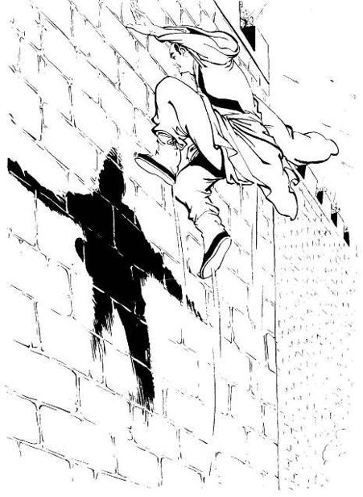
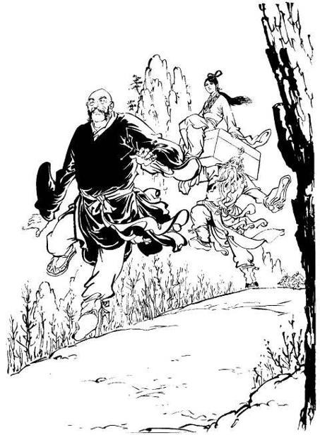

# Chapter 21 – Fierce Fighting at Xiangyang

Translated by Noodles

> Guo Jing’s left foot flicked up against the wall and he flew up over
> ten feet. His right feet followed and he rose up another ten feet.
> Silence broke out on the battlefield as tens of thousands spectators
> fixed their eyes on him.

 

Yang Guo was just about to take his dagger out and stab Guo Jing when he
suddenly heard three light flicks on the outside window. He quickly shut
his eyes and kept still.

Guo Jing immediately woke up alarmed and said, “Rong’er? Is there some
kind of problem?” No more noises came from the window.

Guo Jing saw that Yang Guo was in a deep sleep and could hear his even
snoring. He saw how easily he slept and didn’t want to wake him, so he
got up from the bed quietly and went to the door. He opened the door and
saw Huang Rong in the courtyard signaling him with her hand. Guo Jing
went to her and said quietly, “What’s the matter?”

Huang Rong did not reply and lead him to the garden. She took a look all
around before saying, “I heard you and Guo’er’s conversation. He’s up to
no good, do you know that?”

Guo Jing was startled and asked, “He’s up to no good?”

Huang Rong replied, “I could tell from his words that he’s been
suspicious of you killing his father.”

Guo Jing said, “He may be suspicious but I’ve promised that I’ll tell
him all about the reasons for his father’s death in detail.”

Huang Rong said, “Are you really going to tell him everything?”

Guo Jing said, “I have always blamed myself for his father’s tragic
death. Though Brother Yang Kang went down the wrong path, we did nothing
to save him.”

Huang Rong gave a ‘humph’ and said, “How could he be saved? I just
wished that I’d killed him earlier. If I had, would your Masters have
died on Peach Blossom Island?” When Guo Jing recalled this bitter event,
he couldn’t prevent himself from heaving a long sigh. Huang Rong said,
“Brother Zhu sent Fu’er to tell me that there’s something odd with
Guo’er and she told me how you two were going to sleep on the same bed.
I was worried that something might happen and I have been on guard by
the window all along. It’s better not to sleep in the same room as him.
You should know that people’s thoughts are hard to fathom. His father…
his father died from poison as a result of striking me on the shoulder.”

Guo Jing said, “It can’t be said that you killed him.”

Huang Rong said, “Both of us had the thought of killing him in our minds
and in the end he did die because of me. Although we didn’t kill him
with our own hands, there’s not much difference.”

Guo Jing thought deeply for a while and said, “You’re right. I won’t
tell him about this. Rong’er, you’ve been up for half the night, quickly
go back to your room and rest. After tonight, I’ll move to the camp.” He
knew that his wife’s wisdom exceeded his a hundred times and although he
didn’t believe that Yang Guo had any ill intent towards him, he did as
she said. He stretched out his hand and put his arm around her waist and
led her slowly into the inner halls. He said, “Guo’er used every ounce
of strength he had to take back the position of the Chancellor of Wulin
for us. He knows what’s right and wrong when it comes to matters of the
country; he risked his life in saving you and Fu’er twice; how can his
father compare with his heroic nature?”

Huang Rong nodded her head and said, “Yes, this is something that’s
wonderful to see in this young man, but he has two clouds hanging over
him. One is the reasons for his father’s death and two, his relationship
with his Master. I made Miss Long leave him but Guo’er seems to be
all-knowing; somehow he found her again. From their expressions, it
looks like they’ll never be separated again.”

Guo Jing kept silent for a while and then suddenly said, “Rong’er,
you’re even more all-knowing than Guo’er; think of a way to stop Guo’er
from going down the wrong path.”

Huang Rong sighed and said, “I don’t even know what to do about our
daughter let along Guo’er. Brother Jing, I just have you in my heart and
you have just me in yours. But our daughter isn’t like us; she has two
men in her heart, she treats each of the Wu brothers the same. This
makes things difficult for us parents.”

Guo Jing accompanied Huang Rong to her room and helped her onto her bed.
He covered her with a blanket and held her hand, sitting by the bed
waiting for her to go to sleep. The pair had been busy with defending
the country and hadn’t had a chance to spend any quiet time with each
other like this. The two looked at each other, in silence, in peace.

Huang Rong held her husband’s hand and brushed it gently across her
cheeks. She whispered, “Brother Jing, you name our second child.”

Guo Jing laughed, “You know I’m not good at that; why are you making fun
of me?”

Huang Rong said, “You still say that you’re not able. Brother Jing,
there’s no one in the world that’s better than you.” She said these
words with great sincerity.

Guo Jing lowered his head and kissed his loving wife on her face gently.
He said, “If it’s a boy, we’ll call him Guo Polu, but what if it’s a
girl?” He thought for a while and shook his head saying, “I can’t think
of one, you think of a name.”

Huang Rong said, “Elder Qiu named you ‘Jing’ so that you would not
forgot the shame of the Jing Kang years. The Jin have been destroyed but
now the Mongolians are threatening us. This child is going to be born in
Xiangyang; we’ll call her Guo Xiang so in the future she’ll remember
that she was born in this city when it was surrounded by warring
soldiers.”

Guo Jing said, “Good, but hopefully she will not be like her sister.
She’s grown up now and she still makes us worry about her.”

Huang Rong smiled lightly and said, “It doesn’t matter if we have to
worry but…” She gave a sigh and said, “I really hope that it will be a
boy so that the Guo’s will have an heir.”

Guo Jing stroked her hair and said, “A boy or a girl; will it not be the
same? Just go to bed, don’t think too much.” He pulled the blanket over
her and blew out the candles. He returned to his room and saw Yang Guo
in a deep sleep. The chime for the third hour could be heard. He
returned to the bed and slept.

How would he know that when he was talking to his wife, Yang Guo was
hiding behind the pavilion and heard every single word they said? When
Guo Jing returned to the inner halls with his wife, Yang Guo stood there
in a daze. His mind was repeatedly going over what Huang Rong had said,
“I just wished that I killed him earlier… his father died from poison as
a result from striking me on the shoulder… both of us had the thought of
killing him in our minds and in the end he did die because of me.” He
thought, “There’s no more doubts, my father died because of the two
them. Huang Rong is really wily; she’s already suspicious of me. If I
don’t make my move today then I don’t think I’ll ever get another chance
like this.” He then returned to the room and slept on the bed quietly,
waiting for Guo Jing to return.

Guo Jing slipped himself on to the bed and heard Yang Guo’s faint
snoring. He thought, “This child sleeps so soundly.” He rested his head
lightly on the pillow, afraid that he would wake him up. A short while
passed and he was about to fall asleep when he suddenly felt Yang Guo
turning his body around slowly but while he was turning over, his
snoring continued. Guo Jing was startled, “Everyone stops their snoring
when they turn over in their sleep. There’s something wrong with his
breathing, could it be that when he’s practicing his internal energy he
circulated it in the wrong way? This isn’t anything trivial.” The
thought of Yang Guo pretending to sleep never entered his mind.

Yang Guo slowly turned around slowly and saw that Guo Jing did not
notice him so he continued his faint snoring and got down from the bed.
He had wanted to make his move while he was beneath the blanket but he
was worried about how close he was to Guo Jing. It would be extremely
dangerous for him. If Guo Jing sends out a last gasp palm at him then
surely he would be killed. He had thought about sitting up to do it but
he was still worried about how good Guo Jing’s martial arts were. In the
end he decided to first get off the bed and stab Guo Jing in one of his
vital areas before escaping out of the window. He was also afraid that
if he stopped his snoring, Guo Jing would notice, so he kept up the
pretence while he got down from the bed. But by doing this, Guo Jing was
fooled even more. Guo Jing was thinking, “Could it be that the child has
a sleepwalking disease? If I make a noise now, he would break out in a
shock, his chi in his dan tian would surge the opposite way and he would
immediately fire deviate.” So he didn’t make a move and listened out for
his actions.

Yang Guo took out his dagger slowly and braced it against his chest with
his right hand. He made his way to the bed step by step and suddenly
gathered his chi into his arm to make his attack. Just as he was about
to thrust the dagger, he heard Guo Jing call out, “Guo’er, what kind of
nightmare are you having?”

Yang Guo was extremely shocked and he immediately darted out of the
window. He was fast but Guo Jing was faster; before he touched the
ground Guo Jing had already managed to grab him. Yang Guo’s thoughts
went to despair, he knew that his enemy was much stronger than him and
it would be of no use to resist so he closed his eyes and kept silent.
Guo Jing carried him back into the room. He placed him on the bed and
sat him up with his hands hanging down in front of him, assuming the
form of practicing Xuan Men chi. Yang Guo was bitter and afraid, “I
wonder what kind of evil method he’s going to use to torture me.” He
suddenly remembered Xian Long Nu. He breathed in deeply and wanted to
call out to her, “Gu Gu, I’ve been captured, quickly run away.”

When Guo Jing saw him suddenly breathe in deeply and circulate his chi,
he was even more convinced that he was having problems with the
circulation of his chi and thought, “In a situation like this one can
only breathe in slowly and shallowly, it’s extremely dangerous to
breathe in so quickly and deeply like this.” He quickly placed his palm
against Yang Guo’s lower abdomen.

Yang Guo’s ‘dan tian’ was suppressed by Guo Jing’s profound internal
energy and he couldn’t call out. He was concerned for Xiao Longnu’s
safety and struggled until his face went red but with his ‘dan tian’
suppressed, he couldn’t move an inch. Guo Jing said slowly, “Guo’er, you
were too anxious in circulating your chi; this is called desiring speed
and not transmission. Stop moving, I’ll help return your chi back to
their original sources.”

Yang Guo was startled and didn’t know what he meant by this; but then he
felt a warm gradual chi entering his ‘dan tian’ from his palms that was
extremely comforting. He then heard Guo Jing say, “Slowly expel your chi
and slowly let this warm chi transmit through the ‘Water Divide’ to the
‘Interior Strengthening’ through the ‘Great Tower Gate’, ‘Turtledove
Tail’ to the ‘Jade Hall’, ‘Florid Canopy’, first clear the conception
vessel, ignore the other meridians.

After hearing these words and feeling his chi clearing his meridians, he
more or less gathered what was happening. He thought, “Shocking! He
thinks I’ve lost my mind due to me suffering a fire deviation.” He
secretly circulated his internal energy and deliberately let his chi run
wild, appearing not to be in control. Guo Jing was worried and increased
the power in his palms, gathering his wild chi into one place. Yang
Guo’s internal energy was now not shallow. Guo Jing found it slightly
difficult to cope for a while when Yang Guo sent his chi surging wildly
around his body. He had to waste around an hour’s time before he managed
to return his contrary chi back into their original channels.

After this struggle, Yang Guo was completely drained of strength and Guo
Jing too was extremely tired. The two of them sat in meditation. The sky
lightened before they had recovered.

Guo Jing smiled, “Guo’er, are you okay now? I didn’t know that your
internal energy has reached such a good level already; even I almost
couldn’t control it.”

Yang Guo knew that in trying to save himself, Guo Jing had wasted a lot
of his internal energy and was touched by this. He said, “Thank you
uncle Guo for saving me; last night I was almost crippled.”

Guo Jing thought, “Last night while you were confused, you actually
raised a dagger to kill me; luckily you didn’t know about this,
otherwise wouldn’t you be ashamed of yourself?” He was afraid that if
Yang Guo knew about this he would feel sorry about it so he changed the
subject and said, “Come with me outside of the city, we’ll take a look
at the city’s defenses.”

Yang Guo replied, “Yes!” The two of them mounted a warhorse each and
rode shoulder to shoulder outside of the city.

Guo Jing said, “Guo’er, the internal energy of the Quanzhen sect is the
most orthodox in the world, though progress is slow, you will not run
into any trouble. You can learn other sect’s and school’s martial arts
but when it comes to internal energy it would be advisable to practice
Xuan Men martial arts. We’ll study this together once the enemy has
retreated.”

Yang Guo said, “Don’t tell Auntie Guo about me fire deviating last
night. If she finds out she’ll laugh at me for learning Long Gu Gu’s
unorthodox martial arts and blame me for making Uncle Guo suffer.”

Guo Jing said, “Of course I won’t say. Miss Long’s martial arts aren’t
unorthodox; it’s just that you weren’t concentrating and didn’t practice
with a clear mind.” Yang Guo knew that if Huang Rong found out about
this she would immediately know the truth. When he heard Guo Jing
promise not to tell Huang Rong, his mind relaxed.

The two of them headed west of the city and arrived at a stream. Guo
Jing said, “Though this is a small stream, it is very famous; it is
called the Tan Torrent.”

Yang Guo said, “Oh. I have heard people talk about the story of the
Three Kingdoms; they mentioned that Emperor Liu of Shu leaped over the
Tan Torrent on horseback. So, the Tan Torrent is located here.”

Guo Jing said, “The horse that Liu Bei rode that year was called De Lu;
the horse handler said that it would harm its rider. But in the end De
Lu actually leaped over the Tan Torrent and escaped from the pursuing
army, saving Emperor Liu of Shu’s life in the process.” When he talked
about this, he couldn’t stop himself from thinking about Yang Guo’s
father Yang Kang. He gave a heavy sigh and said, “The people of the
world are just the same as the horse Du Lu; to the good it does good, to
the evil it does evil. Is there such a thing as a definite good or evil
person? The only difference between the two is that there is a contrast
in thought.”

Yang Guo’s heart trembled and he took a look over at Guo Jing. There was
an extremely hurt expression on his face; it appeared that these words
weren’t meant as an attack on him. Yang Guo thought, “Your words might
be right but what is good? What is evil? You and your wife killed my
father, could that be the actions of someone who’s good? Your words
really are brash; you don’t know how shameful you are.” He had always
had great respect for Guo Jing; but from now, whenever he remembers how
his father died at their hands, evil thoughts filled his mind.

The two rode on for a little while and arrived at the top of a hill.
From above one could see the flow of Han going southwards; refugees from
all over were descending on Xiangyang. Guo Jing stretched out his
horsewhip and pointed at the refugees. He said, “The Mongolians must
have intensified their slaughter of our people in Sixiang, destroying
the homes of our citizens. They’re abominable.”

Looking down from the hill, one could see, by the side of the road, a
stone slab with some words written on it. It said: Minister of Works for
the Tang Dynasty, Du Fu’s hometown lies there.

Yang Guo said, “Xiangyang is no ordinary city. So the hometown of this
great poet is here.”

Guo Jing swept his whip and recited, “The great city unlike metal, the
small cities of over ten thousand zhangs… the joined clouds of lined up
battles, the flying birds unable to rise beyond. Self-guarding with
ruin, how can Xi Dou be recovered? … Struggling with long halberds,
history needs one man.”

Yang Guo heard him recite this with great passion and he recited it
himself; “Self-guarding with ruin, how can Xi Dou be recovered?
Struggling with long halberds, history needs one man. Uncle Guo, this is
a really good poem, was it written by Du Fu?” Guo Jing said, “Yes. A few
days ago, your Auntie Guo and I were discussing the defense of Xiangyang
and this poem by Du Fu came up. She wrote it out for me. I really like
this poem but my memory is bad. I went over this poem many times but all
I can remember are just a few lines. There have been many educated men
in our history who have written poems; but over the years, they have
proclaimed Du Fu as the greatest poet of all and it’s all because of his
worry for his nation and people.”

Yang Guo said, “You said, ‘a hero’s imperative is to serve your country,
serve your people’, literature and martial arts are different but the
same can be applied to both.”

When Guo Jing heard him grasp this he was delighted and said, “I do not
understand much about literature; but no matter what one becomes in
their life, a merchant, a slave, a solider, as long as the thought
‘serve your country, serve your people’ is there, one can be a true man,
a true hero.”

Yang Guo asked, “Uncle Guo, do you think you will be able to defend
Xiangyang?”

Guo Jing thought for a while and then pointed to the hills and trees to
the west before saying, “In Xiangyang’s history, the most famous person
is Zhuge Liang. Twenty ‘li’ (10km) west of here is a thriving place. It
was the place where he lived in seclusion. Coarse people like me can’t
fathom the deeds that he did saving our nation and bringing peace to our
people. He once said that all he knew was that one must follow the
phrase ‘bending your body to the task until your dying day’. Whether it
would lead to success or failure, he didn’t know. When your Auntie Guo
and I talked about whether Xiangyang can be defended or not; we ended up
with these same words.”

Just as they were talking, they saw that the refugees who were at the
doors of Xiangyang had suddenly turned around while the refugees behind
kept on flowing forward towards Xiangyang. It was chaos.

Guo Jing was shocked and said, “Why aren’t the guards letting them into
the city?” He galloped towards the city and saw a line of archers with
their bows armed pointing at the refugees.

Guo Jing called out, “What are you doing? Quickly open the gates.” When
the guards saw that it was Guo Jing, they quickly opened the gates and
let him and Yang Guo in.

Guo Jing said, “These people are being persecuted by the Mongolians, why
aren’t you letting them in?”

The general guarding the gates said, “General Lu said that spies have
hidden themselves amongst the refugees; we cannot let them in for that
reason.”

Guo Jing shouted, “Even if there are one or two spies, how can we show
no regard for these hundreds of lives? Quickly open the gates.”

Guo Jing has been guarding the city for a long time now and had many
great achievements; though he did not have an official post, the general
guarding the city did not dare to disobey his orders and opened the city
gates. At the same time, he ordered a messenger to report this to Lu
Wende.

Old and young all converged on the city. Suddenly, a dust cloud appeared
far away; the Mongolian army was moving in from the north. The Song
soldiers scattered and went back inside the walls of the city. A large
group of people stood out in front of the oncoming enemy; they were all
clothed in rags and all had a stick in their hands, none had a real
weapon and they were scattered. They called out, “Don’t shoot arrows
here; we’re Song citizens as well!”

The Mongolian army however sheltered themselves behind the refugees.

Ever since the times of Ji Si Khan, whenever the Mongolian army attacked
a city, they would first send the citizens of the surrounding country
towards the city they were attacking. If the soldiers who were guarding
the city weakened their resolve at this sight, the Mongols would
immediately come forward and attack. By using this method, the Mongolian
army was able to slaughter the citizens of the nation they were
attacking and defeat their opposition in the city, killing two birds
with one stone. It was extremely brutal and cruel but effective. Guo
Jing had been with Mongolian army a long time and knew about this
tactic, but there was nothing he could do to counter it. The Mongolian
soldiers held the spears and long sabers to the front as they forced the
citizens of the Song forward. The people were forced closer and closer
and the people closest the city began to climb up the ladders.

Lu Wende rode his horse and took a look around at what was happening.
When he saw the urgent situation they were in he immediately ordered,
“Defending the city is the main priority, fire the arrows!”

Arrows rained down and many people were struck. Those who weren’t fell
back. The Mongolian army chopped heads with their sabers and pierced
bodies with the spears and the refugees were forced back towards the
city. Yang Guo stood next to Guo Jing and watched this tragic scene in
anger.

Lu Wende called out, “Fire the arrows!” Arrows rained down once more.

Guo Jing shouted, “Stop, you can’t kill good people!”

Lu Wende said, “In such an urgent situation, even if it is a good
person, we have to kill them.”

Guo Jing shouted, “No, how can you kill good people wrongly?”

Yang Guo’s heart trembled, “You can’t kill good people wrongly! How can
you kill good people wrongly?”

Guo Jing called out, “My Beggar Clan brothers and my Wulin friends
follow me!” He then rushed down towards the city gates. Yang Guo
followed him.

Guo Jing said, “You suffered an injury when practicing chi last night;
you cannot exert any kind of strength today. Go back to the city wall
and watch what’s happening.”

Yang Guo saw his fellow Han being treated worse than animals by the
Mongolian army and wanted to go down with Guo Jing and do some killing.
He was startled when he heard this but he couldn’t tell Guo Jing that
last night was just an act; so he returned back up the city wall. Guo
Jing led a group of people and opened the western gate. They rushed out
and attacked the Mongolian flank. The Mongolian troops who were forcing
the refugees forward turned towards Guo Jing.

The people Guo Jing was leading were good fighters of the Beggar Clan
and patriots that had been gathered from all over China. They shouted
and attacked; over a hundred Mongolian soldiers were immediately forced
off their horses. The Mongolian army saw that their thousand soldiers
were not able to fend them off and so another thousand came forward from
the side. The Mongolian soldiers were all experienced, brave and
vicious; though the group Guo Jing was leading knew martial arts, they
were not able to subdue the Mongolians for the time being. When the
refugees saw that the Mongolian soldiers were not pushing them forward
any longer, they scattered.

A horn blew from the east and two Minghan regiments (division of 1000
men) surged forward. Another two Minghan regiments from the west dashed
forward and surrounded Guo Jing and his group. Lu Wende was scared
witless when he saw the might of the Mongolian army; how would he dare
to send men out for a rescue?

Yang Guo stood at the top of the city walls and kept on going over what
Guo Jing had said, “You can’t kill good people wrongly! How can you kill
good people wrongly?” When he saw Guo Jing surrounded he thought, “All
the guards had to do was to let some arrows fly and kill a few people
and they would have been able to stop this Mongolian attack. The reason
Uncle Guo is in all this danger is because he didn’t want to kill good
people wrongly. He doesn’t know these people yet he risks his life to
save them; why did he want to kill my father?”

He saw the tragic killing below but all he could think about was this
riddle; “He and my father were sworn brothers; this isn’t any ordinary
kind of relationship, but in the end he still wanted to harm him. Could
it be that my father was an evil person?” Ever since he was little he
had always thought of his father as someone who was chivalrous, brave
and heroic; one of the greatest men on earth. To acknowledge that his
father was an evil person was something that he could not do. But in his
heart, he had the feeling that his father could not compare to his Uncle
Guo; but whenever he had this feeling, he forced it back down. Right now
however, he couldn’t stop himself from thinking about this point.

The cries below the city walls were ear shattering. Guo Jing and his
group dashed left and surged right but they still were unable to break
out. Zhu Ziliu led a group of men and the Wu brothers and Guo Fu led
another to save them; but the Mongolian horn was blown once again and
another four Minghan units surged forward to the city gates. Khubilai
was indeed skilled in warfare. If the city gates opened to save Guo Jing
and the others, the four divisions would break into the city.

Lu Wende was shocked senseless now and ordered, “Do not open the city
gates!” Two hundred men who were ordered to guard the gates were told to
kill anyone daring to try to open the gates. General Wang led a group of
archers at the top of the city walls and they fired their arrows
incessantly.

Chaos ruled both outside and inside the city while Yang Guo’s mind was
in the same state; sometimes he wished that Guo Jing would perish in
this battle, while at others, he wished that Guo Jing would be able to
drive the enemy back.

Suddenly, the formation of the Mongolian soldiers was broken up;
thousands of mounted soldiers collapsed back to the sides as though the
tides swept them. Guo Jing galloped ahead with a long spear in his
hands. The Han behind him formed a tight formation and they surged
forward. They managed to get to the city gates. Guo Jing turned his
steed around and went to defend the back of the group. His long spear
knocked seven or eight Mongolian Generals off their steeds. The
Mongolian soldiers stopped pressing for the time being.

Lu Wende relied on Guo Jing heavily and when he saw him escape danger he
was ecstatic; he quickly called out, “Open the gates! But only a little,
don’t open the gates too wide!”

The city gates opened three or four feet and just allowed one rider in
at a time. All the men returned to the city. The yellow flag of the
Mongolian army was waved and two divisions of soldiers on horseback
charged forward from both sides.

Lu Wende called out, “Brother Guo Jing, quickly get back into the city!
We can’t wait for the others.”

How could Guo Jing enter the city while he still had men outside? He
turned his horse back and killed two Mongolian soldiers that had ridden
up to him.

But once the army was in motion, they moved like the waves of the sea.
Guo Jing was skilled in martial arts, but how could one person defend
against the attack of a large army?

Zhu Ziliu saw the situation was urgent and quickly lowered down a rope.
He called out, “Brother Guo, grab it.”

Guo Jing turned his head and saw the final Beggar Clan member had
entered the city but he was followed by ten Mongolian soldiers. The
guards at the gates fought them off and began closing the city gates.
The two foot thick metal gate slowly closed. Guo Jing shouted and killed
an Arban Chief with his spear before leaping up to take the rope. Zhu
Ziliu pulled up with all his strength and Guo Jing rose up ten feet.

The Noyan who was supervising the troops ordered, “Arrows!” Immediately,
a thousand bows released their arrows. Guo Jing was prepared for this.
He tore off the lower part of his gown and swung it in front of his body
with his left hand like a shield while he kept hold of the rope with his
right hand. The gown was unyielding and blocked off all the arrows; but
the steed that he had left behind outside the city walls was killed by
the raining arrows. Zhu Ziliu pulled with both hands and pulled Guo Jing
up higher and higher.

Guo Jing was around twenty feet away from the top of the city wall when
a tall skinny monk appeared amongst the Mongolian army. He was wearing a
yellow Buddhist gown; it was none other than Jinlun Fawang. He took a
bow from one of the Mongolian soldiers and raised it. He knew that Guo
Jing and Zhu Ziliu’s martial arts were high and would be able to avoid
any arrows he shot at them so instead he aimed for the rope. It was a
vicious move. The arrow was ten feet away from both Guo Jing and Zhu
Ziliu; the two had no way to stop this arrow. Jinlun Fawang was afraid
that the two might come up with a way to stop this arrow so he fired two
more arrows, one at Guo Jing and the other at Zhu Ziliu. The first arrow
severed the rope while the second and third arrow headed for Guo Jing
and Zhu Ziliu with great force.

When the rope severed, Guo Jing dropped and the arrow aimed at him
missed. Zhu Ziliu felt the weight in his hand lessen and called out; “Oh
no!” The arrow had arrived. It was a very forceful arrow; the person who
fired it must have very profound internal energy. The top of the city
walls were filled with people, if Zhu Ziliu lowered his head to avoid
this arrow, someone behind might be injured. So he stretched out the
second finger on his left hand and touched the stem of the arrow,
diverting it back down the city wall.

Guo Jing was slightly alarmed when he felt the rope part; though he
won’t be injured by the fall, he would be surrounded by thousands and
thousands of soldiers. How could he fight his way out of that? The
Mongol army is right next to the city gate now; if my side opens it to
let me in, the Mongols would definitely take the opportunity to push
through. There was no time to think in this danger; his left foot
flicked up against the wall and he flew up over ten feet. His right foot
followed and he rose up another ten feet. Very few people were
proficient in this “Stairs to Heaven” technique. Even those who were
well versed in it could only manage two or three feet per step; but on
this slippery wall, each step of Guo Jing’s took him over ten feet. Guo
Jing’s martial arts were frighteningly good. Silence broke out on the
battlefield as everyone fixed their eyes on him.

Jinlun Fawang was slightly startled when he saw this. However, he knew
that when one uses the “Stairs to Heaven”, they must make their leap in
one breath. If Fawang could distract him and disturb his breathing then
Guo Jing would not be able to make his third step, so Fawang raised his
bow again and shot an arrow towards Guo Jing’s back.

The arrow flew like the wind. Shouts of, “No arrows!” were heard from
soldiers from both the top of the city walls and down below. Both sides
saw the terrifyingly good skills of Guo Jing and were in awe; they all
hoped that he would make it. The Mongolians were the enemy but had much
respect for great heroes and great men, they were all furious when they
saw someone had fired an arrow at Guo Jing.

Guo Jing knew that the arrow behind him had a tremendous force behind
it. He called out in alarm, “Not now!” He had to use his hand to deflect
it away. Both sides cheered when they saw that the arrow failed to hit
him. But with this earth shattering noise, Guo Jing was falling back
down the city wall. There were only a few feet to the top of the city
wall but Guo Jing had no way to climb up it.

When the two sides were fighting, the same was happening within Yang
Guo’s heart. In the short space of time that Guo Jing climbed up,
dropped down, climbed up and dropped down again, Yang Guo’s mind
repeatedly went over, “He killed my father, should I kill him or not, or
should I save him or not?”

When Guo Jing was using the “Stairs to Heaven” technique, Yang Guo had
thought about throwing out a palm at Guo Jing. Guo Jing was in midair
and had nothing to support himself with; he would definitely suffer a
serious injury and fall back down from the city wall.

But as he was hesitating, Fawang had already fired an arrow at Guo Jing
that stopped him from coming up. Yang Guo’s mind was in confusion.
Suddenly, he grabbed the severed rope in Zhu Ziliu’s hand with his left
hand and leapt down from the city wall towards Guo Jing, grabbing Guo
Jing’s arm with his right hand.

This was a move out of the blue but Zhu Ziliu responded with great
speed. He first lowered the rope down slightly before gathering strength
into his arms and urgently pulled the rope upwards. Yang Guo and Guo
Jing arced in circle like two large birds flying in the sky. The
soldiers on both sides watched with their mouths open.

When Guo Jing was in midair he thought, wouldn’t it mean he had lost in
this exchange if he doesn’t reply to this sneak attack by this evil
monk? He saw Fawang had fired another arrow. As soon as his left foot
touched the top of the city wall he immediately grabbed a bow from one
of the guards and fired an arrow of his own towards Fawang’s arrow. The
arrows collided in midair and Fawang’s arrow was split into two. Fawang
was stunned. Suddenly, a fierce gust arrived; a ‘zheng’ sound was heard
as the metal bow in his hands snapped in two.

Though Guo Jing’s and Fawang’s martial arts were within a hairsbreadth
of each other, Guo Jing’s archery skills were unsurpassed. He had
learned archery from one of the greatest Mongolian archers, Zhe Bie
(Jebeh), when he was young and his internal energy was profound – when
it came to archery, Fawang lost out.

Guo Jing had fired three arrows; the first divided Fawang’s arrow, the
second snapped Fawang’s bow and the third was fired towards Khubilai’s
flag staff.

Khubilai’s flag had fluttered in the wind gloriously amongst the
thousands of soldiers, but now it had fallen. Soldiers from both sides
shouted and hollered.

Khubilai saw his army’s morale drop after Guo Jing’s display and
immediately ordered his men back.

Guo Jing stood at the top of the city wall and watched the Mongolians
retreat. They were marching back in formation and in line; those who
were at the front didn’t rush and those who were at the back showed no
fear. He couldn’t stop himself from sighing and thinking, “Our weak Song
army cannot compete with the great Mongolian army.” He frowned as he
worried about the fate of his nation.

Zhu Ziliu, Yang Guo and the others were in awe of Guo Jing when they saw
that he had no signs of pride of his face even after displaying his
might in front of thousands.

Khubilai pulled his men back tens of miles and then started to think of
a plan to take the city. With Guo Jing at the helm, it would be
difficult to take it.

Fawang said, “Your highness saw for yourself; if it weren’t for Yang
Guo, Guo Jing would be dead now. I knew that Yang Guo was not a man of
his word.”

Khubilai said, “No! I think it’s because he wants to Guo Jing to die by
his own hands and not at the hands of others. He appears to be a brave
and valiant man; he is not a conniving fellow.”

Fawang didn’t agree but he didn’t dare to answer back, he just said,
“Hopefully your highness is correct.”

Xiangyang city was safe now that the Mongolian army had pulled back. Lu
Wende was delighted and threw another banquet to celebrate it. This
time, Yang Guo was also invited.

Everyone praised him for his swift and life risking actions in saving
Guo Jing. The Wu brothers sat at another table and were filled with
jealousy. Yang Guo had made a great achievement immediately after
arriving at Xiangyang. They were also afraid that after this event, Guo
Jing would again insist on betrothing his daughter to Yang Guo. The
brothers didn’t say a word and just sat there, drinking wine.

Everyone returned to the Guo residence when the banquet finished. Huang
Rong invited Yang Guo into the inner halls and praised him. Yang Guo
replied with modest words.

Guo Jing said, “Guo’er, you’ve just exerted a fierce force, does your
chest hurt?” Guo Jing was worried that by using unrestrained force, Yang
Guo’s internal injury would flare up.

Yang Guo was worried that Huang Rong would ask about this further and
see through this so he quickly replied, “I’m fine…I’m fine.” He changed
the subject immediately and said, “Uncle Guo, the kung fu that you used
to fly up the city wall was excellent, there isn’t another who can match
that in the world of Wulin.”

Guo Jing gave a little smile and said, “I learned this kung fu a long
time ago and haven’t practiced it for years; I’m a little rusty with it
and that was why I ran into a bit of trouble.” In actual fact, if he
hadn’t used his chi and internal energy to help Yang Guo protect his
‘dan tian’ last night, he would have been able to fly up the city wall
using the “Stairs to Heaven” technique even with Jinlun Fawang’s
interference. Naturally, he didn’t mention this and said, “Years ago in
Mongolia, the Red Sun Elder Ma taught me this skill; who would have
thought that I would have to use it today. If you like this skill I’ll
teach it to you in a few days time.”

Huang Rong saw that Yang Guo seemed absent minded and his thoughts were
somewhere else. His rescue of Guo Jing was seen by thousands, there was
nothing suspicious about this but she still felt uncomfortable and said,
“Brother Jing, I’m not feeling well tonight, stay with me.”

Guo Jing nodded and said to Yang Guo, “Guo’er, you’re tired, go and
rest.”

Yang Guo said his goodnights to the two and went back to his room alone.
He heard the call for the second hour. He sat in front of the table and
stared at the flickering candlelight with many thoughts running through
his head. Suddenly, a noise came from the door. A girl’s voice said,
“You’re not sleeping?” It was Xiao Longnu. Yang Guo leapt up in delight
and opened the door. Xiao Longnu was standing in front of him dressed in
a light green gown.

Yang Guo asked, “Gu Gu what’s the matter?”

Xiao Longnu said, “I wanted to see you.”

Yang Guo held her hand and said tenderly, “I was just thinking about
you.”

The two of them strolled out to the garden. The scent of the flowers and
trees filled the air. Xiao Longnu looked at the semi-circled moon in the
sky and said, “Do you have to kill him with your own hands? We haven’t
got much time left.”

Yang Guo quickly whispered into her ear, “The walls have ears here,
don’t talk about it.”

Xiao Longnu looked at him enraptured and said, “When the moon is full,
the time will be up.”

Yang Guo was alarmed and counted with his fingers; it had been nine days
since they parted from Qiu Qianchi. If he doesn’t kill Guo Jing within
the next two days, there will not be enough time to hurry back to the
valley before the poison reacts. He let out a sigh and sat down on a
taihu stone (limestone rocks found in Lake Tai) with Xiao Longnu. The
two looked at each other without saying a word and they became wrapped
up in their love, forgetting all about matters of killing and avenging.

Suddenly, the sounds of footsteps could be heard from behind the garden
fountain, two people were approaching.

A girl’s voice said, “If you’re going to keep nagging me then you might
as well just get a sword and slit my throat to stop my torment.”

An angry male voice said, “Huh, don’t you think I don’t know that you’ve
got more than one man in your heart? That Yang punk showed off in front
of everyone after arriving in Xiangyang. Do you remember what you said
before?” It was Guo Fu and Wu Xiuwen.

Xiao Longnu made a face at Yang Guo, trying to scold him for flirting
with girls everywhere and tormenting them. Yang Guo gave her a smile and
pulled her closer to him. He shook his head lightly, telling her not to
make a noise.

When Guo Fu heard these words, she became furious and raised her voice,
“Since you’ve made your mind up then forget everything I said before.
I’ll go somewhere far away by myself; I’m not going to see Yang Guo and
I’m not going to see you.” A tearing sound was heard; Wu Xiuwen must
have tugged her sleeve and Guo Fu must have pulled it back.

Her voice became even angrier as she said, “What are you doing? So what
if he shows off? What’s it got to do with me? If my parents betroth me
to him I’d rather die than agree to it. If father forces me then I’ll
run away. That Yang Guo has always been an attention grabber since he
was young, but I choose not to give a damn about him. Father thinks he’s
some kind of treasure whereas I think that he’s not a good person.”

Wu Xiuwen said quickly, “Yes…Yes. I was stupid just now, please forgive
me sister Fu. If I act like that again, then I won’t have a good death
and when I reincarnate, I’ll reincarnate as the king of cowards.”
Feelings of joy seeped through as he said this. Guo Fu giggled.

Yang Guo and Xiao Longnu looked at each other and smiled; one was
thinking, “Look, look at how others view me.” The other thought, “I was
wrong just now, I love you but others love someone else.”

Though Guo Fu had a scolding tone in her voice and treated Wu Xiuwen
almost like a child, making him obedient and completely enchanted. She
had tender feelings for him.

Wu Xiuwen then said, “Master wife loves you very much; beg her day and
night non-stop. If Master wife agrees not to betroth you to the one
named Yang, then master will not be able to say anything.”

Guo Fu said, “Huh, what do you know? Father may listen to mother but
when it comes to important matters, mother will not stand up to father.”

Wu Xiuwen gave a sigh and said, “It’ll be great if you treat me the
same.” Suddenly, a ‘pa’ sound was heard and Wu Xiuwen called out in
pain. He said quickly, “Why are you hitting me”

Guo Fu said, “Who told you to say things like that? I’m not going to
marry Yang Guo, and I’m not going to marry you, you little monkey.”

Wu Xiuwen said, “Fine, fine. Finally you’ve admitted it. You don’t want
to be my wife but you want to be my sister in law. Let me tell you
something… let me tell you something…” He was flustered and couldn’t
finish his sentence.

Guo Fu’s voice suddenly became gentle and tender as she said, “Little
brother Wu, you’ve told me a thousand times, a million times how you
feel about me, I already know. Though your brother hasn’t even said one
word of this kind, I know that he loves me. No matter who I pick, one of
you brothers will be broken hearted. Don’t you know how hard it is for
me?”

Wu Dunru and Wu Xiuwen had always relied on each other ever since they
were young because they lost the care of their parents; but in the last
few years, the two of them had fallen madly in love with Guo Fu and both
were troubled by the other. Wu Xiuwen’s heart was filled with angst and
tears actually fell from his eyes.

Guo Fu took out a handkerchief and gave it to him. She sighed, “Little
brother Wu, we all grew up together, I have great respect for your
brother but I find it easier to talk to you. I am not biased towards any
of you. You’re trying to force me to make a clear choice now, if you
were me, what should I say?”

Wu Xiuwen said, “I don’t know. All I know is if you marry someone else,
life would not be worth living.”

Guo Fu said, “Let’s stop talking about this. Father fought for his life
against the enemy today while we’re talking about some trivial stuff
here in the garden; if father finds out about this then we’ll both be in
trouble. Little brother Wu, let me tell you, if you want to please my
parents then why don’t you try to stand out, achieve some great deeds in
battle? Won’t my parents look down on you if you keep on hanging around
me?”

Wu Xiuwen leapt up and said loudly, “You’re right, I’ll go and
assassinate Khubilai and rid the threat to Xiangyang. When that happens,
will you agree to marry me?”

Guo Fu smiled, “If you can do such a thing then I would have no other
choice but to marry you, wouldn’t I? But Khubilai has many guards around
him. Even my father may not be able to beat that Jinlun Fawang. Stop
dreaming, just go and sleep.”

Wu Xiuwen stared at Guo Fu’s elegant face and said, “Fine, you go and
sleep as well.” He turned around and walked away a few steps before
suddenly stopping. He turned and asked, “Sister Fu, are you going to
have a dream tonight?”

Guo Fu laughed, “How do I know?”

Wu Xiuwen said, “If you do dream, what do you think you will dream
about?”

Guo Fu gave a little laugh and said, “Most probably about a little
monkey.”

Wu Xiuwen was filled with joy and skipped away.

Xiao Longnu and Yang Guo listened to their words behind the flower
thicket. They couldn’t stop themselves from grinning at each other and
comparing themselves with them: one was madly in love with the other
while the other didn’t have a set mind; while they had only each other
in mind and could die without regret. That couple’s joy and happiness
could not compare with the joy and happiness of themselves.

After Wu Xiuwen left, Guo Fu sat on the stone bench and looked up at the
moon in deep thought. She stared at it for a long while before letting
out a sigh.

Suddenly, someone came out from behind the garden fountain and said,
“Sister Fu, why are you sighing?” It was Wu Dunru.

Yang Guo and Xiao Longnu were both slightly startled. Wu Dunru must have
hid himself here a long time ago, he was here even before they in fact,
otherwise the two would have noticed him when he arrived here.

Guo Fu said with a slight angry tone, “You are always weird like this.
You heard everything we said, right?”

Wu Dunru nodded and stood opposite of Guo Fu at quite a distance away
but his eyes were still filled with love. The two looked at each other
in silence.

After a while, Guo Fu said, “What do you want to say to me?”

Wu Dunru said, “Nothing. You know what I have to say.” He turned around
and then slowly walked away.

Guo Fu stared at his back while he walked away towards the garden
fountain. He didn’t turn around even once. She thought, “Wouldn’t it be
great if only one of them existed?” She gave a deep sigh and returned to
her room alone.

Yang Guo waited until she had gone before laughing, “If you were her,
who would you marry?”

Xiao Longnu turned her head slightly and thought for a while before
saying; “You.”

Yang Guo laughed, “I don’t count. Miss Guo does not like me one bit. I
said if you were her, which one of the Wu brothers would you pick?”

Xiao Longnu compared the two Wu brothers in her mind but still came up
with, “I’ll still marry you.”

Yang Guo was amused and touched. He embraced her and said tenderly,
“Others have more than one in their hearts but my Gu Gu loves me only.”

The two of them stayed in each others loving arms until daylight.

The sun was on the eastern horizon. The two still did not want to part.
Suddenly, a servant rushed up to them and greeted them before saying,
“Master Guo requests Master Yang’s presence immediately,”

Yang Guo saw that his face was anxious and knew that it was something
important. He left Xiao Longnu and followed the servant to the inner
halls.

The servant said, “I searched for master Yang everywhere; master Yang
was appreciating the scenery in the garden.”

Yang Guo said, “Has Master Guo been waiting a long time?”

The servant whispered, “The two masters Wu’s suddenly disappeared,
Master and Madam Guo are worrying about them and Miss Guo cried a few
times!”

Yang Guo was startled when he heard this but he knew what had happened.
“The two Wu brothers are trying to fight for the hand of their
apprentice sister and want to do something outstanding; they must have
gone to assassinate Khubilai. He hurried inside and saw Huang Rong
looking distressed in her nightgown with Guo Jing pacing to and fro. Guo
Fu’s eyes were red and it looked like she was going to cry at any time.
There were two swords on the table.

As soon as Guo Jing saw Yang Guo he quickly asked, “Guo’er, the Wu
brothers went to the Mongolian camp, do you know why?”

Yang Guo glanced over at Guo Fu and said, “The Wu brothers went to the
Mongolian camp?”

Guo Jing said, “Yes. You young ones always talk to each other, do you
have any clue about why they went?”

Yang Guo said, “I didn’t notice anything. The two Wu brothers did not
say anything to me. It’s probably because they were worried about the
danger that Xiangyang was in so they went to the camp to kill a few
senior generals. It’ll be a great achievement if they succeed.”

Guo Jing sighed and pointed to the swords on the table. He said, “Even
if their hearts are in the right place, they don’t know what they are
getting into; their weapons have been taken away and sent back here.”

Yang Guo was rather surprised by this. He knew that the Wu brothers
would not be able to succeed with such great fighters such as Jinlun
Fawang, Yin Kexi, Xiaoxiang Zi and the likes around; but he wouldn’t
have predicted that it would happen in the past few hours and that their
weapons would be sent back.

Guo Jing gave the letter that was on top of the weapons to Yang Guo and
glanced at Huang Rong. The two of them shook their heads. Yang Guo
opened the letter and saw:

To Hero Guo of Xiangyang from the First Protector of Mongolia Jinlun
Fawang,

Last night when I was hunting, I unexpectedly came upon your disciples
by the name of Wu. People say that great Masters will produce great
disciples; I cannot deny this. I have long admired and marveled at Hero
Guo’s great name. Last time we meet at the heroes’ feast, we did not get
the chance to make acquaintances. I have written to you to invite you
the camp so we may do so and share wine. As soon as you arrive, your
disciples will be returned safely. Will you accept this invitation?

The letter had a humble tone and it appeared to be an ordinary
invitation for Guo Jing to go to the camp and make acquaintances with
Fawang. But what the letter really was saying is that the Wu brothers
will only be released if Guo Jing agrees to go to the camp.

Guo Jing waited for Yang Guo to finish reading before saying; “Well?”

Yang Guo knew what this was about, “Auntie Guo’s wisdom is ten times
greater than mine, Auntie Guo would have come up with any plan that I
could think of. The reason she summoned me to discuss this matter is for
one reason only; she wants me and Gu Gu to accompany Uncle Guo to the
Mongolian camp. Fawang, Xiaoxiang Zi and the others together might beat
Uncle Guo but it isn’t guaranteed that they’ll be able to kill and
capture him. If Gu Gu and I help him, Uncle Guo will be able to escape.”
He then immediately came up with, “But if Gu Gu and I suddenly changed
sides, to harm him will be as easy as turning my palm. If I can’t kill
him with my own hands, then I’ll just let Fawang and the others to do it
for me, wouldn’t that be great?” He then gave a wry smile and said,
“Uncle Guo, my Master and I will go with you. Auntie Guo has seen our
swordplay defeat Jinlun Fawang; they might not be able to keep us there
if the three of us go together.”

Guo Jing was delighted and smiled, “No one can compare with your
intelligence apart from your Auntie Guo. This is the exact thing that
your Auntie Guo came up with.”

Yang Guo thought, “Huang Rong, oh Huang Rong, you’ve been clever all
your life but today you lose out to me.” He said, “We’ll go right now.
Gu Gu and I will pretend to be your attendants, that way we will be able
to emphasize your heroic manner in coming to this meeting all by
yourself.”

Guo Jing said, “Good!” He turned to Huang Rong and said, “Rong’er, you
don’t need to worry, with Guo’er and Miss Long, even if it was a
dragon’s lagoon or a tiger’s lair, we’ll still be able to return
safely.”

He straightened his gown and said, “We’ll get Miss Long.”

Huang Rong shook her head and said, “No, I just wanted Guo’er to go with
you. Miss Long is like a porcelain doll, I cannot let her meet any
danger. I want her to stay with me.”

Yang Guo was startled but then immediately understood, “Auntie Guo is
indeed wary of me. She wants to keep Gu Gu with her as a hostage, that
way I won’t be able to do anything. If I insist of having Gu Gu with me,
she will be even more suspicious.” He didn’t say anything about it.

But Guo Jing said, “Miss Long’s swordplay is excellent, it would be a
great help if she comes with us.”

Huang Rong countered, “Your Polu or Xiang’er are about to be born. If
Miss Long is here to guard me, I can relax a bit more.”

Guo Jing said quickly, “Yes, yes, I’m so dumb. Guo’er, let’s go.”

Yang Guo said, “Allow me to tell my Gu Gu.”

Huang Rong said, “I’ll tell her in a minute, you two are just going to
the camp for half a day, it’s not some great event.”

When it came to using their minds, Yang Guo found himself losing out to
Huang Rong every time. So he decided to use his against the honest and
sincere Guo Jing instead. He’ll make his move against him in the camp
and then come back to save Xiao Longnu afterwards. He made his mind up
and left the city with Guo Jing.

Guo Jing rode the precious red horse and Yang Guo rode his skinny yellow
horse. The two horses were fast and they arrived at the camp within one
hour.

Khubilai was startled and delighted that Guo Jing had actually decided
to come here and he quickly invited him into his tent.

Guo Jing entered the tent and saw a middle-aged Prince sitting in the
middle of the tent. He had a square face and large ears with deep-set
eyes; Guo Jing was stunned when he saw this and thought, “This person
looks so much like his father Tuo Lei.” He was very close to Tuo Lei
\[Tolui\] when he was younger but now he had passed away; his eyes
turned red at this thought and he almost cried.

Khubilai left his seat to greet him and bowed down to him, saying, “When
my father was alive, he always praised the heroic and righteous Uncle
Guo. I have always admired Uncle Guo. To have the opportunity to meet
you is the fulfillment of my lifelong dream.”

Guo Jing bowed to him and said, “Tuo Lei and I were like brothers; when
I was younger, my mother and I lived in Genghis Khan’s territory and it
was your father who looked after us. It is very sad that he died
suddenly at such a young age.”

Khubilai heard that his words were sincere and they moved him. He then
introduced Xiaoxiang Zi, Yin Kexi and the others to him and then invited
him to his place.

Yang Guo stood behind Guo Jing and pretended that he didn’t know any of
them. Fawang and the others did not know why he came but when they saw
him ignoring them, they ignored him.

However, Ma Guangzuo called out, “Brother Ya…” Before he finished saying
‘brother Yang’, Yin Kexi had pinched his leg tightly. Ma Guangzuo called
out, “What are you doing?”

Yin Kexi turned his head around and ignored him. Ma Guangzuo didn’t know
who did this and kept on shouting out insults. He forgot about greeting
Yang Guo.

Yang Guo sat down and drank some Mongolian milk wine. Yang Guo saw that
the Wu brothers were not present and was about to ask their whereabouts
when Khubilai ordered his attendants; “Invite the Masters Wu in.” The
attendant did as he was told and pushed Wu Dunru and Wu Xiuwen into the
tent.

Their hands and legs were tied tightly with cowhide. The restraints
between their legs were just a foot long so the two couldn’t take their
normal strides. They could only struggle slowly forwards. Their faces
were filled with embarrassment when they saw their Master. They called
out, “Master!” and then lowered their heads in silence.

Guo Jing had been extremely angry with them for taking such a risk
without telling anyone and causing this mess, but when he saw the two,
his feelings changed. Their clothes were torn and blood stained and they
were tied up so pathetically, his anger turned to pity. He thought that
although the two were reckless, their hearts were in the right place by
trying to help the nation, so he said warmly, “A martial artist will
endure countless sufferings and countless defeats, what you’ve suffered
is nothing.”

Khubilai pretended to scold his attendants and said, “I ordered you to
look after these two Masters Wu with great care, why have you treated
them like this? Quickly untie them.” The attendants followed his orders.
However, the cowhide was soaked in water after being tied and had shrunk
tightly into the skin, the attendants couldn’t untie it.

Guo Jing left his seat and took the ends of Wu Dunru’s restraints. He
pulled outwards lightly and the restraints snapped. He then did the same
with Wu Xiuwen’s restraints. Guo Jing’s movements looked plain, ordinary
and seemed to lack sufficient force, but by succeeding, he showed he
possessed great internal energy. Xiaoxiang Zi, Yin Kexi, Nimoxing and
the others looked at each startled, and all secretly praised his martial
arts.

Khubilai said, “Bring some wine quickly so you can apologize to the two
Masters Wu.”

Guo Jing thought, “Today’s not going to be plain sailing; something’s
going to happen soon. If the Wus don’t leave now, I’m going to be
distracted.” He then made a bow to everyone in the tent and said
clearly, “Thank you your Highness for teaching my disciples a lesson for
their insolence.” He then turned to the Wu brothers and said, “Go back
and tell your Master wife that I’m going to stay here for a while and
talk with an old friend’s son, I’ll be back soon.”

Wu Xiuwen said, “Master, you…” Last night they failed in their
assassination attempt and were captured by Xiaoxiang Zi. He knew that
the camp was filled with great fighters and he couldn’t stop himself
from worrying about Guo Jing.

Guo Jing waved his hand and said, “Leave now! Go and tell General Lu to
guard the city tightly and no matter what happens, do not open the city
gates in case of an attack by the enemy.” Guo Jing said this with a
mighty aura and was telling Khubilai that even if something happens to
him, Xiangyang will not surrender.

When the Wu brothers saw that Guo Jing had come personally to save them,
they were touched but also ashamed of themselves. They didn’t say
anything else and made their goodbyes with Guo Jing before returning to
the city.

Khubilai laughed, “Uncle Guo must not have known about your disciples
coming here to assassinate me.”

Guo Jing nodded and said, “I did not know about this. My disciples don’t
know how tall the sky is and how deep the earth is, they were extremely
impudent.”

Khubilai said, “Yes, Uncle Guo and my family have deep ties with each
other, the thought of assassinating me would never cross Uncle Guo’s
mind.”

Guo Jing said with a serious expression, “You’re wrong here. The matters
of the people are more important than my own. Years ago when Tuo Lei led
an army here to attack Xiangyang, I once thought about trying to kill
him to force the army to retreat. But at that exact time, Genghis Khan
fell ill and the army retreated and so our brotherhood was preserved.
There’s a saying, ‘place righteousness above family loyalty’, since a
family can be gotten rid of, why not friends?”

These words were said with a righteous air and Fawang, Yin Kexi and the
others all looked at each other with changed faces.

Yang Guo’s chest trembled and he thought, “Yes, killing brothers is his
best skill. I wonder what my father did all those years ago to
eventually die by his hands. Guo Jing, oh Guo Jing, could it be that
you’ve never made a mistake in your entire life?” As he thought about
this, hate and fury slowly filled his chest.

Khubilai did not show any signs of anger and had a smile on his face as
he said, “So why does Uncle Guo reproach your disciples when you have
the same view?”

Guo Jing said, “Looking at their lowly abilities, what chance had they
of succeeding in this task? Their failure is not important, it’s just
that once they failed, you will be even more wary of someone
assassinating you; this task would be made even more difficult for later
assassins.”

Khubilai laughed and thought, “I’ve heard that Guo Jing is an honest and
simple person who’s not very good with words, who knew that he can
actually speak with such spirit and gusto.”

Actually, Guo Jing was just saying what was on his mind and because he
knew what he wanted to convey; he was able to say it with great
sincerity.

When Fawang and the others saw that he came alone and empty handed to
this vast army without any signs of fear on his face; they were in
complete awe of him since none of them could match the spirit that he
was displaying.

Khubilai couldn’t stop himself from admiring Guo Jing. When he saw Guo
Jing’s lofty air and thought that if he could convince him to join his
command, it would be better than taking down ten Xiangyang cities. So he
said, “Uncle Guo, the Song are in disarray. You have an Emperor who is
blind to the people’s plight, you have scoundrels in your courts and
those who are loyal are punished, am I right?”

Guo Jing said, “Correct, Emperor Li Zhonghuang is a blind man and the
Prime Minister Jia Sidao is the biggest crook of them all.” No one
guessed that he would actually insult his own emperor and leaders.
Everyone was startled.

Khubilai said, “Yes. Uncle Guo is a great man and a hero of our time so
why do you work for such men?”

Guo Jing stood up and said clearly, “Even if the one named Guo is
unworthy, why would I allow myself to let those people use me? When I
see you violent Mongols invading our land and killing my people, my
blood boils. I’m doing this for my people; the angry blood that flows
through me is because of them.”

Khubilai patted on the arms of his chair and said, “What great words.
Everyone, give a toast to Uncle Guo.” He raised his bowl and downed the
wine in one go.

Everyone was getting anxious and they were all afraid that with these
stirring words and his relationship with Khubilai’s father, Khubilai
might actually let him go. It would be extremely difficult to capture
him again but no one could do anything. When they saw Khubilai raise his
bowl, they did the same and drank it down in one go. The attendants
filled their bowls once more.

Khubilai said, “I once heard an old man say, ‘It’s the people of the
land that are important, not the Khan.’ What a truthful phrase. The land
of Mongolia is in a state of peace; my people live happily and have what
they need. My Khan could not bear to see the people of the Song suffer
and when he saw that no one was doing anything about it, he sent his
troops south to help end the troubles of the people. This thought is the
same as Uncle Guo’s, we both have the same heroic view. Come, let’s
toast again.”

Fawang and the others all raised their bowls to their lips. Guo Jing
swept his sleeve and sent a gust of wind over. There was a bout of
‘qiang lang lang’ noises as everyone’s bowls fell to pieces on the
floor.

Guo Jing angrily shouted, “Stop! Ever since you Mongols invaded our
land, you have killed and slaughtered; corpses and bones mount up while
blood flows like rivers. My citizens have lost their homes and countless
have died by your army’s sabers and arrows. What troubles of my people
are you ridding them of?”

Though this sweep of the sleeve was extremely sudden and was completely
unexpected, it still managed to knock the bowls out of the hands of
Fawang and the others who possessed great martial arts. Everyone felt
shame and they all stood up, waiting for Khubilai’s orders to attack.

But Khubilai gave a long laugh to the sky and said, “The Generals of the
Mongolian army say that Uncle Guo is a hero without a match, everyone is
full of admiration for Uncle Guo. Indeed after seeing you with my own
eyes, I now know that your great name is not a myth. I do not dare harm
the brotherly relationship of my father; because of the past let’s stop
talking about matters of the country?”

Guo Jing saluted with his hands and said, “Tuo Lie’s son is a
magnanimous and open-minded man, and none of the other Mongolian princes
can compare with him. He will no doubt lead the country one day. I have
some advice for you, would you like to listen?”

Khubilai said, “I am willing to listen to Uncle Guo’s teachings.”

Guo Jing folded his arms and said, “The land of the Southern Song is
vast and the people many. Talented and learned men are everywhere, and
since history began, these kinds of men have not submitted to anyone.
You Mongols might be able to expand your territory for a little while
but in the future, you will be forced back north. When that happens, it
will be disastrous for you and to regret it then will be too late.
Please reconsider what you are doing.”

Khubilai smiled, “Thank you for your words.”

Guo Jing heard him say these words casually and said, “We’ll say our
goodbyes at that. Goodbye.”

Khubilai waved his hand and said, “Escort the guests out.”

Fawang and the others looked at each other startled and all thought, “It
wasn’t easy to catch him, how can we let the tiger escape back into the
mountains?” When they saw Khubilai sending Guo Jing out politely, they
all felt that it was inappropriate to make a move on him.

Guo Jing strode out of the tent and thought, “This Khubilai is no
ordinary person; he is indeed a strong foe.” He signaled with his eyes
towards Yang Guo, telling him to hurry towards their steeds.

Suddenly, eight Mongols dashed forward from the sides. The leading
Mongol said, “You’re Guo Jing? You injured many of my brothers at
Xiangyang and you’ve actually dared to come here to our camp to show off
your might again. His highness has allowed you to go but we cannot allow
it.” With a shout all eight men dashed forward towards Guo Jing. These
eight men all used Mongolian wrestling techniques as sixteen hands went
to grab Guo Jing.

Mongolians are unmatched in wrestling and these eight men were
first-rate fighters in the Mongolian army. Khubilai had hid them nearby
to capture Guo Jing. But Guo Jing grew up in Mongolia and was well
versed in riding, archery and wrestling; when he saw the eight pair of
arms coming towards him he stretched out his hands and swept his right
leg. In a flash, he had flung four men over ten feet away and tripped
the other four onto the ground. He used orthodox Mongolian wrestling
techniques but because he had advanced martial arts as a base, the
strength in his arms and legs was stronger than any normal men. How
could the eight men defend against this?

Khubilai had stationed his personal Minghan unit outside the tent and
each one of them was skilled in wrestling. They saw how fast and clean
Guo Jing’s movements were in throwing down eight men to the ground in
one go. They had never seen such a display and they all cheered.

Guo Jing held out his fist towards the crowd and took off his hat,
spinning it in his hand. This was the routine that one did to the crowd
after winning a wrestling match. The crowd cheered even louder when they
saw him do this. The eight men picked themselves up from the ground and
looked at Guo Jing in shock. They didn’t know whether to go again or
just leave it at that.

Guo Jing said to Yang Guo, “Let’s go!”

Suddenly, a horn could be heard and Minghan regiments from everywhere
galloped towards them. Khubilai had moved his troops and surrounded Guo
Jing and Yang Guo.

Guo Jing was slightly shocked and thought, “Even if we had the greatest
of skills, how could we break out of this? Who would have thought that
Khubilai had gone to such lengths to get me captured?” He was afraid
that Yang Guo would get worried so he kept a normal expression and said,
“Our steeds are fast horses. Our main priority is to break out of this
encirclement. We need to get two shields to protect ourselves from their
archers.” He then whispered into his ear, “First gallop south and then
go north.”

Yang Guo was shocked, “Xiangyang is south of here, why go north?” But he
immediately understood, “Hmm, yes, Khubilai must have placed his men
around Xiangyang in case he went south. The north will be free of
soldiers. First go south and then go north unexpectedly; they will not
be able to respond in time and we can escape. How should I stop him?”

Yang Guo was trying to make his mind up when he saw a few people dart
out of the tent. These people had blocked their path. A ‘ming ming’
sound followed as a bronze and iron wheel flew towards the steeds; it
was Fawang.

Guo Jing saw that the wheels were coming in with great force and did not
dare to use his hands to catch them. He lowered his head and pressed
down on the necks of the two horses with his hands; the horses lowered
their front legs just in time for the iron and bronze wheel to brush
over their heads. The two wheels turned in midair and flew back into
Fawang’s hands. This slight delay allowed Nimoxing and Yin Kexi to
arrive in front of Guo Jing and Yang Guo. Fawang and Xiaoxiang Zi
arrived a little later and the four surrounded them.

Jinlun Fawang, Xiaoxiang Zi and the others were all first rate fighters
and normally would not lower themselves to fight in numbers, but Guo
Jing was too strong and they were all thinking about the title of ‘The
Greatest Warrior of Mongolia’. White and golden light glimmered as all
of them took out a weapon.

Fawang was holding a bronze and iron wheel. Yin Kexi was holding a
golden jewel embedded whip. Xiaoxiang Zi was holding a short Ku Sang
Rod. The person holding the strangest weapon was Nimoxing. In his hand
was a short iron Snake whip that looked like a live snake as it was
moved on his arm.

From their running movements and their hand movements in taking out
their weapons, Guo Jing could see that the weakest out of the four
appeared to be Yin Kexi. He immediately threw both his palms forwards
towards Xiaoxiang Zi. Xiaoxiang Zi extended his rod forward, aiming for
Guo Jing’s palm. Guo Jing looked at his weapon and saw white silk
twirling around it and there was hemp at one end. Guo Jing saw that
Xiaoxiang Zi’s martial arts were high and his weapon strange, he’ll
definitely have some strong points about him, so he turned his right arm
around and used a stance of “Divine Dragon Sweeping its Tail”, he
immediately grabbed Yin Kexi’s golden whip. Yin Kexi wanted to use his
whip to attack his opponent but it had already been grabbed. He followed
the opponent’s pull and threw his body forward with a glittering dagger
in his left hand. This stance was using an attack as a defense and it
was the top skill of the “Eighteen Little Grabbing Hand Technique”.

Guo Jing called out; “Good!” He used his grabbing hand technique on him
again. His right hand still held onto the whip as he went for his
dagger. Guo Jing’s arms were crossed over as his right hand held onto
the whip in Yin Kexi’s right hand and his left hand held onto Yin Kexi’s
left hand. Yin Kexi was sure that by thrusting his dagger forward, his
opponent would have no choice but to let go of his whip and avoid the
dagger. Who would have thought that his dagger would also be held?

At this time, Fawang’s wheels and Xiaoxiang Zi’s short rod attacked. Guo
Jing did not manage to snatch away the golden dragon whip with his first
pull and he shouted out; a surge of great chi went through the whip into
Yin Kexi. Yin Kexi felt as if a metal hammer had struck his chest
heavily, his eyes saw stars and he threw up a mouthful of blood. Guo
Jing let go of the whip and blocked the attacks. Yin Kexi knew that he
had suffered a severe injury and he pulled back slowly. He sat down on
the ground and circulated his chi through his ‘dan tian’ and held back
the urge to vomit more blood.

Fawang, Xiaoxiang Zi and Nimoxing were both delighted and afraid when
they saw Guo Jing injure Yin Kexi with his first attack. They were
delighted because there was now one less competitor for the title of the
‘Greatest Warrior of Mongolia’, but they were also afraid because they
saw how powerful Guo Jing was. They themselves might suffer the same
fate if they weren’t careful. The three of them did not dare make any
rash moves and defended themselves.

Guo Jing responded to every stance that came to him and studied the
strange weapons of Nimoxing and Xiaoxiang Zi carefully. The Ku Sang rod
was made out of pure iron and apart from being heavy and sturdy; he
couldn’t see anything special about it. Nimoxing’s snake shaped weapon
was very strange, the head of the weapon was like the head of a
poisonous snake and the body of the weapon was soft and crooked. Both
the head and tail of the snake shaped weapon were sharp but the most
powerful aspect of the weapon was that it was hard to predict the
weapon’s movements. One couldn’t tell when the body of the snake would
bend over, the head and tail of the weapon had no certain direction; the
iron snake whip would suddenly leap up and whirl around in Nimoxing’s
arms and then suddenly curl up and slither around, the weapon had
hundreds of variations.

In his younger years, Guo Jing had seen the stances of Ouyang Feng’s
snake staff; the staff was like a real snake and it had venomous poison
with it. Even if Nimoxing’s weapon was extremely powerful, it was still
a dead object. When he attacks and when he takes the snake back, there
will be certain principles behind it that can be seen through. Because
of this, the only person that Guo Jing was worried about was Jinlun
Fawang.

The four of them had exchanged several moves when suddenly someone
shouted and stepped forward, a man mountain appeared; it was Ma
Guangzuo. He was holding a thick and long bronze rod in his hand and
smashed it down towards Guo Jing’s head from behind Nimoxing. The four
of them were in a heated battle and all of them defended tightly, there
was not an ounce of spare space in between any of them. The exchange
from Guo Jing’s palms, Jinlun Fawang’s wheels, Xiaoxiang Zi’s short rod
and Nimoxing’s iron snake had formed a net of force around them. By
smashing the rod down, Ma Guangzuo was running up against the force
created by the four. Ma Guangzuo’s rod suddenly bounced back up as it
met this invisible force. He noticed something was wrong and shouted out
as he gathered strength into his arms to keep control of the rod. Even
though he managed to do this, the joints in his hands bled. He called
out loudly, “Evil, evil!” He increased the strength in his arms and
smashed down once more.

Fawang was standing in front of him and he saw what was happening, the
greater the force he smashes down with, the more he’ll suffer and Fawang
just chuckled.

Yang Guo watched from the side and knew what would happen; though Ma
Guangzuo was strong, his martial arts could no way compare with that of
Guo Jing. If he makes a fierce attack blindly and meets up with the
world’s most yang and unyielding “Eighteen Dragon Subduing Palm” of Guo
Jing head on, what chance would he have of living? Even if he doesn’t
die under the palm of Guo Jing, he would be seriously injured by the
weapons of Fawang, Nimoxing and Xiaoxiang Zi. He liked this dim-witted
person for his simple and straightforward character and for standing up
for him on many occasions. If Ma Guangzuo strikes down he would
definitely meet great danger so Yang Guo called out, “Ma Guangzuo, watch
out for my sword!”

The gentlemen sword went for his back.

Ma Guangzuo was stunned and stopped his bronze rod in midair. He said
with shock, “Brother Yang, why are you fighting me?”

Yang Guo insulted, “You Dumbass, what do you think you’re doing? Get
away!” The long sword quivered as several stances were thrust forward.
Ma Guangzuo could do nothing but retreat. Yang Guo pierced forward
furiously and forced him back step by step. Ma Guangzuo had long legs
and every step of his was the equivalent of two ordinary steps by a
normal person. Ten steps later and they became quite a distance away
from Guo Jing and the others.

The sword glimmered in front of his eyes. He could never have dreamed
that Yang Guo would suddenly try to kill him and even if he used every
ounce of strength he had, he would not be able to fend off these attacks
by Yang Guo.

Yang Guo waited until he had retreated back a few more steps before
quietly saying, “Brother Ma, do you know that I’ve just saved your
life?”

Ma Guangzuo said loudly, “What?”

Yang Guo said quietly, “Keep your voice down, don’t let the others
hear.”

Ma Guangzuo said with his eyes wide open, “Why? I’m not afraid of that
Guo Jing.” These words were still said clearly and loudly. To him, he
was speaking at a normal tone but to others his voice was like someone
was shouting and hollering.

Yang Guo said, “Okay don’t speak, just listen to me.” Ma Guangzuo
listened to him and nodded. Yang Guo said, “That Guo Jing knows
witchcraft. All he has to do is to recite a curse and he’s able to chop
someone’s head off. It’s better if you run away as far as possible.”

Ma Guangzuo’s eyes opened wider when he heard this and believed his
words though he had doubts.

Yang Guo wanted to save his life and he knew if he said that Guo Jing’s
martial arts were too high, he would never admit defeat; but if he said
that Guo Jing knew witchcraft, this slow witted person would probably be
scared. He continued, “You tried to smash his head in with your rod but
before you even touched his head, the rod bounced back up, isn’t that
strange? That merchant’s martial arts are excellent but how come as soon
as he went up to fight him, he was injured?” Ma Guangzuo was becoming
slightly more convinced and nodded his head but looked over at Fawang
and the others.

Yang Guo knew what he was thinking and said, “That monk knows how to
write charms. He gave one to that zombie and one to that dwarf, if you
have one on your body, you will be protected against witchcraft. Did
that monk give you one?”

Ma Guangzuo said angrily, “No.”

Yang Guo said, “Yes, that old baldy didn’t give me a charm as well.
We’ll sort him out afterwards.”

Ma Guangzuo said loudly, “You’re right. What should we do?”

Yang Guo said, “We’ll watch from the side, the further away the better.”

Ma Guangzuo said, “Brother Yang, you’re a great friend. It was lucky you
told me about this.” He put away his weapon and watched the battle from
afar.

Guo Jing was using the great Wulin skill the “Eighteen Dragon Subduing
Palms”. Fawang and the others kept tight on him thinking that even if
his internal energy was more profound, he would not be able to keep up
so powerful a palm technique for much longer. But Guo Jing had been
practicing the “Nine Yin Manual” diligently for the last twenty years;
at first his real power did not show but tens of stances later, the
“Eighteen Dragon Subduing Palms” suddenly became powerful and then
suddenly gentle, from great hardness came softness. This was something
that Hong Qigong did not manage to grasp all those years ago. By using
this kind of palm technique to fend off these three fighters, not only
did he remain on an even level with them, he was able to counterattack
when he had the chance and he was getting more and more fluent as he
went on.

Yang Guo watched in awe from the side. He too had practiced the “Nine
Yin Manual” in the ancient tomb; but because he had no one to instruct
him, he didn’t know that the manual’s arts were this extraordinary. He
followed Guo Jing’s palm techniques with the teachings of the manual in
mind and immediately he understood countless profound fist theories. His
mind concentrated on this and for the time being, he forgot about
killing Guo Jing to avenge his father.

Fawang’s martial arts and Guo Jing’s martial arts were separated by the
smallest of margins; Guo Jing may have had more fortunate encounters
than Fawang but Fawang was twenty years older than he and had twenty
years worth of internal energy more than Guo Jing. If the two fought one
on one, they would have to exchange over a thousand stances to decide
who was better. With first-rate fighters such as Nimoxing and Xiaoxiang
Zi by his side, it shouldn’t have been difficult to gain victory over
Guo Jing. But Guo Jing’s “Eighteen Dragon Subduing Palms” were too
powerful and along with his palm technique, he was using Quanzhen’s “Big
Dipper Formation”. He went to and fro as he fought and it was as if he
had separated into seven. Another reason why he was still holding them
off was because of his immediate victory over Yin Kexi; this was a
warning to the others and the remaining three made defense their main
priority and did not dare to make a rash attack. Although it was three
against one, Guo Jing still held his own against them.

After a few more stances, the power in Fawang’s wheel gradually
increased. The force of the attacks from Nimoxing’s iron snake was
increasing as well.

Guo Jing was getting anxious and thought, “If this continues, I won’t be
able to hold them off. Guo’er is over fighting with that giant. That
giant’s martial arts are just average, Guo’er will be able to manage. I
need to get over to him as soon as possible and think of a way to get
out of this place.” The four were putting all their concentration into
their battle and did not dare to even blink; they did not notice Yang
Guo and Ma Guangzuo were just watching their battle.

Suddenly a strange whistling noise was heard. Xiaoxiang Zi leapt up
several feet into the air and pointed his Ku Sang rod downwards. Guo
Jing stepped to the side to avoid it when suddenly everything went dark;
a black smoke was being emitted from the Ku Sang rod. A stench filled
Guo Jing’s nose and he felt slightly faint. He called in alarm to
himself and knew that there was something poisonous within the Ku Sang
rod and he quickly moved backwards.

Xiaoxiang Zi had seen Guo Jing had definitely taken in the black smoke
but he did not faint. He was extremely shocked and thought, “Lions,
tigers and any kind of wild beast would faint as soon as they come
across my toad poison. But it doesn’t seem to have any kind of effect on
him; that is strange.” He leapt up once again and shot out some more
poison from his rod.

Years ago when Xiaoxiang Zi was practicing martial arts in the wild
mountains of Hunan, he saw a toad that was hiding itself in a broken
coffin. It had poisoned a large python to death. He understood what the
toad had done and gathered some toads to extract the venom from them. He
developed a poisonous dust and secreted it in the Ku Sang rod. There was
a lever at the end of the rod. When his finger pressed down on the lever
it would shoot the poison out. The higher above he fires the poison
from, the more effective it becomes. He has used this poisonous dust on
pythons and wild beasts before and it knocked them out immediately; but
he could not have guessed that Guo Jing’s internal energy was so
profound that he was actually able to suppress the effects of the
poison.

Fawang and Nimoxing were to the side of Guo Jing and although they did
not come in direct contact with the dust, they had smelled a little and
they immediately had the urge to vomit. They quickly leapt away from it.
Xiaoxiang Zi had plugged the antidote to this poison in his nose
beforehand and he dashed forwards into the black smoke, waving out his
rod to attack.

Guo Jing used a stance of “Seeing the Dragon in the Field” and sent it
towards Xiaoxiang Zi’s kneecaps. Xiaoxiang Zi used his rod to block the
attack and before he had any more time to fire some more poison out, he
had been forced back five feet by the palm.

Guo Jing slanted his body to the side only to see Nimoxing coming in
with an attack with his iron snake. He sent out a stance of “The
Forbidden Submerged Dragon”. Nimoxing quickly placed the Iron Snake
across his chest and held each end with his hands. However, the power of
this palm of Guo Jing’s came from the area around the palm and not in
the palm itself. Though the palm was going for Nimoxing’s chest, there
was no kind of force going towards it and he blocked thin air. By the
time he knew something was wrong, his abdomen and his face had felt the
power of the palm. Luckily for him, he was very short and as a result
was very nimble, he quickly threw himself down and rolled away on the
ground like a ball.

Guo Jing saw his chance to escape and called out, “Guo’er, let’s go!” He
leapt out into the open plains. Fawang flew after him. Guo Jing’s back
was just a few feet away from the Mongolian soldiers and immediately
over ten spears were pointed towards it. Guo Jing used his arms to parry
away the spears and then grabbed and threw two soldiers towards Fawang.
He called out, “Catch!”

If Fawang caught them, it would slow him down and give Guo Jing the
chance to run further away so he slanted his left shoulder and knocked
into the soldiers and sent them flying over ten feet away. He threw his
golden wheel towards Guo Jing’s back.

Guo Jing knew if he returned just one stance, he would get caught up in
a fight with Fawang. When Nimoxing and Xiaoxiang Zi catch up, it would
be difficult to escape again, so he grabbed two spears and thrust them
backwards. He did not slow down one bit as he did this and it was as if
he had a third eye on his back; one of the spears went towards Fawang’s
right shoulder and the other for Fawang’s chest. Both the direction and
power behind it was complete. Fawang secretly praised this and then
swept his golden wheel across, smashing the spears in two. By the time
his sights were back on Guo Jing, he had already darted into the
Mongolian army.

This division of soldiers was ordered by Khubilai to station themselves
deeply around the tent to capture Guo Jing. But when Guo Jing darted
into their formation, the soldiers could do nothing about him; they
could not capture him nor harm him. Sounds of spears and sabers could be
heard along with calls and shouts. These soldiers actually hindered
Fawang and the others in their chase after Guo Jing.

Guo Jing hiding himself amongst the soldiers and horses was like hiding
himself in a dense forest; it was actually easier for him to escape
danger like this than in the open land. He ran up to a Noyan and pulled
him down from his horse. He leaped on the horse and galloped left and
right amongst the crowd of soldiers. Soon he managed to break through
the rear of them and he galloped forward, whistling as he went. The red
horse was left at a faraway place and when it heard its master summoning
it; it galloped like the wind towards him.

Yang Guo watched from afar as the red horse galloped towards Guo Jing.
He thought to himself, “Oh no!” He knew that once Guo Jing got on the
red steed, Khubilai would have no way to catch up with Guo Jing even if
he sent all the world’s men after him.

In this urgent situation, he suddenly called out, “Oh no, I’m feel as if
I’m dying!” He wobbled a bit as if he was about to fall down onto the
ground. He then whispered to Ma Guangzuo, “Don’t say anything, run away
now! The further away the better.” He had circulated his chi through his
‘dan tian’ when he called out and even in this clamor, Guo Jing would
definitely be able to hear it. When Guo Jing heard this, he would
definitely come back for him, but if he sees Ma Guangzuo with him, Guo
Jing might actually throw out a palm and send Ma Guangzuo to his death.
Ma Guangzuo was very obedient to Yang Guo’s words and although he didn’t
understand what he meant by this, he ran away towards the royal tent.

When Guo Jing heard Yang Guo’s call, he was indeed worried. He didn’t
wait for the red horse and turned his horse back towards him. He went
back into the swarm of soldiers and galloped towards where Yang Guo was
standing.

A thought went through Fawang’s mind and he knew what Yang Guo was
trying to do. He allowed him to pass and instead blocked his escape
route.

Guo Jing rode up to Yang Guo and said anxiously, “Guo’er what’s wrong!”

Yang Guo swayed a little and said, “That giant is not a match for me but
for some reason, whenever I try to use any real strength, a surge of chi
runs through me and my ‘dan tian’ feels as if it’s being cut up by
knives.”

This was a completely believable lie; Guo Jing could tell that Ma
Guangzuo’s martial arts were very ordinary when he attempted to smash
down on him with his rod, so if Yang Guo said it was Ma Guangzuo who
injured him, Guo Jing would be suspicious. But if he said that
something’s wrong with his chi, Guo Jing would not be able to tell if he
was lying or not from the outside. There was also the fact that Guo Jing
mistook Yang Guo for fire deviating the previous night. The likelihood
of this type of injury recurring again in the heat of battle is not
uncommon.

Guo Jing saw that he was holding his abdomen with his left hand and his
head was covered in sweat. It appeared that the injury was not light and
he said quickly, “Get on my back; I’ll carry you out of here.”

Yang Guo said with a false pretence, “Uncle Guo, quickly go, my life
isn’t worth anything but Xiangyang’s fate depends on you. The country,
the army, the people, and all their hopes rest on you.”

Guo Jing said, “You came here because of me; how can I leave you here?
Quickly get on.”

Yang Guo dallied as Guo Jing lowered himself. Guo Jing pulled him onto
his back. Just at this time, the horse that Guo Jing had snatched was
killed by the Mongolian soldiers’ arrows.

Guo Jing had experienced countless dangerous situations in his life; the
more dangerous the situation the greater his bravery. He pondered on how
to get out of this situation and he said to Yang Guo, “Guo’er, don’t be
afraid, we are going to fight our way out of here.” He stood up and
dashed north.

Fawang, Nimoxing and Xiaoxiang Zi were now attacking Guo Jing once
again. Guo Jing looked around and saw that soldiers surrounded them;
this situation was even direr than the previous time that they were
surrounded.

Beneath the camp’s banner stood Khubilai. He was holding a bowl of wine
and was watching the battle with a monk by his side. There was an
arrogant expression on his face as he watched on with victory assured.

Guo Jing gave a shout as he carried Yang Guo towards Khubilai. He
arrived in front of Khubilai after just three leaps. Khubilai’s
bodyguards were alarmed and they pointed their spears at Guo Jing. Guo
Jing’s palms overcame all obstacles as it sent one of the guards flying
away. Just a few more feet forwards and Khubilai would be in range of
Guo Jing’s palm. All Khubilai’s guards defended him with their lives but
how could they stop Guo Jing?

Fawang saw it was getting desperate and he threw his golden wheel
towards Guo Jing’s head. Guo Jing lowered his head to avoid the wheel
but did not stop and continued forward.

Yang Guo thought, “If he holds Khubilai hostage, the Mongolians will
have no choice but to let him go. If I don’t make my move now, when am I
going go make it?” He hesitated a little and eventually said, “Uncle Guo
was my father really a tyrant that left you with no choice but to kill
him?”

Guo Jing was stunned with this question but he had no time to give it
much thought in his reply in their present situation and immediately
replied, “He took a scoundrel as his father, he betrayed his country and
plotted against his people, he deserved to die.”

Yang Guo said, “Fine!” He hesitated no longer and raised his gentlemen
sword and thrust it towards Guo Jing’s back.

Suddenly, a white blur appeared and a rod swept across and blocked his
sword. Yang Guo followed the rod and dispersed the opponent’s force. He
looked carefully and found out that it was Xiaoxiang Zi who had stopped
his sword. He was surprised and thought, “My sword was just about to go
through Guo Jing, why are you stopping me?” But he immediately
understood his reasons, “That’s right; if I kill Guo Jing then the title
of ‘Mongolia’s Greatest Warrior’ will be mine. Huh, this zombie doesn’t
know that I’m just trying to avenge my father; I don’t care about titles
and whatnot.” He unleashed several stances and forced Xiaoxiang Zi’s rod
away. He turned his sword back towards Guo Jing and thrust it towards
him once again. Xiaoxiang Zi used his rod and blocked his sword.

At this moment, Guo Jing was fending off Fawang’s wheel and Nimoxing’s
Iron Snake with his palms; he didn’t know what Yang Guo was up to. He
just thought that Yang Guo was trying to fight Xiaoxiang Zi with all his
might and he said, “Be careful of the poison in his rod.”

Fawang and Nimoxing were in front of Guo Jing and could see what was
going on clearly and both shouted, “Xiaoxiang Zi, what are you doing?”

Xiaoxiang Zi cackled and suddenly swept his rod towards Guo Jing. Guo
Jing moved out of the way. Yang Guo was about to send his sword through
Guo Jing for the third time but once again, Xiaoxiang Zi blocked his
sword.

Guo Jing was worried about Yang Guo’s injury and was afraid that he
would not be able to cope with Xiaoxiang Zi’s rod so he sent out his
left palm towards Xiaoxiang Zi’s chest. Xiaoxiang Zi quickly jumped out
of the way.

Yang Guo had no one to stop him now and he sent out his sword towards
Guo Jing’s back. However, Xiaoxiang Zi was worried that Yang Guo would
succeed and he advanced immediately after his retreat and sent his rod
towards the vital pressure points on Yang Guo’s back, forcing Yang Guo
to save himself first.

Guo Jing was using his right palm to compete advanced internal energies
with Fawang. Both he and Yang Guo were in great danger. He ignored his
own safety and tried to save Yang Guo first. His left palm used a stance
of “Divine Dragon Swinging its Tail” and collided with Xiaoxiang Zi’s
short rod. Xiaoxiang Zi’s arm burned and his ghastly white face turned
red.

But at that exact time, Nimoxing had rolled towards him and extended his
Iron Snake towards Guo Jing’s left side. Guo Jing was using seventy
percent of his energy against Fawang and the remaining thirty percent in
blocking Xiaoxiang Zi’s rod. He had nothing left to block this attack of
Nimoxing and could only move his left side back half a foot. He was able
to avoid the iron snake’s main attack but the head of the iron snake
still managed to embed itself inches into his side.

Guo Jing circulated his chi and his muscles flexed and stopped the head
of the iron snake from going in any further. He immediately followed
this by a flying left kick and sent Nimoxing tumbling. Nimoxing saw that
his iron snake had struck one of his vital areas and thought that the
title of the ‘Mongolia’s Greatest Warrior’ would be now be his. But he
would never have dreamed that his enemy would have such incredible
martial arts that would allow him to grasp victory from the jaws of
defeat. This kick landed on Nimoxing’s chest and broke three of his
ribs.

Xiaoxiang Zi and Nimoxing had both been defeated but Fawang took this
opportunity to gain victory and quickly increased the strength in his
palm. Guo Jing’s chi on his left side has now been disturbed and he
could hold on no longer. He felt a mountain shattering and ocean turning
force coming towards him. If he continued to take this head on, the
result would be death. He could only disperse the power in his palm and
rely on his twenty years worth of internal energy to take this stance.
His body swayed continuously and he threw up a mouthful of blood. His
life was in danger but his thoughts were still on Yang Guo. He called
out, “Guo’er, go and get a horse, I’ll hold them off.”

After seeing Guo Jing protect him with his life, Yang Guo’s emotions
were stirred and he no longer cared about his revenge. He thought about
how righteous and virtuous his Uncle Guo was, if he didn’t repay a life
with a life then he will have wasted his life on earth. He leapt off his
back and flurried his ‘Gentleman’ sword to protect Guo Jing. He was like
a mad tiger and fought with his life with every stance.

Fawang and Xiaoxiang Zi were stunned and shouted, “Yang Guo, what are
you doing?”

Yang Guo did not reply and sent out a stance towards Fawang. The tip
quivered and another stance was sent out towards Xiaoxiang Zi. The two
saw that his eyes were red and that he had a strange expression on his
face; they both took two steps back. They assumed that he wanted to kill
Guo Jing himself in order to get the title of the ‘Greatest Warrior of
Mongolia’.

Guo Jing said, “Guo’er, don’t worry about me, save yourself.”

Yang Guo replied, “Uncle Guo, it’s my fault that you’ve ended up like
this. I’m going to die with you.” The sword glimmered as he ignored his
own safety and protected Guo Jing.

Fawang and Xiaoxiang Zi raised their weapons and attacked Guo Jing
together. But Yang Guo’s sword stances were extremely lively and he
actually kept the two at bay. The Mongolian army surrounded them and
roared as they watched the three fights. Guo Jing kept on urging Yang
Guo to run away but all he saw was Yang Guo protecting him with his
life. He was worried but also touched. His internal injury flared up and
he could hold on no longer; his knees went limp and he fell to the
ground.

Nimoxing held down the pain of his broken ribs and advanced forward
slowly with his iron snake to kill Guo Jing. Yang Guo sent out several
wild stances and then put Guo Jing on his back. He dashed north. His
martial arts could not compare with Fawang normally but now with Guo
Jing on his back, how long could he last? Several exchanges later, his
left arm was slashed open by Fawang’s golden wheel.

 

# Chapter 22 – The Baby Girl of the City in Danger

Translated by Noodles

> The golden wheel was shot low to the ground. As it got closer and
> closer, Yang Guo had no other option but to use his sword to repel the
> wheel. He knew that he had no strength left and knew that it was nigh
> on impossible for him to succeed but he had no choice but to give it
> his all. The wheel was now just two feet away from the horse with the
> wheel generating a soul shaking noise.

 

Just as Guo Jing and Yang Guo thought they had ran out of luck, the
Mongolian soldiers and horses suddenly started to disperse. An old
crippled man with a metal crutch in his left hand and a hammer in his
right advanced towards them. He called out, “Master Yang, escape
quickly, I’ll hold them off.”

Yang Guo took a glance at him and recognized it was one of Peach Blossom
Island’s disciples Feng Mofeng. He was extremely surprised by this
event, but in this perilous danger, he didn’t give it much thought as to
how he suddenly appeared.

When Feng Mofeng was forced into working for the Mongolian army, he used
the chance to assassinate members of the Mongolian army and had already
killed a Noyan and a Jagen leader. He was very careful in making his
moves and was yet to be discovered. Today, he heard a great commotion
and so he headed up to a high vantage point to see what was happening.
He saw that Guo Jing and Yang Guo were surrounded, so he fought his way
in to help them. His iron hammer caused gusts of wind as it was swung
and those who met it died instantly. A bloody trail was left in his
wake.

Yang Guo was delighted with this development and swung his sword to try
to break out. However, Fawang used his wheel to intercept Yang Guo’s and
Feng Mofeng’s stances at the same time. Whenever Xiaoxiang Zi’s rod came
down towards Guo Jing’s back, Fawang would allow Yang Guo to save Guo
Jing. If Fawang used his wheel to smash down on Guo Jing, Xiaoxiang Zi
would block his attack with his rod. If it wasn’t for the two fighting
each other, and even if Yang Guo gave his life in trying to protect Guo
Jing, Guo Jing would have been dead long ago.

When Khubilai came up with the reward of being ‘Mongolia’s Greatest
Warrior’, he had hoped that his men would use all their efforts to
achieve this goal; but instead they fought with each other, which was
something that he did not predict.

Guo Jing’s life might be safe for the time being, but the Mongolian army
had positioned themselves all around him like an iron wall, presenting a
metal boundary. Fawang and Xiaoxiang Zi were fighting for first place.
Nimoxing bit down on his tongue as he held in his pain and looked for a
chance to attack, attacking with vicious stances here and there.

By now, Yang Guo and Guo Jing had been battling within the army for over
an hour. The sun was now skewed to the side. Fawang suddenly changed his
stances and his wheel collided with Yang Guo’s long sword. The
‘Gentleman Sword’ was a blade that can cut through metal like butter; as
soon as the weapons collided, a hole was made in the golden wheel.
Fawang followed the momentum and kept on going forward. The wheel caused
an extremely strong pressing wind over them. Yang Guo was afraid that if
he moved out of the way, Guo Jing would be injured so he used his sword
to take this attack head on. The wheel slanted slightly and a light
‘chi’ sound was heard; Yang Guo’s right forearm was slashed open. Though
the wound wasn’t deep, it had cut a vein and blood rushed out. As he
fought, he felt his legs going limp and was running out of breath; under
these attacks, how could he stop defending in order to stop his
bleeding?

Feng Mofeng swung his metal hammer viciously and used every ounce of
strength in his efforts in help Yang Guo and Guo Jing. But Fawang’s left
palm blocked and attacked, reducing Feng Mofeng to a state where he
could only defend. If Feng Mofeng hadn’t fought for his life, he
wouldn’t have even been able to save himself.

Xiaoxiang Zi saw his chance had come; he first sent Nimoxing’s iron
snake to the side and then leapt up into the air. He pointed his rod
towards Guo Jing and was about to release the poisonous dust.

Yang Guo was shocked by this and quickly stretched out his left hand to
take the rod. At the same time, he sent his sword forward. At that time,
his body was completely open; all Fawang had to do was strike him
lightly with his golden wheel and he would have been sent to his death.
But Fawang wanted to use Yang Guo to send Xiaoxiang Zi away. Fawang
forced Feng Mofeng away with his palm and sent out his arm to grab Guo
Jing’s back. Capturing him alive would be a great achievement. Xiaoxiang
Zi did not predict that Yang Guo would actually risk his life to stop
him. Before he came back to ground his rod had been grabbed and he
couldn’t exert any force while in midair. A white light flashed across
his eyes as the sword arrived at his chest. He could do nothing but let
go of his rod and move out of the way to save his life.

Feng Mofeng smashed forwards with both his hammer and crutch at Fawang’s
back. Two ‘dang dang’ sounds were heard as Fawang used his wheel to
repel the attack. Feng Mofeng’s joints bled from the force. Fawang’s
left hand went out for Guo Jing’s back. Feng Mofeng gave a howl and
abandoned his weapons and grabbed Fawang’s back. The two fell down onto
the ground. Fawang was furious and struck his shoulder with a palm. Feng
Mofeng felt as if his insides were turned upside down. Feng Mofeng saw
how cruel and vicious the Mongolians were from the camp and saw how they
used his citizens in their attack on Xiangyang. He also saw how Guo Jing
fought with his life to drive the enemy away. He didn’t know Guo Jing
personally and had no idea that Guo Jing was his Master’s son-in-law; he
just knew that if this person dies, Xiangyang would fall. So he made up
his mind; he was going to endure anything in order to get Guo Jing out
of danger. Fawang’s palms came out with unspeakable speed. Feng Mofeng’s
bones were broken and his innards severely damaged but still, Feng
Mofeng did not let go and dug deep into Fawang with his ten fingers.

The Mongolian soldiers had decided to watch from the side because they
thought that Fawang would definitely be able to handle the situation.
But when they saw him fall down to the ground, they all rushed forward.
In such a situation, even if Guo Jing was perfectly healthy and if his
and Yang Guo’s martial arts were even better, how could they fight off
the rush of hundreds of soldiers?

Yang Guo sighed to himself, “It’s over…it’s over!” He swung out
Xiaoxiang Zi’s rod wildly when suddenly there was a light ‘po’ sound;
black dust spurted out from the end of the rod. The ten soldiers that
were directly in front of the smoke fell down immediately. In his wild
movements, Yang Guo had accidentally triggered the release of the
poisonous dust. Yang Guo was slightly startled but immediately
understood. He carried Guo Jing and made his way forward; whenever
Mongolian soldiers came to meet him, he would trigger the poison and
send more men to the ground with the poison.

Though the Mongolian soldiers were great in battle, they were all
superstitious. When they saw how their own men suddenly fell down dead
to the ground as soon as black smoke came from the rod, they shouted,
“His rod is covered by an evil spell, everyone back!”

Khubilai’s personal guards were extremely brave and regarded his orders
above all else; even though they saw how dangerous it was for them, they
still went forward to catch Yang Guo and Guo Jing. Yang Guo sent out
some more poisonous dust and immediately sent another ten or so men to
their deaths.

Yang Guo whistled and summoned his horse. His yellow horse stretched its
legs and flew towards him. Yang Guo used every last ounce of his
strength to place Guo Jing on the horse’s back but felt his limbs were
all drained of energy. He had no strength left to get onto the horse. He
could only strike the horse’s back lightly and call out, “Quick, leave
quickly!” However, the yellow horse was very loyal to its master; when
it saw that Yang Guo had no strength to get on, it raised its head and
neighed. Yang Guo saw that the Mongolian soldiers were closing in on
him; though the poison in the rod was lethal, there’s a limit to the
amount of poison it holds. He raised his sword wanting to jab his horse
to force it to leave, but in the end he couldn’t bear to. He called out,
“Leave!” He poked the horse with the end of the rod. Because his
strength had been drained in battle, his poke wasn’t accurate and
actually struck Guo Jing. Guo Jing had been unconscious but with this
sudden poke, he opened his eyes. He immediately picked up Yang Guo and
helped him onto the horse. The yellow horse gave out a joyous neigh and
galloped away.

However, the sounds of horns followed closely behind them. Guo Jing gave
a whistle and his red horse galloped towards him. The Mongolian army was
right behind them. The red horse galloped to the yellow horse’s side and
kept nuzzling Guo Jing. Yang Guo knew that although his yellow horse was
a fine animal, it was still inferior to the red horse. He drew a deep
breath and with Guo Jing in his arms, leaped on the red horse. Just at
this time, he heard a ‘ming ming’ sound; Fawang’s golden wheel was
flying towards them. Yang Guo’s heart ached as he thought, “Feng Mofeng
has died at Fawang’s hands.”

His thoughts stilled as the wheel came closer and closer. Yang Guo
lowered himself to the horse’s back and hoped the wheel would brush past
him. But the wheel sounded from below; it was actually aiming for the
horse’s legs.

After Fawang had killed Feng Mofeng, he stood up and saw that Yang Guo
and Guo Jing had already gotten onto their horses; it was too late to
chase after them. He immediately shot out his golden wheel low to the
ground. Fawang knew that if the wheel struck Yang Guo and kills him, the
red horse would still escape with Guo Jing. Only by cutting off the
horse’s legs would he have a chance to succeed in his task.

As the wheel got closer and closer, Yang Guo had no other option but to
use his sword to repel the wheel. He knew that he had no strength left
and knew that it was nigh on impossible for him to succeed but he had no
choice but to give it his all. The wheel was now just two feet away from
the horse with the wheel generating a soul shaking noise. He hung his
sword down to the protect the horse’s legs but who would have thought
that as soon as the horse realized it’s life was in danger, it galloped
faster and faster. The wheel remained two feet away from the horse. Yang
Guo was delighted as he knew that the wheel would only get slower and
slower. Indeed, a little while later the distance between the wheel and
the horse’s legs increased to three feet, to four feet, to five feet;
the gap was getting larger and larger. Eventually a ‘dong’ sound was
heard as the wheel landed on the ground.

Yang Guo was filled with delight, but then he heard a pitiful neigh
behind him. He turned around and saw his yellow horse, its stomach
filled with arrows, still staring lovingly at its master. Yang Guo’s
heart was filled with sadness and tears fell from his eyes. The red
horse galloped like the wind and traveled like a shooting star. In just
a short while, it had left the pursuing army behind.

Yang Guo held Guo Jing and asked, “Uncle Guo, are you okay?” Guo Jing
let out a moan. Yang Guo checked his breathing and felt that it was
still deep and strong; he knew that he was okay. He was now able to
relax and he could hold on no longer. He fell into a semiconscious state
on the back of the horse and let it go wherever it pleased.

Suddenly, countless numbers of soldiers and horses appeared in front of
him. He immediately swung his sword and called out, “Don’t harm my Uncle
Guo!” He cut and slashed wildly around him. He couldn’t see clearly as
faces appeared here and there. After a bout of slashing around wildly,
he eventually fell off the horse. But he was still calling out, “Kill
me, kill me, it was my fault, don’t harm my Uncle Guo.” Suddenly, he
felt as if the world was spinning around him and he eventually fell
unconscious.

Some time passed before he woke up again. He called out, “Uncle Guo,
Uncle Guo; are you okay? Don’t harm my Uncle Guo!”

A tender voice by his side said, “Guo’er, relax, Uncle Guo will be okay
after some rest.”

Yang Guo turned his head and saw Huang Rong with an extremely grateful
expression. Behind her was someone with tears in her eyes, someone
staring at him tenderly and lovingly; it was Xiao Longnu.

Yang Guo called out in alarm, “Gu Gu, why are you here? Have you been
captured as well? Quick, run away; just leave me.”

Xiao Longnu said, “Guo’er, you’re back, don’t be afraid. We’re all
safely back in Xiangyang.”

Yang Guo let out a relieved sigh. His limbs felt lifeless and he closed
his eyes again.

Huang Rong said, “He’s awake now, he’ll be fine. You stay here with
him.”

Xiao Longnu agreed but her eyes never left Yang Guo. Huang Rong stood up
and was about to leave the room when suddenly a noise came from the
rooftops. Her expression changed slightly and with a wave of her left
palm, she distinguished the light in the room.

When Yang Guo saw the room plunging into darkness, he sat up in alarm.
His injuries were just superficial; the reason he had fainted was due to
losing a lot of blood and from over exerting himself in the heated
battles. He had rested for half a day now and Huang Rong had fed him the
Peach Blossom Island’s great medicine the Nine Flowers Jade Dew Pill.
With him being young and in great shape, he had almost recovered
completely by now. When he heard that someone was on the rooftop, he
immediately became alert and was about to get up to face this enemy.
Xiao Longnu blocked his way and unsheathed the ‘Gentleman Sword’ that
was beside the bed. She whispered, “Guo’er, don’t move, I’ll guard
here.”

A laugh came from the rooftop followed by, “I have come to deliver a
letter, is it the custom for the Song to greet their guests in the dark?
If you are busy, might I come back later?” It was Fawang’s disciple, Huo
Dou.

Huang Rong said, “It is the custom of us Song to meet esteemed guests in
broad daylight; we meet those who sneak about under the cover of
darkness with darkness.”

Huo Dou’s voice choked up and he lightly leapt down to the courtyard. He
said, “I have a letter for Guo Jing, Hero Guo.”

Huang Rong opened the door and said, “Please enter.”

Huo Dou did not dare to enter the pitch-black room and stood outside the
door. He said, “The letter is here, please take it.”

Huang Rong said, “You described yourself as a guest so why don’t you
enter?”

Huo Dou chuckled, “A gentleman in a dangerous place should prepare for
the worst.”

Huang Rong said, “What kind of gentleman views others with the mind of a
scoundrel?”

Huo Dou’s face flushed. Dealing with someone with such expertise with
words as Chief Huang, it would be difficult for him to gain any sort of
upper hand so he decided it would be better to keep quiet. He stood
outside the door in silence with the letter held out in his hand.

Huang Rong struck out suddenly with her bamboo rod and attacked Huo
Dou’s front. Huo Dou, startled by this sudden move, leapt back a few
feet, but something was wrong; his hands were empty. Huang Rong had
placed the end of her rod on the letter and trapped it with her rod
while Huo Dou was jumping back. She was soon to give birth and didn’t
want to see any outsiders. This is why she kept away from her enemy.
After that shock, Hou Dou became despondent; the confidence he had
gained from entering the city had all but disappeared. He shouted
loudly, “I have delivered the letter; we will meet again tomorrow
night.”

Huang Rong thought, “If I let you come and go as you please from the
city, how will that make us look?” She picked up a teapot from the table
and shook it to the side; a spout of hot tea shot outwards.

Huo Dou had been on his guard for projectiles shot at him. But the water
from the teapot came out without any kind of noise; it wasn’t like your
typical projectile that cuts the air with a sound. By the time he found
out something was wrong, his neck, chest and right arm was covered with
the tea. He felt a hot tingling sensation and called out ‘ai ya’ in
shock while leaping aside. Huang Rong stood by the door and while Huo
Duo’s feet were still unsteady, she stuck out her bamboo rod and used
the “Dog Beating Stick Technique’s” ‘trip’ formulae. She flicked the
stick up and sent Huo Dou to the ground. Huo Dou leapt up but the rod
strokes of this particular ‘trip formulae has each stroke faster than
the last. If you are able to dodge the first stroke, you might then be
able to think of a way to evade the next. Hou Dou had already been sent
to the ground with the first stroke, how easy was it going to be for him
to avoid the next? He felt as if his feet had stepped into a pool of
slippery mud; he also seemed to have found himself caught in between
countless numbers of tree branches and found he was tripping up as soon
as he picked himself up from the ground.

Huo Dou’s martial arts were by no means weak; if he fought Huang Rong
fair and square he would eventually find himself to be a level lower
than Huang Rong. Were his martial arts higher he wouldn’t have been
tripped up so pathetically as this just after one stance. The reason he
was in such a state was because he thought that the tea that landed on
him was some kind of lethal poison. Just as he was fearfully thinking
about what kind of horrible death the poison would bring him, Huang Rong
suddenly attacked. Once the first attack succeeded, there was no way to
defend against the second and in the pitch-blackness, he was tripped up
until he was black and blue. Just at this moment, the Wu brothers
arrived after hearing all the commotion.

Huang Rong shouted, “Capture that little bastard!”

In his moment of danger, Huo Dou became alert. He knew that if he picked
himself up again he would definitely be sent down to the ground again so
he called ‘ai ya’ and pretended to have a serious fall. He lay on the
ground and didn’t make a move. The Wu brothers threw themselves forward
to capture him. Huo Dou’s metal fan suddenly came out and then ‘da da’;
he had sealed the pressure point on their legs. He pushed the two
forward at the same time to block Huang Rong’s rod stances and leapt up
to the top of the wall. He made a bow with his hands and said, “Chief
Huang, terrific rod techniques, but it’s a shame about your disciples!”

Huang Rong chuckled, “With that poison on your body, who in their right
mind would come and touch you?”

As soon as Huo Dou heard this, he was scared witless, “This poison burns
the skin and carries the scent of tea with it; what kind of weird
powerful poison is this?”

Huang Rong knew what he was thinking and said, “You’ve been poisoned yet
you don’t even know what the name of the poison is. I guess if you die,
you won’t die in peace. Fine, there’s no harm in telling you. This
poison is called ‘The Tea of Bones from Midnight to Noon’.”

Huo Dou mumbled, “The Tea of Bones from Midnight to Noon?”

Huang Rong said, “Correct. If even one drop of this poison lands on your
skin, your whole body will dissolve away to your bones. From midnight
you won’t see noon, from noon you won’t see midnight. You’ve still got
about twelve hours to live; you better make the most of it.”

Huo Dou knew that this Chief Huang has great martial arts and possesses
an unfathomable mind. Her father Huang Yaoshi is a greatly educated man
and with the name Yao Shi (translates as master of medicine), he of
course must be especially skilled in medicine. With Huang Rong’s
intelligence and her family’s skills, to make a poison such as ‘The Tea
of Bones from Midnight to Noon’ would be easier than turning one’s palm.
He stood on top of the wall in a daze, not knowing whether to go back
and wait for his death or to lower his head and beg her for the
antidote.

Huang Rong knew that Huo Dou was not an idiot, if a little time passes
he will see through this little deception so she said, “I had no feuds
with you to begin off with, if it wasn’t for your little act of
disrespect towards me just now, I wouldn’t have condemned you to your
death.”

When Huo Dou heard these words he knew he had a chance to live. He
abandoned his pride and leapt down from the wall. He bowed to the ground
and said, “I have been disrespectful to Chief Huang, I ask her for her
forgiveness.”

Huang Rong hid behind the door and with a light flick of a finger; she
shot out a Nine Flowers Jade Dew Pill. She said, “Take it quickly.”

Huo Dou caught it and didn’t waste anytime in taking this life saving
pill. He felt a clear essence entering his dan tian and noticed an
extremely relaxing feeling throughout his body. He made another bow and
said, “Thank you Chief Huang for the antidote!” By now, all his
arrogance had disappeared and he retreated slowly to the wall before
flipping over and making a swift exit out of the city.

Huang Rong watched him leave and then went over to the Wu brothers and
unsealed their pressure points. She then recalled Huo Dou’s words;
‘Chief Huang, terrific rod techniques but it’s a shame about your
disciples!’ Though she managed to get rid of Huo Dou with her
intelligence, she felt no pride. She may have used the exquisite and
deft “Dog Beating Stick Technique” to trip Huo Dou up but her womb still
acted up. She sat down on a chair and rested for a while.

Xiao Longnu lit the candles. Huang Rong opened the letter to see:

To Hero Guo from the First Protector of Mongolia Jinlun Fawang;

To be able to meet and admire Hero Guo was a great honour. I had hoped
to converse through the night but our meeting was cut short. What did I
do to make you leave in such a hurried manner? I will come and visit
Hero Guo tomorrow. Until then...”

Huang Rong was alarmed and handed the letter over to Yang Guo and Xiao
Longnu to read. She said, “The walls of Xiangyang may be solid but how
can it hold out skilled fighters? The enemy is planning an attack but
your Uncle Guo is hurt and I can’t do much, what are we going to do?”

Yang Guo said, “Uncle Guo…”

Xiao Longnu looked at him with a scolding glance. Yang Guo knew she was
angry with him for risking his life and saving Guo Jing. He closed his
mouth and didn’t say a word.

Huang Rong began to get suspicious and said, “Miss Long, Guo’er has not
fully recovered yet, we can only rely on Brother Zhu Ziliu and you to
fight off the enemy.”

Xiao Longnu has always said whatever that was on her mind and said
coldly, “I will protect Guo’er and only him; other people’s lives are
nothing to do with me.”

Even more questions appeared in Huang Rong’s mind but she didn’t say
much about it. She said to Yang Guo, “Uncle Guo said that it was thanks
to your efforts that you managed to escape.”

Yang Guo thought about the many times he had wanted to kill Guo Jing and
felt ashamed of himself. He said, “I’m useless, it was my fault that
Uncle Guo has become injured.”

Huang Rong said, “Just rest. When the enemy comes, we’ll win by our wits
if we can’t win with force.” She turned to Xiao Longnu and said, “Miss
Long, come with me, I have something to say to you.”

Xiao Longnu hesitated, “He…” Since Yang Guo returned to Xiangyang, Xiao
Longnu had not left his bedside. When she heard Huang Rong summon her,
she was afraid that something might happen to Yang Guo.

Huang Rong said, “The enemy said that they will attack tomorrow, nothing
is going to happen tonight. I have something to say to you about
Guo’er.” Xiao Longnu nodded and whispered instructions to Yang Guo to be
careful before leaving the room.

Huang Rong took her to her own room and closed the doors. She said,
“Miss Long, you want to kill my husband and I, don’t you?”

Xiao Longnu might be naïve but she was by no means a fool. Xiao Longnu
had made her mind up about killing the Guo couple to save Yang Guo’s
life. So no matter what Huang Rong would ask her, there was no way she
was going to reveal anything to her. However, Huang Rong knew what she
was like so she went straight to the point and asked her just like that.
Xiao Longnu was shocked by this and hesitated, “I… I… you treat us so
well, why should I… why do I want to kill you.”

Huang Rong saw her face had become red and knew that she had guessed
correctly so she continued, “You don’t have to keep it from me, I knew
long ago. Guo’er blames us for his parents’ deaths and wants to kill us
to avenge his father. You love Guo’er so of course are going to help him
achieve his wish.”

Xiao Longnu could not deny any of this and kept silent for a while. She
eventually gave a sigh and said, “I really don’t understand.”

Huang Rong said, “Don’t understand what?”

Xiao Longnu said, “Why did Guo’er risk his life today to save Master
Guo? He and Jinlun Fawang and the others had agreed to kill master Guo
together.”

When Huang Rong heard this, she was extremely shocked. She knew that
Yang Guo was up to no good but she never could have imagined that he
would actually hook up with the Mongolians. She didn’t let any of this
show on her face and pretended that she knew all along and said, “It
must be because of how well Master Guo has treated him. In the end,
Guo’er could not make himself go through with it.”

Xiao Longnu nodded and said mournfully, “There’s nothing more I can say.
Since he has decided to let his life slip away then so be it. I have
always known that he is the kindest person in the world. He’d rather die
then hurt his enemy.”

Many thoughts ran through Huang Rong’s mind but she could not figure out
what her words meant. When she saw Xiao Longnu’s mournful expression,
she comforted, “There are still some things you don’t know about the
death of Guo’er’s father, we’ll clear everything up with him later on.
His injuries are not serious, all he needs are just a few days rest,
there’s no need for you to be upset.”

Xiao Longnu stared at her for a while before bursting into tears and
sobbing, “He… he’s only got seven days to live, how’s resting a few days
going to help?”

Huang Rong was stunned and quickly asked, “What is this about only seven
days to live? Quickly tell me, we’ll find a way to save him.”

Xiao Longnu shook her head but eventually she revealed all; the events
of the Passionless Valley, how Yang Guo fell victim to the Passion
Flower, how Qiu Qianchi gave him half the antidote only and telling them
to trade the other half of the antidote for the lives of the Guo couple
in a deadline of just eighteen days. She told of the suffering that one
goes through when poisoned by the Passion Flower and how the other half
pill is the only antidote that exists in the entire world. The more that
Huang Rong heard, the more shocked she became. She could never have
guessed that Qiu Qianren and Qiu Qianzhang would have a sister named Qiu
Qianchi and that this sister would end in such a state.

After explaining everything, Xiao Longnu said, “He’s only got seven days
left, even if we kill you and your husband tonight there’s no guarantee
that we’ll make it back in time, why should I still want to try to harm
you? I just want to save Guo’er; I don’t care about avenging his
father.”

Huang Rong had previously thought that the only reason that Yang Guo was
up to no good was because of his father’s death, but who would have
thought that there were so many other reasons buried within. Saving Guo
Jing was just the same as deciding to kill himself. A person that can do
such a heroic deed as this is really something to commend.

She stood up slowly and paced back and forth across the room. Even with
her intelligence, she could not come up with something to get out of the
pressing situation they were in; in just a few hours time, the enemy
will come and attack. She may have consoled Yang Guo by saying that ‘if
they can’t win with force then they’ll win by wits’ but how? How?

Xiao Longnu had just one thing on her mind; Yang Guo. Huang Rong however
had two; her husband and her daughter. She was thinking, “How can I keep
brother Jing and Fu’er safe?” A thought went through her mind, “Guo’er
could risk his life for others so why can’t I?” She then turned around
to Xiao Longnu and said, “Miss Long, I have a way to save Guo’er, will
you agree to it?”

Xiao Longnu trembled in delight in reaction to this and said, “I… I…
even if I have to die… what’s death, even if it’s something ten times
worse than death… I’m… willing…”

Huang Rong said, “Fine, only you and I can know about this, you must not
let it slip out.”

Xiao Longnu agreed instantly.

Huang Rong said, “Tomorrow, you and Guo’er will protect master Guo; once
the danger is over, I will give you my head and you can ride the red
horse to get to Passionless Valley and obtain the Passionless Pill.”

Xiao Longnu was stunned. She asked, “What?”

Huang Rong said softly, “You value Guo’er more than you value your life,
don’t you? As long as he’s safe and well, you will be happy even if
you’re dead, right?”

Xiao Longnu nodded, “Yes, how do you know?”

Huang Rong gave a smile and said, “It’s because I love my husband the
same way as you love Guo’er. You don’t have a child so you don’t know
that a mother’s love for her child is also as strong. I just want you to
protect the safety of my husband and daughter, what else could I want?”
Xiao Longnu didn’t reply.

Huang Rong said, “If you and Guo’er don’t fight together, we won’t be
able to fight off Jinlun Fawang. Guo’er saved my husband and I on many
occasions, can’t I save him just once? The red horse can run a thousand
li (500km/310miles) in a day; you will be able to reach Passionless
Valley within three days. Let me tell you, Qiu Qianzhang and Guo’er’s
father were harmed by me alone, it has nothing to do with Master Guo.
Once Qiu Qianchi sees my head, she will have no choice but to hand over
the antidote even if she feels it’s not enough. Afterwards, it would be
great if you two can help to defend the country; but even if you decide
to live in some secluded place by yourselves, I will still be touched.”

It was clear, there was no other way. In the past few days, Xiao Longnu
had been trying to come up with a way to kill Guo Jing and Huang Rong to
save Yang Guo. But after hearing these words from Huang Rong’s own
mouth, she felt uncomfortable and kept on shaking her head, “We can’t,
we can’t!”

Huang Rong was about to explain again when suddenly Guo Fu’s voice came
from the door, “Mother, mother, are you there?” Her voice sounded
urgent.

Huang Rong was shocked and asked, “Fu’er, what is it?”

Guo Fu opened the door and threw herself straight into her mother’s
arms, ignoring the fact that Xiao Longnu was there. She called out,
“Mother, the Wu’s are…” She burst into tears.

Huang Rong creased her brows and said, “What is it now?”

Guo Fu choked, “They… they are fighting outside the city.”

Huang Rong was furious and shouted, “Fighting? They are fighting each
other?”

Guo Fu had rarely seen her mother get so angry and was frightened
herself. She mumbled, “Yes, I told them to stop but they didn’t listen…
they said… they said they were going to fight to the death. They said
only one would return… even if the loser doesn’t die, they will not come
back to… to see me.”

The more Huang Rong heard the angrier she got. The lives of the army and
the people of the city were at stake here and these two brothers were
actually fighting each other over a girl. Her anger disturbed her womb
causing her great pain; sweat could be seen on her forehead. She lowered
her voice and said, “It must be your doing, tell me everything now.”

Guo Fu glanced at Xiao Longnu and became red. She called out, “Mother!”

Xiao Longnu was longing for Yang Guo and had no time to hear about this
matter. She turned around and left the room to be with Yang Guo. Her
mind was pondering Huang Rong’s words.

Guo Fu waited for Xiao Longnu to leave the room before saying, “Mother,
it was entirely my fault that the two went to assassinate Khubilai.
Father ending up hurt trying to get them was my fault. If I don’t tell
you all about it, how can I face my mother and father?” She then told
her mother about how both brothers were trying to please her and how she
suggested going to assassinate Khubilai. Anger filled Huang Rong but she
could not let it out, she just rolled her eyes at her with displeasure.

Guo Fu said, “Mother, what shall I do? Each of the brothers has their
own good points, how can I choose one over the other? Isn’t my
suggestion about killing our enemy what you and father want? Whose fault
is it that they are so useless and got captured immediately?”

Huang Rong said, “The Wu’s martial arts aren’t the best, you know that.”

Guo Fu said, “What about Yang Guo? He’s only a few years older than
them, how did he battle Fawang and break out of the camp at the same
time and never got caught?” Huang Rong knew that her daughter had been
spoiled ever since she was born and so even at times when Guo Fu knew
that she was wrong, she would still try to argue to get her way. Huang
Rong did not inquire further about this matter and just said, “They’ve
come back now, why are they fighting outside the city?”

Guo Fu said, “Mother, it’s your fault; it’s because you said they are
shameful disciples.”

Huang Rong was shocked and said, “When did I say that?”

Guo Fu said, “I heard from the Wu’s that when Huo Dou came with the
letter, you told them to capture him but instead they had their pressure
points sealed. You then blamed them for being useless.”

Huang Rong gave a sigh and said, “If they can’t compete with others,
what can I do? Huo Duo was the one who called them shameful disciples.”

Guo Fu said, “Even so, you didn’t argue with him and just stayed silent.
The two couldn’t accept it and started arguing amongst themselves,
saying how it was each other’s fault. One blamed the other for being too
slow and one blamed the other for getting in the way. The argument
became heated and soon they drew their swords. I said ‘If you fight in
the city and let others see, what’ll happen then? Anyway, father is
still recovering; if you bring any more trouble to him I will never see
either of you again.’ They then said, ‘Fine, we’ll fight outside the
city.’”

Huang Rong stayed silent for a while before saying with anger, “I’ve got
much more pressing matters on my mind at the moment. If they want to
fight then let them fight all they want.”

Guo Fu hugged her elbow and said, “Mother, if either of them gets
injured, what then?”

Huang Rong replied, “If the two were injured while trying to fight off
the enemy then they deserve our care. But they deserve to die if they
are fighting each other.” Guo Fu saw that her mother had an angry
expression on her face. This was completely different to the way she
normally talked to her so she didn’t dare say anything else. She left
the room and closed the doors.

It was now dawn. Light was coming through the windows; Huang Rong was
alone in her room. Though she was angry with the Wus, she was still
concerned about them; after all, she had watched them grow up over all
these years. Her thoughts then turned to the impending danger and tears
flowed from her eyes. She was worried about Guo Jing’s injury so she
went to see how he was.

Guo Jing was sitting on his bed in meditation when she entered the room.
Though his face was pale, his breathing was even and deep. She knew that
all he needed was to rest for a few days and he would be back to full
health. Memories of when they were younger came flooding back. She
thought of the time when they recuperating in Linan.

Guo Jing slowly opened his eyes and saw that his wife had been crying. A
smile appeared on his face as he said, “Rong’er, you know my injury is
not serious, what are you worried about? You need more rest than me.”

Huang Rong smiled, “Yes. My womb has been acting up over the past few
days. Your Polu or Guo Xiang is about to see their father.” She was
afraid that Guo Jing would worry if he knew about Huo Dou and the letter
so she kept it from him, as well as what the Wus were up to.

Guo Jing said, “Tell the Wu brothers to be on extra alert when
patrolling the city, the enemy knows that I’m injured and will most
probably take this opportunity to attack.” Huang Rong nodded. Guo Jing
continued, “How’s Guo’er’s injury?”

Before Huang Rong could reply, the sound of footsteps followed by Yang
Guo’s voice could be heard from outside the room, “Uncle Guo, I just
have superficial injuries, I’m fine now after taking Auntie Guo’s Nine
Flowers Jade Dew Pill.” He then opened the door and entered the room. He
continued, “I’ve been to the city walls and took a look around; everyone
is on high alert but the Wus are…” Huang Rong coughed and made a signal
to him with her eyes. He immediately understood and said, “The Wus said
that it was their fault that you are injured so if the enemy comes to
attack, they will fight to the end to repay their debts to you.”

Guo Jing sighed, “After this experience, I hope that the Wus are now
wiser and don’t see everything as achievable.”

Yang Guo said, “Auntie Guo, isn’t Gu Gu with you?”

Huang Rong replied, “I had a little chat with her just now, she’s
probably gone back to her room for some rest. Ever since you came back,
she hasn’t slept a wink.”

Yang Guo gave an ‘en’ sound and assumed that after their little chat,
Xiao Longnu must have gone back to see him. She must have just missed
him when he went out to take a look around along the city walls. When he
first arrived at Xiangyang, he had his mind set on killing the couple.
But after the experiences of these past few days and seeing how they
risked their lives for the country and how Guo Jing risked his life
saving him, he changed his mind and had now decided to repay them by
helping them in any way he could. He knew that he only had seven days to
live but he didn’t care; as long as he could do one or two good deeds in
these few days he could say that he has been able to do something with
his life. He knew that while Guo Jing was injured, the enemy would
definitely take this opportunity to attack the city. As soon as he
recovered, he immediately went along the city walls to survey the
current situation.

He was longing for Xiao Longnu and was about to leave the room in search
of her when suddenly laughter could be heard from the rooftops about one
hundred feet away. Two loud noises followed as gold clashed with silver;
Jinlun Fawang had arrived.

Guo Jing’s face changed slightly and he pulled Huang Rong, trying to
hide her behind him.

Huang Rong said, “Brother Jing, what’s more important, Xiangyang or us?
Are you more important or am I?”

Guo Jing let Huang Rong go and said, “Yes, the country comes first!”

Huang Rong took out her bamboo rod and went over to the door. What she
had discussed with Xiao Longnu had yet to reach Yang Guo’s ears, what
was he going to do? Will he help to repel the enemy or will he take
advantage of the situation to avenge his father and save his life? His
thoughts have always been shrouded in mystery, if he does turn on us it
will be even more trouble. Though she was guarding the door, she kept
her eye on him.

Though what the Guo couple had said didn’t seem much, in Yang Guo’s
ears, they rang loud and true. Guo Jing’s kindness had touched him and
he had already decided to pay him back with his life and help him. But
as he heard the words ‘the country comes first’, something stirred in
him and he began to remember the teaching of Guo Jing of a few days
earlier, “a hero’s duty is to serve your country, serve your people,”
and, “holding your body to the task until your dying day”. He saw how
deeply the couple loved each other, but even with themselves in such
danger, they put the country first. Yet he could not let the death of
his father go and he could not let Xiao Longnu out of his mind; when had
he ever thought about his country? When had he ever worried about the
suffering of his people? He felt extremely ashamed of himself.

Suddenly, a childhood memory came flooding back to him. It was a memory
of Huang Rong teaching him on Peach Blossom Island; the teaching was
along the lines of ‘dying for a righteous cause’ and ‘giving your life
for justice’. It was now clearer to him than ever before. He seemed a
little frightened by this, yet at the same time felt inspired. With life
and death now on the line, many things that he’d never thought about
never cared about suddenly became crystal clear. He seemed to be a
different person with this newfound spirit, taller, bigger and brighter.

Many thoughts flickered through his mind. All this had happened in a
short space of time. Huang Rong watched as his face turned from
confusion to shame, from poignant to resolute but she couldn’t fathom
what he was thinking.

Suddenly Yang Guo said quietly, “You can relax!” Unsheathing the
Gentleman Sword, he made his way to the door.

Jinlun Fawang stood on the rooftop with a wheel in each hand. He
laughed, “Brother Yang, how does it feel to be a man who goes back on
his word?”

If it were the Yang Guo of old, these words would definitely have
angered him, but the present Yang Guo was calm and clear. He thought to
himself, “You’re right; my mind had never been set until this day. From
now on, no matter how long I live, I will never be one who goes back on
their word.” He laughed, “Fawang, you’re right. I don’t know what came
over me that day; I don’t know why I helped Guo Jing escape. But once he
got back to Xiangyang, I don’t know where he’s gone and I can’t find
him, It’s only now that I’ve regretted what I’ve done. Do you know where
he is?” He then leapt up to the roof and stood a few feet in front of
him.

Fawang squinted, he knew that this little kid was very crafty and didn’t
know whether he was telling the truth or telling a lie. He laughed, “If
you find him, what will you do?”

Yang Guo said, “There’s a sword in my hand.”

Fawang scoffed, “Huh, you’d actually dare stab him?”

Yang Guo said, “Who said I’d stab him?”

Surprised, Fawang replied, “Who then?”

The Gentleman Sword pierced the air as it came towards Fawang’s left
side very quickly. At the same time, Yang Guo laughed, “You of course!”
This attack came out of nowhere and with great force. With the close
distance and being caught unaware, had Fawang’s martial arts been just a
little lower, like that of Nimoxing and Xiaoxiang Zi, he would surely
have died from that attack. Fawang managed to react in time and gathered
chi in his left arm and blocked the attack. However, the Gentleman Sword
is an extremely sharp blade, his arm was cut by the sword and he
suffered a wound inches deep and blood flowed.

Fawang might have known that Yang Guo was sly, but he would never have
guessed that he would actually attack him. Getting injured like this
just as he entered Xiangyang enraged him and he attacked furiously with
the golden wheel in his right hand and at the same time, he threw the
silver wheel in his left towards Yang Guo. Yang Guo stood his ground and
took three stances before replying with three stances. He laughed, “I
owed you one from your attack at the Mongolian camp. Let me tell you
something, do you know that there’s something special about this sword?”

Fawang couldn’t help himself and asked, “What?” as he attacked
continuously with his silver wheel.

Yang Guo laughed, “Let me tell you that it’s not my fault.”

Fawang said, “Damn you punk! What’s not your fault?”

Yang Guo said smugly. “This sword came from the Passionless Valley.
Gongsun Zhi likes to use a bit of poison here and there so if you want
to take revenge, go find him.”

Fawang was slightly alarmed as he wondered whether Gongsun Zhi would
have laced his swords with poison. Unsettled, his stances become slower.

In reality, what poison was there on the sword? Yang Guo remembered how
Huang Rong had scared away Huo Dou with tea and because he knew that his
martial arts were not Fawang’s match, he tried to use words to disturb
his enemy. As soon as he saw it had worked, he concentrated on defending
and waited for a chance to pounce. Though Fawang’s injury was not
serious; even without poison, the wound bled non-stop and as time went
by, he would definitely tire. In the current situation, it would be to
his advantage to have a quick battle so he hurried his wheels and
attacked with even more vigor.

Yang Guo knew what Fawang intended to do and he defended even harder
than usual. The power behind Fawang’s wheels was getting greater and
greater. Suddenly, Fawang’s golden wheel attacked upwards and his silver
swept across leaving Yang Guo with no other choice but to leap back.
Fawang tore a piece of his sleeve off to wrap up his wound but as soon
as he did this, Yang Guo came at him again. This game of cat and mouse
continued on for a little while before Fawang decided on another plan;
as soon as Yang Guo leaps back, he would leap back also and at the same
time, throw his silver wheel. This would force Yang Guo to go back even
further. This would leave him with enough time to tend to his wound. By
the time Yang Guo came back for another attack, Fawang had wrapped up
his wound. The fact that there didn’t seem to be any discomfort from his
wound indicated that the blade was probably not laced with poison; he
relaxed.

At that same time, the sounds of clashing weapons could be heard from a
southeastern direction. Yang Guo glanced over and saw Xiao Longnu
engaged in battle with Xiaoxiang Zi and Nimoxing. In Xiaoxiang Zi’s hand
was a rod that looked exactly like the one that Yang Guo had snatched
away and lost in his daze at the Mongolian camp, did this one contain
poison as well? With the Guo couple directly below him, Yang Guo knew
that it would be disastrous if Fawang finds them, he needed to lure him
away. He must make sure that he didn’t reveal his intentions to Fawang
so he called out, “Gu Gu, don’t worry, I’m coming!” After a few leaps,
he landed behind Nimoxing and he sent his sword forward.

Fawang was of course furious with Yang Guo after being wounded by him
but he had come to Xiangyang for Guo Jing; Yang Guo could wait. He
called out loudly, “Guo Jing, Hero Guo, I’ve come to visit; why aren’t
you here to greet your guests?” He called out a few times but there was
no reply.

Shouts and calls could be heard from the northwest; it was his two
disciples Da’erba and Huo Dou fighting Zhu Ziliu. The fight between Yang
Guo and Xiao Longnu with Nimoxing and Xiaoxiang Zi wasn’t going to end
anytime soon. More and more guards were coming to see what was going on.
Fawang knew that these guards wouldn’t be able to do anything to him but
in numbers, they would make things cumbersome for him, so he called out
again, “Guo Jing, oh Guo Jing, you are a so called Hero so why are you
hiding away like some coward?”

He was becoming more and more insulting; the calls went on as he
attempted to anger Guo Jing into coming out, but still, there was no
sign of him. He thought, “There are thousands of homes in Xiangyang, who
knows where he’s hiding? He’s willing to accept this abuse to keep his
life, but once his injuries have recovered it will be difficult to kill
him.” He pondered for a little while and an evil plan hatched. He leapt
down from the roof and found where the firewood was kept. He took out
his fire knife and splint to the firewood and lit it. He went around and
lit several piles of firewood before leaping back up to the roof. Once
the fire spreads, Guo Jing will have no choice but to come out.

Though Yang Guo was in battle with Xiaoxiang Zi and Nimoxing, he kept
his eye on Fawang. When he saw Fawang suddenly set the place on fire and
the rooms north and south of Guo Jing’s room started smoldering, he
became alarmed and, as he did so, he almost let Nimoxing’s Iron Snake
strike him across the chest. He quickly moved out of the way. If Guo
Jing hadn’t broken Nimoxing’s ribs a few days earlier, this attack would
have left Yang Guo seriously injured.

Yang Guo thought, “That was close!” His thoughts then turned to Guo
Jing. “Uncle Guo is seriously injured and Auntie Guo’s due to give
birth. If the two don’t come out then they’ll be trapped by the fire,
but if they do, they’ll run into that bald scoundrel.” He had no choice
but to leave Xiao Longnu alone to fight the two; so he quickly thrust
out two stances towards Xiaoxiang Zi and leapt down. He dived into the
fire and flames to look for the Guo couple.

He found Huang Rong by Guo Jing’s bed but at same time, smoke was
pouring through the windows. Guo Jing had his eyes closed and was
meditating; Huang Rong appeared weak and fragile. When she saw him
enter, she could only smile. Yang Guo was put at ease a little when he
saw that the two weren’t alarmed and immediately thought of a plan. He
whispered, “I’ll lure them away. Take uncle Guo to some place safe and
hide.” He then lightly took off Guo Jing’s hat and leapt out of the
window.

Huang Rong didn’t know what he was up to but the smoke was getting
closer and closer. She reached out to help Guo Jing up and she said,
“Let’s find another place to rest.” As soon as she used an ounce of her
strength in her arm, she felt a pain in her stomach. She sat down on the
bed and cursed, “You little devil, you’ve got a great sense of timing
haven’t you; do you want to kill your daddy and mommy?” There were a few
days before she was actually due but all the stress and commotions of
the past few days had inadvertently sped the birth along.

As soon as Yang Guo leapt out of the window, he saw guards shouting and
bellowing everywhere; some were taking buckets of water to dampen the
flames, others were firing arrows towards the rooftop. There were some
who were slashing their weapons about jumping and cursing. He jumped
behind a guard in grey and sealed his pressure point. Yang Guo placed
Guo Jing’s hat on him and lifted him onto his back. He then leapt up to
the rooftops whilst swirling his sword around.

At this time, Xiao Longnu and Zhu Ziliu who were fighting two opponents
each in the form of Nimoxing and Xiaoxiang Zi, and Huo Dou and Da’erba,
and were losing. Jinlun Fawang on the other hand was threatening Guo Fu
with his wheels, waving them around inches away from her face to force
her to reveal her parents’ location. Guo Fu’s hair was in a mess and her
sword tip had been smashed to pieces by Fawang’s golden wheel, but she
bit down on her tongue and kept on fighting, ignoring Fawang’s
questions. She was extremely angry inside as she thought, “If the Wus
hadn’t gone off to kill each other, the three of us could take care of
this bald scoundrel.” She couldn’t help herself blurting out, “Fine, go
and fight amongst yourselves, I don’t care who wins, you’ll just be
coming back to a corpse!”

Fawang was dumbfounded by her words; “What? Where is Guo Jing?”

He was waiting for Guo Fu to reply when he spotted Yang Guo making his
escape in a northwesterly direction with a person on his back; this had
to be Guo Jing. He left Guo Fu and immediately chased after Yang Guo.
Huo Dou, Da’erba, Xiaoxiang Zi and Nimoxing had also spotted Yang Guo
and they left their opponents and chased after Yang Guo. Zhu Ziliu
followed to help Yang Guo protect Guo Jing.

When Yang Guo was on the roof, he ran past Xiao Longnu, winked and
smiled at her with a crafty expression on his face. Xiao Longnu knew he
was up to something but she didn’t know what. With so many people
chasing after him, she wanted to go with him to help him but at the
exact same time, she heard crying from below; the crying of a baby.

Guo Fu said with joy, “Mother’s given birth!” and leapt down.

Xiao Longnu was curious and along with the fact that Yang Guo seemed to
have things under control, she wanted to take a look at Huang Rong’s
child, so she too leapt down from the rooftops and followed.

Jinlun Fawang chased after Yang Guo with great effort and saw the
distance between them getting smaller and smaller. He thought, “Let’s
see how you’re going get out of this one.” He saw that the person on
Yang Guo’s back was wearing the same hat that Guo Jing was wearing a few
days ago and was sure that it was him.

The Ancient Tomb’s lightness kung fu that Yang Guo had learned could be
said to be unequalled under heaven’s skies; even with someone on his
back, Fawang would not be able to catch up with him for the time being.
Yang Guo ran along the rooftops for a while but he soon heard the
footsteps behind him getting closer and closer, so he leaped down into
an alleyway and ran around in circles, playing hide and seek with
Fawang.

Yang Guo’s lightness kung fu may be a level higher than Fawang’s but
after all, there was someone on his back. If it was in the open, Fawang
would have caught up long ago but in the dark and twisty alleyways, he
was able to keep one step ahead of Fawang. After circling in the
alleyways a few times, Nimoxing, Xiaoxiang Zi and Zhu Ziliu arrived.

Fawang said to Nimoxing, “Brother Nimo, guard the end of the alley, I’ll
chase the rabbit out of its den.”

Nimoxing rolled his eyes and shouted, “Why the hell should I listen to
you?”

Fawang felt that Nimoxing was being unreasonable. He leaped up to the
rooftops and took a look around; he spotted Yang Guo trying to catch his
breath in a dark corner with Guo Jing on his back. He quietly went
closer to him overhead, but just as he was about to jump down and catch
him, Yang Guo suddenly called out and disappeared into the smoke.

Fawang had set the fire to force Guo Jing out, but now the smoke from
the fire was making it difficult for him to catch Yang Guo. As he was
looking around, Da’erba suddenly called out, “He’s over there!”

Fawang followed his voice to find Da’erba fighting Yang Guo with his
golden rod. Fawang went forward to block Yang Guo’s escape route. Yang
Guo dashed ahead and in a flash, he was by Da’erba’s side. At the same
time, Fawang’s silver wheel had come shooting out.

The silver wheel came like the wind leaving Yang Guo with no time to
dodge; a tearing sound was heard as it brushed past ‘Guo Jing’, leaving
a deep wound.

Fawang was delighted and called out; “Ha! I hit you!”

However, Yang Guo kept on running, ignoring whether or not ‘Guo Jing’
was still alive or not.

Yang Guo made his way to the end of the alley only to hear a cackling
voice, “Little boy, just give up!” It was Xiaoxiang Zi with his rod
blocking the end of the alleyway. Yang Guo had no way forward and no way
back, he looked upwards and saw a black figure; it was Nimoxing. Yang
Guo leapt up but Nimoxing used his Iron Snake to strike downwards,
wanting to force him back down into the alleyway. Yang Guo calculated
that by now, he had given the Guo couple enough time to escape so he
took the guard off his back and threw him towards Nimoxing, calling out,
“Here, I’ll let you have Guo Jing.”

Nimoxing was delighted by this turn of events, he had thought that Yang
Guo would give him a lot of trouble, but who would have thought that he
would give up and actually give him such a great gift? He stretched out
his hands to catch him. Yang Guo sent out a powerful kick that struck
him on the behind, sending him down into the alleyway.

Nimoxing called out in delight, “I’ve got Guo Jing; I’m Mongolia’s
Greatest Warrior!”

Da’erba and Xiaoxiang Zi were never going to let him take this prize on
his own without a fight and both went over to him. The three of them
held on to the guard pulling at him with great strength and with such
force, that the guard tore into three pieces. The hat fell off the
guard’s head and only then did the three see that it was not Guo Jing.
Stunned, they stood there speechless.

When Fawang saw that Yang Guo had left Guo Jing, he knew something was
up so he did not go forward to struggle with the three. Seeing them
standing there in a daze, he scoffed, “Idiots!” He continued to go after
Yang Guo, thinking that, even if he does not capture Guo Jing, taking
Yang Guo’s life would be a good day’s work.

But by now, Yang Guo was nowhere to be seen, how was he going to find
him? Fawang thought for while and came up with a plan, “Yang Guo must
have lured us away from the real target. Guo Jing must have been near
where we first started. Fine, I’ll lure him out.” He made his way to
where the flames were strongest.

Yang Guo was hiding underneath a rooftop, observing what was happening.
He watched as Fawang headed in Guo Jing’s direction. Yang Guo did not
know whether Guo Jing had escaped to another place yet so he followed
Fawang quietly. Fawang ran back to near the room where Guo Jing was and
leapt down. He called out, “So Guo Jing, you’re hiding here. Come with
me!”

Yang Guo was shocked and was about to jump down when he heard the sounds
of clashing weapons. Fawang called out; “Guo Jing, surrender now!” The
sounds of clashing metal rang loudly.

Yang Guo rolled his eyes and laughed, “Bald bastard, I almost fell for
your trick. Your plan is flawed, why the sound effects? In Uncle Guo’s
condition, how can he exchange stances with you? And how could he last
so long? I’ll hide here and watch what else you’ll get up to.”

Suddenly, Fawang called out, “Yang Guo, this time you die!”

Yang Guo was puzzled, “What’s this about me dying this time?” He then
knew what Fawang was planning, “Oh, you can’t get me to come out so now
you’re trying to get Uncle Guo to out to save me.”

He heard Fawang laughed, “Yang Guo oh Yang Guo, you’ve lived long
enough.”

As soon as he finished, a white blur came out of the smoke; a young girl
had darted forward and was thrusting her sword towards him.

Yang Guo called out, “Gu Gu, I’m here!” However, Fawang swung his wheels
and blocked Xiao Longnu’s way. When Fawang was trying to give the
impression that Yang Guo was in danger, Xiao Longnu heard him and of
course she was concerned so she came dashing out.

Yang Guo rushed forward armed with his sword. After a smile to each
other, the two of them used the “Pure Heart of the Jade Maiden
Swordplay”, trapping Fawang within the boundary of the swords.

Fawang cursed, “What have I done?” Scalding smoke, burning pillars and
falling debris were all around them.

Fawang put everything he had behind his wheels to fend off the swords
and quickly retreated to the northwestern corner.

Yang Guo said, “We can’t let him escape, we must get rid of him once and
for all.” He aimed for Fawang’s back with his sword.

After tasting defeat from the “Pure Heart of the Jade Maiden Swordplay”,
he pondered and tried to come up with a way that would defeat it. But
this swordplay was deep and profound, the two users became as one and it
was like fighting against a great martial artist who had four arms and
four legs. He didn’t have much confidence as to whether or not he could
actually defeat this swordplay, but in this dangerous situation, he had
no other choice but to use the “Cyclone of the Five Wheels” that he had
been working on. Though there were still many weaknesses with this
technique, he had to give it a try so he searched his body and with a
ringing sound, three wheels were in the air and one each in his hands.
His five wheels were of different weights and of slightly different
sizes, and they come to and from his hands as he pleased; slanting in
the air sometimes and suddenly straightening up.

Yang Guo and Xiao Longnu felt their eyes dazzled and were slightly
alarmed. Yang Guo sent two stances to the left as he leaned right, Xiao
Longnu immediately responded and she too sent out numerous stances to
the right with her Lady Sword. She moved with force and shifted towards
Yang Guo. The two saw that the enemy’s stances were too strange so they
decided to defend first and try to grasp the techniques that Fawang was
using before coming up with a counterattack in response.

Fawang’s wheels turned and flew about but the two’s swords flew up and
then crossed, forming a net of light. Though the power of the five
wheels was great, it was unable to penetrate the swords. He sighed,
“Looks like even with using five wheels, I am still unable to defeat
their swordplay.” Just as he was feeling dejected, a baby’s crying could
be heard coming from Xiao Longnu’s arms. Fawang was shocked at this
sudden turn of events but he wasn’t the only one; Yang Guo was extremely
surprised. In shock, their stances slowed.

Xiao Longnu patted the child in her arms with her left hand and said,
“Don’t cry precious, and watch me drive that monk away.” However, the
baby cried even louder.

Yang Guo said, “Its Auntie Guo’s?”

Xiao Longnu nodded and sent a piercing stroke towards Fawang.

Fawang swept his golden wheel across and blocked the attack. He didn’t
hear Yang Guo and didn’t know what Xiao Longnu was doing with a baby in
her arms; but since she’s got extra baggage, her swordplay will suffer
so he threw out his golden wheel and attacked Xiao Longnu.

Yang Guo intercepted the attacks and turned his head towards Xiao
Longnu, asking, “Uncle and Auntie Guo are safe?”

Xiao Longnu said, “Chief Huang and Master Guo escaped…” A clashing sound
was heard as she parried Fawang’s bronze wheel. She continued, “It was
becoming dangerous as it looked like the beam in the ceiling was about
to collapse so I took the baby girl…”

Yang Guo slashed out at Fawang’s right leg and neutralized the lead
wheel’s attack directed at Xiao Longnu before asking, “It’s a girl?”
Yang Guo was slightly surprised that it was another girl since Guo Jing
had a daughter already.

Xiao Longnu nodded, “It’s a girl, here quickly take her…” She was about
to hand the baby over to Yang Guo.

But amongst the cries of the baby, Fawang’s attacks were becoming more
and more ferocious. Three wheels circled in the air and attacked from
the above while vicious attacks still came from the wheels in Fawang’s
hands.

Yang Guo had to use every ounce of strength he had to fend off these
attacks, how could he take the baby?

Xiao Longnu called out, “Quickly take the baby and use the red horse to
go to…”

Ringing sounds were heard as the two wheels became more and more
threatening; Xiao Longnu no longer had time to speak. The two’s thoughts
were not in line and so they could not unleash the full power of the
swordplay.

Yang Guo knew that if he took the baby from Xiao Longnu, she would no
longer be distracted so he moved towards her slowly. Xiao Longnu wanted
to hand the baby over to him and now that their thoughts were the same,
the power of the swordplay suddenly increased. It was as if the sword
had lengthened and Fawang was forced backwards two steps. Xiao Longnu
handed the baby over to Yang Guo and he was just about to take it when a
black blur suddenly came towards them; the iron wheel was sent flying
towards the baby. Xiao Longnu was afraid that the baby would get hurt so
she loosened her grip on the baby and used her left hand to catch the
wheel. The iron wheel was coming towards her with great force and it was
extremely sharp but Xiao Longnu was wearing the golden silk gloves, and
as she met the wheel, she followed the force of the wheel and pushed it
to the side to dampen the urgent spinning of the wheel before finally
pushing up and catching the wheel; it was a great use of the ‘Four
Liangs Against a Thousand Jin’ theory.

By now, Yang Guo had the baby in his hands and when he saw the wheel in
Xiao Longnu’s hand, he called out, “Wonderful!”

If Fawang had sent the wheel towards Xiao Longnu, she would not have
been able to catch it; she was only able to catch it because the wheel
was aimed at the baby.

Xiao Longnu was delighted when she caught the wheel but the icy
expression on her face remained. Suddenly, she copied the form of Fawang
and raised the wheel, smashing it towards her enemy; she wanted to give
him a taste of his own medicine.

Fawang was alarmed, with one wheel missing; his “Cyclone of the Five
Wheels” was neutralized. He decided to take in two of his wheels and
just use two in his hands, cutting and slashing forwards.

Yang Guo held the baby with his left arm and said, “Let’s kill this bald
scoundrel first and talk later.”

Xiao Longnu said, “Fine!” Her left hand held the iron wheel across her
chest as she attacked with Yang Guo. With another powerful weapon in her
hand and with one thing less to worry about, she should have become more
powerful but after a few stances, she found that her sword strokes did
not match Yang Guo’s and they found it difficult to unite.

This swordplay’s power lies within the user’s pure and complete love for
each other, right now the wheel between the two swords was an extra
thing. It was like placing a third person between a pair of lovers,
causing trouble and unrest, how could their thoughts become one now? The
two did not know what was wrong for the time being and after a few more
exchanges; they actually found themselves worse off than fighting
individually.

Xiao Longnu was getting anxious and she said, “We can’t beat him today,
quickly take the baby to Passionless Valley and…”

Yang Guo now knew her intentions; if he rode the red horse now, he would
definitely be able to reach Passionless Valley within seven days time.
Though he wouldn’t have the heads of Guo Jing and Huang Rong for Qiu
Qianchi, by taking the baby to Qiu Qianchi and telling her that they’ll
definitely come for it, she would be able to come up with her own way to
take revenge. Qiu Qianchi would definitely hand over the antidote. As
soon as he recovers, he can rescue the baby from danger. Qiu Qianchi
would definitely fall for this plan. If it were two days ago, Yang Guo
would have agreed without any hesitation but now, Guo Jing’s patriotic
spirit had left him in complete awe, he could not risk Guo Jing’s
daughter for himself. Taking his daughter to Passionless Valley was
taking advantage no matter which way you look at it; it is not the act
of a true man and because of this he kept quiet before saying, “Gu Gu,
no!”

Xiao Longnu said, “You… you…” She had only said two words before a
tearing sound was heard as the cloth on her left shoulder was cut by
Fawang’s golden wheel.

Yang Guo said, “If I do such a thing, how can I face Uncle Guo? I would
not be worthy of using this sword?” He raised the Gentleman Sword.

Xiao Longnu did not know about his sudden change of mind, all she was
concerned about was to rid the poison in is his body. After hearing him
say that he can’t treat the person who killed his father like this and
how he wants to be a honorable gentleman, she couldn’t stop herself from
feeling shocked.

With the differing thoughts, it was even more difficult for the swords
in their hands to respond. Fawang took this chance to advance forward
and elbowed Yang Guo on the left shoulder.

Yang Guo felt numbness go through him and the baby in his arm dropped.
The three of them had been fighting on the rooftops and now the baby
fell towards the ground. Yang Guo and Xiao Longnu both cried out wanting
to jump after it but it was too late.

Fawang had heard what the two had said and now knew that the baby was
Guo Jing and Huang Rong’s daughter. He may not have caught Guo Jing but
by having his daughter as hostage, he could force Guo Jing to surrender,
what more could he want? It was now getting urgent and he sent out the
golden wheel with his right hand, which intercepted the falling baby.

The wheel was five feet above the ground, carrying the baby with it. The
three of them leapt down from the roof to grab the wheel. Yang Guo was
closest and saw that the wheel was flying closer and closer to the
ground and soon will hit the ground. He immediately rolled over towards
the wheel, wanting to sandwich himself between it and the ground so he
could take the wheel and baby at the same time, keeping her safe.
Suddenly, an arm stretched out from the side and grabbed the wheel,
taking the baby with it. The person turned and ran.

Yang Guo got up and Xiao Longnu and Fawang dashed over to him. She said,
“It’s my apprentice sister.”

Yang Guo saw that the person was wearing an apricot yellow gown and was
holding a fly whisk; it was indeed Li Mochou. How could the baby be safe
now that it had fallen into the clutches of this evil woman? He
immediately ran after her.

Xiao Longnu called out, “Apprentice sister, apprentice sister, that baby
is very important, what are you doing?”

Li Mochou did not turn back and replied from afar, “Every generation of
my Ancient Tomb sect have been virgins yet you have actually given
birth, how shameful!”

Xiao Longnu said, “It’s not my child, give it back to me.” She called
out many times but as she did so, she loosened her chi and she was left
behind. She saw that they were headed north and so she followed.

The city was filled with soldiers; as some tried to control the fire and
others hunted down the spies. Xiao Longnu ignored them all and ran to
the city walls to find Lu Youjiao with a group of Beggar Clan members
patrolling the northern gate in case the enemy wished to take advantage
of the city being on fire and attack.

As soon as he saw Xiao Longnu he asked, “Miss Long, are Chief Huang and
Hero Guo safe?”

Xiao Longnu ignored his question and instead asked, “Have you seen
Master Yang and Jinlun Fawang? Have you seen a woman carrying a child?”

Lu Youjiao pointed outside of the city and said, “The three of them
leapt down from the wall and left.”

Xiao Longnu was startled; the wall was extremely high, even with supreme
martial arts your legs and arms would break if you jumped down from such
a height; how did the three manage this feat? She was just about to
inquire further when she spotted a Beggar Clan member brushing the
precious red horse and a thought went through her mind, “Even if Guo’er
somehow manages to snatch the baby back, without this horse, how will he
get to the Passionless Valley in time?” She darted over to the horse and
took its reigns before saying to Lu Youjiao, “I have an urgent matter to
attend to and I need to leave the city with this horse.”

All Lu Youjiao was concerned with was the safety of Huang Rong and Guo
Jing and he asked again; “Are Chief Huang Rong and Hero Guo safe?”

Xiao Longnu mounted the horse and said, “They’re safe. Chief Huang’s
baby daughter has just been snatched away; I need to get her back.” Lu
Youjiao was shocked by the news and immediately ordered the gate opened.

The city gate was only opened a few feet and the drawbridge had yet to
touch the ground when Xiao Longnu had made her way out. After one slap,
the gallant red horse flew over the moat spectacularly. The on looking
guards all cheered at the spectacle.

Outside the city walls, Xiao Longnu saw the crushed corpses of two
soldiers by the city wall along with the carcass of a horse. She looked
all around but how would she know what direction they were headed? She
was now anxious and desperate. She stroked the neck of the horse and
said, “I’m trying to find your baby master, please take me there!”

Who knew whether the horse understood or not but it raised its head and
neighed before galloping in a northeasterly direction.

After chasing Li Mochou to the top of the city wall, both Yang Guo and
Jinlun Fawang thought with the walls being at such a height, there would
be no where else for her to go. However, as soon as she reached the top
of the city walls she grabbed a soldier and threw him off the wall
before following herself. Before the guard reached the ground, she used
him to break her fall and threw herself forward, gliding down to the
ground, all without disturbing the baby. The soldier died without ever
making a sound.

Fawang cursed, “What a vicious woman!” He did as she did and sent a
guard down from the wall using him to break his fall.

Yang Guo could not bring himself to use someone else as a cushion for
himself but it was getting urgent. Just at this moment, his mind lit up
and he sent a steed off the city wall and before it landed, he leapt
onto the horse’s back. While the horse met its death, Yang Guo continued
his chase.

During the battle at the Mongolian camp a day earlier, Yang Guo was
wounded twice by Fawang’s wheels and though the injuries themselves were
not serious, he had lost a lot of blood, his body was weak and after
another day of intense fighting, he felt he could not last much longer.
But as he thought about the dreadful fate that would fall upon his Uncle
Guo’s daughter in the hands of either Li Mochou or Jinlun Fawang, he
ignored his pain and urgently chased after them.

The three of them had been running extremely fast but with Li Mochou
having to carry a baby and with Fawang taking precautions about his
possible poisonous sword wound, none of them were traveling as fast as
before. A few miles later, with Xiangyang far behind them, there was
still about a distance of a hundred feet between them. Fawang could not
catch up with Li Mochou and Yang Guo could not catch up with Fawang.

After a while, Li Mochou saw that there were hills and mountains in
front of her so she sped that way thinking it would be easier to lose
her pursuers in the mountain valleys. Though she had heard Xiao Longnu
say it was not her child, after seeing how Yang Guo risked life and limb
for it, she was sure that it was their bastard child and as long as it
was in her hands, they could be forced to hand over her sect’s “Jade
Maiden’s Manual” to her.

The further they went the higher they got as the terrain became more
mountainous and wooded. Fawang was afraid that if he didn’t stop her
now, should she hide in the dense woodland, it would be difficult for
him to find her. He had never fought Li Mochou before but after seeing
her excellent lightness kung fu, he knew that she would be a strong foe.
He had lost two of his wheels and didn’t want to risk throwing any. But
it was getting urgent, he could not waste any more time so he called
out, “Lady, leave the child and I’ll spare your life; if you don’t, then
don’t blame this monk for being merciless.”

Li Mochou laughed and sped up once again. With a wave of his right arm,
he sent out his silver wheel. The wheel became a white streak as it
headed for Li Mochou’s back.

Li Mochou could not ignore the force of the incoming weapon and she
turned around, deciding to use her fly whisk against it. However, as
soon as she saw how fast the wheel was turning she changed her mind. She
was afraid that her weapon would break; she decided to move out of the
way instead. Fawang advanced two steps and threw out his bronze wheel.
This time, he threw it outwards so that it would curve in, smashing its
target on its way back. Again, Li Mochou did not dare to take this
attack head on; she moved back three steps and bent her waist, using
advanced lightness kung fu to avoid this attack. Now, there was only
about thirty feet between she and Fawang. Fawang caught his silver wheel
with his left hand and threw the lead wheel in his right hand towards
her left shoulder.

Li Mochou whirled her fly whisk to the side, forming thousands of golden
needles that rained toward Fawang’s eyes. Fawang threw his silver wheel
upwards to block the attack while at the same time with his free hand;
he caught his incoming bronze wheel. His crossed his arms and his wheels
collided, ringing throughout the valley. His silver and bronze wheels
had changed hands and he now started to use lethal attacks with both.

With a great foe in front of her, Li Mochou’s spirit stirred, who would
have thought that this tall and skinny monk would possess such great
strength and be so swift in his attacks. She fought with everything she
knew and gave it everything she had.

After a few exchanges, Yang Guo had made his way to them. He watched
from the side, catching his breath and waited for a chance to snatch the
baby back. The two of them were fighting quicker and quicker with a fly
whisk whirling about amongst the three wheels.

When it came to martial arts and internal energy, Fawang was a level
higher than Li Mochou along with the fact that Li Mochou was carrying
the child; she would surely be defeated within a hundred stances.

However, towards the beginning of the fight when Li Mochou was trying to
protect the child from the sharp blades of the wheels, she noticed that
whenever the wheels came close to the baby, Fawang would quickly take
the attack back and she then knew what he was trying to do, “That bald
bastard wants to take the child and he doesn’t want to hurt it.”

With her ruthless nature, she didn’t care about the safety of others and
now that she knew what Fawang was up to, whenever she found herself
unable to withstand his vicious moves, she would hold the baby up to
protect herself. The baby was now no longer a hindrance but instead a
powerful shield, as soon as it was raised, no matter how vicious and
ruthless Fawang’s stances were, they would all be taken back.

Fawang attacked several times with the wheel but each time he was forced
back by Li Mochou using the baby as a shield. Yang Guo watched with
anxiety; a mistake by either of them would surely send the baby to its
death. Just as he was about to make his move, Fawang suddenly smashed
out and inwards with the silver wheel in his right hand and pushed
forward with the bronze wheel in his other hand; by doing this, the
wheels trapped Li Mochou within his arms.

Li Mochou’s face went red; what kind of monk would actually use such a
stance? She whirled her fly whisk behind to block the silver wheel and
raised the baby in front of her to protect her chest. When Fawang had
decided to use this particular stance, he had calculated the response;
he loosened his left finger and his bronze wheel shot upwards towards
her face.

The wheel was only about inches away from her; with the wheel suddenly
flying towards her like that with such great force, it was not going be
easy to fend off this attack. Luckily for her however, she was an
experienced fighter after all these years in the world of Jiang Hu;
experience that far exceeded that of Fawang. In this danger she leaned
back with her feet nailed to the ground and sent an attack of her own
towards his shoulders. Fawang shrugged his shoulders and the fly whisk
brushed past; however there were a few threads that had struck his
shoulder. His left hand was empty and so, he chopped down onto her left
arm. Li Mochou’s arm immediately went numb and she cried out in pain.
She leapt away but something was missing; the baby had been snatched
away by Fawang.

Just when Fawang thought he had succeeded, a gust of wind came from his
side; it was Yang Guo throwing himself forward to grab the baby. Rolling
on the ground, he swung his sword into a web of light to protect his
body and as he got up, he used a stance of “Sailing with the Waves”,
stopping his two foes from getting close to him.

When he saw that the baby had fallen into Fawang’s hands, he knew that
as soon as Fawang got a proper hold on her, it would be near to
impossible to snatch her back so he risked life and limb to get her
back. In a flash, the baby had exchanged hands twice.

Li Mochou praised him; “Yang Guo, exquisite move!”

Fawang was furious and he knocked his wheels together, the wheels
ringing like the roar of a dragon. He waved out his left sleeve and
threw the wheel in his right hand towards Yang Guo. Yang Guo pretended
to stab forward before turning around to run but something breezed past
him; it was Li Mochou blocking his path with her fly whisk. She smiled,
“Yang Guo, no running! Let’s see you fight a bit with that monk first.”
Yang Guo saw that Fawang’s bronze wheel was only inches away from him;
he had no choice but to raise his sword and block the attack.

After dueling with each other for so long, the two were very familiar
with the other’s martial arts and both attempted to beat the other with
speed. The two became a blur as three streaks of light danced around; in
a flash the two had exchanged over twenty stances.

Li Mochou was shocked, thinking, “It wasn’t too long ago that I last saw
him, how on earth has he achieved such a level of martial arts?”

Yang Guo had made improvements in his martial arts but some of the
improvement was due to the fact that he knew that he didn’t have long to
live. He decided to repay Guo Jing back with his life and so, when a
dangerous stance came at him, he didn’t care and instead replied with
one of his own, forcing Fawang to adjust.

Yang Guo may not have cared about his life but it was a different story
with the life of the baby. Though he saw that Fawang’s and Li Mochou’s
stances avoided the baby during their fight, this was Guo Jing’s child
and he was not going to employ the tactic that Li Mochou used and risk
the safety of the child. By putting the safety of the child first, he
was soon facing death in the face.

Against Li Mochou, Fawang had to take extreme care in avoiding the baby
but with Yang Guo doing the opposite of Li Mochou and protecting her, he
began to aim for the baby more than he did at Yang Guo. As a result,
Yang Guo was forced on the back foot ever further and he couldn’t last
much longer. He called out, “Martial Uncle Li help me against this bald
bastard.”

Fawang glanced over at Li Mochou who was standing there watching the
fight with a smile on her face.

Fawang didn’t understand, “Xiao Longnu called her apprentice sister and
she is indeed his apprentice uncle, why isn’t she helping? Are they
planning something? I need to wound this kid and snatch the baby first.”
He increased the power in his attacks leaving Yang Guo almost
defenseless.

Li Mochou knew that Fawang would not harm the child, no matter how many
times Yang Guo asks for help she’d just ignore him. She placed her hands
behind her back and watched at leisure.

After a while, Yang Guo felt a throbbing pain in his chest. He knew that
his internal energy could not compare with his opponent; he would not be
able to last much longer fighting as hard as this. He hadn’t heard the
baby’s cries for a while and was afraid something was wrong, so he
looked within his arms only to see an adorable face with pearl black
eyes starring back at him.

Yang Guo had never got on with Guo Fu but he felt something towards this
baby girl in his arms, “In seven days time I’ll be dead, I’m risking my
life and limb for her today and if by some miracle I managed to save
her, I wonder whether she’ll remember me a few years when she’s all
grown up like her sister?” In such an emotional state, he almost cried.

Li Mochou saw that he was exhausted and knew that he’ll soon die by the
twin wheels; she was about to go forward and help him when she thought,
“This kid’s martial arts have made great improvements, I better leave it
to the monk to finish him off to save me future trouble.” So, she kept
to the side.

Of the three, Fawang had the highest martial arts, Li Mochou was the
most ruthless but Yang Guo was the most cunning. After he got over his
sadness, he immediately came up with a plan, he thought, “When Auntie
Guo told me the story of the Three Kingdoms, she said that Cao Wei was
the strongest and when Shu Han rebelled against Cao Wei, Shu needed the
help of Sun Quan.” Li Mochou may not offer help but he can offer his
help to her. He blocked Fawang’s attack and threw the baby over to her
calling out, “Catch!”

This action was something that Li Mochou did not expect, she didn’t know
what he meant by this action but took the baby anyway.

Yang Guo called out, “Apprentice Uncle, take the baby and leave, I’ll
hold the monk up!” He sent two strokes forward with all his might,
keeping Fawang back.

Li Mochou thought, “Oh, he’s hoping I’ll still respect the fact that we
are of the same sect and so I’ll keep it alive.”

How would she know that Yang Guo had an ulterior motive, as soon as she
tried to make her escape, Fawang smashed his silver wheel towards her
back, switching his attention from Yang Guo to her. This stance came at
her extremely fast and she tried to adjust her movements but the silver
wheel followed her like a shadow. Li Mochou had no choice but to use her
fly whisk to block the attack.

Yang Guo breathed out a sigh of relief when he saw that his plan had
worked, but he did not wait by the side and watch the two destroy each
other like Li Mochou had done. As soon as he gathered his breath he
immediately dived in and attacked Fawang.

The sun was in the sky and light shone through the canopy of the forest.
Yang Guo felt freshened and his swordplay became more fluent. A ringing
sound was heard as the Gentleman Sword slashed a piece of the bronze
wheel off. Fawang was slightly alarmed but his attacks became even more
vicious.

Yang Guo thought of another trick and called out, “Martial Uncle Li; be
careful of that wheel, don’t let where the wheel was cut touch you, it
has poison on it.”

Li Mochou said, “How?”

Yang Guo said, “My sword has poison on it!”

After Yang Guo wounded Fawang, Fawang had been worried about being
poisoned but because he had yet to feel any effects from wound, he had
ceased worrying. Now upon hearing Yang Guo’s words, he thought, “Gongsun
Zhi is a ruthless man, its more likely than not that there is indeed
poison on that sword.”

Li Mochou suddenly whirled her fly whisk forward and said, “Guo’er,
pierce him with your poisoned sword.” She waved her hand out, appearing
to shoot some kind of projectile. Fawang used his wheels to protect
himself. Li Mochou was trying to scare him off, she knew that with
Fawang’s martial arts, her “Soul Freezing Needles” would most probably
miss the target but this little pause allowed her just enough time to
move out of the wheel’s range and escape.

Though Fawang suspected there was poison on Yang Guo’s sword, his wound
had not swollen up and there were no ill effects after all this time. He
did not want to leave empty handed after all this trouble and
immediately chased after Li Mochou.

Who knew when the battle would end? With them chasing and fighting like
this, Yang Guo was worried that if this was kept up, the baby would
catch a chill or the like; even if he does manage to rescue her it might
end up all in vain. He knew that the first thing he must do is to use Li
Mochou to help to defeat Fawang before dealing with her. He called out
loudly, “Martial Uncle Li, there’s no need to run! This bald bastard has
been poisoned, he won’t live for long.” As soon as he finished, Li
Mochou darted into a cave.

Fawang stopped in his tracks and did not dare to enter. Yang Guo did not
know what she was going to do with the baby and without care for his
life, he burst into the cave with his sword across his chest. He saw a
silver flash and immediately knocked three Soul Freezing needles out of
the air. He called out, “Martial Uncle Li, it’s me!”

It was pitch black in the cave but he had the ability to see in the
darkness; Li Mochou was holding the baby with her left hand and her
right was holding some silver needles. To show that he had no ill
intent, he turned his back to her and said, “We need to defeat that bald
bastard first.” then guarded the entrance of the cave.

Fawang knew that the two would not come out for the time being and so he
loosened his gown and tended to his wound. He saw that his blood was
crimson red and when he touched the wound it ached, after circulating
his internal energy he discovered there wasn’t anything wrong. He was
happy but also furious with Yang Guo for tricking him into worrying
about poison for almost half a day. The entrance of the cave was covered
with grass and only allowed for one person to enter at a time; with his
height he would not find it easy to maneuver if he burst in and would
most probably fall victim to an ambush.

Just as he was trying to come up with a plan, he heard a strange voice
behind him calling out, “Hey monk, what are you doing here.” It was the
voice of the Indian dwarf, Nimoxing.

Fawang kept his eye on the cave and said, “Three rabbits have just
entered the cave, and I’m going to force them out.”

After leaving empty handed from Xiangyang, Nimoxing was on his way back
to the Mongolian camp when he saw from a distance Fawang’s silver,
bronze and lead wheels flying about in the air. He knew that he was in
battle with someone and tracked him down. After seeing Fawang staring at
the cave, he asked, “Guo Jing is in there?”

Fawang scoffed, “There’s two male rabbits and a female one.”

Nimoxing was delighted when he heard this and said, “So, not only are
the Guo couple in there but also that rascal Yang Guo.”

Fawang ignored him and after a look around, he came up with an idea. He
gathered some dry wood and placed it in front of the cave before
lighting it. The wind was blowing southwesterly and the smoke poured
into the cave.

When Fawang was placing the dry wood in front of the cave entrance, Yang
Guo knew what he was up to and said quietly to Li Mochou, “I’ll check if
there’s another exit.” He went back into the cave which was about sixty
feet deep and found that it was a dead end. He returned to her and said,
“Martial Uncle Li, they are trying to smoke us out, what shall we do?”

Li Mochou thought that there was no way that she would be able to escape
from Fawang if she dashed out, but staying in the cave and getting
suffocated wasn’t a good plan either. If worse comes to worse she’ll
just leave the baby behind; with Fawang’s main target being the baby,
he’ll probably let her go. She wasn’t anxious and just smiled.

Not long after, the smoke had filled the cave and the two of them held
their breath. The baby however started crying and coughing.

Li Mochou chuckled, “Are you upset?”

After the life and death battle that he had experienced with the baby,
he started growing attached to her. When he heard her crying louder and
louder, he said, “Give her to me!” He stretched out his hands and
advanced two paces.

Li Mochou snapped her fly whisk down towards his arm and said, “Don’t
come any nearer! Aren’t you afraid of my Soul Freezing needles?”

Yang Guo leapt back. When he heard the words ‘Soul Freezing Needles’ a
sudden thought popped into his head. He remembered the time when he
first met Li Mochou and picked up one of her needles. After just holding
it for a little while, he was poisoned. He tore off a piece of cloth
from his gown and wrapped it tightly around his right hand before going
over to the three needles that Li Mochou had previously shot at him and
picked them up. He planted the needles in the ground leaving about an
inch of the tip above surface and then he covered them with sand and
dirt to conceal the shininess of the needles. The cave entrance was
blocked with a fire and the cave was filled with smoke; Fawang and
Nimoxing did not see what Yang Guo had done.

After he had finished his trap, Yang Guo went over to Li Mochou and said
quietly, “I’ve got a plan, try to stop the baby from crying.” He then
called out, “Great, there’s an exit; we can get out of here.” His voice
was filled with joy.

Li Mochou was surprised and actually believed that there was another
exit.

Yang Guo then whispered into her ear, “It’s a lie; I’m trying to lure
that bald bastard into my trap.”

Fawang and Nimoxing were shocked when they heard this and believed that
they had escaped. It seemed to be true when it suddenly became quiet and
the cries of the baby died down. How could they know that Yang Guo had
covered the cries of the baby with his sleeve? Nimoxing did not take any
time to think and immediately flew around to the other side of the
mountain to stop them. Fawang however took his time and noticed that
cries of the baby were just muted; they were not coming from afar. He
knew that it was Yang Guo trying to trick him into going around the back
of the mountain so he could escape with the baby.

He chuckled, “Do you think I’m stupid!” He hid beside the entrance of
the cave and armed himself with his wheels as he waited for Yang Guo to
come out.

Yang Guo then called out, “Martial Uncle Li, that scoundrel has gone,
let’s leave.” Suddenly he whispered, “We’ll both shout in surprise at
the same time and trick him into the cave.”

Li Mochou didn’t know what he had planned but she was well aware of his
cunning after falling for his tricks before. Since he was sure of his
plan, it would definitely work. Luckily for her, the baby was still in
her hands, so after driving away Fawang, Yang Guo would still have no
choice but to bring the “Jade Maiden’s Manual” to her. She nodded.

Both of them cried out, “You…!” Yang Guo pretended that he was wounded
and called out, “Why… why?” He then whispered, “Pretend that you are
about to die.”

Li Mochou said furiously, “You… though I… have died by your hands today,
I’m… not going to die alone.” Her voice silenced.

Fawang was delighted when he heard this, he thought that the two had
fought over the baby and had destroyed each other before even leaving
the cave. He was afraid that the baby would die along with them and if
that happened, he would not be able to blackmail Guo Jing. So he brushed
away the fire and entered the cave. Just two steps in; he felt a pain in
the bottom of his foot.

He made a swift adjustment, and before he trodden down fully, he
immediately pushed back with his right root and leapt back out of the
cave. When he landed, his left leg was numb and he almost fell down.
With his profound internal energy, even after suffering several hacks
and slashes from a knife, he could still remain upright; he realized at
once that he had trodden on something extremely poisonous. Just as he
was about to take off his shoe and examine the wound, he heard Nimoxing
returning and he was calling out, “That lying punk, there’s no entrance
at the back, the Guo couple are still in there.”

Fawang took his hand away from his shoe and acted normal, saying,
“You’re right, but there’s no more noise coming from the cave, they must
have fainted from the smoke.”

Nimoxing was delighted when he heard this thinking that finally he has
managed to capture Guo Jing alive. However, he did not give a second to
himself to think about why Fawang would allow him to do this without a
fight. He whirled his Iron Snake to protect himself as he dashed into
the cave.

Yang Guo had planted the needles in such a way that no matter how large
or small your stride is, you will, step into one of them. Nimoxing was
short, had small steps and a fast pace, his right foot stepped onto one
and before he could react, his left foot stepped onto another. India is
a hot and dry place and the people there don’t wear shoes, Nimoxing was
no different; though his feet had been conditioned to be as hard as
leather, the Soul Freezing needles are extremely sharp and they
punctured his feet. He was a manly fellow; a little pain was nothing to
him. He used his Iron Snake to check if there were sharp objects and
found nothing. Just as he was about to continue on his way to catch Guo
Jing and his wife, his legs suddenly went limp and he collapsed. It was
only now that he knew that the poison on the sharp objects was extremely
venomous and he quickly rolled out of the cave.

He saw that Fawang had taken off his shoe and was holding a black and
swollen left foot. Fawang was using his internal energy to suppress the
poison.

Nimoxing was furious and he roared, “Bastard, you fell for that trap so
why the hell didn’t you tell me about it?”

Fawang smiled, “I fell for it and you fell for it, both of us have
suffered.”

Nimoxing could no longer control his anger as he sputtered, “I… no need
capture Guo Jing…Nimoxing…rotten monk…a fight to the death!”

He could no longer use his legs; Nimoxing pushed the ground with his
left hand and threw himself forward at Fawang while his right hand
smashed down towards Fawang’s head with his Iron Snake. Fawang raised
his bronze wheel to block the Iron Snake and then swept his arm across,
throwing his elbow out. With his body in midair, it was difficult for
Nimoxing to avoid this blow; Fawang’s elbow came at him extremely fast
and struck him in the shoulder.

Nimoxing may have been thick boned, but this attack from Fawang left him
in great pain. In such a state of fury he didn’t give a damn about his
life and threw himself at Fawang again. He hugged him tightly and bit
down on Fawang’s ‘Qi Abode’ pressure point. If everything was normal,
Nimoxing would never be able to get so close to Fawang and hug him. Even
if he did manage to grab him, how would he ever get a clear path towards
Fawang’s ‘Qi Abode’ pressure point? But right now, Fawang had fallen
victim to an extremely lethal poison and was using all his internal
energy to suppress it at the ‘Bending Spring’ pressure point. As long as
he didn’t let the poison spread, the most serious thing that would
happen to him is the loss of a foot; his life would be safe. When
Nimoxing threw himself at Fawang, Fawang had in effect lost his internal
energy and was relying on his external martial arts to fend him off.
Nimoxing however was giving everything he had and he bit down on the
pressure point and didn’t let go.

Fawang hooked out his right foot and with Nimoxing having lost use of
his legs, they both fell down. Fawang tried to pull him off but with a
vital pressure point held down, his strength had diminished, how could
he pull him off? He could only hold Nimoxing’s ‘Great Shuttle’ pressure
point on his neck to stop him from making a fatal blow. The two were
great martial artists but after falling victim to poison, they were now
brawling on the ground, and not reflecting their martial arts status.

The two of them rolled around and were getting dangerously close the
edge of a cliff. Fawang saw what was happening and he called out, “Let
go, another roll and we’ll fall to our deaths.”

But Nimoxing had lost all his senses, with his internal energy
unoccupied, his was greater than Fawang’s and Fawang was unable to stop
Nimoxing from pushing forward. Just a few inches away from falling into
a deep chasm, Fawang’s survival senses came to life and he called out,
“Guo Jing’s here!”

Nimoxing stopped and said, “Where?” As he said this, his mouth loosened.
Fawang’s pressure point was no longer blocked and he regained his
strength, sending out a left palm. Nimoxing knew that he had been
tricked and he lowered his head and threw his waist forwards.

Fawang’s palm was meant to force Nimoxing back but he had forgotten
that, after being poisoned, Nimoxing’s legs were no longer in his
control, how could he jump back? Instead of sending him back, Nimoxing
was now going forward and the two bumped into each other, knocking them
over the edge.

When Li Mochou knew that Yang Guo’s plan had worked, she secretly
praised him. After hearing Fawang and Nimoxing struggling with each
other, she thought the danger was over and was about to exit the cave.
Suddenly she heard the two letting out a strange scream.

This was the scream of the two when they fell over the edge. With the
cliff being over a hundred yards away and with a boulder blocking their
view, they could not see what was happening.

Li Mochou said, “Hey kid, what are they up to?”

Yang Guo could not have guessed that the two had actually fallen off a
cliff and said, “That damn monk is very sly, it could be possible that
he is copying our trick of being injured to lure us out.”

Li Mochou agreed and whispered, “Yes, they must be trying to trick us
out to get my antidote.” She walked to the entrance in order to take a
look at what exactly was happening.

Yang Guo said, “Be careful of the needles.” As soon as he said this he
regretted his words; “Why should I warn that witch?”

Li Mochou quickly pulled her feet back. The fire at the entrance of the
cave was now out and she could not see in the dark like Yang Guo could,
if she had continued her steps, she would surely have stepped onto the
needles. She may have the antidote but the poison was very lethal, it
would leave her in great pain. If she had stepped on one, Yang Guo would
have taken advantage and she might have died by her own poisonous
needles.

She said, “Remove the needles, why should we stay in here?”

Yang Guo said, “Let’s wait for the poison to finish them off.”

Li Mochou scoffed at his reply. She was extremely wary of Yang Guo, the
longer she stayed with him in the cave the more danger she was exposed
to. When it came to martial arts, she wasn’t confident that she could
defeat him and she certainly wasn’t going to out think him. She lowered
her head and tried to think of a way out.

Silence filled the cave. The two were preoccupied with their own
thoughts. Suddenly, the baby cried. Ever since she was born, she hadn’t
been fed; it was a cry of hunger.

Li Mochou chuckled, “Where’s my apprentice sister? Don’t tell me that
she’s going to let her child starve to death?”

Yang Guo replied, “Who said its Gu Gu’s child, its Hero Guo’s.”

Li Mochou said, “Do you think using Hero Guo’s name would scare me? If
it were someone else’s child, why would you risk life and limb for it,
it’s got to be the bastard child of you and her.”

Yang Guo shouted angrily, “Yes, I do want to marry Gu Gu but we’re not
married yet, how can we have a child? Watch your words.”

Li Mochou scoffed, “If you want me to watch my words then you should
watch your actions.”

Yang Guo worshipped Xiao Longnu, how could he not be furious? He
shouted, “My Master is pure and chaste, don’t tarnish her name.”

Li Mochou said, “Pure and chaste sounds so nice, it’s just a shame that
the virginity spot on her arm is gone.”

A whooshing sound was heard as Yang Guo thrust his sword towards her
chest. He shouted, “You can insult me but not my Master, I’m going to
kill you.” Whoosh, swish, swoosh; three strokes in a row were unleashed.
His swordplay was clever, his eyes could see in the dark, Li Mochou only
survived because she could hear the weapon coming through the air.
Though she didn’t get hit, these stances left her staring at death.
Luckily for her, Yang Guo was watching out for the baby, he held back on
his most threatening stances in case she decided to take the child with
her.

The two of them fought for over ten stances when suddenly the baby gave
a howling cry before falling silent.

Yang Guo was afraid and immediately took back his sword. His voice was
shaking as he said, “You’ve hurt the baby?”

When Li Mochou saw how much he cared for the baby, she was even more
convinced that he was the father and said, “Right now it’s alive, but if
you don’t follow my orders, do you think I’ll keep it alive?”

A chill went through Yang Guo. He knew that she was a cold blooded
murderer; if someone merely offended her just one little bit she would
kill them and destroy their whole family. Killing a newly born child
would be nothing to her. He said, “You are my Martial Uncle, as long as
you don’t insult my Master, of course I’ll follow your orders.”

Li Mochou could hear that he was willing to back down and knew that as
long as the baby was in her hands, he could do nothing. She said, “Fine,
I won’t insult your Master, you’ll obey me. Go out and take a look and
see how they are doing against the poison.”

Yang Guo obeyed and went outside. He took a look around and didn’t see
anyone, but he was wary that Fawang was hiding around somewhere so he
hacked and slashed the surrounding trees and bushes. He found no one so
he returned to the cave and said, “They’re gone, the poison must have
scared them off.”

Li Mochou said, “Huh, even if they ran, how far are they going to get
after falling victim to my poison? Go and pick up the “Soul Freezing
Needles” from the cave entrance and hand them over to me.”

After hearing the non-stop cries of the baby, he knew that he should go
out and find something for the baby to eat so he followed her
instructions. He wrapped his hand with a piece of cloth and gave the
needles back to her.

Li Mochou put the needles away and headed for the exit. Yang Guo
followed and asked, “Where are you taking the baby?”

Li Mochou said, “Back to my home.”

Yang Guo said anxiously, “Why do you want the baby? It’s not yours.”

Li Mochou blushed before saying with a serious tone, “What are you
saying? If you hand over the Ancient Tomb’s “Jade Maiden’s Manual”, I’ll
hand the baby back to you without harming a single of its hair.” She
then started to use her lightness kung fu and headed north.

Yang Guo followed her and said, “You’ve got to feed her some milk
first.”

Li Mochou turned around with a flushing face and shouted, “What the hell
are you saying boy?”

Yang Guo said with surprise, “What? I’m just saying that the baby needs
milk, otherwise, won’t she starve?”

Li Mochou said, “I’m a pure and chaste virgin, how will I have milk for
her?”

Yang Guo smiled, “Martial Uncle Li, I’m saying that you should find some
milk for her to drink, I’m not asking for your milk…”

When Li Mochou heard this, she couldn’t help but laugh. She had stayed
single and chaste, she lived a life of swords and sabers, and she knew
nothing about caring for a child. She said, “Where can we get milk? How
about feeding her rice?”

Yang Guo said, “Has she got any teeth?”

Li Mochou opened her mouth and shook her head, saying, “Not even one.”

Yang Guo said, “We’ll go to a village, find a woman who’s just given
birth and can produce milk to feed her, how about that?”

Li Mochou said with delight, “You are indeed full of ideas.”

They climbed to the top of a hill and looked all around. Far away in the
west, there was smoke. The two of them traveled very quickly and arrived
at a small settlement in a short period of time. The area around
Xiangyang had been incinerated and the Mongols had destroyed the large
towns and villages near the main roads, the only types of settlements
remaining were those in the wild and secluded valleys.

Li Mochou checked the houses one by one and when she got to the fourth
one, she found a woman feeding a year old child. Li Mochou was delighted
that she had found someone, she went in and picked up the child from the
woman’s arms and flung it away towards a bed. She then placed the baby
girl’s mouth in the woman’s breast and said, “This child’s hungry, feed
it.”

The woman’s child was flailing its arms and legs, crying its eyes out on
the bed. The woman quickly went to pick up her child. When Yang Guo saw
that the woman was exposed, he quickly turned his back to her before
hearing Li Mochou say, “I told you to feed my child, didn’t you hear?
Who told you to hold your own child?” Yang Guo heard a thud and quickly
jumped around just to see the woman’s child by the wall with its head
covered in blood. The woman was distraught and put Guo Jing’s daughter
down and threw herself onto her child, crying and sobbing as she did so.

Li Mochou was furious and she lifted her fly whisk to strike down onto
the woman’s back.

Yang Guo quickly used his sword to block this blow and thought, “How can
there be such an irrational woman?” However, the words that came out of
his mouth were, “Martial Uncle Li, if you kill her, there won’t be
anyone else left to feed the child.”

Li Mochou replied angrily, “I’m looking out for your child yet here you
are sticking your nose in where it’s not wanted.”

Yang Guo thought, “This child isn’t mine yet you keep on saying so, and
if it is, then how can I be sticking my nose in?” He smiled and said,
“The baby is hungry, the most important thing right now is to feed her.”
He then stretched out his hands for her.

Li Mochou raised her fly whisk and blocked his arm, saying, “You dare
pick her up?”

Yang Guo took a step back and smiled, “Fine, fine! You take her.”

Li Mochou picked up the baby and was just about to place it back into
the arms of the woman when she discovered that she was gone. While the
two were arguing, the woman had slipped out with her child. Li Mochou
was filled with rage and dashed outside to see the woman running away.
She flew up and struck down with her fly whisk with a gust of wind; both
mother and child died under that strike. She went to find another woman
to feed the child but the settlement was filled with men. Li Mochou
became even angrier and she killed a few people at random. She then
picked up a burning stick from a stove and set a few thatched houses on
fire before leaving the settlement.

Yang Guo sighed to himself when he saw how vicious Li Mochou was. They
didn’t say a word as they wandered across the plains for several li. The
baby had cried itself to sleep in Li Mochou’s arms.

Li Mochou suddenly stopped in her tracks; there were two leopard cubs in
front of her playing with each other. She took a step forward with the
intention of kicking them away when she heard a roar from the side as a
leopard leapt at her. She was startled by this and moved to the left.
The leopard immediately turned around and leapt forward once again,
clawing and slashing. Li Mochou raised her fly whisk and struck the
leopard between the eyes. The leopard growled in pain and became even
more vicious showing its sharp white teeth. It crouched on the ground
and stared at its enemy with its gleaming eyes, waiting for a chance to
attack.

Li Mochou waved out her left hand and shot out two needles at the
leopard’s eyes. Yang Guo called out, “Wait!” He blocked the needles with
his sword while at the same time the leopard pounced; it leapt ten feet
into the air speeding at him. Yang Guo leapt up and after knocking the
needles out of the air with his sword, he punched the leopard on the
spine. The leopard was in pain from this blow but immediately after it
landed, it attacked again. Yang Guo moved to the side and sent out a
left palm with half his energy. The leopard was sent rolling back.

Li Mochou wondered what he was up to; the needles that she had shot out
would have killed the leopard, why is he wasting so much effort to save
it? She watched as Yang Guo sent out a left palm here and right palm
there, keeping the leopard on the ground. He was relentless but each
palm of his avoided the vitals of the leopard. The leopard’s roars were
becoming quieter and quieter, and after ten palms, it could take it no
longer and ran away. Yang Guo was prepared for this and reached out for
its tail to pull it back but after being defeated, the leopard ran away
dejected with its tail hanging down between its legs and Yang Guo
missed. He was about to use his lightness kung fu to chase after it when
he saw the leopard turn around and call to its cubs to run. Yang Guo now
knew what to do and he picked up the cubs, one in each hand.

Seeing its cubs being captured, the leopard no longer cared about its
life and threw herself at Yang Guo once again. Yang Guo threw the cubs
at Li Mochou and called out, “Catch them but don’t kill them.” He leapt
up higher than the leopard and aimed to land on its back. When he
landed, he pulled at its ears. The leopard used all her strength to
throw Yang Guo off but she was no longer in control of her movements.

Yang Guo called out, “Martial Uncle Li, quickly get some tree bark and
make some rope to tie it up.”

Li Mochou said with annoyance, “I don’t have time to mess around with
you.” She turned around to walk away.

Yang Guo said quickly, “Who’s messing? This leopard can give milk!”

Li Mochou now understood and was filled with delight, she laughed, “Only
you would come up with something like this.” She then went off and tore
off ten pieces of tree bark and made a rope with it. She first tied its
mouth before tying its legs.

Yang Guo patted the dust off himself and smiled. The leopard could not
move and its eyes showed that it was filled with fear.

Yang Guo stroked its head and said, “We just want your milk, and we
won’t kill you.”

Li Mochou then placed the baby at a teat. The baby was starving and
suckled immediately. The leopard could provide a lot of milk and as soon
as the baby was full she closed her eye and slept.

Their gaze never left the baby girl as she fed and fell asleep. The two
were filled with delight as they watched her smiling in her sleep and
they smiled at each other.

The smile shared between these two dissolved most of the wariness
between them. Li Mochou’s face was filled with tenderness and she hummed
a song as she held the baby in her arms. Yang Guo found some soft hay
and made a bed on a large rock beneath a shady tree. He said, “Let her
sleep here!”

Li Mochou quickly signaled with her hand, telling him to be quiet. Yang
Guo stuck out his tongue and made a face at her. As he watched the baby
sleep peacefully, he gave a sigh of relief before turning his heads to
the cubs who were feeding off their mother.

The scent of flowers filled the air, a warm breeze blew through their
clothes, the aura of death disappeared as both man and beast felt at
ease.

Yang Guo had been through hell and high water in the past few days and
it was only now that he could unwind. But it was in the strangest of
circumstances; there was a cold blooded murderer to one side of him and
a vicious beast on the other.

Li Mochou sat beside the baby and used her fly whisk to chase away the
forest’s flies. Her fly whisk had killed countless people and could send
shivers down the spines of the people of Wulin; yet now it was doing the
first kind thing it had ever done.

Yang Guo watched Li Mochou as she stared at the baby. Sometimes there
was a smile, at others there would be sadness on her face. She would
look overwhelmed then suddenly, peace would fill her face. Yang Guo
guessed that she must have been looking back on her life. He did not
know much about her; all he knew were a few things that Cheng Ying and
Lu Wushuang had told him. Behind all these cruel and vicious acts was
someone who must have endured bitter suffering; he had always hated her
but right now, he couldn’t stop himself from pitying her a little.

After a while, Li Mochou lifted her head and her eyes met Yang Guo’s.
She was slightly taken aback by this. She said quietly, “It’s getting
dark, what are we going to do about tonight.”

Yang Guo looked around and said, “We can’t take that big leopard with
us, we’ll find a cave to spend the night in for the time being and
decide on what to do tomorrow.” Li Mochou nodded her head.

Yang Guo looked all around and eventually found a cave that was just
about suitable. He gathered some long grass and made a small and large
bed in the middle of the cave. He said, “Martial Uncle Li, rest here,
I’ll go find something to eat.” He then went off in search of some food.
He was back within the hour with three rabbits and some wild fruits. He
untied the leopard’s mouth and fed one of the rabbits to it. He then
gathered some firewood and roasted the other two rabbits for Li Mochou
and himself. Afterwards, Yang Guo said, “Martial Uncle Li, go to sleep,
I’ll go outside and guard the cave.” He took out a long rope and
suspended it between two trees, and slept on the rope in midair.

This didn’t surprise Li Mochou at all; after all, it was a skill of the
Ancient Tomb. Apart from occasionally traveling with her disciple Hong
Lingbo, she had always wandered alone. Tonight she had spent time with
Yang Guo who tended to all her needs; what a contrast it was to the all
the times she spent alone in the wild. As she thought about this, she
sighed.

 

# Chapter 23 – Sibling Rivalry

Translated by Noodles

> The eagle was very big, yet uglier even than one’s wildest
> imagination. Sparse feathers covered the eagle’s entire body as if
> most of its feathers had been pulled off by somebody. The giant eagle
> had a big lump of skin, as red as blood, occupied the top of its head.
> The eagle strode about in big steps with its two extremely thick legs.
> There were probably thousands of bird species in the world, but Yang
> Guo had never seen any bird of prey as imposing and grand as this one.

It was past midnight, something woke Yang Guo. Chirrups from an eagle
came from the northwest. The chirrups were somewhat croaked, bleak yet
intense and lofty. Feeling very curious, he leapt off the rope bed
gently and sought the direction of the sounds. The chirrups would
sometimes rise and sometimes stop, but they were much louder than the
chirrups of the two eagles on the Peach-Blossom Island. The path in
front of him descended as he went forth and soon he found himself in a
valley. The chirrups weren’t far from where he was. He crept forward on
tiptoes and then quietly pushed aside the bushes in front of him. After
a quick peek, he was astonished.

Right in front of Yang Guo’s eyes stood a giant eagle. Taller than a
human, yet uglier even than one’s wildest imagination. Sparse feathers
covered the eagle’s entire body as if most of its feathers had been
pulled off by somebody. The feathers were of a darkish yellow color,
which made the eagle appear dirty. It did look somewhat similar to the
two eagles on Peach-Blossom Island, but its ugliness made the difference
as vast as from heaven to earth. The giant eagle had a hooked beak, and
the big lump of skin, as red as blood, occupied the top of its head.
There were probably thousands of bird species in the world, but Yang Guo
had never seen any bird of prey as imposing and grand as this one. The
eagle strode about in big steps with its two extremely thick legs.
Sometimes it would extend its two short wings, so short that one would
wonder if the eagle was capable of flying. But the way it walked, with
its head held high, certainly showed great power and grandeur.

After some more chirrups from the eagle, rustling sounds came from
nearby, and suddenly, under the vivid moonlight, four poisonous snakes
in bright colors shot at the ugly eagle like four arrows. The ugly eagle
turned its head back and forth swiftly, and with four precise pecks,
killed the four snakes instantly. The accuracy of the pecks and the
speed it displayed were almost in match with first-class elite fighters
in the Martial World.

Yang Guo was shocked by the magnificent skills the eagle had put on
display. Immediately, his belittling thoughts turned into surprise and
admiration. The ugly eagle opened its giant mouth and soon swallowed the
four snakes.

“If I can catch this ugly eagle and put him next to Guo Fu’s two eagles,
I am sure this eagle would not be inferior to her’s,” Yang Guo muttered
to himself quietly.

As he was pondering hard as to how to trap the eagle, a sudden stench
caught his attention. Something poisonous and big must be close by.

The ugly eagle raised its head and chirped three times as if sending a
signal of challenge to the hidden enemy. A loud whistling sound echoed
as a giant serpent, as thick as the diameter of a bowl, and a triangle
shaped head, emerged, hanging down from a big tree. And within a
fraction of a second, the giant serpent had launched its attack
viciously on the eagle. The ugly eagle didn’t yield, but lunged forward
instead. Thrusting its beak out, in a flash, the eagle had taken the
poisonous giant serpent’s right eye out. The eagle’s neck looked short
and thick, and it seemed as if it would have a hard time turning its
head around, but the eagle shot the beak out and then retracted it back
at lightning speed. Yang Guo couldn’t even tell how the eagle had
blinded the giant serpent even though he had sharp eyes.

The giant poisonous serpent apparently experienced excruciating pain
from losing its right eye. It opened its giant mouth wide and then
clamped the huge jaws down hard, biting onto the big red lump on the
ugly eagle’s head. Yang Guo was astounded. He couldn’t help but utter a
cry of shock.

Excited by the success, the giant poisonous serpent let itself fall from
the tree, and then wrapped its over-twenty-foot-long body around the
ugly eagle tightly. It seemed that the ugly eagle was not going to get
out alive this time. Not wishing to see the eagle die from the poisonous
serpent’s attack, Yang Guo sprang forward with his sword and hacked the
blade toward the serpent’s body. Suddenly, the eagle swung its right
wing swiftly and smacked Yang Guo’s right arm with tremendous force.
Yang Guo was taken by complete surprise. His “Gentleman Sword” flew out
of his grip and traveled dozens of feet in the air before falling back
down to the ground. Dumbfounded, Yang Guo stared at the ongoing fight
and saw the eagle pecking continuously at the serpent’s back. Every peck
would end up with blood spurting out of the wound like a small fountain.

“I guess you must be certain about your victory and don’t want any help
from me then!” Yang Guo thought.

The poisonous serpent squeezed tighter and tighter with its giant body.
The ugly eagle’s feathers almost stood up as it struggled to get out of
its grip. Seeing that the eagle seemed to be losing the battle, Yang Guo
picked up a large rock and smacked the serpent’s body with it again and
again. Feeling the pain, the giant serpent let lose its grip slightly
and the ugly eagle suddenly reached out its beak and blinded the
serpent’s left eye with a swift peck. The giant serpent opened its jaws
wide and bit madly. Because both of its eyes were taken out, the bites
were vicious but aimless. Its huge and poisonous fangs only struck thin
air. The ugly eagle grabbed the serpent’s neck with its talons and
pressed it against the ground with all its weight. Meanwhile, its sharp
beak never stopped pecking down hard on the serpent’s head again and
again. The serpent twisted and turned and slapped the ground hard with
its giant body, trying to get out of the grip, but the eagle seemed to
have endless strength and kept the serpent’s head under his talons.
After a long while, the serpent finally stopped twitching and lay still,
dead.

The ugly eagle raised its head high and let out three loud chirps. Then
it turned its head toward Yang Guo and chirruped in a much softer tone,
as if it was calling out to him. Hearing the friendly chirrups from the
eagle, Yang Guo walked slowly near the eagle. “Brother Eagle, your
strength is incredible! It’s very impressive!” he cheered.

The ugly eagle answered with some more soft chirrups. Slowly, it walked
next to Yang Guo and then patted him on the shoulder gently with its
left wing. Seeing how smart and unusual the eagle was, Yang Guo was very
pleased, so he also patted the eagle gently on its back.

The ugly eagle let out some more chirrups in low pitches. Holding the
corner of Yang Guo’s shirt in its beak, the eagle pulled a couple of
times before letting lose its grip and started walking away in big
strides. Yang Guo knew the eagle wanted him to follow, so he tagged
along. The ugly eagle’s legs moved so swiftly that its speed was no
slower than a galloping horse. Yang Guo had to use his Qing-Gong
techniques in order to keep up with it. He couldn’t help feeling very
impressed inwardly. The path the eagle took descended lower and lower.
Soon, Yang Guo found himself inside a deep valley. After walking
continuously for another good while, they came to the entrance of a big
cave. The ugly eagle nodded its head three times with three chirrups as
if it was saluting toward the cave. Then it turned its head to stare at
Yang Guo.

“There must be some kind of a hermit Master who lives in the cave. Then
of course the giant eagle must be a tamed pet of his. I must show my
respect,” Yang Guo thought to himself. So he knelt down in front of the
cave and kowtowed.

“Yang Guo hereby shows his respect to a Senior Master. Please forgive me
for disturbing your peace,” he said and then waited. But no one answered
from inside the cave.

The eagle pulled Yang Guo’s shirt again and then walked inside the cave.
Yang Guo stared at the dark cave in front of him, not knowing if there
was really an elite Kung Fu Master inside or some kind of goblins or
demons. Feeling a bit uneasy and anxious, he decided to give no thoughts
to his own safety and followed it in.

The cave was actually not deep at all. Only about thirty feet into the
cave, they had already reached the end. Other than a table and a bench
made out of stones, there was nothing inside the cave. The ugly eagle
chirped again, signaling toward a corner of the cave. Casting a glance
toward the corner, Yang Guo saw a pile of rocks and stones of all shapes
and sizes jumbled together. It looked like a grave.

“This must be the grave of a lofty hermit. Too bad the eagle doesn’t
know how to speak and can’t tell me more about him,” Yang Guo thought
aloud.

He looked up and then something caught his attention. The rock wall
seemed to have some words written on it. But thick dust and moss almost
covered the entire rock wall, and it was hard to tell what words they
were in the dark. Lighting a dry stick, Yang Guo wiped the moss off with
his hand, and not to his surprise, three lines of words appeared. The
strokes of the words were thin but were carved into the rock wall very
deeply. It seemed that the words were carved using a very sharp blade.
The three lines said:

“Having roamed the martial world for more than thirty years, I have
killed all my villainous foes and defeated all heroic champions. There’s
no one who can be my equal under the same sky. Without any other
challengers, I could only retreat to this deep valley, living a hermit’s
life in seclusion, with only an eagle as my companion. Alas, throughout
my life I searched for a match in vain. Unbearable loneliness is my
destiny.” The signature at the bottom was, “Demonic Swordsman Dugu
Seeking-A-Loss.”

Yang Guo read the three lines back and forth. Astonishment and deep
admiration filled his heart. He could clearly feel the sadness and
loneliness behind the words. Because there was no match for him in the
entire world, this lofty Master had come to live a hermit’s life in
seclusion in this deep valley. His understanding of martial arts must
have reached the ultimate level. His title was “Demonic Swordsman,” then
his skills in sword arts must have been miraculous. And his name was
“Seeking-A-Loss,” then he must have traveled all over the world looking
for someone who could defeat him, but all his efforts were in vain and
he eventually passed away in great disappointment. His imagination
filled his mind with thoughts of how the Sword Master had roamed the
martial world; Yang Guo was lost in thought.

A long while passed before Yang Guo finally got hold of himself again.
Holding the burning stick, he searched around in the cave, but failed to
find anything else related to the sword Master. The grave made out of a
pile of rocks and stones didn’t have any sign or tombstone on it. He
figured that after the sword Master passed away, it must have been the
Divine Eagle that had picked all the rocks and stones and piled them on
top of the Sword Master’s dead body. Feeling his admiration growing
larger and larger, Yang Guo couldn’t help but kneel in front of the
grave and kowtow. The Divine Eagle seemed to be pleased to see him show
great respect towards the grave and gently patted him on the shoulder a
couple of times.

“The sword Master Dugu had called the eagle a companion. Then even
though the eagle is an animal, it really is a Senior of mine. It would
be very appropriate if I call him Brother Eagle,” Yang Guo thought to
himself. So he said, “Brother Eagle, it must be fate that has brought us
together. I need to leave now. Would you like to go with me or would you
rather stay here guarding Sword Master Dugu’s grave?”

The divine eagle answered with some chirrups. Yang Guo couldn’t
understand what the eagle had said, but seeing that the eagle stayed by
the side of the grave, he thought, “The many Senior Masters I’ve met in
the martial world never mentioned somebody named Dugu Seeking-A-Loss. He
must have been someone who existed sixty or seventy years ago. The
Divine Eagle had lived here for a long time and became attached to it.
Of course he would rather stay than leaving with me.” He put his arms
around the Divine Eagle’s neck and stroked its feathers gently. Then he
walked out of the cave.

Throughout his life, other than the intimate relationship he had with
Xiao Longnu, he didn’t have any other closer friends. Now he met the
Divine Eagle; although the eagle was only an animal, he really felt a
close relationship, and was reluctant to part with him. After every
couple of steps, he would turn and cast a glance back. And every time he
turned around, the Divine Eagle would also answer with a loud chirp.
Although the two of them were soon hundreds of feet apart, the Divine
Eagle could still see him clearly in the dark and chirped every time
Yang Guo turned his head back. Suddenly, Yang Guo’s heart burned with
indignation. He shouted out loud, “Brother Eagle, I don’t have much life
left in me. After I take care of the business regarding Uncle Guo’s baby
daughter and after I bid my farewell to my aunty, I will come back here.
If I get to be buried next to Great Hero Dugu, then my life wouldn’t
have been a waste of time after all.” He bowed and then headed out in
big strides.

He was worried about the safety of Guo Jing’s daughter so he gathered
his sword and hurried back to the cave. As soon as he got back to the
cave, Li Mochou said, “Where have you been? There’s some kind of damn
annoying ghost around here.”

Yang Guo said, “What ghosts?” As soon as he finished, he could hear a
distant cry.

Yang Guo was taken aback by this and said quietly, “Martial Uncle Li,
look after the baby, I’ll take care of this.”

The cries were getting closer and closer until distinct words could be
made out, “What a tragic life I lead…what a tragic life I lead! My wife
has been killed and now my own two sons are trying to kill each other.”
Under the starlight, Yang Guo could see a large, scruffy man stumbling
around, sobbing with his hands over his face. He could not see his face
clearly.

Li Mochou said, “So it’s a madman. Send him away; don’t let him wake the
baby.”

The man continued to sob, “I only have two sons and yet these two sons
of mine have decided to fight with each other, what is there left for me
to live for?” He gave out a long sorrowful howl.

Yang Guo remembered something and thought, “Could it be him?” He walked
out of the cave slowly and said, “Is that senior Wu?”

This person had come all the way out here in the middle of the night
because he wanted to let all his emotions out; he had not expected that
anyone would be out here as well. As soon as he heard Yang Guo’s voice,
he immediately controlled himself and shouted, “Who are you? What are
you doing sneaking around here?”

Yang Guo said, “My name is Yang Guo. Is Senior’s surname Wu with first
name Santong?”

This person was indeed Wu Santong. After being injured by Li Mochou’s
silver needles in Jiaxing, he fell unconscious. By the time he came
round, he saw his wife crouching above him and she was sucking the
poison from the wound above his left eye. He was shocked and said,
“Sanliang, the venom of this poison is lethal, how can you suck it out?”
He quickly pushed her away. Wu Sanliang spat out a mouthful of blood on
the ground and smiled, “The blood has now become red again; you should
be alright.”

Wu Santong saw that her cheeks were purple and was extremely alarmed. He
trembled, “Sanliang, you... you…”

Wu Sanliang knew that by saving her husband, she would die immediately
afterwards; she stroked the heads of her two sons and said, “I know that
you have been unhappy for as long as we’ve been married. It’s too late
to correct the mistake now; all I’m asking is that you take care of our
children and watch them grow into men, teach them brotherly love and
friendship…” She could no longer finish her words.

After this shock, his madness came back on him once more. As he watched
his two sons crying over the body of their dead mother, his mind became
blank and he left them as they were. He roamed the realm in this state
of confusion for many years, but as time went on, his mind became
clearer. After the Heroes’ Feast, Sishui Yuyin left with a few friends
of the Jianghu world and as they conversed, talk of a particular
character whose description matched his martial brother Wu Santong came
up. He went in search of this man and eventually came across his martial
brother.

When he heard that his two sons were at Xiangyang, Wu Santong was filled
with joy and immediately made his way there. He arrived just after the
great battle with Fawang. Guo Jing was still injured and Huang Rong had
just given birth. After meeting with Zhu Ziliu and Guo Fu, he found out
that his two sons were actually fighting with each other outside the
city. Memories of his wife’s last request came back to him and he was
filled with sorrow. He immediately left the city to look for them. He
passed a run down temple and heard the clashing of weapons from within.
After taking a peak inside, he saw Wu Dunru and Wu Xiuwen in battle with
each other. At first, he wasn’t able to recognize his now grown up sons
but soon after seeing the two using a sword in their right hands and the
“Solitary Yang Finger” with the left to seal the other’s pressure
points, he knew they were his sons and immediately jumped in and ordered
them to stop.

The two were of course delighted to be reunited with their father but as
soon as the name Guo Fu came up, the tension between the two flared up
once again. No matter what Wu Santong said or tried to stop the fighting
over Guo Fu, nothing worked. The two of them did not dare to argue in
front of their father but whenever he was out of sight, the two bickered
once more. They then arranged a meeting that night to have a duel to
decide this matter once and for all. Wu Santong had overheard them and
decided to get to their meeting place first to stop them. The more he
thought about this situation the more depressed he got and he could no
longer help himself and had to let it all out. Just at this time, a
young man popped out from a cave, his natural reaction was one of
wariness and he shouted, “Who are you? How do you know my name?”

After hearing that this man was indeed Wu Santong, Yang Guo replied,
“Uncle Wu, my name is Yang Guo, I used to live on Peach Blossom Island
with your sons in Hero Guo’s residence; I have always admired Uncle Wu’s
name.”

Wu Santong nodded and said, “What are you doing here? Ah, that’s it,
Dunru and Xiuwen have arranged to duel here and you’ve come to
officiate. Huh, you’re supposedly a friend to them, why haven’t you
tried to stop them? Instead, you’re here to egg them on, what kind of
friend are you?” By now, his voice was becoming shouts and yells as he
vented all his anger on Yang Guo. He cursed as he advanced forward with
a raised palm, wanting to teach this troublemaker of a youngster a
lesson.

Yang Guo knew what he wanted to do by his body language and thought
there wasn’t a need to a get into a fight with him, so he took two steps
back and smiled, “I didn’t know that the Wu’s had arranged a duel here,
you cannot accuse me falsely.”

Wu Santong shouted, “You are still trying to deny it? If you didn’t know
about this then why the hell are you here? Of all the places you could
be, why have you turned up in this particular place?”

Yang Guo thought what an unreasonable fellow but this meeting was indeed
quite a coincidence; he was lost for words as he searched for a reply.

When Wu Santong saw his hesitation, he was convinced that Yang Guo was
up to no good. When he was younger, love wasn’t kind to him and because
of this, every time he saw a handsome young man, he would feel a bit of
revulsion towards them. He thought, “This kid might not even know who my
sons are, he must be up to no good sneaking around here like this.” He
did not give it any more thought as his anger took over. He raised his
right palm and struck downwards towards Yang Guo’s shoulder. Yang Guo
shifted his body leaving the palm striking thin air but Wu Santong
immediately followed with an elbow. Yang Guo saw that his stances were
very powerful so he did not dare to take it easy; he slanted his body
and moved his feet, avoiding another stance.

Wu Santong called out, “Not bad kid, your lightness kung fu is pretty
good. Now raise your sword and attack!”

At this time, the baby in the cave suddenly woke up and started to cry.
Yang Guo thought, “Martial Uncle Li killed his wife, if the two see each
other, it’ll surely get ugly. If those two fight, each stance will be a
fatal strike; it will not be easy for me to protect the baby in that
situation.” So he smiled, “Uncle Wu, how can junior exchange stances
with a person of your stature? But since you’ve got it in your mind that
I’m up to no good then I’m left with no choice. How about this, I’ll let
you have three stances to attack. If you don’t kill me within these
three stances, then you’ll have to leave this place. Agreed?”

Wu Santong was furious and shouted, “You arrogant punk, I held back on
that last palm and have yet to use my best skills, how dare you look
down on me?”

His right index finger suddenly stretched out and used the “Solitary
Yang Finger”. He had trained this skill for many years and had profound
internal energy. Yang Guo saw his index finger moving around and though
it was coming at him at a fairly slow speed, all the major pressure
points of his upper body were covered within the finger’s range leaving
him guessing which pressure point was being targeted. As he was trying
to figure it out, he realized all nine of his major pressure points were
being threatened. He immediately flicked out his index finger and used
Huang Yaoshi’s “Divine Release of the Flicking Finger”.

The “Divine Release of the Flicking Finger” and the “Solitary Yang
Finger” have been famous in the Jianghu world for years. Both have their
virtues, but Yang Guo’s internal energy was shallow. He’d learned it in
a very short space of time and had yet to train it diligently. How could
it match the years that Wu Santong put into his skill? As soon as the
two fingers touched, Yang Guo’s right arm trembled and his whole body
got hot. He staggered back five or six paces and had to hold himself up
with a tree stump to keep from falling over.

Wu Santong said, “This kid has indeed lived on Peach Blossom Island.”
Out of respect for Huang Yaoshi and out of admiration for his martial
arts talent that could actually block this attack at such a young age,
he called out, “The second finger is coming, if you can’t take it then
don’t force yourself to, I won’t take your life.” As he said this, he
advanced forward a few more steps and once again stretched out his
finger; this time, Yang Guo’s abdomen was targeted.

This time, even more major pressure points were targeted; the twelve
major pressure points of the surging channel, the ‘Free Gate’, ‘Open
Valley’, low to mid ‘Pillar’, ‘Fourfold Fullness’, the ‘Pubic Bone’,
‘Meeting of Yin’, all of these places were under the threat of the
finger. Yang Guo saw that the incoming force of the finger was extremely
quick, if he tried to use the “Divine Release of the Flicking Finger”
again, his finger would probably break. His innards will be at risk as
well so he immediately used the stance “Clearing of the Zither’s Heart”;
a light swooshing sound was produced as he unsheathed the Gentleman
Sword and protected the area two inches away from his abdomen. Wu
Santong quickly took his finger back from the threat of the blade and
sent out a third finger. This attack came out like lightning and the
finger aimed for the spot between Yang Guo’s eyes. He thought that Yang
Guo surely would not be able to block this attack with his sword. Yang
Guo knew that it would be difficult to neutralize such a fast attack so
he quickly used a move from the “Nine Yin Manual”. He crouched down and
darted forward between Wu Santong’s legs. Though this move was swift and
agile, it looked quite pathetic and using it makes the user lose face;
but luckily for Yang Guo, he was a junior so there wasn’t much shame in
using it.

Before Wu Santong could say ‘Damn’, he felt Yang Guo patting him on his
shoulder before hearing him say, “Uncle, that third finger was very
powerful.”

With this shock, he lowered his hands and moved away before saying with
gloominess, “Well, it looks there really are heroes amongst the young;
there’s no more use for an old man like me anymore.”

Yang Guo quickly sheathed his sword and bowed to him. He said, “That
last stance was extremely unsightly, if that were a real duel, it would
be a loss for me.”

Wu Santong felt a bit better and sighed, “There’s no need for that, if
you had attacked me from behind, I’d have no chance of surviving. It was
a very clever move, an old and dumb man such as I can’t compete with
smart youngsters such as you…” Before he could finish, the sounds of
footsteps could be heard; there were two people coming towards them.
Yang Guo tugged at Wu Santong’s sleeve and the two hid behind a bush.
The footsteps were gradually becoming louder and louder; the two people
that had come were indeed Wu Dunru and Wu Xiuwen.

Wu Xiuwen stopped and took a look around before saying, “Brother, it’s
wide open here, let’s pick this spot.”

Wu Dunru said, “Fine!” He didn’t like talking much. Swoosh; he drew his
sword.

However Wu Xiuwen did not draw his sword, he said, “Brother, if I can’t
beat you today, and even if you don’t kill me, I won’t be able to live.
Remember the three major tasks you have to do; get revenge for our
mother’s death, look after father and love and protect sister Fu.”

When Wu Santong heard these words, tear rolled from his eyes.

Wu Dunru said, “We all know this, why talk? If you beat me, the same
applies.” He raised his sword and took an open stance.

Wu Xiuwen still did not draw his sword and took a few steps forward
before saying, “Brother, we lost our mother when we were young and our
father left us; we have always relied on each other and never argued,
but now that it’s come to this; you don’t blame me do you?”

Wu Dunru said, “Brother, it’s fate, none of us decided this.”

Wu Xiuwen said, “No matter who lives or who dies, this secret can never
be revealed to prevent grief for father and sister Fu.” Wu Dunru nodded
and held his brother’s left hand. The brothers looked at each other in
silence.

When Wu Santong heard how deep their brotherly bond was, he was deeply
comforted. He was about to jump out to stop them from doing anything
stupid, when suddenly, they both called out, “Let’s start!” Both jumped
backwards at the same time. Wu Xiuwen stretched out his hand and
unsheathed his sword; three swift strokes were unleashed. Wu Dunru
parried the first two strokes and blocked the third before replying with
two stances of his own, both of them aimed to strike Wu Xiuwen down. Wu
Santong’s heart jumped when he saw this but Wu Xiuwen moved his body and
leaped to the side, easily avoiding the attacks.

Sounds of clashing weapons echoed throughout the valley as the two
brothers fought a duel to the death. Wu Santong was worried but also sad
at the same time; he loved his sons with his life and loved them
equally. With the two fighting so viciously it was as if they were
fighting their sworn enemies; one of them would come to harm sooner or
later. If he came out now and told them to stop, the two would stop the
fight; but if things don’t end today, then it will continue on tomorrow
and he can’t always be there to watch over them. The more he watched the
greater the pain he felt as he thought about how tragic his life was,
tears again fell from his eyes.

When they were younger Yang Guo did not get on with the Wu brothers, and
after meeting again, there was still some animosity. He was a stubborn
fellow and wasn’t the most forgiving. When he first saw the Wu brothers
fighting, he had hoped that something would happen to them; but after
seeing the anguish that Wu Santong was suffering, he thought about the
little time that he had left and his compassionate side surfaced. “I
haven’t done much good in my life; after I die, Gu Gu will obviously be
upset but apart from her, only Cheng Ying, Lu Wushuang and Gongsun Lu’E
will remember me. Why don’t I do something good today and let this old
man remember my virtues?” He made his mind up and whispered in Wu
Santong’s ears, “Uncle Wu, I have a plan to stop your sons from
fighting.”

Wu Santong turned his tearful face around and gratitude filled eyes
looked back at him. However, he was not sure how Yang Guo was going to
stop his sons from fighting.

Yang Guo said quietly, “I hope that uncle will not be offended when your
sons are humbled.”

Wu Santong could not express his thanks and just held Yang Guo’s hands
tightly. Wu Santong did not experience much love when he was younger,
his marriage was arranged by his parents and because of his struggles
with love, he was unable to find peace. After his wife sacrificed her
life for him, he began to appreciate his wife more and the feelings that
he had for He Yuanjun gradually faded. The only thing that he cared
about now was his sons; if he could keep them safe from harm, he would
gladly trade his own life for them. Hearing these words from Yang Guo in
such a desperate situation as this was like suddenly meeting the Goddess
of Mercy in times of difficulty.

When Yang Guo saw his expression, he couldn’t stop his heart from aching
as he thought, “If my father was still alive, he would definitely love
me as much as Wu Santong loved his sons.” He whispered, “Don’t let them
know you are here otherwise my plan won’t work.”

The duel between the Wu brothers was becoming more and more heated. Both
of them were using the “Yue Maiden Swordplay”. This skill belonged to
Han Xiaoying of the Seven Freaks of Jiangnan. The two had practiced and
trained this swordplay countless times over the years but this time, it
was not a sparring session; it was a life and death duel where one
mistake would be fatal.

Yang Guo watched them for a while and thought, “Uncle Guo’s martial arts
reign supreme but it appears that his students have not absorbed these
skills. With the Wu brother’s martial arts talents plainly ordinary, I
don’t think they have learned even twenty percent of Uncle Guo’s martial
arts.” He suddenly laughed out loud and slowly walked out.

The Wu Brothers leapt back in shock and pointed their swords in the
direction of the laugh. When they saw that it was Yang Guo, they both
shouted at the same time, “What are you doing here?”

Yang Guo laughed, “What are you doing here?”

Wu Xiuwen gave a laugh and said, “We both felt bored tonight so we’ve
come out here to practice our swordplay.”

Yang Guo thought, “Little Wu is pretty alert, he’s acting as if nothing
was happening.” He chuckled, “Practicing so hard that you don’t have a
care for your life? How hard working you two are.”

Wu Dunru yelled, “Go, this is none of your business.”

Yang Guo chuckled, “If you guys were really just working hard
practicing, of course it wouldn’t be my business. But between every
stance you are unleashing, you are filled of thoughts for my sister Fu,
if this is none of my business then whose business is it?”

Yang Guo’s words of ‘my sister Fu’ pierced the brothers’ hearts, leaving
their bodies shaking and swords quivering.

Wu Xiuwen roared, “What the hell are you saying?”

Yang Guo said, “Isn’t Sister Fu Uncle and Auntie Guo’s daughter? Don’t
the parents arrange a marriage? Uncle Guo betrothed her to me a long
time ago; you guys know about this but yet here you are, fighting over
my fiancée, what kind of person do you take me for?”

His tone was becoming more and more serious as he said this and he left
the brothers speechless. They both knew that Guo Jing had always wanted
to marry his daughter to him but Huang Rong and Guo Fu had always
disliked Yang Guo. When the two’s thoughts were revealed by Yang Guo,
they could only glance at each other and didn’t know how to reply.

Wu Xiuwen was again alert in urgent times and chuckled, “Huh, betrothed?
Only you would say a thing like that! Has there been an agreement
between the matchmakers? Has the engagement been stamped down on paper?”

Yang Guo replied, “Okay, so both of you brothers have had the permission
of your parents and the agreement from your matchmakers I take it.”

Custom was extremely important during this time; marriages must have the
agreement of parents and the matchmakers. The two brothers had assumed
that after one of them loses, only the winner will go back to Guo Fu
leaving with her with no choice. She’ll definitely agree to the proposal
leaving just the task of convincing the Guo couple to agree. They were
not prepared for this meddling from Yang Guo.

Wu Xiuwen took a second to think before replying, “It might be true that
Master wants to betroth sister Fu to you. But Master wife has planned to
betroth her to one of us. The three of us are in the same boat, none of
us can truly say their claim is right, it looks like sister Fu’s future
is going to be complicated.”

Yang Guo laughed at the sky.

Wu Xiuwen snapped when he saw that Yang Guo was laughing loudly non-stop
without saying anything and said, “What are you laughing at? Are my
words wrong?”

Yang Guo laughed, “Wrong, so wrong. Uncle Guo loves me, Auntie Guo loves
me even more, how can you two compete with me?”

Wu Xiuwen said, “Huh, who’s going to believe your words?”

Yang Guo laughed, “Why should I lie? Auntie Guo long ago agreed to this
marriage, otherwise, why would I risk my life to save them if they
weren’t my in-laws? It’s all because of sister Fu. Tell me, has your
Master wife ever promised you they’ll betroth their daughter to you?”

The two brothers looked at each other with alarm, their Master wife has
indeed not said a single word about this matter, not even hinted that
she’ll say something about it; could it be that she has indeed agreed to
betroth her daughter to this punk? The two brothers were having a duel
to the death with each other; but with this sudden appearance of a
common enemy, they both moved closer towards one another.

Yang Guo had heard their conversation with Guo Fu earlier on and wanted
to make the two jealous so he smiled, “Sister Fu said to me; ‘Those two
brothers are annoying me to death’, and she couldn’t discourage you guys
so she said that she liked both of you. Tell me, is there a virtuous
girl who’ll say she loves two people at once? My sister Fu is more than
virtuous, so of course she’d never do a thing like this. Let me make it
clear for you; when she says that she likes both of you, she’s actually
saying that she doesn’t like either.” He then impersonated Guo Fu’s
voice on that night and said, “Little brother Wu, you’ve told me a
thousand times, a million times how you feel about me, I already know.
Don’t you know how hard it is for me? You are always weird like this,
what do you want to say to me?”

The brothers’ faces turned red. Those words were said by each of them to
Guo Fu with no one else around; if she didn’t tell Yang Guo, how would
he know about it? The two of them felt their hearts’ breaking, both
thinking that Guo Fu has refused all along to agree to marry them
because of this.

When Yang Guo saw their faces, he knew that his plan had worked, he put
on a serious face and said, “Look, sister Fu is my fiancée, we’re going
to stay married for years to come, we’ll have sons, daughters, grand
children and all…” At this point, a long quiet sigh came from behind; it
was Xiao Longnu’s voice.

Yang Guo called out, “Gu Gu!” But there was no reply; he immediately
thought that Li Mochou had made this sigh and that person cannot meet
the Wu family at all so he said loudly, “If you two continue to act like
this, people will only laugh at you. In respect of my in-laws, I’ll
forget about this matter. You two better go back to Xiangyang and help
my in-laws guard the city.” He was actually calling the Guo couple his
in-laws.

The Wu brothers were now despondent and were now holding each other’s
arms. Wu Xiuwen said gloomily, “Fine, brother Yang, I wish you and
apprentice sister Fu… a long and prosperous life. We’ll leave this place
for somewhere else; we’ll disappear from the world.” The two of them
turned to leave.

Yang Guo was feeling pleased with himself; the two brothers were still
as angry as ever at him but now they’ll hate Guo Fu. The two brothers’
relationship will now be stronger than ever after this; their father’s
wishes will at least be fulfilled.

Wu Santong was listening from the bushes and when he heard that Yang Guo
had convinced his sons to stop fighting, he was overwhelmed with
delight; as he saw his sons walking away, he couldn’t stop himself from
calling out, “Wen’er, Ru’er, let’s leave together.”

The two brothers were slightly startled when they heard their father’s
voice and both replied, “Father.”

Wu Santong bowed deeply to Yang Guo and said, “Brother Yang, I will
never forget your kindness.”

Yang Guo frowned; how could he say this in front of the brothers? By the
time he wanted to say something to throw them off the scent, Wu Xiuwen
had become suspicious and said, “Brother, that punk’s words may not be
the truth.”

Wu Dunru may not be as articulate as his brother, but he was just as
alert; he looked at his father and then nodded to his brother.

Wu Santong had saw that he had made a mess of things and quickly said,
“It’s not what you think, I did not get brother Yang to stop you
fighting.”

At first, the Wu brothers were just suspicious, but after hearing their
father trying to cover up his words, they both immediately thought about
how Yang Guo and Guo Fu had never gotten on with each other. He and Xiao
Longnu were deeply in love, so the things that he had just said were
most probably lies.

Wu Xiuwen said, “Brother, we’ll go back to Xiangyang and ask sister Fu
about this.”

Wu Dunru replied, “Yes! We can’t be deceived by other people’s lies.”

Wu Xiuwen said, “Father, come with us as well. Master and Master wife
are your old friends, you should go see them.”

Wu Santong replied, “I… I…” He became flustered as he tried to decide
what to do. He wanted to use his authority to order his sons to stop
fighting but was afraid that they’ll just agree to please him and then
go off fighting as soon as his back was turned.

Yang Guo said coldly, “Little brother Wu, how can you say the words
‘sister Fu’? From now on, not only can’t you say it, you’re not allowed
to even think it.”

Wu Xiuwen yelled, “What, this from the world’s most unreasonable person?
I have said the words ‘sister Fu’ for years now; not only do I want to
say it today, I want to say it tomorrow. Sister Fu, sister Fu, my sister
Fu…” Suddenly, smack! Yang Guo slapped his left cheek.

Wu Xiuwen leaped back two steps and held up his sword. He lowered his
voice and said, “Fine, the one named Yang, it’s been a few years since
we’ve had a fight.”

Wu Santong shouted, “Wen’er, why start a fight?”

Yang Guo turned to him and said with a serious face, “Uncle Wu, who
exactly are you trying to help?” Logically, he would of course help his
son, but it was clear to see that Yang Guo was trying to help him stop
his sons from fighting, his mouth froze.

Yang Guo said, “How about this, go and sit over there. I won’t hurt them
and more likely than not, they won’t be able to harm me; just watch the
show.”

He was a lot younger than Wu Santong but as he said this, Wu Santong
couldn’t stop himself from complying with his instructions and he sat
down on a rock.

Yang Guo unsheathed his Gentleman Sword and chopped a large Pine tree at
his side in two. He pushed out his left palm and toppled the top half of
the tree. The sword left a straight and smooth cut. When the brothers
saw how fine a weapon his sword was, they couldn’t help but to look at
each other in shock.

Yang Guo returned the sword in its sheath and laughed, “Do you think you
are worthy of fighting against this sword?” He casually stretched out
his hand and snapped a branch. He removed the leaves and left himself
with a three-foot long wooden rod. He said to them, “I know that you
don’t believe that my mother-in-law favors me. How about this, I’ll use
this wooden rod and you two use your swords against me at the same time.
You can use the martial arts that my father and mother-in-law taught
you, or you can use the “Solitary Yang Finger” that your Martial Uncle
Zhu taught you. I however, will only use the martial arts that my
mother-in-law has taught me; if I use a stance from another sect’s
martial arts then that means I’ve lost.”

The brothers had been worried about how good his martial arts were; they
had seen him in action twice against Jinlun Fawang and the stances that
he had used were completely new to them. But with Yang Guo referring to
Guo Jing and Huang Rong as his in-laws as if he had already married Guo
Fu, how could they not get angry? Also, Yang Guo was being too arrogant
and insulting towards them. Two against one with a wooden rod against
swords and limiting himself to using only martial arts that Huang Rong
had taught him. With these advantages, if they don’t win then it would
be a disgrace.

Wu Dunru felt that this wasn’t fair and shook his head. He was about to
say something when Wu Xiuwen said, “Fine, you were the one who made the
rules; it wasn’t we brothers who asked for it. Should you happen to use
a stance of the Quanzhen or Ancient Tomb martial arts what then?” He was
thinking that although this punk’s martial arts were good, it was only
because he had learned the advanced techniques of the Quanzhen and the
Ancient Tomb. When we were living on Peach Blossom Island, we beat the
hell out of you and you had to run away, how good were you then? He said
these words so that the two of them could fight him together.

Yang Guo said, “We are fighting today not because of old grudges or
today’s feud, we are fighting because of sister Fu. If I lose, just one
word or glance at her then I’m a worthless and shameless scoundrel.”
These words were meant to force the brothers to say the same thing.

Wu Xiuwen could only say, “If we lose, then we too won’t see sister Fu
again.”

Yang Guo faced Wu Dunru and said, “What about you?”

Wu Dunru said angrily, “My brother and I share the same view, what else
am I going to say?”

Yang Guo laughed, “Fine, if you lose today and you don’t keep to your
promise, then you are a worthless, shameless scoundrel, yes?”

Wu Xiuwen said, “Correct. The same applies to you. Let’s start!” He
stretched his sword forward and aimed for Yang Guo’s leg. Wu Dunru
attacked at the same time but he came in from the left. Within a stance,
the two had moved themselves into the pincer position.

Yang Guo leapt forward and called out, “You brothers are pretty powerful
when you fight together.”

Wu Dunru attacked again and Yang Guo raised his wooden rod but he did
not counterattack, instead he just moved left and right and said, “A
wife is like a piece of clothing, brothers are like limbs, if a piece of
clothing is torn it can be mended but if limbs snap, there’s no return!
Have you heard this poem before?”

Wu Xiuwen shouted, “What are you babbling on about? Why aren’t you
showing us the martial arts that Master wife taught you?” Wu Dunru did
not say a word as he fought harder.

Yang Guo said, “Fine, you better watch out, here comes the masterful
martial arts that my mother-in-law personally taught me!” He then aimed
his wooden rod downwards and used the ‘trip’ codex from the “Dog Beating
Stick Technique”. At the same time, he stretched out his left index
finger and pretended to go for Wu Dunru’s pressure point. Wu Dunru leapt
back to avoid this attack. Wu Xiuwen called out as he was tripped.

When Wu Dunru saw that his brother was in trouble, he raised his sword
and quickly attacked Yang Guo.

Yang Guo said, “That’s right, brothers should share the same fortune.”
The wooden rod became a blur and within the blink of an eye, the rod was
behind him and poked him on the behind. The wooden rod appeared to turn
around in a clumsy fashion but the position it came from was one that
the opponent had no chance of guessing. The “Dog Beating Stick
Technique” is mystifying and unpredictable, not even a ghost or god can
guess where it’ll end up. Though Wu Dunru didn’t feel much from this
attack, he had already lost a stance to him and on the inside; he was
starting to get worried.

Wu Xiuwen leapt up from the ground and called out, “That’s the “Dog
Beating Stick Technique”, when did Master wife teach you that? You only
learned a few stances when we watched in secret as Master wife was
teaching Lu Youjiao, how does that count?”

Yang Guo stretched out his wooden rod and tripped him up once again,
this time throwing him forwards. Wu Dunru slashed across to protect his
brother.

Yang Guo waited until Wu Xiuwen picked himself up from the ground before
laughing, “We both watched at the same time yet how come I know how to
use it but you don’t? My mother-in-law was only teaching Lu Youjiao the
codex that time, she taught me the stances personally. Even my sister Fu
doesn’t know how to use it, how would you know?”

Wu Xiuwen didn’t know that Yang Guo had learned the techniques from Hong
Qigong during the battle between Hong Qigong and Ouyang Feng. Wu Xiuwen
was thinking what Yang Guo said was most probably true, otherwise how
come he was able to use the technique after just once listening to the
codex, while he himself couldn’t even understand a single point but he
still argued, “That’s because each one’s character is different. Only
the Beggar Clan Leader can use the stick technique, we only accidentally
overheard it, without Master wife’s permission, how can we learn it in
secret? Only shameless scoundrels would hold onto what they’ve heard.
You’re shameless; others will mock you.”

Yang Guo laughed out loud. The wooden rod made two noises as it poked
the backs of the two brothers. The brothers leapt away with red faces.
Yang Guo laughed, “Since I haven’t got any evidence at the moment and
though I may have used the “Dog Beating Stick Technique” to defeat you,
you guys will not accept defeat. Fine, I’ll let you experience another
martial art that my mother-in-law taught me.” He looked at big Wu and
then at little Wu before asking, “My mother-in-law’s martial arts, who
taught them to her?”

Wu Xiuwen said angrily, “Mother in-law this, father in-law that, you’re
shameless, we’re not going to speak to you anymore.”

Yang Guo let out a laugh and said, “Why are you so bad tempered? Fine,
let me ask you, before your Master wife entered the tutelage of Hong
Qigong, who taught her martial arts?”

Wu Xiuwen said, “My Master wife is the daughter of Lord Huang of Peach
Blossom Island, her martial arts were taught by Lord Huang, who doesn’t
know about this?”

Yang Guo said, “That’s right. You guys have lived on Peach Blossom
Island for many years; do you know what the greatest skills of Lord
Huang are?”

Wu Xiuwen said, “Lord Huang’s knowledge is vast and wide, he’s versed in
all, you can’t distinguish what a great skill is and a great skill
isn’t.”

Yang Guo said, “You are right there. When it comes to swordplay, what
technique does Lord Huang use?”

Wu Xiuwen, “Why the questions when you are already know the answer? Lord
Huang’s “Jade Flute Swordplay” is peerless in the world of Wulin, it is
famed throughout the land, and everyone in the world of Jianghu knows
this.”

Yang Guo said, “Have you ever seen Lord Huang before?”

Wu Xiuwen said, “Lord Huang is drifting through the lands, he is in one
place one moment and gone the next, even Master and Master wife cannot
find him, what chance have we juniors of meeting him?”

Yang Guo said, “Have you seen senior’s “Jade Flute Swordplay” before?”

Wu Xiuwen gave out a cold laugh and said, “One year when it was Lord
Huang’s birthday, Master wife dedicated a feast in his honour and after
the feast, she performed the swordplay once. My brother and I along with
sister Fu saw it with our very own eyes. By that time, brother Yang was
in the tutelage of Quanzhen sect.”

Yang Guo smiled, “That’s right. Later on, my mother-in-law…my
mother-in-law taught me the “Jade Flute Swordplay” in secret.”

The Wu brothers looked at each other in disbelief, they were thinking
that although that Yang Guo had entered Huang Rong’s tutelage, all she
had taught him was reading and writing, she did not teach him any
martial arts. It was because of this that he was not a match for them in
the fight they had on the island. They had heard from Grandpa Ke that
the final push that he did on Wu Xiuwen was Ouyang Feng’s “Toad Stance”.
The “Jade Flute Swordplay” is complicated and ingenious, even though Guo
Fu was Huang Rong’s daughter, she was not taught it even to this day.
Since Yang Guo returned from Mount Zhongnan, the meetings that he had
with Huang Rong were brief, even if their Master wife wanted to teach
him this swordplay, she may not have found time to.

Yang Guo swept his wooden rod lightly and called out, “Watch out, this
stance is called “The Flute’s Notion to a Dragon”!” Using the rod as a
sword, the rod suddenly straightened and thud, the rod struck Wu Dunru
on the right side of his chest. If the wooden rod were a sharp sword,
the sword would have gone through him taking his life.

Wu Xiuwen was alert and quickly attacked with his sword, attacking Yang
Guo’s right side but he was still too slow, Yang Guo’s wooden rod had
turned around and suddenly pierced towards his right side. This stance
started second but finished first, Wu Xiuwen’s wrist would have been
struck by the rod before his sword reached his opponent. If that
happened he would surely be disarmed. He quickly changed his stance,
pulling his waist in and taking his sword back, as he kicked out with
his left leg. However, Yang Guo’s rod was now going towards Wu Dunru’s
shoulder; the rod moved and so did Yang Guo, displaying attack and
defense at the same time, avoiding Wu Xiuwen’s kick without dodging. Wu
Xiuwen’s kick hit thin air while Wu Dunru’s situation became dire; he
used his sword and defended tightly to avoid any more blows to his body.

Within a few more stances, both brothers were struggling; even if they
defended with their lives it wouldn’t be enough, how would they even
have time to try to cut the wooden rod?

Yang Guo called out the stances, “The Clear Tone Away from the
Mountain”, “Gold Ringing and Jade Resonating”, “The Long Call of the
Phoenix Song”, “The Sound Across the Stage”, “The Flowing of the Boat’s
Song” The wooden rod attacked continuously, graceful and flowing with
every stance an offensive one; before the Wu brothers could neutralize a
stance, out came a second, a third and so on. He pierced and slashed
with the wooden rod and forced the Wu brothers to defend together and
they did not dare to take a step away from each other. When the Wu
brothers saw Huang Rong performing the swordplay, they didn’t ponder
much on it and thought that this handsome and graceful swordplay was
only used for show. How would they know that it could be used in such
ingenious ways? The stances that Yang Guo called out were the same as
the ones that Huang Rong had called out when she was performing the
swordplay. With their swords under someone’s control and struggling to
respond, their spirits were dampened further and both of them were now
convinced that Huang Rong had taught Yang Guo this “Jade Flute
Swordplay”. How would they know that Yang Guo had spent many days with
Huang Yaoshi and had his personal tutoring of the “Jade Flute Swordplay”
and the “Divine Release of the Flicking Finger”?

When Yang Guo saw their miserable expressions, he felt slightly bad
about it but he remembered that he must see this through to the end. If
he didn’t convince them once and for all to not see Guo Fu ever again,
these brothers would definitely fight over her again until one of them
lost their life.

What medicine is there that doesn’t taste bitter? For good to come out
of this, there must be a little suffering. He hurried his swordplay and
kept on pressing relentlessly. The brothers became more and more alarmed
as they fought on but with the rod like a blur threatening all their
vitals, they could only clench their teeth and defend with all they had.

The “Yue Maiden Swordplay” that the Wu brothers had learned was actually
itself a powerful swordplay but the two had yet to reach a high level of
proficiency with it; when Guo Jing taught them he wasn’t too good with
his words so he wasn’t able to pass on the more intricate and subtle
points of the swordplay to them. As a result, if the Wu brothers fought
your average Wulin fighter, the brothers would prove more than a match
for them; but under the rod of Yang Guo, there were endless weaknesses.
Yang Guo’s “Jade Flute Swordplay” had yet to be perfected as well but
his martial arts were a lot better than the Wu brothers. Plus, the Wu
brothers were in an emotional state and so their stances were even more
flawed.

Yang Guo did not use his fatal stances and instead, slowly transferred
his internal energy into the rod. After fighting for a while, the two
brothers felt that their opponent’s rod was exuding a strong sucking
force, causing their swords to twist and turn. One sword aimed towards
the opponent but the tip of the sword turned in the opposite direction
to where it was meant to go. The force that the rod emitted got stronger
and stronger until it forced the brothers to fight each other. One
stance of Wu Dunru’s that aimed for Yang Guo almost struck his own
brother and Wu Xiuwen himself almost slashed Wu Dunru; Wu Dunru had to
use all his strength to block the attack.

Yang Guo gave a long laugh and said, “There’s more to the “Jade Flute
Swordplay” than this, you better be careful!” ‘Dang’, the wooden rod met
with Wu Dunru’s sword. The rod had met with the face of the sword and
remained completely intact. Wu Dunru felt an extremely powerful sucking
force pulling outwards almost forcing the sword out of his hands. He had
to quickly transfer his energy to the sword to snatch it back. Yang
Guo’s wooden rod followed his force and trapped Wu Xiuwen’s sword as
well. Yang Guo then pushed downwards and forced the swords to the
ground. The brothers pulled loose; Yang Guo stepped forward onto the
swords tips and raised the wooden rod towards them, lightly touching
their throats. Yang Guo laughed, “Well?”

If the wooden rod were a sharp sword, the brothers’ throats would have
been cut open. And even with the wooden rod, if Yang Guo had put a bit
more force behind the attack, the brothers would surely suffer a serious
injury. The brothers’ faces were ash grey and they kept silent in
misery. Yang Guo raised his left foot and leapt back three paces. He
watched the brothers’ wretched expressions. Memories of the insult of
being beaten up by the two filled his mind, now that he’s gotten his own
back today; a look of satisfaction came over his face.

The brothers no longer had any suspicions and were now convinced that
Yang Guo had indeed received teaching of great skills from Huang Rong.
But the brothers have been in love with Guo Fu ever since they were
young; to end it like this in a single fight and to not ever see her
again was something they were not prepared to do. Also, in the sword
fight, the opponent had gotten the initiative straight away and they
were forced onto the back foot; they had not even used ten percent of
what their Master had taught them and there was no chance for them to
use their newly learned “Solitary Yang Finger”.

Wu Xiuwen shouted, “Brother, if we leave it like this, what point is
there in living on? Let’s just fight to the death!”

Wu Dunru’s heart stirred and he called out, “Yes!”

The two of them lifted their swords and attacked; they no longer cared
about defending themselves and attacked with every stance.

This change in approach was indeed impressive, by just attacking and not
defending, they were going to try to take Yang Guo’s life even if it
meant dying by his hand in the process. Yang Guo pointed at their vitals
but the two ignored it, using a sword in their right hand and unleashing
the “Solitary Yang Finger” with their left, they used all their best
skills as they tried to kill their opponent.

Yang Guo laughed, “Good, this is more like it!” He threw away his wooden
rod and moved around within the blades. The brothers fought more and
more viciously as they went on but still they were unable to harm him.

Wu Santong watched from the side with mixed feelings; he hoped that Yang
Guo would win so his sons would forget about Guo Fu but he also hoped
that his sons would be able to defeat Yang Guo as they delivered their
dangerous strokes. Suddenly, he heard Yang Guo give a crisp whistle and
then saw him flicking the swords with his finger; ‘dang’, ‘dang’, the
two swords flew towards the sky. Yang Guo caught the swords in his hands
and laughed, “This “Divine Release of the Flicking Finger” was also
taught to me by my mother-in-law!”

Now that it’s got to this stage, the brothers knew that continued
fighting would just result in further embarrassment for them. Yang Guo
flipped the swords around and shot the swords towards them. He bowed and
said, “My apologies.”

Wu Xiuwen replied miserably, “Fine, I’ll never see sister Fu again.” He
then held his sword across and moved the blade towards his throat. Wu
Dunru’s feelings were the same as his brother and he too held his sword
across his neck to kill himself.

Yang Guo was shocked to see this and quickly flew across to them; two
‘dang’ sounds were heard as he flicked their swords away with his finger
once again. The handles of the sword flipped outwards and swords
collided, ‘dong’; and the swords broke in two. As this happened, Wu
Santong had leaped out and quickly grabbed his sons around the neck from
behind, he yelled, “The two of you are giving up your own lives for a
woman, you don’t deserve to be called a man.”

Wu Xiuwen lifted his head and said forlornly, “Father… didn’t you…
didn’t a woman cause a life of unhappiness for you as well? I…” Before
he could finish, he saw the remnants of tears on his father’s face under
the starlight showing he was extremely hurt by their actions. Fighting
with his brother like this had caused his father great pain and as he
thought about this, he called out. Wu Santong loosened his grip and
hugged him. His left hand hugged Wu Dunru and the three of them were
held in a mutual embrace. Wu Dunru thought about how he had given his
heart to Guo Fu but she and Yang Guo had already become a couple. Even
their Master wife had kept it from him and his brother that she had
picked him out to be her son in-law and taught him her greatest skills.
It appeared that everyone had treated them falsely and only fatherly and
brotherly love between them is real; he hugged his father and couldn’t
stop himself from crying.

Yang Guo had always been an impetuous fellow. On this occasion his
intentions were good, but he had caused the Wu brothers great
humiliation. As he watched the father and sons in their loving embrace,
he felt great satisfaction in his heart. Although he hasn’t long to
live, he has at least done one good deed before he died.

Wu Santong said, “Stupid boys, why should a man worry about not having a
wife? Since that Guo girl doesn’t love you why should you keep her in
your hearts? We have a great mission that we need to take care of…what
is it?”

Wu Xiuwen raised his head and said, “To avenge mother’s death.”

Wu Santong shouted, “Yes! We have to kill that Scarlet Serpent Deity Li
Mochou even if we have to go to the ends of the earth.”

Yang Guo was alarmed and thought, “I have to lure these three away, if
Martial Uncle Li sees them there will be trouble.”

Just as he was thinking this, he heard Li Mochou say coldly from the
cave, “Why go to the ends of the earth? Li Mochou has been waiting here
a long time.” She came out from the cave with the baby in her left hand
and her fly whisk in her right, her gown was fluttering in the wind as
she exuded a graceful aura.

The Wu family could not have guessed that this demoness would appear
right here right now; Wu Santong roared as he threw himself forward. Wu
Dunru and Wu Xiuwen picked up their broken swords and attacked in a
pincer formation.

Yang Guo called out, “Please stop everyone, and listen to what I’ve got
to say.”

Wu Santong called out, “Brother Yang, we’ll talk after this demoness is
dead.” As he said this, his left palm and right finger had unleashed
three deadly stances. The Wu brothers’ swords may have been broken but
in close combat the broken blades acted like a dagger and they still
packed a considerable punch.

Yang Guo knew that they had a blood feud between them and his words
alone would not stop them, he was just worried about the safety of the
baby and he called out, “Martial Uncle Li, pass the baby to me.”

Wu Santong was shocked when he heard this and leapt back two paces. He
asked, “Why did you call her Martial Uncle Li?”

Li Mochou laughed, “Good Martial Nephew, you attack him from behind
while I hold the baby.”

After taking three of Wu Santong’s stances, she felt that his internal
energy had made great improvements; he was a completely different
opponent to the one she faced in Jiaxing all those years ago. With the
Wu brothers, who were no weaklings, attacking her without regard for
their lives, it would be difficult to fend them all off. She
deliberately called Yang Guo her ‘good Martial Nephew’ to distract the
three of them.

Wu Santong did indeed fall for her trick and shouted, “Dun’er, Wen’er,
you be careful of that one named Yang, I’ll take care of this witch
myself.”

Yang Guo kept his hands by his side and moved away. He said, “I’m not
helping anyone but you must not harm the baby.”

Wu Santong relaxed when he saw that Yang Guo had moved away and
increased the power of his palms as he moved forwards.

Li Mochou defended with her fly whisk and then said, “Young Masters Wu,
what I saw just now showed me that you are the sentimental kind, you are
not like other vile heartless men. Because of this, I will spare your
lives today; now leave!”

Wu Xiuwen replied angrily, “You evil, despicable bitch, what do you know
about sentimentality?” He then advanced forward and attacked with
vicious stances.

Li Mochou said with fury, “You don’t know what’s good for you fool!” The
fly whisk turned around from in to out, forming a circle as it was
whipped out. The fly whisk collided with Wu Xiuwen’s sword and he felt a
throbbing pain in his chest, almost forcing him to drop his sword. Wu
Santong chopped a palm forward and Li Mochou turned her fly whisk back
to defend. Wu Xiuwen had avoided danger for now.

Yang Guo moved behind Li Mochou slowly so that as soon as there was a
slight opening in her stances, he could dive in straight away and rescue
the baby. But the Wu’s were fighting extremely hard, forcing Li Mochou
to defend her entire body with her fly whisk. He could not find a single
opening. Yang Guo watched as the Wu’s fought without restraint and there
was no intent to avoid the baby in their attacks. If something happened,
how would he face the Guo couple? He called out loudly, “Martial Uncle
Li, pass the baby to me!” He advanced forward while sending a palm out
to knock the fly whisk aside and tried to snatch the baby away.

Li Mochou was completely surrounded with enemies to the left and right,
in front and behind, so she had no time to struggle with him but she
also was not willing to give up the baby as easily as that. She yelled,
“You dare try to snatch her away? If I just squeeze my arm, what do you
think is going to happen to her?” Yang Guo was taken aback by this, how
could he continue his advance?

With Li Mochou slightly distracted, Wu Santong threw out a fierce left
palm that had a finger coming behind it; the index finger of his right
hand had sealed a pressure point on her waist. Li Mochou immediately
felt half her body going numb, forcing her to stumble and almost fall.
But she moved with her momentum and threw out a kick that disarmed Wu
Dunru and then she swept down viciously with her fly whisk at Wu Xiuwen.
Wu Santong quickly pulled Wu Xiuwen back and allowed him to avoid this
fatal strike. Li Mochou’s injuries were not light and she motioned her
fly whisk about as she escaped back into the cave.

Wu Santong was delighted with this and he called out, “That evil witch
has taken a blow from my finger; it’s going to be difficult for her to
escape from us today.” The Wu brothers held their broken swords out and
wanted to advance into the cave.

Wu Santong called out, “Wait, be careful of her poisonous needles, we’ll
wait here and think of a plan to…” Before he finished, a roar came from
within the cave and a leopard leapt out.

The Wu’s were shocked by the sudden appearance of this beast, and in
their shock, came a flurry of silver light; silver needles had suddenly
been shot out from beneath the leopard. They could have predicted that
this was going to happen but luckily for Wu Santong, his study of
martial arts was deep, his reactions swift and agile, and he was able to
leap away from this danger. But he heard his sons crying out, giving him
the fright of his life. He watched as Li Mochou clung beneath the
leopard, with her fly whisk tucked behind her neck, the baby in her left
hand and gripping the leopard with her right hand and legs. She gave a
cackle as the leopard leapt away and escaped into the mountain brook.

Even Yang Guo was shocked by this sudden turn of events; he watched as
the leopard ran away and quickly began to chase after it as he called
out, “Martial Uncle Li…”

Wu Santong was worried to death as he saw his sons lying on the ground
unable to get up, he called out, “I’m going to kill you today.” He
reached out to grab Yang Guo.

Yang Guo was taken by surprise and was caught by him, he said quickly,
“Let me go! I need to get the baby back!”

Wu Santong said, “Fine, let’s all die here today.”

Yang Guo quickly used the “Little Trapping Hand Technique” to try to
release his fingers. Wu Santong was extremely restless and anxious and
his mind was slightly unclear; however his martial arts were completely
unaffected. He held onto Yang Guo’s waist with his left hand and he too
used the “Little Trapping Hand” with his right hand against Yang Guo.

Yang Guo saw that Li Mochou and the leopard were out of sight, he was
not going to catch up with them any time soon and sighed, “Why are you
holding onto me? The most important thing right now is to tend to their
wounds.”

Wu Santong said with joy, “Yes, yes, can you cure the poison from the
needles?” He released Yang Guo from his grasp.

Yang Guo examined the Wu brothers and saw that Wu Dunru had been struck
by a needle in his left shoulder, Wu Xiuwen a needle in his right leg.
By now, the poison had taken effect and their breathing was now shallow
as they lay there unconscious.

Yang Guo tore a piece of cloth from Wu Dunru and removed the needles.

Wu Santong quickly asked, “Have you got the antidote? Have you?”

Yang Guo saw that it would be difficult to save them from the poison and
sadly shook his head.

Wu Santong loved his sons deeply and he was full of pain. He remembered
how his wife died from sucking the poison from him; suddenly he threw
himself onto Wu Xiuwen and moved his lips towards the wound.

Yang Guo was alarmed by this and called out, “You can’t do this!” He
sealed his ‘Great Shuttle’ pressure point with his finger.

Wu Santong was not prepared for this and immediately fell down. He
couldn’t move and tears rolled down from his eyes as he watched his
sons.

Something popped into Yang Guo’s head, “In five days time, the Passion
Flower poison in me will take effect. There is not much difference
between whether I live five days more or five days less. The Wu brothers
are not outstanding characters but this Uncle Wu is one who loves with
all his heart, and just like me, he has had a life of misery. So be it,
I’ll give up my five days so their family can be reunited and his wishes
fulfilled.” He placed his lips on Wu Xiuwen’s wound and sucked the venom
out. After spitting out a few mouthfuls of the poison, he tended to Wu
Dunru’s wound.

Wu Santong watched from the side with indescribable gratefulness, he
cursed the fact that his pressure point was sealed and could not join
him in extracting the poison. Yang Guo took turns on each of the wounds
and after a while, he noticed the bitter taste had gradually become
slightly salty. He felt himself getting dizzier and knew that he was
poisoned deeply, but he forced himself to suck a few more mouthfuls and
after spitting the poison out, his eyes went blank and he fell
unconscious.

He was out for a long, long time. Gradually, he could see the blurry
images of many people in front of him. He wanted to see what exactly was
happening but as he did so, he found it more difficult to focus and his
eyes closed once again. A long time passed before he was able to open
his eyes once more and as he did so, he saw the delighted face of Wu
Santong in front of him calling out, “Good, finally!” Wu Santong knelt
in front of him and kowtowed to him many times. He said, “Brother Yang,
you… you saved… you saved my sons and you’ve saved my old life.” He
picked himself up and then threw himself down in front of another person
and kowtowed to him. He called out, “Thank you Martial Uncle, thank you
Martial Uncle.”

Yang Guo looked at the person closely and saw that he was dark faced
with a tall nose and deep set eyes; his appearance was similar to that
of Nimoxing, and he had short, curly white hair, a man of old age. Yang
Guo knew that Wu Santong was a disciple of the Reverend Yideng but he
didn’t know that he also had an Indian Martial Uncle. He wanted to sit
up but found that his strength had escaped him; he looked around and saw
that he was lying on a bed. It was the room that he had stayed in while
he was in Xiangyang. Now that he knew he was still alive and still had a
chance to see Xiao Longnu one more time, he couldn’t stop himself from
blurting out, “Gu Gu…Gu Gu!”

Someone went over to his bed and gently placed their hand on his
forehead. The person said, “Guo’er, you need to rest, your Gu Gu has
some other business to attend to outside the city.” It was Guo Jing.

Yang Guo saw that he had recovered from his injuries and was greatly
relieved but immediately thought, “Uncle Guo’s injuries require seven
days and nights to heal, could it be that I have been unconscious for
this period of time? But why hasn’t the Passion Flower poison in me
taken effect?” With this shock, his mind went into a daze and he fainted
once more.

By the time he woke up again, it was night. There was a red candle in
front of the bed and Wu Santong was still watching by his bedside.

Yang Guo smiled, “Uncle Wu, I’m alright, you don’t have to worry. The
young Masters Wu are fine?”

Wu Santong’s eyes were filled with tears and he just nodded, not saying
a word.

Yang Guo had never received such gratitude from anyone in his whole life
and felt uncomfortable with this so he changed the subject and asked,
“How did we get back to Xiangyang?”

Wu Santong wiped his tears with his sleeve and said, “My apprentice
brother Zhu received instructions from your Master Miss Long to take the
red horse to you in the valley. When he got there, he found the four of
us on the ground and quickly rescued us and took us back to the city.”

Yang Guo asked with surprise, “How did my Master know that I was in that
valley? Why did she have to ask Uncle Zhu to take the horse to me, why
not herself?”

Wu Santong shook his head and said, “When I returned to the city, I did
not see Miss Long. Apprentice brother Zhu said that though she is of a
young age, her martial arts are abundant; it’s a pity that I did not
have the chance to greet her. Aiii, look how able the young are.”

Yang Guo was delighted with his sincere praise of Xiao Longnu. According
to age, Wu Santong was more than old enough to be Xiao Longnu’s father
but he actually used the word ‘greet’ in his sentences, this respect of
the Master is due to the debt of the disciple. Yang Guo smiled and said,
“My injuries…”

Wu Santong interrupted, “Brother Yang, though helping others in times of
need in the world of Wulin is a common practice, your risking your life
to save others, including, of all people, my sons who have deeply
offended you in the past, no one can match your kindness except my
Master…”

Yang Guo kept on shaking his head and told him to stop. Wu Santong
ignored him and continued, “If I call you great benefactor, I know you
will not agree to it. But if you keep on calling me uncle, you are
showing that you do not respect me.”

Yang Guo had always been straightforward and had usually avoided small
talk. He had already set his mind on making Xiao Longnu his wife; he
didn’t care about custom and tradition so he said, “Fine, I’ll call you
brother Wu. But it will be a bit inconvenient to use this greeting in
front of your sons.”

Wu Santong said, “What about that greeting? You saved their little
lives; they should listen to your every request, even if it means being
your slave.”

Yang Guo said, “Brother Wu, there’s no need to thank me. I have already
contracted the Passion Flower poison; I wouldn’t have lived long anyway,
so saving your sons wasn’t a very important risk.”

Wu Santong said, “Brother Yang, you can’t say that. Even if your poison
is incurable, a normal person would still want to live as long as
possible.”

Yang Guo smiled and asked, “How long have we been in Xiangyang?”

Wu Santong said, “Today is the seventh day.”

Yang Guo had a look of confusion on his face and said, “Logically, I
should be dead by now, how come I’m still alive, that’s strange.”

Wu Santong said with joy, “My martial uncle is a great Indian sage; when
it comes to healing wounds and curing poison, he’s probably the world’s
best. Years ago when my Master mistakenly took a poison that Mrs. Guo
sent, it was he who cured my Master. I’ll go and get him.” He hurriedly
left the room.

Joy filled Yang Guo’s heart as he thought, “Could it be that while I was
unconscious, that great Indian sage gave me a miracle panacea that
purged even my Passion Flower poison? I wonder where Gu Gu is now? If
she finds out I don’t have to die, she’ll be filled with joy!” As the
sentimental thoughts filled his mind, his head ached and his chest felt
as if a hammer had smashed against him, the pain was unbearable and he
couldn’t stop himself from crying out. He hasn’t felt such pain since he
took half of Qiu Qianchi’s antidote, it must be that the effects of the
antidote have now passed while the poison remained; he clutched his
chest and clenched his teeth. His head was covered with sweat.

Just as the pain was becoming excruciating, the door suddenly opened and
a voice said, “Nanwu Amituofo.” The Indian monk’s arms were folded as he
entered. Wu Santong followed and when he saw Yang Guo in distress, he
was shocked and asked, “Brother Yang, how are you feeling?” He turned to
the Indian monk and said, “Martial uncle, his poison is flaring up, give
him the antidote quickly!” The Indian monk did not understand what he
was saying and went over to Yang Guo and checked his pulse.

Wu Santong said, “Oh yes!” He quickly went to get Zhu Ziliu. Zhu Ziliu
was well versed in Sanskrit and he was the only person who could
communicate with the Indian monk. Zhu Ziliu arrived to translate.

Yang Guo gathered his wits and as the pain lessened, he explained to the
Indian monk how he contracted this poison.

The Indian monk asked in great detail as to what the Passion Flower
looked like and was shocked with what he heard. He said, “The Passion
Flower is a species that has been extinct for a long time. According to
the scriptures, the Passion Flower once ravaged the lives of many
people; the Buddha Wenshu Shili eradicated the flower with his great
wisdom. Who would know that some still existed in the central plains? I
have never seen this flower before; I really don’t know how to cure this
poison.” His face was filled with pity.

After Wu Santong heard Zhu Ziliu’s translation, he kept on calling out,
“Have mercy Martial Uncle; have mercy!”

The Indian monk folded his arms and recited, “Amitoufu.” He closed his
eyes and went into deep thought. Silence filled the room; no one dared
to make a noise.

After a while, the Indian monk opened his eyes and said, “When Master
Yang sucked the poison from my Martial Grandsons, the poison from the
‘Soul Freezing Needles’ should have killed you. But Master Yang has
survived until now. The date for the Passion Flower’s poison to activate
has passed, yet you are still alive. Could it be that the poisons are
fighting each other and allowed Master Yang to reap his rewards for his
deeds?”

Zhu Ziliu nodded his head and after translating, Yang Guo too felt that
this was a reasonable explanation.

The Indian monk continued, “People say what comes around goes around,
Master Yang has saved the lives of others while risking his own, if this
saying is true, an antidote will surely exist.”

After hearing Zhu Ziliu’s translation, Wu Santong leapt with joy and
said, “I implore Martial Uncle to come up with an antidote as soon as
possible.”

The Indian monk said, “I need to visit the Passionless valley.”

Yang Guo and the others were shocked. The journey to Passionless Valley
was not a short one, getting there and getting back will take a long
time.

The Indian monk said, “I need to see the Passionless Valley with my own
eyes and test the poison before I can make an antidote. Before I return,
Master Yang must refrain from sentimental thoughts; otherwise, the pain
will get stronger and stronger each time. If you damage your life line
then there will be no return.”

Before Yang Guo could reply, Wu Santong said loudly, “Apprentice
brother, let’s go to the Passionless Valley together and force that old
hag to hand over the antidote.”

After being poisoned by Huo Dou, Zhu Ziliu was able to receive the
antidote thanks to Yang Guo; he had wanted to repay him a long time and
said, “Yes, we’ll escort Martial Uncle and whether we’ll take the
antidote by force or whether Martial Uncle can make one himself, we’ll
get the antidote one way or the other.”

The apprentice brothers spoke spiritedly but the Indian monk was looking
at Yang Guo with worry on his brows.

# Chapter 24 – Turbulent Emotions

Translated by Noodles

> Yang Guo sat on the floor without any strength to retaliate, he was
> just holding his arm up across his chest to protect himself but there
> was no sign of pleading for mercy in his eyes. Guo Fu bit down on her
> teeth and increasing the strength in her hand, she chopped down with
> her sword.

 

 

Though Yang Guo saw that the Indian monk had a glint in his eye, his
lips seemed to have a sorrowful expression and from that, he knew that
it would be extremely difficult to cleanse his body of the poison. By
now, the monk had finished his examination and so, Yang Guo smiled at
him and said, “Reverend, please be honest.”

The Indian monk said, “The suffering from the Passion Flower is
different to that of other poisons. The poison becomes one with
sentiment and thus suffering goes straight to the heart. From what I can
tell, the roots of love are deep in you; separating the poison from it
will be very difficult. Even if we manage to get the other half of the
antidote, you may not fully recover. But if you can sever your roots
then there will be no need for any antidote at all. Going to the
Passionless Valley is something that we feel must be done, whether you
can recover will depend on you only.”

Yang Guo thought, “You want me to stop loving Gu Gu? What’s the point of
living then? You might as well just leave me be and let me die.” His
mouth gratefully replied, “Thank you for the advice Reverend.” He had
wanted to tell Wu Santong and the others not to go to Passionless Valley
but he knew that these people value the code of brotherhood strongly and
would not listen to him. Talking to them would just be a waste of his
efforts.

Wu Santong smiled, “Brother Yang, take care and rest peacefully. We’ll
leave first thing in the morning and come back as soon as possible. When
you’ve recovered, we’ll have a drink at your and Miss Guo’s wedding.”

This took Yang Guo aback, but he knew that this matter was complicated
and he would not be able to clear it up in a short period of time, so he
just agreed. After seeing the door close behind the three as they left,
Yang Guo closed his eyes once again and rested.

Again, he slept for hours. By the time he woke up, dawn had broken and
the sounds of birds chirping could be heard. Yang Guo had not eaten for
days and by now was starving; he saw four dishes by the side of the bed
and took a few slices of the cakes that were there. After eating two
slices, the door suddenly made a noise and after a creak opened lightly.

The red candle that was by the bedside was now about an inch long and
was still alight. Yang Guo could see that the person who had entered was
wearing a pale red gown and had an angry expression on their face; it
was Guo Fu.

Yang Guo froze before saying, “Miss Guo, it’s early.”

Guo Fu replied with a ‘humph’. Without saying a word, she sat down on a
chair in front of the bed with her eyebrows raised, and her angry eyes
stared at Yang Guo. A long time passed and still, she did not make a
sound.

Yang Guo was made uncomfortable by this stare and smiled, “Has Uncle Guo
told you to come here to tell me something?”

She replied, “No!”

After being spoken to twice like this, the Yang Guo of a few days back
would have just turned his back and ignored her. He saw that there was
something bothering her but he couldn’t tell why she was here so early
in the morning so he asked again, “Is Auntie Guo okay after giving
birth?”

Guo Fu’s face seemed to become even more frosty and she replied coldly,
“My mother’s health is none of your concern.”

Apart from Xiao Longnu, Yang Guo would never back down from anyone,
after being treated like this, Yang Guo could no longer suppress his
pride and thought, “So what if your father is Hero Guo and your mother
is Chief Huang?” He replied with a snort of his own.

Guo Fu said, “What are you snorting at?”

Yang Guo ignored her and snorted again.

Guo Fu said loudly, “I said what are you snorting at?”

Yang Guo was amused by this and thought, “Looks like in the end, the
little girl can’t keep her composure, I just snorted twice and she’s
already agitated.” He said, “I’m feeling unwell, snorting like this
makes my body feel a bit better.”

Guo Fu said angrily, “Always making things up, what a liar, you really
are a despicable person.”

After being insulted by her, Yang Guo suddenly thought of something,
“Could it be that she knows about the things I’d said to the Wu brothers
to stop them fighting?” Though he saw that she was angry, her beauty
made him pity her. He was born with a flirtatious nature and he couldn’t
stop himself from smiling, “Miss Guo, are you offended by what I said to
the Wu brothers?”

Guo Fu lowered her voice and said, “What did you say to them? Tell me
with your own mouth.”

Yang Guo smiled, “I did it for their own good; I stopped those brothers
from fighting each other to the end and prevented grief for their
father. Uncle Wu told you this, didn’t he?”

Guo Fu said, “As soon as Uncle Wu saw me, he began to congratulate me
and started to praise you to high heaven. How…how can I let you dirty my
chaste name as you please?” By now, her voice was starting to break and
tears flowed down her cheeks.

Yang Guo lowered his head and didn’t say a word; he was extremely
regretful as to what he said that night, he’d let his tongue move too
fast when he was talking to the Wu brothers. The more he said, the more
arrogant the words became; he did not consider that he had sullied Guo
Fu’s name. It was his words that had caused this trouble; it would not
be easy for him to repair it.

When Guo Fu saw that he had lowered his head and stayed silent, she was
even angrier and cried out, “Uncle Wu said that big and little brother
Wu couldn’t beat you and so were forced by you to never see me again, is
that true?”

Yang Guo sighed to himself thinking, “Wu Santong doesn’t know when to
keep his mouth shut, why did he have to tell her all this?” He could
deny no longer and could only nod his head, saying, “I know I shouldn’t
have said all those lies but there was no ill intent behind my words;
please forgive me.”

Guo Fu wiped away her tears and said with anger, “Uncle Wu said that
once you’ve recovered from your illness, he wants to…wants to drink at
our wedding, why did you agree?”

Yang Guo thought, “Oh no! So he also told her about what I said last
night as well.” He could only argue, “I was still feeling a bit woozy
then, I did not hear Uncle Wu’s words properly.”

Guo Fu could tell he was lying and said loudly, “You said that my mother
taught you martial arts in secret and had picked you out to be her
son-in-law, it this true?”

Yang Guo blushed at her questions and was feeling embarrassed, he
thought, “Joking with Miss Guo will just lead to her insulting me a bit
more. I’m not a gentleman so it doesn’t really matter much, but lying
about Auntie Guo teaching me martial arts is a completely different
matter altogether. I can’t let Auntie Guo know about this.” He said
quickly, “Miss Guo, this again was due to me speaking without thinking.
I implore you, ignore it and don’t let your parents know about the
matter.”

Guo Fu laughed coldly, “Since you are afraid of my father, why do you
still make up lies to insult my mother?”

Yang Guo quickly said, “I had no intention of insulting Auntie Guo; at
that time all I was concerned about was making the Wu brothers forget
about you, I was speaking without thinking…”

Guo Fu grew up with the two brothers and had feelings for both of them;
when she found out that Yang Guo had lied to the Wu brothers to get them
to forget about her and never see her again, how could she control her
anger? She asked loudly, “I’ll sort this out later. Where’s my sister?
Where did you take her?”

Yang Guo said, “Oh yes, please get Uncle Guo, that’s what I wanted to
speak to him about.”

Guo Fu said, “My father has left the city to look for my sister. You…
you despicable person, you actually wanted to exchange my sister for
your antidote. So it’s like that is it, your life is worth something
unlike my sister’s.”

Yang Guo had been ashamed of himself concerning this matter, but now on
hearing her bring up the matter about the baby, he felt he had nothing
to be ashamed of and said clearly, “My mission was to rescue your sister
and bring her back to your parents. No thoughts of exchanging her for my
antidote entered the mind of Yang Guo.”

Guo Fu said, “So where’s my sister then? Where is she?”

Yang Guo said, “Li Mochou has her and I’m ashamed of myself for not
being able to rescue her. As soon as my strength returns and if I’m
still alive, I will immediately go search for her.”

Guo Fu laughed coldly, “Li Mochou is your Martial Uncle isn’t she? You
two had been hiding together in a cave, hadn’t you?”

Yang Guo said “That’s right, she is my Martial Uncle but my Master and
she have never gotten along with each other.”

Guo Fu said, “Never gotten along with each other? So why did she listen
to your request and take my sister away to exchange for the antidote?”

Yang Guo sat up and said angrily, “Miss Guo, watch your reckless words,
I Yang Guo may not be a person of great worth but how would I even
contemplate such thoughts?”

Guo Fu said, “Well said, this ‘contemplate such thoughts’! This came
from your own Master, could it be a lie?”

Yang Guo said, “What did my Master say?”

Guo Fu stood up and pointed her finger at Yang Guo’s nose before saying
with anger on her face, “Your Master told Uncle Zhu that you and Li
Mochou were in that cave in that valley, she asked Uncle Zhu to take the
red horse to you so you can race to the Passionless Valley with my
sister…”

Yang Guo interrupted, “Yes, my Master did have this thought; she wanted
me to take your sister there and get the antidote first then doing
something about the matter afterwards. But this was just one of the
ideas that came up, and none would result in harm to your sister…”

Guo Fu butted in, “Within a day of being born, you handed her over to a
cold blooded murderer, and yet you talk about not harming my sister. You
scoundrel! When you were younger and all alone as an orphan, how did my
parents treat you? If they hadn’t taken you to Peach Blossom Island and
taken care of you, where would you be now? Who knew that you’d repay
kindness with vengeance; you conspired with the Mongols and while my
parents were unwell, you took the opportunity to steal my sister away…”
Her insults were becoming more and more vicious, how could Yang Guo
argue back? His body was weak after being poisoned again and as his
breathing became agitated; he fainted and fell back onto the bed with a
thud.

After a long while, Yang Guo came around. Guo Fu stared at him coldly
and said, “I never would have guessed you still knew what shame was. You
knew that this was your intention; you can’t face living with yourself
can you?” Her expression was icy and cold, her words were as sharp as a
blade.

Yang Guo let out a long sigh and said, “If I really had this thought
then why didn’t I take your sister to Passionless Valley?”

Guo Fu said, “It would be difficult for you to travel in your condition
so you asked your Martial Uncle for help. Luckily, it seemed fate had
other ideas; I overheard your Master’s and Uncle Zhu’s conversation and
I immediately hid the red horse away. Let’s see how you and your
Master’s evil plan will work now…”

Yang Guo said, “Fine, say whatever you want, there’s no point in me
arguing. Where’s my Master? Where is she?”

Guo Fu’s face became a little red and said, “Like Master like pupil,
your Master is not a nice person as well.”

Yang Guo was furious and sat up, saying, “You can shout and insult me
all you like, I’ll let it go in respect for your parents. How dare you
insult my Master?”

Guo Fu said, “Bah! What about your Master? Who told her to say those
words?”

Yang Guo thought, “Gu Gu is an innocent person and does not show the
emotions of the human world; how could she provoke her with words?” He
scoffed and said, “It’s probably your warped little mind twisting the
words of my Master.”

Guo Fu had not wanted to reveal what Xiao Longnu had said to her but
after being aggravated by him, she could not control her anger and said,
“She said, ‘Miss Guo, Guo’er is a person with a pure and good heart, he
has suffered and been lonely all his life, and she must take care of
him.’ She then said, ‘You two are… are a match made in heaven! Tell him
to forget me, I will not be offended.’ She then gave me a sword and said
it was called the Lady Sword; it’s a match with… with your Gentleman
Sword. If this isn’t rubbish then what is?” She was angry and
embarrassed as she said this and her voice did not carry the sincere and
mournful tone that Xiao Longnu had said these words with.

Each time he listened to a sentence, Yang Guo felt as if his heart was
being rammed violently, his mind was full of confusion, and he didn’t
understand how Xiao Longnu could say something like this. After a while,
he noticed that Guo Fu had finished and slowly raised his head. His eyes
flashed as he shouted, “You liar, why would my Master say something like
that? Where’s the Lady sword? If you can’t show it to me then you are a
liar!”

Guo Fu gave a cold laugh and turned her wrist and removed a sword from
her back that was black; it was the Lady Sword from the Passionless
Valley.

Yang Guo was filled with disappointment and blurted out, “Who wants to
be a match with you? This sword belongs to my Master, you stole it from
her. You stole it from her!”

Guo Fu had always been a proud girl. Her parents gave her a little
leeway and the Wu brothers let her have her way no matter what, how
could she take these harsh words? She only decided to pass on Xiao
Longnu’s words because Yang Guo had provoked her and left her with no
choice. Who knew that he would come up with such a reply? And now the
words said seemed to suggest that it was she that made this whole thing
up and it was she who wanted to marry him while he plainly refused. With
such anger, her hand held the sword and was about to chop down with it
but a thought came into her mind, “Since he respects his Master so much,
let me tell him something that will drive him mad.”

She was filled with anger and she did not even give a thought about the
possible terrible consequences that would result from her words. A
swooshing sound was heard as she sheathed the half exposed Lady Sword
and sat down on a chair, laughing as she did so. She said, “Your Master
is beautiful and her martial arts are strong, she is indeed a rare breed
but there’s just one thing that’s not proper about her.”

Yang Guo said, “What?”

Guo Fu replied, “It’s just a pity that she does not act in a respectable
manner and has been sneaking around to meet up with those Quanzhen
Taoists.”

Yang Guo angrily replied, “My Master has a feud with the Quanzhen sect,
why would she be meeting up with them in secret.”

Guo Fu gave a cold laugh and said, “When I said that she was ‘sneaking
around to meet them’, I said the polite version. There are some things
that would be inappropriate for a girl to say.”

Yang Guo was becoming more and more furious as he listened, he shouted
loudly, “My Master is pure and chaste; if you say another lie I’ll tear
your mouth off.”

Guo Fu had an icy look in her eyes as she said coldly, “That’s right,
she was able to do it but I’m unable to say it. What a nice pure and
chaste girl, going around being intimate with a rotten Taoist.”

Yang Guo’s face became green and he shouted, “What did you say?”

Guo Fu said, “I heard it with my own ears, don’t tell me I’m wrong. Two
Quanzhen Taoists came to pay their respects to my father but they turned
up just when the city was in a mess, my parents were unwell and couldn’t
see them so I had to take care of the guests…”

Yang Guo shouted angrily, “Then what?”

Guo Fu saw that he was furious, his eyes were red and his forehead was
tensed up, her plan was working and she continued, “One of the Taoists
was called Zhao Zhijing, the other called Yin Zhiping, heard of them?”

Yang Guo said, “Then?”

Guo Fu gave a dry laugh and said, “I instructed my servants to prepare
quarters for them and didn’t take notice of them. But in the middle of
the night, a Beggar Clan member came to tell me that those two Taoists
had drawn swords and were fighting each other in their room…”

Yang Guo snorted as he knew that the two have always been at arms with
each other, fighting each other in their room wasn’t anything out of the
ordinary.”

Guo Fu continued, “I was curious so I quietly went to their window and
looked in. By then, the two had sheathed their swords but they were
still arguing. The one named Zhao said that the one named Yin and your
Master did this and that and the one named Yin did not deny it, he was
just angry with him for being so loud…”

Yang Guo suddenly flung his blanket off and sat up on the bed, he
shouted, “What this and that?”

Guo Fu’s face blushed; she looked a little embarrassed and said, “How
would I know? Don’t tell me its something good. Your precious Master
knows what she’s done.” She said this with a derisive tone.

Yang Guo was angry and agitated, his emotions were in turmoil and he
swung his hand out and slapped Guo Fu on the face. In a blaze of fury,
his slap came out with great force and knocked Guo Fu into a daze, her
face was red and swollen, if it weren’t for the fact that Yang Guo was
still not at full strength, this slap would have knocked her teeth out.

When has Guo Fu ever suffered such an insult? In anger, she unsheathed
the Lady Sword from her waist, and went for Yang Guo’s neck.

After slapping Guo Fu, he thought, “I’ve insulted Uncle and Auntie Guo’s
precious daughter. This girl is the princess of this city, even if Uncle
and Auntie forgive me, how can I stay?”

He stretched out his leg to put on his shoes and saw Guo Fu’s sword
coming towards him, he gave a cold laugh and pulled his left arm inwards
and shot out his right hand, then with some light movements, he snatched
the Lady Sword away.

Failing with two strokes in succession, Guo Fu’s anger rose further. She
saw that there was a sword by the head of the bed and grabbed it.
Unsheathing the sword, she chopped at Yang Guo’s head. Yang Guo saw a
glimmer of light coming towards him and raised the Lady Sword across him
to block the attack but after being unconscious for seven days, he had
no strength to back up his movements. After raising the Lady Sword up to
his chest, his arms felt limp and weak and he could raise it no further.
Guo Fu’s sword came in across and after a light clanging sound as the
two swords collided, the Lady Sword fell out of his hand.

Guo Fu was furious about the slap that she had received, she thought,
“You’ve bought harm to my sister you despicable person, I’ll take your
life today to avenge my sister. My parents will not blame me for this.”
She saw him sitting on the floor without any strength to retaliate, he
was just holding his arm up across his chest to protect himself but
there was no sign of pleading for mercy in his eyes. Guo Fu clenched her
teeth and increasing the strength in her hand, she chopped down with her
sword.

Previously:

That day when Xiao Longnu was looking for Yang Guo and Jinlun Fawang on
the red horse, she had headed in the wrong direction. The horse galloped
over ten li in one go and by the time she reined in the horse to go
back, she had lost them completely. She was very anxious since the more
time that passed, the more at risk Yang Guo’s life would be. She rode
around within thirty to forty li of Xiangyang searching for him.

The red horse was fast but the valley was well hidden and it was not
until after midnight that she heard the cries of Wu Santong. Heading in
the direction of the cries, she soon came across the sounds of the
clashing blades of the Wu brothers and then the sound of Yang Guo’s
voice. She was delighted that she had found him but was afraid that he
had come across some strong foes so she decided to hide and help him in
secret. She tied the red horse to a tree and quietly moved behind the
rocky outcrop and watched Yang Guo face his foes.

There was no need for her to be anxious after she took a look but what
she heard shocked her: Yang Guo was declaring that he and Guo Fu had
been engaged long ago and calling her his fiancée. He was referring to
Guo Jing and Huang Rong as his in-laws; she heard how Guo Jing and Huang
Rong had picked him to be their son-in-law and secretly transmitted
martial arts to him. She also saw how he lost his temper at the Wu
brothers, saying they were not allowed to see Guo Fu. Every word of his
struck out at her heart like lightning; she was confused and felt that
her whole universe had changed within the blink of an eye. If it was
anyone else who saw Yang Guo’s actions changed suddenly like this, they
would become suspicious and would ask him to explain everything
afterwards. But Xiao Longnu’s mind was as clear as a crystal, untouched
by earthly dust; she did not know the lies and tricks of humankind. Yang
Guo’s tongue was silky smooth and talked rubbish to others; but to Xiao
Longnu, he had never told a single lie and because of this that Xiao
Longnu had never doubted his words. As she saw the Wu brothers losing,
she pitied herself and let out a sigh. When Yang Guo heard the sigh and
called out ‘GuGu’, she did not reply and hid further away. Yang Guo
thought that it was Li Mochou who sighed and it was he who was mistaken
so he did not give it much thought.

Leading the red horse, Xiao Longnu walked around without aim trying to
think but she did not know what to do. She was now over twenty years of
age but she had spent her whole life in the tomb. She did not know a
thing about the world; her relative experience was akin to that of a
newborn baby. She thought, “Since Guo’er is going to marry Miss Guo;
that means he won’t be able to marry me. It’s no wonder the Guo couple
would not allow Guo’er and me to get married. Guo’er has kept this from
me because he didn’t want me to be sad, ah, he’s still thinking of me.”
Her thoughts continued, “He failed to kill Hero Guo on many occasions to
avenge his father and it was all because of Miss Guo. It appears that
his love for Miss Guo runs very deep as well. If I go to give him the
red horse now, he may begin to think about my good points again. This
might disrupt their wedding in the future. It’s better for me to return
to the ancient tomb alone, this outside world is making me mad.”

She pondered for a while and made her decision, even though her heart
was in great pain, she was still thinking about saving Yang Guo. So she
rode the red horse through the night back to Xiangyang and handed the
horse over to Zhu Ziliu so he could deliver the red horse to Yang Guo in
the valley.

At this time, though the attackers of Xiangyang had left long ago, Guo
Jing and Huang Rong had yet to recover and the city was in chaos. The
able Zhu Ziliu along with Lu Youjiao worked together on the important
task of looking after the security of the city. Right in the middle of
all this, Xiao Longnu walked up to him with red horse and asked him to
take it to Yang Guo, saying that she wants Yang Guo to get to the
Passionless Valley as soon as possible. She said to use the baby
daughter of Guo Jing in exchange for the antidote; leaving Zhu Ziliu
confused. He tried to ask her to explain but Xiao Longnu’s mind was in
turmoil and she did not want to speak much. She just said to get there
as fast as possible; any delay may put Yang Guo’s life at risk.

She ignored Guo Fu who was standing next to Zhu Ziliu and thought, “Your
sister will be fine for a few days in the Passionless Valley, this is
about the life of your fiancée, you yourself will naturally do all you
can.” As soon as she thought of Yang Guo, her heart filled with pain,
before she could explain herself clearly tears rolled from her eyes. She
ran to her room; lying on her bed, she sobbed despondently.

Zhu Ziliu did not know about anything related to this matter so how
would he know what Xiao Longnu was talking about? But the words ‘to get
there as fast as possible, any delay may put Yang Guo’s life at risk’
was startling. All he could do was to go to the valley and then act
accordingly. By the time he was ready to make his way to the valley, the
red horse was nowhere to be seen. When he asked one of the soldiers, he
said that Miss Guo had taken it away. Zhu Ziliu wanted to find her but
she had hidden away. Zhu Ziliu sighed to himself and thought that all
these young girls are unfathomable, without saying anything or
explaining themselves, they just do what they want without thinking.

He was worried about the safety of Yang Guo so he found another fast
horse and took a few Beggar Clan members with him. Following Xiao
Longnu’s directions they found the valley only to see Yang Guo and the
Wu brothers lying on the ground with Wu Santong sitting on the ground
meditating. The three lying on the ground were breathing shallowly, the
words ‘to get there as fast as possible, any delay may put Yang Guo’s
life at risk’ were indeed true. He immediately took Yang Guo back to
Xiangyang and his recently arrived Martial Uncle Indian Monk immediately
tended to Yang Guo.

After crying on her bed for a while, Xiao Longnu was getting more and
more depressed as she pondered her situation. She wasn’t able to stop
her tears. This crying left her sleeves completely soaked. She went to
take a handkerchief from her waist to wipe away her tears when her
fingertips touched the Lady Sword. She thought, “It’ll be worthwhile to
go and give this sword to Miss Guo so they’ll have a matching pair of
swords.”

She was deeply in love with Yang Guo, so no matter what it was, as long
as something will benefit Yang Guo, she will go and do it without any
qualms. She got off the bed and without wiping away the traces of her
tears and went to see Guo Fu.

It was deep into the night now; Guo Fu was of course in bed. Xiao Longnu
did not wait for any servants to call her, opening the window, she leapt
into the room and woke Guo Fu up. She then said “You two are a match
made in heaven!” etc, the words that Guo Fu passed onto Yang Guo. She
handed the Lady Sword to Guo Fu and went to leave the room.

Guo Fu did not know what she was talking about and said, “What are you
saying? I didn’t understand a thing.”

Xiao Longnu did not reply and leaped out of the window. Guo Fu stuck her
head out of the window and called out, “Please come back Miss Long.”
However, Xiao Longnu did not turn back.

With her head lowered, Xiao Longnu made her way to the garden. A rose
bush’s fragrance floated about and it reminded her of the time on Mount
Zhongnan when she and Yang Guo were practicing the Jade Maiden’s Manual
between the flower thickets. She wanted to go back to way things were
when they were living together as Master and disciple yet there was no
way it could happen.

In her daze, a voice came from the room to her left saying, “It’s always
Xiao Longnu this, Xiao Longnu that, can you stop saying that name for
just one day?”

Xiao Longnu was shocked, “Who’s always talking about me?” She stopped
her footsteps and listened. Another person let out a dry laugh before
saying, “So you can do it but I can’t say it?”

The first person replied, “We are in someone else’s home; with all these
ears and eyes about, what would happen to the name of the Quanzhen sect
if someone overhears?”

The other person laughed and said, “Oh, so you still remember about
Quanzhen’s name? That night by the rose bushes on Mount Zhongnan, that
wonderful feeling… ha-ha.” As he got to this point, he just continued
laughing and did not say anything else.

Xiao Longnu was even more shocked when she heard this, her suspicions
were roused and she thought, “Could it be that when Guo’er and I were
unclothed, we were seen by those two Taoists?” From the sounds of the
voices, she could tell it was Zhao Zhijing and Yin Zhiping so she moved
quietly to the window and lowered her body as she listened. By now, the
two’s voices had become quieter but Xiao Longnu was quite close to them
and could still hear everything clearly.

A frustrated Yin Zhiping said, “Martial Brother Zhao, you torture me day
and night, what exactly do you want?”

Zhao Zhijing said, “You know what I want.”

Yin Zhiping said, “What do you want me to do? I’ve already agreed, all I
wanted was for you stop going on about this yet you are getting worse.
Do you want me to die in front of you?”

Zhao Zhijing gave a cold laugh and said, “I don’t know, I just can’t
help myself, I’ve got to say it.”

Yin Zhiping suddenly raised his voice a little and said, “You really
think I don’t know? You’re just envious of me, envious of brief moment
of bliss.” These two sentences were very strange. Zhao Zhijing did not
reply, he seemed to want to laugh but could not.

After a long while, Yin Zhiping mumbled, “Yes, that night within the
rose bushes, her accupoints were sealed by the Western Poison Ouyang
Feng, she wasn’t able to move and I was able to fulfill my dream. I’m
not going to deny it. If I didn’t tell you, you wouldn’t know about it,
right? After I told you, you torment me non stop… yet, yet I do not
regret it, no, not one single bit…” By now, his voice had become soft;
it was as if he was talking in his dreams.

As Xiao Longnu heard this, her heart dropped and her mind seemed to run
amok with noise. “Could it be that it was him, it wasn’t my beloved
Guo’er? No, it wasn’t him, it can’t be him, he’s lying, and it must be
Guo’er.”

She heard Zhao Zhijing continue in a cold tone, “Yes, of course you
wouldn’t regret your actions. You didn’t have to tell me about this but
you couldn’t keep your joy to yourself, you had to tell someone. When I
started to remind you day and night about it, why did you become afraid
to hear what I had to say?” Suddenly, a thudding noise on the wall was
heard; it was Yin Zhiping banging his head against the wall. He said,
“Fine say it, tell everyone, tell everyone in the world, I don’t care…
no, no, apprentice brother Zhao, I’ll agree to whatever you want, just
stop bringing this up.”

In the space of a night, Xiao Longnu had heard two heart shattering
pieces of news; she stood outside the window in a dazed state, although
she heard what they were saying, she was for the time being, unable to
grasp the meaning behind their words.

Zhao Zhijing chuckled a few times and said, “As practicing Taoists, we
need to keep a clear mind, a slip in our thoughts will lead to evil. The
reason I keep on mentioning Xiao Longnu is so that you will soon begin
to hate and detest that name. I’m just helping you to adhere to the
Taoist teachings.”

Yin Zhiping said quietly, “She’s a celestial being, how can I hate and
detest her?” Suddenly he raised his voice and said, “Don’t try to paint
a pretty picture of what you are doing; do you think I’m blind to your
ill intentions? One, you are jealous of me and two, you hate Yang Guo,
you want to reveal this to everyone so that the two of them will have to
live with this for the rest of their lives.”

When Xiao Longnu heard the name ‘Yang Guo’, her heart skipped a beat.
Quietly she repeated, “Yang Guo, Yang Guo.” As she said these words, she
was filled with a tender feeling and hoped that the two would keep on
talking about Yang Guo. As long as someone mentions his name, she would
be happy.

She listened on and now heard it was Zhao Zhijing’s turn to raise his
voice. He said with hate, “I won’t rest until I teach that bastard a
good lesson, humph, it’s just that…”

Yin Zhiping said, “It’s just that his martial arts are too high, neither
you nor I are a match for him, right?”

Zhao Zhijing said, “That’s not definite, what’s so special about his
evil sect’s unorthodox martial arts? Once he’s in my hands… ha-ha! Our
Quanzhen sect’s martial arts are the orthodox way, why should we be
afraid of that scum? Apprentice brother Yin, just you watch, I’m not
going to let him die easily. I’ll break an arm here or a leg there; I’ll
make him wish that he was dead. How wonderful it would be if that Xiao
Longnu were there to watch him suffer.”

Xiao Longnu trembled as she heard this; if it was at any other place and
time, she would have flown through the window and killed the two with
one strike long ago. But now, her despair had completely overwhelmed
her; her body felt as if it was no longer under her own control.

She heard Yin Zhiping laugh coldly, “You can believe what you want. Our
sect’s orthodox arts may not be able to compete with their so called
unorthodox martial arts.”

Zhao Zhijing shouted, “You dog, you Quanzhen traitor! You even praise
that Xiao Longnu’s martial arts to high heaven!”

Yin Zhiping has been under this torrent of abuse long enough and could
take it no longer, he shouted, “Why are you insulting me? You must know
when you are pushing your limits!”

Zhao Zhijing knew that his opponent could do nothing to him. If this
matter were leaked back amongst the sect, the previous sect leader Uncle
Ma and the current leader Uncle Qiu will surely sentence him to death.
That was why he had been handing out insults to him day and night. Yin
Zhiping indeed did not retaliate. Now, he could tell that Yin was
actually showing signs of rebelling. If he didn’t make sure that he was
in complete control, it would be difficult for his great plan to
succeed, so he took a step forward and sent out a palm.

Yin Zhiping had not thought that he would actually resort to violence;
he lowered his head quickly but the palm struck him heavily on the back
of his neck, almost sending him to the floor. Enraged, he unsheathed his
sword and thrust it forward. Zhao Zhijing moved his body out of the way
and laughed, “Oh, so you’ve actually got the gall to raise your sword
against me.” He unsheathed his own sword and replied with a stroke of
his own.

Yin Zhiping lowered his voice and said, “I’m going to die sooner or
later under this constant torment of yours anyway, I might as well get
it over with and let you kill me today.” He hurried his sword strokes
and pressed his opponent. He was Qiu Chuji’s strongest student, so he
and Zhao Zhijing’s martial arts both had their strong points. They both
learned the same stances so once a fight started between the two, it
would be difficult to tell who was going to be the winner. But Yin
Zhiping had made up his mind. All he wanted was to take his opponent
down with him while Zhao Zhijing had something else planned and wasn’t
going to take his life. Twenty or thirty stances later, Zhao Zhijing had
been forced into one of the corners of the room and was losing.

The two’s struggle had been reported by a Beggar Clan member to Guo Fu.
Guo Fu dressed hurriedly and rushed to the scene to see Xiao Longnu
standing outside. She called out, “Miss Long!”

Xiao Longnu’s mind was somewhere else and she did not hear her.

Guo Fu was curious and so decided not to enter immediately. She too
stood outside the window only to hear Zhao Zhijing coming out with
derisive comments between his swords strokes. Every single comment
related to Xiao Longnu.

When Guo Fu heard their words becoming more and more inappropriate: she
decided to move away from the window. When she turned her head to move
away, she caught a glimpse of a disorientated Xiao Longnu. It appeared
that she did not take offence at what the two were saying; Guo Fu became
extremely curious and quietly asked, “Is what they’re saying true?”

Xiao Longnu nodded her head and said, “I don’t know, maybe… maybe its
true.”

Feelings of condescension towards Xiao Longnu gathered inside Guo Fu and
she left with a snort and did not turn back.

During the fight, Yin and Zhao both heard someone talking outside their
room; after a clashing of weapons, the two separated and leapt back and
both asked at the same time, “Who’s there?”

Xiao Longnu said slowly, “Me.”

Yin Zhiping trembled all over and asked with a shaking voice, “Who’s
me?”

Xiao Longnu replied, “Xiao Longnu!”

Once those three words came out, not only did Yin Zhiping freeze, Zhao
Zhijing did so as well. That day at the Heroes’ Feast of Da Xingguan,
just one stance of hers allowed her to place a palm on his chest; the
resulting injury was serious and it took him days to completely recover.
There was no way he could defend himself against her. He could never
have guessed that Xiao Longnu would be in Xiangyang as well; all the
insults that he had just said were most likely heard by her. He was
scared witless and was thinking, “How am I going to get out alive?”

Yin Zhiping was shocked as well but he was not thinking about how to
escape, instead, he stretched out his hand and pushed open the window.
Beside the flower bushes stood a silent, somber girl in white; it was
the person who had filled his thoughts during the day and his dreams at
night, the most enchanting girl in the world, Xiao Longnu!

Yin Zhiping replied in disbelief, “It’s you?”

Xiao Longnu replied, “Yes, it’s me. What you two said just now, is it
true?”

Yin Zhiping nodded his head, “Yes! Just kill me!” He turned his sword
towards her and handed it to her through the window.

Xiao Longnu’s eyes lit up, her sorrow had reached its peak, her anger
had met its limit, she felt that even if she killed a thousand people,
or even ten thousand, she would no longer be the pure and chaste girl
she once was. She could no longer love Yang Guo as deeply as she did
before. When she saw the sword through the window, she did not take it
and just looked at the two of them with uncertainty. She really could
not decide on what to do.

Zhao Zhijing saw his chance had come, the girl seemed lost in her mind
right now, if he doesn’t take this chance to escape, when could he? He
grabbed Yin Zhiping’s arm and said with a snicker, “Let’s go, let’s go
now, it looks like she can’t bear to kill you!” He pulled hard and
staggered out of the door. Yin Zhiping’s mind was completely elsewhere,
his body put up no resistance and he followed. Zhao Zhijing utilized his
lightness kung fu and ran. Yin Zhiping had allowed himself to be pulled
by him but after a few li, he himself started to use his own lightness
kung fu. Both of them had begun practicing martial arts before Guo Jing
had started. As soon as they put effort into it, they soon arrived at
the gates in the eastern part of the city.

There were a few Beggar Clan members patrolling the area by the gates.
The leader of the group recognized the two and knew they were eminent
members of the Quanzhen sect. When it came to status, they were Guo
Jing’s peers. When he heard Zhao Zhijing say that they had to leave the
city due to urgent business, he immediately allowed the gates to be
opened. The gates were opened just wide enough for one person to exit
and the two of them rushed out of the city at once. The Beggar Clan
member praised, “Excellent lightness kung fu!” Just as he was about to
close the gates, a white blur passed his eyes, it seemed that someone
else had left the city. In shock, he said, “What?” The person was long
gone. As he went to the take a look from the gates, the dawn was just
breaking, he could only see within sixty or seventy feet, so how could
he see who was there? He turned around to ask the others but no one saw
anything. He narrowed his eyes and cursed, “Must have been a ghost!” He
had been working tirelessly the past few days; it must have been his
eyes playing tricks on him.

Yin and Zhao did not dare stop and only after running a few li from the
city did they slow their steps. Zhao Zhijing used his sleeve to wipe the
sweat from his forehead and called out, “Damn, that was close!” He
turned around and looked back. His knees went limp and he nearly fell to
the ground. What he saw, about a hundred feet behind them, was a girl in
white, looking at them fixated. If it wasn’t Xiao Longnu, who else could
it be?

Zhao Zhijing was frightened at what he saw, he let out a ‘no’. He had
thought that they had left her behind long ago, but who knew that she
was following behind them without making a sound; he himself did not
notice it. He immediately grabbed Yin Zhiping’s arm and ran.

He ran over one hundred feet in one breath but when he turned his head
back once again, Xiao Longnu was still in sight, following closely
behind them with a gap of around thirty or forty feet between them. Zhao
Zhijing did not know what to do; he just lowered his head and ran with
all his might. He did not dare to keep on checking whether Xiao Longnu
was there or not because each time he did, his heart would suffer a
shock and his legs became weaker as a result. He said, “Apprentice
brother Yin, she could kill us right here right now if she wanted to,
she must be up to something.”

Yin Zhiping asked in confusion, “Up to something?”

Zhao Zhijing said, “From what I can tell, it looks like she wants to
capture us and then reveal what you did in front of the world’s heroes.
This will ruin the reputation of the Quanzhen sect forever.”

Yin Zhiping’s heart skipped a beat, he no longer cared about his life,
if Xiao Longnu wanted to kill him, he would not retaliate. He had been
in the tutelage of Qiu Chuji since he was young and he loved his
teacher; he couldn’t let the reputation of the world renowned Quanzhen
sect be tarnished by his hands. As he thought about this, his spine
broke out in a cold sweat. He increased his efforts and ran shoulder to
shoulder with Zhao Zhijing.

The two picked pathless grounds to run through. Sometimes, they would
take a peek back but still, Xiao Longnu would still be there, just a few
zhangs (1 zhang=3.3 meters / 10+ feet) away from them at all times. The
Ancient Tomb’s lightness kung fu is unmatched in the world; following
the two would not take much effort but she really did not know what she
wanted to do. All she could do was to keep the two within her sight.

The two of them had already been frightened and confused when they first
saw Xiao Longnu, but after seeing her follow them like a shadow, they
couldn’t help themselves from conjuring up worse and worse scenarios as
to what Xiao Longnu was planning for them. They became even more
frightened. From dawn to noon, and from noon to the afternoon, running
ten or so hours like this non-stop was something the two could not keep
up even if the two had profound internal energy. They were out of breath
and struggling and were now a lot slower than before. It was deep into
the day and the air was hot and the two were soaked in sweat. After a
while, the two were hungry and thirsty. They soon came to a brook and
thought, “Even if I get captured, I can’t do anything about it.” They
threw themselves down beside the brook and drank.

Xiao Longnu strolled casually to the brook and she too took a few
mouthfuls of water. In the crystal clear running water of the brook was
an image of a girl in white, a picture of beauty, an image of the Ling
Bo Goddess. Xiao Longnu’s heart felt empty and she forgot about her
state of mind for the moment and plucked a flower from the brook’s bank.
She placed it into her hair above her ear and stared at the reflection
in the water, her mind a blank.

The two men were drinking and glancing over at her at the same time.
Seeing that it appeared that she was preoccupied by something else and
looked as if she had completely forgotten about her intentions, the two
signaled to each other with their eyes and quietly got up. They silently
made their way behind Xiao Longnu and moved away slowly. After looking
back a few times to see her still standing by the brook, the two quickly
sped up their steps and ran. Not long after, they came to a main road.

The two of them thought that this time, they’d finally managed to escape
her; but Yin Zhiping took a glance over his shoulder and saw otherwise.
Xiao Longnu was still following them.

Yin Zhiping’s face became grey and called out, “Alas, it’s no use!
Apprentice brother Zhao; just let her do what she wants!” He stopped
running.

Zhao Zhijing was furious and shouted, “You deserve to die; why should I
die with you?” He pulled his arm to take him with him but Yin Zhiping
did not want to run anymore. Zhao Zhijing was frightened and angry at
the same time; he raised his palm and struck his face.

Yin Zhiping said angrily, “Hitting me again?”

Xiao Longnu felt that it was extremely odd when she saw the two of them
suddenly start to fight once again.

Right at this time, two horses came galloping towards them. The riders
were Mongolian dispatchers. A thought came into Zhao Zhijing’s head and
he quietly said, “Snatch the horses! We’ll pretend to fight but don’t
let Xiao Longnu know what we are going to do.” He then chopped forward
with a palm. Yin Zhiping raised his arm to block and sent out a palm of
his own. Zhao Zhijing took a few steps back and the two gradually moved
towards the centre of the road. With the road blocked, the Mongolians
reigned in their horses and shouted. Yin and Zhao suddenly leapt up and
pulled the Mongolians to the ground. They then mounted the horses and
galloped north.

Both these horses were top class steeds and they galloped with great
speed. When the two turned back to see that Xiao Longnu was no longer
behind them, they finally managed a sigh of relief. After traveling over
thirty li (15km / 9+miles) or so, they reached a three-forked road.

Zhao Zhijing said, “She saw us head north, we’ll change directions and
head east instead.” He pulled his reigns to the right and they headed
along the easterly road. By nightfall, they had reached a small town.

After running all day, the two were extremely tired and hungry. They
immediately found a restaurant and ordered a plate of beef and a few jin
(grams) of pancakes.

Zhao Zhijing sat down and calmed himself. But fear still lingered in his
heart as he recalled the day’s events. Xiao Longnu had been following
them all day yet why had she yet to make a move on them? Yin Zhiping’s
face was grey as ash, his head was lowered and it seemed that his mind
drifted away. The beef and pancakes soon arrived but just as they were
picking up the chopsticks to eat, sounds of horses neighing and people
shouting arose from outside the restaurant.

Someone shouted, “Who do those horses belong to? Why are they here?”
There was a Mongolian accent behind those words.

Zhao Zhijing stood up and went to the entrance. He saw a Mongolian
Sergeant with a group of seven or eight soldiers pointing at the horses
that Zhao Zhijing and Yin Zhiping had ridden. The waiter at the
restaurant was frightened and bowed to the Mongolian as he said,
“Sir…Sir!”

Zhao Zhijing’s anger had been building up all day after being chased by
Xiao Longnu, he longed for a release to his tension; when he saw the
Mongolians, he immediately went up to them and shouted, “The horses
belong to me! What about it?”

The Sergeant said, “Where did you get them from?”

Zhao Zhijing said, “They’re mine! What is it to you?”

By this time, all the land to the north of Xiangyang had fallen into
Mongolian hands, all the Han were being oppressed by the Mongolians. Who
would dare raise their voice to a Mongolian like this? The Mongolian saw
that Zhao Zhijing looked a bit shifty and he had a sword at his waist,
he was suspicious of him and said, “Did you buy them or steal them?”

Zhao Zhijing shouted, “What are you talking about? I reared these horses
myself.”

The Sergeant signaled with his hand and ordered, “Get him!” Seven or
eight armed Mongolians encircled them.

Zhao Zhijing placed his hand on his sword handle and shouted, “What’s
your problem?”

The Mongolian Sergeant laughed coldly and said, “Horse thief! You’ve
really got guts, these horses belong to the Mongolian army, are you
going to admit now?” He then went up to the horses and moved their tails
to the side to reveal a Mongolian brand. All Mongolian horses had a
brand on them to distinguish which camp they belong to. Zhao Zhijing
stole these horses from some Mongolians, how would he know about this?
When he saw the mark he became silent but continued to argue, “Who said
they belong to the Mongolian army? I like to mark my horses, is that a
crime?”

The Sergeant was furious; throughout his travels to the south he had
never met such a brazen fellow. He took a step forward and reached out
to grab Zhao Zhijing by his clothing. Zhao Zhijing bent his left arm and
grabbed the Mongolian’s wrist. Then he sent out his right palm and
grabbed the Mongolian from behind before lifting him up and swinging him
around his head three times before throwing him. The Sergeant was tossed
away and landed in a porcelain shop. Non-stop sounds of smashing were
heard as shelves of porcelain plates and bowls came crashing down. The
sharp debris sliced up the Mongolian Sergeant and he was bleeding all
over. He was unable to get up amongst the debris. The other soldiers
went to help him; some moved the shelves and debris away while others
helped him up. They no longer cared about trying to capture the horse
thief.

Zhao Zhijing laughed out loud and walked back inside the restaurant to
continue his meal. However, all the towns shops had closed and were
boarded up as a result of the clash and all the customers that were in
the restaurant had long ago cleared out. Everyone thought that with the
Mongolians’ malicious nature, surely they would be back to wash the town
in blood. Zhao Zhijing had a few more bites of his food when the owner
of the restaurant came up to him and suddenly dropped to the floor and
started to bow to him. Zhao Zhijing knew that owner was afraid of the
trouble that he would bring so he stood up and laughed, “Don’t worry,
we’ve eaten enough, we’ll go immediately.”

The owner’s face became even greyer with fright and continued to bow to
him.

Yin Zhiping said, “He’s afraid that once we’ve left, the Mongolians will
be back for us.” He had always been a thoughtful and a strong man; it
was only because of his mad love for Xiao Longnu that led him to his
actions. His method of approach to everyday problems surpassed Zhao
Zhijing in everyway and it was because of this that Ma Yu, Qiu Chuji and
the others wanted to pass on the sect’s leadership to him. He suddenly
had a thought and said, “Bring me the best food and wine, we’ll take
responsibility for what we’ve done, why are you afraid?” The owner
picked himself up and agreed compliantly before giving out orders to
bring them food and wine.

The Mongolian Sergeant was injured pretty badly and had to be carried to
his horse.

Zhao Zhijing laughed, “Brother Yin, after what we’ve been through today,
we’ve really got to let off some steam once we’re back.”

Yin Zhiping gave a grunt and looked on as the Mongolians left. After
steadying their nerves, everyone in the restaurant brought food and wine
to them and filled up a table.

The two of them ate for a while when suddenly Yin Zhiping got up and
raised his palm, sending the waiter who was serving him to the floor.
The owner was alarmed and quickly walked forward and smiled, “This idiot
doesn’t know what he’s doing, please don’t get mad sir…” Before he
finished, Yin Zhiping had kicked out with his left leg and lightly
kicked him to the floor.

Zhao Zhijing thought he had lost it and called, “Brother Yin… you…”

Yin Zhiping flipped a table and sent bowls and plates smashing to the
floor before immediately sending another two waiters to the floor. He
then sealed everyone’s accupoints before bringing his hands together and
said, “When the Mongolians come and see you in this state, they won’t
vent their anger on you, do you understand? You should add a few
injuries here and there as well.” He then unsealed everyone’s
accupoints.

They suddenly understood and thought is was a great plan. They then
started to beat each other up and tear each other’s clothes, eyes were
blackened and noses were bruised. Not long after, the sounds of hoofs
from many galloping horses could be heard on the street’s pavement.
Everyone in the restaurant fell to the floor and cried out, “No, please
stop!” “Mercy…have mercy!” “Please sir, I beg you!”

The horses did indeed stop outside the restaurant. Four Mongolian
soldiers entered and were followed by a tall skinny Tibetan monk and a
short dark man. This dark man had both his legs removed and was
supporting himself with crutches.

When the soldiers saw the state of the restaurant they frowned and
shouted, “Hurry up and bring us some food, we’re in a rush.”

The owner was taken aback by this and thought, “So these guys are from
another group. What am I going to do when those other soldiers get
back?” Just as he was hesitating, some of the soldiers struck at his
head with their horse whips. The owner took the blows and complied but
struggled to get up. One of the other waiters served and set places for
them.

The Tibetan monk was Jinlun Fawang; the short dark man was Nimoxing.
That day, after both of them had fallen victim to the ‘Soul Freezing
Needles’, the two of them struggled outside the cave and fell off a
cliff. Luckily, the sides of the cliff had a large tree growing from it
and Fawang managed to grab onto it just in time. Nimoxing was in a dazed
state by now but he still clutched onto Fawang. Fawang took a look at
his surroundings before he gathered his strength in his left arm and
pushed; the two of them fell down towards the bushes at the bottom of
the cliff. They rolled down a steep hill for around a hundred feet, only
stopping once they’d reached the bottom of the valley. The two of them
were scratched all over by thorns.

Fawang flipped over and used his minor grappling techniques on
Nimoxing’s arm and shouted, “Are you going to release me or not?”

In his dazed state, Nimoxing had no more strength to resist Fawang’s
pull; his left arm loosened but his right arm was still clutching onto
the back of Fawang.

Fawang laughed coldly, “Your legs have contracted a lethal poison, why
aren’t you trying to save yourself and instead still trying to struggle
with me?”

These two sentences made Nimoxing look down at his legs. His lower legs
had swollen up badly, if he didn’t do something about it soon, his life
would be in danger. He clenched his teeth and took out the Iron Snake
weapon from his waist and cut his lower legs off. Blood poured out
copiously and he passed out. Fawang admired this steely behavior and now
that he was a cripple and no longer a threat to him, he decided to help
him. He sealed his knees’ ‘Crooked Spring’ accupoints and his thigh’s
‘Five Li’ accupoints to stop the bleeding. He then took out some
medicine for external wounds and tore off Nimoxing’s outer garment to
bandage his legs.

A lot of Indian martial artists have practiced pain resisting arts such
as sleeping on a bed of nails or sitting on a seat of knives. Nimoxing
was well versed in such arts and as soon as his wounds stopped bleeding
he awoke and sat up saying; “Good, since you’ve saved me, we’ll forget
all our past feuds.”

Fawang showed a bitter smile, “Though you’ve lost your legs, the poison
in your body has been cleansed, but I’m still in danger.” So he sat down
with his legs folded and circulated his chi, slowly forcing out the
poison from his foot. It took him an exhausting two hours to force just
a minute amount of the poison out.

The two of them rested in the remote valley for a few days. Fawang used
his advanced internal energy to force the rest of the poison out and
Nimoxing’s wounds no longer bled. Nimoxing made two crutches from some
tree branches and the two made their way out of the valley. They soon
came across a group of Mongolian soldiers and they made their way back
to Khubilai’s camp. On the way back, they came across the same town that
Yin and Zhao were in.

When Zhao Zhijing and Yin Zhiping saw Fawang, they looked at each other
in shock. They both were present at the Heroes’ Gathering at Da Xingguan
and saw Fawang demonstrate his amazing martial arts. Both remembered
when his disciples Da’erba and Huo Dou attacked the Chongyang Palace
years ago; even some of the Quanzhen Masters found them difficult to
contend with. They were filled with fear of this encounter. The two
signaled to each other with their eyes and wanted to slip away.

That day at Da Xingguan there were hundreds or thousands of heroes
attending the gathering, Zhao and Yin may have recognized Fawang but
Fawang did not recognize them. Though Fawang saw that the restaurant was
in a rough state, but since it was during a time of war, this wasn’t
anything out of the ordinary. This fruitless attack on Xiangyang that
ended with defeat was not going to be his greatest moment in front of
Khubilai. All he was thinking about at the moment was how to cover it
up; he didn’t care about the Taoists who were eating their meal.

Just at this time, there was a commotion outside the restaurant, and
group of Mongolian soldiers came bursting in. As soon as they saw Yin
and Zhao, they all roared and went forward to capture them. Yin Zhiping
saw that Fawang was sitting near the door, if they dashed out past him,
most probably he would intervene so he said quietly, “Exit through the
backdoor!” He pushed a table and bowls and plates, causing a sudden
noise as they crashed to the floor. The two of them leapt back and ran
towards the backdoor.

Just as he was about to make it to the backyard, Yin Zhiping glanced
over at Fawang and saw him holding a cup. Thinking to himself, “He’s
ignoring what was going on in the restaurant.” He was delighted and
thought, “He’s not going to interfere.” Suddenly, a black blur came at
him; the short Western regions person had come and was waving his left
hand, striking out at the heads of Yin and Zhao with his crutch. Yin
Zhiping and Zhao Zhijing had never seen this person before, but seeing
his swift movements and powerful attacks, they immediately lowered their
shoulders and dodged to the side.

Hitting thin air, Nimoxing cried out ‘Oh’, these two Taoists weren’t
weaklings and he was slightly surprised. He used his left crutch as a
support and then attacked with his right crutch, blocking the Taoists
path. The two of them unsheathed their swords and attacked from both
sides, trying to force him back and make a path for an escape.

Though Nimoxing’s martial arts were stronger than that of Yin and Zhao,
he had lost his legs only just recently and had yet to fully recover.
Fighting with his crutches against the two would require at least one
crutch to remain on the ground at all times. A few stances later, he
could no longer keep it up. Fawang walked forward slowly and saw Zhao
Zhijing’s sword going for Nimoxing’s chest. Nimoxing raised his crutch
to block the attack and as he did so, Yin Zhiping went for his right
side. This stance was extremely vicious, Nimoxing had to abandon his
crutch and push back if he wanted to avoid it. Fawang took a stride
forward and met with Nimoxing’s flying body; Fawang supported him with
his left arm and then placed his right hand on Nimoxing’s arm.
Nimoxing’s crutch and Zhao Zhijing’s sword had yet to separate at this
point. Fawang transferred his internal energy through the crutch. Zhao
Zhijing felt his arm shaking violently and half his upper body began to
grow hot, a ‘dang’ sound was heard as he dropped his sword.

Nimoxing’s internal energy was lacking but his changes in stance were
extremely swift. As soon as he saw Zhao Zhijing’s sword fall from his
hands, he immediately swung his crutch towards Yin Zhiping and trapped
his sword. Fawang touched Nimoxing’s arm once again. Yin Zhiping saw
what had happened to Zhao Zhijing previously so he immediately
circulated his internal energy to counter the attack. Fawang’s internal
energy had both softness and hardness within, after a ‘kala’ sound, the
sword broke, leaving Yin Zhiping with a broken sword in his hand. Fawang
lowered Nimoxing to the ground lightly and then stretched out his hands,
placing them on the shoulders of the two. He smiled, “Why come to arms
with strangers? With your martial arts, you two must be first class
fighters of the central plains, why don’t we sit down and have a chat?”

There didn’t seem to be any malicious intent in his movements but once
his hands touched them, the two could not move. All they felt was a
force like a thousand jin (500kg / 1kg=2.2lbs) pressing down on their
shoulders. All they could do was try to circulate their internal energy
to resist the force; how could they even reply? If they opened their
mouths, their internal energy would disperse and their bones from their
shoulder to their waist would surely be crushed.

The soldiers who rushed in had by now completely surrounded them. The
leader of the pack was a Noyan and he recognized Fawang, who was the
First Protector of Mongolia and commanded great respect from Khubilai.
He immediately went up to Fawang and bowed, “Your eminence, these two
Taoists stole our horses and beat up our soldiers, thank you for your
eminence’s help…” Before he finished, he glanced over at Yin Zhiping a
few times and suddenly asked, “Is this the person Yin Zhiping?”

Yin Zhiping nodded but he did not recognize this man.

Fawang loosened his grip on the two and reduced the force he was
exerting and thought, “These two Taoists are only forty years of age or
so yet their internal energy is so pure.”

The Mongolian Noyan said, “Does Master Yin not recognize me? Nineteen
years ago, we were eating roast lamb in the desert, I’m Sa Duo.”

Yin Zhiping looked at him carefully and said with delight, “Oh, yes,
that’s right! I didn’t recognize you with that beard!”

Sa Duo smiled, “I’ve ridden thousands of li (1 li = 0.5km) all over the
lands; all my hair has gone white yet you haven’t changed much. No
wonder Genghis Khan claimed practicing Taoists are immortal.” He turned
to Fawang and said, “Your eminence, this Taoist has visited the Western
regions in the past, he was a guest of Genghis Khan, it could be said
that he’s one of us.” Fawang nodded and released his hands from their
shoulders.

Years ago, Genghis Khan had invited Qiu Chuji to Western regions to see
him, hoping he could learn the secrets of immortality. Qiu Chuji
traveled thousands of li and took nineteen disciples with him. Yin
Zhiping was his senior student so he of course was within the group.
Genghis Khan sent two hundred men to accompany Qiu Chuji and his
disciples. Sa Duo was just a lowly soldier at that time and he was
within that group; that is why he was able to recognize Yin Zhiping. He
had fought for over twenty years and his deeds were rewarded with a
promotion to the position of Noyan. He was delighted with this
unexpected meeting with Yin Zhiping. He had great respect for Yin
Zhiping and laughed off what happened with the horses. Sa Duo asked him
about the well being of Qiu Chuji and the others that were on the
expedition, and as he talked the past, his pride became visible.

Fawang had also heard about Qiu Chuji before and knew that he was
Quanzhen’s best fighter. He saw that Yin Zhiping’s and Zhao Zhijing’s
martial arts weren’t bad and thought that the reputation of the Quanzhen
is deserved. We were lucky that he was able to strike first and take the
initiative, otherwise, had a fight really broken out, it would take him
at least twenty or thirty stances to beat them.

Suddenly there was a blur at the door and a girl in white entered.
Fawang, Nimoxing, Yin Zhiping and Zhao Zhijing were all alarmed to see
that this girl was Xiao Longnu. Only Nimoxing had no fear of her and
said, “The Passionless Valley’s bride, greetings!”

Xiao Longnu nodded slightly and then sat down in the corner at a small
table. She ignored everyone and quietly ordered some mushroom noodles
from a waiter.

The faces of Yin and Zhao were white one minute and green the next; both
of them were agitated. Fawang was afraid that Yang Guo would soon
arrive; there was nothing that he feared in the world except those two’s
‘Pure Heart of Jade Maiden’ swordplay. The three of them were occupied
with their thoughts and ate without saying a word. Yin and Zhao were
full a long time ago but if they suddenly went quiet, the others would
be suspicious of them, so they ate without stopping so as to occupy
their mouths.

Sa Duo however was in a joyous mood, he asked, “Master Yin, have you
ever seen our Fourth Prince?”

Yin Zhiping shook his head.

Sa Dou continued, “Khubilai is the Fourth Prince son of the Fourth
Prince Tou Lei. He is wise and compassionate and he has the respect of
everyone in the camp. I was just on my way to report to him; if you two
have nothing to do, why not come along and meet him?”

Yin Zhiping shook his head with other things on his mind. Zhao Zhijing
suddenly had a thought and asked, “Reverend, are you going to see the
Fourth Prince as well?”

Fawang said, “Yes! The prince is a real man of the world, you two must
meet him.”

Zhao Zhijing said with joy, “Good, we’ll go with you and Sa Dou.” He
patted Yin Zhiping’s leg beneath the table and made a signal with his
eyes to him.

Sa Duo said with delight “Good…very good!”

Yin Zhiping’s intelligence is normally higher than that of Zhao Zhijing
but as soon as he saw Xiao Longnu, he had drifted off into his own
world. Only after a long while did he get Zhao Zhijing’s plan. He wanted
to rely on Fawang’s protection to escape from Xiao Longnu.

Everyone quickly finished their meals and all left at the same time,
making their way on horseback. Fawang was relieved to see that Yang Guo
was still nowhere to be seen and thought, “The Quanzhen sect is one of
the central plains largest sects, if I can enlist their help to aid
Mongolia, it would be a great achievement. I at least have something to
report back to his Highness tomorrow.” He then tried to convey his
intent of enlisting them through his words to the Taoists.

The sky was now getting dark, after riding for a while, the sounds of
hoofs could be heard from behind them. They looked back and saw Xiao
Longnu following slowly behind them on a donkey.

Fawang was alarmed and thought, “She can’t beat me by herself so why is
she being so brash and following us? Could it be that Yang Guo is
following along in secret as well?” He had just met Yin and Zhao and did
not want to lose any face in front of them so he pretended that he did
not know that Xiao Longnu was following them.

The group rode for half a night before they reached a forest. Sa Duo
ordered his men to take rest. About a hundred feet away, Xiao Longnu too
had gotten off her donkey and sat down in the forest. The more secretive
her actions were, the harder Fawang concentrated; he did not dare to
make a rash move. Zhao Zhijing remembered that Nimoxing had greeted Xiao
Longnu, but did not know what ties Fawang had with her. He dare not look
at her. After resting for an hour, everyone got on their horses once
again and after they left the forest, the sounds of hoofs could again be
heard as Xiao Longnu followed once again.

Day had broken and still, Xiao Longnu was following them with a distance
of about a hundred feet between them.

By now they had reached an open plain. Fawang looked all around and saw
that there were no signs of anyone else. Evil intent stirred in him as
he thought, “I have been invincible all my life, yet as soon as I
stepped onto the central plains, I was defeated by those kids Yang Guo
and Xiao Longnu’s twin swordplay. She’s following me non-stop and must
be up to something. Why don’t I attack out of the blue and kill her?
Even if she has help, they’ll be too late. Once this girl dies, no one
in the world can threaten me.” He had made his mind up and just as he
was about to reign in his horse the sound of bells ringing could be
heard in front of them. A dust cloud could be seen a few li in front of
them as horses galloped towards them.

Fawang regretted his missed opportunity, “If I knew that her help would
arrive now, I would have killed her long ago.”

Suddenly, Sa Duo cried out, “Oh! That’s strange.”

Fawang saw that a group of four horses were riding towards them and the
first horse on the right was carrying a flag. On the flag pole were
seven different types of white wool fluttering in the wind; it was
Khubilai’s banner yet from afar, there appeared to be no rider on the
horse.

Sa Duo called out, “His Highness is here!” He rode forwards and about a
distance of half a li from the horses, he got off and stood in a
respectful stance.

Fawang thought, “Since his Highness is here, it would not be appropriate
to kill the girl now.” If Khubilai saw him fight a girl on her own,
Khubilai would look down upon him. He rode forward slowly and saw that
in the group of four horses sat a man in midair. The man had white hair,
a white beard with a big smile on his face; it was none other than Zhou
Botong.

From afar Zhou Botong called out, “Good, good, the big monk is here and
the dark shortie is here, we meet again. Oh, and that young girl is here
as well.”

Fawang was curious; this person was full of tricks but how was he able
to sit in midair? Once the horses got closer, he was able to see what
was happening. The horses were holding a makeshift net made from ropes
on their backs and he was sitting on the net.

Zhou Botong had always kept away from the Chongyang Palace and very
rarely saw the Quanzhen Masters; because of this, Yin Zhiping and Zhao
Zhijing did not recognize him. Though they have heard from the Masters
that they have a Grand Martial Uncle who was a free wanderer, they had
not heard from him for a long time and thought probably he must have
passed away. The thought that this could be him had never entered their
minds. Years ago at that great battle at the Smokey Rain Pavilion the
place was covered with fog and no one could see anything. Zhou Botong
was there; although Yin Zhiping had heard of him, he did not see him.

Fawang frowned; this person’s martial arts are extremely high, it would
be best not to get mixed up with him. He asked, “Is his Highness behind
you?”

Zhou Botong pointed behind him and laughed, “About thirty or forty li
back is his tent. Hey monk, a word of advice, I don’t think it’s the
best time to see him right now.”

Fawang said, “Why?”

Zhou Botong said, “Right now, he’s pissed off. If you go see him now,
you’ll probably lose your bald head.”

Fawang said angrily, “Rubbish! Why would his Highness be angry?”

Zhou Botong pointed to the flag and laughed, “I stole his Highness’
flag, why shouldn’t he be angry?”

Fawang was shocked and asked, “Why did you steal it?”

Zhou Botong said, “Do you know Guo Jing?”

Fawang nodded and said, “So?

Zhou Botong said, “He’s my sworn brother. I haven’t seen him in years; I
miss him a lot so I decided to go see him. He’s fighting the Mongols at
Xiangyang at the moment so I went and stole the Mongol’s royal banner to
give it to him as a gift.”

Fawang was shocked and thought this was terrible; they are unable to
break Xiangyang down and now, the royal banner has been stolen. This
would bring great disgrace to the Mongols; he must come up with a way to
get the banner back at all costs.

Zhou Botong shouted and the horses rushed forward, galloping like the
wind in a westerly direction before making a circle and returning. The
banner fluttered in the wind. Zhou Botong stood up with four reigns in
his hands as he rode across the open plains, he looked like a great
General.

He looked extremely pleased with himself and as he got close to them, he
shouted and the horses immediately stopped. His hands must be extremely
powerful to be able to control the four horses as he pleased.

Zhou Botong laughed, “Hey monk, how’re my riding skills?”

Fawang gave a thumbs up and praised, “Brilliant, absolutely brilliant!”
In his mind, he was trying to come up with a way to get the flag back.

Zhou Botong waved his left hand and laughed, “Big monk, little girl, the
Old Urchin’s going!”

When Yin Zhiping and Zhao Zhijing heard the ‘Old Urchin’, they both
yelled out, “Grand Martial Uncle?” They both leapt off their horses.

Yin Zhiping said, “Is this Senior Zhou of the Quanzhen sect?”

Zhou Botong’s eyes rolled around and said, “Hmm, what’s this? You better
start your kowtows.”

The two of them were about to greet him but when they heard his words,
they were shocked and were afraid that they were mistaken.

Zhou Botong asked, “Who is your Master?”

Yin Zhiping replied respectfully, “Zhao Zhijing is the disciple of the
Jade Sun Elder Wang; I am the disciple of the Eternal Spring Elder Qiu.”

Zhou Botong said, “Hmm, seems like each generation is getting worse and
worse, and it looks like you two are bad characters.” Suddenly he kicked
out with both his legs and his shoes went flying forward towards them.

Yin Zhiping saw that the shoe was coming at him quite slowly without
much force; even if it struck him in the face it wouldn’t hurt, he dare
not lose his manners and kept bowing. But Zhao Zhijing stretched out his
hand to catch the shoe. But who knew that when they arrived within three
feet of them, the shoes suddenly curled back. Zhao Zhijing grabbed empty
air as the left shoe turned right and the right shoe turned left. The
shoes circled back and crossed each other and went back to Zhou Botong.
Zhou Botong stretched out his feet and the shoes slipped on.

Though this was just a trick, without extremely profound internal
energy, it would be impossible to kick the shoes with the right weight
and force like this. Jinlun Fawang and Nimoxing had seen him throw some
spearheads in Khubilai’s tent that dropped midway in their flight. The
shoes were kicked off with the same type of skill except that an extra
back force was added. That was why they weren’t shocked when they saw
this. But when Zhao Zhijing stretched out his hand and missed, he was
shocked. With his martial arts, even the most lethal projectile would be
plucked out of the air by him yet he wasn’t able to catch this slow
shoe. He no longer had any doubts and did as Yin Zhiping did and bowed,
saying, “Disciple Zhao Zhijing greets great Martial Uncle.”

Zhou Botong laughed, “Qiu Chuji and Wang Chuyi’s eyes must be bad; none
of their disciples are up to it. Just forget it, who wants kowtows from
you?” He roared, “Onwards!” The four horses galloped forward.

Fawang leapt off his horse and blurred towards the horses’ path. He
called out, “Wait!” Each of his palms was pressed onto one horse each.
The horses were advancing forward at this time but this press by Fawang
actually made them move two steps back.

Zhou Botong was furious and shouted, “Big monk, do you want a fight? The
Old Urchin hasn’t found a worthy opponent for years; my fists are
getting a bit itchy. Come now, let’s have a few rounds.” He loved
martial arts and in recent years, his martial arts have been getting
better and better; finding a worthy opponent was an extremely difficult
task. He knew Fawang’s martial arts were of a high standard, someone
worthy to exchange stances with, so he got off his horse ready to fight.

Fawang waved his hand and said, “I never fight with shameless
scoundrels. Fight if you want, I won’t.”

Zhou Botong was angry and said, “You dare call me a shameless
scoundrel?”

Fawang said, “You knew that I wasn’t at the camp so you went and stole
the banner, wouldn’t you call that shameless? You knew that you weren’t
a match for me so you waited until you were sure that I wasn’t there
before you sneakily stole the flag. Ha-ha, Zhou Botong, looks like you
don’t have any pride.”

Zhou Botong said, “Fine, we’ll know whether I’m a match for you after
we’ve had a fight.”

Fawang shook his head and said, “I said I don’t fight with shameless
scoundrels, you can’t force me to fight. My knuckles are very proud,
once they hit any shameless scoundrels, the knuckles would be covered
with a stench that’ll hang around for three years and six months.”

Zhou Botong shouted, “What do you want to do?”

Fawang said, “Hand the banner back to me and then come back later
tonight to steal it again while I’ll guard it. No matter what method you
use, if you are able to steal it again, I’ll give my respects to you as
a great hero.”

Zhou Botong could never resist challenges and the harder it was, the
greater the urge to do it. He immediately shot the flag back to Fawang
and said, “Catch, I’ll be back for it tonight.”

Fawang stretched out his hand and caught the flag pole only to realize
the great force behind the throw, he quickly circulated his internal
energy to resist but in the end, he still had to take two steps back
before he steadied himself.

The horses had been pressing forward but were held back by Fawang; now,
Fawang’s hold on them loosened. All the horses suddenly leapt forward at
least twenty feet and galloped ahead. Everyone watched as Zhou Botong
and the horses raced away further and further into the distance until
they were small dots.

Fawang’s mind was occupied for a while before he passed the flag over to
Sa Duo and said, “Let’s make a move.”

Fawang knew that Zhou Botong’s actions were hard to fathom, how was he
going to win? He thought for a while on the horseback but couldn’t come
up with anything. By chance, he looked around and saw Yin and Zhao were
speaking quietly to each other and were constantly looking back at Xiao
Longnu with fear on their faces. He thought, “Could it be that she has
come for them?” So he decided to investigate and said, “Brother Yin, do
you know Miss Long?”

Yin Zhiping’s face changed and he replied, “Hmm.” Fawang knew that there
more to this so he continued, “You two have offended her and now she’s
looking for you to get her own back, right? That girl is extremely
powerful; to offend her is not a good idea.” He had no idea what was
going on but from the fearful look on the two’s faces, he made a guess,
tested the two, and managed to get the right answer straight away.

Zhao Zhijing took this opportunity to reply, “She has offended you as
well; that day at the ‘Heroes’ gathering she beat you, you must avenge
what she did to you.”

Fawang scoffed, “You know as well?”

Zhao Zhijing replied, “Everyone in the world of Wulin knows about this.”

Fawang thought, “This Taoist is not so simple. I want him to help me
defeat my enemy yet he’s trying to use me to help him escape his
predicament.” He continued, “These two men are not your average men, if
I just leave it out in the open, things will go a lot easier.” So he
said, “That Miss Long wants to kill you but you can’t beat her so you
seek my protection, right?”

Zhao Zhijing replied furiously, “Do I look like someone who needs to
rely on others to save myself? Besides, the good Reverend here may not
be able to beat her.”

Fawang was shocked by his proud reply and thought, “Could my assumptions
be wrong?” He could not tell what the two were thinking so he smiled,
“Her twin swordplay with Yang Guo is indeed extremely powerful. But
she’s alone right now; it would be extremely easy for me to kill her.”

Zhao Zhijing shook his head, “I’m afraid it’s not as easy as it sounds.
Everyone in the Jianghu world says that Jinlun Fawang was defeated by
Xiao Longnu.”

Fawang laughed, “I have meditated for years, so how could your words
anger me?” From what Zhao Zhijing said, he knew that Zhao Zhijing was
hoping that he would defeat Xiao Longnu for him. Before Zhou Botong
arrived, he had planned on killing Xiao Longnu but, with the bet he made
with Zhou Botong, he had a use for the two. If he killed Xiao Longnu, he
no longer had any leverage over the two, so he cupped his hands and
said, “Since it is so, I will make my way. After you’ve sorted out the
matter with Xiao Longnu, please come and visit his Highness’ camp.” He
pulled his reigns and rode forward.

Zhao Zhijing was getting anxious, he knew that as soon as Fawang leaves,
Xiao Longnu would catch up with them and torture them. As he thought
about the suffering that he had from the Jade Bees on Mount Zhongnan he
couldn’t stop himself from worrying. It appeared that this Tibetan monk
possessed not only terrific martial arts but also a calculating mind
that exceeded his own. Seeing Fawang ride ahead, he quickly caught up
and called out, “Reverend, please wait! I am not familiar with the roads
here; I will be indebted forever if Reverend would trouble himself to
enlighten me.”

When Fawang heard ‘indebted forever’, he smiled and thought, “It looks
like it’s the one named Zhao that has offended Miss Long, that’s why he
is so afraid, and it looks like it has nothing to do with the one named
Yin.” He said, “Fine, but I might need to trouble you later on.”

Zhao Zhijing said quickly, “No matter what the Reverend requests, I will
follow the order.”

He and Fawang rode together and as they did so, Fawang asked about the
situation at Quanzhen and Zhao Zhijing told all. Yin Zhiping followed
behind in a daze.

Fawang said, “Oh, so Elder Ma no longer runs the sect because of old
age. I hear that the current leader Elder Qiu is getting on as well.”

Zhao Zhijing said, “Yes, Martial Uncle Qiu is already seventy years of
age.”

Fawang said, “So after Elder Qiu hands over the leadership, Elder Wang
would be the leader.” These words struck out at the thoughts of Zhao
Zhijing, his face changed slightly and said, “My Master is also of an
old age. In recent years, the Masters have been studying the ways of
life; the matters of the sect are passed on mostly to my apprentice
brother Yin.”

Fawang saw that as he said this he had a slightly angry expression on
his face and said quietly, “From what I see, though your apprentice
brother Yin’s martial arts are good, they are not as good as yours and
when it comes to intelligence, yours is far superior. The important task
of sect leader should fall to you.”

These words had been hidden away in Zhao Zhijing’s mind for seven or
eight years now but he had never said it publicly. Hearing these words
from Fawang, his anger was even more telling. By appointing Yin Zhiping
as the head disciple of the third generation, the Quanzhen Masters are
indicating they want him to be the next sect leader. At first, Zhao
Zhijing was just jealous and couldn’t accept it, but since he has
managed to find a way to blackmail him he has been pondering ways to
snatch the sect’s leadership from him. Yin Zhiping’s raping of Xiao
Longnu broke major rules of the Quanzhen sect; if the Masters found out
his life would be at risk. But Zhao Zhijing well knew that he was a
reckless man and had never pleased the Quanzhen Masters. He did not get
along with most of his apprentice brothers so even if Yin Zhiping’s name
and reputation is tarnished, the title of sect leader would not fall to
him. This is the reason why he had kept it to himself all this time.

Having figured out his thoughts, Fawang thought to himself, “If I help
him get the sect’s leadership, he will follow my orders completely. The
Quanzhen sect has great influence and has followers everywhere; if I can
enlist them to our side, it will greatly aid his Highness’ task of
invading the south. This would be a great achievement, probably even
more so than killing Guo Jing.” Fawang looked back and saw that Xiao
Longnu was standing about a li away and was not advancing further. He
thought, “With her there, those two Taoists will definitely fall for the
bait.”

Everyone entered the royal tent and Khubilai was in a bad temper over
losing his royal flag. The royal flag is the army’s lead, in a battle,
the thousands and thousands of soldiers follow the flag’s actions and it
is an extremely important object. Losing the flag like this without
anyone knowing what happened was like losing an important battle.
Khubilai’s mood changed when he saw Fawang enter the tent with the flag
in his hand and quickly went up to greet him.

Khubilai had both knowledge and valor in abundance and had followed his
ancestor Genghis Khan. When he heard Fawang introduce Yin and Zhao as
Taoists from Quanzhen, he immediately welcomed them with open arms
showing he appreciated great people. He forgot about the incident with
the flag and immediately ordered a banquet for them. Yin Zhiping was not
concentrating and was thinking only about Xiao Longnu. Zhao Zhijing had
always respected people of importance, when he saw how Khubilai treated
him, he was out of this world with delight.

Khubilai did not mention the failure to assassinate Guo Jing and instead
kept on mentioning how loyal Nimoxing was. Because of his legs, he was
invited to head the banquet. Khubilai and he drank with each other.
Nimoxing was extremely touched and thought that no matter what Khubilai
needed, he would do so without any qualms.

After the banquet, Fawang accompanied Yin and Zhao to their tent. Yin
Zhiping’s mind was tired and he went to sleep. Fawang said, “Brother
Zhao, we have some idle time, let’s take a walk.”

From faraway, Zhao Zhijing saw Xiao Longnu sitting underneath a tree
with her donkey tied to it. His face changed at the sight of her. Fawang
pretended he did not see her and asked more about the situation at
Quanzhen.

In Northern Song, there originally was only one Taoist sect; Zheng Yi
had originated in Sanxi’s Mountain of Dragons and Tigers, headed by
Zhang Tianshi. After the invasion by the Jurchens, the Song moved south
and in Hubei, three new Taoist sects emerged; Quanzhen, Dadao and Taiyi.
The Quanzhen was the most successful and its members were heroic and
came to the aid of the needy. During this time, the northern areas were
in chaos, the citizens were suffering; they saw that there was no hope
from the royal court and everyone saw the Quanzhen sect as their
saviors. At that time, someone said, “The Central Plains are shifting,
the Southern Song are weak. All the heroes of the world must join if
they wish to defend the land. The Founder Chongyang, the Eternal Spring
Elder Qiu, models to all, their unique sect’s conduct influences all men
of promise, bringing peace to the nation. It is the way of the heavens
to have leaders like these.” And so on. North of the great river during
this time, the power of the Beggar Clan and the Quanzhen sect were
sometimes greater than that of the authorities.

Zhao Zhijing saw that Fawang was treating him with great respect and was
touched by this, whatever Fawang asked, he answered, telling him where
the sect’s influence lay and where its strongholds were.

The two talked and walked at the same time and soon reached a place
where they were alone. Fawang sighed and said, “Reverend Zhao, for your
sect to be what it is today is no mean feat. Please forgive me; I must
say that Elders Ma, Qiu and Wang do not know what they are doing in this
matter. How can they elect brother Yin as the next sect leader?”

Recently, Zhao Zhijing had been thinking about how he was going to wait
until Yin was the sect leader and until all the Quanzhen Masters passed
away before forcing Yin to hand over the leadership. But he was an
impatient man, even if this was going to succeed, it would take years
before it would happen. This reminder made him sigh and he looked at
Xiao Longnu once again.

Fawang said, “I will take care of the matter concerning Miss Long, and
there is no need to worry. The most important matter right now is to
make sure the leadership of your sect does not fall into the wrong
hands.”

Zhao Zhijing became excited and said, “If Reverend can enlighten me on
this matter then I will follow and be your aide for life.”

Fawang raised his eyebrows and said clearly, “A gentleman’s word is a
promise; you cannot take back your word.”

Zhao Zhijing said, “Of course.”

Fawang said, “Fine, I’ll guarantee you that you’ll be the sect leader
within half a year.”

Zhao Zhijing was delighted to hear this, but he knew that it would be
difficult to achieve this and still had some doubts.

Fawang said, “You don’t believe me?”

Zhao Zhijing said, “I do, I do. The good Reverend is full of wisdom, he
must have a plan.”

Fawang said, “I have no ties with your sect; whoever becomes the sect
leader is of no importance. But for some reason, when I saw you it was
like seeing an old friend, I had to intervene.”

Zhao Zhijing was excited and did not know what the best way was to
express his thanks.

Fawang said, “The first step is that we must gain a strong supporter for
you within the sect. Whose position is the highest within the sect?”

Zhao Zhijing said, “That is of course Grand Martial Uncle Zhou who we
met today.”

Fawang said, “Correct. If he agrees to support you, brother Yin would
most likely have no chance.”

Zhao Zhijing said with joy, “Yes, Martial Uncle Ma, Martial Uncle Qiu
and my Master all have to call him Martial Uncle. Whatever he says must
be respected. But what ingenious plan would you use to persuade Great
Martial Uncle Zhou to support me.”

Fawang said, “I made a bet with Zhou Botong today about stealing the
royal flag. Do you think he’s going to come?”

Zhao Zhijing said, “Of course he’ll come.”

Fawang said, “The flag will not be hoisted on the flag pole tonight, and
we’ll hide it in a secret place. The camp has thousands of tents, even
if Zhou Botong has the ability to move heaven and earth, there is no way
he’ll be able to find the flag in one night.”

Zhao Zhijing said, “Yes!” But he was thinking, “This isn’t the most
honorable thing to do.”

Fawang said, “You must be thinking, this isn’t an honorable thing to do.
But I’m just thinking of you.” Zhao Zhijing looked at him and didn’t
understand what he meant.

Fawang patted his shoulder lightly and said, “I’ll tell you where I hid
the flag and then you’ll go and tell Zhou Botong where the flag is and
let him find it, how wonderful would that be?”

Zhao Zhijing said, “Yes, yes, that will definitely please Great Martial
Uncle Zhou.” But then he said, “But won’t that mean you’ve lost the
bet?”

Fawang said, “For friends, men like us can ignore a defeat here or
there, what’s so important about that?”

Zhao Zhijing was extremely touched by this and said, “I do not know how
to express my thanks.”

Fawang smiled, “Once you’ve got the support of Zhou Botong, with my help
you’ll be able to elect yourself as sect leader.” He then pointed to the
left and said, “Let’s take a look over there.”

About a li away from the camp were some small hills, in a short while
they reached one of the hills. Fawang said, “We’ll find a cave and hide
the flag there.” The first two hills they came across were open and bare
without any caves there. On the third hill they found that it was
covered with woodlands and there was cave after cave.

Fawang said, “This looks like the best place.”

Between two large trees he saw a cave with a well-hidden entrance that
was not easy to spot at a glance, he said, “Remember this place, I’ll
place the flag in there. Later on tonight, bring Zhou Botong here.”

Zhao Zhijing kept on saying yes, he was filled with delight. He looked
hard and long at the two trees thinking with these two trees as a
marker, he will definitely remember the right cave. The two returned to
the camp and did not mention this again.

After supper, Zhao Zhijing kept talking to Yin Zhiping. Yin Zhiping just
stared and sometimes said a word here or there, not really replying. The
sky was getting dark and the gong for the first hour sounded. Zhao
Zhijing slipped away from the camp and sat beside a sandy hill. He saw
the patrols and how heavily guarded the camp was and thought, “It really
would be difficult to take just one step into this camp. Yet Great
Martial Uncle Zhou came and went as he pleased when he took the flag;
his abilities are unimaginable.”

The sky above him was now dark blue, like a Mongolian tent that covered
the plains. The stars were twinkling in the sky and the stars of the
dipper were especially bright. He thought, “If Fawang’s words are true,
three months from now I’ll be the leader of the Quanzhen sect; its three
thousand branches and eighty thousand disciples will be under my
command, ha-ha. Then it would be so easy to take the life of that punk
Yang Guo.” The more he thought about it, the more arrogant he became. He
stood up and looked into the distance and made out that Xiao Longnu was
still sitting underneath that same tree. He thought, “That Miss Long’s
beauty really is unmatched, even I feel something, no wonder apprentice
brother Yin is so crazy about her. But how can those who want to achieve
greatness let things like women get in the way?”

Just as he was feeling pleased with himself, he suddenly saw a black
shadow coming from the west. The shadow was darting about within the
camp and soon reached the flagpole. The person had a broad gown and
large sleeves, his white beard was fluttering in the wind; Zhou Botong
had arrived.

# Chapter 25 – Domestic Strife, Foreign Aggression

Translated by Rayon, Hugh (aka IcyFox) & Frans Soetomo

> The spiders immediately set to work, climbing up, moving east,
> dropping low, and approaching west, hanging suspended, until they were
> able to create a network of webs in just a very short time. Xiao Long
> Nu and Zhou Bo Tong watched with interest as the spiders spun the web,
> yet it never occurred to either one of them to stop their progress.
> Only when the web reached about ten feet in diameter, covering the
> entire mouth of the cave, and the red-green venomous spiders start to
> crawl around did they look troubled.

Zhou Botong raised his head, searching the top of the flag pole, but
finding no flag there, he could not help being startled. He’d thought
that Jinlun Fawang would be hiding somewhere below, waiting to ambush
him, then seize the opportunity to route him completely.

It was a smooth plan but not even ten thousand guesses could prepare him
for this: the flag was not there. He looked around. The camp was filled
with numerous tents. Yet, he must try to find it before leaving.

Zhao Zhijing was about to move forward to greet him but he changed his
mind. He thought, “If I go and tell him now, he'll be suspicious. I must
first let him look everywhere and when he doesn't succeed, he can't help
feeling dejected. At that time, I'll go out and tell him where the flag
is. Only then will he be able to show his gratitude towards me.”

He crouched behind a tent to watch the motionless Zhou Botong only to
see his body shoot upwards towards the top of the flag pole. He leapt
several chi (1chi≈11in) high and used one hand to brace himself against
the pole. Then he used his other hand to quickly pull himself up until
he reached the top.

Zhao Zhijing was secretly astonished. Grand Martial Uncle Zhou must be
almost a hundred years old. Even if he practiced the Taoist doctrines,
he still should not be able to avoid the slowing effects of old age.
Yet, he is still as agile as a youth. So the stories in Wulin are really
true.

Once up there, Zhou Botong scanned the whole camp, seeing several flags
fluttering in the wind but none of them was the royal flag. He raised
his head and shouted: "Jinlun Fawang, where is the royal flag?"

This angry yell was carried far and wide, its faint echoes bouncing off
the cordillera to the West. Fawang had already reported the matter to
Huo Bi Lie (Khubilai) so even though the whole army heard his shout,
they remained silent.

Zhou Botong warned: "Fawang, if you still don't reply, I might have to
scold you." There was still no response.

Zhou Botong scolded: "Jinlun Fawang, you rotten dog, you call yourself a
hero? You're worse than a turtle that refuses to come out of its shell!"

From the East, someone suddenly called out: "Mischievous Old Urchin, if
you want to steal the Prince’s flag, it's right here."

Zhou Botong quickly rushed down the pole, shouting: "Where?" But after
shouting, that person was silent. Zhou Botong searched countless tents
but did not know where to start.

Farther away, the person shouted: "The royal flag is right here! The
royal flag is right here!"

Zhou Botong dashed towards that sound but that person's voice was softer
now, growing fainter and fainter. Zhou Botong only took a few steps, but
the voice was already fading in and out like gossamer until finally it
stopped. In reality, he did not know how far the voice was from camp.

Zhou Botong called out angrily: "Fawang, you rascal, are you playing
hide-and-seek with me? Do you want me to burn down this whole camp so
you'll come out?"

Zhao Zhijing thought, “If he sets the camp on fire, that can't be good.
He hurried forward and said in a low voice: "Grand Martial Uncle Zhou,
don't light a fire."

Grand Martial Uncle Zhou said: "Taoist priest, it's you! Why can't I
light a fire?"

Zhao Zhijing quickly lied: "They intentionally want you to light a fire
because the whole camp is filled with black powder. When you ignite it,
the whole place could explode."

Zhou Botong was shocked. "It's a clever trick but also mean and cruel."

Zhao Zhijing was relieved to see that he believed him. He added: "I
secretly inquired around and found out about this clever trick. I was
afraid that you did not know about it so I had to tell you."

Grand Martial Uncle Zhou said: "Mmm, your intentions are good. If you
hadn't told me, this Mischievous Old Urchin could have been killed."

Zhao Zhijing replied: "I also took a great risk by finding out where the
royal flag is. Grand Martial Uncle Zhou, please come along with me."

But Zhou Botong suddenly said: "Don't tell me, don't tell me! If I can't
find it, then I must admit defeat." The bet to find the flag was an
amusing game. But if Zhao Zhijing gave him directions, he would feel bad
even if he won because this kind of game required stealth.

Zhao Zhijing felt anxious. Then suddenly, he remembered,” He is known as
the Mischievous Old Urchin, his mood is not ordinary. I must tempt him
first so he can get hooked.” He said: "Grand Martial Uncle, I also want
to steal the flag. Let's have a race to see who finds it first."

After saying that, he quickly rushed towards the hills. When he got
there, he turned to find Zhou Botong following behind. He then darted to
the third hill, pondering aloud: "They said that it's in a cave between
two elm trees but where are these two elm trees?"

He rushed around the place but actually did not approach the cave where
Fawang hidden the flag. Suddenly, he heard Zhou Botong exclaim; "I found
it first!" He was standing between the two elm trees.

Zhao Zhijing smirked, thinking, “He stole the Prince’s flag. He'll
surely favor me now. What's more, I stopped him from setting the camp on
fire. He thinks I saved his life. Everything is going exactly as Fawang
planned. Satisfied, he started to step inside the cave. Suddenly, he
heard a loud shout, the sound extremely sharp. Zhou Botong cried out:
"Poisonous snake...Poisonous snake!"

Shocked, Zhao Zhijing quickly withdrew his foot that was already inside
the cave. He asked: "Grand Martial Uncle! There's a poisonous snake
inside the cave?"

Grand Martial Uncle Zhou replied: "It's not a snake... it's not a
snake..." The voice was already getting weaker.

Zhao Zhijing anxiously gathered some twigs and lit them, using it as a
torch so he could see inside the cave. He saw Zhou Botong on the ground,
his left hand still clutching the flag. He was brandishing it as though
trying to keep him away.

Zhao Zhijing asked: "Grand Martial Uncle, are you all right?"

Zhou Botong replied: "I have been poisoned...venom...venom...was
bitten..." But before he could finish his statement, his hand had
gradually grown limp.

Zhao Zhijing had seen him enter the cave but despite his high kung fu,
he was still seriously injured. That was why he did not want to rush in
without knowing what kind of fierce poison it was that afflicted him.
What's more, the flag that Zhou Botong was clutching was not the same
color as the king's flag. He thought, Fawang had connived with me to
trick him into entering the cave but it was really his intention to harm
him by poisoning him.

He was extremely vexed. He wanted to flee. So, without even bothering to
see what it was that harmed Zhou Botong or what kind of poison it was,
he just turned around and ran away.

The fire from the torch that he dropped on the way out was beginning to
die out. Halfway out, he was stopped by someone who was holding out a
hand to him. That person spoke softly: "Are you always this
disrespectful to your seniors?"

The voice was distinctly stern but also as pure and as clear as jade. In
the darkness, he saw the lithe form of a woman dressed in flowing white
clothes. She was none other than Xiao Longnu. The light from the dying
torch shone on her, revealing a beautiful face. Though delicate-looking,
the face actually bore an angry expression. Zhao Zhijing was taken aback
and rendered speechless. He was not expecting her and now that she was
here, all he wanted was to run away. But, he could not even take a
single step.

In truth, Xiao Longnu had been observing Zhao Zhijing from a distance,
watching his every action. When he made Zhou Botong chase him towards
the hills, Xiao Longnu followed as well. Zhou Botong knew this but did
not pay attention to it. Zhao Zhijing, on the other hand, was completely
unaware. Xiao Longnu bent down and picked up the torch, using it to
illuminate Zhou Botong's prostrate form. His face was shadowed and
green-like in its pallor.

From her bosom, she casually took out her golden silk glove and slipped
it on before lifting his arm to inspect him. She was shocked to see
three spiders, their fangs firmly attached to Zhou Botong's finger. The
spiders looked extremely strange. Their bodies had alternating red and
green stripes that were so bright one could get mesmerized watching
them. She knew that venomous animals were usually bright in color. The
brighter their color the more lethal was their venom. These three
spiders were still firmly biting onto Zhou Botong's finger. If she tried
to capture them, they would evade her grasp. Finally, she raised her
right hand and sent three “Jade Bee Needles” into the air, killing the
three spiders immediately.

When sending the “Jade Bee Needles” towards them, she had used just the
right amount of force to kill the spiders without injuring Zhou Botong.

This species of spider was called "Cai Xue Zhu" (Multicolored Snow
Spider) and they only lived in the snowy mountains of Tibet. Their venom
was one of the three most deadly poisons in the world. Jinlun Fawang had
brought them with him from the West, intending to use them against
famous poison experts in the Central Plains.

That time he tried to kill Guo Jing in Xiangyang, he had not thought of
using the venomous Multicolored Snow Spiders. After he was hit by Li
Mochou's Bing Po Zhen Zheng (Soul Freezing Silver Needle), he angrily
returned to the encampment and took the spiders out of their golden
case. He hoped that he would meet Li Mochou again and then have her feel
their venom. Thus, it was just Zhou Botong's misfortune to make the bet
with him about stealing the flag. After making the deal with Zhao
Zhijing, he placed the venomous spiders on the flag and hid it inside
the cave.

Once the Snow-Colored Spiders saw flesh and blood, they would
immediately leap on it and bite. They were attracted to blood and once
someone was bitten, they could never escape. Their venom was so lethal
that no one, not even Fawang, knew the antidote. He himself was not
willing to keep the spiders too close to his body, afraid of getting
bitten. Such a disaster he could ill-afford.

Xiao Longnu’s Jade Bee Needles also came from highly venomous insects;
the Jade Bees of Mount Zhongnan. Although the lethalness of their venom
was inferior to that of the Multicolored Snow Spider, the needles
managed to enter their bodies, forcing them to produce anti-venom.

The venomous spiders were still biting into their prey when they were
hit. Because they were still in the process of producing anti-venom and
also sending out their own venom to their prey, they could not fight off
the venom from the needles. However, right before they died, their
bodily fluids spurted out of their mouths, sending the anti-venom into
Zhou Botong's blood stream.

It was extremely fortunate that Xiao Longnu had rushed in to save him
and saw the venomous spiders. Not daring to touch them, she instead
launched three needles and luckily hit them, thus managing to discover
the antidote to the world's most lethal venom.

Xiao Longnu watched the three Multicolored Snow Spider’s lifeless forms
on the ground, their bright red-green colors still managing to look
fearsome. She also saw Zhou Botong lying motionless as though he was
dead. In truth, she actually felt quite grateful to Zhou Botong. If not
for him, Yang Guo would not have come to the Passionless Valley and she
would have been forced to marry Gongsun Zhi. His whole body was covered
in a cold sweat and his breathing had grown irregular. Who would have
thought he would die like this? In her heart, she was deeply moved. But
all of a sudden, Zhou Botong's left hand began to move and she heard him
say in a faint voice: "What was it that bit me with such...such
fierceness?" He tried to get up but his body was too weak so that he
fell back.

Xiao Longnu was overjoyed to find that he was not dead. She lifted the
torch closer to his face and saw that the traces of the spider’s venom
were no longer there. Relieved, she asked: "You did not die?"

Zhou Botong chuckled: "Well, it doesn't look that way. I am right
between half-death and half-life...ha-ha..." He wanted to laugh heartily
but his hands and feet were still twitching and he was still unable to
get up. His smile faded.

Laughter came from outside the cave. The sound was so strong that it
resembled the ear-deafening sound of thunder rumbling. That person
spoke: "Mischievous Old Urchin, have you stolen the royal flag? In
today's wager, who won you or me?" The speaker was Jinlun Fawang.

Using her left hand, Xiao Longnu snuffed out the light. As long as she
was wearing her gold silk glove, no sharp objects or raging fires could
harm her. Zhou Botong replied: "Whether the Mischievous Old Man has lost
in this game is not yet decided. But I'm afraid I've lost my life to
you. Fawang, you rascal, what sort of poisonous spider is this, so evil
and cruel?" When he spoke these words, his voice sounded soft and thin.
Even though he was angry, he was far too weak. Still, his voice was as
deep as Fawang's rumbling laughter.

Fawang was secretly amazed. He was bitten by my Cai Xue Zhu
(Multicolored Snow Spider) but he didn't die. From his voice, it is
clear that his internal strength is profound, and is not below mine.
Luckily, he fell for the trap, thus removing a powerful enemy. If he
doesn't die soon, he'll only suffer for a short while.

Zhou Botong added: "Young Taoist Zhao Zhijing, you worked with this man
to trick me. Go quickly to Qiu Chuji and ask him to kill you!"

Outside the cave, Zhao Zhijing hid behind Fawang, fearing for his life.
He thought in terror, “How could I ask that of Martial Senior Qiu?”

Fawang laughingly said: "Taoist Priest Zhao is very good. Once I inform
our prince of his great deed, he will refer him as an honorable teacher
of the Quanzhen School." But, he thought; “If Zhou Botong dies, Taoist
Priest Zhao won't have a way out. From this time on, he is under my
control. His level of skill is ordinary. Zhou Botong acts like a crazy
person, but Senior generations, like Qiu Chuji and so on, may honor him,
but who would take his words seriously? How can the Quanzhen sect depend
on the words of the Mischievous Old Urchin”?

Indignant, Zhou Botong let out a snort of contempt. Most of the venom in
his body was gone but the Cai Xue Zhu was extremely venomous. Its
effects wouldn't vanish that easily. Just as a tiny drop of it could
kill several people, so could the slightest anger in Zhou Botong lead to
a feeling of dizziness.

Xiao Longnu said: "Jinlun Fawang, you strike some, and then use this
kind of venom to injure another. Is that a rule of your school? Quick,
give us the antidote to cure Old Gentleman Zhou!"

Seeing Zhou Botong dazed, Fawang was relieved to find that the venom was
working. He thought, “How could you depend on this little bit of a girl
against me?”

He remembered what Zhao Zhijing said to him earlier in the day, that he
was once defeated by her. Making up his mind to get her and show her
exactly who was more powerful or stronger, he dashed into the cave,
raising his left palm while his right hand moved as though to grab Xiao
Longnu.

He said: "Here's the antidote. Take it." Xiao Longnu waved her right
hand and a burst of soft tinkling could be heard. A golden bell attached
to a silken belt flew out, heading towards his Qi Men Xue point.

Fawang thought, “If I still can't catch you today, how can I teach that
Taoist priest Zhao not to laugh at me?” Swaying his body to avoid the
golden bell, he reached into his vest to grasp two wheels, beating the
two together to produce a loud sound that shook one's eardrums.

Maintaining her position, Xiao Longnu shifted slightly, aiming for his
back where his Da Chui Xue point was. The change of moves was extremely
fast; Fawang leapt back, exclaiming: "Your level of kung fu is rarely
seen in women!"

The two of them fought inside the narrow passage and within the blink of
an eye, they had already exchanged ten or so moves. When it came to
power, Xiao Longnu was no match for Fawang, however, he was still
worried about that day when he entered the cave in the hill and pricked
his foot on a Bing Po Zhen Zheng (Soul Freezing Silver Needle), nearly
costing him his life.

Although Xiao Longnu and Li Mochou came from the same school, Li Mochou
was actually a level higher than her. Still, what he was worried about
were the clever tricks that Li Mochou's master must have taught her as
well. He was not only unwilling to get inside the cave and make the same
mistake again, he also knew that there were poisonous spiders in there.
One bite from them would mean sure death for him. So although he was
anxious to capture her, he was not bold enough to brave the danger. In
the darkness, one could only hear the clang of metals as the lead and
silver wheels met the golden bell; the sound almost resembling music
made from small gongs.

Standing afar, Zhao Zhijing listened to the sounds of the two fighting
while his heart beat wildly. Although it was not his intention to kill
Zhou Botong, he knew that he could not escape the blame for his murder.
In Wulin, no crime went unpunished. If Fawang killed Xiao Longnu, that
would be good. But what if Xiao Longnu won? Even if she withdrew or ran
away, the news would still spread. What should he do then? Grasping his
sword, he started to pace, listening to the sound of the wheels and the
golden bell grow louder as the sweat continued to stream from his body
and soak his robes.

Even though Fawang's kung fu was higher than that of Xiao Longnu, his
weapon was shorter than hers so he could not enter the cave. Eventually
he found it difficult to gain the upper hand. After six or seven more
moves, he still could not penetrate her defenses.

Xiao Longnu saw that Zhou Botong was once again motionless on the
ground, close to death. Because she wanted to save him, she did not want
the fight to last long. As the two of them fought in the darkness, her
better vision gave her an advantage. She saw Fawang wield his wheel to
the right before slanting and smashing down to create a crack.
Immediately, she moved her silken belt to the right, aiming for him
while at the same time, her left hand released ten Yu Feng Zhen (Jade
Bee Needles), sending them shooting in his direction.

With very little distance between them, the Yu Feng (Jade Bee) needles
shot out noiselessly so that Fawang did not realize it until they were
only about a foot from his body. However, his wugong (martial arts) were
no small matter and in the face of danger, he hurriedly turned over his
wheel to block the small golden bells of the coiling silken belt.
Bracing himself with both feet he let out a loud shout at the same time.
His body raised several zhang or so, allowing the ten or so Yu Feng
needles to fly past the soles of his feet.

In his haste, he used a great amount of his force, raising both arms up
as his body rose along with his silver and lead wheels, which were still
successively blocking the small golden bells of the silken belt, sending
them flying from his hands into midair. The wheels made a "wuwu" sound
while the small golden bell let out a "ding-ding" noise as both shot
straight up to about twenty feet from the ground.

Under the starlight, one could only see circles of gray and silver
amidst the fiercely flying strip of belt above.

Xiao Longnu did not wait for him to fall back to the ground before she
released another Yu Feng needle in his way. Fawang's body was still in
midair and no matter how strong his wugong was, there was no way for him
to deflect it. Although the distance between them this time was big, the
circumstance was actually quite dire for him. However, when Fawang leapt
he had anticipated that the enemy would certainly try to strike again so
he immediately grabbed at his chest, using his external force to rip off
two strips of cloth from his gown. As the gown tore into pieces, his
laughter rang loud.

Just as the Yu Feng needles shot towards him, he waved the strips of
cloth, allowing the tiny needles to pierce the cloth only. He gave
another laugh as finally both his feet touched the ground, throwing away
the strips of cloth as he did so. He then stretched out his hands to
catch his two wheels as they fell from the air.

Twice, he was able to get away from danger, both made possible without
using his wugong but his shrewd mind. At a crucial moment, he escaped
not only with his life but with Xiao Longnu’s weapons as well. As soon
as his feet touched the ground, he rushed up to the mouth of the cave
and sneered: "Long Guniang (Miss Long), you still don't give up?"

He was afraid that Xiao Longnu might ambush him in the cave so he did
not dare enter. However, Xiao Longnu did not know this so she hid
herself near the entrance to the cave, silently clutching a single
golden needle.

Fawang waited for a moment. Seeing nothing move, he formulated a plan.
He held his two wheels in his right hand and used his left to pick up
the two strips of cloth. He quickly tossed the wheels one after the
other into the interior of the cave, using them to shield his feet from
the poisoned needles on the ground while at the same time wielding the
strips of cloth in the air, blocking his front. The two strips of cloth
still bore the Yu Feng needles so they actually served as virulent
weapons.

He laughed and said: "The wolf's fang cudgel! Long Guniang, why don't
you test the severity of my wolf's fang?" But before he could even
finish his sentence, he suddenly felt a tug in his hand. A half section
of the cloth was unexpectedly grasped by Xiao Longnu! Ordinarily, she
would not have so easily grabbed a wolf's fang cudgel with her bare
hands but she was wearing her gold silk gloves, not even a wolf's fang
could withstand it.

Taken by surprise, Fawang hurriedly applied strength to snatch it back
but in between that space of an instant, Xiao Longnu already shot out
the golden needles in her hand.

Fawang shouted in the dark, sensing the life-threatening situation. He
then grabbed Zhou Botong's body which was lying on the ground and using
his heel to raise him and use him as cover, following the stance of the
"\*Dao Cai Qi Xing Bu."

Afterwards, he hurriedly leapt out of the cave, glad to have escaped
with his life. However, the life-and-death situation that he has just
been through filled him with fear so that he only stopped when he was
well away from the cave, gasping for breath.

Those twenty or so Yu Feng needles pierced Zhou Botong's body. Xiao
Longnu gasped, thinking that he was dead. Also, his body was lying
still, only serving to increase her guilt. But unexpectedly, Zhou Botong
suddenly said: "Good pain, good pain! What in the world bit me?"

Although startled, Xiao Longnu was happy. She said: "Zhou Botong, you
are not yet dead?" Knowing nothing about proper addresses, she spoke his
name plainly.

Zhou Botong said: "Seems like I'm past death. Can it be that I'm alive
again? I didn't know that once you're dead there is still enough life
left."

Xiao Longnu replied: "You're not dead. That's good. That Fawang was
frighteningly good. Not even once did I hit him." She then took out an
iron stone (magnetic stone), using it to suck back the Yu Feng needles
from his body.

Zhou Botong scolded: "Fawang, that thieving dog, he speaks nothing but
lies, taking advantage of me because I'm dying, even using me to block
the tiny needles..."

Xiao Longnu never stopped removing the needles and he also did not stop
scolding that person. Xiao Longnu smiled faintly, saying: "Zhou Botong,
those needles that pricked you are mine." At that moment, a sudden
thought came to her, prompting her to ask: "My Yu Feng needles are
steeped in bee venom, does your body feel bad?"

Zhou Botong replied: "I feel very comfortable. Prick me again."

Xiao Longnu thought that he was joking so she took out a tiny jade
bottle from her chest, saying: "This bottle of Jade Bee honey is the
antidote to my golden needles. If you drink it, then you'll be all
right."

But Zhou Botong shook his head, saying repeatedly: "No, no! The pricks
of your needles make me feel comfortable. It appears to counteract the
venom of the spiders."

Xiao Longnu thought that Lao Wan Tong (Mischievous Old Urchin) was
speaking nonsense again, but because he firmly refused to take it, she
decided not to force him. Besides, it looked as though this strange old
man's neigong (internal strength) was immeasurably deep; he was bitten
by the venomous spiders and he did not die. Being hit by the Jade Bee
needles was no hindrance.

In truth, the honeybees' sting, although extremely poisonous, could
nevertheless treat various illnesses. The mysterious benefits of the
Jade Bee included the cure for rheumatism and other such diseases that
affected man. However, Xiao Longnu together with Zhou Botong were not
familiar with medicine so they did not know that the Yu Feng needles
could be used to combat poison with poison and the Cai Xue Zhu
(Multicolored Snow Spider) poison was only one of many.

Fawang was listening to Zhou Botong’s scolding words from outside the
cave and was startled. He thought that this man scolding him must be an
immortal god that could not be killed. If he really wanted to kill him,
he must do so now while he was off his guard. Otherwise, the opportunity
might not present itself again.

He advanced but before he could enter the cave's entrance, he paused.
When he successively used both his silver and lead wheels to see if
there was a trap waiting inside, he had also lost them and so now the
only weapons he had in his possession was Xiao Longnu’s silken belt. He
called out: "Long Guniang, I have your weapon with me!"

Then, with one shake, the silken belt unfolded and flew straight inside.
His wugong had reached a level where he could wield any weapon without
problem. So although Xiao Longnu’s silken belt was weird, he thought he
could use it like one would use a whip. But its ability was unexpected
and not only that, he was able to use it even from where he was
standing. He was not afraid anymore that the opponent would suddenly
attack him with the golden needles.

With child-like innocence, Xiao Longnu rose to pick up the silver and
lead wheels. She struck the two together and spoke: "Good, let's
exchange weapons so we can start the fight." She stretched out her right
arm but a quick pain she felt in her hand made her stop and refuse to
push forward.

The lead wheel appeared small but it was actually made of very heavy
metal. So when Xiao Longnu extended it, she was not prepared for its
weight. She quickly pulled back and clutched the two wheels to her
chest.

Fawang saw an advantage and quickly dashed forward, extending his hand
to grab the wheels. Xiao Longnu took a step back as her left hand shot
up as though to release the silver wheel. But it was only a feint move
because she used this chance to release several Yu Feng needles in his
direction.

These Jade Bee needles were the same ones she had extracted from Zhou
Botong‘s body so they were no longer as poisonous. Still, they could be
used as a weapon. Fawang was prepared, however. When he could not grab
the silver wheel, he quickly leapt to the side, allowing the Yu Feng
needles to shoot past him, hitting nothing but empty air.

Zhou Botong laughed, saying: "Great, let the bald thief come and then
you hit him in the butt with your tiny needles!"

Xiao Longnu said: "Ai! I've used up all my Yu Feng needles!"

Dismayed, Zhou Botong scratched his head and said: "That's one annoying
problem."

He had two personalities in him - one old, the other young - but he did
not have the ability to balance the two, so whatever it was he thought
or felt at the moment, he always said it without misgivings.

Jinlun Fawang had a scheming mind, but he was really unaware of Zhou
Botong’s or Xiao Longnu’s personalities. Believing that no one under the
heavens could outsmart him, he thought: “You said that you've used up
all your Yu Feng needles. Why should I believe you? It's clear that you
want me to believe that to entice me to lower my guard. That old ploy is
not going to work on me.” Thus, Xiao Longnu’s frank speech instead
caused Fawang to be even less daring, especially when only days ago in
the cave in the hills, Yang Guo had tricked him. He did not want to
suffer the same fate as Nimoxing and be crippled in both legs. He would
rather wait twelve long hours than go through that.

One hour soon turned to two hours until finally the sky showed first
light. Zhou Botong sat in a kneeling position, trying to circulate his
chi in order to get rid of the poison still in his body. But the venom
of the Cai Xue spiders was very strong. As he tried to move his chi, his
chest suddenly tightened and he felt nauseous. There was no spot where
he did not experience some problem. He had tried circulating his chi
through different paths, but each try had the same result.

Finally, he sighed dejectedly and said: "Ai, Lao Wan Tong! You've tried
it so many times its no longer amusing!"

Fawang was peeping in from outside, but since he did not wait and stay
in his place for long, he did not know of the problem. He thought to
himself: “This is not good. The old man is trying to practice nei gong!”

With this new development, he carefully took out a golden box from his
bosom, removing the cover to reveal several crawling Cai Xue spiders
inside. When exposed to the sun, the light made their variegated red and
green colors brighter and even more eye-catching.

Next, Fawang took out a pair of rhinoceros horns and used them to catch
the spiders between them and gently lifted them from the sticky web.
Gently, he tossed the Cai Xue spiders towards the mouth of the cave
where they stuck. He repeated his movements and threw the rest of the
venomous spiders from the small box towards the cave. Their sticky web
soon covered the entire cave's entrance. The spiders had been inside the
small box for a very long time and they had not been fed so as soon as
they were able to get out, they immediately set to work, climbing up,
moving east, dropping low, and approaching west, hanging suspended,
until they were able to create a network of webs in just a very short
time.

Xiao Longnu and Zhou Botong watched with interest as the spiders spun
the web, yet it never occurred to either one of them to stop their
progress. Only when the web reached about ten feet in diameter, covering
the entire mouth of the cave, and the red-green venomous spiders start
to crawl around did they look troubled. Xiao Longnu said softly: "What a
pity I don't have any more Yu Feng needles left. I could have used one
to remove these nasty spiders."

Zhou Botong picked up a dried branch, intending to use it to remove the
spider web when suddenly a huge butterfly came flitting near the mouth
of the cave and ended up caught in the spider web. The species
originated from the Kunlun Mountains so when it struck the web, it had
enough power in its body to attempt to struggle and escape. However,
although the butterfly's body was huge, one touch of the spider silk and
it went straight into paralysis.

Xiao Longnu realized this and quickly said: "Don't! The web is
poisonous!" Alarmed, Zhou Botong leapt away and hastily flung the stick
to the ground.

Indeed, when Fawang released the venomous spiders, he not only intended
to use it to seal the cave, but he also hoped that they would use their
hands to destroy it. One touch would cause the poison to seep into the
skin and enter the body.

Sitting cross-legged again, Zhou Botong watched as the spiders crowded
around the butterfly and started to eat it. He thought: “My internal
flow is still unstable. It will be some time before I recover.”

Xiao Longnu, on the other hand, was thinking: If he is going to remain
inactive, how will Lao Wan Tong be able to move the poison up his body
in order to remove it completely? So she asked: "How many days and
nights will it take for you to recover your internal energy?"

Zhou Botong sighed and said: "I need one hundred days and one hundred
evenings before I can manage it."

Xiao Longnu was surprised to hear this so she asked: "How are we going
to survive?"

Zhou Botong chuckled, saying: "Even if that bald thief gives us food to
eat, being trapped in this cave for several years is not fun."

Xiao Longnu replied: "He'll never give us food." She let out a sigh. "If
it were Guo’Er with me in this cave, I wouldn't mind spending a lifetime
here."

"What makes you place Yang Guo above me?" Zhou Botong said indignantly.
"Is he also stronger than me? You don't think I'm good company?"

Although his words made no sense, Xiao Longnu did not mind it. She only
showed a cold smile and said: "Yang Guo knows the Quanzhen swordplay.
Together, we can easily defeat this Buddhist priest and send him running
away into the wilderness."

Zhou Botong snorted: "Humph, the Quanzhen swordplay is not that
difficult to understand. Even I can use it. Will Yang Guo be able to
beat me?"

"When we combine our swords together in a technique called \*Yunu Suxin
swordplay \[‘Pure Heart of the Jade Maiden’\], it is important that his
heart is filled with love for me and my heart is filled with love for
him so we become united and are able to subdue the enemy."

When Zhou Botong heard her speak about the love between a man and a
woman, he was filled with apprehension. He immediately waved his hand
and said again and again: "Stop, stop - I don't love you! You also can't
possibly love me. But I'm telling you it's much better that there's two
of us in this cave. Years ago I was trapped in a cave in Tao Hua Island
and had no one to accompany me. I was forced to fight with myself the
whole time. But this time, it's entirely different because I have you.
It's going to be fun!" With such happy thought, he could imagine being
in that cave for a long time.

Xiao Longnu asked dubiously: "Fight with oneself? Is there such a
method?" Pleased, Zhou Botong immediately launched into a discussion of
the “Fen Xin Er Yong Zuo You Hu” \[Mutual Hands Combat\] method.

Xiao Longnu thought to herself: “If I could learn this method, then I
could use the Quanzhen sword play with my left hand and the Yunu sword
play with my right. With the two combined, I will be able to complete
the Yunu Suxin sword play. But I'm afraid that I won't be able to learn
this kung fu in just one evening. "This kung fu is difficult to learn,"
she told him.

Zhou Botong replied: "If you say it's difficult, then it will really be
difficult. If you say it's easy, then it will be easy. There are people
who spend their entire lifetime learning yet never understand a thing;
while there are people who only need a few days to understand it. You've
heard about those two kids, Guo Jing and Huang Rong, right?" Xiao Longnu
nodded.

Zhou Botong continued: "Who do you think is more intelligent?"

Xiao Longnu answered: "Madame Guo is a thousand times cleverer. Guo’er
told me once that there is no one in this generation who could surpass
her intelligence and wisdom. Great Hero Guo is virtuous, but his level
is actually ordinary."

Zhou Botong laughed. "What do you mean "ordinary? Are you saying he's
stupid? Tell me; am I intelligent, or stupid?"

Xiao Longnu smiled and said: "I look at you and although you're not
young, you act silly. Sometimes, you say weird things and you act a
little mad."

Zhou Botong clapped his hands, saying: "Ah, you're right. I once taught
this Zuo You Hu method to Brother Guo Jing and it only took him a few
days to learn it. Afterwards, he tried to teach the same lesson to his
wife. You said that this child, Huang Rong is sharp and clever with a
mind higher than that of a seventy-eight year old man, but she could not
understand this kung fu. I thought that the little idiot Guo Jing
probably did not teach her properly, so Lao Wan Tong decided to come and
teach her himself. I repeated the left hand and right strokes with her,
but she still didn't understand how to combine the two together. It was
then that I realized that some men may learn a method that other men
would spend a lifetime learning, yet never understand. You see,
intelligence is not the only measure of success."

Xiao Longnu said: "Don't tell me that when stupid people learn this kung
fu, they can surpass even the smart ones. I can't believe it."

Zhou Botong grinned and said: "I look at you and see that your
intelligence is more or less equal to that of young Huang Rong. Your
wugong is not that far from hers either. Since you don't believe, why
not try to draw a square on the ground with your left index finger and a
circle with your right at the same time?"

Xiao Longnu followed his instructions and extended both her index
fingers to the ground, making downward strokes to create the figures.
However, it turned out that the square looked like a circle and the
circle looked like a square.

Zhou Botong laughingly said: "See? I told you it's not easy."

Smiling faintly, Xiao Longnu emptied her mind before extending her index
fingers again. This time, she was able to draw a perfect square and a
perfect circle.

In his astonishment, Zhou Botong could only stammer:
"You...you...you..." A moment passed before he could speak: "You studied
this before?"

"Ah, I haven't," Xiao Longnu replied. "Besides, didn't you say this is
difficult?"

Zhou Botong scratched the white hairs on his head and asked: "Then how
did you know how to draw?"

Xiao Longnu said: "I don't know. I didn't think. I just held out my
fingers and drew the figures."

As she said this, she wrote the three characters "lao wan tong" with her
left hand and the three characters "xiao long nu" with her right. The
two hand strokes were so neatly written they looked like the ones found
in books and the handwriting was also very elegant.

Delighted, Zhou Botong declared: "This shows that you learned this
method even when you were still in your mother's womb! This is so much
better!"

Thereupon, he taught her how to attack with her left and defend with her
right, strike with her right and block with her left. It was in Tao Hua
Island that he first learned this strange kung fu that was unmatched
under the heavens so when the old man spoke, she listened.

In truth, the essence of the Zuo You Hu technique was the four
characters "Fin Xin Er Yong." Often, people with high intelligence have
complicated thoughts and they always rushed from one thought to another.
\*During the Three Kingdoms period, Cao Zi wrote the Qi Bu Shi, which
depicted the turbulence of Wu Dynasty. The poem could be likened to that
of a person trying to learn the Zuo You Hu kung fu technique, only to
have the turbulence that makes it impossible to learn occur inside the
person's mind.

Xiao Longnu’s kung fu was based on suppressing all emotions and desires.
Even when she was only eight or nine years old she mastered her
feelings, stopping them like one would water. After she fell madly in
love with Yang Guo, however, the constant pain in her heart from
thinking of him caused her kung fu to gradually decline. But now, this
weird technique was introduced, unexpectedly helping her to recover.

After she resumed practicing the Gumu Pai nei gong, she was actually at
the same level as Lin Chaoying when she was pining over her lost love.
Their mind sets were the same for the most part so they had more or less
the same capacity for understanding. As soon as Zhou Botong moved his
finger, she understood his meaning quickly. But it was only because Zhou
Botong, Guo Jing, and Xiao Longnu shared the same personality, innocence
of heart, and that was why people like Huang Rong, Yang Guo, and Zhu
Ziliu could not learn it.

Zhou Botong had yet to remove the poison from his body, but he continued
to speak and draw with enthusiasm. Xiao Longnu, on the other hand, kept
on nodding her head, but in her mind she was secretly trying to figure
out how to use the Yunu sword play with her right hand and the Quanzhen
sword play with her left. And so after several hours of playing this
Chinese finger game with him, she finally grasped the idea.

"I understand completely," she spoke. To test it out, she moved her
hands, making circular and thrusting motions with it.

Zhou Botong’s jaw dropped. He could only shout: "Strange! Strange!"

Guarding the cave outside, Fawang and Zhao Zhijing heard the two of them
muttering and laughing with each other so they pressed closer but they
could only hear snatches of their conversation, not enough to make the
meaning clear.

Xiao Longnu raised her head at that moment and saw them eavesdropping.
She straightened and said, "We're getting out of here!"

Zhou Botong looked at her blankly, asking: "How exactly?"

"If we go out and catch that bald thief, we can force him to give you
the antidote," Xiao Longnu replied.

Zhou Botong stroked his beard, saying, "You think you can beat him?"

As they spoke, they suddenly heard a buzzing sound. A honeybee got stuck
to the spider web and tried to struggle. Earlier when the big butterfly
touched the spider's silk, it immediately went into paralysis. This
honeybee was small in size, but it seemed unaffected by the poison of
the Cai Xue Spiders and even succeeded in splitting the web open.

The venomous spiders zealously eyed it from the side, but dared not go
forward and tangle it within their silk. After a long while, the
honeybee would weaken and only then would the venomous spiders attack
it.

In the Ancient Tomb, Xiao Longnu kept swarms of Jade Bees as pets; being
together with honeybees all year long there was no doubt her technique
of controlling bees was very good. Moreover, she regarded all bees as
friends. When this honeybee was in trouble, she could not stand it.
Suddenly changing her mind, she said: "Although these venomous spiders
are evil-looking, my bees won't necessarily be afraid of them."

She then took out the jade bottle from her bosom, opened the lid, and
used her right hand to fan the air around it, allowing the fragrant
aroma to spread and penetrate through the thick spider web.

Surprised, Zhou Botong asked: "What are you doing?"

"Do you want to see an amusing trick?" Xiao Longnu asked.

Zhou Botong was delighted, saying: "Wonderful!" Then, asked: "What trick
is that?"

Xiao Longnu only smiled, not responding as she continued moving her
palm.

This was the season when the wild flowers in the valley were in full
bloom. Wherever the sweet scent of honey could be smelled, the numerous
wild bees gathering honey rushed in that direction. When the wild bees
rushed to the cave, they got tangled in the spider web, and immediately
began to struggle. Some died after being bitten by the venomous spiders
while others were able to sting a few spiders. Although the Cai Xue
Spiders were considered among the world's most poisonous, too much bee
venom in their bodies caused them to become stiff and gradually die.

Zhou Botong was ecstatic as he looked on, while outside the cave, Jinlun
Fawang and Zhao Zhijing watched in helpless astonishment.

In the meantime, the Cai Xue Spiders still had the upper hand. Only
three poisonous spiders were dead while about forty or so honeybees were
killed. However, the wild bees continued to swarm. At first, there were
only thirty of them, but fifty more came and got caught in the web.
Afterwards, dozens more of them came, numbering up to a hundred so that
the spider web covering the mouth of the cave soon began to fill up, and
they were stinging the venomous spiders until they died.

Zhao Zhijing had experienced firsthand the honeybee's sting. Seeing them
now, with his own eyes, he realized the circumstance were grave.
Hastily, he dived into the bushes to avoid them.

Fawang, on the other hand, knew that the Cai Xue Spiders were rare. If
they are annihilated, there would be none left who could do their job.
Therefore, he and the venomous spiders shared a common hatred of this
swarm of wild bees. However, he did not know that it was Xiao Longnu who
summoned them. All he thought about was how to force Zhou Botong and
Xiao Longnu out of the cave and take their lives.

Young Xiao Longnu dipped a finger into the jade bottle and shot some
honey towards Fawang, hitting him on both sides. He howled into the
cave's entrance as several wild bees made an about-face and headed
towards him.

Fawang was panic-stricken as he realized the dire situation he was in.
He dashed forward quickly. Although the wild bees were fast, his
lightness kungfu was faster so within moments, he was already ten or so
feet away from them. His figure appeared like a wisp of black smoke,
rushing further and further away. Failing to catch up, the wild bees
merely scattered around.

Xiao Longnu stamped her foot again and again, saying repeatedly: "What a
pity! What a pity!"

Zhou Botong asked: "What pity?"

"He ran away before I could snatch the antidote from him," Xiao Longnu
replied.

Indeed, she planned to summon the honeybees so they could cover Fawang's
flank, effectively trapping him within a sphere. However, these wild
bees came from different nests and therefore came from different
directions. Unlike the tamed Jade Bees of the Ancient Tomb, when she
wanted them to pursue, sting the enemy, return, outflank him, or make a
circle like in a battle formation, the wild bees were hopeless.

Zhou Botong, however, was full of admiration. He was the sort who liked
games and when he played, his spirit usually improved. So when he
clapped his hands with enthusiasm, he forgot all about the poison still
in his body.

Xiao Longnu saw that due to the weight of the dead and dying bees the
spider web had fallen; she leaped out and shouted, “Come!”

Zhou Botong followed, but he fell down as he was about to leap. “I … I
can’t exert my strength!” he said. Suddenly his body shivered and his
teeth chattered, like he was plunged into an ocean of ice. His lips
turned white and his face turned blue, while his beard could not stop
swaying.

Xiao Longnu was startled. “Zhou Botong! What happened?”

“Prick…prick me … with your needle again,” he said unevenly.

Xiao Lung Nu was surprised, “My needles are poisonous.”

“Then … the poison … is good,” the old man responded weakly.

Xiao Longnu remembered the battle between the spiders and wild bees; she
thought, “Could it be that the bee’s venom is the antidote to the
spiders’?” She quickly picked several needles from the ground and
pricked them into his arm. “Good! More! More!” Zhou Botong called out.

Xiao Longnu pricked him some more while keeping her eyes on him. She saw
the effect of the spider’s poison had faded from his face. After more
than ten pricks, Zhou Botong stopped shivering. He sighed and said, “It
is truly a poison against poison.” He tried to exert his energy but it
turned out the poison had not been completely neutralized.

Suddenly he slapped his knee and said, “Miss Long, your bee poison is
not strong enough and they are no longer fresh.”

“That case I am going to call some bees to sting you,” she said with a
smile.

“Thank you, thank you …” the old man said, “Hurry up!”

Xiao Longnu then opened the jade bottle to lure a crowd of wild bees.
Zhou Botong was grinning from ear to ear; he took off his clothes and
let the bees stung him while he exerted his internal energy. First he
sucked the bees’ venom to his \[dan tian – pubic area, lower stomach\]
and then spread it out toward all his veins. In approximately the time
needed to eat a bowl of rice the spider venom had been completely
neutralized. The bee sting started to hurt him. “Enough! Enough!” he
cried, putting on his clothes back, “More bee stings and I am dead.”
Xiao Longnu smiled and drove the bees away.

She picked her \[jin ling ruan so\] white silk belt with golden bells
from the ground and asked, “I am going to Mount Zhongnan. Are you
coming?”

Zhou Botong shook his head, “I have an important matter to deal with.
You go ahead.”

“Ah! I almost forget,” said Xiao Longnu. “You are going to Xiangyang to
give Hero Guo a hand.” As soon as the word ‘Guo Da Xia’ came out of her
mouth, Guo Fu came into her mind. From Guo Fu, she remembered Yang Guo.
“Zhou Botong, if you see Yang Guo, please don’t let him know you have
seen me,” she sadly said.

Zhou Botong mumbled some incoherent words, like he was thinking really
hard. A moment later he looked up and asked, “What did you say?”

“Never mind,” she answered. “Farewell then.”

Zhou Botong was preoccupied; he simply nodded and waved his hand. Xiao
Longnu turned around and started walking; but before reaching the plain
she heard strange noises from Zhou Botong, similar to her own commands
to the bees. She thought it was peculiar and quietly walked back. Hiding
behind a tree she saw Zhou Botong – with one hand holding a jade bottle,
flailing his hand around and howling noisily. She groped into her pocket
and sure enough, her jade honey bottle was gone. The funny thing was,
after calling for a while only a handful of wild bees were flying around
his jade bottle.

Xiao Longnu could not help chuckling. Coming out from behind the tree
she called, “Zhou Botong! Let me teach you!”

Zhou Botong blushed, he was caught red handed with the jade bottle in
his hand. He kicked the ground and leaped several meters and quickly ran
downhill.

Xiao Longnu laughed heartily. This old man was really strange and
interesting. But as the echo of her laughter was fading away, she began
to feel lonely and miserable; and her tears flowed without inhibition.
She had fought Jinlun Fawang, both with her strength and wisdom and then
had the Old Urchin’s company for the rest of the night. Now that the
friend and foe were gone, she felt utter loneliness, like an orphan
without anybody to care.

In another moment she remembered Zhao Zhijing and Yin Zhiping. Even if
she cut their bodies into ten thousand pieces, would her hatred be
alleviated? She could easily kill those two, but she thought what good
would that be? She stood and stared blankly under a big elm tree for a
half a day; then said to herself, “Let me find them first.”

She went down the hill and found her donkey grazing in the foothills.
When she arrived at the road fork going to the Mongolian camp, she saw
dust flying, flags fluttering, and heard the sound of hoofs moving south
toward Xiangyang. Xiao Longnu hesitated, “How could I find those two
priests amongst this mighty force?”

Suddenly she saw three horses and riders in the distance. They wore the
yellow robe and Taoist hat. “Why three?” she wondered. She strained her
eyes and could see Yin Zhiping rode in the back, with Zhao Zhijing and
an unknown young Taoist priest in front of him. Xiao Longnu pulled her
reins and followed with her donkey. Yin Zhiping heard the donkey and
turned his head. His countenance paled.

“Martial Brother Zhao, who is that woman?” the young priest asked.

“Our archenemy,” he answered, “Don’t ask too much.”

The young priest was startled. “The Scarlet Serpent Deity Li Mochou?” he
asked, trembling with fear.

“No, but she is her martial sister,” Zhijing explained.

The young priest was Qi Zhicheng, one of Qiu Chuji’s disciples. He knew
Li Mochou had fought with the Quanzhen’s masters, and they were troubled
by her. Naturally her martial sister would not be friendly toward the
Quanzhen sect.

Zhao Zhijing anxiously whipped his horse and galloped away. Both Yin and
Qi did not have any choice but to follow suit, leaving Xiao Longnu far
behind. But the donkey had good stamina; it could not run fast, but it
ran steadily. After about four or five li the horses panted and slowed
down, and Xiao Longnu gradually caught up with them. Again Zhijing
lifted his whip and struck his horse, but the horses’ strength was
already spent; they ran for while, and then slowly trotted.

“Martial Brother Zhao,” Qi Zhicheng said, “Let us block the enemy to
give Martial Brother Yin a chance to escape.”

Zhao Zhijing’s face turned green with anger. “You talk rubbish!” he
snapped. “Aren’t you afraid of death?”

“Martial Brother Yin bears the heavy burden of becoming our new Sect
Leader \[zhang jiao\],” answered Qi Zhicheng. “We have the
responsibility to protect him.” He was sent by Qiu Chuji to summon Yin
Zhiping back to Chongyang Palace to be the new Sect Leader.

Zhijing snorted and ignored him. He thought, “You don’t know the height
of the heaven, or the depth of the earth; yet you want to block her with
your meager skill?”

Qi Zhicheng saw his angry face and did not dare to say anything. He held
his reins to wait for Yin Zhiping; then he spoke to him in a low voice,
“Martial Brother Yin, you bear a very heavy responsibility, you’d better
go first.” Zhibing simply shook his head. “No need,” he said, “She can
do anything she wants.”

Qi Zhicheng saw his calmness and could not help but admire him. “No
wonder Master wants him to take over,” he thought. “Merely by his
calmness, who among the third generation disciples can match him?”
Actually, he did not know that Yin Zhiping at this time had no regard
for his own safety. If Xiao Longnu wanted to kill him, he would stretch
out his neck voluntarily. Zhao Zhijing saw those two were calm, but he
was always thinking of ways of escaping. It was good that Xiao Longnu
did not seem to plan to attack soon. Even so, he could not help but turn
his head in anxiety every now and then.

The four of them proceeded north. By now they were already far away from
the Mongolian troops. The wind still carried a muffled sound of horse
hoofs and a faint sound of a military bugle, but the area they were
traveling in was desolate. The houses were in ruin and the common people
had left to avoid the enemy troops. Before that day Yin Zhiping and Zhao
Zhijing could still find a place to eat. But now, not even a house was
left standing.

That evening the three of them spent the night in a house ruin without
any windows or doors. Zhao Zhijing took a look outside, and saw Xiao
Longnu sleeping on a piece of rope strung between two big trees. Qi
Zhicheng also saw this amazing skill and was scared. Zhijing did not
dare to close his eyes. He was ready to jump and dash out whenever any
noise came from the trees. Yin Zhiping was the only one who slept
soundly all through the night.

Early the next morning they continued their journey. Zhao Zhijing was
tired; he rode his horse in silence. Qi Zhicheng and Yin Zhiping rode
together, about two to three meters behind. Qi Zhicheng could not
contain himself much longer and said, “Martial Brother Yin, I have seen
both you and Martial Brother Zhao’s martial art skills. Each of you has
his own strengths and weaknesses, it really is difficult to compare. But
speaking of character, there is no comparison between yours and his.”

Yin Zhiping smiled wryly. He asked, “How long will Master and Martial
Uncles live in seclusion?”

“Master said at least three months, but it could be as long as a year,”
Qi Zhicheng answered. “That was the reason he anxiously summoned Martial
Brother Yin to take over.”

Yin Zhiping was lost in thought. “Their skills are already very high,
what kind of martial arts are they developing?” he thought aloud.

Qi Zhicheng answered in low voice, “I heard the five Masters want to
develop something to defeat the Ancient Tomb Sect.”

Yin Zhiping said, “Oh” and could not help but cast a glance toward Xiao
Longnu.

o0o

In the year when Xiao Longnu turned 18, a large group of heretic martial
artists gathered at Mount Zhongnan. Da’erba and Huo Du easily entered
the Chongyang Temple and Huo Du was able to wound Hao Datong in a few
stances. If Guo Jing had not arrived on time, Quanzhen School would have
suffered a heavy blow. Nonetheless, the main hall of the Chongyang
shrine was burned by Huo Du and his men. Since the time Master
Chongyang’s grandeur awed the realm, Quanzhen was known as the orthodox
martial arts school. The Seven Masters of Quanzhen had deep and profound
martial arts cultivation and retained Quanzhen’s reputation. However,
the martial arts of the Tibetan Lamaistic Sect proved to be powerful too
and when Jinlun Fawang first came to China he shocked the realm with his
impressive skills. On their return Hao Datong and Sun Bu’Er expressed
their worries and added more frustration for Qiu Chuji and others. At
the Heroes’ Assembly at Dasheng Guan, Xiao Longnu and Yang Guo were able
to repel Jinlun Fawang and his pupils. Hao Datong, Sun Bu’Er, Zhao
Zhijing and Yin Zhiping saw the martial arts that were displayed by Yang
Guo and Xiao Longnu were excellent. Yang Guo was able to mock and
overcome Zhao Zhijing without making actual movements in Guo Jing’s
study. Later on, Xiao Longnu heavily injured Zhao Zhijing within one
stance. Although Sun Bu’Er was present, she could not clearly see the
movements Yang Guo and Xiao Longnu made. It seemed the martial arts of
the Quanzhen School were entirely useless when facing the Ancient Tomb
School; this was another frightening thought. Afterwards, they heard
that Xiao Longnu and Yang Guo defeated Jinlun Fawang with their combined
swordplay; the entire Quanzhen School was shocked.

Only five of the Seven Masters of Quanzhen were still alive at this
time, Tan Chuduan died a long time ago. Ma Yu had also passed away by
now. Liu Chuxuan assumed leadership of Quanzhen for a short while before
passing the leadership onto Qiu Chuji. The five masters were old and
their vigour was declining. There were no exceptional talents amongst
the third and fourth generation. With the Mongolians trying to invade
the south, the country was in peril. The Five Masters of Quanzhen would
be able to deal with Jinlun Fawang should he lead his disciples against
Quanzhen or the Ancient Tomb Sect should they try to extract vengeance
upon Quanzhen. However, if they waited another ten years or so, by that
time both internal and external calamity would hit the Quanzhen School.
At that point the Quanzhen School would face definite defeat. That is
why the Five Masters agreed to contemplate and create a new martial arts
skill to protect the reputation of Quanzhen. This skill would not only
protect the Quanzhen prestige but also protect the country and save the
people. That is why they could be bothered by other duties, and that is
why they summoned Yin Zhiping back to become acting leader of the
Quanzhen School.

o0o

Yin Zhiping and the others were heading northwest. Xiao Longnu followed
them not too far behind. That day they entered Shanxi province. “Martial
Brother Yin,” said Zhicheng. “We are getting close to Chongyang Palace.
Do you think this Miss Long would dare to pursue us?”

Yin Zhiping only mumbled, “Hmmm.” He had no idea what her intentions
were. He had pondered this in his heart for a while now. “Would she
expose my evil conduct to the Quanzhen Five Masters? Will she attack
mercilessly? Perhaps she was only going to the Ancient Tomb and took the
same way. Also … also … she had shown mercy to me before, would she
forgive me?” He couldn’t help blushing, secretly ashamed at his foolish
delusion. He had always regarded her as a deity. How could a mortal be
compared to an immortal? Though he already showed disregard for his own
life or death, honor or disgrace; in reality his heart was filled with
fear.

Several days later they arrived at the base of Mount Zhongnan. Qi
Zhicheng took out a whistling arrow; and with his arm strength flung it
into the sky. It shot up and made a loud whistling noise. Not too long
after four priests wearing yellow Taoist hats descended the mountain.
Bowing to Yin Zhiping in respect one of them said, “Reverend Chonghe,
you’re back. We have been waiting for a long time.”

‘Chonghe’ was Yin Zhiping’s religious title; but apart from his own
disciples, nobody had called him by that title before. These four Taoist
were the third generation disciples from various Masters; they were the
same level as he was and one of them was even older than him. These four
suddenly changed their way of addressing him, Yin Zhiping felt
uncomfortable. He quickly dismounted his horse and reciprocate their bow
and said modestly, “Four Martial Brothers are my seniors, your Younger
Martial Brother is not worthy of such a title.”

The oldest priest was Ma Yu’s disciple. He said, “The five Martial
Uncles have issued a decree that as soon as Reverend Chonghe arrives, he
has to take the Interim Sect Leader position. The official inauguration
will have to wait until the Fourth Uncle \[that is, Qiu Chuji\] finishes
his meditation.”

“How long have Master and four Martial Uncles been in seclusion?” Yin
Zhiping asked.

“It has been 20 days,” came the answer.

While they were still talking, there came a sweet sound of music from
the mountain. Sixteen Taoist priests came near playing either the sheng
or qing and arranged themselves on either side of the road. Another set
of sixteen Taoist priests came. They carried in their hands some wooden
musical instruments, swords, earthen bowls, and other religious
articles. They bowed toward Yin Zhiping and surrounded him, acting as
human shields, and together they walked back up the mountain,
unwittingly leaving Zhao Zhijing behind without paying any respect to
him. He was angry and envious at the same time. “Just wait till the Sect
Leader position falls into my hands, I want to see your face then,” he
said in his heart.

They arrived at the Chongyang Palace at dusk. There were more than five
hundred Taoists arranged in the main hall all the way to the entrance
outside the palace. Drums, cymbals and bells were struck simultaneously.
The several hundreds Taoists austerely bowed to welcome their Sect
Leader.

Seeing this grand scene Yin Zhiping’s spirits soared. Escorted by the
sixteen most senior disciples he entered the Hall of the Three Pure
Ones, he walked forward to respectfully kowtowed to the statues of the
Taoist Three Pure Ones, Heavenly Deity Worthy of the Primordial
Beginning, Heavenly Lord Worthy of the Numinous Treasure and Exalted
Supreme Lord Lao. Then, they progressed to the rear hall to pay respects
to the painting of Wang Chongyang, the founding grand master of the
Quanzhen Sect. Yin Zhiping respectfully kowtowed to the painting. Then,
the entered the third hall, this was the hall were the Seven Masters
gathered to deliberate. Yin Zhiping kowtowed to the seven empty chairs
that were in the hall. After that they returned to the main hall, the
Hall of the Three Pure Ones.

Qiu Chuji's second disciple Li Zhichang took out the Sect Leader decree
and read it out loud while Yin Zhiping knelt down, listening
attentively. The decree assigned Yin Zhiping to take over the Interim
Sect Leader position. Yin Zhiping was proud to accept this lofty
position; but he was touched and ashamed at the same time. He stole a
glance toward Zhao Zhijing who stood to one side. Zhao had a smirk in
his face, Yin Zhiping shuddered.

As soon as the decree was read Yin Zhiping stood up to express his
humble acceptance. But before he could say anything, a priest suddenly
barged in, loudly saying, “Reporting to the Reverend Sect Leader, you
have a guest waiting outside!”

Yin Zhiping was startled; he did not expect Xiao Longnu would dare to
confront him during that important ceremony. He did not know how to deal
with it, and thought that since he could not run away, he might as well
brace himself and face her. He simply said, “Please bring the guest in.”

The priest bowed and turned around; and came back with two people. Not
only Yin Zhiping, but the others were surprised as well. The guests were
a Mongolian officer and another man he had met at Khubilai’s camp in
Hunan. The Mongolian high-level official spoke with a clear voice, “His
Majesty the Emperor has made a decision to grant an Imperial Decree to
the Sect Leader of the Quanzhen Sect.” He walked toward the center of
the main hall as he was speaking. Stopping at the center he produced a
yellow satin scroll; unrolling the scroll with both hands he read out,
“Imperial decree conferred to the Sect Leader of the Quanzhen Sect the
special position to act as: shen sian yan dao da zong zhi. \[lit. The
deity/divine person to develop an excellent model of learning and
integrity\] He is to be the religious leader of the ‘Great Way’ \[dao of
Taoism\] and to reveal the mystery of respectable and perfect mankind.
To be in charge of various sects of Taoism …”

Reading to this point he saw nobody kneeling down; he was annoyed and
said, “Sect Leader, please kneel to accept the imperial decree.”

Yin Zhiping moved forward and bowed in respect. “My Master Sect Leader
Qiu Chuji is currently meditating in a closed room. I am the Interim
Sect Leader. The Imperial Decree is not bestowed on me; how would I dare
to accept it?” he said.

The Mongolian officer smiled and said, “His Majesty the Emperor has said
that the Venerable Reverend Qiu – who was well respected by our Great
Genghis Khan is old; His Majesty was not sure if he is still in this
world. Therefore, His Majesty has bestowed this decree not to the
Venerable Reverend Qiu but to the Sect Leader of the Quanzhen Sect.
Whoever the Sect Leader is, he is worthy to accept this.”

“This lowly priest does not have competency; how would he dare to
accept?” Yin Zhiping insisted on refusing the decree.

The officer laughed and said, “Don’t be bashful; quickly accept this
order.”

Yin reluctantly said, “This decree is unexpected, I can’t accept it just
like that. I respectfully ask Your Honor to take a rest and have some
tea while I discuss this matter with my martial brothers.”

The officer was not happy, but he could not do anything. He tucked the
imperial decree away and said, “Very well. But I really do not know what
you have to discuss.”

Four priests on duty ushered the guests to the guest chamber and served
tea.

In the meantime Yin Zhiping invited sixteen third generation disciples
to convene in another room in the courtyard. “This is not a small
matter, this junior does not dare to act without Martial Brothers’
approval,” he said, “I will respectfully listen to your valuable
suggestions.”

“The Mongolian Emperor has shown us kindness, it is just proper for us
to gracefully accept it,” Zhao Zhijing said. “Obviously our Sect is
getting more prosperous than ever so that the Mongolian Emperor does not
dare to look down upon us.” He was speaking with self-satisfaction in
his voice and could not hold in his happy laugh.

“No, I don’t agree!” Li Zhichang shook his head. “Mongolia invaded our
country and cruelly massacred our people. How can we accept this
decree?”

“Uncle Master Qiu himself had accepted Genghis Khan’s royal invitation
and traveled thousands of miles to the west,” Zhao Zhijing countered.
“Sect Leader Yin and you, Martial Brother Li, were among those who
accompanied him on the journey. Having this precedent, why do we refuse
the imperial decree now?”

“It’s different,” Li Zhichang said. “At that time Mongolia was at war
with the Jin dynasty and had not invaded our country. They even formed
an alliance with our great Song dynasty. How can you compare our present
situation to those times?”

“You have a very dangerous opinion,” Zhao Zhijing threatened. “Mount
Zhongnan is under Mongolian rule; our Chongyang Palace is within
Mongolian territory. If we refuse the decree, wouldn’t that mean we are
inviting a great disaster?”

Li Zhichang was offended. “Martial Brother Zhao’s opinion is not right,”
he said.

“What do you mean ‘not right?” Zhao Zhijing said harshly, “Would Martial
Brother Li give us direction?”

“Give you direction, I do not dare,” Li Zhichang said. “But let me ask
Martial Brother Zhao: what kind of person was Founder Reverend
Chongyang? What kind of people are the Quanzhen Seven Masters?”

“Our Founder, Master and all Uncle Masters are religious people who held
high position in our Sect,” Zhao Zhijing answered with consternation.

“They were also real men and woman with determined spirits; patriotic
citizens who protect suffering people without regard to their own lives.
They took up arms fighting the Jin who invaded us,” Li Zhichang added.

“Reverend Chongyang and the Quanzhen Seven Masters are honorable people
who have shaken the river and lake region \[Jianghu\]. Who in the
martial arts world doesn’t respect them?” Zhao Zhijing tried to change
the subject.

“I am deeply touched by our predecessors,” Li Zhichang boldly said.
“Without exception they were fearless people who resolved to save other
people through oceans of water and fire. They taught us the meaning of
bravery. Our bodies may perish, but our honor will have to stand.”

His speech had touched Yin Zhiping’s heart, as well as more than ten
other Martial Brothers’. Zhao Zhijing, on the other hand, kept pushing
his agenda. He sneered and said, “Is Martial Brother Li the only one who
is fearless about death? Do other people fear death and covet life? Our
founder had undertaken great difficulties in founding our Sect. Our Sect
has reached a high point today; I wonder how much pain and suffering the
Founder and Quanzhen Seven Masters have suffered? If Quanzhen Sect fell
due to our inability, how would we face our Founder in the underworld?
How would we be accountable to the Five Masters when they finish their
meditation?”

His speech sounded reasonable and several martial brothers voiced their
support. Zhao Zhijing was encouraged and continued, “The Jin dynasty was
our archenemy. Now the Mongolians have destroyed their country, wouldn’t
that make them our ally? In the past our Founder was defeated by the Jin
which resulted in him living in seclusion inside the Ancient Tomb. If he
knew his enemy was defeated, wouldn’t his soul in heaven be comforted?”

After hearing his comments praising the enemy, Wang Zhitan, another of
Qiu Chuji's disciples said, “If after defeating the Jin the Mongolians
formed an alliance with our Great Song and lived in peace with our
people we certainly would treat them as brothers. However, the Mongolian
armed forces have continued their large scale maneuvers to the south
fiercely attacking Xiangyang. Our Great Song is in grave danger. You, I
and all of us are people of the Great Song. How could we accept the
enemy’s decree?” He turned his head to Yin Zhiping and asked, “Martial
Brother Sect Leader, if you accept this decree, you are a traitor of
China; you will be condemned forever by our Quanzhen Sect. I, Wang
Zhitan; even if the blood of my neck splashes to the ground, will not
let you disgrace us.” He spoke with a solemn voice and stern
countenance.

Zhao Zhijing leaped up and smacked the table. “Martial Brother Wang!” he
bellowed, “Do you want to resort to violence? How dare you insolently
threaten the Reverend Sect Leader?”

“We stand on justice!” Wang Zhitan harshly shot back. “Fight if you
want, do you think I am afraid?”

Both sides looked in each other’s eyes, ready to draw their swords to
fight. A grey haired Taoist priest quickly intervened, “Hold! The
Martial Brothers don’t have to fight. We can talk it over.”

“What is Senior Martial Brother’s opinion?” Wang Zhitan asked, eyes
bulging out.

“My opinion,” the senior priest said, “We … we are devout people, we
have to have mercy toward the people, and we have to help them. If … if
we accept the Mongolian Emperor’s Imperial Decree, we will be able to
persuade the Mongolian rulers and the officers not to commit atrocities.
Didn’t Fourth Martial Uncle Qiu Chuji do the same and was able to save a
multitude of lives?” Several of Zhao Zhijing’s supporters echoed their
agreement.

A terse and forceful Taoist priest shook his head. “The circumstances
then and today are beyond comparison. Junior followed Master’s journey
to the west and had met Genghis Khan himself. I saw with my own eyes how
the Mongolian troops destroyed cities and massacred their people, and
committed great atrocities. If we accept this decree, it means we fall
under Mongolian influence. Wouldn’t that mean we are assisting a tyrant
to do evil? We might be able to save ten or twenty lives, but as the
Mongolian power rises, I wonder how many thousands or tens of thousands
people will die.” The short and stocky priest who said that was Song
Defang, one of nineteen disciples who came with Qiu Chuji to the west.

Zhao Zhijing smirked and said, “You have seen Genghis Khan, so what? I
have recently met the Mongolian Fourth Prince, Khubilai. The Prince
treats skilled martial artists and scholars with utmost courtesy. He is
generous and open-minded; how could someone like him be ruthless?”

“Incredible!” Wang Zhitan shouted, “You have received Khubilai’s order
to spy on us!”

Zhao Zhijing was enraged, “What did you say?”

Wang Zhitan snapped, “Those who conspire with the Mongolians are
traitors to our country!”

Zhao Zhijing made a sudden leap and thrust a palm toward Wang Zhitan’s
head. But as he started to move, two palms blocked his attack. They
belonged to Qiu Chuji's other two disciples, one of them was Qi
Zhicheng.

“Shame!” Zhao Zhijing was livid and loudly shouted, “The disciples of
Uncle Master Qiu Chuji rely on numbers to bully others.”

Yin Zhiping immediately clapped his palms and loudly said, “Martial
Brothers! Please sit quietly. Listen to what Junior has to say.”

The Sect Leader position granted the bearer an enormous authority. They
immediately sat down and did not dare to disobey. “Good,” Zhao Zhijing
said, “Let us listen to what our Sect Leader has to say. If he wants to
accept the decree, then we accept it. If he wants to refuse it, then we
follow. The Imperial Decree is his; it’s neither mine nor yours. Why
fight?”

He thought he had Yin Zhiping in his hands. Yin Zhiping would not dare
to oppose him. On the other hand, Li Zhichang, Wang Zhitan and the
others have known Yin Zhiping for quite some time. They knew he was
loyal and patriotic. They were sure he would not betray the country and
die as a traitor. They thought it was wise to leave the matter in his
hands and let him to adjudicate.

“Junior does not have the competency and skill to hold the Sect Leader
position. It was with a humble and heavy heart I accepted this weighty
responsibility,” Yin Zhiping slowly said. “Who could have known that I
would have to face this difficult matter on my very first day?” He
looked up and stared blankly at the ceiling. Sixteen third generation
disciples fixed their gaze on their Sect Leader. The room was quiet.
Nobody made any noise.

After a long while Yin Zhiping finally continued, “The Quanzhen Sect was
founded by Grand Master Chongyang. After him came honorable Master Ma
Yu, followed by Uncle Master Liu Chuxuan and my Master Qiu Chuji who
carried forward their legacy. Now Junior has to carry the burden. How
could I dare to disobey the basic teachings of my honorable
predecessors? Martial Brothers! At present the Mongolian troops attack
the city of Xiangyang, invade our land, and massacre our people. If it
were any of the four Masters, would they accept, or would they refuse?”

The group listened carefully to his word, they reflected on how the
Grand Martial Master Chongyang, Masters Ma Yu, Liu Chuxuan, and Qiu
Chuji would usually handle such affairs: Founding Grand Master Chongyang
died a long time ago, none of the third generation disciples had ever
met him. Master Ma Yu was kind and honest; he would handle any matter
quietly without much fanfare. Master Liu Chuxuan had profound insight;
the disciples could never easily discern his thoughts. Master Qiu Chuji
was like a raging fire. He was loyal and patriotic. The disciples had
deep impressions of him, and without prior agreement they answered
almost in unison, “Sect Leader Qiu Chuji would refuse the decree!”

“The Sect Leader now is you, not Uncle Master Qiu!” Zhao Zhijing shouted
disrespectfully.

“Junior’s talent is ordinary. I do not dare to violate our Masters’
teaching. Moreover, I have committed a great sin, deserving of harsh
punishment.” After saying this Yin Zhiping hung his head. Nobody but
Zhao Zhijing knew what he was talking about. They thought he was simply
being modest. But ‘a great sin, deserving harsh punishment’ was a little
bit too hard, unclear, and had nothing to do with the matter at hand.

Zhao Zhijing snorted; standing up he asked, “So, you have made the
decision to refuse, hmm?”

“My insignificant life is worthless,” Yin Zhiping mournfully said. “But
I can’t disgrace the Quanzhen name.” He started talking in low voice,
but as he spoke the later sentence his voice was actually getting
ardent. “Presently the heroes of our country have united themselves to
fight the invaders. The Quanzhen Sect is known as an orthodox school of
the central plains. How would we face the heroes of this world if we
fall under Mongolian feet?”

His speech was applauded by loud cheers from Li Zhichang, Song Defang,
Wang Zhitan, Qi Zhicheng and many others. “The Martial Brother Sect
Leader’s words are true,” they enthusiastically said.

Zhao Zhijing flicked his sleeve and furiously walked out of the room. He
paused at the doorway, sneered and coldly said, “Martial Brother Sect
Leader, your words were pleasant to the ear. Heh, heh … I am sure you
know the consequences you can expect.” Then he turned around and walked
briskly out.

As soon as he left many Taoists spoke at once. They agreed that Yin
Zhiping had made a wise decision and praised him accordingly but about
four or five Zhao Zhijing supporters also left the room without saying
anything.

Yin Zhiping’s agony was unspeakable. He retreated to his own chamber. He
knew that Zhao Zhijing would not take this setback lightly; Zhao would
certainly reveal his secret to the public. He realized that he had
condemned himself to die by declaring his intention to refuse the
decree. He had suffered great anxiety and fear for several months, and
now that he knew he was going to die, his mind became clear and his
spirit calmed. With a steady hand he bolted the door of his chamber from
inside. With a wry smile on his face he unsheathed his long sword and
lifted it toward his throat …

Just before the sword touched his skin, someone suddenly leaped from
behind a book shelf and a hand reached toward the sword. Yin Zhiping did
not expect this, he was caught off guard. The long sword suddenly flew
from his hand. Startled he quickly turned his head only to see Zhao
Zhijing with the long sword in his hand.

As Zhao Zhijing flaunted the sword in his hand he smirked and said “You
have ruined the Sect Leader’s reputation and now you think you can
easily settle the score by dying? Not that easy! Miss Long is standing
guard outside the Chongyang Palace. You tell me how we should answer her
if she decides to come.”

“Good!” Yin Zhiping answered, “Then I will come outside and slit my own
throat in her presence to apologize.”

“Even if you killed yourself, this matter is not over,” Zhao Zhijing
said. “After they finish their meditation, the Five Masters would
certainly decide to investigate. You have ruined Quanzhen Sect’s
reputation. Surely you will be condemned forever!”

Yin Zhiping’s spirit was crushed. Suddenly a cold sweat poured down his
face. He fell into a chair, holding his head with both hands and
desperately muttered, “What do you want? Tell me, what do you want me to
do? If death is inadequate, then what …?”

He had spoken to his fellow disciples with confidence, but now that he
was alone with Zhao Zhijing, he unexpectedly lost his will to fight.

“Very well,” Zhao Zhijing smiled. “If you leave this matter to me, I
guarantee I will help you take care of the Miss Long problem, while at
the same time preserving the Sect’s and your own reputation. Definitely
you will not have any trouble in the future.”

“Do you want me to accept the Imperial Decree?” asked Yin Zhiping
anxiously.

“No! No! I don’t want you to accept the Imperial Decree,” Zhao Zhijing
answered.

Yin Zhiping was relieved. “What then? Tell me quickly! I will certainly
listen to you,” he anxiously asked.

After an hour, the bell in the hall sounded and everyone assembled
there. Li Zhichang instructed all of Qiu Chuji’s disciples to conceal
weapons under their gowns in case Yin Zhiping was coerced into
submission by Zhao Zhijing and his supporters. The Taoists filled the
hall; their faces grim and filled with anxiety.

Yin Zhiping stepped out slowly from the inner hall and his face was very
pale. He stopped in the centre and said, “My fellow Taoist brothers, I
have been commanded by Head Priest Qiu to assume the Sect Leader’s
position, but unfortunately I have contracted a terminal illness which
cannot be cured…” This came like a bolt from the blue and many Taoists
involuntarily exclaimed, “Ah!” Yin Zhiping continued, “I cannot
undertake such a heavy responsibility, and I hereby appoint Elder Wang’s
most senior disciple Zhao Zhijing to assume the Sect Leader position!”

When he said this, the hall was filled with an unnatural silence which
only lasted for a moment. Then Li Zhichang, Wang Zhitan, Song Defang and
company opposed loudly, “Priest Qiu wanted Brother Yin Zhiping to become
the Sect Leader, how can you pass it on to others?” “You’re supposed to
be fine, how did you contract a terminal illness?” “There must be some
huge conspiracy behind this; you must have fallen into a trap.” The
Fourth Generation disciples did not dare speak loudly but they were all
debating among themselves. The hall was thrown into confusion. Li
Zhichang and company glared at Zhao Zhijing but he looked indifferent to
the matter and just folded his arms silently.

Yin Zhiping raised his hands and waited for everyone to become silent.
He then said, “This is indeed very sudden, you’re not at fault for your
reactions. Our sect is facing a great disaster and I have committed a
great sin – so great that even death cannot atone for it.” When he said
this, he grimaced and continued, “I have thought carefully and I found
that only Brother Zhao Zhijing is capable enough to lead our sect
through this crisis. Everyone must not look upon him with prejudice but
assist him in bringing glory to our sect.”

Li Zhichang said clearly, “It’s human to err. As for your sin, just
await the five elders return from their meditation and then report the
matter to them. We really cannot acknowledge your abdication.”

Yin Zhiping sighed, “Brother Li Zhichang, we’ve been friends for many
years and are as close as brothers. Please just cooperate and don’t make
things difficult for me.”

Li Zhichang was full of suspicions and saw that Yin Zhiping looked like
he was seriously troubled and his speech had little conviction so he
gave up arguing and hung his head in silence. Wang Zhitan said, “If you
really wish to abdicate, you should still wait for the five elders to
return and investigate carefully to prevent any foolish decisions.”

Yin Zhiping sadly said, “This is too urgent to postpone.”

Wang Zhitan said, “Even so, among our generation of brothers, there are
many who surpass Brother Zhao in character and leadership abilities.
Brother Li Zhichang is well-versed in the Tao while Brother Song Defang
is able at handling other matters. Why, then, do you choose the
unpopular Brother Zhao?”

Zhao Zhijing had a hot-tempered character and he tried very hard to
restrain himself. Now he could not control himself and he laughed
coldly, “Then what about the brave Brother Wang Zhitan?”

Wang Zhitan angrily said, “I’m not very capable and I cannot be compared
to our fellow brothers. But compared to Brother Zhao, I’m superior.” He
laughed and stared at the ceiling; his manner was extremely arrogant.
Wang Zhitan said loudly, “My martial arts and sword skills may not be
superior to Brother Zhao’s but at least I wouldn’t be a traitor.”

Zhao Zhijing lost his control and shouted, “If you have the guts then
say it clearly, who’s the traitor?” The exchange of words became more
intense and heated.

Yin Zhiping said, “Please don’t quarrel and listen to me.” They stopped
arguing but still glared at each other. Yin Zhiping said, “Our sect’s
constitution decrees that the position of the Sect Leader will be
appointed by the previous Sect Leader and not nominated by the Taoist
Brothers, is that right?” Everyone unanimously shouted, “Yes!” Yin
Zhiping said, “I hereby appoint Zhao Zhijing to succeed me as the new
Sect Leader. Do not oppose this. Brother Zhao, please come forward and
listen to them.” Zhao Zhijing proudly swaggered forward and bowed.

Wang Zhitan and Song Defang still wanted to speak but Li Zhichang held
their sleeves and signaled to them with his eyes. They knew he was apt
at handling matters and must have planned something so they remained
silent. Li Zhichang whispered, “Zhao Zhijing must have some hold over
Brother Yin rendering him incapable of any opposition. We must secretly
investigate his devious plan then we can contend with him. Let’s just
obey Brother Yin for now. If we oppose him now, it may reflect badly on
us.” They nodded their heads in agreement and acknowledged the Sect
Leader’s command.

The Quanzhen Sect experienced two change-of-command ceremonies in one
day so, of course, many were surprised and found it hard to accept.

Once the ceremony was over, he stood at the centre and bade his own
disciples to stand guard at his sides. He said, “Invite in the Mongol
Khan’s envoy.” Wang Zhitan wanted to abuse him verbally when he heard
this but Li Zhichang stopped him with his eye signals. Before long, four
disciples escorted the Mongolian envoy and Xiaoxiang Zi into the hall.

Zhao Zhijing quickly rushed forward to welcome him and laughed, saying,
“Please come in!” The envoy had already waited for a very long time and
was getting impatient. Now he saw that Yin Zhiping was absent his face
became blacker. One of the escorts knew what was bothering him and said,
“Our Sect Leader’s position is now undertaken by Master Zhao.” The
Mongol envoy was surprised and delighted and said, “Oh, I see!
Congratulations!” He cupped his hands to salute him. Xiaoxiang Zi was
standing two feet behind but his zombie-like face did not display any
emotion.

Zhao Zhijing brought the envoy into the main hall and said, “Your Honor,
please announce the Edict.”

The envoy smiled and thought, “A person like you should have been made
the Sect Leader originally and not that previous leader.” He took out
the Edict and opened it. Zhao Zhijing kneeled on the floor and heard the
envoy say, “Quanzhen Sect’s Leader is hereby conferred…”

Li Zhichang and the others saw Zhao Zhijing kneel down and accept the
edict respectfully and exchanged glances. They suddenly drew their
swords from under their gowns and the flashes were seen throughout the
hall. Wang Zhitan and Song Defang rushed up and pointed their swords at
Zhao Zhijing’s back. Li Zhichang shouted, “Our sect’s most important
commandment is loyalty, we’ll never surrender to the Mongolians. Zhao
Zhijing betrayed our ancestors and abandoned our honour, he shall not
remain as the sect’s leader.” Another four Taoists drew their swords and
surrounded the envoy and Xiaoxiang Zi.

This sudden change of events was too abrupt. Although Zhao Zhijing knew
Li Zhichang was very unhappy with him, he thought the power and prestige
of the Sect Leader’s position would prevent anyone from daring to rebel.
He assumed that if he became the leader he would be the highest-ranking
member of the sect and even the Five Elder Masters could not oppose his
orders easily. He obviously never expected the others to take action
against the Sect Leader. Now swords were pointed at his back; he was
shocked and angry but he did not show it. He shouted, “You rebellious
disciples! You dare to create trouble?”

Wang Zhitan shouted, “Traitor! If you move we’ll make two holes right
through you!”

Although Zhao Zhijing’s skills were better than theirs, this was
unexpected as he was attacked while kneeling down so he had no chance to
retaliate. Zhao Zhijing had instructed about ten of his trusted
supporters to bring weapons along with them. But Li Zhichang and company
were Qiu Chuji’s disciples who were well-respected in the sect and they
acted swiftly and suddenly. Many of Zhao Zhijing’s close supporters did
not dare make a move. A few did try to draw their weapons but their
accupoints were sealed the moment their arms moved. Among them were
Zhang Zhiguang whose face was injured by Granny Sun, Jia Zhifan who once
fought with Lu Wushuang and Zhao Zhijing’s disciple Lu Qingdu.

Li Zhichang said to the envoy, “Mongolia is now at war with the Song
Empire and we are citizens of the Song Empire. How can we accept a
Mongolian edict? Please leave; when we meet on the battlefield we shall
talk again.” He said this with gusto and many Taoists in the hall
cheered when they heard this.

The envoy flashed his sword and did not betray any emotions, laughing
coldly, “You people have acted rashly today. You don’t know what’s good
for you. The glory of the Quanzhen Sect shall be destroyed soon, what a
pity.”

Li Zhichang replied, “Our territories have been leveled by your armies;
we are only a small sect, how can we withstand you? But if you don’t
leave soon, don’t blame me for being impolite, I can’t control myself
much longer.”

Xiaoxiang Zi sneered, “Impolite? How? I want to see it!” He stretched
out his long arms and snatched Song Defang and Wang Zhitan’s swords.
Zhao Zhijing immediately jumped up and executed the “White Clouds
Exiting the Cave” to defend his back and then he stood next to the
envoy. Xiaoxiang Zi handed him one of the swords and slashed the other
sword towards Li Zhichang. Li Zhichang raised his sword to parry but his
hand became numb when his sword hit the other sword. He tried to use his
internal strength to resist the sword but the two swords snapped.

Xiaoxiang Zi’s strokes in snatching and deflecting swords were extremely
fast and in the blink of an eye he raised his hands and threw out his
palms, disarming four senior Quanzhen disciples. He carried out three
strokes continuously and defeated seven Quanzhen experts. The several
hundred people in the hall were shocked; they did not expect this
zombie-faced man to be so highly-skilled.

Zhao Zhijing has never thought greatly of Wang Zhitan and Song Defang
and now that he was trapped in a kneeling position by them in front of
so many people, he was furious and stabbed towards Wang Zhitan. This
“Big River Heads East” move was one of Quanzhen’s most powerful and
swiftest sword techniques. The sword sliced through the air and thrust
towards Wang Zhitan’s abdomen.

Wang Zhitan quickly jumped back to evade the thrust. Zhao Zhijing’s
sword moves were merciless and aimed to take his life and the tip of the
sword followed within two feet of him. It seemed as though Wang Zhitan
could no longer evade this blow and everyone looked at them stunned.
Suddenly a sleeve flew out and wrapped around the sword. The sleeve was
ripped apart but the sword was impeded and Wang Zhitan was able to jump
to safety. Two swords were quickly stretched out to block Zhao Zhijing’s
sword. The man with the torn sleeve was Yin Zhiping.

Zhao Zhijing was very angry and pointed at him, shouting, “You… you… How
dare you do that?”

Yin Zhiping said, “Brother Zhao, you promised not to accept the
Mongolian edict. That’s why I abdicated in your favour. How could you go
back on your word in such a short time?”

Zhao Zhijing said, “You asked me, ‘Do you want me to accept the
Mongolian edict?’ I said, ‘No, I’d never want you to accept the edict!’
How did I break my word? The one accepting the edict is me, not you.”

Yin Zhiping muttered, “So it’s like that, you’re despicable!”

Now Li Zhichang took a sword from one of his disciples and shouted, “My
good Quanzhen brothers, we’ll still recognize Master Yin as our sect
leader. Let’s arrest this traitor Zhao and punish him according to our
Sect Leader’s ruling!” He charged up and fought with Zhao Zhijing. Wang
Zhitan, Song Defang and five other Taoists quickly got into the ‘Big
Dipper Formation’ and surrounded Xiaoxiang Zi. Although Xiaoxiang Zi’s
martial arts were good, he could not comprehend the formation’s changes
and he saw seven people flying up and down in front of him and he became
confused.

The envoy had already retreated into a corner when he saw that things
were not going right. He quickly took out a horn and blew it. Two
Taoists rushed up and snatched the horn and captured him. They were
however a split second late and the horn had sounded out clearly.

Yin Zhiping knew he had summoned reinforcements and knew that danger was
near. He was suddenly jolted into attention and commanded, “Brother Qi
Zhicheng, watch this Mongolian official. Brother Yu Daoxian, Brother
Wang Zhijin, take three brothers to help Brother Sun guard the Jade Cave
at the back of the mountain to prevent any Mongol soldiers from
distracting the Five Elder Masters from their meditation. Brother Chen
Zhiyi, take six people to guard the front of the mountain. Fang Zhiqi,
take six people to guard the left side of the mountain. Liu Daoning,
take six people and guard the right side of the mountain.”

The people guarding the left and right were all his fellow disciples
under Qiu Chuji. Among the people sent to guard the Jade Cave, Yu
Daoxian was Liu Chuxuan’s disciple while Wang Zhijin was Hao Datong’s
disciple. Liu Chuxuan and Hao Datong were meditating inside the cave and
these two disciples were upright and honest, so they would not allow
harm to their masters. Yin Zhiping had made such careful arrangements in
such a short time and he made sure there were trustworthy people
guarding every strategic position. Everyone could support each other
effectively. Even if a large body of troops attacked them, it would be
hard for them to get through the defenses. Everyone saw that his eyes
were keen and alert and his commands clear and forceful. His manner so
imposing that none dared disobey him and all carried out the orders
without question.

Suddenly they heard shouting and weapons clashing outside. A few Taoists
were still moving to take their positions when there was a whistle and a
few dozen people jumped over the wall. The troops from the east were led
by Yin Kexi, the west by Nimoxing and the front by Ma Guangzuo; their
troops were veterans who had been involved in the Khan’s western
expedition.

Khubilai had been attacking Xiangyang for many months and an illness
broke out in the Mongolian army. This, coupled with their failure at the
siege, caused the army to withdraw. The body of troops that Xiao Longnu
saw speedily heading south previously was the last division to attack
Xiangyang. Before the army withdrew Khubilai ordered his men to recruit
capable men from the Central Plains. The Mongol Khan’s edict to take
over the Quanzhen Sect was part of Khubilai’s plan. However, he knew the
Quanzhen Sect was loyal and upright, so they may not submit. He ordered
Jinlun Fawang to lead skilled Wulin fighters to wait near Mount
Zhongnan. If the Quanzhen Sect rejected the edict, they would use force
to bring it under their control.

Mount Zhongnan’s security was usually very tight but in just one day
they experienced two leadership changes and Chongyang Palace was thrown
into chaos. Those who were supposed to guard the mountain were recalled
to witness the change-of-command ceremony. Therefore it was only when
Yin Kexi, Nimoxing and company got right up to the Chongyang Palace that
they were discovered. Their sudden appearance caught the Quanzhen Sect
unprepared and many of the defenders had not even left the hall. There
were enemy soldiers in all directions and although the Taoists
outnumbered the enemy forces, most of them were unarmed. Moreover they
were surrounded and could only crowd into a small area. The commanding
positions all lacked the manpower and it looked like they were going to
be utterly defeated.

The Mongolian envoy who was held captive by Qi Zhicheng shouted,
“Disciples of Quanzhen Sect, throw down your weapons and suffer your
Sect Leader Zhao’s punishment.”

Yin Zhiping said, “Zhao Zhijing betrayed our founder and masters by
surrendering to the enemy; he has committed a great sin and therefore is
no longer our Sect Leader.” Although he saw that the situation was
highly unfavorable, he decided to put up a struggle and repel the enemy.
Many of them fought barehanded and before long, there were more than ten
dead bodies scattered around the hall. Yin Zhiping, Li Zhichang, Wang
Zhitan, Song Defang and Qi Zhicheng and others were either injured, had
lost their weapons, had their accupoints blocked or even killed. The
rest were forced into a corner by Yin Kexi’s troops and could not
retaliate.

The envoy’s rank was very high and even Yin Kexi, Xiaoxiang Zi and their
soldiers had to obey him. He saw his side had gained a complete victory
and said to Zhao Zhijing, “Master Zhao, I’ll save you face. I won’t
report the Quanzhen Sect’s rebellion to the Khan.”

Zhao Zhijing bowed and thanked him profusely and suddenly remembered
something. He quickly turned to Xiaoxiang Zi and whispered, “I need a
big favour from you. My five masters are meditating at the back of the
mountain. If they suddenly rush here, then… this…”

Xiaoxiang Zi dryly said, “So be it. I’ll help you fight them.”

Zhao Zhijing did not dare say anymore but was not satisfied. He worried,
“Don’t underestimate the Five Masters, if they really come here you
won’t defeat them so easily. If they really drive the Mongolians away,
it’ll be hard for me to keep my life.”

The envoy said, “Master Zhao, you will first accept the imperial edict
and then you will punish your rebellious disciples.” Zhao Zhijing said,
“Yes!” He knelt down to listen to the edict.

Yin Zhiping, Li Zhichang and the others had their hands and feet bound.
When they heard the envoy read the edict and saw Zhao Zhijing kowtowing
and thanking him, they became livid with anger. Song Defang sat next to
Li Zhichang and whispered to him, “Brother Li untie my bonds. I’ll dash
out and report the matter to the Five Masters.” Li Zhichang leaned back
and circulated his internal strength and exerted it with his fingers. He
managed to undo the bonds and whispered, “Please report calmly. Don’t
shock the Five Masters – they are now cultivating their internal
energy…” Song Defang nodded his head.

After reading the edict, Zhao Zhijing stood up and the envoy and
Xiaoxiang Zi congratulated him.

Song Defang suddenly saw many people get up and surround Zhao Zhijing.
He quickly got up and dashed behind the deities’ statues. Nimoxing
shouted, “Stop right there!” He obviously did not care and ran off as
fast as he could. Nimoxing’s legs were amputated so he could not give
chase so he waved his hand, throwing out a snake-like dart. The dart hit
Song Defang’s left leg. Nimoxing shouted, “Go down!” He slowed for a
while but did not collapse. Instead he tolerated the pain and continued
running. The Chongyang Palace was huge and complex; he turned a few
times and the Mongolian troops lost him.

Song Defang got outside, extracted the dart, and bandaged his wound. He
went to the medicine room and took a sword and ran to the back of the
mountain. He came around a row of pine trees and got to the Jade Cave’s
entrance. He groaned in dismay. There were several Mongol soldiers there
lifting rocks to block the entrance. A tall, skinny monk stood there and
beside him were two people directing the soldiers. He immediately
recognized the two people to be Da’erba and Hou Du and knew that their
skills were not below that of Hao Datong’s. The tall monk looked
extraordinary and his martial arts appeared to be much better than the
other two. The entrance was now almost eighty percent covered and he did
not know if the Five Masters were still alive. He thought, “Master has
treated me very well and today he is in trouble; I must sacrifice my
life to save them, or my presence in the world will have been in vain.”

He knew very well that by going up to stop them he would surely lose his
life and would still be unable to help the Five Masters. However the
Quanzhen Sect was having a great disaster so he would not save his own
skin. He unsheathed his sword and rushed out from behind a tree. The
sword flew through the air and thrust towards the tall monk. He wanted
to kill off their leader, and if he succeeded he would throw the group
into confusion.

Unfortunately the monk was none other than Jinlun Fawang. He had already
questioned Zhao Zhijing about the situation at the Quanzhen Sect and
headed straight to the Jade Cave on reaching the mountain. He knew that
once he trapped the Five Masters, the third and fourth generation
disciples would be powerless to resist.

Song Defang’s sword was less than a foot away from Fawang’s back and he
seemed not to notice him, so he was secretly happy. Suddenly a golden
light flashed and Fawang held out a round golden wheel and smashed his
sword. Song Defang shouted in pain and the sword flew out of his hand.
He was internally injured and threw up a pool of blood. He became giddy
and vaguely heard people shouting around him but he did not know what
had happened and fainted.

Fawang had also heard shouting from the hall but with Xiaoxiang Zi, Yin
Kexi and the other experts there, he did not think anything amiss and
didn’t pay any attention. He only told his men to cover the entrance
quickly to prevent Qiu Chuji and the others from charging out and
wasting his energy.

Once Song Defang left the hall, the situation changed again. The envoy
said to Zhao Zhijing, “Master Zhao, the people who stirred up trouble
were numerous; I think your position is not very secure.”

Zhao Zhijing also knew the people were unhappy with him and would
immediately turn on him once Xiaoxiang Zi and the others left. Since it
had already come to this, he said loudly, “According to our sect’s
rules, those who disobey the Sect Leader should be punished?” The
Taoists remained silent but they all thought, “You disobeyed the Sect
Leader yourself.” Zhao Zhijing repeated his question and stared at his
disciple Lu Qingdu, wanting him to answer. Lu Qingdu said, “Execution in
front of the Three Deities’ statues.”

Zhao Zhijing said, “Correct! Yin Zhiping, do you admit your offense?”

Yin Zhiping said, “No!”

Zhao Zhijing said, “OK! Bring him here!” Lu Qingdu pushed Yin Zhiping
forward and stood in front of the statues. Zhao Zhijing also asked Li
Zhichang, Wang Zhitan and the others, but everyone said, “No!” Among
those captured however, were some who feared for their lives and had
submitted, so Zhao Zhijing ordered their bonds to be untied. Altogether
there were twenty-four people who did not submit and Wang Zhitan could
not control his fiery temper and he cursed and swore.

Zhao Zhijing said, “You’re so stubborn. Even though I, the Sect Leader,
am merciful, I won’t be able to spare you. Lu Qingdu, do you act on
behalf of our founder!” Lu Qingdu said, “Yes!” He raised his sword and
killed Yu Daoxian who was first in the line.

Yu Daoxian was warm and kind and he had many friends in the Quanzhen
Sect. When they saw Lu Qingdu execute him, they shouted in fury. What
Song Defang and Fawang heard was their cries of protest. Yin Kexi waved
his hand and several Mongolian soldiers blocked the Taoists.

When Lu Qingdu saw such fierce reaction, he was afraid. Zhao Zhijing
said, “Quickly do it, why are you delaying?” Lu Qingdu said, “Yes!” He
raised his sword and killed another two people. The fourth person in the
queue was Yin Zhiping and just as Lu Qingdu raised his sword to stab his
chest, a female voice coldly said, “Stop! Do not kill him.”

Lu Qingdu turned around and saw a young lady in white. It was Xiao
Longnu. She said, “Step aside! Let me kill him.”

 

# Chapter 26 – Divine Eagle's Heavy Sword

Translated by Hanky Panky, Athena, BeeDreamer & Lanny Lin

> The clusters of swords hovering and fiercely swaying about amongst the
> three’s weapons. Xiao Longnu was using the “Tight Encirclement Force”
> (Tian Luo Di Wang Shi), smoothly seizing a sword and lunging out
> several moves, then quickly retreating back from the enemy.

 

Xiao Longnu saw the Quanzhen Sect's group of Taoists riot, the Mongolian
warriors raiding on a large scale, every dispute seemed from her
viewpoint like a cloud of mist, she paid no attention to them. But
seeing Lu Qingdu raise his sword to kill Yin Zhiping, how could she let
someone try to kill him? Therefore, she immediately ran up front to
block the attack.

When Zhao Zhijing saw Xiao Longnu suddenly advancing into the temple, he
felt delighted: "Throughout the whole journey I've been chased by you
without a moment's pause for breath; now, with so many experts around,
you're literally searching for death, it truly is a gift from heaven!"
He called out: "The demon girl is not a good person, seize her for me!"
The Mongolian warriors didn't take notice of his orders; they didn't
even lift a finger. Zhao Zhijing's two close followers heard their
master's command, rushed forward, and tried to grab both her arms.

Before their hands reached her sleeve, the fight, from their
perspective, was moving as fast as lightning, and then their wrists felt
a burst of severe pain. In haste they leapt back. What had happened was
that from her waist Xiao Longnu pulled out two swords. In the blink of
an eye, their wrists were struck by the swords; the carpal bones were
almost broken and the wrists were drenched with blood. The move was
extremely quick; people did not have time to clearly see how she brought
out the swords, attacked the two Taoists, wounded them and moved away.
Those watching couldn't help but feel startled.

Lu Qingdu called out: "Great comrades let's attack together, our many
hands will provide great strength. Who cares what that demon girl’s
origins are?" He thought that however skilful Xiao Longnu might be,
she's merely a young woman; once everybody rushes forward, their victory
is assured. The vanguard thrust their swords to pierce Xiao Longnu. Xiao
Longnu’s sharp swords vibrated, Lu Qingdu’s left wrist, right wrist,
left leg, and right leg had been struck by her sword, with a loud howl,
he collapsed on the floor. The thrust of the two swords was even quicker
than before; even experts such as Xiaoxiang Zi and Yin Kexi gazed at
each other with pale faces. They'd previously seen her fight Gongsun Zhi
at Passionless Valley. At that time her sword stances were fine and
ingenious, but they were definitely not as unbelievable as they were
now.

Xiao Longnu was taught how to separate her mind for two uses by Zhou
Botong, the Left/Right Mutual Combat Technique; between her innate
abilities and his teaching, her martial arts had multiplied. With Yang
Guo forming the Dueling Sword Combination and using the 'Pure Heart of
the Jade Maiden Sword Technique', few have matched it under the heavens.
Now, as one person, she can use two swords simultaneously, with
outstanding power. Regardless of how two people's intentions are
interlinked with each other, it's still inferior to one person's
lightning-like alertness during battle. At this moment, although her
sword method's energy and strength weren't as good as two people teaming
up, her moves are faster in comparison by many times.

Throughout her lengthy trailing of Yin Zhiping and Zhao Zhijing, she was
depressed for days on end, not knowing what way to dispose of them.
Within that moment that the Quanzhen Taoist's commander launched an
attack, she took the opportunity to retaliate. Once she saw blood on the
tip of her sword, she felt grief and indignation; suddenly she broke
away from her attackers. Seeing her white garment drifting about, like
cold flickering light and both swords seeming like two silver snakes
wandering inside the temple. Ding-dong, qiang-long sounds accompanied by
comments of "Oh!", "This is bad" were heard. Instantly, the Quanzhen
Taoists’ swords dropped on the floor, everyone of them had felt the
thrust of her swords on their wrists. Even more bizarre was that she
used the same maneuver "Hoary Wrist Jade Bracelet", yet all that the
Taoists saw was the flash of the sword brush past their eyes. Their
wrists felt intense pain and they were left helpless. They had been
easily disposed of with no chance to parry any of the strikes. This
group of Taoists could have been killed effortlessly one by one.

After the Taoists were injured, they withdrew in deep shock. In front of
the three statues were Yin Zhiping and a bunch of bound Taoists.

Xiao Longnu studied her Left/Right Mutual Combat Technique alone and
practiced it a couple of times in the wilderness, but she'd never
exchanged blows with anyone. Today she had the opportunity to try out
these new techniques, and even she could not have dreamed of possessing
such might; she was unexpectedly startled.

Realizing the situation wasn't fortuitous; Zhao Zhijing rapidly pulled a
sword from his Taoist robe to protect himself, and at the same time
retreated. Xiao Longnu was full of hatred towards him and as she moved
in, both swords completely blocked the routes to his front and back.
Zhao Zhijing brandished his sword in order to gain a path, but only the
ding-dang sounds of swords clashing could be heard.

Yin Kexi said: "You won't succeed, get out of the way!" He had already
obstructed Xiao Longnu's sword as he lashed out his Golden Dragon Whip.
Xiao Longnu had injured 10 people one after another, up to this point,
but one person was able to catch her single sword.

Xiao Longnu spoke: "Today I came here to seek my revenge against the
Quanzhen Sect's Taoists, it does not involve others, stay out of the
way."

Now Yin Kexi saw how her sword was chasing like wind and clouds, even he
lost his nerve. But he was, after all, a first-class expert; he could
not cower in fear because of someone's words. So he laughed and replied:
"Among the Quanzhen Sect's Taoists the good and bad are intermingled;
there are a dozen few who deserve to be killed, but who are those that
offended you and deserve to die Miss?"

Xiao Longnu made an "ng" sound, and didn't pay further attention to him.
Yin Kexi thought, “First I will establish a friendship with her so even
if I'm no match for her, it won't result in death. If the situation is
not right he would concede defeat. If other people know that we're
acquainted with each other, they won't ridicule me for being cowardly”.
Consequently he laughingly called out: "Dragon Girl, don't waste any
more time, your precious body is pure and healthy!" Xiao Longnu made
another "ng" sound, her eyes did not move away from Yin Zhiping and Zhao
Zhijing, fearing that they might seize an opportunity to slip away. Yin
Kexi uttered: "Don’t dirty your hands on the deceitful Taoists, just
point them out. Let me offer my services, and one by one they will be
punished for Miss."

Xiao Longnu replied: "Good! Then kill him for me first." She pointed at
Zhao Zhijing.

Yin Kexi thought: "This person has been imperially conferred by the
Mongolian Da-Han, how can I kill him?" Then he laughed: "Immortal Zhao
treats others very well, I'm afraid there's been some misunderstanding
Miss. I'll tell him to come to Miss and apologize in front of you!"

Xiao Longnu’s beautiful eyebrows slightly frowned. She thrust her left
sword out, as fast as a bolt of lightning, heading for Yin Kexi. Yin
Kexi hurriedly raised his whip to ward it off. There was one sound of
"Ah"; for standing behind was Zhao Zhijing who was stabbed in the
shoulder. Xiaoxiang Zi and his class of experts couldn't tell how the
thrust was made. They all assumed it was the right hand sword that was
thrust out, twisting past Yin Kexi's body, and piercing the person
hiding behind him.

Yin Kexi was deeply surprised, he thought, “This sword may not have hit
me, but I was powerless to guard Zhao Zhijing, that is also a disgrace”.
His opponent's move was very fast, he just couldn't follow her twin
sword's route and oncoming force; if he continued to fight her in this
way he will definitely lose. The more he thought of this, the more
cowardly he became; with a swing of the Golden Dragon Whip, he bellowed:
"Miss Dragon Girl, please be merciful!" Xiao Longnu didn't care since
she didn't regard him as an enemy, or a friend; without slowing her
pace, she stepped twice to the left. Yin Kexi followed with one turn,
still wanting to protect Zhao Zhijing, but suddenly heard moaning behind
him. Slowly turning his head around, he saw Zhao Zhijing's robe sleeves
had been neatly split into two parts by the point of her sword and blood
came running from the wounds. How Xiao Longnu had pierced him, the other
people were still completely baffled by it. Her rapid and skilful sword
methods had reached a point where not only do her routes leave no trace,
it's as if she can block one person and still injure her foe at will.

Zhao Zhijing has been consecutively pierced twice. Realizing that Yin
Kexi's martial arts were average, he knew he could not count on him for
protection. In imminent danger he took a deep breath and scurried over
to the side of Xiaoxiang Zi. Xiao Longnu acted as though she never
noticed it. She turned her body and with force, aimed her left hand
sword at Yin Kexi, yet her right sword was directed at Nimoxing's chest.
Whilst supporting himself with his left hand on his crutch, Nimoxing's
right hand used the steel snake to block. But then he heard Zhao Zhijing
crying out loudly, followed by a 'qiang-long' sound, as his sword fell.
His wrist has been poked by her sword yet again. That move was even more
peculiar. It was obvious that Xiao Longnu was far beyond him. Somehow,
while attacking two formidable fighters, she managed to find time to
wound him again.

Xiaoxiang Zi grunted and said: "Miss Dragon Girl's sword techniques are
not bad at all; I also want to challenge you." His left hand threw a
palm from his side, but at that instant Zhao Zhijing felt a great force
meeting his shoulder. He lost his footing, and flew several zhang
(ten+feet) away. Fortunately his inner energy has considerable
foundation; though his body may have been wounded three times, he was
able to get up on his feet. Xiaoxiang Zi's palm force had not yet
arrived and the cane attacked at the same moment.

Ma Guangzuo had long been good friends with Yang Guo and Xiao Longnu;
his mind felt that this was far from right, and spoke loudly: "Three
Wulin Masters ganging up on a young girl. Don't you want to save face?”

Once Xiaoxiang Zi and others heard this, their faces showed signs of
anger. Throughout their lives they had paid no attention to such things
as virtue or morality; however arrogance, pride, and dignity were still
regarded as extremely important to their identity. To mention three
people ganging up, why, they wouldn't even consider fighting such a
young girl even one-on-one. But they knew, certainly, that relying on
one person was impossible, since they wouldn't be able to resist her
supernaturally unfathomable sword movements. They could only pretend not
to have heard those demeaning comments made by Ma Guangzuo. They were
thinking: "What a stupid fool! We’re all handling the same affair here,
and yet you help an outsider? When we're done I'll teach you a lesson."
While their minds were filled with these thoughts, before their eyes,
the flash of the sword shone. Xiao Longnu had already made a move. The
three fighters still couldn't follow the paths of her swords, so they
leapt backwards together. They moved away a few zhangs, not wanting to
get caught up with each other, all the while brandishing their weapons
and protecting their body's vital parts.

Numerous Mongolian warriors led Yin Zhiping, Li Zhichang, Wang Zhitan
and others near the temple wall. They all knew that the battle between
the four was not to be taken lightly, all that was needed was for one
person's weapon to be close to you; if you didn't die then you'd
definitely sustain a serious injury.

Xiaoxiang Zi, Nimoxing and Yin Kexi all expected her to attack the other
person first, so long as they're able to spot clues in her moves, then
they will have chance of victory. The three fighters had the same
intentions, consequently everyone of them executed unique skills,
protecting their bodies without revealing vulnerable gaps, seeking a no
win situation, in order to win. The three fighters, while attacking,
adopted a defensive position together, this was a rare occasion in
itself. But since their adversary is this strong, if they rush ahead and
make an assault, the search for glory most likely would backfire on
them.

Within the temple, Xiao Longnu's twin swords faced the floor, and she
stood in the centre, while Xiaoxiang Zi and the other two placed
themselves in an individual spot. Each one of them had a cold light
shimmering about in front of them. Yin Kexi's Golden Whip flourished
into a round yellow light; Nimoxing's Steel Snake illuminated strips of
dark reflections; Xiaoxiang Zi's cane stirred into a grey screen, all
blocking in front of them.

Xiao Longnu observed the three fighters one by one, thinking: "I have no
enmity towards the three of you, and not enough time to fight with you?"
Noticing that Zhao Zhijing was dodging and sneaking away and just when
he was about to step behind a statue, she brushed her white sleeves, and
moved in. Nimoxing and Xiaoxiang Zi separately dashed to the left and
right, the steel snake and cane rushed in front of her, they had allied
themselves. Their attack may not have been enough, but protecting
themselves was their priority. Seeing that there were no loopholes to
exploit, Xiao Longnu's twin swords did not immediately move outward. She
saw that Zhao Zhijing was trying to escape through the back; she held
her swords and darted forward two steps; however Nimoxing's and
Xiaoxiang Zi's weapons whizzed like the wind blowing and she was unable
to get past them. Xiao Longnu said: "Will you not let me pass?"

Xiaoxiang Zi thought: "A feud has not started between us yet, she might
not massacre any of us. What would I benefit from this Quanzhen
ringleader; why should I bother to make enemies with this strong girl?"
He hesitated but did not answer.

Nimoxing replied: "We insist on not letting you past, what can a demon
girl like you do about it? Why don't you try and get pass us?"

Xiaoxiang Zi and Yin Kexi both stared down at him and both thought:
"We're stuck with not letting her past, but why must there be abusive
remarks? Can it be that you alone can match her skills? You truly
overrate yourself." But since they're uniting their efforts to ward off
the enemy, it was not convenient to complain about each other.

They did not realize both legs of Nimoxing were removed because of Yang
Guo's and Li Mochou's co-operation. He knew Yang Guo was Xiao Longnu's
sweetheart, so his anger must be released on her; at that point he made
a move, the move was very different from the other two’s, his intentions
were to fight desperately to see who dies and who lives.

Xiao Longnu showed no anger at all, only knowing that in order to kill
the two Taoists Yin and Zhao she must drive away the three experts in
front of her. She coolly responded: "Since you're not going to let me
get past, then forgive me!" Right after she finished her words, without
warning her swords’ light flashed by and a single noise was heard; and
it spread itself into the distance without pausing. The noise hadn't yet
subsided, but Xiao Longnu had already retreated back over ten feet
returning to the centre of the temple. Xiaoxiang Zi's and Nimoxing's
faces revealed no colour. The prolonged noise was formed by around forty
continuous attacks in a greatly constricted amount of time. Within that
moment, Xiao Longnu's two swords slashed out, cut, skimmed and chopped,
and made forty moves. Nimoxing and Xiaoxiang Zi were defending as tight
as could be imagined, every one of her moves collided with the top of
their weapons. To the bystander's ears, all that was heard were the
recurring noises of the clashing weaponry and nothing was seen at all.

Her attacks were so fast that Xiaoxiang Zi and the others were even more
panicked. When they were able to impede her sword slashes, they were
totally dependant on their method of flourishing their weapons in such a
way that nothing was going to get past them. They left barely a loophole
to be seen. If they waited for her swords to extend completely, then
both of them would have tasted the sharp blades. Xiao Longnu had admired
their individual ways of defending closely and her swift range of
assaults was to no avail. She paused for a slight moment, and drifted
backward, but her eyes were still locked onto Xiaoxiang Zi. Then her two
swords suddenly reversed their slashes and twelve rapid sounds of ding,
ding, ding came so fast that even a skilled player of the lute’s complex
way of playing wouldn't have that kind of speed. Yin Kexi's golden whip
never rested and was busy blocking those twelve attacks right from the
start.

After two periods of attacking and defending were finished, the four of
them understood each other. Xiao Longnu was unfortunate not to have
stronger inner energy and therefore her sword moves lacked the potency
that's needed to disarm her opponents. Had she roughly similar inner
energy to either of the three, their defense would've been breached long
before. Xiao Longnu backtracked to the centre of the temple, and tried
to conceive a plan to break past the enemy. She saw that the more they
brandished their weapons the faster they became; where can she find the
least bit of a weak point?

She thought: "Wielding weapons at this sort of tempo will lead to an
excessive exhaustion of inner energy, surely then I won't last for long.
I need to be patient and wait for a change; as the time drags on I will
then be able to find a flaw. Even if Zhao Zhijing manages to escape, no
matter where he goes I'll find him in the end." Thereupon her two swords
trembled slightly, appearing as though she's going to attack or maybe
not going to attack. She was storing up valuable energy ready to be
unleashed. But she won't make the move yet and thus not leave her three
opponents any small moments of relaxation. However, although Xiaoxiang
Zi and his partner's inner energy was deep and profound, wielding
weapons in such a way will make their physical energy drop below normal
levels in a short time period. As Xiao Longnu saw no loophole to
exploit, she quietly stood there with an elegant expression on her face,
her mood severe. With her temperament, she had generally never been
anxious before. Throughout her journey of following Yin Zhiping and Zhao
Zhijing for months she'd never even laid a hand on them. Now, if she had
to wait for another day, why not? For 20 years she'd been quietly
keeping watch over the Ancient Tomb and learned a unique and unrivalled
way of maintaining her patience.

Nimoxing noticed that she held her swords in a state of idleness, as
self-assured as he was; he would not tolerate this any longer. Without
warning he roared out like a lion, and wielded his metal snake and drove
swiftly towards her. Once he was on the offence, the left side of his
body revealed a weak point. Xiao Longnu's sword trembled, Nimoxing's
crutch violently rammed out and then he jumped back. He felt a slight
pain in his shoulder; glancing down he was surprised to see the cloth on
his left shoulder had a tiny hole pierced through it, and blood seeping
out of it. If Xiao Longnu hadn't also been concentrating on defending
against his metal snake, his left arm would've been detached from his
body.

Nimoxing racing to the attack had no merit in it and instead he received
a wound. He may be angry but now did not have the nerve to hastily
advance again. The three men deployed to three separate positions and
brandished their weapons. Xiao Longnu, standing in the middle, did not
pay any attention to them. Yin Kexi's single “10,000 Yellow Sand Whip
Technique” repeated four times, and then something abruptly popped up in
his mind. He called: "Brother Nimo, Brother Xiaoxiang let's take half a
step forward." Nimoxing and Xiaoxiang Zi weren't too sure of his
intentions, but since he's the Western Region's greatest asset, with
extensive knowledge and intelligence, they complied with his words and
did move half a step. Yin Kexi at the same time stepped forward half a
pace, and commanded: "Defending must be well-knit, it's crucial for the
steps to be slow. Let's take another step." Nimoxing and Xiaoxiang Zi
proceeded forward as requested.

The three weren't at all slack or sluggish in any way. After a while,
they stepped out half a foot. At that point everyone could make out what
was happening; the circle of the three people surrounding Xiao Longnu
was gradually shrinking, in the end they would force her into the
centre. Although the three of them weren't confident about launching an
assault, all of them continued to wield their weapons. They almost
composed three impregnable fortresses progressively approaching the
centre. The threatening defensive styles merged into a single mighty
blitz, in which in its ferocity was incomparable. Everyone viewing this
situation, especially the likes of the Mongolian soldiers, along with
Zhao Zhijing and his fellow Taoists were secretly delighted. The other
Taoists on the other hand were concerned for Xiao Longnu.

Xiao Longnu noticed them getting even closer and their weapons’
movements still had no openings to exploit. Within a few moments, if she
made an attack, their continued pressure forward would definitely crush
her. So she attacked at once, her two swords in succession thrust out,
with the sounds 'ding-ding' that were suddenly fast then suddenly slow.
Every move met with the top of their weapons. She flashed out many sword
thrusts persistently with every one of them blocked and returning back
on her. The three of them moved up half a step once again. Xiao Longnu
gradually felt alarmed and bewildered, as she backed away to the left
side she tripped, and slightly staggered. Her sword techniques showed a
great deal of weakness, if Xiaoxiang Zi and his crew had not been
thinking of defending only, and had been confident enough to seize an
opportunity, she would've been caught in an extremely deadly position.

The temple's floor was actually littered with many swords. The weapons
belonged to the Quanzhen disciples and were abandoned on the floor after
they were deprived from them earlier. A moment ago, Xiao Longnu's left
foot trod on one of the sword handles that lay nearby, as a result her
balance wasn't steady. Suddenly she recalled: "Others are competent
enough to use two swords with two hands; since I've mastered the art of
splitting the heart for two uses, then two hands ought to wield four
swords concurrently. I suppose it's improbable to attain a true degree
of power using four swords, but perhaps it can be relied upon to confuse
the enemy, and I can get a chance to escape." Almost immediately, her
left hand that carried a single sword was swapped over to her right
hand, she then stooped over and picked up two more swords. Both hands
contained two swords now, and she began to wield her four swords at the
same time.

Xiaoxiang Zi and others watched in disbelief and all thought: "This
young girl's moves get stranger all the time. This truly is the first
time I've ever seen someone use four swords together." But the three of
them agreed on a plan to meet this contingency and settle with it. They
weren't at all bothered about what sort of weird move or strange art
she's going to use, they still thought only of defending and not
attacking. They continued on pressing forward step by step.

Although Xiao Longnu's four swords used together was frightening when
heard and observed, the power used with two swords is superior to using
four swords. Normally she focused on a single sword during her training.
The coordination of the Quanzhen Sword Technique and Jade Maiden Sword
Technique in her right hand was flawless. Now the transition to using
two swords with each hand was hardly effective, the movement's high
level of proficiency was diminished. After several strokes, Xiaoxiang Zi
and others realized her moves were somewhat slow. Each time she pushed
out the swords, they had lost the immeasurable essence from before.
Nimoxing’s larynx created 'coo-coo' noises, and he waved his steel snake
to signal his lunge forward. Yin Kexi urgently cried out: "What you're
trying to do is useless, that's more like a plan for luring the foe."
The warning jolted him and he thought “It’s fortunate somebody else
noticed really fast”. Knowing how crafty the young girl was, once he
attacked she would immediately respond with a counterattack. Not only
will their besieging formation break down instantly, his life is very
likely to be taken away.

In reality Xiao Longnu was not luring her enemy on purpose, however Yin
Kexi's information did make her think: "That dark short guy cannot keep
himself calm, I must come up with a plan against him. He insists that
I'm luring them into a trap; then I'll show him what luring is all
about." Abruptly she raised her right hand and cast one sword
vertically, she then followed up with a thrust using her right hand's
sword, and her left hand cast a sword into the air. Xiaoxiang Zi and the
rest were surprised, and unsure of what tricks she's playing, only
seeing the two swords in midair had not yet descended. The other two
swords that she carried were also tossed up into ceiling. This left her
empty handed. Yin Kexi called out: "We must strictly defend with
absolutely no intention to attack." He wasn't perceptive of Xiao
Longnu's intentions, but he believed that providing they defend tightly
and progressively press forward, then they'll surely have a chance of
success. Their opponent may be barehanded, but they're not taking any
chances to come out and attack.

Xiao Longnu bent over, without any hesitation both hands grabbed swords
from the floor, and threw them one after another into midair. At the
same time, they sunk down one by one. As she got a hold of them again,
she threw them back up. Seeing those dozens of swords rise and fall,
their cold lights glistening non-stop in the hall, it was very
spectacular to watch. The Ancient Tomb Sect's martial arts foundation
doesn't specialize in deep and profound inner energy, but rather relied
on swift and rapid techniques to be victorious. That year when Xiao
Longnu passed on martial arts to Yang Guo, he was required to block the
escape of eighty sparrows with just his pair of hands. When this “Tight
Encirclement Force” (Tian Luo Di Wang Shi) is used, then live sparrows
could be impeded. Therefore the many swords flung and caught would be
the same thing to her. Almost every split second there was a weapon in
her hands. Catching sight of Xiaoxiang Zi and his comrades stupefied
looks, their minds were ruminating; is this young lady performing some
sort of magic trick or circus juggling?

Without warning Xiao Longnu's left palm rose out and pushed up the
handle of an idle sword. The sword traveled horizontally towards Yin
Kexi at a fast pace. The tip of the sword ran into his golden dragon
whip's glossy cover, and then it swiftly at unbelievable velocity
deflected back but this time sprang towards Nimoxing. Nimoxing's metal
snake was wielded with a sense of urgency, and repelled the sword back
to hit Xiao Longnu. Right at this point, overhead there were two swords
raining down, Xiao Longnu's two hands diverted the three swords and
allocated them towards each of the three people.

In a flash, the clusters of swords weren't moving through the air, but
rather hovering and fiercely swaying about amongst the three’s weapons.
The sword sent towards Nimoxing tilted and was vigorously shattered into
two halves thanks to Nimoxing's metal snake. Xiao Longnu wore
golden-threaded gloves and hit the tip of a sword, without a single
wound being inflicted upon her. From her youth until now, she was very
adept at the “Tight Encirclement Force” (Tian Luo Di Wang Shi); now,
here in the hall, her advancing, retreating and avoiding skills were
peerless under the heavens. Her eyes were sensitive and her moves fast,
her spirit was crystal clear and the more she fought the faster she
became. Her mind wasn't phased by any distractions, and didn't even
think of whether she would win or lose in this fierce battle; or for
that matter, who lives and who dies. At times smoothly seizing a sword
and lunging out several moves, then quickly retreating back from the
enemy. Previously with two swords, Xiaoxiang Zi and the others found it
difficult to withstand her moves; now with so many swords arbitrarily
tossed and thrust out they were more confused. With her as the nucleus,
the swords were flying out swiftly in all directions, how can it be
possible for them to parry those attacks? Besides when the swords were
knocked away by their weapons, they weren't in control as to where they
headed or how powerful they were. Whether or not they would have to
injure their companions, only heaven knew.

The act of Xiao Longnu throwing swords in the air was formerly used to
confuse the enemy's eyes. But as the trend of events fluctuated, it
exceeded her own expectations and conveniently became beneficial to her.
In the midst of the weapons waving in the air, indistinctly could be
heard of Yin Kexi's and Nimoxing's heavy breathing. Xiaoxiang Zi's cane,
although wielded at a fast rate, seemed uneasy and weighed against his
name "Xiao Xiang (Unrestrained)" and opposed its nature.

Suddenly Yin Kexi's right arm drooped downward and he cried out: "Crap!"
As soon as three swords flew out, of all the places they could end up
they eventually tangled up with his whip. His defense may have been
tight but every one of these swords had been blocked by Xiaoxiang Zi's
and Nimoxing's weapons. Three of them happened to arrive together and
inexplicably ended up tangled in his whip. Yin Kexi used force and shook
his whip to shed the three swords. But just as he was about to lift his
whip, Xiao Longnu's sword flashed out and left Yin Kexi's wrist in
severe pain, and he could not hold the whip any longer.

With the sound of 'chong-long', the golden dragon whip fell on the
floor. Xiao Longnu's left palm struck out successively; seven or eight
swords flew violently outwards and dispersed towards the three men. She
moved both hands, catching a pair of swords; her body steadied and moved
further out beyond Yin Kexi's reach. After Yin Kexi sustained the injury
to his wrist, it left him deprived of a weapon. As a result his
impregnable fortress like ring was eradicated in an instant. Once his
eyes caught a glimpse of her lightning quick twin swords, he hastily
retreated out of the way. Xiao Longnu's lightness neigong was superior
to any one of the three, raising her Qi, she directly surged to the back
of the temple in pursuit of Zhao Zhijing.

Xiaoxiang Zi and the others weren't able to gather their weapons for a
short while and had to wait until the many swords from above fell to the
floor; until then they were unable to cease their defensive activity.
Yin Kexi had a look of shame on his face and said: "Xiao Di's
incompetence has lead to her escape!" They were supposed to work as
business partners and without any sentiment but none there admired or
respected the other. As they fought, each was thinking of ways to force
the others to be convinced of their own qualities. But after
experiencing such a soul-stirring ferocious battle, all three felt more
like running away for their lives. In turn their hostility towards each
other had been reduced substantially. Xiaoxiang Zi and Nimoxing both
said: "We haven’t blamed you Brother Yin…" Before they even finished
their sentence, they suddenly heard the 'ding-dong' sounds of weapons
clashing, faintly transmitted from the rear of the mountain.

Hearing the battle from the temple, Xiaoxiang Zi and others were
terrified, but amongst the weapons crashing against each other outside
was mixed the sound of Fawang's five wheels 'moaning'/whistling noise.
Evidently Xiao Longnu and Fawang have started the action. All three of
them thought: "With such a tough fighter available to act as the
commanding general; if we fight by his side, we'll surely win." Yin Kexi
retrieved his golden dragon whip, and bellowed: "After her comrades!" So
they raced ahead to locate the racket. Xiaoxiang Zi raised his staff,
and led a bunch of Mongolian soldiers to follow through. At this point
everyone's archenemy was Xiao Longnu. They've never had any Quanzhen
Taoists thoughts in their minds.

Yin Zhiping, Li Zhichang and others used this chance to untie each
other's ropes right after the Mongolian soldiers left. One after another
they collected their swords and followed outside.

Xiaoxiang Zi and others arrived near the rear of Chongyang Palace where
Cave of the Jade Void was situated. They could only see the wheels
whirling in action and the sword qi in horizontal and vertical motion.
Jinlun Fawang's roar rumbled like the thunder. Xiao Longnu's clothes
were white as snow. The two were separated at around 10 feet, enabling
them to engage in a long distance battle. All five elements of metal:
gold, silver, copper, iron and lead were melded into large wheels, were
twirling in flight. The vibration created a humming disturbance in
everyone's ears. Fawang's previous wheels were lost in a number of
fierce battles and not recovered. After losing them he tried to
supplement with replacements. The size and weight were more or less
equivalents of his earlier ones, but unfortunately the melded decorative
patterns were missing. All there was were his mantra. In the process of
utilizing them, his proficiency was very high.

Yin Zhiping and Li Zhichang both saw the Cave of the Jade Void entrance
blocked by a large rock. They weren't sure of their teacher's life and
death situation. With deep anxiety, they hastened towards the cave
entrance. With Da’erba's metal pestle and Huo Du's wielding of his steel
fan, the groups of Taoists were repulsed in only several moves.

Wang Zhitan cried out: "Master…master, are you safe and sound in there?”
Because of his apprehensive state, his voice carried a whimpering tone.
Li Zhichang carefully thought: "On the basis of the five teachers’
profound cultivation, how could they let people fight like this outside
the cave without doing anything? Their practice must have reached a
critical stage and cannot afford to divert their attention and come out
to deal with the foreign enemy. But with that call from Junior Wang, if
they did happen to hear it, it will have thrown their minds into
disorder." He hurriedly spoke out: "Junior Wang, do not call out
anymore. The five teachers cannot be subjected to any form of
disturbance." Wang Zhitan immediately realized his error, and helped a
fallen Song Defang. He noticed his injuries weren't light and tried to
think of a way to help him out.

Xiaoxiang Zi and others were onlookers to the battle between Fawang and
Xiao Longnu. They understood that although he was defending more than he
was attacking, he still managed to return one move. The five wheels
powers were strangely fierce and did not allow Xiao Longnu to get an
inch closer to him. This defensive style was way more efficient than
that of the other three fighters. The three showed admiration topped
with envy, all thought: "That monk being conferred as the Mongolian's
No. 1 Guoshi (Protector) was no slander at all." The three fighters had
thought of helping out Fawang as a team, but in this sort of situation,
their selfishness got the better of them. They did not wish to aid him
to a victory.

But little did they realize that although Jinlun Fawang's moves were
fierce, in his heart he was actually complaining about his hardship
repeatedly. Each of Xiao Longnu's sword thrusts were differentiated from
each other but still coordinated into an ingenious and unsurpassed way
of fighting. Her left sword aimed at his front while her right sword was
selecting a surprise attack from the back at the same time. It was a
message to him that he had neither a way to retreat nor a way for him to
advance. Every path that she chose struck at several places with both
her swords, warning him to pay attention to mistakes, as her moves are
difficult to defend against. Had he not reached the stage in his life
where his internal force and external force were at their peaks, his
eyes sensitive and his moves fast, and with his many variations of hard
and soft, his body would've been hit by seventeen or eighteen sword
strokes by now. All that was needed was a minor dip in his martial arts
for that to happen. Actually, Xiao Longnu as one person delivering two
types of sword techniques pales in comparison to her alliance with Yang
Guo in terms of power, even though her moves were rapid. Not to mention
that her real martial arts were a long way behind Fawang's. Even
Xiaoxiang Zi and others were stronger than her. But then again, once she
stepped forward, her moves were as fast as a bolt of lightning. No one
had ever seen anything like it. This allowed her fears to escape from
inside of her. Fawang suffered from the “Pure Heart of the Jade Maiden
Swordplay” the moment it appeared again in front of his eyes; all he
thought about was how to protect himself and how to slip away free from
injury. Xiao Longnu gained the upper hand because of the way she beat
him to the punch.

By the time they reached fifty or sixty moves, Fawang looked to be at
risk, he withdrew his golden wheel to shield himself and wasn't
confident enough to launch it again. After several more moves, this time
the silver wheel was withdrawn to tighten his defense further. By the
time, all five wheels were back with him, his fighting style was
all-defensive just like Xiaoxiang Zi and others fought her before. The
five wheels weight, size, colour and shape were all different from each
other. Either it was sharp or more curved; they organized into five
rings of light, which rolled all over the place around him.

Then suddenly one heard Xiao Longnu's delicate shout: "Let's do it!"
This was followed by Fawang's low voiced roar, echoing repeatedly. They
both leaped vertically, and their moves were picking up pace. Xiaoxiang
Zi and others did not hear their shouts clearly, not knowing an
adjustment had already taken place. If Jinlun Fawang used his wheel's
fierce power to attack her head on, Xiao Longnu would struggle to
withstand them. However since he was timid, he didn't show the best of
his qualities. Comparing his speed to Xiao Longnu, he's bound to be in a
disadvantageous position.

Then suddenly, Nimoxing felt something on his face, as if a miniature
hidden weapon had struck him. In a moment of shock he stroked the area
of contact, but found no wound on his face; instead there was blood on
his palm. His mind was dumbfounded for a while, but then he spotted a
drop of blood flying towards Yin Kexi. Now he was well aware that one
person was injured in the fierce battle. In a short while, Xiao Longnu's
white garment was stained with over ten scattered splashes of blood. It
was as if there were a few peach blossoms on a white silk fabric, which
dazzled the eyes through its gay coloring. Nimoxing cheerfully spoke:
"The demon girl has been injured!" Immediately after two flashes of the
sword's reflection, Fawang quietly moaned. Xiaoxiang Zi coldly butted
in: "No, it's the monk who got hurt!"

Xiaoxiang Zi’s initial judgment was right, the blood from Fawang’s
injury sprayed over Xiao Longnu. He believed if Fawang was killed by her
hands, then there's no way they can stop her. For that reason he called
out: "Brother Yin, Brother Xiao, let's attack her together!" He wielded
his metal snake and slowly pressed in behind Xiao Longnu. Xiaoxiang Zi
and Yin Kexi also felt that they could not look on unconcerned, so they
immediately split themselves left and right and approached them.

Fawang has been hit three times by her sword, but all were light
injuries. But just when he's in grave danger, backup arrived. He felt a
sense of relief, and saw Xiaoxiang Zi and the other two weren't at all
opening up any sort of attack. They were rather using their weapons to
protect themselves as they moved their positions to three sides steadily
closing in on her. They knew that if the conflict is slightly prolonged,
Xiao Longnu's hourglass will run out.

In front of the Cave of the Jade Void, the pine lined paths showcased a
fierce battle between four Wulin stranger guests gathering round a silk
clothed young girl. The group of Mongolian soldiers and Quanzhen Taoists
were motionless with fear, their faces resembled dying embers. They've
never encountered such a violent struggle before in their lives!

The ear-deafening bumping sound of 'peng' shook the earth. Gravel was
tossed out and the air was full of mist and dust. The dozen big stone
blocks collapsed to one side in front of Cave of the Jade Void. Five
Taoists that were inside slowly stepped out, they were the five Quanzhen
Masters Qiu Chuji, Liu Chuxuan and the rest.

Yin Zhiping, Li Zhichang and others were very happy and called out:
“Master!" and rushed forward. Da’erba and Huo Du were shocked when they
saw the explosive power that blew the entrance of the cave open; like it
was blasted open with gunpowder. The two grabbed their weapons and
rushed forward. Qiu Chuji and the other five masters moved aside a bit
and then all of them raised their ten palms and pressed at the backs of
those two. A firm press was delivered and the two were thrown four
meters away.

Da’erba and Huo Du's martial arts were of the same level as Hao Datong,
though they were not as powerful as Qiu Chuji or Wang Chuyi. But they
could not be defeated within one stance by them either.

The Five Masters were in retreat contemplating in the YuXu Cave \[Cave
of the Jade Void\] to create a way to counter the “Jade Maiden Sword”
technique; they were pondering intensively day and night. They felt that
the martial arts displayed by Yang Guo and Xiao Longnu were the bane of
the Quanzhen martial arts. It is impossible to surpass them with known
stances; it was Qiu Chuji, who came up with an idea when he thought of
the “Big Dipper Formation”. He said, “We cannot overcome them with
stances and varieties, but if we combine our internal strength we can
use power to make for variety."

Hence, the five intensively thought of a way to merge their internal
energies to overcome an enemy; every stance would be generated by the
merged power of the five of them. They know that there are no
exceptional talents within the third and fourth generation; the only way
to survive is to unite the large number of disciples. Within two months
time, they finally created “The Seven Star Assembly”. This technique was
derived from the “Big Dipper Formation”, although it is called “The
Seven Star Assembly”, it does not necessarily need seven persons to
unite their internal strengths. Six, five, four or even three can
perform this technique. When the Imperial Priest led the other warriors
to seal the cave, the five masters were reaching the critical point of
“The Seven Star Assembly” and could not be distracted. Even though they
knew large numbers of foes have attacked, they had to ignore this for
the time being. When they finally managed to merge their five internal
energies perfectly, they blasted open the sealed cave. However, because
of the urgent situation, this technique had only reached thirty or forty
percent of its' level of attainment. Even so, Da’erba and Huo Du were
unable to cope with it and the Five Masters were triumphant with one
strike.

Qiu Chuji and others now turned around and were observing the battle
between Xiao Longnu, the Imperial Priest and others. After observing for
a few moments, they looked at each other and looked very sad and
depressed. They thought: "In vain.....everything was in vain. We never
thought that the martial arts of the Ancient Tomb School would be this
magnificent. We can never defeat her in this lifetime."

The martial arts previously displayed by Yang Guo and Xiao Longnu were
the blueprints for their ponderings and contemplation. But the
incredible, fantastic swordplay of Xiao Longnu was too awesome. They
could not even see what those stances were, so how could they think of a
way to counter it?

The Imperial Priest and the other Mongolian warriors had higher martial
arts than the Five Masters of Quanzhen. It was practically impossible
for the Quanzhen School to even produce someone like them now.

Qiu Chuji and others thought: “If our late Master were still alive he
would surely be superior to them; our Martial Uncle Zhou is probably
also one level higher than these four men in the field of martial arts.
Yet, when facing the combined forces of these four fighters, chances are
high that even he will suffer defeat."

The Five Masters were ashamed and depressed; they felt that Quanzhen was
degrading with each generation. They could not carry on the legacy of
their patriarch anymore. When faced with a great enemy it seems that the
Quanzhen School has no leg to stand on anymore.

What they saw was that every move was brutal, every step made was
critical. The more they watched the more worried they became and they
weren't eager to inquire of their disciples the reasons for this
unforeseen event taking place in front of them.

As the five people, Xiao Longnu and others, battled on, the
circumstances were contrasting again. Every move Xiao Longnu made was an
attack, whereas Fawang and others were still engaging in obstructing her
every move. Counterattacks were few, but they were gradually closing in
on her. Xiao Longnu's situation became even more disadvantageous.
Several times when she tried to evacuate the circle in order to slip
away temporarily, her opponents’ strict and concentrated defense was
preventing it. Every move made brought her back well within the circle.
She knew that with Jinlun Fawang as the driving force, it was useless to
even try throwing her swords up in the air like before. Besides the two
swords that she held, there weren't any other weapons available to her.

By herself in the main hall she injured Lu Qingdu, but by this point she
had fought for close to two hours. Her physical strength was hanging on
a thread, and the powerful enemies getting closer to her. Qiu Chuji and
the others were lying in wait for her to one side. These five old
Taoists were still very rare gems to find in the martial art world.
Every corner was populated with enemies galore and she was only one
person; she will definitely lose her life here at Chongyang Palace.
Suddenly she remembered: “With me being brought to this predicament,
what's the pity if I simply die here? But…but…at the brink of death, I
dearly hope I can meet Guo’er at the same time. Where is he at this
moment? He's bound to be getting intimate with Miss Guo, perhaps even
already married to her. As a newly wed, why would he even think of a
hopeless girl like me besieged from all sides? No it can't be, it can't
be! Guo’er wouldn't be like that, even if he married Miss Guo, in no way
would he forget about me. All I yearn for is to see him once again …"

When she left Xiangyang and headed for the north, she'd made up her mind
that she'll never meet Yang Guo ever again. But at this stage where she
faced the final moments of life and death, she found it more and more
difficult to stick to her vow. What was previously “Dividing Heart with
Two Uses” is suddenly now “Heart Embraces Her Special One”. Even though
both her sword strike's activity was the same as before, her “Pure Heart
of the Jade Maiden Manual” strength wasn't there. Fawang noticed a
change in her sword style; he initially believed she intentionally
showed weakness to tempt them. But after several moves passed, it didn't
seem so. So he immediately stepped further forward, his left hand's
silver wheel guarded himself, whereas his right hand's golden wheel
aimed for one of her swords to smash into.

Only hearing the sound of 'dong', Xiao Longnu's left hand's sword flew
out of her hand and landed with a 'pak', it broke into two pieces.
Fawang was just probing and it actually worked. This was far better than
what he expected so without wasting any chances his right hand's golden
wheel rammed out. This stunned Xiao Longnu and she quickly made an
effort to suppress her perturbed mind. She brushed out three slashes.
But since she was forced into using just a single sword, the martial
arts difference between her and Fawang stretched further. Xiaoxiang Zi
and his partners seeing the small advantages arising progressed forward
with their own weapons.

Xiao Longnu revealing a grimacing smile and did not wish to continue the
contest any longer. She caught a glimpse in the pine lined path a
blooming rosebush nearby within thirty feet of her. The flowers were
delicate and fragrant and seemed like they were about to fall. Suddenly
she was reminded of the place where she was cut off by the rosebushes
with Yang Guo while learning “Pure Heart of the Jade Maiden Manual”. She
thought: "Since I'll never see Guo’er again, then I'll think of him
before I die.” Her facial expression was gentle and soft as it is was
absorbed into a moment of contentment.

Fawang and his teammates had surrounded her in all four directions; if
they wanted to they could've finished her in one stroke. But suddenly
they noticed a wave of abnormality highlighted on her face, appearing as
though she had forgotten about defending herself from the enemy. All
were astonished, and wondered whether she was up to those dirty old
sorcery tricks again. Four different weapons wavered in mid-air but
didn't come down. But within that pause, Nimoxing's steel snake was the
first to move forward.

Then all of a sudden beside him was the sound of wind soughing; it
appeared that someone had stretched out a sword to strike him. Nimoxing
frantically got back his steel snake to obstruct the sword but hit
nothing but empty air. Then he saw a person in motion, it was none other
than Yin Zhiping who scrambled in front of Xiao Longnu. He was
delivering his own sword to her. Xiao Longnu at this point seemed
possessed as though nothing is within her sight, nor can she hear with
her ear, and had already abandoned the matter of engaging in a
hand-to-hand combat. Then she felt her left hand had been given a sword,
and smoothly clung onto it.

The onlookers couldn't help but cry out in alarm after suddenly catching
sight of Yin Zhiping entering the danger zone of the five top-notch
fighters. For him, it was no different than if he were digging his own
grave.

Fawang was acquainted with him, and did not wish to harm his life. So
thereupon his left arm met his shoulder by force and pushed him away.
His right hand's wheel swayed towards Xiao Longnu. Yin Zhiping was
curious as to why she had no intentions to fight anymore. Desperately
trying to think, his eyes understood that she'd be dead if this wheel
grazed her. Without caring for his own safety he flung himself forward,
and screamed: "Xiao Longnu, watch out!" Then used the back of his own
body and obstinately blocked against Fawang's golden wheel.

Whenever Fawang's golden wheel swings out, its remarkable power alone
could split rocks and slice mountains, what chance does Yin Zhiping have
of withstanding that? So he immediately dove out of the way. After Xiao
Longnu caught the sword given her by Yin Zhiping, she was as immovable
as before and she continued to firmly hold the sword erect whilst in a
trance. Yin Zhiping flew out, and arrived on the sword's end, spearing
through his chest. When Xiao Longnu came to her senses, a dawning
realization swept across her mind and she was certain that he saved her
life. Staring down at his back wounded by the wheel and his chest
pierced by his own sword, and she knew both were mortal wounds. In a
split second her all consuming hatred converted to compassion, and
softly spoke: "Why did you do this?"

Yin Zhiping's life was near its last gasp; as soon as he heard the four
words of 'Why did you do this?' couldn't hold back his wild joy. And
said: "Long Guniang, I'm deeply…deeply sorry for what I've done to you;
I could never amend with my selfless actions. Will…will you forgive me?"

Xiao Longnu stared blankly again, and recollected the time when she
heard his conversation with Zhao Zhijing at the Guo's residence in
Xiangyang. A thought just skimmed across her mind: "Guo’er had always
been deeply affectionate with me, and even once swore that he would
never be unfaithful to me. Then without notice he's made up his mind to
marry Guo Guniang and abandoned me like nothing happened, and didn't
give a seconds care about the after-effects. He must've learned that I
was once raped by this filthy scoundrel." Her heart was innocent, even
when she followed the tracks of the two Taoists Yin Zhiping and Zhao
Zhijing; this notion never came up in her mind. Once she was abruptly
reminded by Yin Zhiping, her mind's compassion immediately spiraled back
into hatred. Her fury has in fact tenfold, clenching her teeth; her
right hand's sword immediately drew on his chest and pushed forward.
However in all her life she had never taken somebody's life. Although
her bosom was filled with grief and indignation, the sword that was to
be thrust through his chest never happened to everyone's surprise.

Qiu Chuji observing to one side saw his beloved pupil die a violent
death. He was distressed as though a dagger struck through his heart;
the incident happened faster than anyone could imagine, and he failed to
reach him in time to rescue him. Xiao Longnu's first sword strike can be
said to have been caused by Fawang. But the second sword strike was
intentional. He didn't have the slightest knowledge of the tortuous
details. During these six months he's been without rest, for the most
part thinking of how to negate Xiao Longnu's maneuvers. In the recent
month apart from this he had nothing else to think about. Xiao Longnu
had been established as his own Quanzhen sect's archenemy, but he
definitely could not believe Yin Zhiping was willing to sacrifice his
life to save her. His eyes seeing her sword strike out again he
immediately leapt in front. With his left hand's five fingers whisking
her wrist and his right palm aimed squarely for her face. Qiu Chuji's
martial arts occupied first place amongst the Quanzhen Seven Masters.
The circumstances forced him to make that move, and his palm's might was
very forceful.

That jerk did manage to pull Xiao Longnu's wrist, and the sword was
instantly out of her grasp. Without waiting for the sword to drop on the
ground, she reached out her hand and regained possession of it. Then she
followed up with a lunge forward across to Qiu Chuji's chest. During
this moment, Yin Zhiping shrieked in pain as he sank down on the ground
with blood gushing out of his wounds. Xiao Longnu's left sword pointed
towards Qiu Chuji's lower abdomen. Now that both her swords have
combined harmoniously, its power has rapidly amplified. Qiu Chuji's
martial arts maybe profound, but within three strokes, he was in a
helter-skelter state. Wang Chuyi noticing the situation wasn't right,
dashed forward to lend a hand, pushing Fawang and others to one side.

Jinlun Fawang and his motley crew felt surprised when they saw Xiao
Longnu fight against the Quanzhen Five Masters, but knew that this
change of events was beneficial for them. He thought it would be a good
idea to watch them commit fratricide. All of them gave each other a
wink, and backed off several paces. They were waiting for a real victor
to emerge between Xiao Longnu and the Quanzhen Five masters, and then
they'd step in to tidy up the final phase of the chess game.

As the top fighters come to blows, every move was mortal; nobody dared
to risk any room for error. That's why even when Qiu Chuji and his peers
were aware that the situation was odd they knew it would be hard to
solve easily. But since the battle had commenced, where could they find
the spare time to consider all of this? The Quanzhen Five masters were
unarmed, when confronting Xiao Longnu's marvelous and improper methods
of swordplay, the single month spent on initiating a skill called “Seven
Star Rally” did not even have any chance of being put to good use. In a
moment, Hao Datong and Liu Chuxuan both were harmed by her swords, but
both persisted and guarded every martial brother’s safety. Then ‘zung’
sound, Sun Bu’Er was struck by a sword.

Other Quanzhen disciples seeing how the masters were failing in a
dangerous situation couldn’t help but cry out in fear. Li Zhichang
called out: "Quickly deliver them a weapon!" At this point, the “Five
Master’s Palm” wind whizzed through the air, leaving the disciples
unable to get near them. They could only throw the swords one by one
over to them. Xiao Longnu raced ahead and brandished her sword to push
away the incoming weapons. Every sword arriving near them was knocked
away. The advantage Xiao Longnu had of having a sword longer than their
human arms meant the Five Masters were given no chance to grab a weapon.
Suddenly the noise of 'ding-dang' was heard, Xiao Longnu's left hand
collected another sword thrown in the battle, and abruptly lobbed it
backwards. Wang Chuyi couldn't prepare himself in time; the corner of
his left eye was slashed by an outsider's sword. Out of the Five
Quanzhen Descendants, four were injured; a conclusion as to who
triumphed could be reached.

Jinlun Fawang laughed ecstatically, and called out: "My Taoist friends
please step aside, let me take care of this Demon Girl!" Finishing those
words he intervened. Xiaoxiang Zi, Nimoxing and Yin Kexi jointly
attacked her as they wielded their weapons. It had escalated into a
phase where nine experts are besieging a single Xiao Longnu.

As soon as Fawang got involved, Quanzhen Five Masters were instantly
released from Xiao Longnu's twin swords coercion. Five of them called
out loudly, and stood shoulder to shoulder. Either it's the right palm
or the left palm, five streams of huge energies amalgamated into one
that generated the “Seven Star Rally” attack. It maybe only “Five Star
Rally” right now, but its’ power is out of the ordinary. She tilted her
body to evade the attack; the noise of 'peng' was heard. The dust on the
ground flew upwards, the attack left Nimoxing somersaulting in the air
as he fell.

After both his legs were cut off, he had to rely on his crutches for
support; his lower-body wasn't stable enough to sustain the blow. At
least when he was in imminent danger he managed to slip away from the
direct force of the blow. He may have toppled over, but instantly got
back up unscathed. With a few bawls of 'wa-wa', he raised his steel
snake aimed down at Liu Chuxuan’s head. In front of the Cave of the Jade
Void the sounds of calls reverberated in all directions adding to the
confusion.

Xiao Longnu seeing Nimoxing turn on the Quanzhen Five Masters stroked
her white sleeves, and wanted to pull out of the circle. Jinlun Fawang
hurried over to hinder the attacks, and said: "Brother Nimo, it's more
important to deal with the Demon Girl." Nimoxing who's preoccupied with
the fight did not pay attention to the calls of Fawang. Prodding outward
with his steel snake, the assaults were laid upon the various Quanzhen
Taoists. Xiao Longnu's swords quickly thrust out at Fawang several
times. Fawang felt the unbelievable speed from the oncoming force;
giving him a hard time just to parry them, and had to withdraw a few
steps.

Suddenly, Xiao Longnu gasped loudly, both cheeks lost color. With two
sounds of 'qiang-long', both swords from her hands fell on the ground.
Staring in blank amazement at the pine lined path's rosebush, she
called: "Guo’er is that really you?"

At this juncture, Fawang's golden wheel had sliced her head-on; Quanzhen
Five Master's “Seven Star Rally” pummeled her in the back. The attack
was supposed to keep Nimoxing at bay, but the Indian short man had
already suffered the bitter taste of the pile driver. So he had no
second thoughts of matching it and evaded to the left. The attack was
alternatively expended upon Xiao Longnu's garment.

She looked bewitched, and the reaction to evade wasn't there. Her vest
had endured a palm, her chest struck by the wheel. Even with such a
fragile body weathering these two tremendous converging forces, her eyes
were nevertheless still fixed upon the external influence of the
rosebush. At that moment, her heart was agitated and she turned her
thoughts to her beloved, it seemed as though those two forces had not
harmed her a bit.

The spectators felt in awe of her gaze, and all involuntarily turned
their heads to see what was so strange about that rosebush. They noticed
a human shadow fly out round the side of the pine lined field and sneak
into the no-man's land between Fawang and the Quanzhen Five Masters.
That person, darting past everyone, grabbed hold of Xiao Longnu with his
left arm and had already leaped out of the ring. Without wasting a
moment, sat beside the rosebush, and rested her against his chest. This
person was of course Yang Guo!

Xiao Longnu’s face lighted up, tears flowing from her eyes: "Guo’er,
it's you. This isn't a dream?"

Yang Guo nodded, kissing her cheek, his voice soft: "Not a dream. Am I
not holding you right now?"

But then he saw her clothes stained with blood spots, alarmed. He
worriedly asked: "Are you seriously injured?"

Xiao Longnu earlier received two vicious attacks. Upon seeing Yang Guo,
she didn't feel her injury. Only now she felt the searing pain. She
placed her arm around Yang Guo's neck, saying: "I… I…" Her body hurt so
much she couldn't get the words out.

Yang Guo couldn't bear to see her in pain, his voice broke: "Gu Gu I've
come too late!"

Xiao Longnu said: "No, it's good that you've come. In this life, I
thought I wouldn't be able to see you again."

Suddenly she felt cold as if her soul was leaving the body. She hung on
to Yang Guo's arms yet her hold was slowly dropping. She said: "Guo’er,
hold me."

Yang Guo's left arm slightly tightened, pulling her to his chest. He was
overwhelmed by hundreds of feelings, his tears slowly falling down to
Xiao Longnu's face.

Xiao Longnu said: "Hold me, use both…both hands!" Suddenly she saw his
right sleeve empty. Strange, she cried out: "Your right arm?"

Yang Guo forced a smile, his voice cracked: “I've worried you. Don't
worry about me right now, close your eyes quickly, don't use up your
energy.”

Xiao Longnu said: "No! Your right arm? How come it's gone…how come?"
Even though her own life was hanging by thread, she didn't care the
slightest about herself; she was determined to find out why Yang Guo was
missing an arm. This was because in her heart, Yang Guo's well-being was
100 times, 1000 times more important than hers.

It had been like this since the time they were together at Gu Mu \[the
Ancient Tomb\]. Only then she didn't know it was love, nor did Yang Guo.
They only thought that their mutual concern for each other’s well-being
was right between the master and the disciple. Since there were only two
of them living at Gu Mu, if one didn't care for the other, who else
would they care for? Actually this was a feeling between a young man and
woman; before they even knew it, they were in love with each other. One
day they learned that one could not regard the other's life as important
as one's own, let alone 100 times, 1000 times more important without
being in love. Every couple who was in love could think like this.
However, only these two people with truly deep feelings and innate
passions who found each other and fell in love could treasure the other
party more than they did themselves.

As far as Xiao Longnu was concerned, Yang Guo's one arm was much more
important than her own life or death and thus she persisted on asking.
She stretched her hand and gently stroked his sleeve, not daring to
touch it too hard. But really, there was no arm under the sleeve.

Suddenly, she no longer felt the severe pain in her body. This was
because her mind was occupied by Yang Guo's pain, making her forget her
own suffering. She softly said: "Poor Guo’er. Has it been very long? You
aren't in pain now?"

Yang Guo shook his head, replying: "It doesn't hurt anymore. As long as
I get to see your face and never part with you again, what's so
important about missing an arm? My left arm can still hold you, can't
it?"

Xiao Longnu let out a soft smile, deciding that Yang Guo was right. She
lay down in his embrace. Even though he had only his left arm, she was
content. She was facing death just before seeing him again. Right now it
was very good, really very good.

Jinlun Fawang, Xiaoxiang Zi, Yin Kexi, Quanzhen Five Masters, their
numerous disciples, the numerous Mongolian soldiers ... nobody made a
sound but looked dumbfounded at the young lovers. At a time like this,
they all were thinking about fighting with them, yet nobody dared to
start it. The world waited. Yang Guo and Xiao Longnu no longer cared
whether they lived or died. Having their love, what was so important
about death?

Jinlun Fawang certainly was not afraid of the couple only astonished. He
saw Xiao Longnu badly injured and Yang Guo having only one arm, and
neither being able to withstand a fight again. However, the two people's
affection for each other had an awe-inspiring and fearless effect, and
was not something to be taken lightly.

Eventually, Xiao Longnu couldn't stay quiet, asking: "Your arm ... How
did you lose your arm? Tell me quickly."

Yang Guo forced a bitter smile and said: "The arm was lost; naturally it
got cut off by other people."

Xiao Longnu sadly looked at him. She hadn't thought that he wouldn't
tell her who did it. That meant it didn't matter who. She again felt the
rising pain in her chest. She knew her life wouldn't last much longer,
lowering her voice: "Guo’er, I beg you one thing."

Yang Guo said: "Gu Gu, you've forgotten. At Gu Mu, I promised you,
whatever you want me to do, I'll do it."

Xiao Longnu sighed quietly, saying: "That was a long, long time ago!"

"To me, forever is the same," replied Yang Guo.

Xiao Longnu smiled sadly and said: "I don't have long to live. You stay
with me, until I die. Don't go accompany Guo.. Guo Fu Guniang \[Miss Guo
Fu\]."

Yang Guo was sad yet angry, saying: "Gu Gu, of course I'll be with you.
What does Guo Fu Guniang have to do with me? It was she who chopped off
this arm of mine."

Xiao Longnu was alarmed, crying out: "What? It was her? Why was she so
heartless?"

Is that… Is that why you don't like her?" Yang Guo said resentfully:
"The two of us are very good together, why are you being suspicious?
Except for one person, in my life I've never loved any girls. This Guo
Fu Guniang, Hngg \[expression of contempt\]"

o0o

That day Yang Guo and Guo Fu's quarrel escalated into a fight, Guo Fu's
burning anger was hard to restrain. She grabbed hold of the ‘Lady’ sword
and struck down at the top of his head. Yang Guo was poisoned and he
hadn't fully recuperated yet, his four limbs had no energy to spare.
Seeing the sword arrive, he was out of options and had to raise his
right arm in front of his face. Guo Fu in furious vexation gave her all.
The ‘Lady’ sword was as sharp as it gets and Yang Guo's right arm was
silently cut off in a flash.

With that sword chopping down, Yang Guo’s life changed. Yang Guo no
doubt let out a fierce burst of anger; Guo Fu was quivering with fear
and knew she’d made a huge mistake that could never be made up. But
after witnessing the blood well up like a fountain, she hadn't a clue as
to what to do. A moment passed, suddenly the sound of 'wa' was released,
she covered her face and wept whilst pushing open the door and rushing
out. After a short period of nervous discomfort, Yang Guo promptly
relaxed himself. And extended his left hand to seal his right shoulder's
“Loyal Shoulder Point”, he tore up a bed sheet and firmly tied up his
shoulder to prevent the continuous flow of blood. Then he applied the
Golden Wound Medicine to his wound, and thought: "I cannot stay here any
longer, I must hurry and get out of the city." Slowly holding the wall
he walked a few steps. Because he’d bled excessively, he almost fainted
several times as his vision became more and more blurred.

At this moment, he heard the loud calls of Guo Jing: "Come on, come on,
how is he? Has he stopped bleeding yet?" The sound of his speech was
filled with anxiety. Yang Guo's mind at that time only encompassed these
thoughts: "No way am I going to see Uncle Guo. I don't want to see him."
So he took a deep breath, and sprinted out of the room.

He rushed outside the mansion's gates, pulled in a horse, mounted it and
galloped to the city gate. The officers and men that supervised the city
had seen him rescue Guo Jing at the top of the city wall once before,
they had a great deal of respect for him. So they immediately opened the
city gate for him and he dashed past on the horse.

During this period the Mongolian armed forces had decamped a hundred-odd
Chinese miles (li) away. Yang Guo did not take the route of the main
road. The horse was ridden through the desolated areas. He thought: "The
time is up for the Passion Flower that's infected my body, but I'm still
very much alive. Perhaps it’s just like what the Indian Divine Monk
said; after I sucked the poison of the “Soul Freezing Silver Needles”,
the poison managed to counteract the other poison, which prolonged my
life. But the poison has only subsided; sooner or later it's inevitable
for it to break out again. With severe wounds, if I were to head off to
Mount Zhongnan to look for GuGu, I definitely won't last very long.
Could this be what fate has destined for me, and condemned me to die in
such a strange place? He began to reminisce about his wretched orphaned
life, other than those fond memories he had of being together with Xiao
Longnu in Ancient Tomb; he rarely found any other specific moments of
bliss. At this moment, the only close person he had has abandoned him
and gone. Just when he's recovered – part of his body is disabled.
Already half-dead, when his thoughts reached this point, he was hardly
able to restrain his tears.

Yang Guo laid flat on the horse’s back. In his wooziness, he didn't care
where the horse would take him, as long as Guo Jing wouldn't be able to
find him and he didn't bump into any of the Mongolian army. Soon, the
horse came near the desolate valley where the Wu brothers had fought
each other the night before.

It was dusk already. The long grasses in the valley were even taller
than knee-highs. Silence swept the night. Yang Guo was quite sure that
he was all alone now, so he lay down in the bushes and tried to get some
sleep. By then he couldn't care less about his own safety, and didn't
even bother to guard against poisonous snakes or wild animals. But the
excruciating pain from his wound never stopped throughout the night. He
could barely fall asleep.

The next morning when he opened his eyes and sat up, something suddenly
caught his attention. Only inches from him lay two dead centipedes,
bloodstains in their mouths, stiff as sticks, with red and black stripes
all over their bodies, looking frightful even after they were dead. In
shock, Yang Guo examined them more closely and found a big pool of blood
next to the centipedes. After a short ponder, he had it figured out. It
turned out that the bleeding from his wound had created the pool of
blood, and because of the strong toxin contained in his blood, the two
poisonous centipedes had died.

A wry smile flashed across Yang Guo's lips as he murmured, "Who would
have imagined that even poisonous centipedes couldn't stand my toxic
blood." Anger, indignation, sorrow and bitterness swelled in his heart.
He could no longer control his surging emotions. Raising his head high,
he burst into mad laughter.

Three chirps came from the top of a peak and caught Yang Guo's
attention. He looked up. It was the Divine Eagle, its head held high,
standing on the very top of the peak. Even though it looked ferocious
and hideous, there was something about it that made it look majestic and
awe-inspiring.

Yang Guo was overjoyed as if he had just seen an old friend. "Brother
Eagle, we have met again!" he shouted.

A long chirp echoed as the Divine Eagle darted down from the peak. It
couldn't fly because of the heavy body and the two short wings, but it
could run like a stallion. Within moments, it had arrived by Yang Guo.
Having noticed that one of Yang Guo's arms was missing the eagle fixed
its stare at Yang Guo.

"Brother Eagle, great misfortune has fallen upon me. That's why I've
come to you for shelter," Yang Guo explained with a wry smile.

He couldn't tell whether the eagle understood him. It simply turned
around and started walking. So he grabbed the reins of the horse and
followed.

Only after several steps, the Divine Eagle suddenly turned its head back
and smacked the belly of the horse with its left wing. Taking a couple
of steps back, the horse neighed in pain and bucked up and down.

"I see," Yang Guo nodded. "Once I enter Brother Eagle's valley, there
will be no need to leave again. Why bother keeping the horse?" Deep in
his heart, he was already convinced that the eagle was really no less
intelligent than a human being, so he let go of the reins and followed
the Divine Eagle in big strides. Because of his severe wounds, he had to
sit down to rest every little while, and the Divine Eagle would then
hold its steps and wait for him.

After close to two hours of walking and with many rest stops along the
way, the two of them arrived at the cave where the Demonic Swordsman,
Dugu Seeking-A-Loss, had been buried.

Seeing the grave made out of rocks and stones, Yang Guo heaved a long
sigh. All sorts of feelings welled up in his mind. "If this legendary
master was able to roam the Martial World with no equal, his Kung Fu
skills must have been extraordinary," Yang Guo thought to himself. "But
he must have also been very eccentric and arrogant because of his
unmatched talents and didn't get along with ordinary people. That was
probably why he just passed away so quietly in such a desolate valley
while no great stories or legends of him were told in the Martial World.
And no sword art manuals or apprentices of his were left behind to pass
down his invincible martial arts techniques. His life must have been
very exciting and admirable, yet at the same time sad and gloomy. Even
though the Divine Eagle is very intelligent, it is so unfortunate that
it doesn't speak, otherwise it could have told a little about the Senior
Master's life story."

He stared at the grave blankly, lost in thought. When he finally got
hold of himself, the Divine Eagle had brought back two wild rabbits from
outside the cave. Yang Guo barbecued the rabbits and made a good meal
out of them.

Days went by and the wounds started to heal gradually, and Yang Guo
found himself on the path to recovery. Every time he thought of the Xiao
Longnu, he would still feel pain from his chest, but it was far from the
kind of unbearable pain he used to have. Yang Guo was the restless type.
Having spent so many days in the desolate valley accompanied only by the
Divine Eagle, he soon became very bored.

On this no particular day, the verdant hill at the back of the cave
caught his attention. It was a beautiful day, so he decided to take on a
random scenic walk. About half a mile into the walk, he found himself in
front of a big cliff. The cliff towered straight into the sky almost
like a huge screen. In the middle of the cliff, probably two hundred
feet above the ground, a huge rock, about thirty or forty feet wide,
stuck out from the cliff like a platform, and vaguely, he thought he
could see words carved on the rock. Raising his head high, he stared up.
Only after a long while was he able to tell what they were. Carved on
the rock were two large characters: ‘Sword Tomb’.

"Why would a sword have a tomb? Could Senior Master Dugu have somehow
broken his favorite sword and decided to bury it here?" Yang Guo's
curiosity started growing.

He walked next to the bottom of the cliff and looked around. The cliff
wall was made out of bald rock. There wasn't even any grass or bush on
the rock wall. There were no rock edges for grabbing or stepping on,
which made him wonder how the Senior Master had been able to climb up
the cliff.

He stared at the rock wall for a good while, and the more he stared at
it, the bigger the urge to climb up he felt.

"He was also just a human being," he thought aloud. "How did he climb up
so high? He's got to have some kind of tricks. If he had been able to
climb up there using pure martial arts skills, then his skills had to be
god like."

He stared at the rock wall again even more carefully. After a while he
noticed something. On the rock wall, there were dozens of patches of
moss, each patch several feet away from the other, going upwards in a
straight line. An idea popped out. He leapt up and reached for the
lowest patch of moss. Not to his surprise, a small hole emerged after he
scrubbed out the dark soil. He figured that Dugu Seeking-A-Loss must
have dug these holes with sharp blades. After so many years, dirt had
accumulated in the holes and mosses had started to grow.

Having nothing else urgent to do, Yang Guo decided to check out this
Sword Tomb. But having only one arm left certainly made climbing a more
difficult task.

"If I can't climb up to the platform, then I can't. Who's going to laugh
at me here?" he thought.

After tightening his waistband, he took a deep breath and leapt a few
feet up, sticking his left foot in the first small hole. Then he leapt
upward again, kicking his right foot toward the second patch of moss.
The soft soil fell, and sure enough, there was another small hole on the
rock wall just big enough for a foot.

His first attempt at climbing the cliff only lasted a little bit over
one hundred feet before he ran out of breath, so he slid back down to
the ground.

"I've already found over twenty stepping spots. The second attempt
should be much easier," he told himself.

After some meditation at the bottom of the cliff, he gathered enough
strength and finally climbed up to the rock platform. Although he only
had one arm left, his Qing-Gong skills hadn't weakened a single bit. He
couldn't help but feel some relief.

Next to the two large characters "Sword Tomb," there were two rows of
words carved on the rock in smaller size:

"The Demonic Swordsman Dugu Seeking-A-Loss has become the invincible and
unchallenged warrior under Heaven; he therefore buried his swords here.
Alas, the heroes of the realm have laid down their arms, now my long
sword is sharp as usual yet useless...the agony!"

A mixed feeling of shock and admiration welled up in Yang Guo's heart.
He couldn't help but feel that this Senior Master's personality was very
similar to his own. Both of them were lofty and defied the entire world.
But he himself was certainly far from invincible and unchallenged. And
now he only had one arm; even if he could survive this time, the chance
of him becoming invincible would be very slim. He stared at the two rows
of words for a while and then looked down. Rocks and stones formed a big
pile in the shape of a tomb, its back facing the deep and broad valley.
Putting aside the fact of how brilliant the Demonic Swordsman was, the
sword tomb itself was impressive enough on its own. It was apparent that
this Senior Master must have been outstanding in both his wits and his
martial arts skills, and had high aspirations. He wished that he could
have been born many years earlier so he’d have a chance to meet such a
legendary master in person. Feeling thrilled, he shouted out loudly by
the sword tomb in a long roar, and moments later, echoes rose in all
directions. He suddenly remembered the kind of joy Huang Yaoshi had
described to him: "To flick my robe on the zenith of the high peak and
to wash my feet in the river thousands of miles long." At the current
moment, he could almost feel the same kind of lofty sentiments and
aspirations. Although he really yearned to find out what kind of blade
had been buried in the tomb, he felt afraid to offend the deceased
master, so he gave up the thought and simply sat down, holding his knees
in his arm, and breathed in against the wind. Soon, he felt as if his
chest had been filled with pure energy and he could just ride the wind
and glide in the air.

Several chirrups came from the bottom of the cliff. Yang Guo looked down
and saw the Divine Eagle jumping its way up the cliff by hooking the
small holes with its talons. Although the eagle had a heavy body, its
leg and talon strength was simply amazing. Only moments later, the eagle
had made its way up to the rock platform.

After taking a brief look around, the Divine Eagle nodded toward Yang
Guo and chirped. The sounds of the chirps were quite different from the
sound of its regular chirps.

"Brother Eagle, unfortunately I don't have the skills of Gongye Chang
and can't understand anything you say. Otherwise you could have told me
the entire life story of this Senior Master Dugu," Yang Guo said with a
smile.

The Divine Eagle let out several more chirrups and then reached out with
its talons. Grabbing onto some of the rocks on the sword tomb, it
started moving them aside.

A thought suddenly popped into Yang Guo's head. "Senior Master Dugu had
superior martial arts skills. Could he have left behind some kind of
sword arts manual or manuscript?"

The Divine Eagle’s talons kept moving and soon had moved away all the
stones on top of the sword tomb, exposing three long swords lying side
by side. Between the first sword and the second sword lay a long rock
strip. The three long swords and the long rock strip lay neatly on a
stone slab.

Yang Guo picked up the first sword on the left and saw two rows of small
words carved on the slab stone underneath where the sword was placed.

"Fierce, aggressive and able to penetrate any obstacle, with it, I
competed with the heroes of the Northern Plains during my teenage
years."

Looking more carefully at the sword, he found it to be about four feet
long. The blade flashed in the daylight. It was indeed a very sharp
sword.

Laying the sword back in its original place, he then picked up the long
rock strip. There were also two rows of small words underneath carved on
the stone slab.

"Flexible Sword of the Purple Rose, I used it prior to the age of
thirty. With it, I accidentally wounded a righteous man. A weapon of
doom, I abandoned it in a deep valley."

"The sword is missing because he had abandoned it," Yang Guo thought. "I
wonder how he ended up wounding a righteous man. Perhaps no one will
ever get to know the story behind it."

After a short contemplation, he reached out to pick up the second sword.
But only inches off the slab stone, the sword fell out of his grip and
smacked back onto the slab stone. A loud clank echoed as sparks flashed
everywhere. It gave Yang Guo a good shock.

Although the sword looked dark with nothing unusual, it turned out to be
extremely heavy. The sword was only slightly longer than three feet, but
it weighed at least one hundred and ten to one hundred and thirty
pounds, several times heavier even than the heaviest saber or halberd
used on the battlefield. He had not expected it to be this heavy when he
picked it up. Caught by surprise, he had lost grip on the sword. The
second time he picked it up, knowing what to expect, he had a good grip
on the sword. When prepared, something as heavy as one hundred and
thirty pounds really wasn't hard for him at all. Taking a better look at
the sword, he found both sides of the blade blunt, and the tip of the
sword was more like a half circle.

"This sword is too heavy. How can someone wield a sword like this and
still be able to control it well? Besides, the edges on both sides and
the sword tip are all blunt. How strange!" he thought aloud.

Looking down on the stone slab underneath where the sword was, he also
found two rows of small words.

"Heavy sword with blunt edges, simplicity brings superiority. Before I
reached the age of forty, I used it to roam the entire world under
Heaven."

Yang Guo murmured the words "heavy sword with blunt edges, simplicity
brings superiority" repeatedly. He seemed to have comprehended part of
the idea, but the idea was still very vague in his head. There were many
styles of sword arts in the world, but regardless of style or school,
each sword art always emphasized flexibility and speed. How should this
heavy sword be used? He couldn't help imagining how the Senior Master
had wielded the heavy sword and soon fell into a trance.

Only after a long while did Yang Guo lay the heavy sword down and
reached out for the third sword. But this time something went wrong
again. He had thought that this third sword must have been even heavier
than the previous one, so when he reached out to pick up the sword, he
made sure he had shifted enough strength to his left arm, but the sword
turned out to be so light that he felt as if he had only picked up empty
air. Casting a closer glance at it, he found a wooden sword in his hand.
After the many years, part of the sword body and the hilt were almost
completely rotten. The words underneath said,

"After the age of forty, I no longer relied on weaponry. Bushes, trees,
bamboo sticks or rocks, all could be my swords. From then on, I achieved
great progress and slowly reached the realm of overcoming the sword
without a sword."

Laying the wooden sword back to its original place respectfully, Yang
Guo sighed in great admiration.

"The Senior Master's brilliant skills must have excelled way beyond my
imagination," he murmured.

Thinking of the idea that there might be sword art manuals of some kind
underneath the stone slab, he grabbed it and lifted it up. But there was
nothing under except the hard surface of the rock platform. He couldn't
help but feel slightly disappointed.

The Divine Eagle let out a loud chirp. Lowering its head, he picked the
heavy sword up with his beak and then placed it in Yang Guo's hand. With
another loud chirp, the eagle suddenly swung his left wing and smacked
down towards Yang Guo's head. The swing was so fierce and powerful that
Yang Guo could feel the strong wind generated by it long before the
eagle's wing even came close to him. In a split second, Yang Guo felt as
if he couldn't even breathe, and when he finally broke out from the
brief shock, the Divine Eagle had held its wing still about one foot
away from his head. Another two chirps came from the eagle.

"Brother Eagle, are you interested in checking out my Kung Fu skills?"
Yang Guo grinned. "I've got nothing else to do. Fine, let's have some
fun."

But it would be too hard to wield the over-one-hundred-pound heavy
sword, so he put it down and picked up the first sword. To his surprise,
the Divine Eagle suddenly retracted its two wings and turned his head
aside, paying no more attention to him, its face appeared covered with
disdain.

Yang Guo immediately understood. "You want me to wield the heavy sword?
But my Kung Fu skills are so ordinary. I am certain I would be no match
for you, especially on top of this steep cliff, Brother Eagle. You've
got to give me some leeway!" he said with a grin.

Picking the heavy sword back up, he gathered his inner energy around his
lower stomach and shifted his strength to his left arm before thrusting
the sword out slowly. The Divine Eagle didn't even turn around. Swinging
its left wing backwards, the Divine Eagle attacked, its wing colliding
with the heavy sword. Yang Guo felt a stream of vigorous force rushing
toward him passing through the sword, so powerful that he almost ran out
of breath. In a rush, he let out a roar and fought the force back with
all his strength. The sword shook slightly between the two forces and
suddenly all Yang Guo could see was complete darkness, and seconds later
he fell unconscious.

Slowly, he regained consciousness, not knowing how much time had passed.
Something incredibly bitter in his mouth immediately caught his
attention, while, some kind of bitter juice kept dripping down his
throat. He opened his eyes and saw the Divine Eagle placing a dark
purple ball shaped thing into his mouth. This thing stunk like a rotten
fish, but Yang Guo ate it anyway, thinking that since the Divine Eagle
was extremely intelligent, this thing in its mouth had to be something
good. With only a gentle bite, the skin of the ball shaped thing cracked
open and immediately his mouth was filled with bitter juice.

The juice was extremely bitter and smelly and it tasted awful. Yang Guo
really wanted to spit it all out, but he didn't want to go against the
Divine Eagle's good will and finally managed to swallow it. A few
moments later, he tried to slightly control his inner energy flow, and
to his surprise, he found his breathing smooth and fluent. He stood back
up, and again, not only did he not feel tired or exhausted, but instead,
he felt totally refreshed, no, it was even better than before.

Yang Guo was puzzled. Logically, when someone got knocked out with a
strong blow, even if the person was lucky enough to not get injured
seriously, he would at least feel soreness all over his body. Could that
dark purple ball shaped thing be some kind of magical cure?

He bent over and picked the heavy sword up. It felt as if the sword had
become slightly lighter than before. Right at that second, the Divine
Eagle let out another loud chirp before striking with its wing again.
This time Yang Guo dared not take on the blow directly and dodged to the
side. The Divine Eagle took a step forward and struck again with both
wings, fierce and powerful. Yang Guo knew that the eagle had no ill
intentions toward him, but even though the eagle was extremely
intelligent, it was still just an animal. With the kind of mighty power
it possessed, when it attacked with its wings, it wouldn't really know
when to stop or how to restrain its power. If he had gotten hit by the
wing and fallen off the rock platform, it would surely kill him. Seeing
the two wings striking toward him, he took two steps back in a hurry. By
then, his left foot was already on the edge of the rock platform.

Who would have thought that the eagle would show no mercy? With a quick
stretch, its sharp beak shot out toward Yang Guo's chest. Having no
space to retreat back, Yang Guo had no choice but to block the attack
with the sword. The peck landed squarely on the sword. A tremendous
shock ran through Yang Guo's arm and he almost had to let go of the
heavy sword. The Divine Eagle immediately followed with a low sweep
using its right wing and struck toward Yang Guo's ankles. Astonished,
Yang Guo jumped up and leaped over the Divine Eagle's head, rushing
toward the inside of the platform. In fear that the eagle would follow
up its attacks, he waved the sword backward. A loud clank echoed as the
sword collided with another peck from the eagle.

Having so narrowly escaped death, Yang Guo broke out in a cold sweat.
"Brother Eagle," he shouted, "I am not Master Dugu!" Feeling achy and
weak in the knees, he sat down. The Divine Eagle let out two low chirps
and halted its attack.

Having blurted out the words "I am not Master Dugu" without thinking,
Yang Guo suddenly thought of something. The eagle had been a long time
companion of Senior Master Dugu. The way it had struck and moved about
actually had matched loosely with martial arts principles. Perhaps when
Senior Master Dugu sometimes became bored living in the desolate valley
all by himself, he had treated the eagle as if it was a sparring partner
of his. Senior Master Dugu had long ago passed away, along with all his
superior martial arts techniques. But it might be possible to find some
traces of this great Master's martial arts style and essence from the
eagle. At that thought, he became pleased and stood up.

"Brother Eagle, watch out!" he shouted. "Here comes another sword move!"
Pushing the heavy sword forward as fast as he could, he thrust it toward
the Divine Eagle's chest.

The Divine Eagle blocked the sword with its left wing and then struck
another heavy blow with its right wing. Its strength was simply too
strong. Every time it swung its wings, the force it generated was on par
with the kind of force generated by several first-class fighters hitting
out with their palm strikes at the same time. Besides, the sword in Yang
Guo's hand was simply too heavy for him to use any sword moves out of
the “Quanzhen Sword Art” or “Jade Maiden Sword Art”. So for defense, all
he could do was to dodge to the sides, and for offense, all he did was
thrust the sword forward clumsily.

After a few moments into the fight, Yang Guo became tired and sat down
to rest. As soon as he sat down, the Divine Eagle would step aside. The
two of them played like this for well over two hours before they finally
slid down from the platform and went back to the cave.

When Yang Guo woke up the next morning, the Divine Eagle had already
placed three dark purple stinking balls by his side. After some careful
examination, Yang Guo finally realized that these were animal
gallbladders. He remembered that when he met the Divine Eagle the first
time, it was feeding on poisonous snakes and also fought with a giant
serpent. These must be snake gallbladders. He wondered if the
gallbladder of a poisonous snake would also be venomous; but after he
had eaten a gallbladder the day before, he had felt totally refreshed
and rejuvenated, and had even more strength in him than before. Besides,
there were already strong toxins from the Passion Flower and the “Souls
Freezing Silver Needles” inside his body; he really couldn't care less.
So in a few bites, he quickly swallowed the gallbladders, and then sat
up to meditate. To his great surprise, many of the pressure points along
his inner channels that he had a hard time sending inner energy flowing
through before suddenly opened up, and the energy flow inside him became
quite smooth and fluent. With great happiness, Yang Guo uttered a loud
cry of joy. Usually, when someone was in the middle of cultivating his
inner energy flow in a meditative state, it was critical for him to
abstain from irrelevant thoughts, especially extreme joy or extreme
grief. But this time his inner energy continued to flow smoothly around
his body with no hitches or any blockage.

Jumping back onto his feet, Yang Guo picked up the heavy sword and
stepped out of the cave for some more rounds of sword training. Having
no more fear and worries, even though he still dodged a lot more than
blocking, once in a while, he was actually able to organize some sneak
attacks in between the fierce and powerful forces created by the Divine
Eagle waving of its mighty wings.

This kind of training went on for several days, and gradually, he was
able to wield the heavy sword with better control. It almost felt as if
the heavy sword was no longer as heavy as the time he first wielded it.
In the meantime, he also came to realize that all the sword arts he had
learned before were too intricate with too many fancy techniques. He
kept thinking about Dugu Seeking-A-Loss's words "heavy sword with blunt
edges, simplicity brings superiority" on the slab stone. They had
described a realm of sword art much more advanced compared to even the
most ingenious sword techniques in the world. While sparring with the
Divine Eagle, he concentrated on comprehending the movement of his
sword, and what he started to realize was that the more ordinary a sword
move is, the more difficult it was for an opponent to defend against it.
For example, if he simply thrust out straight forward, as long as he had
fierce and resourceful power to back it, the might of the thrust would
be actually more powerful than the kind of sword arts like the “Jade
Maiden Sword Art” that relied on fluctuating and unpredictable
techniques. Even though he only had one arm, and after eating those
snake gallbladders the Divine Eagle had brought to him, his arm had
become much stronger than before.

One day while strolling about the valley, he discovered the bodies of
three giant poisonous snakes on the ground. Their bellies had been
ripped open and cuts from sharp talons left snake blood all over their
bodies. By then, he was sure that the bitter things he had been eating
were snake gallbladders. The bodies of these poisonous snakes shinned in
a vaguely golden color. He had never seen any snakes like these before
and had no idea what kind of snakes they were.

"I suppose the reason why the Divine Eagle has such tremendous strength
is because it had eaten a lot of gallbladders of this strange species of
snakes," he thought to himself.

After over months worth of sparring, with some hard effort, Yang Guo
could actually take on the Divine Eagle's mighty force head to head now.
Each of his thrusts had also become so powerful that they would whistle
in the air. He couldn't help but feel very satisfied with himself. Since
his skills in martial arts had advanced to a new level, the martial arts
he learned before all seemed to be so insignificant. It was just like
once one climbs to the top of Mount Tai, the whole world looked small
and insignificant. But in another thought, he realized that without his
previous foundation in martial arts training, he wouldn't have been able
to advance to such a new level. After all, the Divine Eagle was just an
animal that couldn't speak. It might be able to guide some, but it would
never be able to explain things or provide advice. Besides, the Divine
Eagle didn't really know any true martial arts skills. All it had was
the god-given mighty strength plus the handful of moving and dodging
techniques it had picked up while sparring with Dugu Seeking-A-Loss in
the many years of companionship.

One morning, after Yang Guo got up, he found heavy rain pouring down
from the dark cloud covered sky. "Brother Eagle, it's raining very hard.
Are we still going to train today?" he asked the Divine Eagle. The eagle
held Yang Guo's sleeve in its beak and pulled him toward the northeast.
Then it let go of the sleeve and strode out. "Is there something strange
again in the northeast?" Yang Guo thought aloud. He grabbed the heavy
sword and then followed in the rain.

A couple of miles into the journey, some vague but continuous rumbling
sound came to Yang Guo's attention. And the further they walked, the
louder the rumbling sound became. It was the sound of a waterfall.

"With such a pouring rain, I'd better watch out for mountain torrents,"
Yang Guo reminded himself.

After turning round a mountain gorge the sound of the waterfall suddenly
became so much louder; it could almost deafen one's hearing. Between two
peaks, the waterfall crashed down and poured into the creek below like a
white dragon. With thunderous echoes, the swift currents rushed downward
with mighty force. The many broken branches and rocks, carried by the
currents, only took a split second to be flushed down the stream.

By then, the rain had become even heavier and Yang Guo had become
soaking wet. A thin mist from the smashing waterfall surrounded
everything, creating a magnificent view. But seeing the mighty force
from the mountain torrent, Yang Guo couldn't help but feel a slight
dread inside of him.

Holding Yang Guo's sleeve in its beak, the Divine Eagle dragged him
toward the creek as if it wanted Yang Guo to jump in.

"Why do you want me to go down there? The stream is running very
swiftly. I am afraid that I won’t be able to hold myself steady," Yang
Guo asked in surprise.

The Divine Eagle let go of Yang Guo's sleeve, and after a long and loud
roar, it jumped into the creek and landed steadily on a huge rock in the
middle of the creek. The eagle swung its left wing forward. A rock that
had been carried down by the rushing current was sent back up the stream
by the swing. As soon as the rock came back down with the current again,
it swung its wing once again, and sent the rock flying up the stream a
second time. The eagle did the same thing five or six more times, and
the rock never made it past the eagle. By the seventh time, the Divine
Eagle gave it a good smack, which sent the rock flying out of the water
and it landed on the bank. The Divine Eagle then leaped back onto the
bank and stood next to Yang Guo.

Yang Guo understood. Demonic Swordsman Dugu Seeking-A-Loss must have
come here often to train sword arts in the mountain torrent every time
it rained. But he knew very well that he didn't yet possess such skills
and strength. Feeling afraid, he hesitated.

Suddenly, the Divine Eagle extended its wing out and pushed Yang Guo on
the arm. Since it was standing so close to Yang Guo, and the push caught
Yang Guo by surprise, he lost his footing and fell into the stream.

In the rush, Yang Guo quickly used a technique called the "Thousand
Pound Plummet" and landed on that huge rock the Divine Eagle had stood
on. As soon as his feet entered the water, the great force from the
swift current almost swept him off his feet. Yang Guo stumbled back and
forth and had a hard time maintaining his balance.

"Senior Master Dugu is a human, I am also a human. If he could hold
himself steady, why can't I?" Yang Guo thought to himself. So he took a
deep breath and then concentrated all his attention on the effort to
fight the force of the swift currents. That alone had exhausted all his
strength. It was simply impossible for him to spare any strength to hit
the rocks in the current with the heavy sword.

In the amount of time it took to burn a joss stick, Yang Guo had
exhausted all his strength, so he jabbed his sword on the rock, and with
a push, leaped back on to the bank. Before he even had a moment to catch
his breath, the Divine Eagle had already swung its wing toward him once
again. Having being on his guard, he dodged the push swiftly. Quickly
taking in a few deep breaths, he jumped back down into the creek
himself, thinking, "This Eagle Brother is indeed a strict teacher and a
forthcoming friend. He wouldn't cut me any slack in the training. He
certainly has high expectations, and I, of course, want good
improvement."

With this thought, he directed all his energy to the lower half of his
body and held his footing steadily. As time went by, he gradually
comprehended some techniques as to how to focus his energy and how to
best utilize his strength. Even though the mountain torrent had grown
larger and water had risen up to his waist, he was able to hold his own
a little easier compared to the previous efforts. A few moments passed
and by then water had risen up to his chest and soon up to his mouth.

"Even though I can hold my footing now, I don't think I'll just stand
here and get drowned!" he thought. So he leapt back on to the bank.

Who had expected that the Divine Eagle had been waiting for this by the
bank? Before his feet touched the ground, the eagle struck out with its
wing. Yang Guo hurriedly blocked it using the heavy sword, but the
striking force sent Yang Guo right back into the steam. With a splash,
he fell back into the water.

When his feet touched the giant rock under the water, his entire body
was under the surface. Water had filled his mouth as he was falling.
Yang Guo knew that if he had spit the water out of his mouth, then his
inner energy would shift upward, thus reducing the strength in his legs,
so he held his breath and took a stable stance. A few moments later, he
pushed hard with his feet and leapt in the air. A stream of water darted
out from his mouth. After taking a quick breath Yang Guo fell back down
to the stream bottom. The turbulence and swift currents rumbled past
above his head. He simply stayed still like a firm rock in midstream.
Gradually his mind calmed down.

"Brother Eagle wanted me to stand in the middle of the mountain torrent,
but if I don't hit the rocks in the current, for sure he would belittle
me," Yang Guo thought.

He was a man of great pride and was always eager to excel. Even though
the eagle was only an animal, he would still rather not lose face in
front of it. So when he spotted the branches and rocks brought down by
the current, he jabbed and stabbed and tried hard to push them back the
way they had come from. In the water, the rocks had become lighter. The
heavy sword also felt lighter and easier to control when he waved it
around under water. He waved and swung and jabbed and thrust the sword
until he was completely exhausted and begun to have a hard time holding
his footing. Then he finally leapt back onto the bank.

He was quite afraid that the Divine Eagle would once again force him
back into the steam. Without some rest, his tiring legs probably
wouldn't be able to stand the forces from the mountain torrent. Not to
his surprise, the Divine Eagle didn't want him back on the bank. As soon
as it saw him leaping out of the water, the eagle struck out with its
wing.

"Brother Eagle," Yang Guo shouted in complaint, "do you know you are
killing me right now?"

He jumped back into the creek for a little while but simply could not
stand the current any longer and had to leap back to the bank. Seeing
the Divine Eagle's wing striking toward him, and not willing to sit down
and give in, he had no other choices but to thrust the sword at the
Divine Eagle. The two of them soon exchanged three moves, and to his
great surprise, the Divine Eagle was forced to take one step back.

"Excuse me!" Yang Guo shouted as he extended his arm and thrust forth
the sword again. Sound of whistling echoed as the blade cut through thin
air – this was something quite different from his past experience.

Seeing the tip of Yang Guo's sword approaching rapidly toward it, the
Divine Eagle no longer dared to take it straight on and had to dodge
aside.

Yang Guo knew that the half-day worth of training in the mountain
torrents must have improved his strength tremendously. A mixed feeling
of shock and joy swarmed in his heart. He couldn't help but question
himself, "It should certainly take more than a couple of weeks to
increase one's strength and power. How did I gain such great strength
after wielding the sword underwater for a mere half-day?" He finally
concluded that it had to be the gallbladders from the strange specie of
snakes. Those gallbladders must have magical effects for increasing
one's power and strength. That was why his strength and inner power had
increased tremendously, and he had only noticed it when he released the
strength accidentally in dangerous circumstances.

He sat by the creek and meditated for a while. His strength soon
replenished. This time he jumped back into the creek for more training
without being forced by the Divine Eagle. By the time he leapt back up
the bank, the Divine Eagle was no longer waiting by the creek, leaving
no clue as to where it had gone.

The rain had begun to slow down. Yang Guo figured that mountain torrents
would have to be a lot smaller and weaker the next day. Since he didn't
feel that tired, it would be better to train some more right now while
the torrent still lasted. At that thought, he jumped back into the
creek.

By the time he got back onto the bank the forth time, he found two snake
gallbladders placed closed to the bank. Feeling utterly grateful for the
Divine Eagle's caring, he ate them and then continued on with his
training. Night came, and the mountain torrent had slowly become smaller
and weaker.

That night he didn't sleep at all and kept on training in the creek.
Gradually he began to realize many sword art principles such as piercing
following the force, blocking against the force, slashing from the side,
and chopping with a back swing. By then he finally understood: Wielding
a sword this way, nothing would be strong enough to stand the force from
the sword, and there would be no need for the sword to have a sharp
blade. But without such a unique heavy sword, which was twenty or even
thirty times heavier than a normal sword, this kind of sword art
wouldn't have been effective. If it were just an ordinary blade, the
force released from a gentle wrist snap would have shocked the blade
into pieces.

The rain finally stopped, and the clear sky shone dimly in dark blue.
Moonlight from a new moon illuminated the trees and the water in the
creek, painting everything silver. Yang Guo watched the swift currents
flushing down the steam path non-stop, his mind as clear as the sky. By
then, he understood the principles behind the flow of currents and
mastered the techniques with the heavy sword. He knew that he had
learned the entire sword art of the heavy sword and there was no more to
learn. Even if the Demonic Swordsman could have come back to life, all
he could have taught would be the same. From now on as his inner energy
grew, he would be able to use lighter swords, and eventually be able to
wield a wooden sword like the heavy sword. But that could all be
attributed to the advancement of his own abilities and skills. Regarding
the sword art, this was as far as it would ever go.

Yang Guo paced back and forth along the bank. Raising his head high, he
stared at the bright moon and soon was lost in thought. If Senior Master
Dugu hadn't left him this heavy sword, or if there wasn't the Divine
Eagle to guide him, and if he didn't eat those strange snakes’
gallbladders and thus gain a tremendous amount of inner strength, then
the entire world wouldn't have had the luxury of seeing this sword art
once again. Dugu Seeking-A-Loss didn't have any help or references yet
was able to comprehend such a pinnacle of sword arts all by himself. His
cleverness must have been a hundred times better than mine.

Yang Guo's admiration and understanding of this past sword master kept
growing as he imagined the Senior Master's demeanor in his mind.
Suddenly, a thought popped into his head.

"If Gu Gu could see the great kung fu skills I possess now, she would be
very happy for me for sure. Alas, where is she now? Is she also staring
at the beautiful moon and thinking of me?" As soon as he thought of the
Xiao Longnu, severe pain arose inside his chest.

"Even though I've comprehended the ultimate principles of the sword
art," Yang Guo thought, "what good does it do if I stay here in the
remote mountains all by myself? What if the poison from the Passion
Flower suddenly activated tomorrow and killed me? Wouldn't this
magnificent sword art get lost again for eternity?"

At this thought, aspirations arose again in his heart. "I shall follow
Senior Master Dugu's footsteps and defeat all heroes under heaven with
this sword art. Then I can die with no regrets," he spoke out this
thought loudly.

Looking at what was left of his right arm, Yang Guo knitted his eyebrows
into a straight line, and his hatred for Guo Fu, the person who had
mercilessly cut off his arm, swarmed his heart once more.

"This girl relied on the fact that her father is a legendary hero and
her mother is the chief of the Beggar Clan. She has never respected me.
When I was still a kid and lived in her home, she treated me with much
distain and disrespect. I was actually doing her a favor when I lied to
the Wu brothers. If any one of the Wu brothers ended up dead because of
her, wouldn't she be the one to blame for it? Humph! She took advantage
of my severe illness and cut my arm off. If I don't settle the score
with her one day, I am not a true man!"

He had always been one who took in kindness and grudges to his heart. He
was without a forgiving heart. Before, right after his arm was cut off,
he had no other choice but to hide in the remote valley and wait for the
wound to heal. Now his wound had sealed and his Kung Fu skills had
progressed dramatically, he could no longer hold in his urge for
revenge. Having made up his mind, he immediately returned to the cave.

"Brother Eagle," he said to the Divine Eagle, "I'll never be able to
repay the great kindness you've shown me. There are still several
matters in the Martial World that I need to take care of. That's why I
need to leave you temporarily. I'll be back here again once I've taken
care of that business. If you don't mind, I need to borrow Senior Master
Dugu's heavy sword for the trip."

He bowed down toward the Divine Eagle deeply and then knelt down in
front of the stone grave of Dugu Seeking-A-Loss to salute before heading
out of the valley. The Divine Eagle walked with him all the way to the
entrance of the valley. After many affectionate hugs between the man and
the eagle, Yang Guo bid his farewell and got on with his journey.

The big sword was indeed very heavy. If he tied it to his waistband, the
waistband would break in no time. Yang Guo cut down three old vines from
the bushes and made a rope out of them. Tying the heavy sword on his
back, he ran using his Qing-Gong (lightness kung fu) and headed straight
toward the city of Xiangyang.

He arrived outside the city as the time of day approached dawn. He
understood that settling his business in broad daylight is not the
wisest of decisions. Besides he's due one night's sleep, and his energy
level will have plummeted. Uncle Guo and Aunt Guo were experts in the
field of martial arts. At this point in time their health must be
restored, a fierce struggle is guaranteed if by chance he was to
confront the both of them. Therefore he ferreted out a thick patch of
grass near a cemetery outside the city and slept there for many hours.
Later he performed breathing exercises and inner strength cultivation;
and gathered some wild fruit to serve as meal. He waited for the first
watch of the night before he set foot below the city wall of Xiangyang.

Xiangyang’s imposing wall was like a fortress. That day when Jinlun
Fawang, Li Mochou and others leapt from the top of the city wall, they
still required padding for their feet set up to prevent possible
injuries. Right now, trying to climb from the wall base to the top is
not going to be an easy task. Yang Guo had already thought about this
and came up with a method during his time resting near the cemetery.
Thinking: "I will never have enough time to learn Uncle Guo's kung fu of
“Walking on Heaven's Staircase”. What ever method Senior Dugu used to
get up that cliff, I will capitalize on to climb up the wall of
Xiangyang." He proceeded towards a secluded area near the east gate,
luckily the troops that guarded near the top of the city wall made their
inspection from afar, much to the convenience of Yang Guo. As he leapt
up, he straightened out his heavy sword and spared no effort to drive it
into the city wall. The heavy sword might be blunt, but the ending force
was unyieldingly strong. The city wall made use of extremely thick
granite for its construction. Hearing the noise of 'peng', the wall was
cracked open by the sword, which left a round niche. Yang Guo had never
expected an effortless jab with the sword could have such power, and was
pleasantly surprised about that. Next, whilst jumping up his left foot
was placed in the cavity, he raised his sword and stabbed a hole into
the wall just above his head. This time he didn't put a lot of power
into it, just enough that he avoided alarming the garrison troops.

He helped himself up step by step until he was at the point where
there're several zhangs left before he reaches the top. From here he
displayed his “Gecko Crawling Wall Skill” to rise over the top of the
wall and hid in a secret place. Inside the city wall were a series of
stony steps that sloped down. Yang Guo waited until the troops walked
away and sneaked down past them and dashed ahead straight to Guo's
residence.

After taking nourishment from the snake gallbladders his inner energy
rapidly increased. At the same time his body was more agile and his
lightness kung fu was far greater than former days. But Guo Jing's
martial arts were still very dangerous, there's a likely chance that the
strength of his palms in the “Eighteen Dragon Subduing Palms” series is
unchallengeable. In addition, there were the mysterious and diverse set
of the “Dog Beating Techniques” used by Huang Rong. He only knew about
60% to 70% of it so he couldn't be too careless. As he reached the
outside of Guo residence, he quietly leapt over the wall and entered.

Bypassing the garden, he promptly glanced at the house where he
originally stayed. He went up to its windows, listened, and found that
no one was in there. He gently pushed open the door and entered.

In the darkness he noticed the bed curtains and other furniture were no
different than when he left. All that was missing was the bed's pillow.
He lowered his body and sat on the edge of the bed, reminiscing
privately about how his healthy right arm was lost forever within this
bed. A stroke of sickness and anger latched onto his heart.

He was blessed with pretty and charming looks; by nature he was also
somewhat lustful and cheerful. He may be passionately devoted to Xiao
Longnu and thinks of her constantly, but there were many young girls who
couldn’t help but pour out their affectionate feelings whenever they met
him. Girls like Cheng Ying, Lu Wushuang and Gongsun Lu’E either secretly
had a crush on him or openly flirtatious in front of him. His hand
lightly stroked the side of the bed, and he faced the inconsolable truth
that he had become disabled. If he ever bumped into those love-stricken
girls, he will no doubt be viewed as a ridiculous and pitiful soul in
their eyes. His martial arts maybe fantastic, but he's still a mere
freak that's shocking to behold. Thinking of all the ups and downs and
viewing all the events that happened in his life, he couldn’t help but
quietly whisper: "It is only GuGu…it’s GuGu alone whose feelings for me
won't deteriorate. Even something as catastrophic as losing four limbs,
it will be no different to her in the end."

Convinced now, he suddenly heard on his east side the muffled sounds of
an argument between two people. He could make out the voices were in
fact Guo Jing and Huang Rong. Yang Guo was curious about the cause and
thereupon tiptoed to search for where it originated. He found the room
where the Guo couple were situated and eavesdropped outside their
window.

All that was heard was Huang Rong yelling with rage: "Those two have
plainly carried Xiang’er away to Passionless Valley to exchange for the
antidote. How could you still go on and insist that Yang Guo is a good
person? The child was just given birth two hours earlier and ended up in
their hands. What chance does she have of surviving up to this point?"
Those words dissolved into sobs.

Guo Jing said: "Guo’er is not that kind of person. Besides, time after
time he's saved our lives. If Xiang’er’s life could help him trade for
his own life, then I'll gladly accept it." The sobs drowned out Huang
Rong's words: "You could do that, but I won't…"

Then the sounds of a baby crying loudly interrupted the conversation in
the room, the noise was loud and clear. Yang Guo wondered: "Did they
somehow manage to snatch the baby girl back from the clutches of Li
Mochou? Then why did she say: 'What chance does she have of surviving up
to this point'?" Holding his breath he raised his head against the
window sill and looked around. He saw a baby cuddled safely in Huang
Rong's arms. It so happens that the baby was facing the window towards
him, Yang Guo understood what he saw. He had a square-face with huge
protruding ears, his skin was coarsely dark and covered with fine fuzz.
He’d carried the female infant Guo Xiang for a long period of time, and
remembered she was light skinned and petite with delicate features on
her face. She's the complete opposite to this plump baby. Huang Rong's
back faced the window, and quietly settled the baby down, and said: "It
was nice when the siblings were together; you'd better find his sister
and bring her back home." Yang Guo only now comprehended that, from her
womb, she gave birth to twins. She first gave birth to the baby girl Guo
Xiang, and afterwards there arrived a male child. The moment her son
entered this world, Xiao Longnu had already carried her daughter away.

Guo Jing wandered slowly and aimlessly around the room then said:
"Rong’er, you usually recognize main principles. As soon as it involves
matters of our children you lose your judgment. Can you not just put it
to one side for the time being? At present the military affairs are in a
state of urgency; how could I just leave Xiangyang and forget my
responsibilities for an infant daughter?"

Huang Rong said: "I did say I wanted to look for her by myself, but
you’ll never permit me to leave. Are you actually going to let our child
die for no reason?

Guo Jing said: "You haven't recovered yet, how can you go?"

Huang Rong turned on him with rage: "A father not wanting his daughter?
It's a hard lot being a mother, what do you expect me to do?"

Yang Guo had been together with them for many years on Peach Blossom
Island, and remembered them as a loving couple. No major arguments were
involved. Now that their faces grew red with anger, all words were
equally matched. It seemed clear that they've quarreled over this matter
on many occasions. Huang Rong cried and spoke at the same time, Guo Jing
showed a taut face while randomly walked back and forth around the room.

After a while, Guo Jing said: "Even if she's brought back, you'll treat
her in the same way as you did Fu’er, pampering her till she's spoiled,
she may as well count for nothing!"

Huang Rong loudly exclaimed: "What have you got against our Fu’er? She
loves our daughter dearly, she may have been bit too reckless, but the
reasons were quite understandable. If it was me, and Yang Guo insisted
on taking my daughter, I'd even chop off his left arm for good measure."

Guo Jing's face contorted with anger and he bellowed out: "Rong’er, what
are you talking about?" Raising his hand he heavily slammed the top of
the table, 'peng!', scraps of wood flew all over the place. A
practically rock-solid red wooden table was instantly broke in half by
his strike. The baby boy was actually crying without knowing when to
stop. When he heard the shout and the bang he automatically calmed down
as a result of the fright he received.

Right at this moment, Yang Guo suddenly noticed a human silhouette below
the window on the west side, also crouching down and quietly drawing
back. Yang Guo thought: "So besides me, there's another eavesdropper
outside the room, but who could it be?" So he tiptoed behind that
person, and noticed that her figure was elegant, it's Guo Fu! The
burning fury wasn't extinguished, Yang Guo thought: "Great! I've been
looking for you!" Then behind him the light that radiated from inside
was gone - the lamps were out.

Then he heard Huang Rong angrily speak: "Get out, stop frightening the
baby!"

Yang Guo knew Guo Jing was about to come out, and his eyes would be able
to locate Yang Guo very easily. So he shifted himself behind the
rockery, and then quickly made his way outside Guo Fu's room. He
launched himself high, and got himself on top of a tree, and concealed
himself amongst the branches and leaves.

Within a moment, he saw Guo Fu return to her room. Then the voice of a
woman said: "It's past the second period of night, sleep well Miss!" Guo
Fu grunted: "I will sleep when I am actually asleep! Get out." The woman
responded: "Very well." Then he saw a maidservant leave the area.

After quite a while, he saw Guo Fu faintly heave a long sigh of relief.
Yang Guo thought: "What is that sigh meant for? You've taken away my arm
from me; now it's your turn to lose an arm. But I'll take it easy on you
because you're a woman, I won't harm you for the moment. If I did, it'll
be just too easy. Such an act won't conform to the ideals of a real
man." He paused in a moment of thought; he then came up with a strategy:
"Alright then, I'll call out loudly, to get Uncle Guo's attention. Once
I've defeated him, I'll settle an old score with his daughter. As a man
who's got a clear conscience, no one will ever jest at my actions." But
then reconsidered again: "Uncle Guo's martial arts are extraordinary, am
I really able to triumph over him? I don't think so! Will this mean I
can't take my revenge?" Recalling the way he lost his arm, the blood
boiled up inside of him and his heart hardened. Just when he's about to
jump down from the tree, the sound of footsteps approached, and a person
came striding his way.

He noticed the pace was stiff, the body was upright; it was none other
than Guo Jing. He reached the outside of his daughter's room, and gently
knocked on the door, saying: "Fu’er, are you asleep yet?"

Guo Fu arose and replied: "It's you father?" There was a hint of fear in
her voice.

Yang Guo was surprised by this: "Is it possible that Uncle Guo knew I've
arrived and so came to offer his daughter protection? Alright then!
You'll be my first opponent! If I lose to you, my life is yours to
take."

Guo Jing uttered an 'ng' sound. Guo Fu opened the door, raised her head
and looked directly into her father's eyes, and immediately hung her
head.

End # Chapter 26.

# Chapter 27 – Fighting Strength with Wisdom

Translated by BeeDreamer

> Li Mochou was wary seeing Huang Rong meticulously wound thorn canes
> around the big trees surrounding Guo Xiang. Huang Rong’s face was
> bearing a mocking smile so she got scared and shouted: “That’s
> enough!”

 

Guo Jing walked through the door and went to sit in a chair in front of
the bed, not saying a word. The two people have been tense and quiet for
half the day. Finally, Guo Jing asked: “Where have you been all this
time?"

Guo Fu said: “I...I've wounded Yang da ge (Big Brother Yang). I was
afraid you'd punish me, so…so..."

Guo Jing said: “So you went out to avoid me for several days?” Guo Fu
bit her lip, nodding. Guo Jing continued: “You were waiting for my anger
to pass before coming back?"

Guo Fu nodded, suddenly throwing herself into his arms. She said:
“Father, are you still mad at daughter?"

Guo Jing stroked her hair gently, lowering his voice: “I wasn't angry. I
haven't been angry. I was only sad about you."

Guo Fu cried out: “Father!" and sobbed on his chest.

Guo Jing looked up and gazed out at the roof, not saying a word. He
waited for her weeping to subside then said: “Yang Guo's grandfather Tie
Xingong and your grandfather Xiao Tiangong were sworn brothers, so were
his father and yours. You know that.” Guo Fu made a low sound: “Hmm."
Guo Jing then continued: “Even though this boy Yang Guo has always done
things as he pleases, he has a heroic heart. He has so many times saved
your father and mother's lives, and even yours. He is young in years but
to our country and people, his contribution is not small. You should
know that."

Guo Fu heard her father's tone getting more and more serious, even more
afraid to continue. Guo Jing got up, adding: “There is another matter
you don't know about. Today I will tell you. Guo’er's father Yang Kang's
conduct during those years wasn't very scrupulous. I was his sworn
brother, yet I couldn't change him. He eventually died a tragic death at
the Jiaxing Wang Tie Qiang temple. Even though it wasn't your mother who
took his life, his death was caused by her. Our Guo family and his Yang
family heavily…"

Yang Guo \[hidden outside\] heard the words 'Died a tragic death at the
Jiaxing Wang Tie Qiang temple.' This was the first time he heard someone
talking about his father's place of death. Filled with hatred in his
heart, he was about to jump out ferociously but then Guo Jing continued:
“I originally thought about betrothing you to him to make up for the
hatred in my lifetime, who would have thought… who would have thought…
alas!"

Guo Fu lifted her head, saying: “Father, he kidnapped my sister and said
a lot of rubbish, slandering daughter. Father, even though his Yang
family and ours go back a long way, that is not to say I have to let him
bully me and not resist, does it?”

Guo Jing jumped up, shouting: “Apparently you cut off his arm, just how
could he bully you? If he really wanted to, even if you had ten arms, he
would have already cut them all off. Is that the sword handle?" Guo Fu,
not daring to say anything more, took out the 'Lady' sword from under
the pillow. Guo Jing reached out, his hand slightly shaking. The edge of
the blade made a chilling sound. His voice trembled: "Fu’er, this must
be done. Even though I'm being severe with you, in my heart I love you
just the same as your mother.” His voice turned gentle at the end of the
speech.

Guo Fu let out a soft cry: “Daughter knows."

Guo Jing then said: “Good, stretch out your right arm. You cut off
another’s arm; I'll cut off yours just the same. Your father has lived a
righteous life and can't follow selfish instincts like shielding his own
daughter."

Guo Fu knew perfectly well that this time for her father must be
difficult, but she hadn't expected him to go as far as demanding her
arm. Frightened, the color drained out of her face. She called out
loudly: “Father!" Guo Jing paled, both eyes gazing at her.

Yang Guo hadn't expected Guo Jing to be this righteous. He considered
the situation, heart beating fast, thinking: “Should I or should I not
stop all this? Should I call out to spare Guo Guniang \[Miss Guo\]?"
While still trying to make a decision, Guo Jing's long sword was raised.
Then it cut down through the air, about to chop off Guo Fu's arm.

There suddenly came a shout. Someone jumped through the window in a
swift movement. Even before the body arrived, a stick reached out,
blocking Guo Jing's long sword. That person was of course Huang Rong.

She didn't say a word, sending out three successive hits, all Da Gou
Bang Fa “Dog Beating Stick Technique” tricks. First, her beating stick
technique was profound. Second, she caught Guo Jing by surprise, forcing
him to move back two steps. Huang Rong called out: “Fu’er, why are you
not running away?"

Guo Fu didn't have her mother's wits. Facing a crisis, she was scared
frozen, unable to move. Huang Rong's left hand carried her baby while
her right hand held the stick. She pushed her daughter's body out of the
window straight onto the ground, crying out: “Quickly head back to Peach
Blossom Island \[Tao Hua Dao\]. Ask Ke Gonggong \[Grandpa Ke\] to come
plead with your father." At the same time, she wielded the bamboo stick,
using Da Gou Bang Fa's "tangle" and "seal" tricks to block Guo Jing from
following his daughter. She called out: “Go quickly, Go quickly! Get the
small red horse at the mansion's entrance."

From the beginning, Huang Rong had understood her husband's straight
forward character, quite old-fashioned and extremely righteous. This
time her daughter created a big disaster and then hid away for several
days before coming home. In case her husband was still enraged, and had
decided on a severe punishment, she had already arranged for someone to
bring the red horse to the outside of the mansion's entrance, along with
a saddle, clothes, and some silver coins. If he could be persuaded, she
would let him beat their daughter to settle the matter. That would be
extremely lucky. If not, Guo Fu had better be sent far away and, after a
long while, come back to seek a reunion with her father.

The husband and wife quarreled. Moving towards his daughter's bedroom,
Guo Jing's face was anguished, but in his heart he knew it was fortunate
that his daughter’s arm was saved. Huang Rong, relying on Wu Gong
\[martial arts\] alone, wouldn't be able to stop her husband. But Guo
Jing was disadvantaged by seeing his wife carrying the baby and was not
able to get to Guo Fu before she rushed out into the garden outside the
mansion's entrance.

Yang Guo was hiding in a tree, and watched what happened. While Guo Fu
was coming out through the window, he only had to raise his sword to
strike, how would she be able to get away? But then he thought about Guo
Jing and Huang Rong's earth-shattering fight caused by him; he would be
taking advantage of someone fleeing from danger, he just couldn't do it.

Then Huang Rong lashed out several repeated strikes, forcing Guo Jing to
fall back a couple of steps. This time Guo Jing was leaning against the
bed with nowhere to retreat. Huang Rong suddenly called out “Take him"
and tossed her baby to her husband. Guo Jing was alarmed, stretching his
left hand to catch him. Huang Rong let down her bamboo staff, walking
over to her husband. She pleaded: “Jing ge ge \[Brother Jing\], please
spare Fu’er!"

Guo Jing shook his head, saying: “Rong’er, It's not that I don't love
Fu’er. But she did this terrible thing. If I ignored it, how would it
ever be settled? How would we apologize to Guo’er? Gods…his arm was cut
off, with nobody to care for him. Whether he lives or he died by now we
don't know. I…I really wouldn't mind cutting off my own arm…"

As Yang Guo heard Guo Jing's genuine words, he couldn't bear the
heartache, his eyes turning red.

Huang Rong said: “Day after day we've searched for him and we haven't
even seen his tracks. If something bad happened, there must have been a
clue. Guo’er's Wu Gong \[martial arts\] are beginning to rivaled ours.
Despite a serious injury, it wouldn't be a great obstacle."

Guo Jing said: “I hope so. I will go bring back Fu’er. We can't leave
the matter like this."

Huang Rong smiled, saying: “She has already ridden the little red horse
out of town. Why would you bother going after her?"

Guo Jing replied: “It's already past 3 AM; without Lu Da Ren’s \[Your
Excellency Lu\] or my command emblem, who would dare open the city gate
at night?"

Huang Rong sighed, saying: “Good, I'll follow you then!" She reached out
to take back her son Guo Polu.

Guo Jing handed the baby over, his face full of regret. He then said:
“Rong’er, I'm so sorry. But after Fu’er has been punished, even though
handicapped, she will change as she won't have the advantage of…"

Huang Rong nodded: “That is so!" As her hands touched the baby swaddling
cloth, they suddenly dropped down to Guo Jing's sides. She used her
family’s “Orchid Brushing Accupoints" (Lan Hua Fu Xue) skills to seal
his pressure points, " Deep Pool Liquid Accupoint" (Yuan Ye Xue) on his
left arm and “Capital Gate Accupoint” (Jing Men Xue) on his right arm at
the same time. These two points were under Guo Jing's arms so that he
couldn't use his Wu Gong \[martial arts\]. If she didn't use such a
dirty tactic, how would she be able to seal his pressure points? When
Huang Rong threw the baby to her husband, she had already planned all
this. Tricked by his wife, Guo Jing collapsed painfully onto the bed,
unable to move.

Huang Rong picked up the baby. She removed Guo Jing's shoes, socks, and
outer clothing, placing him nicely in bed. She put a pillow under his
head, making sure he could rest comfortably, and then took the command
emblem from his waist. Guo Jing looked at her, his eyes wide open, yet
had no way to resist. Huang Rong put the baby next to him, leaving the
two gentlemen lying together, and then covered them both with a cotton
blanket, saying: “Jing ge ge, today I am temporarily to blame. As soon
as I've seen Fu’er out of city, I will come back to personally cook for
you several dishes, kowtow to you three times, and admit my crime."

Having said that, Huang Rong lifted his body up, giving him a kiss on
the cheek. Guo Jing had heard such a speech before, then realized that
his wife, who was already a mother of three children, was being
mischievous, and was not listening to her husband. He dumbfoundedly
watched her pursing her lips and floating out of the door. Then he
thought about his two sealed pressure points. She probably wouldn't come
back to release him, so he quickly used his internal energy to clear the
pressure points. He wouldn't be able to catch up with his daughter
anyhow. And for that matter, he didn't quite know whether to laugh or to
cry.

Like most mothers Huang Rong was very concerned about her daughter's
well-being since her daughter had to cover an arduous and dangerous
journey (the more beautiful the daughter, the more hazardous the
journey) to Peach Blossom Island (Tao Hua Dao). That's why, after
leaving her husband and her baby, she went to her bedroom to fetch her
ruan-wei-jia (Hedgehog protective suit), Peach Blossom Island's most
treasured object, which she wrapped and clasped under her arm before
chasing after her daughter, using her qing gong (lightness kung fu).

As she approached the Nan Men (Southgate) she watched from afar how Guo
Fu on the red horse was bickering loudly with the garrison commander.
The officer behaved very courteously but strictly. Without being shown a
ling-pai (command emblem) he dared not open the city gate; a violation
of this rule and he would be sentenced to death. Huang Rong thought:
“This blockhead daughter of mine has been overprotected all her life;
never being confronted with any problems, she doesn't try to solve
difficulties using strategy, she can only shout angrily, which worsens
the matter." Huang Rong hurriedly approached, held the ling-pai (which
she had snatched from Guo Jing's waist belt) high and shouted: "This is
the ling-pai of Honorable Lu! Please examine!"

As we know, the commanding general of Xiangyang was Lu Wende, although
in practice it was Guo Jing who lead the city's defense; officially he
was only a 'ke qing' (guest minister) who ordered on behalf of Lu.

Seeing Mrs. Guo with the ling-pai, the officer, smiling, immediately
commanded the city gate to be opened. He personally led his horse to
Huang Rong and said: “Mrs. Guo, in case you need the horse of this
junior officer, please take it".

“Fine, I'll borrow it.” Huang Rong said leaping on the horse.

After leaving Xiangyang, mother and daughter rode side by side. Several
times Huang Rong wanted to bid farewell and ride back to Xiangyang, but
each time she postponed it. So she accompanied her daughter further and
further.

At that time, the region encompassing hundreds of li north of Xiangyang
was already occupied by the Mongolian soldiers. Most of the Chinese had
moved out. But the region south of Xiangyang was still dense with people
although they lived in fear.

After about twenty li, dawn was setting in, Huang Rong and her daughter
arrived at a small town, its shops and restaurants beginning to open.

“Fu’er", the mother said, “Let's have some breakfast before I return to
Xiangyang."

Guo Fu nodded with tears flowing down her cheeks. In her heart she
already deeply regretted having cut off Yang Guo's arm in anger, causing
her now to be caught in such a horrible mess.

They went into a restaurant and ordered cooked beef and rice cakes. In a
short time the meal was served but because they were depressed they
didn't have much of an appetite.

Huang Rong gave the wrapped up ruan-wei-jia with the advice to wear the
protective vest later on when Guo Fu stayed in an inn. She gave advice
and admonitions with Guo Fu listening and nodding several times, still
weeping. Seeing her daughter in such a pitiful state Huang Rong actually
felt very reluctant and sorry to leave her, but her duty as wife and
mother forced her to return to Xiangyang.

Suddenly, looking westwards she caught a glimpse of a basket filled with
big red apples in a fruit shop. “Before I bid farewell to Fu’er I'll buy
her some apples", she thought.

"Fu’er", she said rising, "You should force yourself to eat even though
you don't have any appetite. In times of war you never know at what time
you can get food again. Wait a moment; I'll buy you some fruit." She
went out to approach the fruit shop.

After choosing ten scarlet apples, putting them in her bosom, Huang Rong
groped in her pocket for money. Suddenly, a very loud woman's voice was
heard: "Give me twenty catties of rice and one catty of salt. (1 catty =
1.1 pounds/ 500 grams) Put them all in this sack, please."

Huang Rong cast a glance. The person speaking was a Taoist priestess
\[dao gu\] wearing a yellow robe, standing in front of the neighboring
shop.

The Taoist priestess was holding a baby with her left hand and groping
in her pocket for some money. The baby's clothes were made of lake green
satin with a small dark red horse embroidery, an embroidery Huang Rong
used to sew. As soon as she noticed that, her hand trembled and her
heart pounded, the money in her hand fell into the basket. That baby
must certainly be her own daughter Guo Xiang!

Huang Rong had never actually met Li Mochou before. But with one look
she saw the fly whisk, the Taoist robe and she was able to deduct in an
instant that this Taoist priestess was the infamous Scarlet Serpent
Deity, Li Mochou.

At the time she gave birth to Guo Xiang, the Mongolian enemy was
attacking and the situation was chaotic; she’d had no chance to examine
the baby's face. That's why, like being magnetized. she was drawn to
look several times at the baby. Although the baby was still diminutive,
it already showed signs of natural female beauty. With her cute features
and ruddy complexion, she seemed well-fed and healthy looking. Huang
Rong was pleasantly surprised, she almost shed tears. Polu, the baby she
breast-fed herself, didn't look nearly that healthy.

After paying some silver, Li Mochou took the sack and left.

Huang Rong understood the urgency of the situation; without informing
Guo Fu she gave chase. She thought: “This poisonous female is terribly
cruel. Should I try to use brute force, she might harm Xiang’er."

After leaving the city, Li Mochou ran westwards. While following, Huang
Rong thought: “Li Mochou is Guo’er's Martial Uncle. Although they don't
have a good relationship, after Fu’er cut-off Guo’er’s arm, we could say
that the GuMu Pai (Ancient Tomb sect) and the Guo Family were bound in a
feud. If this woman is going to meet Guo’er and Miss Long, I won't be a
match against all three of them together. It's wiser to force a
one-to-one fight with her now".

Li Mochou changed course to the South and entered the woods. Huang Rong
accelerated, circling the woods and confronted the demoness. Seeing the
sudden appearance of a beautiful woman, Li Mochou stopped short in
surprise.

“If I'm not mistaken, I'm facing ‘Chi-lian xian-zi’ \[Scarlet Serpent
Deity\] Taoist Elder Li", Huang Rong said with a smile. "I'm very
pleased to meet you!"

Noticing the lithe and swift movements of the woman, the pale-yellow
bamboo cane in her waist belt, Li Mochou at once put the sack down, she
saluted smiling: “Junior has admired Mrs. Guo's famous name for ages, I
feel delighted to meet you now."

At that time in the martial realm, the most famous female martial
experts were Huang Rong and Li Mochou. 'Qing-jing san-ren' \[Sage of
Tranquility\] Sun Bu’Er was already famous before them but her wugong
(martial arts) were inferior. Xiao Longnu was good enough wugong-wise
but she was still too young and not experienced; she was barely known.

Both tigresses faced each other. One was the pampered daughter of the
Eastern heretic Huang Yaoshi, wife of Da Xia (great hero) Guo Jing, Bang
Zhu (clan chief) of Gai Bang (Beggar Clan), the other was the notorious
cruel demoness armed with a fly whisk, “Soul Freezing Silver Needles”
and “Five Poisons Divine Palm”, three lethal skills which had caused
much trembling and fear in the Jianghu realm.

It's the first time these two people have met, they scrutinized each
other carefully, and each marveling about how unexpectedly beautiful the
other was. But secretly each was on guard because surely each other's
fame was based on real ability.

Mrs. Guo said with a smile: “Taoist Elder Li, junior has always revered
you, don't be over polite".

Li Mochou answered: “Mrs. Guo is chief of the Beggar Clan and a leading
personality in the martial realm, junior regrets not having met you much
sooner."

After both sides exchanged the usual pleasantries, Huang Rong asked:
“Elder Li, the baby you carry is very sweet and cute. Whose baby is it?"
As she said that, Huang Rong had already thought of ways to get the baby
back before they began the duel.

“This is very shaming for Gu Mu Pai" \[Ancient Tomb Sect\], the demoness
answered. “Junior has not been able to guide my shi mei (younger
apprentice sister) on the right path. This is Long shi mei’s baby ...."

Huang Rong was surprised. She couldn't guess why Li Mochou was lying.

But the demoness wasn't deliberately lying. She did believe the baby was
Yang Guo and Xiao Longnu’s child. Because she was enraged that her shifu
only taught the Jade Heart Manual to her shimei, she used this
opportunity to mention her shimei’s sins.

“I thought Miss Long a decent girl", Huang Rong said. “It's unbelievable
such a thing has happened. Who's the father?"

“The father?" the demoness said. “Hmm…It's definitely shameful to
mention! The father of this child is Yang Guo, my shimei’s disciple."
Huang Rong, who was usually good at faking, couldn't help reddening, and
anger swelled up.

But she only changed colour briefly and instantly her expression
returned to normal. She said: “That is deliberately creating trouble.
But the baby is so cute. Elder Li, may I hug it?" She took an apple from
her bosom and moved it to-and-fro in front of the baby. “Good child,
your round face certainly resembles this apple."

After stealing Guo Xiang, Li Mochou hid herself in the woods and happily
played everyday with the baby. Each morning she would milk the leopard
to feed the baby. Li Mochou had committed abundant crimes, but basically
she wasn't cruel at heart. Because of rejected love, she hated the world
and its inhabitants, she turned cruel. Since meeting the cute and sweet
Guo Xiang, her inborn mother instinct was awakened. Often in the deep of
the night she would think about the baby. Deep in her heart she was
uncertain that she would agree, in case Xiao Longnu wanted to exchange
the ‘Jade Heart Manual’ for the baby.

As Huang Rong wanted to hug the baby, like all mothers, who were always
pleased if their babies were praised, she also was happy and was ready
to give in.

Huang Rong's hands barely touched the baby's clothes, she couldn't hide
the loving expression on her face, the radiant expression of a loving
mother who had thought of her missing child day and night without
knowing its fate and whereabouts. Now the child in question was at arms
length. Li Mochou noticed the look and thought: “If she only wants to
hug the baby, why that sudden change?" She hurriedly pulled back and
leapt two zhangs backwards. She barely touched the ground as Huang Rong
followed closing on her. Expecting an attack, Li Mochou heaved the sack
at Huang Rong's face.

Huang Rong leapt to evade, causing the rice and salt to scatter on the
ground. Li Mochou, whisk in the hand, said with a smile: “Mrs. Guo, do
you intend to help Yang Guo get his child back?"

Huang Rong, reasoning the demoness to be suspicious already, now had
decided to use force. She said smilingly: “I only want to hug that
lovely child, you think too lowly of me."

Li Mochou said: “Guo Family's renowned name shook the martial realm,
junior admired it greatly. Today I have seen the display of skills; the
fame is really not an empty one. But junior has to deal with another
matter and must leave." She was afraid that Guo Jing would appear, she
turned and walked away.

Huang Rong leaped up and in midair drew her bamboo stick. The original
“Dog beating Stick” was passed on to Lu Youjiao, the stick she had now
was of the same length and weight but of a light-yellow colour. In
midair she aimed at an Accupoint on Li Mochou's back. Li Mochou angrily
thought: “We don't have any enmity for each other. Today we've met for
the first time, I've talked with due respect to you, why do you attack
me without any reason at all?" She checked the stick with her whisk.
Huang Rong attacked continuously with six or seven moves, forcing Li
Mochou to the defensive. Li Mochou's wugong was actually slightly below
Huang Rong's and further, she carried a baby, a few stances more and she
was in great difficulty.

After several moves Li Mochou saw that Huang Rong didn't aim her attack
at the baby, she thought: “Each time I fight carrying this baby seems to
be an advantage." She said smilingly: “Mrs. Guo, the world is vast and
there will be other occasions, why do you choose here and now to try my
skills? Should you make a mistake, you will hurt this lovely child."

Huang Rong thought: “Doesn't she really know this baby is mine, or is
she just pretending? I'll try her first." She said: “Thinking of this
child, my first ten moves were not seriously executed, if you still want
to carry that baby it's not my fault should she get hurt." With her
stick she aimed at Li Mochou's right leg, the latter used her whisk to
parry, before both weapons clashed Huang Rong already changed direction
to the left chest. The attack threatened both Li Mochou and the baby. If
it was successful, not only would Li Mochou be injured but the baby
would lose its’ life.

Using the stick, Huang Rong had natural control, the stick's end neared
Guo Xiang's clothes and it seemed the baby couldn't be saved. But in
reality Huang Rong had perfect control on the force and reach of the
stick. Li Mochou, who was very worried, surely didn't know that, she
hurriedly evaded to the right, unavoidably revealing a flaw, the stick
touched her left shin. Nearly tripping she took two steps before
regaining her balance again. She wielded the whisk in front of her body
for protection, turning around she said angrily: “Mrs. Guo, you are so
famous; how can you be that cruel to a baby?"

Huang Rong, who saw Li Mochou wasn't pretending, felt great happiness
and mused: “You want to protect my daughter; I'll frighten you a bit."
With a faint smile she said: “Elder Li said this child is illegitimate,
why should you want to keep it alive?" With that she launched a chain of
attacks all aimed at Guo Xiang. Li Mochou hopped to the left and right
frantically, holding the baby tightly. The baby, who now cried loudly,
was feeling uncomfortable due to the jolting movements. Huang Rong said
silently: “My clever child, don't be startled. To rescue you, mom is
forced to do this." Although in her heart she felt pity, she launched
several swift and lethal attacks in the direction of Guo Xiang. Li
Mochou anxiously drew back several steps lifting the whisk in front of
Guo Xiang to protect her and called out: “Mrs. Guo, what do you really
want?"

Huang Rong said smilingly: “In this era, the martial realm only
acknowledges Elder Li and junior as the outstanding female fighters.
This time we met by chance, why not use this occasion to arrange a
little try out between us?"

The attacks on Guo Xiang had angered Li Mochou; the challenge had
angered her even more. She thought: “If your husband was here I will
probably be afraid, but we are both females, do you think I fear you?"
Immediately she humphed, saying: “Mrs. Guo intends to grant me a lesson;
that is what junior always has hoped for."

Huang Rong: “If you carry a baby during the duel and I win, it won't
satisfy either of us. Put it aside, and then we can move more freely."

Li Mochou thought: “Guo husband and wife are renowned for their
righteousness, but judging her ferocity towards a mere baby makes me
believe that fame is much too exaggerated." She looked in all directions
and saw in the East several big trees with a strip of thick grass
beneath. She put the baby on the grass, patted it to sooth it, turned
and invited Huang Rong to begin.

After ten stances Huang Rong realized that their wugong was about the
same level. If she tried now to snatch Guo Xiang away and fight the
demoness, then it was probable that Guo Xiang might get hurt. If she
killed the demoness first, she wouldn't have any trouble at all. This
female had committed all sorts of crimes, thinking of that, Huang Rong
developed a killing intent. Li Mochou thought that her adversary would
stop at nothing, seeing Huang Rong often glancing at the baby, she was
worried that Huang Rong would carry out a sudden, fake attack and hurt
the baby instead. That's why she positioned herself between Huang Rong
and the baby.

During the fight Huang Rong had thought up seven or eight stratagems,
each of them would dispatch Li Mochou but unavoidably also endangered
Guo Xiang. She pondered: “Looks like this demoness truly cherishes Guo
Xiang. If the baby is in her hands and I couldn't snatch it for a while,
it wouldn't matter much, whereas if I take risks the baby could be
endangered." Suddenly she had an idea: “Elder Li, our wugong doesn't
differ much, a decision would take some time. If meanwhile a wild animal
appears and devours the child, wouldn't it divert our concentration? The
best way is to take that little bastard's life now, and then we could
fight at ease." After saying that, she bent, picked up a pebble, and
with her middle finger flicked it, whizzing in the direction of Guo
Xiang.

She had used the unique Huang family skill “Divine Flicking Finger” (dan
zhi shen tong). Li Mochou, who knew that lethal skill, hurriedly fended
off the pebble with her whisk and shouted: “What has this child done to
you? Why do you repeatedly try to kill her?"

Huang Rong secretly thought this was funny, she actually flicked with a
retracting force, as soon as the pebble was in the vicinity of Guo
Xiang, it would fly back. Huang Rong smiled and said: “Elder Li, you
certainly defend that child with all your might. People who don't know
would certainly think it is...it is your..."

Li Mochou: “.... is my child?” After saying that, she blushed.

Huang Rong said smilingly: “You are single, so naturally you can't have
a child. I mean people would think it is your younger sister." Li Mochou
humphed, thinking nothing of it. She didn't realize that the competitive
Huang Rong also wouldn't want to lose even in a battle of insults. If
Guo Xiang was Li Mochou's sister, then Guo Jing and Huang Rong would be
Li Mochou’s parents. That's Huang Rong's hidden revenge for Li Mochou’s
recent remark that Yang Guo was the father of Guo Xiang.

Li Mochou: “Let's start again!"

Huang Rong: “You are thinking about the child and can't concentrate,
even if I win, it wouldn't be a fair win. I'll surround the child with
thorn canes, so wild beasts can't come near her, and then we can both
concentrate on the fight." Saying that, she took a golden knife from her
waist to cut canes and wound them around the big trees surrounding Guo
Xiang.

At first the demoness was wary but she observed that Huang Rong did it
very meticulously and she thought: “In the Jianghu realm Mrs. Guo is
praised as multi talented, she really lives up to that reputation." But
seeing Huang Rong's face bearing a mocking smile she got scared again
and shouted: “That's enough!"

Huang Rong: “If you say it's enough, that's all right with me. Elder Li,
you've met my father, haven't you?"

Li Mochou: “Yes, I have."

Huang Rong: “Yang Guo told me you've composed a poem of four lines to
ridicule my father, haven't you? It sounds like this:

'Peach Blossom Island's master,

Has numerous disciples,

Five against one,

The laughing stock of the Jianghu realm!'"

Li Mochou thought: “Stupid of me not to think about that. Now I
understand that she hampers me because of those four lines." She
retorted coldly: “That day it was five against one, wasn't it?"

 

Huang Rong: “Today it's one against one; we'll see who will be the
laughing stock of the Jianghu realm."

Li Mochou: “Stop being arrogant! I've seen a lot of Peach Blossom
Island's wugong (martial arts), it's mediocre at the most."

Huang Rong sneered: “Not to mention the Island's wugong, I think you
can't even cope with the Island's non-wugong. If you don't believe me,
just try to get that child back."

Li Mochou was startled: “Has she injured the child?" Hurriedly she
jumped in the cane circle following its turns, hearing the baby cry she
felt relieved, but after several turns she ended up out of the circle
again. She was puzzled, trying to leap in again she was not careful
enough, a thorn had ripped her Taoist robe. She didn't dare to be
careless again, looking where to land her feet she suddenly saw Huang
Rong standing in the middle of the circle bending down to hug the child.
She was shocked and immediately shouted: “Put the child down!" She
deliberately tried and tried to bridge the circle to get in but ended on
the outside again. The seven or eight big trees occupying an area of
about several zhangs formed a maze. She saw Huang Rong putting the child
down and dexterously leaping to the East and the West to leave the
circle easily.

The ‘Scarlet Serpent Deity’ now remembered the fight against Yang Guo
and Chen Ying with them using piled earth before the hut, preventing her
from attacking them directly. Now Huang Rong probably also had used the
“Eight Diagrams of the Nine Palaces Divine Method” (Jiu gong ba gua shen
shu) of Tao Hua Island in arranging the cane circle. Li Mochou decided
to beat the enemy first and rescue the child later. She leapt several
zhangs away and was ready to fight again. When Huang Rong saw her
adversary confused she secretly rejoiced but seeing Li Mochou's firm
decision she also felt a kind of admiration. After successfully securing
her daughter in a safe place, she attacked Li Mochou with the stance “To
Push the Dog to Lower its Head” (an gou di tou). Li Mochou entangled the
stick with the whisk and further attacked Huang Rong. Both had swiftly
exchanged several stances.

Li Mochou changed her fighting tactics but her adversary's bamboo stick
technique was really incomparable, with much effort she managed to
resist about ten stances, this was already a rare feat in the martial
realm. The bamboo stick was a light weapon and could by no means kill
like a sharp weapon, but it managed to threaten all main 36 accupoints
on the body. Li Mochou again managed to resist several stances; there
was sweat on her forehead. Li Mochou put the whisk in front of her body
to protect it then leapt backwards, saying: "Mrs. Guo, your Bamboo Stick
Technique (zhu bang fa) is really superb, junior admits defeat. But
junior has a question which needs an explanation."

Huang Rong: “Can't imagine what matter I'm able to explain to you!"

Li Mochou: “The bamboo stick technique is a unique skill of the Nine
Fingered Divine Beggar, whereas Tao Hua Island’s wugong is famous in the
realm, why doesn't Mrs. Guo use your own family's wugong?"

Huang Rong thought: “This person is tricky; she isn't able to win
against my stick and tries to provoke me." She said with a smile: “If
Elder knows this stick method is Nine Fingered Divine Beggar’s, then you
also know what it's called?" Li Mochou humphed but didn't reply. Huang
Rong sneered: “It's called 'if you meet a dog, flog it' stick method."

Li Mochou resigned. She didn't succeed in luring Huang Rong to use her
palm instead of the stick; the enemy even mocked her, using her glib
tongue. Inserting the whisk on her waist she said: “Beggars use to chant
the lian-hua (begging) chant, their Bang Zhu is no exception." She
strode to the nearest tree and sat on a branch.

That Li Mochou admitted defeat was what Huang Rong wanted. But the
demoness didn't leave and Huang Rong could guess her intention very
well, she would immediately attack as soon as Huang Rong tried to get
the baby. With Huang Rong holding the baby and hampered by it, their
skills would even out. So, with the baby practically in her hands, she
couldn't bring it safely home without killing or injuring the demoness.

Suddenly Huang Rong moved, approaching Li Mochou with three steps to the
left and four steps to the right. Those steps seemed common, but they
bore the intricacies of the “Eight Diagrams” (Ba-gua), in whatever
direction Li Mochou would try to flee, Huang Rong could still have
blocked her path, that's the purpose of the movement. Huang Rong already
threatened her left elbow with the stick.

Li Mochou parried with her palm and shouted: “After Chen Xuanfeng and
Mei Chaofeng died, Huang Yaoshi truly has no disciples who have
inherited his skills." What Li Mochou said not only ridiculed Huang Rong
for using the 'foreign' “Dog Beating Stick” method but also to try to
humiliate her father as well. Actually Huang Rong had inherited the
Huang family's skill “Jade Flute Sword Method” (Yu xiao jian fa) with
profound mastery, but using a sword and not a stick, she was unsure of
winning against such a formidable adversary. She answered faintly
smiling: “It is true that my father had unworthy disciples, they
certainly can't be compared to pure and chaste apprentice sisters like
Elder Li and Miss Long."

The demoness went sick with rage. Waving her sleeve, two “Soul Freezing
Silver Needles” were shot, aiming at Huang Rong's lower abdomen.
Although she was incomparably cruel and could kill without batting an
eye, she was still a virgin. Hearing Huang Rong put her on par with her
'dishonored' apprentice sister, made her use her lethal poisoned
needles.

Huang Rong, staying very close, never had a chance to dodge them. But
having perfect command of the Dog Beating Stick method, she still could
hurriedly fend them off with the stick. The needles flew about two
inches past her face; she could faintly sniff their poisonous smell. She
remembered her eagle whose foot was hit by such a needle and it took
about six or seven months to cure. Meanwhile another pair of needles
shot out.

Huang Rong hastily leapt up and ran towards the East, two needles
whizzing near her ear. She thought: “This place is too near to Xiang’er;
if she got struck by a random flying needle, it would be lethal for
her." She rushed further, leaving the forest.

Li Mochou chased joyfully, she felt that with the exception of 'Da gau
bang fa', her other skills were superior to that of Mrs. Guo. She
shouted: “Victory or defeat hasn't been decided, why do you run away?"
Huang Rong stopped, faintly smiling.

Li Mochou said reproachingly: “Mrs. Guo, do you need the stick to keep
my needles away?"

Huang Rong knew that as long as she used the stick, Li Mochou wouldn't
accept her defeat. She inserted the stick on her waist and chuckled: "Li
dao-zhang, I've long heard about your incomparable “Five Poisons Divine
Palm” (Wu du shen zhang) and how it has killed numerous people, junior
wants to try out that ominous palm."

Li Mochou was rather startled: “She is aware of my fierce (li hai) palm
but wants to try it." She channeled her inner force to the palm and
said: “I also want to try Tao Hua Island's “Luo Ying Divine Sword Palm”
(luo ying shen jian zhang)." She moved her left palm to parry Huang
Rong's palm, her right palm aiming for the shoulder. Both palms moved at
the same time, but the right palm also ejected two needles aiming
between Huang Rong's chest and belly. This striking and simultaneously
ejecting needles stance had been developed by herself after leaving Gu
Mu. The adversary who only guarded against the palms wouldn't think of
being attacked with the needles at such a close distance. Many wuxia
experts had been killed by this move of hers.

Huang Rong retracted her left palm to parry, her right hand moving about
her bosom as if she herself wanted to pull out a hidden projectile (an
qi) but it was already too late, the needles were already about five
inches near her ribs, even someone with a much higher ability than her
wouldn't avoid being hit. Li Mochou felt up surging joy as she saw the
needles penetrating the cloth. "Oh!" Huang Rong cried bending, her right
hand touching her stomach, her left palm striking Li Mochou's chest.
That palm really came swiftly, Li Mochou cried: “Good! She dodged and
struck with both palms aiming at Huang Rong's chest. She knew the poison
would instantly show its effect. So her stroke only was meant to shove
Huang Rong a bit before she died of the poisoning. She saw Huang Rong's
upper body only showing a slight reaction and she wondered how the
poison could paralyze that quick. Her pair of palms soon touched the
chest of her adversary; she felt some slight pain from being pricked.
Hurriedly and in great surprise she leapt backwards, looking at her
palms she saw two tiny holes, black blood oozing out, revealing she had
been injured by her own needles. She was startled, angry and didn't
understand how it could have happened. She saw Huang Rong taking two
apples from her bosom with a smile, lifted them high, and showing a
needle in each apple. Li Mochou now realized that Huang Rong hid the
apples, didn't try to parry her stroke, put her hand in her bosom to
hold the apples, receiving the needles and lured Li Mochou to strike the
apples herself.

Li Mochou was not a stupid person, but in a duel of cunning today she
had to admit defeat, she moved her hand to her bosom to take the
antidote. But with a windy sound Huang Rong had attacked her face. Li
Mochou hurriedly lifted her left hand to fend, suddenly Huang Rong's
snow white palm opened, its five fingers, shaped gracefully like an
orchid, threatened the xiao hai accupoint on her right elbow. She
thought: “Is that the famous “Orchid Hand Strikes Accupoint” (lan hua fu
xue shou)?” Her right hand, which had failed to take the antidote, was
trying to grasp Huang Rong's hand. Huang Rong retracted her right hand,
her left hand aiming at the que pen accupoint on the neck. She attacked
using Luo ying palm alternately with orchid hand, her moves were not
only swift and fierce but also utterly graceful. Li Mochou couldn't help
thinking: “Today I have witnessed Tao Hua Island's divine techniques, it
is really superb, and even if I was not poisoned I wouldn't be her
match." She eagerly withdrew to take the antidote, but Huang Rong
attacked again, not giving her time for it. The “Soul Freezing Silver
Needle” had severe poison on it, hadn't Li Mochou been used to it, she
would already have broken down. But even so, as soon as the poison had
reached the pit of her stomach, it would be hopeless for her. Huang Rong
observed her face getting paler, her adversary got weaker and weaker,
Huang Rong thought of the demoness killing the Wu brothers' mother, at
last now she would succumb to her own poison, Huang Rong pressed
steadily on, but also guarded herself, fearing a last counter attempt by
her adversary.

Li Mochou felt a numbness creeping up her elbow, after several stances
more the numbness had reached her armpit, her arm couldn't bend anymore.
She called out: “Hold a minute!" Stepping aside she said: “Mrs. Guo,
since I've killed many people, I hadn't expected to live this long. In
martial arts and cunning I'm inferior to you; it's fitting to die by
your hands. But I must be bold and beg something of you."

Huang Rong: “Beg for what?" She guessed the demoness was trying to use
delaying tactics so she watched her hands carefully; she saw her arms
sagging and she then listened to her adversary saying: “I don't have an
affectionate relationship with my shi mei, but her child is adorably
cute, I beseech you to show a forgiving heart and not to take her young
life."

Huang Rong felt the Scarlet Serpent Deity spoke with sincerity, she was
unable to suppress being moved. She thought: “This demoness' misdeeds
heaped up like a mountain, who would have thought that in the time of
approaching death she would show such a loving concern for my daughter."
She answered: “The parents of this child are no ordinary people, if I
let her live she would pose a great danger to me."

Li Mochou sighed and said with a failing voice: “I understand, but I'm
still hoping you would be forgiving ...."

Huang Rong was very moved, but wanted to try her further, she approached
and hit an accupoint before taking a bottle out, asking: “Is this the
antidote?"

Li Mochou: “Yes!”

Huang Rong: “I can't forgive two people at the same time; should I
forgive you, I have to kill the baby. If you yourself choose to die, I
will save the baby."

Li Mochou was totally dumbfounded. Never did she dream of getting a
second chance to live, but she was unable to ask Huang Rong to kill the
child, whereas to sacrifice herself in order to save the child .....,
she saw Huang Rong in front of her, waving a pill from the bottle,
waiting for her reply. She trembled, stuttering: “I ...., I ...."

Huang Rong thought: “The fact alone that she is hesitating counts as a
plus point for her. No matter what choice she makes, I must let her
live. She has accumulated such a huge blood debt; there will certainly
be someone in the future that will take revenge on her."

Thereupon she said smilingly: “Elder Li, many thanks to you for showing
such a loving care for Xiang’er." Li Mochou, confused: "What?" Huang
Rong chuckled: "The baby is surnamed Guo with the name Xiang, she is my
and Guo Jing's daughter. Soon after her birth she fell into Miss Long
hands, I don't know how you came to your misunderstanding. Because you
have taken good care of her, then junior must thank you profusely."

Saying that, she bowed clasping her hands, then put a pill in Li
Mochou's mouth, asking: "Is this enough?" Li Mochou answered
sorrowfully: "I'm heavily poisoned, I need three pills." Huang Rong
answered: "Very well", gave her two more pills, then thought that the
antidote could be of some use later on, so she put the bottle in her
bosom, saying: "Your accupoints would unseal in three hours time."

Huang Rong returned to the forest and thought: "Fu’er would be
impatiently waiting for me, but if she sees her sister she will be very
happy." Entering the cane circle her body went cold like entering an
icehouse. The cane circle looked no different but Guo Xiang was nowhere
to be seen!. Huang Rong's heart beat madly, although usually very smart,
she didn't know what to do.

After a while she calmed herself down and thought: "I must not worry, if
a person took Xiang’er during my fight with Li Mochou, he can't be very
far." She climbed up the highest tree to look off in the distance from
that high place. The surrounding area of Xiangyang was flat; she saw
nothing suspicious within a radius of several li. Huang Rong thought:
"This person must still be in the near vicinity." Thereupon she looked
carefully for traces around the cane circle but nothing was moved away.
She pondered: "This cane maze is arranged according to Jiu Gong Ba Gua
positions according to my own father's concept; except Tao Hua Island's
\[Peach Blossom Island\] disciples nobody has an inkling of it. Even
Jinlun Fawang (Golden Wheel Monk) with his broad knowledge couldn't
solve its secrets. Has my father arrived?...Oh my god!"

She remembered her meeting with Jinlun Fawang several months ago, she
had arranged a stone maze, she had explained to Yang Guo about the
system, although he was not yet skilled in Jiu Gong Ba Gua, he wouldn't
have difficulties solving this cane maze. Thinking of Yang Guo she
couldn't help but be anxious: "Fu’er cut off his arm so he has a feud
with the Guo family and now Xiang’er is in his hands; he doesn't have to
kill her, he could just leave her in the wilderness and she would
certainly die." Thinking about the baby, she thought of her bad luck of
being taken soon after she was born, she uncontrollably shed a tear. But
being very experienced, she looked again very carefully for traces
around the spot but couldn't find any. She mused: "Although his qing
gong is extraordinary, he must have left traces here in the mud, or
could he possibly fly?"

This guess of Huang Rong was correct. Guo Xiang was taken by Yang Guo
and he got into the cane maze from the air!

That day Yang Guo observed how Huang Rong hit Guo Jing's accupoint and
then followed her daughter out of town. Yang Guo also followed them from
afar, thinking: "Aunt Guo, your daughter owes me an arm, if your husband
doesn't succeed in cutting it off, let me do it. I can see you, you
can't see me; if you want to save your daughter's arm, I think that
won't be easy." Huang Rong and her daughter being preoccupied didn't
realize they were being followed. The meeting with Li Mochou in the
small town and the fight, all were observed by Yang Guo. As the fighters
left the forest, he immediately jumped up a tree, bound the end of a
cane to the tree, slid into the middle of the cane circle on the cane,
clamped Guo Xiang's waist with his feet, then pulled his body up again
into the tree. After landing on the ground again after several tree
jumps, he returned to the small town. He saw Guo Fu on the street
corner, holding the reins of the hong ma (red horse) waiting impatiently
for her mother. Yang Guo leapt to sit astride the red horse. Guo Fu was
startled, turning she saw that the unexpected rider was Yang Guo. She
unsheathed her sword, her normal sword, not Xiao Longnu’s “Lady Sword”,
which she didn't like using.

Yang Guo saw her face turning pale with a frightened look, if he had
wanted to cut her arm off now it would be all too easy. Somehow in the
last moment he moved his right shoulder, the empty sleeve wrapped around
the sword and flung it away. Guo Fu had let the sword go and it hit the
corner of a wall. Yang Guo's left hand snatched the reins; clamping his
legs to the horse's belly urged it to gallop away like the wind. Guo Fu
slowly walked to pick up her sword; it was bent like a square.

To use soft material as a weapon was GuMu Pai's \[Ancient Tomb’s\]
unique wugong, Li Mochou used a whisk and Dragon girl used a silk belt.
Yang Guo used his strong inner energy and the sleeve had struck like a
steel whip. Yang Guo, holding Guo Xiang, sped the ‘han xue bao ma’
(precious horse with sweat like blood) soon leaving the small town a
couple of li behind, that's why they couldn't be detected by Huang Rong
from the tree top.

Yang Guo rode speedily; he saw the trees on the roadside flying away. He
looked at Guo Xiang on his bosom, seeing her tender and delicate small
face, he thought: "Uncle and Aunt Guo, your youngest daughter will
always be mine, think of it as a kind of compensation for my lost arm.
They would feel grieved and dejected, especially because they excel me.”
After a while he thought: "Why didn't I take revenge directly? Is it
because Guo Fu is a beautiful young girl? If the one who cut off my arm
was a male, would I also have forgiven him?" Thinking about it half a
day he could only shake his head and smile wryly. He himself couldn't
understand his unstable and unpredictable behavior.

After traveling two hundred li there gradually appeared houses with
smoke coming from them. He got something to eat and Guo Xiang some goat
milk. He decided to go to the Ancient Tomb looking for the Xiao Longnu.
After several days he arrived at Mount Zhongnan. As the horse climbed
the mountain and found the right path to the Ancient Tomb he pondered
about past things.

The inscription 'Tomb of the Living Dead' still stood on the majestic
tombstone. After Li Mochou's attack, the tomb had been sealed, if one
wanted to enter, they had to use the secret entrance through the water.
For him it wouldn't pose a problem but what about Guo Xiang? She would
drown in the water. But the thought of soon meeting Xiao Longnu in the
tomb greatly excited him. He took a pastry from his pocket, chewed a bit
for Guo Xiang, and then he found a cave nearby. He put Guo Xiang in it
and hid the cave mouth with thorny wood. Whether he met Xiao Longnu or
not in the tomb, he planned to return and put the baby in a safer place.

Suddenly he heard the far away sound of weapons clashing coming from the
direction of the Chongyang Palace. He was suspicious for a bit and then
saw a buzzing silver wheel flying fiercely into the sky. That was Jinlun
Fawang's weapon. Growing curious, he hurriedly followed the sound to the
Chongyang Palace. During this time, Xiao Longnu was enduring Quanzhen
Five Masters' "Gathering of the Big Dipper" (Qi Xing Ju Hui) and Jinlun
Fawang's wheel strike, her body seriously injured. Had Yang Guo arrived
earlier, he could have prevented the disaster. But how could things be
as easy as one desired? Life was full of sorrow and joy, the difference
between disaster and good fortune was often very small.

o0o

Upon seeing Yang Guo, the Quanzhen Five Masters knew this mess was
escalating. Qiu Chuji cried out: "My Chongyang Palace has been a
respected place but today all of you are here to violate it. Why is
that?"

Wang Chuyi was also furious, shouting: "Long Guniang \[Miss Long\], even
though your Gu Mu sect and our Quanzhen sect share the same mountain
ridge, we both stick to our own sides. What is the reason you are
leading these foreign people from the West, these evil miscreants, to
kill many disciples of mine?"

Xiao Longnu, badly injured, thought, these people couldn't tell right
from wrong, why bother arguing with them? Their many disciples witnessed
how Yin Zhiping was pierced by her sword and how Zhao Zhijing was
wounded but, in this time of trouble, nobody came forward to explain the
truth.

Yang Guo gently stretched his left arm to support Xiao Longnu's waist,
softly saying: "Gu Gu, let us go back to Gu Mu. Don't pay attention to
these people!"

Xiao Longnu then asked: "Does your arm still hurt?"

Yang Guo shook his head, replying: "It's all fine."

Xiao Longnu continued: "Has the Passion Flower (Qing Hua) Poison in your
body acted up again?"

Yang Guo replied: "A few times, but it's nothing to worry about."

After being slashed by Xiao Longnu, Zhao Zhijing went to hide, not
daring to show his face. Seeing the Quanzhen Five Masters coming out, he
realized that after a series of investigation, he would be expelled from
his charge and also severely punished. Originally he was only of a
short-tempered and narrow-minded nature, not really a traitorous and
wicked person. Only he was considered the first at Wu Gong in the third
generation disciples, yet the Zhang Jiao (leader of the generation)
position fell to Yin Zhiping. His resentment festered, trapping him into
his erroneous way of thinking. Quickly looking at the situation,
disturbed and afraid of his five teachers, he grasped at the present
opportunity. Suppose Jinlun Fawang and the Mongolian warriors wiped out
the Quanzhen Five Masters, he would be able to escape forever. Also, he
saw Yang Guo's right arm missing and left arm holding Xiao Longnu,
looking like his hands were bound, waiting for violent death. To the
betraying disciple, Yang Guo was his most hated person, now he had a
good opportunity, why would he let it pass? Glancing at Lu Qingdu who
was nearby, he loudly shouted: "Treacherous disciple Yang Guo, your two
masters are speaking to you. You don't kneel down and kowtow, how dare
you to pay no attention?"

Yang Guo turned back, his eyes filled with hatred, and thought: "Gu Gu
has already wounded one Quanzhen smelly priest. Today I'll temporarily
pay no mind to you. I'll deal with you later." Sweeping his empty sleeve
at the crowd disgustedly while supporting Xiao Longnu, they then moved
forward.

Zhao Zhijing shouted: "Fight!" He and Lu Qingdu both pulled out their
swords, attacking Yang Guo's right side. Although Zhao Zhijing had been
wounded earlier, the damage was not severe. His sword was thrust towards
Yang Guo's missing arm to stop him from fighting back but it was held
down by a strong wind, which was actually caused by Yang Guo's
cultivated internal energy.

Even though Qiu Chuji didn't particularly care for Yang Guo's arrogant
ways of doing as he pleased, and not honoring traditions, he thought
about Guo Jing's great trust and also his master-disciple bond with Yang
Guo's father, Yang Kang. He shouted: "Zhijing put down your sword. Show
mercy!"

On the other side Ma Guangzuo loudly cursed: "Old fart, aren't you
ashamed? Stabbing a person’s missing arm!" He and Yang Guo were very
good friends. Seeing Yang Guo in danger, Ma Guangzuo rushed to help but
he was a distance away so his help was too late.

There suddenly was a flashing gray shadow; Lu Qingdu's fat body flew up.
He let out the Wah-Wah battle cry before a crashing sound came as the
fat body hit Nimoxing. Based on Nimoxing's Wu Gong, even though it took
him by surprise, he shouldn't have been hit. Since both his legs had
been removed, he used both hands to prop himself with a crutch, and was
not able to push out to defend himself. He was hit immediately, and
collapsed. While trying to support him self on the ground, Nimoxing's
crutch hit Lu Qingdu in the back, knocking him out.

On this side Yang Guo's right foot stepped on Zhao Zhijing's long sword,
Zhao Zhijing used his force to pull it out, his face turning bright red.
Unexpectedly, the long sword wouldn't move an inch.

At the time both swords were thrusting towards him, Yang Guo's empty
right sleeve fiercely brushed out, sending a rush of great force to
throw Lu Qingdu to the ground. Zhao Zhijing, however, felt the sleeve
abruptly sinking, caused by an "extremely heavy" body anchor. This
forced the long sword down. Yang Guo stepped out with his foot, stepping
on the blade of the sword. He had practiced his swordplay and anchoring
technique in mountain streams and even strong current couldn't topple
him. This time, when he put his foot down, it was like the weight of a
mountain, how would Zhao Zhijing's force be able to pull away the sword?

Yang Guo coldly said: "Zhao Dao Shi \[Priest Zhao\], at the time I was
with Guo Da Sha \[the Chivalrous Guo\] at Da Sheng Guan, you pronounced
yourself my master. Today how would you be able to go on saying that?
Considering that in the past I used to call you master, I'll let you
off!" Saying that, without moving his right foot, the powerful force
beneath it suddenly vanished without a trace.

Applying full force to pull back the sword that was suddenly released,
Zhao Zhijing's hand was suddenly in the air. The sword snapped back,
making a crashing sound as its handle hit his chest hard. Undoubtedly,
the sword handle struck him with his own force. With this strength, if
used to hit an enemy, the enemy wouldn't be able to block and must use
internal force to counter the strike. Now hitting himself involuntarily
with no counter-force, Zhao Zhijing felt severe pain in his chest and
coughed up blood. His vision went dark, his eyes rolled upwards and he
collapsed.

Wang Chuyi and Liu Chuxuan pulled their swords out from their sheaths,
dividing themselves left and right to attack Yang Guo. Suddenly, a
shadow dashed out, knocking the two swords out of the way. This person
was of course Nimoxing. Even though he did hit Lu Qingdu, throwing him
onto the ground, his mind was hateful. It was originally Yang Guo who
started his troubles. Whirling his crutch and leaping forward, his left
crutch struck the two swords while the right one attacked Yang Guo and
Xiao Longnu.

Knowing Nimoxing's Wu Gong by heart, Yang Guo would only use his empty
sleeve but then was afraid that he wouldn't be able to subdue Nimoxing
in one strike. By now Xiao Longnu's body was powerless, leaning feebly
against Yan Guo’s so his body slanted to the left while he was wielding
his right empty sleeve. Rolling Xiao Longnu's delicate waist, he let her
body lean on the right front of his chest. Then his left hand drew out
the black heavy iron sword \[Xuan Tie Zhong Jian\] that he carried on
his back. 'Pu' the sword hummed, sounding both deep and dull like a
wooden stick beating leather. Nimoxing's right hand cracked and a shadow
darted into the sky. It was actually his iron crutch fiercely flying
upwards. This crutch was extremely heavy but unexpectedly flew up 20
feet high in the air and then dropped down behind Yu Xu Dong Shan \[Cave
of the Jade Void\].

This was the first time Yang Guo used demonic Dugu Qiubai’s \[Du Gu
seeking a loss\] heavy sword on an enemy. Seeing it had such power, he
couldn't help being secretly startled.

Nimoxing felt half his body in pain, his right arm uncontrollably
shaking. But he had lived an incomparably brave life so, with a roar,
using his remaining crutch, pushed up ten feet in the air and came down
with the left iron crutch in his palm. Yang Guo thought since he had
already tried the hard strength of the sword, he would now try the
supple strength. The tip of the heavy sword trembled. With his internal
energy pouring out, Nimoxing would be thrown 20 or 30 feet, it would be
impossible not to injure muscles and bones. Seeing Xiao Longnu severely
injured, Yang Guo was filled with bitterness in his heart, deciding this
time he would strike with no mercy. But just when his arm was about to
release his internal force, he saw Nimoxing's body in midair with both
legs cut off, fiercely reminding him of his own missing arm. He couldn't
help but think that they shared the same problem so he didn't wield his
heavy sword up but pushed it down instead. The iron crutch pierced down,
dust flew up, and half the crutch was stuck into the ground.

Nimoxing grasped the iron crutch, thinking to use force to pull it out
but suddenly his right arm was pressed by the heavy sword. Unexpectedly
his pressure point was sealed so he couldn't use any strength in the
least. Yang Guo said: "Today I'll spare your life. Just hurry back to
India." Nimoxing's face turned ashen. Perfectly still, he couldn't say a
word.

Although Xiaoxiang Zi and Yin Kexi saw this turn of events, they didn't
think Yang Guo could advance his skills in just months, thinking it had
to be because Nimoxing's amputated legs were of no use. Yin Kexi rushed
forward a few steps, pulling out the iron crutch and handed it over to
Nimoxing. Having the crutch, Nimoxing used it to prop himself up,
thinking to leap far away. Who would expect that his arm was numb and
limp? As soon as he tried, he collapsed with a plop.

Xiaoxiang Zi always took pleasure in others' misfortunes. As long as
other people were having bad luck, regardless of whether friend or foe,
he found it joyful. He thought: "This Indian dwarf has always been
arrogant, not submitting to me, this is at last over. Just now you
rushed out to capture Yang Guo. That was precisely what gave him a good
opportunity." Then he jumped out, shouting: "Baby Yang Guo, you've
wronged our Prince several times, quickly come with father!"

Yang Guo thought: "Gu Gu is heavily injured. We must hurry to go and
treat her. Right now surrounded by many powerful enemies, if I don't
kill anyone, it will be hard to escape." In a low voice he asked Xiao
Longnu: "Are you hurting very much?"

Xiao Longnu replied: "You are holding me, I… I am very happy."

Yang Guo lifted his head up, facing Xiaoxiang Zi, and said: "Fight!" He
drew out the black iron sword from between his waist, the sword tip
approximately two feet from his body. He held it out steadily. Xiaoxiang
Zi saw this crude black sword with a blunt tip and no edge, appearing to
be a dumb piece of iron. He thought: "Sure enough, this boy's swordplay
is very fast and his agile movements fluctuate but, with this iron bar,
his sword skills won't be of much use." He then said: "Shit" While
saying that, he wielded his steel “Melancholy Rod” to hit the heavy
sword.

Yang Guo's sword stayed motionless while he channeled his inner strength
into it. Only a 'puff' sound could be heard as the sword and the iron
rod clashed. The “Melancholy Rod” broke immediately, sending several
pieces flying. Xiaoxiang Zi cried out: "Heavenly gods!" and then
scrambled backwards. Yang Guo then stretched out his sword and struck
left and right, breaking both of Xiaoxiang Zi's arms.

Yang Guo had repeatedly defeated opponents, Lu Qingdu, Zhao Zhijing and
Nimoxing, creating sensation among the various people in front of the
Cave of the Jade Void. But this time he didn't even move his body, nor
lift his arm, but simply used internal energy to break Xiaoxiang Zi's
weapon, these people were even more puzzled, looking at each other in
disbelief, all thinking: "This person's martial skills were really
unbelievable!"

Yin Kexi was a merchant from the Western region so he knew a treasure
when he saw one. Seeing Yang Guo's heavy sword sending Nimoxing's iron
crutch flying, he was already secretly startled, thinking: "A sword this
powerful is really not common. The blade is deep black with a hint of
red glow, is it possible that it was actually forged from black iron?
This black iron is the world's most precious metal. Even an ounce is
very difficult to find. By adding just a little to a common sword or
spear, ordinary iron would become a sharp weapon. Where did he find that
much of the black iron? Also, if the sword was indeed made from the
black iron, how could it not weigh 40-50 catties \[1 catty = 1.1 pounds/
500 grams\]? If so, how could Yang Guo be this agile?" Actually, this
sword weighed 64 catties altogether. If it was not this heavy, even
though Yang Guo's internal force was strong, he still wouldn't be able
to send out such power. Now Yin Kexi saw Xiaoxiang Zi's “Melancholy Rod”
scattering all over the place so he was even more convinced that this
sword was a divine object. Yet he still acted nonchalant. He was in the
jewelry businesses, once he saw a rare treasure; his heart would be
filled with delighted greed. It didn't matter if he had to buy or cheat,
to rob or steal; it just had to be quick. As soon as he saw Yang Guo's
heavy sword, he was burning with greed. So he jumped out immediately,
shaking his Jin Long whip to grab the sword.

Yang Guo had spent time with him in the Passionless Valley \[Jue Qing
Gu\] and saw him always laughing politely and amicably so he didn't have
any hostility towards Yin Kexi. Then he saw the Jin Long whip coiling
his way. This whip was heavily decorated with precious stones, diamonds
and jades. He let the whip wrap around his sword and said: "Yin Xiong
\[Brother Yin\], you and I have yet to celebrate with a drink, pull back
the whip and make way. Looks like you've got quite a few jewels on your
soft whip. If damaged, it would be a pity." Yin Kexi smiled and said:
"Is that right?" and then applied force to snatch the sword. Yang Guo
just stood still, not moving in the least.

This time Yin Kexi stood near, analyzing the situation. This sword was
cast from black iron. Diamonds were the world's hardest object, and
could cut anything without damaging themselves. But surprisingly the big
diamond embedded at the tip of his whip couldn't scratch the black iron
sword. His heart was on fire as he knew that his opponent's martial
skills were ferocious. If not attacking him by surprise, it would be
difficult to snatch the sword. So he said: “Yang Xiong \[Brother
Yang\]'s Kung Fu is excellent. Congratulations! I admit defeat." While
his mouth was saying these sweet words, he flicked his right wrist.
Suddenly metal flashed. In his left hand was a dagger. His arm flew out
fiercely to stab Xiao Longnu's chest.

He did this not because he wanted to injure Xiao Longnu. Only he knew
that Yang Guo loved her and if he saw her in danger, he would have to
save her life. By creating a diversion, he would be able to snatch the
precious sword. Yang Guo saw the situation, alarmed. Yin Kexi shouted:
"Let go of the sword!" and sent all his body strength to the right arm,
pulling the whip to seize the sword.

Hearing "Let go of the sword," Yang Guo did as he was told, sending out
the sword. The sword was long while the dagger was short. The heavy
sword was between the three of them so the dagger couldn't reach Xiao
Longnu's body. At that time, Yang Guo was desperate so he sent out the
sword with a force that was extremely fierce. Yin Kexi knew perfectly
well that this sword was heavy so he had already braced himself against
the force. However, he didn't expect the coming force to be this
violent. Seeing that it was too late to escape, he summoned his internal
energy while both hands pushed out. Then there came a crashing sound
before he fell back five or six steps. He managed to stand firm and put
on a smile on his face to cover his misery. Only in a short while he
felt as if his internal organs had been turned inside out. He stood
still, not daring to breathe or move even half a step, just like a stiff
corpse.

Yang Guo walked over to him and extended his hand to retrieve his black
iron sword \[Xuan Tie Jian\]. He lightly shook the sword, and then heard
a "ding ding dong dong" sound. Under the bright sunlight, precious
stones sparkled everywhere. These were the stones embedded in the Jin
Long whip that had just broken into fragments.

Yang Guo called out: "Jinlun Fawang, do we settle our business today or
wait for some other day?"

Jinlun Fawang saw him successively defeating the three big masters,
Nimoxing, Xiaoxiang Zi, and Yin Kexi, injuring each opponent in only one
move. How this young man's martial skills were so high was actually
quite unconceivable. If he himself stepped forward to fight, even though
he would not defeated like the other three fighters, to seek victory
would not be easy. At this moment all the heroes were gathering, if he
walked away, how would he keep face? He thought: "Yang Guo has a missing
arm. Even though his left hand is fierce, his right side is
disadvantaged. I will just keep attacking his right side. He's worried
about Xiao Longnu's injury. As time drags on, his mind must be
restless." As a result, from his sleeve he took out the five wheels --
gold, silver, copper, steel, and lead. In his heart, he knew that this
was really a moment of life or death, of honor or shame. He was not
careless in the least yet his expression remained casual like he had no
cares. He strolled out, smiling: "Yang Xiong Di \[Brother Yang\], I
congratulate you as we meet again. You've obtained this powerfully
divine sword! This is quite a magical weapon. I only fear this old monk
also can't handle it." He still didn't have a strategy to win so he used
the situation to his benefit. He heavily praised this black iron sword,
leading the crowd to think that this youngster was only lucky to obtain
this God-sent weapon.

Xiao Longnu leaned against Yang Guo's chest, in her dazed state seeing
Jinlun Fawang holding his wheels. She thought that, depending on Yang
Guo's strength alone, he wouldn't be able to beat the enemy so she said
in a low voice: "Guo’er, go find me a sword, we… we… together...
together use Yu Nu Su Xin swordplay “Pure Heart of the Jade Maiden
Swordplay” to get rid of him." Yang Guo felt pain in his heart, softly
replied: "Gu Gu, you set your mind at ease. Guo’er alone can handle
this." Xiao Longnu moved to the left to shield his body as much as
possible, trying to keep him out of danger. Yang Guo felt both gratitude
and joy so he said out loud: "Gu Gu, today we two will fight this devil
crowd together. In this life, I have no regrets." and pointed his black
iron sword straight out.

Fawang didn't dare to meet Yang Guo's force directly, he jumped
backwards. Immediately there came a Wu-Wu sound from a spinning lead
wheel Fawang tossed out. Yang Guo lifted his sword to cut it but the
lead wheel flew past his body back to Fawang, unexpectedly untouched.
Then there came a loud rumbling buzzing Wu-Wu, Weng-Weng sound and
flashing gold and silver lights. The five wheels flew towards him from
five different directions.

For fear that he would affect Xiao Longnu's injured condition, Yang Guo
stood there motionless. Fawang's five wheels were only a deceptive
attack, just to try out Yang Guo's actions. The five wheels circled
close to the two persons' bodies, flying back and forth repeatedly. He
saw Yang Guo would certainly not lift his sword to pursue, then
understood and was secretly delighted: "You don't dare to move your
body, afraid that you would worsen Xiao Longnu's injured condition. The
situation is bad and there is no way out. My Zong Yue Yuan attack
“Vertical Jump from Distance” can not be defeated." The opponent has a
missing arm and also had to protect the injured girl. According to
Fawang's rank, there couldn't be a fight like this. However, he knew
that a good opportunity of this kind was hard to come by. If Xiao Longnu
recovered, the two persons combined couldn't be defeated. Even if Xiao
Longnu was injured to near death and Yang Guo was distracted, he himself
might not necessarily be able to beat Yang Guo. He only had today to
take advantage of the situation and kill them once and for all so there
would be no more trouble in the future. As to whether or not it would be
fair, let's not pay much attention to it.

The crowd nearby also understood the circumstance and thought Fawang had
stepped over the line. Ma Guangzuo loudly shouted: "Big Monk, are you a
hero or a scum?"

Fawang appeared not to hear the comment. The five wheels were
continuously thrown out and then came back, still circling around Yang
Guo and Xiao Longnu. Then the wheels flew high and low, straight and
slanting, making both soft and loud noises. The spectators were all
bedazzled and anxious.

Suddenly Ma Guangzuo loudly cried out "Ohh". This was the slanting
copper wheel flying by, curving fiercely and just passing the top of his
head. The wheel cut a piece out of his scalp, which still had a chunk of
hair. Blood dripped profusely to the ground. Ma Guangzuo held his head
with both hands, cursing, but didn't dare rush out to fight.

Yang Guo knew Xiao Longnu was severely injured. The more they were
delayed, the less time for treatment there was. Anxiety filled his
heart. Fawang called out: "Be careful!" Suddenly the five wheels
returned again, coming side by side about to strike the two people like
five powerful waves. Yang Guo's whole body strength rushed to his left
arm, the tip of his sword vibrating. 'dang' 'dang' 'dang' sounds echoed
as the sword brushed away the gold, copper and steel wheels. Everyone
was alarmed, dust flew up, and the silver wheel and the lead wheel were
broken, dropping on the ground.

Fawang cried out loudly, flying upwards. His left hand pushed aside the
steel wheel while grabbing the gold and copper wheels and he then
ferociously smashed down for the top of Yang Guo's head. Yang Guo didn't
ward him off but the black iron sword thrust out from his chest. The
sword was long while the wheels were short. The wheels were yet to smash
his head but the tip of his sword was already less than half a foot away
from Fawang's chest. Fawang immediately retreated. His forward attack
was no doubt very fast but the retreat was also fast. It was not so
clear how he cross stepped, going left and then suddenly jumping back
several feet. This was actually quite rare in the martial world. The
spectators were dazzled, cheering the one they were rooting for. One
cried out loudly: "Good!"

Yang Guo suddenly wielded the black iron sword to the back. Then came a
sound, from behind and the copper wheel was chopped in half. And even
before the copper wheel hit the ground, the sword whipped out
horizontally and the two pieces turned into four. Although the blade of
the black iron sword had no sharp point, he applied his internal energy
to break the wheel. When the spectators saw Fawang's lightness Kung Fu,
they shouted in appreciation. Now they saw the strange power of Yang
Guo's divine sword, they all were startled, falling silent.

In just a short while, three out of five of Fawang's wheels were
destroyed. Still he was not discouraged, brandishing his gold and steel
wheels around without fear. Yang Guo stretched out his sword while
Fawang sidestepped to evade Yang Guo's sword strikes. This time he
didn't throw out his wheels. Even though he wouldn't be able to attack
from afar, this was actually more powerful. When he saw Yang Guo and
Xiao Longnu together, attacking on the left side and resisting on the
right side, he jumped up high in the air and bore down with both wheels,
sending out the Wu-Wu humming sound. Yang Guo's black iron sword did
appear quite dull but no matter how Fawang changed his moves, he
couldn't get within two or three steps of the couple. Forty or fifty
moves passed, both Fawang's wheels returned again and were about to
pound into Xiao Longnu. Yang Guo thrust out the black iron sword, and
the soft clattering sound was heard as the two weapons met. Both Yang
Guo and Fawang sent out their internal forces to their weapons. Both
refused to budge and were now motionless in a deadlock situation.

Yang Guo could feel that the opponent's continuing waves of energy
growing stronger and stronger, he was secretly alarmed: "This person's
internal energy is surprisingly high." He also thought: "We're already
matching internal forces and the full power of the black iron sword
can't be lashed out. If this battle of internal forces goes on for a
long time, the one with more profound energy would have the upper hand.
If he moves his body forward further, I'll use the sleeve to strike him
by surprise." As a result, his left arm was slowly pulled back. The two
people were originally five feet or so apart. The distance was gradually
reduced to five feet and then four and a half, from four and a half to
four feet.

As Fawang's disciples Da’erba and Huo Du, who were constantly guarding
their master's body nearby, saw that their master was gradually gaining
the upper hand, they were delighted, moving forward several steps. While
Da’erba cared about his master's safety, he also hoped that his master
would not injure his reincarnated "Da Shi Xiong" \[big apprentice
brother\]. Huo Du on the other hand was secretly plotting against Yang
Guo. He wielded his folding fan, appearing to be cooling himself, but he
actually was waiting for an opportunity to launch his fan attack.

As Qiu Chuji and Wang Chuyi saw Huo Du's eyes glinting as he moved
forward, they knew that he thought to help his master. The two persons
looked at the situation and thought: "Even though Yang Guo has become
our sect's enemy, real men are open and upright. Losing or winning
depends on the original fight. How could Mount Zhongnan allow this
scheming disciple to act?" They pulled out their long swords, stepping
forward and at the same time sending Huo Du a warning stare. Priest Qiu
and Priest Wang's beards and hair were all white but the two had
practiced martial arts for a long time; their faces had a red glow. The
two swords also emitted blue-green lights like a rainbow, showing their
own chilling power. Intimidated, Huo Du dare not act rashly.

By now Yang Guo's left arm gradually shrank and he was already only
three feet away from Fawang. He thought: "If this monk moves forward
another half foot, my right sleeve will strike him. Although it may not
be enough to take his life, it will knock him out." As Fawang saw his
right shoulder slightly moving, he understood what Yang Guo meant to do,
thought: "Even though your arm has been cut off, you still have the
shirt sleeve. If applying internal force and sending it out, it will be
the same as a sharp soft whip. I'll let you do this and deflect your
strike. When you wield your sleeve, the strength in your left arm must
lessen and then I'll take advantage of the situation by using my full
force attack and as a result your body will be heavily injured."

Xiao Longnu leaned against Yang Guo's body in a perpetually dazed state.
As Yang Guo was summoning his internal energy and accelerating it, his
body became hotter and hotter. Xiao Longnu felt his face emitting a
steam so she opened her eyes, seeing the beads of sweat seeping out at
the side of his forehead. She used her sleeve to gently wipe the sweat
for him. Then she saw his serious expression, both eyes looking straight
ahead so she followed his gaze and turned her head to look. She couldn't
help being startled by Fawang's wide-open copper eyes in front of her.
Seeing these two eyes with fierce glows, she shut her eyes quickly and
then opened them again. Fawang's eyes were still near. Xiao Longnu was
cuddling and leaning against her loved one. Having a pair of wicked eyes
fixedly gazing at her was really disgusting. This time she didn't think
that Fawang was fighting with Yang Guo. She only knew that this monk was
a really evil person and also she was not willing to let him disturb her
sweet time right now so she quickly dipped her hand into her bosom, took
out a jade bee golden needle, and slowly extended her hand towards
Fawang's left eye.

Aside from the fact that this golden needle had a virulent poison on it,
any ordinary embroidery needle pricking an eyeball would blind that eye.
This time Xiao Longnu only wanted to get rid of the big disgusting eyes,
she didn't mean to shoot it out fiercely. With her severe injury, her
stretched hand was soft and weak. Her hand was really very slow.

But Fawang and Yang Guo were in a deadlock situation. In this critical
stage, one who moved even a little would be paying dearly. Xiao Longnu's
golden needle slowly coming near, Fawang could not resist in the least
bit. Seeing the golden needle moving closer, from two feet to one foot,
from one foot to half a foot, Fawang cried out loudly, pushing both
wheels out to the front while struggling to flit backwards. But after
all, the overwhelming force from both weapons could not be unloaded so
he just firmly stood there and then sat down on the ground. Da’erba and
Huo Du called out "Master!" and rushed out to hold Fawang.

Yang Guo's sword then moved twice, splitting both gold and steel wheels
in half. Then he moved forward two steps, wielding his sword to cut the
top of Fawang's head. Fawang just breathed in, only feeling melancholy
death coming. He was weary and did not have the strength to resist.
Da’erba lifted his golden rod and Huo Du raised his steel fan, together
blocking the black iron sword. But the strength of the sword blow was
strangely fierce. Da’erba and Huo Du's knees felt weak, unable to stop
the falling sword. They knelt down on the ground but still held their
weapons, desperately shielding Fawang.

As the force from the black iron sword was growing stronger, Da’erba and
Huo Du felt as if their backs were about to break, their body joints
rumbling. Huo Du said: "Shi Ge (older apprentice brother), you hold on
alone for a moment. Little brother will save the master first and will
be back to help you." Originally the two people's combined force was
already unable to resist the force. Now with only Da’erba, how could he
block the power of the heavy sword? But he would give up his life to
protect his master so he called out: "Good!" and furiously pushed his
golden rod upwards.

The two of them were speaking in Tibetan, which Yang Guo could not
understand. He only felt the increasing force from the golden rod and
was about to apply more force to press down but then Huo Du jumped out.

Who would have thought that Huo Du didn't plan to save his master but
only to seek his own retreat? He called out: "Shi Ge \[Apprentice
Brother\], little brother will go back to Tibet and diligently practice
martial skills. After ten years I will certainly look for this Yang boy
and avenge you and master!" As he said that, he turned around and leapt
away as if flying.

Da’erba was duped by his apprentice brother; he was unable to control
his anger. He also remembered that Yang Guo was his reincarnated big
apprentice brother, how could he heartlessly wrong their master like
this? He loudly said: "Da Shi Ge \[Big Apprentice Brother\], please
spare little brother's life. Wait for me to save the master and search
for that scum \[heart of a wolf & lung of a dog\] of a disciple so I
could break him into ten thousand pieces. After that I'll voluntarily
throw my life into Da Shi Ge \[Big Apprentice Brother\]'s hand. At that
time you'll kill me or cut me, little brother won't even dare to frown.”

Yang Guo listened to him mumbling a long speech, he naturally didn't
understand. However, Huo Du narrowly escaped death but this person was
loyal and did right by his master. He actually understood. Yang Guo saw
that his expression was earnest and respected him as a true man who was
not too smart. He also saw Xiao Longnu's tender eyes gazing at him.
Suddenly his thought to kill and take revenge was dissipated, only
feeling that it didn't matter if all the lifetime grudges were not
resolved. He immediately lifted his black iron sword and said: "You are
released!"

Da’erba got up, but only after a great effort. Strength escaped his
whole body and he couldn't hold on to his golden rod. A 'tang' sound was
heard as it dropped on the ground. He bent down and bowed to Yang Guo
several times, thanking Yang Guo for not killing them. At this time,
Fawang still sat motionless on the ground. Da’erba carried his master on
his back and went down the mountain in big strides.

Yang Guo alone used his sword to defeat six Mongolian masters. The
numerous warriors saw their six leading people either defeated or
wounded, they dared not to attack. Instead they picked up Xiaoxiang Zi
and Yin Kexi and quickly ran away, leaving no trace.

Ma Guangzuo, with his head still dripping blood, walked over to Yang
Guo, waving fingers at him and saying: "Xiao Xiong Di \[Little
Apprentice Brother\], you are really good!" Yang Guo said: "Ma Da Ge
\[Big Brother Ma\], these people you run around with are not a good
kind. If you mix up with them, you will definitely suffer. It would be
better to say goodbye to the Mongolian prince and go back to your native
land!" Ma Guangzuo said: "You are right, Xiao Xiong Di \[Little
Apprentice Brother\]." He looked at Xiao Longnu, seeing that although
heavily injured, she was still full of grace and beauty. He struggled to
find sweet words, asking: "When do you and the bride get married? I'm
waiting to drink your celebration wine, is that good?" When he first met
Xiao Longnu at the Passionless Valley, he saw her as a bride and from
then on he always called her the bride.

Yang Guo forced a smile and shook his head. He then rounded up several
hundred Taoist priests. Ma Guangzuo said: "Oh, there are still these
many stinky priests to be taken care of. I'll help you." Yang Guo
thought: "If fighting one on one, not even one of these priests is my
rival. But if they together close in on me, circumstances will be
terribly dangerous. It's not worthwhile to let him die in vain with me."
So he said loudly: "You'd better be off quickly. I alone can handle
this." Ma Guangzuo now understood, applauding: "Right, that's right!
With all those big priests, not one could defeat you. What's with all
these stinky little priests? Xiao Xiong Di \[Little Apprentice
Brother\], the bride, I'm leaving!" Dragging his copper rod and laughing
merrily, he turned and left, only the sound of his copper rod bumping
stones could be heard on his way down the mountain. And the sound
gradually quieted.

Yang Guo propped his heavy sword on the ground. His fight with Fawang
had used up a lot of his internal energy. He pondered: "Jinlun Fawang,
Xiaoxiang Zi and others all worried about one another so they fought
with me one on one in the hope to get rid of each other and leaving only
himself at the end. I was benefiting as a third party in a dispute. Had
those six people together attacked me, it would have been very difficult
to withstand. Let alone the fact that I competed with internal energy
with Jinlun Fawang. I was certainly going to lose but fortunately Gu Gu
\[Xiao Longnu\] pulled out a golden needle so I could win by luck. These
Quanzhen priests' minds and bodies fight as one, all obeying their five
masters’ commands. Although the Taoist group's martial skills can't
match those of Fawang and others, numerous wills build a city. Their
combined power really was much stronger than Fawang and the gang.
Anyway, Gu Gu and I are already together here. We fight until we have no
strength left, then we two will die together."

Qiu Chuji said in a clear voice: "Yang Guo, so your martial skills have
reached this stage; our generation is much, much inferior. But our sect
has several hundred people; do you think you can break through our
blockade by yourself?”

Yang Guo looked out into the distance, seeing four swords glinting.
Every seven priests formed a row, tightly encircling himself and Xiao
Longnu. The priests using this "Seven Man Circle" martial skill all
united their swords and formed a first-class defense. This time the
force around him was an equivalent of having tens of sword masters
surrounding them from all sides.

Yang Guo had earlier disregarded life and death so he snorted and moved
forward one step. Seven priests were holding their swords out to block
him. Yang Guo thrust his sword out and seven swords simultaneously
dashed out to counterstrike. A 'qiang' sound was heard as the seven
swords were all broken and the seven priests holding the rest of their
broken swords were quickly leaping aside.

The power Yang Guo sent out from his sword was this incredible. Although
Qiu Chuji and others had for a long time fought powerful enemies, they
had never seen anything like this. Wang Chuyi called out: "Xuan Ji “Jade
Pearl” formation followed by Yao Guang “Moving Light Strike!" Yang Guo
thought that he would pay no attention to the Quanzhen master's big and
small orders and rely on the power of sword thrusts to rush outside. He
was carrying Xiao Longnu and moving two steps forward, and then he saw
another seven priests circling and blocking his way so he immediately
wielded his sword. This seven- priest formation did not seek to
counterstrike but the priests appeared like a curtain, crisscrossing and
changing their positions. He swept past them; two of them cried out --
one had an injured waist, the other a broken leg -- they collapsed on
the ground.

But this time fourteen long swords were pointed at Yang Guo and Xiao
Longnu's backs, seven for Yang Guo and seven for Xiao Longnu. If Yang
Guo turned back to strike, he would be able to knock down the fourteen
swords but Xiao Longnu would also be injured. At his slight hesitation,
another seven swords pointed at Xiao Longnu's right side. At this point,
he couldn't even sacrifice himself and also didn't have a way to rescue
Xiao Longnu.

Qiu Chuji lifted his hand and shouted: "Hold!" The lights emitting from
the twenty-one long swords glittered. Every sword pointed a few inches
away from the couple, then stayed very still. Qiu Chuji said: "Long
Guniang \[Miss Long\], Yang Guo, our respective honored founders shared
a long, long history. We, the Quanzhen sect, have today won by numbers,
which was not a glorious thing, and Long Guniang \[Miss Long\] had
already been severely wounded. Wrongs should be righted by untying the
problem, not by making it more complicated. You two please go. No matter
who did or didn't do something, let us wipe the slate clean today."

Yang Guo and Quanzhen sect's feud was already huge. In the early years,
Sun Po Po \[Grandma Sun\] was killed by Hao Datong, who was remorseful
and willing to give up his life to make it right. This matter was also
unresolved. Yang Guo came to Mount Zhongnan to search for Xiao Longnu
and really didn't mean to battle with the Quanzhen sect. As he heard Qiu
Chuji's speech, he was thinking: "Saving Gu Gu's life is important. If I
fight with these little priests, regardless of victory or defeat, honor
or disgrace, what good could come of it?" He was just about to say that
he agreed, Xiao Longnu's eyes slowly scanning from left to right. In a
low voice she asked: "Where's Yin Zhiping?"

Yin Zhiping's back was struck by a wheel and his chest was pierced by
his sword. These were two fatal wounds, but he hadn't died yet. He was
rescued by his apprentice brothers and taken to one side. His breathing
was already heavy and his eyes were blurry. Then he heard a gentle voice
asking: "Where's Yin Zhiping?" These four words were actually said
lightly but to his ears they were like a thunder strike. Not knowing
where he got the extra strength but he got up from the ground, waded
through all the swords, and called out: "Long Guniang \[Miss Long\], I'm
here!"

Xiao Longnu stared at him for a moment. Seeing his Taoist robe drenched
with blood and his face ghostly pale, she couldn't help but feel her
heart sinking. Her voice trembled: "Guo’er, this person has defiled me.
Even if he recovers from his injuries, he still couldn't fight you. But
he… but he gave up his life to save me… so you must not give him any
more trouble. Such is my brutal fate." She decided that she had to say
this. Even though it was in front of several hundred people, she spoke
honestly out her grief.

Yin Zhiping heard her saying: "But he gave up his life to save me, you
must not give him any more trouble. Such is my brutal fate." As these
words went through his ears, he couldn't help feeling like his heart was
being cut out. Out of his own dark desire, he had made a grave mistake.
He revered her as if she was a goddess, yet he caused her a lifetime of
sadness. To die a hundred times over would still not be enough to redeem
him. He cried out loudly: "Master, Four Martial Elders, this disciple's
sin is atrocious. You and the others cannot bother Long Guniang \[Miss
Long\] and Yang Guo." Having said that, he jumped up and plunged into
the eight or nine long swords that the priests were holding in front of
him. Many swords pierced through his body, killing him instantly.

This was an unforeseen incident. Many people had not anticipated it so
they couldn't help crying out in alarm. The priests heard Xiao Longnu's
words. Then they saw Yin Zhiping acknowledged the crime and committing
suicide. It looked like he didn't adhere to the rule and despicably
disgraced Xiao Longnu. The Quanzhen Five Masters were priests who
strictly adhered to the Taoist rules. Thinking about the wrongs that
were done, they all felt greatly ashamed. But when it came to an
apology, they found it difficult to express.

Qiu Chuji glanced at his four apprentice brothers and then shouted: "Put
down the swords!" Then only the 'qiang' sound could be heard. The
priests had put their swords back into their sheaths, making a pathway.

# Chapter 28 – Wedding Festivities

Translated by BeeDreamer

> Xiao Longnu inserted the hairpin and put on the earrings and the jade
> bracelets on both wrists. Yang Guo had tears streaming down his face;
> he was overwhelmed by grief. He lifted the Phoenix crown up and walked
> over to put it on for her from behind. In the mirror, Xiao Longnu saw
> him lifting his sleeve to wipe away his tears. When he faced her
> again, his face appeared to be joyful.

Yang Guo wrapped his right empty sleeve around Xiao Longnu's waist to
support her body and gently said: "Gu Gu, let's go!" Xiao Longnu gave
him a sweet smile, softly saying: "This time I can die by your side. In
my heart... in my heart I'm very happy." Then something came to her mind
so she said: "Guo Da Xia \[great hero Guo\]'s daughter cut off your arm.
She didn't mean you well. Later on who will take good care of you?" Her
heart sank when she thought about this so she softly added: "You'll be
lonely by yourself, you…won't have anyone to keep you company.."

Yang Guo saw her life about to extinguish, he was overwhelmed by grief.
Suddenly he remembered something: "That day we were here at Mount
Zhongnan, she asked me if I was willing to make her my wife. At that
time I was so shocked I couldn't answer and that led to many miserable
and catastrophic events afterwards. We don't have much time left; I have
to let her know my heartfelt feelings." So he said it out loud: "What do
I care if you are my master? What do I care about a reputation? We will
just do as we please and damn people if they can't take it! In life or
in death, neither of us will ever be sad again, nor will we be alone and
lonely. From now on, you are not my master, you are not my Gu Gu
\[auntie\], you are my wife!"

Xiao Longnu's heart was filled with joy. She gazed at his face and
softly said: "Are you really speaking from your heart? Or are you just
saying sweet words to make me happy?"

Yang Guo replied: "Of course this is what I feel in my heart. My arm got
chopped off and you are feeling sorrier for me than I am for myself;
when you come across any hardship, I feel just the same."

Xiao Longnu softly said: "That's right. In this world, except you and me
caring for each other, there's no one else."

The several hundred Taoists at Chongyang Palace were students of
spiritual ways who let go their previous lives to become priests.
Suddenly hearing the two people speaking tender words of love and care,
they found themselves in a difficult situation – the old priests were
quite embarrassed while the young ones unavoidably felt their worldly
desires stirred up. They looked at each other in dismay and some
couldn't help blushing. The Sage of Tranquility Sun Bu’Er shouted: "You
two get out of here quickly. Chongyang Palace is a holy place, you
shouldn't be here talking improperly like this!"

Yang Guo turned a deaf ear and only gazed into Xiao Longnu's eyes. Then
he said: "In those years the late master Chongyang and our Gu Mu sect’s
\[the ancient tomb sect\] Ancestor Grandma should have been married. We
don't know what strange grudges broke them apart in the end. Today
before him we'll bow to heaven and earth and become man and wife,
letting our Ancestor Grandma vent her anger." He originally didn't think
very highly of Wang Chongyang. But then he started learning from the
work that Wang Chongyang left engraved at Gu Mu \[the ancient tomb\],
and the more he practiced, the more he admired him. He even secretly
felt like he was Wang Chongyang's successor in a way. Xiao Longnu let
out a sigh and quietly said: "Guo’er, you are very good to me."

During those years Wang Chongyang and Lin Chaoying were deeply in love.
Quanzhen's Five Masters all knew about it. They respected their master
for cutting all his emotional ties with a proverbial sword like a true
hero; but when they thought about how the supreme martial arts master
Lin Chaoying, whose beauty was unrivalled, locked herself up inside Gu
Mu for the rest of her life, they all sighed. When Yang Guo brought up
this matter, the young Taoists didn't understand while the old masters
trembled in their hearts.

Sun Bu’Er shouted: "Our late master had great wisdom. He let go of the
secular world and started our sect, cutting himself off from all worldly
pains. How could an infant like you, who was born after his time, pry
into his business? If you have the gall to be this outrageous and talk
rubbish again, don't blame my heartless sword!" That day at the Da Sheng
Guan heroes’ banquet, Yang Guo rejected Sun Bu’Er's offered sword,
embarrassing her at the scene. Even though she was a Taoist priestess,
her mind was far less generous than Qiu Chuji, Wang Chuyi and others.
She was the revered elder of the Quanzhen sect and was insulted by a
youngster of her disciples' generation; she naturally took it to heart.
Also being a woman living and practicing Taoism with a group of male
Taoists, she became even stricter. As she heard Yang Guo's declaration,
determining to bow to heaven and earth \[get married\] before the sacred
portrait of her sect's founding master, her rising anger became
difficult to suppress. Now seeing the Yang-Long couple totally ignoring
her words, her sword immediately came out of its sheath with a 'shua'
sound.

Yang Guo gave her a cold look and thought: "You, old priestess, by
yourself, are surely not my match. But if I fought with you, the rest of
the Quanzhen sect couldn't just stand by. But I have to marry Gu Gu
immediately. If we don't do it right now and leave the Chongyang Palace
and if by chance her injuries don't heal, won't I be giving her grief at
her end? You scolded me for 'being outrageous.' Humph, I, Yang Guo, will
show you outrageous. I already said we would be married before the
portrait of Founding Master Chongyang and I will do as I said." He
scanned the area and saw only half of the Taoists holding a sword in
their hands. He then said: "Sun Dao Zhang \[Taoist Elder Sun\], you are
set on forcing us to leave, is that it?"

Sun Bu’Er sternly said: "Leave now! From now on, the ties between the
Quanzhen sect and Gu Mu sect are completely severed. There will be no
more connection between us for all eternity and it is best we not meet
again!"

Yang Guo let out a deep sigh and shook his head. Then he turned around,
walking two steps towards the small trail that led to Gu Mu and slowly
putting the sword back onto his back. His right sleeve flared out while
he used his left arm to support Xiao Longnu. He secretly channeled air
into his abdomen. Suddenly he lifted his head towards the sky and gave
out a roar so loud that it shook the tree branches in the woods. Hearing
this ear-shattering roar, the Taoists were startled.

And even before he finished his roar, he let go of Xiao Longnu and leapt
backwards. In a flash, his left hand sealed both ' “Returning Orthodox”
(Hui Zong) and “Sustaining Waterway” (Zhi Gou) points on Sun Bu’Er's
right wrist. As Xiao Longnu's body, now without support, was about to
collapse, Yang Guo quickly dragged Sun Bu’Er along with him to prop Xiao
Longnu's body back up. His jumping back and forth was lightning fast,
like the movement of a fleeing rabbit. Before any of the Taoists had a
chance to blink their eyes, Sun Bu’Er had already fallen into Yang Guo's
clutches and nothing could be done about it. Qiu Chuji and Sun Bu’Er had
long fought powerful enemies. In the beginning, they were guarding
themselves against Yang Guo's swift attack but then they saw him put
away his weapon and head out towards the small trail to the outside,
with his only arm supporting Xiao Longnu. Naturally, they concluded that
he'd decided to give up. They hadn't expected that he would use his roar
to distract the enemy and that his actions -- using his left hand to
support Xiao Longnu instead of his shirt sleeve and putting away the
sword -- were actually a strategy designed to fool them so he could
capture Sun Bu’Er. Numerous Taoists shouted and raised their swords. But
as Sun Bu’Er was held captive, nobody dared to move forward to attack.

Yang Guo said in a low voice: "Sun Dao Zhang \[Taoist Elder Sun\], I
have made a great social blunder. Please turn around and keep us company
during the ritual." While still holding Sun Bu’Er's wrist, he slowly led
Xiao Longnu to the back of the hall of the Chongyang Palace. The Taoists
followed them, their faces filled with anger, yet they didn't know what
else to do.

The three of them entered the hall through a side door and walked along
the winding corridor until they arrived at the back of the hall. Yang
Guo turned around and in a clear voice he said: "Everybody please stand
outside. You may not enter the hall, not even one step. We've already
decided that we would sacrifice our lives. If we fight, Sun Dao Zhang
\[Taoist Elder Sun\] and the two of us will have the same fate."

Wang Chuyi quietly said: "Qiu Shi Ge \[Apprentice Brother Qiu\], how do
we handle this?" Qiu Chuji then replied: "Nothing for the moment, we'll
wait for the right opportunity. It looks like he wouldn't dare to harm
Sun Shi Mei \[Apprentice Sister Sun\]." These Quanzhen masters had
roamed the martial world for their entire lives, their names are
renowned. They hadn't expected that in their sunset years they would be
controlled by a mere boy. They were undoubtedly angry but also couldn't
help chuckling.

Yang Guo pulled out a prayer mat for Sun Bu’Er to sit down on and then
said: "Pardon!" while sealing the "Big Spine" (Da Chui) and "Divine
Hall" (Shen Tang) pressure points on her back, which left her unable to
walk. As he saw the Taoists standing outside as they were told, not
daring to enter, he helped Xiao Longnu stand in front of the portrait of
Wang Chongyang, shoulder-to-shoulder with him.

Before their eyes was a portrait of a Taoist holding a long sword and
showing a graceful disposition. He wouldn't be more than thirty years
old. On the side of the portrait were three words "The Living Dead." The
writing was sparse but the man in the middle of the painting exuded a
heroic air, his elegance unparalled. When Yang Guo came to learn martial
skills at the Chongyang Palace as a boy, he was familiar with this
painting, knowing that this was a portrait of the founding master. But
now he remembered quite vividly that there was also a portrait of Wang
Chongyang at Gu Mu. Even though this one was a front portrait and the
one at Gu Mu was a back view, the art strokes were no different so he
said: "This painting was also done by our Ancestor Grandma." Xiao Longnu
nodded, giving him a sweet smile and softly saying: "The two of us get
married before the portrait of Master Chongyang but the picture was
drawn by our Ancestor Grandma, this is really very good."

With his foot, Yang Guo placed two prayer mats side by side in front of
the portrait and then said in a loud voice: "Disciple Yang Guo and the
disciple named Long are here to marry in front of Founding Master
Chongyang. At this place the Taoists of the Quanzhen sect all bear
witness." Having said that, he knelt down on a prayer mat but saw Xiao
Longnu still standing, not kneeling down, so he said: "We are bowing to
heaven and earth right now, you also have to kneel down!" Xiao Longnu
hesitated, her eyes red and her tears flowing. Yang Guo softly asked:
"What's wrong? You don't like us to get married at this place?"

Xiao Longnu's voice broke: "No, it's not that!" She paused and then
said: "I'm not pure and I'm also dying. Why should you… Why should you
have to be this good to me?" Having said this, tears flooded down her
cheeks.

Yang Guo got up again and used his sleeve to wipe away her tears. He
smiled and said: "Why do you still not understand my heart?" Xiao Longnu
lifted her head to look at him and he softly continued: "I really wish
we two could live to be 100 years old so I could take good care of you
and return your love and affection. But if I can't, if God should only
give us one day, then for one day we'd be man and wife. Even if for only
a few hours, then for a few hours we'd also be man and wife." Xiao
Longnu saw the sincere expression on his face and the infinite affection
in his eyes, her heart fluttered, not quite knowing how to cherish him
the way he deserved. Her sorrowful face slowly revealed a dimply smile,
her tears stopped, and her expression was that of boundless joy. Then
she gracefully knelt down on the prayer mat.

Yang Guo then also knelt down. The two people bowed down before the
portrait and thought: "Even though our lives have been miserable, we
have a time like this now - we are really most fortunate. Even if the
pains of the past should cut our lives short, it wouldn't be something
to worry about at all." Both of them exchanged a smile and, on the
prayer mats, lowered their heads.

In a low voice Yang Guo spoke his vow: "Disciple Yang Guo and the
Disciple named Long truly love each other and forever will not change.
Throughout our lives, we will be husband and wife."

Xiao Longnu also said in the same tone: "May Master bless us. Throughout
our lives, let us be husband and wife."

Sun Bu’Er was sitting on a prayer mat. Even though her body couldn't
move, she clearly heard everything the two people said. She looked at
them and then understood. Even though the two people's action was
preposterous, it actually stemmed from their guileless nature. She
couldn't help thinking back to the days when she was young and newly
married to Ma Yu. Originally she was very angry but by the time the
Yang-Long couple stood up, the expression on her face had already turned
gentle.

Yang Guo thought: "This time the two of us have become man and wife.
Even if I am to die right way, I have no regrets." As his original worry
about the Taoists breaking in to stop them vanished, he turned to Xiao
Longnu and joked: "I am a rebellious disciple of the Quanzhen sect.
Throughout the martial world, they all knew about it. Now you are also a
rebellious disciple."

Xiao Longnu said: "That's right. My master ordered me neither to accept
a male disciple, nor to get married but I didn't comply. The many
disasters that have fallen upon us were actually to pay for our crimes."

Yang Guo brightly said: "One must rebel to the end. Master Wang and our
Ancestor Grandma were heroes, one hundred times greater than us, but
they didn't dare to get married. If the two of them in the afterworld
know, they can't say we were afraid to do it!"

Then this time there was a 'ka la' violent sound coming from the roof,
tiles flying about and the rafter breaking. The force was astonishing.
The roof actually cracked by the weight of a gigantic bell, which was
falling straight down on the top of Sun Bu’Er's head...

As Yang Guo and Xiao Longnu were boldly bowing to heaven and earth in
the hall, the old and young Taoists of the Quanzhen sect couldn't
suppress their anger. Liu Chuxuan pondered for a while and then came up
with a plan. He bent down and whispered it into the ears of the other
three masters, Qiu Chuji, Wang Chuyi and Hao Datong. The three of them
nodded again and again and then said something to a disciple at the door
in a low voice. Taking advantage of the situation while the Yang-Long
couple was kneeling down inside, they took down a heavy copper bell from
in front of the hall, which weighed over a thousand catties. The four of
them together would hold the bell, fly up to the top of the hall, and
find the right location to smash it down with great force. The bell
would make a big hole in the roof before falling down to where Sun Bu’Er
was sitting below. With the four masters' martial skills, even though
the bell was very heavy, it would drop down with less than inches of
error, trapping Sun Bu’Er inside so Yang Guo couldn't harm her. As the
many Taoists closed in on him, how would the two people be able to fight
them off?

Seeing the gigantic bell dropping, Yang Guo instantly understood the
ploy. He immediately drew out his black iron sword and sent out with it
a thundering force. A 'dang' sound echoed as the sword tip made contact
with the copper bell. Even though this bell weighed a thousand catties,
the force from this sword was strangely fierce and hit the side of the
bell. The bell was then bumped off course by a couple of feet. If
dropped, Sun Bu’Er's body would be crushed beneath.

Liu Chuxuan and the other masters who were looking down through the hole
at the top of the hall realized the situation and cried out in alarm,
their hearts aching. Nobody could have expected that this boy's sword
would have such a divine power. They now saw with their own eyes that
Sun Bu’Er would be wretchedly crushed by the large bell, with flesh and
blood splattering. Liu Chuxuan shut both eyes, not daring to look, but
then heard Qiu Chuji calling out: "Many thanks for your mercy!" Liu
Chuxuan then opened his eyes in surprise, only to see the large bell
unexpectedly covering Sun Bu’Er's body. There was no trace of crushed
limbs at the side of the bell, and not even a part of her Taoist robe
was seen.

As Yang Guo saw his sword pushing the bell off course, which would
definitely violently kill Sun Bu’Er on the spot, he suddenly thought:
"Today is our husband and wife's happy day, why bother taking someone's
life? This old Taoist priestess only has a bad temperament and doesn't
possess any real evil intent." Once thought, he acted. His right sleeve
flared out, pushing the prayer mat that Sun Bu’Er was sitting on and
sending her right under the bell.

The Liu-Qiu-Wang-Hao four masters at the top of the hall were pleasantly
surprised and thought of Yang Guo as enemy no longer. But the numerous
disciples below had earlier received their orders. As soon as the large
bell was dropped, they were to rush in to attack. Also as they were
outside, they didn't see that the bell’s supposed location was changed.
Only hearing a loud noise and seeing dust flying, they all cried out and
ran into the hall to attack with their long swords.

Yang Guo then put his black iron sword back onto his back. He used his
arm to carry Xiao Longnu and leapt out the back of the palace hall.

Qiu Chuji called out: "Disciples, be careful. You may not take these two
people's lives!" His voice was loud. Even among the noisy battle cries
of hundreds of people, each person still heard it clearly. The numerous
disciples ran out the back of the hall, their voices echoed: "Capture
the treacherous scoundrel!" "The scoundrel violated our founding
master's painting, don't let him go!" "Quick… Quick, they went out the
eastern side!" "The great master ordered, don't take their lives!"

Before Liu Chuxuan jumped to the top of the hall, he had ordered
twenty-one strong men to hide in the courtyard at the back of the palace
hall. Yang Guo was just about to open the screen door when he saw the
sword reflections in the courtyard, and knew there were men waiting to
block them. He thought: "It would be better to leap out through the hole
in the roof of the hall. Although there are four big masters there,
those people actually won't dare kill me." He carried Xiao Longnu and
quickly leapt back inside.

Xiao Longnu held on to Yang Guo's neck with both hands and softly said:
"Anyway, we are now married. Our ultimate wish in this world has been
granted. If we get out, it's wonderful but if we don't, it still doesn't
matter."

Yang Guo said: "You are right!" Then his right leg flew up, following
quickly by his left leg. A 'peng' 'peng' sound followed as two priests
were kicked out of the hall. Unlike the Cave of the Jade Void area which
was much wider, the palace hall was packed with the Taoist priests, who
now blocked them with the “Big Dipper Formation" \[Bei Dou Zhen Fa\].
Yang Guo's left arm was carrying Xiao Longnu so he could only use his
legs to injure the enemy and couldn't break out of the heavy
encirclement. He darkly thought: "These dumb Taoist priests can't spread
a complete formation. If only I had my arm free, how would you be able
to stop the two of us?" Then another 'peng' sound was heard as a priest
was kicked, his body flying out and crashing into two other priests.

In between this chaos, an old man with white beard and hair suddenly ran
into the palace hall. Trailing behind him was a swarm of honeybees. It
was the Old Urchin Zhou Botong. When he first arrived behind the palace
hall, the disciples there didn't pay him any attention, but then the
honeybees that followed him started to sting. These bees were not just
any ordinary honeybees but indeed were the Jade Bees that Xiao Longnu
kept and tamed at the Ancient Tomb. The Quanzhen Taoists who were stung
immediately felt the itchy pain that was difficult to endure. Some
couldn't bear it and rolled down on the ground, crying out. This of
course added another commotion to the situation.

Zhou Botong was originally on his way to Xiangyang city to help Guo
Jing; but then he stole Xiao Longnu's Jade Bee honey. Afraid to run into
her, he decided not to go to Xiangyang but instead came to Mount
Zhongnan to find Zhao Zhijing and to investigate how come he dared to
plot his Martial Grandpa’s \[Master of Masters\] death. Along the way he
played with the Jade Bee honey and mulled over ways to direct the bees.
Playing with the common bees on the road was easy but once he reached
Mount Zhongnan, suddenly it all became a disaster. The Jade Bees on the
mountain sensed the smell of the Jade Bee honey, many of them buzzed
out. Since the Jade Bees were used to Xiao Longnu's hand signals and
whistles, Zhou Botong naturally couldn't direct them and also couldn't
drive them away. And more than that, they wouldn't let him rest. The Old
Urchin saw the situation was not very funny so he speedily ran to the
Chongyang Palace, thinking to find a place to avoid the bees. It just so
happened that there was also a commotion at the palace, and actually
much noisier.

Seeing Xiao Longnu and Yang Guo in the palace hall, Zhou Botong was
delightedly surprised. He quickly threw Xiao Longnu the Jade Bee honey
and called out: "Can't soothe them anymore. I can't deal with these
grandparents of bees. Good Guniang \[good Miss\] quickly come and save
my life." Yang Guo's shirt sleeve flared out, catching the bottle. Xiao
Longnu let out a small smile and stretched her hand out to take it.

By now the palace hall was filled with buzzing bees. Qiu Chuji and
others jumped down to greet and kowtow to their Martial Uncle. Hao
Datong shouted out: "Quickly go get torches!" Some of the many disciples
were covering their faces with shirt sleeves while others were wielding
their sword to strike the bees. Several went to get torches as told.

Zhou Botong paid no attention to Qiu Chuji and others. The Jade Bees had
stung him twice on his forehead, which was now swollen with two big
lumps. Right now he only wanted to find a secure hiding place where a
bee couldn't sneak in. Seeing a large bell on the floor, his heart was
filled with delight. He quickly used his energy to lift it up, only to
see that there was someone inside. He didn't even look to see who that
was, saying: "Excuse me. Excuse me. Let me get in." He pushed Sun Bu’Er
out and let himself in. Then he released his hands and a 'teng' sound
was heard as the heavy bell fell back down. He was very pleased with
himself and thought: "No matter how you thousands and thousands of bees
pursue, you can't sting me, the Old Urchin, anymore!"

Yang Guo said in a low voice: "You direct the bees to form a swarm then
we can break out of here." Xiao Longnu was now Yang Guo's wife. Hearing
his words had an authoritative tone, she felt sweetly comfortable in her
heart and thought: "This is good. At last, he doesn't think of me as his
master anymore but really as his wife." So she immediately said "All
right!" in a soft and obedient tone. Then she lifted the honey bottle,
waved it a few times, and whistled repeatedly. The Jade Bees flew back
to their keeper and formed a swarm but Xiao Longnu continuously waved
her hand and whistled. The large swarm of Jade Bees broke into two rows,
one making way in the front and the other guarding the back, so the
Yang-Long couple could find their way out.

Qiu Chuji and others were pleasantly surprised by Zhou Botong's visit
and found it very funny. Seeing that the Yang-Long couple had retreated
to the back of the palace hall, they ordered their disciples not to
pursue. Wang Chuyi unsealed Sun Bu’Er's pressure points while Qiu Chuji
went over to lift the large bell. Zhou Botong, hiding inside the bell,
didn't know the situation outside. Suddenly he felt that someone outside
was lifting it up, he cried out loudly: "Can't soothe them anymore!" His
arms stretched out, pushing the side of the bell and shouting: "Come
down!" Qiu Chuji couldn't match Zhou Botong's profound internal energy.
A 'dang' sound was heard as the bell, which was already half a foot from
the floor, came down once again. Qiu Chuji laughed and then said: "Zhou
Shi Shu \[Martial Uncle Zhou\] is joking again. Come. We all will fight
with him!"

So Qiu Chuji, Wang Chuyi, Liu Chuxuan and Hao Datong each held out a
hand and pushed against the outside of the bell. Qiu Chuji shouted:
"Lift!" Between the four great forces the bell was raised three feet
from the floor but the underside of the bell was empty, not even a
shadow inside, and nobody knew where Zhou Botong had disappeared to. The
four people cried out 'Ah!" in surprise. Suddenly a shadow flashed and
Zhou Botong was standing beside the bell, laughing his head off. This
was because Zhou Botong had glued his hands and feet to the inside of
the heavy bell so when it was lifted, people outside naturally couldn't
see him.

Qiu Chuji and the others stepped forward to kowtow to him. Zhou Botong
frantically waved his hand, calling out: "Enough, enough. No more
kowtows, you good boys get up!" By now Qiu Chuji and the others already
had white beards and hair but Zhou Botong still called them 'Good boys.'

Many people were about to start small talk when Zhou Botong caught a
glimpse of Zhao Zhijing slyly sneaking off. He gave out a loud shout,
jumped forward to hold him, and scolded: "You cow-nosed thief, still
thinking to run away?" His left hand shot out towards the large bell and
lifted it, two feet from the ground, while the right hand tossed Zhao
Zhijing underneath. Then he let loose his left hand and the large bell
came down, all the while repeatedly scolding: "Cow-nosed thief,
cow-nosed thief." At this time in the palace hall, except for him,
everybody else was a Taoist. His loud scolding "Cow-nosed thief" was the
same as scolding all Wang Chongyang's disciples and followers. Qiu Chuji
and the others knew their Martial Uncle's temper and did not think to
disobey. They couldn't help but smile at each other.

Wang Chuyi asked: "Shi Shu \[Martial Uncle\], what did Zhao Zhijing do
to offend the Old Master? This disciple will definitely punish him
heavily."

Zhou Botong said: "Hey, hey, this little cow-nosed thief led me to steal
a flag that was put in a cave but before that he hid these very big
colorful most deadly poisonous spiders there,. Luckily that small Miss,
hmm, where's that small Miss? Where are all the bees?” He talked without
order and Wang Chuyi couldn't quite understand yet but then saw him look
around trying to find Xiao Longnu.

At this time ten disciples rushed in and reported that the Yang-Long
couple had retreated to the Sacred Scripture Chamber on the back side of
the mountain. The following disciples didn't dare to use torches to
fight off the bees for fear that they might burn the Taoist scriptures.
Qiu Chuji and others were startled. The Sacred Scripture Chamber was the
Quanzhen Sect's sacred place as it stored the Taoist scriptures of the
past dynasties and the work of Wang Chongyang and his seven disciples.
There were several secret documents of the sect hidden there. If
something happened, it would be a great loss. Qiu Chuji said: "We'll go
and take a look. Yang Guo has shown mercy and spared Sun Shi Mei
\[Apprentice Sister Sun\]. We could definitely turn an enemy into a
friend."

Sun Bu’Er said: "You are right!" Then everybody rushed out to the Sacred
Scripture Chamber at the back of the mountain.

At the door Wang Chuyi saw Zhao Zhijing trapped inside the bell, he
thought: "Zhou Shi Shu’s \[Martial Uncle Zhou\] affairs are quite silly.
This matter might not necessarily be Zhao Zhijing's fault. We'll
investigate this in details when we come back." For fear that there
would be no air inside the bell and Zhao Zhijing would be suffocated to
death, he used his energy to lift the bell up a few inches, kicked up a
brick, and placed it under the bell. He left the crack a few inches wide
so air could ventilate it and then went out to catch up with other
people.

In front of the sacred scripture chamber, several hundred disciples were
shouting loudly but nobody dared to go upstairs. In a loud and clear
voice, Qiu Chuji called out: "The Yang-Long couple, we'll let bygones be
bygones. How about we stop fighting and become friends?" He waited for a
while and no sound from the chamber could be heard. Qiu Chuji said
again: "Long Guniang \[Miss Long\] has been injured. Please come out and
we'll try to treat the injury together. Our sect's disciples won't dare
to be disrespectful to the two of you. Qiu Chuji roamed Jiang Hu for
several decades and has never broken a promise to anyone." Half a day
passed and there was still no sound.

Liu Chuxuan pondered the situation and said: "They are already gone!"
Qiu Chuji asked: "How?" Liu Chuxuan said: "Look at the bees. They are
flying scattered." He took a torch from one of the disciples and rushed
inside the chamber.

Qiu Chuji and the others stepped into the chamber but only saw the four
walls of books and not a single person. There was also that bottle of
Jade Bee honey on the writing desk. As if he had found a treasure, Zhou
Botong snatched it and put it away in his chest. Many people turned the
chamber upside down but didn't find any books missing. They only saw a
pile of books on the floor and the wooden chest that used to house them
was nowhere to be seen. Suddenly Hao Datong called out: "They left from
here!" The people followed Hao Datong's voice to the window in the back
of the chamber and saw a rope tied to a wooden pole, with its other end
tied to a tree on the cliff on the opposite side. Between the Sacred
Scripture Chamber and the cliff was a deep ravine, with no way to pass
through it. They didn't expect that Yang Guo would actually have such
lightness Kung Fu and could carry Xiao Longnu and also across the valley
on a rope.

As Yang Guo and Xiao Longnu bowed to heaven and earth at the Chongyang
Palace, everybody in the Quanzhen sect felt badly violated. But this
time seeing how the two people had retreated, the Quanzhen Five Masters
smiled at one another and actually turned soft in their hearts. Sun
Bu’Er was originally the most resentful but at the palace hall she
witnessed how the two of them were idealistic and sincere. On top of
that, Yang Guo had spared her own life at a critical moment. She
couldn't help feeling a loss and fell silent.

The Quanzhen five masters and Zhou Botong went back to the palace hall
and inquired about the Mongolian Prince's imperial decrees, the fights
of the two disciples Zhao and Yin, Xiao Longnu's sudden attack, and so
on. They went over each report one by one. With tears in his eyes, Qiu
Chuji said: "Zhibing's disgracing someone was truly abominable but he
did defend our sect with loyalty and patriotism, pledging to fight to
death rather than surrendering to the Mongols. That has great merit."

Wang Chuyi said: "Zhibing naturally had flaws but he also tried to
uphold justice. We should still recognize him as a Zhang Jiao \[Jiao
chief\]." Liu Chuxuan, Hao Datong, and others also agreed.

Qiu Chuji said again: "If it was not for Long Guniang \[Miss Long\]
arriving in time to block the enemy, our sect would have been
annihilated. Long Guniang is really our sect's great benefactor. From
now on we not only cannot be disrespectful to them as husband and wife,
we would also have to repay the debt of gratitude. Ai, we did injure
her, not knowing… not knowing…" Thinking about how Xiao Longnu was
heavily injured, he deeply blamed himself.

Qiu Chuji and the others were busy investigating the past events and
cleaning up damage while Zhou Botong didn't pay attention to these
matters in the slightest, he was playing with that bottle of Jade Bee
honey in his hand. Several times he thought about opening the bottle to
tempt the bees but always feared the outcome, and of not being able to
get away. At this time a disciple stepped in and reported that five
disciples were stung by the Jade Bees and that their itchy pains were
difficult to endure and so asked the master to help. Hao Datong thought
about the year Sun Po Po (Grandma Sun) broke into the palace to give
them the honey so he said: "Long Guniang \[Miss Long\] must have left
this bottle of Jade Bee honey for us to treat the injured. Shi Shu
\[Martial Uncle\], please give the Jade Bee honey to the five disciples,
and let them take a little."

Zhou Botong stretched out both hands and his palms were empty. He said,
"Don't know how but I suddenly can't find it." Hao Datong had obviously
seen him playing with the bottle in his hand so it couldn't possibly be
suddenly missing. He decided that Zhou Botong was not willing to hand it
over but Zhou Botong was an elder so it was not very convenient to say
much.

He couldn't help but feel awkward. Zhou Botong then gave his sleeves a
brush and patted his body several times. He said, "I didn't hide it.
Don't suspect me being so mean that I don't want to give it to you. Do
you want me to take of all my clothes for you to take a good look?" Zhou
Botong had always been naughty and only wanted to play, not
distinguishing between big, small or urgent matters, and this didn't
change with old age. In his mind, these little cow noses \[Taoists\]
were stung by the bees. At most they would be in immense pain for half a
day so it was hardly a life or death worry.

This bottle of Jade Bee honey couldn't be given to anyone. Then he heard
Hao Datong speaking so he passed the bottle up his shirt sleeve and let
it slide down from his chest to his belly. He shrank his belly a bit so
the bottle could go down his pants and from there the bottle slowly
dropped to his foot and gently fell down to the floor. His internal
energy was so profound that the muscles in his whole body could all be
manipulated. That small bottle was sent to the floor and surprisingly
didn't even make a sound.

Wang Chuyi thought, "Martial Uncle didn't want to hand over the bottle
but only wanted to play with people. If I say something, there is no way
I could change his mind. I should just take care of other business first
and when his temper is improved, I will get the bottle from him. For now
let's heavily punish the treacherous disciple Zhijing. If not for Zhao
Zhibing's willingness to die rather than to surrender, wouldn't our
sect's long-built reputation have already been destroyed by this
treacherous disciple's hand?" Having thought this, he said out loud,
"Hao Shi Di \[Apprentice Brother Hao\], it won't hurt if we postpone the
matter of treating the injured. We must quickly deal with this
treacherous disciple Zhijing first!"

The Quanzhen five masters were apprentice brothers for several decades
so they all knew about Wang Chuyi's straight and unselfish character.
Even though Zhijing was his Taoist disciple, he had committed an
atrocious crime. Wang Chuyi wouldn't think to protect him. Everybody
thought, "This perfidious disciple sold out his sect for personal glory
and harmed his own sect brothers in the process. He cannot be forgiven."

Suddenly they heard a faint sound coming from under the bell, "Martial
Grandpa Zhou, if you save my life, I'll give you the bee honey;
otherwise I'll just eat it all before I die!" Zhou Botong was alarmed
and quickly moved forward a step. Sure enough that bottle of Jade Bee
honey was gone without a trace. Zhou Botong had earlier stood by the
bell, with Zhao Zhijing beneath it. That small bottle happened to fall
right in front of him. Upon hearing that Hao Datong couldn't get the
Jade Bee honey from Zhou Botong, he immediately stretched out his hand
through the crack and grabbed it.

Now he used this small bottle to bargain for his life. He himself knew
that this attempt could be in vain but he was desperate and therefore
must fight for his life to the bitter end. As Zhou Botong heard Zhao
Zhijing's words, he was extremely worried and cried out, "Hey, hey, you
definitely can't eat the bee honey. Wait, let's talk about it."

Zhao Zhijing then replied: "Then you must agree to save my life."

The Quanzhen five masters were startled, fearing that if this Martial
Uncle were to agree to this demand, they wouldn't be able to punish Zhao
Zhijing. Qiu Chuji hurriedly said, "Shi Shu \[Martial Uncle\], this
person has committed a really heinous crime, we cannot spare him no
matter what."

Zhou Botong crouched down on the ground and spoke into the bell, "Hey,
hey, you definitely cannot eat the bee honey!"

Liu Chuxuan then added, "Shi Shu \[Martial Uncle\], pay him no mind! If
you want the bee honey, it's really not difficult. Today we've already
explained and settled the animosity with Long Guniang. We can now go to
Gu Mu and ask her for several bottles. Long Guniang has already given
you the first one so giving you another ten is really not a problem!"

Zhou Botong then shook his head and said, "Maybe not, maybe not!" In his
mind he thought, "Do you think she gave me this bottle of the bee honey?
It was me who stole it. She left the Sacred Scripture Chamber in a hurry
so she didn't take it with her. If I asked her again to give me the
honey, she might not agree. And even if she did agree, I'd still have to
let you take it away to cure people, how would there be anything left
for me in the end?"

Then he heard the gentle hum of five or six Jade Bees that flew into the
hall from the courtyard through the hole in the roof. The hall doors
were closed so the bees hit the window and couldn't find their way out.
Zhou Botong came up with an idea and said, "Zhao Zhijing, I'm afraid
what you took isn't the Jade Bee honey."

Zhao Zhijing hurriedly replied, "Yes, yes, it is. Why shouldn't it be?"

Zhou Botong then said, "Good, you open the bottle and let me smell it
first. If it isn't the bee honey, there's no need to talk any more
nonsense."

Zhao Zhijing quickly opened the bottle and said, "You smell it, isn't it
the bee honey?"

Zhou Botong deeply inhaled the air and said, "Hmm, Hmm, it doesn't smell
like it. Let me sniff again a few more times."

Zhao Zhijing clasped both hands tightly over the bottle for fear that
Zhou Botong would lift the bell up and snatch it from him. At the same
time he said, "You sniff this sweet scent, sniff this sweet scent!" The
scent of the Jade Bee honey was incomparably sweet. As soon as the
bottle was opened, the palace hall was filled with the strong fragrance.

Zhou Botong sneezed and laughed. He said, "I've got a cold and my nose
is not very effective!" and at the same time turned to Qiu Chuji, giving
him a wink.

Zhao Zhijing also guessed right that Zhou Botong was using a delaying
tactic so he said: "If you even touch the bell, I will eat all the bee
honey." But by this time, several Jade Bees had already sensed the honey
smell and flew to the bell.

Zhou Botong wielded his sleeves and shouted, "Go in and sting him!" The
Jade Bees of course didn't listen to Zhou Botong but the scent coming
out from beneath the bell was growing more and more intense. With
zeng-zeng hums, they all buzzed in through the crack at the bottom of
the bell.

The people then heard Zhao Zhijing's frantic shouts. With the poignant
smell of the honey, a Jade Bee flew in and stung him, causing the bottle
to drop and shatter. Zhou Botong went mad and shouted, "Stinky Cow nose
\[Taoist\], why couldn't you hold the bottle firmly?" As he was about to
go lift up the bell more Jade Bees from the courtyard crazily buzzed
into the bell. Zhou Botong had suffered the Jade Bee stings so he didn't
dare to get near. He saw numerous bees filling the large space inside
the bell. Zhao Zhijing's body was covered with the sticky syrup and no
matter how he moved his hands or his head, he couldn't avoid the bees
and got stung who-know-how-many hundred times all over his body. The
people heard him shouting out crazily for a moment and then came an
eerie silence. He must have died from the great amount of poison.

Zhou Botong then grabbed Liu Chuxuan's robe and said: "Good, Chuxuan,
now you go ask Long Guniang to give me many, many bottles of the bee
honey." Liu Chuxuan frowned, feeling quite miserable. Earlier he tried
to stop Zhou Botong from being rash and agreeing to Zhao Zhijing's
demand so he spoke out quite carelessly. As a matter of fact, the
Quanzhen Five Masters had used the “Big Dipper Formation” and all their
combined forces to injure Xiao Longnu. It was still not certain that she
would ever recover, how could it be "animosity explained and settled"
four words as he said? Right now Zhou Botong was holding his chest so he
could only let out a painful smile and said: "Don't worry, Shi Shu
\[Martial Uncle\], Chuxuan is leaving!" Then he turned towards the back
of the mountain and walked to Gu Mu.

Qiu Chuji and others knew that this matter was indeed deadly. If Xiao
Longnu was alright, everything would be fine. But if she died from the
severe injury, nobody knew how many Quanzhen disciples would be killed
by Yang Guo's hand. Everybody then said in one voice: "Let us all go
together."

The woods outside Gu Mu was the area Wang Chongyang himself had
forbidden his disciples to go, not even one step. Many people heeded
their late master's instruction so they stopped at the edge of the
woods. Qiu Chuji summoned air into his abdomen and clearly announced:
"Yang Xiao Xia \[Young Hero Yang\], is Long Guniang’s injury alright?
Here we've got several wonder pills to treat the injury. Please come out
and take them." Zhou Botong said in a low voice: "Yes, Yes! I want the
bee honey. Come out and trade for them!" Half a day passed and still
there was no reply. After Qiu Chuji used his energy to call the couple,
the woods fell into a bleak silence. He looked into the woods but only
saw the shady clouds circling around, all the tree branches above, and
thorny bushes below.

Liu Chuxuan and Hao Datong walked along the edge of the woods but saw no
sign of people passing through the area. It looked like Yang Guo and
Xiao Longnu didn't come back to Gu Mu but went away from Mount Zhongnan.
They felt both happy and worried at the same time and decided to return
to the Chongyang Palace. The Quanzhen people were glad that the
Yang-Long couple had gone far away but worried that if Xiao Longnu
didn't recover, the sect would have big trouble ahead. On the other
hand, the Old Urchin Zhou Botong was worried that he wouldn't get the
Jade Bee honey but also quite happy that he didn't have to meet Xiao
Longnu and could avoid exposing his crime of stealing the bee honey in
the first place.

o0o

Even though the Quanzhen Five Masters had lived on Mount Zhongnan for
several decades, they couldn't have guessed how Yang Guo and Xiao Longnu
came back to Gu Mu.

Shielded by the Jade Bees, the Yang-Long couple rushed to the back of
the courtyard and then saw a small building on the side of the mountain.
Yang Guo knew it was the Sacred Scripture Chamber of the Chongyang
Palace so he carried Xiao Longnu inside. They let out a gasp of air and
then heard the sounds of many people shouting. Dozens of Taoists were
pursuing them but they were afraid of the Jade Bees and dared not come
too close.

Yang Guo settled Xiao Longnu in a chair, looked around, and contemplated
the situation. Then he saw that in the back of the Sacred Scripture
Chamber was a mountain creek which was 30 to 40 feet below. Even though
the gorge was deep, the good thing was that it wasn't too wide. On the
side of his body, he always carried a long rope for tying between two
big trees to make a bed. Now he tied one end to a pillar of the Sacred
Scripture Chamber and then leapt down while pulling the rope. He swam
across the mountain stream and then straightened the rope. He then tied
its other end to a big tree before using his lightness Kung Fu to walk
on the rope back to the chamber.

When he was back at Xiao Longnu's side, he softly asked her, "Shall we
go over there?"

Xiao Longnu said, "You said we should go there; then I'd go there with
you."

Yang Guo laughed and said, "That is called "Marry a chicken, act like a
chicken; marry a dog, act like a dog!" \[Chinese saying: A woman must
follow and comply with her husband's wishes\]. Then he paused and asked
again, "In your heart, do you really want to go over there?" Xiao Longnu
let out a gentle sigh and her facial expression changed. Yang Guo knew
she most wanted to go home to Gu Mu but they could only get inside at
great expense. While hesitating, they heard the shouting from outside
the chamber and knew that they couldn't delay getting out of there much
longer.

While he could read her mind, Xiao Longnu also understood him just as
well. So she softly said, "I don't really have to go back to Gu Mu. You
don't have to worry about me." Then she smiled, "As long as I can be
with you, any place is just as good."

Yang Guo now thought, "This is her first wish after we got married and
it might be her last wish in life as well. If I couldn't do this for
her, how would I deserve to be her husband?" He looked in all
directions. Hearing the sounds of people outside, his heart was in
chaos. Then towards the west side of the chamber he caught a glimpse of
a wooden trunk stacked on a bookshelf. His heart leapt and he said,
"That’s it!" He rushed there and saw that the trunk had a copper lock on
it. He ripped it apart and opened the lid. The inside of the trunk was
filled with books so he lifted up the trunk and turned it upside down,
sending the books down on the floor. The trunk itself was made from
Camphor wood about an inch thick and was very sturdy. Then he traced his
hand along the shelves and found an oilcloth that was used to protect
the precious books from rain leaks. He put two pieces of large oilcloth
inside the trunk and then, with a rope, dropped the trunk down to the
mountain creek below. He came back to carry Xiao Longnu and said with a
smile, "Let us go home."

Xiao Longnu was very happy and smiled back. She said, "Your ideas are
really good."

Yang Guo was afraid that she would worry so to comfort her he said,
"This sword is very powerful. If a mountain rock blocks the trunk under
the water, the sword will cut it open. I'll go fast; you, inside the
box, don't have to worry."

Xiao Longnu smiled and said; "Only one thing is not good."

Yang Guo was startled and said, "What is it?"

Xiao Longnu then replied, "I won't be able to see you for a while."

Down at the mountain creek, Yang Guo remembered that he left Guo Xiang
in the cave so he said, "We'll bring Uncle Guo's girl with us too, what
do you say?"

Xiao Longnu was stunned and so her voice trembled as she said, "Really?
You've brought Hero Guo…Hero Guo's daughter?"

Yang Guo saw her changed expression, immediately realizing that she
thought he'd brought Guo Fu with him. He bent down and gently kissed her
face, softly saying, "It is that month-old baby. She can't cut off
anyone's arm!" This time Xiao Longnu blushed profusely and hid her face
in Yang Guo's embrace, not daring to lift up her head.

After a while, she softly said, "We'd better go bring her back to the
tomb with us. On a wild mountain like this, leaving her for another
while could cost her small life."

Yang Guo then thought about how they were delayed at the Chongyang
Palace until now, not knowing how Guo Xiang was doing in the cave.
Frightened, he immediately put Xiao Longnu in the trunk, carried it on
his shoulder, and rushed out. As they reached the front of the cave but
still didn't hear any crying sound, he got even more worried. He pulled
out the thorns that he earlier piled in front of the cave entrance and
saw that Guo Xiang was sleeping comfortably, her cheeks still red like
they were painted with rouge. The two were overjoyed. Xiao Longnu
stretched out her hand and said "Let me carry her." Yang Guo put Guo
Xiang in her embrace and then put the wooden trunk back on his shoulder
again.

By this time all the Taoists were gathering at the Chongyang Palace so
they didn't run into anybody along the way. Passing a pumpkin field,
Yang Guo picked six or seven pumpkins that the Taoists grew. He put them
in the trunk and laughingly said, "This will be enough for us to eat for
a week." And after a short while, they reached the bank of the mountain
creek. He lowered his head to kiss Xiao Longnu's cheek and gently closed
the trunk lid. He then wrapped it tightly with the two pieces of
oilcloth. After putting the trunk under water, he breathed in deeply and
dove away with the trunk behind him.

He had trained his internal power in a wild mountain flood so diving to
the bottom of this small mountain creek didn't strain him in the least.
The bottom of the creek was rugged with high and low terrain. There were
muddy rocks blocking the waterway so the wooden trunk couldn't easily
pass through. Yang Guo used his sword to hack them apart and make way.
Afraid that Xiao Longnu would be suffocated inside the trunk, he went as
fast as he could. In only minutes, they emerged from water, arriving at
the underground tunnel below Gu Mu.

He pulled off the oilcloth and opened the trunk lid. Xiao Longnu was in
a dazed state as a result of her heavy injury. Guo Xiang let out a loud
healthy cry. She had been feeding on leopard's milk for over a month so
she was actually very strong and healthy. Xiao Longnu smiled faintly and
softly said, "We are finally home!" She couldn't support herself by this
time so she closed her eyes. Yang Guo didn't lift her body up but took
the whole wooden trunk back to the living quarter inside Gu Mu.

Inside, the tables and chairs were overturned and the beds were crooked.
This was the result of that day's evil fight with Li Mochou and her
disciple before they departed. Yang Guo looked at the stone chamber and
the many things he'd used since he was small; his heart felt something
beyond description, a mix of happiness and pain. He was expressionless
for a moment. Suddenly he felt a drop of water on the back of his hand
so he turned his head and saw Xiao Longnu, supporting herself with a
chair, standing there with tears slowly flowing from her eyes.

Today the couple had started their family. They finally fulfilled their
long time wish and returned home. From now to the afterlife, the
bitterness, agony, and worry were all gone but deep down in their hearts
they couldn't restrain their sorrow. The two people both knew that Xiao
Longnu was seriously injured. With the injuries from both Fawang's
golden wheel and the Quanzhen Five Masters' strike, how would her
delicate body be able to endure?

In their young lives, the two people had always been lonely and
miserable and never really experienced true happiness. Suddenly they
came to realize their biggest wish and then immediately had to say
good-bye!

Yang Guo stayed expressionless for a long time. Then he went into Sun Po
Po \[Grandma Sun\]'s bedroom and arranged the bedding on the chilled
jade bed. Then he helped Xiao Longnu up so she could rest comfortably.
All the old food that was stored at Gu Mu had long ago spoiled but the
Jade Bee honey at the altar indeed could not go bad. He poured out half
a cup of the syrup and mixed it with fresh water. He fed it to Xiao
Longnu and baby Guo Xiang. Then he himself drank a bowl of it.

Then he thought, "I've got to lift up my spirits to make her happy. Even
my heart is filled with grief and sorrow; I can't let it show on my
face." Having thought that, he went to look for two of the thickest
candles and wrapped them with red cloth. He put them on a table and said
with a smile, "This is our wedding party!"

With the two red candles, the stone chamber immediately became festive.
Xiao Longnu was sitting on the bed. When she saw her own body stained
with blood and dirt, she said with a small smile, "I look terrible like
this, how would I resemble a bride!" Then she suddenly remembered
something and said, "Guo’er, could you please go to Ancestor Grandma's
bedroom and bring me that gold work box?"

Even though Yang Guo had lived inside Gu Mu for several years, he never
dared enter Lin Chaoying's room or played with her stuff. This time he
heard Xiao Longnu speaking to him like this, he said with a laugh, "You
have to be this polite when you talk to your husband." He walked over to
the headboard of the bed where several boxes were stacked and lifted out
the one at the bottom. This box was really not heavy and had no lock.
The outside work was red and gold with an exquisite design.

Xiao Longnu said, "Sun Po Po \[Grandma Sun\] told me that stored in this
box were Ancestor Grandma's wedding items. She didn't get married and so
these things didn't get used."

"Hmm," Yang Guo groaned. He looked at this beautifully designed box but
felt that amid happiness always was infinite misery. He put down the box
on top of the chilled jade bed and opened the lid to see that lying
inside were a pearl-inlaid Phoenix crown, a red robe embroidered in gold
and female clothing made from red satin. All the items were made from
the best materials and even though they had been in the box for several
decades, they still looked like new. Xiao Longnu said, "Take them out
and let me take a look."

Yang Guo took each item out of the box. Underneath the clothing were a
small vanity box inlaid with pearl and gold and a carved jade jewelry
box. There was rouge powder and half a bottle of scented oil inside the
vanity box. And as soon as the jewelry box was opened, the two of them
were wide-eyed, seeing a pearl hairpin, jade bracelets, and gemmed
earrings. All items were exquisite, flashing and sparkling. The
Yang-Long couple had rarely seen gem stones before so they didn't know
how precious these adorning items were. They only saw the elegant inlay
work and beautiful design, indicating that these pieces had been created
with the most painstaking efforts.

Xiao Longnu said with a smile, "Should I dress up as a bride?" Yang Guo
then replied, "Today you are exhausted. You should rest first and
tomorrow you can dress up." Xiao Longnu shook her head, saying, "No,
today is the day we got married. I love being a bride. On that day at
the Passionless Valley, that Gongsun person wanted to marry me, I didn't
get dressed up!"

Yang Guo said with a laugh, "You called that getting married? That was
the senile Gongsun's delusion!"

Xiao Longnu picked up the rouge and the honey water. She looked into the
mirror, planning to dress up. In her entire life, this would be the
first time she put cosmetic powder on her face. Her facial complexion
was originally pale and really didn't need any cosmetics. But this time
she was seriously injured and had no color left on her face. She lightly
smeared rouge on both cheeks and it added to her beauty tremendously.
She paused for a while and then picked up a comb to work on her hair.
Then she sighed and said, "I have to make a hair bun but I can't do it.
Guo’er, can you do it?"

Yang Guo then said, "No, I can't either! Without it, you are even more
beautiful."

Xiao Longnu said with a smile, "Really?" and laid down the comb. She
inserted the hairpin and put on the earrings and the jade bracelets on
both wrists. Under the red candlelight, her beauty was unparalleled. She
was overjoyed as she turned around, wanting to hear praise from Yang
Guo.

As soon as she turned her head, she saw Yang Guo's tears streaming down
his face. He was overwhelmed by grief. Xiao Longnu gritted her teeth and
pretended not to see him crying. With a smile she said, "Would you say I
look good?"

With a choking sound, Yang Guo replied, "Most beautiful! Let me bring
you the Phoenix crown!" He lifted the crown up and walked over to put it
on for her from behind. In the mirror, Xiao Longnu saw him lifting his
sleeve to wipe away his tears. When he faced her again, his face
appeared to be joyful. He then said with a smile, "Later, should I call
you 'Niang Zi'\[Madame\] or should I still call you 'Gu Gu'?"

In her heart, Xiao Longnu thought, "Why 'later'? Is that to say the two
of us still have a 'later'?" But she put on her happiest expression and
laughingly said, "Calling me Gu Gu again is definitely not good. As for
calling me 'Madame,' that sounds like an old lady!"

Yang Guo then said, "What were you called when you were a child? Today
you can let me hear it."

Xiao Longnu replied, "I don't have a childhood name. Master just called
me Long’er."

Yang Guo said: "Alright, then you call me Guo’er and I will call you
Long’er. The two of us are equal and no one gets the worst of it. Wait
till we have a baby, we will say: hey, baby's father! And hey, baby's
mother! And when the baby is grown and gets married.. .."

Hearing him talking nonsense like this, Xiao Longnu could no longer grit
her teeth to smile. Finally, her resistance broke and she let out a
sobbing sound. She bent down on the box and started crying. Yang Guo
scrambled forward and brought her into his arm. He softly said,
"Long’er, you are not well, I'm also not well. There's no need to pay
attention to whatever will happen in the future. Today you are not dead.
I'm also not dead. The two of us should be very happy now. Nobody is
allowed to think about tomorrow." Xiao Longnu lifted her head and smiled
with tears in her eyes. Then she nodded.

Yang Guo said, "Look at this beautiful dress with a Phoenix design, I'll
help you put it on!" He supported her body and put on the dress
embroidered in red and gold for her. Xiao Longnu's tears dried up and
she repaired her rouge make-up while sitting by the red candles with a
smile.

At this time baby Guo Xiang was sleeping by the head of the bed. Then
she opened her small eyes with great curiosity. It seemed like in her
tiny heart she felt that the dressed up Xiao Longnu was really very
pretty.

Xiao Longnu said, "I've dressed up nicely. It's a pity there is no
bridegroom's outfit in the trunk. You must feel slightly out of place."

Yang Guo then said "Let me take a look again. It seems like there are
some more pretty items in there." As he said that, he moved various
scattered items out of the trunk and put them on the bed. Xiao Longnu
saw him taking out a gold flower so she stuck it into his hair. Yang Guo
said with a smile, "Not bad, there is a little more." Then he looked at
the bottom of the trunk and found a pack of letters bound by a red
ribbon. The ribbon color already faded and the envelopes were so old
they turned deep yellow. Yang Guo picked them up and said, "There are
letters in here."

Xiao Longnu said, "Let's see what kind of letters they are."

Yang Guo then untied the ribbon and saw that on the envelopes was
written "To be opened only by Miss Lin Chaoying" and that there were the
words 'Ji Ji' on the left corner. All the twenty letters were addressed
in the same way. Yang Guo knew that Wang Chongyang's given name before
becoming a Taoist was Wang 'Ji Ji' so he laughed and said, "These are
love letters Founding Master Chongyang wrote to our Ancestor Grandma.
Can we read them?"

Since childhood, Xiao Longnu had revered her Ancestor Grandma as if she
was a divine being so she quickly said, "No, we cannot read!"

Still smiling, Yang Guo tied up the bunch of letters with the ribbon and
said, "Old sister Sun and the others were so old-fashioned. Seeing us
bowing to heaven and earth before Founding Master Chongyang's portrait,
they all got upset and accused us of committing a blasphemy. I didn't
believe for a minute that in those years Master Chongyang and our
Ancestor Grandma didn't have a relationship. If we took these letters
there for them to take a look, those old cow noses' reactions would be
quite interesting." While saying that, he was looking at Xiao Longnu and
couldn't help feeling sorry for Lin Chaoying. He thought, "Ancestor
Grandma lived alone inside Gu Mu. She must have more than once tried on
the wedding dress. The two of us are much luckier than she was."

Then Xiao Longnu said, "That’s right, we are more fortunate than
Ancestor Grandma. Why should you still be unhappy?"

Yang Guo said, "All right!" Suddenly he was startled and said with a
laugh, "I didn't say it but you really could guess what I was thinking."

Xiao Longnu curved her lips into a smile and retorted, "If I didn't know
what you were thinking, how would I deserve to be your wife?" Yang Guo
sat down on the side of the bed and gently extended his left arm to hug
her. In their hearts, the two of them were happy beyond words and hoped
that a moment like this would last forever. They sat there in each
other's embrace and, for a long time, nobody said a word.

After a while, they both eyed that bunch of letters. And when they
looked at each other, they laughed with mischievous glints in their
eyes. Knowing perfectly well that they shouldn't read their deceased
master's personal letters but, of course, they couldn't bear the
curiosity in their hearts.

Yang Guo said, "We'll just read one letter. Is that alright? We
definitely won't read more." With a smile Xiao Longnu said, "I want to
read too. So, okay, we'll just read one." Delighted, Yang Guo reached
out to get the letters and untied the ribbon. Xiao Longnu added, "But if
the letter is filled with heartaches, you don't have to read it out loud
to me." Yang Guo paused slightly and then said, "All right!" But in his
heart he knew that the relationship between the Wang-Lin couple didn't
end well and was afraid that there would be more misery than happiness
in the letters. In that case, it would be better not to read them. Then
Xiao Longnu said, "You don't have to worry about it beforehand. Perhaps
there are only convoluted speeches in there."

Yang Guo picked up the first letter and read, "Dear Ying Mei \[Sister
Ying\]: The other day my division and the enemy crossed swords at the
Hill of the Evil Storm. We were ambushed and suffered a small loss. Four
hundred men.. .." As he read on, the letter was filled with the story of
the battles between his army and the Jin. He looked through several
other letters, they all talked about military affairs and there was
nothing on personal relationships.

Yang Guo sighed and said, "Founding Master Chongyang was indeed a real
Han hero. His whole heart was devoted to defending the country and since
this was the case, our Ancestor Grandma couldn't be blamed for being
estranged." Xiao Longnu said, "No, Ancestor Grandma was very delighted
to receive these letters." Puzzled, Yang Guo asked, "How do you know?"
Xiao Longnu said, "Of course I don't know. I can only guess what went on
inside her mind. You see, every single letter talked about how very
urgent and difficult those battle situations were but master Chongyang,
even in distress, still didn't forget to write to our Ancestor Grandma.
Wouldn't you say she was always on his mind?" Yang Guo nodded and said,
"Yes, it was indeed so." And then he picked up the letter again.

That letter described a desperate situation. Wang Chongyang's army was
overwhelmed by many enemies and they were repeatedly defeated with
little hope of support. At the end of the letter, he asked about Lin
Chaoying's injured condition and even though he used only a few words,
his deep concerns were quite evident. Yang Guo said, "Hmm, during those
years our Ancestor Grandma was injured but later she was well again.
Your wound condition can slowly heal too. After a year or so, you can be
recovered."

Xiao Longnu weakly smiled. She herself knew that her injury this time
was far from normal. If an injury this heavy could be cured, that would
be like having an immortal walking the earth. But to say it out loud
right now wouldn't help light up the situation. Even if Yang Guo's
suggestion couldn't convince her, it would make him feel better. So she
said, "Slow treatment is good. What's the rush? And these letters don't
really talk about private matters, you can read on!"

Yang Guo read another letter, which was filled with words of grief and
anger. It talked about the army's defeat and how Wang Chongyang had to
risk everything to break out of a heavy encirclement. But even his
retreat was a disaster with ultimate deaths and casualties; at the end
of the letter he said he was going to gather troops again for another
battle. From that point on every letter all talked about military
defeats and setbacks. The Jin power at the North river was very strong
and Wang Chongyang obviously already knew that the matters were gravely
serious. The letter was full of desperate and disheartening messages.

Yang Guo said, "These letters are very depressing. Let's not read
anymore! Eh, what's this?" Suddenly there was excitement in his voice
and the hand that held the letter slightly trembled. He read aloud,
"There, at the most northern and bitterly cold area, is a stone called
Chilled Jade \[Han Yu\]. It can control all illnesses and cure incurable
diseases and should help my sister \[Lin Chaoying\]. Long’er, do you
think this...this is the Chilled Jade Bed?"

As Xiao Longnu saw the happy expression on his face, her voice shook,
"You… You said the Chilled Jade Bed could heal my injury?" Yang Guo
replied, "I don't know but Master Chongyang said so. It must have a
basis. You see, the Chilled Jade Bed was provided by him, wasn't it? Our
Ancestor Grandma slept on this bed, didn't she? And her severe injury
finally healed, right?"

He hurriedly unfolded every letter to look for a way to treat injuries
but, apart from that one letter, the two words "Chilled Jade" were not
mentioned again anywhere. Yang Guo finally tied up the many letters with
the ribbon and put them back in the box. Blankly, he pondered, "This
Chilled Jade Bed is this strange. There must be a reason. But how do I
find out a way to treat Long’er’s injury? Hmm, let me figure out the
way… let me figure out the way...."

Xiao Longnu smiled and asked, "You look lost in thought, what's on your
mind?"

Yang Guo then replied, "I'm trying to figure out a way to use the
Chilled Jade Bed to treat your injury. Do I grind the stone for you to
take as medicine or do I use any medicine to complement it somehow?" If
he didn't know that the Chilled Jade Bed could treat all injuries, that
would be the end of story but now that he'd read the six words "control
all illnesses, cure incurable diseases" and couldn't figure out how to
use the Chilled Jade Bed, his heart was on fire. Dismally Xiao Longnu
said, "Do you remember Sun Po Po? She took care of both our Ancestor
Grandma and my master for many years. Still when she was injured by the
Taoist named Hao, she… she died of a severe injury." Originally Yang Guo
was full of hope. Now hearing her words, he felt as if he was suddenly
drenched with cold water.

Xiao Longnu stretched out her hand to stroke his hair gently. With a
gentle voice she said, "Guo’er, you don't have to worry so much about my
injury. Why should you put yourself through agony again?"

Yang Guo was completely disheartened but after a while, he asked, "How
did my Shi Zu \[Martial Grandma –referring to her master\] get injured?"
Even though Yang Guo had lived at Gu Mu for many years, he actually
never heard Xiao Longnu talk about how her master passed away.

Xiao Longnu said, "My master isolated herself inside Gu Mu and rarely
went outside. Then there was this one year my Shi Jie \[apprentice
sister\] went out and caused trouble. She fled back to Mount Zhongnan so
my master had to leave the tomb to help. Then unexpectedly she fell into
an enemy trap. Even though my master lost the fight, she could still
bring back Shi Jie. That should have been the end of it. But then she
bickered with that evil person. Nobody would have expected that he would
want a yard after getting an inch. Shortly after the fight, he was
outside Gu Mu, issuing a challenge, and then broke into the tomb. My
master couldn't fend him off and almost had to drop the dragon stone to
die together with him inside. Fortunately, at a critical moment, she
threw out a golden needle. That evil person was caught off guard and got
hit. The itchy pain was difficult to bear and my master used that
opportunity to strike his pressure points. Seeing him unable to move,
she didn't expect that Shi Jie would sneak up to unseal the pressure
points. In the end that evil person attacked her and that was when she
got struck by his poison hand."

Yang Guo asked, "Who was that evil person? His martial skills were even
above my Martial Grandma. He must have been a high master of her
generation."

Xiao Longnu said, "Master didn't tell me. She said that my heart
shouldn't be filled with any love or hate feelings and that if she told
me who that evil person was, I wouldn't forget him and would later go
seek revenge."

Yang Guo sighed and said, "Hmmm, Shi Zu \[Martial Grandma\] was really a
good person!"

Xiao Longnu smiled and said, "If master could see me today being married
to a good son-in-law like this, she would be quite delighted."

With a laugh, Yang Guo said, "That might not be the case. She wouldn't
let you marry anyone."

Xiao Longnu sighed, "My master was really the kindest. Even though at
first she wouldn't allow it, afterwards, seeing my heart, she would have
relented. She… she would certainly have liked you." Xiao Longnu was
recalling her master's kindness and was lost in thought for a long time.
Then she said, "After master was injured, she moved to another room on
the opposite side far away from the Chilled Jade Bed. She said our Gu Mu
sect's martial style and cold air induced and subdued each other,
therefore the Chilled Jade Bed wonderfully helped us practicing our
martial skills. But after injury, we should not be exposed to the cold
air."

Yang Guo made a "hmm" sound while pondering how internal energy
circulated through vital organs. To use internal energy according to the
Jade Maiden Manual, the pure Yin air would flow through body pulses,
causing the inner body to be extremely cold and sending out heat steams
to the outside of the body. When practicing, clothing had to be removed
so the heat steams could be smoothly dispersed without any obstruction.
And the internally injured could not use the cold air from the Chilled
Jade Bed. He contemplated, "But what did Master Wang Chongyang mean by
"control all illnesses, cure incurable diseases? This induce and subdue
principle must be missing some important details." Then he saw Xiao
Longnu's eyelids drooping, indicating that she was exhausted. He said,
"You should rest, I'm sitting right here to keep you company."

Xiao Longnu quickly opened her eyes wide and said, "No, I'm not tired.
Tonight, we won't sleep." With her heavy injury, she was afraid that
once she slept, she wouldn't wake up again. Then she said, "You keep on
talking to me. Hmm, are you tired?"

Yang Guo shook his head and said with a tiny smile, "You don't want to
sleep then don't. Just close your eyes and keep your mind awake."

Xiao Longnu said, "All right!" She slowly closed her eyelids and said in
a low voice, "My master once said, there was one thing that till the day
she died she still couldn't figure out. Guo’er, you are very smart, you
can think about it." Yang Guo said, "What is it?" Xiao Longnu then said,
"Master hit that evil person's pressure point but she didn't know why
Shi Jie \[Apprentice Sister\] would help him unseal it." Yang Guo was
deep in thought for a while and then felt Xiao Longnu's body resting
against his. Her breaths were shallow. She already fell asleep.

Yang Guo gazed at her face, his heart filled with apprehension. Time
passed. A candle flame flickered and then went out by itself.

He suddenly remembered a vertical couplet in a small room at the Peach
Blossom Island:

"Silkworms will not stop spitting their threads until they die; the
candle has burned to ashes when tears dry up."

Missing his wife, Huang Yaoshi wrote these two lines of a Tang poem and
hung them outside the study where she used to embroider. At that time,
Yang Guo saw them but paid no attention. He was just too young to
understand. Now he slowly absorbed the true meaning of the lines and his
heart was breaking. Suddenly before his eyes, another candle was
flickering it’s last light. He thought, "These two candles are just like
Long’er and I. One has burned out and the other is about to be
extinguished."

He was deep in thought for a while and then heard Xiao Longnu quietly
murmur, "I'm not going to die. Guo’er... I'm not going to die. The two
of us will live for many, many, many years."

Yang Guo said, "That's right. You can't die. You'll slowly improve and
then you'll be well. How does your chest feel?" Xiao Longnu didn't
reply. She was just talking in her sleep.

Yang Guo stretched out his hand to brush her forehead but felt it was
burning. He was both worried and sad. He thought, "Li Mochou did all
kinds of evil things but she is now alive and well. Long’er has never
caused anyone harm. How come her life is cut short? Oh God, Oh God, you
open your eyes but don’t see?"

In his entire life, he was never a prisoner of fear and he always acted
as he pleased. But right now, facing a hopeless situation, he couldn't
do anything. He gently put Xiao Longnu's body to the side and knelt down
on the ground. He secretly prayed, "So long as God has mercy and let her
injured body recover, I will... I will..." To redeem Xiao Longnu's life,
how would there be anything he was not willing to do?

While he was praying, Xiao Longnu suddenly said, "It was Ouyang Feng.
Sun Po Po \[Grandma Sun\] said it was Ouyang Feng! Guo’er, Guo’er, where
are you?" She called out in alarm and lifted her body up. Yang Guo
quickly sat down by the bed, grabbed her hand, and said, "I'm here." In
her sleep, Xiao Longnu felt her body without support so she immediately
woke up. Seeing now that Yang Guo was still right by her and hadn't gone
anywhere, she was greatly consoled.

Yang Guo said, "Don't worry. In this lifetime, I'll never leave you. And
in the future, when we leave Gu Mu, I will never leave your side even
for a bit."

Xiao Longnu said, "In the outside world, sure enough there are so many
good places to go. But when we get outside, I'll still be afraid."

Yang Guo said, "Today we don't have to fear anything. We'll wait for a
few months for your body to recover, and then we'll head south. I've
heard that Lingnan \[a place in South China\] is warm like spring all
year round. The flowers bloom and don't wither and the leaves always
stay green. We'll put down our swords. We'll grow plants and raise small
chickens and ducks. We'll live under the southern sun for the rest of
our lives and have many, many boys and girls. Do you think these are
good ideas?"

Xiao Longnu daydreamed and gently said, "We'll put down our swords
forever. That's wonderful! Nobody hurts us and we don't need to hurt
others. We'll grow things on a farm and we'll keep chickens and ducks..
.. Oh, only if I don't die..."

For the moment, the two hearts flew to a far-away Southern place, which
was blessed with spring breezes and morning sun. They could smell the
rich flower fragrances and they could hear the sounds of small chickens
clucking and ducks...

No longer being able to support her head, Xiao Longnu’s mind was about
to slip into a blur. But she was determined not to sleep so she said, "I
don't want to sleep. You keep talking to me."

Yang Guo said, "Just now in your sleep you said something about Ouyang
Feng. What was the matter?"

Xiao Longnu then said, "I said Ouyang Feng? What about him?"

Yang Guo added, "You also said Sun Po Po \[Grandma Sun\] decided that it
was him."

As Xiao Longnu heard him saying that, she immediately recalled something
and said, "Oh! Sun Po Po said the man who injured my master had to be
West Poison Ouyang Feng. She said in the world there were only very few
people who could have hurt my master. And Ouyang Feng was the only bad
person among those people. Until her death, my master never said that
evil person's name. Sun Po Po asked her 'Is it Ouyang Feng, is it Ouyang
Feng?' but my master shook her head, smiled, and then passed away. Isn't
that Ouyang Feng your adoptive father? His martial skills were really
high; no wonder my master couldn't defeat him."

Yang Guo sighed and said, "My adoptive father has died. Martial Grandma
and Sun Po Po have died. Master Chongyang and Ancestor Grandma have
died. Hatred, love, and death were all written off by God. It was like
my Martial Grandma could see the future so she was not willing to say my
adoptive father's name..." But suddenly he shouted, "Oh…that must be
it!"

Xiao Longnu asked, "What have you figured out?"

Yang Guo replied, "Li Mochou didn't unseal my adoptive father's pressure
point that Martial Grandma hit. Actually, it was because Martial Grandma
didn't hit the mark in the first place!"

Xiao Longnu said, "She didn't hit the mark? That was not possible. My
master's accupoint sealing skill was really remarkable."

Yang Guo said, "My adoptive father had two of the world's strange
martial skills. In his whole body, the vital energy could circulate
against the normal flow. The opposite circulation shifted all his
pressure points so sealing the pressure point actually meant missing the
point.”

Xiao Longnu said, "There is something that strange?"

Yang Guo said "Let me try it for you to see." Having said that, he
flipped up-side down and used his hand to prop himself up on the floor,
his head down and legs up in the air. Then he quickly spun himself,
making a few rounds, and then breathed in a few times. Suddenly he
jumped up and bumped his head into a pointed corner of the table in
front of the bed. Xiao Longnu cried out, "Ai yo, be careful!" only to
see the "Hundred Meetings" point \[Bai Hui\] on his head hit the corner
of the stone table hard. This "Hundred Meetings" point was right on top
of the brain, where the vertical line from the front to the back of the
head and the horizontal line from the left ear to the right ear
intersect, and hence the name "hundred meetings point." This was a vital
pressure point, which controlled all the veins. Doctors usually compared
it to the North Star, as in the saying "Bai Hui \[Hundred Meetings\] is
sky, Xuan Ji \[Jade Pearl -chest\] is man, and Yong Quan \[Bubbling
Spring -legs\] is earth," which was to say that these "three big
pressure points" were the most critical in a human body. Knowing this,
Yang Guo bumped it right into a table corner and then turned around to
stand erect. With a laugh he said, "You see, as the energy flew in the
opposite direction, my Hundred Meetings point changed its position!"
Xiao Longnu clucked her tongue in approval and said, "How very strange.
And he came up with that!"

Hitting himself this time, even though Yang Guo didn't seal his pressure
point, he used quite a bit of force and his brain couldn't help becoming
confused. In his daze, he seemed to have figured out something important
all of a sudden but couldn't quite say what it was. Xiao Longnu saw him
looking dazed and disoriented so she said with a smile, "Dumb kid, a
gentle demonstration would have been enough. Nobody told you to crash
into the table so hard. Does it hurt?" Yang Guo didn't reply just waved
his hand for her to stop talking. He concentrated on his thoughts but
felt like there was a fuzzy shadow flashing in his brain, barring him
from getting a clear picture. It seemed he needed to recall something
from the past, yet it was also like he'd suddenly discovered something
new. He wished he could have just taken it out from his brain, stopped
that moving shadow, put that thought before his eyes and clearly look at
it.

He thought for a while. Still he couldn't grasp the main points and
couldn't give up thinking either. He grabbed his head. Quite vexed, he
asked Xiao Longnu, "Long’er, I've figured out an extremely important
matter but I don't know what. Do you know?" When a person got his
thoughts mixed up like entangled threads and he himself didn't have a
clue, asking another person what he was thinking was quite ridiculous.
But for the two of them who had lived together for a long time and
understood each other very well, their guesses would be correct most of
the times. Xiao Longnu said, "This is a very important matter?" Yang Guo
replied, "Yes." Xiao Longnu asked, "Is it related to my injury?
Delighted, Yang Guo said, "Good, very good! What matter is that? What
have I figured out?"

With a chuckle, Xiao Longnu said, "You just talked about your adoptive
father Ouyang Feng. You said he could direct vital energy to circulate
in the opposite direction. Is this related to my injured condition? I'm
not the person he injured..."

Yang Guo suddenly jumped up and shouted out loudly, "Got it!"

These two words "Got it!" were brightly loud. The doors of the stone
chambers inside Gu Mu were not closed so each and every word spoken
echoed back, "Got it, Got it..." Yang Guo grabbed Xiao Longnu's right
arm and repeatedly cried out, "You could be saved! You could be saved!
You could be saved!" He couldn't restrain his happiness; nor could he
really find words to express it. Seeing him all excited, Xiao Longnu was
infected with this joyous feeling. She sat up.

Yang Guo said, "Long’er, you listen to my words. Right now you are
seriously injured so you can't use our sect's Jade Maiden skills. And
this makes it difficult for you to recover from the injury. But if you
can circulate your vital energy against the flow to heal yourself, the
Chilled Jade Bed will precisely be a marvelous aid.”

Xiao Longnu had yet to understand. She mumbled, "Vital energy against
the flow... the Chilled Jade Bed..."

Happily, Yang Guo said, "Would you say this is fate? You've practiced
the Jade Maiden skill, which was good enough. On top of that we have the
Chilled Jade Bed."

Xiao Longnu became confused so she said, "I still don't quite
understand."

Yang Guo then explained, "The Jade Maiden skills follow the Yin energy
but the reverse flow skills are pure Yang. When I talked about my
adoptive father's reverse energy flow skills, I vaguely felt that your
injured condition could be healed. Then I hit my head and, afterwards,
recalled what Master Chongyang mentioned in his letter about the Chilled
Jade. And it all became clear."

Xiao Longnu said, "So is that to say our Ancestor Grandma, who used the
Chilled Jade Bed to treat her injury, could reverse the energy flow as
well?”

Yang Guo said, "That's not likely. Our Ancestor Grandma would definitely
not know this reverse energy flow technique. But I suspect that she was
injured by the Yin's soft internal energy. Your injury, on the other
hand, was caused by the opposite force of the hard Yang." Xiao Longnu
smiled and nodded. Then with a joyful feeling, she put her mind at ease.

Yang Guo said, "We'd better not wait. Let us do it now." He then went
into the firewood room and took out a bunch of firewood. He lit them up
in the corner of the stone room. Then he taught Xiao Longnu the most
basic elements of the reverse energy flow skills and helped her sit up
on the Chilled Jade Bed. He sat by the fire. As he used his left hand to
press against Xiao Longnu's right palm, he said, "I'll push this heat
through each of your pressure points and you use your internal energy to
circulate it against the normal flow. We'll do it one point at a time
and when the heat comes back to the Chilled Jade Bed, your injured
condition should improve a little bit." With a smile Xiao Longnu said,
"Do I have to get down and spin myself just like you did?" Yang Guo
said, "Nah, that's not necessary. Spinning is for shifting pressure
points. It's only good when fighting enemies. We are slowly healing your
injury; sitting down here is just as good."

Xiao Longnu stretched her hand to hold his left palm and with a smile
she said, "Come to think of it, that Guo Guniang wasn't too mean. She
didn't cut off both of your arms." The two people had been through so
many near death incidents that the matter of missing an arm became
trivial. And Xiao Longnu was even joking about it. Yang Guo also laughed
and retorted, "If both of my arms got cut off, I'd still have two feet.
Only that using my soles to help you circulate the energy would be
hilariously smelly and not quite elegant." Xiao Longnu scoffed and then
silently recited the principle of reverse energy flow. After a while,
she said, "I've got it!"

Yang Guo saw that the fire was burning too intense so he got up to slow
it down. And just when they were about to begin circulating the energy,
he suddenly called out, "Ai yo! I almost missed one important detail!
Xiao Longnu said, "What is it?" Yang Guo pointed to Guo Xiang who was
sleeping at the foot of the bed and said, "At a critical moment, if this
little devil cries out, it will be quite a disaster!" Xiao Longnu then
murmured, "Very dangerous!" When one was circulating and cultivating
energy, the most evil taboo was a disturbed mind. Quite some time ago,
Xiao Longnu and Yang Guo were practicing their Jade Maiden skills and
were discovered by Yin Zhiping and Zhao Zhijing. Xiao Longnu's anger
caused her to spit up blood and she almost died. In addition to that, at
that time her body was normally healthy. Today she was heavy injured,
how would she be able to withstand any bit of distraction?

Yang Guo mixed half a bowl of the bee honey, picked up Guo Xiang, and
fed her before moving her to a distant stone chamber. He shut two doors
between them so even if she cried out, they wouldn't hear her. Then he
came back to stay by the chilled jade bed and said, "To clear the thirty
six major pressure points your body, I think at best it will take ten
days and at worst about half a month. Originally it should have taken
many, many days because it's hard to avoid distraction. But our Gu Mu is
completely isolated from the outside world, making it the best place on
earth for recovery. Even the most remote wild mountain or valley won't
be as good because there will always be the sound of birds or the smell
of flowers to disturb one's mind."

Xiao Longnu smiled and said, "My injury was caused by the Quanzhen
Taoists but it was their founding master who gave us the tomb chamber
and the Chilled Jade Bed for me to rest and recover in. So their merits
and crimes actually cancelled out each other."

Then Yang Guo said, "What about that Jinlun Fawang? We can't let him get
away with it."

Xiao Longnu sighed and said, "So long as I can live, what else do you
have to be unhappy about?"

Yang Guo held her hand and said, "You are right. This time after you've
recovered, we'll never fight with people again. God is so kind to us.
Hmmm..."

Xiao Longnu gently said, "We'll go south to become farmers and we'll
raise a lot of chickens and ducks..." As she was saying that, she felt
the heat energy passing into her body. With a trembling heart, she used
the reverse energy flow technique that Yang Guo taught her to circulate
that energy.

This healing method of using the reverse energy flow technique and the
Chilled Jade Bed to complement each other was really strange but the
result was also very effective. Years ago, Reverend Yi Deng had used the
“Divine One Yang Finger” to cure Huang Rong's injury by circulating
energy and clearing all her pressure points in pretty much the same way.
The difference was that using the One Yang Finger to cure an illness
ravenously consumed a lot of Reverend Yi Deng's internal energy but
hence lead to a quick recovery. Yang Guo's method would take many days
to see results. And more than that, for a non-martial person who was
heavily injured, a master of the One Yang Finger would use his profound
internal energy to help the injured circulate the Yang energy and thus
bring him back to health. In Xiao Longnu's case, she didn't have a very
deep internal energy foundation but she and Yang Guo were from the same
sect, yet could use different techniques. Not even Ouyang Feng coming
back from the grave or Huang Yaoshi arriving could create a harmony
between the helper and the helped like this. And nor would they be able
to help Xiao Longnu to reverse her energy flow without innumerable
difficulties.

Three times a day, Yang Guo would go out to feed Guo Xiang with honey
and boiled pumpkin. Other than that he rarely left Xiao Longnu's side.
To clear major pressure points, sometimes it would take four or five
hours during which their hands could not be separated. At the time Guo
Jing was injured, Huang Rong spent seven days and seven nights helping
him cure the injuries. Compared to Guo Jing's sturdy body, Xiao Longnu's
was far more delicate and so her injury was many times more serious.

o0o

That day at the outskirts of the woods, Huang Rong used her "Orchid
Brushing Accupoint" skills to defeat Li Mochou. Then she looked
everywhere but still couldn't find her baby Guo Xiang. She was filled
with anxiety and sorrow. As she came out of the forest, she shouted at
Li Mochou, "What kind of tricks did you use? Where did you hide my
baby?"

Surprised, Li Mochou said, "Isn't the little girl tucked behind the
thorn fence?"

Huang Rong was so worried that she almost broke down in tears. She shook
her head and replied, "She's disappeared."

Li Mochou had been fostering Guo Xiang for many days and was quite
attached to her. Suddenly hearing that she was missing, her heart
skipped a beat. She quickly said, "Must be either Yang Guo or Jinlun
Fawang."

Huang Rong then asked, "How do you know?"

Then Li Mochou told her about her fight with Yang Guo and Fawang over
the baby outside the walls of Xiangyang. As she talked about the
dangers, Huang Rong couldn't keep her indifferent appearance. Seeing Li
Mochou's worried expression, Huang Rong was then convinced that she
didn't know where Guo Xiang was and so she stretched out her hand to
unseal the "Jade Pearl" pressure point \[Xuan Ji\] on her chest. With
Huang Rong's technique, Li Mochou could move round but she wouldn't be
able to hurt anyone for a twelve-hour period.

With a forced smile, Li Mochou straightened up her body and brushed away
the dirt. She said, "If it was Yang Guo who took her, she wouldn't be
harmed. I'm only afraid that Fawang snatched her." Huang Rong asked
again, "Why is that?" Li Mochou replied, "Yang Guo was extremely good
with the little baby girl. He quickly protected her from harm. That was
why I blindly thought she was his daughter." Having realized what she
just said, she suddenly shut up for fear that Huang Rong would get angry
again.

But really Huang Rong's mind was occupied by another matter. She was
thinking about how Yang Guo and Li Mochou battled with Jinlun Fawang to
protect Guo Xiang, while she herself and Guo Fu wrongly accused him of
abominable crimes, and how Guo Fu had cut off his arm. Deep down in her
heart was a grim regret. She blamed herself, "Alas, Guo’er has saved
Jing Ge Ge \[Brother Jing\]. He's saved me. He's saved Fu’er. And this
time he's saved Xiang’er... First impressions always stuck in my heart.
I thought about his terribly evil father and then concluded that the son
had to be like the father. I’ve never trusted him... Occasionally I
treated him nicely and then I'd suspect him of doing something again.
Rong’er… Rong’er... You've prided yourself on being intelligent. You've
spoken of confidentiality and righteousness. You are really nothing like
Jing Ge Ge \[Brother Jing\].”

Seeing tears brimming in her eyes, Li Mochou thought she was worried
about her daughter's safety. So she urged, "Guo Fu Ren \[Madame Guo\],
your daughter is only a month old. She's gone through quite a
catastrophe but not even a single hair on her head is damaged. She was
born as pretty as a doll \[jade snow\]. Even a she-devil, who killed
people without batting an eye like me, likes her very much. She must
have been born with a lucky life... the life that will change misfortune
into fortune. And for all that, you can be at peace. Let the two of us
go look for her together."

Huang Rong wiped away the tears with her shirt sleeve and thought that
what Li Mochou said was quite right. She also thought, "Honesty is the
best way. Later on, I'll let people think badly of me but I won't think
badly of people." Then she stretched out her hand to unseal Li Mochou's
"Jade Pearl" point \[Xuan Ji\] again and said, "Li Dao Zhang \[Sister
Li\] is willing to go find my daughter with me, I'm very grateful. But
if you have an important matter to attend to, I can see you later."

Li Mochou said, "What important matter? The most important thing is to
find this little baby. You wait a minute!" Having said that, she rushed
to the big hole inside a big tree and untied a rope on a leopard's foot.
Then she slapped its behind and said, "Off you go." That leopard let out
a low roar and quickly disappeared into the long grass. Puzzled, Huang
Rong asked, "What did the leopard do?" With a laugh, Li Mochou said,
"That was your daughter's ‘wet-nurse’."

Huang Rong smiled faintly and the two people headed back into town. Then
they saw Guo Fu standing at the road that led into town. She was waiting
impatiently for her mother.

Seeing Huang Rong, Guo Fu jumped up with joy and called out, "Ma
\[Mother\], little sister was..." She cut herself off in mid-sentence
when she unexpectedly saw that standing behind her mother was Li Mochou
and she couldn't help being frightened. She prepared herself to fight.
In past times, she’d heard Wu Di Xiong \[The Wu Brothers\] say that Li
Mochou killed their mother, so in her heart this was the most evil
person on earth.

Huang Rong said, "Li Dao Zhang \[Sister Li\] is helping us search for
your little sister. What did you say about your sister just now?"

Guo Fu replied, "Mei Mei \[Sister\] was kidnapped by Yang Guo. And he
also snatched my little red horse. You look at this sword." Having said
that, she raised a bent sword to show her mother and said, "He used his
empty shirt sleeve to strike it. The sword hit the corner of a wall and
it turned out like this."

Huang Rong and Li Mochou asked at the same time, "Using his shirt
sleeve?"

Guo Fu replied, "Yes, it was really weird! Who would have thought he'd
learned a devil Kung fu."

Huang Rong and Li Mochou looked at each other in amazement. The two of
them naturally knew that a person with extremely profound internal
energy could definitely turn silk into a stick, or use a soft material
to strike a hard object. However, even if such a renowned and talented
master could be found, he would still need thirty or forty years of
practice to reach that level. At a very young age, Yang Guo surprisingly
had reached this high stage. And this was extremely rare. As Huang Rong
heard that her daughter was taken by Yang Guo, she felt quite relieved.
Li Mochou, on the other hand, thought to herself, "This boy's marvelous
Kung Fu must be the result of learning from my master's Jade Heart
Manual. Right now I have Guo Fu Ren \[Madame Guo\] with me. If I help
her get her daughter back, she will help me snatch the manual. I'm the
first disciple of the sect. Even though Shi Mei \[Apprentice Sister\]
was Master's favorite, she’d already broken the sect's rule. How could I
let the manual fall into a man's hand?" And with this thought, she felt
herself quite righteous.

Huang Rong had tracked down Yang Guo's direction and said, "Fu’er, you
don't have to go back to the Peach Blossom Island anymore. We'll go find
Yang Da Ge \[Big Brother Yang\] together."

Guo Fu was very pleased, and said, "Okay, Okay!" But then when she
thought that she would have to see Yang Guo, her face turned completely
pale.

Huang Rong's face was grim and she said, "When you see him again; don't
ask him if he's forgiven you. You have to sincerely take the blame and
apologize."

In her heart, Guo Fu didn't want to submit so she said, "Why do I have
to do it? Isn't he the one kidnapping Mei Mei \[Sister\]?"

Huang Rong simply rephrased Li Mochou's words and said, "If he really
had an evil intention, do you think your sister would still live today?
Also, if he didn't just hit your sword but rather aimed at your small
head, don't you think right now this would be quite a pretty scene?"

Hearing her mother's words, Guo Fu still couldn't help but shiver
inside. She secretly thought, "Is that to say he's really shown mercy?"
But since she had been spoiled since she was little she still argued,
"He's snatched my sister away; naturally he is on his way to the
Passionless Valley!"

Huang Rong shook her head and said, "No, he would definitely go back to
Mount Zhongnan."

Guo Fu pursed her lips and said, "Ma, you are actually helping him! If
he really had a good intention, why wouldn't he bring Mei Mei back to us
in Xiangyang? For what reason would he have to take her to Mount
Zhongnan?"

Huang Rong sighed and said, "You and Yang Da Ge \[Big Brother Yang\]
grew up together. For all that you still don't understand his character!
He's always been arrogant and he's never taken kindly to insults. You
cut off his arm. He could have taken your life but he didn't have the
heart to. But for this matter, he also wouldn't back down. He took your
sister away to make us worry. When time passes and his anger disappears,
he'll just bring your sister back to us. Have you understood? You
accused him of stealing your little sister so he simply did it to show
you that he could!”

Huang Rong returned to the small restaurant that they just visited. She
borrowed stationary and penned a short letter. Then she gave the store
partner two silver coins for him to deliver the letter to Guo Jing in
Xiangyang.

That man said, "Guo Da Xia \[Hero Guo\] protects our borders and keeps
our mind at ease. He really is our people's Buddha. If we little people
can help in anyway, we'll not hesitate." He was not willing to take the
money. He picked up the letter and happily left. Guo Fu saw that many
people revered her father like this; she was very pleased in her heart.

The three people bought mules and set out toward Mount Zhongnan. Guo Fu
didn't like Li Mochou and they rarely talked on the way. When she bumped
into Li Mochou by chance and couldn't avoid talking, her expression
would turn cold. They started traveling in the morning and stopped at
night to rest. The journey was smooth. But this afternoon, while the
three of them rode in a line, they saw someone speeding her horse
towards them.

# Chapter 29 – Ultimate Disasters

Translated by Beedreamer

> In the smoke Guo Fu was disoriented and about to faint. She was so
> frightened that she couldn’t even cry out. Suddenly she heard
> someone’s shouting from the east side, only to see a whirlwind that
> wrapped around a gray shadow coming towards her. Wherever the spinning
> wind passed through, the fire would split open into two sections. The
> shadow was of course Yang Guo.

 

Guo Fu called out, "It's my little red horse. It's my..." As she was
saying that, the red horse rushed in front of them. Guo Fu leapt
forward. The red horse recognized its master and didn't need for her to
pull the reins. It fought to stop, raised its head, and neighed.

Guo Fu saw that mounting on the horse was a young girl dressed in black.
When they met before, Guo Fu was fighting side by side with her against
Li Mochou. This girl was indeed Wanyan Ping. Her hair was disheveled.
Her face was greenish pale. And she looked extremely distressed. Seeing
that, Guo Fu asked, "Wanyan Zi Zi \[Elder Sister Wanyan\], what's
happened to you?"

Wanyan Ping pointed her finger to the path she just came from and said,
"Quick… Quick..." Suddenly her body toppled, falling down from the
horse.

Guo Fu cried out in alarm and reached out to support her. She turned to
her mother and said, "Ma, this is elder sister Wanyan." While saying
that, she gave Li Mochou a stare.

Huang Rong mused, "She raced the precious horse \[Han Xie Yu\] like
this. Nobody in the world could catch up with her so of course she was
not in danger. But when she pointed her finger to the North, she had a
distressed look. She must be worried about other people. We must rush
out to help them." So she told her daughter to help Wanyan Ping sit up
on the horse and also said, "This horse's feet are too swift. You can't
rush ahead of me no matter what!" Guo Fu asked, "Why not?" Huang Rong
quipped, "There's a great danger lying ahead. How have you not figured
it out?" After saying that she gave Li Mochou a hand signal and the two
galloped north.

After rushing for ten li, as expected they heard the faint sounds of
weapons clashing from the other side of the mountain. Huang Rong and Li
Mochou urged the mules to go around the mountain and then in the field
before them they saw five people engaging in a wicked fight. Two of them
were the Wu brothers. There were also a young man and a young woman
Huang Rong did not recognize. The four of them were fighting against a
middle-aged man and even though it was four against one, they were
defending more than attacking. The Wu brothers were both wounded and the
young man was fiercely brandishing his long sword against that
middle-aged man's better moves. Lying down on the ground nearby was
another person, Wu Santong, who was incessantly yelling and shouting.

Huang Rong saw that man's left hand holding a large flashing gold knife
and his right hand wielding a thin, long, black sword. His sword moves
were strangely fantastic and not something she'd seen before. If she
herself didn't jump in, the Wu brothers would definitely be in imminent
danger. So she said to Li Mochou, "Those two young men are my
disciples."

Li Mochou let out a laugh and said, "Their mother was killed by me. How
can it be that you don't know?" Li Mochou saw that the middle-aged man's
martial skills were strangely high. She'd never heard that there was
such a person in Jianghu and she was secretly quite astonished. Finally,
she faintly smiled and said, "Let's fight!" Li Mochou pulled out her fly
whisk while Huang Rong also held firm the bamboo stick in her hand. Then
together the two of them approached that man from left and right. Li
Mochou's brush attacked his black sword while Huang Rong's bamboo cane
tangled his gold knife.

This middle-aged man was of course the master of the Passionless Valley
sect Gongsun Zhi. As he suddenly saw two middle-aged beautiful females
coming to attack in pair, his heart shook. But then he heard Li Mochou
shout, "One!" and her whisk flashed out. "Two!" she called out again. At
first she and Huang Rong were secretly comparing their strength to see
who would first beat this person but as she continuously counted to
"ten", Gongsun Zhi was still attacking and defending. Then, with three
stances, the young man's sword was thrust to the back of Gongsun Zhi.
These sword stances were packed with fierce strength. Gongsun Zhi knew
he'd eventually lose if he continued to fight so he didn't try to block
them but instead jumped forward over ten feet. He looked at Huang Rong
and Li Mochou and secretly thought, "Where did these two ferocious women
come from? But oh, how beautiful they are!" Having thought that, he
clashed his knife and sword, making a weng-weng sound, and then leapt up
again.

Huang Rong and Li Mochou didn't dare to underestimate the enemy so they
tightened up their guards. Gongsun Zhi turned his body around in midair
and when he dropped to the ground, he got up again and rushed up the
mountain. With a smile, Huang Rong and Li Mochou looked at each other
and both thought, "This person had powerful martial skills and was also
cunning. If fighting by myself, I'm afraid that I wouldn't be his
match."

The Wu brothers pressed their wounds with their hands and moved forward
to kowtow to their Shi Mu \[Martial Mother\]. Then they both stood up
and angrily stared at Li Mochou. Huang Rong said, "You won't settle the
old debt today. Your father's injury would be in the way, wouldn't it?
Who are these two people? Ai yo, wretched! Li Zi Zi \[Elder Sister Li\]
come with me quickly!" She didn't even waste time getting on the mule
but flew her body toward the road and rushed out. Li Mochou didn't get
her meaning but still followed her. Then she asked, "What's the matter?"
Huang Rong answered, "Fu’er, Fu’er will run right into this person!"

The two used their internal energy to pursue him but Gongsun Zhi was
really fast. Only with a somewhat small delay, he'd already left them
far behind.

Guo Fu was supporting Wanyan Ping with both hands. Both of them rode the
red horse and slowly emerged from behind the mountain. Huang Rong saw
them from a distance so she used her internal energy to call out,
"Fu’er, be careful!" Her sound hadn't even faded when Gongsun Zhi
quickly approached them and jumped up onto the horse’s back. He
stretched out his hand to hold Guo Fu still while pulling the reins to
turn the horse’s head around. Seeing that, Huang Rong puckered her lips
to whistle and then rushed forward.

Gongsun Zhi was startled and thought, "How come today all my affairs
went wrong like this? Can't I even befriend a domesticated animal?" Then
he exerted his strength to rein in the horse. This force was not weak
and so the red horse let out a long neigh and reared up. Thinking to
flee southward, Gongsun Zhi forced the horse to turn around but instead
it flitted about and kicked up its legs. And then it unexpectedly moved
backwards step-by-step. Delighted, Huang Rong sped up. Gongsun Zhi saw
that the red horse was incredibly stubborn and that Huang Rong and Li
Mochou were closing in, he sheathed the weapons. Holding Guo Fu with his
right hand and Wanyan Ping with his left, they got off the horse. Now
Huang Rong and Li Mochou, with their lightness kung fu, were approaching
fast and were only a short distance away.

Gongsun Zhi turned around and said with a smile, "If I squeeze my arms,
will these two beautiful and delicate girls still live?"

Huang Rong asked, "Who are you, sir? You and I have never met. Why would
you capture my daughter?"

With a smile Gongsun Zhi said, "This is your daughter? Are you really
Wanyan Fu Ren \[Madame Wanyan\]?”

Huang Rong pointed at Guo Fu and said, "That one is my daughter!"

Gongsun Zhi looked at Guo Fu and turned to gaze at Huang Rong. With a
grin he said, "Tsk...tsk...tsk, very beautiful. Mother and daughter are
both beautiful, very beautiful!"

Although Huang Rong was furious, her daughter was in his hands. She had
to be careful not to fight the enemy and harm her daughter in the
process. Therefore she had used a delay tactic and reasoned with him.
But suddenly she heard the two 'Sou…Sou' whishing sounds from behind.
Two long arrows flew past her own left cheek and straight towards
Gongsun Zhi. The arrows were fiercely fast and they made extremely loud
sounds while cutting through the air. Upon hearing the sounds of the
arrows, she was so happy she almost cried out, thinking it was surely
her husband arriving. The martial masters in the central plains of China
rarely learned arrow techniques. And even though Mongolian warriors' bow
techniques were refined, without solid internal energy it was difficult
to send an arrow very far. These two arrows were making such loud and
solid sounds. Except for Guo Jing, she'd never seen any other person who
could do it. But this arrow skill was actually still far from Guo Jing's
level. By the time the arrows were halfway, Huang Rong realized that the
shooter was not her husband.

Seeing the arrows zooming in, Gongsun Zhi opened his mouth and bit the
tip of the first arrow and at the same time stepped aside, using the
arrow shaft in his mouth to brush away the second one.

Huang Rong thought, "If it were Jing Ge Ge \[Brother Jing\] who shot
those arrows, I bet using your mouth to catch an arrow like that would
give you a hole in your throat." As she was about to move forward, she
heard a series of 'Sou…Sou' whishing sounds again. Nine arrows flew in
one by one, aiming at the area between Gongsun Zhi's eyebrows. And this
time, in a tight situation, Gongsun Zhi had to put down the two girls
and pull out his sword to block the arrows.

As Huang Rong and Li Mochou quickly rushed forward to rescue the two
girls, they saw a flashing gray shadow rolling Guo Fu to the roadside.
When that body turned over to get up, Gongsun Zhi, ignoring his gold
knife, shot out his bare palm to strike the top of that person's head.

Lying on the ground, that person turned over his palm to block the
attack. There came a clashing sound. Dust flew up all over the place.
Gongsun Zhi then called out, "Good!" and sent out his second strike,
with more strength this time. Seeing that it would be difficult for that
person to block the attack, Huang Rong lashed out her “Dog Beating
Stick”, using the "seal" stance to intercept that palm strike. Gongsun
Zhi saw himself surrounded by the enemies. He knew that he couldn't win
today. So with a 'Ha-Ha' laugh, he backed up three steps and turned his
body to walk away. He appeared to carry himself naturally, with martial
grace. Huang Rong and the others didn't dare to pursue.

While still holding Guo Fu, the person stood up. Then he dropped his
arms. Huang Rong saw that he had a tall body with broad biceps, with a
long bow hanging from his waist. This was precisely that youth who
fought with a sword earlier. Also, naturally he was the one who shot out
those eleven arrows. Even though Guo Fu fell into Gongsun Zhi's clutches
just now, she wasn't injured at all and so she said, "Yelu Da Ge \[Big
Brother Yelu\], many thanks for saving me." While saying that, she
blushed prettily.

By this time Wu Xiuwen and a young girl caught up with them, leaving Wu
Dunru to take care of his father. Normally, Wu Xiuwen should be the one
introducing everybody but he was filled with rage and was viciously
eyeing Li Mochou. He forgot everybody else at present. Huang Rong called
him twice but he didn't even hear it. Li Mochou actually moved far away
from them with her hands behind her back, watching the scenery. She of
course didn't pay attention to these people.

Guo Fu pointed at the young man who had just rescued her and said to her
mother, "Ma, this person is Yelu Qi, Yelu Da Ge \[Big Brother Yelu\]."
Then she pointed at the tall young girl and said, "And this is Yelu Yan,
Yelu Zi Zi \[Elder Sister Yelu\]." Huang Rong then praised them, "You
two have quite wonderful kung fu!" The Yelu siblings together replied,
"Guo Fu Ren \[Madame Guo\] praises us!" and moved forward to pay
respect.

Huang Rong then asked, "It looks like you two use the Quanzhen sect's
kung fu. May I ask which of the Quanzhen Seven Masters your master is?"
She saw Yelu Qi's martial skills and, except for Yang Guo, couldn't
think of any other fourth generation disciple of the Quanzhen sect. Yelu
Yan said, "My brother taught me my martial skills." Huang Rong nodded
and turned to look at Yelu Qi. Yelu Qi felt quite awkward and said,
"Elder asked me a question, I really should give you a truthful answer.
Only my master has forbidden me, the young generation, to mention his
old name. Guo Fu Ren \[Madame Guo\], please forgive me."

Huang Rong was startled and thought, "Would the Quanzhen Seven Masters
come up with this strange rule? This young man's martial skills were
quite excellent, why couldn't he say his master's name?" Having thought
this out, she suddenly burst out into a laugh and bent over with hands
on her belly. This matter was really extremely funny. Puzzled, Guo Fu
asked, "Ma, what's so funny?" She heard her mother seriously asked Yelu
Qi which sect he belonged to. And suddenly she breaks out laughing like
this. She was afraid that Yelu Qi would be upset so, embarrassed, she
asked again, "Ma, Yelu Da Ge \[Brother Yelu\] can't say it. That's okay.
What's so funny?" Still laughing, Huang Rong didn't answer. Yelu Qi had
a smiling expression on his face and said, "Seems like Guo Fu Ren
\[Madame Guo\] guessed correctly." Guo Fu was at a loss. She turned her
head to look at Yelu Yan and saw that she was also in the dark, not
understanding what the two were laughing about.

Right now Wu Xiuwen was kneeling down to bandage Wanyan Ping's injury.
Just now, while she was held hostage by Gongsun Zhi, she twisted her
left ankle while escaping. Huang Rong asked, "Xiu’er how's your father's
wound?" Wu Xiuwen replied, "Father was cut by that old Gongsun's sword.
His left leg was injured but luckily the sword didn't damage his bone."
Huang Rong nodded and walked over to lightly stroke the precious horse's
mane. She gently said, "Horse, oh horse, our Guo family won't be able to
repay you for your deep loyalty." Then she saw that Wu Xiuwen, with his
rather strange expression, didn't speak to Guo Fu at all but took
extremely good care of Wanyan Ping. But she didn't know whether he did
this to show Guo Fu he was over her or he really was fond of this girl.
She decided not to pursue the matter and said, "Let us go get your
father."

Wu Santong was sitting on the ground. When he saw Huang Rong
approaching, he called out, "Guo Fu Ren \[Madame Guo\]!" and got up. He
had a leg wound so his body was swaying. Wu Dunru and Yelu Yan reached
out to hold him at the same time. As their hands bumped, they looked at
each other with a smile.

Huang Rong secretly laughed in her heart, "How nice, another couple!
Just a few days ago, the brothers were willing to kill each other for
Fu’er, not thinking about their blood ties. Now that the boys have met
pretty girls, they’ve instantly turned around and forgotten all about
their original feelings." Suddenly she thought about Guo Jing and her
heart couldn't help but swell with pride. Jing Ge Ge \[Brother Jing\]
always stayed true to her and never changed, be it in good or bad
fortune. How would these youths be able to compare to him? Then she
thought about Yang Guo. She felt that his relationship with Xiao Longnu
was unseemly. But she also knew that he was smart about relationships
and stayed faithful to his love both in life and in death. That was
actually something to be revered and respected.

The Wu brothers and Guo Fu grew up together on Peach Blossom Island.
Firstly, on the island there was no other girl of their age. Second,
time made the hearts grow fonder. If the two brothers didn't fall in
love with Guo Fu, that wouldn't make sense at all. Later on, they
suddenly found out that Guo Fu didn't return their feelings; they were
brokenhearted and said that they would live a life without joy forever.
They had no way of knowing that a short while later they would meet Yelu
Yan and Wanyan Ping who they really should sympathize with. This time
when the Wu brothers ran into Guo Fu, they secretly compared their
sweethearts to her. The brothers felt that their loved ones were not
only not inferior to Guo Fu but also even better. One thought, "Yelu
Guniang \[Miss Yelu\] is open and kind. How could she be like you who
are scheming and narrow-minded?" The other thought, "Wanyan Guniang is
clearly sympathetic. She is also gentle and polite. How could she be
like you who everyday makes people miserable?" The brothers had earlier
vowed not to see Guo Fu again but had now ran into her by accident and
couldn't quite escape. They both thought, "Today I didn't intend to go
looking for you so this can't be regarded as breaking a vow."

In Guo Fu's mind, she only thought about how she had been captured by
Gongsun Zhi just now and how Yelu Qi had saved her. She stole a look at
him several times and saw that he was tall and handsome. She couldn't
help secretly thinking, "I met him for the first time last year and
later forgot all about him. At that time I didn't know that his martial
skills would be like this. Mother and he were laughing together. What
were they laughing about?"

Huang Rong examined the sword wound on Wu Santong's leg. Fortunately, it
wouldn't be a great obstacle. Then everybody shared their stories.

On the day that Wu Santong, Zhu Ziliu and the Martial Uncle Indian monk
left for the Passionless Valley to seek the antidote for Yang Guo, just
outside of Xiangyang, Wu Santong ran into his two sons. Startled and
afraid that they would fight again, he quickly told Zhu Ziliu to
accompany Martial Uncle on ahead. Then he rushed out to stop the Wu
brothers and asked questions. As it turned out, the Wu brothers both
followed their vow spoken to Yang Guo about not seeing Guo Fu again so
they didn't want to stay in Xiangyang any longer. Wu Santong was
reassured so he praised them, "Good boys, you've got guts!" He also
said, "Yang Xiong Di \[Brother Yang\] risked his own life to save us.
Now he is in trouble, how can we not try to help him? The three of us,
father and sons, should go to the Passionless Valley together."

The Passionless Valley was like a paradise outside this world. Although
Yang Guo had told them about its approximate location, it was actually
not easy to find the entrance. The three people went around in circle
and took many paths but still they couldn't find the Valley entrance.
The Indian monk and Zhu Ziliu had already fallen into the enemy's trap
and been captured by the fishnets of Qiu Qianchi's disciples. Wu Santong
and his sons tried many times to help them without success and almost
fell into the gorge. With no choice but to retreat, they thought that
they would go back to Xiangyang to find help. Unfortunately, they ran
into Gongsun Zhi who said the three of them were trespassing and then
attacked them. Wu Santong was not his match and was cut on the leg.
Gongsun Zhi didn't really want the three people's lives and so he just
forced them to leave quickly and told them never to come back.

By this time, the Yelu siblings and Wanyan Ping happened to ride into
view. The three people and the Wu brothers used to fight together so
they got off their horses and started talking about the old times.
Gongsun Zhi was looking at them coldly from the side. He failed to marry
Xiao Longnu and got kicked out of the sect by his wife so he was
actually bored to death. Seeing that Wanyan Ping was young and
beautiful, he couldn't curb his evil desires and suddenly snatched her
away with him. This time, the Yelu siblings and the Wu brothers all
immediately jumped in to fight. If Wu Santong hadn't been injured, it
would be six people joining forces and they would have had a chance
against Gongsun Zhi. However, his leg was wounded so Yelu Qi was the
only strong fighter among them but they couldn't fend off Gongsun Zhi.
It just so happened that the precious horse \[Han Xie Yu\] was running
back by himself from Mount Zhongnan and heading towards Xiangyang. Wu
Xiuwen grabbed him and let Wanyan Ping ride away; hoping that Gongsun
Zhi would lose interest after the swan was gone. They didn't expect that
Huang Rong and Li Mochou would rush into the scene like this.

Huang Rong listened to the stories and talked briefly about how Yang Guo
got his arm chopped off and how he snatched her young daughter. Wu
Santong was greatly alarmed and quickly explained the root cause. He
said, "Yang Xiong Di \[Brother Yang\] is brave and warm-hearted.
Everything happened because, without thinking about himself, he saved
these two animals of mine and didn't let them destroy themselves. Who
would have thought that it would lead to these matters?" He thought
about how Yang Guo got his arm chopped off, all because of his two sons.
And the more he thought about it, the angrier he became. He suddenly
pointed at the two sons and scolded them.

On the side, the Wu brothers, the Yelu siblings, and Wanyan Ping were
all talking enthusiastically. A little while later, Guo Fu came in to
join the discussion. The six people were of the same age and just went
through a fierce battle together so with gusto they talked about how
fierce and evil Gongsun Zhi was and how he finally fled into the wild.
Suddenly they heard Wu Santong bellowed out a shout of outrage, "Wu
Dunru, Wu Xiuwen, you two little animals, Yang Guo Xiong Di \[Brother
Yang Guo\] was so good and kind to you but you caused him to lose his
arm. You stop and think, how would our family Wu ever face him?" Both
his face and ears turned red and the more he scolded, the fiercer he
became. If not for his injured leg, he would have thrown himself out to
strike them. The two brothers were baffled, not knowing how their father
got so mad. Each of them stealthily looked at Yelu Yan and Wanyan Ping.
They felt that in front of beautiful ladies, having their father calling
them 'animal this' and 'animal that' was a great loss of face. But if
they were still fighting over Guo Fu like before, that would be
distressing too. The two brothers looked at each other at their wits'
end, not knowing what to do.

Huang Rong saw the situation to be quite awkward so she intercepted, "Wu
Xiong Di \[Brother Wu\], don't be so upset. Yang Guo's losing an arm was
all little sister’s fault for not teaching my child better and letting
her get away with being spoiled. At that time, father Guo was also so
mad that he wanted to chop off her arm." Wu Santong then gave out a loud
shout, "That's right. Good! Her arm should be chopped off!" Guo Fu's
eyes turned white with fear. She thought, "Did you just say 'her arm
should be chopped off'?" If her mother weren't there, Guo Fu would have
said something in protest.

Huang Rong said, "Wu Xiong \[Brother Wu\], we've talked clearly enough
about how your children wronged Yang Guo. Right now we have two
important matters ahead. First, we must find Yang Guo to discover his
condition." Wu Santong agreed, "Very good…Very good." Huang Rong then
continued, "The second important thing is that we have to go to the
Passionless Valley to rescue Martial Uncle and Zhu Da Ge \[Brother Zhu\]
and at the same time get the antidote for Yang Guo. But do you know
anything about Zhu Da Ge’s condition or whether or not his life is in
danger?"

Wu Santong said, "My Martial Uncle and apprentice brother were trapped
by the fish nets and imprisoned in a stone chamber (kiln). It seemed
like that old woman still hasn't thought to harm them.” Huang Rong
nodded and said, "Hmm, in that case we go to find Yang Guo first and go
with him to the Passionless Valley to save those people. And once the
antidote is obtained, he can take it immediately to avoid any more
delays, and hence more dangers." Wu Santong said, "That's right. But do
we know where Yang Guo is right now?" Huang Rong pointed at the precious
horse \[Han Xie Yu\] and said, "This horse was just borrowed by Yang
Guo. If we follow the road that this horse came from, we can find out
where he is." Wu Santong was delighted and said, "Today, if not for the
wisdom of Guo Fu Ren \[Madame Guo\], the old Wu here would have flown
into a fit of rage and made matters worse." This time Guo Fu couldn't
bear to be quiet so she chimed in, "Isn't that right?"

Huang Rong smiled faintly. She didn't say a word about seeking her
younger daughter but all about getting Wu Santong to follow her. She
mused, "If the Wu father and sons come with me, the other three young
people will definitely tag along. Then there will be more people to help
us. Isn't that wonderful?" She then turned to Yelu Qi and said, "If Yelu
Xiao Ge \[Little Brother Yelu\] doesn't have any pressing matters to
attend to, how about you come along with us just for fun?" Yelu Qi had
not yet answered, but Yelu Yan clapped her hands, crying out, "Okay…
Okay! Ge Ge \[Brother\], let's go with them!" Yelu Qi couldn't bear Guo
Fu's gaze. Seeing that the glint in her eyes conveyed an encouraging
message, he bowed and said, "If Elder Wu and Guo Fu Ren \[Madame Guo\]
wouldn't mind, Junior could only benefit from your guidance. This is
precisely my greatest wish." With a pleased expression on her face,
Wanyan Ping also slowly nodded.

Huang Rong then said, "Look, we are a group of many people, we must have
someone to give orders. Wu Xiong \[Brother Wu\], from now on everybody
will listen to your commands and nobody can disobey." Wu Santong waved
his hands and said, "We have in you a wonderful strategist who can match
Zhuge, who would dare to give orders? Naturally, it has to be you in
charge." With a smile Huang Rong said, "Really?" Wu Santong replied,
"How can that be wrong?" Huang Rong laughed and said, "Giving orders to
the juniors is quite easy. I'm only afraid that your old self wouldn't
listen to me." Then in a loud voice Wu Santong said, "Nonsense. I won't
do such a thing. If you tell me to jump in water and walk on fire, I
won't say no in any circumstances." Huang Rong said, "In front of these
many juniors, how could you say things you don't mean?" Wu Santong
blushed and responded, "Even if there were no one else here, how could I
fail to keep my word?"

Huang Rong said, "All right! This time we will go find Yang Guo, get the
antidote, and rescue your Martial Uncle and brother. We must work
together. For any previous gratitude or grudges, we'll put them aside
for the time being. Wu Xiong \[Brother Wu\], you, the Wu father and
sons, cannot settle your debt with Li Mochou at this time. After we've
accomplished our important mission, it will not be too late for shedding
blood!" Wu Santong was startled. He hadn't thought that Huang Rong's
spoken words would unexpectedly be meant for this matter as well. He and
Li Mochou had wife-killing hatred to settle, how could he actually bear
the rage in his heart? So he hesitated and didn't respond. With a gentle
voice Huang Rong said, "Wu Xiong \[Brother Wu\], your leg has been
injured. For a gentleman, revenge in ten years is still not too late. It
won’t hurt to wait a little while longer will it?" Wu Santong then
replied, "Good, whatever you say, I'll do it."

Huang Rong raised her voice to call Li Mochou, "Li Zi Zi \[Elder Sister
Li\], let's go!" They let the precious horse \[Han Xie Yu\] lead the way
and the people followed. The red horse originally wanted to return to
Xiangyang but had instead run into its master. Huang Rong was now
walking in front of him and heading towards Mount Zhongnan.

Wu Santong and Wanyan Ping were injured so they couldn't just speed
away. They all traveled a hundred li for each day and then stopped to
rest. Li Mochou stayed clear of other people at night and hurried along
with them at a distance during the day.

Traveling by day and resting by night, the six young men and women were
having a good time chatting and laughing. And the further they went, the
friendlier they became. When the Wu brothers originally were bickering
over Guo Fu, their brotherhood ties were greatly strained. Now that each
had his own love, the two brothers were on the best of terms. Wu Santong
looked at them and his heart was greatly consoled. But also every time,
he also thought, "That day, even if the two brothers weren't poisoned by
Li Mochou, they could have destroyed each other. I'd have been left with
only one… I couldn't even call him a son. And today the two animals are
surprisingly having a good time while Brother Yang has lost an arm.
Alas, what can I really say? Only cutting off an arm from each of these
two little animals and putting them on Brother Yang's body would make
sense." As for the fact that Yang Guo would end up with three arms in
that scenario, he hadn't actually thought about it.

And then one day they reached Mount Zhongnan. Huang Rong and Wu Santong
led the group up to the Chongyang Palace to greet the Quanzhen five
masters. Li Mochou stood at a distance and said, "I'll wait here then."
Huang Rong knew Li Mochou and the Quanzhen sect had a grudge so she
didn't press the matter and went up the path towards the Chongyang
Palace.

Liu Chuxuan, Qiu Chuji and others were informed about their arrival so
they quickly came out of the palace to welcome them. They entered the
palace hall together and sat down at a provided place. As they were
exchanging their greetings, they suddenly heard someone shouting loudly.
Huang Rong was very delighted and called out, "Old Urchin, won't you
come out and see who is here?"

Recently, Zhou Botong had been obsessively studying ways to command the
Jade Bees. He was by nature intelligent and tenacious. But to
everybody's surprise, he was happy with small successes and only wanted
to play and have good times. Suddenly, he heard someone shouting. That
was Huang Rong's voice. He was thrilled and so he said, "Aha…that is my
brother's crafty and eccentric wife!" Then he made loud noises and
rushed out from behind the hall.

Yelu Qi went forward and kowtowed. He said, "Shi Fu \[Master\], I pay
you respect. May happiness be with you, Great Elder, forever." With a
laugh Zhou Botong said, "Enough, just get up! May happiness be with you
little baby forever too!"

Hearing that, the people all found it strange. Nobody would have
expected Yelu Qi to be Zhou Botong's disciple. This Old Urchin was madly
crazy but his chosen disciple was a skilled gentleman. Together, they
were nothing alike. Qiu Chuji and others saw that their Shi Shu
\[Martial Uncle\] had accepted a disciple; they were all very happy and
then busily congratulated him. And this time, Guo Fu understood what her
mother and Yelu Qi were laughing about the other day. It was because her
mother had guessed correctly that Zhou Botong was Yelu Qi's teacher.

Yelu Qi had met Zhou Botong twelve years ago. At that time he was still
quite young so he and Zhou Botong played together quite nicely. Zhou
Botong then accepted him as a disciple. Although Zhou Botong didn't
teach him a lot of kung fu, Yelu Qi was talented and determined. He
practiced his martial skills diligently and surprisingly became an
outstanding character of the young generation. Sadly for him, Zhou
Botong saw him growing up well-behaved and nothing like a small
mischievous child. His heart was filled with regrets and therefore
didn't allow Yelu Qi to call himself the Old Urchin's direct disciple.
But by this point, Zhou Botong couldn't get rid of him either.

Amid all the excitement came sudden sounds of battle cries from below
the mountain. The sect disciples reported that the enemy was gathering
for an attack. The other day the Quanzhen sect refused to bow down to
the Mongolian Prince's imperial decree and also killed many of them. Qiu
Chuji and others knew that this matter couldn't easily be resolved and
that the Mongolian army would sooner or later come back up the mountain.
They also realized that the Quanzhen sect would not be able to fend off
the Mongolian army so they had already arranged a plan to abandon the
palace and retreat to the West. By this time the Zhang Jiao \[sect
chief\] position had already been assigned to a third generation
disciple, Li Zhichang, but, facing this important matter, it was still
left to the Quanzhen Five Masters to make decisions. Qiu Chuji turned to
Huang Rong and said, "Guo Fu Ren \[Madame Guo\], the Mongolian army has
attacked! This is such an inopportune time. Please don't think badly of
our hospitality."

Then everybody heard the deadly sounds of drum rolls and battle cries
from below the mountain. Just now Huang Rong had come up the mountain
from the southern side while the Mongolian army took the northern route.
They had arrived roughly about the same time.

Zhou Botong said, "Are the enemies coming? How really wonderful! Come,
we'll go make mincemeat out of them." Then he stretched out his hand to
grab Yelu Qi's wrist and said, "You show the kung fu Shi Fu \[Master\]
taught you to these several old sect brothers. I say you are not worse
than the Quanzhen Seven Masters. Add you to them and we'll make the
Quanzhen Eight Masters." In general, when small children had a beloved
toy, they would want to show it off to people. If people liked it, then
they'd become very happy. At first Zhou Botong had forbidden Yelu Qi to
tell people who his master was because Yelu Qi lacked naughtiness and
didn't in the least bit resemble the famous Old Urchin's skilled
disciple. But today the master and the disciple met again and were
delighted to see each other. Zhou Botong totally forgot the rule he
himself set up before.

Qiu Chuji said, "Shi Shu \[Martial Uncle\], our sect has existed for
many decades. It is the lifetime blood and sweat of my late master and
can't be ruined in just one moment. Today the best plan is for everybody
in our sect to retreat." Not waiting for Zhou Botong to voice his
opinion, he gave orders, "Everybody carry all the things and go down the
mountain according to our planned course." The many disciples replied in
one voice, carried the packages that had been prepared earlier, and
rushed down the east and west sides of the mountain in rows. A few days
earlier, the Quanzhen Five Masters and Li Zhichang had properly divided
people, detailing who would dash to the front and who would guard the
back, where they would meet, and how to communicate. Also, they'd many
times rehearsed the plan and so there was no chaos at the last moment.

Huang Rong said, "Qiu Dao Zhang \[Taoist Elder Qiu\], in a situation
like this a small mistake could lead to a disaster. Your honored sect
has arranged everything in order, indicating a great ability. When you
stage a comeback, your sect will be even more prosperous. This time we
are here to look for Yang Guo so we will take our leave right now." Qiu
Chuji said with surprise in his voice; "Yang Guo? Do you know if he's
still here on the mountain?" With a faint smile Huang Rong replied,
"We've got someone who knows his whereabouts."

Having said this, she heard the loud battle cries again from below the
mountain. Huang Rong thought, "The Quanzhen sect has earlier made an
arrangement. They can withdraw themselves. I came up the mountain to
look for Yang Guo and get my daughter. Let's not get into the battle and
delay our important matter." Immediately she bid farewell to Qiu Chuji
and others, called out to those who came up the mountain with her, and
rushed out to the back of the Chongyang Palace. Then she said to Li
Mochou, "Li Zi Zi \[Sister Li\], please tell us how to get into the
tomb."

Li Mochou asked, "How do you know he's inside Gu Mu? Huang Rong chuckled
and said, "Even if Yang Guo isn't inside Gu Mu, the Jade Heart Manual
definitely is." Li Mochou shivered and secretly thought, "This Guo Fu
Ren \[Madame Guo\] is indeed deadly. How did she know about my concern?"

Li Mochou followed this group of people from Xiangyang to Zhongnan.
Except for Huang Rong, nobody paid attention to her. Along the way,
there was nothing interesting and, needless to say, the Wu father and
sons were secretly waiting to set a deathtrap for her. In her mind,
Huang Rong thought, "Even if she likes Xiang’er very much, she won't be
willing to put herself in a great danger. There surely must be an
important scheme." Having mulled over this, she remembered that Yang Guo
and Xiao Longnu had used the “Jade Maiden Swordplay” to defeat Jinlun
Fawang. Li Mochou obviously didn't know these skills of the sect,
otherwise she'd have used it. How wouldn't she be interested? She was
actually going to get the Jade Heart Manual but was afraid that the
seven people would get inside Gu Mu before her and take it. Huang Rong
put two and two together and guessed correctly what Li Mochou was
thinking.

Li Mochou thought that since Huang Rong already knew her intention, she
could just make it bluntly clear. She said, "I'll help you get back your
daughter and you must help me get my sect's martial manual back. You are
the Chief of the Beggar Clan and also a world-renowned heroine; you
cannot say things you don't mean."

Huang Rong then said, "Yang Guo is the son of my husband Guo's deceased
friend. He and I have some small misunderstandings, which will easily
disappear when we see each other. If my daughter is really with him,
he'll return her to me himself and there's no need to talk about baby
snatching." Li Mochou retorted, "If that's the case, we'll go our own
separate ways and say goodbye here." After saying that, she turned to
walk away.

Huang Rong gave Wu Santong a meaningful glance. Wu Santong unsheathed
his long sword and shouted, "Li Mochou, do you still think you can leave
Mount Zhongnan alive today?"

Li Mochou thought that she herself was not even Huang Rong's match. Now
adding the Wu father and sons, the Yelu siblings, and others, how would
she be able to break her way out? Originally she had a clever plan but
she ran into Huang Rong and surprisingly found her hands and feet tied,
not being able to use all her sly tricks. So indifferently she said to
Huang Rong, "Guo Fu Ren \[Madame Guo\] can cleverly change. Since Yang
Guo is on the mountain, why are you still worried about not finding him?
Why do you need me to lead the way?"

Huang Rong knew that Li Mochou had to be forced so she said, "Little
sister actually doesn't have the ability to find the entrance to Gu Mu.
However, even if Yang Guo and Xiao Longnu have secluded themselves
inside the tomb, eventually they must come out to buy rice and cut
firewood. If seven of us scatter around and wait patiently, surely we'll
run into them some day." The meaning of this was that - if you were not
willing to guide us, we'd immediately kill you. Finding Yang Guo a few
days later was not that important.

Li Mochou thought about it. The opponents were really strong and secure.
Right here on the flat land, she was overwhelmed by numbers. However, if
she led these many people to the underground tomb, where she was
familiar with the terrain, she could find a way to secretly kill them
off one by one. So she said, "Today you won by numbers, I have nothing
to say. Anyhow, I also want to find Yang Guo. Come with me!" She pushed
aside prickly shrubs and walked inside the tree thickets.

Huang Rong and others followed her close behind, fearing that she would
suddenly run away. She saw Li Mochou making her way through clusters of
rocks. Many parts were obviously not passable, with zigzagging paths
that led to a dead end. This terrain was all natural, with no human
interference. So even though Huang Rong knew the "Five Phrase Marvelous
Gate" art, she couldn't use its logic to figure out the way. She
thought, "There is a saying 'Wonderful workmanship exceeds nature.' In
fact, how could human beings ever surpass the work of nature?"

They walked for a while and then arrived at the bank of a small creek.
At this time they could still hear the sounds of the Mongolian battle
cries but as they were deep in the woods, the shouting sounded as if it
was coming from very far away.

For several years, Li Mochou had planned to steal the Jade Heart Manual.
Last time, she left the tomb from the bottom of the creek; she nearly
died because she didn't know how to swim very well. Later she practiced
her water skills in a river to prepare for this. She stood by the creek
and said, "The main entrance to Gu Mu has been shut. To open it, you
must use years and years of work. We can dive into this creek to get to
the back entrance. How many people will come with me?"

Guo Fu and the Wu Brothers grew up on Peach Blossom Island. In summer,
they swam in the rough sea everyday so they were excellent in water. The
three people said at the same time, "I'll come!" Wu Santong could also
swim. Although not very well, he wasn't worried about this small creek
and said, "I'll come too."

Huang Rong thought about how cruel and cold-blooded Li Mochou was. If
she suddenly turned violent on them inside Gu Mu, Wu Santong and others
wouldn't be able to defend themselves. She would have gone to watch over
things herself but she just gave birth not long ago and was afraid to
get sick from swimming in cold water. While hesitating, Yelu Qi said,
"Guo Po Mu \[Auntie Guo\], you stay here to keep watch. I'll go along
with Uncle Wu."

Huang Rong was delighted. This person was smart and skillful. His
martial skills were also strong. With him going with the four people,
she could put her mind at ease. She asked, "Do you have water skills?"
Yelu Qi replied, "My swimming is not very good but I can manage diving."
Huang Rong thought about something and asked, "Did you practice at the
bottom of the ice?" Yelu Qi replied, "Yes, I did." Again Huang Rong
asked, "Where did you practice it?" Yelu Qi explained, "When I was
young, I lived with my father on the banks of the Gannan River for many
years." Mongolia was bitterly cold. For most of the year, the Gannan
River was covered in snow and ice. Among the Mongolian warriors, those
extraordinarily strong would practice ice bottom diving by setting up a
rule that the last one who got out on the ice surface would be the
winner.

Seeing Li Mochou and others were ready and about to go down in the
creek, Huang Rong didn't have time to say much. With a low voice, she
said to Guo Fu, "People's hearts are difficult to measure. Be very
careful!" She taught her daughter many times but this young girl was
rash by nature. Repeated warnings were useless. Only by bumping herself
against the wall many times, would she then learn a lesson.

The two girls, Yelu Yan and Wanyan Ping, didn't know how to swim so they
stayed ashore with Huang Rong. Li Mochou led the way. She dove in the
water at a cave entrance in the creek. Yelu Qi followed her closely. Guo
Fu and the Wu father and brothers trailed behind.

Li Mochou led Yelu Qi and others diving into the creek undercurrent. The
path at the bottom was sometimes wide and other times narrow. The
undercurrent was alternately fast and slow. The water depths also vary
from very deep to the waist-level. They went underwater for a long time
and then finally arrived at the tomb entrance. Li Mochou proceeded to go
inside. The five people followed in a line and all thought, "If not for
her leading the way, who would have thought there would be another world
under the creek bottom?" By this time, although they were out of water,
it was pitch black inside. The five people held hands so nobody would
get lost. They then followed Li Mochou on the winding path ahead.

They walked for quite a while but sensed that they were getting to
higher and dryer ground. Suddenly they heard a crunching sound. It was
Li Mochou pushing open a stone door. The five people went inside and
heard Li Mochou say, "We are already inside Gu Mu. Let's take a little
break. Then we'll go find Yang Guo." Since entering Gu Mu, Wu Santong
and Yelu Qi had stayed right behind Li Mochou's back, guarding
themselves against her trickery. They couldn't even see the five fingers
on their hands and had to rely on their ears, listening to everything
with great attention. Guo Fu and the Wu brothers wanted to come to show
their great courage but now that their eyes couldn't see a thing, they
couldn't help but feel the thumping of their hearts.

Even if they used their weapons and sent out poisoned needles, they
might not be able to avoid hurting their own people. Yelu Qi thought
that if they let her lash out her secret weapons at random, the five of
them would definitely be injured or killed. The only way out was to go
forward to attack and not to give her a chance to launch her poisoned
needles. Guo Fu thought the same thing. The two of them moved at the
same time and threw themselves in the direction from which Li Mochou was
making a noise.

Nobody could have expected this. As Li Mochou finished saying those
three sentences, she took the opportunity to move quietly to another
door. Yelu Qi and Guo Fu jumped out and started fighting; trying to
catch each other's wrists and elbows to stop the opponent from launching
secret weapons. The two exchanged four stances before Guo Fu felt that
something didn't feel right and let out an "eh" sound. Both Yelu Qi's
hands were grabbing her two wrists. He felt that the flesh and skin were
smooth and could smell a whiff of sweet scent in the air. Then he heard
Guo Fu's crying out and became startled.

Then they heard a crushing sound of a stone door moving. Yelu Qi and Wu
Santong cried out, "Oh, no!" and rushed forward to the nearby door. But
there came 'Sou''Sou' whishing sounds. Two silver needles were shot out
their way. The two people sidestepped to avoid the needles while
extending their hands to push the stone door. That door was already
closed. Pushing against it was just like trying to move a mountain. No
matter how hard they tried, it wouldn't move.

Yelu Qi reached his hand out to feel the stone door from all directions
but there was neither an iron hoop nor a door handle. He followed the
wall and went around the room. Then he found out that the size of this
stone chamber was about twenty square feet. The four-side walls were
made of rough thick stones. He drew out his long sword and knocked the
stone door several times. The sounds were dull, indicating that the door
was extremely heavy. This stone door could be opened from the inside and
only needed to be pulled open but it was most difficult with no place to
pull to begin with. Guo Fu hurriedly said, "What are we going to do?
Wouldn't we suffocate to death in here?" Yelu Qi heard her voice
sounding like she was about to cry so he comforted her and said, "Don't
worry. Guo Fu Ren \[Madame Guo\] is waiting for us outside. She'll
definite have a plan to help us." Then he started groping at the walls,
trying to find a way out.

Having trapped Wu Santong and others inside the stone chamber, Li Mochou
was extremely pleased and mused, "These people can't get out. Shi Mei
\[Apprentice Sister\] and Yang Guo didn't know I could swim and thought
I wouldn't be able to sneak back in from the secret route. But where are
they?" She knew perfectly well that, to make her wish come true, she
couldn't make even a bit of noise. Otherwise if they began to fight, she
was afraid that she wouldn't be able to defeat them. Therefore, she took
off her shoes and only left her stockings on. She held the Soul Freezing
needles in both hands and slowly moved forward step-by-step.

o0o

For the past few days, Xiao Longnu had been sitting on the chilled jade
bed and circulating her energy flow according to the reverse energy flow
principles. One by one, they cleared the thirty six pressure points on
her body. Right now the two were working on Xiao Longnu’s “Middle Altar”
point. This was on her chest and a couple of inches below the “Jade
Hall” point. The ancient medical text called this the “Sea of Air”
because it regulated air in a human body and, as a result, was the most
critical pressure point. The two people were in full concentration and
didn’t dare to be careless. Xiao Longnu felt the three pressure points
“Purple Palace”, “Flowery Roof”, and “Jade hall” below her neck fill
with hot air. But whenever the air reached the “Middle Altar” point, it
wouldn’t pass through. She knew that if she could clear this “Middle
Altar” point, her body injury would be healed. But she only had to wait
and couldn’t force it. Xiao Longnu by nature had never been an anxious
type. Time in Gu Mu was slow. If today she couldn’t clear this pressure
point, why couldn’t she wait until tomorrow? So she alternated between
stopping and continuing and had no worries in the least.

Yang Guo, however, was really impatient. He only wanted Xiao Longnu to
recover soon so he could set his mind at ease. But he also knew that the
matter of energy transfer couldn’t be rushed. Adding the fact that they
were using the reverse energy flow technique, how could it not be twice
as difficult? Then he felt Xiao Longnu’s pulse on her wrist was suddenly
strong and suddenly weak. Even though they were not fluctuating, it was
not really a bad sign. He then slowly transferred the energy, adding
more strength to it this time.

In this depth of lonely silence, he suddenly heard a ‘ta’ sound. This
sound was extremely light. If not for Yang Guo’s concentrating on his
breath and the blank state of his mind, he wouldn’t have heard it. A
long time passed. There came another ‘ta’ sound, about three feet closer
this time.

Yang Guo thought this was strange but he was afraid that he’d divert
Xiao Longnu’s attention. If she was distracted in a critical moment like
this, at the very least it would be very difficult for her injury to
ever recover and at the very most she could be killed instantly. How
could there be any small mistakes? So even though in his heart he felt
something not quite right, he feigned ignorance. But only a short while
later, there was another ‘ta’ sound moving three feet closer. This time
he knew that someone had entered Gu Mu through the water route and that
that person didn’t dare to barge in but just slowly moved forward. After
another while, there came two light crunching sounds and then it
stopped. These crunching sounds came from someone pushing open the stone
door very, very slowly. If Xiao Long could manage to clear her “Middle
Altar” point before the enemy got too near, it would be wonderfully
lucky; otherwise it would be extremely dangerous. By this time they had
already passed the point of no return. Even if they wanted to stop
pushing the energy, they could not.

Then he heard a light ‘ta’ sound again, indicating that that person had
just come one step closer. Yang Guo’s mind was frantic but he didn’t
know what to do. Suddenly he felt his palm shaking and the heat energy
was forced back to him because Xiao Longnu was also frightened. He
quickly drew a breath and then pushed his internal energy out to Xiao
Longnu’s palm. In a low voice he said, “The terrors within can’t be
smelt, nor can they be seen. It is really the truth.” When one practiced
martial arts to a certain limit, there would often emerge illusions,
like hearing thundering cries or feeling itchy pains. One just had to
know these were illusions and pay no attention to them whatsoever to
avoid fire deviation. By this time, Yang Guo heard the footsteps very
clearly and knew that it wasn’t just his own imagination. But Xiao
Longnu was at a life or death critical moment so he had lied to her,
saying that it was her mind tricking her and that no matter how fiercely
evil it was, she had to ignore it and it would just disappear. As Xiao
Longnu heard these words, she immediately calmed herself down.

At this time, while the sun outside was glowing red, it was actually
dark like late night inside Gu Mu. Yang Guo heard every single footstep,
every time several feet nearer. He thought about how in this world,
except for themselves husband and wife, there were only Li Mochou and
Hong Lingbo who knew about the secret path under water. So it had to be
them, master and disciple, coming in. Based on Yang Guo’s martial
skills, there was nothing to fear. It was only that he had to wait, not
knowing for certain when the attack was coming. With this slow
encroaching, he couldn’t help but feel uncertain and anxious, not
knowing how to defend himself. The more the enemy came closer, the more
he felt like his heart was on fire. Great dangers were approaching step
by step. His hands were tied, waiting for death. Beads of sweat slowly
seeped out on his forehead. He thought, “On that day Guo Fu cut my arm
off, despite the pain, at least the sword strike was swift. Being forced
to endure a slow blow like this was actually much worse.”

After another while, Xiao Longnu also heard the sound quite clearly and
knew in her heart that it was not just an illusion. As danger was
nearing, she wanted to increase the tempo of her inner air, pushing to
clear her “Middle Altar” point. But her mind was slightly disturbed,
causing her energy flow to go forwards and backwards and almost back up
from her chest. And during this time, she heard light footsteps. Then
suddenly from the door came ‘sou…sou’ whishing sounds of four Soul
Freezing Needles being shot her way.

At this moment Yang Guo and Xiao Longnu were no different than average
people with no martial skills whatsoever. Luckily, the two of them were
prepared. Hearing the poisoned needles shot their way, they dropped
backwards at the same time, without separating their palms. The four
needles swiftly passed the sides of their faces. Li Mochou still hadn’t
figured out that they were circulating energy to heal an injury so she
was afraid that they would counter-attack. So she immediately leapt
backwards after sending out the poisoned needles. If she hadn’t been
afraid and followed up with another four needles, it would have been
difficult for the two people to avoid getting hit.

Li Mochou only vaguely saw the two people sitting side by side on the
Chilled Jade Bed. Missing her first strike, she herself was now quite
worried. Seeing that Yang Guo and Xiao Longnu didn’t get up to fight
back, she still didn’t understand but instead stepped back to the nearby
stone door. With a fly whisk in her hand, she coldly said, “The two of
you have been well since we last met!”

Yang Guo asked, “What do you want?” Li Mochou retorted, “How is it you
don’t know what I want?” Yang Guo continued, “You want the Jade Heart
Manual, is that it? We’ve secluded ourselves inside Gu Mu, staying away
from the outside world. Just go and take it.” Li Mochou didn’t know if
she should believe him or not so she said, “Bring it!”

This Jade Heart Manual was engraved on the wall in another stone
chamber. Yang Guo thought, “I’ll just tell her the truth. The manual was
obscure. Let her learn it by slowly pondering over it. We only need some
more time for Gu Gu to clear her “Middle Altar” point. At that point,
how would killing her be difficult?” But right now Xiao Longnu’s pulses
were wildly fluctuating and so she was leaning on Yang Guo, not saying
anything.

Li Mochou widened her eyes to observe the two people carefully. In a
dark blur, she saw Xiao Longnu stretching her palms out against Yang
Guo’s. Her thoughts moved and then she immediately understood, “Yang
Guo’s arm injury was heavy. And this little person was helping him
healing the wound with her internal energy. I’ve arrived at the crucial
moment during the energy transfer. If I don’t kill them both today, how
would I have such a good opportunity like this afterwards?” Even though
her deduction was only half right, the fear in her heart immediately
disappeared. She jumped up and, with the fly whisk, bore down on top of
Xiao Longnu.

Feeling a whiff of strong wind coming down on her and stirring up her
neat hair, Xiao Longnu closed her eyes for the coming death. But Yang
Guo opened his mouth and blew a gust of energy towards Li Mochou’s face.
At this time his whole body strength was channeled to help Xiao Longnu’s
clearing her pressure point so the force of air sent out from his mouth
was not very strong. But seeing Xiao Longnu in a dangerous situation, he
had to blow out air to disturb the enemy.

Li Mochou knew perfectly well that Yang Guo was full of tricks. But as
she felt the heat licking her face, she was startled and leapt backwards
a foot. After being defeated by Huang Rong’s wisdom, she’d always been
extra careful everywhere, not being rash in trying to hurt the enemy but
protecting her own body first. But after leaping back, her face felt
nothing unusual. She then shouted, “You want to die?”

With a laugh Yang Guo said, “The other day I loaned you a robe, have you
come today to return it?” Li Mochou thought about the time she fiercely
fought with the blacksmith Feng Mofeng and the clothes on her body were
burned by the red-hot huge iron hammer. If not for Yang Guo’s robe
covering her body, she would have been shamefully distressed. Reasonably
speaking, today she couldn’t take the two people’s lives. But after
another consideration, she changed her mind. A moment of soft feelings
like this would cause her to forever worry about them afterwards. She
straightened up her body and slapped out her left palm.

Even in the face of this calamity, Yang Guo still fought for wisdom. He
thought about how earlier he and Xiao Longnu were joking. He once said
if both his arms had been cut off, she would have had to hold the soles
of his feet instead. Then he heard the sound of wind made by a palm as
Li Mochou’s “Five Poisons Divine Palm” arrived. He had no time to think
it over so he immediately lowered his head and lifted his feet up. At
the same time he kicked out both feet to get rid of the shoes. He
shouted, “Long’er, grab my feet!” and then wielded his left palm. With a
‘Pa’ sound, his palm made contact with Li Mochou’s. Originally he’d
passed his whole body strength through Xiao Longnu and right now the
energy level was suddenly dropping. He forced out the energy again while
matching Li Mochou’s palm. All this while, Xiao Longnu was holding his
right foot.

As Li Mochou suddenly saw Yang Guo’s strange posture, she couldn’t help
being startled. But then she remembered the other day Yang Guo was
fighting her own “Three Without Three Without Hands” strikes and no
matter how he tried, he couldn’t beat them. So she immediately increased
the palm strength, trying to finish off Yang Guo. Years ago, when she’d
used this “Five Poisoned Divine Palm” to slaughter the entire Lu Family,
the palm was already incredibly fierce. Now that she had cultivated
strength over the years, it became most violent and evil. As Yang Guo
sensed the heat passing through his palm, he didn’t resist. Instead he
added his own strength and passed the energy on to Xiao Longnu’s body.

As it turned out, Li Mochou and Yang Guo’s combined strength was helping
Xiao Longnu clear her pressure point. Li Mochou’s strategic moves were
quite inferior to the Yang-Long couple but speaking of cultivated
energy, hers was far deeper than theirs. Suddenly receiving such strong
energy, Xiao Longnu felt the energy push vigorously through her “Middle
Altar” point and that heat filled up her abdomen. Her spirits lifted and
she called out, “Wonderful, many thanks to Shi Zi \[Apprentice Elder
Sister\]!” She let go of Yang Guo’s right foot and leapt down from the
Chilled Jade Bed.

Li Mochou was surprised. She thought Xiao Longnu was helping Yang Guo
heal his injury. So she lashed out her palm strength, thinking to use
this opportunity to shock Yang Guo’s energy flow. She hadn’t expected
that she would be helping the enemy instead. Delighted, Yang Guo turned
his body around and stood there barefoot. With a laugh he said, “If not
for you rushing in to help, your Shi Mei \[Apprentice Younger Sister\]
wouldn’t have been able to clear her “Middle Altar” point this easily.”
Li Mochou hesitated and didn’t answer. Suddenly Xiao Longnu let out an
‘Ah’ sound. Holding her chest, she dropped down on the Chilled Jade Bed.
With a start Yang Guo asked, “What is it?” Xiao Longnu panted, “Her,
her, her palm was poisonous.”

By now Yang Guo also felt dizzy in his head and realized that when Li
Mochou used her “Five Poisons Divine Palm,” she sent out the poisons
from her palm. By matching palms with her, not only had the poisons
entered his body, they also passed on to Xiao Longnu’s.

Yang Guo lifted his black iron sword and shouted, “Quickly take out the
antidote!” and chopped down his sword. Li Mochou lifted her fly whisk to
protect herself. And with a clang, the fly whisk forged from fine steel
broke into two pieces. With its supple strength, this fly whisk had
defeated who-knows-how-many great heroes in the world. But now that it
was chopped and broken like it’d never been before, she was frightened
to the core and hurriedly leapt out of the stone chamber. Yang Guo
lifted his sword to pursue and wielded out his left arm. He saw that Li
Mochou couldn’t hold herself against this sword. But all of a sudden the
poisons in his body acted up and he saw stars before his eyes. His arm
went limp and painful, with no strength left, with a ‘Dang’ sound, the
black iron sword dropped down on the floor.

Li Mochou didn’t dare to stop. She fled ten feet ahead and then
eventually turned her head back, only to see Yang Guo was shaking
violently with his hand against the wall. She thought, “This boy’s
martial skills are extremely strange. I’ll wait for a bit for the
poisons to bring him down. Then I’ll approach.”

Yang Guo’s throat was dry and painful. His head felt swollen and aching.
He immediately passed strength to his left arm and waited for Li Mochou
to come forward. Just one strike would kill her and his palm was holding
firm the handle of the black iron sword. Li Mochou became frightened
again and didn’t dare to approach recklessly. By her calculation, she’d
stay where she couldn’t be defeated. And she stood there, carefully
observing any change.

Yang Guo thought that if it dragged on like this, the poisons in his and
Xiao Longnu’s body would become stronger. With this delay, the enemy
would have the upper hand. So he took a deep breath and circulated his
internal flow. When the dizziness stopped, he grasped the handle of the
black iron sword and stood up. He extended his arm to hold Xiao Longnu’s
waist and bellowed, “Make way!” and went out in big strides. Seeing his
confident air, Li Mochou didn’t dare to stop him.

Yang Guo only wanted to get into another stone chamber and close the
door so Li Mochou couldn’t follow in. Xiao Longnu had already cleared
her pressure points and, in another while, the two of them could force
out the poisons in their bodies. This matter was actually a hundred
times easier than clearing the pressure points. When Yang Guo was young
and was poisoned by Li Mochou’s needles, Ouyang Feng taught him how to
expel the poisons. At present the two of them had internal energy like
this so getting rid of the poisons was really not difficult.

Li Mochou also knew his intention. How could she allow the two people to
begin driving out the poisons? She didn’t dare to attack and only kept
following them from a safe distance, always five feet away from Yang
Guo. When Yang Guo stood there and waited for her to come. She also
merely stood there motionless.

In his chest, the more Yang Guo’s heart beat, the fiercer the poisons
became. He felt as if his heart would spill out of his mouth and
couldn’t really support himself again. He unsteadily dashed into a stone
chamber and put Xiao Longnu down on a tabletop. He propped himself
against the table and loudly gasped for breath. He knew perfectly well
that Li Mochou would follow shortly after but didn’t pay attention.
After a little while, he then realized that they’d arrived at the coffin
chamber. And the table, that he was propping himself against and that he
was just placed Xiao Longnu’s body on, was really a stone coffin.

At the time Li Mochou was a disciple of the sect, she’d lived here at Gu
Mu for quite a long time. And even though her knowledge of Gu Mu secret
matters was inferior to the Yang-Long couple’s, she could see clearly
that there were five stone coffins in the chamber. At the bottom of one
of the coffins was a door to the secret path, from where she came in.
She thought, “Are you thinking about escaping from here? This time it
may not be so easy.”

Of the three people, one was sitting; one was standing; and the other
was leaning against another. At this time, only the sounds of Yang Guo’s
heavy breathings could be heard. Yang Guo’s body swayed several times.
And with a clanking sound, the black iron sword dropped to the floor.
Then he tumbled down Xiao Longnu’s body. His hand threw out something. A
‘Pa’ sound was heard as that thing flew into an empty coffin. He called
out, “Li Mochou, I can’t let this Jade Heart Manual fall into your
hands. Aiyo…” With a long miserable cry, he became motionless.”

There were five stone coffins in this chamber. Three of them contained
the bodies of Lin Chaoying, her disciple, and Sun Po Po \[Grandma Sun\].
The other two were actually empty. Of these two, one was a door to the
secret passage and its lid was left two feet open so people could come
in and go out. The other coffin’s lid was left open just a little. As Li
Mochou saw Yang Guo throw the “Jade Heart Manual” in this empty coffin,
she was pleasantly surprised. But she was still afraid that it would be
a trick. Another while passed and he was still motionless. So she bent
down to feel his cheek. It was icy cold, meaning he was already dead.
With a loud ‘Ha-Ha’ she said, “Little rascal, even with all your
wickedness you also have failed today!” Then she stretched out her hand
into the coffin to get the manual.

But Yang Guo had thrown the “manual” into the other end of the coffin.
Li Mochou’s fly whisk had earlier been broken; otherwise she could have
used it to sweep it out. She used her arm to grope at it twice but still
couldn’t grab it. So she shrank her body and got into the empty stone
coffin through this foot-wide opening. She crawled inside the stone
coffin to the other end and finally grabbed the “manual.” Her hand then
felt something not very wonderful. The manual appeared to be a shoe.

And by this time, Yang Guo lifted his body up. His left arm dashed out
to the front, using the tip of the black iron sword to push the coffin
lid. He sent out a ferocious force and the coffin lid was perfectly
closed, trapping Li Mochou inside the coffin!

From the beginning, Li Mochou didn’t know that the “Jade Heart Manual”
was actually carved on the ceiling of a stone chamber and always thought
it was a book. Yang Guo pretended to cry out in misery, throwing himself
on Xiao Longnu’s body. At the same time, he quickly took off his shoe
and threw it into the empty coffin. A soft object landing on a stone
sounded just like it was a book. After throwing in the shoe, he
immediately reversed his energy flow and turned himself stiff like he
was dead. In fact, even if he’d died of poisons, his body wouldn’t have
turned icy cold in the blink of an eye like this. When a man’s pulse
stopped, it would actually take at least half an hour for his whole body
to lose all the heat. Li Mochou was so happy that she lost her power of
observation. This plan of his was extremely dangerous. If Li Mochou
didn’t care if he’d actually died or not and struck his head with her
“Five Poisons Divine Palm” to guarantee his death, his playing dead
would unavoidably change into real death. But he was in a desperate
situation so he took a desperate measure, hoping for some luck. To his
surprise, it was actually a success.

To push a coffin lid, Yang Guo passed the strength to his left arm and
then used his heavy sword to lift it up. Then he shouted, “Up!” and the
other empty coffin was raised. A thundering ‘Peng’ sound followed and
the coffin crushed down on top of the first coffin. This coffin and lid
together weighed six hundred catties at least. Adding the bamboo top on
the lid, it was extremely secure, with a perfect seam. Even if Li
Mochou’s martial skills were high, there was no way she could get out in
any case.

After being poisoned, Yang Guo’s heart was beating fast and his head was
hurting. But as they were facing a great enemy, he couldn’t allow
himself to be dizzy and entirely relied on his fierce determination to
sustain himself. Having used the sword twice to push the coffins, his
mind was tired and his strength depleted. He flung down the black iron
sword and struggled to walk over to Xiao Longnu’s side. Using the method
of Ouyang Feng, he first drove out most of the poisons in his body. Then
he reached out his hand to match Xiao Longnu’s and helped her get rid of
the poisons.

o0o

Guo Fu, Yelu Qi, and the others were trapped in the stone chamber. These
people entered the secret passage from the bottom of the creek and the
fire kits they carried inside were all soaked and hence difficult to
catch fire. They groped around in darkness. How could they possibly find
a way out? The five people were at their wits’ end so they just sat
there idly on the floor.

Wu Santong was incessantly cursing Li Mochou’s treacherously evil trick.
Guo Fu, who was already extremely anxious, heard Wu Santong’s non-stop
scolding and became agitated. She couldn’t bear to keep her mouth shut
and so she said, “Wu Bobo \[Uncle Wu\], you knew before that Li Mochou
was treacherous and evil, how come you didn’t guard against her? What
use is cursing when the damage is done?” Wu Santong was startled and
couldn’t say anything in response.

Since the Wu brothers had met Guo Fu again, each was sick at heart.
While with the Yelu siblings and Wanyan Ping, everybody was having a
good time together but they didn’t really have a chance to talk to Guo
Fu directly. This time Wu Xiuwen heard her snapping at his father. He
couldn’t bear it and said, “We came to Gu Mu to help your little sister
and unfortunately met with a disaster. Everybody is about to perish
together and you still let out your lady’s temper...” He was about to
continue but then Wu Dunru called out, “Di di! \[younger brother!\]”
This time Wu Xiuwen shut up. He spoke out of irritation. But after the
words were uttered, he even greatly surprised himself. He’d always
complied with Guo Fu’s every wish and in no way would dare to cross her
in the slightest. Who would have thought that today he would
unexpectedly rebuke her in a severe tone like this?

Guo Fu was also startled. She was going to back talk but couldn’t think
of anything to say. She thought about how she would definitely die a sad
death inside Gu Mu and from now on wouldn’t be able to see her parents
again. Her heart was aching. In the darkness nobody could see anything
so she let out a whimpering cry. Hearing her crying, Wu Xiuwen felt
sorry and said, “Okay, what I said was wrong. I apologize.” Guo Fu
sobbed, “What good is an apology?” and cried even harder. She pulled up
a piece of cloth that was by her hand to blow her nose. Then she
realized that she was leaning against someone’s leg and the cloth she
used to wipe her nose was shockingly that person’s gown.

Guo Fu was alarmed and hurriedly sat up. She heard Wu Santong and his
sons speaking and knew that the three people weren’t by her side. That
left only Yelu Qi who had been keeping silent. So the person naturally
was him. Her face reddened and she babbled, “I...”

Yelu Qi suddenly said, “Listen, what is that sound?” The four people
tilted their heads to listen but couldn’t hear anything. Yelu Qi said,
“Hmm, it is a baby crying. Guo Guniang \[Miss Guo\] that must be your
little sister.” This sound traveled through a stone wall and was
particularly feeble. If not for his cultivated internal strength that
heightened his aural senses, he wouldn’t have been able to hear it. As
he got up and walked a few steps, the crying sound immediately weakened.
He figured out, “Since the baby’s cry can pass through, this stone
chamber must have a ventilation space.” Immediately he concentrated on
listening, trying to identify where the cry came from.

He walked a few steps to the west, the crying sound slightly weakened.
He turned back to the east, the crying was louder. Then he dashed
towards the northeast and heard the sound quite clearly. So he walked to
the northeast corner and extended his sword to hit the stone wall
lightly. The ‘kong-kong-kong’ sounds were slightly different as if the
wall there was especially thin. He sheathed his sword and used both
palms to push out against the stones but nothing moved. He took a deep
breath and sent his strength to both palms, using the “stick” technique.
The strength was sent out, making a crashing sound. That stone chunk was
indeed drawn out by the strength of his palm and fell on the ground.

Guo Fu and the others were pleasantly surprised. They cheered out loud
in one voice and scrambled forwards to pull out three chunks of stone.
This time a body could pass through and the people got out one by one.
Following the sound, they entered a small stone chamber. In the
darkness, Guo Fu heard that baby crying out extremely loudly and
stretched her hand out to hug her immediately.

This baby was of course Guo Xiang. As Yang Guo was helping Xiao Longnu
to clear her pressure points and also fighting with Li Mochou, he missed
the baby’s feeding time, causing her to cry out fiercely. Guo Fu did all
she could to coax the baby, both patting and rocking her. But Guo Xiang,
with someone holding her, cried even harder. Guo Fu ran out of patience
and gave her to Wu Santong. She said, “Wu Bobo \[Uncle Wu\], please take
a look what’s wrong with her.”

Yelu Qi traced his hand on a table and found a candle, along with a
knife and flint. He immediately lit the candle. These people had been in
the gloomy darkness for a very long time. Now there was light. They were
all overjoyed and cried out in delight.

Wu Santong actually had sons. Hearing Guo Xiang crying like this, he
knew that she was hungry. On the table, he saw the fine bee honey water
and a small wood-carved spoon so he scooped up the honey water to feed
her. As it passed through her mouth, Guo Xiang stopped crying as
expected. Yelu Qi laughed and said, “If not for little Miss Guo’s crying
out from hunger, I’m afraid we’d all have died in that stone chamber.”

Wu Santong bitterly said, “We’d better go find Li Mochou.” Then each
person broke off the legs of the table and chairs and lit the fire to
make torches to be used on their way. At every corner, Wu Dunru used his
sword tip to make a mark for fear that they would get lost on their way
back.

As the five people entered a room, there was also another room. They
raised their torches to search for Li Mochou’s traces and saw that this
ancient tomb was gigantic, with winding corridors and great many rooms.
All were endlessly amazed. Nobody could have expected that a magnificent
construction like this would be hidden above a small mountain creek.
Then they entered Xiao Longnu’s bed chamber and saw several “Soul
Freezing Needles” lying on the floor. Guo Fu wrapped her hand with a
piece of cloth and picked up two needles. She said, “This time I will
return these poisoned needles to the evil witch.”

o0o

As Yang Guo used his internal energy to help Xiao Longnu expel the
poisons, he saw dark liquid slowly seeping out from the five fingertips
on her left hand. It would take a while to remove all the poison.
Suddenly he heard the sound of footsteps coming from the corridor. There
were five people coming in total. Yang Guo was secretly startled and
thought that the enemy always came to attack at every critical moment.
Li Mochou alone had been difficult enough. How would he deal with five
people? Xiao Longnu had just cleared her pressure points and her
internal energy was weak. If the poisons weren’t driven out immediately,
they were bound to enter her pressure points and spread out. Suddenly he
saw lights flashing from the distance. Those five people were moving
closer. Yang Guo then reached out his arm to carry Xiao Longnu and then
jumped onto the empty coffin that was on top of Li Mochou. He pushed
open the coffin lid with his palm.

The two people were hiding in the coffin when Yelu Qi and the others
came in. Seeing that there were five coffins in the room, the five
people became startled, faintly feeling that this was too big a
coincidence and a bad omen. Guo Fu couldn’t bear it and said, “Hmmph,
there are five of us here and there are five coffins!”

Yang Guo and Xiao Longnu inside the stone coffin heard Guo Fu’s voice.
Puzzled, they thought, “How come she’s here?” Yang Guo’s left hand had
never left Xiao Longnu’s palm, still forcing out the poisons. He heard
that Guo Fu was among the five people. Even though surprised, he was
relieved, thinking that she wouldn’t dare to take advantage of someone
in a precarious situation. So he said nothing and kept concentrating on
sending out his energy to expel the poisons.

Yelu Qi already heard the breathing sound from the stone coffin and
thought it was Li Mochou who hid in there with a devious trick. This
time he wouldn’t be fooled again and so he immediately made a hand
signal, calling the four people to surround the coffin. Guo Fu noticed
that the coffin lid and the coffin itself were not aligned and she could
see the hem of a gown through the crack. She concluded that it was Li
Mochou hiding in there. She laughed and thought, “I’m going to pay you
back in your own coin!” She used her energy to push the coffin lid with
her left palm and then fiercely shot out the two “Soul Freezing
Needles”.

These two needles were sent out at close range. Also, there was no room
in the coffin to move aside. The Yang Long couple cried out in surprise,
“Ayo!” One needle hit Yang Guo’s right leg while the other struck Xiao
Longnu’s left shoulder.

Having sent out the needles, Guo Fu was very pleased with herself. But
then she actually heard the surprised cries from a man and a woman
inside the coffin. Her heart jumped and she also let out an ‘Ayo’ cry.
Yelu Qi kicked out his left leg. There came a crashing sound while the
coffin lid fell down on the floor. Trembling, Yang Guo and Xiao Longnu
stood up. Under the torch lights, the two people’s faces were pale as
they sadly looked at each other.

Guo Fu didn’t know that this time she herself had created a bigger
disaster than cutting off Yang Guo’s arm and only felt slightly sorry.
She said apologetically, “Yang Da ge \[Big Brother Yang\], Long Zi Zi
\[Elder Sister Long\], little sister didn’t know it was you two and
accidentally shot out the needles. Luckily, my mother has the antidote
to this poison. Years ago, my pet eagles were injured by Li Mochou’s
needles and it was mother who cured them. Why were you hiding inside the
coffin? Who would have thought it was the two of you?”

She thought about how she herself had cut off Yang Guo’s arm and how
he’d bent her sword. She figured that they were about even. Let alone
the fact that her mother had already scolded her vehemently for this.
She mused, “I didn’t come to blame you. That should be enough.” She’d
always had the upper hand since childhood. Others looked up to her
parents and always gave in to her. Therefore, she only thought about
herself and didn’t take other people into consideration. Speaking in
retrospect, the Yang-Long couple was not supposed to be hiding in the
coffin and therefore gave her a fright. She would not have thought that
at the time Xiao Longnu was hit by the silver needle, the poisons inside
her body had just stopped flowing out. Suddenly she was violently hit
like this, the poisons from the “Five Poisons Divine Palm” all flew
backwards, entering the major pressure points on her whole body. This
time even if there were a divine pill of immortality, there wouldn’t
have been a way to save her. Li Mochou’s silver needle inflicted no more
than a flesh wound and, with a proper treatment, one could be cured.
However, the poisons inside her were severe beyond reason.

Xiao Longnu was still for a moment but then she felt as if her chest was
empty like there was nothing inside and her heart went missing. Then she
turned her head to look at Yang Guo and saw in his eyes heartache, a
combination of grief and indignation. His whole body was trembling. He
looked as if the lifetime of sadness and abuse all came out at this
time. Xiao Longnu couldn’t bear to see him bitter and miserable like
this so she gently said, “Guo’er, our destiny is like this. Let’s not
resent other people. Don’t be so bitter.” She then stretched out her
hand to pull out the silver needle from his leg and then later the other
poisoned needle from her shoulder. Unlike the “Five Poisons Divine Palm”
that Li Mochou had created herself, the “Soul Freezing Needles” were
passed on by her ancestor master and so she carried the antidote with
her. She gave Yang Guo one grain and she herself took another. Filled
with immense hatred, Yang Guo made a sound and spat out the antidote
onto the ground.

Guo Fu angrily said, “Ayo, very big of you. Is this to say I came here
to harm you on purpose? I did apologize and that should be enough.
What’s with the temper? They were only two small needles. What’s a big
deal?” Wu Santong saw the sad expression on Yang Guo’s face gradually
concealed and replaced by a rising anger. He also saw him picking up the
shiny big black sword from the ground. Knowing something was not right,
he quickly went forward and coaxed, “Yang Xiong di \[Brother Yang\],
please don’t be upset. The five of us were trapped inside a stone
chamber by Li Mochou and escaped with great difficulty. Guo Guniang
\[Miss Guo\] was rash, mistaking.. ..”

Guo Fu butted in, “What? Was I rash? You yourself also thought it was Li
Mochou. If not, why haven’t you said something?” Wu Santong eyed Yang
Guo and then looked at Guo Fu, not knowing how to appease them.

Xiao Longnu took out another grain of antidote and in a low voice she
said, “Guo’er, take the antidote. Don’t you listen to my words anymore?”
Hearing Xiao Longnu’s gentle urge, Yang Guo opened his mouth and
swallowed. He thought about how the two of them wrestled with life and
death with difficulty for the last few days and how finally it was all
for nothing. He couldn’t bear it any longer and suddenly knelt down to
loudly cry on the stone coffin.

Wu Santong and the others looked at one another in blank dismay. All
were thinking that he had always been extremely strong and full of
spirit. How come today, after being hit by just a small needle, he was
weeping so bitterly like this?

Xiao Longnu reached out her hand to stroke Yang Guo’s hair and said,
“Guo’er, you tell them to go. I don’t like them in here.” The plain
sentence “I don’t like them in here” contained all her hatred and
resentment.

Yang Guo stood up. His eyes began with Guo Fu and then scanned the
people one by one. Even though he was extremely angry and hateful, he
eventually realized that Guo Fu’s launching the silver needles was an
inadvertent mistake. Except blaming her for being rash, he couldn’t say
she was wrong. Let alone the fact that even if he used the sword to
split her open, he still wouldn’t be able to save Xiao Longnu’s life. He
picked up his sword with rage in his eyes. Suddenly he raised his black
iron heavy sword and there came a thundering sound and flying sparks.
Surprisingly he only chopped the stone coffin they were hiding in
earlier into two sections. This strike was executed not only out of male
strength, but also out of bottomless grief and indignation.

Seeing his strike to be this incredibly powerful, Guo Fu and the others
couldn’t help becoming startled. They saw with their own eyes how thick
and heavy the coffin was. It was chiseled from granite. To break it into
two pieces, a stone mason using a big axe to cut it for half a day still
wouldn’t be able to do it. If Yang Guo had used a large mountain-cutting
axe or a thick machete, it might have been conceivable. But long swords
were originally light and quick weapons, which were treasured for their
sharp blades. If colliding with a solid stone like this, they would
immediately snap. Who would have thought that this sword could cut
through a stone like it was clay. As soon as the blade dropped, the
coffin broke.

Yang Guo saw the five people looking at each other in alarm. He then
fiercely bellowed, “What did you come here for?” Wu Santong answered,
“Yang Xiong di \[Brother Yang\], we followed Guo Fu ren \[Madame Guo\]
to come look for you.”

Yang Guo angrily retorted, “You came here to bring back her daughter,
didn’t you? To get this little baby, you were willing to kill my dear
wife.”

Wu Santong was startled and said, “Kill your dear wife? Ah, that is Long
Guniang \[Miss Long\].” Then he noticed that Xiao Longnu was wearing a
bridal gown and immediately understood. He quickly said, “Your wife was
hit by a poisoned needle. Guo Fu ren \[Madame Guo\]’s got the antidote.
She is just outside.”

Yang Guo made a spitting sound and shouted, “You people came in to cause
ruckus like this, the poisons in her body turned to attack all her major
pressure points. What would Guo Fu ren \[Madame Guo\] do? Does she have
the skill to bring back the dead?”

Wu Santong owed Yang Guo for saving his sons and therefore was extremely
respectful of him. Although hearing him lashing out an accusation like
this, he didn’t think to be defiant in the least bit. He only mumbled,
“The poisons turned to attack all her major pressure points. This is not
good.”

From the side, Guo Fu was getting mad. She heard Yang Guo speaking
disrespectfully of her mother and flew into a rage. She shouted, “What
has my mother done to you? At the time you were young, you were
homeless. Wasn’t it my mother who sheltered you? She fed you. You…
Hmmph.. Instead, you turned out to be ungrateful and stole my little
sister.” By this time, she already knew that even though her sister fell
into Yang Guo’s hand, he had no evil intention. But as she was in a
verbal fight with him, she didn’t think about what could or couldn’t be
said and brought up this issue.

Yang Guo sneered and said, “Right, today I am ungrateful. You said I
stole this child. I’ll take her and never return her. How will you catch
me?” Guo Fu tightened her left arm and firmly held her little sister.
With her right arm, she raised the torch high to block the front part of
her body.

Wu Santong anxiously said, “Yang Xiong di \[Brother Yang\], your wife
has been poisoned. We must soon detoxify the poisons…”

Yang Guo bitterly responded, “Wu Xiong \[Brother Wu\], it’s useless.”
Suddenly he let out a long, loud roar and sent out his right sleeve. Guo
Fu and the others all sensed a gust of wind blowing their way and their
faces felt burning hot and painful like being scraped by a blade. The
five torches were blown out and so the place immediately turned pitch
black. They gave out a loud ‘Ayo!’ cry. Yelu Qi was afraid that Yang Guo
would hurt her so he jumped forward, only to hear Guo Xiang’s wailing
from outside of the stone chamber. They were all alarmed. The wailing
sound was already 20 or30 feet away. They were moving fast, just like
spirits.

Guo Fu cried out, “He snatched my little sister.” Wu Santong called out,
“Yang Xiong di \[Brother Yang\]… Long Guniang \[Miss Long\]! Yang Xiong
di…Long Guniang!” But there was no one to answer him. They had no light
and in the darkness couldn’t see what was going on.

Yelu Qi said, “We must get out of here quickly. Don’t let him close us
in here.”

Wu Santong indignantly said, “Yang Xiong di \[Brother Yang\] was very
kind and very righteous, why did he do this?”

Guo Fu retorted, “His being kind and righteous... We should go quickly.
What are we waiting here for?” Having said those few words, she suddenly
heard two ‘ka-ka’ sounds from inside a stone coffin. And since the
sounds were muffled by the coffin lid, they appeared really melancholy.

“There’s a ghost!” Guo Fu screamed, pulling Yelu Qi’s arm which was
nearby. Wu Santong and the others clearly heard that the sounds came
from inside the coffin as if a corpse was scrambling to get out. In the
darkness, everybody was absolutely terrified.

Yelu Qi said to Wu Santong in a low voice, “Wu Shushu \[Uncle Wu\], you
stay here. I’ll go over there. If a corpse comes out, we’ll use our four
palms to beat him to pulp. Then he grasped Guo Fu by her wrist and
pulled her to stand behind his body for fear that the ghost would harm
people.

Then they heard a sudden sound of something flying out of the coffin. Wu
Santong and Yelu Qi had earlier prepared to send out their energy. As
they heard the whooshing sound, they lashed out their strikes. When the
two people’s hands made contact with that thing, they together cried
out, “Wretched!” What they actually hit was a chunk of long stone, which
was laid in the coffin as a stone pillow. The two people used their
whole strength in the attack. As that stone chunk was fiercely hit, it
dropped onto the stone coffin and smashed it into flying fragments. The
stone pillow itself split into several pieces. At the same time, there
was another whooshing sound of something flying past them. Wu Santong
and Yelu Qi were about to raise their palms to attack again but that
thing had already floated away from them. They heard a ‘hei-hei’ cold
laugh and then immediately came a bleak silence.

“Li Mochou!” Wu Santong said with a start. Guo Fu cried out, “No that
was the corpse! How would Li Mochou be inside the coffin?” Yelu Qi let
out a groan with his mouth hanging open. He didn’t believe that there
were ghosts in the world but to think that it was Li Mochou was actually
quite unreasonable. Obviously she and he came in together while Yang Guo
and Xiao Longnu had actually been inside Gu Mu for many days. How could
she be right under the Yang Long couple’s coffin? Wu Santong said, “Then
where has Li Mochou gone to?” Yelu Qi said, “Everything inside the tomb
is becoming weird. Let us get out of here first.” Guo Fu asked, “What
should we do about my little sister?” Wu Santong then said, “We ran into
a dead end but your mother will surely have a great plan. Let’s go out
and ask her what to do.”

So the people searched for the way out and returned to the mountain
creek. From under the water, all they saw was red. The woods on both
sides of the creek had caught fire and hot steam was attacking them.
Horrified, Guo Fu called out, “Ma, Ma!” but didn’t hear any reply.
Suddenly on the bank a big burning tree toppled down. Yelu Qi pulled her
up and quickly jumped upstream, just in time to dodge the danger. It was
deep winter at this time of year and all the plants were dried out and
withering. So the mountain became a sea of fire. Even though the five
people were soaked in the middle of the creek, the big fires were
encroaching and their faces felt boiling hot.

Wu Santong said, “The Mongolian army must have been attacking the
Chongyang Palace. They suffered defeat and then set fire to the mountain
to vent their anger.

Guo Fu worriedly cried out: “Ma…Ma! Where are you?” Suddenly on the left
side of the creek she saw a woman’s figure skipping around to avoid the
flames. “Ma, Ma! She cried out in delight and jumped up from the water
to rush ahead. “Be careful!” Wu Santong called out after her and there
suddenly came chaotic ‘ka-la’ sounds. Two big trees fell down, blocking
his view.

Guo Fu rushed through the smoke and fire. At this time she was still in
the water. First she thought about her mother. Second, she just came out
of the darkness inside Gu Mu and into the sudden brightness. Her eyes
couldn’t adjust and so she couldn't see things very clearly. As she got
closer, she then realized that the back side of that figure didn’t seem
right. She became nervous. And when that person turned her body around
it was, unexpectedly, Li Mochou.

Earlier Li Mochou was trapped under the stone coffin by Yang Guo and had
no way to get out. But afterwards Yang Guo struck the top coffin out of
anger, causing the coffin lid below to also crack. She therefore escaped
death by throwing out the stone pillow and leaping out after it.

Even though she was confined inside the coffin for less than an hour,
she got a taste of what it was like being suffocated to death inside a
coffin, which was truly the most painful and miserable situation. During
this short period of time, she clenched her jaws, detesting every living
person in the world. She thought to herself, “After I die, I must become
an evil spirit. I will kill Yang Guo, Xiao Longnu, Wu Santong, Huang
Rong.. ..” Not discriminating who it was, all she wanted was to kill
everybody. Although she could escape by luck later, the hatred in her
heart was actually not lightened. Suddenly seeing Guo Fu, she let out a
smile and gently said, “Guo Guniang \[Miss Guo\], it’s you. The fires
are burning with such ferocity. You must be careful.”

Guo Fu saw her friendly expression and was quite relieved. So she asked,
“Did you see my mother?” Li Mochou moved a few steps closer and pointed
to the left. She said, “She went that way, didn’t she?” Guo Fu looked
towards the direction she just pointed. Li Mochou suddenly closed in and
reached out to seal a pressure point below her waist. With a laugh she
said, “Don’t worry. Your mother will come to look for you.” She saw that
the fires were nearing from all directions. If she was delayed again,
her own life would be in danger. She jumped up and took off towards the
west. Guo Fu was left paralyzed on the ground, only hearing the chilling
sound of Li Mochou’s singing from behind the violent flames. She sang,
“I ask the world. What is this love that makes people live and die for?”

The singing gradually faded away and the wind suddenly blew a thick
plume of smoke, enveloping Guo Fu. She couldn’t move her limbs and so,
choking in the smoke, she coughed loudly. The Wu father and sons and
Yelu Qi were standing midstream, with burning ashes falling on their
heads. Between the small creek and Guo Fu was a raging fire twenty feet
high. They knew perfectly well that Guo Fu was in imminent danger but if
they were to go in and rescue her, they would only accompany her in
death and so they couldn’t come up with a plan to save her.

In the smoke Guo Fu was disoriented and about to faint. She was so
frightened that she couldn’t even cry out. Suddenly she heard someone’s
shouting from the east side so she turned her head, only to see a
whirlwind that wrapped around a gray shadow coming towards her. Wherever
the spinning wind passed through, the fire would split open into two
sections. That whirlwind reached her in just a short while. The shadow
inside was of course Yang Guo. Guo Fu originally thought it was someone
coming to rescue her and was delighted. But then she clearly saw that it
was actually Yang Guo. Even though it was broiling hot outside, in her
heart she felt as if she was drenched with cold water. She thought to
herself, “I’m about to die and now he had to come to ridicule and
humiliate me.” After all she was the daughter of Guo Jing and Huang Rong
so she just viciously stared at Yang Guo and surprisingly was not afraid
in the least bit.

Yang Guo rushed to her side and thrust out his sword. It was placed at
the area below her waist. “Be careful!” He shouted and wielded out his
left arm. With his vigorous internal energy sending through the black
iron sword, Guo Fu felt like she was riding a cloud while flying away in
midair. She went over ten big trees that were burning and sending flames
into the sky. And then with a splash, she fell into the creek. Yelu Qi
quickly rushed forward to support her and unseal her pressure point. Guo
Fu was confused and disoriented. And after a while, she was weeping like
a baby.

When Yang Guo first brought Xiao Longnu and Guo Xiang out of the tomb
they saw the Mongolian soldiers setting fire to the mountain. The
Yang-Long couple had spent a great many years together among these big
trees and flowers. Suddenly seeing the fires, they felt great pain and
regret. But the army was big and powerful and they had no way to fight
them. Yang Guo didn’t know how long Xiao Longnu would last after the
poisons had entered her major pressure points so he found a small cave
covered with thatches to hide in temporarily.

A short while passed. From the distance they saw Guo Fu hurt by Li
Mochou and the raging fires were about to burn her body. Yang Guo said,
“Long’er, this girl not only harmed me, but also had hurt you. Today,
she’s finally getting what she deserves.”

With a bright glow in her eyes, Xiao Longnu gazed at him and asked in
bewilderment, “Guo’er, are you saying you aren’t going to save her?”

Yang Guo bitterly replied, “She’s hurt us like this and yet I'm not
killing her with my own hand. I’m already doing right by her parents.”

With a sigh Xiao Longnu said, “We are unfortunate. That is our sad fate.
If we could make other people happy, wouldn’t that be wonderful?”

Despite Yang Guo’s saying all these things, when seeing that the big
fires were about to reach Guo Fu, he eventually couldn’t bear it and
harshly said, “Great! Our fate is sad. Everybody else’s is fine!” Then
he soaked the long gown on his body and strapped on the black iron
sword. He quickly conjured up his internal energy and from the sword
created a whirlwind that blew away the raging fires. Then he sent Guo Fu
out of danger. After that he returned to Xiao Longnu’s side. The hair on
his head and his gown were all singed by the fire. His pants were on
fire and even though he quickly put it out, the burned areas on his legs
already had countless blisters.

Xiao Longnu was carrying Guo Xiang and they retreated to the thatches
they were hiding in earlier. While she stretched out her hand to tidy
Yang Guo’s hair and clothes, she felt that she had married such a heroic
husband. She couldn’t restrain the pride in her heart. Standing in
between the strong winds and the roaring flames, she leaned on Yang Guo
and her face revealed a peaceful and joyous expression. Yang Guo focused
his eyes on her, only to see that the big flames were bringing red to
her cheeks, multiplying her delicate beauty and so he placed his arm
around her waist. During this slice of time, the two people conveniently
forgot all the sufferings and sorrows in the world.

Two people were standing on a high place. The Wu father and sons, Guo Fu
and Yelu Qi five people, who were standing in the middle of the creek to
avoid the fires, looked up and saw the married couple, with floating
clothes and solemn postures. They looked just like deities among
mortals. Guo Fu had always looked down on Yang Guo but this time she
suddenly felt inferior.

Yang Guo and Xiao Longnu stood there for a moment. Xiao Longnu gazed at
the blazing fires on the mountain. She sighed and said, “This place is
being burned to the ground. It will take a long time for the flowers,
plants, and trees to grow back. Do you think in the future this will
ever be a beautiful scene again?”

Yang Guo didn’t want her to feel bad about these things so with a smile
he said, “We are newly wed. The Mongolian army set fires to congratulate
us. How would they not use tons and tons of flowers as candles? Xiao
Longnu giggled. Yang Guo then said, “Let’s go rest in that cave. How do
you feel?” Xiao Longnu replied, “I’m still okay.” Then, side by side,
the two people walked off towards the back side of the mountain.

Wu Santong suddenly remembered something. He raised his voice and called
out, “Yang Xiong di \[Brother Yang\], my master and Zhu Shi di
\[Apprentice Brother Zhu\] have been trapped in the Passionless Valley
\[Jue Qing Gu\]. Are you going to go and rescue them?”

Yang Guo was startled and didn’t reply. He spoke to himself, “How am I
involved in these many things?” He was deep in thought but for a while
his feet didn’t stop. They walked to the back side of the mountain where
it was all rocky and nothing grew. Although Xiao Longnu’s poisons were
severe, they were yet to act up. Her pressure points had earlier been
cleared so her martial skills were gradually coming back. With Guo Xiang
in her arms, she walked quickly along the way. After walking for half an
hour, the two people were already far away from the Chongyang Palace.
When they turned their heads to look back, the big fires were burning so
intensely that half the sky was glowing red.

The north wind was blowing more and more heavily. It was so cold that
Guo Xiang’s small face became red like an apple. Xiao Longnu said, “We
must go look for something to eat. The child is both cold and hungry.
I’m afraid that she won’t be able to stand it.”

Yang Guo then said, “I was really foolish. I don’t know why I snatched
the baby and caused us an unnecessary burden.”

Xiao Longnu bent down to kiss Guo Xiang’s face and said, “This little
sister is very lovable. Don’t you like her?”

Yang Guo laughed and said, “What’s so special about other people's
children? Of course except we make one ourselves.”

Xiao Longnu’s face turned red. Yang Guo’s words touched a mother's
instinct deep in her heart. She thought to herself, “Only if I could
give you a child... Alas, how would I have such a good fortune?”

For fear that she would be sad; Yang Guo didn’t dare to look her in the
eyes. Instead, he lifted his head to check the weather and then saw that
the northwest sky was low and heavy as if it would crush down any
minute. He said, “Looks like today it will snow heavily. We’d better
stay overnight in someone's home.” When they were evading the fires,
they walked down the back side of the mountain to a remote and
uncultivated no-road area that was filled with scattered rock piles and
thorny bushes. They climbed up to the high ground and looked in all
directions. Unexpectedly there was no smoke from a house within a ten li
radius. Yang Guo said, “The snow definitely won’t be light. If we get
snowed in on the mountain, that could be pretty bad. Let’s push a little
harder. Today we must get off the mountain.”

Then Xiao Longnu asked, “Do you think Uncle Wu and Guo Guniang \[Miss
Guo\] will run into the Mongolian army? And could the Taoist priests
from the Quanzhen sect get away with their lives?” While saying this,
she was genuinely concerned about these people.

Yang Guo said, “Your conscience is really too good. These people have
wronged you and yet you still don’t forget all about them. No wonder
years ago your master realized that your conscience was too good. Afraid
that you’d be miserable later on, she had you practice cutting off all
emotions and desires, not involving yourself in all matters. Yet you’ve
been caring for me, wasting your over ten years practice. You are also
concerned about everybody.”

 

Xiao Longnu faintly smiled and said, “Is that so? I’ve made your life
miserable. In bitterness there is sweetness. My worst fear is that you
wouldn’t want me to be concerned about you.”

Yang Guo said, “That’s right. The more bitter… the sweeter. It’s much
better than no pain and no gain. I can be madly crazy but can’t stand
too many quiet and peaceful days.”

Xiao Longnu giggled and said, “Didn’t you say we’d go south to farm,
raise some chickens, and enjoy the sun?”

Yang Guo sighed and said, “I only hope we can always be like this.”

They walked for another several li and then the empty sky was filled
with flying snow. At the beginning it was quite light but then the north
wind gradually picked up and the more it snowed the heavier it became.
The two people knew they couldn’t set their minds at ease until after
the blizzard; they used their lightness skills to rush ahead.

Xiao Longnu suddenly asked, “Guo’er, where do you think my shi zi
\[Apprentice Sister\] has gone to?”

Yang Guo responded, “You are still worried about her. We didn’t kill her
this time and don’t know… and don’t know…” He originally was going to
say “and don’t know if we will be able to when we run into her again”
but he was afraid that he’d give Xiao Longnu grief so he decided not to
say it.

Xiao Longnu said, “Shi zi \[Apprentice sister\] is actually a very
pitiful person.”

Yang Guo said, “She isn’t willing to be pitiful alone but is determined
to make everybody in the world miserable like herself.”

While they were saying this, the sky became even gloomier. But as they
came around the corner of the mountain, they suddenly saw a tiny little
wooden house between two big pine trees. Several inches of thick white
snow were accumulated on its roof.

Yang Guo said in delight, “Great. Let us stop here tonight.” They rushed
forward but noticed that the door was left ajar, with no trail of
footprints in the snow outside the house. In a clear voice he said, “We
passers-by are out here in the snow. May we stay overnight at your
place?” A while passed and there was no reply from inside the house.

Yang Guo pushed the door open and saw that there was no one inside. All
the tables and benches were covered in dust, indicating that no one had
occupied this place for a long time. He then called Xiao Longnu to enter
the house. She shut the door and started a fire. A spear was hung on a
wooden wall and there was a rabbit snare in one corner of the room. It
looked like this place was a temporary hunting shack. In another room
there was a bed, with several already tattered wolf skins piled on top.
Yang Guo picked up the spear and went out to hunt a deer. He was
successful and when he came back, he skinned and dressed it. He used the
snow to scrub it clean and then roasted it over the fire.

During this time it snowed even harder outside. But the fire was burning
bright inside the house, making it warm like spring. Xiao Longnu chewed
the deer meat before feeding it to Guo Xiang. While flipping the meat
back and forth over the fire, Yang Guo looked at the two of them with a
smile.

The fire was gently crackling. The room was filled with the smell of
roasted meat. The small shack on the wild mountain was indeed a warm and
deliciously smelling world.

# Chapter 30 – Strange Encounters

Translated by BeeDreamer

> Zhou Botong grabbed Xiao Longnu with one arm and put her on the trunk.
> Ci’en was concentrating on rushing forwards for fear that Xiao Longnu
> would catch up with him, and so he was the only person who didn’t know
> that there was another person behind him. Sitting on the trunk, Xiao
> Long Nu was both secure and comfortable, just like riding a horse.

 

Once again, this quiet and peaceful moment didn’t last very long. Just a
little while after Guo Xiang fell asleep, from the east came the distant
crunching sounds of someone walking on the snow in quick steps. Yang Guo
stood up and gazed out from the east side window. Then he saw two old
men walking side by side on the snowy ground. One was fat, and the other
was thin. And with their ragged clothes, they looked just like people
from the Beggar Clan. Stranded in the snow, they had to be looking for a
place to rest their feet. Yang Guo didn’t want to meet any people at
this time and specially detested those from Wulin \[the martial world\].
He turned around and said, “There are people outside. You should go lay
in the bedroom, pretending to be sick.” Xiao Longnu picked up Guo Xiang
and went into the bedroom to lie down in bed as suggested. Then she
pulled up a tattered wolf skin from the edge of the bed to cover her
body.

Yang Guo scooped up some firewood ash and wiped it all over his face and
neck. He pulled the hat lower over his face and hid his black iron sword
inside a room. Then he heard the two people coming close and knocking on
the door. He randomly smeared deer grease on his gown to make him look
like a hunter and then went to open the door.

That fat old beggar said, “The snow is coming down heavily in the
mountains. It is really miserable out here. May we ask the gentleman to
let us beggars stay in your house tonight?” Yang Guo replied, “We are
just a hunting family. How could senior call me a gentleman? You may
stay here for the night.” That fat old beggar then thanked him
profusely. Yang Guo recalled how he once displayed himself at a heroes
meeting and didn’t want to be recognized by them. So he ripped two
strips of meat from the roasted deer leg, handed them to the two people,
and said, “There are so many things to do to survive in the snow. I’ve
got to get up early tomorrow to catch a fox. I’m afraid I can’t keep you
two company.” The fat old beggar replied, “Please do as you please,
little gentleman.”

Then in a coarse tone Yang Guo said, “Old wife, how’s your cough?” Xiao
Longnu replied, “It’s the weather change. My chest hurts.” While saying
that, she let out a loud cough and her hand gently shook Guo Xiang to
wake her up. The sound of a coughing woman was mixed with that of a
crying baby and so the three of them really presented a perfect picture
of a hunting household.

Yang Guo walked into the bedroom and banged the door shut after him. He
lay down in bed next to Xiao Longnu and thought to himself, “This fat
beggar looks familiar. Where have I seen him before?” But he couldn’t
remember.

The fat and thin beggars thought that Yang Guo really was a poor hunter
living on a wild mountain and didn’t suspect anything. While eating the
deer leg, they started talking. The thin beggar said, “Today Mount
Zhongnan was blasted to the sky. That was well done.” With a laugh the
fat beggar added, “The Mongolian Royal Army is attacking from east to
west and defeating all their enemies under the sky. Wiping out those
little Quanzhen Taoists was as easy as crushing an ant nest.” The thin
beggar said, “But just recently Jinlun Fawang suffered quite a loss.
That was difficult enough.” The fat beggar laughingly said, “That's even
better. It will let the prince know that he must depend on the Chinese
to conquer the beautiful homeland of China. Using only the Mongolians
and the Western warriors isn't enough.” The thin beggar then said, “Peng
Zhang Lao \[Elder Peng\], when this business of establishing the
Southern Beggar Clan is all done, how is the Mongolian emperor going to
reward you?”

Having heard this, Yang Guo suddenly remembered something. He'd seen
this old fat beggar at the Dashengguan hero banquet but at that time the
beggar was dressed in Mongolian attire with a fur coat, and he was
whispering advice to Jinlun Fawang. It was this person. So he thought to
himself, “These two fellows are actually the country’s traitors. I will
just quickly get rid of them to avoid causing any disturbance here.”

This fat old beggar was precisely one of the four big elders of the
Beggar Clan, Peng Zhang Lao \[Elder Peng\], who had earlier fallen in
with the Mongols. Yang Guo heard him continue, “The emperor will bestow
on me the position of “Chief General of the Southern Province” but, you
know, they say ‘Beg for three years and the emperor still might not see
it.’ We are members of the Beggar Clan. Why would we want to become a
Government Official?” But while saying this, his tone actually revealed
a fervent desire for the position.

The thin beggar said, “Let me congratulate you in advance.” Peng Zhang
Lao chuckled and said, “Your accomplishments during these many years are
not lacking. Naturally, your own reward won’t be small either.”

That thin beggar said, “I don’t wish to become a public official. You’ve
promised to teach me the great “Soul Absorbing Technique”. When will you
pass it on to me?”

Peng Zhang Lao replied, “Wait until the Southern Beggar Clan is
established and I become the chief of the clan. Both of us will have a
lot of free time. Then I will definitely pass it on to you.”

The thin beggar said, “By then you’ll be the Chief of the Southern
Beggar Clan and also the Mongolian Chief General of the Southern
Province. You would only be even busier. How would you have any free
time?”

With a laugh Peng Zhang Lao said, “Lao di \[Old little brother\], is
that to say you still don’t trust your big brother?” That thin beggar
said nothing and snorted, showing that he didn’t believe him.

Yang Guo thought to himself, “There’s only one Beggar Clan in the world
and it’s never been divided into northern and southern sects. His
planning to set up this Southern Beggar Clan must be a devious scheme to
help the Mongols.”

The thin beggar continued, “Peng Zhang Lao \[Elder Peng\], you’ve
promised someone something. Sooner or later you’ve got to do it. You
seniors keep putting things off, disappointing other people.”

Peng Zhang Lao blandly asked, “What would you do then?”

The thin beggar retorted, “What would I do? My martial skills are low.
My courage is small. I don’t have any great skills. But I’ve been
accompanying you, helping you deceive numerous sect brothers. Later on
when Chief Huang and Chief Lu come to investigate, I think I’ll tremble
with fear and spill everything to wash my hands from this mud.”

Yang Guo thought, “The thin beggar doesn’t want to live. How could he
dare say such thing? That Peng Zhang Lao has a lofty aspiration and an
evil and cold-blooded nature. You’re really both venomous and foolish.”

Peng Zhang Lao let out a ‘ha-ha’ laugh and said, “We’ll discuss this in
time. You don’t have to worry.”

The thin beggar didn’t say a word. But after a while he said, “One tiny
deer leg is not filling. I’ll go out and get more food.” While saying
that he took down the spear from the wall and pushed the door open.

Yang Guo looked through a crack in the wall and saw that as soon as that
thin beggar went out the door, Peng Zhang Lao straightened up his body,
drawing out a short knife and hiding it behind the door. He then heard
the sounds of footsteps moving towards the west and disappearing out of
the door. With a chuckle Yang Guo told Xiao Longnu, “This pair of
beggars are about to kill each other, saving us a lot of trouble. That
fat beggar is very dangerous. That thin one is definitely not his
match.”

Xiao Longnu said, “It’ll be best if the two of them don’t come back.
This house is quite peaceful. I don’t want people to come and disturb
us.”

“True,” said Yang Guo. Suddenly he lowered his voice, “I hear the sounds
of footsteps.” They then heard someone making a detour around the
mountain side and come back behind the house.

With a faint smile Yang Guo said, “That thin old man’s come back for a
sneak attack.” He pushed the window open and gently leapt out. Then he
saw the thin beggar crouching down to peep through a crack in the wall.
He didn’t see a trace of Peng Zhang Lao, as if that beggar hadn’t yet
come up with a plan. Yang Guo walked up behind the thin man and said
with a laugh, “Hey!”

Taken by surprise, the thin beggar snapped his head back, thinking that
it was Peng Zhang Lao sneaking up behind him. His face looked alarmed
and terrified. “Don’t be afraid. Don’t be afraid.” Yang Guo said and
reached out to press the three pressure points -- on his chest, below
his ribs, and on his leg. Then he moved the thin beggar to the front
door. Before his eyes was a vast field of white deep snow. The child in
him sprang up and so he called out, “Long’er, come quickly and help me
build a snowman.” He scooped up the white snow on the ground and started
piling it onto that thin beggar’s body. Xiao Longnu came out of the
house to help. Merrily, the two of them worked on the snowman and a
short while later that beggar was thoroughly covered with the white
snow. Except the pair of eyeballs that could still move, the thin beggar
turned into an extremely fat and heavy snowman.

With a laugh Yang Guo said, “This thin decrepit old man’s become both
fat and white in a flash.” Xiao Longnu giggled and said, “And that other
fat and white old man… what would you change him into?” Yang Guo had yet
to reply when he heard the sounds of footsteps from the distance. He
lowered his voice, “That fat old beggar’s back. Let’s hide.” The two
people returned to the house and shut the door. Xiao Longnu shook Guo
Xiang, making her cry. At the same time she coaxed, “Hush, hush, don’t
cry.” In her whole life, she'd never pretended to do anything but this
situation was so strange that she didn’t even think about it. She saw
that Yang Guo was having fun so she just played along with him.

As Peng Zhang Lao returned, he examined footprints on the snow. He saw
the thin old beggar’s footprints going out and coming back again,
showing that he was planning an ambush from the left side of the house.
He followed the footprints to the back of the house and then came out to
the front again. Yang Guo and Xiao Longnu were about to open the door
but then saw his short body bending over to peep into the house through
the window, his right hand firmly holding a knife, and his whole body
alert.

The thin old beggar was freezing to the bone. He saw that Peng Zhang Lao
\[Elder Peng\] was unsuspectingly standing right in front of him. If
only he could move his hand, he would have been able to strike him dead.
But the three pressure points on his body had been sealed, making him
unable to move.

Peng Zhang Lao saw that there was nobody in the house and thought it was
really strange. He pushed open the door, expecting the thin beggar to
come out. But suddenly he heard the sounds of footsteps coming from the
distance. Peng Zhang Lao’s expression changed, and he went to hide
behind the door panel, waiting for the thin beggar to return.

Yang Guo and Xiao Longnu were puzzled. That thin beggar had become a
snowman. How could there be people coming? While hesitating, they heard
that it was two people and knew that they had guests again. Peng Zhang
Lao’s hearing was far inferior to theirs. As the two people were
approaching, he looked alarmed.

Then someone from outside the house said, “Amituofo, we needy monks are
stuck here in the mountain snow. May we ask the patrons to let us stay
here overnight?” Peng Zhang Lao turned his body around and saw two old
monks standing in the snow. One had long white eyebrows, with a benign
face. The other was a small-built man with a gray beard, dressed in
black. And even in this cold winter month, the two people were wearing
thin clothes.

Peng Zhang Lao was still in a trance when Yang Guo came out of the room
and said, “Please come in. Why are you two still standing in the
doorway?” By this time Peng Zhang Lao saw the snowman. And after some
observation, he eventually recognized the thin beggar. Seeing this
strange transformation, he was greatly surprised and turned around to
look at Yang Guo. But Yang Guo looked to be normal, as if he didn’t know
anything about it at all.

After having invited the two old monks in Yang Guo thought: “It looks
like these two old monks aren’t just ordinary people; especially that
wicked looking monk dressed in black. With that strange glow in his
eyes, I’m afraid he’ll turn out to be like this Peng Zhang Lao.” Then he
said, “Big monks, you’ve stopped to rest here. We are poor mountain
people and can’t provide beds for you to sleep in. Do the two of you eat
game?”

The white-eye browed monk put his two palms together (he shi) joining
ten fingers to pay respect) and said, “That’s wrong. That’s wrong. We’ve
brought our own food. We dare not burden our patrons.”

Yang Guo said, “That’s good.” Then he came back into the bedroom and
whispered into Xiao Longnu’s ear, “The two old monks looked to be very
powerful masters.”

Xiao Longnu frowned and said in a low voice, “There are really many evil
people in the world. Deep in the mountain like this, people still won’t
leave us alone in peace.”

Yang Guo bent down to look through a crack in the wall and saw that the
white-eye browed monk took out four lumps of fried noodles from his
rucksack. He gave two of them to the monk dressed in black and slowly
ate the other two. Yang Guo thought, “The white-eye browed monk looks
kind and composed, really like an esteemed monk. But there are just so
many evil people who look good on the outside. Isn’t this Peng Zhang Lao
always laughing and looking very friendly? Still, how come that monk in
black looks murderously evil like that?”

While contemplating this, he suddenly heard two ‘lang-lang’ sounds. That
monk in black took out black shiny iron objects out of his robe. Peng
Zhang Lao who was originally sitting on a bench immediately jumped up
and drew out his knife. The monk in black paid him no attention.
Instead, he chained his own feet with one of those black objects, which
turned out to be an iron manacle, and did the same thing to both of his
hands. Yang Guo and Peng Zhang Lao were stunned, unable to figure out
why he shackled his own hands and feet. But having seen this, they could
somewhat let down their guard against him.

The face of that white-eye browed monk was filled with concern. He asked
in a low voice, “It’s acting up again?”

The monk in black replied, “On the way here I didn’t feel very well. I’m
afraid that it’ll happen again.” Suddenly he knelt down on the floor,
putting his two palms together and pleading, “May Lord Buddha show
mercy.” Having said that, he crouched down and stayed motionless in a
kneeling position. After a while, he started to shiver and gasp for air,
making wheezing noises. Then he unexpectedly let out a bull-like roar,
so loud that it shook the wooden walls and sent the snow on the rooftop
down to the ground.

Peng Zhang Lao was so frightened that his heart was thumping wildly.
Yang Guo and Xiao Longnu also gaped at each other in astonishment, not
knowing what this monk was doing. Judging from the roar, his body had to
be in great distress. Although Yang Guo had been feeling hostility
towards him from the beginning, this time he actually couldn’t help pity
the man. He mused, “I don’t know what strange disease has struck him.
Why hasn’t that white-eyebrowed monk done something about it?”

After a while, the roar from that monk in black slowed, as if he was
becoming out of breath. The white-eyebrowed monk soothingly said, “What
should not be done will be done; what should be done will be rejected;
repent from burning anger and hatred; from now on start anew…” These few
sentences were spoken gently. But even amid the loud roar, one could
still hear them very clearly.

Yang Guo was alarmed and thought, “This old monk’s internal energy was
so profound. Who in the world would be able to match him?” Then he heard
the white-eyebrowed monk continue the Buddhist verse, “He who repents
for his crime will not be sad but become peaceful. He who repents for
his misdeeds will not do evil.”

After the verse was recited, the monk in black stopped panting. He
thought dully and croaked, “He who repents for his crime will not be
sad… Shifu \[master\], I know full well I have done all sorts of things,
all of them evil and full of hatred. I couldn’t control myself. I was
thinking about ‘He who repents for his misdeeds will not do evil.’ But
in my heart I couldn’t find peace. How could that be good?”

The white-eyebrowed monk replied, “Being able to repent for past sins is
really difficult. We humans are not saints. Who has never erred? Only to
know that we…”

As Yang Guo heard this, he vividly remembered something, “Guo Bobo
\[Uncle Guo\] named me ‘Guo,’ meaning to change. He said it came from
‘knowing that we can change is the greatest virtue.’ Can it be that this
old monk is a saint, coming today to change me?”

That monk in black said, “My evil is really difficult to expel. Ten
years ago, even after I’d already followed master for a long time, I
still injured three people. Today, it’s as if my blood is boiling, and
it’s been very difficult to control myself. I’m afraid that I’m going to
commit a hideous crime. I beg for master’s mercy. Please cut off both of
my hands.”

The white-eyebrowed monk replied, “Good, very good! I could chop off
your hands for you. But for all the evil thoughts in your heart, you’d
have to eliminate them yourself. If your evil thoughts don’t go away,
how would my cutting off all your hands and feet help?”

The monk in black shook violently and suddenly choked in tears. He said,
“Shifu \[master\] has enlightened me. But all this time I haven’t been
able to get rid of my evil thoughts.”

The white-eyebrowed monk let out a deep sigh and said, “Although you
know what’s right and wrong, your heart is filled with hatred. When you
don’t know how to love, evil thoughts are always difficult to eliminate.
Let me tell you a Buddhist tale of a mother deer.” The monk in black
replied, “I’m listening.” Then he sat down cross-legged. Yang Guo and
Xiao Longnu on the other side of the wall were also listening in
silence.

The white-eyebrowed monk said, “A long time ago, there were a mother
deer and two small fawns. The mother deer was careless and was captured
by a hunter, who wanted to kill her. The mother deer kowtowed to him and
begged, ‘I just gave birth to two fawns. They are young and innocent,
and do not know how to find water and grass. May I ask you for some time
so I can teach them to find food for themselves? After that, I’ll come
back to die.’ The hunter wouldn’t listen. But after the mother deer
begged and begged (with her sad doe eyes), he was moved and then let her
go.”

“The mother deer searched for her two babies. Then she lowered her head
and cried, licking her children’s bodies. In her heart was a mixture of
happiness and sadness. She told the two fawns, ‘A love relationship is
predestined. Meetings have to end, and we rarely have much time. Today
I’m your mother. I’m afraid I can’t protect myself. Life and death are
everywhere. And danger came too early.’ The two fawns were small and
didn’t understand her meaning. And so the mother deer pointed them to a
beautiful place with water and grass, tears flowing from her eyes. Then
she said, ‘Our time has ended. I fell into a hunter’s hand by accident
and was about to be killed. I begged the hunter so I could come back to
see you, and today I’ll die. I pity you, having to be motherless so
young and living by yourself.’”

Having heard this, Xiao Longnu recalled how her own life would also be
cut short. She thought about these few sentences -- ‘Life and death are
everywhere, and danger came too early’ and ‘I pity you, having to be
motherless so young and living by yourself.’ She couldn’t bear it, and
tears were flowing from her eyes. Yang Guo knew perfectly well that the
white-eyebrowed monk was only telling a Buddhist tale but the tale of
the mother deer and her children was very sad, and so he also was moved.

The white-eyebrowed monk continued the story, “Having finished saying
this, the mother deer left her two fawns. The two of them cried, weeping
in sorrow and following her closely behind. The babies were small and
couldn’t run fast but they scrambled, tumbling down and getting up, to
follow their mother, not willing to let her go. The mother deer paused.
She turned around and said, ‘Babies! You can’t come along. If the hunter
sees you, we mother and babies will all be finished. I’m ready to die,
only fearing that you two are still weak. Nothing is permanent in the
world. Everybody has to leave. I am ill-fated, causing you to lose your
mother when you are still small.’ And then she fled to the hunter. The
two fawns didn’t fear the hunter’s arrows and arrived after her.”

The hunter saw that the mother deer was trustworthy, giving up her life
to keep her words, and that her determination surpassed that of humans.
Besides, he saw that the three deer were not willing to leave one
another. He felt pity and decided not to kill her. The three of them
shouted out in happiness, thanking the hunter. The hunter then told this
story to the king, and the whole nation applauded and stopped evil
killings.”

The monk in black listened to this story, tears streaming down his face.
He said, “The deer were righteous. The mother deer was compassionate,
and her offspring were filial. In no way can I compare to them.”

The white-eyebrowed monk said, “If there is compassion, any killing
intention will disappear.” While saying this, he looked at Peng Zhang
Lao who was nearby, as if he was also explaining all this to him. The
monk in black responded, “True!” The white-eyebrowed monk continued, “If
one wants to make amends that also is virtuous. It’s better than
repenting and doing nothing. From today on, we should do good deeds.”
Then he let out a small sigh, “Even I, in my life, have done many bad
things.” Having said this, he shut his eyes and was deep in thought.

Even though the monk in black understood his master’s teaching, he was
still troubled, finding it difficult to control himself. He lifted his
head, only to see that Elder Peng was staring at him with a cat-like
smile, his eyes looking as if they were shining lights. The monk in
black was startled, feeling like he’d seen such a person somewhere
before. He felt very uncomfortable with this meaningful look, and so he
immediately turned his head away to avoid the gaze. But after a short
while, he couldn’t bear it and turned back to meet those eyes.

With a smile Elder Peng said, “The snow has been coming down hard, don’t
you think?”

The monk in black replied, “Yes, it’s been coming down hard.”

Elder Peng then said, “Come. Let’s go look at the snow.” Having said
this, he pushed the door open. The monk in black repeated, “Good, let’s
go look at the snow.” Then he got up to go stand side by side with Elder
Peng at the door. At this time even though Yang Guo was behind the wall,
he could sense that Elder Peng’s eyes were really strange and ominous.

Elder Peng said, “What your master said is right. Murder is wrong in any
case. But the power in your body is overflowing. If you don’t let it
out, your heart feels very difficult. Is that right?” In a daze, the
monk in black replied, “It’s true!” Elder Peng said, “You might as well
strike this snow man. Hit him, and you won’t sin.” The monk in black
looked at the snowman and lifted both arms, eager to try. By now the two
monks had been here for about half an hour, and the thin beggar’s body
was thoroughly covered with white snow, even his eyes couldn’t be seen.
Elder Peng urged, “Use your palms. Hit this snowman. Hit…Hit…Hit!” His
words were soft, filled with encouragement. The monk in black channeled
energy to his arms and said, “Good, I’ll hit!”

The white-eyebrowed monk lifted his head and let out a long sigh. In a
low voice he said, “Where there is a murderous intention, there is sin.”

But then he heard a crashing sound. The monk in black shot out both of
his palms, sending the white snow flying. The thin beggar’s body was
struck, his pressure points unsealed, and so he let out a loud miserable
‘ah’ cry, which echoed into the distance. Xiao Longnu softly cried out,
her hands grabbing Yang Guo’s.

The monk in black was shocked. He yelled, “There was someone in the
snow!” The white-eyebrowed monk quickly came out and bent down to
examine the body. The thin beggar was struck by the extremely powerful
palms of the monk in black, and thus he was killed violently. The monk
in black was all confused and became dully still.

Elder Peng acted like he was frightened and said, “This person was
really strange. Why did he hide in the snow? Eh, why was he holding a
knife?” Elder Peng had used his “Soul Absorbing Technique”, urging the
monk in black to kill the thin beggar. He was very pleased with himself.
Still, he couldn’t help being puzzled and thought to himself,
“Surprisingly this servant had endurance, hiding very still in the snow.
Could it be that the snow was blocking his ears and so he didn’t hear me
urging that man to hit him?”

With a dull look in his eyes the monk in black could only cry out,
“Master!” The white-eyebrowed monk said, “Such a pity. It wasn’t you who
killed this person, yet it was you who did it.” The monk in black
crouched down on the snow and his voice trembled, “I don’t understand.”
The white-eyebrowed monk said, “You only knew that this was a snowman so
you didn’t mean to hurt people. But your palms were wickedly powerful,
without restraint. How can it be said that you didn’t have murderous
intentions?” The monk in black said, “I certainly had murderous
intentions.”

The white-eyebrowed monk looked at Elder Peng with a long steady gaze.
His eyes were gentle, yet filled with grief. Simply with just this look,
Elder Peng’s great ‘Soul Absorbing’ spell vanished. The monk in black
suddenly cried out, “You are one of the Beggar Clan’s elders. It now
came to my mind!” The cat-like smile on Elder Peng’s face disappeared in
an instant. He frowned and shrewdly said, “And you are Iron Palms Chief
Qiu. How did you become a monk?”

This monk in black was precisely Iron Palms Qiu Qianren. Years ago, on
Mount Hua, he suddenly regretted all that he’d done and became a monk
under Reverend Yideng’s tutelage. And this white-eyebrowed, old monk was
Reverend Yideng, who was in the same league as Wang Chongyang, Huang
Yaoshi, Ouyang Feng, and Hong Qigong. Qiu Qianren shaved his head and
became a monk named Ci’en, following a Buddhist’s path and diligently
mending his ways. But he’d done many despicable things in the past,
making it very difficult to eliminate the monster in his heart. Facing
the many temptations in the world, he couldn’t resist hurting people.
And so he'd made a pair of strong manacles so that whenever his mind
became troubled, he could shackle his hands and feet, keeping his
evilness in check. At this time Reverend Yideng, who usually secluded
himself in Hunan, had received a letter asking for help from his
disciple Zhu Ziliu. So he and Ci’en were now on their way to the
Passionless Valley. Nobody could have expected that they would run into
Elder Peng on this remote mountain. Ci’en actually had no intention to
hurt people.

In over ten years since becoming a monk, although Ci'en had violated
some rules, this was actually the first time he had taken someone’s
life. His mind was greatly disturbed, feeling that over ten years of his
Buddhist study was all for nothing. He gave Elder Peng a vicious stare,
with raging fire in his eyes.

Reverend Yideng knew that this was a critical moment. If one used force
to stop him from getting into a fight, his evilness would multiply. Like
a bursting flood, once released, there would be no redemption. Having
thought this, he only looked at Ci’en with kindness, hoping that his
evil thoughts would just melt away when he came to his senses. He kindly
stood by him and gently chanted, “Amituofo, Amituofo!” He repeated this
several times until Ci’en stopped staring at Elder Peng and came back to
sit in the house, breathing heavily.

Elder Peng had known earlier that Qiu Qianren’s martial skills were
weighty but he didn’t recognize Reverend Yideng. Seeing the snow-white
eyebrows, he mistook Reverend Yideng for a weak monk on the verge of
death and paid him no attention. He only thought to use his ‘Soul
Absorbing’ skill to control Qiu Qianren and achieve his goal. Who would
have thought that as soon as Reverend Yideng looked at him, he felt as
if his heart was crushed by a thousand-catty weight, he was not able to
use his magical skill. By this time he’d almost wet his pants. He wanted
to flee but this Qiu Qianren was also nicknamed “Iron Palms Floating on
Water.” His lightness skills were strange; he didn’t even leave
footprints on the snow. It looked like he wouldn’t be able to escape so
he only hoped that Qiu Qianren would listen to the words of the
white-eyebrowed monk, who was persuading Qiu Qianren not to harm him. He
shrank himself in the corner of the room, frightened. And as Ci’en’s
pants grew heavier, his heart also thumped wildly.

Yang Guo had listened to Yideng telling the three-deer story. Now he
thought about how no living things could escape death. Even though that
thin beggar was wicked and deserved to be damned, his sudden encounter
with this disaster was actually quite shocking. And more than that, he
saw that Ci’en’s palm strength was strangely fierce. Who was this monk
with such powerful martial skills?

Then he heard Ci’en panting for air and loudly crying out, “Master, I
was born an evil person. Heaven wouldn’t let me repent. Although I
didn’t mean to kill people, I finally couldn’t avoid taking somebody’s
life. I’m not a monk anymore!”

Yideng said, “Sin, sin! Let me tell you another Buddhist tale.” Ci’en
rudely retorted, “Why should I still listen to your Buddhist tale?
You’ve been deceiving me for more than ten years. I don’t believe you
anymore.” With two ‘ge-la’ ‘ge-la’ sounds, the chains on his hands and
feet snapped. Yideng gently said, “Ci’en, what’s done is done. You don’t
have to get angry.”

Ci’en stood up. Facing Yideng, he shook his head. Then he turned his
body around and struck Elder Peng’s chest with both palms. With a loud
crashing sound, Elder Peng collided with a wall and flew out into open
space. After having been struck by these ‘Iron Palms’, his muscles and
bones shattered. Even if he had ten lives, he would still be dead.

Hearing this loud crash, Yang Guo and Xiao Longnu jumped in fright and,
side by side, came out of the room. They saw Ci’en raising his hands up
high, with his eyes shining with murderous lights. He loudly shouted,
“What are you looking at? Once started, I might as well go all the way.
Today this old man will start killing.” Having said this, he channeled
energy to his arms and was about to use his ‘Iron Palms’ again.

Reverend Yideng walked to the door entrance, shielding Yang Guo and Xiao
Longnu’s bodies. He sat down cross-legged and recited Buddhist verses.
Then he said, “You haven’t gone too far on the wrong path. You can still
return. Ci’en, do you really want to sink beyond redemption?”

Ci’en’s face turned blue and then red. His mind was extremely chaotic,
with good and evil battling it out. Today his mind had been troubled
since they encountered the snow, and it was also stirred up by the “Soul
Absorbing Skill”. More than that, he’d killed two people, making it very
difficult to control himself. One minute Reverend Yideng was his
gracious master who had been helping him, and the next he actually
became his biggest personal enemy.

For a moment he stood there stiffly. Then his evil thoughts became
stronger and stronger. Suddenly he gave a loud shout and attacked
Reverend Yideng with his palm. Reverend Yideng brought his hand up to
his chest, his body slightly swaying, as he blocked that palm strike.
Ci’en angrily said, “You surely won’t be able to defeat me!” Then his
left palm struck again. Reverend Yideng raised his hand, yet he didn’t
counterstrike. Ci’ en shouted, “Aren’t you clever? You don’t hit back.
Then you’ll die in vain. Don’t blame me!”

Even though his mind was disturbed, his words actually made sense. His
‘Iron Palms’ and Reverend Yideng’s “One Yang Finger” both claimed
victories in battles, and years ago they were ranked equal in the
martial world. Yideng’s Buddhist study was the basis of their
master-disciple relationship. But speaking of martial skills, even if
Yideng used the “One Yang Finger” against the ‘Iron Palms’ skill it
actually would be somewhat inferior. In a one-way attack, using his
whole strength to counterstrike, he might only win by a small margin,
but as time went by, Yideng would eventually be killed or severely
injured. Bravely, Yideng was willing to sacrifice himself, and received
Ci’en’s palm strikes without hitting back. He only hoped that Ci’en
would realize his mistakes and repent. This act of not using force
against force was actually a battle between good and evil.

Yang Guo and Xiao Longnu witnessed how each of Ci’en’s ‘Iron Palms’ was
like an axe striking Reverend Yideng. Coming to the fourteenth strike,
Yideng let out a ‘wa’ sound and coughed up blood. Startled, Ci’en said,
“Aren't you going to fight back?” Yideng gently responded, “Why should I
fight back? What good is it if I win? What good is it if you win? We
must fight with ourselves, restrain ourselves!” Ci’en was confused,
muttering, “Must fight with ourselves, and restrain ourselves!”

Reverend Yideng’s words were like thunder rumbling in Yang Guo’s mind.
He thought to himself, “Must fight our own nature, and must restrain our
foolish thoughts. It’s certainly much more difficult than defeating
powerful enemies. The words of this esteemed monk are really the truth.”
He saw that Ci’en’s palms pause slightly in midair but, with a shout,
they eventually struck down again. Yideng’s body shook, and he threw up
another pool of blood, staining his white beard and monk’s robe.

Having seen Yideng’s defense techniques and endurance, Yang Guo knew
that his martial skills were in no way inferior to those of the monk in
black. But this was a one-sided attack, and even a body of iron and
stone could eventually be destroyed. Now, he already admired Yideng to
no end, knowing full well that he wanted to sacrifice himself to change
that evil person. Anyway, he couldn’t bear to see Reverend Yideng perish
like this. He thought about how he himself, if using only palm strength,
wouldn’t be able to block the ‘Iron Palms’ of that monk in black. He
turned around to grab his black iron sword and wielded it, shielding
Yideng’s body. He waited for Ci’en to strike with his ‘Iron Palms’ again
and then thrusts forward his sword. The wind stirred up by the black
iron sword clashed with the palm wind. Their bodies trembled.

Ci’en let out a surprised sound. Never would he expect that there would
be a young hunter with such marvelous martial skills living on a wild
mountain. Reverend Yideng also looked at Yang Guo in great surprise.

Ci’en sharply shouted, “Who are you? What are you doing?”

Yang Guo said, “The great reverend has given you great advice, how come
you don’t realize that? Not listening to the precious words is bad
enough, but you have to be hateful and harm him. How would you not be
worse than an animal acting like this?”

Ci’en furiously shouted, “Are you from the Beggar Clan too? Do you want
to accompany that evil elder of the clan?”

Yang Guo laughed and said, “Those two people were the scum of the Beggar
Clan. Your getting rid of those evil people was actually a good deed.
Why must you beat yourself over it?”

Ci’en was startled, mumbling to himself, “Getting rid of those evil
people was actually a good deed… Getting rid of those evil people was
actually a good deed…”

Yang Guo had been behind the wall listening to their master-disciple
verbal exchange, and so he understood Ci’en’s concerns, knowing that
remorse caused him to hate and stirred up his evil thoughts. He
continued, “Those people were traitorous disciples of the Beggar Clan,
like a wolf hiding in our homeland of China. Your killing two such
people was really a great thing. If they hadn’t been killed, I don’t
know how many of our fellow Buddhists might have had to die. Lord Buddha
is merciful but, meeting with such demons, how could benevolence still
be used to expel evil spirits?”

Yang Guo’s knowledge of Buddhist doctrines was very shallow but to
Ci’en’s ears what he said actually made sense. He slowly put down his
hands but then he changed his mind, vividly recalling that in the past
he himself had allied with the Jin, helping them invade the great Song
country. And so it was like Yang Guo was actually derogating him. He
suddenly raised his palm to hack down at Yang Guo and said, “Little
animal, what nonsense are you jabbering?”

This palm was fast and furious. Yang Guo was busy trying to persuade him
with words and didn’t expect Ci’en to suddenly launch an attack. By the
time the wind from his palm arrived, it was too dangerous to
counterstrike with his own force. And so he went along with that palm
strength, his body leaping backward. There came two crashing sounds as
he crashed into a wooden wall, and his body was thrown out of the house.
Reverend Yideng was startled and thought to himself, “Would this young
man have to die like this? It looked like his martial skills were good!
Alas, how would I be able to save his life?” His mind was greatly
troubled.

The fire in the room was suddenly blown out by a gust of wind rushing
through that hole in the wall. Yang Guo came in with the wind, his sword
pointing at Ci’en. He shouted, “Good, today you and I will fight.” Ci’en
shot out his left palm, aiming to strike Yang Guo’s sword tip with his
palm strength. But Yang Guo’s swordplay was really a testimony of Dugu
Qiubai’s ingenuity. Even though their ages were far apart, he shouldn’t
have been able to match this old master. With his sword practice under
the mountain streams, the snake gallbladders that boosted his energy,
and the Divine Eagle’s help, Yang Guo’s sword skills were very similar
to those of the unparalleled Demonic Sword Master of the past era. As
Ci’en’s palm arrived, Yang Guo’s sword tip was only nudged a few inches
aside, and it was still pointing at Ci’en’s left arm. Horrified, Ci’en
dodged to the right to escape the sword and quickly sent out another
palm strike. With the two people’s marvelous skills, the palms and the
sword were battling violently.

Yideng watched the fight in wonder. This youth was only twenty years old
or so but surprisingly, could fight a draw with master Qiu’s ‘Iron
Palms’. His own knowledge was vast, yet he couldn’t recognize where Yang
Guo’s martial skills came from. Also, his heavy sword was marvelously
strange. Then he turned his head back and saw Xiao Longnu with a baby in
her arms, standing by the door. She appeared a beautiful woman, with an
elegant look. Surprisingly she didn’t seem to be frightened by the two
people’s wicked fight at all. He thought to himself, “This young lady
isn’t a common character either.” But then he noticed a dark cloud
between her eyebrows and couldn’t help letting out an ‘ayo’ cry. Xiao
Longnu faintly smiled and thought, “You’ve figured it out.”

By now the fight between the two people, a sword and two palms became
even fiercer. Yang Guo had the advantage of using a weapon but Ci’en had
one more arm, and so they were about even. There came a loud crashing
sound as a wooden plank was shaken loose. More cracking sounds were
heard as a post also snapped. This wooden house was small and not very
sturdy. Really, it was no place for the two great masters to fight a
battle. Wherever the sword edge and the palm wind went, the wooden
boards on the four walls would all fly in chaos. Finally they heard
another loud cracking sound as another post snapped, causing the whole
house to collapse. With Guo Xiang in her arms, Xiao Longnu dove out
through the window. Yideng guarded their back, using his gown sleeves to
brush away the flying debris.

In the howling wind and blowing snow, the two people’s wicked fight
continued on. In over ten years, Ci’en had never got into a fight like
this. He gave out a loud cry, his Iron Palms flitting and flying
everywhere. Over a hundred moves passed, but his opponent’s sword
strength was even more powerful. With his declining years, he’d
gradually lose the fight. Yang Guo thrust his sword straight out. Seeing
Ci’en dodging the blow, he quickly swept his sword around, and the
fierce wind sent the snow swirling. Blinded by the snow, Ci’en quickly
lifted his hand to wipe it off. Suddenly the black iron sword made
contact with his right shoulder, and he felt as if his body was crushed
by a thousand-catty weight. Not being able to keep his balance, he
tumbled down with Yang Guo’s sword tip on his chest. Although the sword
was blunt, its force was strangely fierce. With its tip pressing against
his breast bone, he could only breathe out but couldn’t breathe in
enough air.

At this time the word ‘die’ flashed in the mind of Ci’en. Since the time
he’d learned his marvelous martial skills, he’d roamed Jianghu, only
knowing how to kill and injure others. Extremely rarely had he run into
any setbacks. He’d been defeated by Zhou Botong, and he’d run away to
the Western region. Later on he’d depended on clever tricks to get away
from the Old Urchin. This time death was nearing as it never had before.
He thought that death itself wasn’t a big thing but he felt that if his
life was cut short like this, he wouldn’t be able to make amends for all
sorts of evil things he’d done in the past. Reverend Yideng’s thousands
and thousands of words couldn’t get through to him but Yang Guo’s one
sword made him realize that, “Killing brings misery. I only knew how to
kill people. Being killed like this is actually miserable.”

Having seen Yang Guo defeating Ci’en, Reverend Yideng thought to
himself, “Such a young hero is really very rare.” Then he stepped
forward and touched the sword blade with his finger. Heat shot through
Yang Guo’s left arm, and his black iron sword was immediately brushed
aside.

Ci’en stood up and then threw himself down on the ground. He cried out,
“Master, I deserve to die a terrible death. I deserve to die a terrible
death!” With a faint smile, Yideng patted him on the back and said,
“Change is not easy. Why haven’t you thanked this young hero for the
lesson?”

Yang Guo had earlier suspected that this old monk was Reverend Yideng.
Having seen this monk brushing aside his sword blade with one finger, he
thought that this 'One Yang Finger' and Island Master Huang’s ‘Divine
Flicking Finger’ were equally exquisite, and there was no third person
in the world who could match their finger strength. He immediately
kowtowed and said, “Disciple Yang Guo pays respect to Reverend.” He saw
Ci’en kneeling down before him so he quickly said, “Senior, please don’t
do that. I’m younger than you. Just now I’ve offended you enough.” Then
he pointed at Xiao Longnu and said, “This is my wife, named Long.
Quickly come kowtow to the Reverend.” With Guo Xiang in her arms, Xiao
Longnu stepped forward to greet him.

Ci’en said, “Master, just now I'd gone mad. Is your injury very severe?”
Yideng chuckled and asked, “Do you feel better now?” Ci’en felt sorry to
no end, not knowing what to say.

The four people sat down on a collapsed post. Yang Guo recounted how he
met Wu Santong, Zhu Ziliu and Diancang Yuyin. He also talked about how
he got poisoned in the Passionless Valley, and how the Indian monk and
Zhu Ziliu went there to seek the antidote for him and then got trapped.

Yideng said, “That’s why my disciple has gone to the Passionless Valley.
But do you know how this monk Ci’en is related to the mistress of the
valley?”

He’d heard Elder Peng calling Ci’en “Iron Palms Chief Qiu” so he said,
“Reverend Ci’en was born with the last name Qiu. Could it be possible
that he was the Iron Palms Chief Qiu?”

Ci’en slowly nodded.

Yang Guo continued, “In that case, the mistress of the Passionless
Valley must be your younger sister.”

Ci’en responded, “Indeed. Was she well?”

Yang Guo didn’t quite know how to answer the question. Qiu Qianchi’s
husband had destroyed all the tendons in her four limbs, leaving her a
cripple. He really couldn’t bring himself to say the word ‘well.’

Ci’en saw Yang Guo hesitate so he said, “That sister of mine always did
as she pleased. I wouldn’t be too surprised if she ran into trouble.”

Yang Guo then said, “Her limbs were disabled but her body was actually
very healthy.”

With a sigh Ci’en said, “Many years have passed. We’ve all grown old.
Alas, she and her two brothers...” Having said this, he was lost in
thought, recalling old memories.

Yideng knew that Ci’en had yet to let go and that his close brush with
death only interrupted the stream of evil thoughts. But really the roots
of evil were still there. If stirred up by strong emotions, Ci’en would
unavoidably go crazy again. He didn’t know how much longer he could live
and help Ci’en. He could only let it all depend on fate.

Seeing Yideng look at Ci’en with pity in his eyes, Yang Guo suddenly
thought to himself, “Reverend Yideng’s martial skills were definitely
not inferior to his disciple’s. Yet, he wouldn’t return the attacks.
There must be a reason. I’m afraid my jumping out to fight like that
would make the matter worse.”

So he quickly said, “Reverend, I, young disciple, acted on the spur of
the moment. Please let me know if just now I was rash, and made a
mistake.”

Yideng replied, “The human mind is hard to fathom. If he’d killed me, he
couldn’t have awakened like this. He would have sunk to the bottomless
pit. You saved my life and brought him back to his senses. How could it
be a mistake? I feel it was all for the better.”

Then he turned to Xiao Longnu and asked, “How did you get poisoned,
young lady?”

Having heard that, Yang Guo felt a ray of hope shining down on him. He
quickly said, “We were circulating energy to heal her injury, and it was
at that time that the poisons got into her body. Could you help her?” He
then knelt down on the ground on both knees.

Yideng helped him up and asked, “How did she circulate her inner energy?
Why is her energy flowing in the opposite direction?”

Yang Guo replied, “She used the reverse energy flow technique, along
with the Chilled Jade Bed and my help.”

Yideng heard his explanation and couldn’t help clucking his tongue in
approval. He said, “That Ouyang brother was really a strange person.
This reverse energy flow technique is quite unconceivable.”

He reached out to check Xiao Longnu’s pulse. Then his face turned
sorrowful. For a long while he didn’t say a word.

Yang Guo looked at him nervously, hoping he would say “curable.” Xiao
Longnu’s eyes were always on Yang Guo. She herself hadn’t expected to
live this long. Seeing a melancholy expression on his face, she slowly
said, “Fate determines life and death. How could we have it all as we
wish? Guo’er, grief can hurt you. Don’t worry too much.”

This was the first time Xiao Longnu spoke since Yideng’s arrival. Her
words were spoken gently and calmly, showing that she understood life
and death. Yideng couldn’t help becoming puzzled. He didn’t know that
since childhood Xiao Longnu had been taught to have a clear mind and
little emotion. This lady was young and fatally poisoned. He’d thought
that she’d be extremely saddened. Who would have thought that her speech
was that of someone who had deep religious knowledge? He thought to
himself, “This young husband and wife are really the world’s perfect
couple. The husband has such kungfu. The wife understands life and
death. This is really rare. In my entire life, I’ve only seen one couple
-- Guo Jing and Huang Rong-- that can compare to them. My own disciples
don’t even come close. Alas, her poisons are so severe. After my injury,
I can't use my “One Yang Finger” to help her.”

With a slight hesitation, he said, “You two are young but your
achievements are really not common. May this old monk speak frankly...”

Having heard this, Yang Guo’s heart sank, his hands turning ice-cold.

Then Yideng continued, “The young madam’s poison condition is very
severe. If I wasn't injured, I could use my “One Yang Finger” to
temporarily stop the poisons so we could go search for the antidote. But
today… luckily your energy foundation is strong. I have this medicine
that can save you for seven days. Then let us go to the Passionless
Valley together to look for my disciple.”

Yang Guo jumped up and cried out. “Good! This Indian monk is known for
his knowledge of poisons. He must have a way to save my wife.”

Yideng said, “If my disciple can find a cure that is natural. In the
world some children die shortly after birth. Young lady here has had a
chance to get married, that is fortunate.”

Having said this far, he recalled that years ago Zhou Botong and
Concubine Liu had a child but because of his own jealously and hatred,
he was not willing to save him. And that child eventually died. And it
was actually Ci’en who'd injured him.

Yang Guo looked at Yideng with wide, shocked eyes. He thought to
himself, “We still don’t know if Long’er can be cured. Yet, you haven’t
said a word of comfort.”

Xiao Longnu made a faint smile and said, “What Reverend said is true.”

She looked out at the heavy snow and weakly said, “These snowflakes are
so white and so beautiful. But after the sun comes out, each and every
one of them will vanish, without a trace. Next winter there will be a
lot of snowflakes again, but they will never be like this year’s snow.”

Yideng nodded and turned his head to look at Ci’en. He asked, “Do you
understand?”

Ci’en nodded and thought -- when the sun came out, the snow of would
disappear, and it snowed in winter. What was so complicated about these
simple facts?

Yang Guo and Xiao Longnu had always been close. They understood even the
vaguest thought in the other person’s mind. But now that she was
conversing with Yideng, he was left aside. It was as if she and Yideng
shared the same thoughts, and he himself was an outsider. This had never
happened since he fell in love with her, and he was now perplexed.

Yideng took out an egg from his chest and gave it to Xiao Longnu. He
said, “Do you know which came first, the chicken or the egg?”

This was an age-old conundrum which nobody could ever solve. Yang Guo
thought to himself, “At a time of life and death like this, why are you
asking such a question?”

Xiao Longnu accepted the egg. It was actually a porcelain egg but its
color looked as if it wasn’t. She paused a little and then clearly
understood. She answered, “The egg hatches a chicken. The chicken lays
an egg. Where there is life, there must be death.”

She gently crushed the egg shell, and a pill tumbled out. It was a
golden and perfectly round ball like an egg yolk. Yideng said, “Eat it,
quickly.”

Knowing that this medicine was precious, Xiao Longnu put it in her
mouth, chewed, and swallowed.

Early next morning, it was still snowing. Yang Guo thought that the
Passionless Valley was quite a distance away. Although Reverend Yideng’s
pill gave them seven extra days, they had to go as fast as they possibly
could, with not even a bit of delay. He asked Yideng, “Reverend, how’s
your injury?”

Yideng’s injury was really heavy but he wanted to save his apprentice
brother, Zhu Ziliu and Xiao Longnu and knew that all were urgent
matters. His gown sleeves flared out as he said, “It’s not a problem.”

He drew in air and sprang forward, covering over ten feet in one leap.
The three people followed.

After taking the pill, Xiao Longnu felt a surge of warmth in her abdomen
and her strength returning. With her lightness skills, she caught up
with Reverend Yideng in no time. Ci’en was startled. This timid young
lady actually had quite an awesome kungfu. Suddenly his competitive
spirit rose. His feet became swift as he gave chase. One person was a Gu
Mu disciple of with unparalleled lightness skills. The other was a
renowned master nicknamed ‘Iron Palms Floating on Water.’ In a flash the
two people had covered twenty, thirty feet, quickly becoming two gray
spots on the snow. Yang Guo was afraid that Ci’en would suddenly become
evil and hurt Xiao Longnu so he went after them to protect her. His
lightness skills were inferior to those of the two people but his inner
energy was solid, and his feet were strong. At the beginning, he was a
great distance away from them. Less than half an hour later, the two
people’s shadows became clearer.

Suddenly he heard Reverend Yideng laughing from behind him. Yideng said,
“Young gentleman’s inner energy is so profound. This really is rare. May
I ask who your master is?”

Yang Guo slowed down to move side by side with him. He replied, “My wife
taught me my martial skills.”

Yideng asked in wonder, “Is she as good as you?”

Yang Guo said, “For these past few months, my inner energy has somehow
kept increasing. I myself don’t understand why.”

Yideng asked, “Is it possible that you’ve taken some kind of medicine
that boosts inner energy? Perhaps shaped ginsengs or millennium
mushrooms?”

Yang Guo shook his head and said, “I had dozens of snake gallbladders.
Since then, my strength has skyrocketed. Do you think they are related?”

Yideng said, “Snake gallbladders? Snake gallbladders can cure
rheumatism. They have nothing to do with inner strength.”

Yang Guo said, “These gallbladders were from very strange poisonous
snakes. Their scales glittered like gold, and their heads were crested.
The shape was really weird.”

Yideng paused for a bit and suddenly said, “Ah, they are the ‘pu-si-qu’
snakes, mentioned in a Buddhist record. They said these snakes lived
underground, moved like a wind, and were extremely difficult to catch.”

Yang Guo said, “A big eagle caught them for me.”

“That really is the strangest thing in the world.” Yideng exclaimed.

While the two people talked, their feet didn’t slow down at all. After a
while, they were nearing Xiao Longnu and Ci’en. Yideng and Yang Guo
exchanged a smile. Even though their lightness skills were inferior to
those of Xiao Longnu and Ci’en, speed declined with increasing distance,
and it was then up to their inner energy. By this time, because her
inner energy was inferior, Xiao Longnu had already dropped some ten feet
behind Ci’en. And as soon as they rounded the mountain, Yang Guo pointed
ahead and said, “Eh, how come there are three people?”

It looked like someone was closely trailing Xiao Longnu. Yang Guo took a
look and sensed that this person’s lightness skills were not less than
those of Xiao Longnu and Ci’en. On his back he was carrying something
that looked like a trunk yet his feet were still swift, and he was
always twenty or thirty feet behind Xiao Longnu. Yideng was also
puzzled. Surprisingly there was another skilled master on this wild
mountain. Last night he ran into this pair of young and elegant couple.
Today he saw this person, obviously an old man.

Not long after being overtaken by Ci’en, the distance between Ci'en and
Xiao Longnu widened. She heard the sounds of footsteps from behind and
thought it was Yang Guo. She said, “Guo’er, that monk’s lightness skills
are incredible. I can’t beat him. You go try.”

The person laughed and said, “Come sit on this trunk and gather your
strength. You don’t have to fear that old monk.”

Hearing the words, Xiao Longnu was puzzled. She turned her head back and
saw a man with a white beard and hair. It was the Old Urchin Zhou
Botong.

With a laugh, he pointed at the trunk he’d been carrying on his back and
said, “Come … come … come!”

In this trunk was the stuff that had been in the Sacred Scripture
Chamber of the Chongyang Palace and looked like it was filled with the
Quanzhen sect’s Taoist scrolls. Zhou Botong had brought it with him on
his back. Xiao Longnu faintly smiled but said nothing. Zhou Botong
suddenly dashed forward. He grabbed her with one arm and put her on the
trunk. His body movements were so fast and his hand technique was so
strange that Xiao Longnu couldn’t even resist. While carrying the wooden
trunk, he couldn’t help thinking, “The Quanzhen sect is known throughout
the world as an orthodox martial school. The Taoists at the Chongyang
Palace couldn’t defeat me. It must be because they hadn’t learned the
essence of their sect’s martial skills.”

By now Yang Guo and Yideng had recognized Zhou Botong. Ci’en was
concentrating on rushing forwards for fear that Xiao Longnu would catch
up with him, and so he was the only person who didn’t know that there
was another person behind him.

Zhou Botong followed him in big strides and said, “Another half an hour,
he’ll slow down.”

With a smiled Xiao Longnu asked, “How do you know?”

Zhou Botong said, “I’ve fought with him, pursuing him from Zhongyuan
\[China\] to the Western region and from the Western region back to
Zhongyuan. After running around for tens of thousands of li, how could I
not know?”

Sitting on the trunk, Xiao Longnu was both secure and comfortable, just
like riding a horse. She softly asked, “Old Urchin, why are you helping
me?”

Zhou Botong replied, “You are quite likeable, not like that crafty and
strange Huang Rong. I stole your bee honey, and you are not mad.”

They ran for another half an hour. And just like Zhou Botong had
predicted, Ci’en started to slow down. Zhou Botong said, “You are off!”

He shrugged his shoulders, sending Xiao Longnu out over ten feet. Energy
was sent to her feet, and she ran forwards. In just a moment she caught
up with Ci’en and giggled. Startled, Ci'en sped up. But the two people’s
lightness skills were about the same level. One person had just had a
long rest while the other had been running non-stop. The more they ran
the further the distance between them. Ci’en had no way to catch up.

In his whole life, Ci’en had two of martial skills that no one in the
world could compare but, in just one day and one night, his ‘Iron Palms’
was defeated by Yang Guo and his lightness skills were outmatched by
Xiao Longnu’s. He couldn’t help becoming depressed. Sensing that his
legs were about to give out, he thought to himself in alarm, “I can’t
even defeat a young girl, can it be that my death is near?”

Last night he had his evil spell. After injuring his master, he had
become restless. Just now he’d used all his strength in a lightness
kungfu competition with Xiao Longnu and still lost. Even though his mind
was troubled, he felt like all things in the world no longer made sense.

Observing them from behind, Yang Guo clearly understood. Seeing that
Zhou Botong had secretly helped Xiao Longnu defeating Ci’en, his
interest was piqued. He sped up to walk side by side with him and
laughingly said, “Senior Zhou, many thanks.”

Zhou Botong said, “Haven’t seen this Qiu Qianren for a long time. The
older he is, the crazier. How come he’s shaved his head and become a
monk?”

Yang Guo said, “He’s now Reverend Yideng’s disciple, don’t you know?”

Having said this, he pointed to the back. Zhou Botong was horrified,
crying out, “Emperor Duan is here too?”

He turned his head back and saw Yideng from a distance. He said, “I’ve
got to run.”

Then he immediately fled into the woods. Yang Guo didn’t know who
‘Emperor Duan’ was. He only saw the trees and bushes moving. Zhou Botong
had disappeared without a trace. Yang Guo thought to himself, “This
person is so strange. There aren’t many like him in the world.”

As soon as Zhou Botong ran away, Yideng quickly stepped forward. Seeing
that Ci’en looked withered and broken and all his earlier bravado had
vanished, Yideng said, “With all your victories, how come you haven’t
figured this out?”

Disheartened, Ci’en didn’t say a word.

Yideng continued, “You were blinded by your desires. With your strong
martial skills, if not for your lust to win, how could you not know
there was another person behind?”

The four of them traveled with haste, and the next five days flew by
quickly. On the morning of the sixth day, Yideng’s injury worsened, and
he could barely support himself. Yang Guo said, “Reverend, please take a
rest for a moment. Let your body recover. The Passionless Valley isn’t
very far from here. We, husband and wife, will hurry into the Valley
with Reverend Ci’en and we’ll rescue the Divine Monk and Uncle Zhu too.”

Yideng faintly smiled and said, “I can’t put my mind at ease.”

He paused and then continued, “It’s dangerous in the valley. I’d better
come along.”

Ci’en said, “I’ll carry you.” Having said that he put Yideng on his back
and marched forward in big strides.

They arrived at the valley entrance in the afternoon. Yang Guo turned to
Ci’en and said, “Should we let them know we are here so your sister can
come out to greet you?”

Ci’en was nervous and had yet to reply. Suddenly he heard the faint
sounds of clashing weapons. Ci’en thought about his sister and was
afraid that she would be fighting with Wu Santong and the others. No
matter who was injured, it would be quite bad. He said, “We must rush to
stop them.”

With his lightness kungfu he sped up. He was not fully familiar with the
roads to the valley, and Yang Guo pointed in one direction.

The four of them rushed forward only to see seven or eight people in
green holding their weapons, defending themselves just outside the
woods. They heard the sounds of clashing weapons but couldn’t see who
the people in green were actually fighting with.

Seeing that there were more enemies coming, the valley disciples in
green gave out a shout and charged forward. But as soon as they got
closer and recognized Yang Guo and Xiao Longnu, they halted. The leading
disciple walked over and raised his sword to greet them. He said, “Have
you already accomplished our chief mother’s task?”

But Yang Guo asked, “Who are the people fighting in the woods?”

That disciple in green did not reply. Instead, he narrowed his eyes, not
knowing whether Yang Guo had come with a good or bad intention.

With a faint smile Yang Guo said, “I (little brother) didn’t come here
to cause harm. Is Madame Gongsun well? Is Miss Gongsun all right?”

That disciple’s hostility was somewhat resolved. He said, “Bless you.
Chief mother and Miss Gongsun are well.” Then he asked, “Who are these
two monks?” Did they come with the four women?”

Yang Guo said, “What four women?”

That disciple replied, “They were actually two groups of two, barging in
here. Chief mother ordered us to stop them but they wouldn’t listen.
Both groups went into the Passion Flower field. But as soon as the two
groups saw each other, they started fighting.”

Hearing him mention ‘Passion Flower field,’ Yang Guo was startled, not
knowing which four women he was talking about. If they were Huang Rong,
Guo Fu, Wanyan Ping, and Yelu Yan, how could they be fighting? So he
said, “May I ask you to lead me there? If I (little brother) know them,
I may be able to break up the fight before going with them to greet the
Chief.”

That disciple thought that the four women had already been detained
anyway and that if he let Yang Guo see them, it would only show him the
power of the Passionless Valley. So he led the four people into the
woods, where they saw the two groups of women fighting.

Yang Guo and Xiao Longnu were secretly alarmed. The four women were
standing on a narrow strip of lawn about twenty feet long, encircled
with row upon row of Passion Flowers. No matter from which direction
they tried to come out, there would be seventy or eighty feet of Passion
Flowers blocking them. And no matter how powerful their kungfu was, they
still wouldn’t be able to escape. Even a halfway jump would still be
very difficult.

Xiao Longnu cried out, “It’s my martial sister!”

To the south they saw two women, Li Mochou and her disciple Hong Lingbo.
The two of them were using long swords because Li Mochou’s fly whisk had
been broken at Gu Mu.

They were fighting with another two women. One was holding the Willow
Leaf saber, the other wielding a flute. The two girl’s movements were
swift and elegant, showing that their martial skills were not weak.
Still, they couldn’t match Li Mochou.

Yang Guo was alarmed and thought, “Aren’t those the Cheng-Lu cousins?”

Now, Hong Lingbo slanted her body to attack. The young lady in yellow
turned her head halfway backwards, and the one in purple dress also
turned her body sideway. These girls were Cheng Ying and Lu Wushuang.

The four people’s fighting on a lawn this size was like holding a
martial arts contest in a very small arena. The terrain was limited, not
allowing for trivial mistakes. As if they were tied hand and feet, the
four people couldn’t unleash the power of their kungfu. It was fortunate
that Li Mochou wasn’t used to her new sword and that, with her former
ties with Lu Wushuang, Hong Lingbo didn’t really have a murderous
intention. And so, even though the Cheng-Lu cousins were much inferior,
they could still hold their own against their opponents.

Yang Guo asked the disciple in green, “How did the four people get in
there to fight in the first place?”

The disciple in green was very pleased with himself and proudly replied,
“This was Chief Gongsun’s creation. We led them into this Passion Flower
field and then piled up the flowers, blocking the entrance. How would
they come out?”

Yang Guo quickly asked, “Have they been poisoned?”

“Looks like they haven’t but it won’t take long,” replied that man in
green.

Yang Guo thought to himself, “With your martial skills alone, how could
you force Li Mochou into the Passion Flower field? Oh, you must have
used your sect’s evil fishnet. If the Cheng-Lu girls get poisoned, there
won’t be any antidote in the world to cure them.”

And so, he immediately raised his voice, “Sister Cheng, Sister Lu, I'm
right here. The flowers around you are deadly poisonous. You must be
careful absolutely.”

Li Mochou had noticed earlier that the Passion Flowers looked strange.
On top of that, those disciples in green had used the flowers to block
their way out, so she knew there had to be a reason. After entering the
Passion Flower field, she warned Hong Lingbo to be very careful and keep
away from the Passion Flowers. Cheng Ying and Lu Wushuang were both
skilled and clever, how could they not see the danger? The four people
had originally thought there were some kinds of traps or poisoned arrows
hidden in the flower shrubs. Now that they heard Yang Guo’s words, they
dreaded the flowers around them even more. They all inched closer
towards the center of the lawn, their bodies colliding. The fight became
even more vicious.

Hearing Yang Guo calling them, Cheng Ying and Lu Wushuang were
delighted. They wanted to rush out to see him but the enemies were
vicious, not allowing them to withdraw. Li Mochou actually wanted to
kill the two girls so she could use their bodies as stepping stones to
escape from the Passion Flower field. When she saw Yang Guo and Xiao
Longnu, she was frightened. Luckily, they were separated by the Passion
Flowers and so Yang Guo and Xiao Longnu couldn’t come in to help the two
girls. She fiercely shouted, “Lingbo, if you still don’t fight with all
your strength, you yourself will die in here.”

“Yes, Master!” Hong Lingbo quickly replied, adding more strength to her
sword and driving it towards Cheng Ying.

Cheng Ying raised her flute to block the strike but Li Mochou’s long
sword flew towards her throat. Lu Wushuang lunged forwards, raising her
saber. Li Mochou sneered, blocking the saber with her long sword. Her
left leg then flew up, kicking Lu Wushuang’s wrist and sending her
Willow Leaf saber into a Passion Flower shrub. Suddenly lights flashed.
Li Mochou swung her sword three times at Cheng Ying. Unable to withstand
the force, Cheng Ying had to move backwards. At this point, if she fell
back one more step, her left foot would land on a flower shrub.

Lu Wushuang cried out in alarm, “Sister (cousin), you can’t move back
any further.”

With a cold laugh Li Mochou said, “You can’t move back any further. Then
let’s move forward.” Having said that, she allowed Cheng Ying one step
forward. Cheng Ying knew full well that Li Mochou didn’t mean well but
she herself was dangerously cornered. She had no choice but to move
forwards.

Li Mochou sneered and said, “Really very brave!” Her long sword
vibrated. Silver lights flashed, and her sword tip reached the upper
part of Cheng Ying’s body.

Yang Guo was observing them from outside and understood that Li Mochou
was using one of Gu Mu’s vicious sword techniques called “Cold Moon
Attack”. If one didn’t understand the intricacies of the stances, he was
likely to deplete his energy guarding the upper body and leaving his
abdomen vulnerable. Seeing that Cheng Ying was busy protecting her
chest, he quickly picked up a pebble from the ground, placing it between
his thumb and middle finger. Then, with a whishing sound, the pebble was
shot out fiercely, straight towards Li Mochou’s eyes. Li Mochou’s sword
had already moved downwards and was only a few inches away from Cheng
Ying’s abdomen. Suddenly seeing a pebble flying her way, she had to let
the enemy off and swung her sword back to hit the pebble.

What Yang Guo just displayed was Huang Yaoshi’s “Divine Flicking Finger”
skill. But his cultivated energy hadn’t reached its peak so he could
only use this technique to divert the enemy, forcing her to be on the
defensive. If it were Huang Yaoshi himself flicking the pebble, he would
have knocked Li Mochou’s sword loose, and it would have been almost
impossible to miss the target at this range. It was fortunate that he
taught Yang Guo this technique because it came back to save the life of
his own disciple. But even so, Yang Guo and Cheng Ying were already
drenched in a cold sweat.

Cheng Ying had just narrowly escaped death, color draining from her
white and tender cheeks. Li Mochou knew that she was still in shock, and
so she shouted, “Here I come again!” The long sword vibrated as she used
the “Cold Moon Attack” technique once again. Cheng Ying was clever,
knowing that the upper body attack was a fake and the middle body strike
was real, and so she immediately protected her abdomen. Who would have
thought that Li Mochou would slyly change her stance? While her sword
tip pointed at Cheng Ying’s abdomen, she dashed forwards, stretching out
her left hand to seal the ‘Jade Hall’ point on Cheng Ying’s chest. Then
her left leg swept out to kick Lu Wushuang and at the same time the tip
of her foot struck the ‘Sun’ point on the side of Cheng Ying’s knee.
These few stances were incredibly fast, sending both Cheng Ying and Lu
Wushuang to the ground. Yang Guo definitely couldn’t help them both.

Li Mochou then grabbed Cheng Ying’s back and threw her out with force.
She did the same to Lu Wushuang and shouted, “Lingbo, step on their
bodies…”

Before she could finish saying that, Yang Guo jumped in to grab Cheng
Ying and moved forwards. Even though the accupoints on her chest and leg
had been sealed, she could use her free arms to grasp Lu Wushuang.

She cried out, “Brother Yang, you...”

She had always had deep feelings for Yang Guo. And now she saw him
jumping into the Passion Flower field, giving up his life to save hers,
she was all overwhelmed.

Having grabbed the two girls, Yang Guo leapt back out and gently put
them on the ground. With her stiff legs, Cheng Ying couldn’t stand by
herself. Xiao Longnu unsealed her pressure points. Then the three girls
all looked at Yang Guo. His pants were ripped by the poisonous thorns,
blood dripping from his thighs and calf’s. Nobody knew how much poison
had entered his body.

While Cheng Ying wept, Lu Wushuang said, “You… you… didn’t have to save
me. Who told you to do this?”

With a bright smile Yang Guo said, “I’ve already got the passion flower
poison in my body, a little more makes no difference.”

But everybody knew that the amount of poison in his body really made a
big difference. He only said this to comfort the three girls in front of
him.

Cheng Ying looked at Yang Guo’s empty right sleeve with tears in her
eyes. Lu Wushuang said, “Sha Dan (Dumb Egg), your… your right arm? How
did you lose it?”

Seeing that the two girls were extremely worried about Yang Guo, Xiao
Longnu immediately thought of them as very good friends. With a smile
she said, “He’s not dumb, why do you call him dumb egg?”

Lu Wushuang let out an ‘ah’ sound and apologetically said, “I used to
call him that. It’s hard to change.”

She looked at Cheng Ying and asked, “And this sister is?”

Yang Guo replied, “This is...”

Cheng Ying quickly said, “This sister’s name must be Xiao Longnu.”

“Right. I should have known, seeing how angelic she is.” Lu Wushuang
said.

With the knowledge that Yang Guo only had Xiao Longnu on his mind, the
two Cheng-Lu girls had been jealous. Now that they actually met Xiao
Longnu, they couldn’t help feeling inferior. Both thought to themselves,
“How can I ever compare to her?”

Lu Wushuang asked, “Brother Yang, what’s happened to your arm? Has the
wound healed?”

“It’s already healed. Someone cut it off,” replied Yang Guo.

Lu Wushuang asked angrily, “Which evil villain did it? That person must
have used a low and despicable trick. Was it that wretched witch?”

Suddenly a cold voice from behind said, “You defame people behind their
back. Isn’t that lower and more despicable?”

Lu Wushuang was startled. She turned head back and saw a beautiful young
girl. It was Guo Fu with a sword in her hand, looking enraged. Standing
by her were several men and women.

Lu Wushuang was puzzled. She said, “I didn’t scold you. I was scolding
the evil person who cut off Brother Yang’s arm.”

With a ‘shua’ sound, Guo Fu pulled her sword halfway from its sheath.
She said, “His arm was cut off by me. I’ve already apologized, and my
parents have already punished me. Now you people are scolding me behind
my back…” Having said this, her eyes turned red. She felt she was
wronged by these people.

Days ago Wu Santong, Guo Fu, Yelu Qi, and the Wu brothers hid from the
mountain fires in the creek. They waited for the fires to die down and
then got out of the water to meet with Huang Rong, Wanyan Ping and Yelu
Yan. They then all came to the Passionless Valley. The group arrived
here long before Yang Guo and the others but they were searching the
areas around the valley, trying to find the Indian monk and Zhu Ziliu,
without any success. That’s why they were delayed. As for Li Mochou, her
disciple, and the Cheng-Lu cousins, they were led into the valley by
Zhou Botong.

Huang Rong, Wu Santong and the others quickly went to greet Reverend
Yideng, and they all exchanged greetings. Although Cheng Ying had never
met Huang Rong before, she knew this martial sister by reputation and
greatly admired her. She immediately went over and kowtowed with utmost
respect. She called out, “Martial sister!”

Knowing from Yang Guo that years ago her father had accepted another
female disciple, now she found out that it was this extremely beautiful
girl. As Huang Rong asked about her father and learned that he was
strong and healthy, she was delighted.

The disciples in green had been watching them from the edge of the
woods. Now seeing that the enemies from outside all gathered, making a
noisy commotion, they didn’t dare to block them. Instead, they ran back
to report the matter to Qiu Qianchi.

Guo Fu and Lu Wushuang glared at each other angrily, with mutual hatred.
As Guo Fu heard her mother order her to greet Cheng Ying, she was not
pleased at all. She had to force herself to say ‘Martial Uncle’.”

Yang Guo and Xiao Longnu were standing in each other’s arms on the other
side. Yang Guo looked at Guo Xiang in Xiao Longnu’s arms and said,
“Long’er, let’s give the little girl back to her mother.”

Xiao Longnu lifted up Guo Xiang and kissed her on the cheek. Then she
walked over to hand the little girl back to Huang Rong. She said,
“Madame Guo, your child.”

Huang Rong thanked her and took the little girl. From the time the girl
was born until now, this was the first time Huang Rong had her child
firmly in her hands. There were no words that could describe her
happiness and joy.

Yang Guo turned to Guo Fu and clearly said, “Miss Guo, your little
sister is well. I didn’t use her to trade for the antidote to save my
life.”

Guo Fu retorted angrily, “My mother is here. Of course, you don’t dare
to. But if you didn’t have such intention, what did you bring my sister
here for?”

In this situation, Yang Guo in the former days would have quarreled with
her. But his encounters with life and death during these past few months
had changed him. Paying no attention to her, he only let out a dry laugh
and walked away with Xiao Longnu.

Lu Wushuang looked at Guo Xiang and said to Cheng Ying, “Is this your
martial sister’s little girl? I hope she won’t grow up to be evil and
vicious.”

It was impossible for Guo Fu to not understand that the words were meant
to attack her, and so she retorted, “What business of yours is it if my
sister becomes evil and vicious? What are you trying to say?”

Lu Wushuang said, “I didn’t speak to you. Everybody has the right to
deal with evil and vicious people. How could it not be my business?” Lu
Wushuang only had Yang Guo on her mind. Having seen that Yang Guo’s arm
was chopped off, she and Cheng Ying were very angry. But she couldn’t
control her temper like her cousin did. Even though it was in front of
many people, she still had to let it show.

Guo Fu was furious. Grabbing her sword, she shouted, “You cripple...”

Huang Rong yelled, “Fu’er, don’t be rude!”

At this time, they all heard a loud ‘ah’ cry from the distance. They
turned their heads back towards the Passion Flower field and saw Li
Mochou hoisting Hong Lingbo’s body high up in the air. The sound they
heard just now was Hong Lingbo’s cry. While people had been busy
arguing, they forgot all about Li Mochou and her disciple who were stuck
in the sea of flowers. Startled, Lu Wushuang cried out, “Rats. Master is
using her disciple as a stepping stone. Quick, we have to find a way to
help...”

While the people outside were staring in confusion, Li Mochou suddenly
threw Hong Lingbo out. As the body fell into the Passion Flower shrubs,
Li Mochou sprang up, her left foot stepping on Hong Lingbo’s chest. She
then jumped up again with both legs high in the air, and her right hand
grabbing and hurling Hong Lingbo out one more time. Again, she descended
on top of her disciple’s body.

She used this “Strength Borrowing” tactic twice, expecting to fall
outside the flower shrubs on her third jump. Afraid that Huang Rong
would be waiting to block her, she flew out again in the opposite
direction, away from the group of people. But this time as her body shot
up, Hong Lingbo suddenly gave out a loud cry and leapt up with her,
grasping Li Mochou’s left leg. Losing her momentum, Li Mochou started to
sink. Then her right leg shot out, kicking Hong Lingbo in the chest with
a ‘peng’ sound. This kick was lethal, destroying Hong Lingbo’s internal
organs and killing her instantly. Somehow, Hong Lingbo’s hands were
still gripping Li Mochou’s leg, and the two of them plunged down
together, falling into the flower shrubs just two feet short of the edge
of the flower bed. When Li Mochou landed she received an unimaginable
amount of poison which surged into her body.

Everybody was shocked speechless, staring wide-eyed at this sadly
horrifying development. Lu Wushuang thought about how her martial sister
used to take care of her. Grief-stricken, she wept loudly and cried out,
“Martial sister, martial sister!”

Yang Guo remembered how years ago he’d played tricks on Hong Lingbo. He
couldn’t help feeling heavyhearted.

Li Mochou bent down to pry away Hong Lingbo’s hands and saw that her
open eyes were filled with hatred. She thought to herself, “I’ve been
poisoned by the Passion Flowers. The antidote surely must be here in the
valley.” As she was about to walk around the piles of flowers and be on
her way, she suddenly heard Huang Rong calling out, “Sister Li, please
come over here. I have a few words to say to you.” Li Mochou was
surprised, and with a slight hesitation, she moved forwards twenty or
thirty feet. “What?” She asked. She secretly hoped that Huang Rong would
give her the antidote, or at least tell her how to find it.

“You didn’t need to kill your disciple to leave the flower thicket,”
said Huang Rong.

Li Mochou reached for her sword and coldly said, “Are you trying to
teach me?”

With a faint smile Huang Rong replied, “I wouldn’t dare to. I’m only
going to tell you one thing. You should have used your long sword to dig
up the soil and wrapped it with your outer gown, making two very large
balls. And if you had thrown them into the flower thicket, wouldn’t they
have made good stepping stones? Not only could you have gotten out
safely, you wouldn’t have had to hurt anyone.”

Li Mochou’s face color changed from white to red and then red to white.
She was struck by enormous grief. What Huang Rong had just explained was
really not difficult, but because she was anxious, she couldn’t figure
it out. Instead, she had just killed the only person in the world that
mattered and actually fallen to her own doom. She couldn’t help saying
bitterly, “No matter, it’s already too late.”

Huang Rong said, “Yes. It’s way too late. Really, whether or not you are
poisoned by the Passion Flowers makes no difference.”

Li Mochou stared fixedly at her, not understanding the meaning of her
words.

Huang Rong added, “You’ve already been poisoned by your own foolish,
unrestrained passion. You hurt people, and so you hurt yourself. As of
now…” Huang Rong sighed. “It is way too late.”

Li Mochou turned arrogant. She said in a stern voice, “It was I who gave
my disciple her life. Had it not been for me taking care of her since
childhood, she wouldn’t have lived until today. I gave her life. I then
gave her death. It was only fair.”

Huang Rong said, “Parents give life to their own children. Yet, they
have no right to kill them. Who are you to think that you do?”

Wu Xiuwen held out his sword and shouted, “Li Mochou, today you’ll pay
for your innumerable crimes. There’s no need for more talking. We’ll
fight.”

Then the six of them – Wu Xiuwen, Wu Dunru, Wu Santong, Yelu Qi, Yelu
Yan, and Guo Fu – arranged themselves in two lines and marched forward.

Armed with a saber and a flute, Cheng Ying and Lu Wushuang moved a
couple of steps forward. Lu Wushuang said, “You slaughtered my whole
family, today your one life is way too cheap. Worse, you had to be so
evil, killing Sister Hong. Your death won’t even cover it.”

Guo Fu turned to Lu Wushuang and said with a sneer, “You’ve got such a
good master!”

Lu Wushuang returned the stare and said, “Even if someone with a big
backer, does evil things, she should die just the same! You don’t need
to look to this demoness for an example!”

As Li Mochou heard Lu Wushuang mention “a backer,” something came to her
mind. She raised her voice and called out, “Little martial sister, have
you completely forgotten our martial ties?”

She had roamed Jianghu all her life and never paid attention to anyone.
This time she was asking Xiao Longnu for help. It could only mean that
she had realized how grave her situation was. Besides, after killing
Hong Lingbo, she felt a pang of guilt, her mind became disturbed.

Xiao Longnu didn’t know how to reply but Yang Guo retorted, “You
treacherously killed your own disciple; how could you mention any
martial ties?”

“So be it!” Li Mochou said with a sigh. Swinging her long sword, she
said, “You all come at once. The more people the better.”

The Wu brothers pulled out their swords. On the left side Cheng Ying and
Lu Wushuang both lunged forwards. Wu Santong, Yelu Qi and the others
also held their weapons at the ready. Having seen the way she despicably
killed Hong Lingbo just now, everybody was extremely hate filled and
disgusted. Even Reverend Yideng thought that if Li Mochou was allowed to
live, she would only murder more people. But the ‘ding dang’ sounds of
clashing weapons went on. Li Mochou’s martial skills were high and she
disrupted the many people’s offense in a flash.

Suddenly Li Mochou’s left hand flew out. She shouted, “Projectiles!”

Knowing that her “Soul Freezing Needles” were deadly, all of them all
froze stiff, only to see her body spring up and fall into the Passion
Flower thicket. They couldn’t help crying out in alarm. Li Mochou did
this because she already had the poison in her body and she thought that
if she got pricked again, it wouldn’t be much worse. Even Huang Rong and
Yang Guo hadn’t expected this. They all saw her return through the
flower thicket and then went straight into the woods.

Wu Xiuwen said, “We pursue!”

Brandishing his long sword, he made a detour and followed Li Mochou into
the woods from the east side. But the pathways in the woods were
winding, with sharp turns. Only twenty or thirty feet in there, he ran
into a three-way junction. While still hesitating, he suddenly saw five
girls dressed in green coming out. The one in front was holding a flower
in her hand, and the other four trailing behind wore long swords at
their waists.

The girl in front asked, “The Valley Chief requests your presence. Would
you please come with us?”

Yang Guo saw her from afar so he called out, “Miss Gongsun, it’s us.”

That girl was of course Gongsun Lu’E. Upon hearing Yang Guo’s voice, she
lost her composure and quickly stepped forwards. Happily she said, “Big
Brother Yang, have you accomplished your big task? Let’s quickly go see
my mother.”

“Miss Gongsun, let me introduce you to these several elders,” said Yang
Guo.

He first introduced her to Reverend Yideng, and then Ci’en and Huang
Rong.

Gongsun Lu’E did not know that the monk in black in front of her was her
own uncle, and so she walked over to pay him respect without much
thought. But then she heard Yang Guo address Huang Rong as Madame Guo.
She knew that this person was her mother’s personal enemy. Not only had
Yang Guo not killed her, he led her into the valley. Greatly suspicious,
she moved a couple of steps backwards, refusing to greet her. She said,
“My mother invites everybody for tea in the main hall.”

She thought to herself that she’d better do as her mother had ordered,
so she led the many people to the main hall.

In the hall, Qiu Qianchi was sitting in a chair. She said, “This old
woman’s limbs are disabled. I can’t get up to welcome you. Please accept
my apology.”

Ci’en remembered his little sister. At the time she married Gongsun Zhi,
she was a fledgling girl of eighteen, full of tenderness and grace.
Nobody could have imagined that she would turn into an old, bald,
wrinkled, ugly woman like this. He thought of the past and felt at a
loss.

Yideng saw the strange gleam in his eyes and couldn’t help being
worried. In his life, the only worry he had left was this disciple who
still couldn’t wake up and turn a new leaf. This was because Ci’en’s
kungfu was profound. Years ago, he was an unmatched master in the
martial realm, and so his deep attachment to the past made change even
more difficult. Over the past ten years, he’d lived in seclusion on a
remote mountain and had calmed down. But this time when he stepped back
into Jianghu, he ran into things that reminded him of the past. There
was a saying that “He, who never encounters desires, will have a
peaceful heart.” And so, when running into things that triggered a
worldly desire, his mind would become disturbed, how would Ci'en be able
to control himself? Yideng had brought Ci’en with him to the Passionless
Valley this time because he wanted to help his martial brother and Zhu
Ziliu. But it was also very hard on Ci’en because his mind was greatly
afflicted.

Because Yang Guo didn’t return to the Passionless Valley in time, Qiu
Qianchi had thought that he had already died from the poison. Suddenly
seeing him still alive and well, standing before her, she was puzzled.
She asked, “You are not dead yet?”

“I’ve taken an antidote. Your flower poison is now gone.” Yang Guo said
with a laugh.

Qiu Qianchi made a surprised sound. She thought to herself,
“Surprisingly, there is an antidote that can detoxify the Passion Flower
Poison. How strange...”

But suddenly she figured it out. With a sneer she said, “What kind of
lie is this? If there really was an antidote, why would that Indian monk
and that Zhu person have come here?”

Yang Guo said, “Senior Qiu, where did you imprison the Indian monk and
Senior Zhu? I (junior) am already here. Please let them go!”

With a sneer Qiu Qianchi said, “To tie a tiger is easy; to let it go is
hard!”

These words of hers actually made sense. All her four limbs were
disabled, and so she could only rely on her sect’s fishnets to capture
the Indian monk and Zhu Ziliu. If released, the Indian monk would be all
right because he didn’t know kungfu but Zhu Ziliu would definitely
retaliate. None of the disciples of the Passionless Valley was his
match.

Yang Guo thought that if she saw her elder brother, their blood ties
would make things friendlier. And so, he said with a faint smile,
“Senior Qiu, please look at us carefully. Who did I bring back here? I’m
sure you’ll be delighted.”

For decades Qiu Qianchi hadn’t seen her brother. Although she knew that
he had become a monk, in her mind she only remembered him as a
victorious and courageous youth. How would she be able to recognize this
old monk? Hearing from her daughter that Huang Rong, her own personal
enemy, had arrived, her eyes scanned the faces of many people and
finally came to stop on Huang Rong.

Clenching her teeth, Qiu Qianchi said, “You are Huang Rong. My elder
brother died at your hand.”

Yang Guo was startled. His original intention was to have the brother
and sister meet. Instead, she recognized her archenemy. He quickly said,
“Senior Qiu, we’ll put that on abeyance for now. Won’t you take a look
again to see who else is here?”

Qiu Qianchi shouted, “You mean Guo Jing is here too? How wonderful… how
wonderful!”

Then she looked at Wu Santong and Yelu Qi. One was too old, the other
too young, looking not quite right. Frustrated, she searched for Guo
Jing among the many people. Then her eyes met with those of Ci’en. They
exchanged a stare, finally recognizing each other.

Ci’en jumped forward and cried out, “Third sister!”

Qiu Qianchi also gave out a loud cry, “Second brother!”

The two of them had countless things to say to each other, yet at this
time they couldn’t think of anything to say.

A while passed, and then Qiu Qianchi asked, “Second brother, how did you
become a monk?”

Ci’en asked back, “Third sister, how did your limbs become disabled?”

“It was that villain Gongsun Zhi who did it,” replied Qiu Qianchi.

Ci’en said in alarm, “Gongsun Zhi? It was your husband? Where is he
right now?”

Qiu Qianchi said bitterly, “Why do you still call him 'my husband’? The
traitor has a wolf’s heart and dog’s lungs. He plotted against me.”

Unable to suppress his anger, Ci'en cried out, “Where did the villain
go? I’ll tear him to shreds, and make it up to you.”

Qiu Qianchi coldly said, “Although I was the subject of an evil plan,
luckily I could escape death. Our big brother, on the other hand, was
already murdered.”

Ci’en said darkly, “Right!”

Qiu Qianchi gathered her chi and ferociously shouted, “Your body is
skilled and able, and why are you not avenging our big brother’s death?
Where is your brotherly loyalty?”

Startled, Ci’en muttered, “Avenging our big brother’s death? Avenging
our big brother’s death?”

Qiu Qianchi bellowed, “That evil Huang Rong is right in front of you.
You kill her first and then go look for Guo Jing.”

Ci’en gazed at Huang Rong, with a strange gleam in his eyes.

Yideng slowly stepped forwards and softly said, “Ci’en, how can a monk
have murderous thoughts? The fact is that your brother brought about his
own death, you can't blame other people.”

Ci'en nodded and was lost in thought. After a while, he said in a low
voice, “What my master said is right. Third sister, we can't avenge his
death.”

Qiu Qianchi gave Yideng a stare and snarled, “This old monk is spouting
nonsense. Second brother, our Qiu family has been brave and heroic. Our
big brother was killed. If you don't avenge his death, how can you still
call yourself a heroic true man?”

Having heard that, Ci’en’s mind became chaotic. He muttered, “How can I
still call myself a heroic true man?”

Qiu Qianchi said, “Right! Years go you roamed Jianghu. The name “Iron
Palms Floating on Water” was famous and prestigious. Who would have
thought that, in old age, you'd turn into a coward who is afraid of
death? Qiu Qianren, I’m telling you now. If you don’t avenge our big
brother’s death, do not call me your sister!”

Seeing her become fiercer and fiercer, everyone thought, “This bald old
woman is quite lethal.”

Years ago, Huang Rong was struck by Qiu Qianren’s palm. Luckily Reverend
Yideng came to her rescue, and so she narrowly escaped death. Naturally
she knew him well. As soon as she saw him, she’d already thought about
pulling out her horse whip.

Again, Guo Fu couldn’t bear it and shouted, “My mother doesn’t want to
stoop to your level. Who’s afraid of you old woman? If you continue to
egg people on, I’m going to have to be impolite.”

Huang Rong was about to tell Guo Fu to stop but then she figured, “That
Qiu Qianren must be urged by his sister to act. Fu’er’s attack may
actually help divert his attention.”

Noticing that her mother didn’t try to stop her, Guo Fu carried on, “We
are your guests. Yet, you are not treating us accordingly. Actually, you
are rude, how would you call yourself a hero?”

Qiu Qianchi gave her a cold stare and said, “You are Guo Jing and Huang
Rong’s daughter, aren’t you?”

Guo Fu replied, “Correct, and if you want to fight, you have to do it
yourself. Your brother has already become a monk. How could he ever kill
anybody again?”

Qiu Qianchi muttered, “You are Guo Jing and Huang Rong’s daughter. You
are Guo Jing and Huang Rong’s...”

She didn’t say the word ‘daughter’ again. Instead, with a ‘hu’ sound, an
iron date stone was suddenly spat out from her mouth, violently coming
towards Guo Fu. Her words ‘You are Guo Jing and Huang Rong’s daughter’
were followed by ‘You are Guo Jing and Huang Rong’s...” Everybody
naturally thought she was going to say ‘daughter.’ None could have
thought that in the blink of an eye she would shoot a projectile from
her mouth. This sudden date stone kungfu of hers was really ingenious.
It even blinded the right eye of Gongsun Zhi, who was a remarkable
kungfu master. Guo Fu definitely didn’t stand a chance. She didn’t even
have the time to think about dodging the projectile. \[Note: Since the
last visit to the Passionless Valley, Qiu Qianchi must have had iron
date stones made by someone in the valley to increase her ‘fire
power’.\]

Among all these people, only Yang Guo and Xiao Longnu knew that Qiu
Qianchi had such strange kungfu. While Xiao Longnu didn’t think she
would harm people, Yang Guo had been paying close attention, his eyes
never leaving her face. Seeing that her lips were not about to say the
word ‘daughter, he plunged forwards, pulling out the long sword from Guo
Fu’s waist and swung it. A dang sound echoed as the iron date stone hit
the blade. The sword immediately broke into two pieces before falling on
the floor.

In one voice, many people cried out in alarm. Huang Rong and Guo Fu were
startled, the color draining from their faces.

Huang Rong mused, “I was guarding against her vicious attack but never
would I have expected that she could shoot out a ferocious projectile
like this without even moving her body, limbs, or neck.”

The iron date stone broke the sword, showing that it was shot out with
great force. Everybody understood and thought, “If not for Yang Guo’s
interfering, would Miss Guo still be alive? And his movement was so
swift that it was really shocking.”

Qiu Qianchi stared at Yang Guo in disbelief. She hadn’t expected him to
have the nerve to help Guo Fu. She coldly said, “Today you were poisoned
again by the Passion Flower. The poison doesn’t manifest itself now but
it will, in less than three days. In the whole world there is only my
half-pill here that can save your life. Don’t you believe that?”

At the time Yang Guo jumped in to save Guo Fu, everything happened so
fast that he didn’t even think of this matter. As Qiu Qianchi brought it
up now, he couldn’t help feeling discouraged.

Stepping forward, he gave her a bow and said, “Senior Qiu, I (junior)
haven’t done anything to you. If you give me the pill, I’ll forever be
grateful.”

Qiu Qianchi replied, “Never! Although it's true that I have today
because of you, this old Qiu has revenge to exact and gratitude can’t be
taken into account. You promised me you’d go bring me Guo Jing and Huang
Rong’s heads. Then I’d grant you the antidote. Who would think that not
only did you not keep your promise, you just saved my personal enemy.
What else is there to say?”

Seeing that the matter was escalating, Gongsun Lu’E said, “Mother, my
uncle’s death has nothing to do with Big Brother Yang. You… please
bestow mercy.”

Qiu Qianchi said, “I’ll only give this half pill to my son-in-law. I’m
not going to give it to anybody else.”

Having heard this, Gongsun Lu’E blushed furiously in shame and anxiety.

Yang Guo had saved Guo Fu’s life. By this time, she realized that Yang
Guo was truly benevolent and really didn’t intend to trade her little
sister for the antidote. She thought about how she had repeatedly hurt
him but he always returned her viciousness with kindness. In a loud
voice she said, “Big Brother Yang, I (little sister) have wronged you.
Please forgive me.”

But for some unknown reason, old grudges are hard to let go. As soon as
she apologized, she thought, “You saved me because you wanted to show
off your ability. You wanted me to submit to you and feel grateful to
you. You wanted to show me that even though you had only one arm, you
were still much stronger than me with two arms. Humph, isn’t that just
great?”

Yang Guo let out a faint sigh, which was actually quite bitter and with
no humor. He thought to himself, “How very easy for you to admit that
you were wrong. You don’t even know how much suffering you brought on me
and Long’er.”

Then he saw that Qiu Qianchi was giving him a fixed stare. Obviously, if
he didn’t agree to marry her daughter, she would never give him that
half pill to save his life. Again, he refused to compromise and made
things awkward for Gongsun Lu’E and Xiao Longnu.

He brightly said, “I’m already married to Long’er. Even I, Yang Guo, am
doomed to die, how can I shirk my responsibilities?” Having said this,
he turned around, taking Xiao Longnu by hand. While walking to the hall
entrance, he thought to himself, “Let them squabble in the hall. I’d
better go rescue the Indian monk and Uncle Zhu.”

With a sneer Qiu Qianchi said, “Good, good! You yourself volunteered to
die; this has nothing to do with me.”

She turned her head back towards Ci’en and said, “Second brother, I’ve
heard that Huang Rong is Chief of the Beggar Clan. We, “Iron Palm Clan”,
don’t dare to offend her.”

Ci’en said, “Iron Palm Clan? It’s already been disbanded. How could
there still be such a clan?”

Qiu Qianchi said, “No wonder, no wonder. You don’t want to fight. You’ve
become a coward…”

Qiu Qianchi was still talking but Gongsun Lu’E no longer listened to
her. Watching Yang Guo step out of the hall, she suddenly dashed
forwards. She cried out, “Yang Guo, you heartless scoundrel, I must have
been blind.”

Yang Guo paused in his steps, wondering why this girl, who had always
been courteous, was acting out of character. Could it be because she
heard that he and Long’er were married and became enraged? He felt a
slight regret, and so he turned his back and said, “Miss Gongsun...”

Gongsun Lu’E scolded, “Crafty thief, it’s easy to come into the valley
but hard to get out...” But although she was berating him, her facial
expression was actually warm and gentle, her eyes conveying a hidden
message. Yang Guo knew that there had to be a reason.

In a loud voice he said, “What is it? You say this small Passionless
Valley is hard to get out of?” He was facing the main hall. Qiu Qianchi
saw him very clearly and therefore didn’t see anything strange.

Lu’E scolded, “I wish I could split you in half. I would rip out your
heart so I can see...” She suddenly opened her mouth and, with a puff of
air, a date stone was spat out, flying towards Yang Guo’s face.

Yang Guo caught it with his hand. He sneered, “Just let me leave quickly
and I won’t hurt you. You think your little skill could stop me?”

Gongsun Lu’E gave him another meaningful glance and let him leave.
Suddenly she covered her face with both hands and cried out, “Mother,
he… he’s a big bully!” She fled back into the main hall. Her loved one
was gone. He had married another girl. This sadness was actually not
false.

Seeing tears stream down her face, Qiu Qianchi shouted, “E’er, what’s
wrong with you? That boy’s life won’t last very long.” Lu’E crouched
down at her mother’s knee and her sobs continued.

Everybody in the hall was deceived by this performance. There was only
Huang Rong who secretly thought it to be funny. She mused, “She
pretended to be mad at Yang Guo so her mother wouldn't be suspicious and
later she could steal the antidote. Who would have thought that this boy
Yang Guo would leave a trail of broken hearts behind him everywhere he
went. All these beautiful girls pine for him.” Having thought this, she
gave Cheng Ying and Lu Wushuang a glance.

After catching that date stone, Yang Guo walked out very quickly. Lu’E’s
words were very strange, and he still couldn’t figure out her intention.
Xiao Longnu saw the expression on Lu’E’s face and knew that her tirade
was pretended. She asked, “Guo’er, she pretended to be mad at you. Was
it because she was trying to fool her mother so she could steal the
antidote?”

Yang Guo replied “It would seem so.”

As soon as the two people rounded a curve in the path and saw that they
were alone, Yang Guo raised his hand and looked at the date stone in his
palm. It was actually an olive seed, with tiny stitches in the middle.
Yang Guo squeezed it with his fingers, breaking it in half. The middle
of the seed was actually hollow, with a thin sheet of paper hidden in
there.

With a smile Xiao Longnu said, “This girl told you a riddle. She
actually meant this when she said ...split you in half. I would rip out
your heart so I can see…”

Yang Guo unfolded the thin paper, and the two of them bent their heads
to look at the words. The paper read, “Mother hid the half pill in a
secret place. I will plan to steal it for you. The Indian monk and
senior Zhu are confined in ‘the fire room’. ” (kiln) Next to the
characters was a map showing a winding path that ended at ‘the fire
room.’

Yang Guo said in delight, “Let us go quickly. It's good that no one is
here to stop us right now.”

 
