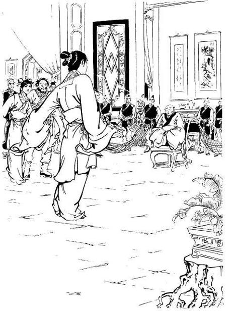
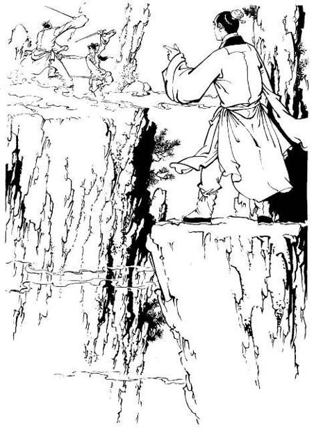
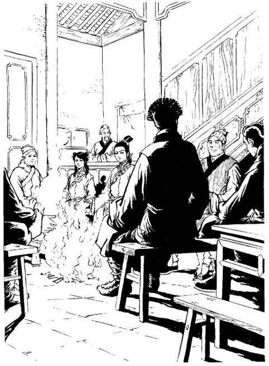
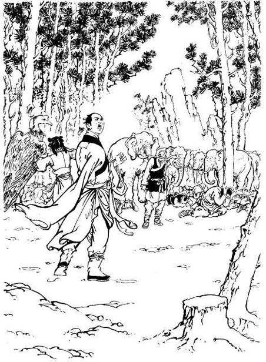
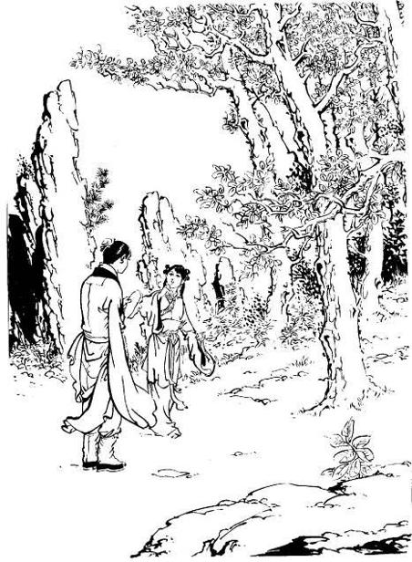
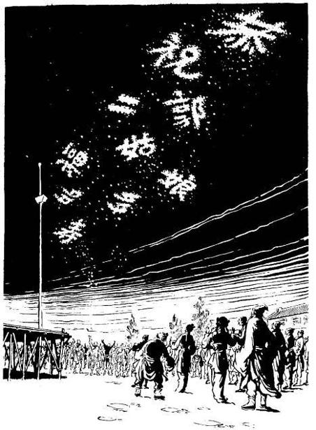
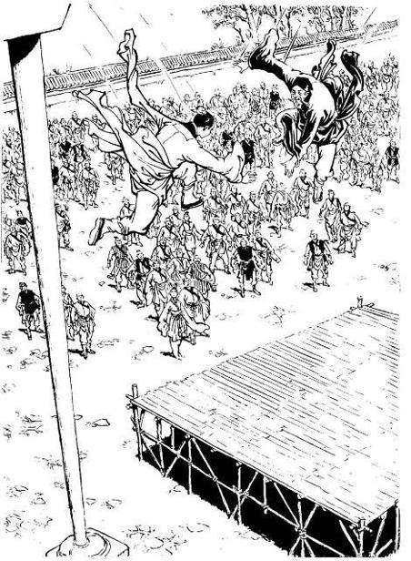
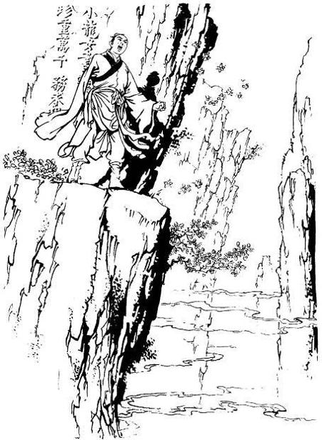
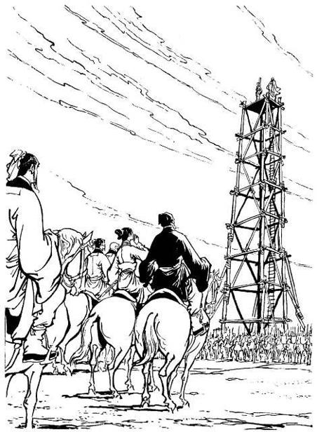
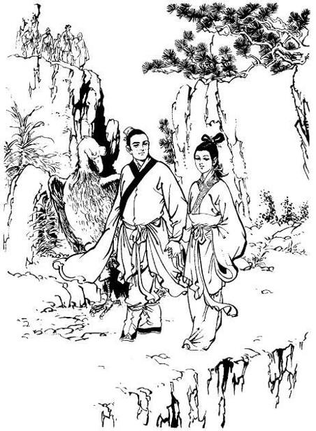

# Chapter 31 – The Other Half of the Antidote

Translated by Bee Dreamer, xuelian & xiao_long_nu

> With a “po” sound, the third date stone left Qiu Qianchi mouth. This
> time, it went for Huang Rong’s throat. Huang Rong had promised not to
> block and not to avoid. She slightly bent both of her knees, waiting
> for the date stones to fly to her lips. With all her effort, she
> pushed the 'Zhen Qi' out of her mouth.

 

Surrounded by the mountains, the floor of the Passionless Valley was
vast, occupying about thirty thousand acres of land, with winding paths,
towering hills, and deep ravines. But Yang Guo and Xiao Longnu used
their lightness kungfu to follow the path on the map, and they arrived
at their destination in just a short while. In front of them they saw
several big elm trees, seventy or eighty-feet high, providing a shade
for a brick and pottery kiln below. The map showed that the Indian monk
and Zhu Ziliu were imprisoned here.

Yang Guo turned to Xiao Longnu and said, “You wait here. I’ll go in and
take a look. With charcoal and ash in there, it must be very dirty.” As
he bent over to step into the kiln, he was hit by a heat wave.

“Who is there?” A voice shouted.

Yang Guo said, “I've got the chief’s order. I’m coming to get the
prisoners.”

That person emerged from behind the brick wall and asked, “What?” Seeing
Yang Guo, he was startled and said, “You…You…”

Yang Guo saw that he was a valley disciple dressed in green so he said,
“The chief has ordered me to come get the monk and the man surnamed
Zhu.”

That disciple knew that Yang Guo had saved his master’s life, that she'd
announced in front of everybody that Yang Guo was her intended
son-in-law, and that he and Lu’E were on the best terms. This person
would one day become the Valley Chief, and so he didn’t dare to offend
Yang Guo.

He said, “But... what about the chief’s command sign?”

Yang Guo ignored him and said, “Let me come in and take a look.” That
disciple complied and turned back into the kiln.

Inside the brick walls, the heat was even more intense. Two lowly
laborers were raking charcoal. Although it was bitterly cold at this
time of year, the two people were actually bare-chested, each wearing
short pants to cover his lower body. Still they were sweating profusely.
The disciple in green pushed aside a big stone, revealing an opening.
Yang Guo went inside and saw that it was actually a stone chamber of ten
feet square. Zhu Ziliu sat there with his face to the wall, using his
index finger to draw pictures. His arm rose and fell as if he was very
pleased with himself. The Indian monk was actually lying on the floor,
and it was hard to tell if he was still alive. Yang Guo called out,
“Uncle Zhu, how are you?”

Zhu Ziliu turned his head back. He laughed and said, “A friend has come
to visit from afar; how could I not be fine?” Yang Guo had to admire
him. He was stranded here for a long time but still kept calm as if
everything was normal. Even in crisis, he could still be mirthful. He
himself was far, far inferior to him in this regards.

“Is the Divine Monk sleeping?” He asked. Having said this, his heart was
beating wildly because Xiao Longnu’s life depended on this Divine Indian
Monk.

Zhu Ziliu didn't reply. Only after a while he let out a gentle sigh and
said, “My Martial Uncle can usually withstand heat and cold much better
than I can, but this time...”

It sounded like the Indian monk’s condition was critical. Frightened,
Yang Guo didn't bother to say any more words. He turned his head to the
disciple in green. He ordered, “Unlock the door. Let them out.”

The disciple in green said in surprise, "What about the lock? The
chief's got the key. If she ordered you to free people, how come she
didn’t give you the key?”

Impatient, Yang Guo shouted, “Make way!” He lifted his black iron sword
and struck down, making a big hole in the stone wall with a ‘ka’ sound.
That disciple let out an ‘ah’ cry and froze with fright. Yang Guo swung
his sword a few more times and that five-inch window became wide enough
for a person to pass through.

Zhu Ziliu cried out, “Brother Yang, I congratulate you on your great
skills!”

He bent over to pick up the Indian monk, passing him through that hole.
As Yang Guo took him, he could feel that the Indian monk’s arm was warm.
His heart jumped. But then he saw that the Indian monk’s eyes were shut
tight. He thought to himself, “Aiyo, even a dead body is warm in this
fire room.” He quickly stretched his hand to feel the Indian monk’s
breath and realized he was still breathing faintly.

Zhu Ziliu jumped out from that hole in the wall. He said, “Martial uncle
has passed out. Hope it’s not a great obstacle.”

Yang Guo blushed. He thought to himself, “Shame on you!” He thought
about how he himself didn’t really care about the Indian monk’s well
being but more about how to save his own wife. He asked, “Did he pass
out from heat exhaustion? Let’s quickly go outside to get some air.”
Then he carried him out. Seeing the three people, Xiao Longnu was
delighted.

Yang Guo said, “Let’s find some cold water to sprinkle on Reverend’s
face.”

“No, Martial uncle was poisoned by the Passion Flowers.” Zhu Ziliu said.

Yang Guo was startled. He asked, “Is the poison severe?”

Zhu Ziliu replied, “I think not. It was he who poisoned himself.”

Yang Guo and Xiao Longnu were puzzled. In one voice, they exclaimed,
“What?”

With a sigh Zhu Ziliu said, “Uncle said that these Passion Flowers were
already extinct in India. He didn’t know how it had been spread. He said
that if it got out of hand, it would be a great disaster. Years ago,
people and livestock in India had been poisoned and died because of
these flowers. Martial uncle had thoroughly researched poison techniques
but this Passion Flower poison was really strange. He came to the valley
this time, knowing that the Divine Pill (Passionless Pill) could only
help one person. He wanted to find out what could detoxify the poison to
help people on a large scale. He used his body to test the poison so he
would understand its nature and be able to find the antidote."

Yang Guo was half amazed and half in awe. He said, “Buddha said – if I
don’t go to hell who will? Reverend is trying to save people, not
hesitating to face a disaster. People really have to respect him.”

Zhu Ziliu said, “In an ancient tale, Shen Nong tried a hundred kinds of
herbs to save people. If it was the wrong herb, his face would turn
blue. This Martial Uncle of mine must have had this story in mind.”

Yang Guo nodded and said, “Right. Do you know when he will regain
consciousness?”

“After he poisoned himself, he said if his calculation was not wrong, he
would wake up after three days and three nights,” said Zhu Ziliu.

Yang Guo and Xiao Longnu looked at each other. They both thought, “He’ll
be in a coma for three days and three nights. It means the poison is
very severe. Fortunately this Passion Flower poison affects people
differently. If one has a passionate heart, the poison will act up very
fiercely. This monk has a steady heart. He's much better than an average
person.”

Xiao Longnu said, “You two were in the kiln, how did you find Passion
Flowers?”

Zhu Ziliu replied, “After we were put in the fire room, there was a girl
who often came to visit...”

Xiao Longnu said, “Was she a tall girl with fair complexion and a small
mole on one corner of her mouth?”

“Yes,” said Zhu Ziliu.

Xiao Longnu smiled at Yang Guo. Then she said to Zhu Ziliu, “That was
the Valley Chief’s daughter Miss Lu’E. She heard that you two had come
to help Yang Guo so she was fond of you. Although she didn’t dare to
release you, she’d get you whatever you wanted.”

Zhu Ziliu said, “Correct. Martial uncle asked her for a branch of the
Passion Flowers and I asked her to send my message asking for help. She
complied. In the kiln, everyday there would be a time the fires blasted.
She would pour water on them to reduce the intensity, making it bearable
for us. I often asked her who she was but she never answered. I didn’t
know she was the Valley Chief’s daughter.”

“She gave us the directions to come here,” said Xiao Longnu.

Yang Guo said, “Great Reverend Yideng is here too.”

Zhu Ziliu was delighted. He said, “Oh, let’s go.”

Yang Guo frowned and said, “Monk Ci’en is also here. I’m afraid there
might be a little trouble.”

Zhu Ziliu was puzzled. He said, “Brother Ci’en is also here. How can it
not be good? When brother and sister meet, Chief Qiu will have no choice
but consider this kinship.”

Even though he became Reverend Yideng’s disciple before Ci’en, in
Jianghu Ci’en’s kungfu was actually at the same level as that of
Reverend Yideng. And so, Diancang, Yuyin and Zhu Ziliu highly respected
him, treating him as ‘Martial Elder Brother.’ Zhu Ziliu had asked Lu’E
to send his help message, hoping that Ci’en would come, and the two
sides would be reconciled. Now that Yang Guo mentioned trouble, he
couldn’t quite understand.

Yang Guo briefly told him about Ci’en’s mental instability and how Qiu
Qianchi was trying to stir up his emotions.

Zhu Ziliu said, “Madame Guo is also here in the valley. That’s really
the best. Her wisdom is second to none. My master is here to control the
situation. Also, Brother Yang’s kungfu has reached this improved stage.
There shouldn’t be any problem. I’m only worried about my Martial
Uncle.”

Yang Guo also felt that the Indian monk’s safety was the first priority.
He said, “We could find a place to stay, and wait for Reverend to regain
consciousness. The three of us can protect him.”

Zhu Ziliu hesitated. He asked, “Where should we go?” He pondered for a
long time, feeling that this Passionless Valley was dangerous
everywhere. Then he figured out and said, “We wait right here.”

Yang Guo was startled but then he understood. With a smile he said,
“Uncle Zhu’s idea is wonderful. This place seems bad but it actually is
the best place in the valley. We just have to stop those valley
disciples from leaking our secret.”

Zhu Ziliu stretched out his finger. With a laugh he said, “That’s easy.”

He picked up the Indian monk and said, “We’ll rest here in the kiln. May
I ask Brother Yang and Mrs. to go help my master?”

Yang Guo remembered that Reverend Yideng’s injury had not recovered and
that Ci’en had been swaying back and forth between good and evil. If he
stayed here to guard the Indian monk, it would be rather selfish and he
wouldn’t feel comfortable. Seeing Zhu Ziliu carry the Indian monk back
into the kiln, he and Xiao Longnu returned to the path they’d just come
from.

The two people passed by the Passion Flower thicket. It was bitter cold
at this time. Undoubtedly soon there would be no flowers, and the leaves
would fall, leaving only ugly bare branches, full of sharp thorns.

Suddenly Yang Guo thought of Li Mochou. He said, “No doubt this thing
called passion is sometimes extremely beautiful but other times
extremely ugly. Like your martial sister, spring flowers wither quickly
but their thorns can still kill people.”

Xiao Longnu said, “I hope the Divine Monk can find the antidote to this
flower poison. Not only will it cure you, my martial sister can also be
saved.”

But Yang Guo actually hoped that the Indian monk would regain
consciousness and that the Indian monk would first treat the poisons in
Xiao Longnu’s body. If he didn’t wake up and just passed away, what
then? Looking at his wife, his heart was filled with infinite tender
feelings. Suddenly, he was hit by a flash of pain in his chest. He knew
that because he’d saved the Cheng-Lu cousins, the poison in his body was
even more severe. Afraid that he would worry Xiao Longnu, he turned his
head to look at the bare branches, appearing to be happy and not paying
attention to life and death matters.

By now there was another scene in the main hall of the Passionless
Valley. Qiu Qianchi was urging her brother to act. The more she talked,
the more ferocious her words became. Reverend Yideng didn’t say a word,
leaving Ci’en to make a decision for himself. Ci’en looked at his
sister. He looked at his master. Then he looked at Huang Rong. One was
his blood sister. Another was the master who had changed him. And the
third caused his brother's death. His mind fluctuated between kindness
and hatred. Good and evil were battling. How would he decide? His entire
life from childhood to old age flashed in his brain. Sometimes tears
glistened in his eyes, other times a smile came to the corners of his
mouth. His heart was aflame for this was fiercer than any battle he’d
ever fought in.

Lu Wushuang noticed that Yang Guo had left the hall for a long time and
still not returned. Ci’en’s state of mind had nothing to do with her
whatsoever. She gently tugged at Cheng Ying’s gown sleeve and quietly
slipped out of the hall. Cheng Ying followed her out. “Where did Sha Dan
(Dumb Egg) go?” Lu Wushuang asked.

Cheng Ying didn’t reply. She only said, “He’s been poisoned and we don’t
know how bad his condition is.”

Lu Wushuang said, “Hmm.” She was also worried. In a low-spirited voice,
she said, “I really didn’t expect this. He and his master finally...”

Cheng Ying said in the same tone, “Miss Long is really beautiful, and
she’s really good. Only such a person can be a match for Big Brother
Yang.”

Lu Wushuang said, “How do you know she’s a good person? You haven’t
really talked to her.”

Suddenly she heard a cold voice from behind, “Her foot is not lame.
Naturally she’s good.”

Lu Wushuang drew out her Willow Leaf saber, turning her body around.
That voice, of course, came from Guo Fu.

Seeing her unsheathed saber, Guo Fu quickly pulled out a long sword from
Yelu Qi’s waist. She returned the angry glare and shouted, “You want to
fight me?”

With a merry laugh Lu Wushuang said, “How come you don’t use your own
sword?” Her foot had been crippled since childhood, and it was her sore
spot. Other people never mentioned this in front of her. Since Guo Fu
ridiculed her ‘lame foot,’ she was enraged, and so she sarcastically
brought up the broken sword issue.

Guo Fu barked, “I’m going to use someone else’s sword to give you a
kungfu lesson.”

Having said that, the long sword struck, and the ‘weng-weng’ sounds
echoed.

Lu Wushuang said, “How rude. The Guo family's child doesn’t respect her
senior. Good, today I’ll teach you the difference between good and bad.”

“Bah, how can you be my senior?” Guo Fu said.

With a laugh Lu Wushuang said, “My cousin is your Martial Uncle. If you
won’t call me Gu Gu (paternal aunt) you should call me Ah-yi (maternal
aunt). You can ask my cousin!” Then she pointed at Cheng Ying.

By her mother’s order, Guo Fu had to call Cheng Ying ‘Martial Uncle.’
But deep down, she was still not convinced that her strange grandfather
had accepted such a person as a disciple. She thought that she and Cheng
Ying were about the same age so Cheng Ying’s kungfu shouldn’t be very
good. She looked at Lu Wushuang and said, “Who knows if she’s a real or
fake disciple? My grandpa is world famous. There are many shameless
people pretending to be his disciples.”

Although Cheng Ying’s natural disposition was gentle, hearing this she
couldn’t help getting angry. But her whole heart right now was fixed on
Yang Guo, and so she had no intention of bickering with people. She
said, “Cousin, let’s go… go find Big Brother Yang.”

Lu Wushuang nodded. She turned to Guo Fu and said, “Did you hear that?
Did she or did she not call me her cousin? Hero Guo and Chief Huang Rong
are world famous. I don’t know how many shameless people pretend to be
their daughter!” Then with a ‘hei-hei’ cold laugh, she turned to leave.

Guo Fu was slow. She thought, “Who pretends to be my parents’ daughter?”
But then it dawned on her, “Aiyo! She called me a bastard, saying that
I’m not my parents’ daughter.” Now that she understood the meaning, how
could she bear it? She jumped up and thrust her sword towards Lu
Wushuang’s back.

Hearing the sound of Guo Fu's sword cutting through the air, Lu Wushuang
turned and blocked the strike with her saber. With a ‘dang’ sound,
slight pains shot through their arms.

Guo Fu shouted, “Did you call me a bastard?”

The long sword struck again and again. Lu Wushuang blocked the sword
left and right. She sneered, “Hero Guo is a righteous hero. Chief Huang
is truly the daughter of the Chief of Peach Blossom Island. Their
characters are remarkable...”

Guo Fu said, “Who doesn’t know that? There is no need to praise my
parents to please me.” She really thought that Lu Wushuang had sincerely
praised her parents, and so her sword slowed down.

But Lu Wushuang continued “You? You cut off Big Brother Yang’s arm. You
couldn’t tell right from wrong, hurting a good person. How could such
behavior be anything similar to that of the Guo couple? Makes people
wonder.”

“Wonder, about what?” Guo Fu asked.

Lu Wushuang darkly said, “You think about it.”

Yelu Qi was standing on the side of the scene. He knew that Guo Fu’s
intelligence was far inferior to Lu Wushuang. If this verbal spat went
on, Guo Fu wouldn’t be able to stand it. He said, “Miss Guo, let’s not
talk to her any more.”

He could see that Guo Fu’s kungfu was more advanced than Lu Wushuang’s.
If she couldn’t win an argument, she would resort to a real fight. Who
would have thought that Guo Fu would be blind with rage and not
understand his intention? She said, “Don’t meddle. I’m asking her to
explain what she said.”

Lu Wushuang gave Yelu Qi a stare. She said, “A dog that bites visitors
will give you trouble in the future.”

Yelu Qi blushed, knowing that Lu Wushuang had already figured out his
feelings towards Guo Fu. What she meant was that Guo Fu was so
irrational that she would give him infinite trouble in the future.

Seeing Yelu Qi blush, Guo Fu was greatly suspicious. She questioned,
“You suspect that I’m not my parents’ daughter as well?”

Yelu Qi quickly said, “No, no. Let’s go. Don’t pay attention to her.”

Lu Wushuang butted in, “Naturally, he is suspicious. Otherwise, why does
he want you to leave so quickly?”

Guo Fu’s face reddened, and she pressed her hand on the sword.

Yelu Qi could only advise, “Miss Lu’s words are mean and cutting. If you
want to test her kungfu, just do it. There’s no need to talk.”

Lu Wushuang said, “He said you’ve got a dumb mouth. Talking too much
will only reveal what a fool you are.”

Guo Fu had feelings for Yelu Qi, and so she was worried that he wouldn’t
like her. Although other people were talking nonsense, when it involved
her loved one, she had to think about it. As she thought about what Lu
Wushuang said, she feared that Yelu Qi would really think badly of her.
Her parents had doted on her since she was little, and the Wu brothers
-- her childhood friends -- had always obeyed her. Except for her
occasional quarrels with Yang Guo, she’d never had an argument like
this. Today she ran into a ferocious opponent, who outpaced and
outwitted her no matter what she said. Realizing that talking would
result in more damage, she scolded, “If I don’t cripple your other foot
today, my name is not Guo.” Having said that, her sword moved like the
wind, flying towards Lu Wushuang.

Lu Wushuang said, “No need to cripple my foot. Your real name is not Guo
anyway. Maybe your name is Zhang or Li.” Lu Wushuang carried on calling
her a ‘bastard.’ While they were exchanging these verbal attacks, the
saber and the sword clashed, and the battle became more intense.

The Guo couple had taught their daughter the best of kungfu. Guo Fu was
taught all the basics but it was difficult to master the skills in a
short period of time. When it came to martial proclivity, Guo Fu had a
stronger resemblance to her father and very little in common with her
mother. And so, even though her foundation of orthodox kungfu was good,
she still needed to refine her skills before she could use any lethal
kungfu. Even so, Lu Wushuang wasn’t her match. Besides, her retreat
wasn’t very agile because of a crippled foot. Guo Fu was burning with
rage and she kept on attacking. Sword lights flashed as she was trying
to stab Lu Wushuang’s right leg.

Cheng Ying was watching them fight, her brows creasing with worry. She
thought, “Although my cousin’s name-calling isn’t nice, this Guo girl is
too rude and too unreasonable. No wonder Yang Guo’s right arm was cut
off by her. If they continue to fight, my cousin’s right leg will be
difficult to save.”

She saw Lu Wushuang constantly retreating. Suddenly she heard the ‘chi’
sound as Lu Wushuang’s skirt was ripped open. She let out a soft cry,
“Aiyo!”

Lu Wushuang stumbled back, her face pale. Guo Fu quickly took a couple
of steps forward and brought her sword around in a horizontal swipe,
slashing Lu Wushuang’s leg. Seeing that Guo Fu had already won but still
kept on attacking and that Lu Wushuang was dangerously cornered, Cheng
Ying stepped in gently, using both hands to block Guo Fu.

She said, “Miss Guo, please go light on her.”

Guo Fu lifted her sword. Seeing blood on the blade, she knew that Lu
Wushuang had already been injured. She pointed her sword proudly at Lu
Wushuang and said, “My lesson today will teach you not to spout nonsense
again.”

The sword wound on Lu Wushuang’s leg was aching. She angrily said, “Are
you going to use your sword to stop people from talking?” She knew that
Guo Fu basked in her parents’ glory, so she pretended to say that Guo Fu
was not Guo Jing and Huang Rong’s daughter.

Guo Fu shouted, “What did they say?” She moved forward a step, with the
tip of her sword straight towards Lu Wushuang’s chest.

Cheng Ying stepped in between them. Seeing the long sword arrive, she
used three fingers to hold the blade and gently pushed it aside. She
persuaded, “Cousin, Miss Guo, we are in the middle of danger here. Let’s
stop this senseless fight.”

Her sword was brushed aside by Cheng Ying’s bare hand. Guo Fu was
half-startled and half-angry. She shouted, “Are you helping her? Good,
good, good. Even two on one, I’m not afraid. Draw out your weapon!”
After she said that, she pointed her long sword at Cheng Ying’s waist
preparing to thrust. She waited calmly for her to pull out the jade
flute from her waist.

With a faint smile Cheng Ying said, “I just asked you two not to fight,
how can I fight you myself? Brother Yelu, please come and talk to Miss
Guo.”

“Yes. Miss Guo, we are in the enemy territory. We’ve got to be careful
everywhere we go.” Yelu Qi said.

Guo Fu quickly said, “Good. You don’t help me. Instead, you help an
outsider.” Seeing that Cheng Ying was a girl of beauty and grace, she
suddenly thought to herself, “Is he interested in her?”

Yelu Qi had no clue what she was thinking. He continued, “That monk
Ci’en looked quite strange. Let’s go back to the hall and watch him.”

Lu Wushuang heard Guo Fu’s words and saw the look on her face. She
understood what Guo Fu was worried about. She said, “Compared to you, my
cousin is prettier. Her behavior is gentler. And she had better kungfu.
You’ve got to be very, very careful.”

These four sentences pierced Guo Fu’s heart. Nervously she asked,
“Careful about what?”

Lu Wushuang sneered, “Even if I were an idiot, I would still prefer my
cousin. You are rude and vicious, what’s so good about you?”

These words were so obvious, how could Guo Fu stand them? Her long sword
flew out, swerving around Cheng Ying and flying towards Lu Wushuang.

This move of hers was called the ‘Jade Stance Guiding Silver Arrow,’
which was one of Huang Rong’s family techniques. The blade was swung in
an arc and would strike the side of the target. The move appeared to be
without haste but the damage zone was wide. Only one with higher sword
skills would be able to block such a blow; otherwise, it was extremely
difficult to escape.

Cheng Ying frowned. She thought to herself, “Why is this girl using her
fiercest stance? My cousin only offends you with words. She isn't your
most hateful enemy. Why are you acting like you mean to kill a
murderer?”

Fortunately, Huang Yaoshi had earlier taught her this sword stance. And
so, she sent energy to her fingers, waiting for Guo Fu’s sword swing.
Then with a clang, the long sword shot to the ground.

The technique Cheng Ying had just used was called ‘Divine Flicking
Finger.’ But it came out strong only because Cheng Ying had understood
Guo Fu’s technique and waited to strike when the power in Guo Fu’s sword
dropped. Otherwise, since the two people’s martial skills were about the
same level, Cheng Ying wouldn’t have been able to disarm Guo Fu with her
fingers. Cheng Ying used her left foot to step on the long sword and the
jade flute in her hand pointed at Guo Fu’s pressure point on her waist.

In a flash Cheng Ying had knocked Guo Fu’s sword out of her hand,
stepped on it, and threatened Guo Fu’s pressure point. Guo Fu was in an
extremely awkward situation. If she bent down to snatch the sword, the
pressure point on her waist would be exposed. But if she jumped
backwards, her long sword would of course be taken. Although her kungfu
was not weak, she lacked battle experiences. At the moment, she was
blushing profusely, not knowing what to do.

Yelu Qi shouted, “Hey, girl. Why did you step on my weapon?”

Then he leaned forward to grab the jade flute. Cheng Ying retracted her
arm, and then she turned around to leave, pulling Lu Wushuang along with
her.

Guo Fu snatched the long sword back. She called out, “Slow down, let’s
see who the better person is.”

Lu Wushuang turned her head back and said, “Still want to...”

Cheng Ying grabbed her arm, dragging her cousin along. The two people
were already twenty or thirty feet away from them, and so Lu Wushuang
didn’t get to finish her sentence.

Yelu Qi said, “Miss Guo, she was just lucky with that move. Actually,
the two of you are equals.”

Guo Fu bitterly said, “Right. I was swinging my sword in an arc. Before
I could hit her, she took advantage of the moment the strength on my
sword was void. I didn’t expect someone who looked quite refined to be
sly like that.”

“Hmm.” Yelu Qi made a sound. He was a straight person. Not wanting to
falsely flatter her, he said, “Miss Cheng’s kungfu isn’t weak. If you
fight with her another time, you can’t underestimate her as an
opponent.”

Hearing him commend Cheng Ying, Guo Fu frowned darkly. She couldn’t bear
it and so she said, “Did you say her kungfu was good?”

Yelu Qi replied, “Yes.”

Guo Fu angrily said, “Then don’t mind me. Just go, be with her.” As she
said that she turned around.

Yelu Qi said, “I advised you not to underestimate the opponent. I asked
you to be careful. Am I helping you, or am I helping her?” Now that Yelu
Qi had explained that he wanted her to protect herself, Guo Fu couldn’t
help but smile.

Yelu Qi continued, “Didn’t I help you get the sword back? Why are you
still blaming me?”

Guo Fu turned her head back and said, “I’m not. I’m not. I’m not blaming
you!” A happy smile filled her face. Yelu Qi was delighted but suddenly
he heard repeated roars from inside the hall, accompanied by the
interminable sounds of metal clanking.

Guo Fu cried out, “Aiyo, let’s go quickly and take a look.”

Originally, while listening to Qiu Qianchi ramble on about decades-ago
events she did not realizing that a crisis was looming, the more she
listened, the more annoyed she became. So she slipped out of the hall
and ran into the Cheng-Lu cousins and fought with them. Now that she
heard the strange sounds, her thoughts were on her mother. She rushed
back into the hall.

In the middle of the hall Reverend Yideng sat cross-legged, holding a
string of Buddhist rosary beads in his hands and reciting Buddhist
sutras. He had a gentle look on his face. Monk Ci’en paced back and
forth in the hall and often let out a roar, which sounded incredibly
wicked. His hands were shackled, but the chain that linked the two cuffs
had already been broken. When the two parts struck against each other, a
clanking sound echoed in the hall. Qiu Qianchi also sat in the hall, her
complexion pale. She was already ugly but at this time she looked
fearsome. Huang Rong and Wu Santong were standing in a corner of the
hall, intensely watching Ci’en.

Ci’en had been pacing around in a fit of insanity, and beads of sweat
dripped profusely from his forehead. White steam emitted from the top of
his head, looking like white clouds. These clouds were growing denser.
And the more he paced, the faster he became. Reverend Yideng suddenly
used his inner energy to shout, “Ci’en, Ci’en, distinguish between good
and evil. Have you meditated today?”

Ci’en turned dull, his body swaying. He threw himself on the floor.

Qiu Qianchi shouted, “E’er, quickly go help your uncle up.”

Gongsun Lu’E did as told. Ci’en opened his eyes and saw Lu’E’s face. In
his daze, Lu’E’s beautiful face, with long eyebrows and thin lips,
looked very much like his sister when she was young. He cried out,
“Third sister, where am I?”

Lu’E said, “Uncle, I’m Lu’E.”

Ci’en muttered, “Uncle… who is your uncle? Who are you talking about?”

Qiu Qianchi shouted, “Second brother, she’s your third sister’s
daughter. She wanted to meet her first uncle.”

Ci’en was startled. He said, “My big brother? You can’t meet him. He’s
already fallen to death from the Iron Palms summit. His body was all
gone.” Then he jumped up. He looked at Huang Rong and shouted, “Huang
Rong, you killed my big brother, you’ll pay for it!”

Arriving back in the hall, Guo Fu had stayed by her mother’s side,
carrying her younger sister in her arms. Now that she saw Ci’en pointing
his finger at her mother and scolding her, she couldn’t stand it. And
so, she stepped forward and said, “Monk, if you are rude again, this
young girl won’t stand for it.”

Qiu Qianchi sneered, “This young girl is fearless...”

Ci’en asked, “Who are you?”

“Hero Guo is my father and Chief Huang is my mother,” replied Guo Fu.

Ci’en asked, “And the baby you are holding?”

Guo Fu said, “She’s my little sister.”

In a severe tone Ci’en said, “Humph, surprisingly Guo Jing and Huang
Rong have two children.”

Hearing a strange tone in his voice, Huang Rong shouted, “Fu’er, get
back here, quickly!”

Guo Fu saw that Ci’en was acting like a madman. After all this talking,
he still hadn’t begun fighting. She thought he was afraid of her mother
so she didn’t fear him. Instead, she moved a couple of steps forward.
With a laugh she said, “If there’s revenge to extract, just get on with
it. If not, don’t open your mouth!”

Ci’en shouted, “I will extract my revenge!”

His voice ripped through the air like a clap of thunder, and all the
teacups were making ‘dang-dang’ rattling sounds. Guo Fu couldn’t move
her hands and feet. She only saw his left and right hands coming at her
with the force of a mountain being cast into the sea. She wanted to
escape, but how could there be enough time?

As if by prior arrangement, Huang Rong, Wu Santong, and Yelu Qi jumped
up into the air at the same time. The three people all noticed that even
though Ci’en’s right hand was fierce, his left palm was far more lethal.
So they all aimed at his left palm, and the four palms clashed with a
‘peng’ sound.

Ci’en let out a ‘hei’ sound and stood still but the three people fell
back several steps. With the lowest skills, Yelu Qi was knocked back the
furthest, and next to him was Huang Rong. Before she could steady
herself, she saw that her daughter Guo Xiang had already been snatched
by Ci’en. Guo Fu just stood there dumbly too frightened to escape.

Huang Rong was alarmed. She thought, “Was Fu’er hurt by that palm
strike?” Immediately she jumped up and out, her left hand pulling Guo Fu
back. She wielded the “Dog Beating Stick” with her right hand, using the
‘seal’ trick. Although Ci’en’s palms were fierce, he couldn’t hurt her
this time. Guo Fu was actually not injured but she was confused. Now
that she leaned against her mother’s body, she could let out an ‘ah’
cry.

As the battle began, the Wu brothers, Yelu Yan, and Wanyan Ping
unsheathed their weapons. Qiu Qianchi signaled the many valley disciples
to scatter, waiting for her order to besiege them. Only Reverend Yideng
was still sitting cross-legged in the center of the hall as if he didn’t
see all these things. He was reciting Buddhist sutras. His voice was not
loud, but very clear.

Ci’en lifted Guo Xiang. He shouted, “This is Guo Jing and Huang Rong’s
daughter. I'll kill this girl first, and then I’ll kill Huang Rong!”

Qiu Qianchi said in delight, “Good second brother! You are really the
world-famous “Iron Palms Floating on Water”, Chief Qiu!”

In this situation, Huang Rong and the others couldn’t defeat Ci’en in
battle without anybody getting hurt; they didn’t even have a way to save
the baby from this mad man.

In a loud voice Guo Fu suddenly shouted, “Yang Guo, big brother Yang,
quickly come and save my little sister.”

When facing a disaster, Yang Guo had always come out of nowhere to save
her. Seeing that nobody could do anything at this time, she naturally
hoped that Yang Guo would come to her rescue again. But at the moment
Yang Guo and Xiao Longnu were enjoying their time together. The two
people walked slowly hand in hand, watching the sunset. How could they
know about this urgent situation in the hall?

Ci’en used his right hand to hold Guo Xiang high above his head and
brought his left palm on guard.

He sneered, “Yang Guo? Who’s Yang Guo? Now even if East Heretic, West
Venom, South Emperor, North Beggar, and Central Divinity all came at
once, they could only kill me, Qiu Qianren, but they wouldn’t be able to
save this baby.”

Yideng slowly lifted his head and saw blood lust and murderous intent in
Ci'en's eyes. He said, “You want to seek revenge on people, people will
then come and take revenge on you. What good can come of it?”

Ci’en shouted, “If they dare, come!” Now dusk had begun to fall, and the
evening light entered the hall. Despair showed in everyone’s eyes, while
his face looked absolutely terrifying.

Suddenly Huang Rong let out a ‘ha-ha’ laugh, her voice alternating
between high and low pitches, like a lunatic. The people couldn’t help
being frightened.

Guo Fu cried out “Ma!”

Wu Santong and Yelu Qi called out in one voice “Madame Guo!” Their
hearts were thumping wildly, thinking that she’d gone insane because the
enemy had her daughter. She tossed her “Dog Beating Stick” to the floor,
moving a couple of steps forward. Her laugh sounded mournful and shrill.

“Ma!” Guo Fu called out and tried to grab her arm. Huang Rong brushed
Guo Fu aside with her right hand and jumped towards Ci’en with a
miserable cry.

Even Qiu Qianchi hadn’t expected this. She stared at Huang Rong in
disbelief.

Huang Rong stretched out both hands and gave Ci’en an evil stare. She
cried out, “Quickly kill this child. Hit her hard. You can’t spare her.”

Color left Ci’en’s face. He held Guo Xiang close to his chest and said,
“You... you... who are you?”

Huang Rong laughed crazily, her arms flinging out. Although Ci’en’s left
palm was on guard, he didn’t dare to strike. He sidestepped and asked
again, “Who are you?”

Huang Rong sadly replied, “Have you completely forgotten? One evening in
the Dali Imperial Palace, you held a small child like this in your hand.
Right, it was... it was.. You injured him badly and he eventually died.
I am this child’s mother. Kill this child quickly. Kill this child
quickly. What are you waiting for?”

Ci’en listened to her, and his whole body trembled. Events of
decades-ago flashed in his mind.

Years ago, he’d injured Dali Imperial Concubine Liu's child, hoping that
the South Emperor would use years of cultivated inner energy to treat
the child’s injury. But Emperor Duan had been cruel enough to let the
child meet a violent death. Afterwards Concubine Liu and Ci’en had run
into each other twice and she fought like a mad tiger, willing to die
together with him. Although Ci’en's kungfu was superior, he actually
didn’t dare to fight her; instead he fled into the wasteland. Huang Rong
had twice met Yinggu, on the Black Dragon beach and at the top of Mount
Hua and seen her insane smile. She’d known that this was Ci’en’s biggest
worry. And so, seeing Ci’en holding Guo Xiang in his arms but unable to
harm her, she’d told him to kill Guo Xiang. Wu Santong, Qiu Qianchi,
Yelu Qi and the others all thought that she’d gone totally insane. Only
Reverend Yideng secretly admired Huang Rong for her great wisdom and
courage. He thought to himself that a strong man wouldn’t have the gall
to come up with such a scheme and say “Kill the child quickly.” When
Ci’en was frighteningly violent like this, if he hit Guo Xiang even
lightly, how could she not die a sudden death?

Ci’en looked at Huang Rong and Yideng. Then his eyes turned to the child
in his hand. A surge of pain and regret suddenly hit him, and he sobbed,
“He was dead! He was dead! The child was alive and well, and I killed
him.”

He stepped towards Huang Rong and handed Guo Xiang to her. He said, “I
killed this small baby. Please beat me to death!”

Overjoyed, Huang Rong reached out to take Guo Xiang. But then Yideng
shouted, “Revenge breeds revenge; when will it stop? Your hand holds a
murderous blade. When will you throw it away?”

Ci’en was startled, and Guo Xiang fell from his hand.

Huang Rong didn’t wait for Guo Xiang to fall to the floor, her right
foot flew out. She kicked the child, sending her out in the air. At the
same time, she laughed crazily and said, “You killed the child. Good.
Good. This is wonderful.”

Her kick looked as if it was fierce but when her foot touched Guo
Xiang’s waist, it actually stopped her from falling and gently sent her
out again into the air. She knew that this was an extremely critical
moment. If she bent down to pick up her daughter, perhaps Ci’en would
change his mind.

Guo Xiang flew through the air towards Yelu Qi. He caught her and saw
that her black eyes were sparkling, and that her little mouth was about
to let out a big cry. She was indeed unharmed. He was first startled and
then understood that Huang Rong, knowing that Guo Fu was rash, sent him
her daughter. So, he covered the child’s mouth with his palm and
shouted, “Aiyo, the child was killed by the monk.”

Ci’en’s face was deathly pale. All of a sudden he was awakened. He put
his hands together and bowed to Yideng. He said, “Great monk, many
thanks for saving me!”

Yideng bowed back and said, “Congratulations, great monk. You’ve found
the right path!” The two monks exchanged a smile. Ci’en ran out.

Qiu Qianchi quickly called out, “Second Brother, Second Brother, you
come back!”

Ci’en turned his head back and said, “You call me to come back; I’m now
asking you to come back too.” Having said that his gown sleeves flared
out, and he floated out of the hall.

With a joyful expression on his face Yideng said, “Good, good, good!”
Then he retreated to a corner of the hall. He lowered his head, his
eyebrows drooping, and said no more.

Huang Rong fixed her hair and got Guo Xiang back from Yelu Qi. Seeing
that her mother was normal and her little sister was all right, Guo Fu
was pleasantly surprised. She threw herself into her mother’s arms and
said, “Ma, I thought you really went insane!”

Huang Rong walked over to Yideng and kowtowed. She said, “I (niece) had
no other way but to mention that past affair. Reverend, please forgive
me.”

With a faint smile Yideng replied, “Rong’er, Rong’er, you are really the
female Zhuge!”

In the hall, Wu Santong was the only person who knew about the past
events. Others were looking perplexed at one another.

After this unexpected turn of events, Qiu Qianchi saw her brother going
out the screened door. She thought about how she wouldn’t see him again
and couldn’t help becoming heavy-hearted. His words “You call me to come
back, I’m now asking to you come back too” sounded like advice, urging
her to control herself, repent and be salvaged. She secretly felt a pang
of regret but her regret disappeared in a flash. All of a sudden, she
proudly said, “Everybody, please wait here, I’m afraid this old woman
can’t keep you company.”

Huang Rong said, “Hold on a minute! We’ve come here today to ask for the
Passionless Pill...”

Qiu Qianchi nodded at her numerous disciples and they all responded with
a war cry. Each entrance was blocked by four disciples in green, with an
adorned fishnet in their hands. Four maids lifted Qiu Qianchi’s chair
and retreated to the inner hall.

Seeing the power of the fishnets, Huang Rong, Wu Santong, Yelu Qi, and
the others were secretly alarmed. They thought, “These fishnets are
deadly, how can we break out of the trap?”

While they were hesitating, both the front door and the back door of the
hall were being pulled shut, and the disciples in green all squeezed
out. The Wu Brothers struck one of the doors with their swords. With a
‘peng’ sound, their double swords were caught in the crack of the door
and immediately snapped. It seemed that these doors were cast from metal
after all.

In a low voice Huang Rong said, “No need to be frightened! Even if we
aren’t allowed to leave the hall, we can still think of a way to defeat
those fishnets and get the antidote to help Yang Guo.”

Gongsun Lu’E followed her mother into the inner hall. She asked, “Ma,
what should we do?”

Seeing that her brother had abruptly departed and that skilled enemies
were gathering, Qiu Qianchi knew she had a big problem. But the murderer
of her brother had arrived; no matter who tried to persuade her, she
would never yield. With a slight hesitation she said, “Go take a look.
What are Yang Guo and those three girls doing?” This was actually what
Lu’E had wanted to do. She nodded in compliance and left for the kiln.

As she was halfway to the kiln, she heard voices ahead of her. It was
Yang Guo and Xiao Longnu talking. It seemed that they said something
about 'Miss Gongsun.' By this time, the sky had become totally dark, and
Lu’E hid herself in a willow grove nearby. She thought, “What are they
talking about?”

She gingerly stepped forward, approaching them without making a sound.
She saw Yang Guo and Xiao Longnu standing side by side.

Yang Guo said, “You said these matters revolved around Miss Gongsun.
That’s absolutely right. If the Divine Monk wakes up, all past animosity
is buried, and all the poisons are expelled, won't that be wonderful?
Aiyo!”

Lu’E jumped as Yang Guo let out a sudden cry, not knowing what had just
happened to him. She was worried and couldn’t help poking her head out
to look around. In the darkness, she saw Yang Guo fall to the ground.

Xiao Longnu hoarsely said, “The Passion Flower poison is acting up
again?”

“Mmm…aah…” Yang Guo could only let out a groan.

This pain was very difficult to endure. Lu’E pitied him and thought to
herself, “He’s already taken half of the Passionless pill. He needs the
other half to get rid of the poisons, and he can only get this other
half from mother.”

After a while, Yang Guo got up and let out a long gasp.

Xiao Longnu said, “Your seizures are getting more and more frequent, and
every time more severe than the last one. The Divine Monk still has to
regain consciousness before he can find the antidote. Even then, there
may not necessarily... there may not necessarily... You must be in a lot
of pain.” She’d wanted to say “there may not necessarily be enough time”
but she changed her last sentence.

With a bitter smile Yang Guo said, “This old Madame Gongsun is extremely
stubborn. She’s hidden the antidote. Unless she wants to give it to me
herself, even if we kill everybody in the valley and hold a knife
against her neck, she still won’t give it up.”

“But I actually have a method,” said Xiao Longnu.

Yang Guo could guess what she was thinking and so he said, “Long’er,
don’t say it. We…husband and wife, sincerely love each other. If we can
grow old together, naturally we’ll thank heaven and earth. If something
bad happens, its fate. No third person may come between the two of us.”

Xiao Longnu sobbed, “That Gongsun girl... She looks like a very good
person. She will listen to me.”

Lu’E’s heart shook, understanding that Xiao Longnu was urging Yang Guo
to marry her to save his own life. But then she heard Yang Guo’s reply.

In a resonant voice he said, “Miss Gongsun is a naturally good person.
There are really quite a few good girls, aren’t there? Miss Cheng Ying
and Miss Lu Wushuang were also the kind of girls who love deeply. But
your heart and mine are one, how can we let other people intervene? You
think, if there was a man who could get rid of the poisons in your body
and he wanted you to give up your body, would you or would you not agree
to it?”

“I’m a female. That would be unthinkable,” replied Xiao Longnu.

With a chuckle Yang Guo said, “To others, men are superior to women. To
Yang Guo, it’s the other way around...” As he was saying this, he
suddenly heard a sound coming from a dense thicket. Yang Guo asked, “Who
is it?”

Lu’E thought she’d been spotted and was about to reply. Suddenly she
heard a female voice, “Dumb egg, it’s me!”

Then she saw Lu Wushuang and Cheng Ying step out from behind a thicket.
And so, she used this opportunity to move back quietly. Her mind was in
turmoil.

She thought, “Aside from comparing myself to Miss Long, look at Miss
Cheng and Miss Lu's beauty, kungfu, and past friendship with Yang Guo,
how can I ever match them?”

When she met Yang Guo, she couldn’t help falling in love with him. She’d
known that he was serious about Xiao Longnu but, deep in her heart, she
still hoped that he could take two wives. Now that she’d heard his
words, she realized that all her hopes were in vain. She’d been sad
since she was little but today she was completely disheartened. She made
up her mind that she no longer wanted to live, and then she walked away
westward. Low-spirited, she walked aimlessly. She didn’t know where she
was. There was only a voice in her head, “I don’t want to live anymore.
I don’t want to live anymore.”

She didn’t know how long she’d been walking when, suddenly, she heard
voices coming from behind some mountain rocks. She pulled herself
together feeling slightly startled. She’d been wandering about
aimlessly, and to her own surprise she’d arrived on the west side of the
valley where very few people frequented. She looked up and saw a
mountain peak rising towards the sky. This was the most dangerous zone
of the Passionless Peak.

On this mountain ledge, she could see the three letters ‘Broken Heart
Cliff’ that someone had carved on the cliff ages ago, and twenty or
thirty feet in front of her was a slippery and barren ledge where not
even a blade of grass was seen. The place was enveloped by a blanket of
fog all year long, and the wind here was so violent that even a bird
would find it difficult to perch on this cliff top. Beyond and below was
an abyss of shadows that no one could see the bottom of. The area
surrounding the ‘Broken Heart Cliff’ was quiet and beautiful because the
terrain was so rugged and dangerous. Slippery rocks made it very easy to
fall into the abyss below. The valley dwellers stayed clear of this
area, and even those disciples in green with their kungfu wouldn’t dare
to come here. This being the case, she didn’t know whose voices she was
hearing.

Originally Gongsun Lu’E was resigned to die but at this moment she
became curious. She hid herself behind a rock pile and listened. Her
heart jumped as she learned that it was her father talking. Although her
father had wronged her mother and had been ruthless with her, she was
still his daughter. She'd been worried about him since her mother
blinded one of his eyes with a date stone and banished him from the
Passionless Valley. Hearing the familiar voice, she now knew that he
hadn’t left the valley. Instead, he'd come to this remote place to hide.
She was secretly happy.

Then she heard him talk, “You’ve been beaten black and blue, and I
actually lost my eye. It's all because of that small thief Yang Guo. Not
only do we have a common enemy, we share the same problem.” After saying
that he smiled, but the other person didn’t reply. Lu’E felt this was
quite strange. Who was her father talking to? His tone was faintly
frivolous, was that person a female?

Then Gongsun Zhi continued, “We ran into each other at this
rarely-frequented place. We were thousands of li apart, yet we met as if
by predestination. It must be fate.”

That female let out a ‘pei’ sound in contempt. She angrily said, “I’ve
been thoroughly injured by the Passion Flowers. Yet, you made light of
it and mock me with such laughable nonsense.”

Lu’E thought to herself, “Oh, it’s Li Mochou who just broke into the
valley today.”

Then she heard Gongsun Zhi quickly say, “No, no. Why would I make light
of it? Naturally I will do all I can. Your body is in pain, so is my
heart.”

The person Gongsun Zhi was talking to was of course Li Mochou. Her whole
body was pricked by the Passion Flowers, and so the poison in her body
was not small. Luckily she was filled with anger and hatred towards
heaven and earth, not the sentiments between man and woman, and so her
body wasn’t in that much pain. But she knew that the poison was deadly.
While urgently searching for the antidote, she wandered about aimlessly
on the crisscrossing paths inside the valley and unexpectedly arrived at
this Broken Heart Cliff. Gongsun Zhi had actually been here for a long
time, hiding from all the valley people and waiting for the right moment
to kill Qiu Qianchi and reclaim his Valley Chief position.

The two of them had once fought so they both knew each other’s skills.
After they met, they thought, “I’m having trouble in this valley, I
could use some help.” By this short exchange of words, they were
actually trying to strike a bargain.

Since the death of his beloved Rou’er years ago, Gongsun Zhi had been
concentrating on his kungfu practice and ignoring beautiful females. But
then he failed to marry Xiao Longnu. His long-suppressed lust gushed out
like a broken dam, out of control. With his status, his attempt to
abduct Wanyan Ping was considered extremely low in Jianghu. Now that
he’d run into Li Mochou and saw her beauty, he thought, “After I kill
that evil woman Qiu Qianchi, I’d better marry this woman. With her
kungfu, she’s exactly my match.”

What he didn’t know was that Li Mochou was extremely vicious and without
mercy and that the cause of her evil was none other than this ‘passion.’
At the moment, Gongsun Zhi’s words had become bolder and bolder, how
could she not be enraged? But she wanted the antidote, so she had no
choice but to feign interest, offering a perfunctory reply.

Gongsun Zhi said, “I’m the original chief of the valley. There’s no
second person in the world who knows how to make the antidote to this
flower poison. But the manufacturing process is time-consuming, and you
won’t have enough time for that. Luckily, there’s one pill left in the
valley, in that evil woman’s hand. Let us go get rid of her, then
everything will be yours.”

His last sentence had a double meaning. It actually meant that not only
would she get the antidote, she would also become the mistress of the
Passionless Valley. That Gongsun Zhi was the only person in the world
who knew how to make the antidote was not a lie. Passion Flowers had
grown in this valley for a long time, and Gongsun Zhi’s ancestors had
taken many lives, experimenting to get the right antidote. These
passionless flowers stopped outsiders from entering the valley so of
course they didn’t get rid of them. Anyhow, the antidote formula was
only handed down from father to son so it wouldn’t fall into the hands
of other people.

Even Qiu Qianchi only knew that the pills they had were left by the
previous generation and that the antidote formula had already been lost.
But what Gongsun Zhi actually didn't know was that Qiu Qianchi only had
half a pill left.

Li Mochou hesitated and said, “Since it is so, aren’t you making an
empty promise? Your wife has the antidote but you and she have become
enemies. Even though killing her isn’t that hard, how will you actually
get the antidote?”

Gongsun Zhi hesitated to reply. After a while he said, “Taoist Li, you
and I have met by fate. Even if I die I have no regrets.”

Li Mochou blandly said, “You flatter me.”

Gongsun Zhi said, “I’ve got a plan. I can capture that evil person and
force her to give up the pill. But I hope you can promise me one thing.”

Li Mochou said in agitation, “I’ve roamed Jianghu all my life. I come
and go as I please and no one can ever force me to do anything. If you
are willing to give me the antidote, do it. If not, just drop it. How
can it be that I, Li Mochou, would ever beg for my life?”

Although Gongsun Zhi’s kungfu was strong, he’d been secluded in the
valley his entire life. As a result, he didn’t know about Jianghu’s most
ferocious characters. He only knew a little about decades-ago names that
Qiu Qianchi had mentioned. Over the past ten years, the name Scarlet
Serpent Deity Li Mochou had shaken Jianghu, and there was no one in the
martial world who didn’t know that. Although Li Mochou did look like a
peach, her heart was that of a serpent. Gongsun Zhi actually didn’t know
any of this. As he heard her arrogant words, he was very pleased.

He quickly said, “You misunderstood my meaning. I only hoped you would
do something for me. How could it be that I was forcing you? To snatch
the antidote, we have to kill my daughter. If I said something
inappropriate, please don’t be offended.” Gongsun Lu’E was hiding behind
a big rock. Hearing ‘we have to kill my daughter,’ she couldn’t help but
tremble.

Li Mochou was also taken aback. “The antidote is in your daughter’s
hands?”

“No,” replied Gongsun Zhi. “I’ll tell you the truth! That evil woman is
excessively stubborn and violent. The antidote must be hidden in an
extremely concealed place and we cannot possibly force her to hand it
over. We can only resort to trickery, it’s the only way.”

“That sounds correct,” said Li Mochou, nodding in agreement.

“That wretch is heartless to everyone and there are no limits to her
viciousness. However she does care for her daughter and her alone. We
can use this to our advantage. I’ll trick Lu’E so you can capture her
and toss her into the flower thickets, then that evil woman will have no
choice but to retrieve the Passionless Pill to save her daughter. We’ll
seize this opportunity to snatch it – there’s no reason why we’ll fail.
It’s a pity there’s only one Passionless Pill in the world, and since
it’s going to you, my daughter’s life cannot be saved.”

“We don’t actually have to use real Passion Flowers to prick your
daughter. We just need to put on an act and make her seem like she’s
poisoned – this way, we get the pill and your daughter stays safe.”

Gongsun Zhi sighed. “That wretch is extremely shrewd. If my daughter was
merely poisoned by something else, it will not go unnoticed.” His voice
became constrained towards the end and he choked, as if he was really
becoming emotional.

Li Mochou said, “How can I let your daughter be harmed in exchange for
my life? It seems also that you are reluctant to part with her. Let’s
drop this matter.”

Gongsun Zhi said hurriedly; “No…no! Although I hate to part with her, it
would be worse to part with you.”

Li Mochou remained silent, admitting as much that there really was no
other way.

“Let’s wait here,” said Gongsun Zhi. “I’ll call her out when it’s past
midnight. Clever she might be, but she would never guess that her father
has got something up his sleeve.”

Gongsun Lu’E heard every sentence that had just transpired between the
two, and the more she dwelled on it the more she was afraid. When
Gongsun Zhi dropped her and Yang Guo into the alligator pit that day,
she knew her father cared naught of their father-daughter relationship.
But that day’s events could be explained as a rash fit of anger. This
day, he had actually plotted and schemed to end his daughter’s life in
order to please a woman he had just met. His heartlessness and cruelty
truly exceeded that of the most savage beasts.

Gongsun Lu’E had originally lost her will to live, but when she heard
them plotting her murder, she instinctively wanted to try and escape. It
was a good thing that the area had plenty of hills and dense forests,
making hiding places aplenty. And so she lightly took one step back, and
after a few moments, took another step back. In this manner, she
retreated tens of feet before finally turning around to flee.

After an hour’s journey, she was far from Passionless Valley. Knowing
her father would come for her soon, she didn’t even dare to return to
her bedroom. She sat perched on a rock, desolate. The cold wind pierced
her flesh and the pale moon shone mercilessly down. There was nothing
left in this world that she longed for, and she mumbled to herself, “I
didn’t want to go on living anyway. Why did you still devise this plot
to kill me, father? If you want to kill me, come along and kill me. It’s
very strange, why did I escape?”

Suddenly, a notion struck her like a bolt of lightning: Father is
vicious, but his scheme is brilliant. Since I’m going to commit suicide
anyway, I might as well use his scheme to trick the Pill from mother and
save Brother Yang. Then you, husband and wife, will have me to thank for
your reunion – me, the ill-fated girl who cared for him with all her
heart. At this thought, her heart was filled with a mixture of gladness
and sorrow, but nevertheless she found her energy once again. She
glanced at her surroundings to ascertain her location. Then, she rose
and walked towards her mother’s bedroom.

When she passed by the Passionless Flowers, she severed two flower
stalks. Holding them in her hands, she walked to her mother’s bedroom
door and called in a low voice, “Mother, are you asleep?”

Qiu Qianchi answered from her room, “E’er, what is it?”

Lu’E cried, “Mother, mother! I’ve been pricked by the Passion Flowers.”
As she spoke, she embraced the flower stalks and pushed down forcefully
onto her chest.

The hundreds and thousands of little thorns sank into her flesh all at
once. Since her childhood she had been repeatedly warned against getting
pricked by the flowers. Because she did not have the capacity for such
risks then, she suffered no serious injury despite being pricked
occasionally. But as she grew up, the warnings from people around her
became sterner. After more than 10 years of cautiously avoiding this
object – to think that now, she was actually pricking herself on
purpose! The pain in her heart grew a level deeper and she grits her
teeth, calling again and again, “Mother!”

Shocked to hear that something was wrong with her, Qiu Qianchi anxiously
ordered the maidservants to open the door and help Lu’E inside. Lu’E
exclaimed, “I have the Passion Flower thorns in my body, you can’t come
near me.” The color drained from the two maidservants’ faces and they
opened the room door wide, allowing Lu’E to walk in herself. How would
they dare to touch her body?

Upon seeing her daughter’s shivering body with a face as pale as death,
and with two Passion Flower stalks hanging from her chest, Qiu Qianchi
asked hurriedly, “What happened to you? What happened?”

Lu’E cried, “Its father…Its father!” Afraid of her mother’s suffocating
gaze, she lowered her head, not daring to make eye contact.

Qiu Qianchi said furiously, “And you still call him ‘father’? What did
that old thief do?”

“He… he…”

“Lift up your head and let me see you.”

Lu’E obeyed and met her mother’s frightening eyes. She shivered and
said, “He… he was speaking secretively with the pretty Taoist priestess
on Duan Chang Cliff… the priestess that came to the Valley today. I hid
behind a rock to hear what they were saying…” Up till now, Lu’E had been
speaking the truth. But after this point she would have to spin a lie,
and afraid her mother would notice something unusual, she lowered her
head.

Qiu Qianchi pressed, “What did the two of them say?”

Lu’E said, “They spoke of being together in illness, and something about
being extraordinarily fated. They… they kept calling you ‘wretch’ and
‘evil woman’, and I couldn’t stomach it…” At this, she started weeping.

Grinding her teeth, Qiu Qianchi said, “Don’t cry...don’t cry! What
happened next?”

“I accidentally moved from my position, and they realized my presence.
That priestess… that priestess then pushed me into the flower thickets.”

Sensing hesitation in her tone, Qiu Qianchi said, “No, you’re lying!
What really happened? Don’t even think of hiding it from me.”

Lu’E broke out in cold sweat. “I didn’t lie to you, this… aren’t these
Passion Flowers?”

“There was something wrong with your intonation,” said Qiu Qianchi. “You
have been like this since young, unable to tell lies of any sort. How
would I, as your mother, not know this?”

An idea came to Lu’E and she said, “Mother, I was lying, it was actually
father who pushed me into the thickets. He was angry at me for following
you and helping you, saying that I only wanted mother and not father.
He… he was trying his utmost to please that pretty Taoist priestess.”

Qiu Qianchi hated her husband to the core and Lu’E’s words struck
precisely at her heart’s threshold, suiting her perfectly. Immediately
she had no further doubts and took Lu’E’s lies to be true. She hurriedly
held her daughter’s hand and said gently, “Lu’E, don’t be afraid, your
mother will deal with that old thief. There was always going to be a
time where we finally vented this hatred in our hearts.” She then
ordered the maidservants to bring her a pair of scissors and tweezers.
First she removed the stalks from Lu’E’s chest, and then used the
tweezers to extract the broken thorns.

Choking with grief, Lu’E said, “Mother, I don’t think I’ll survive this
time round.”

“Don’t worry, we still have one half of the Passionless Pill,” said Qiu
Qianchi. “Luckily we didn’t waste it on that heartless scoundrel Yang
Guo. After taking the half Pill, you still won’t be totally rid of the
poison but if you be good and stay by mother, completely ignoring all
worthless men, or even completely shutting them out from your thoughts,
then you’ll definitely be safe.” Qiu Qianchi had bitterly endured her
husband’s torture, and then Yang Guo refused to become her son-in-law.
She hated all the world’s men with a vengeance, and there would be
nothing better than if her daughter remained unmarried all her life.

Lu’E frowned in silence. Qiu Qianchi asked, “Where’s that old thief and
the Taoist priestess? Where are they?”

Lu’E replied, “I struggled up from the flower thickets and didn’t dare
look back. They’re probably still there.”

Qiu Qianchi thought to herself: “Now that the old thief has found a
powerful helper, he will definitely return to claim back the Valley. The
disciples here are all probably his followers. In a confrontation, they
would undoubtedly help the old thief. Either that or they will just sit
on the fence, not helping any side, but they will definitely not oppose
him. All my limbs are crippled and I can only use my date stone skill.
If fired at an unprepared opponent, its power is extremely great. But
that old thief will be on his guard and I will probably not be able to
withstand his attacks. If he uses the tablet to attack, then I will be
left with no devices. What, then, should I do?” Qiu Qianchi’s eyes
flickered as she remained silent, deep in thought.

Thinking that her mother was now deliberating if her words were truth or
fallacy, she was terrified that more questions would be asked and the
truth exposed, eventually. Her own pain and suffering was secondary, but
if she failed to get the Passionless Pill, Yang Guo would never be rid
of the poison. The moment Yang Guo flitted into her mind, a huge pain
seized her chest and she let out a cry. Qiu Qianchi reached out and
caressed her daughter’s hair, saying, “Let’s go and retrieve the
Passionless Pill.” With two claps of her hand, the maidservants carried
her chair out of the room.

Ever since Yang Guo left the valley previously, Lu’E had always wanted
to know where her mother had hidden the half Passionless Pill. She had
heard her mother mention before that the pill must never be hidden near
her, or anyone could kill her and obtain it through a simple search.
Lu’E thought to herself that since her mother was disabled and required
people to carry her around, the pill couldn’t possibly be hidden in some
place of extremely great height. Hiding it in the mountain caves or
secluded valleys was also out of the question, so it should be hidden
within the manor. But Lu’E had spent the last ten days or so searching
the Pill Room, the Sword Room, the garden and the bedrooms, but there
was no sign of it anywhere. Presently, the maidservants carried Qiu
Qianchi towards the Great Hall, and this came as a big surprise. The
Hall was where everyone frequented and it was the hardest place to
conceal an object. Furthermore, strong opponents seeking the Passionless
Pill were now congregated in the Great Hall itself. Could it be that the
Pill had been there all along for anyone’s taking?

The metal doors of the Great Hall had been firmly shut and the disciples
were guarding it with their knives and fishnets. Upon seeing Qiu
Qianchi’s arrival, the disciples went forward and saluted. The head
disciple bowed and said, “The enemies have not made any move and seem to
be helplessly waiting for death.”

Qiu Qianchi retorted with a “humph”, thinking: “What of a frog in the
well, not knowing the vastness of earth and sky. These are no ordinary
people who have come with ill intentions. How could they be ones to
helplessly wait for death?” Aloud, she commanded, “Open the door!” Two
disciples opened the metal door while another eight flanked Qiu Qianchi,
guarding her with two fishnets. Together, they moved into the Hall.

Yideng, Huang Rong, Wu Santong and Yelu Qi were all sitting in one
corner of the Hall. After Qiu Qianchi’s maidservants lowered her chair
onto the floor, she said, “All here except Huang Rong and her two
daughters are free to leave without hindrance. I will not pursue your
crime of intruding into the Valley, so please take your leave
immediately.”

Huang Rong smiled and said, “Valley-Owner Qiu, a misfortune looms over
your head and still you do not know enough to flee. Instead you come
here and exaggerate your importance. It makes one’s teeth go cold.”

Qiu Qianchi’s heart chilled at this, thinking: “How does she know a
misfortune looms? Could it be that she knows the old thief has
returned?” She said coolly, “Whether it is a blessing or misfortune,
retribution will reveal. This old lady is a cripple with handicapped
limbs, what else can I be afraid of?”

Of course, Huang Rong knew nothing of Gongsun Zhi’s return. But one’s
countenance speaks everything: she noticed that there was a furrow in
Qiu Qianchi’s brow and could tell that something weighed heavily on her
mind. This was a contrast to the arrogant and ruthless expression she
wore when exiting the Hall. Huang Rong conjectured that something must
have cropped up in the Valley and so, said a few words to verify. Qiu
Qianchi’s defensive response told her that she was most probably right.

“Valley-Owner Qiu, your elder brother slipped and fell into the depths
of the valley himself, and was definitely not harmed by junior. If you
still bear a grudge over this matter then junior will not try to avoid
death, but you must first hand over the antidote to cure Yang Guo’s
poison,” said Huang Rong. “If I do die, all my friends here will bear no
grudge against you for it and will even help you fend off this pending
misfortune and fight the internal enemy. Do you accept this bargain?”

Huang Rong’s offer seemed extremely advantageous to Qiu Qianchi, seeing
as the latter, being a cripple, could only rely on her powerful date
stone skill to inflict any kind of harm. Mentioning the words ‘internal
enemy’ also struck Qiu Qianchi's biggest worry.

Qiu Qianchi thought to herself: “Isn’t this too good to be true?” Aloud,
she said: “You are Leader of the Beggar Clan, so I assume you will hold
true to your words. Should I strike you with three of my date stones,
you will not dodge or use any weapon to deflect them?”

Before Huang Rong could even reply, Guo Fu butted in, “My mother just
said she will not avoid it, but she never said she wouldn’t use a weapon
to deflect it.”

Huang Rong smiled and said, “If Valley-Owner Qiu wants to vent her
heart’s hatred, then junior will certainly not use any weapons to
deflect.”

“Mother! How can this do?” cried Guo Fu. Her long sword had earlier been
broken by the date stone’s strike, and she knew its power was
incomparable. Her mother was after all made of flesh and blood, how
could she survive without avoiding or deflecting?

But Huang Rong thought: “The Guo family owes Guo’er a huge debt. Now
that he has contracted this deadly poison, we must obtain the antidote
no matter what. Her date stone skill is one of the deadliest projectile
arts in the world, if I let her hit me with three stones it is indeed
dangerous. Just a slight moment of carelessness will cost me my life,
but how would she be willing to hand over the antidote otherwise?”

Huang Rong had chosen her words wisely, making sure that Qiu Qianchi’s
every need was met. The intention was to lessen her bitterness and
worry. In her moment of anxiety they would help her fend off her enemy,
and to lessen her bitterness she would be free to injure Huang Rong in
the only way she could. Even Qiu Qianchi herself would not be able to
think a more advantageous offer than this. But Qiu Qianchi suspected it
was too good to be true. She said hoarsely: “You are my mortal enemy,
yet here you are, willing to take three date stones from me. What scheme
are you hiding? What ill intentions do you have?”

Huang Rong went forward and said in a low voice, “There are many pairs
of eyes and ears in this place, most of which harbor ill intentions
towards you. I’m going to whisper a few things in your ear.”

Qiu Qianchi swept a glance at all the disciples and thought: “Amongst
them are many of the old thief’s followers. Indeed I should be careful.”
She nodded.

Huang Rong went near and whispered, “Your enemy will be attacking soon.
Isn’t junior in a precarious situation as well? Let us quickly bury this
hatchet and, no matter if junior lives or dies everyone can fight
side-by-side and resist the enemy. Furthermore I am indebted to Yang
Guo; I must obtain the Passionless Pill for him even if it costs me my
life. If one does not know how to repay kindness, would he be any
different to any beast on this earth?” Ending her sentence, she took
three steps back and concentrated her gaze on Qiu Qianchi.

At the words ‘if one does not know how to repay kindness, would he be
different to any beast’, Qiu Qianchi gave a start, thinking: “If it
wasn’t for that fellow Yang Guo who saved me, I’d still be all alone in
that underground cave, suffering in silence.” But this thought came and
went as fast as lightning and her heart hardened once more. She said
icily: “Your pretty words do nothing to change my iron heart. Come,
come! Take three of my date stones!”

Huang Rong flung her sleeve and said, “Then I’ll put my life on the line
and take three of your iron date stones.” As she spoke she moved
backwards, stopping in the middle of the Hall about thirty feet from Qiu
Qianchi. “Please fire your date stones!”

Though Wu Santong knew that Huang Rong was always full of wit and ideas,
everyone was witness to the power of Qiu Qianchi’s date stone skill.
Now, seeing Huang Rong standing there barehanded, all their hearts beat
anxiously. Guo Fu was even more worried and walked over to Huang Rong,
tugging at her sleeve. “Mother,” she whispered. “Let’s find a place,
I’ll give you the Hedgehog Armor so you can put it on, then we don’t
have to be afraid of that old hag’s deadly projectiles.”

Huang Rong slid. “What’s the point if I use the Hedgehog Armor to block
the date stones? Wait and see your mother’s method.”

At this moment, Qiu Qianchi said: “Everyone else move…” before the word
‘aside’ left her mouth, a date stone had already been fired at Huang
Rong’s abdomen. Though it was just a tiny date stone, it sliced through
the air so violently that the sound of its speed sounded like a shrill
flute. With a high-pitched cry, Huang Rong bent over, clutching her
stomach.

Guo Fu, Wu Santong and the others were horrified and before they could
go over to help her up, the ‘flute’ sounded again – the second date
stone had been fired, this time at Huang Rong’s chest. Again, with a
loud cry, Huang Rong swayed and moved unsteadily backwards, looking like
she was about to fall.

Qiu Qianchi saw that Huang Rong was indeed true to her word, making no
attempt to dodge. The two date stones had already struck the essential
points of her body. With that same kind of compelling force, the iron
date stones could break even a rock, what more of human flesh? But Huang
Rong had sustained two date stones without falling, obviously hanging on
despite the pain to receive the third date stone. Secretly astounded,
Qiu Qianchi thought to her self: “At first I thought this woman looked
too delicate to possess any real substance as Leader of the Beggar Clan.
But now it seems like she is indeed a formidable pugilist!”

At the thought of Huang Rong’s imminent death after receiving two date
stones, she couldn’t help but feel pleased. With a “po” sound, the third
date stone left her mouth. This time, it went for Huang Rong’s throat.
With the stone penetrating the throat, her brother’s killer would
definitely die on the spot.

When Huang Rong said that she would take three hits of her date stones,
she had yet to think of any good ideas, knowing that she could only do
so in exchange for the Pill. She would then die and repay her debt to
Yang Guo. But after having a quiet chat with Qiu Qianchi, she had a
notion which invoked many thoughts in her brain, a plan struck her mind.
Huang Rong had secretly picked up Guo Fu’s sword. It had been broken
earlier by the fired date stones. She had it hidden in her sleeve. When
the dates were fired later, she could bend her elbow and use the broken
sword’s handle to deflect the stone. But the impact of the date stones
and the sword would cause a metallic sound, so she had shouted two times
to cover the sounds. This clever move had indeed perfectly prevented Qiu
Qianchi from suspecting anything.

Huang Rong had deliberately faked being injured severely as these could
both reduce the anger of Qiu Qianchi and save her face for being the
master of the valley. The third date stone was aimed to hit her throat,
so Huang Rong could not raise her sleeve, and block it with the hidden
sword handle. If she did, Qiu Qianchi would then be able to see through
the ruse. This would expose her breaking of the covenant of not blocking
and not avoiding. In the situation now, she could only accept the risk.
She slightly bent both of her elbows, waiting for the date stone to fly
to her lips. Her chest had already been filled with 'Zhen Qi', and when
she opened her mouth, with all her effort, she pushed the 'Zhen QI' out
of her mouth. It was all because she knew where the date stones would
come that caused her to be so flexible. She used her 'Zhen Qi' against
Qiu Qianchi's as her’s was near but Qiu Qianchi's was far. She could
then take great advantage of this situation and reduce the speed of the
date stones. One thing she did not know was, that in the past, Qiu
Qianchi had been living in a cave alone. Though her limbs were disabled,
she had practiced spitting date stones everyday and all the time not
wondering about other things.

Huang Rong, on the other hand, had gong li that was not as deep and
profound as Qiu Qianchi's. She still had to take care of the matters of
the Beggar Clan, protecting Xiangyang, giving birth to children and
teaching her disciples. How could she compare with Qiu Qianchi? Thus,
when her 'Zhen Qi' was released, the date stone's speed was only reduced
a little, as it was not comparable to the force and power of the flying
date stone.

Huang Rong was shocked when she noticed this, but the date stone was
already in front of her lips. She had no other ideas and so she opened
her mouth and bit at the date stone as hard as possible. The force of
the iron date stone shook her teeth terribly and created awful pain in
her gums. She was staggered and stepped back two steps. The date stone
had really forced her back this time. But, fortunately for her fast
thinking in such a short time and the two quick back steps she took, her
front teeth were saved or else they would have broken off immediately
after the hit. Though they were saved from breaking off, the impact had
her gums bleeding.

The people standing around shouted in shock together, and surrounded
her. Huang Rong raised her head and spit out the date stone and it stuck
in one of the wooden planks of the roof. She frowned and said, “Qiu
Valley Master, sister has taken your three date stone hits, my life will
not last long. I only hope you will not break your promise and give me
the pill.” Qiu Qianchi saw that she could even stop her swift flying
date stone by biting it, and was a little shocked as well, but she could
not understand why the first two date stones did not cause her to fall
down though they were shot into her body with great force. She glanced
at Gongsun Lu’E, and thought, ‘My daughter has been poisoned by the
Passion Flower. Even if he becomes my son-in-law, how could I still give
the remaining half Passionless Pill to him..?’ But just now she had
agreed, in front of everyone, that she would give Huang Rong the pill.
She could not deny it. She had a plan suddenly and spoke, “Guo Madam,
though both of us are women, we do what we promise, it is always this
way. You have voluntarily taken my three date stones; such bravery is
very rare now in this world. I admire you very much, and so the pill I
will surely give you. If I am in trouble, I do wish everyone here could
lend me a helping hand.”

Guo Fu really thought her mother had taken the three date stones without
trickery, and shouted, “If my mother is injured heavily, everyone here
would have already fought with their lives against you.” She turned her
head towards Huang Rong and said, “Ma...where did the old woman’s date
stones hit you?”

Huang Rong did not answer her daughter's question, but spoke to Qiu
Qianchi instead, "My daughter speaks nonsense. Valley Master need not
take it seriously. Sister had always spoken and done what she says and
will voluntarily help Valley Master force the enemy to retreat if you
could give me the pill." Wu Santong and the others had heard Huang Rong
speak with clear and bright voice and plenty of air in her lungs. They
were slowly feeling relieved when she didn’t seem to be injured at all.
Qiu Qianchi had also noticed it too. She was very shocked and confused
deep in her heart, and thought, “She has such great martial arts that
makes it even more difficult for me to break the promise. I can only lie
to her.” She nodded and spoke, "I would thank you first then." And
turned her head towards her daughter and said, “Come over here Lu’E, I
have something to say."

Huang Rong had faced so many people who were cunning and unfaithful in
her life. She had already noticed there was something amiss when Qiu
Qianchi’s eyes blinked non stop. She knew that Qiu Qianchi would not
easily give up the pill, but she could not think of any trickery to use
yet. She only heard Qiu Qianchi say, “Go ahead in front of me and flip
over the fifth tile.” Gongsun Lu’E was both shocked and amazed, ‘Could
it be that the Passionless Pill is hidden under the tile..?’ Once Huang
Rong heard what she said, she was astonished and praised her in her
heart for being so cautious and clever. “This Passionless Pill is so
precious that there are many who wanted to have it. It is really
ingenious of her to keep it in such an unthinkable place. The pill kept
under the tile must really be the real one. She could not possibly have
thought that she could be left in such a situation as now, and keep a
fake pill under the tile.” If Qiu Qianchi was to order her servants to
go any medicine room or pharmacy to get the pill, Huang Rong would have
wondered if the pill was the real one or a fake one. But now, when she
saw Gongsun Lu’E following her mother’s orders to flip the tile over,
she had fewer worries.

Gongsun Lu’E counted to the fifth tile and pried it up with the small
dagger from her waist. She saw dust and ashes under the tile, which was
nothing unusual. Qiu Qianchi then spoke, “The hidden secret under the
tile cannot be known by others, Lu’E, come over here.”

Huang Rong knew that Qiu Qianchi had some cunning thoughts, deliberately
acted as though she was seriously injured. She bent herself down slowly
so Qiu Qianchi would suspect nothing about her yet. Then, she tilted her
ear slightly towards them, trying to eavesdrop on their words. She gave
full attention toward them but to no avail. She could only hear “the
Passionless Pill is under the green tile” these seven words. This
information was not much of a use, as she already knew that the pill was
underneath the tile. Qiu Qianchi’s voice gradually softened, and thus
she was not able to hear another word. She took a look back at Gongsun
Lu’E but there was only a slight frown on her face. She was also nodding
in reply.

Huang Rong was already in a frantic state, as she knew that the
situation was aggravating but had no way to deal with it. Suddenly, she
heard Reverend Yideng speak, “Rong’er, come over here so I can see your
wounds…” Huang Rong turned her head to face Reverend Yideng. Seeing
Reverend Yideng sitting in a corner of the room, and realizing he had
caring look, she thought, “If he feels my wrist, he will know I was
actually not injured.” Thus, she walked over and stuck out her hand.
Reverend Yideng stretched three fingers and placed them on her wrist,
mumbling, “Amituofo (the Buddhist word)…the old granny said…
Amituofo…there are two bottles under the tile… Amituofo, Amituofo…in the
East side is the real pill…Amituofo…in the West side is the fake
pill…tells her daughter to take the fake pill, which is on the west…
Amituofo… you take the real pill… Amituofo…”

When Reverend Yideng mumbled the Buddhist words, his voice was bright
and clear, but when he told her the hidden information, he lowered his
voice into a whisper. Huang Rong had only to hear him say, “the old
granny said”, these four words, and she immediately understood and knew
Reverend Yideng’s tremendously powerful internal energy made his eyes
and ears much better than a normal human. The Buddhist religion is said
to have “eyes that can see heaven”, and “ears that can hear heaven”. It
is said in the Buddhist scripture that people with such skills, could
hear six different types of sounds in the world without being confused.
This type of saying is over exaggerated and is, of course, not
believable. But when someone with deep and profound internal energy, a
pure and simple heart, has exceptionally incredible ears, which could
hear what a normal human could not. This is not strange but rather to be
expected.

Though Qiu Qianchi had whispered to her daughter, Reverend Yideng, who
sat a few feet away, could hear every single word clearly. He knew that
the pill’s ingenuity is linked to Yang Guo’s life, and so informed Huang
Rong about it. The Buddhist religion had always cared about other
people’s lives.

Huang Rong waited for Reverend Yideng to finish his Buddhist words, and
so asked, “Can my injury be healed?” “Can the date stones shoot all at
once?” Every sentence she asked, had just nicely covered up Reverend
Yideng’s hidden speech, such as “in the East side is the real pill”, “in
the West side is the fake pill”. Qiu Qianchi glanced at both of them for
a while, but seeing that Huang Rong had a worried look on her face,
asking non-stop about her injuries and Reverend Yideng’s continuously
repeating “Amituofo”, she fell for the trick, not knowing that her
treacherous plan was discovered.

After listening to her mother’s words, Lu’E nodded, bent down and
reached into the soil under the tile and felt. There were indeed two
bottles; her heart turned sour and thought secretly, ‘Dear Yang Guo dear
Yang Guo, today I risk my life to get the real pill for you. Of this
bitter effort, you will never know, will you?’ Immediately, she touched
the East bottle and took it out saying, “Mother, the Passionless Pill is
here!” She stretched her hand deep under the tile, and was the only one
who knew it was the bottle which contained the real pill. Both Qiu
Qianchi and Huang Rong thought that it was the one from the West side.

The physical appearance of the two bottles was the same; the pills in
the two bottles looked alike too. If Qiu Qianchi did not stick out her
tongue to try the pill herself, she would not be able to tell whether
it’s real or fake. She saw Gongsun Lu’E take out a bottle and thought,
“At first, I was still suspecting that this daughter would steal the
pill from me to help her lover, but now she had also gotten the
Passionless Flower’s poison. She will now be thinking to save herself.”
Qiu Qianchi was born to be very cunning, evil, harsh and ungrateful. She
would never believe anyone on Earth to be willing to sacrifice their
life to save others and so said, “We will do what we promised, and l
will give the pill to Guo madam…” Lu’E walked towards Huang Rong with
both her hands carrying the bottle.

Huang Rong bowed towards Qiu Qianchi in the traditional way and replied,
“Thank you for the sincere offer.” But she thought in the other way,
‘Now I know where the real pill is, could I not easily steal it..?’

Just as she stretched out her hand to receive the bottle, a man suddenly
crashed through the roof, making a big hole. That man dropped down and
immediately snatched away the bottle which was in Gongsun Lu’E’s hands.

Gongsun Lu’E hollered, “Father!” Huang Rong saw that Gongsun Lu’E’s face
turned pale all of a sudden, and was very anxious. She couldn’t stop
from feeling astonished, “The bottle Gongsun Zhi took was obviously the
fake one, but why is she so worried..?” At this moment, the main room’s
door suddenly got blasted off with a huge sound, shaking the whole room
and causing every red candle’s flame to flicker non-stop. The light in
the room glowed brightly, followed by a loud sound. The main door split
in two, and the door flew off. A man and three women walked in. The man
was Yang Guo; the others were Xiao Longnu, Cheng Ying and Lu Wushuang.

Gongsun Lu’E saw Yang Guo coming in, shouted with a lost voice, “Brother
Yang…….” Running towards him, but she felt it was inappropriate and
stopped after two steps. She also restrained the sentence she wanted to
say. Huang Rong had been noticing Gongsun Lu’E, and saw her eyes
revealing deep love towards Yang Guo when she glanced at him. There was
also infinite worry in her eyes.

Huang Rong suddenly realized, “Rong’er, Rong’er. How come you don’t
understand the girl’s heart even though you have been a mother for so
long? Though her mother ordered her to give me the fake pill, she was
totally obsessed with Yang Guo, and the pill she tried to give me was
the real one. Gongsun Zhi had snatched away the miracle pill, why would
she not worry?”

# Chapter 32 – What is Love

Translation by Xiao_Long_Nu & Frans Soetomo

> Yang Guo looked across the ravine at the Heart-Breaking Cliff. In the
> whitish mist, he could almost see the indistinct figure of a woman in
> white with a red flower in the hair by one of her temples. The woman
> seemed to move swiftly as she engaged Gongsun Zhi in an intense battle
> with the pair of swords in her hands.

 

When Huang Rong, Yideng, Guo Fu and the other were trapped in the main
hall, Yang Guo and Xiao Longnu were sitting side by side near the flower
bushes, chatting. Not too long afterward, Cheng Ying and Lu Wushuang
arrived. Xiao Longnu saw that Cheng Ying was warm and elegant; she felt
a sense of attraction toward her. Immediately she took Cheng Ying’s hand
and they talked. At the same time, Lu Wushuang told Yang Guo about the
fight between Guo Fu and her, how she made her confused and at a loss
for words and how Cheng Ying made her lose her sword and lose the
moment. After meeting both Cheng Ying and Lu Wushuang again, Yang Guo
once again felt a little guilty and sorry that he couldn’t repay their
love for him. Aware that Lu Wushuang apparently knew that Xiao Longnu
was now his wife, she was still comfortable in front of Xiao Longnu.
Cheng Ying was talking with Xiao Longnu quietly, he was greatly
relieved.

The four of them sat on a rock, Xiao Longnu was talking to Cheng Ying
and Yang Guo was chatting with Lu Wushuang. Xiao Longnu and Cheng Ying’s
characters were quieter, and they had fewer things to talk about. Yang
Guo and Lu Wushuang were talking non-stop and cracking many jokes,
calling each other names like “Dumb Egg” (Sha Dan) and “Wifey”. All of a
sudden, Cheng Ying spoke out cutting off their speech, “Yang Da Ge \[Big
Brother\], you have Yang Da Sao \[Big Sister-in-law\] here, so you‘ll
have to change your words when addressing my cousin…” She was laughing
while she was talking.

Yang Guo let out a soft cry, “ah”, and stretched out his hand to cover
his mouth. In the mean time, Lu Wushuang suddenly felt embarrassed. Her
face reddened immediately. Cheng Ying thought silently, “They were only
joking and the words contained no serious meaning. I shouldn’t have said
it, and now it has made things uncomfortable…” She immediately spoke,
“Yang Da Ge, you’ve got the Passionless Poison in your body, how are you
feeling now?” Yang Guo replied, “I’m alright. Auntie Guo is very clever
and full of ideas. I believe she can get me the miracle pill. I’m only
worried about my wife’s injury...” He was pointing towards Xiao Longnu
with one finger.

Both Cheng Ying and Lu Wushuang were shocked and asked, “What? Yang Da
Sao is also injured? We had no idea.” Xiao Longnu smiled slightly and
said, “It’s actually nothing. I used my internal energy to stop the
poison from spreading. I have been fine these past few days.” Lu
Wushuang replied, “What poison is it? Is it the’ Passionless Poison’
again?” Xiao Longnu said, “No it isn’t, it is my senior sister’s ‘Soul
Freezing Needles’.” Lu Wushuang replied, “Of course it’s that disgusting
Li Mochou again. Dumb…..Big Brother Yang; didn’t you see her ‘Five
Poison Secrets’ book? Though the ‘Soul Freezing Needle’ maybe strong, it
isn’t difficult to neutralize.”

Yang Guo just sighed softly. Sorrowfully he said, “The poison has
infected her blood stream and her internal organs; it is impossible to
neutralize it with any ordinary antidote.” Then he proceeded to tell
them how Guo Fu – unintentionally – launched the ‘Soul Freezing Needle’
while his wife was trying to cure herself by reversing her blood flow.

Lu Wushuang angrily struck the stone she was sitting on; she was very
angry. “Guo Fu really did not follow in her parents’ footsteps; she is
ignorant of the laws of heaven. Cousin, we can’t just sit here doing
nothing. I don’t care if her parents are chivalrous heroes of the world,
I am not afraid of them.”

“We can’t really blame her,” Xiao Longnu commented. “The situation was
entirely different than when she chopped off Guo’er’s arm.”

“Yang Da Sao,” Cheng Ying stated, “My Shifu said that with a strong
internal energy we can momentarily halt the spread of the poison;
however, the longer the poison resides in our bodies, the worse the end
condition will be. Therefore, we will have to get rid of it as soon as
possible.”

Xiao Longnu only uttered a “Hmm” sound, but Yang Guo thought, “When the
Divine Indian Monk wakes up, whether or not he can neutralize the
poison, is really hard to say.” He did not want to upset Xiao Longnu, so
he did not say what he was thinking, he simply said, “I wonder how
Auntie Guo and Reverend Yideng are dealing with that mad monk; we’d
better go and take a look.”

Immediately they sought the way to the main hall. While they are still
dozens of zhangs \[a zhang is approximately 10 feet/3 meters\] away,
they saw a dark shadow flashing upward, whom they recognized as Gongsun
Zhi. Then a very loud crashing was heard; Gongsun Zhi was smashing a
hole in the hall's rooftop and jumping down.

Yang Guo did not dare follow Gongsun Zhi's way of entering the hall via
the rooftop since he was wary of the enemy's nets. He destroyed the
stone door with his heavy iron sword instead.

When Gongsun Zhi entered the hall and saw Huang Rong and the other
skilled martial artists, he was not afraid. He thought, “If I can’t
fight them, I can always run away, can’t I?” He was about to rush
outside when suddenly Yang Guo entered the hall by smashing the door. He
was startled. He kicked his feet to the ground and leaped up to get out
of the hall the same way he entered. His goal that particular moment was
to get the antidote \[Passionless Pill\] for Li Mochou. Killing Qiu
Qianchi and taking back the Passionless Valley could wait another day.

Just as Gongsun Zhi leaped up, Huang Rong followed with the ‘Dog Beating
Stick’ in her hand; using the ‘chan’ \[entangle\] technique she
entangled Gongsun Zhi's leg. “Old thief!” Qiu Qianchi shouted, and
launched an iron date stone \[zao he ding\] toward Gongsun Zhi's waist.
When he was leaping up vertically he had anticipated this attack, so he
swung his saber and knocked the projectile down while maintaining his
speed going up. But then his ears heard another sound, the second shot
was coming his way. His golden saber was still extended; there was not
enough time to pull it back. In the meantime Huang Rong’s dog beating
stick had already entangled his leg and hit his thigh. He could not let
the stone hit his abdomen, so he twisted his body frantically and bent
his knees trying to elude it.

To everybody's surprise, Qiu Qianchi launched the stone in a very
extraordinary way. Everybody could see that those two date stones were
directed at Gongsun Zhi. Who would have thought that about half a foot
away from Gongsun Zhi, the second date stone suddenly changed course,
made a small circle in the air, and ... flew toward Huang Rong! Not even
in her wildest dreams could Huang Rong have predicted what had happened.
Frantically she moved her dog-beating stick and tried to knock the nail
down, but the force carried by that iron date stone nail was too great;
Huang Rong's body shook, her arm and hand hurt. With a ‘clank’ sound the
dog-beating stick fell onto the ground and Huang Rong followed after it.

Because of the interruption, Gongsun Zhi was also forced to come back
down. He landed next to Huang Rong and immediately swung his saber
horizontally toward her. Yang Guo swung his black sword and a strong
gust of wind attacked Gongsun Zhi. Yang Guo’s attack was so fierce that
Gongsun Zhi’s saber was pushed back about three feet. Gongsun Zhi felt
the force carried by that sword was earth shattering, in his heart he
was frightened no end that Yang Guo – who had lost one arm – had made a
tremendous improvement in just one short month.

At that time Lu’E was standing in between her father and mother. She
used to be afraid of her father, not daring to speak even half a word;
but ever since she overheard her father and Li Mochou’s conversation at
Broken Heart Cliff, that her father would rather sacrifice his own
daughter’s life for some woman he barely knew, she experienced a change
of heart. She challenged her father, “Father, you crippled Mother’s
limbs and threw her down into an underground cave. Such viciousness was
indeed very rare. Tonight at the Broken Heart Cliff, you discussed
something with Li Mochou. May your daughter know what is it about?”

Gongsun Zhi’s heart turned cold, he was not aware, that in that secluded
place, somebody would have heard their conversation. Even though he was
cruel he was still deeply embarrassed, considering his evil plan to harm
his own daughter. Now that his daughter confronted him publicly his face
paled, “Wh...What? I didn’t say anything …” he stammered.

Lu’E wryly said, “You mean to kill your own daughter for the sake of a
woman who is a stranger to our family. I am your daughter. If you want
me dead, I certainly would not rebel against you. But Mother has
promised to give the Passionless Pill in your hand to somebody else.
Please, give that pill back to me.” She moved two steps forward and held
her hand out to him.

Gongsun Zhi hastily put the porcelain bottle inside his pocket and with
a cold laugh said, “One of you betrayed her own husband, while the other
rebelled against her father. Both are wicked. I don’t want to deal with
you just now. Wait for my revenge.” Brandishing his sword and saber so
that they made a buzzing sound, he walked out the hall with big strides.

After listening to Lu’E, although Yang Guo did not understand the whole
story, he lifted his black sword blocking Gongsun Zhi’s way. He turned
his head toward Lu’E and asked, “Miss Gongsun, I would like to ask you a
question.”

Hearing his voice Gongsun Lu’E was overwhelmed with self-pity, she
thought, “I would sacrifice my life to give you the antidote, yet I
can’t let you know that. Several years from now your house will be full
of your children and grandchildren and you will soon forget this
ill-fated wretched woman. Why would I cause you a life-long regret over
this matter?” She lowered her head and asked, “Brother Yang, I am
waiting for your question.”

“You said your father wants to harm you for a stranger, who is that
woman? And would you enlighten me on what happened?” Yang Guo asked.

“That woman was Li Mochou. What happened was …” She hesitated a little
bit, and then said, “Even though my father means me harm, he is still my
father. I do not want to tell ... “

“Lu’E, speak up! Tell us!” growled her mother. “He had the courage to do
evil, why would you be afraid to unmask him?”

The young lady just shook her head and said with a sad voice, “Brother
Yang, half of the pill is inside the bottle in Father’s hand. I ... I am
an unfilial daughter.” Speaking to this point she could not contain
herself anymore, “Ma!” she called, as she ran toward her mother and hid
her face in her bosom.

When she said ‘I am an unfilial daughter’ Qiu Qianchi thought she was
referring to defying her father, but actually she meant she was defying
her mother’s instructions. The hall was full of people, but Huang Rong
was the only one understood her true meaning.

Since they were surrounded by the enemy Gongsun Zhi had tried to find a
way to escape, “Luckily in this critical moment that crazy old hag
wounded Madame Guo with her date stone; while they are trying to harm
each other, I will have an opportunity to get out of here,” he thought.
Laughing hard he shouted, “Good! My sweet child! You and your mother
just stay on your guard over there. Let us destroy these scoundrels who
dare to enter our Passionless Valley.” Brandishing his sword and saber
he attacked Huang Rong.

Huang Rong’s right arm was still hurting; she could not hold the
dog-beating stick yet, so she had no choice but to lean sideways to
avoid the attack. Guo Fu lifted the sword in her hand trying to protect
her mother. Gongsun Zhi’s black sword thrust toward Guo Fu’s throat; Guo
Fu parried with her sword. “Watch out!” cried Huang Rong. With a ‘clang’
sound the girl’s sword was cut in two. Gongsun Zhi’s sword kept going!
Guo Fu froze! Her heart was almost jumping out of her throat; she was
incapable of doing anything.

“Fend off with your right arm!” cried Lu Wushuang from the side.

In that crucial moment, as the black sword almost pierced her throat,
Guo Fu raised her right arm without thinking …

Everybody eyes were wide open. Suddenly Cheng Ying’s voice was heard,
“Cousin! How could you …” Miss Cheng knew that her cousin said that
because she held a grudge against Guo Fu who chopped off Yang Guo’s
right arm. Cheng Ying was also extremely grieved that Yang Guo lost his
arm; she had cried her heart out silently and of course she also hated
Guo Fu for acting so rashly. But she realized it was an unfortunate
accident; she definitely had never thought of chopping off her arm to
retaliate. Therefore, hearing Lu Wushuang, she moved forward trying to
block, but that black sword had already pierced Miss Guo’s right arm.

“Rrrrrip!” Guo Fu’s clothes were slashed open and she staggered
backward; but strangely her arm was unharmed, showing not even a drop of
blood. Cheng Ying and Lu Wushuang were startled. Gongsun Zi and Qiu
Qianchi were shocked. Stabilizing herself Guo Fu exclaimed, “Thank you
Big Sister! How did you know …” Miss Guo was not the smartest kid in the
world and she thanked Lu Wushuang for “saving” her life.

Yang Guo quickly interrupted her, “This old scoundrel, Gongsun Zhi, does
not know your special skill.” He knew Huang Rong had soft-hedgehog
armor, which was not penetrable by even the sharpest sword or saber.
When Guo Fu’s arm was not even scratched, she immediately realized it
was because of the soft-hedgehog armor; thus she was asking, “How did
you know …” she was going to say, “…that I’m wearing the soft-hedgehog
armor?” Yang Guo thought it was fortunate that Gongsun Zhi’s sharp sword
was not able to injure her and that shocked Gongsun Zhi, but it wouldn’t
serve any good purpose for him to know the whole story. Yang Guo said,
“This lady is the daughter of Great Hero Guo and Clan Leader Huang, the
granddaughter of the Peach Blossom Island Master Huang Yaoshi; she
inherited a very special skill which makes her body impenetrable by any
weapon. How could your rusty sword hurt her?”

“Hmm! I was being lenient with her. Do you think I could not take her
life?” Gongsun Zhi mockingly swung his sword back and forth, making a
buzzing noise.

Guo Fu was furious by his condescending remark. “He would not be able to
hurt me because of this protective vest. If I attack fiercely, I will
gain the upper hand,” she thought, and then said, “Brother Xiuwen, let
me lend your sword. This devious old man does not believe in Peach
Blossom Island’s superior martial arts. Let me introduce them to him.”

Xiuwen gave his sword to the young lady, who then brandished it and
shouted arrogantly, “Devious old man Gongsun! Let’s fight again!”

Just by seeing her move Gongsun Zhi could see her meager abilities.
“Alright, please give me a lesson or two!” He snarled and hacked with
his saber. Guo Fu leaned sideways eluding that attack and thrust her
sword at the same time. She was shocked to see the black sword in front
of her face. “Not good!” Guo Fu said in her heart, “I have the
soft-hedgehog armor on me, but this sword does not have any protection,
if hit by his sword, it would certainly be cut in two.” Therefore, she
held her thrust and jumped backward. Gongsun Zhi then moved his two
weapons to his right hand, while his bare left hand attacked her. Guo Fu
was thrilled, “Go ahead and hit my soft-hedgehog armor and injure
yourself,” she thought. But she also realized that if she took the full
force of his hand head on, her internal organs would be injured as well.
She then slanted her body slightly to neutralize 70% of his force and
waited for his hand to hit her. Surprisingly, Gongsun Zhi leaped
backward just before touching her clothes and cried, “Good little girl!
You attack me stealthily!” He staggered and almost fell down.

Guo Fu was bewildered, “I didn’t attack you stealthily!” but then she
thought, “Could it be that the soft-hedgehog armor is so incredible that
he is injured even before touching it?”

How would she know Gongsun Zhi was just pretending? His goal was
achieved, he had the pill and now he just wanted to dart out and give
the pill to Li Mochou. He did not have any time to vie for supremacy
with a little kid like Guo Fu. He realized that among these intruders:
Yang Guo and Huang Rong were the strongest and that long eyebrowed monk,
who was sitting meditating quietly, certainly was not an easy rival. He
wanted to use the opportunity, while everybody thought Guo Fu was
winning, to sneak out through the back door.

Lu’E, however, had kept her eyes on her father. She immediately made her
move. “Father, hold on!” At that moment two date stones flew, Qiu
Qianchi was afraid she might injure her daughter, so she aimed toward
Gongsun Zhi’s head. He quickly ducked and the stones barely missed
Lu’E’s temple before they hit the wall.

“Get out of the way!” he barked, and lunged toward his daughter.

The young woman held her ground and said, “Give me back the pill …” But
before she could finish, her hand was grabbed and she was held in front
of his chest as a shield. He snapped, “Wicked woman! If you want me to
die, then let the two of us die together.” By that time Qiu Qianchi had
already launched two more stones. She was shocked, but fortunately
managed to move her head a little so that the stones flew and missed
Lu’E’s body.

What she did not anticipate was that the stones hit two of the valley
disciples. One was hit on the head, the other on the chest. They died
instantly. Gongsun Zhi was delighted with this turn of events. In his
effort to take the valley back, he would need not only Li Mochou’s help,
but his disciples’ as well.

Without wasting a single moment he shouted, “You wicked woman! You dare
to kill my disciples! I will hold you responsible!” But because of this
incident, he was held back and Yang Guo already stood in front of him.
“Mr. Gongsun…not so fast, we need to talk about these many problems
first.”

Gongsun Zhi; still holding Lu’E high above his head, smirked, “You dare
to block me?” With his left foot as an axis he made one turn, then, with
his right foot, he made another one. With these two turns he had moved
within four feet of Yang Guo. Yang Guo was afraid that Lu’E would be
hurt, so he leaped sideways.

Gongsun Lu’E was held in her father’s hands immobilized; when Gongsun
Zhi made the circles, she could see that Yang Guo leaped back to avoid
hurting her; she was deeply touched and her heart was greatly consoled,
“He did not try to get the pill for my sake. I can die peacefully.” She
could not move her limbs, but she could turn her head. A moment later
she closed her eyes and sighed, “Yang Lang, Yang Lang! \[Translator
note: “Lang” could also mean “Dear Husband” – Lu’E regarded Yang Guo as
her husband.\]” She then stretched her beautiful neck toward her
father’s black sword!

“Aiyo!” Yang Guo called out and rushed forward, trying to help, but he
was too late! He stood still like he was in a daze. Two streams of tears
flowed down his cheeks. A lovely young woman with a heart as big as the
sky, had lost her life at her own father’s hand.

Gongsun Zhi was also startled, his heart turn sour, but his ears heard
loud and angry scream from across the hall. Suddenly three more iron
date stones flew like a flash. Gongsun Zhi threw his daughter’s body to
intercept them. Three date stones pierced her lifeless body. Everybody
screamed and shouted angrily at his viciousness; after Lu’E died he
still had the heartlessness to mutilate her body. They unsheathed their
weapons and surrounded him.

“My disciples!” cried Gongsun Zhi, “By forming an alliance with these
intruders this wicked woman planned to annihilate everybody in this
valley! Come! Let us capture them with the net formation!”

Since they were young, these disciples had always regarded Gongsun Zhi
as their benevolent leader. When this cruel man was wounded and driven
out of the valley, they had to follow Qiu Qianchi, albeit unwillingly.
Now they heard his commanding tone, and, having witnessed earlier the
death of two of their own by the old woman’s stones, without thinking
they lifted the nets and started to surround the enemy from every
direction.

Each net was about twenty feet square, full of sharp blades. The people
in the hall were not weak in terms of martial arts, yet they did not
know how to deal with this net formation. If the nets ever caught them,
their body would have at least ten additional holes in it. The nets were
getting closer to them, including Qiu Qianchi who loudly shouted, “My
disciples, don’t listen to that old scoundrel’s nonsense; everybody
listen to me! Back off!” But the disciples turned a deaf ear on her;
they followed Gongsun Zhi’s command obediently.

“’Kun wang’ \[earth net\], move to the front, ‘kan wang’ \[pit net\],
diagonally to the left, ‘zhen wang’ \[shock net\], turn to the right!”
Quickly those nets moved to those positions making the circle smaller
and smaller.

Huang Rong took some steel needles from her pocket and raised her hand
to shoot at the eight green clothed disciples on the west. The distance
was close, the steel needles were numerous, at least five or six
disciples would be injured, she thought. But they lifted the net up and
with “ding, ding” sound all the needles, as well as Qiu Qianchi’s stones
were stuck to the nets. “Not good!” cried Huang Rong, “Fu’er, lift your
sword, protect your head! Hack those nets down!”

Heeding her mother’s instruction, Guo Fu jumped to the northeast. Four
valley disciples moved to block her. She managed to parry several
blades; either with her sword or her protective vest, but those four
disciples spread out and tried to capture her just like fishermen
catching fish.

Since Yang Guo was standing close to Gongsun Zhi, he was actually
outside the net formation. But then eight valley disciple turned to the
left and move to the right surrounding him. Yang Guo realized the
situation was critical he leaped toward Guo Fu, exerted his internal
energy to his heavy sword and hacked down the net. It broke with a loud
noise, and its bearers –four disciples, fell down to the floor. Wu
Santong and Yelu Qi immediately pounced and beat them to near death.
Yang Guo hacked twice and two more net formations went down. With three
hacks he destroyed three nets. If we consider the net material, we
should know that they are very tough and ductile. The fact that Yang Guo
was able to tear them down demonstrated his magnificent internal energy
and his amazing black steel heavy sword. The valley disciples were
shocked! They scrambled away in fear.

“Five nets…Attack!” again Gongsun Zhi shouted his command, “This kid has
lost his strength.”

Yang Guo was nervous. He wasn’t sure he could hack five nets down at
once. He quickly made his move before the enemy did. With one more hack,
another net went down. Just as Yang Guo was about to make another move,
a loud voice was heard outside, “Where’d you go?”

He was startled. A moment later a yellow shadow darted inside. Everybody
was surprised to see it was none other than the ‘Scarlet Serpent Deity’
Li Mochou, who upon entering the hall, stood arrogantly wielding her
sword.

Before anybody could react, another shadow darted inside whose body was
covered with blood and whose hair was in disarray. It was Zhu Ziliu! He
pounced on Li Mochou with his bare hands, left finger and right palm;
and even though she was armed, she ran around trying to elude his
attack. It was because he attacked as a mad man, without any regard to
his own safety. They were both martial arts experts, and in a flash they
had already run around the hall six or seven times.

Yang Guo was confused, “Li Mochou is not inferior to Zhu Ziliu; how
could she be afraid like that? What about the Divine Indian Monk?” Those
two actually possessed almost the same level of martial skills, but in
term of lightness kungfu, Li Mochou was a step superior. Therefore, Zhu
Ziliu was not able to catch up, plus he was bleeding profusely.

Wu Santong, Dunru and Xiuwen leaped together to block the demoness.
“Martial Brother!” cried Zhu Ziliu. “That wicked woman has killed
Martial Uncle! Your younger brother ... I …”… he couldn’t finish, his
body swayed and he fell to the floor.

That was indeed a heavy blow to everyone present. Reverend Yideng had a
very high level of spiritual strength, not to mention his profound
internal energy, he was a very composed monk. But this news made him
stand up and he cried, “Ah!” To Yang Guo, the news was more like
thunderbolt from a bright and clear sky. He almost blacked-out. He then
cast a glance toward his wife, who at that very same moment was looking
at him. Two pairs of eyes met. They felt like they were falling down a
very dark and cold hole in the ground. Xiao Longnu uttered a soft cry
and rushed toward her husband, and leaned her body against his,
breathing heavily.

After a while Yang Guo composed himself, threw his heavy sword away, and
walked listlessly outside, holding his wife’s hand.

What had happened? How did the Indian Monk fall victim to the demoness?
In his effort to cure poison induced illness, the Divine Indian Monk had
tested many-many types of poison on his own body. Quite naturally, his
body developed immunity to poisons. When pricking himself with the
Passionless Flower thorns, he predicted that he would be unconscious for
three whole days and nights. It turned out that he had regained his
consciousness on the second night. As he opened his eyes he said,
“Ziliu, this Passionless Flower is not as lethal as I thought it would
be. I am confident that I can neutralize it.”

Ziliu was ecstatic and immediately told his Martial Uncle that Reverend
Yideng, Yang Guo, and the others had arrived in the valley. He also
mentioned that it was Yang Guo himself who smashed the kiln door where
they were being kept prisoner.

“The sooner we can neutralize the poison, the better. Let’s not waste
another second,” having said that the Indian Monk immediately walked
outside and headed directly to the flower bushes. He looked down and
started searching for the herbs he thought would be the antidote to the
poison. It is a natural phenomenon that the poison and the antidote
would usually co-exist in the same place.

Unbeknownst to them, Li Mochou was still hiding behind the rocks
scattered throughout that area. Seeing the Monk, she launched her “Soul
Freezing Needle” at him. The Indian Monk did not possess any martial
arts skill so when the needle hit him in the chest, he died instantly.

Hearing the unusual noise, Zhu Ziliu knew something was amiss. He saw Li
Mochou and immediately rushed toward his Martial Uncle without regard to
his own safety. Li Mochou launched another needle his way. Since Ziliu
was not armed, he used his long sleeve to parry the attack but left his
back defenseless at the same time. The demoness slashed with her sword
and made an inch-deep wound on his right shoulder.

He quickly exerted his internal energy to his fingertip and attacked the
demoness’ waist. He knew if he backed off, the demoness would not let
him off easily. Ziliu was starting to get anxious because he did not
hear anything from his Martial Uncle’s direction, while the ‘Scarlet
Serpent Deity’ attacked him relentlessly. “Uncle… Uncle!” he called, but
the Monk did not respond.

The demoness sneered, “If you want his answer, you will have to meet him
… in hell!” Li Mochou expected him to lose his concentration. In battle
between experts, the outcome is more often that not decided by who lost
one’s concentration first. Who knew that Ziliu not only did not lose
his, but became fiercer, like he was possessed …

Under the starry sky Li Mochou could see his unusually bright eyes as he
attacked her like there is no tomorrow. The place where they were was so
quiet, nobody was around, no sound was heard; but perhaps remembering
her own sins, she became nervous and started to feel afraid. Because of
that, she increased her attacks, which forced Ziliu to back off a bit,
and using the opportunity, she leaped back and ran away. Ziliu
immediately checked his Uncle’s wrist and did not find any pulse. The
Indian Monk was beyond help. With extreme grief and anger he leaped
toward the demoness and started chasing her.

Gongsun Zhi was ecstatic when he saw Li Mochou. “Sister Li! Over here!”
he started toward her.

Even though she was injured, Huang Rong did not lose her wit. She saw
Gongsun Zhi acting weird and immediately knew what he was up to.
“Guo’er!” she cried, “Don’t let those two get close to each other!”

Yang Guo ignored her, he just smiled bitterly. The death of the Indian
Monk had broken his heart, and he no longer cared who would get the
half-pill.

Yelu Qi saw all this, and he made a swift decision. He picked one end of
a net. The one destroyed by the heavy sword. “Wu Brothers!” he shouted,
“Help me hold the other end!” Wu Dunru, Wanyan Ping and Yelu Yan quickly
complied, and together they moved and blocked Gongsun Zhi who was trying
to approach Li Mochou.

The overall situation was very chaotic. Qiu Qianchi used that
opportunity to repeatedly launch her stones. Five or six Passionless
Valley disciples fell down, dead. The net formation was completely
destroyed and Gongsun Zhi’s minions scrambled out.

Angrily Gongsun Zhi hacked Yelu Yan with his golden saber. Cheng Ying
jumped in and attacked the enemy’s hand with her flute. Gongsun Zhi
quickly retracted his saber and thrust his black sword toward Cheng
Ying. Seeing her cousin in danger, Lu Wushuang quickly came to her
rescue and hacked repeatedly with her willow-leaf saber.

Because of this hindrance, Gongsun Zhi’s intention to ally himself with
Li Mochou was foiled. He could not give her the pill. Moreover, Qiu
Qianchi kept launching her stones toward him. After a few stances he
started to get nervous and decided to get out as quickly as he could,
and join Li Mochou later. “Sister Li!” he shouted, “Let’s get out of
here! I’ll meet you at you-know-where.” As soon as opportunity arrived,
they ran past Yang Guo and Xiao Longnu who at the time were still
holding hands, walking slowly out of the hall. They seemed oblivious to
what happened around them.

“Sister Long, block Gongsun Zhi!” Huang Rong called, “The Passionless
Pill is in his hand.”

Xiao Longnu was startled, “After the Divine Monk’s death, Guo’er’s life
depends on the pill,” she thought. She let go Yang Guo’s hand and chased
him.

“Long’er, let him go!” Yang Guo called out.

“Why?” she asked, but did not stop. Yang Guo was forced to follow.
Gongsun Zhi and Li Mochou took their own separate ways; one ran to
northeast, the other to northwest. Xiao Longnu, Yang Guo, Cheng Ying and
Wushuang ran after Gongsun Zhi; while Wu Santong, his two sons, Zhu
Ziliu and Wanyan Ping followed Li Mochou. Yelu Qi, his sister and Guo Fu
kept Reverend Yideng and Huang Rong company, while guarding against Qiu
Qianchi’s actions.

In the Wu Santong’s party, Zhu Ziliu had the highest martial art skill
but he had already suffered heavy injuries, so he gave up after running
a little while. Wu Santong and his sons stopped to check on his
condition, which caused them to lose track of the demoness.

“If that wicked woman could elude us, we really do not have any face to
see Martial Uncle,” sighed Zhu Ziliu bitterly. They tried beating the
bushes and other places, but Li Mochou had vanished from sight. “Gongsun
Zhi has already arranged a meeting place for them,” mused Zhu Ziliu
again, “We don’t know where it would be, but if we just follow Gongsun
Zhi, we’ll eventually find her. He needs to give that pill to her
anyway.”

“You are right,” Wu Santong said, “Let’s find Gongsun Zhi.” So,
utilizing their lightness kungfu they changed course to northwest.

Sure enough, not too long after they heard battle sounds. They quickened
their pace, but the noise they heard was kind of peculiar; sometimes
seemed like it was just around the corner, other times it came from
afar. They kept going in circles until the dawn broke, but never found
the source of the noise. At daybreak they arrived on a path sloping
upward. Suddenly they heard a loud and hair-raising laugh. They stopped
and lifted their gaze upward. There, across a ravine, perched on a hill,
stood a man laughing maniacally. It was Gongsun Zhi. There was a deep
ravine below him, and a very high mountain peak above.

Seeing Gongsun Zhi’s madness – real or pretend, Zhu Ziliu was worried,
“If he slips, his body will be totally smashed in the abyss below. His
death is well-deserved, but he would take the Passionless Pill down with
him.” He quickly ran ahead and after making a turn he found Yang Guo,
Xiao Longnu, Cheng Ying and Lu Wushuang standing on the verge of the
ravine looking up at Gongsun Zhi.

Xiao Longnu approached Zhu Ziliu and softly asked, “Uncle Zhu, can you
think of something to force him down?” Zhu Ziliu looked around and found
out that between the mountain peak and the place where they stood there
was a natural long rock bridge that looked like a tree log, only less
than one foot wide. The rock bridge, as well as the stones around the
bridge, were covered with moss, which make them slippery. There was no
way they could force him down. He had to be tricked into coming down on
his own. But Gongsun Zhi was so shrewd. What kind of trick could they
use?

Wu Santong remembered his indebtedness for Yang Guo’s great kindness.
The fact that his two sons were alive and live in harmony with each
other was because of Yang Guo’s sacrifice. He decided right then and
there to repay this debt and, rolling his sleeves up, immediately said,
“Let me drag him down here.” But before he could move a shadow flashed
ahead of him. It was Cheng Ying. “Let me do it!” And she already stepped
onto the rock. She was quick, Yang Guo was even quicker. She felt
somebody tug her sleeve and she was pulled back. “Little Sister, how
much am I worth that you make a sacrifice like that?” she heard Yang Guo
whisper into her ear. She blushed and was speechless.

Suddenly Xiao Longnu’s voice was heard, “Let me borrow your swords.”
With a fluid motion she pulled Dunru’s and Wanyan Ping’s swords. Such a
beautiful move! Before they even realized what had happened, the young
woman was already perched on the rock.

Gongsun Zhi was shocked to see her bravery; he quickly jumped back to
the other end of the bridge. Wielding his sword in front of him he
snickered, “Do you really want to die?”

Holding her two swords, Xiao Longnu quietly prayed, “Please God, bless
me. Let me die after I get the pill back.” She looked at Gongsun Zhi and
softly spoke, “Mr. Gongsun, you have saved my life, yet because of me,
you have suffered a lot of misery. I … my heart ached for you. I do not
want to fight you.”

“So, what do you want?” he asked.

“I want to beg you to give me the Passionless Pill to save my husband’s
life,” she answered, “I know you have no use for the pill, but I will
forever be indebted to you if you just give it to me.”

While they were still speaking, Yang Guo shouted, “Long’er! Get back
here! What’s that half-pill for? It won’t save both our lives.”

Looking at her standing atop the rock, her dress fluttered in the wind,
and her stunningly beautiful countenance, Gongsun Zhi was mesmerized;
how could Li Mochou be compared to her? Suddenly an evil thought came to
his mind. “That kid is your husband?” he asked.

“Yes, we are married.”

“Well, if you grant me a request, I will immediately give this pill to
you,” Gongsun Zhi continued.

By the look of his eyes, Xiao Longnu knew what he was about to say. She
shook her head and said, “I am already married, I can’t marry you. Mr.
Gongsun, I know you loved me very much. However, I have already given my
heart to someone else. With a deep regret I cannot accept your love.”

Gongsun Zhi’s countenance changed. “Go away!” he barked, “If not, I
won’t hold myself back any longer.”

“If we fight, wouldn’t that be very sad?” Xiao Longnu said sadly. She
was not pretending, she really was remembering Gongsun Zhi’s kindness.

Gongsun Zhi made an “hmph” sound and put a really evil smile on his
lips. “I want to see that Yang Guo kid screaming and rolling around on
the ground dying miserably,” he said, “I want to see a faithful wife
wearing mourning clothes.”

“Long’er! Come back!” Yang Guo kept shouting, “Come back! Don’t waste
your breath talking to that lowly creature.” He would have come and
dragged his wife away if he could find a place to put his feet down.

The young madam smiled sadly. “Listen!” she said, “He’s calling me. He
called because he loves me. He’d rather die of the poison than see me
hurt by you.”

Gongsun Zhi’s mind was reeling. He wanted very much to make Xiao Longnu
his hostage. However, they would both fall into the ravine below if the
young wife put up any struggle at all. On the other hand, if he did not
capture her, how could he save his own life? He looked at his enemies,
and among them, Yang Guo was the only one he was afraid of. But he was
relieved to see the young man did not wield his heavy sword. In his
mind, unarmed, Yang Guo would not be able to block him. His best bet
right now would be to attack Xiao Longnu, try to capture her, or at
least push her back far enough for him to escape. Having thought this
over, he barked, “Will you or won’t you move back?” and thrust his sword
simultaneously. Xiao Longnu’s left sword parried this attack while her
right sword counterattacked. A series of metallic sounds echoed
throughout the valley.

After learning the ‘Mutual Hands Combat’ technique from Zhou Botong,
Xiao Longnu’s swords skills were more than doubled. Even though she was
poisoned and her level of energy was weakened somewhat, Gongsun Zhi’s
black-sword and golden-saber technique still was no match for her ‘Jade
Maiden Swords Technique’. His technique, though carrying seemingly
infinite variations, still resulted in a saber remaining a saber, and a
sword always a sword. She moved her pair of swords so fast, that her
body was surrounded by the flashing of the swords. Gongsun Zhi felt like
he was caught in a rainstorm. Swords everywhere … He sighed and
regretted his decision, “I wouldn’t have attacked her in the first place
if I had known her true skill.” Luckily for him, the “Jade Maiden
Swords” was not created with murderous intent, plus Xiao Longnu did not
have any intentions to kill him; therefore, he was able to hold his
ground for the time being.

In the meantime, Reverend Yideng, Huang Rong, Guo Fu, Yelu Qi and Yelu
Yan had also arrived. Together they witnessed this spectacular battle
with their hearts pounding.

“Eh, you go help her,” Guo Fu told Yelu Qi, “Elder Sister Long can’t win
by herself.”

Yelu Qi only shook his head, “There is no place I can set my foot on.”

In spite of her weaknesses and spoiled nature, Guo Fu’s natural
character was not evil. She became stressed when she saw Xiao Longnu’s
dire situation and remembered her own experience battling the old man’s
high martial arts skills. Yelu Qi was not wrong. But Guo Fu insisted,
this time to her mother, “Mother! Please help Sister Long.” She did not
realize that even without her prompting everybody was willing to help.
Everyone was just as anxious as she was, and of course they would’ve
helped if it were at all possible.

They saw Gongsun Zhi’s golden saber and black sword repeatedly making
some killer moves, while Xiao Longnu’s double-swords moved gracefully,
seemingly without any strength. It gave the impression that she was
losing to Gongsun Zhi’s vicious attacks. Only Yideng, Yang Guo, Huang
Rong and Zhu Ziliu knew Xiao Longnu was actually gaining the upper hand.
However, they were fighting ferociously on a slippery cliff; if they
lost their footing they would surely fall to their deaths. Therefore,
each move carried a life or death risk. They saw two shadows dancing
around; one surrounded by a golden aura, the other wrapped by a black
one. Everybody held their breath, with cold sweat on their palms and
foreheads.

After observing for some time, Huang Rong noticed that Xiao Longnu was
utilizing the ‘Mutual Hands Combat’ technique, which as far as she knew,
was mastered only by Zhou Botong and her own husband, Guo Jing. She then
concluded that Madame Yang had received the Old Urchin’s tutelage. Yet
more time passed. She witnessed Gongsun Zhi’s high level of martial arts
and Xiao Longnu’s disadvantage because of the poison in her body. Her
swordsmanship was a level higher than Gongsun Zhi’s, however; she was
not able to gain an upper hand even after hundreds of stances.

Huang Rong’s intelligent mind started to cook something up. “Guo’er,”
she said, “let’s help Sister Long. We create a disruption for that
disgusting man. You disparage him, while I encourage him. He’ll lose his
concentration.”

Yang Guo was delighted and silently praised his smart Auntie Guo.

“Mr. Gongsun, I have killed Qiu Qianchi!” shouted Huang Rong.

Gongsun Zhi heard that, his heart was shaken, half believing, half
doubting.

“Gongsun Zhi!” cried Yang Guo, “Li Mochou said that she would beat you
to death if you don’t give her the pill!”

“No, no!” Huang Rong countered, “Li Mochou did say that she would marry
you as soon as you cure her.”

“Well, yes! But we won’t allow that to happen,” Yang Guo continued, “We
will capture you and throw you to the Passionless Flower field, so that
you too will enjoy the thorns’ exotic sensation.”

“No, don’t be so cruel,” said Huang Rong. “Mr. Gongsun, don’t you worry.
Let’s forget this enmity. I want to be your friend.”

“How could you befriend this scoundrel!” howled Yang Guo. “Gongsun Zhi.
I’ve heard that you killed your maidservant, Rou’er. I think she has
become a ghost and wants revenge. Ah! Look! Behind you! Watch out! The
ghost is going to attack!”

This ramble between Yang Guo and Huang Rong had shown some results. Of
course Xiao Longnu also heard them, but it has nothing to do with her,
and by nature – and her upbringing in the Ancient Tomb – she was always
very composed. She had also learned to divide her own mind. She started
to gain an upper hand. Gongsun Zhi had been busy eluding left and right,
his situation got precarious; this exchange between Huang Rong and Yang
Guo made him nervous. He shouted, “What nonsense are you talking about?
Shut up!”

“Hey, Gongsun Zhi!” shouted Yang Guo, “Who’s that behind you? Eeek! It’s
a young woman, her hair disheveled, her tongue stick-out, her face full
of blood! Ah! She comes near you … She … is going to choke you!”
Suddenly, he yelled with a loud voice, “Yes! Rou’er! Strangle Gongsun
Zhi!”

Gongsun Zhi knew they were just trying to break his concentration.
Nevertheless, he remembered his many crimes, and without even realizing
it, he looked back. At that very same moment Xiao Longnu’s sword flashed
diagonally, the point of the sword vibrated and stabbed his left wrist.
His saber fell from his grip. Under beautiful rays of dawn that golden
saber glittered down into the ravine. It was some time later that a very
distant splash was heard, like there was water at the bottom. Wu
Santong, Zhu Ziliu and the others looked at each other with amazement;
the time it took for the saber to fall indicated that the ravine was
very, very deep!

Losing his saber, Gongsun Zhi could not defend himself much longer, let
alone make any attacks. To him Xiao Longnu’s left sword and right sword
seemed like four swords. Not long afterward, she managed to disarm him
of his black sword as well. With the right sword pointing toward his
chest, the left toward his stomach she plainly said, “Mr. Gongsun, just
give me the pill. I won’t kill you.”

The old man was pale. “What about the others?” he asked.

“They won’t hurt you,” she gave her promise.

He had no choice; he did not want to die, why would he care about Li
Mochou anyway? So he took the bottle from his pocket and handed it to
her. Still pointing her left sword at his abdomen, Xiao Longnu took the
bottle with mixed emotions. “I won’t live much longer, but Guo’er’s life
is spared,” she said in her heart. Then she leaped back from the rock
bridge.

Wu Santong, Zhu Ziliu and the others were not unaware of this young
madam’s level of martial arts; however, even in their wildest dreams
they could not believe Xiao Longnu was able to use two different sword
stances at the same time. Of course they heard such skill existed. It
was told that in the Jianghu world, only Zhou Botong and Guo Jing have
mastered the skill. But ... nobody had ever seen it, therefore they were
rather skeptical about it. Now they have seen it with their own eyes and
knew what they heard was true. Yelu brother and sister, Wu brothers,
Cheng Ying, Lu Wushuang and Guo Fu of the younger generation saw that
Xiao Longnu’s age was not much different than theirs, yet her martial
arts were incredibly higher than theirs; they could not help but admired
her as their senior.

As she landed on the ground, her clothes fluttered in the wind, and she
walked gracefully toward Yang Guo. She looked like a deity, an angel
descending from above. Without prompting everybody cheered!

Yang Guo rushed forward, while the others also crowded around them. Xiao
Longnu opened the bottle and took the half pill out. “Guo’er,” she said,
laughing softly, “I think this is the real thing.”

“Real?” Yang Guo was indifferent. “Long’er, how are you feeling? Why is
your face pale? Try concentrating your breathing.”

His wife laughed emotionlessly. She had started to feel uneasiness and
heaviness because of blocked energy in her chest as soon as she finished
her battle with Gongsun Zhi. She had tried circulating her ‘qi’, but
failed. She was dizzy and was about to throw up. She understood very
well that this was the symptom of the poison getting worse. She just did
not care anymore because she had the Passionless Pill in her hand. To
her, Yang Guo’s life was a lot more precious than her own; so she just
smiled and did not respond.

Yang Guo held his wife’s hand and was shocked to find it colder than
ice. “Long’er!” he said, his heart thumping heavily. “How ... what do
you feel?”

“I’m OK. Just swallow this pill,” she answered calmly.

Yang Guo looked at his wife’s face with wide eyes. “No, I don’t want
it,” he said. His voice trembled. “Half a Passionless Pill will not save
both our lives. Long’er … ah, Long’er! Do you think if you died I would
want to live alone?” Suddenly he took away the half-pill from his wife’s
hand and … threw it down into the ‘bottomless’ gorge. That half-pill –
the only thing in the whole wide world that can save his life – flew
down into the abyss.

What had happened was beyond everybody’s expectations, they gasped in
shock! Xiao Longnu could feel his deep and profound love toward her, she
was sad yet grateful. She was no longer able to maintain her
consciousness and fainted in her husband’s arm.

Guo Fu, Wu Brothers, Wanyan Ping and Yelu Yan were baffled since they
did not know the whole story; they all talked at the same time among
themselves. Suddenly Wu Santong shouted, “Li Mochou! Don’t ever think
you will live a day longer!” And then he ran towards the left. Everybody
turned their head and saw Gongsun Zhi was running to the west toward Li
Mochou, who was standing on top of a small hill. They were getting
closer, while Wu Santong and the others were still quite a long way
away.

Just before Gongsun Zhi reached her, a hearty laugh could be heard
behind the hill, and a healthy looking old man appeared. He carried a
big wooden box on his back. That old man had white hair and beard, and
it was none other than Zhou Botong.

“Old Urchin!” called Huang Rong, “Chase that yellow-robed Taoist
priestess over here!”

“Wonderful! Watch what the Old Urchin can do!” he answered, opening his
wooden box and waving his arm. A swarm of bees came out of the box and
flew toward Li Mochou. Turned out that when the Mongolian soldiers
burned down Mount Zhongnan, the Quanzhen disciples retreated while
saving their books and other temple’s articles. He on the other hand,
was busy collecting the Jade Bees and put them into this wooden box.
Even though he was childish and loved to fool around, he was very smart.
After a while, with the help of a jar of honey from Xiao Longnu, he
figured out how to control the bees.

Seeing the grey bees, Gongsun Zhi was frightened. He turned around and
ran toward the valley. Li Mochou was also shocked. There were bees
behind her and enemies in front of her. She decided to run to the east.
Wu Brothers, Cheng Ying, Wushuang, and the others quickly surround her
with weapons unsheathed. “Shifu,” Yelu Qi called, “pull your bees back!”

Zhou Botong repeatedly shouted his commands to pull his bees back; but
in the commotion the Jade Bees did not respond and kept going after the
demoness. Wu Santong was afraid his archenemy would escape again, he ran
toward her ignoring the bees’ attack.

While everybody was chasing Li Mochou, Yang Guo stayed where he was,
still holding his wife tightly. He whispered into her ears, “Long’er …
Long’er …” Slowly Xiao Longnu opened her eyes. She heard the Jade Bees
humming seemingly so distant. She thought she was dreaming and was
inside the Ancient Tomb. Her countenance brightened a little and she
whispered back, “Are we home …?”

A short while later, she regained full consciousness and became fully
aware of what was happening around her. She whistled and softly shouted
her commands. Hearing their master the Jade Bees gathered above Li
Mochou’s head. “Shi jie \[elder martial sister\],” she said, “now it has
come to this, aren’t you going to repent of all your past crimes?”

Li Mochou’s face was sheet-white. “Where’s the pill?” she inquired. Her
martial sister sadly smiled, “Inside that bottomless abyss.” She
continued, “Why did you kill that Divine Monk? If he were alive, not
only he would save Guo’er’s life and mine, but yours as well.”

She was shocked! Her martial sister had never lied. She would never have
imagined that using just one of her own “Soul Freezing Needles” would
eventually kill her.

In the meantime, Wu Santong and his two sons, Cheng Ying, Lu Wushuang,
and the others had formed a tight formation around her; while Zhou
Botong was still busy shouting his commands. “Elder Zhou,” Xiao Longnu
called, “you have to whistle this way.” She then gave him some examples,
which were imitated by the Old Urchin. Thousands of bees immediately
gathered around him and then entered the box. The old man was so
delighted. “Miss Long, thank you … thank you …”

Observing this old man, Reverend Yideng smiled and called, “Brother
Botong, it’s been a long time. You look as if you did not age at all.”

Zhou Botong was surprised. He quickly closed the bee box and said, “You
are well, I am too. Everybody’s well.” He swung the box to his shoulder
and ran away without saying anything else.

Of those Li Mochou saw around her; Huang Rong, Yang Guo or Xiao Longnu
alone would be enough to defeat her, let alone being surrounded on every
side like this. She started to realize that she would not come out of
this alive. She became desperate. She looked around and said, “Huh-huh!
You consider yourself as heroes. Huh-huh! Today you will win by sheer
numbers. Martial Sister! I am a disciple of the Ancient Tomb. I can’t
let myself be killed by an outsider. Come! You do it.” She then reversed
her own sword so that its blade pointed to her own chest.

Xiao Longnu shook her head, “Why would I want to kill you?” she asked.

“Li Mochou!” snapped Wu Santong. “Let me ask you this: what did you do
to Lu Zhanyuan and He Yuanjun’s bodies?”

The demoness trembled. “I burned them,” she said menacingly. “I spread
their ashes: one on the peak of Mount Hua, the other on Eastern Sea, so
that they won’t see each other for eternity.” Her cruelness made
everybody’s heart pound.

“Sister Long has a benevolent heart, she won’t kill you,” said Lu
Wushuang. “But my whole family died by your hand, not a single dog or
chicken was left; only I survived. I want revenge this very day. Cousin,
come!”

“My mother died by your hands,” the Wu brothers continued. “Other people
can show mercy to you, but my brother and I will never forgive you.”

Li Mochou was indifferent, “During my life I have killed countless
people; if everybody came for revenge, how many lives have I to
compensate? Considering the thousands of hatreds and tens of thousands
of injustices, I have nothing more than just this one life.”

Lu Wushuang and Wu Xiuwen called out, “It’s too cheap for you!” One
using a saber and the other a sword they stepped forward simultaneously.

Li Mochou exerted her energy to her sword and “Crack!” that sword was
broken into two pieces. She smirked, held her hands behind her back,
totally ignoring their attack.

Suddenly at that moment heavy smoke and fire appeared to the east.
“Aiyo!” cried Huang Rong, “The compound is on fire!”

“Let’s postpone killing her, saving Martial Uncle’s body is more
important,” said Zhu Ziliu. He leaped toward Li Mochou, and sealed three
of her accupoints with his famous “Yang Solitary Finger” to prevent the
priestess from escaping.

“Miss Gongsun’s body too!” cried Cheng Ying.

“Right!” answered the others. They ran toward the Valley Master Hall.
The Wu Brothers dragged Li Mochou along. Yang Guo, Xiao Longnu, Huang
Rong and Reverend Yideng were not far behind. They walked slowly because
of the injuries. About a quarter of kilometer away from the valley
complex, they began to feel the heat. People were shouting and screaming
and buildings were collapsing.

“That Gongsun Zhi is really cruel,” Wu Santong said, “Miss Long
should’ve killed him!”

“I don’t think it was him who’s burning this place down,” commented Zhu
Ziliu. “If I am not mistaken, this is that old granny’s doing.”

“Why Qiu Qianchi?” asked Santong, “Isn’t the Passionless Valley hers?”

“Well, the valley disciples have rebelled against her. Even if we killed
Gongsun Zhi, she would not be able to live here any longer,” Zhu Ziliu
explained. “I think that granny is just narrow-minded …” He did not
continue and exerted his energy, quickly running to the kiln.
Fortunately the kiln was a little bit away from the main complex.
Hastily Zhu Ziliu lifted his Martial Uncle’s body away. The Monk’s
countenance was still smiling, like he’d found something delightful just
before he died.

Wu Santong shed some tears. “Martial Uncle died without suffering.”

Zhu Ziliu hesitated, “Martial Uncle was killed when he was searching for
the Passionless Flower antidote,” he explained.

In the mean time, Huang Rong and her company arrived. Hearing Zhu
Ziliu’s explanation, she immediately examined the Indian Monk’s body,
but she could not find anything. She searched all the pockets in his
clothes... nothing. “Did your Martial Uncle say anything to you?” she
asked.

“No,” answered Zhu Ziliu. “When Martial Uncle and I came out of this
kiln, we never thought danger was lurking.”

Huang Rong fixed her gaze on the Indian Monk’s smiling face and a
thought flashed into her mind. She stooped and looked at the Divine
Monk’s hands. Her heart was pounding, for she saw between his right
thumb and index finger some dark-purplish grass-like herbs. Slowly she
pried open his fingers and took the grass away. “What kind of grass is
this?” she mused. Zhu Ziliu only shook his head. Huang Rong smelled it.
The grass had an awful smell, she almost threw-up.

“Madame Guo, careful!” said Yideng, “That is ‘Intestine Severing’ grass.
It’s very poisonous.” Huang Rong stared blankly. She lost hope.

At that moment the Wu brothers along with Li Mochou arrived. Upon
hearing that the grass was very dangerous, Xiuwen said to Huang Rong,
“Shiniang \[martial female master - Shifu's wife\], let’s give that
grass to this demoness.”

“Shan zai! Shan zai! \[lit. good, peace\] Young man, don’t be so cruel,”
Yideng rebuked him.

“Grand Martial Master,” said Xiuwen, “Are we supposed to show mercy to
an evil person like this woman?”

By now the fire had reached the trees and bushes around the kiln.

“The fire comes from the east, let us retreat to that hilly area to the
north, and talk this matter over,” Huang Rong gave her command.
Everybody complied and as they arrived there, the buildings around the
kiln had started to burn.

Although Li Mochou’s accupoints were sealed, she was still able to walk,
but without her internal energy. Secretly cursing her bad luck she tried
to unseal herself. She thought she would try to escape when the enemy
was not looking. Unexpectedly, her chest and stomach hurt like hell as
soon as she did that, “Ah!” she screamed in agony. What happened was
that she had depressed the poison using her internal energy before.
However, when her accupoints were sealed, her energy was also
neutralized. Now that she tried to circulate her energy, the poison was
flowing alongside and attacked her inner organs.

Her eyes saw stars floating around; she was writhing in agony and almost
lost consciousness. Yang Guo and Xiao Longnu walked toward her, but what
she saw was a young couple, a handsome man and a lovely young woman and
right in front of her they suddenly turned into Lu Zhanyuan and He
Yuanjun. She leaped and screamed, “Zhanyuan! You are so cruel! You still
have a face to see me?” Because she was thinking about love, the poison
in her body became more active than ever. She was in so much pain that
her body writhed, her face contorted and white as a sheet of paper. She
looked so frightening. Everybody stepped back a few steps seeing her
behaving like a mad woman.

Li Mochou had always been a proud woman; never in her life did she ask
any favor from anybody. But with her dying breath she cried incessantly,
“Oohh... ah! Help! Ohh ... somebody help me, please …” Her voice was
truly heartrending.

“The only one who could help you was my Martial Uncle,” Zhu Ziliu
answered and pointed to the Indian Monk’s body. “Why did you kill him?”

“Yes! I killed him!” the demoness gritted her teeth and screamed, “I’ve
killed all kinds of people, good people, bad people, I killed them all!
I want to die! Why are you still alive? I want you to die with me!” Her
body swayed, her breathing shortened, and suddenly she lunged toward Wu
Dunru’s sword.

For many-many years Wu Dunru had dreamed of stabbing the demoness with
his very own sword. However, at that moment he was taken aback, and
pulled his sword away unwittingly. Li Mochou missed the sword; she fell
down to the ground and her body rolled away toward the blazing flames in
the valley below.

Everybody shouted! In a flash her clothes were like a giant torch,
blazing with fire. She struggled and eventually managed to stand up in
the middle of the flames.

Xiao Longnu, remembering their sisterhood, was the only one
compassionate toward her. She immediately cried, “Sister, get out of
there!” But Li Mochou did not budge, it seemed like she was not even
feeling the intense heat. It was a terrifying scene … everybody’s eyes
were wide open. Suddenly, from her mouth came a heartrending voice; she
was singing …!

O mortals, what is love? That binds beyond life on earth?   
To all corners, in pair we fly... braving summer and winter, by and
by...   
Union is bliss, parting is woe, agony is boundless, for a lovelorn soul,
sweetheart...  
Give me word, trail of clouds drifting forward...   
And mountains capped with snow, whither shall my lonesome shadow go?
\[Noodle’s translation\]

Her voice was getting weaker and weaker, until it finally faded away
amidst the raging fire …

\[Her song, Liu Bo – flowing waves – was the one she used to sing with
Lu Zhanyuan, when they were still together. She also sang it with tears
flowing down her cheeks when Yang Guo and Cheng Ying were playing and
singing this song – see # Chapter 15\]

Xiao Longnu could not hold her tears back any longer. She sobbed
uncontrollably in Yang Guo’s single arm. Nobody was exempt from feeling
sadness creeping into his or her heart. The ‘Scarlet Serpent Deity’
finally paid for her sins with a well-deserved death; however, they
could not help but feel pity for her. She was actually a weak and blind
woman; weakened and blinded by love.

Wu Santong and his two sons, Lu Wushuang and Cheng Ying had a very deep
animosity toward her, and had always wanted their revenge. But now that
she was dead, they did not feel a single bit of joy in their hearts.
Huang Rong remembered how the demoness – despite of her evil and cruel
character – had taken care of her little Guo Xiang with love and
kindness for many-many days. She then lifted the baby up, put her little
hands together, and waved them toward the blazing fire as a gesture of
final respect toward the ill-fated woman.

Yang Guo looked at the fire then turned his gaze toward the Valley
Master Hall. He sighed ceaselessly. He had rushed from the Broken Heart
Cliff toward the building complex to save Lu’E’s body from the fire. Yet
now he saw the whole complex was burned down almost to the ground. He
felt a deep sense of loss. He remembered both women, Lu’E and Li Mochou.
One was an angel, the other a demon. Both died and became ashes because
of love. Without even realizing it, tears started flowing down his
cheeks.

While Yang Guo was still staring blankly into the fire, a long, loud and
terrifying laugh was heard, coming from the top of the hill to their
northeast. That voice was supported by a high level of internal energy.
“Qiu Qianchi!” Yang Guo was startled. “How did she climb that hill?”

Xiao Longnu’s heart stirred. “Let’s ask her if she has another
Passionless Pill in her hand,” she said.

“Long’er…ah Long’er! Are you still dreaming?” her husband said with
bitter smile.

Huang Rong, Wu Santong, Zhu Ziliu and the others heard what Xiao Longnu
said; they thought, “What’s wrong in asking her? If we can get the pill,
Yang Guo needs to be compelled to take it; we can’t let him deliberately
destroy the pill and die.” Almost everybody had the same thought, as a
matter of fact, several of them immediately said, “Let’s go and take a
look.” Wu Santong and his sons, Yelu Qi, Wanyan Ping and the others
rushed toward the hill. Yang Guo sighed and shook his head. “Only if you
can find a divine pill to save both husband and wife’s lives …”

Cheng Ying, who all this time stood quietly beside him, suddenly said,
“Yang Da Ge, you should not belittle everybody’s loving concern toward
you. We love you. Let us go together.” As we all know, Cheng Ying had
always loved Yang Guo, and treated him with nothing but kindness. Yang
Guo was not unaware of that fact. Even though he had already given his
heart to another, he had always regarded Cheng Ying with nothing but
respect and brotherly love. The young miss had never asked him for
anything until now. How could he refuse? Therefore, he nodded his head
and said, “Very well, let us see what evil scheme that old hag on top of
that hill has.”

Quickly they climbed the hill toward Qiu Qianchi. Very soon Yang Guo
could see that it was the hill where the old granny, together with Lu’E
and himself had escaped from the underground cave. The trees and
everything around were still the same, but the golden-hearted lady was
no longer here. He sighed and was deeply saddened.

Within about a ‘li’ they could see from afar that Qiu Qianchi was
sitting on a chair on the hilltop. She was laughing with a creepy voice,
and kept looking off in the distance. She looked and behaved like a mad
woman. “I think she’s gone crazy,” said Wushuang.

“Don’t get too close,” said Huang Rong, “That woman is so cruel that we
have to be on our guard against her evil schemes. In my opinion she is
not crazy.”

Everybody stopped. They were wary of the old granny’s iron date stones.
Carefully Huang Rong approached her, but before she said anything,
somebody appeared from behind a big rock. He was wearing a blue robe,
and was none other than Gongsun Zhi himself. Laughing menacingly he took
his robe off, and with his profound internal energy, made the robe hard
and stiff like a stick. Huang Rong and the others were impressed with
this internal energy demonstration. “Wicked woman,” he cursed, “You have
destroyed everything I had, and everything my ancestors had owned, with
a torch. I will not show any mercy to you!” And he ran toward her.

With a swish sound Qiu Qianchi launched a stone, stopping Gongsun Zhi’s
attack. From the top of that hill the stone could reach far and it also
created a violent wind gust. Gongsun Zhi parried with his robe. The
stone penetrated several layers of cloth, but did not hurt him at all.
Gongsun Zhi was able to neutralize her “hard” energy with his “soft”. He
was initially not sure if he could withstand her stone, but in his anger
toward the granny who burned down everything he had, he was determined
to kill her. Besides, he knew that as soon as the intruders intervened,
he wouldn’t be able to even get near her. Therefore, he was delighted to
find that his energy was sufficient to counter Qiu Qianchi’s.

Shouting a terrifying cry he leaped towards her.

“Help!” cried Qiu Qianchi, her eyes wide open.

“Mother… That granny’s going to die!” said Guo Fu, her heart pounding.

“I don’t understand,” Huang Rong said, her eyes never leaving those two
people, “She is not crazy, but why did she act like it? Was it to lure
Gongsun Zhi here?”

In the mean time two more swishing sounds were heard, Qiu Qianchi
launched two date stones in close succession. Gongsun Zhi again used his
robe while leaping forward. Suddenly, he vanished from sight in a blink
of the eyes. The granny opened her mouth to laugh.

That laugh only sent out two “Ha .. ha …” when suddenly a long robe
appeared from below. Like a snake it wrapped itself around the leg of
the chair Qiu Qianchi was sitting on. A fraction of a second later that
chair flew down into the opening, taking Qiu Qianchi with it. Qiu
Qianchi’s laughter turned into a terrifying cry intermingled with
Gongsun Zhi’s cry of horror. Then everything fell silent …

Everyone witnessed and heard everything, but nobody knew what had really
happened; except Yang Guo. He sighed and softly said, “Revenge!
Revenge!” Quickly, Huang Rong and the others climbed to the hilltop.
There they saw four female bodies lying around near a big hole in the
ground. Looking down, all they could see was darkness.

In her desire to seek revenge, Qiu Qianchi had become more cruel and
evil than ever. After burning the building complex, she commanded four
slave girls to carry her to that hilltop, to the underground cave mouth,
where she and her daughter were rescued by Yang Guo. She commanded the
girls to cover the hole with tree branches and leaves. Afterwards, she
cruelly murdered them with her iron date stones. Then she pretended to
be crazy to lure Gongsun Zhi. Her cry for help when Gongsun Zhi first
attacked was part of her ploy to lure him closer.

Gongsun Zhi had forgotten the cave entrance; hence he fell into her
trap. In his last struggle to save his own life, he threw his robe up,
with the hope that he could use the chair as an anchor to pull himself
out of the hole. Unfortunately, the chair – with Qiu Qianchi on it, fell
down into the cave because his pull was too strong. So it happened that,
husband and wife became archenemies, and died together on the same day,
on the same hour, smashed together inside that underground cave.

Yang Guo then told the rest what he knew about their life story.
Everybody sighed and could not help but feel sorry for them. Cheng Ying
along with Yelu Qi and his sister dug a big hole and buried the bodies
of the four slave girls.

The fire was still raging down in the valley, and the whole building
complex was destroyed. There were no other buildings around for them to
rest in. Besides, after witnessing so many deaths that day, nobody
wanted to stay around much longer.

“Brother Yang has not found cure for his injury, we have to find another
doctor promptly,” Zhu Ziliu said. Several others voiced their agreement.

“No,” said Huang Rong. “We cannot leave today.”

“What is your suggestion then, Madame Guo?” asked Zhu Ziliu.

Huang Rong knitted her eyebrows, “I receive an injury from Qiu Qianchi’s
date stone, and it hurts badly right now,” she answered. “Could we stay
overnight here, please? We will leave tomorrow first thing in the
morning. What do you say?”

Of course nobody objected. They spread out and searched for some caves
or anywhere suitable to stay overnight.

Yang Guo and Xiao Longnu walked hand in hand going down the hill, but
before they got too far, they heard Huang Rong call, “Sister Long, could
you come over here, please? I have something to discuss with you.”
Having said this she put Guo Xiang in Guo Fu’s care and walked toward
Xiao Longnu.

Holding Xiao Longnu’s hand she turned her head toward Yang Guo and
smiled, “Guo’er, don’t you worry. She has become your wife, and I
certainly will not try to persuade her to leave you.”

Yang Guo smiled but didn’t say anything. He couldn’t help wondering in
his heart, “What does Auntie Guo want to talk about?” He saw Huang Rong
holding Xiao Longnu’s hand, walking toward a big tree and then they both
sat down underneath it. Yang Guo felt a little bit of uneasiness, but he
felt it was not proper for him to sneak in and eavesdrop on them.
“Long’er has never concealed anything from me, why would I worry she
wouldn’t tell me about it?” he thought.

“Sister Long,” Huang Rong began. “My spoiled brat daughter has caused
you and Guo’er many miseries. I feel really bad.”

Xiao Longnu just smiled and said, “Oh, it’s alright.” But in her heart
she was thinking, “Her single Soul Freezing Needle is taking both of our
lives, what good is your apology?”

Seeing her dark expression Huang Rong felt even worse. She did not enter
the Ancient Tomb, hence did not know the whole story. She remembered how
Wu Santong and Yang Guo himself had suffered injury from the needles,
yet they fully recovered. She did not know that Xiao Longnu was poisoned
when she was reversing her blood flow; hence, Guo Fu’s needle was a
death sentence for her.

“There is one thing I do not understand about Yang Guo, and I want to
ask your explanation,” she inquired further. “By risking your own life
you had succeeded in getting the pill back from Gongsun Zhi. Why was
Yang Guo not willing to take it? Why throw it down the ravine instead?
Why? I really don’t understand.”

Xiao Longnu sighed slightly, said in her heart, “I am about to die and
Guo’er’s love for me is very deep, how could he live alone? But things
have come this far and I don’t want to create more trouble.” She only
said, “Yang Guo has a strong character.”

“Guo’er’s heart is full of love,” said Huang Rong, “Could it be that
because Miss Gongsun sacrificed her life for the pill, Yang Guo did not
have the heart to take it? Thus he is willing to sacrifice his own life
to repay her love. Sister, that action shows his benevolent character,
deserving our highest respect. However, we cannot make the dead live
again. On the other hand, his stubbornness in refusing any antidote
would negate Miss Gongsun’s sacrifice.”

Xiao Longnu nodded her head.

Huang Rong paused for a moment, and then continued, “You have risked
your life battling Gongsun Zhi on the stone bridge above the Broken
Heart Cliff. That was also an act of ultimate sacrifice. Yang Guo will
listen to nobody but you alone. Therefore, my Sister, please talk with
him and persuade him for his own good.”

Xiao Longnu could not hold her tears any longer; they flowed down her
lovely cheeks. “If only he were willing to listen to me … but even then,
where can we find another Passionless Pill?” she said, sobbing.

“There are no more Passionless Pills in this whole wide world,” Huang
Rong said, “but I believe there is another antidote to neutralize the
poison in him. What I feel is most difficult is to get him to take it.”

Xiao Longnu was surprised and delighted at the same time. “Is that so?”
she stood up and asked, “Is … is there another antidote?”

Huang Rong pulled her hand, “Please sit down.” She groped her pocket and
took the purplish grass out. “This is the ‘Severed Intestine Grass’
\[duan chang cao\] that was in the Divine Indian Monk’s hand when he
died. According to Brother Zhu, he was searching for the antidote when
that needle took his life. As you also witnessed, Sister, even though he
was dead, his countenance showed a satisfied smile. My only conclusion
is that he was satisfied because he found this grass, which is the
antidote to the Passionless Flower. According to my Master - the
Venerable Hong Qigong - inside a snake’s lair always exist some kind of
plant, which is the antidote of that particular snake’s venom. This fact
also holds true for other kinds of poisons as well. Natural Law, it is
how nature governs itself. This grass indeed grew underneath the
Passionless Flower. We only knew that this grass is poisonous; however,
after pondering for a while, I realize that this grass is the antidote
to the flower. Poison against poison. One poison neutralizes the other.”

Xiao Longnu listened to her explanation and repeatedly nodded her head
in agreement.

Huang Rong continued, “Taking this poisonous grass indeed poses a great
risk; but we don’t have any other alternative right now, we need to take
this risk. In my opinion, I am 90% confident that this medicine will be
effective.” She knew that Huang Rong was very intelligent, and listening
to her confidence, she could not help but feel her own confidence grow
as well. Besides, as Huang Rong said, they did not have any other
alternative anyway. After witnessing Li Mochou’s suffering caused by the
Passion Flower she felt that for Yang Guo to die from the grass’ poison
would be preferable to dying of the flower’s poison. Therefore, after a
moment or two careful consideration, she made up her mind and said
confidently, “Very well. Let me persuade him to take the grass.”

Huang Rong immediately reached in her pocket and took out several
handfuls of grass and gave it to Xiao Longnu. “I picked these grasses
along the way, and I believe these handfuls would be sufficient,” she
said. “You will have to tell him to try a few strands of grass first,
while protecting his internal organs with his energy. If it works, than
he can take more later.”

Xiao Longnu then put the grass into her pocket and stood up, then
kneeled down in front of Huang Rong. “Guo’er … he … he’s an orphan and
has nobody to look after him. He has suffered a lot,” she was choked up
… “He is rash and often times does whatever his heart desires … I beg
Madame Guo to look after him.”

Huang Rong quickly lifted her up. “Guo’er is under your loving care, and
I trust you are a hundred times better than me in this matter,” she was
emotional as well, “After Xiangyang is saved from the Mongols, we shall
go together to the Peach Blossom Island and have some good times
together.”

As intelligent as she was, Madame Guo did not have any clue as to why
Xiao Longnu had asked her the favor. Xiao Longnu expected she would die
any moment and had asked Huang Rong to take care of Yang Guo.

While his wife was having a conversation with Huang Rong, Yang Guo
waited patiently. Now that he saw his wife stand up and walk away, he
immediately came to her. “Guo’er,” said Xiao Longnu, smiling sweetly,
“our days are numbered. Let us not be burdened with other’s business and
just be together, you and I… Would you accompany me looking around this
place?”

“Good!” Yang Guo replied, “I was just going to propose the same thing.”
Holding hands they left the crowd and walked slowly down a quiet path..

They hadn’t walked too far when they saw a young couple having a quiet
talk under a tree. It was Wu Dunru and Yelu Yan. Yang Guo smiled and
turned the other way. Again, they hadn’t walked too far when suddenly
somebody ran out of the bushes ahead, laughing merrily, with somebody
behind, chasing her. It was Wanyan Ping, being chased by Wu Xiuwen. “I
want to know where you are going!” cried the young man. Seeing Yang Guo
and Xiao Longnu, Wanyan Ping blushed. “Brother Yang, Sister Long,” she
greeted them sheepishly. Then she ran toward the forest to their left.
Xiuwen was not too far behind.

“O mortals, what is love? That binds beyond life on earth?” Yang Guo
softly murmured. He was silent for a minute before continuing, “Those
two brothers were fighting to the death to win Miss Guo’s attention.
Only a short time later they love someone else already. There are people
in this world who could love only one person – for life. Yet there are
others like Gongsun Zhi and Qiu Qianchi who turned love into hatred. Ay!
‘O mortals, what is love? That binds beyond life on earth?’ this is a
very deep question and worthy to be pondered.” Xiao Longnu was silent.
She put her head down, quietly walked along, like she was thinking very
hard.

They arrived at a foothill a little while later. Looking up they could
see the sun was low on the mountain top. Its red rays illuminating
purple clouds in the blue sky. The evening mist starting to cover up the
mountain peaks. It was a beautiful evening beyond words. They were
convinced that they would not be together much longer; they were
reluctant to part with this beautiful scenery.

“Guo’er,” Xiao Longnu suddenly broke the silence, “didn’t you say that
after we are dead, our spirits will go to the underworld? Is it true
there is a Yan Luowang \[king of the underworld\]?”

“I do hope so,” answered Yang Guo. “Even if the underworld was a sea of
blades, boiling oil, or other kind torture, I would rather the
underworld exist, than having our souls separated for eternity.”

“That’s true,” said his wife, “I do too; hope that there is an
underworld somewhere. People say that on the way there an old granny
meets the departing spirit and gives that spirit a bowl of water that
makes the spirit forget everything mortal. As for me, I would refuse to
drink that water. Guo’er, you have to promise me that you won’t forget
my love forever.”

Xiao Longnu was raised and trained by the Ancient Tomb Sect, where she
learned how to suppress all emotions. Therefore, while her heart was
broken, she was able to speak with a steady voice. Yang Guo, on the
other hand, could not hold back his tears any longer. He quickly walked
away, turned his head from his wife and wiped his eyes with his sleeve.

Xiao Longnu sighed. “Ah! How can we mortals know anything about the
underworld matters?” she said, “But if I were given any choice, I would
rather live forever with you …. Guo’er, look! That flower is very
pretty.”

Yang Guo turned his head to where his wife was pointing, and he saw a
beautiful red flower. It was so big, bigger than a rice bowl. The flower
was swaying from the soft early evening breeze. It looked like a peony
\[mu dan\] yet different; it looked similar to the type called ‘Chinese
Peony’ \[shao yao\] yet different. “This flower is truly rare; it is
still winter, but it blooms so brightly. If I were to give this flower a
name, I would name it ‘Dragon Lady Flower’ \[Longnu Hua\].” He stooped
down, picked the stem of the flower, and slipped it into his wife’s
hair.

“Thank you, for giving me a beautiful flower, and for giving the flower
a beautiful name,” Xiao Longnu smiled. After walking a little bit longer
they sat down on a grassy hill, resting. “Guo’er, do you still remember
everything you promised when I took you as my disciple?” asked the young
madam.

“Why wouldn’t I?” he answered.

“Well, do you remember taking an oath to always obey what I command as
long as you live?” she continued, “Whatever I say, you cannot disobey.
But I have become your wife now. Tell me, do I have to obey you, or will
you forever obey me because I was your master and teacher? What do you
think?”

“I will always obey you,” promised Yang Guo. “Teacher’s word has to be
obeyed. Wife’s word even more, I cannot disobey.”

“Hmm!” said his wife, “It’s good to know you remembered.”

They sat shoulder-to-shoulder, leaning against each other, enjoying the
beautiful dusk scenery around them. From a distance they heard Wu
Santong calling them for dinner. They looked at each other and smiled.
Who would want to eat while enjoying this breathtakingly wonderful time?

Eventually, the sun set, and the moon slowly rose. Night was falling.
They were tired, and unwittingly fell asleep.

Yang Guo stirred and opened his eyes around midnight. The weather had
turned cold. Half-asleep he asked his wife, “Long’er, are you cold?” He
stretched out his arm, wanting to embrace her. With a sudden jolt he
felt like his blood was drained completely from his body, because his
hand only grabbed a handful of dirt! He leaped up instantly. His wife
was nowhere to be seen! He looked everywhere, but all he could see were
mountaintops and trees, gleaming under the silver light of the moon. He
stretched his neck, trying to listen; but all he could hear was a gentle
breeze, carrying soft chirping and buzzing of the little critters. Where
could Xiao Longnu be? His heart was pounding very hard! He exerted his
internal energy, ran to the hilltop and shouted at the top of his lungs,
“Long’er! Long’er!”

Frantically he dashed to another hilltop. “Long’er! Long’er!” His voice
echoed throughout the valley. “Long’er! Long’er …!” but Xiao Longnu did
not answer. Yang Guo’s heart turned cold, “Where could she go? She slept
next to me; it is impossible for an enemy to capture her, or even a
beast to harm her without my knowing.”

His cry had awakened Yideng, Huang Rong, Zhu Ziliu and the others.
Knowing what happened, immediately they spread out around the valley,
trying to find the young madam; while their hearts were puzzled. Xiao
Longnu was nowhere to be seen, even after searching high and low.

Yang Guo was running around like crazy. A moment later they gathered
together again. Yang Guo also stopped running, he thought, “She must
have left of her own will, otherwise I would certainly know; but why? I
believe Mrs. Guo had something to do with it. She once ran away from me
and went to the Passionless Valley because of her.” Because of this
thought his blood boiled and he exploded, “Auntie Guo! What exactly did
you say to her this afternoon?”

Huang Rong herself was confounded; she did not have any idea why Xiao
Longnu would suddenly disappear. She saw Yang Guo’s veins showing on his
face and neck, and realized how critical this moment was. “I only
advised her to persuade you to take the ‘Severed Intestine Grass’ to
neutralize the poison inside your body,” she explained patiently.

“Since her life cannot be saved, do you really think I would want to
live alone?” Yang Guo screamed.

“Don’t you worry,” said his auntie soothingly, “Miss Long possesses a
very high level of martial arts. It is unthinkable that something bad
has happened to her that she could not overcome. Why did you say ‘her
life cannot be saved’?”

In his unbearable grief Yang Guo lost his temper and snapped, “Huh! This
is all your precious daughter’s doing. She struck her with a ‘Soul
Freezing Needle’ while she was reversing her blood flow, so that the
lethal poison attacked her internal organs. My wife is not a deity, how
could she endure that?”

How would Huang Rong know what had happened? Her daughter indeed told
her that she had accidentally injured the Yang – Long couple with a Soul
Freezing Needle’; but those two were from the Ancient Tomb Sect, the
same sect Li Mochou was from. Certainly they must have the antidote.
Yes, they would be hurt momentarily, but she did not think the poison
would threaten their lives. Yang Guo’s answer was like a thunderbolt
from a blue sky. Her countenance was sheet-white. Now she understood,
“So it turns out Guo’er was adamant about not taking the pill because he
would rather die than live alone. But where could Xiao Longnu go?” She
looked up towards the hill where Gongsun Zhi and Qiu Qianchi met their
tragic ends. She shuddered involuntarily.

Yang Guo had kept his gaze on Huang Rong and understood why she
shuddered. He was shocked and angry beyond any reasoning. “You knew it!
You knew she is beyond help and persuaded her to kill herself to save my
life, didn’t you?” he screamed. “You think you are doing me a big favor,
but … but … I HATE YOU!!!” His chest tightened, he fainted and collapsed
to the ground. Reverend Yideng immediately gave him a massage and after
a moment he regained his consciousness.

“I only persuaded her to save your life,” said Huang Rong, “I have never
told anybody to commit suicide. Whether you believe me or you don’t,
it’s up to you.”

Everybody was looking at each other, they did not know what to say or
do. “Let us go to that hilltop and take a look,” Huang Rong said.
Everybody left at once. But the hole on that hilltop was deep and so
dark, they could not see anything.

“I think we’d better make a rope for me to go down into the cave to
investigate,” Cheng Ying broke the silence. “Perhaps … perhaps …
Sister-in-law slipped …”

Huang Rong sighed. “Very well, let’s find out.”

They immediately unsheathed their weapons and gathered tree bark, which
was then braided into a long rope. They worked hard and around dawn,
more than a hundred zhangs \[a zhang is approximately 10 feet or 3
meters\] of rope was ready. Several of the youngsters immediately
offered to go down first. “Let me go first,” said Yang Guo.

Everybody looked at Huang Rong for approval. Mrs. Guo thought hard. She
was sure that if she said ‘no’, Yang Guo would insist on going anyway;
but if she said ‘yes’ and – God forbid – Xiao Longnu were found inside,
Yang Guo would certainly not be willing to come back up. While she
hesitated, Cheng Ying once again offered a solution, “Brother Yang, let
me go. Don’t you trust me?”

Other than his wife, Cheng Ying was the only person Yang Guo loved and
respected. Besides, he felt weak from excessive grief anyway, so he just
nodded his agreement.

Wu Santong and his sons, along with Yelu Qi slowly lowered Miss Cheng
into the opening. The cave entrance was located on or near the hilltop,
so we can safely conclude that the depth of the cave is approximately
the same as the height of the hill itself. Therefore, when they had
almost run out of rope, Cheng Ying finally reached the bottom.

Everybody stood around the hole without making any sound; intently
looking at the hole, waiting for some word from Cheng Ying. It was a
suspenseful moment, as it seemed like Cheng Ying stayed in the cave for
a long time.

Huang Rong and Zhu Ziliu exchanged a glance; they both had a similar
thought, “If Xiao Longnu is really dead inside, Yang Guo would surely
jump into the hole. We must not let him do so.”

Yang Guo caught sight of their exchange, he thought, “If I really want
to die, I can do that quietly, no need to involve all of you; unlike
that foolish couple earlier.”

Suddenly the rope in Wu Santong’s hands moved. “Quick! Pull!” Guo Fu and
the Wu Brothers shouted almost simultaneously. Quickly they helped
pulling the rope. Even before she reached the top, Cheng Ying had
shouted at top or her lungs, “Not here! Sister-in-law is not here!”

Everybody was so relieved that they sighed almost simultaneously. A
little later Cheng Ying reached the top and immediately said, “I have
looked every where, every corner of the cave. Nothing was there except
Gongsun Zhi and Qiu Qianchi’s bodies.”

Zhu Ziliu spoke in a low and somewhat muffled voice: "We have looked
everywhere, so I think Miss Long has already left the valley."

Suddenly, Lu Wushuang said, "There is another place where we have not
gone to look. Perhaps she is trying to fish that Passionless Pill
out..."

Yang Guo's heart skipped a beat. Before Lu Wushuang could finish
speaking, he dashed towards the Broken Heart Cliff. As he ran, he
shouted: "Long’er, Long’er!" When he got to the edge of the cliff, he
looked into the deep ravine below. All he saw was a vast sheet of
grayish mist, how could anyone be seen in there?

He thought, “Long’er’s thoughts are simple and pure. If she had any
problems, she would have certainly not kept them from me.” Then, he
recalled the words that Xiao Longnu had uttered earlier, “She had asked
me only to remember forever the vow that she had asked of me. I would
naturally never go against her wishes, so why was there even a need to
speak of it? But she did not even ask anything of me in the first
place.”

Lifting his head, he said in a soft voice: "Long’er, Long’er, where
exactly have you gone? What are the words that you want me to obey?"
Looking across the ravine at the Broken Heart Cliff, he could almost
imagine the indistinct figure of a woman in white with a red flower in
the hair by one of her temples. The woman seemed to move swiftly as she
engaged Gongsun Zhi in an intense battle with the pair of swords in her
hands.

"Long’er!" called Yang Guo. Then, pulling himself together, he realized
that Xiao Longnu was not there. All he saw were floating sheets of
whitish mist ... but that red flower was indeed at the bottom of the
opposite cliff.

Struck by the oddity of the discovery, he thought, “When Long’er fought
Gongsun Zhi in that place yesterday, the flower was certainly not there.
The whole area is nothing but rock that does not encourage even the
growth of grass or trees; how can there be any flowers? If I say that
the wind blew the flower there; that would be too much of a
coincidence.”

Exerting his internal energy he leaped toward the cliff and crossed the
stone bridge. His chest tightened! That flower was the one he slipped
into his wife’s hair just a few hours ago. He was sure of it, since one
side of the flower was a bit flattened.

Yang Guo bent down and picked the flower up. Underneath it he found a
paper package, which he hastily opened. Inside he found a few strands of
purple grass, the “Severed Intestine Grass”. His heart was beating fast.
He looked at the paper, but he found nothing, not even a single stroke
of a character was to be seen.

Suddenly he heard Lu Wushuang shout, “Brother Yang, what are you doing?”

He turned his head and his gaze was caught by two lines of characters
carved by a sword on the cliff’s wall. It read, “Sixteen years from now
we will meet here. The love between husband and wife is profoundly
great. Do not break your promise.” Underneath was carved in smaller
characters, “Xiao Longnu addresses my husband Yang-Lang. Please treasure
this and I beg that you fulfill this reunion.”

Yang Guo stared at those characters like he was losing his mind. His
head felt dizzy. He really could not decipher what it meant.
Unanswerable questions kept floating around in his mind. “She wants me
to meet her here in sixteen years; then where did she go? She is heavily
poisoned, she might not survive another ten days or even half a year;
how can she wait sixteen years? She knows I threw the Passionless Pill
away, why did she ask me to wait sixteen years?” The more he thought,
the more his mind was confused; he staggered a few times and almost fell
down.

The others stood on the opposite side of the cliff and saw his dazed and
confused condition; they were afraid he might make a wrong step and fall
down into the bottomless abyss below. But the stone bridge was so narrow
that only one person could stand on it. Yang Guo’s martial arts were so
profound that if someone went to him and he acted up they would
certainly die together. Huang Rong frowned and turning to Cheng Ying she
said, “Shimei \[Younger Martial Sister\], go talk to him. I think he
will listen to you.”

“Very well, I will go to him,” she responded, leaping onto the rock, and
walking slowly toward Yang Guo.

Hearing footsteps coming near Yang Guo snapped, “Go away!” He turned his
head with fire in his eyes.

“Yang Da Ge, it’s me,” the young miss said softly. “I just want to help
you find Yang Da Sao, nothing else.” Yang Guo stared hard at her sad
face. Slowly his countenance softened.

“Is this red flower left by Sister-in-law?” asked Cheng Ying,
approaching him.

“Yes,” he said, “She wants me to wait sixteen years...Why sixteen
years?”

Cheng Ying read the message. She was perplexed. “Madame Guo is very
intelligent, nothing can get past her,” she said, “Why don’t we ask her
what she thinks. I am sure she can solve this puzzle.”

“That’s right,” said Yang Guo, “Be careful! That stone is slippery.”

They immediately walked back down and told everything they knew to Huang
Rong.

She was silent for a moment, frowning deeply. Suddenly her eyes lit.
Clapping her hands she exclaimed, “Guo’er, Congratulations,
congratulations!”

Yang Guo was flabbergasted. He was shocked but a bit thrilled at the
same time, “What … Why … What for?” He stammered.

“Congratulations! How can I not congratulate you!” his auntie was
laughing ecstatically. “Sister Long has met the ‘Divine Nun of the South
Sea’ \[nan hai zhen ni\]. This is a very extraordinary destiny.”

Yang Guo’s face looked puzzled: “Divine Nun of the South Sea? Who’s
that?”

“Nan Hai Shen Ni is a divine Buddhist nun with a very high level of
martial arts,” she explained, “Just how high her skill is, nobody can
tell. Because she seldom comes to the mainland, almost nobody in the
Central Plains knew her big name. My father met her and was taught a
very high-level fist technique. That was sixteen, thirty-two … yes, it
was thirty-two years ago.”

“Thirty-two years ago?” Yang Guo repeated absent-mindedly.

“Yes,” she continued, “I think the ‘Divine Nun of the South Sea’ is
almost a hundred years old now. According to my father, she always
visits the mainland once every sixteen years. Woe to the evil men who
crosses her path. She has a benevolent heart and is always ready to help
anybody in need. I am sure Miss Long has met her, was taken as her
disciple, and was taken back to the South Sea.”

“Sixteen years ... sixteen … Reverend, is there such person?” Yang Guo
turned to Yideng. His voice was hoarse.

Yideng was about to answer with an “hmm” when Huang Rong quickly cut him
off. “The ‘Divine Nun of the South Sea’ excels in martial arts, but her
character is a bit weird. Reverend, have you ever met her?”

“The old monk is unfortunate, he has not met her,” he answered, shaking
his head.

Huang Rong sighed. “Ah, that Senior is really ignorant,” she said, “to
separate a young couple like that…and for sixteen years! Sister Long
already possesses a level high martial art. After sixteen years,
wouldn’t her husband looked like chicken compared to her?” Then she
burst out in laughter.

“No, Auntie Guo, I don’t think that was what she had in mind,” countered
Yang Guo.

“What then?” asked the aunt? Without further ado Yang Guo reminded her,
that Guo Fu unintentionally struck her with a “Soul Freezing Needle”
while his wife was reversing her blood flow to cure her injury. That
caused the poison to attack her internal organs. “If what you said is
true, I think the Shen Ni is trying to cure her within that sixteen
years period.” He sighed, “You know, before this new development, I
thought Long’er’s condition was terminal.”

“That spoiled brat of mine truly has caused you two too many troubles,”
said Mrs. Guo. “I think you are right. That poison has resided inside
Sister Long’s body for too long. Even if she was given a miracle cure,
she would certainly need a long time to recover fully. Guo’er, let us
hope that Sister Long will recover sooner, and that the ‘Divine Nun of
the South Sea’ will release her sooner too.”

Yang Guo was lost in thought with a heart full of questions. It was hard
to believe his auntie, yet the Xiao Longnu’s letter seemed to
corroborate her argument. If she killed herself, why would she say
sixteen years? Suddenly he turned his gaze toward Huang Rong and asked,
“Auntie Guo, how do you know Nan Hai Shen Ni took Long’er away? Why
didn’t Long’er say so in the message, so that I wouldn’t worry?”

“I came to that conclusion because of the words ‘sixteen years later’,”
she explained. “I know this for a fact, that the ‘Divine Nun of the
South Sea’ visits the mainland only once every sixteen years. Nobody
else has that peculiar habit. Reverend, have you known anybody else with
that custom?”

“No,” he answered.

“Father said that the Shen Ni does not like to be mentioned,” Mrs. Guo
continued, “so it’s understandable if Sister Long did not mention her
name in the message. My only concern is that I am not sure the ‘Severed
Intestine Grass’ will save your life. If … Ay! … if sixteen years pass
and Sister Long comes back and she cannot see you, it is very possible
that … that she would not want to live any longer.”

Yang Guo shed some more tears. He could see clearly in his mind a shadow
of things to come. He saw a white shadow; it was his wife, comeback to
meet him sixteen years from now. He then saw his wife was grieving
because he was no more.

A gentle breeze blew and Yang Guo shivered. “Auntie Guo,” he said, “I
think I’d better go to the South Sea to find her. Do you know where the
Shen Ni lives?”

“Guo’er, don’t be silly,” rebuked his auntie softly, “The ‘Great Wisdom
Island’ \[da zhi dao\] where the Shen Ni lives has never been visited by
strangers. Woe to the man who visits the island uninvited. My Father
received her tutelage, but even Father has never set foot on this
island. Now that she’s taken Sister Long under her wing, I am confident
that someday you two will meet again. What is sixteen years anyway? It
will pass in the blink of an eye. Why do you have to rush?”

Yang Guo looked intently at Huang Rong’s face and asked, “Auntie Guo,
are you telling me the truth?”

“You go and examine that message,” she countered, “If that message was
not written by Sister Long, you can say whatever you want.”

“It was indeed written by Long’er herself.” Yang Guo said, “Every time
she writes the character ‘Yang’, she always add a short stroke on the
right. Nobody writes it like that.”

“Very good, then,” said his auntie, clapping her hands. “Honestly, I
wasn’t sure myself. I thought it was too much of a coincidence. I
thought it was Brother Zhu’s doing trying to comfort you.”

Yang Guo was lost in thought again, his eyes stared hard at the Broken
Heart Cliff. “Very well,” he finally said, “I will take the ‘Severed
Intestine Grass’. If it fails, I hope sixteen years from now Auntie will
tell my poor wife everything.” He turned to Zhu Ziliu and asked, “Uncle
Zhu, how do I take the grass?”

Zhu Ziliu only knew the ‘Severed Intestine Grass’ was a poisonous plant.
He had no idea on how that poison would neutralize other poisons.
Therefore, he turned to Yideng and asked, “Shifu, I think we need your
insight on this matter.”

Extending his right hand forefinger, Yideng quickly sealed four of Yang
Guo’s accupoints: the ‘shao hai’ \[lit. lesser sea\], ‘tong li’ \[lit.
open inside\], ‘shen men’ \[lit. divine gate\], and ‘shao chong’ \[lit.
little highway\]. These four accupoints can be classified as the basic
positive passages of the ‘shou shao yang xin jing’ \[elementary positive
heart manual(?)\]. Yang Guo felt a warm feeling flowing from these
accupoints toward his chest, and loosened the tightness in his breast.
“The Passionless Poison mostly attacks the organs closely linked to the
feelings or emotions,” Yideng explained, “The ‘Severed Intestine Grass’
poison would most likely attack your heart as well. Therefore, I sealed
your four accupoints to protect your heart. Go ahead, take some
strands.”

Yang Guo bowed to express his gratitude.

Yideng sighed, “If my Martial Brother were here, he would know how to
take it properly, so that we would not have to make a wild guess.”

When the Divine Indian Monk was killed by Li Mochou, Yang Guo thought
Xiao Longnu was beyond hope, so he desired to die; but now he was
determined to live for at least sixteen years longer. He put the grass
into his mouth and started to chew, then swallowed it. The ‘Severed
Intestine Grass’ was very bitter, but he endured it. He thought of how
miserable Xiao Longnu would be if, sixteen years from now, she came back
and did not see him. He quickly sat down and exerted his internal energy
to protect his heart, liver, and other sensitive organs.

After not too long, he started to feel his stomach growling, followed by
excruciating pain like he had swallowed thousands of needles. The name
‘Severed Intestine’ was not an empty name. He endured the pain, gritting
his teeth. After another moment or two, the pain surged through his
entire body, to his hands and feet, but his heart felt quite
comfortable. This demonstrated the excellence of the ‘Solitary Yang
Finger’ of Reverend Yideng. An hour or so later, the pain was
concentrated back in his stomach, and he threw up some blood. The blood
glittered and looked redder than regular blood.

“Ah!” seeing him vomiting blood, Cheng Ying, Wushuang, and the others
were shocked! Only Reverend Yideng looked delighted. “Shi di… \[Younger
Martial Brother\]! Shi di!” he said softly, “even after your death you
were still able to save your fellow man.”

Yang Guo leaped up and declared with a voice full of emotion, “Today my
life has been saved by the Divine Indian Monk, Reverend Yideng, and
Auntie Guo.”

“Is the poison completely eradicated from your body?” asked Wushuang
gleefully.

“How could it be that quick?” he answered. “But now that we know the
grass works, I will take a couple of strands every day until the poison
is completely gone.”

“But how would you know when your body is clean?” inquired Miss Lu
further, “I mean, if the poison is completely neutralized and you
continue taking the grass, wouldn’t the grass poison you?”

“I can tell,” he answered, “if the Passion Flower poison is still here
and I … I … I think about love, my chest will hurt.”

Guo Fu had been listening the whole time and suddenly quipped, “Yang Da
Ge is thinking about Yang Da Sao, not you!” When she parried Gongsun
Zhi’s sword with her right arm earlier, she was heeding Lu Wushuang’s
advice. At first she thought Wushuang was being nice to her; but
afterwards realized Lu Wushuang did not know about the soft-hedgehog
armor. Lu Wushuang must have wanted her to lose her right arm just as
she’d chopped off Yang Guo’s right arm. She’d kept her anger pent up for
a long time and now she could not restrain herself.

“Fu’er! Shut up!” her mother rebuked harshly.

Hearing her, Lu Wushuang’s face was flushed with anger, but Guo Fu
wasn’t finished yet, she continued, “Sixteen years from now,
Sister-in-law will come back. Don’t you get any weird ideas.”

Wushuang unsheathed her willow-leaf-saber. “Wicked woman!” she snapped,
pointing her saber to Guo Fu, “If not for you, Yang Da Ge wouldn’t have
to be separated from Yang Da Sao for sixteen years. Do you have the
slightest idea how badly you have hurt Yang Da Ge?”

Guo Fu was about to counter when Huang Rong rebuked her with anger in
her voice; “Fu’er! If you can’t behave, go to the Peach Blossom Island.
I’ll forbid you to comeback to Xiangyang.” Guo Fu did not dare to open
her mouth, but she still looked at Wushuang menacingly.

Yang Guo heaved a sigh and sorrowfully said, “It was an accident. Miss
Guo did not intentionally want to hurt Long’er. Sister Lu, I forbid you
to raise this incident again.”

Hearing Yang Guo used the term “Sister Lu” to address her, while he
called Guo Fu “Miss Guo”, thus differentiating a good friend from an
acquaintance, Wushuang was very pleased and sheathed her saber.

“Yang Shao Xia \[Young Hero Yang\] has eaten the ‘Severed Intestine
Grass’; but he did not experienced any bad side effects. That proved the
grass was indeed the antidote to the Passionless Flower’s poison,”
Yideng said. “In my opinion, however, I think it will be better for Mr.
Yang not to take the grass continually. Wait another seven days or so,
and then you can have the second dose, even then, you should reduce the
amount a little bit.”

“Thank you for your priceless advice, Reverend.” Yang Guo said, bowing.

The sun was already high in the sky. Huang Rong said, “We’ve been gone
from Xiangyang for a while, and have not heard any news on the war
situation. My mind keeps wandering back there, so I think we’d better go
back today. Guo’er, I think you’d better come along, your Uncle Guo was
really worried about you.”

“Let me stay here and … and wait for Long’er,” he answered.

“You want to wait here sixteen years?” Guo Fu asked in disbelief.

“I don’t know. I just feel like there is nowhere better,” he answered.

“Very well then,” decided Huang Rong, “It’s all right if you want to
wait here ten days to half a month. But if Sister Long does not come
back, you’d better come to Xiangyang.”

Yang Guo cast his glance toward the cliff but did not say anything.

Everybody bade Yang Guo farewell. Only Lu Wushuang seemed reluctant to
leave. Of course Guo Fu saw that, and she could not help making a
comment, “Hey, Lu Wushuang, do you want to stay here to accompany
Brother Yang?”

Miss Lu blushed. “None of your business!” she snapped.

Suddenly Cheng Ying said, “Brother Yang has not fully recovered yet. Let
Cousin and I stay here to accompany him for a few days.”

Huang Rong knew, as sweet and gentle as she looked, in reality her
younger martial sister had a very strong character. If her own daughter
messed things up, she would not keep her peace. She looked sternly at
Guo Fu, signaling her not to say another word. “Guo’er, I think it is a
great idea to have Martial Sister and Miss Lu taking care of you,” she
said, “However, as soon as you are cured, I do hope you will come to
Xiangyang, where my husband and I will wait for the three of you.”

Yang Guo, Cheng Ying and Lu Wushuang stood on the hill side, watching
Yideng, Huang Rong and the others slowly fading away from their sight;
disappearing among the trees. In the mean time, the fire that had been
raging all night long had slowly died away.

“Sisters,” said Yang Guo suddenly, “I would like to suggest something. I
do hope you won’t get offended.”

“Who has ever been offended by you?” Wushuang asked.

Yang Guo smiled sadly, his voice trembling, “We have known each other
for some time now; we love each other and we have even faced danger
together. When I was a young boy I lived alone, with neither brothers
nor sisters. My heart’s desire is that we become sworn brother and
sisters. What do you think?”

Cheng Ying was touched. She was sensitive and knew exactly what Yang Guo
was thinking. She knew Yang Guo loved Xiao Longnu with all his heart. He
had made that suggestion because he had to wait sixteen years, and
because they would have to live together for several days. He wanted to
avoid anything that could cause embarrassment or would make them
uncomfortable. Lu Wushuang put her head down, tears flowing from her
eyes. “I would have never dreamed of being your sworn sister,” she said
softly. “We will be proud and honored to have a big brother like you.”

After saying that, she walked toward a Passionless Flower nearby and
picked three strands of the ‘Severed Intestine Grass’. “Others become
sworn brothers and sisters with incense sticks, here we use grass
instead.” She tried to make a joke and sound cheerful, but toward the
end, her voice was hoarse. Before Yang Guo could respond, she
immediately kneeled down on the ground. Yang Guo and Cheng Ying quickly
knelt at either side of Miss Lu, and, just like the regular ceremony of
becoming sworn brothers and sisters; they kowtowed eight times, and then
bowed to each other in respect.

“Second Sister, Third Sister, what I hate most in this world is the
Passionless Flower,” Yang Guo said. “If that flower ever spreads outside
this valley, it would be a real disaster for mankind. Therefore, let us
make an oath to completely wipe out the Passionless Flower from the face
of the earth. What do you think?”

“Your desire Big Brother is a very noble one,” said Cheng Ying. “I am
sure the Goddess of Mercy will bless you so that you will meet
Sister-in-law much earlier.”

Hearing his sister's words, Yang Guo’s spirits rose. Immediately they
went to the building complex ruins, trying to find some tools like
machete or axe to cut down the poisonous flowers. They had to work very
slowly. Not only there were lots of shrubs to cut, but if not careful,
they would get pricked by the thorns. They finished cutting the shrubs
after toiling for six whole days. Then they walked around the whole
valley, making sure not a single shrub was spared. It was because of
their hard work that the world was free of the Passionless Flowers.

Early morning the next day, Wushuang took some more ‘Severed Intestine
Grass’, went to her sworn brother and said, “Big Brother, it’s time for
you to take another dose of the grass.”

After his first experience seven days ago, Yang Guo was not hesitant.
Although the ‘Severed Intestine Grass’ was poisonous, it was effective
against the poison in his body. He immediately sat down on the ground,
exerted his internal energy to protect his heart and liver, and quickly
ate the grass. This time the pain was not so severe. After about an hour
or so he threw up some blood and the pain lessened almost immediately.

He stood up, stretched his arms and legs, and saw Cheng Ying and Lu
Wushuang’s joyful countenance. “I am so lucky to have two very loving
sworn sisters.” he said to himself. “One is more than enough, now I have
two. How can I repay their kindness?” He looked down, thinking hard.
Then he thought, “Second Sister has had an excellent Master, and I am
sure someday she will be an excellent martial artist. Not so with Third
Sister.”

Having had that thought, he said to Wushuang, “Third Sister, your master
and mine were martial sisters. That makes us people of the same sect.
The highest level of the Ancient Tomb Sect’s martial arts was written in
the ‘Jade Maiden Manual’. Li Mochou’s lifelong desire was to get hold of
this manual, fortunately she did not get her wish right up to the day
she died. While we have the opportunity, I’d like to teach you one or
two arts from our sect. What do you say?”

Lu Wushuang was delighted, “Thank you Big Brother,” she said. “Next time
Guo Fu and I meet, she will not dare to pick a fight with me.”

Yang Guo smiled faintly and immediately taught the theory of ‘Jade
Maiden Manual’ to his sister, beginning from the elementary to the
advanced. “You have to memorize the theory first, and later on ask
Second Sister’s help when it comes to training,” explained the big
brother. “This quiet Passionless Valley is a very suitable place to
learn martial arts.”

For a few days Wushuang used all her waking moments to memorize the
theory. Since her background was also from the Ancient Tomb Sect, she
did not have any difficulty understanding the elementary lessons. Very
soon however, she arrived at the more difficult part of the lesson and
started to have some trouble understanding the theory. Yang Guo advised
her to just memorize the theory blindly; she would eventually understand
the whole lesson. So Wushuang spent almost the whole month memorizing
the entire ‘Jade Maiden Manual’. In the mean time Yang Guo ate the
‘Severed Intestine Grass’ every seven days and his pain gradually
lessened.

One morning, as usual Cheng Ying and Lu Wushuang prepared their
breakfast, and then waited for Yang Guo to come. After waiting for quite
a while, Yang Guo did not come. They went to their big brother’s cave,
only to find some characters written on the ground at the cave’s
entrance. It said, “To part for a while, to be together forever.
Brotherly love shines like the sun and the moon.”

Both girls were shocked. “He … finally he left us,” Lu Wushuang said,
running toward a hill and looked around. Cheng Ying followed not too far
behind. All they could see were clouds on the mountain peaks. Miss Lu’s
heart was broken. She asked, with an uneven voice, “Second Sister …
where … where did he go? Can we … can we see him again?”

“Third Sister,” her older sister replied, “Do you see those clouds? They
gathered together, then were blown away by the wind, to be gathered
again somewhere else. We are just like those clouds. Now we gather, then
we part. Why is your heart troubled?” Even though her mouth said those
words, her heart was also full of sorrow.

Yang Guo had remained on the Broken Heart Cliff for about over a month
and imparted the ‘Jade Maiden Manual’ to Lu Wushuang. During all this
time, he did not find any more clues or news about the whereabouts of
Xiao Longnu and knew that it would be no use to wait any longer. He
gathered a bunch of the ‘Severed Intestine Grass’ and then left a
parting a message in the sand before leaving the cliff. However, he had
still not given up hope of seeing Xiao Longnu again, so he returned to
mount Zhongnan and went back into the Ancient Tomb. But after seeing
that the wedding garments were left untouched and were lying on the bed
and floor, his heart was broken once again.

He left the mountain and roamed Jianghu for a few months. One day, he
found himself near the city of Xiangyang. The burned wastelands that the
Mongols had left was showing signs of human activity and it appeared
that in the past months the Mongols were once again heading south.

He missed Guo Jing, but he did not want to see Guo Fu and thought to
himself, “It’s been a long time since I parted with Brother Eagle, why
don’t I go visit him?” He then made his way to the wild valley.

As he neared the home of Sword Demon Dugu Qiubai \[Dugu
Seeking-A-Loss\], he gave a long whistle. He walked and whistled at the
same time and not long after, he heard chirrup calls from the base of
the mountain. He raised his head and saw the Divine Eagle below a large
tree with a wolf in its claws. When the Divine Eagle saw Yang Guo, it
released the wolf and made its way to him. After managing to keep its
life after facing the jaws of death, the wolf darted straight into the
bushes without turning back.

Yang Guo hugged the eagle; both man and beast were extremely happy. They
made their way back to the cave. In just a few months, Yang Guo had
found himself slipping from life to death and from death back to life
again, grief and joy both came and went, the trials and tribulations he
had gone through, countless. It was a pity that the eagle could not
speak; otherwise Yang Guo could tell it all the things that have been on
his mind.

He stayed in the valley with the eagle as his companion for months. One
day out of boredom, he made his way to the cliff where Dugu Qiubai
buried his swords. He made his way to the top of the cliff and looked at
the words underneath the decayed wooden sword:

“After the age of forty, I no longer relied on weaponry. Even bushes,
trees, bamboo sticks or rocks can all be my sword. From then on, I
achieved great progress and slowly reached the realm of overcoming the
sword without a sword.”

Yang Guo thought to himself, “With the heavy iron sword, it can be said
that I had no match under heaven’s skies; but from senior Dugu’s words,
it appears that the wooden sword can defeat the heavy iron sword, and
finally, no sword can defeat the wooden sword. Since Long’er said that
we will only be able to see each other again in sixteen years time, with
all these years to come, I might as well study the ways to defeat the
heavy iron sword with the wooden sword and how to overcome a sword
without a sword.”

He broke a branch and formed a sword with it and pondered, “The heavy
iron sword is around seventy jin in weight, there are only two
possibilities on how to overcome it with such a light and fragile wooden
sword. One is through ingenuity of the sword strokes, using speed to
overcome the slow; the other is through overbearing internal energy,
using strength to subdue the weak.”

From that day on, he trained his internal energy hard night and day and
studied the art of the sword. Every timed it rained; he went to the
mountain torrents to fight the water in order to increase the power in
his sword strokes.

Summer ended and autumn arrived, autumn went and winter came. Though
Yang Guo trained with dedication, he made little progress with his
internal energy and sword arts. However, he knew that his level of
martial arts was already very high; to gain any sort of improvement from
such a state was, in reality, a hard task to accomplish, so he wasn’t
troubled by it.

One day, it started to snow. The Divine Eagle called out with joy and
leapt into the open. It spread its wings and created a strong gust of
wind, blowing the snow away. Yang Guo had a thought, “There are no
mountain torrents in the winter; practicing in the snow is a great
alternative.”

He watched on as the gusts of wind created by the eagle became stronger
and stronger; though the snow was heavy, not a flake landed on its body.

Yang Guo’s interests were stirred. He picked up the wooden sword and he
too went out into the snow. He used his sword with his left hand and
swung his right sleeve at the same time. Whenever flakes of snow got
close, either the wind from the wooden sword or the force from his right
sleeve would repel it. He continued for a half a day and felt that the
power in both his sword and sleeve seemed to have made some
improvements.

It snowed for three days and Yang Guo practiced in the snow each day. On
the afternoon of the third day, the snow became even heavier. Yang Guo
was in the middle of concentrating on attacking the snow when suddenly,
the Divine Eagle swept its wings at him. Yang Guo was not prepared for
this and was almost tripped by this attack. He leaped up urgently to
avoid this attack but as soon as he did this, he felt coolness on his
forehead, two flakes of snow had landed on it. He immediately
understood, “That day on top of the cliff, Brother Eagle used its wings
to fight me and helped me to make great improvements in my sword arts;
today he is helping me to train my sword skills once again.” He then
extended his sword and thrust forward, a ‘crack’ sound was heard as the
sword met the eagle’s wings; the sword broke. The Divine Eagle did not
continue its attack and instead it straightened up and chirruped with an
impression of blame.

Yang Guo thought, “The only way to fight against your frightening
strength with a wooden sword is to dodge, evade and wait for a chance to
attack from afar.” He made another wooden sword and once again, fought
with the Divine Eagle in the snow. This time, he managed ten stances
before the sword broke.

Training as hard as this without stop, Yang Guo felt that the Divine
Eagle was like a strict teacher and showed no signs of letting up; he
was touched by this but he was also ashamed of himself, “If I don’t
manage to learn the wooden sword, won’t I have let down Brother Eagle’s
good intentions? Anyway, this is a once in a lifetime opportunity, how
can I let it slip away?”

From then on, he thought about how to increase his internal energy,
about how to evade and how to strike out with the sword even in his
dreams. He trained rigorously and as a result, his thoughts of Xiao
Longnu did not engulf his mind as it had in the previous months. The
poison from the Passion Flower had now been cleansed from his body, his
internal energy had improved, he was in prime shape and he no longer had
the haggard and distressed look of old.

It was now the anniversary of his parting with Xiao Longnu. Yang Guo
said, “Brother Eagle, I want to visit the Passionless Valley; I’m going
to have to leave you for a while.” He then picked up his wooden sword
and made his way out of the valley. The Divine Eagle followed. When they
reached the fork in the road, Yang Guo bowed to the Divine Eagle and
made his way on the road to the north. But to his surprise, the Divine
Eagle tugged at his clothes and pulled him towards the south.

Yang Guo said, “Brother Eagle, I have something to do in the north, let
us part now.” But the eagle kept on pulling him south. Yang Guo was
curious, “Brother Eagle has been very understanding; why is he being so
stubborn now?” He could not get through to it with words and could only
follow the Divine Eagle south. When the Divine Eagle saw that Yang Guo
was following, it let go of Yang Guo’s clothes: but as soon as Yang Guo
turned around and tried to go north, it got hold of his clothes once
again.

Yang Guo thought, “Brother Eagle is a divine creature, it must have a
reason for wanting me to go to the south with him, I might as well go.”
He dropped his thoughts of returning to Passionless Valley and followed
the eagle to the southeast.

After traveling over ten li, Yang Guo suddenly had a thought, “Could it
be that Brother Eagle is leading me to the South Sea to allow me to see
Long’er?” As soon as this thought finished, he was filled with
excitement and started to take greater strides as he followed the Divine
Eagle. Within a month, they had reached the coast of the South Sea.

He stood on a rock and gazed into the sea. He watched the waves of the
sea as all manners of emotions filled his mind. After a while, he heard
the thunderous sounds of the tides that went on without stop. After
spending part of his childhood on the Peach Blossom Island, he knew that
the tides of the sea always kept its cycle; it would come at the first
and seventh hour of the day. The sun was in the sky and it appeared that
it was the time for the turn of the tide. The tide was getting louder
and louder, sounding like the hoofs of ten thousand horses. The tide
made a white line as it surged towards the coast; the force shown by the
tide was greater than the hue and cries of thunder and lightning. Yang
Guo could not believe that there existed such a force and after seeing
this display, he couldn’t stop his face from changing expression.

In the blink of an eye, the waves had reached him and were about to
engulf him. Yang Guo leaped backwards, but suddenly he felt a great
force pushing him from behind. It was the Divine Eagle using its wings
to hit him. He was in midair and had no control over where he was going.
With a splash he landed in the foamy waves. He felt a salty taste in his
mouth as he swallowed two mouthfuls of seawater.

It was an extremely dangerous situation but luckily for him, he had
spent a long time training in the mountain torrents and he immediately
used the ‘Thousand Pound Plummet’, steadying himself on the rocks below
the sea’s surface. The bottom of the sea was a lot calmer than the
turbulent waves on top. He gathered his thoughts and immediately knew
what was happening, “Brother Eagle has led me here because he wants me
to train my sword arts in the waves of the sea.” He lifted his legs and
leapt up to the surface of the sea and into the fierce winds, meeting
the first of the waves head on. He pushed against the water with his
left arm and leapt above the waves before quickly drawing a deep breath
and returning to the bottom of the sea.

He repeated this until the tide calmed; by then he was so exhausted that
his face had turned white. When the tide came again that night, he took
the wooden sword with him and leapt into the waves to again train his
sword skills. However, unlike the mountain torrents where all he had to
contend with was the force of the water heading in one direction, the
forces of the waves came from everywhere; whenever he could not take it
any longer, he would dive down to the sea bed to avoid the waves.

From then on, he trained twice a day and within a month, he felt his
internal energy had made great improvements. When he used the wooden
sword on dry land, he was able to produce a faint sound that sounded
like sound of the tide. Whenever the Divine Eagle sparred with him, it
started to avoid the sword and did not dare to meet it with its wings.

One day, Yang Guo was getting deeply engrossed in the sparring sessions
and slashed the wooden sword with all his might. The Divine Eagle called
out and leapt to the side. Yang Guo could not withdraw the force of his
sword in time and it struck a tree. The wooden sword broke but the tree
was cut in two.

Yang Guo held the broken sword’s handle and thought, “This wooden sword
is light and fragile, but it was still able to cut a tree; this is
because of the internal energy in my hand. If in the future the tree
breaks and the sword does not then I won’t be too far off the divine
skill of Senior Dugu.”

Spring went and autumn came, the months flowed by. He trained his sword
arts in the sea’s waves night and day, whatever the weather. The sound
produced by the wooden sword was getting louder and louder to the point
where it was able to produce great volume of noise. After a few months,
the sound from the wooden sword got quieter and quieter until no more
noise came from it. Another few months passed and the sword produced
sound again. This process of going from soft to loud and loud to soft
repeated itself seven times. Eventually, he was able to produce whatever
sound he desired, loud or soft. By the time he reached this stage, he
counted on his fingers and realized he had been by the sea for six
years.

By this time, when Yang Guo trained in the sea’s waves with the wooden
sword in his hand, the wind generated by his sword could repel the waves
and the Divine Eagle, with its frightening strength, could last not more
than three stances of the wooden sword. At this point, he realized what
the Sword Demon Dugu Qiubai must have felt all those years ago, “With a
sword art such as this, who, on this earth, can stand up to it? No
wonder Senior Dugu felt lonely and buried his sword away in the deep
valley.” He then thought, “If Brother Eagle hadn’t witnessed how Senior
Dugu trained his sword skills, how would I have been able to obtain such
a divine skill? I call him Brother Eagle but in reality he is my kind
master. When it comes to age, I don’t know how old he is, I’m afraid
that I could even call it Grandfather Eagle or Grandmaster Eagle.”

During his training by the sea, Yang Guo would often ask the passengers
on passing boats about a ‘Divine Nun of the South Sea’ \[Nan Hai Shen
Ni\]. He has asked thousands of sailors and passengers but there was
nothing. He knew that seeing Xiao Longnu before the sixteen years was up
was going to be a near impossible task.

One dark, windy and rainy day, something stirred in Yang Guo’s heart, he
placed the wooden sword at his waist and covered himself with his
tattered gown. The man and eagle made their way west and from then on,
made their way back into Central Plains and roamed the southern region
\[Jiangnan\].

# Chapter 33 – Tales in the Night

Translated by Hugh (aka IcyFox)

> As the three siblings of Guo Fu, Guo Xiang and Guo Polu sat warming
> themselves by the fire in an inn at the Fengling Ferry Crossing, they
> heard the other guests talking about the various gallant and righteous
> acts of the Eagle Hero. By and by, Guo Xiang's thoughts turned to
> distant things, and she began to harbor the hope of meeting this Great
> Eagle Hero.

The Song Emperor Li Zong celebrated the start of the year, the ninth
year after Mengke (or Meng-ge) became the Mongolian Khan. In the early
February spring on the tumultuous north bank of the Yellow River's
Fenglingdu area, the donkeys and the horses called out mixed with the
sounds of people and carts. The weather was cold then warm, the Yellow
River had just thawed, but the north wind blew on this day and it
started snowing, freezing the river’s water. The water surface did not
permit the movement of boats while the carts could not travel on the
ice, forcing many visitors heading south to be stranded in the
Fenglingdu area. They would be unable to continue their journeys.
Although the Fenglingdu area has several inns, travelers arrived from
the north continuously and in less than half a day, the inns were
already fully occupied and the travelers who arrived later had no place
to stay.

In the town the biggest inn was the "An Du Old Inn", occupying a
location supposedly bringing good luck. In this inn the guest-quarters
were spacious, all travelers who could not find any accommodations came
here, and therefore the inn was particularly crowded. The innkeeper
tried his best to arrange matters and so each room was packed with three
to four individuals. Around twenty people who were waiting to get a room
had to sit in a circle in the great hall. The inn assistants moved the
furniture and lighted a fire. Outside, the north wind howled, the cold
wind together with the snow managed to enter through a crack in a door,
causing the fire to flicker continuously. It looked like the many
visitors still would not be able to continue their journey the next day
and they were full of worries.

The sky became darker, the snow got heavier and heavier. Suddenly
horses' hoofs were heard. Three riders anxiously rushed up and stopped
at the inn entrance. In the hall an old guest frowned, saying, "Yet
another visitor has come."

A female voice said, "Innkeeper, prepare two good spacious and clean
rooms."

The innkeeper greeted her with a smile and said, "Sorry, the inn is
already fully occupied. I really cannot prepare rooms for you."

That female said, "OK, then one room will do."

The innkeeper said, "Really sorry, honored guest, but the inn must also
please others and now visitors really have filled the inn’s rooms."

That female swung her horse whip, making a "Pa!" sound and scolded,
"Rubbish! You run the inn, but will not prepare rooms, what kind of inn
is this? Can’t you ask someone to give way? I’ll pay you more." After
saying that, she then rushed into the hall.

The crowd saw this female figure become clearer and she looked around 30
years old, with a peach colored cheeks, elegant appearance and wearing
an expensive blue colored fur-lined coat. The neckband revealed smooth
skin; all the clothing looked quite expensive. Behind this young woman
was a male and female of around fifteen or sixteen years old. The male
had thick eyebrows and big eyes, and had a straightforward facial
expression. The female was lively looking, elegant and beautiful. The
two youths wore light green satin fur-lined coats. Around the young
girl’s neck hung a string of pearls, with each one around the size of a
small finger nail and showing a light halo. The many guests saw these
three people’s imposing manner and although they had chatted all day
they stopped talking and stared silently at the three people.

The inn assistant bowed with a smile, saying, "Madam, look, these guests
cannot find any accommodations. If you three do not mind the discomfort,
I will let everybody occupy this space and keep warm by the fire,
comfortably passing the night. If the river melts tomorrow, you can
cross the river."

The young woman got impatient, but it looked like this was reality, so
she frowned wordlessly. A middle-aged woman sitting near the fire said,
"Madam, sit here, keep warm by the fire, get rid of the cold air then
talk about this again." The beautiful woman said: "Good, many thanks to
you." A male guest to the side of that middle-aged woman hurriedly moved
away, giving up his place.

The three people sat down, and soon the inn assistant delivered their
meals. The food was sumptuous, with chicken and pork, and a big pot of
wine. That beautiful young woman’s alcohol capacity was very good,
having drunk bowl after bowl. The youth and the refined young girl also
accompanied her in drinking; the three of them addressed each other as
brother and sister. The youth looked older than the refined girl, but
called her "elder sister".

The people sat in a circle around the fire, listening to the wind
whistling outside, none feeling sleepy at the moment.

A man with a Shanxi accent said, "This weather really is unfavorable; it
changes rapidly. God doesn’t allow man to have even one good day."

A short person with a Hubei accent said, "You can’t blame Heaven and
Earth; we have in here a fire to keep warm, food to eat, what else do
you want? If you have lived in the besieged city of Xiangyang, even the
world’s most bitter places will seem a cozy nest."

That beautiful young woman upon hearing “besieged city of Xiangyang ",
exchanged glances with her brother and sister.

A visitor with a Guangdong accent asked, "Excuse me, elderly friend,
that besieged city of Xiangyang - how is life there?"

The Hubei visitor said, "The Mongolians’ cruelty, of which all of you
know, need not be mentioned. The year the Mongolians’ 100,000-strong
army attacked Xiangyang fiercely, the garrison was controlled by
Governor Lu, a stupid and incompetent person. Fortunately the heroic
couple Mr. and Mrs. Guo bravely repelled the enemy forces..." The young
woman, upon hearing "heroic couple Mr. and Mrs. Guo", started paying
attention. Listening to that Hubei visitor continue, "Xiangyang City’s
hundreds of thousands of soldiers and civilians also defended the city
with their lives and none cowered from their duty. A small-time merchant
like me, though only able to move earth and stones, also helped to
defend the city. This old arrow scar on my face was caused by a
Mongolian’s arrow." The people looked at his face simultaneously, saw
that under his left eye there really was a teacup-size arrow scar and
could not help but respect him.

That Guangdong guest said, "Our great Song has much land and many
people; if everybody acts like the old friend here, even if the
Mongolians were ten times fiercer, they couldn’t conquer our lands."

The Hubei man said, "Yes. Look, the Mongolian army has been attacking
Xiangyang for more than ten years, but can’t take the city, while other
cities fall easily. I heard dozens of countries in the western region
got destroyed by the Mongolians, while our Xiangyang, throughout, stood
erect like a mountain. The Mongolian prince Khubilai Khan personally
directed the combat, but also could not overcome our Xiangyang people."
After saying that, he greatly felt satisfied.

The Guangdong guest said: "The common people will fight the Mongolians
with their lives; if the Mongolians come to Guangdong, our Guangdong men
will also fight them with all our might."

The Hubei man said, "Even if we don’t go all out with the Mongolians, we
will still die. The Mongolians cannot take Xiangyang, so they seized the
Han people outside the city, tied them up next to each other and
beheaded them near the city. Even some four or five year-old or six or
seven year-old children were tied up, then pulled by horses in circles
under the city wall, and usually in less than half a circle, the
children would die. We could hear the children crying loudly from the
top of the city wall, and it hurts the heart greatly. The Mongolians use
such cruel methods, trying to frighten us into surrendering, but the
more vicious they are, the harder we defend the city. That year all of
Xiangyang’s grain was eaten, the water supply used up, we even had to
drink the water condensed on tree bark, but the Mongolians could never
force their way in. Afterwards the Mongolians gave up and withdrew the
army."

The Guangdong man said, "After more than ten years fighting, if
Xiangyang didn’t persevere unyieldingly, I fear half of the great Song
Empire would have already disappeared."

Many people asked about Xiangyang’s defense situation, and the Hubei man
talked dramatically, praising Guo Jing and Huang Rong like deities, so
the people called out their approval unceasingly.

A visitor with a Sichuan accent suddenly sighed, "Actually good
officials who can defend a city are numerous, but the Imperial Court is
treacherous, often allowing disloyal subjects to enjoy riches and honor,
while the loyal ministers die unjustly. The previous dynasty’s General
Yue need not be mentioned. For instance, our Sichuan has several loyal
ministers who were killed by the Imperial Court."

The Hubei man said, "Who were they? I must ask." The Sichuan man said,
"The Mongolians attacked Sichuan for more than 10 years and we all
depended on Marshal Yu to defend us. The entire Sichuan population
treated him like a living Buddha. Who knew that the Emperor believed the
words of his disloyal subject Ding Daquan who said Marshal Yu was too
powerful and dangerous. The emperor bestowed poisoned wine upon him and
compelled him to commit suicide; replacing him with an incompetent and
deceitful jerk as Marshal. Then when the Mongolians attacked again, the
northern Sichuan province could not defend itself. The soldiers were
Marshal Yu’s former subordinates, so everyone fought to the death. But
the new Marshal could only polish up his superiors so as soon as we went
to war, he deployed the troops hopelessly and naturally we could not
defend ourselves. Ding Daquan and Chen Dafang, the deceitful duo, both
shielded that useless Marshal, and instead maligned the brave and
unyielding General Wang Weizhong. They accused him of collaborating with
the enemy, resulting in his entire family in Beijing being captured and
General Wang beheaded." Saying this, his voice had a sobbing note, and
many people sighed simultaneously.

The Guangdong visitor said indignantly, "Our country’s affairs are all
thrown into disarray by these disloyal subjects. I heard the Imperial
Court has three dogs, so this disloyal subject Ding Daquan must be one
of them."

A fair youth was listening silently, but he said, "Correct, the Imperial
Court’s disloyal subjects Ding Daquan, Chen Dafang and Hu Dachang are
the top three dogs. The Linan people added a dot to their 'Da'
character, changing them to Ding Qianquan, Chen Quanfang and Hu
Quanchang." (Playing with the Chinese characters) Hearing this, the
group of people laughed heartily.

The Sichuan man said, "From your voice, you must be from the capital
Linan."

The youth said, "Exactly."

The Sichuan man said, "Then have you heard of the matter concerning
General Wang Weizhong’s punishment?"

The youth said, "I saw with my own eyes. Before dying General Wang’s
manner did not change and he fiercely shouted that Ding Daquan and Chen
Dafang will bring disaster on the nation and the people. But moreover
there is also a different matter." The numerous people asked, "What
different matter?"

The youth said, "General Wang's death was caused by Chen Dafang’s
plotting. When General Wang was tied up and he was being moved to the
execution ground, he shouted loudly in the street, saying that he will
definitely voice his grievances to the Jade Emperor (the Emperor of
Heaven). The third day after General Wang’s death, that Chen Dafang was
killed in his own home; his severed head was actually displayed above
the Linan east gate’s bell tower, suspended on a long bamboo pole.
Neither apes nor monkeys could reach this place, let alone a person; if
it wasn’t the Jade Emperor, then who could have done it?" Many people
expressed admiration. The youth said, "This matter is known throughout
Linan and was not made up by me. If you people go to Linan, you will
know as soon as you ask."

The Sichuan man said, "This brother's story is indeed good. However the
one who killed Chen Dafang, certainly wasn’t a deity or god, but
actually was a great hero."

The youth shook his head and said, "That Chen Dafang was a high official
in the Imperial Court and had many soldiers. He was guarded closely; how
could the average man kill him? Also, to hang this disloyal subject's
severed head above the bell tower, one must have wings; only then can
one have that ability."

The Sichuan man said, "A chivalrous hero with such extraordinary
abilities must still exist in the world after all. But if I didn’t
witness this myself, I might also find it unbelievable."

The youth curiously asked, "You saw how he hung up Chen Dafang’s severed
head on the high bamboo pole with your own eyes? How did you see that?"

The Sichuan man hesitated for a while and said, "General Wang Weizhong
has a son; when General Wang was arrested the son escaped outside Linan.
The Imperial Court’s disloyal subjects wanted to nip the problem in the
bud, so they sent the army to pursue and capture him. General Wang’s son
was also a military officer; although he has some martial arts, he
actually was overwhelmed by sheer numbers and knew that he was about to
be caught. But a savior came and empty-handedly thrashed dozens of
soldiers soundly. Young General Wang then told his savior how his father
fought bravely for the country but was framed by the disloyal subjects.
That chivalrous hero rushed the same night to Linan, wanting to rescue
General Wang, but was late by two days and General Wang was already
dead. That chivalrous hero swelled with anger and that very evening he
severed Chen Dafang's head. Although that bell tower is out of reach of
apes and monkeys, that chivalrous hero had only to jump gently and
reached it in one attempt."

The Guangdong man asked, "Who is this hero? What’s his appearance like?"

The Sichuan man said, "I did not know this hero's name, I only saw that
he was short a right arm, his facial expression...his facial expression
was also very unusual. He rode a horse and led another horse with a huge
strange-looking bird riding on it..." He had not finished talking when a
man with a straightforward facial expression loudly said, "Correct! This
must be the world-famous ' Eagle Hero '!"

The Sichuan person asked, "He is called the ‘Eagle Hero’?"

The other man said, "This chivalrous hero valiantly upholds justice,
defends the good against evil, but is never willing to reveal his name.
Our friends in Jianghu (the pugilistic world) always see him and a queer
bird together, so they gave him the nickname the “Chivalrous Eagle Hero”
(Shen Diao Da Xia). He said he was not fit to be called a “Chivalrous
Hero” (da xia), so they only called him the “Eagle Hero”. But based on
his actions, what’s wrong with calling him “Chivalrous Hero”? If he
isn’t a hero, then who is?"

The beautiful young woman suddenly said, "You are a chivalrous hero, I
am also a chivalrous hero, humph, there are rather too many chivalrous
heroes."

That Sichuan person imposingly said, "Madam said that? Although I don’t
understand Jianghu matters, the Eagle Hero rushed Linan from Jiangxi for
four consecutive days and nights, without sleeping or resting, in order
to save the life of General Wang. He didn’t even know General Wang, but
because of the General’s utter loyalty in serving the country and being
framed by the disloyal traitor, he acted boldly without regard for his
own safety. He braved much danger to seek justice for General Wang’s
orphan, so should you call him a chivalrous hero?"

The young woman made a ‘humph’ sound and was about to argue, but the
refined young girl beside her said, "Elder sister, judging from what
this gentleman did, of course one should call him a “Chivalrous Hero”."
Her words were clear; upon hearing this, nobody else could say anything
as pleasant to hear.

The young woman said, "What do you know?" Turning her head to that
Sichuan man, she said, "How do you know it so well? Is this not hearsay?
In Jianghu news, around 90% is not accurate."

That Sichuan person hesitated for a while before saying, "My surname is
Wang; General Wang Weizhong was my father. My life was saved by the
Eagle Hero. I am a fugitive and the Imperial Court has issued a warrant
for my arrest, and wants my head. But this involves my savior's
reputation, so I do not dare fear death and keep this matter from coming
to light."

The people were shocked to hear him say that. The Guangdong man curled
his thumb upwards, saying "Young General Wang, you are a good man.
Anyone who dares to inform the government authorities of your
whereabouts may have a white knife entering him, a red knife coming
out." Many people loudly praised this. The beautiful woman heard him say
this and could not argue.

The refined young girl looked at the flickering fire and was lost in
thought, gently mumbling, "Eagle Hero, Eagle Hero... ... "Turning her
head to young General Wang, she said, "Uncle Wang, the Eagle Hero has
such excellent martial arts, how could he lose an arm?" The beautiful
woman’s face changed greatly, the lips moved slightly, wanting to speak,
but she controlled the impulse.

Young General Wang shook his head saying, "I didn’t even get to ask his
name, how could I ask about his life story?"

The beautiful young woman made a ‘humph’ sound, saying "Of course you
don’t know."

The Linan youth said, "The Eagle Hero killed the traitor which young
General Wang witnessed with his own eyes, then naturally it was not the
deities who did it. But that traitor Ding Daquan’s face turned green in
one night, so it must be due to heaven’s punishment."

The Guangdong man said, "How did his face turn green in one night? This
is really strange."

The Linan youth said, "Formerly the people of Linan called Ding Daquan
as Ding Qianquan, but now he is called “Ding Qingpi” (Ding Green Skin).
His originally fair skin suddenly turned green in a night, and it didn’t
go away. All the wise doctors were not able to treat him. I heard the
Emperor also once asked about it but that disloyal official said that he
wholeheartedly served the Emperor and his anxiety over national affairs
caused him to lose much sleep, so his complexion turned green. But in
Linan everyone said this deceitful scoundrel brings disasters on the
nation and the people, so the Jade Emperor turned his face green."

The Guangdong man smiled shaking his head, saying, "Indeed this is very
strange."

The man with the straightforward face suddenly laughed loudly, patted
his leg and called out, "This was also the work of the Eagle Hero,
heh-heh, this makes me happy." People quickly asked, "What, the Eagle
Hero did this too?" That guy only laughed and said, "Ha-ha, this is
funny." The Guangdong guest desired to know the details and ordered the
servant to bring two catties of wine and invited that guy to drink.

He drank a big bowl of wine and was satisfied and happy, loudly saying,
"This matter is not a cock and bull story; I also have a bit of credit.
That evening the Eagle Hero suddenly arrived in Linan; he called me to
lead some followers and we tied up the Linan Qian Tang Xian Yamen
(Something like a District Court) officers, removed their clothes and
let us play the roles of the officers. Everybody was pleasantly
surprised, as we did not know why the Eagle Hero gave such instructions,
but we wanted to play along and so we acted accordingly. Soon the Eagle
Hero arrived at the Qian Tang Xian Yamen, he put on the magistrate’s
costume, sat the hall, banged the wooden block and shouted, 'Bring that
scum Ding Daquan here!'” Saying this, his saliva splattered and he drank
a big mouthful of wine.

The Guangdong guest said, "Friend what did you work as in Linan at that
time?"

The man returned his gaze and said, "What job? I drank a lot, ate a lot,
had much money but I was a businessman without capital." (Hinting he was
involved in shady activities.) The Guangdong visitor was startled and
did not dare ask again.

The man also said, "At that time when I heard ' Ding Daquan ', I got a
shock, carefully thinking 'The dog Ding Daquan is currently the Prime
Minister, how did the Eagle Hero bring him here?' The Eagle Hero hit the
wooden block again, and then two burly men actually brought a man
dressed in official court dress before him. A year earlier Ding Daquan
went to a Taoist temple to burn incense and obtain blessings and I saw
him outside the temple. Now when I looked again, it was really Ding
Daquan. His whole body trembled, not knowing whether to kneel or not.
Our brothers kicked his knees, he fell over and knelt down, ha-ha, the
Eagle Hero asked, 'Ding Daquan, are you aware of the charges against
you?' Ding Daquan said 'I don’t know.' The Eagle Hero shouted, 'You
engage in corrupt practices for your own personal gain, caused the
deaths of loyal men, cruelly harm the common people, collaborate with
the enemy who invade the country; all these are heinous crimes –
quickly, confess now!' Ding Daquan said, 'Who are you? You insult the
Prime Minister; do you not know the law?' The Eagle Hero said, 'Do YOU
not know the law? Officers, hit him forty times then we shall talk
again!' Everybody already hated this scum, so this time we hit doubly
hard, but we only hit this scoundrel several times before he begged for
mercy again and again. The Eagle Hero asked several questions and he
answered willingly, not daring to act stubbornly. The Eagle Hero brought
a pen and paper and demanded he write a confession. He hesitated
slightly so the Eagle Hero commanded us to hit his buttocks and slap his
mouth."

The refined young girl smiled and said quietly, "Interesting!"

The man drank another huge mouthful of wine, saying with a smile, "Yes.
This is very interesting. That Ding Daquan had never been hit before so
he had no choice but to write the confession, but he suffered from the
beatings so he wrote extremely slowly. The Eagle Hero had to urge him on
repeatedly but he was not willing to write any faster. Soon the Sun
rose, outside the Yamen the sounds of people got louder, and a large
troop of soldiers arrived, probably because the matter had leaked out.
The Eagle Hero got angry and shouted, 'Behead him!' and cast a glance at
me. I knew the Eagle Hero would not easily take someone’s life, so I
drew out my broad sword and brushed Ding Daquan’s neck, then when I
chopped the sword down, I turned it in midair, chopping his neck with
the flat of the sword. But this scared the living daylights out of Ding
Daquan, causing his complexion to turn green suddenly and he fainted.
The Eagle Hero laughed heartily, calling us to put back the Yamen’s
officer’s clothes and sneak off through the side door and return home.
Afterwards he went out to the soldiers and so we never fought with them,
and everybody withdrew safely. I heard the following day the Eagle Hero
personally sneaked into the Imperial Palace, and handed Ding Daquan’s
confession to the Emperor. But we do not know how, but that Ding Daquan
managed to sweet talk the Emperor into believing him and allowing him to
continue as Prime Minister."

Young General Wang sighed, "If the Emperor was not stupid, then disloyal
subjects could not do evil. When Qin Hui was gone, Han Tuozhou came;
when Han Tuozhou has gone, Shi Miyuan came; now Shi Miyuan has gone,
Ding Daquan comes. We saw Jia Sidao in power and saw how this brought
disaster upon the nation and the people. Oh, since the disloyal subjects
are numerous, our great Song Empire may not last long."

The other man said, "Only if we ask the Eagle Hero to be Prime Minister
can we repel the Mongolians and restore peace throughout the country."

The beautiful woman said, "Humph is he qualified to be the Prime
Minister?"

The man got angry, "If he’s not are you?"

The young woman became furious and shouted, "Who the hell are you; how
dare you be impolite to me?"

The guy picked an iron rod from the fire; she grabbed a few sticks of
firewood and struck his rod. The guy’s arm trembled and he felt half his
body go numb so he let go of the hot rod, which fell onto the floor
causing sparks from the fire to fly and scorch strands of his beard.
People called out in alarm. Although the man is hot-tempered, he tasted
her martial arts, suffered a loss and did not dare act rashly. He only
stroked his burnt beard, not even wanting to drink the wine anymore.

The refined young girl said, "Others have been talking about the Eagle
Hero and it was all going fine, why do you not like to hear it?" Turning
her head to the man she gave a sweet smile, saying "Uncle, please do not
be offended." That man was originally filled with anger, but seeing her
sweet smile, his anger dissipated immediately and his large mouth also
smiled; he wanted to say something polite but did not know what to say.

The young girl said, "Uncle, how did you get to know the Eagle Hero?"
The man looked at the young woman, hesitated and did not speak. The
young girl said, "Just agree not to offend my elder sister and that will
do. How old is the Eagle Hero? Are his looks good?" She did not wait for
the man to reply and turned her head to the woman saying, "Elder sister,
I wonder how his Divine Eagle compares with our pair of eagles?"

The young woman said, "Compare with our pair of eagles? In all this
world, which eagle or eagles can hold a candle to our pair of eagles?"

The young girl said, "Not necessarily true. Father often said, 'A person
who studies military theories must know that superior parties always
exist and so one cannot be complacent.' If that applies to humans, then
it applies to our eagles too, so more magnificent birds should exist."

The young woman said "At your young age, what do you understand? When we
went out, our parents told you to listen to me, have you not
remembered?"

The young girl said with a smile, "That also depends on whether what you
say is right. Younger brother am I right or is elder sister right?"

The youth next to her is big and sturdy, but actually looked very naive,
so he hesitated for a while then said, "I don’t know. Father said we
should listen to elder sister, and told you not to talk back to elder
sister."

The young woman looked very pleased and said, "Isn’t that so?"

The young girl saw that her younger brother was helping her elder
sister, but she was not angry and said with a smile, "You don't
understand anything either." Turning her head to the straightforward man
she said, "Uncle, continue the Eagle Hero’s story, please."

The man said, "OK, since the lady wants to hear, I shall speak; although
I, whose surname is Song, have poor skills, I am an honest man. What I
say is true and definitely doesn’t contain half a word of lies, if the
lady does not believe me, then there’s no need to listen."

The young girl took the wine pot and poured out a bowl of wine for him,
then said with a smile, "Why would I not believe you? Come on, quickly
start talking!" She also called out, "Waiter, bring ten catties of wine
again and cut 20 catties of beef, my elder sister requests all of you to
drink merrily and drive out the cold air." The servant repeatedly agreed
and relayed the order. The many travelers smiled from ear to ear,
expressing their gratitude with one voice. Before long, three waiters
brought the wine and meat.

The young woman calmly said "Even if I wanted to provide a treat, I
would not invite people who utter rubbish. Waiter, the bill for the wine
and meat money should not be charged to my account."

The servant gawked, looked from the young woman to the young girl, not
knowing what to do. The young girl took off a golden hairpin from her
hair and gave it to the servant, saying, "This hairpin is made of real
gold, it's worth several taels (a unit of currency) of silver. Take it
away and exchange it for money. And bring another ten catties of wine
and 20 catties of mutton."

The young woman got angry, "Younger sister, must you be spiteful with
me? Even a pearl on this hairpin alone is worth more than 100 taels of
silver; you bothered and begged Uncle Zhu for it, but now you casually
use it to treat people to a drink. When you return to Xiangyang, if
Mother asks about it how will you answer?"

The young girl stuck out her tongue and said with a smile, "I shall say
it fell on the road, and I could not find it."

The woman said "I will not lie for you."

The young girl used her chopsticks to grasp a piece of beef and put it
in her mouth. She then said, "After all, we have already eaten, how can
I take it back now? Everybody, please eat, there is no need to be
polite."

The people saw the two arguing and all found it interesting, but they
liked the young girl’s naïve character, so even those who did not drink
carried the liquor bowls to those who drank the wine, helping the young
girl secretly. The young woman spitefully closed her eyes and used her
hands to cover her ears.

The young girl said with a smile, "Uncle Song, my elder sister is
sleeping, it’s OK if you speak loudly; you won’t wake her." The young
woman opened her eyes widely, getting angry, "When did I sleep?" The
young girl then said, "That’s even better, even if we talk loudly we
won’t disturb you."

The young woman said loudly, "Xiang’er, let me tell you, if you anger
me, I will not allow you to follow us around tomorrow." The young girl
said, "It’s alright, I can travel together with Younger brother." The
woman said "Younger brother will come with me." The young girl said,
"Younger brother, say, who will you follow?"

The youth was caught in a fix, if he helped his big sister, his other
sister would be upset, if he helped his other sister, his big sister
would be angry, so he said, "Mother said, the three of us must always
travel together and not be separated."

The young woman stared at her younger sister and snapped, "If I had
known that you would become so disobedient, I would not have been
anxious to find you back when you got kidnapped by the thugs when you
were small."

The young girl heard her say that, causing her heart to soften, so she
hugged the young woman's shoulders, begging, "Good elder sister, please
don’t be angry, it’s my fault." The young woman was angry and paid no
attention to her. The young girl then said, "If you don’t smile, I will
tickle you." That young woman turned her head away instead. The young
girl suddenly extended her right hand and poked at the young woman’s
armpit from behind. The young woman did not counter the move but swept
her left hand backwards. The young girl used her left hand to block and
her right hand continued to move forwards. The young woman sank her
right elbow slightly, pressing down on her sister's arm. The young girl
then circled her palm and avoided the elbow, executing the graceful move
beautifully. In that short moment, the two people exchanged seven or
eight moves, all originating from the ingenious "Subtle Hand Arresting
Technique". Although the young girl did not manage to tickle her elder
sister’s armpit, the young woman also could not catch her sister's arm.

Suddenly a person in a corner softly said, "Good skills!" Both sisters
stopped and looked at that corner and saw a person curled up into a
ball, the head buried between the knees sleeping soundly. The sisters
sat on a pile of firewood looking at him resting in such a position
without moving at all. The other people were unable to see his face, so
it looked like this comment was not made by him.

The youth said, "Big sister, elder sister, Father warned us not to
reveal our martial arts casually."

The young girl smiled, "Young old man, you are right." She turned her
head to the straightforward man and said, "Uncle Song, sorry, we sisters
were busy arguing and forgot to listen to your story, please continue."

The man named Song said, "I’m not spinning a yarn, this is the absolute
truth and nothing but the truth."

The young girl said, "Uncle Song, what you say is naturally true."

The man drank the wine, saying with a smile, "I’ve consumed much of the
lady’s wine and meat, how can I not tell all? If I had not lost all my
money last night due to three confounded dice, I would really repay the
lady. You keep addressing me as Uncle, how can I disappoint you? How did
I get to know the Eagle Hero? It was similar to young General Wang; it
was also the Eagle Hero who saved my life. But this time he actually
didn’t use his Wugong (martial arts), he used money to buy my life
back." The young girl said with a smile, "Well, this is curious; he used
money to buy your life? Eh, how much is it worth?"

That man laughed aloud and said, "My worthless body actually cost more
than beef and pork because the Eagle Hero unexpectedly forked out 2,000
taels of silver for it. More than five years ago, I tried to uphold
justice in Shandong and I killed a crook. Since murder carries the death
penalty, I was sentenced to death so there was nothing for me to say.
Who knew several days later, the Licheng county magistrate interrogated
the local evil tyrant and later brought me forward for a torture session
accusing me of crimes that local tyrant committed, murder, extortion,
rape; all the blame was pushed onto me and the tyrant was acquitted.
Afterwards the Prison Warden told me that the tyrant bribed the County
Magistrate with 1,000 taels of silver, so the County Magistrate
transferred all his capital charges to me. A capital offence is punished
with death; ten capital offences were also punished with death, so I was
made a scapegoat. When I heard such injustice, I shouted loudly in my
cell, scolding the corrupt official, but what use was that?”

"After several days, the corrupt official called for a retrial and that
local tyrant was also kneeling next to me. I shouted, 'You corrupted
dog, you accepted bribes and distorted justice, you will not have a
peaceful death!' That corrupt official grinned, 'Song Wu, you do not
have to speak thus, I investigated closely and found that you were
sentenced unjustly. That crook was not killed by you but by this
tyrant!' After saying that, he ordered the Yamen attendants to hit him
hard, and used the bamboo torture method (something like squeezing the
fingers between bamboo sticks) on him, forcing him to confess that he
killed that crook and pushed the blame on me. I wasn’t able to figure
this out; that crook was obviously killed by me, how could this charge
be transferred to someone else?"

The young girl heard this and smiled, saying, "This magistrate must be
really blind."

Song Wu said, "He was definitely not blind; when I got home, my mother
told me after I was sentenced to death, my mother bitterly wept daily on
the street. One day she happened to meet the Eagle Hero passing through
who asked her what was wrong. The Eagle Hero asked around and discovered
the truth; he said he had a matter at hand and didn’t have the time to
find this corrupt official to settle the score, so he gave my mother
2,000 taels of silver to buy my life. After three months, everyone in
the town said the County Magistrate, late one night, was robbed of 4,000
taels of silver and got into a fit of anger. He was so mad he coughed up
blood ever since. I knew this surely must be the Eagle Hero’s doing, so
I didn’t dare continue living there and moved to Jiangnan. After more
than a year, some people told me, a great master with a missing arm was
by the seashore with a big queer bird and he was looking blankly into
the sea, and had been doing so for the past few days. I hastily hurried
up to him and kowtowed to him as an expression of gratitude."

The young woman suddenly said, "Thank him for what? He paid 2,000 taels
of silver but stole 4,000 taels of silver; so he made a profit of 2,000
taels of silver. How could this Yang scum do business in such an
unscrupulous manner?" The young girl said, "Yang? The Eagle Hero is
named Yang?" The young woman said, "I don’t know, I didn’t say his name
is Yang." The young girl said, "I clearly heard you say so." The woman
said, "Surely you heard wrongly."

The young girl said, "OK. I won’t argue with you. Even if the Eagle Hero
gained 2,000 taels of silver, it must also have been used for helping
the poor and needy people. He is a generous and chivalrous hero, how
would he use the money for his own personal gain?" Many people cheered
with one voice, all saying, "The lady is right!"

The young girl asked, "Uncle Song, why did the Eagle Hero stare at the
sea? Is he waiting for someone?" Song Wu shook his head, "I don’t know,
I didn’t dare to ask about this."

The young girl took up two pieces of firewood and threw them into the
fire, looking at the dark flame turn bright red, gently saying,
"Although Eagle Hero is ever eager to help the distressed; perhaps he
actually has a problem of his own? Otherwise why does he always stare at
the sea?"

A middle-aged woman sitting in a western corner suddenly said, "I have a
younger female cousin who has seen the Eagle Hero before. She also once
saw the Eagle Hero blankly looking at the sea with a strange expression,
and so she personally asked him about it. The Eagle Hero replied, 'My
beloved wife is at the other end of the sea, so we can’t meet.” The
people all said "Ohh” at the same time.

The refined young girl said, "So he has a wife, why did she end up at
the other end of the sea? He has such excellent abilities, why doesn’t
he cross the sea to look for her?"

The middle-aged woman said, "My younger female cousin also asked him
that. He said, “The Sea is so vast, I don’t know how we can meet.”

The young girl gently sighed, "I expected that such a character would
have such a personality, so it’s actually true." She also asked, "Is
your younger female cousin very pretty? In her heart she secretly likes
the Eagle Hero, is it not so?"

The beautiful young woman shouted clearly, "Younger sister, are you
fantasizing again?"

The middle-aged woman said, "My younger female cousin may be considered
to be beautiful. The Eagle Hero killed her father in order to save her
mother. Whether or not my younger female cousin secretly liked the Eagle
Hero, nobody knows. She has since married an honest farmer. The Eagle
Hero gave her a great sum of money and now her life is pretty good."

The young girl said, "The Eagle Hero killed her father in order to save
her mother? How strange!"

The beautiful woman said "This person has a very strange temperament,
when he’s good he saves lives, when he’s wicked he murders people. Yes,
he was like that since he was young."

That young girl curiously asked "He was like that since he was young?
How do you know?"

The woman said, "I just know."

The young girl persistently asked about the matter but the young woman
refused to say. The young girl said, "Fine, since you won’t say, then I
don’t want to hear. Even if you did say, I may not believe you." She
turned her head to the middle-aged woman and said, "Madam, please tell
me about your younger female cousin's story."

The woman said, "Alright. My younger female cousin and I have an age gap
of seventeen years, and her mother is my aunt..." The young girl said
with a smile, "And her father is your uncle." That woman replied with a
smile, "Oh, I’m droning non-stop again, causing the lady to be
impatient. My uncle is from Henan; in that year the Mongolians invaded
our lands and captured my uncle to work as a slave. My aunt led my
cousin, begging for food along the way, and went to Shandong from Henan.
Then they went to Shanxi from Shandong, looking for my uncle's
whereabouts."

Young General Wang sighed, "Traveling thousands of li to find her
husband; that is really rare."

The woman said, "But because my aunt and my cousin’s appearance is good,
traveling on the road is doubly hard. The two of them spread their faces
with black mud to prevent evil men from seeing colour and coming up with
ideas..." (Meaning lusting after them...as if you didn’t know!)

The young girl said, “Seeing colour and coming up with ideas?” Half of
the people sitting around the fire started laughing.

The beautiful young woman hurriedly said, "Younger sister, if you don’t
understand then don’t talk nonsense, you’re a big lady, and people will
laugh at you."

The young girl muttered, "I don’t understand, that’s why I ask; if I
understood, why would I ask?"

The middle-aged woman smiled and said, "These are awful words, if the
lady doesn't understand it’s better for her. Mmm, my aunt and cousin
searched for four years and heaven helped them; they finally found my
uncle in Hubei, serving as a Mongolian official’s slave. This official
is very evil. When my aunt saw my uncle, he had just massaged the
Mongolian official’s left leg. My aunt was extremely grieved and begged
the Mongolian official to allow him to return home. The Mongolian
official was not willing to agree, saying he bought this lackey for 100
taels of silver, so unless my aunt has 500 taels of silver to redeem his
freedom, the official would rather kill him than set him free. My aunt
didn’t even have 50 taels of silver, how could she find 500 taels of
silver? She thought for a long time, finally deciding not to be
concerned about face and so she and her daughter sold their flesh..."

Again the young lady did not understand, but her previous question
caused much laughter, so now she did not dare to ask again, and
continued to listen to the woman. The woman said, "After several years
like this, the mother and daughter only had a little savings, but to
raise 500 taels of silver, was easier said than done. Fortunately their
clients knew about their plight, so they often paid more than necessary.
The mother and daughter suffered great humiliation, and on this New
Year's Eve, they finally raised the 500 taels of silver. They went to
the Mongolian official’s residence, thinking that the whole family can
finally be reunited and have a happy new year."

The young girl heard this and was happy for the mother and daughter.
Then she heard the woman say, "That Mongolian official received the 500
taels of silver, and then called my uncle to come out, letting the
family meet. My uncle’s family kowtowed (kneel and bow) to that
Mongolian official and bade him farewell. Who knew that when the
Mongolian official saw my cousin, he suddenly had evil intentions,
saying, 'Good, you are here to redeem this slave, nothing could be
better, now hand over 500 taels of silver!" My aunt was shocked, she had
already given the Mongolian official 500 taels of silver, and how could
she hand over the money again? The Mongolian official’s face changed,
shouting, 'I am a high Mongolian official, would I cheat for my slave’s
money?' My aunt was afraid and sad, so she immediately cried loudly in
the main hall, and then that Mongolian official said, "Fine. Today is
New Year’s Eve, I shall show mercy and let your family be reunited, but
I fear when this lackey is gone he will not return, so you must leave
your girl behind. ‘My aunt knew he harbored evil intentions; how would
she be willing to comply? That Mongolian official shouted for his
attendants who then threw my uncle and aunt out of his office.”

"My aunt wasn’t willing to give up her daughter and shouted in front of
the Mongolian official’s office. The common people knew perfectly well
that she has been wronged, but Hubei was not part of the great Song
territory. Mongolian soldiers killed the Han people like trampling on
ants, so who dared to say a word about fairness? But my uncle said,
'Since the Mongolian official has taken a liking for our girl, that is a
fortune others cannot have, so why do you cry?' He actually behaved like
a slave since he has been a lackey for a long time. He then asked where
that 500 taels of silver came from. In the beginning my aunt was not
willing to say, but was questioned persistently and she finally said it.
My uncle got angry, saying my aunt had ruined his reputation by not
following the traditional woman’s ethics. He became depressed, then did
such a despicable act as to write a divorce paper immediately and has
since divorced my aunt." The people sighed with one voice; all saying
her aunt really has had such an unfortunate life.

The middle-aged woman said, "My aunt toiled through untold hardships for
seven or eight years but reached such a wretched state that she did not
want to live. Then she went to the woods and loosened her belt to hang
herself. But heaven is just and fair; just then the Eagle Hero passed by
and rescued her. He found out the whole story and his face flushed with
anger. That very evening he entered into the Mongolian official’s office
and saw the Mongolian official trying to coerce my cousin and my uncle
unexpectedly urging my cousin to submit. He was saying that since she
has been in that kind of job all these years, she isn’t a decent girl
anymore and didn’t have to respect her chastity. The Eagle Hero killed
my uncle with one punch and gripped that Mongolian official and threw
him into the Huaihe River, thus saving my cousin. He said my aunt sold
her flesh to save her husband so she deserved much more respect than the
common chaste ladies. He also said the people he hates most are
ungrateful people, so he would never spare people like my uncle."

The young girl heard this and started to day-dream, casually lifting the
wine bowl and drank a big mouthful then gently said, "So many of you
were able to meet the Eagle Hero, but I do not have such luck. If I can
just see him once and listen to him to say a few words, I...I would be
overjoyed."

The young woman loudly said, "This person’s martial arts are good, but
compared with Father, he is way behind. A young girl like you doesn’t
know anything. When others exaggerate such matters; you immediately
proclaim how great this person is. Actually you have seen this person,
and he also carried you before."

The young girl blushed and said, "You are my elder sister, yet you speak
so frivolously, who would believe you?"

The woman said "If you don’t believe it that’s up to you. That,
whatever, Eagle Hero is named Yang Guo, and lived on our Peach Blossom
Island (Tao Hua Dao) in his childhood. His arm was ... Eh...Mmm... he
carried you the day you were born."

This beautiful young woman is Guo Fu, the young girl is her younger
sister Guo Xiang and the youth is Guo Xiang’s twin brother Guo Polu.
More than ten years ago, Guo Fu had married Yelu Qi and now Guo Xiang
and Guo Polu have also grown up. The three of them were carrying out an
assignment for their parents which was: to proceed to Jinyang and invite
Quanzhen’s senior priest Qiu Chuji, styled Chang Chunji (Everlasting
Spring), to preside over the heroes’ congress in Xiangyang. On this day
the three siblings were on their way to Jinyang, but they were held up
here as the cold had frozen Fenglingdu’ s part of the Yellow River
mouth, so they listened to the many people talk throughout the night.

Guo Xiang’s face had a happy expression and she mumbled to herself, "He
carried me the day I was born…" She turned her head to Guo Fu and said,
"Elder sister, the Eagle Hero really lived in our Peach Blossom Island
(Tao Hua Dao) in his childhood? How is it I’ve never heard our parents
mention this before?"

Guo Fu said "What do you know? Our parents have never mentioned many
things to you before."

Actually Yang Guo losing his arm and Xiao Longnu getting poisoned were
all caused by Guo Fu acting rashly. Whenever this matter was mentioned,
Guo Jing would get very angry. Although his daughter had gotten married,
he would still scold her fiercely, not giving any face to his daughter
or son-in-law. Therefore everyone in the Guo family stopped talking
about this matter, so Guo Xiang and Guo Polu never heard of Yang Guo’s
affairs.

Guo Xiang said "Since he and our family have such deep ties, why hasn't
he visited us? Hey, he must surely be attending the “Heroes Congress” on
the fifteenth of March in Xiangyang."

Guo Fu said, "This person does things strangely and has such an arrogant
character, most probably he won’t come."

Guo Xiang said, "Elder sister, it would be good if we think of how to
deliver an invitation to him." Turning her head to Song Wu, she said,
"Uncle Song Wu, can you think of a way to forward a letter to the Eagle
Hero?"

Song Wu shook his head saying, "The Eagle Hero wanders around the
country, not having any definite destination. If he has any matters
requiring our assistance, he would just pass the word down. If we try to
look for him, even a lifetime may not be enough."

Guo Xiang was very disappointed. She’d listened to the various people
talking about how Yang Guo saved Wang Weizhong’s only child, executed
Chen Dafang, interrogated Ding Daquan, redeemed Song Wu, killed the
father to save the mother and all sorts of chivalrous and magnanimous
acts and could not help but daydream. Listening to her elder sister say
he carried her when she was young, her heart was on fire and she wished
she would be able to see him once. But then she heard he would most
probably not participate in the “Heroes Congress” and could not help but
sigh, saying, "At the “Heroes” meeting not everyone would necessarily be
a hero, but a genuine hero who is so outstanding actually may not go."

Suddenly a “Po” sound was heard and a person from the corner
somersaulted and stood up. It was actually the person who was rolled
into a ball and sleeping soundly. The people heard the rumbling sound,
caused by that person speaking. He said, "If the lady wants to meet the
Eagle Hero it’s not difficult; tonight I shall take you to see him."
When the people heard him they were startled, and then when they saw his
appearance, they were even more surprised. His height was less than four
feet, his body was really skinny, but his head was huge. His arms were
long, hands and feet were big, larger than the ordinary person’s. In
fact, even if they were on an ordinary person they wouldn’t fit. All
this on his small body, it was very weird.

Guo Xiang was filled with great happiness and said, "Excellent, but I am
unknown to the Eagle Hero, rashly seeking an audience may trespass on
his patience; I don’t know if he will see me."

The dwarf loudly said, "If you do not see him today, I fear you may
never see him in future."

Guo Xiang curiously asked, "Why?"

Guo Fu stood up, saying to the dwarf, "What is your great name?"

The dwarf laughed coldly, "I am such an ugly person; how can there be
another on this Earth? Since you don’t know, go home and ask your father
and mother."

At this time, a distant voice slowly and softly said, "In Xishan are a
group of ghosts; he is the ninth out of ten and his is called Big Head
Ghost! (Da Tou Gui) If you don’t find out now, then when will you?" This
voice was rather incoherent, worn out and had a ghostly tone, but
everybody heard every word clearly.

That big headed dwarf was shocked, made a loud noise and a “Peng” sound
was heard, the flames became dark and the dwarf disappeared without a
trace. The people were startled, and saw the front door had a large
hole, made by the dwarf when he exited. Breaking down a door was not
unheard of, but this person dashing through a door was really uncommon.

Guo Polu said, "Big sister, this dwarf has such good skills!" Guo Fu had
followed her parents for a long time, and saw much of the pugilistic
world, but their parents never mentioned this dwarf before, so she was
struck dumb for quite a while.

But Guo Xiang said, "Among Father’s teachers, the Jiangnan Seven Freaks,
there was a short guy named Grandpa Ma Wangshen. Third brother, you
called him a dwarf, if Father knew he might not be too happy. You should
call him Senior." Guo Jing never forgot the Jiangnan Seven Freaks'
kindness, and was very respectful towards them and treated any blind
person or dwarf kindly, teaching the children to do that too.

Before Guo Polu could reply, a “Hu” sound was suddenly heard and the big
headed dwarf stood in front of him, with wind and snow blowing in
through the broken door, causing sparks from the fire to fly about. Guo
Fu feared that the dwarf would injure her brother and sister so she
rushed forward and blocked him from Guo Xiang and Guo Polu.

The dwarf poked his big head towards the side of Guo Fu’s waist and said
to Guo Xiang, "Young lady, if you want to see the Eagle Hero, follow
me."

Guo Xiang said, "Alright! Elder sister, Younger brother, let’s go
together."

Guo Fu said, "What’s so good to see about the Eagle Hero? Don’t go. We
don’t even know this person well."

Guo Xiang said, "I’ll just go for a while and return, you guys wait here
for me."

Song Wu suddenly stood up and said, "Lady, do not go. This person is...
... is one of the… … Ghosts of Xishan...If you go... ... something
unfortunate might happen to you."

The dwarf grinned cunningly, saying, "You know the Xishan Ghosts? You
know we are bad people?" His left palm suddenly struck out, hitting Song
Wu on his shoulder. A “peng” sound was heard, Song Wu flew backwards and
hit the wall and immediately fainted.

Guo Fu got angry and loudly said, "Sir, please leave! My younger sister
is naive, how could she go along with you and create trouble in the
middle of the night?" She turned her head and fiercely shouted at her
younger sister, "Stop this foolishness. You are not going!"

At this moment, that distant voice was heard again, saying, "The ninth
of the ten Xishan Ghosts, Big Head Ghost, our spirits are restless, we
have been waiting for a long time!" This voice sounded a li away, yet
seemed very close, causing much confusion and everybody to be terrified.

Guo Xiang made up her mind resolutely, "Tonight, even if I meet evil
spirits and ghosts, I must still meet the Eagle Hero." She said,
"Senior, please lead me there!" Upon saying that, her legs made a leap
and she dashed through the broken door.

Guo Fu anxiously called, "What are you doing?" She put out her hand to
grab her younger sister’s arm but missed, so she leaped quickly, and
pursued her through the door.

Who knew that when her body was about to pass through the door, the hole
swiftly disappeared; Guo Fu immediately stopped her body in midair. Her
dash was blocked and she had to land her feet onto the floor, her toes
less than one foot from the door. She looked carefully, nearly calling
out in alarm. Actually, the dwarf was using his body to block the door,
the distance between them was only several inches and the tip of his
nose nearly bumped into her chest; how would she not be startled? She
hurriedly leapt back when a gust of cold wind blew at her body and the
big headed dwarf was gone. Guo Fu called loudly, "Younger sister, come
back!" She leapt out, only hearing a distant rumbling laughter, but Guo
Xiang’s shadow was nowhere to be seen.

The dwarf made Guo Fu retreat in fear, he’d turned around and leapt into
the snow saying: "Good! The lady is very courageous." Holding Guo
Xiang’s hand, he jumped forward. He utilized a rather uncommon qing gong
(lightness skill), like a big frog, jumping forward continuously, and
although he was short, each leap covered a great distance.

Guo Xiang’s wrist was being pulled by him and she felt like a metal
circlet was round her wrist and it felt rather painful. Her heart was
thumping madly and she did not know where this dwarf would take her.
Since childhood Guo Jing and Huang Rong taught her martial arts
personally, so her wugong (martial arts) had quite a strong foundation,
but she found it difficult to keep pace with the dwarf’s leaps. Later on
she was actually being dragged by him, forcing them to jump and land
together.

After jumping like this for a little while, someone behind a mountain
suddenly said, "Big Head Ghost, why are you so late? Ha-ha, you even
brought a beautiful girl along!" The dwarf said, "She is Guo Jing and
Huang Rong's daughter, she wanted to meet the Eagle Hero, so I then led
her here." That person gawked, saying, "Guo Jing and Huang Rong's
daughter?" Another person behind the mountain eerily said, "Hurry up,
let’s get going!" The voice became distorted, and dozens of horses
appeared from behind the mountain ridge.

The heavy snow still did not stop, and the white snow created a shiny
reflection. Guo Xiang saw nine strange people mounted on the horses, but
most of the horses had no riders. The dwarf pulled two horses forwards
and gave the reins of one to Guo Xiang with himself mounting another
horse, shouting, "Let’s move!" He whistled, and the horses neighed and
galloped towards the northwest.

When Guo Xiang looked at the nine people, she saw two females, one of
whom was a senile appearing old woman while the other was dressed in
scarlet from head to toe. She looked like she was on fire and appeared
to be even more glaring in the snow’s reflection. The other seven
people’s appearances could not be seen clearly. Guo Xiang thought
carefully, "From what I heard, the Xishan Ghosts consist of ten people.
At present there are exactly ten people, so this group of people must be
the Xishan Ghosts. Uncle Song Wu only warned me about getting into
trouble with them and that person knocked him out with one palm; this
really looks ominous. They said they will take me to meet the Eagle
Hero, so they shouldn’t be deceiving me. They must already be acquainted
with the Eagle Hero, so they can’t be that evil."

In a short while they’d already covered ten li, then the first person
made a "de er" sound and the horses stopped at once. He led the horse up
a small hill and then turned around. Guo Xiang saw his appearance and
found it startling yet funny - this person was also a dwarf, his upper
body was less than two feet, but his beard was actually three feet long,
hanging over the horse. His face had wrinkles, his double eyebrows
tightly knit and his face was filled with worry.

She heard him say, "From here to Mapingyi is less than 3 li. The Jianghu
(pugilistic world) people say that the Eagle Hero’s martial arts are
superb, we must discuss this in advance and not spoil the Xishan Ghosts’
reputation."

The old woman said, "Then we request Eldest brother to issue an order."

The long bearded man said, "Should we fight with him on chariots or
surround him?"

Guo Xiang was shocked and thought, "From his tone, they must be enemies
of the Eagle Hero."

The old man said, "What are the Eagle Hero's abilities like? Seventh
brother, please explain clearly."

A burly man with a body like an iron tower said, “Although I have seen
him, I never fought with him, I saw... I saw... that he has some sort of
demonic aura."

The red clothed woman said, "Seventh brother, how did you become enemies
with the Eagle Hero? Now is the time to explain clearly so that before
everybody starts fighting, we would know what’s going on. You always
stammer and stutter and you usually fail to reveal the whole truth."

The man got angry, saying, "We Xishan Ghosts will live and die together;
since this person dares to come forward to find us, do we cower away?"

A tall and skinny person with a gloomy voice said, "Who said anything
about cowering away? But even if Ninth sister didn’t ask, I would ask.
We have not offended him. Why did he want to expel the Xishan Ghost from
Xishan?"

The man got angry and said, "Everybody, look, he cut off my ears. If you
won’t help me get back at him, what kind of good brothers and sisters
are you?" As he said this he took off his felt hat. Under the bright
reflection of the snow, everyone plainly saw his head missing both ears.
The Xishan Ghosts got angry and started cursing and swearing with
thunderous rage, all wanting to fight the Eagle Hero to the death.

The red clothed woman said, "Seventh brother, why did he cut off your
ears? What offense did you commit? You were harassing decent women
again, is it not so?"

A person with a laughing face got angry and said, "Even if Seventh
brother harasses decent women; other people have no right to interfere."
This person was born with a really unusual face; although he was angry,
the smile on his face did not disappear. Guo Xiang looked carefully and
saw that the corners of his mouth curled upwards with both eyes
squinting, so even if he was sobbing sadly, it would seem like he was
smiling from ear to ear.

The man said, "No, no! On that day my wife and four concubines were
quarrelling over some small matter and things were about to turn
violent. This, so called, Eagle Hero passed by and saw this; he was such
a busybody and unexpectedly persuaded my wives to stop. My third wife
had no shame and smiled at him...”

The red clothed woman said, "Ah ha, I know, Seventh brother got jealous
and forbade her to smile."

The man said, "Get jealous? I don’t need other people to poke their
noses into my affairs. I punched my concubine’s three front teeth and
told the broken-armed scum to scram."

When Guo Xiang heard this she could not bear it and said, "He gave you
well-intentioned advice, why did you speak so impolitely? You were wrong
there." The ten people turned their heads to look at her and could not
believe this young girl dared to act so boldly.

The man got really angry and shouted, "Little twit, how do you dare to
tell me what to do! Fifth brother, is this cutie your girl?"

The big headed dwarf said, "She wants to see the Eagle Hero so I brought
her along to take a look, I don’t care about other matters."

The man said, "Good, then I shall teach her a lesson." He raised his
horse whip and lashed down towards Guo Xiang’s head with a "pa" sound.

Guo Xiang lifted her whip and blocked, the two whips struck each other
and interlocked together. The man used his arm to seize the whip and Guo
Xiang felt a great force vigorously tugging her whip. She could not hold
on any longer and released her whip, causing her palms to be scratched
with searing pain. The guy took back his whip, raised it and wanted to
lash down again, but the old man shouted, "Seventh brother, it’s getting
late, let’s hurry, why do you lower yourself and fight with a child?"
The man’s whip was in midair, but he did not strike.

That long-sleeved old man sneered, "The Xishan Ghosts are not afraid of
the sky and the earth, even Guo Jing and Huang Rong's reputation does
not scare us. Little girl, if you talk again, I will butcher you
immediately." He leaned forward, saying, "Seventh brother, a true man
will get up again if he falls, my long beard was cut off by my enemy
several years ago. How were your ears sheared off?"

The man then said, "I told the Eagle Hero to get lost, so he smiled,
turned around and walked away. It’s all my third concubine’s fault, she
cried out, saying she was forced to marry me and at that time she was
not willing. Now she was bullied by my first wife. She added that after
I married her, I also married a fourth concubine and did not have a
conscience. That Eagle Hero turned around; his expression changed
greatly and asked, 'Is this woman speaking the truth?' I said, 'So what
if it is? So what if it’s not? My nickname is Fairy Ghost and I kill
without blinking, do you know that?' He said calmly, 'If you like her,
why did you marry someone else after you married her? If you do not like
her, why did you marry her at all?' I laughed loudly and said, 'At first
I liked her, now I’m tired of her. It’s common for a man to have three
wives and four concubines. I even want to marry another four.' He said,
'You heartless creatures are far too many, how can the world’s females
live in peace?' Suddenly he stepped forward, drew out a dagger from my
waist and sliced off my ears. Then he pointed the dagger at my chest,
shouting, 'I’ll dig your heart and liver out to take a look, what colour
are they?' "

Guo Xiang became delighted, could not bear it and wanted to cheer, but
she saw the Xishan Ghosts’ fierce and strange expressions and swallowed
the "Good!" she wanted to shout.

The man continued, "Then my concubines knelt down to beg for mercy, they
even cried loudly, saying they would rather be killed than me, because
if I died, they must commit suicide to accompany the husband, damn, this
is really disgusting. Hey, I have really lost face! I angrily shouted,
'Hurry, just kill me! The Xishan Ghosts will come and haunt you!' He
wrinkled his eyebrows and said to my wives, 'Why do you still plead for
such a heartless scum?' My five wives only kowtowed. He asked my third
concubine, 'You said you were forced to marry him against your will. If
I kill him won’t it be good?' My concubine said, ‘At that time I wasn’t
willing, later on I changed my mind. Please don’t kill him.' I got
angry, saying, 'Just kill me, there are nine more of us.' He said, 'OK!
I won’t kill you today. The Xishan Ghosts… so what? On the night at the
end of this month, I shall wait at the Horses’ Plains for you. Call all
your ghosts together to find me. If you do not dare, the Xishan Ghosts
must leave Xishan forever and never come back.' "

After they heard him say that, they did not speak for quite a while.
Then the old woman said, "What weapons does he use? What school is his
Wugong (martial arts) from?"

The man said, "He only has a left arm and he does not carry any weapons.
Wugong...I couldn’t tell."

The woman said, "Eldest brother, this person subdued seventh brother in
one stroke, he must be extremely swift and agile and his Wugong must be
quite unorthodox. We rely on numbers to win, you take the lead, and I
and fifth brother will help from the side, three against one, and
butcher him straightaway. Do not allow him to use his skills."

The long-sleeved old man lowered his head and pondered for a while, and
then he raised his head and said, "This Eagle Hero has a good
reputation. Over these ten years many people have been defeated by him,
he must have some astonishing skills. Today’s fight is no small matter.
I and Second sister will launch a sudden frontal attack, Third and
Fourth brother will get close to him then attack his lower body, Fifth
and Sixth brother will attack from behind, Seventh and Eighth brother
will use long weapons to strike his flank, confusing him, Ninth sister
will throw concealed projectiles, Tenth brother will discharge poison
gas. Since the Xishan Ghosts have sworn brotherhood, the ten of us have
never attacked simultaneously, today is the first time, if we can’t
butcher him, let us all turn into real ghosts!"

The big headed dwarf said, "Eldest brother, if ten of us attack a single
person, we won’t win honorably; if word of this is spread, all the
Jianghu heroes will despise us."

The old woman said, "We shall butcher the Eagle Hero tonight. Apart from
this girl, who else knows about this matter?" Once she said this she
raised her arm.

The big headed dwarf waved his left sleeve and blocked her from Guo
Xiang. Then he took out a fine needle from her sleeve and said, "Elder
sister, I brought her along, please don’t take her life." He turned to
Guo Xiang and said, "Young lady, you want to meet the Eagle Hero, you
cannot mention this matter to anyone, otherwise you should go back
quickly now."

Guo Xiang was alarmed, afraid and also angry, thinking, "This old woman
has such vicious moves; if not for the short uncle saving me, I could
have died from her silent needles without a doubt." So she said,
"Alright I will not speak of it." But she continued, "You have ten
brothers, does he have a single helper?"

The big headed dwarf laughed loudly and said, "The Eagle Hero only
appeared in Jianghu around ten years ago, but we never heard that he has
any assistants. He has this big bird which is unable to speak to
accompany him." He then raised the horse’s reins, loudly shouting,
"Let’s go!" The ten people galloped and the dwarf said to Guo Xiang,
"Later, when we start fighting, you must not leave my side." Guo Xiang
nodded, she knew that the Xishan Ghosts were quite cruel and merciless,
but this big headed dwarf is looking after her. He prevented his
companion from harming her, but his ways were rough; although he spoke
in a low voice, the other nine people heard him.

Guo Xiang rode along with the other people. She saw the Xishan Ghosts
all had unique skills; no matter how strong the Eagle Hero’s wugong
might be, how could he fight ten people alone? She thought, "If father
and mother were here it would be good, they wouldn’t stand by and do
nothing."

Just at this time, several tiger roars could be heard in the dark forest
in front of them and the horses gave a startled neigh, some standing
motionless, some trying to escape. The skinny man waved his horse whip
and was the first to rush into the woods.

The old woman scolded, "You lousy animals, you even fear a small cat
eating you up?" The group charged forwards and entered the woods. They
moved round ten feet when suddenly a person in front fiercely shouted,
"Who are these brave people who dare to enter the Beastly Mountain
Village at night without permission?"

The Xishan Ghosts stopped their horses, seeing only a person standing on
the path, a brave tiger squatting next to him. The horses heard the
tiger growling and were alarmed. The long-sleeved old man put his hands
together to greet that person, immediately saying, "The Xishan Ghosts
entered this place without informing you, pardon our rudeness."

That person said, "Oh, the Xishan Ghosts? You must be the Long Sleeve
Ghost?"

The old man said, "Precisely. We have an important matter at hand and we
are rushing to the Horses’ Plains, when we return we will apologize for
this." He knew this character was not very affable but at this moment
they needed all their strength to deal with the Eagle Hero, so he hoped
not to complicate matters and spoke very politely.

That person said, "Gentlemen, please wait." He raised his voice and
called, "Eldest brother, it’s the Xishan Ghosts going to the Horses’
Plains; they said they will apologize when they return." The ghosts
heard this and were disgruntled, thinking, "We said we would return and
apologize, but those are only polite words. Would the Xishan Ghosts
really bow down to this person?" The Xishan Ghosts all had outstanding
skills, before they became sworn brothers they had already gotten
through many troubles, creating much havoc in Shanxi in recent years.
The people of Wulin (martial arts world) all dreaded them. Now the ten
people are assembled together and if they had no prior appointment with
the Eagle Hero on that night, they would beat this person good and
proper just based on his words alone.

They heard a screeching voice deep in the forest saying, "Apologizes are
not needed, let them go around the forest."

When they heard this they got angry immediately. The skinny person with
the bamboo staff sneered, "The Xishan Ghosts never take detours!" He
raised the horse’s reins and charged straight towards the person
standing on the path.

That person raised his left hand and two tigers near him threw
themselves forward immediately, causing the skinny man's horse to be
frightened and rear up. The skinny man’s riding skills were really good;
he bent down on the saddle, both hands holding a short spear, fiercely
thrusting at the two tigers. The tiger on his left leapt aside while the
tiger on the right scratched the horse's belly with its claws; but that
tiger gave a roar because it was injured by the spear. The skinny man
jumped onto the ground, shouting, "Watch my weapons!" He thrust the
spears forth, one high one low, displaying the "Double Dragon Fu Yuan
Skill", but he did not advance forward.

The person coldly said, "You injured my family’s watch-cat, now whether
you take the detour or not is not up to you. Wu Changgui (Uncommon
Ghost), leave your spears behind!"

When Wu Changgui found that the person knew his nickname, he said, "Who
are you, sir? The Beastly Mountain Village was supposed to be in Western
Liang, why has it moved to Southern Jin? If you want me to leave my
spears, that’s very easy to do."

The person said, "If our Beastly Mountain Village wants to move, must we
report to the Xishan Ghosts? We were tired of living in Western Liang so
we moved to Southern Jin to play. My eldest brother, by telling you to
take a detour, was being extremely polite. My third brother is sick and
doesn’t like outsiders harassing us, do you understand?" When he said
this, he suddenly stretched his left hand out and grabbed Wu Changgui’s
right spear near the edge.

Wu Changgui never expected him to move so fast, so he thrust his left
spear forward and increased his right hand’s strength.

The person extended his right hand and grabbed Wu Changgui’s left spear
as well. The two people had great strength, and no one let go of the
weapons. A "pa" sound was made and the two spears snapped.

The Xishan Ghosts shrugged and the long-sleeved old man said, "Sir are
you the Eight-Handed Monkey Immortal Shi? Is the Golden Claw Lion King
ill? At this moment we have a matter at hand, tomorrow at this time, we
shall meet here again."

The masters of the Beastly Mountain Village are five brothers, the
eldest being White Forehead Mountain Lord Shi Bowei, the second Caring
Eyesight Sage Shi Zhongmeng, the third Golden Claw Lion King Shi
Shugang, the fourth Immortal Of Giant Strength Shi Jiqiang, the youngest
Eight-Handed Monkey Immortal Shi Mengjie was the one present here. The
five brothers inherited the animals from their ancestors. These five
people all live unusually and they not only have superb taming skills,
they also learned martial arts from the animals’ movements. The brothers
had these beasts as companions since childhood, taking the beasts as
their masters and learning martial skills. Shi Shugang entered the
mountains when he was twenty years old and met an outstanding person,
learning advanced internal strength techniques from him. He then went
home and taught his brothers. The five people raised many wild animals
and improved their wugong tremendously. The Beastly Mountain Village’s
reputation gradually became known in Jianghu and the Wulin people called
them "Tiger, Leopard, Lion, Elephant and Monkey". When the Long Sleeve
Ghost heard Shi Shugang was sick, he was relieved; he thought no matter
how good the Shi brothers were, the Xishan Ghosts would not be afraid.
Now that the central pillar of the "Tiger, Leopard, Lion, Elephant and
Monkey" Lion King was sick, it would definitely not be a problem to
handle them, so he proposed a duel the next evening.

Eight-Handed Monkey Immortal Shi Mengjie said, "Tomorrow night we shall
wait outside the forest for you at 11 p.m." Saying that he put his hands
together to salute and shot the broken spear heads into a tree next to
the Long Sleeve Ghost.

The Long Sleeve Ghost was startled, thinking, "Why does he not allow us
to cut through the forest? What do the Shi brothers have in this
forest?" He also put his hands together and saluted, "The Xishan Ghosts
bid farewell!" He nudged the horse with his legs and moved forwards. Shi
Mengjie said loudly, "Hold! My eldest brother told you to take a detour,
didn’t you hear?"

The Long Sleeve Ghost pulled the reins and was about to reply when he
heard people in the northeast and northwest of the woods laughing loudly
at the same time, then a thick cloud of smoke appeared. A person called
out, "What the heck are you doing in the woods? You can’t hide it from
our group of ghosts." Another person said, "You are just meeting your
ancestors." (Making puns with the Chinese words.) Actually the eighth
and tenth ghost had sneaked behind Shi Mengjie and set a fire while he
was talking to the Long Sleeve Ghost.

The flame leapt upwards, and then he heard the two ghosts’ voices call
out in alarm as they wildly dashed back to the group, breathless, their
facial expressions bearing great fear. The Long Sleeve Ghost shouted,
"What?" One of them said, "Tigers, tigers! 100, 200 of them..."

When Shi Mengjie saw the fire in the forest he got really angry,
shouting, "Eldest brother, second brother, this is important, let them
go; we can easily find them later."

Suddenly everyone saw a blurred figure; a dog-like creature squirmed
through the woods and dashed away in the blink of an eye. It was pretty
small, had four long legs, a snow white coat, had a black tail, looked
like a dog yet looked like a cat. Shi Mengjie called loudly: "The
“Nine-Tailed Fox has emerged!" and started pursuing it, his face looking
anxious and panic-stricken.

A fierce voice was heard from the back of the woods, sounding like a
lion’s or a tiger’s roar, yet sounding like someone shouting loudly.
When Guo Xiang heard this shout a chill went down her spine. When this
sound died down, a hundred beasts roared from all directions, including
lions, tigers, leopards, wolves, elephants, monkeys and orangutans...
For a while it was not very clear, and then with a thundering rumble the
wild animals rushed out from the forest. Then someone said, "Eldest
brother head towards the northeast, second brother go towards the
northwest, fourth brother hurry to the southwest... “This voice and the
howl were similar.

However Guo Xiang only saw several shadows flashing around, leaving the
forest. She knew perfectly well there was danger, but her curiosity took
over and she hurriedly chased after them out of the woods. The Big Head
Ghost called out, "Miss Guo, don’t wander about!" He then pursued her.

Guo Xiang left the woods and saw a strange sight; five people leading a
group of wild animals each, moving rapidly in five directions on the
snowy plain. These wild animals were all well-trained, not fighting
among each other, forming packs, running in an orderly way. Guo Xiang
was frightened but also thought this was amusing. The five groups of
animals got closer and formed a big circle.

Suddenly a white flash appeared - that dog-like animal squeezed out of
the encirclement, zooming in front of Guo Xiang, really moving like
lightning. Guo Xiang was startled and bent down to catch it with her
hand, but that small animal had already dashed several feet away. It
stood still, suddenly turning its head to look at Guo Xiang with its
fiery red eyes, looking like two embers in the dark.

The Shi brothers called out, "The Nine-Tailed Fox! It’s over there!" The
groups of animals rushed forward together like a moving mountain.

Guo Xiang rode towards the side to avoid them, but when the horse saw so
many wild animals, it got frightened. Its legs became weak, then its
legs bent and it knelt down on the ground. Guo Xiang was shocked
thinking, "The group of beasts are rushing towards me; they are going to
trample me into minced meat!" She leapt away from the horse and dashed
off. She still smelled the animals but the groups of beasts rushed by
her like the torrents of a river and were far away before long.

By now all the Xishan Ghosts had also gotten out of the forest. The Long
Sleeve Ghost said, "No matter how strong the Shi brothers’ Wugong is, we
are not afraid, but these many animals are not easy to deal with.
Tonight we won’t provoke them so that we’ll still have our strength to
deal with the Eagle Hero. Everybody, let’s go!"

The old woman said, "Good, tonight after we kill the Eagle Hero we will
burn the lions and roast the tigers tomorrow!" She then raised the reins
and started to gallop around the forest.

The fierce roars of the lions and tigers were heard again, the groups of
beasts were returning on separate paths. But this time the roars didn’t
sound so vicious and the animals were not running very fast. The Long
Sleeve Ghost suddenly turned green and called out, "Oh no, hurry, let’s
go!" But the wild animals were growling in all directions and soon they
were surrounded by the group of beasts. The Long Sleeve Ghost whistled
and the ten people leapt off the horses, standing in five positions,
each drawing their weapons, silently waiting for the enemy to arrive.

The Big Head Ghost softly said, "Young Lady, leave quickly, you
shouldn’t risk your life here."

Guo Xiang said, "Where’s the Eagle Hero? You agreed to take me to him."

The Big Head Ghost frowned, "Have you not seen all these wicked beasts?"

Guo Xiang said, "You should try to reason with the animals’ masters,
saying you and the Eagle Hero have an appointment, and you shouldn’t
delay much longer."

The Big Head Ghost said, "Humph, the Xishan Ghosts never reason with
anyone."

While saying that, the Shi brothers had led the wild animals back. The
five people were all wearing animal skins, standing forty to fifty feet
away from the Xishan Ghosts. The fifth brother Shi Mengjie said, "The
Beastly Mountain Village and the Xishan Ghosts have no bad blood, why
did you set the forest on fire and scare away the Nine-Tailed Fox?"

Guo Xiang heard him say this with deep anger and thought, "That small
animal may be cute, but it’s nothing great, why should they kick up such
a big fuss? It obviously has only one tail, how could it be called the
Nine-Tailed Fox?"

The red-clothed female said, "As for today’s matter, the fault lies with
the Shi brothers. This Beastly Mountain Village has been at Ganliang for
a long time and suddenly it moved to Shanxi. Now you don’t allow people
to pass through on the main road in the middle of the night. With such
actions how could you blame others?"

The White Forehead Mountain Lord Shi Bowei shouted, "Since it has come
to this stage, what more can be said? The Xishan Ghosts shall not live."
Loudly roaring, he charged unarmed to the Long Sleeve Ghost, his palms
imitating tigers’ claws, causing wind to be generated before his palms
arrived; even a fierce tiger could not compare to its ferocity.

The Long Sleeve Ghost slipped aside, moving back towards the left. He
shouted and swept a long pointed weapon towards Shi Bowei. Shi Bowei
stretched his claws out, grasping the end weapon, which was a thick
steel rod. Before his palm held firmly, he felt heat shoot through his
palms and he hurriedly let it go, the left palm executed an advanced
stance to avoid the steel rod. If he were not quick enough his chest
would have been pierced by the rod. Shi Bowei was startled, "The Xishan
Ghosts’ reputation has risen in recent years, so they actually live up
to it." He did not dare to be careless and drew his weapon with a "chia
lang lang” sound - it was pair of double hooks. The right hook weighed
18 catties while the left hook weighed 17 catties; it was a fierce and
sharp weapon, with the hooks giving off yellow light. He then fought
fiercely with the steel rod.

Now Shi Zhongmeng grasped the rod, fighting one-on-two, sparring with
Cui Ming Ghost’s knife and Shang Meng Ghost’s chain spear. Shi Jiqiang
and the old woman grappled along a long rope; although his strength was
great, it was useless against the old woman’s soft sleeve. He roared
again and again, exhibiting his giant’s strength, but was unable to
utilize it. Shi Mengjie’s foe was the copper hammer-wielding Big Head
Ghost. Shi Mengjie’s pen stances were complex and strange, so the Big
Head Ghost found it hard to defend himself, and then the red clothed
woman raised her knife and went forward to help him. On the snowy
ground, the ten people were divided into four groups fighting viciously
under the heavy snow, unable to decide victory or defeat.

The Xishan Ghosts still had six people not in action yet while the
opponents only had the Lion King standing by. They saw him leaning on a
lion’s body, sickly and without any strength. In this battle the Xishan
ghosts fought with numbers, showing the potential for victory, but the
Shi brothers only had to whistle and the group of beasts would attack,
causing the Xishan Ghosts to go from victory to defeat.

Guo Xiang saw the group of beasts surrounding them and was afraid, she
also remembered she wanted see the Eagle Hero, so she said, "Uncle Big
Head Ghost, stop fighting, you have more people, even if you win it
wouldn’t be honorable. You offended them, just apologize!" But who would
bother about her?

Ten people fought violently for a long time. The Long Sleeve Ghost and
Shi Bowei were on par. The old woman’s long rope moved flexibly and had
many changes within, forming big and small circles; if Shi Jiqiang lost
his focus, he would have been hanged by her rope. Luckily his broadsword
made big moves with great ferocity, so the old woman could not afford to
be careless. The Big Head Ghost and the Clever Ghost were hard and soft
respectively, complementing one another, but Shi Mengjie’s moves were
quick yet strange, as the saying goes a quick hit counters three slow.
The three people were fighting in circles, but Shi Mengjie did not lose
the upper hand yet. The Big Head Ghost roared like rumbling thunder
while the Clever Ghost chatted in a gloomy tone, dividing the enemy’s
attention. Shi Mengjie turned a deaf ear to them and just concentrated
on their battle.

On this side the Cui Ming Ghost and the Shang Men Ghost actually could
not withstand Shi Zhongmeng’s silver rod. His silver rod was short and
hollow, and used strange moves. The three people were fighting near the
border of the forest. The Shang Men Ghost thrust his spear forward; Shi
Zhongmeng aimed his rod at him and thrust directly at the spear, causing
the spear to go right through into the hollow rod. The Shang Men Ghost
was greatly startled but he was not willing to let go of his weapon. The
Tao Zhai Ghost leapt up to help them, swinging his slab towards Shi
Zhongmeng’s silver rod. Shi Zhongmeng drew his rod back and retreated,
allowing the Shang Men Ghost to regain his weapon. The Tao Zhai Ghost’s
weapon resembled an iron block and it was actually an accounts book cast
in iron. The book had five pages and each page could be flipped about,
its edges sharper than knives and it made a strange and sharp weapon.

The Xishan Ghosts originally had their respective surnames, but ever
since the "Xishan Ghosts" became known, they discarded their real names
and used “Ghost” as their nicknames. The ten people all had unusual and
strange appearances so the ten brothers said, "The Jianghu heroes call
us ghosts, so we shall see if the people are good or the ghosts are
fierce?" That Tao Zhai Ghost made himself that iron book because he
avenged any minor wrongs, never willing to let off anyone who offends
him even slightly. So the martial arts world nicknamed him the "Tao Zhai
Ghost (Debt Collecting Ghost)". He was very pleased with this nickname
and cast an iron accounts book, carving the names of those who offended
him on the iron pages, and then writing off those names after he has
settled the debt.

The silver rod was a unique weapon, but the iron accounts book was
actually more unusual, with five iron sheets attacking together, making
“dang dang” noise. The Cui Ming, Shang Men and Tao Zhai Ghosts fought
Shi Zhongmeng together, gradually gaining an advantage.

Guo Xiang stood at the side, watching the group of ghosts and the Shi
brothers fighting non-stop, thinking that their appointment with the
Eagle Hero was long overdue. She feared that he’d left after waiting
impatiently. She became more and more anxious, but was incapable of
stopping the fight.

The hundreds of beasts lay around them, forming a tight circle. The
Xishan Ghosts looked around them and saw the bright glitter of eyes
everywhere in the darkness and knew that even if they killed all the Shi
brothers, it would be difficult to get out of the animals’ siege. The
old woman wanted to use her rope and tie down Shi Jiqiang to force the
Shi brothers to recall their animals, making a pathway for their exit.
But Shi Jiqiang’s martial arts were at the same level as hers, how easy
could that be? The Laughing Ghost called out, "Second sister, let me
help you." He drew his weapon from his waist and threw himself towards
Shi Jiqiang.

Shi Jiqiang was fighting ferociously when he saw the Laughing Ghost
jumping forward, but it suited him and he said, "Great!" He brought his
bronze weapon fiercely down on that ghost’s head. The Laughing Ghost
leaned aside blocking with his two whips, but the whips snapped with a
“Pu” sound. The Laughing Ghost was greatly startled and quickly rolled
away. “Peng!” The bronze weapon struck the ground. The Laughing Ghost
dipped his hand into his clothes and grasped some poisonous powder.
Standing up immediately he flung it towards Shi Jiqiang. Shi Jiqiang
suddenly saw a red mist and was hit by it, losing his footing, falling
immediately. The old woman cast her rope and lassoed his legs.

Shi Bowei, Shi Zhongmeng and Shi Mengjie saw their brother fall and were
startled and angry. If he was captured, they could not rescue him. Guo
Xiang called out, "What are you doing? You used trickery to hurt him,
what kind of man are you?" She was not helping any party, but when she
saw the Laughing Ghost using such a dirty move, she could not bear it
and criticized him.

At this time a sudden low roar was heard, the Lion King Shi Shugang
stood up slowly, growling lowly, "Put down my fourth brother!"

Shi Jiqiang had passed out. The old woman used her long rope to tie his
hands up as well, but was wary of his great strength, fearing that he
would suddenly awaken and snap her rope, so she blocked his accupoint
and said, "Get your animals to move away then we will release him!" She
saw Shi Shugang's dull eyes and sallow face, walking unsteadily; he was
obviously seriously sick, so she paid no attention to him.

Guo Xiang saw Shi Shugang slowly walking towards the ghosts, hands and
feet unsteady, meeting the enemy in spite of his illness, just like a
real man, so she quickly said, "Hey, you’re sick, don’t fight." Shi
Shugang nodded to her and said, "Thanks." But he did not stop and
continued towards Shi Jiqiang. The Laughing Ghost exchanged glances with
the old woman (Hanging Ghost) and they stood forward together, wanting
to snare him as well.

They threw themselves onto Shi Shugang, stretching out their hands when
Shi Shugang growled fiercely; his left hand smacking the Hanging Ghost’s
head, his right hand tugging the Laughing Ghost’s back and the two
people felt a great strength suddenly pressing down on them. Their legs
gave way and they nearly fell down, so they hurriedly leaped away.
Fortunately for them Shi Shugang did not pursue them. Two people looked
at each other in amazement and broke out in a cold sweat, not expecting
this sick person to be so strong.

Shi Shugang bent down to clear his brother's accupoint. He pulled gently
and snapped the Hanging Ghost’s rope in several places. But Shi Jiqiang
was poisoned and did not awake. Shi Shugang frowned and shouted, "Hand
over the antidote!" The Laughing Ghost said, "You recall your animals,
then I give up the antidote."

Shi Shugang snorted and walked shakily to the Laughing Ghost. The
Laughing Ghost did not dare take him head-on and stepped aside quickly.
Shi Shugang was sick and could not chase after him, but continued to
walk weakly to him. The four ghosts watching from the side jumped up
while the Laughing Ghost also turned around to fight. Shi Shugang struck
out with his palm slowly, but his palm strength was really great. The
five ghosts encircled him, punching here and chopping there, but did not
dare get closer to him. The Laughing Ghost feared that he would poison
his own brothers, so he did not release the poison gas.

Guo Xiang thought, "This man lost to dirty tricks, it’s really pitiful!"
She grabbed some snow and rubbed on Shi Jiqiang’s forehead, and then she
put a snowball in his mouth. The poison gas effects were not
long-lasting and Shi Jiqiang’s body was tough, he felt cold, and slowly
awoke. He saw Guo Xiang still picking up snow for him and said, "Many
thanks, young lady!" He rolled and stood up, rubbed his eyes and saw the
five ghosts besieging Shi Shugang, so he loudly called out, "Third
brother step aside!" He stretched out his hand and twisted the Laughing
Ghost’s neck.

Shi Bowei’s hooks and the Long Sleeve Ghost’s steel rod were clashing
rapidly, and then he saw Shi Jiqiang awake, he felt very happy and
cheered loudly. The beasts lying by the side heard this cheer and all
stood up immediately, waiting to pounce. Shi Bowei cheered again and the
beasts followed with their roars. The Xishan Ghosts have had many battle
experiences, but this time they could not help but tremble in fear.
Before the beastly roars died away the animals charged towards the
Xishan Ghosts.

Guo Xiang shouted "Ah!", and her face turned pale. Shi Shugang stretched
out his hand and shoved a tiger pouncing on Guo Xiang away; he took off
his skin hat and placed it on Guo Xiang’s head. The animals have been
trained for a long time, as soon as they saw her put on the skin hat;
they left her alone and turned their attention to the ten ghosts.
Tigers, wolves, leopards, apes and lions all bit and scratched at the
ten ghosts. The Xishan Ghosts furiously killed seven or eight beasts,
but the Shi brothers attacked from the side and the beasts kept coming
and coming, becoming too many to handle. The ten people were all
injured, their clothes tattered and dripping with blood, they were about
to lose their lives and could not escape from the animals’ clutches.

Guo Xiang saw three lions surrounding the Big Head Ghost, his bronze
hammer had fallen to the ground, his right arm trapped in a lion’s
mouth, relying entirely on his left palm to block the lions. Guo Xiang
remembered him defending her before and saw him so distressed, she could
not help it and without hesitation, she took off the skin hat and
immediately placed it on his head. But his head was too big for the hat,
so it looked extremely funny as it kept bouncing around his head. When
the Shi brothers trained their animals, they specially made the skin
hats for the animals to differentiate between friend and foe, so when
they saw the Big Head Ghost put on the hat, they moved away immediately.
But now four leopards surrounded Guo Xiang.

Shi Shugang was now trying to snatch away the Long Sleeve Ghost’s steel
rod to prevent him from injuring too many animals when he heard Guo
Xiang calling for help, he turned his head to look and was startled,
they were too far apart and he could not go to her rescue. But
strangely, the four leopards did not attack Guo Xiang; they only sniffed
and walked around her, being very friendly to her. Guo Xiang was shocked
speechless, but the four leopards were not harming her. She remembered
her mother and sister once told her that she drank leopard's milk when
young, so these four leopards must have mistaken her for one of their
own. She was pleasantly surprised and bent down to hug the leopards'
necks while they licked her hands and cheeks. Guo Xiang felt somewhat
itchy and started laughing. Since the Shi brothers started training
their animals, they had never seen something like this before and were
all greatly surprised.

The Big Head Ghost managed to avoid any trouble with the skin hat, but
he saw his brothers and sisters all in a dire situation and did not want
to get away alone. Although the Xishan Ghosts were not honorable and
usually did heretical things, their loyalty towards one another was very
deep, so he grasped the hat immediately and threw it to the red clothed
woman, saying, "Ninth sister, you quickly escape." She caught the hat
and threw it towards the Long Sleeve Ghost and called out, "Eldest
brother, you leave first, just avenge us in future." But he threw the
hat to the Laughing Ghost and said, "Tenth brother, it’s never too late
for revenge, I won’t live any much longer anyway." The ten people were
actually unwilling to use this life-saving device.

The Laughing Ghost was tying down five wolves and did not throw the hat.
However wolves were extremely savage, when they smelled blood, they
ignored the hat on the Laughing Ghost and did not want to give up their
meal. The Laughing Ghost cursed loudly, but his face was still carrying
a happy expression.Then out of nowhere a person with a clear and cold
voice said, "The Xishan Ghosts do not keep their word, they made me wait
for half a night. So here they are fooling around with animals!"

Guo Xiang felt very happy, saying in her heart, "The Eagle Hero is
here!" She lifted her head and saw a person sitting on a big tree’s
branch with a large headed and magnificently ugly eagle. This person
wore a long grey gown, his right sleeve stuffed in his waistband,
showing his missing arm. She looked at his face and could not help but
feel her goose bumps rising; she saw a sallow complexion and a grotesque
face, not looking like a live person. He looked like a zombie. The
Xishan Ghosts all looked strange and weird, but definitely were not as
ugly as he was.

Before Guo Xiang saw him, her young girl's heart imagined him to be like
a suave Confucian scholar, outstandingly handsome, but when she saw him
now, she was greatly disappointed and thought, "So there is such an ugly
person in the world!" She could not bear it and looked at him again and
saw his pupils glinting, exuding a heroic aura. When the eyes flashed
across and gazed at her face, as if they sensed something slightly
strange. Guo Xiang felt her heart racing and could not help but lower
her head, slowly finding the Eagle Hero not to be so ugly anymore.

 

# Chapter 34 – Settling a Dispute

Translated by Jin_Yong_Fan & Frans Soetomo

> 

 

> Yang Guo opened his mouth and roared to the sky. It was like a tiger
> or dragon’s roar. Guo Xiang’s heartbeat sped up and she could barely
> stand up. Yang Guo’s dragon roar seemed like it would never end. The
> animals started to fall down one by one; the Xishan Ghosts and the Shi
> Brothers also fell down; leaving only the elephants and two people
> barely standing up. They were Shi Shu Gang and Guo Xiang.

Above them was none other than Yang Guo. During these sixteen years his
heart ached and yearned for Xiao Longnu. He wandered around with his
eagle and did many heroic deeds, earning him the title ‘Eagle Hero’. He
knew that he was young and handsome and had attracted lots of girls
already. Miss Gongsun sacrificed herself for him, Cheng Ying and Lu
Wushuang loved him dearly. So he often wore Huang Yaoshi’s human skin
mask, to conceal his real looks. This night he had an appointment with
the Xishan Ghosts; but after waiting for half a night without seeing any
of them, he went looking and arrived at the forest.

The Xishan Ghosts were holding tight to their dear lives in the battle
against the beasts. Upon hearing Yang Guo’s voice they were desperate.
With one more formidable enemy they lost all hope of ever escaping
alive. They thought, “It’s over. It’s over. This might possibly be our
last battle.”

“You others are the Beastly Mountain Villagers, the Shi brothers?” Yang
Guo called, “Can you hold your palms and listen to me for a second.”

Shi Bowei said, “Our surname is indeed ‘Shi’. Who are you, Sir?” He
paused a moment and said, “Ah! I believe you are the Eagle Hero?”

Yang Guo said, “You are correct. I am the Eagle Hero. Quickly call off
your beasts or else the Xishan Ghosts will turn into real ghosts.”

Shi Bowei said, “Everybody will turn into real ghosts.”

Yang Guo said, “The Xishan Ghosts have an appointment with me. If they
do die, who will speak to me?”

Shi Bowei heard him say all this and gave out a cold laugh. Yang Guo
said, “You know I am the Eagle Hero, why aren’t you listening to me?”

Shi Bowei said, “So what if you are the Eagle Hero. If you have any
skills, come down here and pull the animals back yourself.”

Yang Guo said, “OK. Brother Eagle, lets get down.” One man and one eagle
leapt from the tree.

Shaking out his sleeve, he jumped down with the eagle. Several beasts
immediately pounced at them as soon as their feet touched the ground.
The eagle waved its wings left and right. The wolves and other smaller
animals were pushed back by the gust of wind alone. The bigger animals
were knocked down or pushed back staggering with each hit. Suddenly a
very big lion and a very big tiger leaped at them with loud roars. The
eagle again parried the attack with its formidable wings. The lion and
the tiger were knocked over down. The eagle’s left wing struck the
tiger’s head and it died instantly. This incident frightened the other
animals away.

Shi Bowei was furious. With all his fingers open like a claw he leaped
and tried to grab Yang Guo’s chest. Yang Guo only smiled, then moved his
body a little bit and shook his empty sleeve. “Smack!” the sleeve hit
Shi Bowei’s hands as if hit by a saber. Bowei cried out in pain.

Walking slowly Shi Shugang tried to push Yang Guo with both his hands.
“Good!” cried Yang Guo, parrying the attack with his left hand. He only
exerted 30% of his energy. After training against the waves of the tide
for many years, Yang Guo’s strength was formidable. He could push a big
tree down, let alone a mere flesh and blood human.

Shi Shugang had received some lessons on internal energy and thus had
strong internal energy. Even so, when Yang Guo’s hand touched his, he
could not help but stagger back. He tried with all his might to hold his
ground.

“Watch out!” shouted Yang Guo, while pushing him back. Shi Shugang’s
vision darkened and he knew he was going to die.

“Ah! You’re sick?” suddenly hearing Yang Guo’s voice. Immediately he
felt the enormous power pushing him back vanish and Shi Shugang was
spared. He was startled and stared at the Eagle Hero blankly.

Looking at him, Shi Bowei, Shi Zhongmeng, Shi Jiqiang and Shi Mengjie
thought that their brother was heavily injured. Roaring loudly they
attacked Yang Guo in unison.

In a flash Yang Guo leaped and grabbed a tiger by the neck, which he
then used as his weapon to parry the four brothers’ attack.

As we remember, Yang Guo had used the heavy black-steel sword; weight
about 70 catties, even before he trained against the tide’s waves. The
tiger was only a little over 100 catties. Thus he easily lifted and used
the tiger as a weapon against its own masters. The tiger clawed and bit
frantically.

Guo Xiang watched this incident from the sideline. She was delighted;
laughing and clapping she shouted, “Good! Eagle Hero, good! Shi
Brothers, you’d better surrender now.”

Yang Guo looked at the girl out of the corner of his eye, wondering in
his heart, “Who is this girl? She plays with leopards, yet does not take
the Shi Brothers’ side.”

In the meantime, Shi Shugang tried to circulate his ‘chi’, and finding
nothing amiss, he understood the Eagle Hero had shown him mercy. He
thought, “Based on our true skills, even if the five of us go together,
we would not be his match.” Looking at his brothers he shouted,
“Brothers, stop! We have to know our limits.”

Hearing his shout, Shi Zhongmeng who was thrusting his silver pipe
immediately pulled his weapon back. But the ‘Immortal of Giant Strength’
Shi Jiqiang, the reckless one of the family, didn’t listen; he thought,
“What limits? Let him eat my staff first, and then we talk.” He kept
attacking Yang Guo’s head with his “Elephant Opening a Mountain” stance.
This attack mimicked how an elephant used its trunk. His copper staff
was shaped like an elephant trunk; small in front, bigger and a little
curved toward the back. His force was a mixture of ‘hard’ and ‘soft’; no
less than 1000 jins strong.

Yang Guo did not budge. He threw his tiger away, flipped his hand, and
caught the end of the staff. He smiled and said, “OK let’s have a duel
and see who is stronger.”

Shi Jiqiang used all his strength to push down. His ‘Elephant Trunk
Staff’ was above Yang Guo’s head but no matter how much force Shi
Jiqiang used the staff would not go down.

Shi Shugang said, “Fourth brother, don’t be rude.”

Shi Jiqiang tried to retreat and pull his staff away but it wouldn’t
budge. Shi Jiqiang tried to pull back three times but still couldn’t
retrieve his staff. Yang Guo thought, “He has a powerful strength; if I
don’t overcome his with my strength this man will not give in.”

So Yang Guo used his full strength, his left hand came up and grabbed
the middle of the staff. The force was focused towards the middle of the
staff trying to force Shi Jiqiang to release it. But Shi Jiqiang did not
let go forcing the staff to bend upwards.

Yang Guo shouted out, “Good!” He used his strength and internal energy
and caused the staff to bend down. But Shi Jiqiang still refused to let
go.

”Crack!” the staff broke in half. Shi Jiqiang’s palms were both
bleeding, but he still held the half staff in his hands. Yang Guo saw
Shi Jiqiang’s tenacity and thought it was amusing and started laughing.
He picked up the other half of the staff and threw it to the ground. It
struck the earth and went deep until it was completely buried.

He looked around and saw the Shi brothers, Shi Shugang, Shi Mengjie and
the others were trying to calm down and control all the beasts. But
because they had smelled blood; the beasts were out of control. Yang Guo
signaled to Guo Xiang to plug her ears. Guo Xiang did not understand but
still listened and did what she was told. She saw Yang Guo opened his
mouth and he roared to the sky. It was like a tiger or dragon’s roar.

Even though Guo Xiang had plugged her ears, she could still hear the
roar. Her heartbeat sped up and she could barely stand up. But luckily
she had practiced the purest form of internal energy with her father Guo
Jing and her mother Huang Rong ever since she was little. So even though
she was young, her internal energy was better than an average martial
artists and she didn’t fall down but only staggered a few times.

Yang Guo’s dragon roar seemed like it would never end. Everybody’s face
changed color. The animals started to fall down one by one, leaving only
the elephants still standing. Slowly one by one the Xishan Ghosts fell
down. Next the Shi Brothers also fell down; leaving only two people
barely standing up. They were Shi Shugang and Guo Xiang. Yang Guo was
amazed and impressed that this sick man, Shi Shugang, was able to stay
standing. He knew that if he continued he would hurt Shi Shugang even
more.

So he waved his sleeve and his dragon roar stopped. The eagle looked
proudly at Yang Guo. Only then did everybody and the beasts slowly stand
up. The wolves and other small animals had not awakened yet; their
bodies still scattered about on the snow. The larger animals did not
wait for the Shi Brothers’ command, they tucked their tails between
their legs and scampered away deep into the woods, not even daring to
look back. The Shi Brothers and Xishan Ghosts have never met such
opponent in their entire lives. They just stared at Yang Guo and could
not utter a single word. Yang Guo said, “Shi Brothers, I apologize for
the disturbance. I have an appointment with Xishan Ghosts; but since you
had started fighting, I had to intervene. After taking care of this
small problem, I will let you continue your fight and I promise not to
be on anybody’s side.” He turned his body around and continued, “Well?
Are you going to fight me one on one, or are all of you going to fight
me together?”

The one supposed to answer his question would be the Fairy Ghost, the
burly man with a body like an iron tower, whose ears were cut off by the
Eagle Hero. But since he was still dazed from the roar, he couldn’t say
anything. The Long Beard Ghost then moved a step forward. He clasped his
fists in respect, bowing to the ground and said, “Eagle Hero, your skill
and ours are like heaven and earth apart. We, the Xishan Ghosts, do not
dare to fight you. Our lives have been saved by you. In the future, if
Great Hero (Da Xia) ever has any need of our services, even if we have
to go through water or fire, we will comply. If Da Xia wants us to leave
Shanxi, we will not stay another second.”

As soon as he saw the Long Beard Ghost, Yang Guo was suspicious. And
now, after hearing his voice, he asked straight away, “Are you not the
one surnamed Fan with a given name Yiweng?”

The Long Beard Ghost was indeed Fan Yiweng, the first disciple of
Gongsun Zhi, master of the Passionless Valley. After Yang Guo spared his
life at the Valley, he had run away and hidden himself. About ten years
later he re-entered the Jianghu world and with his level of martial
arts, he managed to attain the first position of the Xishan Ghosts.
During the battle at the ‘Broken Heart Cliff’ Yang Guo’s arm had not yet
been chopped of by Guo Fu. Besides, Yang Guo was wearing a mask now, so
he did not recognize him. Hearing the question, he bowed and answered,
“This lowly one is indeed Fan Yiweng. What is your command, Great Hero?”

Yang Guo smiled and lifted his hand. “Don’t use such humility. If you
want my command, I will say it: Do not move away from Xishan. Fairy
Ghost, you’d better let your four concubines go!”

“Very well,” said the Fairy Ghost. He was silent for a moment and then
continued, “If they don’t want to go, I’ll beat them with a stick.”

Yang Guo was taken aback. He recalled what happened that day, how this
Ghost’s wife and four concubines kneeled down and begged him for mercy.
He laughed and said, “No! You can’t beat them. If they want to leave,
just let them leave; but if they want to stay with you …” he heaved a
sigh. “An outsider certainly cannot interfere. Uh, did you say you were
going to take four more concubines to make yours exactly eight?”

The Fairy Ghost blushed. “Because of my concubines the Eagle Hero has
had some trouble and my brothers and sisters were almost harmed,” he
embarrassedly said. “Even if I want to do that, Big Brother certainly
wouldn’t let me.” Everybody laughed hearing his response.

“Very well, this business is settled,” said Yang Guo. “Now you can
continue your fight.” He moved aside and together with his eagle they
were ready to be the spectators of the Shi Brothers versus the Xishan
Ghost’s battle.

Fan Yiweng moved a few steps forward and said to Shi Bowei, “The Xishan
Ghosts have met an ill-fated event today, and we are hurting; therefore,
we’ll have to ask for your leave. However, may we know where your
Beastly Mountain Village will be: in Shanxi or Liangzhou? The reason I
asked, is so that we can pay a visit in the future.”

Shi Bowei understood the threat very well, he said, “We will wait for
your visit in Liangzhou. But if … if … my third brother can’t be saved
because of this, you don’t have to come to Liangzhou; the four of us
will certainly pay you a visit wherever you are.”

Fan Yiweng was shocked. “What have we to do with Third Brother’s
illness?” he wondered.

Shi Bowei’s face turned red and he shouted, “My Third Brother…” Shi
Shugang sighed, “Eldest Brother, never mind. The Xishan Ghosts’ actions
were unintentional; it is your younger brother’s fate. We don’t have to
add unnecessary enmity.”

Shi Bowei struggled to control himself and said, “Fine!” He lifted one
hand toward Fan Yiweng and said, “The green hill will not change; the
green water always flows; we will meet again.” He turned to Yang Guo and
said, “Eagle Hero, even if we train for another 30 years we are still
not your match. We admit defeat. We will never dare to cross your path
again.”

Yang Guo laughed, “There’s no need for that.”

Fan Yiweng was feeling uncomfortable with what had been said and asked,
“Eldest Brother Shi, please wait. The Third Brother Shi said we
unintentionally did something wrong. What did we do besides entering
your territory without authorization? We, the Xishan Ghosts are not
afraid to lose our heads; we are certainly not afraid to kowtow to
apologize to you.”

Shi Bowei had seen that when they were under the animal’s attack they
were throwing the fur hat to each other. Each one of them certainly did
not fear death. They were also the kind of people who knew right from
wrong. So mournfully he said, “You frightened off the ‘Nine-Tailed
Spirit Fox’ \[jiu wei ling hu\] which my Third Brother needs for
treatment of his internal injury. Even if we kill you a thousand times,
or even ten thousand times, what good would that be?” Fan Yiweng was
shocked; he recalled how the Shi Brothers were leading a large pack of
animals to pursue that little fox and wondered why the fox was so
important to them.

The Killer Ghost said, “What’s the use of this little fox? Mmm … since
it is important to the Third Brother’s well-being, let us join forces
and capture that small fox. Wouldn’t it be great?”

Shi Jiqiang shouted, “What do you mean ‘great’? If you can catch that
fox I will kowtow to you a hundred times, no, a thousand times!” He was
getting emotional.

Fan Yiweng thought, “The Shi Brothers are animal experts without equal
in the world. If THEY say it is difficult, what chance would other
people have?” Thinking this he involuntarily cast a glance at Yang Guo.

Guo Xiang could not contain herself any longer. “Why do you keep
talking? Why don’t you ask the Eagle Hero for help?” she interjected.

Shi Zhongmeng’s heart was stirred; he thought, “This Eagle Hero is
highly skilled, maybe he really can help us.” But he said, “What do you
know? Unless ‘da luo jin xian’ \[the Great Golden Immortal surnamed Luo
– I think he is one of Taoist deities\] comes down to earth, who else
would be able to catch that animal?” Yang Guo knew he deliberately
provoked him; so he simply smiled.

Guo Xiang said, “What’s so special about the fox? Would the Second Shi
Uncle care to explain?”

Shi Zhongmeng sighed and said, “Toward the end of the year before last
my Third Brother defended against injustice in Liangzhou, but the enemy
was playing dirty. My Third Brother was not careful and was severely
injured …”

Guo Xiang said, “The Third Uncle Shi’s skills are good. Who’s capable of
hurting him?”

Shi Shugang said, “You’re flattering me. My skill is like the faint glow
of a firefly compared to the sun. What you just said, I am afraid The
Eagle Hero would laugh to my face.”

Guo Xiang cast a glance at Yang Guo and said, “Him? He is different. I
am talking about other people here.”

Shi Zhongmeng said, “It was a Mongolian Prince called Hou Du. I heard he
is the disciple of Jinlun Fawang.”

Yang Guo softly sighed, “It was he. No wonder.”

Guo Xiang said, “Eagle Hero, please punish this Mongolian Prince
severely for Third Uncle Shi’s sake.”

Shi Zhongmeng said, “We do not dare to bother the Eagle Hero. As soon as
the Third Brother’s injury is cured, we will find him and fight him fair
and square. I am sure we won’t be defeated. Only my Third Brother’s
internal injury will need a long time to heal; additionally, he will
need to drink the blood of the fox for treatment.”

”So that’s the story,” Guo Xiang and the Xishan Ghosts murmured.

Shi Zhongmeng said, “The ‘jiu wei ling hu’ is a rare animal; extremely
skittish. We, five brothers have spent almost a year trying to track it
down. This fox’s habitat is also in unusual places, like a big marsh
located about thirty li \[about 15 km\] northwest.”

The Killer Ghost asked, “Big marsh? Is it the Black Dragon Marsh?”

Shi Zhongmeng said, “Precisely. You have lived in the Jinnan area for a
long time, naturally you know that place. This Black Dragon Marsh’s
surrounding area is covered with sludge for a few li around it; no man
or beast is able to live there. It’s been a very big effort on our part
to simply lure one to this forest.”

The Killer Ghost said, “Oh, no wonder you wouldn’t allow us to enter the
forest.”

Shi Zhongmeng continued, “We Shi Brothers are newcomers to this area,
naturally we can’t act impolitely. But this is an urgent matter; we did
not have any other choice. That fox can run very fast, you have seen it
with your own eyes. We led the animals to surround this forest and had
actually hoped we would catch it. Unexpectedly you lighted a fire in the
forest that our animals were afraid of, and, using that opportunity, the
fox escaped. We are ashamed that even with all our might we weren’t able
to catch that animal. Once the fox went back to its lair I doubt if we
will ever be able to lure it out again. In the meantime my Third
Brother’s injury is not getting better. We are running out of time. That
was the reason we acted unreasonably.” He then looked at Yang Guo
imploringly.

Fan Yiweng said, “We are partly responsible for this mishap. But may I
know, how did you lure the fox in the first place? Why can’t we repeat
it?”

Shi Zhongmeng said, “The fox is a very suspicious animal; it was
extremely difficult to lure it out. We have sacrificed more than a
thousand roosters. We put a roasted chicken every day a few feet apart.
Only after about two months did its suspicions gradually subside and we
slowly led it to this forest. After this incident, I doubt it would ever
fall into our trap again, even in ten years.”

Fan Yiweng nodded, saying, “That is so. But what if we try to capture it
in its lair?”

“The Black Dragon Marsh is surrounded by several li of more than ten
foot deep sludge. Nothing can step on it, not even a boat or light
wooden raft will float. The fox’s body is light, its feet wide and
thick, plus it is agile so it can run on the surface,” Shi Zhongmeng
explained.

Guo Xiang suddenly remembered her family’s pair of eagles which she and
her siblings used to ride in the air. The Divine Eagle is bigger than
theirs, capable of carrying two people; hence she said, “Eagle Hero, if
you are willing to help, I have a way.”

Yang Guo smiled and said, “The Shi Brothers are animal experts, yet they
were not able to catch it, even if I am willing what could I do?”

Shi Zhongmeng heard willingness in his voice. This was a matter of life
and death for his brother, so without hesitation he bent his knees and
knelt down on the snow in front of Yang Guo and asked, “Eagle Hero, my
younger brother’s fate is in your hand. Please help us.” Shi Bowei, Shi
Jiqiang and Shi Mengjie also knelt down.

Yang Guo quickly lifted them up and said, “I do not dare.” Then he
turned to Guo Xiang, “You said if I am willing then you have a way. I
will listen to your respected opinion.”

Guo Xiang said, “You can ride on the Divine Eagle and fly over the
marsh.”

Yang Guo laughed heartily, saying, “Ha-ha-ha, my Brother Eagle is
different from other birds; his body is too heavy, he can’t fly. His
strong wings can sweep tigers or leopards away, but they won’t help him
soar.” Still, he turned his head to the Shi Brothers and said, “Even
though I am useless, I will try my best to help. I beg your forgiveness
if I am inadequate.”

The Shi Brothers were very happy. They knew this well-known hero’s
reputation; he would do what he promised to do. And if he couldn’t do
it, nobody could. Shi Bowei and his brothers kowtowed and said, “Then we
invite the Eagle Hero and the Xishan Ghosts to draw up a plan together
at our place.”

Fan Yiweng said, “This trouble was started by our brother. We will
listen to you.”

Shi Bowei said, “We don’t dare accuse him. At least we made a few
friends out of this.” The Xishan Ghosts and Shi Brothers did not have
any enmity to begin with; now that they have agreed on something, each
uttered polite words and their enmity was quickly forgotten.

Yang Guo, however, disagreed. “Brothers, let me go directly to the Black
Dragon Marsh. No matter if I succeed or fail, I will come and pay my
respects to you within five days.” The Xishan Ghosts and the Shi
Brothers knew he usually handled matters alone; so even though they
wanted to come they did not dare to propose otherwise. Yang Guo lifted
his arm in respect and turned around, heading north.

Guo Xiang thought, “I came to see the Eagle Hero and I’ve seen him now.
Although he looks ugly, his skills are astonishing and he likes to help
those in need; he’s a real hero. So if I am looking for a ‘Da Xia’, I
have found one.” She was curious to see how he would catch the fox so
she quietly followed him.

The Big Head Ghost was about to call her, but changed his mind at the
last moment. “She came to see the Eagle Hero; perhaps she has something
to say to him,” he thought. The Shi Brothers did not know Guo Xiang to
begin with, so they did not say anything either.

Guo Xiang was following about ten feet behind Yang Guo. However, Yang
Guo and the eagle moved faster and faster like a speeding horse; a
moment later Guo Xiang was far behind. All she could see was Yang Guo’s
sleeve floating in the wind; the distance between them was getting
greater and greater. Guo Xiang used her family’s lightness skill with
all her might but very soon all she could see was two spots on the
horizon. She anxiously cried, “Hey, wait for me!” She lost her
concentration and fell onto the snowy ground. She was upset and started
to cry.

Suddenly she heard a gentle voice saying, “Why are you crying? Who
bullied you?”

Guo Xiang looked up and saw that it was Yang Guo. She did not know how
he could get back that fast. She was both surprised and happy, but also
embarrassed. She searched for her handkerchief to dry her tears but it
was gone. She thought it fell to the ground because she was running
frantically.

Yang Guo groped in his sleeve pocket and produced a handkerchief which
he held between his thumb and index finger and asked with a smile, “Are
you looking for this?” Guo Xiang saw that it was her own embroidered
flower handkerchief so she said, “It is you who bully me.”

“How did I bully you?” Yang Guo asked.

“You took my handkerchief away, didn’t you bully me?” Guo Xiang
answered.

Yang Guo laughed, “You dropped it yourself and I was kind enough to pick
it up for you. How could you say I took it away?”

Guo Xiang also laughed, “I was behind you, so how could you have picked
it up? Obviously you took it from me.” Actually Yang Guo was aware that
Guo Xiang was following them. He wanted to test her skills; so he
intentionally ran faster. He thought this young girl’s martial arts
seemed to come from a famous expert. After she fell he was afraid she
might be injured, so he took a detour around her and saw a handkerchief
several feet behind, so he picked it up.

Yang Guo smiled, “What’s your name? Who’s your master? Why are you
following me?”

Guo Xiang countered, “What’s your great name? You tell me first then
I’ll tell you.”

Yang Guo had been unwilling to even reveal his face for the past decade,
so obviously he was not going to tell a stranger his name. He said,
“Young lady, you’re a strange one. If you won’t say it, then never mind.
Here’s your handkerchief.” He waved his hand slightly and the
handkerchief spread out and flew steadily to Guo Xiang.

Guo Xiang found it fun and took it, saying, “Eagle Hero, what skill is
this? Can you teach me?”

Yang Guo saw that she was young and innocent and his repulsive mask did
not scare her, so he thought, “I must scare her a bit.” He suddenly said
sharply, “You’re very daring. Why aren’t you afraid of me? I’m going to
hurt you now.” He stepped forward and raised his hand as if about to
strike.

Guo Xiang was shocked but recovered quickly and laughed, “I’m not
afraid. If you really want to hurt me, would you say it first? The Eagle
Hero is chivalrous and valiant, why would you want to hurt a little girl
like me?”

For someone past caring about worldly affairs, even if a great man
praised him sincerely, he would not care. Although he was not desperate
to be praised, when he heard Guo Xiang earnestly complimenting him, he
smiled, “You don’t know me, and how do you know I won’t harm you?”

Guo Xiang said, “Although I don’t know you, I heard a lot about your
great deeds at Fenglingdu last night. I said to myself, ‘I must
definitely meet such a great hero.’ So I followed the Big Head Ghost
here to find you.”

Yang Guo shook his head, “I’m no hero. After you’ve seen me you’ll know
that my fame is exaggerated.”

Guo Xiang quickly said, “No, no! If you’re not a hero… then who is?”
After she said this she realized she said something wrong – it implied
her father was not on the same level as he was. So she said, “Of course
there’re several great heroes apart from you, but you’re definitely one
of them.”

Yang Guo thought, “You’re just a teenager, how can you know about the
great men of the time?” He smiled, “So who are those heroes?”

Guo Xiang felt that his tone was quite dismissive of her statement, so
she said, “OK, I’ll say it. But if I’m right, you’ll take me to catch
that “Nine-Tailed Fox”, OK?”

Yang Guo said, “OK. Name me a few.”

Guo Xiang said, “OK. There’s one hero who defends Xiangyang and repels
the Mongol invaders with all his might to protect the people. Is that a
great hero?”

Yang Guo held up his thumb and said, “Correct! Hero Guo Jing can be
counted.”

Guo Xiang continued, “There’s also a female hero who protects the
people, defends the country, is really intelligent and predicts like the
Gods. Is she a great hero?”

Yang Guo said, “You mean Madam Guo – Chief Huang? Hmm… she can be
considered a great hero too.”

Guo Xiang said, “There’s also an old hero who’s a master of the Five
Elements and the Divine Flicking Finger and is a great prodigy. Is he
considered a great hero?”

Yang Guo said, “This must be Island Master Huang, a senior in the Wulin
community. I’ve always respected him.”

Guo Xiang saw that he knew the three people she mentioned so she was
quite pleased with herself. She said, “Then there’s yet another, he
commands the Beggars’ Sect, kills the mighty enemy, serves the country
and the people, and toils laboriously. Is he considered a great hero?”

Yang Guo said, “Are you referring to Chief Lu Youjiao? Although his
martial arts are not that fantastic and he never accomplished much, but
based on you saying he ‘kills the mighty enemy, serves the country and
the people’, he can be counted as a great hero too.”

Guo Xiang thought, “You’re so great yourself and your standards are so
high; if I continue then you may not agree. Moreover after Father,
Mother, Grandfather and Uncle Lu, I can’t think of anyone else.”

Yang Guo saw her hesitating and thought, “Uncle Guo, Aunt Guo, Island
Master Huang and Chief Lu are all very well-known heroes. It’s nothing
strange for this young lady to mention them.” He said, “If you can name
one more correctly, I’ll take you to the Black Dragon Marsh to catch the
“Nine-Tailed Fox”.”

Guo Xiang wanted to mention her brother-in-law Yelu Qi but felt that
although his martial arts were high, he did not qualify to be a ‘great
hero’ yet. Her martial brothers Wu Dunru and Wu Xiuwen were even worse
candidates. She was greatly troubled when she suddenly thought of
something and said, “OK, here’s one more: he helps people in trouble,
protects the weak and is widely praised – the Eagle Hero! Whether he is
to be considered a great hero is for you to decide.”

Yang Guo said, “Young lady, your words are very amusing.”

Guo Xiang said, “So are you taking me to the Black Dragon Marsh?”

Yang Guo laughed, “Since you called me a great hero, how can a great
hero disappoint the young lady? Let’s go.”

Guo Xiang was overjoyed and stretched out her hand and held his left
hand. She was friendly with the heroes in Xiangyang since young and they
treated her like their goddaughter, hence she did not pay attention to
the proper behavior between males and females. In her excitement, she
did not treat Yang Guo as a stranger.

Yang Guo, feeling his hand being held by her, felt that it was soft and
smooth. He was at a loss as to what to do because if he withdrew his
hand, it might have seemed rude. He glanced at her and saw her hopping
and skipping with joy written all over her face and without any other
thoughts, so he smiled and pointed north, saying, “The Black Dragon
Marsh is over there; it’s not very far from here.” As he pointed, he
managed to take his hand away from Guo Xiang’s hold discreetly. Yang Guo
was a great flirt when young but after separating from Xiao Longnu, he
restrained himself. He paid great attention to the proper behavior
between males and females for the past 10 years while roaming Jianghu.
Although he saw that Guo Xiang was sweet and innocent, he was still
careful with his behavior and did not even dare to touch her hand.

Guo Xiang did not bother about that but walked shoulder-to-shoulder with
him. After walking a few steps, she saw that although the Divine Eagle
was ugly, it looked proud and majestic, so she stretched out her hand to
pat its wings. She’d played with a pair of white eagles since young and
patting the eagles’ wings as a game. However the Divine Eagle spread its
wings and pushed her aside with an “Aak”. Guo Xiang was shocked and
exclaimed, “Ah!”

Yang Guo laughed, “Brother Eagle, relax! Why treat this young lady so
coldly?” Guo Xiang stuck out her tongue at it and walked to Yang Guo’s
right, not daring to go near the eagle. She did not know that while her
eagles were pets Yang Guo’s eagle was sort of his master as well as his
friend. Considering its age, it was an elder, so its status was
different.

So the two people and the eagle headed towards the Black Dragon Marsh.
They found it quite easily as there was no plants or trees for 7 or 8
li. The Black Dragon Marsh was originally a large lake, but the water
source dried eventually and it was clogged with slit year after year. As
a result, the place became a desolate marsh. With only a bit of effort,
Yang Guo and Guo Xiang made it to the marsh. They looked around and saw
a heavy cloud of mist with only dried bushes scattered around the vast
marsh. The “Nine-Tailed Fox”, should be hiding somewhere around here.

Yang Guo took a twig and threw it into the marsh. At first the twig
settled on the snow, but then it sank slowly and steadily without
stopping. Soon there was not a trace of the twig. Guo Xiang exclaimed,
“The twig is so light and yet it sank, so how can we walk on it?” She
stared at Yang Guo and wondered what clever tricks he was thinking of.

Yang Guo broke off two yew branches which were a few feet long and tied
them to his feet. He said, “Let me try it and see if this works.” He
bent forward and jumped onto the snow, skiing quickly on the surface. He
skied left and right without pausing and turned several times on the
frozen marsh before returning to his original location.

Guo Xiang laughed, “Great skills!”

Yang Guo saw the glint of admiration in her eyes and knew she was really
eager to trap the fox, but she did not have great lightness skills so he
laughed, “I promised to take you to the Black Dragon Marsh to catch that
“Nine-Tailed Fox”, are you afraid?”

Guo Xiang sighed gently and said, “I don’t have skills such as yours;
even if I were very brave it’d be useless.”

Yang Guo smiled without a word and broke off another two branches. He
then gave them to Guo Xiang and said, “Tie them to your feet.”

Guo Xiang was surprised and delighted and immediately tied the branches
as instructed. Yang Guo said, “Bend forward and remember not to exert
any strength with your feet.” He grabbed her arm and shouted, “Fear
not!” Guo Xiang was dragged by him and she found herself skiing on the
snow. She panicked at first, but after a few meters she felt herself
floating like the wind and she repeatedly shouted, “This is so much
fun!”

After skiing for some time, Yang Guo suddenly shouted, “Oh!” Guo Xiang
asked, “What?” She lost her concentration and her left foot sank into
the snow. The mud splashed onto her leg and she exclaimed in surprise.
Yang Guo lifted her out and said, “Remember, always move continuously
and you must not stop suddenly.”

Guo Xiang said, “OK. What do you see? Is it the ‘Nine-Tailed Fox’?”

Yang Guo said, “No! It seems like someone is living in the middle of the
marsh.”

Guo Xiang curiously asked, “How can someone live here?”

Yang Guo said, “I don’t know that either. But the plants and trees here
are arranged into some sort of formation; definitely man-made.”

They were getting closer to the formation and Guo Xiang looked
carefully, saying, “Correct, Wood at the east, Fire in the south, Earth
at the centre but it’s not Water at the North but Metal.”

She had heard her mother talk of the ‘Changes of the Five Elements’
since young so she managed to pick up some of it. Her character was
quite different to her sister Guo Fu – she was frank but not uncouth and
she was much more intelligent than her sister. Huang Rong always said,
“If your grandfather ever saw you, he would really like you a lot.”
Huang Yaoshi was very well-versed in medicine, astrology, the arts and
warfare. Guo Xiang was very much like her grandfather but she was
distracted easily, so her martial arts improvement was slow. She was
always day-dreaming, did as she pleased and her conduct was usually
extraordinary, causing Guo Jing and Huang Rong a lot of headaches. Hence
her nickname at home was “Little Eastern Heretic”. For example on this
occasion she followed the Big Head Ghost whom she did not know to look
for the Eagle Hero, and now she followed another stranger, the Eagle
Hero, to catch the fox. She boldly did as she wanted and was different
from the Huang Rong and Guo Fu of years ago.

When Yang Guo heard that she knew how the formation was arranged, he was
quite surprised and asked, “How did you know? Who taught you?”

Guo Xiang laughed, “I saw that in some books, I don’t even know if it’s
correct. But from what I see there’s nothing extraordinary about this
formation, so it can’t be some expert living in there.”

Yang Guo nodded, “That a person can survive in such an inhospitable
place is strange.” So he said loudly, “My friend in the Black Dragon
Marsh, you have guests.” After waiting a while, there was still no
response. Yang Guo repeated his words but still received no response.
Yang Guo said: “Looks as though someone made this formation, but the
person doesn’t live here. Let’s go over and take a look.” He skied
several meters ahead and went right up to the formation.

Guo Xiang suddenly felt as though she had set foot on solid ground. Yang
Guo finished his examination and laughed, “There’s nothing weird about
this. There’s an island in the middle of the marsh.” As he said this,
there was a sudden movement in the snow and two little foxes came out
from behind a bush. It was a pair of “Nine-Tailed Foxes” and one headed
northeast while the other headed southwest, both running very fast.

Yang Guo shouted, “Stay here and don’t move.” He turned and chased the
fox heading northeast. Now that he didn’t have to look after Guo Xiang,
he was able to utilize his full skills and ski on the snow swiftly as a
bird. However the fox was extremely fast and agile too and it turned,
and then dashed in front of Guo Xiang. Suddenly, as the wind blew, Yang
Guo threw out his sleeve and almost caught the fox but it was too agile
and somersaulted in midair, causing Yang Guo’s sleeve to miss only by a
few inches. Guo Xiang exclaimed, “What a pity!”

The man and the fox dashed through the snow with lightning speed and Guo
Xiang was filled with excitement and could not stop cheering Yang Guo,
shouting, “Eagle Hero! Faster! Little fox, you can’t escape, just
surrender!” The other fox zigzagged around, sometimes moving close to
Yang Guo. Yang Guo knew it was there to distract him so he did not
bother with it and only concentrated on the first fox, wanting to tire
it out. Although the fox was small, its stamina was excellent and showed
no signs of fatigue after dashing around for so long.

Yang Guo increased his pace and the other fox ran alongside its
companion in an attempt to save it. He scolded, “You little animal, do
you think I can’t catch you?” He swiftly bent down and grabbed a ball of
snow and squashed it until it was like a stone. He shot the snowball out
and hit the fox in the head, causing it to fall down and roll over. Yang
Guo did not want to kill it, so he threw the snowball very lightly. The
fox rolled several times and stood up again, quickly dashing into a
clump of bushes, not daring to come out again.

If Yang Guo hit it again, he could catch the fox, but he purposely
wanted to compete with it, saying, “Little fox, if I hit you hard with a
snowball, you won’t die in peace. I’m an upright man and if I can’t
catch up with you, I’ll let you off.” He took a deep breath and launched
himself forward, sliding on the snow and got right up to the fox. The
fox was shocked and tried to escape to the right. Yang Guo was prepared
for that and shot out his sleeve, hitting the fox. He then grabbed its
head with his left hand. He felt proud of himself and laughed heartily.

When he stopped laughing, he saw that the fox was motionless and
appeared to be dead. Yang Guo thought, “Oh no! My sleeve must have hit
it too hard. These foxes are very delicate, I wonder if the dead fox’s
blood can be used to treat the third Shi.” He took the fox and skied to
Guo Xiang, saying, “This fox is dead, I’m afraid it’s of no use to us,
let’s go catch the live one.” He dropped the fox onto the ground, and as
he was afraid it was pretending to be dead, he flung his sleeve out to
catch it back if it moved. But the fox remained motionless and seemed to
be really dead.

Guo Xiang said, “The fox was cute when alive, maybe it dropped dead from
fatigue.” She took a branch and said, “I’ll go chase the other fox here.
You wait here.” She walked a few steps forward and hit the bushes with
the branch.

When she hit the bushes, she wanted to hit again but could not lift the
branch up. It seemed like the branch was being bitten by some animal.
She exclaimed in surprise and tugged harder, but she lost her grip and
the branch was dragged into the bushes.

With a strange sound a person emerged from behind the bushes; it was an
old woman with white hair and dressed in black. She stared at Guo Xiang
fiercely and raised the branch to hit her. Guo Xiang was shocked and
immediately jumped back, retreating behind Yang Guo.

At this time the ‘dead’ fox sprang up and jumped into the old woman’s
embrace and stared at Yang Guo with its beady eyes. It was feigning
death after all.

When Yang Guo saw this, he was angry yet amused. He thought, “Today I
lost to a small animal; seems like it belongs to the old woman. I don’t
know who she is and I’ve never heard about such a person in Jianghu. It
might be a problem if I insist on taking the fox.” He lifted his hand
and said, “I have offended you, Elder, please forgive me.”

The old woman stared at the branches on their feet and appeared
surprised. However she quickly masked it and waved her hand, saying,
“This old woman lives in seclusion and doesn’t entertain any guests. Go
away!” Her pitch was sharp and thin and her brows showed traces of an
unfriendly aura.

Yang Guo saw that her appearance was intimidating but her brows and eyes
were delicate, so it seemed she must have been beautiful when young. He
really could not figure out who this could be and said politely, “I have
a friend who has suffered some internal injuries. I need the blood of
the “Nine-Tailed Fox” to treat him. I hope you will be generous and save
a life. My friends and I will be very grateful to you.”

The old woman faced the sky and laughed, “Ha-ha ha-ha heh heh.” She did
not stop for a while and her laughter was filled with hatred. Finally
she said, “He has suffered internal injuries, so you need to save him.
Wonderful! Why did no one want to save my son when he was severely
injured?”

Yang Guo was shocked and said, “What injuries did Elder’s son suffer?
Can we still save him in time?”

The old woman laughed again. She said, “In time? He died several decades
ago and has already turned to ashes, what are you talking about?”

Yang Guo knew she was thinking about her past, so he did not say much.
He only said, “Our visit here to request this fox is really
inappropriate, if elder has any orders I shall carry them out if they’re
within my capacity.”

The old woman cast a gaze at him and said, “I live here alone and have
no kith or kin – only these foxes as companions. If you take them away,
it’s no problem, but you must leave this girl here to accompany me for
ten years.”

Yang Guo frowned but before he could answer, he heard Guo Xiang say,
“This place is only stinking mud and firewood, it’s no fun here. I don’t
want to live here. If you’re bored here, then you may come to my home.
My parents will definitely welcome you and you can live with us for ten
or twenty years. Isn’t that better?”

The old woman angrily said, “Who do you think your parents are? How can
they invite me?” Guo Xiang was very broad-minded and if anyone was rude
to her, she would just laugh it off, so she hardly got angry. The woman
seriously offended Guo Jing and Huang Rong and if Guo Fu had heard this,
she would have flown into a rage immediately. Guo Xiang however just
smiled and stuck out her tongue at Yang Guo.

Yang Guo felt this young lady was very familiar and did not wish to
bring her trouble. He nodded to her and faced the old woman, saying,
“Elder’s invitation to this girl is indeed generous and is a rare
opportunity for her but without her parents’ permission, she can’t
decide for herself…”

The old woman said sharply, “Who are her parents? What are you to her?”
Yang Guo found these questions hard to answer.

Guo Xiang immediately said, “My parents are villagers, even if I tell
you, you wouldn’t know them. Him…He’s my… brother!” She looked at Yang
Guo.

At this time Yang Guo was also starring at her and they made eye
contact. Although Yang Guo was wearing a mask and his face looked dead
and zombie-like, his eyes radiated a warm and protective aura. Guo Xiang
felt her heart tremble and thought, “If I only had such an older
brother, he’d definitely look after me. He won’t be like my sister who
nags and scolds all the time, grumbling about this and nitpicking at
that.” As she thought of this, her face showed signs of respect.

Yang Guo said, “Yeah, my sister is young and ignorant, so I took her out
to see the world…” Guo Xiang was initially afraid that Yang Guo would
not acknowledge her as his sister but when she heard this, she was
extremely delighted. She heard him continue, “She saw that this
“Nine-Tailed Fox” looked so majestic and knew it must be some exalted
elder who owns it so she has come with me on this visit. She is really
fortunate to meet you.”

The old woman laughed coldly, “What’s the use of talking such rubbish?
The way you chased my fox – is that showing respect for an elder?
Quickly go and don’t come back!” She waved both palms and thrust one
palm at Yang Guo and the other at Guo Xiang. The three of them were
standing about a meter apart and although they were out of range of her
palms, Guo Xiang felt a cold wind suddenly rush towards her. Yang Guo
waved his sleeve and completely dissipated the wind blowing towards Guo
Xiang and did not even bother about the wind blowing towards him.

In the beginning, the old woman was not afraid of them and only wanted
to chase them out of the Black Dragon Marsh, so she only used 50% of her
strength. But when she saw that it did not affect them in the least bit,
she was shocked and angry. She increased her strength and struck out
with two palms again, not worrying if she took their lives. Once Guo
Xiang felt the wind coming, she felt the chill immediately, but Yang Guo
waved his sleeve and dissipated the wind again. She knew they were
competing internal strength and she saw that the old woman’s expression
was terrible while Yang Guo looked calm as he had the upper hand.

The old woman quickly ducked and stepped away, then suddenly lashed out
with a strange move, hitting Yang Guo squarely in the chest with a thud.
She immediately retreated and did not wait for Yang Guo to retaliate,
and was several meters away in a moment. Guo Xiang was shocked and
pulled his arm, asking, “Are… are you injured?” The old woman said
sharply, “You’ve been struck by my “Yin Frost Arrow Palm”, you won’t
live to tomorrow. You brought this upon yourself, so don’t blame anyone
else.”

Yang Guo’s martial arts had far surpassed this old woman’s martial arts
even fifteen years ago. Now that he had reached such a high level of
internal and external martial arts mastery, the old woman’s “Yin Frost
Arrow Palm” did not hurt him. However he had no feud with her and he
also wanted her precious pet. He did not want to be rude and thus did
not retaliate for three palm strikes.

The old woman had trained her “Yin Frost Arrow Palm” for the past two
decades and one palm stroke could smash seventeen bricks at once. The
shattered pieces did not fly everywhere, showing that her palm strikes
were fierce and concentrated. She thought when Yang Guo was hit, he
would collapse from his injuries but he smiled as if nothing happened.
She thought, “This kid is still stubborn even on the verge of death.”
She said, “While you’re not dead yet, quickly take this girl and leave,
don’t die in my Black Dragon Marsh.”

Yang Guo lifted his head and said clearly, “Elder lives in seclusion and
is very knowledgeable.” He laughed loudly and clearly, his voice robust
and vigorous, showing his profound internal strength.

When the woman heard this, she realized that he was not even slightly
injured and her face darkened. It was only now that she knew he had
actually allowed three moves and she was far from his match. She did not
wait for him to finish and carried her fox while whistling for the
other. The other came out from the bushes and jumped into her embrace.
The old woman said sharply, “Martial arts expert, I admire you. But if
you want to snatch this old woman’s foxes, never! If you step one foot
closer I’ll strangle them and you can return empty-handed.”

Yang Guo heard that her words were resolute and saw that her character
was stubborn and unyielding, he hesitated. If he suddenly charged
forward and sealed her accupoints before snatching a fox, it looked like
she might die from anger. This way, even if he saved Shi Shugang’s life,
it would be at the expense of another innocent life.

At this time, they heard a voice from behind. “Amituofo.” Then the voice
said, “Old monk Yideng wishes to see you, Yinggu, please meet me.”

Guo Xiang saw that there was no one around her and was very curious. The
voice seemed to come from close by but there was nowhere anyone could
conceal himself in the surroundings. Where could this person be? She had
once heard from her mother that Reverend Yideng was a highly-skilled
elder. He had once saved her mother’s life and he was also the master of
Wu Santong who was the father of the Wu brothers. She had never met him
before, so when someone suddenly called himself Yideng, she was
surprised and happy.

When Yang Guo heard Yideng’s voice, he was very delighted too. He knew
that Yideng was now using the “Voice Transmitting Over 1000 Li” skill.
Of course Yideng was not literally 1000 li away, but if there was no
mountain in the way, someone with high martial arts could project his
voice over several li and yet sound very near. The higher the internal
energy, the gentler the voice would sound. Yang Guo only heard these two
sentences and was full of admiration and admitted to himself that this
monk’s internal energy was so profound and refined that the monk was
superior to him. He then thought, “So this old woman is Yinggu. I wonder
what Yideng wants to see her for. Maybe with his intervention I can get
the fox.”

The old woman living in the Black Dragon Marsh was indeed Yinggu. Years
ago when Yideng was the King of Dali, Yinggu was one of his concubines.
She had an affair with Zhou Botong and had a son by him. Later Qiu
Qianren used his Iron Palms to injure their son severely but King Duan
(Yideng) refused to save the child and he died. Following that King Duan
became a monk and took on the name of Yideng. When Yinggu could not kill
Qiu Qianren on Mount Hua, she chased Zhou Botong for some time before
touring Jianghu and finally settling down in the Black Dragon Marsh. By
this time Yideng had been outside the marsh for seven days and
transmitted his voice to seek permission to visit her everyday. However
Yinggu remembered how he totally refused to save her son many years ago
and her hatred had still not diminished, so she refused to see him.

Yang Guo saw Yinggu retreat a few steps and sit on a pile of firewood.
Her eyes were filled with hatred. After a while, they heard Yideng
again, saying, “Old monk Yideng has come from a thousand li away,
Yinggu, please grant us permission to visit.” Yinggu just played with
her foxes and ignored him. Yang Guo thought, “Yideng’s martial arts far
surpass hers, so she can’t stop him from coming, so why does he beg her
to see him?” They heard Yideng repeat the words once more, then they did
not hear him again.

Guo Xiang said, “Brother, this Reverend Yideng must be some great man,
can we go see him?”

Yang Guo said, “Yes! I want to see him too.” Then they saw Yinggu stand
up and cast her fierce gaze at them and felt uncomfortable. He grabbed
Guo Xiang’s hand and said, “Let’s go!” They skied away together.

Guo Xiang was pulled for several feet by Yang Guo. Then she asked,
“Brother, where’s Reverend Yideng? When I heard him speak, it’s as
though he’s right beside me.”

Yang Guo heard her call him “Brother” twice and her voice was gentle and
sweet, his heart shivered and thought, “I must never let her get
entangled in the web of love. This girl is young and naïve and
inexperienced, so it’s best we split up soon before there’s any
trouble.” But they could not stop in such a desolate place and he could
not let go of her hand now. Guo Xiang asked, “I’m asking you, didn’t you
hear?”

Yang Guo said, “Reverend Yideng is in the northwest and is several li
away from here. He can speak from far as though he’s nearby using the
“Voice Transmitting Over 1000 Li” skill.”

Guo Xiang happily asked, “You know it too? Can you teach me? When we’re
a thousand li apart I can use this skill to communicate with you, won’t
that be great?”

Yang Guo laughed, “Although this is the “Voice Transmitting Over 1000
Li” skill, if you can only project your voice over several li, it would
indeed be considered excellent. If you want to reach Reverend Yideng’s
level, even with your intelligence you’ll only have mastered it when you
have white hair.”

Guo Xiang heard that he was praising her for being intelligent, she was
overjoyed and said, “How am I intelligent? If I were only 10% as
intelligent as my mother, I’d be satisfied.”

Yang Guo’s heart trembled and he saw that her brows resembled Huang
Rong’s, so he thought, “Among all the people I’ve met in my life,
whether male or female, when it comes to intelligence none can compare
to Aunt Guo. Could she really be Uncle and Aunt Guo’s daughter?” But he
laughed nonchalantly and thought, “Is there really such a wonderful
thing? If she’s really their daughter, Uncle Guo would never let her
come out and wander around like this.” He asked, “Who’s your mother?”

Although Guo Xiang said that her parents were great heroes, now she was
shy to admit that she was Guo Jing and Huang Rong’s daughter, so she
laughed, “My mother is my mother. You wouldn’t know her anyway. Brother,
between you and Yideng, whose skills are better?”

Yang Guo was almost a middle-aged man now and he’d experienced the agony
of separation from Xiao Longnu, so his proud nature had waned with age.
He said, “Reverend Yideng is a famous character in Wulin and his name is
as well-known as the Peach Blossom Island. He was the Southern King
among the Five Greats, how can I be compared to him?”

Guo Xiang said, “If you were born several decades earlier, then there
would be Six Greats: East Heretic, West Poison, North Beggar, Central
Divinity and the Eagle Hero. Ah, there’s also Hero Guo and Madam Guo. So
there would be Eight Greats.”

Yang Guo could not help it anymore and asked, “You’ve met Hero Guo and
Madam Guo before?”

Guo Xiang said, “Of course, they like me a lot. Do you know them
personally? After we finish this business, we’ll meet them together,
OK?”

Yang Guo had already forgotten the incident in which Guo Fu hacked off
his arm, but he could not stop hating Guo Fu for poisoning Xiao Longnu
and causing their sixteen-year separation. He blandly said, “Next year,
I might visit Hero Guo and Madam Guo, but I must meet my wife first,
then I’ll go with her.” When he mentioned Xiao Longnu, he was extremely
excited inside.

Guo Xiang suddenly felt his palm become hot and asked, “Your wife must
be really beautiful and highly-skilled.”

Yang Guo sighed, “There’s no one else as beautiful as her on Earth. Hmm,
I think she has already far surpassed me in terms of martial arts.”

Guo Xiang was full of admiration and said, “Brother, you must take me to
meet your wife. Can you promise me that?”

Yang Guo laughed, “Why not? She’ll definitely like you a lot. When the
time comes you can call me ‘Brother’.”

Guo Xiang was surprised and asked; “Why not now?” She stopped and her
foot sank into the mud again. Yang Guo pulled her out and skied another
few meters. Then they saw a man standing some distance away in the snow.
His white beard was flowing freely and he was wearing a loose grey robe.
It was indeed Yideng. Yang Guo said in a clear voice, “Disciple Yang Guo
greets the Reverend.” He dragged Guo Xiang and ran up to him.

He bent his knees as soon as he came near the Reverend.

The place where Yideng stood was beyond the Black Dragon Marsh. Yideng
was also very happy and quickly pulled the young man up. “Brother Yang,”
he said, “How have you been? I am delighted to see your skill has
improved thus far.”

As soon as he stood up, Yang Guo saw another monk lying on the ground
behind the Reverend. The monk’s face was sheet white and his eyes were
closed; he looked like a corpse. After looking at him for a moment he
recognized the monk as Ci’en. He was surprised and asked “What happened
to Reverend Ci’en?”

Yideng heaved a heavy sigh. “He has been injured by an enemy and my
efforts to help him were in vain,” he said.

Yang Guo quickly checked Ci’en’s pulse and found it was very weak. He
knew that Ci’en would have been dead if he did not possess profound
internal energy. “Reverend Ci’en has a very high level of martial arts.
Your disciple is puzzled as to how could he be injured that badly?”

“For a long time he and I lived a secluded life in Hunan province,”
explained Yideng. “A while ago we heard that, because they were not
successful in taking over Xiangyang, the Mongolians had turned their
attention to the south. They attacked Da Li with the intention of using
it as a stepping stone to attack the central plains from both north and
south. Because he saw my concern about the safety of my homeland, Ci’en
went out to investigate. Unexpectedly he met an enemy and was engaged in
a battle for one whole day and night. As a result he suffered a heavy
injury.”

Yang Guo stomped his feet. With a sigh he said “Jinlun Fawang has come
back to the central plains,” he said.

“Big Brother, how did you know the enemy was Jinlun Fawang? Reverend
Yideng did not say it was him,” asked Guo Xiang.

“I guessed it was Jinlun Fawang because the Reverend said they were
battling each other for one whole day and night,” he answered. “From
what the Reverend said, Ci’en was not injured by some kind of trickery
and the number of people who can do that is only a handful. Among those
people, Jinlun Fawang is the only one.”

“Big Brother,” Guo Xiang said, “Please find that man and avenge Senior
Monk.”

At that moment Ci’en slowly opened his eyes. He looked at Guo Xiang and
shook his head. “What is it? You don’t want revenge?” asked the girl.
“Ha! You worry that Big Brother will lose?”

“Little Miss has guessed incorrectly,” Yideng said. “My disciple has
committed many crimes in the past. He had repented of his past sins and
done so many good deeds to repay those sins. There is only one thing
disturbing his heart. Without resolution he will die with regrets. He
doesn’t want revenge; he doesn’t want his enemy’s demise. All he wants
is someone’s forgiveness. Then he will close his eyes in peace.”

“Does he want the forgiveness of that granny who lives in the middle of
the marsh?” asked the girl. “That granny is so hardhearted. She won’t
easily forgive you if you offended her.”

Yideng again heaved a heavy sigh. “That’s true,” he said. “We have
camped out here for seven whole days and nights. She still has not
responded!”

Yang Guo was surprised. He suddenly remembered the granny mentioned
something about her child, whom she said was injured but nobody was
willing to help. “Is this about the death of a child?” he asked.

Yideng slightly shivered. “So Brother Yang knows,” he said.

“Disciple does not know the details,” said Yang Guo. “I said that
because the granny mentioned it.” He proceeded by narrating the reason
for his visit to the Black Dragon Marsh and his conversation with the
granny.

“She was my wife, her name is Yinggu,” said Yideng softly. “She has a
very strong character …” he sighed “If this situation persists, Ci’en
won’t be able to hold on.”

Yang Guo sighed and sadly said, “Who has never done anything wrong?
Whenever somebody repents, all could be forgotten. Yinggu is rather
shortsighted.”

Seeing Ci’en was nearing his end, Yang Guo’s valiant character was
stirred. “Reverend, by ignoring my meager ability, I would like to force
her to come out,” he said. “Will you allow me?”

Yideng thought for a moment, “Ci’en and I have come this far to ask
Yinggu’s forgiveness. We can’t force her, but we have been here a long
time without meeting her and looks like our effort will be in vain. If
this Yang Guo has any ideas, we might as well try them. Worst case is we
still cannot meet her.” So finally he said, “If Brother Yang could
persuade her to come out, I would be delighted. But in your efforts, I
wish for you not to cause any trouble and worsen this already deep
hatred.”

Yang Guo nodded and took a handkerchief and tore it into four pieces. He
put two pieces in Ci’en’s ears and gave the other two to Guo Xiang;
signaling her to put them in her ears. Guo Xiang understood and
immediately did as she was told.

Yang Guo then exerted his internal energy and gathered his ‘chi’ in his
‘dan tian’. \[The 'dan tian' is somewhat below the navel and between the
kidneys. It's somewhere in the centre of the cross-section of the body.
All the 'chi' arises from this central point\].

He bowed in front of Yideng and said, “Disciple will show off my lack of
ability, I hope Reverend won’t laugh at me.”

Yideng clasped his hands and said, “Not many people in this world can
match Brother Yang’s skill. This old monk has long wanted to see it.”

Yang Guo put his hand on his waist, looked up, and he shouted loud and
long. The shout was loud and sharp, slowly becoming unbearable. It was
like earth shattering thunderbolts. Even though her ears were stopped,
Guo Xiang’s heart pounded and her face paled. Not too long after there
came a sound like the waves of the tide, continuously crashing onto the
shore. One after another, the next one was louder than the previous one.

“Big Brother, stop! I can’t take it any longer!” shouted Guo Xiang. But
her cries were overcome by Yang Guo’s cry so that she could not even
hear her own voice. She felt like her spirit was snatched out and her
body was swaying. At that time she suddenly felt Yideng holding her hand
and out of his hand came a warm energy flowing into her body. Guo Xiang
understood Yideng was helping her with his profound internal energy.
Therefore, she quickly exerted her own energy and calmed her perturbed
heart. A moment later her heart was steadied and her mind cleared.

After the time needed to eat a bowl of rice Yang Guo’s voice had not
weakened. On the contrary, the intensity was increased. Yideng was very
impressed, because he had not achieved that level when he was Yang Guo’s
age.

In the time it took to light a joss stick a black shadow came out of the
Black Dragon Marsh; immediately Yang Guo shook his sleeve and stopped
the roar.

“Emperor Duan,” a voice was heard. “You are too much! You forced me to
come out. What do you want?”

“It wasn’t me. It was Brother Yang’s voice,” said Yideng.

While still speaking the shadow kept coming near and when it stopped,
all could see that it was Yinggu.

She looked puzzled. “Is that true, that there is someone besides Emperor
Duan who possesses internal energy that profound?” she asked in her
heart. “Even though he is wearing a mask, I can tell from his hair that
he is only thirty-something. It’s amazing for him to reach this level.”

She was forced to come out of her lair by the loud roar. She realized
that if she refused, the roar would get louder and she will be heavily
injured, possibly her nervous system ruined. So even though she was
irritated, she had to comply. Little did she know that the roar came out
of Yang Guo’s throat.

After calming herself she turned to Yang Guo and coldly said, “Take my
fox. I admit defeat. But I want you to leave immediately.” She lifted
the fox by the scruff of its neck and gave it to Yang Guo.

“Hold a moment,” Yang Guo said. “The fox can wait. Reverend Yideng wants
to talk to you. Please listen to him.”

Yinggu looked coldly at Yideng. “Very well, I await the Emperor’s
decree.”

“Let bygones be bygones,” said Yideng. “Why do you still use that term?
Yinggu, do you know him?” He pointed to Ci’en who was still lying on the
ground.

Ci’en was wearing a monk’s robe. His face had changed much from the
Mount Hua \[Huashan\] Sword Meet of 30 years ago. Yinggu looked at him
for a minute and then said, “How would I know this monk?”

“Who hurt your son then?” Yideng asked.

The granny’s body shuddered, her fair countenance turned red, and from
red it turned back to white. “That scoundrel Qiu Qianren,” she answered.
“Even if he’s turned into dirt I will still remember him.”

“It has been decades yet you have not rid your heartache.” Yideng
sighed. “This man is none other than Qiu Qianren. You don’t recognize
his face any longer, but your heart is still full of hatred.”

Yinggu leaped and stretched her fingers like claws, she was going to
pierce Ci’en’s breast. Before her hands reached their target, she looked
at him again. That face only slightly resembled the Qiu Qianren that she
knew. He was lying motionless, no different than a corpse. “If he really
is Qiu Qianren, why did he want to see me?” she asked doubtfully.

“He is indeed Qiu Qianren,” explained Yideng. “He repented his great and
many sins, shaved his head and became my disciple. His Buddhist name is
Ci’en.”

The granny snorted. “Great sinners always think they can redeem their
sins by becoming a monk,” she said.

“You are wrong,” said Yideng patiently. “Sin is sin. By becoming a monk
he is still a sinner. But he is heavily injured and is dying. He
remembered his sin toward you in the past. He knew he injured your child
and his heart is troubled; if he doesn’t see you, he won’t die
peacefully. Therefore, enduring his pain, we have come from thousands of
li away to ask for your forgiveness.”  
  
The granny looked at Ci’en for a long time. Her eyes shone with
unleashed hatred. Guo Xiang was really frightened. Slowly the granny
lifted her hands up to hit Ci’en. Even though Guo Xiang was scared, her
valiant heart prevailed. “Stop it!” she shouted. “He is heavily injured.
It’s not proper for you to hit him.”

Yinggu coldly laughed. “Not proper?” she asked. “He murdered my child
and made me suffer for tens of years. Right now – even though it is a
bit late, I have a chance for revenge. Not proper? What do you mean ‘not
proper’?”

“He has repented and regretted his sins,” said the girl. “Why do you
insist?”

Yinggu looked up and laughed maniacally. “Child, don’t talk rubbish!”
she snapped. “What would you do if he killed your child?”

“I … I … I don’t have a child,” Guo Xiang stammered.

The granny made a noise with her nose. “What if he killed your husband,
your lover … your big brother? What would you do?” she asked again.

Guo Xiang blushed. “You talk rubbish,” she said, “Where did my husband
or my lover come from?”

Yinggu was seething with anger. She ignored the girl and lifted her
hands again to hit her archenemy’s head. Suddenly Ci’en sighed and
opened his eyes. A smile formed on his lips. “Thank you Yinggu, for
helping me.”

The granny was stunned, her hands stopped mid-air. “Help you what?” she
barked. But then she realized Ci’en’s intention. She now knew that the
monk was dying, he wanted it finished by her hands. ‘An eye for an
eye’... He would pay his old debt.

Yinggu then coldly laughed. “Hmm! How could you die that easy?” she
said. “Now I don’t want to kill you, yet I don’t want to forgive you
either!” That word left her mouth with such a cruelty that all who heard
her shivered.

Yang Guo was certain that, as a monk, Reverend Yideng would not use
force against his ex-concubine who was mad with anger. Guo Xiang was
still too young to be regarded by the granny. He was the only one who
could do something, anything. He thought for a moment and then said,
“Senior Yinggu, I do not know the details of your enmity toward Ci’en.
But I can tell from your words that you are a little bit too involved.
Therefore, whether I want it or not, I’ll have to intervene.”

Yinggu was startled and looked at Yang Guo with flame in her eyes. She
recalled her three failed attacks, and she recalled his magnificent
roar. She realized her skill was not on par with the Eagle Hero, who,
judging from his words, would resort to force against her. She also
remembered her suffering. From anger she turned sad, and then sobbed
uncontrollably.

Yang Guo and Guo Xiang, even Yideng, were perplexed; they didn’t
understand why the granny cried. A little while later she said, still
sobbing: “You! You wanted to see me and I ignored you, but you used
force against me. But that person is not willing to see me and none of
you care about it.”

“Who?” asked Guo Xiang quickly, “Who doesn’t want to see Senior? We can
help you.”

“You can only bully women,” said Yinggu. “But you are afraid to meet a
highly skilled pugilist.”

“I am indeed useless,” said the girl. “But with Reverend Yideng and Big
Brother here, we are not afraid of anything.”

After thinking for a while, Yinggu stood up. “If you can bring him to
see and talk to me, I will do whatever you want me to do,” she said.
“You want a fox, you want me to make peace with Qiu Qianren, whatever.”

“Big Brother,” Guo Xiang turned to Yang Guo. “What do you think?”

“Whom do you want to see? Why is it so difficult?” asked Yang Guo.

“Ask him,” said the granny, pointing to Reverend Yideng.

For an instant Guo Xiang thought the granny was blushing. She was
surprised and asked in her heart, “She is this old, yet she is still
shy?”

Realizing Yang Guo and Guo Xiang were looking at him, Reverend Yideng
softly said, “It was the Old Urchin, Brother Zhou Botong.”

“The Old Urchin?” Yang Guo asked. He was delighted. “I know the old man
well. Very well, I will try to find him.”

“My name is Yinggu,” the granny said. “You have to tell him up front
that the person who wants to see him is me. If not, he will run away as
soon as he sees me; and if that happens, don’t ever think of finding him
again. If you succeed, I will do whatever you want me to.”

Yideng was shaking his head. Yang Guo saw that, and realized what he’d
got himself into. He guessed that there must be an unusual affair
between Yinggu and the Old Urchin that made the old man unwilling to see
her. But he also knew that Zhou Botong was capricious and loved to play.
Yang Guo hoped to somehow trick him. And so he asked, “Where is the Old
Urchin? Does Senior know?”

“If you walk for about two hundred li (around 100km) north, you will
arrive at a valley. It’s called the ‘Hundred-Flower Valley’ \[bai hua
gu\],” explained the granny. “He hid himself in the valley, spending his
days keeping bees.”

Hearing the words ‘keeping bees’ Xiao Longnu immediately came into Yang
Guo’s mind. He remembered that sixteen years ago Zhou Botong had learned
how to keep the Jade Bees from his wife. Because of this thought tears
welled up in his eyes. “Very well,” he said. “Junior will try to find
him. Please wait here.” Having said that he asked a clearer direction to
the valley and immediately set foot. Guo Xiang followed behind him.

“You’d better stay here,” whispered Yang Guo. “That grandpa has a very
high martial arts skill, and he is kindhearted too. You can use this
opportunity to ask him for a lesson or two. I believe you will gain
tremendous advantage for the rest of your life.”

“No, I want to come with you to see Zhou Botong,” said the girl.

Yang Guo frowned. “Ah, you are wasting a golden opportunity,” he said,
regret in his voice.

“After we see Zhou Botong, I can go home alone if you have to go
someplace else,” said Guo Xiang, “But for now, let me come with you.”

Yang Guo was touched. “Ah! If only I had a little sister like her, I
wouldn’t feel so lonely roaming Jianghu,” he said in his heart. He
smiled and said, “You didn’t have any sleep last night. Aren’t you
tired?”

“I am, but I still want to come,” she answered.

“Very well,” said Yang Guo, grabbing her hand. Utilizing their lightness
kungfu they ran to the north.

With Yang Guo pulling her along, Guo Xiang felt she could run faster
without using too much energy. “If only I could run this fast without
your help,” she said, laughing.

“Your kungfu base is excellent. If you keep training, you will reach
this level someday,” said Yang Guo. Suddenly he looked up and shouted.
The girl was startled, but then she understood. He was calling his bird.
“Brother Eagle,” Yang Guo said, “We need to go north for some business.
You’d better come along.” Whether the bird understood his words or not
he chirped and followed behind them.

About one li later the eagle ran faster and even with Yang Guo pulling
her, Guo Xiang could not keep up. The eagle lost its patience. He bent
his knees to make his body shorter. Yang Guo chuckled and said, “Brother
Eagle wants to carry you. Say ‘thank you’ to him.”

Guo Xiang did not dare to be disrespectful toward the Divine Eagle. She
bowed in reverence and then mounted the bird’s back. The eagle
immediately stretched his legs and ran like the wind; Guo Xiang felt
like the trees along the way, were dancing past them. Yang Guo exerted
his energy and ran alongside them. He talked and told Guo Xiang what he
knew about the places they were passing. The girl was ecstatic! She had
never experience this much fun. She wished in her heart the eagle would
not run too fast so that she could enjoy the ride longer.

About midday they had run for two hundred li. By following Yinggu’s
direction they entered a path way between two hills. Beyond this path
they found a very beautiful valley. It was beautiful because it was full
of colorful flowers. They slowed down and walked leisurely. In between
the flower bushes they could see ponds with water clear as the sky. They
felt like the place was out of this world.

Guo Xiang clapped her hands and exclaimed, “The Old Urchin is so lucky.
How could he find a place this beautiful? Big Brother, how could this
place be so pretty?”

“This place is facing south, so the mountains act as a barrier to the
cold north wind,” explained Yang Guo. “Besides, I think there are sulfur
or other mineral springs underground, and that is why the ground is
warmer so spring comes early. While other places are still covered with
snow, the flowers are already blooming here.”

Guo Xiang slid down from the eagle’s back and said, “Brother Eagle, many
thanks to you.” Then she walked side-by-side with Yang Guo entering the
valley. After a few turns they saw a couple of stone walls on each side
of the path, with three pine trees in between, forming two natural
gates. As soon as they came near the gates, they heard buzzing sounds
and saw thousands of Jade Bees flying around amidst the trees and
flowers.

Yang Guo knew Zhou Botong must be around, so he called, “Old Urchin!
Your younger brother Yang Guo and little sister have come to visit you
and play.”

If we look at the proper level, Yang Guo was actually three levels below
the old man. He should have called ‘Great Grand Martial Master’, but he
knew that the old man did not care much about ‘propriety’ and might not
like to be called ‘Great Grand Martial Master’; therefore, he called him
‘Old Urchin’.

A moment later an old man came out from one of the gates. Yang Guo was
startled. He had not seen Zhou Botong for more than ten years. He
thought he would see an old man with white hair and beard. Contrary to
his thought, Zhou Botong’s face had not changed a bit, and his hair and
beard had more black than white. In short, Yang Guo saw a younger Zhou
Botong!

As soon as he saw Yang Guo, the old man laughed heartily. “Brother Yang,
what business do you have with me? Aha! You are wearing a mask to scare
me off?” Having said that his hand moved toward Yang Guo’s left side to
snatch his mask. Yang Guo lifted up his right shoulder a little bit and
slanted his head to the left. Zhou Botong’s attack fell to an empty
space. The old man was surprised, but he laughed and shouted, “Little
Brother! Good! You are really good! I did not reach your level when I
was your age.”

In that short encounter both experts had exchanged their skills. Zhou
Botong’s snatch, while it looked like an ordinary snatch, had actually
blocked Yang Guo’s movement. Even if he were to leap back, he shouldn’t
be able to elude that attack. If it were not Yang Guo, the opponent
would parry the attack with another attack. But Yang Guo had used a more
sophisticated move. When he lifted his right shoulder up, his right
sleeve made a move like it was going to attack Zhou Botong’s chest. As
an expert Zhou Botong could see the move and readied himself to fend off
the attack. Because his concentration was now split, his snatching power
was reduced so Yang Guo was able to neutralize Zhou’s snatching by
merely slanting his head a little bit. Guo Xiang was inexperienced; she
could not see the exchange between these two experts. But she was
delighted to hear the old man praising her big brother. “Grandpa Zhou,”
she said, “Tell me, is your skill higher now than when you were younger,
or the other way around?”

“When I was young, my hairs were white, but now my hairs are black,” he
answered, grinning. “Of course my skill is much higher now than when I
was younger.”

“If you can’t beat my big brother now, how you could beat him then?”
said the girl.

Zhou Botong was not offended, he laughed and said, “Little girl, don’t
speak rubbish!” Suddenly his hands flew toward Guo Xiang’s back and
waist. He lifted her up to the air, spun her around, threw her up in the
air, held her back and slowly put her back on the ground.

His mischievousness had angered the Divine Eagle. Suddenly the eagle
swept at Zhou Botong with its wings. Zhou Botong saw the wings’ attack
and said to himself: “Let me try this winged beast’s strength.” He
exerted his energy and fended off with both hands. Crash! Two formidable
forces collided. The old man was still standing and the eagle’s wings
passed his side. The eagle was about to attack again when Yang Guo
suddenly shouted, “Brother Eagle, don’t be rude! We are in the presence
of a highly skilled senior.”

The eagle halted his attack and stood proudly still. “His strength is
indeed formidable, no wonder he is so arrogant,” said the Old Urchin,
laughing heartily.

“Brother Eagle is more than a hundred years old. He is much older than
you are,” said Yang Guo. “Uh, Old Urchin, how did you become young again
and your hairs turned black?”

The old man laughed heartily. “My hairs and beard have their own will; I
cannot control them,” he said. “From black they turned white, and now
turned back to black again.”

Guo Xiang giggled hearing his foolhardy answer. “Old Urchin, I think you
are going to turn to a young boy,” she said. “After you shrink to a
young boy then people will pat your head and call you ‘little brother’.
It will be fun!”

Hearing that the old man was worried and he stood staring blankly.
Actually, there were a couple of real reasons behind this change of hair
color. First, he was always happy, his body was healthy, and his
internal energy was profound. Second, he ate a lot of energy-booster
foods like Poria mushroom filaments \[Fu Ling\], Jade Bee’s honey, and
the like. But probably the main reason was simply because his body was
different from average people; even though his age was close to a
hundred, he was not getting weaker, but on the contrary, he was getting
stronger.

Listening to their conversation Yang Guo had an idea. “Brother Zhou,” he
said. “If you agree to see someone, I guarantee you won’t get smaller.”

“Who…Who?” he asked hastily.

“Before I tell you, you have to promise me one thing,” Yang Guo
answered, “You have to promise you won’t run away as soon as I mention
this person’s name.”

The Old Urchin Zhou Botong was capricious and naïve, but he was not
stupid. If he were, how could he reach such a high level in the martial
realms? Therefore, as soon as he heard what Yang Guo said, he deduced
correctly. “In this whole wide world there are two people I do not dare
to see,” he said. “The first one is Emperor Duan; the other is Concubine
Yinggu. Other than these two, I am not afraid of anybody else.”

“Looks like I’ll have to provoke him,” Yang Guo thought. So he said,
“You do not dare to see them because you were defeated at their hands.”

“No, it’s not like that,” the old man contradicted. “Old Urchin sinned
against them; that was why I don’t have face to see them.”

Yang Guo was surprised. Now he understood why the old man acted like he
did. Yang Guo tried approaching from a different direction. “They are in
grave danger and their lives are threatened,” he said. “Do you have the
heart not to do anything?”

Zhou Botong was shocked. He loved and respected Yideng and Yinggu very
much. If they were in trouble, he wouldn’t hesitate to help up to the
point of sacrificing his own life. However, he saw Guo Xiang was
smiling, and her countenance did not show any sorrow. He realized Yang
Guo’s trick and laughed heartily. “Are you trying to trick me?” he
asked. “Emperor Duan has a very high level of martial arts. How could he
be in grave danger? Even if he is facing a formidable enemy and he lost,
do you think I could win?”

Yang Guo didn’t know what to do. “All right, let me just tell you the
truth,” he said. “Yinggu has been thinking about you, she wants to see
you and talk with you.”

The old man’s face changed abruptly. “Brother Yang!” he snapped. “If you
mention that name one more time, you’ll have to leave “bai hua gu”.
Don’t blame me if I don’t make an exception.”

Even though he had been through a lot of things, Yang Guo was still a
proud man. He waved his sleeve and with a loud voice said, “Brother
Zhou, I don’t think you’ll easily achieve your desire to drive me out of
this valley.”

“Huh! Huh! Do you want to fight with me?” asked the old man.

“Yes, I want to ask a lesson or two from you,” he answered. “Let us make
a bet: if I lose, I will leave this valley without further ado. But if
you lose, you’ll have to see Yinggu.”

“No! Can’t be!” shouted the Old Urchin. “First, how could I lose to a
kid? Second, if I did, I still don’t want to see Concubine Liu.”

“Aren’t you ashamed?” asked Yang Guo irritated. “If you win, you are
free not to see her, but if you lose, you still don’t want to see her,
what kind of bet is that?”

“Just shut your mouth up!” snapped the old man. “I don’t want to see
her, I am not going too. Protect yourself!”

This time the Eagle Hero was really dumbfounded. He could not be
persuaded, he could not be forced. If they really fight, Yang Guo didn’t
have any confidence of victory. He stood there blankly, uncertain of
what to do.

As we know, Zhou Botong was crazy about martial arts. Even when he lived
alone at the “Hundred-Flower Valley” he trained everyday. He always
wanted to find a sparring partner; however, with his high level of
martial arts, where could he find a suitable match? Therefore, seeing
Yang Guo was willing to spar with him, he was itchy to start the fight.
Without wasting a single moment Zhou Botong cried, “Watch out!” and
started the fight with his “Vacant Fist”. Yang Guo parried with a palm
but felt there was something wrong with the power of the fist; it seemed
as if it wasn't there. He considered using soft palms as a response but
decided against it, as it would be too risky so he used hard palms even
though it wouldn't match. He used the palm techniques that he developed
over the years against the tide’s waves. Three stances later, flower
petals were flying around everywhere and after another three, branches
from trees fell. At first Yang Guo was worried that Zhou would not be
able to take his fierce and overbearing palm because of his advanced
age. He withdrew the power from his palm as soon as he sent it out, but
after six stances, Yang Guo knew Zhou's internal energy was very
profound and so did not hold anything back. The “Vacant Fist's”
ingenuity was above the martial arts that he was using.

“Good! You are very good!” shouted Zhou Botong. “This is a match I have
always wanted.”

The perimeter of their forces was getting larger as the fight
progressed, which forced Guo Xiang to step back. The eagle stayed close
to Yang Guo, protecting its breast with its left wing while the right
wing was a little bit open. The eagle understood the fierceness of this
match and it never took its piercing gaze from Yang Guo, ready to step
in if Yang Guo had any trouble.

After a while, Zhou had used all seventy-two stances of his “Vacant
Fist”. He had the advantage of better technique but his internal energy
could not compare with the overbearing and boundless force of Yang Guo.
With eyes open wide Guo Xiang watched these two people exchanging blows.
She knew they weren’t fighting as enemies; still, a fight between two
highly skilled martial artists was very unpredictable. The slightest
mistake could mean death. Cold sweat poured out of her body.

After seeing his “Vacant Fist” could do nothing to Yang Guo, he secretly
praised him and then suddenly changed stances and used his left-right
technique to fight. His left and right hands used different fist
techniques, so that suddenly, Yang Guo was fighting against two Zhou
Botongs.

Yang Guo was already at a disadvantage when it was one hand versus two,
now it became even more so. One time, when Xiao Longnu fought Jinlun
Fawang, she had just learned the “Dividing Ones Mind” skill from Zhou.
When the couple met again, Yang Guo had lost his right arm. Xiao Longnu
was afraid she might make him sad, so she did not say anything about the
technique. Yang Guo was slightly alarmed and could only increase the
power in his palm and used his sleeve to take some of the attacks.

As somebody who had trained in martial arts since she was little, Guo
Xiang did not understand the fist techniques being exchanged, but she
could see who had gained the upper hand and who was having difficulty.
She was flustered. Then Guo Xiang remembered her father’s lesson on the
‘Dividing Ones Mind” skill, which he demonstrated before Guo Polu and
herself. She saw what Zhou Botong was doing and it looked to her he was
using her father’s skill. She wasn’t sure whether her father learned the
skill from this old man, or the other way around. Anyway, she saw an
opportunity to give Yang Guo a hand, so she shouted, “Old Urchin! Stop!
Not fair! Big Brother does not want to fight you anymore!”

Surprised, Zhou Botong leaped back. “Why not fair?” he snapped. “You
stole that skill from my father and used it against Big Brother,” she
answered. “Aren’t you ashamed?”

After hearing the young girl called Yang Gou ‘Big Brother’ naturally
Zhou Botong thought she was Yang Guo’s younger sibling. And because he
did not know Yang Guo’s father, he only laughed and said, “This skill
was my own invention. How could you say I stole it from your father?”

“Fine,” said the young Miss. “Even if what you said was true, you still
used two arms, while Big Brother only has one. Is that fair? If my Big
Brother had two arms, you would’ve been beaten a long time ago.”

“What you said is true,” the old man confessed. “But I am sure that even
if he had two arms; he still could not use this skill of mine.” Then he
laughed jovially.

Guo Xiang grunted. “Shame on you!” she mocked, “You just said that
because you know Big Brother’s arm cannot re-grow. If you are a valiant
man (ying xiong), you wouldn’t take any advantage of your opponent’s
disability.”

“Fine… In that case I am going to use only a one fist technique,” said
the old man.

Guo Xiang stuck out her tongue. “Still shame on you, still unfair,
because you use two arms against Big Brother’s one,” she snickered.

“Darn it!” shouted the old man, annoyed. “What should I do then? Shall I
ask a woman to chop off one of my arms?”

Guo Xiang was startled, “Which woman had chopped off Big Brother’s arm?”
she wondered in her heart. Then she smiled and said, “It’s OK then. You
don’t have to chop off your arm. It would be fair if you just tie up one
arm and fight Big Brother using only the other one.”

The Old Urchin laughed a big laugh. He thought that this way of fighting
would be fun. Besides, he thought that he wouldn’t necessarily lose even
if he is using a single arm. So he placed his right hand in his belt
prepared to fight. He said, “Come now! This way you will not regret it
even if you lose.”

When Zhou Botong and Guo Xiang were having their debate, Yang Guo didn’t
say anything. He was never afraid others would mock him because of his
disability. On the contrary, he was proud because with only one arm he
could beat anybody. Therefore, he was slightly miffed when he saw Zhou
Botong do this because he felt he was looking down on him. “Old Urchin!”
he said, “By doing that you are looking down on me. Aren’t you thinking
that a one-armed Yang Guo couldn’t beat you? Huh! If I lose, I would
immediately …” Lashing his anger out, he was going to say that he would
immediately kill himself right then and there. But suddenly he
remembered his upcoming rendezvous with Xiao Longnu. He stopped before
finishing his sentence.

Guo Xiang regretted her words. She was childishly thinking that she was
doing Yang Guo some good. She did not remember that Yang Guo was a
Chivalrous Hero (Da Xia), therefore, he would not want anybody to look
down on him. Quickly she approached Yang Guo and said, “Big Brother, my
mistake …” and then she came to the old man and took his arm out of the
belt. She said, “Old Urchin, with his single arm Big Brother will defeat
you. If you don’t believe me, go ahead and try.”

Without waiting for his answer, Yang Guo leaped and chopped out a left
palm. Zhou replied with a left fist and didn't use his right arm. He
felt it was unfair to use both arms.

Twenty stances passed. Yang Guo was upset since even with one arm the
Old Urchin was not easy to defeat. The ‘yang’ness \[from yin-yang: yin –
soft, cold, yang – hard, hot\] in Zhou's fist and palms gradually
surfaced. This type of energy was opposite to Zhou Botong’s ‘yin’ energy
of the “Vacant Fist” technique. Yang Guo noticed the change and suddenly
recognized the “Demon Subduing Fist” of the “Nine Yin Manual” in the
tomb. Yang Guo shouted, “What’s so special about the 'Demon Subduing
Fist'? Use two hands and take my ‘Melancholic Sad Palms \[An Ran Xiao
Hun Zhang\].

Zhou was shocked; one, Yang Guo actually knew what technique he was
using and two, what in the world was 'An Ran Xiao Hun Zhang'? Zhou was
knowledgeable in the martial arts from the various sects of the world
but he had never heard of this martial art before. He looked at Yang Guo
and saw him with his arm bent, his eyes seemingly far away. His legs
seemed to float and his front was completely open – his form
contradicted martial arts norms. Zhou went forward to test him out and
threw a fist towards Yang Guo's stomach.

He was afraid that he would hurt his opponent so he only put thirty
percent power in his fist. Just as his fist was about to make contact,
Yang Guo's stomach and chest contracted and then extended outwards. Zhou
leapt back in shock – skilled fighters contracting their bodies to avoid
attacks was fairly normal but he has never seen someone use their chest
and stomach to actually attack someone. He was utterly surprised and
shouted, “Uh, what kind of technique was that?”

“This was An Ran Xiao Hun Zhang's thirteenth stance, ‘Muscles Jumping
with the Frightened Heart' \[Xin Jing Rou Tiao\],” came the answer.

“Huh? I’ve never…never heard of such technique before,” he said.

“Of course you haven’t,” said Yang Guo, “I developed this 'An Ran Xiao
Hun Zhang' myself. This technique has seventeen stances.”

As we remember, after being separated from Xiao Longnu at the ‘Broken
Heart Cliff’, with the eagle’s encouragement, he trained against the
tide’s waves. Apart from gradually strengthening his internal energy, he
practiced no new martial arts. He couldn’t forget his wife and as time
passed, he was more and more depressed from loneliness. One day while
walking by the sea, out of boredom he started to throw a few fists and
kicks about. By now, his internal energy was at a very high level –
anything he threw out contained great power. One of his light palms
landed on a turtle’s back and smashed its shell. From then on, he
developed a complete set of palm techniques that were completely
different from conventional martial arts. The palms relied on internal
energy and not on complicated fist techniques.

Yang Guo had learned various first class martial arts from several
experts since his childhood. From the Quanzhen, he learned the purest
nei-gong techniques. From Xiao Longnu, he learned the “Jade Maiden Sword
and Palm” techniques. From the manual inscribed on the Ancient Tomb’s
walls, he learned the “Nine Yin Manual”. From his adopted father, Ouyang
Feng, he inherited the ‘Toad Stance’ and the ‘Reversing Blood Flow’
techniques. From Hong Qigong he got the ‘Dog Beating Stick’, from Huang
Yaoshi he received the “Divine Flicking Finger” and “Jade Flute
Swordplay”. Except for the “Solitary Yang Finger” from the Southern
Emperor, it could be said that he had mastered the specialty of the
Eastern Heretic, Western Poison, Northern Beggar and the Central
Divinity. By analyzing and combining these various techniques, it was
not too difficult for him to create a brand new fist technique.

Because he had one arm, he did not try to achieve victory with
variations in stances but instead he deliberately chose to go against
martial arts norms. Also, the names of this palm technique came from a
line in one of Jiang Yan’s works (a poet of the Southern Dynasties).
This was the first time that the palms have met such a strong opponent
as Zhou Botong.

Zhou Botong became even more excited when he heard this was a palm that
Yang Guo had invented himself and said, “Good! I want to see this brand
new technique.” He continued to fight – with one hand. Yang Guo faced
the sky as if he didn’t even notice that Zhou was there and arched a
palm towards his face and then downwards. The palm’s power dispersed all
around.

Zhou knew that there was no way to avoid the palm’s power and sent out
his palm to meet it. The palms collided and Zhou wobbled; he felt his
chest tighten – his martial arts were not weaker than his opponent’s but
palm for palm, he could not compete with Yang Guo’s heavy and
overbearing palm. “Good!” he praised, “What was that stance?”

“It was ‘Causing One to Worry’ or ‘Overbearing Sadness’ \[Gei Ren Yau
Tien\].” Yang Guo called out, “Watch out! The next stance is ‘Out of
Nothing Came Something’ \[Wu Zhong Sheng You\].”

The Old Urchin laughed heartily, “Interesting! Very interesting!” he
shouted, “Kid, how did you come up with those weird names?”

Yang Guo hung his arm down in a completely unprepared form. As soon as
Zhou’s fist came near him, Yang Guo suddenly moved everything; his left
palm, right sleeve, kicks, head, butt, even his chest, back, stomach and
waist attacked – they all contained a level of energy capable of
injuring an opponent.

Zhou could never predict a move such as this. In a flash, over ten
different stances came at him at once. ‘Out of Nothing’ was one stance
but it contained tens of variations within. Even someone with martial
arts as high as Zhou’s, he was forced to step back. In this situation,
he couldn’t help but also use his right arm to fend off the attack. He
had to use all his efforts to block this attack, counterattacking never
came into the equation. Nevertheless, he managed to block all the
attacks and quickly leapt back in case of some more weird moves.

“Old Master Zhou!” cried Guo Xiang, “Two arms are not enough! You need
three!” The old man laughed heartily and repeatedly nodded his head as a
very high compliment to Yang Guo.

Yang Guo was impressed that Zhou was able to block all these profound
sudden attacks and called out the next stance, “Watch this next stance:
‘Dragging Mud with Water’ \[Tuo Ni Dai Shui\].”

Both the old man and the young girl cheered, “Very nice! That sounds
very nice!” he shouted.

“Don’t you praise me just yet. Take this one!” Yang Guo countered. His
right sleeve flowed like water and his left palm slid out heavily like
flowing mud and sand.

Zhou recalled something that his apprentice brother Wong Zhongyang told
him about Huang Yaoshi. Huang Yaoshi had a palm technique he invented
called the ‘Palms of the Five Elements’, the five elements were
contained within the palms. Right now, Yang Guo’s right sleeve was like
North’s water and his left palm was like Central’s earth, light and
swift along with heavy and fierce. Zhou did not dare delay and
immediately used the ‘Vacant Fist’ with his left hand and the ‘Demon
Subduing Fist’ with his right; light against light, heavy against heavy.
After the two attacks came together, they both shouted and moved back a
couple of steps.

After those four stances, they both had great respect for each other.
Yang Guo stood and stared blankly for a moment. He understood that Zhou
was the strongest opponent his palms had ever met and if there was going
to be a victor; an internal energy competition would be needed. If they
did that, there was a possibility that one or maybe both of them would
be heavily injured or even die – something he was not prepared to do
after what happened to Hong Qigong and Ouyang Feng. Why would he do
something like that to such a benevolent man as Zhou Botong? He
swallowed his pride and bowed to him saying, “Senior Zhou, I admit
defeat.” He then turned to Guo Xiang and said, “Little Sister, we failed
to invite Senior Zhou. Let us leave!”

“Hold it! Hold it!” shouted the old man. “Didn’t you say the 'An Ran
Xiao Hun Zhang' has seventeen stances? You’ve just used four of them,
what about the other thirteen?”

“There is no enmity between us,” said Yang Guo. “Why should we fight to
death? Junior admits defeat.”

Zhou Botong shook his head, “Not right! Not right!” he said, “You have
not lost yet, and I haven’t won. Don’t ever think of leaving this valley
before you show me all the palms.”

Yang Guo chuckled, “Senior, you act strange. I was trying to invite you
to come with us, and now that I failed, I just want to leave. Why would
you hold me here?”

Zhou Botong – who was crazy about martial arts, was baffled. “Good
Brother,” he begged, “How could I guess the thirteen stances of the 'An
Ran Xiao Hun Zhang'? I hope you’ll have pity on this old man. Please
show me, I am willing to trade with any skill of your fancy.”

An idea clicked on Yang Guo’s head. “It’s not difficult to learn my
technique,” he said, “I don’t want anything in return; as long as you
come with us to see Yinggu.”

The old man wrinkled his eyebrows and said, “I won’t see her even if you
chop off my head.”

“In that case, let me bid you farewell,” said Yang Guo, turning his body
around.

Suddenly Zhou leaped to block Yang Guo’s path and threw out a fist.
“Good Brother, please show me just one more stance,” he begged. Yang Guo
defended using Quanzhen martial arts. Zhou changed his fist techniques
but Yang Guo kept to using Quanzhen palm techniques and Nine Yin martial
arts to defend.

The ‘Nine Yin Manual’ contained all kinds of martial arts techniques;
therefore, it was more than enough for Yang Guo to defend himself. If
Yang Guo wanted to defeat Zhou Botong, it would be no easy task; but now
that he’s just concentrating on defending, Zhou was not able to do
anything to him. No matter what kind of ruses or tricks that Zhou tried,
Yang Guo did not fall for any of them. He did not use any new stances of
his “Melancholic Sad Palms” but he repeated the four stances of his
‘Melancholic Sad Palms’ that he had previously used with different
variations to agitate Zhou Botong even more.

The two fought for almost an hour. Zhou Botong was an old man, his vigor
had been depleted and his internal energy was no longer the same as it
was at the start of the fight. He knew now it would be difficult to get
Yang Guo to use a new palm from his ‘An Ren Xiao Hun Zhang’ so he leapt
back and begged Yang Guo, “All right! All right! I will kowtow eight
times and take you as my master. Master Yang, disciple Zhou Botong
kowtows to you!” And he really kowtowed to Yang Guo!

Yang Guo chuckled again, “How could I be your master? Nevertheless, it’s
suitable for me to tell you the names of the rest of the stances.”

“Good! Aw …! You are so nice,” said the old man, ecstatic.

“Big Brother, don’t tell him unless he is willing to come with us,” said
Guo Xiang.

Yang Guo smiled, “It’s OK. He will only hear the names.”

“Right! What’s the problem if I only hear the names?” said the old man
hastily.

Yang Guo went over to a big tree and sat underneath it. “Brother Zhou,
hear this: the other stances are ‘Wandering The Valley Of Emptiness’
\[Pai Huai Kong Gu\], ‘Strong Desire Weak Strength’ \[Li Bu Cong Xin\]
‘Good For Nothing’ \[Xing Shi Zou Rou\] ‘Disturbing Oneself – Confused
Fool’ \[Yong Ren Zi Rao\] ‘Walking Upside Down – Perverse Action’ \[Dao
Xing Ni Shi\]…”

Listening to this Guo Xiang was howling with laughter while rolling
around holding her stomach; but Zhou Botong listened attentively. Yang
Guo paused and smiled seeing Guo Xiang’s behavior, then continued,
“‘Restless Thought’ \[Fei Qin Wang Shi\], ‘A Lone Form Is A Mere Shadow’
\[Gu Xing Zhi Ying\] ‘Drink To Swallow One’s Hatred – Cherishes Hatred
Suppresses Sobs’ \[Yin Hen Tun Sheng\] ‘Six Disturbed Spirits/Ghosts’
\[Liu Shen Bu An\] ‘Entering A Dead End’ \[Qiong Tu Mo Lu\], ‘Face
Without Feeling’ \[Mian Wu Ren Se\], ‘Longing For Emptiness’ \[Xiang Ru
Fei Fei\], ‘Stupid As A Wooden Chicken \[Dai Ruo Mu Ji\].”

The old man only scratched his head and grinned. After acting bewildered
for a while he finally said, “Strange …! Wonderful …! Take “Face Without
Feeling” for instance, how would you use that to defeat an enemy?”

“That stance contains not only one but numerous variations,” explained
Yang Guo. “Somebody who uses the stance has to be able to change his
countenance, from upset to happy. The opponent will be affected by that
change. We look sad, he would be sad, we look happy, he would follow.
This one stance can defeat the enemy by manipulating their emotions.”

“Is that stance based on the “Soul Altering Spell” from the ‘Nine Yin
Manual’?” asked Zhou Botong.

“That’s right,” answered Yang Guo.

“What about ‘Walking Upside Down’?” asked the Old Urchin.

Yang Guo immediately turned upside down and threw a punch. “This is one
of the thirty seven variations of the stance.”

Zhou Botong nodded his head. “I know,” he said, “This is from Ouyang
Feng.”

“Right again,” Yang Guo leaped back up, “but in my stance there are
‘bends among the straights’, the ‘bends’ and ‘straights’ work together.”

“What does it mean?” asked the old man.

“That is a secret, I can’t tell you.”

The old man opened his mouth, but then closed it again without saying
anything. He knew, begging wouldn’t do him any good. He scratched his
head and looked so disappointed.

Seeing him like that, Guo Xiang’s heart melted. She approached him and
softly said, “Senior Zhou, why don’t you want to see Yinggu? I bet Big
Brother would be willing to teach you his skill.”

Zhou Botong sadly sighed. “About Yinggu, it was due to my own
foolishness when I was young,” he said. “It is an embarrassing story.”

“Why would you be embarrassed?” asked the young miss. “If you have
something in your heart, better to talk it out than keep it to yourself.
Every time I’ve done something wrong, I always admit it to my parents.
True, they would scold me, but then that would it. If I lied, even
though I did not get any scolding, I felt depressed. This time I
disobeyed them by coming here without their permission. My mother will
scold me for sure, but I will tell her the truth.”

This young girl’s honest words touched the old man’s heart. He glanced
at Yang Guo and softly said, “Very well, I will tell you what I did.
Only please do not laugh in my face!”

“Who would mock you?” said Guo Xiang. She held the old man’s arm, leaned
on him and continued, “You can always tell the story like it happened to
other people, or you could pretend it was an ancient lore. Afterward, I
will also tell you my mischief.”

Zhou Botong looked at her innocent face, smiled and asked, “You have
done mischief?”

“You think I can’t be naughty?” Guo Xiang countered.

“Well then,” Zhou Botong said, “Let me hear what you did first.”

“I have done much mischief. Let’s see … a soldier was on guard duty one
night on the city wall; and he fell asleep. Father had him arrested and
was going to have him beheaded the next morning. I saw him and my heart
melted. I quietly let him go around midnight, and told him to run away
as fast as he can. Father was furious. He found out it was my doing and
he beat me up. Another time I saw a poor peasant girl looking longingly
at my mother’s golden bracelet. I stole it and gave it to that poor
girl. Afterward Mother looked for it everywhere but could not find it. I
laughed secretly, but did not say anything. Finally I told her the
truth. She was not mad at me, but my elder sister insisted that I get
the bracelet back from the girl.”

Zhou Botong sighed heavily, “What you did is incomparable to what I’ve
done.” Then, with embarrassment in his voice, he told how in his youth
he tagged along his martial brother Wang Chongyang visiting the Emperor
Duan. He told them how Concubine Liu had learned martial arts from him;
how he secretly made love to her; how the Concubine had always wanted to
see him but he kept avoiding her, and how – because of anger the Emperor
abdicated his throne and became a monk.

Guo Xiang and Yang Guo listened attentively. After the old man finished,
timidly she asked, “Besides Concubine Liu, did the Emperor have any
other wives or concubines?”

“Even though he was incomparable to the Song Emperor, he had three
palaces, six courtyards and dozens of other women: his queen and other
concubines,” he answered.

“There! You see?” said the girl, “Emperor Duan had many other women, but
you, you didn’t have a single woman. Therefore, as a friend, he could
give Concubine Liu to you.”

Yang Guo nodded his head and thought, “This girl does not adhere
strictly to common etiquette and tradition. Truly she is a girl after my
own heart.”

“At that time Emperor Duan said the same thing,” the old man said. “But
I know that he loved Concubine Liu very much. Because of this scandal he
became a monk. This proves how deeply I have offended him.”

Listening to this, Yang Guo intervened, “Reverend Yideng became a monk
because he thought he sinned against you and not because you sinned
against him. Don’t you know that?”

“What did he do?” Zhou Botong wondered.

“Well, there was a man who injured your son and he refused to help him,”
Yang Guo answered.

For all these long years Zhou Botong had never known that Yinggu bore
him a son. “My … my son?” he stammered.

“I don’t know the details,” answered Yang Guo, “I heard this from
Reverend Yideng.” He immediately narrated what he heard at the Black
Dragon Marsh.

Zhou Botong was spellbound. He stood silently, recalling how Yinggu had
suffered for many-many years. A feeling of love, compassion and guilt
slowly crept into his heart.

Yang Guo noticed this old man’s behavior; he said in his heart, “This
Senior is a compassionate man. His character is almost the same as mine.
For a man like this, how could I withhold the seventeen stances of ‘An
Ren Xiao Hun Zhang’?” Having had this thought he then said, “Senior
Zhou, let me show you the entire ‘An Ren Xiao Hun Zhang’. I beg you to
give me some pointers.” And then he demonstrated all the stances of ‘An
Ren Xiao Hun Zhang’ except the ‘Face Without Feeling’, because he was
wearing a mask. As a highly skilled martial artist – plus a profound
knowledge of the “Nine Yin Manual”, Zhou Botong was immediately able to
understand the stances. The only two he had some difficulty with were
“Dead Man Walking” and “Entering a Dead End”. Yang Guo explained several
times, but he still could not grasp the essence of the stances. “Senior
Zhou,” Yang Guo finally said, “I was separated from my wife fifteen
years ago. Day and night I kept thinking about her. In agony I created
these two stances. Senior is a carefree man; you have never known
suffering in your life. No wonder you cannot grasp the essence of the
stances.”

“Ah! How did you get separated from your wife?” the old man was
surprised. “She was beautiful and kind hearted. No wonder you cannot
forget her.”

Yang Guo did not want to mention Guo Fu, so he told him how his wife was
gravely injured, and was taken by the ‘Divine Nun of the South Sea’ as
her disciple, and how he had to wait for sixteen years before they could
see each other again. He also mentioned how he prayed everyday for his
wife’s safety. Finally he said, “I just want to see her one more time.
Afterward, I don’t care if I will have to die. I will die a satisfied
man.”

Listening to Yang Guo, Guo Xiang was saddened and tears flowed down her
cheeks. “Oh God, let them see each other again,” she said with a
trembling voice.

Since his separation from his wife, this was the first time somebody had
prayed for him earnestly. He was so touched and vowed not to forget her
kindness. He heaved a sigh and bowed to Zhou Botong. “Senior Zhou, I bid
you farewell.” He took Guo Xiang’s hand and left.

After only a few steps Guo Xiang looked back and said, “Senior Zhou, did
you see that? Big Brother is thinking about his wife all the time.
Yinggu is the same. She is thinking about you. Do you have the heart not
to see her?”

Zhou Botong was startled and his countenance paled.

“Little Sister, let it go,” Yang Guo whispered. “Everybody has their own
thoughts; we have no right to tell him what to do.” Slowly they left the
“Hundred Flower Valley”. Their hearts were heavy.

“Big Brother,” Guo Xiang asked, “Are you going to be sad if I ask you
about your wife?”

“No,” he answered, “We are going to see each other in a few months.”

“How did you meet her?” asked Guo Xiang.

Yang Guo then told her his life story. How as an orphan he was bullied
by the Quanzhen priests, how he ran away to the Ancient Tomb and met
Xiao Longnu, and how after several years of living together they fell in
love with each other, and finally how they got separated at the ‘Broken
Heart Cliff’.

Guo Xiang was listening with a sad heart. After Yang Guo finished his
story, she said earnestly, “I pray to Heaven that you will meet her
safely.”

“Thank you, thank you very much!” Yang Guo said. “I will not forget your
prayer. I will let my wife know about your loving kindness toward us.”

“Every year, right on my birthday, Mother will pray to Heaven for our
safety,” Guo Xiang continued. “That day she always tells me to make
three wishes. Oftentimes I could not figure out what to wish even after
thinking about it for half a day. But this year, I already know what to
wish. I will wish that Big Brother will meet your lovely wife much
earlier.”

“And the other two wishes?” asked Yang Guo.

Guo Xiang laughed, “That’s a secret. I cannot tell you.”

A moment later they heard somebody calling behind them, “Brother Yang,
wait! Brother Yang, wait for me!” It was Zhou Botong.

Yang Guo was overjoyed! Quickly he turned his head and saw the old man
coming to them with blinding speed. “Brother Yang!” he shouted, “I
carefully thought it out. Take me to see Yinggu.”

“Now, that is the proper thing to do,” Guo Xiang was so touched. “You
don’t have any idea how great her suffering was.”

“After you left, I kept thinking about what Brother Yang said,”
explained the old man. “I won’t be able to sleep for the rest of my life
unless I see her. I have an important question I’d like to ask her.”

Zhou Botong wanted to continue the journey overnight if it were up to
him. But Guo Xiang was too tired, so he reluctantly agreed to stop and
rest underneath a big tree. Very early the next morning they started
walking again. They arrived at the Black Dragon Marsh before noon.

Seeing that Yang Guo was successful in bringing Zhou Botong along,
Yideng and Yinggu’s delight was indescribable. From afar Zhou Botong had
already shouted his question, “Yinggu, how many cowlicks were there on
our son’s head?”

Yinggu was surprised. Not in her wildest dream did she think that Zhou’s
first question would be a seemingly meaningless one like that. But she
answered anyway, “Two.”

“Aha! Same as me!” cried the old man. “That kid must be very smart.” He
paused a moment and then regretfully said, “Too bad he died!”

Yinggu was happy and sad at the same time, she sobbed uncontrollably.
The old man playfully punched her on the waist and said, “There, don’t
cry, don’t cry …” He turned his head toward Yideng and said, “Emperor
Duan, I seduced your wife, and you did not help my child. It’s a draw.
Nobody owes anybody anything. Let us forget the past.”

“This is the man who injured your son,” Yideng said, pointing toward
Ci’en. “You can kill him.”

“Yinggu, go ahead!” said Zhou Botong.

The old granny looked at Ci’en intently and then softly said, “If not
for him, I might not have seen you for the rest of my life. Besides, we
cannot raise the dead. With the joy I experience today, I am willing to
forgive and forget what had happened!”

“Right … that’s right,” said Zhou Botong. “Very well, let us forgive
him.”

In his half conscious state, Ci’en was still able to comprehend what was
happening around him. He was so relieved. He turned his eyes toward
Yideng and weakly said, “Thank you Shifu for perfecting me.” Then to
Yang Guo he said, “Thank you benevolent master for toiling on my
behalf.” Upon saying that he closed his eyes and gave up his ghost,
smiling.

Reverend Yideng immediately said a prayer and bowed, “Ci’en … Ci’en …”
he said hoarsely. “Officially we are master and disciple, but in reality
you are my friend. For many, many years we have lived together and you
always wanted to redeem your sins. Today you go to that eternal place.
My heart is saddened, but I am happy.” Then with Yang Guo and Guo
Xiang’s help he dug the earth and buried the monk.

Yang Guo stood in front of the grave, staring blankly. He recalled the
time when they were a newly wed couple, how Xiao Longnu and he met Ci’en
at the hut on the snow covered mountain, and how Ci’en was lashing out
in his sickness. But now, one of the experts in the Jianghu world was
laid beneath the earth. He could not help but feel very sad.

A moment later Yinggu took the two foxes from her robe. “Master Yang,”
she said, “I don’t have anything to repay your kindness. Please take
these two animals.”

Yang Guo took one and said, “Thank you. I think one is enough.”

Suddenly Yideng said, “Master Yang, you take both of them, but don’t
kill them. Just slit their knees. From each fox, alternately, take one
small cup of blood everyday. After taking two cups, no matter how bad
your friend’s injury is, he will certainly recover.”

Yinggu and Yang Guo were thrilled. “It will be great that we don’t have
to take their lives,” Yang Guo said. And then he took both animals and
bade Reverend Yideng, Zhou Botong and Yinggu goodbye.

“After you are done, just let them go,” said the granny, “They’ll know
the way home.”

Suddenly Zhou Botong said, “Emperor Duan, Yinggu, I invite you to take a
rest for a few days in the Hundred-Flower Valley. Brother Yang, after
your friend is cured you and little sister have to stop by and we’ll
have a good time together.”

“If everything goes as planned, I will certainly come and visit you
three seniors,” he answered, paid his respects and left.

The foxes’ eyes were looking at Yinggu, they whimpered softly as though
begging for mercy. Yinggu shouted, “Master Yang won’t take your lives,
what are you afraid of?” Guo Xiang stretched out her hand, put on a
comforting smile, and stroked the foxes’ heads.

 

# Chapter 35 – The Three Golden Needles

Translated by Hugh (aka IcyFox)

> Guo Xiang said, “I’ve never even seen your face, how can I claim that
> I know you? This is not a small matter.” Yang Guo said, “Fine!” He
> reached up to his face and tore the mask off. Guo Xiang saw a suave
> and handsome face, with sword-like eyebrows and bright and sparkling
> eyes, but he was slightly pale, and rather slender.

 

Yang Guo brought about the reunion of Zhou Botong and Yinggu, allowing
Ci’en to die peacefully and managed to obtain the Nine-tailed Fox.
Through his efforts he performed three good deeds in a row and was very
happy and he went back to the Beastly Mountain Village with Guo Xiang
and the Divine Eagle.

The Shi brothers saw Yang Guo carrying two foxes in his arm and were
very happy and grateful, immediately slitting a fox’s leg to draw its
blood. Shi Shugang consumed the blood and exercised his internal energy
to recuperate.

That night the Beastly Mountain Village threw a banquet and invited Yang
Guo to be the guest-of-honour, serving him dozens of exotic dishes like
bears’ paws which outsiders could never have the chance to taste. They
also took out a big plate and piled it up with delicious food for the
Divine Eagle to eat. The Shi brothers and the Xishan Ghosts never
mentioned their gratitude to Yang Guo as they had already promised
themselves in their minds, that since Yang Guo spared their lives,
should he have any problems they would gladly give up their lives to
help him. During the banquet they talked loudly, discussing the latest
news in Jianghu.

Ever since Guo Xiang met Yang Guo, she was extremely delighted, but now
she did not utter a single word, silently listening to their
conversations. Yang Guo occasionally glanced at her and saw that her
face was troubled, but he assured himself that it was because they had
just rushed about continuously for the past few days, so it was natural
that she was tired. He never expected Guo Xiang to be troubled over
their impending departure after such a short meeting and hence was
feeling depressed.

After drinking a few bowls of wine an ape outside suddenly screeched
loudly, and caused many other apes to shriek as well. The Shi brothers’
faces became rather grave. Shi Mengjie said, “Brother Yang, Xishan
guests, please remain seated, I’ll go check it out.” He then hurriedly
ran outside.

They all knew a strong foe must have come to their forest, but seeing
the many martial experts gathered here, they need not be afraid even if
the foe is very highly skilled. The Fairy Ghost said, “It’d be best if
it’s that Prince Hou Du that’s here, we can all fight him together to
help Third Brother Shi get back at him.”

Before he finished saying, they heard Shi Mengjie say, “Who is this
visiting our village in the middle of the night? Please stop there.”
Then a female voice was heard, saying “Is there a big-headed shortie
around here? I want to ask him where on Earth he has taken my sister.”

When Guo Xiang heard it was her sister who was here, she was shocked and
happy; but when she saw Yang Guo’s penetrating gaze and strange
expression, she felt strange and swallowed back the “Sister!” she wanted
to call out.

Then they heard Shi Mengjie angrily say, “You are a rude woman, why are
you not answering my question and instead causing a commotion here?”

Guo Fu shouted, “Out of my way!” There then came the clash of weapons as
the two began to fight with Guo Fu trying to force her way in and Shi
Mengjie trying to keep her out. Yang Guo had last seen Guo Fu at the
Passionless Valley (Jue Qing Gu) more than 10 years ago; now, as he
heard her again, he felt a hundred emotions surge through him. Then the
clashing sounds of weapons got further and further away as Shi Mengjie
managed to draw her away.

The Big Head Ghost said, “She’s heading in my direction. I’ll go meet
her.” He then dashed out of the hall, followed by Shi Jiqiang and Feng
Yiweng.

Guo Xiang stood up and said, “Big Brother, my sister is here to find me,
I’ve got to go.”

Yang Guo was shocked and said, “That… that is your sister?”

Guo Xiang said, “Yeah. I wanted to meet the Eagle Hero, so that big
headed Uncle brought me here. I… am very happy…” She did not finish
saying this and lowered her head and quickly stepped outside.

Yang Guo saw a tear drop fall into the wine cup and thought, “So she was
the baby, she has grown so big now. She came to find me in the middle of
the night, she must have a problem, but why doesn’t she mention it? She
looks kind of troubled, I must not ignore it.” He swiftly moved out of
the hall and chased her. She was about to enter the forest so he strode
several large steps and caught up with her, saying, “Little Sister, if
you have any problems, just say it.”

Guo Xiang smiled, “No, nothing. I’m OK.” The pale moonlight was shining
on her fair and refined face and Yang Guo saw clearly the tear drops in
her eyes, so he soothingly said, “So you are Hero Guo and Madam Guo’s
youngest daughter. Did your sister bully you?” He thought since Guo Jing
and Huang Rong were very capable and their name was well-known
throughout the Central Plains, they should have no difficulty solving
her problems. Most probably it was Guo Fu being overbearing, obnoxious
and bullying her little sister.

Guo Xiang laughed, “Even if my sister bullies me, I’m not afraid of her.
If she scolds me, I argue with her, and anyway she wouldn’t dare lay her
hands on me.”

Yang Guo said, “Then why did you come to find me? Tell me.”

Guo Xiang said, “At Fenglingdu I heard the people talk of your heroic
deeds. I was full of admiration and wanted to meet you; I’ve got no
other intentions. Tonight during the banquet I remembered the phrase
‘tian xia mei bu san de yan xi’ (there’s no meeting without a parting)
and my heart became heavy. Who knew that before the banquet is over I…
already have to go.” Her voice was now cracking.

Yang Guo’s heart quivered, remembering that on the very day she was born
he carried her and fought fiercely with the Golden-Wheel Monk (Jinlun
Fawang) and Li Mochou. Then he remembered how he and Li Mochou caught
the leopard to feed her with milk. Then he took her into the Ancient
Tomb and took care of her for a while. He never expected that when he
met her again, she would already be a graceful young lady. As he
reminisced about the past, he could not help but feel strongly about the
matter.

After a while, Guo Xiang said, “Big Brother, I have to go now! I need to
trouble you for a favour.”

Yang Guo said, “Just say it.”

Guo Xiang said, “When will you and your wife be reunited?”

Yang Guo said, “The start of winter this year.”

Guo Xiang said, “When you meet her, please send a message to Xiangyang
and let me share your joy.”

Yang Guo was very grateful and thought that, although this lady and Guo
Fu have the same mother, their characters were worlds apart. He asked,
“How are your parents?”

Guo Xiang replied, “They’re fine.” She suddenly thought of a wish and
said, “Big Brother, when you meet your wife, please come to Xiangyang
and visit me, OK? My parents and you are the heroes of the times; they
will surely want to see you.”

Yang Guo said, “When the time comes we shall see. Little Sister, about
our meeting – please do not mention it to your sister… hmm... don’t
mention it to your parents either.”

Guo Xiang was curious and asked, “Why?” Then she remembered that when
the people were talking about the Eagle Hero at Fenglingdu her sister
slighted him, so perhaps they may have some grudges, so she said, “OK I
won’t say anything.” Guo Xiang smiled sweetly and said, “You treat me
very well. Sister often tells people that she’s Hero Guo and Madam Guo’s
daughter, I feel embarrassed for her. Although our parents are famous,
we don’t have to keep on saying it all the time. But if I say the Eagle
Hero is my big brother, my sister can’t imitate me.”

Yang Guo smiled, “Why do you look up to me so highly?” He paused for a
while then said, “You’re sixteen years old this year. September…
October… 22nd… 23rd… 24th… Your birthday is on the 24th of the tenth
month, right?”

Guo Xiang was very surprised and exclaimed “Ah!” then said, “Yes, how
did you know?”

Yang Guo did not answer and continued, “You were born in Xiangyang, so
your given name is ‘Xiang’, right?”

Guo Xiang said, “So you know everything, yet you pretended not to know
me. The day I was born you carried me, true?”

Yang Guo began day-dreaming and did not answer her, he lowered his head
and mumbled, “16 years ago, on the 24th of the tenth month, we were
fighting with Fawang (Golden-wheel Monk), and Long’er was holding that
baby…”

Guo Xiang did not understand what he was talking about, but she heard
the fight in the forest becoming more intense and feared her sister
would injure Shi Mengjie, so she said, “Big Brother, I really have to go
now.”

Yang Guo was still mumbling, “On the 24th of the tenth month, time
flies, it’s almost 16 years already.” Suddenly he woke up and said, “Ah…
you’re going… on the 24th of the tenth month this year you’re going to
burn joss-sticks to ask for three wishes.” He remembered she said that
when she asked for her wishes, she would pray for him and Xiao Longnu’s
reunion.

Guo Xiang said, “Big Brother, if in future I request three wishes from
you, will you agree?”

Yang Guo said, “I will definitely try my best to fulfill your wishes.”
He took out a small box from his bosom and flipped open the lid. Then he
took out three golden needles which Xiao Longnu used as projectiles and
gave them to Guo Xiang, saying, “When I see these needles, it’s like
seeing you. If you can’t meet me, get someone to send the needles here
and I’ll carry out your requests.”

Guo Xiang said, “Thanks very much!” She took the needles and said, “I’ll
say my first wish now.” She then returned a needle to Yang Guo and said,
“I want you to take this mask off and let me see you with my own eyes.”

Yang Guo laughed and said, “This is really too easy. It’s just that I
don’t want my old acquaintances to recognize me so I put this mask on.
You use one needle so casually, won’t it be a waste?”

Guo Xiang said, “I’ve never even seen your face, how can I claim that I
know you? This is not a small matter.”

Yang Guo said, “Fine!” He reached up to his face and lifted the mask
off.

Guo Xiang saw a suave and handsome face, with sword-like eyebrows and
bright and sparkling eyes, but he was slightly pale and rather slender.
Yang Guo saw her closely examining his face and smiled, “What?”

Guo Xiang felt her face go red. She softly said, “Nothing.” But she was
thinking, “I never knew you would be so good-looking.”

Guo Xiang pulled herself together and returned another needle to Yang
Guo, saying, “I’ll tell you my second wish.”

Yang Guo smiled, “Telling me a few years from now will make no
difference, young lady, and you’re having childish wishes.” He did not
stretch out his hand to receive the needle.

Guo Xiang stuck the needle in his shirt and said, “My second wish is
that on the 24th of the tenth month, which is my birthday, I want you to
come down to Xiangyang to have a chat with me.”

This wish required more effort to complete, but was still rather
childish. Yang Guo said, “I promise, it’s not so difficult. But I will
only meet you alone; I won’t see your parents or your sister.”

Guo Xiang smiled, “That’s alright with me.” Her smooth white hand
clutched the third needle and waved it in the moonlight and said, “My
third wish is…”

Yang Guo shook his head, thinking, “Do I, Yang Guo, grant wishes so
easily? This young lady is naïve and treats this as a game.”

He saw her face had turned red and she laughed, “I can’t think of the
third wish now. I’ll tell you some other day.” She then rushed into the
forest calling, “Sister, sister!”

Guo Xiang ran towards the clashing sounds and she saw Guo Fu fighting
fiercely with Shi Mengjie and the Big Head Ghost, while Feng Yiweng and
Shi Jiqiang were watching the fight with their weapons at the ready. Guo
Xiang shouted, “Sister, I’m here, and these are good friends.”

Guo Fu’s training had her parents’ guidance in martial arts, while her
husband, Yelu Qi, was a highly skilled expert. In the past few years her
skills had improved greatly. But she was inattentive and impatient, so
she did not train hard. Although her parents and husband were well-known
experts, her wugong was only slightly above average. She found it
difficult with the two’s continuous onslaught and was becoming listless.
Then suddenly she heard her sister calling out, so she shouted, “Sister,
come here.”

Shi Mengjie heard Guo Xiang call Yang Guo “Big Brother”, and now Guo Fu
called her “sister”, he was surprised and thought, “Can it be that this
woman is the Eagle Hero’s wife or sister?” He had just sent out a blow
that he quickly withdrew and leapt backwards.

Guo Fu clearly knew her opponent had given way to her, but she was angry
and she thrust her sword forward fiercely and slashed Shi Mengjie’s
chest. The Big Head Ghost was shocked and shouted, “Hey, what…” Guo Fu
made turned the sword with a bright flash and the Big Head Ghost’s back
suffered a long slit. She felt proud of herself and said, “Now you know
my great prowess!”

Guo Xiang shouted, “Sister, I said these are friends!” Guo Fu angrily
said, “Quickly follow me back! Who could be friends with these
scoundrels?” Shi Mengjie’s chest injury was not light. He staggered a
few steps backwards and collapsed onto the ground.

Guo Xiang hurried forward and bent down to raise him up, asking, “Uncle
Shi, how are you?” Shi Mengjie’s chest was bleeding profusely, staining
her dress. Guo Xiang quickly tore off a strip of cloth from her dress
and dressed his wound.

Guo Fu held her sword and stood aside, nagging, “Hurry up, let’s go!
I’ll go back and tell Father and Mother and we’ll see if they beat you!”

Guo Xiang angrily said, “You rashly injured people. I’ll tell Father and
Mother as well!” Shi Mengjie saw her face turning red with fury and
tears forming in her eyes so he said, “Lady, please don’t worry. I won’t
die from it.” Shi Jiqiang held the horn to his mouth and breathed
heavily, but he could not decide if he should fight all out with Guo Fu
or attend to his brother’s injuries.

Suddenly Guo Fu screamed “Ah!” Two fierce tigers appeared out of the
blue silently, then, as she turned away to evade them, she saw two lions
squatting in front of her, and four leopards waiting by the side. It was
Shi Zhongmeng who had led the animals here and surrounded her. Guo Fu
became white as sheet and almost fainted.

Then from within the forest someone shouted, “Fifth brother, how are
your wounds?” Shi Mengjie said, “I’m still fine.” Then that person said,
“The Eagle Hero has instructed us to allow these two ladies to leave.”
Shi Jiqiang made a few whistles and the animals turned around and
disappeared into the darkness.

Guo Xiang said, “Uncle Shi, I apologize on behalf of my sister.”

Shi Mengjie’s wound was hurting badly, so he laughed bitterly and said,
“Because of the Eagle Hero’s intervention, even if your sister killed me
it would be nothing.”

Guo Xiang anxiously asked, “Your injuries… are really not serious?”

Guo Fu grabbed her hand and said, “Are you still not coming?” She pulled
her hard and dragged her out of the forest.

When the Shi brothers and Xishan Ghosts saw the sisters leave they all
came out together to check Shi Mengjie and the Big Head Ghost’s
injuries. They started talking and all said Guo Fu was in the wrong. But
they did not know what her relationship was with the Eagle Hero, so they
did not dare be rude to her. Shi Jiqiang furiously said, “That young
lady is such a nice girl, but her sister is so overbearing. Fifth
brother clearly gave way to her and she knew it, yet she did such a
despicable thing. If the sword had pierced two inches deeper, how could
he survive?” The Big Head Ghost said, “Let’s ask the Eagle Hero about
this woman. At Fenglingdu she kept defaming the Eagle Hero, so I guess
he wouldn’t protect her.”

Someone stepped out from behind a big tree, saying, “Thank God Brother
Shi’s injuries are not serious. That woman has always been rash. My
right arm was actually cut off by her.” That person was Yang Guo. When
they heard this, they felt very angry and could only stare at him
wordlessly. They all wanted to know more, but dare not ask.

Guo Fu dragged her sister all the way to Fenglingdu. By that time the
ice on the Huang He (Yellow River) had already melted, so they crossed
the river and headed back to Xiangyang. All along the way Guo Fu nagged
like an old woman, continuously chiding Guo Xiang, telling her not to
mix with such uncouth people. Guo Xiang pretended to be deaf and largely
ignored her, but she could not stop talking about the Eagle Hero.

When they reached Xiangyang, Guo Fu handed over the ‘Everlasting Spring
Priest’, Qiu Chuji’s letter to her parents. The letter said that he was
old and sick in bed, so he has sent the Quanzhen Sect’s new leader Li
Zhichang together with the top Quanzhen disciples to help. After this
was done, the first thing Guo Fu said was, “Father, Mother, sister was
disobedient along the way and caused a lot of trouble.” Guo Jing was
shocked and asked about the matter. Guo Fu then told of how, at
Fenglingdu, Guo Xiang followed someone they did not know and went
missing for two days and nights, exaggerating the events as she went
along.

At that time Guo Jing was handling some urgent military matters and was
quite worried about the situation, so when he heard what Guo Fu said, he
got very angry and asked, “Xiang’er, your sister is right, isn’t she?”

Guo Xiang laughed happily, saying, “Sister is making a mountain out of a
molehill; I went with a friend to see what’s going on, what’s the big
fuss about that!”

Guo Jing frowned and said, “What friend? What’s the name?”

Guo Xiang stuck out her tongue and said, “Ah, I never asked his name,
but his nickname is ‘Big Head Ghost’.”

Guo Fu said, “He’s one of the so called Xishan Ghosts.”

Guo Jing had heard of the Xishan Ghosts, and although they did not
commit any evil acts, they were not gentlemen either. When he heard of
his daughter’s mixing with such people, he got even angrier. But he
remained silent, only making a “Hey” sound and saying no more. Huang
Rong however rebuked Guo Xiang sternly.

That night Guo Jing organized a family feast and arranged the seating
plan for Guo Fu and Guo Polu, but left Guo Xiang out. Yelu Qi tried to
persuade his father and mother-in-law otherwise. Guo Jing said, “If that
girl is not firmly taken in hand, it will only harm her. Xiang’er has
been strange since she was small, causing me to worry about her. Since
you’re her brother-in-law, you should worry for her too.” Yelu Qi did
not dare say more.

The Guo couple had spoiled Guo Fu too much, thus allowing her to create
so much trouble. So now they were stricter with Guo Xiang and Guo Polu.
Guo Polu was quiet and serious, just like his father, but Guo Xiang
usually agreed on the outside, yet she was usually dissatisfied on the
inside. That night she heard the maid say that Master and Mistress
organized a family feast but intentionally did not invite her. Guo Xiang
got angry and went on hunger strike and starved for two whole days. On
the third day, Huang Rong’s heart softened and without informing Guo
Jing she personally cooked several dishes and cajoled her daughter,
finally making her smile. Huang Rong’s cooking skills were the best in
the world; even though she had not cooked for a long time she was still
able to cook delicious food for Guo Xiang. But in doing so all the
effort to discipline her had gone right down the drain.

The Mongols had conquered Dali and sent the troops north; another
division headed south, planning on meeting at Xiangyang. They aimed to
destroy the Song Dynasty in one fell swoop. The Mongols had been
planning this campaign for many years, and the north division was led by
the Great Khan’s brother Khubilai. The south division was led by the
Great Khan Mengke himself, together with all their valiant and capable
generals. The large number of troops involved was unprecedented in
Mongol history. The troops looked grand and unyielding, showing the
Mongols’ might.

Before the Mongols arrived, Xiangyang was already in a state of shock.
However, the useless Song Premier Ding Daquan was a traitor and
dismissed this matter totally. Xiangyang dispatched numerous urgent
messages, but the traitorous premier just said, “The Mongolians have
been attacking Xiangyang for many decades and have never succeeded; they
just may go back empty-handed this time as well. This is just a small
matter; why should we bother ourselves with it?”

When the Mongols’ south division conquered Dali, Guo Jing immediately
knew the urgency of this matter and sent letters to all the heroes in
Jianghu, inviting them to meet at Xiangyang to assist with the defense.
The Mongol troops were swift and deadly and were able to conquer Dali in
just a short time. The King of Dali, the great-grandson of Yideng, was
young and ignorant and he had only ruled for two years when Dali was
conquered. He was rescued in the final hour by Zhu Ziliu, Wu Santong and
the Fisherman.

The Mongolian troops were steadily advancing closer and closer. The
Heroes’ Summit was scheduled for the 15th of the tenth month and was to
last 10 days. Today was the 13th, two days away from the meet, and all
the heroes from all over Jianghu had gathered at Xiangyang. Guo Jing and
Huang Rong were concentrating on military affairs and gave the
responsibility of welcoming the guests to Lu Youjiao and Yelu Qi, with
the Wu brothers and their wives Yelu Yan and Wanyan Ping to assist them.

On this day Zhu Ziliu, the Fisherman, Wu Santong, Quanzhen Sect’s leader
Li Zhichang and his fellow sect disciples, the Beggar Clan elders with
the seventh and eighth grade members, Lu Guanying and Cheng Yaojia had
all arrived… Xiangyang was now filled with many well known martial
experts. Many old heroes who rarely appeared in Jianghu were also
present. This time the Heroes’ Summit may decide the fate of Xiangyang.
They also respected the Guo couple, so all of them rushed to Xiangyang
upon receiving the invitation. This Meet was grander than the one at
Dasheng many years ago.

That night, Guo Jing had a private banquet with his old friends,
inviting more than 10 people to dine with him, including Zhu Ziliu and
Wu Santong. They drank past the third watch but the Beggar Clan Chief
still did not turn up. They thought he must have been busy with the
Beggar Clan affairs and so did not find anything amiss. They ate and
drank, discussing Jianghu events of the past 10 years. Yelu Qi, Guo Fu
and the Wu brothers group had a table to themselves and they chatted
animatedly.

Suddenly an eighth grade member of the Beggar Clan burst in and
whispered something to Huang Rong. Huang Rong’s face became grave and
she stood up, saying loudly, “What?” The people were shocked and all
turned to stare at her. Huang Rong said, “There are no outsiders here.
Just say it. How did this happen?” They saw tears well up in her eyes as
she spoke, so it must be something terrible. Then the beggar said, “This
afternoon Clan Leader Lu took two seventh grade sect members to patrol
outside the city but they didn’t return. I could not let the matter rest
and went to investigate. We went to the Yang Tai Fu Temple down the hill
and found Clan Leader Lu’s corpse there…” The group gave a cry of “Ah!”
when they heard this.

The beggar’s voice cracked as he said this, he knew Lu Youjiao’s martial
arts were not excellent, but he was responsible and caring and had
earned the respect of the beggars. The beggar continued, “The two
seventh grade members are not dead yet. They said the three of them were
ambushed by the Mongolian prince Hou Du who killed the Clan Leader. The
two seventh grade members fought with him and were severely injured by
his palms.”

Guo Jing was so angered his face turned white and only said, “Hou Du!”
He thought that if he had known this would happen, he would not have
spared him at Chongyang Palace years ago.

Huang Rong said, “Did Hou Du leave any message?”

The beggar said, “I dare not say.”

Huang Rong said, “Why not? He wants Guo Jing and Huang Rong to surrender
to the Mongols, or they will end up like Lu Youjiao, right?”

The beggar said, “The Chief is brilliant. The scoundrel Hou Du said
exactly that.” According to tradition, Huang Rong was no longer the
Beggar Clan leader, but the beggars all still addressed her as “Chief”.

Huang Rong frowned and said, “Lu Youjiao’s “Dog Beating Stick” has been
taken by Hou Du, right?” The beggar said, “Yes.”

The guests all left the banquet and went to see Lu Youjiao’s body. They
observed a steel fan’s mark on Lu Youjiao’s back and a rib bone was
broken. This showed that Hou Du had snuck up and attacked with his fan
from behind, then killed him with his palm. The people all felt deeply
grieved when they saw this.

At that time thousands of beggars in Jianghu were gathered in Xiangyang.
When they heard that Lu Youjiao had been killed, the city fell into a
gloomy silence.

Guo Xiang was on good terms with Lu Youjiao, often pulling him out into
the wilderness to drink wine and chat about Jianghu affairs. The two
usually chatting for half a day, and were very friendly. The Yang Tai Fu
Temple was not far from Xiangyang, so Guo Xiang and Lu Youjiao often
went there. When she heard her dear old friend was killed there she was
greatly hurt and aggrieved, so she took a pot of wine and went to the
temple like she usually did.

Late that night, Guo Xiang put down two cups and filled them with wine,
saying, “Uncle Lu, half a month ago, when we were merrily chatting here,
who knew such a hero would meet such a tragic end? Let me offer you a
toast.” She took up a cup and poured the wine onto the ground in a
sweeping motion, remembering their past friendship. She felt overwhelmed
by sadness and tears welled up in her eyes. She said, “Uncle Lu, rest
peacefully.” She held the other cup forward with both hands and then
drank the wine.

Her tolerance for liquor was not very good, but she was open-minded and
friendly with the heroes of Jianghu and often drank with them. When she
drank two cups of wine she felt giddy and slightly hot.

In the darkness a shadow suddenly flashed past and she thought it must
be Lu Youjiao’s spirit who had come and said, “Is that Uncle Lu? Please
come here.” Although her heart was beating rapidly, she still wanted to
meet Lu Youjiao’s spirit. However a female voice was heard saying, “Why
are you fooling around here in the middle of the night? Mother wants you
to go back quickly.” The person came into the temple in a flash – it was
Guo Fu.

Guo Xiang was very disappointed and said, “I’m waiting here for Uncle
Lu’s spirit. Now you come barging in like this, how would he show up?
Sister, you return first, I’ll be following you shortly.”

Guo Fu said, “Stop talking rubbish. You’re just imagining things. Why
would Lu Youjiao’s spirit want to see you?”

Guo Xiang said, “He was very friendly with me, moreover I promised to
share my private thoughts with him. I said I would tell him on my
birthday. Who knew he couldn’t be here.” She became depressed as she
said this.

Guo Fu said, “Mother saw that you had disappeared and predicted you’d be
here. You monkey, you’re getting naughtier, but you can’t escape from
Mother’s palm. Mother is angry with you for being so daring – who knows,
that Hou Du might be lurking around here somewhere; won’t that be
dangerous?”

Guo Xiang sighed and said, “I was thinking about Uncle Lu and forgot
about the danger. Good sister, please accompany me for a while, maybe
Uncle Lu’s spirit might still come and see me. But you shouldn’t talk,
lest you scare him away.”

Guo Fu had never really respected Lu Youjiao and felt that he became the
Beggar Clan Leader all due to her mother’s grooming and recommendations.
She thought that even if his spirit came, she would not be afraid. She
also knew her sister’s character – since she wanted to wait there,
unless if their parents personally came to stop her, she would not budge
no matter what Guo Fu said. So she sat down and sighed, “Sister, you’re
getting older, yet you are still so childish. You’re sixteen this year;
in two or three years you’ll be getting married. Please don’t tell me,
that even when you move into your in-laws’ place, you’ll still act so
crazily?”

Guo Xiang said, “What’s the difference? After you married
brother-in-law, you are still as carefree as a single woman.”

Guo Fu said, “Hey! How can others compare to your brother-in-law? He’s a
hero of the times and is very broad-minded, he wouldn’t restrict my
movements. He’s talented in martial arts and literature. Among the
younger generation, who can compare to him? If your future husband is
half as good as him, Father and Mother will be very satisfied.”

Guo Xiang knew she was so boastful and said, “Brother-in-law is of
course talented, but I don’t believe there’s none in this world who can
compare to him.” She felt proud of herself as she said that. Guo Xiang
said, “I know someone who’s ten times better than brother-in-law.”

Guo Fu got angry, saying, “Who? Tell me.”

Guo Xiang said, “Why must I say it? It’s good enough for me to know.”

Guo Fu laughed coldly, asking, “Is it Brother Zhu? Wang Jianming?” She
named a few young heroes.

Guo Xiang kept shaking her head, saying, “They can’t even compete with
brother-in-law, how can they be ten times better?”

Guo Fu said, “Unless you’re talking about Grandfather, Father, Mother,
and Uncle Zhu, they are older heroes.”

Guo Xiang said, “No! The person I mentioned is younger than
brother-in-law, and he’s more handsome and his martial arts are very
much better. The difference is as great as night and day, you can’t even
compare them…” As she said this, Guo Fu continuously spit,
“Pui…pui…pui…pui...”

Guo Xiang ignored her and continued, “If you don’t believe me that’s up
to you. He has a good character. If anyone is in trouble, he’d lend a
hand whether he knows them or not.” She lifted her head and started
day-dreaming.

Guo Fu angrily said, “You’re just making things up. Lu Youjiao’s dead,
now the Beggar Clan doesn’t have a leader. Mother said that, since so
many heroes are here for the Heroes’ Meet, there will be a martial arts
contest to pick a highly-skilled expert to lead the Beggar Clan and
prevent it from splitting up into the Dirty Faction and Clean Faction
again. You said this man is so powerful, tell him to spar with your
brother-in-law and see who will be the next Beggar Clan Leader.”

Guo Xiang laughed, “He doesn’t want to be the Beggar Clan Leader.”

Guo Fu scolded, “You dare to look down on the Leader’s status? Elder
Hong was the leader, Mother was the leader; you dare to look down on
Elder Hong and Mother?”

Guo Xiang said, “When did I say I looked down on the Leader? You knew
Uncle Lu and I were good friends.”

Guo Fu said, “OK! Tell your grand hero to spar with your brother-in-law,
and then we shall clearly see who the hero is and who the useless bum
is.”

Guo Xiang said, “Sister, you always talk unreasonably. When did I say
brother-in-law was a useless bum? If he’s one, then that makes you an
animal. We have the same mother, so I’d be ashamed too.”

Guo Fu heard this and did not know whether to laugh or flare up, so she
stood up and said, “I don’t have the energy to talk nonsense with you.
If you still won’t come back, I’ll get a scolding too.”

Guo Xiang had a razor-sharp tongue and liked to argue with her sister,
so she said, “Even though you’re married, Father and Mother dote on you
the most. Who will have the guts to scold you if you are the wife of the
next Clan Leader?”

Guo Fu heard her sister address her as the ‘wife of the next Clan
Leader’, she became smug and said, “There are so many heroes here and
he’s not the Leader yet; don’t say such things, you’ll only make people
laugh.”

Guo Xiang woke up from her day-dream and saw that the pale moon was
almost full. Then she sighed and said, “It looks like Uncle Lu’s spirit
won’t be coming. Sister, why the hurry to choose a new Leader? Why can’t
we mourn Uncle Lu a little longer?”

Guo Fu said, “You’re being childish again. The Beggar Clan is the number
one sect in Jianghu, how can it go without a leader even for a day?”

Guo Xiang said, “Which day did Mother say the Leader would be chosen?”

Guo Fu said, “The Heroes’ Summit will start on the 15th, the most
important issue is to discuss how to allocate all the heroes in Jianghu
to resist the Mongolians. This should take about five to nine days, so
the new leader should be chosen on the 23rd or 24th.”

Guo Xiang exclaimed, “Ah.”

Guo Fu asked, “What?”

Guo Xiang said, “Nothing. The 24th just happens to be my birthday.
Everyone will be busy preparing for this Meet, so Mother won’t be
celebrating my birthday for me.”

Guo Fu laughed, “Ha-ha, you’re a little baby, what significance is your
birthday? How can you put it on the same level as the Leader’s
selection? People would laugh their teeth out. Ah, there can only be one
such person like you on this Earth, remembering such trivial matters.”

Guo Xiang’s face turned red, saying, “Father may not remember, but
Mother will surely remember. You say it’s a small matter, but I think
otherwise. I’m going to be 16, you know?”

Guo Fu laughed even louder and needled her, “On that day all the heroes
will congratulate our Miss Guo on her sixteenth birthday. She’s no
longer a baby, she’s a lady now! Ha…ha…ha!”

Guo Xiang shook her head and said, “Others might not care, but there
will be at least one hero who will remember my birthday. He promised
that he will come to see me.” She felt very happy as she said this.

Guo Fu said, “What hero? Ah, is he the one who is superior to your
brother-in-law? Let me tell you – Number 1, there’s no such person,
you’re just fantasizing; Number 2, even if there’s such a person, he
must have many things to do, how would he have the time to celebrate
your birthday? If he’s attending the Heroes’ Summit, then he will come
to Xiangyang.”

Guo Xiang heard this and was almost moved to tears. She stamped her feet
and said, “He promised, he promised. He won’t attend the Heroes’ Summit;
he won’t vie to be the Leader.”

Guo Fu said, “If he’s not a hero, our parents would not invite him. Even
if he comes, he may not be fit to attend.”

Guo Xiang took out her handkerchief to dab her tears and said, “If
that’s the case, I won’t attend the Heroes’ Summit either, nor will I
even look in at the Leader’s selection.”

Guo Fu coldly laughed, “Ah, Miss Guo’s not attending the Heroes’ Feast,
all the grandeur is gone. Where’s the glory of being the new Leader?
Face it, nobody would miss you.”

Guo Xiang covered her ears and dashed out of the temple.

Suddenly a black shadow flashed across and stood silently at the
temple’s entrance, blocking it. Guo Xiang was shocked and leapt back to
prevent herself from running into him. The tall person stood under the
moon light, exhibiting his dark face, but his upper body was rather
short. Looking closely, she noticed that he had two legs missing, his
arms supporting his body with six-foot long crutches. His pants were
very long, dangling on the ground, making him look like a giant.

Guo Fu was shocked and said, “You’re Nimoxing?”

That person was indeed Nimoxing. This time the Khan was commanding the
campaign himself, so all the brave warriors followed him north from
Dali. The warriors all tried to prove themselves to win glory for their
names. Although Nimoxing’s legs were gone, he did not lose his martial
skills; in fact he trained harder and he was better than before he lost
his legs. The Mongols were still a hundred li from Xiangyang, but some
warriors were sent ahead to Xiangyang to scout first, so Nimoxing
reached Xiangyang earlier. On this night he was wandering around the
temple and he overheard the Guo sisters’ conversation. Then he got very
excited, thinking that since Guo Jing was leading Xiangyang’s defense,
if he captured the Guo sisters he could force him to surrender or at
least demoralize him and thus contribute greatly to the Mongol war
effort. He heard that Guo Fu knew him, so he said, “Miss Guo is very
sharp, I’ve not seen you for so many years and you have grown even more
pretty. Don’t cause any trouble, just be good and follow me!”

Guo Fu was shocked and angry. She knew his martial arts were very high,
even if she and Guo Xiang attacked him together, they would still lose,
so she could not help but glare at Guo Xiang, thinking, “It’s entirely
your fault, how are we going to get out of this mess?”

Guo Xiang asked Nimoxing, “Why are your two pant legs so strange? Were
your legs very long before you lost them?”

Nimoxing snorted and ignored her, telling Guo Fu, “You two walk in
front. Don’t try any tricks!” He treated them as his prisoners as he
said that.

Guo Xiang said, “You’re talking very strangely. Where do you want to
take us in the middle of the night?”

Nimoxing angrily said, “Little girl, just shut up and follow me.” He was
afraid that there might be strong opponents from Xiangyang coming to
help, so he wanted to leave quickly.

Guo Fu whispered, “Sister, this black guy is a Mongolian warrior and his
martial arts are great; you attack his right while I attack his left.”
She drew out her sword and thrust towards Nimoxing’s waist.

Guo Xiang did not bring any weapons out of the city and thought that
since he had lost his legs and was using his crutches to fight, how
could he fight her sister? So she said, “Sister, this person is pitiful,
don’t hurt him!”

As she said this, Nimoxing braced his left crutch on the ground and
defended himself with his right crutch. Then he struck Guo Fu’s sword,
causing sparks to fly and Guo Fu’s sword to fly out of her hand. She
felt her hand go numb and her chest was hurting. Then she used a special
stance to follow the sword and retrieve it with her left hand. Striking
forward with the ‘Sword of the Yue Maiden’ \[Chao Nu Jian Fa\] as she
fought with Nimoxing. This ‘Chao Nu Jian Fa’ was taught to Guo Jing by
Han Xiaoying of the Jiangnan Seven Freaks. Guo Jing taught this skill to
his two daughters out of gratitude to her. This sword skill was smooth
and contained subtle changes and was a powerful skill. If Guo Jing
executed this skill, it would be strong and powerful and would not be
overcome easily, but Guo Fu was not very strong; although the strokes
were good, they were not good enough to defend against Nimoxing’s
crutches.

Guo Xiang saw how Nimoxing was using his crutches. The left and right
crutches were swapping roles intermittently and were very swift. The
crutches were long as well, so her sister was losing to his fierce
attacks. She then became more anxious. Guo Fu felt the pressure from his
crutches getting stronger and stronger, hitting her sword with great
force, causing her strokes to be unsteady. Guo Xiang was worried about
her sister but was unarmed so she sent out her palms and struck towards
Nimoxing.

Nimoxing shouted and poked his left crutch on the ground and leapt into
the air, attacking with both crutches at great speed. The crutches hit
Guo Xiang in the shoulder and Guo Fu in the chest. Guo Xiang stumbled
and retreated several steps. Guo Fu was hit quite hard and could not
withstand the pain and she sat down heavily. Nimoxing was feeling proud
of himself and swaggered towards Guo Fu, laughing coldly, “I told you to
be good and follow me…”

Guo Fu jumped up and said, “Let’s escape from the back of the temple!”

Nimoxing was shocked. He had obviously hit her “Shen Cang” (Hiding
Deity) Accupoint, how could she still move? He did not know about Guo
Fu’s soft armour and thought she must have learned some great skills
from the Guo family that prevented her accupoint from being sealed.
Actually, Guo Fu’s accupoint was not sealed, but she was injured by that
strike and could not use her sword. Guo Xiang then unleashed the
‘Descending Hero’s Palm Skill’ \[Luo Ying Zhang Fa\] to protect her
sister and shouted, “Sister, you go first!”

Nimoxing raised his left crutch and sent it towards Guo Xiang, stopping
three inches in front of her nose, but the wind generated was so great
that her face hurt. He shouted, “Don’t move!”

Guo Xiang angrily said, “At first I pitied you, but you’re such an evil
person!”

Nimoxing laughed, “Little girl, if you don’t suffer you won’t know my
strength.” His crutch hit the ground, his face was fierce and ugly, he
opened his mouth, exposing his white teeth and charged forwards
screaming like he wanted to bite someone.

Suddenly someone behind said, “Don’t be afraid! Use secret projectiles
on him.”

This was a dangerous moment and Guo Xiang did not care who that was and
felt around her body and urgently said, “I don’t have any.” She saw
Nimoxing getting closer and was at her wits’ end and tried to use a palm
stance called the ‘Flower Spreading Stance’ \[Shan Hua Shi\] to protect
herself. She out stretched her palms and felt a breeze suddenly blow
across them; then her hands trembled slightly and two thin golden
bangles flew out, striking Nimoxing’s crutches.

Although the sound made on impact was not very loud, Nimoxing knew he
could not withstand it and his crutches flew backwards, hitting the
wall, causing dust and mud to fly on impact. Nimoxing lost his crutches
and fell down. He hit his back on the ground and then jumped up,
screaming angrily and struck his palms out, sending his whole body
forwards with his palms aiming at Guo Xiang.

Guo Xiang did not think and reacted by taking a hair pin out of her hair
and tried to hit Nimoxing, then she felt the breeze behind her again and
sent the pin flying forward. Nimoxing suddenly saw the pin flying
towards him and quickly tried to use both hands to block, then he cried,
“Strange!” and fell onto the ground, unmoving.

Guo Xiang feared that he was up to no good, so she jumped to Guo Fu and
said, “Sister, let’s go!”

The two sisters were standing next to a deity’s statue in the temple and
saw that Nimoxing did not move at all, so Guo Fu said, “Did he suddenly
have a stroke and die?” She raised her voice and said, “Nimoxing, what
are you doing?” She thought that since he’d lost his crutches, it would
not be convenient for him to move, so she was not afraid and advanced to
him. She saw his eyes staring blankly upwards, his face without colour
and his mouth wide open; he was dead.

Guo Fu was very surprised and lit the candles in the temple, wanting to
investigate further when she heard someone outside the temple saying,
“Fu, Second Sister, are you in the temple?” It was Yelu Qi. Guo Fu
happily said, “Brother Qi, come quickly. Strange… this is strange!”

When Guo Fu went to find her sister and did not return for quite some
time, Yelu Qi, remembering that Lu Youjiao was ambushed and killed and
the enemy was just outside Xiangyang, got worried and went to find the
two sisters. He brought two sixth grade Beggar Clan members and hurried
there only to find Nimoxing dead on the ground, and he was shocked. He
knew this short person’s martial arts were good; even he could not
handle this person himself, so he was surprised that his wife had killed
Nimoxing. He took the candle from Guo Fu’s hand and looked closely.

He saw two holes in Nimoxing’s palms and a hair pin stuck in the Shen
Ting (Deity’s Hall) Accupoint. This pin hit with great force but did not
break and instead was able to penetrate this highly-skilled expert’s
palms and kill him. Such a powerful skill like that is unthinkable. He
turned to Guo Fu and said, “Is Grandfather here (referring to Huang
Yaoshi), quickly lead me to greet him.”

Guo Fu curiously said, “Who said Grandfather was here?”

Yelu Qi said, “It’s not Grandfather?” He swept the place with his eyes
and said excitedly, “So it must be Master.” He looked around but could
not find Zhou Botong. He knew his master was mischievous, so he must
have hid himself to scare them. He went out of the temple and jumped
onto the roof, but he saw no one.

Guo Fu said, “Hey! Why are you saying such silly things? What
Grandfather, what master?”

Yelu Qi then came down and asked how they met Nimoxing and how he met
his end. Guo Fu told him, but she completely could not explain how her
sister’s hair pin could kill him. Yelu Qi said, “Some powerful hero must
be helping Sister secretly. The only people I know with such martial
arts are Father-in-law, Grandfather, Master, Reverend Yideng and the
Golden Wheel Monk (Jinlun Fawang). Fawang is the Mongolian Guo Shi
(Spiritual Leader), he wouldn’t kill Nimoxing, while Reverend Yideng
won’t kill anyone, so I thought since it’s not Grandfather; it must be
Master. Sister, who do you think helped you?”

After Guo Xiang’s hair pin killed Nimoxing, she immediately turned
around but saw no one, and kept repeating “Don’t be afraid! Use secret
projectiles on him,” to herself. She thought the voice familiar. She
wondered if it could be Yang Guo. But as she thought of him, she said to
herself, “That’s impossible! It must be because I was thinking of him,
and I mistook that voice for his.” Yelu Qi saw that she seemed to be
day-dreaming and might not have heard him.

Guo Fu saw that her sister’s eyes were red and tears were streaming down
her face and she was looking lost. Guo Fu thought she must be in a shock
and held her hand, asking, “Sister, what’s up with you?”

Guo Xiang trembled and her face turned red, saying, “Nothing.”

Guo Fu said, “Brother-in-law was asking you who saved you just now,
didn’t you hear?”

Guo Xiang said, “Who saved me? It must be him! Who else would have such
excellent skills?”

Guo Fu asked, “Him? Who’s he? Is he the special hero you were talking
about?”

Guo Xiang felt her heart beating heavily and quickly said, “No, no! I’m
talking about Uncle Lu’s spirit.” Guo Fu spat “Pui” and threw down her
hand. Guo Xiang said, “I didn’t even see a shadow just now, it must be
Uncle Lu secretly helping me. You know we were good friends when he was
still alive.”

Guo Fu half-believed what she said and was wondering if Lu Youjiao’s
spirit refused to go away. But if it was not a spirit, how could a
person kill someone without even showing himself?

Yelu Qi took up Nimoxing’s crutches and sighed, “This level of martial
arts really commands admiration.” Guo Fu and Guo Xiang looked carefully,
observing that both crutches had a golden bangle lodged deep into them,
as though they were made that way. This person actually used his
internal energy (nei gong) to hit Nimoxing’s crutches out of his hands,
so it was no wonder Yelu Qi praised him like that.

Guo Fu said, “Let’s bring them to Mother, she should know who did this.”

The two beggars carried the body, the crutches and followed Yelu Qi and
the two sisters back into the city. Guo Jing and Huang Rong heard Guo
Fu’s narration and thought about the matter, causing them to be shocked.

Guo Xiang thought she would surely be scolded by her parents for getting
into such trouble again. However Guo Jing liked his daughter’s deep
loyalty so he consoled her instead. Huang Rong saw that he was not angry
so she hugged her and comforted her. She saw Nimoxing’s body and
crutches and said to Guo Jing, “Brother Jing, who do you think it is?”

Guo Jing shook his head and said, “This internal energy is so fierce and
powerful, from what I know, only two people are capable of it.”

Huang Rong said, “But Master Hong Qigong passed away long ago and it is
not you.” She asked for the details but could not think of an
explanation.

After taking Guo Fu and Guo Xiang back to their rooms to rest, she said,
“Brother Jing, our second lady has hidden something from us, do you know
that?” Guo Jing curiously asked, “Hiding what?” Huang Rong said, “Ever
since she returned from sending the Heroes’ Summit invitations, she has
been day-dreaming alone. Tonight she was speaking even more strangely.”
Guo Jing said, “She has suffered a shock, so she’s not thinking
clearly.”

Huang Rong said, “No. Sometimes she would be shy, sometimes she would
smile to herself, and this is obviously not symptoms of suffering a
shock. She actually has a joy in her heart which she can’t say.” Guo
Jing said, “When a child suddenly fights an expert, she would be shocked
and happy, there’s nothing strange about that.” Huang Rong smiled and
thought, “Regarding matters concerning a girl’s heart, you didn’t
understand when you were young, now that you’re old, what do you know?”
They changed the topic, discussing strategies to defeat the enemy, how
to welcome the guests to the Heroes’ Summit, how to arrange the seating
etc. before resting.

Huang Rong lay on her bed and thought of Guo Xiang’s affairs and found
it hard to sleep, so she thought, “This girl met with much hardship and
troubles when she was born, I’m worried her life may be rather troubled.
She has fortunately lived the past 16 years peacefully; don’t tell me
she will meet with some serious disaster now?” She thought about the
strong enemy’s imminent attack and the impending hardships for the
people. If she had some prior intelligence, it would greatly aid them.
Yet her daughter has been very strange since birth. If she did not want
to say something, she would not say it no matter how her parents coerced
or scolded her. Instead her face would turn red but she would not reveal
a single word. Her parents found it funny yet still got angry.

The more Huang Rong thought of it, the more worried she was, so she
stood up and went to the city wall, ordering the guards to open the gate
and she went to the Yang Tai Temple.

The sky was cloudy, hiding the Moon and the stars. Huang Rong took a
white candle and used her qing gong (lightness skill) to ascend Mount
Xian. Suddenly, she heard voices dozens of meters away near “Dropping
Tears Tablet”. She crouched down and crept forward and hid behind a tree
several meters away, not moving any closer.

Someone said, “Brother Sun, the Benefactor told us to wait behind the
Dropping Tears Tablet, but why does this place have such a unique name?”

The one named Sun said, “The Benefactor must have had some problematic
affairs of the heart. So whenever he sees any place named Duan Chang
(Severed Intestine), You Chou (Worries) or Duo Lei (Dropping Tears), he
remembers them easily.”

The first person said, “With the Benefactor’s great skills, he should be
able to solve any problem, but whenever I see his expression or hear his
tone of voice, it seems like he has indeed some unhappy problems. I
think he actually named this place Dropping Tears Tablet himself.”

The one named Sun said, “No. I’ve always heard Master Guo’er Shu say
that during the Three Kingdoms Period, Xiangyang belonged to the Wei
Kingdom. The general in charge, Yang Hu, had great merit in
administrating the city and protecting the people. He used to tour this
mountain. When he was dead the people remembered his contributions and
built the Yang Tai Temple on this mountain and made this tablet to
remember him. When the people remembered what he had done for them, they
would be moved to tears, so this place is called the ‘Dropping Tears
Tablet’. Brother Chen, someone who has done as much as Grand Elder Yang
is really a great man.”

The one named Chen said, “The Benefactor has done many heroic deeds and
helped countless people around the world. If he were the general of
Xiangyang, he may even be better than Yang Hu.”

The one named Sun smiled, “Xiangyang’s Hero Guo is defending the people
and does many heroic deeds, so he must be on the same level as Grand
Elder Yang and the Benefactor.”

Huang Rong heard them praise her husband and was secretly pleased, but
thought, “Who is the Benefactor they’re referring to? Is he the one who
secretly helped Xiang-Er?”

Then Mr. Sun said, “Long ago we were the Benefactor’s enemies, then the
Benefactor saved our lives; the Benefactor’s kind personality of
treating his enemies as his friends might be comparable with Grand Elder
Yang Hu. About that story during the Three Kingdoms Period, that master
also mentioned that when Yang Hu was protecting Xiangyang, the enemy
opposing him was General Lu Xun’s son Lu Kang of the Wu Kingdom. Yang Hu
sent troops into Wu territory to fight the enemy, whenever he harvested
the people’s rice for his military provisions he would compensate them.
When Lu Kang was sick, Yang Hu sent medicine to him and Lu Kang took it
without any suspicions. His lieutenants advised him to be careful, but
he said, “Someone like Uncle Yang (“Zhen De Mu Pang Huan Xi Pang”) did
not resort to despicable tactics. Uncle Yang is Yang Hu. His character
was above question and the enemy respected him. When he died, even the
Wu Kingdom Generals mourned him. The way he treated others really made
him deserve to be a hero.”

(Some background information: the three countries of the Three Kingdom
Period were Wu, Shu and Wei. Wei was controlled by Cao Cao and Wu by Sun
Quan. When Shu’s Liu Bei attacked Wu in retaliation for the killing of
Guan Yu, Lu Xun defended Wu. He managed to destroy Liu Bei’s 700,000
strong army with his 50,000 troops. Liu Bei did not listen to his
advisor Zhuge Liang’s advice. This Zhuge Liang of Xiangyang was
mentioned in earlier # Chapters by Guo Jing.)

Mr. Chen kept sighing as he touched the stone tablet, then after a while
he said, “The Benefactor told us to meet here, is it also to admire
Grand Elder Yang’s character?”

Mr. Sun said, “I heard the Benefactor mention before that when Yang Hu
was alive there was a sentence that he always remembered.”

Mr. Chen asked, “What was that? Say it slowly, I must memorize this. If
the Benefactor admired it, this sentence must be something great.”

Mr. Sun said, “After Lu Kang died, the Lord of the Wu Kingdom said that
Yang Hu treated the Wu Kingdom sincerely and saved many Wu Kingdom
citizens, but he was serving the traitors of the Imperial Court, so Yang
Hu sighed, ‘Tian Xia Bu Ru Yi Si, Shi Chang Ju Qi Ba’ (easy matters are
often complicated). The Benefactor praised these words.”

Mr. Chen never expected it to be such a sentence and was slightly
disappointed and sighed, then suddenly said loudly, “Brother Sun, Yang
Hu – this name sounds the same…”

Mr. Sun said, “Hush! Someone’s here.”

Huang Rong was slightly surprised, and then she heard someone running
round the mountain. Then she thought, “Sounds the same as ‘Yang Hu’ but
uses different characters? Could it be ‘Yang Guo’? No, no way. Even if
Guo’er’s martial arts have improved, it can’t have reached such an
unimaginable level. This person couldn’t be saying that it sounds the
same but uses different characters.”

After a short while, the person ascending the mountain clapped lightly
trice and Mr. Sun returned three claps. That person walked to the
Dropping Tears Tablet and said, “Brothers Sun and Chen, the Benefactor
tells you not to wait for him; here are two invitations from the
Benefactor, please help him deliver them. Brother Sun, this invitation
is for Old Master Zhao of Henan’s Xingyang Mansion on Crows Mountain;
Brother Chen, this invitation is for the deaf-mute Head Camel of Hu
Nan’s Changde Mansion. Please tell them that they are requested to meet
here within ten days.” Mr. Chen and Mr. Sun respectfully agreed, they
took the invitations and placed them in their inner pockets.

When Huang Rong heard this, she was greatly surprised. Old Master Zhao
of Xingyang was working for the Imperial Court, his Thirty-two Long
Punches and Eighteen Rod Stances were the special skills of his family
and were passed from generation to generation within his family. He was
a nobleman and never bothered about Jianghu affairs. The Head Camel of
Crows Mountain was a famous elder in Wulin, his martial arts were very
good, but because he was a deaf-mute, he seldom mixed with outsiders.
For this Heroes’ Summit at Xiangyang, Guo Jing and Huang Rong knew these
two people liked seclusion and would not attend the meet, but they still
respected their reputation and sent them invitations. Obviously they
replied and declined. Could it be that this so-called ‘Benefactor’ has
such a great influence on them and is able to draw them out of seclusion
and hurry them here based on his invitation alone?

Then Huang Rong thought again, “The Heroes Meet would start tomorrow and
this person is summoning all the experts in Jianghu to Xiangyang, what
is his motive? Could he actually be helping the Mongols? That’d be
unfavorable for us.” Then she felt that although Old Master Zhao and
Deaf-Mute Head Camel were loners, they were not traitors. This
‘Benefactor’ secretly helped Xiang’er kill Nimoxing, so he must not be
one of them.

As she was talking to herself, she heard the three people talking softly
but she could not hear clearly as she was too far away, then she heard
Mr. Chen say, “Benefactor has never entrusted us with such an important
assignment, this assignment will… it would be a grand event… our
present… ” She missed several words in between. Mr. Sun said, “OK! Let’s
do it. Rest assured we will not mess up the Benefactor’s plans.” When he
said that, the three people descended the mountain.

Huang Rong could not guess the origin of that ‘Benefactor’ but she did
not want to blow things up by capturing the three people to ask about
the matter. When they were gone far, she went into the temple and looked
around but did not see anything amiss. When the enemy attacked the area,
all the worshippers and caretakers at the temple fled into the city so
there was no one there. When she went back, it was already dawn.

When she was near the city’s west gate, two horses charged along the
road and she had to leap aside to avoid them. She saw two big and strong
men riding the horses. The two horses went to the intersection and
separated, with one heading west and the other heading south. She heard
one of them say, “You must remember to tell Fat Zhang that he must bring
the musical instruments and the show’s costumes himself. And don’t
forget to bring decorations experts.” The other laughed, “Don’t nag at
me, if you’re late by one day in inviting Master Chuan Chai, even if the
Benefactor forgives you, we won’t.” The first man laughed, “Hey, that’s
alright. If I’m late by one day, cut off my head to feed the pigs.” The
two men saluted each other and rode off.

As Huang Rong entered the city, she mumbled to herself, “I heard Fat
Zhang is a tyrant, even chivalrous outlaws respected him, and how could
this ‘Benefactor’ get him here with one word? They talked about flags
and drums, what could they be used for?” Suddenly she thought of
something and said, “Yes, yes! It must be so.”

She went into the Government Office and asked Guo Jing, “Brother Jing,
did we miss out any invitations?”

Guo Jing curiously said, “How could we have missed anything? We checked
for many days, it couldn’t have happened.”

Huang Rong said, “I think so too; we must have offended a great hero
who’s not that famous, so he sent invitations to those who obviously
won’t come. From the way it looks, it must be a great man who’s
dissatisfied with us, so he also wants to host another Heroes’ Summit to
compete with us.”

Guo Jing happily said, “This hero has the same motives as us, nothing
could be better. We will invite him to chair the Heroes’ Summit and get
him to command the heroes to defend against the Mongolians; it’s alright
for the both of us to listen to him.”

Huang Rong frowned and said, “But from what I hear of him, he might not
be here to defend the city. He sent invitations to Xingyang’s Old Master
Zhao, Deaf-Mute Head Camel of Crows Mountain and Hankou’s Fat Zhang and
others.”

Guo Jing was surprised and happy; he clapped and said, “If this man can
invite such great people here, Xiangyang would be strengthened. Rong’er,
we must definitely meet such a man.”

Huang Rong became quiet. She knew that the beggars from Jiangnan would
arrive soon, so Guo Jing and Huang Rong went forth to welcome them. On
that day heroes from all around Jianghu arrived and Huang Rong was so
busy entertaining the guests that she almost had no time to breathe and
of course forgot the events of the previous night.

The next day was the banquet for the ‘Heroes’ Summit, and the heroes sat
around four hundred-odd tables, with Xiangyang’s Commander General Lu
Wende and Defense Official General Wang Jian offering toasts to the
heroes. The people in the banquet hall talked about the Mongols’ cruelty
and how they invaded Song territory and killed its citizens. All the
heroes expressed their indignation and their will to fight the invaders.
That night everyone unanimously elected Guo Jing to chair the Meet and
they swore to kill the invaders.

Guo Xiang and her sister argued at the temple the other night and she
said she would not attend the ‘Heroes’ Summit. Of course she was absent
and was instead dining in her own room alone. She told the servant,
“Sister is attending the ‘Heroes’ Summit while I’m here comfortably
drinking wine. She may not be as happy as I am.” Guo Jing and Huang Rong
were occupied with strategies to defeat the enemy, how could they care
about what their daughter was doing? Guo Jing did not even know her
whereabouts nor bother to find out. Huang Rong asked around but knew her
daughter’s strange character so she could only laugh.

Many of the heroes present had great capacity for liquor and felt that
the wine was excellent, their spirits were boosted and they displayed
their martial skills. Huang Rong missed her daughter and told Guo Fu,
“Go get your sister here to join in the fun. This kind of grand occasion
occurs only once in a lifetime.”

Guo Fu said, “No way am I going. Sister is unhappy now and is waiting
for any opportunity to argue with me, I’m not going to bang my head
against the wall.”

Guo Polu said, “I’ll get her here.” He hurriedly left and walked towards
her room.

After a short while Guo Polu returned alone; before he could say
anything Guo Fu said, “Didn’t I say she wouldn’t come?”

Huang Rong saw her son’s face was devoid of colour and asked, “What did
she say?”

Guo Polu said, “She said she’s hosting a mini ‘Heroes’ Summit in her
room, so she won’t be attending the major ‘Heroes’ Summit.”

Huang Rong smiled, “Only your sister can think of such crazy things,
leave her alone.”

Guo Polu said, “But she has guests. Five males and two females are
drinking inside Sister’s room.”

Huang Rong frowned and thought that this girl was getting more and more
out of hand. How could a young girl invite men to her room to dine? Her
‘Little Eastern Heretic’ nickname was indeed fully deserved, but today
there were many guests so she could not be punished and spoil the
atmosphere. So she told Guo Fu, “Your brother is young and doesn’t know
how to entertain guests, you go. Invite your sister’s friends to the
banquet as well, so that we can get to know each other.”

Guo Fu was curious to find out what sort of guests her sister had. She
knew her sister did not bother about what was proper between males and
females and enjoyed making friends with all kinds of people. She thought
these people must be thugs or similar characters. When she heard her
mother instruct her to do so, she immediately got up and went to Guo
Xiang’s room.

As she stood near the door, she heard Guo Xiang say, “Little Wooden
Head, tell the kitchen to send another two pots of wine.” ‘Little Wooden
Head’ was a maid and Guo Xiang had given her the unusual nickname. The
maid acknowledged the order. Then she heard Guo Xiang say again, “Tell
the kitchen to cook another two goats’ legs and 20 jin of beef.” The
maid replied affirmatively and exited the room. Then from the room came
a rough voice saying, “Miss Guo is frank and straightforward, too bad I,
Ren Chuzi, didn’t know that before or I’d have been friends with you
long ago.” Guo Xiang laughed, “Becoming friends now is not too late.”

Guo Fu frowned and looked through the window slit. She saw a short table
in her sister’s room and there were many wine cups on the table. The
eight people were sitting on the floor and drinking merrily. There was a
fat man facing her with his shirt exposing half his chest, showing his
thick and black chest hair. On his left was a scholar with neat clothes
and he was fanning himself lightly with his fan, appearing to be
refined. His fan had a drawing of a ghost sticking out its tongue. On
his left was a woman of about forty years old with a delicate face, but
her face had around ten sword scars. Sitting opposite her was a tall and
skinny camel-like man with a shiny golden head-dress and his mouth was
biting into half a chicken and eating joyously. There were three whose
backs were facing the window, so Guo Fu could not see their faces. She
saw that two of them were white haired men while the other was a
black-clad priestess. Guo Xiang was sitting in between them and her face
was red like an apple, her eyes showed signs of her consuming liquor and
she was talking merrily. Guo Fu thought they were so happy here, if she
invited them to the banquet they looked like they would not go.

Then one of the white-haired men stood up and said, “Today’s feast is
almost over, on this lady’s birthday, we shall come and drink again.
This old man has a small gift; it might make the lady laugh.” As he said
that he took out a box and placed it on the table. The other old man
said, “Bai Chaoxian, what are you giving her, let me see.” He then
flipped open the box and could not help but draw in his breath sharply,
saying, “Ah, this is a thousand-year-old snow Ginseng, did you get it
from the bottom of the river?” He placed it in his palm.

Guo Fu saw him holding a foot-long snowy white Ginseng, with its ‘head’,
‘body’ ‘hands’ and ‘feet’ all in place and showing a slight trace of
red, indicating that it was a rare and exclusive Ginseng root.

The people all praised it and that old man was very proud; then he said,
“This snow Ginseng can cure terminal diseases, neutralize hundreds of
poisons; it’s even said to be able to resurrect a person. This lady will
live to be a hundred, so she doesn’t have to use it. But on her 100th
birthday, she just may need to take it so she can live for another 100
years.” The people all clapped and praised him.

The fat Ren Chuzi took out a money box from his bosom and laughed, “This
is a small toy, and hopefully it can amuse the lady.” He opened the box
and took out two metal-cast monks of around seven inches tall and
activated a mechanism, causing the monks to exchange punches and kicks.
The people all laughed as they watched this. The monks displayed strokes
from Shaolin’s Luo Han boxing, and exchanged dozens of moves before
stopping, then standing at attention, which was the style of
highly-skilled Shaolin monks.

The people all stopped laughing when they saw this and their faces
changed colour. The scar-faced woman said, “Ren Chuzi, don’t bring
trouble to Miss Guo! This is the metal Luo Han from the Shaolin Temple,
how could you steal them?”

Ren Chuzi laughed, “Heh-heh, even if I’m not afraid of the sky or the
Earth, I wouldn’t dare steal anything from the Shaolin Temple. This was
given to me by Reverend Wuse of the Shaolin Temple’s Luo Han Hall. The
elder said when this lady celebrates her birthday, quickly go down to
Xiangyang to wish her a happy birthday. Eh, this is my gift.” He took
off the inner lid from the box and took out a black jade bangle.

The black bangle looked dull and nothing special. Ren Chuzi then drew a
thick-backed ghost-headed knife from his waist and chopped down on the
bangle. The knife hit the bangle with a ‘dang’ sound and flew upwards,
not even leaving a scratch on the bangle. The people all cheered, then
the scholar, priestess, Head Camel and the woman all presented their
gifts to Guo Xiang, all highlighting how unique their gifts were. Guo
Xiang smiled happily as she received the gifts.

Guo Fu was more and more curious and surprised, so she headed back to
the banquet hall and told everything to Huang Rong.

When Huang Rong heard this, she was even more surprised than Guo Fu, so
she waved to Zhu Ziliu and the three people went to Guo Xiang’s room.
Huang Rong told her daughter to repeat the story. Zhu Ziliu was equally
surprised and said, “Ren Chuzi and Bai Chaoxian actually came to
Xiangyang? That black-robed priestess should be the Merciless Killer
Priestess Shenying. The scholar’s fan has a drawing of a ghost, hmm; he
should be the Turning Wheel King Zhang Yimang.” As he said this, Huang
Rong nodded her head. Zhu Ziliu kept shaking his head instead, saying,
“There’s nothing much to this. Miss Guo has never gone beyond 10 li of
Xiangyang except for once recently, how could she get to know such
strange people? Moreover, I heard Shaolin Temple’s Reverend Wuse has not
shown his face in recent years; even eminent people of Wulin who visit
the Shaolin Temple don’t get to see him. Why would he come to Xiangyang
to wish a girl happy birthday? Hmm, maybe she just wants to fool around
with her sister by coming up with this.”

Huang Rong said lowly, “But we seldom mention people like Priestess
Shenying and Zhang Yimang, so even if Xiang’er knew, she couldn’t have
thought of this.”

Zhu Ziliu said, “Then it must be true. Let’s go take a look and meet
them. Since they’re her friends, they wouldn’t have any bad intentions
by coming to Xiangyang.”

Huang Rong said, “I think so too, but people like Priestess Shenying and
Turning Wheel King Zhang Yimang are hard to classify as good or bad.
Although this is not a big problem, it is enough to cause a headache.
Here we are defending against the enemy and now we’re not sure how to
deal with these weird people…”

Suddenly someone outside the window laughed, saying, “Madam Guo, this
group of people are visiting Xiangyang only to convey our birthday
wishes, we have no other intentions, why the headache? When the last few
words were heard, the voice was already far away. Huang Rong, Zhu Ziliu
and Guo Fu went to the window together and saw black shadows flashing
out and disappearing behind the wall. Guo Fu wanted to give chase but
was held back by Huang Rong, who said, “Don’t bother; you can’t catch up
with them!” Then they saw a white fan hanging from a tree branch
outside.

That fan was up in the tree about four yards away, Guo Fu knew she
couldn’t reach it and called, “Mother!” Huang Rong nodded her head, and
lightly leapt forwards and grabbed a branch with her left hand, then
flipped around and grabbed another branch with her right hand. She
caught the fan and lightly jumped to the ground.

The three people went back indoors and under the candle light, saw the
drawing of a ghost sticking out it’s tongue with a silly grin and both
hands clutched together. On the side were several words, “Wishing Miss
Guo many happy returns and living to a ripe old age.” Huang Rong flipped
over the fan and the words said, “Black-robed priestess Shenying, Bai
Chaoxian, Jiu Sisen, Dog-meat Head Camel, Han Wugou and Zhang Yimang
greet Hero Guo and Madam Guo. We celebrated your daughter’s birthday
without permission, we apologize for the offence.”

Zhu Ziliu was an expert in calligraphy, so he praised, “Good, good
calligraphy!”

Huang Rong said, “Let’s go see Xiang’er.”

Zhu Ziliu was already quite old and was not suspicious of the girl so
they all went into Guo Xiang’s room. They saw Little Wooden Head and
another servant clearing the dishes. Guo Xiang said, “Uncle Zhu, Mother,
Sister, look at the birthday gifts my guests have given me.”

When Huang Rong and Zhu Ziliu saw the snow Ginseng, twin iron Luo Han
statues, black jade bangle and the other presents, they both praised and
marveled at them. Guo Xiang activated the mechanism and the two Luo Han
statues started to spar, which made her feel really proud. Huang Rong
watched the Luo Han perform the Luo Han Boxing. When they had finished
she gently asked, “Xiang’er, what’s going on? Tell Mother.”

Guo Xiang laughed and said, “A few new friends knew my birthday is
approaching, so they gave me these amusing things.”

Huang Rong asked, “How did you get to know these people?”

Guo Xiang said, “I got to know them only today. I was alone in the room
drinking wine, when Sister Han Wugou stood outside the window and asked,
‘Little lady, we’d like to come in and drink with you, alright?’ I said,
‘Nothing could be better, please come in!’ All of them jumped in through
the window then said that on the 24th itself they would come and
celebrate my birthday. How do they know my birthday? Mother, they are
yours and Father’s friends, right? Or why else would they give me such
wonderful things?”

Huang Rong said, “Your Father and I don’t know them. You met some
strange friends by appointment, true?”

Guo Xiang laughed, “I don’t have any strange friends, unless it’s
Brother-in-law.”

Guo Fu angrily said, “Rubbish! How can your brother-in-law be a strange
man?”

Guo Xiang stuck out her tongue and laughed, “After he married you, how
can he not be strange?” Guo Fu stretched out her hand to hit her but Guo
Xiang laughed and evaded to the side.

Huang Rong said, “You two stop it. Xiang’er, let me ask you, did the
Turning Wheel King, Bai Chaoxian (Hundred Plants Deity) and the others
say anything about attending the ‘Heroes’ Summit?”

Guo Xiang said, “No, but they said they admire and respect Father.”

She asked a few more questions and felt that Guo Xiang was not hiding
anything so she said, “OK! Go to sleep.” Then she, Zhu Ziliu and Guo Fu
went out.

Guo Xiang ran to the door and said, “Mother, this snow Ginseng seems to
be rather useful, you take half and Father can take the other half.”

Huang Rong said, “But this was given to you as a birthday present!”

Guo Xiang said, “After I was born I didn’t do anything much, but you
have suffered.” Huang Rong did not want to reject her daughter’s filial
wishes so she took the Ginseng and thought back to Guo Xiang’s hardships
when she was born and sighed.

The ‘Heroes’ Feast had dispersed happily and Guo Jing returned to his
room. He told his wife about the heroes’ determination to drive out the
enemy and expressed his joy. Huang Rong then told him about Priestess
Shenying, Bai Chaoxian etc. visiting Guo Xiang.

Guo Jing was surprised, saying, “There’s such a thing?” Then he looked
at the snow Ginseng and knew that it was a rare and precious gift.

Huang Rong laughed, “Looks like our precious lady’s influence far
surpasses her parents’.” Guo Jing remained silent and bowed his head,
thinking about the people she mentioned.

Huang Rong said, “Brother Jing, maybe we should host the Beggar Clan
Leader’s Selection earlier and not postpone Guo Xiang’s birthday. If
those people actually come, we might not be able to deal with them while
we’re busy with the Leader’s Selection.”

Guo Jing said, “I have another idea. Let’s hold it on her birthday
itself instead. Then if they actually turn up we can invite them to
battle the enemy with us, won’t that be great?”

Huang Rong frowned and said, “I’m afraid they’re only using Guo Xiang’s
birthday as an excuse to come, but are actually coming here to cause
trouble. Just think what could their relationship with Xiang’er be?
Could they be here just to celebrate her birthday? ‘A big tree will
catch more wind’; there might be many people in Wulin who’re not willing
to let you be the Chancellor of Wulin.”

Guo Jing stood up and laughed, saying, “Rong’er, when it comes to
fighting the enemy, the more people the better. Someone else being the
Chancellor of Wulin, it would still be the same. Moreover, evil cannot
triumph over good; if they’re really here to create trouble, we’ll
entertain them. Your “Dog Beating” skill and my “Eighteen Dragon
Subduing Palms” have not seen action for several years but they may not
be rusty yet.”

Huang Rong saw that he was in good spirits so she laughed, “OK! We’ll do
as you say. You take this Snow Ginseng; I think it’s worth three to five
years of training.”

Guo Jing said, “No! You’ve had three children; your internal strength is
weakened, so you should take it.”

The husband and wife were very loving and kept pushing the Ginseng to
each other for half a day. Guo Jing finally said, “There will be fierce
and brutal battles in the coming days and many of our friends will be
injured. This snow Ginseng can save many lives, so let’s keep it for
then.”

 

# Chapter 36 – The Birthday Celebration

Translated by Frans Soetomo

> The Ghosts released the fireworks one by one, and they formed a string
> of characters that read, “Wishing the Second Miss Guo prosperity and
> longevity!” Each character had its own color and they stayed afloat
> for quite some time. Everybody cheered.

 

The following day was the beginning of the Heroes’ Summit. Guo Xiang had
decided not to join the feast, so Huang Rong had instructed their
kitchen workers to prepare some food for her to have her own feast. Guo
Fu had been musing for several days on the possibilities as to how her
husband would win the Beggar Clan Chief position, so her sister’s
special feast was very far from her mind.

The Heroes’ Summit continued for the next several days. Among other
things, they discussed plans on how to unite the valiant and patriotic
men and women across the country; plans on how to disrupt the Mongolian
troop’s swift movements, and plans on how to reinforce Xiangyang’s
defenses. Everything was properly discussed. The attendees were itching
to fight the enemy; they were impatient to slaughter the arriving enemy
troops. Guo Jing was happy to see the group’s boldness even though he
was aware of the strength of the Mongolian army for a long time;
definitely not the match for these several thousands Jianghu people.
Hence he could not avoid feeling anxious.

The Summit was concluded on the twenty-fourth of the third month, with a
very satisfactory result. Just before the closing ceremony, everybody
agreed to have the Beggar Clan Chief’s election around noon that very
same day. And so it was, right after lunch, everybody headed toward the
field used for military exercises on the west side. Upon arrival, they
all saw a huge stage located right in the middle of the field. On and
around the stage nothing was set, not a single chair. This was in
accordance to the Beggar Clan rules and regulations, no matter how big
or how small a meeting was, beggars could not lose their identity by
sitting on chairs. Toward the south of the stage there were hundreds of
chairs prepared for ‘outsiders’.

Before one o’clock there were more than two thousand Clan members
sitting around the stage. They were the higher level members of the
clan. The lowest grade was the fourth. According to the Clan bylaws,
these two thousand some members were under the direction of four elders.

There were originally four Elders of the Beggar Clan, namely Elder Lu,
Elder Jian, Elder Liang and Elder Peng. Lu Youjiao was promoted to be
the Clan Leader, but met a tragic end just recently. Elder Peng had
become a traitor and was killed by the Monk Ci’en. Elder Jian had died
due to his old age and ailments. Therefore, Elder Liang held the highest
position in the Clan. He had three eighth grade disciples as the newly
appointed Elders assisting him.

The beggars ushered thousands of valiant men and women from the Heroes’
Summit to the chairs. Yelu Qi and his wife Guo Fu, Wu Dunru and his wife
Yelu Yan, Wu Xiuwen and his wife Wanyan Ping and the other younger
generation sat towards the back. They had trained hard for more than ten
years and had achieved significant improvements; they secretly wondered
if they would have any opportunity to show off their skills in front of
the several thousands heroes that day.

Guo Polu was sitting next to his eldest sister, watching this
magnificent setting with awe. He whispered, “Second Sister is so weird.
Why doesn’t she come and attend this meeting?”

“What’s inside that ‘Little Eastern Heretic’s’ mind, nobody can guess,”
Guo Fu snickered.

In not too long, an eighth grade disciple toward the east side stood up
and blew a giant shell horn, “whooo … whooo … whooooo …!” It was the
signal that the appointed time had come (it was between one and three in
the afternoon).

While the sound of the horn was fading away, Huang Rong leaped on stage
and bowed in all directions. She then began her oration with a loud and
clear voice. “Today is the big meeting day of our clan. On behalf of the
Beggar Clan, I would like to extend our gratitude and respect to all
Seniors and Heroes who have made the effort to join us here.” She then
bowed one more time, and the guests reciprocated.

“Our beloved leader, the late Chief Lu, was a wise and patriotic man,
who devoted his life to the clan and our nation,” Huang Rong continued.
“Unfortunately, he was cowardly attacked and killed by that scoundrel
Hou Du at the Yang Tai Fu Temple over the hill yonder. This is an
un-avenged deep resentment, not mentioning great disgrace to our Clan …”

These words created loud response from the Beggar Clan members. They
remembered Lu Youjiao’s benevolent heart, his impartiality and his
patriotism. They were very saddened by his death. Some were sobbing
loudly, while the others cursed Hou Du uncontrollably.

After the commotion subsided, Huang Rong continued, “By keeping in mind
that the Mongols might attack any moment, we have made the decision not
to put our Clan’s need above that of our country. Therefore, we will
hold the thought of revenge until a more appropriate time, and we will
discuss this matter at length after we defeat the enemies.”

This statement was met by the unanimous approval of the beggars.

“With Chief Lu’s untimely death comes another more pressing matter,”
Huang Rong said, “our Clan member’s number in the tens of thousands,
scattered across the country. They cannot be left leaderless. Therefore,
we have to elect a new Clan Chief, today. We need someone wise and
benevolent, who knows martial arts as well as literature, and who will
have the love and respect of our entire clan. As to how we are going to
elect such leader, Little sister will have to ask Elder Liang to give us
further instructions.”

In another moment Elder Liang stood ready on stage. His hair was
silvery-white, but his body still erect and his movements fluid. This
Elder was welcomed with loud cheering and applause from the audience. In
this gathering of about four or five thousands attendees, the applause
resembled the rumble of thunder in the middle of the day.

Elder Liang cupped his fists to thank the people for the applause and
after it subsided he said, “Former Chief Huang is exceptionally
intelligent. What she just said would not be incorrect. She was just
being modest by asking the four elders plus the eight eighth grade
members to decide on how to elect the new chief. What ability do we,
twelve smelly beggars, have in such an important matter?”

Elder Liang paused for a few seconds. The field was quiet. Everybody was
straining their ears to hear what this Elder had to say.

After sending his penetrating gaze across the field, Elder Liang
continued, “In our humble opinion, even though the beggars are good for
nothing, we do have a great number of members scattered throughout the
country. As Former Chief Huang has mentioned, we cannot afford to be
without a leader. We need a leader who is wise, benevolent and highly
skilled in martial arts and literature. We believe with all of our
hearts, that leaders like Former Chief Hong Qigong and Former Chief
Huang are one in a million. Leaders like the late Chief Lu, who was
loved by all of us. These are not easy to duplicate. Therefore, after a
long and careful deliberation, we came to conclusion that the best
course to take is to ask Former Chief Huang to get her feet wet and
again lead our Clan.” Speaking to this point he paused again because the
audience burst out in cheers and applause, even louder than the previous
one. The audience thought, “A talented person of Huang Rong’s caliber is
not easy to find in the world, let alone within the Beggar Clan.”

Elder Liang waited for the applause to subside; then he continued “If
she refuses, then we’ll have to ask again and again. Unfortunately for
us, we have a bigger problem threatening our country. The Mongolian
armies are attacking Xiangyang and, as a devoted wife as well as a
patriot, Former Chief Huang has to stand by the side of Chivalrous Hero
Guo (Guo Da Xia) to defeat the enemy and defend our country. This is a
formidable task to bear. Thus, if we bother Former Chief Huang with all
the nitty-gritty business of the Beggar Clan, wouldn’t the people across
the nation curse us stinky beggars until our deaths? And so, after
careful consideration, we have made our final decision: Elect a new
Chief.”

Elder Liang’s oration was received with nods across the field; the
audience thought, “The Beggar Clan truly knows how to place important
matters above their own; no wonder they’ve enjoyed the respect of the
Jianghu people for hundreds of years.”

“As of now, inside our clan, we do not have someone capable of bearing
the burden, and Former Chief Huang herself can not divide her attention
for us,” Elder Liang resumed, “The only way we could think of was to
invite someone outside our Clan to lead us. This special provision has
happened before at the Mount Jun Summit, when we elected Former Chief
Huang as our new Chief. As you are all aware, Former Chief Huang was not
a member of our Clan. Needless to say, I was not alone in voicing our
discontent and that resulted in a battle. What was the outcome?
Ha-ha...! We were beaten and could not help but be subdued by her. Very
fortunate for us, since once Former Chief Huang took the lead, our
Beggar Clan has developed into a great Clan like the one you all see
today. I remember…I can still see it clear as day…how at the Mount Jun
Summit Former Chief Huang was still in her teens. By using a mere stick
she beat us four Elders into submission. Ha! Now THAT was what I call a
hero!” \[the word ‘hero’ here is Ying Xiong – valiant person, not Xia of
Da Xia\]

Listening to him, everyone’s eyes turned involuntarily to Huang Rong.
There were a number among the beggars who had attended the Mount Jun
Summit. Their hearts were beating faster, as they saw in their minds
what happened there when they were still very young.

“At today’s meeting we have the valiant people of the Jianghu world in
attendance,” Elder Liang continued, “Any one of these valiant people
deserves to be our leader. However, with so many valiant people around,
we do not know how to pick one. Therefore, again after careful
consideration, we twelve smelly beggars, decided on an election method
that’s less than perfect. The method is this: We would like the heroes
to show their skills on this stage. Who’s strong and who’s weak, will be
evident to all.”

His speech was received with a soft murmur from the audience in every
direction. Elder Liang continued, “But I want to stress one very
important point. In today’s match, as soon as somebody is touched by an
opponent, the match has to stop. If anybody is heavily injured or even
dies here, we cannot bear the heavy responsibility. If any of you has
any grudge against anybody else, we would ask that you do not try to
solve the grudge on this stage. If you ignore this warning, then our
Clan does not have any choice but to act accordingly.”

Having said this, he again sent his piercing gaze across the field.
Elder Liang thought it was necessary to issue this warning, because if
blood were involved in the election process, and valiant people fight
violently with each other, then Guo Jing and Huang Rong’s effort to
unite the country would be in vain. Elder Liang implied that whoever
took any advantage to commit murder would be attacked by all the Beggar
Clan’s members.

The valiant people in attendance today were aware that the Beggar Clan
Chief election would be exciting; listening to Elder Liang’s speech they
began to assess their own abilities. The Seniors, like clan or sect
leaders, and those who had a high reputations in the Jianghu world,
obviously did not want to fight over the Chief position. They had too
many things at stake; not only the shame of defeat, but their reputation
as well. Only those forty years and younger were excited and wanted to
try. But since there were so many other valiant people around, plus the
fact they had to win over the hearts of tens of thousands of beggars,
nobody was bold enough to step up. They thought that to compete early
meant they had to defeat more people.

After waiting some time, there were still no takers, then Elder Liang
shouted, “Except for some Seniors and Heroes who live in seclusion, I
can safely say that all the valiant people under the sky are gathered
here. Whoever is willing to honor our Clan is welcome to give us a
lesson or two. Our own Beggar Clan disciples who think they have some
ability are also welcome to step up.”

After repeating his invitation several times there came a loud shout; “I
am coming!” A shadow was seen jumping on to the stage. The audience was
startled. This man was huge, like a giant, maybe over 300 jins; the
stage swayed a little bit when he landed. Without showing any respect he
put his hands on his hips and said with a loud voice, “I am the
Thousand-Jin-Giant, Tong Dahai. I don’t want to be Clan Chief, but who
ever want to fight let them come.”

Everybody laughed. They thought they would enjoy a funny show from this
silly giant.

“Brother Tong,” said Elder Liang, smiling, “This stage is not a sparring
ring. If Brother does not wish to become our Chief, then I would ask
that you leave.”

Tong Dahai shook his big head, “This is obviously a sparring ring, who
said it is not? If you don’t want a fight, why did you invite people up
here?” Before Elder Liang had a chance to respond, he quickly said, “All
right. Why don’t you fight me?” Having said this he immediately thrust
his fist toward Elder Liang’s face.

Elder Liang leaped back, still smiling, “Brother Tong, I am an old man.
How could I face your huge fist?”

The giant laughed heartily. With a delighted look on his face he said,
“You go away …” but before he could finish his sentence, a shadow
flashed by, and on that stage stood a beggar with ragged clothes.

That beggar was around thirty years of age and had six bags on his back.
He was one of Elder Liang’s own grand martial disciples. He was also a
rash man that could not contain himself upon seeing Tong Dahai being
disrespectful toward his Grand Martial Master. “Brother Tong, you are
not worthy to fight my Grand Martial Master,” he said, “Let me accompany
you for three stances.”

“Nothing better than that!” the giant shouted, and without asking the
beggar’s name, he thrust his fist toward the beggar’s chest, “Watch
out!”

The beggar turned his back and “smack!” that fist hit the sack on his
back.

Tong Dahai felt his fist was hitting something soft and slippery.
“What’s inside your bag?” he asked.

The beggar snickered. “What’s a beggar’s usual catch?” he asked in
response.

Tong Dahai was shocked. “Snake …!” he cried.

“Yes, it’s a snake!” the beggar answered.

Tong Dahai was half disgusted and half furious. He sent another fist
toward the beggar’s face. But the beggar was quick. In a flash he leaped
high into the air and did a somersault and again turned his back toward
the giant.

Tong Dahai was afraid the snake would bite him, or perhaps his fist
would hit the snake’s fangs; his movements became awkward since he was
trying to avoid hitting the beggar’s back. He delivered a right foot
kick instead. The beggar knew the giant was afraid and he wanted to have
some fun. While rolling himself on the stage, he quickly took his
backpack and placed it on his calf. Actually the snake inside his bag
was tame, and it had no venomous teeth, but Tong Dahai did not know
this. He was getting anxious because his attacks gave him no desirable
results. Suddenly the beggar’s right hand grabbed his chest. “Wu Zixu
lifts high the Thousand-Jin-Giant \[play of words: ‘wu zi’ means ‘five
kids’\],” he said, and lifted the giant’s body high in the air.

Because the ‘zi gong’ \[purple palace\] accupoint on his chest was
sealed, Tong Dahai was helpless, and the audience burst into laughter.

“Let him go! Don’t be rude!” barked Elder Liang, but he could not help
laughing too.

“All right,” the beggar complied. He let the giant go, and jumping down
from the stage, he vanished amongst the crowd.

Tong Dahai’s face was purple with rage; he was embarrassed and angry at
the same time. “Stinky beggar!” he cursed, “Come! Let’s fight again with
weapons. What good is running away like that? Stinky Beggar! Sickly
Beggar!” The beggars just laughed, and nobody paid him any attention.

Suddenly, another shadow leaped in, and when his left foot reached the
stage, he staggered like he was going to fall down.

Tong Dahai was reckless, but not wicked. He shouted, “Watch out!” and
immediately moved forward to hold the man. It turned out that the man
was only pretending. He wanted to show off in front of all the valiant
people. He quickly grabbed the giant’s hand, and pushed with the ‘The
Heavenly King Falling Down’ move \[dao die jin gang\]. Tong Dahai’s body
was thrown to the ground. The audience looked at that neatly dressed,
long eye-browed handsome young man, who was none other than Wu Xiuwen,
Guo Jing’s disciple.

Guo Jing – who sat on the front row, was irritated with Wu Xiuwen’s
behavior; his countenance changed. And he was not alone. But before he
could do anything, shouts were heard from east and west of the stage:
“Good martial arts! Let me accept a lesson or two from you!” “What did
you do?” “You repaid kindness with rudeness.” Three men had jumped on
stage.

At that time, Wu Xiuwen could be regarded as a first class fighter among
the younger generation. Not only had he received tutelage from Guo Jing
and Huang Rong, but also the Solitary Yang Finger from his own father
and martial uncles. Seeing three men on stage, he was delighted. “Let me
beat them once and for all,” he thought.

He didn’t want those three to take turns fighting him, so without saying
anything he attacked all three of them. Those three had just landed
their feet on the stage, and were attacked before they could get a firm
footing. No wonder they wavered and could not defend themselves. Xiuwen
didn’t give them a chance. Quick as a flash his fists flew around so
that those three felt like they were under a heavy rain of fists. They
tried to retaliate, but ended up hitting each other. The audience was
surprised and impressed. “Guo Da Xia is really a hero without peer,”
they thought, “his disciple is so fierce.”

Those three counter-attacked again and again, but still could not get
out from under Wu Xiuwen’s fists.

Wanyan Ping saw her husband had the upper hand and could not help but
feel so proud.

“Of course those three dummies are not Brother Xiuwen’s match,” said Guo
Fu. “Why did he go on stage and waste his energy for nothing? When
someone with a really high skill shows up later, wouldn’t it be
difficult for him to beat them?”

Wanyan Ping was gentle by nature; she only smiled and ignored Guo Fu.
Yelu Yan, on the other hand, was more straightforward. She was the
sister of Yelu Qi, thus the sister-in-law of Guo Fu. Hearing Guo Fu’s
remark –she understood very well what it meant- she could not hold her
peace any longer. “This situation actually fits you very well,” she
snickered. “Young Wu beats several people, and when somebody beats him,
Dunru will go next and beat some more. And finally my brother will go
and beat the rest of the competitors. Then Sister-in-law can be Mrs.
Clan Chief with little effort.”

Guo Fu blushed. “There are so many valiant people here, and they all
want to be Clan Chief,” she said with embarrassment in her voice, “how
could you say ‘with little effort?”

“Actually, my brother does not even have to go on stage,” Yelu Yan
continued.

“Why so?” Guo Fu was curious.

“Didn’t you hear Elder Liang?” her sister-in-law asked. “When the Beggar
Clan Mount Jun Summit was held, Mistress was only in her teens. Wielding
only a bamboo stick she subdued everybody and became the Clan leader.
They say ‘the apple fell not far from the tree’; Sister-in-law, I think
you’d better go on stage. I believe you have a better chance than my
brother to be the Beggar Clan Chief.”

“Such a sharp tongue! You dare to mock me! Good!” Guo Fu shouted,
attacking her sister-in-law’s armpit. Yelu Yan leaped backward. “Clan
Chief! Help!” she called out, laughing hard. “Mrs. Clan Chief wants to
kill me!”

By this time Guo Fu, Xiuwen and Dunru were already over thirty years of
age, and Yelu Yan and Wanyan Ping had children. But they still liked to
fool around like kids.

In the meantime, Huang Rong – who sat next to Guo Jing, was always
alert. She kept looking around the field, to see if any strangers had
sneaked in. She had instructed several Beggar Clan members to guard the
area and report to her immediately if they saw anything out of ordinary.
She was still worried that Shenying Shitay, Han Wugou, Zhang Yimang and
the others would show up and create a disruption. But till the end of
eighth hour entering the ninth hour \[i.e. around 3-4 o’clock in the
afternoon\] everything was still under control.

“Why would those weirdoes gather in Xiangyang?” she asked herself.
“Something should have been happening by now. It’s beyond me that they
would come over just to wish Xiang’er a happy birthday.” She lowered her
head and sighed. Her intelligence could not penetrate this mystery.

Another time she lifted her head and watched the match on the stage.
Xiuwen had defeated two competitors, and looked like the third would not
hold him much longer. “Today the valiant people of the world are
competing for the Clan Chief position,” she thought, “I wonder who will
hold this prestigious position?”

Of course the same question had been hovering in everybody’s mind.

o0o

Except … in the Chinese peony pavilion \[shao yao ting\] behind the
Guo’s Family Mansion, there was somebody who did not show the slightest
interest in what was happening on the field. She sat alone daydreaming,
with many questions in her heart. “That day I gave him one golden needle
and specifically asked him to see me today. Today is my sixteenth
birthday. That day, he gave me his promise. Why doesn’t he show up?”

She was sitting on a porch, leaning against a doorpost. The sun slowly
crept to the west. “It’s already afternoon. Even if he comes, we will
meet for only half a day at most,” she said softly to herself.

She looked at the flowerbeds, while her little fingers held the last
golden needle. She sighed and with an almost inaudible voice said again,
“I can ask him one last favor … ah…! I think he has already forgotten
me. He doesn’t even remember his promise for today. What other favor I
could ask?” Another moment later she had another thought, “It’s
impossible. He wouldn’t forget his promise. He is a chivalrous hero (Da
Xia) of the world, and he must always keep his word. Just wait … he’ll
be here.” With this thought, her face turned pink and the fingers that
hold the golden needle were shaking a little bit.

She sighed again. One thought kept coming back. “Even though he is a
chivalrous hero, and he always keeps his word, I am only a young girl,”
she thought, heart beating faster. “If he made a promise to Father, he
would not fail to keep his word. But to me, I am only the ‘Young Eastern
Heretic’ (Xiao Dong Xia) Guo Xiang. What am I worth in his eyes? Only a
young girl! It’s very possible that when he remembered his promise, he
would only laugh and said: Ah! Don’t bother!”

o0o

While Guo Xiang was busy thinking in the Chinese peony pavilion, Huang
Rong, on the field, could not keep her second daughter off her mind.
“According to Brother Jing, there were only two persons in this whole
wide world who had the internal energy high enough to help Fu’er and
Xiang’er back at the Yang Tai Fu temple,” she thought. “If not the
Benevolent Master Hong Qigong, then it must be Brother Jing himself. The
fact is, the Benevolent Master had passed away, and Brother Jing didn’t
do it. Who could it be that invited those strange characters to wish
Xiang’er a happy birthday? Old Urchin Zhou Botong loves to fool around,
but even he could not make this meticulous plan. Reverend Yideng? Not
likely; he is a monk. Western Poison Ouyang Feng and Monk Ci’en Qiu
Qianren both have passed away. Could it be … Father?”

Huang Rong had not seen her father for more than ten years. Huang Yaoshi
was like a wandering cloud or a wild crane, roaming Jianghu; nobody knew
his whereabouts. She thought the peculiarity of this mystery went well
with her father’s character. For a long time the name, Huang Yaoshi, had
been well known in the Jianghu world, and people called him the ‘Eastern
Heretic’. His peculiar way of thinking went very well with those weird
people. So if the ‘Old Heretic Huang’ asked, they would certainly
oblige.

Having this thought, Huang Rong’s heart beat faster and her countenance
brightened. True, it was not appropriate for a grandfather to make jokes
with his granddaughter. But Huang Yaoshi did not follow
‘appropriateness’, the custom and regulations of the day. He was like a
heavenly dragon that was out of this world. Huang Rong was his daughter,
but even she could not predict what he would do. Could it be that this
grandfather had invited guests to congratulate his granddaughter? She
held this train of thought and asked Guo Fu. “When she returned from
those two days of being missing at Fenglingdu, did she mention
Grandfather’s name?”

“No. Sister has never even seen Grandfather.”

“Think hard,” urged her mother. “She left Fenglingdu and went with
Xishan Ghosts, did your sister ever mention anybody else?”

“No,” she answered, shaking her head.

Of course Guo Fu knew that her sister went to see Yang Guo. It was all
right with her mother, but if her father ever heard that name, he would
turn sour and wouldn’t talk to her for two or three days. Therefore,
while Guo Xiang herself didn’t mention Yang Guo, Guo Fu certainly was
not willing to look for trouble.

Huang Rong saw her daughter’s countenance change and she knew Guo Fu was
hiding something from her. “This is not a simple matter,” she said. “If
you know anything, you’d better tell me.”

Guo Fu did not dare to hold back anymore. “That day we heard people were
talking about the Eagle Hero, which is Yang … Yang … Yang Guo,” she
said. “After listening to their stories, Sister insisted she wanted to
see him.”

Huang Rong was startled. “Did Xiang’er meet him?” she asked.

“Of course not,” came the answer. “If she did, she wouldn’t stop
bragging about it.”

“Guo’er … Guo’er …” mumbled Huang Rong softly. “Is it him?” She turned
to her daughter and continued, “Fu’er, what do you think? Was it him who
killed Nimoxing at the Yang Tai Fu Temple?”

“How could it be him?” Guo Fu answered, “How could Yang … Yang Da Ge
\[big brother Yang\] have this kind of martial art?”

“What did you and your sister talk about in the Yang Tai Fu Temple? Tell
me all, don’t skip anything,” Huang Rong said.

“It was nothing important,” Guo Fu said, “Mei zi \[little sister\] loves
to bicker with me.” And then she narrated how her little sister didn’t
want to attend the Heroes Summit, didn’t want to see the Beggar Clan
Chief election, and how she told her that a very handsome hero would
visit her on her birthday. Finally, she laughed and said, “Her friends
did indeed come to visit. But they are monks, priestesses, grandpas and
grandmas. Where is that handsome hero?”

Now Huang Rong was convinced that the handsome hero could not be anybody
else but Yang Guo. She thought Guo Xiang and Yang Guo had made an
appointment to meet at the Yang Tai Fu Temple, but that plan was foiled
by Guo Fu. Then, to vent his anger Yang Guo had invited several Jianghu
characters to wish Guo Xiang a happy birthday. “But … why would he spend
so much time and energy just for a kid like Xiang’er?” she asked
herself. Suddenly she remembered Guo Xiang’s extraordinary behavior. She
remembered how Guo Xiang liked to daydream, talked to herself, and her
countenance turned pink for no reason. Huang Rong shuddered
involuntarily. Her heart pounding, she thought, “We are doomed! Yang Guo
hates me because I caused his father’s death; he hates Fu’er who chopped
off his arm, he hates Fu’er even more for striking Xiao Longnu with a
poison needle. Xiao Longnu promised to meet him sixteen years later, and
now it is sixteen years later. Aiyo! Yang Guo is coming to exact his
revenge.”

Once the thought ‘Yang Guo is coming to exact his revenge’ came into her
mind, cold sweat trickled down her spine. She knew Yang Guo’s behavior
was completely unpredictable; his love for Xiao Longnu was very deep. If
he had waited sorrowfully for sixteen years and Xiao Longnu did not show
up, he might unleash his anger and frustrations at the Guo family. After
sixteen years it would not be enough just to kill Guo Fu; he must have
another evil scheme in his mind. “Could it be that Guo Xiang was his
target? Making her fall in love with him, then crushing her heart so she
would suffer for the rest of her life? Well, with Yang Guo’s
personality, that was very possible.” Once she finished her train of
thought, she came to a conclusion: Yang Guo killed Nimoxing to save Guo
Xiang’s life, then he sent several strange characters to wish her a
happy birthday; his intention was to win her heart.

“But … something is not right!” her brain clicked again. “Today is
Xiang’er’s sixteenth birthday. It was several months after Xiang’er was
born that he parted with Xiao Longnu in the Passionless Valley. If he
wanted to exact revenge, he would’ve waited for a full sixteen years,
just like his wife had promised him … Although this sixteen-year
appointment is questionable, that message was obviously her own
handwriting. Who can tell if the two of them, husband and wife, will or
will not see each other again? But my father … and the ‘Divine Nun of
the South Sea’ \[Nan Hai Shen Ni\] …” The longer she thought, the more
muddled her mind became. “Ah! Whatever happens, Xiang’er should not be
allowed to see him,” she thought. “Xiang’er is just a child, she is too
naïve for man’s wickedness.”

Suddenly an “Aiyo!” was heard from the stage. Huang Rong turned her gaze
there and she saw Xiuwen’s palm strength had sent a fat monk down from
the stage. She approached her husband and whispered, “You wait here. I
am going to see Xiang’er.”

“Isn’t Xiang’er here?” asked her husband.

“I will bring her here,” she answered. “That child is a little weird.”

Guo Jing looked at his wife with smile on his face. Wasn’t his wife also
a weird child? He remembered the very first time they met, when Huang
Rong was dressed like a beggar boy.

Seeing his smile, Huang Rong also smiled, and briskly walked back to her
mansion. As upset as she was, seeing her husband’s smile and his broad
shoulders – like he was strong enough to carry the burden of the whole
world, Huang Rong suddenly felt better.

Arriving at Guo Xiang’s room, she did not find her daughter there; and
was told by a maid that the Second Miss went out to the flower garden
and said that she was not to be disturbed.

Huang Rong was shocked. “Xiang’er did not want to see the election, I am
sure she’s made another appointment with Yang Guo,” she thought. She
then turned her steps toward her own room, to get her own steel needle
projectiles, slipped a dagger on her waist, and fetched her short stick.
Only then did she go to the flower garden. She understood very well that
Yang Guo now wouldn’t be the same as the Yang Guo of the past. He was
already a formidable opponent then and she would not dare to be
careless. She did not take the brick-covered path, but walked stealthily
around the decorative stones and rocks scattered throughout the garden.
Nearing the pavilion she could hear her daughter’s sigh.

She went closer still and hid herself behind a big rock. A moment later
she heard her daughter’s voice, “Why isn’t he here yet?”

Huang Rong was relieved. “Turns out he is not here yet. I can still
prevent them from meeting,” she thought.

“Every birthday Mother always tell me to make three wishes,” she heard
Guo Xiang was talking to herself. “Good thing there is nobody around; I
can talk to Heaven.”

Huang Rong was about to step out, but hearing her last sentence she
stayed in her hiding place. “Even though I’m her mother, I can’t predict
what is in her heart,” she thought, “let me hear what she has to say.”

A moment later Guo Xiang said, “God of Heaven, my first wish is that
Father and Mother will be successful in leading the army and the
multitude of valiant people to defeat the Mongolian invaders, so that
the people of Xiangyang will live in peace and prosperity.”

Huang Rong exhaled softly. “Even though I call her weird, this child has
a benevolent heart,” she praised her in her heart.

“My second wish is that Father and Mother are granted good health and
longevity, that they may live to a hundred years,” the young miss
continued. “I wish that everything will happen just like they have
wanted.”

Guo Xiang was born to her parents when they were facing a great danger.
Huang Rong’s heart pounded every time she recalled that incident. Thus,
without her realizing it, her love toward Guo Xiang was not as strong as
toward Guo Fu. But now, hearing the little girl’s wish, she was very
touched and tears welled up in her eyes.

The young miss paused a moment before she continued, “My third wish is
for the Eagle Hero Yang Guo …”

Huang Rong was startled. She had thought that the third wish must’ve had
something to do with Yang Guo, but hearing his name, she was still
startled. “… that he might meet his wife, Xiao Longnu, a lot sooner, and
let them live happily forever,” finished Guo Xiang.

This third wish floored Huang Rong. She originally thought Yang Guo had
deceived her daughter with all kind of lies. Who would have known that
her daughter knew everything about his marriage to Xiao Longnu and what
had happened to them afterward. But a moment later another thought
entered her mind and she became worried again. “Damn it, Yang Guo is so
shrewd!” she moaned. “By showing her that he had never forgotten his
wife, he earned Xiang’er’s highest respect. Right! If after meeting me
Brother Jing had ignored Princess Hua Zheng, I would’ve looked down on
him.”

And so, because Huang Rong regarded this matter from all possible
directions; she became fearful of Yang Guo molesting her daughter. She
started to breathe heavily; her own mind had driven her to distraction.

Suddenly an unusual noise was heard above the wall, followed by someone
jumping down to the ground. His body was short and small, but his head
was big. His figure, as well as his face looked ridiculously strange.

But Guo Xiang leaped with joy upon seeing this dwarf. “Uncle Big Head
Ghost!” she greeted him with delight, “Is … is he coming?”

That man indeed was the Big Head Ghost. He walked to the pavilion and
made obeisance to Guo Xiang. “Aiyo!” cried the young Miss, “Uncle Big
Head Ghost, don’t you honor me like that.”

“Miss, don’t call me ‘Uncle Big Head Ghost’,” he said, “just call me
‘Big Head Ghost’. The Eagle Hero has instructed me to let Miss know …”

“He isn’t able to come?” cut in Guo Xiang, desperation in her voice,
while tears welled up in her eyes, “He gave me his promise …”

“No, not at all,” answered Big Head Ghost, repeatedly shaking his big
head.

“Why not?” asked Guo Xiang. “Didn’t you know, he did give his promise to
me?” Tears almost flowed down her cheeks.

“Miss, I did not say that the Eagle Hero did not give you his promise,
or that he is not able to come,” explained the Ghost.

“Just look at you,” Guo Xiang sulked, “You are talking gibberish, not
this, not that …”

The Big Head Ghost showed a faint smile, “The Eagle Hero said that since
he had to prepare three gifts for your birthday, he will be a little bit
late.”

Guo Xiang was pouting, “Too many people bringing me birthday gifts; I
have everything already. Please tell Big Brother not to bother me with
any other gifts.”

The Big Head Ghost shook his head. “Among those three gifts, the first
one is ready; while the second one has to be prepared by him personally,
with some of our friends. It is very possible that it is ready as we
speak.”

Guo Xiang sighed. “Actually, I prefer not to receive any gifts, as long
as he comes quickly,” she said softly.

“About the third gift, the Eagle Hero said that Miss needs to go to the
field where the election is being held. You need to receive the gift
straight from his hand,” the Big Head Ghost continued. “Now that it’s
almost that time, I think you’d better go.”

Guo Xiang sighed again, and then laughing she said, “I have told Big
Sister I don’t want to see the Chief’s Election. But since Big Brother
says to go, I have no choice. Very well, let’s go together.”

The Big Head Ghost nodded his big head and then he whistled. Suddenly a
dark shadow jumped over the wall from outside, it was none other than
the Divine Eagle itself. As soon as Guo Xiang saw it, she immediately
went over and tried to hug its neck like they were a pair of long-lost
friends. But the Eagle moved back two steps and stood straight
arrogantly, turning its head and only looking at Guo Xiang with the
corner of its eyes. The little Miss was amused, she laughed, “Brother
Eagle is so proud. You are ignoring me, but I want to hug you.” She
jumped forward and tried to hug it again. This time the Eagle did not
avoid her and let its neck be hugged tightly; but its attitude was like
a father’s resignation over a mischievous loveable daughter. “Brother
Eagle,” Guo Xiang said, “Let us go together. I will give you some
delicious food. Do you like to drink wine?”

The Big Head Ghost clapped his hands. “Good! The Divine Eagle loves to
drink wine,” he said.

And so two people and one Eagle ran toward the field. Entering the area
the gathered heroes expressed their admiration by clucking their tongues
at seeing the eagle’s huge body and its strange appearance.

Guo Xiang invited the Big Head Ghost and the Eagle to sit on the ground
not too far from the stage. The Beggar Clan disciples who acted as the
hosts immediately came and asked the Big Head Ghost’s name.

“I don’t have a name and I know nothing! Miss Guo brought me here, I
follow her!” he answered coldly.

Huang Rong followed not too far behind, she thought, “Yang Guo is going
to appear on the field; that means he’s made a thorough plan; we might
have a big fight later.”

At that time both Wu brothers, Dunru and Xiuwen, had been beaten. Zhu
Ziliu’s martial nephew, as well as three of the Fisherman’s \[Si Shui Yu
Yin’s\] disciples, four eighth grade and six seventh grade Beggar Clan’s
disciples, had gone on stage, to defeat and be defeated by their
opponents. Right now Yelu Qi was on the stage. He had defeated three
opponents, using Zhou Botong’s 72-stance “Vacant Fist” technique, and
now was fighting a forty something year old man.

This man’s name was Lan Tianhe, a Miao \[an ethnic group\] from Guizhou.
When he was young, Tianhe went gathering herbs in the mountainous area
of Sichuan province. There he slipped and fell down a ravine, and was
rescued by a skilled martial artist. He then learned from his rescuer
the external type of martial arts \[wai-gong, as opposed to nei-gong\];
as a result, his fists created a loud noise. Yelu Qi’s kungfu on the
other hand did not create any noise at all; his hands and feet floating
silently with fierce attacks interspersed in between. Their match was
very impressive.

The opponents had exchanged stances for quite some time. The several
hundred spectators who wanted to go on the stage were ashamed by their
own inferiority and thought, “Luckily I wasn’t rash enough to go on
stage; otherwise I am just going to make a scene with my inadequacy.
Even if I trained hard for ten more years I won’t necessarily be able to
defeat either of these two combatants.”

Lan Tianhe’s strong and forceful attacks required a lot of energy; he
felt he was getting tired. Yelu Qi, on the other hand, kept his attacks
steady, not getting too fierce, but also not slacking off. He knew there
were more tough contenders out there. He wanted to conserve his energy.

After fighting for quite some time Lan Tianhe became impatient; he had
roamed the southwest area for over twenty years and nobody was able to
withstand more than thirty stances of his attacks. Unexpectedly that
day, in front of thousands of heroes, he met his match. Gradually he
increased his strength and very soon the two had exchanged twenty more
stances.

Lan Tianhe saw an opening in his opponent’s defense, “Got you!” he
shouted. He used one of his trick stances, ‘Nine Demons Seize a Star’
\[jiu gui zhai xing\]. His fist went straight toward Yelu Qi’s chest.

Yelu Qi’s right palm made a sweeping motion, his hands intersecting, and
parried the opponent’s fist. They stood motionless for a few seconds.
The fight turned into an inner strength contest. Then Lan Tianhe’s
expression changed; he staggered backward then cupped his fists to his
opponent and said, “I concede!” He proceeded to the edge of the stage
and loudly said, “Mr. Yelu has a benevolent heart; he didn’t want to
take my life, for which I am very grateful!” He took a deep breath,
shook his head and leaped down from the stage.

Yelu Qi also cupped his hands and said, “I have the same admiration for
Lan Xiong \[Brother Lan\].”

When Lan Tianhe’s fist met with Yelu Qi’s palm, immediately he sent his
inner strength out he felt like his force was hitting water; it felt
empty yet not empty, it felt solid yet not solid; and he felt his energy
being sucked in. Then he felt his opponent’s force entering his hand,
flowing to his chest through his arm, and attacking his ‘dan tian’ like
bowls of boiling water. Stunned and feeling like he was going to
explode, he nervously tried to pull his fist back, but it was stuck as
though glued to his opponent’s palm, even after he pulled it back about
half a foot. He then remembered his master’s instructions that with his
“Wind and Thunder” technique he could roam Jianghu, but he had to be
very careful fighting against a nei-gong martial artist; as soon as the
opponent’s energy entered his ‘dan tian’ he would die violently. As soon
as this thought entered his mind he closed his eyes, ready to die. But
suddenly his fist was free; the heat in his ‘dan tian’ was also slowly
dispersed. He circulated his ‘qi’ and did not feel any injury within;
then he knew his opponent had shown mercy and spared his life. He felt
ashamed and willingly admitted defeat to the public.

When the two fought the long fight on stage everybody could see Lan
Tianhe’s overwhelming palm strength; it was both swift and fierce. But
Yelu Qi unexpectedly defeated him with an invisible force. Nobody knew
what exactly happened, but after his victory nobody dared to challenge
him on stage.

As Guo Jing and Huang Rong’s son-in-law, Yelu Qi had close ties with the
Beggar Clan. The four elders and twelve eighth grade disciples all
agreed to elect him as the Clan Chief. Yelu Qi was Zhou Botong’s
disciple, hence all Quanzhen disciples present were his juniors. Because
other people regarded Guo Jing, husband and wife, and the Quanzhen Sect
with respect, nobody was really keen on challenging him. Several other
people who did not realize their own lower skills had come onstage but
he defeated them one by one.

Seeing her husband had gone this far, Guo Fu’s delight was unspeakable.
But then she saw the Eagle and the dwarf with a big head she met at
Fenglingdu were sitting next to Guo Xiang; she was startled. When Guo
Xiang made her entrance to the field along with the Big Head Ghost and
the eagle Yelu Qi’s fight with Lan Tianhe was very intense so that Guo
Fu’s attention was focused on the stage. Although the eagle was
impressive, she completely missed their entrance.

Now that a strong opponent had been defeated she wondered, when did her
little sister tell her about coming to the field? She was secretly
startled, “Not good! Yang Guo’s title is Divine Eagle Big Hero \[shen
diao da xia\]; could it be that this big and ugly bird is his Divine
Eagle \[shen diao\]? The bird is here, chances are that Yang Guo is
close by. He is going to be the Clan Chief … He is going to be the Clan
Chief …!”

From a mood of delight, this young mistress became upset. She recalled
the incident when Yang Guo bent her sword just using his empty sleeve.
She thought, “Brother Qi is good, but he is no match for this one-armed
freak. It looks like he is my Black Star (opposing opposite) always
appearing at critical moments like this …!” She looked around in all
directions, but not even his shadow could be seen.

The sky was getting darker; Yelu Qi had defeated seven opponents. After
waiting for quite some time and since no one appeared to challenge,
Elder Liang went up and announced loud and clear, “Master Yelu is
intelligent and chivalrous. We all admire him; the whole Beggar Clan
supports his election to the Clan Chief position …”

Immediately the beggars around the stage applauded and cheered.

“I wonder if there is another valiant hero to challenge him?” Elder
Liang continued. Three times he repeated himself, but got no takers.

Guo Fu was elated. She thought, “Yang Guo is not coming, he’s lost his
chance. If he shows up, even by a moment after Brother Qi is inaugurated
as the Clan Chief, he would be too late to mess things up.”

The thought had not even left her mind when suddenly they heard two
horses galloping fast approaching the field. It seemed like it was a
very urgent matter.

“Ah! He is coming after all!” Guo Fu was shocked.

Two horses dashed onto the field and their riders were two gray-robed
spies Guo Jing had sent to scout the enemy’s movements. Even though Guo
Jing was watching the election contest, his heart was never far from
thinking about military matters. As soon as he saw these riders he
thought, “Ah! They are coming after all!”

Guo Jing and Guo Fu, father and daughter thought the same ‘coming after
all’ but the daughter meant Yang Guo, while her father meant the
Mongolian troops, their enemy.

The two riders stopped their horses several ‘zhangs’ \[several meters\]
from the stage, and immediately paid respects to Guo Jing.

Without waiting for them to open their mouths, Guo Jing and Huang Rong
looked at their faces, trying to guess what the news would be; but they
did not see worried faces. They looked so calm, more on the happy side,
like they were bearing unexpectedly good news.

“Please be informed Hero Guo,” said one of them, “the Mongolian troops’
left wing has arrived at Xinye. They are one thousand men strong.”

Guo Jing was shocked, secretly thought, “They are that quick!”

“Also the right wing has arrived at Dengzhou, another one thousand men
strong,” the second spy reported.

Guo Jing uttered a ‘Hmm’ and silently thought, “The enemy from the north
divided their troops into two flanks, and they moved very fast. Truly a
sharp strategy.” Both Xinye and Dengzhou were only 100 li (50km / 31
miles) or so from Xiangyang. From those cities to Xiangyang, the terrain
was flat, with no rivers or mountains on the way. They could reach
Xiangyang in just one day.

“Something has happened there. Something strange but pleasant to us,”
continued the second spy. “The troops at Dengzhou, all one thousand of
them, have been killed, including all the officers …”

“Is that so?” Guo Jing was more amazed.

“That was what I witnessed,” the first spy confirmed. “The one thousand
strong troops at Xinye have become ghosts, everybody died. The most
peculiar thing was they all lost their left ears!”

“The same thing happened at Dengzhou,” added the second spy, “they also
lost their left ears.”

Guo Jing exchanged a look with his wife. They were both surprised and
pleased. The enemy was tens of thousands strong, two thousand dead would
not make a dent. But the way they died could crush their spirit. Only
which troops or who had destroyed the enemy’s two flanking troops?

“What about the defense troops at Xinye and Dengzhou?” Guo Jing asked.

“They were still inside their cities,” came the answer, “We don’t think
they were even aware that the enemy’s troops were decimated outside
their cities.”

“Now go and give the report to General Lu,” commanded Huang Rong, “I am
sure he will be pleased and will give you some reward.”

The two spies nodded and happily retreated.

Huang Rong immediately went on stage and made the announcement, which
was received with loud cheering and applause by their entire army.

“The Beggar Clan has just elected a new chief, this is a very pleasing
news,” said Huang Rong, “but this news is even more pleasing! Elder
Liang, please prepare a feast, we will make a celebration!”

A feast had indeed been prepared; therefore, they were able to move
swiftly. Everybody was high in spirits, even Dunru and the others who
were defeated during their matches. The Beggar Clan party did not allow
tables and chairs, so they just sat on bamboo mats laid out scattered
across the field. Although humble, the food and wine were sumptuous.

Guo Jing and Huang Rong were repeatedly congratulated. People thought it
was their doing. No matter how they denied it, nobody believed them.

“Brother Jing, this is so strange,” said Huang Rong to her husband,
“we’ll just ignore them and see what happens.”

Madam Guo then sent eight smart beggars to run to Xinye and Dengzhou to
investigate further.

In the meantime, Guo Xiang was still sitting with the Big Head Ghost and
the eagle. Nobody dared to come close to them.

“I wonder why Big Brother has not come yet?” Guo Xiang asked.

“He said he will come, he’ll come,” answered the Big Head Ghost. He was
just finishing speaking when he suddenly said, “There! Did you hear
that? What’s that noise?”

Guo Xiang strained her ears. From a distance she could hear animal
noises, loud roars of lions and tigers, loud cries of big monkeys, and
the heavy footsteps of elephants.

“The Shi Brothers are here!” Guo Xiang was delighted.

Not too long afterwards everybody could see the beasts. They were
shocked and unsheathed their weapons. Panicked voices were heard
everywhere, “Where did they come from? Ah! Lions! Tigers! Watch out!
Wolfs! Leopards…!”

Guo Jing stayed calm. “Go to the city and summon two thousand archers!”
he commanded Xiuwen.

”Yes,” Xiuwen complied and was just about to move when suddenly a loud
voice was heard, “The Shi Brothers from the Beastly Mountain Village are
here to carry out the Eagle Hero’s instructions to wish Miss Guo Xiang a
very happy birthday!”

That voice did not come out of one, but from five mouths. The Shi
brothers did not have a high level of internal energy, but by combining
their voices, they could be heard from afar.

Even though he heard them; Huang Rong still thought that being prepared
wouldn’t hurt anything. She signaled Xiuwen to proceed. The Shi
Brothers’ intent was not yet clear.

Xiuwen worked fast. In no time he arranged the archers to defend the
field in a horseshoe formation. These archers were under Guo Jing’s
coaching. As we remember, Guo Jing himself was a Jebeh (master archer –
see LOCH). This was also one reason why Xiangyang could defend itself
from the Mongolian troops for dozens of years. The archers were not
inferior to the Mongolian archers who were well known throughout the
world.

As soon as the archers were in formation, a big man appeared. He wore a
tiger fur robe, and was accompanied by a hundred large tigers. It was
the White Forehead Mountain Lord Shi Bowei. His tigers immediately sat
around him in an orderly fashion.

Following him were Caring Eyesight Sage Shi Zhongmeng with his hundred
leopards, Golden Claw Lion King Shi Shugang with his hundred male lions,
Immortal of Giant Strength Shi Jiqiang with his hundred big elephants,
and Eight Handed Monkey Immortal Shi Mengjie with his hundred big
monkeys. These five groups of animals then sat around their masters in
neat formations. As well-trained as they were, the animals could not be
kept quiet. They kept making loud and frightening noises, which made the
hearts of the people of Xiangyang tremble.

Each one of the Shi Brothers brought a leather pouch. They approached
Guo Xiang and bowed, “We wish you a very happy birthday, good health and
longevity!”

Guo Xiang stood up and reciprocated, “Thank you, Shi Uncles! Third Uncle
Shi, is your injury healed? Fifth Uncle Shi, how about the sword wound
on your chest?”

Shi Shugang and Shi Mengjie were touched, “Many thanks Miss for showing
your concern, we are healed.”

Shi Bowei pointed to the five pouches. “These are the first presents
from the Eagle Hero to Miss Guo,” he said.

“I really cannot accept it!” said Guo Xiang, giggling. “What are those?
Oh, I know! Yours must be a tiger cub, and his is a leopard cub! Am I
right? That would be fun!”

“No!” Shi Bowei smiled, “These are the fruits of the great effort of
seven hundred Jianghu friends under the leadership of the Eagle Hero!”
Then he opened his pouch.

Guo Xiang stretched her neck to see the content, she was startled,
“Ears! Human ears…!”

“That’s right!” answered Shi Bowei, “These five pouches contain a total
of two thousand Mongolian soldiers’ ears!”

Guo Xiang was dumbfounded, “This many ears, I … What should I do with
all these ears?” she asked.

Guo Jing and Huang Rong had heard everything; they stood up and came
near Shi Bowei to see the ears. There in front of them was the proof of
what their spies had told them. They were surprised and delighted at the
same time.

“Brother Shi,” Huang Rong addressed Shi Bowei, “It turns out the
Mongolian troops at Xinye and Dengzhou were destroyed by hero … Eagle
Hero’s troop. Is that right?”

Before answering the Shi Brothers quickly kneeled down and paid their
respects to Guo Jing and Huang Rong, which Guo Jing and Huang Rong
quickly reciprocated. Shi Bowei explained, “The Eagle Hero said that
Miss Guo Xiang is in Xiangyang, and today is her sixteenth birthday. The
Mongolian barbarians are going to attack, endangering the Second Miss
Guo; therefore, they have to be killed. He regrets the fact that the
enemy numbers are so great that we cannot destroy them all. However, he
has led a number of valiant people to destroy two thousand members of
their front line companies.”

“Where is the Eagle Hero at this moment?” asked Guo Jing. “I want to see
him and convey the gratitude of the entire Xiangyang population.”

Guo Jing had been so busy defending Xiangyang and training his troops
for dozens of years that he had not roamed Jianghu. Therefore, he was
not aware that the Eagle Hero was none other than his Yang Guo.

“We apologize on his behalf,” said Shi Bowei, “because the Eagle Hero
has been busy preparing some presents for Miss Guo these past few days.
He did not have a chance to pay a visit to Great Hero Guo and Madame.”

Shi Bowei had just finished when a whistle was heard from a distance;
then a voice was heard, “The Xishan Ghosts have received the Eagle
Hero’s instructions to wish Miss Guo a happy birthday, and to deliver
this present …!”

That voice was not loud, but sharp. It sounded like the voice came and
went, but every word was clear.

“Guo Jing waits.” Guo Jing quickly answered. He knew that since the
first present was so valuable, he did not dare to be inattentive. He
used his internal energy, so his voice traveled far. He stood erect
alongside his wife and waited.

“Can you guess who this Eagle Hero is?” Huang Rong whispered.

“I don’t know,” answered her husband.

“It’s Yang Guo!”

Guo Jing looked up in surprise; but in the end he was ecstatic.
“Wonderful! Just wonderful!” he exclaimed. “He has rendered his country
a great service; this is the merit of our great Song Dynasty.”

“Can you guess what this second present will be?” Huang Rong asked
again.

Her husband only smiled. “Guo’er is so smart; you are the only one who
is his match.” he answered, “Only you could guess.”

“But this time I really don’t have any idea,” said Huang Rong, shaking
her head, but in her heart she said, “Yang Guo has done a great service
to Xiangyang, but he keeps saying that all are for Xiang’er; his hatred
toward us, husband and wife, and Fu’er, has not diminished.”

In a moment the Long Beard Ghost appeared on the field, leading the
other eight ghosts. They immediately paid their respect to Guo Jing and
his wife. Only then did they approach Guo Xiang and said, “Wishing you
health and unbounded happiness! The Eagle Hero instructed us to deliver
the second present!”

“Thank you, thank you!” said Guo Xiang. She saw the Xishan Ghosts all
carried boxes, big boxes and small boxes.

Guo Jing was afraid the contents were some kind of ears or noses or
other human parts, so quickly he said, “If the contents are not good to
behold, I ask you not to open them.”

The Big Head Ghost laughed. “These are very good things to behold!” he
said. Fan Yiweng then opened the lid and picked up what looked like a
fireworks rocket. He lit that thing and it shot up, and exploded high in
the air and amidst the colorful rain of light appeared a letter ‘Gong’
\[respectful\].

Guo Xiang was so happy that she jumped around and clapped her hands
while saying: “Good…Very good!”

The Hangman Ghost \[Diao Si Gui\] also ignited a rocket and that made
the letter ‘zhu’ \[best wishes\]. Then, one by one, the rest of the
ghosts ignited their rockets, forming a string of characters which read,
‘gong zhu guo er gu niang duo fu duo shou’ \[respectfully wishing the
Second Miss Guo prosperity and longevity\]; ten big characters. Each
character had its own color and they stayed afloat for quite some time.
The gathered heroes clapped and cheered. The fireworks were made by
Hankou’s well known Huang Yipao, an unrivalled fireworks artist.

Guo Jing smiled, he was also very happy. He thought, “My daughter loves
fireworks so much. Good thing Yang Guo could find a very skilled artist
to make them.”

The fireworks were just about to disperse when a few li to the north
another firework was shot, then another one much further to the north.

“These fireworks work like a beacon,” Huang Rong thought, “this way
somebody could deliver a message a few hundred li in just a short
moment. I wonder what Yang Guo prepared for the second present. I doubt
it is just fireworks to make Xiang’er happy.”

Madam Guo immediately instructed the Beggar Clan to prepare some
additional bamboo mats for the Shi Brothers and the Xishan Ghosts.

While the feast was still underway, thunderous noises came from way up
north, one explosion after another. The noise was muffled because it was
so far away.

Upon hearing that noise, the Shi Brothers and the Xishan Ghosts jumped
up and down, ecstatically exclaimed, “Success…Success!” Nobody in
Xiangyang knew what they were exclaiming about.

The Big Head Ghost pointed to the north and kept shouting, “Wonderful!
Wonderful!”

Because it was already dark, everybody could see the light of fires
showing in the north.

“The city of Nanyang is on fire!” Huang Rong suddenly exclaimed. Guo
Jing realized what had happened, he slapped his thigh, “That’s right! It
is Nanyang!”

“I beg your explanation,” said Huang Rong to Fan Yiweng.

“That is the second present from the Eagle Hero to Miss Guo;” came the
answer. “We set the two-hundred-thousand strong Mongolian army’s
logistics on fire.”

Huang Rong had guessed correctly, but still they were surprised and
ecstatic. In their effort to destroy Xiangyang, the Mongolians had built
the city of Nanyang as its logistics center. They had built barns and
grown fields of grass for several years. Tons of rice, wheat, water and
hay were gathered from all over the Mongolian territories and sent to
Nanyang. There was a saying, ‘A great troop movement is always preceded
by provisions and grass.’ Rice and wheat were the soldiers’ food while
grass was for the horses. The Mongolians rely heavily on their cavalry;
therefore, food and hay were indispensable to the army’s movements. Guo
Jing had tried on several occasions to send specially trained teams to
destroy it, but they never succeeded in doing so, since the city was
heavily guarded. Unexpectedly Yang Guo had succeeded in putting that
city to the flame!

Guo Jing gazed to the north looking at the fire, anxiety began creeping
into his heart, “Will they be able to retreat without any harm? Shall we
join them and render any help we can?” Guo Jing asked Fan Yiweng.

“Hero Guo did not ask about the results, but asked about the safety of
the people, he has such a benevolent heart,” thought Yiweng. Then he
explained, “Thank you for Hero’s concern. Everything was carefully
planned by the Eagle Hero. The team consists of Shengyin Shitai, Ren
Chuzi, Zhang Yimang, Bai Caoxian and the others; more than 300 people
total. Even though the Mongolian troop is strong, there is no way they
can harm us.”

Like he was just waking up from a deep sleep, Guo Jing said to Huang
Rong, “You heard that? Guo’er has gathered so many valiant people to
render this great service. If not for these highly skilled heroes, how
could two thousand soldiers be decimated in such a short period of
time?”

Fan Yiweng explained further, “Our spies reported that the Mongolians
planned to attack Xiangyang with fire power; they have approximately ten
thousand ‘jin’s \[a ‘jin’ is approximately 0.5kg or 1lb\] of gunpowder
in store in Nanyang. We just followed their lead. We made thorough
preparations. As soon as the team saw our fireworks signal, we moved
together. According to our plan, first we destroy the explosives, and
then set the supply of food and hay on fire. Let the Mongolian army and
their horses die of hunger!”

Guo Jing and Huang Rong looked at each other. They were very impressed
and alarmed at the same time. They both had followed Genghis Khan’s
invasion to the west \[for those of you who have not read the novel, it
happened toward the last # Chapters of LOCH See note 1\], where the
Mongolians destroyed city walls with cannon and explosives. It was like
a volcano’s eruption. The reason the Mongolians had not used explosives
at Xiangyang before was because of the scarcity of the explosives. But
now that the Mongolian Khan, Mengke himself led the attack, they brought
the cannons along. Good thing Yang Guo had made this pre-emptive attack;
otherwise Xiangyang’s city walls would be destroyed very easily.

Both Guo Jing and Huang Rong were having the same thought, “The
decimation of two thousand troops with their left ears missing could
crush the enemy’s spirit, but the smashed Nanyang storage base could
cause the enemy to retreat.” Therefore, the Guo couple heartily thanked
the Shi Brothers and the Xishan Ghosts.

Shi Bowei and Fan Yiweng both said, “The Xiao ren \[little/ lowly
people\] are only following the Eagle Hero’s instructions; our
contribution is so minuscule, how can it be worth mentioning?”

During this time they could still hear the sporadic explosions from the
north. But since Nanyang was quite a distance away, the noise was
muffled. Then, a big and loud explosion was heard. The earth shook.

“There! That must be the main explosives warehouse!” said Fan Yiweng
delightedly.

Guo Jing immediately summoned the two Wu Brothers. “Take two thousand
men with you, and attack Nanyang,” he gave his command. “But don’t be
reckless. If they are still intact, hold off, but if they are
disorganized, attack with arrows!” The two brothers complied and
immediately executed his command.

These two victories had followed one after another and the people on the
field cheered and applauded, offering toasts to each other; everybody
praised the Eagle Hero’s unmatched accomplishments. Everyone that is,
except Guo Fu …

She thought her husband was to be the focus of the festivities since he
had defeated countless opponents and was elected Chief of the Beggar
Clan. Who knew that Yang Guo – without even showing up, had stolen his
and her thunder? Of course she was happy with the decimation of two
thousand Mongolian front line companies and the annihilation of
Nanyang’s provision and explosive storage facilities, but she didn’t get
to be the center of attention. Didn’t the Shi Brothers and Fan Yiweng
say that the victories were birthday presents for her little sister, Guo
Xiang?

“I understand now!” she was fuming, “I chopped off his arm so he bears a
grudge against me. So he purposely made me lose face!” From feeling
discontent, she became enraged.

Elder Liang shared the same bamboo mat with Yelu Qi and Guo Fu. He saw
everybody’s countenance was bright, except Guo Fu’s. After pondering a
while, he figured out the reason. Then he laughed and said, “Ah, this
old man is so absent-minded. Because of these joyful victories I have
neglected the important business right in front of my eyes!” He jumped
on stage and said with a loud voice, “Valiant people! Twice tonight the
Mongolian troops have been beaten. We are all very happy; but right
here, right now, we have another thing that should double our happiness.
Master Yelu had shown his exquisite skills and we all admire him. Master
Yelu had been elected our Chief. Now I want to confirm this: is there
any of you who still want to challenge our decision? Is there any Beggar
Clan disciple who is having a second thought?”

His question was repeated three times. Nobody said anything. Therefore,
he continued, “Master Yelu, please come on stage!”

Yelu Qi accepted his bidding. He clasped his hands together in respect,
and bowed to everybody. He was just going to open his mouth to make a
‘lack of character, lack of ability’ modest acceptance speech when
suddenly a voice was heard from underneath the stage, “Wait a moment!
Xiao Ren \[lowly people\] wants to ask a thing or two of Master Yelu!”

Yelu Qi looked up in surprise. He heard the voice came from the Beggar
group. He said, “I don’t dare, Please! Speak up!”

That man stood up, and with a loud voice said, “Master Yelu, your
respected father was the Prime Minister of Mongolia, your own brother
was a high official in the Mongolian administration. It is true that
they both have passed away, but we – the Beggar Clan, have always had
enmities with the Mongolians. With your obscure background, I wonder if
it would be proper for you to be our Chief?”

Hearing this, Yelu Qi was irritated. He said, “My benevolent father, the
late Yelu Chucai was poisoned by the Queen Mother of Mongolia. My
brother, the late Yelu Qin, was executed by the Mongolian Khan! Wouldn’t
that make me the sworn enemy of the Mongolians?”

“Even so,” said the Beggar Clan disciple, “Your father’s death is still
a mystery. Nobody knows for sure whether he was poisoned. Your brother
committed a crime against the monarch, he deserved the capital
punishment. You can place your vengeance on hold, that’s fine with me;
but how about our own resentment …?”

Listening to someone offending her husband, Guo Fu was enraged. “Who are
you?” she asked harshly, “You dare to speak nonsense here! If you have
any guts, come up here on stage!”

That beggar laughed mockingly. “Good! Good!” he repeatedly said, “The
new Chief hasn’t been inaugurated yet, and the Mrs. Chief has shown her
fearsomeness!”

As soon as he finished, he leaped to the stage. His movement was so
swift that many missed seeing it. They were astonished and wondered in
their hearts, “Who is this man? He is highly skilled.”

Several thousand pairs of eyes turned their gaze toward this beggar. He
was wearing an oversized black raggedy robe. His right hand held an iron
stick with a diameter as big as a wine cup. His hair was unkempt, his
countenance yellow and dry. He had pockmarks all over his face. He bore
five bags on his back; hence he was a fifth grade disciple of the Beggar
Clan. There were not many good-looking men among the Beggar Clan
disciples, but this man was very, very ugly. As soon as he appeared,
people recognized him as He Shiwo. He was known as a quiet man, who did
not like to socialize with his peers and used to follow the crowd
without question. He had worked hard, was very loyal to the clan and in
ten years he managed to attain the fifth grade. His martial skills were
low and he did not demonstrate any other knowledge so that nobody had
paid any special attention to him. Everybody thought that fifth grade
was too good for him and he would not be able to advance any higher. Who
would have thought this ordinary beggar would dare to open his mouth, or
even jump on stage to challenge Yelu Qi. “Where did he steal his skill
from?” some people thought.

He Shiwo was nobody special, but because of his ugliness, whoever saw
him would have a hard time forgetting that face. Thus Yelu Qi also
recognized him. He bowed to the beggar and said, “I wonder what
instruction Brother He would give to me?”

“Instruct you I do not dare,” answered He Shiwo coldly, “But there are
two things that I do not understand. Therefore, I came on stage to beg
your explanation.”

“What are those two things?” asked Yelu Qi.

“First,” said He Shiwo, “it is our custom that every Chief of the Beggar
Clan will have the ‘Dog Beating Stick’ as the symbol of his authority.
Today Master Yelu has been elected Chief. I wonder where that ‘Dog
Beating Stick’ is? This lowly beggar would like to see it.”

His question stirred the hearts of the Beggar Clan disciples, “That was
a very good question,” they thought.

Yelu Qi answered, “Chief Lu met his death at a criminal’s hands; the
‘Dog Beating Stick’ was also snatched away at that time. This is a
disgrace to our Clan. Therefore, it is our collective responsibility to
get the Stick back.”

“The second thing the Xiao Ren \[little/ lowly people\] do not
understand,” continued He Shiwo, “is about Chief Lu’s death. Have we
exacted our revenge yet?”

“Chief Lu was murdered by Hou Dou, everybody knows that,” answered Yelu
Qi. “We are all enraged by his atrocity. Unfortunately, we have searched
everywhere and so far have not found any trace of that scoundrel Hou Du.
This is our collective task, we will keep looking for him, even to the
ends of the earth, and exact our revenge on behalf of our beloved Chief
Lu!”

He Shiwo coldly laughed and said, “First, the ‘Dog Beating Stick’ is
still missing! Second, the assassin of the late Chief Lu has not been
found! This business need to be taken care of. Yet someone is actually
thinking of becoming the new Chief. Don’t you think that is a rash
decision?”

Many people were shocked! Yelu Qi’s face was flushed with anger; he was
at a loss for words.

“Brother He, you have spoken reasonably,” Elder Liang intervened.
“However, our disciples are numerous and scattered across the country.
They cannot be left leaderless. Besides, the task of finding the Stick
and the criminal is easier said than done. There must be someone who
would spearhead the project. That was the reason why we worked hard to
elect the new Chief.”

He Shiwo shook his head. “Elder Liang, I strongly disagree!” he said,
“What you said was wrong! You put the cart before the horses!”

Elder Liang was the leading Elder of the Beggar Clan. With the death of
Chief Lu, he was the highest-ranking officer in the Clan. The fact that
a fifth grade disciple dared to talk like that to him made him furious.

“What’s wrong with what I just said?” he asked.

“In this disciple’s opinion,” He Shiwo said, still very bold, “whoever
manages to take the Dog Beating Stick back, and whoever can kill Hou Dou
to avenge our Chief, he should be the new Chief! Right now we elected a
new Chief only based on his martial arts skills; but what happens if Hou
Dou comes here and defeats Yelu Qi; will we elect him our new Chief?”

His words were so reasonable that the beggars were exchanging looks with
each other. But Guo Fu was upset and shouted from below the stage,
“Rubbish! How could Hou Dou defeat him?”

He Shiwo snickered, he said, “Master Yelu is indeed highly skilled, but
that does not mean that he is invincible! This lowly beggar only has
five bags on my back, but I doubt if he can defeat me.”

Guo Fu was fuming mad hearing his blatant challenge, she shouted,
“Brother Qi! You’d better give this rascal disciple a lesson!”

He Shiwo coldly said, “The internal affair of the Beggar Clan are always
taken care of by the Clan Chief and four Elders; Madame Clan Chief has
never had any role in the decision making process. Not to mention Master
Yelu has not been inaugurated yet; but even if he had, Madame Yelu still
has no right to denounce a disciple in public like that. Am I right?”

Guo Fu’s face was turning red. “You … you …” she stuttered.

He Shiwo ignored her; he looked at Elder Liang and asked, “Elder Liang,
if this disciple can defeat Master Yelu, would I be the new Chief? Or do
you think we should wait until after somebody gets the Stick back and
kills the criminal?”

Elder Liang was getting angrier hearing him getting bolder than ever. “I
don’t care who it is, if he cannot defeat all contenders, he cannot be
the Chief. Later on, if he cannot get the Stick back and cannot kill the
enemy, he would regret being the Chief! Master Yelu is no exception.
After he is inaugurated as the new Chief, he cannot shirk from these two
responsibilities. If he cannot defeat you, Brother He, how could he
become the new Chief?”

Hearing this, He Shiwo immediately said, “Elder Liang has spoken
reasonably. Now this lowly beggar wants to take a lesson or two from
Master Yelu. Only then can we talk about getting the Stick back and
killing the criminal!”

From the tone of his voice, sounded like He Shiwo was 90% confident he
would win.

Yelu Qi was a patient man, but upon hearing He Shiwo, he couldn’t help
but feel offended. But he still maintained his composure and said,
“Younger Brother is indeed not worthy to accept this heavy
responsibility. Therefore, if Older Brother He would like to teach me a
thing or two, I will humbly accept.”

“Good! Good!” said He Shiwo coldly. He planted his own stick on the
stage floor, and thrust his fist at Yelu Qi. His attack did not seem to
carry a lot of strength, but his fist created a gust of wind that Elder
Liang – who was standing about two meters away, felt his face suddenly
hot and hurting. This made him leap to the edge of the stage.

Yelu Qi did not hesitate, his left hand made a turn and neutralized the
attack, while his right hand counter attacked with the ‘Concealed Deep
as if Empty’ move\[shen cang ruo xu\], a stance from his 72-stance
“Vacant Fist Technique”. Two people moved their fists and feet, engaged
in a fierce battle on the stage.

It was almost ‘xu shi’ \[about 7-9pm\]. It was a moonless and starless
night. The audience could see everything clearly, because there were
dozens of big torches lighting all sides of the stage.

Huang Rong kept her eyes open, but she was amazed that after more than
ten stances Yelu Qi did not show any signs that he had gained the upper
hand. Also, as hard as she tried, she could not recognize which school
He Shiwo belonged to. She could tell though, that He Shiwo had trained
for at least forty years.

“For these last eleven or twelve years I have seen the list of the
Beggar Clan disciples,” she thought, “and He Shiwo has steadily climbed
up in rank. Funny thing is I’ve never heard anybody mentioning his
martial arts. Who knew that in reality he possesses such high skills? I
believe he did not accidentally learn this skill. Could it be that he
has hidden his true skill just to wait for a time like this?”

The match was fierce. They had exchanged more than fifty stances, and
Yelu Qi was starting to feel alarmed. No matter what stances he used
against his opponent, He Shiwo could parry very well. It turned out this
beggar is the toughest opponent he had fought so far. He Shiwo on the
other hand, was not highly offensive, and seemed like he wanted to
conserve his energy and waited for something to happen.

Yelu Qi had fought several opponents today, but with the exception of
Lan Tianhe, the rest were ordinary martial artists. He did not have to
use too much effort to defeat them. Thus he was very surprised to see He
Shiwo’s agility. Seemed like He Shiwo was floating around indefinitely,
and launching his sudden attacks that carried a strong gust of wind.

Yelu Qi was Zhou Botong’s head disciple. True, he had not mastered his
Master’s “Dividing the Mind” skill, but he had mastered about 80 to 90%
of the Quanzhen Sect’s martial arts. It could be said that he could be
regarded as one of the top level martial artists. Under the bright fire
light around the stage, both he and his opponent moved very fast and
their match was rather enjoyable to watch.

“Brother Jing, can you guess He Shiwo’s school of martial arts?” Huang
Rong finally asked her husband.

“Up to this very second he has not shown his true skill,” answered Guo
Jing. “I think he is trying to hide his origin. Just wait another
seventy or eighty stances. By then Qi’er will gain the upper hand. If he
does not give up, he will be forced to show his true skill.”

The match was picking up speed. Both opponents attacked and
counterattacked, both still showed their agility. In a short time they
have exchanged forty or fifty stances. Very soon they would reach the
seventieth stance, then the eightieth. Guo Jing’s prediction was
accurate; Yelu Qi was beginning to control his opponent’s moves.

Guo Jing and Huang Rong kept their eyes open. If He Shiwo kept hiding
his true skill and fighting with mixed-up techniques, he would certainly
suffer a loss.

Yelu Qi could also see his opponent’s predicament. Gradually but
carefully he increased his strength. He stayed calm and did not want to
make any reckless moves.

Suddenly He Shiwo changed his tactics; he swung his long sleeve out then
immediately pulled it back. As a result, the dozens of torches around
the stage were extinguished. The stage became pitch dark. While nobody
could see anything, they heard both Yelu Qi and He Shiwo’s surprised
shouts, and then they heard somebody thrown down from the stage. All the
while He Shiwo was heard laughing maniacally.

Nothing else was heard except He Shiwo’s laugh. Everyone was shocked. A
moment later Elder Liang came to his senses and barked a command, “Light
up the torches!” Immediately several beggars complied.

When the light was back, it was seen that it was Yelu Qi who stood on
the ground. He had a bleeding wound on his left cheek, the size of a
wine cup; while He Shiwo stretched out his left arm and coldly said,
“Good protective vest! Good protective vest!” His palm was bleeding.

Guo Jing and Huang Rong exchanged another glance. They realized that
because Guo Fu loved her husband, she had loaned him her soft hedgehog
armor \[ruan wei jia\]. Therefore, when He Shiwo hit Yelu Qi, he hit the
vest instead and his palm was injured by the thorns. Still, nobody knew
how Yelu Qi got injured and fell off the stage.

What had happened was, at a critical time, He Shiwo had used his ‘big
wind sleeve’ \[da feng xiu\] technique to extinguish the torches. Yelu
Qi was startled when the stage suddenly darkened, but he still
remembered to protect himself by striking first. But again he was
surprised because his hand touched something cold, a metal weapon. He
realized now that He Shiwo had planned to use a dirty trick in the
darkness. Yelu Qi knew he was in danger, but he was not afraid. He kept
going with his ‘Great Capturing’ \[da qin na shou\] technique, trying to
snatch his opponent’s weapon with the intention of showing it off to the
audience. With the ‘Skilled Hand in all Directions’ \[qiao shou ba da\]
he managed to get within two feet of He Shiwo. His right hand grabbed
the weapon while his left hand hit his opponent’s face, forcing He Shiwo
to let go of his weapon.

In the dark He Shiwo eluded the attack to his face by turning his head
and had no choice but to let go of his weapon. While Yelu Qi was pulling
the weapon, he felt a sting on his cheek and at the same time his chest
was hit hard, which made him stagger and fall from the stage. The weapon
had a secret equipment inside. As soon as it was grabbed, it was
separated into two parts. The first part stayed in Yelu Qi’s hand, while
the second part flew back and hit Yelu Qi on the cheek, making a
half-inch deep wound so that his cheekbone was visible. Fortunately it
did not hit any vital organs, and fortunately he was wearing the
protective vest so that his opponent was also injured.

Guo Fu was shocked and enraged; she leaped to her husband, trying to
protect him.

Elder Liang was facing a dilemma. On one hand he knew He Shiwo had used
a dirty trick, on the other hand, nobody knew what exactly happened,
hence nobody could prove it. Both parties were injured, but Yelu Qi was
thrown from the stage, so he could be considered the loser.

Guo Fu could not accept it. “He used a dirty trick!” she angrily
shouted, “Brother Qi, go up there and fight him!”

Yelu Qi shook his head. “Even so, he still won,” he said. “Even if we
used honest techniques, I am not confident enough of victory against
him.”

Huang Rong signaled her son-in-law to come close so she could see what
was inside Yelu Qi’s hand. It was a piece of steel, about five-inches
long and looked like a fan’s spine. She could not remember who in the
Jianghu world used that kind of weapon.

While everybody was still quiet from shock, He Shiwo raised his yellow
and swollen ugly face, and was heard saying, “Even though this lowly
beggar has defeated Master Yelu, I still do not dare to accept the
Chief’s position. I want to wait until the stick is back and the enemy
Hou Dou has been killed.”

His speech was received with loud cheers by the Beggar Clan’s disciples.
Although his victory was questionable, he had demonstrated his high
martial arts. After listening to his speech a lot of beggars lifted up
their cups to toast him.

He Shiwo then stood on the edge of the stage and cupped his fists to the
audience. “Is there any hero out there who would like to teach me a
lesson or two?” he challenged.

He was just saying the word ‘stage’ when Shi Bowei loudly shouted, “Ah!”
followed by his army of animals. Suddenly the beasts – which were
sitting neatly in formation, leaped up and loudly roared. A single lion
or tiger’s roar is loud; imagine all five hundreds animals roaring at
the same time. The earth shook, wine cups and rice bowl turned upside
down, everybody was aghast.

Amidst the loud noise, the Xishan Ghosts and Shi Brothers, fifteen
people, leaped toward the stage, unsheathed their weapons and surrounded
the stage. Suddenly eight people, each holding high a torch, were seen
entering the field and coming straight toward the stage. Somebody said
loud and clear, “The Eagle Hero wishes the Second Miss Guo a happy
birthday! We deliver the third present.”

They moved fast, like they were flying above the ground; a demonstration
of a very high lightness kung fu. In no time they had come close to Guo
Xiang. Four of them then stretched out their arms, presenting Guo Xiang
with a big sack. It seemed the present was inside the sack.

Then these eight people cupped their fists to her and introduced
themselves. Everybody who heard their names was surprised. They were not
ordinary people. The first was an old Buddhist monk, none other than the
Abbot of Mount Wutai's Foguang Monastery, Reverend Tanhua. He was the
peer of the Shaolin's Abbot, Zen Master Tianming. The others were old
Marquis Zhao and the Deaf and Mute Dhuta, Qingling Zi, the leader of the
Kunlun School, etc. All of them were seniors of the martial arts realm.

Guo Xiang did not seem to care about the background of all these people.
She returned their greeting and laughing sweetly she asked, “I have
bothered you all, Uncles! Thank you! What kind of toy is that?”

The four people holding the sack gave a strong tug and the sack was
ripped into four pieces. A bald headed monk rolled out of the sack.

 

# Chapter 37 – Gratitudes and Grudges Over Three Generations

Translated by Hugh (aka IcyFox) with excerpts by Athena

> Under the moonlight, the two people descended gracefully, with their
> clothes floating in the wind. One was wearing a refined green robe
> while the other was a one-armed man wearing a blue shirt. It was
> indeed Yang Guo and Huang Yao Shi. Huang Yao Shi took Yang Guo’s hand
> and the two people landed on the stage.

 

The monk’s shoulder hit the ground then he stood up, appearing to be
very agile. His face was red with fury and he shouted some words that
seemed unintelligible. Guo Jing and Huang Rong knew he was the Golden
Wheel Monk’s (Jinlun Fawang) second disciple Da’erba and did not know
how Master Tan Hua and Old Master Zhao captured him.

Guo Xiang thought there would be some amusing toy in the sack but saw a
rough-looking monk instead, so she was somewhat disappointed and said,
“I don’t like this monk that Big Brother has given me. Where is he? Why
is he still not here?”

One of those who came to deliver the third present had spent some time
in Tibet and understood Tibetan, so he whispered a few words to Da’erba.
His face changed and he stared at He Shiwo. The man, Qingling Zi (Green
Spirit Sage), said a few more words in Tibetan to him, then handed
Da’erba his golden rod which had been taken away when he was captured by
the eight experts.

Da’erba raised his rod with a shout and jumped onto the stage.

The man laughed and told Guo Xiang, “Miss Guo, this monk can do magic
tricks, the Eagle Hero told me to conjure a few tricks for you.” Guo
Xiang was happy and clapped her hands, saying, “Oh OK, I was starting to
wonder why Big Brother spent such a great effort to bring the monk
here.”

Da’erba shouted a few grunts at He Shiwo. He Shiwo said, “What the hell
are you yelling about? I don’t understand the words that are coming out
of your mouth!” Da’erba stepped forward fiercely and smashed the rod
towards his head. He Shiwo quickly avoided the blow. Da’erba spun his
rod and attacked swiftly. He Shiwo was fighting single-handedly and was
pushed back by Da’erba’s heavy assault.

The Beggar Clan members saw this monk was so fierce and his face full of
hatred so they quickly rushed forward. Elder Liang said, “Big Monk,
don’t cause any trouble here. He’s the future Beggar Clan leader.” But
Da’erba ignored him and kept on spinning his rod, causing golden flashes
and gusts of wind together with heavy crashing sounds.

Several Beggar Clan members could not control themselves and jumped
towards the stage, attempting to stop the fight. However the eight
experts, Shi brothers and Xishan Ghosts surrounded the stage and
prevented anyone from accessing the stage. Although the Beggar Clan had
many people, they were held back and could not get onto the stage.
Amidst the confusion Qingling Zi turned around, went up on the stage and
took away He Shiwo’s metal staff. He Shiwo was shocked and tried to
snatch it back but was blocked by Da’erba’s rod and could not advance a
single step.

Guo Jing and Huang Rong could not guess why Yang Guo sent these people
here to create trouble, but since the first two presents he gave Guo
Xiang were beneficial to Xiangyang, they guessed this third present
would not mean any harm. The Guo couple stood aside and watched
silently.

Although Yelu Qi was beaten by He Shiwo, he was eager to continue his
mother-in-law’s great service to the Beggar Clan, so when he saw He
Shiwo panicking under Da’erba’s attacks, he shouted, “Brother He, don’t
panic, I’m going to help you!” He jumped towards the stage. A person
shouted fiercely, “Nobody’s allowed on the stage!” Then the person
blocked his way. Yelu Qi stretched his hand out to grab him but that
person caught his hand instead with a strange move and such great
internal strength that he could not move. Yelu Qi was shocked and saw
that it was the third of the Shi brothers Shi Shugang. Yelu Qi exchanged
a few moves but still could not force him to retreat, so he thought,
“This person is a small fry and under the Eagle Hero’s command, yet he
is so remarkable. Because the Eagle Hero is able to command all these
experts, he must be a really great man.” Qingling Zi raised the iron
staff and shouted, “Ladies and gentlemen, please take a look at this.”
He chopped down on the rod’s middle with his hand and the rod broke – it
was actually hollow. He pulled one end off and took out a bright green
bamboo rod.

The Beggar Clan members were momentarily stunned and speechless, then
all cried out together, “The leader’s “Dog Beating Stick”!” The Shi
Brothers and other experts stepped aside. Everyone was wondering, “Why
was the “Dog Beating Stick” concealed in the iron staff? How did He
Shiwo get his hands on it? Why did he not reveal it?”

The people were all waiting for Qingling Zi to explain everything but he
wordlessly stepped down from the stage and handed the “Dog Beating
Stick” respectfully with both hands to Guo Xiang. Guo Xiang saw the rod
and thought about Lu Youjiao and became sad; she received the rod then
handed it to Huang Rong. Da’erba’s rod moves became more intense and He
Shiwo had to evade the dangerous stances with his agility. When the
Beggar Clan members saw the “Dog Beating Stick”, they knew the experts
must have a good reason for bringing Da’erba here to deal with He Shiwo,
so none of them pushed their way up on stage.

In less than ten moves, He Shiwo looked like he would die under the
golden rod, then Huang Rong suddenly thought, “He Shiwo used a weapon to
hurt Qi’er, so the weapon must be concealed in his sleeve. Yet at this
critical juncture, why doesn’t he use his weapon?” Da’erba swept his rod
on the stage and He Shiwo leapt up and evaded it. Da’erba flipped his
rod and brought it upwards. He Shiwo was in midair and could not evade
this attack. Suddenly a clash of weapons was heard and He Shiwo leaped
aside with a short weapon in his hand. Da’erba was seething with anger
and cursed him and increased the intensity of his rod attacks. However,
with a weapon in He Shiwo’s hand, his martial skills increased and his
strokes became masterful. Although his weapon was short, he was able to
fend off Da’erba. Zhu Ziliu saw this and suddenly remembered something,
saying, “Madam Guo, I know who he is. But I still don’t understand
something.”

Huang Rong laughed, “That it was pasted on with glue, honey and flour.”
Yelu Qi, Guo Fu and Guo Xiang were standing next to Huang Rong and heard
their conversation but did not understand what on Earth they were
talking about.

Guo Fu asked, “Uncle Zhu, who did you say was who?”

Zhu Ziliu said, “I’m talking about the He Shiwo who injured your
husband.”

Guo Fu said, “What? He’s not He Shiwo? Then who is he?”

Zhu Ziliu said, “Look carefully, what weapon is he using?”

Guo Fu stared for a while then said, “This short weapon is less than a
foot, and it’s not sharp like those pens used to seal accupoints.”

Huang Rong said, “Think carefully. He’d rather not use his weapon and
risk discovery, thus putting his life on the line fighting the monk. Why
doesn’t he use his weapon? Why did he extinguish the torches before
using his weapon?”

Guo Fu said, “This person is sly and crafty, what’s wrong with that?”

Guo Xiang said, “He knows someone in the crowd will recognize his weapon
techniques, so he doesn’t want to reveal it.”

Zhu Ziliu praised, “Ah ha, Miss Guo is indeed clever.”

Guo Fu heard him praise her sister and was not happy so she said, “What
about not revealing the truth? Isn’t he standing on the stage? Everyone
can see that.”

Guo Xiang thought about what her mother just said and replied, “Ah, his
ugly face is actually a disguise made of flour. This face is really
repulsive, after glancing once I don’t want to see it anymore.”

Huang Rong said, “The more repulsive he disguises himself, the more he
can conceal his identity because no one wants to stare at an ugly face
for long. If there are any changes to his disguise no one would notice
them. Ah, it’s really not easy keeping up such a disguise for so many
years.”

Zhu Ziliu said, “His face may be false, but his decades worth of martial
arts can’t be faked.”

Guo Fu said, “If this He Shiwo is fake, then who’s he? Sister, since
you’re so clever, tell us who he is.”

Guo Xiang said, “I’m not that clever, so I don’t know.”

Zhu Ziliu smiled, “Elder Miss Guo has seen him before, and at that time
the younger Miss Guo wasn’t even born yet. Seventeen years ago, at the
Da Sheng ‘Heroes’ Meet, someone exchanged a few hundred moves with me,
who was that?”

Guo Fu said, “Hou Du? No, it can’t be him. He uses a fan. Although this
weapon looks like it, this weapon only has the skeleton but not the
surface.”

Zhu Ziliu said, “I fought such an intense battle with him before, it was
the only time in my life I experienced such great danger, how could I
possibly forget his stances? If he isn’t Hou Du then I must be blind.”

Guo Fu looked at He Shiwo again and saw that he was agile and his
strokes lethal. It really appeared to be like the Hou Du at the ‘Heroes’
Meet years ago, but she still had many doubts. She asked, “If he’s
really Hou Du, then this monk is his martial brother, can it be he
doesn’t recognize him so that’s why they’re fighting?”

Huang Rong said, “It’s precisely because he recognizes him that they’re
fighting. That year at Chongyang Palace, Yang Guo used his sword to pin
down Da’erba and Hou Du. Hou Du didn’t want to risk his life so he
deserted Da’erba and his master. He ran away. This incident was
witnessed by the whole the Quanzhen Sect, you must have heard of that
too.”

Guo Fu said, “Hmmm, no wonder Da’erba hates him so much.”

When Guo Xiang heard “Yang Guo used his sword to pin down Da’erba and
Hou Du” she thought of how great he was and was awe-struck.

Guo Fu asked, “Why did he become a beggar? How did the “Dog Beating
Stick” end up with him?”

Huang Rong said, “Isn’t that easy? Hou Du betrayed his master, so he’s
afraid his master and martial brother will find him, hence he disguised
his face and joined the Beggar Clan. Without revealing who he is, he
slowly rose to be a 5th grade member over the past 10-over years. Since
no one in the Beggar Clan was suspicious of him, Fawang wasn’t able to
find him. But this scoundrel wouldn’t be content with hiding here all
his life so he was waiting for an opportunity to do something big. When
Leader Lu was patrolling outside the city, he waited there and ambushed
him, revealing his identity and a message for the beggars to bring back,
which was to tell everyone Leader Lu was killed by Hou Du. After he
snatched the “Dog Beating Stick”, he hid it inside his hollow metal
staff. When the Beggar Clan elected a leader, he could raise the matter
of finding the “Dog Beating Stick”. Since the Stick is a very
significant icon of the Beggar Clan, who can oppose him? Ah, this
scoundrel Hou Du is a really brilliant schemer to think of this plan.”

Zhu Ziliu laughed, “But with you around Madam Guo, he can’t hide
anything from us.”

Huang Rong didn’t laugh and said, “Hou Du hid himself in the Beggar Clan
without revealing his identity and was able to fool me. But by trying to
vie for the Beggar Clan Leader’s position, he’s really looking down on
me.”

Zhu Ziliu said, “Yang Guo is really wonderful; he actually was able to
discover Hou Du’s scheme, recover the “Dog Beating Stick”, reveal his
identity and give the younger Miss Guo this present. He’s very capable.”

Guo Fu said, “Humph, he happened to find out, there’s nothing great
about that.”

Guo Xiang thought, “That day Big Brother was outside the Yang Tai Fu
Temple and saw me mourning Uncle Lu. He knew I was great pals with Uncle
Lu so he put in a lot of effort to help me avenge him; this present is
no small thing, his efforts…” Then she suddenly thought of something and
said, “Although Hou Du became an ugly beggar in the Beggar Clan, he
still uses his true identity to cause trouble outside. Third Uncle Shi
of the Shi brothers was injured by him before and must have wanted to
settle this matter with him and so tracked him down.”

Huang Rong said, “Correct. Hou Du leaves a trail behind in Jianghu time
and again, but no one would expect the Beggar Clan’s He Shiwo and Hou Du
to be the same person. ‘He Shiwo’, look at his fake name – he regards
himself as his own master. When someone thinks too highly of himself, he
will inevitably fail one day.”

Guo Fu said, “Mother, then why does this He Shiwo say he wants to kill
Hou Du? Isn’t that silly?”

Huang Rong said, “This is just a sham to remove any doubts.”

Guo Fu said, “Since Yang… Brother Yang already knew He Shiwo is Hou Du,
he should have said it long ago and not allowed him to injure Brother
Qi.”

Huang Rong laughed, “Yang Guo is not God; how would he know that Qi’er
would get injured?”

Guo Xiang said, “But Sister is a Goddess, so she let Brother-in-law don
the Soft Armour.” Guo Fu glared at her, but she felt kind of proud
inside.

As they were talking, the fight between Da’erba and Hou Du got even
fiercer. The two had the same master so they were familiar with each
other’s martial arts – Da’erba was superior in strength but Hou Du was
superior in agility. After another hundred moves, there was still no
clear victor. Suddenly Da’erba shouted and threw his 50-jin rod towards
Hou Du and it flew swiftly and fiercely. Hou Du was shocked as he has
never seen Da’erba use such a move before. He thought, “He has not won
after so long, has he gone crazy?” and quickly jumped aside. Da’erba
rushed up and hit the rod with his palms and it changed directions,
following closely behind Hou Du. Hou Du was greatly surprised, then he
realized that Da’erba had followed their master for over 10years and
must have learned some advanced martial arts. This rod move was derived
from Fawang’s Five-Wheel techniques and when Hou Du saw the ferocity of
the rod coming towards him and knew he could not take the blow. He slid
away, causing the rod to miss his head by two inches.

Da’erba was spinning the rod even more rapidly, causing the torches to
flicker under the great gusts of wind. Hou Du was jumping around on the
darkly-lit stage and was in danger many times. The spectators all stared
at this violent battle and could not take their eyes off it. Da’erba
threw the rod eighteen times then he shouted, using both hands to shoot
his rod like an arrow. Hou Du could not evade this and the rod hit him
squarely in the chest with a bang. He slowly collapsed onto the stage
and remained motionless.

Da’erba took his rod and called out thrice, and then he sat down in
front of Hou Du and mumbled the “Reincarnation Chant”. Then he jumped
off the stage and presented his weapon to Qingling Zi. Qingling Zi did
not accept the weapon but said, “Congratulations. You have rid your sect
of a scum. The Eagle Hero will spare you and wants you to return to
Tibet, and never set foot in the Central Plains again.” Da’erba said,
“Thanks to the Eagle Hero. I shall follow his instructions.” He bowed
and went off.

Guo Fu saw Hou Du lying motionlessly on the stage with his hideous face
and could not believe it was fake, so she drew her sword and jumped onto
the stage, saying, “Let’s see what this traitor really looks like.” She
then used her sword’s tip to poke his nose.

Suddenly Hou Du shouted and leapt up, forcefully striking his palms
downwards. Actually after being hit by the golden rod, he was fatally
injured but he did not die immediately. He purposely remained
motionless, waiting for Da’erba to come forward and examine him so that
he could execute a fatal move and cause Da’erba to die with him. However
Da’erba just chanted some prayers and left immediately. Then Guo Fu came
forward instead. Hou Du pretended to come back to life and stunned her
to reduce her resistance. Her Soft Armour was with Yelu Qi so it seemed
death was imminent. Guo Jing, Huang Rong and Yelu Qi jumped onto the
stage but it seemed too late…

Then two ‘peng’ sounds were heard and two projectiles flew through the
air side by side and pierced Hou Du’s chest. The projectiles were small
and seemed like pebbles but the force behind them was mighty. Hou Du
leaned back and collapsed backwards, throwing up a pool of blood. He was
dead. The people were shocked and looked in the direction where the
projectiles had come from but only saw the pale moon and the starry
night. The night was still and the projectiles seemed to have been
launched from on top one of the two flag poles erected in front of the
stage.

When Huang Rong heard the projectiles hurtling through the air, she knew
that apart from her father’s ‘Divine Flicking Finger’ \[Dan Zi Shen
Tong\], no one else had this skill. The two flag poles were more than
ten yards apart, how could the projectiles come from the two flag poles
at the same time? Surprised, she did not think clearly, so she said,
“Father, is that you?”

An old voice from atop one of the flag poles laughed, “My friend Yang
Guo, let’s go down!” The voice atop the other flag pole replied, “Yes!”
and the two people jumped down together.

Huang Yaoshi taught Yang Guo the Divine Flicking Finger to counter Li
Mochou years ago. Under the moonlight, the two people descended
gracefully, with their clothes floating in the wind. One was wearing a
refined green robe while the other was a one-armed man wearing a blue
shirt. It was indeed Yang Guo and Huang Yaoshi. Huang Yaoshi took Yang
Guo’s hand and the two people landed on the stage. The people thought
they were witnessing the Celestial Generals descending from the heavens.

Guo Jing and Huang Rong quickly jumped up on the stage and bowed to
Huang Yaoshi. Then Yang Guo bowed to Guo Jing and Huang Rong, saying,
“Nephew Yang Guo kowtows to Uncle and Aunt Guo.”

Guo Jing quickly raised him and laughed, “Guo’er, your three presents,
ah, are really… really…” He was very grateful and could not find any
words to express his gratitude.

Guo Fu was afraid her father wanted her to thank Yang Guo for saving her
life so she quickly said to Huang Yaoshi, “Grandfather, fortunately you
used your “Divine Flicking Finger” and saved me from that scoundrel’s
palms.”

Yang Guo jumped off the stage and walked over to Guo Xiang, laughing,
“Sister, I’m late.”

Guo Xiang felt her heart beating rapidly and her face turned red so she
softly said, “You spent so much effort to get me the three presents, it
was really… really a lot of trouble.”

Yang Guo smiled, “It was nothing. Since it’s your birthday we merely
added to the fun.” He then waved his hand.

The Big Head Ghost said, “Bring everything up.” Then several people also
repeated, “Bring everything up.” The message was then relayed outside.

After a while a group of people came in with lanterns, baskets and
planks. They then put the planks together and started nailing, forming a
wooden stage. More and more people came in but they moved in an orderly
way and worked silently.

When the people saw Yang Guo’s presents they all respected and admired
him deeply. They also thought he brought those people here for some
major purpose. However, before long the stage was completed and some
people started drumming and donning opera costumes and performing “The
Eight Immortals Celebrate a Birthday”. Following that several people
entered from the west and started singing “Man Chuang Hu”, a song from
the story of Guo Ziyi celebrating his birthday with his seven sons and
eight sons-in-law. At the same time some people lit firecrackers and
some did conjuring tricks, turning the whole event into a grand
celebration. The performers were famous troupes from Henan and Huguang.
Everyone was in a festive mood and were dancing and cheering all over
the field. By this time the Shi brothers had quietly left with their
animals and the Xishan Ghosts, Qingling Zi and the group of experts
followed suit.

Guo Xiang saw that Yang Guo had arranged the matter down to the last
detail and she was moved to tears, remaining speechless for a while.

Guo Fu remembered their conversation at the Yang Tai Fu Temple, and now
a young hero actually came to celebrate her birthday; she was secretly
seething with anger. She just took Huang Yaoshi’s arm and bombarded him
with questions, pretending she did not see anything.

Guo Jing felt the way Yang Guo celebrated his daughter’s birthday was
making a mountain out of a mole-hill but he was broadminded. Moreover,
Yang Guo helped Xiangyang and the Beggar Clan accomplish three great
feats in one day so Guo Jing just let him do whatever he wanted, only
shaking his head with a smile.

Huang Rong asked her father, “Father, did you arrange with Guo’er to
hide on top of the flag poles?”

Huang Yaoshi laughed, “No, no! One day I was at a lake admiring the moon
when I heard some people whispering that some “Eagle Hero” would be
visiting Xiangyang and that his martial arts were excellent and his
character strange. I was worried he wanted to harm my good daughter and
son-in-law so I came here secretly. So this Eagle Hero is Yang Guo. If
I’d known earlier I needn’t have worried so much.”

Huang Rong knew her father liked to roam Jianghu but was always thinking
of her, so she laughed, “Father, don’t go away again, let us be
reunited.”

Huang Yaoshi did not answer and waved to Guo Xiang, laughing, “Little
girl, come over here and let Grandfather take a look at you.” Guo Xiang
had never met him before so she quickly stepped forward to bow to him.
Huang Yaoshi took her hand and closely examined her face, saying sadly,
“What a great resemblance.” Huang Rong knew he was thinking of his late
wife, so he was saying that Guo Xiang looked like her grandmother. She
was afraid to stir his emotions so she did not say anything.

Guo Fu laughed, “Of course! You’re the Old Eastern Heretic and she’s the
Little Eastern Heretic…”

Guo Jing scolded, “Fu’er, you have no respect for your grandfather!”
Huang Yaoshi was however delighted and said, “Xiang’er, are you the
‘Little Eastern Heretic’?” Guo Xiang blushed and said, “At first it was
only Sister who called me that, later on everyone called me that.”

At this time the four Elders of the Beggar Clan crowded around Yang Guo
and thanked him profusely, thinking, “He’s rendered such a great service
to Xiangyang, recovered the “Dog Beating Stick”, exposed Hou Du’s
devious plan, avenged Leader Lu. If he’s willing to be the next Leader
that would be splendid.” Elder Liang said, “Hero Yang, our late leader
passed away tragically…”

Yang Guo had already guessed what they were up to and quickly
interrupted, “Master Yelu is proficient in both martial arts and
literature, he’s heroic and compassionate and he is a great friend of
mine. If he becomes the new Leader, he will be able to continue the
great legacy of Leaders Hong, Huang and Lu.”

Huang Yaoshi briefly asked about Guo Xiang’s martial arts and turned his
head to get Yang Guo over to talk to him. When he turned around, he saw
Yang Guo already walking out of the place so he said, “My friend Yang
Guo, I’m off too!” He waved his sleeves and in the blink of an eye he
had caught up with Yang Guo. The two of them swiftly disappeared into
the darkness.

Huang Rong had something urgent to tell her Father but because there
were too many people around it was not convenient to speak. Who would
have thought he would suddenly leave, she was shocked and quickly gave
chase.

However Huang Yaoshi and Yang Guo moved extremely fast and Huang Rong
could not catch up. Huang Rong said, “Father, Guo’er, how about leaving
after a few days?” Huang Yaoshi’s distant voice said, “We both have wild
characters and are uncomfortable with restrictions, just let us be.” The
last few words seemed to be almost a hundred meters away. Huang Rong,
secretly groaning since she could not catch up, had to go back. Back at
the field, drumming noises filled the night.

The four Elders of the Beggar Clan held a discussion. Firstly, before
Hou Du came and messed things up, Yelu Qi had already been elected the
Leader. Secondly, the Beggar Clan owed great debt of gratitude to Yang
Guo, so since even he nominated Yelu Qi, then the affair was settled.
The four Elders informed Huang Rong and ascended the stage and
proclaimed Yelu Qi the new Beggar Clan Leader.

The Beggar Clan members all carried out their tradition and spat on Yelu
Qi. They then clapped and cheered.

Guo Xiang noticed that this time Yang Guo only said a few words to her
and left shortly after meeting her. She felt rather disappointed inside,
and then she saw her sister standing next to Yelu Qi and receiving
congratulations from the Beggar Clan members. She felt even worse so she
turned around and headed home. She had not gone a few steps when Huang
Rong caught up with her and held her hand, gently saying, “Xiang’er,
what is it? Are you unhappy?” Guo Xiang said, “No, I’m extremely
delighted.” After saying this she lowered her head and tears welled up
in her eyes, and then fell to the ground. Huang Rong could not
understand her daughter’s heart so she mentioned some interesting
stories to make her happy.

The two people slowly went home. Huang Rong accompanied her back to her
room and asked, “Xiang’er, are you tired?”

Guo Xiang said, “I’m alright. Mother, you’ve been up all night, you
should rest.”

Huang Rong pulled her close and sat shoulder-to-shoulder on the bed and
fondled her hair, saying, “Xiang’er, I’ve never mentioned the matter of
your brother Yang Guo to you before. This is a long story, so if you’re
not tired, I’ll tell it to you.” That caught Guo Xiang’s attention and
she said, “Mother, tell me.”

Huang Rong said, “I should start from his grandfather.” Then she told
her how Guo Xiaotian and Yang Tiexin became sworn brothers, how they
swore their children even before birth, how Yang Kang acknowledged the
enemy as his father and lost his life, why Yang Guo lived on Peach
Blossom Island when young, why Guo Fu chopped off his arm and how he and
Xiao Longnu separated at the Passionless Valley. She told the entire
story to her.

Huang Rong then sighed and said, “At first I was suspicious of him and
was afraid nothing good would come out of you knowing him. Ah, in terms
of trusting people I’m way behind your father. Your brother Yang Guo did
three great things tonight so instead of being evil, he’s far from it.
We really owe him a debt of gratitude.”

Guo Xiang curiously asked, “Mother, why would he be evil?”

Huang Rong said, “At first I thought wrongly, I thought he bore a deep
hatred for our Guo family and wanted to take revenge on you.”

Guo Xiang shook her head, “How could that be? If he wanted to kill me it
would be all too easy. At Feng Lingdu, all he needed was his little
finger to kill me.”

Huang Rong said, “You’re still young. You don’t know about all these
things yet. If he wanted you to suffer and make us worried and
depressed, it would be ten times more terrible than killing a person.
Ah, there’s no need to say more, now I know he won’t. But I’m still
worried over something.”

Guo Xiang said, “Mother, what’s there to worry about? I think brother
Yang won’t take past matters to heart. He will be reunited with
Sister-in-law soon and he’d be so happy he’d forget everything.”

Huang Rong said, “That’s exactly what I’m worried about; he may not get
to see Xiao Longnu.”

Guo Xiang was shocked and said, “What? How could that be? Brother Yang
personally told me Sister-in-law was badly injured and was taken away by
the Divine Nun of the South Sea \[Nan Hai Shen Ni\] for treatment and
arranged to meet again 16 years later. The couple has deep feelings for
each other, why wouldn’t they meet after waiting for so long?”

Huang Rong frowned and only said, “Hmmmmm.” Guo Xiang said, “Brother
Yang told me she carved several words on the ‘ Broken Heart Cliff’ which
said, ‘sixteen years later, meet at this place, the love between (us)
husband and wife is profoundly deep, never fail this promise’ Could the
words be false?”

Huang Rong said, “The words are genuine, but I’m afraid Xiao Longnu
loved Yang Guo too much so he won’t be able to see her again.”

Guo Xiang did not know what in Heaven’s name Huang Rong was talking
about and stared at her expectantly. Huang Rong said, “sixteen years
ago, your Brother Yang and his wife were seriously injured; Brother
Yang’s injuries could be treated while Xiao Longnu’s poison attacked her
major accupoints. He saw that she wouldn’t likely survive and didn’t
want to accept treatment.” When she said this, her voice became soft and
gentle and continued, “Ah, you’re still young, you won’t understand.”

Guo Xiang was lost in thought for a while then said, “Mother, if I were
Sister-in-law, I’d pretend I’m alright and let him take the medicine to
recover.”

Huang Rong was surprised; she had never expected her daughter to be so
thoughtful of others at such a young age, so she said, “Correct, I’m
afraid Xiao Longnu did just that and left Yang Guo. She earnestly said
‘the love between (us) husband and wife is profoundly deep, never fail
this promise’ and said ‘please treasure this, beg that you fulfill this
reunion’. When I saw ‘please treasure this’, I guessed Xiao Longnu
disappeared suddenly to make your Brother Yang patiently and quietly
wait for her for sixteen years. Ah, she thought after sixteen years,
your Brother Yang would slowly forget her. Although he’d be
disappointed, he wouldn’t want to commit suicide.”

Guo Xiang said, “Then what about the Divine Nun of the South Sea?” Huang
Rong said, “I made that up. There’s really no such person.” Guo Xiang
was shocked and stammered, “No… no such person?”

Huang Rong said, “That day at the Passionless Valley, I saw Yang Guo was
so miserable that I could not help but make something up to console him
and make him wait for the past sixteen years. I said the Divine Nun of
the South Sea lived on Wisdom Island, but actually there’s no such
island. I also said she taught your grandfather some palm strokes to
reduce his suspicions. This Yang Guo is so intelligent, if I didn’t make
it sound realistic, how would he believe me? If he didn’t, then Xiao
Longnu’s efforts would be wasted.”

Guo Xiang said, “So you’re saying Sister-in-law is already dead? This
whole thing was just to fool him?”

Huang Rong quickly said, “No, no! Maybe Xiao Longnu is still alive and
will meet him when the time comes; if so that’d be wonderful. She’s the
only disciple of the Ancient Tomb Sect, the founder Lin Chaoying was
extremely knowledgeable and had profound martial arts and internal
energy, so she might have left some incredible skill for Xiao Longnu to
use to save her life.”

Guo Xiang thought for a while then said, “Yeah, I think so too,
Sister-in-law is such a kind person and Brother Yang loves her so much,
she wouldn’t die so easily. But if he doesn’t get to meet her, won’t he
go crazy?”

Huang Rong said, “Today, when your grandfather came, I was thinking of
asking him to cover up for us, but I was unable to do so.”

Guo Xiang became worried and said, “Now Brother Yang and Grandfather are
together, he’d surely ask about the Divine Nun of the South Sea.
Grandfather doesn’t know what’s going on and he’d surely let the cat out
of the bag. That’ll be terrible.”

Huang Rong said, “If Xiao Longnu could be reunited with him, which would
require a lot of luck, then everything would be fine. But if he doesn’t
get to see Xiao Longnu, then I really don’t know what he’d do. He’d hate
me deeply for lying to him and making him wait in loneliness for sixteen
years.”

Guo Xiang said, “Mother, don’t worry, it was for his own good. You saved
his life.”

Huang Rong said, “Besides the deep friendship of the Guo and Yang
families for the past three generations, Guo’er himself has saved your
father, mother and sister numerous times. Today he did so much for
Xiangyang, we are truly grateful and we can never repay him. Ah, Guo’er
has been lonely almost all his life. He’s already past thirty but the
only happy moments he had only made up a few days.”

Guo Xiang thought, “If Brother really can’t meet Sister-in-law, he might
really go crazy.”

Huang Rong said, “Your Brother Yang is of good character, but he has
gone through much hardship when young so he’s rather eccentric, but his
conduct is extraordinary.”

Guo Xiang tried to smile and said, “He, Grandfather and I are all
heretic people.”

Huang Rong said, “Correct, he’s a good man but he has a heretic aura. If
Xiao Longnu has unfortunately passed away, you must never ever meet him
again.”

Guo Xiang never expected Huang Rong to say that so she quickly asked,
“Why…Why not?”

Huang Rong held her hand and said, “If they get to meet, of course you
can roam around with them or visit their home. Even if you follow them
to the edge of the world I wouldn’t be worried. But if he doesn’t get to
meet her; Xiang’er, you don’t know him well enough, if he goes crazy
he’s capable of anything.”

Guo Xiang said, “Mother, if he doesn’t see her, he’d be sad and
depressed, so we should console him.”

Huang Rong shook her head, saying, “He doesn’t listen to others.”

Guo Xiang thought for a while then said, “Mother, after sixteen years,
do you think he would commit suicide in his sorrow?”

Huang Rong was quiet for a long while then replied, “I can guess what
most people are thinking but I couldn’t read your Brother Yang’s
thoughts since he was young. It’s precisely because I can’t guess what
he’d do that I won’t allow you to meet again; unless of course he’s
reunited with Xiao Longnu. Then that’s a different story.” Guo Xiang was
lost in thought and did not respond.

Huang Rong said, “Xiang’er, Mother is doing this for your own good. If
you don’t listen to me, it might be too late when you regret it.” She
saw her daughter frowning and her eyes turn red, so she said gently,
“Xiang’er, let me tell you something else. It’s about your Brother
Yang’s father Yang Kang.” So she then talked about how Yang Tiexin took
Mu Nianci as his god daughter and how she sparred to find a husband, how
she gave birth to Yang Guo and finally how she died of depression. Then
she said, “Sister Mu Nianci’s character and beauty were flawless, such a
good girl is hard to come by, but she was tormented by her affairs of
the heart and suffered such a sad fate.”

Guo Xiang said, “Mother, she didn’t have any choice. She loved Uncle
Yang, so no matter what he did she still loved him.”

Huang Rong stared at her and thought, “She’s so young, how does she know
so much?” She saw that she was exhausted and her eyes could hardly stay
open so she helped her get out of her clothes and tucked her into bed,
saying, “Quickly close your eyes! I’ll watch you sleep then leave.” Guo
Xiang closed her eyes and since she had not slept for the whole night
she was really tired so she sank into a deep sleep soon after.

Huang Rong looked at her sweet and refined face she thought, “Among my
three children, I worry about you the most. But among the three of you,
I really can’t say who I pity the most.” She then returned to her room
and slept.

The next evening, the Wu brothers sent back fast horses with the report
that all the supplies at Nanyang had been destroyed; the gun powder had
exploded and killed many Mongolian soldiers. After the loss, the
Mongolians had withdrawn 100 li (50 km) and did not stir from their
camp. When Xiangyang heard this message, everyone cheered with joy and
kept talking about the Eagle Hero. Some exaggerated the story and made
Yang Guo seem like a deity and excitedly talked about how he
exterminated the vanguard forces and burned Nanyang. All of them talked
as if they saw everything with their own eyes.

That night the Guo couple was invited by Lu Wenhuan to discuss the
military situation so they reached home very late. The next morning Yelu
Qi, Guo Fu and Guo Polu went to pay their respects but after a long
while, Guo Xiang still had not turned up. Huang Rong got worried and
instructed a maid to check her room to see if she’s ill. After a while,
the maid came back with Guo Xiang’s maid saying, “The lady did not go to
bed last night.”

Huang Rong was shocked and asked, “Then why didn’t you say so last
night?” Guo Xiang’s maid Xiao Bangtou said, “Madam returned very late
last night, so I didn’t dare disturb you; I thought the lady would
return after a while, I didn’t know she’d still be missing until now.”

Huang Rong quickly went to Guo Xiang’s room and saw that she had not
taken any spare clothes, weapons or money and was very curious. Then she
saw a white slip of paper half-concealed under her pillow. Huang Rong
knew something was wrong and she groaned inwardly then she picked up the
slip of paper which said:

“Dear Father and Mother,

I’m going to convince Brother Yang not to commit suicide. When I’ve done
that, I’ll return immediately.  
Signed,  
Xiang.”  
  
Huang Rong stood there motionless and thought, “This kid is really
naïve. Given Yang Guo’s character, apart from Xiao Longnu, he listens to
no one. If he did, he wouldn’t be Yang Guo.” She wanted to quickly find
her daughter but the Mongolians were slowly closing in on Xiangyang on
two fronts and they could attack any time, so she could not attend to
her daughter’s private affairs. After discussing it with Guo Jing, she
wrote several letters to some capable Beggar Clan members who would
split up to look for Guo Xiang and bring her back.

That day after Guo Xiang heard her mother’s stories, she had several
nightmares shortly after falling asleep, dreaming that Yang Guo slit his
throat with a sword, then dreaming that Yang Guo jumped off a high cliff
and ended up in a bloody mess. After that she awoke in cold sweat so she
sat up and thought carefully, “Brother gave me three golden needles and
promised to do three things for me. I have one left, so I’ll use it to
get him not to commit suicide. He’s a hero and won’t go back on his
words, so I must find him.” So she left a short note and set off
immediately.

However she hadn’t the slightest idea where Yang Guo and Huang Yaoshi
could have gone so she walked rather aimlessly for around 30 li (15km)
and became famished, so she tried to look for a food stall. But all the
people around the city had fled even before the Mongolians had arrived
so the whole place was lifeless like a ghost town. Guo Xiang had never
gone out alone before, so she never expected to get into this mess. She
sat down on a stone and folded her arms, becoming frustrated.

After sitting down for a while, she thought, “Since there’s no food
stalls, I’ll pick some wild fruits.” She walked around but there was not
even a single fruit tree for a few li. Just as she felt helpless, she
suddenly heard a horse galloping. When the horse past her, she saw a
tall and skinny yellow-robed monk mounted on the horse. The horse was
very swift and was gone in the blink of an eye. But after going a few
dozen meters, the horse turned around and returned. The horse stopped in
front of Guo Xiang and the monk asked, “Lady, who’re you? Why are you
here alone?”

Guo Xiang saw his piercing eyes and she shuddered. At the Black Dragon
Marsh she met Reverend Yideng, so she thought, “Reverend Yideng is kind
and benevolent; this monk should also be a good person.” She answered,
“I’m named Guo, and I’m looking for someone.”

The monk asked, “Who?”

Guo Xiang shook her head and smiled, “You’re such a busybody, and I’m
not talking to you.”

The monk said, “What does that person look like, maybe I’ve met him
before and can tell you where he is.”

Guo Xiang thought this was not a bad idea and said, “You might not know
him. He’s a one-armed young man. He might be with a large eagle or he
might be alone.” That monk was actually Jinlun Fawang (Golden Wheel
Monk) and he realized she was talking about Yang Guo. His heart missed a
beat but he appeared normal, saying, “Ah, you’re looking for someone
named Yang Guo, right?”

Guo Xiang was delighted and said, “Yeah, you know him?”

Fawang laughed, “How would I not know him? He’s my friend. We knew each
other even before you were born.”

Guo Xiang blushed slightly, then asked: “Big monk, what is your
religious name?”

Fawang said, “I’m Zhu Mu Lang Ma.” Zhu Mu Lang Ma (Chomolungma/Mount
Everest) is the tallest mountain in Tibet and it’s peak reached the
clouds, so Fawang was trying to say his martial arts were unmatched in
the world.

Guo Xiang said, “What a long and messy name.”

Fawang said, “It’s Zhu Mu Lang Ma.”

Guo Xiang said, “OK, Reverend Zhu Mu Lang Ma, where is my brother?”

Fawang said, “Your brother?”

Guo Xiang said, “Yeah, Yang Guo.”

Fawang said, “You call Yang Guo your brother? But you’re Guo, right?”

Guo Xiang said, “We’re sworn siblings, he lived in my home when he was
young.”

Fawang said, “I also have a sworn brother, we’ve known each other for
many years, his martial arts are excellent and he is very well-known,
his name is Guo Jing, do you know him?”

Guo Xiang thought, “I sneaked out, if he’s one of Father’s friends he
might want to take me home, so I’d better not tell him.” So she said,
“You’re talking about Hero Guo? He’s an elder in my family. You want to
meet him?”

Fawang was clever and alert, how could he miss Guo Xiang’s change in
expression? He sighed, “He’s my savior, we’ve not met for more than
twenty years, and then I heard a rumour that he had passed away. I’m
very sad, so I came here to pay my respects. Ah, heaven must be blind to
make a hero’s life so short.” When he said this, tears started to fall.
His internal strength is very strong and he can control his entire
body’s functions, so he could cry at will.

Guo Xiang saw him crying tragically, although she knew her father was
not dead, she was still concerned about her father and her feelings were
affected by him, so she said, “Big monk, don’t worry, Hero Guo isn’t
dead.”

Fawang said, “You’re talking nonsense. He’s really dead. What does a
girl like you know?”

Guo Xiang said, “I just came out from Xiangyang, of course I’d know. I
just saw Hero Guo yesterday.”

Fawang faced the sky, laughing, “Ah, you’re Hero Guo’s daughter.” Then
he shook his head and said, “No, no, his daughter is Guo Fu, I know her
too, she’s around thirty-five this year, she’s not as young as you.”

Guo Xiang couldn’t resist and said, “She’s my elder sister. I’m Guo
Xiang.”

Fawang was delighted and thought, “I’m really in luck today. Such an
opportunity is hard to come by.” Then he said, “Oh OK, so Hero Guo’s not
dead.”

Guo Xiang saw his happy expression and thought he was happy about her
father, so she thought he was a nice person and said, “Of course he’s
not dead. If my father died, I’d die crying over him.”

Fawang said, “OK, OK, I believe you. I’m not going to Xiangyang just
yet. Please help me tell Hero Guo and Chief Huang that I send my regards
to them.”

However Guo Xiang was persistent in asking about Yang Guo, so as he was
leaving she stopped him as he mounted the horse.

Guo Xiang said, “Hey big monk, why are you so unreasonable?”

Fawang said, “How so?”

Guo Xiang said, “I told you about my father yet you did not tell me
anything about Yang Guo. So where is he?”

Fawang said, “Ah, yesterday at the valley north of Nanyang he was
training his sword strokes. He might not have left yet, you can go find
him.”

Guo Xiang frowned, saying, “There’re many valleys. Which is it? Please
tell me clearly.”

Fawang thought for a while then said, “OK! I’m going north anyway, so
I’ll take you there.”

Guo Xiang said, “Thanks a lot.”

Fawang took his horse over and said, “Miss, please ride the horse, I’ll
walk.”

Guo Xiang said, “That’s not such a good idea.”

Fawang laughed, “This horse has four legs but it might not run faster
than my two legs.”

Guo Xiang was about to mount the horse then she said, “Oh yes, I’m very
hungry, do you have anything to eat?” Fawang took a bag from his back
and Guo Xiang ate two biscuits from it, then she rode the horse.

Fawang flipped his sleeves and followed behind. Guo Xiang thought about
what he said so she took the reins and said, “Big monk, I’ll be waiting
for you out front.” Before she finished speaking, the horse started
galloping and charged forward.

This horse was very swift and Guo Xiang felt the wind in her face and
saw the trees flash past her. She turned her head around and laughed,
“Big monk, can you catch up?” Then she was slightly surprised as there
was no trace of him behind. Then suddenly his voice came from the forest
in front, saying, “Miss Guo, my horse is not very fast, you must whip it
harder.”

Guo Xiang was extremely curious, wondering how he had gotten in front.
When the horse caught up, she saw the monk taking huge strides forward.
Guo Xiang whipped the horse and it moved faster, but it always remained
several meters behind, not able to catch up. By this time they had
already reached the main road north of Xiangyang. The horse was kicking
up a lot of dust while Fawang did not stir any sand or dirt and moved
like the wind.

Guo Xiang was in awe of him and thought, “If he didn’t have this level
of martial arts he wouldn’t be worthy of Father’s sworn brotherhood.”
She respectfully said, “Big Monk, you’re an elder, you should ride the
horse, I’ll follow slowly behind.” Fawang laughed, “Why should we waste
time? Don’t you want to find your brother sooner?” By this time the
horse was losing its speed and was lagging further behind Fawang.

Now two horses appeared up in front in the distance. Fawang said, “Let’s
capture those two horses and ride them alternately so that we can move
faster.” After a while the horses came closer and Fawang stretched out
his hands, saying, “Get down and walk!”

The horses were shocked and neighed, stopping immediately. The riders
however had good riding skills and did not fall from the horses. One of
them angrily said, “Who’re you? Do you want to die?” He lashed out with
his whip.

Guo Xiang happily said, “Big Head Ghost, Long Beard Ghost, don’t fight,
we’re all friends!” The two riders were the Big Head Ghost and Long
Beard Ghost of the Xishan Ghosts.

Then Fawang grabbed the whip and tried to seize it. However although the
Big Head Ghost was small-sized, he had great strength and the whip was
made of tough leather, so it did not snap even under Fawang’s force of a
few hundred jin. Fawang said, “Not bad!” and increased his strength,
pulling the Big Head Ghost off his horse.

The Big Head Ghost got angry and threw down his whip and charged
forward, wanting to fight with Fawang. The Long Beard Ghost said,
“Brother, wait!” Then he said, “Miss Guo, why are you together with the
Golden Wheel Monk?” Many years ago Yang Guo had gone to the Passionless
Valley with Fawang, so the Long Beard Ghost (Fan Yiweng) recognized him.

Guo Xiang laughed, “You’re mistaken, he’s Reverend Zhu Mu Lang Ma, a
good friend of my father. The Golden Wheel Monk is my father’s enemy, so
how could this be?”

Fan Yiweng asked, “Where did you meet him?”

Guo Xiang said, “I bumped into him not long ago. He said my father is
dead, isn’t that silly? He wants to bring me to see Big Brother now.”

The Big Head Ghost said, “Quickly get over here. This monk is a bad
person.”

Guo Xiang became doubtful and asked, “Is he fooling me?”

The Big Head Ghost said, “The Eagle Hero is in the south, why is he
taking you north?”

Fawang smiled and said, “These two midgets are talking garbage.” He
suddenly brought up his palms and struck them on the head.

For the past decade, Fawang had been training his “Dragon/Elephant
Moving Skill” (Long Xiang Ban Lao Gong) and he had reached an
unprecedented level in this fearsome skill. The “Dragon/Elephant Moving
Skill” has thirteen levels; the first being very easy and even an idiot
could master it within two years with some guidance. The second is more
difficult than the first and requires about three to four years. The
third level is even more difficult than the second and needs seven to
eight years. So the difficulty level increases exponentially for each
new level. For the fifth level alone, it usually requires more than
thirty years to master. This profound skill was created by some obscure
monk but no one has actually passed the tenth level. This skill is so
profound that it is nearly impossible to complete all thirteen levels
unless one could live to a thousand years old. The creator himself only
mastered it to the eighth level and could make no more progress as he
had reached a dangerous obstacle which he could not overcome. During the
Northern Song Dynasty, a monk who mastered the ninth level trained
without rest and managed to reach the tenth level, but in his excitement
he lost control (what some might call a ‘fire deviation’) and became
insane, dancing crazily for seven days and nights before severing his
arteries and dying.

This Golden Wheel Monk, however, is a prodigy and through his hard work
and intelligence, he managed to break through the obstacle at the ninth
level and reached the tenth level. This is an unprecedented achievement
and no one will likely reach this level again. According to the
description of the “Dragon/Elephant Moving Skill”, each palm thrust out
is equivalent to the force generated by ten dragons and ten elephants.
He knew he might not be able to reach the next level but he felt he did
not have any opponents under the sky so he thought it was unnecessary to
master the eleventh level. That year when he was defeated by Yang Guo
and Xiao Longnu’s swords, it was the biggest defeat and insult in his
whole life, so he trained relentlessly and now when the Khan is
preparing to invade the south, he took this opportunity to come south
and seek the Yang-Long couple for a re-match, hoping to avenge his
bitter defeat.

Now when he struck out with his palms, the Big Head Ghost was struck on
his arm and it broke immediately with a snap. Following that he was
struck on his forehead and his brain was smashed in without even a sound
and he died instantly. Fan Yiweng’s skills were high and when he saw
that the palm attacking him was lethal, he used the “Tuo Tian Stance” to
block this palm, however it was too strong for him and he felt as though
a thousand-jin force had smashed his back, so he saw everything turn
black and he collapsed.

Guo Xiang was extremely taken aback and shouted, “They’re my friends!
Why did you hit them?”

Fan Yiweng spat out a pool of blood and used his last ounce of strength
to get up and pounce on Fawang’s leg, yelling, “Miss, get the hell out
of here!” Fawang grabbed his back, wanting to lift him up and smash him
down but Fan Yiweng risked his life to protect Guo Xiang, so he grabbed
onto Fawang’s leg for all he was worth. Although Fawang was incredibly
strong, he could not get rid of him.

Guo Xiang was stunned and furious and immediately knew this monk was a
evil man but she did not want to desert Fan Yiweng and escape alone. She
placed her hands on her waist and coldly said, “Devil monk, how dare you
commit this evil? Let him go, I’ll follow you.” Fan Yiweng yelled, “Just
go! Don’t care about…” Before he could say “me” he was dead.

Fawang lifted his body and cast it aside, laughing; “If you want to
escape why not use the horse?” Guo Xiang had never hated anyone her
whole life, even when Hou Du ambushed and killed Lu Youjiao she just
grieved for him but did not hate Hou Du. But now when she saw Fawang
being so cruel and brutal she could not help it but hate him and with
hatred in her eyes she stared at him. Fawang said, “Miss, aren’t you
afraid of me?”

Guo Xiang said, “Scared…Of what? If you want to kill me just do it now!”

Fawang stuck out his thumb and said, “Good. A very brave girl, just like
her father.”

Guo Xiang gazed at him with rage in her eyes and wanted to burry her
friends but she did not have any tools so she just carried the bodies
and placed them on Fan Yiweng’s horse and kicked the horse, saying,
“Horse, please take them home.” The horse galloped away.

o0o

That night when Yang Guo and Huang Yaoshi left Xiangyang, they used
their Qing gong and ran ten li south; before morning they were near
Yicheng. They came to a tea house, ordered some dishes and started
eating. Huang Yaoshi told him that Cheng Ying and Lu Wushuang had been
living in their hometown Jiaxing in seclusion with Sha Gu for company.
He wanted to take them and roam Jianghu to ease their worries but they
did not want to. Yang Guo sadly gave a sigh and reproached himself
inwardly.

They drank two cups of wine. Yang Guo said, “Island Master Huang, for
these past ten years, I’ve been looking for you to consult you over a
matter.”

Huang Yaoshi laughed, “I’m always on the move without a fixed
destination, so it was hard for you to find me. But what would you like
to ask?” Yang Guo was about to reply when he heard foot steps on the
stairs and saw three people coming up.

When Yang Guo and Huang Yaoshi heard the foot steps, they knew the three
people’s martial arts were strong and recognized two of them after a
glance. One was Xiaoxiang Zi, the other was Yin Kexi, but he did not
recognize the third person who had a dark complexion. Yin Kexi and
Xiaoxiang Zi had seen Yang Guo too and they stood rooted for a moment,
then quickly turned around, wanting to get downstairs.

Yang Guo raised his eyebrows and laughed: “We haven’t seen each other
for a while! Why in such a hurry?"

Yin Kexi raised his hands and greeted him with a smile: “How is
everything with you, master Yang?"

Xiaoxiang Zi was still angry about the fact that Yang Guo broke his arm
at Mount Zhongnan sixteen years ago. Although his internal strength had
increased a lot, he knew he was no match for Yang Guo. He did not bother
to look at Yang Guo again and turned around and started to descend the
stairs.

The man with the dark face was another famous warrior of Khubilai’s;
together with Yin Kexi and Xiaoxiang Zi they were here to scout the
vicinity. When he saw that Xiaoxiang Zi looking angry, he loudly said:
“Brother Xiaoxiang, wait! If there is a rogue disturbing our mood let me
deal with him." He walked over and tried to use his big hand to toss
Yang Guo out of the first floor window.

Yang Guo saw that his palm was coloured purple and knew he was trained
in the “Poisonous Sand Palms”, he thought: “Why don't I use these three
men as an excuse to ask Old Master Huang about the Divine Nun of the
South Sea?" He saw that the man's hand was about to touch his shoulder,
he put up his palm and slapped the man on the cheek. Huang Yaoshi was
shocked: “How very fast!" Just by seeing that slap, he knew that Yang
Guo had invented his own style and this style was unique. He heard
another two slaps, Xiaoxiang Zi was slapped on his left and right cheek.
Yang Guo spared Yin Kexi because he had shown some courtesy.

Huang Yaoshi laughed: “Young brother Yang, your newly invented style is
most sophisticated. I would like to see the entire set so as to please
my eyes."

Yang Guo said: “I was just about to ask Old Master Huang for some
pointers." His body rocked about and he was now displaying his
“Melancholic Sad Palms”, his long sleeve whisked around and his left
palm was pushing forward. Suddenly he used the stance “Entangled by the
Web of Love” and following he added the technique, “Hesitating on
Returning to the Empty Valley”, with these two stances he curled
Xiaoxiang Zi, Yin Kexi and the other warrior in his waves of palm
energy. The three of them were trapped as though in a tidal force and
were swaying back and forth; they were totally submissive to Yang Guo's
palm. They were nearly unable to stand upright, let alone trying to
break free. In a few moments they were at the mercy of Yang Guo. Huang
Yaoshi was holding a cup and sighed: “The ancients were drinking wine
while reading the Han History Analects; today I am drinking wine and
beholding your martial arts. This kind of lofty skill has surpassed the
ancients."

Yang Guo said loudly: “Old Master, please give me a few pointers." He
waved his palm and Xiaoxiang Zi was pushed towards Huang Yaoshi. Huang
Yaoshi did not dare to be leisurely; he pushed out with his left hand
and returned Xiaoxiang back to him. He saw that the black-faced warrior
was coming towards him now. He first sipped some wine before using his
palm to repel that man back too. Yang Guo carefully examined his stances
and saw that although his internal power was strong but his techniques
were not extraordinarily exquisite. He thought: “If I don't go all out,
I cannot force him to display the martial arts of the Divine Nun of the
South Sea." He accumulated his energy in his pubic region and increased
energy to his palms. That way Xiaoxiang Zi, Yin Kexi and the black-faced
warrior were pushed to Huang Yaoshi faster and faster.

After returning a few palms Huang Yaoshi felt that the three men came
crashing towards him like tidal waves, the second wave fiercer than the
first wave. He thought: “This child's palms become stronger with every
stance; he is really one outstanding martial arts master."

At this point the black-faced warrior soared through the sky, his feet
first and head back. He was headed towards the face of Huang Yaoshi who
tilted his palm to discharge the coming energy force, his right hand
trembled a bit and some wine splattered out of the cup. Following were
Yin Kexi and Xiaoxiang Zi who were soaring through the air now; one was
directly flying towards him the other diagonally. Huang Yaoshi called
out: “Good!" he put down his cup and used his right palm to retaliate.

Yang Guo and Huang Yaoshi were now several zhang (1 zhang is about 4
meters) apart from each other, and were exchanging palms with each
other. Xiaoxiang Zi, Yin Kexi and the black-faced warrior became, as it
were, rubber balls or other toys at the hands of Yang and Huang. They
were entirely in their control and were sent soaring back and forth.
Only after displaying half of his “Melancholic Sad Palms”, the “Changing
Peach” and “Descending Flower Palms” of Huang Yaoshi were paling in
comparison now. When he saw that Yin Kexi was soaring towards him and he
figured that his palm energy was not able to resist it. He flicked his
finger and a soft splang sound could be heard, a light and delicate
energy burst out and countered the energy blast of Yang Guo. He flicked
his finger three times and three groups of splangs could be heard;
Xiaoxiang Zi, Yin Kexi and the black-faced warrior had fallen on the
floor and fainted. His “Divine Flicking Finger” and the “Melancholic Sad
Palms” of Yang Guo were evenly well-matched. Neither one was the winner
or the loser.

Both of them laughed heartily and sat down at their table again, they
were pouring wine and drinking again. Huang Yaoshi said: “Young brother
Yang, the power of your newly created palm stances is very forceful. In
the entire realm only the “Eighteen Dragon Subduing Palms” of my
son-in-law, Guo Jing can be compared to it. My “Changing Peach” and
“Descending Flower Palms” are one level inferior."

Yang Guo thanked him repeatedly, then said, “I learned your two great
skills “Divine Flicking Finger” and “Jade Flute Swordplay” years ago and
when I created this palm skill, I derived some of the essence from your
skills. I heard you were once taught by the Divine Nun of the South Sea
and learned a palm skill, I would humbly request Elder to display it as
an eye-opener for me.”

Huang Yaoshi curiously asked, “Divine Nun of the South Sea? Who’s that?
I’ve never heard of such a person.”

Yang Guo’s face turned pale. He stood up and stuttered, “What?! There’s
no… no such person as the Divine Nun of the South Sea?”

Huang Yaoshi saw his face change colour and was shocked so he said,
“Could it be a young hero who has risen in recent years? This old man is
rather ignorant, I’ve never heard of her.”

Yang Guo stood there speechless but his heart was beating wildly,
thinking, “Aunt Guo clearly told me Long’er was saved by the Divine Nun
of the South Sea, so this whole thing is a lie, this whole thing is a
sham to fool me!” He faced the sky and let off a roar which shuddered
the whole building, then tears fell to the floor.

Huang Yaoshi said, “If you have any troubles you could tell me, maybe
this old man can help you.”

Yang Guo said with a trembling voice, “My heart is in a great turmoil.
Please pardon me.” He waved his sleeve and dashed down the stairs,
causing some of the planks to break under his force.

Huang Yaoshi wondered what on Earth was going on and mumbled, “Divine
Nun of the South Sea? Who could that be?”

Yang Guo increased his speed and rushed around madly, not eating or
sleeping for several days, just charging around like a typhoon. It was
only when he became half-dead from fatigue that he thought of Xiao
Longnu, not even daring to imagine if he would meet her again. In less
than a day he had reached the banks of a large river. Finally he could
not take it anymore and just boarded the nearest boat he saw, handed two
taels of silver to the boatman and went to sleep without even asking
where it was heading.

The boat headed east on the choppy river and stopped every few days to
trade goods; it was a trading boat. Yang Guo’s heart was still in
disarray and did not care where the boat was taking him to; drinking by
day and sighing by night, passing several days in that fashion. The
boatman received his money and thought he was just an aimless wanderer
and did not bother him.

Then one day a trader on board said the boat was nearing Jiaxing and Lin
An. When Yang Guo heard ‘Jiaxing’, he was surprised, thinking, “My
father’s death was brought about by Huang Rong years ago at the Iron
Spear Temple in Jiaxing and his body was eaten by the crows, but what
happened to his bones? I must be a filial son and bury his remains
properly.” He then got off the boat.

At that time it was the start of winter, and although Jiangnan was not
as cold as the north, it was still snowing heavily. Yang Guo put on a
cape and started walking. In three days he reached Jiaxing. When he
reached there it was evening and he went to a restaurant and ordered
some dishes, then asked where the Iron Spear Temple was. He then went
out into the snow and went straight there. It was still snowing and the
north wind did not show any signs of slackening.

Under the snow’s reflection, he saw that this temple has been abandoned
for many years and no one tended to its repairs. The door was rotting
away and it creaked open when pushed gently. He entered the temple and
saw a statue in a bad shape and the place was filled with cobwebs. There
was no one around. More than thirty years ago his father died here and
he had never seen his father, which made him even sadder.

He looked around the temple and hoped he could find any traces his
father had left behind although so many years had passed. He went to the
back of the temple and found a grave and a tombstone between two large
trees and the tombstone was covered in snow. He brushed the snow away
with his sleeve and read the inscription. When he read it he became very
angry. It read, “Unfilial Disciple Yang Kang’s Grave” and the
sub-heading read, “Inscribed by his Useless Teacher Qiu Chuji”.

Yang Guo was furious thinking, “This old priest Qiu Chuji was really
heartless; even after my father is dead he wouldn’t leave him alone. How
was my father unfilial? Humph, what’s the bloody use of being filial to
that old Cow-nose? If I don’t go to the Quanzhen Sect and kill those
people, my anger will never subside.” He lifted his palm and wanted to
smash the tombstone.

Before he could strike, he heard footsteps moving fast outside the
temple which sounded strange – they sounded like martial arts experts
yet sounded like animals. Yang Guo became curious so he did not strike,
then he heard the footsteps heading towards the temple. He quickly got
back inside and hid behind the statue, trying to see who it was.

The footsteps came right up to the temple but stopped at the entrance,
probably fearing an enemy lying in ambush inside. After a while, they
stepped in. Yang Guo peeked at them then almost laughed. He saw four men
enter the temple; the four men had their left legs broken, their hands
holding a stick and their right legs were clapped in chains; their
footsteps made such strange noises because they had to move their feet
together.

The leader of the group had a bald and shiny head and only half a left
arm. The second person had a lump on his forehead and his left arm
stopped at the elbow. The third person was small-sized while the fourth
was a huge monk. The four of them looked rather old and were obviously
disabled. Yang Guo wondered, “What is their background? Why do they
stick together like that and never leave each other?” The leader took
out his flint and lit a fire, and then he found a candle and lit it.
Yang Guo then saw clearly that apart from the leader, the other three
had no eyes in their eye sockets, then he realized, “So these three
people depend on the first person to lead the way.”

The bald man held the candle and looked around the temple. The four of
them moved like crabs, one following the other and the distance between
them was never less than three feet. Yang Guo had concealed himself
well. Moreover, these people were disabled and only one of them could
see, so they did not find him although their ears were sharp and their
movements rather agile. The bald man said, “That old man Ke didn’t
reveal our whereabouts or invite helpers to lie in ambush here.”

The third man said, “Correct, he promised not to inform on us. These
people are valiant and always keep their word of honour.”

The four people sat on the floor together. The second man said, “Shi Ge
(Martial Brother), do you think this old man Ke will really come?”

The first man said, “It’s quite hard to say, but I think he won’t come.
Who’s so stupid as to come and seek death?”

The third man said, “But this old man Ke was the head of the Jiangnan
Seven Freaks. That year he made a bet with that scoundrel priest Qiu and
so he went all the way to Mongolia to teach Guo Jing martial arts. This
matter is well-known in Jianghu. Everyone says the Jiangnan Seven Freaks
never went back on their word. It’s because of this that we released
him.”

Yang Guo heard every word clearly from behind the statue and thought,
“So they’re waiting for Elder Ke.” Then he heard the second man say, “I
say he’ll definitely come. Brother Peng, why don’t we make a bet to see
who…” Before he finished talking, they heard footsteps out in the snow
which were heavy and light alternately – someone was using a walking
staff. Yang Guo knew Ke Zhen’E when he was on Peach Blossom Island, so
he knew it was him immediately. The skinny man laughed, “Brother Hou,
that old man Ke is here, you still want to bet?” The man with the lump
said, “You scoundrel, are you really not afraid of death?”

A few tapping sounds were heard and the Flying Bat Ke Zhen’E walked in
and said, “Ke Zhen’E has kept his word and has come. These are the “Nine
Flower Jade Dew Pills”, altogether there are twelve of them, which makes
it three for each of you.” He threw a small bottle over to the bald man.
He said happily, “Many thanks.” and caught it. Ke Zhen’E said, “This old
man has completed his business and is here to die.” He was standing
erect proudly in front of them and his beard was floating in the wind.

The man with the lump said, “Shi Ge, he brought us the “Nine Flower Jade
Dew Pills” which can treat our internal injuries, moreover we don’t have
any deep feud with him, let’s just let him go.”

The skinny man laughed, “Hey, Brother Hou, don’t let the tiger escape
back into the wild. Your kindness may cause us to die a horrible death.
Although he hasn’t revealed our secret, how can we be sure he’d never do
it?” He shouted, “Let’s act together!” The four people rushed over and
surrounded Ke Zhen’E.

The old man said hoarsely, “More than thirty years ago, all of us
witnessed Yang Kang’s tragic death here, who knew it would happen to you
too; this is retribution.”

Ke Zhen’E smashed his walking staff on the floor and said angrily, “That
Yang Kang acknowledged a scoundrel as his step-father and betrayed his
country for wealth; he was a despicable animal. I, Ke Zhen’E, am a true
man who has never let down the sky or the Earth, how can you compare
that traitor with me, the Flying Bat? You know you can kill me but you
cannot insult me (Ke Sha Bu Ke Ru – A rather common phrase at that
time)!”

The skinny man sneered, “You’re about to die and you still try to be a
hero!” Three of them shot out their palms together and aimed at his
head. Ke Zhen’E knew he was not their match and just stood there, not
attempting any retaliation or defense.

Suddenly a gust of wind blew over them and a ‘peng’ sound was heard,
causing the dust to fly. The four of them knew something was wrong and
felt as if they did not hit any flesh. That bald man understood what was
going on but Ke Zhen’E had suddenly disappeared and in his position was
the statue. The statue’s head was smashed and fell into pieces under the
four people’s combined force.

The bald man was shocked. He turned around and saw a thirty-something
year old man with a furious face holding Ke Zhen’E’s neck and lifting
him high into the air, shouting, “Why did you insult my father?”

Ke Zhen’E asked, “Who’re you?”

Yang Guo said, “I’m Yang Guo and Yang Kang was my father. When I was
young you didn’t treat me badly but why do you slander my late father
behind my back?”

Ke Zhen’E coldly said, “There are many men in history, some leave a good
reputation for a hundred generations, while some leave behind a stinking
name. How can you silence everyone?”

Yang Guo saw that he was very stubborn and became more furious and threw
him down hard onto the floor, shouting, “So you’re saying my father was
despicable and shameless?”

The bald man saw that Yang Guo’s martial arts were superb since he could
swap a person with a statue without even him knowing. He knew he was not
his match and lightly tugged at the chain, wanting the group to sneak
out of the temple. Yang Guo darted forward and blocked the exit, saying,
“No one’s getting out of here alive without giving me an explanation.”
The four people yelled and threw out a palm each towards him. Yang Guo
said, “Good!” He also shot out his left palm and the force of a tornado
smashed onto them, causing them to lose their balance and fall
backwards, hitting the statue and smashing it. The second man’s skills
were the weakest and his lump hit right smack into the statue, causing
him to black out immediately.

Yang Guo said, “Who are you people? Why are you chained together in this
strange manner? And why do you want to meet Ke Zhen’E here?” After being
hit by Yang Guo’s palm, his chest became congested and his organs seemed
to turn upside down, so he sat quietly for a while trying to circulate
his chi before talking slowly.

This bald man was Sha Tongtian, the second man was his martial brother
the Three Headed Serpent Hou Tonghai, the third man was the Thousand
Hand Killer Peng Lianhu, the fourth was the Big Handprint Lama Ling Zi.
More than 30 years ago, the Old Urchin Zhou Botong captured them and
handed them to Qiu Chuji and Wang Chuyi who imprisoned them in Chongyang
Palace, wanting them to repent before releasing them. But their evil
characters were hard to change and they tried many ways and means to
escape but were recaptured each time. On their third attempt, Hou
Tonghai, Peng Lianhu and Ling Zi killed several of the Quanzhen
disciples who were their wardens. The Quanzhen Taoists punished them by
breaking their legs and blinding them. Since only Sha Tongtian had
killed no one, he was not blinded. Then sixteen years ago the Mongolians
overran Chongyang Palace and they managed to escape. However, since
three of them were blind, they had to rely on Sha Tongtian to lead the
way, but they were afraid that he would desert them, they had chained
themselves up in this manner. At that time Yang Guo only spent a short
time at Chongyang Palace and was not in his master’s and fellow
disciples’ good books. He had never been allowed to go near their cell;
therefore he had never seen them and did not know their backgrounds.

When they escaped from Chongyang Palace the four of them were disabled
so they could not fight the Quanzhen disciples. Although the Quanzhen’s
base had been destroyed, their strength in Jianghu had not diminished.
They came to Jiangnan and lived in a deserted village, passing sixteen
years uneventfully. But one day they came out and saw Ke Zhen’E passing
along on a small road. Sha Tongtian was afraid he had come for them so
they went to confront him. Ke Zhen’E’s skills were no match for the four
people and he was subdued almost immediately. After interrogating him,
they found he was attending to some other matters. Although the four of
them had no feud with him, they were afraid he would leak out their
secret so they wanted to kill him.

Ke Zhen’E swore that he would make a trip to Jiaxing to attend to a
matter then he would return to seek death, promising that if they let
him off for the time being he would obtain the “Nine Flower Jade Dew
Pills” from Peach Blossom Island to return the favour. After their legs
were broken, they would ache and hurt whenever it rained. When they
heard he would bring them such an effective treatment, they made him
swear an oath not to reveal their whereabouts and not to get help to
fight them and finally to meet at the Iron Spear Temple.

When Sha Tongtian finished his story, he said, “Hero Yang, when your
father was still alive we were guests in his palace. We never did
anything against him until he passed away. We hope that you consider our
good ties with him and let us off.” Many years ago these four people
were outstanding people in Jianghu; even if they were threatened by
swords and axes they would never be willing to show any weakness. After
being disabled and suffering many years of hardship, they discarded
their pride and begged Yang Guo for mercy.

Yang Guo snorted and did not bother with them. Facing Ke Zhen’E he said,
“So you went to see Cheng Ying and Lu Wushuang? What was it about?”

Ke Zhen’E faced the sky and laughed, “Yang Guo ah Yang Guo, you’re
really ignorant.”

Yang Guo angrily said, “In what way?”

Ke Zhen’E said, “At this stage, I already ignore my old life; even when
I was in my prime I have never been intimidated by anyone. No matter how
good your martial arts are, you can only frighten people who’re afraid
of death. The Jiangnan Seven Freaks never submit under interrogation.”

Yang Guo saw that his manner was imposing and gallant and he respected
him. He said, “Elder Ke, I’m at fault, pardon me. I was offended because
you insulted my father. Elder Ke’s name is well-known throughout the
world; I have admired you since young and do not dare offend you.”

Ke Zhen’E said, “This is more like it. I heard your character is good
and you contributed greatly to Xiangyang, so I regard you as an
outstanding person. If you were like your father, by just talking to me
you would have insulted me.”

Yang Guo’s anger erupted again and he shouted, “What on Earth had my
father done? Tell me clearly.” Among all the people Yang Guo knew, there
were many who knew about his father but no one wanted to tell him the
whole story in order not to offend him. Even if he asked, they just
picked some unrelated details and told him those.

Ke Zhen’E bore a deep grudge against his father and he also did not have
any regard for his own life, so he did not care if Yang Guo was offended
or not. He told Yang Guo the whole story of Guo Jing and Yang Kang and
mentioned how Yang Kang collaborated with Ouyang Feng to kill five of
the Jiangnan Seven Freaks. He finally told how he died after striking
Huang Rong here in this very temple. Then he said, “These people
witnessed everything that happened that night. Sha Tongtian, Peng
Lianhu, tell us, have I spoken the truth?”

The six people had smashed the statue and shouted loudly, frightening
the crows on the roof of the temple. They circled in the air and cawed
continuously. Sha Tongtian sighed, “That night there were so many crows
as well… My hand was scratched by the elder Master Yang, if not for
Brother Peng’s quick reaction of cutting off my arm, how could I still
be alive today?” Peng Lianhu said, “Old man Ke is more or less correct,
but Hero Yang’s father treated us with courtesy and he was really…
really outstanding and talented.” \[Some background information: In ‘The
Legend of the Eagle Shooting Heroes’, Yang Kang struck the spot on Huang
Rong’s Soft Armour which had Ouyang Feng’s poison on it. As a result he
eventually died from the poison; when he scratched Sha Tongtian the
poison was spread to him, so his arm had to be amputated.\]

Yang Guo held his head with both hands in grief and indignation – he
never expected his father to be such an evil traitor. No matter how
great he had become, it was hard to erase his father’s bad name. The six
people sat there silently while the crows continued cawing.

After a long time, Ke Zhen’E said, “Master Yang, you have contributed
greatly at Xiangyang; no matter how many wrongdoings your father
committed, you have already made up for him. Even in the Underworld he
would be proud of you.”

Yang Guo thought back to his relationship with the Guo couple and
remembered how Huang Rong did not trust him. Many of the
misunderstandings in the past resulted from this. But without his father
how would he be here? Still, many of his problems originated from his
father, so he gave a long sigh and asked Ke Zhen’E, “Elder Ke, how are
Cheng Ying and Lu Wushuang?”

Ke Zhen’E said, “They heard about how you burned the supplies at Nanyang
and how you annihilated the Mongolian vanguard, so they were delighted.
They asked every detail about you and also asked if you had news of Xiao
Longnu. They really miss you a lot, but it’s a pity I don’t know much
myself.”

Yang Guo said, “I’ve not seen my two sworn sisters for sixteen years.”
Suddenly he turned around and told Sha Tongtian, “Elder Ke has promised
to give his life to you, he is a man of honour and never goes back on
his word. Now you can act. If you gang up on him you can win by numbers
and kill him. But if you do that I will kill you dogs to avenge him.”

They sat wordlessly for a while. Then Peng Lianhu said, “The four of us
are really foolish and we offended old Hero Ke; we beg you two great men
to forgive us.”

Yang Guo said, “Then remember that now it is you who must keep your word
and do not dare kill Elder Ke.”

Peng Lianhu said, “Yes, yes. Old Hero Ke is a man of honor, we really
admire him.”

Yang Guo said, “Then leave quickly. Don’t cause me trouble again.” The
four men bowed together and left the temple. Yang Guo saved Ke Zhen’E’s
life as well as defended his honor, so he was really grateful. The two
men kicked away the broken pieces of the statue and sat down.

Ke Zhen’E said, “Actually I came to Jiaxing because of the younger Miss
Guo.”

Yang Guo was slightly surprised, asking, “What happened to her?”

Ke Zhen’E sighed but smiled, “Each of Guo Jing’s daughters are
mischievous in their own way, which really causes a lot of headaches. No
one knows why that girl Guo Xiang left Xiangyang without saying a word
and no one knows where she is. Her father, in his anxiety, sent out
people to find her whereabouts, but so far she can not be traced. Some
of them actually came to Peach Blossom Island to look for her. But why
would such an active young girl come to Peach Blossom Island to keep
this blind old man company? I also became worried and came here to help
find her.”

Yang Guo said, “So have you got any news?”

Ke Zhen’E said, “Yesterday I was at Linan and I heard two Mongols saying
that Hero Guo’s daughter had been captured and imprisoned in the
Mongolian Camp…”

Yang Guo exclaimed, “Ah! Is this true?”

Ke Zhen’E said, “The two Mongolian armies have come to attack Xiangyang,
yet the Imperial Court’s officials still think they can make peace.
These two Mongols must be here to fool our officials, so their ranks
must be very high. I lived with the Mongolians for many years and
although I’m blind my ears are very sharp so I heard it very clearly.”

Yang Guo said, “So this is true?”

Ke Zhen’E said, “Yes! I originally wanted to send poison to those two
Mongolians, but reporting the matter to Xiangyang is more urgent so I
didn’t want to be stuck with this problem. Unfortunately I met those
four criminals along the way. I don’t really care when I die but the
news concerning Guo Xiang must be reported. I requested several days’
grace and came to Jiaxing to relay the news to Cheng Ying and Lu
Wushuang. After receiving the news they went north immediately, and so I
came to seek death. I never expected that I would keep my promise while
those four scum didn’t, Ha-ha-ha!”

Yang Guo remained quiet for some time before asking, “Elder Ke, did you
happen to overhear where Miss Guo is held? Is her life in danger?”

Ke Zhen’E said, “They didn’t mention it; from what I heard it seems like
those two Mongols aren’t too sure themselves.”

Yang Guo said, “This is really urgent, I must rush there and conduct a
rescue operation. Elder Ke, please take your time.”

Ke Zhen’E heard from the Beggar Clan members who came to Peach Blossom
Island to look for Guo Xiang and talk about Yang Guo’s great deeds at
Xiangyang, so he knew that he was exceptionally capable. He said, “With
you going, I don’t have to worry.”

Yang Guo said, “Elder Ke, I’d like to ask for a favour – please help
honor my father and erect a new tombstone which says, ‘My Father Lord
Yang Kang’s Grave, by his unfilial son Yang Guo’.”

Ke Zhen’E was surprised then he realized what he wanted, saying,
“Absolutely right! Although you’re unfilial, being unfilial has far
surpassed others being filial. I’ll definitely do it.”

Yang Guo went back to Jiaxing and bought three good horses and set off
towards the north immediately. Throughout the entire journey he kept
switching horses to prevent any delays and he reached the Mongolian camp
the same day.

The Mongolian Khan was trying to capture Xiangyang but they had suffered
two great defeats without knowing why. Furthermore their supplies at
Nanyang were burned completely and they lost many soldiers. Their morale
was low and they did not know the real situation of the Song soldiers.
So they camped in the north of Nanyang and did not stir. Their flags
were all over the place and their weapons were displayed for all to see.
Yang Guo swept across the camp with his eyes and saw tent after tent,
seemingly unending.

Yang Guo waited for nightfall and snuck into the camp to scout around.
He only saw that their weapons were neatly arranged and the whole camp
was in order; this would be really serious for the Song army. Yang Guo
knew there were many great fighters in the camp and he could not fight
them all so he was careful not to reveal himself. After sneaking around
for half a night he still could not find out where Guo Xiang was held.
He managed to capture an advisor who spoke Mandarin and interrogated
him, but the advisor claimed he had not even heard of the matter at all.

Yang Guo was still worried and he examined the camp for a few days.
Finally he determined that she was not in the camp and thought, “It
looks like Uncle Guo has already rescued her or perhaps those two Mongol
officials had just heard some rumors.” Then after checking the dates he
found that it was nearing his reunion with Xiao Longnu, so he hurriedly
headed towards the Passionless Valley.

 

# Chapter 38 – Life and Death Are Boundless

Translated by Frans Soetomo with excerpt by Athena

> Suddenly he jumped up and ran toward the Heartbreaking Cliff. He stood
> in front of the carved letters, and loudly shouted, “This is your own
> handwriting. Why didn’t you keep your promise?” His voice was very
> loud, it echoed on the surrounding mountains, “Why didn’t you keep
> your promise? Why didn’t you keep your promise?…you keep your
> promise?…keep your promise?”

When Guo Xiang saw Jinlun Fawang ruthlessly kill the Long Beard Ghost
and the Big Head Ghost her heart was filled with sorrow; yet she knew it
would be impossible to get away from his vicious hands, so she said,
"Quickly kill me, what are you waiting for?”

Fawang laughed, "Killing a cute girl like you is too easy. But I have
killed two men, and that’s enough for today. I'll deal with you after a
few days. For now just follow me." Guo Xiang knew fighting him would be
futile, she thought she’d better follow him and wait for a good
opportunity to escape. So she just made faces at him, stuck her tongue
out and unhurriedly mounted the horse.

Fawang was very pleased, he silently thought, “The Emperor wanted to
have Guo Jing’s life at all costs, but has never been able to succeed.
Today I caught Guo Jing’s beloved daughter; he could be forced to
surrender. If Guo Jing is not willing to surrender, we will just torture
the girl below the city wall; that way Guo Jing’s mind will be disturbed
so that Xiangyang’s defenses will be weakened.”

That evening they stopped by an empty house along their way. The people
had left the area early on; all the villages were desolate. They were
fortunate to find a house with its four walls intact. Jinlun Fawang gave
his dried biscuits to Guo Xiang, and then let the girl sleep inside a
room while he sat meditating in the main hall.

Guo Xiang was tossing and turning; how could she sleep well? Around
midnight she heard Fawang's snore, she took a peek and saw him sitting
against the wall. She was delighted. Carefully she opened the window and
snuck out. She then tore her robe into four pieces, with which she
wrapped her horse’s hoofs. Then she walked her horse carefully away.
After about half a ‘li’ (about ¼ km) she did not see Fawang following,
so she mounted the horse and galloped to the northwest. She thought that
when Fawang awoke; he would think Guo Xiang was running south, back to
Xiangyang. The horse ran for about an hour then slowed down because of
fatigue. She often looked back, still no Fawang in sight. She kept
moving for about fifty or sixty li, and only then did she feel relieved.

Guo Xiang arrived at a little pathway going up a small hill. She
followed that path going higher and higher. The path was turning in
front of her, when, out of the blue, she heard somebody snoring very
loudly like the rumble of thunder. She saw somebody was sleeping across
the path in front of her and she almost fell off the horse’s back! It
was Jinlun Fawang, with his baldhead and yellow robe. She turned her
horse around and galloped downhill as fast as her horse could carry her,
this time toward the southeast. She looked back and saw Fawang was still
sleeping soundly.

A moment later she got to a small forest, with a lot of trees. Again,
she was shocked! A man was hanging by his feet from a tree branch. Who
else if not Jinlun Fawang? By now she was enraged. Jinlun Fawang was
looking at her and laughed mockingly.

“If you want to capture me, just do it! Why would you play a crazy game
like this?” she said. She charged her horse toward him, and suddenly
swung her whip toward the monk’s face. Her horse leaped forward at the
same time so that they passed the monk. Then she tried to pull her whip
back, but she felt a strong force pulling her in the opposite direction;
her body was lifted up from the saddle. When the whip was lashing toward
Fawang, the monk opened his mouth and bit it, he then pulled the whip
and Guo Xiang was pulled towards him.

Airborne, Guo Xiang did not panic; she saw Fawang stoop to snatch her,
and deliberately let go of the whip so that she fell down. Fawang was
shocked, he thought she was too weak to hold on to the whip and that’s
why she fell. Immediately he jumped down and readied himself to catch
her. “Watch out!” he said.

“Aiyo!” Guo Xiang pretended to be hurt. Her body was only two feet away
from the monk. Suddenly she exerted her energy and threw both hands
toward the monk’s chest in rapid succession. ‘Bang! Bang!’ Fawang fell
down and looked to her like he’d fainted. Even though Fawang’s skill was
high, he had not expected Guo Xiang would launch a sneak attack like
that.

Guo Xiang was delighted; it was better than what she had expected.
Quickly she lifted up a big rock to smash his baldhead. But she had
never killed anybody in her life before. True, this monk had killed two
of her friends, but still she did not have a heart to kill him. Finally
she put the stone down, and thrust her fingers out to seal Fawang’s
accupoints: ‘heavenly support’ \[tian ding\] on his neck, and ‘body
pillar’ \[shen zhu\] on his back. Then she sealed ‘divine grace’ \[shen
feng\] on his chest, ‘crystal cold abyss’ \[qing leng yuan\] on his arm,
‘windy city’ \[feng shi\] on his leg and few others. In one breath her
hands moved rapidly, sealing a total of thirteen accupoints. She was not
satisfied yet. She lifted four heavy stones, of about a dozen jins each,
and placed them on top of Fawang’s body.

“Wicked man…Oh, wicked man!” she said, “Today your Miss does not want to
kill you, but remember that you should repent and not hurt anybody
anymore.” Then she mounted her horse ready to leave.

Jinlun Fawang suddenly opened up his eyes, looked at her and laughed,
“Little Miss, you have a very kind heart,” he said, “This old monk likes
you very much!”

While he was still talking, the four stones on his body suddenly flew up
and fell crashing down with a loud noise, while the monk himself leaped
up. Somehow he managed to unseal his own thirteen accupoints. Guo Xiang
was so startled that she froze.

Fawang indeed was hit by Guo Xiang, but he wasn’t injured. The martial
arts level between them was like heaven and earth. Fawang only pretended
to fall down and faint. He was curious as to what Guo Xiang would do to
him. He let his accupoints be sealed and even let Guo Xiang place big
stones on his body. He thought, “This child has a kind heart, much
better than my two disciples. She is perfect.” Right then and there he
decided to take Guo Xiang as his disciple.

Jinlun Fawang had three disciples. His first disciple was well versed in
martial arts and literature. He was very talented and Fawang had
intended to make him his successor. It's a pity he died very young. His
second disciple, Da’erba, was naïve and simple; his talent was just
average. His third disciple was Prince Hou Dou; he had an ill character
and moreover, he betrayed his master and martial brother. Fawang was
disappointed. He had reached the pinnacle of martial arts. He was a
monk, therefore, no children. The only way he could pass on his skill
was by taking on disciples. If not, in a hundred years, wouldn’t his
exquisite martial arts vanish? Therefore, seeing Guo Xiang was talented
and kind hearted, he immediately made a decision to take her as his
successor. He did not care if Guo Xiang was his enemy’s daughter. Wasn’t
she still young and innocent? He was certain that eventually he would be
able to shape her character. Because of this thought he gave up his
original plan of torturing Guo Xiang and disturbing Guo Jing’s mind.

Guo Xiang stared at the monk. His eyes rolled, his mouth shut. She
dismounted her horse and came near him.

“Old Monk,” she said, “your skill is very high, it’s a pity you have a
wicked heart.”

“If you admire my skill,” said the monk, laughing, “take me as your
master. I’ll teach you everything I know.”

“Pfft!” Guo Xiang snickered, “Why would I learn a Monk’s skill? I don’t
want to be a nun!”

Fawang laughed. “How could learning my skills make you a nun?” he said,
“You have sealed my accupoints, I unsealed them myself. You put stones
on me, those stones flew up. You have run away riding a horse, but I
could sleep in front of your horse! Don’t you think all those skills are
worth learning?”

Guo Xiang knew the monk was highly skilled, but she also knew he was
ruthless. How could she take him as her master? Besides, she was busy
looking for Yang Guo. She didn’t want to waste any time chitchatting
with the monk. So she shook her head.

“Even if you have a higher skill, I still don’t want to take a wicked
man like you as my master!” she honestly said.

“Uh, how would you know I am a wicked man?” asked Fawang.

“You easily killed the Long Beard Ghost and Big Head Ghost! They were
not even your enemies, why did you kill them?”

Fawang laughed. “Don’t take me wrong!” he said, “I was just helping you
to get a horse. They were the ones who attacked me first! Didn’t you
see? If my skill was low, wouldn’t I be dead at their hands? A monk has
to have a benevolent heart; he would not kill if the situation were not
pressing …”

“Hmm!” Guo Xiang snickered. She didn’t want to believe him. “What kind a
person are you? If you were a good person, you would let me go.”

“Didn’t I let you go?” the monk countered. “You had a horse and you were
free to go to the east or west. I was just sleeping on the road! I
didn’t even touch you!”

“If that’s the case, then let me go looking for Brother Yang. Don’t you
say another word!” she said.

“Oh, I can’t do that!” Fawang shook his head. “You have to take me as
your master; you’ll have to be under my tutelage for twenty years. After
that, you are free to look for anybody you wish.”

Guo Xiang was upset. “Old Monk, you don’t have any manners! I don’t want
to take you as my master! Why do you force me?”

“You are the one who doesn’t have any manners!” said the monk. “Where in
the world could you find a highly skilled master like me? Although other
people begged and kowtowed to me three hundred times, I did not take
them as disciples. On the other hand, you have found a very good
opportunity, a once in a thousand years opportunity, but you refused it.
Aren’t you the eccentric one?”

“Shameless! You are shameless!” Guo Xiang stuck her tongue out and put
her fingers on her cheeks. “Who said you are a highly skilled master?
You can’t even overcome me, a teenage girl. What’s wrong with you? Can
you defeat my father and mother? Can you defeat my grandfather, the Old
Master Huang? Let’s not talk about father or mother or grandfather, you
can’t even defeat my Brother Yang Guo! Huh!”

“Who said that?” shouted Fawang. “Who said I couldn’t defeat that kid
Yang Guo?”

“Everybody in the world did!” answered Guo Xiang. “Just a few days ago
we had a Heroes Summit at Xiangyang. Everybody said that even three
Jinlun Fawangs could not possibly defeat the one-armed Eagle Hero Yang
Guo!”

Actually, Guo Xiang was just rambling on to provoke Fawang’s anger. The
Heroes Summit only discussed the defense of Xiangyang and strategies to
fight the Mongolians. Even if someone did actually mention Fawang and
Yang Guo, how would she know? She wasn’t even in attendance. But her
words were right on Fawang’s sore spot; the fact was, that more than ten
years ago, Fawang was defeated by Yang Guo. Therefore, Fawang was livid!

“If Yang Guo were here,” he said loud and angry, “I would give him a
lesson in the ‘Dragon and Elephant Wisdom Dexterity Technique’. I want
him to suffer very badly, so that the world will know who is better,
Yang Guo or me.”

“You know Yang Guo is not here, therefore you dare to boast!” said Guo
Xiang, provokingly. “Do you have the guts to find him and fight? Your
skill, the ‘Snake and Pig Clumsy Technique’... ”

“That’s the ‘Dragon and Elephant Wisdom Dexterity Technique’!” Fawang
cut her off. He was so upset his ‘Dragon and Elephant Wisdom Dexterity
Technique’ became ‘Snake and Pig Clumsy Technique’ … Of course he was
furious.

“If you can beat Brother Yang Guo, then it is ‘Dragon and Elephant’,”
said Guo Xiang. “Otherwise, if you are beaten in just one stance, you
are no more than ‘Snake and Pig’! If you can defeat Brother Yang Guo,
you won’t have to force me, I will come and beg you to be my master …
Only I know for sure that you are afraid to go and find Brother Yang. So
let’s not waste our breath here! I am sure you will run with your tail
between your legs as soon as you see even his shadow!”

Fawang was not stupid. He knew the girl was just trying to inflame his
anger, but he was a proud man. The only disgrace in his life was his
defeat by Yang Guo. Now that he had mastered the tenth level of the
‘Dragon and Elephant Wisdom Dexterity Technique’, fighting Yang Guo was
at the top of his list. Therefore, hearing Guo Xiang, he said with
confidence, “When I told you I knew where he was, I was just deceiving
you. Too bad I don’t know his whereabouts. If I did, I would certainly
find him. I will beat him and make him kowtow to me begging for mercy!”

Guo Xiang clapped her hands, she laughed mockingly. “O monk, a liar
monk!” she shouted. “You are boasting yourself as a valiant man with
unmatched in skills; but as soon as you see Yang Guo come from the east,
you will certainly run to the west!”

“Pei!” Fawang spat, seething with anger.

“Even though I have no idea where Brother Yang Guo is right now, I do
know where he will be in about a month,” said Guo Xiang.

“Where will he be?” asked Fawang.

“Why would I tell you? You are scared of him anyway! Forget it! It will
only cause nightmares and your heart will be troubled.”

Fawang was so angry that he gnashed his teeth. “Tell me … tell me!” he
barked.

“He is going to the Passionless Valley!” Guo Xiang explained. “He is
going to the Broken Heart Cliff! He will meet with Xiao Longnu, his
wife. One Yang Guo will scare the hell out of you; if he is with Xiao
Longnu … hey … hey … Ah old monk, why do you want to go to the Broken
Heart Cliff just to be beaten to death?”

For more than ten years Fawang had trained his new skill, the ‘Dragon
and Elephant Wisdom Dexterity Technique’. He wanted to test this new
skill against the ‘Jade Maiden Sword Technique’ of the Yang-Long couple.
He felt that his training was complete, at least enough to fight the
couple. He had sworn not to set his foot on the central plains again if
he could not defeat the couple. Therefore, Guo Xiang’s speech was again
on target. Out of anger he laughed.

“All right, fine. Let us leave for the Passionless Valley right now,” he
said, “but what if I can defeat both Yang Guo and Xiao Longnu?”

“If you really are any good, why wouldn’t I take you as my master?”
countered the girl. “Only thing is, the Passionless Valley is so remote
and difficult to find …”

“Don’t you worry!” laughed Fawang. “I know that place, I’ve been there.
It’s still early; you follow me to the camp. I have some business to
attend to. I’ll take you to the Passionless Valley afterward.”

Hearing this, Guo Xiang was relieved. She thought, “I was afraid you
wouldn’t want to go. Now that you want to, why should I be worried? O
monk, you may be arrogant, you may be highly skilled, but just wait till
you meet Brother Yang!” Thus she followed the monk to the Mongolian camp
without hesitation.

Fawang was determined to take Guo Xiang as his disciple; he wanted her
to inherit all his skills. And since he had to win her heart first, he
treated Guo Xiang with utmost courtesy and respect. It is difficult to
find a good master in the martial world; but it is equally difficult to
find a talented disciple. Along the way Fawang found out that Guo Xiang
was really smart and talented, therefore, he was more and more
delighted.

Guo Xiang often chided him for killing the Long Beard Ghost and the Big
Head Ghost; but Fawang wasn’t unhappy, on the contrary, he praised her
for having a benevolent heart, unlike his own ruthless Hou Dou.

Fawang took Guo Xiang to the Mongolian camp, the one where Khubilai –
the Emperor’s cousin, was. It was the southern camp; while the one Yang
Guo investigated was the northern one – where the Mengke Khan was. The
two officials who were overheard by Ke Zhen’E spoke in general term,
while Ke Zhen’E himself was not aware that there were two different
camps. Thus Yang Guo's search was in vain.

Actually Fawang and Guo Xiang left for the Passionless Valley not too
long after Yang Guo, but because Yang Guo was in haste, the distance
between them was more than a hundred li. This made Yang Guo arrive at
the Passionless Valley a few days earlier than they did.

o0o

In Xiangyang, Guo Jing and Huang Rong were so worried about their
daughter. They have dispatched dozens of Beggar Clan disciples to try to
find her. They came back in a few days with a unanimous report: no trace
of Guo Xiang.

After about ten days, Cheng Ying and Lu Wushuang arrived in Xiangyang.
They brought news from Ke Zhen’E that Guo Xiang was captured and brought
to the Mongolian camp. Guo Jing and Huang Rong were very shocked! That
night Huang Rong and Cheng Ying went to the enemy’s camp. But just like
Yang Guo, they did not find anything. On the third night they were
sighted; which resulted in a battle with the Mongolian officers. They
were surrounded by more than forty soldiers, but with their swords’
help, they would escape and get back home to Xiangyang.

Huang Rong was baffled. She believed Guo Xiang was not inside the
Mongolian camp. But since there was no other news, she became more
worried than ever. She discussed this situation with Guo Jing. They
decided since there was no sign of Mongolian troop movement yet, that
Huang Rong should go and search for Guo Xiang. She would take their two
white eagles, with the intention of using them as couriers later on.

Lu Wushuang and Cheng Ying immediately expressed their intentions of
coming along with Huang Rong. She quickly agreed, since they would be
valuable helpers. They came out of Xiangyang, went around the enemy’s
camp, and went northwest. Their destination was Fenglingdu. Huang Rong
thought, “This time Xiang’er’s intention is to find Yang Guo, and since
they first met around a ferry crossing in Tongguan, perhaps we will find
some clues around that place.”

This journey took place in the winter. They proceeded slowly because
they needed to ask people along the way about Guo Xiang. It was already
toward the end of the second month when they finally arrived at
Fenglingdu; the ice had already melted. There again they asked lots of
people that might have seen Guo Xiang: the peddlers, cart drivers,
restaurant workers, and anybody who would possibly see somebody fitting
Guo Xiang’s description. But so far the result was negative.

“Shi Jie (older martial sister), don’t you worry,” Cheng Ying tried to
console Huang Rong. “Xiang’er is a very lucky girl. Just remember the
day she was born; she was fought over by Jinlun Fawang and Li Mochou,
both were the epitome of evil. Didn’t somebody say that if someone
survives a grave danger, one would be lucky all one’s life? She was in
grave danger then, and she survived. So I believe she will survive now.”

Huang Rong sighed, but didn’t say anything.

The three of them left Fenglingdu and headed out of town. The sun was
shining, the weather was getting warmer, and they could feel the
southerly breeze. Spring was coming. Cheng Ying was trying to entertain
Huang Rong. She pointed to a flower bush and said, “Shi Jie, here in the
north the spring comes much later. Just look at these peach blossom
buds. Aren’t they already blooming on the Peach Blossom Island? I think
they may even have sprouted some fruits already.” She picked a peach
blossom, played with it and softly singing, “I ask the flower, but I
have no answer. Why do flowers fall? Why do they bloom? A third part for
the spring, the other third float on the water, and the rest fall back
to the earth …”

Huang Rong gazed at Miss Cheng. She was beautiful, just like Huang Rong
always remembered her. She recalled how Cheng Ying lived a quiet life
and couldn’t help but feeling sad for her. She was still daydreaming
when suddenly her ears caught a buzzing noise. It was a big honey bee.
It flew around the peach blossom in Cheng Ying’s hand, and then landed
on another flower, gathering nectar. That bee was gray and bigger than
average bees. Suddenly a thought flashed in her mind.

“This bee looks like Xiao Longnu’s Jade Bees. How come it is here?” she
asked no one in particular.

“You are right,” said Wushuang. “Let us follow this bee. See where the
beehive is …”

That bee flew around the flower bushes, and finally flew toward the
northwest. The three of them used their lightness kungfu to follow. The
bee flew and landed on some other flowers along the way. Not too long
afterwards they saw two other bees. Near dusk they arrived at a very
beautiful valley. The trees were green and the mountains looked purple.
It was a captivating scene. Toward the hillside there hung seven or
eight beehives made of wood. Those three bees flew into one of the
hives.

On the other side of the hill they saw three thatched huts. There were
two small foxes playing around in front of the house, their eyes gazed
toward the visitors. About that time the middle door swung open, and out
came an old man with a very healthy countenance, his face so fresh like
that of a young boy.

Seeing this old man, Huang Rong was thrilled. “Old Urchin, look who’s
here! Look here!”

That old man was indeed Zhou Botong. He lifted his head, laughing
heartily and started running toward Huang Rong. But after only a few
steps he stopped abruptly. He blushed, turned around and ran fast to the
house; ‘bang!’ he slammed the door shut!

Huang Rong was surprised; she had no idea why he behaved peculiarly. She
came to the door and banged it. “Old Urchin… Old Urchin!” she called,
“There are guests coming from afar, why are you hiding?” Huang Rong kept
banging the door, but Botong shouted, “No! I am not going to open the
door!”

“Are you sure?” Huang Rong chuckled. “I am going to light a fire, I am
going to burn your dog house down to ashes!”

Huang Rong was just shutting her mouth up when suddenly the door on the
left opened, out came a smiling monk who said, “To this remote hill and
quiet forest came honorable guests. The old monk welcomes you!”

Huang Rong turned around and saw Reverend Yideng was smiling sweetly,
his hands clasped in respect. Quickly she came over and bowed to him.

“Ah, turns out the Venerable Monk and Old Urchin are neighbors!” she
said, chuckling. “It really is beyond my expectations! But why did Old
Urchin close his door and refuse to welcome his guests?”

Reverend Yideng laughed. “Don’t mind him!” he said, “Please come into my
hut, I will serve you tea.”

Cheng Ying and Lu Wushuang came and paid their respects, expressing
their gratitude they went inside the Reverend’s hut.

Yideng immediately served them tea. Huang Rong asked of his well-being
since the last time they met.

“Madam Guo, can you guess who lives in the other hut?” he asked,
smiling.

Huang Rong thought for a moment. She wondered why the Old Urchin’s
behavior was so strange. Then she laughed and recited this poem, ‘In the
deepest of dawn’s cold, when the green spring grass ripples, standing
face to face taking a bath wearing red clothes.’ Good! Very good!” The
‘In the deepest of dawn’s cold’ was part of ‘si zhang ji’ \[four
looms/weaving machines\] poem written by Concubine Liu Yinggu many years
ago.

Reverend Yideng laughed heartily. His heart was free; he did not concern
himself with past matters. He clapped his hands and said, “Madam Guo is
very smart, I did not expect you to guess correctly!” And then he walked
to the door and called, “Yinggu, Yinggu, come over here, come meet our
old friends!”

A moment later, Yinggu came over with a wooden tray in her hands, full
with green fruits and honey.

Huang Rong and her company quickly bowed in respect, and then the five
of them sat and talked happily. Didn’t old acquaintances gather
together?

Huang Rong was very happy. For a long, long time, the three were
involved with love, hatred and revenge. But now Zhou Botong, Reverend
Yideng and Yinggu had set aside their differences, opened their hearts
and made peace with each other. They spent their sunset years living
together in this beautiful valley, the ‘Hundred-Flower Valley’ \[wan hua
gu\]. They became beekeepers, did some gardening, and even worked a rice
field. But the Old Urchin was embarrassed, that was the reason he hid
himself. Still, he could not resist listening to their conversation. He
eavesdropped from his room. He heard Huang Rong’s narration of the
Heroes Summit at Xiangyang, the festivities, everything, until she came
to the part where Prince Hou Dou’s disguise was uncovered. She
deliberately changed the subject and continued. Zhou Botong could not
resist hearing everything. He opened his door and came barging in.

“And then what?” he asked impatiently, “Did Hou Dou run away?”

They laughed. The conversation became more and more animated!

That night the guests slept in Yinggu’s hut. The next morning Huang Rong
woke up early and went outside; she saw Zhou Botong was dancing around
like crazy, a big bee in his hand.

“Hey, Old Urchin, what are you doing?” Huang Rong asked, chuckling. “You
look extremely happy.”

“Hey, Little Huang Rong, my skill is getting better by the day,” came
the answer, “Will you or won’t you admire me?”

Huang Rong knew this old man very well; his two traits were: first, he
loved to fool around; second, he was crazy about martial arts. After
living alone in this remote area for more than ten years, it could be
that he had improved his martial arts considerably, or it could be that
he had invented some new and weird stances. She remembered his ‘Mutual
Hands Combat technique’, ‘Dividing One’s Mind’, ‘Left Hand Fighting the
Right Hand.’ Hence she was laughing before she even answered his
question.

“If you are talking about martial arts, I have always admired you since
I was a child,” she said. \[Zhou Botong was held captive on Peach
Blossom Island when Huang Rong was a baby,– see LOCH\] “I admit
inferiority. Why did you even mention it? I wonder what new and
wonderful stances you have invented these past few years?”

But Botong shook his head. “Oh no… No!” he declined, “It was little Yang
Guo who is crazy about martial arts these past few years. He has
invented the ‘Melancholy Sad Palms' \[An Ran Xiao Hun Zhang\], which put
me to shame. Therefore, let’s not talk about martial arts.”

Secretly, Huang Rong was very impressed. “This kid Yang Guo is amazing,”
she thought, “First it was Guo Xiang, a mere child. Now it is the Old
Urchin, a veteran. Everybody praises him. I wonder what kind of kung fu
“An Ran Xiao Hun Zhang" is?” Then she asked, “Well, you just said that
your skill is getting better by the day. What kind of skill is that?”

Zhou Botong lifted up his hand – with the bee in it, high in the air. He
looked so proud.

“This is my skill: keeping bees!” he said.

“Those bees were given to you by Xiao Longnu. What’s so special about
it?” Huang Rong asked.

“This is the amazing part,” said the Old Urchin. “The Jade Bees given to
me by Xiao Longnu were valuable creatures. After I took care of them,
they become even more valuable, very rare, and second to none! This is
amazing! How could Xiao Longnu be compared to me?”

Huang Rong laughed a big laugh! “Oh Old Urchin, you have become more
shameless than ever!” she said. “This time you blew your own horn really
loud. Your ego is unrivalled, very rare indeed! Now, THAT is second to
none!”

Zhou Botong was not angry, he even chuckled. “Oh Little Huang Rong, let
me ask you this: Human beings are the most intelligent creature; we can
tattoo our own body, making pictures of dragons, tigers, or leopards. We
can even tattoo a whole book, ‘Peace and Security under the Heaven’
\[tian xia tai ping\]. However, other than human beings; among the birds
or the beasts or the bugs, are there any tattoos?”

“Yes, there are,” answered Huang Rong. “Tigers have stripes, leopards
have spots, butterflies and snakes could be decorated with beautiful
patterns.”

“But answer this,” continued Botong, “on the bugs, have you ever seen
characters?”

“Are you talking about natural bugs?” Huang Rong asked. “If so, then the
answer is no.”

“Good! Now let me show you this!” And he stretched his arm toward Huang
Rong.

Huang Rong looked at the bee carefully. She saw that on the bee’s wings
there were indeed characters! She looked closer, wanted to know what
they said. There were three characters on the right wing, ‘Qing Valley’s
bottom’ \[Qing Gu Di\] and another set of three characters on the left
wing, ‘I am at Jue’ \[Wo Cay Jue\]. The characters were the size of a
grain of rice, yet they were very clear. They looked like they were made
with needles.

Huang Rong was amazed, she muttered, “Qing Gu Di, Wo Cay Jue, Qing Gu
Di, Wo Cay Jue … This obviously was not natural, someone must have
written it. Considering the Old Urchin’s character, he would not have a
patience to write these letters … A moment later she said, “You said
this is very rare, second to none. But I am sure you have asked Yinggu
to tattoo these six characters! How could you fool me?”

Zhou Botong blushed. “You go and ask Yinggu!” he challenged. “You ask if
it was she who tattooed the bee!”

“Don’t you think she will conspire with you and lie to me?” Huang Rong
asked. “If you said the sun rises from the west, she would certainly say
the same thing.”

“That’s a fact!” said the Old Urchin, “The sun indeed rises from the
west. Who said it was from the east?” Even though he said that, his face
turned redder. He was embarrassed, shy, and irritated at the same time.
He let the bee go and grabbed Huang Rong’s hand.

“Come! Come! Come!” he said, “I will let you see it with your own eyes.”

He pulled Huang Rong to the side of the hill where a beehive was hung,
separated from the other beehives. He stretched his arm into the beehive
and caught two bees.

“Now, see this!” he said, showing the Jade Bees to her.

Huang Rong strained her eyes. She found both bees had the
three-character sets on their wings. The characters also read, ‘Qing Gu
Di’ on the right wing and ‘Wo Cay Jue’ on the left wing. She was more
amazed. “This is really peculiar,” she thought. “I need to get to the
bottom of this …” So she said, “Old Urchin, please catch a few more bees
for me!”

Zhou Botong caught four bees, two had characters just like the other,
and the other two didn’t have any. He showed them to Huang Rong who was
silent and did not say that Yinggu tattooed the bees again.

“Now, what else do you have to say?” he asked, laughing heartily. “Today
you see the Old Urchin’s amazing skill!”

Huang Rong did not reply, she kept murmuring, “Qing Gu Di, Wo Cay Jue,
Qing Gu Di, Wo Cay Jue …” She was still pondering the sentence when
suddenly a thought came to her mind, “Ah, it is: ‘I am at the bottom of
Passionless \[Jue Qing\] Valley’ \[Wo Cay Jue Qing Gu Di\]. Who is at
the bottom of the Passionless Valley? Could it be Xiang’er?” Her heart
was beating faster. She turned her head to look at Zhou Botong, and
said, “Old Urchin, these Jade Bees were not yours. They flew in from
somewhere else!”

Again the Old Urchin blushed. “Ah, this is weird!” he shouted, “How did
you know that?”

“Why wouldn’t I know?” answered Huang Rong. “These few bees have been
flying in for some time now.”

“Actually, they have been flying here for a few years,” said Botong,
“but I never suspected it and never examined their wings. It was just a
few months ago that I found out about it.”

“Is that true it has been a few years?” Huang Rong asked, thinking hard.

“That’s correct! Why would I lie to you?”

Huang Rong was quiet while she walked back to the house. She wanted to
see Reverend Yideng, Yinggu, Cheng Ying and Lu Wushuang to discuss these
extraordinary bees, which she believed must have come from the
Passionless Valley. They agreed that something unusual must have been
happening in that valley. Because she was continually thinking about her
daughter, she asked Cheng Ying and Lu Wushuang to accompany her to the
valley.

“We have nothing to do here, let us go together,” Reverend Yideng said.
“Your daughter and I met the other day. She was really sweet. The Old
Monk likes her very much.”

“Thank you,” said Huang Rong, who was saddened by his remark. She
thought, “Looks like Reverend Yideng thinks Xiang’er is in trouble,
maybe grave danger; if not, I don’t think he would be willing to leave
this peaceful and quiet place to go with us.”

Zhou Botong loved action; how could he be left behind? He offered to
come along and even persuaded Yinggu to come too.

Huang Rong was comforted. She had three more highly skilled companions.
With six people, she believed not many things or enemies would hinder
their endeavor to find Guo Xiang. Even if she faced a formidable enemy,
Huang Rong believed they would be able to help her.

And so six people and two eagles started the journey to the Passionless
Valley.

o0o

In the meantime, Yang Guo realized the appointed meeting time Xiao
Longnu had promised him was drawing near. He didn’t dare slow down; he
made the trip day and night, only stopping for meals and short rests
along the way. He arrived at the Passionless Valley on the second day of
the third month. He was five days early from his sixteen-year
appointment with Xiao Longnu.

The Passionless Valley was quiet; nobody was around. The magnificent
building complex built by the Gongsun family, was reduced to ruins. In
the sixteen years since they parted Yang Guo had visited the valley
several times. He used to stay for a few days, wishing the Nan Hai Shen
Ni would show mercy and let Xiao Longnu meet him earlier. Every time he
came it was with enthusiasm; he left the valley dejected.

Now he saw the forest was thick, but the hills were empty, without any
trace of Xiao Longnu. He immediately went to the Broken Heart Cliff,
crossed the stone bridge to the message carved by Xiao Longnu’s sword on
the stone. He lovingly traced the letters with his fingers, and cleaned
out the moss at the same time. Afterward he would slowly read the
letter, ‘Xiao Longnu addresses my husband Yang-lang, please treasure
this, and begs that you fulfill this reunion’. His heart was shaken.

For a whole day he kept looking at the characters. That night, he spent
the night sleeping on a rope tied between two trees. The next day he
looked around the valley where the Passionless Flowers used to be. He
and Cheng Ying and Lu Wushuang had destroyed them. The flowers were
completely gone; instead, he found out that the flower, which he named
Dragon Lady Flower \[Long Nu Hua\], had spread to other places. He
picked a bouquet of these flowers and placed them in front of the
characters at the Broken Heart Cliff.

He spent the next few days pacing around. He hadn’t even slept during
the last two days. Today was the seventh day of the third month. He
stayed close to the Broken Heart Cliff, and never left even a half-step.
He waited from morning till noon, from noon till late afternoon. Every
time a breeze came, or a flower or a leaf fell down, his heart jumped.
He would leap up and look everywhere. Where was Xiao Longnu?

Ever since he talked to Huang Yaoshi, Yang Guo had realized that the
‘Divine Nun of the South Sea’ \[Nan Hai Shen Ni\] of the ‘Great Wisdom
Island’ \[Da Zhi Dao\]’ existed only in Huang Rong’s imagination.
However, looking at the letter his hope was rekindled. He recognized his
wife’s handwriting, and he was hoping Xiao Longnu would eventually show
up.

The sun was slowly sinking beyond the mountains in the west. Yang Guo’s
heart was sinking too. When the sun was half-way down the mountain, he
cried. He quickly ran toward higher ground. There he saw the full circle
of the sun, and he felt relieved. When the sun was completely set, the
day would be over …

Though Yang Guo had climbed to the highest peak, the sun still slowly
moved downward, looking like it was being swallowed by the earth. After
a while he couldn’t see anything but the empty world and the cold breeze
that came with the night. He stood silently for about an hour. Afterward
the moon slowly rose until it was high above him. He still stood there,
unmoving … like a carved stone statue. Slowly the night was spent but
Xiao Longnu was still nowhere to be seen.

Very soon it was dawn. The sun rose again. Another day had begun. The
birds were starting to sing, the gentle morning breeze brought the sweet
fragrance of the flowers around him. It was a beautiful spring morning.
But Yang Guo was oblivious, his heart frozen. He heard a voice in his
head, “You fool! She passed away sixteen years ago. She knew she was
injured beyond help. She knew you wouldn’t want to live alone. So she
killed herself and tricked you into waiting for sixteen years. You
stupid fool, she loved you dearly; how would you not know her intention
all this time?”

Like a dead man, Yang Guo slowly walked down the peak. He had not had
any food nor drink for more than 24 hours. His mouth was dry. He went to
a small creek, kneeled down to drink some water. When he saw his
reflection in the water, he saw the hair on the side of his head had
turned white. He was only thirty-six years old, at the prime of his
years. It was untimely for him to have white hair. He also saw his face
was dirty. He almost couldn’t recognize himself. He pulled away three
strands of his hair; two of the three had turned white.

Yang Guo was very miserable. A poem came into his mind, ‘For ten years
life and death are boundless, immeasurable, unforgettable. Lonely graves
a thousand li apart, unspeakable desolation. Unfulfilled desire to meet,
slowly turns to dust. The hair on the temples white as frost.’ It was
the lamentation of Su Dongpo. Yang Guo spent most of his life learning
martial arts; his literary skill was limited. Occasionally he would stop
by a small wine shop in Jiangnan where he saw this poem hanging on the
wall. He felt this poem carried a deep feeling similar to his own; so
oftentimes he would read it aloud and unintentionally memorized the
poem. He said in his heart, “He thought a ten-year separation was
boundless, I have been parted with Long’er for sixteen years. He still
had his lonely grave, he knew where his beloved wife’s bones were
buried; yet I don’t even know where my wife’s bones are buried.” And
then his mind drifted to the second half of that poem, the part where
the writer remembered his deceased wife in his dreams at night, ‘In a
quiet night a dream came flooding back. A small window of a country
home, showing beautiful hair adornments. Face to face yet invisible,
only a thousand drops of tears! Year after year dealing with a broken
heart. Bright moonlit night, on a small hill nearby.’ He couldn’t help
but drowning in sorrows. “I … I have not slept for three whole days and
nights … certainly not a single dream would come to me,” he said to
himself.

Suddenly he jumped up and ran toward the Broken Heart Cliff. He stood in
front of the carved letters, and loudly shouted, “Sixteen years later,
meet at this place, the love between husband and wife is profoundly
deep, never fail this promise.’ Xiao Longnu! Xiao Longnu! This is your
own handwriting. Why didn’t you keep your promise?”

His voice was very loud, like a lion or a tiger’s roar; it echoed from
the surrounding mountains, “Why didn’t you keep your promise? Why didn’t
you keep your promise?…you keep your promise?…keep your promise?”

Yang Guo had always had a strong character, but this time he was deeply
downhearted.

“If Long’Er died sixteen years ago, my life this past sixteen years was
in vain,” he thought. He looked into the gorge below the Broken Heart
Cliff. A thick fog always covered the bottom all year long. He was never
able to penetrate the fog to see the bottom of the gorge. When he threw
the half-pill away it took a while for the pill to reach the bottom. He
lifted up his head and called very loudly, so that the Dragon Lady
Flowers around him were blown away. Then he softly said, “You
disappeared without any trace. I have looked for you everywhere, yet
there is no sign of you. I just realized it today, that you must have
jumped down into this bottomless gorge! You have been there for sixteen
years, weren’t you afraid you would be lonely?”

Like a vision he could see clearly in his mind: Xiao Longnu – her white
dress gently swaying in the wind, came near him. Then he heard her voice
seemingly from below him, “Yang-lang, Yang-lang, let not your heart be
sad. Don’t be sad …!” (Yang-lang means my dear husband.)

Suddenly, Yang Guo jumped down into the bottomless gorge …

o0o

Guo Xiang followed Jinlun Fawang to the Passionless Valley. Their minds
and emotions were a world apart. Fawang was a strange man. When he hated
someone, he would be like venomous snake or scorpion; but when he liked
someone, he could be extremely loving and kind. He was determined to
take the girl as his disciple, his successor; therefore, he tended to
every single one of her needs. He treated her like Guo Xiang was his
most beloved daughter. But Guo Xiang maintained an aloofness towards
him. She continually reminded him how the Long Beard Ghost and the Big
Head Ghost died by his hands. She was being difficult with Fawang.
Fawang was a highly respected man even when he was still in Tibet;
moreover, he held the Fawang \[Imperial Priest\] position of the
Mongolian Empire now. Even Khubilai – the fourth prince, had always
showed the utmost respect for him. Guo Xiang was only a teenage girl,
but she kept making derogatory remarks to him. Didn’t she mention that
he was inferior to Yang Guo, and that he killed people too easily?
Fawang was confounded; he didn’t know whether to laugh or to cry.

Finally, they arrived at the Passionless Valley one day. They were
startled by a distant cry, “Why didn’t you keep your promise?” That was
Yang Guo’s cry of anguish, anger, desperation, and suffering.

Guo Xiang strained her ears. She thought the voice came from all
directions. She was shocked!

“That was Brother Yang!” she shouted. “That was Brother Yang! Let’s go
and see!” And she leaped forward, running toward the cliff.

Jinlun Fawang followed not too far behind. He perked up. Didn’t the girl
say that he would face his archenemy? From his backpack he took out his
five wheels: golden, silver, copper, iron and lead. He held them tight.
Yes, he had mastered the tenth level of the ‘Dragon and Elephant Wisdom
Dexterity Technique’, but he also remembered that in the past sixteen
years, Yang Guo and Xiao Longnu certainly had not wasted their time.
Therefore, he did not dare to underestimate them.

When Guo Xiang arrived at the Broken Heart Cliff, she saw Yang Guo
standing still with red flowers twirling around him. She was afraid of
the gorge. She realized her own level of martial arts and did not dare
to come closer. All she could do was call, “Brother Yang, here I am!”

Yang Guo did not respond, he didn’t even seem to hear her. Guo Xiang was
confused; she thought the man looked so extraordinary.

“Brother Yang!” she called again. “I still have one of your golden
needles! Listen to me, you cannot commit suicide …”

Having said that she ran toward the bridge. But just as she was halfway
there, she suddenly saw Yang Guo jump down into the gorge! She was
really shocked! Whether it was from her intention to help, or out of her
love toward him, she kicked the ground and also jumped down into the
gorge ...

Jinlun Fawang was about seven or eight ‘zhang’s \[about 21 to 24
meters\] behind her. He saw something amiss; he exerted his energy to
his feet and flew like an arrow toward her. He wanted to grab her.
However, he was still one step behind the girl. Guo Xiang’s body had
already plummeted down into the bottomless gorge. Fawang was a truly
skilled martial artist, and he had guts! Without hesitation he moved
swiftly with the ‘Hanging a Golden Hook’ technique \[dao gua jin gou\],
leaped forward and reached. It was an extremely dangerous move, because
he could be falling down the gorge as well. He managed to grab the end
of Guo Xiang’s robe, but it ripped and the girl’s body kept falling down
into the mist below …

“Ah …!” he sighed. His hand still holding tight a piece of Guo Xiang’s
clothes, his eyes stared blankly into the bottomless gorge. He stood
there for quite a while until his ears heard someone’s calling, “Hey,
Bald Monk! What are you doing up there?” He turned his body around to
see who was calling him.

There on the hill in front of him stood six people. The one in front was
an old man, but had a ruddy face. He was Zhou Botong. Next to him were
three ladies, one of whom he knew as Huang Rong. The other two were
Cheng Ying and Lu Wushuang. Behind them were an elderly couple, one old
monk with white hair and beard; the other was a lady in black. He didn’t
know either Reverend Yideng or Yinggu. But he was a third part scared
because he remembered Zhou Botong and recalled his high skill. He also
knew Huang Rong’s level of martial arts. She was the Eastern Heretic’s
daughter and the Northern Beggar’s disciple. He knew his martial arts
were comparable to these Central Plains’ experts, yet he was saddened by
Guo Xiang’s death. He didn’t have any keenness to fight. Thus he only
said, “Miss Guo Xiang has fallen into this gorge …”

Hearing him, the six were very shocked, especially Huang Rong. “Is...is
it true?” she asked, her voice quivered.

“Why would I lie to you?” answered Jinlun Fawang. “Isn’t this a piece of
her clothing?” Then he waved the piece of cloth in his hand.

Huang Rong stared hard, and she recognized her daughter’s clothes. Her
body was trembling, her mouth tightly shut.

Zhou Botong was raging mad. “Stinky Monk!” he barked, “Why did you kill
her? Oh, you are so ruthless!”

“It wasn’t me,” Fawang answered meekly.

“Why would somebody jump down into the gorge without any reason?”
shouted Botong. “You must have pushed her! Or you made her jump!”

Fawang shook his head. “No, I didn’t do either,” he countered, “I wanted
to take her as my disciple, I wanted to make her my successor! Why would
I do her any harm …?”

“Phooey!” Botong spat. “That was a really nice old fart! Her grandfather
is the Old Master Huang! Her father is Guo Jing! Her mother is this
little Huang Rong! Which of these three is not superior to you, Stinky
Monk? Why in the world would she take you as her master and inherit your
stinky skills? Even if I, the Old Urchin, have mastered only some ‘Three
Legged Cat’ techniques, those techniques are far superior to your junk
copper and rusty iron wheels!”

They were quite a distance apart, but the old man’s spit had reached
Fawang, forcing him to elude it. That spit shot past like a bullet.
Fawang was very impressed.

Botong was delighted with Fawang’s silence. He shouted again, “Didn’t
she refuse to take you as her master? Weren’t you determined to take her
as your disciple? Yes or no?”

Fawang nodded his head. How could he answer otherwise?

“There! You see?” Botong shouted again, “You pushed her into the gorge!”

Fawang was startled, and then he heaved a sigh. “I didn’t push her,” he
said, “I don’t even know why she wanted to kill herself …”

Huang Rong meanwhile, was able to calm herself. She gritted her teeth,
lifted up her staff and ran toward Jinlun Fawang. She surrounded the
monk with ‘sealing’ techniques. Her staff floated around Fawang’s body,
surrounding him from every direction. Huang Rong was driven by anger at
her daughter’s death, her attacks were deadly.

Although Fawang’s martial arts skill was higher than Huang Rong’s, the
stick technique was exquisite; he did not dare to parry the attacks
head-on. Moreover, Botong was standing by, ready to assist Huang Rong.
To make matters worse, they were fighting on very narrow ground. Fawang
stepped about three feet back, then he kicked his left foot and with a
loud whistling sound he jumped over Huang Rong’s head.

Huang Rong attacked upward, but her stick was parried by Fawang’s silver
wheel. Both weapons collided with a loud noise. After taking a deep
breath Huang Rong turned around only to see Zhou Botong had started to
fight the monk.

Fawang put his wheels back into his bag. It was because Zhou Botong was
barehanded. As a sect leader, he must maintain his pride. The opponent
was barehanded; he couldn’t wield a weapon.

Huang Rong ran back and as soon as he was within reach, she thrust her
stick for another attack.

After mastering the tenth level of the ‘Dragon and Elephant Wisdom
Dexterity’, this would be the first time Fawang had an opportunity to
test out this new skill against other experts. He saw Zhou Botong raise
his fists and attack, so he too raised his fists wanting to fight Zhou
Botong's fists head on. Before they actually exchanged blows, Zhou
Botong could hear a series of light popping sounds coming from Fawang's
hands.

Zhou Botong was startled and did not dare to receive the blow straight
on. Zhou Botong bent his elbow a bit and used his ‘Vacant Fists’ skill.

The blow by Fawang had as much power as 1000 jin-(1 jin is 1/2
kilogram/1lb). One could not say it was comparable to the strength of
dragons or elephants but it was impossible for mere flesh and bone to
receive such a blow. But when he intercepted the fist of Zhou Botong, it
felt empty and vacant like there was no strength in it at all. He was
somewhat shocked and used his left palm to strike out again.

Zhou Botong felt that his opponent's power was incredible; he had never
experienced something like this before. Zhou Botong loved martial arts
and whenever he met someone who had a special skill he would challenge
that individual to a duel. He had encountered numerous martial artists
in his life; but even he had never heard of, or seen, such strong power
as released by Fawang. He did not know what skill Fawang used, so he
used his seventy-two stance ‘Vacant Fists’ to battle him. He used void
to intercept solid and nothingness to block solidity. By doing so, he
rendered the awesome power of Fawang useless; but it was also impossible
for him to wound his adversary.

Fawang had attacked with several stances now, yet it seems his stances
could not even tickle his opponent. He became frustrated that his
dexterity, which he trained for many years, had not helped him to gain
the upper hand.

At this point he noticed a whooshing wind from behind; it was Huang Rong
who used her bamboo stick to attack his ‘ling tai’ \[soul platform\]
accupoint. He raised his hand to block that attack and with one blow he
had broken the bamboo stick into two halves. The remaining energy
released by that blow sent the dust flying upwards and grit to surge
around.

Huang Rong was stunned and leapt aside, she thought, "This awful monk
was quite formidable sixteen years ago, but now he seems to be even more
powerful. That palm of his was both strange and incredible, what kind of
martial arts could that be?"

Cheng Ying and Lu Wushuang saw that Huang Rong was in an unfavorable
situation, they both attacked Fawang from two sides. One was using a
jade flute and the other a sword. Huang Rong called out, "Be careful!"
As soon as she finished, there were two cracking sounds. Both flute and
sword were broken.

Fawang was saddened by the tragic death of Guo Xiang; he had no
intentions of harming anyone else now. He yelled, "Out of my way!" And
he did not pursue Lu Wushuang and Cheng Ying.

Suddenly a black figure appeared and Yinggu was standing next to him and
had started to attack him; Fawang moved out his palm wanting to strike
her on the waist. Yinggu's martial arts skill was inferior to Huang
Rong’s, but she was trained in the ‘Loach Maneuvers’ \[ni qiu gong\];
therefore, she was very good at evading and dodging. When she noticed an
incredible force coming towards her, she made two turns and three shuns
and cleverly avoided that blow. Fawang did not know that her martial
arts had not yet reached the level of a first rate martial arts expert,
but somehow she strangely managed to avoid two of his fist attacks. He
was quite shocked to see this; furthermore he felt that his incredible
skill was unable to overcome the two opponents now. He was becoming
frightened and did not want to engage in any further combat. He quickly
moved away from Yinggu. Yinggu had put in everything she had to evade
those two blows and was happy to see Fawang turning away from her. She
did not dare attack again. Zhou Botong yelled, "Don't run!" and he gave
chase.

Fawang was about to turn around to parry any attack that came his way;
but then he heard a light sound coming towards him. A luxuriant but
gentle energy force was surging towards his face. Reverend Yideng had
used his renowned “Solitary Yang Finger” to block Jinlun Fawang. Fawang
had not considered this monk to be an expert; little did he realize that
the energy released from his index finger was that powerful. Reverend
Yideng's level of the “Solitary Yang Finger” had reached the level of
ultimate proficiency and perfection, the divine energy released was
pure, gentle but also abundant and forceful; impossible to block.

Fawang was shocked and moved aside to avoid that blast; he immediately
returned with a palm attack. Reverend Yideng saw that his palm was
extremely fierce and aggressive and did not dare to block it; he glided
away a few steps.

One was an enlightened, eminent Buddhist monk from the south; the other
was an extraordinary Buddhist virtuoso from the west; each had just
exchanged one stance and did not dare to underestimate his adversary.

Zhou Botong enjoyed his one-on-one duel with the Fawang, but when
Reverend Yideng joined the battle he felt it was uninteresting. So he
stood aside and observed the battle.

At first there was only one meter or so in between Reverend Yideng and
Fawang; but soon, after dodging palm blasts and evading finger fire, the
gap between them gradually became wider. They were now standing about
four meters apart from each other and used their internal strengths to
battle each other from afar.

Huang Rong was observing from the side and saw that the condensation
emitted from Reverend Yideng’s head was becoming denser and denser. She
knew that he kept gathering his internal power and feared that, because
of his old age, he would not be able to withstand Fawang.

She was devastated by the death of her beloved daughter and wished to
step in and help but knew the two of them were battling each other with
internal energy and could not intervene now. She did not know what to do
at this point, and then she suddenly heard her eagles shrieking. She
whistled to them and pointed at Fawang.

The pair of white eagles called loudly and dove towards the head of
Fawang. If it was the Divine Eagle of Yang Guo, Fawang might be a bit
afraid. Even though these two white eagles were grand, they were still
ordinary birds, Fawang was not afraid of mere birds. He was still
battling Reverend Yideng with everything he had and could not divert his
attention to something else. Suddenly a pair of white eagles dove
towards him; he could only use his left palm to strike out at the
eagles. Two forceful palm energies surged towards the eagles. The eagles
could not cope with such force and immediately flew up higher.
Nonetheless because of this diversion Reverend Yideng immediately gained
the upper hand. Fawang struck out a few times with his left palm
bringing the battle to a draw again.

The eagles heard the repeated commands from Huang Rong, but their
enemy's power was too strong and could only resort to creating a
diversion. They would cry out loudly and make diving attacks at Fawang,
but when they were a few centimeters away from him they would withdraw
the attacks. They could avoid his palms but they could not injure him.
They only managed to disturb the concentration of Fawang.

When experts are in battle, their concentration must be at its peak.
That was the only way their internal strengths could be fully utilized.
The palm energies released by Fawang were superior to Reverend Yideng’s
but when it came to self cultivation he was very much inferior to the
Reverend. Furthermore he was intensely saddened by the lost of Guo
Xiang, which affected his state of mind and now the eagles kept
pestering him adding more frustration to his spirits.

Because of his frustration, his palm energies were affected. Reverend
Yideng smiled and made a step forward. Huang Rong saw Reverend Yideng
advancing; she raised her voice and called out, "Guo Jing, Yang Guo!
You're here too? Let us capture him together!"

Guo Jing was her husband; she would never call out his full name, but
her intention was to frighten Fawang. If she called out ‘Brother Jing’,
Fawang would probably think ‘Who is that?’ And the effect of her trick
would not be so effective.

Her trick worked and Fawang panicked when he heard the names Guo Jing
and Yang Guo; he thought, "Those two experts are here too. I will not
live to see another day."

At this point, Reverend Yideng made half a step forward again. In
mid-air the eagles saw an advantage and the female eagle screeched and
dove towards the face of Fawang. Her claws were aimed for his eyes.
Fawang cursed, “Hellish bird!" and raised his left palm to hit the
eagle.

The female eagle broke off her attack when she was about four meters
away from Fawang, it was only meant to be another diversion. The male
eagle silently came in from the side and when Fawang noticed, his right
claw had almost grabbed his baldhead. Fawang was both angry and shocked;
he whisked his palm hitting the eagle on its breast. By this time the
male eagle had seized Fawang’s Buddhist hat and was flying away. The
whisked palm of Fawang was incredible and the eagle could not withstand
it. The male eagle made somersault in mid-air and fell into the deep
gorge.

Huang Rong, Cheng Ying, Lu Wushuang and Yinggu called out with shock.

Zhou Botong became angry and yelled, "Damn monk! The Old Urchin will
disregard Wulin traditions today and fight you too." He raised his fist
and attacked Fawang from the back.

The female eagle heard the shriek of the male eagle and did not see it
flying up from the gorge; she too dove towards the chasm and did not fly
back up immediately.

Fawang was attacked from both sides and was afraid now. Although he had
high martial arts skills, how could he withstand the combined attacks of
two great martial arts masters? He lost his appetite for the fight and
took out his golden and silver wheels to block the ‘Solitary Yang
Finger’ and ‘Vacant Fists’. He leaned to the left and leapt up towards
the left and he gained access to the plains area of the valley. Zhou
Botong yelled and gave chase.

Fawang had gone through a lot to escape and was running as fast as
possible; he knew if he was detained by Zhou Botong, he would have to
fight at least another few hundred stances to determine a victor.
Furthermore, if the old monk took advantage of the situation, he would
surely perish here in this valley. Ahead was a thick forest and he was
running towards it, when suddenly a light sound was heading towards him;
it was a small stone.

He was still a hundred paces or so away from the forest, but he did not
know who shot that little stone towards him. The energy was incredible,
although it was only a small stone the whooshing sound emitted by it was
very loud. It was aimed directly at his face. Fawang raised his silver
wheel and blocked the stone. It broke into dozens small pieces and
scattered around; but two of them hit him on the face. He was not
injured, but he certainly felt the pain.

He thought, "That small rock was shot from afar and shook my wheel. This
person's internal strength is not inferior to the Old Urchin and the old
monk, how is it possible that another such expert exists?"

While he was stunned for a minute, an old man in a long green robe
walked out of the forest. He looked very suave and distinguished. Zhou
Botong was happy to see him and shouted, "Old Heretic Huang! This damn
monk is responsible for the death of your granddaughter. Let us capture
him together."

The distinguished old man was the Master of the Peach Blossom Island,
Huang Yaoshi. After he and Yang Guo went their separate ways he decided
to wander around in the north. One particular day he saw the two white
eagles at a small village; he knew either his daughter or grandchildren
were around. So he decided to follow them, but he did not wish to be
seen by his daughter and followed them from afar. When he saw that both
Reverend Yideng and Zhou Botong could not defeat this monk, he was quite
surprised. He thought that this monk was a worthy adversary and decided
to intervene as well.

Jinlun Fawang struck his wheels together creating a loud ‘dang’ sound,
similar to the cry of a dragon. He said, "I take it you are the Eastern
Heretic Huang Yaoshi?"

Huang Yaoshi nodded and said, "Yes, I am, Reverend. What can I do for
you?"

Fawang said, "Even back in Tibet we have heard that only the Eastern
Heretic, Western Poison, Southern Emperor, Northern Beggar and Central
Divinity were all-powerful in the Central Plains. It pleases me to see
that you live up to your reputation. I would like to ask where the other
four great masters are."

Huang Yaoshi replied, "The Central Divinity, Northern Beggar and Western
Poison have passed away many years ago. This Reverend Yideng here is the
Southern Emperor and Brother Zhou is the younger martial arts brother of
the Central Divinity."

Zhou Botong came fast. He said, "If my martial arts brother was still
alive, would you be able to withstand even ten of his stances?"

Reverend Yideng also came fast. Together with the Eastern Heretic, they
formed a triangle surrounding Fawang. Fawang looked at Yideng; then at
Botong; and finally at the Eastern Heretic. He sighed and threw his five
wheels to the ground.

“If it were a one-on-one combat, I wouldn’t budge a single inch to any
one of you,” he said wryly.

“You are right!” answered Zhou Botong, “But right now we are not having
a competition on top of Mount Hua to fight over the title ‘The Number
One Valiant Man under the Heaven’! Who would want to fight you
one-on-one? Hey, Stinky Monk, you have done too many wicked deeds. You
decide your own fate!”

“I have seen two out of the top five experts of the central plains,”
said Fawang. “If I could die by your hands, I would not have any
regrets. Only my highest skill: the ‘Dragon and Elephant Wisdom
Dexterity Technique’ will not have an heir. I am the last one …”

Having finished his speech he lifted up his hand to smash his own head.

Zhou Botong was startled to hear the name ‘Dragon and Elephant Wisdom
Dexterity Technique’, without hesitation he jumped forward and blocked
the monk’s hand. “Hold on!” he shouted.

“I, the old monk, can be killed, but not insulted!” said Fawang
valiantly. “What do you want?”

“You regret the ‘Dragon and Elephant Wisdom Dexterity Technique’ would
not have any heirs,” he said, “Why don’t you teach it to me, then you
kill yourself afterward. That way it wouldn’t be lost, would it?”

Before Fawang answered, they heard flapping wings followed by the female
eagle flying up from the gorge, her mate on her back. Both birds were
wet, which indicated water at the bottom of the chasm; maybe a well or a
creek. The male eagle’s feathers were in disarray, but he was still
breathing. His claws still held tightly Jinlun Fawang’s Buddhist cap.

As soon as the female eagle placed her mate on the ground, she flew back
into the gorge. After a while she reappeared with Guo Xiang on her back.

Huang Rong was shocked, but happy. “Xiang’er! Xiang’er!” she called, and
ran toward the bird. She took Guo Xiang off the bird’s back.

Fawang stood astounded to see Guo Xiang was all right. Zhou Botong still
held his hand, but he had also seen what the female eagle had done. He
looked at Reverend Yideng on his right and Huang Yaoshi on his left,
made faces to them and winked.

Eastern Heretic and Southern Emperor saw his expression and immediately
moved in unison. As a result, Fawang’s right side and left breast were
struck by their powerful fingers. It didn’t matter if Fawang was a tough
man, because his attackers were experts. One was ‘Divine Flicking
Finger’ \[Tan Zi Shen Tong\] expert, while the other was ‘Solitary Yang
Finger’ \[Yi Yang Zi\] expert. The Mongolian monk uttered an ‘unh’ sound
and staggered. Zhou Botong added a punch to the ‘zhi yang’ \[positive
end\] accupoint on his back, he laughed and said, “Go down!” Fawang’s
knees gave out and he fell, sitting down on the ground.

The three experts saw this and were secretly impressed. “This monk is
really strong, he was hit three times, yet he did not collapse to the
ground, he only sat down …”

Afterward the three of them came to Guo Xiang. They were trying to
comfort her.

“Mother, he’s down there …” said the girl to her mother, “He’s down
there … go help him, please …” Guo Xiang only managed to utter those
words before she fainted. Yideng immediately checked her pulse. “She is
all right!” he said, “She is just in shock.” Then he slowly massaged the
girl’s wrist. Not too long after, Guo Xiang slowly regained her
consciousness.

“Where is Big Brother?” she asked. “Is he up here?”

“Is Yang Guo in the gorge below?” asked Huang Rong. Guo Xiang nodded.
“He is!” she said, lowering her head; and then added in her heart, “If
he is not down there, why would I jump down?”

“Is there any water down there?” Huang Rong asked again, seeing her
daughter’s wet clothes. Guo Xiang nodded her head, and then closed her
eyes. She was still too weak to say anything, only her finger pointed to
the gorge.

“Yang Guo is down there, only the eagle can help him,” said Huang Rong.
Then she whistled, calling her bird, but strangely after she had
whistled several times the bird did not respond. Huang Rong felt
strange; the birds have always obeyed her commands for dozens of years.
Why didn’t it respond this time? It had never happened before. Once
again she whistled, loud and long.

Suddenly the bird flew up high into the clouds. She flew in circles
emanating a sad cry. And then she dove down very fast. Huang Rong was
shocked. “Not good!” she cried in her heart. Then she called, “Hey,
Eagle!”

Her calling was in vain; the bird continued diving down and smashed onto
a mountain rock. Her head was smashed, her wings broken, she died
instantly.

Everybody was stunned. They ran toward the birds only to find the male
eagle’s body was cold; he too was dead. No wonder his mate was
disconsolate and wanted to die too. They all uttered a long sad sigh.

Huang Rong was the most upset; those two birds were her companions since
she and the birds were young. She shed tears involuntarily.

Observing all this, Li Mochou’s song echoed in Lu Wushuang’s mind:

‘O mortals, what is love? That binds beyond life on earth?   
To all corners, in pair we fly... braving summer and winter, by and
by...   
Union is bliss, parting is woe, agony is boundless, for a lovelorn soul,
sweetheart...  
Give me word, trail of clouds drifting forward...   
And mountains capped with snow, whither shall my lonesome shadow go?’

When she was a young girl, Lu Wushuang followed her master – Li Mochou,
everywhere. Oftentimes, in the dead of the night, when she thought she
was dreaming, she heard her master sing this song. She did not know the
true meaning of love then, but now she saw it with her own eyes. She
thought, “If the female eagle were still alive, she would be flying
alone through the clouds and over snow-capped mountains. She was alone,
her shadow solitary; how could she live any longer?” Without her
realizing it, tears welled up her eyes.

“Shi Fu, Shi Jie,” said Cheng Ying. “Brother Yang is inside the gorge
below, how can we rescue him?”

Huang Rong wiped her tears. “Xiang’er, tell me the exact condition of
the gorge’s bottom,” she asked, “What was happening to you?”

Guo Xiang was already feeling better. “As soon as I plummeted down into
the gorge, I hit the water at the bottom,” she answered, “I was shocked
and swallowed a couple of mouthfuls. I don’t know how, but I was
immediately pushed back up to the surface. And then Big Brother, Yang Da
Ge, pulled my hair, he lifted me up …”

Hearing this Huang Rong was relieved. “Was there a big rock or something
else where you could set your feet on?” she asked.

“There was a big tree right next to the water.”

“Hmm …” said her mother. “Why did you fall down?”

“That was also the first question Brother Yang asked me when he pulled
me up,” answered the girl. “I took my golden needle out, I gave it to
him and I said, ‘I come to ask you to take care of yourself, don’t be
shortsighted’. He looked at me without blinking. Not too long after the
male eagle fell into the water, followed by his mate. The female eagle
took her mate up, then she came back to rescue me. Brother Yang told me
to go up, he didn’t say anything else. He lifted me up on the eagle’s
back. Mother, tell the bird to go back down and rescue Brother Yang …”

Huang Rong didn’t want to tell her daughter that the birds were dead.
She took off her coat and wrapped it around her daughter’s body.

“I believe Yang Guo is not in grave danger right now,” she said, turning
to her companions, “Let us make a long rope to rescue him.”

That was a great idea. Everybody scattered to gather tree bark and
braided it into a rope.

All except for Jinlun Fawang – whose accupoints were sealed, and Guo
Xiang – who was too tired, worked hard. Cheng Ying, Lu Wushuang and
Yinggu braided, while Yideng, Zhou Botong, Huang Yaoshi and Huang Rong
gathered tree bark. They were not skilled at making rope; therefore,
when the sky darkened all they had was a little over a hundred ‘zhang’s
\[around 300 meters\] of rope.

Even though she felt the rope was not long enough, Cheng Ying put it
into the gorge anyway. She tied one end to a rock and the other end to a
tree stump and threw the rock into the gorge. The rope slid down,
penetrating the thick fog below and vanished from their sight.

These seven people worked hard all night long without taking any rest.
The next morning Guo Xiang was strong enough to help. Huang Rong asked
her how she got captured by Fawang to help pass the time.

The rope was getting longer and longer. They did not hear anything from
Yang Guo down below. Huang Yaoshi was restless; he took out his jade
flute and played a song. The sound of the flute echoed and flowed down
into the gorge. Usually, as soon as Yang Guo heard the flute, he would
whistle in response. When the song ended the gorge was still quiet,
still no response, and only a thin mist rising up.

Huang Rong thought hard. She chopped a piece of wood, and carved this
letter: “Are you all right? Please respond.” Then she threw the wood
into the ravine.

They waited some more, still nothing … They looked at each other with
anxiety in their eyes.

“Even though this gorge is deep, I believe our rope has reached its
bottom,” said Cheng Ying. “Let me go down and take a look.”

“Let me!” Zhou Botong did not wait for an answer. Immediately he grabbed
the end of the rope and climbed down, agile as a monkey, and disappeared
into the fog below. About an hour later he reappeared, his hair and
beard was covered with moss. He shook his head.

“Not a single shadow or footprint was there, let alone Yang Guo? No ‘niu
guo’ \[a live ox\], no ‘ma guo’ \[a live horse\] either \[play on words:
‘guo’ of ‘Yang Guo’ also means ‘live’\],” he said. They looked at Guo
Xiang and were perplexed.

Guo Xiang was almost crying, “I am sure Brother Yang was down there,
where could he go?” said the girl. “He was sitting next to the big tree
by the water.”

Cheng Ying didn’t say anything; she grabbed the rope and start climbing
down. Lu Wushuang followed suit. And then Yinggu, Zhou Botong, Huang
Yaoshi and Yideng did the same. They were worried about Yang Guo, but
they were also curious.

“You have not recovered Xiang’er, don’t come down,” Huang Rong counseled
her daughter. “Don’t make your mother worry about you. If your Brother
Yang is down there, we certainly will rescue him, won’t we?”

Guo Xiang was anxious, but she agreed with her mother. Tears welled up
in her eyes.

Huang Rong looked at Jinlun Fawang, she thought, “He has been sealed for
more than twelve hours. He is highly skilled, perhaps he has managed to
unseal some of his accupoints …” Thus she came to him and sealed some
more of his accupoints: ‘ling tai’ \[soul platform\] on his back, ‘ju
que’ \[gigantic imperial city\] just below his chest, ‘qing ling yuan’
\[clear and cold abyss\] on his two arms. Only then did she slide down
the rope.

Huang Rong held the rope loosely and let her body fall down fast; then
tightened her grip to slow her fall. She did that several times and a
short while later arrived at the bottom, and sure enough, she saw a body
of water like a pond or a spring. Huang Yaoshi and the others were
standing on the shore. She looked around but there was no Yang Guo. On
her left she saw several big trees, where about thirty beehives were
hung. The Jade Bees were flying around.

“Brother Zhou, could you catch a bee for us to look at, please?” she
said to the Old Urchin. “Let’s see if it has characters on its wings.”
Botong complied, he caught a bee. “No characters here,” he said.

Huang Rong looked around. All she could see were rock walls a few
hundred meters high. There was no way out. There were only those few
peculiar looking trees; she didn’t know what kind of trees they were.
She looked up, and all she could see was thick fog covering the gorge,
she couldn’t even see the sun. She was thinking hard when suddenly
Botong shouted, “Here! This one has characters on it.”

Madam Guo quickly looked, and sure enough, she saw the same letters on
this one, ‘I am at the Passionless Valley’s bottom’. This made her think
some more, she believed the answer must be in the water below. Among the
seven people, her water skill was the best. She made up her mind. She
tucked her clothes up, took a ‘Nine Flower Jade Dew Pill’, put it in her
mouth to repel any venomous bugs or snake bites, and jumped into the
water.

The deeper Huang Rong dived, the colder the water temperature was. She
felt the cold creeping into her bones. She opened her eyes underwater,
but all she could see was the deep bluish green water. The water felt
like ice. She was puzzled, but determined to continue her investigation.
She went to the surface for another deep breath, and dived again. She
went further this time, and she felt a strong buoyancy force pushing her
back up. The deeper she went, the stronger the force was. She exerted
her energy but it was no use, she could not reach the bottom no matter
what. Except for the cold temperature, the water did not show anything
special anyway. Therefore, she went back to the surface in defeat.

All could see she was cold; her lips were blue and her hair white from
the frost. They were astonished. Cheng Ying and Lu Wushuang promptly
gathered sticks and lit a fire for Huang Rong to warm herself up.

In the meantime Guo Xiang was waiting above, she thought very hard, “Why
wouldn’t Brother Yang come up? Did my grandfather and mother persuade
him to come? What was the real reason he tried to kill himself? Was it
because Xiao Longnu had passed away and they wouldn’t see each other
anymore?”

While she was lost in thought, she heard Jinlun Fawang groaned, “Aiyo!
Aiyo!” “You asked for it!” said Guo Xiang, “Who told you to kill so
easily? Hmm...”

Jinlun Fawang did not reply, but he kept making groaning noises while
his eyes looking at her begging for mercy. By nature Guo Xiang was
kindhearted. She couldn’t take it anymore. “Are you really sick?” she
asked.

“Your mother has sealed \[ling tai\] accupoint on my back and \[ju que\]
below my chest. Those sealed accupoints made me suffer like a million
ants were biting me,” the monk answered, “It is not only so painful but
itchy as well. Why didn’t your mother seal my ‘shan zhong’ \[heart
center\] and ‘yu zhen’ \[jade pillow\] accupoints?”

Guo Xiang was startled. She understood from learning with her mother,
that \[shan zhong\] and \[yu zhen\] were two of the vital accupoints. A
little injury on these two could cause death.

“My mother does not wish for your death,” she said. “You do not thank
her, but keep whining incessantly!”

Jinlun Fawang showed a proud look. “If she sealed my \[shan zhong\] and
\[yu zhen\], she would make my back and chest numb,” he said, “She would
cause me less pain. I have trained to this high level; I wouldn’t be
injured that easily. Could it be that she really wishes for my death?”

Guo Xiang did not believe him. “Don’t you lie to me!” She countered.
“Mother said that if \[shan zhong\] and \[yu zhen\] were sealed, you
would certainly die! You are only experiencing itchiness and a bit of
pain. Take heart. My mother and the others will be here shortly.”

Jinlun Fawang did not respond. “Miss Guo,” a little later he asked, “How
would you say my treatment of you was along the way?”

“Not a single complaint,” answered Guo Xiang. “But you have killed the
Long Beard Ghost and the Big Head Ghost. You have also caused the death
of my two eagles. Even if your treatment of me was a lot better, I still
cannot accept what you have done.”

“Very well!” shouted the monk, “An eye for an eye! You kill me to avenge
the death of your friends and your birds! But remember that I have
treated you well along the way; how would you repay me for that?”

“You tell me how I can repay you.”

“You have to seal my \[shan zhong\] and \[yu zhen\],” answered the monk.
“That way you would lessen my suffering. That way you repay my
kindness.”

Guo Xiang shook her head. “You want me to kill you?” she asked, “I will
not do that.”

“But I am a man as tough as a mountain!” Fawang insisted, “Even if you
seal those accupoints, I will not easily die. Later when your mother is
here, I will beg for her mercy. Do you really think I’d like to die?”

Seeing his pitiful condition, Guo Xiang pondered his words. “Very well,”
she thought, “I will lessen his suffering.” Then she sealed his \[shan
zhong\] and \[yu zhen\] accupoints. Fawang immediately felt relieved.
“Yes! I feel better,” he said. “Please hit harder.” Guo Xiang complied,
she hit harder.

Fawang’s eyebrows twitched, he smiled. He did not show any sign of
injury, but his countenance changed from red to white, and from white
back to red again.

“OK, please hit even harder now,” he again said. Guo Xiang complied; she
hit harder utilizing the technique her parents taught her.

“Good!” finally Fawang shouted. “My chest is not tight anymore! You see,
I am not dead, am I?”

Guo Xiang was astonished. “Let me hit your \[yu zhen\] one more time!”
she said. She’d gently hit him then, but she hit him really hard this
time.

“Thank you! Thank you!” said Fawang. He immediately closed his eyes. A
little while later he suddenly leaped up and said with a loud voice,
“OK, let’s go!”

Miss Guo was flabbergasted. “You … you …” she stammered.

Fawang’s left hand flew out and grabbed the girl’s arm. “Let’s go!” he
said. “Jinlun Fawang’s skill is without equal under the heavens. How
could I not know all about this rudimentary skill?” As soon as he
finished talking, he immediately walked forward, dragging Guo Xiang
along.

“Liar! Liar!” Guo Xiang shouted; she regretted her actions and thought,
“My knowledge is so shallow, I don’t even know this rudimentary
technique existed.” How would she know the ‘tui jing zhuan mai, yi gong
huan xue’ \[transferring blood flow passage, exchanging accupoints
position\] was not rudimentary at all? Fawang had trained himself in
this difficult technique since the time he was still in Tibet. It was
not superior to Ouyang Feng’s technique in which he was able to reverse
the blood flow in his whole body; but it was not less strange or less
difficult to master. When Guo Xiang hit his \[shan zhong\] and \[yu
zhen\] accupoints, he secretly transferred that energy to unseal the
other accupoints.

They were only a few meters away when Fawang suddenly had an evil
thought. He saw the end of the rope tied to a tree stump. He thought
that if he cut the rope, Zhou Botong, Yideng, Huang Yaoshi, Huang Rong
and the others would die in the gorge, since they would have no other
way of coming back up. Therefore, he kicked the ground and leaped toward
the tree and grabbed the rope, ready to severe it.

Guo Xiang saw his movement; she was shocked. She knew what he was up to.
She could not stay silent. Her arm was still held in the monk’s hand.
When her other hand was within reach of the monk’s body, she made her
move and hit his ‘yuan ye’ \[deep pool liquid\] accupoint beneath his
ribs.

Jinlun Fawang had underestimated the girl and now he had to suffer the
consequence. That hit was right on target. He was stunned and
immediately felt half of his body stiffened, his strength gone.

With one pull Guo Xiang was able to free herself. She went behind him
and threatened, “I am going to push you down smelly monk! I hope you’ll
die!”

Fawang was shocked, but he didn’t show it. He laughed a big laugh. He
secretly exerted his internal energy to unseal his accupoint. He said,
“How could you hurt me with your meager skill?”

Guo Xiang did not know that her hit actually sealed Fawang’s accupoint
and that Fawang’s body was stiff. If she pushed, he would certainly fall
down. But she was afraid to repeat her past mistake, that if she touched
his body one more time the monk would be able to free himself. Didn’t
she hit the monk and in the end Fawang was free? Therefore, instead of
pushing him, she jumped down and got away from him. She ran toward the
chasm and shouted, “I’d rather die with my mother!” She was going to
jump down into the gorge.

Jinlun Fawang was extremely shocked. He breathed in and out deeply, and
eventually his sealed accupoint was clear. Abandoning the rope he
quickly jumped after the girl.

Guo Xiang kept running between big rocks and among the trees. If she
were out on a plain, Fawang would certainly catch up with only two
leaps. Right now the monk had to play her game. There were a lot of old
trees and big rocks scattered around the Broken Heart Cliff. By running
around like this Guo Xiang was able to elude him. It was like they were
playing tag. Fawang leaped over the trees and with ‘Wild Duck Descends
the Plain \[yan luo ping sha\] techniques he was able to grab Guo
Xiang’s arm once again.

Guo Xiang was shocked; she thought she could get away from him. She
struggled in vain; but then she opened her mouth and shouted at the top
of her lungs, “Mother!”

Fawang quickly covered her mouth with his free hand. Meanwhile a voice
was heard from a distance, it was Lu Wushuang, “Uh, where did little Guo
Xiang go?”

“Pity, pity …” Fawang’s heart turned cold. “I have wasted too much
time.” He regretted the fact he failed to cut the rope; he was forced to
seal the girl’s mute accupoint and took her away as quickly as he could
run. He was so confused that he couldn’t think straight. He only heard
Lu Wushuang’s voice. If he attacked her, how could Wushuang fight him?
It was just that he had suffered a bitter defeat from Zhou Botong,
Reverend Yideng and Huang Yaoshi; so when he heard someone was coming he
thought everybody had arrived.

Huang Rong and the rest were still at the gorge’s bottom. They could not
find any footprint or traces of blood, in case Yang Guo was injured.
Finally they decided to go back up and discuss this matter later. Lu
Wushuang was the first to go, followed by Cheng Ying and Yinggu. When
Huang Rong showed up, she was startled to hear them calling her
daughter, “Little Guo Xiang! Little Guo Xiang! Where are you?” The women
were puzzled at seeing neither Guo Xiang nor Jinlun Fawang.

Huang Rong climbed a tall tree to get a good look around. In the
meantime Huang Yaoshi together with Reverend Yideng and Zhou Botong
arrived. They were perplexed and anxious. They looked around the valley,
but could not find anything.

When they reached the valley's entrance, they saw one of Guo Xiang's
shoes.

“Shi Jie, don't you worry,” Chen Ying said, “Fawang must have taken Guo
Xiang along with him to the south. Guo Xiang left her shoe behind to
give us clue. She's just as smart as her mother."

Huang Rong believed Cheng Ying was right. She was relieved since Guo
Xiang would not be in any immediate danger. Didn’t Fawang want to take
Guo Xiang as his disciple, to inherit his ‘Dragon and Elephant Wisdom
Dexterity Technique’?

 

# Chapter 39 – Battle of Xiangyang

Translated by IcyFox, Sunnysnow & Athena

> Galloping towards the high platform, the group came to a stop outside
> the range of the enemy archers. Two people could be seen standing on
> the platform. One, dressed in a yellow monk's robe, was none other
> than Jinlun Fawang. The other, a young girl who was tied to a wooden
> pole, was Guo Xiang.

 

The group proceeded south and inquired about Fawang (Golden Wheel Monk)
and Guo Xiang along the way. Soon news came from everywhere saying the
North and South Mongolian Armies are besieging Xiangyang, engaging the
Song soldiers at the foot of the city several times, with both sides
suffering many loses. The situation there was grave and urgent. Huang
Rong was worried and said, “The Mongols are attacking Xiangyang, we must
get there fast. Let’s ignore Xiang’er’s safety temporarily.” The group
agreed unanimously.

The elders Huang Yaoshi, Yideng and Zhou Botong did not bother about
worldly affairs, but Xiangyang’s fate was extremely important, besides
everyone was putting in their best to defend it, so they could not
ignore the situation.

They did not meet any delays on their journey and so they reached the
outskirts of Xiangyang in a day. They found the battle trumpets sounding
continuously and the flags waving, the swords were like a forest and
horses were running frantically about. The city was like a speck in the
desert as the Mongol Armies surrounded it. When they saw this, they were
shocked and dismayed. Huang Rong said, “The enemy is mighty. We must
wait till evening before attempting to get in.” They then hid in the
nearby forest and apart from Zhou Botong who was smiling mischievously,
the rest looked grim.

At the second watch, Huang Rong led the way and charged through the
enemy camps. Although their martial arts were powerful, the Mongol camps
were vast, one coming after the other. They were only halfway through
when the patrols spotted them. The soldiers sounded the alarm and three
hundred squads surrounded them. The rest of the camps, however, did not
stir and were still calm.

Zhou Botong grabbed two long spears and tried to open a way out while
Huang Yaoshi and Yideng held a shield each guarding the rear and
blocking the troops. The four women were in the middle and the group
pushed their way out anxiously. They were still in the camp and so the
enemy did not fire arrows at them for fear of hitting their own horses
and losing a valuable war asset. However when they reached the open
plains the archers fired relentlessly, causing Zhou Botong, Yideng and
the others, to have a hard time fending them off. The seven people moved
and fought at the same time but the enemy troop numbers became larger
and larger, with dozens of spears piercing towards them. Zhou Botong,
Huang Yaoshi and the rest unleashed their mighty palm power and smashed
many spears and killed many soldiers. But the Mongols were much superior
in numbers and they fought fiercely, forcing the group into a dangerous
situation.

Zhou Botong laughed, “Old Heretic Huang, looks like our three old lives
are going to be lost here, but you must think of a way to get these four
beauties safely out of here.” Yinggu spat, “What rubbish! How can an old
woman like me be a beauty? If we are to die, we die together; let’s just
save these three beauties.”

Huang Rong was secretly shocked, “The Old Urchin looks like he’s not
afraid of the earth or the sky and never says a serious word. Today
we’re heavily surrounded and he thinks of sacrificing his life, it looks
like this situation is indeed dire!” The enemy gathered together like
ants from all directions and apart from fighting to the last man, she
also could not think of any way out.

After charging through several more camps Huang Rong saw two large black
tents on the left and since she had accompanied Genghis Khan on his
western expedition, she knew the tents were used to store the grain. She
snatched a torch and dashed to the tents. The soldiers shouted and
chased her. She ran forwards quickly and darted into a tent, and set
everything on fire. Soon the tents were ablaze and she rushed out and
rejoined her party.

The tents contained many flammable objects and the fire caused many
small explosions within. Zhou Botong found this interesting and threw
his spear aside and snatched two torches and ran around setting
everything in sight on fire. He unwittingly set a stable on fire causing
the horses to neigh unceasingly, throwing the camp into chaos.

Guo Jing heard some confusion in the camp to the west of the city and he
rushed to the city wall. He saw a few people rushing out from a burning
camp and knew they were creating trouble for the enemy so he quickly
dispatched the Wu brothers with two thousand men to meet the party.

The Wu brothers had not gone a mile when they saw Huang Yaoshi
supporting Lu Wushuang and Yideng supporting Zhou Botong. The seven
people rode on five horses galloping quickly. The Wu brothers did not go
forward to attack the enemy but ordered the men to get into formation,
holding the enemy back. They then ordered the flank to come forward and
support the party while everyone retreated back into the city.

Guo Jing was waiting at the top of the city wall and saw it was his
father-in-law, wife, Reverend Yideng, Zhou Botong and company. He was
delighted and quickly went forth to receive them. He saw that Lu
Wushuang had been hit by an arrow in the waist; three arrows were lodged
in Zhou Botong’s back and his eyebrows were scorched by fire. The two
people were badly injured. Cheng Ying and Yinggu also suffered arrow
wounds but their condition was not so serious. Yideng and Huang Yaoshi
had deep medical knowledge but when they examined Zhou Botong and Lu
Wushuang, they frowned and remained silent.

Zhou Botong laughed, “Emperor Duan, don’t fret, this Old Urchin won’t
die so easily. You should spend more effort treating that beauty Lu
Wushuang.” He had always made monkey faces at Huang Yaoshi but he
respected Yideng and was perhaps even fearful of him. Yideng had become
a monk many years ago but Zhou Botong still addressed him as ‘Emperor
Duan’. Huang Yaoshi and Yideng saw that he had a high tolerance to pain
so they smiled and stopped worrying. Lu Wushuang, however, was still
unconscious.

The following day at the crack of dawn the war drums were sounded and
battle chants shouted. The Mongolians had attacked. The Xiangyang troops
acted according to Governor Lu Wenhuan and the Defense General’s orders
and defended the four city gates. Guo Jing and Huang Rong ascended the
city walls and saw that the Mongol troops were spread across the
mountains and plains, seemingly endless. The Mongol armies had attacked
Xiangyang many times, but this time the campaign involved the largest
military force ever. Fortunately Guo Jing had spent some time in the
Mongol armed forces before and was well-versed in their techniques of
capturing a city, so he was well-prepared. No matter how the enemy
deployed their archers, firearms, battering rams or scaling ladders, the
troops were positioned in such a way that they could counter them all.
By sundown the Mongols had already lost 1000 troops but they continued
to fight fiercely.

Apart from the myriads of soldiers (1 myriad = ten thousand) in
Xiangyang, the population amounted to one-hundred thousand. Everyone
knew that once this city fell all would be lost. So everybody resolutely
defended the city; even the old and weak carried the stones and rocks
used to repel the enemy. The city resounded with the fighting sounds and
the arrows flew overhead like locusts.

Guo Jing wielded a long sword and commanded the troops at the top of the
city wall with Huang Rong by his side. The sky was red with the sunset
and the scenery was a sight to behold. However at the foot of the city
the enemy soldiers swarmed forward and their faces could be seen. Guo
Jing stood his ground at the top exuding a heroic aura and his heart was
filled with the deep and sincere love for his wife. On this day the
mighty enemy was pounding the city and it was uncertain if they could be
driven back again. Huang Rong thought, “Brother Jing and I have been
married for 30 years; most of our time was spent in this city. The two
of us have been defending against the enemy for so long, even if all our
blood is splashed on this wall it would not be in vain.” She looked at
Guo Jing and noticed that his hair had turned a shade whiter and she
thought, “Every time the enemy attacks, Brother Jing will have a few
dozen more strands of white hair.”

Suddenly they heard the Mongols call out together, “May Your Majesty
live ten thousand years!” The voices resonated throughout the area. A
large banner was hoisted and a metal chariot with a green umbrella came
forward together with a large entourage. It was the Great Khan Mengke
himself coming to lead the battle.

The Mongols saw that their Khan was here personally and their morale was
raised by leaps and bounds. The red flag was waved and the soldiers at
the foot of the city split into formations of twenty thousand men
attacking the north gate. These troops were the Khan’s personal guards
and were very highly trained and they were fresh and without battle
fatigue. They all wanted to prove themselves to the Khan. Several
hundred scaling ladders were placed against the city walls and the
troops ascended like ants.

Guo Jing waved his arms, shouting, “Brothers, today we shall let the
Khan see the might of the heroes of Great Song!” His shout was generated
by his chi and everyone could hear him clearly amidst the din. The Song
troops had battled for a day and were getting tired, but when they heard
Guo Jing shouting, their weary senses were jerked into attention and
they thought, “The Mongols have oppressed us long enough, today we shall
show their Khan what we’re made of!” Everyone gave their best to the
life and death battle.

The Mongol soldiers’ bodies were piling higher at the foot of the city
wall and the troops at the back became mad with rage, stepping on the
bodies to assault the city. The Khan’s attendants rode back and forth to
relay the orders and deployed troops forward. Dusk was approaching and
thousands of torches were lit, throwing so much light that it seemed
like day.

When Governor Lu Wenhuan saw this situation, he saw that the city could
hardly be defended. He timidly ran up to Guo Jing and Huang Rong
stammering, “Hero… Hero Guo, we can’t defend anymore, let’s… let’s leave
the city and retreat south!”

Guo Jing sternly said, “How can the Governor say that? Xiangyang exists
and we exist; Xiangyang falls and we fall!”

Huang Rong saw that the situation was precarious and if Lu Wenhuan
suddenly gave the order to retreat, the troops would be thrown into
confusion and Xiangyang would be overrun. She shouted, “If you dare to
say anything about retreating I’ll bore three holes through your body!”
Lu Wenhuan’s guards came up to block her but she swept across with her
leg and the guards fell backwards.

Guo Jing shouted, “Let’s go up and repulse the enemy together! If we
don’t fight to the death, how can we consider ourselves true men?” The
soldiers all respected Guo Jing; hearing him shout with determination,
they agreed and grabbed their weapons, sprinting to the edge of the
walls to fight the oncoming enemy troops. General Wang Jian hollered,
“We must defend the city tenaciously, the Mongols can’t hold on any
more!”

A Mongol officer shouted, “Everyone listen – The Khan has decreed that
the first man up the city wall shall be the Lord of Xiangyang!” The
Mongol troops cheered and the whole body of soldiers rushed forward
without regard for their lives. Meanwhile an officer came forward with a
red flag bearing the decree. Guo Jing grabbed a metal bow and shot an
arrow which flashed through the air. The officer was hit and he
immediately fell off his horse. The Mongolians called out in surprise
and their morale was deflated. Before long, another battalion arrived at
the foot of the city.

Yelu Qi took a long spear and ran to Guo Jing, saying, “Father- and
Mother-in-law, the Mongolians are still not withdrawing, I would like to
get out of the city and engage them.”

Guo Jing said, “Yes! Take four thousand soldiers with you. But be
careful.” Yelu Qi turned around and descended from the wall. Before long
the battle drums were sounded and Yelu Qi together with one thousand
Beggar Clan members and three thousand soldiers charged out of the city
in full battle gear.

At the north gate the Mongol troops were in a desperate situation; when
they saw the oncoming Song troops charging towards them, they fled
immediately. Yelu Qi’s regiment pursued them. Suddenly the Mongolian
troops fired three canon shots and twenty thousand soldiers surged
forward and surrounded Yelu Qi’s four thousand troops.

The three thousand soldiers had good training and good martial arts and
were very brave. Together with the one thousand Beggar Clan members,
they were not intimidated even though they were surrounded. Guo Jing,
Huang Rong, Lu Wenhuan and Wang Jian were watching the ongoing battle
below but saw that the Song battalion’s formation was still orderly even
though they were fighting one against five. In the darkness the weapons
flashed under the torches’ light and it seemed like a hundred thousand
silver ants dancing. It was a bloody battle!

The Mongol armies were now using twenty thousand troops to hold down
Yelu Qi’s four thousand troops and another ten thousand soldiers to
scale the city wall.

Guo Jing saw that Yelu Qi’s troops were trapped outside the city and the
Mongolians were sending even more reinforcements. Then he ordered the Wu
brothers to leave a gap and allow the Mongolians to get onto the city
walls. The thousands of Mongol soldiers at the foot of the city thought
that they had broken the defenses and they cheered.

Lu Wenhuan’s face turned pale and he trembled uncontrollably. He was
saying, “Hero Guo, How… how… how can this be good? We should… should…”

Guo Jing did not reply and saw that about five thousand troops had
already ascended the city wall then he waved his black command flag. The
drums sounded and Zhu Ziliu and Wu Santong suddenly appeared and
ambushed the enemy, closing the gap and stopping the enemy’s invasion.
The five thousand soldiers were trapped inside the city.

At this time some of the Song soldiers were trapped outside the city
while the Mongol soldiers were trapped inside. Fierce fighting was still
going on at the east, west and south gates and the soldiers were
shouting unceasingly.

The Khan was sitting atop a small hill directing the battle himself, and
beside him were more than two hundred battle drums, producing deafening
noise. A man could hardly hear himself over the din. The dead and the
injured were lying everywhere and the blood covered the armour and
weapons. The Khan had experienced many battles and conquered many lands
even into Europe; many armies flee on sighting his armies. This time,
however, he witnessed a crushing setback and he was surprised, thinking,
“Everyone says the Southerners are weak and useless, but these people
are no weaker than my armies!”

It was the third watch now and the moon and stars were shining brightly,
illuminating the Earth. All was calm and still except the thousands of
people fighting to the death for this city.

They fought late into the night and the losses on both sides were heavy
and victory was still undecided. The Song soldiers occupied an
advantageous position while the Mongols were superior in manpower.

Suddenly the soldiers at the front called out and a squad of Song
soldiers charged out and rushed to the small hill. The Khan’s personal
guards all fired a volley of arrows to hinder them. Mengke looked down
and saw a Song general carrying two spears and riding a large horse
moving swiftly on the battlefield and could not be blocked. The arrows
flew towards him like torrents of rain but he blocked all of them.
Mengke waved his left hand and the drumming stopped. He asked around,
“This person is so brave and fierce, who is he?”

A white-haired general said, “Your Majesty, that person is Guo Jing.
Years ago Genghis Khan made him the Golden Knife Prince Consort (Jing
Dao Fu Ma) and he greatly contributed to the western campaign.”

Mengke called out in dismay. “Ah, so it’s him! He really lives up to his
reputation!”

Mengke’s generals, hearing him praise Guo Jing so highly, were angered.
Four of them yelled out, grabbed their weapons and charged towards him.

Guo Jing saw that these four people were tall and their horses large.
Two of them wore white head gear and the other two wore red head gear.
Their voices were like rumbling thunder and their horses were swiftly
closing in on him. He raised a spear and chopped down, cutting the saber
of one of the generals into two and pierced him in the chest with the
other spear. Another two thrust out their spears and tried to block Guo
Jing’s spears. The last general thrust his Snake Spear towards Guo
Jing’s abdomen. All four of them were using long weapons and he could
not turn in time to face the last spear, so he released his spears and
avoided the spear thrust at his abdomen. He then grabbed the other two
generals’ spears and snatched them away like a bolt of lightning. The
two generals were well known warriors of the Mongolian armies but how
could they resist Guo Jing’s extraordinary strength? They felt their
arms go numb and Guo Jing quickly turned the spears around and thrust
them towards their chests. The spears could not penetrate the strong
armour but the blow caused them to cough up blood and fall from their
horses.

\*The white head-gear is the rank insignia of a regimental (the thousand
men) commander while the red head-gear is the rank insignia of a
battalion (one thousand men) commander.

The last general was very brave and although he saw his three comrades
die, he still attacked with his spear. Guo Jing avoided his thrust again
and smashed down heavily on his helmet, crushing his skull.

Everyone saw Guo Jing kill four brave generals within a few seconds and
became frightened. Even though they were in front of the Khan’s chariot,
they did not dare step forward to fight him; they could only fire arrows
hoping to ward him off. Guo Jing’s horse galloped up the small hill but
hundreds of spears formed a wall in front of the Khan so he could not
get closer. Suddenly his horse was struck by two arrows and collapsed;
the Mongol soldiers cheered and swarmed forward.

However Guo Jing leaped up and pierced a company commander (Bai Fu
Zhang) and jumped onto his horse. He swept his spear about forcefully
and killed more than ten guards.

He dashed about wildly and the soldiers around him fled. He could kill
at will amidst the hundreds of troops and the Mongol soldiers could not
handle him. Mengke frowned and commanded, “Whoever kills Guo Jing will
be rewarded with ten thousand taels of gold and a triple promotion!”

Guo Jing saw that the situation was dangerous and he realized he could
not reach the Khan. He killed a few more troops nearby and quickly shot
an arrow towards Mengke. Although the arrow was not shot with great
strength, it flashed through the air like a lightning bolt and flew
straight towards Mengke. The guards were stunned and two company
commanders quickly used their bodies to shield the Khan. The arrow
sliced right through the first and lodged in the second’s chest. The two
of them were stuck together but they did not fall.

When Mengke saw this, his face turned pale. His guards surrounded him
and they retreated down the hill.

At this time many Mongol soldiers shouted. A body of Song soldiers
charged out and the leader wielded two metal oars and swung them around
fiercely; it was the Fisherman (the Secret Fisherman from Si Shui ‘si
shui yu yin’). Huang Rong saw that Guo Jing was not doing well and was
worried. She sent the Fisherman together with 2,000 men as
reinforcements. The Mongols saw their Khan retreating, causing their
battle formation to crumble.

Huang Rong saw everything clearly and commanded, “Everybody, yell that
the Khan is dead!” The soldiers cheered, “The Khan is dead! The Khan is
dead!” The Xiangyang troops had fought with the Mongolians for many
years so had picked up some Mongolian words; now they were shouting and
yelling in Mongolian.

When the Mongol troops heard this, they turned around and saw their
Khan’s Banner Party retreating hastily. They thought their Khan really
was dead, so they discarded their weapons and quickly ran off.

Huang Rong ordered the soldiers to pursue them and opened the north
gate. Thirty thousand soldiers charged out of the city. Yelu Qi’s four
thousand men had decreased to half and the remainder chased the enemy
together. The Mongol troops, however, were well-trained and withdrew in
a swift and orderly fashion, so the Song troops could not catch up. But
the five thousand Mongol soldiers trapped in Xiangyang could not escape
and were all killed.

When the enemy had gone, it was already morning. This battle was fought
for a whole 24 hours and the sand was stained with blood. The bodies
piled up into small mountains. Damaged weapons, broken flags and dead
horses littered the battlefield.

The casualty rate was forty thousand for the Mongolians and around
twenty-three thousand for the defenders of Xiangyang. This is the worst
defeat the Mongolians suffered since the beginning of the southern
campaign.

Although the defenders of Xiangyang managed to drive away the enemy
forces, Xiangyang was filled with mourning; mothers crying over their
sons and wives crying over their husbands.

Guo Jing and Huang Rong did not rest immediately but went to survey the
four gates to console and praise the soldiers. They then went to visit
Zhou Botong and Lu Wushuang and found that they had largely recovered.
Zhou Botong could not tolerate being in bed for too long and he was
already pacing around restlessly. When Guo Jing and Huang Rong saw this
they laughed. Finally they went back home for a good day’s sleep.

The next morning, Guo Jing went to the government office to discuss the
military situation with Lu Wenhuan. Suddenly a soldier reported that a
Mongolian legion (ten thousand men) was heading towards the north gate.
Lu Wenhuan was shocked, “What… they have just left… why are they back?
This… this can’t be happening!”

Guo Jing immediately went up to the city wall to take a look. The enemy
stopped several li (1li/0.5 km) away and did not attack. One thousand
workers, after some time, put together a ten storey high wooden tower.

By now Huang Yaoshi, Huang Rong, Yideng, Zhu Ziliu and company were
observing the enemy and saw them building a tower. They could not figure
out what they were up to. Zhu Ziliu said, “If they’re building this
tower to spy on the city it’s too far out to see anything from there.
Moreover, if we fire flaming arrows, the tower will be destroyed, what
use is that?” Huang Rong frowned and thought deeply but could not come
up with any reasonable explanation. The people around her were equally
puzzled. Zhu Ziliu continued, “Could it be that they can’t defeat us so
they’re building some sort of prayer tower? Or are they trying to
perform some witchcraft?”

Guo Jing said, “I was in the Mongolian armed forces for a long time, yet
I’ve never seen anything like that before.”

As they were talking, they saw the workers digging a deep and broad moat
around the tower and used the mud dug out to form some sort of wall.
Huang Yaoshi said angrily, “Xiangyang is the hometown of Zhuge Liang.
The Mongolians dare to try some silly tricks here; they’re really
looking down on us.”

Then the horns blew and the drums sounded. The legion came up and took
up positions on the left of the tower. Then another legion came forward
and took up positions on the right. Finally another two legions took up
positions at the front and back of the tower respectively. Altogether
there were 40,000 soldiers surrounding the tower. The formation spread
over a few li and footmen, cavalry, archers and infantry formed up
together, looking like a metal wall around the tower.

A trumpet was blown and the drumming stopped; the soldiers were silent
and two horses came up to the foot of the tower. The riders got off and
went up the tower together. It was some distance away and they could not
be seen clearly, but it looked like a male and female.

The people were still wondering what was going on when Huang Rong
suddenly screamed and fainted, falling backwards. The people quickly
revived her and asked together, “What? What?” Huang Rong’s face was
deathly pale and she trembled as she said, “It’s Xiang’er…it’s
Xiang’er.” Everyone was stunned.

Zhu Ziliu asked, “Madam Guo, what did you see?” Huang Rong said, “I
didn’t see her face clearly but by intuition I deduced that it must be
her. The Mongolians can’t take this city so they came up with this evil
plan. This… this is totally despicable… terrible!” Huang Yaoshi and Zhu
Ziliu heard this and were speechless; their faces turned pale with
anger.

Guo Jing arrived and he asked, “How on Earth did Xiang’er end up there?
And how are the Mongolians despicable?”

Huang Rong finally got up and said, “Brother Jing, Xiang’er was
unfortunately captured by the Mongolians. They built this tower and
filled the base with dry grass and forced Xiang’er up the tower. They’re
trying to force you to surrender. If you don’t they will burn her alive
to wrench our hearts and destroy our resolve so that we can’t defend the
city properly.”

Guo Jing was shocked and furious and asked, “How the hell was Xiang’er
captured?”

Huang Rong said, “We were busy fighting the enemy for the past several
days, so I didn’t tell you about this in case you lost your
concentration.” She then narrated how Guo Xiang was captured by the
Golden Wheel Monk (Jinlun Fawang) and how Yang Guo went missing at the
bottom of the gorge in Passionless Valley.

After she finished, Guo Jing frowned and said, “Rong’er, it was wrong of
you to do that. Without determining if Guo’er is dead or alive how could
you just leave the valley like that?” Guo Jing had always respected his
wife and never scolded her in front of others, but this time he spoke
sternly to her in front of everyone, causing her to blush.

Yideng said, “Madam Guo was suffering an intense chill and could have
died from hypothermia. We believed Yang Guo was not there. Besides the
young lady had been captured so we quickly gave chase. You can’t blame
Madam Guo.”

Guo Jing did not dare to argue with Yideng and only said sternly, “This
girl Guo Xiang has always caused a lot of trouble. If anything happened
to Guo’er how could we be at ease? Just let the Mongolians burn her.”

Huang Rong did not say anything but descended from the city wall. The
people were all discussing how they could rescue Guo Xiang when they
suddenly saw the city gate left open and a single horse galloping north.
The rider was of course Huang Rong. Everyone was shocked and Guo Jing,
Huang Yaoshi, Yideng and company mounted their horses and gave chase.

They galloped near the tower and stopped out of range of the archers.
They saw a young pretty girl tied to a wooden pole at the top of the
tower. It was indeed Guo Xiang.

Although Guo Jing said she always created trouble, but she was, after
all, his daughter; how could he not be anxious? He said loudly,
“Xiang’er, don’t worry, Father and Mother are coming to rescue you!” His
internal strength was very solid and his voice was clearly heard at the
top of the tower. Guo Xiang was already getting dizzy from the hot sun
but when she heard her father’s voice, she happily shouted, “Father,
Mother!”

Fawang laughed, “Hero Guo, if you want me to release her it’s very easy.
But do you have the courage?”

Guo Jing had always been calm and steady; he was even calmer in
precarious situations and was not angered by what Fawang said. He said,
“Fawang, if you have a problem, just tell me.”

Fawang said, “If you have the benevolence of a parent, come up here with
your hands bound and exchange yourself for your daughter.” He knew Guo
Jing had a high sense of public duty and would not lose Xiangyang for
his daughter, so he purposely said this to provoke him into walking into
the trap.

But Guo Jing did not fall for it and said, “If it’s me you want, why
create trouble for my daughter? Since the Mongols fear me, how can I let
you kill me so easily?”

Fawang laughed coldly, “Everyone says Hero Guo’s martial arts are very
outstanding and his bravery is unmatched; but he’s actually a coward
who’s afraid of death.” His attempt to provoke him might have worked on
others, but Guo Jing just smiled.

However Wu Santong and the Fisherman were provoked by Fawang and they
waved their metal hammer and metal ores respectively and surged forward.
The Mongol archers were already poised to strike and were only waiting
for them to get closer to shoot them down. Reverend Yideng saw that this
was not good and jumped off his horse and somersaulted, landing in front
of their horses. He waved his sleeves and obstructed the horses, saying,
“Go back!” The two had gone forth only because of a burst of anger, but
they knew that there would be no return once they went forward. When
they saw their master blocking them, they retreated immediately. The
Mongols saw this old monk catch up with the horses and could not help
but cheer.

Fawang said, “Your daughter is beautiful and intelligent, I like her
very much. I want to take her as my disciple and pass down all my skills
to her. But the Khan ordered her to be burned alive if you don’t
surrender. You’ll be sad and I’ll feel that it’s such a pity, please
consider this carefully.”

Guo Jing snorted but saw about forty soldiers standing at the foot of
the tower with fire torches who would immediately set the tower ablaze
on Fawang’s command. The forty thousand soldiers guarded the tower
tightly, how could anyone penetrate their formation? Even if they got
through, the soldiers could just set the tower on fire, then, could they
rescue Guo Xiang on time?

Guo Jing was with the Mongolian armed forces for a long time so he knew
how cruel the Mongolians could be. When they conquered a city, they
could kill hundreds of thousands of women and children in a day. Burning
Guo Xiang alive was like killing an ant to them. He raised his head and
saw that his daughter was thin and pale and was greatly distressed. He
shouted, “Xiang’er, you’re a good girl of Great Song, don’t be afraid.
If Father and Mother can’t save you today, we’ll kill this bald bastard
to avenge you! Understand?” Guo Xiang cried and nodded, saying, “Father,
Mother, I’m not afraid!”

Guo Jing said, “This is my good daughter!” He took out a metal bow and
shot three arrows simultaneously, hitting three soldiers at the top of
the tower and the arrows went right through them. They screamed and fell
to the ground. Guo Jing’s archery skills were taught by the legendary
Mongolian General Jebe \[Zhe-be\] and he’d practiced for many years. He
was standing out of range of the Mongolian archers yet he managed to hit
the 3 men on the tower. The Mongol troops yelled and quickly raised
their shields to protect themselves. Guo Jing said, “Let’s go!” He
turned the horse around and went back to the city.

They got back up to the city wall. Huang Rong blankly stared at the
tower and her heart was beating rapidly.

Yideng said, “Their formation is solid, if we want to save Xiang’er we
must first break and destroy the formation of the forty thousand men.”

Huang Yaoshi said, “Exactly.” He thought for a while then said, “Let’s
use the “Twenty-eight Star Formation” and battle them.”

Huang Rong hung her head and said, “Even if we win, they will set the
tower alight, what do we do then?”

Guo Jing said, “We’ll try our best. Whether Xiang’er lives or dies we’ll
leave it to fate. Father-in-law, how do we use the “Twenty-eight Star
Formation”?”

Huang Yaoshi laughed, “The formation’s changes are complicated. When I
saw the “Big Dipper Formation” of the Quanzhen Sect, I thought deeply
and came up with this formation to counter their “Big Dipper
Formation”.”

Yideng said, “Old Heretic Huang is a master of the Five Elements so I
think this “Twenty-eight Star Formation” must be incredible.”

Huang Yaoshi said, “My formation was originally intended for a fight
consisting of only a few dozen Wulin fighters. I never expected to use
it in a battle involving thousands of men. But apart from a few changes,
it can be used roughly as is. Unfortunately we lost the two eagles.”
Yideng said, “Let’s hope for the best.”

Huang Yaoshi said, “If the eagles had not been killed by that bald
bastard, we could send them in to rescue Xiang’er by air when the
formation is in action. This “Twenty-eight Star Formation” follows the
changes of the Five Elements and we need five skilled fighters to head
this formation. We already have suitable people for the north, south,
east and central. But Zhou Botong is injured so he can’t fill the last
position. If only Yang Guo were here. His martial arts are not below
Ouyang Feng’s, but where can we find him now? This last position is
really giving me a headache.”

Guo Jing looked at the tower then looked far out into the north. His
heart flew to the Passionless Valley, and muttered, “I’m worried about
Guo’er, I don’t even know if he’s alive.”

o0o

On that day Yang Guo was totally heartbroken and thought he would never
see Xiao Longnu again and so he jumped down into the gorge, wanting to
smash himself up and end it all. However after falling for some time
there was a splash and he found himself in a deep lake. He had fallen
from a great height and so he sank deeply into the water. Suddenly he
noticed a light in front of him which looked like an underwater cave. He
wanted to look closely at it but the water’s buoyant pressure was too
high and he rose back to the surface. At this time Guo Xiang also fell
into the lake.

Yang Guo did not hesitate and immediately dragged Guo Xiang to the
surface and pulled her to the bank and asked, “Sister, how did you fall
down here?”

Guo Xiang said, “I saw you jump down and so I followed suit.”

Yang Guo shook his head saying, “Nonsense! Are you not afraid of death?”

Guo Xiang laughed, “If you’re not afraid, neither am I.”

Yang Guo’s heart trembled and he thought, “Don’t tell me that at such a
young age she already has deep feelings for me?” He shivered slightly.

She then took out the last needle saying, “Brother Yang, on that day
when you gave me the three golden needles, you said I could ask for a
wish for every needle and you would promise to do it. Today I’m telling
you my third wish: Whether or not you get to meet Sister-in-law, you
will not commit suicide.” She then placed the needle on his palm.

Yang Guo looked at the needle and said, “You came all the way from
Xiangyang just to ask for this?”

Guo Xiang was delighted and said, “Yup. You’re a man of your word. You
won’t break your promise to me.”

Yang Guo sighed. He had just gone from life to death, then from death
back to life. No matter how strong his will to die, he would not
repeatedly attempt suicide. He examined Guo Xiang and saw that she was
shivering and her teeth were chattering. Her face was void of colour. He
picked some dried leaves and wanted to start a fire but their flints
were wet and rendered useless, so he said, “Sister, circulate your
internal energy to get rid of the cold so you won’t get a chill.”

Guo Xiang was still worried and asked, “So you promise not to attempt
suicide again?” Yang Guo said, “I promise!” Guo Xiang was overjoyed and
said, “Let’s circulate our energy together.”

They sat down together and circulated their chi. Yang Guo had practiced
his internal energy on the “Chilled Jade Bed” when he was young and did
not fear the cold so he placed his palm on Guo Xiang’s back and sent a
stream of ‘yang’ chi to her. Before long Guo Xiang felt warm and stopped
shivering.

When she was well-rested, Yang Guo asked how she ended up here in the
Passionless Valley. Guo Xiang told him. Yang Guo angrily said, “That
Fawang is so ruthless, when we get out of here I’m going to beat him to
a pulp.” Then they saw a large white eagle crashing down into the lake,
appearing to be severely injured. Guo Xiang was surprised and said,
“That’s my family’s eagle.” Then another eagle flew down and landed near
them after previously retrieving it’s injured mate and Yang Guo placed
Guo Xiang on its back. He thought the eagle would be back to pick him up
so he waited for some time but it did not show up. Little did he know
that the eagle was dead.

Yang Guo looked around and saw a few bee hives on a large tree. The bees
were larger than normal and were of the same species that Xiao Longnu
reared back at the Ancient Tomb. Yang Guo exclaimed in surprise and
stood rooted to the ground. He then went over to examine the hives
closely. He saw that they were man-made and the workmanship looked like
Xiao Longnu’s doing.

He thought, “Could Long’er have lived here after she jumped down?” He
paced around the bank and felt that the gorge was like the bottom of a
deep well. The place hardly received any sunlight.

He walked around and found that some of the trees had much of their bark
stripped off and then he saw some flowers and stones arranged neatly. He
suddenly became happy and worried at the same time. His heart beat
rapidly as he felt that Xiao Longnu must have lived here before but
after sixteen years he did not know what might have happened to her. He
had never believed in divine intervention but now he was consumed with
anxiety and knelt down and prayed, “O’ Heaven, please let me meet
Long’er again.”

After praying, he looked around again but did not find any more traces
of her. He sat under a tree and thought, “Even if Long’er is dead there
would surely be some remains left behind, unless they have sunk to the
bottom of the lake.” He then remembered the light beneath the lake’s
surface and wanted to explore it, so he jumped into the lake.

He shouted, “I must get to the bottom of this. I’ll never give up until
I find out what happened to her.” He dived into the lake and it got
colder as he went deeper. Soon the water was icy-cold. Yang Guo did not
mind the cold but the buoyant pressure was too high and he could not
dive any deeper. He was now out of breath so he surfaced and grabbed a
large stone and tried again.

This time he sank rapidly and saw the light again. He quickly swam
towards it and strangely felt a swift current sweeping him into a cave.
He threw the stone aside and found that the cave floor was going
upwards. Soon he broke the surface with a splash. He saw brilliant
sunlight and the fragrance of flowers filled his nose. It was like
another world. He looked around and saw beautiful flowers and bright
green grass - it was as if he entered a large garden. However the place
was still and quiet and there was no one around. He got out of the water
and saw a thatched hut several meters away.

He dashed forwards but slowed down after a few steps and thought, “What
if I don’t find out anything here?” His heart sank and feared that his
last hope would soon be dashed. He stopped outside the hut and listened
carefully but there seemed to be no one inside. He only heard the bees
buzzing.

After a while he plucked up his courage and trembled, saying, “I’ve come
for a visit. Please pardon my intrusion.” He repeated this but there was
still no response. He lightly pushed open the door and it creaked open.

Stepping in, he looked around and was stunned. The furniture was simple
but the house was sparkling clean. There was only a table and chair but
its arrangement was very familiar, exactly the same as the arrangement
in the Ancient Tomb. He did not examine the place and naturally turned
left and he saw a small room. After passing the small room, he found
himself looking into a bigger room. In the room the bed, table and chair
also had exactly the same arrangement as in the Ancient Tomb. The only
difference was that the furniture in the Ancient Tomb was made of stone
while the furniture here is made of wood.

On the left was a bed which looked like the “Cold Jade Bed” he’d
practiced his Internal Strength on. In the middle, a long rope was
suspended through the room like the one he used to practice his Qing
Gong (Lightness Skill). Near the window was a small stool which was like
the one where he learned to read and write. On the left was a rough
wooden cabinet; when he opened it he saw children's clothes made of tree
bark which was exactly of the same design Xiao Longnu made for him years
ago. He walked into the room and touched the bed. The tears had already
welled up in his eyes but now he could not hold them back and the tears
rolled down his cheeks and fell onto the bed.

Suddenly he felt a smooth hand lightly stroking his hair, gently asking,
"Guo’er, what's making you unhappy?"

The tone and the manner his hair was stroked was similar to how Xiao
Longnu cajoled him when he was young. Yang Guo jerked around and saw a
fair and extremely beautiful girl standing gracefully in front of him.
She looked exactly the same as the Xiao Longnu he thought of daily and
missed terribly for the past sixteen years.

The two of them stared at each other then exclaimed “Ah!” and embraced
each other tightly. It seemed so real yet it seemed like a dream.

After a long while Yang Guo finally broke the silence. He said,
“Long’er, you’ve not changed a single bit. But I have aged.” Xiao Longnu
stared at him and said, “No, it’s just that my Guo’er has grown up.”

Xiao Longnu was slightly older than Yang Guo by a few years but she
lived in the Ancient Tomb since young and learned internal strength
techniques from her master, which required her to purge her emotions.
Yang Guo however more readily expressed his emotions, so at their
wedding the two already looked about the same age.

o0o

The “Jade Maiden Skill's” cultivating techniques from the Ancient Tomb
sect concentrates on the essential rules of the "Twelve Nothingness and
Twelve Plentifulness" which support each other. The 'Twelve Nothingness'
refers to the restrictions regarding thought, love, desires, matters,
words, laughter, worries, fun, happiness, anger, good and evil. The
'Twelve Nothingness' will inevitably become part of one's life. The
‘Twelve Plentifulness’ states: that if one thinks too much, the
concentration will be disrupted. If one loves too much, the energy will
break down. If one desires too much, one will lose one’s knowledge. If
one has too many matters at hand, one will look weary in appearance. If
one talks too much, it will affect one’s breathing. If one laughs too
much, one will strain one’s organs. If one worries too much, it will
affect one’s nerves. If one plays too much, it will affect one’s ideas.
If one is too happy, it will result in complacency and trouble. If one
is too angry, it will affect one’s pulse. If one experiences too much
good, one will despair. If one experiences too much evil, one will
invite chaos. If one does not rid the ‘Twelve Plentifulness’, one would
not reach enlightenment.

o0o

Xiao Longnu had practiced this skill since young and had no happiness or
worries, so she was even more emotionless than the founder Lin Chaoying.
Once Yang Guo entered the Ancient Tomb things changed and as they got
closer she found it harder to follow the ‘less speech’, ‘less action’,
‘less happiness’ and ‘less worries’ rules. After their marriage they
were separated for sixteen years. Yang Guo traveled around and roamed
Jianghu and missed her terribly. Xiao Longnu, on the other hand, was
forced to live in this deserted valley and could not totally avoid
thinking of him. She found herself practicing these principles again to
combat her boredom. When they finally met again it appeared as though
Yang Guo was older than her.

Xiao Longnu had not spoken for the past sixteen years and now when she
started speaking again she was not very fluent. So they did not speak
and just stared at each other smiling. Yang Guo could not contain his
excitement any longer and took her hand and ran out of the hut, saying,
“Long’er, I’m extremely happy.” He jumped up into a big tree and
somersaulted several times.

In his excitement he forgot everything and somersaulted just like he did
when he was young in the Ancient Tomb. He never thought about this
before and never expected to do something like this as a middle-aged
man. The only difference was that his qing gong (lightness skill) was
excellent and he could somersault effortlessly. Xiao Longnu laughed
heartily and cast all the ‘less laughter’ and ‘less happiness’ into the
wind.

Xiao Longnu took out a handkerchief. Yang Guo finished somersaulting and
walked to her grinning. Xiao Longnu would always wipe his sweat with a
handkerchief; but now his face was not flushed and he was not
breathless, of course he was not sweating. But she wiped his forehead
all the same.

Yang Guo took the handkerchief and saw that it was made of tree bark and
was rather rough and thought she’d had an uncomfortable life here and
was very regretful. He stroked her hair gently and said, “Long’er, you
have suffered much these past sixteen years.”

Xiao Longnu sighed and said, “If I hadn’t grown up in the Ancient Tomb,
the past sixteen years would not have been easy for me.”

They sat shoulder to shoulder beside a stone and talked about past
events. Yang Guo asked her every single detail. As Xiao Longnu talked
for a while, her speech became more fluent; then she slowly narrated her
story of the past sixteen years.

That day when Yang Guo threw the half-pill down in the gorge Xiao Longnu
knew he did not want to be left alone since her condition was supposedly
fatal. That night she thought carefully and decided to die first and
kill off his thoughts of suicide so that he would neutralize the
“Passionless Poison”. She was afraid that if she left traces of her
suicide it would only hasten his suicide. She thought for half a night
and then she finally went to the Broken Heart Cliff and carved the
words. She purposely made a sixteen-year long appointment and then she
jumped into the gorge. At that time she thought that if Yang Guo’s life
could be saved, after sixteen years he would have forgotten her and
dispelled his thoughts of suicide.

When she said this, Yang Guo sighed, saying, “Why did you think of
sixteen years? If you said eight years wouldn’t we have been reunited
eight years ago?”

Xiao Longnu said, “I’m aware of your deep feelings for me and eight
years would be too short to ease your feelings. Ah, I didn’t expect that
even after sixteen years you would still jump down.”

Yang Guo laughed, “That’s the advantage of having such profound
feelings. If I got over you and only cried at the Broken Heart Cliff
then went off, I would never see you again.”

Xiao Longnu said, “This is fate.” Both of them came back from death to
life and were finally reunited, so they were very thankful for their
good fortune.

They felt sad for a while. Yang Guo then asked, “Then what happened
after you jumped down?”

Xiao Longnu said, “I was swept unconscious into the cave and carried to
this place, so I lived here. This place is devoid of animals but there
were plenty of fish in the lake and fruits on the trees but there was no
cloth so I had to use tree bark to make clothes.”

Yang Guo said, “When you were struck by the “Soul Freezing Needles” and
the poison entered your major accupoints, your condition was near-fatal.
How did you get well down here?” Yang Guo looked carefully at her and
saw her snow-white face had no traces of blood and the black cloud
between her eyes had disappeared.

Xiao Longnu said, “After I lived here for several days the poison took
effect and my whole body was on fire and I almost could not take it, but
I remembered that on our wedding night you taught me how to reverse my
chi flow on the “Chilled Jade Bed”. It couldn’t neutralize the poison
but could relieve the symptoms. The water here is icy cold and the chill
could penetrate the bones, so I got back into the water and stayed for a
while and found that the effects were amazing. Thereafter I often went
to the lake’s bank and looked up, hoping to get some news from you. One
day a few Jade Bees flew down to the lake. They were left behind by the
Old Urchin (Zhou Botong). I treated them like friends and built a few
nests for them. Soon they multiplied. I consumed the Jade Bees’ honey
and the white fish in the lake and found my discomfort decreasing. So
the Jade Bees’ honey and the white fish have anti-poison properties and
when consumed as food would increase the time interval between the
poison’s reactions. At first it reacted twice a day, then once every few
days, then once every few months, then for the past five or six years it
never reacted again, so I guess I’m cured now.”

Yang Guo happily said, “So good will be rewarded with good. That year if
you hadn’t given the Jade Bees to the Old Urchin he wouldn’t have
brought them here and you wouldn’t have been saved.”

Xiao Longnu said, “When I got better, I missed you but the cliff walls
were several hundred meters high and were straight and sheer, how could
I get up? So I used the thorns on the flowers and tattooed the words
‘I’m at the bottom of Passionless Valley’ on the bees’ wings. I tattooed
several thousand bees but I got no response so I feared that I would
never see you again.”

Yang Guo slapped his leg and said, “I’m too careless. Every time I came
to the Passionless Valley I always saw the bees but I never caught one
to examine it or I could have kept you from a few years of misery.”

Xiao Longnu laughed, “This is just a plan I used because I couldn’t
think of anything else. Actually who would think a bee would have words
on its wings? The words are also so small; even if a hundred of them
flew past your eyes you wouldn’t notice the words. I was just hoping
that a bee might get trapped in a spider’s web and then you would see
the words. When you saw them you would remember our relationship and
rescue me.” What she did not know was that the words were discovered by
Zhou Botong, who did nothing, and the meaning was deciphered by Huang
Rong when she saw them.

They chatted for half a day and Xiao Longnu went back into the hut to
grill a big fish. The lake’s water was very cold and the white fish were
smallish but tasty and filling. Yang Guo ate the fish and felt some
warmth in his stomach, making it very comfortable. He then told her what
he did for the past sixteen years. He roamed Jianghu and did many heroic
deeds so his life was more action-packed than Xiao Longnu’s who lived in
the lonely valley. Xiao Longnu never bothered about all the action and
was contented with just looking at Yang Guo. So she smiled and listened
to his exciting adventures and forgot everything he said soon after.
Yang Guo however was very inquisitive and asked everything, including
how she caught the fish and built the hut and showed great interest in
every detail, making it seem like the small valley was actually more
interesting than the whole world. The two of them talked throughout the
night and into the next morning before sleeping. They woke up in the
afternoon and Yang Guo said, “Long’er, should we stay here until we’re
old or should we go back to the wonderful world?”

Xiao Longnu would have preferred to live here peacefully with Yang Guo
but she knew he liked noise and excitement. Although she loved him
deeply she was reluctant to leave this place so she said, “Let’s go up
and take a look, if things are bad out there we can always come back,
but… but it’d be difficult to get up.”

They dived back into the lake, through the cave and went back to the
bank. They saw a long rope going all the way up and many random
footprints by the bank. There was even a makeshift fireplace which had
not died out. Yang Guo said, “Ah, some people came to look for us but
couldn’t get past the lake.” He walked around and saw some words carved
on a large tree which said, “Yideng, Yaoshi, Botong, Yinggu, Rong, Ying
and Wushuang couldn’t find Yang Guo so we went back.”

Yang Guo was touched and said, “They’ve not forgotten me.” Xiao Longnu
said, “No one would forget you.” Yang Guo said, “Although they came
here, they did not fall into the lake with great speed and hence
couldn’t go deep enough to see the underwater cave. If I also came down
with a rope, I wouldn’t have been able to find you either.” Xiao Longnu
said, “I already said all this coincidence is due to fate.” Yang Guo
shook his head and laughed, “This is called ‘With sincerity, one can cut
rocks or gold’.”

He tugged the rope to test it and it felt firmly attached, so he said,
“Let me go up first to see if that Fawang is still there.” But he
remembered that Reverend Yideng, Island Master Huang and Zhou Botong
were all present so Fawang must be miles away by now. Then he asked, “Do
you still have any martial skills? If you can’t climb, I can carry you
up.” Xiao Longnu smiled, “Although I didn’t improve even slightly for
the past sixteen years, I still retain much of my old skills.” Yang Guo
laughed. He grabbed the rope and jumped, moving several meters a second.
Xiao Longnu followed suit and they got out in no time.

They stood side-by-side at the Broken Heart Cliff and looked at the
words carved into the rock face by Xiao Longnu years ago; it seemed like
a lifetime ago to them. They looked at each other and giggled with joy
and forgot all their troubles of sixteen years ago.

Yang Guo plucked a Dragon Girl Flower and placed it in her hair and the
color contrasted with her face beautifully. He could not decide if the
flower added vibrancy to her or she added beauty to the flower.

o0o

Huang Yaoshi was explaining the “Twenty-eight Star Formation” at the top
of Xiangyang’s city wall for the battle with Fawang. Guo Jing found Lu
Wenhuan and requested him to give the order for Huang Yaoshi to take
command of the soldiers. At this time many of the heroes who attended
the ‘Heroes’ Meet had already left, but there were still many able
people in the city.

Huang Yaoshi said, “The Mongolians are using 40,000 soldiers to surround
the tower. If we use more soldiers to defeat them it wouldn’t require
much skill. So we’ll also use forty thousand soldiers. In Sun Zi’s Art
of War, using surrounding the enemy when you outnumber him ten to one is
no big deal, but it needs some skill to surround the enemy one on one.”
He stood on the command post and said, “This “Twenty-eight Star
Formation” follows the Five Elements.” He waved the command flag and
briefed them. Then he said, “The changes are complex and you can’t be
familiar with this in a single day. So for this battle we must appoint
five skilled martial arts experts familiar with the Five Elements to
command the five divisions. Everyone is to obey their commands to carry
out the formation.” They all waited eagerly.

Huang Yaoshi said, “The central division represents Earth and it shall
be commanded by Guo Jing with eight thousand troops. Its mission is to
rescue Guo Xiang and not to battle the enemy. All the soldiers are to
carry a bag of sand on their backs to put out the fire if necessary.”
Guo Jing received the order and stood aside.

Huang Yaoshi continued, “The south division represents Fire and it shall
be commanded by Reverend Yideng with eight thousand troops. One thousand
men will escort the commander and the other seven thousand will be split
into 7 battalions commanded by Zhu Ziliu, Wu Santong, The Fisherman, the
Wu brothers, Yelu Yan and Wanyan Ping.” Reverend Yideng accepted the
command.

Huang Yaoshi continued, “The north division represents Water and it
shall be commanded by Huang Rong with eight thousand troops. One
thousand men will escort the commander and the other seven thousand will
be split into seven battalions commanded by Yelu Qi, Elder Liang, Guo Fu
and other senior Beggar Clan members.” Huang Rong accepted the command.
This division was made up mainly of Beggar Clan members and all were
tried and valiant veterans.

Huang Yaoshi then said, “The east division represents Wood and it shall
be commanded by me, Old Heretic Huang, and there shall also be eight
thousand men under me. All my disciples are dead with the exception of
Cheng Ying and Sha Gu, but they are not present.” So he appointed six
heroes who had attended the ‘Heroes’ Meet to command the battalions in
his division. He said, “The east division shall also be divided into
eight battalions of one thousand men each and 1 battalion will escort
me.”

Finally he appointed the west division’s commander, saying, “This
division shall be commanded by Quanzhen Sect Leader Li Zhichang…” As he
said this, everyone felt that in terms of martial arts, this division’s
commander had the weakest martial arts among the five divisions.
Suddenly someone shouted, “Old Heretic Huang, how could you ignore me?”
Everyone turned around and saw Zhou Botong. Huang Yaoshi said, “Brother
Zhou, you’re injured, you shouldn’t exert yourself, I originally wanted
to appoint you to this position but…”

Zhou Botong said, “It’s such a minor injury; it’s not important. I’ll
take it. Zhi Chang, you dare to vie with me?” Li Zhichang bowed and
said, “I do not.” Zhou Botong laughed, “Good, I knew you wouldn’t dare.”
He then took the command token from Li Zhichang. Huang Yaoshi just said,
“Brother Zhou, be careful. You shall take eight thousand troops and one
thousand of them shall be under Yinggu to escort you. The other seven
battalions shall be commanded by Li Zhichang and other third Generation
Quanzhen disciples. Your division represents Metal.”

After appointing the commanders he ordered the sergeant-major to prepare
the weapons and equipment. He then waved his command flag and the forty
thousand men got into formation. He shouted, “Legend has it that
“Twenty-eight Celestial Generals” subdued the Demons long, long ago.
Although we are not some Heavenly Army, we shall repel the invaders and
protect our land from the Mongolians or we shall die trying!” Everyone
cheered like thunder and the five divisions left the city in all
directions.

The west division marched out and each soldier carried a wooden pole on
his back and they attacked the tower. One thousand of them carried
shields and warded off the arrows while the remaining seven thousand
threw down their poles and quickly built a structure which followed
Huang Yaoshi’s diagram based on the Five Elements and Eight Trigrams.
Soon they blockaded off the eastern side of the tower.

The west division was made up mainly of Quanzhen disciples and they were
familiar with the Dipper Formation, so their swords flashed like
lightning and they formed groups of seven and platoons of forty-nine
darting left and right, causing the Mongolians to see blurry images and
could only fend them off with arrows.

The north division roared in and Huang Rong, together with the Beggars’
Clan members, brought hoses with them and they sprayed poison onto the
Mongol troops. The poison caused severe pain and corroded the skin. The
Mongols could not take it and retreated south.

The south division appeared through a great cloud of smoke and the 8,000
troops led by Yideng attacked with fire. The soldiers had some sort of
fire thrower which spewed out flames at the enemy soldiers. The Mongol
troops saw that things were really going wrong and were pushed towards
the centre. Guo Jing and his eight thousand troops moved forward
gradually and when they saw the Mongol soldiers thrown into confusion,
they charged straight to the tower.

Suddenly an alarm was sounded and many heads popped up from the ground.
The Mongols were also well-versed in warfare and they also placed more
than ten thousand troops in ambush. Guo Jing saw this and knew it was a
trap. The Mongol troops were already in chaos under the onslaught of the
“Twenty-eight Star Formation” and the Song troops were about to reach
their objective; but now they could not advance.

The drums rolled like the rumbling thunder and the Song troops were
engaged in a bitter fight with the Mongol troops. The soldiers
protecting the tower were some of the best archers and their arrows
descended like rain and hindered the advance of Guo Jing’s central
division. Huang Yaoshi waved his flag and changed the formation; now it
was Fire against Wood and Metal against Water.

The “Twenty-eight Star Formation” followed the principles of the Five
Elements. The south division’s Yideng attacked the centre, Guo Jing’s
central division attacked the west, Zhou Botong and the Quanzhen Sect
attacked the north, Huang Rong and the Beggars’ Sect attacked the east
and Huang Yaoshi’s division attacked the south. The formation’s status
now was: Fire and Earth, Earth and Metal, Metal and Water, Water and
Wood, Wood and Fire. The Song regiment only had forty thousand men but
the formation was ingenious and the division commanders were highly
skilled fighters. Moreover the Song soldiers were all grateful towards
Guo Jing and Huang Rong, so they risked their lives to save his
daughter. Even though the Mongolians outnumbered them almost two to one,
the Mongolians could not fend them off.

They fought for a long time and Huang Yaoshi waved his flag again. One
division withdrew to the central position, Guo Jing’s division attacked
north again, Yideng’s division returned south, one division went west
and another attacked the east. The formation changed and now the status
was: Wood against Earth, Earth against Water, Water against Fire, Fire
against Metal, and Metal against Wood.

The principles of the Five Elements seem mysterious but was actually
discovered when the ancient Chinese people studied the changes in the
environment. The principles were derived from the Tao of the Yin and
Yang, religious worship, medicine and mathematics etc. all depended on
these. This was said to be unique in the whole world. The Mongols were
brave and fierce warriors and their fighting skills were excellent. But
their knowledge of such matters was rather shallow; how could they be a
match for someone like Huang Yaoshi? After a few changes, the soldiers
guarding the tower became very confused as they saw groups of Song
troops moving back and forth and they did not know how to deal with
them.

Fawang was watching the battle from atop the tower and was shocked. A
long time ago even Huang Rong’s “Stone Formation” gave him many
difficulties. With Huang Yaoshi being ten times more knowledgeable than
Huang Rong, how could he understand what was going on? The “Twenty-eight
Star Formation” completely awed him and he saw that the casualties on
his side were increasing rapidly. Guo Jing’s division was getting closer
to the tower every second. Although he had Guo Xiang in his power, he
was reluctant to burn her alive. He glanced at her and saw that although
she was tied up, her head was raised proudly and she showed no fear.
Fawang said, “Little Guo Xiang, get your father to surrender quickly.
I’ll count from one to ten; if they don’t surrender I’ll order the tower
to be set on fire.”

Guo Xiang said, “If you love to count you can count to ten thousand for
all I care.”

Fawang angrily said, “You really think I won’t burn you alive?”

Guo Xiang coldly said, “I just think you’re pathetic.”

Fawang shouted, “How?”

Guo Xiang said, “You can’t beat my father and mother, you can’t beat my
grandfather, you can’t beat Reverend Yideng, you can’t beat Zhou Botong
and you can’t beat my brother Yang Guo. All you’re capable of is to tie
me up here. I’m just a small fry in Xiangyang, so I don’t deserve such
despicable behavior. Fawang let me give you a piece of advice.”

Fawang gritted his teeth and asked, “What?”

Guo Xiang said, “What use has a person like you got on Earth? Just jump
off the tower and go to hell!” Guo Xiang was already past caring about
life and death. She had a razor-sharp tongue and she had never lost an
argument.

Fawang exploded with rage and screamed, “Guo Jing listen well! If you
don’t surrender I’ll burn the tower!”

Guo Jing said, “Do you think I am the sort who will surrender?”

Huang Yaoshi shouted in Mongolian, “Jinlun Fawang, you’re too stupid to
beat this enemy. You can only bully small girls and you are not brave
enough to fight us with real weapons. How can such a stupid and cowardly
man be considered a hero? You were captured by us at the Passionless
Valley and you kowtowed to Guo Xiang eighteen times and begged her to
release you. You’re an ungrateful bastard and you still dare to call
yourself the First Protector of Mongolia?”

The part about kowtowing to Guo Xiang was rubbish. Huang Yaoshi was
crafty and brilliant and got Huang Rong to translate all the stuff he
just said before the battle and he quickly memorized everything. Now he
said it with his chi and everyone heard this clearly through the din and
Fawang did not know how to argue. The Mongolians always respected their
warriors and despised cowards; now they heard what Huang Yaoshi said,
they looked up at the tower with contempt. The two armies were fighting
intensely when the Mongolians heard that their commander was such a
despicable man, and their morale fell. The Song troops were all brave
and valiant and now had an advantage.

Fawang saw that something was wrong and shouted, “Guo Jing, listen. I’m
going to count from one to ten. When I shout ‘10’, your daughter will
burn! 1… 2… 3… 4…” He paused slightly after every number and hoped that
Guo Jing could not take it and be greatly distressed if he did not
surrender.

Guo Jing, Huang Yaoshi, Yideng and Zhou Botong’s divisions heard Fawang
counting from the top of the tower. They saw a few hundred soldiers
bearing torches at the foot of the tower, only waiting for the command
to set everything alight. Everyone was getting anxious and charged
toward the tower for all they were worth. But there were a few thousand
archers firing arrows from the tower which severely impeded their
advance. Under the rain of arrows, people like the Fisherman, Elder
Liang and Wu Xiuwen were injured and some third Generation Quanzhen
disciples were killed together with dozens of Beggar Clan members. The
Song soldiers killed were beyond counting.

Before the battle Huang Rong told Guo Fu to take off the Soft Armour and
give it to her grandfather. She expected a tough battle and did not want
her father to get hurt in the process of saving Guo Xiang. Huang Yaoshi
accepted it but secretly took it off and tricked Zhou Botong into
putting it on. So although Zhou Botong was hit by many arrows he was not
injured and he found this amusing. He went charging forward and attacked
the archers with his palms, causing them to back off.

Then Fawang shouted, “… 8… 9… 10! Good, burn the tower!” In an instant
the base of the tower was engulfed in flames and the thick smoke rose
into the air. Guo Jing’s eight thousand soldiers all had bags of sand on
their backs but they could not get near the tower.

Huang Rong saw the thick black smoke and her face turned white. She
waved her flag randomly and disorderly. Yelu Qi went forward to support
her and said, “Mother-in-law, go behind the formation and rest, I’ll
save Sister Xiang even if it costs me my life.”

At this time a thunderous roar came from afar. Many Mongolian soldiers
from behind the formation appeared and attacked Xiangyang from two
sides. “Long live the Khan!” The Mongol Khan was personally commanding
the assault and the Mongol troops swarmed towards the city.

Guo Jing was carrying a spear and shield and had already advanced within
a hundred feet of the tower. The Mongolian archers were unable to hold
him off any longer and he looked like he would ascend the tower at any
moment. Suddenly he heard a disturbance at the rear of the formation and
thought, “Oh no, we’ve been tricked! The city has many soldiers but no
able commanders, this is bad!”

When Guo Jing and Huang Yaoshi planned the battle they made sure the
city was fully prepared for any sneak attack. But the Mongol soldiers at
the tower were exceptionally tough and the Khan ignored the battle at
the tower and attacked Xiangyang with his entire army. Guo Jing thought,
“Saving the city is more important than saving my daughter!” He said
loudly, “Father-in-law, let’s not worry about Xiang’er, we must go back
and attack the enemy.”

Huang Yaoshi looked back and saw the smoke rising higher and Fawang
walking down the tower, leaving Guo Xiang alone at the top. He decided
that he could not sacrifice the whole city for Guo Xiang and sighed, “So
be it!” He waved his command flag and the troops headed back to the
city.

Guo Xiang, tied on top of the tower, saw that her parents and
grandfather would be unable to save her. The heat was getting more
intense. She knew the fire was spreading quickly and she would be burned
to death soon. She was rather fearful at first, but then she calmed down
and looked at the beautiful scenery, thinking, “It’s such a fun world,
but I’m going to die soon. I wonder where Brother Yang is. Has he come
up from the valley yet?”

She thought back to her meeting with Yang Guo and felt her life was not
a waste. She was in grave danger but she did not bother about the battle
at the foot of the tower. Suddenly there was roar from afar and it
sounded like soldiers being killed by the thousands.

Guo Xiang was surprised because the roar was similar to Yang Guo’s roar
which made wild animals cower. She turned her head and saw the Mongol
troops on the west and north falling and rolling away from two people.
The soldiers were being swept aside with a force comparable to huge
waves. Between the two people was a large eagle and it spread its wings
generating a typhoon and the arrows fell harmlessly to the ground on
contacting its wings. This bird was fierce and majestic and it was of
course Yang Guo’s Divine Eagle.

Guo Xiang was overjoyed and saw that one of the two people wore a green
hat and yellow shirt and was definitely Yang Guo. The other was a
beautiful lady who wore a white gown which floated in the wind. The two
wielded long swords and the swords flashed together gracefully. They
followed behind the eagle and charged to the tower. Guo Xiang shouted,
“Big brother is this Xiao Longnu?”

The lady was obviously Xiao Longnu, but he was too far and did not hear
Guo Xiang talking to him. The Divine Eagle cleared the path and
deflected the arrows effortlessly; its wings were like iron but it was
still slightly injured. The Mongol troops had never seen such a fierce
and powerful animal before and tried to stab it but were struck by Yang
Guo and Xiao Longnu’s swords and they fell away.

Yang Guo shouted, “Sister, don’t be afraid, I’ll save you.” He saw the
lower half of the tower on fire and jumped lightly, reaching the ladder
and he quickly climbed up. Suddenly a strong wind generated by a palm
struck downwards – it was Fawang.

Yang Guo sheathed his sword and used his palm to intercept the blow from
Fawang. When the two huge forces collided, both of them rocked about and
the wooden ladder trembled like it was going to break. Both were shocked
and both praised his opponent: "I haven't seen him for sixteen years, I
never imagined his internal strength would have increased this much."

Yang Guo saw that the situation was dire and would not allow him to
compete with palm strength at the ladder again. He drew his sword again
and attacked Fawang’s legs. Fawang was standing above and if he used his
wheels to fight he would have to bend over and that would put him at a
disadvantage. Furthermore his wheels were shorter than the sword, so he
turned around and decided to go back up to the platform again. Yang Guo
raised his sword and attacked him ferociously from behind; every stance
was swift as lightning. Fawang did not turn around but used his ears to
determine where the attacks came from. He used a wheel to block every
stance; it was as though he had eyes on the back of his head. Yang Guo
praised him, "Damn monk; very impressive!"

Fawang was standing on top of the platform and immediately retaliated
with one wheel. Yang Guo avoided it and counter-attacked with his sword.
He dived towards Fawang in the air. Fawang used his golden wheel to
block him and his silver wheel was about to strike the blade.

Just a moment ago they exchanged one stance and Yang Guo felt that the
palm energy of Fawang was solid, robust and strong. He had never
encountered such power amongst his former adversaries. He was surprised
by this. He had trained in the waves of the ocean and was capable of
withstanding the strong forces of the tide’s waves. Sixteen years ago
Fawang was no match for him; but today, after exchanging one blow, he
was almost unable to withstand that blast.

Seeing that the wheels were about to make contact with his blade, he did
not retract his sword. He wanted to test the internal strength of
Fawang. The wheels and sword collided with a loud clang. The huge powers
collided with each other and Yang Guo’s sword broke in two while the
wheels flew out of Fawang's hands. The wheels fell to the ground
smashing three Mongolian archers. Yang Guo was shocked and thought, "For
sixteen years I have not used the heavy iron sword; I see that I am too
overconfident today."

In order to perform the “Jade Maiden Swordplay”, Yang Guo could not use
his heavy iron sword; therefore he used an ordinary sword instead. When
his blade made contact with the wheels of the Fawang it broke
immediately.

After exchanging one blow both leapt aside and their arms felt numb.
Then Fawang took out his iron and bronze wheels and attacked again. Yang
Guo did not have any other weapon, so he generated his strength to his
right sleeve and whisked out. He also used his left palm to attack
Fawang.

Guo Xiang shouted, "Old monk, I told you before. You’re no match for
him! If you're really that powerful, why do you have to use your
weapons? Can't you fight him empty-handed? You're a disgrace!" Fawang
grunted and did not answer but increased the power and speed of his
stances.

Huang Yaoshi, Guo Jing and Huang Rong were leading their troops back to
defend Xiangyang, but when they saw Yang Guo, Xiao Longnu and the Divine
Eagle fighting their way towards the platform, they had hopes again of
saving Guo Xiang.

Huang Yaoshi waved his command flag and ordered four thousand soldiers
from the east, south, west, north and central divisions forming a total
of twenty thousand soldiers to return and attack the invading Mongolian
troops. The remaining soldiers were to assist Yang Guo in saving Guo
Xiang. Although the Song troops were outnumbered their spirits were
raised when they saw Yang Guo on the platform. Each fought one against
ten and the Mongolian archers kept shooting their arrows and held their
ground firmly. Each time the Song soldiers advanced forward they were
soon pushed back by the uncountable arrows.

The battle at the gates of Xiangyang was also at its' peak. Governor Lu
Wenhuan was too afraid to lead the armies; he wore his armour and hid in
the government office with his two beloved concubines. He was trembling
madly and kept stammering, "Merciful Avalokitesvara... please protect
m...m...my entire family...Merci... merciful Avalokitesvara..." His two
concubines were patting his chest and wiping away his saliva.

The scouts came and reported, "Another ten thousand enemy soldiers have
reinforced the attacking troops at the east gate... At the north gate
the enemy troops have put up the ladders..."

Lu Wenhuan rolled his eyes with fear and kept asking, "Is Master Guo
back yet? Haven't the Mongolians retreated yet?"

By this time Yang Guo, using one arm, had fought more than two hundred
stances with Fawang. Both of their martial arts were quite different
from each other and the battle kept intensifying. The entire platform
was shaken by their wheels and palm. The smoke coming from the bottom of
the platform also thickened and soon a black cloud covered the platform.
Although Yang Guo was not using a weapon he was not at a disadvantage.
Fawang felt the platform shaking lightly and knew that the fire had
started to consume one of the support pillars of the platform. It would
only be a question of time before the platform collapsed and then he,
Yang Guo and Guo Xiang would all die together. Also he saw that the
techniques of Yang Guo were quite marvelous and feared that after
another hundred stances or so he would be defeated by Yang Guo. In this
dire situation he attacked Yang Guo's right shoulder with his iron wheel
and when Yang Guo was about to avoid that wheel he threw his bronze
wheel towards Guo Xiang's face. Since she was tied to a pole, it was
impossible for her to dodge that wheel.

Yang Guo was horrified and leapt towards Guo Xiang and used his sleeve
to whisk the bronze wheel away. However, when two experts fought, it was
unwise to be distracted and Yang Guo's attention was on Guo Xiang,
leaving himself unguarded. Fawang struck out with his iron wheel the
sharp edges were aimed at Yang Guo’s left leg. In mid-air Yang Guo
frantically kicked Fawang's wrist with his right leg. Fawang twisted his
wheel around and Yang Guo could not avoid it and his right leg was cut.
Blood immediately flowed from his wound and his injury was not slight.
Guo Xiang called out in fear and Fawang took out his lead wheel. With
two wheels in his hands he attacked Guo Xiang again from the top and
bottom. He knew, that although Yang Guo was injured, he could not
overcome him at the moment. So he deliberately launched a fake attack on
Guo Xiang and by doing so Yang Guo would try to protect her with all his
might. In a few moments Yang Guo was in a dangerous position and could
only defend and no longer attack.

Guo Xiang shouted, "Don't bother about me now! Just kill this old monk
to avenge me!" Yang Guo called out in pain, as his right shoulder was
cut again by a wheel.

Xiao Longnu and the Divine Eagle were standing on the ground together
with Zhou Botong and they prevented the archers from shooting arrows at
Guo Xiang. Her attention was entirely focused on Yang Guo, even while
she was killing those soldiers. When she saw him drenched in blood her
heart skipped a beat. It was like her soul left her body; the ladder was
consumed by the fire and there was no way for her to go up and help. Her
mind went blank and she just raised her sword and was unaware of where
she was and what she was doing there.

Whenever Yang Guo was faced with a great, powerful adversary he would
use his “Melancholic Sad Palms” to defeat his opponent. This style was
linked to his emotional state, but now he was newly reunited with Xiao
Longnu and his heart was filled with bliss and happiness. There was not
a trace of melancholy or sadness any longer. He was now faced with a
dangerous situation and was using this very style. But somehow the
influence of melancholy and longing was gone; every move and every
stance he made was the same as in the past but the power of it was
greatly diminished.

Guo Jing and Huang Rong saw Yang Guo's battle against Fawang and saw him
being injured; unfortunately they could not rush over to help him. Huang
Rong suddenly thought of something and took Yelu Qi's sword and gave it
to Guo Jing. She said loudly, "Shoot it over to Guo’er." Guo Jing took
the sword and used two iron bows and placed the sword in between. He
aimed and shot the sword towards Yang Guo. A bright flash seared through
the sky and a loud whooshing sound was heard.

Yang Guo heard the whooshing sound and used his right sleeve to curl
around the sword and immediately used his left hand to wield it. He
thrust the sword through the two wheels of Fawang. Fawang twisted his
wheels and the sword was broken again. Everyone saw what happened and
was stunned.

Yang Guo knew it was in vain; he could not rescue Guo Xiang by himself.
He would probably die here as well. He looked tragically at Xiao Longnu
and said, "Long’er, farewell. Take care..." At this moment Fawang used
his iron wheel to advance forward, wanting to strike Yang Guo on the
skull. Yang Guo had given up all hope; he casually whisked his sleeve
and struck out his palm and it smashed Fawang directly on the shoulder.

Zhou Botong who was standing below shouted, "Good! That’s one very
impressive ‘Entangled by the Web of Love’." Yang Guo was stunned for a
moment and then he realized he was feeling lost and hopeless and he
unintentionally used the stance “Entangled by the Web of Love”. The
heart is the most important factor of this style - it commands the arm
and the arm commands the palm. That day, in the “Hundred Flowers
Valley”, Zhou Botong did not feel sadness and melancholy and therefore
he could not grasp the essence behind this style. When Yang Guo was
reunited with Xiao Longnu, this style lost its essence. When Yang Guo
faced death and parting with Xiao Longnu the sorrow and melancholy
suddenly surged forth in his heart and immediately boosted the power of
the “Melancholic Sad Palms”.

Fawang was about to be victorious when, suddenly, he was hit on the
shoulder. His chest hurt greatly and he trembled. He was furious and
surprised and instantly attacked again.

Yang Guo backed away and retaliated with “In A State Of Disunity”,
“Irrational Direction”, “The Settled Cessation” and another move quickly
followed these three attacks. It was the “The Meaningless Wanderer”.
This stance was a kick, but it was a most elusive attack. Fawang could
only vaguely see a leg; it was there, but it was not. He could not avoid
this kick and he suffered a heavy blow to his chest. He coughed up blood
and fell. Both armies yelled, the Song yelled with joy and the
Mongolians called out in surprise.

Note: Here we present the original and the third \[final?\] edition
versions of the end of Yang Guo and Jinlun Fawang’s battle.

1st / 2nd Edition:

By now the tower was crumbling and Yang Guo knew he had no time to untie
Guo Xiang, so he quickly smashed the pole she was tied to and carrying
everything – girl, pole and all - jumped off the tower. The Divine Eagle
jumped up and they landed on its back. They landed safely only just in
time. The tower came crashing down.

Fawang was kicked off the platform and was injured but not fatally. He
swallowed his pain and rolled away, wanting to get up. Suddenly someone
laughed and jumped onto his back. He was pinned to the ground and it
seemed like a thousand needles pierced through him. It was Zhou Botong
and his Soft Armour was like a porcupine. Fawang was severely injured
and he could not move. The tower collapsed and, as Zhou Botong leapt
away, a huge beam struck Fawang on his back.

Huang Rong saw that her daughter had escaped death and was filled with
emotions. She was very grateful towards Yang Guo and was willing to die
for him. She quickly ran forward and cut the ropes. Guo Jing, Yideng,
Huang Yaoshi and Yelu Qi were all greatly impressed.

3rd Edition Ending:

The platform shook greatly now and was about to collapse. If it
collapsed entirely now Guo Xiang was bound to die. Suddenly, Fawang
found his benevolence again and he leapt up and cut the ropes tying Guo
Xiang using his iron wheel. He took her in his arms and said to her,
"Call me Master one more time." Guo Xiang looked up and saw tears in his
eyes. She called loudly, "Master!"

Fawang shouted, "Yang Guo, catch her!"

Yang Guo saw Fawang throwing Guo Xiang to him and used his sleeve to
catch her and his left arm to support her. He jumped down with her. The
Divine Eagle spread its' wings and leaped up; although it could not fly
it could leap about 3 or 4 meters into the air. Guo Xiang and Yang Guo
landed on the back of the eagle and were descended on it. At this time
the platform was collapsing and the Eagle could not deal with the weight
of two persons and fell down. Yang Guo gently pushed Guo Xiang aside and
said, "Watch out!"

Guo Xiang performed the technique “The Flying Swallow Circling Away” and
touched down. Seeing she was close to being safe, Huang Rong screamed,
"Dodge! Faster!"

A heavy burning beam came crashing down towards her. Guo Xiang was
shocked and fell down. Huang Rong and Yang Guo wanted to rush over to
rescue her but they were too far away. Furthermore, they were blocked by
Mongolian soldiers. Seeing that it was too late Huang Rong fainted.

Guo Xiang had her hands on the ground and wanted to leap away again, but
she was trapped by the fiery beam. Her clothes were on fire too and the
smoke was choking her. She closed her eyes and awaited death. Suddenly
she heard someone landing next to her; she opened her eyes and saw
Fawang. He was kneeling down on one knee and using his hands to lift the
heavy, burning beam. He generated a large force from his “Dragon
Elephant Wisdom Dexterity” and hurled the beam away.

Although the beam was very heavy his “Dragon Elephant Wisdom Dexterity”
was awesome and he generated every bit of his remaining incredible
internal strength. The beam flew into the sky like a red blazing dragon.
Both Song and Mongol soldiers looked up. The Mongolian soldiers ran away
fearing that the beam would land on them. A gap appeared in their
formation and Yang Guo helped Huang Rong up and dashed forward.

Guo Xiang escaped from death and was helping Fawang up. She was calling,
"Master, Master!"

Fawang opened his eyes and said, "Good, good! I have finally managed to
convince you..." He coughed up blood and could not finish talking. His
blood splattered on Guo Xiang's clothes and she saw pieces of the
platform falling down on them. She tried her best to lift Fawang and
move him to safety. Yang Guo saw that she could not lift Fawang and
helped her to drag him away from the falling debris. Fawang kept
coughing up blood and looked at Guo Xiang; he smiled and closed his eyes
for the final time. Guo Xiang embraced his body and was devastated, she
cried, "Master, Master!"

Yang Guo saw Fawang sacrificing his own life to save Guo Xiang. In doing
so, Fawang earned his respect and he bowed to the body.

Huang Rong saw her beloved daughter safe again, she hugged her and tears
of joy flowed freely. She was most thankful toward Yang Guo and Fawang.
Guo Jing, Huang Yaoshi and Reverend Yideng were also touched by the
actions of Fawang and were also very grateful to him.

End of Excerpts

The Mongol soldiers saw that their commander was dead and they were
thrown into great chaos. The five divisions attacked them again and this
time they were totally defeated.

Guo Jing waved and shouted, “Let’s go back and save Xiangyang, then kill
their Khan!” The Song army cheered and turned around and charged towards
the Mongol troops attacking the city.

Xiao Longnu tore off some cloth and dressed Yang Guo’s wound. Her hands
were trembling and she could not speak. Yang Guo smiled, “You suffered
more from your worries than I from the fight.”

The Song troops gave a thunderous yell and formed up into five divisions
again and attacked the Mongol army. Yang Guo saw that the enemy was
orderly and unyielding and they outnumbered the Song army many times.
Although the Song army attacked them like mighty waves, they still could
not move the enemy.

Yang Guo shouted, “The scum of a Khan isn’t dead yet and the enemy isn’t
defeated yet. Let’s fight again. Are you tired?” He spoke the last few
words gently and softly. Xiao Longnu just smiled and said, “You say go
then we’ll go.”

Then they heard a young girl say, “Sister-in-law, you’re ravishing.” It
was Guo Xiang.

Xiao Longnu turned around and laughed, “Sister thanks you for praying
for our reunion. Your brother praised you and dragged me to Xiangyang to
meet you.”

Guo Xiang sighed, “Only you are worthy of him.”

Xiao Longnu took her hand and was very friendly to her. Xiao Longnu was
usually cold and indifferent to everyone, but since Yang Guo heaped
praise on Guo Xiang and told how she jumped off the cliff to make him
promise not to commit suicide, Xiao Longnu treated her differently.

Yang Guo ran past some stray horses and said, “I’ll cut a way through.
Let’s go together!” He hopped onto the horse and rode off. Xiao Longnu
and Guo Xiang took a horse each and followed behind. The three of them
galloped south and saw several hundred Mongol soldiers setting up the
ladders at the south gate and climbing up like ants.

The three of them got onto a small hill and looked around and saw a few
thousand Mongol troops surrounding Yelu Qi and his three hundred men.
The Mongolians used long spears and chopped down on Yelu Qi’s cavalry.
Guo Fu led a company and attempted to rescue him but was blocked by two
thousand Mongol troops. The couple longed for each other from afar but
could not meet. Guo Fu saw that her husband’s troops were decreasing
rapidly and her heart sank as she knew that once surrounded by a large
army, even a highly skilled martial artist could do nothing.

Yang Guo said, “Guo Fu, if you kowtow to me three times I will rescue
your husband.” Because of Guo Fu’s proud, overbearing and obnoxious
behavior, she would rather die than kowtow to him and admit his
superiority. But now, seeing that her husband was in grave danger, she
did not hesitate and immediately got off her horse and fell to her
knees, knocking her head on the ground.

Yang Guo was shocked and quickly dragged her up. He regretted saying
that and said, “I’m just teasing you, don’t mind me. Brother Yelu and I
are close friends, how can I ignore his plight?” He jumped from the hill
and gathered as many horses as he could and formed them up in two rows.
He mounted a horse and held all the reins in one hand, yelling and
charging into the enemy’s formation.

Yang Guo’s two rows of horses followed the “Multiple Horse Formation”
originated in the Song army. However the horses were not trained in this
and did not move in a straight path and followed Yang Guo only because
he held on to the reins tightly. They galloped through the formation and
Yang Guo utilized his advanced qing gong (lightness skill) and was
jumping back and forth on the horses’ backs. The Mongols had never seen
such an awesome riding skill before and their lack of reaction allowed
Yang Guo to pass through their formation without resistance. Yang Guo
grabbed a large banner and fastened it on one of the saddles.

The Mongol soldiers shouted and tried to block him but Yang Guo swept
the banner and knocked three officers down from their horses. He saw
that Yelu Qi was just a few meters away and shouted, “Brother Yelu, jump
up!” He thrust out the banner and Yelu Qi jumped, landing on the banner.
He mounted a horse and the two of them broke out of the encirclement
together.

Yelu Qi panted and said, “Brother Yang, thanks for saving me, but my
subordinates are still trapped and I don’t want to desert them.” Yang
Guo was moved and said, “You go grab a big banner too.” Then he set both
banners on fire. Yelu Qi said, “Brilliant!” He went forward and snatched
a banner and lit it against Yang Guo’s banner. They shouted and charged
into the enemy lines, waving the flaming banners about.

The two flaming banners flying around struck fear in the enemy troops.
All those who went forward to stop them suffered serious burns. The tide
was turning and the Mongol troops had no choice but to retreat. Yelu
Qi’s battalion had only about seventy people left and they all charged
together, finally managing to break out of the encirclement. Yelu Qi
assembled the remnants of his soldiers and took them up a mountain to
rest.

Guo Fu went up to Yang Guo and bowed lowly to him, saying, “Brother
Yang, I’ve caused trouble for you my whole life but you’re open-minded
and magnanimous. You returned my resentment with benevolence, saving…”
Her voice became hoarse and she could not continue. Yang Guo had saved
her life several times in the past and knew she owed him a debt of
gratitude. But she had always loathed him, thinking that he was always
eager to show off his martial arts and did not really intend to save
her. Only now, when he saved her husband, she felt truly grateful and
realized her past mistakes.

Yang Guo hastily returned the bow and said, “Sister Fu, we grew up
together, although we quarreled a lot, we’ve always been as close as
siblings. If you no longer hate me or despise me I will be very happy.”

Guo Fu was stunned and the past events flashed past in her mind. She
thought, “Do I really hate him? The Wu brothers were always trying to
gain my favour but he never bothered about me. If he had treated me
better I would have been willing to die for him. Why did I hate him
without any reason for so many years? Is it because I always think of
him and miss him but he’d never paid any attention to me?”

For the past twenty years, even she did not understand her own heart and
always treated him like her enemy. Deep in her heart she actually had
deep feelings for him. But Yang Guo could not understand her; even she
could not understand herself.

Now her hate was gone she suddenly realized that she was actually very
concerned about him. She thought, “When he charged into the enemy
formation to save Brother Qi, who did I worry for more? I really cannot
say.” At this time the clash of the ongoing fierce battle could be heard
and she suddenly understood herself, “When he gave Sister Xiang such
great presents on her birthday, why did I hate him to the bones? Guo Fu,
ah Guo Fu, you’re jealous of your own little sister! He treated Sister
Xiang so well but didn’t even acknowledge your presence.”

While she was lost in thought about this, her anger flared up again and
she stared hard at Yang Guo and Guo Xiang. Then she woke up, thinking,
“Why do I still care about all this? I’m a married woman now and Brother
Qi treats me so well!” She gave a long sigh. Although she did not lack
for anything since she was young, deep in her heart she felt a strange
void. She always got whatever she wanted but could never get what she
really desired most. In her whole life she did not know why she was
always so hot-tempered and why she was always sulking when everyone was
happy.

Guo Fu’s face flushed red and then paled white as she thought about her
heart’s affairs. However Yang Guo, Xiao Longnu, Guo Xiang and Yelu Qi
were all observing the ongoing battle at Xiangyang. The front line
soldiers had already scaled the city wall. Guo Jing and Huang Yaoshi’s
army attacked their flank heavily but the Mongol army was too large and
their formation remained intact. The Khan directed all his forces to
attack the city and the defenders inside were getting more disorderly
and could not hold the enemy much longer. Guo Xiang anxiously cried,
“Brother, what do we do? What do we do?”

Yang Guo thought, “I’m fortunate enough to see Long’er again and Heaven
has been very kind to me. Even if I die today I wouldn’t regret it.
Dying for one’s country is the greatest honour for a true hero.” He
became alert and said, “Brother Yelu, let’s fight the enemy again.” Yelu
Qi said, “Nothing could be better.” Xiao Longnu and Guo Xiang also said,
“Let’s go!” Yang Guo said, “OK! I’ll lead and you will wield long spears
and follow behind.” Yelu Qi relayed the command to his company and
everyone grabbed a few spears.

Yang Guo took a spear and jumped onto a horse, galloping off with the
Divine Eagle running at his side and using its wings to deflect any
incoming arrows. Xiao Longnu, Yelu Qi, Guo Fu and Guo Xiang followed
closely behind. Yang Guo dashed straight to the Khan’s banner. Yelu Qi
was shocked and thought since the Khan was personally commanding the
attack, all his elite guards must be there protecting him. There were
only about a hundred Song soldiers with them – this was suicide. Then he
remembered his life was saved by Yang Guo and he would follow him to the
ends of the Earth.

This company moved extremely fast and reached Xiangyang city in the
blink of an eye. Mengke’s (The Khan) guards saw Yang Guo coming swiftly
and fiercely towards them and so they sent two hundred men ahead to stop
him. Yang Guo threw his spear and it pierced right through a company
commander’s chest. He took a spear from Yelu Qi and killed the other
company commander. The Mongol guards panicked and Yang Guo tore through
their formation. All the soldiers were alarmed and held their weapons
tightly and swarmed forward to block him. He threw a spear at every man
he saw and killed them instantly. His left arm’s superhuman strength was
developed when he trained against the mighty waves of the sea. The
spears he threw could pierce rocks; obviously it could fly through flesh
and blood. Every throw of his was aimed at an officer and he threw
seventeen spears, all penetrating the officers’ armour and killing them.

This sudden attack was like a bolt from the blue and the legions of
Mongol troops at the foot of Xiangyang city could not stop him. He shot
right through their formation and came right up to the Khan himself.

Mengke’s guards dashed forward to block him, disregarding their own
lives. A body of armored guards rushed together and formed a wall in
front of the Khan. Yang Guo reached out to take a spear from Yelu Qi but
he grabbed thin air. The spear had been knocked away by some Mongol
warrior. The Khan’s face turned as white as sheet and he immediately
rode off. Yang Guo shouted, stepped up on the horse’s back, then threw
himself forward. Some Mongol soldiers thrust their spears toward him
desperately, but Yang Guo somersaulted in mid-air and used his internal
strength to snatch all their spears away.

The Khan saw the situation was very dangerous and quickly whipped his
horse and galloped away. The horse he was riding was hand-picked from
the best horses of the Mongolian stables and was swift as a dragon and
could fly like the wind. It was nicknamed the ‘Flying Cloud Horse’ and
was superior to Guo Jing’s ‘Sweating Blood Horse’. The horse flew on the
plains and Yang Guo, using his qing gong, tried to chase him. The Mongol
troops behind hurriedly pursued Yang Guo.

All the soldiers, on both sides, saw this and everyone just stopped
fighting to watch what would happen next.

Yang Guo saw the Khan riding away and was happy, thinking he could catch
up with him. However this ‘Flying Cloud Horse’ was extremely fast and
seemed to be gliding along on the plains. Yang Guo was getting more
anxious as the Khan got further away from him. He quickly bent down to
pick up a spear and threw it at the Khan.

The spear flew like a meteor and everyone held their breath in
anticipation. The horse galloped even faster and just as the spear was
about to hit the Khan it lost its propulsive force and stuck into the
ground. The Song army cursed while the Mongol army cheered.

Now Guo Jing, Huang Rong, Huang Yaoshi, Zhou Botong and the others were
too far away and could only stare in desperation. The Mongol army had
tens of thousands of troops but they could only cheer the Khan on as
they could not catch up with his horse.

Mengke looked back and saw Yang Guo getting further and further behind
him and was less worried and quickly rode towards a legion. The legion
cheered and came forward to welcome him. If he reached them, even with
Yang Guo’s skills he would be no match for an entire legion.

Yang Guo was starting to despair when he suddenly thought, “The spear is
too heavy and can’t go that far, why not use a stone?” He leaned over
and picked up two stones and shot them out forcefully with his internal
strength. The stones cut through the air like bullets and they hit the
horse on the back. The horse neighed in pain and reared up, throwing its
rider into the air.

Although Mengke (Meng-ge) was the emperor of the Mongolians, he had
ridden horses and trained in archery since he was young, just like
Genghis Khan and his father. He conquered the European territories on
horse-back. Though he was thrown into the air, he did not panic and
steadied himself back on the horse. He grabbed a bow and hooked his legs
firmly onto the horse. He then turned his body and shot an arrow at Yang
Guo.

Yang Guo ducked and quickly picked up a larger stone and shot it out
with all his strength. The stone flew like a missile, ripped through the
Khan and emerged from his chest, shattering on impact. The Khan’s organs
were crushed and he fell off his horse dead.

The Mongol army saw their Khan fall from the horse and they were
stunned. Guo Jing immediately gave the command to counter-attack and all
the Song troops rushed out from the city. The Song troops formed up in
the “Twenty-eight Star Formation” again and attacked the Mongol army.
The Mongol army was now in total chaos and they fled without their
weapons and trampled one another trying to retreat. The countless Mongol
dead lay scattered throughout the plains and the remnants scurried
north.

Guo Jing and the Song army pursued them, then suddenly they saw a Mongol
army appear in the west and its formation was orderly. The main banner
bore the insignia of Khubilai. Both Guo Jing and Khubilai knew something
was wrong. Guo Jing knew the fleeing soldiers could not have re-grouped
so fast, while Khubilai knew something had happened to the Khan’s army.
Khubilai quickly ordered a withdrawal. Guo Jing and the Song army
pursued them for 30 li but could not catch up. Moreover Lu Wenhuan had
sent his officials to summon Guo Jing back to the city. The Song army
withdrew as well.

Ever since the Mongols opened the campaign with the Song Empire, they
had never suffered such a disastrous defeat – they even lost their Khan
in the battle. The Khan did not appoint an heir before his death and all
the generals vied for the Khan’s position. Khubilai ordered his army
back north. He then battled his brothers for the position. Finally,
Khubilai emerged as the victor in the civil war and became Khubilai
Khan. However after the civil war the Mongols did not have the resources
to launch another invasion on the Song Empire. Xiangyang would be safe
from the Mongolians until they launched another campaign thirteen years
later.

Guo Jing led the army back to Xiangyang and Lu Wenhuan was waiting at
the city gate with the remaining soldiers, welcoming the return of the
victors. The citizens of Xiangyang also came out to welcome them with
wine.

Guo Jing took Yang Guo’s hand and raised a cup of good wine and offered
a toast to him, saying, “Guo’er, you did such a great thing today; from
now everyone shall revere and respect you.”

Yang Guo was touched and finally said something he had wanted to say for
the past 20 years: “Uncle Guo, my accomplishments today are all due to
your guidance.”

The two heroes said no more and drank the wine, thinking there was
nothing more they could desire.

They entered the city together and the citizens welcomed them with
thunderous applause. Yang Guo thought, “More than twenty years ago, Guo
Jing took my hand and brought me to Zhongnan Shan (Mount Zhongnan) and
sent me to the Chongyang Palace to learn martial arts. He was completely
sincere and honest towards me, yet I rebelled against my teacher and
created a lot of trouble! If I hadn’t corrected myself, how would I be
what I am today?” He was extremely satisfied with himself.

The city was in a joyous mood even though many had lost their fathers,
brothers, husbands and sons; but because of them their victory was
complete.

Night fell and a large banquet was thrown for the heroes. Lu Wenhuan
wanted Yang Guo to be the Guest-of-Honour but he refused flatly.
Everyone pushed each other for a long time and they finally persuaded
Yideng to be the Guest-of-Honour. Seated next to him was Zhou Botong,
followed by Huang Yaoshi, Guo Jing, Huang Rong, Yang Guo, Xiao Longnu
and Yelu Qi. Lu Wenhuan thought, “Island Master Huang is Hero Guo’s
father-in-law but that old monk Yideng’s appearance is not remarkable
while that old man Zhou is crazy and silly, how can either of them be
the Guest-of-Honour?” However everyone was overjoyed and ignored him.

All the generals and officials took turns offering toasts to Guo Jing
and Yang Guo and praised them as heroes of the highest order.

Guo Jing then thought of his master’s kindness and said, “If not for
Quanzhen’s Priest Qiu’s righteousness and my seven masters who went to
Mongolia to teach me martial arts, and not to forget Master Hong, how
would I be so highly-skilled today? But as we indulge in wine today, all
my masters with the exception of Master Ke are already dead.” Everyone
felt rather sad. Guo Jing continued, “Now we have won the day, I would
like to ascend Mount Hua (Hua Shan) tomorrow and visit my master’s
grave.” Yang Guo said, “Uncle Guo, I was thinking of this too; why don’t
we all go together?” Yideng, Huang Yaoshi and Zhou Botong all missed
their old friend and so they agreed.

The banquet lasted late into the night before ending.

 

# Chapter 40 – The Summit of Hua Shan

Translated by Frans Soetomo, edited by IcyFox, addition from the first
edition by Frans, additional translation corrections by Athena

> With a clear voice Yang Guo said, “We are having a great time
> gathering in this beautiful evening. We shall chat over a cup of wine
> when we meet again. Let us part here.” He waved his sleeve, held Xiao
> Longnu’s hand and walked down the mountain together with the Divine
> Eagle.

Early the next morning Guo Jing and the others quietly left Xiangyang
through the north gate for Mount Hua (Hua Shan). They avoided the troops
and the people’s festive farewell. They walked slowly since Zhou Botong,
Lu Wushuang, the Wu Brothers and the Fisherman (Secret Fisherman from Si
Shui ‘si shui yu yin’) still had not recovered from their injuries. They
covered only about 10 li everyday.

By the time they arrived at Mount Hua, those who were injured had
recovered. Yang Guo showed them Hong Qigong and Ouyang Feng’s graves,
which were side by side. Huang Rong had purchased chicken, vegetables
and other supplies. She lit a fire and prepared the food just as Hong
Qigong liked it, as a memorial to him. Immediately they performed the
ritual ceremony.

Guo Jing did not want to show respect toward Ouyang Feng’s grave. He
still remembered how his five masters died by the Western Poison’s
hands. True, it had been decades ago, but he could not forget it. Yang
Guo was different. Together with Xiao Longnu they knelt in front of
Ouyang’s grave. Zhou Botong only clasped his fists in front of the grave
and said, “Old Poison, Old Poison! You committed countless crimes in
your lifetime. And after you died, your grave is right next to the Old
Beggar’s. I’d say you are very lucky! Today everybody else is kneeling
in front of the Old Beggar, except these two kids. If you knew this, you
would probably regret your ruthlessness!”

Everybody was amused to hear the Old Urchin’s (Lao Wan Tong) jabbering.

They were about to eat dinner after the ceremony when suddenly they
heard distant sounds of weapons clashing and people cursing. Zhou Botong
was always ready to have fun. He was the first to run toward the battle
sound. The others followed behind.

After a couple of bends the path led them to a plateau. There they saw
about thirty or forty people battling each other. Some were short, some
were tall, some were old, some were young, and there were priests,
monks, men and women. They did not pay any attention to the newcomers.
Perhaps they thought these newcomers were tourists or pilgrims.

“Ladies and Gentlemen hold on a moment!” a big burly man shouted.
“Fighting chaotically like this will not determine who will be the
‘Number One Valiant Hero under Heaven’. Let us take turns fighting.
Whoever wins last shall hold the title.”

“That’s right!” said a priest with long whiskers. “There were Sword
Meets on Mount Hua in the past. Why don’t we do the same? Let us see who
will win.” That proposition was unanimously accepted.

“All right, who will go first?” Several people stepped forward.

Botong and the others looked on. They did not know who these people
were.

When the first Swords Meet on Mount Hua was held, Guo Jing was not even
born yet. The Eastern Heretic, Western Poison, Southern Emperor,
Northern Beggar and Central Divinity were fighting for the ‘Nine Yin
Manual’. In the end the Central Divinity won the title of ‘Number One
Valiant Hero under Heaven’.

The second Swords Meet on Mount Hua was held twenty years later. Wang
Chongyang, the Central Divinity had passed away by then. Eastern
Heretic, Western Poison and Northern Beggar, Zhou Botong, Qiu Qianren
and Guo Jing all attended. This time there was no clear winner. Who
would have guessed that after decades there would be a third Swords Meet
on Mount Hua, with unknown people as contestants? Therefore, Huang
Yaoshi and the others were bewildered. Could the saying be true: “The
later waves of the Chongjiang River always push the previous ones? The
newer generation is competent to gain victory over the older one.” Could
it be that they, Huang Yaoshi and the others, were like ‘a frog at the
bottom of the well’ and were ignorant of ‘heaven above a heaven’,
‘people above the others’?

They saw six people fight in three pairs. As soon as they fought, Huang
Yaoshi and the others began laughing; even the composed Reverend Yideng
smiled. We don’t need to compare them with the experts; they were far
inferior even to Guo Fu or Guo Xiang.

Hearing the laugh, the six people stopped the fight, leaped back and
somebody barked, “You’re a reckless bunch! Your masters are having a
contest here, and you are laughing? Go away, we may show mercy to you!”

Yang Guo laughed and whistled loudly. His voice echoed throughout the
valley. Those people were shocked, and they were frightened to death.
They threw away their weapons, and then they scrambled away.

“Ladies and Gentlemen … Please!” Yang Guo shouted.

The people looked up, screamed and ran away. Somebody shouted
indistinctly, “Go! Go away quickly! That was the Eagle Hero!” A moment
later the plateau was empty. Cheng Ying, Guo Fu and the others chuckled.

“There are useless people out there, but I couldn’t have dreamed they
would dare hold a Swords Meet on Mount Hua,” Huang Yaoshi sighed.

“There were Five Experts,” said Zhou Botong. “With the death of Western
Poison, Northern Beggar and the Central Divinity, who could take their
places?”

Five Experts Zhou Botong referred to were: Eastern Heretic, Western
Poison, Southern Emperor, Northern Beggar and Central Divinity. Among
them only Eastern Heretic Huang Yaoshi and Southern Emperor Reverend
Yideng were left.

Huang Rong chuckled, she said, “Reverend Yideng and my father have
always improved their skills. Therefore, they were among the Five
Experts then, they should be now. Frankly speaking, my husband has
inherited Northern Beggar’s skills; he is one of the Experts. Guo’Er is
young, but his martial arts are extraordinary. He is unmatched in his
generation, plus he is Ouyang Feng’s adopted son. Therefore, he deserves
to be one of the Experts so he inherits Western Poison’s title.”

Hearing her Zhou Botong shook his head. “No, no it’s not right!” he
said.

“Why not?” Huang Rong asked.

“Because Western Poison was venomous, while this kid Yang Guo is not! We
dare not call him ‘Western Poison’?”

“Well, Brother Jing is not a beggar!” Huang Rong laughed, “While
Reverend Yideng is not an emperor anymore. I think we’d better modify
their titles a little bit. Father is the Eastern Heretic. It is a
trademark; no modification is necessary. Reverend Yideng has become a
monk; let us call him the Southern Monk. Now, about Guo’Er, I’d like to
propose a title, ‘Passionate Hero’. How’s that sound?”

Huang Yaoshi was the first to say: The “Eastern Heretic” and “Western
Passionate Hero, the old and young. Yes! This is a good title.”

“Pardon me,” said Yang Guo, “I am too young, I do not dare to be
compared with the Seniors …”

“Ha-ha... Little Brother!” said Huang Yaoshi. “You are wrong! You are
called ‘Passionate Hero, why can’t we act it out for a moment? Besides,
your name, your skills, don’t they exceed those of the Old Urchin?”

Huang Yaoshi understood Huang Rong’s intention. She did not mention the
Old Urchin’s name to provoke him. Yang Guo also understood the father
and daughter’s intention. He exchanged glances with Xiao Longnu; they
both laughed. He thought, “These words ‘Passionate Hero’ is so
appropriate …”

“Southern Monk and Western Passionate Hero have been settled. How about
the Northern Beggar?” asked Botong.

“I propose the word ‘Hero’, hence the Northern Hero,” said Zhu Ziliu.
“The valiant people of this era call Brother Guo Jing as Great Hero Guo
\[Guo Da Xia\]. He did a great service for his country. He has defended
Xiangyang for decades; he protects the people and secured the peace. His
valor is superior to Zhu Qi or Guo Gai of yesteryear. I believe it is
very appropriate to call him the ‘Northern Hero’.”

“Agreed!” Reverend Yideng, Wu Santong and the others voiced their
support.

“Eastern Heretic and Western Passionate Hero, Southern Monk and Northern
Hero, we have four experts,” said Huang Yaoshi, “What about the Central?
Who deserves to hold the title?” He cast a glance at Botong, but he
continued, “Madam Yang is the only heir of the Ancient Tomb Sect \[Gu Mu
Bai\]. I reckon it is appropriate for her to hold the title! When she
was still alive, Heroine Lin Chaoying roamed Jianghu; even Wang
Chongyang held her in the highest regard. Who does not know the “Jade
Maiden Swordplay” from the Ancient Tomb Sect? If Heroine Lin Chaoying
attended the Swords Meet at Mount Hua, not only the titles of the ‘Five
Experts’ would have changed, but the title ‘Number One Valiant Person
under the Heaven’ would be hers. Yang Guo’s skill was acquired from his
wife. If the disciple is one of the experts, can we question the master?
Therefore, Madam Yang deserves to hold the Central position in place of
the Central Divinity!”

Xiao Longnu laughed. “I really don’t deserve it,” she said.

“If not, Huang Rong should be one of the experts,” Huang Yaoshi
continued. “She is still inferior in terms of martial arts skill, but
she is intelligent and smart. Wasn’t there a saying: ‘brain over
brawn’?”

“Good, good!” Botong clapped his hands. “What is Eastern Heretic? What
is Great Hero Guo? I am not happy will all those names. This little girl
Huang Rong is different. She is so smart. I, the Old Urchin, got a
headache whenever I dealt with her. My limbs are weak, I cannot move!
She should become one of the Five Experts; nobody deserves it more!”

Hearing him, everybody was amazed and impressed. They knew Zhou Botong
liked to fool around but he had a big heart. Others deliberately did not
mention his name to provoke him. Who knew he was really naïve? He did
not have any intentions to boss anybody about; he did not desire fame.

“Old Urchin, you are great!” said Huang Yaoshi. “For me fame is nothing.
For Reverend Yideng, it is emptiness. You are not like that. Your heart
is free. You are superior to us all. Because we have already had Eastern
Heretic and Western Passionate Hero, Southern Monk and Northern Hero,
you should hold the Central position, you are the Central Urchin!”

Huang Yaoshi’s speech was applauded by loud cheering and clapping.
Everybody was happy; the Five Experts had been decided. They scattered
around Mount Hua sightseeing.

Yang Guo pointed to the Jade Maiden Peak. “Our sword technique is called
“Jade Maiden Swordplay”. We cannot miss a visit to the peak,” he said to
Xiao Longnu.

“That’s true,” answered his wife. Holding hands they climbed to the
peak.

On the peak there was a small temple with a statue of a horse next to
it. It was the Jade Maiden Temple. Inside the temple was a big rock -
its center was hollow. It contained clear water. Yang Guo had climbed
Mount Hua before, and Hong Qigong had explained to him the points of
interest on the mountain. He pointed to the rock and told Xiao Longnu,
“This is the water basin of the Jade Maiden. This clear water never
dries up.” Xiao Longnu nodded. “Let us go to the hall to pay our respect
to the Jade Maiden,” she said.

Yang Guo complied. They went to the hall. There was a statue of a very
beautiful woman. She looked so dignified. What amazed them was that the
face of the statue bore a close resemblance to the picture of Lin
Chaoying inside the Ancient Tomb.

“Could it be that the Jade Maiden is actually our Grand Martial Master?”
asked the wife.

“Very possible,” answered Yang Guo. “Grand Martial Master Lin liked to
wander around. She helped many people. It could be that some people
remembered her kindness and built this temple.”

“That’s right. If it was a Jade Maiden temple, how could there be a
horse statue here? Looks like Grand Martial Master roamed around riding
a horse.”

The two of them then knelt in front of the altar. They prayed silently
for protection and happiness as husband and wife.

They heard footsteps coming near from outside. They turned their heads
and saw Guo Xiang.

“Little Sister, let us look around together!” Yang Guo was delighted.
“Oh yes!” answered Guo Xiang.

Xiao Longnu held her hand and together they left the hall. They followed
a stone corridor and climbed to a big cave. Guo Xiang looked inside; she
felt cold breeze coming from the cave and she shivered. The cave was
like a deep well; one could not see its bottom. It was different from
the gorge at the Passionless Valley, which was covered by heavy fog so
that nobody could see the bottom. This cave was almost vertical as far
as the eye could see and made people looking down feel very nervous.

“Be careful,” Xiao Longnu warned her, holding her hand.

“I heard the water from this cave flows to the Yellow River \[Huang
He\],” said Yang Guo. “It is one of the eight Water Palaces in China.
During the Tang Dynasty there was a drought in northern China. The
Emperor Tang Xuan Zong wrote a letter to Heaven, asking for rain. He
threw the letter down into this cave.”

“From here flowing to the Yellow River, how peculiar!” said Guo Xiang.

“Well, it was a legend!” Yang Guo chuckled. “Nobody has ever gone down
into this cave. Who could prove it?”

“When the Emperor Tang Zong threw his jade board letter, did Concubine
Yang stand next to him?” asked Guo Xiang. “Did it really rain?”

Yang Guo laughed. “How can I answer your question?” he said, “Whether it
rained or not, that was the Heaven’s decision. Even an emperor could not
force its will …”

Guo Xiang looked at the cave, she softly said, “That’s true, even an
emperor could not have everything his heart desires …”

Yang Guo was amazed to hear her say that. “This girl is still young, but
she is mature,” he thought. “I must try to make her happy.” He was going
to open his mouth when suddenly Xiao Longnu said, “Ah, who’s that coming
our way?” She pointed her finger.

Yang Guo turned around. Below the steps there were two people stealthily
creeping nearer. Xiao Longnu’s eyes were really sharp; she could see
them in the dim light of dusk.

“Their skills are not bad,” said Yang Guo softly, “Judging from their
movements, they must have some ulterior motive. Let’s hide and see
what’s going on.”

Xiao Longnu and Guo Xiang complied. They hid behind a big rock next to a
big tree. Not too long after they could hear footsteps approaching. It
was evening and the moon had risen.

Guo Xiang stood next to Xiao Longnu. She did not care about those two
men, she looked at Yang Guo and thought in her heart, “If only I could
be like this forever. Being with Big Brother and Sister Long, I would
desire nothing else …” She wanted the time to stand still …

Xiao Longnu inadvertently looked toward her direction and she saw tears
welling up in her eyes; she was puzzled. She thought, “This is strange,
what is she thinking about? I’ll talk with my husband later and see what
we can do to make her happy.”

Meanwhile those two men had reached the peak, where they hid themselves
behind a big rock. After some time one of them said, “Brother Xiaoxiang,
Mount Hua has so many thick forests where we can hide. I think even
though that bald donkey \[derogatory term for Buddhist monks\] is good,
he won’t be able to find us here. Let’s just stay here for a few days,
and then we can go farther west.”

Yang Guo could not see the speaker, but he guessed it was Yin Kexi and
his companion must be Xiaoxiang Zi. Yang Guo thought, “Among the martial
arts experts in the Mongolian camp, Jinlun Fawang and Nimoxing have
died. Da’erba and Ma Guangzuo were not that bad. Only Yin Kexi and
Xiaoxiang Zi were left. I have shown them mercy, but looks like they
didn’t repent. I wonder what they are up to?”

“Don’t be happy yet, Brother Yin,” said Xiaoxiang Zi, his voice eerie.
“If the baldheaded donkey can not find us, he might guard the mountain’s
entrance. If we are not careful, he will certainly find us …”

“Brother Xiaoxiang is right. What is your thought?”

“There are so many temples scattered around this mountain. I think we’d
better find the most remote one. No matter if the priests are Taoists or
Buddhists, we kill them, we take over their temple and then we stay
there. That bald donkey will not wait for us forever. Maybe months or
years, but in the end he’ll have to leave.”

“Great idea Brother Xiaoxiang!” said Yin Kexi, his voice loud from
excitement.

“Hush!” Xiaoxiang Zi reminded him.

“Uh, I was too excited,” said Yin Kexi apologetically. Then the two of
them talked in low voice that Yang Guo wasn’t able to hear.

“I wonder who the monk is,” Yang Guo thought. “These two are experts,
yet they are afraid of him. Actually, other than Island Master Huang,
Reverend Yideng, Uncle Guo and their peers, these two are already
unmatched. Why would someone want to capture them? No, I can’t let them
go. Didn’t they say they are going to kill people and take over their
temple?”

At that time Guo Fu was calling from a distance, “Brother Yang,
Sister-in-law! Sister Xiang! Come and have dinner!” She repeated her
calls a couple more times.

Yang Guo turned to his wife and Guo Xiang, signaling them not to make
any noise.

After a while Guo Fu was gone. But from the mountain they heard a shout,
“Book thief! Show yourself!” That voice was loud and powerful. It was a
sign of strong internal energy. Yang Guo was astonished, the voice was
not inferior to his. He wondered, “How come there is an expert I do not
know?”

By moving his body a little bit, Yang Guo was able to see the source of
the voice. He saw a grey shadow running lightning fast toward the hill
where they were. Very soon he could see that the shadow was actually two
people: a grey-robed monk holding a youngster’s hand.

Yin Kexi and Xiaoxiang Zi had already hidden themselves amongst the tall
grasses. They did not dare to breathe.

Yang Guo kept staring, he thought, “In terms of lightness kungfu, he is
not superior to Long’er or me, but he is able to carry someone on this
difficult path. His strength is comparable to Reverend Yideng and Uncle
Guo. How come I’ve never heard of him?”

Very soon the monk arrived at the top. His eyes gazed around him, but he
didn’t see Yin Kexi or Xiaoxiang Zi. A moment later he dragged the
youngster west.

“Hey, Reverend!” Guo Xiang suddenly shouted, she could not contain
herself. “Reverend, those two people are here!” She was just shutting
her mouth when three projectiles flew her way! They were two ‘flying
awls’ and a ‘nail of death’.

Yang Guo’s eyes were sharp and he was quick. He waved his sleeve and
caught all three projectiles.

Guo Xiang’s internal energy was not too strong; the monk could not hear
her. They moved further away. “Big Brother, please go after them!” she
said.

Yang Guo did not answer, but he spoke softly, like he was reciting a
poem, “If it is meant to be, a distance of a thousand li does not
hinder; if it isn’t meant to be, standing face to face yet cannot meet.”

His voice reached far. The monk stopped abruptly, turned his head and
said, “Thank you Expert for showing the way!”

Yang Guo responded with similar voice, “Searching until iron shoes wear
out yet do not meet; once you see it, it is right in front of your
eyes.”

The monk was delighted, pulling along the youngster they came back.

Xiaoxiang Zi and Yin Kexi were very shocked to hear Yang Guo’s voice.
They looked at each other and leaped toward the east, running away.

Yang Guo saw them starting to move while the monk was still a distance
away. The monk would certainly miss these two criminals no matter how
fast he could run. He quickly flicked one of Xiaoxiang Zi’s awls toward
them. He didn’t want to take their lives; hence the awl was flying in
front of them, to block their way.

The two were shocked; their faces were hot just from the wind of the
projectile. They turned around and ran to the north. Yang Guo flicked
again, and another projectile flew in front of them, forcing them to
turn around once more. By that time the monk had arrived.

Seeing their escape route was blocked, both Yin Kexi and Xiaoxiang Zi
unsheathed their weapons. They stood shoulder to shoulder. One was
wielding a golden dragon whip, the other a wolf-fang staff. Yin Kexi’s
jeweled whip was destroyed by Yang Guo at Chongyang Palace; this new
whip of his –although inlaid with gold, was inferior to the old one.

The monk looked around. He didn’t see the man who gave him directions.
Ignoring those two, he clasped his fists to the air and said, “Little
Monk Jueyuan from the Shaolin Temple thanks the Benevolent Sir!”

Yang Guo did not answer immediately. He looked intently at the monk. The
monk stood straight, his countenance fresh and ruddy. If it wasn’t for
the fact that he was baldheaded and wearing a monk’s robe, he would have
looked like a scholar. Compared to him, Huang Yaoshi looked more
arrogant and wild, like a scholarly hermit. Zhu Ziliu had a more regal
and sophisticated look, like a prime minister. He was about fifty years
of age; therefore, Yang Guo did not dare to be disrespectful. He quickly
came out and returned the greeting, “Junior Yang Guo pays his respects.”
Yang Guo thought in his heart, “The Abbot of the Shaolin Temple, the
Head of the Damo Hall, I know them all. Their level is not as high as
his, how come I’ve never heard them mentioning his name?”

The monk again paid his respects. He was so polite and scholarly. “It’s
an honor for little Monk to make the acquaintance of Benevolent Master
Yang!” he said, and then he bade the youngster, “Quickly pay your
respects to Benevolent Master Yang!”

The youngster complied; he knelt in front of Yang Guo. Quickly Yang Guo
stood him up. In the meantime Xiao Longnu and Guo Xiang had come out.
Jueyuan also paid them his respects, which they reciprocated.

Yin Kexi and Xiaoxiang Zi were still standing alert, ready to fight, but
they were thinking about escaping too. They knew they were no match for
these people. Jueyuan alone had frightened them.

Yang Guo said, “About six years ago I was fortunate to receive an
invitation from the Shaolin’s Abbot Tianming. I visited Mount Shao Shi
and made acquaintance with the Venerable Wuxiang from the Damo Hall and
a number of other monks. I gained a lot of knowledge because of that.
Wuse from the Luo Han Hall befriended me as well. It seems like the monk
was not in the temple at the time, and I was not fortunate enough to
make your acquaintance.”

By that time the name Eagle Hero was very well known, yet Jueyuan seemed
oblivious of him. He said, “Oh, it seems like Benevolent Sir knows
Martial Uncle Tianming and both Martial Brothers Wuxiang and Wuse and
the others. Little Monk abides in the library and has never left the
temple even for a single step. My position is very low; I do not dare to
meet any honorable guests, including you, Benefactor Sir …”

Yang Guo was amazed and he thought, “It is true that in this wide world
there are many experts. Monk Jueyuan’s skill is very high, yet he hides
himself away. It is very possible the people of Shaolin are not aware of
his skill; if so, my good friend Wuse would have mentioned him …”

Meanwhile Huang Yaoshi and the others had arrived; they heard Yang Guo
and Jueyuan’s shouts earlier and believed something must’ve happened on
the peak. Yang Guo immediately introduced everybody to Jueyuan.
Strangely, even though Huang Yaoshi, Reverend Yideng, Zhou Botong, Guo
Jing and Huang Rong were very well known, he didn’t seem to recognize
their names. He simply paid his respects and told the youngster to do
the same. Huang Yaoshi and the others automatically noticed the
Reverend’s grandeur from the way he moved and talked and couldn’t help
but feel deep respect toward him.

Only after all these formalities did Jueyuan turn to Yin Kexi and
Xiaoxiang Zi. He clasped his fists in respect and said, “Little Monk in
is charge of the library. I would be responsible for and even punished
if even a sheet of paper is lost. Therefore, I respectfully request you
two gentlemen to return the books you borrowed. I will be very grateful
to you two.”

Hearing this Yang Guo realized that Yin Kexi and Xiaoxiang Zi had stolen
books from the Shaolin Monastery’s library. Only he did not know what
kind of book would make Jueyuan pursue the thieves this far. Also, he
was amazed that Jueyuan was very courteous toward the thieves.

Laughing, Yin Kexi said, “Venerable Monk, you are wrong! We are so
grateful that you helped us while we were so unfortunate. How could we
repay your kindness by borrowing books from you? We regret that you have
made a long journey to find us here. Besides, we are not disciples of
Buddhism, why would we borrow some scriptures?”

Yin Kexi was a merchant specializing in jewels; he was very eloquent,
hence his words were very reasonable. But Yang Guo knew he must be
lying. Both he and Xiaoxiang Zi were criminals. Also, the books they
stole must not be any ordinary books. The books must be either a palm
techniques or swords play manual. Yang Guo thought talking is a waste of
time; it would be best to immobilize them, and then search their bodies.
But Jueyuan was very courteous. He turned to Huang Yaoshi and the others
and said, “Little Monk is going to lay the case in front of you, please
adjudicate for us.”

Guo Xiang was straightforward and impatient, she loudly said, “Elder
Monk, these two were hiding here and planning to kill people and take
over their temple. They intend to hide themselves from you. Why would
they be so afraid if they were innocent?”

“Mercy, mercy,” Jueyuan said. “Benefactor Sirs, you two must repent if
indeed you were having that thought.”

Huang Yaoshi and the rest were amused. This Monk was very naïve. Why
would he talk like that to criminals? On the other hand, Yin Kexi was
relieved since Jueyuan obviously did not want to resort to violence; he
still had hopes of escaping.

Jueyuan continued, “That day little Monk was inspecting the books in the
library. I heard a commotion on the hill behind the temple. I could hear
people fighting and some were crying for help. Therefore, I went out to
see. There I saw these two gentlemen lying on the ground, being beaten
by four Mongolian officers; they were dying. I couldn’t stay silent. I
asked those four officers to let them go, and then I took them to my
room. Now Benevolent Sirs, did I say anything untrue?”

“No, it was indeed the truth,” answered Yin Kexi. “We are very grateful
to the Reverend.”

“Hmm!” Yang Guo intervened, “With your skills, forty or even four
hundred Mongolian officers would not be able to harm you, let alone only
four! You were deceiving Reverend Jueyuan!”

Jueyuan ignored Yang Guo and continued, “After a day of recuperation
they said that they were bored and wanted to borrow something to read.
This little Monk thinks that proselytizing is an honorable thing. These
two gentlemen showed interest in Buddhism; therefore, little Monk loaned
them several books. When I was meditating one evening, these two
gentlemen took away four volumes of the Nijia Jing scripture being read
by my disciple Junbao. They took the books without permission. That was
an improper thing to do. Therefore, little Monk would respectfully ask
the Benevolent Sirs to return the books.”

Listening to the monk, Reverend Yideng and Zhu Ziliu were amazed, and
then they speculated. Yideng was a monk and he had read all kind of
books. Zhu Ziliu was a scholar and because of his association with his
master, he was also familiar with different kinds of scriptures. They
thought, “These two stole some books from the Shaolin Monastery. I
thought they must be some kind of martial arts manual; who knew they
only stole the Nijia Jing. The books were brought by Master Damo to the
east. The content was the fundamental teachings of Buddha, which he
preached in Sri Lanka. There is no relation to martial arts whatsoever.
Why would these two steal them? These books have been around for a
while; there are no secrets within them. Why would Jueyuan waste his
time chasing these two? I think there is more to it than what meets the
eye …”

Jueyuan continued, “These four volumes of Nijia Jing were brought by
Master Damo from the west. They were written in Sanskrit. I am sure
Benevolent Sirs are not able to read them, but for us, they were our
treasures.”

Only then did the others understand that Jueyuan was talking about the
original Sutra, the one Bodhidarma wrote in India. No wonder the books
were very important.

Yin Kexi laughed, he said, “That gave us a stronger reason not to borrow
the books. We do not read Sanskrit. Even if we wanted to sell the books,
just how much would we gain? Other than devout Buddhists and monks,
nobody wants them anyway!”

Everybody was dissatisfied listening to this man’s sharp tongue, they
started to get angry. Jueyuan, on the other hand, was very calm and
patient. He continued, “The Nijia Jing had four different Chinese
translations, but only three are left. The first one was translated by
Guna-bhadra during the Liu family Song dynasty; it was named the Nijia
Jing \["Guna-bhadra Lankavatara sutra\]." It consisted of four volumes,
also known as the Four Volumes of Lankavatara Sutra. It was similar to
the Damo \[Bodhidharma\] taught version of the scripture and they could
be compared with each other. The second one was translated by Bodhiruci
during the Wei dynasty, named "Enlightened Lankavatara Sutra", it
consisted of ten volumes. It was later also known as the Ten Volumes of
Lankavatara Sutra. The third one was translated by Siksaananda during
the Tang dynasty, named the "Mahayana Lankavatara Sutra", it consisted
of seven volumes, it was later also known as the Seven Nijia Jing
\[Seven Volumes of Lankavatara Sutra\], this was also the last
translation. The final translation is also the clearest and most easily
understood version, it is widely spread. I have a copy of it with me
now. I am very happy to see that both benefactors are interested in
Buddhism; I would be pleased to give you these scriptures. If you're
also interested in the other translations of the Nijia Jing
\[Lankavatara Sutra\], it is not impossible to obtain copies for you."

Jueyuan groped his pocket and brought out a copy of the Seven Nijia
Jing. He gave them to his disciple, who in turn presented them to Yin
Kexi and Xiaoxiang Zi.

“Jueyuan is so naïve yet so exceptional. No wonder these two scoundrels
were able to steal the books under his care,” Yang Guo thought.

Suddenly the youngster opened his mouth, “Shifu, these two criminals did
not have good intentions, they only want the treasured book! I don’t
believe they have any interest in our religion.”

Everybody was surprised hearing this youngster’s voice. He was only a
boy, yet his voice was loud and clear like a bell. They looked at him
and saw his extraordinary features. He had a narrow forehead, slim neck,
broad chest, round eyes, and big ears. His skin was ruddy. He looked
about twelve or thirteen years of age, but acted like an adult.

“Little Brother, what is your great surname and given name?” asked Yang
Guo.

“The little Monk’s disciple is surnamed Zhang and given name Junbao,”
Jueyuan answered on his disciple’s behalf. “He has helped me in the
library since he was really young, sweeping the floor and watering the
plants. He calls me Master, but he has not shaved his head, since he is
a layman disciple.”

Yang Guo was impressed, he praised, “An excellent Master will produce an
excellent disciple. The Venerable Monk’s disciple is an extraordinary
one.”

“It’s not ‘excellent Master’, it’s just that this boy has a flawless
talent,” said Jueyuan humbly. “It’s a pity little Monk does not know
anything. I am afraid I will not do him any good. Junbao, you are very
fortunate to meet such experts today. You have to ask for advice.
Remember the saying that goes like ‘listening to a master’s words is
more precious than reading books for ten years’.”

“That’s right,” answered Junbao, while he thought in his heart, “Right
now the most important thing is getting the books back. I can ask advice
later …” He kept this thought to himself, and did not say anything.

Zhou Botong could not contain himself any longer after listening to
Jueyuan’s gentle words.

“Hey Yin Kexi and Xiaoxiang Zi!” he said, scolding those two. “You can
deceive Elder Monk, but you cannot deceive me, the Old Urchin! Do you
know who the Five Experts of today are?”

“I do not know,” answered Yin Kexi. “Please enlighten me.”

“Good!” said Botong proudly. “Stand straight and listen! They are the
Eastern Heretic, Western Passionate, Southern Monk, Northern Hero and
Central Urchin! The first and foremost is the Central Urchin! I say you
stole those books, and therefore, you are the thieves! If you were not
the thieves, then those books must be in your possession somehow! You
have to present those books to this monk! If you hesitate, watch out, I
am going to cut off one of your ears!”

Having said that, the Old Urchin moved forward, his arms open wide. He
wanted to carry out his threat.

Xiaoxiang Zi and Yin Kexi frowned. They knew the Old Urchin’s skill;
they also knew he would do what he said he would. While they are
contemplating what to do, Jueyuan opened his mouth again, “Benevolent
Master Zhou, you are wrong! There are rules for everything. On the
matter of the Nijia Jing scriptures, if they said they borrowed them,
then they borrowed them. If not, then they didn’t borrow them. But if
they did borrow and did not admit it, then we can say they broke the
rules.”

Botong heartily laughed. “You see?” he said, “Elder Monk is remarkable!
I’m helping him to get his books back, yet he helps them to speak! What
kind of rule is that? Elder Monk, I want to say something! I want to
make sure they stole the books. If they didn’t, I’ll take them back to
Mount Shaoshi for them to steal the books. Either they did or did not
steal, but they still are the thieves!”

Botong spoke unreasonably, but Jueyuan nodded his head. “Benevolent
Master Zhou, now you are talking!” he said. “Only let us not use the
word ‘steal’, let’s just say that they ‘took without permission’. These
two gentlemen had the desire to borrow; yet they did not have the
permission. They have taken the books without permission.”

Listening to this discussion, everybody smiled in amusement. They talked
without logic. Yang Guo could not contain his anger. He stood up in
front of Zhou Botong, facing Yin Kexi and Xiaoxiang Zi. “You have
assisted a tyrant committing atrocities!” he said, “You have betrayed
our country by being allies with the Mongolians! You deserve death for
this crime! We have Reverend Yideng and Venerable Jueyuan here. These
two monks won’t let me beat you to death. Therefore, I am going to give
you two choices. First, you return the books you stole and never set
foot on the central plains again. Second, each of you will receive one
blow from me. Whether you live or you die, let your fate decide!”

The two looked at each other. They did not dare to give an answer. They
knew the fierceness of this man surnamed Yang. They realized they would
not be able to take even one of his blows. Yin Kexi thought, “Only this
one day…if I can survive this day, I can train myself and take revenge
later on … Seems to me that amongst this bunch the monk is the easiest
one to talk to. I’d better try him.” He said, “Great Hero Yang \[Yang Da
Xia\], let’s sort out the business between you and I later. In terms of
martial arts skills, you are way superior to me; I do not dare to offend
you. But about the books, let us talk to Monk Jueyuan. You don’t have
any business in it; do you, Yang Da Xia?”

Before Yang Guo could answer, Jueyuan had already nodded his head
repeatedly. “That’s true!” he said, “This Benevolent Sir had spoken
reasonably.”

Yang Guo could only shake his head. He grinned and turned to Zhang
Junbao. He saw the youngster’s eyes were shining; it looked like he
wanted to attack. Therefore, Yang Guo winked at him, encouraging him to
go. Yang Guo then positioned himself behind the boy.

Zhang Junbao understood his signal; he moved toward Yin Kexi and harshly
said, “Benevolent Mister Yin, I was reading the book that day. You
sneaked up on me, sealed my accupoints and disabled me; then you stole
the four-volume Nijia Jing scripture. Is that true?”

Yin Kexi shook his head. “If I wanted to borrow the book, I would ask
you,” he denied, “I believed little Master would not deny me. Why would
I seal your accupoints?”

Jueyuan nodded. “Yes, yes, that’s true,” he said.

“Both of you said you did not borrow the book, do you mind if I search
your body?” Junbao asked.

“Body search is not proper,” said Jueyuan, “But this business is
complicated. Benevolent Sirs, do you have a better idea on how you can
remove my suspicions?”

Yin Kexi was about to deny further when Yang Guo suddenly said,
“Venerable Monk Jueyuan, I believe these two would not have any interest
in the teachings of Buddha! Monk Jueyuan, is there anything special in
those books?”

Jueyuan was silent for a while, he was thinking hard. But then he
answered with a deep voice, “As a monk I cannot tell lies. Since
Benevolent Master Yang has asked, little Monk has to give you the truth.
Inside the Nijia Jing scripture there is another book written by Master
Damo himself. That book is the ‘Nine Yang Manual’ \[Jiu Yang Zhen
Jing\].”

Everybody was stunned. In the past, the ‘Nine Yin Manual’ \[Jiu Yin Zhen
Jing\] had caused people to fight to the death; blood had been shed. It
was at the Mount Hua Sword Meet that Wang Zhongyang won the right to
that book. But Wang Zhongyang was a man of honor; he was not greedy. He
won the book but did not to take advantage of its contents at that time.
He later read the book out of curiosity. He divided it into two parts.
He wanted to avoid further bloodshed due to people fighting over it. But
still, the book created more disasters. For instance, Huang Yaoshi had
to expel his disciples, Zhou Botong was kept captive on the Peach
Blossom Island, Ouyang Feng went crazy, and, indirectly, Emperor Duan
became a monk.

Actually, besides the ‘Nine Yin Manual’ Master Damo had written another
book, which was the ‘Nine Yang Manual’. This book had the same value as
the ‘Nine Yin Manual’; as a matter of fact, these two books complement
each other. Only the name of the ‘Nine Yang Manual’ was not as widely
known as the ‘Nine Yin Manual’. It was the first time that everybody
heard this book mentioned. No wonder Huang Yaoshi and the others were
astonished and amazed.

Jueyuan ignored these astonished people and continued his explanation,
“Little Monk is in charge of the library. It is my duty to inspect every
single book of the library’s collection. The ‘Nine Yang Manual’ is
different from any other book. It contains lessons to make our body
healthy and strong, like ‘Replacing Muscles Cleaning the Marrow’. I have
mastered the lessons for many-many years, and true enough, I have never
been sick. I have taught Junbao the rudimentary lessons from the ‘Nine
Yang Manual’ for the last several years. Even though it was Master
Damo’s original work, it was not as valuable as the Nijia Jing, which
contains great teachings. Benevolent Sirs do not read Sanskrit; the book
is useless to you. You’d better return it to me.”

Yang Guo was puzzled. He didn’t understand what the Monk was saying. He
thought, “Lessons on health? This is very peculiar. The Monk is also
very remarkable. If I didn’t know better, I would say the Monk is just
acting. I wonder why Venerable Wuxiang and Wuse – who literally lived
together with this Monk for decades, are not aware there is an expert of
this caliber in their midst.” Reverend Yideng on the other hand,
recognized that Jueyuan has reached perfection, that was the reason he
could act so naïvely.

Yin Kexi patted his body. “I don’t have anything on me, how could I have
the book?” he said loudly. “I don’t either!” Xiaoxiang Zi said, shaking
his clothes.

“Let me see!” Junbao suddenly shouted. His body flew toward Yin Kexi. He
grabbed his chest.

Yin Kexi turned his left arm around, eluding the attack. His right arm
pushed Junbao’s shoulder. It looked like his movement was light, but it
resulted in Junbao’s body collapsing to the ground.

“Aha! That was incorrect, Junbao!” cried Jueyuan, “You have to be
patient. Your strength concentrated like a mountain. You will see
whether he can push you down or not …”

Zhang Junbao leaped up. “That’s right, Shifu!” he said. Then he leaped
toward Yin Kexi again.

Everybody else had lost their patience, but they were delighted hearing
Jueyuan’s advice. They thought, “This gentle monk could encourage his
disciple to fight after all …”

Yin Kexi repeated his former moves; he eluded the attack and then pushed
out. But this time Junbao only staggered and did not collapse to the
ground like before. Yin Kexi was astonished, he was afraid of Zhou
Botong, Guo Jing and Yang Guo and their peers; who would have thought
that he was not even able to overcome the boy? He was anxious and pushed
harder.

Zhang Junbao held his ground. But Yin Kexi’s force abruptly disappeared
and he fell down, face to the ground. Yin Kexi quickly straightened up
and laughed, “Little Master, you shouldn’t have kneeled to me.” Of
course he was mocking him.

Junbao’s face flushed. He came to his master and said, “I failed,
Shifu.”

Jueyuan scratched his head. “He purposely made an ‘emptiness’,” he said.
“He uses nothingness to defeat something. When you are exerting your
energy, you must use it freely, don’t mind your opponent’s force’s
direction. You see that mountain peak over there?” He pointed to a
mountain peak to the west. “It has stood strong from thousands of years
ago until today. Storms came from the west, rains from the east, it
didn’t budge, but it did not purposely challenge the force of the nature
either.”

Junbao was smart, he understood easily. He nodded. “Very well Shifu. I
understand,” he said. “Let me try again.” After having said that, he
slowly walked toward Yin Kexi.

Yang Guo kept his gaze on the youngster. He saw him leap forward before,
and now he was walking slowly. Yang Guo knew it must be the principle
taken from the ‘Nine Yang Manual’. So the book not only taught how to
keep one’s body healthy, but also how to defeat an opponent.

When he was about four feet away from Yin Kexi, Junbao stretched out his
arms to hold Yin’s hand. Yin Kexi laughed. He put forth his left arm as
bait, and his right hand punched the boy’s chest. He had no intention to
hurt him, so his punch was not frontal; it was slanted toward the boy’s
side. He only wanted the boy to experience a little bit of pain and to
learn a lesson.

Zhang Junbao did not elude the attack. In a flash his chest was hit.
“Shifu, I can hold it!” he said.

Yin Kexi was shocked. His fist hit its target, yet he felt the boy’s
body imparting an opposing force, which made his punch bounce back.
Fortunately he was skilled. He quickly neutralized the force. His left
hand moved toward the boy’s shoulder. He wanted to grab and lift and
toss the boy away. When he lifted, the boy did not budge. He was shocked
and amazed, and finally anxious. Several times he changed his tactics.
Junbao only swayed back and forth, left and right, but he could not make
him fall down. He kept throwing punches, and out of embarrassment said,
“Little Master, I am not fighting with you! A valiant man would use
diplomacy, not brute force. You go away, let us talk as decent people
do.”

Each one of Yin Kexi’s punches was stronger than the previous one, but
Junbao did not budge. His body kept imparting opposing forces. The
harder he was hit, the stronger the opposing force was. After a while
Junbao cried, “Ah, Shifu, he hit me hard! I feel pain! Shifu, help me!”

Yin Kexi said, “I won’t hit you if you don’t hit me first. Elder Master,
if you want to hit me just do so. If you show mercy to me, I won’t dare
to retaliate.”

Jueyuan shook his head. “What Benevolent Master Yin said was true!” he
said, “You don’t need to use brute force … No, I can’t help you. You
have to overcome your own problem. You have to know which one is empty
which one is not. Everything is either empty or full. Remember what I
said, your body must be like a drum, with nothing inside. Don’t put in
too much, don’t put in too little, and don’t let it break.”

Junbao understood. He had been with Jueyuan since he was only six or
seven years old, and his master had bestowed the ‘Nine Yang Manual’ on
him. He readied himself. Now he only felt a little bit of pain, not as
severe as before.

With a man of his skill, Yin Kexi could hurt the boy severely. But there
were Yang Guo, Xiao Longnu, Zhou Botong, Guo Jing and the others
standing nearby. He was afraid of them, thus he did not dare to kill or
harm the boy. He could not knock the boy down, but the boy could not
touch him either; so the two kept fighting.

Yang Guo and the others were amused. Xiaoxiang Zi frowned, he was
perplexed and anxious. Guo Xiang also had lost her patience. “Little
Brother, hit him!” she urged, “Why do you let him beat you without you
retaliating?”

“No! Don’t!” Jueyuan cried, “Don’t be anxious, and don’t be angry! Don’t
hit, don’t curse!”

“You hit him!” Guo Xiang encouraged, “If you can’t, I’ll help you!”

“Thank you, Miss!” said Junbao. He hit Yin Kexi’s chest.

“What a sin! What a sin!” cried Jueyuan shaking his head, “Your mind is
no longer clear like a bright mirror stopping the water flow …”

Junbao fought as one who had never learned martial arts before, he just
threw punches randomly; how could he injure the opponent? Yin Kexi
heartily laughed, but actually he was distressed. He had been well known
in the Jianghu world for dozens of years; nobody had the audacity to
mock him. Who would have thought that he had to suffer humiliation by
fighting with a young boy? The worse part was: he was not able to do
anything … Even if Junbao’s punches were not hard, he eventually felt
the pain.

Yin Kexi was anxious. His attacks were in vain. He wanted to kill the
boy, but he was afraid of the others. He kept throwing punches, but the
boy stood his ground. He was screaming with pain until Jueyuan
repeatedly implored, “Benevolent Master Yin, please don’t kill my
disciple; he is a very smart boy. He is bothering you because of the
lost books; the treasured scriptures of our Sect. If the Abbot finds
out, we will be severely punished. Little Monk implores you …” While to
Junbao he said, “Junbao, remember your lessons. Use your brain, not your
brawn. Follow the opponent’s movements, be flexible. Put your mind where
he hits you …”

“That’s right!” Junbao loudly answered. Afterward, he did not scream
anymore. Where Yin Kexi’s attack was, his mind was there. No more pain.
Again Yin Kexi was puzzled. “Watch out, I will hit your head!” he
threatened.

Junbao lifted his hand in anticipation, but he was tricked. Yin Kexi did
not hit his head, but kicked with left leg so that the boy fell rolling
to the ground. He kept rolling and came near Yang Guo.

“Benevolent Master Yin, why did you lie?” Jueyuan rebuked. “You said you
were going to hit his head, you told him to watch out, but you kicked
instead. You used trickery to deceive others.”

Huang Yaoshi and the others were very amused. In battle, emptiness is
full, fullness is empty. One must use any trick that is unpredictable to
the opponent.

Junbao was displeased. He rubbed the kicked part of his body and said,
“I won’t stop until I search you!” He strode toward Yin Kexi.

Yang Guo stretched his arm to hold the boy. “Little Brother, wait a
moment!” he said. Junbao was startled; he turned his head. He felt
numbness from Yang Guo’s grip.

Yang Guo whispered, “All you did was let him hit you without hitting him
back. You can’t do that. Let me teach you a move. And then you hit him
and see what happens.” He then flicked his empty right sleeve in front
to Junbao’s face while thrusting his left hand to the youngster’s chest.
About half a foot away he suddenly changed direction to the boy’s waist.
He whispered again, “Your Master was right, he said ‘put your mind where
the opponent hits’. It is the same thing with your punch. Put your mind
where your punch goes. As your Master said, use your brain, not your
brawn.”

Junbao was delighted; he followed Yang Guo’s direction. He moved toward
Yin Kexi, lifted his right arm toward Yin Kexi’s face while thrusting
his left hand toward Yin’s chest. Yin Kexi lifted his hand to parry.
Junbao could see the opponent’s movement; he suddenly moved his hand
toward Yin’s ribs.

Yin Kexi had experienced the youngster’s punch before; it was not too
hard. He also saw Yang Guo was giving the boy some pointers. He did not
pay too much attention since he thought what harm could come from the
kid’s hundred or two hundred punches anyway? But he was wrong. When the
punch hit his ribs he felt an excruciating pain so that his body bent
over. He almost screamed. Of course he was surprised, but also livid. He
saw Junbao was going to repeat his attack. He waved his right hand
toward Yin’s face and thrust his left hand toward Yin’s chest. Yin Kexi
was already familiar with this move. He parried the thrust. Junbao was
thrown toward, and hit, a rock so that his forehead was bleeding.

The youngster did not utter any words. He quickly wiped the blood away
and walked toward Yang Guo. Kneeling in front of Yang Guo he said,
“Benevolent Master Yang, please teach me another one.”

Yang Guo nodded. He knew Yin Kexi was paying attention now, so he
whispered, “This time I teach you three moves. In the first, your left
and right hands are interchangeable. It will look like you will use your
left, but in actuality it will be your right. When you thrust your
right, actually it will be your left.”

Junbao nodded. Yang Guo taught him the stance ‘Repelling the Heart
Pressing the Stomach’ \[tui xin zhi fu\]. The boy memorized it well.

“And now the second move,” Yang Guo continued. “This time left is left
and right is right.” He taught him the stance ‘To Extend in All
Directions, Four Pass Through, Eight Reached’ \[si tong ba da li\].
Junbao went through it in his head twice and he would remember it
forever.

“The third move is ‘Who Killed the Deer’ \[lu si shui shou\]. It
involves front and rear exchange, it is more complex than the others, so
you can’t make mistake. You don’t understand accupoints sealing
technique, that’s fine. I will mark his back. If you press that, you
will be able to control him.” While talking Yang Guo also moved his
finger to give an example, he said, “Remember, this move relies on
footwork. Understand it?”

“Yes,” Junbao nodded and walked toward Yin Kexi.

Yin Kexi had watched Yang Guo carefully; he said in his heart, “These
three stances are good. They are difficult to counter if they came from
Yang Guo himself, but he taught that kid in front of my eyes. Did he
think Yin Kexi is as stupid as an ox or a wooden horse? Ah Yang Guo, you
underestimate me too much!”

Because he was filled with anger, Yin Kexi did not think straight. As
soon as Junbao came in front of him, he immediately attacked the boy’s
shoulder. His punch was right on target.

Junbao remembered Yang Guo’s instructions, he let the attack come, he
didn’t even dodge it, he only gritted his teeth. Yin Kexi hit using five
parts of his strength; his objective was to frighten the kid. Junbao
screamed in pain, his shoulder made a popping sound; but he ignored it
and attacked with the first move.

Yin Kexi had watched Yang Guo’s instructions; he had thought of ways to
fend off the attack, but he did not hear Yang Guo’s words. He thought he
would punch the kid to the ground as he did before.

But Junbao’s attack was beyond his expectation: he parried the boy’s
right hand punch with his left, but the attack was a fake one; while his
right hand also grabbed in vain. Suddenly his stomach was hit very hard
and he began to sweat profusely.

“Brother Yang that was a well executed “Repelling the Heart Pressing the
Stomach”!” Zhou Botong praised while laughing heartily.

Yin Kexi was stunned, but Junbao had already attacked him with the
second stance, “To Extend in All Directions”, which could be interpreted
as the punch would come from all directions. He still felt pain when the
boy flashed in front of his eyes. He thought this attack would be
similar to the previous one; from left to right and vice versa;
therefore, he counterattacked by moving to the left; half defense, half
counterattack. But again he was tricked.

Junbao was able to execute his stance well. Both his hands hit Yin’s
shoulder, chest and back. He moved nimbly, his hands fast; it was a pity
his inner strength was still weak. Yin Kexi did not feel excessive pain,
but he was frantically fending off the punches and dodging here and
there.

Jueyuan watched his predicament and shouted, “Benevolent Master Yin, you
are wrong! You must remember that there is no definite meaning of front
and rear, left and right. Who lags behind will actually gain the
initiative; and who initiates the attack will be under the opponent’s
power.”

Yang Guo was impressed. “This Monk is right,” he thought. “He happens to
know very well the essence of martial arts. His words were very
valuable. I originally thought he only let his disciple fight; but he
also gives valuable instructions. Yin Kexi had achieved a high level of
martial arts, but I doubt he would grasp this lesson even if he were
given five more years to ponder it.”

He was right; Yin Kexi did not realize the meaning behind Jueyuan’s
words. He thought the monk was just mocking him to disturb his
concentration.

“Hey donkey head \[derogatory name for monk\], don’t talk rubbish!” he
snapped. “Oh, ouch … ouch!”

He screamed in pain because his left thigh had been kicked by Zhang
Junbao. He was enraged and lifted both his hands; he intended to attack
at the top of his strength. He ignored Junbao’s attack and all he wanted
was to vent his anger.

Junbao was nervous to see his fierce countenance; his hair and whiskers
stood up. Junbao called out. He was about to leap back when he heard his
master say, “Junbao, our strength against his! Quick, quick! Take
rigidity from flexibility. Borrowing strength with ‘Four Taels Against a
Thousand Jin’ \[si liang bo qian jin\]!”

Jueyuan was teaching the essence of Jiu Yang Zhen Jing; unfortunately it
was too late. No matter how smart Junbao was, he could not grasp it in a
short moment. Because of his anxiety, Junbao could not breathe. He could
see Yin Kexi was really angry and was going to kill him.

At that critical moment he heard the swishing noise of a small stone
flying toward Yin Kexi. The stone was really small, yet it made Yin Kexi
clench his teeth and move a step backward. It was Yang Guo who helped
Junbao. He had picked a couple of flowers, squeezed them in his hand and
made a small flower ball. He then flicked the small stone with “Divine
Flicking Finger” and immediately flicked the flower ball right after
that.

Yin Kexi was trying to avoid the stone by moving backward, but the
flower ball which came later hit his \[da zhui xue\] accupoint on his
back accurately. The ball did not hit hard, but it left a flower juice
mark on his clothes.

Junbao was saved from danger. He leaped to the west, but did not run
away. On the contrary, he continued his attack with Yang Guo’s “Who
Killed the Deer”.

Yin Kexi hesitated. He had experienced several punches from this
youngster, “On the first move the left and right were interchangeable,
the second move they were straight; I wonder what the third move will
be?” Yang Guo was ingenious, he developed that move based on the old
saying, ‘qin shi qi lu, tian xia gong zhu zhi’ \[lit. Qin (Dynasty) lost
its deer, everybody was chasing after it\]; how could Yin anticipate the
move?

No matter how hard Yin Kexi tried to keep up he got behind. Junbao moved
fast, flashing to the left and right, and in no time he was behind Yin’s
back. At that time the moon was already high in the sky. Junbao could
see the thumb-size flower juice mark. Without wasting any time he hit
the mark. He thought, “Benevolent Master Yang is so good, without my
being able to see it, he has given me the promised mark …”

Yin Kexi did not move quickly enough, before he realized it his back had
been hit by Junbao’s finger. This \[da zhui xue\] is the meeting point
of three arteries. He felt a sudden numbness and he collapsed to the
ground.

Except for Xiaoxiang Zi, everybody cheered! They praised, “A very nice
“Who Killed the Deer”.”

“Excuse me!” Junbao said and searched his fallen opponent’s body.
Unfortunately he did not find the sutra book he was looking for. He
turned his eyes to Xiaoxiang Zi.

Xiaoxiang Zi was not stupid. He understood the boy’s intention. His
skill level was almost the same as Yin Kexi’s. Therefore, if Yin Kexi
has fallen, he would not gain victory either. Without waiting he brushed
his long robe and said, “I don’t have the books you are looking for.
Farewell!” He paid no attention to Yin Kexi and immediately leaped
southward to escape.

Unexpectedly Jueyuan flicked his sleeve; his body flew past him blocking
Xiaoxiang Zi’s way. Xiaoxiang Zi was fast, Jueyuan was even faster.
Without further ado Xiaoxiang Zi attacked the monk’s chest. He exerted
his whole energy toward his both hands.

“Watch out!” Yang Guo, Zhou Botong, Reverend Yideng and Guo Jing cried
simultaneously. They knew the fierceness of this blow. While they were
still shouting, a loud crash was heard. The monk’s chest was squarely
hit by the ‘book thief’. They groaned inwardly, “Damn!”

Even though his attack hit the monk’s chest, Xiaoxiang Zi was the one
who suffered from this blow. He flew away like a kite without a string;
his body flew several meters and he fell to the ground, unconscious.

Jueyuan did not have any martial arts, but he has mastered the ‘Nine
Yang Manual’. His body could be controlled at will. He did not dodge
Xiaoxiang Zi’s attack, but his body reacted to external force naturally.
A soft blow would produce a softer reaction, and a hard blow would
produce an even harder reaction. Xiaoxiang Zi’s blow was very forceful;
therefore, the reaction force was also enormous. Xiaoxiang’s strength
bounced back and he injured himself severely.

The spectators were pleasantly surprised; they secretly praised this
monk’s profound internal energy. But Jueyuan was dumbfounded, he softly
murmured, “Amitaba Buddha, Amitaba Buddha.” Zhang Junbao immediately
leaped over and searched his body. As with Yin Kexi, he did not find any
books. He stood still in bewilderment.

“I overheard their conversation. I am sure they stole the books,” Yang
Guo said, “I wonder where they hid them.”

“Let us torture them and force their confession,” Wu Xiuwen proposed.

“Please, please …” Jueyuan said, “don’t …”

“I believe they won’t confess even if we chop one off their arms or
legs,” Huang Rong quipped. She knew very well these two’s characters.

While everybody was at loss as to what to do next, they heard a monkey’s
cry from the western peak. They turned their head and saw the Divine
Eagle chasing a dark green ape. The ape was big, but it was no match for
the Eagle. The ape frantically ran and shrieked incessantly.

“Brother Eagle, have mercy on the monkey, let him go,” Guo Xiang ran
toward the Eagle.

The Eagle understood, it stopped and stood still.

Yin Kexi woke up and stood. He helped Xiaoxiang Zi to stand; then
beckoned to the ape. The ape rushed to his side; it seemed like it had
been tamed by them. They leaned against the ape and limping, walked away
down the mountain. Yang Guo and the others felt pity and let them go.

Guo Xiang saw Junbao’s forehead was still bleeding; she took her
handkerchief out and dressed the wound. Junbao was very grateful; he was
about to open his mouth to express his gratitude when he saw tears
welling up in Guo Xiang’s eyes. He did not know why the Miss was
heartbroken.

At that moment he heard Yang Guo’s clear voice, “We had a great time
gathering on this beautiful evening. We shall chat over a cup of wine
when we meet again. Let us part here.” He waved his sleeve, held Xiao
Longnu’s hand and walked down the mountain together with the Divine
Eagle.

The moon was bright like it was day, a cool breeze stirred the leaves,
the night birds chirped cheerfully but Guo Xiang could not hold back her
tears and the tear drops fell to the ground.

So it is said:

“The autumn wind is clear and bright,

the fallen leaves clump together,

the birds go south for the winter.

When can they meet again;

that time is hard to decide.”

\[The end of the entire book. The narration of Guo Xiang, Zhang Junbao,
Jueyuan, the Nine Yang Manual, and others’ accomplisment will be
continued in the ‘Heaven Sword and Dragon Saber’.\]

THE END

 
